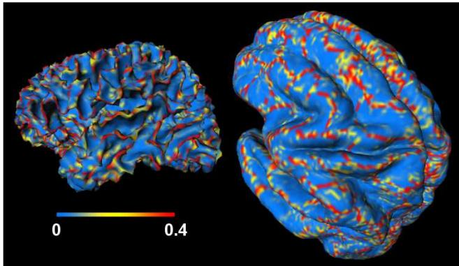
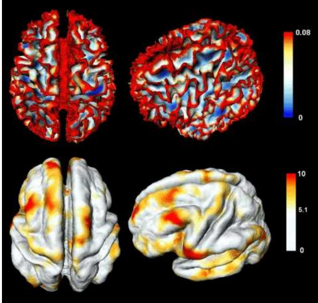
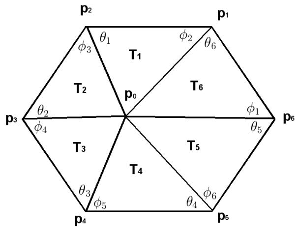
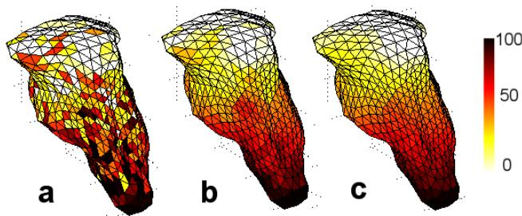
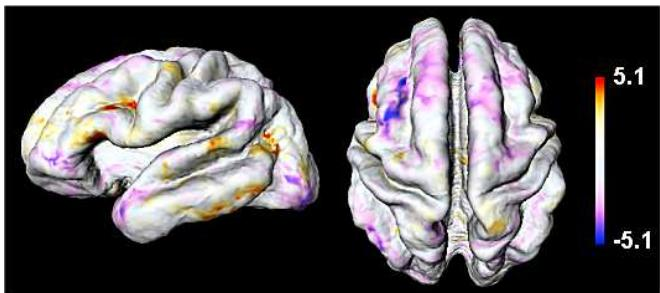

# Tensor-based Brain Surface Modeling and Analysis\*

Moo K. Chung1, Keith J. Worsley2, Steve Robbins2 and Alan C. Evans2 1Department of Statistics, Department of Biostatistics and Medical Informatics Keck Laboratory for Functional Brain Imaging and Behavior University of Wisconsin-Madison Madison, WI 53706. USA 2Montreal Neurological Institute, McGill University, Canada mkchung@wisc.edu

October 31, 2002

## Abstract

We present a unified computational approach to tensorbased morphometry in detecting the brain surface shape difference between two clinical groups based on magnetic resonance images. Our approach is novel in a sense that we combined surface modeling, surface data smoothing and statistical analysis in a coherent unified mathematical framework. The cerebral cortex has the topology of a 2D highly convoluted sheet. Between two different clinical groups, the local surface area and curvature of the cortex may differ. It is highly likely that such surface shape differences are not uniform over the whole cortex. By computing how such surface metrics differ, the regions of the most rapid structural differences can be localized. To increase the signal to noise ratio, diffusion smoothing based on the explicit estimation of Laplace-Beltrami operator has been developed and applied to the surface metrics. As an illustration, we demonstrate how this new tensor-based surface morphometry can be applied in localizing the cortical regions of the gray matter tissue growth and loss in the brain images longitudinally collected in the group of children.

## 1. Introduction

The cerebral cortex has the topology of a 2-dimensional convoluted sheet. Most of the features that distinguish these cortical regions can only be measured relative to that local orientation of the cortical surface [6]. It is likely that different clinical population will show different brain surface shape differences [4, 5, 14, 24, 25]. By computing how surface metrics such as the cortical thickness, curvature and local surface area differ among different groups, brain shape differences can be quantified locally.

The first obstacle in developing surface-based morphometry is the automatic segmentation of the cortical surfaces from magnetic resonance images (MRI). It requires firs correcting intensity nonuniformity or RF inhomogeneity artifacts. We have used nonparametric nonuniform intensity normalization method (N3), which eliminates the dependence of the field estimate on anatomy [18]. The next step is the tissue classification into three types: gray matter, white matter and cerebrospinal fluid (CSF). An artificial neural network classifier [16, 26] or a mixture model cluster analysis [8] can be used to segment the tissue types automatically. After the tissue classification, the cortical surface is usually generated as a smooth triangular mesh. The most widely used method for triangulating the surface is the marching cubes algorithm [13]. Level set method [19] or deformable surfaces method [7] are also available. In our study, we have used the anatomic segmentation using proximities (ASP) method [14], which is a variant of the deformable surfaces method, to generate cortical triangular meshes that has the topology of a sphere. Brain substructures such as the brain stem and the cerebellum were removed. Then an ellipsoidal mesh that already had the topology of a sphere was deformed to fit the shape of the cortex guaranteeing the same topology. The resulting triangular mesh will consist of 40,962 vertices and 81,920 triangles with the average internodal distance of 3 mm. Partia voluming is a problem with the tissue classifier but topology constraints used in ASP method were shown to provide some correction by incorporating many neuroanatomical a priori information [14]. The triangular meshes are not constrained to lie on voxel boundaries. Instead the triangular meshes can cut through a voxel, which can be considered as correcting where the true boundary ought to be. Once we have a triangular mesh as the realization of the cortical surface, we can model how the cortical surface deforms over

time.

In modeling the surface deformation, that is required in comparing two different brain images, a proper mathematical framework might be found in both differential geometry and fluid dynamics. The concept of the evolution of phaseboundary, which describes the geometric properties of the evolution of boundary layer between two different materials due to internal growth or external force, can be used to derive the mathematical formulation on the surface deformation [4]. It is natural to assume the cortical surfaces to be a smooth 2-dimensional Riemannian manifold parameterized by two parameters [6, 7]. Surface parameterization of the cortical surface has been done previously by [10]. From the surface parameterization, Gaussian and mean curvatures of the brain surface can be computed and used to characterize its shape [6, 9, 10]. In particular, [10] used the quadratic surface in estimating the Gaussian and mean curvature of the cortical surfaces. Surface parameterization enables us to compute surface metrics such as local area dilatation and curvature differences that characterize the surface shapes.

Due to errors in image intensities, surface extraction and surface fitting, surface-based signal smoothing is required to increase the signal-to-noise ratio. We have used diffusion smoothing or the Laplace-Beltrami flow to smooth surface metrics. Although diffusion smoothing has been used widely in image analysis [15, 17, 20, 22, 23], there is only two papers so far that use the Laplace-Beltrami flow to smooth out brain surface data [1, 5]. Based on the finite element method (FEM), we explicitly estimate the Laplace-Beltrami operator and then the finite difference scheme is used to iteratively solve a diffusion equation on the surface. Because the Laplace-Beltrami operator is estimated as a linear weight of the neighboring function values, once the linear weights are computed at the beginning, it will be repeatedly used in the subsequent iterations; hence, avoiding sparse matrix inversions which are required in most FEM formulation. For surface-based statistical inference, the smoothing filter size has been incorporated into the $P -$ value computation based on random fields theory [27].

As an illustration of our unified approach to tensor-based surface morphometry, we will demonstrate how the surfacebased statistical analysis can be applied in localizing the cortical regions of tissue growth and loss in brain images longitudinally collected in a group of children and adolescents.

## 2 Surface Medeling

Let $\mathbf { U } ^ { i } ( \mathbf { x } ) = ( U _ { 1 } ^ { i } , U _ { 2 } ^ { i } , U _ { 3 } ^ { i } ) ^ { t }$ be the 3D displacement vector required to deform the structure at $\mathbf { x } = ( x _ { 1 } , x _ { 2 } , x _ { 3 } )$ in the gray matter of the template brain $\Omega _ { a t l a s }$ to the homologous structure in subject image Ωi. We assume that the whole gray matter volume in $\Omega _ { a t l a s }$ will deform continuously and smoothly to $\Omega ^ { i }$ via the deformation $\mathbf { x }  \mathbf { x } + \mathbf { U } ^ { i }$ while the cortical boundary $\partial \Omega _ { a t l a s }$ will deform to $\partial \Omega ^ { i }$ . The cortical surface $\partial \Omega ^ { i }$ may be considered as consisting of two parts: the outer cortical surface $\partial \Omega _ { o u t } ^ { i }$ between the gray matter and CSF and the inner cortical surface $\partial \Omega _ { i n } ^ { i }$ between the gray and white matter, i.e.

  
Figure 1: Individual gyral patterns mapped onto the template surface $\partial \Omega _ { a t l a s }$ . The gyri of the subject match the gyri of the template illustrating a close homology between the surface of an individual subject and the template surface. The Gyri are extracted by thresholding the thin-plate spline energy functional on the inner surface. If there is no homology between the corresponding vertices, we would have complete misalignment.

$$
\partial \Omega ^ { i } = \partial \Omega _ { o u t } ^ { i } \cup \partial \Omega _ { i n } ^ { i } .
$$

We propose the following stochastic model on the displacement Ui:

$$
\begin{array} { r } { \mathbf { U } ^ { i } ( \mathbf { x } ) = \mu ( \mathbf { x } ) + \Sigma ^ { 1 / 2 } ( \mathbf { x } ) \boldsymbol { \epsilon } ( \mathbf { x } ) , \ \mathbf { x } \in \partial \Omega _ { a t l a s } , } \end{array}\tag{1}
$$

where $\mu$ is the mean displacement and $\Sigma ^ { 1 / 2 }$ is the covariance matrix, which allows for correlations between components of the displacement fields. The components of the error vector ǫ are are assumed to be independent and identically distributed as smooth stationary Gaussian random fields with zero mean and unit variance.

Estimating the surface displacement fields $\mathbf { U } ^ { i j } : \partial \Omega ^ { i } \to$ $\partial \Omega ^ { j }$ between two images i and $j ,$ , and the surface extraction can be performed at the same time. This method works best in the case of matching two images of a single subject taken at different times. First, an ellipsoidal mesh placed outside the brain was shrunk down to the surface $\partial \Omega _ { i n } ^ { i } .$ . The vertices of the resulting inner mesh are indexed and the ASP algorithm will deform the inner mesh to fit the outer surface $\partial \Omega _ { o u t } ^ { i }$ by minimizing a cost function that involves bending, stretch and other topological constrains [14]. The vertices indexed identically on both meshes will lie within a very close proximity and these define the automatic linkage in the ASP algorithm. To generate the outer surface $\partial \Omega _ { o u t } ^ { j } .$ we start with the inner surface $\partial \Omega _ { i n } ^ { i }$ , and then deform it to match the outer surface $\partial \Omega _ { o u t } ^ { j }$ by minimizing the same cost function. Starting with the same mesh in two outer surface extractions, each point on $\partial \Omega _ { i n } ^ { i }$ gets mapped to corresponding points on $\partial \Omega _ { o u t } ^ { i }$ and $\partial \Omega _ { o u t } ^ { j }$ giving us the outer surface deformation $\mathbf { U } ^ { i j } : \partial \Omega _ { o u t } ^ { i } \to \partial \Omega _ { o u t } ^ { j }$ . We do not use inner surface deformation in our study although estimating inner surface deformation can be done similarly. This method assumes that the shape of the cortical surface does not appreciably change between images $\Omega ^ { i }$ and $\Omega ^ { j }$ . This assumption is valid in the case of brain development for a short period of time, where it can be shown that the within-subject deformation field is substantially smaller than between-subject deformation.

Constructing surface template $\partial \Omega _ { a t l a s }$ , where statistical parametric maps (SPM) of surface metrics will be formed, is done by averaging the coordinates of corresponding vertices that have the same indices. This surface atlas construction method has been first introduced by [14], where it is used to create the cortical thickness map for 150 normal subjects. The geometrical constraints such as stretch and bending terms in ASP algorithm enforces a relatively consistent correspondence on the cortical surface. Figure 1 shows the mapping of gyral pattern (red and yellow lines) of a single subject onto the atlas surface. The gyri of the subject matches the gyri of the atlas. Note the full anatomical details still presented in $\partial \Omega _ { a t l a s }$ even after the vertex averaging. Major sulci such as the central sulcus and superior temporal sulcus are clearly identifiable. If there is no homology between corresponding vertices, one would only expect to see featureless dispersion of points.

Once we have extracted triangular surface meshes and established mapping from a vertex in $\partial \Omega ^ { i }$ to a corresponding vertex in $\partial \Omega ^ { j }$ , the next step is modeling and computing the metric tensor differences between two surfaces. In order to compute metric tensors, surface parameterization is needed. We model the cortical surface as a smooth 2D Riemannian manifold parameterized by two parameters $u ^ { 1 }$ and $u ^ { 2 }$ such that any point $\mathbf { x } \in \partial \Omega ^ { i }$ can be uniquely represented as $\mathbf { x } = \mathbf { X } ( \mathbf { u } )$ for some parameter space $\mathbf { u } = ( u ^ { 1 } , u ^ { 2 } ) \in$ $D \subset \mathbb { R } ^ { 2 }$ . A quadratic polynomial

$$
z = \beta _ { 1 } u ^ { 1 } + \beta _ { 2 } u ^ { 2 } + \beta _ { 3 } ( u ^ { 1 } ) ^ { 2 } + \beta _ { 4 } u ^ { 1 } u ^ { 2 } + \beta _ { 5 } ( u ^ { 2 } ) ^ { 2 }\tag{2}
$$

was used as a local parameterization fitted via the leastsquares estimation on the tangent plane. Using the leastsquares method, these coefficients $\beta _ { i }$ can be estimated. Slightly different quadratic surface parameterizations are used in estimating curvatures of a macaque monkey brain surface [10] [11]. Once $\beta _ { i }$ are estimated,

$$
\begin{array} { l l l } { \mathbf { X } ( u ^ { 1 } , u ^ { 2 } ) } & { = } & { \left( u ^ { 1 } , u ^ { 2 } , z ( u ^ { 1 } , u ^ { 2 } ) \right) ^ { t } } \end{array}\tag{3}
$$

becomes a local surface parameterizations of choice. Even thought metric tensors depend on the choice of parameterization, local surface area and curvature dilatation, which are introduced in the next section, are independent of parameterization.

## 3. Metric Tensor Computation

We introduce the concepts of surface area and curvature dilatation, which can be used in quantifying surface shape differences. Suppose that $\mathbf { x } = \mathbf { X } ( \mathbf { u } )$ is the parameterization of surface ∂Ω. Let $\mathbf { X } _ { i } = \partial \mathbf { X } / \partial u ^ { i }$ . From (3), $\mathbf { X } _ { i }$ are given in terms of coefficients $\beta _ { i }$ and the Riemannian metric tensor $g _ { i j }$ is given by the inner product between two vectors $\mathbf { X } _ { i }$ and $\mathbf { X } _ { j }$ , i.e. $g _ { i j } = \langle { \bf X } _ { i } , { \bf X } _ { j } \rangle$ . The Riemannian metric tensor $g _ { i j }$ measures the amount of the deviation of the cortical surface from a flat Euclidean plane. The Riemannian metric tensor enables us to quantify lengths, angles and areas in the cortical surface. Let $g = \left( g _ { i j } \right)$ be $\textsuperscript { 1 2 \times 2 }$ metric tensor matrix. Then the total surface area of the cortex ∂Ω is given by

$$
\| \partial \Omega \| = \int _ { D } { \sqrt { \operatorname* { d e t } g } } d \mathbf { u } ,
$$

where $D = X ^ { - 1 } ( \partial \Omega )$ is the parameter space [12]. The integrand $\scriptstyle { \sqrt { \operatorname* { d e t } g } }$ is called the infinitesimal surface area element and it measures the area of the unit square in the parameter space $D ,$ , that has been transformed via $X : D $ ∂Ω. The infinitesimal surface area element is a generalization of Jacobian. The local surface area dilatation $\Lambda _ { a r e a }$ from $\partial \Omega ^ { i }$ to $\partial \Omega ^ { j }$ , whose metric tensor matrices are given by $g _ { i }$ and $g _ { j }$ , is then defined as

$$
\Lambda _ { a r e a } = \frac { \sqrt { \operatorname* { d e t } g _ { j } } - \sqrt { \operatorname* { d e t } g _ { i } } } { \sqrt { \operatorname* { d e t } g _ { i } } } ,\tag{4}
$$

which measures percentage local area differences. The dilatation is invariant under parameterization, i.e. the area dilatation is the same no matter which parameterization is chosen.

Instead of using metric tensors $g _ { i j }$ , it is possible to formulate local surface area change in terms of the areas of the corresponding triangles. However, this formulation assign surface area change values to each face instead of each vertex and this causes problems in both surface-based smoothing and statistical analysis, where values are defined on vertices. Defining scalar values on vertices from face values can be done by the weighted average of face values, which should converge to (4). It is not hard to develop surfacebased smoothing and statistical analysis on values defined on faces but traditionally surface metrics are computed on vertices.

Curvatures of the surface can be also used to quantify the surface shape difference. The principal curvatures can characterize the shape and location of the sulci and gyri, which are the valleys and crests of the cortical surfaces [2, 10, 11, 21]. By measuring the curvature changes, rapidly folding and cortical regions can be localized. Let $\kappa _ { 1 }$ and κ be the two principal curvatures as defined in [12]. The principal curvatures can be represented as functions of $\beta _ { i } \mathrm { s }$ in quadratic surface (2) [12]. To measure the amount of folding, we define curvature metric K as a function of the principal curvatures: $K = ( \kappa _ { 1 } ^ { 2 } + \kappa _ { 2 } ^ { 2 } ) / 2 + \alpha$ . We may arbitrarily set $\alpha ~ = ~ 0 . 0 0 1$ 1. α is added to make sure that the curvature dilatation is well defined. The mean of the square of the principal curvatures is usually refereed as the thin-plate spline energy functional. If the cortical surface is flat, curvature metric K obtains the minimum 0.001. The larger the curvature metric, the more surface will be crested as shown in Figure 2. The local curvature dilatation rate $\Lambda _ { c u r v a t u r e }$ is similarly defined as (4).

  
Figure 2: Top: The thin-plate spline energy functional computed on the inner surface of a 14 year old subject. It measures the amount of folding in the cortical surface. Bottom: t statistical map showing statistically significant region of curvature increase $( t > 5 . 1 )$ ) over time between ages 12 and 16. Most of curvature increase occurs on gyri while there is no significant change of curvature on most of sulci.

## 4. Diffusion Smoothing

In order to increase the signal-to-noise ratio (SNR) and to satisfy Gaussian random field assumptions that is required in our statistical analysis [27], surface-based signal smoothing or filtering is needed. One important reason that the Gaussian kernel smoothing is widely used in brain imaging analysis is that it preserves the Gaussian noise assumption even after the filtering. So if we are assuming a linear model with a Gaussian error, the Gaussian kernel smoothed image will still follow the same linear model but with a more smooth and isotropic covariance structure. By smoothing the data on the cortical surface, the SNR will increase and in turn it will be easier to localize the morphological changes. However, due to the convoluted nature of the cortex whose geometry is non-Euclidean, it is not possible to apply Gaussian kernel smoothing on the cortical surface directly. Gaussian kernel smoothing of functional data $f ( \mathbf { x } ) , \mathbf { x } = ( x _ { 1 } , \ldots , x _ { n } ) \in \mathbb { R } ^ { n }$ with FWHM (full width at half maximu $m ) = 4 ( \ln 2 ) ^ { 1 / 2 } \sqrt { t }$ is defined as the convolution of the Gaussian kernel with $f \colon$

$$
F ( \mathbf { x } , t ) = \frac { 1 } { ( 4 \pi t ) ^ { n / 2 } } \int _ { \mathbb { R } ^ { n } } e ^ { - ( x - y ) ^ { 2 } / 4 t } f ( y ) d y .\tag{5}
$$

Since formulation (5) can not be directly applied to the cortical surfaces, we reformulate it as a solution of a diffusion equation on a Riemannian manifold. This generalization is called diffusion smoothing and has been used in the analysis of fMRI data on the cortical surface [1]. In many computer vision areas, it is usually refereed as simply diffusion or Beltramiflow [15, 20]. It can be shown that (5) is the integral solution of an isotropic diffusion equation $\partial _ { t } { \cal F } = \Delta { \cal F }$ with the initial condition $F ( \mathbf { x } , 0 ) = f ( \mathbf { x } )$ where $\Delta$ is the n-dimensional Euclidean Laplacian. Generalizing the Euclidean Laplacian to an arbitrary Riemannian manifold, we get the Laplace-Beltrami operator [12]. The approach taken in [1] is based on a local flattening of the cortical surface and estimating the planar Laplacian, which may not be as accurate as our estimation based on the finite element method (FEM). Further, our explicit FEM approach completely avoid any local or global surface flattening. For given Riemannian metric tensor $g _ { i j }$ , the Laplace-Beltrami operator $\Delta$ is given as

$$
\Delta F = \sum _ { i , j } { \frac { 1 } { | g | ^ { 1 / 2 } } } { \frac { \partial } { \partial u ^ { i } } } { \Big ( } | g | ^ { 1 / 2 } g ^ { i j } { \frac { \partial F } { \partial u ^ { j } } } { \Big ) } ,\tag{6}
$$

where $( g ^ { i j } ) = g ^ { - 1 } [ 1 2 ]$ . Using the FEM on the triangular cortical mesh generated by the ASP algorithm, it is possible to estimate the Laplace-Beltrami operator as the linear weights of neighboring vertices [4].

Let $\mathbf { p } _ { 1 } , \cdots , \mathbf { p } _ { m }$ be m neighboring vertices around the central vertex $\mathbf { p } = \mathbf { p } _ { 0 }$ . Then the explicit linear estimation of the Laplace-Beltrami operator based on FEM is given by

$$
\widehat { \Delta F } ( \mathbf { p } ) = \sum _ { i = 1 } ^ { m } w _ { i } \big ( F ( \mathbf { p } _ { i } ) - F ( \mathbf { p } ) \big )
$$

with the weights

$$
w _ { i } = [ \cot \theta _ { i } + \cot \phi _ { i } ] / \sum _ { i = 1 } ^ { m } \| T _ { i } \| ,
$$

  
Figure 3: A typical triangulation in the neighborhood of $\mathbf { p } = \mathbf { p } _ { 0 }$ . When ASP algorithm is used, the triangular mesh is constructed in such a way that it is always pentagonal or hexagonal.

where $\theta _ { i }$ and $\phi _ { i }$ are the two angles opposite to the edge connecting pi and p, and $\Vert \boldsymbol { T _ { i } } \Vert$ is the area of the i-th triangle (Figure 3). This is an improved formulation from the previous study [1] that uses diffusion smoothing on the cortical surface, where the Laplacian is simply estimated as the planar Laplacian after locally flattening the triangular mesh consisting of nodes $\mathbf { p } _ { 0 } , \cdots , \mathbf { p } _ { m }$ onto a flat plane. In the numerical implementation, we have used formula

$$
\begin{array} { r } { 2 \cot \theta _ { i } = \langle \mathbf { p } _ { i + 1 } - \mathbf { p } , \mathbf { p } _ { i + 1 } - \mathbf { p } _ { i } \rangle / \Vert T _ { i } \Vert , } \end{array}
$$

$$
2 \cot \phi _ { i } = \langle { \bf p } _ { i - 1 } - { \bf p } , { \bf p } _ { i - 1 } - { \bf p } _ { i } \rangle / \| T _ { i } \|
$$

and $\| T _ { i } \| = \| ( { \bf p } _ { i + 1 } - { \bf p } ) \times ( { \bf p } _ { i } - { \bf p } ) \| / 2$ . Afterwards, the finite difference scheme is used to iteratively solve the diffusion equation at each vertex p:

$$
F ( \mathbf { p } , t _ { n + 1 } ) = F ( \mathbf { p } , t _ { n } ) + ( t _ { n + 1 } - t _ { n } ) \widehat { \Delta } F ( \mathbf { p } , t _ { n } ) ,
$$

with the initial condition $F ( \mathbf { p } , t _ { 0 } ) = f ( \mathbf { p } )$ . N-iterations are equivalent to the diffusion of the initial data f for duration Nδt. If the diffusion were applied to Euclidean space, it would be equivalent to Gaussian kernel smoothing with FWHM $= \ 4 ( \ln 2 ) ^ { 1 / 2 } \sqrt { N \delta t }$ . The iteration step size δt is chosen to satisfy $\delta t \ \leq$ min $( A , B ) / \widehat { \Delta } F ( p , t _ { n } )$ for all n, where $A ~ = ~ \vert \operatorname* { m a x } _ { i } F ( p _ { i } , t _ { n } ) - F ( p , t _ { n } ) \vert$ and $B \ = \ | \operatorname* { m i n } _ { i } F ( p _ { i } , t _ { n } ) \ - \ F ( p , t _ { n } )$ , to guarantee the convergence. Computing the linear weights for the Laplace-Beltrami operator takes a fair amount of time (four minutes in MATLAB running on a Pentium III machine), but once the weights are computed, it is applied through the whole iteration repeatedly and the actual finite difference scheme takes only two minutes for 100 iterations. Figure 4 illustrates the process of diffusion smoothing on the surface of the substructure of the brain (brain stem).

  
Figure 4: Diffusion smoothing simulation on a triangular mesh consisting of 1280 triangles. This smaller mesh is the surface of the brain stem. The artificial signal was generated with Gaussian noise to illustrate the smoothing process. (a) The initial signal. (b) After 10 iterations with $\delta t = 0 . 5$ . (c) After 20 iterations with $\delta t = 0 . 5$

## 5. Brain Surface Data Analysis

Under the assumption of stochastic model (1), it can be shown that the area dilatation is approximately distributed as Gaussian:

$$
\Lambda ( { \bf x } ) = \lambda ( { \bf x } ) + \epsilon ( { \bf x } ) ,\tag{7}
$$

where $\lambda = \operatorname { t r } \left[ g ^ { - 1 } ( \nabla X ) ^ { t } ( \nabla \mu ) \nabla X \right]$ is the mean area dilatation and error ǫ is a mean zero Gaussian random field defined on the cortical surface. The curvature dilatation can be modeled similarly. These theoretical model assumptions have been verified using Lilliefors test at 0.05 level [5]. From statistical model (7), we are interested in testing the hypothesis: $H _ { 0 } : \lambda ( { \bf x } ) = 0$ for all $\mathbf { x } \in \partial \Omega _ { a t l a s }$ , v.s. $H _ { 1 } : \lambda ( { \bf x } ) \ne 0$ for some $\mathbf { x } \in \partial \Omega _ { a t l a s }$ . The maximum of T random field will be used as a test statistic [27]. The T random field on manifold $\partial \Omega _ { a t l a s }$ is defined as

$$
T ( \mathbf { x } ) = \frac { M ( \mathbf { x } ) } { S ( \mathbf { x } ) / \sqrt { n } } , \mathbf { x } \in \partial \Omega _ { a t l a s }
$$

where M and S are the sample mean and standard deviation of metric $\Lambda . \ T ( \mathbf { x } )$ is distributed as a student’s t with $n - 1$ degrees of freedom at each voxel x. The P-value can be approximated asymptotically [27]. For high threshold $y ,$ it can be shown that

$$
P \Big ( \operatorname* { m a x } _ { { \bf x } \in \partial \Omega _ { a t l a s } } T ( { \bf x } ) \geq y \Big ) \approx \sum _ { i = 0 } ^ { 3 } \phi _ { i } ( \partial \Omega _ { a t l a s } ) \rho _ { i } ( y ) ,\tag{8}
$$

where $\rho _ { i }$ is the i-dimensional EC-density and the Minkowski functional $\phi _ { i }$ for $\partial \Omega _ { a t l a s }$ are

$$
\phi _ { 0 } = 2 , \phi _ { 1 } = 0 , \phi _ { 2 } = \| \partial \Omega _ { a t l a s } \| , \phi _ { 3 } = 0
$$

and $\| \partial \Omega _ { a t l a s } \|$ is the total surface area of $\partial \Omega _ { a t l a s } \ [ 2 7 ]$ When diffusion smoothing with given FWHM is applied

to metric Λ on surface $\partial \Omega _ { a t l a s }$ , the 0-dimensional and $2 \AA ^ { - }$ dimensional EC-density becomes

$$
\rho _ { 0 } ( y ) = \int _ { y } ^ { \infty } \frac { \Gamma ( \frac { n } { 2 } ) } { ( ( n - 1 ) \pi ) ^ { 1 / 2 } \Gamma ( \frac { n - 1 } { 2 } ) } \Bigl ( 1 + \frac { y ^ { 2 } } { n - 1 } \Bigr ) ^ { - n / 2 } d y ,
$$

$$
\rho _ { 2 } ( y ) = \frac { 1 } { \mathrm { F W H M } ^ { 2 } } \frac { 4 \ln 2 } { ( 2 \pi ) ^ { 3 / 2 } } \frac { \Gamma ( \frac { n } { 2 } ) y \Big ( 1 + \frac { y ^ { 2 } } { n - 1 } \Big ) ^ { - ( n - 2 ) / 2 } } { ( \frac { n - 1 } { 2 } ) ^ { 1 / 2 } \Gamma \big ( \frac { n - 1 } { 2 } \big ) } .
$$

Therefore, the P-value can be approximated by

$$
P \Big ( \operatorname* { m a x } _ { \mathbf { x } \in \partial \Omega _ { a t l a s } } T ( \mathbf { x } ) \geq y \Big ) \approx 2 \rho _ { 0 } ( y ) + \| \partial \Omega _ { a t l a s } \| \rho _ { 2 } ( y ) .
$$

For one-sided α-level test, we numerically solve equation $2 \rho _ { 0 } ( y ) + \| \partial \Omega _ { a t l a s } \| \rho _ { 2 } ( y ) = \alpha$ and reject $H _ { 0 } { \mathrm { ~ i f ~ } } T \geq y$ or $T \le - y$

## 6. Applications

Two T -weighted MR scans were acquired for 28 normal subject at different times on the GE Sigma 1.5-T superconducting magnet system. The first scan was obtained at the age $t _ { 1 } ~ = ~ 1 1 . 5 \pm 3 . 1$ years and the second scan was obtained at the age $t _ { 2 } = 1 6 . 1 \pm 3 . 2$ years. We are interested in detecting the regions of the cortical shape difference over time. We compute the total surface area $\| \partial \Omega _ { a t l a s } \|$ by summing the area of each triangle in a triangulated surface. The total surface area of the average atlas brain is $2 7 5 , 8 0 0 \mathrm { m m ^ { 2 } }$ which is roughly the area of $5 3 \times 5 3 ~ \mathrm { c m ^ { 2 } }$ sheet. We also computed the local area and the curvature dilatations. Surface metrics are then filtered with 20 mm FWHM diffusion smoothing. At $\alpha = 0 . 0 2 5 \%$ level, statistically significant regions of local area and curvature difference over time are detected. Figure 2 shows the superior frontal and middle frontal gyri curvature increase over time. Figure 5 shows local surface expansion in Broca’s area in the left hemisphere and local surface shrinkage in the left superior frontal sulcus. Most of surface reduction are concentrated near the frontal region. It is interesting to note that between these two gyri we have detected local surface area decrease. It might be possible that local surface area shrinking in the superior frontal sulcus causes the bending in the neighboring middle and superior frontal gyri. While the gray matter is shrinking in both total surface area and volume, the cortex itself seems to get folded to give increasing curvature in brain development for children.

To verify that our modeling and analysis do not detect any false signal, our methods have been checked on null data. The null data is created by reversing time for randomly chosen half of the subjects. In the null data, the mean time difference $t _ { 2 } - t _ { 1 }$ is $- 0 . 2 4$ year so the statistical analysis presented here should not detect any morphological changes. In fact, we did not detect any statistically significant morphological changes.

  
Figure 5: t-map of the cortical surface area dilatation showing the statistically significant region of area expansion and reduction over time. The red regions are statistically significant surface area expansions while the blue regions are statistically significant surface area reductions between ages 12 and 16.

## 7. Conclusions

The unified tensor-based surface morphometry presented here can localize the regions of surface shape difference between two clinical groups of magnetic resonance images at a local level without specifying the regions of interest or landmarks. The approach avoids artificial surface flattening, which may destroy the inherent geometrical structure of the cortical surface. Our metric tensor formulation gives us an added advantage that not only it can be used to measure local surface area and curvature change of the cortex but also it is used for generalizing Gaussian kernel smoothing on the cortex via diffusion smoothing. Since it is a direct generalization of Gaussian kernel smoothing, the diffusion smoothing should locally inherit many mathematical and statistical properties of Gaussian kernel smoothing applied to standard 3D whole brain volume. The novelty of our diffusion smoothing is that we used the explicit estimation of the Laplace-Beltrami operator. We succeeded in combining and unify surface modeling, morphometry, image smoothing and statistical inference in the same mathematical framework.

## Acknowledgments

Authors wish to thank Jothan Taylor of the department of statistics, Stanford University for many discussions on diffusion smoothing. Authors also wish to thank Thomas Paus of Montreal Neurological Institute, Montreal. Jay Giedd and Judith Raporport at National Institute of Mental Health had provided the original 28 subject brain images.

## References

[1] Andrade, A., Kherif, F., Mangin, J., Worsley, K.J., Paradis, A., Simon, O., Dehaene, S., Le Bihan, D., and Poline, J-B. Detection of Fmri Activation Using Cortical Surface Mapping. Human Brain Mapping, 12:79–93, 2001.

[2] Bartesaghi, A. and Sapiro, G. A System for the Generation of Curves on 3D Brain Images. Human Brain Mapping, 14:1– 15, 2001.

[3] Chung, M.K., Worsley, K.J. , Paus, T., Cherif, C., Giedd, J.N., Rapoport, J.L and Evans, A.C. A Unified Statistical Approach to Deformation-Based Morphometry, NeuroImage 14:595- 606, 2001.

[4] Chung, M.K., Worsley, K.J., Paus, T., Robbins, S., Taylor, J., Giedd, J., Rapoport, J.L., and Evans, A.C. Tensor-Based Surface Morphometry, Technical Report 1049, Department of Statistics, University of Wisconsin-Madison, 2002. https://laplcebeltrami.github.io/ publication/tr1049.pdf

[5] Chung, M.K., Worsley, K.J., Robbins, S., Paus, T., Taylor, J., Giedd, J., Rapoport, J.L., and Evans, A.C. Deformation-based Surface Morphometry Applied to Gray Matter Deformation. NeuroImage, 18:198-213, 2003.

[6] Dale, A.M., and Fischl, B. Cortical surface-based analysis I. segmentation and surface reconstruction. NeuroImage, 9:179–194, 1999.

[7] Davatzikos, C. and Bryan, R.N. Using a Deformable Surface Model to Obtain a Shape Representation of the Cortex. In Proceedings of the IEEE International Conference on Computer Vision, pages 2122–2127, 1995

[8] Good, C.D., Johnsrude, I.S., Ashburner, J., Henson, R.N., Friston, K.J., and Frackowiak, R.S.J. A Voxel-based Morphometric Study of Aging in 465 Normal Adult Human Brains. NeuroImage, 14:21–36, 2001.

[9] Griffin, L.D. The intrinsic geometry of the cerebral cortex. Journal ofTheoretical Biology, 166:261-273, 1994.

[10] Joshi, S.C., Wang, J. and Miller, M.I., Van Essen, D.C., Grenander, U. On the Differential Geometry of the Cortical Surface. Vision Geometry IV, 2573:304-311, 1995.

[11] Khaneja, N., Miller, M.I., and Grenander, U. Dynamic Programming Generation of Curves on Brain Surfaces. IEEE Transactions on Pattern Analysis and Machine Intelligence, 20:1260–1265, 1998.

[12] Kreyszig, E. Differential Geometry. University of Toronto Press, Toronto, 1959.

[13] Lorensen, W.E. and Cline, H.E. Marching Cubes: A Hight Resolution 3D Surface Construction Algorithm. Computer Graphics, 21:21, 1987.

[14] MacDonald, J.D., Kabani, N., Avis, D., and Evans, A.C. Automated 3-D Extraction of Inner and Outer Surfaces of Cere bral Cortex from MRI. NeuroImage, 12:340–356, 2000.

[15] Malladi, R and Ravve, I. Fast Difference Schemes for Edge Enhancing Beltrami Flow. Computer Vision-ECCV 2002 Part I 343-357. 7th European Conference on Computer Vision. Springer, 2002.

[16] Ozkan, M., Dawant, B.M., and Maciunas, R.J. Neural-Network-Based Segmentation of Multi-Modal Medical Im ages: a Comparative and Prospective Study. IEEE Trans. Med. Imaging, 12:534–544, 1993.

[17] Perona, P., Malik, J. Scale-space and Edge Detection Using Anisotropic Diffusion. IEEE Trans. Pattern Analysis and Machine Intelligence, 12:629-639, 1990.

[18] Sled, J.G., Zijdenbos, A.P., and Evans, A.C. A Nonparametric Method for Automatic Correction of Intensity Nonuniformity in MRI Data. IEEE Transactions on Medical Imaging, 17:87–97, 1988.

[19] Sethian., J. A. Level Set Methods and Fast Marching Methods. Cambridge University Press, 1996.

[20] Sochen, N., Kimmel, R. and Malladi, R. A General Framework for Low Level Vision. IEEE Transactions on Image Processing, 7:310-318, 1998.

[21] Subsol, G. Crest Lines for Curve-Based Warping. Brain Warping, 241–262, 1999.

[22] Tang, B., Sapiro, G. and Caselles, V. Direction Diffusion The Proceedings ofthe Seventh IEEE International Conference on Computer Vision, 2:1245-1252, 1999.

[23] Taubin, G. Curve and surface smoothing without shrinkage The Proceedings of the Fifth International Conference on Computer Vision, 852-857, 1995.

[24] Thompson, P.M., Mega, M.S., Woods, R.P., Zoumalan, C.I., Lindshield, C.J., Blanton, R.E., Moussai, J., Holmes, C.J., Cummings, J.L., and Toga, A.W. Cortical Change in Alzheimer’s Disease Detected with a Disease-Specific Population-Based Brain Atlas. Cerebral Cortex, 11:1–16, 2001.

[25] Thompson, P.M., Giedd, J.N., Woods, R.P., MacDonald, D., Evans, A.C., and Toga, A.W. Growth Patterns in the Developing Human Brain Detected Using Continuum-Mechanical Tensor Mapping. Nature, 404:190–193, 2000.

[26] Vasken, K. Performance Analysis of Automatic Techniques for Tissue Classificatio in Magnetic Resonance Images of the Human Brain. Master’s Thesis, Computer Science, Concordia University, Canada. 1996.

[27] Worsley, K.J., Marrett, S., Neelin, P., Vandal, A.C., Friston, K.J., and Evans, A.C. A Unified Statistical Approach for Determining Significant Signals in Images of Cerebral Activation. Human Brain Mapping, 4:58–73, 1996.