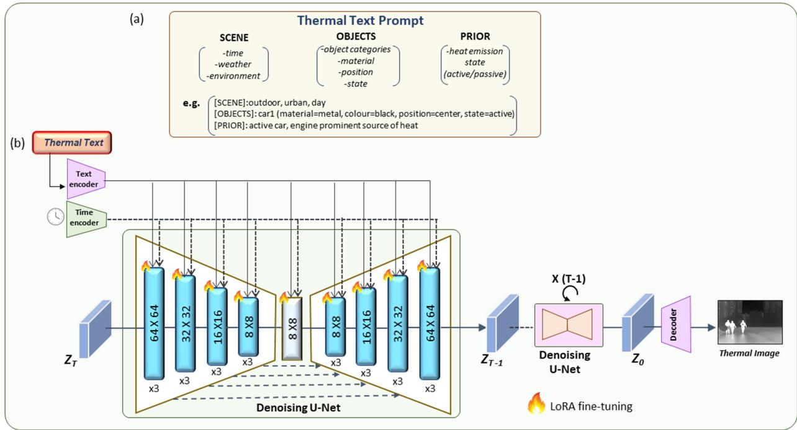
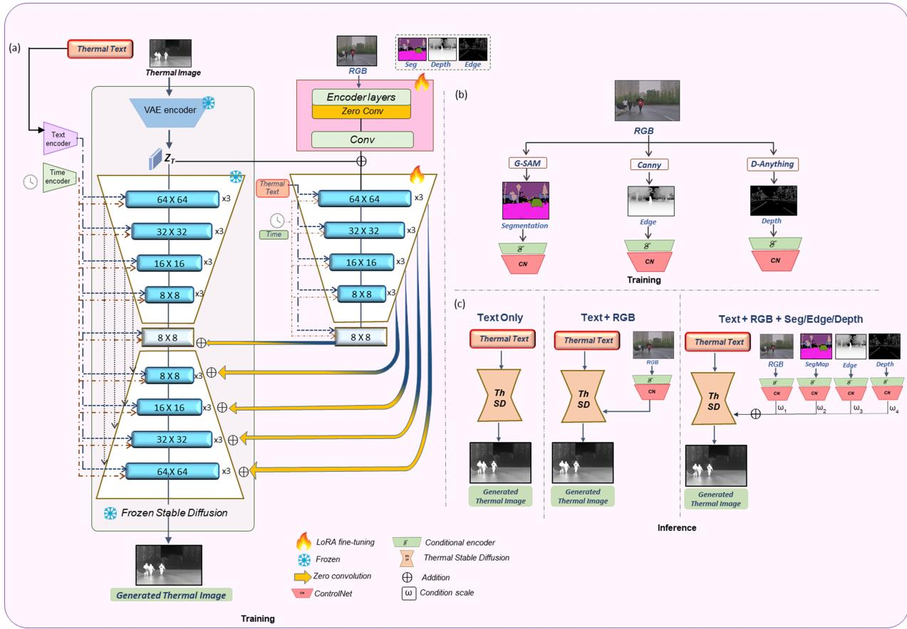
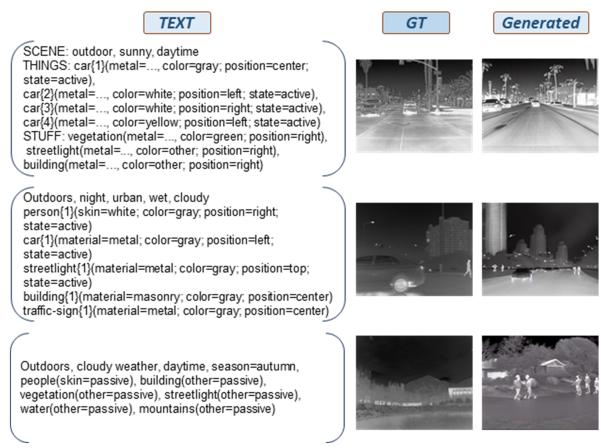
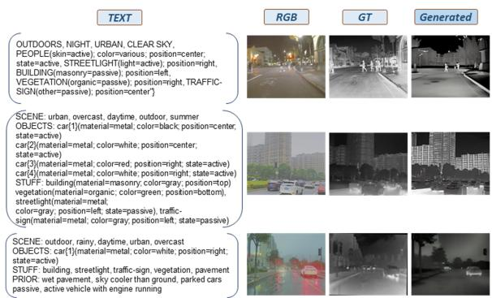
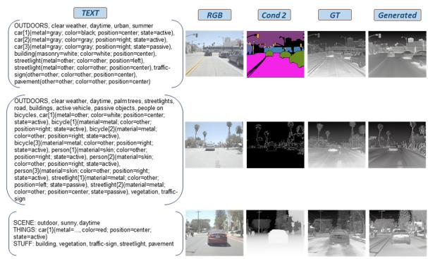
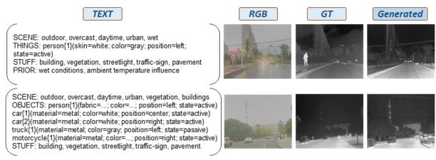

# Text2Thermal: Physics-Aware Thermal Image Synthesis from Textual Priors

Tayeba Qazi1, Brejesh Lall1, Prerana Mukherjee2

1 Bharti School of Telecommunications Technology and Management, Indian Institute of Technology, Delhi, India.,

2 School of Engineering, Jawaharlal Nehru University, Delhi, India {bsz218186@iitd.ac.in, brejesh@ee.iitd.ac.in, prerana@jnu.ac.in}∗

## Abstract

Thermal infrared imaging ofers reliable perception in darkness and adverse weather, but thermal datasets remain scarce, motivating extensive work on translating abundant RGB images into thermal. Such translation is fundamen tally ill-posed as thermal appearance is governed by surface emissivity and object temperature, neither of which is observable in the visible spectrum, so a single RGB image is consistent with many valid thermal outputs. We argue that language ofers a natural means of resolving this ambiguity, and propose Text2Thermal, a framework for physics-aware thermal image synthesis from textual priors. Rather than inferring the unobservable radiometric factors from RGB, we supply them explicitly through thermally grounded captions encoding material, weather, time-of-day, and heat-emission state, and adapt a pretrained Stable Difusion backbone to the thermal domain. Because the ra diometric content is determined entirely by the prompt, Text2Thermal synthesizes thermal imagery without requiring a registered RGB image at inference; where spatial guidance is desired, an optional control signal imparts scene geometry without disturbing the prompt-specified radiometry. Experiments on M3FD, FLIR, and FMB show that Text2Thermal achieves state-of-the-art FID among thermal image synthesis methods while ofering text-level control that translation-based approaches cannot provide.

Keywords: Thermal image synthesis, Text-to-image generation, Physics-informed prompts, Stable Difusion, Controllable image generation

## 1. Introduction

Text-to-image (T2I) generation has become one of the most active areas of computer vision. Latent diffusion models trained on web-scale image–text corpora [1] now synthesise photorealistic imagery from free-form language, and a rich ecosystem has grown around them, including adapters that inject spatial control without retraining the backbone [2, 3], image prompts that supplement text [4], instruction-based editing [5], and attention-level manipulation for finegrained semantic control [6]. Parameter-eficient adaptation [7] has made it practical to specialise these models to new domains at a fraction of the original training cost. Collectively, these advances have turned the pretrained T2I model into a general-purpose visual prior that can be steered toward a target domain rather than retrained for it.

Almost all of this progress has been confined to the visible spectrum. Text-to-thermal generation, that is, synthesising a thermal infrared (TIR) image directly from a language description, remains largely unexplored despite the vast applications that depend on thermal images. Because TIR sensing measures emitted radiation rather than reflected light, it operates independently of illumination and penetrates fog, smoke and darkness [8, 9]. This makes it valuable for nighttime and adverse-weather autonomous driving [10], pedestrian detection under low light [11], border and perimeter surveillance, semantic understanding of night scenes, and depth estimation where LiDAR and RGB degrade. Yet thermal datasets remain small and expensive to collect because thermal sensors are costly, radiometric calibration is demanding, and annotating lowtexture imagery requires expert efort. This scarcity is precisely the bottleneck that generative models address in the RGB domain, and it motivates extending large text-conditioned generative models to the thermal modality. The trajectory of platforms such as NVIDIA Cosmos [12], which builds foundation models for simulating the physical world from language and visual input, suggests that such priors need not remain confined to the visible spectrum, since the same generative machinery, given appropriate domain adaptation, can be directed at modalities where real data is scarce.

The dominant response to thermal data scarcity has been RGB-to-TIR translation. Early work adapted conditional and cycle-consistent GANs to the spectral gap [13–16], later augmented with edge priors [17], transformer backbones [18], and difusion-based formulations [19–24]. These methods have steadily improved perceptual quality, but they inherit a limitation that is physical rather than architectural. A TIR image is a superposition of radiation emitted by an object at its own temperature, radiation reflected from surrounding objects, and atmospheric radiation [8, 25], where the emitted term depends on surface emissivity and absolute temperature, neither of which is observable in the visible spectrum. A parked car and a car that has just been driven are indistinguishable in RGB yet appear entirely diferent in TIR. The RGB-to-TIR mapping is therefore one-to-many and fundamentally ill-posed, since a single visible image is consistent with many valid thermal outputs, and a model trained to produce a single deterministic output must collapse this ambiguity.

We argue that language is the natural vehicle for resolving this ambiguity. The factors that govern thermal appearance, namely material composition, time of day, weather, and whether an object is actively emitting heat, are exactly the kind of scene attributes that text describes well and that the visible spectrum does not encode. Rather than inferring these factors from RGB, we supply them explicitly. Recent work has begun to move in this direction, with TherA [24] conditioning translation on thermally aware descriptions and T-CLIP [26] demonstrating text-only thermal generation as a proof of concept, but a systematic framework for physics-aware text-to-thermal synthesis has yet to be established.

Building on this observation, we present Text2Thermal, a framework for both unconditional and spatially conditioned text-to-thermal synthesis. We adapt a pretrained stable difusion backbone [1] to the thermal domain through low-rank adaptation [7], conditioning it on structured, thermal-physics-guided captions that encode material, weather, time-of-day, and heat-emission state. This transfers the semantic knowledge of large-scale visible pretraining to a modality for which no comparable corpus exists, while letting the prompt carry the thermal physics that RGB cannot. Where paired spatial information is available, we additionally attach a control branch [2] that supplies scene geometry, enabling high-fidelity synthesis aligned to a known layout, which is required for generating annotated training data rather than merely plausible images.

We evaluate Text2Thermal on three public benchmarks, M3FD [10], FLIR [27], and FMB [28], comparing against both general-purpose image-to-image translation methods and specialised RGB-to-TIR models. Text2Thermal achieves the best FID on both benchmarks for which published baselines are available, improving over the strongest prior method by a substantial margin, and we additionally report results on FMB. Beyond distributional fidelity, it ofers text-level controllability that translation-based approaches cannot provide.

Our contributions are as follows:

• We present a framework for physics-aware text-tothermal image synthesis, and show that language conditioning resolves the ambiguity inherent in the visible-to-thermal mapping.

• We adapt a large pretrained text-to-image difusion model to the thermal domain using thermalphysics aware textual priors and parametereficient finetuning.

• We extend the framework with a spatial control branch, allowing structural conditioning for highfidelity thermal image synthesis when paired geometric information is available, and analyse which spatial modality is most efective.

• Our method achieves state-of-the-art FID on all three benchmarks (M3FD, FLIR, FMB), outperforming prior thermal image synthesis methods, with ablations isolating the contribution of each caption attribute and each architectural component.

## 2. Related work

## 2.1. Thermal image synthesis

Simulation-based methods model infrared emission explicitly from geometry, material emissivity, and environmental conditions [29, 30]. They are physically grounded by construction, but each scene must be authored manually, which prevents scaling to the diversity required for training perception models.

Data-driven methods instead learn the visible-to infrared mapping from paired data. Early adversarial approaches [15, 16] were subsequently constrained with auxiliary priors such as edge consistency [17] or transformer backbones [18], though GAN-based training remains prone to instability and mode collapse. Difusion models have since become the dominant paradigm, with conditioning of increasing sophistication: ThermalDif [23] performs RGB-conditioned generation, DifV2IR [20] and F-ViTA [21] add segmentation priors from foundation models [31], Thermal-Gen [22] conditions on dataset-level scene indices, and PID [19] introduces physics-based losses derived from a radiometric decomposition of the infrared signal.

All of these assume that a visible image is available at inference and suficient to determine the thermal output. That assumption is physically unsound. A thermal image superposes radiation emitted by an object at its own temperature, radiation reflected from its surroundings, and atmospheric radiation [8, 25], and the emitted component depends on surface emissivity and absolute temperature, neither of which is recoverable from reflected visible light. We therefore treat thermal generation as a text-conditioned synthesis problem, supplying the unobservable factors through the thermally grounded prompt.

## 2.2. Text-to-image synthesis

Text-conditioned difusion has advanced rapidly, with latent difusion [1] and SDXL [32] establishing the prevailing design: cross-attention between the denoising UNet and a text embedding produced by a CLIP encoder [33]. Because retraining such models for a new domain is prohibitively expensive, parameter-eficient adaptation has become standard: LoRA [7] injects trainable low-rank updates into frozen attention layers, with extensions that merge or disentangle multiple adapters [34].

This body of work is confined almost entirely to the visible spectrum, and applying it to thermal imagery raises two obstacles. No web-scale thermal-caption corpus exists to train from, and the text encoder’s priors, learned from RGB images, carry no notion of how a scene radiates heat. We address the first through parameter-eficient adaptation of a pretrained backbone and the second through captions describing thermally relevant attributes rather than visible appearance.

## 2.3. Spatial controlfor difusion models

Text specifies semantics but not layout, motivating work on injecting spatial conditions into pretrained generators. ControlNet [2] clones the UNet encoder into a trainable branch that accepts an auxiliary map, such as edges, depth, or segmentation, and adds its features back into the frozen backbone. T2I-Adapter [3] achieves comparable control with a lighter module, IP-Adapter [4] extends conditioning to image prompts, and CtrLoRA [35] combines low-rank adaptation with controllable generation. Related approaches modulate cross-attention directly [6] or follow editing instructions [5].

Within the thermal domain, spatial conditioning has been applied to closing the synthetic-to-real gap in infrared segmentation [36] and to object-centric synthesis [37], but evaluation in both cases is limited to narrow scenarios, and which spatial modality best serves thermal generation remains open. We examine this question directly.

## 2.4. Thermal-aware captions

The value of text conditioning depends entirely on what the captions encode. Generic captioning models describe visible appearance and say nothing about how a scene radiates heat, and thermal benchmarks rarely carry text at all, being built for detection and segmentation. Useful conditioning therefore requires captions grounded in the factors that govern infrared emission, namely material emissivity, ambient conditions, and the heat-emission state of individual objects.

Two recent eforts construct such captions—IR-Cap [26] addresses this by conditioning solely on the paired visible frame and issuing two complementary prompts, one eliciting scene-level context such as illumination, weather, and material composition, the other eliciting object-level heat signatures and relative temperature relationships. TherA [24] instead prompts on the visible and thermal frames jointly, so that the thermal image supplies direct emission evidence while the visible image anchors object identity and layout, and canonicalises the result into a schema over scene context, object identity, material, and heat-emission state. Because its captions are grounded in observed rather than inferred thermal appearance, we adopt the schema of [24] as our language conditioning, and analyse in Section 4 which of its attribute classes carry the most thermal information for generation.

## 3. Methodology

## 3.1. Preliminary

## 3.1.1. Stable Difusion

Stable Difusion [1] is a text-conditioned latent difusion model. Rather than difusing in pixel space, it first compresses an image $\pmb { x } _ { 0 } \in \mathbb { R } ^ { H \times \check { W } \times C }$ into a latent representation using a pretrained autoencoder,

$$
z _ { 0 } = \mathcal { E } ( \pmb { x } _ { 0 } ) \in \mathbb { R } ^ { h \times w \times c } , \qquad \tilde { \pmb { x } } _ { 0 } = \mathcal { D } ( z _ { 0 } ) ,\tag{1}
$$

  
Fig. 1: Overview of the unconditional Text2Thermal framework. (a) Thermal physics-aware text prompts describing the fields relevant to thermal properties. (b) A pretrained stable difusion model is adapted to the thermal domain via LoRA fine-tuning of the denoising U-Net, conditioned jointly on the thermal physics-aware structured caption and a time encoding, to generate the corresponding thermal image.

where the encoder E downsamples by a factor $\begin{array} { r l } { f } & { { } = } \end{array}$ $H / h = W / w$ and the decoder D reconstructs the image.

The forward process is a Markov chain that progressively corrupts z0 with Gaussian noise over $T$ steps,

$$
q ( \boldsymbol { z } _ { t } \mid \boldsymbol { z } _ { t - 1 } ) = N \big ( \boldsymbol { z } _ { t } ; ~ \sqrt { \alpha _ { t } } ~ \boldsymbol { z } _ { t - 1 } , ~ ( 1 - \alpha _ { t } ) \mathbf { I } \big ) ,\tag{2}
$$

with noise schedule $\alpha _ { t } \in ( 0 , 1 )$ . Marginalising the intermediate steps admits a closed form that samples any timestep directly,

$$
z _ { t } = \sqrt { \bar { \alpha } _ { t } } z _ { 0 } + \sqrt { 1 - \bar { \alpha } _ { t } } \epsilon , \qquad \bar { \alpha } _ { t } = \prod _ { i = 1 } ^ { t } \alpha _ { i } ,\tag{3}
$$

where $\epsilon \sim \mathcal { N } ( \mathbf { 0 } , \mathbf { I } )$

The reverse process is parameterised by a denoising UNet $\epsilon _ { \theta }$ that predicts the noise added at each step. A text prompt $y$ is encoded by a frozen CLIP text encoder [33] into a token sequence τ(y), which is injected into the UNet through cross-attention layers,

$$
\mathbf { Q } = \mathbf { W } _ { Q } \varphi ( z _ { t } ) , \quad \mathbf { K } = \mathbf { W } _ { K } \tau ( y ) , \quad \mathbf { V } = \mathbf { W } _ { V } \tau ( y ) ,\tag{4}
$$

$$
{ \mathrm { A t t e n t i o n } } ( \mathbf { Q } , \mathbf { K } , \mathbf { V } ) = { \mathrm { s o f t m a x } } \left( { \frac { \mathbf { Q } \mathbf { K } ^ { \top } } { \sqrt { d } } } \right) \mathbf { V } ,\tag{5}
$$

where φ(·) denotes the intermediate UNet activation and $\mathbf { W } _ { Q } , \mathbf { W } _ { K } , \mathbf { W } _ { V }$ are learned projections. The model is

trained with the noise-prediction objective

$$
\begin{array} { r } { \mathcal { L } _ { \mathrm { L D M } } = \mathbb { E } _ { z _ { 0 } , y , t , \epsilon \sim N ( \mathbf { 0 } , \mathbf { I } ) } \left[ | | \epsilon - \epsilon _ { \theta } ( z _ { t } , t , \tau ( y ) ) | | _ { 2 } ^ { 2 } \right] . } \end{array}\tag{6}
$$

At inference, sampling begins from $z _ { T } \sim \mathcal { N } ( \mathbf { 0 } , \mathbf { I } )$ and iteratively denoises to $z _ { 0 }$ , which is decoded to an image. Prompt adherence is strengthened by classifier-free guidance [38],

$$
\begin{array} { r } { \tilde { \epsilon } _ { \theta } = \epsilon _ { \theta } ( z _ { t } , t , \mathcal { D } ) + s \left( \epsilon _ { \theta } ( z _ { t } , t , \tau ( y ) ) - \epsilon _ { \theta } ( z _ { t } , t , \mathcal { D } ) \right) , } \end{array}\tag{7}
$$

where $\mathcal { D }$ denotes the null prompt and s the guidance scale.

## 3.1.2. ControlNet

Text alone specifies semantics but not spatial layout. ControlNet [2] addresses this by attaching a trainable branch to a frozen difusion backbone, allowing an auxiliary spatial signal to steer generation without disturbing the pretrained weights.

Let $\mathcal { F } ( \cdot ; \Theta )$ denote a neural block of the backbone that maps a feature map x to $\textbf { \boldsymbol { y } } = \mathcal { F } ( \pmb { x } ; \Theta )$ . Control-Net freezes Θ and instantiates a trainable copy $\Theta _ { c }$ of the same block, connected to the frozen path by two zero convolutions $\mathcal { Z } ( \cdot ; \cdot ) - 1 \times 1$ convolutions whose weights and biases are initialised to zero. Given a conditioning vector $^ { c , }$ the block computes

  
Fig. 2: Overview of the conditional Text2Thermal framework. (a) Training pipeline: The unconditional Text2Thermal model is kept frozen, and a control branch initialised from its weights injects an RGB condition to guide scene structure during thermal image synthesis. (b) Conditional encoder training: segmentation, edge, and depth maps are extracted from the RGB frame using G-SAM, Canny, and Depth-Anything respectively, and each modality-specific conditional encoder is trained independently. (c) Inference configurations. Text-only; text with RGB; and text with RGB plus one or more of the segmentation, edge, and depth conditions, applied with weights ω –ω .

$$
\pmb { y } _ { c } = \mathscr { F } ( \pmb { x } ; \Theta ) + \mathscr { Z } ( \mathscr { F } ( \pmb { x } + \mathscr { Z } ( \pmb { c } ; \Theta _ { z 1 } ) ; \Theta _ { c } ) ; \Theta _ { z 2 } ) .\tag{8}
$$

Because both zero-convolution terms vanish at initialisation, the first training step satisfies ${ \mathbf { y } } _ { c } = { \mathbf { y } } \colon$ the augmented network is exactly the pretrained model, and no random noise perturbs its features. The control branch then grows its influence gradually as training proceeds, which protects the large-scale prior inherited by the trainable copy.

The spatial condition is supplied as an image ci at the same resolution as the input. A lightweight encoder $\mathcal { E } _ { c } ( \cdot )$ of four strided convolution layers maps it to the latent resolution of the backbone,

$$
\begin{array} { r } { \pmb { c } _ { f } = \pmb { \mathcal { E } } _ { c } ( \pmb { c } _ { i } ) , } \end{array}\tag{9}
$$

and $c _ { f }$ is passed to the control branch. In Stable Diffusion, the structure is replicated over the 12 encoder blocks and the middle block of the UNet; the resulting features are added back into the 12 skip connections and the middle block of the frozen decoder path. Training uses the same objective as the backbone, extended with the spatial condition,

$$
\begin{array} { r } { \mathcal { L } _ { \mathrm { C N } } = \mathbb { E } _ { z _ { 0 } , t , c _ { t } , c _ { f } , \epsilon } \left[ \left\| \epsilon - \epsilon _ { \theta } ( z _ { t } , t , c _ { t } , \pmb { c } _ { f } ) \right\| _ { 2 } ^ { 2 } \right] , } \end{array}\tag{10}
$$

where $\mathbf { } _ { \mathbf { } _ { t } }$ is the text condition. Following [2], a fraction of text prompts is replaced with the empty string during training, which encourages the branch to read semantics directly from the spatial condition rather than relying on the prompt.

## 3.2. Problem Formulation

We consider the task of synthesising a thermal image directly from a natural-language description. Let y denote a text prompt and $\pmb { x } ^ { \mathrm { t i r } } \in \mathbb { R } ^ { H \times W \times 3 }$ the target thermal image. Our objective is to learn a conditional distribution $p _ { \theta } ( { \pmb x } ^ { \mathrm { t i r } } \ | \ { \pmb y } )$ from which plausible thermal images can be sampled.

The dificulty is that this mapping is not a restyling problem. As established in Section 2, the intensity recorded at a thermal detector is a superposition of radiation emitted by an object at its own temperature, radiation reflected from its surroundings, and atmospheric radiation [8, 25]. Under the standard approximation $\tau _ { \mathrm { a t m } } \approx 1$ , the signal at wavelength λ reduces to

$$
S _ { \lambda } \approx e _ { \lambda } B _ { \lambda } ( T ) + ( 1 - e _ { \lambda } ) \Phi _ { \mathrm { e n v } } ,\tag{11}
$$

where $e _ { \lambda }$ is the surface emissivity, determined by material, $B _ { \lambda } ( T )$ is Planck’s blackbody radiance at absolute temperature $T ,$ and $\Phi _ { \mathrm { e n v } }$ is the incident environmental radiation. The governing quantities in (11) — emissivity, temperature, and ambient radiative context are not observable in the visible spectrum. Two vehicles identical in an RGB image difer entirely in thermal appearance depending on whether one has been driven; a road surface at noon and at midnight are indistinguishable in colour but inverted in the thermal.

This is precisely why RGB-to-TIR translation is illposed: a single visible image is consistent with many valid thermal outputs, and a deterministic translator must collapse that ambiguity [19, 24]. Our formulation resolves it from the other direction. Rather than attempting to $i n f e r$ the unobservable factors, we supply them explicitly through language. The prompt y is not a generic scene caption but a thermally grounded description that names the attributes appearing in (11): material composition (governing $e _ { \lambda } )$ , the heat-emission state of individual objects (governing $T ) ,$ and environmental context such as time of day and weather (governing $\Phi _ { \mathrm { e n v } } )$ . Following the caption schema of [24], each prompt is a canonicalised tuple

$$
y = \{ y _ { \mathrm { s c e n e } } , \ y _ { \mathrm { o b j e c t } } , \ y _ { \mathrm { m a t e r i a l } } , \ y _ { \mathrm { h e a t } } \} ,\tag{12}
$$

so that every token carries a physically meaningful thermal attribute rather than a description of visible appearance. In this sense the synthesis is physics-guided: the physical priors that a visible image cannot carry are injected into the generator through the text channel.

We instantiate two settings:

• Unconditional Text2Thermal, which samples $ { \boldsymbol { { x } } } ^ { \mathrm { t i r } } \sim p _ { \theta } ( \cdot  { \mathrm { ~  ~ \vert ~ } }  { \boldsymbol { { y } } } )$ from the physics-aware prompt alone, with no spatial input at inference.

• Conditional Text2Thermal, which additionally accepts a spatial condition $c _ { s } \mathrm { ~ - ~ a ~ }$ paired visible image, or a structural map derived from one and samples $\pmb { x } ^ { \mathrm { t i r } } \sim p _ { \theta } ( \cdot \ | \ y , \pmb { c } _ { s } )$ when layout-aligned output is required.

## 3.3. Text2Thermal Architecture

## 3.3.1. Unconditional Text2Thermal Training

No thermal–caption corpus exists at a scale comparable to the web-scale image–text datasets used to train visible-spectrum generators [39], so training a thermal text-to-image model from scratch is infeasible. We instead adapt the semantic breadth of a pretrained latent difusion backbone [1] to the thermal domain, retaining its compositional prior while retargeting its output distribution, as illustrated in Fig. 1.

Given a thermal image $\pmb { x } _ { 0 } ^ { \mathrm { t i r } }$ , the frozen VAE encoder maps it to a latent $z _ { 0 } = \mathcal { E } ( x _ { 0 } ^ { \mathrm { i r } } )$ , to which noise is added according to (3). The physics-aware prompt y of (12) is encoded by the frozen CLIP text encoder [33] into τ(y) and injected through the UNet cross-attention layers.

Low-rank adaptation of the denoiser. Full fine-tuning of the UNet on a few thousand thermal images invites overfitting and catastrophic forgetting of the pretrained prior [2]. We therefore freeze the backbone weights and adapt only through low-rank updates [7]. For a frozen projection matrix $\mathbf { W } \in \mathbb { R } ^ { d _ { \mathrm { o u t } } \times d _ { \mathrm { i r } } }$ , LoRA introduces

$$
\mathbf { W } ^ { \prime } = \mathbf { W } + \Delta \mathbf { W } = \mathbf { W } + \frac { \gamma } { r } \mathbf { B } \mathbf { A } ,\tag{13}
$$

where $\mathbf { A } \in \mathbb { R } ^ { r \times d _ { \mathrm { i n } } } , \mathbf { B } \in \mathbb { R } ^ { d _ { \mathrm { o u t } } \times r }$ , rank $r \ll \operatorname* { m i n } ( d _ { \mathrm { i n } } , d _ { \mathrm { o u t } } )$ and γ is a scaling factor. B is initialised to zero so that $\mathbf { W } ^ { \prime } = \mathbf { W }$ at the start of training and the adapted model is exactly the pretrained one.

We apply (13) to the query, key, value and output projections $\{ \mathbf { W } _ { Q } , \mathbf { W } _ { K } , \mathbf { W } _ { V } , \mathbf { W } _ { O } \}$ of both the self-attention and cross-attention blocks throughout the UNet encoder, middle block, and decoder. This placement is deliberate, as the cross-attention projections are where the text embedding $\tau ( y )$ enters the network, so adapting them re-binds RGB-trained language priors onto thermal appearance, teaching the model that “warm engine block” denotes a bright emissive region rather than a coloured object, while the self-attention projections adjust the spatial statistics of the generated latent toward the low-texture, emission-driven structure characteristic of infrared imagery. l Convolutional and normalisation layers remain frozen. With rank $r = 1 6 ,$ , the trainable parameters amount to approximately 0 3% of the backbone.

Let $\theta _ { \mathrm { L } } = \{ \mathbf { A } _ { i } , \mathbf { B } _ { i } \}$ denote the LoRA parameters. Training minimises the standard noise-prediction objective over these parameters only,

$$
\theta _ { \mathrm { L } } ^ { * } = \arg \operatorname* { m i n } _ { \theta _ { \mathrm { L } } } ~ \mathbb { E } _ { z _ { 0 } , y , t , \epsilon } \left[ \left\| \epsilon - \epsilon _ { \theta \oplus \theta _ { \mathrm { L } } } ( z _ { t } , t , \tau ( y ) ) \right\| _ { 2 } ^ { 2 } \right] ,\tag{14}
$$

where $\theta$ are the frozen backbone weights and ⊕ denotes their low-rank composition per (13). We refer to the resulting denoiser $\epsilon _ { \theta ^ { \mathrm { i r } } }$ as the thermal-adapted backbone; it constitutes the complete Unconditional Text2Thermal model and, as shown next, the initialisation for the conditional variant.

## 3.3.2. Training with Additional Control

Language specifies what radiates and how much, but not where. A prompt describing a night-time street with active vehicles constrains the thermal statistics of the scene without fixing object positions, extents, or boundaries. For applications that require layout-aligned output such as, generating synthetic thermal data against known annotations, this structural ambiguity must be resolved by an explicit spatial signal.

We supply it through a control branch following the ControlNet paradigm [2]. Two design choices distinguish our instantiation from the standard recipe, as illustrated in Fig. 2.

Thermal initialisation of the control branch. ControlNet constructs its trainable branch as a copy of the backbone encoder. In the original formulation this copy is cloned from an RGB-pretrained model, so the branch inherits visible-spectrum feature statistics that must subsequently be overcome. We instead clone the branch from our thermal-adapted backbone $\epsilon _ { \theta } \mathrm { { u } }$ r obtained in subsubsection 3.3.1. The branch therefore begins training already operating in the thermal feature distribution, and the generative prior it must preserve is the thermal prior rather than the RGB one. The frozen path likewise uses the thermal-adapted denoiser, so both the control features and the features they modulate live in a common domain.

Formally, let $\mathcal { F } ( \cdot ; \Theta ^ { \mathrm { t i r } } )$ denote a block of the thermaladapted backbone and $\Theta _ { c }$ its trainable copy. For a conditioning signal c, the block computes

$$
\pmb { h } _ { c } = \mathscr { F } ( \pmb { h } ; \Theta ^ { \mathrm { t i r } } ) + \mathscr { Z } ( \mathscr { F } ( \pmb { h } + \mathscr { Z } ( c ; \Theta _ { z 1 } ) ; \Theta _ { c } ) ; \Theta _ { z 2 } ) ,\tag{15}
$$

where $\mathcal { Z } ( \cdot ; \cdot )$ are zero-initialised $1 \times 1$ convolutions. Since both zero-convolution terms vanish at initialisation, the first training step satisfies $\pmb { h } _ { c } ~ = ~ \mathcal { F } ( \pmb { h } ; \Theta ^ { \mathrm { t i r } } )$ the augmented network reproduces the Unconditional Text2Thermal model exactly, and the visible-spectrum signal enters the thermal generator gradually rather than perturbing it with random gradients at the outset.

Introducing visible-spectrum structure. The primary spatial condition is the paired RGB frame $\pmb { c } _ { i } ~ = ~ \pmb { x } ^ { \mathrm { r g b } }$ A lightweight encoder $\mathcal { E } _ { c } ( \cdot )$ of four strided convolution layers maps it to the latent resolution,

$$
{ \pmb { c } } _ { s } = \mathcal { E } _ { c } ( { \pmb x } ^ { \mathrm { r g b } } ) ,\tag{16}
$$

and $\pmb { c } _ { s }$ enters the branch through (15). The division of labour is explicit and, we argue, the correct one for this modality, since the RGB image contributes only geometry, namely object extents, boundaries, and scene layout, while the radiometric content of the output is determined by the physics-aware prompt.

Training optimises only the control branch and the zero convolutions, with the thermal-adapted backbone frozen:

$$
\begin{array} { r } { \mathcal { L } _ { \mathrm { c t r l } } = \mathbb { E } _ { z _ { 0 } , y , c _ { s } , t , \epsilon } \left[ \| \epsilon - \epsilon _ { \theta ^ { \mathrm { i r } } } ( z _ { t } , t , \tau ( y ) , \pmb { c } _ { s } ) \| _ { 2 } ^ { 2 } \right] . } \end{array}\tag{17}
$$

Alternative spatial modalities. The RGB frame is one choice among several. Because paired visible imagery is not always available, and because coarser conditions may sufice, we additionally evaluate structural maps extracted from the RGB counterpart by large vision models: Canny edges [40], monocular depth from Depth Anything [41], and panoptic segmentation from Grounded SAM [31]. Each is substituted for $x ^ { \mathrm { r g b } }$ in (16) and a separate branch is trained. We also evaluate composite conditions, formed by element-wise adding the features derived from ControlNet encoders trained on diferent structural modalities, before decoding, to test whether the additional cue provides information beyond what the visible image already carries.

## 3.3.3. Inference

The two settings share a sampling procedure and difer only in the conditioning set. Unconditional Text2Thermal. Given a physics-aware prompt y, sampling begins from $z _ { T } \sim  { N ( \mathbf { 0 } , \mathbf { I } ) }$ and iterates the reverse process with the thermal-adapted denoiser. Prompt adherence is controlled by classifier-free guidance [38],

$$
\begin{array} { r } { \tilde { \epsilon } = \epsilon _ { \theta ^ { \mathrm { i r } } } ( z _ { t } , t , \mathcal { D } ) + s _ { y } \left[ \epsilon _ { \theta ^ { \mathrm { i r } } } ( z _ { t } , t , \tau ( y ) ) - \epsilon _ { \theta ^ { \mathrm { i r } } } ( z _ { t } , t , \mathcal { D } ) \right] , } \end{array}\tag{18}
$$

with guidance scale $s _ { y } .$ The final latent is decoded to a thermal image, $\hat { \pmb x } ^ { \mathrm { t i r } } = \mathcal { D } ( \hat { \sf z } _ { 0 } )$ . No visible-spectrum input is required at any stage, so generation is unaffected by the low-light and adverse-weather degradation that limits translation-based methods. Conditional Text2Thermal. When a spatial condition is available, the control branch is active and guidance is applied over

both conditions,

$$
\begin{array} { r l } & { \tilde { \epsilon } = \epsilon _ { \theta ^ { \mathrm { t i r } } } ( z _ { t } , t , \mathcal { D } , \mathcal { D } ) } \\ & { \quad \quad \quad + s _ { s } \left[ \epsilon _ { \theta ^ { \mathrm { t i r } } } ( z _ { t } , t , \mathcal { D } , \boldsymbol { c } _ { s } ) - \epsilon _ { \theta ^ { \mathrm { t i r } } } ( z _ { t } , t , \mathcal { D } , \mathcal { D } ) \right] } \\ & { \quad \quad \quad + s _ { y } \left[ \epsilon _ { \theta ^ { \mathrm { t i r } } } ( z _ { t } , t , \tau ( y ) , \boldsymbol { c } _ { s } ) - \epsilon _ { \theta ^ { \mathrm { t i r } } } ( z _ { t } , t , \mathcal { D } , \boldsymbol { c } _ { s } ) \right] , } \end{array}\tag{19}
$$

which first establishes scene structure from $\pmb { c } _ { s }$ and then layers the thermal semantics carried by the prompt. The scales $s _ { s }$ and $s _ { y }$ trade structural adherence against radiometric expressiveness. Since the control branch is attached to a frozen backbone, both models are served from a single set of thermal-adapted weights, and the same prompt can be rendered with or without spatial guidance at no additional training cost.

## 4. Experiments results and analysis

## 4.1. Experiments setup

## 4.1.1. Datasets

All models are pretrained on R2T2 [24], a corpus of 100k RGB–thermal–text triplets. Each triplet comprises a visible image, its aligned thermal counterpart, and a canonicalised description of the thermal characteristics of the scene — object class, material, and heat-emission state, together with environmental context such as time of day and weather.

We evaluate on three public RGB–thermal benchmarks. FLIR [27] is a driving-focused thermal dataset covering urban roads and highways under both daytime and nighttime conditions; we use the aligned version following [27]. M3FD [10] is a multi-scenario multimodality benchmark spanning diverse illumination and weather conditions. FMB [28] is a full-time multimodality benchmark for image fusion and segmentation. Split sizes are reported in Table 1.

Table 1: Dataset splits used in our experiments. Every image in both splits is annotated with a thermal-aware caption generated as described below.
<table><tr><td>Dataset</td><td>Train</td><td>Test</td><td>Total</td></tr><tr><td>FLIR [27]</td><td>8,862</td><td>1,366</td><td>10,228</td></tr><tr><td>M3FD [10]</td><td>3,368</td><td>831</td><td>4,199</td></tr><tr><td>FMB [28]</td><td>1,220</td><td>280</td><td>1,500</td></tr></table>

Thermal-aware caption generation. None of the three benchmarks ships with textual annotations, so we generate captions ourselves following the prompting strategy of TherA [24] without modification. A multimodal reasoning model, InternVL2.5-14B, is conditioned jointly on the visible and thermal frames of each pair and instructed to describe how the scene manifests in the thermal domain, producing a canonicalised schema over scene context, object identity, material, and heat-emission state, as shown in (12).

We report results under two protocols:

• Benchmark setting. Models pretrained on R2T2 are subsequently retrained on the training split of each target benchmark and evaluated on the corresponding test split (Table 2).

• Zero-shot setting. Models are trained on R2T2 alone and evaluated directly on the FLIR and M3FD test splits without benchmark-specific adaptation, measuring how well the learned thermal prior transfers across sensors and scene distributions (Table 9).

## 4.1.2. Evaluation metrics

Text-to-thermal synthesis admits no pixel-aligned ground truth, since a thermally grounded prompt constrains the statistics of a scene without determining a unique image. Reference-based pixel metrics are therefore undefined in the unconditional setting, and we evaluate along three axes.

Distributional fidelity. Fréchet Inception Distance [42] (FID) measures the distance between the feature distributions of generated and real thermal images, capturing whether the model has learned the appearance statistics of the infrared domain.

Text alignment. CLIP Score reports the cosine similarity between the embeddings of the conditioning prompt and the generated image.

Semantic fidelity. CLIP Score operates at the level of a single embedding and does not verify that the specific attributes named in a prompt appear in the output. We therefore close the loop through the captioning pipeline: each synthesised image is re-captioned by the procedure of subsubsection 4.1.1 and the result compared against the caption of the corresponding ground-truth thermal frame using BERTScore [43]. We refer to this as reconstructed BERTScore. Since the captions describe material, heat-emission state, and environmental context rather than visible appearance, a high score indicates that the physically meaningful attributes survive generation and remain recoverable from the output.

When a spatial condition is supplied the output aligns with a known layout, and we additionally report PSNR, SSIM [44], and LPIPS [45] against the paired groundtruth frame. Together these families separate two questions a single metric conflates: whether a generated image belongs to the thermal domain, and whether it reproduces the specific scene it was conditioned on.

## 4.1.3. Training details

All experiments are conducted on a single NVIDIA RTX A6000 (48 GB) GPU. The thermal-adapted backbone is obtained by low-rank adaptation of Stable Diffusion 1.5 [1] with rank r = 16, updating 3 19 M parameters (0 3% of the backbone), while the VAE and text encoder remain frozen. The control branch is initialised from the thermal-adapted backbone and connected through zero-initialised convolutions, with only the branch optimised. Sampling uses 50 steps with a text guidance scale of 7 5 and a spatial conditioning scale of 7 5. Complete hyperparameters, training schedules, and per-benchmark configurations are provided in the Appendix Appendix A.

## 4.2. Experimental results

## 4.2.1. Comparison with existing methods

Table 2 reports the comparison against existing thermal image synthesis methods on the M3FD [10], FLIR [27], and FMB [28] test sets. The upper block lists general-purpose image-to-image translation methods and the middle block methods designed specifically for RGB-to-TIR translation; every method in both blocks requires a paired visible frame at inference. Text2Thermal instead generates from a physicsaware caption, with the visible frame optionally supplying structural guidance through the control branch.

Text2Thermal achieves the best FID on both benchmarks for which baseline results are available. On FLIR, our model reaches 72 67, improving on the strongest prior method, TherA [24] (83 78), by over 11 points, and outperforming the physics-based translator PID [19] by a similar margin. On M3FD, it reaches 78 18, again ahead of TherA (87 08) and improving substantially over DifV2IR [20] (92 57). We additionally present results on FMB, for which no published results exist; our model obtains 98 11.

CLIP Score is reported for Text2Thermal alone, as none of the compared methods accepts a text prompt at inference. Values are stable across all three datasets (0 18 on M3FD, 0 19 on FLIR and FMB), indicating that prompt adherence is preserved as the target distribution shifts. The metric is informative for relative comparison across configurations rather than as an absolute measure of alignment.

Fig. 3 and Fig. 4 present qualitative results of the unconditional and conditional Text2Thermal models, with samples across the three datasets.

## 4.3. Semantic fidelity of the generated images

Table 3 reports reconstructed BERTScore across the three benchmarks. Averaged over the datasets, the unconditional Text2Thermal model attains an F1 of 0 9052 and the RGB conditional Text2Thermal 0 9092. Scores above 0 9 indicate close agreement between the descrip tions of generated and ground-truth thermal images, supporting the central claim of this work: the model generates thermal content corresponding to what the caption specifies. The results are consistent across three benchmarks.

Fig. 3: Qualitative samples from the unconditional Text2Thermal model, showing the input thermal text prompt alongside the ground truth and generated thermal images.  
  
Fig. 4: Qualitative samples from the conditional Text2Thermal model with the RGB frame as spatial condition, showing the input text prompt, RGB image, ground truth thermal image, and generated output.

Adding the spatial condition gives a small but consistent improvement. The margins are narrow, 0 0040 in average F1, which is expected: the control branch supplies geometry rather than radiometry, and the attributes measured here are determined by the text channel in both configurations. That semantic fidelity is preserved rather than diluted when spatial guidance is introduced.

Table 2: Comparison with existing thermal image synthesis methods on the M3FD [10], FLIR [27] and FMB [28] datasets. The best results are highlighted in bold, and the second-best results are underlined. The upper block reports general-purpose image-to-image translation methods and the middle block reports methods designed specifically for RGB-to-TIR translation; all of these require a paired RGB image at inference. Text2Thermalal is conditioned on text, with the RGB condition additionally supplied for structural guidance.
<table><tr><td rowspan="2">Method</td><td rowspan="2">Publication Venue</td><td colspan="2">M3FD [10]</td><td colspan="2">FLIR [27]</td><td colspan="2">FMB [28]</td></tr><tr><td>FID↓</td><td>CLIP Score↑</td><td>FID↓</td><td>CLIP Score↑</td><td>FID↓</td><td>CLIP Score↑</td></tr><tr><td colspan="8">General image-to-image translation</td></tr><tr><td>InstructPix2Pix [5]</td><td>CVPR 2023</td><td>138.94</td><td></td><td>178.03</td><td></td><td></td><td></td></tr><tr><td>StegoGAN [46]</td><td>CVPR 2024</td><td>247.03</td><td></td><td>152.57</td><td></td><td></td><td></td></tr><tr><td>Pix2Pix-Turbo [47]</td><td>arXiv 2024</td><td>142.26</td><td></td><td>91.17</td><td></td><td></td><td></td></tr><tr><td>UNSB [48]</td><td>ICLR 2024</td><td>160.72</td><td></td><td>139.46</td><td></td><td></td><td></td></tr><tr><td>CSGO [49]</td><td>arXiv 2024</td><td>204.53</td><td></td><td>116.85</td><td></td><td></td><td></td></tr><tr><td>StyleID [50]</td><td>CVPR 2024</td><td>155.69</td><td></td><td>164.43</td><td></td><td></td><td></td></tr><tr><td>StyleSSP [51]</td><td>CVPR 2025</td><td>165.92</td><td></td><td>150.52</td><td></td><td></td><td></td></tr><tr><td>BBDM [52]</td><td>CVPR 2023</td><td>238.60</td><td></td><td>177.81</td><td></td><td></td><td></td></tr><tr><td colspan="8">RGB-to-TIR translation</td></tr><tr><td>InfraGAN [16]</td><td>PRL 2022</td><td>254.55</td><td></td><td>224.00</td><td></td><td></td><td></td></tr><tr><td>IR-Former [18]</td><td>IJCNN 2024</td><td>196.80</td><td></td><td>214.22</td><td></td><td></td><td></td></tr><tr><td>EG-GAN [17]</td><td>ICRA 2023</td><td>163.78</td><td></td><td>140.92</td><td></td><td></td><td></td></tr><tr><td>DR-AVIT [53]</td><td>TGRS 2024</td><td>161.32</td><td></td><td>111.01</td><td></td><td></td><td></td></tr><tr><td>PID [19]</td><td>PR 2026</td><td>160.91</td><td></td><td>84.26</td><td></td><td></td><td></td></tr><tr><td>F-ViTA [21]</td><td>arXiv 2025</td><td>111.77</td><td></td><td>87.03</td><td></td><td></td><td></td></tr><tr><td>DiffV2IR [20]</td><td>arXiv 2025</td><td>92.57</td><td></td><td>91.44</td><td></td><td></td><td></td></tr><tr><td>ThermalGen [22]</td><td>arXiv 2025</td><td>110.74</td><td></td><td>101.45</td><td></td><td></td><td></td></tr><tr><td>TherA [24]</td><td>CVPR 2026</td><td>87.08</td><td></td><td>83.78</td><td></td><td></td><td></td></tr><tr><td colspan="8">Text-to-thermal image generation</td></tr><tr><td>Text2Thermal</td><td>ours</td><td>78.18</td><td>0.18</td><td>72.67</td><td>0.19</td><td>98.11</td><td>0.19</td></tr></table>

Table 3: Semantic fidelity of the synthesised thermal images on the M3FD [10], FLIR [27] and FMB [28] datasets. The best results are highlighted in bold. Each synthesised image is re-captioned and the resulting description is compared against the caption of the corresponding ground-truth thermal image using BERTScore, reported as precision (P), recall (R) and F1. Models are pretrained on R2T2 [24] and subsequently retrained on each benchmark.
<table><tr><td rowspan="2">Method</td><td colspan="3">M3FD [10]</td><td colspan="3">FLIR [27]</td><td colspan="3">FMB [28]</td></tr><tr><td>P↑</td><td>R↑</td><td>F1↑</td><td>P↑</td><td>R↑</td><td>F1↑</td><td>P↑</td><td>R↑</td><td>F1↑</td></tr><tr><td>Uncond. Text2Thermal</td><td>0.9071</td><td>0.9117</td><td>0.9092</td><td>0.8853</td><td>0.8856</td><td>0.8848</td><td>0.9192</td><td>0.9242</td><td>0.9216</td></tr><tr><td>Cond. Text2Thermal</td><td>0.9118</td><td>0.9114</td><td>0.9113</td><td>0.8959</td><td>0.8916</td><td>0.8932</td><td>0.9220</td><td>0.9242</td><td>0.9230</td></tr></table>

## 4.4. Ablation study

## 4.4.1. Efect of Proposed Components

Table 4 traces the contribution of each component. The vanilla Stable Difusion baseline (O) report FID of 287.14, confirming that an RGB-pretrained generator does not transfer to the thermal domain without adaptation. Replacing its denoiser with our thermal-adapted UNet (A) brings FID to 109 27, and adding the RGB condition through the control branch (B) reduces it further to 72 67, a 36 60-point improvement. CLIP Score is unchanged at 0 19 across both settings, indicating that the structural conditioning improves distributional fidelity without altering how faithfully the output reflects the prompt.

## 4.4.2. Backbone Initialization

Table 5 isolates the value of the thermal generative prior. Attaching an identical control branch, with identical training, to the vanilla SD 1.5 checkpoint yields an

Table 4: Efect of the proposed components, evaluated on the FLIR [27] dataset. The best results are highlighted in bold, and the second-best results are underlined. Starting from the original Stable Difusion [1] baseline (O), the proposed components are introduced one at a time, giving the incremental settings (A–B). Setting (A) replaces the visible-spectrum denoising network with our thermaladapted UNet; setting (B) additionally supplies the paired RGB image as a second condition through the control branch, and corresponds to the complete implementation of Text2Thermalal.

<table><tr><td></td><td>FID↓</td><td>CLIP Score↑</td></tr><tr><td>(O) Stable Diffusion [1]</td><td>287.14</td><td>0.18</td></tr><tr><td>(A) + Thermal UNet</td><td>109.27</td><td>0.19</td></tr><tr><td>(B) + RGB condition</td><td>72.67</td><td>0.19</td></tr></table>

FID of 287 14; attaching it to our Text2Thermal model yields 72 67. Such a large gap establishes that the control branch cannot compensate for a backbone operating in a diferent domain, since spatial conditioning steers geometry, but the radiometric character of the output is determined by the generative prior of the backbone itself.

Table 5: Ablation on backbone initialisation for Conditional Text2Thermal, evaluated on the FLIR [27] dataset. The best results are highlighted in bold. Both configurations share an identical control branch and training schedule, difering only in the backbone: the vanilla SD 1.5 [1] checkpoint, or the same checkpoint adapted for text-to-thermal generation. The comparison thus isolates the contribution of the thermal generative prior.
<table><tr><td>Backbone</td><td>Thermal Prior</td><td>FID↓</td><td>CLIP Score↑</td></tr><tr><td>Vanilla SD 1.5 [1]</td><td>×</td><td>287.14</td><td>0.18</td></tr><tr><td>Thermal SD 1.5</td><td>√</td><td>72.67</td><td>0.19</td></tr></table>

## 4.4.3. Spatial Conditioning Modality

  
Fig. 5: Qualitative examples of the spatial conditioning modalities (segmentation, edge, and depth maps) used alongside the RGB frame, with corresponding thermal captions, ground truth, and generated outputs.

Table 6 compares spatial conditioning modalities, and Fig. 5 presents the corresponding samples. The RGB frame is the strongest single condition on four of five metrics, with an FID of 72 67 against 99 30–105 74 for edge, depth, and segmentation maps, indicating that the extracted structural abstractions discard information the visible image retains. Composite conditions do not help; every RGB-plus-structure combination degrades FID substantially (best case 93 90 for RGB + Depth), while improving SSIM only marginally. The structural information available to the model saturates with the RGB frame alone, and additional maps introduce conflicting guidance rather than complementary detail.

## 4.4.4. Which Caption Fields Carry Thermal Information?

Table 7 removes one attribute class from the caption schema at a time. Every removal degrades FID, by 12 58 to 16 90 points, confirming that all four classes carry thermal information rather than one dominating. Material is the most costly to remove (126 17), consistent with its direct role in (11) through emissivity, followed by weather (124 54). Object state is the least costly (121 85), though the margin is narrow enough that the ranking should be read as indicative rather than decisive.

## 5. Discussions

## 5.1. Parameter eficiency

Table 8 compares trainable and total parameter counts against difusion-based thermal synthesis methods on FLIR. Because our approach adapts a pretrained stable difusion model, the uncodntional Text2Thermal model updates only 3 19 M parameters — 1 4% of the 225 53 M optimised by PID [19] and TherA [24] while reaching an FID of 109 27. Adding the control branch brings 361 28 M trainable parameters and the best FID in the table (72 67), a significant improvement over TherA at a comparable training cost. The total parameter count is higher for both of our configurations, since the frozen Stable Difusion backbone is retained in full; this afects memory at inference but not training cost, and the two configurations share a single set of backbone weights, so the conditional model adds only the control branch on top of the unconditional Text2Thermal one rather than requiring a separate deployment.

## 5.2. Zero-Shot Generalization

Table 9 evaluates transfer without dataset-specific adaptation: all models are trained on R2T2 [24] and applied directly to the M3FD and FLIR test sets. Text2Thermal obtains the best FID on M3FD, marginally ahead of TherA [24], and the second-best on FLIR. Both results improve substantially on the remaining baselines. CLIP Scores of ≈ 18% is close to the fine-tuned values, indicating that prompt adherence is largely retained even where distributional fidelity drops. A text-conditioned generator remaining competitive with translation methods under zero-shot transfer is notable, given that those methods receive a paired visible frame at inference on every test image, since the thermal prior learned from physics-aware captions evidently encodes attributes relevant to the thermal domain.

## 5.2.1. Failure Cases

Fig. 6 presents some samples of failure cases, where the generated thermal image either has missing objects, such as a person in the first row, or hallucinated objects from the spatial condition, such as a building in the second row.

Table 6: Ablation on the spatial conditioning modality $^ { c _ { 2 } , }$ evaluated on the FLIR [27] dataset. The best results are highlighted in bold, and the second-best results are underlined. All configurations retain the text condition c and difer only in the spatial signal supplied to the control branch. The lower block reports composite conditions, testing whether a third modality yields further gains beyond the RGB image or whether the structural information saturates.
<table><tr><td>Spatial Condition</td><td>SSIM↑</td><td>PSNR↑</td><td>LPIPS↓</td><td>FID↓</td><td>CLIP Score↑</td></tr><tr><td>Edge</td><td>0.3624</td><td>12.33</td><td>0.5288</td><td>100.00</td><td>0.1865</td></tr><tr><td>Depth</td><td>0.3715</td><td>13.27</td><td>0.5236</td><td>99.30</td><td>0.1863</td></tr><tr><td>Segmentation map</td><td>0.3682</td><td>11.79</td><td>0.5346</td><td>105.74</td><td>0.1863</td></tr><tr><td>RGB image (Text2Thermal)</td><td>0.4043</td><td>14.22</td><td>0.4855</td><td>72.67</td><td>0.1919</td></tr><tr><td> $\overline { { \mathrm { R G B } + \mathrm { E d g e } } }$ </td><td>0.4089</td><td>13.50</td><td>0.4980</td><td>96.33</td><td>0.1889</td></tr><tr><td> $\mathrm { R G B } + \mathrm { D e p t h }$ </td><td>0.4048</td><td>13.46</td><td>0.4954</td><td>93.90</td><td>0.1887</td></tr><tr><td> $\mathrm { R G B } + \mathrm { S e g . }$ </td><td>0.4088</td><td>13.10</td><td>0.5044</td><td>97.40</td><td>0.1894</td></tr></table>

Table 7: Leave-one-attribute-out ablation over the structured caption schema, evaluated on the FLIR [27] dataset on Unconditional Text2Thermal model. The best results are highlighted in bold, and the second-best results are underlined. Each row removes a single attribute class from the text condition at both training and inference time; the resulting degradation indicates how much thermal information that class carries. Percentages give the fraction of training captions actually modified by each removal.
<table><tr><td>Configuration</td><td>Weather</td><td>Material</td><td>Color</td><td>State</td><td>FID↓</td></tr><tr><td>Full schema (Text2Thermal)</td><td>√</td><td>√</td><td>√</td><td>√</td><td>109.27</td></tr><tr><td>w/o Weather (99.9%)</td><td>×</td><td>√</td><td>√</td><td>√</td><td>124.54</td></tr><tr><td>w/o Material (87.1%)</td><td>√</td><td>×</td><td>√</td><td>√</td><td>126.17</td></tr><tr><td>w/o Color (83.9%)</td><td>√</td><td>√</td><td>×</td><td>√</td><td>121.98</td></tr><tr><td>w/o State (97.0%)</td><td>√</td><td>√</td><td>√</td><td>×</td><td>121.85</td></tr></table>

Table 8: Parameter eficiency comparison against difusion-based thermal synthesis methods, with FID reported on the FLIR test set. The best results are highlighted in bold, and the second-best results are underlined.
<table><tr><td>Method</td><td>Trainable Param. (M)↓</td><td>Total Param. (M)↓</td><td>FID↓</td></tr><tr><td>PID [19]</td><td>225.53</td><td>309.18</td><td>84.26</td></tr><tr><td>TherA [24]</td><td>225.53</td><td>309.18</td><td>83.78</td></tr><tr><td>Uncond. Text2Thermal</td><td>3.19</td><td>1066.37</td><td>109.27</td></tr><tr><td>Cond Text2Thermal</td><td>361.28</td><td>1427.65</td><td>72.67</td></tr></table>

Table 9: Zero-shot evaluation on the M3FD [10] and FLIR [27] datasets. The best results are highlighted in bold, and the second-best results are underlined. All models are trained on R2T2 [24] without dataset-specific fine-tuning, and evaluated directly on each benchmark.
<table><tr><td rowspan="2">Method</td><td rowspan="2">Publication Venue</td><td colspan="2">M3FD [10]</td><td colspan="2">FLIR [27]</td></tr><tr><td>FID↓</td><td>CLIP Score↑</td><td>FID↓</td><td>CLIP Score↑</td></tr><tr><td>F-ViTA [21]</td><td>arXiv 2025</td><td>145.83</td><td>一</td><td>145.83</td><td></td></tr><tr><td>DiffV2IR [20]</td><td>arXiv 2025</td><td>132.49</td><td>一</td><td>253.82</td><td></td></tr><tr><td>ThermalGen [22]</td><td>arXiv 2025</td><td>177.85</td><td>一</td><td>127.14</td><td></td></tr><tr><td>TherA [24]</td><td>CVPR 2026</td><td>105.52</td><td>一</td><td>112.93</td><td></td></tr><tr><td>Text2Thermal</td><td>ours</td><td>104.50</td><td>0.1793</td><td>125.56</td><td>0.1779</td></tr></table>

## 6. Conclusion

We presented Text2Thermal, a framework for physics-aware thermal image synthesis from thermally grounded textual priors. The central observation is that the RGB-to-TIR mapping is not deterministic. Rather than inferring thermal attributes from the visible spectrum image, we provide them through language. Adapting a pretrained stable difusion model to the thermal domain with thermally grounded captions that encode material, weather, time-of-day, and heat-emission state transfers the semantic richness of large-scale visible pretraining to a modality with no comparable corpus. Where a spatial signal is available, a control branch initialised from the unconditional Text2Thermal model supplies scene geometry, yielding structurally-aligned output without disturbing the radiometric character determined by the prompt. Across M3FD, FLIR, and FMB, the resulting model achieves state-of-the-art FID among prior thermal image synthesis methods while updating only a small fraction of the backbone parameters, and it ofers text-level control that translation-based approaches cannot provide.

  
Fig. 6: Failure cases of Text2Thermal. In the first row, the generated thermal image omits the pedestrian present in the ground truth despite being specified in the text prompt. In the second row, the model hallucinates a tower structure that is not clearly visible in the ground truth thermal image, illustrating the spurious generation of structural elements absent from the reference.

A key constraint bounds these results. Our captions follow the schema of [24] and are generated by prompting a multimodal model on paired visible and thermal images, so the physics they encode is soft, supplied through language rather than measured directly. Precise thermal synthesis would instead require thermal images annotated with calibrated radiometric data. Future work could pair this language-level physics with an explicit radiometric constraint, coupling the flexibility of text with the guarantees of a physics-based objective.

## CRediT authorship contribution statement

Tayeba Qazi: Conceptualization, Methodology, Software, Validation, Formal analysis, Investigation, Data curation, Writing – original draft, Visualization. Brejesh Lall: Writing – review & editing, Supervision, Project administration. Prerana Mukherjee: Writing – review & editing, Supervision.

## Declaration of competing interest

The authors declare that they have no known competing financial interests or personal relationships that could have appeared to influence the work reported in this paper.

## Acknowledgments

The authors gratefully acknowledge the support of the Prime Minister’s Research Fellowship (PMRF), Ministry of Education, Government of India (PMRF ID: 1402111), for funding this research.

## Data availability

All datasets used in this work are publicly available. All other data will be made available on request.

## Declaration of generative AI and AI-assisted technologies in the writing process

During the preparation of this work the authors used Claude (Anthropic) in order to assist with language editing and formatting of the manuscript. After using this tool, the authors reviewed and edited the content as needed and take full responsibility for the content of the published article.

Table A.1: Implementation details for the unconditional (text-tothermal) model.
<table><tr><td></td><td>Training</td></tr><tr><td>Backbone</td><td>Stable Diffusion 1.5</td></tr><tr><td>Text encoder</td><td>Long-CLIP-L (frozen), 248 tokens</td></tr><tr><td>Initialisation</td><td>R2T2-pretrained LoRA</td></tr><tr><td>LoRA rank r / α</td><td>16 / 16 (scaling γ = 1.0)</td></tr><tr><td>LoRA targets</td><td>Wq, Wk, Wv, W0 of all attention blocks</td></tr><tr><td>Trainable parameters</td><td>3.19 M (0.3%)</td></tr><tr><td>Optimiser</td><td>AdamW (β1=0.9, β2=0.999, e=10−8)</td></tr><tr><td>Weight decay</td><td>10⁻2</td></tr><tr><td>Learning rate</td><td>2 × 10−5, cosine, 100 warm-up steps</td></tr><tr><td>Gradient clipping</td><td>1.0</td></tr><tr><td>Batch size</td><td>16 × 2 accum. (effective 32)</td></tr><tr><td>Training steps</td><td>2,000</td></tr><tr><td>Resolution</td><td>256 × 256, centre crop</td></tr><tr><td>Precision</td><td>fp16 mixed precision</td></tr><tr><td>Noise schedule</td><td>DDPM, 1,000 steps, scaled-linear</td></tr><tr><td>Prediction target Seed</td><td>€ 42</td></tr><tr><td></td><td></td></tr><tr><td></td><td>Inference</td></tr><tr><td>Sampler</td><td>PNDM, 50 steps</td></tr><tr><td>Text guidance scale sy</td><td>7.5</td></tr><tr><td>Negative prompt</td><td>∅ (empty string)</td></tr><tr><td>Resolution</td><td>256 × 256</td></tr><tr><td>Precision</td><td>fp16</td></tr><tr><td>Seed</td><td>42</td></tr></table>

## Appendix A. Additional Implementation Details

## Appendix A.1. Unconditional Text2Thermal

Implementation and training details for the unconditional Text2Thermal model are summarised in Table A.1

## Appendix A.2. Conditional Text2Thermal

Implementation and training details for the conditional control branch added to the unconditional Text2Thermal backbone are summarised in Table A.2.

## References

[1] R. Rombach, A. Blattmann, D. Lorenz, P. Esser, B. Ommer, Highresolution image synthesis with latent difusion models, in: Proceedings of the IEEE/CVF conference on computer vision and pattern recognition, 2022, pp. 10684–10695.

[2] L. Zhang, A. Rao, M. Agrawala, Adding conditional control to text-toimage difusion models, in: Proceedings of the IEEE/CVF international conference on computer vision, 2023, pp. 3836–3847.

[3] C. Mou, X. Wang, L. Xie, Y. Wu, J. Zhang, Z. Qi, Y. Shan, T2i-adapter: Learning adapters to dig out more controllable ability for text-to-image difusion models, in: Proceedings of the AAAI conference on artificial intelligence, Vol. 38, 2024, pp. 4296–4304.

[4] H. Ye, J. Zhang, S. Liu, X. Han, W. Yang, Ip-adapter: Text compatible image prompt adapter for text-to-image difusion models, arXiv preprint arXiv:2308.06721 (2023).

[5] T. Brooks, A. Holynski, A. A. Efros, Instructpix2pix: Learning to follow image editing instructions, in: Proceedings of the IEEE/CVF Conference on Computer Vision and Pattern Recognition, 2023, pp. 18392–18402.

Table A.2: Implementation details for the conditional Text2Thermal model.
<table><tr><td></td><td>Training</td></tr><tr><td>Backbone</td><td>Stable Diffusion 1.5 + LoRA-fused UNet</td></tr><tr><td>Conditioning branch</td><td>ControlNet, full fine-tune</td></tr><tr><td>ControlNet init.</td><td>Base (pre-LoRA) SD1.5 UNet encoder</td></tr><tr><td>Text encoder</td><td>Long-CLIP-L (frozen), 248 tokens</td></tr><tr><td>Conditioning input</td><td>RGB image, 256 × 256</td></tr><tr><td>Empty-prompt proportion</td><td>0.5 (classifier-free guidance training)</td></tr><tr><td>Trainable parameters</td><td>Full ControlNet encoder (~361 M)</td></tr><tr><td>Frozen</td><td>VAE, base UNet, Long-CLIP text encoder</td></tr><tr><td>Optimiser</td><td>AdamW (β1=0.9, β2=0.999, e=10−8)</td></tr><tr><td>Weight decay</td><td>10⁻2</td></tr><tr><td>Learning rate</td><td>1 × 10-5, constant, 500 warm-up steps</td></tr><tr><td>Gradient clipping</td><td>1.0</td></tr><tr><td>Gradient checkpointing</td><td>Enabled</td></tr><tr><td>Batch size</td><td>16 × 2 accum. (effective 32)</td></tr><tr><td>Training steps</td><td>25,000</td></tr><tr><td>Resolution</td><td>256 × 256, centre crop</td></tr><tr><td>Precision</td><td>fp16 mixed precision</td></tr><tr><td>Noise schedule</td><td>DDPM, 1,000 steps, scaled-linear</td></tr><tr><td>Prediction target</td><td>€</td></tr><tr><td>Checkpointing</td><td>Every 1,000 steps, last 3 kept</td></tr><tr><td>Seed</td><td>42</td></tr><tr><td></td><td>Inference</td></tr><tr><td>Sampler</td><td>UniPC, 50 steps</td></tr><tr><td>Text guidance scale sy</td><td>7.5</td></tr><tr><td>ControlNet conditioning scale</td><td>1.0</td></tr><tr><td>Conditioning input</td><td>RGB image, 256 × 256</td></tr><tr><td>Negative prompt</td><td>∅ (empty string)</td></tr><tr><td>Resolution</td><td>256 × 256</td></tr><tr><td>Precision</td><td>fp16</td></tr><tr><td>Seed</td><td>42</td></tr></table>

[6] A. Hertz, R. Mokady, J. Tenenbaum, K. Aberman, Y. Pritch, D. Cohen-Or, Prompt-to-prompt image editing with cross attention control, arXiv preprint arXiv:2208.01626 (2022).

[7] E. J. Hu, Y. Shen, P. Wallis, Z. Allen-Zhu, Y. Li, S. Wang, L. Wang, W. Chen, et al., Lora: Low-rank adaptation of large language models., ICLR 1 (2) (2022) 3.

[8] M. Vollmer, K.-P. Möllmann, Infrared thermal imaging: fundamentals, research and applications, John Wiley & Sons, 2018.

[9] R. Gade, T. B. Moeslund, Thermal cameras and applications: a survey, Machine vision and applications 25 (2014) 245–262.

[10] J. Liu, X. Fan, Z. Huang, G. Wu, R. Liu, W. Zhong, Z. Luo, Target-aware dual adversarial learning and a multi-scenario multi-modality benchmark to fuse infrared and visible for object detection, in: Proceedings of the IEEE/CVF Conference on Computer Vision and Pattern Recognition (CVPR), 2022, pp. 5802–5811.

[11] X. Jia, C. Zhu, M. Li, W. Tang, W. Zhou, Llvip: A visible-infrared paired dataset for low-light vision, in: Proceedings of the IEEE/CVF International Conference on Computer Vision, 2021, pp. 3496–3504.

[12] NVIDIA, Cosmos world foundation model platform for physical ai, arXiv preprint arXiv:2501.03575 (2025).

[13] P. Isola, J.-Y. Zhu, T. Zhou, A. A. Efros, Image-to-image translation with conditional adversarial networks, in: CVPR, 2017.

[14] J.-Y. Zhu, T. Park, P. Isola, A. A. Efros, Unpaired image-to-image translation using cycle-consistent adversarial networks, in: ICCV, 2017.

[15] V. V. Kniaz, V. A. Knyaz, J. Hladuvka, W. G. Kropatsch, V. Mizginov, Thermalgan: Multimodal color-to-thermal image translation for person re-identification in multispectral dataset, in: ECCV Workshops, 2018. doi:10.1007/978-3-030-11024-6\_46.

[16] M. A. Özkanoglu, S. Ozer, Infragan: A gan architecture to transfer visible˘ images to infrared domain, Pattern Recognition Letters 155 (2022) 69–76.

[17] D.-G. Lee, M.-H. Jeon, Y. Cho, A. Kim, Edge-guided multi-domain rgbto-tir image translation for training vision tasks with challenging labels in: IEEE International Conference on Robotics and Automation (ICRA), 2023. doi:10.48550/arXiv.2301.12689.

[18] Y. Chen, P. Chen, X. Zhou, Y. Lei, Z. Zhou, M. Li, Implicit multi-spectral transformer: An lightweight and efective visible to infrared image translation model, in: International Joint Conference on Neural Networks, IEEE, 2024, pp. 1–8.

[19] F. Mao, J. Mei, S. Lu, F. Liu, L. Chen, F. Zhao, Y. Hu, Pid: Physicsinformed difusion model for infrared image generation, Pattern Recognition (2026).

[20] L. Ran, L. Wang, G. Wang, P. Wang, Y. Zhang, DifV2IR: Visibleto-infrared difusion model via vision-language understanding, arXiv preprint arXiv:2503.19012 (2025).

[21] N. G. Nair, et al., F-vita: Foundation model guided visible to thermal translation, arXiv preprint arXiv:2504.02801 (2025).

[22] G. Xu, et al., Thermalgen: Style-disentangled flow-based generative models for rgb-to-thermal image translation, arXiv preprint arXiv:2510.03102 (2025).

[23] T. Qazi, B. Lall, P. Mukherjee, Thermaldif: A difusion architecture for thermal image synthesis, Journal of Visual Communication and Image Representation 111 (2025) 104524.

[24] D.-G. Lee, T. H. Rhee, H. Jang, Y.-S. Shin, U. Shin, A. Kim, Thera: Thermal-aware visual-language prompting for controllable rgb-to-thermal infrared translation, in: Proceedings of the IEEE/CVF Conference on Computer Vision and Pattern Recognition, 2026.

[25] F. Bao, X. Wang, S. H. Sureshbabu, G. Sreekumar, L. Yang, V. Aggarwal, V. N. Boddeti, Z. Jacob, Heat-assisted detection and ranging, Nature 619 (7971) (2023) 743–748.

[26] T. Qazi, A. Maheshwari, P. Mukherjee, B. Lall, T-clip: Enabling thermal perception for contrastive language-image pretraining (2026). arXiv: 2606.00673. URL https://arxiv.org/abs/2606.00673

[27] FLIR Systems, FLIR ADAS Dataset, https://oem.flir.com/en-in/ solutions/automotive/adas-dataset-form/, accessed: 2026-02- 20 (2025).

[28] J. Liu, Z. Liu, G. Wu, L. Ma, R. Liu, W. Zhong, Z. Luo, X. Fan, Multiinteractive feature learning and a full-time multi-modality benchmark for image fusion and segmentation, in: Proceedings of the IEEE/CVF inter national conference on computer vision, 2023, pp. 8115–8124.

[29] R. Guissin, E. Lavi, A. Palatnik, Y. Gronau, E. Repasi, W. Wittenstein, R. Gal, M. Ben-Ezra, Irisim: Infrared imaging simulator, in: SPIE Defense + Commercial Sensing, 2005. doi:10.1117/12.606524.

[30] N. Madan, M. S. N. Siemon, M. K. Gjerde, B. S. Petersson, A. Grotuzas, M. A. Esbensen, I. A. Nikolov, M. P. Philipsen, K. Nasrollahi, T. B. Moeslund, Thermalsynth: A novel approach for generating synthetic thermal human scenarios, in: Proceedings of the IEEE/CVF Winter Conference on Applications of Computer Vision, 2023, pp. 130–139.

[31] T. Ren, S. Liu, A. Zeng, J. Lin, K. Li, H. Cao, J. Chen, X. Huang, Y. Chen, F. Yan, et al., Grounded sam: Assembling open-world models for diverse visual tasks, arXiv preprint arXiv:2401.14159 (2024).

[32] D. Podell, Z. English, K. Lacey, A. Blattmann, T. Dockhorn, J. Müller, J. Penna, R. Rombach, Sdxl: Improving latent difusion models for highresolution image synthesis, arXiv preprint arXiv:2307.01952 (2023).

[33] A. Radford, J. W. Kim, C. Hallacy, A. Ramesh, G. Goh, S. Agarwal, G. Sastry, A. Askell, P. Mishkin, J. Clark, G. Krueger, I. Sutskever, Learning transferable visual models from natural language supervision, in: ICML, Vol. 139 of Proceedings of Machine Learning Research, PMLR, 2021, pp. 8748–8763.

[34] V. Shah, N. Ruiz, F. Cole, E. Lu, S. Lazebnik, Y. Li, V. Jampani, Ziplora: Any subject in any style by efectively merging loras, in: European Conference on Computer Vision (ECCV), 2024.

[35] Y. Xu, Z. He, S. Shan, X. Chen, Ctrlora: An extensible and eficient framework for controllable image generation, arXiv preprint arXiv:2410.09400 (2024).

[36] C. Mayr, C. Kubler, N. Haala, M. Teutsch, Narrowing the synthetic-to-real gap for thermal infrared semantic image segmentation using difusionbased conditional image synthesis, in: Proceedings of the IEEE/CVF Conference on Computer Vision and Pattern Recognition, 2024, pp. 3131– 3141.

[37] D. T. Vo, P. A. Duc, N. N. Thao, H. Ninh, An approach to synthesize thermal infrared ship images, in: Synthetic Data for Computer Vision Work shop@ CVPR 2024, 2024.

[38] J. Ho, T. Salimans, Classifier-free difusion guidance, in: NeurIPS 2021 Workshop on Deep Generative Models and Downstream Applications, 2021.

[39] C. Schuhmann, R. Beaumont, R. Vencu, C. Gordon, R. Wightman, M. Cherti, T. Coombes, A. Katta, C. Mullis, M. Wortsman, P. Schramowski, S. Kundurthy, K. Crowson, L. Schmidt, R. Kaczmarczyk, J. Jitsev, LAION-5B: an open large-scale dataset for training next generation image-text models, in: NeurIPS, 2022.

[40] J. Canny, A computational approach to edge detection, IEEE Transactions on Pattern Analysis and Machine Intelligence PAMI-8 (6) (1986) 679– 698.

[41] L. Yang, B. Kang, Z. Huang, Z. Zhao, X. Xu, J. Feng, H. Zhao, Depth anything v2, Advances in Neural Information Processing Systems 37 (2024).

[42] M. Heusel, H. Ramsauer, T. Unterthiner, B. Nessler, S. Hochreiter, Gans trained by a two time-scale update rule converge to a local nash equilibrium, Advances in neural information processing systems 30 (2017).

[43] T. Zhang, V. Kishore, F. Wu, K. Q. Weinberger, Y. Artzi, Bertscore: Evaluating text generation with bert, in: International Conference on Learning Representations, 2020.

[44] Z. Wang, A. C. Bovik, H. R. Sheikh, E. P. Simoncelli, Image quality assessment: from error visibility to structural similarity, IEEE transactions on image processing 13 (4) (2004) 600–612.

[45] R. Zhang, P. Isola, A. A. Efros, E. Shechtman, O. Wang, The unreasonable efectiveness of deep features as a perceptual metric, in: Proceedings of the IEEE conference on computer vision and pattern recognition, 2018, pp. 586–595.

[46] S. Wu, Y. Chen, S. Mermet, L. Hurni, K. Schindler, N. Gonthier, L. Landrieu, Stegogan: Leveraging steganography for non-bijective image-toimage translation, in: Proceedings of the IEEE/CVF Conference on Computer Vision and Pattern Recognition, 2024, pp. 7922–7931.

[47] G. Parmar, T. Park, S. Narasimhan, J.-Y. Zhu, One-step image translation with text-to-image models, arXiv preprint arXiv:2403.12036 (2024).

[48] B. Kim, G. Kwon, K. Kim, J. C. Ye, Unpaired image-to-image translation via neural schrödinger bridge, in: International Conference on Learning Representations, 2024.

[49] P. Xing, et al., Csgo: Content-style composition in text-to-image generation, arXiv preprint arXiv:2408.16766 (2024).

[50] J. Chung, S. Hyun, J.-P. Heo, Style injection in difusion: A trainingfree approach for adapting large-scale difusion models for style transfer, in: Proceedings of the IEEE/CVF Conference on Computer Vision and Pattern Recognition, 2024, pp. 8795–8805.

[51] R. Xu, et al., Stylessp: Sampling startpoint enhancement for trainingfree difusion-based method for style transfer, in: Proceedings of the IEEE/CVF Conference on Computer Vision and Pattern Recognition, 2025.

[52] B. Li, K. Xue, B. Liu, Y.-K. Lai, Bbdm: Image-to-image translation with brownian bridge difusion models, in: Proceedings of the IEEE/CVF Conference on Computer Vision and Pattern Recognition, 2023, pp. 1952– 1961.

[53] Z. Han, et al., Dr-avit: Toward diverse and realistic aerial visible-toinfrared image translation, IEEE Transactions on Geoscience and Remote Sensing (2024).