# The Blind Spot in 2D Infants’ Pose Estimation: Robust Learning from Noisy Annotations

Emanuele Cardinalea,∗, Marco Proiettib, Alessandro Cacciatorec, Maria Francesca Spadead, Lucia Migliorellie,1, Sara Mocciaf,1

aDepartment of Engineering and Geology, Università degli Studi “G. d’Annunzio” Chieti-Pescara, Pescara, 65127, Italy

bDepartment of Political Science, Communication and International Relations, University of Macerata, Macerata, 62100, Italy

cLaboratory of Computational Oncology, Department of Oncology, KU Leuven, Leuven, 3000, Belgium

dInstitute of Biomedical Engineering, Karlsruhe Institute of Technology, Karlsruhe, 76131, Germany

eDepartment of Political Science, Università di Teramo, Teramo, 64100, Italy fDepartment of Innovative Technologies in Medicine and Dentistry, Università degli Studi “G. d’Annunzio” Chieti-Pescara, Chieti, 66100, Italy

## Abstract

Noisy annotations pose a significant challenge for supervised deep learning, as neural networks rely on large-scale, high-quality labeled data whose corruption can severely impair model performance. Although robustness to label noise has been extensively studied for classification tasks, it remains relatively underexplored in Pose Estimation (PE). This limitation becomes critical in clinical contexts, including neonatology, where PE of preterm infants is used to support the assessment of spontaneous motility, a key indicator of neurodevelopmental trajectories. In such settings, infants’ images labeling is further hindered by visual challenges (e.g., keypoint self-occlusions, caregiver interference), making the annotation process inherently susceptible to errors. To tackle noisy annotations in PE, we introduce REliable keypoint selection via Memory of traINing Dynamics (REMIND), a clustering-based keypointselection strategy that exploits keypoint-wise training dynamics to identify

noisy labels without assuming any prior knowledge of the noise distribution, thus enabling noise-free model training. When evaluated on the proprietary NeoPose dataset, comprising 46 videos of 46 preterm infants recorded in real clinical settings, REMIND correctly identifies noisy annotations across multiple corruption scenarios, achieving up to 93% Area Under the Curve (AUC) with three diferent PE architectures used in the relevant literature. To our knowledge, this is the first study to explicitly address label noise in preterm infants’ PE, paving the way for the design of trustworthy learningbased algorithms for infants’monitoring support when data quality cannot be guaranteed.

Keywords: Noisy Labels, Human Pose Estimation, Training Dynamics, Preterm Infants

## 1. Introduction

The quality of spontaneous movements in preterm infants during the first months of life provides critical insights into the development of their nervous system [9, 17]. Deviations from these endogenously generated activities, known as general movements, serve as reliable early markers for Neurodevelopmental Disorders (NDDs), including cerebral palsy and Autism Spectrum Disorder (ASD) [4, 8, 30]. This is particularly important in preterm infants, who are at a significantly higher risk of neurodevelopmental impairment and long-term disability [32]. Today the gold standard for evaluating these movements is the visual observation by trained clinical experts [10]. Despite its high predictive validity, clinical implementation is hampered by several bottlenecks - the method is subjective, requires extensive expert-based training and is time-consuming to perform. Early automated eforts relied on wearable sensors, which, however, had the downfall to be be intrusive, potentially alter spontaneous movement patterns and cause discomfort, particularly in medically fragile preterm infants [1, 15].

In recent years, vision-based approaches for infant pose estimation (PE) have gained increasing attention as unobtrusive tools to support clinicians in the assessment of spontaneous movements and current research is highlighting the need to adapt state-of-the-art, adult-centric PE models to infantspecific data [22, 5, 41]. Most approaches in this direction rely on fully supervised training, where the quality of annotations plays a crucial role in determining model performance. Yet, annotation quality is often compromised by the fact that the process itself is repetitive and inherently prone to error [11]. This observation aligns with preliminary studies that report the presence of annotation noise in widely used human PE datasets and highlights the detrimental influence of noisy labels (i.e., keypoints annotated at incorrect anatomical locations) on PE-model performance [31]. In neonatal PE, the annotation process is further challenged by strong visual ambiguities arising from self-occlusions, medical devices, casts, and the presence of caregivers’ or practitioners’ hands, which can hinder accurate keypoint localization (Fig. 1). While learning with noisy labels has become a well-established research area in deep learning, limited attention has been reserved to learning under noisy annotations in PE, compared to other domain (e.g., image classification), where a broad spectrum of noisy-label learning strategies has been developed, including specialised loss functions and sample selection methods [33]. Many of these approaches are grounded in the Small-Loss (SL) hypothesis [18, 37], which assumes that samples incurring lower training loss during the early stages of training are more likely to be correctly labeled, following the memorization efect of deep networks [3]. To the best of our knowledge, the only work addressing noisy labels in keypoint regression proposes ScarceNet [28], a framework for animal pose pseudo-annotation that primarily relies on the small-loss trick, which discards samples with high instantaneous regression loss based on a predefined threshold. This threshold must be tuned according to the assumed noise level in the dataset, limiting its practicality. Moreover, recent studies [23, 43] have shown that instantaneous loss is an unreliable proxy for label quality, as it exhibits high variability across training epochs, suggesting that the temporal evolution of the loss — referred to as training dynamics— provides more stable and informative signals for distinguishing clean from noisy annotations.

The main contributions of the work are summarised hereafter:

• We introduce REMIND (REliable keypoint selection via Memory of traINing Dynamics – Fig. 2), a novel unsupervised strategy that leverages the temporal evolution of keypoint-wise loss values to identify noisy annotations. Unlike SL-based approaches, REMIND does not rely on predefined filtering thresholds.

• We validate REMIND on NeoPose, a newly collected dataset of preterm infant videos acquired during routine clinical practice, currently among the largest datasets specifically focused on hospitalized preterm infants.

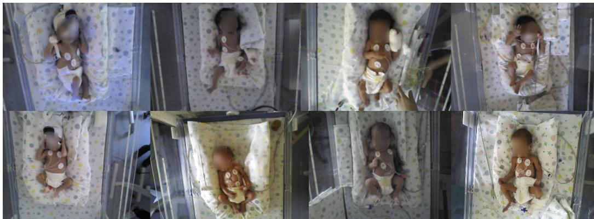  
Figure 1: Sample images from the NeoPose dataset showing the presence of self-occlusions, medical devices, casts, and caregivers’ or practitioners’ hands.

The rest of the paper is organised as follows: Section 2 reviews the state of the art on infant PE and noisy labels, Section 3 introduces the REMIND method and describes the experimental protocol adopted for its evaluation, Section 4 presents the results and discussion, Section 5 concludes the paper.

## 2. Related work

## 2.1. Infants Pose Estimation

A growing body of research [14, 22, 34] has focused on evaluating and benchmarking generic human PE models originally trained on adult datasets on infants’ images, including and not limited to OpenPose [7], HRNet [35], AlphaPose [12], and ViTPose [40], often reporting the latter as one of the best-performing general-purpose models for infants in supine positions. Nevertheless, the performance of these methods typically degrades when applied to infants because of several domain diferences [22]. Branching from the broader field of human PE, a primary challenge in adapting adult models to infants lies in the substantial anatomical and distributional shifts between these two populations. Infants has diferent body proportions compared to adults, characterized by shorter limbs and a much larger head-to-torso ratio. Furthermore, infants exhibit unique pose distributions (such as bending legs over the chest) that are rarely captured in large-scale adult datasets like COCO [29] or MPII [2].

To bridge this gap, researchers have explored various fine-tuning and domain adaptation strategies inspired by recent advances in deep learning.

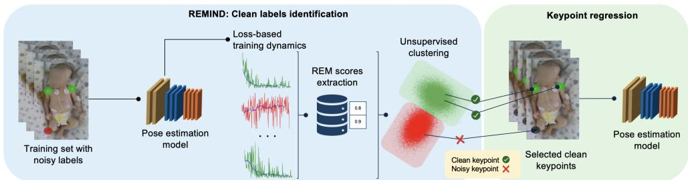  
Figure 2: Proposed REMIND strategy. Clean keypoints are identified via clustering using keypoint-wise features (REM scores) extracted from training-loss dynamics.

Jahn et al. [22] fine-tune high-performing adult backbones such as HRNet, OpenPose, and ViTPose on a relatively small, specialized dataset comprising approximately 4,500 annotated frames from 75 recordings of 75 infants aged 4 to 16 weeks, under diferent recording setups. Cao et al. [6] introduce Ag gPose, a framework that extends multi-scale transformer-based architectures to infant PE, and adopt a 21-keypoint representation defined by clinicians to capture finer-grained movements beyond the standard 17 COCO keypoints. They use for training a proprietary dataset made of 20748 labeled images. Huang et al. [21] propose the Fine-tuned Domain-adapted Infant Pose framework alongside the SyRIP dataset (1700 annotated images), which combines real and synthetic infant poses, with synthetic data generated using the SMIL model [20]. Their approach leverages a domain confusion network to transfer knowledge from adult datasets while aligning feature representations between synthetic and real domains. Grafton et al. [16] shift the attention to the complexities of infant PE in neonatal intensive care units, where occlusions from blankets, medical equipment, and ongoing interventions are frequent. They fine-tune COCO-pretrained PE models on a dataset of 24 infants and demonstrate that multimodal signal fusion—combining RGB, depth, and infrared inputs at early, intermediate, and late stages of the network—can improve robustness in these complex settings. Recognizing that labeled data are often scarce in clinical contexts due to privacy constraints and the labor-intensive nature of annotation, Bose et al. [5] investigate unsupervised domain adaptation methods and introduce SHIFT, a framework that adopts a pseudo-labeling-based mean teacher strategy to adapt adult pose estimators to infant data. To better account for domain-specific challenges, it incorporates an infant manifold pose prior that penalizes physically implausible configurations.

## 2.2. Learning with noisy labels

It is now well established that deep neural networks and noisy labels are uneasy partners, as the high capacity of over-parameterized models allows them to eventually memorize incorrect annotations, leading to a substantial degradation in generalization performance on unseen data [45]. However, seminal studies have shown that deep neural networks do not memorize data indiscriminately [3]. Instead, during the early stages of training, they tend to prioritize learning simple and generalizable patterns from clean samples, a phenomenon commonly referred to as the memorization efect, before progressively fitting noisy examples in later epochs. Building on this observation, the work in [18] introduced the SL hypothesis, which posits that samples consistently exhibiting low training loss are more likely to be correctly labeled. This insight has motivated a wide range of approaches for noisy-label learning, particularly methods based on sample selection strategies that exploit early-epoch losses or, more generally, the temporal evolution of loss during training, often referred to as training dynamics. Jia et al. [23] use an LSTM-based detector to automatically identify mislabeled samples by analyzing raw sequences of training dynamics rather than manually designed features. Yuan et al. [43] introduce the First-time k-epoch Learning metric to detect noise based on how many epochs a sample requires before being consistently classified correctly. Wang et al. [36] propose ChronoSelect, which uses a four-stage temporal memory and trajectory analysis to partition data into clean, boundary, and noisy subsets. This line of research has predominantly focused on classification tasks, with relatively few studies addressing regression problems [24, 27, 42]. Further narrowing the scope to human PE, the field remains largely underexplored, with only a few notable works such as [31] and [28]. The former provides empirical evidence on the impact of annotation quality on human PE performance, while the latter is the closest to our approach, explicitly tackling the problem of learning from noisy pseudo-labels in animal PE by incorporating a threshold-based, small-loss sample selection strategy in the first stage of its pipeline. Building upon this line of research, our work moves beyond threshold-based filtering by leveraging the training dynamics of individual keypoints. Specifically, we exploit the temporal evolution of keypoint-wise loss values to perform unsupervised clustering and identify potentially noisy annotations, without requiring predefined filtering thresholds.

## 3. Methods

## 3.1. REMIND

Let us consider a neural model $( f )$ for PE and a dataset $D \{ ( I _ { j } , P _ { j } ) \} _ { j = 1 } ^ { N } ;$ where $I _ { j } \in \mathbb { R } ^ { H \times W \times 3 }$ denotes an RGB image of size $H \times W , P _ { j } \in \mathbb { R } ^ { H \times W \times K }$ the corresponding ground-truth joint heatmaps set, K the number of annotated keypoints, and N the number of images in D. For each sample $j$ , Gaussian heatmaps $P _ { j }$ derive from 2D ground-truth joints coordinates $\{ ( x _ { j , k } , y _ { j , k } ) \} _ { k = 1 } ^ { K }$ to provide a more robust supervision signal than direct coordinate regression.

To model annotation noise, we define a dataset $\tilde { D } \{ ( I _ { j } , \tilde { P } _ { j } ) \} _ { j = 1 } ^ { N }$ corrupted by noise, where $\tilde { P } _ { j }$ denotes a potentially corrupted version of $P _ { j } . \ { \tilde { D } }$ may contain a mix of clean and noisy labels for each sample, reflecting real annotation conditions.

Firstly, f is trained on $\tilde { D }$ by minimizing a heatmap-based loss, i.e., the Mean Squared Error (MSE) between $\tilde { P } _ { j }$ and $\hat { P } _ { j } = f ( I _ { j } )$ . The MSE values $l _ { j , k } ^ { ( e ) }$ are recorded at each epoch e for each keypoint k in each sample $j ,$ forming the loss trajectory vector $\mathbf L _ { j , k } = [ l _ { j , k } ^ { ( 0 ) } , l _ { j , k } ^ { ( 1 ) } , \ldots , l _ { j , k } ^ { ( E - 1 ) } ] \in \mathbb { R } ^ { E }$ , where E is the number of training epochs. To reduce stochastic fluctuations, $\mathbf { L } _ { j , k }$ is smoothed using a moving average filter. From our experimental observations, clean keypoints typically exhibit a consistent decrease in loss over training and tend to reach their minimum loss at later stages. In contrast, noisy keypoints often show limited loss reduction and more irregular learning trajectories. Based on these observations, we define the REMIND score (REM) for the $k _ { \mathrm { t h } }$ keypoint of the $j _ { \mathrm { t h } }$ sample:

$$
R E M _ { j , k } = \Delta l _ { j , k } + \Delta t _ { j , k }\tag{1}
$$

where $\Delta l _ { j , k }$ captures how much the model learns from the keypoint, measured by the normalized peak-to-trough loss value drop:

$$
\Delta l _ { j , k } = \frac { \mathrm { m a x } ( \mathbf { L } _ { j , k } ) - \mathrm { m i n } ( \mathbf { L } _ { j , k } ) } { \mathrm { m a x } ( \mathbf { L } _ { j , k } ) + \mathrm { m i n } ( \mathbf { L } _ { j , k } ) }\tag{2}
$$

and $\Delta t _ { j , k }$ captures temporal information on when the minimum keypointwise loss is reached:

$$
\Delta t _ { j , k } = \frac { \arg \underset { \mathrm { ~ e ~ } } { \operatorname* { m i n } } \mathbf { L } _ { j , k } - \arg \underset { \mathrm { ~ e ~ } } { \operatorname* { m a x } } \mathbf { L } _ { j , k } } { E }\tag{3}
$$

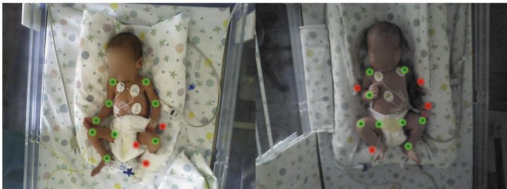  
Figure 3: Examples of correct (green) and Gaussian-perturbed keypoints (red).

After obtaining the REM score for each $k _ { \mathrm { t h } }$ keypoint of each $j _ { \mathrm { t h } }$ sample, we train K-means to cluster keypoints in the 2D space defined by $( \Delta t ,$ $\Delta l )$ . Since, empirically, both $\Delta t$ and $\Delta l$ tend to decrease as annotation noise increases, the cluster characterised by the lower centroid is identified as containing noisy keypoints. After clustering, $f$ is trained on a de-noised version of $\tilde { D } .$ , in which keypoints assigned to the noisy cluster are excluded by setting their COCO visibility flag to zero, so that they do not contribute to the loss computation. It is worth noting that unlike work on sample selection in classification (e.g., [39]) our method operates at the keypoint level and does not discard entire samples, even when they partially contain noisy annotations.

## 3.2. Noise taxonomy and injection

To obtain ${ \tilde { D } } ,$ in our experiments we randomly select a subset of $N ^ { \prime }$ samples from D and randomly choose a subset of keypoints $K _ { j }$ for each selected sample. We artificially inject noise into ground-truth 2D joint coordinates $( x _ { \tilde { j } , \tilde { k } } , y _ { \tilde { j } , \tilde { k } } )$ with $\tilde { \ j } = 1 , \dots , N ^ { \prime }$ and $\tilde { k } = 1 , \dots , K _ { j }$ by adding Gaussian perturbations $\epsilon _ { x } , \epsilon _ { y } \sim \mathcal { N } ( 0 , \sigma ^ { 2 } )$ :

$$
\tilde { x } _ { \tilde { j } , \tilde { k } } = x _ { \tilde { j } , \tilde { k } } + \epsilon _ { x } , \qquad \tilde { y } _ { \tilde { j } , \tilde { k } } = y _ { \tilde { j } , \tilde { k } } + \epsilon _ { y } .\tag{4}
$$

Figure 3 illustrates an example image with both noisy and clean keypoint annotations superimposed. This noise scenario, modeled as local shifts induced by Gaussian perturbations, follows prior work on this topic [25]. We experimentally define four noise configurations by combining two image-level corruption rates (20% or 50% of the training samples) with two keypoint-level perturbation ranges (1–4 or 5–9 corrupted keypoints per image): $\mathrm { \bar { K P - N o i s e } } _ { 1 - 4 } ^ { 2 0 \% }$

KP-Noise 20% , KP-Noise50%1–4 , and ${ \mathrm { K P - N o i s e } } _ { 5 - 9 } ^ { 5 0 \% }$ . The percentage of noisy keypoints in the training set ranges from a minimum of 3.01% $( \mathrm { \check { K } P - N o i s e } _ { 1 - 4 } ^ { 2 0 \% } )$ to

## 3.3. Dataset

In this work, we rely on the NeoPose dataset2, a collection of 5456 RGB frames from 46 RGB-D videos of preterm infants spontaneously moving, recorded right before discharge in the neonatology department of the G. Salesi Hospital in Ancona, Italy. Infants exhibit variability in gestational age $( 3 1 . 8 7 \pm 3 . 7 7 )$ , weight $( 2 \pm 0 . 7 9 \mathrm { k g } )$ , and length $( 4 4 . 1 3 \pm 4 . 1 2 \ \mathrm { c m } )$ . Videos are recorded using an Astra Mini S-Orbbec RGB-D camera, positioned approximately ∼50 cm above the crib, with a spatial resolution of 640×480 pixels and a frame rate of 30 fps. Each video refers to a single infant, recorded shortly before hospital discharge. Manual annotation was carried out by a team of neonatologists following the standard COCO keypoint annotation format. For obtaining ${ \tilde { D } } ,$ we set $\sigma$ to 10% of the diagonal of the bounding box enclosing the infant in the specific image.

## 3.4. Metrics

To evaluate the performance of REMIND in detecting noisy annotations, we use standard classification metrics, including Area Under the ROC Curve (AUC), Sensitivity (Sens), Specificity (Spec), and Precision (P rec). We further evaluate REMIND consistency across models using an Agreement Index (AI) defined as the proportion of noise-corrupted keypoints that are correctly identified as noisy by all three models for each noise configuratioN. Since RE-MIND is based on unsupervised clustering, ground-truth labels are used only for evaluation purposes. The Euclidean distance of each keypoint from the clean-cluster centroid in the $( \Delta t , \Delta l )$ space is interpreted as a confidence score:

$$
d _ { j , k } = \sqrt { ( \Delta t _ { j , k } - \mu _ { \Delta t } ) ^ { 2 } + ( \Delta l _ { j , k } - \mu _ { \Delta l } ) ^ { 2 } }\tag{5}
$$

By thresholding this score, we compute the AUC with respect to groundtruth noise labels. To evaluate the performance of PE models trained on the fully clean, noise-corrupted, and REMIND de-noised datasets,we use Mean

Average Precision $( m A P )$ , i.e., AP calculated at diferent Object Keypoint Similarity thresholds from 0.50 to 0.95 in steps of 0.05, formally:

$$
m A P = \frac { 1 } { T } \sum _ { t = 1 } ^ { T } A P _ { O K S _ { t } } , \quad O K S _ { t } \in \{ 0 . 5 0 , 0 . 5 5 , \dots , 0 . 9 5 \}\tag{6}
$$

## 3.5. Experiments

We conduct our experiments on HRNet, ResNet 101 [19], and ViTPose, 3 models widely used in infants’ PE [14, 22]. All models are trained for 210 epochs on a NVIDIA Ampere A100 GPU (64GB) using the OpenMMLab Pose Framework3. ViTPose uses AdamW as optimizer and layer-wise learning rate decay (12 layers, decay rate 0.75) with gradient clipping (max norm 1.0), while HRNet and ResNet 101 are optimized with Adam, following standards in the literature. All models use a batch size of 64 and we apply a linear warm-up during the first 500 iterations, followed by a multi-step learning rate schedule with reductions at epochs 170 and 2004.

REMIND is compared against the state-of-the-art SL trick. Following the protocol proposed in [28], SL is activated after an initial warm-up phase, allowing the model to partially converge before sample selection. Once activated, SL selects a predefined proportion of keypoints with the highest instantaneous loss values and designates them as noisy, excluding them from subsequent training.

## 3.5.1. Cross-Domain Dataset Validation

The proposed REMIND primarily relies on the exploitation of keypointwise training dynamics, therefore demonstrating potential to generalize efectively across diferent keypoint regression scenarios. In this regard, we evaluate it on additional datasets drawn from domains beyond infant PE. The first dataset is a subset of SurgPose [38], which consists of surgical scene recordings annotated with 14 keypoints corresponding to surgical instruments. We extract 5,000 frames to ensure a dataset size comparable to our infant PE dataset. The second dataset involves a diferent imaging modality and consists of lateral cephalogram radiographs annotated by clinical experts with 29 cephalometric landmarks [26]. Since these experiments are intended solely as a cross-dataset validation, we investigate a single keypoints regressor architecture, namely HRNet.

Table 1: Noisy-keypoints identification performance (AUC, reported as percentages) across models and noise configurations using REMIND against small-loss trick (SL) filtering strategy [28].
<table><tr><td></td><td> $\overline { { \mathrm { K P - N o i s e } _ { 1 - 4 } ^ { 2 0 \% } } }$ </td><td></td><td> $\overline { { { \mathrm { K P - N o i s e } _ { 5 - 9 } ^ { 2 0 \% } } } }$ </td><td> $\overline { { \mathrm { K P - N o i s e } _ { 1 - 4 } ^ { 5 0 \% } } }$ </td><td> $\overline { { \mathrm { K P - N o i s e } _ { 5 - 9 } ^ { 5 0 \% } } }$ </td></tr><tr><td rowspan="2">ResNet 101</td><td>SL</td><td>67.7</td><td>72.0</td><td>67.1</td><td>69.9</td></tr><tr><td>REMIND</td><td>97.1</td><td>96.7</td><td>95.3</td><td>93.3</td></tr><tr><td rowspan="2">HRNet</td><td>SL</td><td>66.7</td><td>70.9</td><td>66.3</td><td>69.2</td></tr><tr><td>REMIND</td><td>97.3</td><td>96.7</td><td>95.5</td><td>93.1</td></tr><tr><td rowspan="2">ViTPose</td><td>SL</td><td>66.4</td><td>69.6</td><td>65.5</td><td>67.6</td></tr><tr><td>REMIND</td><td>97.7</td><td>96.8</td><td>95.4</td><td>93.7</td></tr></table>

## 4. Results and discussion

Table 1 summarises the results relevant to noisy-keypoint identification. Across all noise configurations and tested PE models, REMIND consistently outperforms the SL trick, with AUC values ranging from 93.3% to 97.7% and coherently improving as the percentage of noisy keypoints decreases (i.e., from ${ \mathrm { K P - N o i s e } } _ { 5 - 9 } ^ { 5 0 \% }$ to $\mathrm { K P - N o i s e } _ { 1 - 4 } ^ { 2 \bar { 0 } \% } )$ . Interestingly, the results show minimal variation across models, with REM scores from ViTPose training emerging as the most informative to filter noisy keypoints. The agreement index, averaged across the four configurations, reaches 88.9% for REMIND. This result indicates that REMIND provides substantially more stable noisy-keypoint identification across architectures and captures model-agnostic learning patterns associated with annotation noise, rather than architecture-specific artifacts.

The relationship between noise severity and REM scores is shown in Fig. 4. For each model and noise injection ratio, samples are grouped by the number of noise-corrupted keypoints, and the average REM score is plotted. A linear regression analysis between the number of noisy keypoints per sample and the corresponding mean REM score reveals a high coeficient of determination $\mathrm { ( R ^ { 2 } }$ ranging from 81% to 87.9%). This result proves that the proposed REM score captures suficient information to distinguish noisy keypoints from clean ones.

Fig. 5 shows the clustering results for HRNet under the ${ \mathrm { K P - N o i s e } } _ { 1 - 4 } ^ { 2 0 \% }$ noise configuration. After applying K-Means clustering, a clear separation between keypoint types emerges. Noisy keypoints are consistently grouped within a well-defined region characterized by high values of both $\Delta l$ and $\Delta t .$ enabling a highly efective clustering.

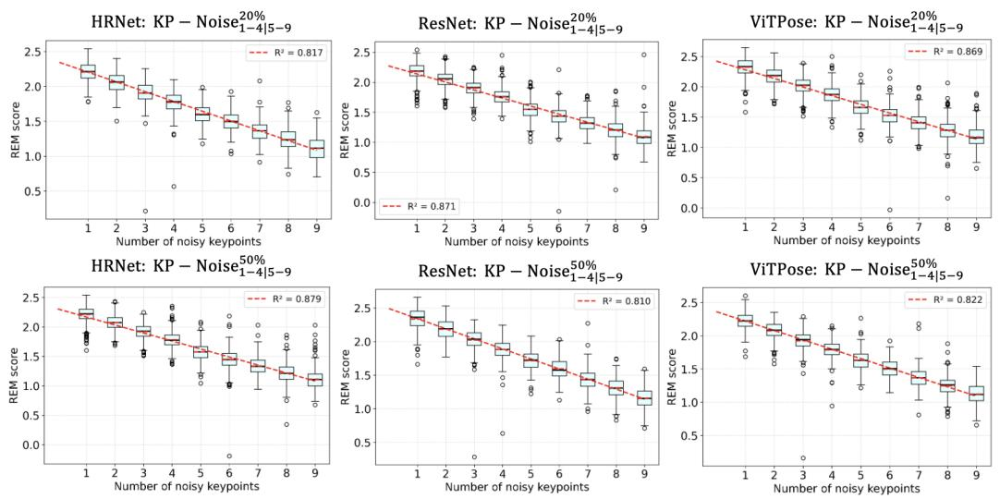  
Figure 4: REM score distributions versus the number of noise-corrupted keypoints per sample, showing a strong linear correlation (high R²) between noise severity and REMIND.

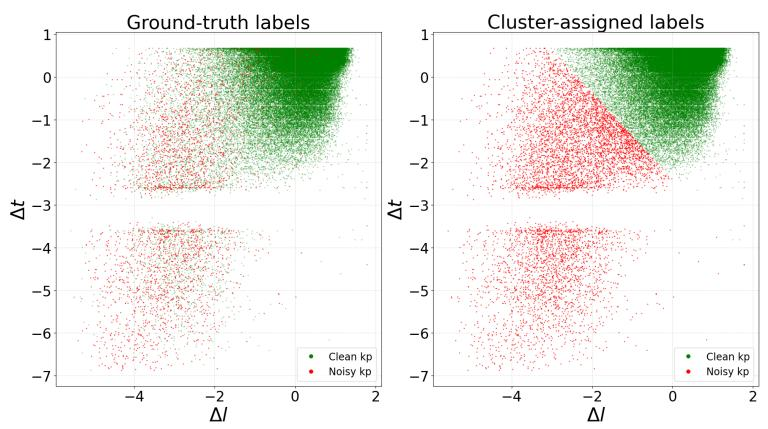  
Figure 5: K-means clustering of REM scores from HRNet trained under $\mathrm { K P - N o i s e } _ { 1 - 4 } ^ { 2 0 \% }$ Keypoints are projected onto (∆t, ∆l). Red/green denote noisy/clean. Left: ground truth; right: cluster assignments.

Table 2: Sens, Spec and P rec of noisy keypoints detection, after K-means clustering.
<table><tr><td></td><td colspan="3"> $\overline { { \mathrm { K P - N o i s e } _ { 1 - 4 } ^ { 2 0 \% } } }$ </td><td colspan="3"> $\overline { { { \mathrm { K P - N o i s e } _ { 5 - 9 } ^ { 2 0 \% } } } }$ </td></tr><tr><td>Metrics</td><td>ResNet 101</td><td>HRNet</td><td> $\mathrm { V i T P o s e }$ </td><td>ResNet 101</td><td> $\mathrm { H R N e t }$ </td><td>ViTPose</td></tr><tr><td>Sens</td><td>90.4</td><td>91.1</td><td>87.7</td><td>88.9</td><td>88.8</td><td>87.0</td></tr><tr><td>Spec</td><td>95.9</td><td>95.2</td><td>96.8</td><td>94.6</td><td>94.5</td><td>95.1</td></tr><tr><td> $P r e c$ </td><td>40.8</td><td>37.1</td><td>46.3</td><td>59.9</td><td>59.5</td><td>61.6</td></tr></table>

<table><tr><td colspan="4"> $\overline { { \mathrm { K P - N o i s e } _ { 1 - 4 } ^ { 2 0 \% } } }$ </td><td colspan="3"> $\overline { { { \mathrm { K P - N o i s e } _ { 5 - 9 } ^ { 2 0 \% } } } }$ </td></tr><tr><td>Metrics</td><td>ResNet 101</td><td>HRNet</td><td>ViTPose</td><td>ResNet 101</td><td>HRNet</td><td>ViTPose</td></tr><tr><td>Sens</td><td>88.4</td><td>88.1</td><td>86.7</td><td>85.6</td><td>85.0</td><td>85.0</td></tr><tr><td> $S p e c$ </td><td>93.0</td><td>92.6</td><td>93.6</td><td>87.9</td><td>87.7</td><td>88.4</td></tr><tr><td> $P r e c$ </td><td>49.7</td><td>48.4</td><td>51.8</td><td>64.8</td><td>64.3</td><td>65.5</td></tr></table>

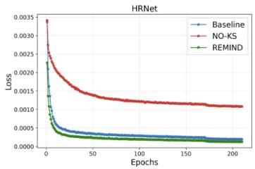

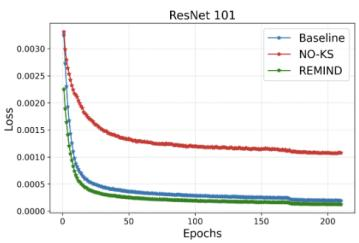

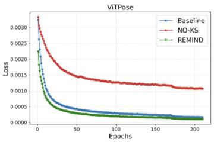  
Figure 6: Training losses under three settings: (i) baseline, (ii) $\mathrm { K P - N o i s e _ { 5 - 9 } ^ { 5 0 \% } }$ without keypoints selection (NO-KS), and (iii) $\mathrm { K P - N o i s e _ { 5 - 9 } ^ { 5 0 \% } }$ with REMIND filtering.

Table 2 complements the visual results with quantitative metrics $( \mathrm { i . e . , }$ Sens, Spec and $P r e c )$ across all the architectures and noise configurations. Sens and Spec decrease as the amount of injected noise increases, whereas Prec exhibits the opposite trend. This can be attributed to the fact that dataset imbalance (noisy-to-clean-ratio) rises from 3.01% in ${ \mathrm { K P - N o i s e } } _ { 1 - 4 } ^ { 2 0 \% }$ to 20.57% in ${ \mathrm { K P - N o i s e } } _ { 5 - 9 } ^ { 5 0 \% }$ . However, Prec remains consistently lower than Sens and $S p e c ,$ primarily due to the high false-positive rate, i.e., clean keypoints in the noisy cluster. This limitation may stem from the adoption of a hard binary clustering strategy (clean vs. noisy keypoints) not accounting for borderline cases such as hard or ambiguous samples [13].

We compare REMIND-filtered training with standard training on the fully noise-corrupted dataset without any keypoint selection. Fig. 6 shows training losses for all three models under (i) the noise-free configuration, filtered configuration. Training on noisy labels results in consistently higher loss values compared to the clean baseline, reflecting the detrimental efect of annotation noise on optimization. In contrast, applying REMIND substantially reduces this discrepancy, yielding a training loss trajectory that closely aligns with the clean-label baseline.

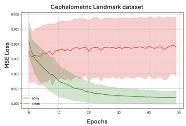

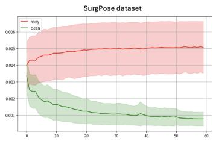  
Epochs

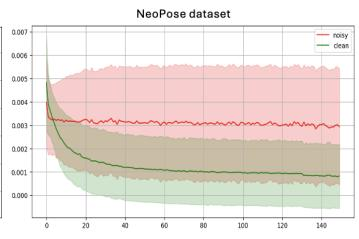  
Epochs  
Figure 7: Averaged training losses trajectories for clean (green) and noisy (red) keypoints. Shaded bands indicate ±1 standard deviation.

Table 3: $m A P$ results. Baseline: training on the clean dataset; NO-KS: noisy training without keypoint selection; REMIND: proposed method. Bold indicates the best between NO-KS and REMIND.
<table><tr><td></td><td colspan="2"> $\overline { { \mathrm { K P - N o i s e } _ { 1 - 4 } ^ { 2 0 \% } } }$ </td><td colspan="3"> $\overline { { { \mathrm { K P - N o i s e } _ { 5 - 9 } ^ { 2 0 \% } } } }$ </td></tr><tr><td></td><td>ResNet 101 HRNet</td><td>ViTPose</td><td>ResNet 101</td><td>HRNet</td><td>ViTPose</td></tr><tr><td>Baseline</td><td>0.691 0.733</td><td>0.704</td><td>0.691</td><td>0.733</td><td>0.704</td></tr><tr><td>NO-KS</td><td>0.612</td><td>0.525 0.641</td><td>0.584</td><td>0.598</td><td>0.617</td></tr><tr><td>REMIND</td><td>0.678</td><td>0.725 0.692</td><td>0.671</td><td>0.708</td><td>0.681</td></tr><tr><td></td><td colspan="2"> $\overline { { \mathrm { K P - N o i s e } _ { 1 - 4 } ^ { 5 0 \% } } }$ </td><td colspan="3"> $\overline { { { \mathrm { K P - N o i s e } } _ { 5 - 9 } ^ { 5 0 \% } } }$ </td></tr><tr><td></td><td colspan="2">ResNet 101 HRNet</td><td colspan="3">ViTPose ResNet 101 HRNet</td></tr><tr><td>Baseline</td><td colspan="2">0.691 0.733 0.704</td><td colspan="3">0.691 0.733</td></tr><tr><td>NO-KS</td><td colspan="2">0.536 0.581 0.603</td><td colspan="3">0.431 0.397</td></tr><tr><td>REMIND</td><td colspan="2">0.664 0.716</td><td colspan="3">0.668 0.715</td></tr></table>

Table 4: Sens and Spec of noisy keypoints detection, after K-means clustering for SurgPose subset and the cephalometric landmarks dataset
<table><tr><td rowspan=1 colspan=1></td><td rowspan=1 colspan=1> $\overline { { \mathrm { K P - N o i s e } _ { 1 - 4 } ^ { 2 0 \% } } }$ </td><td rowspan=1 colspan=1> $\overline { { { \mathrm { K P - N o i s e } _ { 5 - 9 } ^ { 2 0 \% } } } }$ </td></tr><tr><td rowspan=1 colspan=1>Metrics</td><td rowspan=1 colspan=1> $\mathrm { S u r g P o s e }$    Cephalometric Landmark</td><td rowspan=1 colspan=1> $\mathrm { S u r g P o s e }$    Cephalometric Landmark</td></tr><tr><td rowspan=1 colspan=1>Sens</td><td rowspan=1 colspan=1>97.8                 96.9</td><td rowspan=1 colspan=1>97.2                 96.5</td></tr><tr><td rowspan=1 colspan=1>Spec</td><td rowspan=1 colspan=1>98.3                  99.4</td><td rowspan=1 colspan=1>98.9                 98.8</td></tr><tr><td rowspan=1 colspan=1></td><td rowspan=1 colspan=1> $\overline { { \mathrm { K P - N o i s e } _ { 1 - 4 } ^ { 2 0 \% } } }$ </td><td rowspan=1 colspan=1> $\overline { { { \mathrm { K P - N o i s e } _ { 5 - 9 } ^ { 2 0 \% } } } }$ </td></tr><tr><td rowspan=1 colspan=1>Metrics</td><td rowspan=1 colspan=1> $\mathrm { S u r g P o s e }$    Cephalometric Landmark</td><td rowspan=1 colspan=1> $\mathrm { S u r g P o s e }$    Cephalometric Landmark</td></tr><tr><td rowspan=1 colspan=1>Sens</td><td rowspan=1 colspan=1>98.5                 95.6</td><td rowspan=1 colspan=1>94.1                  96.0</td></tr><tr><td rowspan=1 colspan=1>Spec</td><td rowspan=1 colspan=1>99.1                  98.2</td><td rowspan=1 colspan=1>98.6                 96.5</td></tr></table>

Table 3 reports mAP values on the infant-level hold-out test set, preventing data leakage. Training with noisy samples has a detrimental impact on model performance, with an average mAP drop across all configurations of 22.5% (±10.7%). In contrast, training after REMIND filtering limits this drop to only 1.8% (±1.2%), efectively preserving performance even under severe noise conditions. These results confirm the efectiveness of REMIND in mitigating the impact of annotation noise on PE performance.

Table 4 reports the quantitative results in terms of sensitivity and specificity for the cross validation datasets (SurgPose and cephalometric landmarks) under the four noise configurations.

The results demonstrate that REMIND generalizes well across heterogeneous domains and highlight that performance on both the SurgPose subset and the cephalometric landmark dataset is consistently higher than that observed on infant PE. We attribute this diference primarily to the intrinsic complexity of the infant PE task. The NeoPose dataset is characterized by frequent self-occlusions, severe inter-part overlap, large pose variability, and ambiguous visual patterns caused by blankets, medical devices, or caregiver interactions. Moreover, Fig. 7 illustrates the training loss trajectories averaged over clean and noisy keypoints for a representative noise configuration training for the SurgPose subset and the cephalometric landmark dataset. In comparison to the corresponding curves on the infant PE dataset, a noticeable reduction in separability is observed, further confirming the higher dificulty of the infant setting.

## 5. Conclusion

This work addresses the challenge of noisy annotations in infants’ PE by introducing REMIND, an unsupervised sample selection strategy that leverages the evolution of the training dynamics to identify unreliable (and thus noisy) keypoint annotations. The dataset, although curated, remains limited in size and is currently collected from a single clinical center. To mitigate this limitation, we are going to start a new data collection protocol in collaboration with an additional clinical center to support multi-center validation.

Future work will investigate settings in which the validation set is also affected by annotation noise. This extension calls for the development of early stopping criteria that remain reliable even when validation annotations are partially corrupted [44]. In order to assess the robustness and generalization of the proposed approach across diferent data distributions, we are currently working on expanding this work standard PE benchmarks such as COCO and MPII. A further relevant future direction concerns a more principled characterization of noise taxonomy. In this work, noise is currently assumed to follow a Gaussian shift around the true keypoint location, a formulation that is inherited from the work in [25] and remains a reasonable approximation. However, this assumption does not fully capture the structure of annotation noise in practice, where keypoints do not share the same probability of corruption. This issue is particularly evident in neonatal PE, which is strongly afected by visual challenges, and noisy annotations are often associated with inherently ambiguous cases, such as those arising from self-occlusion or visually uncertain keypoints. Future work will therefore focus on designing noise modeling strategies that explicitly account for such hard keypoints.

## Acknowledgements

We would like to acknowledge the ITALIAN FUND FOR APPLIED SCI-ENCES (FISA), grant number: FISA2022-00696, and ISCRA for awarding us access to the LEONARDO supercomputer, owned by the EuroHPC Joint Undertaking, hosted by CINECA (Italy).

## Conflict of Interest

The Authors has no known competitive interests.

## Ethics Approval and Consent to Participate

The study received the approval of the Ethics Committee of the “Ospedali Riuniti di Ancona”, Italy (ID: Prot. 2019-399). Written informed consent was obtained from each infant’s legal guardian.

## Data Availability

The dataset used in this study will be made available upon request.

## References

[1] Airaksinen, M., Räsänen, O., Ilén, E., Häyrinen, T., Kivi, A., Marchi, V., Gallen, A., Blom, S., Varhe, A., Kaartinen, N., et al.: Automatic posture and movement tracking of infants with wearable movement sensors. Scientific reports 10(1), 169 (2020)

[2] Andriluka, M., Pishchulin, L., Gehler, P., Schiele, B.: 2d human pose estimation: New benchmark and state of the art analysis. In: Proceedings of the IEEE Conference on computer Vision and Pattern Recognition. pp. 3686–3693 (2014)

[3] Arpit, D., Jastrzębski, S., Ballas, N., Krueger, D., Bengio, E., Kanwal, M.S., Maharaj, T., Fischer, A., Courville, A., Bengio, Y., et al.: A closer look at memorization in deep networks. In: International conference on machine learning. pp. 233–242. PMLR (2017)

[4] Beaulieu, A., Saint-Georges, C., Habgarth, I., Da Cunha, M., Grywac, P., Chauvet, M., Laznik, M.C., Lev-Enacab, O., Pellerin, H., Anzalone, S.M., et al.: Manual and automated assessments of general movements in neonates are associated with early autism risk at 18 months. Scientific Reports (2026)

[5] Bose, S., Cruz, H.D., Dutta, A., Kokkoni, E., Karydis, K., Chowdhury, A.K.R.: Leveraging synthetic adult datasets for unsupervised infant pose estimation. In: Proceedings of the Computer Vision and Pattern Recognition Conference. pp. 5562–5571 (2025)

[6] Cao, X., Li, X., Ma, L., Huang, Y., Feng, X., Chen, Z., Zeng, H., Cao, J.: Aggpose: Deep aggregation vision transformer for infant pose estimation. arXiv preprint arXiv:2205.05277 (2022)

[7] Cao, Z., Simon, T., Wei, S.E., Sheikh, Y.: Realtime multi-person 2d pose estimation using part afinity fields. In: Proceedings of the IEEE conference on computer vision and pattern recognition. pp. 7291–7299 (2017)

[8] Doi, H., Furui, A., Ueda, R., Shimatani, K., Yamamoto, M., Sakurai, K., Mori, C., Tsuji, T.: Spatiotemporal patterns of spontaneous movement in neonates are significantly linked to risk of autism spectrum disorders at 18 months old. Scientific Reports 13(1), 13869 (2023)

[9] Einspieler, C., Prechtl, H.F.: Prechtl’s assessment of general movements: a diagnostic tool for the functional assessment of the young nervous system. Mental Retardation and Developmental Disabilities Research Reviews 11(1), 61–67 (2005)

[10] Einspieler, C., Sigafoos, J., Bartl-Pokorny, K.D., Landa, R., Marschik, P.B., Bölte, S.: Highlighting the first 5 months of life: General movements in infants later diagnosed with autism spectrum disorder or rett syndrome. Research in Autism Spectrum Disorders 8(3), 286–291 (2014)

[11] Fan, C., Chowdhury, T.: Posedoc: An interactive tool for eficient annotation in human pose estimation. In: Proceedings of the 27th International Conference on Multimodal Interaction. pp. 777–780 (2025)

[12] Fang, H.S., Li, J., Tang, H., Xu, C., Zhu, H., Xiu, Y., Li, Y.L., Lu, C.: Alphapose: Whole-body regional multi-person pose estimation and tracking in real-time. IEEE transactions on pattern analysis and machine intelligence 45(6), 7157–7173 (2022)

[13] Forouzesh, M., Thiran, P.: Diferences between hard and noisy-labeled samples: An empirical study. In: Proceedings of the 2024 SIAM International Conference on Data Mining (SDM). pp. 91–99. SIAM (2024)

[14] Gama, F., Mísař, M., Navara, L., T. Popescu, S., Hofmann, M.: Automatic infant 2d pose estimation from videos: comparing seven deep neural network methods. Behavior Research Methods 57(10), 280 (2025)

[15] Gao, Y., Long, Y., Guan, Y., Basu, A., Baggaley, J., Ploetz, T.: Towards reliable, automated general movement assessment for perinatal stroke screening in infants using wearable accelerometers. Proceedings of the ACM on Interactive, Mobile, Wearable and Ubiquitous Technologies 3(1), 1–22 (2019)

[16] Grafton, A., Warnecke, J.M., Li, M., He, E., Thomson, L., Beardsall, K., Lasenby, J.: Neonatal pose estimation in the unaltered clinical environment with fusion of rgb, depth and ir images. npj Digital Medicine 8(1), 539 (2025)

[17] Hadders-Algra, M., Van den Nieuwendijk, A.W.K., Maitijn, A., van Eykern, L.A.: Assessment of general movements: towards a better un-

derstanding of a sensitive method to evaluate brain function in young infants. Developmental Medicine & Child Neurology 39(2), 88–98 (1997)

[18] Han, B., Yao, Q., Yu, X., Niu, G., Xu, M., Hu, W., Tsang, I., Sugiyama, M.: Co-teaching: Robust training of deep neural networks with extremely noisy labels. Advances in neural information processing systems 31 (2018)

[19] He, K., Zhang, X., Ren, S., Sun, J.: Deep residual learning for image recognition. In: IEEE Conference on Computer Vision and Pattern Recognition. pp. 770–778 (2016)

[20] Hesse, N., Pujades, S., Romero, J., Black, M.J., Bodensteiner, C., Arens, M., Hofmann, U.G., Tacke, U., Hadders-Algra, M., Weinberger, R., et al.: Learning an infant body model from RGB-D data for accurate full body motion analysis. In: International Conference on Medical Image Computing and Computer-Assisted Intervention. pp. 792–800. Springer (2018)

[21] Huang, X., Fu, N., Liu, S., Ostadabbas, S.: Invariant representation learning for infant pose estimation with small data. In: 2021 16th IEEE International Conference on Automatic Face and Gesture Recognition (FG 2021). pp. 1–8. IEEE (2021)

[22] Jahn, L., Flügge, S., Zhang, D., Poustka, L., Bölte, S., Wörgötter, F., Marschik, P.B., Kulvicius, T.: Comparison of marker-less 2d imagebased methods for infant pose estimation. Scientific Reports 15(1), 12148 (2025)

[23] Jia, Q., Li, X., Yu, L., Bian, J., Zhao, P., Li, S., Xiong, H., Dou, D.: Learning from training dynamics: Identifying mislabeled data beyond manually designed features. In: Proceedings of the AAAI Conference on Artificial Intelligence. vol. 37, pp. 8041–8049 (2023)

[24] Jiang, G., Lei, F., Wang, W.: A multi-model dynamic filtering of label noise for regression. Pattern Recognition 169, 111887 (2026)

[25] Johnson, S., Everingham, M.: Learning efective human pose estimation from inaccurate annotation. In: CVPR 2011. pp. 1465–1472. IEEE (2011)

[26] Khalid, M.A., Zulfiqar, K., Bashir, U., Shaheen, A., Iqbal, R., Rizwan, Z., Rizwan, G., Fraz, M.M.: A benchmark dataset for automatic cephalometric landmark detection and cvm stage classification. Scientific Data 12(1), 1336 (2025)

[27] Kim, C.D., Moon, S., Moon, J., Woo, D., Kim, G.: Sample selection via contrastive fragmentation for noisy label regression. Advances in Neural Information Processing Systems 37, 127561–127609 (2024)

[28] Li, C., Lee, G.H.: Scarcenet: Animal pose estimation with scarce annotations. In: IEEE/CVF Conference on Computer Vision and Pattern Recognition. pp. 17174–17183 (2023)

[29] Lin, T.Y., Maire, M., Belongie, S., Hays, J., Perona, P., Ramanan, D., Dollár, P., Zitnick, C.L.: Microsoft coco: Common objects in context. In: European conference on computer vision. pp. 740–755. Springer (2014)

[30] Posar, A., Visconti, P.: Early motor signs in autism spectrum disorder. Children 9(2), 294 (2022)

[31] Schwarz, A., Hernadi, L., Bießmann, F., Hildebrand, K.: The influence of faulty labels in data sets on human pose estimation. arXiv preprint arXiv:2409.03887 (2024)

[32] Shin, H.I., Park, M.W., Lee, W.H.: Spontaneous movements as prognostic tool of neurodevelopmental outcomes in preterm infants: a narrative review. Clinical and Experimental Pediatrics 66(11), 458 (2023)

[33] Song, B., Zhao, S., Dang, L., Wang, H., Xu, L.: A survey on learning from data with label noise via deep neural networks. Systems Science & Control Engineering 13(1), 2488120 (2025)

[34] Sotoodeh, M.S., Ossmy, O., Donati, G., Hall, J., Rowan, H., Forrester, G.S.: Automatic pose estimation in newborn infants: Lessons from the baby grow study. Behavior Research Methods 58(3), 82 (2026)

[35] Sun, K., Zhao, Y., Jiang, B., Cheng, T., Xiao, B., Liu, D., Mu, Y., Wang, X., Liu, W., Wang, J.: High-resolution representations for labeling pixels and regions. arXiv preprint arXiv:1904.04514 (2019)

[36] Wang, J., Li, Q., Zheng, P., Pu, X., Ren, Y.: Chronoselect: Robust learning with noisy labels via dynamics temporal memory. In: ACM International Conference on Multimedia in Asia. pp. 1–7 (2025)

[37] Wei, H., Feng, L., Chen, X., An, B.: Combating noisy labels by agreement: A joint training method with co-regularization. In: Proceedings of the IEEE/CVF conference on computer vision and pattern recognition. pp. 13726–13735 (2020)

[38] Wu, Z., Schmidt, A., Moore, R., Zhou, H., Banks, A., Kazanzides, P., Salcudean, S.E.: Surgpose: a dataset for articulated robotic surgical tool pose estimation and tracking. In: 2025 IEEE International Conference on Robotics and Automation (ICRA). pp. 10507–10514. IEEE (2025)

[39] Xia, X., Liu, T., Han, B., Gong, M., Yu, J., Niu, G., Sugiyama, M.: Sample selection with uncertainty of losses for learning with noisy labels. arXiv preprint arXiv:2106.00445 (2021)

[40] Xu, Y., Zhang, J., Zhang, Q., Tao, D.: Vitpose: Simple vision transformer baselines for human pose estimation. Advances in Neural Information Processing Systems 35, 38571–38584 (2022)

[41] Yang, C.Y., Jiang, Z., Gu, S.Y., Hwang, J.N., Yoo, J.H.: Unsupervised domain adaptation learning for hierarchical infant pose recognition with synthetic data. In: 2022 IEEE International Conference on Multimedia and Expo (ICME). pp. 01–06. IEEE (2022)

[42] Yao, H., Wang, Y., Zhang, L., Zou, J.Y., Finn, C.: C-mixup: Improving generalization in regression. Advances in neural information processing systems 35, 3361–3376 (2022)

[43] Yuan, S., Feng, L., Liu, T.: Late stopping: Avoiding confidently learning from mislabeled examples. In: IEEE/CVF International Conference on Computer Vision. pp. 16079–16088 (2023)

[44] Yuan, S., Feng, L., Liu, T.: Early stopping against label noise without validation data. arXiv preprint arXiv:2502.07551 (2025)

[45] Zhang, C., Bengio, S., Hardt, M., Recht, B., Vinyals, O.: Understanding deep learning requires rethinking generalization. arXiv preprint arXiv:1611.03530 (2016)