# The impact of phase information for few-shot fine-grained image classification

Ruiling Liu1, Linyue Zhang1, Wenyi Zeng1, Jiamiao Lu1, Weichuang Zhang1,∗, Changming Sun1, Zejun Zhang1, Xiao Zhao1,∗

## Abstract

Few-shot fine-grained image classification (FSFGIC) aims to classify similar images with limited labeled examples. This work highlights the critical yet underutilized role of phase information in capturing structural relationships within an image. This study introduces a novel plug-and-play amplitudephase integration (API) module that efectively combines local and global frequency amplitude and phase information for obtaining more comprehensive feature descriptors. Additionally, a dedicated network, named PSF-Net, is proposed that adaptively fuses phase-based spatial and frequency information for FSFGIS. The designed PSF-Net can be easily integrated into standard episodic training architectures for end-to-end training from scratch. Extensive experiments on five public datasets demonstrate that the method outperforms existing state-of-the-art benchmarks.

Keywords: Few-shot fine-grained classification, phase information, phase information-based spatial and frequency feature adaptively fusion

## 1. Introduction

Few-shot fine-grained image classification (FSFGIC) [1, 2, 3, 4, 5] aims to distinguish diferent yet similar subordinate classes that belong to a specific basic class with very limited data. The existing FSFGIC methods can be roughly classified into two main streams: meta-learning based methods and metric-learning based methods. Meta-learning based methods aim to learn meta knowledge with only a few training examples for each category. A set of functions are used for mapping labeled training image samples and test samples for visual classification. Metric-learning based methods intend to learn a group of functions for transforming test samples into an embedding space. Then the test samples will be classified into a class by a given similarity measure (e.g., nearest neighbor, hyperbolic distance, cosine metric, or learned parametric options).

Existing image feature extraction techniques [6, 7, 8, 9, 10, 11, 12, 13, 14, 15, 16, 17, 18] have shifted from manual algorithms [19, 20, 21, 22, 23, 24, 25, 26, 27, 28, 29, 30, 31, 32, 33, 34, 35, 36] to deep learning architectures [37, 38, 39, 40, 41, 42, 43, 44, 1, 45, 46, 47, 48, 49, 50, 51] for feature extraction. Currently, FSFGIC presents significant challenges [52, 53, 54, 55, 56, 57, 5, 2, 58] due to subtle inter-class diferences and substantial intra-class variations within very limited training samples. Some methods [59] that integrate spatial and frequency domain information have been proposed for addressing these issues and have demonstrated certain improvements. However, our analysis reveals that existing spatial-frequency fusion-based FSFGIC methods may still yield inaccurate classifications, primarily because they tend to overlook the critical role of phase information in the frequency domain. Phase information, which records the positional relationships of diferent frequency components, is essential for characterizing the structural layout of an image. Neglecting it can lead to a loss of important discriminative cues necessary for distinguishing highly similar sub-categories. Take four fine-grained images as examples as shown in Fig. 1. The BDFR-Net [60] incorrectly classifies images from diferent categories as the same class as shown in Fig. 1(a) and misclassifies images from the same category as diferent classes as shown in Fig. 1(b) due to its failure to account for phase information((a) shows diferent classes samples, (b) shows the same class samples). To address the aforementioned problems, in this work, a novel plug-and-play amplitude-phase integration (API) module(Fig. 1(a)) is presented that has considered how to efectively combine local and global frequency amplitude and phase information for obtaining more comprehensive feature descriptors. Fig. 1(b) and (c) demonstrate that when equipped with our proposed API module, BDFRNet [60] has the capability to both cluster similar targets into the same category and diferentiate between distinct categories. Furthermore, a dedicated network, named as PSF-Net, is proposed which has considered how to fuse phase information-based spatial and frequency information adaptively for FSFGIS. The designed PSF-Net can be easily integrated into standard episodic training architectures for end-to-end training from scratch. Experiments on five fine-gained image classification benchmark datasets, i.e., CUB-200-2011 [61], Stanford Dogs [62], Stanford Cars [63], meta-iNat [64], and tiered meta-iNat [64], show that the proposed PSF-Net significantly outperforms the baseline methods on both 5-way 1-shot and 5-way 5-shot tasks.

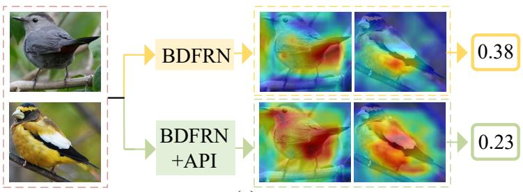  
(a)

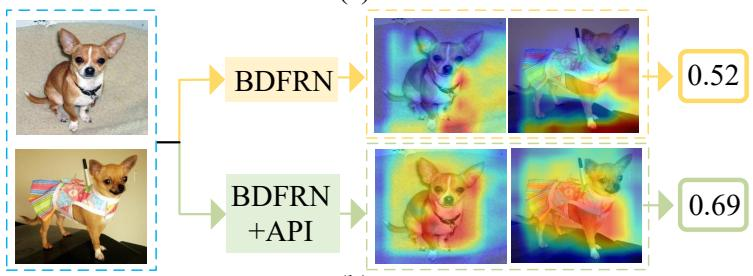  
(b)  
Figure 1: The impact of phase information on the FSFGIC accuracy of a given network.

## 2. Related Work

## 2.1. FSFGIC Methods

Meta learning-based FSFGIC methods rapidly acquire model initializations or parameter updates by leveraging three principal techniques: attention mechanisms, feature alignment, and knowledge distillation.Attentionbased methods employ mechanisms such as multi-attention [65], dual-attention [66], and transformer-based architecture [67] for amplifying subtle diferences be-

tween highly similar categories. Feature alignment-based methods [68] aim to spatially align corresponding object parts between support and query images to capture fine-grained diferences. Techniques include bilinear CNNs and distribution alignment for efective comparison. Knowledge distillationbased methods [69] aim to improve model eficiency and generalization by transferring knowledge from complex, pre-trained models (teachers) to simpler models (students), often using meta-distillation framework or contrastive learning to prevent overfitting on limited data.

Metric-based FSFGIC methods learn an embedding function, after which classification relies on a predefined or learned similarity measure in the feature space. Research in this area has advanced along several directions:(1) Feature matching, e.g., framing image matching as an optimal transport problem [70] or reconstructing features via ridge regression [71], later extended to bidirectional reconstruction [60];(2) Feature refinement and alignment, such as cross-layer and cross-sample optimization [72], progressive feature refinement [73], and deformable convolution-based spatial–channel alignment [74]; and (3) Attention mechanisms, including channel-spatial crossattention [75] and dual-attention frameworks [76], which enhance discrimination by focusing on informative regions or channels.

## 2.2. Spatial-Frequency Fusion Methods

Recent research demonstrates that integrating spatial and frequency information significantly enhances model robustness in FSFGIC. FGFL [59] analyzes the roles of diferent frequency bands and employs frequency-guided training to improve feature discrimination. MEFP [77] decomposes images into distinct low-frequency (capturing global structures) and high-frequency (encoding fine details) branches. These are then aligned with spatial features via reconstruction to create more robust representations. FAP [78] embeds frequency cues into prompts that interact with spatial tokens, enhancing the model’s transferability across diferent tasks or domains. Wavelet-MSFN [79] uses wavelet decomposition for multi-scale feature extraction, while SFIN-DPL [80] unifies spatial-frequency fusion with dual prompt learning for enhanced performance.

Based on our investigation, a research gap exists in leveraging phase information for FSFGIC. To address this, we propose a novel a phase informationbased spatial and frequency information adaptively fusion network (PSF-Net). This approach significantly enhances the learning of robust and highly discriminative representations under strict few-shot fine-grained constraints.

## 3. Methodology

## 3.1. Problem Defination

Formally, given a dataset D of L fine-grained categories, it is partitioned into three disjoint subsets: a training set $\mathcal { D } _ { \mathrm { t r a i n } }$ , a validation set $\mathcal { D } _ { \mathrm { v a l } }$ , and a test set $\mathcal { D } _ { \mathrm { t e s t } }$ , with ${ \mathcal { D } } _ { \mathrm { t r a i n } } \cap { \mathcal { D } } _ { \mathrm { v a l } } \cap { \mathcal { D } } _ { \mathrm { t e s t } } = \emptyset$ and ${ \mathcal { D } } _ { \mathrm { t r a i n } } \cup { \mathcal { D } } _ { \mathrm { v a l } } \cup { \mathcal { D } } _ { \mathrm { t e s t } } = { \mathcal { D } }$ The test set contains categories unseen during training. In each FSFGIC episode, a support set S and a query set Q are sampled. The support set contains L distinct classes with K labeled samples per class, while the query set consists of unlabeled samples from the same L classes. The objective is to learn an embedding function $f _ { \theta } ( \cdot )$ that maps an input image X to a discriminative representation $z = f _ { \theta } ( X )$ , enabling accurate classification of each query sample into its corresponding support class. This framework defines a standard L-way K-shot fine-grained classification task.

## 3.2. Overall Framework

As shown in Fig. 2(b), the designed PSF-Net contains three modules: a novel plug-and-play amplitude-phase integration (API) module, a spatialfrequency fusion module, and a similarity measurement module. Following common FSFGIC practice (e.g., FRN [81], and SUITED [73]), we select Conv-4 [82] and ResNet12 [83] as backbones. We apply the phase-based spatial and frequency information adaptively for improving feature representations in fusion to the Conv-4 and the ResNet12 respectively. Then the similarity module is employed for measuring the distances between support and query samples.

## 3.3. Amplitude-Phase Integration (API) Module

This section introduces novel modules for extracting both local and global frequency features.

(1) Local Frequency Feature Extraction Module: Given an image $X ( u , v ) \in$ $\mathbb { R } ^ { C \times H \times W }$ , where R denotes the real space, $( u , v )$ denote the point location in the image, C is the channel number, and H and W are the image height

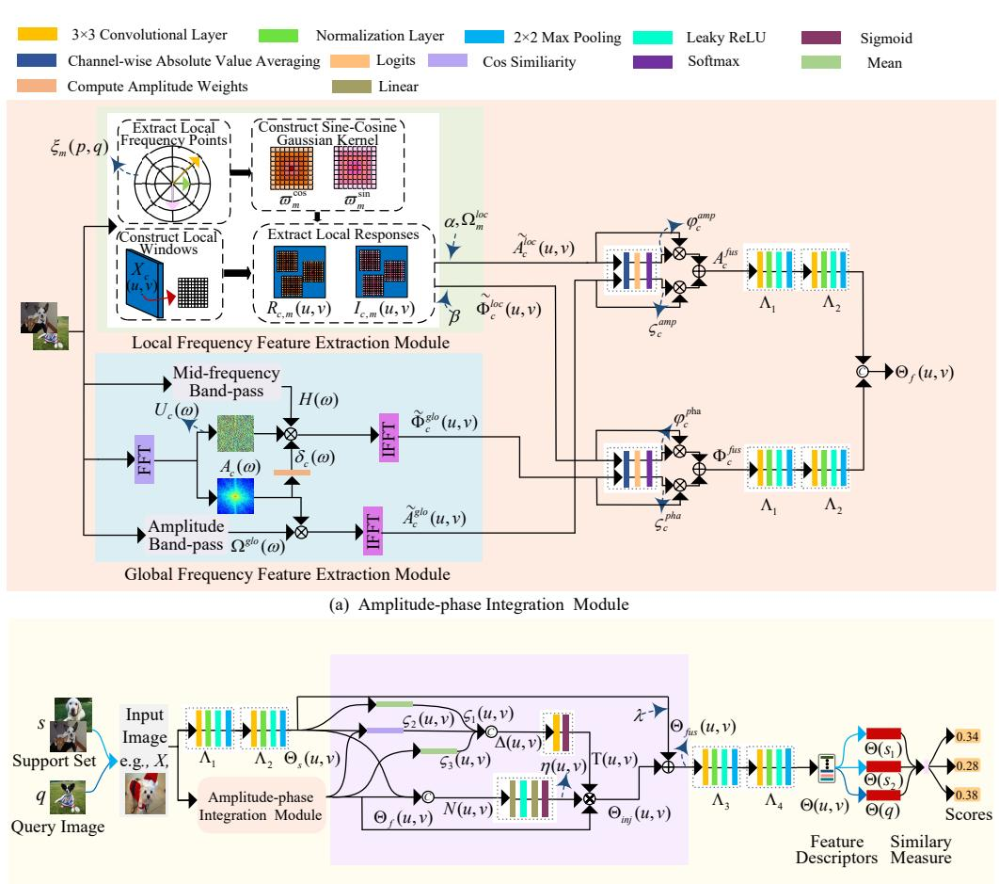  
(b) Phase Information-based Spatial and Frequency Information Adaptively Fusion Network (PSF-Net)  
Figure 2: The pipeline of the proposed PSF-Net for a 5-way 1-shot FSFGIC task based on the Conv-4 backbone.

and width respectively. Local frequency magnitude and phase information of each channel $c \in \{ 1 , \ldots , C \}$ of the image is obtained as follows:

$$
\begin{array} { r l } & { \xi _ { m } ( p , q ) = \big ( r _ { i } \cos \theta _ { j } , r _ { i } \sin \theta _ { j } \big ) , \theta _ { j } = \frac { 2 \pi j } { O } } \\ & { \varpi _ { m } ^ { \infty } ( p , q ) = \exp \Big ( - \frac { p ^ { 2 } + q ^ { 2 } } { 2 l ^ { 2 } } \Big ) \cos \big ( 2 \pi \xi _ { m } ^ { \top } ( p , q ) \big ) , } \\ & { \varpi _ { m } ^ { \sin } ( p , q ) = \exp \Big ( - \frac { p ^ { 2 } + q ^ { 2 } } { 2 l ^ { 2 } } \Big ) \sin \big ( 2 \pi \xi _ { m } ^ { \top } ( p , q ) \big ) , } \\ & { R _ { c , m } ( u , v ) = X _ { c } ( u , v ) \ast \varpi _ { m } ^ { \infty } ( p , q ) , } \\ & { I _ { c , m } ( u , v ) = X _ { c } ( u , v ) + \varpi _ { m } ^ { \sin } ( p , q ) , } \\ & { i \in \{ 1 , . . . , R \} , \xi \in \{ 1 , . . . , O \} , m \in \{ 1 , . . . , R \times O \} , } \end{array}\tag{1}
$$

where $\xi _ { m } ( p , q )$ represents the local frequency points, $r _ { i } { \in } \{ 0 . 3 0 , 0 . 2 2 , 0 . 1 6 \}$ denotes the normalized radius of the i-th frequency scale (here R is set to 3), $\theta _ { j } \ ( j = 0 , 1 , \ldots , 7 )$ denotes the uniformly sampled orientation angles for each scale (here O is set to $8 )$ , ι is adaptively optimized during training to adjust the efective receptive field of the kernel, $( p , q ) \in [ - 4 , 4 ] ^ { 2 }$ denotes a local $9 \times 9$ window, $\varpi _ { m } ^ { \mathrm { c o s } } ( p , q )$ and $\varpi _ { m } ^ { \mathrm { s i n } } ( p , q )$ are the Gaussian frequency kernels, ∗ denotes 2D convolution, and $R _ { c , m } ( u , v )$ and $I _ { c , m } ( u , v )$ denote the real and imaginary parts of the response of channel c at spatial location $( u , v )$ to the m-th sampled frequency. Then, the complex response is converted into polar form for obtaining the local amplitude and the unit-phase representation.

$$
\begin{array} { r l } & { \mathcal { A } _ { \epsilon , m } ^ { \mathrm { l o c } } ( u , v ) = \sqrt { R _ { \epsilon , m } ^ { 2 } } ( u , v ) + I _ { \epsilon , m } ^ { 2 } ( u , v ) , } \\ & { \dot { \phi } _ { \epsilon , m } ^ { \mathrm { l o c } } ( u , v ) = \frac { 1 } { A _ { \epsilon , m } ^ { \mathrm { l o c } } } [ u , v ] [ R _ { \epsilon , m } ( u , v ) , I _ { \epsilon , m } ( u , v ) ] ^ { \top } , } \\ & { \Omega _ { m } ^ { \mathrm { l o c } } ( \xi ) - \sigma \Big ( \frac { \| \xi - \xi _ { m } \| _ { 2 } - \kappa _ { m } ^ { \mathrm { l o } } } { 7 _ { m } } \Big ) \sigma \Big ( \frac { K _ { m } ^ { \mathrm { h i } } - \| \xi - \xi _ { m } \| _ { 2 } } { 7 _ { m } } \Big ) , } \\ & { \tilde { A } _ { \epsilon } ^ { \mathrm { l o c } } ( u , v ) = \displaystyle \sum _ { m = 1 } ^ { M } \alpha \Omega _ { m } ^ { \mathrm { l o c } } A _ { \epsilon , m } ^ { \mathrm { l o c } } ( u , v ) , } \\ & { \tilde { \Phi } _ { \epsilon } ^ { \mathrm { l o c } } ( u , v ) = \displaystyle \sum _ { n = 1 } ^ { M } \beta \tilde { \phi } _ { \epsilon , m } ^ { \mathrm { l o c } } ( u , v ) , } \end{array}\tag{2}
$$

where $A _ { c , m } ^ { \mathrm { l o c } } ( u , v )$ denotes the local magnitude response of the $c -$ th channel of the m-th frequency component which reflects the activation strength of that frequency in the local region; where $\kappa _ { m } ^ { \mathrm { l o } }$ and $\kappa _ { m } ^ { \mathrm { h i } }$ are learnable cutof radii, $\tau _ { m }$ is a learnable parameter which is used to control the smoothness of the band, and $\xi$ is drawn from the predefined set of local frequency sampling points, $\sigma ( \cdot )$ denotes the sigmoid function, $\phi _ { c , m } ^ { \mathrm { l o c } } ( u , v )$ represents the corresponding unitphase vector, encoding the directional information of the complex response and preserving the structural characteristics of the frequency component, α and $\beta$ are the adaptive weights for amplitude and phase respectively, $\Omega _ { m } ^ { \mathrm { l o c } }$ is the local amplitude component after band selection, and $\tilde { A } _ { c } ^ { \mathrm { l o c } } ( u , v )$ and $\tilde { \Phi } _ { c } ^ { \mathrm { l o c } } ( u , v )$ denote the final local amplitude and phase feature descriptors respectively. The obtained local amplitude and phase feature descriptors have the capability to enhance features relevant to fine texture regions while retaining subtle discriminative details and minor shape variation. (2) Global

Frequency Feature Extraction Module: A global feature extraction module is presented for capturing the overall geometric structure and frequency information which aims to enhance the overall discriminative power of the representation.

The input image $X ( u , v )$ is subjected to a channel-by-channel 2D realvalued fast Fourier transform (rFFT2) for obtaining the amplitude spectrum and phase spectrum information

$$
\begin{array} { r l } & { F _ { c } ( \omega ) = \mathrm { r F F T 2 } ( X _ { c } ) \triangleq A _ { c } ( \omega ) \mathrm { e x p } \left( j \Phi _ { c } ( \omega ) \right) \in \mathbb { Z } ^ { H \times W _ { r } } , } \\ & { } \\ & { A _ { c } ( \omega ) = | F _ { c } ( \omega ) | , \ U _ { c } ( \omega ) = \mathrm { e x p } \left( j \Phi _ { c } ( \omega ) \right) , } \end{array}\tag{3}
$$

where $\mathbb { Z }$ denotes the complex space, c is in $\{ 1 , \dots , C \} , \ \omega = ( \omega _ { u } , \omega _ { v } )$ denote frequency coordinates, $W _ { r }$ equals $W / 2 + 1$ , and $A _ { c } ( \omega )$ and $U _ { c } ( \omega )$ represent the amplitude and phase feature respectively.

Motivated by [84] that mid-frequency phase strikes a balance between spatial resolution and noise robustness, showing optimal performance for salient object localization, a mid-frequency band-pass $\mathcal { H } ( \omega )$ is employed for selectively retaining components of the global phase spectrum within this frequency range, enabling more accurate localization of discriminative regions

in the sample as follows:

$$
\begin{array} { l } { \displaystyle \tilde { A } _ { c } ( \omega ) = \frac { 1 } { H W _ { r } } \sum _ { \omega } A _ { c } ( \omega ) , ~ \delta _ { c } ( \omega ) = \left( \frac { A _ { c } ( \omega ) } { \tilde { A } _ { c } ( \omega ) } \right) ^ { t } , } \\ { \displaystyle \mathcal { H } ( \omega ) = \left\{ \begin{array} { l l } { \displaystyle 1 , } & { \displaystyle 0 . 0 5 \leq \rho ( \omega ) \leq 0 . 3 5 , } \\ { \displaystyle 0 , } & { \mathrm { o t h e r w i s e } , } \end{array} \right. } \\ { \displaystyle \tilde { \Phi } _ { c } ( \omega ) = U _ { c } ( \omega ) \delta _ { c } ( \omega ) \mathcal { H } ( \omega ) , } \\ { \displaystyle \Omega ^ { \mathrm { B } } ( \omega ) = \sigma \left( \frac { \rho ( \omega ) - \psi ^ { \mathrm { B D } } } { \tau } \right) \sigma \left( \frac { \psi ^ { \mathrm { B i } } - \rho ( \omega ) } { \tau } \right) , } \end{array}\tag{4}
$$

where $\bar { A } _ { c } ( \omega )$ denotes the mean amplitude of the c-th channel, $l \in [ 0 , 1 ]$ is a learnable parameter which is employed for controling the strength of the amplitude modulation, $\psi ^ { \mathrm { l o } }$ and $\psi ^ { \mathrm { { h i } } }$ are learnable cutof radii, $\tau$ controls the transition smoothness, and $\rho ( \omega ) { = } \sqrt { \omega _ { u } ^ { 2 } + \omega _ { v } ^ { 2 } }$ represents the radial frequency. With this strategy, the phase feature has the capability to precisely encode the global geometric layout and overall shape of the target. Furthermore, the processed global frequency information is transformed back to the spatial domain via the inverse Fourier transform, yielding features that can be directly used for subsequent local-global feature fusion

$$
\begin{array} { r l r } & { } & { \tilde { A } _ { c } ^ { \mathrm { g l o } } ( u , v ) = \mathrm { i r F F T 2 } \Big ( \tilde { A } _ { c } ( \omega ) \Big ) , } \\ & { } & \\ & { } & { \tilde { \Phi } _ { c } ^ { \mathrm { g l o } } ( u , v ) = \mathrm { i r F F T 2 } \Big ( \tilde { \Phi } _ { c } ( \omega ) \Big ) . } \end{array}\tag{5}
$$

(3) Local-global Frequency Information Fusion: A channel-energy-driven local-global adaptive frequency information fusion is designed for fully leveraging phase information under limited training samples. For each channel, the average absolute energies of the local and global feature information in the spatial domain are computed as:

$$
\begin{array} { l } { \displaystyle \zeta _ { c } ^ { \mathrm { a m p } } = \mathrm { S o f t m a x } \left( \gamma _ { 1 } + \log \left( \cfrac { 1 } { H W } \sum _ { u , v } \big | \tilde { A } _ { c } ^ { \mathrm { l o c } } ( u , v ) \big | \right) \right) , } \\ { \displaystyle \zeta _ { c } ^ { \mathrm { p h a } } = \mathrm { S o f t m a x } \left( \gamma _ { 2 } + \log \left( \cfrac { 1 } { H W } \sum _ { u , v } \big | \tilde { \Phi } _ { c } ^ { \mathrm { l o c } } ( u , v ) \big | \right) \right) , } \\ { \displaystyle \varphi _ { c } ^ { \mathrm { a m p } } = \mathrm { S o f t m a x } \left( \gamma _ { 3 } + \log \left( \cfrac { 1 } { H W } \sum _ { u , v } \big | \tilde { A } _ { c } ^ { \mathrm { g l o } } ( u , v ) \big | \right) \right) , } \\ { \displaystyle \varphi _ { c } ^ { \mathrm { p h a } } = \mathrm { S o f t m a x } \left( \gamma _ { 4 } + \log \left( \cfrac { 1 } { H W } \sum _ { u , v } \big | \tilde { \Phi } _ { c } ^ { \mathrm { g l o } } ( u , v ) \big | \right) \right) , } \end{array}\tag{6}
$$

where $\gamma _ { 1 } , \gamma _ { 2 } , \gamma _ { 3 } .$ , and $\gamma _ { 4 }$ are learnable bias terms, log(·) denotes a logarithmic compression operator to stabilize the dynamic range of frequency energy and prevent dominance of overwhelmingly strong low-frequency responses, $\zeta _ { c } ^ { \mathrm { a m p } }$ and $\zeta _ { c } ^ { \mathrm { p h a } }$ represent local amplitude and phase weight parameters respectively, and $\varphi _ { c } ^ { \mathrm { a m p } }$ and $\varphi _ { c } ^ { \mathrm { p h a } }$ are global amplitude and phase weight parameters respectively. The local and global amplitude and phase descriptors for each channel are then fused respectively for obtaining the frequency-enhanced feature de

scriptors $\Theta _ { f } ( u , v )$ as follows:

$$
\begin{array} { r } { A _ { c } ^ { \mathrm { f u s } } ( u , v ) = \zeta _ { c } ^ { \mathrm { a m p } } \tilde { A } _ { c } ^ { \mathrm { l o c } } ( u , v ) + \varphi _ { c } ^ { \mathrm { a m p } } \tilde { A } _ { c } ^ { \mathrm { g l o } } ( u , v ) , } \\ { \Phi _ { c } ^ { \mathrm { f u s } } ( u , v ) = \zeta _ { c } ^ { \mathrm { p h a } } \tilde { \Phi } _ { c } ^ { \mathrm { l o c } } ( u , v ) + \varphi _ { c } ^ { \mathrm { p h a } } \tilde { \Phi } _ { c } ^ { \mathrm { g l o } } ( u , v ) . } \end{array}\tag{7}
$$

After feature descriptors $A _ { c } ^ { \mathrm { f u s } }$ and $\Phi _ { c } ^ { \mathrm { f u s } }$ pass through the convolutional block $\Lambda _ { 1 }$ and $\Lambda _ { 2 }$ respectively, the obtained $\hat { A } _ { c } ^ { \mathrm { f u s } }$ and $\hat { \Phi } _ { c } ^ { \mathrm { f u s } }$ are concatenated for obtaining feature descriptors $\Theta _ { f } ( u , v )$ which has the capability to capture global structural information while preserving local detail resolution.

## 3.4. Spatial-Frequency Fusion Module

Phase information, which mainly captures structural variations in mid-tohigh frequencies, tends to be attenuated by downsampling and deep semantic aggregation. To preserve these cues, we inject frequency-enhanced features $\Theta _ { f } ( u , v )$ at shallow stages, using the output $\Theta _ { s } ( u , v )$ of the first two convolutional blocks as spatial structural features. As shown in Fig. 2(a), this allows geometric guidance to continuously steer the backbone from early extraction, enhancing robustness to device variation in few-shot fine-grained recognition.

The fused spatial and frequency feature descriptors $\Theta _ { \mathrm { f u s } } ( u , v )$ are obtained

as follows:

$$
\begin{array} { r l } & { \mathcal { N } ( \mathfrak { a } , v ) = \mathrm { C o n a t } \{ \Theta _ { \mathfrak { a } } ( u , v ) , \Theta _ { f } ( u , v ) \} , } \\ & { \eta ( u , v ) = \sigma \langle M \Gamma \vert P ( N ( u , v ) ) \rangle , } \\ & { \mathfrak { c } _ { 1 } ( u , v ) = \mathrm { c o n } \{ \Theta _ { \mathfrak { a } } ( u , v ) , \Theta _ { f } ( u , v ) \} , } \\ & { \mathfrak { c } _ { 2 } ( u , v ) = \mathrm { m e a n } \{ \Theta _ { \mathfrak { a } } ( u , v ) \} , \ \mathfrak { c } _ { 4 } ( u , v ) = \mathrm { m e a n } \{ \Theta _ { f } ( u , v ) \} , } \\ & { \Delta ( u , v ) = \mathrm { C o n a t } \{ \mathfrak { c } _ { 4 } ( u , v ) , \mathfrak { c } _ { 3 } ( u , v ) , \mathfrak { c } _ { 4 } ( u , v ) \} , } \\ & { T ( u , v ) = \sigma \langle \mathrm { C o n w a s } ( \Delta ( u , v ) ) | , } \\ & { \varphi _ { \mathfrak { a } \mathfrak { a } \mathfrak { a } } ( u , v ) = \Theta _ { f } ( u , v ) \circledast \nabla ( u , v ) , } \\ & { \Theta _ { \mathfrak { a } \mathfrak { c } \mathfrak { a } } ( u , v ) = \mathrm { d } \varphi _ { \mathfrak { a } } ( u , v ) \circledast \nabla ( u , v ) , } \end{array}\tag{8}
$$

where $\cos ( \cdot , \cdot )$ represents cosine similarity, MLP is the multiple layer perceptron operation, mean(·) is the channel-wise average response at each spatial location, ⊙ is the dot product operator, and λ is a learnable weight fac tor. The fused feature descriptors $\Theta _ { \mathrm { f u s } } ( u , v )$ are sent into the following two convolutional blocks for obtaining the feature representations $\Theta ( u , v )$

## 3.5. Similarity Measure Module

The feature descriptor $\Theta ( X ) { \in } \mathbb { R } ^ { h \times w \times d }$ obtained from the designed PSF-Net is reshaped to tokens $\bar { \Theta } ( X ) \in \mathbb { R } ^ { t \times d }$ with t=hw, where d is the number of channels, h and w denote the height and the width of feature maps. For an L-way K-shot episode, let $n { \in } \{ 1 , \ldots , { \mathcal { L } } \}$ index the sampled classes, $\{ s _ { n , k } \} _ { k = 1 } ^ { K }$ denote the K support images of class n, and q denote a query image. We obtain token descriptors $\bar { Q } \mathrm { = } \bar { \Theta } ( q ) \in \mathbb { R } ^ { t \times d }$ and

$$
\bar { S } _ { n } = \mathrm { C o n c a t } _ { k = 1 } ^ { \mathcal { K } } \bar { \Theta } ( s _ { n , k } ) \in \mathbb { R } ^ { ( \mathcal { K } t ) \times d } .\tag{9}
$$

Following [60], we use a lightweight bidirectional cross-attention head, where Attn $\begin{array} { r } { ( Q , K , V ) = \mathrm { S o f t m a x } \Big ( \frac { Q K ^ { \top } } { \sqrt { d } } \Big ) V } \end{array}$ , with Q, K, and V linearly projected from tokens (see [60] for details). For each class $n ,$ , the bidirectional reconstructions are:

$$
\begin{array} { r } { \hat { Q } _ { n } = \mathrm { A t t n } ( \bar { Q } ^ { Q } , \bar { S } _ { n } ^ { K } , \bar { S } _ { n } ^ { V } ) , \ \hat { S } _ { n } = \mathrm { A t t n } ( \bar { S } _ { n } ^ { Q } , \bar { Q } ^ { K } , \bar { Q } ^ { V } ) , } \end{array}\tag{10}
$$

and we compute

$$
\begin{array} { l } { \displaystyle { d _ { n } = \lambda _ { 1 } \| \bar { Q } ^ { V } - \hat { Q } _ { n } \| ^ { 2 } + \lambda _ { 2 } \| \bar { S } _ { n } ^ { V } - \hat { S } _ { n } \| ^ { 2 } , } } \\ { \displaystyle { P ( y = n \mid q ) = \frac { \exp ( - d _ { n } ) } { \sum _ { n = 1 } ^ { \mathcal { L } } \exp ( - d _ { n } ) } . } } \end{array}\tag{11}
$$

The whole model is trained end-to-end with episode-wise cross-entropy on $P ( y \mid q )$

## 4. Experiments

## 4.1. Datasets

The proposed PSF-Net is evaluated on five standard FSFGIC benchmarks: CUB-200-2011 [61], Stanford Dogs [62], Stanford Cars [63], metaiNat [64], and tiered meta-iNat [64]. CUB-200-2011 contains 200 bird species with 11,788 images, representing a classic benchmark for fine-grained recognition. Stanford Dogs comprises 20,580 images covering 120 dog breeds, Stanford Cars includes 16,185 images from 196 car categories, meta-iNat provides 1,135 fine-grained wildlife categories, while tiered meta-iNat introduces a more challenging evaluation setting by increasing the domain gap between base and novel classes. All experiments adhere to the standard dataset splits (summarized in Table 2) to ensure a fair comparisons with prior works.

Table 1: Comparison results of diferent methods for 5-way tasks on the CUB-200-2011, Stanford Dogs, and Stanford Cars datasets with two diferent backbones. The best performance is indicated in bold.
<table><tr><td rowspan="2">Backbone</td><td rowspan="2">Method</td><td colspan="2">CUB-200-2011</td><td colspan="2">Stanford Dogs</td><td colspan="2">Stanford Cars</td></tr><tr><td>1-shot</td><td>5-shot</td><td>1-shot</td><td>5-shot</td><td>1-shot</td><td>5-shot</td></tr><tr><td rowspan="10">Conv-4</td><td>ProtoNet [82]</td><td>64.82</td><td>85.74</td><td>46.66</td><td>70.77</td><td>50.88</td><td>74.89</td></tr><tr><td>FRN [81]</td><td>74.90</td><td>89.39</td><td>60.41</td><td>79.26</td><td>67.48</td><td>87.97</td></tr><tr><td>DAN [66]</td><td>72.89</td><td>86.60</td><td>59.81</td><td>77.19</td><td>70.21</td><td>85.55</td></tr><tr><td>DeepEMD [70]</td><td>64.08</td><td>80.55</td><td>46.73</td><td>65.74</td><td>61.63</td><td>72.95</td></tr><tr><td>FRN+CSCAM [75]</td><td>77.68</td><td>89.88</td><td>–</td><td>–</td><td>71.44</td><td>86.44</td></tr><tr><td>SUITED [73]</td><td>79.73</td><td>90.05</td><td>68.67</td><td>82.24</td><td>82.21</td><td>92.39</td></tr><tr><td>BDFRNet† [60]</td><td>76.39</td><td>90.61</td><td>64.66</td><td>81.27</td><td>75.33</td><td>90.91</td></tr><tr><td>C2-Net† [72]</td><td>78.63</td><td>89.48</td><td>69.81</td><td>84.39</td><td>79.52±0.45</td><td>91.15</td></tr><tr><td>Ours</td><td>80.80</td><td>92.70</td><td>70.40</td><td>85.30</td><td>82.28</td><td>94.58</td></tr><tr><td>Ours-Snapshot</td><td>83.80</td><td>94.05</td><td>72.80</td><td>86.90</td><td>84.40</td><td>95.20</td></tr><tr><td rowspan="11">ResNet12</td><td>FRN [81]</td><td>82.86</td><td>92.41</td><td>76.76</td><td>88.74</td><td>86.90</td><td>95.69</td></tr><tr><td>DeepEMD [70]</td><td>75.59</td><td>88.23</td><td>70.38</td><td>85.24</td><td>80.62±0.26</td><td>92.633</td></tr><tr><td>FRN+CSCAM [75]</td><td>84.00</td><td>93.52</td><td>–</td><td>=</td><td>86.24</td><td>95.55</td></tr><tr><td>TDM+CSCAM [75]</td><td>83.34</td><td>92.98</td><td>–</td><td>1</td><td>86.86</td><td>95.63</td></tr><tr><td>SUITED† [73]</td><td>83.11</td><td>92.01</td><td>76.55</td><td>88.867</td><td>89.90</td><td>96.53</td></tr><tr><td>BDFRNet† [60]</td><td>82.03</td><td>92.78</td><td>77.40</td><td>88.41</td><td>90.28</td><td>97.26</td></tr><tr><td>C2-Net† [72]</td><td>83.65</td><td>92.57</td><td>77.72</td><td>89.59</td><td>86.48</td><td>94.07</td></tr><tr><td>Ours</td><td>84.05</td><td>94.01</td><td>77.94</td><td>89.87</td><td>90.50</td><td>97.67</td></tr><tr><td>Ours-Snapshot</td><td>85.22</td><td>94.82</td><td>80.70</td><td>91.45</td><td></td><td>97.87</td></tr><tr><td></td><td></td><td></td><td></td><td></td><td>91.60</td><td></td></tr></table>

Table 2: Class split of the five datasets. $N _ { \mathrm { t r a i n } } , \ N _ { \mathrm { v a l } } .$ , and $N _ { \mathrm { t e s t } }$ denote the numbers of classes in the training, validation, and test sets, respectively.
<table><tr><td>Dataset</td><td> $N _ { \mathrm { t r a i n } }$   $N _ { \mathrm { v a l } }$ </td><td> $N _ { \mathrm { t e s t } }$ </td></tr><tr><td>CUB-200-2011</td><td>100 50</td><td>50</td></tr><tr><td>Stanford Dogs</td><td>70 20</td><td>30</td></tr><tr><td>Stanford Cars</td><td>130 17</td><td>49</td></tr><tr><td>meta-iNat</td><td>908 一</td><td>227</td></tr><tr><td>tiered meta-iNat</td><td>781</td><td>354</td></tr></table>

## 4.2. Experimental Setup

Experiments were performed on the five fine-grained datasets under standard 5-way 1-shot and 5-shot FSFGIC protocols. The proposed PSF-Net was trained end-to-end from scratch, with unique parameters in each convolutional block. Each input image was first resized to $9 2 \times 9 2$ pixels and then randomly cropped to $8 4 \times 8 4$ during training.

We adopted Conv-4 [82] and ResNet-12 [83] backbones, training all models for 1,200 epochs using SGD with Nesterov momentum (0.9) and a weight decay of $5 \times 1 0 ^ { - 4 }$ . The initial learning rate was set to 0.1 and reduced by a factor of 10 for every 400 epochs. To manage memory usage, the Conv-4 models were trained with 30-way 5-shot episodes, while the ResNet-12 models used 15-way 5-shot episodes. All models were evaluated on the standard 5-way 1-shot and 5-shot tasks. Validation was carried out for every 20 epochs, and the model with the best validation performance was selected for final testing. Reported accuracy is the mean over 10,000 randomly sampled test episodes for both 5-way 1-shot and 5-shot settings. For snapshot training, we adopt a cosine annealing learning rate schedule, saving a model snapshot at each minimum (every 240 epochs) to create a 5-model ensemble for validation-based selection. During inference, the final prediction is obtained by averaging the output probabilities of all snapshots, and the mean accuracy and variance on the test set are reported.

Table 3: Comparison results of diferent methods on the meta-iNat and tiered metaiNat datasets in the 5-way setting under the Conv-4 backbone. The best performance is indicated in bold.
<table><tr><td rowspan="2">Method</td><td colspan="2">meta-iNat</td><td colspan="2">tiered meta-iNat</td></tr><tr><td>1-shot</td><td>5-shot</td><td>1-shot</td><td>5-shot</td></tr><tr><td>ProtoNet [82]</td><td>53.78</td><td>73.80</td><td>35.47</td><td>54.85</td></tr><tr><td>FRN [81]</td><td>61.98</td><td>80.04</td><td>43.95</td><td>63.45</td></tr><tr><td>DeepEMD [70]</td><td>54.48</td><td>68.36</td><td>36.05</td><td>48.55</td></tr><tr><td>C2-Net [72]</td><td>71.47</td><td>85.47</td><td>49.04</td><td>67.25</td></tr><tr><td>TDM+IAM [76]</td><td>65.95</td><td>83.30</td><td>46.45</td><td>66.55</td></tr><tr><td>BDFRNet [60]</td><td>66.07</td><td>83.30</td><td>46.64</td><td>66.46</td></tr><tr><td>SUITED [73]</td><td>74.72</td><td>87.44</td><td>51.70</td><td>70.43</td></tr><tr><td>Ours</td><td>74.85</td><td>89.00</td><td>52.43</td><td>72.77</td></tr><tr><td>Ours-Snapshot</td><td>76.29</td><td>89.80</td><td>55.51</td><td>75.89</td></tr></table>

## 4.3. Performance Comparison

A comparative analysis between the proposed PSF-Net and Nine stateof-the-art methods is illustrated. As summarized in Table 1 and Table 3, our method achieves the best performance on five evaluated datasets. For instance, on the CUB-200-2011 dataset using a Conv-4 backbone, PSF-Net achieves accuracies of 83.80% (5-way 1-shot) and 94.05% (5-way 5-shot), outperforming the current best alternative, C2-Net (78.63% and 89.48%, respectively) [72]. These results validate the eficacy of our designed phasesensitive spatial–frequency few-shot network. Taking the 5-way 1-shot task on the CUB-200-2011 dataset as an example, Fig. 3 compares the training and validation performance of BDFRNet and the proposed PSF-Net. The accuracy curves (Fig. 3(a) and (b)) and loss curves (Fig. 3(c) and (d)) demonstrate that PSF-Net achieves consistently lower loss and higher accuracy than BDFRNet throughout both training and validation phases.

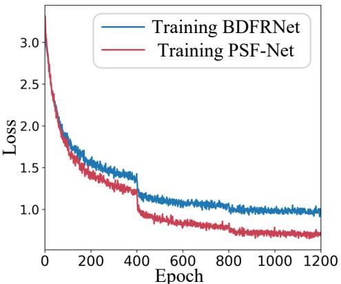  
(a) Training Loss

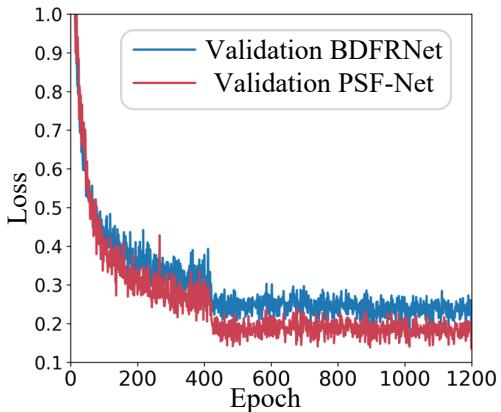  
(b) Validation Loss

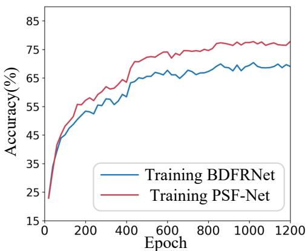  
(c) Training Accuracy

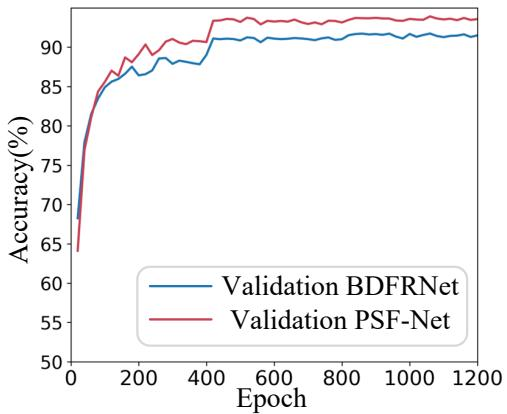  
(d) Validation Accuracy  
Figure 3: Examples of the loss and accuracy curves of BDFRNet and the proposed method for the 5-way 1-shot FSFGIC task on the CUB-200-2011 dataset.

Table 4: Performance of the API module with Conv-4 on CUB-200-2011 under diferent fusion depth settings (5-way).
<table><tr><td>Fusion location</td><td>Retained information</td><td>1-shot</td><td>5-shot</td></tr><tr><td> $\Lambda _ { 1 }$ </td><td>high-resolution textures</td><td> $7 8 . 4 0 { \pm } 0 . 2 0 $ </td><td> $9 0 . 6 7 { \scriptstyle \pm 0 . 2 1 }$ </td></tr><tr><td> $\Lambda _ { 2 } { \bf \Gamma } \left( \bf { o u r s } \right)$ </td><td>local part structures</td><td> $\mathbf { 8 0 . 8 0 { \pm 0 . 1 9 } }$ </td><td> $\mathbf { 9 2 . 7 1 { \pm 0 . 1 0 } }$ </td></tr><tr><td> $\Lambda _ { 3 }$ </td><td>semantic parts</td><td> $8 0 . 0 8 { \pm } 0 . 2 0 $ </td><td> $9 1 . 7 1 { \pm } 0 . 0 9$ </td></tr><tr><td> $\Lambda _ { 4 }$ </td><td>global semantics</td><td> $7 9 . 8 8 { \pm } 0 . 1 8 $ </td><td> $9 2 . 0 1 { \pm } 0 . 0 8 $ </td></tr></table>

## 4.4. Ablation Study on Fusion Depth

To determine the most suitable position for integrating the proposed API module, we apply the API at diferent depth stages of the backbone. Each stage is designed as a convolutional block (comprising convolution, normalization, activation, and pooling), denoted as $\Lambda _ { i } ( i = 1 , 2 , 3 , 4 )$ .We follow the same experimental setup as before, conducting experiments based on the Conv4 and CUB dataset. As shown in Table 4, the best performance is obtained when fusion is applied at $\Lambda _ { 2 }$ . This observation aligns with the characteristics of few-shot fine-grained tasks: the most discriminative cues lie in subtle local structural regions. Phase information sensitively encodes these geometry patterns; however, deeper semantic abstraction weakens its expressiveness due to reduced spatial resolution. Λ2 provides an optimal trade-of, where part-level structure is preserved while shallow appearance noise is largely suppressed. Therefore, $\Lambda _ { 2 }$ is adopted as the default setting in our main experiments.

## 4.5. Ablation Study for diferent frequency components

To further investigate the efectiveness of our proposed method, ablation experiments are conducted on the CUB-200-2011, Stanford Dogs, and Stanford Cars datasets as follows.

We compare three configurations to investigate the contribution of different frequency components: (i) a spatial-only model $( \mathrm { P S F - N e t } _ { S } )$ ; (ii) a spatial–frequency model without phase information $\left( \mathrm { P S F - N e t } _ { A } \right)$ ,which uses only amplitude; (iii) a spatial–frequency modelwithout amplitude information $\left( \mathrm { P S F - N e t } _ { P } \right)$ , and (iv) a full spatial–frequency model with both amplitude and phase (PSF-Net).As shown in Table 6, the complete model that incorporates phase achieves the best performance across all datasets for both Conv-4 and ResNet-12 backbones, indicating that phase-aware frequency cues provide additional complementary information beyond spatial and amplitude features.

## 4.6. Ablation Study on Local Frequency Sampling Strategy

To evaluate the generality and optimality of the proposed local frequency sampling strategy, we conduct comprehensive ablation studies on CUB-200- 2011 and Stanford Cars datasets under the 5-way 1-shot/5-shot settings with a Conv-4 backbone. Only the radius set and the number of orientations in the local frequency module are modified. The default configuration $( r \ =$ $\{ 0 . 3 0 , 0 . 2 2 , 0 . 1 6 \}$ , $o = 8 )$ is designed to capture discriminative mid-to -high frequency structural cues across multiple scales while maintaining suficient

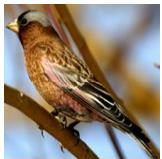

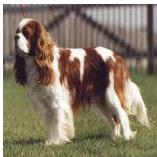

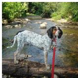

  
(a) Input Iamges

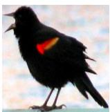

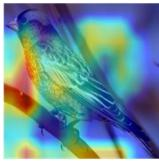

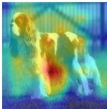

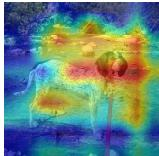

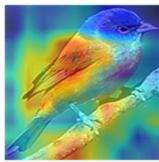

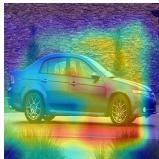  
(b) The Heatmaps of PSF-NetS

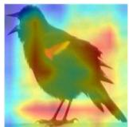

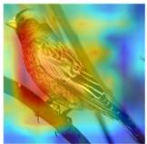

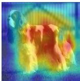

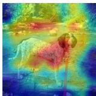

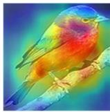

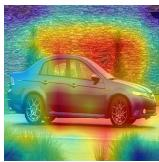  
(c) The Heatmaps of PSF-NetA

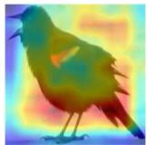

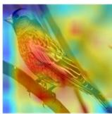

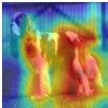

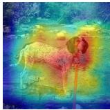

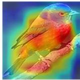  
(d) The Heatmaps of PSF-NetP

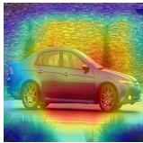

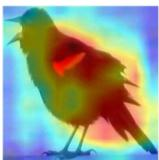

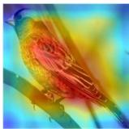

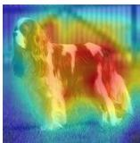

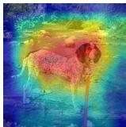

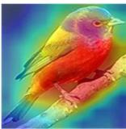  
(e) The Heatmaps of PSF-Net

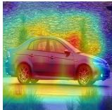

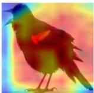

Figure 4: The heatmaps of six images visualized by diferent frequency components. orientation sensitivity to part-level geometric variations, without introducing excessive learnable parameters. Furthermore, phase-based representations are more responsive to subtle structural boundaries, which is essential in fine-grained recognition under limited data.

Results demonstrate that increasing the number of radii progressively improves performance, validating the efectiveness of multi-scale phase structural encoding in distinguishing subtle fine-grained diferences. In contrast, insuficient orientation coverage degrades geometric sensitivity, while excessively dense radius or orientation settings introduce redundant high-frequency noise and increased overfitting risk.As shown in Table ??, the configuration of $r = \{ 0 . 3 0 , 0 . 2 2 , 0 . 1 6 \}$ and o = 8 achieves the best trade-of between representation capacity and generalization, proving the eficiency and robustness of our local frequency sampling strategy.

Table 5: Ablation study of local frequency sampling using the Conv-4 backbone.
<table><tr><td rowspan="2">Model</td><td rowspan="2">Setting (r, o)</td><td colspan="2">CUB-200-2011</td><td colspan="2">Stanford Cars</td></tr><tr><td>1-shot</td><td>5-shot</td><td>1-shot</td><td>5-shot</td></tr><tr><td>r1</td><td>{0.30}, 8</td><td>79.45±0.20</td><td>91.12±0.65</td><td>80.90±0.19</td><td>93.10±0.08</td></tr><tr><td>r2</td><td>{0.30, 0.22}, 8</td><td>79.80±0.18</td><td>91.65±0.60</td><td>81.35±0.17</td><td>93.55±0.07</td></tr><tr><td>r3</td><td>{0.30, 0.22, 0.16}, 4</td><td>80.10±0.17</td><td>92.00±0.58</td><td>81.70±0.16</td><td>94.00±0.06</td></tr><tr><td>Ours</td><td>{0.30, 0.22, 0.16}, 8</td><td>80.81±0.18</td><td>92.69±0.6</td><td>82.28±0.17</td><td>94.58±0.07</td></tr><tr><td>r4</td><td>{0.30, 0.22, 0.16, 0.12}, 8</td><td>80.70±0.18</td><td>92.60±0.60</td><td>82.10±0.17</td><td>94.50±0.07</td></tr><tr><td>r5</td><td>{0.30, 0.22, 0.16}, 12</td><td>80.75±0.18</td><td>92.65±0.60</td><td>82.15±0.17</td><td>94.55±0.07</td></tr><tr><td>r6</td><td>{0.30, 0.22, 0.16}, 16</td><td>80.78±0.18</td><td>92.67±0.60</td><td>82.20±0.17</td><td>94.57±0.07</td></tr></table>

## 4.7. Grad-CAM Visualization

Meanwhile,to further illustrate the efectiveness of the proposed PSF-Net, we employ the Grad-CAM visualization technique using ResNet-12 to analyze model attention regions. It utilizes the six images shown in Fig. 4(a) for illustration. In Grad-CAM, regions with higher energies denote more discriminative parts of an image. Fig. 4(b), (c), (d) and (e) display the attention maps of these six images : (i) a spatial-only model $( \mathrm { P S F - N e t } _ { S } )$ ; (ii) a spatial–frequency model without phase information $\left( \mathrm { P S F - N e t } _ { A } \right)$ ,which uses only amplitude; (iii) a spatial–frequency modelwithout amplitude information $\left( \mathrm { P S F - N e t } _ { P } \right)$ , and (iv) a full spatial–frequency model with both ampli-

Table 6: Performance across diferent frequency components on the proposed PSF-Net with Conv-4 and ResNet-12 using the CUB-200-2011, Stanford Dogs, and Stanford Cars datasets for 5-way tasks.
<table><tr><td rowspan=2 colspan=1>Model</td><td rowspan=2 colspan=1>Backbone</td><td rowspan=1 colspan=1>CUB-200-2011</td><td rowspan=1 colspan=1>Stanford Dogs</td><td rowspan=1 colspan=1>Stanford Cars</td></tr><tr><td rowspan=1 colspan=1>1-shot 5-shot</td><td rowspan=1 colspan=1>1-shot 5-shot</td><td rowspan=1 colspan=1>1-shot 5-shot</td></tr><tr><td rowspan=1 colspan=1> $\overline { { \mathrm { P S F }  – \mathrm { N e t } _ { S } } }$ </td><td rowspan=1 colspan=1>Conv-4</td><td rowspan=1 colspan=1>76.39   90.61</td><td rowspan=1 colspan=1>64.66   81.27</td><td rowspan=1 colspan=1>75.33   90.91</td></tr><tr><td rowspan=1 colspan=1> $\mathrm { P S F - N e t } _ { A }$ </td><td rowspan=1 colspan=1>Conv-4</td><td rowspan=1 colspan=1>80.02  92.28</td><td rowspan=1 colspan=1>66.86  82.57</td><td rowspan=1 colspan=1>78.27  92.78</td></tr><tr><td rowspan=1 colspan=1> $\mathrm { P S F - N e t } _ { P }$ </td><td rowspan=1 colspan=1>Conv-4</td><td rowspan=1 colspan=1>79.52  92.00</td><td rowspan=1 colspan=1>69.05  84.27</td><td rowspan=1 colspan=1>79.83  93.54</td></tr><tr><td rowspan=1 colspan=1> $\mathrm { P S F  – N e t }$ </td><td rowspan=1 colspan=1>Conv-4</td><td rowspan=1 colspan=1>80.90  92.81</td><td rowspan=1 colspan=1>70.50  85.30</td><td rowspan=1 colspan=1>82.28  94.51</td></tr><tr><td rowspan=1 colspan=1> $\overline { { \mathrm { P S F }  – \mathrm { N e t } _ { S } } }$ </td><td rowspan=1 colspan=1>ResNet-12</td><td rowspan=1 colspan=1>82.03  92.78</td><td rowspan=1 colspan=1>77.40  88.41</td><td rowspan=1 colspan=1>90.28   97.26</td></tr><tr><td rowspan=1 colspan=1> $\mathrm { P S F - N e t } _ { A }$ </td><td rowspan=1 colspan=1>ResNet-12</td><td rowspan=1 colspan=1>83.95  93.87</td><td rowspan=1 colspan=1>77.67  85.45</td><td rowspan=1 colspan=1>90.48   97.53</td></tr><tr><td rowspan=1 colspan=1> $\mathrm { P S F - N e t } _ { P }$ </td><td rowspan=1 colspan=1>ResNet-12</td><td rowspan=1 colspan=1>82.26  92.99</td><td rowspan=1 colspan=1>77.61  89.56</td><td rowspan=2 colspan=1>90.43  97.6990.62 97.73</td></tr><tr><td rowspan=1 colspan=1> $\mathrm { P S F  – N e t }$ </td><td rowspan=1 colspan=1>ResNet-12</td><td rowspan=1 colspan=1>84.06 94.02</td><td rowspan=1 colspan=1>77.95  89.86</td></tr></table>

tude and phase (PSF-Net). The proposed PSF-Net with spatial-frequency domain demonstrates a stronger ability to focus on the classification targets themselves.

## 5. Conclusion

This work focuses on the challenge of learning discriminative features for few-shot fine-grained classification when only limited samples are available. We introduce a spatial–frequency framework that incorporates explicit phase modeling at the early feature extraction stage and uses an energy-guided adaptive fusion module to enhance structure-sensitive cues. These designs enable the model to better exploit complementary spatial and frequency information and improve fine-grained recognition under limited-sample settings. The proposed framework is plug-and-play, and compatible with common backbone networks, achieving consistent gains across multiple benchmarks. Overall, our findings highlight the critical role of phase information and frequency-domain energy statistics in improving structural separability and ofer a general paradigm for advancing few-shot visual recognition.

## References

[1] J. Ren, Y. An, T. Lei, J. Yang, W. Zhang, Z. Pan, Y. Liao, Y. Gao, C. Sun, W. Zhang, Adaptive feature selection-based feature reconstruction network for few-shot learning, Pattern Recognition (2025) 112289.

[2] M. Wang, G. Wang, H. Chu, B. Yao, W. Zhang, Y. Wang, J. Yang, Dualsubspace network for few-shot fine-grained image classification, Applied Sciences 16 (10) (2026) 4664.

[3] M. Wang, G. Wang, H. Chu, B. Yao, W. Zhang, Y. Wang, J. Yang, Frequency-enhanced dual-subspace networks for few-shot fine-grained image classification, arXiv preprint arXiv:2604.14958 (2026).

[4] Y. Wang, J. Ren, C. Sun, A. Sowmya, C. Li, W. Zhang, Mssfe-net: a fine-grained object recognition network based on multi-scale spatialfrequency domain feature enhancement, Complex & Intelligent Systems (2026).

[5] L. Zhang, W. Zeng, Z. Pan, Y. Gao, C. Sun, J. Hu, L. Liu, W. Zhang, T. Wang, Adaptive receptive field-based spatial-frequency feature reconstruction network for few-shot fine-grained image classification, arXiv preprint arXiv:2604.16936 (2026).

[6] S. Wang, J. Ren, C. Sun, A. Sowmya, C. Li, W. Zhang, Aagdd-fc: adaptive anisotropic gaussian directional derivative filtering and convolution module for interest point detection, The Journal of Supercomputing 82 (13) (2026) 652.

[7] J. Jing, S. Liu, G. Wang, W. Zhang, C. Sun, Recent advances on image edge detection: A comprehensive review, Neurocomputing 503 (2022) 259–271.

[8] J. Jing, T. Gao, W. Zhang, Y. Gao, C. Sun, Image feature information extraction for interest point detection: A comprehensive review, IEEE Transactions on Pattern Analysis and Machine Intelligence 45 (4) (2022) 4694–4712.

[9] T. Liu, J. Xu, T. Lei, Y. Wang, X. Du, W. Zhang, Z. Lv, M. Gong, Aekan: Exploring superpixel-based autoencoder kolmogorov-arnold network for unsupervised multimodal change detection, IEEE Transactions on Geoscience and Remote Sensing 63 (2024) 1–14.

[10] W. Zhang, Y. Zhao, Y. Gao, C. Sun, Re-abstraction and perturbing support pair network for few-shot fine-grained image classification, Pattern Recognition 148 (2024) 110158.

[11] B. Qiu, J. Guo, J. Kraeima, H. H. Glas, W. Zhang, R. J. Borra, M. J. H. Witjes, P. M. van Ooijen, Recurrent convolutional neural networks for

3d mandible segmentation in computed tomography, Journal of personalized medicine 11 (6) (2021) 492.

[12] Z. Pan, W. Zhang, X. Yu, M. Zhang, Y. Gao, Pseudo-set frequency refinement architecture for fine-grained few-shot class-incremental learning, Pattern Recognition 155 (2024) 110686.

[13] J. Ren, C. Li, Y. An, W. Zhang, C. Sun, Few-shot fine-grained image classification: A comprehensive review, AI 5 (1) (2024) 405–425.

[14] J. Jing, C. Liu, W. Zhang, Y. Gao, C. Sun, ECFRNet: Efective corner feature representations network for image corner detection, Expert Systems with Applications 211 (2023) 118673.

[15] Z. Pan, X. Yu, W. Zhang, Y. Gao, Overcoming learning bias via prototypical feature compensation for source-free domain adaptation, Pattern Recognition 158 (2025) 111025.

[16] T. Lei, W. Song, W. Zhang, X. Du, C. Li, L. He, A. K. Nandi, Semi-supervised 3-D medical image segmentation using multiconsistency learning with fuzzy perception-guided target selection, IEEE Transactions on Radiation and Plasma Medical Sciences 9 (4) (2024) 421–432.

[17] B. Yuan, J. Lu, W. Zhang, B. Wu, T. Wang, C. Wang, C. Sun, L. Guo, Gloresnet: A lightweight 3d cnn with global topological features for preterm brain injury prediction, arXiv preprint arXiv:2606.02498 (2026).

[18] Z. Pan, X. Yu, M. Zhang, W. Zhang, Y. Gao, DyCR: A dynamic clustering and recovering network for few-shot class-incremental learning, IEEE transactions on neural networks and learning systems 36 (4) (2024) 7116–7129.

[19] P.-L. Shui, W.-C. Zhang, Corner detection and classification using anisotropic directional derivative representations, IEEE Transactions on Image Processing 22 (8) (2013) 3204–3218.

[20] J. Lu, D. Xie, J. Qiu, L. Ma, C. Sun, W. Zhang, Second-order gaussian directional derivative representations for image high-resolution corner detection, arXiv preprint arXiv:2601.08182 (2026).

[21] W.-C. Zhang, F.-P. Wang, L. Zhu, Z.-F. Zhou, Corner detection using Gabor filters, IET Image Processing 8 (11) (2014) 639–646.

[22] W. Zhang, C. Sun, Corner detection using second-order generalized gaussian directional derivative representations, IEEE transactions on pattern analysis and machine intelligence 43 (4) (2019) 1213–1224.

[23] P.-L. Shui, W.-C. Zhang, Noise-robust edge detector combining isotropic and anisotropic gaussian kernels, Pattern Recognition 45 (2) (2012) 806– 820.

[24] W. Zhang, Y. Zhao, T. P. Breckon, L. Chen, Noise robust image edge detection based upon the automatic anisotropic Gaussian kernels, Pattern Recognition 63 (2017) 193–205.

[25] W.-C. Zhang, P.-L. Shui, Contour-based corner detection via angle difference of principal directions of anisotropic Gaussian directional derivatives, Pattern Recognition 48 (9) (2015) 2785–2797.

[26] W. Zhang, C. Sun, Corner detection using multi-directional structure tensor with multiple scales, International Journal of Computer Vision 128 (2) (2020) 438–459.

[27] T. Gao, J. Jing, C. Liu, W. Zhang, Y. Gao, C. Sun, Fast corner detection using approximate form of second-order gaussian directional derivative, IEEE Access 8 (2020) 194092–194104.

[28] Y. Li, Y. Bi, W. Zhang, C. Sun, Multi-scale anisotropic gaussian kernels for image edge detection, IEEE Access 8 (2019) 1803–1812.

[29] W. Zhang, C. Sun, T. Breckon, N. Alshammari, Discrete curvature representations for noise robust image corner detection, IEEE Transactions on Image Processing 28 (9) (2019) 4444–4459.

[30] M. Wang, W. Zhang, C. Sun, A. Sowmya, Corner detection based on shearlet transform and multi-directional structure tensor, Pattern recognition 103 (2020) 107299.

[31] Y. Li, W. Zhang, Trafic flow digital twin generation for highway scenario based on radar-camera paired fusion, Scientific reports 13 (1) (2023) 642.

[32] W. Zhang, C. Sun, Y. Gao, Image intensity variation information for

interest point detection, IEEE Transactions on Pattern Analysis and Machine Intelligence 45 (8) (2023) 9883–9894.

[33] D. Xie, J. Qiu, C. Sun, W. Zhang, Second-order gaussian directional derivative representations for image high-resolution corner detection, arXiv preprint arXiv:2601.08182 (2026).

[34] J. Bao, J. Jing, W. Zhang, C. Liu, T. Gao, A corner detection method based on adaptive multi-directional anisotropic difusion, Multimedia Tools and Applications 81 (20) (2022) 28729–28754.

[35] Y. An, J. Jing, W. Zhang, Edge detection using multi-directional anisotropic gaussian directional derivative, Signal, Image and Video Processing 17 (7) (2023) 3767–3774.

[36] Y. Li, B. Feng, W. Zhang, Mutual interference mitigation of millimeterwave radar based on variational mode decomposition and signal reconstruction, Remote Sensing 15 (3) (2023) 557.

[37] W. Zhang, X. Liu, Z. Xue, Y. Gao, C. Sun, NDPNet: A novel non-linear data projection network for few-shot fine-grained image classification, arXiv preprint arXiv:2106.06988 (2021).

[38] B. Ma, J. Guo, T.-T. Zhai, A. van der Schaaf, R. J. Steenbakkers, L. V. van Dijk, S. Both, J. A. Langendijk, W. Zhang, B. Qiu, et al., Ct-based deep multi-label learning prediction model for outcome in patients with

oropharyngeal squamous cell carcinoma, Medical Physics 50 (10) (2023) 6190–6200.

[39] Y. Liao, Y. Gao, W. Zhang, Dynamic accumulated attention map for interpreting evolution of decision-making in vision transformer, Pattern Recognition 165 (2025) 111607.

[40] Y. Li, Y. Bi, W. Zhang, J. Ren, J. Chen, M 2gf: Multi-scale and multi-directional gabor filters for image edge detection, Applied Sciences 13 (16) (2023) 9409.

[41] J. Wang, J. Lu, J. Yang, M. Wang, W. Zhang, An unbiased feature estimation network for few-shot fine-grained image classification, Sensors 24 (23) (2024) 7737.

[42] J. Lu, W. Zhang, Y. Zhao, C. Sun, Image local structure information learning for fine-grained visual classification, Scientific Reports 12 (1) (2022) 19205.

[43] J. Jing, S. Liu, C. Liu, T. Gao, W. Zhang, C. Sun, A novel decision mechanism for image edge detection, in: International Conference on Intelligent Computing, 2021, pp. 274–287.

[44] Z. Zheng, H. Ren, Y. Wu, W. Zhang, H. Lu, Y. Yang, H. T. Shen, Fully unsupervised domain-agnostic image retrieval, IEEE Transactions on Circuits and Systems for Video Technology 34 (6) (2023) 5077–5090.

[45] M. Wang, B. Zheng, G. Wang, J. Yang, J. Lu, W. Zhang, A principal component analysis-based feature optimization network for few-shot fine-grained image classification, Mathematics 13 (7) (2025) 1098.

[46] Y. Liao, W. Zhang, Y. Gao, C. Sun, X. Yu, Asrsnet: Automatic salient region selection network for few-shot fine-grained image classification, in: International Conference on Pattern Recognition and Artificial Intelligence, Springer, 2022, pp. 627–638.

[47] Y. Li, W. Zhang, L. Ji, Automotive radar mutual interference mitigation based on power-weighted hough transform in the time-frequency domain, IEEE Transactions on Vehicular Technology 74 (3) (2024) 3854– 3869.

[48] Y. Liao, Y. Gao, W. Zhang, Feature activation map: Visual explanation of deep learning models for image classification, arXiv preprint arXiv:2307.05017 (2023).

[49] X. Tang, S. Cen, Z. Deng, Z. Zhang, Y. Meng, J. Xie, C. Tang, W. Zhang, G. Zhao, Cascading attention enhancement network for rgb-d indoor scene segmentation, Computer Vision and Image Understanding 259 (2025) 104411.

[50] J. Ren, Y. Zhao, W. Zhang, C. Sun, Zero-shot incremental learning using spatial-frequency feature representations, Scientific Reports 15 (1) (2025) 10932.

[51] W. Wang, M. Wang, H. Wang, W. Guo, J. Guo, C. Sun, L. Ma, W. Zhang, Feature complementation architecture for visual place recognition, arXiv preprint arXiv:2506.12401 (2025).

[52] J. Song, A. Sowmya, W. Zhang, C. Sun, Eficient transformer with compressed attention for stereo image super-resolution, Knowledge-Based Systems (2025) 114844.

[53] J. Lu, W. Wu, K. Gao, P. Mao, W. Zhang, T. Wang, L. Ma, J. Guo, Z. Wu, Y. Hu, et al., Meningioma analysis and diagnosis using limited labeled samples, arXiv preprint arXiv:2602.13335 (2026).

[54] G. Guo, J. Wan, W. Zhang, Gattenrnn: a recurrent neural network for spati-temporal prediction learning based on gated transformer, International Journal of Machine Learning and Cybernetics 17 (5) (2026) 207.

[55] L. Ren, J. Lu, W. Zhang, B. Wu, T. Wang, Y. Liao, J. Guo, C. Sun, L. Guo, Deep learning-based neurodevelopmental assessment in preterm infants, arXiv preprint arXiv:2601.11944 (2026).

[56] Y. Liao, Y. Gao, W. Zhang, Neuron abandoning attention flow: Visual explanation of dynamics inside cnn models, IEEE Transactions on Pattern Analysis and Machine Intelligence (2026).

[57] Y. Liao, N. Nikzad, J. Zhang, W. Zhang, Y. Gao, Learning multiple receptive fields for few-shot image classification, in: 2025 31st International Conference on Mechatronics and Machine Vision in Practice (M2VIP), 2025, pp. 85–92.

[58] Y. Sun, L. Gao, D. Xie, S. Yu, R. Guo, W. Zhang, J. Yang, Y. Bao, Highly durable slippery liquid-infused porous surfaces inspired by orange exocarp, Chemical Engineering Journal (2026) 178623.

[59] H. Cheng, S. Yang, J. T. Zhou, L. Guo, B. Wen, Frequency guidance matters in few-shot learning, in: Proceedings of the IEEE International Conference on Computer Vision, 2023, pp. 11814–11824.

[60] J. Wu, D. Chang, A. Sain, X. Li, Z. Ma, J. Cao, J. Guo, Y.-Z. Song, Bi-directional ensemble feature reconstruction network for few-shot finegrained classification, IEEE Transactions on Pattern Analysis and Machine Intelligence 46 (9) (2024) 6082–6096.

[61] C. Wah, S. Branson, P. Welinder, P. Perona, S. Belongie, The caltech ucsd birds-200-2011 dataset, California Institute of Technology (2011).

[62] A. Khosla, N. Jayadevaprakash, B. Yao, F.-F. Li, Novel dataset for fine-grained image categorization: Stanford dogs, in: Proceedings of the IEEE Conference on Computer Vision and Pattern Recognition Workshop on Fine-Grained Visual Categorization, 2011.

[63] J. Krause, M. Stark, J. Deng, L. Fei-Fei, 3d object representations for fine-grained categorization, in: Proceedings of the IEEE International Conference on Computer Vision Workshops, 2013.

[64] D. Wertheimer, B. Hariharan, Few-shot learning with localization in realistic settings, in: Proceedings of the IEEE Conference on Computer Vision and Pattern Recognition, 2019, pp. 6558–6567.

[65] Y. Zhu, C. Liu, S. Jiang, Multi-attention meta learning for few-shot finegrained image recognition, in: Proceedings of the International Joint Conferences on Artificial Intelligence, 2020, pp. 1090–1096.

[66] S. Xu, F. Zhang, X. Wei, J. Wang, Dual attention networks for fewshot fine-grained recognition, in: Proceedings of the Association for the Advancement of Artificial Intelligence, 2022.

[67] B. Zhang, J. Yuan, B. Li, T. Chen, J. Fan, B. Shi, Learning cross-image object semantic relation in transformer for few-shot fine-grained image classification, in: Proceedings of the ACM International Conference on Multimedia, 2022, pp. 2135–2144.

[68] X.-S. Wei, P. Wang, L. Liu, C. Shen, J. Wu, Piecewise classifier mappings: Learning fine-grained learners for novel categories with few examples, IEEE Transactions on Image Processing 28 (12) (2019) 6116–6125.

[69] Y. Wu, S. Chanda, M. Hosseinzadeh, Z. Liu, Y. Wang, Few-shot learning of compact models via task-specific meta distillation, in: Proceedings of the IEEE Winter Conference on Applications of Computer Vision, 2023, pp. 6265–6274.

[70] C. Zhang, Y. Cai, G. Lin, C. Shen, Deepemd: Diferentiable earth mover’s distance for few-shot learning, IEEE Transactions on Pattern Analysis and Machine Intelligence (2022).

[71] D. Wertheimer, L. Tang, B. Hariharan, Few-shot classification with feature map reconstruction networks, in: Proceedings of the IEEE Conference on Computer Vision and Pattern Recognition, 2021, pp. 8012–8021.

[72] Z.-X. Ma, Z.-D. Chen, L.-J. Zhao, Z.-C. Zhang, X. Luo, X.-S. Xu, Crosslayer and cross-sample feature optimization network for few-shot finegrained image classification, in: Proceedings of Conference on Association for the Advancement of Artificial Intelligence, Vol. 38, 2024, pp. 4136–4144.

[73] Z.-X. Ma, Z.-D. Chen, T. Zheng, X. Luo, Z. Jia, X.-S. Xu, Fewshot fine-grained image classification with progressively feature refinement and continuous relationship modeling 39 (6) (2025) 6036–6044. doi:10.1609/aaai.v39i6.32645.

[74] X. Huang, S. H. Choi, Learning feature alignment and dual correlation for few-shot image classification, CAAI Transactions on Intelligence Technology 9 (2) (2024) 303–318.

[75] S. Yang, X. Li, D. Chang, Z. Ma, J.-H. Xue, Channel-spatial supportquery cross-attention for fine-grained few-shot image classification (2024) 9175–9183doi:10.1145/3664647.3680698.

[76] S. Lee, W. Moon, J.-P. Heo, Task-oriented channel attention for finegrained few-shot classification, in: Proceedings of the IEEE Conference on Computer Vision and Pattern Recognition, 2022.

[77] R. Zhou, J. Chen, Y. Shi, L. Wang, W. Wang, J. Sun, C. Zhang, Metaexploiting frequency prior for cross-domain few-shot learning, in: Advances in Neural Information Processing Systems, 2024.

[78] T. Zhang, Q. Cai, F. Gao, L. Qi, J. Dong, Exploring cross-domain few-shot classification via frequency-aware prompting (2024) 5490– 5498doi:10.24963/ijcai.2024/607.

[79] H. Wang, M. Liu, Y. Chen, Q. Li, Wavelet-based multi-stream spatialfrequency fusion network for few-shot hyperspectral image classification, IEEE Access 13 (2025) 71546–71560.

[80] Y. Liu, J. He, S. Xu, G. Jiang, Spatial-frequency integration network with dual prompt learning for few-shot image classification, in: Proceed ings of the 2024 IEEE AI for Science Congress, 2024.

[81] D. Wertheimer, L. Tang, B. Hariharan, Few-shot classification with feature map reconstruction networks, in: Proceedings of the IEEE Conference on Computer Vision and Pattern Recognition, 2021, pp. 8012–8021.

[82] J. Snell, K. Swersky, R. Zemel, Prototypical networks for few-shot learning, in: Advances in Neural Information Processing Systems, 2017, pp. 4077–4087.

[83] K. Lee, S. Maji, A. Ravichandran, S. Soatto, Meta-learning with diferentiable convex optimization, in: Proceedings of the IEEE Conference on Computer Vision and Pattern Recognition, 2019, pp. 10657–10665.

[84] F. Urban, B. Follet, C. Chamaret, O. Le Meur, T. Baccino, Medium spatial frequencies, a strong predictor of salience, Cognitive Computation 3 (1) (2011) 37–47.