# ToPO: Token-Conditioned Preference Routing for Attention-Based Latent Diffusion Models

Juntao Xu1,∗ Shihong Li2,∗ Hoi Fan Au1 Ning Zhu3

1Tsinghua University 2University of Electronic Science and Technology of China 3Stanford University ∗Equal contribution.

Diffusion-DPO

SDXL Base  
InPO  
MaPO  
ToPO(ours)  
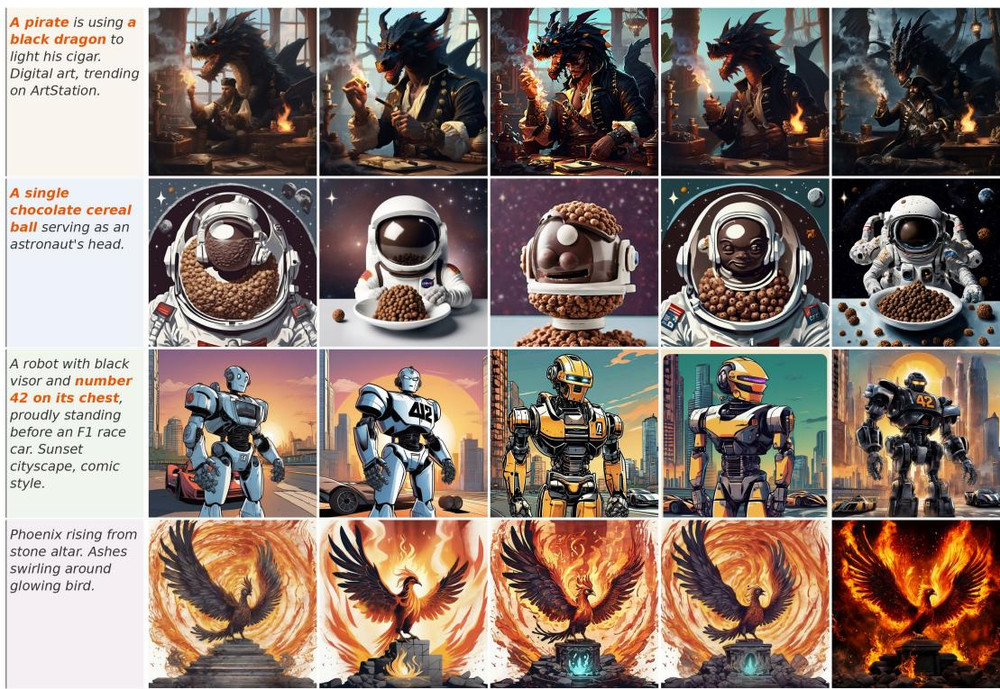  
Figure 1: Illustrative SDXL examples on four fixed prompts, spanning rich visual-detail and compositional requests. Bold prompt terms identify the target constraints in each case. ToPO is shown beside SDXL Base, Diffusion-DPO, InPO, and MaPO; quantitative comparisons are reported separately in Section 5.

## Abstract

Pairwise preference labels rank complete images, yet Diffusion-DPO applies their effect over many spatial and denoising-time coordinates. For attention-based, noise-prediction latent diffusion, ToPO (Token-Oriented Preference Optimization) constructs a per-minibatch, detached, separable spatial–temporal route from branchwise squared-residual contrast in a frozen reference denoiser. Preferred-branch crossattention uses content tokens to modulate the spatial factor, and an auxiliary pixel-midpoint ordering term is added without local labels or a learned reward model. In matched three-seed retrainings with a shared update schedule, ToPO has higher endpoint estimates than Diffusion-DPO on all five reported SD-1.5 metrics and on HPSv2, ImageReward, and CLIP for SDXL. It also receives larger raw win shares in an aggregate blind SDXL A/B study. These findings are scoped to the reported equal-update U-Net protocols rather than an equal-compute comparison.

## 1 Introduction

Preference optimization directly adapts diffusion models to comparisons between generated images (Rafailov et al., 2023; Wallace et al., 2024; Xu et al., 2024). A pairwise label ranks whole images, whereas diffusion training resolves through many spatial–temporal noise-prediction coordinates. Recent work addresses complementary limitations by improving the score-preference objective (Zhu et al., 2025), handling conflicting or noisy pairs (Li et al., 2026b; Liu et al., 2026a), constructing instance-level supervision (Huang et al., 2025; Sun et al., 2026), or learning trajectory rewards (Liang et al., 2025; Zhang et al., 2025; Xian et al., 2026). We study a narrower allocation problem: with a fixed offline winner–loser pair, how can its imagelevel preference signal induce a sample-dependent local update route without constructing external local labels or learning a separate reward model?

The allocation is under-specified: the pair fixes the image-level preference orientation but not how an update should be distributed over local prediction coordinates. We refer to this as the route-allocation problem. Spatial position s and denoising time τ are native noise-prediction indices; a prompt token k becomes actionable only after cross-attention maps its influence back to the spatial–temporal field (Rombach et al., 2022). ToPO is therefore token-oriented rather than token-only: tokens condition a route over diffusionnative coordinates.

ToPO implements this view with a branchwise residual-contrast route. At shared-noise denoising anchors, the route contrasts local squared residual magnitudes of the preferred and dispreferred branches. This observable contrast supplies the spatial and temporal factors, while the signed DPO logit retains the winner–loser orientation. Preferred-branch cross-attention reads the spatial factor into a token-conditioned modulation weight $w _ { k }$ and folds it back into a separable spatial–temporal field $W ( s , \tau )$ . A content-token prior excludes padding, SOS, and EOS positions before normalization; a pixel-midpoint triplet term supplies an auxiliary symmetric ordering constraint rather than a source of token-level supervision.

Figure 1 qualitatively compares ToPO with the base model and three preference-optimization baselines on four fixed SDXL prompts. Bold prompt terms mark the target constraints; Section 5 quantifies the corresponding outcomes under fixed and compositional protocols.

Our main contributions are threefold:

• We formulate route allocation for pair-only offline diffusion DPO: an image-level winner–loser comparison fixes a preference orientation but does not identify a sample-dependent distribution over local denoising coordinates.

• We introduce ToPO, a detached token-conditioned, separable spatial–temporal reweighting of Diffusion-DPO. A frozen reference denoiser derives a residual-contrast route; preferred-branch cross-attention supplies content-token modulation of its spatial factor, and a routed pixel-midpoint term adds an auxiliary symmetric ordering constraint. The appendix analyzes the declared detached update and frozen diagnostic under stated assumptions.

• We find that the locked route has positive three-seed ToPO–Diffusion-DPO endpoint differences on all five SD-1.5 metrics and on SDXL HPSv2, ImageReward, and CLIP under equal-update, sharedhyperparameter U-Net protocols. Descriptive checkpoint, compositional, human-preference, routepermutation, and held-out evaluations map the empirical profile of the complete objective within their respective protocols.

## 2 Related Work

Preference alignment for diffusion models. DPO casts pairwise preference learning without a separate reward-model-and-RL stage (Rafailov et al., 2023; Su et al., 2025). Diffusion alignment uses reward-driven trajectory training (Black et al., 2024; Prabhudesai et al., 2023) or direct feedback objectives, including D3PO, Diffusion-DPO, Diffusion-KTO, and KTO (Yang et al., 2024a; Wallace et al., 2024; Li et al., 2024; Ethayarajh et al., 2024). DSPO changes the preference objective to align score matching and preference learning (Zhu et al., 2025); α-DPO and Semi-DPO instead address robustness to noisy or conflicting preference pairs (Li et al., 2026b; Liu et al., 2026a). Curriculum-DPO orders reward-ranked pairs by difficulty (Croitoru et al., 2025); Kang et al. (2026) changes reference dynamics and timestep-aware optimization. ToPO instead retains the supplied offline pair and asks how its existing comparison can be reweighted across local denoising coordinates (Xu et al., 2025).

Fine-grained spatial and instance alignment. PatchDPO estimates local patch quality for finetuningfree personalized generation (Huang et al., 2025). IAPO advances image-level preference data to automatically constructed instance-level preferences, using vision-language and detector-derived instance masks (Sun et al., 2026). Visual Preference Policy Optimization lifts scalar visual rewards to structured pixel-level advantages with pretrained vision backbones (Ni et al., 2026), whereas ViPO: Visual Preference Optimization at Scale introduces large-scale data and Poly-DPO, a confidence-aware sample-level modification of offline DPO (Li et al., 2026a). BiDPO constructs the BiComp preference data and adds region-level guidance (Liu et al., 2026b); D-Fusion changes pair construction through mask-guided self-attention fusion (Hu et al., 2025). OSPO is a particularly close attention-based alternative: it constructs object-centric self improvement data and combines attention masks with an object-weighted SimPO loss (Oh et al., 2026). In contrast, ToPO retains the supplied winner–loser pair and uses a frozen denoiser’s residual contrast and cross-attention to construct a detached route, without detector, box, patch-quality, or learned local-reward supervision. The methods differ in data construction, supervision, initialization, and endpoint protocol, so Table 9 compares interfaces rather than reported scores.

Temporal and latent preference optimization. Trajectory-aware objectives modify temporal weighting, DDIM inversion, step-wise reward estimation, or reference handling (Yang et al., 2024b; Lu et al., 2025; Li et al., 2025; Wu et al., 2025; Hong et al., 2024; Kang et al., 2026; Zhu et al., 2026). SPO learns step-aware preference supervision (Liang et al., 2025), LPO learns a noise-aware latent reward model (Zhang et al., 2025), and SLRM/TAPO learns noise-compatible latent rewards for trajectory-level advantages (Xian et al., 2026). ToPO instead remains an offline pairwise DPO objective: its separable time factor is inferred from the supplied pair’s frozen-reference residual contrast and is coupled to a token-conditioned spatial factor, rather than to a learned reward model, moving reference, or re-sampled step-level labels.

Attention-guided routing and control. Latent diffusion uses cross-attention for text conditioning (Rombach et al., 2022); Prompt-to-Prompt, Attend-and-Excite, and Freestyle manipulate attention at inference (Hertz et al., 2023; Chefer et al., 2023; Xue et al., 2023). Concurrent STAR studies adaptive spatiotemporal reward allocation for text-to-image RL post-training (Shen et al., 2026). ToPO instead uses preferred-branch attention as a conditional read–write bridge inside an offline DPO update: it reads a residual-contrast map into content-token weights and writes the resulting modulation back to diffusion coordinates. Its distinguishing interface is thus a frozen-reference, pair-only route without external local supervision, learned latent rewards, online reward optimization, or a changed preference-data construction. Appendix C.1 expands this comparison.

## 3 Preliminaries: Diffusion Preference Learning

## 3.1 Conditional latent diffusion

Let x be an image, $z _ { 0 } = \mathcal { E } ( x )$ its latent encoding, and c a text prompt. For noise $\varepsilon \sim \mathcal { N } ( 0 , I )$ , the standard DDPM forward process (Ho et al., 2020) produces

$$
z _ { \tau } = \sqrt { \bar { \alpha } _ { \tau } } z _ { 0 } + \sqrt { 1 - \bar { \alpha } _ { \tau } } \varepsilon , \qquad \bar { \alpha } _ { \tau } = \prod _ { j \leq \tau } ( 1 - \beta _ { j } ) .\tag{1}
$$

The denoiser $\varepsilon _ { \boldsymbol { \theta } } { \left( z _ { \tau } , \tau , c \right) }$ predicts ε. Its native prediction coordinates are a latent spatial position s and a denoising time $\tau ;$ deterministic DDIM trajectories are one common reverse-time construction (Song et al., 2021). We write the corresponding local residual as

$$
d _ { \theta } ( x ; c , s , \tau ) = \| \varepsilon _ { \theta } ( z _ { \tau } , \tau , c ) [ s ] - \varepsilon [ s ] \| _ { 2 } ^ { 2 } .\tag{2}
$$

Thus, spatial locations and timesteps are intrinsic coordinates of diffusion training. A prompt token is different: it affects the denoiser through cross-attention rather than indexing a noise-prediction residual on its own.

## 3.2 Human preferences and Diffusion-DPO

The preference data consist of triples $Z = ( c , x ^ { + } , x ^ { - } )$ , where $x ^ { + }$ is preferred to x− for prompt c. We use the standard Bradley–Terry interpretation

$$
\operatorname* { P r } ( x ^ { + } \succ x ^ { - } \mid c ) = \sigma \big ( r ^ { * } ( c , x ^ { + } ) - r ^ { * } ( c , x ^ { - } ) \big ) ,\tag{3}
$$

with an unobserved human reward $r ^ { * }$ . Direct preference optimization eliminates an explicit reward model by comparing a learned policy score to a reference score (Rafailov et al., 2023). In diffusion models, Diffusion-DPO instantiates this comparison with a tractable surrogate for the image-level diffusion likelihood (Wallace et al., 2024). Abstractly, if $S _ { \theta } ( c , x )$ denotes such a surrogate and $\Delta _ { \theta } ( Z ) = S _ { \theta } ( c , x ^ { + } ) - S _ { \theta } ( c , x ^ { - } )$ , the pairwise objective has the form

$$
\begin{array} { r } { \mathcal { L } _ { \mathrm { D - D P O } } = - \mathbb { E } _ { Z } \log \sigma ( \beta \left[ \Delta _ { \theta } ( Z ) - \Delta _ { \mathrm { r e f } } ( Z ) \right] ) . } \end{array}\tag{4}
$$

The trajectory approximation differs across diffusion preference objectives, but the relevant common feature here is unchanged: each preference pair enters the loss through one image-level scalar comparison.

## 3.3 From scalar preference to local credit

The diffusion preference objective in equation 4 ranks two images, whereas its denoising surrogate is assembled from many local residuals in equation 2. This creates a route-allocation question: the objective supplies a global comparison but does not prescribe a sample-specific allocation over (s, $( s , \tau )$ . Prompt token k affects a local prediction through cross-attention rather than serving as another residual index. ToPO consequently uses the declared preferred-branch attention map $A _ { k } ^ { + } ( s , \tau )$ as a conditional bridge from token modulation back to a spatial–temporal field.

The route-factor diagnostic makes this transition empirical. For every pair and candidate factor, we normalize its allocation and measure its KL divergence from uniform on that factor’s declared support. Across 1,716 preference pairs, token, timestep, and spatial allocations each depart from uniform. Frequency is shown as a non-route comparison rather than selected or rejected by its raw KL magnitude. Because raw KL also depends on support cardinality, Figure 2 is a within-factor non-uniformity diagnostic rather than a cross-factor ranking. It motivates a token-conditioned, separable spatial–temporal construction—native diffusion coordinates $( s , \tau )$ plus a cross-attention token modulation—without claiming that non-uniformity establishes semantic correctness. Section 4 turns this construction into a routed preference objective.

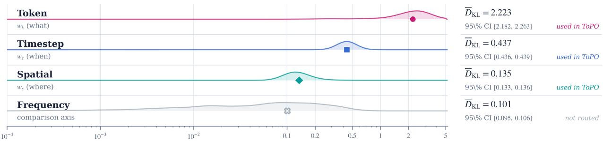  
Figure 2: Route-factor diagnostic over 1,716 preference pairs. Curves show pair-level KL divergence from a uniform allocation on each factor’s declared support, on a logarithmic scale; markers and the sidebar give bootstrap means and 95% intervals. The raw KL values diagnose non-uniformity within a factor and are not used to rank factors with different support sizes. Token, timestep, and spatial allocations depart from uniform, while frequency is retained only as a comparison.

## 4 ToPO: Token-Oriented Spatial–Temporal Preference Routing

## 4.1 Overview

The preliminary analysis identifies non-uniform candidate statistics that can define a route over native diffusion coordinates rather than assign a loss directly to prompt tokens. ToPO uses a branchwise residualcontrast route to construct a spatial factor $w _ { s } ( s )$ , an anchor-time factor $w _ { \tau } ( \tau )$ , and a token-conditioned modulation weight $w _ { k } ( k )$ as an attention-weighted content-token readout of the spatial factor. Preferredbranch cross-attention folds this modulation back into one separable spatial–temporal map $W ( s , \tau )$ . Thus, tokens modulate a diffusion-native route; they are not a separate loss coordinate. The frozen reference constructs the route, whose spatial factor also weights the midpoint regularizer. Figure 3 summarizes the training-time computation.

## 4.2 Token-conditioned separable spatial–temporal route construction

For an anchor $\tau _ { i } \in \{ 5 0 , 3 4 9 , 6 4 9 , 9 4 9 \}$ , the residual-contrast pass noises both endpoints with the same draw $\varepsilon _ { i }$ and evaluates the frozen-reference predictions $\begin{array} { r } { \widehat { \varepsilon } _ { \mathrm { r e f } , i } ^ { \pm } = \varepsilon _ { \mathrm { r e f } } ( z _ { \tau _ { i } } ^ { \pm } , \tau _ { i } , c ) } \end{array}$ . For channel $q$ and latent site $s ,$ its branchwise squared-residual contrast is

$$
{ \cal R } _ { i } ^ { \pm } ( q , s ) = \omega _ { i } \bigl ( \varepsilon _ { i } ( q , s ) - \widehat { \varepsilon } _ { \mathrm { r e f } , i } ^ { \pm } ( q , s ) \bigr ) ^ { 2 } , \qquad { \cal D } _ { i } ( s ) = \frac { 1 } { C } \sum _ { q = 1 } ^ { C } \left| { \cal R } _ { i } ^ { + } ( q , s ) - { \cal R } _ { i } ^ { - } ( q , s ) \right| .\tag{5}
$$

Here $\omega _ { i }$ is the Diffusion-DPO integrand weight. $D _ { i } ( s )$ is a symmetric observable residual-contrast magnitude: it is high where the frozen reference exhibits different local residual magnitudes for the two image branches. We use this label-invariant quantity to assign allocation mass, while the signed winner–loser term $\delta ^ { + } - \delta ^ { - }$ in equation 12 specifies preference direction. For example, a site with residual magnitudes $( . 1 , . 4 )$ receives contrast .3 under either ordering of the branch labels. Thus the route emphasizes coordinates with larger branchwise residual-magnitude differences; it is not a standalone local preference label. Let Norm normalize a nonnegative vector over its declared support to sum to one. The residual-contrast pass forms the data-dependent spatial and anchor-time marginals

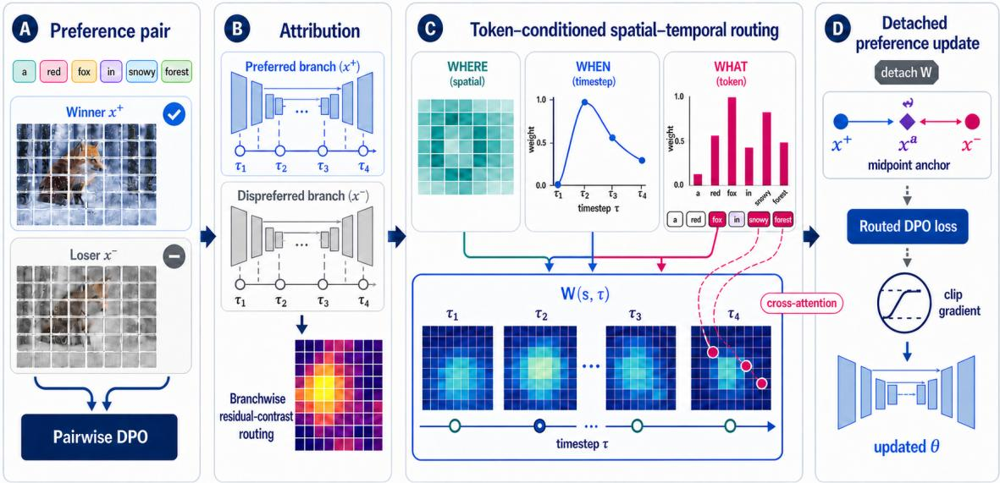  
Figure 3: ToPO routing pipeline (schematic). A frozen reference contrasts preferred and dispreferred local squared residuals at four full-precision anchors. Spatial ${ w _ { s } ( s ) }$ and timestep $w _ { \tau } ( \tau )$ define a separable route; the cross-attention-projected token-conditioned modulation weight $w _ { k } ( k )$ adjusts its spatial factor, as shown by the dashed magenta token-to-site paths. The detached field reweights Diffusion-DPO, while $\widetilde { W _ { s } }$ weights the auxiliary pixel-midpoint ordering term before the clipped AdamW update. Pair labels supply the DPO sign; routing supplies coordinate allocation.

$$
d _ { s } ( s ) = \frac { 1 } { | { \cal A } | } \sum _ { i \in { \cal A } } D _ { i } ( s ) , \qquad d _ { \tau } ( \tau _ { i } ) = \frac { 1 } { | { \cal S } | } \sum _ { s \in { \cal S } } D _ { i } ( s ) ,\tag{6}
$$

then mixes each normalized marginal with its declared structural prior:

$$
w _ { s } = \mathrm { N o r m } _ { 1 } [ \lambda \mathrm { N o r m } _ { 1 } [ d _ { s } ] + ( 1 - \lambda ) p _ { s } ] , \qquad \bar { w } _ { \tau } ( \tau _ { i } ) = \mathrm { N o r m } _ { 1 } [ \lambda \mathrm { N o r m } _ { 1 } [ d _ { \tau } ] + ( 1 - \lambda ) p _ { \tau } ] .\tag{7}
$$

The locked configuration uses $\lambda \ : = \ : . 5 ,$ a uniform spatial prior, and an SNR-flat anchor-time prior. During training, the anchor-time distribution is evaluated at an arbitrary sampled timestep through normalized Gaussian interpolation with $\sigma = 1 0 0$

$$
w _ { \tau } ( \tau ) = | A | \sum _ { i \in \mathcal { A } } \kappa _ { \sigma } ( \tau - \tau _ { i } ) \bar { w } _ { \tau } ( \tau _ { i } ) , \qquad \kappa _ { \sigma } ( \tau - \tau _ { i } ) = \frac { \exp ( - | \tau - \tau _ { i } | ^ { 2 } / ( 2 \sigma ^ { 2 } ) ) } { \sum _ { j \in A } \exp ( - | \tau - \tau _ { j } | ^ { 2 } / ( 2 \sigma ^ { 2 } ) ) } .\tag{8}
$$

At every preferred-branch residual-contrast forward, we capture the attention probabilities of all U-Net modules named attn2. We average query–key attention probabilities over heads, average each captured layer over the four anchors, average the resized layer maps, and bilinearly resize the result to the native latent grid (64×64 for SD-1.5 and $1 2 8 \times 1 2 8$ for SDXL); denote the resulting map by $\bar { A } _ { k } ^ { + } ( s )$ . We use the preferred branch as the declared coordinate-to-token readout: it conditions the spatial route on the image that defines the desired direction, while the signed DPO logit in equation 12 alone carries the winner–loser orientation. This choice is neither a target annotation nor a claim that preferred-only attention is the unique valid bridge; loser-only and symmetric bridges are distinct route variants. The token pathway reads the pre-prior spatial

evidence $w _ { s } ^ { \mathrm { d a t a } } = \mathrm { N o r m } _ { 1 } [ d _ { s } ]$ through this map:

$$
w _ { k } ^ { \mathrm { d a t a } } ( k ) \propto { \bf 1 } _ { \mathrm { c o n t e n t } } ( k ) \sum _ { s } \bar { A } _ { k } ^ { + } ( s ) w _ { s } ^ { \mathrm { d a t a } } ( s ) , \qquad w _ { k } = \mathrm { N o r m } _ { 1 } \left[ \lambda \mathrm { N o r m } _ { 1 } [ w _ { k } ^ { \mathrm { d a t a } } ] + ( 1 - \lambda ) p _ { k } \right] .\tag{9}
$$

The content-token indicator removes padding, SOS, and the valid EOS position before normalization. This defines $w _ { k }$ as an attention-weighted token-conditioned modulation statistic of branchwise residual disagreement while retaining a content-token prior.

Cross-attention folds the factors into the field used by the objective:

$$
\begin{array} { r l r } & { } & { W _ { s } ( s ) = \mathrm { N o r m } _ { \mathrm { m e a n } } \Biggl ( w _ { s } ( s ) \Biggl [ \sum _ { k } \bar { A } _ { k } ^ { + } ( s ) w _ { k } ( k ) \Biggr ] \Biggr ) , } \\ & { } & { W ( s , \tau ) = W _ { s } ( s ) w _ { \tau } ( \tau ) , \qquad ( \widetilde { W } _ { s } , \widetilde { w } _ { \tau } ) = \mathrm { s g } [ W _ { s } , w _ { \tau } ] , } \\ & { } & { \widetilde { W } ( s , \tau ) = \widetilde { W } _ { s } ( s ) \widetilde { w } _ { \tau } ( \tau ) . } \end{array}\tag{10}
$$

Here $w _ { s } \in \mathbb { R } ^ { | s | } , w _ { \tau } \in \mathbb { R } ^ { | T | }$ , and $w _ { k } \in \mathbb { R } ^ { | K | }$ , whereas $W \in \mathbb { R } ^ { | S | \times | T | }$ . Equation 10 is deliberately separable over the two native loss coordinates: $w _ { k }$ modulates $W _ { s } .$ , and does not introduce a three-dimensional $( s , \tau , k )$ loss tensor. At every update t, the frozen reference computes $W _ { t } = { \mathcal { W } } _ { \mathrm { r e f } } ( B _ { t } )$ from the current preference minibatch. The policy then uses $\widetilde { W } _ { t } = \mathrm { s g } [ W _ { t } ]$ on that same update: the route is differentiated through neither the attributor nor the reference model. This per-minibatch construction is shared by the SD-1.5 and SDXL implementations.

The normalization convention is part of the construction rather than a cosmetic rescaling. For a nonnegative map u on its declared support $\mathcal { I }$ , we use

$$
\operatorname { N o r m } _ { \mathrm { m e a n } } [ u ] _ { j } = \frac { u _ { j } } { \operatorname* { m a x } \{ | \mathcal { I } | ^ { - 1 } \sum _ { j ^ { \prime } \in \mathcal { I } } u _ { j ^ { \prime } } , 1 0 ^ { - 8 } \} } .\tag{11}
$$

Consequently, multiplying the factors changes their arrangement across coordinates without allowing a vanishing or arbitrarily scaled factor to set the global loss scale. The $1 0 ^ { - 8 }$ floor is the implementation safeguard used before the post-clipping update. This convention also makes the Shuffled- $W$ stress test interpretable: it alters the arrangement of a normalized route rather than merely changing the total weight applied to the loss.

## 4.3 Preference and anchor losses

The main objective applies the detached route to the reference-relative local residual advantage. With policy and reference predictions $\widehat { \varepsilon } _ { \theta } ^ { \pm }$ and $\widehat { \varepsilon } _ { \mathrm { r e f } } ^ { \pm }$ at a sampled training timestep, define

$$
\begin{array} { c } { { \displaystyle \delta ^ { \pm } = \displaystyle \frac { 1 } { C | \mathcal { S } | } \sum _ { q , s } \widetilde { W } _ { s } ( s ) \left[ \left( \widehat { \varepsilon } _ { \mathrm { r e f } } ^ { \pm } ( q , s ) - \varepsilon ^ { \pm } ( q , s ) \right) ^ { 2 } - \left( \widehat { \varepsilon } _ { \theta } ^ { \pm } ( q , s ) - \varepsilon ^ { \pm } ( q , s ) \right) ^ { 2 } \right] \ : , } } \\ { { \displaystyle \mathcal { L } _ { \mathrm { T o P O } } = - \mathbb { E } \log \sigma \left( \beta \widetilde { w } _ { \tau } ( \tau ) [ \delta ^ { + } - \delta ^ { - } ] \right) . } } \end{array}\tag{12}
$$

Thus $\widetilde { W _ { s } }$ weights the per-site residual reduction and $\widetilde { w } _ { \tau }$ scales the sampled-timestep preference logit. We further form a deterministic pixel-midpoint anchor $x ^ { a } = \mathcal { E } ( ( x ^ { + } + x ^ { - } ) / 2 )$ and penalize an ordering violation between the policy’s spatially weighted prediction distances to the two endpoints:

$$
\mathcal { L } _ { \mathrm { t r i } } = \mathbb { E } \left[ \operatorname* { m a x } \left\{ 0 , \left. \left( \widehat { \varepsilon } _ { \theta } ^ { a } - \widehat { \varepsilon } _ { \theta } ^ { + } \right) \odot \sqrt { \widetilde W _ { s } } \right. _ { 2 } ^ { 2 } - \left. \left( \widehat { \varepsilon } _ { \theta } ^ { a } - \widehat { \varepsilon } _ { \theta } ^ { - } \right) \odot \sqrt { \widetilde W _ { s } } \right. _ { 2 } ^ { 2 } + \alpha \right\} \right] .\tag{13}
$$

The complete loss is $\mathcal { L } _ { \mathrm { T o P O } } + \gamma \mathcal { L } _ { \mathrm { t r i } }$ , with $\gamma = 0 . 1$ and $\alpha = 0 . 0 5$ in the locked run configuration. We encode the pixel midpoint $\mathcal { E } ( ( x ^ { + } + x ^ { - } ) / 2 )$ rather than interpolate the two endpoint latents; this fixes a deterministic, symmetric image-space anchor under the same encoder used for both endpoints. Pixel averaging can contain ghosted or otherwise off-manifold content, so the anchor is not treated as a natural-image target and no generated image is trained to imitate it. It only supplies a common reference for the relative ordering of the two spatially weighted prediction distances. Because its three predictions are evaluated at one sampled timestep, it uses the shared factor $\widetilde { W _ { s } }$ , not the full $W ( s , \tau )$

The controlled removals, per-minibatch execution order, and scope of the supporting characterization are specified in Appendix B.2. They keep the underlying preference pairs fixed and test sensitivity to the declared routing factors under the locked configuration.

## 5 Experiments

## 5.1 Settings, metrics, and reporting

We evaluate SD-1.5 and SDXL with a fixed six-method checkpoint protocol. Non-ToPO rows are authorreleased final checkpoints and serve as descriptive within-backbone references. Locked ToPO runs initialize from SFT-winners (SD-1.5) or SDXL Base and use 500 AdamW updates on Pick-a-Pic v2 pairs (Kirstain et al., 2023) after 200 warmup updates. They are full-U-Net finetunes with effective batches of 1,024 and 512. A frozen fp32 reference recomputes the residual-contrast route on each minibatch and detaches it before the policy update; Appendix B.2 records precision, route, and triplet settings. The matched ToPO– Diffusion-DPO study is equal-update and shared-hyperparameter, not equal-GPU-hour or equal-searchbudget.

We report PickScore, HPSv2, ImageReward, aesthetic score, CLIP, GenEval (Ghosh et al., 2023), and T2I-CompBench (Huang et al., 2023). Tables use audited locked endpoints; bootstrap artifacts resample prompts, not training runs. Appendix B.4 gives all three matched ToPO–Diffusion-DPO streams per backbone at the shared $\beta = 2 0 0 0$ , 500-update endpoint. Backbone blocks remain separate protocols, and no automatic metric is treated as a universal preference endpoint.

Reporting convention. Tables are read within backbone–metric blocks and ablation panels. Mint/bold and mist-blue/italics mark the largest and second-largest distinct point estimates, not statistical significance; the .0001 SDXL CB Avg. near-tie and terminal r-gaps are uncolored.

## 5.2 Aggregate preference results

Table 1 reports multi-metric outcomes. On SD-1.5, ToPO has the largest listed point estimate on PickScore, HPSv2, ImageReward, and aesthetic score, while InPO leads CLIP; it exceeds the listed Diffusion-DPO checkpoint on all five. The second block gives the SDXL profile. The matched three-seed ToPO–Diffusion-DPO study is the controlled comparison: mean paired effects are positive on all five SD-1.5 metrics and on SDXL HPSv2, ImageReward, and CLIP (Appendix B.4). We report seedwise values and sample standard deviations, not prompt-bootstrap intervals as training-seed inference.

## 5.3 Blind human preference study

We conduct a blind SDXL pairwise study with 16 participants, 300 prompts, and one shared seed per prompt. Prompt-conditioned, unlabeled A/B judgments select overall preference, visual appeal, or prompt faithful ness, with ties allowed (Wallace et al., 2024); Figure 5 reports 300 aggregate responses per comparison– question pair.

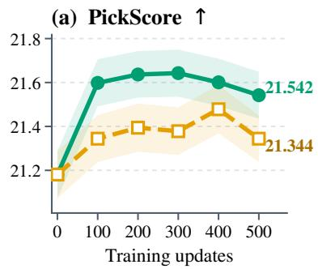

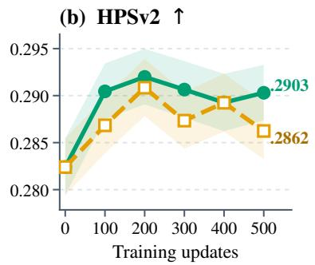

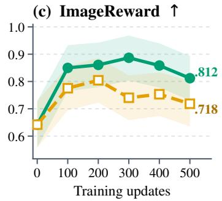  
Figure 4: Controlled SD-1.5 trajectory. PickScore, HPSv2, and ImageReward are evaluated at every checkpoint for one controlled training seed with shared initialization and schedule. Bands are 95% promptbootstrap intervals on 500 prompts, not training-seed intervals. Seedwise endpoints are reported separately in Appendix B.4.

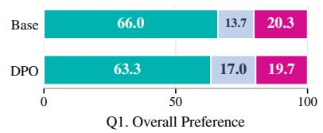

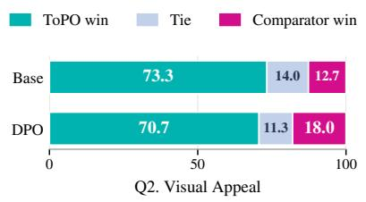

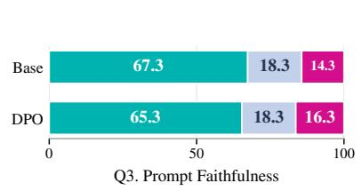  
Figure 5: Blind SDXL A/B study: 16 participants, hidden methods, and ties allowed. Bars show 300 descriptive aggregate responses per bar; the released record has no clustered uncertainty.  
ToPO is selected more often in all six bars. The (ToPO/tie/comparator) triples are (198, 41, 61)/(220, 42, 38)/(202, 55, 4 against SDXL Base and (190, 51, 59)/(212, 34, 54)/(196, 55, 49) against Diffusion-DPO, ordered by the three questions. They are descriptive aggregate shares, not participant-level significance tests, because the released record is aggregate-only.

Table 1: Descriptive Pick-a-Pic checkpoint outcomes (500 prompts). Non-ToPO rows use author-released final checkpoints and serve as within-backbone references, not matched retraining comparisons. Shading denotes point-estimate rank, not statistical significance.
<table><tr><td>Backbone</td><td>Method</td><td>PickScore ↑</td><td>HPSv2 ↑</td><td>ImageReward ↑</td><td>Aesthetic ↑</td><td>CLIP↑</td></tr><tr><td rowspan="6">SD-1.5</td><td>Base</td><td>20.543</td><td>.2467</td><td>.074</td><td>5.325</td><td>27.199</td></tr><tr><td>Diffusion-DPO</td><td>20.947</td><td>.2586</td><td>.250</td><td>5.336</td><td>27.595</td></tr><tr><td>SFT-winners</td><td>21.181</td><td>.2824</td><td>.642</td><td>5.354</td><td>28.064</td></tr><tr><td>KTO</td><td>21.108</td><td>.2810</td><td>.618</td><td>5.351</td><td>28.003</td></tr><tr><td>InPO</td><td>21.410</td><td>.2871</td><td>.748</td><td>5.357</td><td>28.467</td></tr><tr><td>ToPO</td><td>21.542</td><td>.2903</td><td>.812</td><td>5.361</td><td>28.393</td></tr><tr><td rowspan="6">SDXL</td><td>Base</td><td>21.866</td><td>.2869</td><td>.744</td><td>5.359</td><td>28.411</td></tr><tr><td>Diffusion-DPO</td><td>22.264</td><td>.3005</td><td>.934</td><td>5.365</td><td>29.018</td></tr><tr><td>SFT-winners</td><td>21.481</td><td>.2829</td><td>.647</td><td>5.348</td><td>28.526</td></tr><tr><td>InPO</td><td>22.208</td><td>.3044</td><td>.955</td><td>5.365</td><td>28.842</td></tr><tr><td>MaPO</td><td>21.945</td><td>.2962</td><td>.866</td><td>5.377</td><td>28.613</td></tr><tr><td>ToPO</td><td>22.270</td><td>.3140</td><td>1.032</td><td>5.360</td><td>29.487</td></tr></table>

Table 2: Compositional estimates. Avg. is unweighted; full suites are in Appendix C. Shading marks point-estimate rank only; the .0001 SDXL CB Avg. near-tie is unshaded.
<table><tr><td colspan="8">SD-1.5</td><td colspan="7">SDXL</td></tr><tr><td></td><td colspan="3">GenEval ↑</td><td colspan="3">T2I-CompBench ↑</td><td colspan="3"></td><td colspan="3">GenEval ↑</td><td colspan="3">T2I-CompBench ↑</td></tr><tr><td>Method</td><td>Avg.</td><td>Colors</td><td>Position</td><td>Avg.†</td><td>Color</td><td>Shape</td><td></td><td>Method</td><td>Avg.‡</td><td>Colors</td><td>Position</td><td>Avg.†</td><td>Color</td><td>Shape</td></tr><tr><td>Base</td><td>.4378</td><td>.7553</td><td>.0500</td><td>.3393</td><td>.3750</td><td>.3715</td><td>Base</td><td></td><td>.5783</td><td>.8723</td><td>.1275</td><td>.4533</td><td>.6277</td><td>.4878</td></tr><tr><td>Diffusion-DPO</td><td>.4591</td><td>.7926</td><td>.0625</td><td>.3521</td><td>.4028</td><td>.3842</td><td>Diffusion-DPO</td><td>.5917</td><td>.8644</td><td></td><td>.1075</td><td>.4974</td><td>.7177</td><td>.5378</td></tr><tr><td>SFT-winners</td><td>.4878</td><td>.8138</td><td>.0725</td><td>.3870</td><td>.4761</td><td>.4310</td><td>SFT-winners</td><td></td><td>.5464</td><td>.8670</td><td>.1250</td><td>.4436</td><td>.6089</td><td>.4955</td></tr><tr><td>KTO</td><td>.4879</td><td>.8271</td><td>.0550</td><td>.3887</td><td>.4875</td><td>.4300</td><td>InPO</td><td>.5827</td><td>.8750</td><td></td><td>.1125</td><td>.4731</td><td>.6731</td><td>.5231</td></tr><tr><td>InPO</td><td>.4925</td><td>.8245</td><td>.0725</td><td>.3984</td><td>.4967</td><td>.4389</td><td>MaPO</td><td>.5687</td><td>.8803</td><td></td><td>.1225</td><td>.4691</td><td>.6429</td><td>.5197</td></tr><tr><td>ToPO</td><td>.5092</td><td>.8404</td><td>.0775</td><td>.4123</td><td>.5242</td><td>.4579</td><td>ToPO</td><td></td><td>.6168 .9069</td><td></td><td>.1675</td><td>.4975</td><td>.7190</td><td>.5398</td></tr></table>

## 5.4 System-level compositional outcomes

Table 2 reports declared GenEval and shared T2I-CompBench aggregates; Appendix C gives full suites. Table 2 reports declared GenEval and shared T2I-CompBench aggregates; Appendix C gives full suites.

On SD-1.5, ToPO leads both displayed summaries (.5092/.4123 versus .4591/.3521 for Diffusion-DPO). On SDXL, it leads GenEval (.6168), while the .4975/.4974 T2I-CompBench averages are a declared near tie at reported precision.

## 5.5 Routing Ablations and Preference-Scale Analysis

Route-allocation controls. Panel A compares three locked SD-1.5 routes. Uniform-W replaces the route by one while retaining the midpoint term. Shuffled-W applies a fresh joint value permutation before each loss evaluation, preserving the route-value multiset while changing its pair–coordinate assignment and local spatial–temporal structure. In this single locked run, the full route has the largest point estimate on all seven displayed outcomes, including PickScore (21.237 → 21.542), ImageReward (.769 → .812), and GenEval average (.4710 → .5092) versus Uniform-W. Terminal r-gap is a within-run diagnostic and is not rankcoded.

Multi-seed route controls. The single-run profile complements the matched three-seed comparison in Appendix B.4. Full ToPO exceeds Uniform-W on all five means. Against the coordinate-shuffled stress test, it is higher on PickScore, ImageReward, and CLIP, whereas Shuffled-W is higher on HPSv2 and Aesthetic. The matched evidence therefore supports a selective preference-reward and alignment advantage of the complete allocation design, while separating it from an all-metric dominance claim.

Component and scale sensitivity. Spatial, timestep, and token removals reduce PickScore by .295, .307, and .168; removing the content-token prior gives the largest reduction (.429). Removing the midpoint raises CLIP slightly but lowers PickScore and GenEval. The β sweep is non-monotone: 2000 leads PickScore, CLIP, and GenEval, while 1000 leads HPSv2 and ImageReward.

Table 3: SD-1.5 ToPO ablations and route-allocation controls. Panel A uses one locked run per route allocation; matched multi-seed means are in Table 7. Shading marks point-estimate rank, not significance.
<table><tr><td>Configuration</td><td></td><td></td><td>PickScore ↑ HPSv2 ↑ ImageReward ↑</td><td>Aesthetic ↑</td><td>CLIP↑</td><td>GE Avg. 7</td><td>GE Count ↑</td><td>Final r-gap</td></tr><tr><td colspan="9">A. Route-allocation controls (one locked run per configuration)</td></tr><tr><td>ToPO (full)</td><td>21.542</td><td>.2903</td><td>.812</td><td>5.361</td><td>28.393</td><td>.5092</td><td>.4969</td><td>3.64×10-4</td></tr><tr><td>Uniform-W</td><td>21.237</td><td>.2851</td><td>.769</td><td>5.348</td><td>28.198</td><td>.4710</td><td>.4418</td><td>4.29×10-4</td></tr><tr><td>Shuffled-W</td><td>21.382</td><td>.2899</td><td>.741</td><td>5.358</td><td>28.180</td><td>.4926</td><td>.4375</td><td>-3.47×10-5</td></tr><tr><td colspan="9">B. Component removals</td></tr><tr><td>ToPO (full)</td><td>21.542</td><td>.2903</td><td>.812</td><td>5.361</td><td>28.393</td><td>.5092</td><td>.4969</td><td>3.64×10-4</td></tr><tr><td>wk ≡ 1</td><td>21.374</td><td>.2842</td><td>.803</td><td>5.365</td><td>28.271</td><td>.5026</td><td>.4406</td><td>5.53×10-4</td></tr><tr><td>wτ ≡ 1</td><td>21.235</td><td>.2883</td><td>.805</td><td>5.361</td><td>28.331</td><td>.5079</td><td>.4500</td><td>4.27×10-4</td></tr><tr><td>ws ≡ 1</td><td>21.247</td><td>.2856</td><td>.808</td><td>5.364</td><td>28.371</td><td>.5026</td><td>.4219</td><td>5.34×10-4</td></tr><tr><td>No SOS/EOS prior</td><td>21.113</td><td>.2845</td><td>.788</td><td>5.362</td><td>28.311</td><td>.5060</td><td>.4531</td><td>6.50×10-4</td></tr><tr><td>No triplet term</td><td>21.295</td><td>.2840</td><td>.807</td><td>5.363</td><td>28.412</td><td>.4950</td><td>.4375</td><td>6.81×10-4</td></tr><tr><td colspan="9">C. Preference scale β</td></tr><tr><td>500</td><td>21.484</td><td>.2902</td><td>.804</td><td>5.368</td><td>28.277</td><td>.4894</td><td>.4062</td><td>1.00×10−3</td></tr><tr><td>1000</td><td>21.433</td><td>.2921</td><td>.856</td><td>5.364</td><td>28.201</td><td>.4901</td><td>.4406</td><td>8.64×10-4</td></tr><tr><td>2000 (default)</td><td>21.542</td><td>.2903</td><td>.812</td><td>5.361</td><td>28.393</td><td>.5092</td><td>.4969</td><td>3.64×10−4</td></tr><tr><td>4000</td><td>21.398</td><td>.2883</td><td>.774</td><td>5.362</td><td>28.298</td><td>.4972</td><td>.4312</td><td>4.85×10-4</td></tr></table>

## 6 Conclusion

ToPO turns an offline preference pair into a detached, separable spatial–temporal DPO route without local labels or a learned reward model. A frozen reference supplies residual-contrast factors, preferred-branch cross-attention supplies content-token modulation, and an auxiliary midpoint term imposes symmetric ordering. The resulting field acts over diffusion’s native spatial and temporal coordinates rather than as a separate token-level loss.

At the locked 500-update endpoint, matched ToPO–DPO differences are positive on all five SD-1.5 metrics and on SDXL HPSv2, ImageReward, and CLIP. Full ToPO exceeds the route-neutral Uniform-W control on all five matched SD-1.5 means. Relative to the coordinate-shuffled stress test, it is higher on PickScore, ImageReward, and CLIP, while the shuffled route is higher on HPSv2 and Aesthetic. Checkpoint, compositional, and blind SDXL A/B results complement this equal-update evidence for attention-equipped noise-prediction latent-diffusion U-Nets.

## Ethics and Reproducibility Statement

The blind image-preference study involved 16 participants, all of whom gave informed consent. The protocol used prompt-conditioned, method-unlabeled A/B judgments with a tie option for overall preference, visual appeal, and prompt faithfulness; Section 5 reports its aggregate win/tie/loss counts. We treat these aggregate observations as descriptive and do not infer participant-level significance from them. The supplementary material specifies the method, locked configurations, training and reporting conventions, compo nent tables, and the scope of each supporting characterization. We will release code, locked configurations, evaluation scripts, and model checkpoints after review.

## AI Use Statement

We used generative-AI tools for manuscript organization; drafting and editing presentation prose; refinement of methodological, mathematical, and proof exposition from author-specified designs and assumptions; critical review of claim and experiment descriptions; LAT X editing; and schematic-figure layout. We did not use generative AI to generate evaluation data, execute experiments, or introduce unverified numerical results. The authors reviewed and verified all AI-assisted text, equations, formal claims, code, tables, and visual artifacts against the reported methods and results, and take responsibility for the final manuscript.

## References

Kevin Black, Michael Janner, Yilun Du, Ilya Kostrikov, and Sergey Levine. Training diffusion models with reinforcement learning. In International Conference on Learning Representations, 2024. URL https://openreview.net/forum?id=nMkdvj7BF8.

Hila Chefer, Yuval Alaluf, Yael Vinker, Lior Wolf, and Daniel Cohen-Or. Attend-and-excite: Attentionbased semantic guidance for text-to-image diffusion models. ACM Transactions on Graphics, 42(4): 1–10, 2023. doi: 10.1145/3592116. URL https://arxiv.org/abs/2301.13826.

Florinel-Alin Croitoru, Vlad Hondru, Radu Tudor Ionescu, Nicu Sebe, and Mubarak Shah. Cur riculum direct preference optimization for diffusion and consistency models. In Proceedings of the IEEE/CVF Conference on Computer Vision and Pattern Recognition, pp. 2824– 2834, 2025. URL https://openaccess.thecvf.com/content/CVPR2025/html/ Croitoru\_Curriculum\_Direct\_Preference\_Optimization\_for\_Diffusion\_and\_ Consistency\_Models\_CVPR\_2025\_paper.html.

Kawin Ethayarajh, Winnie Xu, Niklas Muennighoff, Dan Jurafsky, and Douwe Kiela. KTO: Model alignment as prospect theoretic optimization. In Proceedings of the International Conference on Machine Learning, 2024.

Dhruba Ghosh, Hanna Hajishirzi, and Ludwig Schmidt. GenEval: An object-focused framework for evaluating text-to-image alignment. arXiv preprint arXiv:2310.11513, 2023.

Amir Hertz, Ron Mokady, Jay Tenenbaum, Kfir Aberman, Yael Pritch, and Daniel Cohen-Or. Prompt-toprompt image editing with cross-attention control. In International Conference on Learning Representa tions, 2023. URL https://openreview.net/forum?id=\_CDixzkzeyb.

Jonathan Ho, Ajay N. Jain, and Pieter Abbeel. Denoising diffusion probabilistic models. In Advances in Neural Information Processing Systems, volume 33, pp. 6840– 6851, 2020. URL https://proceedings.neurips.cc/paper/2020/hash/ 4c5bcfec8584af0d967f1ab10179ca4b-Abstract.html.

Jiwoo Hong, Sayak Paul, Noah Lee, Kashif Rasul, James Thorne, and Jongheon Jeong. Margin-aware preference optimization for aligning diffusion models without reference, 2024.

Zijing Hu, Fengda Zhang, and Kun Kuang. D-Fusion: Direct preference optimization for aligning diffusion models with visually consistent samples. In Proceedings of the 42nd International Conference on Machine Learning, volume 267 of Proceedings of Machine Learning Research, pp. 24869–24892. PMLR, 2025. URL https://proceedings.mlr.press/v267/hu25ab.html.

Kaiyi Huang, Kaiyue Sun, Enze Xie, Zhenguo Li, and Xihui Liu. T2I-CompBench: A comprehensive benchmark for open-world compositional text-to-image generation. In Advances in Neural Information Processing Systems, volume 36, 2023.

Qihan Huang, Long Chan, Jinlong Liu, Wanggui He, Hao Jiang, Mingli Song, and Jie Song. PatchDPO: Patch-level DPO for finetuning-free personalized image generation. In Proceedings of the IEEE/CVF Conference on Computer Vision and Pattern Recognition, pp. 18369–18378, 2025. URL https://openaccess.thecvf.com/content/CVPR2025/html/Huang\_PatchDPO\_ Patch-level\_DPO\_for\_Finetuning-free\_Personalized\_Image\_Generation\_ CVPR\_2025\_paper.html.

Junyong Kang, Seohyun Lim, Kyungjune Baek, and Hyunjung Shim. Rethinking direct preference optimiza tion in diffusion models. In Proceedings of the AAAI Conference on Artificial Intelligence, volume 40, pp. 5611–5619, 2026. doi: 10.1609/aaai.v40i7.37480. URL https://ojs.aaai.org/index.php/ AAAI/article/view/37480.

Yuval Kirstain, Adam Polyak, Uriel Singer, Shahbuland Matiana, Joe Penna, and Omer Levy. Pick-a-pic: An open dataset of user preferences for text-to-image generation. In Advances in Neural Information Processing Systems, volume 36, 2023.

Ming Li, Jie Wu, Justin Cui, Xiaojie Li, Rui Wang, and Chen Chen. ViPO: Visual preference optimization at scale. In International Conference on Learning Representations, 2026a. URL https: //openreview.net/forum?id=x5zP3k64Nl.

Shufan Li, Konstantinos Kallidromitis, Akash Gokul, Yusuke Kato, and Kazuki Kozuka. Aligning diffusion models by optimizing human utility. In Advances in Neural Information Processing Systems, volume 37, 2024. URL https://proceedings.neurips.cc/paper\_files/paper/2024/ hash/2c487f8a54cf24c0684c32abc77fed56-Abstract-Conference.html.

Yang Li, Songlin Yang, Wei Wang, Xiaoxuan Han, and Jing Dong. α-dpo: Robust preference alignment for diffusion models via α divergence. In International Conference on Learning Representa tions, 2026b. URL https://proceedings.iclr.cc/paper\_files/paper/2026/hash/ a4c17d9b88eaefc9bdf7c656ffc8ce55-Abstract-Conference.html.

Zejian Li, Yize Li, Chenye Meng, Zhongni Liu, Ling Yang, Shengyuan Zhang, Guang Yang, Changyuan Yang, Zhiyuan Yang, and Lingyun Sun. Inversion-DPO: Precise and efficient post-training for diffusion models. In Proceedings of the 33rd ACM International Conference on Multimedia, 2025. doi: 10.1145/ 3746027.3755220. URL https://doi.org/10.1145/3746027.3755220.

Zhanhao Liang, Yuhui Yuan, Shuyang Gu, Bohan Chen, Tiankai Hang, Mingxi Cheng, Ji Li, and Liang Zheng. Aesthetic post-training diffusion models from generic preferences with step-by-step preference optimization. In Proceedings of the IEEE/CVF Conference on Computer Vision and Pattern Recognition, pp. 13199–13208, 2025. URL https://openaccess.thecvf.com/content/ CVPR2025/html/Liang\_Aesthetic\_Post-Training\_Diffusion\_Models\_from\_ Generic\_Preferences\_with\_Step-by-step\_Preference\_CVPR\_2025\_paper.html.

Xinxin Liu, Ming Li, Zonglin Lyu, Yuzhang Shang, and Chen Chen. Learning from noisy preferences: A semi-supervised learning approach to direct preference optimization. In International Conference on Learning Representations, 2026a. URL https://proceedings.iclr.cc/paper\_files/ paper/2026/hash/17061a94c3c7fda5fa24bbdd1832fa99-Abstract-Conference. html.

Zhuohan Liu, Wujian Peng, Yitong Chen, and Zuxuan Wu. Compositional text-to-image generation via region-aware bimodal direct preference optimization. In Proceedings of the IEEE/CVF Conference on Computer Vision and Pattern Recognition, pp. 36604–36614, 2026b. URL https: //openaccess.thecvf.com/content/CVPR2026/html/Liu\_Compositional\_ Text-to-Image\_Generation\_Via\_Region-aware\_Bimodal\_Direct\_Preference\_ Optimization\_CVPR\_2026\_paper.html.

Yunhong Lu, Qichao Wang, Hengyuan Cao, Xierui Wang, Xiaoyin Xu, and Min Zhang. InPO: Inversion preference optimization with reparametrized DDIM for efficient diffusion model alignment. In Proceedings of the IEEE/CVF Conference on Computer Vision and Pattern Recognition, pp. 28629–28639, 2025.

Ziqi Ni, Yuanzhi Liang, Rui Li, Yi Zhou, Haibin Huang, Chi Zhang, and Xuelong Li. Seeing what matters: Visual preference policy optimization for visual generation. In Proceedings of the IEEE/CVF Conference on Computer Vision and Pattern Recognition, pp. 27260–27269, 2026. URL https://openaccess.thecvf.com/content/CVPR2026/papers/Ni\_Seeing\_What\_ Matters\_Visual\_Preference\_Policy\_Optimization\_for\_Visual\_Generation\_ CVPR\_2026\_paper.pdf.

Yoonjin Oh, Yongjin Kim, Hyomin Kim, Donghwan Chi, and Sungwoong Kim. OSPO: Objectcentric self-improving preference optimization for text-to-image generation. In Proceedings of the IEEE/CVF Conference on Computer Vision and Pattern Recognition, pp. 7620–7631, 2026. URL https://openaccess.thecvf.com/content/CVPR2026/html/Oh\_ OSPO\_Object-Centric\_Self-Improving\_Preference\_Optimization\_for\_ Text-to-Image\_Generation\_CVPR\_2026\_paper.html.

Mihir Prabhudesai, Anirudh Goyal, Deepak Pathak, and Katerina Fragkiadaki. Aligning text-to-image diffusion models with reward backpropagation. arXiv preprint arXiv:2310.03739, 2023. URL https: //arxiv.org/abs/2310.03739.

Rafael Rafailov, Archit Sharma, Eric Mitchell, Christopher D. Manning, Stefano Ermon, and Chelsea Finn. Direct preference optimization: Your language model is secretly a reward model. In Advances in Neural Information Processing Systems, volume 36, pp. 53728–53741, 2023.

Herbert Robbins and David Siegmund. A convergence theorem for non negative almost supermartingales and some applications. In Optimizing Methods in Statistics, pp. 233–257. Academic Press, 1971.

Robin Rombach, Andreas Blattmann, Dominik Lorenz, Patrick Esser, and Bjorn Ommer. High-resolution image synthesis with latent diffusion models. In Proceedings ofthe IEEE/CVF Conference on Computer Vision and Pattern Recognition, pp. 10684–10695, 2022.

Jinjie Shen, Wei Deng, Xian Hu, Daiguo Zhou, and Jian Luan. STAR: Spatiotemporal adaptive reward allocation for text-to-image RL post-training. arXiv preprint arXiv:2606.17979, 2026. URL https: //arxiv.org/abs/2606.17979.

Jiaming Song, Chenlin Meng, and Stefano Ermon. Denoising diffusion implicit models. In International Conference on Learning Representations, 2021. URL https://openreview.net/forum?id= St1giarCHLP.

Maojiang Su, Jerry Yao-Chieh Hu, Yi-Chen Lee, Ning Zhu, Jui-Hui Chung, Shang Wu, Zhao Song, Minshuo Chen, and Han Liu. High-order flow matching: Unified framework and sharp statistical rates. In Advances in Neural Information Processing Systems, volume 38, pp. 45820–45932, 2025.

Jiayang Sun, Pin Wang, Hongbo Wang, Xinyue Liu, Huaibo Huang, and Ran He. Towards fine-grained attribution: Instance-aware preference optimization for aligning diffusion models. In Proceedings of the IEEE/CVF Conference on Computer Vision and Pattern Recognition, pp. 43155–43164, 2026. URL https://openaccess.thecvf.com/content/CVPR2026/html/Sun\_Towards\_ Fine-Grained\_Attribution\_Instance-Aware\_Preference\_Optimization\_for\_ Aligning\_Diffusion\_Models\_CVPR\_2026\_paper.html.

Bram Wallace, Meihua Dang, Rafael Rafailov, Linqi Zhou, Aaron Lou, Senthil Purushwalkam, Stefano Ermon, Caiming Xiong, Shafiq Joty, and Nikhil Naik. Diffusion model alignment using direct preference optimization. In Proceedings ofthe IEEE/CVF Conference on Computer Vision and Pattern Recognition, pp. 8228–8238, 2024.

Xun Wu, Shaohan Huang, Lingjie Jiang, and Furu Wei. Rethinking DPO-style diffusion aligning frameworks. In Proceedings ofthe IEEE/CVF International Conference on Computer Vision, pp. 18068– 18077, 2025. URL https://openaccess.thecvf.com/content/ICCV2025/html/Wu\_ Rethinking\_DPO-style\_Diffusion\_Aligning\_Frameworks\_ICCV\_2025\_paper. html.

Xiaole Xian, Xilin He, Wenting Chen, Wenshuang Liu, Wenqi Mu, Yancheng He, Liang Li, Yi Zhang, and Xiangyu Yue. Consistent noisy latent rewards for trajectory preference optimization in diffusion models. In International Conference on Learning Representations, 2026. URL https://proceedings.iclr.cc/paper\_files/paper/2026/hash/ 0b408293619f725fd30162af057e531a-Abstract-Conference.html.

Juntao Xu, Tianxiang Zhan, and Yong Deng. Reliability assessment of information sources based on random permutation set, 2024. URL https://arxiv.org/abs/2410.22772.

Juntao Xu, Tianxiang Zhan, and Yong Deng. Evaluating evidential reliability in pattern recognition based on intuitionistic fuzzy sets. International Journal of Fuzzy Systems, 2025. doi: 10.1007/ s40815-025-02117-7.

Han Xue, Zhiwu Huang, Qianru Sun, Li Song, and Wenjun Zhang. Freestyle layout-to-image synthesis. In Proceedings of the IEEE/CVF Conference on Computer Vision and Pattern Recognition, pp. 14256– 14266, 2023. URL https://openaccess.thecvf.com/content/CVPR2023/html/Xue\_ Freestyle\_Layout-to-Image\_Synthesis\_CVPR\_2023\_paper.html.

Kai Yang, Jian Tao, Jiafei Lyu, Chunjiang Ge, Jiaxin Chen, Weihan Shen, Xiaolong Zhu, and Xiu Li. Using human feedback to fine-tune diffusion models without any reward model. In Proceedings of the IEEE/CVF Conference on Computer Vision and Pattern Recognition, pp. 8941–8951, 2024a. URL https://openaccess.thecvf.com/content/CVPR2024/html/Yang\_Using\_Human\_ Feedback\_to\_Fine-tune\_Diffusion\_Models\_without\_Any\_Reward\_CVPR\_2024\_ paper.html.

Shentao Yang, Tianqi Chen, and Mingyuan Zhou. A dense reward view on aligning text-to-image diffusion with preference. In Proceedings of the 41st International Conference on Machine Learning, volume 235 of Proceedings of Machine Learning Research, pp. 55998–56032, 2024b. URL https: //proceedings.mlr.press/v235/yang24e.html.

Tao Zhang, Cheng Da, Kun Ding, Huan Yang, Kun Jin, Yan Li, Tingting Gao, Di Zhang, Shiming Xiang, and Chunhong Pan. Diffusion model as a noise-aware latent reward model for step-level preference optimization. In Advances in Neural Information Processing Systems, volume 38, 2025. URL https: //openreview.net/forum?id=YB9VGCClv9.

Huaisheng Zhu, Teng Xiao, and Vasant Honavar. DSPO: Direct score preference optimization for diffusion model alignment. In International Conference on Learning Representations, 2025. URL https://proceedings.iclr.cc/paper\_files/paper/2025/hash/ 7f70331dbe58ad59d83941dfa7d975aa-Abstract-Conference.html.

Ning Zhu, An Chen, Mengfei Zhao, Juntao Xu, Jingze Liang, Boyuan Gu, and Liang-Jian Deng. Rectify then diffuse: Disentangling concepts before denoising trajectory unfolds, 2026. URL https://arxiv. org/abs/2608.03135.

## A Supporting Characterization

Appendix guide. A Supporting characterization · B Proofs and implementation details · C Additional results · D Tokenmodulation diagnostics

This supporting analysis records properties of three mathematical objects created by the method. First, for the per-minibatch configuration shared by both backbones, a frozen-reference route yields a stochastic update field. Second, the routed field obeys a one-step gradient-energy envelope. Third, at a frozen checkpoint, the token pathway computes an attention-weighted branchwise residual-contrast statistic with an explicit population target. These propositions formalize the declared construction under their assumptions; they do not prove semantic localization, establish the preferred attention side as uniquely correct, or analyze AdamW’s moment-state dynamics. The proofs and all probability-space conventions appear in Appendix B.

## A.1 Adaptive detached field

Let $\mathcal { F } _ { t }$ contain the optimization history through $\theta _ { t }$ , and let $Z _ { t + 1 }$ contain the next preference minibatch together with the diffusion randomness used by the loss. We distinguish the unclipped and post-clipping gradients:

$$
\widetilde { G } _ { t } = \nabla _ { \theta } ^ { \mathrm { s g } } \ell ( \theta _ { t } , Z _ { t + 1 } ; \mathcal { W } _ { \mathrm { r e f } } ( Z _ { t + 1 } ) ) , \qquad G _ { t } = \mathrm { C l i p } _ { 1 . 0 } ( \widetilde { G } _ { t } ) ,\tag{14}
$$

where sg detaches the frozen-reference attributor. In the current-batch setting, $W _ { t } = \mathcal { W } _ { \mathrm { r e f } } ( Z _ { t + 1 } )$ is recomputed from the same current batch, but its derivative is not taken. Let $h ( \theta ) ~ = ~ \mathbb { E } _ { Z \sim P _ { 0 } } [ G ( \theta , Z ) ]$ Appendix B collects the update-field conditions (U1)–(U4): with-replacement sampling, the post-clipping bound $\| G _ { t } \| _ { 2 } \leq G _ { 0 } = 1$ , local dissipativity, and a Robbins–Monro schedule.

Proposition 1 (Current-batch detached-SGD field). Under $( U I ) – ( U 4 ) , \xi _ { t + 1 } = G _ { t } - h ( \theta _ { t } )$ is a martingale difference. The projected SGD-form iteration in the declared local basin converges almost surely to its stable root $\theta ^ { \dagger }$

The proposition isolates the role of an adaptive detached route in an SGD-form recursion. The reported optimizer uses constant-step AdamW; Proposition 3 gives the corresponding fixed-step characterization for the routed SGD-form field, while AdamW’s moment-state dynamics remain implementation-specific.

Proposition 2 (Gradient-energy envelope). Suppose the unclipped gradient has the local representation $\widetilde { G } _ { t } = R D ( W _ { t } ) \mathbf { u } _ { t }$ , where $D ( W _ { t } )$ is diagonal multiplication on local coordinate gradients and R maps them to parameter space. Then

$$
\mathrm { V a r } ( G _ { t } \mid \mathcal { F } _ { t } ) \leq \| R \| _ { \mathrm { o p } } ^ { 2 } \mathbb { E } [ \left\| W _ { t } \right\| _ { \infty } ^ { 2 } \left\| \mathbf { u } _ { t } \right\| _ { 2 } ^ { 2 } \mid \mathcal { F } _ { t } ] - \left\| h ( \theta _ { t } ) \right\| _ { 2 } ^ { 2 } .\tag{15}
$$

equation 15 is a one-iteration envelope for the energy carried by a routed update. It motivates monitoring route scale jointly with the underlying local-gradient energy.

Proposition 3 (Constant-step detached-SGD neighborhood). Under (U1)–(U3), $i f 0 < \eta < 1 / ( 2 \mu )$ , then the projected SGD-form constant-step iterate obeys

$$
\mathbb { E } \left. \theta _ { T } - \theta ^ { \dagger } \right. _ { 2 } ^ { 2 } \leq ( 1 - 2 \mu \eta ) ^ { T } \left. \theta _ { 0 } - \theta ^ { \dagger } \right. _ { 2 } ^ { 2 } + \frac { \eta G _ { 0 } ^ { 2 } } { 2 \mu } .\tag{16}
$$

This result characterizes the stable constant-step neighborhood. Under the decreasing schedule in (U4), Proposition 1 supplies the corresponding almost-sure conclusion for the projected SGD-form recursion.

## A.2 Attention-weighted residual contrast

The following result is separate from the adaptive-update analysis. Fix a checkpoint $\bar { \theta }$ and evaluate its detached attributor on held-out i.i.d. draws. Let $M _ { \bar { \theta } } ( Z , s ) = \mathrm { N o r m } _ { 1 } [ d _ { s } ( Z , s ) ]$ denote the pre-prior spatial residual-contrast map from equation $^ { 6 , }$ and let $\bar { A } _ { k , \bar { \theta } } ^ { + } ( s ; Z )$ be the declared winner-side attention map after the same aggregation used by the residual-contrast route. The token pathway has the population target

$$
\rho _ { k } ^ { \mathrm { { d i s c } } } = \frac { \mathbb { E } _ { Z \sim P _ { 0 } } \left[ \sum _ { s \in \cal S } \bar { A } _ { k , \bar { \theta } } ^ { + } ( s ; Z ) { \cal M } _ { \bar { \theta } } ( Z , s ) \right] } { \mathbb { E } _ { Z \sim P _ { 0 } } \left[ \sum _ { s \in \cal S } \bar { A } _ { k , \bar { \theta } } ^ { + } ( s ; Z ) \right] } .\tag{17}
$$

This normalization matters because a token can receive different total attention mass on different prompts. It makes $\rho _ { k } ^ { \mathrm { d i s c } }$ the residual contrast observed at spatial sites selected by token k under the frozen route’s attention measure.

Proposition 4 (Frozen modulation-statistic consistency). Under the frozen-statistic conditions $( F I ) \ – ( F 4 ) ,$ the self-normalized pre-prior token statistic $\widehat { w } _ { k , n } ^ { \mathrm { d a t a } }$ converges in probability to $\rho _ { k } ^ { \mathrm { d i s c } }$

The proposition gives an exact population interpretation of the data-dependent component of the frozen token pathway: each token is scored by the residual contrast at the locations to which the declared attention map assigns mass. The content-token prior in equation 9 then supplies the declared mixture used for training.

## A.3 Scale monitoring for routed updates

Proposition 5 (β–W scale envelope). For a local ToPO preference contribution $\beta W _ { j } \delta _ { j }$ , its magnitude is bounded by $\beta \| W \| _ { \infty } | \delta _ { j }$ . For the aggregate routed logit $\beta \left. W , \delta \right.$ , the corresponding bound is $\beta \left\| \boldsymbol { W } \right\| _ { \infty } \left\| \delta \right\| _ { 1 }$ Hence $\beta \operatorname { \mathbb { E } } [ \| W \| _ { \infty } ]$ is an operational summary of the sample-dependent scale introduced by the routed field.

The proposition motivates monitoring $\beta \| W \| _ { \infty }$ whenever ToPO introduces nonuniform routing. Panel C of Table 3 reports the resulting finite scale sweep under the fixed protocol.

## B Formal Proofs and Implementation Details

This appendix keeps two probability constructions separate. The current-minibatch update analysis studies the reported ToPO recursion shared by SD-1.5 and SDXL, whose preference data and diffusion noise are resampled at each iteration. The frozen-statistic analysis fixes a checkpoint and evaluates an attentionweighted residual-contrast statistic on held-out independent draws. This separation aligns every formal result with the computation it analyzes, rather than treating the training recursion and the diagnostic statistic as interchangeable.

Proof roadmap. The update conditions (U1)–(U4) govern the current-batch, frozen-reference detached field; the frozen conditions (F1)–(F4) govern only the held-out token statistic. The map below makes the dependency structure explicit before introducing the technical details.
<table><tr><td>Formal result</td><td>Object analyzed</td><td>Conditions and proof</td></tr><tr><td>Proposition 1</td><td>current-batch detached-SGD field</td><td>(U1)–(U4), §B.5</td></tr><tr><td>Proposition 2</td><td>one-step routed energy</td><td>local RD(W)u form, §B.6</td></tr><tr><td>Proposition 3</td><td>constant-step detached-SGD field</td><td>(U1)–(U3), §B.6</td></tr><tr><td>Proposition 4</td><td>frozen modulation statistic</td><td>(F1)–(F4), §B.7</td></tr><tr><td>Proposition 5</td><td>routed-logit scale</td><td>norm inequality, §B.8</td></tr></table>

## B.1 Probability spaces and separated assumptions

For the adaptive recursion, let $Z = ( C , X ^ { + } , X ^ { - } , \Omega )$ include a preference triple and every diffusion random variable used in one gradient calculation. Let $P _ { 0 }$ denote its population distribution. Define

$$
\widetilde { G } ( \theta , Z ) = \nabla _ { \theta } ^ { \mathrm { s g } } \ell ( \theta , Z ; \mathcal { W } _ { \mathrm { r e f } } ( Z ) ) , \qquad G ( \theta , Z ) = \mathrm { C l i p } _ { 1 , 0 } ( \widetilde { G } ( \theta , Z ) ) , \qquad h ( \theta ) = \mathbb { E } _ { P _ { 0 } } [ G ( \theta , Z ) ] .\tag{18}
$$

The stop-gradient symbol means that ${ \mathcal { W } } _ { \mathrm { r e f } } ( Z )$ is evaluated by the frozen reference on the same $Z$ but is constant when differentiating the policy loss. Let $\mathcal { F } _ { t } = \sigma ( \theta _ { 0 } , Z _ { 1 } , \ldots , Z _ { t } )$

For the token-contrast analysis, $\bar { \theta }$ is a frozen checkpoint and ${ \cal Z } _ { 1 } , \ldots , { \cal Z } _ { n } \stackrel { \mathrm { i . i . d . } } { \sim } P _ { 0 }$ are held-out evaluation draws. The notation $\bar { A } _ { k . \bar { \theta } } ^ { + } ( s ; Z )$ denotes the nonnegative winner-side attention mass after the implementation’s declared head, layer, and anchor aggregation. The spatial grid S is fixed by the frozen protocol, and $M _ { \bar { \theta } } ( Z , s ) = \mathrm { N o r m } _ { 1 } [ d _ { s } ( Z , s ) ]$ is the pre-prior residual-contrast map from equation 6.

The token-contrast result uses the following regularity conditions.

(F1) Frozen evaluation. The checkpoint $\bar { \theta }$ and all attribution settings are fixed before drawing the held-out evaluation sample. The $Z _ { i }$ are independent draws from $P _ { 0 }$

(F2) Integrability. The attention-weighted residual-contrast sum in equation 35 and its attention-mass denominator have finite first moments.

(F3) Finite attribution grid. The declared latent spatial grid S is finite and fixed with the frozen evaluation protocol.

(F4) Declared attention measure. $0 \leq \bar { A } _ { k , \bar { \theta } } ^ { + } ( s ; Z ) \leq 1$ , and $\begin{array} { r } { b _ { k } ( Z ) : = \sum _ { s \in { \mathcal S } } \bar { A } _ { k , \bar { \theta } } ^ { + } ( s ; Z ) } \end{array}$ satisfies $0 ~ <$ $\mathbb { E } [ b _ { k } ( Z ) ] < \infty .$

These conditions are directly tied to the frozen residual-contrast computation: they ensure that the attentionweighted residual contrast and its self-normalization are well-defined population quantities.

The adaptive-field analysis uses a different set of update conditions.

(U1) With-replacement current-minibatch idealization. Conditional on $\mathcal { F } _ { t } , Z _ { t + 1 } \sim P _ { 0 }$ . The frozenreference map $W _ { t } = \mathcal { W } _ { \mathrm { r e f } } ( Z _ { t + 1 } )$ is recomputed from that same draw.

(U2) Post-clipping bound. G in equation 18 is measurable and $\| G ( \theta , Z ) \| _ { 2 } \leq G _ { 0 } = 1$ . This is the contract of ‘clip grad norm (1.0)’ when G is defined after clipping.

(U3) Local dissipativity. There is a nonempty closed convex set B, a point $\theta ^ { \dag } \in B$ with $h ( \theta ^ { \dagger } ) = 0$ , and $\mu > 0$ such that

$$
\left. \theta - \theta ^ { \dagger } , h ( \theta ) \right. \geq \mu \left\| \theta - \theta ^ { \dagger } \right\| _ { 2 } ^ { 2 } \quad { \mathrm { f o r ~ e v e r y ~ } } \theta \in { \mathcal { B } } .\tag{19}
$$

(U4) Robbins–Monro schedule. For the almost-sure statement only, $\begin{array} { r } { \eta _ { t } > 0 , \sum _ { t } \eta _ { t } = \infty , \sum _ { t } \eta _ { t } ^ { 2 } < \infty , } \end{array}$ and eventually $\eta _ { t } \leq 1 / ( 2 \mu )$ .

The analyzed recursion is

$$
\theta _ { t + 1 } = \Pi _ { \cal B } \left[ \theta _ { t } - \eta _ { t + 1 } G ( \theta _ { t } , Z _ { t + 1 } ) \right] ,\tag{20}
$$

where the Euclidean projection is nonexpansive because B is closed and convex. The reported epochshuffled sampler and constant-learning-rate AdamW instantiate the current-batch route with an optimizer state beyond the projected SGD recursion. Proposition 3 supplies the matching constant-step neighborhood characterization for the SGD-form field.

## B.2 Training procedure and scope

Algorithm 1 fixes the execution order of one reported ToPO minibatch update. It is a procedural restatement of the route construction and losses in Section 4: it introduces neither an additional loss coordinate nor a standalone token reward. At every update, the full-precision residual-contrast pass constructs the route from the current preference minibatch and is detached before the loss backward pass. Thus, the optimizer differentiates the routed objective but not the attributor; this execution order is shared by the SD-1.5 and SDXL implementations.

Algorithm 1 One detached preference-update step for ToPO.   
Require: Frozen reference attributor; policy $\theta ;$ current preference minibatch $B _ { t } ;$ anchors A = {50, 349, 649, 949};   
$\beta = 2 0 0 0 , \gamma = . 1 , \alpha = . 0 5$   
1: Run the residual-contrast route on $B _ { t }$ in full precision at every $\tau _ { i } \in { \mathcal { A } } ;$ collect $\{ D _ { i } , A _ { i } ^ { + } \} _ { i \in \mathcal { A } }$   
2: Construct, mask, and normalize $w _ { s } , w _ { \tau } .$ , and $w _ { k }$ using Eqs. (5)–(9)   
3: $\begin{array} { r } { W _ { s } ( s ) \gets \mathrm { N o r m } _ { \mathrm { m e a n } } \big ( w _ { s } ( s ) \sum _ { k } \bar { A } _ { k } ^ { + } ( s ) w _ { k } ( k ) \big ) ; W ( s , \tau ) \gets W _ { s } ( s ) w _ { \tau } ( \tau ) } \end{array}$   
4: $( \widetilde { W } _ { s } , \widetilde { w } _ { \tau } ) \gets \mathrm { s g } [ W _ { s } , w _ { \tau } ]$ ▷ detach current-minibatch route   
5: Draw diffusion noise and training times for $B _ { t } ;$ evaluate $\mathcal { L } _ { \mathrm { T o P O } }$ with $\widetilde { W }$   
6: $x ^ { a }  { \mathcal { E } } ( ( x ^ { + } + x ^ { - } ) / 2 )$ for each pair in $B _ { t } ;$ evaluate $\mathcal { L } _ { \mathrm { t r i } }$ with $\widetilde { W _ { s } }$ ▷ Eq. (13)   
7: $\mathcal { L }  \mathcal { L } _ { \mathrm { T o P O } } + \gamma \mathcal { L } _ { \mathrm { t r i } } ;$ compute $G \gets \nabla _ { \theta } { \mathcal { L } }$   
8: $G  \mathrm { C l i p } _ { 1 . 0 } ( G ) ;$ ; update θ ← AdamW $( \theta , G )$ with the locked learning-rate schedule   
9: return updated θ

Controlled removals and implementation conventions. Setting the token fold to one removes attentionprojected token modulation; setting $w _ { \tau }$ or $w _ { s }$ to one removes temporal or spatial routing; and setting $\gamma = 0$ removes the midpoint regularizer. Panel A of Table 3 compares the full route with Uniform-W, which sets the route to one while retaining the midpoint term, and Shuffled-W, which applies a fresh joint value permutation before each loss evaluation. The latter preserves the empirical route multiset while disrupting its coordinate assignment and original spatial–temporal structure; it is consequently a coordinate-shuffled route stress test, not an isolated correspondence test. The residual-contrast route is evaluated in full precision with the frozen reference and detached before loss backward; paired endpoints share an anchor-noise draw; head, layer, and anchor averages precede bilinear resizing; and padding, SOS, and valid EOS are excluded before token normalization. The supporting characterization applies to this shared per-minibatch route construction.

Scope and availability. ToPO is instantiated for noise-prediction latent diffusion with accessible crossattention. Extending it to flow-matching or other conditioning interfaces requires a compatible local residual field and dedicated validation. Upon publication, we will release the training and evaluation code, locked run configurations, and final model checkpoints for ToPO.

Locked implementation configuration. The main SD-1.5 endpoint is a full-U-Net finetune from SFTwinners at $5 1 2 ^ { 2 } { \mathrm { ; } }$ the SDXL endpoint is a full-U-Net finetune from SDXL Base at $1 0 2 4 ^ { 2 }$ . Both use 500 updates of AdamW (10 $^ { - 5 } , ( \beta _ { 1 } , \beta _ { 2 } ) = ( . 9 , . 9 9 9 )$ , weight decay . $. 0 1 , \epsilon = 1 0 ^ { - 8 } )$ , a 200-update linear warmup followed by a constant rate, gradient norm clipping at 1.0, gradient checkpointing, and checkpoints every 100 updates; the reported endpoint is the final 500-update checkpoint. SD-1.5 uses per-device batch 4 and SDXL uses 2; both use 32 accumulation microsteps over eight processes, giving effective batches of 1,024 and 512. Master U-Net weights and the residual-contrast pass are fp32; policy autocast is fp16 for SD-1.5 and bf16 for SDXL, whose DPO loss is explicitly evaluated in fp32. The residual-contrast pass captures every U-Net attn2 module at the four anchors, averages heads, anchors, and layers before bilinear resizing, and freezes and detaches the resulting route before the policy backward pass.

Table 4: Locked automatic-evaluation protocol. Generation is benchmark-specific and held fixed within each backbone–benchmark comparison. Main and matched-seed endpoints use the final 500-update checkpoint; the external checkpoint rows retain their released endpoint. “No extra negative prompt” means that no additional negative-prompt argument is supplied to the generation call.
<table><tr><td>Protocol</td><td>Prompt / image sched- Generation ule</td><td></td><td>Scorers / frozen implementa- tion</td></tr><tr><td>Pick-a-Pic validation</td><td></td><td>500 prompts; one im- DDIMScheduler from native pipeline PickScore v1; HPS-v2 1.2.0 age per prompt; seed 0 config; 30 steps, CFG 7.5, no extra nega- (v2.1 weights); ImageReward- tive prompt; native VAE; 5122 (SD-1.5) v1.0; improved aesthetic pre- / 10242 (SDXL) 300 prompts per DDIMScheduler from native pipeline Official T2I-CompBench eval-</td><td>dictor; CLIP ViT-L/14</td></tr><tr><td>T2I-CompBench</td><td>declared SD-1.5: ages/prompt with seeds 42–51; SDXL: 5 im- ages/prompt with seeds 42-46</td><td>category; config; 30 steps, CFG 7.5, no extra neg- uator, commit 1b709499; re- 10 im- ative prompt; native VAE; 5122 / 10242 ported SDXL categories ex-</td><td>clude the 10-image complex evaluator</td></tr><tr><td>GenEval</td><td>42</td><td>553 official prompts; DDIMScheduler from native pipeline Official GenEval scoring four sequential sam- config; 50 steps, CFG 9.0, no extra neg- with the mmdetection-v3.3.0 ples/prompt from seed ative prompt; native VAE; 5122 / 10242 adapter</td><td></td></tr></table>

## B.3 Immutable evaluation protocol

Table 4 collects the benchmark-specific generation and scorer settings used for the locked endpoint reports. Within any backbone–benchmark block, all compared rows use the same listed schedule; SD-1.5 and SDXL blocks are intentionally not pooled. SD-1.5 uses the native VAE from runwayml/stable-diffusion-v1-5 with the SFT-winners U-Net initialization, and SDXL uses the native VAE from stabilityai/stable-diffusion-x each sampling scheduler is reconstructed as a DDIM scheduler from that pipeline configuration. The source records identify the endpoint and protocol per run, while the released evaluator manifest fixes the listed public metric implementations.

Prompt manifests. The local prompt serializations used for Pick-a-Pic validation, PartiPrompts, and HPDv2 are fingerprinted below; the immutable evaluator manifest records the complete files and scorer identifiers. GenEval and T2I-CompBench use the official prompt files associated with the versions recorded in Table 4; no prompt subsampling is applied to those official benchmark suites.
<table><tr><td>Prompt suite</td><td>SHA256 of local serialization</td></tr><tr><td>Pick-a-Pic validation</td><td>df6b63919b5ee3db7e5d7f3a448c933 5cfd280d5f9099b7764b1add89c80ce0e</td></tr><tr><td>PartiPrompts</td><td>41e6c66a6a396c8e2e6cc4f6e6eb256a bc23d18c0fda512160e5d7bc90f83184</td></tr><tr><td>HPDv2</td><td>1fc39ac6b38a80dd944dfe2f95af67e4385 225d60d1bb1718f2b999169d02d8f</td></tr></table>

## B.4 Matched seeds and route-permutation semantics

Theory-level seed interpretation. A random training seed indexes the shuffled preference stream, diffusion noises and times, and any randomized implementation controls. To separate this source of randomness from a performance claim, consider the projected-SGD-form current-batch update under two random streams r and $r ^ { \prime } { : }$

$$
\theta _ { t + 1 } ^ { r } = \Pi _ { B } \big [ \theta _ { t } ^ { r } - \eta G ( \theta _ { t } ^ { r } , Z _ { t + 1 } ^ { r } ) \big ] .\tag{21}
$$

Assume, locally, that $G ( \cdot , z )$ is ${ \cal L } _ { G } { \bf - } { \bf I }$ ipschitz and define the same-parameter stream perturbation $\epsilon _ { t + 1 } ^ { r , r ^ { \prime } } =$ $\left\| G ( \theta _ { t } ^ { r ^ { \prime } } , Z _ { t + 1 } ^ { r } ) - G ( \theta _ { t } ^ { r ^ { \prime } } , Z _ { t + 1 } ^ { r ^ { \prime } } ) \right\| _ { 2 }$ . Nonexpansiveness of $\Pi _ { B }$ gives

$$
\left\| \theta _ { T } ^ { r } - \theta _ { T } ^ { r ^ { \prime } } \right\| _ { 2 } \leq \eta \sum _ { t = 0 } ^ { T - 1 } ( 1 + \eta L _ { G } ) ^ { T - 1 - t } \epsilon _ { t + 1 } ^ { r , r ^ { \prime } } .\tag{22}
$$

The clipped update field gives $\epsilon _ { t + 1 } ^ { r , r ^ { \prime } } \leq 2 G _ { 0 } = 2$ in this surrogate recursion. If an evaluation functional m is locally $L _ { m } .$ -Lipschitz, then $| m ( { \theta _ { T } ^ { r } } ) - m ( { \theta _ { T } ^ { r ^ { \prime } } } ) | \leq L _ { m } \left\| \theta _ { T } ^ { r } - \theta _ { T } ^ { r ^ { \prime } } \right\| _ { 2 }$ . Thus, normalization and clipping bound the effect of stochastic streams per update in the stated SGD-form model. The bound alone does not identify an empirical method effect; Table 5 supplies the corresponding matched three-seed comparison under the fixed 500-prompt protocol.

Exact Shuffled-W intervention. The implementation forms a joint residual-weight tensor $W _ { b f s }$ for minibatch index $b ,$ residual-band index $f ,$ and latent site $s ,$ then samples a fresh uniform permutation π of all $\boldsymbol { B } \times \boldsymbol { F } \times | \boldsymbol { S } |$ entries at every ablated loss evaluation:

$$
W _ { b f s } ^ { \mathrm { s h u f } } = W _ { \pi ( b , f , s ) } .\tag{23}
$$

This leaves the global empirical multiset, mean, and total weight unchanged, but disrupts its batch, residual band, spatial, and timestep-induced assignments and therefore the route’s original local structure. The residual-band index is part of the implementation’s loss reduction, not an additional ToPO coordinate. The reported Panel-A entry is one training run of this intervention. A five-run extension would use five independent random-permutation streams, report the mean and standard deviation of each terminal metric, and test whether the route effect survives this intervention randomness; it is not equivalent to applying five static shuffles to one completed checkpoint.

Matched locked-control comparison. For each backbone and random seed, ToPO and Diffusion-DPO share the starting checkpoint, 500-update budget, preference-stream order, effective batch, optimizer, and learning-rate schedule. Both arms use the same locked preference scale $\beta \ : = \ : 2 0 0 0$ , and every reported seed endpoint is the final 500-update checkpoint rather than a per-seed selected checkpoint. Seed identity therefore binds each ToPO–DPO row pair to the same locked training stream. Table 5 summarizes endpoint variation and seedwise differences; Table 6 exposes every underlying endpoint. This is an equal-update comparison under a common fixed configuration, rather than a claim about an unreported equal-budget hyperparameter search.

On SD-1.5, every paired stream favors ToPO on all five reported metrics. The SDXL effect is more targeted: all three streams favor ToPO on HPSv2, ImageReward, and CLIP, whereas PickScore and the automatic Aesthetic score favor Diffusion-DPO on the three paired streams. We consequently use the SDXL matched comparison to support stable gains in preference-reward and semantic-alignment metrics, rather than an all-metric automatic-quality claim. The raw records make these seedwise signs inspectable; with $n = 3$ , we report sample standard deviations rather than significance claims. The descriptive multi-method checkpoint tables remain a separate fixed-endpoint protocol.

Table 5: Matched three-seed comparison with Diffusion-DPO. Mean ± sample standard deviation over three locked $\beta = 2 0 0 0$ ToPO–Diffusion-DPO training-stream pairs, each evaluated at the final 500-update endpoint on the fixed 500-prompt protocol. $\Delta$ is computed seedwise as ToPO minus Diffusion-DPO. Backbone blocks remain separate evaluation protocols.
<table><tr><td></td><td>Backbone Method / effect PickScore ↑</td><td></td><td>HPSv2↑</td><td>ImageReward ↑ Aesthetic ↑</td><td></td><td>CLIP↑</td></tr><tr><td rowspan="4">SD-1.5</td><td>Diffusion-DPO</td><td> $2 0 . 9 3 0 \pm . 0 5 7$ </td><td> $. 2 5 8 7 \pm . 0 0 0 6$ </td><td> $. 2 5 0 \pm . 0 0 1$ </td><td> $5 . 3 4 0 \pm . 0 1 2$ </td><td> $2 7 . 6 0 9 \pm . 0 7 0$ </td></tr><tr><td>ToPO</td><td> $2 1 . 5 4 9 \pm . 0 5 9$ </td><td> $. 2 8 9 5 \pm . 0 0 1 4$ </td><td> $. 8 1 3 \pm . 0 1 5$ </td><td> $5 . 3 5 9 \pm . 0 1 3$ </td><td> $2 8 . 3 6 5 \pm . 0 3 2$ </td></tr><tr><td>Paired ∆ (ToPO-DPO)</td><td> $\mathbf { + . 6 2 0 \pm . 0 9 6 }$ </td><td> $\mathbf { + . 0 3 0 7 \pm . 0 0 1 9 }$ </td><td> $\mathbf { + . 5 6 3 \pm . 0 1 6 }$ </td><td> $\mathbf { + . 0 1 9 \pm . 0 0 6 }$ </td><td> $\mathbf { + . 7 5 6 \pm . 0 3 8 }$ </td></tr><tr><td>Diffusion-DPO</td><td> $2 2 . 2 8 5 \pm . 0 5 3$ </td><td> $. 3 0 0 3 \pm . 0 0 0 7$ </td><td></td><td></td><td></td></tr><tr><td rowspan="3">SDXL</td><td>ToPO</td><td> $2 2 . 2 5 3 \pm . 0 3 0$ </td><td> $. 3 1 3 5 \pm . 0 0 2 0$ </td><td> $. 9 3 2 \pm . 0 0 0$   $1 . 0 3 0 \pm . 0 2 0$ </td><td> $5 . 3 7 0 \pm . 0 1 2$   $5 . 3 5 5 \pm . 0 0 7$ </td><td> $2 8 . 9 9 2 \pm . 0 6 6$   $2 9 . 4 9 9 \pm . 1 0 9$ </td></tr><tr><td>Paired ∆</td><td></td><td></td><td></td><td></td><td></td></tr><tr><td> $\mathbf { ( T o P O - D P O ) }$ </td><td> $\mathbf { - 0 3 2 } \pm . \mathbf { 0 2 6 }$ </td><td> $\mathbf { + . 0 1 3 2 } \pm . 0 0 1 6$ </td><td> $\mathbf { + . 0 9 8 \pm . 0 2 0 }$ </td><td> $\mathbf { - 0 1 5 \pm . 0 1 } 2$ </td><td> ${ \bf + . 5 0 7 \pm . 1 5 9 }$ </td></tr></table>

Matched route-allocation controls. Table 7 compares route allocations within the SD-1.5 locked configuration. Diffusion-DPO provides the no-route/no-midpoint reference. Uniform-W retains the midpoint term but replaces its route weights by one, while Shuffled-W preserves the route-value distribution but jointly disrupts its coordinate correspondence and original local spatial–temporal structure through the declared fresh permutations. Full ToPO is higher than Uniform-W in all five reported mean metrics. Relative to Shuffled-W, it is higher on PickScore, ImageReward, and CLIP, whereas Shuffled-W has slightly higher HPSv2 and Aesthetic means. Thus, these controls support a selective preference-reward and text-alignment advantage of the declared allocation; they do not support an all-metric dominance claim or a significance claim from three summary statistics alone.

## B.5 Adaptive detached attributor: martingale difference and Lyapunov recursion

Lemma B.1 (Adaptive detached-attributor martingale property). Under (U1)–(U2), with $\xi _ { t + 1 } = G ( \theta _ { t } , Z _ { t + 1 } ) -$ $h ( \theta _ { t } )$

$$
\begin{array} { r } { \mathbb { E } [ \xi _ { t + 1 } \mid \mathcal { F } _ { t } ] = 0 , \qquad \mathbb { E } [ \| \xi _ { t + 1 } \| _ { 2 } ^ { 2 } \mid \mathcal { F } _ { t } ] \le G _ { 0 } ^ { 2 } . } \end{array}\tag{24}
$$

Proof. Conditional on $\mathcal { F } _ { t }$ , the iterate $\theta _ { t }$ is fixed. By (U1), the next draw has distribution $P _ { 0 }$ . Crucially, the measurable map $z \mapsto G ( \theta _ { t } , z )$ already includes recomputation of the frozen-reference detached field $\mathcal { W } _ { \mathrm { r e f } } ( z )$ from that same draw. Hence

$$
\begin{array} { r } { \mathbb { E } [ G ( \theta _ { t } , Z _ { t + 1 } ) \mid \mathcal { F } _ { t } ] = \mathbb { E } _ { Z \sim P _ { 0 } } [ G ( \theta _ { t } , Z ) ] = h ( \theta _ { t } ) , } \end{array}\tag{25}
$$

which proves the first equality in equation 24. No independence between $W _ { t }$ and its batch, preference sign, or local logit is used.

For the second equality, expand the conditional squared norm and use equation 25:

$$
\begin{array} { r l } & { \mathbb { E } [ \| \xi _ { t + 1 } \| _ { 2 } ^ { 2 } | \mathcal { F } _ { t } ] = \mathbb { E } [ \| G _ { t } - h ( \theta _ { t } ) \| _ { 2 } ^ { 2 } | \mathcal { F } _ { t } ] } \\ & { \qquad = \mathbb { E } [ \| G _ { t } \| _ { 2 } ^ { 2 } | \mathcal { F } _ { t } ] - 2 \langle \mathbb { E } [ G _ { t } | \mathcal { F } _ { t } ] , h ( \theta _ { t } ) \rangle + \| h ( \theta _ { t } ) \| _ { 2 } ^ { 2 } } \\ & { \qquad = \mathbb { E } [ \| G _ { t } \| _ { 2 } ^ { 2 } | \mathcal { F } _ { t } ] - \| h ( \theta _ { t } ) \| _ { 2 } ^ { 2 } \leq G _ { 0 } ^ { 2 } , } \end{array}\tag{26}
$$

where the final inequality is (U2).

Lemma B.2 (A summable-drift almost-supermartingale criterion). Let $V _ { t } \geq 0$ be adapted and integrable. Ifdeterministic nonnegative sequences $b _ { t } , c _ { t }$ obey $\textstyle \sum _ { t } c _ { t } < \infty$ and

$$
\mathbb { E } [ V _ { t + 1 } ~ | ~ { \mathcal { F } } _ { t } ] \leq V _ { t } - b _ { t } + c _ { t } ,\tag{27}
$$

Table 6: Seed-level endpoints and effects underlying Table 5. Each seed is a locked ToPO–Diffusion-DPO pair evaluated at 500 updates on the same fixed 500-prompt protocol. For both backbones, ToPO recomputes and detaches its route from every current minibatch. The $\Delta$ rows are ToPO minus Diffusion-DPO and make every reported pairwise direction explicit.
<table><tr><td rowspan="11"></td><td>Backbone Seed / method</td><td></td><td>PickScore ↑ HPSv2 ↑</td><td>ImageReward ↑ Aesthetic ↑</td><td></td><td>CLIP↑</td></tr><tr><td>1 / Diffusion-DPO</td><td>20.895</td><td>.2591</td><td>.250</td><td>5.348</td><td>27.529</td></tr><tr><td>1 / ToPO</td><td>21.508</td><td>.2897</td><td>.814</td><td>5.372</td><td>28.328</td></tr><tr><td>1 / Paired ∆</td><td>+.613</td><td>+.0306</td><td>+.564</td><td>+.024</td><td>+.799</td></tr><tr><td>2 / Diffusion-DPO</td><td>20.996</td><td>.2591</td><td>.250</td><td>5.327</td><td>27.638</td></tr><tr><td>2 / ToPO</td><td>21.523</td><td>.2880</td><td>.797</td><td>5.347</td><td>28.378</td></tr><tr><td>2 / Paired ∆</td><td>+.527</td><td>+.0289</td><td>+.547</td><td>+.020</td><td>+.740</td></tr><tr><td>3 / Diffusion-DPO</td><td>20.898</td><td>.2580</td><td>.249</td><td>5.345</td><td>27.659</td></tr><tr><td>3 / ToPO</td><td>21.617</td><td>.2907</td><td>.827</td><td>5.358</td><td>28.388</td></tr><tr><td>3 / Paired ∆</td><td>+.719</td><td>+.0327</td><td>+.578</td><td>+.013</td><td>+.729</td></tr><tr><td rowspan="9"></td><td>1 / Diffusion-DPO</td><td>22.224</td><td>.3011</td><td>.932</td><td>5.377</td><td></td></tr><tr><td>1 / ToPO</td><td>22.220</td><td>.3147</td><td>1.034</td><td>5.350</td><td>29.069</td></tr><tr><td>1 / Paired ∆</td><td>-.004</td><td>+.0136</td><td>+.102</td><td>-.027</td><td>29.419</td></tr><tr><td>2 / Diffusion-DPO</td><td>22.314</td><td>.2998</td><td>.932</td><td>5.378</td><td>+.350</td></tr><tr><td>2 / ToPO</td><td>22.259</td><td>.3112</td><td>1.009</td><td>5.363</td><td>28.950</td></tr><tr><td>2 / Paired ∆</td><td>-.055</td><td>+.0114</td><td>+.077</td><td>-.015</td><td>29.455</td></tr><tr><td>3 / Diffusion-DPO</td><td>22.318</td><td>.2999</td><td>.932</td><td>5.356</td><td>+.505 28.957</td></tr><tr><td>3 / ToPO</td><td>22.280</td><td>.3145</td><td>1.048</td><td>5.352</td><td>29.624</td></tr><tr><td>3 / Paired ∆</td><td>-.038</td><td>+.0146</td><td>+.116</td><td>-.004</td><td>+.667</td></tr></table>

then $V _ { t }$ converges almost surely and $\textstyle \sum _ { t } b _ { t } < \infty$ almost surely.

Proof. Let $\textstyle C _ { t } = \sum _ { j = t } ^ { \infty } c _ { j }$ and $Y _ { t } = V _ { t } + C _ { t }$ . Since $C _ { t } = c _ { t } + C _ { t + 1 }$ , equation 27 gives

$$
\mathbb { E } [ Y _ { t + 1 } \mid { \mathcal { F } } _ { t } ] \leq Y _ { t } - b _ { t } .\tag{28}
$$

Thus $Y _ { t }$ is a nonnegative supermartingale. The nonnegative supermartingale convergence theorem yields an almost-sure finite limit for $Y _ { t }$ . Taking expectations in the telescoping form of equation 28 gives $\mathbb { E } [ \sum _ { t = 0 } ^ { T - 1 } b _ { t } ] \leq$ $\mathbb { E } [ Y _ { 0 } ]$ for every $T ;$ monotone convergence therefore gives $\textstyle \sum _ { t } b _ { t } < \infty$ almost surely. Finally, $C _ { t } \to 0$ , so $V _ { t } = Y _ { t } - C _ { t }$ also converges. This is the deterministic-remainder specialization used in the Robbins– Siegmund argument (Robbins & Siegmund, 1971). □

Proof of Proposition 1. Let $e _ { t } = \theta _ { t } - \theta ^ { \dagger }$ . Projection nonexpansiveness and $\theta ^ { \dagger } \in B$ imply

$$
\begin{array} { r l } & { \left\| e _ { t + 1 } \right\| _ { 2 } ^ { 2 } \leq \left\| e _ { t } - \eta _ { t + 1 } G _ { t } \right\| _ { 2 } ^ { 2 } } \\ & { \qquad = \left\| e _ { t } \right\| _ { 2 } ^ { 2 } - 2 \eta _ { t + 1 } \left. e _ { t } , G _ { t } \right. + \eta _ { t + 1 } ^ { 2 } \left\| G _ { t } \right\| _ { 2 } ^ { 2 } . } \end{array}\tag{29}
$$

Taking conditional expectations, using Lemma B.1, then applying (U2) and (U3), gives

$$
\begin{array} { r l } & { \mathbb { E } [ \| e _ { t + 1 } \| _ { 2 } ^ { 2 } \mid \mathcal { F } _ { t } ] \le \| e _ { t } \| _ { 2 } ^ { 2 } - 2 \eta _ { t + 1 } \left. e _ { t } , h ( \theta _ { t } ) \right. + \eta _ { t + 1 } ^ { 2 } G _ { 0 } ^ { 2 } } \\ & { \qquad \le \left( 1 - 2 \mu \eta _ { t + 1 } \right) \| e _ { t } \| _ { 2 } ^ { 2 } + \eta _ { t + 1 } ^ { 2 } G _ { 0 } ^ { 2 } . } \end{array}\tag{30}
$$

Apply Lemma B.2 to $V _ { t } = \left\| e _ { t } \right\| _ { 2 } ^ { 2 } , b _ { t } = 2 \mu \eta _ { t + 1 } \left\| e _ { t } \right\| _ { 2 } ^ { 2 }$ , and $c _ { t } = \eta _ { t + 1 } ^ { 2 } G _ { 0 } ^ { 2 }$ . Condition (U4) makes $\textstyle \sum _ { t } c _ { t }$ finite.   
Hence $V _ { t }$ has an almost-sure limit and $\textstyle \sum _ { t } \eta _ { t + 1 } V _ { t } < \infty$ almost surely.

It remains to identify the limit. On an event where $V _ { t }  L > 0$ , there is a random $T _ { 0 }$ such that $V _ { t } \geq L / 2$ for all $t \geq T _ { 0 }$ . Then $\begin{array} { r } { \sum _ { t \geq T _ { 0 } } \eta _ { t + 1 } V _ { t } \geq ( L / 2 ) \sum _ { t \geq T _ { 0 } } \eta _ { t + 1 } = \infty , } \end{array}$ , contradicting the preceding summability. Therefore $L = 0$ almost surely, which proves $\theta _ { t } \to \theta ^ { \dagger }$ for the projected SGD-form recursion. □

Table 7: Matched three-seed route-allocation controls on SD-1.5. All rows use the locked 500-update configuration and are reported as mean ± sample standard deviation over three matched training seeds. Uniform-W sets the route weights to one while retaining the midpoint term; Shuffled-W retains the routevalue distribution while jointly disrupting its coordinate correspondence and original local structure with fresh permutations. Shading marks the largest and second-largest mean in each column, not statistical significance.
<table><tr><td>Configuration</td><td> $\mathrm { P i c k S c o r e } \uparrow$ </td><td> $\mathrm { H P S v 2 \uparrow }$ </td><td>ImageReward ↑ Aesthetic ↑</td><td></td><td> $\mathrm { C L I P \uparrow }$ </td></tr><tr><td>Diffusion-DPO</td><td> $2 0 . 9 3 0 \pm . 0 5 7$ </td><td> $. 2 5 8 7 \pm . 0 0 0 6$ </td><td> $. 2 5 0 \pm . 0 0 1$ </td><td> $5 . 3 4 0 \pm . 0 1 2$ </td><td> $2 7 . 6 0 9 \pm . 0 7 0$ </td></tr><tr><td>Uniform-W</td><td> $2 1 . 2 2 6 \pm . 0 6 2$ </td><td> $. 2 8 6 3 \pm . 0 0 1 1$ </td><td> $. 7 8 I \pm . 0 I I$ </td><td> $5 . 3 4 7 \pm . 0 1 4$ </td><td> $2 8 . 2 I I \pm . 0 5 5$ </td></tr><tr><td>Shuffled-W</td><td> $2 1 . 3 4 3 \pm . 0 5 6$ </td><td> $\mathbf { . 2 9 0 6 \pm . 0 0 1 0 }$ </td><td> $. 7 5 8 \pm . 0 1 3$ </td><td> ${ \bf 5 . 3 6 6 \pm . 0 1 2 }$ </td><td> $2 8 . 2 0 4 \pm . 0 4 8$ </td></tr><tr><td>ToPO (full)</td><td> ${ \bf 2 1 . 5 4 9 \pm . 0 5 9 }$ </td><td> $. 2 8 9 5 \pm . 0 0 I 4$ </td><td> $\mathbf { \delta } \mathbf { \delta } \mathbf { \delta } \mathbf { \delta } \mathbf { \delta } \mathbf { \delta } \mathbf { \delta } \mathbf { \delta } \mathbf { \delta } \mathbf { \delta } \mathbf { \delta } \mathbf { \delta } \mathbf { \delta } \mathbf { \delta } \mathbf { \delta } \mathbf { \delta } \mathbf { \delta } \mathbf { \delta } \mathbf { \delta } \mathbf { \delta } \mathbf { \delta } \mathbf { \delta } \mathbf { \delta } \mathbf { \delta } \mathbf { \delta } \mathbf { \delta } \mathbf { \delta } \mathbf { \delta } \mathbf { \delta } \mathbf { \delta } \mathbf { \delta } \mathbf { \delta } \mathbf { \delta } \mathbf { \delta } \mathbf { \delta } \mathbf { \delta } \mathbf { \delta } \mathbf { \delta } \mathbf { \delta } \mathbf { \delta } \mathbf { \delta } \mathbf { \delta } \mathbf { \delta } \mathbf { \delta } \mathbf { \delta } \mathbf { \delta } \mathbf { \delta } \mathbf { \delta } \mathbf { \delta } \mathbf { \delta } \mathbf { \delta } \mathbf { \delta } \mathbf { \delta } \mathbf { \delta } \mathbf { \delta } \mathbf { \delta } \mathbf { \delta } \delta \mathbf { \delta } \mathbf { \delta } \delta \mathbf { \delta } \delta \mathbf { \delta } \delta \mathbf { \delta } \delta \mathbf { \delta \delta } \mathbf \delta \delta \mathbf { \delta } \delta \delta \mathbf  \delta \delta \delta \delta \delta \delta \delta \delta \delta \delta \delta \delta \delta \delta \delta \delta \delta \delta \delta \delta \delta \delta \delta \delta \delta \delta \delta \delta \delta \delta \delta \delta \delta \delta \delta \delta \delta \delta \delta \delta \delta \delta \delta \delta \delta \delta \delta \delta \delta \delta \delta \delta \delta \delta \delta \delta \delta \delta \delta \delta \delta \delta \delta \delta \delta \delta \delta \delta \delta \delta \delta \delta \delta \delta \delta \delta \delta \delta \delta \delta \delta \delta \delta \delta \delta \delta \delta \delta \delta \delta \delta \delta \delta \delta \delta \delta \delta \delta \delta \delta \delta \delta \delta \delta \delta \delta \delta \delta \delta \delta \delta \delta \delta \delta \delta \delta \delta \delta \delta \delta \delta \delta \delta \delta \delta \delta \delta \delta \delta \delta \delta \delta \delta \delta \delta \delta \delta \delta \delta \delta \delta \delta \delta \delta \delta \delta \delta \delta \delta \delta \delta \delta \delta \delta \delta \delta \delta \delta$ </td><td> $5 . 3 5 9 \pm . 0 l 3$ </td><td> $2 8 . 3 6 5 \pm . 0 3 2$ </td></tr></table>

## B.6 Proofs of the gradient-energy and constant-step statements

ProofofProposition 2. For a random vector with conditional mean $h ( \theta _ { t } )$

$$
\operatorname { V a r } ( G _ { t } \mid \mathcal { F } _ { t } ) = \mathbb { E } [ \| G _ { t } \| _ { 2 } ^ { 2 } \mid \mathcal { F } _ { t } ] - \| h ( \theta _ { t } ) \| _ { 2 } ^ { 2 } .\tag{31}
$$

By definition of clipping, $\left\| G _ { t } \right\| _ { 2 } \leq \left\| { \widetilde { G } } _ { t } \right\| _ { 2 }$ . Under the theorem’s representation,

$$
\begin{array} { r l r } {  { \| \widetilde { G } _ { t } \| _ { 2 } = \| R D ( W _ { t } ) \mathbf { u } _ { t } \| _ { 2 } } } \\ & { } & { \leq \| R \| _ { \mathrm { o p } } \| D ( W _ { t } ) \| _ { \mathrm { o p } } \| \mathbf { u } _ { t } \| _ { 2 } = \| R \| _ { \mathrm { o p } } \| W _ { t } \| _ { \infty } \| \mathbf { u } _ { t } \| _ { 2 } . } \end{array}\tag{32}
$$

Squaring equation 32, taking conditional expectations, and substituting into equation 31 proves equation 15. The result is a one-update route-scale bound, stated independently of cross-method comparisons. □

Proof of Proposition 3. Set $a _ { t } = \mathbb { E } \left. \theta _ { t } - \theta ^ { \dagger } \right. _ { 2 } ^ { 2 } .$ . With $\eta _ { t } \equiv \eta ,$ , take expectations in equation 30 to obtain

$$
a _ { t + 1 } \leq q a _ { t } + \eta ^ { 2 } G _ { 0 } ^ { 2 } , \qquad q = 1 - 2 \mu \eta \in ( 0 , 1 ) .\tag{33}
$$

Iterating equation 33 gives

$$
\begin{array} { r l } & { a _ { T } \leq q ^ { T } a _ { 0 } + \eta ^ { 2 } G _ { 0 } ^ { 2 } \displaystyle \sum _ { j = 0 } ^ { T - 1 } q ^ { j } } \\ & { \quad \quad = q ^ { T } a _ { 0 } + \eta ^ { 2 } G _ { 0 } ^ { 2 } \displaystyle \frac { 1 - q ^ { T } } { 1 - q } } \\ & { \quad = \left( 1 - 2 \mu \eta \right) ^ { T } a _ { 0 } + \displaystyle \frac { \eta G _ { 0 } ^ { 2 } } { 2 \mu } \left[ 1 - \left( 1 - 2 \mu \eta \right) ^ { T } \right] } \\ & { \quad \quad \leq \left( 1 - 2 \mu \eta \right) ^ { T } a _ { 0 } + \displaystyle \frac { \eta G _ { 0 } ^ { 2 } } { 2 \mu } , } \end{array}\tag{34}
$$

which is equation 16. The nonvanishing second term is why the conclusion is a noise neighborhood. AdamW has additional first- and second-moment state variables, so it is not represented by equation 33. □

## B.7 Attention-weighted residual-contrast consistency

The frozen token pathway is a self-normalized attention-weighted average of the spatial residual contrast. For a held-out draw $Z _ { i }$ , define

$$
X _ { i , k } = \sum _ { s \in \mathcal { S } } \bar { A } _ { k , \bar { \theta } } ^ { + } ( s ; Z _ { i } ) M _ { \bar { \theta } } ( Z _ { i } , s ) , \qquad Y _ { i , k } = \sum _ { s \in \mathcal { S } } \bar { A } _ { k , \bar { \theta } } ^ { + } ( s ; Z _ { i } ) , \qquad \widehat { w } _ { k , n } ^ { \mathrm { d a t a } } = \frac { \sum _ { i = 1 } ^ { n } X _ { i , k } } { \sum _ { i = 1 } ^ { n } Y _ { i , k } } .\tag{35}
$$

The denominator retains the example-dependent mass of winner-side token attention. The following lemma supplies the statistical core of the result.

Lemma B.3 (Ratio law of large numbers). Under $( F I ) , ( F 2 )$ , and (F4),

$$
{ \widehat { w } } _ { k , n } ^ { \mathrm { d a t a } } \ { \xrightarrow { p } } \ { \frac { \mathbb { E } [ X _ { 1 , k } ] } { \mathbb { E } [ Y _ { 1 , k } ] } } .\tag{36}
$$

Proof. The pairs $( X _ { i , k } , Y _ { i , k } )$ are i.i.d. and integrable by (F1)–(F2). The weak law of large numbers yields

$$
\left( \frac { 1 } { n } \sum _ { i = 1 } ^ { n } X _ { i , k } , \frac { 1 } { n } \sum _ { i = 1 } ^ { n } Y _ { i , k } \right) \overset { p } { \to } ( \mathbb { E } [ X _ { 1 , k } ] , \mathbb { E } [ Y _ { 1 , k } ] ) .\tag{37}
$$

Condition (F4) gives $\mathbb { E } [ Y _ { 1 , k } ] > 0$ . The map $( x , y ) \mapsto x / y$ is continuous at every point with $y > 0$ , so the continuous-mapping theorem applied to equation 37 proves equation 36. □

ProofofProposition 4. By the definitions in equation 35,

$$
\frac { \mathbb { E } [ X _ { 1 , k } ] } { \mathbb { E } [ Y _ { 1 , k } ] } = \frac { \mathbb { E } _ { Z \sim P _ { 0 } } \left[ \sum _ { s \in \mathcal { S } } \bar { A } _ { k , \bar { \theta } } ^ { + } ( s ; Z ) M _ { \bar { \theta } } ( Z , s ) \right] } { \mathbb { E } _ { Z \sim P _ { 0 } } \left[ \sum _ { s \in \mathcal { S } } \bar { A } _ { k , \bar { \theta } } ^ { + } ( s ; Z ) \right] } = \rho _ { k } ^ { \mathrm { d i s c } } .\tag{38}
$$

Lemma B.3 now gives $\widehat { w } _ { k , n } ^ { \mathrm { d a t a } } \overset { p } {  } \rho _ { k } ^ { \mathrm { d i s c } }$ , completing the proof.

## B.8 Proof of the beta–W scale envelope

Proof of Proposition 5. For a scalar local contribution, $| W _ { j } | \leq \| W \| _ { \infty }$ directly gives

$$
\begin{array} { r } { \vert \beta W _ { j } \delta _ { j } \vert \le \beta \vert \vert W \vert \vert _ { \infty } \vert \delta _ { j } \vert . } \end{array}\tag{39}
$$

For an aggregate logit, apply the triangle inequality coordinatewise:

$$
\begin{array} { l } { \displaystyle \left| \beta \left. W , \pmb \delta \right. \right| = \\left| \beta \displaystyle \sum _ { j } W _ { j } \delta _ { j } \right| } \\ { \displaystyle \qquad \leq \beta \displaystyle \sum _ { j } \left| W _ { j } \right| \left| \delta _ { j } \right| \leq \beta \left\| W \right\| _ { \infty } \displaystyle \sum _ { j } \left| \delta _ { j } \right| = \beta \left\| W \right\| _ { \infty } \left\| \delta \right\| _ { 1 } . } \end{array}\tag{40}
$$

Taking expectation of the nonnegative factor $\beta \| W \| _ { \infty }$ yields the monitoring scale $\beta \mathbb { E } \| W \| _ { \infty }$ . The envelope complements the observed finite $\beta$ sweep with an explicit route-scale quantity. □

Empirical scale probe. At each checkpoint, the β–W probe correlates batch-max active $\beta \| W \| _ { \infty }$ with the pre-clipping gradient $\ell _ { 2 }$ norm over 32 batches (64 held-out samples). The probe makes the monitored relation between routed-logit scale and update magnitude directly inspectable.

Additional evaluation protocol. The formal main checkpoint comparison uses its audited 500-prompt records, one locked endpoint per method, and paired bootstrap artifacts; Table 5 separately reports three matched ToPO–Diffusion-DPO training streams under the same prompt protocol. The residual-contrast proposition concerns a frozen-checkpoint, held-out i.i.d. evaluation construction. The controlled tokenfunctional diagnostic uses a fixed 300-case controlled suite, reports its five word classes separately, and applies a five-test Holm correction. The completed per-axis ablations and finite $\beta$ sweep are displayed in Table 3.

Table 8: Descriptive β–W scale probe (32 paired batches per checkpoint).
<table><tr><td>Step</td><td>Pearson r</td><td>p value</td></tr><tr><td>100</td><td>.660</td><td> $3 . 9 8 \times 1 0 ^ { - 5 }$ </td></tr><tr><td>200</td><td>.539</td><td> $1 . 4 7 \times 1 0 ^ { - 3 }$ </td></tr><tr><td>300</td><td>.728</td><td> $2 . 3 4 \times 1 0 ^ { - 6 }$ </td></tr><tr><td>400</td><td>.731</td><td> $2 . 0 1 \times 1 0 ^ { - 6 }$ </td></tr><tr><td>500</td><td>.671</td><td> $2 . 6 5 \times 1 0 ^ { - 5 }$ </td></tr></table>

Table 9: Closest preference-allocation interfaces. The table separates methods that retain an offline winner– loser pair from methods that construct local supervision, change the objective, or learn a trajectory reward. It is an interface map, not a numerical leaderboard.
<table><tr><td>Method family</td><td>Pair / data interface</td><td>Local signal or objective</td><td>Coordinate allocation</td></tr><tr><td>lace et al., 2024)</td><td>Diffusion-DPO (Wal- supplied offline pair</td><td>reference-relative preference ob- uniform local reduction jective</td><td></td></tr><tr><td>DSPO (Zhu et al., supplied offline pair 2025)</td><td></td><td>score-preference objective</td><td>global objective change</td></tr><tr><td>(Li et al., 2026b; Liu labeled pair et al., 2026a)</td><td></td><td>α-DPO / Semi-DPO supplied or pseudo- pair robustness / consistency pair or sample weighting handling</td><td></td></tr><tr><td>Sun et al., 2026)</td><td>(Huang et al., 2025; structed local prefer- instances</td><td>PatchDPO / IAPO retained or con- patch quality or detector/VLM local supervision / instances</td><td></td></tr><tr><td>et al., 2025; Xian tory samples</td><td>ence</td><td>SPO / TAPO (Liang supplied pair or trajec- step supervision or learned latent timestep / trajectory reward</td><td></td></tr><tr><td>et al., 2026) 2026)</td><td></td><td>OSPO (Oh et al., self-constructed pair attention masks and object- object regions</td><td></td></tr><tr><td>ToPO</td><td>data supplied offline pair</td><td>weighted SimPO frozen residual contrast and detached spatial/time route cross-attention</td><td>with token-conditioned spa-</td></tr></table>

## C Additional Experimental Results

## C.1 Closest local-allocation methods

Protocol and reporting. The 500-prompt primary checkpoint protocol uses one locked endpoint per method, and every external row identifies its author-released endpoint. Appendix B.4 separately reports three matched ToPO–Diffusion-DPO training streams under the same prompt protocol. T2I-CompBench reports only the six shared category labels; CB $\mathrm { A v g . } ^ { \dag }$ and $\mathrm { G E ~ A v g . ^ { \ddagger } }$ are declared unweighted means, not official scores. Backbone blocks are separate protocols. PartiPrompts and HPDv2 are held-out evaluations with 1,632 and 3,200 prompts, respectively, without creating a pooled claim. Mint/bold and mist-blue/italics are local reading aids, not significance marks.

Aggregate human-study record and inferential scope. The released human-study artifact contains only the six aggregate triples $( n _ { \mathrm { T o P O } } , n _ { \mathrm { t i e } } , n _ { \mathrm { c o m p } } )$ , each summing to 300. It therefore identifies descriptive shares, for example $\widehat { p } _ { \mathrm { T o P O } , c , d } = n _ { \mathrm { T o P O } , c , d } / 3 0 0$ for comparison c and question $d ,$ but it does not identify dependence induced by repeated participants or prompts. We consequently report no participant- or

prompt-clustered interval from these counts.

Held-out checks and attribution diagnostic. Tables 11 and 13 repeat the primary measurements on independent prompt suites. Table 14 instead audits $w _ { k }$ on 300 controlled cases with a frozen SD-1.5 reference attributor, not the final ToPO checkpoint; Appendix D defines its ratio and matched controls.

Table 10: Expanded GenEval results. GE Avg.‡ is the unweighted mean of the six displayed GenEval components.
<table><tr><td>Backbone Method</td><td></td><td>GE Avg. 个</td><td>Single ↑</td><td>Two ↑</td><td>Count ↑</td><td>Colors ↑</td><td>Position ↑</td><td>Color-attr. ↑</td></tr><tr><td rowspan="6">SD-1.5</td><td>Base</td><td>.4378</td><td>.9781</td><td>.4116</td><td>.3719</td><td>.7553</td><td>.0500</td><td>.0600</td></tr><tr><td>Diffusion-DPO</td><td>.4591</td><td>.9812</td><td>.4343</td><td>.3938</td><td>.7926</td><td>.0625</td><td>.0900</td></tr><tr><td>SFT-winners</td><td>.4878</td><td>.9875</td><td>.5404</td><td>.4125</td><td>.8138</td><td>.0725</td><td>.1000</td></tr><tr><td>KTO</td><td>.4879</td><td>.9875</td><td>.5202</td><td>.4375</td><td>.8271</td><td>.0550</td><td>.1000</td></tr><tr><td>InPO</td><td>.4925</td><td>.9844</td><td>.5379</td><td>.4281</td><td>.8245</td><td>.0725</td><td>.1075</td></tr><tr><td>ToPO</td><td>.5092</td><td>.9875</td><td>.5480</td><td>.4969</td><td>.8404</td><td>.0775</td><td>.1050</td></tr><tr><td rowspan="6">SDXL</td><td>Base</td><td>.5783</td><td>.9906</td><td>.7955</td><td>.4188</td><td>.8723</td><td>.1275</td><td>.2650</td></tr><tr><td>Diffusion-DPO</td><td>.5917</td><td>.9875</td><td>.8434</td><td>.4500</td><td>.8644</td><td>.1075</td><td>.2975</td></tr><tr><td>SFT-winners</td><td>.5464</td><td>.9906</td><td>.7273</td><td>.3562</td><td>.8670</td><td>.1250</td><td>.2125</td></tr><tr><td>InPO</td><td>.5827</td><td>.9781</td><td>.8106</td><td>.4750</td><td>.8750</td><td>.1125</td><td>.2450</td></tr><tr><td>MaPO</td><td>.5687</td><td>.9875</td><td>.7904</td><td>.3812</td><td>.8803</td><td>.1225</td><td>.2500</td></tr><tr><td>ToPO</td><td>.6168</td><td>1.0000</td><td>.8409</td><td>.4920</td><td>.9069</td><td>.1675</td><td>.2935</td></tr></table>

Table 11: Held-out PartiPrompts results (1,632 prompts; one random training seed).
<table><tr><td>Backbone</td><td>Method</td><td>PickScore ↑</td><td>HPSv2 ↑</td><td>ImageReward ↑</td><td>Aesthetic ↑</td><td>CLIP↑</td></tr><tr><td rowspan="6">SD-1.5</td><td>Base</td><td>21.275</td><td>.2513</td><td>.205</td><td>5.318</td><td>27.103</td></tr><tr><td>Diffusion-DPO</td><td>21.509</td><td>.2592</td><td>.359</td><td>5.328</td><td>27.373</td></tr><tr><td>SFT-winners</td><td>21.626</td><td>.2804</td><td>.653</td><td>5.354</td><td>27.754</td></tr><tr><td>KTO</td><td>21.611</td><td>.2795</td><td>.618</td><td>5.351</td><td>27.734</td></tr><tr><td>InPO</td><td>21.785</td><td>.2839</td><td>.736</td><td>5.355</td><td>28.064</td></tr><tr><td>ToPO</td><td>21.858</td><td>.2894</td><td>.829</td><td>5.361</td><td>28.081</td></tr><tr><td rowspan="6">SDXL</td><td>Base</td><td>22.375</td><td>.2790</td><td>.816</td><td>5.343</td><td>28.062</td></tr><tr><td>Diffusion-DPO</td><td>22.635</td><td>.2938</td><td>1.096</td><td>5.358</td><td>28.655</td></tr><tr><td>SFT-winners</td><td>21.974</td><td>.2772</td><td>.787</td><td>5.338</td><td>28.529</td></tr><tr><td>InPO</td><td>22.657</td><td>.2953</td><td>1.027</td><td>5.350</td><td>28.498</td></tr><tr><td>MaPO</td><td>22.410</td><td>.2868</td><td>.935</td><td>5.364</td><td>28.190</td></tr><tr><td>ToPO</td><td>22.657</td><td>.2954</td><td>1.064</td><td>5.357</td><td>28.604</td></tr></table>

Reading the extended benchmark tables. Table 10 decomposes the declared GenEval average into six shared components. On SD-1.5, ToPO has the largest point estimate on the displayed average, Two, Count, Colors, and Position components; on SDXL, it has the largest displayed average, Single, Count, Colors, and Position components, while Diffusion-DPO remains largest on Two and Color-attr. Table 11 checks a separate 1,632- prompt suite. Within SD-1.5, ToPO has the largest point estimate on all five reported metrics. Within SDXL, it ties for the largest PickScore and leads HPSv2, whereas Diffusion-DPO leads ImageReward and CLIP and MaPO leads Aesthetic. These extensions preserve the within-backbone reading convention and do not create a pooled comparison across benchmarks.

Table 12: Expanded T2I-CompBench results.
<table><tr><td>Backbone</td><td>Method</td><td>CB Avg.† ↑</td><td>Color ↑</td><td>Shape ↑</td><td>Texture ↑</td><td>Count ↑</td><td>Spatial ↑</td><td>Non-spatial ↑</td></tr><tr><td rowspan="6">SD-1.5</td><td>Base</td><td>.3393</td><td>.3750</td><td>.3715</td><td>.4201</td><td>.4514</td><td>.1068</td><td>.3109</td></tr><tr><td>Diffusion-DPO</td><td>.3521</td><td>.4028</td><td>.3842</td><td>.4243</td><td>.4591</td><td>.1309</td><td>.3114</td></tr><tr><td>SFT-winners</td><td>.3870</td><td>.4761</td><td>.4310</td><td>.4773</td><td>.4677</td><td>.1572</td><td>.3129</td></tr><tr><td>KTO</td><td>.3887</td><td>.4875</td><td>.4300</td><td>.4729</td><td>.4748</td><td>.1538</td><td>.3131</td></tr><tr><td>InPO</td><td>.3984</td><td>.4967</td><td>.4389</td><td>.4966</td><td>.4785</td><td>.1663</td><td>.3135</td></tr><tr><td>ToPO</td><td>.4123</td><td>.5242</td><td>.4579</td><td>.5175</td><td>.4793</td><td>.1816</td><td>.3136</td></tr><tr><td rowspan="6">SDXL</td><td>Base</td><td>.4533</td><td>.6277</td><td>.4878</td><td>.5587</td><td>.5114</td><td>.2179</td><td>.3161</td></tr><tr><td>Diffusion-DPO</td><td>.4974</td><td>.7177</td><td>.5378</td><td>.6436</td><td>.5402</td><td>.2262</td><td>.3190</td></tr><tr><td>SFT-winners</td><td>.4436</td><td>.6089</td><td>.4955</td><td>.5437</td><td>.5046</td><td>.1888</td><td>.3202</td></tr><tr><td>InPO</td><td>.4731</td><td>.6731</td><td>.5231</td><td>.5902</td><td>.5176</td><td>.2170</td><td>.3174</td></tr><tr><td>MaPO</td><td>.4691</td><td>.6429</td><td>.5197</td><td>.5808</td><td>.5302</td><td>.2235</td><td>.3175</td></tr><tr><td>ToPO</td><td>.4975</td><td>.7190</td><td>.5398</td><td>.6441</td><td>.5369</td><td>.2250</td><td>.3201</td></tr></table>

Reading the CompBench breakdown. Table 12 separates unary visual attributes (color, shape, and texture) from cardinality and relational conditions. On SD-1.5, ToPO has the largest displayed point estimate in every shown component. On SDXL, it has the largest displayed CB average and the three unary-attribute columns, while Diffusion-DPO is largest on count and spatial and SFT-winners on non-spatial. The breakdown resolves the aggregate into condition types without treating one category as a universal endpoint or comparing across backbones.

Table 13: Held-out HPDv2 results (3,200 prompts; one random training seed).
<table><tr><td>Backbone</td><td>Method</td><td>PickScore ↑</td><td>HPSv2 ↑</td><td>ImageReward ↑</td><td>Aesthetic ↑</td><td>CLIP↑</td></tr><tr><td rowspan="6">SD-1.5</td><td>Base</td><td>20.825</td><td>.2416</td><td>.105</td><td>5.327</td><td>29.343</td></tr><tr><td>Diffusion-DPO</td><td>21.272</td><td>.2551</td><td>.345</td><td>5.339</td><td>29.703</td></tr><tr><td>SFT-winners</td><td>21.605</td><td>.2865</td><td>.770</td><td>5.357</td><td>30.253</td></tr><tr><td>KTO</td><td>21.526</td><td>.2842</td><td>.725</td><td>5.355</td><td>29.947</td></tr><tr><td>InPO</td><td>21.854</td><td>.2907</td><td>.847</td><td>5.362</td><td>30.600</td></tr><tr><td>ToPO</td><td>21.901</td><td>.2957</td><td>.907</td><td>5.364</td><td>30.515</td></tr><tr><td rowspan="6">SDXL</td><td>Base</td><td>22.547</td><td>.2881</td><td>.934</td><td>5.356</td><td>30.281</td></tr><tr><td>Diffusion-DPO</td><td>22.884</td><td>.3049</td><td>1.122</td><td>5.363</td><td>30.734</td></tr><tr><td>SFT-winners</td><td>22.040</td><td>.2877</td><td>.872</td><td>5.347</td><td>30.434</td></tr><tr><td>InPO</td><td>22.928</td><td>.3113</td><td>1.095</td><td>5.361</td><td>30.637</td></tr><tr><td>MaPO</td><td>22.617</td><td>.2988</td><td>1.023</td><td>5.371</td><td>30.464</td></tr><tr><td>ToPO</td><td>22.941</td><td>.3063</td><td>1.123</td><td>5.360</td><td>30.821</td></tr></table>

Table 14: Token-modulation diagnostic with the frozen SD-1.5 reference attributor (60 cases per class).
<table><tr><td>Class</td><td>Mean R</td><td>Ratio of means</td><td>95% CI</td><td>Raw p</td><td>Holm p</td><td> $R > 1 / R < 1$ </td></tr><tr><td>Color</td><td>1.404</td><td>1.402</td><td>[1.286, 1.523]</td><td> $3 . 4 \times 1 0 ^ { - 7 }$ </td><td> $1 . 7 \times 1 0 ^ { - 6 }$ </td><td>48/12</td></tr><tr><td>Shape</td><td>1.261</td><td>1.256</td><td>[1.136, 1.390]</td><td> $1 . 1 \times 1 0 ^ { - 3 }$ </td><td> $5 . 7 \times 1 0 ^ { - 3 }$ </td><td>39/21</td></tr><tr><td>Texture</td><td>1.310</td><td>1.290</td><td>[1.205, 1.419]</td><td> $8 . 9 \times 1 0 ^ { - 6 }$ </td><td> $4 . 4 \times 1 0 ^ { - 5 }$ </td><td>43/17</td></tr><tr><td>Count</td><td>.941</td><td>.936</td><td>[.851, 1.032]</td><td>.140</td><td>.140</td><td>23/37</td></tr><tr><td>Spatial</td><td>.918</td><td>.906</td><td>[.817, 1.024]</td><td>.140</td><td>.140</td><td>24/36</td></tr></table>

Reading the held-out quality and token diagnostic. On the 3,200-prompt HPDv2 suite in Table 13, ToPO is largest on SD-1.5 PickScore, HPSv2, ImageReward, and Aesthetic, while InPO is largest on CLIP. In the SDXL block, ToPO is largest on PickScore, ImageReward, and CLIP, whereas InPO and MaPO lead HPSv2 and Aesthetic. Table 14 is a separate frozen-reference diagnostic: color, shape, and texture ratios are above one with Holm-adjusted evidence, while count and spatial intervals include one. It characterizes the declared token pathway rather than replacing the final-image evaluations above.

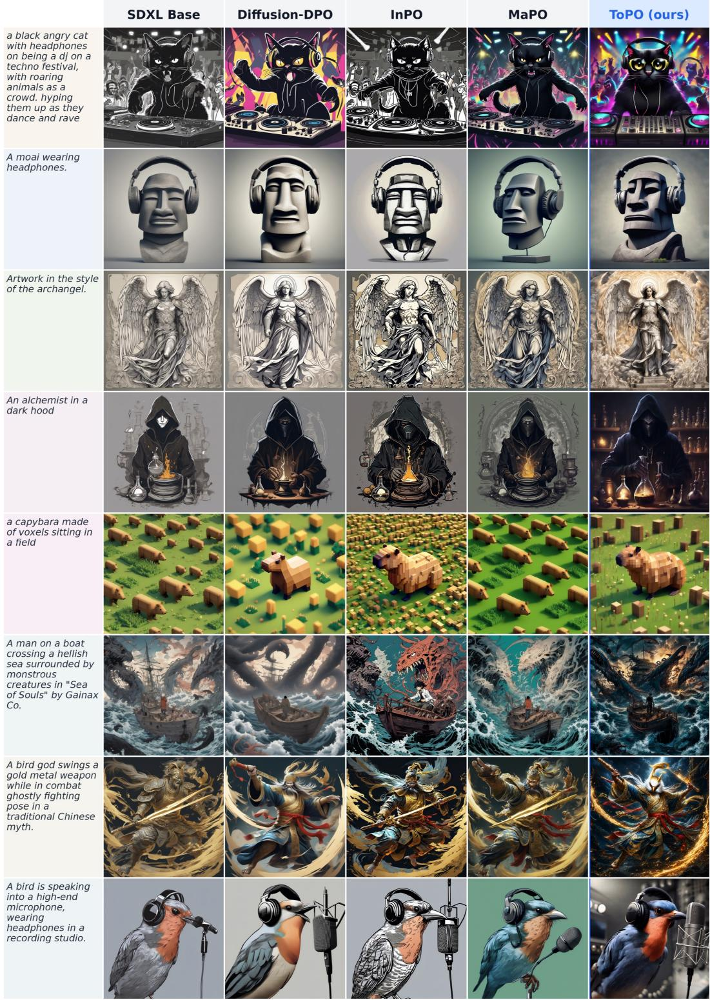  
Figure 6: Additional fixed-prompt SDXL aesthetic comparisons. Columns compare SDXL Base, Diffusion-DPO, InPO, MaPO, and ToPO on stylized subjects, visual detail, material rendering, and complex scenes. These eight fixed cases are a qualitative complement to the preference, quality, and human-study results.

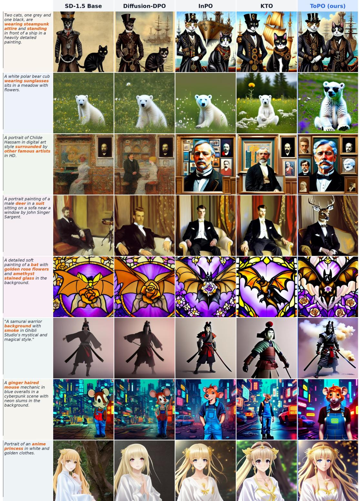  
Figure 7: Additional fixed-prompt SD-1.5 visual-quality comparisons. Columns compare SD-1.5 Base, Diffusion-DPO, InPO, KTO, and ToPO on eight prompts with detailed apparel, accessories, materials, stylized subjects, and scenes. Each row is a same-prompt, same-backbone comparison that complements the SD-1.5 preference and quality evaluations.

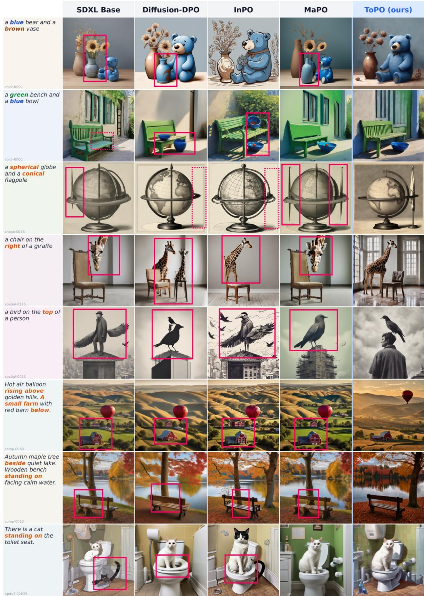  
Figure 8: Additional fixed-prompt SDXL attribute and relational comparisons. Highlighted words denote requested colors, shapes, or relations; magenta solid or dashed boxes call out locally mismatched prompt elements in comparator outputs. Columns compare SDXL Base, Diffusion-DPO, InPO, MaPO, and ToPO. These eight fixed cases make local composition directly inspectable alongside Tables 12 and 10.

  
Figure 9: Additional visual-quality samples from the final SDXL ToPO checkpoint. The gallery spans detailed environments, atmospheric scenes, fantasy subjects, a fashion portrait, and material-rich natural elements. Four central 2×2 anchors foreground creature, character, lighting, and material detail, while the two outer columns retain eight uncropped square samples to show breadth. The gallery extends the matched SDXL plates in Figures 6 and 8 with a broader view of the final model’s visual profile.

## D Token-Modulation and Scale Diagnostics

The fixed-template controlled token test contains 300 cases: 60 each for color, shape, texture, count, and spatial relations. It reports the target-token $w _ { k }$ mass relative to matched non-target content-token controls, with class-wise paired inference and no cross-class aggregate. Table 14 reports this diagnostic for the frozen sft init ref unet reference attributor, not for the final trained ToPO checkpoint; it therefore characterizes a fixed attribution rule rather than final-model localization.

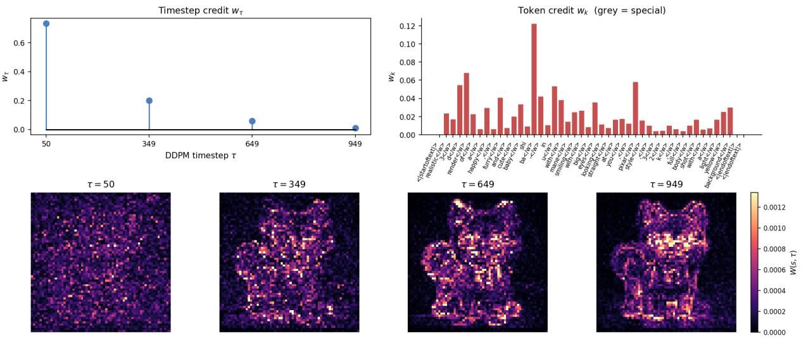

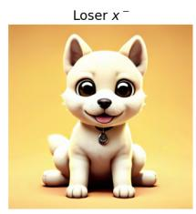

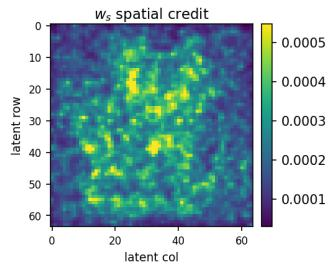

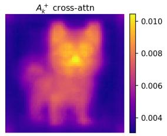

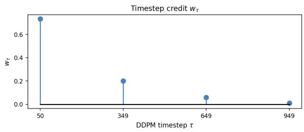

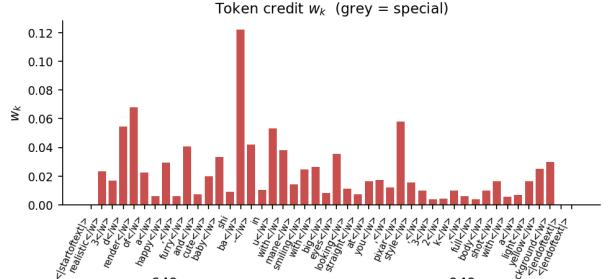  
Figure 10: Token-conditioned spatial–temporal routing in ToPO. A held-out Pick-a-Pic v2 winner/loser pair is processed by the final SD-1.5 ToPO checkpoint. The top row shows the pair, spatial factor $w _ { s }$ , and the preferred-branch attention aggregate used in the token-to-space fold. The middle row displays timestep factor $w _ { \tau }$ and the content-token modulation $w _ { k } ;$ the bottom row shows the composed field $W ( s , \tau )$ at the four actual denoising anchors. This is a final-checkpoint diagnostic, distinct from the frozen-reference route used during training. The $w _ { s }$ display is Gaussian-smoothed with $\sigma = 0 . 7$ for readability, and the four $W$ panels share one display scale.

## D.1 A Single-Pair View of Token-Conditioned Spatial–Temporal Routing

The controlled token test above characterizes a fixed reference attributor over a prompt suite. Figure 10 instead opens a final-checkpoint diagnostic constructed for one held-out SD-1.5 Pick-a-Pic v2 preference pair; it is not the frozen-reference route used during training. For this example, the spatial factor is nonuniform, the timestep factor favors the low-noise anchor, and the attention-weighted token readout folds content token modulation back onto the native image grid. The resulting $W ( s , \tau )$ is therefore a nonuniform spatial– temporal multiplier for this pair. This illustration makes the operational bridge inspectable, but does not establish a general localization guarantee.

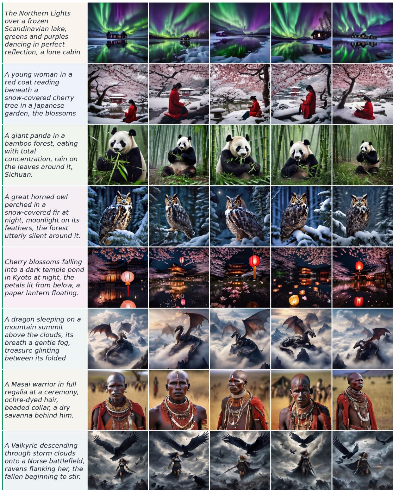  
Figure 11: Seed-wise samples from the final SDXL ToPO checkpoint. Every row fixes one prompt, while the five image columns use different random seeds. The plate makes the resulting variation in composition, viewpoint, and local detail inspectable alongside the prompt elements that recur within a row, complementing the protocol-level results with a prompt-conditioned view of seed variation.

## E Extended Discussion and Limitations

ToPO is a conditional route on diffusion-native coordinates rather than an auxiliary token-level loss. Branchwise residual contrast supplies the spatial and temporal factors, while the signed DPO logit retains the winner–loser orientation. Preferred-branch cross-attention is the declared conditional bridge: it reads the spatial factor into the token-conditioned modulation statistic $w _ { k }$ and folds that modulation back to the latent field. In both backbone implementations, the frozen reference recomputes this route from every current minibatch and stop-gradient detaches it before the corresponding policy update.

The evidence is intentionally layered. Fixed within-backbone tables summarize the outcome profile of author-released checkpoint comparisons; the matched three-seed ToPO–Diffusion-DPO study is the controlled equal-update comparison; the matched SD-1.5 Uniform-W/Shuffled-W controls probe route allocation under the same locked configuration; the controlled trajectory follows optimization under one common seed; route-permutation and component-removal experiments map local sensitivity; and blinded human choices evaluate final images directly. The shuffled control is an intentionally joint perturbation of coordi nate correspondence and local structure. The formal analysis separately characterizes a projected, current batch detached-SGD surrogate and a frozen token diagnostic; it is not an AdamW convergence theorem or a proof of semantic localization. Together, these layers connect the route construction to observed opti mization behavior without conflating checkpoint comparisons, controlled perturbations, and frozen-statistic interpretation.

Limitations. ToPO is currently instantiated for attention-equipped, noise-prediction latent diffusion, where a local residual field and cross-attention map are both available. Extending the construction to flow matching or alternative conditioning interfaces requires a compatible allocation statistic and dedicated evaluation. The matched three-seed studies estimate variation only under the locked SD-1.5/SDXL configurations; the pri mary checkpoint tables remain one-endpoint descriptive references and do not establish matched multi-seed effects against every external method. The route controls show a mixed automatic-metric profile against Shuffled-W and do not establish an equal-compute advantage, a semantic-localization guarantee, or an exhaustive comparison against alternative saliency constructions. The token diagnostic evaluates a frozen SD-1.5 reference attributor and varies by concept class; it is therefore an analysis of the declared route rather than a final-checkpoint localization guarantee.