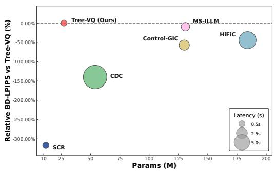
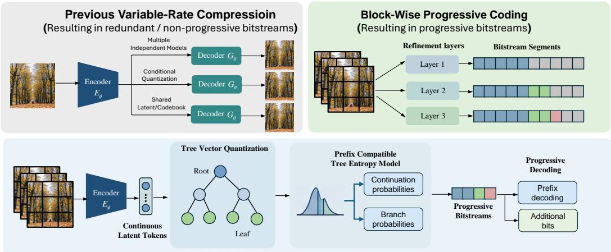
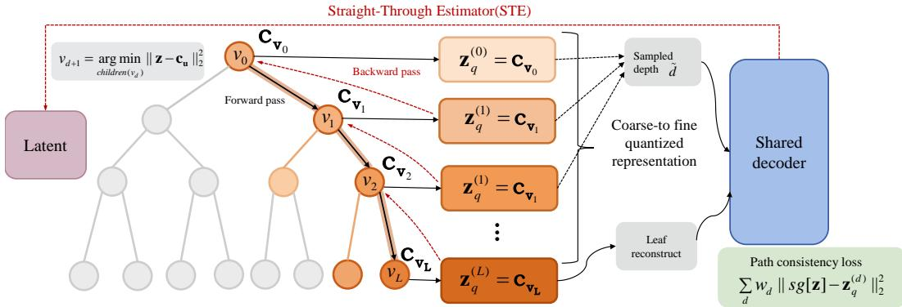
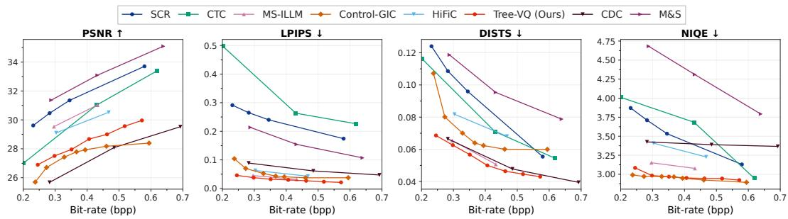
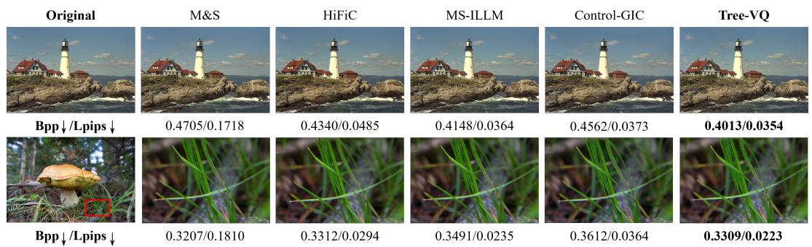
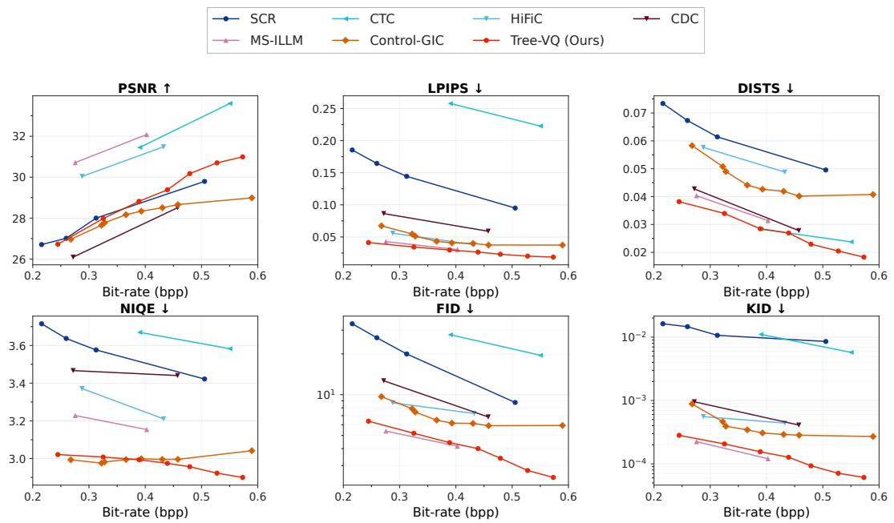
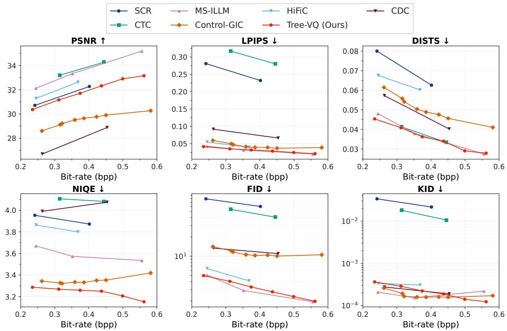
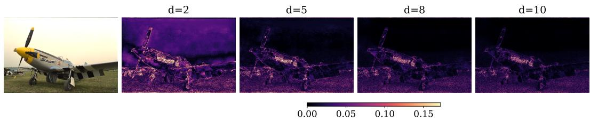

# Tree-Structured Vector Quantization For Efficient And Progressive Image Compression

Xinkun Wang, Tianyi Xu, Qingyu Luo, Mingming Ma, Changzhe Jiao, Fu Li, Yi Niu

School of Artificial Intelligence Xidian University {25171213993, 21009200131, 23171110716}@stu.xidian.edu.cn {mamingming, cjiao, lifu}@xidian.edu.cn

## Abstract

Vector-quantization based image compression has achieved strong rate–distortion performance, yet most of them still produce a separate compressed representation for each target bitrate. Such variable-rate behavior allows one model to operate at multiple rates, but it does not necessarily provide a progressive bitstream whose prefixes are themselves decodable and can be refined by appending additional bits. We propose Tree-VQ, a progressive tree-structured vector quantization framework for learned image compression. Tree-VQ organizes discrete codewords as a hierarchical binary tree and represents each latent token by a routed root-to-leaf path. Crucially, every prefix of this path corresponds to a valid quantized representation, so shallow internal nodes serve as coarse reconstruction codes and deeper nodes provide successive refinements. This allows a compressed image to be decoded from an early prefix and progressively improved as more branch symbols are received, rather than being re-encoded for different target rates. To make this structure practical for compression, we introduce a prefix-compatible tree entropy model that codes progressive continuation decisions and routed branch refinements using only causally available decoded contexts. We further use rate-aware refinement scheduling to decide which spatial blocks should receive additional tree bits under a given prefix budget, and hierarchical prefix supervision to ensure that internal nodes are directly decodable at low rates. Experiments show that Tree-VQ achieves a superior performance–efficiency trade-off, delivering the best perceptual compression results with much fewer parameters and lower latency than competing methods.

## 1 Introduction

Image compression is a fundamental problem in visual computing and communication systems, as it determines the storage, transmission, and delivery cost of digital imagery [31]. In recent years, learned image compression has emerged as a powerful paradigm by replacing hand-crafted transforms [40, 33, 34] with end-to-end optimized neural analysis and synthesis transforms [3, 36, 2, 37]. Built upon entropy-constrained autoencoders [3], subsequent advances in hyperprior modeling [4] and context-adaptive entropy estimation [25, 11, 22] have substantially improved rate–distortion performance, making learned codecs competitive with classical standards.

Despite this progress, most learned compression systems still produce a complete representation for a selected operating point. Variable-rate learned compression addresses this issue by controlling a single model with conditioning variables, gain parameters, quantization steps, or rate–distortion trade-off coefficients [6, 42, 15]. However, such methods mainly provide model-level rate adaptivity: different target rates lead to different representations. They do not necessarily provide bitstream-level progressivity, where a low-rate representation is a prefix of a high-rate one and image quality can be improved by simply receiving additional bits.

Figure 1 compares Tree-VQ with representative learned codecs in terms of model size, perceptual coding performance, and inference latency. Tree-VQ lies near the lower-left region with a small bubble, indicating a favorable trade-off among BD-LPIPS, parameter count, and runtime. This motivates our tree-structured design, which aims to support progressive decoding while keeping routing and codebook lookup efficient.

Bitstream-level progressivity is important for network transmission, latency-sensitive decoding, scalable storage, and interactive visualization. These scenarios require an embedded representation in which every prefix of the bitstream yields a valid reconstruction, while later bits refine rather than replace previously decoded information [20]. This imposes a nested structure across rates, making it stronger than conventional variable-rate coding.

Figure 1: Model efficiency comparison on DIV2K. The x-axis shows parameter count (M), bubble size denotes decoding latency, and the y-axis reports relative BD-LPIPS with respect to Tree-VQ over the overlapping bitrate range (bpp ≥ 0.25). Negative values indicate worse perceptual quality than Tree-VQ, while 0% corresponds to Tree-VQ itself.

## Discrete latent representations provide a natural

interface for progressive coding. Vector-quantized autoencoders, such as VQ-VAE [39] and VQGAN [9], map continuous image features into discrete code indices while preserving strong reconstruction and generation capability. Recent compression methods have also explored VQ-based or VQ-related representations for controllable and perceptual reconstruction [21, 10]. However, most of them rely on flat codebooks, where each latent vector is assigned to an unordered codeword [41]. Such flat indices are atomic symbols: although identifying a codeword may require multiple bits, prefixes of the index usually do not correspond to meaningful coarse reconstruction codes. Therefore, flat VQ does not naturally support coarse-to-fine refinement.

The limitation of flat VQ lies not only in its O(N) search cost, but also in its lack of explicit structure. Codewords are learned as unordered prototypes, without a relationship connecting coarse and fine representations. In contrast, a tree-structured codebook organizes codewords hierarchically: internal nodes capture coarse prototypes, while descendants specialize them with finer details. This structure naturally supports progressive refinement and reduces search complexity to O(log N).

In this paper, we propose Tree-VQ, a progressive tree-structured vector quantization framework for learned image compression. Tree-VQ organizes codewords as a hierarchical binary tree, where each latent token is routed from the root toward a leaf through binary branch decisions. Every prefix of the routed path is a valid discrete representation: shallow nodes provide coarse approximations, and deeper nodes provide refined ones. Thus, each additional branch decision acts as a discrete refinement, giving the latent representation bit-wise progressive semantics. After entropy coding, the ordered branch symbols form a prefix-decodable progressive bitstream.

To build a practical codec, we introduce a block-wise progressive coding mechanism. The bitstream is organized into successive refinement layers, where continuation symbols decide whether each block receives further tree refinement, and branch symbols extend the routed paths of its tokens. This ensures that block depths are monotonic across the bitstream: later prefixes only extend previously decoded paths, rather than replacing them or requiring re-encoding with a new depth map.

A key challenge is entropy modeling. For prefix decoding, the probability model used for arithmetic coding must not depend on future symbols or an unknown final target depth. We therefore design a prefix-compatible tree entropy model that estimates continuation and branch probabilities using only causally available decoded contexts. We further use rate-aware refinement scheduling to prioritize refinements with high distortion reduction per coding cost, and hierarchical prefix supervision to make internal tree nodes directly usable for low-rate reconstruction.

The main contributions of this paper are as follows:

• We propose Tree-VQ, a progressive tree-structured vector quantization framework where every prefix of a routed binary tree path corresponds to a valid reconstruction code.

• We introduce an embedded progressive bitstream in which additional branch symbols monotonically refine previously decoded representations, enabling decoding at arbitrary prefix lengths without re-encoding.

• We design a prefix-compatible tree entropy model and rate-aware refinement scheduling mechanism under causally decodable contexts.

• We introduce hierarchical prefix supervision to improve the quality of early progressive reconstructions.

  
Figure 2: Framework of the proposed Tree-VQ. We contrast previous non-progressive variable-rate baselines with our bitstream-level progressive coding approach, which generates a single embedded bitstream via block-wise refinement layers.

## 2 Related work

## 2.1 Vector-quantized image representation and compression

Vector quantization has become an important tool for learning compact discrete image representations. VQ-VAE [39] maps continuous encoder features to entries in a learned codebook and reconstructs images from discrete latent indices. VQGAN [9] further combines vector quantization with perceptual and adversarial objectives, showing that discrete visual tokens can support high-quality reconstruction and generation. This line of work has motivated many VQ-based image tokenizers and compressionoriented generative models [10, 21, 44], where discrete latents provide a compact symbolic interface for entropy coding, autoregressive modeling, or generative decoding.

Most VQ-based image representations rely on flat codebooks. In a flat codebook, each latent vector is assigned to one entry from an unordered set of learned prototypes. Enlarging the codebook can improve representation capacity and reconstruction fidelity [47, 48], but the codebook does not explicitly organize related codewords into a reusable structure. Codewords that describe similar visual patterns may still be treated as independent atomic prototypes, without sharing a common coarse representation. As a result, flat VQ can underexploit relationships among learned prototypes and does not naturally provide a mechanism for progressive refinement.

Several works explore structured discrete representations for coarse-to-fine learning. VQ-VAE-2 [29] uses spatial hierarchies, while RQ-VAE [17] relies on additive residual sequences. Although truncat able, their progressivity relies on adding vectors from separate codebooks or latent scales. In contrast,

Tree-VQ represents each token as a root-to-leaf path in a single tree-structured codebook. Instead of adding independent residuals, a prefix selects an ancestor node trained as a valid reconstruction code. This nested topology enables true bitstream-level progressivity, allowing the decoder to stop at any prefix and still obtain a well-defined codeword.

Our work focuses on this missing property. Tree-VQ replaces the unordered flat codebook with a binary refinement tree. Each token is represented by a path from the root to a leaf, and each internal node on the path is trained as a valid reconstruction code. Therefore, coarse and fine VQ representations are connected by explicit parent–child relationships inside the same codebook. This makes the VQ representation itself progressive: additional branch symbols refine an existing decoded node instead of selecting an unrelated codeword from a flat vocabulary.

## 2.2 Progressive learned image compression

Progressive image compression aims to produce an embedded bitstream whose prefixes correspond to valid reconstructions at increasing quality levels [32, 30, 35, 33]. This property is useful for image preview, scalable storage, adaptive transmission, and latency-sensitive communication, where the decoder may need to reconstruct an image before the full bitstream is available [37, 18]. A progressive codec should therefore provide nested representations: an early prefix gives a coarse reconstruction, and later bits refine the same reconstruction rather than replacing it with an independently encoded representation [23, 18, 14, 28].

Recent learned compression methods [3, 25] have explored variable-rate [6, 13], scalable [37], layered [14], or coarse-to-fine [23, 28] coding mechanisms. PLONQ [23] constructs a progressive bitstream by combining nested quantization levels with latent ordering, so that coarser quantized latents can be refined toward finer quantization levels. More recent fine-grained scalable codecs, such as DeepFGS [45], decompose latent features into basic and scalable components and rearrange scalable information to support one-pass fine-grained scalability. Variance-aware masking methods [28] also pursue progressive decoding by ranking residual latent elements and transmitting enhancement components in an importance-aware order. These methods are highly relevant because they directly target embedded or scalable learned compression. Tree-VQ differs from them in where the nested structure is imposed. PLONQ builds nested scalar quantization grids over hyperprior latents, while fine-grained scalable latent codecs typically define progressivity through latent channels, residua latent masks, or enhancement streams. Tree-VQ instead makes the VQ codebook topology itself nested. Each token is represented by a binary path, and every internal node on this path is a valid codeword. Therefore, the progressive unit is not a scalar quantization refinement, a residual latent element, or an enhancement channel, but a branch decision that moves an already decoded discrete code to one of its children. This provides a direct bridge between classical tree-structured vector quantization and modern learned discrete image representations.

## 3 Method

We propose Tree-VQ, a progressive vector quantization framework for learned image compression (see Figure 2). The central idea is to replace a flat VQ codebook with a binary refinement tree, so that each latent token is represented by a path from the root to a leaf. Unlike flat VQ, where a selected codeword is treated as an atomic prototype, Tree-VQ makes the intermediate nodes along the path directly decodable. Therefore, a shallow prefix of the path gives a coarse representation, and additional branch decisions progressively refine it.

Given an input image $x \in \mathbb { R } ^ { H \times W \times 3 }$ , an analysis transform $E _ { \phi }$ produces a latent feature map $z = E _ { \phi } ( x ) \in \mathbb { R } ^ { H ^ { \prime } \times W ^ { \prime } \times C }$ . The latent map is then quantized by a tree-structured codebook and decoded by a synthesis transform $G _ { \theta }$ . The resulting compressed stream is organized as an embedded sequence of tree refinements. A decoder can reconstruct from an early prefix and improve the reconstruction as more branch symbols are received.

## 3.1 Prefix-decodable tree quantization

Let $\tau$ denote a rooted binary tree of maximum depth L. Each node $v \in \mathcal T$ is associated with a learnable centroid $\boldsymbol { c } _ { v } \in \mathbb { R } ^ { C }$ . For each latent token $z _ { i } ,$ , Tree-VQ routes the token from the root toward

a leaf. Starting from the root node $v _ { i } ^ { ( 0 ) }$ , the token chooses one child at each depth:

$$
\boldsymbol v _ { i } ^ { ( t ) } = \arg \operatorname* { m i n } _ { \boldsymbol u \in \mathrm { C h i l d } ( \boldsymbol v _ { i } ^ { ( t - 1 ) } ) } \| \boldsymbol z _ { i } - \boldsymbol c _ { u } \| _ { 2 } ^ { 2 } , \quad t = 1 , \ldots , L .\tag{1}
$$

This produces a routed path $\mathcal { P } _ { i } = \left( v _ { i } ^ { ( 0 ) } , v _ { i } ^ { ( 1 ) } , \ldots , v _ { i } ^ { ( L ) } \right)$ . The quantized representation of token i at depth t is defined as $z _ { q , i } ^ { ( t ) } = c _ { v _ { i } ^ { ( t ) } }$ . The key property of Tree-VQ is that every prefix of $\mathcal { P } _ { i }$ corresponds to a valid reconstruction state. Shallow nodes act as coarse prototypes, while deeper descendants specialize them with finer details. Thus, the representation is naturally progressive: moving from $\bar { v _ { i } ^ { ( t - 1 ) } }$ to $v _ { i } ^ { ( t ) }$ refines an already decoded code rather than replacing it with an unrelated flat-codebook entry.

This design also reduces candidate-search complexity. A balanced binary tree of depth L contains $2 ^ { L }$ leaves. A flat VQ codebook with the same number of final codewords requires search over $\mathcal { O } ( 2 ^ { L } )$ entries, while Tree-VQ requires only L local binary routing decisions. More importantly, the tree topology explicitly organizes related codewords through shared ancestors, allowing common coarse information to be reused by multiple fine-grained descendants.

## 3.2 Embedded progressive bitstream and entropy modeling

To support progressive decoding, the coded representation must be prefix-decodable. Instead of transmitting a final depth and all branch decisions up to that depth at once, Tree-VQ arranges the bitstream into successive refinement layers $S = \bar { S ^ { ( 1 ) } } \| S ^ { ( 2 ) } \| \cdot \cdot \cdot \| S ^ { ( L ) }$ , where ∥ denotes bitstream concatenation, and $\mathbf { \mathcal { S } } ^ { ( t ) }$ contains the refinement information from depth t − 1 to depth t.

The latent map is partitioned into non-overlapping spatial blocks $\lbrace \boldsymbol { B } _ { m } \rbrace _ { m = 1 } ^ { M }$ . For each block $B _ { m }$ and refinement level t, we introduce a continuation variable $a _ { m } ^ { ( t ) } \in \{ 0 , 1 \}$ , where $a _ { m } ^ { ( t ) } = 1$ means that block $B _ { m }$ receives one more tree refinement at level $t ,$ and $a _ { m } ^ { ( t ) } = 0$ means that the block is not refined at this layer. If a block is refined, the corresponding branch decisions of its tokens $b _ { i } ^ { ( t ) } \in \{ 0 , 1 \} , i \in B _ { m }$ are transmitted. Therefore, the layer-t symbols for block $B _ { m }$ are

$$
s _ { m } ^ { ( t ) } = \left( a _ { m } ^ { ( t ) } , \{ b _ { i } ^ { ( t ) } \} _ { i \in \mathcal { B } _ { m } } \right) ,\tag{2}
$$

where the branch symbols are coded only when $a _ { m } ^ { ( t ) } = 1$

We encode progressive symbols in a fixed layer-major raster order. Refinement levels are processed from $t = 1 \mathrm { t o } \ L$ . Within each level, spatial blocks are scanned in raster order, and tokens inside a refined block are also scanned in raster order. Let $m _ { \ A } ^ { \prime } \prec$ m denote a block that has been decoded before block m in the current layer. Before encoding $s _ { m } ^ { ( \iota ) }$ , both the encoder and decoder have access only to

$$
\mathcal { C } _ { m } ^ { ( t ) } = \{ s _ { m ^ { \prime } } ^ { ( \tau ) } : \tau < t , 1 \leq m ^ { \prime } \leq M \} \cup \{ s _ { m ^ { \prime } } ^ { ( t ) } : m ^ { \prime } \prec m \} \cup \{ v _ { i } ^ { ( d _ { i } ) } : d _ { i } \leq t - 1 \} ,\tag{3}
$$

where $d _ { i }$ is the currently decoded depth of token i. This set excludes all future continuation variables, future branch symbols, the final target depth, and the continuous encoder latent $z _ { i }$ . Therefore the entropy model can be evaluated identically by the arithmetic encoder and decoder at every prefix.

We use a prefix-compatible tree entropy model to code these symbols. The continuation probability is modeled as $q _ { \eta } \left( a _ { m } ^ { ( t ) } \mid h _ { m } ^ { ( t ) } \right)$ , where $h _ { m } ^ { ( t ) }$ is a causal context computed only from previously decoded symbols and currently available tree prefixes. When $a _ { m } ^ { ( t ) } = 1$ , the branch decision of token i is modeled by $p _ { \eta } \left( b _ { i } ^ { ( t ) } \mid h _ { i , m } ^ { ( t ) } , v _ { i } ^ { ( t - 1 ) } , t \right)$ , where $v _ { i } ^ { ( t - 1 ) }$ is the already decoded prefix node. Importantly, the entropy model does not depend on the continuous latent $z _ { i }$ , future symbols, or a final target depth. This makes the model compatible with progressive arithmetic decoding.

The estimated code length of block $B _ { m }$ at refinement level t is

$$
r _ { m } ^ { ( t ) } = - \log _ { 2 } q _ { \eta } \left( a _ { m } ^ { ( t ) } \mid h _ { m } ^ { ( t ) } \right) - a _ { m } ^ { ( t ) } \sum _ { i \in B _ { m } } \log _ { 2 } p _ { \eta } \left( b _ { i } ^ { ( t ) } \mid h _ { i , m } ^ { ( t ) } , v _ { i } ^ { ( t - 1 ) } , t \right) .\tag{4}
$$

  
Figure 3: Illustration of Tree-VQ routing, straight-through training, and hierarchical prefix supervision.

The total progressive tree rate up to prefix depth K is then

$$
\hat { R } _ { \mathrm { p r o g } } ^ { ( K ) } = \sum _ { t = 1 } ^ { K } \sum _ { m = 1 } ^ { M } r _ { m } ^ { ( t ) } .\tag{5}
$$

Since the same distributions are used for training-time rate estimation and inference-time arithmetic coding, the estimated prefix rate is aligned with the realized bitrate.

## 3.3 Rate-aware progressive refinement scheduling

The progressive bitstream should allocate early bits to the regions that benefit most from refinement. We therefore introduce a rate-aware refinement scheduler over spatial blocks. At any prefix state, each block $B _ { m }$ has a current decoded depth $d _ { m }$ . Refining this block by one level changes its representation from depth $d _ { m }$ to depth $d _ { m } + 1$

The scheduler uses inexpensive encoder-side surrogates rather than repeatedly running the synthesis transform for every candidate refinement. After greedy routing, the complete path $\{ \bar { v _ { i } ^ { ( 0 ) } } , \ldots , v _ { i } ^ { ( L ) } \}$ of each token is known to the encoder. We define the block distortion surrogate at depth d in the latent space as

$$
\Delta _ { m } ^ { ( d ) } = \sum _ { i \in \mathcal { B } _ { m } } w _ { i } \left. \boldsymbol { z } _ { i } - \boldsymbol { c } _ { v _ { i } ^ { ( d ) } } \right. _ { 2 } ^ { 2 } ,\tag{6}
$$

where $w _ { i }$ is either set to one or predicted by a lightweight importance head from the encoder feature. This surrogate is computed for all depths using the already available routed centroids and does not require additional decoder forward passes. The gain of refining block $B _ { m }$ from depth $d _ { m }$ to depth $d _ { m } + 1 \mathrm { i s }$

$$
g _ { m } ^ { ( d _ { m } + 1 ) } = \Delta _ { m } ^ { ( d _ { m } ) } - \Delta _ { m } ^ { ( d _ { m } + 1 ) } .\tag{7}
$$

The incremental rate surrogate is obtained from the same entropy logits that will be used by arithmetic coding:

$$
\delta r _ { m } ^ { ( d _ { m } + 1 ) } = - \log _ { 2 } q _ { \eta } ( a _ { m } ^ { ( d _ { m } + 1 ) } = 1 \mid h _ { m } ^ { ( d _ { m } + 1 ) } ) - \sum _ { i \in B _ { m } } \log _ { 2 } p _ { \eta } ( b _ { i } ^ { ( d _ { m } + 1 ) } \mid h _ { i , m } ^ { ( d _ { m } + 1 ) } , v _ { i } ^ { ( d _ { m } ) } , d _ { m } + 1 ) .\tag{8}
$$

Thus, the scheduler does not introduce a separate heavy rate-estimation network. In practice, all one-step candidates are initialized once, and a priority queue is updated only for blocks whose depth changes. The complexity is $O ( M L )$ for computing latent-domain gains and $O ( M L \log M )$ in the worst case for priority-queue scheduling, where M is the number of blocks and L is the tree depth. The decoder does not run the scheduler; it only decodes the transmitted continuation and branch symbols.

## 3.4 Training objective and inference

Training Tree-VQ requires internal tree nodes to be useful reconstruction codes, not merely intermediate routing states. We therefore use hierarchical prefix supervision. For a set of sampled prefix depths $\mathcal { D } ,$ , we decode the corresponding quantized latents and optimize reconstruction quality at multiple depths:

$$
\mathcal { L } _ { \mathrm { p r e f i x } } = \sum _ { d \in \mathcal { D } } \omega _ { d } \mathcal { L } _ { \mathrm { d i s t } } \left( x , \hat { x } ^ { ( d ) } \right) ,\tag{9}
$$

where $\hat { x } ^ { ( d ) }$ is reconstructed from tree nodes truncated at depth $d ,$ and $\omega _ { d }$ controls the relative importance of different prefixes. This supervision encourages shallow nodes to preserve coarse image content and deeper nodes to encode refinement details.

We optimize the full codec with a progressive rate–distortion objective:

$$
\mathcal { L } = \sum _ { K \in \mathcal { K } } \alpha _ { K } \left[ \mathcal { L } _ { \mathrm { d i s t } } \left( x , \hat { x } ^ { ( K ) } \right) + \lambda _ { K } \hat { R } _ { \mathrm { p r o g } } ^ { ( K ) } \right] + \mathcal { L } _ { \mathrm { a u x } } ,\tag{10}
$$

where $\kappa$ is a set of sampled prefix lengths, $\hat { x } ^ { ( K ) }$ is the reconstruction from the first $K$ progressive layers, and $\mathcal { L } _ { \mathrm { a u x } }$ includes auxiliary $\mathrm { v Q }$ losses and codebook regularization terms. This objective trains the model to perform well not only at the final depth, but also at intermediate prefixes.

Figure 3 summarizes how Tree-VQ is trained. Latent tokens are greedily routed through the tree, prefix codewords at sampled depths are decoded by a shared decoder, and gradients are propagated with a straight-through estimator.

In practice, we use a staged optimization strategy. The first stage trains the encoder, decoder, and tree codebook with hierarchical prefix supervision, so that the tree learns stable coarse-to-fine representations. The second stage enables the prefix-compatible entropy model and rate-aware refinement scheduler, and optimizes the full progressive rate–distortion objective. This staged procedure improves routing stability and prevents internal nodes from becoming unused routing artifacts.

At inference time, the encoder first routes each latent token through the tree. To reduce the suboptimality of purely greedy routing, we use a lightweight beam search. For each token $z _ { i }$ , the beam is initialized at the root. At depth t, each retained partial path is expanded to its two child nodes, and the resulting candidates are scored by

$$
\mathcal { T } _ { i } ( \mathcal { P } ^ { ( t ) } ) = \left. \boldsymbol { z } _ { i } - c _ { \mathrm { l a s t } ( \mathcal { P } ^ { ( t ) } ) } \right. _ { 2 } ^ { 2 } ,\tag{11}
$$

where last $( \mathcal { P } ^ { ( t ) } )$ denotes the terminal node of the partial path. We keep the top $B _ { \mathrm { b e a m } }$ candidates with the smallest scores at each depth. Greedy routing is a special case with $B _ { \mathrm { b e a m } } = 1$

After reaching the maximum depth L, the best path is selected for each token and used by the progressive refinement scheduler. The scheduler decides which prefixes of these beam-selected paths should be transmitted under the target rate budget. Beam search is performed only at the encoder side; the decoder does not need to run beam search and simply follows the transmitted branch symbols. Therefore, beam search improves path selection without changing the progressive bitstream format or prefix decodability. After any received prefix, the decoder reconstructs the image using the deepest decoded node available for each token, and later symbols refine the same paths without re-encoding.

## 4 Experiments

## 4.1 Experimental setup

Our proposed model is trained on the OpenImages dataset [16], where 300K images are randomly selected as training images. We train the model with the learning rate of $5 \times 1 0 ^ { - 5 }$ on four NVIDIA RTX 4090 GPUs. These images are then randomly cropped to $2 5 6 \times 2 5 6$ . We evaluate on Kodak [8], CLIC2020 [38], and DIV2K [1]. Unless otherwise stated, all operating points of Tree-VQ are obtained by truncating a single embedded progressive bitstream at different prefix lengths introduced in Section 3.

Baselines and Metrics. We compare our Tree-VQ against a broad set of learned image compression baselines, including the scale-hyperprior model M&S [4], the progressive codec CTC [14], perceptual or generative codecs such as HiFiC [24] and MS-ILLM [27], variable-rate methods such as SCR [19] and Control-GIC [21], and the diffusion-based codec CDC [43]. We report both distortion-oriented and perceptual metrics, including PSNR, LPIPS [46], DISTS [7], NIQE [26], FID [12] and KID [5]. The bitrate shown in all main rate–distortion figures is the realized bitrate obtained by arithmetic coding under the learned tree entropy model.

## 4.2 Main rate–distortion performance

We first evaluate the overall rate–distortion behavior of the proposed method. Figure 4 plots rate– distortion curves on Kodak datasets obtained by progressive compression using Tree-VQ. Results on the DIV2K and CLIC2020 datasets are in appendix C.

The main observation is that the proposed model traces a stable and smooth rate–distortion frontier from a single checkpoint. As the rate penalty increases, the selector prefers lower-cost truncation depths and the realized bitrate decreases accordingly; as the rate penalty weakens, the model selects deeper representations, improving reconstruction quality.

Across Kodak, CLIC2020, and DIV2K, the proposed method is competitive with strong learned codecs while offering a qualitatively different operating mechanism, especially on perceptual metrics. Rather than switching between separately trained rate points or relying purely on global quantization control, it adapts the representation through block-wise depth selection over a shared tree of discrete candidates. In particular, the results show that this structured discrete representation can support a practically useful range of operating points without retraining the codec for most bitrates.

  
Figure 4: Comparisons of methods across various distortion and statistical fidelity metrics for Kodak dataset.

## 4.3 Visual comparison

Figure 5 shows representative reconstructions on Kodak and DIV2K at comparable bitrates. We visualize the reconstructed images by comparing with M&S, HiFiC, MS-ILLM and Control-GIC, by using the same images on Kodak and local crops on a high resolution image on DIV2K.

  
Figure 5: Visual comparison on Kodak and DIV2K dataset.

Tree-VQ produces visually competitive reconstructions, preserving major structures and object boundaries while maintaining reasonable texture fidelity at medium to high bitrates. These qualitative results are consistent with the quantitative rate–distortion behavior shown in Figure 4. Additional visual results are provided in the appendix.

## 4.4 Model efficiency and scalability

Table 1: Inference speed comparison between standard flat vector quantization and the proposed tree-structured approach across various depths. Benchmarked against up to 65,536 target vectors, the proposed Tree-VQ demonstrates extraordinary acceleration, maintaining sub-millisecond latency and achieving up to a 9195.1× speedup at a depth of 16.
<table><tr><td>Depth</td><td>Codebook Size / Leaf Number</td><td>Flat VQ (ms)</td><td>Tree-VQ (ms)</td><td>Speedup</td></tr><tr><td>4</td><td>16</td><td>0.29</td><td>0.0059</td><td>49.6×</td></tr><tr><td>8</td><td>256</td><td>0.35</td><td>0.0065</td><td>53.8×</td></tr><tr><td>12</td><td>4096</td><td>4.76</td><td>0.0071</td><td>670.4×</td></tr><tr><td>16</td><td>65536</td><td>75.40</td><td>0.0082</td><td>9195.1×</td></tr></table>

Beyond rate–distortion performance, we further evaluate the deployment improvement brought by Tree-VQ. Table 1 reports routing latency as a function of tree depth and effective codebook size. As the number of leaves increases, flat vector quantization becomes increasingly expensive, whereas routed tree search grows much more slowly. The gap widens substantially for large vocabularies, showing that the tree structure provides a real scaling advantage rather than a purely conceptual one.

## 4.5 Ablation

Table 2 reports an ablation study under the default adaptive-depth inference setting. Removing HPS causes the largest drop in reconstruction quality, indicating that multi-depth supervision is important for making intermediate tree representations decodable. Removing the tree entropy model degrades rate performance, suggesting that learned rate estimation is helpful for depth allocation. Rebuild further improves the overall trade-off as a complementary stabilization component.

## 5 Conclusion and future work

In this paper, we introduced Tree-VQ, a progressive tree-structured vector quantization framework for learned image compression. By organizing VQ codewords into a binary refinement tree, Tree-VQ gives each discrete representation an explicit coarse-to-fine structure, where every prefix of a routed path corresponds to a valid reconstruction code. Together with a prefix-compatible tree entropy model, rate-aware progressive refinement scheduling, and hierarchical prefix supervision, Tree-VQ produces a single embedded bitstream that can be decoded at different prefix lengths without re-encoding for each target bitrate. Experiments show that Tree-VQ achieves smooth progressive rate–distortion behavior while preserving the efficiency benefits of structured tree routing.

The current framework still has several limitations. Its effective bitrate range within one trained model remains relatively limited, the single-scale latent design restricts multi-level representation capacity, and greedy routing may miss globally better code assignments. Future work will explore multi-scale tree-structured quantization, stronger routing and refinement strategies, and broader applications of hierarchical discrete representations beyond compression, such as image generation.

## References

[1] Eirikur Agustsson and Radu Timofte. Ntire 2017 challenge on single image super-resolution: Dataset and study. In Proceedings of the IEEE conference on computer vision and pattern recognition workshops, pages 126–135, 2017.

[2] Eirikur Agustsson, Fabian Mentzer, Michael Tschannen, Lukas Cavigelli, Radu Timofte, Luca Benini, and Luc V Gool. Soft-to-hard vector quantization for end-to-end learning compressible representations. Advances in neural information processing systems, 30, 2017.

Table 2: Ablation study on Kodak under the default model configuration. All variants use block-wise adaptive depth selection at inference time and are tuned to the same target bitrate. Tree EM denotes the learned tree entropy model used in the selector. HPS denotes hierarchical prefix supervision.
<table><tr><td rowspan="2">Model Variant</td><td rowspan="2">HPS</td><td rowspan="2">Tree EM</td><td colspan="3">Metrics</td></tr><tr><td>BPP</td><td>PSNR↑</td><td>LPIPS ↓</td></tr><tr><td>w/o HPS</td><td>×</td><td>√</td><td>0.357</td><td>27.43</td><td>0.465</td></tr><tr><td>w/o Tree EM</td><td>√</td><td>X</td><td>0.383</td><td>28.14</td><td>0.418</td></tr><tr><td>Full Model</td><td>√</td><td>√</td><td>0.361</td><td>28.59</td><td>0.327</td></tr></table>

[3] Johannes Ballé, Valero Laparra, and Eero P Simoncelli. End-to-end optimized image compression. In International Conference on Learning Representations, 2017.

[4] Johannes Ballé, David Minnen, Saurabh Singh, Sung Jin Hwang, and Nick Johnston. Variational image compression with a scale hyperprior. In International Conference on Learning Representations, 2018.

[5] Mikołaj Binkowski, Danica J Sutherland, Michael Arbel, and Arthur Gretton. Demystifying ´ mmd gans. In International Conference on Learning Representations, 2018.

[6] Yoojin Choi, Mostafa El-Khamy, and Jungwon Lee. Variable rate deep image compression with a conditional autoencoder. In Proceedings of the IEEE/CVF international conference on computer vision, pages 3146–3154, 2019.

[7] Keyan Ding, Kede Ma, Shiqi Wang, and Eero P Simoncelli. Image quality assessment: Unifying structure and texture similarity. IEEE transactions on pattern analysis and machine intelligence, 44(5):2567–2581, 2020.

[8] Eastman Kodak. Kodak lossless true color image suite. http://r0k.us/graphics/kodak/, 1993.

[9] Patrick Esser, Robin Rombach, and Bjorn Ommer. Taming transformers for high-resolution image synthesis. In Proceedings ofthe IEEE/CVF conference on computer vision and pattern recognition, pages 12873–12883, 2021.

[10] Runsen Feng, Zongyu Guo, Weiping Li, and Zhibo Chen. Nvtc: Nonlinear vector transform coding. In Proceedings of the IEEE/CVF Conference on Computer Vision and Pattern Recognition, pages 6101–6110, 2023.

[11] Dailan He, Ziming Yang, Weikun Peng, Rui Ma, Hongwei Qin, and Yan Wang. Elic: Efficient learned image compression with unevenly grouped space-channel contextual adaptive coding. In Proceedings of the IEEE/CVF conference on computer vision and pattern recognition, pages 5718–5727, 2022.

[12] Martin Heusel, Hubert Ramsauer, Thomas Unterthiner, Bernhard Nessler, and Sepp Hochreiter. Gans trained by a two time-scale update rule converge to a local nash equilibrium. Advances in neural information processing systems, 30, 2017.

[13] Shoma Iwai, Tomo Miyazaki, and Shinichiro Omachi. Controlling rate, distortion, and realism: Towards a single comprehensive neural image compression model. In Proceedings of the IEEE/CVF Winter Conference on Applications ofComputer Vision, pages 2900–2909, 2024.

[14] Seungmin Jeon, Kwang Pyo Choi, Youngo Park, and Chang-Su Kim. Context-based trit-plane coding for progressive image compression. In Proceedings ofthe IEEE/CVF Conference on Computer Vision and Pattern Recognition, pages 14348–14357, 2023.

[15] Fatih Kamisli, Fabien Racapé, and Hyomin Choi. Variable-rate learned image compression with multi-objective optimization and quantization-reconstruction offsets. In 2024 Data Compression Conference (DCC), pages 193–202. IEEE, 2024.

[16] Ivan Krasin, Tom Duerig, Neil Alldrin, Vittorio Ferrari, Sami Abu-El-Haija, Alina Kuznetsova, Hassan Rom, Jasper Uijlings, Stefan Popov, Andreas Veit, et al. Openimages: A public dataset for large-scale multi-label and multi-class image classification. Dataset availablefrom https://github. com/openimages, 2(3):18, 2017.

[17] Doyup Lee, Chiheon Kim, Saehoon Kim, Minsu Cho, and Wook-Shin Han. Autoregressive image generation using residual quantization. In Proceedings ofthe IEEE/CVF conference on computer vision and pattern recognition, pages 11523–11532, 2022.

[18] Jae-Han Lee, Seungmin Jeon, Kwang Pyo Choi, Youngo Park, and Chang-Su Kim. Dpict: Deep progressive image compression using trit-planes. In Proceedings of the IEEE/CVF conference on computer vision and pattern recognition, pages 16113–16122, 2022.

[19] Jooyoung Lee, Seyoon Jeong, and Munchurl Kim. Selective compression learning of latent representations for variable-rate image compression. Advances in Neural Information Processing Systems, 35:13146–13157, 2022.

[20] Jooyoung Lee, Se Yoon Jeong, and Munchurl Kim. Deephq: Learned hierarchical quantizer for progressive deep image coding. ACM Transactions on Multimedia Computing, Communications and Applications, 22(1):1–24, 2026.

[21] Anqi Li, Feng Li, Yuxi Liu, Runmin Cong, Yao Zhao, and Huihui Bai. Once-for-all: Controllable generative image compression with dynamic granularity adaptation. In The Thirteenth International Conference on Learning Representations, 2025.

[22] Jinming Liu, Heming Sun, and Jiro Katto. Learned image compression with mixed transformercnn architectures. In Proceedings of the IEEE/CVF conference on computer vision and pattern recognition, pages 14388–14397, 2023.

[23] Yadong Lu, Yinhao Zhu, Yang Yang, Amir Said, and Taco S Cohen. Progressive neural image compression with nested quantization and latent ordering. In 2021 IEEE International conference on image processing (ICIP), pages 539–543. IEEE, 2021.

[24] Fabian Mentzer, George D Toderici, Michael Tschannen, and Eirikur Agustsson. High-fidelity generative image compression. Advances in neural information processing systems, 33:11913– 11924, 2020.

[25] David Minnen, Johannes Ballé, and George D Toderici. Joint autoregressive and hierarchical priors for learned image compression. Advances in neural information processing systems, 31, 2018.

[26] Anish Mittal, Rajiv Soundararajan, and Alan C Bovik. Making a “completely blind” image quality analyzer. IEEE Signal processing letters, 20(3):209–212, 2012.

[27] Matthew J Muckley, Alaaeldin El-Nouby, Karen Ullrich, Herve Jegou, and Jakob Verbeek. Improving statistical fidelity for neural image compression with implicit local likelihood models. In International Conference on Machine Learning, pages 25426–25443. PMLR, 2023.

[28] Alberto Presta, Enzo Tartaglione, Attilio Fiandrotti, Marco Grangetto, and Pamela Cosman. Efficient progressive image compression with variance-aware masking. In 2025 IEEE/CVF Winter Conference on Applications ofComputer Vision (WACV), pages 7692–7700. IEEE, 2025.

[29] Ali Razavi, Aaron Van den Oord, and Oriol Vinyals. Generating diverse high-fidelity images with vq-vae-2. Advances in neural information processing systems, 32, 2019.

[30] Amir Said and William A Pearlman. A new, fast, and efficient image codec based on set partitioning in hierarchical trees. IEEE Transactions on circuits and systemsfor video technology, 6(3):243–250, 2002.

[31] Khalid Sayood. Introduction to data compression. Morgan Kaufmann, 2017.

[32] Jerome M Shapiro. Embedded image coding using zerotrees of wavelet coefficients. IEEE Transactions on signal processing, 41(12):3445–3462, 1993.

[33] Athanassios Skodras, Charilaos Christopoulos, and Touradj Ebrahimi. The jpeg 2000 still image compression standard. IEEE Signal processing magazine, 18(5):36–58, 2002.

[34] Gary J Sullivan, Jens-Rainer Ohm, Woo-Jin Han, and Thomas Wiegand. Overview of the high efficiency video coding (hevc) standard. IEEE Transactions on circuits and systemsfor video technology, 22(12):1649–1668, 2012.

[35] David Taubman. High performance scalable image compression with ebcot. IEEE Transactions on image processing, 9(7):1158–1170, 2000.

[36] Lucas Theis, Wenzhe Shi, Andrew Cunningham, and Ferenc Huszár. Lossy image compression with compressive autoencoders. In International Conference on Learning Representations, 2017.

[37] George Toderici, Damien Vincent, Nick Johnston, Sung Jin Hwang, David Minnen, Joel Shor, and Michele Covell. Full resolution image compression with recurrent neural networks. In Proceedings of the IEEE conference on Computer Vision and Pattern Recognition, pages 5306–5314, 2017.

[38] George Toderici, Lucas Theis, Nick Johnston, Eirikur Agustsson, Fabian Mentzer, Johannes Ballé, Wenzhe Shi, and Radu Timofte. Clic 2020: Challenge on learned image compression. Retrieved March, 29:2021, 2020.

[39] Aaron Van Den Oord, Oriol Vinyals, et al. Neural discrete representation learning. Advances in neural information processing systems, 30, 2017.

[40] Gregory K Wallace. The jpeg still picture compression standard. Communications of the ACM, 34(4):30–44, 1991.

[41] Naifu Xue, Zhaoyang Jia, Jiahao Li, Bin Li, Yuan Zhang, and Yan Lu. Dlf: Extreme image compression with dual-generative latent fusion. In Proceedings ofthe IEEE/CVF International Conference on Computer Vision, pages 19227–19236, 2025.

[42] Fei Yang, Luis Herranz, Joost Van De Weijer, José A Iglesias Guitián, Antonio M López, and Mikhail G Mozerov. Variable rate deep image compression with modulated autoencoder. IEEE Signal Processing Letters, 27:331–335, 2020.

[43] Ruihan Yang and Stephan Mandt. Lossy image compression with conditional diffusion models. Advances in Neural Information Processing Systems, 36:64971–64995, 2023.

[44] Niu Yi, Xu Tianyi, Ma Mingming, and Wang Xinkun. Hvq-cgic: Enabling hyperprior entropy modeling for vq-based controllable generative image compression. arXiv preprint arXiv:2512.07192, 2025.

[45] Yongqi Zhai, Yi Ma, Luyang Tang, Wei Jiang, and Ronggang Wang. Deepfgs: Fine-grained scalable coding for learned image compression. In 2025 Data Compression Conference (DCC), pages 263–272. IEEE, 2025.

[46] Richard Zhang, Phillip Isola, Alexei A Efros, Eli Shechtman, and Oliver Wang. The unreasonable effectiveness of deep features as a perceptual metric. In Proceedings of the IEEE conference on computer vision and pattern recognition, pages 586–595, 2018.

[47] Lei Zhu, Fangyun Wei, Yanye Lu, and Dong Chen. Scaling the codebook size of vq-gan to 100,000 with a utilization rate of 99%. Advances in Neural Information Processing Systems, 37: 12612–12635, 2024.

[48] Yongxin Zhu, Bocheng Li, Yifei Xin, Zhihua Xia, and Linli Xu. Addressing representation collapse in vector quantized models with one linear layer. In Proceedings of the IEEE/CVF International Conference on Computer Vision, pages 22968–22977, 2025.

## A Tree-VQ detailed implementation

## A.1 Layer-wise prefix-compatible tree entropy model

The progressive bitstream in Tree-VQ is encoded layer by layer rather than by first choosing a final truncation depth. This design is essential for prefix decoding: after receiving the first K refinement layers, the decoder can reconstruct the image without knowing whether more layers will arrive later.

For each spatial block $B _ { m }$ and refinement level t, we encode a continuation variable

$$
a _ { m } ^ { ( t ) } \in \{ 0 , 1 \} ,\tag{12}
$$

where $a _ { m } ^ { ( t ) } = 1$ means that block $B _ { m }$ is refined from depth t − 1 to depth t, and $a _ { m } ^ { ( t ) } = 0$ means that the block remains at its current decoded depth in this refinement layer. If $a _ { m } ^ { ( t ) } = 1$ , the branch symbols of all tokens in the block are encoded:

$$
\{ b _ { i } ^ { ( t ) } \} _ { i \in \mathcal { B } _ { m } } , \qquad b _ { i } ^ { ( t ) } \in \{ 0 , 1 \} .\tag{13}
$$

The probability of the layer-t coding outcome for block $B _ { m }$ is factorized as

$$
p _ { \eta } ( s _ { m } ^ { ( t ) } ) = q _ { \eta } \left( a _ { m } ^ { ( t ) } \mid h _ { m } ^ { ( t ) } \right) \prod _ { i \in { \cal { B } } _ { m } } p _ { \eta } \left( b _ { i } ^ { ( t ) } \mid h _ { i , m } ^ { ( t ) } , v _ { i } ^ { ( t - 1 ) } , t \right) ^ { a _ { m } ^ { ( t ) } } ,\tag{14}
$$

where $h _ { m } ^ { ( t ) }$ and $h _ { i , m } ^ { ( t ) }$ are causal contexts computed only from already decoded symbols and the currently available tree prefixes. The node $v _ { i } ^ { ( t - 1 ) }$ is known to the decoder before decoding the branch symbol at level t.

The corresponding coding cost is

$$
r _ { m } ^ { ( t ) } = - \log _ { 2 } q _ { \eta } \Bigl ( a _ { m } ^ { ( t ) } \ | \ h _ { m } ^ { ( t ) } \Bigr ) - a _ { m } ^ { ( t ) } \sum _ { i \in B _ { m } } \log _ { 2 } p _ { \eta } \Bigl ( b _ { i } ^ { ( t ) } \ | \ h _ { i , m } ^ { ( t ) } , v _ { i } ^ { ( t - 1 ) } , t \Bigr ) .\tag{15}
$$

The progressive rate of the first K refinement layers is therefore

$$
R _ { \mathrm { p r o g } } ^ { ( K ) } = \sum _ { t = 1 } ^ { K } \sum _ { m = 1 } ^ { M } r _ { m } ^ { ( t ) } .\tag{16}
$$

Importantly, the entropy model does not condition on a final target depth $d _ { m } ^ { \star }$ . This prevents future information leakage and ensures that the same bitstream can be truncated at arbitrary prefix lengths.

## A.2 Straight-through relaxation for progressive refinement decisions

The hard continuation decision $a _ { m } ^ { ( t ) }$ is non-differentiable. During training, we use a straight-through relaxation for each layer-wise refinement decision while preserving hard progressive decisions in the forward pass.

At refinement level $t ,$ suppose block $B _ { m }$ is currently decoded at depth t − 1. Refining it to depth t produces an estimated distortion reduction

$$
g _ { m } ^ { ( t ) } = \Delta _ { m } ^ { ( t - 1 ) } - \Delta _ { m } ^ { ( t ) } ,\tag{17}
$$

and incurs an incremental coding cost

$$
\delta r _ { m } ^ { ( t ) } = - \log _ { 2 } q _ { \eta } ( a _ { m } ^ { ( t ) } = 1 \mid h _ { m } ^ { ( t ) } ) - \sum _ { i \in \mathcal { B } _ { m } } \log _ { 2 } p _ { \eta } ( b _ { i } ^ { ( t ) } \mid h _ { i , m } ^ { ( t ) } , v _ { i } ^ { ( t - 1 ) } , t ) .\tag{18}
$$

We define the layer-wise refinement score as

$$
u _ { m } ^ { ( t ) } = g _ { m } ^ { ( t ) } - \lambda \delta r _ { m } ^ { ( t ) } .\tag{19}
$$

In the hard forward pass, the block is refined when

$$
a _ { m } ^ { ( t ) } = \mathbb { I } \left[ u _ { m } ^ { ( t ) } > 0 \right] .\tag{20}
$$

For gradient propagation, we use a soft relaxation

$$
\tilde { a } _ { m } ^ { ( t ) } = \sigma \left( \frac { u _ { m } ^ { ( t ) } } { \tau } \right) ,\tag{21}
$$

where $\sigma ( \cdot )$ is the sigmoid function and τ is a temperature parameter. The straight-through estimator is implemented as

$$
\begin{array} { r } { a _ { m , \mathrm { S T } } ^ { ( t ) } = a _ { m } ^ { ( t ) } + \tilde { a } _ { m } ^ { ( t ) } - \mathrm { s g } \left[ \tilde { a } _ { m } ^ { ( t ) } \right] . } \end{array}\tag{22}
$$

The decoded latent used for training is then written as

$$
\bar { z } _ { i } ^ { ( K ) } = c _ { v _ { i } ^ { ( 0 ) } } + \sum _ { t = 1 } ^ { K } a _ { m , \mathrm { S T } } ^ { ( t ) } \left( c _ { v _ { i } ^ { ( t ) } } - c _ { v _ { i } ^ { ( t - 1 ) } } \right) , \qquad i \in \mathcal { B } _ { m } .\tag{23}
$$

This formulation preserves the monotonicity of progressive decoding: a block can only stay at its current tree node or move to a deeper descendant. It never replaces a previously decoded representation with an independently selected code.

## A.3 Full training objective and auxiliary regularization

We train Tree-VQ with a combination of progressive rate–distortion loss, hierarchical prefix supervision, and VQ stabilization terms. The total objective is

$$
\begin{array} { r } { \mathcal { L } = \mathcal { L } _ { \mathrm { p r o g } } + \lambda _ { \mathrm { h p s } } \mathcal { L } _ { \mathrm { h p s } } + \lambda _ { \mathrm { v q } } \mathcal { L } _ { \mathrm { v q } } + \lambda _ { \mathrm { p a t h } } \mathcal { L } _ { \mathrm { p a t h } } + \lambda _ { \mathrm { b a l } } \mathcal { L } _ { \mathrm { b a l } } . } \end{array}\tag{24}
$$

The progressive rate–distortion loss is computed over sampled prefix lengths:

$$
\mathcal { L } _ { \mathrm { p r o g } } = \sum _ { K \in { \cal K } } \alpha _ { K } \left[ \mathcal { L } _ { \mathrm { d i s t } } ( x , \hat { x } ^ { ( K ) } ) + \lambda _ { K } R _ { \mathrm { p r o g } } ^ { ( K ) } \right] ,\tag{25}
$$

where $\hat { x } ^ { ( K ) }$ is reconstructed from the first K progressive refinement layers, and $R _ { \mathrm { p r o g } } ^ { ( K ) }$ is the realized or estimated arithmetic coding cost of the corresponding prefix.

Hierarchical prefix supervision. To ensure that internal tree nodes are directly decodable, we supervise reconstructions from multiple tree depths:

$$
\mathcal { L } _ { \mathrm { h p s } } = \sum _ { d \in \mathcal { D } } \omega _ { d } \mathcal { L } _ { \mathrm { d i s t } } \left( x , \hat { x } ^ { ( d ) } \right) ,\tag{26}
$$

where $\hat { x } ^ { ( d ) }$ is reconstructed by truncating every routed path to depth d. This term encourages shallow nodes to encode coarse image structure and deeper nodes to provide refinement details.

Multi-depth VQ loss. For each token $i ,$ let $z _ { i }$ be the encoder latent and $c _ { v _ { i } ^ { ( d ) } }$ be the centroid on its routed path at depth d. We apply a multi-depth VQ loss:

$$
\mathcal { L } _ { \mathrm { v q } } = \sum _ { d = 0 } ^ { L } \alpha _ { d } \mathbb { E } _ { i } \left[ \left\| \mathrm { s g } [ z _ { i } ] - c _ { v _ { i } ^ { ( d ) } } \right\| _ { 2 } ^ { 2 } + \beta \left\| z _ { i } - \mathrm { s g } [ c _ { v _ { i } ^ { ( d ) } } ] \right\| _ { 2 } ^ { 2 } \right] .\tag{27}
$$

The first term updates the centroids, while the second term acts as the commitment loss for the encoder latents.

Path consistency regularization. To encourage semantic continuity along each root-to-leaf path, we penalize large deviations between adjacent centroids:

$$
\mathcal { L } _ { \mathrm { p a t h } } = \sum _ { d = 1 } ^ { L } \gamma _ { d } \mathbb { E } _ { i } \left[ \left. c _ { v _ { i } ^ { ( d ) } } - c _ { v _ { i } ^ { ( d - 1 ) } } \right. _ { 2 } ^ { 2 } \right] .\tag{28}
$$

This regularizer prevents abrupt jumps between parent and child nodes and stabilizes progressive refinement.

Top-down tree rebuilding and utilization diagnostics. Large VQ systems can suffer from codebook imbalance, where many codewords or routing paths are rarely selected. This issue is more pronounced in a tree-structured codebook because an imbalanced split at a shallow node can make an entire subtree under-utilized. We use a periodic top-down tree rebuilding strategy during the initial training stage.

Specifically, at the end of each epoch in the warm-up stage, we collect encoder latents from the training set or a randomly sampled training subset and rebuild the tree centroids from the root to the leaves. Let $\mathcal { Z } _ { v }$ denote the set of latent tokens currently assigned to node v. Starting from the root, we first update the centroid of each node by the empirical mean of its assigned latents,

$$
c _ { v }  \frac { 1 } { | \mathcal { Z } _ { v } | } \sum _ { z _ { i } \in \mathcal { Z } _ { v } } z _ { i } .\tag{29}
$$

For every non-leaf node v, we then split ${ \mathcal { Z } } _ { v }$ into two subsets by binary clustering,

$$
\mathcal { Z } _ { v _ { L } } , \mathcal { Z } _ { v _ { R } } = \mathrm { K M e a n s _ { 2 } } ( \mathcal { Z } _ { v } ) ,\tag{30}
$$

and assign the resulting cluster centers to its left and right child centroids,

$$
c _ { v _ { L } }  \frac { 1 } { | \mathcal { Z } _ { v _ { L } } | } \sum _ { z _ { i } \in \mathcal { Z } _ { v _ { L } } } z _ { i } , \qquad c _ { v _ { R } }  \frac { 1 } { | \mathcal { Z } _ { v _ { R } } | } \sum _ { z _ { i } \in \mathcal { Z } _ { v _ { R } } } z _ { i } .\tag{31}
$$

This procedure is applied recursively until the maximum tree depth is reached. After rebuilding, latent tokens are routed again using the greedy child-selection rule in Eq. (1). In this way, the tree is periodically realigned with the current encoder latent distribution, and severe early-stage routing collapse can be reduced before the entropy model and progressive scheduler are introduced.

The rebuilding operation is used only during the early codebook warm-up stage. After this stage, the tree centroids are updated by gradient-based optimization together with the encoder, decoder, and entropy model, so that the learned tree remains compatible with the progressive rate–distortion objective. Since rebuilding is a training-time stabilization procedure, it introduces no additional inference cost and does not change the progressive bitstream format.

We monitor tree utilization to diagnose whether the learned hierarchy uses its capacity effectively. Let $\pi _ { v } ^ { ( d ) }$ be the empirical probability that a token is routed to node v at depth $d ,$

$$
\pi _ { v } ^ { ( d ) } = \frac { 1 } { N } \sum _ { i } \mathbb { I } [ v _ { i } ^ { ( d ) } = v ] .\tag{32}
$$

We report the effective utilization ratio

$$
U _ { d } = \frac { \exp \left( - \sum _ { v \in \mathcal { V } _ { d } } \pi _ { v } ^ { ( d ) } \log \pi _ { v } ^ { ( d ) } \right) } { | \mathcal { V } _ { d } | } ,\tag{33}
$$

where $\nu _ { d }$ is the set of nodes at depth d. A value close to 1 indicates balanced use of nodes at that depth, while a small value indicates that only a small fraction of the available branches are frequently selected. We also report the dead-node ratio, defined as the fraction of nodes whose empirical usage is below a small threshold. These diagnostics make codebook imbalance explicit and help explain the effect of the top-down rebuilding strategy.

## B Experiment details

We evaluate reconstruction quality from multiple perspectives. Specifically, we report full-reference perceptual scores, including LPIPS [46] and DISTS [7], as well as no-reference and distribution-based quality measures such as FID [12], KID [5] and NIQE [26]. PSNR is also provided as an auxiliary distortion metric for completeness.

## B.1 Evaluation metrics

We report multiple metrics because different metrics emphasize different aspects of reconstruction quality. PSNR measures pixel-level fidelity, while LPIPS and DISTS better reflect perceptual similarity. NIQE evaluates no-reference naturalness, and FID/KID measure distribution-level realism on image patches. We therefore report all metrics jointly rather than relying on a single score.

## B.2 Evaluation of FID and KID.

For natural image benchmarks, we follow the common protocol adopted in generative image compression works [24, 27] and compute FID and KID on cropped image patches. Given an image of size $H \times W$ , we first divide it into non-overlapping $2 5 6 \times 2 5 6$ patches, resulting in $\lfloor H / 2 5 6 \rfloor \cdot \lfloor \mathbf { \tilde { W } } / 2 5 6 \rfloor$ patches. We then shift the starting point by 128 pixels along both spatial dimensions and extract an additional set of overlapping patches, producing $( \lfloor H / 2 5 6 \overbar { \rfloor } - 1 ) \cdot \overbar { ( \lfloor W / 2 5 6 \rfloor } - 1 )$ more patches. This patch extraction strategy yields 28,650 patches on the CLIC2020 test set and 6,573 patches on the DIV2K validation set. Following [24, 27], we do not report FID or KID on Kodak, since the 24 images in this dataset provide only 192 patches, which is insufficient for a stable estimation of these distribution-level metrics.

## C Quantitative results

In this section, we present additional comparison results. In Figure 6 and Figure 7 , we compare Tree-VQ with other methods.

  
Figure 6: Progressive rate–distortion curves on DIV2K. Each Tree-VQ point is decoded from a different prefix of the same embedded bitstream.

## D Visualizations

## D.1 Uniform-depth tree reconstruction analysis

To further analyze whether internal tree nodes learn meaningful coarse-to-fine representations, we visualize reconstructions obtained by truncating all latent tokens to the same tree depth. Specifically, instead of using the block-wise adaptive refinement scheduler, we decode the image using a uniform depth d for all spatial blocks and compute the corresponding reconstruction error map with respect to the original image. Figure 8 shows the error maps for different tree depths.

As the selected depth increases from $d = 2 \tan d = 1 0$ , the reconstruction error gradually decreases, especially around object boundaries and high-frequency regions. This indicates that deeper tree nodes provide progressive refinements over the coarse representations learned by shallow internal nodes. The visualization also confirms that intermediate nodes are not merely routing states, but can serve as valid reconstruction codes for low-rate decoding.

Figure 7: Comparisons of methods across various distortion and statistical fidelity metrics for CLIC2020 test dataset.  
  
Figure 8: Error visualization of uniform-depth Tree-VQ reconstructions. The leftmost image is the original input, while the remaining images show reconstruction error maps obtained by decoding all latent tokens at a fixed tree depth d. Larger depths reduce reconstruction errors and progressively refine object boundaries and high-frequency details.

## D.2 Progressive reconstructions

We visualize the reconstructed images using the same progressive decoding prefixes. The result is shown in Figure 9 and Figure 10.

  
Original  
0.1532 bpp

  
0.3118 bpp

  
0.3938 bpp

  
0.5370 bpp  
Figure 9: Progressive reconstruction from a single Tree-VQ bitstream on CLIC2020. Later reconstructions are obtained by appending branch refinement symbols to the same stream, without re-encoding the image.

  
Original  
0.2872 bpp

  
0.4322 bpp

0.3396 bpp  
  
0.5673 bpp  
Figure 10: Progressive reconstruction from a single Tree-VQ bitstream on DIV2K. Later reconstructions are obtained by appending branch refinement symbols to the same stream, without re-encoding the image.

## NeurIPS Paper Checklist

## 1. Claims

Question: Do the main claims made in the abstract and introduction accurately reflect the paper’s contributions and scope?

Answer: [Yes]

Justification: The abstract and Introduction accurately summarize the main contributions of Tree-VQ: tree-structured vector quantization, block-wise depth truncation for singlemodel variable-rate compression, a learned tree entropy model, and hierarchical multidepth supervision. The experimental sections evaluate the claimed variable-rate behavior, reconstruction quality, efficiency, and ablation components on standard image compression benchmarks.

Guidelines:

• The answer [N/A] means that the abstract and introduction do not include the claims made in the paper.

• The abstract and/or introduction should clearly state the claims made, including the contributions made in the paper and important assumptions and limitations. A [No] or [N/A] answer to this question will not be perceived well by the reviewers.

• The claims made should match theoretical and experimental results, and reflect how much the results can be expected to generalize to other settings.

• It is fine to include aspirational goals as motivation as long as it is clear that these goals are not attained by the paper.

## 2. Limitations

Question: Does the paper discuss the limitations of the work performed by the authors?

Answer: [Yes]

Justification: The paper includes a dedicated “Limitations and Future Work” section. It discusses the limited bitrate range of one trained model, the current single-scale latent design, and the possible suboptimality of greedy tree routing.

Guidelines:

• The answer [N/A] means that the paper has no limitation while the answer [No] means that the paper has limitations, but those are not discussed in the paper.

• The authors are encouraged to create a separate “Limitations” section in their paper.

• The paper should point out any strong assumptions and how robust the results are to violations of these assumptions (e.g., independence assumptions, noiseless settings, model well-specification, asymptotic approximations only holding locally). The authors should reflect on how these assumptions might be violated in practice and what the implications would be.

• The authors should reflect on the scope of the claims made, e.g., if the approach was only tested on a few datasets or with a few runs. In general, empirical results often depend on implicit assumptions, which should be articulated.

• The authors should reflect on the factors that influence the performance of the approach. For example, a facial recognition algorithm may perform poorly when image resolution is low or images are taken in low lighting. Or a speech-to-text system might not be used reliably to provide closed captions for online lectures because it fails to handle technical jargon.

• The authors should discuss the computational efficiency of the proposed algorithms and how they scale with dataset size.

• If applicable, the authors should discuss possible limitations of their approach to address problems of privacy and fairness.

• While the authors might fear that complete honesty about limitations might be used by reviewers as grounds for rejection, a worse outcome might be that reviewers discover limitations that aren’t acknowledged in the paper. The authors should use their best judgment and recognize that individual actions in favor of transparency play an important role in developing norms that preserve the integrity of the community. Reviewers will be specifically instructed to not penalize honesty concerning limitations.

## 3. Theory assumptions and proofs

Question: For each theoretical result, does the paper provide the full set of assumptions and a complete (and correct) proof?

Answer: [Yes]

Justification: The paper present formal theoretical results, theorems and proofs.

Guidelines:

• The answer [N/A] means that the paper does not include theoretical results.

• All the theorems, formulas, and proofs in the paper should be numbered and crossreferenced.

• All assumptions should be clearly stated or referenced in the statement of any theorems.

• The proofs can either appear in the main paper or the supplemental material, but if they appear in the supplemental material, the authors are encouraged to provide a short proof sketch to provide intuition.

• Inversely, any informal proof provided in the core of the paper should be complemented by formal proofs provided in appendix or supplemental material.

• Theorems and Lemmas that the proof relies upon should be properly referenced.

## 4. Experimental result reproducibility

Question: Does the paper fully disclose all the information needed to reproduce the main experimental results of the paper to the extent that it affects the main claims and/or conclusions of the paper (regardless of whether the code and data are provided or not)?

Answer: [Yes]

Justification: The details of our proposed model and experiment settings are given.

Guidelines:

• The answer [N/A] means that the paper does not include experiments.

• If the paper includes experiments, a [No] answer to this question will not be perceived well by the reviewers: Making the paper reproducible is important, regardless of whether the code and data are provided or not.

• If the contribution is a dataset and/or model, the authors should describe the steps taken to make their results reproducible or verifiable.

• Depending on the contribution, reproducibility can be accomplished in various ways. For example, if the contribution is a novel architecture, describing the architecture fully might suffice, or if the contribution is a specific model and empirical evaluation, it may be necessary to either make it possible for others to replicate the model with the same dataset, or provide access to the model. In general. releasing code and data is often one good way to accomplish this, but reproducibility can also be provided via detailed instructions for how to replicate the results, access to a hosted model (e.g., in the case of a large language model), releasing of a model checkpoint, or other means that are appropriate to the research performed.

• While NeurIPS does not require releasing code, the conference does require all submissions to provide some reasonable avenue for reproducibility, which may depend on the nature of the contribution. For example

(a) If the contribution is primarily a new algorithm, the paper should make it clear how to reproduce that algorithm.

(b) If the contribution is primarily a new model architecture, the paper should describe the architecture clearly and fully.

(c) If the contribution is a new model (e.g., a large language model), then there should either be a way to access this model for reproducing the results or a way to reproduce the model (e.g., with an open-source dataset or instructions for how to construct the dataset).

(d) We recognize that reproducibility may be tricky in some cases, in which case authors are welcome to describe the particular way they provide for reproducibility. In the case of closed-source models, it may be that access to the model is limited in some way (e.g., to registered users), but it should be possible for other researchers to have some path to reproducing or verifying the results.

## 5. Open access to data and code

Question: Does the paper provide open access to the data and code, with sufficient instructions to faithfully reproduce the main experimental results, as described in supplemental material?

Answer: [No]

Justification: We use public datasets, but the current version does not include a released code repository.

Guidelines:

• The answer [N/A] means that paper does not include experiments requiring code.

• Please see the NeurIPS code and data submission guidelines (https://neurips.cc/ public/guides/CodeSubmissionPolicy) for more details.

• While we encourage the release of code and data, we understand that this might not be possible, so [No] is an acceptable answer. Papers cannot be rejected simply for not including code, unless this is central to the contribution (e.g., for a new open-source benchmark).

• The instructions should contain the exact command and environment needed to run to reproduce the results. See the NeurIPS code and data submission guidelines (https: //neurips.cc/public/guides/CodeSubmissionPolicy) for more details.

• The authors should provide instructions on data access and preparation, including how to access the raw data, preprocessed data, intermediate data, and generated data, etc.

• The authors should provide scripts to reproduce all experimental results for the new proposed method and baselines. If only a subset of experiments are reproducible, they should state which ones are omitted from the script and why.

• At submission time, to preserve anonymity, the authors should release anonymized versions (if applicable).

• Providing as much information as possible in supplemental material (appended to the paper) is recommended, but including URLs to data and code is permitted.

## 6. Experimental setting/details

Question: Does the paper specify all the training and test details (e.g., data splits, hyperparameters, how they were chosen, type of optimizer) necessary to understand the results?

Answer: [Yes]

Justification: Most of the training and test details are given.

Guidelines:

• The answer [N/A] means that the paper does not include experiments.

• The experimental setting should be presented in the core of the paper to a level of detail that is necessary to appreciate the results and make sense of them.

• The full details can be provided either with the code, in appendix, or as supplemental material.

## 7. Experiment statistical significance

Question: Does the paper report error bars suitably and correctly defined or other appropriate information about the statistical significance of the experiments?

Answer: [N/A]

Justification: Our paper does not include these experiments.

Guidelines:

• The answer [N/A] means that the paper does not include experiments.

• The authors should answer [Yes] if the results are accompanied by error bars, confidence intervals, or statistical significance tests, at least for the experiments that support the main claims of the paper.

• The factors of variability that the error bars are capturing should be clearly stated (for example, train/test split, initialization, random drawing of some parameter, or overall run with given experimental conditions).

• The method for calculating the error bars should be explained (closed form formula, call to a library function, bootstrap, etc.)

• The assumptions made should be given (e.g., Normally distributed errors).

• It should be clear whether the error bar is the standard deviation or the standard error of the mean.

• It is OK to report 1-sigma error bars, but one should state it. The authors should preferably report a 2-sigma error bar than state that they have a 96% CI, if the hypothesis of Normality of errors is not verified.

• For asymmetric distributions, the authors should be careful not to show in tables or figures symmetric error bars that would yield results that are out of range (e.g., negative error rates).

• If error bars are reported in tables or plots, the authors should explain in the text how they were calculated and reference the corresponding figures or tables in the text.

## 8. Experiments compute resources

Question: For each experiment, does the paper provide sufficient information on the computer resources (type of compute workers, memory, time of execution) needed to reproduce the experiments?

Answer: [Yes]

Justification: The type of compute workers GPU is given.

Guidelines:

• The answer [N/A] means that the paper does not include experiments.

• The paper should indicate the type of compute workers CPU or GPU, internal cluster, or cloud provider, including relevant memory and storage.

• The paper should provide the amount of compute required for each of the individual experimental runs as well as estimate the total compute.

• The paper should disclose whether the full research project required more compute than the experiments reported in the paper (e.g., preliminary or failed experiments that didn’t make it into the paper).

## 9. Code of ethics

Question: Does the research conducted in the paper conform, in every respect, with the NeurIPS Code of Ethics https://neurips.cc/public/EthicsGuidelines?

Answer: [Yes]

Justification: The research conducted in the paper conform, in every respect, with the NeurIPS Code of Ethics.

Guidelines:

• The answer [N/A] means that the authors have not reviewed the NeurIPS Code of Ethics.

• If the authors answer [No], they should explain the special circumstances that require a deviation from the Code of Ethics.

• The authors should make sure to preserve anonymity (e.g., if there is a special consideration due to laws or regulations in their jurisdiction).

## 10. Broader impacts

Question: Does the paper discuss both potential positive societal impacts and negative societal impacts of the work performed?

Answer: [Yes]

Justification: We discussed these impacts in the future work.

Guidelines:

• The answer [N/A] means that there is no societal impact of the work performed.

• If the authors answer [N/A] or [No], they should explain why their work has no societal impact or why the paper does not address societal impact.

• Examples of negative societal impacts include potential malicious or unintended uses (e.g., disinformation, generating fake profiles, surveillance), fairness considerations (e.g., deployment of technologies that could make decisions that unfairly impact specific groups), privacy considerations, and security considerations.

• The conference expects that many papers will be foundational research and not tied to particular applications, let alone deployments. However, if there is a direct path to any negative applications, the authors should point it out. For example, it is legitimate to point out that an improvement in the quality of generative models could be used to generate Deepfakes for disinformation. On the other hand, it is not needed to point out that a generic algorithm for optimizing neural networks could enable people to train models that generate Deepfakes faster.

• The authors should consider possible harms that could arise when the technology is being used as intended and functioning correctly, harms that could arise when the technology is being used as intended but gives incorrect results, and harms following from (intentional or unintentional) misuse of the technology.

• If there are negative societal impacts, the authors could also discuss possible mitigation strategies (e.g., gated release of models, providing defenses in addition to attacks, mechanisms for monitoring misuse, mechanisms to monitor how a system learns from feedback over time, improving the efficiency and accessibility of ML).

## 11. Safeguards

Question: Does the paper describe safeguards that have been put in place for responsible release of data or models that have a high risk for misuse (e.g., pre-trained language models, image generators, or scraped datasets)?

Answer: [N/A]

Justification: Our paper poses no such risks.

Guidelines:

• The answer [N/A] means that the paper poses no such risks.

• Released models that have a high risk for misuse or dual-use should be released with necessary safeguards to allow for controlled use of the model, for example by requiring that users adhere to usage guidelines or restrictions to access the model or implementing safety filters.

• Datasets that have been scraped from the Internet could pose safety risks. The authors should describe how they avoided releasing unsafe images.

• We recognize that providing effective safeguards is challenging, and many papers do not require this, but we encourage authors to take this into account and make a best faith effort.

## 12. Licenses for existing assets

Question: Are the creators or original owners of assets (e.g., code, data, models), used in the paper, properly credited and are the license and terms of use explicitly mentioned and properly respected?

Answer: [Yes]

Justification: We use these assets properly.

Guidelines:

• The answer [N/A] means that the paper does not use existing assets.

• The authors should cite the original paper that produced the code package or dataset.

• The authors should state which version of the asset is used and, if possible, include a URL.

• The name of the license (e.g., CC-BY 4.0) should be included for each asset.

• For scraped data from a particular source (e.g., website), the copyright and terms of service of that source should be provided.

• If assets are released, the license, copyright information, and terms of use in the package should be provided. For popular datasets, paperswithcode.com/datasets has curated licenses for some datasets. Their licensing guide can help determine the license of a dataset.

• For existing datasets that are re-packaged, both the original license and the license of the derived asset (if it has changed) should be provided.

• If this information is not available online, the authors are encouraged to reach out to the asset’s creators.

## 13. New assets

Question: Are new assets introduced in the paper well documented and is the documentation provided alongside the assets?

Answer: [N/A]

Justification: We have not release new assets, but they will be released soon.

Guidelines:

• The answer [N/A] means that the paper does not release new assets.

• Researchers should communicate the details of the dataset/code/model as part of their submissions via structured templates. This includes details about training, license, limitations, etc.

• The paper should discuss whether and how consent was obtained from people whose asset is used.

• At submission time, remember to anonymize your assets (if applicable). You can either create an anonymized URL or include an anonymized zip file.

## 14. Crowdsourcing and research with human subjects

Question: For crowdsourcing experiments and research with human subjects, does the paper include the full text of instructions given to participants and screenshots, if applicable, as well as details about compensation (if any)?

Answer: [N/A]

Justification: Our paper does not involve crowdsourcing nor research with human subjects. Guidelines:

• The answer [N/A] means that the paper does not involve crowdsourcing nor research with human subjects.

• Including this information in the supplemental material is fine, but if the main contribution of the paper involves human subjects, then as much detail as possible should be included in the main paper.

• According to the NeurIPS Code of Ethics, workers involved in data collection, curation, or other labor should be paid at least the minimum wage in the country of the data collector.

## 15. Institutional review board (IRB) approvals or equivalent for research with human subjects

Question: Does the paper describe potential risks incurred by study participants, whether such risks were disclosed to the subjects, and whether Institutional Review Board (IRB) approvals (or an equivalent approval/review based on the requirements of your country or institution) were obtained?

Answer: [N/A]

Justification: Our paper does not involve crowdsourcing nor research with human subjects. Guidelines:

• The answer [N/A] means that the paper does not involve crowdsourcing nor research with human subjects.

• Depending on the country in which research is conducted, IRB approval (or equivalent) may be required for any human subjects research. If you obtained IRB approval, you should clearly state this in the paper.

• We recognize that the procedures for this may vary significantly between institutions and locations, and we expect authors to adhere to the NeurIPS Code of Ethics and the guidelines for their institution.

• For initial submissions, do not include any information that would break anonymity (if applicable), such as the institution conducting the review.

## 16. Declaration of LLM usage

Question: Does the paper describe the usage of LLMs if it is an important, original, or non-standard component of the core methods in this research? Note that if the LLM is used only for writing, editing, or formatting purposes and does not impact the core methodology, scientific rigor, or originality of the research, declaration is not required.

Answer: [N/A]

Justification: The core method development in this research does not involve LLMs as any important, original, or non-standard components.

Guidelines:

• The answer [N/A] means that the core method development in this research does not involve LLMs as any important, original, or non-standard components.

• Please refer to our LLM policy in the NeurIPS handbook for what should or should not be described.