# TruncGradGS: Improved 3D Gaussian Splatting via Truncated Gradient Updates

Théo Morales1 Nhat-Quynh Le-Pham1 Robin Atkins2 Binh-Son Hua1

1Trinity College Dublin 2Dolby Laboratories

## Abstract

3D Gaussian Splatting has become a defacto scene representationfor novel view synthesis, yet robustly learning 3D Gaussian primitivesfrom visual input remains challenging. Standard optimization relies on gradient-based updates, but a common issue is the gradient vanishing phenomenon: a pixel farfrom a Gaussian primitive often has diminishing gradient magnitudes to influence primitive attributes, resulting in suboptimal scene reconstruction. In this paper, we propose a method to address gradient vanishing with a piecewise truncated gradientformulation that improves the optimization stability and robustness to initializations. We show that our method consistently improves 3D Gaussian Splatting with random and COLMAP initializations while being generalizable across static and dynamic Gaussian Splatting. As a by-product, we also examine the limitations of current benchmarks for dynamic scenes, and introduce a novel dataset for benchmarking dynamic Gaussian Splatting using synthetic 3D scenes. We demonstrate the effectiveness ofour method in both static and dynamic settingsfor the public benchmarks and our proposed dataset.

CCS Concepts

• Computing methodologies → Rasterization; Reconstruction;

## 1. Introduction

3D Gaussian Splatting has emerged as a de facto scene representation in visual computing, supporting diverse applications in novel view synthesis, scene reconstruction, and content creation. Its central idea is to model the radiance field of a scene using a collection of ellipsoids formulated as 3D Gaussian primitives. Each 3D Gaussian is parametrized by a mean, covariance matrix, and appearancerelated attributes such as opacity and spherical harmonics coefficients. These primitives are typically learned through optimization. However, robustly learning such Gaussian primitives remains challenging, particularly in the setting of random initialization or dynamic scenes.

When fitting a scene, the set of 3D Gaussian primitives is learned from image observations. The optimization is uses a differentiable rendering pipeline, where the Gaussian primitives are rendered via camera projection and primitive rasterization. This pipeline is fully differentiable, enabling the optimization of the Gaussian attributes via stochastic gradient descent. To parallelize rendering, the image plane is tiled into pixel patches (e.g., 16 × 16), allowing the dispatch of a thread block for handling the rasterization using one thread per pixel. To efficiently process large primitive sets, optimizations are performed locally: only Gaussians that splat onto a tile are considered for receiving gradients for attribute updates from that tile, effectively reducing the optimization workload per tile.

The original tiling scheme, while enabling resource-efficient training and inference, can reduce learning stability and effectiveness. As a Gaussian primitive only contributes within tile locality, it receives no gradient signals from pixels outside its support, and therefore cannot be used to reconstruct those pixels. As a result, reconstruction quality might degrade when a Gaussian primitive fail to move toward distant yet relevant pixel regions. To mitigate this issue, one can use adaptive density control to improve scene coverage, which clones and splits Gaussian primitives with perturbed positions so that new Gaussians can progressively explore the scene further from their initializations. One can also expand the radius support for a Gaussian primitive as a simple way of collecting gradients from pixels further away. Nevertheless, the Gaussian derivative remains near zero at the tails of the Gaussian distributions, preventing far-away pixels from providing meaningful updates [ZPML23]. While such limitations were addressed in prior work [ZPML23,KRS∗24a], there remains a need for a general approach that applies across scenarios such as random/COLMAP initializations and static/dynamic scene settings.

To overcome the limitations of 3D Gaussian rasterization, we propose to modify the Gaussian derivatives to strengthen the primitive/tile mutual coverage while keeping the effectiveness of the current tiling scheme. Particularly, we derive a piecewise truncated variant of the gradients by using a linear function to expand the tails of the Gaussian derivatives, and at the same time, maintaining the derivative continuity (see Fig. 1). We show that such truncated gradients can be integrated into the learning process and improving the scene quality across initializations. More importantly, we show that truncated gradients work well for both vanilla Gaussian Splatting and dynamic Gaussian Splatting. We provide extensive experiments on static and dynamic scene datasets. Additionally, while recent works in dynamic Gaussian Splatting show impressive results on the available benchmarks, their performance on more challenging dynamic scenes remains untested. To address this gap, we propose a novel dataset, introducing six realistic synthetic scenes rendered into multi-view videos, showcasing complex dynamics in motion and appearance. Our benchmark of the state-of-the-art methods in dynamic Gaussian Splatting shows that our method outperforms baselines on these challenging motion, atmospherics, and geometry examples. We envision that such additional data could motivate future research on dynamic Gaussian Splatting with potentially significant improvement. We will make our code and data available upon publication.

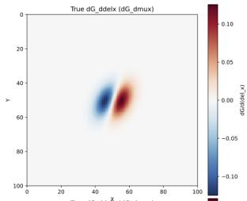

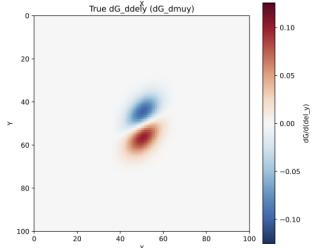

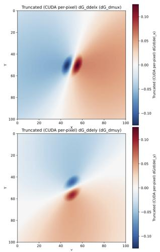  
Figure 1: Visualization of our piecewise truncated gradient field. The example assumes a 2D Gaussian primitive that splats at the center of an image. The left column shows the derivative of the Gaussian distribution w.r.t. its mean on the x and y axis. It can be seen that the gradient is near zero for any pixel outside the local support. In the right column, the piecewise gradient fields for the same Gaussian splat show a wider support with stronger gradient signals infar-away regions. Our piecewise gradientfield is composed of the true Gaussian derivative inside the isocontour of the Gaussian splat, and ofa linear surrogate outside. We define the isocontour by a density threshold and ensure gradient continuity at the contour boundary.

In summary, our contributions are as follows:

• We provide a formal analysis of the partial derivative of 2D Gaussians that shine light on the vanishing gradient problem. While this is sometimes discussed in the literature, this work pin-points the root of the problem on the theory and implementation of 3DGS.

• We present a piecewise truncated gradient field to address the vanishing gradient problem of 3DGS. Our modification effectively widens the support of 2D Gaussian splats. We apply this modified gradient during training by expanding the radius of the splats to extend their tile coverage.

• We demonstrate the effectiveness of truncated gradients on both static and dynamic settings. In the static setting, we show consistent improvement for random and COLMAP initializations. For the dynamic setting, we show consistent improvement on SOTA methods.

• We introduce a novel dataset of six synthetic scenes for multi-view 4D reconstruction. This presents a new benchmark for raising the quality standard for dynamic 3D Gaussian Splatting methods.

## 2. Related Works

Robust optimization. The original 3D Gaussian Splatting (3DGS) [KKLD23] heavily relies on Structure-from-Motion (SfM) point clouds for initialization and heuristic adaptive density control (ADC) for densification/pruning. This often leads to sensitivity to poor or sparse initialization, vanishing gradients in underconstrained regions, floaters, and inefficient Gaussian proliferation, especially in sparse-view or long-range fitting scenarios.

Several recent works target the initialization bottleneck. RAIN-GS [JHA∗24] relaxes the dependency on accurate SfM points through sparse-large-variance (SLV) initialization, progressive lowpass filtering, and adaptive bound-expanding splits, enabling robust training even from random point clouds. Librated-GS [PZZ∗25] further eliminates SfM reliance via monocular depth alignment, progressive segmented initialization, and importance-aware resampling. Other approaches explore stochastic/MCMC-based optimization that reframes densification as probabilistic sampling for improved robustness [KRS∗24b]. Additional SfM-free strategies include hierarchical training with video frame interpolation [J∗25], dense feature matching to improve point cloud initialization in sparse-view scenarios $[ \boldsymbol { \mathrm { S } } ^ { \ast } 2 4 ]$ , and various depth-prior initialization pipelines $[ \mathrm { D } ^ { \ast } 2 6 ]$

For densification and pruning, methods have moved beyond naive gradient-based cloning/splitting. Taming 3DGS [M∗24] introduces guided, purely constructive densification with importance scoring and strict budgeting for controlled Gaussian counts. ConeGS $[ \mathrm { B E G } ^ { * } 2 6 ]$ uses error-guided densification along pixel viewing cones with a geometric proxy, achieving superior quality with fewer primitives. Further advances include Pixel-GS for pixel-aware gradient control [ZHL∗24], AD-GS with alternating high/low densification phases for sparse inputs $[ \mathrm { P } ^ { \ast } 2 5 ]$ , complexitydensity consistency strategies $[ \mathrm { D J C } ^ { * } 2 5 ] .$ , perceptual and generative densification [N∗25], ESA-GS with elongation splitting and assimilation $[ \mathbf { C } ^ { \ast } 2 5 ]$ , reconstruction-aware adaptive pruning schedulers [ea26], learning-to-prune frameworks with Gumbel-Sigmoid masks (LP-3DGS) [Z∗24], and significance-aware or spatio-spectral pruning [L∗26]. These works are particularly relevant for random or sparse initialization settings as they reduce heuristic dependency, mitigate vanishing gradient issues, and improve stability in challenging geometries.

Recent works have also explored feed-forward or optimizationfree Gaussian reconstruction pipelines that directly predict Gaussian primitives from sparse observations using neural networks [TCW∗24, SIZ∗25, HJS∗25]. Unlike optimization-based

3DGS methods that iteratively refine Gaussian attributes through differentiable rendering, these approaches amortize reconstruction into a learned inference process for significantly faster scene generation. While feed-forward approaches improve scalability and inference speed, they typically require large-scale training data and may generalize less robustly to out-of-distribution scenes or highly sparse viewpoints. In contrast, optimization-based methods remain more flexible and adaptable across diverse capture conditions, motivating continued research on improving optimization robustness and stability.

Compared to existing methods, our work takes a different perspective by directly addressing the locality and vanishing-gradient limitations of Gaussian optimization. Whereas prior approaches primarily focus on improving initialization, densification, pruning, or deformation modeling, we instead modify the gradient field itself to enlarge the effective optimization region of Gaussian primitives during training. The closest work to ours is PAPR [ZPML23], which also addresses vanishing gradients in point-based rendering. However, PAPR focuses on point radiance fields and stochastic point propagation, whereas our method derives a piecewise truncated gradient formulation specifically designed for Gaussian splatting and tiled rasterization. Our approach is lightweight, easy to integrate into existing static and dynamic 3DGS frameworks, and complementary to existing initialization and densification strategies.

Dynamic 3DGS. Recent works in dynamic Gaussian splatting model temporal dynamics either through spatio-temporal representations [YPTW24,WYF∗24,FYW∗22,CHW∗25,XFYX24,YYPZ24a] or heterogeneous deformation models $[ \mathrm { L W J } ^ { * } 2 4 \mathrm { a } , \mathrm { Y } ^ { * } 2 5 , \mathrm { W P J } ^ { * } 2 5$ KVN24, YNC∗26]. Despite the increasing complexity of these approaches, simpler linear velocity-based models remain among the most robust [YYPZ24b, DWD∗24, FSX∗25, WYX∗25, Dai25]. Neural methods typically learn deformation fields using MLPs or 4D encodings [YGZ∗24,YYPZ24b,CJ23,XFYX25,CHW∗25,OLJP25], while explicit approaches define motion analytically through polynomials, Taylor series, or B-splines [LWJ∗24b,HLX∗25,Y∗25]. Many works also adopt hybrid static-dynamic partitioning to reduce parameter count over long sequences [LWJ∗24b, OLJP25, CHW∗25]. One of the latest methods, 4D-Scaffold [CCK∗26], proposes a memoryefficient 4D anchor-based framework with dynamic-aware anchor growing. It extends 3D scaffolding to the 4D domain using sparse grid-aligned anchors and compressed features, achieving high visual quality and fast rendering while greatly reducing storage costs for long sequences.

Despite of such advances, existing methods often struggle with large temporal divergence across frames. While adjacent frames show small motion, distant frames can differ drastically, leading to accumulated errors, mode collapse, and significant optimization difficulties. In particular, the vanishing gradient problem inherent in standard 3DGS rasterization becomes a critical bottleneck in dynamic settings, as rapidly moving or distant primitives receive negligible gradient signals. To address this fundamental limitation, we apply our piecewise truncated gradient formulation (which replaces the near-zero Gaussian derivative tails with a linear surrogate) to dynamic Gaussian splatting. This modification widens the effective support of each Gaussian primitive, enabling more effective gradient flow even for large inter-frame displacements, while remaining fully compatible with existing dynamic frameworks.

The performance evaluation of dynamic 3DGS methods has been extensively studied using several public benchmarks. However, existing datasets often fall short in aspects critical for industrial applications. Many are limited to short sequences $[ \mathbf { M S T } ^ { * } 2 0 , \mathbf { S B V } ^ { * } 1 7 ,$ HFD∗26], lack sufficient photorealism [MST∗20, HFD∗26], or contain insufficiently challenging motion on which state-of-the-art methods have largely plateaued $\mathrm { [ L S Z ^ { * } 2 2 , L P X ^ { * } 2 2 , S B V ^ { * } 1 7 ] }$ . Our benchmark addresses these limitations by providing long-duration sequences with highly complex non-rigid motion, photorealistic quality, and diverse real-world scenes, making it more suitable for evaluating industrial-grade dynamic reconstruction methods. We summarize the comparison in Table 1.

## 3. Methodology

We begin with a brief introduction to the 3D Gaussian Splatting framework and an analysis of the vanishing gradient problem. This is followed by the introduction to the piecewise truncated gradient, our main contribution.

## 3.1. Background

The standard setup of 3D Gaussian Splatting is to parametrize a radiance field by a set of 3D Gaussian primitives with color and transparency attributes. The radiance field is optimized to match a set of observed images. Each primitive is an ellipsoid represented by a Gaussian distribution $\hat { G ( x ) } = e ^ { - \frac { 1 } { 2 } ( x - \mu ) ^ { T } \Sigma ^ { - 1 } ( x - \mu ) }$ with mean $\boldsymbol { \mu } \in \mathbb { R } ^ { 3 }$ and covariance $\boldsymbol { \Sigma } \in \mathbb { R } ^ { 3 \times 3 }$ . To model the appearance, these have an opacity parameter $\pmb { \sigma } \in$ R and a view-dependent color $\mathbf { c } \in$ $\mathbb { R } ^ { 3 }$ , parameterized by spherical harmonics. These parameters are optimized by minimizing the error between the ground truth and the rendered image obtained from the Gaussian representation. The radiance field is rendered via rasterization, where each pixel value c is computed by alpha blending the sorted set of 2D Gaussian splats $\mathcal { N }$ along a ray:

$$
\mathbf { c } = \sum _ { i \in \mathcal { N } } \mathbf { c } _ { i } \sigma _ { i } \alpha _ { i } \prod _ { j = 1 } ^ { i - 1 } ( 1 - \sigma _ { i } \alpha _ { j } )\tag{1}
$$

where $\mathbf { c } _ { i }$ and $\sigma _ { i }$ the color and opacity of Gaussian i, respectively. $\alpha _ { j }$ is the density value of the projected distribution from the corresponding 3D Gaussian density, obtained via splatting [ZPvBG02]: $\begin{array} { r } { \dot { \alpha _ { j } } = e ^ { - \dot { \mathrm { \scriptsize { 1 } } } } \dot { \left( x - \mu ^ { \mathrm { 2 D } } \right) { } ^ { \top } \Sigma ^ { \prime } } ^ { - 1 } ( x - \mu ^ { \mathrm { 2 D } } ) } \end{array}$ where $x = [ u \nu ] ^ { \top }$ is the 2D ray coordinates. The projected mean µ2D is obtained by projecting the 3D mean µ to the image plane with the camera projection matrix. The projected covariance $\bar { \Sigma } ^ { \prime }$ is defined by:

$$
\boldsymbol { \Sigma ^ { \prime } } = J \boldsymbol { W } \boldsymbol { \Sigma } \boldsymbol { W } ^ { T } \boldsymbol { J } ^ { T }\tag{2}
$$

where J is the Jacobian of the affine approximation of the projective transformation, and W is the viewing transformation. The 2D covariance matrix can be obtained by ignoring the last row and column of $\Sigma ^ { \prime } ,$ , as proven in [ZPvBG02].

To learn the scene parameters, the optimization algorithm starts with a sparse initialization of the scene (either random or from Structure-from-Motion) and then minimizes the reconstruction loss via Stochastic Gradient Descent (SGD). The set of Gaussians is periodically densified and pruned by an adaptive density control scheme, the details of which are explained in the original work [KKLD23].

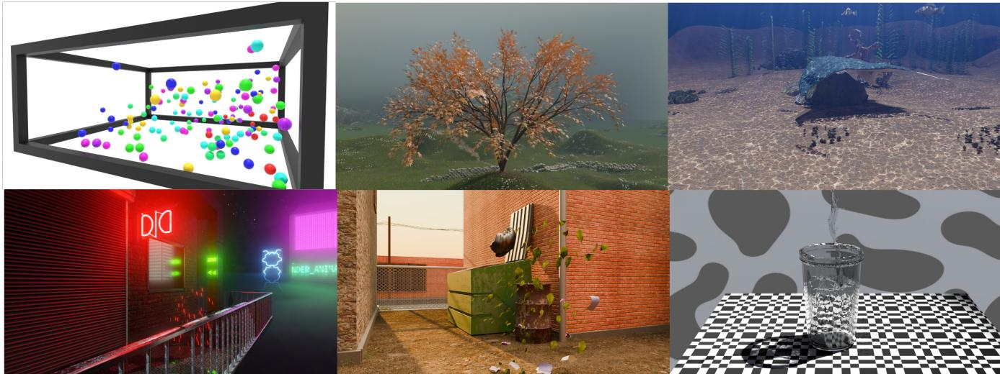  
Figure 2: Stillframesfrom our novel benchmark. We introduce six synthetic scenes, each as an animation of300frames (10s), rangingfrom 25 to 50 cameras arrangedfrom 180 to 360 deg arrays. All scenes were either hand animated or entirely simulated in Blender. Our novel benchmark showcases complex geometry, fluid simulation, atmospherics, particles and caustics, significantly raising the barfor dynamic scene reconstruction methods, with 1 to 4 test view points per scene.

Table 1: Comparison of public dynamic scene reconstruction benchmarks. “Complex motion” refers to challenging non-rigid deformations; “Long duration” indicates sequences typically exceeding several hundred frames (suitable for evaluating long-term consistency); “Realistic” denotes photorealistic real-world captures versus synthetic data; “Scene variety” covers diversity in environments and objects; “Multi-camera” indicates synchronized multi-camera setups.
<table><tr><td>Benchmark</td><td>Complex motion</td><td>Long duration</td><td>Realistic</td><td>Scene variety</td><td>Multi-camera</td></tr><tr><td>N3DV [LSZ*22]</td><td>X</td><td>V</td><td>√</td><td>X</td><td>√</td></tr><tr><td>Technicolor [SBV*17]</td><td>X</td><td>X</td><td>√</td><td>√</td><td>√</td></tr><tr><td>NeRF synthetic [MST*20]</td><td>X</td><td>X</td><td>X</td><td>√</td><td>X</td></tr><tr><td>ENeRF-Outdoor [LPX*22]</td><td>X</td><td>√</td><td>√</td><td>√</td><td>√</td></tr><tr><td>HyperNeRF [PSH*21]</td><td>X</td><td>×</td><td>√</td><td>X</td><td>X</td></tr><tr><td>PIDG [HFD*26]</td><td>√</td><td>X</td><td>X</td><td>√</td><td>X</td></tr><tr><td>Ours</td><td>√</td><td>√</td><td>√</td><td>√</td><td>√</td></tr></table>

In order to maintain a reasonable training time for a scene with dozens or hundreds of images, the rasterizer makes two important decisions. Firstly, the image is tiled in 16 × 16 pixels to parallelize rasterization efficiently. For each 2D splat, the largest of the two axes of its ellipse is used to compute a bounding box which allows to allocate the primitive to all the image tiles it intersects with. This effectively reduces the number of Gaussians to rasterize in each CUDA kernel, at the cost of a limited support for the 2D splat, and hence less pixel error contributions in the backward pass. Secondly, for each pixel during rasterization, every Gaussian splat i assigned to this tile contributes some color by the scalar value σ α , and any Gaussian whose contribution scalar falls below a threshold is discarded. As a result, the discarded Gaussians does not receive gradient updates for that pixel. We argue that those two key design choices are hindering the ability of 3D Gaussians to explore the scene, which may result in a poor model for a poor scene initialization. This is especially the case in dynamic methods (e.g., 4DGS [YYPZ24b]), where distant frames require different initializations and are challenging to model with the same set of Gaussians. While relaxing these key constraints should, in theory, alleviate these limitations, we show in the next section that the vanishing gradient problem of the Gaussian distribution is the real optimization bottleneck.

## 3.2. Gradient analysis

During optimization, the Gaussian parameters are updated in a gradient backpropagation pass. When the Gaussian splat obtained via perspective projection overlaps the pixels that it reconstructs, all appearance attributes receive gradient updates. In the other case where the Gaussian does not splat onto the pixels of interest, its appearance attributes cannot receive meaningful updates. Therefore the spatial gradient, $i . e . \frac { \partial L } { \partial \mu }$ , is critical to the success of the optimization, as the Gaussian primitives move and extend their coverage to match observed images. For this reason, we focus our analysis on the derivative of the optimization objective with respect to the 2D mean in both x and y dimension.

When considering one of the 2D variables, e.g. x, the partial spatial derivative is defined as

$$
{ \frac { \partial { \cal L } } { \partial \mu _ { x } ^ { 2 D } } } = { \frac { \partial { \cal L } } { \partial G ^ { 2 D } } } { \frac { \partial G ^ { 2 D } } { \partial \Delta _ { x } } } { \frac { \partial \Delta _ { x } } { \partial \mu _ { x } ^ { 2 D } } }\tag{3}
$$

where $\Delta = \left( \mu ^ { 2 D } - \mathbf { p } \right)$ is the distance-space parametrization of a pixel p for which we want to compute the 2D Gaussian density

$$
G ^ { 2 D } ( \Delta ) = \exp \{ - \frac { 1 } { 2 } { \Delta } ^ { T } { \Sigma } ^ { \prime } ^ { - 1 } { \Delta } \} ,\tag{4}
$$

using the projected covariance $\Sigma ^ { \prime }$ of Eq. (2). The gradient of the loss with respect to the 2D Gaussian density is then defined as

$$
\frac { \partial { \cal L } } { \partial G ^ { 2 D } } = { \sigma } { \frac { \partial { \cal L } } { \partial \alpha _ { i } } } ,\tag{5}
$$

which contains no interaction term with the Gaussian function. However, the gradient of the Gaussian density with respect to the mean delta in x and in y are defined as

$$
\frac { \partial } { \partial \Delta _ { x } } G ^ { 2 D } ( \Delta ) = - G ( \Delta ) \Delta _ { x } a - G _ { i } ( \Delta ) \Delta _ { y } c ,\tag{6}
$$

$$
\frac { \partial } { \partial \Delta _ { y } } G ^ { 2 D } ( \Delta ) = - G ( \Delta ) \Delta _ { y } b - G _ { i } ( \Delta ) \Delta _ { x } c ,\tag{7}
$$

and clearly contain interaction terms with the Gaussian function $G ^ { 2 D }$ . The coefficients $a , b , c$ are from the un-normalized general Gaussian 2D function (conic form) used in the original formulation, expressed as

$$
f ( x , y ) = \exp ( - \frac { 1 } { 2 } [ a { ( \mu _ { x } - x ) } ^ { 2 } + c { ( \mu _ { y } - y ) } ^ { 2 } ] - b { ( \mu _ { x } - x ) } { ( \mu _ { y } - y ) } ) .\tag{8}
$$

Since the Gaussian function has local support with an exponential falloff outside the mean, any pixel outside the isocontour of the 2D splat receives near zero gradients due to the Gaussian function zeroing-out equations Eq. (6) and Eq. (7), which in turns nullifies the chain rule for Eq. (3). We argue that the vanishing gradient of the Gaussian distribution is a strong limitation for learning a scene configuration that diverges significantly from the initializtion, as highlighted in previous research [ZPML23]. Since this naturally happens in dynamic scenes, we highlight the importance of addressing this limitation in the 3DGS rasterizer.

## 3.3. Piecewise truncated gradient

To remedy the vanishing gradient, we propose to truncate Eq. (6) and Eq. (7) such that the gradient changes to a linear surrogate below a density threshold, as illustrated in Fig. 1 and Fig. 3, and is defined as the following piecewise gradient field:

$$
\widetilde { \nabla G } = \left\{ \begin{array} { l l } { \frac { \partial G } { \partial \Delta _ { x } } } & { \mathrm { i f ~ } - 2 \log G < - 2 \log \mathfrak { c } } \\ { \operatorname* { m i n } ( m \cdot x + b , \frac { \partial G } { \partial \Delta _ { x } } ) } & { \mathrm { i f ~ } \frac { \partial } { \partial \Delta _ { x } } G ( b ) < 0 } \\ { \operatorname* { m a x } ( - m \cdot x + b , \frac { \partial G } { \partial \Delta _ { x } } ) } & { \mathrm { i f ~ } \frac { \partial } { \partial \Delta _ { x } } G ( b ) > 0 } \end{array} \right.\tag{9}
$$

with the Gaussian density threshold τ and the squared Mahalanobis distance expressed in terms of the Gaussian function G:

$$
\begin{array} { c } { d ( p ) ^ { 2 } = ( \mu - p ) ^ { T } \Sigma ^ { - 1 } ( \mu - p ) } \\ { = - 2 \log G } \end{array}\tag{10}
$$

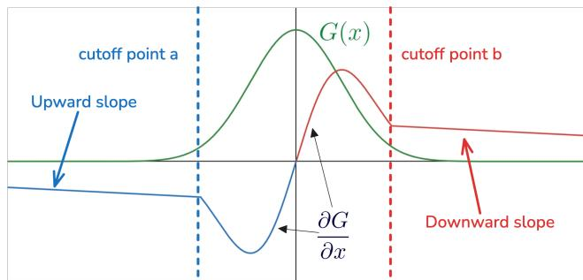  
Figure 3: 1D illustration of our piecewise gradient. Beyond the cut-off points, the partial derivative becomes a linear surrogate which converges to the true gradient. Between the cut-off points, we maintain the true partial derivative $\frac { \partial G } { \partial x }$

The truncated gradient equals the true partial derivative when the squared Mahalanobis distance is less than a density threshold τ, and follows a line equation otherwise. This line is defined by a slope m set as a model parameter and a bias which we derive as explained below. The slope m controls the linear scaling of the gradient magnitude, effectively interpolating between the minimum-magnitude gradient and the gradient at the boundary point. The density threshold τ directly determines the boundary point and defines the isocontour of the 2D splat. We set τ to the alpha-blending discard threshold of the rasterizer.

Gradient continuity. Since our truncated gradient is piecewise linear and exponential, the only source of discontinuity would be at the boundary between the two pieces. To ensure continuity at the boundary, we match the linear surrogate $y = m x + b$ to the true gradient at the boundary point $x _ { b } -$ the cut-off gradient :

$$
\frac { \partial } { \partial \Delta _ { x } } G ^ { 2 D } ( x _ { b } ) = m x _ { b } + b ,\tag{11}
$$

which yields

$$
b = \frac { \partial } { \partial \Delta _ { x } } G ^ { 2 D } ( x _ { b } ) - m x _ { b } .\tag{12}
$$

The boundary point $x _ { b }$ is defined via the Gaussian isocontour $G ^ { 2 D } ( x _ { b } ) = \tau ,$ or equivalently by substituting Eq. (10):

$$
G ^ { 2 D } ( x _ { b } ) = \tau \equiv d ( p ) ^ { 2 } = - 2 \log \tau .\tag{13}
$$

To derive $x _ { b } ,$ , we parametrize it as the hit of ray with the Gaussian isocontour. We define the ray as origin the query pixel $p$ and unit direction $\frac { \mu - p } { | | \mu - p | | _ { 2 } }$ , such that

$$
x _ { b } = p + s \frac { \mu - p } { | | \mu - p | | _ { 2 } } .\tag{14}
$$

Thus, finding xb requires solving

$$
( \mu - x _ { b } ) \Sigma ^ { - 1 } ( \mu - x _ { b } ) = - 2 \log \tau\tag{15}
$$

for the scalar $s ,$ i.e. for each query pixel in the 2D gradient field. This is done by parametrizing a quadratic equation, yielding the

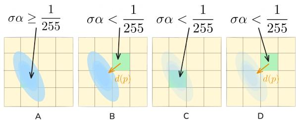  
Figure 4: Different conditions lead to different gradient pathsfor a given Gaussian when looking at the error of a pixel in the tile. Depending on the Gaussian density α at pixel p, the distance $d ( p )$ to the isocontour ofdensity threshold τ, pixel p may contribute to the Gaussian of opacity σ. A) The splat uses the true gradient. B) The splat isfiltered out and uses the truncated gradient, with $d ( p ) > \tau .$ C) The splat is filtered out and receives no gradient, with $d ( p ) < \tau .$ D) The splat is filtered out and uses the truncated gradient, with $d ( p ) > \tau .$

solution

$$
s = \| \mu - p \| _ { 2 } \left( 1 \pm \sqrt { \frac { - 2 \log { \tau } } { K } } \right)\tag{16}
$$

$$
K = a { ( \mu _ { x } - p _ { x } ) } ^ { 2 } + 2 b { ( \mu _ { x } - p _ { x } ) } { ( \mu _ { y } - p _ { y } ) } + c { ( \mu _ { y } - p _ { y } ) } ^ { 2 } ,\tag{17}
$$

with the coefficients $a , b , c$ from Eq. (8). The full derivation of the solution is given in the supplementary material. A 1D illustration of the cut-off points and linear surrogate functions are shown in $\mathrm { F i g } . 3 .$

The choice of slope m influences the range of action of the truncated gradient in the image plane: a lower value of m yields a near-constant long-range gradient approximating the cut-off gradient, and a higher value of m yields a sharp decay from the cut-off gradient. This cut-off gradient is defined as $G ^ { \prime } ( x )$ , where x is the solution to $G ( x ) = \tau .$

Convergence analysis. When using the truncated gradient, there is a risk of model divergence when the accumulated truncated gradient surpasses the true gradient. This may arise when a Gaussian is a very bad fit, i.e. it does not receive gradients from the normal path, but also when it is a good fit, i.e. its true gradient is near zero at the local minimum (see Fig. 1). Therefore, it is challenging to optimize poor fits well while maintaining the good fits reconstruction.

To prevent divergence, we found that the optimal strategy follows Occam’s razor: we only apply the truncated gradient defined in Eq. (9) for dead Gaussians, i.e $. \ \sigma _ { i } < \tau _ { \mathrm { p r u n i n g } } .$ . This means that Gaussians whose opacity is below the pruning threshold would get pruned before they can converge to distant pixels. To circumvent this, we employ an interleaved strategy of optimization via the truncated gradient followed by normal optimization with Adaptive Density Control (ADC) turned on. This has the added benefit that perturbations to the accumulated viewspace gradient don’t affect ADC. In addition, we delay the pruning of primitives until the the end of training.

## 3.4. Implementation

We integrate our truncated gradients into the backward pass of 3D Gaussian Splatting. In practice, we only assign the truncated gradient when the squared Mahalanobis distance is greater than the cut-off threshold, since below that threshold we fallback to the default case where the truncated gradient is not needed. In addition, we only apply the truncated gradient when $\begin{array} { r } { \frac { \partial L } { \partial \epsilon _ { i } } < 0 , } \end{array}$ i.e. when the Gaussian isn’t increasing the loss by alpha-blending, otherwise we not only get a long-range pull but also a long-range push, which causes Gaussians to repel each other. This results in three gradient update paths for the pixel error with respect to the Gaussian 2D means (see Fig. 4 for visual examples):

• Normal path: Gaussians receive gradients from the normal path when they go through the high-pass filter, $i . e . { \sigma } \mathrm { \alpha } > = \frac { 1 } { 2 5 5 } { \left( \mathrm { F i g . 4 } \right) }$

• Truncated path: Gaussians receive gradients from the truncated path whenever they do not contribute to the pixel’s rasterization, $i . e . \ \sigma \alpha < \frac { 1 } { 2 5 5 }$ due to a low density α (see Fig. 4B, or due to a low opacity σ (see Fig. 4C). In both cases, their Mahalanobis distance from the pixel is above the threshold. In the latter case, we only compute the gradient for the opacity σ.

• Skip path: Gaussians do not receive any gradients when they do not contribute to the pixel, $i . e . \ \sigma \mathbf { \alpha } < \frac { 1 } { 2 5 5 }$ , and their Mahalanobis distance from the pixel is below the threshold (Fig. 4D).

Since we are only considering the gradient of the loss with respect to the Gaussian mean, this modification results in a displacement of the Gaussian whenever the accumulated truncated gradient magnitude is higher than the accumulated true gradient coming from pixels, to which the Gaussian contributes.

Finally, to make use of the truncated gradient, we expand the tilecoverage radius of each dead Gaussian whose radius is a below a threshold. This addresses the tile-based culling of the rasterizer and enables long-distance pixel error contributions using our truncated gradient field.

Training performance. Without careful consideration, our truncated gradient method can be significantly slower than the baseline in certain cases. To overcome this, we only apply radius expansion and truncated gradient computation for dead Gaussians. In addition, we give dynamic methods a special treatment to reduce computation by ignoring the contributions of static pixels, according to viewpoint-dependent motion masks. We create these motion masks via frame-difference and image processing on the input videos. With those optimizations, our method is 1 − 10× slower to train than the baseline, depending on the scene and primitive count. At inference time however, the proposed modifications have no effect on the rendering speed. We discuss the performance overhead in detail in the supplementary material.

## 4. Evaluation

To validate the effectiveness and generality of our proposed optimization framework, we evaluate our method on both static and dynamic scenes across indoor and outdoor environments. We compare against competing Gaussian splatting variants on public benchmarks as well as on our newly introduced dynamic dataset designed to exhibit large spatio-temporal divergence and challenging initialization conditions.

Table 2: Quantitative comparison on static scene reconstruction benchmarks under different initialization settings.
<table><tr><td rowspan="2">Method</td><td colspan="5">Our dataset</td><td colspan="5">Mip-NeRF360</td></tr><tr><td>LPIPS↓</td><td>SSIM↑</td><td>PSNR↑</td><td>Train↓</td><td>#GS↓</td><td>LPIPS↓</td><td>SSIM↑</td><td>PSNR↑</td><td>Train↓</td><td>#GS↓</td></tr><tr><td colspan="10">Random initialization</td></tr><tr><td>3DGS</td><td>0.2106</td><td>0.8351</td><td>24.74</td><td>14 min</td><td>1.126M</td><td>0.3481</td><td>0.6718</td><td>20.92</td><td>27 min</td><td>1.180M</td></tr><tr><td>3DGS + Ours 2DGS</td><td>0.1974</td><td>0.8511</td><td>25.16</td><td>55 min</td><td>0.799M</td><td>0.3343</td><td>0.6933</td><td>22.18</td><td>56 min</td><td>0.971M</td></tr><tr><td>2DGS + Ours</td><td>0.4354 0.3883</td><td>0.4960 0.6624</td><td>18.80 20.70</td><td>23 min 33 min</td><td>1.231M 1.446M</td><td>0.3943 0.3886</td><td>0.6391 0.6547</td><td>19.82 20.33</td><td>34 min 55 min</td><td>1.511M 1.071M</td></tr><tr><td colspan="9">COLMAP initialization</td><td></td></tr><tr><td>3DGS</td><td>0.1270</td><td>0.9058</td><td>30.07</td><td></td><td>1.217M</td><td></td><td>0.8212</td><td></td><td></td><td></td></tr><tr><td>3DGS + Ours</td><td>0.1245</td><td>0.9097</td><td>30.86</td><td>9 min 43 min</td><td>0.768M</td><td>0.2149 0.2197</td><td>0.8205</td><td>27.70 27.84</td><td>21 min 86 min</td><td>2.496M 2.035M</td></tr><tr><td>2DGS</td><td>0.2017</td><td>0.8378</td><td>25.00</td><td></td><td>1.801M</td><td>0.2342</td><td>0.8117</td><td>27.17</td><td>44 min</td><td>3.068M</td></tr><tr><td>2DGS + Ours</td><td>0.1962</td><td>0.8444</td><td>26.35</td><td>23 min 32 min</td><td>1.048M</td><td>0.2403</td><td>0.8104</td><td>27.33</td><td>80 min</td><td>2.701M</td></tr></table>

## 4.1. Datasets & metrics

Static datasets. In addition to still frames from our novel benchmark, we evaluate our method on the Mip-NeRF360 benchmark [BMV∗22]. Mip-NeRF360 contains unbounded inward-facing indoor and outdoor scenes with large depth variation, detailed backgrounds, and 360-degree camera trajectories. The dataset is particularly challenging for Gaussian splatting methods due to its largescale spatial extent and weakly constrained distant geometry. For all datasets, we follow the evaluation protocol of Mip-NeRF360 and use every eighth image as part of the test set, while the remaining images are used for training.

Dynamic datasets. Our novel synthetic dataset, our dataset, is composed of 6 scenes: alley, windy tree, water cup, neon city, bouncy balls, underwater. Each scene is a 300-frame sequence, from fluid simulation to hand-crafted animation, made and rendered with Blender [Com18]. We rendered the scenes with camera rigs ranging from 25 to 45 cameras, arranged in semi circles or full circles, and with a resolution of 1600 × 900. All scenes are rendered with path tracing at 30fps, for a duration of 10s each. As we aim to raise the bar of dynamic Gaussian splatting methods, we consider challenging scene dynamics with multiple novel view points, ranging from 1 to 4 test view points.

To show that our method performs well across all types of scenes, we also use the Neural 3D Video benchmark [LSZ∗22]. It is composed of six 10s clips of indoor activities with 20 cameras, including 1 test view point.

Metrics We evaluate rendered image quality using PSNR, SSIM, and LPIPS computed against the corresponding ground-truth images. PSNR measures pixel-wise reconstruction fidelity, SSIM evaluates structural similarity, and LPIPS measures perceptual similarity in feature space. All reported metrics are averaged across all test views.

## 4.2. Experiments

Static scene reconstruction. We compare our method against existing Gaussian splatting approaches on the Mip-NeRF360 benchmark and the static subset of our dataset, evaluating under both random initialization and COLMAP-based initialization. As shown in Table 2, our method consistently improves reconstruction quality across all settings and base methods (3DGS and 2DGS). The gains are particularly evident under random initialization, demonstrating stronger robustness to poor starting conditions, while improvements remain clear even with COLMAP initialization. Our method also tends to produce more compact representations with fewer Gaussians.

Table 3: Quantitative comparison on the Neural 3D Video benchmark [LSZ∗22] for dynamic scene reconstruction.
<table><tr><td>Method</td><td>LPIPS↓</td><td>SSIM↑</td><td>PSNR↑</td><td>#GS↓</td></tr><tr><td>4DGS</td><td>0.1360</td><td>0.9443</td><td>30.22</td><td>2.806M</td></tr><tr><td>4DGS + Ours</td><td>0.1339</td><td>0.9493</td><td>31.70</td><td>1.733M</td></tr><tr><td>CEM-4DGS</td><td>0.1328</td><td>0.9512</td><td>32.07</td><td>0.331M</td></tr><tr><td>CEM-4DGS + Ours</td><td>0.1359</td><td>0.9519</td><td>32.29</td><td>0.352M</td></tr><tr><td>4D-Scaffold</td><td>0.1286</td><td>0.9502</td><td>31.83</td><td>0.583M</td></tr><tr><td>4D-Scaffold + Ours</td><td>0.1311</td><td>0.9487</td><td>31.94</td><td>0.556M</td></tr></table>

Table 4: Quantitative comparison on our novel benchmark for dynamic scene reconstruction. φ and θ refer to sparse and dense COLMAP reconstructions used as initialization, respectively.
<table><tr><td>Method</td><td>LPIPS↓</td><td>SSIM↑</td><td>PSNR↑</td><td>#GS↓</td></tr><tr><td>4DGS (φ)</td><td>0.2326</td><td>0.8329</td><td>25.47</td><td>2.409M</td></tr><tr><td>4DGS (φ) + Ours</td><td>0.2035</td><td>0.8574</td><td>26.08</td><td>1.715M</td></tr><tr><td>4DGS (θ) 4DGS (θ) + Ours</td><td>0.2288 0.1496</td><td>0.8224 0.8923</td><td>26.02 27.56</td><td>2.970M 2.333M</td></tr><tr><td></td><td></td><td></td><td></td><td></td></tr><tr><td>CEM-4DGS CEM-4DGS + Ours</td><td>0.2767 0.2670</td><td>0.7855 0.7845</td><td>22.80 22.63</td><td>0.704M 0.824M</td></tr></table>

Dynamic scene reconstruction. We evaluate our approach on the Neural 3D Video benchmark and our novel synthetic dataset using popular dynamic baselines. All dynamic sequences are initialized from the first frame via COLMAP reconstruction and optimized sequentially over time. This setup progressively increases optimization difficulty due to accumulating temporal displacements. Our truncated gradient formulation is applied on top of the baselines with minimal modifications, highlighting its plug-and-play compatibility and effectiveness in handling large spatio-temporal divergence.

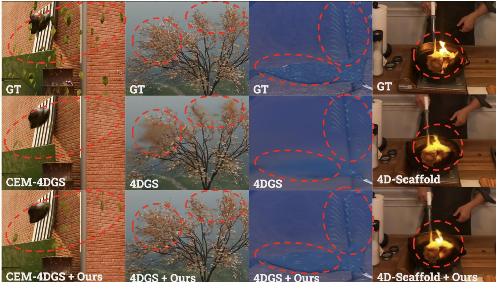  
Figure 5: Qualitative comparison of our truncated gradient and the baselines on dynamic scene reconstruction benchmarks. From left to right: alley, windy tree, underwater scenes ofour dataset, and on the last column the flame steak scene ofN3DV [LSZ∗22]

Table 5: Ablation study of key components on the alley and tree scenes of our dataset.
<table><tr><td rowspan="2">Configuration</td><td colspan="3">Alley</td><td colspan="3">Tree</td></tr><tr><td>LPIPS↓</td><td>SSIM↑</td><td>PSNR↑</td><td>LPIPS↓</td><td>SSIM↑</td><td>PSNR↑</td></tr><tr><td>w/o truncated gradient</td><td>0.1350</td><td>0.8891</td><td>28.82</td><td>0.1789</td><td>0.8681</td><td>28.03</td></tr><tr><td>w/o radius padding</td><td>0.1289</td><td>0.8913</td><td>28.83</td><td>0.1772</td><td>0.8694</td><td>28.42</td></tr><tr><td>w/o delayed pruning</td><td>0.1309</td><td>0.8909</td><td>28.82</td><td>0.1707</td><td>0.8753</td><td>28.79</td></tr><tr><td>w/o dead Gaussians filtering</td><td>0.3716</td><td>0.6153</td><td>21.87</td><td>0.1755</td><td>0.8728</td><td>28.67</td></tr><tr><td>w/o negative alpha filtering</td><td>0.1291</td><td>0.8922</td><td>29.14</td><td>0.1701</td><td>0.8733</td><td>28.70</td></tr><tr><td>Full method</td><td>0.1289</td><td>0.8887</td><td>29.11</td><td>0.1685</td><td>0.8714</td><td>28.58</td></tr></table>

Our method delivers consistent improvements when integrated with 4DGS [YYPZ24b], CEM-4DGS [KPLL25], and 4D-Scaffold [CCK∗26] (Table 3 and Table 4). Qualitative comparisons (Fig. 5, Fig. 6 and Fig. 7) show better recovery of complex motion, fluid effects, and fine geometric details where baselines exhibit floaters, blurring, or missing structures.

Overall, these experiments demonstrate that our piecewise truncated gradient approach provides generalizable and robust improvements for both static and dynamic 3D Gaussian Splatting across different initializations and scene types.

## 4.3. Ablation Study

Ablation on optimization design choices. Our method introduces three key components: the truncated gradient, radius padding, and delayed pruning. Since these components are implemented directly within the Gaussian rasterization and optimization pipeline, their behavior is independent of whether the scene is static or dynamic. To isolate their effects while keeping computational cost manageable, we perform all ablations on the alley scene of our dataset.

Table 5 summarizes the contribution of each component. Removing the truncated gradient causes the largest performance drop, confirming its critical role in addressing vanishing gradients and enabling effective long-range movement of primitives across large displacements in dynamic scenes. Disabling radius padding yields competitive but inferior results, as padding ensures dead Gaussians are assigned to relevant tiles, enabling the truncated gradient to take effect over longer distances. Similarly, early pruning of low-opacity Gaussians prevents them from receiving long-range gradients. Keeping them until the end allows recovery and improves final reconstruction. Applying the truncated gradient to all Gaussians degrades performance, as the optimization bias introduced by the surrogate linear model can cause training divergence even for active Gaussians. Without filtering by the sign of the alpha gradient, we not only get a long-range pull but also a long-range push, which causes Gaussians to repel each other. The full method achieves the best performance by combining stronger gradient flow, sufficient tile coverage, and preserved exploration capacity.

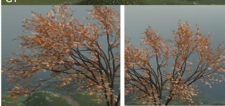

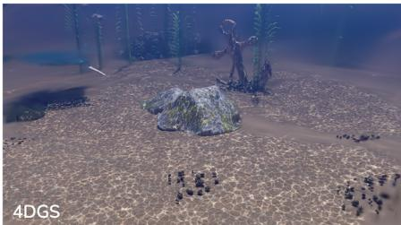

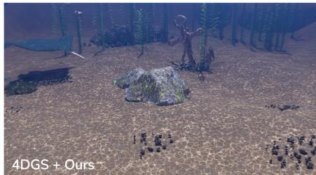

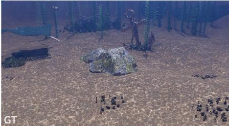

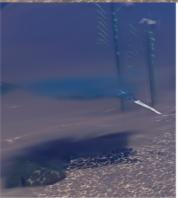

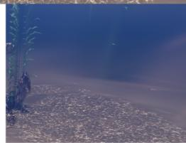

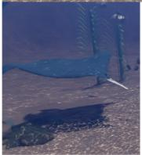

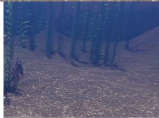

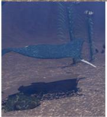

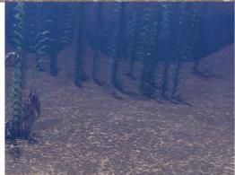

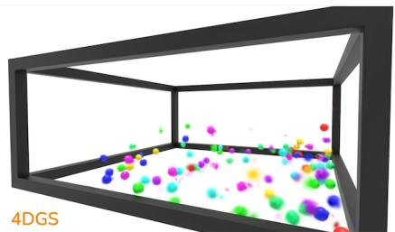

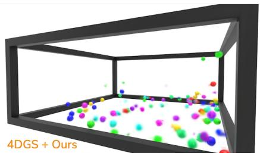

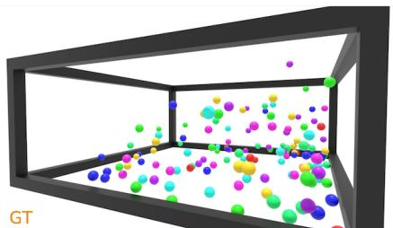

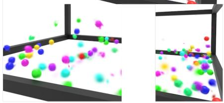

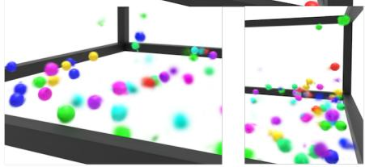

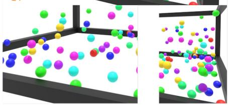

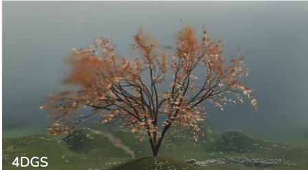

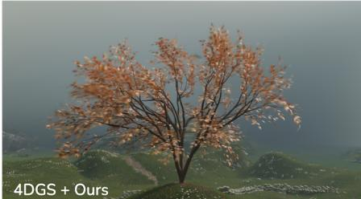

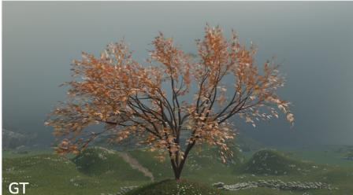

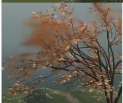

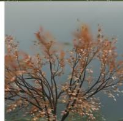

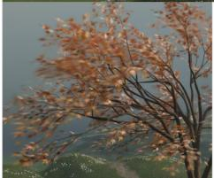

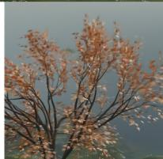  
Figure 6: Qualitative comparison of our truncated gradient and the baselines on dynamic scene reconstruction benchmarks. From top to bottom: underwater, bouncy balls and windy tree.

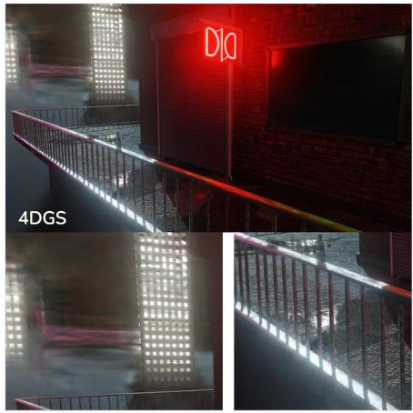

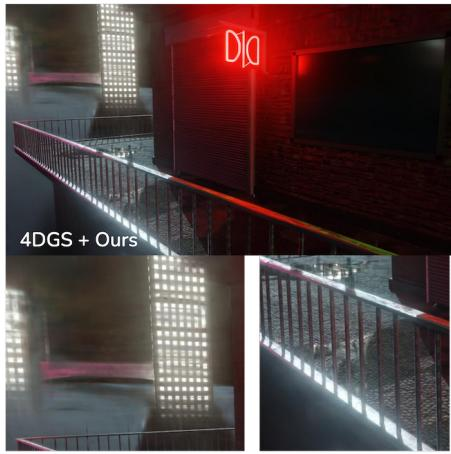

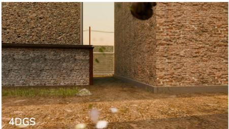

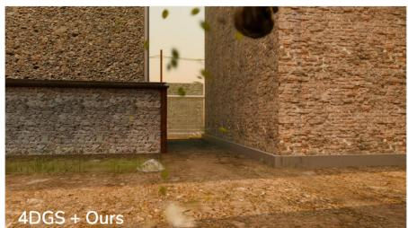

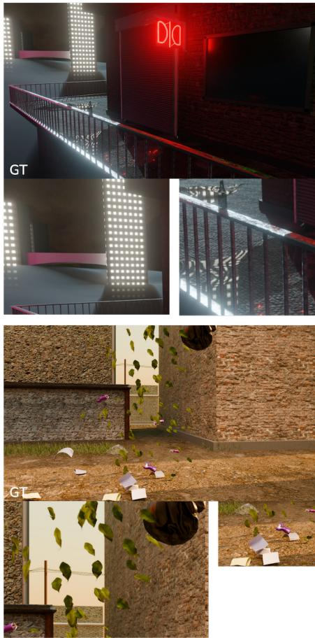

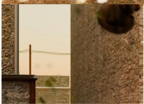

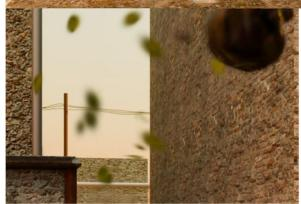

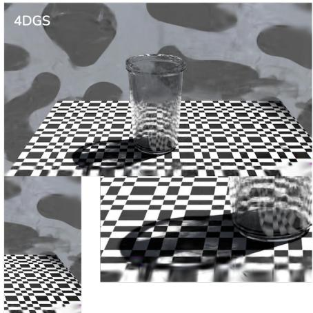

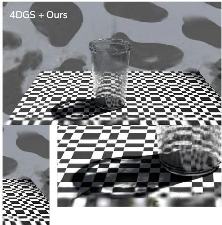

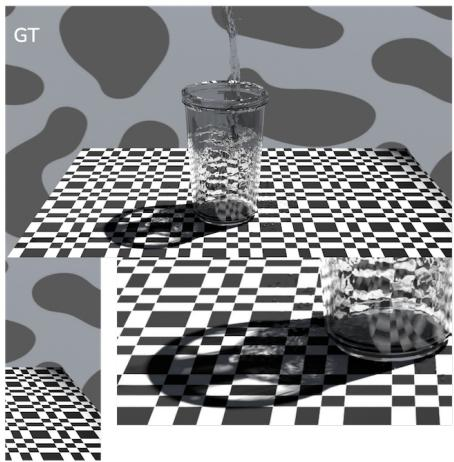  
Figure 7: Qualitative comparison ofour truncated gradient and the baselines on dynamic scene reconstruction benchmarks. From top to bottom: Neon city, Alley and Cup.

## 4.4. Discussion and Limitations

Our method improves optimization robustness by enlarging the effective support region of Gaussian primitives, allowing poorly initialized or weakly constrained Gaussians to receive meaningful gradients from a larger set of pixels. However, this increased optimization coverage comes at the cost of additional computation, as more Gaussian-pixel pairs participate in the backward pass. As a result, our method generally requires longer training times than the original rasterization pipeline. This reflects a fundamental tradeoff between optimization efficiency and reconstruction robustness: improved gradient propagation leads to better scene reconstruction quality, but incurs additional computational overhead.

We note that, except for the delayed pruning schedule, we did not retune the original densification and pruning hyperparameters of the baseline methods. This conservative integration strategy ensures broad compatibility with existing 3DGS frameworks but leaves room for further gains, particularly in metrics such as SSIM that are sensitive to densification strategies. Exploring joint optimization of our truncated gradients with tailored densification/pruning policies is a promising direction for future work.

## 5. Conclusion

We presented TruncGradGS, an optimization framework for improving Gaussian splatting through piecewise truncated gradient updates. By replacing the near-zero tails of the Gaussian derivative with a continuous surrogate, our method enlarges the effective optimization support of Gaussian primitives and alleviates the vanishing-gradient problem inherent to tiled Gaussian rasterization. Extensive experiments on both static and dynamic scene reconstruction benchmarks demonstrate consistent improvements in reconstruction quality and robustness across different initialization settings and Gaussian representations. In addition, we introduced a new synthetic benchmark for dynamic Gaussian splatting containing challenging scenes with large spatio-temporal divergence. Our results suggest that improving gradient propagation is an effective and complementary direction for advancing Gaussian-based scene reconstruction methods.

Acknowledgment. This project is supported by Research Ireland under the Research Ireland Frontiers for the Future Programme - Project, award number 22/FFP-P/11522. The team gratefully acknowledges Adam Handschuh for creating the dataset, Leon Andorfi for supporting the experiments, and Dolby Laboratories, Inc. for their gift fund.

## References

[BEG∗26] BARANOWSKI B., ESPOSITO S., GSCHOSSMANN P., CHEN A., GEIGER A.: ConeGS: Error-Guided Densification Using Pixel Cones for Improved Reconstruction with Fewer Primitives. In International Conference on 3D Vision (3DV) (2026). 2

[BMV∗22] BARRON J. T., MILDENHALL B., VERBIN D., SRINIVASAN P. P., HEDMAN P.: Mip-nerf 360: Unbounded anti-aliased neural radiance fields. In Proceedings ofthe IEEE/CVF conference on computer vision and pattern recognition (2022). 7

[C∗25] CHEN Y., ET AL.: Esa-gs: Elongation splitting and assimilation in gaussian splatting. Computers & Graphics (2025). 2

[CCK∗26] CHO W. O., CHO I., KIM S., BAE J., UH Y.: 4d scaffold gaussian splatting with dynamic-aware anchor growing for efficient and high-fidelity dynamic scene reconstruction. In AAAI (2026). 3, 8

[CHW∗25] CHEN J., HU Z., WU P., ZHU H., LI H., SUN X.: Dash: Selfsupervised decomposition and 4d hash encoding for real-time dynamic scene rendering. In International Conference on Computer Vision (ICCV) (2025). 3

[CJ23] CAO A., JOHNSON J.: Hexplane: A fast representation for dynamic scenes. 2023 IEEE/CVF Conference on Computer Vision and Pattern Recognition (CVPR) (2023), 130–141. 3

[Com18] COMMUNITY B. O.: Blender - a 3D modelling and rendering package. Blender Foundation, Stichting Blender Foundation, Amsterdam, 2018. 7

[D∗26] DESIATOV I., ET AL.: The role and relationship of initialization and densification in 3d gaussian splatting. arXiv:2603.20714 (2026). 2

[Dai25] DAI E. A.: Decoupling motion and geometry in 4d gaussian splatting. In TOG (2025). 3

[DJC∗25] DONG Z., JIANG J., CHEN Y., ZHANG J., JIANG K., LIU X.: Reframing gaussian splatting densification with complexity-density consistency of primitives. In Advances in Neural Information Processing Systems (NeurIPS) (2025). 2

[DWD∗24] DUAN Y., WEI F., DAI Q., HE Y., CHEN W., CHEN B.: 4d-rotor gaussian splatting: Towards efficient novel view synthesis for dynamic scenes. In ACM SIGGRAPH 2024 Conference Papers (New York, NY, USA, July 2024), Association for Computing Machinery. 3

[ea26] ET AL. W.: Prune wisely, reconstruct sharply: Compact 3d gaussian splatting via adaptive pruning. CVPR (2026). 2

[FSX∗25] FENG H., SUN H., XIE W., ZUO Z., LIU Z.: Disentangled 4d gaussian splatting: Rendering high-resolution dynamic world at 343 fps, 2025. arXiv:2503.22159. 3

[FYW∗22] FANG J., YI T., WANG X., XIE L., ZHANG X., LIU W., NIESSNER M., TIAN Q.: Fast dynamic radiance fields with time-aware neural voxels. In SIGGRAPH Asia 2022 Conference Papers (2022). 3

[HFD∗26] HONG H., FAN D., DOU F., ZHOU Z.-L., SUN H., ZHU C., CHEN J.: Physics-informed deformable gaussian splatting: Towards unified constitutive laws for time-evolving material field. In Proceedings ofthe AAAI Conference on Artificial Intelligence (AAAI) (2026). 3, 4

[HJS∗25] HONG S., JUNG J., SHIN H., HAN J., YANG J., LUO C., KIM S.: Pf3plat: Pose-free feed-forward 3d gaussian splatting for novel view synthesis. In International Conference on Machine Learning (ICML) (2025). 2

[HLX∗25] HU B., LI Y., XIE R., XU B., DONG H., YAO J., LEE G. H.: Learnable infinite taylor gaussian for dynamic view rendering. In Proceedings of the Computer Vision and Pattern Recognition Conference (2025), pp. 26844–26854. 3

[J∗25] JI B., ET AL.: Sfm-free 3d gaussian splatting via hierarchical training. CVPR (2025). 2

[JHA∗24] JUNG J., HAN J., AN H., KANG J., PARK S., KIM S.: Rain-gs: Relaxing accurate initialization constraint for 3d gaussian splatting, 2024. 2

[KKLD23] KERBL B., KOPANAS G., LEIMKUEHLER T., DRETTAKIS G.: 3d gaussian splatting for real-time radiance field rendering. ACM Transactions on Graphics (TOG) 42 (2023), 1 – 14. 2, 4

[KPLL25] KANG T., PARK J., LEE K., LEE Y.: Clustered error correction with grouped 4d gaussian splatting. In SIGGRAPH Asia 2025 Conference Papers (2025). 8

[KRS∗24a] KHERADMAND S., REBAIN D., SHARMA G., SUN W., TSENG Y.-C., ISACK H., KAR A., TAGLIASACCHI A., YI K. M.: 3d gaussian splatting as markov chain monte carlo. In Advances in Neural Information Processing Systems (2024). 1

[KRS∗24b] KHERADMAND S., REBAIN D., SHARMA G., SUN W., TSENG Y.-C., ISACK H., KAR A., TAGLIASACCHI A., YI K. M.: 3d gaussian splatting as markov chain monte carlo. In Advances in Neural Information Processing Systems (NeurIPS) (2024). 2

[KVN24] KATSUMATA K., VO D. M., NAKAYAMA H.: A compact dynamic 3d gaussian representation for real-time dynamic view synthesis. ECCV (2024). 3

[L∗26] LUO H., ET AL.: Efficient and spatially aware 3d gaussian splatting for large-scale scenes. Applied Sciences (2026). 2

[LPX∗22] LIN H., PENG S., XU Z., YAN Y., SHUAI Q., BAO H., ZHOU X.: Efficient neural radiance fields for interactive free-viewpoint video. In SIGGRAPH Asia Conference Proceedings (2022). 3, 4

[LSZ∗22] LI T., SLAVCHEVA M., ZOLLHOEFER M., GREEN S., LASS-NER C., KIM C., SCHMIDT T., LOVEGROVE S., GOESELE M., NEW-COMBE R., ET AL.: Neural 3d video synthesis from multi-view video. In Proceedings of the IEEE/CVF conference on computer vision and pattern recognition (2022), pp. 5521–5531. 3, 4, 7, 8

[LWJ∗24a] LEE J., WON C.-Y., JUNG H., BAE I., JEON H.-G.: Fully Explicit Dynamic Gaussian Splatting. In Advances in Neural Information Processing Systems (NeurIPS) (2024). 3

[LWJ∗24b] LEE J., WON C.-Y., JUNG H., BAE I., JEON H.-G.: Fully explicit dynamic gaussian splatting. In Advances in Neural Information Processing Systems (NeurIPS) (2024). 3

[M∗24] MALLICK S. S., ET AL.: Taming 3dgs: High-quality radiance fields with limited resources. ACM Transactions on Graphics (SIG-GRAPH) (2024). 2

[MST∗20] MILDENHALL B., SRINIVASAN P. P., TANCIK M., BARRON J. T., RAMAMOORTHI R., NG R.: Nerf: Representing scenes as neural radiance fields for view synthesis. In ECCV (2020). 3, 4

[N∗25] NAM S., ET AL.: Generative densification: Learning to densify gaussians for high-fidelity generalizable 3d reconstruction. CVPR (2025). 2

[OLJP25] OH S., LEE Y., JEON H., PARK E.: Hybrid 3d-4d gaussian splatting for fast dynamic scene representation, 2025. 3

[P∗25] PATLE G., ET AL.: Ad-gs: Alternating densification for sparseinput 3d gaussian splatting. ACM Transactions on Graphics (2025). 2

[PSH∗21] PARK K., SINHA U., HEDMAN P., BARRON J. T., BOUAZIZ S., GOLDMAN D. B., MARTIN-BRUALLA R., SEITZ S. M.: Hypernerf: A higher-dimensional representation for topologically varying neural radiance fields. ACM Trans. Graph. 40, 6 (dec 2021). 4

[PZZ∗25] PAN W., ZHANG X., ZHAI H., XIANG X., JIANG H., ZHANG G.: Librated-gs: 3d gaussian splatting independent from sfm point clouds. In Proceedings of the IEEE/CVF International Conference on Computer Vision (ICCV) (2025). 2

[S∗24] SEIBT S., ET AL.: Dense 3d gaussian splatting initialization for sparse image data. In Eurographics (2024). 2

[SBV∗17] SABATER N., BOISSON G., VANDAME B., KERBIRIOU P., BABON F., HOG M., GENDROT R., LANGLOIS T., BURELLER O., SCHUBERT A., ALLIÉ V.: Dataset and pipeline for multi-view lightfield video. In 2017 IEEE Conference on Computer Vision and Pattern Recognition Workshops (CVPRW) (2017), pp. 1743–1753. 3, 4

[SIZ∗25] SZYMANOWICZ S., INSAFUTDINOV E., ZHENG C., CAMP-BELL D., HENRIQUES J., RUPPRECHT C., VEDALDI A.: Flash3d: Feed-forward generalisable 3d scene reconstruction from a single image. In International Conference on 3D Vision (3DV) (2025). 2

[TCW∗24] TANG J., CHEN J., WANG X., ZENG X., LIU B., ZHANG X., ZHAO H., SU H., YI L., GU X., ET AL.: Lgm: Large multi-view gaussian model for high-resolution 3d content creation. In European Conference on Computer Vision (ECCV) (2024). 2

[WPJ∗25] WU J., PENG R., JIAO J., YANG J., TANG L., XIONG K., LIANG J., YAN J., LIU R., WANG R.: LocalDyGS: Multi-view Global Dynamic Scene Modeling via Adaptive Local Implicit Feature Decoupling. In Proceedings of the IEEE/CVF International Conference on Computer Vision (ICCV) (2025). 3

[WYF∗24] WU G., YI T., FANG J., XIE L., ZHANG X., WEI W., LIU W., TIAN Q., WANG X.: 4d gaussian splatting for real-time dynamic scene rendering. In Proceedings of the IEEE/CVF Conference on Computer Vision and Pattern Recognition (CVPR) (June 2024), pp. 20310–20320. 3

[WYX∗25] WANG Y., YANG P., XU Z., SUN J., ZHANG Z., CHEN Y., BAO H., PENG S., ZHOU X.: Freetimegs: Free gaussian primitives at anytime and anywhere for dynamic scene reconstruction. In Proceedings ofthe IEEE/CVF Conference on Computer Vision and Pattern Recognition (CVPR) (2025). 3

[XFYX24] XU J., FAN Z., YANG J., XIE J.: Grid4D: 4D Decomposed Hash Encoding for High-Fidelity Dynamic Gaussian Splatting. In Advances in Neural Information Processing Systems (NeurIPS) (2024). 3

[XFYX25] XU J., FAN Z., YANG J., XIE J.: Grid4d: 4d decomposed hash encoding for high-fidelity dynamic gaussian splatting. In Proceedings ofthe 38th International Conference on Neural Information Processing Systems (Red Hook, NY, USA, 2025), NIPS ’24, Curran Associates Inc. 3

[Y∗25] YOON J., ET AL.: Splinegs: Learning smooth trajectories in gaussian splatting for dynamic scene reconstruction. In International Conference on Learning Representations (ICLR) (2025). 3

[YGZ∗24] YANG Z., GAO X., ZHOU W., JIAO S., ZHANG Y., JIN X.: Deformable 3d gaussians for high-fidelity monocular dynamic scene reconstruction. In 2024 IEEE/CVF Conference on Computer Vision and Pattern Recognition (CVPR) (2024), pp. 20331–20341. 3

[YNC∗26] YEOM S., NAM J., CHOI S., LEE L. Y., KIM S., PARK J., KIM J., YUN K., KONG K., KANG S.: Trigs: Temporal rigid-body motion for scalable 4d gaussian splatting. In Proceedings ofthe IEEE/CVF Conference on Computer Vision and Pattern Recognition (CVPR) (2026). 3

[YPTW24] YAN J., PENG R., TANG L., WANG R.: 4D Gaussian Splatting with Scale-aware Residual Field and Adaptive Optimization for Real-time Rendering of Temporally Complex Dynamic Scenes. In Proceedings ofthe 32nd ACM International Conference on Multimedia (ACM MM) (2024). 3

[YYPZ24a] YANG Z., YANG H., PAN Z., ZHANG L.: Real-time photorealistic dynamic scene representation and rendering with 4D Gaussian Splatting. In International Conference on Learning Representations (ICLR) (2024). 3

[YYPZ24b] YANG Z., YANG H., PAN Z., ZHANG L.: Real-time photorealistic dynamic scene representation and rendering with 4d gaussian splatting. In International Conference on Learning Representations (ICLR) (2024). 3, 4, 8

[Z∗24] ZHANG Z., ET AL.: Lp-3dgs: Learning to prune 3d gaussian splatting. NeurIPS (2024). 2

[ZHL∗24] ZHANG Z., HU W., LAO Y., HE T., ZHAO H.: Pixel-gs: Density control with pixel-aware gradient for 3d gaussian splatting. In ECCV (2024). 2

[ZPML23] ZHANG Y., PENG S., MOAZENI A., LI K.: PAPR: Proximity Attention Point Rendering. In Advances in Neural Information Processing Systems (NeurIPS) (2023). 1, 3, 5

[ZPvBG02] ZWICKER M., PFISTER H., VAN BAAR J., GROSS M.: Ewa splatting. IEEE Transactions on Visualization and Computer Graphics 8, 3 (2002), 223–238. 3