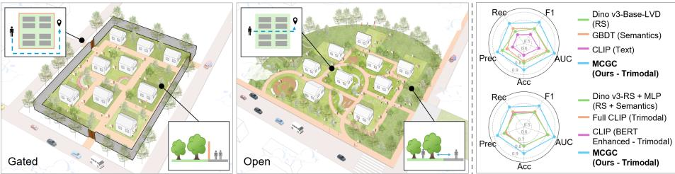
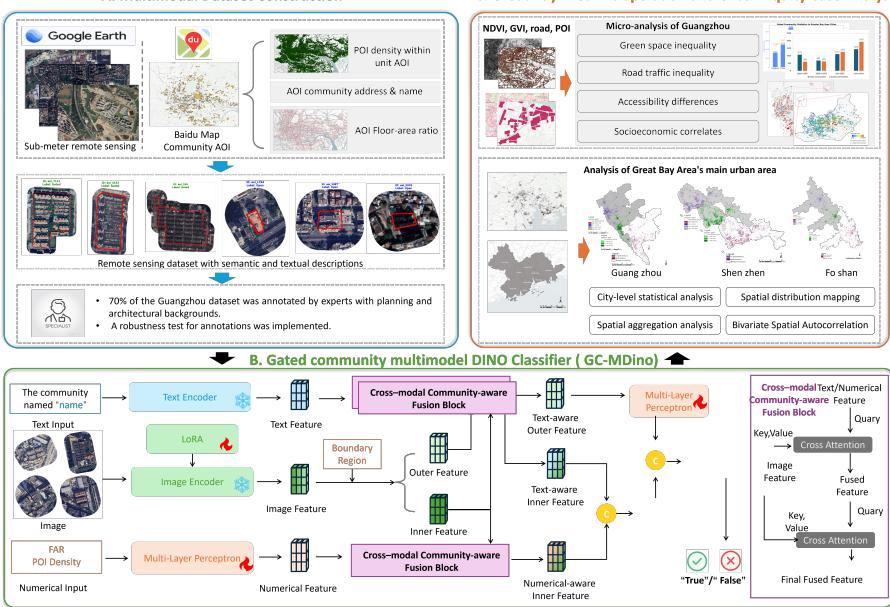
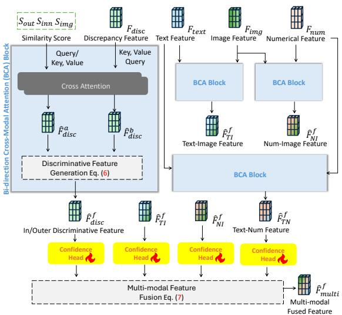
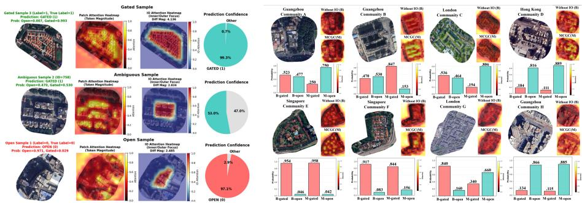
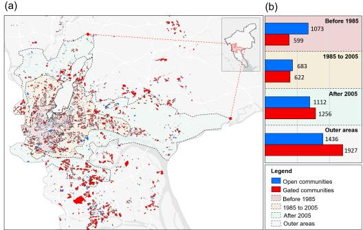
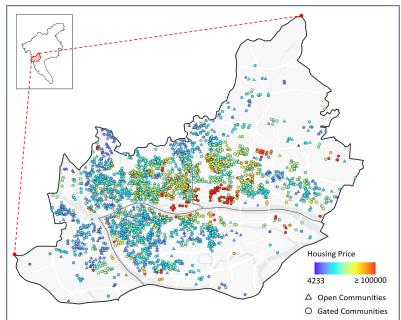

# Urban Boundaries, Social Barriers: A Benchmark and Vision-Centric Framework for Mapping Gated Communities and Equity Implications

Minwei Zhao1 ⋆, Weiming Zhang1 \*, Jiawang Du1 , Qiming Liu2,1 , Weiming Zhuang3 , Pei Nie4 , and Cai Wu1 ⋆⋆

1 The Hong Kong University of Science and Technology (Guangzhou) {m.zhao,wzhang915,jdu146}@connect.hkust-gz.edu.cn, caiwu@hkust-gz.edu.cn 2 School of Public Administration and Policy, Renmin University of China qimingliu937@ruc.edu.cn 3 Sony AI weiming.zhuang@sony.com 4 University of South China niepei@usc.edu.cn

  
(a) Gated vs. open communities  
(b) Model performance  
Fig. 1: Comparison of gated vs. open communities and model performance. (a) Spatial form, route selection, and greenery accessibility diferences between gated and open communities; (b) Superior community classification performance of MCGC across five metrics compared to single-modality (top) and multimodal methods (bottom).

Abstract. Communities are fundamental spatial units that shape urban form and social life. Whether a residential compound is spatially open or enclosed afects mobility, access to public services, and equity, yet studies of Chinese fengbi xiaoqu remain largely qualitative or small-scale, limiting reproducible city-scale analysis. We address this gap by introducing GBA-GCs, a metropolitan-scale multimodal benchmark for locally grounded gated/open community recognition in China’s Greater Bay Area, covering 37,444 residential compounds with aligned boundary polygons, high-resolution satellite imagery, Chinese metadata, and structured attributes, together with expert-verified labels, inter-annotator reliability, and oficial evaluation splits. Built on this benchmark, we present Multimodal Classifier for Gated Community (MCGC), a vision-centric multimodal framework based on DINOv3-SAT that fuses imagery, text,

and structured cues via modality-aware cross-attention and adaptive gating to mitigate modality imbalance. MCGC consistently outperforms strong unimodal and multimodal baselines. Finally, we apply the validated model to metropolitan-scale mapping and report equity-oriented findings including spatial clustering of GCs, privatized green space, and reduced pedestrian connectivity. The benchmark, code, and release documentation are available at https://github.com/MinweiZhao/GBA-GCs.

Keywords: Gated Community Detection· Multimodal Learning· Urban Computing· Spatial Equity Analysis

## 1 Introduction

Recent advances in artificial intelligence and computer vision have profoundly transformed urban studies, enabling fine-grained mapping of urban morphology, land use, and environmental quality at unprecedented scales [51, 54]. These developments have bridged the gap between visual perception and spatial analytics, fostering a new paradigm of data-driven urban planning. However, many socially consequential urban forms remain underexplored from a visual computing perspective—most notably, Chinese fengbi xiaoqu or gated residential compounds.

Gated communities mark a fundamental shift in urban aspirations toward security, exclusivity, and controlled access, reshaping both the spatial and social logics of contemporary cities [3, 32, 41]. In this paper, we do not impose a universal global taxonomy of “gatedness”. Instead, we operationalize the Chinese fengbi xiaoqu: residential compounds with continuous or near-continuous perimeters, limited or controlled entrances, and partial discontinuity from the public street network. This spatial form can alter patterns of accessibility, resource allocation, and social interaction [10, 37], often intensifying spatial segregation and exacerbating inequalities in mobility and public service provision [7, 11, 47] (Fig. 1).

Most existing studies on gated communities (GCs) rely on qualitative case analyses or small-scale mapping of tens to hundreds of neighborhoods [33, 39, 49], limiting systematic generalization over large areas. This is largely due to fragmented data sources and the dificulty of distinguishing gated from non-gated communities at scale. Consequently, many computational urban analyses overlook or misclassify GCs, biasing estimates of walkability, green accessibility, and spatial equity [35, 38, 46, 48]. For example, treating privatized GC greenery as public inflates perceived urban greenness, while ignoring GC boundaries underestimates road-network fragmentation [9,28]. These challenges motivate scalable, automated, and multimodal approaches that explicitly recognize gatedness as a spatial attribute.

To address this gap, we introduce Multimodal Classifier for Gated Community (MCGC) (Sec. 3.2), which contributes both a new benchmark and a vision-centric multimodal architecture for Chinese enclosure recognition. On the data side, we compile the first metropolitan-scale multimodal benchmark (GBA-GCs) in China’s Greater Bay Area, covering 37,444 residential compounds with aligned boundaries, high-resolution satellite imagery, textual metadata, and structured attributes (e.g., FAR and inner POIs). We further standardize the task and evaluation protocol with expert-verified labels, interannotator reliability, and oficial splits, enabling fair and reproducible comparison for vision and multimodal methods in spatial computing. Dataset release, licensing, and access details are provided in Supplementary Sec. E.2.

On the methodological side, MCGC is a vision-centric multimodal framework tailored to the spatial logic of gatedness. Each community is represented by high-resolution imagery, semantic metadata, and structured attributes. We extract visual features with a DINOv3-SAT backbone (a satellite-adapted DI-NOv3 [43]), and encode text and numerical attributes with lightweight language and MLP modules. We align modalities via cross-modal attention and model interior–exterior context with a dual visual stream to capture fences, entrances, and boundary transitions. A modality-aware gating module further balances heterogeneous signals under real-world modality imbalance. Overall, MCGC consistently outperforms strong baselines, achieving about +14.4% F1 and +12.2% AUC on 5-fold evaluation.

Beyond methodological performance, MCGC enables the first data-driven mapping of gated communities at a metropolitan-scale. The resulting benchmark reveals how enclosure patterns cluster spatially and interact with urban form, exposing the hidden social and environmental inequalities embedded in everyday urban structures.

In summary, our contributions are: (I) a large, metropolitan-scale multimodal benchmark for Chinese fengbi xiaoqu recognition that combines highresolution imagery, Chinese metadata, and structured attributes with expertverified gated/open labels, inter-annotator reliability, oficial splits and evaluation protocol, forming a reproducible testbed; (II) MCGC, a vision-centric multimodal framework (dual interior/exterior streams, modality-aware cross-attention, confidence-weighted fusion) fine-tuned from DINOv3-SAT, with consistent ablation gains and the strongest performance among unimodal and multimodal baselines; (III) validated metropolitan-scale gated/open labels across the Greater Bay Area, yielding a region-wide enclosure map of 37,444 communities with human checks after inference; and (IV) social good analyses revealing greenery bias (private greens), reduced pedestrian accessibility (barriers), and socioeconomic associations, calling for enclosure-aware metrics in planning, equity assessment, and spatial computing.

## 2 Related Work

## 2.1 Gated Communities in Urban Studies

Gated communities (GCs) have been extensively studied in urban sociology and planning, covering their historical emergence, social drivers, and implications for cohesion and governance [3, 4, 8, 41]. A consistent finding is that enclosure reinforces socio-spatial division and segregation [20–22, 42], reduces cross-class interaction [2, 11, 15], and reshapes governance and resource allocation [5, 14]. However, much of this literature relies on qualitative case studies or small-scale surveys spanning tens to hundreds of neighborhoods [33, 39, 49].

In computational urban analytics, GCs are known to bias measurements of accessibility, green equity, and road-network connectivity [27, 47, 50]: privatized greenery can inflate estimates of public environmental benefits [9, 46], and ignoring enclosure boundaries can underestimate fragmentation and walkability constraints [38, 44, 45]. Yet many computational studies still overlook or misclassify GCs as ordinary residential parcels, introducing systematic distortions in policy-relevant assessments of accessibility and spatial justice [9, 27, 38, 50]. This gap persists partly because gatedness is dificult to represent as a scalable spatial attribute: existing attempts often rely on small curated samples or heuristic boundary identification [29, 38, 52]. As a result, large, accurately annotated, publicly available GC datasets, and scalable pipelines that incorporate enclosure morphology still remain limited.

## 2.2 Linking Gated Communities and Advances in AI and CV

Recent advances in AI, especially computer vision and multimodal learning, have reshaped urban analytics [6, 17, 25]. High-resolution remote sensing enables scalable mapping of urban morphology [18, 44], and deep models achieve strong performance in land-use and functional zoning [13, 19]. Self-supervised vision transformers (DINO/DINOv2) further improve transferability from unlabeled data [12, 31, 36, 53], while foundation segmentation models (e.g., SAM) support flexible boundary delineation [26, 34].

However, many approaches remain vision-only and overlook the multimodal nature of urban environments, where imagery, textual metadata, and spatial structure interact [16, 24]. Although CLIP-style vision–language pretraining is powerful [40], its natural-image and caption pretraining limits performance on remote sensing and domain-specific semantics, making it unreliable for gatedness cues such as enclosure patterns, access control, and interior–exterior functional contrast. More broadly, gatedness is defined by discontinuities at community boundaries; capturing such transitions naturally calls for explicit interior–exterior modeling.

Motivated by these gaps, we present a unified benchmark-and-model pipeline for gated community recognition. Specifically, we release GBA-GCs, a metropolitanscale multimodal benchmark that supports gated/open prediction under heterogeneous modality availability with expert-verified labels and fixed splits. Building on it, we develop MCGC, a vision-centric multimodal classifier that explicitly leverages interior–exterior visual context and integrates complementary nonvisual cues, enabling reliable large-scale mapping for downstream urban equity analyses.

  
Fig. 2: Overview of the MCGC framework.

## 3 Methodology

## 3.1 Multimodal Benchmark Construction and Annotation Protocol

As shown in Fig. 2A, we construct GBA-GCs, a metropolitan-scale multimodal benchmark for recognizing Chinese fengbi xiaoqu in GBA, consisting of 37,444 residential Areas of Interest (AOIs) with boundary polygons collected from licensed map-provider APIs [1]. The AOIs cover the mapped residential communities in the region, enabling standardized and reproducible evaluation at metropolitan-scale. We formalize the benchmark task as binary classification (gated vs. open) under heterogeneous modality availability.

Standardized multimodal inputs. For each AOI, we retrieve 0.8 m satellite imagery from Google Earth and crop tiles using a 50 m contextual bufer around the polygon to preserve boundary evidence (e.g., walls, entrances, and edge transitions). In parallel, we query Baidu Maps for community metadata (name and address) and concatenate them into a short semantic text description. We additionally extract structured attributes (e.g., floor-area ratio and POI density) and standardize them into numerical features.

Operational definition. We define a gated AOI as a residential compound with a continuous or near-continuous perimeter, limited or controlled entrances, and partial discontinuity between internal circulation and the surrounding public street network. We define an open AOI as a residential area that is publicly permeable, lacks compound-level access control, or is integrated with surrounding streets. This locally grounded definition is intended for Chinese fengbi xiaoqu;

external regions are used only as diagnostic transfer settings and not as evidence of a universal gatedness taxonomy.

Annotation protocol and quality control. To obtain high-quality ground truth for controlled evaluation, AOIs are annotated by domain experts with backgrounds in urban planning, architecture, and urban geography. Annotators assign gated/open labels by cross-checking satellite imagery, street-view evidence when available, community morphology, road connectivity, metadata, planning records, and textual descriptions under a standardized guideline. Ambiguous cases, including partial gating, mixed-use villages, occluded entrances, redevelopment sites, or conflicting source evidence, are escalated to senior adjudication under the same criteria. To quantify labeling reliability, we compute pairwise agreement and Cohen’s κ on a duplicated set of 200 AOIs:

$$
{ \mathrm { A g r e e m e n t } } = { \frac { 1 } { N } } \sum _ { i = 1 } ^ { N } \mathbf { 1 } ( y _ { i } ^ { ( a ) } = y _ { i } ^ { ( b ) } ) ,\tag{1a}
$$

$$
\kappa = { \frac { p _ { o } - p _ { e } } { 1 - p _ { e } } } ,\tag{1b}
$$

where $\mathbf { 1 } [ \cdot ]$ denotes the indicator function and N is the number of duplicated samples; $p _ { o }$ is the observed agreement and $p _ { e }$ is the chance agreement estimated from annotators’ marginal distributions.

Benchmark splits and evaluation protocol. To facilitate reproducible benchmarking, we provide oficial training/validation/test splits and a consistent evaluation protocol based on F1 and AUC (Sec. 4). Splits are constructed via joint stratification over AOI area and spatial distribution, ensuring coverage of diverse morphology (e.g., compound size and layout) and geographic contexts (e.g., inner city vs. suburban districts). These standardized inputs, expert labels, reliability checks, and fixed splits establish a unified testbed for gated-community recognition and downstream equity analyses.

## 3.2 MCGC: A Multimodal Classifier for Gated Community

To fully exploit the heterogeneous information contained in imagery, semantic text, and structured attributes, we propose MCGC, a multimodal architecture designed to capture enclosure-related cues through both interior–exterior contrast modeling and cross-modal community-aware fusion. As illustrated in Fig. 2B, MCGC jointly encodes three modalities and learns their complementary interactions for robust gated community classification.

Given a textual input $\scriptstyle { \mathbf { \mathscr { x } } } _ { \mathrm { t e x t } }$ (e.g., community name and designation), a satellite image $x _ { \mathrm { i m g } }$ , and structured numerical attributes ${ \pmb x } _ { \mathrm { n u m } } \ \mathrm { ( e . g . }$ ., FAR and POI density), we first extract modality-specific latent representations:

$$
\begin{array} { r l r l } { F _ { \mathrm { t e x t } } = \mathcal { E } _ { \mathrm { t e x t } } ( x _ { \mathrm { t e x t } } ) , } & { F _ { \mathrm { i m g } } } & { = \mathcal { E } _ { \mathrm { i m g } } ( x _ { \mathrm { i m g } } ) , } & { F _ { \mathrm { n u m } } = \mathcal { E } _ { \mathrm { n u m } } ( x _ { \mathrm { n u m } } ) . } \end{array}\tag{2}
$$

Here, ${ \mathcal E } _ { \mathrm { t e x t } }$ is a frozen CLIP-style text encoder that captures semantic cues from community names; $\mathcal { E } _ { \mathrm { i m g } }$ is a pretrained DINOv3 encoder providing highcapacity visual representations; and $\mathcal { E } _ { \mathrm { n u m } }$ is a lightweight MLP mapping structured attributes into a compact feature space. To bridge the domain gap between natural-image DINOv3 features and our remote-sensing imagery, we apply LoRA adapters [23] for eficient fine-tuning to better extract discriminative features from our remote-sensing imagery.

Since our task is a gated-community classification problem, the contrast between the community interior and its surrounding context is particularly informative: gated communities typically exhibit distinctive enclosure layouts and access-control-related visual patterns that manifest as appearance discrepancies across the boundary. Therefore, we further perform a boundary-aware decomposition of $F _ { \mathrm { i m g } }$ into an inner feature $F _ { \mathrm { i n n } }$ and an outer feature $F _ { \mathrm { o u t } }$ by leveraging the annotated community boundary, which is also available as a structured attribute in $x _ { \mathrm { n u m } }$ . Specifically, we define a region-aware feature partition as:

$$
F _ { \mathrm { i n n } } = F _ { \mathrm { i m g } } \odot M , \qquad F _ { \mathrm { o u t } } = F _ { \mathrm { i m g } } \odot ( 1 - M ) ,\tag{3}
$$

where $M \in \{ 0 , 1 \} ^ { H \times W }$ is the binary mask of the community interior derived from the annotated boundary $B , 1 - M$ denotes the complementary exterior region, and ⊙ denotes the Hadamard product applied channel-wise to the feature map. We then compute a discrepancy feature:

$$
F _ { \mathrm { d i s c } } = F _ { \mathrm { o u t } } - F _ { \mathrm { i n n } } .\tag{4}
$$

Beyond cross-boundary contrast, MCGC further computes intra-region similarity statistics to capture lightweight structural cues that characterize the internal homogeneity and contextual consistency of diferent regions. For each region $m \in$ {img, inn, out},

$$
S _ { m } = \frac { 1 } { N _ { m } ^ { 2 } } \sum _ { i , j } \frac { \mathbf { \nabla } f _ { i } ^ { ( m ) } \cdot \mathbf { \nabla } f _ { j } ^ { ( m ) } } { \| \mathbf { \nabla } f _ { i } ^ { ( m ) } \| \| \mathbf { \nabla } f _ { j } ^ { ( m ) } \| } ,\tag{5}
$$

where $N _ { m }$ denotes the number of feature vectors in region $m ;$ and $\mathbf { \Delta } f _ { i } ^ { ( m ) }$ and $\mathbf { \Delta } f _ { j } ^ { ( m ) }$ are the feature vectors at spatial locations i and $j .$ . The expression computes the average pairwise cosine similarity within region m, producing a scalar measure of regional structural homogeneity. Thus, $S _ { \mathrm { i m g } } , S _ { \mathrm { i n n } }$ , and $S _ { \mathrm { o u t } }$ capture self-similarity in the global tile, the enclosed interior, and the surrounding exterior, respectively. These scalar cues complement the learned representations by encoding how homogeneous or heterogeneous each region is, which is characteristic of enclosed residential forms.

Cross-modal Community-aware Fusion (CCF) Block. The key component of MCGC is the CCF block, which performs cross-modal community-aware fusion by modeling the interactions among visual, textual, and numerical representations to produce a unified representation for gated-community recognition. CCF block is built upon a Bi-directional Cross-modal Attention (BCA) mechanism (Fig. 3), where each modality is alternately treated as query while the remaining modalities serve as key–value pairs. This reciprocal formulation enables the network to “ ” !!"#! Inner-Similarity#!"#!capture asymmetric yet complementary interactions across-modalities, a critical The community LoRA Boundary  property when aligning imagery, text, and structured attributes with diferent semantic granularities.

  
Fig. 3: Overview of the Cross–modal Community-aware Fusion (CCF) Block.

Community-awareDiffFeature!\$%&#\$%&To explicitly exploit enclosure-specific spatial cues, we jointly leverage the intra-region similarity statistics $( S _ { \mathrm { i m g } } , S _ { \mathrm { i n n } } , S _ { \mathrm { o u t } } )$ er-Similarityand the interior–exterior discrepancy feature $\pmb { F } _ { \mathrm { d i s c } }$ Calculation Eq. (2) "within the BCA block. By coupling these two sources Multi-Layer PerceptronPOI Densityof information, the BCA block is able to emphasize boundary-aware patterns Numerical Input Numerical Feature O'(% Trainable Freezethat are indicative of gated-community layouts. Specifically, the BCA module performs bi-directional cross-attention between the structural cues and the discrepancy representation, producing two directional attentional embeddings, $\hat { F } _ { \mathrm { d i s } ( } ^ { a }$ and $\hat { F } _ { \mathrm { d i s c } } ^ { b } .$ , corresponding to the two query directions. These embeddings encode complementary cross-modal correlations between regional structure statistics and boundary discrepancy signals. To consolidate these directional responses, we introduce a soft alignment mechanism that measures their mutual consistency and reweights the features accordingly:

$$
\hat { F } _ { \mathrm { d i s c } } ^ { f } = \mathrm { s o f t m a x } \left( \frac { \hat { F } _ { \mathrm { d i s c } } ^ { a } \hat { F } _ { \mathrm { d i s c } } ^ { b ^ { \top } } } { \sqrt { d } } \right) \hat { F } _ { \mathrm { d i s c } } ^ { b } ,\tag{6}
$$

where $\hat { F } _ { \mathrm { d i s c } } ^ { a }$ and $\hat { F } _ { \mathrm { d i s c } } ^ { b } \in \mathbb { R } ^ { N \times d }$ denote the two directional attention embeddings. The matrix product $\hat { \pmb { F } } _ { \mathrm { d i s c } } ^ { a } \hat { \pmb { F } } _ { \mathrm { d i s c } } ^ { b ^ { \top } }$ measures pairwise afinity between the two directional representations, allowing the model to highlight mutually reinforcing responses while attenuating inconsistent cross-modal signals. The resulting feature $\hat { F } _ { \mathrm { d i s c } } ^ { f }$ therefore serves as a dedicated interior–exterior discriminative representation, which encodes boundary-aware enclosure contrast in a cross-modally aligned feature space.

Beyond the specialized diference pathway, the CCF block also processes three modality pairs (text–image, numerical–image, and text–numerical) through independent BCA modules, producing $\hat { F } _ { \mathrm { T I } } ^ { f } , \hat { F } _ { \mathrm { N I } } ^ { f } ,$ and $\hat { F } _ { \mathrm { T N } } ^ { f } .$ . Each fused pairwise representation is passed through a lightweight confidence head that predicts a learnable modality weight:

$$
\hat { F } _ { \mathrm { m u l t i } } ^ { f } = \sum _ { m } \alpha _ { m } \hat { F } _ { \mathrm { m } } ^ { f } \quad \alpha _ { m } = \mathrm { s o f t m a x } ( h _ { \mathrm { c o n f } } ( \hat { F } _ { \mathrm { m } } ^ { f } ) ) ,\tag{7}
$$

allowing the model to adaptively modulate the contribution of each modality based on its reliability. The final fused feature $\hat { F } _ { \mathrm { m u l t i } } ^ { f }$ is fed into a classification head to predict whether a community is gated or open.

## 3.3 Gated Community in the Greater Bay Area

To investigate enclosure patterns at a metropolitan-scale, we apply the trained MCGC classifier to the full AOI dataset across the Greater Bay Area (GBA), covering nine mainland cities. The dataset contains 37,444 residential communities, representing the residential fabric of the region. Model inference produces region-wide gatedness labels for every AOI, resulting in the first open-access, high-resolution map of residential enclosures across the mainland GBA.

To ensure the robustness of these large-scale outputs, we adopt the same verification protocol used in benchmark construction (Sec. 3.1). A post-inference consistency assessment compares the automatically predicted labels with independent human verification, providing a direct measure of reliability and identifying potential boundary cases for refinement.

With the validated dataset in place, we conduct several proof-of-concept analyses to illustrate its analytical value. At the inter-city level, we quantify crosscity diferences in enclosure prevalence, using indicators such as the number, share, and spatial footprint of gated communities. At the intra-city level, we examine how gating correlates with urban development, greenery, circulation structure, and socioeconomic segregation. These explorations demonstrate how metropolitanscale enclosure data can support comparative urban morphology research and deepen understanding of enclosure dynamics. Detailed analytical procedures are provided in Supplementary Sec. B, data licensing and reproducibility details are provided in Supplementary Sec. E.

## 4 Experiments

## 4.1 Experimental Setup

Dataset (Benchmark and evaluation protocol). We evaluate MCGC under the standardized setting of GBA-GCs, a metropolitan-scale multimodal benchmark covering 37,444 residential AOIs across China’s Greater Bay Area. To enable reproducible and controlled benchmarking, we report quantitative results on an expert-annotated evaluation split from Guangzhou, where each AOI is labeled as gated or open following the protocol in Sec. 3.1. Train, validation and test splits are constructed via joint stratification by AOI area and spatial distribution, ensuring balanced coverage of diverse urban morphologies and geographic contexts across splits. Labeling consistency is assessed on a duplicated set re-labeled by all annotators, achieving 94% agreement with Cohen’s κ=0.85. The resulting Guangzhou evaluation split is class-balanced, containing 2,663 open (50.6%) and 2,605 gated (49.4%) communities. A benchmark card summarizing dataset scope, modalities, and evaluation protocol is provided in Supplementary Sec. E.1, and the fixed stratified splits and random seeds are detailed in Supplementary Sec. D.4.

Table 1: Performance comparison between MCGC and a comprehensive set of unimodal and multimodal baselines on gated community classification. Since no prior work addresses this task, all baselines are implemented using standard backbones (CNN, CLIP, DINOv3, BERT, MLP) and straightforward fusion strategies (early concatenation or linear fusion); detailed model descriptions are in Supplementary Sec. D. MCGC achieves the best overall performance across Acc, Prec, F1, and AUC, and substantially outperforms both unimodal and multimodal fusion baselines. Although the MLP model attains the highest recall due to strong bias toward the positive class, its precision and overall F1 are significantly lower than MCGC.
<table><tr><td rowspan=1 colspan=2>Model                   Acc     Prec</td><td rowspan=1 colspan=2>Rec</td><td rowspan=1 colspan=2>F1     AUC       Modalities</td></tr><tr><td rowspan=1 colspan=1>SimpleCNN-N2N          0.731 ± 0.005 0</td><td rowspan=1 colspan=1>.730 ± 0.034</td><td rowspan=1 colspan=2>0.675 ± 0.061</td><td rowspan=1 colspan=1>0.698 ± 0.020 0</td><td rowspan=1 colspan=1>.805 ± 0.007 Remote Sensing (RS)</td></tr><tr><td rowspan=1 colspan=1>CLIP ViT-B/16           0.752 ± 0.015 0</td><td rowspan=1 colspan=1>.769 ± 0.025</td><td rowspan=1 colspan=1>0.716 ±</td><td rowspan=1 colspan=1>0.049</td><td rowspan=1 colspan=1>0.740 ± 0.023 0</td><td rowspan=1 colspan=1>.838 ± 0.014        RS</td></tr><tr><td rowspan=1 colspan=1>DINO v2-Small           0.740 ± 0.003 0</td><td rowspan=1 colspan=1>.739 ± 0.034</td><td rowspan=1 colspan=1>0.742 ±</td><td rowspan=1 colspan=1>0.071</td><td rowspan=1 colspan=1>0.737 ± 0.019 0</td><td rowspan=1 colspan=1>.826 ± 0.011        RS</td></tr><tr><td rowspan=1 colspan=1>DINO v3-Base-LVD        0.753 ± 0.010 0</td><td rowspan=1 colspan=1>.789 ± 0.026</td><td rowspan=1 colspan=1>0.687 ±</td><td rowspan=1 colspan=1>0.052 0</td><td rowspan=1 colspan=1>.732 ± 0.021</td><td rowspan=1 colspan=1> $0 . 8 3 0 \pm \ : 0 . 0 1 2$         RS</td></tr><tr><td rowspan=1 colspan=1>DINOv3-SAT-Fixed        0.747 ± 0.018 0</td><td rowspan=1 colspan=1>.800 ± 0.036 0</td><td rowspan=1 colspan=1>.657 ±</td><td rowspan=1 colspan=1>0.066 0</td><td rowspan=1 colspan=1>.718 ± 0.031 0</td><td rowspan=1 colspan=1>.833 ± 0.011        RS</td></tr><tr><td rowspan=1 colspan=1>MLP                  0.571 ± 0.054 0</td><td rowspan=1 colspan=1>.540 ± 0.035 0</td><td rowspan=1 colspan=1>.966</td><td rowspan=1 colspan=1>± 0.030 0</td><td rowspan=1 colspan=1>.691 ± 0.021 0</td><td rowspan=1 colspan=1>.790 ± 0.018      Numerical</td></tr><tr><td rowspan=1 colspan=1>GBDT                 0.731 ± 0.015 0</td><td rowspan=1 colspan=1>.726 ± 0.014</td><td rowspan=1 colspan=2>0.734 ± 0.020 0</td><td rowspan=1 colspan=1>.730 ± 0.016 0</td><td rowspan=1 colspan=1>.813 ± 0.016      Numerical</td></tr><tr><td rowspan=1 colspan=1>BERT Chinese           0.695 ± 0.019 0</td><td rowspan=1 colspan=1>.704 ± 0.012</td><td rowspan=1 colspan=1>0.663 ±</td><td rowspan=1 colspan=1>0.029 0</td><td rowspan=1 colspan=1>.682 ± 0.020 0</td><td rowspan=1 colspan=1>.759 ± 0.015        Text</td></tr><tr><td rowspan=1 colspan=1>CLIP Text OpenAI        0.651 ± 0.017 0</td><td rowspan=1 colspan=1>.651 ± 0.018 0</td><td rowspan=1 colspan=1>.637 ±</td><td rowspan=1 colspan=1>0.032 0</td><td rowspan=1 colspan=1>.643 ± 0.021 0</td><td rowspan=1 colspan=1>.702 ± 0.023        Text</td></tr><tr><td rowspan=1 colspan=1>DINOv3-SAT+ BERT Chinese 0.740 ± 0.014 0.74</td><td rowspan=1 colspan=1>3 ± 0.016 0.7</td><td rowspan=1 colspan=1>29 ± 0</td><td rowspan=1 colspan=1>.062 0.</td><td rowspan=1 colspan=1>739 ± 0.028 0</td><td rowspan=1 colspan=1>.823 ± 0.013     RS + Text</td></tr><tr><td rowspan=1 colspan=1>DINOv3-SAT + MLP      0.742 ± 0.012 0</td><td rowspan=1 colspan=1>.765 ± 0.047</td><td rowspan=1 colspan=1>0.701 ±</td><td rowspan=1 colspan=1>0.056 0</td><td rowspan=1 colspan=1>.728 ± 0.016 0</td><td rowspan=1 colspan=1>.824 ± 0.013   RS + Numerical</td></tr><tr><td rowspan=1 colspan=1>BERT Chinese + MLP     0.717 ± 0.027 0</td><td rowspan=1 colspan=1>.692 ± 0.047</td><td rowspan=1 colspan=1>0.788 ±</td><td rowspan=1 colspan=1>0.059 0</td><td rowspan=1 colspan=1>.734 ± 0.015 0</td><td rowspan=1 colspan=1>.807 ± 0.022   Text + Numerical</td></tr><tr><td rowspan=1 colspan=1>Full CLIP (Three-modal)    0.744 ± 0.013 0</td><td rowspan=1 colspan=1>.743 ± 0.018</td><td rowspan=1 colspan=1>0.738 ±</td><td rowspan=1 colspan=1>0.005 0</td><td rowspan=1 colspan=1>.741 ± 0.010</td><td rowspan=1 colspan=1> $0 . 8 1 9 \pm \ : 0 . 0 1 7$   $\mathrm { R S + T e x t + N u m e r i c a l }$ </td></tr><tr><td rowspan=1 colspan=1>CLIP (BERT Enhanced)    0.746 ± 0.013 0</td><td rowspan=1 colspan=1>.753 ± 0.014</td><td rowspan=1 colspan=2>0.724 ± 0.014</td><td rowspan=1 colspan=1> $0 . 7 3 9 \pm \ : 0 . 0 1 3$ </td><td rowspan=1 colspan=1> $0 . 8 1 8 \pm \ : 0 . 0 1 4$   $\mathrm { R S } + \mathrm { T e x t } + \mathrm { N u m e r i c a l }$ </td></tr><tr><td rowspan=1 colspan=1>MCGC (Ours)          0.853 ±0.037 0</td><td rowspan=1 colspan=1>.869 ±0.052</td><td rowspan=1 colspan=2>0.830 ±0.033</td><td rowspan=1 colspan=1>0.848 ±0.037 0</td><td rowspan=1 colspan=1>.917 ±0.039 $\mathrm { R S } + \mathrm { T e x t } + \mathrm { N u m e r i c a l }$ </td></tr><tr><td rowspan=1 colspan=1>007</td><td rowspan=1 colspan=1>007</td><td rowspan=1 colspan=2>407</td><td></td><td rowspan=1 colspan=1>+ 12 2% Over CLIR (Threa medal)</td></tr></table>

Table 2: Ablation study of key components in MCGC. Metrics are averaged over five stratified 8:2 splits with mean ± standard deviation. ∆ values are computed relative to the previous row. ∆σ denotes the change in mean standard deviation across Acc/Prec/Rec/F1/AUC (positive = less stable, negative = more stable).
<table><tr><td>Model Variant</td><td>Acc</td><td>Prec</td><td>Rec</td><td>F1</td><td>AUC</td><td>ΔF1</td><td>ΔAUC</td><td>∆σ</td></tr><tr><td>DINOv3-SAT (Frozen)</td><td>0.747 ±0.018</td><td>0.800 ±0.036</td><td>0.657 ±0.066</td><td>0.718 ±0.031</td><td>0.833 ±0.011</td><td></td><td></td><td></td></tr><tr><td>+ LoRA Fine-tuning</td><td>0.779 ±0.012</td><td>0.801 ±0.035</td><td>0.739 ±0.034</td><td>0.768 ±0.011</td><td>0.850 ±0.016</td><td>+0.050</td><td>+0.017</td><td>-0.004</td></tr><tr><td>+ BERT-Chinese (Text)</td><td>0.823 ±0.040</td><td>0.845 ±0.038</td><td>0.786 ±0.067</td><td>0.813 ±0.046</td><td>0.902 ±0.039</td><td>+0.045</td><td>+0.052</td><td>+0.024</td></tr><tr><td>+ Numerical Attributes</td><td>0.824 ±0.026</td><td>0.840 ±0.044</td><td>0.799 ±0.026</td><td>0.818 ±0.024</td><td>0.902 ±0.023</td><td>+0.005</td><td>+0.000</td><td>-0.017</td></tr><tr><td>+ Three-modal CCF Block (Fusion)</td><td>0.838 ±0.031</td><td>0.854 ±0.047</td><td>0.815 ±0.050</td><td>0.833 ±0.033</td><td>0.910 ±0.028</td><td>+0.015</td><td>+0.008</td><td>+0.009</td></tr><tr><td>+ Dual Visual Stream (IO)</td><td>0.853 ±0.037</td><td>0.869 ±0.052</td><td>0.830 ±0.033</td><td>0.848 ±0.037</td><td>0.917 ±0.039</td><td>+0.015</td><td>+0.015</td><td>-0.005</td></tr></table>

GBA Gated community map. Beyond benchmark evaluation, we apply the trained model to all AOIs in the full GBA-GCs benchmark to produce a regionwide gated/open map (Sec. 4.4). To verify robustness of the inferred labels outside Guangzhou, we conduct a post-hoc human check on 200 AOIs sampled from Shenzhen and Foshan, where inferred labels reach 88% agreement with expert verification (κ=0.75). Similarly, the agreement in Hong Kong subset reaches 95% (Cohen’s κ = 0.73), indicating the generalizability of the data across diverse spatial development contexts. These checks support the reliability of the metropolitanscale mapping results, which we treat as an additional contribution distinct from the controlled benchmark evaluation. We further provide a failure and borderline case library in Supplementary Sec. D.8, covering common ambiguity types and representative false-positive/false-negative patterns.

Implementation Details and Evaluation Metrics. Implementation details and evaluation protocol are provided in Supplementary Sec. D.5. We adopt standard binary classification metrics, including Accuracy (Acc), Precision (Prec), Recall (Rec), F1-score (F1), and the Area Under the ROC Curve (AUC).

## 4.2 Baseline Comparison and Discussion

Tab. 1 compares MCGC with unimodal and multimodal baselines for gated community detection. Vision-only backbones (DINOv2, DINOv3-SAT) achieve strong performance (F1 ≈ 0.72–0.74), indicating that remote-sensing representations capture enclosure cues such as boundaries and edge transitions. In contrast, text-only encoders (BERT-Chinese, CLIP-text) underperform, consistent with sparse and noisy community metadata. Models using only structured attributes show limited standalone predictive power.

Naïve multimodal fusion (early concatenation) provides marginal or inconsistent gains over vision-only models, while CLIP-based variants yield moderate AUC improvements but remain limited on high-resolution satellite textures. Overall, these results suggest that efective gatedness recognition benefits from boundary-conditioned visual modeling and careful multimodal interaction rather than simple feature aggregation. We do not interpret the gain as evidence that exact polygon shape is essential; instead, the task requires a meaningful AOI footprint and interior–exterior context, as tested further in Sec. 4.3.

To isolate the contribution of each component, we conduct ablations on the annotated Guangzhou benchmark (Tab. 2). LoRA fine-tuning consistently improves the frozen DINOv3-SAT backbone, with gains largely driven by higher recall, suggesting better adaptation to local urban morphology. Adding BERT Chinese metadata yields the most pronounced improvement in separability (AUC), while also increasing variance across splits, consistent with sparse and noisy text availability. Numerical attributes provide only marginal gains in mean performance but noticeably reduce run-to-run variance, indicating a stabilizing efect from structured cues. Building on these inputs, the three-modal CCF module further boosts both F1 and AUC by learning modality-aware interactions beyond early concatenation. Finally, the dual visual stream (IO) improves overall accuracy and F1 while reducing variance, supporting its role in robustness for boundary-ambiguous cases. We further provide qualitative evidence in Fig. 4. Attention maps highlight boundary, entrance and building regions, and crossregion cases illustrate that the IO stream can recover borderline predictions by leveraging interior–exterior contrast.

  
(a) Representative inference cases of MCGC.  
(b) Case studies. MCGC corrects predictions via boundary-aware visual cues, zoom in for better review.  
Fig. 4: Qualitative evidence for boundary-aware interpretability. Left: representative cases. Right: failure modes under misleading metadata, where IO-aware visual cues help correct predictions (probabilities shown).

## 4.3 Robustness Analyses

Robustness to modality noise. As shown in Tab. 2, introducing BERT-Chinese metadata yields a notable performance gain but also increases variance across splits, raising the question of whether the model becomes overly sensitive to noisy textual cues. We therefore conduct controlled text perturbations to assess potential shortcut reliance. As shown in Tab. 3(a), removing or shufling text only at test time causes minor changes, suggesting that MCGC does not depend on metadata as a dominant cue. In contrast, removing/shufling text during both training and testing leads to a larger drop, indicating that text primarily serves as a complementary signal that improves learning when available.

Cross-region generalization under heterogeneous AOI quality. We further evaluate direct transfer from Guangzhou to three external regions with expertverified labels: Hong Kong (AOI=Y), Singapore (AOI=N), and London (AOI=N), without any target-domain fine-tuning. Tab. 3(b) shows strong transfer performance, especially when accurate AOIs are available (Hong Kong), and competitive results under inexact footprints (London). On Singapore, the full model improves accuracy while the naïve baseline attains a slightly higher AUC; this is expected since AUC can be more sensitive to ranking and calibration under noisy delineations, whereas boundary-aware cues primarily benefit thresholded decisions used for region-wide mapping.

Robustness to boundary noise. Finally, we perturb AOI masks at test time via translation/erosion/dilation while keeping the image tile fixed. Tab. 3(c) shows that performance degrades gracefully as boundary noise increases, and even under the strongest perturbations (10 m translation or 20% erosion/dilation), the drop is limited. This suggests that the IO stream provides a reliable structural cue and that MCGC does not require extremely precise AOI delineation to function efectively, which is important for scaling to diverse regions with heterogeneous mapping quality. Additional geometry controls further separate boundary location from exact shape. When the AOI location is corrupted, F1 drops from .849 to .797/.801, and removing exterior context also reduces performance (.805). In contrast, random-shape and bounding-box masks at the correct approximate location remain nearly tied with the true mask (.848 vs. .849). We therefore frame IO as a useful boundary-conditioned inductive bias: approximate AOI location and interior–exterior contrast matter, while precise polygon shape alone is not the decisive signal.

Table 3: Robustness analyses. (a) Text reliance ablation under controlled perturbations of textual metadata. (b) Cross-region generalization for direct transfer from Guangzhou to external regions under heterogeneous AOI quality (AOI: exact boundaries (Y) vs. inexact public footprints (N)). $B ^ { * } ($ : naïve multimodal fusion baseline; $I O ^ { - } ;$ : MCGC without the IO stream; $I O ^ { \wedge }$ : full MCGC with IO $( ^ { 4 \zeta } \mathrm { w } / \mathrm { o } \ \mathrm { I O } ^ { 3 / 4 } + \mathrm { I O } ^ { 3 }$ in Sec. 4.2 correspond to $I O ^ { - } / I O ^ { \wedge } )$ . (c) Boundary perturbation robustness under AOI mask translation/erosion/dilation (erosion/dilation radius scaled by $\sqrt { \mathrm { a r e a } } )$
<table><tr><td>Setting</td><td>ACC</td><td>F1</td><td>AUC</td></tr><tr><td>Text-only (BERT-C)</td><td>0.695</td><td>0.682</td><td>0.759</td></tr><tr><td>Text-only (CLIP)</td><td>0.695</td><td>0.682</td><td>0.702</td></tr><tr><td>MCGC (BERT-Ć)</td><td>0.853</td><td>0.848</td><td>0.917</td></tr><tr><td>MCGC (CLIP)</td><td>0.818</td><td>0.814</td><td>0.882</td></tr><tr><td>w/o Text (Test)</td><td>0.810</td><td>0.797</td><td>0.886</td></tr><tr><td>Shuffle Text (Test)</td><td>0.809</td><td>0.797</td><td>0.886</td></tr><tr><td>w/o Text (T+T)</td><td>0.791</td><td>0.787</td><td>0.891</td></tr><tr><td>Shuffle Text (T+T)</td><td>0.777</td><td>0.763</td><td>0.857</td></tr></table>

<table><tr><td>Region</td><td>AOI</td><td>Metric</td><td>B*</td><td>IO⁻</td><td> $I O ^ { \wedge }$ </td></tr><tr><td>Hong Kong</td><td>Y</td><td>Acc</td><td>0.666</td><td>0.745</td><td>0.863</td></tr><tr><td>Hong Kong</td><td>Y</td><td>AUC</td><td>0.835</td><td>0.909</td><td>0.925</td></tr><tr><td>Singapore</td><td>N</td><td>Acc</td><td>0.796</td><td>0.843</td><td>0.875</td></tr><tr><td>Singapore</td><td>N</td><td>AUC</td><td>0.745</td><td>0.702</td><td>0.732</td></tr><tr><td>London</td><td>N</td><td>Acc</td><td>0.558</td><td>0.674</td><td>0.674</td></tr><tr><td>London</td><td>N</td><td>AUC</td><td>0.328</td><td>0.595</td><td>0.627</td></tr></table>

(a) Text reliance ablation.  
(b) Cross-region generalization.
<table><tr><td>Perturbation</td><td>1m 1%</td><td>2 m</td><td>5%</td><td>5m</td><td>10%</td><td>10 m</td></tr><tr><td>Translation (m)</td><td>0.808</td><td>0.798 0.798</td><td>0.789</td><td>0.772</td><td>0.765</td><td>0.738 0.732</td></tr><tr><td>Erosion (%)</td><td>0.811 0.801</td><td>0.798</td><td>0.788</td><td>0.778</td><td>0.771</td><td>0.752 0.745</td></tr><tr><td>Dilation (%)</td><td>0.809 0.797</td><td>0.792</td><td>0.783</td><td>0.768</td><td>0.759</td><td>0.741 0.734</td></tr></table>

(c) Boundary perturbation robustness on Guangzhou (ACC/F1).

## 4.4 Extended Dataset and Exploratory Analysis

Building on the validated MCGC framework, we extend model inference to the Greater Bay Area (GBA), covering nine mainland cities. This process produces the first region-wide dataset of gated and open residential communities across mainland GBA, released for open research use. Leveraging this dataset, we conduct four exploratory analyses—temporal–spatial patterns, pedestrian accessibility impacts, greenery perception bias, and socioeconomic associations— to illustrate how fine-grained enclosure data can support broader social-good research on segregation, spatial governance, social equity, and spatial justice. A summary of the dataset, along with detailed visualizations and statistical reports for the exploratory analyses, is provided in Supplementary Secs. A and C. Temporal–Spatial Patterns of Gated Communities. Using Guangzhou as a representative case, we observe a pronounced shift from open to gated residential forms (Fig. 5(left)). Open communities dominated before 1985, but after 2005 gated enclaves became prevalent, especially in rapidly expanding peripheral districts. This transition aligns with the rise of large superblocks and low-permeability layouts, reflecting a broader move toward more enclosed and spatially segregated neighborhood structures.

Pedestrian Accessibility and Detour Efects. When gated perimeters are accounted for, simulated routes to major public service POIs exhibit significant detour penalties (Tab. 4(c)). Around Taikoo Hui, the average Detour Index (DI) reaches 1.164 (max 1.477), adding more than 225 m of travel. Around the Tianhe Women and Children’s Hospital, DI averages 1.102 (max 1.239) with nearly 150 m in extra distance. Across both sites, over 70% of origins have DI > 1.05, revealing widespread distortion of pedestrian movement. These enclosure-induced breaks fragment the walkable network and undermine equitable access to key services.

  
(a) cohort-based temporal–spatial analysis obtained by intersecting present-day gated/open labels with historical development cohorts.

  
(b) housing-price stratification of gated vs. open communities in central districts.  
Fig. 5: Exploratory analyses enabled by region-wide enclosure mapping.

Perceptual Greenness Bias. Accounting for gatedness reveals a systematic gap between satellite-derived vegetation and public experience. As summarized in Tab. 4(a), excluding gated communities (GCs) reduces district-level NDVI, with the largest drops in dense, gated-intensive cores (e.g., Tianhe and Yuexiu), indicating that conventional NDVI aggregation can be sensitive to the spatial footprint of enclosed compounds. This discrepancy is reinforced by street-level perception: Tab. 4(b) shows that the Pearson correlation between Green View Index (GVI) and NDVI decreases under the gatedness-weighted variant (notably in Liwan and Tianhe), whereas the no-gated variant remains comparable or slightly higher. Together, these patterns suggest that a non-trivial portion of NDVI-detected greenery is concentrated within privately controlled gated areas and contributes less to what pedestrians can see or access, motivating enclosureaware adjustments when using remote sensing to assess environmental equity. The complete district table is provided in the supplementary materials.

Socioeconomic Stratification. Shown in Fig. 5(right), housing price patterns reveal a clear socioeconomic divide between gated and open communities. Gated compounds are concentrated in high-price areas, particularly in Tianhe and other central districts, whereas open communities are more common in older or lowercost neighborhoods. Even in mixed zones, gated developments consistently align with the upper end of the price spectrum, suggesting that enclosure functions as a value-adding residential amenity and a marker of exclusivity. These patterns indicate that gating is embedded in the city’s housing market dynamics: newly developed high-end projects tend to adopt enclosed forms, while older open blocks face slower reinvestment.

Table 4: Equity-related accessibility and greenery metrics. (a) District-level NDVI statistics and the estimated bias after excluding gated communities (GCs). (b) District-wise Pearson correlations between street-level greenery (GVI) and NDVI variants. (c) Detour accessibility (DI) to representative public-service POIs, quantifying path inflation caused by enclosure.
<table><tr><td>Metric</td><td>Liwan</td><td>Tianhe</td><td>Yuexiu</td><td>Nansha</td></tr><tr><td>Original NDVI</td><td>0.1174</td><td>0.1990</td><td>0.1412</td><td>0.1189</td></tr><tr><td>NDVI in GCs</td><td>0.1451</td><td>0.1635</td><td>0.1420</td><td>0.1757</td></tr><tr><td>Gated Ratio</td><td>0.0730</td><td>0.0874</td><td>0.0877</td><td>0.0153</td></tr><tr><td>NDVI (No GCs)</td><td>0.1088</td><td>0.1816</td><td>0.1288</td><td>0.1170</td></tr><tr><td>Reduction</td><td>0.0086</td><td>0.0174</td><td>0.0124</td><td>0.0018</td></tr></table>

(a) NDVI by district; Reduction denotes the drop by GCs.

<table><tr><td>Correlation</td><td>Liwan</td><td>Tianhe</td><td>Yuexiu</td></tr><tr><td>GVI vs. Raw</td><td>0.419</td><td>0.325</td><td>0.586</td></tr><tr><td>GVI vs. No-Gated</td><td>0.405</td><td>0.332</td><td>0.588</td></tr><tr><td>GVI vs. Weighted</td><td>0.295</td><td>0.250</td><td>0.499</td></tr></table>

(b) Pearson r between GVI and NDVI variants (Raw, No-Gated, Weighted).

<table><tr><td>Point of Interest (POI)</td><td>Avg. DI</td><td>Max DI</td><td>Extra Dist. (m)</td><td>Blocked Ratio (DI&gt;1.05)</td></tr><tr><td>Taikoo Hui (Commercial Center)</td><td>1.164</td><td>1.477</td><td>225.07</td><td>70.0%</td></tr><tr><td>Tianhe Women and Children&#x27;s Hospital</td><td>1.102</td><td>1.239</td><td>149.93</td><td>75.0%</td></tr></table>

(c) Detour index (DI) and additional travel distance induced by enclosure; Blocked Ratio is the share of OD pairs with DI>1.05.

## 5 Conclusion and Future Work

We presented MCGC, a vision-centric multimodal framework that integrates remote sensing imagery, Chinese metadata, and structured features for recognizing Chinese fengbi xiaoqu. The model couples interior and exterior visual streams with cross-modal fusion, achieves strong and interpretable gains over baselines, and supports a metropolitan-scale enclosure map for the Greater Bay Area. Exploratory analyses suggest systematic links between enclosed residential morphology and greenery, pedestrian accessibility, and housing price, providing a practical tool for enclosure-aware urban analytics and computer vision for social good.

Limitations and Ethics. Our gated/open definition is locally grounded in the Chinese urban-morphology context and should not be treated as a universal global taxonomy. Broader use requires local definitions, relabeling, and expert validation. In addition, boundary-conditioned modeling still depends on meaningful AOI localization and does not explicitly model all relevant structural cues, such as entrance density, access-control devices, and fine-grained road connectivity. Because residential enclosure labels can be misused for surveillance, geofencing, targeting, or community profiling, Supplementary Sec. E.2 details our tiered release, controlled-access, and DUA restrictions.

Future Work. We will expand the benchmark with broader coverage and refined labeling protocols, extend evaluation to cross-city and cross-cultural settings with local taxonomies, domain adaptation and calibration. We will also maintain the dataset/benchmark repository at https://github.com/MinweiZhao/GBA-GCs as a living release with updated documentation and expanded non-sensitive datasets.

## References

1. Baidu maps open platform (2025), accessed: 2025-11-12

2. Alkhafagie, K.H., Bassee, D.H.: The social divide: Impact of gated communities on urban interaction. Academia Open 9(1) (2024)

3. Atkinson, R., Blandy, S.: Introduction: International perspectives on the new enclavism and the rise of gated communities. Housing studies 20(2), 177–186 (2005) 4. Bagaeen, S., Uduku, O.: Beyond gated communities. Routledge London (2015)

5. Bandauko, E., Arku, G., Nyantakyi-Frimpong, H.: A systematic review of gated communities and the challenge of urban transformation in african cities. Journal of Housing and the Built Environment 37(1), 339–368 (2022)

6. Bayoudh, K., Knani, R., Hamdaoui, F., Mtibaa, A.: A survey on deep multimodal learning for computer vision: advances, trends, applications, and datasets. The Visual Computer 38(8), 2939–2970 (2022)

7. Blakely, E.J., Snyder, M.G.: Divided we fall: Gated and walled communities in the united states. Architecture of fear 320 (1997)

8. Blakely, E.J., Snyder, M.G.: Separate places: Crime and security in gated communities. Reducing crime through real estate development and management pp. 53–70 (1998)

9. Blinnikov, M., Shanin, A., Sobolev, N., Volkova, L.: Gated communities of the moscow green belt: newly segregated landscapes and the suburban russian environment. GeoJournal 66(1), 65–81 (2006)

10. Breitung, W.: Enclave urbanism in china: Attitudes towards gated communities in guangzhou. Urban geography 33(2), 278–294 (2012)

11. Caldeira, T.P.: City of walls: crime, segregation, and citizenship in São Paulo. Univ of California Press (2000)

12. Caron, M., Touvron, H., Misra, I., Jégou, H., Mairal, J., Bojanowski, P., Joulin, A.: Emerging properties in self-supervised vision transformers. In: Proceedings of the IEEE/CVF international conference on computer vision. pp. 9650–9660 (2021)

13. Cheng, J., Li, G., Chen, X.: Research on travel time prediction model of freeway based on gradient boosting decision tree. IEEE access 7, 7466–7480 (2018)

14. Chiu-Shee, C., Ryan, B.D., Vale, L.J.: Ending gated communities: the rationales for resistance in china. Housing Studies 38(8), 1482–1511 (2023)

15. Coy, M., Pöhler, M.: Gated communities in latin american megacities: case studies in brazil and argentina. Environment and Planning B: Planning and design 29(3), 355–370 (2002)

16. Dalla Mura, M., Prasad, S., Pacifici, F., Gamba, P., Chanussot, J., Benediktsson, J.A.: Challenges and opportunities of multimodality and data fusion in remote sensing. Proceedings of the IEEE 103(9), 1585–1601 (2015)

17. Deng, Z., Weng, D., Liu, S., Tian, Y., Xu, M., Wu, Y.: A survey of urban visual analytics: Advances and future directions. Computational Visual Media 9(1), 3–39 (2023)

18. Du, S., Du, S., Liu, B., Zhang, X.: Mapping large-scale and fine-grained urban functional zones from vhr images using a multi-scale semantic segmentation network and object based approach. Remote Sensing of Environment 261, 112480 (2021)

19. Feng, J., Yu, Y., Zhou, Z.H.: Multi-layered gradient boosting decision trees. Advances in neural information processing systems 31 (2018)

20. Glasze, G.: Segregation and seclusion: the case of compounds for western expatriates in saudi arabia. GeoJournal 66(1), 83–88 (2006)

21. Grant, J., Mittelsteadt, L.: Types of gated communities. Environment and planning B: Planning and Design 31(6), 913–930 (2004)

22. He, S.: Evolving enclave urbanism in china and its socio-spatial implications: The case of guangzhou. Social & Cultural Geography 14(3), 243–275 (2013)

23. Hu, E.J., Shen, Y., Wallis, P., Allen-Zhu, Z., Li, Y., Wang, S., Wang, L., Chen, W., et al.: Lora: Low-rank adaptation of large language models. ICLR 1(2), 3 (2022)

24. Huang, X., Wang, S., Yang, D., Hu, T., Chen, M., Zhang, M., Zhang, G., Biljecki, F., Lu, T., Zou, L., et al.: Crowdsourcing geospatial data for earth and human observations: A review. Journal of Remote Sensing 4, 0105 (2024)

25. Ibrahim, M.R., Haworth, J., Cheng, T.: Urban-i: From urban scenes to mapping slums, transport modes, and pedestrians in cities using deep learning and computer vision. Environment and Planning B: Urban Analytics and City Science 48(1), 76–93 (2021)

26. Kirillov, A., Mintun, E., Ravi, N., Mao, H., Rolland, C., Gustafson, L., Xiao, T., Whitehead, S., Berg, A.C., Lo, W.Y., et al.: Segment anything. In: Proceedings of the IEEE/CVF international conference on computer vision. pp. 4015–4026 (2023)

27. Landry, S.M., Chakraborty, J.: Street trees and equity: evaluating the spatial distribution of an urban amenity. Environment and Planning a 41(11), 2651–2670 (2009)

28. Le Goix, R., Webster, C.: Gated communities, sustainable cities and a tragedy of the urban commons. Critical Planning 13(summer 2006), 41–64 (2006)

29. Le Goix, R., Webster, C.J.: Gated communities. Geography compass 2(4), 1189–1214 (2008)

30. Li, X., Gong, P., Zhou, Y., Wang, J., Bai, Y., Chen, B., Hu, T., Xiao, Y., Xu, B., Yang, J., et al.: Mapping global urban boundaries from the global artificial impervious area (gaia) data. Environmental Research Letters 15(9), 094044 (2020)

31. Liu, B., Chen, X., Xue, Z., Zhang, P., Zhang, B., Yue, J.: Depth feature extraction for hyperspectral image small sample classification. IEEE Transactions on Geoscience and Remote Sensing (2025)

32. Low, S.: The gated community as heterotopia. In: Heterotopia and the City, pp. 165–176. Routledge (2008)

33. Low, S.M.: The edge and the center: Gated communities and the discourse of urban fear. American anthropologist 103(1), 45–58 (2001)

34. Ma, X., Wu, Q., Zhao, X., Zhang, X., Pun, M.O., Huang, B.: Sam-assisted remote sensing imagery semantic segmentation with object and boundary constraints. IEEE Transactions on Geoscience and Remote Sensing (2024)

35. Nicholls, S.: Measuring the accessibility and equity of public parks: A case study using gis. Managing leisure 6(4), 201–219 (2001)

36. Oquab, M., Darcet, T., Moutakanni, T., Vo, H., Szafraniec, M., Khalidov, V., Fernandez, P., Haziza, D., Massa, F., El-Nouby, A., et al.: Dinov2: Learning robust visual features without supervision. arXiv preprint arXiv:2304.07193 (2023)

37. Pow, C.P.: Urban dystopia and epistemologies of hope. Progress in Human Geography 39(4), 464–485 (2015)

38. Qing, W.: The impact of gated community on connectivity and accessibility.”. Master’s diss., National University of Singapore, Singapore (2011)

39. Qureshi, H.: Gated communities as a living choice in the global south: A qualitative review of the physical and socio-economic features. Journal of Architecture and Planning-King Saud University 35(4), 537–555 (2023)

40. Radford, A., Kim, J.W., Hallacy, C., Ramesh, A., Goh, G., Agarwal, S., Sastry, G., Askell, A., Mishkin, P., Clark, J., et al.: Learning transferable visual models from

natural language supervision. In: International conference on machine learning. pp. 8748–8763. PmLR (2021)

41. Roitman, S.: Gated communities: definitions, causes and consequences. Proceedings of the Institution of Civil Engineers-Urban Design and Planning 163(1), 31–38 (2010)

42. Sharifi, A., Murayama, A.: Changes in the traditional urban form and the social sustainability of contemporary cities: A case study of iranian cities. Habitat International 38, 126–134 (2013)

43. Siméoni, O., Vo, H.V., Seitzer, M., Baldassarre, F., Oquab, M., Jose, C., Khalidov, V., Szafraniec, M., Yi, S., Ramamonjisoa, M., Massa, F., Haziza, D., Wehrstedt, L., Wang, J., Darcet, T., Moutakanni, T., Sentana, L., Roberts, C., Vedaldi, A., Tolan, J., Brandt, J., Couprie, C., Mairal, J., Jégou, H., Labatut, P., Bojanowski, P.: Dinov3. In: arXiv preprint arXiv:2508.10104 (2025)

44. Sun, Y., Zhang, X., Huang, J., Wang, H., Xin, Q.: Fine-grained building change detection from very high-spatial-resolution remote sensing images based on deep multitask learning. IEEE Geoscience and Remote Sensing Letters 19, 1–5 (2020)

45. Switzky, J.J.E.: Street design, trafic, and fear of crime: Moving from gated communities to transit villages. Ph.D. thesis, Massachusetts Institute of Technology (2001)

46. Tanulku, B.: Gated communities: from “self-suficient towns” to “active urban agents”. Geoforum 43(3), 518–528 (2012)

47. Vesselinov, E., Cazessus, M., Falk, W.: Gated communities and spatial inequality. Journal of urban afairs 29(2), 109–127 (2007)

48. Webster, C., Glasze, G., Frantz, K.: The global spread of gated communities (2002)

49. Wu, F., Webber, K.: The rise of “foreign gated communities” in beijing: Between economic globalization and local institutions. Cities 21(3), 203–213 (2004)

50. Wu, J., He, Q., Chen, Y., Lin, J., Wang, S.: Dismantling the fence for social justice? evidence based on the inequity of urban green space accessibility in the central urban area of beijing. Environment and Planning B: Urban Analytics and City Science 47(4), 626–644 (2020)

51. Wu, X., Hong, D., Chanussot, J.: Convolutional neural networks for multimodal remote sensing data classification. IEEE Transactions on Geoscience and Remote Sensing 60, 1–10 (2021)

52. Xu, M.: Gated communities in China: urban design concerns. Cardif University (United Kingdom) (2009)

53. Yin, C., Ye, Q., Luo, J.: A transformer and visual foundation model-based method for cross-view remote sensing image retrieval. The International Archives of the Photogrammetry, Remote Sensing and Spatial Information Sciences 48, 821–829 (2024)

54. Yuan, Y., Li, Z., Zhao, B.: A survey of multimodal learning: Methods, applications, and future. ACM Computing Surveys 57(7), 1–34 (2025)