# VISCAD: A FOUNDATION MODEL SUITE WITH MUL-TIMODAL INDUSTRIAL CAD INTELLIGENCE

JoyIndustrial VisCAD Team

## ABSTRACT

AI-assisted computer-aided design (CAD) for industrial products involves two challenging phases. Part-level generation maps diverse forms of user intent, including renders, text descriptions, 2D drawings, and real photographs, to executable programs in a CAD domain-specific language. Assembly-level generation must additionally handle interacting parts, plan mating relations, estimate poses, and place all parts correctly. Existing specialized CAD models are commonly trained on narrow input domains (renders or texts) and often generalize poorly, while general-purpose frontier models cover broader inputs but perform inconsistently across CAD domains. We present VisCAD, a foundation model suite designed to provide both broad generalization and strong CAD capability for realistic industrial products. In its core is Vi sCAD-M1, a 27B model trained through midtraining and post-training for part-level design generation. On PubCADBench and RealCADBench, VisCAD-M1 achieves the highest average part-level score among the evaluated models, reaching 0.5540 compared with 0.5496 for the strongest frontier model. Reusing VisCAD-M1 as a test-time verifier can further raise the score to 0.5797, an approximately 5 percent relative improvement over the previous state of the art. VisCAD also includes a domain-specific harness that leverages frontier models for complex assembly generation and demonstrates advantages over general-purpose harnesses in both quantitative and qualitative evaluations.

## 1 INTRODUCTION

Frontier and open-source multimodal foundation models have made rapid progress in code understanding, generation, and tool use, and are increasingly deployed as coding assistants for real-world software development (OpenAI, 2026b; Qwen Team, 2025; OpenAI, 2026a; Anthropic, 2026a). This amazing progress suggests a natural route to CAD intelligence. At its core, Computer-Aided Design (CAD) maps a user's design intent to a generalized parametric CAD program, with two typical dialects. Such a program could be represented as a sequence of commands that mirrors human operations in a CAD software-specific GUI, or as geometric operations exposed by a CAD system or geometry kernel. CAD generation can therefore be formulated as multimodal program generation: given intent expressed through language or visual evidence, a model produces an executable program under the API of a target Domain Specific Language (DSL) of a CAD environment.

The recent two years have consequently witnessed a growing body of large-model-based AI CAD research (Zhang et al., 2026b; Li et al., 2025b;a; Yuan et al., 2024; Khan et al., 2024; Rukhovich et al., 2025; Wu et al., 2024; Karadeniz et al., 2025). However, existing specialized models remain limited in model capacity, supervision scale, and application scope. Most focus on single-part generation and accept only one intent modality, such as text or sketches or rendered views. 2D engineering drawings and in-the-wild product photographs—two common forms of industrial design intents—remain substantially underrepresented, and no existing specialized model that we study supports the full spectrum from text and renders to engineering drawings and real product images through a unified interface. Moreover, many methods are trained and evaluated primarily on ABC, the DeepCAD subset and its derivatives, Fusion 360 Gallery (Koch et al., 2019; Wu et al., 2021: Willis et al., 2021; Seff et al., 2020). Although these datasets have enabled important progress, their CAD-native and largely synthetic distributions provide limited coverage of heterogeneous industrial inputs. Consequently, specialized AI CAD models often generalize poorly beyond their training domains and can trail frontier general-purpose models on diverse CAD tasks.

To address these limitations, we introduce VisCAD, a foundation model suite for industrial multimodal CAD modeling (Figure 1). At the part level, VisCAD-M1 is a 27B multimodal generator that maps abundant design intents, ranging from text descriptions, engineering drawings, real product photographs, to rendered views, to executable FreeCAD Python programs. Its data-curation and multi-stage training pipelines are designed to combine large-scale CAD programs with heterogeneous industrial visual evidence, improving both modality coverage and broader domain generalization. At the assembly level, VisCAD-H1 is a CAD-native harness that decomposes complex design intent into a bill of materials, per-part representations, mating relations, and global placements. Its CAD-DSL-agnostic intermediate representation (IR) separates assembly reasoning from backend syntax, allowing the same workflow to be realized in various CAD environments.

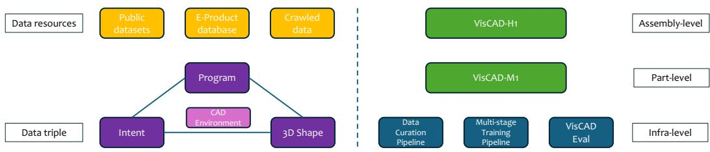  
Figure 1: Overview of VisCAD. Heterogeneous data resources are organized around a shared intent-program-shape abstraction and support data curation, multi-stage training, and evaluation. VisCAD-M1 generates individual parts, while VisCAD-H1 extends CAD intelligence to assemblylevel design through a structured harness.

On the part-level leaderboards of PubCADBench and RealCADBench, VisCAD-M1 achieves an average profile score of 0.5540, exceeding the best compared frontier model score of 0.5496; parallel testtime scaling further raises the score to 0.5797. On a 50-instance assembly-generation study drawn from the same benchmarks, VisCAD-H1 obtains an assembly judge score of approximately 85.0, compared with 68.0 for Codex and 52.0 for Claude Code. Together, these results show that domainspecific training can provide broad, high-quality part generation, while a CAD-native harness can extend frontier CAD intelligence to complex assemblies and multiple CAD backends.

## Our main contributions are:

• We present VisCAD, a foundation model suite with a 27B foundation model VisCAD-M1 that excels at part-level design generation with a average score that is better than SOTA frontier models like Gemini-3.1-Pro (Ours 0.5540 vs SOTA 0.5496). This suite also previews our assembly-level design generation harness which exhibits more delicate design intelligence for complex assemblies than general harnesses (Codex, Claude Code).

• We develop a test-time scaling method (parallel-tts). With this technique, the 27B model can itself be used as a reranker to improve its final prediction given several rollouts of the same input design intent. The self-reranker can further achieve 2.7 points improvements over itself and obtain more than 5% relative improvements w.r.t. SOTA frontier model.

• To attack challenges of the scarcity of diverse general-domain data and the golden programs, we develop a comprehensive data curation pipeline that leverages off-the-shelf image editing and image-to-3D models to support raw data processing, data augmentation and recursive self-improvement based program search for obtaining more accurate CAD program supervision. Besides, we also propose a multi-stage training pipeline that maximizes the utilities of CAD data that varies in amount and quality scattered in different stages.

• We design a DSL-agnostic IR for assembly-level generation in VisCAD-H1 that explicitly represents Bills of Materials (BoMs), part-level geometries, mating relations, and global placements etc.. This IR enables transferring of the same assembly representation across various CAD environments, namely FreeCAD, SolidWorks, Autodesk Fusion.

## 2 RELATED WORK

Learning-based CAD has moved from generating meshes toward executable programs. DeepCAD, SketchGraphs, Text2CAD, and CAD-Recode recover parametric command sequences or code from textual inputs, sketches, or point clouds (Wu et al., 2021; Seff et al., 2020; Khan et al., 2024; Rukhovich et al., 2025). BRepNet, BrepGen, CAD-Llama, and ParaCAD-RL treat B-Reps and large-model or RL training as direct targets (Lambourne et al., 2021; Xu et al., 2024; Li et al., 2025a; Maniyar, 2026). These methods establish program-native CAD. They remain part-centric: one solid, usually from CAD-native or synthetic supervision.

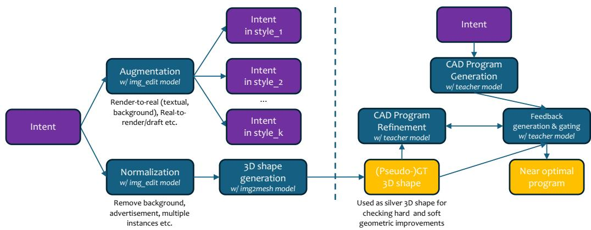  
Figure 2: Our proposed comprehensive data curation pipeline.

A second line of works widens the input modalities and domains. OpenECAD, CadVLM, ChatCAD, PICASSO, and orthographic-reconstruction work condition on drawings, sketches, or mixed visuallanguage evidence (Yuan et al., 2024; Wu et al., 2024; Tang et al., 2025; Karadeniz et al., 2025; Zhang et al., 2023; 2025; Mao et al., 2026). Engineering drawings and product photographs remain underrepresented relative to CAD-native renders, and the output is still typically one part rather than a verified assembly. VisCAD-M1 trains for that coverage: factory photographs and drawings sit in the same intent-program-shape map as public code.

Benchmarks follow similar split. ABC and Fusion 360 Gallery supply CAD-native geometry and feature construction histories (Koch et al., 2019; Willis et al., 2021). BenchCAD, CADBench, and P3D-Bench score public program-generation slices (Zhang et al., 2026a; Doris et al., 2026; Yang et al., 2026); we aggregate those benchmark datasets as PubCADBench to align with the current state of the research community. RealCADBench (Team, 2026) scores real world design intents related to factory automation products under any CAD environment of interest, with executability, Solid IoU, Surface IoU, and visual-semantic judge scores. We adopt that metric vector (Appendix C) and the same frozen prompts (Appendix F). RealCADBench is the measurement contract; VisCAD is a model-and-harness suite scored under it.

Harness work shows that execution-time revision changes the delivered system (Yu et al., 2026; Tsuji et al., 2025; Liu et al., 2026; OpenAI, 2026a; Anthropic, 2026a). A general coding harness can execute, observe errors, and rewrite. It is not built around structured BoMs, per-part IR gating, or mating review, and it is usually tied to one tool stack. Scoring a sampled part program and a harnessed loop in one table would mix objects of study. VisCAD-H1 treats the outer loop as the assembly-level object and compares against Codex and Claude Code as delivered systems.

## 3 OVERVIEW OF VisCAD AND BASICS

As illustrated in Figure 1, VisCAD is a foundation model suite for industrial CAD modeling or generation, organized into infrastructure-level, part-level, and assembly-level components. At the infra level, it provides a data curation pipeline that transforms heterogeneous resources into aligned triples of design intent, executable CAD programs, and corresponding 3D shapes. A dedicated multi-stage training pipeline takes in these curated data to train VisCAD-M1 for part-level design modeling or generation. At the assembly level, VisCAD-H1 complements the part generator with a domain-specific harness for planning, part positioning, and verifying multi-part assemblies. VisCAD\_Eval, at the infra-level, provides a unified framework for evaluating generated CAD programs or designs and catching improvement signals at both part and assembly-level.

Shared abstraction and infrastructure. We treat the collection of all available data resources as a collection of triples $t = ( i , p , s )$ , which may have empty entries. $i \in \mathcal { Z }$ is the intent space, which is multimodal in nature. $p \in \mathcal { P }$ is the program space which can be further indexed by l indicating certain CAD DSL. $s \in S$ is the 3D model space or shape space. Thus, parametric CAD modeling by VLMs, as our central focus, can be defined as a mapping from intent space to program space where code verification happens, with shape space where visual verification happens. This abstraction guides the design of our comprehensive data curation pipeline. Besides, the varied data quality of ts also motivates the role it plays for training VisCAD-M1 in our multi-stage training pipeline. VisCAD suite also contains a systematic evaluation module that not only evaluates generated p with geometry similarity between its exported 3D shape ê and ground-truth, but also with visual-based judge score that complements easy-to-hack weaknesses of geometry metrics.

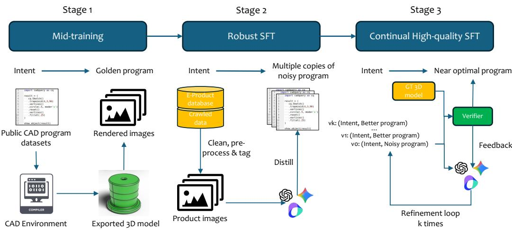  
Figure 3: Our proposed multistage training pipeline of VisCAD-M1.

Part design generation. VisCAD-M1, a multimodal foundation model, takes texts, 2D drawings, renders, or product photographs and generates python programs that reconstruct user design intents. obeying the spec of FreeCAD API, that can run and export a 3D model. 1

Assembly design generation. VisCAD-H1 takes multi-part intent and delivers an assembly through agentic workflow, with our built-in DSL-agnostic intermediate representation (IR) to fecilitate stable modeling process. General harnesses are more flexible given open-ended tasks, however they may not follow the best domain know-hows to decompose complex intents into structured BoMs (Bill of Materials), reason about their part-level IRs, propose mating relationships and estimate global placements, which are essential atomic abilities required for assembly generation (Liu et al., 2026).

## 4 VisCAD: DATA CURATION, MODEL TRAINING AND HARNESS DESIGN

In this section, we introduce in details three core components of our VisCAD suite: 1) the data curation pipeline, 2) the model training pipeline, and 3) the domain-specific harness design respectively.

## 4.1 DATA CURATION PIPELINE

As mentioned in the overview, our data curation pipeline regards and transforms heterogeneous CAD relevant data items into a unified $( i , p , s )$ representation (Figure 2). The raw sources span three families (Appendix B): public corpora provide executable CAD programs and as well as render images; factory-automation catalogs provide realistic product photographs at SKU scale; purchased and collected industrial assets provide STEP/STL models and engineering drawings, together covering a wide spectrum of design intents. To select data instances that are highly relevant for mechanical CAD design, a four-step category filter retains rigid mechanical products with clear modeling, mating, or drafting value and removes software, electronics, consumables, and weak-CAD categories, yielding 21 major categories and 128 subcategories (Figure 8; Table 4).

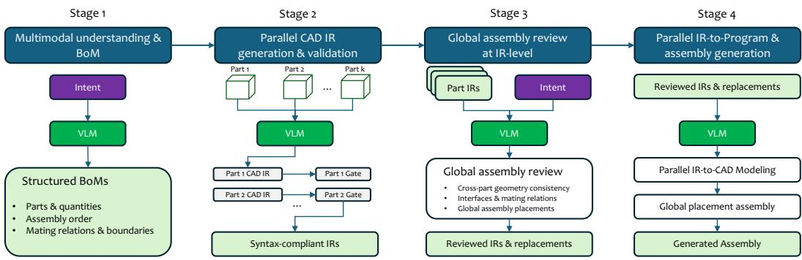  
Figure 4: VisCAD-H1. A CAD-native outer loop extracts structured BoMs, generates and gates perpart IRs, reviews global placement, and realizes an editable assembly on a CAD backend.

The pipeline over t has two pathways, the forward one i → p → s and the backward one $s  p  i .$ The motivation is to completes missing elements conditioned on other entries, and the goal is to obtain near optimal p and diverse ¿. If we start from i, which might be close to realistic scenarios (diverse), we should firstly normalize i to reduce its complexity via off-the-shelf image edit models, and then reconstruct its shape s', which might not be perfect, via off-the-shelf image-to-3D models. Then, we can take RSI-based processes for searching the near optimal program p' given i, s', where we have a fast one and a slow one that handles trade-off between quantity and quality. If we start from s or p, it is important to get diverse i through viewpoint-projection of s and image editing. And then we can run the forward process to get near optimal p for supervised training.

## 4.2 MULTI-STAGE TRAINING OF VisCAD-M1

VisCAD-M1 is a 27B multimodal model that maps natural-language descriptions, engineering drawings, rendered views, or product photographs to executable FreeCAD Python for single-part generation. The program must compile, reconstruct the intended solid, and preserve identity-bearing features such as holes, bosses, and mounting faces etc.. Because data instance triples might be intrinsically incomplete, training cannot assume that every input intent is paired with a native program. We therefore organize learning into three stages that progressively move from syntactic grounding and massive atomic geometric coverage to domain coverage and geometric quality (Figure 3).

In mid-training, nearly 1M public available CAD programs in CadQuery are executed in its environment to export solids and projected from different viewpoints as multi-view images as input intents. This reversible construction provides golden intent-program pairs and teaches CAD syntax, API usage, and the correspondence between visual elements of rendered image and code snippets. In robust SFT, roughly 150k product images from e-commerce and crawled sources are cleaned, preprocessed, and tagged. The teacher models distill multiple candidate programs for the same intent, exposing the model to broad industrial coverage while reducing sensitivity to any single noisy trajectory. Finally, continual high-quality SFT uses roughly 10k curated examples in a generate-verify-feedback loop. The stages are cumulative: mid-training supplies executable priors, robust SFT bridges the visual domain gap, and continual SFT restores fine-grained geometric fidelity without discarding coverage.

## 4.3 THE DESIGN OF VisCAD-H1

Assembly CAD is not a larger part-generation problem. API errors cascade across parts; a missing mating part is not a missing fillet. Ordinary code-assistant loops execute and rewrite, but they do not expose BoMs, a per-part plan, or a global placement review (Liu et al., 2026). VisCAD-H1 is a domain-specific harness around a frontier vision-language model.

The workflow has four gated stages (Figure 4). The Multimodal understanding & BoM stage turns product images, multi-view drawings, and text into parts and counts, a suggested assembly order, and mating or boundary hints; later stages consume this structure rather than re-parsing the raw evidence. The Parallel part IR stage assigns each part an intermediate representation—local geometry, interfaces, and constraints independent of FreeCAD, Fusion, or SolidWorks syntax—and gates syntax and local validity before anything is treated as a solid. The Global IR review stage reads all part IRs with the reference views, checks cross-part geometry, interfaces, and placements, and emits a reviewed IR with poses. Local programs can all execute while the assembly is wrong—a crank without a pin, five pistons reduced to a hub. The CAD realization translates the reviewed IR into backend modeling calls, builds parts in parallel, and assembles the solids. The VLM fills an IR-to-API slot rather than inventing the plan in one shot.

Table 1: Part-level profile average on PubCADBench and RealCADBench. Slice-level Success Rate, IoU, and Judge columns are in Tables 7 and 8.
<table><tr><td>Model</td><td>AVG</td><td>PubCADBench</td><td>RealCADBench</td></tr><tr><td>Claude-Opus-4.8 (Anthropic, 2026b)</td><td>0.5430</td><td>0.5579</td><td>0.5280</td></tr><tr><td>Gemini-3.1-Pro (Google DeepMind, 2026)</td><td>0.5496</td><td>0.5533</td><td>0.5459</td></tr><tr><td>GPT-5.4 (OpenAI, 2026b)</td><td>0.4913</td><td>0.5044</td><td>0.4782</td></tr><tr><td>GPT-5.5 (OpenAI, 2026b)</td><td>0.5450</td><td>0.5519</td><td>0.5380</td></tr><tr><td>Kimi-K3 (Moonshot AI, 2026)</td><td>0.4489</td><td>0.4833</td><td>0.4144</td></tr><tr><td>Doubao-Seed-2.0-pro (ByteDance Seed, 2026)</td><td>0.4046</td><td>0.4287</td><td>0.3804</td></tr><tr><td>Qwen3-VL-8B (Qwen Team, 2025)</td><td>0.2680</td><td>0.3060</td><td>0.2300</td></tr><tr><td>Qwen3-VL-32B (Qwen Team, 2025)</td><td>0.3199</td><td>0.3496</td><td>0.2902</td></tr><tr><td>Qwen3.8-27B (Qwen Team, 2026)</td><td>0.4759</td><td>0.4943</td><td>0.4575</td></tr><tr><td>VisCAD-M1</td><td>0.5540</td><td>0.5596</td><td>0.5485</td></tr><tr><td>VisCAD-M1 + parallel-tts</td><td>0.5797</td><td>0.5833</td><td>0.5761</td></tr></table>

The IR is the portability layer (Figure 7). Intent understanding and assembly reasoning stay in the IR; FreeCAD, Fusion, and SolidWorks consume translations of the same plan. VisCAD-H1 is scored as an agent using assembly-level judge score instead of the part-level profile average of Eq. 1.

## 5 EXPERIMENTS AND MAIN PERFORMANCES

VisCAD-M1 is evaluated as a standalone part-level design generator, with dedicated experiments on using itself as a reranker for test-time scaling, while VisCAD-H1 is evaluated as an assembly-level design generator (qualitative evaluations are in Sec. 6.3)

## 5.1 SETUP

Part-level sets. PubCADBench aggregates representative subsets of five public benchmarks totaling 1,100 tasks: BenchCAD (200), CADBench (300), Orthographic Reconstruction (200), P3D-Text (200), and P3D-Image (200) (Table 5; Figure 9). RealCADBench has four industrial partlevel slices totaling 1,745 tasks: Text (568), 2D drawing (236), Real Picture (568), and Rendered Image (373) (Table 6; Figure 10). Compared systems are Claude-Opus-4.8 (Anthropic, 2026b), Gemini-3.1-Pro (Google DeepMind, 2026), GPT-5.4 and GPT-5.5 (OpenAI, 2026b), Kimi-K3 (Moonshot AI, 2026), Doubao-Seed-2.0-pro (ByteDance Seed, 2026), Qwen3-VL-8 and Qwen3-VL-32B (Qwen Team, 2025), and Qwen3.8-27B (Qwen Team, 2026). VisCAD-M1 is reported as a single design generation model and with test-time scaling (TTS) that reuses itself as a verifier.

Assembly-level sets. The assembly comparison uses a 50-instance subset from assembly data in PubCADBench and RealCADBench, not the full assembly tracks of either family. Compared systems are VisCAD-H1, Codex (OpenAI, 2026a), and Claude Code (Anthropic, 2026a). Valid-sample counts sit next to the Judge because a harness can refuse or fail to export. Figure 6 shows six source-report cases; Table 10 lists all fifty on the same four-column sheet. Assembly scores include an outer loop and are not compute-matched to Table 1 or to each other.

Design artifacts and metrics. The metrics follow RealCADBench (Team, 2026). We use FreeCAD API as our target CAD DSL. The shared runtime executes the program and exports result.st1. We score the executed solid, not a particular code path. The vector is executability (Success Rate), Solid IoU, Surface IoU, and Judge Score from a judge model (Kimi K2.6). Executability uses every assigned task. Each quality column uses artifacts available to its evaluator; missing quality values are not zero-filled. After a deterministic PCA-signed alignment that removes pose and uniform scale, Solid IoU measures occupied-volume overlap and Surface IoU emphasizes boundaries. The judge is GT-free, and it compares renders of the exported 3D artifact with the input intent. The Part Judge scores identity-bearing features of the target part. The Assembly Judge scores component geometry Q, assembly accuracy F, and system design D on a 0–100 scale. The three scores are combined into a single score. Part ranking uses the profile average

$$
\begin{array} { r } { P _ { c } = \frac { 1 } { 4 } \big ( E _ { c } + G _ { c } ^ { \mathrm { s o l i d } } + G _ { c } ^ { \mathrm { s u r f a c e } } + J _ { c } / 1 0 0 \big ) , } \end{array}\tag{1}
$$

an equal-weight mean of delivery, two geometric overlaps, and a normalized Judge. Alignment and voxelization of the predicted 3D mesh, aggregation of metric values and the judge prompts are in Appendices C and F. Slice-level four-column vectors are in Appendix D.

## 5.2 PART-LEVEL RESULTS

Table 1 reports the profile average on PubCADBench and RealCADBench. VisCAD-M1 attains 0.5540 overall, above Gemini-3.1-Pro at 0.5496 and GPT-5.5 at 0.5450. The lead holds on both benchmarks: 0.5596 vs. 0.5533 on PubCADBench and 0.5485 vs. 0.5459 on Rea1CADBench. TTS raises the same model to 0.5797 (0.5833 / 0.5761). Open-weight baselines remain below the frontier band: Qwen3-VL-8B at 0.2680, Qwen3-VL-32B at 0.3199, Qwen3.8-27B at 0.4759. The base margin is small and obtained by a domain 27B model on a mix that includes industrial photographs and drawings, not only CAD-native renders. TTS is the larger move. Section 6 reads the slice columns.

## 5.2.1 DETAILED PERFORMANCES ON EACH SLICE

To save space, we have kept the slice-wise scores of PubCADBench and RealCADBench in Table 7 and Table 8 respectively in appendix. On PubCADBench, VisCAD-M1 is stronger at IoU-based scores more often than visual judge scores. It records the best Solid IoU on BenchCAD (0.4422) and CADBench (0.5484), and the best Surface IoU on same slices (0.1789, 0.2765). Judge scores on those slices are lower than GPT-5.5 and Gemini BenchCAD 73.65 vs. 77.71 / 76.69; CADBench 81.77 vs. 87.68 / 87.00). Executability is already very high (almost all above 0.95) for every frontier model on every slices as well as VisCAD-M1. Our model overlaps the reference solid more closely; judge scores do not always follow that geometry lead. The same geometry lead appears on orthographic reconstruction (Solid IoU 0.4604). On P3D-Image, executability is higher than Gemini (0.9250 vs. 0.8600) while judge score remains 1ower (53.28 vs. 64.58).

On RealCADBench, coverage under realistic design intent is what separates the evaluated models. On Text with much longer text descriptions than P3D-Text, executability is 0.9331 for VisCAD-M1, against 0.8451 for Gemini, 0.9067 for GPT-5.5, and 0.6356 for C1laude-0Opus-4.8; Kimi-K3 reaches the highest observed text Solid IoU (0.4584) while has the lowest executability 0.0581, meaning that geometry on the artifacts that exist can look strong while coverage collapses. On real pictures, VisCAD-M1 has the highest executability (0.9877) and Solid IoU (0.4456). On rendered views it has the highest Solid and Surface IoU (0.5858, 0.2581), while GPT-5.5 keeps a higher judge score (77.80 vs. 75.56). 2D drawings remain a place where Gemini's judge score (79.08) exceeds VisCAD-M1 (69.13) by a large margin even though executability is comparable. Industrial photographs and product text separate models by whether a solid is exported successfully; slices in PubCADBench compress that difference because of very high executability.

## 5.3 ASSEMBLY-LEVEL RESULTS

Appendix Table 9 reports the results of a 50-instance study. VisCAD-H1 scores 85.0 via the assembly judge, against 68.0 for Codex and 52.0 for Claude Code. Valid samples are 49, 49, and 50: almost every configuration exports an assembly, and the judge still separates them by 17 and 33 points.

## 6 ANALYSES

## 6.1 THE EFFECTIVENESS OF MID-TRAINING AND ROBUST SFT

Table 2: The effectiveness of mid-training across five eval slices of PubCADBench. Each dataset slice reports Success Rate (Succ.), Solid IoU (Sol.), Surface IoU (Sur.), and Judge Score (Judge).
<table><tr><td></td><td colspan="4">BenchCAD (200)</td><td colspan="4">CADBench (300)</td><td colspan="4">Orthographic Reconstruction (200)</td><td colspan="4">P3D-Text (200)</td><td colspan="4">P3D-Image (200)</td></tr><tr><td>Model</td><td>Succ.</td><td>Sol.</td><td>Sur.</td><td>Judge</td><td>Succ.</td><td>Sol.</td><td>Sur.</td><td>Judge</td><td>Succ.</td><td>Sol.</td><td>Sur.</td><td>Judge</td><td>Succ.</td><td>Sol.</td><td>Sur.</td><td>Judge</td><td>Succ.</td><td>Sol.</td><td>Sur.</td><td>Judge</td></tr><tr><td>8B init. qw3vl</td><td>0.9650</td><td>0.3421</td><td>0.1310</td><td>57.6067</td><td>0.9200</td><td>0.4507</td><td>0.1981</td><td>74.5601</td><td>0.9550</td><td>0.2810</td><td>0.1024</td><td>57.6431</td><td>0.9200</td><td>0.1886</td><td>0.0623</td><td>48.1332</td><td>0.8600</td><td>0.2110</td><td>0.0896</td><td>35.7332</td></tr><tr><td>8B init. mid_trn_ckpt</td><td>0.9550</td><td>0.3675</td><td>0.1467</td><td>62.7553</td><td>0.9367</td><td>0.4842</td><td>0.2113</td><td>80.9614</td><td>0.9500</td><td>0.2862</td><td>0.0898</td><td>61.5796</td><td>0.9700</td><td>0.1996</td><td>0.0602</td><td>48.5658</td><td>0.8150</td><td>0.2179</td><td>0.1013</td><td>42.4418</td></tr><tr><td>32B init. qw3vl</td><td>0.9650</td><td>0.3481</td><td>0.1624</td><td>58.9577</td><td>0.9467</td><td>0.4841</td><td>0.2326</td><td>80.5915</td><td>0.9750</td><td>0.3295</td><td>0.1385</td><td>64.3183</td><td>0.9750</td><td>0.1968</td><td>0.0636</td><td>52.6929</td><td>0.8400</td><td>0.2278</td><td>0.1034</td><td>44.2780</td></tr><tr><td>32B init. mid_trn_ckpt</td><td>0.9600</td><td>0.3574</td><td>0.1532</td><td>63.4973</td><td>0.9433</td><td>0.4888</td><td>0.2206</td><td>82.3735</td><td>0.9700</td><td>0.3502</td><td>0.1413</td><td>67.9330</td><td>0.9650</td><td>0.2170</td><td>0.0648</td><td>53.6341</td><td>0.8950</td><td>0.2311</td><td>0.1132</td><td>48.2573</td></tr></table>

This section demonstrates the effectiveness of mid-training and robust SFT in the proposed multistage training pipeline. For mid-training, recall that it uses millions of programs to reversely curate multi-view images as input intent from the multiple viewpoints of the exported 3D meshes, so the corresponding mapping from input to program is golden. The advantage is to increase the upper limit of the model's final capability after the overall training pipeline. Table 2 proves that with midtraining, many IoU-related entries increase about 1 point, while judge score entries increase about 5 points. For robust SFT, recall that it leverages a fast distillation pipeline to get multiple target CAD programs w.r.t. the same input for learning. This simple data augmentation strategy might regularize supervised training to be less prone to noises in the teacher's trajectories. Figure 5 demonstrates the advantage of robust SFT: three copies per input is better than one towards the end of training.

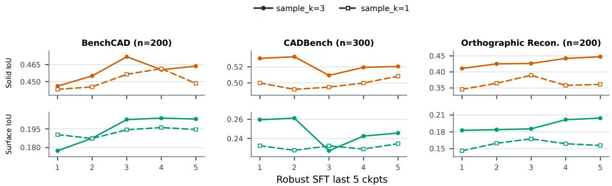  
Figure 5: Solid and surface IoU learning curves across the last five robust SFT ckpts for sample\_k=3 and sample\_k=1. Each subplot uses an independent y-axis range to highlight ckpt-level differences.

Table 3: The effectiveness of test-time scaling across five evaluation slices of PubCADBench. AVG denotes the profile average; each dataset slice reports Success Rate (Succ.), Solid IoU (Sol.), Surface IoU (Sur.), and Judge Score (Judge).
<table><tr><td rowspan="2">Model</td><td rowspan="2">AVG</td><td colspan="4">BenchCAD (200)</td><td colspan="4">CADBench (300)</td><td colspan="4">Orthographic Reconstruction (200)</td><td colspan="4">P3D-Text (200)</td><td colspan="4">P3D-Image (200)</td></tr><tr><td>Succ.</td><td>Sol.</td><td>Sur.</td><td></td><td>Judge Succ.</td><td>Sol.</td><td>Sur.</td><td></td><td>Judge</td><td>Succ. Sol.</td><td>Sur.</td><td>Judge</td><td>Succ.</td><td>Sol.</td><td></td><td>Sur.</td><td>Judge Succ.</td><td>Sol.</td><td>Sur.</td><td>Judge</td></tr><tr><td>VisCAD-M1</td><td>0.5596</td><td>0.9900</td><td>0.4422</td><td>0.1789</td><td>73.6503</td><td>0.9667</td><td>0.5484</td><td>0.2765</td><td>81.7749</td><td>0.9700</td><td>0.4604</td><td>0.2100</td><td>75.2626</td><td>0.9800</td><td>0.2330</td><td>0.0779</td><td>55.6098</td><td>0.9250</td><td>0.2678</td><td>0.1364</td><td>53.2831</td></tr><tr><td>Listwise no-think @ 8</td><td>0.5725</td><td>1.0000</td><td>0.4464</td><td>0.1823</td><td>76.3918</td><td>0.9967</td><td>0.5304</td><td>0.2625</td><td>86.8655</td><td>1.0000</td><td>0.4628</td><td>0.2130</td><td>81.6922</td><td>1.0000</td><td>0.2229</td><td>0.0729</td><td>57.5865</td><td>1.0000</td><td>0.2992</td><td>0.1486</td><td>58.8119</td></tr><tr><td>Listwise low-think @ 8</td><td>0.5764</td><td>1.0000</td><td>0.4571</td><td>0.1987</td><td>76.1894</td><td>1.0000</td><td>0.5501</td><td>0.2674</td><td>86.7932</td><td>1.0000</td><td>0.4766</td><td>0.2323</td><td>81.6218</td><td>1.0000</td><td>0.2281</td><td>0.0752</td><td>58.5800</td><td>0.9950</td><td>0.2843</td><td>0.1446</td><td>58.8449</td></tr><tr><td>Listwise low-think @ 16</td><td>0.5833</td><td>1.0000</td><td>0.4458</td><td>0.1966</td><td>79.0896</td><td>1.0000</td><td>0.5484</td><td>0.2803</td><td>87.8387</td><td>0.9950</td><td>0.4920</td><td>0.2420</td><td>81.1256</td><td>1.0000</td><td>0.2419</td><td>0.0798</td><td>61.0735</td><td>1.0000</td><td>0.3004</td><td>0.1529</td><td>60.0035</td></tr></table>

## 6.2 THE EFFECTIVENESS OF TEST-TIME SCALING

Test-time scaling (TTS) is a natural extension of the trained model under the vibe of recursive selfimprovements (RSI). We have tried two direct and simple ideas under TTS and RSI. The first is to use VisCAD-M1 as a sequential refiner that iteratively refine the initial program after seeing the multiview images from the exported mesh as well as the input intent. The second is to use VisCAD-M1 as a parallel reranker that chooses among k rollouts from VisCAD-M1 for the same input. We find that sequential-tts does not lead to improvements, however, parallel-tts works very well, which can improve further when scaling the rollout parameter k from 8 to 16. This indicates that the model itself cannot generatively leads to better program, but can discriminatively select what it thinks are the best prediction among several candidates. Table 3 shows the improvement from VisCAD-M1 through parallel-tts on PubCADBench. The reranker simply takes multiple rollouts of VisCAD-M1 (program and an image of the exported 3D model of the program with 6-view), then uses a listwise reranking strategy to score each rollouts and pick the highest scored one. With k = 8, the listwise reranker w/o thinking raises 1.3 points, while raises 1.7 points w/ thinking; with k = 16, the score can further reach 0.5833, more than 2.4 points above the naive VisCAD-M1.

## 6.3 ASSEMBLY DESIGN CASE STUDY AND IR STABILITY

In Figure 6, we can induce that Codex often recovers a coarse envelope—a stadium base without the linkage, a radial hub without pistons—and then stops. Claude Code more often distorts topology or fails to export. VisCAD-H1 more often keeps local parts after the envelope is in place: crank pins and guides, piston count, cooling fins, a CMM gantry, regulator ports, a compressor tank and pumps. The BoM and IR stages force the system to name parts and gate them before the backend is asked for solids; a generic coding loop can emit one plausible program and stop. Figure 7 demonstrates the stability of the final generated assembly design across CAD platforms. It shows that VisCAD-H1, which produces the platform-agnostic IR first and then translate the IR to program for specific DSL, can produce more stable final design compared to Codex.

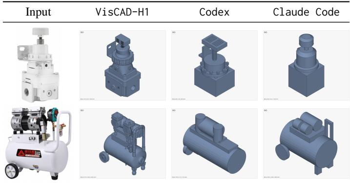  
Figure 6: Two representative assembly Test cases for a qualitative comparison among VisCAD-H1, Codex and Claude Code. The results of all 50 instances are listed in Table 10 of appendix.

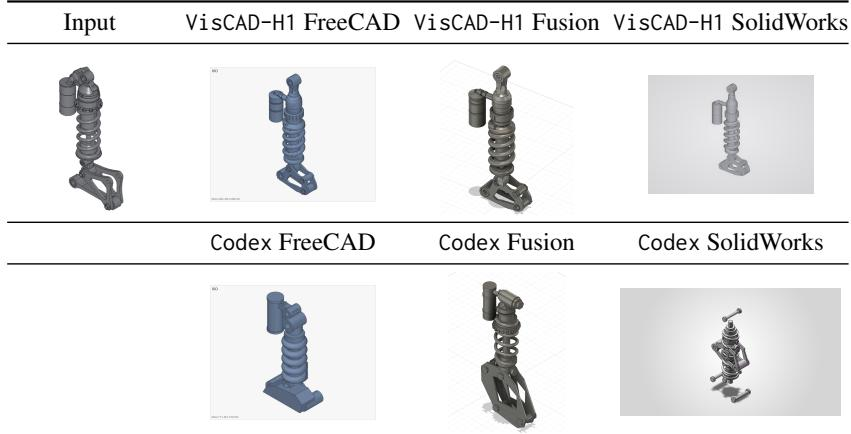  
Figure 7: Design stability based on our proposed IR across platforms compared to Codex. The same assembly is realized in 3 CAD environments, namely FreeCAD, Autodesk Fusion, and SolidWorks.

## 7 CONCLUSION

We present Vi sCAD, an industrial CAD foundation model suite spanning general part generation with VisCAD-M1 and structured assembly modeling with VisCAD-H1. VisCAD-M1 can map a broad range of texts, engineering drawings, product photographs, and renders through one visual foundation model interface to executable CAD programs. On PubCADBench and RealCADBench, it achieves the best part-level profile average among the evaluated systems (0.5540 versus 0.5496 for the strongest state-of-the-art frontier models), with further gains from parallel test-time scaling.

This suite also contributes general and reusable data and training infrastructure. Its data curation pipeline converts heterogeneous, incomplete evidence into intent-program-shape triples and synthetically fills missing intents, programs or geometry. Its multi-stage training recipe maximizes the utility of different data sources with varied quantity and quality through large-scale narrow-domain mid-training, general-domain robust supervised fine-tuning, and continual high-quality fine-tuning. These pipelines are portable across data sources, intent modalities, model backbones, and CAD environments rather than tied to one benchmark or DSL.

At the assembly level, VisCAD-H1 demonstrates that to what extent a domain-specific agent can elevate frontier-model CAD capability, scoring 85.0 versus 68.0 and 52.0 for general-purpose harnesses (Codex, Claude Code), under our assembly judge. We formulate assembly generation as intent–IR– program: an intent is grounded in a backend-agnostic IR of parts, geometry, mates, and placements before translation into executable code. This IR can act as a world language that connects otherwise isolated CAD dialects, as demonstrated across FreeCAD, Fusion, and SolidWorks.

We are on the road to fully integrate VisCAD-M1 and VisCAD-H1 into one holistic agent-native CAD intelligence, unifying part design generation, assembly reasoning, execution, verification, and feedback in one model–agent loop to bring the best user experience across abundant design intent modalities, user interactions and CAD softwares.

## REFERENCES

Anthropic. Claude code. https://code.claude.com/docs/en, 2026a.

Anthropic. Introducing claude opus 4.8. https://www.anthropic.com/news/claude-opus-4-8, 2026b.

ByteDance Seed. Seed2.0 model card: Towards intelligence frontier for real-world complexity. arXiv preprint arXiv:2607.00248, 2026.

Anna C. Doris, Jacob Thomas Sony, Ghadi Nehme, Era Syla, Amin Heyrani Nobari, and Faez Ahmed. Cadbench: A multimodal benchmark for ai-assisted cad program generation. arXiv preprint arXiv:2605.10873, 2026.

Google DeepMind.Gemini 3.1 pro. https://deepmind.google/models/model-cards/ gemini-3-1-pro/,2026.

Ahmet Serdar Karadeniz, Dimitrios Mallis, Nesryne Mejri, Kseniya Cherenkova, Anis Kacem, and Djamila Aouada. Picasso: A feed-forward framework for parametric inference of cad sketches via rendering self-supervision. In Proceedings of the IEEE/CVF Winter Conference on Applications of Computer Vision, 2025. doi: 10.1109/WACV61041.2025.00631.

Mohammad Sadil Khan, Sankalp Sinha, Talha Uddin Sheikh, Didier Stricker, Sk Aziz Ali, and Muhammad Zeshan Afzal. Text2cad: Generating sequential cad designs from beginner-to-expert level text prompts. In Advances in Neural Information Processing Systems, volume 37, pp. 7552– 7579, 2024. doi: 10.52202/079017-0242.

Sebastian Koch, Albert Matveev, Zhongshi Jiang, Francis Williams, Alexey Artemov, Evgeny Burnaev, Marc Alexa, Denis Zorin, and Daniele Panozzo. Abc: A big cad model dataset for geometric deep learning. In Proceedings of the IEEE/CVF Conference on Computer Vision and Pattern Recognition, 2019. doi: 10.1109/CVPR.2019.00983.

Joseph G. Lambourne, Karl D. D. Willis, Pradeep Kumar Jayaraman, Aditya Sanghi, Peter Meltzer, and Hooman Shayani. Brepnet: A topological message passing system for solid models. In Proceedings of the IEEE/CVF Conference on Computer Vision and Pattern Recognition, 2021.

Jiahao Li, Weijian Ma, Xueyang Li, Yunzhong Lou, Guichun Zhou, and Xiangdong Zhou. Cadllama: Leveraging large language models for computer-aided design parametric 3d model generation. In Proceedings of the IEEE/CVF Conference on Computer Vision and Pattern Recognition, 2025a. doi: 10.1109/CVPR52734.2025.01730.

Xingang Li, Yuewan Sun, and Zhenghui Sha. Llm4cad: Multimodal large language models for three-dimensional computer-aided design generation. Journal of Computing and Information Science in Engineering, 2025b. doi: 10.1115/1.4067085.

Yang Liu, Daxuan Ren, Yijie Ding, Jianmin Zheng, and Fang Deng. Multi-agent cad code generation. In Proceedings of the ACM SIGGRAPH Conference Papers, 2026. doi: 10.1145/3799902. 3811067.

Sahil Maniyar. Paracad-rl: Parametric cad code generation via feature tree convention and compilerverified reinforcement learning, 2026. SSRN preprint.

Yingying Mao, Yichao Zhou, Shidong Wang, Zebin Wu, and Haofeng Zhang. Bits-cad: Bidirectional text-sketch sequence fusion for cad generation. IEEE Transactions on Industrial Informatics, 2026. doi: 10.1109/TII.2026.3715226.

Moonshot AI. Kimi k3: Open frontier intelligence. arXiv preprint arXiv:2607.24653, 2026.

OpenAI. Codex. https://openai.com/codex/,2026a.

OpenAI. Gpt-5 system card. arXiv preprint arXiv:2601.03267, 2026b.

Qwen Team. Qwen3-vl technical report. arXiv preprint arXiv:2511.21631, 2025.

Qwen Team. Qwen3.8-27b. https://huggingface.co/Qwen/Qwen3.8-27B, 2026.

Danila Rukhovich, Elona Dupont, Dimitrios Mallis, Kseniya Cherenkova, Anis Kacem, and Djamila Aouada. Cad-recode: Reverse engineering cad code from point clouds. In Proceedings of the IEEE/CVF International Conference on Computer Vision, 2025. doi: 10.1109/ICCV51701.2025. 00914.

Ari Seff, Yaniv Ovadia, Wenda Zhou, and Ryan P. Adams. Sketchgraphs: A large-scale dataset for modeling relational geometry in computer-aided design. arXiv preprint arXiv:2007.08506, 2020.

Jing Tang, Hongru Xiao, Xiang Li, Wei Wang, and Zeyu Gong. Chatcad: An mllm-guided framework for zero-shot cad drawing restoration. In Proceedings of the IEEE International Conference on Acoustics, Speech, and Signal Processing, 2025. doi: 10.1109/ICASSP49660.2025.10890248.

JoyIndustrial-VisCAD Team. Realcadbench: Benchmarking ai systems for real-world multimodal cad reconstruction, 2026. Unpublished benchmark draft referenced by project materials.

Chikaha Tsuji, Enrique Flores Medina, Harshit Gupta, and Md Ferdous Alam. Gencad-selfrepairing: Feasibility enhancement for 3d cad generation. In ASME International Design Engineering Technical Conferences and Computers and Information in Engineering Conference, 2025. doi: 10.1115/DETC2025-169378.

Karl D. D. Willis, Yewen Pu, Jieliang Luo, Hang Chu, Tao Du, Joseph G. Lambourne, Armando Solar-Lezama, and Wojciech Matusik. Fusion 360 gallery: A dataset and environment for programmatic cad construction from human design sequences. ACM Transactions on Graphics, 40 (4), 2021. doi: 10.1145/3476576.3476602.

Rundi Wu, Chang Xiao, and Changxi Zheng. Deepcad: A deep generative network for computeraided design models. In Proceedings of the IEEE/CVF International Conference on Computer Vision, 2021. doi: 10.1109/ICCV48922.2021.00670.

Sifan Wu, Amir Hosein Khasahmadi, Mor Katz, Pradeep Kumar Jayaraman, Yewen Pu, Karl D. D. Willis, and Bang Liu. Cadvlm: Bridging language and vision in the generation of parametric cad sketches. In Computer Vision – ECCV 2024, 2024. doi: 10.1007/978-3-031-72897-6\_21.

Xiang Xu, Joseph G. Lambourne, Pradeep Kumar Jayaraman, Zhengqing Wang, Karl D. D. Willis, and Yasutaka Furukawa. Brepgen: A b-rep generative diffusion model with structured latent geometry. ACM Transactions on Graphics, 43(4), 2024. doi: 10.1145/3658129.

Yikang Yang, Zhanpeng Hu, Youtian Lin, Mengqi Zhou, Jingxi Xu, Feihu Zhang, Jiaheng Liu, and Yao Yao. P3d-bench: Benchmarking mllms for parametric 3d generation and structural reasoning. arXiv preprint arXiv:2606.11152, 2026.

Nomi Yu, Md Ferdous Alam, A. John Hart, and Faez Ahmed. Gencad-3d: Cad program generation using multimodal latent space alignment and synthetic dataset balancing. Journal of Mechanical Design, 2026. doi: 10.1115/1.4069276.

Zhe Yuan, Jianqi Shi, and Yanhong Huang. Openecad: An efficient visual language model for editable 3d-cad design. Computers & Graphics, 2024. doi: 10.1016/j.cag.2024.104048.

Chao Zhang, Romain Pinquié, Arnaud Polette, Gregorio Carasi, Henri De Charnace, and Jean-Philippe Pernot. Automatic 3d cad models reconstruction from 2d orthographic drawings. Computers & Graphics, 2023. doi: 10.1016/j.cag.2023.05.021.

Chao Zhang, Arnaud Polette, Romain Pinquié, Mirai Iida, Henri De Charnace, and Jean-Philippe Pernot. Reinforcement learning-based parametric cad models reconstruction from 2d orthographic drawings. Computer-Aided Design, 2025. doi: 10.1016/j.cad.2025.103925.

Haozhe Zhang, Kaichen Liu, Miaomiao Chen, Lei Li, Shaojie Yang, Cheng Peng, and Hanjie Chen. Benchcad: A comprehensive, industry-standard benchmark for programmatic cad. arXiv preprint arXiv:2605.10865, 2026a.

Licheng Zhang, Bach Le, Naveed Akhtar, Siew-Kei Lam, and Duc Ngo. Large language models for computer-aided design: A survey. ACM Computing Surveys, 2026b. doi: 10.1145/3787499.

## A CONTRIBUTIONS

The contributors are listed in alphabetical order by last name.

<table><tr><td>Linxin Cai</td><td>Yichen Long Luya Wang</td></tr><tr><td>Qiuhe Hong Zhichao Huang</td><td>Yuchen Wang</td></tr><tr><td>Guanlin Li</td><td>Wenxiang Wu</td></tr><tr><td></td><td></td></tr><tr><td>Hongsen Liu Ziqi Liu</td><td>Huimu Yu Ning Zhang</td></tr></table>

## B DATA CURATION AND TRAINING DETAILS

This section records material used to build VisCAD-M1 that is not required to follow Sections 4–6.

Sources. Three families supply raw data. Catalog imagery (src\_1) comes from factory-automation e-commerce SKUs, mainly product photographs. Purchased industrial CAD (src\_2) supplies STEP/STL assets and drawings. Public corpora (src\_3) supply CAD code and drawings from open datasets. Catalog construction expands each product term with an LLM, retrieves related SKUs through a search API, and keeps the main product image. Purchased CAD is rendered to single- and multi-view images. Public code is kept when it compiles to a non-empty solid.

Category filter. A four-step filter enumerates factory-automation categories, introduces the design-intent→CAD-code objective, and drops software, electronics, consumables, and weak-CAD items. The retained taxonomy has 21 major categories and 128 subcategories. Table 4 shows a fragment; Figure 8 shows the construction flow from the source report.

Table 4: Sample of the factory-automation category filter used to collect VisCAD-M1 data.
<table><tr><td>Major category</td><td>Subcategory</td><td>Typical products</td></tr><tr><td>Electric Actuators</td><td>Electric Cylinders</td><td>Rod-type electric cylinders, slide-table cylinders</td></tr><tr><td>Robots and End Effectors</td><td>Industrial Robots</td><td>Six-axis robots, SCARA robots, Delta robots</td></tr><tr><td>Linear Motion</td><td>Linear Modules</td><td>Ball-screw modules, belt-driven modules</td></tr></table>

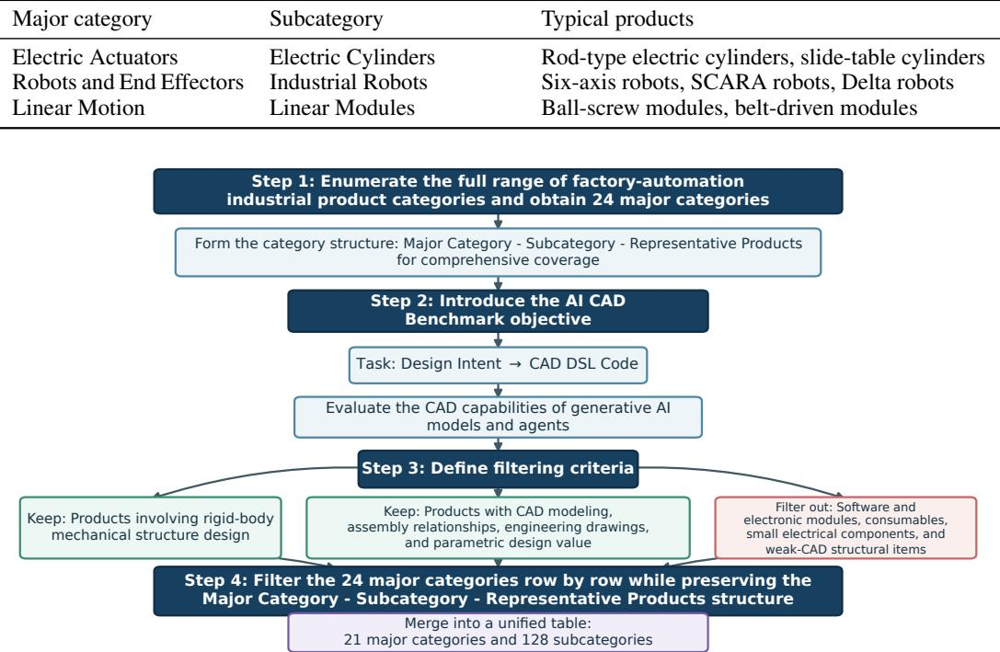  
Figure 8: Category-construction flow from the source report (21 major categories after filtering)

## C EVALUATION PROTOCOL

VisCAD uses the same metric vector and judge prompts as RealCADBench (Team, 2026). This section restates the definitions needed to read Tables 1-8; the complete prompts are reproduced in Appendix F.

Artifact contract. A system emits FreeCAD Python. The shared runtime executes the program and exports result.st1. We score the executed solid, not a particular code path. Syntax errors, runtime failures, missing files, and empty geometry fail executability.

Pairwise geometry. Let ${ \tilde { C } } _ { i }$ be the aligned prediction for task $i$ and $C _ { i } ^ { \star }$ its reference STL. After a deterministic PCA-signed alignment that removes pose and uniform scale, Solid IoU and Surface IoU share one transform and a voxel grid of resolution R = 96 with 2% padding:

$$
\begin{array} { r l r } & { } & { g _ { i } ^ { \mathrm { s o l i d } } = \frac { \left| V _ { \mathrm { f l l e d } } ( \tilde { C } _ { i } ) \cap V _ { \mathrm { f l l l e d } } ( C _ { i } ^ { \star } ) \right| } { \left| V _ { \mathrm { f l l e d } } ( \tilde { C } _ { i } ) \cup V _ { \mathrm { f l l l e d } } ( C _ { i } ^ { \star } ) \right| } , } \\ & { } & { g _ { i } ^ { \mathrm { s u r f a c e } } = \frac { \left| V _ { \mathrm { b o u n d a r y } } ( \tilde { C } _ { i } ) \cap V _ { \mathrm { b o u n d a r y } } ( C _ { i } ^ { \star } ) \right| } { \left| V _ { \mathrm { b o u n d a r y } } ( \tilde { C } _ { i } ) \cup V _ { \mathrm { b o u n d a r y } } ( C _ { i } ^ { \star } ) \right| } . } \end{array}\tag{2}
$$

Filled occupancy measures volume; boundary occupancy is more sensitive to thin structures. Because alignment includes uniform scaling, drawing results do not measure millimetre-accurate dimension recovery.

Aggregates. Let c be a reported condition, $\boldsymbol { A } _ { c }$ its assigned tasks, $\mathcal { G } _ { c } ^ { q }$ the tasks with a geometry value from evaluator $q \in \{ \mathrm { s o l i d }$ , surface}, and $\mathcal { T } _ { c }$ the tasks with a Judge result. Executability is $e _ { i } = \mathbb { I } [ p _ { i }$ executes and yields a valid $\hat { C } _ { i } ]$ . The reported aggregates are

$$
\begin{array} { l } { \displaystyle E _ { c } = \frac { 1 } { \left| \mathcal { A } _ { c } \right| } \sum _ { i \in \mathcal { A } _ { c } } e _ { i } , } \\ { \displaystyle G _ { c } ^ { q } = \frac { 1 } { \left| \mathcal { G } _ { c } ^ { q } \right| } \sum _ { i \in \mathcal { G } _ { c } ^ { q } } g _ { i } ^ { q } , } \\ { \displaystyle J _ { c } = \frac { 1 } { \left| \mathcal { T } _ { c } \right| } \sum _ { i \in \mathcal { T } _ { c } } j _ { i } , \qquad j _ { i } \in [ 0 , 1 0 0 ] . } \end{array}\tag{3}
$$

Executability uses every assigned task; each quality column uses evaluator-available artifacts. Missing quality values are not zero-filled. The part-level AVG in Table 1 is the profile average

$$
\begin{array} { r } { P _ { c } = \frac { 1 } { 4 } \big ( E _ { c } + G _ { c } ^ { \mathrm { s o l i d } } + G _ { c } ^ { \mathrm { s u r f a c e } } + J _ { c } / 1 0 0 \big ) . } \end{array}\tag{4}
$$

Judge columns stay on the 0–100 scale and are divided by 100 only in Equation 4. The assembly table reports $J _ { c }$ from the Assembly Judge directly.

Judge. The judge model is Kimi -K2. 6, with prompts ratified by regime-owning CAD practitioners in RealCADBench before scoring. The part judge scores only the target part (identity and salient features). The assembly judge scores component geometry ${ \dot { Q } } ,$ assembly accuracy $\dot { F , }$ and system design D. The judge compares renders of the delivered artifact with the original input and has no access to the reference STL. Geometry and Judge can therefore disagree; both are reported. A batch visibility pass labels assembly components as ful1, partial, or invisible; those labels are metadata and do not change scoring weights.

## D PART-LEVEL DETAILED RESULTS

Table 5 and Table 6 define the slices behind Table 1. Figure 9 and Figure 10 reproduce the sourcereport galleries for those families. Table 7 and Table 8 report the full four-column vectors.

Table 5: PubCADBench slices (1,100 tasks).
<table><tr><td>Slice</td><td>Emphasis</td><td>Size</td></tr><tr><td>BenchCAD (Zhang et al., 2026a)</td><td>public part-level CAD</td><td>200</td></tr><tr><td>CADBench (Doris et al., 2026)</td><td>rendered-image program generation</td><td>300</td></tr><tr><td>Orthographic Reconstruction (Zhang et al., 2023; 2025)</td><td>three-view / drawing reconstruction</td><td>200</td></tr><tr><td>P3D-Text (Yang et al., 2026)</td><td>text-conditioned parametric generation</td><td>200</td></tr><tr><td>P3D-Image (Yang et al., 2026)</td><td>image-conditioned parametric generation</td><td>200</td></tr></table>

Table 6: Rea1CADBench part-level slices (1,745 tasks) (Team, 2026).
<table><tr><td>Slice</td><td>Emphasis</td><td>Size</td></tr><tr><td>Text</td><td>industrial text-to-CAD</td><td>568</td></tr><tr><td>2D Drawing</td><td>engineering-drawing-to-CAD</td><td>236</td></tr><tr><td>Real Picture</td><td>product-photo-to-CAD</td><td>568</td></tr><tr><td>Rendered Image</td><td>CAD-native rendered-view reconstruction</td><td>373</td></tr></table>

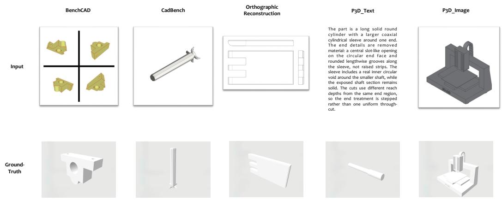  
Figure 9: PubCADBench gallery from the source report: public slices covering text, renders, textured views, multi-view, and orthographic settings.

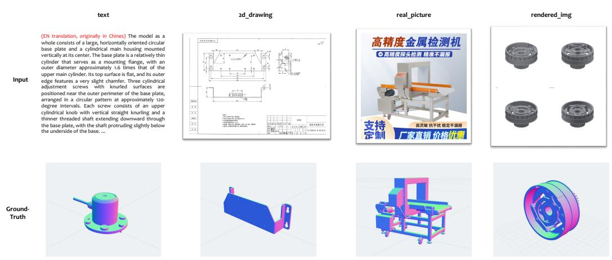  
Figure 10: RealCADBench gallery from the source report: text, drawings, real photographs, and rendered CAD views.

Table 7: Detailed per-slice performance on PubCADBench. AVG is the profile average in Equation 4.
<table><tr><td rowspan="2">Model</td><td rowspan="2">AVG</td><td colspan="4">BenchCAD (200) Succ.</td><td colspan="4">CADBench (300)</td><td colspan="4">Orthographic Reconstruction (200)</td><td colspan="4">P3D-Text (200)</td><td colspan="4">P3D-Image (200)</td></tr><tr><td></td><td>Sol.</td><td>Sur.</td><td>Judge</td><td>Succ.</td><td>Sol.</td><td>Sur.</td><td>Judge</td><td>Succ.</td><td>Sol.</td><td>Sur.</td><td>Judge</td><td>Succ.</td><td>Sol.</td><td>Sur.</td><td>Judge</td><td>Succ.</td><td>Sol.</td><td>Sur.</td><td>Judge</td></tr><tr><td>Claude-Opus-4.8</td><td>0.5579</td><td>0.9800</td><td>0.3963</td><td>0.1422</td><td>74.6260</td><td>0.9733</td><td>0.5110</td><td>0.2465</td><td>85.5550</td><td>0.9850</td><td>0.4613</td><td>0.2283</td><td>80.3076</td><td>0.9950</td><td>0.2298</td><td>0.0732</td><td>60.4361</td><td>0.9500</td><td>0.2773</td><td>0.1369</td><td>56.2036</td></tr><tr><td>Gemini-3.1-Pro</td><td>0.5533</td><td>0.9700</td><td>0.4404</td><td>0.1735</td><td>76.6926</td><td>0.9833</td><td>0.5265</td><td>0.2424</td><td>87.0011</td><td>0.9700</td><td>0.3805</td><td>0.1474</td><td>75.9129</td><td>0.9850</td><td>0.2206</td><td>0.0735</td><td>60.9738</td><td>0.8600</td><td>0.2861</td><td>0.1548</td><td>64.5813</td></tr><tr><td>GPT-5.4</td><td>0.5044</td><td>0.9400</td><td>0.3583</td><td>0.1168</td><td>69.8584</td><td>0.9300</td><td>0.5148</td><td>0.2476</td><td>83.9089</td><td>0.9600</td><td>0.2585</td><td>0.0875</td><td>69.7562</td><td>0.9250</td><td>0.2359</td><td>0.0816</td><td>55.8663</td><td>0.7100</td><td>0.2525</td><td>0.1414</td><td>53.3569</td></tr><tr><td>GPT-5.5</td><td>0.5519</td><td>0.9700</td><td>0.3929</td><td>0.1600</td><td>77.7077</td><td>0.9767</td><td>0.4631</td><td>0.1737</td><td>87.6771</td><td>0.9900</td><td>0.4583</td><td>0.2126</td><td>78.9228</td><td>0.9750</td><td>0.2220</td><td>0.0815</td><td>57.9285</td><td>0.8700</td><td>0.2694</td><td>0.1403</td><td>66.0496</td></tr><tr><td>Kimi-K3</td><td>0.4833</td><td>0.8650</td><td>0.4051</td><td>0.1417</td><td>76.5975</td><td>0.8600</td><td>0.4688</td><td>0.1896</td><td>87.2364</td><td>0.8300</td><td>0.4164</td><td>0.2088</td><td>72.7213</td><td>0.5800</td><td>0.2440</td><td>0.0797</td><td>64.4241</td><td>0.3300</td><td>0.2790</td><td>0.1318</td><td>62.5581</td></tr><tr><td>Doubao-Seed-2.0-pro</td><td>0.4287</td><td>0.6900</td><td>0.3933</td><td>0.1579</td><td>69.2558</td><td>0.7633</td><td>0.5052</td><td>0.2403</td><td>80.9379</td><td>0.7200</td><td>0.2489</td><td>0.1029</td><td>66.3439</td><td>0.6000</td><td>0.2167</td><td>0.0716</td><td>53.3404</td><td>0.3600</td><td>0.2228</td><td>0.1322</td><td>44.9432</td></tr><tr><td>Qwen3-VL-8B</td><td>0.3060</td><td>0.4950</td><td>0.2945</td><td>0.0792</td><td>30.1294</td><td>0.7033</td><td>0.3695</td><td>0.1149</td><td>61.4916</td><td>0.7900</td><td>0.2506</td><td>0.0643</td><td>46.6559</td><td>0.4350</td><td>0.2096</td><td>0.0499</td><td>27.2735</td><td>0.2250</td><td>0.1576</td><td>0.0601</td><td>16.5109</td></tr><tr><td>Qwen3-VL-32B</td><td>0.3496</td><td>0.5150</td><td>0.3376</td><td>0.1168</td><td>50.0717</td><td>0.6367</td><td>0.4246</td><td>0.1638</td><td>72.9576</td><td>0.7050</td><td>0.2499</td><td>0.0912</td><td>55.8546</td><td>0.5750</td><td>0.1823</td><td>0.0634</td><td>36.2067</td><td>0.3250</td><td>0.1401</td><td>0.0730</td><td>24.2472</td></tr><tr><td>Qwen3.8-27B</td><td>0.4943</td><td>0.8950</td><td>0.3453</td><td>0.1427</td><td>66.2510</td><td>0.9367</td><td>0.4527</td><td>0.1815</td><td>83.0687</td><td>0.9550</td><td>0.3413</td><td>0.1404</td><td>73.2573</td><td>0.8700</td><td>0.2245</td><td>0.0692</td><td>51.6725</td><td>0.7450</td><td>0.2244</td><td>0.1097</td><td>49.0839</td></tr><tr><td>VisCAD-M1</td><td>0.5596</td><td>0.9900</td><td>0.4422</td><td>0.1789</td><td>73.6503</td><td>0.9667</td><td>0.5484</td><td>0.2765</td><td>81.7749</td><td>0.9700</td><td>0.4604</td><td>0.2100</td><td>75.2626</td><td>0.9800</td><td>0.2330</td><td>0.0779</td><td>55.6098</td><td>0.9250</td><td>0.2678</td><td>0.1364</td><td>53.2831</td></tr><tr><td>VisCAD-M1 + parallel-tts</td><td>0.5833</td><td>1.0000</td><td>0.4458</td><td>0.1966</td><td>79.0896</td><td>1.0000</td><td>0.5484</td><td>0.2803</td><td>87.8387</td><td>0.9950</td><td>0.4920</td><td>0.2420</td><td>81.1256</td><td>1.0000</td><td>0.2419</td><td>0.0798</td><td>61.0735</td><td>1.0000</td><td>0.3004</td><td>0.1529</td><td>60.0035</td></tr></table>

Continued on next page.

Table 8: Detailed per-slice performance on RealCADBench. AVG is the profile average in Equation 4.
<table><tr><td></td><td></td><td colspan="4">Text (568)</td><td colspan="4">2D Drawing (236)</td><td colspan="4">Real Picture (568)</td><td colspan="4">Rendered Image (373)</td></tr><tr><td>Model</td><td>AVG</td><td>Succ.</td><td>Sol.</td><td>Sur.</td><td>Judge</td><td>Succ.</td><td>Sol.</td><td>Sur.</td><td>Judge</td><td>Succ.</td><td>Sol.</td><td>Sur.</td><td>Judge</td><td>Succ.</td><td>Sol.</td><td>Sur.</td><td>Judge</td></tr><tr><td>Claude-Opus-4.8</td><td>0.5280</td><td>0.6356</td><td>0.4041</td><td>0.1066</td><td>67.2654</td><td>0.9661</td><td>0.2811</td><td>0.1390</td><td>70.9259</td><td>0.9806</td><td>0.3945</td><td>0.1026</td><td>56.7468</td><td>0.9864</td><td>0.5521</td><td>0.2250</td><td>72.5600</td></tr><tr><td>Gemini-3.1-Pro</td><td>0.5459</td><td>0.8451</td><td>0.3995</td><td>0.1106</td><td>67.7365</td><td>0.8729</td><td>0.3378</td><td>0.1729</td><td>79.0802</td><td>0.9085</td><td>0.4410</td><td>0.1238</td><td>62.3418</td><td>0.9035</td><td>0.5379</td><td>0.2240</td><td>76.4951</td></tr><tr><td>GPT-5.4</td><td>0.4782</td><td>0.6984</td><td>0.3643</td><td>0.0982</td><td>60.8809</td><td>0.7839</td><td>0.2044</td><td>0.0959</td><td>51.3244</td><td>0.8539</td><td>0.3988</td><td>0.1155</td><td>55.6164</td><td>0.8660</td><td>0.5506</td><td>0.2254</td><td>71.5476</td></tr><tr><td>GPT-5.5</td><td>0.5380</td><td>0.9067</td><td>0.3509</td><td>0.0943</td><td>60.8809</td><td>0.9237</td><td>0.2817</td><td>0.1400</td><td>51.6176</td><td>0.9208</td><td>0.3754</td><td>0.1089</td><td>64.4221</td><td>0.9732</td><td>0.5234</td><td>0.2141</td><td>77.8014</td></tr><tr><td>Kimi-K3</td><td>0.4144 0.3804</td><td>0.0581</td><td>0.4584</td><td>0.1685</td><td>69.6191</td><td>0.1271</td><td>0.3325</td><td>0.1632</td><td>69.5584</td><td>0.5722</td><td>0.4501</td><td>0.1218</td><td>62.3541</td><td>0.6113</td><td>0.5515</td><td>0.2091</td><td>79.0637</td></tr><tr><td>Doubao-Seed-2.0-pro</td><td></td><td>0.2447</td><td>0.3451</td><td>0.0922</td><td>60.2508</td><td>0.3915</td><td>0.2672</td><td>0.1274</td><td>55.5862</td><td>0.5563</td><td>0.3826</td><td>0.1101</td><td>50.5330</td><td>0.5335</td><td>0.5118</td><td>0.2014</td><td>65.9351</td></tr><tr><td>Qwen3-VL-8B</td><td>0.2300</td><td>0.0616</td><td>0.2575</td><td>0.0682</td><td>36.2247</td><td>0.1314</td><td>0.1653</td><td>0.0739</td><td>23.5440</td><td>0.2394</td><td>0.3311</td><td>0.0906</td><td>22.3909</td><td>0.4075</td><td>0.3794</td><td>0.1212</td><td>37.1693</td></tr><tr><td>Qwen3-VL-32B</td><td>0.2902</td><td>0.1391</td><td>0.2507</td><td>0.0730</td><td>48.1867</td><td>0.3220</td><td>0.1824</td><td>0.0956</td><td>31.0987</td><td>0.4736</td><td>0.3120</td><td>0.0841</td><td>30.5300</td><td>0.3941</td><td>0.4090</td><td>0.1455</td><td>50.4072</td></tr><tr><td>Qwen3.8-27B</td><td>0.4575</td><td>0.7359</td><td>0.3600</td><td>0.0921</td><td>57.4800</td><td>0.7 627</td><td>0.1973</td><td>0.1052</td><td>56.2100</td><td>0.8468</td><td>0.3802</td><td>0.0889</td><td>45.7700</td><td>0.8391</td><td>0.4964</td><td>0.1643</td><td>65.7200</td></tr><tr><td>VisCAD-M1</td><td>0.5485</td><td>0.9331</td><td>0.3886</td><td>0.1026</td><td>65.6302</td><td>0.9068</td><td>0.2579</td><td>0.1349</td><td>69.1291</td><td>0.9877</td><td>0.4456</td><td>0.1243</td><td>58.1434</td><td>0.9652</td><td>0.5858</td><td>0.2581</td><td>75.5621</td></tr><tr><td>VisCAD-M1 + parallel-tts</td><td>0.5761</td><td>1.0000</td><td>0.3945</td><td>0.1021</td><td>68.3647</td><td>1.0000</td><td>0.2685</td><td>0.1358</td><td>78.4878</td><td>1.0000</td><td>0.4481</td><td>0.1275</td><td>61.7992</td><td>0.9946</td><td>0.5987</td><td>0.2662</td><td>79.5955</td></tr></table>

Table 9: Harness comparison on a representative subset of the assmebly slices from PubCADBench and RealCADBench (25 instances are from PubCADBench, while 25 from RealCADBench).
<table><tr><td>Harness</td><td>Succ. Rate</td><td>Judge Score (Assm.)</td></tr><tr><td>Codex (OpenAI, 2026a)</td><td>0.98</td><td>68.0</td></tr><tr><td>Claude Code (Anthropic, 2026a)</td><td>1.00</td><td>52.0</td></tr><tr><td>VisCAD-H1</td><td>0.98</td><td>85.0</td></tr></table>

## E ASSEMBLY-LEVEL ADDITIONAL RESULTS

Figure 6 shows six instances from the 50-instance study. Table 10 extends that comparison to every instance, with the same column order: input, VisCAD-H1, Codex, Claude Code. Some evaluationsheet cells contain stacked screenshots; we always take the topmost drawing in the sheet. Missing exports are marked as such rather than imputed. Numbers under system views are Assembly Judge scores on the 0–100 scale; they are case-level readouts from the sheet, not a second ranking table.

Table 10: Full 50-instance assembly comparison, extending Figure 6. Each cell uses the topmost screenshot from the evaluation sheet. Missing exports are marked as such. Numbers under system views are Assembly Judge scores on 0–100.
<table><tr><td>Case</td><td>Input</td><td>VisCAD-H1</td><td>Codex</td><td>Claude Code</td></tr><tr><td>pcb_102410</td><td></td><td>88.9</td><td>56.4</td><td>47.9</td></tr><tr><td>pcb_110965</td><td></td><td>79.0</td><td>71.7</td><td>60.9</td></tr><tr><td>pcb_111151</td><td></td><td>92.5</td><td>69.8</td><td>64.9</td></tr><tr><td>pcb_116076</td><td></td><td>87.0</td><td>75.8</td><td>45.5</td></tr><tr><td>pcb_126907</td><td></td><td>87.8</td><td>65.1</td><td>69.5</td></tr><tr><td>pcb_137485</td><td>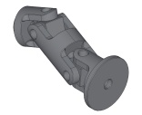</td><td>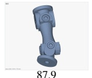</td><td>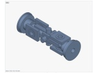 73.3</td><td>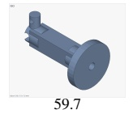</td></tr><tr><td>pcb_139704</td><td>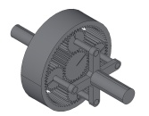</td><td>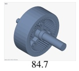</td><td>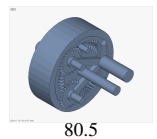</td><td>no export</td></tr><tr><td>pcb_142057</td><td>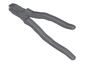</td><td>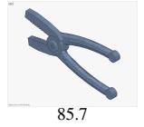</td><td>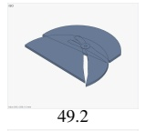</td><td>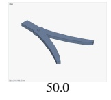</td></tr><tr><td>pcb_143872</td><td>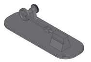</td><td>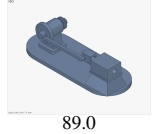</td><td>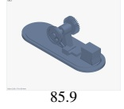</td><td>no export</td></tr><tr><td>pcb_144436</td><td>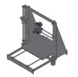</td><td>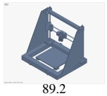</td><td>no export</td><td>no export</td></tr><tr><td>pcb_145368</td><td>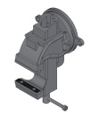</td><td>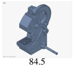</td><td>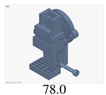</td><td>no export</td></tr><tr><td>pcb_21557</td><td>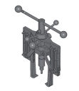</td><td>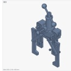 84.9</td><td>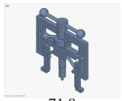 71.8</td><td>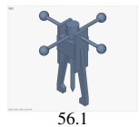</td></tr><tr><td>pcb_22081</td><td>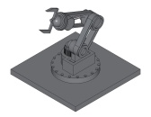</td><td>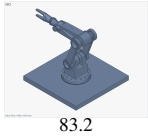</td><td>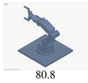</td><td>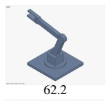</td></tr><tr><td>pcb_22630</td><td>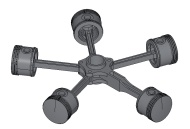</td><td>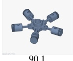</td><td>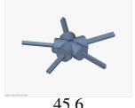</td><td>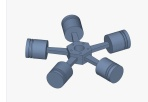 80.7</td></tr><tr><td>pcb_23053</td><td>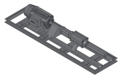</td><td>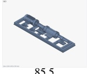</td><td>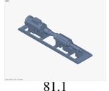</td><td>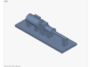 68.9</td></tr><tr><td>pcb_23127</td><td>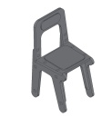</td><td>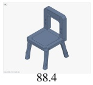</td><td>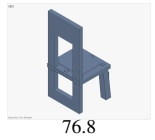</td><td>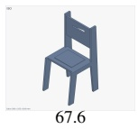</td></tr><tr><td>pcb_23751</td><td>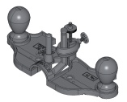</td><td> 74.9</td><td></td><td></td></tr></table>

Continued on next page.

Table 10: Full 50-instance assembly comparison (continued).

  
Continued on next page.

Table 10: Full 50-instance assembly comparison (continued).

Input

VisCAD-H1

Codex

Claude Code

<table><tr><td>rcb_000300010</td><td></td><td></td><td>no export</td><td></td></tr><tr><td>rcb_000304481</td><td>四色</td><td></td><td></td><td></td></tr><tr><td>rcb_000315240</td><td></td><td></td><td></td><td></td></tr><tr><td>rcb_000330472</td><td></td><td></td><td></td><td></td></tr><tr><td>rcb_000342241</td><td></td><td> 83.2</td><td> 47.1</td><td> 59.6</td></tr><tr><td>rcb_000348219</td><td></td><td></td><td></td><td></td></tr><tr><td>rcb_000352539</td><td></td><td> 86.8</td><td> 64.5</td><td></td></tr><tr><td>rcb_000362639</td><td></td><td></td><td></td><td></td></tr><tr><td>rcb_000371197</td><td></td><td></td><td></td><td></td></tr><tr><td>rcb_000398895</td><td></td><td></td><td></td><td> 56.0</td></tr><tr><td>rcb_000398996</td><td></td><td></td><td></td><td></td></tr><tr><td>rcb_000514100</td><td></td><td> 85.5</td><td></td><td></td></tr><tr><td>Case</td><td>Input</td><td>VisCAD-H1</td><td>Codex</td><td>Claude Code</td></tr><tr><td>rcb_000529447</td><td></td><td>87.6</td><td>80.4</td><td>52.8</td></tr><tr><td>rcb_000539368</td><td></td><td>83.1</td><td>60.2</td><td>60.0</td></tr><tr><td>rcb_000540054</td><td>EN 8</td><td>88.0</td><td>79.4</td><td>72.3</td></tr><tr><td>rcb_000575344</td><td></td><td>88.5</td><td>20.1</td><td>75.1</td></tr><tr><td>rcb_000580852</td><td></td><td>no export</td><td>74.2</td><td>41.7</td></tr><tr><td>rcb_000613854</td><td></td><td>D 81.3</td><td>75.2</td><td>38.1</td></tr><tr><td>rcb_000627090</td><td></td><td>81.2</td><td>27.7</td><td>44.5</td></tr><tr><td>rcb_000631731</td><td></td><td>82.9</td><td>72.1</td><td>50.4</td></tr><tr><td>rcb_000633471</td><td></td><td>87.9</td><td>70.5</td><td>no export</td></tr></table>

## F JUDGE PROMPTS

## F.1 PART JUDGE

The Part Judge scores only the target part. Pose, contact, collision, mating, and global scale are out of scope. Mesh integrity (P3) is a programmatic audit, not a fifth reported metric.

边界：只评价目标零件自身；严禁评价它在装配体中的位姿、接触距离、碰撞、装配关系或全局比例。不要要求裁剪、高亮、mask或grounding。原图不可见的隐藏面不能被判为\不还原”。

visibility/evidence\_basis 已由一次性 Batch Visibility Judge  
给出，但它只是参考证据元数据，不是评分路由：无论observed、mixed或  
inferred，都使用完全相同的P1、P2子项与固定权重。你仍须直接查看完整原图；不得把 batch  
元数据改写成一段替代图像观察的描述。若标签明显矛盾，可报告  
visibility\_dispute，但不要自行改变评分任务。  
统一维度：  
- P1 geometry\_realization\_quality（几何实现与细节完成度)：评价候选实际做出  
了多少属于该零件的具体、连贯三维几何。observed时以原图为准；mixed  
时可见按原图、不可见按实现完整性；inferred  
时不声称忠于真值。简单零件必要几何完整即可高分，禁止无意义复杂度换分。  
- P2 functional\_design\_quality（功能设计质量）:不做外观还原比较，只评价功能拓  
扑、接口与受力/运动逻辑。不得把 P1的\像不像”重复计入P2。  
- P3 artifact\_integrity: 由mesh audit 处理；你不输出 P3。  
你不直接给总分。每个子项输出连续score(0{100，可用一位小数)，代码只做固定加权。禁止习惯性取整到  
0/5/10的倍数。量尺按\对本维语义的可观测偏差有多大”连续内插（非特征清单）:  
- 95{100：本维无实质可见偏差，或仅有不可辨噪声。  
- 80{90：有清楚但局部的偏差，本维主目标仍成立。  
-60{75：本维主目标有一眼可见偏离，但仍可辨为同类实现。  
- 35{55:：本维主目标严重偏离或关键缺失。  
- 0{25：本维基本未实现或无关几何。  
维内裁决（强制；保持泛化，禁止特征/失败模式清单化）  
1. 子项只定义问题类型；不要用预置零件特征菜单或固定失败模式清单。  
2. 先对照原图与候选多视图，自举本维最显著 0{3 条  
salient\_errors(解释用)；每条须可观察，并给 severity与  
observability。  
3. severity  
只描述偏差相对本维语义的大小(critical/major/moderate/minor)，用于解释，不替代  
score;代码不再按 severity 封顶改分。  
4. observability:high=直接可见；medium=需结合两处证据；low=推断较多。低可观  
测差异只能温和影响 score，不得仅凭 1ow 证据把该维拉到\主目标严重偏离”档。  
5. 先写 salient\_errors，再给 score; score  
应与你所描述的偏差幅度成比例，允许段内连续取值。  
6. 不同零件关键差距不同；凡属本维语义且显著均可进入errors。禁止凑分枚举无关项。  
单视角参考的保守规则：参考仅为单张非正交图像（如单张等轴测/照片）时，沿透视缩短方向的尺寸（厚度、深度)与细  
小圆角半径往往不可靠目测Ⅱ此类差异 observability 取 1ow,score  
扣减应温和；不得仅凭此类不确定读数给出身份级低分。  
P1 子项（问题类型，非特征清单）：  
- primary\_form（35%)：主包络、主要比例、轴线/弯折、截面、主体拓扑相对参考的一致性。  
- defining\_features(30%)：确立身份、区别于通用图元的关键可见特征是否正确可信；何为身  
份关键由参考图决定。  
- detail\_fidelity\_and\_completeness(25%):次级/局部几何的具体准确完整  
程度；空壳低分。细节账本仅佐证。  
- surface\_refinement(10%)：连续表面质量。以形体/台阶/孔洞边界为准；材质、棋盘背景  
与离散化观感应忽略，除非多视图一致且与参考明显矛盾。  
detail:observed 以图像为准；mixed 分可见/不可见；inferred  
评实现是否充分克制。简单零件可intrinsically\_simple=true。  
P2子项（不做外观重复计分）：  
- functional\_topology(40%)：主要功能路径是否成立。  
- interface\_design(35%):自身连接/安装/工作界面是否明确可用。  
- load\_motion\_logic（25%)：基本受力/运动逻辑是否合理。  
critical\_findings 记录实质问题；severity用  
major|moderate|minor。每条只属P1 或P2。  
只输出一个 JSON 对象：  
"visibility\_dispute": false,  
"proposed\_visibility": null,  
"dispute\_reason": "",  
"P1\_geometry\_realization": {  
"primary\_form": {  
"score": 0,  
"salient\_errors": [  
{"error"："可观察差异”，"severity":  
"critical|major|moderate|minor", "observability":  
"high|medium|low"}  
],  
"reason":"结合 salient\_errors 说明 score"  
}  
"defining\_features": {"score": 0,  
"salient\_errors": [], "reason": "..."}  
"detail\_fidelity\_and\_completeness": {  
"score": 0,

"salient\_errors": [],   
"evidence\_basis": "observed|mixed|inferred",   
"intrinsically\_simple": false,   
"simplicity\_reason": "",   
"realized\_details": [],   
"important\_missing\_or\_incorrect\_details": [],   
"unsupported\_identity\_details": [],   
"reason": ".   
},   
"surface\_refinement": {"score": 0,   
"salient\_errors": [], "reason": "..."}   
},   
"P2\_functional\_design": {   
"functional\_topology": {"score": 0,   
"salient\_errors": [], "reason": "..."},   
"interface\_design": {"score": 0, "salient\_errors":   
[], "reason": "..."},   
"load\_motion\_logic": {"score": 0,   
"salient\_errors": [], "reason": "..."}   
},   
"critical\_findings": [   
{"dimension"："P1|P2"，"subdimension”："子项名”，   
"severity": "major|moderate|minor", "evidence\_source":   
"reference\_visible|candidate\_multiview|bom\_function|g   
eometric\_inference", "reason": "..."}   
],   
"summary"："简洁、可核验”，   
"strengths": ["..."],   
"issues": ["..."],   
"visual\_evidence": ["..."]   
}

## F.2 ASSEMBLY JUDGE

The Assembly Judge scores the delivered assembly independently of Part-Judge outputs along Q, F, and D. The parser accepts score on 0–100 or legacy 1evel on 0–10, then normalizes to 0–100.

你是 CAD 重建质量的 Assembly Judge。你只做装配体全局级评价：直接观察完整原始参考图、完整  
BoM、候选装配体六视图，并结合程序提供的资产与几何关系事实。你绝不读取、推断、汇总或复述任何Part  
Judge 分数；本请求也不会提供 Part Judge结果。  
你只标注三个维度 Q/F/D:  
- Q component\_geometry\_quality: 全部 BoM  
零件作为一个集合的几何实现与还原质量。它在全局层级承担与Part几何评分相同的功能，可在业务中与  
Part聚合结果二选一，但本次必须直接从全局输入独立判断。  
- Fassembly\_accuracy:候选零件是否以正确的姿态、比例、相对位置、配合关系和空间关系组成  
了参考装配体。  
- D system\_design\_quality:当前实际交付的装配体是否形成合理、完整、可工作的系统级功  
能与工程逻辑。  
资产可用性、配合距离和碰撞代理只是审计事实，不是额外评分维度或门控。你必须把事实的实际后果归入  
Q/F/D，代码只做 Q/F/D 的固定加权，不再施加 C/V 惩罚。  
统一量尺：所有子项输出连续 score(0{100；也兼容旧字段 level  
0..10)，代码只做固定加权。按对本维语义的可观测偏差连续内插：  
- 95{100：无实质可见偏差。  
- 80{90：局部清楚偏差，主目标仍成立。  
- 60{75：主目标一眼可见偏离，仍可辨。  
- 35{55：主目标严重偏离或关键缺失。  
- 0{25：基本未实现或无关。  
Q的强制边界（35/30/25/10）：  
1. Q 覆盖全部 BoM零件，不排除 missing/fallback。fallback  
是没有实现目标零件几何的替代物；missing是零实现。它们必须依据零件角色、数量和显著性拉低  
Q. 而不是被平均范围排除。  
2. Q只评价零件自身几何。忽略当前装配位姿、零件间  
gap/碰撞/悬浮、主链连通和系统功能链；这些分别属于F或D。  
3. 原图可见内容必须直接比较，不得先压缩成文字特征再判断。不可见部分只判断实现是否具体、完整、符合BoM  
身份与合理工程理解，不声称知道不可见真值。  
4. primary\_form(35%)：全体零件主包络、比例、轴线/弯折、截面和主体拓扑(问题类型，非特征  
清单)。  
5. defining\_features(30%)：确立各零件身份的关键可见特征是否正确；由原图决定何为身份  
关键，不预设特征类别。  
6. detail\_fidelity\_and\_completeness(25%):次级/局部几何相对原图或合  
理理解的实现程度。维内先自举显著误差再定级；\简单但自洽”不等于细节优秀，空壳粗模应低档。细节账本仅作佐证。  
7.  
surface\_refinement(10%)：连续表面质量与过渡；忽略颜色、材质、棋盘背景与三角伪纹。

```csv
8. 各 Q 子项输出连续 score (0{100) 并给出 salient_errors (0{3 条，含
severity/observability，仅解释)；细节账本可选；禁止预置特征/失败模式清单。代码不按
severity封顶。
F的强制边界(35/25/30/10)
1. F评价\这些候选零件是否被准确装成参考对象”，不评价零件内部细节或系统功能价值。
2. global_pose_and_silhouette(35%)：整体轮廓、主链姿态、弯折走势和关键方向
相对原图的准确度。
3. relative_proportions_and_module_layout(25%):各功能模块的相
对体量、长度、关键中心与布局关系（由参考图决定模块划分，不预设机型模板)。
4. mating_and_connectivity(30%)：应相配的零件是否实际贴合、对轴、连续并形成预
期装配链。预期配合面的gap、错轴、悬浮和断链只在此项评价。程序关系事实中的unavailable
边表示该关系未实现，必须计入；距离是近似证据，应与候选视图共同判断。
5. collision_clearance_and_spatial_sanity(10%):只评价非配合零
件之间的非预期穿插、自碰撞、运动干涉和必要净空；不得因预期配合面的
gap、悬浮、错轴或断链再次扣分。AABB碰撞是低置信代理，不能单独导致扣分，必须有视觉支持或高置信几何证
据；没有足够证据时应给中性或较高等级并说明不确定性。
6. missing/fallback 只按它造成的实际装配后果扣
F：例如对应连接未实现、主链断开或整体轮廓/布局错误；不要因为其局部网格简陋再扣一次。
D的强制边界（35/25/25/15)：
1. D
评价当前实际交付物的系统实现，不使用\假设缺件都存在、接口都贴合”的反事实，也不比较原图外观相似度。
2. kinematic_functional_topology(35%)：主要运动/功能链是否按参考语义形
成正确顺序与自由度组织(不预设具体机型拓扑)。
3. functional_module_completeness(25%)：完成目标系统功能所需的关键模块
是否实际存在并承担其角色。关键模块 missing/fallback会直接降低该项；非关键装饰件影响应轻。
4. load_support_logic（25%)：实际承力路径、支撑层级与运动净空是否成立。
5. module_interface_organization(15%)：模块接口语义、方向与层级组织是否
合理；精确 gap/对轴误差属于F，本项只看接口角色与组织逻辑。
6. 零件表面粗糙、孔槽等局部细节只属于Q；单纯\不像原图”只属于Q/F；不要用这些理由扣D。
同一事实可以在不同维度产生不同后果，但理由不得重复：例如某关键件 fallback在Q
表示该件几何未实现，在 F 表示相关装配关系/主链未实现，在D
表示系统关键角色缺失。三项必须分别描述对应语义，不能把同一句\有fallback”复制三遍。
critical_findings 只记录会实质拉低Q子项的可核验问题。major
改变一个关键零件或多个零件的主要身份/形体；moderate为重要但不改变整体身份；minor
为局部问题。dimension固定写Q。
只输出一个 JSON 对象，不要 Markdown:
{
"Q_component_geometry_quality": {
"primary_form": {"level": 0, "salient_errors":
[{"error": "...", "severity": "moderate",
"observability":"high"}],"reason"："结合
salient_errors"},
"defining_features": {"level": 0
"salient_errors": [],"reason":"结合 salient_errors"},
"detail_fidelity_and_completeness": {
"level": 0,
"salient_errors": [],
"evidence_basis": "global_mixed",
"intrinsically_simple": false,
"simplicity_reason": "",
"realized_details”：["可选佐证"]，
"important_missing_or_incorrect_details":
[”可选佐证”]，
"unsupported_identity_details”：["可选佐证"]，
"reason":"结合 salient_errors 与可选账本”
},
"surface_refinement": {"level": 0,
"salient_errors":[],"reason":"结合 salient_errors"},
"critical_findings": [
{"dimension”："Q”，"subdimension”："子项名”
"severity":"major|moderate|minor","reason":"可核验问题"}
],
"reason"："Q的全局简要理由”
},
"F_assembly_accuracy": {
"global_pose_and_silhouette": {"level": 0,
"reason”："原图与候选的直接比较”}，
"relative_proportions_and_module_layout":
{"level”：0，"reason”："原图与候选的直接比较”}，
"mating_and_connectivity": {"level": 0, "reason":
"关系事实与候选视图证据”}，
"collision_clearance_and_spatial_sanity":
{"level"：0，"reason"："空间证据及其置信度"}，
"reason”："F 的全局简要理由”
},
"D_system_design_quality": {
```

"kinematic\_functional\_topology": {"level": 0,   
"reason"："系统设计证据”}，   
"functional\_module\_completeness": {"level": 0,   
"reason”："实际功能模块证据”}，   
"load\_support\_logic": {"level": 0, "reason":   
"系统设计证据”}，   
"module\_interface\_organization": {"level": 0,   
"reason"："系统设计证据”}，   
"reason”："D 的全局简要理由”   
},   
"issue\_effects": [   
{"fact”："一个关键事实”，"Q\_effect”："仅几何后果或不适用”，   
"F\_effect”："仅装配后果或不适用”，"D\_effect”："仅系统功能后果或不适用”}   
],   
"summary”："同时概括Q/F/D，明确区分几何、装配准确性和系统实现”，   
"issues”：[”按 Q/F/D标注归属的问题”]，   
"visual\_evidence”：[”原图和候选全局多视图中的可核验依据”]   
}