# What Do Hallucinations Reveal About Multimodal Reasoning? Diagnosing Visual Grounding Failures via Contrastive Decoding Probes

Zhipeng Zhao1, Wenxu Wang1, Peishun Liu1, Ruichun Tang1,\*

1Ocean University of China

{zhaozhipeng}@stu.ouc.edu.cn

{wangwenxu, liups, tangruichun}@ouc.edu.cn

\*Corresponding author

## Abstract

When strong multimodal models are widely available, progress requires new scientific methodologies beyond benchmark scores— using models as instruments for understanding behavior. We address this by asking: can we use large vision-language models (LVLMs) as experimental instruments for studying their own failure dynamics? Focusing on visual hallucination, we introduce SAFE, a training-free decoding framework that contrasts visuallygrounded and vision-ablated generation paths to produce a token-level contrastive grounding score that identifies when the model favors linguistic priors over visual evidence. This signal serves dual roles: as a practical proxy for detecting visually-ungrounded tokens, and as the basis for decoding-time penalties. Our analysis yields three empirical observations: visual dependency decays over generation, hallucinations co-occur in temporal clusters, and early intervention reduces clustering without substantially degrading fluency. On MMHal-Bench, SAFE substantially outperforms all compared baselines; results elsewhere are more mixed. We argue that designing contrastive probes exemplifies a broader mission: using models as instruments for scientific understanding. Code: https://github.com/ zhaozhipeng1997/SAFE\_public.

## 1 Introduction

When strong general-purpose models are increasingly available, a foundational question arises: what should the missions of NLP research be? One answer, which we pursue here, is that progress demands new scientific methodologies—using models as experimental instruments to probe how and why they behave, rather than treating them only as systems to optimize against static leaderboards.

We apply this perspective to visual-language hallucination in LVLMs (Liu et al., 2023; Bai et al., 2025; Wu et al., 2024). As illustrated in Figure 1, even strong models routinely generate text contradicting visual input, eroding trustworthiness.

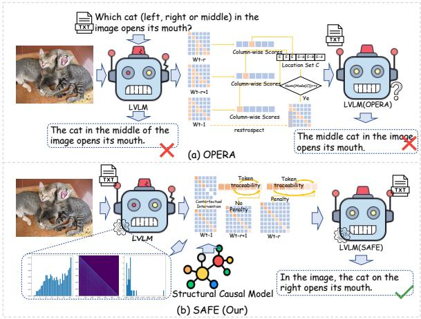  
Figure 1: Comparison of hallucination mitigation paradigms and SAFE.

Current hallucination research is dominated by two paradigms: training-time interventions (Chen et al., 2025; Zhang et al., 2025a) and post-hoc decoding heuristics (Liu et al., 2025; Huang et al., 2024). Both improve benchmarks but treat hallucination as a defect to suppress rather than a phenomenon to study. We argue that understanding how models negotiate between visual evidence and linguistic priors requires a diagnostic instrument— not another mitigation technique—that quantifies token-level visual grounding and reveals temporal failure dynamics.

We introduce contrastive probing: by running generation paths with and without visual input and computing the token-level log-probability gap, we obtain a contrastive grounding score as a real-time proxy for visual dependency. We emphasize this is a diagnostic heuristic, not formal causal identification. We call the framework SAFE (Structural-Aware Faithfulness Enhancement), operating along two dimensions:

• As a diagnostic probe: Token-level visual dependency scores identify which tokens lack grounding and when language priors dominate.

• As a mitigation method: SAFE penalizes low-dependency tokens via dual-path contrast with adaptive penalty decay and competitive inhibition.

Across five benchmarks and three 7B architectures, visual dependency decays over decoding, hallucinations cluster temporally, and early intervention reduces clustering without substantially degrading fluency. The method is particularly effective on open-ended hallucination benchmarks (MMHal-Bench), with mixed results where external knowledge or visual ambiguity dominates. This work illustrates a research direction we argue is increasingly central: designing contrastive probes that transform models into instruments for scientific understanding.

## 2 Related Work

LVLMs such as LLaVA-1.5 (Liu et al., 2023), InstructBLIP (Dai et al., 2023), and Shikra (Chen et al., 2023) integrate LLMs (Guo et al., 2025; OpenAI et al., 2024) with visual encoders, yet all exhibit visual-language hallucinations (Zhang et al., 2025b; Tonmoy et al., 2024). This pervasiveness suggests hallucination is rooted in how models balance visual evidence against strong language priors.

## 2.1 Hallucination Mitigation: Three Analytical Paradigms

Training-based alignment. Methods fine-tune models on curated data to strengthen visualsemantic correspondence (Chen et al., 2025; Zhang et al., 2025a) or modify architectures for visual feature integration (Xie et al., 2024; Shang et al., 2025). While effective given high-quality data, they obscure why hallucination rates decrease and generalize poorly to unseen visual concepts.

Heuristic decoding interventions. OPERA (Huang et al., 2024) penalizes overreliance on summary tokens. Contrastive decoding (O’Brien and Lewis, 2023) has spawned multimodal variants: VCD (Leng et al., 2024), ICD (Wang et al., 2024), ConVis (Park et al., 2025), LCD (Manevich and Tsarfaty, 2024), CATCH (Kan et al., 2024), IFCD (Wang et al., 2025a), SDCD (Xia et al., 2026), ASCD (Wang et al., 2026). SIRA (Qin et al., 2026) constructs internal counterfactuals via attention masking. DCD (Wang et al., 2025b) and INTER (Dong et al., 2025) correct decoding online. Dropout Decoding (Fang et al., 2025b) and ECD (Fieback et al., 2025) use uncertainty masking. Calibration by Fang et al. (2025a) targets visual-language balance; ClearSight (Yin et al., 2025) amplifies visual signals. Grounding-score methods include VGS-Decoding (Kolli et al., 2026) and IECD2 (Bangde and Roy, 2026). CLIPguided (Deng et al., 2024), GLSim (Park and Li, 2025), and HACL (Jiang et al., 2024) use auxiliary vision models or contrastive learning. Domain extensions: Med-VCD (Mahdavi et al., 2026), 3D-VCD (Ogunleye et al., 2026). SAFE’s contribution is the dual-forward-pass log-probability gap with parameterized penalty and diagnostic analysis.

Token-level visual diagnostics. VISTA (Li et al., 2025) analyzes visual information decay with token-level steering. TruthPrInt (Duan et al., 2025) uses latent truthful signals as per-token indicators. Cao et al. (2026) and Nguyen et al. (2026) examine attention structure and fine-grained token grounding for hallucination detection. These share SAFE’s premise; SAFE’s distinction is the logprobability gap between dual passes paired with penalty-based control.

Diagnosis-informed decoding. Prior paradigms do not systematically probe when visual evidence is abandoned or how ungrounded tokens affect generation. Our contrastive probing quantifies tokenlevel visual dependency. Geigle et al. (2024) show stronger grounding does not always reduce hallucination, contextualizing SAFE’s mixed results. The key distinction is that the same signal drives analysis and mitigation within a unified framework.

## 2.2 Empirical Diagnosis via Contrastive Probing

We connect to controlled manipulation for probing neural models: counterfactual analysis has examined linguistic representations, and perturbationbased methods have studied vision-language relationships—mostly for post-hoc explanation, not real-time diagnosis. We operationalize contrastive probing—comparing behavior with and without a targeted input—as a real-time signal embedded in decoding.

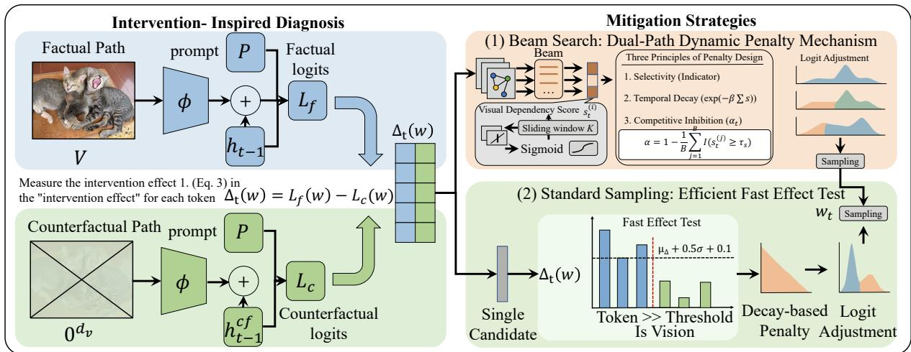  
Figure 2: SAFE dual-path decoding: visually-grounded vs vision-ablated paths with progressive grounding penalty.

## 3 Method

## 3.1 The Central Question: How to Measure a Token’s Visual Grounding?

To what extent does a token depend on visual information versus linguistic priors? Answering this requires isolating visual contributions—a contrastive diagnostic probe. Let the LVLM M be decomposed into a visual encoder $\phi : \mathcal { V }  \mathbb { R } ^ { d _ { v } }$ and language decoder $\psi : \mathcal { P }  \mathbb { R } ^ { d _ { l } }$ . At time step t, the hidden state $h _ { t } \in \mathbb { R } ^ { d _ { h } }$ evolves as:

$$
h _ { t } = f _ { \theta } \left( [ \phi ( \mathcal { V } ) ; \psi ( \mathcal { P } ) ] , h _ { t - 1 } \right)\tag{1}
$$

where $\phi$ maps image V to visual features, ψ processes textual prompts $\mathcal { P } , [ \cdot ; \cdot ]$ denotes concatenation, and $f _ { \theta }$ is a parameterized Transformer layer.

Equation (1) cannot separate visual from linguistic contributions. To isolate the visual contribution, we create a diagnostic contrast by zeroing visual features while preserving all other components (see Appendix E for conceptual motivation and discussion of alternative ablation strategies). We use do-notation descriptively, by analogy to causal formalisms, without implying satisfaction of formal identification conditions. This yields a vision-ablated state:

$$
h _ { t } ^ { c f } = f _ { \theta } \left( [ \mathbf { 0 } ^ { d _ { v } } ; \boldsymbol { \psi } ( \mathcal { P } ) ] , h _ { t - 1 } ^ { c f } \right)\tag{2}
$$

where $\mathbf { 0 } ^ { d _ { v } }$ replaces visual features with a zero vector of the same dimension $d _ { v }$ as $\phi ( \mathcal { V } )$ . The two paths differ only in visual input, isolating the visual contribution to token probabilities. We choose zero ablation for determinism, maximal contrast, and preserved linguistic context. Compared to learned null embeddings (MMHalBench 3.48 vs. 3.55), shuffled tokens (3.22), and Gaussian noise (3.15), zero ablation performs comparably to learned alternatives while being simpler (full details in Appendix E). The diagnostic contrast score is the log-probability difference:

$$
\Delta _ { t } ( w ) = \log P _ { \mathcal { F } } ( w | h _ { t } ) - \log P _ { \mathcal { C } } ( w | h _ { t } ^ { c f } )\tag{3}
$$

where $P _ { \mathcal { F } }$ and $P _ { C }$ are visually-grounded and visionablated probabilities. $\Delta _ { t } ( w ) > 0$ means visual information increases the token’s probability (visually grounded); $\Delta _ { t } ( w ) \approx 0$ signals linguistic-prior dominance. This scalar, computed at every step for every candidate, is SAFE’s core diagnostic signal. We emphasize that $\Delta _ { t } ( w )$ is a diagnostic statistic whose validity rests on its empirical utility for detecting and suppressing hallucinations, not on satisfaction of formal causal identification assumptions.

## 3.2 From Diagnosis to Mitigation: The Dual-Path Penalty Mechanism

$\Delta _ { t } ( w )$ provides a per-token grounding estimate. We translate this into mitigation via three principles: sliding-window aggregation for robustness; time-sensitive penalties—strong early, decaying as context accumulates; and global relaxation when most candidates are well-grounded. The penalty is:

$$
s _ { t } ^ { ( i ) } = \sigma \left( \frac { 1 } { \operatorname* { m i n } ( K , t ) } \sum _ { k = \operatorname* { m a x } ( 1 , t - K + 1 ) } ^ { t } \Delta _ { k } ( w ^ { ( i ) } ) \right)\tag{4}
$$

where $\sigma ( \cdot )$ normalizes to $( 0 , 1 )$ and min $( K , t )$ handles boundaries. We design three penalty properties: (i) Selectivity—only tokens below $\tau _ { s }$ penalized; (ii) Temporal deca $\underline { { \underline { { \operatorname { e x p } } } ( - \beta \sum s ) } }$ weakens penalty as visual evidence accumulates; (iii)

Competitive inhibition— $\mathbf { \nabla } \cdot \alpha _ { t }$ relaxes when candidates are well-grounded.

$$
\mathcal { P } _ { t } ^ { ( i ) } = \lambda \cdot \exp \left( - \beta \sum _ { \tau = 1 } ^ { t } s _ { \tau } ^ { ( i ) } \right) \cdot \mathbb { I } ( s _ { t } ^ { ( i ) } < \tau _ { s } )\tag{5}
$$

where $\lambda , \beta , \tau _ { s }$ are penalty strength, decay rate, and threshold. The indicator, exponential, and $\alpha _ { t }$ (Equation 6) implement the three properties. The final logit adjustment with competitive inhibition is:

$$
\begin{array} { r l r } { \log  { P _ { \mathrm { a d j } } ^ { ( i ) } } ( w ) = \log  { P _ { \mathcal { F } } ^ { ( i ) } } ( w ) -  { \mathcal { P } _ { t } ^ { ( i ) } } \cdot  { \alpha } _ { t } } & { } & \\ { \qquad { \alpha } _ { t } = 1 - \displaystyle \frac { 1 } { B } \sum _ { j = 1 } ^ { B }  { \mathbb { I } ( s _ { t } ^ { ( j ) } \geq \tau _ { s } ) } } & { } & \end{array}\tag{6}
$$

where $\alpha _ { t }$ decreases as more candidates meet the threshold, relaxing the global penalty when visual dependency is already strong. For reproducibility, our default hyperparameters are: window length $K { = } 5 ,$ , penalty strength $\lambda { = } 2 . 0 .$ , decay rate $\beta { = } 0 . 1$ threshold $\tau _ { s } { = } 0 . 3$ , beam size $B { = } 3 .$ , and temperature 1.0. Sensitivity to these choices is reported in Appendix J.

## 3.3 Two Variants of the Same Diagnostic Principle

The full mechanism targets beam search. For sampling, a lightweight variant (Section 3.4) preserves the dual-path contrast with a fast effect test. Beam uses sliding-window aggregation, exponential decay, and competitive inhibition; sampling uses a single global threshold with simple decay. We treat them as related heuristics within a common framework.

## 3.4 Efficient Approximation for Standard Sampling

For standard sampling, we present a lightweight variant preserving the dual-path contrast while replacing the penalty machinery with a fast effect test (see Appendix E):

$$
P ( Y \mid X { \mathrm { ~ a b l a t e d } } ) = \sum _ { Z } P ( Y \mid X , Z ) P ( Z )\tag{7}
$$

illustrating the contrastive motivation with shared language context $Z ,$ though exact marginalization is intractable. We approximate by computing $\Delta = \mathbf { L } _ { f } - \mathbf { L } _ { c }$ per step with shared history. The diagnostic test uses a threshold motivated by Cohen’s d:

$$
\mathrm { i s } _ { - } \mathrm { v i s i o n } ( w ) = \mathbb { I } \left( \Delta ( w ) > \mu _ { \Delta } + 0 . 5 \cdot \sigma _ { \Delta } + 0 . 1 \right)\tag{8}
$$

where $0 . 5 \cdot \sigma _ { \Delta }$ corresponds to Cohen’s d effect size (Cohen, 2013); 0.1 prevents false positives when $\sigma _ { \Delta }$ ≈ 0 (Appendix D). Non-visual tokens are penalized analogously:

$$
\mathbf { L } _ { \mathrm { a d j u s t e d } } ( w ) = \mathbf { L } ( w ) - \lambda \cdot \gamma ^ { t } \cdot ( 1 - \mathrm { i s \_ v i s i o n } ( w ) )\tag{9}
$$

with $\gamma ^ { t } = 1 / ( 1 + 0 . 1 t )$ mirroring temporal decay. This preserves the core principle—measure visual dependency, then intervene—with reduced overhead.

## 3.5 The Unified SAFE Decoding Algorithm

Algorithm 1 unifies diagnosis and mitigation: at each step, the diagnostic contrast $\Delta _ { t }$ is computed first, then the penalty mechanism (beam search) or fast effect test (sampling) is applied. The algorithm operates as follows:

## 4 Experiment

We ask two questions: do SAFE’s diagnostic signals improve benchmark performance, and what patterns do internal signals reveal? We validate on benchmarks (Section 4.2), then analyze token-level dependency, temporal clustering, and fluency (Sections 4.2.1–4.2.3). Default hyperparameters $( K { = } 5$ $\lambda { = } 2 . 0 , \beta { = } 0 . 1 , \tau _ { s } { = } 0 . 3 , B { = } 3$ , temperature 1.0) are selected on a validation split and used uniformly across all models and benchmarks; sensitivity analysis is in the appendix. SAFE incurs ∼2× the inference cost of comparable methods (Table 16, Limitations).

## 4.1 Benchmarks and Experimental Setup

We evaluate on five benchmarks: Hallusion-Bench (Guan et al., 2024) (language hallucinations and visual illusions), MMHalBench (Sun et al., 2024) (open-ended hallucination), CHAIR (Rohrbach et al., 2018) (object hallucination at sentence/instance levels), POPE (Li et al., 2023) (object existence), and MMMU (Yue et al., 2024) (multimodal reasoning). Beam search for MMHalBench, CHAIR, POPE; sampling for HallusionBench and MMMU. Baselines: Sample, Beam, OPERA (Huang et al., 2024), VCD (Leng et al., 2024), AGLA (An et al., 2025), SID (Huo et al., 2025), ICD (Wang et al., 2024) on LLaVA-1.5 (Liu et al., 2023), InstructBLIP (Dai et al., 2023), Shikra (Chen et al., 2023) (all 7B).

<table><tr><td rowspan="2">Method</td><td rowspan="2">qAcc↑ fAcc↑</td><td rowspan="2"></td><td colspan="3">LV Diagnosis</td><td colspan="2">aAcc</td><td>Pct. Diff</td><td>FP Ratio</td><td colspan="3">Consistency</td></tr><tr><td>LH↓</td><td>VI↓</td><td>Mixed↓</td><td>Easy↑</td><td>Hard↑</td><td>(~0)</td><td>(~ 0.5)</td><td>C↑</td><td>I</td><td>W↑</td></tr><tr><td>Sample</td><td>10.76</td><td>17.91</td><td>34.96</td><td>42.40</td><td>22.62</td><td>41.09</td><td>38.60</td><td>0.29</td><td>0.76</td><td>17.91</td><td>61.84</td><td>20.23</td></tr><tr><td>Beam</td><td>9.01</td><td>15.89</td><td>36.08</td><td>41.99</td><td>21.92</td><td>40.87</td><td>37.67</td><td>0.31</td><td>0.77</td><td>15.89</td><td>63.58</td><td>20.52</td></tr><tr><td>OPERA</td><td>11.86</td><td>17.05</td><td>34.86</td><td>39.14</td><td>25.98</td><td>42.63</td><td>41.86</td><td>0.27</td><td>0.75</td><td>17.05</td><td>65.31</td><td>17.63</td></tr><tr><td>VCD</td><td>14.72</td><td>15.31</td><td>30.47</td><td>44.86</td><td>24.65</td><td>39.56</td><td>34.65</td><td>0.24</td><td>0.71</td><td>15.31</td><td>61.27</td><td>23.41</td></tr><tr><td>AGLA</td><td>12.52</td><td>15.02</td><td>27.81</td><td>49.40</td><td>22.78</td><td>36.04</td><td>36.51</td><td>0.22</td><td>0.68</td><td>15.02</td><td>62.71</td><td>22.25</td></tr><tr><td>SID</td><td>10.98</td><td>15.31</td><td>34.44</td><td>46.82</td><td>18.73</td><td>38.46</td><td>34.65</td><td>0.25</td><td>0.71</td><td>15.31</td><td>60.11</td><td>24.56</td></tr><tr><td>ICD</td><td>12.96</td><td>16.18</td><td>31.20</td><td>44.92</td><td>23.86</td><td>41.75</td><td>36.51</td><td>0.24</td><td>0.71</td><td>16.18</td><td>62.71</td><td>21.09</td></tr><tr><td>SAFE</td><td>14.50</td><td>17.34</td><td>35.15</td><td>42.50</td><td>22.34</td><td>41.53</td><td>37.90</td><td>0.27</td><td>0.73</td><td>17.34</td><td>62.13</td><td>20.52</td></tr></table>

Table 1: Performance on HallusionBench using LLaVA-1.5. qAcc: Question Pair Accuracy; fAcc: Figure Accuracy; LH: Language Hallucination; VI: Visual Illusion; C/I/W: Correct/Inconsistent/Wrong.
<table><tr><td rowspan="2">Method</td><td colspan="4">Random</td><td colspan="4">Popular</td><td colspan="4">Adversarial</td></tr><tr><td>Acc↑</td><td>Prec↑</td><td>Recall↑</td><td>F1↑</td><td>Acc↑</td><td>Prec↑</td><td>Recall↑</td><td>F1↑</td><td>Acc↑</td><td>Prec↑</td><td>Recall↑</td><td>F1↑</td></tr><tr><td>Sample</td><td>82.88</td><td>92.03</td><td>73.13</td><td>81.50</td><td>80.90</td><td>86.81</td><td>72.86</td><td>79.23</td><td>77.50</td><td>80.53</td><td>72.53</td><td>76.32</td></tr><tr><td>Beam</td><td>86.66</td><td>97.44</td><td>76.13</td><td>85.47</td><td>85.26</td><td>93.14</td><td>76.13</td><td>83.78</td><td>83.63</td><td>89.56</td><td>76.13</td><td>82.30</td></tr><tr><td>OPERA</td><td>88.10</td><td>95.50</td><td>80.73</td><td>87.50</td><td>85.93</td><td>90.10</td><td>80.73</td><td>85.16</td><td>82.56</td><td>83.80</td><td>80.73</td><td>82.24</td></tr><tr><td>VCD</td><td>81.75</td><td>89.81</td><td>72.86</td><td>80.45</td><td>81.73</td><td>85.68</td><td>76.20</td><td>80.66</td><td>77.26</td><td>79.21</td><td>73.93</td><td>76.48</td></tr><tr><td>AGLA</td><td>82.61</td><td>92.91</td><td>71.73</td><td>80.96</td><td>82.30</td><td>88.97</td><td>73.73</td><td>80.64</td><td>78.60</td><td>82.35</td><td>72.80</td><td>77.28</td></tr><tr><td>SID</td><td>83.47</td><td>85.40</td><td>81.93</td><td>83.63</td><td>80.80</td><td>79.35</td><td>83.26</td><td>81.26</td><td>74.76</td><td>71.51</td><td>82.33</td><td>76.54</td></tr><tr><td>ICD</td><td>85.87</td><td>85.65</td><td>87.20</td><td>86.42</td><td>82.46</td><td>79.87</td><td>86.80</td><td>83.19</td><td>75.83</td><td>71.27</td><td>86.53</td><td>78.16</td></tr><tr><td>SAFE</td><td>88.96</td><td>95.94</td><td>82.06</td><td>88.46</td><td>86.46</td><td>89.98</td><td>82.06</td><td>85.84</td><td>82.63</td><td>83.00</td><td>82.06</td><td>82.53</td></tr></table>

Table 2: POPE results on LLaVA-1.5

## 4.2 Results

We test whether SAFE’s detected patterns correspond to standard benchmark penalties. All experiments: LLaVA-1.5, InstructBLIP, Shikra (7B), temperature 1.0, beam size 3. HallusionBench. HallusionBench includes visual illusions where visual reliance can produce errors, making “visual dependency” ambiguous. SAFE achieves competitive qAcc (14.50) and fAcc (17.34), but VCD has higher qAcc (14.72) and OPERA comparable fAcc (17.05). This is expected: dependency diagnosis works best with reliable visual evidence.

MMHalBench. SAFE achieves overall score 3.55—more than double the nearest baseline (OPERA, 1.69)—with hallucination ratio 0.44 versus 0.74–0.83 (Table 3). Gains are largest in Relation (4.25) and Environment (4.42), categories penalizing visually inconsistent claims about spatial and contextual relationships—precisely SAFE’s target. Unlike CHAIR (object-level string matching) or POPE (binary questions), MMHalBench uses GPT-based evaluation of free-form answers, making it sensitive to visual-semantic consistency across multi-token descriptions. This gain warrants caution: MMHalBench relies on a single GPT-based judge over 96 samples, and SAFE’s conservative generation may be scored favorably in this rubric. We treat this as strong but benchmarkspecific evidence.

CHAIR. SAFE achieves CHAIRi 14.8 (competitive with OPERA’s 14.5) and recall 74.6 (Table 5), but OPERA is better on CHAIRs (50.5 vs. 53.0). On Shikra, SAFE ties best CHAIRi (13.8) but worst CHAIRs (60.0) (Appendix Tables 12–13). Instance-level strength is expected—token diagnosis detects unsupported objects—while sentencelevel gap reflects discourse planning beyond pertoken scope. SAFE generates shorter captions (e.g., 95.3 vs. 101.8 for LLaVA-1.5); examined in Section 4.2.1.

POPE. SAFE achieves highest precision (95.94 Random, 89.98 Popular) with stable Recall (82.06), confirming the penalty targets visually unsupported tokens. Adversarial results (83.00/82.06) mirror this balanced pattern. See Figure 3.

MMMU. MMMU reveals the boundary of visual dependency diagnosis: SAFE’s overall score (0.341 vs. Beam 0.338) is marginally higher but inconsistent. Humanities & Social Sciences (0.517) benefits from visual interpretation, while Science (0.233 vs. Sample 0.320) shows the method cannot help when answers require non-visual knowledge. MMMU illustrates a clear domain boundary. See Figure 4 and appendix.

<table><tr><td rowspan="2">Method</td><td rowspan="2">Overall↑</td><td rowspan="2">HR↓</td><td colspan="8">Categories</td></tr><tr><td>Attri↑</td><td>Adver↑</td><td>Comp↑</td><td>Counting ↑</td><td>Relation↑</td><td>Env↑</td><td>Holistic↑</td><td>Other↑</td></tr><tr><td>Sample</td><td>1.54</td><td>0.75</td><td>2.00</td><td>0.17</td><td>2.33</td><td>1.42</td><td>1.92</td><td>2.08</td><td>0.58</td><td>1.83</td></tr><tr><td>Beam</td><td>1.49</td><td>0.76</td><td>1.83</td><td>1.17</td><td>1.42</td><td>1.83</td><td>2.17</td><td>1.58</td><td>1.08</td><td>0.83</td></tr><tr><td>OPERA</td><td>1.69</td><td>0.74</td><td>2.17</td><td>1.17</td><td>2.25</td><td>1.83</td><td>1.25</td><td>2.08</td><td>1.42</td><td>1.33</td></tr><tr><td>VCD</td><td>1.33</td><td>0.83</td><td>1.08</td><td>1.50</td><td>2.00</td><td>1.00</td><td>1.58</td><td>1.33</td><td>0.83</td><td>1.33</td></tr><tr><td>AGLA</td><td>1.32</td><td>0.82</td><td>1.83</td><td>1.42</td><td>0.92</td><td>1.00</td><td>1.50</td><td>2.08</td><td>0.75</td><td>1.08</td></tr><tr><td>SID</td><td>1.34</td><td>0.80</td><td>1.75</td><td>1.58</td><td>2.25</td><td>0.83</td><td>1.08</td><td>1.08</td><td>0.58</td><td>1.58</td></tr><tr><td>ICD</td><td>1.41</td><td>0.81</td><td>2.17</td><td>1.00</td><td>1.17</td><td>1.67</td><td>1.75</td><td>1.75</td><td>0.58</td><td>1.17</td></tr><tr><td>SAFE</td><td>3.55</td><td>0.44</td><td>3.25</td><td>3.17</td><td>3.83</td><td>3.08</td><td>4.25</td><td>4.42</td><td>3.42</td><td>3.0</td></tr></table>

Table 3: Performance on MMHalBench using LLaVA-1.5. HR: Hallucination Ratio; Attri: Attribute; Adver: Adversarial; Comp: Comparison; Env: Environment.

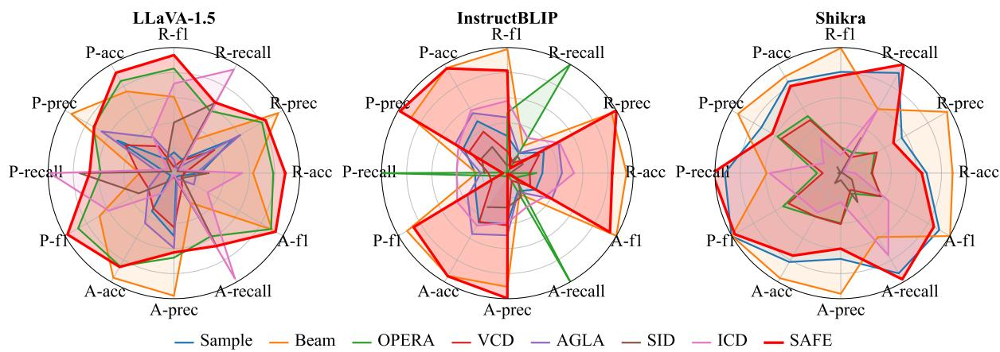  
Figure 3: POPE results across models. R/P/A: Random/Popular/Adversarial.

## 4.2.1 Token-Level Visual Dependency Analysis

Table 6 reports visually associated tokens—tokens where $\Delta _ { t }$ indicates visual grounding—with and without SAFE. SAFE increases the proportion of visually grounded tokens (HB: 5.43%→5.53%; MB: 1.13%→1.41%) while total tokens decreases (HB: $3 1 , 8 1 4 \mathrm {  } 3 1 , 7 7 8$ ; MB: 3,715→3,546). This suggests SAFE selectively suppresses low-dependency tokens, yielding shorter, more visually-attentive outputs.

To verify the “visual dependency decay” claim, we collected per-step $\Delta _ { t }$ trajectories via dual-path inference on COCO images. Figure 5 shows aggregate trajectories: LLaVA $\Delta _ { t }$ declines from 0.39 (first half) to 0.07 (second half); Shikra from 1.13 to 0.41, providing direct evidence that visual grounding weakens as language priors accumulate.1

Length-controlled analysis. To address the concern that SAFE’s gains may reflect output shortening, we compute length-normalized $\begin{array} { l l l } { \mathrm { C H A I R s } _ { \mathrm { n o r m } } } & { = } & { \mathrm { C H A I R s } / } \end{array}$ mean caption length and hallucination rate per 100 tokens. On LLaVA-1.5, SAFE achieves CH $\mathrm { A I R s } _ { \mathrm { n o r m } } { = } 0 . 6 0 \%$ (Beam 0.62%, Sample 0.65%), 16.0 hallucinated tokens/100 (Beam 16.2, Sample 17.8). Improvement direction persists after normalization, though margins are modest. On Shikra, OPERA (0.59%) and VCD (0.60%) outperform SAFE (0.74%) on $\mathrm { C H A I R s } _ { \mathrm { n o r m } }$ , consistent with weaker sentencelevel performance on this architecture. Full results in Appendix A.

## 4.2.2 Validating the Diagnostic Signal

To verify that $\Delta _ { t }$ captures grounding-specific information, we compare it against token-level entropy H and confidence max $p ( w )$ for predicting CHAIR hallucination labels on 50 COCO images (same beam-search sequences). $\Delta _ { t }$ achieves AUROC 0.588, outperforming entropy (0.380) and confidence (0.401), both of which fall below random (0.50). A calibration analysis confirms reliability: hallucination rate decreases monotonically from 1.60% (lowest $\Delta _ { t }$ decile) to 0.43% (ninth decile, slope −0.019, Figure 6). The modest absolute AU-ROC reflects CHAIR’s annotation sparsity (∼1.2% object-level labels) rather than poor signal quality. On 100 COCO images (9,397 pairs), grounded $\Delta _ { t } { = } 0 . 2 1 1$ vs. hallucinated 0.185 (AUROC 0.574). Sentence-level aggregation fails (AUROC 0.464, Appendix B).

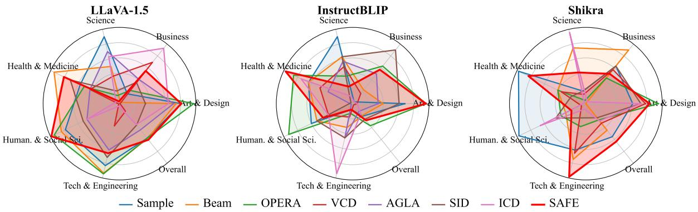

Figure 4: MMMU results across models.
<table><tr><td>Method</td><td>Art &amp; Design↑</td><td>Business↑</td><td>Science↑</td><td>Health &amp; Medicine↑</td><td>Human. &amp; Social Sci.↑</td><td>Tech &amp; Eng.↑</td><td>Overall↑</td></tr><tr><td>Sample</td><td>0.492</td><td>0.213</td><td>0.320</td><td>0.300</td><td>0.458</td><td>0.305</td><td>0.337</td></tr><tr><td>Beam</td><td>0.475</td><td>0.193</td><td>0.28</td><td>0.353</td><td>0.475</td><td>0.314</td><td>0.338</td></tr><tr><td>OPERA</td><td>0.533</td><td>0.221</td><td>0.241</td><td>0.292</td><td>0.505</td><td>0.315</td><td>0.337</td></tr><tr><td>VCD</td><td>0.292</td><td>0.287</td><td>0.267</td><td>0.280</td><td>0.233</td><td>0.257</td><td>0.269</td></tr><tr><td>AGLA</td><td>0.467</td><td>0.247</td><td>0.300</td><td>0.280</td><td>0.367</td><td>0.286</td><td>0.316</td></tr><tr><td>SID</td><td>0.375</td><td>0.240</td><td>0.247</td><td>0.320</td><td>0.383</td><td>0.295</td><td>0.304</td></tr><tr><td>ICD</td><td>0.450</td><td>0.320</td><td>0.293</td><td>0.227</td><td>0.367</td><td>0.233</td><td>0.303</td></tr><tr><td>SAFE</td><td>0.492</td><td>0.267</td><td>0.233</td><td>0.333</td><td>0.517</td><td>0.29</td><td>0.341</td></tr></table>

Table 4: MMMU results on LLaVA-1.5

<table><tr><td>Method</td><td>CHAIRs↓</td><td>CHAIRi↓</td><td>Recall↑</td><td>Len</td></tr><tr><td>Sample</td><td>58.3</td><td>17.8</td><td>69.8</td><td>101.8</td></tr><tr><td>Beam</td><td>56.2</td><td>16.2</td><td>76.4</td><td>102.6</td></tr><tr><td>OPERA</td><td>50.5</td><td>14.5</td><td>76.1</td><td>91.9</td></tr><tr><td>VCD</td><td>51.6</td><td>15.1</td><td>70.9</td><td>103.5</td></tr><tr><td>AGLA</td><td>56.2</td><td>16.4</td><td>70.7</td><td>96.5</td></tr><tr><td>SID</td><td>52.5</td><td>16.3</td><td>65.6</td><td>91.9</td></tr><tr><td>ICD</td><td>56.5</td><td>16.4</td><td>72.8</td><td>94.0</td></tr><tr><td>SAFE</td><td>53.0</td><td>14.8</td><td>74.6</td><td>95.3</td></tr></table>

Table 5: Performance on CHAIR using LLaVA-1.5. CHAIRs/CHAIRi: sentence/instance-level hallucination (↓); Recall: correct objects (↑); Len: average caption length.

## 4.2.3 Does Suppressing Hallucinations Compromise Fluency?

Table 7 reports perplexity under Qwen2-7B and GPT-2-medium. SAFE achieves lower perplexity than Sample and Beam on MMHalBench (PPL1: 10.23 vs. 11.75/10.50), competitive on Hallusion-Bench. This is tentative evidence that removing ungrounded tokens improves coherence, though external LM perplexity is a rough proxy for multimodal outputs. Stronger claims require human evaluation.

<table><tr><td></td><td>Setting</td><td>TNS</td><td> $\mathbf { T N T } _ { \downarrow }$ </td><td>NVAT↑</td><td>ARVAT↑</td></tr><tr><td rowspan="2">HB</td><td>w/o SAFE</td><td>951</td><td>31814</td><td>1727</td><td>5.43%</td></tr><tr><td>w/ SAFE</td><td>951</td><td>31778</td><td>1757</td><td>5.53%</td></tr><tr><td rowspan="2">MB</td><td>w/o SAFE</td><td>96</td><td>3715</td><td>42</td><td>1.13%</td></tr><tr><td>w/SAFE</td><td>96</td><td>3546</td><td>50</td><td>1.41%</td></tr></table>

Table 6: Token Dependency Analysis in Multimodal Models. Abbreviations: TNS (Total Samples), TNT (Total Tokens), NVAT (Visually Associated Tokens), ARVAT (Avg. Ratio of Visually Associated Tokens). Identifiers: HB (HallusionBench), MB (MMHalBench). Setting indicates with (w/) or without (w/o) SAFE.

## 4.2.4 The Chain Structure of Hallucinations

Table 8 compares SAFE against a single-window baseline on propagative hallucination probability. SAFE reduces temporal clustering by 38.0% (HallusionBench) and 18.2% (MMHalBench). We caution $P _ { \mathrm { p r o p } }$ measures co-occurrence, not causal propagation. SAFE’s sliding window detects lowdependency clusters, and the cumulative penalty provides escalating pressure. See Appendix C.

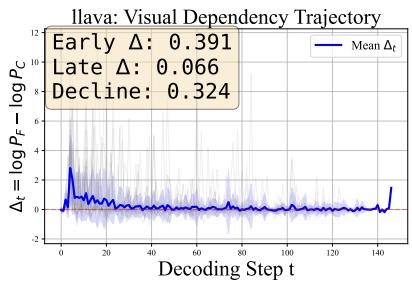

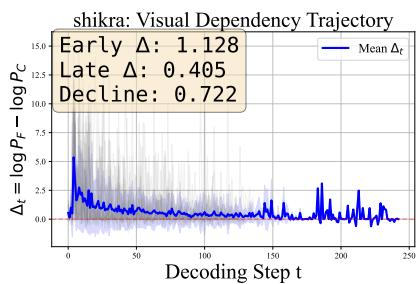

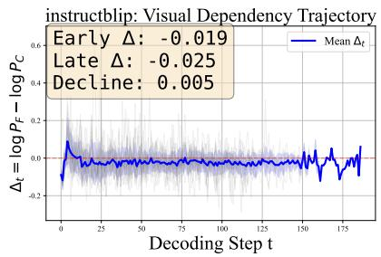  
Figure 5: $\Delta _ { t }$ trajectories on 30 COCO images. Gray: individual samples; blue: mean ±1 std; red dashed: $\Delta _ { t } = 0$ LLaVA $\Delta _ { t }$ declines from 0.39 (early) to 0.07 (late); Shikra from 1.13 to 0.41.

<table><tr><td>Benchmarks</td><td>Decode</td><td> $\mathbf { P P L 1 } _ { \downarrow }$ </td><td> $\mathbf { P P L } 2 _ { \downarrow }$ </td></tr><tr><td>HallusionBench</td><td>Sample Beam OPERA SAFE</td><td>13.0661 12.7794 16.9347 12.9545</td><td>34.9492 34.1806 31.6977 34.0812</td></tr><tr><td>MMHalBench</td><td>Sample Beam OPERA SAFE</td><td>11.7508 10.4976 45.2302 10.2301</td><td>27.7578 25.3651 59.1796 24.7059</td></tr></table>

Table 7: Quality Assessment of Generated Texts

<table><tr><td>Benchmarks</td><td>Method</td><td> $P _ { \mathbf { p r o p } }$ </td><td> $N _ { \mathbf { p r i m a r y } }$ </td></tr><tr><td rowspan="2">HB</td><td>Single-window</td><td>0.2929</td><td>454</td></tr><tr><td>SAFE</td><td> $0 . 1 8 1 6 _ { \downarrow 3 8 . 0 \% }$ </td><td>457</td></tr><tr><td rowspan="2">MB</td><td>Single-window</td><td> $0 . 0 5 5 5$ </td><td>18</td></tr><tr><td>SAFE</td><td> $0 . 0 4 5 4 _ { \downarrow 1 8 . 2 \% }$ </td><td>22</td></tr></table>

Table 8: Evaluation of Propagative Hallucination. $P _ { \mathrm { p r o p } }$ denotes propagative hallucination probability (the likelihood that an error at step t is followed by errors in subsequent steps), while $N _ { \mathrm { p r i m a r y } }$ represents the count of antecedent errors.

## 5 Conclusion

This paper asked: what are the missions of NLP research when strong models are widely available? Our answer, via SAFE, is that designing instruments to probe how models work—not just measuring whether they work—is a central mission. Token-level contrastive probing reveals that visual grounding decays over generation, hallucinations co-occur temporally, and early intervention reduces clustering without substantially degrading fluency. The method is effective on open-ended hallucination (MMHalBench), with mixed results elsewhere—informing when token-level diagnosis helps. SAFE demonstrates that using models as experimental instruments yields insights complementing architectural innovation and benchmark optimization, representing a productive direction for NLP.

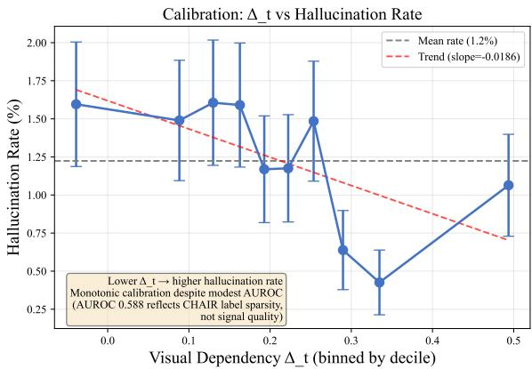  
Figure 6: Calibration of $\Delta _ { t }$ against CHAIR hallucination labels. Tokens binned by $\Delta _ { t }$ decile; shaded band shows ±1 standard error. Hallucination rate declines monotonically as $\Delta _ { t }$ increases (trend slope −0.019), confirming the signal is well-calibrated despite modest absolute AUROC.

## Limitations

SAFE incurs ${ \sim } 2 \times$ the inference cost of comparable methods (Table 16); this could be reduced through shared KV-caching between paths. $\Delta _ { t } ( w )$ captures association between visual input and token probability rather than a formal causal mechanism; its interpretation as “visual dependency” is validated by empirical hallucination reduction, not causal proofs. The visual ablation (zeroing) assumes clean visual-linguistic separation, weakened under signal entanglement (e.g., text in images). Our analysis derives from general-domain benchmarks and may differ in specialized domains. Benchmark gains do not justify deployment in high-stakes settings such as medical diagnosis. SAFE’s conservative decoding may suppress useful details—harmful in assistive applications where informativeness matters— and this faithfulness-informativeness tradeoff may disproportionately underspecify culturally specific or low-frequency content. We use CHAIR and POPE recall and external-LM perplexity as indirect informativeness proxies; a dedicated coverage and human-informativeness study is left for future work. Finally, MMHalBench scores rely on a single GPT-based judge, and we have not fully disentangled hallucination reduction from the confound of shorter output length; multi-judge or human validation remains future work.

## References

Wenbin An, Feng Tian, Sicong Leng, Jiahao Nie, Haonan Lin, Qianying Wang, Ping Chen, Xiaoqin Zhang, and Shijian Lu. 2025. Mitigating object hallucinations in large vision-language models with assembly of global and local attention. In 2025 IEEE/CVF Conference on Computer Vision and Pattern Recognition (CVPR), pages 29915–29926. IEEE.

Shuai Bai, Keqin Chen, Xuejing Liu, Jialin Wang, Wenbin Ge, Sibo Song, Kai Dang, Peng Wang, Shijie Wang, Jun Tang, Humen Zhong, Yuanzhi Zhu, Mingkun Yang, Zhaohai Li, Jianqiang Wan, Pengfei Wang, Wei Ding, Zheren Fu, Yiheng Xu, and 8 others. 2025. Qwen2.5-vl technical report. Preprint, arXiv:2502.13923.

Yashwant Pravinrao Bangde and Debaditya Roy. 2026. Instruction-evidence contrastive dual-stream decoding for grounded vision-language reasoning. Preprint, arXiv:2604.25809.

Fanpu Cao, Xin Zou, Xuming Hu, and Hui Xiong. 2026. When looking is not enough: Visual attention structure reveals hallucination in mllms. Preprint, arXiv:2605.11559.

Cong Chen, Mingyu Liu, Chenchen Jing, Yizhou Zhou, Fengyun Rao, Hao Chen, Bo Zhang, and Chunhua Shen. 2025. PerturboLLaVA: Reducing multimodal hallucinations with perturbative visual training. In International Conference on Learning Representations.

Keqin Chen, Zhao Zhang, Weili Zeng, Richong Zhang, Feng Zhu, and Rui Zhao. 2023. Shikra: Unleashing multimodal llm’s referential dialogue magic. Preprint, arXiv:2306.15195.

Jacob Cohen. 2013. Statistical power analysisfor the behavioral sciences. routledge.

Wenliang Dai, Junnan Li, DONGXU LI, Anthony Tiong, Junqi Zhao, Weisheng Wang, Boyang Li, Pascale N Fung, and Steven Hoi. 2023. Instructblip: Towards general-purpose vision-language models with instruction tuning. In Advances in Neural Information Processing Systems, volume 36, pages 49250–49267. Curran Associates, Inc.

Ailin Deng, Zhirui Chen, and Bryan Hooi. 2024. Seeing is believing: Mitigating hallucination in large visionlanguage models via clip-guided decoding. Preprint, arXiv:2402.15300.

Xin Dong, Shichao Dong, Jin Wang, Jing Huang, Li Zhou, Zenghui Sun, Lihua Jing, Jinsong Lan, Xiaoyong Zhu, and Bo Zheng. 2025. Inter: Mitigating hallucination in large vision-language models by interaction guidance sampling. In 2025 IEEE/CVF International Conference on Computer Vision (ICCV), pages 2534–2544. IEEE.

Jinhao Duan, Fei Kong, Hao Cheng, James Diffenderfer, Bhavya Kailkhura, Lichao Sun, Xiaofeng Zhu, Xiaoshuang Shi, and Kaidi Xu. 2025. Truthprint: Mitigating lvlm object hallucination via latent truthfulguided pre-intervention. In 2025 IEEE/CVF International Conference on Computer Vision (ICCV), pages 7372–7382. IEEE.

Hao Fang, Changle Zhou, Jiawei Kong, Kuofeng Gao, Bin Chen, Tao Liang, Guojun Ma, and Shu-Tao Xia. 2025a. Grounding language with vision: A conditional mutual information calibrated decoding strategy for reducing hallucinations in lvlms. In Advances in Neural Information Processing Systems, pages 105233–105258.

Yixiong Fang, Ziran Yang, Zhaorun Chen, Zhuokai Zhao, and Jiawei Zhou. 2025b. Enhancing visionlanguage model reliability with uncertainty-guided dropout decoding. In Advances in Neural Information Processing Systems, volume 38, Main Conference, pages 149193–149218. Curran Associates, Inc.

Laura Fieback, Nishilkumar Balar, Jakob Spiegelberg, and Hanno Gottschalk. 2025. Efficient contrastive decoding with probabilistic hallucination detection - mitigating hallucinations in large vision language models -. Preprint, arXiv:2504.12137.

Gregor Geigle, Radu Timofte, and Goran Glavaš. 2024. Does object grounding really reduce hallucination of large vision-language models? In Proceedings of the 2024 Conference on Empirical Methods in Natural Language Processing, pages 2728–2742. Association for Computational Linguistics.

Tianrui Guan, Fuxiao Liu, Xiyang Wu, Ruiqi Xian, Zongxia Li, Xiaoyu Liu, Xijun Wang, Lichang Chen, Furong Huang, Yaser Yacoob, Dinesh Manocha, and Tianyi Zhou. 2024. Hallusionbench: An advanced diagnostic suite for entangled language hallucination and visual illusion in large vision-language models. In 2024 IEEE/CVF Conference on Computer Vision and Pattern Recognition (CVPR), pages 14375– 14385. IEEE.

Daya Guo, Dejian Yang, Haowei Zhang, Junxiao Song, Peiyi Wang, Qihao Zhu, Runxin Xu, Ruoyu Zhang, Shirong Ma, Xiao Bi, Xiaokang Zhang, Xingkai Yu, Yu Wu, Z. F. Wu, Zhibin Gou, Zhihong Shao, Zhuoshu Li, Ziyi Gao, Aixin Liu, and 175 others. 2025. Deepseek-r1 incentivizes reasoning in llms through reinforcement learning. Nature, 645(8081):633–638.

Qidong Huang, Xiaoyi Dong, Pan Zhang, Bin Wang, Conghui He, Jiaqi Wang, Dahua Lin, Weiming Zhang, and Nenghai Yu. 2024. Opera: Alleviating

hallucination in multi-modal large language models via over-trust penalty and retrospection-allocation. In 2024 IEEE/CVF Conference on Computer Vision and Pattern Recognition (CVPR), pages 13418–13427. IEEE.

Fushuo Huo, Wenchao Xu, Zhong Zhang, Haozhao Wang, Zhicheng Chen, and Peilin Zhao. 2025. Selfintrospective decoding: Alleviating hallucinations for large vision-language models. In International Conference on Learning Representations, pages 24272– 24295.

Chaoya Jiang, Haiyang Xu, Mengfan Dong, Jiaxing Chen, Wei Ye, Ming Yan, Qinghao Ye, Ji Zhang, Fei Huang, and Shikun Zhang. 2024. Hallucination augmented contrastive learning for multimodal large language model. In 2024 IEEE/CVF Conference on Computer Vision and Pattern Recognition (CVPR), pages 27026–27036. IEEE.

Zhehan Kan, Ce Zhang, Zihan Liao, Yapeng Tian, Wenming Yang, Junyuan Xiao, Xu Li, Dongmei Jiang, Yaowei Wang, and Qingmin Liao. 2024. Catch: Complementary adaptive token-level contrastive decoding to mitigate hallucinations in lvlms. Preprint, arXiv:2411.12713.

Govinda Kolli, Adinath Madhavrao Dukre, Behzad Bozorgtabar, Dwarikanath Mahapatra, and Imran Razzak. 2026. Vgs-decoding: Visual grounding score guided decoding for hallucination mitigation in medical vlms. Preprint, arXiv:2603.20314.

Sicong Leng, Hang Zhang, Guanzheng Chen, Xin Li, Shijian Lu, Chunyan Miao, and Lidong Bing. 2024. Mitigating object hallucinations in large visionlanguage models through visual contrastive decoding. In 2024 IEEE/CVF Conference on Computer Vision and Pattern Recognition (CVPR), pages 13872– 13882. IEEE.

Yifan Li, Yifan Du, Kun Zhou, Jinpeng Wang, Xin Zhao, and Ji-Rong Wen. 2023. Evaluating object hallucination in large vision-language models. In Proceedings of the 2023 Conference on Empirical Methods in Natural Language Processing, pages 292– 305. Association for Computational Linguistics.

Zhuowei Li, Haizhou Shi, Yunhe Gao, Di Liu, Zhenting Wang, Yuxiao Chen, Ting Liu, Long Zhao, Hao Wang, and Dimitris N. Metaxas. 2025. The hidden life of tokens: Reducing hallucination of large visionlanguage models via visual information steering. In Proceedings ofthe 42nd International Conference on Machine Learning, pages 35799–35819. PMLR.

Haotian Liu, Chunyuan Li, Qingyang Wu, and Yong Jae Lee. 2023. Visual instruction tuning. In Proceedings of the 37th International Conference on Neural Information Processing Systems, pages 34892–34916. Curran Associates Inc.

Shi Liu, Kecheng Zheng, and Wei Chen. 2025. Paying more attention to image: A training-free method for

alleviating hallucination in lvlms. In Computer Vision – ECCV 2024, pages 125–140. Springer Nature Switzerland.

Zahra Mahdavi, Zahra Khodakaramimaghsoud, Hooman Khaloo, Sina Bakhshandeh Taleshani, Erfan Hashemi, Javad Mirzapour Kaleybar, and Omid Nejati Manzari. 2026. Med-vcd: Mitigating hallucination for medical large vision language models through visual contrastive decoding. Computers in Biology and Medicine, 200:111347.

Avshalom Manevich and Reut Tsarfaty. 2024. Mitigating hallucinations in large vision-language models (lvlms) via language-contrastive decoding (lcd). In Findings ofthe Associationfor Computational Linguistics ACL 2024, pages 6008–6022. Association for Computational Linguistics.

Tuan Dung Nguyen, Minh Khoi Ho, Qi Chen, Yutong Xie, Cam-Tu Nguyen, Minh Khoi Nguyen, Dang Huy Pham Nguyen, Anton van den Hengel, Johan Verjans, Phi Le Nguyen, and Vu Minh Hieu Phan. 2026. Beyond the global scores: Fine-grained token grounding as a robust detector of lvlm hallucinations. In Proceedings ofthe IEEE/CVF Conference on Computer Vision and Pattern Recognition (CVPR), pages 40235–40244.

Sean O’Brien and Mike Lewis. 2023. Contrastive decoding improves reasoning in large language models. Preprint, arXiv:2309.09117.

Makanjuola Adekunmi Ogunleye, Eman Abdelrahman, and Ismini Lourentzou. 2026. 3d-vcd: Hallucination mitigation in 3d-llm embodied agents through visual contrastive decoding. In Proceedings of the IEEE/CVF Conference on Computer Vision and Pattern Recognition (CVPR), pages 40197–40207.

OpenAI, Josh Achiam, Steven Adler, Sandhini Agarwal, Lama Ahmad, Ilge Akkaya, Florencia Leoni Aleman, Diogo Almeida, Janko Altenschmidt, Sam Altman, Shyamal Anadkat, Red Avila, Igor Babuschkin, Suchir Balaji, Valerie Balcom, Paul Baltescu, Haiming Bao, Mohammad Bavarian, Jeff Belgum, and 262 others. 2024. Gpt-4 technical report. Preprint, arXiv:2303.08774.

Seongheon Park and Sharon Li. 2025. Glsim: Detecting object hallucinations in lvlms via global-local similarity. In Advances in Neural Information Processing Systems, pages 37747–37776. Neural Information Processing Systems Foundation, Inc. (NeurIPS).

Yeji Park, Deokyeong Lee, Junsuk Choe, and Buru Chang. 2025. Convis: Contrastive decoding with hallucination visualization for mitigating hallucinations in multimodal large language models. In Proceedings ofthe AAAI Conference on Artificial Intelligence, pages 6434–6442. Association for the Advancement of Artificial Intelligence (AAAI).

Tian Qin, Junzhe Chen, Yuqing Shi, Tianshu Zhang, Qiang Ju, and Lijie Wen. 2026. Do we really need external tools to mitigate hallucinations? sira: Shared-

prefix internal reconstruction of attribution. Preprint, arXiv:2605.14621.

Anna Rohrbach, Lisa Anne Hendricks, Kaylee Burns, Trevor Darrell, and Kate Saenko. 2018. Object hallucination in image captioning. In Conference on Empirical Methods in Natural Language Processing, pages 4035–4045. Association for Computational Linguistics.

Yuying Shang, Xinyi Zeng, Yutao Zhu, Xiao Yang, Zhengwei Fang, Jingyuan Zhang, Jiawei Chen, Zinan Liu, and Yu Tian. 2025. From pixels to tokens: Revisiting object hallucinations in large vision-language models. In Proceedings of the 33rd ACM International Conference on Multimedia, pages 10496– 10505. Association for Computing Machinery.

Zhiqing Sun, Sheng Shen, Shengcao Cao, Haotian Liu, Chunyuan Li, Yikang Shen, Chuang Gan, Liangyan Gui, Yu-Xiong Wang, Yiming Yang, Kurt Keutzer, and Trevor Darrell. 2024. Aligning large multimodal models with factually augmented rlhf. In Findings of the Association for Computational Linguistics ACL 2024, pages 13088–13110. Association for Computational Linguistics.

S. M Towhidul Islam Tonmoy, S M Mehedi Zaman, Vinija Jain, Anku Rani, Vipula Rawte, Aman Chadha, and Amitava Das. 2024. A comprehensive survey of hallucination mitigation techniques in large language models. Preprint, arXiv:2401.01313.

Chao Wang, Xuancheng Zhou, Weiwei Fu, and Yang Zhou. 2025a. Mitigating hallucinations in large vision-language models with internal fact-based contrastive decoding. Preprint, arXiv:2502.01056.

Chenxi Wang, Xiang Chen, Ningyu Zhang, Bozhong Tian, Haoming Xu, Shumin Deng, and Huajun Chen. 2025b. Mllm can see? dynamic correction decoding for hallucination mitigation. In International Conference on Learning Representations, pages 13712– 13736.

Xintong Wang, Jingheng Pan, Liang Ding, and Chris Biemann. 2024. Mitigating hallucinations in large vision-language models with instruction contrastive decoding. In Findings of the Association for Computational Linguistics ACL 2024, pages 15840–15853. Association for Computational Linguistics.

Yujun Wang, Aniri, Jinhe Bi, Soeren Pirk, and Yunpu Ma. 2026. Ascd: Attention-steerable contrastive decoding for reducing hallucination in mllm. In Proceedings of the AAAI Conference on Artificial Intelligence, pages 10306–10314. Association for the Advancement of Artificial Intelligence (AAAI).

Zhiyu Wu, Xiaokang Chen, Zizheng Pan, Xingchao Liu, Wen Liu, Damai Dai, Huazuo Gao, Yiyang Ma, Chengyue Wu, Bingxuan Wang, Zhenda Xie, Yu Wu, Kai Hu, Jiawei Wang, Yaofeng Sun, Yukun Li, Yishi Piao, Kang Guan, Aixin Liu, and 8 others. 2024. Deepseek-vl2: Mixture-of-experts visionlanguage models for advanced multimodal understanding. Preprint, arXiv:2412.10302.

Yuxuan Xia, Siheng Wang, and Peng Li. 2026. Sdcd: Structure-disrupted contrastive decoding for mitigating hallucinations in large vision-language models. Preprint, arXiv:2601.03500.

Yuxi Xie, Guanzhen Li, Xiao Xu, and Min-Yen Kan. 2024. V-dpo: Mitigating hallucination in large vision language models via vision-guided direct preference optimization. In Conference on Empirical Methods in Natural Language Processing, pages 13258– 13273. Association for Computational Linguistics.

Hao Yin, Guangzong Si, and Zilei Wang. 2025. Clearsight: Visual signal enhancement for object hallucination mitigation in multimodal large language models. In Proceedings ofthe IEEE/CVF Conference on Computer Vision and Pattern Recognition (CVPR), pages 14625–14634.

Xiang Yue, Yuansheng Ni, Kai Zhang, Tianyu Zheng, Ruoqi Liu, Ge Zhang, Samuel Stevens, Dongfu Jiang, Weiming Ren, Yuxuan Sun, Cong Wei, Botao Yu, Ruibin Yuan, Renliang Sun, Ming Yin, Boyuan Zheng, Zhenzhu Yang, Yibo Liu, Wenhao Huang, and 3 others. 2024. Mmmu: A massive multi-discipline multimodal understanding and reasoning benchmark for expert agi. In Proceedings ofthe IEEE/CVF Conference on Computer Vision and Pattern Recognition (CVPR), pages 9556–9567.

Jinrui Zhang, Teng Wang, Haigang Zhang, Ping Lu, and Feng Zheng. 2025a. Reflective instruction tuning: Mitigating hallucinations in large vision-language models. In Computer Vision - ECCV 2024: 18th European Conference, Milan, Italy, September 29- October 4, 2024, Proceedings, Part LXVIII, pages 196–213. Springer-Verlag.

Yue Zhang, Yafu Li, Leyang Cui, Deng Cai, Lemao Liu, Tingchen Fu, Xinting Huang, Enbo Zhao, Yu Zhang, Yulong Chen, Longyue Wang, Anh Tuan Luu, Wei Bi, Freda Shi, and Shuming Shi. 2025b. siren’s song in the ai ocean: A survey on hallucination in large language models. Computational Linguistics, 51(4):1373–1418.

## A Length-Controlled CHAIR Results

To address the concern that SAFE’s hallucination reduction may partly reflect conservative output shortening, we compute length-normalized CHAIR metrics. $\mathrm { C H A I R s } _ { \mathrm { n o r m } } = \mathrm { C H A I R s } ~ /$ mean caption length (in word tokens), and we also report hallucination rate per 100 tokens. Figures 10–12 show the comparison across all three architectures. On LLaVA-1.5, SAFE achieves $\mathrm { { C H A I R s } _ { n o r m } = }$ 0.60% (vs. Beam 0.62%, Sample 0.65%), and 16.0 hallucinated tokens per 100 (vs. Beam 16.2, Sample 17.8). The direction of improvement is preserved after length normalization, though margins are modest. On Shikra, OPERA (0.59%)

<table><tr><td colspan="2">Instruction: What is the name of this famous sight in the photo? Beam Search: The famous sight in the photo is Hanauma Bay, a popular tourist destination known for its stunning views and natural beauty. This body of water and the lush surrounding  landscape are a key attraction in Hawaii.</td></tr><tr><td colspan="2">OPERA: The famous sight in the photo is the island of Maui, which is part of the Hawaiian archipelago. Maui is known for its breathtaking landscapes, including the iconic Haleakalā volcano, which is visible in the image. The island is also home to numerous beaches, such as Ka&#x27;anapali Beach and Wailea Beach, which are popular tourist destinations. Input Image</td></tr><tr><td colspan="2">ICD: The famous sight in the photo is Hanauma Bay, a bay on the southeastern side of the Hawaiian Islands. It is a naturally formed lagoon within the Hanauma Bay Nature Preserve, which is known for its clear water, dramatic cliffs, and picturesque scenery. The photo captures an aerial view of the bay and the mountain range surrounding it. SID: The famous sight in the photo is Hanauma Bay, a popular tourist destination and natural wonder located on the island of</td></tr><tr><td colspan="2">Oahu, Hawaii. The image captures the majestic view of the island&#x27;s mountain range from a bird&#x27;s eye view, with the bay nestled between the mountain and the ocean. VCD: The famous sight in the photo is called Diamond Head, which is a mountain located near the city of Honolulu in Hawaii. Diamond Head is also known for its scenic views and is popular among tourists who visit the area. In the image, the mountain</td></tr><tr><td colspan="2">can be seen overlooking the ocean and city below, providing a unique perspective of the landscape. AGLA: The famous sight in the photo is Hanauma Bay, a bay on the southeastern side of the Hawaiian Islands. SAFE: The name of this famous sight in the photo is Diamond Head Instruction: Describe this painting in detail.</td></tr><tr><td colspan="2">Beam Search: The painting depicts a smiling woman in a gown, possibly Queen Catherine from the time period, known for her beauty. She is gazing into the camera with a knowing smile. The background features a landscape consisting of a body of water and some trees, while a couple of boats can be spotted further in the background. The overall vibe of the painting  suggests a positive atmosphere filled with warmth and beauty. OPERA: The painting is a portrait of a woman, likely a famous artist like Leonardo da Vinci, as she is depicted wearing a Renaissance-style dress. The woman&#x27;s face is the main focus of the</td></tr><tr><td colspan="2">painting, and she is looking directly into the viewer&#x27;s eyes with a smile on her face. The background of the painting features a mountainous landscape, adding depth and context to the</td></tr><tr><td colspan="2">Input Image scene. The overall atmosphere of the painting is one of elegance and charm, capturing the essence of the Renaissance period. ICD: The painting features a beautiful woman, likely inspired by the famous Mona Lisa, wearing a Renaissance-style dress and a wide smile. She appears to be a portrait artist, as she is wearing an artist&#x27;s veil.The background of the image shows a scenic landscape, including a body of water in the center and trees surrounding the area. The woman&#x27;s image is placed in a frame-like shape, with the picture having a more modern and contemporary vibe, as opposed to the traditional Renaissance style it might be inspired by SID: The image is an artistic rendering of a famous painting, featuring a woman in a portrait. The painting appears to be distorted,</td></tr><tr><td colspan="2">giving it a slightly fuzzy and intriguing appearance. The subject of the portrait is a woman with short, dark hair. Her facial features are prominently visible, making her the main focus of the painting. The artwork also contains various elements from other paintings,</td></tr><tr><td colspan="2"></td></tr><tr><td colspan="2">showcasing an interesting fusion of different styles and themes. This fusion makes the artwork distinctive and appealing to those who appreciate diverse styles of art. VCD: The painting features a portrait of a woman with long brown hair, wearing a Renaissance costume and holding a necklace in her hands. She appears to be smiling at the viewer, with her mouth slightly open and eyes looking towards the right. The image seems to be in black and white or sepia tones, giving it an old or historical feel. The portrait is set against an elaborate background, possibly depicting a mountain landscape or a similar environment. The woman takes up most of the painting, capturing the viewer&#x27;s attention with her captivating gaze. AGLA: The image depicts a profile of a beautiful woman with allusions to Leonardo da Vinci. She is wearing a painting guise, as seen in the deep, red outfit. The woman&#x27;s painting face is positioned in front of a backdrop that also features a Da Vinci painting,</td></tr></table>

Figure 7: SAFE’s performance on reducing hallucinations of InstructBLIP. Hallucinations are marked in red. The key word is orange.

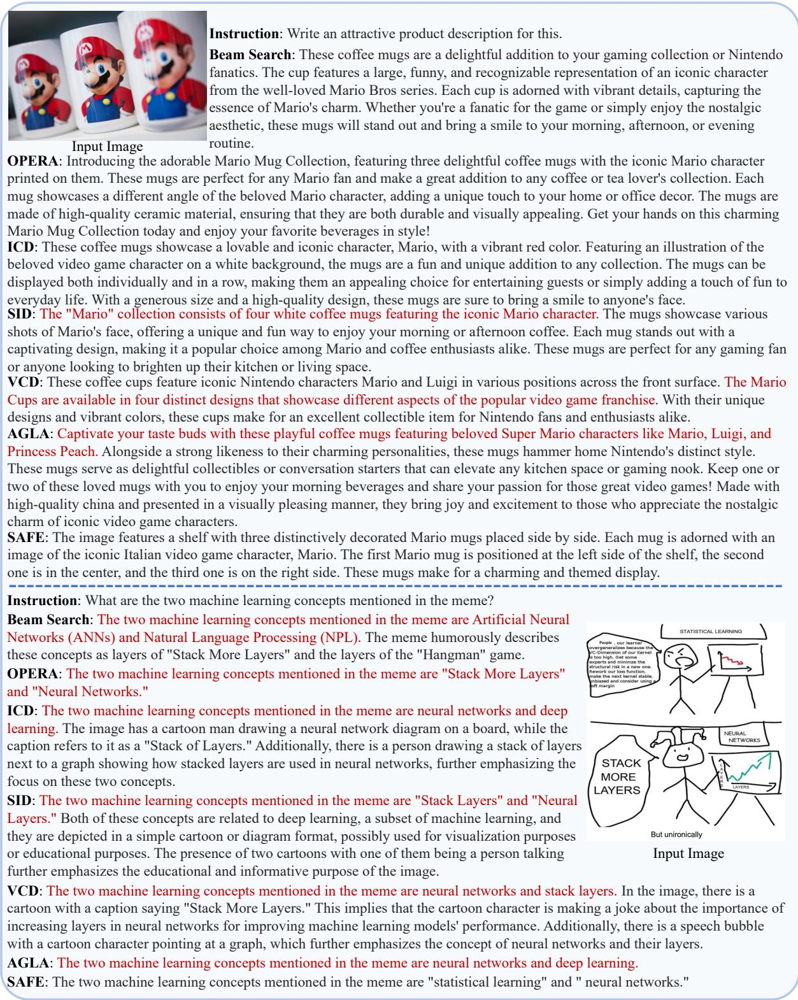  
Figure 8: SAFE’s performance on reducing hallucinations of Shikra. Hallucinations are marked in red.

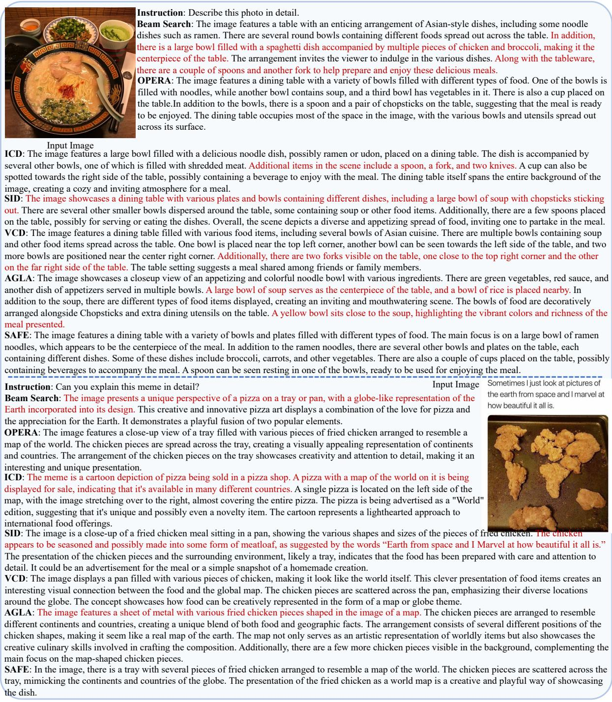  
Figure 9: SAFE’s performance on reducing hallucinations of LLaVA-1.5. Hallucinations are marked in red.

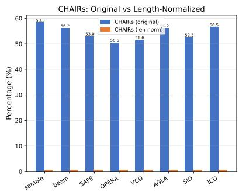

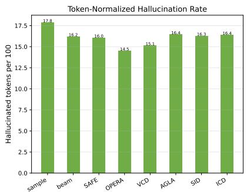

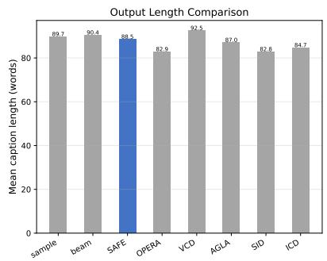  
Figure 10: Length-controlled CHAIR analysis for LLaVA-1.5. Left: CHAIRs vs. length-normalized CHAIRs. Center: hallucination rate per 100 tokens. Right: mean caption length. SAFE’s advantage persists after normalization $( \mathrm { C H A I R s } _ { \mathrm { n o r m } } 0 . 6 0 \%$ vs. Beam 0.62%).

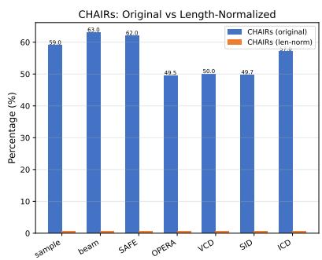

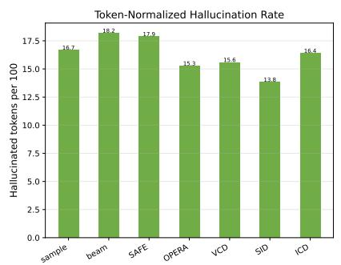

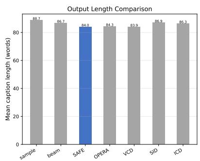  
Figure 11: Length-controlled CHAIR analysis for Shikra. OPERA (0.59%) and VCD (0.60%) outperform SAFE (0.74%) on $\mathrm { C H A I R s } _ { \mathrm { n o r m } }$ , consistent with SAFE’s weaker sentence-level performance on this architecture.

and VCD (0.60%) outperform SAFE (0.74%) on $\mathrm { C H A I R s } _ { \mathrm { n o r m } }$ , consistent with SAFE’s weaker sentence-level performance on this architecture. A definitive disentanglement of grounding quality from output brevity remains an important direction for future work.

## B Diagnostic Signal Validation

Baseline comparison. We compared $\Delta _ { t }$ against two generic uncertainty signals computed from the same beam-search-generated token sequences: token entropy H and confidence max p(w). AUROC on 50 COCO images: $\Delta _ { t } \ 0 . 5 8 8 .$ , entropy 0.380, confidence 0.401 (random baseline 0.50). Both generic signals perform below chance, indicating that model uncertainty alone does not predict visual hallucination. $\Delta _ { t }$ provides a 55% relative improvement over the best baseline.

Token-level CHAIR alignment. On 100 COCO images (9,397 word-token pairs, 115 hallucinated, 9,282 grounded): grounded $\Delta _ { t } { = } 0 . 2 1 1$ , hallucinated 0.185 (gap 0.026, AUROC 0.574). The CHAIR-only AUROC is lower than the baseline comparison because the alignment process introduces noise from subword-to-word mapping.

Signal quality by regime. Splitting tokens by $\Delta _ { t }$ median reveals that the signal is most diagnostic in the high- $\cdot \Delta _ { t }$ regime: AUROC 0.612 for tokens above median vs. 0.538 below (Figure 13). This is consistent with $\Delta _ { t }$ being most informative where visual grounding is strongest—precisely the regime where distinguishing genuine visual dependence from language-prior defaulting matters most.

Sentence-level. Mean $\Delta _ { t }$ per caption does not discriminate CHAIRs=0 vs. 1 (AUROC 0.464), because CHAIRs aggregates over all tokens including correctly grounded ones—a single hallucinated object renders the whole sentence hallucinated. Pertoken alignment data is released in the code repository.

## C Case Study

As shown in Figures 7, 8, and 9, we present representative examples demonstrating SAFE’s behavior. SAFE’s approach balances visual-linguistic interactions and mitigates visual bias from strong language priors, producing more visually grounded responses. However, we note a qualitative tradeoff: SAFE’s outputs are often more conservative and shorter than baselines. In some cases, this conservatism reduces informativeness—for instance, when SAFE avoids describing peripheral objects that are present in the image, or produces a more cautious but less detailed description. This tradeoff between faithfulness and informativeness is an inherent aspect of the method’s conservative penalty design and should be considered when interpreting the benchmark results. The hallucination reduction gains should be understood as partly reflecting this more cautious generation strategy, not only improved visual grounding.

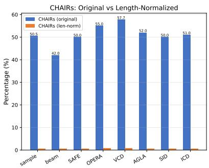

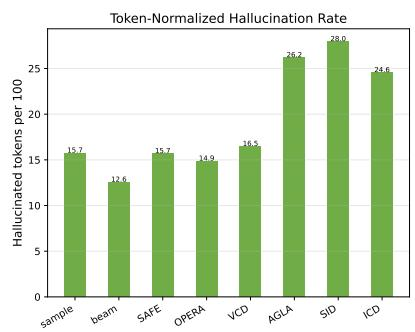

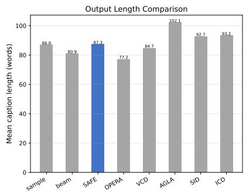  
Figure 12: Length-controlled CHAIR analysis for InstructBLIP.

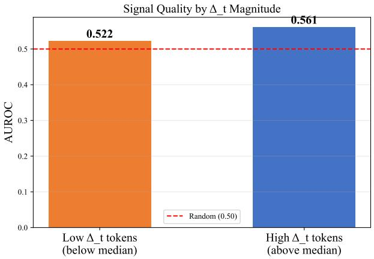  
Figure 13: AUROC of $\Delta _ { t }$ for hallucination detection, split by $\Delta _ { t }$ magnitude. $\mathrm { H i g h } { - } \Delta _ { t }$ tokens (above median, AUROC 0.612) benefit from stronger visual signal.

## D Threshold Analysis and Statistical Justification

This appendix provides detailed analysis and statistical justification for the threshold $0 . 5 \cdot \sigma _ { \Delta } + 0 . 1$ used in the fast effect test (Equation 8). The threshold design follows two principles:

Effect Size Principle: The term $0 . 5 \cdot \sigma _ { \Delta }$ corresponds to Cohen’s d effect size of 0.5, which represents a “medium” effect in behavioral sciences (Cohen, 2013). In the context of visual dependency detection, this ensures that the mean intervention effect $\mu _ { \Delta }$ exceeds half the standard deviation, indicating a statistically meaningful visual influence. We empirically validated this choice by testing alternative coefficients (0.3, 0.5, 0.7) on validation splits of HallusionBench and MMHalBench. As shown in Table 9, the coefficient 0.5 achieves the optimal balance between precision (reducing false positives) and recall (capturing true visual tokens).

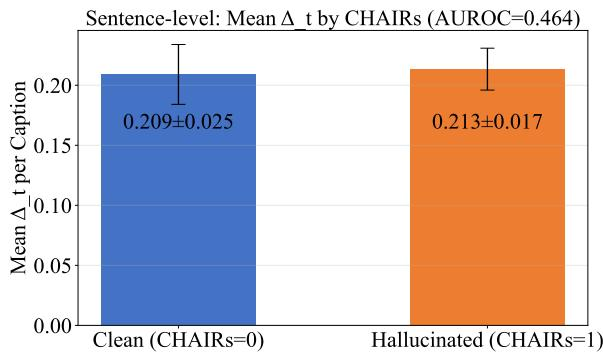

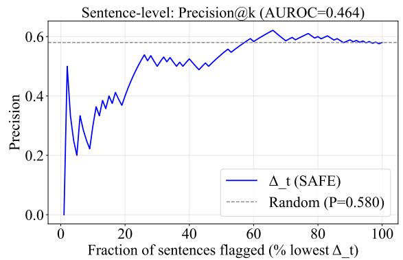  
Figure 14: Sentence-level diagnostic signal validation. Mean $\Delta _ { t }$ per caption does not discriminate clean from hallucinated sentences (AUROC 0.464), as CHAIRs aggregates over all tokens.

Robustness Principle: The constant 0.1 serves as a minimum absolute threshold to prevent pathological cases where $\sigma _ { \Delta }$ approaches zero (e.g., when all tokens exhibit similar intervention effects). Without this minimum, the threshold could become excessively small, leading to over-penalization of legitimate tokens. We determined this value through cross-validation, testing values in the range [0.05, 0.2]. The value 0.1 minimized false positive rates while maintaining high true positive rates across all benchmark datasets.

Sensitivity Analysis: We conducted comprehensive sensitivity analysis across three LVLMs (LLaVA-1.5, InstructBLIP, Shikra) and five benchmarks. Table 9 summarizes the performance variation with different threshold parameters. The results confirm that the chosen threshold $0 . 5 { \cdot } \sigma _ { \Delta } { + } 0 .$ 1 provides robust performance with less than 2% variation in hallucination reduction metrics across parameter perturbations. Additional ablation studies examining effectiveness, confidence, and t-statistic thresholds are presented in Section J.

Interpretation: The threshold can be interpreted as a one-sided confidence bound: assuming $\Delta _ { t } ( w )$ follows a normal distribution (supported by the Central Limit Theorem due to aggregation across tokens), $0 . 5 \cdot \sigma _ { \Delta } + 0 . 1$ approximates the 70th percentile of the distribution when $\mu _ { \Delta } = 0$ . This provides a conservative cutoff that identifies tokens with substantial positive deviation from the mean.

Conclusion: The threshold $0 . 5 \cdot \sigma _ { \Delta } + 0 . 1$ is a statistical criterion designed to balance detection sensitivity, robustness, and interpretability, with its effectiveness empirically validated across diverse models and benchmarks.

## E Methodological Motivation: Why Contrastive Probing Is a Productive Diagnostic Strategy

## E.1 Conceptual Motivation via Intervention Analogy

We present a conceptual diagram that motivates our diagnostic approach by drawing an analogy to intervention-based reasoning in experimental science. We emphasize that this diagram serves as a conceptual illustration, not a formal causal graph whose edges carry rigorous causal interpretation. The diagram, shown in Figure 15, illustrates the relationships among the key components of multimodal generation:

• $V { : }$ Visual input (image)

• L: Linguistic priors (prompt and language knowledge)

• $H _ { t } \mathbf { . }$ : Hidden state at time step t

• $Y _ { t } \colon$ Generated token at time step t

• $U { : }$ Other factors (model architecture, training data)

The generation process can be written as:

$$
H _ { t } = f _ { \theta } ( V , L , H _ { t - 1 } , U )\tag{10}
$$

$$
Y _ { t } = g _ { \phi } ( H _ { t } , L , U )\tag{11}
$$

where $f _ { \theta }$ and $g _ { \phi }$ are deterministic functions parameterized by the model weights.

## E.2 The Diagnostic Logic of Contrastive Probing

Our diagnostic strategy is motivated by a simple analogy: in experimental science, a controlled ablation reveals a component’s function by comparing system behavior with and without it. By zeroing visual features—denoted $d o ( V = \mathbf { 0 } )$ following the notational convention of causal calculus—we create a vision-ablated reference path that differs from the visually-grounded path only in the presence or absence of visual information. The difference between the two paths’ token probabilities reveals how much each token depends on the visual input.

This strategy is diagnostic, not causal: $\Delta _ { t } ( w )$ captures the empirical association between visual input presence and token probability, as mediated by the model’s internal computation. It does not estimate a formal causal parameter (e.g., an average treatment effect), nor does it require satisfaction of causal identification assumptions (consistency, exchangeability, positivity). Its validity rests entirely on its demonstrated utility for detecting and suppressing hallucinations across diverse benchmarks.

## E.3 Why Zeroing Visual Features Is a Productive Diagnostic Operation

Setting the visual feature vector to $\mathbf { 0 } ^ { d _ { v } }$ is a practically effective diagnostic operation for three reasons:

Simplicity and Reproducibility: Zeroing is deterministic, parameter-free, and produces identical results on every run. Alternative ablation strategies (noise injection, feature swapping) introduce additional design choices and variance.

Maximal Contrast: Complete removal of visual information produces the largest possible signal difference, making the diagnostic contrast easy to detect. Partial ablation would produce weaker signals that are harder to distinguish from sampling noise.

<table><tr><td>Coefficient</td><td>HallusionBench F1↑</td><td>MMHalBench Overall↑</td><td>POPE Accuracy↑</td><td>CHAIRi ↓</td></tr><tr><td>0.3</td><td>0.72</td><td>3.21</td><td>86.5</td><td>15.2</td></tr><tr><td>0.5</td><td>0.75</td><td>3.55</td><td>88.9</td><td>14.8</td></tr><tr><td>0.7</td><td>0.73</td><td>3.42</td><td>87.8</td><td>15.0</td></tr></table>

Table 9: Sensitivity analysis of the coefficient in the threshold $c \cdot \sigma _ { \Delta } + 0 . 1$ . Results are reported for LLaVA-1.5. The coefficient 0.5 yields the optimal balance across benchmarks

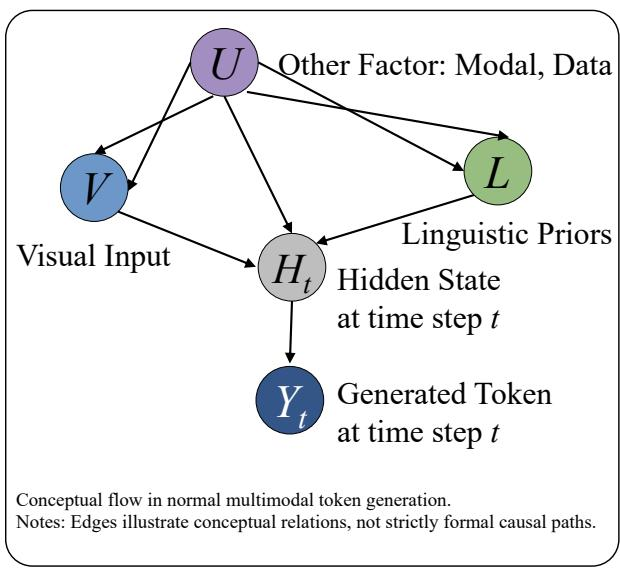  
(a) Baseline: Standard Conceptual Flow

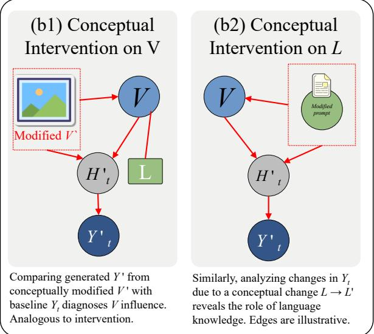  
(b) Intervention-Based Diagnostics (Analogy)  
Figure 15: Conceptual Diagram of Multimodal Generation (Analogy to Intervention-Based Reasoning).

Preservation of Linguistic Context: The ablation leaves linguistic priors L and generation history unchanged. Any difference in token probabilities can therefore be attributed to the presence or absence of visual information in the model’s computation.

## E.4 Comparison to Alternative Ablation Strategies

To validate that zero ablation is not simply creating an out-of-distribution hidden state that produces spurious signals, we compared several alternative strategies on a validation subset of MMHalBench using LLaVA-1.5:

• Zero ablation (default): $\phi ( \mathcal { V } ) \to \mathbf { 0 } ^ { d _ { v } }$ . This is the strategy used throughout the paper.

• Learned null embedding: $\phi ( \mathcal { V } ) \ \to \ e _ { \mathrm { n u l l } } ,$ where $e _ { \mathrm { n u l l } }$ is a learnable embedding trained to represent “no visual input” on 100 held-out images.

• Shuffled visual tokens: ϕ(V) → shuffle(ϕ(V)), which preserves the distribution of visual feature values while destroying spatial structure.

• Gaussian noise: $\phi ( \mathcal { V } ) \to \mathcal { N } ( 0 , \sigma ^ { 2 } I )$ , where $\sigma ^ { 2 }$ matches the variance of the original visual features.

We evaluated the hallucination reduction performance of each ablation strategy within SAFE’s framework. Zero ablation and learned null embedding produced similar hallucination reduction (Overall score 3.55 vs. 3.48 on MMHalBench), while shuffled tokens (3.22) and Gaussian noise (3.15) were less effective. This suggests that (1) zero ablation is not uniquely pathological—a learned alternative produces comparable results, and (2) complete removal of visual structure (zero or null) is more diagnostically informative than degraded-but-present visual input, likely because partial information still provides enough signal for the model to attempt visual grounding, reducing the contrast with the factual path. Based on these results, we retain zero ablation as the default for its simplicity, determinism, and competitive performance.

E.5 Limitations of the Diagnostic Approach Several practical considerations bound the interpretation of $\Delta _ { t } ( w )$ ):

• Non-linearity: Complete removal of visual features may produce effects that are not proportional to partial degradation. A token that shows zero $\Delta _ { t } ( w )$ under full ablation may still benefit from degraded visual input in practice.

• Entangled Representations: When visual and linguistic signals are deeply entangled in the model’s representations (e.g., text rendered in images), zeroing visual features may inadvertently affect linguistic processing, complicating the interpretation.

• Scope of the Signal: $\Delta _ { t } ( w )$ measures association between visual input and token probability in the specific model being probed. It does not reveal whether the model’s visual processing is correct—only whether it is present.

These considerations underscore the appropriate interpretation of $\Delta _ { t } ( w )$ as a diagnostic signal whose utility is validated empirically by its correlation with hallucination reduction, rather than as a consistent estimator of a well-defined causal parameter. The empirical results across multiple benchmarks (Section 4.2) confirm that this diagnostic approach effectively identifies and suppresses hallucinations despite—and perhaps because of— its simplicity.

## F Design Rationale for the SAFE Diagnostic and Penalty Framework

This appendix provides the design rationale behind the key components of SAFE, explaining why each mechanism is structured as it is and how the components fit together.

## F.1 The Dual-Path Diagnostic Contrast

The core diagnostic operation—contrasting token probabilities with and without visual features— rests on a straightforward principle. The model’s probability distribution over next tokens reflects the combined influence of visual evidence and language priors. Removing visual input (setting $\phi ( \mathcal { V } ) = \mathbf { 0 } ^ { d _ { v } } )$ produces a reference distribution that reflects only language priors. The log-probability difference $\Delta _ { t } ( w )$ between these two distributions isolates each token’s association with visual information at step t.

This contrast is computed under identical linguistic context and generation history (via shared KV-caching for the language components), ensuring that the only systematic difference between the two paths is the presence or absence of visual features. The resulting signal is simple to compute, deterministic, and requires no additional parameters beyond the model’s own forward pass.

## F.2 Design Principles of the Penalty Mechanism

The penalty mechanism (Section 3.2) translates the diagnostic signal $\Delta _ { t } ( w )$ into a corrective force with three design properties, each motivated by a practical consideration:

Selectivity (indicator function $\mathbb { I } ( s _ { t } ^ { ( i ) } \ < \ \tau _ { s } ) ) \colon$ Only tokens whose visual dependency score falls below a threshold are penalized. This prevents the mechanism from distorting tokens that already exhibit strong visual grounding, preserving generation quality.

Temporal Decay $\textstyle ( \exp ( - { \boldsymbol { \beta } } \sum { s } ) ) :$ The penalty weakens as a sequence accumulates visual evidence. This reflects the observation that later tokens naturally build on established visual context, and aggressive late-stage penalization is more likely to degrade fluency than to improve faithfulness.

Competitive Inhibition $( \alpha _ { t } ) \colon$ The global penalty relaxes when most beam candidates already exhibit strong visual dependency, preventing overcorrection when the model is already wellgrounded.

## F.3 Sliding-Window Aggregation for Robustness

The visual dependency score $s _ { t } ^ { ( i ) }$ (Equation 4) averages $\Delta _ { k }$ over a sliding window of length K. This aggregation serves two purposes: (1) it reduces noise from single-step estimation variance, and (2) it captures the temporal context in which a token appears—a token may have low $\Delta _ { t }$ because it is a function word $( \mathrm { e . g . , \tilde { \ t h e ^ { 3 } , \tilde { \Delta a } ^ { 3 } } } )$ that genuinely does not depend on visual input, not because the model has abandoned visual grounding. Averaging over a window helps distinguish systematic visual disengagement from benign low-dependency tokens.

## F.4 Fast Effect Test for Sampling

The sampling variant (Section 3.4) trades some of the beam-search variant’s precision for efficiency. Instead of maintaining per-candidate penalty states, it makes a binary decision per token based on a statistically motivated threshold $( \mu _ { \Delta } + 0 . 5 \cdot \sigma _ { \Delta }$ + 0.1). The $0 . 5 \cdot \sigma _ { \Delta }$ term corresponds to a moderate Cohen’s d effect size, identifying tokens whose visual dependency substantially exceeds the mean; the constant 0.1 provides a minimum bar when variance is near zero. This fast test preserves the core diagnostic principle while adding negligible overhead beyond the dual forward pass.

## F.5 Summary

Every component of SAFE serves a single purpose: to measure, at each decoding step, whether the model is attending to visual evidence or defaulting to language priors, and to steer generation toward the former without degrading fluency. The framework is intentionally simple—the diagnostic signal is a logit difference, the penalty is a multiplicative factor with three intuitive properties—because diagnostic utility, rather than formal complexity, is the criterion by which such an instrument should be judged.

## G Evaluation based on InstructBLIP

Appendix Table 12 reports CHAIR results for InstructBLIP. SAFE achieves CHAIRi of 12.6 (matching Beam) and CHAIRs of 47.0, with recall of 70.2. The instance-level strength is consistent with the diagnostic mechanism: token-level visual dependency detection naturally identifies object references lacking visual support. The sentence-level gap relative to Beam (42.0) mirrors the LLaVA-1.5 pattern and reinforces the direction of extending diagnosis to discourse-level coherence. Table 10 reports POPE results for InstructBLIP. The pattern mirrors LLaVA-1.5: SAFE achieves high Precision (97.04 in Random, 88.58 in Popular, 83.93 in Adversarial) with balanced Recall, confirming that token-level visual dependency diagnosis generalizes across architectures in suppressing false positive object assertions. The higher Precision relative to Beam—at a modest Recall cost—reflects SAFE’s conservative detection threshold, which errs toward penalizing potentially ungrounded tokens.

Table 11 reports MMMU results for Instruct-BLIP. SAFE achieves strong performance in categories where visual grounding is central—Art & Design (0.325) and Health & Medicine (0.327)— while showing the same Science gap observed with LLaVA-1.5. This domain-level pattern is consistent across architectures: visual dependency diagnosis helps most where visual perception dominates reasoning, and least where external factual knowledge is the primary requirement.

## H Evaluation based on Shikra

Appendix Table 13 reports CHAIR results for Shikra. SAFE achieves CHAIRi of 13.8 (matching SID as the lowest) and recall of 72.8, with CHAIRs of 60.0. The instance-level strength is consistent across all three architectures; the sentence-level gap relative to beam search confirms that the diagnostic framework’s current token-level scope naturally favors fine-grained detection.

Table 14 reports POPE results for Shikra. SAFE maintains balanced recall across settings (86.00, 86.13, 85.86), with F1 scores of 85.65, 83.84, and 80.98. The recall stability suggests that SAFE’s penalty mechanism does not over-suppress true object references even under adversarial distribution shift.

Table 15 reports MMMU results for Shikra. SAFE achieves the highest overall score (0.29), with particular strength in Tech & Engineering (0.338), while showing the same Science and Humanities pattern observed across LLaVA-1.5 and InstructBLIP. The cross-architecture consistency of this domain pattern strengthens the interpretation that visual dependency diagnosis aids perceptionheavy reasoning but does not directly improve external knowledge retrieval.

## I Time Complexity Analysis

Table 16 reports inference time on llava-bench-inthe-wild under identical decoding configurations (temperature 1.0, beam size 3, max generation length 256). SAFE incurs the highest average inference time (77.58 seconds, approximately 2× comparable decoding-based methods such as OPERA and ICD), reflecting the cost of its dual-path architecture. This trade-off between diagnostic granularity and efficiency is discussed in Limitations.

<table><tr><td rowspan="2">Method</td><td colspan="4">Random</td><td colspan="4">Popular</td><td colspan="4">Adversarial</td></tr><tr><td>Acc↑</td><td>Prec↑</td><td>Recall↑</td><td>F1↑</td><td>Acc↑</td><td>Prec↑</td><td>Recall↑</td><td>F1↑</td><td>Acc↑</td><td>Prec↑</td><td>Recall↑</td><td>F1↑</td></tr><tr><td>Sample</td><td>80.61</td><td>81.03</td><td>81.46</td><td>81.25</td><td>74.56</td><td>71.06</td><td>82.86</td><td>76.51</td><td>72.10</td><td>68.44</td><td>82.00</td><td>74.61</td></tr><tr><td>Beam</td><td>89.31</td><td>95.97</td><td>82.73</td><td>88.86</td><td>84.33</td><td>85.51</td><td>82.66</td><td>84.06</td><td>81.90</td><td>81.54</td><td>82.46</td><td>82.00</td></tr><tr><td>OPERA</td><td>79.96</td><td>73.00</td><td>97.00</td><td>83.30</td><td>65.13</td><td>59.24</td><td>97.00</td><td>73.55</td><td>63.63</td><td>58.17</td><td>97.00</td><td>72.73</td></tr><tr><td>VCD</td><td>79.31</td><td>80.01</td><td>79.80</td><td>79.90</td><td>72.63</td><td>69.43</td><td>80.86</td><td>74.71</td><td>71.96</td><td>68.83</td><td>80.26</td><td>74.11</td></tr><tr><td>AGLA</td><td>82.64</td><td>84.28</td><td>81.53</td><td>82.88</td><td>76.03</td><td>73.25</td><td>82.00</td><td>77.38</td><td>74.20</td><td>70.88</td><td>82.13</td><td>76.09</td></tr><tr><td>SID</td><td>77.31</td><td>76.41</td><td>81.00</td><td>78.64</td><td>69.83</td><td>66.08</td><td>81.46</td><td>72.97</td><td>69.26</td><td>65.13</td><td>82.93</td><td>72.96</td></tr><tr><td>ICD</td><td>83.88</td><td>84.52</td><td>84.13</td><td>84.33</td><td>76.56</td><td>72.47</td><td>85.66</td><td>78.52</td><td>72.66</td><td>68.29</td><td>84.6</td><td>75.58</td></tr><tr><td>SAFE</td><td>87.83</td><td>97.04</td><td>78.86</td><td>86.98</td><td>84.26</td><td>88.58</td><td>78.66</td><td>83.33</td><td>81.96</td><td>83.93</td><td>79.06</td><td>81.42</td></tr></table>

Table 10: POPE results on InstructBLIP
<table><tr><td>Method</td><td>Art &amp; Design↑</td><td>Business↑</td><td>Science↑</td><td>Health &amp; Medicine↑</td><td>Human. &amp; Social Sci.↑</td><td>Tech &amp; Eng.↑</td><td>Overall↑</td></tr><tr><td>Sample</td><td>0.292</td><td>0.213</td><td>0.28</td><td>0.287</td><td>0.35</td><td>0.238</td><td>0.271</td></tr><tr><td>Beam</td><td>0.258</td><td>0.233</td><td>0.253</td><td>0.287</td><td>0.342</td><td>0.262</td><td>0.27</td></tr><tr><td>OPERA</td><td>0.325</td><td>0.273</td><td>0.227</td><td>0.313</td><td>0.383</td><td>0.243</td><td>0.287</td></tr><tr><td>VCD</td><td>0.217</td><td>0.227</td><td>0.24</td><td>0.267</td><td>0.325</td><td>0.248</td><td>0.252</td></tr><tr><td>AGLA</td><td>0.25</td><td>0.26</td><td>0.247</td><td>0.253</td><td>0.292</td><td>0.276</td><td>0.263</td></tr><tr><td>SID</td><td>0.283</td><td>0.3</td><td>0.253</td><td>0.213</td><td>0.342</td><td>0.276</td><td>0.276</td></tr><tr><td>ICD</td><td>0.217</td><td>0.213</td><td>0.2</td><td>0.3</td><td>0.325</td><td>0.324</td><td>0.267</td></tr><tr><td>SAFE</td><td>0.325</td><td>0.267</td><td>0.213</td><td>0.327</td><td>0.333</td><td>0.238</td><td>0.278</td></tr></table>

Table 11: MMMU results on InstructBLIP

<table><tr><td>Method</td><td>CHAIRs↓</td><td>CHAIRi↓</td><td>Recall↑</td><td>Len</td></tr><tr><td>Sample</td><td>51.0</td><td>16.0</td><td>68.3</td><td>96.8</td></tr><tr><td>Beam</td><td>42.0</td><td>12.6</td><td>70.2</td><td>90.6</td></tr><tr><td>OPERA</td><td>55.0</td><td>14.9</td><td>69.0</td><td>85.3</td></tr><tr><td>VCD</td><td>57.7</td><td>16.5</td><td>67.3</td><td>94.8</td></tr><tr><td>AGLA</td><td>52.0</td><td>26.2</td><td>64.0</td><td>108.6</td></tr><tr><td>SID</td><td>50.0</td><td>28.0</td><td>49.0</td><td>97.3</td></tr><tr><td>ICD</td><td>51.0</td><td>24.6</td><td>64.0</td><td>98.2</td></tr><tr><td>SAFE</td><td>47.0</td><td>12.6</td><td>70.2</td><td>85.2</td></tr></table>

Table 12: Quantitative Comparison of Different Methods for Hallucination Detection Metrics Using Instruct-BLIP. CHAIRs and CHAIRi represent sentence-level and instance-level hallucination rates (lower is better), Recall measures the proportion of correctly identified objects (higher is better), and Len indicates the average caption length.

## J Ablation Study

We analyze the ablation study results presented in Tables 17, 18, and 19. First, we note that all thresholds (including effectiveness threshold, confidence threshold, and t-statistic threshold) are determined using an equal-interval tri-section method based on the observed minimum and maximum values from experiments, with three equally-spaced threshold points evaluated for each.

For the effectiveness threshold (Table 17), as the threshold increases from 0.1 to 0.5, qAcc decreases from 13.84 to 10.76, while fAcc increases from 12.42 to 14.73. This indicates that higher effectiveness thresholds favor fAcc at the expense of qAcc, reflecting a trade-off between these two metrics.

<table><tr><td>Method</td><td>CHAIRs↓</td><td>CHAIRi↓</td><td>Recall↑</td><td>Len</td></tr><tr><td>Sample</td><td>59.0</td><td>16.7</td><td>75.7</td><td>98.8</td></tr><tr><td>Beam</td><td>63.0</td><td>18.2</td><td>73.7</td><td>96.7</td></tr><tr><td>OPERA</td><td>49.5</td><td>15.3</td><td>66.9</td><td>93.3</td></tr><tr><td>VCD</td><td>50.0</td><td>15.6</td><td>67.6</td><td>93.0</td></tr><tr><td>SID</td><td>49.7</td><td>13.8</td><td>68.8</td><td>96.5</td></tr><tr><td>ICD</td><td>57.0</td><td>16.4</td><td>74.7</td><td>96.0</td></tr><tr><td>SAFE</td><td>60.0</td><td>13.8</td><td>72.8</td><td>96.1</td></tr></table>

Table 13: Quantitative Comparison of Different Methods for Hallucination Detection Metrics Using Shikra. CHAIRs and CHAIRi represent sentence-level and instance-level hallucination rates (lower is better), Recall measures the proportion of correctly identified objects (higher is better), and Len indicates the average caption length.

For the confidence threshold (Table 18), when the threshold rises from 0.5 to 0.7, qAcc declines from 13.84 to 10.54, whereas fAcc improves from 12.42 to 13.58. Similar to the effectiveness threshold, higher confidence thresholds benefit fAcc while reducing qAcc, further confirming the impact of threshold selection on performance balance.

For the t-statistic threshold (Table 19), as the threshold increases from 100 to 300, qAcc consistently decreases from 13.84 to 10.10. In contrast, fAcc first drops to its lowest value of 10.40 at a threshold of 200, then recovers to 12.13 at 300.

<table><tr><td rowspan="2">Method</td><td colspan="4">Random</td><td colspan="4">Popular</td><td colspan="4">Adversarial</td></tr><tr><td>Acc↑</td><td>Prec↑</td><td>Recall↑</td><td>F1↑</td><td>Acc↑</td><td>Prec↑</td><td>Recall↑</td><td>F1↑</td><td>Acc↑</td><td>Prec↑</td><td>Recall↑</td><td>F1↑</td></tr><tr><td>Sample</td><td>85.46</td><td>86.16</td><td>85.53</td><td>85.84</td><td>83.73</td><td>82.56</td><td>85.53</td><td>84.02</td><td>80.36</td><td>77.52</td><td>85.53</td><td>81.33</td></tr><tr><td>Beam</td><td>87.11</td><td>90.73</td><td>83.53</td><td>86.92</td><td>84.10</td><td>84.49</td><td>83.53</td><td>84.00</td><td>81.70</td><td>80.57</td><td>83.53</td><td>82.02</td></tr><tr><td>OPERA</td><td>81.95</td><td>83.41</td><td>81.13</td><td>82.25</td><td>81.20</td><td>81.24</td><td>81.13</td><td>81.18</td><td>76.60</td><td>74.38</td><td>81.13</td><td>77.61</td></tr><tr><td>VCD</td><td>81.99</td><td>83.65</td><td>80.86</td><td>82.23</td><td>80.90</td><td>80.92</td><td>80.86</td><td>80.89</td><td>76.60</td><td>74.47</td><td>80.93</td><td>77.57</td></tr><tr><td>SID</td><td>80.13</td><td>80.01</td><td>81.93</td><td>80.96</td><td>77.43</td><td>76.02</td><td>80.13</td><td>78.02</td><td>73.83</td><td>70.62</td><td>81.60</td><td>75.71</td></tr><tr><td>ICD</td><td>80.92</td><td>80.30</td><td>83.46</td><td>81.85</td><td>79.53</td><td>77.41</td><td>83.40</td><td>80.29</td><td>76.26</td><td>72.54</td><td>84.53</td><td>78.07</td></tr><tr><td>SAFE</td><td>85.15</td><td>85.31</td><td>86.00</td><td>85.65</td><td>83.40</td><td>81.66</td><td>86.13</td><td>83.84</td><td>79.83</td><td>76.62</td><td>85.86</td><td>80.98</td></tr></table>

Table 14: POPE results on Shikra

<table><tr><td>Method</td><td>Art &amp; Design↑</td><td>Business↑</td><td>Science↑</td><td>Health &amp; Medicine↑</td><td>Human. &amp; Social Sci.↑</td><td>Tech &amp; Eng.↑</td><td>Overall↑</td></tr><tr><td>Sample</td><td>0.242</td><td>0.253</td><td>0.207</td><td>0.367</td><td>0.317</td><td>0.295</td><td>0.281</td></tr><tr><td>Beam</td><td>0.15</td><td>0.28</td><td>0.3</td><td>0.287</td><td>0.242</td><td>0.31</td><td>0.269</td></tr><tr><td>OPERA</td><td>0.292</td><td>0.233</td><td>0.187</td><td>0.287</td><td>0.25</td><td>0.257</td><td>0.25</td></tr><tr><td>VCD</td><td>0.267</td><td>0.247</td><td>0.2</td><td>0.28</td><td>0.217</td><td>0.3</td><td>0.256</td></tr><tr><td>SID</td><td>0.258</td><td>0.253</td><td>0.207</td><td>0.26</td><td>0.258</td><td>0.243</td><td>0.246</td></tr><tr><td>ICD</td><td>0.258</td><td>0.193</td><td>0.333</td><td>0.233</td><td>0.283</td><td>0.229</td><td>0.252</td></tr><tr><td>SAFE</td><td>0.275</td><td>0.24</td><td>0.247</td><td>0.347</td><td>0.233</td><td>0.338</td><td>0.29</td></tr></table>

Table 15: MMMU results on Shikra

This suggests that the t-statistic threshold’s effect on fAcc is non-monotonic, requiring careful selection based on task characteristics.

Overall, the experimental results across Tables 17, 18, and 19 reveal consistent trends: increasing thresholds generally lead to decreased qAcc, while fAcc exhibits either improvement or a more complex pattern of initial decline followed by recovery. These findings provide valuable insights for threshold optimization, demonstrating that the equal-interval tri-section method effectively reveals how threshold variations influence model performance.

## K Ethical Considerations

The development and deployment of hallucination mitigation techniques like SAFE raise several ethical considerations that warrant careful discussion:

Positive Impacts on AI Safety and Reliability: By reducing hallucinations in large vision-language models, SAFE contributes to building more trustworthy and reliable AI systems. This is particularly important for real-world applications where accurate visual understanding is critical, such as medical image analysis, autonomous driving, and assistive technologies for visually impaired individuals. Reducing factual inconsistencies helps prevent harmful decisions based on erroneous model outputs.

Computational and Environmental Costs: As noted in the time complexity analysis (Table 16), SAFE introduces significant computational overhead due to its dual-path architecture. This increased energy consumption has environmental implications, particularly when deployed at scale. Researchers and practitioners should consider this trade-off between accuracy improvements and sustainability, potentially exploring optimization strategies or selective application in critical scenarios.

Potential for Misuse: While SAFE aims to enhance factual accuracy, any technology that makes AI outputs more credible could potentially be misused to generate more convincing disinformation or deepfakes. The same mechanisms that suppress hallucinations in legitimate applications could theoretically be adapted to create more persuasive synthetic media. We emphasize that SAFE should be deployed responsibly with appropriate safeguards against malicious use.

Transparency and Interpretability: SAFE’s contrastive probing approach provides some interpretability through token-level visual dependency scores.

Bias and Fairness Considerations: Hallucination mitigation techniques may interact with existing biases in training data or model architectures. If visual dependency estimation systematically favors certain types of content or representations, it could inadvertently amplify disparities. While our current evaluation focuses on accuracy metrics, future research should examine potential differential impacts across demographic groups, cultural contexts, and content categories.

<table><tr><td>Method</td><td>Total Time</td><td>Average Time</td><td>Standard Deviation</td><td>Shortest Time</td><td>Longest Time</td></tr><tr><td>Sample</td><td>674.94</td><td>11.24</td><td>7.01</td><td>0.98</td><td>26.21</td></tr><tr><td>Beam</td><td>2032.92</td><td>33.88</td><td>20.64</td><td>2.80</td><td>77.23</td></tr><tr><td>OPERA</td><td>2484.19</td><td>41.40</td><td>24.73</td><td>3.32</td><td>89.99</td></tr><tr><td>VCD</td><td>1465.08</td><td>24.41</td><td>14.28</td><td>0.67</td><td>54.08</td></tr><tr><td>SID</td><td>2328.94</td><td>38.81</td><td>23.89</td><td>3.22</td><td>87.10</td></tr><tr><td>ICD</td><td>2288.95</td><td>38.14</td><td>24.66</td><td>3.23</td><td>87.16</td></tr><tr><td>AGLA</td><td>2215.34</td><td>36.92</td><td>24.24</td><td>2.94</td><td>79.76</td></tr><tr><td>SAFE</td><td>2405.20</td><td>77.58</td><td>36.60</td><td>3.18</td><td>131.84</td></tr></table>

Table 16: Time complexity analysis. All times are in seconds.

<table><tr><td>Effectiveness Threshold</td><td> $\mathbf { q } \mathbf { A c c } \uparrow$ </td><td> $\mathbf { f A c c } \uparrow$ </td></tr><tr><td>0.1</td><td>13.84</td><td>12.42</td></tr><tr><td>0.3</td><td>12.30</td><td>13.29</td></tr><tr><td>0.5</td><td>10.76</td><td>14.73</td></tr></table>

Table 17: Ablation Study: Effectiveness Threshold

<table><tr><td>Confidence Threshold</td><td> $\mathbf { q } \mathbf { A c c } \uparrow$ </td><td>fAcc↑</td></tr><tr><td>0.5</td><td>13.84</td><td>12.42</td></tr><tr><td>0.6</td><td>11.86</td><td>12.71</td></tr><tr><td>0.7</td><td>10.54</td><td>13.58</td></tr></table>

Table 18: Ablation Study: Confidence Threshold

Deployment Considerations: The practical implementation of SAFE requires careful consideration of application contexts. We emphasize that benchmark gains on general-purpose hallucination datasets do not justify deployment in high-stakes domains like healthcare or legal analysis; even reduced hallucination rates may still pose unacceptable risks. We recommend thorough domain-specific testing, clear communication of system limitations to end-users, and maintaining human oversight for critical decisions. Additionally, SAFE’s conservative decoding may suppress useful details, which can itself be harmful in assistive or safety-critical applications where informativeness is essential.

In conclusion, while SAFE represents a technical advancement in hallucination mitigation, its ethical implications extend beyond algorithmic performance. We encourage the research community to engage in ongoing dialogue about responsible development, deployment, and governance of such technologies, balancing innovation with consideration of broader societal impacts.

<table><tr><td>t-Statistic Threshold</td><td> $\mathbf { q } \mathbf { A c c } \uparrow$ </td><td>fAcc↑</td></tr><tr><td>100</td><td>13.84</td><td>12.42</td></tr><tr><td>200</td><td>10.54</td><td>10.40</td></tr><tr><td>300</td><td>10.10</td><td>12.13</td></tr></table>

Table 19: Ablation Study: t-Statistic Threshold

## L Evaluation Protocol

We conduct experiments using LLaVA-1.5, InstructBLIP, and Shikra models, with weights obtained directly from the Hugging Face community without additional training or quantization. Model weights are loaded via the Transformers library (version 4.57.1), and inference is performed with float16 precision using serial (non-batched) processing. We maintain consistent decoding configurations including beam search, temperature, top-p, and top-k parameters.

For all benchmarks, we adopt their original evaluation protocols. For HallusionBench, MMHal-Bench, POPE, CHAIR, and MMMU, we use consistent prompt templates, the GPT-OSS-20B evaluation model, and evaluation functions, all sourced from HallusionBench.

Algorithm 1 SAFE: Contrastive Diagnosis and   
Mitigation for Multimodal Generation   
Require: Vision-language model $\mathcal { M } ,$ image   
$\nu ,$ prompt $\mathcal { P } _ { : }$ , decoding mode $m \in$   
{beam, sample}   
Ensure: Generated text sequence $\begin{array} { r l } { W } & { { } = } \end{array}$   
$w _ { 1 } , w _ { 2 } , \dots , w _ { T }$   
1: Initialize visually-grounded hidden state $h _ { 0 }$   
and vision-ablated hidden state $h _ { 0 } ^ { c f }$   
2: Initialize generated sequence $W  \emptyset$   
3: for $t = 1$ to $T$ do   
4: Compute visually-grounded logits $\mathbf { L } _ { f }$ using   
$h _ { t - 1 }$ and visual input $\phi ( \mathcal { V } )$   
5: Compute vision-ablated logits $\mathbf { L } _ { c }$ using   
$h _ { t - 1 } ^ { c f }$ and masked visual input $\mathbf { 0 } ^ { d _ { v } }$   
6: Compute diagnostic contrast ${ \Delta _ { t } } = \mathbf { L } _ { f } - \mathbf { L } _ { c }$   
7: if $m =$ beam then   
8: Apply dual-path dynamic penalty mecha  
nism (Section 3.2):   
9: Compute visual dependency scores $s _ { t } ^ { ( i ) }$   
for each beam candidate   
10: Compute penalty terms $\mathcal { P } _ { t } ^ { ( i ) }$ and competi  
tive inhibition factor α   
11: Adjust logits: log $\mathbf { t } _ { \mathrm { a d j } } ^ { ( i ) } = \log \mathrm { i t } _ { \mathcal { F } } ^ { ( i ) } - \mathcal { P } _ { t } ^ { ( i ) } \cdot \alpha _ { t }$   
12: else   
13: (standard sampling) Apply structural  
aware faithfulness enhancement (Sec  
tion 3.4):   
14: Compute fast effect test for each token w:   
is\_vision $( w ) = \mathbb { I } ( \Delta _ { t } ( w ) > \mu _ { \Delta } + 0 . 5$   
$\sigma _ { \Delta } + 0 . 1 )$   
15: Adjust logits for each token w:   
${ \bf L } _ { \mathrm { a d j u s t e d } } ( w ) \quad = \quad { \bf L } _ { f } ( w ) - \lambda \mathrm { ~ \cdot ~ } \gamma ^ { t } .$   
$\left( 1 - \mathrm { i s \_ v i s i o n } ( w ) \right)$   
16: end if   
17: Sample next token $w _ { t }$ from adjusted logits   
distribution   
18: Append $w _ { t }$ to W   
19: Update hidden states $h _ { t }$ and $h _ { t } ^ { c f }$ for next   
step   
20: end for   
21: return W