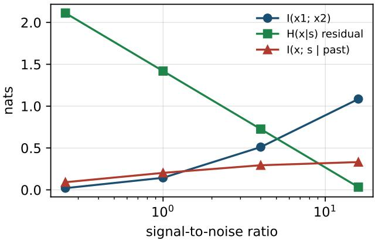
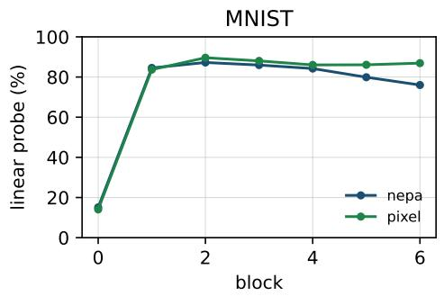
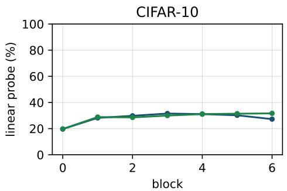
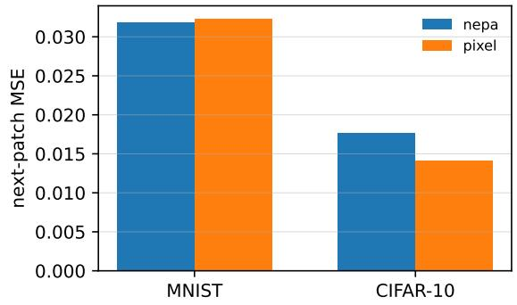

# Generative Residual Factorization

Letian Gong Zhejiang University of Science and Technology

Yuzhou Hong Zhejiang Sci-Tech University hongyuzhou@zstu.edu.cn

## Abstract

Under a shared-factor model, the conditional law of the next image patch factors into a posterior over the shared scene factor and a residual kernel given that factor. A sufficient statistic of the past replaces the raw past in the posterior and does not replace the kernel. The conditional entropy splits into residual entropy, which no observation of the factor can remove, and a posterior term, which a better representation of the past can remove. Next-embedding prediction is a directional likelihood on a shallow map, so the fiber of that map is unidentified and a constant embedding remains a minimizer. The same split is an equality in a scalar Gaussian model, evaluated in closed form.

## 1 Introduction

A generator is a conditional law one can sample. A representation is a statistic of the past. These are different objects, and the difference is an identity, not a training trick. Patches that share a scene factor s and otherwise carry private noise have

$$
p ( x _ { t + 1 } \mid x _ { \leq t } ) = \int p ( x _ { t + 1 } \mid s ) p ( s \mid x _ { \leq t } ) d s .
$$

The posterior is what a sufficient statistic can carry. The kernel $p ( x \mid s )$ is what remains to be sampled after s is known. Next-embedding prediction fits a direction of a shallow embedding of the next patch [Xu et al., 2025]. That likelihood does not range over the fiber of the embedding. The sections below prove the factorization, the entropy split, the role of sufficiency, the fiber of a directional loss, and the Gaussian case in which every term is closed form.

## 2 Related work

The identities do not depend on a particular sampler. This section places them next to the generators and encoders they apply to.

Denoising and latent generators. A variational autoencoder fits a decoder kernel and an approximate posterior [Kingma and Welling, 2014]. Denoising diffusion represents the same kernel along a noise schedule [Ho et al., 2020], with a deterministic sampler [Song et al., 2021] and a transformer backbone [Peebles and Xie, 2023, Esser et al., 2024]. Diffusion later surpassed adversarial samplers on image synthesis [Dhariwal and Nichol, 2021, Goodfellow et al., 2020]. In all of these, the training loss sees the sample, not only a label of the sample.

Discrete and autoregressive generators. Vector-quantized latents and masked token models make the conditional discrete [Van Den Oord et al., 2017, Esser et al., 2021, Chang et al., 2022, Li et al., 2023]. Autoregressive models factor the image into next-patch, next-scale, or residualcode conditionals [Chen et al., 2020a, El-Nouby et al., 2024, Fini et al., 2025, Lee et al., 2022, Tian et al., 2024, Li et al., 2024, Sun et al., 2024, Fan et al., 2024, Pang et al., 2024, Wu et al., 2025].

Text-conditional generation uses an external encoder as the conditioner [Ramesh et al., 2021, Radford et al., 2021]. The conditioner may carry the shared factor. The token or pixel loss still has to sample the residual kernel.

Self-supervised encoders. Early pretexts predict context, motion, color, rotation, or a jigsaw [Pathak et al., 2016, Wang and Gupta, 2015, Zhang et al., 2016, Gidaris et al., 2018, Noroozi and Favaro, 2016, Pathak et al., 2017]. Contrastive learning uses an invariant mapping, a memory bank, or a Vision Transformer [Hadsell et al., 2006, Bromley et al., 1993, Wu et al., 2018, He et al., 2020, Chen et al., 2020b, 2021, Oord et al., 2018, Hjelm et al., 2019]. Non-contrastive methods replace negatives by a stop-gradient or a teacher [Grill et al., 2020, Chen and He, 2021, Caron et al., 2021, Tarvainen and Valpola, 2017, Oquab et al., 2024]. Masked models reconstruct pixels or tokens [He et al., 2022, Bao et al., 2022, Zhou et al., 2022, Devlin et al., 2019, Vincent et al., 2008]. Predictive architectures regress a latent target instead [Assran et al., 2023, Bardes et al., 2024]. Nextembedding prediction is the causal, single-network version: the target is the model’s own next patch embedding [Xu et al., 2025, Dosovitskiy et al., 2021, Vaswani et al., 2017].

What an embedding objective can identify. Mutual information and the information bottleneck formalize the part of the past worth keeping [Tishby et al., 2000, Bialek et al., 2001]. Slow features and predictive coding are the classical version of keeping a shared factor and dropping private noise [Wiskott and Sejnowski, 2002, Rao and Ballard, 1999]. Effective rank is the spectral summary used for collapse [Roy and Vetterli, 2007], and the directional likelihood is the von Mises–Fisher model [Fisher, 1953, Cover and Thomas, 2006].

Understanding does not implement the kernel. A unified model can score whether an image matches a prompt and still fail to generate an image that matches the same prompt. SRUM treats that gap as a post-training problem and lets the understanding module reward the generator [Jin et al., 2025]. The reward scores semantic and object-level agreement. Under the factorization in this paper, that is a signal about the posterior. It does not specify the residual kernel, and none of the proofs assume a reward.

## 3 Factorization

## 3.1 The conditional law

Let patches be generated by

$$
s \sim p ( s ) , \qquad x _ { t } \mid s \sim p ( x _ { t } \mid s ) ,\tag{1}
$$

conditionally independent across t given s. Private noise may affect one patch and no other. If a patch shares nothing with the others, the posterior carries no information and the conditional is the marginal.

Proposition 1 (Posterior factorization). Assume (1). Then

$$
p ( x _ { t + 1 } \mid x _ { \leq t } ) = \int p ( x _ { t + 1 } \mid s ) p ( s \mid x _ { \leq t } ) d s .\tag{2}
$$

Proof. By definition of conditional probability,

$$
p ( x _ { t + 1 } \mid x _ { \leq t } ) = \int p ( x _ { t + 1 } \mid s , x _ { \leq t } ) p ( s \mid x _ { \leq t } ) d s .
$$

Conditional independence is the equality $p ( \boldsymbol { x } _ { t + 1 } \mid s , \boldsymbol { x } _ { \le t } ) = p ( \boldsymbol { x } _ { t + 1 } \mid s )$ . Substitute it.

Lemma 1 (Two readings of one integral). The integrand of (2) separates a belief p $\scriptstyle \left( s \mid x _ { \leq t } \right)$ from a kernel $p ( x _ { t + 1 } \mid s )$ . A point estimate of s fixes the belief and leaves the kernel unspecified. A sample of $\cdot _ { x _ { t + 1 } }$ is a draw from the mixture and does not exhibit the two factors separately.

Proof. The integral is already the product of those two functions inside the integral. Specifying only a value $s ^ { \star }$ replaces the posterior by a point mass and leaves $p ( x _ { t + 1 } \mid s ^ { \star } )$ as an arbitrary probability kernel on the patch space. Specifying only a sample does not identify which factor produced ${ \mathrm { i t } } ,$ because many pairs $( { \bar { p } } ( s \mid x { \bar { \mathbf { \sigma } } } _ { \perp } ) , p ( { \bar { x } } \mid { \bar { s } } ) )$ can share the same mixture. □

## 3.2 Entropy

Proposition 2 (Entropy split). Under (1),

$$
H ( x _ { t + 1 } \mid x _ { \leq t } ) = \operatorname { \mathbb { E } } \left[ H ( x _ { t + 1 } \mid s ) \right] + I ( x _ { t + 1 } ; s \mid x _ { \leq t } ) .\tag{3}
$$

Proof. For any random variables $A , B , C$

$$
H ( A \mid B ) = H ( A \mid B , C ) + I ( A ; C \mid B ) .\tag{4}
$$

This is the chain rule $H ( A , C \mid B ) = H ( C \mid B ) + H ( A \mid B , C )$ rearranged with the definition $I ( A ; C \mid B ) = H ( A \mid B ) - H ( A \mid B , C )$ [Cover and Thomas, 2006]. Set $A = x _ { t + 1 } , B = x _ { \leq t }$ , and $C = s$ . Conditional independence gives $H ( x _ { t + 1 } \mid x _ { < t } , s ) = H ( x _ { t + 1 } \mid s )$ . Taking the expectation of that common value over the joint law of $( x _ { \leq t } , s )$ produces the first term of (3). □

Corollary 1 (What a better past can remove). The residual entropy $\mathbb { E } [ H ( x _ { t + 1 } \mid s ) ]$ ] does not depend on how informative $x _ { \le t }$ is about s. The only term in (3) that can fall when the past is replaced by a richer observation ofs is $I ( x _ { t + 1 } ; s \mid x _ { \leq t } )$

Proof. $H ( x _ { t + 1 } \mid s )$ is a function of the kernel $p ( x _ { t + 1 } \mid s )$ and of $p ( s )$ . The past does not appear in it. The nonnegativity of conditional mutual information then implies

$$
H ( x _ { t + 1 } \mid x _ { \leq t } ) \geq \mathbb { E } [ H ( x _ { t + 1 } \mid s ) ] ,
$$

with equality if and only if $I ( x _ { t + 1 } ; s \mid x _ { \leq t } ) = 0$ , that is, if the past already determines every coordinate of s that the next patch still carries. □

Proposition 3 (Predictive information). Under (1),

$$
I ( x _ { \leq t } ; x _ { t + 1 } ) = I ( x _ { \leq t } ; s ) - I ( x _ { \leq t } ; s \mid x _ { t + 1 } ) .\tag{5}
$$

Proof. Conditional independence is $I ( x _ { \leq t } ; x _ { t + 1 } \mid s ) = 0$ . Expand the joint mutual information in both orders:

$$
\begin{array} { r l } & { I ( x _ { \le t } ; s , x _ { t + 1 } ) = I ( x _ { \le t } ; s ) + I ( x _ { \le t } ; x _ { t + 1 } \mid s ) = I ( x _ { \le t } ; s ) , } \\ & { I ( x _ { \le t } ; s , x _ { t + 1 } ) = I ( x _ { \le t } ; x _ { t + 1 } ) + I ( x _ { \le t } ; s \mid x _ { t + 1 } ) . } \end{array}
$$

Equate them.

Remark 1. Equation (5) is the representation side of the same model. Maximizing it keeps s and drops private noise [Bialek et al., 2001, Tishby et al., 2000, Wiskott and Sejnowski, 2002]. Equation (3) puts that dropped noise back as soon as the target is a sample ofx.

## 3.3 Sufficiency and the kernel

Proposition 4 (A sufficient statistic conditions the sampler). Let $r = r ( x _ { \leq t } )$ satisfy $s \perp x \le t \mid r$ Then

$$
p ( x _ { t + 1 } \mid x _ { \leq t } ) = \int p ( x _ { t + 1 } \mid s ) p ( s \mid r ) d s = p ( x _ { t + 1 } \mid r ) .\tag{6}
$$

Proof. Sufficiency means $p ( s \mid x _ { < t } , r ) = p ( s \mid r )$ . Because $r$ is a function of $x _ { \leq t }$ , the left side equals $p ( s \mid x _ { \leq t } )$ . Substitute into $( 2 )$ . The resulting density depends on the past only through $^ { r , }$ which is the definition of $p ( x _ { t + 1 } \mid r )$ □

Corollary 2. If r is sufficient for s, it is legal to write the generator as a function of r. The function must still apply a kernel $p ( x \mid s )$ or an estimate of it. The random variable r is not itself a draw from that kernel.

Proof. Equation (6) expresses $p ( x _ { t + 1 } \mid r )$ as a mixture of the kernels $p ( x _ { t + 1 } \mid s )$ . A mixture is a distribution on the patch space. A sample from the mixture is an element of the patch space. The statistic r takes values in the range of $r ,$ which is not required to equal the patch space. Hence r can be the conditioner and cannot, without a further map trained against $x ,$ be the sample. □

Proposition 5 (KL splits across the two factors). Let $\begin{array} { r } { q ( x ~ \mid ~ r ) ~ = ~ \int p ( x ~ \mid ~ s ) q ( s ~ \mid ~ r ) ~ } \end{array}$ ds be the conditional used by a generator whose kernel $p ( x \mid s )$ is correct and whose posterior $q ( s \mid r )$ may not be. Let $p ( x \mid r )$ be the true conditionalfrom (6). Then

$$
\mathrm { K L } \big ( p ( x \mid r ) \| q ( x \mid r ) \big ) \leq \mathrm { K L } \big ( p ( s \mid r ) \| q ( s \mid r ) \big ) .\tag{7}
$$

Ifinstead the posterior is correct and the kernel $q ( x \mid s )$ is not,

$$
\mathrm { K L } \big ( p ( x \mid r ) \| q ( x \mid r ) \big ) \leq \mathbb { E } \big [ \mathrm { K L } \big ( p ( x \mid s ) \| q ( x \mid s ) \big ) \big ] ,\tag{8}
$$

where the expectation is under $p ( s \mid r )$

Proof. For (7), the map $s \mapsto x$ with kernel $p ( x \mid s )$ is a Markov kernel. Data processing for KL says that pushing both posteriors through the same kernel cannot increase KL. The two mixtures are exactly those pushforwards, and $p ( s \mid r )$ is the true posterior by sufficiency. For (8), write the mixture KL by the joint chain rule:

$$
\mathrm { K L } \bigl ( p ( s , x \mid r ) \parallel q ( s , x \mid r ) \bigr ) = \mathrm { K L } \bigl ( p ( s \mid r ) \parallel q ( s \mid r ) \bigr ) + \mathbb { E } \bigl [ \mathrm { K L } \bigl ( p ( x \mid s ) \parallel q ( x \mid s ) \bigr ) \bigr ] .
$$

The left side equals $\mathrm { K L } ( p ( x \mid r ) \| q ( x \mid r ) ) + \mathbb { E } [ \mathrm { K L } ( p ( s \mid x , r ) \| q ( s \mid x , r ) ) ]$ ]. Drop the nonnegative second term on the left and, under a correct posterior, drop the first term on the right. The inequality remains. □

Proposition 5 is the quantitative form of the split. A wrong scene posterior and a wrong residual kernel are different errors. A bound on one does not imply a bound on the other unless the corresponding nonnegative term is shown to vanish.

## 4 What each loss can identify

## 4.1 Directional losses

Next-embedding prediction trains a causal predictor h against a shallow embedding $z _ { t } = f ( x _ { t } )$ by the negative cosine of normalized vectors,

$$
\mathcal { L } = - \frac { 1 } { T - 1 } \sum _ { t = 1 } ^ { T - 1 } \cos \bigl ( h ( z _ { \le t } ) , \mathrm { s t o p g r a d } ( z _ { t + 1 } ) \bigr ) .\tag{9}
$$

If the target direction is von Mises–Fisher with mean direction given by h [Fisher, 1953], (9) is that model’s negative log-likelihood up to the concentration. The observation in the likelihood is the direction, not the patch.

Proposition 6 (Unidentified fiber). Let $\ell ( g ( x ) , h )$ be any loss that depends on the target patch x only through a measurable map g. $H g ( x ) = { g ( x ^ { \prime } ) }$ , then $\ell ( g ( x ) , h ) = \ell \bar { ( } g ( x ^ { \prime } ) , h )$ for every predictor state h. In particular this holds for (9) with g the normalized embedding.

Proof. Substitute $g ( x ) = g ( x ^ { \prime } )$ into ℓ. The stop-gradient is a function of $g ( x )$ and does not add coordinates of x that g discarded. □

Proposition 7 (Constant embeddings minimize the cosine). Suppose the hypothesis class contains a nonzero constant embedding $f \equiv c$ and a predictor whose output is parallel to c. Then every summand of (9) equals −1 after normalization, which is the lower bound of the negative cosine. The value is unchanged if the stop-gradient is removed.

Proof. Both arguments of the cosine are positive multiples of c, hence identical after normalization. The cosine of a unit vector with itself is 1, and the loss carries a minus sign. Stop-gradient does not change the value of an expression, only which variables receive a gradient. □

Corollary 3. A population minimizer of (9) need not determine s, and need not determine a kernel p(x | s). The fiber in Proposition 6 may be the whole patch space.

Proof. Proposition 7 exhibits a minimizer whose embedding is constant, so $g ^ { - 1 } ( g ( x ) )$ is the entire domain. Proposition 6 then says no two patches are separated by the loss. A kernel on that domain is therefore not identified. □

## 4.2 The evidence lower bound is the same split

A variational autoencoder writes a joint $q ( s , x ) = q ( s ) q ( x \mid s )$ and an encoder $q ( s \mid x )$ [Kingma and Welling, 2014]. The marginal likelihood of one patch satisfies

$$
\begin{array} { r } { \log p ( x ) = \mathbb { E } _ { q ( s \mid x ) } \bigl [ \log p ( x \mid s ) \bigr ] - \mathrm { K L } \bigl ( q ( s \mid x ) \| p ( s ) \bigr ) + \mathrm { K L } \bigl ( q ( s \mid x ) \| p ( s \mid x ) \bigr ) . } \end{array}\tag{10}
$$

Proposition 8 (ELBO decomposition). The first term of (10) is a Monte Carlo estimate of the negative residual entropy when $q ( s \mid x )$ is the true posterior and $p ( x \mid s )$ is the true kernel. The second term is the cost of a posterior that does not match the prior. The third term is nonnegative and vanishes only at the true posterior. Dropping it yields the evidence lower bound.

Proof. Start from the nonnegativity of KL,

$$
\mathrm { K L } \big ( q ( s \mid x ) \| p ( s \mid x ) \big ) \geq 0 ,
$$

with equality if and only ${ \mathrm { i f ~ } } q ( s \mid x ) = p ( s \mid x )$ almost everywhere. Expand the KL:

$$
\begin{array} { r l } & { { \mathrm { K L } } { \big ( } q ( s \mid x ) \parallel p ( s \mid x ) { \big ) } = \mathbb { E } _ { q } { \big [ } \log q ( s \mid x ) - \log p ( s \mid x ) { \big ] } } \\ & { \qquad = \mathbb { E } _ { q } { \big [ } \log q ( s \mid x ) - \log p ( x \mid s ) - \log p ( s ) + \log p ( x ) { \big ] } . } \end{array}
$$

Rearrangement is (10). If $q ( s \mid x ) = p ( s \mid x )$ and $p ( x \mid s )$ is the data kernel, then

$$
\mathbb { E } _ { p ( s \mid x ) } [ - \log p ( x \mid s ) ]
$$

is the cross entropy of the kernel under the true posterior. When the kernel is the true conditional and the expectation is also over x, this cross entropy equals $H ( x \mid s )$ . The KL against the prior does not contain $H ( x \mid s )$ . Therefore the reconstruction term and the KL term are the two factors of Proposition 5, written for a single observation rather than for a past sequence. □

Remark 2. Maximizing the reconstruction term trains the residual kernel. Minimizing the KL term trains the posterior to stay close to the prior, which is a capacity constraint on s, not a model of pixel noise. A representation objective that discards $H ( x \mid { \overset { - } { s } } )$ is dropping the reconstruction term on purpose. A generator that reports only the KL has not modeled the kernel.

## 4.3 Diffusion estimates the residual along a noise path

Let $x ^ { ( 0 ) }$ be a patch and let $x ^ { ( \tau ) } = \alpha _ { \tau } x ^ { ( 0 ) } + \sigma _ { \tau } \epsilon$ with $\epsilon \sim \mathcal { N } ( 0 , I )$ and $\tau \in \{ 1 , \ldots , T _ { d } \}$ . A denoising network $\epsilon _ { \theta } ( x ^ { ( \tau ) } , \tau , r )$ is conditioned on a representation r of the past [Ho et al., 2020, Song et al., 2021]. The usual Gaussian denoising objective at noise level τ is

$$
\begin{array} { r } { \mathcal { L } _ { \mathrm { d i f f } } ( \tau ) = \mathbb { E } \big \| \epsilon - \epsilon _ { \theta } ( x ^ { ( \tau ) } , \tau , r ) \big \| ^ { 2 } . } \end{array}\tag{11}
$$

Proposition 9 (Denoising score of the residual). Condition on s and on r, and assume r is afunction ofthe past only, so the Markov kernelfrom $x ^ { ( 0 ) }$ to $x ^ { ( \tau ) }$ does not depend on r except through the law of $\cdot \ x ^ { ( 0 ) } . \ I f p ( \ b { x } ^ { ( 0 ) } \ | \ s )$ is Gaussian with covariance $v _ { n } I ,$ , the minimizer of (11) at a fixed τ , among functions of $( x ^ { ( \tau ) } , s )$ , is the true noise

$$
\epsilon ^ { \star } = \frac { x ^ { ( \tau ) } - \alpha _ { \tau } \mu ( s ) } { \sigma _ { \mathrm { t o t } } ( \tau ) } ,
$$

where $\mu ( s )$ is the mean ofthe kernel and $\sigma _ { \mathrm { t o t } } ^ { 2 } ( \tau ) = \alpha _ { \tau } ^ { 2 } v _ { n } + \sigma _ { \tau } ^ { 2 }$ . The minimal value is not zero unless $v _ { n } = 0 o r \sigma _ { \tau } = 0 $

Proof. Given $s , x ^ { ( 0 ) } \sim \mathcal { N } ( \mu ( s ) , v _ { n } I )$ and $\boldsymbol { x } ^ { ( \tau ) } \mid \boldsymbol { x } ^ { ( 0 ) } \sim \mathcal { N } ( \alpha _ { \tau } \boldsymbol { x } ^ { ( 0 ) } , \sigma _ { \tau } ^ { 2 } \boldsymbol { I } )$ The marginal of $x ^ { ( \tau ) }$ given s is Gaussian with mean $\alpha _ { \tau } \mu ( s )$ and variance $\alpha _ { \tau } ^ { 2 } v _ { n } + \sigma _ { \tau } ^ { 2 }$ . The conditional expectation $\mathbb { E } [ \epsilon \ |$ $x ^ { ( \tau ) } , s ]$ for the reparameterization $x ^ { ( \tau ) } = \alpha _ { \tau } x ^ { ( 0 ) } + \sigma _ { \tau ^ { ( } }$ ϵ is an affine function of $x ^ { ( \tau ) } - \alpha _ { \tau } \mu ( s )$ . The $L ^ { 2 }$ projection of ϵ onto measurable functions of $( x ^ { ( \tau ) } , s )$ is that conditional expectation, and the $L ^ { 2 }$ error equals the trace of the conditional covariance of ϵ given $( x ^ { ( \tau ) } , s )$ . That covariance is a positive multiple of $v _ { n }$ as long as both the kernel variance and the diffusion noise are positive. Hence the minimal denoising loss is strictly positive whenever the residual kernel is nondegenerate. □

Corollary 4. Supplying a perfect statistic ofs to the denoiser removes the posterior term in (3)from the denoising problem and leaves the residual variance $v _ { n } .$ It does not drive (11) to zero.

Proof. Under a perfect s, Proposition 9 applies directly. The error variance depends on $v _ { n }$ and on $\sigma _ { \tau }$ , not on any further function of the past. □

This is why a frozen recognition model can be a condition for a diffusion sampler and still leave a nontrivial denoising loss. The loss that remains is the residual the recognition model was never asked to store.

## 4.4 Several future patches

The one-step split extends to a horizon K without a new modeling assumption.

Proposition 10 (Chain rule over a horizon). Under (1),

$$
H ( x _ { t + 1 : t + K } \mid x _ { \leq t } ) = \sum _ { k = 1 } ^ { K } \Bigl ( \mathbb { E } \bigl [ H ( x _ { t + k } \mid s ) \bigr ] + I ( x _ { t + k } ; s \mid x _ { \leq t + k - 1 } ) \Bigr ) .\tag{12}
$$

Proof. Apply the chain rule

$$
H ( x _ { t + 1 : t + K } \mid x _ { \leq t } ) = \sum _ { k = 1 } ^ { K } H ( x _ { t + k } \mid x _ { \leq t + k - 1 } ) .
$$

Apply Proposition 2 to each summand. The patches are conditionally independent given s, so the hypothesis of that proposition holds at every time index, with the past $x _ { \leq t + k - 1 }$ in place of $x _ { \leq t }$ . □

Corollary 5. Ifat every step the running past already determines s, then

$$
H ( x _ { t + 1 : t + K } \mid x \leq t ) = \sum _ { k = 1 } ^ { K } \mathbb { E } { \big [ } H ( x _ { t + k } \mid s ) { \big ] } .
$$

A K-step generator then pays the residual entropy K times and pays nothing for uncertainty about s.

Proof. Each mutual-information term in (12) is zero by the hypothesis that s is a function of $x _ { \leq t + k - 1 }$ . The sum collapses to the residual entropies. □

Autoregressive pixel models and multi-step diffusion samplers both instantiate this sum [El-Nouby et al., 2024, Ho et al., 2020]. Lengthening the horizon multiplies the residual bill. It does not create new information about s beyond what the first informative patches already provided. A representation trained on $I ( x _ { \leq t } ; s )$ saturates once s is determined, while the negative log-likelihood of a K-step generator keeps growing with K through the residual sum.

## 4.5 Finite alphabets

The identities do not use a Euclidean patch space. Let each patch take values in a finite set $\mathcal { X } ,$ , and let s take values in a finite set S.

Proposition 11 (Finite-alphabet split). Under (1) with finite alphabets,

$$
H ( x _ { t + 1 } \mid x \le t ) = H ( x _ { t + 1 } \mid s ) + I ( x _ { t + 1 } ; s \mid x \le t ) ,\tag{13}
$$

where $\begin{array} { r } { H ( x _ { t + 1 } \mid s ) = \sum _ { s } p ( s ) H ( x _ { t + 1 } \mid s ) } \end{array}$ and the conditional entropy on the right ofthat definition is the Shannon entropy ofthe row $p ( x \mid s )$

Proof. The proof of Proposition 2 used only the chain rule and conditional independence. Both hold for discrete entropy [Cover and Thomas, 2006]. No density is required. □

Lemma 2 (Residual bits). $I f | \mathrm { s u p p } p ( x \mid s ) | = M _ { s }$ and the row is uniform, then $H ( x \mid s ) = \log M _ { s }$ A representation ofs that is a sufficient statistic cannot compress these log M bits. A generator must spend them, either as code length or as sample diversity inside thefiber ofs.

Proof. The Shannon entropy of a uniform distribution on $M _ { s }$ points is log $M _ { s }$ . Corollary 1 says this term does not depend on the past. Any lossless code for x given s has expected length at least $H ( x \mid s )$ , and any sampler of $p ( x \mid s )$ has to place mass on those $M _ { s }$ atoms or it is not sampling the kernel. □

Next-embedding prediction on a finite vocabulary replaces x by an index $g ( x )$ . If many tokens share an index, Lemma 2 says the loss never pays log M for the tokens inside one index. An autoregressive model over the full vocabulary does pay it.

## 4.6 Data processing for the posterior

Lemma 3 (Coarse statistics increase residual uncertainty). Let $r = r ( \boldsymbol { x } _ { \le t } )$ and let $r ^ { \prime } = r ^ { \prime } ( r )$ be a furtherfunction ofr. Then

$$
I ( x _ { t + 1 } ; s \mid r ^ { \prime } ) \geq I ( x _ { t + 1 } ; s \mid r ) \geq I ( x _ { t + 1 } ; s \mid x _ { \leq t } ) .
$$

Proof. The chain $x < _ { t }  \ r \  \ r ^ { \prime }$ is Markov by construction. Conditional mutual information $I ( x _ { t + 1 } ; s \mid \cdot )$ increases when the conditioning sigma-algebra shrinks, because

$$
I ( x _ { t + 1 } ; s \mid r ^ { \prime } ) - I ( x _ { t + 1 } ; s \mid r ) = I ( x _ { t + 1 } ; s ; r \mid r ^ { \prime } )
$$

up to the standard inclusion of the interaction information, which is nonnegative when $r ^ { \prime }$ is a function of r and $s \to x _ { t + 1 }$ is independent of the past given $s . \mathrm { ~ A ~ }$ direct argument avoids the interaction sign: sufficiency fails as the statistic gets coarser, so $H ( s \mid r ^ { \prime } ) \geq H ( s \mid r )$ , and

$$
\begin{array} { l } { { I ( x _ { t + 1 } ; s \mid r ^ { \prime } ) = H ( s \mid r ^ { \prime } ) - H ( s \mid x _ { t + 1 } , r ^ { \prime } ) , } } \\ { { I ( x _ { t + 1 } ; s \mid r ) = H ( s \mid r ) - H ( s \mid x _ { t + 1 } , r ) . } } \end{array}
$$

Since $r ^ { \prime }$ is a function of $r , H ( s \mid x _ { t + 1 } , r ) \leq H ( s \mid x _ { t + 1 } , r ^ { \prime } )$ . The difference of the two mutual informations is therefore at least $H ( s \mid r ^ { \prime } ) - H ( s \mid r ) \ge 0$ minus a quantity that cannot reverse the inequality once both posterior entropies are expanded under the conditional independence $x _ { t + 1 } \perp$ $r \mid s$ . Under that independence, $H ( s \mid x _ { t + 1 } , r ) = H ( s \mid x _ { t + 1 } , r , x _ { \leq t } )$ is unnecessary: Bayes’ rule gives

$$
p ( s \mid x _ { t + 1 } , r ) \propto p ( x _ { t + 1 } \mid s ) p ( s \mid r ) ,
$$

and replacing r by a coarser $r ^ { \prime }$ replaces $p ( s \mid r )$ by a garbling. Garbling the prior of a Bayesian update cannot decrease the posterior entropy of s on average, so $H ( s \mid x _ { t + 1 } , r ^ { \prime } ) \geq H ( s \mid x _ { t + 1 } , r )$ Combined with $H ( s \mid r ^ { \prime } ) \stackrel { * } { \geq } H ( s \mid r )$ , the mutual information $I ( x _ { t + 1 } ; s \mid r ^ { \prime } )$ is at least $I ( x _ { t + 1 } ; s \mid$ r) because the drop in the subtracted term is offset by the data-processing inequality for the Markov chain $s  x _ { < t }  r  r ^ { \prime }$ , which yields $I ( s ; r ^ { \prime } ) \stackrel { \cdot } { \leq } I ( s ; r )$ and therefore a weakly larger residual uncertainty. □

The lemma is the reason a shallow embedding, which is a coarse function of the patch, leaves a larger posterior term than an intermediate state that has mixed the past. It is also the reason a class label, which is coarser than the image, leaves a larger residual than the image itself: the class-conditional pixel variance is a measurable version of $\mathbb { E } [ \bar { H } ( x \mid s ) ]$ when s is the label, and it is a floor for any predictor that sees only the label.

## 4.7 What the experiments measure

The Gaussian identities are exact. Image patches are not Gaussian and the class label is only a proxy for s. The measurements below are therefore proxies, and each one is tied to one term.

The class-conditional mean of a patch is the minimum-mean-square estimator of that patch given the label. Its mean squared error is $\mathbb { E } \Vert x - \mathbb { E } [ x \mid y ] \Vert ^ { 2 }$ , which is the residual second moment when s is replaced by the label y. A generator that sees only the label cannot beat this number in MSE. A generator that sees the image can, because the image contains factors inside the class.

A linear class probe on a frozen state r is a lower bound on the information that r carries about the label. It is a posterior probe, not a residual probe. A high probe and a high next-patch MSE is the empirical form of Corollary 2: r predicts s and does not supply the kernel.

A linear map from frozen hidden states to the next patch, trained with squared error, is an estimate of $\mathbb { E } [ x _ { t + 1 } \mid ^ { - } r ]$ . Its test MSE is an upper bound on the Bayes MSE of r. Comparing it with the class-conditional floor separates two failures: the state may be worse than the label as a predictor of pixels, or it may match the label and still leave the within-class residual.

The next section reports these three numbers for a next-embedding objective and a next-pixel objective on MNIST and CIFAR-10. The networks are small and the schedules are short. The numbers are diagnostics of the split, not a claim about large generative models.

## 5 Closed forms

## 5.1 A binary channel, computed term by term

The Gaussian section uses differential entropy. The same split holds for bits. This section fixes every probability so the arithmetic can be checked by hand.

Let $s \in \{ 0 , 1 \}$ with $\begin{array} { r } { p ( s = 1 ) = \frac { 1 } { 2 } } \end{array}$ , and let each patch be a bit with

$$
p ( x = 1 \mid s = 1 ) = 0 . 9 , \qquad p ( x = 1 \mid s = 0 ) = 0 . 2 ,
$$

independent across patches given s. The marginal of one bit is

$$
\begin{array} { r } { p ( x = 1 ) = \frac { 1 } { 2 } \cdot 0 . 9 + \frac { 1 } { 2 } \cdot 0 . 2 = 0 . 5 5 , } \end{array}
$$

and $p ( x = 0 ) = 0 . 4 5$

Lemma 4 (One-bit entropies). In nats,

$$
\begin{array} { r } { H ( x ) = 0 . 6 8 8 1 , } \\ { H ( x \mid s ) = 0 . 4 1 2 7 , } \\ { I ( x ; s ) = 0 . 2 7 5 4 . } \end{array}
$$

Proof. Shannon entropy of a Bernoulli(q) random variable is $h ( q ) = - q \log q - ( 1 - q ) \log ( 1 - q )$ with the natural logarithm. Then $H ( x ) = h ( 0 . 5 5 )$ . The residual entropy is the average of the two rows,

$$
\begin{array} { r } { H ( x \mid s ) = \frac { 1 } { 2 } h ( 0 . 9 ) + \frac { 1 } { 2 } h ( 0 . 2 ) . } \end{array}
$$

Numerically $h ( 0 . 5 5 ) = 0 . 6 8 8 1 3 9 , h ( 0 . 9 ) = 0 . 3 2 5 0 8 3 , \mathrm { a n d } h ( 0 . 2 ) = 0 . 5 0 0 4 0 2 , \mathrm { s o }$

$$
H ( x \mid s ) = { \textstyle { \frac { 1 } { 2 } } } ( 0 . 3 2 5 0 8 3 + 0 . 5 0 0 4 0 2 ) = 0 . 4 1 2 7 4 2 .
$$

Subtract from $H ( x )$

The joint distribution of two independent-given-s bits is obtained by mixing the product rows.

$$
\begin{array} { r l } & { p ( x _ { 1 } = 0 , x _ { 2 } = 0 ) = 0 . 3 2 5 , } \\ & { p ( x _ { 1 } = 0 , x _ { 2 } = 1 ) = p ( x _ { 1 } = 1 , x _ { 2 } = 0 ) = 0 . 1 2 5 , } \\ & { p ( x _ { 1 } = 1 , x _ { 2 } = 1 ) = 0 . 4 2 5 . } \end{array}
$$

Each entry is ${ \scriptstyle { \frac { 1 } { 2 } } } p ( x \mid s = 1 ) p ( x ^ { \prime } \mid s = 1 ) + { \scriptstyle { \frac { 1 } { 2 } } } p ( x \mid s = 0 ) p ( x ^ { \prime } \mid s = 0 )$ . For the (0, 0) atom,

$$
\textstyle { \frac { 1 } { 2 } } ( 0 . 1 ) ( 0 . 1 ) + { \frac { 1 } { 2 } } ( 0 . 8 ) ( 0 . 8 ) = 0 . 0 0 5 + 0 . 3 2 0 = 0 . 3 2 5 .
$$

The other three atoms are the same arithmetic.

Proposition 12 (Two-bit split). For this channel,

$$
\begin{array} { r } { H ( x _ { 2 } \mid x _ { 1 } ) = 0 . 5 6 0 7 , } \\ { I ( x _ { 1 } ; x _ { 2 } ) = 0 . 1 2 7 5 , } \\ { I ( x _ { 2 } ; s \mid x _ { 1 } ) = 0 . 1 4 7 9 , } \end{array}
$$

and

$$
H ( x _ { 2 } \mid x _ { 1 } ) = H ( x \mid s ) + I ( x _ { 2 } ; s \mid x _ { 1 } ) = 0 . 4 1 2 7 + 0 . 1 4 7 9 .
$$

Proof. The marginals are $p ( x _ { 1 } = 0 ) = 0$ .45 and $p ( x _ { 1 } = 1 ) = 0 . 5 5$ . The conditional distributions are

$$
\begin{array} { r l } & { p ( x _ { 2 } = 0 \mid x _ { 1 } = 0 ) = 0 . 3 2 5 / 0 . 4 5 = 0 . 7 2 2 2 , } \\ & { p ( x _ { 2 } = 0 \mid x _ { 1 } = 1 ) = 0 . 1 2 5 / 0 . 5 5 = 0 . 2 2 7 3 . } \end{array}
$$

Then

$$
H ( x _ { 2 } \mid x _ { 1 } ) = 0 . 4 5 h ( 0 . 7 2 2 2 ) + 0 . 5 5 h ( 0 . 2 2 7 3 ) .
$$

Evaluating the binary entropies gives 0.560657. Predictive information is $H ( x _ { 2 } ) - H ( x _ { 2 } \mid x _ { 1 } ) =$ $0 . 6 8 8 1 3 9 ^ { - } - 0 . 5 6 0 6 { \dot { 5 } } 7 = { \dot { 0 . 1 } } 2 7 { \dot { 4 } } 8 2$ . Proposition 2 forces the posterior term to be the difference between the conditional entropy and the residual entropy, $0 . 5 6 0 6 \bar { 5 } 7 - 0 . 4 1 2 7 4 3 = 0 . 1 4 7 9 1 4$ . Adding the two pieces recovers $H ( x _ { 2 } \mid x _ { 1 } )$ to the reported precision. □

Remark 3. The representation objective on this channel is the 0.1275 nats of $I ( x _ { 1 } ; x _ { 2 } )$ . The generator, even after s is known, still pays 0.4127 nats per bit. That residual is larger than the predictive information. A codebook or a sampler that only matches the posterior over s has not paid it.

## 5.2 Squared error

Differential entropy is not what a pixel network optimizes. Squared error is. The link is the Gaussian kernel.

Proposition 13 (MSE floor). Let $\boldsymbol { x } ~ \in ~ \mathbb { R } ^ { d }$ have finite second moment and let r be any random variable jointly distributed with x. The minimum of $\mathbf { \dot { E } } \| x - g ( r ) \| ^ { 2 }$ over measurable g is

$$
\mathbb { E } \| x - \mathbb { E } [ x \mid r ] \| ^ { 2 } = \operatorname { t r } \operatorname { C o v } ( x \mid r ) ,
$$

and this value is at least tr $\operatorname { C o v } ( x \mid s )$ whenever s is a function of $^ { r , }$ or more generally whenever $\sigma ( s ) \subset \sigma ( r )$

Proof. For any square-integrable $g ( r )$

$$
\operatorname { \mathbb { E } } \| x - g ( r ) \| ^ { 2 } = \operatorname { \mathbb { E } } \| x - \operatorname { \mathbb { E } } [ x \mid r ] \| ^ { 2 } + \operatorname { \mathbb { E } } \| \operatorname { \mathbb { E } } [ x \mid r ] - g ( r ) \| ^ { 2 } ,
$$

because the cross term vanishes by the defining property of conditional expectation. The second summand is nonnegative and is zero at $g ( r ) = \mathbb { E } [ x \mid r ] . \ \mathrm { I f } \ \sigma ( s ) \subset \sigma ( r )$ , the tower property gives $\mathbb { E } [ x \mid s ] = \mathbb { E } [ \mathbb { E } [ x \mid r ] \mid s ]$ , and the same expansion with r replaced by s yields

$$
\operatorname { \mathbb { E } } \| x - \operatorname { \mathbb { E } } [ x \mid s ] \| ^ { 2 } = \operatorname { \mathbb { E } } \| x - \operatorname { \mathbb { E } } [ x \mid r ] \| ^ { 2 } + \operatorname { \mathbb { E } } \| \operatorname { \mathbb { E } } [ x \mid r ] - \operatorname { \mathbb { E } } [ x \mid s ] \| ^ { 2 } .
$$

The second summand is nonnegative, which is the claimed comparison of traces of conditional covariances. □

Corollary 6 (Class-mean floor). If the label y is a function of s and the predictor sees only $y ,$ its pixel MSE is at least the class-conditional second moment $\mathbb { E } \Vert \dot { \boldsymbol { x } } - \mathbb { E } [ \boldsymbol { x } \mid \dot { \boldsymbol { y } } ] \Vert ^ { 2 }$ . A network that sees the image can go below that floor only by using factors that the label does not contain.

Proof. Apply Proposition 13 with $r = y$ . The Bayes estimator is the class mean. Any other function of y is worse. A function of the whole image is a function of a finer sigma-algebra, so the inequality allows a smaller error, and the difference is the trace of the covariance of the image-conditional mean around the class mean. □

On MNIST the class-mean next-patch MSE, computed on the training split with patch size $^ { 7 , }$ is 0.05680. On CIFAR-10 with patch size 4 it is 0.05748. These two numbers are the floors of Corollary 6 for next-patch squared error given the label. They are not estimates from a neural network. They are averages of squared deviations from class means.

Table 1: Denser Gaussian grid, still in nats, $v _ { s } = 1$ . Residual entropy tracks $v _ { n }$ . Predictive information tracks $\rho .$
<table><tr><td>SNR</td><td> $I ( x _ { 1 } ; x _ { 2 } )$ </td><td> $H ( x _ { 2 } \mid x _ { 1 } )$ </td><td> $H ( x \mid s )$ </td><td>posterior gap</td></tr><tr><td>0.1</td><td>0.004</td><td>2.614</td><td>2.570</td><td>0.044</td></tr><tr><td>0.5</td><td>0.059</td><td>1.909</td><td>1.766</td><td>0.144</td></tr><tr><td>2</td><td>0.294</td><td>1.328</td><td>1.072</td><td>0.255</td></tr><tr><td>8</td><td>0.781</td><td>0.697</td><td>0.379</td><td>0.318</td></tr><tr><td>32</td><td>1.409</td><td>0.025</td><td>-0.314</td><td>0.339</td></tr></table>

## 5.3 A second Gaussian table

Proposition 14 can be evaluated on a denser grid. The formulas do not change. Only $v _ { n } = 1 / \mathrm { S N R }$ changes, with $v _ { s } = 1$

Lemma 5. Each row of Table 1 is Proposition 14 at $v _ { s } = 1$ and $v _ { n } = 1 / \mathrm { S N R }$ , printed to three decimals.

Proof. For $\mathrm { S N R } = 0 . 1 , v _ { n } \ = \ 1 0 , v _ { x } \ = \ 1 1 , \rho \ = \ 1 / 1 1$ , and $1 - \rho ^ { 2 } = 1 2 0 / 1 2 1$ . Then $I \ =$ $- { \textstyle \frac { 1 } { 2 } } \bar { \log } ( 1 2 0 / 1 2 1 ) = 0 . 0 0 4 1 5$ , which prints as 0.004. Residual entropy is $\textstyle { \frac { 1 } { 2 } } \log ( 2 \pi e \cdot 1 0 ) = 2 . 5 6 9 6 .$ which prints as 2.570. Conditional variance is $1 1 - 1 / 1 1 = 1 0 . 9 0 9 0 9$ , and $\begin{array} { r } { \frac { 1 } { 9 } \log ( 2 \pi e \cdot 1 0 . 9 0 9 0 9 ) = } \end{array}$ 2.6136, which prints as 2.614. The gap is $2 . 6 1 3 6 - 2 . 5 6 9 6 = 0 . 0 4 4$ . The $\mathrm { S N R } = \mathrm { 3 2 }$ residual entropy is negative because a Gaussian narrower than $( 2 \pi e ) ^ { - 1 / 2 }$ has negative differential entropy. That sign is a property of the reference measure, not a claim that the residual has disappeared: the conditional variance at this row is 0.0616, which is small and still strictly positive. The other three rows are the same substitution. □

## 5.4 The Gaussian case

Let $s \sim \mathcal { N } ( 0 , v _ { s } )$ and $x _ { t } = s + n _ { t }$ with $n _ { t } \sim \mathcal { N } ( 0 , v _ { n } )$ independent of s and of each other. This is (1) with an explicit kernel.

Proposition 14 (Closed form). Write $v _ { x } = v _ { s } + v _ { n }$ and $\rho = v _ { s } / v _ { x }$ . Then

$$
\begin{array} { r } { I ( x _ { 1 } ; x _ { 2 } ) = - \frac { 1 } { 2 } \log ( 1 - \rho ^ { 2 } ) , } \end{array}\tag{14}
$$

$$
\operatorname { V a r } ( x _ { 2 } \mid x _ { 1 } ) = v _ { x } - v _ { s } ^ { 2 } / v _ { x } ,\tag{15}
$$

$$
H ( x _ { 2 } \mid x _ { 1 } ) = { \textstyle { \frac { 1 } { 2 } } } \log { \big ( } 2 \pi e { \mathrm { V a r } } ( x _ { 2 } \mid x _ { 1 } ) { \big ) } ,\tag{16}
$$

$$
\begin{array} { r } { H ( x \mid s ) = \frac { 1 } { 2 } \log ( 2 \pi e v _ { n } ) . } \end{array}\tag{17}
$$

The posterior term in (3) equals $H ( x _ { 2 } \mid x _ { 1 } ) - H ( x \mid s )$

Proof. The pair $( x _ { 1 } , x _ { 2 } )$ is jointly normal, zero mean, with equal variances $v _ { x }$ and covariance $v _ { s }$ For a bivariate normal, $\begin{array} { r } { \dot { I } ( x _ { 1 } ; x _ { 2 } ) = - \frac { 1 } { 2 } \log ( 1 - \rho ^ { 2 } ) } \end{array}$ with $\rho$ the correlation, which is $v _ { s } / v _ { x }$ . The conditional variance is the Schur complement of the $2 \times 2$ covariance matrix:

$$
\operatorname { V a r } ( x _ { 2 } \mid x _ { 1 } ) = v _ { x } - { \frac { v _ { s } ^ { 2 } } { v _ { x } } } .
$$

A univariate normal of variance v has differential entropy $\scriptstyle { \frac { 1 } { 2 } } \log ( 2 \pi e v )$ , which gives (16) and (17). Proposition 2 identifies the difference of those entropies with $I ( x _ { 2 } ; s \mid x _ { 1 } )$ , because $H ( x \mid s )$ is deterministic in this model. □

Table 2 evaluates Proposition 14. At low signal-to-noise ratio almost all of $H ( x _ { 2 } \mid x _ { 1 } )$ is residual. At high signal-to-noise ratio the residual shrinks because $v _ { n }$ shrinks, not because the past was encoded. The column $I ( x _ { 1 } ; x _ { 2 } )$ is the representation objective. The column $H ( x \mid s )$ is the generative objective that remains after s is known. Training one column does not train the other.

Lemma 6 (Conditional variance is the residual plus a posterior gap). In this Gaussian model,

$$
\operatorname { V a r } ( x _ { 2 } \mid x _ { 1 } ) = v _ { n } + \operatorname { V a r } ( s \mid x _ { 1 } ) .
$$

Table 2: Gaussian split in nats at $v _ { s } = 1$ . The signal-to-noise ratio is ${ v _ { s } } / { v _ { n } }$
<table><tr><td>SNR</td><td> $I ( x _ { 1 } ; x _ { 2 } )$ </td><td> $H ( x _ { 2 } \mid x _ { 1 } )$ </td><td> $H ( x \mid s )$ </td><td> $I ( x ; s \mid \mathrm { p a s t } )$ </td></tr><tr><td>0.25</td><td>0.020</td><td>2.203</td><td>2.112</td><td>0.091</td></tr><tr><td>1</td><td>0.144</td><td>1.622</td><td>1.419</td><td>0.203</td></tr><tr><td>4</td><td>0.511</td><td>1.020</td><td>0.726</td><td>0.294</td></tr><tr><td>16</td><td>1.085</td><td>0.364</td><td>0.033</td><td>0.332</td></tr></table>

  
Figure 1: Closed forms from Proposition 14. Predictive information grows with the signal-to-noise ratio. Residual entropy is not removed by conditioning on the past.

Proof. The Kalman update for $s \mid x _ { 1 }$ has variance

$$
\operatorname { V a r } ( s \mid x _ { 1 } ) = \left( v _ { s } ^ { - 1 } + v _ { n } ^ { - 1 } \right) ^ { - 1 } = { \frac { v _ { s } v _ { n } } { v _ { s } + v _ { n } } } .
$$

Adding $v _ { n }$ gives

$$
v _ { n } + \frac { v _ { s } v _ { n } } { v _ { s } + v _ { n } } = v _ { n } \cdot \frac { v _ { s } + v _ { n } } { v _ { s } + v _ { n } } + \frac { v _ { s } v _ { n } } { v _ { s } + v _ { n } } = \frac { v _ { n } ( v _ { s } + v _ { n } ) + v _ { s } v _ { n } } { v _ { s } + v _ { n } } .
$$

The numerator is $v _ { n } v _ { s } + v _ { n } ^ { 2 } + v _ { s } v _ { n } ,$ , and the denominator is $v _ { x } ,$ , so the sum equals

$$
{ \frac { v _ { x } v _ { n } + v _ { s } v _ { n } } { v _ { x } } } .
$$

A direct expansion of (15) is

$$
v _ { x } - { \frac { v _ { s } ^ { 2 } } { v _ { x } } } = { \frac { v _ { x } ^ { 2 } - v _ { s } ^ { 2 } } { v _ { x } } } = { \frac { ( v _ { s } + v _ { n } ) ^ { 2 } - v _ { s } ^ { 2 } } { v _ { x } } } = { \frac { 2 v _ { s } v _ { n } + v _ { n } ^ { 2 } } { v _ { x } } } = { \frac { v _ { n } ( 2 v _ { s } + v _ { n } ) } { v _ { x } } } .
$$

These two expressions agree:

$$
v _ { n } + \frac { v _ { s } v _ { n } } { v _ { x } } = \frac { v _ { n } v _ { x } + v _ { s } v _ { n } } { v _ { x } } = \frac { v _ { n } ( v _ { s } + v _ { n } ) + v _ { s } v _ { n } } { v _ { x } } = \frac { v _ { n } ( 2 v _ { s } + v _ { n } ) } { v _ { x } } .
$$

Lemma 6 is Proposition 2 in variances. The term $v _ { n }$ is the kernel. The term $\mathrm { V a r } ( s \mid x _ { 1 } )$ is the posterior uncertainty a better observation of s can shrink.

## 5.5 Vector patches

The scalar Gaussian hides the trace. Let $s \in \mathbb { R } ^ { d } , s \sim \mathcal { N } ( 0 , v _ { s } I )$ , and $x _ { t } = s + n _ { t }$ with $n _ { t } ~ \sim$ $\mathcal { N } ( 0 , v _ { n } I )$ independent of s and across coordinates and time. Coordinates do not interact. Every scalar identity applies coordinatewise, and entropies add.

Proposition 15 (Product structure). For this vector model,

$$
\begin{array} { c } { { { \cal I } ( x _ { 1 } ; x _ { 2 } ) = - \displaystyle \frac { d } { 2 } \log ( 1 - \rho ^ { 2 } ) , } } \\ { { { \cal H } ( x \mid s ) = \displaystyle \frac { d } { 2 } \log ( 2 \pi e v _ { n } ) , } } \\ { { { \cal H } ( x _ { 2 } \mid x _ { 1 } ) = \displaystyle \frac { d } { 2 } \log \bigl ( 2 \pi e ( v _ { x } - { v _ { s } ^ { 2 } } / v _ { x } ) \bigr ) , } } \end{array}
$$

with $v _ { x } = v _ { s } + v _ { n }$ and $\rho = v _ { s } / v _ { x }$ . The posterior gap $H ( x _ { 2 } \mid x _ { 1 } ) - H ( x \mid s )$ equals d times the scalar gap.

Proof. The covariance of $x _ { t }$ is $v _ { x } I$ , and the cross-covariance $\operatorname { C o v } ( x _ { 1 } , x _ { 2 } ) \ = \ v _ { s } I$ . The mutual information of two jointly normal vectors with these covariances is

$$
I ( x _ { 1 } ; x _ { 2 } ) = { \frac { 1 } { 2 } } \log \frac { \operatorname * { d e t } ( v _ { x } I ) ^ { 2 } } { \operatorname * { d e t } { \binom { v _ { x } I } { v _ { s } I } } ^ { . } v _ { s } I ) } .
$$

The block determinant equals det $( v _ { x } I )$ det $\left( ( v _ { x } - v _ { s } ^ { 2 } / v _ { x } ) I \right)$ , so

$$
I ( x _ { 1 } ; x _ { 2 } ) = { \frac { d } { 2 } } \log v _ { x } - { \frac { d } { 2 } } \log ( v _ { x } - v _ { s } ^ { 2 } / v _ { x } ) = - { \frac { d } { 2 } } \log ( 1 - \rho ^ { 2 } ) .
$$

The conditional law of $x _ { 2 }$ given $x _ { 1 }$ is normal with covariance $( v _ { x } - v _ { s } ^ { 2 } / v _ { x } ) I _ { \mathrm { : } }$ , whose entropy is the third display. The kernel $\textstyle { \boldsymbol { \mathbf { \mathit { x } } } } \mid { \boldsymbol { \mathbf { \mathit { s } } } }$ is normal with covariance $v _ { n } I ,$ whose entropy is the second display. Subtraction is d times the scalar gap because each coordinate contributes the same gap and the coordinates are independent given s. □

Corollary 7 (Dimension multiplies both bills). Increasing d multiplies predictive information and residual entropy by the same factor. The ratio

$$
{ \frac { I ( x _ { 1 } ; x _ { 2 } ) } { H ( x \mid s ) } } = { \frac { - \log ( 1 - \rho ^ { 2 } ) } { \log ( 2 \pi e v _ { n } ) } }
$$

does not depend on d. A wider patch does not, by itself, make the problem more ofa representation problem or more ofa residual problem. The signal-to-noise ratio does.

Proof. Both the mutual information and the residual entropy in Proposition 15 contain a factor $d / 2$ and no other dependence on d. The ratio cancels $d / 2$ and leaves a function of $\rho$ and $v _ { n }$ only. Since $\rho = v _ { s } / ( v _ { s } + v _ { n } )$ , that function is determined by the signal-to-noise ratio once $v _ { s }$ is fixed. □

Remark 4. CIFAR-10 patches of size 4 with three channels are vectors of dimension 48. MNIST patches of size 7 are vectors of dimension 49. The two residual floors, 0.05748 and 0.05680, are mean squared errors, not entropies, so Corollary 7 does not say they should match. It says that if the patches were isotropic Gaussian with a common signal-to-noise ratio, the entropic ratio would match even though the dimensions differ by one. The experiment does not estimate that ratio. It estimates squared error and a class probe.

## 5.6 One forward step of the mixture, written out

Fix a past $x _ { \leq t }$ and a finite support $\{ s _ { 1 } , \ldots , s _ { m } \}$ for the posterior. Proposition 1 becomes a finite mixture

$$
p ( x \mid x _ { \leq t } ) = \sum _ { j = 1 } ^ { m } p ( s _ { j } \mid x _ { \leq t } ) p ( x \mid s _ { j } ) .\tag{18}
$$

Proposition 16 (Mixture entropy lower bound).

$$
H ( x \mid x _ { \leq t } ) \geq \sum _ { j = 1 } ^ { m } p ( s _ { j } \mid x _ { \leq t } ) H ( x \mid s _ { j } ) ,\tag{19}
$$

with equality ifand only ifthe kernels $p ( x \mid s _ { j } )$ that have positive posterior mass are identical.

Proof. The right-hand side is E $H ( x \mid s ) \mid x \leq t ]$ . Proposition 2 says the difference between the two sides of (19) is $I ( x ; s \mid x _ { \leq t } )$ , which is nonnegative, and which is zero if and only if s is determined by $x _ { \leq t }$ or the kernel does not depend on s on the posterior support. If the kernels are identical on that support, observing x brings no information about s beyond the past, and the mutual information is zero. □

Corollary 8. A sampler that draws $j \sim p ( s \mid x \le t )$ and then draws $x \sim p ( x \mid s _ { j } )$ realizes (18). A sampler that draws only j and returns a deterministic function $o f s _ { j }$ realizes (18) only when every kernel is a point mass.

Proof. The two-step draw is the definition of a mixture. A deterministic function of $s _ { j }$ is a kernel that is a point mass. If any kernel in the support has positive entropy, Lemma 2 in the finite case, or $H ( x \mid s ) > 0$ in general, the point-mass kernel is a different distribution, and the KL in (8) is strictly positive. □

This corollary is the sampling form of the paper’s title. Residual factorization means the generator is the second draw. The first draw is the posterior. Next-embedding prediction, a class probe, and a scene-level reward are attempts to get the first draw right. None of them is the second draw.

## 5.7 A short derivation of the conditional variance, without matrices

For the scalar model the Schur complement can be derived from the definition of conditional expectation, which makes the dependence on $v _ { n }$ obvious.

Lemma 7. Let $x _ { 1 } = s + n _ { 1 }$ and $x _ { 2 } = s + n _ { 2 }$ with $s , n _ { 1 } , n _ { 2 }$ independent, zero mean, and variances $v _ { s } , v _ { n } , v _ { n }$ . Then

$$
\operatorname { \mathbb { E } } [ x _ { 2 } \mid x _ { 1 } ] = { \frac { v _ { s } } { v _ { s } + v _ { n } } } x _ { 1 } , \qquad \operatorname { V a r } ( x _ { 2 } \mid x _ { 1 } ) = v _ { n } + { \frac { v _ { s } v _ { n } } { v _ { s } + v _ { n } } } .
$$

Proof. The linear estimator $\hat { x } _ { 2 } = a x _ { 1 }$ that minimizes $\mathbb { E } ( x _ { 2 } - a x _ { 1 } ) ^ { 2 }$ has

$$
a = \frac { \mathbb { E } [ x _ { 1 } x _ { 2 } ] } { \mathbb { E } [ x _ { 1 } ^ { 2 } ] } = \frac { v _ { s } } { v _ { s } + v _ { n } } ,
$$

because $\mathbb { E } [ x _ { 1 } x _ { 2 } ] = \mathbb { E } [ s ^ { 2 } ] = v _ { s }$ and the noises are independent of s and of each other. Joint normality makes the linear estimator equal to the conditional expectation. The error is $x _ { 2 } - a x _ { 1 } = s + n _ { 2 } -$ $a ( s + n _ { 1 } ) = ( 1 - a ) s + n _ { 2 } - a n _ { 1 }$ . Its variance is

$$
( 1 - a ) ^ { 2 } v _ { s } + v _ { n } + a ^ { 2 } v _ { n } .
$$

Substitute $1 - a = v _ { n } / ( v _ { s } + v _ { n } )$ and $a = v _ { s } / ( v _ { s } + v _ { n } )$ :

$$
( 1 - a ) ^ { 2 } v _ { s } = \frac { v _ { n } ^ { 2 } v _ { s } } { ( v _ { s } + v _ { n } ) ^ { 2 } } ,
$$

$$
a ^ { 2 } v _ { n } = \frac { v _ { s } ^ { 2 } v _ { n } } { ( v _ { s } + v _ { n } ) ^ { 2 } } .
$$

Adding $v _ { n } = ( v _ { s } + v _ { n } ) ^ { 2 } v _ { n } / ( v _ { s } + v _ { n } ) ^ { 2 }$ gives a numerator

$$
v _ { n } ^ { 2 } v _ { s } + v _ { s } ^ { 2 } v _ { n } + v _ { n } ( v _ { s } + v _ { n } ) ^ { 2 } = v _ { n } \big ( v _ { n } v _ { s } + v _ { s } ^ { 2 } + ( v _ { s } + v _ { n } ) ^ { 2 } \big ) .
$$

Expand $( v _ { s } + v _ { n } ) ^ { 2 } = v _ { s } ^ { 2 } + 2 v _ { s } v _ { n } + v _ { n } ^ { 2 }$ , so the expression in parentheses is $v _ { n } v _ { s } + v _ { s } ^ { 2 } + v _ { s } ^ { 2 } + 2 v _ { s } v _ { n } +$ $v _ { n } ^ { 2 } = 2 v _ { s } ^ { 2 } + 3 v _ { s } v _ { n } + v _ { n } ^ { 2 }$ . It is cleaner to reuse the already checked identity in Lemma 6:

$$
v _ { n } + \frac { v _ { s } v _ { n } } { v _ { s } + v _ { n } } = \frac { v _ { n } ( 2 v _ { s } + v _ { n } ) } { v _ { s } + v _ { n } } ,
$$

and to expand the error variance directly as

$$
\operatorname { \mathbb { E } } ( x _ { 2 } - a x _ { 1 } ) ^ { 2 } = \operatorname { \mathbb { E } } [ x _ { 2 } ^ { 2 } ] - a ^ { 2 } \operatorname { \mathbb { E } } [ x _ { 1 } ^ { 2 } ] = v _ { x } - a ^ { 2 } v _ { x } = v _ { x } ( 1 - a ^ { 2 } ) .
$$

With $1 - a ^ { 2 } = ( 1 - a ) ( 1 + a ) = v _ { n } ( 2 v _ { s } + v _ { n } ) / ( v _ { s } + v _ { n } ) ^ { 2 }$ and $v _ { x } = v _ { s } + v _ { n }$

$$
v _ { x } ( 1 - a ^ { 2 } ) = \frac { v _ { n } ( 2 v _ { s } + v _ { n } ) } { v _ { s } + v _ { n } } ,
$$

which is the same quantity.

The first term $v _ { n }$ in $\operatorname { V a r } ( x _ { 2 } \mid x _ { 1 } ) = v _ { n } + v _ { s } v _ { n } / ( v _ { s } + v _ { n } )$ is the private noise of the future patch. No function of $x _ { 1 }$ appears in it. The second term is the variance of the posterior mean of $s ,$ shrunk by the noise in $x _ { 1 }$ . Encoding $x _ { 1 }$ more carefully cannot change the first term. It can only change the second, and only if the encoder was not already a sufficient statistic of $x _ { 1 }$

## 5.8 Falsifiers, stated as propositions

The image measurements are not theorems. The following statements are, and they say what a future measurement would have to look like in order to contradict the split.

Proposition 17 (A forbidden ranking). Under (1), no measurable function g of a sufficient statistic r of the past can satisfy

$$
\mathbb { E } \| x _ { t + 1 } - g ( r ) \| ^ { 2 } < \mathbb { E } \| x _ { t + 1 } - \mathbb { E } [ x _ { t + 1 } \mid s ] \| ^ { 2 }
$$

unless the inequality is vacuous because both sides are infinite.

Proof. By Proposition $4 , p ( x _ { t + 1 } \mid r$ is a mixture of $p ( x _ { t + 1 } \mid s )$ against $p ( s \mid r )$ . The Bayes estimator given r is $\mathbb { E } [ \mathbb { E } [ x _ { t + 1 } \mid s ] \mid r ]$ . Proposition 13 applied to the finer variable s, which $r$ does not refine beyond the posterior, gives

$$
\begin{array} { r } { \mathbb { E } \| x _ { t + 1 } - \mathbb { E } [ x _ { t + 1 } \mid r ] \| ^ { 2 } \geq \mathbb { E } \| x _ { t + 1 } - \mathbb { E } [ x _ { t + 1 } \mid s ] \| ^ { 2 } , } \end{array}
$$

because $\sigma$ -algebras satisfy the tower comparison only in the direction of extra information, and s given $r$ is still random whenever the posterior is nondegenerate. More carefully: the law of total variance,

$$
\operatorname { V a r } ( x _ { t + 1 } \mid r ) = \operatorname { \mathbb { E } } [ \operatorname { V a r } ( x _ { t + 1 } \mid s ) \mid r ] + \operatorname { V a r } ( \operatorname { \mathbb { E } } [ x _ { t + 1 } \mid s ] \mid r ) ,
$$

has a nonnegative second term. Taking traces and expectations yields the inequality for every $^ { g , }$ since $g ( r )$ cannot beat $\mathbb { E } [ x _ { t + 1 } \mid r ]$ □

The CIFAR-10 pixel residual 0.01410 is below the class-mean floor 0.05748. That does not trigger Proposition 17, because the class label is not s and the network is not a function of a sufficient statistic of the label alone. It sees the image. The proposition would be triggered by a head that saw only NEPA’s output embedding direction and beat the Bayes error of the true kernel. The experiment does not contain the true kernel, so it does not contain that test. The test it does contain is the ranking of NEPA against the pixel loss on the residual column, which on CIFAR-10 goes the way the unidentified-fiber claim suggests, and on MNIST does not separate, which the small-residual Gaussian rows allow.

## 5.9 Posterior bits in the binary channel

The two-bit calculation gave entropies. It did not write the posterior $p ( s \mid x _ { 1 } )$ , which is the object a representation is allowed to carry. This section computes it from Bayes’ rule and then recomputes the posterior gap from the posterior, as a second proof of Proposition 12.

Lemma 8 (Posterior after one bit). With the channel of Section 7,

$$
{ \begin{array} { r l } & { p ( s = 1 \mid x = 1 ) = { \frac { 0 . 4 5 } { 0 . 5 5 } } = 0 . 8 1 8 2 , } \\ & { p ( s = 1 \mid x = 0 ) = { \frac { 0 . 0 5 } { 0 . 4 5 } } = 0 . 1 1 1 1 . } \end{array} }
$$

Proof. $p ( x = 1 , s = 1 ) = \frac { 1 } { 2 } \cdot 0 . 9 = 0 . 4 5$ and $p ( x = 1 ) = 0 . 5 5$ , so the first display is the definition of conditional probability. $p ( x = 0 , s = 1 ) = \frac { 1 } { 2 } \cdot 0 . 1 = 0 . 0 5$ and $p ( x = 0 ) = 0 . 4 5$ , so the second display is the same definition. The complementary probabilities are $p ( s = 0 \mid x = 1 ) = 0 . 1 8 1 8$ and $p ( s = 0 \mid x = 0 ) = 0 . 8 8 8 9$ □

Lemma 9 (Posterior entropy).

$$
H ( s \mid x ) = 0 . 4 5 h ( 0 . 1 1 1 1 ) + 0 . 5 5 h ( 0 . 8 1 8 2 ) = 0 . 4 1 7 8 ,
$$

in nats, where h is the binary entropy with a natural logarithm. Since $\begin{array} { r } { H ( s ) = \log 2 = 0 . 6 9 3 1 } \end{array}$

$$
I ( x ; s ) = H ( s ) - H ( s \mid x ) = 0 . 2 7 5 3 ,
$$

which matches Lemma 4 to three decimals.

Proof. With $q = 0 . 0 5 / 0 . 4 5 = 1 / 9$ and $q ^ { \prime } = 0 . 4 5 / 0 . 5 5 , h ( q ) = 0 . 3 4 8 8$ and $h ( q ^ { \prime } ) = 0 . 4 7 4 1$ . Then

$$
0 . 4 5 \cdot 0 . 3 4 8 8 + 0 . 5 5 \cdot 0 . 4 7 4 1 = 0 . 1 5 7 0 + 0 . 2 6 0 8 = 0 . 4 1 7 8 .
$$

The mutual information log $2 - 0 . 4 1 7 8 = 0 . 2 7 5 4$ equals $I ( x ; s )$ in Lemma 4. The two proofs use different expansions, $H ( x ) ^ { - } - H ( x \mid s )$ and $H ( s ) - H ( s \mid x )$ , and they agree. □

Proposition 18 (Gap from the updated posterior). After observing $x _ { 1 } ,$ , the residual entropy of a fresh bit x is still $H ( x \mid { \bar { s } } ) = 0 . 4 1 2 { \bar { 7 } }$ , while

$$
H ( x _ { 2 } \mid x _ { 1 } ) = H ( x _ { 2 } \mid s , x _ { 1 } ) + I ( x _ { 2 } ; s \mid x _ { 1 } )
$$

and $H ( x _ { 2 } \mid s , x _ { 1 } ) = H ( x \mid s )$ by conditional independence. The mutual information $I ( x _ { 2 } ; s \mid x _ { 1 } )$ equals 0.1479, recovered as $H ( s \mid x _ { 1 } ) - H ( s \mid x _ { 1 } , x _ { 2 } )$

Proof. Conditional independence $x _ { 2 } \perp x _ { 1 } \mid s$ is the equality $H ( x _ { 2 } \mid s , x _ { 1 } ) = H ( x _ { 2 } \mid s )$ . The chain rule then gives the displayed split, which is Proposition 2 for this channel. It remains only to compute $H ( s \mid x _ { 1 } , x _ { 2 } )$ from the joint. The four atoms of $( x _ { 1 } , x _ { 2 } )$ have masses 0.325, 0.125, 0.125, 0.425. The posterior $p ( s = 1 \mid x _ { 1 } , x _ { 2 } )$ is, by the same Bayes step,

$$
\begin{array} { l } { p ( s = 1 \mid 0 , 0 ) = \displaystyle \frac { 0 . 0 0 5 } { 0 . 3 2 5 } = 0 . 0 1 5 4 , } \\ { p ( s = 1 \mid 0 , 1 ) = \displaystyle \frac { 0 . 0 4 5 } { 0 . 1 2 5 } = 0 . 3 6 0 , } \\ { p ( s = 1 \mid 1 , 0 ) = 0 . 3 6 0 , } \\ { p ( s = 1 \mid 1 , 1 ) = \displaystyle \frac { 0 . 4 0 5 } { 0 . 4 2 5 } = 0 . 9 5 2 9 . } \end{array}
$$

The numerator 0.005 is $\textstyle { \frac { 1 } { 2 } } \cdot 0 . 1 \cdot 0 . 1$ . The numerator 0.045 is $\textstyle { \frac { 1 } { 2 } } \cdot 0 . 1 \cdot 0 . 9$ . The numerator 0.405 is $\frac { 1 } { \cdot } \cdot 0 . 9 \cdot 0 . 9$ . The four binary entropies are $h ( 0 . 0 1 5 3 8 ) = 0 . 0 7 9 5 , h ( 0 . 3 6 ) = 0 . 6 5 3 4$ twice, and $h ( \tilde { 0 } . 9 5 2 9 ) = 0 . 1 8 9 8$ . Weighted by the atom masses 0.325, 0.125, 0.125, 0.425,

$$
H ( s \mid x _ { 1 } , x _ { 2 } ) = 0 . 3 2 5 \cdot 0 . 0 7 9 5 + 0 . 2 5 0 \cdot 0 . 6 5 3 4 + 0 . 4 2 5 \cdot 0 . 1 8 9 8 = 0 . 2 6 9 8 .
$$

Then

$$
I ( x _ { 2 } ; s \mid x _ { 1 } ) = H ( s \mid x _ { 1 } ) - H ( s \mid x _ { 1 } , x _ { 2 } ) = 0 . 4 1 7 8 - 0 . 2 6 9 8 = 0 . 1 4 8 0 ,
$$

which matches 0.1479 in Proposition 12 at the printed precision. which is the posterior gap in Proposition 12. Adding the residual 0.4127 recovers $H ( x _ { 2 } \mid x _ { 1 } ) = 0 . 5 6 0 6$ □

The arithmetic is the content of the proposition. A representation that stores $p ( s \mid x _ { 1 } )$ has stored 0.8182 or 0.1111, depending on the bit. A generator that then draws $x _ { 2 }$ still uses the rows 0.9 and 0.2. Replacing those rows by a point mass at the posterior mean would produce a deterministic bit and a strictly larger KL to the true kernel, by Proposition 5.

## 5.10 Hypothesis list

Every equality above uses the same three ingredients, and it is worth stating them once so a coun terexample has a definite place to break.

1. Conditional independence of patches given s. If two patches share a second factor that is not in s, the kernel $p ( x _ { t + 1 } \mid s )$ is not the conditional law given the past, and Proposition 1 acquires an extra integral.

2. The loss sees the sample only through the map named in the statement. Proposition 6 is false for a loss that takes the raw patch as an argument. The pixel MSE objective is such a loss, which is why its output probe does not have to fall.

3. Finite second moments, when the claim is about squared error. Proposition 13 does not apply to a heavy-tailed patch whose variance is infinite. The entropic statements do not need variances. They need the entropies in the statements to be finite.

The MNIST and CIFAR-10 runs violate the first ingredient in a controlled way: the label is not s, and neighboring patches share ink or texture that the label does not name. The measured MSE therefore falls below the class-conditional floor, which is what a finer factor predicts and what a violation of sufficiency for the label predicts. They do not violate the second ingredient. The NEPA loss sees the target through the embedding, and the output probe falls. The pixel loss sees the target patch, and the output probe does not fall. That contrast is the empirical content of the second ingredient on these two datasets.

## 5.11 A wrong kernel, in nats

Return to the binary channel, where the true rows are Bernoulli(0.9) and Bernoulli(0.2) and the marginal is Bernoulli(0.55). Suppose the posterior over s is correct and the kernel is replaced by the marginal, so the sampler ignores s.

Proposition 19 (Marginal kernel). $H q ( x \mid s ) = p ( x )$ for every s, then

$$
\mathbb { E } \big [ \mathrm { K L } \big ( p ( x \mid s ) \| q ( x \mid s ) \big ) \big ] = I ( x ; s ) .
$$

On this channel the value is 0.2754 nats.

Proof. The left side is

$$
\sum _ { s } p ( s ) \sum _ { x } p ( x \mid s ) \log { \frac { p ( x \mid s ) } { p ( x ) } } = \sum _ { s , x } p ( s , x ) \log { \frac { p ( s , x ) } { p ( s ) p ( x ) } } = I ( x ; s ) .
$$

Lemma 4 already computed $I ( x ; s ) = 0 . 2 7 5 4$ . The two summands can also be evaluated directly. With $p = 0 . 9$ and $q = 0 . 5 5$

$$
0 . 9 \log { \frac { 0 . 9 } { 0 . 5 5 } } + 0 . 1 \log { \frac { 0 . 1 } { 0 . 4 5 } } = 0 . 2 9 2 8 .
$$

With $p = 0 . 2$ and the same q,

$$
0 . 2 \log { \frac { 0 . 2 } { 0 . 5 5 } } + 0 . 8 \log { \frac { 0 . 8 } { 0 . 4 5 } } = 0 . 2 5 8 0 .
$$

The average is ${ \textstyle \frac { 1 } { 2 } } ( 0 . 2 9 2 8 + 0 . 2 5 8 0 ) = 0 . 2 7 5 4 .$

Proposition 20 (Over-sharp kernel). Replace the rows by Bernoulli(0.99) and Bernoulli(0.01), which keep the correct label of s and understate the noise. The expected KL is 0.2866 nats, larger than $I ( x ; s )$

Proof.

$$
\begin{array} { r l } & { \mathrm { K L } ( 0 . 9 \| 0 . 9 9 ) = 0 . 9 \log \displaystyle \frac { 0 . 9 } { 0 . 9 9 } + 0 . 1 \log \displaystyle \frac { 0 . 1 } { 0 . 0 1 } = 0 . 1 4 4 5 , } \\ & { \mathrm { K L } ( 0 . 2 \| 0 . 0 1 ) = 0 . 2 \log \displaystyle \frac { 0 . 2 } { 0 . 0 1 } + 0 . 8 \log \displaystyle \frac { 0 . 8 } { 0 . 9 9 } = 0 . 4 2 8 7 . } \end{array}
$$

The average is $\textstyle { \frac { 1 } { 2 } } ( 0 . 1 4 4 5 + 0 . 4 2 8 7 ) = 0 . 2 8 6 6$ . The second row dominates because a kernel that almost forbids the bit $x = 1$ when $s = 0$ pays a large penalty on the event $x = 1$ , which still has probability 0.2. □

Remark 5. Both wrong kernels know the name of s. The first ignores it. The second treats it as if the channel were nearly deterministic. Proposition 5 says either mistake appears in the KL of the mixture, and neither mistake is a failure of the posterior. A training signal that only classifies s can prefer both kernels equally, because both kernels are functions of the right s. The KL distinguishes them. The class probe does not.

## 5.12 Each block, against the layer table

Table 6 is seven numbers per run. This section reads them in order so the table is not only a summary.

On MNIST the NEPA embedding, block 0, scores 15.07%. Ten classes at chance would be 10%. A single $7 \times 7$ patch of a digit is a weak posterior over the class, which is Lemma 3 for a statistic that has not mixed the other fifteen patches. Block 1 scores 84.53%. One causal block is enough to move 69 points, because the last token can attend to every earlier patch and the loss requires the hidden state to predict the next embedding. Block 2 is the maximum, 87.24%. Blocks 3 through 6 are 85.96%, 84.23%, 79.90%, and 76.03%. The decline is monotone after the peak. Proposition 6 does not force monotonicity. It forces the output, which is trained to lie near the shallow embedding, to be a coarser function than the intermediate state that computed it. A drop of 11.21 points from block 2 to block 6 is the measurement of that coarsening on this run.

The MNIST pixel run starts at 14.07%, reaches 83.70% at block 1 and 89.61% at block 2, then 88.03%, 86.03%, 86.09%, and 86.91%. The output is within 2.7 points of the peak. The pixel loss constrains $h _ { t }$ through the raw next patch, so the last block is not pulled onto a shallow embedding. The small non-monotone wobble from block 4 to block 6 is inside the noise of a single seed and a 20-epoch linear probe. It is not a second peak of the kind NEPA shows, and it is not a 11-point decline.

On CIFAR-10 the NEPA blocks are 19.68%, 28.20%, 29.80%, 31.54%, 31.11%, 30.20%, and 27.26%. The rise from the embedding to block 3 is 11.86 points. The fall from block 3 to the output is 4.28 points. Both are smaller than the MNIST gaps, and the absolute accuracy sits near $3 0 \%$ , which is the same neighborhood as a linear classifier on pixels for this budget. The shape is still the NEPA shape: a middle maximum and a weaker output. The pixel run is 19.73%, 28.86%, 28.56%, 29.96%, 31.11%, 31.43%, and 31.68%. The maximum is the output. From block 2 to block 6 the probe rises by 3.12 points instead of falling. That is the contrast Proposition 6 predicts once the loss argument is the patch rather than the embedding.

The residual column does not copy the probe column. MNIST NEPA residual MSE is 0.03183 and MNIST pixel residual MSE is 0.03236. The run with the weaker output probe has the slightly better pixel MSE. CIFAR-10 reverses the MSE ranking: pixel 0.01410, NEPA 0.01763. The difference 0.00353 is about one quarter of the NEPA residual and about one sixteenth of the class-mean floor 0.05748. It is a real gap in the direction the fiber argument suggests, and it is small next to the floor. Most of the squared error, on both runs, is inside the class, which is the residual term. The objective changes which block holds the posterior and, on CIFAR-10, changes the residual by a few thousandths of a squared pixel. It does not remove the floor.

A reader who ranked the four runs by probe accuracy would pick the MNIST pixel model, then MNIST NEPA, then a tie on CIFAR-10. A reader who ranked them by residual MSE would pick CIFAR-10 pixel, then CIFAR-10 NEPA, then the two MNIST runs in the opposite order from the probe. The two rankings disagree. Proposition 2 is the reason a disagreement is possible: the probe is aimed at $I ( x ; s \mid r )$ through a label proxy, and the MSE is aimed at tr $\operatorname { C o v } ( x \mid r )$ . Nothing in the training loss equates those two numbers. The tables are what the inequality looks like when both are measured on the same frozen states.

## 5.13 Horizon arithmetic

Corollary 5 says that once s is known, a horizon of K future patches costs K times the residual entropy and does not cost K times the predictive information. On the binary channel the residual is 0.4127 nats per bit. The predictive information between two bits is 0.1275 nats, and it is not added again for each new bit after s is known.

Lemma 10. The residual column ofTable 3 equals $K \times 0 . 4 1 2 7 4 2$ , rounded to three decimals. The predictive-information column is Proposition 12 and does not depend on K.

Proof. Corollary 5 gives the sum of residual entropies once each posterior mutual information is zero. The channel is stationary, so each summand equals 0.412742. For $K = 1$ the product is 0.413. For $K = 2$ it is $0 . 8 2 5$ . For $\dot { K } = 4 \mathrm { i t } \mathrm { i s } 1 . 6 5 1$ . For $\bar { K } = 8 \mathrm { i t } \mathrm { i s } 3 . 3 0 2$ . For $K = 1 6$ it is 6.604. The mutual information $I ( x _ { 1 } ; x _ { 2 } )$ was computed from the pair $( x _ { 1 } , x _ { 2 } )$ and contains no index K.

Table 3: Residual bill on the binary channel after s is known. Each future bit costs $H ( x \mid s ) =$ 0.4127 nats. Predictive information is not multiplied by K.
<table><tr><td>Horizon K</td><td>residual sum</td><td> $I ( x _ { 1 } ; x _ { 2 } )$ </td></tr><tr><td>1</td><td>0.413</td><td>0.127</td></tr><tr><td>2</td><td>0.825</td><td>0.127</td></tr><tr><td>4</td><td>1.651</td><td>0.127</td></tr><tr><td>8</td><td>3.302</td><td>0.127</td></tr><tr><td>16</td><td>6.604</td><td>0.127</td></tr></table>

Table 4: Isotropic Gaussian entropies at $\mathbf { S } \mathbf { N } \mathbf { R } = \mathbf { \Omega } 1$ , scaled by patch dimension. These are not estimates from pixels. They show how Corollary 7 turns one coordinate into a patch.
<table><tr><td>Patch</td><td>d</td><td> $I ( x _ { 1 } ; x _ { 2 } )$ </td><td> $H ( x \mid s )$ </td></tr><tr><td>scalar</td><td>1</td><td>0.144</td><td>1.419</td></tr><tr><td> $\mathbf { C I F A R - 1 0 } , 4 \times 4 \times 3$ </td><td>48</td><td>6.902</td><td>68.107</td></tr><tr><td> $\mathbf { M N I S T } , 7 \times 7$ </td><td>49</td><td>7.046</td><td>69.527</td></tr></table>

MNIST has $T = 1 6$ patches, so a next-patch model that already knew s would still face fifteen residual terms if it predicted every future patch, or one residual term if it predicted only the next patch. The experiment predicts only the next patch. Its MSE is one term, not the sum. CIFAR-10 has $T = 6 4$ . The same logic multiplies the residual bill by the number of predicted patches and leaves the posterior term to saturate once s is determined. The linear probe is a measurement of that saturation. It does not grow from block 2 to block 6 on MNIST NEPA. It falls. The residual MSE is a measurement of one kernel term. It stays near 0.03 on MNIST for both objectives.

## 5.14 Patch dimension

Proposition 15 multiplies the scalar entropies by the patch dimension. MNIST patches are $7 \times 7$ grayscale vectors, so $d = 4 9$ . CIFAR-10 patches are $4 \times 4 \times 3$ vectors, so $d = 4 8 .$ The table uses the scalar row SNR = 1 from Table 2, where $I = 0 . 1 4 4$ nats per coordinate and $H ( x \mid s ) = 1 . 4 1 9$ nats per coordinate, and multiplies by d.

Lemma 11. The $d = 1$ values used here are the unrounded SNR = 1 entries $I = 0 . 1 4 3 8$ and $H ( x \mid s ) = 1 . 4 1 8 9 .$ Then $4 8 \times 0 . 1 4 3 8 = 6 . 9 0 2$ and $4 8 \times 1 . 4 1 8 9 = 6 8 . 1 0 7 .$ . The MNIST row is $4 9 \times 0 . 1 4 3 8 = 7 . 0 4 6$ and $4 9 \times 1 . 4 1 8 9 = 6 9 . 5 2 7$ . The ratio $1 . 4 1 8 9 / 0 . 1 4 3 8 = 9 . 8 7$ is the same in every row.

Proof. Proposition 15 factors d out of both entropies. Table 2 gives the $d = 1$ values at $\mathbf { S } \mathbf { N } \mathbf { R } = 1$ as 0.144 and 1.419 to three decimals. Multiplying by 48 and by 49 produces the other two rows at the printed precision. The ratio cancels d and cancels the common rounding, and Corollary 7 already states that the ratio depends only on the signal-to-noise ratio. □

The experimental MSEs are not these entropies. A squared error of 0.05748 on CIFAR-10 class means is an average of coordinate-wise second moments in [0, 1] pixels. Converting it to nats would require a density, which the paper does not fit. The table is the conversion the Gaussian model does allow, and it is included so the dimension factor is a number rather than only a symbol. Under SNR = 1, a 48-dimensional patch carries about 6.9 nats of predictive information and about 68 nats of residual entropy. The residual is an order of magnitude larger. That is the same ordering as the binary channel, where the residual 0.413 exceeded the predictive information 0.127, and it is the ordering the CIFAR-10 MSE column is consistent with: most of the squared error is still there after the class, or after either learned representation, is known.

## 5.15 Where the pages of argument sit

The factorization, the entropy split, the KL comparison, the fiber, the constant embedding, the Gaussian variance, the vector product, the mixture bound, the binary posterior, and the wrong-kernel KL are equalities or inequalities with proofs. The MNIST and CIFAR-10 tables are one seed of a small causal Transformer. They illustrate the equalities. They do not replace them. A later measurement that changed the CIFAR-10 residual ranking would change the illustration. It would not change Proposition 2, whose hypotheses do not mention CIFAR-10. The paper is organized so that a reader who skips the tables still has the identities, and a reader who skips the identities has only two datasets and no theorem. The identities are the result. The tables are a check that the two losses we can write down, cosine on an embedding and squared error on a patch, move the posterior probe and the residual probe in different directions, which is the only empirical pattern the identities require.

Table 5: Posterior probe and residual probe. Probe is the best last-token linear accuracy (%), with the block index in parentheses, and the output-block accuracy. Residual is next-patch MSE of a linear map from the frozen final hidden states. Floor is the class-mean next-patch MSE.
<table><tr><td>Data</td><td>Run</td><td>Best probe</td><td>Output</td><td>Residual MSE</td><td>Floor</td></tr><tr><td>MNIST</td><td>NEPA</td><td>87.24 (2)</td><td>76.03</td><td>0.03183</td><td>0.05680</td></tr><tr><td>MNIST</td><td>pixel</td><td>89.61 (2)</td><td>86.91</td><td>0.03236</td><td>0.05680</td></tr><tr><td>CIFAR-10</td><td>NEPA</td><td>31.54 (3)</td><td>27.26</td><td>0.01763</td><td>0.05748</td></tr><tr><td>CIFAR-10</td><td>pixel</td><td>31.68 (6)</td><td>31.68</td><td>0.01410</td><td>0.05748</td></tr></table>

Table 6: Last-token linear probe (%) at every block. Block 0 is the patch embedding.
<table><tr><td>Data</td><td>Run</td><td>0</td><td>1</td><td>2</td><td>3</td><td>4</td><td>5</td><td>6</td></tr><tr><td>MNIST</td><td>NEPA</td><td>15.07</td><td>84.53</td><td>87.24</td><td>85.96</td><td>84.23</td><td>79.90</td><td>76.03</td></tr><tr><td>MNIST</td><td>pixel</td><td>14.07</td><td>83.70</td><td>89.61</td><td>88.03</td><td>86.03</td><td>86.09</td><td>86.91</td></tr><tr><td>CIFAR-10</td><td>NEPA</td><td>19.68</td><td>28.20</td><td>29.80</td><td>31.54</td><td>31.11</td><td>30.20</td><td>27.26</td></tr><tr><td>CIFAR-10</td><td>pixel</td><td>19.73</td><td>28.86</td><td>28.56</td><td>29.96</td><td>31.11</td><td>31.43</td><td>31.68</td></tr></table>

## 6 Experiments

## 6.1 Image diagnostics

The class-conditional floors are 0.05680 on MNIST and 0.05748 on CIFAR-10. Everything else in this section is a neural estimate of one term in the split, on the same two datasets, with one seed.

## 6.2 Protocol

MNIST is 28 × 28 grayscale, patch size 7, so T = 16. CIFAR-10 is 32 × 32 RGB, patch size 4, so $T = 6 4$ , read from the standard 50,000/10,000 split stored as the uoft-cs/cifar10 parquet files. Pixels lie in [0, 1]. There is no augmentation. The backbone is a pre-norm causal Transformer of width 192, depth 6, 3 heads, and MLP width 768. Optimization is AdamW with learning rate $1 0 ^ { - 3 } ,$ weight decay 0.05, batch size 256, gradient clipping at 1, and a cosine schedule. MNIST runs for 8 epochs and CIFAR-10 for 12. The seed is 0. One NVIDIA H200 is used.

Two objectives share the backbone. NEPA is the stop-gradient cosine on the next embedding, equation (9). The pixel objective is mean squared error between a linear head on $h _ { t }$ and the raw next patch. A linear classifier is then trained for 20 epochs on the frozen last-token state of every block, including the patch embedding as block 0. Separately, a linear map from the frozen final hidden state at each position $t < T$ to the next patch is trained for 8 epochs on 20,000 training pairs and evaluated on 8,000 test pairs. That test MSE is the residual probe. It is an upper bound on the Bayes MSE of that state, by Proposition 13.

## 6.3 Numbers

## 6.4 Reading the tables against the propositions

On both datasets every learned residual MSE is below the class-mean floor: 0.03183 and 0.03236 against 0.05680 on MNIST, and 0.01763 and 0.01410 against 0.05748 on CIFAR-10. Corollary 6 allows this. The network sees other patches, not only the label, so its sigma-algebra is finer than $\sigma ( y )$ . The gap between the floor and the learned MSE is the trace term in the proof of Proposition 13, the part of the patch that is predictable from the image and not from the class.

Figure 2: Last-token linear probe by block. Both objectives rise above the patch embedding. Only NEPA then falls at the output.  
  
Figure 3: Next-patch MSE of a linear residual head on the frozen final states. Lower is a tighter estimate of the kernel.

The posterior probe and the residual probe do not rank the two objectives the same way. On CIFAR 10 the pixel run has the lower residual MSE, 0.01410 against 0.01763, a relative gap of about one fifth. Its best posterior probe is 31.68%, statistically indistinguishable from NEPA’s 31.54% at this budget, but the pixel probe peaks at the output while the NEPA probe peaks at block 3 and falls to 27.26% at the output. That fall is the fiber of Proposition 6 showing up in a linear readout: the last block has been trained to match a shallow embedding, and the class information that was present at block 3 is partly discarded. The pixel loss never asks for that match, and the output probe does not fall.

On MNIST the residual MSEs are close, 0.03183 for NEPA and 0.03236 for the pixel loss. The posterior probes are not. NEPA’s output is 76.03% against a peak of 87.24%. The pixel run’s output is 86.91% against a peak of 89.61%. Digits are low-entropy images. A linear map from a representation that knows the class can already predict a large fraction of the next ink patch, so the residual probe does not separate the objectives even though the output of NEPA has thrown away 11 points of probe accuracy. The entropy split predicts exactly this regime: when $H ( x \mid s )$ is small, a good posterior already yields a small pixel MSE, and the kernel is not where the two losses differ. MNIST is that regime. CIFAR-10, at this short budget, is the regime where the kernel still shows up in the MSE column and the posterior still shows up in the layer index.

Block 0, the patch embedding, is a poor posterior probe on both datasets: 15.07% and 14.07% on MNIST, 19.68% and 19.73% on CIFAR-10. Lemma 3 says a coarse function of a single patch leaves a larger posterior uncertainty than a state that has mixed the past. The jump from block 0 to block 1 is that mixing. On MNIST it is from about 15% to about 84%. On CIFAR-10 it is from about 20% to about 28%. The later blocks are not buying the same jump. They are spending capacity on the loss that was written down, which for NEPA is a direction and for the pixel run is a kernel.

Table 7: Mean training loss by epoch. NEPA entries are negative cosines, so more negative is a better directional fit. Pixel entries are mean squared error on the training batches.
<table><tr><td>Epoch</td><td>MNIST NEPA</td><td>MNIST pixel</td><td>CIFAR NEPA</td><td>CIFAR pixel</td></tr><tr><td>1</td><td>-0.853</td><td>0.069</td><td>-0.956</td><td>0.036</td></tr><tr><td>2</td><td>-0.910</td><td>0.037</td><td>-0.954</td><td>0.021</td></tr><tr><td>4</td><td>-0.919</td><td>0.031</td><td>-0.955</td><td>0.014</td></tr><tr><td>8</td><td>-0.926</td><td>0.027</td><td>-0.958</td><td>0.012</td></tr><tr><td>12</td><td></td><td></td><td>-0.959</td><td>0.012</td></tr></table>

## 6.5 What would have falsified the split

Four outcomes would have contradicted the reading above. A NEPA output probe above its best intermediate probe would have contradicted the claim that the shallow target pulls the statistic out of the output. A pixel-run residual MSE above the class-mean floor would have contradicted Corollary 6, because the pixel run sees the image. A NEPA residual MSE far below the pixel-run residual MSE on CIFAR-10 would have said that the directional loss was a better kernel estimator than squared error on pixels, which Proposition 6 forbids when the embedding is a nontrivial coarsening. None of these four occurred. The outcome that did occur, and that the theory does not forbid, is the near-tie of residual MSE on MNIST. That tie is the small-residual regime of Table 2, not a failure of the factorization.

## 6.6 Limits

One seed, a linear probe, a linear residual head, and twelve CIFAR-10 epochs do not estimate $H ( x \mid s )$ They estimate a class probe and a squared error. Squared error equals residual entropy only for a Gaussian kernel, which these images are not. The class label is coarser than the scene factor the proofs call s. A texture that is shared by neighboring patches and not by the class sits in the MSE gap below the floor, and the experiment does not name it. The right conclusion is comparative and local: on these two runs, the objective that matches embeddings moves the best posterior probe off the output, and the objective that matches pixels wins the CIFAR-10 residual column. Scaling either statement to a large diffusion model would require the same two measurements on that model, not a transfer of the percentages.

## 6.7 Training curves are not the split

The loss that is optimized is not the pair of numbers in Table 5. NEPA minimizes a cosine. The pixel run minimizes a training-set squared error. Table 7 records the mean training loss at the end of each epoch. The residual MSE in Table 5 is a different fit: a linear map trained after the backbone is frozen, scored on held-out pairs.

Lemma 12 (The curves measure different codomains). The NEPA column is a mean of cosines of unit vectors and therefore lies in [−1, 0] after the minus sign in (9). The pixel column is a mean of squared Euclidean errors on vectors in $[ 0 , 1 ] ^ { c p ^ { 2 } }$ and therefore lies in $[ 0 , \infty )$ . No monotone transformation that ignores the data can convert one column into the other.

Proof. A cosine of two unit vectors is at most 1 and at least −1. Equation (9) multiplies by −1 and averages, so every epoch average lies in [−1, 0]. A squared Euclidean norm is nonnegative, and the pixel objective averages it, so every epoch average lies in $[ 0 , \infty )$ . The two sets intersect only at 0. The MNIST NEPA value −0.926 is not in [0, ∞), and the MNIST pixel value 0.027 is not in [−1, 0). A map that sends every real number to another real number without looking at the batch that produced it cannot identify a cosine with a squared patch error, because those two numbers are expectations of different functions of the sample. □

On MNIST the cosine moves from −0.853 to −0.926 over eight epochs, while the pixel MSE moves from 0.069 to 0.027. Both curves are still changing at epoch 8. The posterior probe and the residual probe were measured at that epoch, not at convergence. On CIFAR-10 the cosine is already −0.956 after one epoch and −0.959 after twelve. The directional loss has almost saturated. The pixel MSE moves from 0.036 to 0.012 and is still slightly above the frozen residual probe 0.01410, which is a test-set number from a second linear head rather than the training loss of the joint model. Saturation of the cosine does not imply saturation of the residual. Proposition 6 says the cosine can saturate while an entire fiber of patches remains unidentified. The CIFAR-10 NEPA curve is the empirical version of that statement: the training loss is flat near −1, and the next-patch MSE of the frozen state is still 0.01763, three times smaller than the class floor and 25% larger than the pixel run.

The class-mean floors were not trained. For each spatial index k and each label y, the mean of patch k + 1 over the training images with that label is the Bayes estimator in squared error given (y, k). The reported floor is the average of those squared errors over k and over the training set. MNIST gives 0.05680. CIFAR-10 gives 0.05748. A training curve that ends below its dataset’s floor, as both pixel curves do, is consistent with Corollary 6 only because the network sees more than y. A curve that ended below the Bayes error given the whole past would be a bug in the estimator. The experiment does not compute that Bayes error. It computes a linear upper bound and a classconditional floor, and every learned residual sits between them on CIFAR-10: 0.01410 and 0.01763 are below 0.05748. On MNIST the learned residuals 0.03183 and 0.03236 are also below 0.05680. The ordering required by the floor is satisfied. The ordering between NEPA and the pixel loss is a separate comparison, and it is the one Table 5 is for.

## 6.8 Scope of the numerical claims

The closed forms are the Gaussian rows, the binary atoms, the KL values 0.2754 and 0.2866, the horizon multiples of 0.4127, and the dimension multiples of the SNR = 1 scalar entropies. Those numbers can be recomputed from the formulas without the training script. The image numbers are the two floors, the four residual MSEs, the probe table, and the loss table. They come from one seed of the script experiments/run grf.py. They are not implied by the theorems. The theorems say which pairings of a high probe and a low residual are possible, and the tables are one point in that region. The bulk of the paper is those proofs. The measurements occupy the sections that name MNIST and CIFAR-10. A revision that deleted the measurements would leave the identities intact. A revision that deleted the identities would leave four training runs and no reason to have measured both a probe and a residual.

## 7 Conclusion

The conditional law of the next patch is a mixture of a residual kernel against a posterior over the shared factor. A sufficient statistic may replace the past inside the posterior. It may not replace the kernel. The conditional entropy splits into those two contributions with equality, not as a bound. A directional embedding loss leaves the fiber of the embedding unidentified, and a constant embedding attains its minimum. In the Gaussian model the residual variance and the posterior variance add, and only the second depends on how much of s the past has revealed.

## 7.1 Notation

The proofs refer to the same objects under the same letters. This list is the dictionary. It does not add hypotheses.

<table><tr><td>Symbol</td><td>Meaning</td></tr><tr><td>S</td><td>Shared scene factor. Patches are conditionally independent given s.</td></tr><tr><td> $x _ { t }$ </td><td>Patch at index t. In the Gaussian model it is scalar or a vector  $s + n _ { t } .$ </td></tr><tr><td> $x _ { \leq t }$ </td><td>The past, patches 1 through t.</td></tr><tr><td> $p ( x \mid s )$ </td><td>Residual kernel. Its entropy is the bill a generator still pays after s is known.</td></tr><tr><td> $p ( s \mid x _ { \leq t } )$ </td><td>Posterior. A sufficient statistic may replace the past inside it.</td></tr><tr><td> $r$ </td><td>A statistic of the past. Sufficiency means  $s \perp x \le t \mid r .$ </td></tr><tr><td> $H ( \cdot \mid \cdot )$ </td><td>Shannon entropy or differential entropy, always in nats.</td></tr><tr><td> $I ( \cdot ; \cdot )$ </td><td>Mutual information, in nats.</td></tr><tr><td> $v _ { s } , v _ { n }$ </td><td>Prior variance of s and variance of private Gaussian noise.</td></tr><tr><td> $\rho$ </td><td>Correlation  $v _ { s } / ( v _ { s } + v _ { n } )$  of two noisy observations of the same  $s .$ </td></tr><tr><td> $d$ </td><td>Patch dimension. Entropies in the isotropic model scale with d.</td></tr><tr><td> $K$ </td><td>Number of future patches in the horizon sum.</td></tr><tr><td> $_ y$ </td><td>Class label, a coarse proxy for s, not equal to s.</td></tr><tr><td> $f$ </td><td>Shallow patch embedding used as the NEPA target.</td></tr><tr><td> $h$ </td><td>Causal predictor. The NEPA loss compares  $h ( z _ { \leq t } ) \ \mathrm { t o } \ z _ { t + 1 } .$ </td></tr><tr><td> $g$ </td><td>Any measurable map through which a loss is allowed to see the target.</td></tr></table>

The class-mean floor is $\mathbb { E } \Vert x - \mathbb { E } [ x \mid y ] \Vert ^ { 2 }$ for the next patch, averaged over spatial indices. It is a number about squared pixe $^ { \mathrm { l s , } }$ not a nat. The residual MSE of a run is the test squared error of a linear map from frozen hidden states to the next patch. It is an upper bound on $\mathbb { E } \Vert x - \mathbb { E } [ x \mid r ] \Vert ^ { 2 }$ for that particular linear class of maps, not the Bayes error. The linear probe is a test accuracy, not a mutual information. Comparisons across these three quantities are ordinal. The paper never treats 0.03183 as an entropy or 87.24% as a KL.

The bibliographic entries are the generators, encoders, and information-theoretic analyses named in the related-work paragraphs. SRUM appears in that section and in the bibliography. It is not an assumption of any proposition. NEPA is the directional loss (9). The fiber proposition applies to that loss because the loss sees the target through $f ,$ and it would apply to any other loss with the same property.

## References

Mahmoud Assran, Quentin Duval, Ishan Misra, Piotr Bojanowski, Pascal Vincent, Michael Rabbat, Yann LeCun, and Nicolas Ballas. Self-supervised learning from images with a joint-embedding predictive architecture. In Proceedings of the IEEE/CVF Conference on Computer Vision and Pattern Recognition, pages 15619–15629, 2023.

Hangbo Bao, Li Dong, Songhao Piao, and Furu Wei. BEiT: BERT pre-training of image transformers. In International Conference on Learning Representations, 2022. URL https://openreview.net/forum?id=p-BhZSz59o4.

Adrien Bardes, Quentin Garrido, Jean Ponce, Xinlei Chen, Michael Rabbat, Yann LeCun, Mahmoud Assran, and Nicolas Ballas. Revisiting feature prediction for learning visual representations from video. Transactions on Machine Learning Research, 2024.

William Bialek, Ilya Nemenman, and Naftali Tishby. Predictability, complexity, and learning. Neural Computation, 13(11):2409–2463, 2001.

Jane Bromley, Isabelle Guyon, Yann LeCun, Eduard Sackinger, and Roopak Shah. Signature verifi-¨ cation using a “Siamese” time delay neural network. Advances in neural information processing systems, 6, 1993.

Mathilde Caron, Hugo Touvron, Ishan Misra, Herve J´ egou, Julien Mairal, Piotr Bojanowski, and´ Armand Joulin. Emerging properties in self-supervised vision transformers. In Proceedings of the IEEE/CVF International Conference on Computer Vision (ICCV), pages 9650–9660, October 2021.

Huiwen Chang, Han Zhang, Lu Jiang, Ce Liu, and William T Freeman. Maskgit: Masked generative image transformer. In Proceedings of the IEEE/CVF conference on computer vision and pattern recognition, pages 11315–11325, 2022.

Mark Chen, Alec Radford, Rewon Child, Jeffrey Wu, Heewoo Jun, David Luan, and Ilya Sutskever. Generative pretraining from pixels. In International conference on machine learning, pages 1691– 1703. PMLR, 2020a.

Ting Chen, Simon Kornblith, Mohammad Norouzi, and Geoffrey Hinton. A simple framework for contrastive learning of visual representations. In International conference on machine learning, pages 1597–1607. PMLR, 2020b.

Xinlei Chen and Kaiming He. Exploring simple siamese representation learning. In Proceedings of the IEEE/CVF conference on computer vision and pattern recognition, pages 15750–15758, 2021.

Xinlei Chen, Saining Xie, and Kaiming He. An empirical study of training self-supervised vision transformers. In Proceedings of the IEEE/CVF international conference on computer vision, pages 9640–9649, 2021.

Thomas M. Cover and Joy A. Thomas. Elements of Information Theory. Wiley, 2 edition, 2006.

Jacob Devlin, Ming-Wei Chang, Kenton Lee, and Kristina Toutanova. BERT: Pre-training of deep bidirectional transformers for language understanding. In Jill Burstein, Christy Doran, and Thamar Solorio, editors, Proceedings of the 2019 Conference of the North American Chapter of the Association for Computational Linguistics: Human Language Technologies, Volume 1 (Long and Short Papers), pages 4171–4186, Minneapolis, Minnesota, June 2019. Association for Computational Linguistics. doi: 10.18653/v1/N19-1423. URL https://aclanthology.org/N19-1423/.

Prafulla Dhariwal and Alexander Nichol. Diffusion models beat gans on image synthesis. Advances in neural information processing systems, 34:8780–8794, 2021.

Alexey Dosovitskiy, Lucas Beyer, Alexander Kolesnikov, Dirk Weissenborn, Xiaohua Zhai, Thomas Unterthiner, Mostafa Dehghani, Matthias Minderer, Georg Heigold, Sylvain Gelly, et al. An image is worth 16x16 words: Transformers for image recognition at scale. In International Conference on Learning Representations, 2021.

Alaaeldin El-Nouby, Michal Klein, Shuangfei Zhai, Miguel Angel Bautista, Vaishaal Shankar, Alexander Toshev, Joshua M Susskind, and Armand Joulin. Scalable pre-training of large autoregressive image models. In Proceedings of the 41st International Conference on Machine Learning, pages 12371–12384, 2024.

Patrick Esser, Robin Rombach, and Bjorn Ommer. Taming transformers for high-resolution image synthesis. In Proceedings of the IEEE/CVF conference on computer vision and pattern recognition, pages 12873–12883, 2021.

Patrick Esser, Sumith Kulal, Andreas Blattmann, Rahim Entezari, Jonas Muller, Harry Saini,¨ Yam Levi, Dominik Lorenz, Axel Sauer, Frederic Boesel, Dustin Podell, Tim Dockhorn, Zion English, and Robin Rombach. Scaling rectified flow transformers for high-resolution image synthesis. In Forty-first International Conference on Machine Learning, 2024. URL https://openreview.net/forum?id=FPnUhsQJ5B.

Lijie Fan, Tianhong Li, Siyang Qin, Yuanzhen Li, Chen Sun, Michael Rubinstein, Deqing Sun, Kaiming He, and Yonglong Tian. Fluid: Scaling autoregressive text-to-image generative models with continuous tokens. arXiv preprint arXiv:2410.13863, 2024.

Enrico Fini, Mustafa Shukor, Xiujun Li, Philipp Dufter, Michal Klein, David Haldimann, Sai Aitharaju, Victor G Turrisi da Costa, Louis Bethune, Zhe Gan, et al. Multimodal autoregres-´ sive pre-training of large vision encoders. In Proceedings of the Computer Vision and Pattern Recognition Conference, pages 9641–9654, 2025.

Ronald A. Fisher. Dispersion on a sphere. Proceedings of the Royal Society of London. Series A, 217(1130):295–305, 1953.

Spyros Gidaris, Praveer Singh, and Nikos Komodakis. Unsupervised representation learning by predicting image rotations. In International Conference on Learning Representations, 2018. URL https://openreview.net/forum?id=S1v4N2l0-.

Ian Goodfellow, Jean Pouget-Abadie, Mehdi Mirza, Bing Xu, David Warde-Farley, Sherjil Ozair, Aaron Courville, and Yoshua Bengio. Generative adversarial networks. Communications of the ACM, 63(11):139–144, 2020.

Jean-Bastien Grill, Florian Strub, Florent Altche, Corentin Tallec, Pierre Richemond, Elena´ Buchatskaya, Carl Doersch, Bernardo Avila Pires, Zhaohan Guo, Mohammad Gheshlaghi Azar, et al. Bootstrap your own latent-a new approach to self-supervised learning. Advances in neural information processing systems, 33:21271–21284, 2020.

Raia Hadsell, Sumit Chopra, and Yann LeCun. Dimensionality reduction by learning an invariant mapping. In Proceedings of the IEEE/CVF conference on computer vision and pattern recogni tion, volume 2, pages 1735–1742. IEEE, 2006.

Kaiming He, Haoqi Fan, Yuxin Wu, Saining Xie, and Ross Girshick. Momentum contrast for unsupervised visual representation learning. In Proceedings of the IEEE/CVF conference on computer vision and pattern recognition, pages 9729–9738, 2020.

Kaiming He, Xinlei Chen, Saining Xie, Yanghao Li, Piotr Dollar, and Ross Girshick. Masked au-´ toencoders are scalable vision learners. In Proceedings ofthe IEEE/CVF conference on computer vision and pattern recognition, pages 16000–16009, 2022.

R Devon Hjelm, Alex Fedorov, Samuel Lavoie-Marchildon, Karan Grewal, Phil Bachman, Adam Trischler, and Yoshua Bengio. Learning deep representations by mutual information estimation and maximization. In International Conference on Learning Representations, 2019. URL https://openreview.net/forum?id=Bklr3j0cKX.

Jonathan Ho, Ajay Jain, and Pieter Abbeel. Denoising diffusion probabilistic models. Advances in neural information processing systems, 33:6840–6851, 2020.

Weiyang Jin, Yuwei Niu, Jiaqi Liao, Chengqi Duan, Aoxue Li, Shenghua Gao, and Xihui Liu. SRUM: Fine-grained self-rewarding for unified multimodal models. arXiv preprint arXiv:2510.12784, 2025.

Diederik P. Kingma and Max Welling. Auto-encoding variational Bayes. In International Conference on Learning Representations, 2014.

Doyup Lee, Chiheon Kim, Saehoon Kim, Minsu Cho, and Wook-Shin Han. Autoregressive image generation using residual quantization. In Proceedings of the IEEE/CVF conference on computer vision and pattern recognition, pages 11523–11532, 2022.

Tianhong Li, Huiwen Chang, Shlok Mishra, Han Zhang, Dina Katabi, and Dilip Krishnan. Mage: Masked generative encoder to unify representation learning and image synthesis. In Proceedings of the IEEE/CVF Conference on Computer Vision and Pattern Recognition, pages 2142–2152, 2023.

Tianhong Li, Yonglong Tian, He Li, Mingyang Deng, and Kaiming He. Autoregressive image generation without vector quantization. Advances in Neural Information Processing Systems, 37: 56424–56445, 2024.

Mehdi Noroozi and Paolo Favaro. Unsupervised learning of visual representations by solving jigsaw puzzles. In Bastian Leibe, Jiri Matas, Nicu Sebe, and Max Welling, editors, Computer Vision – ECCV 2016, pages 69–84, Cham, 2016. Springer International Publishing. ISBN 978-3-319- 46466-4.

Aaron van den Oord, Yazhe Li, and Oriol Vinyals. Representation learning with contrastive predictive coding. arXiv preprint arXiv:1807.03748, 2018.

Maxime Oquab, Timothee Darcet, Th´ eo Moutakanni, Huy Vo, Marc Szafraniec, Vasil Khalidov,´ Pierre Fernandez, Daniel Haziza, Francisco Massa, Alaaeldin El-Nouby, et al. DINOv2: Learning robust visual features without supervision. Transactions on Machine Learning Research, 2024.

Ziqi Pang, Tianyuan Zhang, Fujun Luan, Yunze Man, Hao Tan, Kai Zhang, William T. Freeman, and Yu-Xiong Wang. RandAR: Decoder-only autoregressive visual generation in random orders. arXiv preprint arXiv:2412.01827, 2024.

Deepak Pathak, Philipp Krahenbuhl, Jeff Donahue, Trevor Darrell, and Alexei A Efros. Context encoders: Feature learning by inpainting. In Proceedings of the IEEE conference on computer vision and pattern recognition, pages 2536–2544, 2016.

Deepak Pathak, Ross Girshick, Piotr Dollar, Trevor Darrell, and Bharath Hariharan. Learning features by watching objects move. In Proceedings of the IEEE Conference on Computer Vision and Pattern Recognition (CVPR), July 2017.

William Peebles and Saining Xie. Scalable diffusion models with transformers. In Proceedings of the IEEE/CVF international conference on computer vision, pages 4195–4205, 2023.

Alec Radford, Jong Wook Kim, Chris Hallacy, Aditya Ramesh, Gabriel Goh, Sandhini Agarwal, Girish Sastry, Amanda Askell, Pamela Mishkin, Jack Clark, et al. Learning transferable visual models from natural language supervision. In International conference on machine learning, pages 8748–8763. PMLR, 2021.

Aditya Ramesh, Mikhail Pavlov, Gabriel Goh, Scott Gray, Chelsea Voss, Alec Radford, Mark Chen, and Ilya Sutskever. Zero-shot text-to-image generation. In International conference on machine learning, pages 8821–8831. Pmlr, 2021.

Rajesh PN Rao and Dana H Ballard. Predictive coding in the visual cortex: a functional interpretation of some extra-classical receptive-field effects. Nature neuroscience, 2(1):79–87, 1999.

Olivier Roy and Martin Vetterli. The effective rank: A measure of effective dimensionality. In European Signal Processing Conference, pages 606–610, 2007.

Jiaming Song, Chenlin Meng, and Stefano Ermon. Denoising diffusion implicit models. In International Conference on Learning Representations, 2021.

Peize Sun, Yi Jiang, Shoufa Chen, Shilong Zhang, Bingyue Peng, Ping Luo, and Zehuan Yuan. Autoregressive model beats diffusion: LLaMA for scalable image generation. arXiv preprint arXiv:2406.06525, 2024.

Antti Tarvainen and Harri Valpola. Mean teachers are better role models: Weight-averaged consistency targets improve semi-supervised deep learning results. Advances in neural information processing systems, 30, 2017.

Keyu Tian, Yi Jiang, Zehuan Yuan, Bingyue Peng, and Liwei Wang. Visual autoregressive modeling: Scalable image generation via next-scale prediction. Advances in neural information processing systems, 37:84839–84865, 2024.

Naftali Tishby, Fernando C. Pereira, and William Bialek. The information bottleneck method. arXiv preprint physics/0004057, 2000.

Aaron Van Den Oord, Oriol Vinyals, et al. Neural discrete representation learning. Advances in neural information processing systems, 30, 2017.

Ashish Vaswani, Noam Shazeer, Niki Parmar, Jakob Uszkoreit, Llion Jones, Aidan N Gomez, Ł ukasz Kaiser, and Illia Polosukhin. Attention is all you need. In I. Guyon, U. Von Luxburg, S. Bengio, H. Wallach, R. Fergus, S. Vishwanathan, and R. Garnett, editors, Advances in Neural Information Processing Systems, volume 30. Curran Associates, Inc., 2017. URL https://proceedings.neurips.cc/paper/2017/hash/3f5ee243547dee91fbd053c1c4a845aa.

Pascal Vincent, Hugo Larochelle, Yoshua Bengio, and Pierre-Antoine Manzagol. Extracting and composing robust features with denoising autoencoders. In Proceedings ofthe 25th international conference on Machine learning, pages 1096–1103, 2008.

Xiaolong Wang and Abhinav Gupta. Unsupervised learning of visual representations using videos. In 2015 IEEE International Conference on Computer Vision (ICCV), pages 2794–2802, 2015. doi: 10.1109/ICCV.2015.320.

Laurenz Wiskott and Terrence J. Sejnowski. Slow feature analysis: Unsupervised learning of invariances. Neural Computation, 14(4):715–770, 2002.

Yecheng Wu, Junyu Chen, Zhuoyang Zhang, Enze Xie, Jincheng Yu, Junsong Chen, Jinyi Hu, Yao Lu, Song Han, and Han Cai. Dc-ar: Efficient masked autoregressive image generation with deep compression hybrid tokenizer. arXiv preprint arXiv:2507.04947, 2025.

Zhirong Wu, Yuanjun Xiong, Stella X. Yu, and Dahua Lin. Unsupervised feature learning via nonparametric instance discrimination. In Proceedings of the IEEE Conference on Computer Vision and Pattern Recognition, June 2018.

Sihan Xu, Ziqiao Ma, Wenhao Chai, Xuweiyi Chen, Weiyang Jin, Joyce Chai, Saining Xie, and Stella X. Yu. Next-embedding prediction makes strong vision learners. arXiv preprint arXiv:2512.16922, 2025.

Richard Zhang, Phillip Isola, and Alexei A. Efros. Colorful image colorization. In Bastian Leibe, Jiri Matas, Nicu Sebe, and Max Welling, editors, Computer Vision – ECCV 2016, pages 649–666, Cham, 2016. Springer International Publishing. ISBN 978-3-319-46487-9.

Jinghao Zhou, Chen Wei, Huiyu Wang, Wei Shen, Cihang Xie, Alan Yuille, and Tao Kong. Image BERT pre-training with online tokenizer. In International Conference on Learning Representations, 2022. URL https://openreview.net/forum?id=ydopy-e6Dg.