# Geometry as Address: Routing Attention to Visual Memory for Long-Horizon Camera-Controlled Video Generation

Zesong Yang<sup>1</sup> Weikai Chen<sup>3‡</sup> Liyuan Cui<sup>1</sup> Lutao Jiang<sup>2</sup> Runze Zhang<sup>3</sup> Yingda Yin<sup>3</sup> Xiaoyang Huang<sup>3</sup> Kai Yan<sup>3</sup> Keyang Luo<sup>3</sup> Wangguandong Zheng Xin Wang<sup>3</sup> Hujun Bao<sup>1</sup> Zhaopeng Cui<sup>1†</sup>

<sup>1</sup>State Key Laboratory of CAD&CG, Zhejiang University <sup>2</sup>HKUST(GZ) <sup>3</sup>LIGHTSPEED

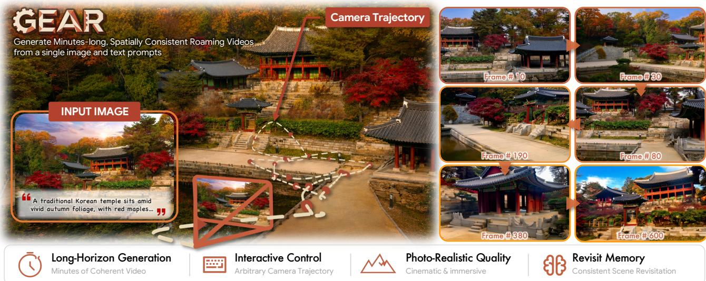  
Figure 1. Precise camera control and persistent scene memory for long-horizon exploration. Given a single image and a text prompt, GEAR generates minute-long, photorealistic videos along arbitrary user-specified camera trajectories, while preserving spatial consistency and faithfully recovering previously observed content upon revisitation.

## Abstract

Long-horizon camera-controlled video generation requires recovering previously observed content from an evergrowing visual history. Existing approaches either search historical context implicitly or reconstruct it into persistent 3D memory, facing inefficient memory access or accumulated geometric errors. Our key insight is that geometry need not explain the scene – it only needs to determine where visual memory should be read from, while attention decides what should be recovered. Based on this insight, we introduce GEAR, a Geometry-Enabled Attention Routing framework that uses geometry as an explicit token-level address for visual memory. Rather than fusing historical observations into a persistent global 3D representation, GEAR retains them as frame latents and uses per-frame geometry only to establish token-level correspondences with target views, thereby avoiding persistent error

accumulation from global fusion. Guided by these correspondences, a proposed Geometric Correspondence Attention (GCA) selectively injects geometrically matched historicalfeatures into target noisy patches during denoising. We further introduce an Invisible Octree to accumulate visibility evidence and reject geometrically plausible but occluded correspondences. Extensive experiments demonstrate that GEAR achieves state-of-the-art visual quality, precise camera control, and revisit consistency, enabling minute-long video generation along challenging trajectories. Additional videos are available at https://zju3dv.github. io/geometry-as-address/.

## 1. Introduction

Recent advances in video generation have enabled realistic and controllable visual synthesis [8, 16, 33, 34], opening the door to interactive world generation where camera trajectories or user actions control the synthesized observations [1, 2, 26, 27, 29, 32, 51]. Extending these models to long-horizon exploration, however, requires more than generating plausible short clips: the model must accurately follow the prescribed camera trajectory while preserving previously observed scene content over temporal gaps. When a scene region is revisited after leaving the model’s temporal context, its appearance must be recovered from past observations rather than inferred from the current context. Long-horizon generation therefore becomes a memory access problem: for each target region, the model must identify and retrieve the relevant visual evidence from history.

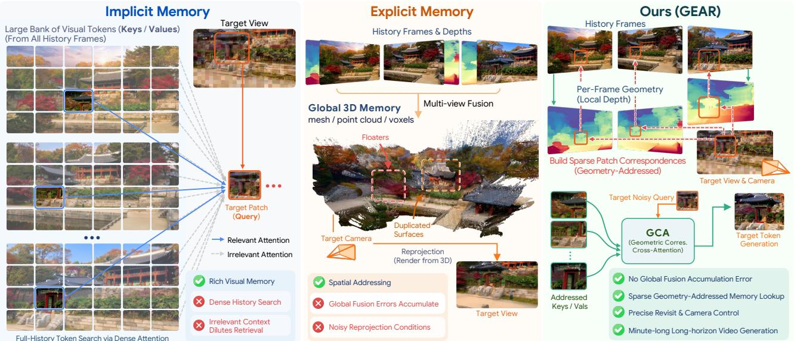  
Figure 2. Comparison of long-term memory paradigms. Implicit memory preserves rich visual history but requires dense search over an increasingly large token set, while explicit 3D memory provides spatial addressing at the cost of accumulated reconstruction and fusion errors. GEAR instead uses per-frame geometry only to address historical latent patches, enabling sparse, spatially grounded memory retrieval without persistent global 3D fusion.

Existing approaches address this problem through two paradigms, illustrated in Fig. 2. History-based implicit methods retain previously generated observations as context memory and recover relevant information through attention [3, 9, 21, 31, 42, 42, 44, 45]. This preserves rich visual information, but as history grows, the model must search over an increasingly large token set to recover the few observations relevant to the current viewpoint, making memory access costly and vulnerable to irrelevant context. Frame retrieval or history compression [40, 42, 44, 47] alleviates this burden, but operates at a coarser granularity or may discard information needed for precise revisitation. Reconstruction-based explicit methods instead fuse historical observations into a global 3D representation and reproject it to target views [6, 28, 41, 50]. While this provides natural spatial addressing, local geometry errors can become persistent after global fusion and propagate into subsequent generations through noisy reprojection.

Recent methods have begun to bridge these two paradigms by exploiting geometry without relying on a single globally fused 3D memory. AnchorWeave [38] maintains multiple local geometric representations, reprojects retrieved memories as target-view anchor videos and adaptively fuses them through ControlNet [46]. UCM [43] instead warps positional encodings to geometrically align interactions between historical and target tokens. Most closely related, Lyra 2.0 [30] warps source coordinates and depth into target views, then injects their embeddings into DiT tokens. Despite these advances, geometry is still used to select, align, or construct geometric conditioning signals from history, while access to the underlying visual features remains indirect. This motivates a more explicit separation between geometry and visual memory: rather than using correspondence only to guide generation, we use it to directly determine which historical visual tokens each target token can access.

Rather than asking geometry to explain the scene, our key insight is to let geometry answer only where memory should be read from, while leaving what should be recovered to visual attention over the matched historical features. Based on this insight, we introduce GEAR, a Geometry-Enabled Attention Routing framework that uses geometry as an explicit token-level address for visual memory. For each target token, GEAR identifies a sparse set of geometrically matched historical tokens and gathers their visual features as keys and values for attention. In this way, geometry constrains the memory search space, while visual attention resolves which historical evidence is most useful for generation. We realize this mechanism through Geometric Correspondence Attention (GCA), which exposes each noisy target token only to its geometrically matched historical memory tokens as keys and values, and injects the aggregated features through a residual branch during denoising. Geometry thus serves as a transient address rather than persistent scene state: it explicitly determines where each target token can retrieve visual evidence, while correspondence errors remain local to individual memory accesses instead of accumulating across views.

Cross-view projection alone, however, may produce false correspondences when a source-visible surface becomes occluded in the target view. We therefore introduce an Invisible Octree that accumulates visibility evidence over time and filters such correspondences without storing scene appearance. Together, these designs enable efficient patchlevel memory access over long trajectories: rather than requiring the video model to search the entire history or the geometry estimator to reconstruct the entire world, GEAR uses geometry to identify which pieces of history are relevant to each piece of the future. Our contributions are summarized as follows:

• We propose GEAR, a Geometry-Enabled Attention Routing framework that decouples visual memory from geometric addressing. By converting per-frame 3D priors into token-level cross-view correspondences, GEAR enables fine-grained access to relevant historical visual features without error-prone global 3D fusion.

• We introduce Geometric Correspondence Attention for sparse token-level memory injection, together with an Invisible Octree for visibility-aware filtering.

• Extensive experiments demonstrate state-of-the-art visual quality, camera-control accuracy, and revisit consistency, enabling minute-long video generation along challenging user-specified trajectories with only lightweight adaptation of a pretrained video model.

## 2. Related Work

Implicit Camera-Controlled Video Generation. Early camera-controlled methods inject camera trajectories or user actions into video generation [3, 9, 19, 45]. Subsequent streaming approaches extend generation to longer horizons [10, 14, 29], but finite temporal context limits scene persistence. To retain visual history, Li et al. [20], Sun et al. [31], Xiao et al. [42], Yu et al. [44] retrieve historical frames as context, while Hong et al. [11], Wu et al. [40] compress history into compact latent. These approaches preserve rich visual information but still require dense attention with an increasing set of historical tokens.

Explicit Camera-Controlled Video Generation. Recent methods reconstruct historical observations into 3D memories and project them to target viewpoints as pixel-aligned conditions [6, 18, 38, 41, 49, 50]. While providing explicit spatial grounding, these methods are vulnerable to accumulated reconstruction and fusion errors. More closely related to our work, UCM [43] warps positional encodings to establish cross-view relationships, while Lyra 2.0 [30] injects warped correspondence coordinates as token embeddings. Our GEAR instead uses per-frame geometry to select visible historical tokens for sparse correspondence attention, retaining visual memory without global 3D fusion.

## 3. Methods

## 3.1. Problem Formulation and Preliminaries

Camera-Conditioned Autoregressive Video Generation. Given an initial frame $I _ { 1 }$ , text prompts y and a long camera trajectory, our goal is to autoregressively synthesize visual observations with accurate camera control and long-term consistency with previously observed scene regions.

Following Chen et al. [6], Wu et al. [39], we encode each frame independently using the VAE [34], $z _ { i } = E ( I _ { i } )$ which preserves frame-level alignment between visual observations and camera poses, particularly under large camera motions, enabling cross-view correspondences to be constructed directly at the latent-token level.

After generating t frames, we maintain a streaming history bank with the historical latent observations and their camera parameters:

$$
{ \cal B } _ { t } = \{ ( z _ { i } , c _ { i } ) \} _ { i = 1 } ^ { t } .\tag{1}
$$

Given the next camera chunk $c _ { t + 1 : t + k } ,$ a compact conditioning history $\mathcal { H } _ { t } ^ { \mathrm { r e t } }$ is retrieved from $B _ { t }$ according to its geometric coverage of the target views, as detailed in Sec. 3.6. The video generator then samples the next latent chunk as:

$$
z _ { t + 1 : t + k } \sim p _ { \theta } \left( \cdot \mid \mathcal { H } _ { t } ^ { \mathrm { r e t } } , c _ { t + 1 : t + k } , y \right) .\tag{2}
$$

The generated latents and their camera parameters are appended to $B _ { t }$ , and the same procedure is repeated over successive chunks of the prescribed trajectory.

Flow-Matching Objective. We train the video generator with the standard flow-matching objective [24]. For a target latent block $\mathbf { z } _ { t + 1 : t + k }$ , we sample Gaussian noise $\epsilon \sim \mathcal { N } ( \mathbf { 0 } , \mathbf { I } )$ and a flow timestep $\tau \sim \mathcal { U } ( 0 , 1 )$ , and construct the linear interpolation:

$$
\mathbf { z } _ { t + 1 : t + k } ^ { \tau } = ( 1 - \tau ) \mathbf { z } _ { t + 1 : t + k } + \tau \epsilon .\tag{3}
$$

The conditional velocity field is optimized as:

$$
\begin{array} { r l } & { \mathcal { L } _ { \mathrm { F M } } = \mathbb { E } _ { \mathbf { z } , \epsilon , \tau } \left[ \left| \left| v _ { \theta } \left( \mathbf { z } _ { t + 1 : t + k } ^ { \tau } , \tau \mid \mathcal { H } _ { t } , \mathbf { c } _ { t + 1 : t + k } , y \right) \right. \right. } \\ & { \qquad \left. \left. - \left( \epsilon - \mathbf { z } _ { t + 1 : t + k } \right) \right| \right| _ { 2 } ^ { 2 } \right] . } \end{array}\tag{4}
$$

Although history retrieval bounds the number of conditioning frames, only a sparse and view-dependent subset of their tokens is relevant to each target region. The key problem is not merely which historical frames to retain, but how each target token should access the corresponding historical evidence. In the following, we introduce Geometry-Addressed Patch Memory to construct these fine-grained memory addresses from per-frame geometry.

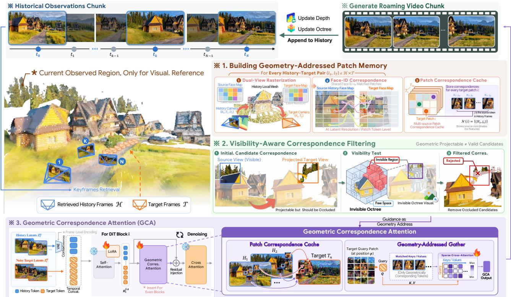  
Figure 3. System overview. For each target chunk, GEAR constructs patch correspondences to retrieved history using per-frame geometry and filters occluded matches with the Invisible Octree. GCA then injects matched historical features into noisy target tokens during denoising, after which generated observations are appended to the history bank for continued rollout.

## 3.2. Geometry-Addressed Patch Memory

Given the retrieved history, our goal is to establish patchlevel correspondences between historical and target views, which subsequently serve as explicit addresses for memory retrieval. Rather than constructing a globally fused scene representation, we derive these correspondences independently from the local geometry associated with each historical frame, as illustrated in Fig. 3.

Local Geometric Anchor. For each historical frame $s ,$ we associate its latent $z _ { s }$ with an estimated depth map $D _ { s } ,$ camera intrinsics $K _ { s } ,$ and extrinsics $T _ { s }$ . We back-project $D _ { s }$ into 3D and connect neighboring pixels according to the image-grid topology, producing a local triangular mesh $\mathcal { G } _ { s } = ( \mathcal { V } _ { s } , \mathcal { F } _ { s } )$ , where $V _ { s }$ and $F _ { s }$ denote the mesh vertices and faces, respectively. Since modern video VAEs aggressively compress the spatial resolution, e.g., by a factor of 16×, each latent token may cover pixels belonging to multiple surfaces. We construct the mesh at the original image resolution to preserve geometric discontinuities that would otherwise be blurred by directly downsampling depth to the latent grid.

Geometry-Guided Patch Correspondence Addressing. We then rasterize the same source mesh under both the source and target cameras at the latent spatial resolution $H _ { \ell } \times W _ { \ell }$ , yielding two face-index maps:

$$
\begin{array} { r } { F _ { s } = \mathcal { R } _ { H _ { \ell } \times W _ { \ell } } ( \mathcal { G } _ { s } ; K _ { s } , T _ { s } ) , } \\ { F _ { s \to t } = \mathcal { R } _ { H _ { \ell } \times W _ { \ell } } ( \mathcal { G } _ { s } ; K _ { t } , T _ { t } ) , } \end{array}\tag{5}
$$

where each valid entry records the ID of the visible mesh face associated with a latent patch token. Since both maps are rasterized from the same local geometry, shared face IDs naturally establish a token-level correspondence:

$$
\mathcal { C } _ { s  t } = \{ ( i , j ) \ : | \ : F _ { s  t } ( i ) = F _ { s } ( j ) \} .\tag{6}
$$

Shared face identities thus provide a direct geometric bridge between source and target latent tokens, while preserving the fine spatial structure captured by the fullresolution source geometry.

Multi-Source Patch Correspondence Cache. We construct $\mathcal { C } _ { s  t }$ for every selected history-target frame pair and organize them into a patch correspondence cache:

$$
\mathcal { C } \in \mathbb { Z } ^ { N _ { t } \times N _ { c } \times H _ { \ell } \times W _ { \ell } \times 2 } ,\tag{7}
$$

where $N _ { t }$ and $N _ { c }$ denote the numbers of target and retrieved historical condition frames. For each target patch and historical frame, C stores the coordinate $( x _ { s } , y _ { s } )$ of its geometrically corresponding source patch, with unmatched entries marked as invalid. Since the same scene region may have been observed from multiple historical viewpoints, a target patch can naturally admit multiple source correspondences. We therefore retain all valid historical candidates. Crucially, since all correspondences are derived independently from each source observation, geometric errors remain local instead of accumulating into persistent artifacts through global 3D fusion.

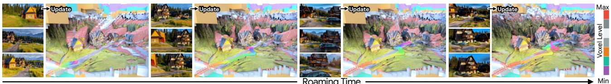  
Figure 4. Streaming update of the Invisible Octree. Historical observations incrementally accumulate coarse visibility evidence along the exploration trajectory. For a target view, the resulting invisible-space boundary is used to reject projectable but occluded source-target correspondences.

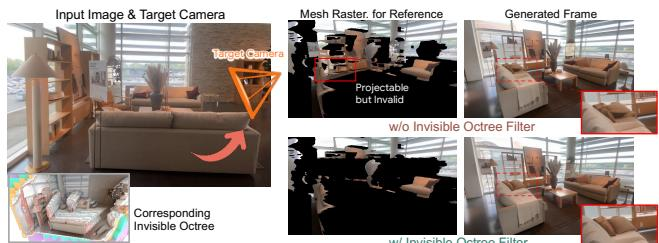  
Figure 5. Ablation of Invisible Octree. The Invisible Octree removes projectable but occluded correspondences, preventing erroneous historical content from affecting target-view synthesis.

## 3.3. Visibility-Aware Correspondence

Geometric projectability does not necessarily imply targetview visibility. As illustrated in Fig. 3, a surface visible in source frame s projects into target frame t while being occluded by geometry unobserved in s. Such candidates provide spatially incorrect historical evidence and should be removed before memory retrieval.

To validate these correspondences, we maintain an Invisible Octree as a sparse global visibility proxy. After each generated chunk, the estimated depth maps are used to incrementally update the octree with newly observed freespace and occlusion evidence, as illustrated in Fig. 4. The update is conservative: new observations only refine previously unknown or invisible regions, allowing the octree to expand with exploration without repeatedly overwriting established evidence. Its sparse and adaptive structure also supports long-horizon generation in unbounded environments. Please refer to Appendix for details on the construction and streaming update of the Invisible Octree.

For a target camera, we use the Invisible Octree to determine the visibility mask under the target viewpoint. Candidates lying behind the accumulated visibility boundary are rejected as occluded. Importantly, the octree stores no appearance and never serves as a rendering condition; it only provides a coarse binary filter over correspondences.

## 3.4. Geometric Correspondence Attention

The correspondence cache above specifies where each target patch should retrieve historical evidence from. Building on these memory addresses, we introduce Geometric Correspondence Attention (GCA) as an auxiliary memory pathway, which selectively aggregates only the geometrically matched historical tokens and injects them into target noisy tokens during denoising.

Sparse Correspondence Attention. Following contextmemory-based approaches [31, 44], we concatenate the retrieved historical frames (Sec. 3.6) as context latents with the noisy target latents along the temporal dimension. Let $h _ { i } ^ { T }$ denote the post-self-attention feature of target token i, and $h _ { j } ^ { H }$ denote the corresponding feature of historical token j. From the patch correspondence cache, each target token obtains its geometrically matched historical candidates $\mathcal { N } ( i )$ . We then perform cross-attention:

$$
q _ { i } = W _ { Q } h _ { i } ^ { T } , \qquad k _ { j } = W _ { K } h _ { j } ^ { H } , \qquad v _ { j } = W _ { V } h _ { j } ^ { H } .\tag{8}
$$

The attention weight assigned to candidate j is normalized only over the geometrically matched set, and the geometry-addressed memory feature is aggregated as:

$$
\begin{array} { r l } & { \alpha _ { i j } = \cfrac { \exp \big ( q _ { i } ^ { \top } k _ { j } / \sqrt { d } \big ) } { \sum _ { m \in \mathcal { N } ( i ) } \exp \big ( q _ { i } ^ { \top } k _ { m } / \sqrt { d } \big ) } , } \\ & { o _ { i } ^ { \mathrm { G C A } } = \displaystyle \sum _ { j \in \mathcal { N } ( i ) } \alpha _ { i j } v _ { j } . } \end{array}\tag{9}
$$

When multiple historical views observe the same target region, attention adaptively aggregates their complementary appearance information. If $\mathcal { N } ( i )$ is empty, we set $o _ { i } ^ { \mathrm { G C A } } = \bar { 0 }$ , allowing the pretrained video model to synthesize unobserved content from its generative prior.

Lightweight Residual Injection. GCA is inserted after the original self-attention at selected DiT blocks, as shown in Fig. 3. Its output is projected back to the backbone feature space and injected through a residual connection:

$$
\widetilde { h } _ { i } ^ { T } = h _ { i } ^ { T } + W _ { O } o _ { i } ^ { \mathrm { G C A } } ,\tag{10}
$$

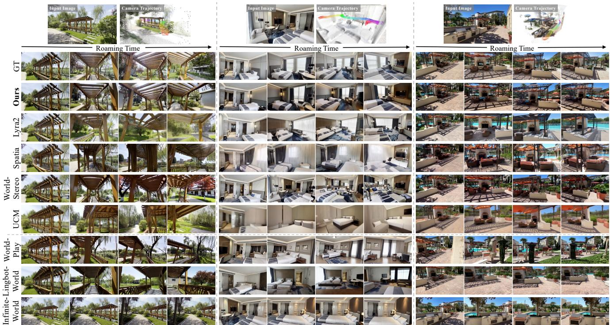  
Figure 6. Qualitative comparison on DL3DV-Eval. Compared with explicit and implicit memory baselines, GEAR better preserves visual quality, camera adherence, and scene consistency throughout long-horizon generation. See our project page for additional scenes and video comparisons.

Table 1. Quantitative comparison on DL3DV-Evaluation and WorldScore-Static. GEAR performs favourably across the metrics. Best results are in bold and second are underlined.
<table><tr><td></td><td colspan="6">DL3DV-Evaluation</td><td colspan="6">WorldScore-Static</td></tr><tr><td>Method</td><td>SSIM ↑</td><td>LPIPS ↓</td><td>FVD↓</td><td>TransErr ↓</td><td>RotErr↓</td><td>ATE↓</td><td>Content Align. ↑</td><td>Photo. Cons. ↑</td><td>Style Cons. ↑</td><td>Subjective Quality ↑</td><td>Revisit SSIM ↑</td><td>Revisit LPIPS↓</td></tr><tr><td>Lyra2</td><td>0.3359</td><td>0.5097</td><td>975.89</td><td>0.0157</td><td>0.1721</td><td>0.2514</td><td>0.6319</td><td>0.9357</td><td>0.8600</td><td>0.5017</td><td>0.3941</td><td>0.3218</td></tr><tr><td>Spatia</td><td>0.3081</td><td>0.5422</td><td>1074.13</td><td>0.0617</td><td>0.6973</td><td>1.1204</td><td>0.6331</td><td>0.8588</td><td>0.8600</td><td>0.5012</td><td>0.4407</td><td>0.3541</td></tr><tr><td>WorldStereo</td><td>0.3061</td><td>0.5502</td><td>846.46</td><td>0.0239</td><td>0.1717</td><td>0.2212</td><td>0.7003</td><td>0.0837</td><td>0.8300</td><td>0.5013</td><td>0.6253</td><td>0.2193</td></tr><tr><td>UCM</td><td>0.3412</td><td>0.6007</td><td>1431.67</td><td>0.0377</td><td>0.5184</td><td>0.6410</td><td>0.6773</td><td>0.9692</td><td>0.7300</td><td>0.5005</td><td>0.3412</td><td>0.4890</td></tr><tr><td>HY-WorldPlay</td><td>0.2452</td><td>0.6213</td><td>1385.23</td><td>0.0508</td><td>0.6854</td><td>0.9634</td><td>0.5104</td><td>0.7939</td><td>0.1900</td><td>0.5018</td><td>0.2433</td><td>0.7288</td></tr><tr><td>Lingbot-World</td><td>0.2608</td><td>0.6168</td><td>1309.27</td><td>0.0417</td><td>0.5988</td><td>0.7449</td><td>0.5564</td><td>0.0889</td><td>0.6800</td><td>0.5006</td><td>0.2495</td><td>0.7677</td></tr><tr><td>Infinite-World</td><td>0.2532</td><td>0.6399</td><td>1582.43</td><td>0.1072</td><td>0.8473</td><td>2.3744</td><td>0.6302</td><td>0.9728</td><td>0.7000</td><td>0.5011</td><td>0.2536</td><td>0.7098</td></tr><tr><td>GEAR</td><td>0.3645</td><td>0.4459</td><td>837.59</td><td>0.0116</td><td>0.1228</td><td>0.0436</td><td>0.7423</td><td>0.9732</td><td>0.8700</td><td>0.5018</td><td>0.6489</td><td>0.2019</td></tr></table>

where $W _ { O }$ projects the feature back to the DiT feature space. The backbone self-attention retains its pretrained spatiotemporal modeling, while GCA supplies a sparse geometry-addressed correction that anchors target features to relevant historical evidence.

## 3.5. Robust Training with Degraded History

During training, target chunks are conditioned on groundtruth history, whereas autoregressive inference relies on previously generated observations. This train–inference discrepancy causes generation errors to enter the history memory and progressively accumulate over long rollouts.

To expose the model to imperfect yet semantically consistent history, we introduce degraded-history augmentation. With probability $p _ { \mathrm { d e g } } ,$ , we corrupt the historical latents $\mathbf { z } _ { \mathcal { H } }$ with a randomly sampled low noise level $\tau _ { h } ~ \sim$ $\mathcal { U } ( 0 , \tau _ { \mathrm { m a x } } )$

$$
\begin{array} { r } { \mathbf { z } _ { \mathcal { H } } ^ { \tau _ { h } } = ( 1 - \tau _ { h } ) \mathbf { z } _ { \mathcal { H } } + \tau _ { h } \epsilon _ { \mathcal { H } } , \quad \quad \epsilon _ { \mathcal { H } } \sim \mathcal { N } ( 0 , \mathbf { I } ) . } \end{array}\tag{11}
$$

We then apply one reverse-flow step with the current model to obtain the degraded history:

$$
\hat { \mathbf { z } } _ { \mathcal { H } } = \mathrm { s g } [ \mathbf { z } _ { \mathcal { H } } ^ { \tau _ { h } } - \tau _ { h } v _ { \theta } \left( \mathbf { z } _ { \mathcal { H } } ^ { \tau _ { h } } , \tau _ { h } \right) ] .\tag{12}
$$

The resulting $\hat { \mathbf { z } } _ { \mathcal { H } }$ replaces $\mathbf { z } _ { \mathcal { H } }$ as the conditioning context, while keeping the flow-matching objective for the target chunk unchanged. This exposes the model to the mild distortions encountered during rollout and improves robustness to accumulated history errors in long-horizon inference.

\# Frame 524

\# Frame 170

\# Frame 406

\# Frame 034

\# Frame 578

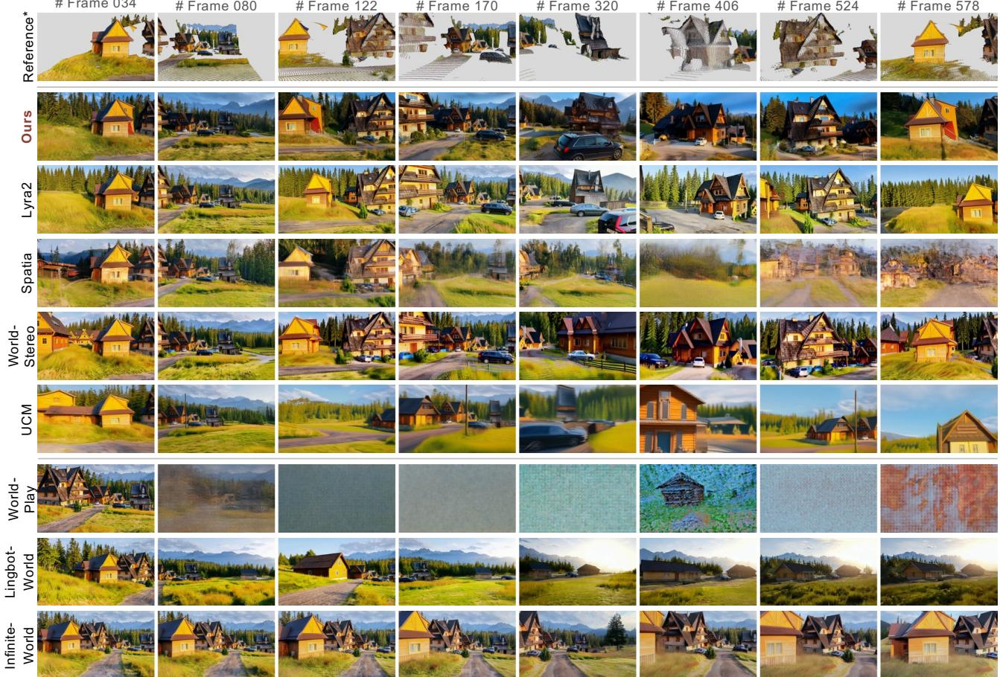  
Figure 7. Out-of-domain qualitative comparison for minute-long generation. GEAR maintains visual fidelity and scene consistency over extended camera trajectories, while competing methods exhibit progressive drift and visual degradation. \*First-frame geometry projected along the target trajectory for viewpoint reference only. See our project page for additional video comparisons.

## 3.6. Long-Horizon Inference

For long-horizon inference, we adopt a streaming strategy that bounds the historical context through keyframe retrieval and continuously updates the memory.

Keyframe History Retrieval. As the rollout progresses, retaining all historical frames introduces increasing computational cost and substantial view redundancy. We therefore retrieve a compact history according to its geometric coverage of the upcoming target chunk. Specifically, we project each historical frame’s local geometry onto the target views, and greedily select frames that maximize newly covered regions. Meanwhile, the initial frame and the latest frame are retained to preserve scene identity and interchunk continuity. The retrieved history frames are thus $\mathcal { H } _ { t } ^ { \mathrm { r e t } } = \left\lceil \mathcal { H } _ { \mathrm { f i r s t } } , \mathcal { H } _ { \mathrm { c o v e r a g e } } , \mathcal { H } _ { \mathrm { l a s t } } \right\rceil$

Streaming Memory Update. After each chunk is generated, new frames are appended to history bank with camera parameters and depths estimated by a frozen 3D foundation model [22]. Invisible Octree is simultaneously updated with newly observed geometry. This retrieve–generate–update procedure is repeated for subsequent chunks, enabling longhorizon autoregressive generation.

## 4. Experiments

## 4.1. Experimental Setup

Dataset. We train GEAR on DL3DV-10K [23], a largescale real-world dataset with diverse camera trajectories. Each sequence is divided into 55-frame clips at a resolution of 480 × 832. We employ Depth Anything 3 [22] to estimate camera poses and per-frame depths, and generate video captions with Qwen3-VL-8B-Instruct [4].

We construct training samples under two conditioning modes. In image-to-video (I2V) mode, we train on the first 32 frames, with the initial frame providing the geometry for initializing the Invisible Octree and establishing correspondences with the target views. In history-tovideo (H2V) mode, the first 32 frames constitute the history bank, from which nine keyframes are retrieved following Sec. 3.6; the remaining 23 frames serve as generation targets. The retrieved keyframes are used to construct the multi-source patch correspondence cache, while the complete history bank is used to build the global Invisible Octree for visibility-aware correspondence filtering.

Implementation Details. We adopt Wan2.1-I2V-14B [34] as the pretrained backbone and keep all original parameters frozen. To adapt the backbone to frame-aligned VAE latents, we introduce rank-32 LoRA adapters [12], and we insert GCA modules with a hidden dimension of 640 into every even-indexed DiT block (262M parameters for GCA, only 1.9% of the backbone). The LoRA adapters and GCA modules are jointly optimized for 10K iterations.

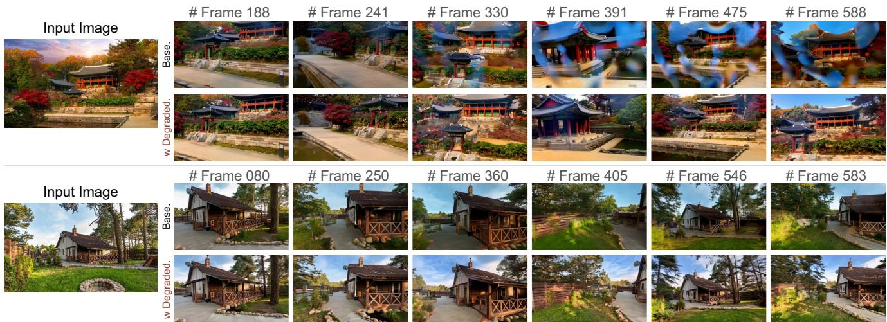  
Figure 8. Ablation of Degraded-History Augmentation. Training with degraded history mitigates error accumulation and improves visual stability during long-horizon autoregressive generation.

During training, I2V and H2V samples are drawn with probabilities of 30% and 70%, respectively. Starting from iteration 8K, degraded-history augmentation is further applied to H2V samples with a probability $p _ { \mathrm { d e g } } = 4 0 \%$ and $\tau _ { \mathrm { m a x } } = 0 . 3$ . We optimize the model using AdamW on 32 GPUs with a learning rate of $1 \times 1 0 ^ { - 4 }$ and a linear warm-up over the first 1K iterations.

## 4.2. Quantitative Evaluation

Baselines and Metrics. We compare GEAR with recent camera-controlled long-horizon video generation methods equipped with memory mechanisms. Explicit 3D baselines include Lyra2 [30], Spatia [50], HY-WorldStereo [49], and UCM [43], while implicit baselines include HY-WorldPlay [31], Lingbot-World [29], and Infinite-World [40].

We first evaluate all methods on DL3DV-Evaluation [23]. Given the same initial frame, each method autoregressively generates subsequent frames along the ground-truth camera trajectory. We report SSIM [37], LPIPS [48], and FVD [36] to evaluate frame-level fidelity and temporal quality. For camera-control accuracy, we recover camera poses from the generated videos using ViPE [13] and align them with the ground-truth trajectories using the Umeyama transformation [35]. We then report TransErr, RotErr, and Absolute Trajectory Error (ATE).

We further evaluate long-horizon revisitation on 50 randomly sampled scenes from the WorldScore Static set [7] using closed-loop camera trajectories. We report Content Alignment, Subjective Quality, Style Consistency, and Photometric Consistency, together with Revisit SSIM and Revisit LPIPS, which are computed between the generated revisit frame and the reference observation at the matched camera pose to assess the recovery of previously observed scene content.

Quantitative and Qualitative Comparison. As shown in Tab. 1, GEAR performs favorably across the evaluated metrics. Our method reduces ATE by 80.3% compared with strongest baseline, demonstrating improved trajectory adherence, as further illustrated in Fig. 9. GEAR achieves the best content alignment, photometric consistency, style consistency, and revisit performance on World-Score, which demonstrates GEAR faithfully recovers previously observed content after long temporal gaps without compromising overall generation quality.

The qualitative comparisons in Fig. 6 and 7 further demonstrate the advantages of GEAR over existing methods. Lyra2 provides competitive camera control but develops visual degradation and increasing trajectory drift under rapid or extended camera motion, while Spatia and World-Stereo exhibit progressive scene distortions, consistent with their vulnerability to accumulated reconstruction errors. UCM initially preserves coherent appearance but gradually deviates over extended rollouts. HY-WorldPlay

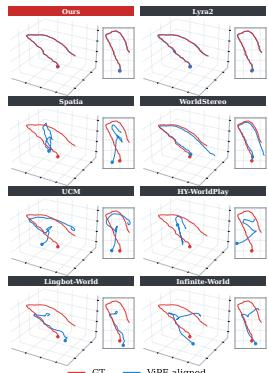  
Figure 9. Camera alignment. GEAR achieves the best camera alignment on DL3DV-Evaluation.

and Lingbot-World struggle with both camera control and revisitation, whereas Infinite-World maintains comparatively stable appearance but insufficiently follows the precise trajectory. In particular, WorldStereo and Lingbot-World exhibit abrupt appearance changes and pronounced flicker during camera rotations, consistent with their low

Table 2. Ablation study on DL3DV-Evaluation. We ablate the contribution of each key component of GEAR.
<table><tr><td>Variant</td><td>SSIM ↑</td><td>LPIPS↓</td><td>FVD↓</td><td>TransErr ↓</td><td>RotErr ↓</td><td>ATE↓</td></tr><tr><td>w/o GCA</td><td>0.1324</td><td>0.6549</td><td>1201.32</td><td>0.0406</td><td>0.4732</td><td>0.3471</td></tr><tr><td>w/ Dense Attention</td><td>0.2749</td><td>0.5995</td><td>913.64</td><td>0.0351</td><td>0.4347</td><td>0.2924</td></tr><tr><td>w/o Invisible Octree</td><td>0.3350</td><td>0.4869</td><td>878.28</td><td>0.0153</td><td>0.1551</td><td>0.0729</td></tr><tr><td>w/o Degraded History</td><td>0.3459</td><td>0.4763</td><td>1165.99</td><td>0.0127</td><td>0.1492</td><td>0.0664</td></tr><tr><td>w/ Corres. Disturbance</td><td>0.3597</td><td>0.4513</td><td>842.15</td><td>0.0121</td><td>0.1273</td><td>0.0464</td></tr><tr><td>GEAR</td><td>0.3645</td><td>0.4459</td><td>837.59</td><td>0.0116</td><td>0.1228</td><td>0.0436</td></tr></table>

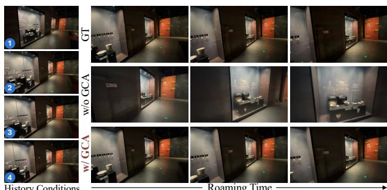  
Figure 10. Ablation of GCA. GCA improves temporal stability and adherence to the prescribed camera trajectory.

Photometric Consistency scores. These limitations become more pronounced during minute-long explorations with rapid camera motion (Fig. 7): most baselines exhibit severe visual degradation and develop increasing camera drift. GEAR maintains coherent appearance and accurate camera control, supporting the effectiveness of separating visual memory from geometric addressing for long-horizon generation. Please refer to our project page for additional scenes and more extensive video comparisons.

## 4.3. Ablation Study

We evaluate the contribution of each key component of GEAR:

Without Geometric Correspondence Attention (GCA). We train an ablated variant without GCA while retaining the backbone’s dense attention over the concatenated history and target tokens. As shown in Fig. 10, disabling GCA’s residual injection increases temporal instability and deviation from the camera motion. The quantitative degradation in Tab. 2 further confirms the contribution of GCA to camera-control accuracy and long-horizon consistency.

Variant with Dense History Attention. To isolate geometric addressing from the additional capacity of GCA, we train a variant that retains the same GCA module and parameter count but replaces correspondence-restricted attention with dense attention over full retrieved historical context tokens. The resulting degradation in camera control and visual fidelity (Tab. 2) confirms the importance of our sparse, geometry-addressed memory retrieval.

Without Invisible Octree. Under large viewpoint changes as shown in Fig. 5, the projectable yet occluded correspondences not only introduce local appearance errors but also propagate structural inconsistencies through the autoregressive history. The Invisible Octree suppresses this error propagation by rejecting candidates that conflict with accumulated visibility evidence.

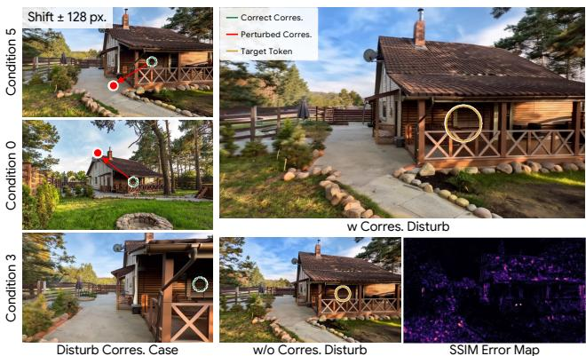  
Figure 11. Ablation of Correspondence Disturbance. We perturb candidates in multi-observed target regions by 64–128 pixels while retaining only 2–3 valid matches out of 9 conditions. The figure visualizes one such perturbation and the resulting error map; GCA recovers the target content with minimal deviation from the undisturbed result.

Without Degraded-History Augmentation. As shown in Fig. 8, training exclusively with ground-truth history leads to droplet-like floaters and visual degradation during long-horizon rollout. Degraded-history augmentation mitigates these artifacts by exposing the model to imperfect historical observations, substantially improving robustness and visual stability over extended generation.

Robustness to Correspondence Disturbance. Depth errors accumulated during autoregressive rollout may introduce inaccurate history-to-target correspondences. For target regions observed in multiple historical frames, we retain only 2–3 valid observations out of 9 and perturb the rest by 64–128 pixels to simulate such errors. Despite these strong perturbations, GEAR maintains comparable performance as shown in Fig. 11 and Tab. 2, indicating that the learned attention of GCA suppresses feature-inconsistent distractors and preserves valid historical evidence.

## 5. Conclusion

We introduced GEAR, a geometry-enabled attention routing framework for long-horizon camera-controlled video generation. GEAR uses per-frame geometry to establish local history-to-target token correspondences, and leverages lightweight Geometric Correspondence Attention to retrieve and integrate relevant historical features during denoising. By treating geometry as an address rather than persistent memory, GEAR avoids error accumulation from global 3D fusion while enabling minute-long generation with precise camera control and consistent scene persistence. GEAR currently relies on an external 3D model for depth estimation, introducing additional computational overhead. A promising direction for future work is to jointly learn geometry and memory addressing within the generative model for more robust long-horizon generation.

## References

[1] AlayaWorld Team, Kaipeng Zhang, Chuanhao Li, Yifan Zhan, Yongtao Ge, Yuanyang Yin, Jiaming Tan, Kang He, Liaoyuan Fan, Ruicong Liu, Mingliang Zhai, et al. Alaya-World v1.1: Long-horizon and playable video world generation. arXiv preprint arXiv:2608.13492, 2026. 2

[2] Alibaba Token Hub. Happy Oyster: An open-ended world model for real-time world creation and interaction. https: //www.happyoyster.com/, 2026. Accessed: 2026- 08-28. 2

[3] Jianhong Bai, Menghan Xia, Xiao Fu, Xintao Wang, Lianrui Mu, Jinwen Cao, Zuozhu Liu, Haoji Hu, Xiang Bai, Pengfei Wan, and Di Zhang. ReCamMaster: Camera-controlled generative rendering from a single video. In Proceedings of the IEEE/CVF International Conference on Computer Vision, pages 14834–14844, 2025. 2, 3

[4] Shuai Bai, Yuxuan Cai, Ruizhe Chen, Keqin Chen, Xionghui Chen, Zesen Cheng, Lianghao Deng, Wei Ding, Chang Gao, Chunjiang Ge, et al. Qwen3-VL technical report. arXiv preprint arXiv:2511.21631, 2025. 7, 17

[5] Yunpeng Bai, Haoxiang Li, and Qixing Huang. Positional encoding field. arXiv preprint arXiv:2510.20385, 2025. 18

[6] Yutian Chen, Shi Guo, Renbiao Jin, Tianshuo Yang, Xin Cai, Yawen Luo, Mingxin Yang, Mulin Yu, Linning Xu, and Tianfan Xue. AnyRecon: Arbitrary-view 3D reconstruction with video diffusion model. In ACM SIGGRAPH Asia 2026 Conference Papers. ACM, 2026. 2, 3, 13

[7] Haoyi Duan, Hong-Xing Yu, Sirui Chen, Li Fei-Fei, and Jiajun Wu. WorldScore: A unified evaluation benchmark for world generation. In Proceedings ofthe IEEE/CVF International Conference on Computer Vision, pages 27713–27724, 2025. 8

[8] Google DeepMind. Veo 3 model card. https:// storage.googleapis.com/deepmind- media/ Model- Cards/Veo- 3- Model- Card.pdf, 2025. Published May 23, 2025; updated January 13, 2026. 1

[9] Hao He, Yinghao Xu, Yuwei Guo, Gordon Wetzstein, Bo Dai, Hongsheng Li, and Ceyuan Yang. CameraCtrl: Enabling camera control for text-to-video generation. In International Conference on Learning Representations, 2025. 2, 3

[10] Xianglong He, Chunli Peng, Zexiang Liu, Boyang Wang, Yifan Zhang, Qi Cui, Fei Kang, Biao Jiang, Mengyin An, Yangyang Ren, Baixin Xu, Hao-Xiang Guo, Kaixiong Gong, Cyrus Wu, Wei Li, Xuchen Song, Yang Liu, Eric Li, and Yahui Zhou. Matrix-Game 2.0: An open-source, realtime, and streaming interactive world model. arXiv preprint arXiv:2508.13009, 2025. 3

[11] Yicong Hong, Yiqun Mei, Chongjian Ge, Yiran Xu, Yang Zhou, Sai Bi, Yannick Hold-Geoffroy, Mike Roberts,

Matthew Fisher, Eli Shechtman, Kalyan Sunkavalli, Feng Liu, Zhengqi Li, and Hao Tan. RELIC: Interactive video world model with long-horizon memory. arXiv preprint arXiv:2512.04040, 2025. 3

[12] Edward J Hu, Yelong Shen, Phillip Wallis, Zeyuan Allen-Zhu, Yuanzhi Li, Shean Wang, Lu Wang, and Weizhu Chen. LoRA: Low-rank adaptation of large language models. In International Conference on Learning Representations, 2022. 8

[13] Jiahui Huang, Qunjie Zhou, Hesam Rabeti, Aleksandr Korovko, Huan Ling, Xuanchi Ren, Tianchang Shen, Jun Gao, Dmitry Slepichev, Chen-Hsuan Lin, et al. ViPE: Video pose engine for 3D geometric perception. arXiv preprint arXiv:2508.10934, 2025. 8

[14] Xun Huang, Zhengqi Li, Guande He, Mingyuan Zhou, and Eli Shechtman. Self Forcing: Bridging the train-test gap in autoregressive video diffusion. In Advances in Neural Information Processing Systems, 2025. 3

[15] Nikhil Keetha, Norman Muller, Johannes Sch¨ onberger,¨ Lorenzo Porzi, Yuchen Zhang, Tobias Fischer, Arno Knapitsch, Duncan Zauss, Ethan Weber, Nelson Antunes, Jonathon Luiten, Manuel Lopez-Antequera, Samuel Rota Bulo, Christian Richardt, Deva Ramanan, Sebastian Scherer,\` and Peter Kontschieder. MapAnything: Universal feedforward metric 3D reconstruction. In International Confer ence on 3D Vision (3DV). IEEE, 2026. 19

[16] Kling AI. Kling VIDEO 3.0 model user guide. https: / / app . klingai . com / global / quickstart / klingai-video-3-model-user-guide, 2026. Official model documentation. 1

[17] Samuli Laine, Janne Hellsten, Tero Karras, Yeongho Seol, Jaakko Lehtinen, and Timo Aila. Modular primitives for high-performance differentiable rendering. ACM Transac tions on Graphics, 39(6), 2020. 14

[18] JoungBin Lee, Jaewoo Jung, Jisang Han, Takuya Narihira, Kazumi Fukuda, Junyoung Seo, Sunghwan Hong, Yuki Mit sufuji, and Seungryong Kim. 3D scene prompting for sceneconsistent camera-controllable video generation. In Interna tional Conference on Learning Representations, 2026. 3

[19] Jiaqi Li, Junshu Tang, Zhiyong Xu, Longhuang Wu, Yuan Zhou, Shuai Shao, Tianbao Yu, Zhiguo Cao, and Qinglin Lu. Hunyuan-GameCraft: High-dynamic interactive game video generation with hybrid history condition, 2025. 3

[20] Runjia Li, Philip Torr, Andrea Vedaldi, and Tomas Jakab. VMem: Consistent interactive video scene generation with surfel-indexed view memory. In Proceedings of the IEEE/CVF International Conference on Computer Vision, pages 25690–25699, 2025. 3

[21] Ruilong Li, Brent Yi, Junchen Liu, Hang Gao, Yi Ma, and Angjoo Kanazawa. Cameras as relative positional encoding. In Advances in Neural Information Processing Systems, pages 15984–16009, 2025. 2

[22] Haotong Lin, Sili Chen, Jun Hao Liew, Donny Y. Chen, Zhenyu Li, Guang Shi, Jiashi Feng, and Bingyi Kang. Depth Anything 3: Recovering the visual space from any views. In International Conference on Learning Representations, 2026. 7, 13, 16, 17

[23] Lu Ling, Yichen Sheng, Zhi Tu, Wentian Zhao, Cheng Xin, Kun Wan, Lantao Yu, Qianyu Guo, Zixun Yu, Yawen Lu, et al. DL3DV-10K: A large-scale scene dataset for deep learning-based 3D vision. In Proceedings of the IEEE/CVF Conference on Computer Vision and Pattern Recognition, pages 22160–22169, 2024. 7, 8, 16, 17

[24] Yaron Lipman, Ricky TQ Chen, Heli Ben-Hamu, Maximilian Nickel, and Matt Le. Flow matching for generative modeling. In International Conference on Learning Representations, 2023. 3

[25] Miles Macklin. Warp: A high-performance python framework for gpu simulation and graphics, 2022. NVIDIA GPU Technology Conference (GTC). 17

[26] Xiaofeng Mao, Zhen Li, Chuanhao Li, Xiaojie Xu, Kaining Ying, and Kaipeng Zhang. Yume1.5: A text-controlled interactive world generation model. In Proceedings of the IEEE/CVF Conference on Computer Vision and Pattern Recognition, 2026. 2

[27] Jack Parker-Holder and Shlomi Fruchter. Genie 3: A new frontier for world models. https://deepmind. google/blog/genie-3-a-new-frontier-forworld- models/, 2025. Google DeepMind; accessed 2026-08-28. 2

[28] Xuanchi Ren, Tianchang Shen, Jiahui Huang, Huan Ling, Yifan Lu, Merlin Nimier-David, Thomas Muller, Alexander¨ Keller, Sanja Fidler, and Jun Gao. GEN3C: 3D-informed world-consistent video generation with precise camera control. In Proceedings of the IEEE/CVF Conference on Computer Vision and Pattern Recognition, 2025. 2

[29] Robbyant Team, Zelin Gao, Qiuyu Wang, Yanhong Zeng, Jiapeng Zhu, Ka Leong Cheng, Yixuan Li, Hanlin Wang, Yinghao Xu, Shuailei Ma, et al. Advancing open-source world models. arXiv preprint arXiv:2601.20540, 2026. 2, 3, 8, 17

[30] Tianchang Shen, Sherwin Bahmani, Kai He, Sangeetha Grama Srinivasan, Tianshi Cao, Jiawei Ren, Ruilong Li, Zian Wang, Nicholas Sharp, Zan Gojcic, et al. Lyra 2.0: Explorable generative 3D worlds. arXiv preprint arXiv:2604.13036, 2026. 2, 3, 8, 17

[31] Wenqiang Sun, Haiyu Zhang, Haoyuan Wang, Junta Wu, Zehan Wang, Zhenwei Wang, Yunhong Wang, Jun Zhang, Tengfei Wang, and Chunchao Guo. WorldPlay: Towards long-term geometric consistency for real-time interactive world modeling. In International Conference on Machine Learning, 2026. 2, 3, 5, 8, 17

[32] Team HY-World. HY-World 2.0: A multi-modal world model for reconstructing, generating, and simulating 3D worlds. arXiv preprint arXiv:2604.14268, 2026. 2

[33] Team Seedance. Seedance 2.0: Advancing video generation for world complexity. arXiv preprint arXiv:2604.14148, 2026. 1

[34] Team Wan, Ang Wang, Baole Ai, Bin Wen, Chaojie Mao, Chen-Wei Xie, Di Chen, Feiwu Yu, Haiming Zhao, Jianxiao Yang, Jianyuan Zeng, et al. Wan: Open and advanced large-scale video generative models. arXiv preprint arXiv:2503.20314, 2025. 1, 3, 7, 13, 17

[35] Shinji Umeyama. Least-squares estimation of transformation parameters between two point patterns. IEEE Transactions

on Pattern Analysis and Machine Intelligence, 13(4):376– 380, 1991. 8

[36] Thomas Unterthiner, Sjoerd Van Steenkiste, Karol Kurach, Raphael Marinier, Marcin Michalski, and Sylvain Gelly. Towards accurate generative models of video: A new metric & challenges. arXiv preprint arXiv:1812.01717, 2018. 8

[37] Zhou Wang, Alan C Bovik, Hamid R Sheikh, and Eero P Simoncelli. Image quality assessment: from error visibility to structural similarity. IEEE Transactions on Image Processing, 13(4):600–612, 2004. 8

[38] Zun Wang, Han Lin, Jaehong Yoon, Jaemin Cho, Yue Zhang, and Mohit Bansal. AnchorWeave: World-consistent video generation with retrieved local spatial memories. In European Conference on Computer Vision. Springer, 2026. 2, 3, 17

[39] Qi Wu, Khiem Vuong, Minsik Jeon, Srinivasa Narasimhan, and Deva Ramanan. FrameCrafter: Novel view synthesis as video completion. In European Conference on Computer Vision, pages 73–91. Springer, 2026. 3, 13

[40] Ruiqi Wu, Xuanhua He, Meng Cheng, Tianyu Yang, Yong Zhang, Zhuoliang Kang, Xunliang Cai, Xiaoming Wei, Chunle Guo, Chongyi Li, and Ming-Ming Cheng. Infinite-World: Scaling interactive world models to 1000-frame hori zons via pose-free hierarchical memory. In International Conference on Machine Learning, 2026. 2, 3, 8, 17

[41] Tong Wu, Shuai Yang, Ryan Po, Yinghao Xu, Ziwei Liu, Dahua Lin, and Gordon Wetzstein. Video world models with long-term spatial memory. In Advances in Neural Information Processing Systems, 2025. 2, 3

[42] Zeqi Xiao, Yushi Lan, Yifan Zhou, Wenqi Ouyang, Shuai Yang, Yanhong Zeng, and Xingang Pan. WorldMem: Longterm consistent world simulation with memory. In Advances in Neural Information Processing Systems, pages 49632– 49652, 2025. 2, 3

[43] Tianxing Xu, Zixuan Wang, Guangyuan Wang, Li Hu, Zhongyi Zhang, Peng Zhang, Bang Zhang, and Songhai Zhang. UCM: Unified modeling of camera control and memory with time-aware positional encoding warping for world models. In ACM SIGGRAPH 2026 Conference Pa pers. ACM, 2026. 2, 3, 8, 17

[44] Jiwen Yu, Jianhong Bai, Yiran Qin, Quande Liu, Xintao Wang, Pengfei Wan, Di Zhang, and Xihui Liu. Context as Memory: Scene-consistent interactive long video generation with memory retrieval. In SIGGRAPH Asia 2025 Conference Papers. ACM, 2025. 2, 3, 5

[45] Jiwen Yu, Yiran Qin, Xintao Wang, Pengfei Wan, Di Zhang, and Xihui Liu. GameFactory: Creating new games with generative interactive videos. In Proceedings of the IEEE/CVF International Conference on Computer Vision, pages 11590– 11599, 2025. 2, 3

[46] Lvmin Zhang, Anyi Rao, and Maneesh Agrawala. Adding conditional control to text-to-image diffusion models, 2023. 2

[47] Lvmin Zhang, Shengqu Cai, Muyang Li, Gordon Wetzstein, and Maneesh Agrawala. Frame context packing and drift prevention in next-frame-prediction video diffusion models. In Advances in Neural Information Processing Systems, 2025. 2

[48] Richard Zhang, Phillip Isola, Alexei A Efros, Eli Shechtman, and Oliver Wang. The unreasonable effectiveness of deep features as a perceptual metric. In Proceedings of the IEEE/CVF Conference on Computer Vision and Pattern Recognition, pages 586–595, 2018. 8

[49] Yisu Zhang, Chenjie Cao, Tengfei Wang, Xuhui Zuo, Junta Wu, Jianke Zhu, and Chunchao Guo. WorldStereo: Bridg ing camera-guided video generation and scene reconstruction via 3D geometric memories. In Proceedings of the IEEE/CVF Conference on Computer Vision and Pattern Recognition, pages 40327–40339, 2026. 3, 8

[50] Jinjing Zhao, Fangyun Wei, Zhening Liu, Hongyang Zhang, Chang Xu, and Yan Lu. Spatia: Video generation with updatable spatial memory. In Proceedings of the IEEE/CVF Conference on Computer Vision and Pattern Recognition, pages 4245–4257, 2026. 2, 3, 8, 19

[51] Yixuan Zhu, Jiaqi Feng, Wenzhao Zheng, Yuan Gao, Xin Tao, Pengfei Wan, Jie Zhou, and Jiwen Lu. Astra: General interactive world model with autoregressive denoising. In International Conference on Learning Representations, 2026. 2

# Geometry as Address: Routing Attention to Visual Memory for Long-Horizon Camera-Controlled Video Generation

Supplementary Material

This appendix provides additional details and results for GEAR. Appendix A describes the complete streaming generation procedure (A.1), including frame-aligned encoding (A.2), correspondence construction (A.3), visibility filtering (A.4), keyframe retrieval (A.5), and depth updates (A.6). Appendix B reports dataset preprocessing, training settings, and inference costs. Appendix C details the evaluation protocols and baseline configurations. Appendix D presents additional qualitative comparisons and long-horizon generation results. Additional video results and visualizations of our method details are available on our project page: https://zju3dv.github.io/geometryas-address/.

## A. Additional Method Details

## A.1. End-to-End Streaming Generation

We summarize the complete inference procedure in Algorithm 1. At generation step t, the history bank contains the observed frames, their frame-aligned VAE latents, camera parameters, and estimated depths: $\begin{array} { r l } { B _ { t } } & { { } = } \end{array}$ $\{ ( I _ { s } , z _ { s } , c _ { s } , D _ { s } ) \} _ { s = 1 } ^ { t }$ , where $c _ { s } ~ = ~ ( K _ { s } , T _ { s } )$ denotes the camera intrinsics and pose. The Invisible Octree ${ \mathcal { O } } _ { t }$ accumulates visibility evidence from the complete history bank.

For each upcoming camera chunk, we retrieve a compact set of historical frames according to their geometric coverage of the target views, while retaining the first and latest frames for scene identity and inter-chunk continuity. Each retrieved frame independently provides a local mesh constructed from its depth map. Rasterizing this mesh under the source and target cameras yields face-ID maps, from which we build a multi-source patch correspondence cache. We then project the Invisible Octree into each target view and remove candidates marked as occluded by the resulting visibility mask. The retrieved history latents, noisy target latents, and filtered correspondence cache jointly condition the DiT model throughout $N _ { \mathrm { d e n o i s e } } = 2 5$ denoising steps. Finally, we decode the generated latents, estimate their depths with Depth Anything 3 [22], append the new observations to the history bank, and update the Invisible Octree before processing the next chunk.

## A.2. Frame-Aligned VAE Encoding

GCA requires the geometric correspondences constructed in Sec. 3.2 to address latent tokens associated with specific camera views. The original Wan VAE [34] encodes the first video frame separately but temporally compresses subsequent frames by a factor of 4. Consequently, a latent frame after the first generally aggregates observations captured at different camera poses. Assigning a single pose to that latent frame cannot provide an exact geometric interpretation for all observations. The ambiguity becomes more pronounced under rapid camera motion, when the aggregated frames may depict substantially different scene regions. Thus, correspondences computed from frame-level depth and camera parameters cannot be unambiguously transferred to temporally compressed latent tokens.

Following [6, 39], we instead apply the pretrained Wan VAE’s single-frame encoding path independently to every video frame. Each frame is treated as a separate one-frame input, bypassing temporal compression while retaining the VAE’s spatial encoding:

$$
z _ { f } = \mathcal { E } _ { \mathrm { W a n } } ( I _ { f } ) , \qquad f = 1 , \dotsc , F ,\tag{13}
$$

where ${ \mathcal { E } } _ { \mathrm { W a n } }$ denotes the VAE applied to an individual frame. This produces F latent frames for F video frames, so each latent frame has a unique associated image, depth map, and camera pose. Within that frame, each spatial latent token also has a well-defined location on the image grid. We can therefore rasterize per-frame geometry at the latent resolution and use the resulting source–target patch correspondences to index historical tokens directly during GCA. The generated latents are likewise decoded frame by frame to preserve the same alignment at inference.

## A.3. Geometry-Addressed Correspondence Construction

Depth back-projection and mesh connectivity. For a historical frame s, let $D _ { s }$ be its estimated depth map and $c _ { s } = ( K _ { s } , T _ { s } )$ its camera parameters. We construct a separate local mesh $G _ { s } = ( V _ { s } , F _ { s } )$ from this observation. For each pixel $\boldsymbol { p } = \left( u , v \right)$ with a finite, positive depth, we backproject its pixel center into world coordinates:

$$
{ \bf x } _ { s } ( p ) = T _ { s } ^ { - 1 } \left( D _ { s } ( p ) K _ { s } ^ { - 1 } \left[ { u + { \frac { 1 } { 2 } } } \right] \right) ,\tag{14}
$$

where $T _ { s }$ denotes the world-to-camera transform and homogeneous coordinates are understood. Each valid pixel contributes one vertex. We then split each $2 \times 2$ image-grid cell along a fixed diagonal to form two candidate triangles. This retains the spatial resolution of the depth map during mesh construction rather than smoothing depth discontinuities by first downsampling into the latent grid.

```tcl
Algorithm 1 End-to-end streaming generation with GEAR
Require: History bank $\boldsymbol { B _ { t } } = \{ ( I _ { s } , z _ { s } , c _ { s } , D _ { s } ) \} _ { s = 1 } ^ { t } ;$ future cameras $c _ { t + 1 : T } ;$ text condition $y ;$ Invisible Octree $\mathcal { O } _ { t } ;$ chunk
length k
Ensure: Generated frames $\hat { I } _ { t + 1 : T }$ and updated history bank $\boldsymbol { B } _ { T }$
1: while $t < T$ do
2: $\mathcal { T }  \{ t + 1 , \ldots , \operatorname* { m i n } ( t + k , T ) \}$
3: H ← RETRIEVEKEYFRAMES $( B _ { t } , \{ c _ { u } \} _ { u \in \mathcal { T } } )$ ▷ Greedy target-view coverage; retain first and latest frames
4: for all $s \in \mathcal H$ do
5: $G _ { s } \gets \mathrm { B U I L D L O C A L M E S H } ( D _ { s } , c _ { s } )$ ▷ Back-project depth and connect neighboring pixels
6: $F _ { s } \gets \mathrm { R A S T E R I Z E F A C E I D s } ( G _ { s } , c _ { s } , H _ { \ell } , W _ { \ell } )$
7: end for
8: Initialize $\begin{array} { r } { \mathcal { C } [ u , s , i ] \gets \perp } \end{array}$ for $u \in { \mathcal { T } } , s \in { \mathcal { H } } .$ , and target patches i
9: for all $u \in \tau$ do
10: $M _ { u } ^ { \mathrm { i n v } } \gets$ PROJECTINVISIBLEOCTREE $( \mathcal { O } _ { t } , c _ { u } )$ ▷ Target-view invisible mask
11: for all $s \in \mathcal H$ do
12: $F _ { s \right. u } \left. \mathrm { R A S T E R I Z E F A C E I D S } ( G _ { s } , c _ { u } , H _ { \ell } , W _ { \ell } )$
13: $\mathcal { C } _ { s  u }  \mathbf { M A T C H F A C E I D s } ( F _ { s } , F _ { s  u } )$ ▷ Store matched source-patch coordinates
14: $\mathcal { C } _ { s  u }  \mathrm { F I L T E R O C C L U D E D } ( \mathcal { C } _ { s  u } , M _ { u } ^ { \mathrm { i n v } } )$
15: Write valid matches from $\mathcal { C } _ { s  u }$ into $ { \mathcal { C } } [ u , s , : ]$
16: end for
17: end for
18: $z _ { \mathcal { H } } \gets \{ z _ { s } \} _ { s \in \mathcal { H } } ; x ^ { ( 0 ) } \sim \mathcal { N } ( 0 , I )$
19: Choose a denoising schedule $1 = \tau _ { 0 } > \tau _ { 1 } > \cdot \cdot \cdot > \tau _ { 2 5 } = 0$
20: for $n = 0 , \ldots , 2 4$ do
21: $v _ { \parallel } ^ { ( n ) }  v _ { \theta } ( x ^ { ( n ) } , \tau _ { n } \mid z _ { \mathcal { H } } , \{ c _ { u } \} _ { u \in \mathcal { T } } , y , \mathcal { C } )$ ▷ GCA uses the filtered cache
22: $\boldsymbol { x } ^ { ( n + 1 ) } \gets \mathrm { S o L v E R S T E P } ( \boldsymbol { x } ^ { ( n ) } , \boldsymbol { v } ^ { ( n ) } , \tau _ { n } , \tau _ { n + 1 } )$
23: end for
24: $\hat { z } _ { \mathcal { T } }  x ^ { ( 2 5 ) } ; \hat { I } _ { \mathcal { T } }  \mathbb { D }$ ECODEFRAMEWISE $\left( \hat { z } _ { T } \right)$
25: $\hat { D } _ { T } \gets$ DEPTHANYTHING3(<sup>ˆ</sup>I<sub>T</sub>)
26: for all $u \in \mathcal T$ do
27: $\boldsymbol { B _ { u } } \gets \boldsymbol { B _ { u - 1 } } \cup \{ ( \hat { I } _ { u } , \hat { z } _ { u } , c _ { u } , \hat { D } _ { u } ) \}$
28: end for
29: $\mathcal { O } _ { \operatorname* { m a x } { T } } $ UPDATEINVISIBLEOCTREE $( \mathcal { O } _ { t } , \{ ( \hat { D } _ { u } , c _ { u } ) \} _ { u \in \mathcal { T } } )$
30: t ← maxT
31: end while
32: return $\hat { I } _ { t _ { 0 } + 1 : T } , B _ { T }$
```

Invalid-depth and discontinuity filtering. A candidate triangle is discarded if any of its vertices has an invalid depth. We also remove triangles that would connect surfaces across a sharp depth discontinuity. Specifically, for a triangle f with pixel vertices $p _ { 1 } , p _ { 2 } , p _ { 3 } .$ , we retain it only if

$$
\operatorname* { m a x } _ { ( p _ { i } , p _ { j } ) \in E ( f ) } \frac { | D _ { s } ( p _ { i } ) - D _ { s } ( p _ { j } ) | } { \operatorname* { m i n } ( D _ { s } ( p _ { i } ) , D _ { s } ( p _ { j } ) ) } \leq \tau _ { \mathrm { d i s c } } ,\tag{15}
$$

Dual-view face-ID rasterization. As shown in Fig. 12, for each selected source frame s and target frame t, we transform the vertices of the same local mesh $G _ { s }$ into the respective camera clip spaces and rasterize them with nvdiffrast [17] at the latent resolution $H _ { \ell } \times W _ { \ell } ;$

$$
F _ { s } = \mathcal { R } ( G _ { s } ; c _ { s } ) , \qquad F _ { s  t } = \mathcal { R } ( G _ { s } ; c _ { t } ) .\tag{16}
$$

where $E ( f )$ contains its three edges and $\tau _ { \mathrm { d i s c } }$ is the relative depth-discontinuity threshold. This filtering prevents triangles from spanning foreground–background boundaries and producing correspondences through unsupported geometry. Meshes are constructed independently for each historical frame; their vertices and faces are not fused across observations.

The rasterizer’s depth test assigns each covered latent-grid location the ID of its nearest visible triangle; a zero ID denotes background. We use these discrete IDs without interpolating them and express both maps in a common imagecoordinate convention before matching.

Because the two maps refer to the same source mesh, a valid shared face ID defines a source–target patch corre-

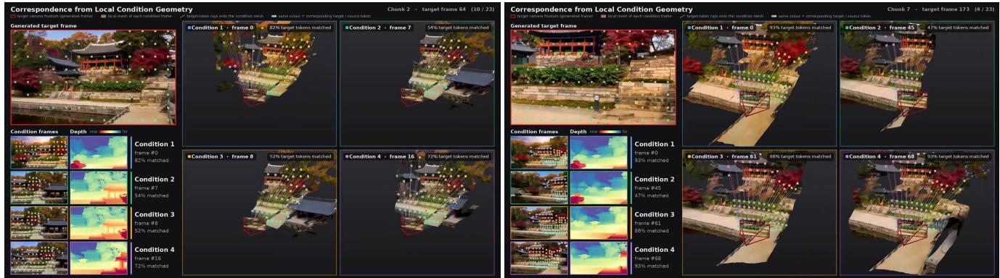  
Figure 12. Visualization of Geometry-Guided Patch Correspondence Construction. Local geometry from each historical observation is used to build a history-to-target patch correspondence cache at latent resolution. Guided by this cache, GCA allows each noisy target token to attend only to its geometrically matched historical memory tokens as keys and values.

spondence:

$$
{ \mathcal { C } } _ { s  t } = \big \{ ( i , j ) \big | F _ { s  t } ( i ) = F _ { s } ( j ) > 0 \big \} ,\tag{17}
$$

where i and $j$ index target and source latent-grid locations, respectively. Face IDs are matched only within each source mesh; the source-frame index is retained when combining matches from multiple historical views. The resulting cache stores the matched source-patch coordinates for each target patch and source frame, with unmatched entries marked invalid. These per-source candidates are subsequently filtered using the target-view Invisible Octree mask before they are accessed by GCA.

## A.4. Invisible Octree Construction and Streaming Update

Octree states. We maintain an Invisible Octree O as a sparse proxy for accumulated visibility evidence along the camera trajectory. Each allocated node v is assigned one of three states: free, invisible, or partially visible. A free node lies entirely in observed free space along the relevant camera rays, whereas an invisible node lies entirely behind the observed depth surface and has not yet been resolved by an observation. A partially visible node intersects the boundary between these regions, or contains a mixture of visible and invisible space.

Given a camera with depth map $D ,$ let $[ z _ { v } ^ { - } , z _ { v } ^ { + } ]$ be the depth range of v in camera space, and let $d _ { v } ^ { \operatorname* { m i n } }$ and $d _ { v } ^ { \operatorname* { m a x } }$ be the minimum and maximum valid depths over its projected footprint. A node containing no observed surface points is classified as

$$
s ( v ) = \left\{ \begin{array} { l l } { \mathrm { f r e e } , } & { z _ { v } ^ { + } < d _ { v } ^ { \mathrm { m i n } } \mathrm { ~ o r ~ n o ~ v a l i d } } \\ & { \mathrm { d e p t h ~ i n ~ t h e ~ f o o t p r i n t } , } \\ { \mathrm { i n v i s i b l e } , } & { z _ { v } ^ { - } > d _ { v } ^ { \mathrm { m a x } } , } \\ { \mathrm { p a r t i a l l y ~ v i s i b l e } , } & { \mathrm { o t h e r w i s e } . } \end{array} \right.\tag{18}
$$

Free and invisible nodes are terminal for the current visibility update. Partially visible nodes are recursively subdivided until their children can be classified or the maximum resolution is reached. Only invisible leaf nodes can be revisited using subsequent camera observations.

Initialization from the first view. Given the first camera $c _ { 1 }$ and depth map $D _ { 1 }$ , we set the octree’s world-space bounds according to the scene scale and initialize a coarse grid with $N _ { \mathrm { m i n } } = 2 ^ { 4 }$ cells per axis. A one-cell-thick background shell of invisible cells encloses the full scene to account for regions with invalid depth estimates.

Both the global invisible octree O and a global visible mesh ${ \mathcal { G } } ^ { \mathrm { v i s } }$ , triangulated from back-projected depth, are initialized from the first frame. Octree nodes are classified against depths rendered from ${ \mathcal { G } } ^ { \mathrm { v i s } }$ , ensuring consistency between the two global proxies. For the first chunk, classification starts from the coarsest grid and recursively refines the octree up to a resolution equivalent to $2 ^ { 1 0 }$ cells per axis. The two structures serve complementary purposes: O represents currently unresolved invisible space, whereas ${ \mathcal { G } } ^ { \mathrm { v i s } }$ represents surfaces that have already been observed. The global visible mesh is used only for visibility comparison; the source-specific local meshes used to construct GCA correspondences remain independent. We visualize the octree subdivision and update process in Fig. 13.

Identifying regions to update. For a newly generated frame with camera $c _ { t }$ and estimated depth $D _ { t }$ , we first render both global proxies into its view. We build a BVH over the invisible octree leaves and ray-cast it to obtain the depth $d _ { t } ^ { \mathrm { i n v } } ( p )$ of the first invisible voxel along each camera ray. Separately, we rasterize ${ \mathcal { G } } ^ { \mathrm { v i s } }$ to obtain its visible-surface depth $d _ { t } ^ { \mathrm { v i s } } ( p )$ . Their depth ordering identifies image regions where previously invisible space appears in front of the surface already represented by the global visible mesh. With a small comparison tolerance ϵ, the corresponding update mask can be written as

$$
M _ { t } ^ { \mathrm { u p d } } ( p ) = k ^ { \left[ \right] } \frac { \mathrm { { d } } _ { t } ^ { \mathrm { i n v } } ( p ) + \epsilon < d _ { t } ^ { \mathrm { v i s } } ( p ) ] } .\tag{19}
$$

Only pixels with a valid current depth and a valid invisiblevoxel intersection are considered for this comparison. We use $D _ { t }$ within $M _ { t } ^ { \mathrm { u p d } }$ to reclassify the corresponding octree region by the same depth-based procedure used during initialization. Previously invisible nodes can therefore be refined as new observations reveal their contents. We further back-project and triangulate the masked depth observations and incorporate the resulting surfaces into ${ \mathcal { G } } ^ { \mathrm { v i s } }$ . Restricting both updates to newly exposed regions prevents established visibility evidence from being repeatedly overwritten by depth estimates from later generated frames.

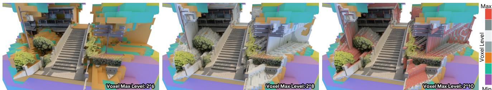  
Figure 13. Visualization of the Invisible Octree update process. Partially visible voxels are recursively subdivided until each node becomes fully visible or fully invisible, or the maximum voxel resolution is reached. With increasing resolution, the Invisible Octree progressively approximates the true invisible regions in the target view.

Visibility-aware correspondence filtering. The global Invisible Octree and visible mesh are updated after each generated chunk as the camera progresses along its trajectory. For each target camera, we project the accumulated global proxies into the target view and compare their depths to determine the target-view invisible mask. This mask is then applied directly to the source–target correspondence cache, removing candidates that fall within regions determined to be occluded before GCA accesses the corresponding historical tokens. Importantly, neither global proxy provides appearance features to the generator. Appearance information remains entirely within the historical frame latents, while O and ${ \mathcal { G } } ^ { \mathrm { v i s } }$ provide only visibility information for filtering their geometrically addressed correspondences.

## A.5. Keyframe History Retrieval

For each target chunk, we retrieve historical frames based on their coverage of the views to be generated. Let T denote the target frames in the chunk, and let $\mathcal { Q } = \{ ( u , i ) \ \{ $ $u \in \mathcal { T } , i \in \Omega _ { u } \}$ be the set of their spatial locations. For each historical frame $s ,$ we project its depth-derived local geometry into every target view. After filtering occluded projections with the target-view Invisible Octree mask, we obtain a coverage set $\mathscr { V } _ { s } \subseteq \mathscr { Q }$

We retain the first and latest historical frames to provide scene identity and continuity across chunks. Starting from these frames, we greedily add the candidate with the largest marginal contribution to target-view coverage. To limit redundant selection from densely observed regions, we track how many selected frames cover each target location $q \colon$

$$
\begin{array} { c } { { n _ { q } ( \boldsymbol { S } ) = \displaystyle \sum _ { s \in \mathcal { S } } \mathbb { k } [ q \in \mathcal { V } _ { s } ] , } } \\ { { \Delta ( s \mid \mathcal { S } ) = \displaystyle \sum _ { q \in \mathcal { V } _ { s } } \mathbb { k } [ n _ { q } ( \boldsymbol { S } ) < N _ { \mathrm { c o v e r e d } } ] , } } \end{array}\tag{20}
$$

where $s$ is the current set of selected frames and $N _ { \mathrm { c o v e r e d } } =$ 3. At each iteration, we select the remaining frame with the largest $\Delta ( s \mid S )$ until the history budget is reached. Once a target location has been covered three times, further coverage of that location contributes no additional score. This encourages the selected conditions to span the upcoming target views while retaining multiple observations where available.

## A.6. Depth Update for Streaming Generation

After generating each video chunk, we estimate the depths of its decoded frames using Depth Anything 3 [22]. Estimating the new frames in isolation could introduce inconsistencies with the geometry stored in the history bank. We therefore include uniformly sampled historical frames as anchors. For a history bank containing $N _ { \mathrm { h i s t } }$ frames, we use the sampling interval $\begin{array} { r } { N _ { \mathrm { i n t e r v a l } } = \bar { \operatorname* { m a x } } \big ( 1 , \lfloor \frac { N _ { \mathrm { h i s t } } } { 2 5 } \rfloor \big ) } \end{array}$ and select historical frames at this interval in temporal order. We jointly feed the anchor frames and newly generated frames to DA3, together with their corresponding camera intrinsics and extrinsics. We use its pose-conditioned mode so that depth estimation is informed by the prescribed camera trajectory. We retain only the depths of the newly generated frames; the depths already stored in the history bank are left unchanged. These new depth maps are then appended to the bank and used to update the visibility proxies for subsequent chunks.

## B. Dataset and Implementation Details

Dataset preprocessing. We train on DL3DV-10K [23] after filtering scenes with pronounced motion blur or insufficient illumination, retaining approximately 6.5K scenes. Each retained sequence is divided into consecutive, nonoverlapping 55-frame clips at a resolution of 480 × 832. We use Depth Anything 3 [22] to obtain per-frame camera poses and depths, and Qwen3-VL-8B-Instruct [4] to generate video captions. For history-to-video (H2V) training, the first 32 frames form the history bank, from which nine keyframes are retrieved; the remaining 23 frames serve as generation targets. After filtering and processing, the resulting dataset comprises approximately 30K high-quality video clips.

Table 3. Training configuration. Rank-32 LoRA adapters and GCA modules are trained jointly on the frozen Wan2.1-I2V-14B backbone.
<table><tr><td>Setting</td><td>Value</td></tr><tr><td>Backbone</td><td>Wan2.1-I2V-14B [34]</td></tr><tr><td>Training resolution</td><td>480× 832</td></tr><tr><td>LoRA rank</td><td>32</td></tr><tr><td>GCA hidden dimension</td><td>640</td></tr><tr><td>GCA placement</td><td>Even-indexed DiT blocks</td></tr><tr><td>Numerical precision</td><td>BF16 mixed precision</td></tr><tr><td>I2V / H2V sampling ratio</td><td>30% / 70%</td></tr><tr><td>Retrieved history keyframes</td><td>9</td></tr><tr><td>Optimizer</td><td>AdamW</td></tr><tr><td>Peak learning rate</td><td> $1 0 ^ { - 4 }$ </td></tr><tr><td>Learning-rate warm-up</td><td>1K iterations</td></tr><tr><td>Training iterations</td><td>10K</td></tr><tr><td>Global batch size</td><td>32</td></tr><tr><td>Hardware</td><td>32 GPUs</td></tr></table>

Table 4. Inference cost. Denoising time is measured per step under matched inputs.
<table><tr><td>Operation</td><td>Scope</td><td>Cost</td></tr><tr><td>Wan2.1-14B</td><td>Per step, One GPU</td><td>33.8 s / 39.9 GB</td></tr><tr><td>Wan2.1-14B with GCA</td><td>Per step, One GPU</td><td>34.5 s (+2.1%) / 40.9 GB</td></tr><tr><td>Depth Anything 3</td><td>48-frame call</td><td>14s</td></tr><tr><td>Invisible Octree update</td><td>23-frame chunk</td><td>3.4s</td></tr></table>

Training configuration. We use Wan2.1-I2V-14B [34] as the pretrained backbone and freeze its original parameters. Rank-32 LoRA adapters and GCA modules are jointly trained, with GCA inserted after self-attention in every even-indexed DiT block. Each GCA module has a hidden dimension of 640. We zero-initialize its output projection $W _ { O }$ , so that the GCA residual is initially zero and does not perturb the pretrained backbone features at the start of training. The complete training settings are summarized in Table 3.

Inference configuration and computation cost. We use 25 denoising steps with a classifier-free guidance scale of 5. Table 4 reports the denoising time per step, depthestimation latency, and Invisible Octree update time. We measure backbone-only and GCA-enhanced denoising on a single GPU using identical input dimensions and history configurations. Depth-estimation latency is measured for a 48-frame inference call, while Invisible Octree update time is reported per 23-frame generated chunk. GCA adds only 1.9% to the backbone parameter count with minimal denoising overhead. We implement Invisible Octree management and updates in Warp [25] to enable parallel execution on the GPU. Both coverage-based history retrieval and rasterization-based correspondence construction can be efficiently parallelized on the GPU, introducing negligible computational overhead during inference.

## C. Evaluation Protocols

## C.1. Baseline Configuration and Method Comparison

Baseline availability. We discuss AnchorWeave [38] as a related method, but exclude it from quantitative comparisons since its inference weights were not publicly available at the time of evaluation.

Depth and camera-scale alignment. DL3DV-Evaluation [23] provides camera trajectories whose scale may differ from that of the depth predicted by baselines. Such a mismatch changes the effective magnitude of the prescribed camera motion and can confound cameracontrol comparisons. To establish a common geometric scale, we estimate multi-view depths for each evaluation scene using Depth Anything 3 [22]. For the explicit memory methods requiring an initial-frame depth map, we align their predicted depth to the DA3 estimate of the first frame by least-squares scale fitting over valid pixels. We also provide the same aligned initial-frame depth to the geometry-based baselines. For UCM [43], we replace the depth estimator used in its original implementation with pose-conditioned DA3, as used by Lyra 2.0 [30] and GEAR in our evaluation, because depth estimated without conditioning on the supplied camera poses may be inconsistent with the evaluation trajectory.

Implicit-memory baselines. For HY-WorldPlay [31], Lingbot-World [29], and Infinite-World [40], we normalize camera translations according to scene scale before inference while preserving the prescribed camera rotations and relative motion. Infinite-World [40] accepts discrete action inputs rather than continuous camera poses; following its processing protocol, we convert consecutive relative camera transformations into the corresponding action sequence. Its trajectory-adherence results should therefore be interpreted in light of this action discretization.

Geometry-based correspondence methods. Similar to our method, UCM [43] and Lyra 2.0 [30] leverage estimated geometry to establish correspondences between historical observations and target viewpoints, without fusing these observations into a persistent global 3D representation. The key distinction lies in how the resulting correspondences are incorporated into the generation process.

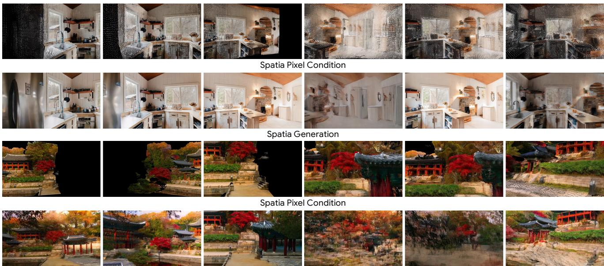  
Spatia Generation  
Figure 14. Visualization of the 3D pixel condition and generated frames of Spatia. Even with relatively clean 3D pixel-aligned conditioning, Spatia exhibits visible temporal instability and image degradation. Under more complex camera trajectories and noisier 3D pixel-aligned conditioning, frame jitter emerges in the first generated chunk, followed by a complete breakdown of visual content in the second.

Roaming Time  
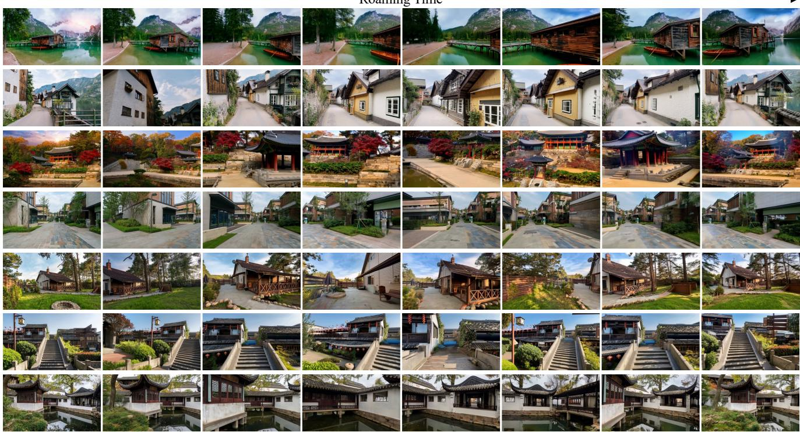  
Figure 15. More results across a broader range of data.

Following PE-Field [5], UCM projects historical observations into relevant target views and warps their positional encodings, allowing historical and target tokens to interact through geometry-aware attention. To limit computation, each historical frame is assigned a single relevant target viewpoint for this warping. Lyra 2.0 instead forwardwarps canonical source coordinates and depth from multiple retrieved frames, encodes the resulting correspondence maps, and adds their embeddings to DiT tokens. These designs provide geometric cues for memory access, but do not explicitly restrict each target patch to attend to its set of matched historical patches.

GEAR stores the source coordinates of valid history-totarget patch correspondences and uses them to gather historical features as keys and values for Geometric Correspondence Attention. A target patch can draw on multiple historical observations, while the Invisible Octree filters candidates that are projectable but occluded in the target view. The resulting attention output is injected through a residual branch during denoising. This provides direct access to the visual content of geometrically matched memory patches while keeping depth errors local to individual source views.

In the comparisons in Figs. 6 and 7, UCM preserves coherent views early in the rollout but exhibits increasing camera drift and visual degradation under longer or faster camera motion. Lyra 2.0 is the strongest geometrycorrespondence baseline in these examples, yet also degrades under substantial viewpoint changes. These observations are consistent with the quantitative results in Table 1.

Globally fused 3D memory methods. Spatia [50] reconstructs historical observations with MapAnything [15], updates a persistent scene point cloud, and renders it from target viewpoints to produce spatial guidance for subsequent video generation. As shown in Fig. 14, this can recover convincing observations on some relatively simple rotational trajectories in WorldScore-Static. In the more challenging DL3DV-Evaluation examples and long-horizon trajectories, however, we observe scene distortion and loss of previously visible content, in some cases beginning within the first generation window and becoming more severe in subsequent rollouts. These failures are consistent with errors in the accumulated point cloud being repeatedly rendered into the conditioning signal. GEAR avoids this source of persistent geometric error by retaining visual observations as frame latents and using their independently estimated geometry only to address memory.

## D. Additional Qualitative and Video Results

We present additional qualitative results on DL3DV-Evaluation (Fig. 17, 18, 19), WorldScore-Static (Fig. 20, 21, 22), and the Long-Horizon dataset (Fig. 16), together with further results demonstrating the performance of our method across a broader range of data (Fig. 15). Please refer to our project page: https: //zju3dv.github.io/geometry-as-address/ for richer and more dynamic visualizations.

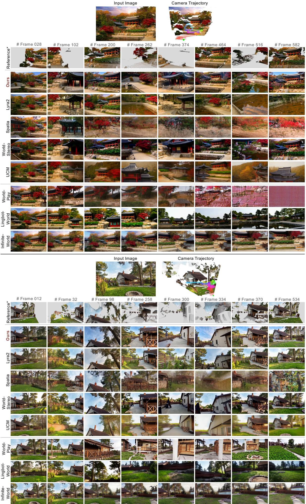  
Figure 16. Qualitative comparison of minute-long challenging camera trajectories results

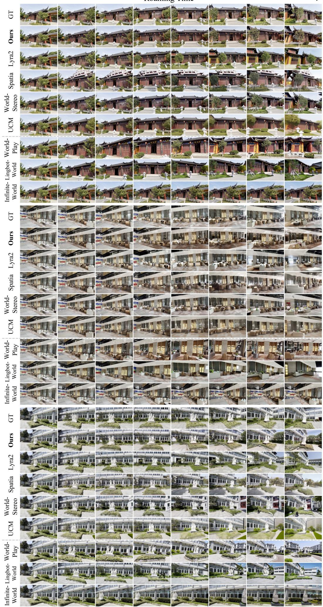  
Figure 17. Qualitative comparison of DL3DV-Evaluation results.

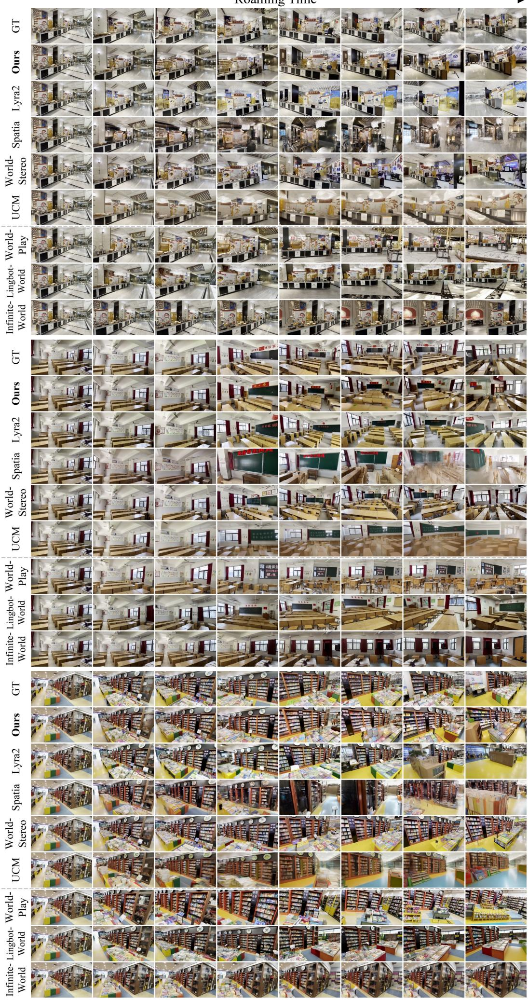  
Figure 18. Qualitative comparison of DL3DV-Evaluation results.

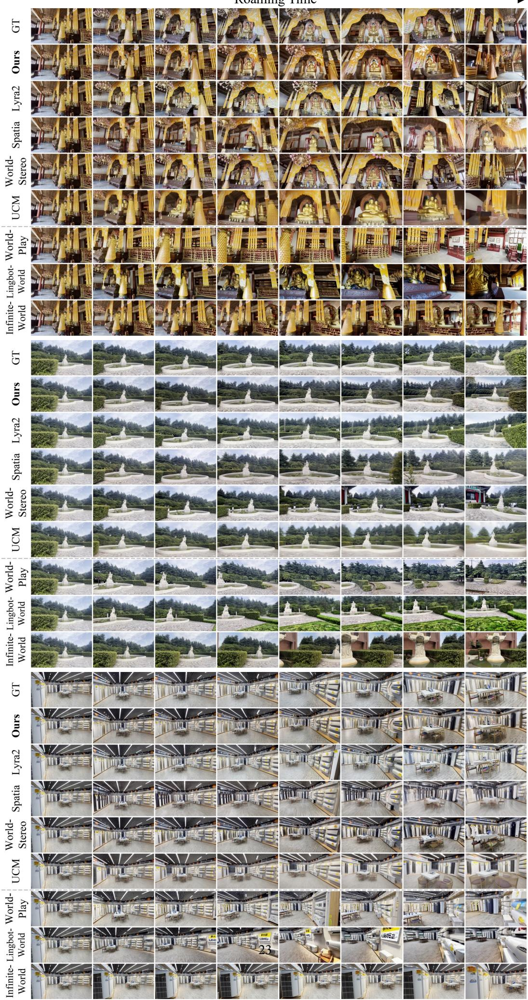  
Figure 19. Qualitative comparison of DL3DV-Evaluation results.

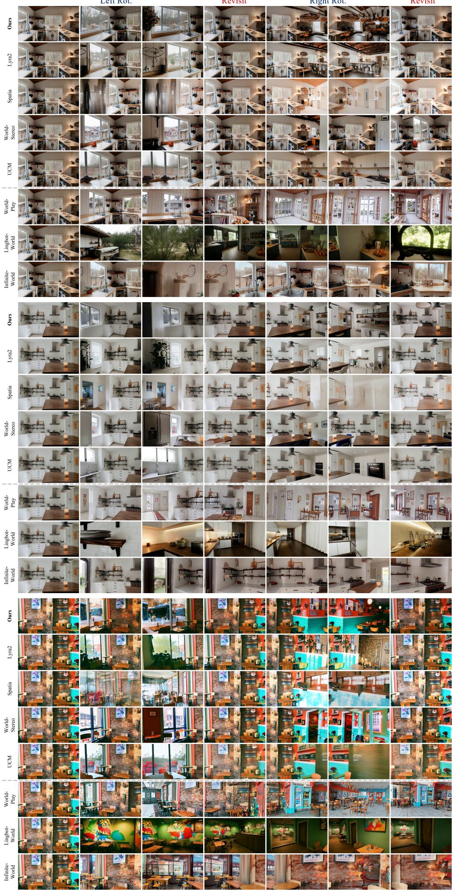  
Figure 20. Qualitative comparison of WorldScore-Static results.

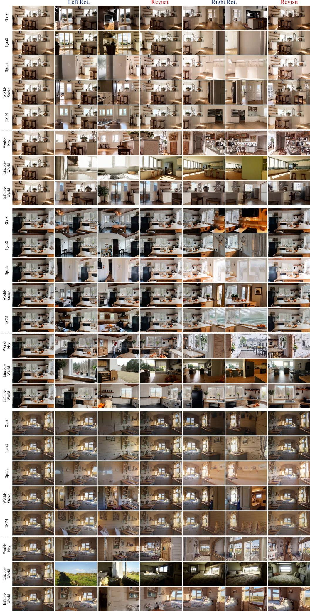  
Figure 21. Qualitative comparison of WorldScore-Static results.

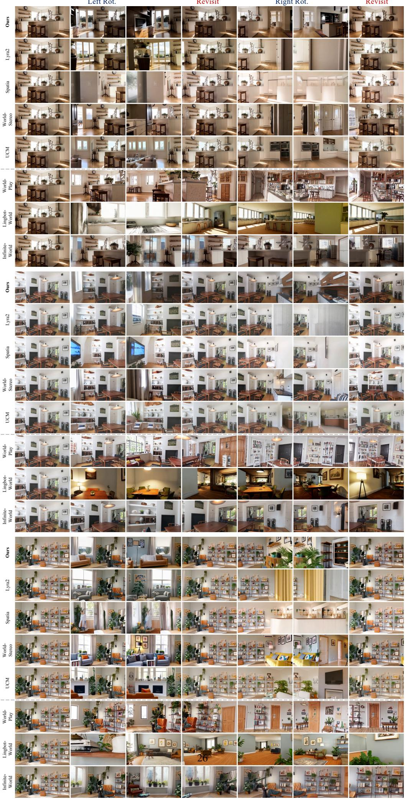  
Figure 22. Qualitative comparison of WorldScore-Static results.