ˉ Generation, editing & restoration

͓ Visual reasoning

Spatial reasoning 2D spatial 3D

͞ Expert domains Medical

ˎ Robotics & driving Driving scenes Embodied

# Hard Vision, Easy Vision: What GPT-6 Astra Reveals Across Computer Vision

Hanoona Rasheed1,†, Mohammed Irfan Kurpath1,†, Bin Ren1, Hisham Cholakkal1, Fahad Shahbaz Khan1,2, Salman Khan1,2 1Mohamed bin Zayed University of Artificial Intelligence, 2Apertix, †Equal contribution

## ABSTRACT

Frontier general-purpose systems are rapidly expanding beyond visual understanding into capabilities traditionally handled by dedicated computer-vision models. As these capabilities expand, a central question for the computer-vision community is how far this reach extends, and what remains hard. We evaluate GPT-6 Astra alongside five frontier general-purpose AI systems across 34 capabilities and 55 benchmarks spanning nine areas of computer vision. We compare their performance with dedicated models and humans where suitable references are available. Astra demonstrates broad visual capability, with substantial gains over other frontier systems in visual and spatial reasoning and several forms of structured prediction. Across the state-of-the-art systems, a consistent pattern emerges. Capabilities involving semantic interpretation, reasoning, and object-centric prediction increasingly approach or reach available reference levels. In contrast, larger gaps remain when tasks require metric geometric accuracy, faithful reconstruction, temporally consistent dense prediction, or specialized fine-grained visual knowledge. Additional reasoning and specialist tools close selected gaps, but their benefits vary across capabilities. These results map a changing landscape of computer vision in which increasingly sophisticated visual tasks are accessible through a general-purpose interface, while precise and fidelity-sensitive perception remains an important frontier.

Date: Sep 28, 2026

Project Page: mbzuai-oryx.github.io/frontier-vision

GitHub: mbzuai-oryx/frontier-vision

## ¿ Recognition & visual reading Recognition Fine-grained

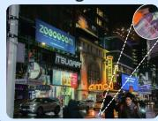

  
Counting

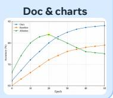

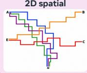

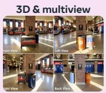

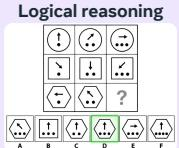

## ͋ 2D grounding & segmentation

Math reasoning

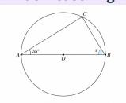

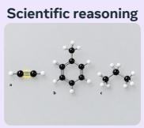

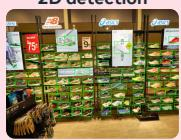

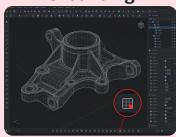

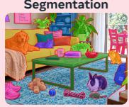

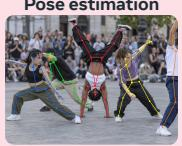

## ż 3D perception & geometry

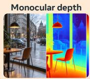

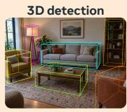

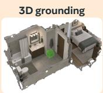  
Ŏ Video understanding

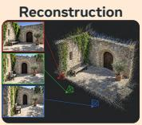

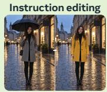

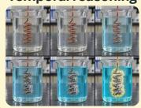

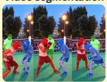

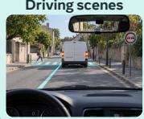

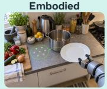

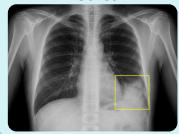

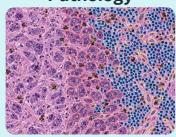  
Remote sensing

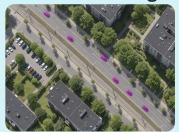  
Figure 1 Mapping the changing landscape of general-purpose vision. Our study covers 34 capabilities across nine broad areas of computer vision, drawing on 55 benchmarks; representative tasks are illustrated here. We compare frontier systems with specialist models and human performance to examine how much of computer vision is now accessible through a general-purpose interface, where meaningful gaps remain, and where dedicated vision models are still necessary.

## 1 Introduction

Computer vision has traditionally advanced through specialized models trained for individual tasks: classifiers for recognition [35, 58], detectors [42, 66] and segmentation models [33, 43] for localization, geometric models for depth [17, 94] and 3D perception [61, 81], video models [2, 71] for temporal understanding, and domain-specific models for areas such as robotics and medical imaging [46, 68]. This landscape is now changing. Frontier general-purpose systems increasingly bring diverse visual capabilities into a shared interface allowing users to specify tasks through natural-language instructions [41, 53, 74]. Their expanding reach beyond semantic image understanding into structured prediction, visual generation, and embodied interaction is changing expectations of what general-purpose models can accomplish. As new capabilities emerge, a fundamental question becomes increasingly relevant to the field: how much of computer vision is now accessible through a general-purpose system, and where do dedicated vision models remain necessary?

Existing benchmarks [18, 100] provide extensive evaluations of visual tasks and a substantial body of evidence about the capabilities of frontier models. This evidence, however, is spread across tasks, domains, and model comparisons, making it dificult to see what individual advances collectively mean for computer vision. A model may lead other generalists on a benchmark while remaining far from specialist or human performance [18, 77], and its strengths on one task may not extend to related tasks. Connecting and interpreting these results through a landscape-level analysis can reveal which capabilities are becoming broadly accessible, how close they are to established reference levels, and where meaningful gaps remain. Understanding this landscape can clarify the evolving role of specialized models, identify capabilities with substantial remaining headroom, and guide future computer-vision research toward the challenges where it can make the greatest diference.

To investigate this question, we conduct a systematic study of the breadth and limits of frontier general-purpose vision. We compare systems with one another and examine how their performance relates to that of dedicated vision models and humans. We organize our analysis around four research questions: (RQ1) How broad is the visual coverage of current frontier systems relative to human and specialist references? (RQ2) Where do frontier systems converge, and where do they still difer substantially? (RQ3) For which task types is specialist-level performance available through a general-purpose interface, and what task properties predict the remaining gap? (RQ4) Can added reasoning, explicit tool use, or open specialist-as-tool pipelines close those gaps, and at what cost? Across these evaluations, we observe a consistent boundary emerging: general-purpose systems like GPT6-Astra increasingly match reference performance when visual information supports semantic interpretation and reasoning. In contrast, the largest gaps persist when the output must remain metrically precise, pixel-faithful, temporally consistent, or dependent on specialized fine-grained visual knowledge.

## 2 Mapping the Computer Vision Landscape and Evaluation Setup

We organize the evaluation into 34 capabilities spanning nine broad areas of computer vision: i) recognition, perception, and visual reading; ii) visual reasoning; iii) spatial reasoning; iv) 2D grounding, detection, and segmentation; v) 3D perception and geometric prediction; vi ) video understanding and segmentation; vii ) image generation, editing, and restoration; viii) robotics; and ix) expert-domain vision. Across these capabilities, we draw on 55 benchmarks, prioritizing challenging evaluations that retain meaningful headroom for current frontier systems while collectively covering a broad range of computer-vision tasks. Our goal is to evaluate not only what these systems can understand from visual inputs, but also the range and precision of the outputs they can produce. The resulting tasks therefore extend beyond textual answers to bounding boxes and masks, depth maps and 3D predictions, temporally consistent mask sequences, generated and edited images, and actions in embodied environments. Together, these evaluations capture a broad range of visual capabilities, from semantic understanding to precise structured prediction and task execution.

We evaluate six frontier general-purpose systems: GPT-6 Astra [56], Fable 5 [1], Kimi K3 [76], Gemini 3.1 Pro [21], Qwen 3.8-Max [63], and Muse Spark 1.3 [50]. All models receive the same task instructions, visual inputs, and evaluation samples on each benchmark, with outputs scored using the corresponding benchmark metric. Where models provide multiple reasoning configurations, we use the strongest available reasoning setting appropriate to the task. This establishes a common evaluation basis for examining both capabilities increasingly shared across frontier systems and those where substantial diferences remain.

<table><tr><td rowspan=2 colspan=4>Capability Group   Capability</td><td rowspan=1 colspan=1>S</td><td rowspan=1 colspan=1>米</td><td rowspan=1 colspan=1>K</td><td rowspan=1 colspan=1></td><td rowspan=1 colspan=1>女</td><td rowspan=1 colspan=1>8</td><td rowspan=1 colspan=1></td><td rowspan=1 colspan=1>8</td><td rowspan=1 colspan=1>X</td><td rowspan=1 colspan=1>1</td></tr><tr><td rowspan=1 colspan=1>GPT-6Astra</td><td rowspan=1 colspan=1>Fable 5</td><td rowspan=1 colspan=1>Kimi K3</td><td rowspan=1 colspan=1>Gemini3.1 Pro</td><td rowspan=1 colspan=1>Qwen3.8 Max</td><td rowspan=1 colspan=1>MuseSpark 1.3</td><td rowspan=1 colspan=1>ReferenceModel</td><td rowspan=1 colspan=1>Human</td><td rowspan=1 colspan=1>Best modelvs ref.</td><td rowspan=1 colspan=1>Best vs2nd best</td></tr><tr><td rowspan=2 colspan=3></td><td rowspan=1 colspan=1>Visual Recognition</td><td rowspan=1 colspan=1>77.0</td><td rowspan=1 colspan=1>71.5</td><td rowspan=1 colspan=1>70.9</td><td rowspan=1 colspan=1>69.6</td><td rowspan=1 colspan=1>72.7</td><td rowspan=1 colspan=1>72.7</td><td rowspan=1 colspan=1>61.1</td><td rowspan=1 colspan=1>98.9</td><td rowspan=1 colspan=1>-21.9</td><td rowspan=1 colspan=1>+4.3</td></tr><tr><td rowspan=1 colspan=1>Fine-Grained Discrimination</td><td rowspan=1 colspan=1>86.1</td><td rowspan=1 colspan=1>70.0</td><td rowspan=1 colspan=1>64.0</td><td rowspan=1 colspan=1>69.5</td><td rowspan=1 colspan=1>75.6</td><td rowspan=1 colspan=1>77.0</td><td rowspan=1 colspan=1></td><td rowspan=1 colspan=1>96.5</td><td rowspan=1 colspan=1>-10.4</td><td rowspan=1 colspan=1>+9.1</td></tr><tr><td rowspan=1 colspan=3>Recognition, Perception,</td><td rowspan=1 colspan=1></td><td rowspan=1 colspan=4>Visual Counting</td><td rowspan=1 colspan=1>82.7</td><td rowspan=1 colspan=1>69.6</td><td rowspan=1 colspan=1>74.0</td><td rowspan=1 colspan=1>78.5</td><td rowspan=1 colspan=1>80.3</td><td rowspan=1 colspan=1>76.1</td></tr><tr><td rowspan=2 colspan=3>&amp; Visual Reading</td><td rowspan=2 colspan=1>OCR &amp; Text RecognitionDoc &amp; Chart Understanding</td><td rowspan=1 colspan=1>98.1</td><td rowspan=1 colspan=1>97.5</td><td rowspan=1 colspan=1>96.3</td><td rowspan=1 colspan=1>93.8</td><td rowspan=1 colspan=1>94.8</td><td rowspan=1 colspan=1>96.3</td><td rowspan=1 colspan=1></td><td rowspan=1 colspan=1>98.0</td><td rowspan=1 colspan=1>+0.1</td><td rowspan=1 colspan=1>+0.6</td></tr><tr><td rowspan=1 colspan=1>92.8</td><td rowspan=1 colspan=1>91.7</td><td rowspan=1 colspan=1>90.3</td><td rowspan=1 colspan=1>89.8</td><td rowspan=1 colspan=1>91.2</td><td rowspan=1 colspan=1>89.5</td><td rowspan=1 colspan=1></td><td rowspan=1 colspan=1>89.3</td><td rowspan=1 colspan=1>+3.5</td><td rowspan=1 colspan=1>+1.1</td></tr><tr><td rowspan=3 colspan=3>Visual Reasoning</td><td rowspan=2 colspan=1>Visual Logical ReasoningVisual Math Reasoning</td><td rowspan=1 colspan=1>81.1</td><td rowspan=1 colspan=1>61.3</td><td rowspan=1 colspan=1>61.2</td><td rowspan=1 colspan=1>60.5</td><td rowspan=1 colspan=1>67.5</td><td rowspan=1 colspan=1>57.6</td><td rowspan=1 colspan=1></td><td rowspan=1 colspan=1>87.0</td><td rowspan=1 colspan=1>-5.9</td><td rowspan=1 colspan=1>+13.6</td></tr><tr><td rowspan=1 colspan=1>92.5</td><td rowspan=1 colspan=1>78.8</td><td rowspan=1 colspan=1>80.4</td><td rowspan=1 colspan=1>82.3</td><td rowspan=1 colspan=1>82.0</td><td rowspan=1 colspan=1>79.3</td><td rowspan=1 colspan=1></td><td rowspan=1 colspan=1>78.7</td><td rowspan=1 colspan=1>+13.8</td><td rowspan=1 colspan=1>+10.2</td></tr><tr><td rowspan=1 colspan=1>Scientific Reasoning</td><td rowspan=1 colspan=1>86.8</td><td rowspan=1 colspan=1>81.2</td><td rowspan=1 colspan=1>81.6</td><td rowspan=1 colspan=1>80.5</td><td rowspan=1 colspan=1>82.3</td><td rowspan=1 colspan=1>81.2</td><td rowspan=1 colspan=1></td><td rowspan=1 colspan=1>88.6</td><td rowspan=1 colspan=1>-1.8</td><td rowspan=1 colspan=1>+4.5</td></tr><tr><td rowspan=2 colspan=3>Spatial Reasoning</td><td rowspan=2 colspan=1>2D Spatial Reasoning3D &amp; Multiview Reasoning</td><td rowspan=1 colspan=1>96.0</td><td rowspan=1 colspan=1>79.3</td><td rowspan=1 colspan=1>87.0</td><td rowspan=1 colspan=1>84.2</td><td rowspan=1 colspan=1>89.1</td><td rowspan=1 colspan=1>82.6</td><td rowspan=1 colspan=1></td><td rowspan=1 colspan=1>95.8</td><td rowspan=1 colspan=1>+0.2</td><td rowspan=1 colspan=1>+6.9</td></tr><tr><td rowspan=1 colspan=1>89.6</td><td rowspan=1 colspan=1>75.2</td><td rowspan=1 colspan=1>76.8</td><td rowspan=1 colspan=1>66.8</td><td rowspan=1 colspan=1>77.0</td><td rowspan=1 colspan=1>77.2</td><td rowspan=1 colspan=1></td><td rowspan=1 colspan=1>94.1</td><td rowspan=1 colspan=1>-4.5</td><td rowspan=1 colspan=1>+12.4</td></tr><tr><td rowspan=2 colspan=3></td><td rowspan=2 colspan=1>2D Object Detection2D Visual Grounding</td><td rowspan=1 colspan=1>89.1</td><td rowspan=1 colspan=1>31.1</td><td rowspan=1 colspan=1>67.7</td><td rowspan=1 colspan=1>69.7</td><td rowspan=1 colspan=1>87.0</td><td rowspan=1 colspan=1>46.5</td><td rowspan=1 colspan=1>78.4</td><td rowspan=1 colspan=1></td><td rowspan=1 colspan=1>+10.7</td><td rowspan=1 colspan=1>+2.1</td></tr><tr><td rowspan=1 colspan=1>93.1</td><td rowspan=1 colspan=1>87.0</td><td rowspan=1 colspan=1>77.4</td><td rowspan=1 colspan=1>79.6</td><td rowspan=1 colspan=1>87.7</td><td rowspan=1 colspan=1>82.5</td><td rowspan=1 colspan=1></td><td rowspan=1 colspan=1>96.2</td><td rowspan=1 colspan=1>-3.1</td><td rowspan=1 colspan=1>+5.4</td></tr><tr><td rowspan=1 colspan=3>2D Localization &amp;</td><td rowspan=1 colspan=1>Segmentation</td><td rowspan=1 colspan=1>81.3</td><td rowspan=1 colspan=1>70.9</td><td rowspan=1 colspan=1>41.3</td><td rowspan=1 colspan=1>56.6</td><td rowspan=1 colspan=1>68.0</td><td rowspan=1 colspan=1>47.3</td><td rowspan=1 colspan=1>77.0</td><td rowspan=1 colspan=1></td><td rowspan=1 colspan=1>+4.3</td><td rowspan=1 colspan=1>+10.4</td></tr><tr><td rowspan=1 colspan=3>Segmentation</td><td rowspan=1 colspan=1>2D Pose Estimation</td><td rowspan=1 colspan=1>75.2</td><td rowspan=1 colspan=1>19.6</td><td rowspan=1 colspan=1>43.5</td><td rowspan=1 colspan=1>32.0</td><td rowspan=1 colspan=1>52.5</td><td rowspan=1 colspan=1>38.1</td><td rowspan=1 colspan=1>83.6</td><td rowspan=1 colspan=1></td><td rowspan=1 colspan=1>-8.4</td><td rowspan=1 colspan=1>+22.7</td></tr><tr><td rowspan=2 colspan=3></td><td rowspan=1 colspan=1>Depth Estimation (↓)</td><td rowspan=1 colspan=1>0.63</td><td rowspan=1 colspan=1>0.89</td><td rowspan=1 colspan=1>1.00</td><td rowspan=1 colspan=1>1.19</td><td rowspan=1 colspan=1>1.29</td><td rowspan=1 colspan=1>0.82</td><td rowspan=1 colspan=1>0.44</td><td rowspan=1 colspan=1></td><td rowspan=1 colspan=1>-0.19</td><td rowspan=1 colspan=1>+0.19</td></tr><tr><td rowspan=1 colspan=1>3D Object Detection</td><td rowspan=1 colspan=1>17.3</td><td rowspan=1 colspan=1>13.8</td><td rowspan=1 colspan=1>8.0</td><td rowspan=1 colspan=1>6.6</td><td rowspan=1 colspan=1>7.1</td><td rowspan=1 colspan=1>7.9</td><td rowspan=1 colspan=1>16.8</td><td rowspan=1 colspan=1></td><td rowspan=1 colspan=1>+0.5</td><td rowspan=1 colspan=1>+3.5</td></tr><tr><td rowspan=2 colspan=3>3D Perception &amp;Geometric Prediction</td><td rowspan=1 colspan=1>3D Visual Grounding</td><td rowspan=1 colspan=1>73.8</td><td rowspan=1 colspan=1>63.1</td><td rowspan=1 colspan=1>55.8</td><td rowspan=1 colspan=1>59.4</td><td rowspan=1 colspan=1>48.1</td><td rowspan=1 colspan=1>62.1</td><td rowspan=1 colspan=1>46.5</td><td rowspan=1 colspan=1>95.0</td><td rowspan=1 colspan=1>-21.2</td><td rowspan=1 colspan=1>+10.7</td></tr><tr><td rowspan=1 colspan=1>3D Reconstruction (↓)</td><td rowspan=1 colspan=1>1.40</td><td rowspan=1 colspan=1>1.85</td><td rowspan=1 colspan=1>1.96</td><td rowspan=1 colspan=1>1.81</td><td rowspan=1 colspan=1>1.72</td><td rowspan=1 colspan=1>1.89</td><td rowspan=1 colspan=1>0.61</td><td rowspan=1 colspan=1></td><td rowspan=1 colspan=1>-0.79</td><td rowspan=1 colspan=1>+0.32</td></tr><tr><td rowspan=3 colspan=3>Video Understanding&amp; Segmentation</td><td rowspan=3 colspan=1>Video UnderstandingTemporal LocalizationVideo Segmentation</td><td rowspan=1 colspan=1>74.3</td><td rowspan=1 colspan=1>59.0</td><td rowspan=1 colspan=1>64.1</td><td rowspan=1 colspan=1>53.0</td><td rowspan=1 colspan=1>70.2</td><td rowspan=1 colspan=1>75.6</td><td rowspan=1 colspan=1>71.5</td><td rowspan=1 colspan=1>82.6</td><td rowspan=1 colspan=1>-7.0</td><td rowspan=1 colspan=1>+1.3</td></tr><tr><td rowspan=1 colspan=1>38.6</td><td rowspan=1 colspan=1>23.7</td><td rowspan=1 colspan=1>24.6</td><td rowspan=1 colspan=1>22.6</td><td rowspan=1 colspan=1>28.6</td><td rowspan=1 colspan=1>25.3</td><td rowspan=1 colspan=1>35.9</td><td rowspan=1 colspan=1></td><td rowspan=1 colspan=1>+2.7</td><td rowspan=1 colspan=1>+10.0</td></tr><tr><td rowspan=1 colspan=1>84.5</td><td rowspan=1 colspan=1>57.9</td><td rowspan=1 colspan=1>34.5</td><td rowspan=1 colspan=1>34.9</td><td rowspan=1 colspan=1>32.0</td><td rowspan=1 colspan=1>33.8</td><td rowspan=1 colspan=1>91.0</td><td rowspan=1 colspan=1></td><td rowspan=1 colspan=1>-6.5</td><td rowspan=1 colspan=1>+26.6</td></tr><tr><td rowspan=2 colspan=3></td><td rowspan=2 colspan=1>Text-to-Image GenerationInstruction-Guided Editing</td><td rowspan=1 colspan=1>96.2</td><td rowspan=1 colspan=1>n/s</td><td rowspan=1 colspan=1>n/s</td><td rowspan=1 colspan=1>67.4</td><td rowspan=1 colspan=1>92.1</td><td rowspan=1 colspan=1>92.4</td><td rowspan=1 colspan=1>92.6</td><td rowspan=1 colspan=1></td><td rowspan=1 colspan=1>+3.6</td><td rowspan=1 colspan=1>+3.8</td></tr><tr><td rowspan=1 colspan=1>4.80</td><td rowspan=1 colspan=1>n/s</td><td rowspan=1 colspan=1>n/s</td><td rowspan=1 colspan=1>4.20</td><td rowspan=1 colspan=1>4.67</td><td rowspan=1 colspan=1>4.40</td><td rowspan=1 colspan=1>4.64</td><td rowspan=1 colspan=1></td><td rowspan=1 colspan=1>+0.16</td><td rowspan=1 colspan=1>+0.13</td></tr><tr><td rowspan=2 colspan=3>Image Generation,Editing, &amp; Restoration</td><td rowspan=2 colspan=1>Image RestorationImage Quality Assessment</td><td rowspan=1 colspan=1>17.7</td><td rowspan=1 colspan=1>n/s</td><td rowspan=1 colspan=1>17.3</td><td rowspan=1 colspan=1>17.5</td><td rowspan=1 colspan=1>17.4</td><td rowspan=1 colspan=1>17.2</td><td rowspan=1 colspan=1>30.7</td><td rowspan=1 colspan=1></td><td rowspan=1 colspan=1>-13.0</td><td rowspan=1 colspan=1>+0.2</td></tr><tr><td rowspan=1 colspan=1>86.2</td><td rowspan=1 colspan=1>n/s</td><td rowspan=1 colspan=1>83.1</td><td rowspan=1 colspan=1>79.5</td><td rowspan=1 colspan=1>81.1</td><td rowspan=1 colspan=1>78.4</td><td rowspan=1 colspan=1>84.9</td><td rowspan=1 colspan=1></td><td rowspan=1 colspan=1>+1.3</td><td rowspan=1 colspan=1>+3.1</td></tr><tr><td rowspan=3 colspan=3>Robotics</td><td rowspan=1 colspan=1>Driving-Scene Reasoning</td><td rowspan=1 colspan=1>80.8</td><td rowspan=1 colspan=1>75.8</td><td rowspan=1 colspan=1>71.6</td><td rowspan=1 colspan=1>71.2</td><td rowspan=1 colspan=1>77.1</td><td rowspan=1 colspan=1>76.5</td><td rowspan=1 colspan=1>73.1</td><td rowspan=1 colspan=1>88.1</td><td rowspan=1 colspan=1>-7.3</td><td rowspan=1 colspan=1>+3.7</td></tr><tr><td rowspan=1 colspan=1>Embodied Understanding</td><td rowspan=1 colspan=1>82.3</td><td rowspan=1 colspan=1>70.0</td><td rowspan=1 colspan=1>65.2</td><td rowspan=1 colspan=1>68.0</td><td rowspan=1 colspan=1>77.8</td><td rowspan=1 colspan=1>76.5</td><td rowspan=1 colspan=1>78.5</td><td rowspan=1 colspan=1></td><td rowspan=1 colspan=1>+3.8</td><td rowspan=1 colspan=1>+4.5</td></tr><tr><td rowspan=1 colspan=1>Robotic Navigation</td><td rowspan=1 colspan=1>78.0</td><td rowspan=1 colspan=1>64.0</td><td rowspan=1 colspan=1>48.0</td><td rowspan=1 colspan=1>60.0</td><td rowspan=1 colspan=1>70.0</td><td rowspan=1 colspan=1>67.0</td><td rowspan=1 colspan=1></td><td rowspan=1 colspan=1></td><td rowspan=1 colspan=1></td><td rowspan=1 colspan=1>+8.0</td></tr><tr><td rowspan=3 colspan=3></td><td rowspan=2 colspan=1>Medical Understanding2D Medical Grounding</td><td rowspan=1 colspan=1>86.0</td><td rowspan=1 colspan=1>79.7</td><td rowspan=1 colspan=1>73.9</td><td rowspan=1 colspan=1>78.3</td><td rowspan=1 colspan=1>78.1</td><td rowspan=1 colspan=1>78.3</td><td rowspan=1 colspan=1>81.5</td><td rowspan=1 colspan=1>45.5</td><td rowspan=1 colspan=1>+4.5</td><td rowspan=1 colspan=1>+6.3</td></tr><tr><td rowspan=1 colspan=1>61.5</td><td rowspan=1 colspan=1>35.9</td><td rowspan=1 colspan=1>20.8</td><td rowspan=1 colspan=1>35.0</td><td rowspan=1 colspan=1>58.2</td><td rowspan=1 colspan=1>37.8</td><td rowspan=1 colspan=1>81.8</td><td rowspan=1 colspan=1></td><td rowspan=1 colspan=1>-20.3</td><td rowspan=1 colspan=1>+3.3</td></tr><tr><td rowspan=1 colspan=1></td><td rowspan=1 colspan=1>3D Medical Grounding</td><td rowspan=1 colspan=1>73.9</td><td rowspan=1 colspan=1>38.0</td><td rowspan=1 colspan=1>38.4</td><td rowspan=1 colspan=1>24.4</td><td rowspan=1 colspan=1>46.0</td><td rowspan=1 colspan=1>43.8</td><td rowspan=1 colspan=1>59.4</td><td rowspan=1 colspan=1></td><td rowspan=1 colspan=1>+14.5</td><td rowspan=1 colspan=1>+27.9</td></tr><tr><td rowspan=4 colspan=3>Expert-DomainVision</td><td rowspan=1 colspan=1></td><td rowspan=1 colspan=4>Microscopy &amp; Pathology</td><td rowspan=1 colspan=1>23.8</td><td rowspan=1 colspan=1>22.1</td><td rowspan=1 colspan=1>16.7</td><td rowspan=1 colspan=1>14.1</td><td rowspan=1 colspan=1>21.4</td><td rowspan=1 colspan=1>23.1</td></tr><tr><td rowspan=1 colspan=1></td><td></td><td></td><td></td><td></td><td></td><td></td><td></td><td></td><td></td><td></td><td></td></tr><tr><td rowspan=1 colspan=1>Remote-Sensing Reasoning</td><td rowspan=1 colspan=1>46.3</td><td rowspan=1 colspan=1>42.7</td><td rowspan=1 colspan=1>39.7</td><td rowspan=1 colspan=1>50.0</td><td rowspan=1 colspan=1>48.2</td><td rowspan=1 colspan=1>45.8</td><td rowspan=1 colspan=1>43.9</td><td rowspan=1 colspan=1></td><td rowspan=1 colspan=1>+6.1</td><td rowspan=1 colspan=1>+1.8</td></tr><tr><td rowspan=1 colspan=1>Remote-Sensing Grounding</td><td rowspan=1 colspan=1>26.4</td><td rowspan=1 colspan=1>16.8</td><td rowspan=1 colspan=1>20.2</td><td rowspan=1 colspan=1>11.2</td><td rowspan=1 colspan=1>16.1</td><td rowspan=1 colspan=1>13.1</td><td rowspan=1 colspan=1>75.5</td><td rowspan=1 colspan=2>-49.1</td><td rowspan=1 colspan=1>+6.2</td></tr><tr><td rowspan=1 colspan=14>Lowest                                 Highest  n/snot supported      not reportable</td></tr></table>

Table 1 Frontier visual capability: shared strengths, differences, and remaining headroom. We compare six frontier general purpose systems across 34 capabilities spanning nine broad areas of computer vision. Reference Model reports either a dedicated specialist, trained or designed specifically for the task, or a prior generalist SOTA, an earlier general-purpose model with the strongest reported result on the benchmark. Human is based on benchmark-reported human performance where available. The last two columns summarize complementary aspects of the capability landscape: Best model vs. ref. measures how far the best generalist exceeds or trails the strongest available model or human reference, indicating the remaining headroom (RQ3); Best vs. 2nd best reports its margin over the next-best generalist, highlighting where a particular system stands out (RQ2). Positive gaps indicate better performance, with signs adjusted for ↓ metrics.

To assess how far general-purpose capability has progressed, we compare frontier systems against both specialist and human performance where suitable references are available. Specialist references are drawn from leading task-specific methods whose architectures, training procedures, or optimization are designed specifically for the corresponding capability, providing a measure of how closely general-purpose systems approach performance achieved by dedicated vision models. Human performance provides a complementary reference for understanding the remaining headroom beyond specialist-level capability. To characterize how far each capability has progressed toward these reference levels, we describe performance using four maturity tiers: exceeds reference level, at reference level, approaching, and substantial gap. These tiers summarize capability maturity on the evaluated benchmarks rather than implying that the underlying task itself is solved.

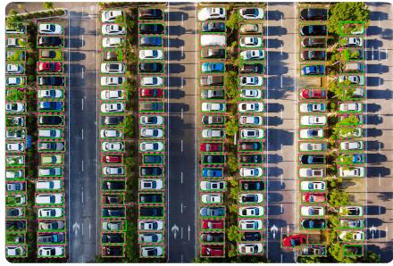  
2D Object Detection

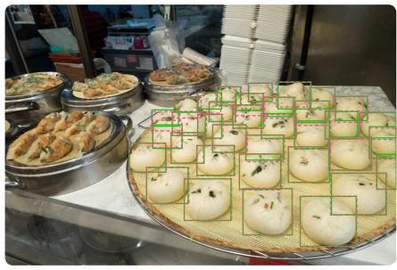  
GT GPT-6 Astra

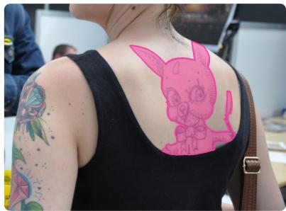  
Segmentation

Figure 2 Specialist-level 2D localization through a general-purpose interface. We illustrate this capability with GPT-6 Astra, which detects densely packed objects in crowded scenes (left) and captures the intricate contours of a tattoo through segmentation (right), showing structured prediction capabilities traditionally handled by dedicated vision models.  
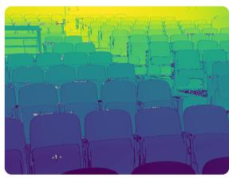

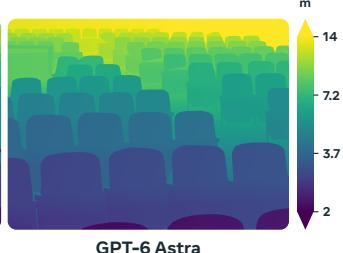  
Depth Estimation

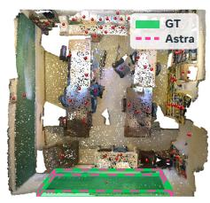  
3D Visual Grounding

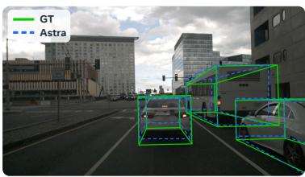  
3D Object Detection  
Figure 3 Advances in object-centric 3D understanding and remaining geometric gaps. GPT-6 Astra accurately localizes the referred blackboard (middle), illustrating a capability where general-purpose performance now reaches and even exceeds specialist levels, while showing a large margin over other frontier models (+10.7). It also extends to 3D object detection, with coherent bounding boxes (right). Depth prediction, however, remains more challenging: although the depth map captures the broad scene layout, it smooths over fine surface and boundary details (left), highlighting the remaining headroom in precise geometric prediction.

## 3 How Broad Is Frontier Visual Capability?

Question 1: How broad is the visual coverage of current frontier systems relative to human and specialist reference performances?

TL;DR: Across 34 capabilities and 55 benchmarks covered in this study, we notice that the frontier has broadened dramatically. However, breadth is not uniform in maturity.

Recognition, Perception, and Visual Reading. The perception results show two notable trends. i) Strong perception is increasingly a shared property of frontier models. All six evaluated models perform well on challenging tasks spanning visual recognition, fine-grained discrimination and matching, object counting, and visual reading. ii ) Visual reading approaches or exceeds human performance. Compared with recognition and counting, OCR comes closer to human-level performance (93.7–98.1 vs. 98.0). Document, chart, and infographic understanding is even stronger: all six models surpass the reported human performance, by margins ranging from +0.2 to +3.5 points.

Visual and Spatial Reasoning. In contrast to perception, visual and spatial reasoning remain less uniformly mature across frontier models. Within visual reasoning, predominantly visual logical problems retain more headroom, while tasks that combine visual information with mathematical and scientific knowledge are closer to human performance. All six models reach or exceed the human score on mathematical reasoning (78.8–92.5 vs. 78.7), while scientific and professional reasoning remains slightly below it (80.5–86.8 vs. 88.6). Another key observation is the emergence of spatial reasoning as a strong capability in the latest frontier models, with GPT-6 Astra reaching the human performance in 2D spatial reasoning (96.0 vs. 95.8) and approaching it in 3D spatial and multiview reasoning (89.6 vs. 94.1).

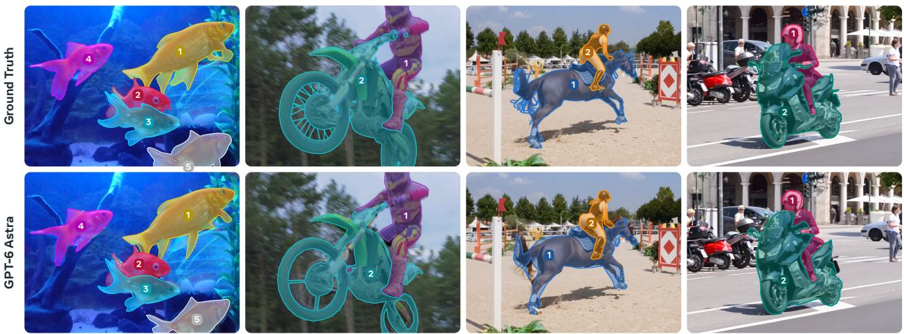  
Figure 4 Remaining gaps in dense temporal prediction. To illustrate the remaining challenges in video segmentation, we show outputs from GPT-6 Astra, which achieves substantial gains over the next-best frontier system (+26.6 points). The predictions capture the main object shapes and distinguish multiple instances, while precise boundaries, small structures, and separation of nearby instances remain challenging. These examples highlight the spatial distinctions that must be maintained consistently across frames to close the remaining specialist gap.

Localization, 3D Perception, and Video Understanding. i) 2D: The results show localization emerging as a strong capability in the latest frontier models, extending into tasks traditionally handled by specialized models. GPT-6 Astra exceeds the specialist performance in both object detection and segmentation (+10.7 and +4.3 points), while its visual grounding performance approaches the human performance (93.1 vs. 96.0) (See Figure 2). This trend extends beyond a single model, with Qwen 3.8-Max also surpassing the specialist detector (+8.6 points), indicating a broader shift toward specialist-level 2D localization through general-purpose models. ii) 3D: Progress is less uniform in 3D perception. Object-related capabilities show stronger progress toward specialist performance: all six models outperform the specialist in 3D visual grounding, while on the distinct task of 3D object detection, GPT-6 Astra closely approaches the specialist performance (17.3 vs. 16.8) (See Figure 3). In contrast, metric depth and reconstruction retain substantial headroom; even the strongest multiview reconstruction result has approximately 2.3× the error of the specialist model. iii) Video: A similar distinction appears between video understanding and dense temporal prediction. Several frontier models are already competitive with the specialist in video and temporal understanding (72.6–76.3 vs. 73.3). However, this competitiveness does not yet extend to video segmentation, where even the best-performing frontier model remains 7.9 points below the dedicated model (See Figure 4). Overall, these results point to 2D localization and object-centric 3D understanding as emerging strengths of general-purpose models, while precise geometric prediction and temporally consistent dense prediction continue to show substantial headroom.

Image Generation, Editing, and Restoration. i) In generation, editing, and quality assessment, the results show broadly consistent performance across most frontier models, with competitive results close to specialist levels in image generation, instruction-guided editing, and quality assessment. GPT-6 Astra exceeds specialist performance in all three tasks (+3.6, +0.16, and +1.3 points, respectively). ii) The performance observed in generation and editing does not extend to restoration. Here, all evaluated generalist models perform well below the specialist, with scores concentrated in a narrow range (17.2–17.7 vs. 30.7 dB PSNR). This consistency across models indicates that accurate image reconstruction remains a shared limitation, despite their strong generation and editing capabilities. Figure 7 illustrates this gap with a low-light enhancement example.

Robotics and Expert-Domain Vision. i) Robotics: The results show competitive driving-scene and embodied understanding across several frontier models. GPT-6 Astra exceeds specialist performance in both tasks (+7.7 and +3.8 points, respectively), while Qwen 3.8-Max and Muse Spark 1.3 also approach specialist-level embodied understanding. Navigation extends this coverage from understanding to the more demanding setting of task execution, with GPT-6 Astra achieving 78% success in the evaluated setting (Figure 6). ii) Expert-domain vision: Generalist understanding also extends to specialized imagery, including chest radiographs and satellite imagery, with several models approaching or exceeding specialist performance in medical and remote-sensing understanding. However, grounding fine-scale objects in remote-sensing imagery remains challenging, with all evaluated models substantially below specialist performance. Microscopy and pathology reveal a further limitation in domain-specific recognition. Despite their competitive medical-image understanding, all six models remain substantially below both specialist and human performance on these tasks (14.1–23.8 vs. 57.1 and 82.0, respectively). Qualitative observations suggest that models can localize relevant structures yet struggle to distinguish their fine-grained categories, indicating that successful localization does not necessarily imply the domain expertise required to interpret these images.

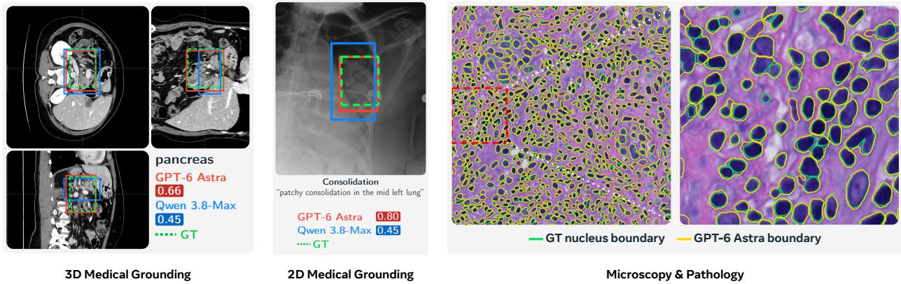  
Figure 5 Emerging medical grounding capabilities and remaining gaps in domain expertise. In 3D medical grounding, GPT-6 Astra accurately localizes the pancreas in abdominal CT, with predictions shown in axial (top left), sagittal (right), and coronal (bottom) views. In 2D medical grounding, successful localization is also possible, although substantial headroom remains relative to dedicated models. The pathology example, shown in full view and zoom-in, demonstrates accurate nucleus localization and delineation. Yet distinguishing fine-grained nucleus types remains substantially harder, highlighting the domain expertise required to interpret these structures.

Main takeaway. These results suggest an ongoing competition between semantic competence and perceptual precision, with frontier systems showing stronger progress in understanding visual content than in measuring or reconstructing it faithfully. Strong 3D grounding coexists with weaker depth estimation and reconstruction; competitive image generation, editing, and quality assessment do not extend to faithful restoration; and strong video understanding does not yet translate into equally strong video segmentation. Similarly, medical understanding is strong, but fine-grained pathology recognition remains weaker.

## 4 Where Do Frontier Systems Converge and Differ?

## Question 2: Where do frontier systems converge, and where do they still differ substantially?

TL;DR: Generalists are strongest at semantic interpretation and reasoning; gaps concentrate in metric precision, fidelity, temporal consistency, and specialized fine-grained discrimination.

Capabilities Where Frontier Systems Converge. i) The clearest convergence at a strong performance level appears in visual reading, where frontier models achieve consistently high results in OCR (93.7–98.1) and document, chart, and infographic understanding (89.5–92.8). Similar convergence is also visible across conventional perception and reasoning capabilities, including recognition and scientific and professional reasoning, as well as in image generation, instruction-guided editing, image quality assessment, and embodied understanding. The consistently strong performance across multiple systems suggests that these capabilities are increasingly becoming shared strengths of frontier general-purpose models. ii) Convergence also occurs around shared limitations. Image restoration produces uniformly low scores across these models (17.2–17.7 dB vs. 30.7 for the specialist), indicating substantial common headroom. Microscopy and pathology show a similar pattern, with frontier models consistently performing well below the reference (14.1–23.8 vs. 82.0). These results distinguish capabilities that are becoming broadly established across frontier general-purpose systems from those where the systems remain uniformly limited.

Capabilities Where Substantial Differences Remain. Not all emerging capabilities are yet shared across frontier systems; in several areas, strong performance is concentrated in only a subset of models while others remain substantially behind. In 2D object detection, GPT-6 Astra and Qwen 3.8-Max already exceed the specialist reference (87.0–89.1 vs. 78.4), while the remaining models score considerably lower (31.1–69.7). Substantial variation also persists across 3D perception, including pose and depth estimation, 3D detection and grounding, and multiview reconstruction, with diferent frontier models showing emerging strengths on diferent subtasks rather than a consistent trend. Similar diferences remain in expert-domain localization, such as 2D medical grounding. More broadly, domain reasoning does not necessarily imply domain perception. A model may have substantial medical knowledge and reason well about medical images, yet lack the perceptual expertise needed to distinguish subtle diferences in morphology. The pathology examples illustrate this gap: successfu nucleus localization can coexist with dificulty identifying fine-grained nucleus types (See Figure 5). Video understanding shows another clear emerging cluster: GPT-6 Astra, Qwen 3.8-Max, and Muse Spark 1.3 are already competitive with the specialist reference, while performance across other frontier models still spans a much wider range (53.0–74.3 vs. 71.5). Video segmentation shows a particularly large diference across frontier models: GPT-6 Astra achieves 84.5 J&F, approaching the specialist performance, compared with 32.0–57.9 for the other generalists. Together, these results characterize capabilities that are beginning to emerge strongly in selected frontier systems but have not yet become shared strengths across the frontier.

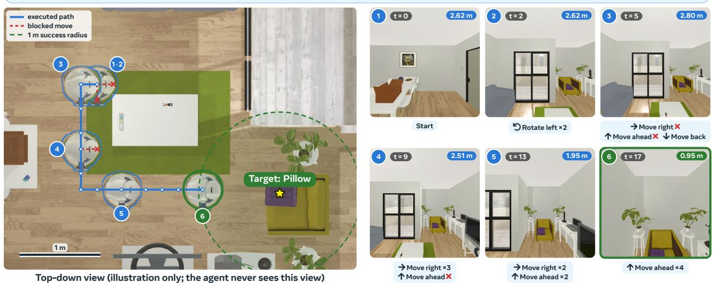  
Figure 6 Embodied navigation with GPT-6 Astra. An episode from EB-Navigation (AI2-THOR). Right: egocentric RGB observations at selected steps t, the agent’s only visual input; it receives no map, target coordinates or privileged simulator state. Chips below each frame list the discrete actions executed since the previous frame, and the badge in each frame gives the remaining distance to the target. Left: a top-down view of the executed path for illustration only, with the 1 m success radius; the agent never sees this view. Blocked by obstacles, the agent backs up, detours around the obstruction and then approaches the pillow. None of the other five evaluated models solved this episode.

Where New Capability Gains Emerge. Beyond the capabilities that are increasingly shared across frontier models, the strongest signs of further capability expansion appear in visual reasoning and structured prediction. i) Visual Reasoning: GPT-6 Astra shows substantial improvements across fine-grained discrimination and matching, visual logical and mathematical reasoning, and 3D spatial and multiview reasoning. Logical and multiview reasoning show two of the largest margins over the next-best frontier models (+13.6 and +12.4 points, respectively). These results highlight reasoning over fine-grained visual information and spatial relationships as emerging strengths beyond the conventional perception capabilities increasingly shared across frontier models. ii) Structured Prediction: While several systems already show competitive detection performance, Astra shows substantially larger gains in video segmentation (+26.6 points over the next-best; Figure 4), pose estimation (+22.7), image segmentation (+10.4; Figure 2), and 3D visual grounding (+10.7; Figure 3), extending its advantage from image-level structured prediction to dense prediction across video frames.

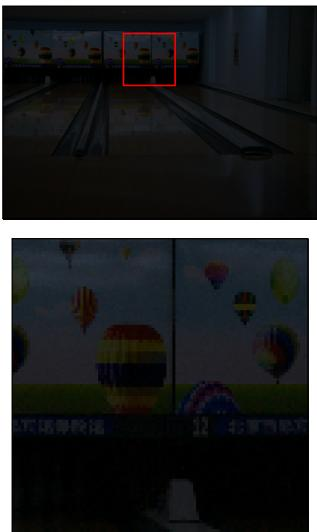

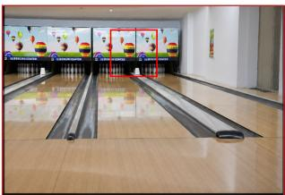

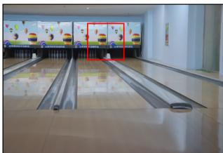

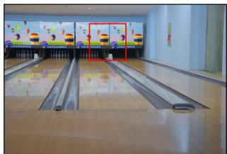  
Degraded input

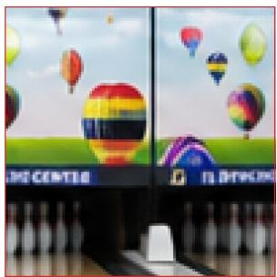  
Astra + image model (Sunburst) PSNR 17.5 dB · SSIM 0.74

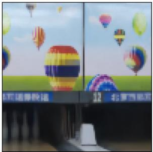  
MIRAGE (specialist) PSNR 28.1 dB · SSIM 0.91

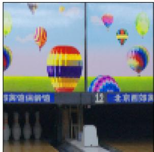  
Ground truth

Figure 7 Astra’s restorations look plausible but hallucinate content. LOL-v1 low-light enhancement (t2p-001789). Columns: degraded input, Astra + image model (Sunburst), MIRAGE (specialist), ground truth; the bottom row enlarges the red boxes. Left: four bowling pins become five, extra pins appear on an empty lane, and the banner text and lane number are altered, while MIRAGE stays faithful. Such hallucinations may be acceptable for casual photos but would be critical in fidelity-sensitive domains such as medical imaging. PSNR/SSIM are computed on full images.

## 5 Where Are Specialist-Level Capabilities Emerging?

Question 3: For which task types is specialist-level performance available through a general-purpose interface? What task properties predict the remaining gap?

TL;DR: Specialist-level performance is emerging in semantic and object-centric tasks, while gaps persist in tasks requiring geometric precision, temporal consistency, fine-grained reconstruction, or domain expertise.

Specialist-Level Capabilities Through a General-Purpose Interface. Several capabilities traditionally handled by dedicated vision models are now available through frontier general-purpose models at performance levels comparable to their specialist counterparts. The clearest examples appear in 2D structured prediction, where object detection and segmentation are competitive with specialist models, with similar capability emerging in 3D visual grounding. Beyond localization, comparable performance is also seen in video understanding and embodied settings, including driving-scene and robotic understanding. Image quality assessment shows the same trend. Notably, this reach extends even into expert domains, with strong performance in medical-image and remote-sensing understanding. Overall, an increasing range of previously specialized vision tasks is becoming accessible through general-purpose models.

Task Properties Associated With the Remaining Gap. The remaining specialist gaps are associated with requirements for precise geometry, temporal consistency, faithful reconstruction, and fine-grained domain knowledge. In 3D perception, the larger gap appears when spatial understanding must become quantitatively accurate and geometrically consistent: depth estimation (See Figure 3) and multiview reconstruction remain sensitive to metric scale, local surface geometry, camera motion, and alignment across views. In video segmentation, the remaining dificulty is concentrated in precise boundaries, small structures, separation of nearby instances (See Figure 4), and maintaining these distinctions consistently across frames, indicating that dense temporal prediction remains less mature than higher-level video understanding. Image restoration exposes a diferent limitation, where visually plausible improvement does not necessarily correspond to faithful recovery of the original image; fine textures and edges may be altered or re-synthesized, while some degradations remain insuficiently corrected. Expert-domain tasks introduce an additional requirement for specialized visual knowledge (See Figure 5). In pathology, nuclei can be localized accurately, but assigning the correct nucleus type remains substantially harder, particularly for subtle or less frequent categories.

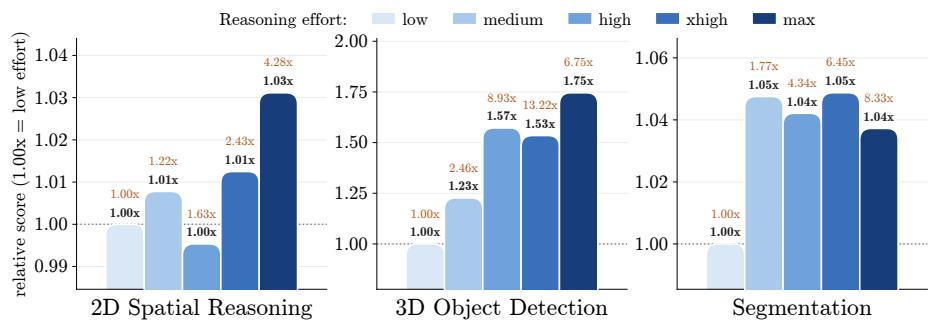

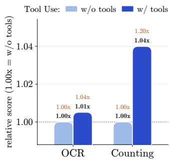  
Figure 8 Effect of reasoning effort and tool use on GPT-6 Astra. The left three plots compare reasoning-efort levels for 2D spatial reasoning, 3D object detection, and segmentation. The annotations above each bar report the score ratio (black) and inference-cost ratio (red), both computed relative to the low-efort baseline. The right panel compares runs with and without tools at xhigh efort for OCR and counting, using the run without tools as the baseline for both ratios.

## 6 Can Reasoning and Tools Close the Gap?

## Question 4: Can added reasoning, explicit tool use, or open specialist-as-tool pipelines close these gaps, and at what cost?

TL;DR: More reasoning and tool use can close selected specialist gaps, but gains are task-dependent and often come with substantially higher inference cost.

We observe that additional reasoning and tool use can close selected gaps with specialist models (See Figure 8). Higher reasoning brings 2D spatial reasoning, 3D object detection, and image generation and editing to specialist-level performance. In 3D object detection, for example, a system may recognize an object correctly but still need more reasoning to estimate its position, size, and orientation. Tools also improve chart and document understanding, counting, and 2D medical grounding; in counting, for example, the system first points to individual objects and then counts the identified instances. Segmentation also benefits from additional reasoning, although the gains plateau at higher efort and remain insuficient to close the specialist gap. A pattern across these comparisons is that additional efort produces smaller gains in some already strong perception and visual reasoning settings, while more useful gains appear where the system shows an emerging capability but applies it inconsistently.

The cost of these improvements varies substantially. Tool use can yield gains at modest additional cost (1.04–1.20×), while higher reasoning can require several times the baseline cost (up to 13.22×), sometimes for only small improvements. Specialist models ofer a complementary route when larger gaps remain, supplying visual predictions that the generalist can use to complete the task. For example, segmentation models identify individual objects for counting, while depth models help the system compare distances for spatial reasoning. Dedicated grounding models can substantially improve localization in remote-sensing imagery, where fine-scale targets remain dificult for the generalist to identify accurately. Image generation and editing follow a similar division of work: the reasoning model interprets the request and directs an image model to produce the required output. In these settings, progress comes from combining the generalist’s understanding of the task with the specialist’s ability to provide the visual information or output needed to carry it out.

## 7 Where Does General-Purpose Vision Stand?

To understand how far frontier visual capabilities have progressed, we consider how close their performance is to established reference levels. We group capabilities into four maturity tiers: exceeds reference level, at reference level, approaching, and substantial gap, using the best generalist performance for each capability. Depending on the task, the reference comes from a dedicated specialist, a prior generalist SOTA, or human performance. Human performance is particularly useful where a suitable model reference is unavailable or where the best evaluated generalist surpasses the selected model reference and a stronger comparison is needed to assess the remaining headroom. Figure 9 brings these comparisons together to provide an overview of

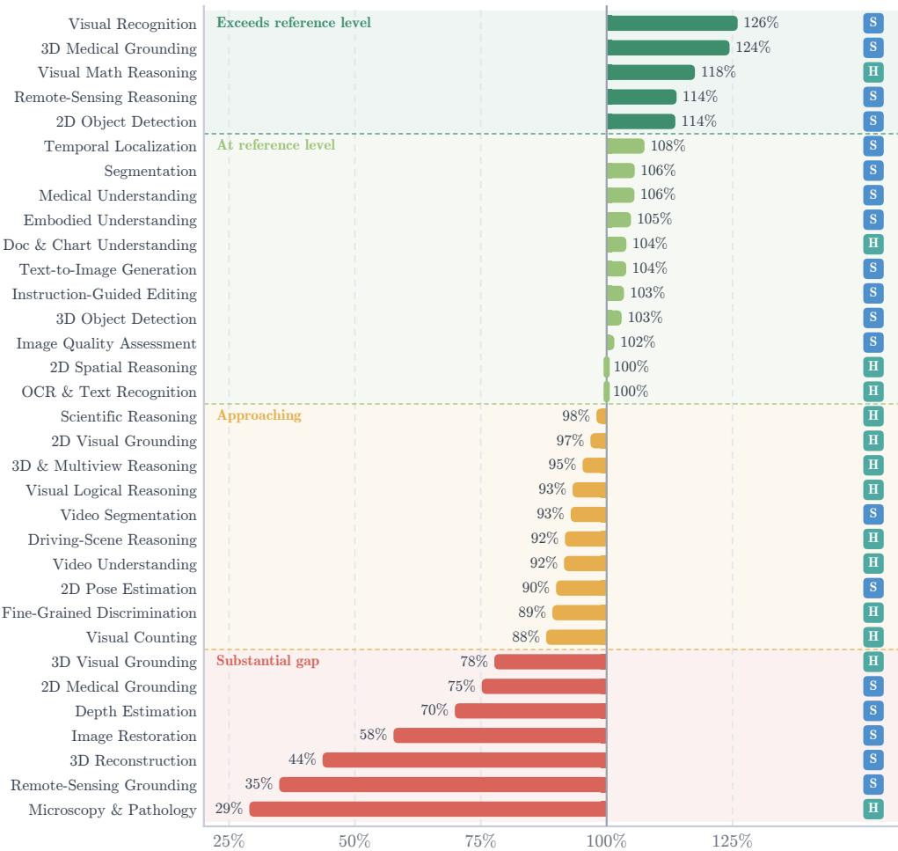  
Best generalist as a percentage of the best available reference (100% = reference level)  
Figure 9 Capability maturity relative to reference levels. For each capability with a reference, the best generalist score as a percentage of the stronger of the specialist (S) and human (H) references, with the ratio inverted for lower-is-better metrics. Capabilities are grouped into four tiers: exceeds reference level (above 110%), at reference level (100–110%), approaching (85–100%), and substantial gap (below 85%)

## capability maturity across the evaluated tasks.

For several capabilities, spanning visual recognition, visual reading, reasoning, localization, and image generation, the best evaluated generalist reaches or exceeds the selected reference. These results show that general-purpose models can increasingly support tasks traditionally handled by dedicated models. However, progress remains uneven. Some capabilities are approaching reference performance, while others still show substantial gaps, particularly where precise geometry, faithful reconstruction, or specialized visual knowledge is required. The choice of reference also afects how we interpret these results. For example, generalists surpass the evaluated specialist in 3D visual grounding but remain substantially below human performance, leaving considerable room for improvement. Together, these results show which capabilities are becoming accessible through general-purpose models and where further advances are needed. They also raise a question for future systems: which visual capabilities should be internalized by a generalist, and which are better provided through tools? Our results suggest a tentative division of work. Semantic interpretation, languageconditioned reasoning, and task planning and coordination are natural capabilities to strengthen within the generalist. Specialist tools may remain particularly valuable for metric geometry, faithful reconstruction, dense correspondence, high-fidelity restoration, and fine-grained discrimination in rare expert domains. A key challenge is to determine when the generalist should act directly, when it should call a specialist, and how it should verify the resulting output, while accounting for accuracy, cost, and latency. As general-purpose models become more capable, such an assessment can help the field understand what has improved, what

## 8 Additional Evaluation Details

<table><tr><td>Capability</td><td>Metric</td><td>Specialist Model</td></tr><tr><td>Visual Recognition</td><td>Accuracy</td><td>SEAL [89]; Gemini 3 Pro [19]</td></tr><tr><td>2D Object Detection</td><td>F1@IoU=0.5</td><td>Rex-Omni [30]</td></tr><tr><td>Segmentation</td><td>gIoU</td><td>SAM 3 Agent [9]</td></tr><tr><td>2D Pose Estimation</td><td>OKS AP</td><td>ViTPose++-L [91]</td></tr><tr><td>Depth Estimation</td><td>AbsRel ↓</td><td>DA3 [39]</td></tr><tr><td>3D Object Detection</td><td>AP3D</td><td>WildDet3D [27]</td></tr><tr><td>3D Visual Grounding</td><td>Acc@IoU0.25</td><td>Gemini-2.5-Pro [84]</td></tr><tr><td>3D Reconstruction</td><td>Error ↓</td><td>VGGT-1B [81]</td></tr><tr><td>Video Understanding</td><td>Accuracy</td><td>GPT4-o1 [28, 103]; Cambrian-S-7B [96]</td></tr><tr><td>Temporal Localization</td><td>R@1 IoU=0.7</td><td>TRACE [23]</td></tr><tr><td>Video Segmentation</td><td>J&amp;F</td><td>BEE [24]</td></tr><tr><td>Text-to-image Generation</td><td>Soft-TIFA GM</td><td>Structured Conditioning + Qwen-Image [87]</td></tr><tr><td>Instruction-guided Editing</td><td>Score (1–5)</td><td>Boogu-Image-0.1-Edit-Thinking [10]</td></tr><tr><td>Image Restoration</td><td>PSNR</td><td>MIRAGE [65]</td></tr><tr><td>Image Quality Assessment</td><td>Accuracy</td><td>CoInstruct [88]; UniPercept [7]</td></tr><tr><td>Driving-scene Reasoning Embodied Understanding</td><td>Accuracy Accuracy</td><td>Qwen-Drive-1.0-SFT [105]; GPT4-o1 [14, 28] Gemini Robotics-ER 2 [22]</td></tr><tr><td>Medical Understanding</td><td>Accuracy</td><td>GPT-5.6 Sol [55, 63]</td></tr><tr><td>2D Medical Grounding</td><td>mAP@0.5</td><td>RadVLM [16]</td></tr><tr><td>3D Medical Grounding</td><td>mIoU</td><td></td></tr><tr><td>Microscopy &amp; Pathology</td><td>Macro-F1</td><td>M3D-LaMed-Llama-2-7B [3] HoVer-NeXt [78]</td></tr><tr><td>Remote-sensing Reasoning</td><td>Accuracy</td><td></td></tr><tr><td>Remote-sensing Grounding</td><td></td><td>GPT-5.4 [45, 54]</td></tr><tr><td></td><td>mIoU</td><td>RSRefSeg 2 [11]</td></tr></table>

Table 2 Specialist reference model for each capability.

Benchmarks. We prioritize challenging benchmarks that retain meaningful headroom for current frontier systems while collectively covering a broad range of computer-vision tasks. We organize their content into capabilities, drawing on complete benchmarks, relevant subsets of their tasks, or combinations of benchmarks as appropriate. Our evaluation includes MMStar [13], BabyVision [12], BLINK [18], V\*Bench [89], Percep tionBench [40], WorldVQA [104], RealWorldQA [90], BlindTest [64], MMMU-Pro [100], VisualPuzzles [72], ZeroBench [67], MathVista [44], MathVision [82], PixMo-Count [15], CountQA [73], VLMsAreBiased [80], InfoVQA [49], CharXiv [85], MindCube-Tiny [83], OmniSpatial [29], VisFactor [25], MMSI-Bench [97], Dense200 [30], ScreenSpotPro [38], RefCOCO [32], ReasonSeg [36], OCHuman [101], Anywhere3Dv2 [84], DIODE [79], ETH3D [69], Omni3D [6], MMVU [103], VSI-Bench [93], ActivityNet [34], DAVIS [60], ERQA [75], LingoQA [47], DrivingVQA [14], EmbodiedBench [95], MedXpertQA-MM [106], MMMU-Pro-Med [100], MS-CXR [4, 5, 59], M3D-Bench [3], PUMA [70], VLRS-Bench [45], RefSegRS [99], Q-Bench2 [102], UniPercept [8], BSD68 [48], Urban100 [26], Rain100L [92], SOTS [37], GoPro [52], LOL-v1 [86], GenEval2 [31] and ImageEd itBench [98].

Output processing. We convert model predictions into the output formats required by each benchmark. Segmentation polygons are rasterized into pixel masks, while some tool-based runs produce masks directly. For depth estimation, predicted surfaces and depth anchors are rendered into dense depth maps, or the maps are generated directly by executing model-written code. For 3D reconstruction, depth predictions are combined with camera parameters to obtain point clouds or per-frame point maps in a shared coordinate system. For 3D detection and grounding, predicted centers, dimensions, and rotations, where applicable, are converted into box boundaries or cuboid corners. For microscopy and pathology, instance and class maps are converted into labeled nucleus polygons; nucleus centers are used for detection scoring and tissue masks for segmentation scoring. For DPG-Bench, four generated images are assembled into the grid expected by the evaluator.

Image generation and editing. We pair GPT-6 Astra with GPT Image 2.5 Sunburst [57], Qwen 3.8-Max with Qwen Image 3 Pro [62], Muse Spark 1.3 with Muse Image [51], and Gemini 3.1 Pro with Gemini 3.1 Flash Image [20]. In each case, the reasoning model formulates the instructions, while the corresponding image model generates or edits the image. Reasoning configurations. We test multiple reasoning-efort settings, including high, xhigh, and max, wherever supported by the corresponding system and interface. These comparisons examine how additional reasoning afects task performance and inference cost. Specialist models. The specialist scores reported in the main results Table 1 correspond to diferent models across capabilities. We provide a breakdown of the specialist models in Table 2 and the capabilities for which they are used.

## 9 Conclusion

We evaluated the recent GPT-6 Astra alongside five frontier general-purpose systems across 34 capabilities and 55 benchmarks. The results show how far language-model-driven general-purpose systems have expanded across the computer vision landscape. Astra demonstrates strong capabilities across visual reasoning, structured prediction, 3D perception, video, and expert domains, with several tasks approaching or reaching available reference levels. Yet these advances are not uniform: some of Astra’s strongest capabilities remain substantially less developed in other frontier systems. More broadly, our results suggest that what is hard in computer vision is changing. General-purpose systems increasingly succeed when visual information can be interpreted, reasoned over, or organized around objects. Larger gaps remain when tasks demand precise metric geometry, faithful reconstruction, temporal consistency, or specialized fine-grained visual knowledge. Rather than simply replacing specialized vision, general-purpose models are redrawing the boundary between generalist and specialist capabilities, a boundary that will continue to evolve as these systems become more capable.

## References

[1] Anthropic. Claude fable 5 and claude mythos 5. Anthropic, June 2026. Released June 9, 2026.

[2] Mido Assran, Adrien Bardes, David Fan, Quentin Garrido, Russell Howes, Matthew Muckley, Ammar Rizvi, Claire Roberts, Koustuv Sinha, Artem Zholus, et al. V-jepa 2: Self-supervised video models enable understanding, prediction and planning. arXiv preprint arXiv:2506.09985, 2025.

[3] Fan Bai, Yuxin Du, Tiejun Huang, Max Q. H. Meng, and Bo Zhao. M3d: Advancing 3d medical image analysis with multi-modal large language models, 2024. https://arxiv.org/abs/2404.00578.

[4] Benedikt Boecking, Naoto Usuyama, Shruthi Bannur, Daniel C. Castro, Anton Schwaighofer, Stephanie Hyland, Maria Wetscherek, Tristan Naumann, Aditya Nori, Javier Alvarez-Valle, Hoifung Poon, and Ozan Oktay. Making the most of text semantics to improve biomedical vision–language processing. In Shai Avidan, Gabriel Brostow, Moustapha Cissé, Giovanni Maria Farinella, and Tal Hassner, editors, Computer Vision – ECCV 2022, pages 1–21, Cham, 2022. Springer Nature Switzerland. ISBN 978-3-031-20059-5.

[5] Benedikt Boecking, Naoto Usuyama, Shruthi Bannur, Daniel Coelho de Castro, Anton Schwaighofer, Stephanie Hyland, Harshita Sharma, Maria Teodora Wetscherek, Tristan Naumann, Aditya Nori, Javier Alvarez Valle, Hoifung Poon, and Ozan Oktay. MS-CXR: Making the Most of Text Semantics to Improve Biomedical Vision-Language Processing. PhysioNet, November 2024. doi: 10.13026/9g2z-jg61. https://doi.org/10.13026/9g2z-jg61. Version 1.1.0.

[6] Garrick Brazil, Abhinav Kumar, Julian Straub, Nikhila Ravi, Justin Johnson, and Georgia Gkioxari. Omni3d: A large benchmark and model for 3d object detection in the wild. In 2023 IEEE/CVF Conference on Computer Vision and Pattern Recognition (CVPR), pages 13154–13164. IEEE, 2023.

[7] Shuo Cao, Jiayang Li, Xiaohui Li, Yuandong Pu, Kaiwen Zhu, Yuanting Gao, Siqi Luo, Yi Xin, Qi Qin, Yu Zhou, Xiangyu Chen, Wenlong Zhang, Bin Fu, Yu Qiao, and Yihao Liu. Unipercept: Towards unified perceptual-level image understanding across aesthetics, quality, structure, and texture, 2025. https://arxiv.org/abs/2512.21675.

[8] Shuo Cao, Jiayang Li, Xiaohui Li, Yuandong Pu, Kaiwen Zhu, Yuanting Gao, Siqi Luo, Yi Xin, Qi Qin, Yu Zhou, et al. Unipercept: Towards unified perceptual-level image understanding across aesthetics, quality, structure, and texture. arXiv preprint arXiv:2512.21675, 2025.

[9] Nicolas Carion, Laura Gustafson, Yuan-Ting Hu, Shoubhik Debnath, Ronghang Hu, Didac Suris Coll-Vinent, Chaitanya Ryali, Kalyan Vasudev Alwala, Haitham Khedr, Andrew Huang, Jie Lei, Tengyu Ma, Baishan Guo, Arpit Kalla, Markus Marks, Joseph Greer, Meng Wang, Peize Sun, Roman Rädle, Triantafyllos Afouras, Efrosyni Mavroudi, Katherine Xu, Tsung-Han Wu, Yu Zhou, Liliane Momeni, RISHI HAZRA, Shuangrui Ding, Sagar Vaze, Francois Porcher, Feng Li, Siyuan Li, Aishwarya Kamath, Ho Kei Cheng, Piotr Dollar, Nikhila Ravi, Kate Saenko, Pengchuan Zhang, and Christoph Feichtenhofer. Sam 3: Segment anything with concepts. In C. Vondrick, B. Hariharan, C. Rafel, L. Pinto, D. Yang, and A. Faust, editors, International Conference on Learning Representations, volume 2026, pages 138846–138923, 2026. https://proceedings.iclr.cc/paper\_files paper/2026/file/e0982cbc81401df3430ee1f780dc7a2-Paper-Conference.pdf.

[10] Guoxuan Chen, Chufeng Xiao, Haoran Yang, Siyue Xie, Binxiao Huang, Ming Zhang, Cheuk Him Chau, Xinyu Fu, Yingzhao Lian, Tom S. Y. Li, Jintao Lin, Bowen Dong, Zian Qian, Yuhao Liu, Yuxuan Hu, Weikang Shi, Bin Zou, Bowen Zheng, Haoxuan Che, Chang Chen, Yuyang He, Heyang Sun, Tianyu Huang, Chong Hou Choi, Cheng Gong, Han Shi, Haoli Bai, Xihui Liu, Hongsheng Li, Qifeng Chen, Chao Huang, Rui Liu, and Chenyang Lei. Boogu-image-0.1: Boosting open agentic multimodal generation via understanding under a minimal budget, 2026. https://arxiv.org/abs/2607.13125.

[11] Keyan Chen, Chenyang Liu, Bowen Chen, Jiafan Zhang, Zhengxia Zou, and Zhenwei Shi. Rsrefseg 2: Decoupling referring remote sensing image segmentation with foundation models. IEEE Transactions on Geoscience and Remote Sensing, 64:1–20, 2026. doi: 10.1109/TGRS.2025.3647535.

[12] Liang Chen, Weichu Xie, Yiyan Liang, Hongfeng He, Hans Zhao, Zhibo Yang, Zhiqi Huang, Haoning Wu, Haoyu Lu, Yiping Bao, et al. Babyvision: Visual reasoning beyond language. arXiv preprint arXiv:2601.06521, 2026.

[13] Lin Chen, Jinsong Li, Xiaoyi Dong, Pan Zhang, Yuhang Zang, Zehui Chen, Haodong Duan, Jiaqi Wang, Yu Qiao, Dahua Lin, et al. Are we on the right way for evaluating large vision-language models? Advances in Neural Information Processing Systems, 37:27056–27087, 2024.

[14] Charles Corbière, Simon Roburin, Syrielle Montariol, Antoine Bosselut, and Alexandre Alahi. Retrieval-based interleaved visual chain-of-thought in real-world driving scenarios, 2025. https://arxiv.org/abs/2501.04671.

[15] Matt Deitke, Christopher Clark, Sangho Lee, Rohun Tripathi, Yue Yang, Jae Sung Park, Mohammadreza Salehi, Niklas Muennighof, Kyle Lo, Luca Soldaini, et al. Molmo and pixmo: Open weights and open data for state-of-the-art vision-language models. In 2025 IEEE/CVF Conference on Computer Vision and Pattern Recognition (CVPR), pages 91–104. IEEE, 2025.

[16] Nicolas Deperrois, Hidetoshi Matsuo, Samuel Ruipérez-Campillo, Moritz Vandenhirtz, Sonia Laguna, Alain Ryser, Koji Fujimoto, Mizuho Nishio, Thomas M Sutter, Julia E Vogt, et al. Radvlm: A multitask conversational vision-language model for radiology. Scientific Reports, 2026.

[17] David Eigen, Christian Puhrsch, and Rob Fergus. Depth map prediction from a single image using a multi-scale deep network. Advances in neural information processing systems, 27, 2014.

[18] Xingyu Fu, Yushi Hu, Bangzheng Li, Yu Feng, Haoyu Wang, Xudong Lin, Dan Roth, Noah A Smith, Wei-Chiu Ma, and Ranjay Krishna. Blink: Multimodal large language models can see but not perceive. In European Conference on Computer Vision, pages 148–166. Springer, 2024.

[19] Google. Gemini 3 pro: The frontier of vision AI. https://blog.google/innovation-and-ai/technology/ developers-tools/gemini-3-pro-vision/, December 2025. Accessed: September 28, 2026.

[20] Google. Gemini 3.1 flash image model card. Google DeepMind, 2026. https://deepmind.google/models/ model-cards/gemini-3-1-flash-image/.

[21] Google. Gemini 3.1 pro: A smarter model for your most complex tasks. Google, February 2026. Released February 19, 2026.

[22] Google DeepMind. Gemini robotics ER 2 model card. Google DeepMind, July 2026. https://deepmind.google/ models/model-cards/gemini-robotics-er-2/. Accessed: 2026-09-27.

[23] Yongxin Guo, Jingyu Liu, Mingda Li, Qingbin Liu, Xi Chen, and Xiaoying Tang. Trace: Temporal grounding video llm via causal event modeling, 2025. https://arxiv.org/abs/2410.05643.

[24] Zhiqiang Hou, Hao Cui, Sugang Ma, Hao Yue, Chenxu Wang, Yang Liu, and Lu Liu. Bridging the encoder gap: Stability-aware eficient adaptation of sam2 for video object segmentation. Pattern Recognition, 180:114333, 2026. ISSN 0031-3203. doi: https://doi.org/10.1016/j.patcog.2026.114333. https://www.sciencedirect.com/science/ article/pii/S0031320326012987.

[25] Jen-Tse Huang, Dasen Dai, Jen-Yuan Huang, Youliang Yuan, Xiaoyuan Liu, Wenxuan Wang, Wenxiang Jiao, Pinjia He, Zhaopeng Tu, and Haodong Duan. Visfactor: Benchmarking fundamental visual cognition in multimodal large language models. arXiv preprint arXiv:2502.16435, 1(3), 2025.

[26] Jia-Bin Huang, Abhishek Singh, and Narendra Ahuja. Single image super-resolution from transformed selfexemplars. In Proceedings of the IEEE Conference on Computer Vision and Pattern Recognition (CVPR), June 2015.

[27] Weikai Huang, Jieyu Zhang, Sijun Li, Taoyang Jia, Jiafei Duan, Yunqian Cheng, Jaemin Cho, Matthew Wallingford, Rustin Soraki, Chris Dongjoo Kim, Shuo Liu, Donovan Clay, Taira Anderson, Winson Han, Al Farhadi, Bharath Hariharan, Zhongzheng Ren, and Ranjay Krishna. Wilddet3d: Scaling promptable 3d detection in the wild, 2026. https://arxiv.org/abs/2604.08626.

[28] Aaron Jaech, Adam Kalai, Adam Lerer, Adam Richardson, Ahmed El-Kishky, Aiden Low, Alec Helyar, Aleksander Madry, Alex Beutel, Alex Carney, et al. Openai o1 system card. arXiv preprint arXiv:2412.16720, 2024.

[29] Mengdi Jia, Zekun Qi, Shaochen Zhang, Wenyao Zhang, Xinqiang Yu, Jiawei He, He Wang, and Li Yi. Omnispatial: Towards comprehensive spatial reasoning benchmark for vision language models. In International Conference on Learning Representations, volume 2026, pages 35634–35670, 2026.

[30] Qing Jiang, Junan Huo, Xingyu Chen, Yuda Xiong, Zhaoyang Zeng, Yihao Chen, Tianhe Ren, Junzhi Yu, and Lei Zhang. Detect anything via next point prediction. In Proceedings of the IEEE/CVF Conference on Computer Vision and Pattern Recognition, pages 25472–25483, 2026.

[31] Amita Kamath, Kai-Wei Chang, Ranjay Krishna, Luke Zettlemoyer, Yushi Hu, and Marjan Ghazvininejad. Geneval 2: Addressing benchmark drift in text-to-image evaluation. arXiv preprint arXiv:2512.16853, 2025.

[32] Sahar Kazemzadeh, Vicente Ordonez, Mark Matten, and Tamara Berg. ReferItGame: Referring to objects in photographs of natural scenes. In Proceedings of the 2014 conference on empirical methods in natural language processing (EMNLP), pages 787–798, 2014.

[33] Alexander Kirillov, Eric Mintun, Nikhila Ravi, Hanzi Mao, Chloe Rolland, Laura Gustafson, Tete Xiao, Spencer Whitehead, Alexander C Berg, Wan-Yen Lo, et al. Segment anything. In 2023 IEEE/CVF international conference on computer vision (ICCV), pages 3992–4003. IEEE, 2023.

[34] Ranjay Krishna, Kenji Hata, Frederic Ren, Li Fei-Fei, and Juan Carlos Niebles. Dense-captioning events in videos. In ICCV, 2017.

[35] Alex Krizhevsky, Ilya Sutskever, and Geofrey E Hinton. Imagenet classification with deep convolutional neural networks. Advances in neural information processing systems, 25, 2012.

[36] Xin Lai, Zhuotao Tian, Yukang Chen, Yanwei Li, Yuhui Yuan, Shu Liu, and Jiaya Jia. Lisa: Reasoning segmentation via large language model. In 2024 IEEE/CVF Conference on Computer Vision and Pattern Recognition (CVPR), pages 9579–9589. IEEE, 2024.

[37] Boyi Li, Wenqi Ren, Dengpan Fu, Dacheng Tao, Dan Feng, Wenjun Zeng, and Zhangyang Wang. Benchmarking single-image dehazing and beyond. IEEE Transactions on Image Processing, 28(1):492–505, 2019. doi: 10.1109 TIP.2018.2867951.

[38] Kaixin Li, Ziyang Meng, Hongzhan Lin, Ziyang Luo, Yuchen Tian, Jing Ma, Zhiyong Huang, and Tat-Seng Chua. Screenspot-pro: Gui grounding for professional high-resolution computer use. In Proceedings of the 33rd ACM International Conference on Multimedia, pages 8778–8786, 2025.

[39] Haotong Lin, Sili Chen, Junhao Liew, Donny Y. Chen, Zhenyu Li, Guang Shi, Jiashi Feng, and Bingyi Kang. Depth anything 3: Recovering the visual space from any views, 2025. https://arxiv.org/abs/2511.10647.

[40] Zichao Lin, Yifeng Xie, Bowen Qu, Haiming Wang, Jia Li, Haoning Wu, Yuhao Dong, Zuhao Yang, Jinguo Zhu, Haoyu Lu, et al. Perceptionbench: Evaluating atomic visual perception in multimodal large language models. arXiv preprint arXiv:2607.24957, 2026.

[41] Haotian Liu, Chunyuan Li, Qingyang Wu, and Yong Jae Lee. Visual instruction tuning. Advances in neural information processing systems, 36:34892–34916, 2023.

[42] Shilong Liu, Zhaoyang Zeng, Tianhe Ren, Feng Li, Hao Zhang, Jie Yang, Qing Jiang, Chunyuan Li, Jianwei Yang, Hang Su, et al. Grounding dino: Marrying dino with grounded pre-training for open-set object detection. In European conference on computer vision, pages 38–55. Springer, 2024.

[43] Jonathan Long, Evan Shelhamer, and Trevor Darrell. Fully convolutional networks for semantic segmentation. In Proceedings of the IEEE conference on computer vision and pattern recognition, pages 3431–3440, 2015.

[44] Pan Lu, Hritik Bansal, Tony Xia, Jiacheng Liu, Chunyuan Li, Hannaneh Hajishirzi, Hao Cheng, Kai-Wei Chang, Michel Galley, and Jianfeng Gao. Mathvista: Evaluating mathematical reasoning of foundation models in visual contexts. In International Conference on Learning Representations, volume 2024, pages 23439–23554, 2024.

[45] Zhiming Luo, Di Wang, Haonan Guo, Jing Zhang, and Bo Du. Vlrs-bench: A vision-language reasoning benchmark for remote sensing, 2026. https://arxiv.org/abs/2602.07045.

[46] Jun Ma, Yuting He, Feifei Li, Lin Han, Chenyu You, and Bo Wang. Segment anything in medical images. Nature communications, 15(1):654, 2024.

[47] Ana-Maria Marcu, Long Chen, Jan Hünermann, Alice Karnsund, Benoit Hanotte, Prajwal Chidananda, Saurabh Nair, Vijay Badrinarayanan, Alex Kendall, Jamie Shotton, Elahe Arani, and Oleg Sinavski. Lingoqa: Visual question answering for autonomous driving. In Aleš Leonardis, Elisa Ricci, Stefan Roth, Olga Russakovsky, Torsten Sattler, and Gül Varol, editors, Computer Vision – ECCV 2024, pages 252–269, Cham, 2024. Springer Nature Switzerland. ISBN 978-3-031-72980-5.

[48] D. Martin, C. Fowlkes, D. Tal, and J. Malik. A database of human segmented natural images and its application to evaluating segmentation algorithms and measuring ecological statistics. In Proceedings Eighth IEEE International Conference on Computer Vision. ICCV 2001, volume 2, pages 416–423 vol.2, 2001. doi: 10.1109/ICCV.2001.937655.

[49] Minesh Mathew, Viraj Bagal, Rubèn Tito, Dimosthenis Karatzas, Ernest Valveny, and CV Jawahar. Infographicvqa. In 2022 IEEE/CVF Winter Conference on Applications of Computer Vision (WACV), pages 2582–2591. IEEE, 2022.

[50] Meta AI. Introducing muse spark 1.3, September 2026. Meta AI Research.

[51] Meta Superintelligence Labs. Muse Image: Image Generation Built for Your World. https://ai.meta.com/blog/ introducing-muse-image-muse-video-msl, July 2026. Accessed: 2026-09-27.

[52] Seungjun Nah, Tae Hyun Kim, and Kyoung Mu Lee. Deep multi-scale convolutional neural network for dynamic scene deblurring. In Proceedings of the IEEE Conference on Computer Vision and Pattern Recognition (CVPR), July 2017.

[53] OpenAI. Gpt-4v(ision) system card, 2023. https://openai.com/index/gpt-4v-system-card/.

[54] OpenAI. Introducing GPT-5.4. OpenAI Blog, March 2026. https://openai.com/index/introducing-gpt-5-4/. Accessed: 2026-09-27.

[55] OpenAI. GPT-5.6: Frontier intelligence that scales with your ambition. OpenAI Blog, July 2026. https: //openai.com/index/gpt-5-6/. Accessed: 2026-09-27.

[56] OpenAI. Gpt-6 astra: A new generation of intelligence. OpenAI, September 2026. Released September 3, 2026.

[57] OpenAI. GPT Image 2.5 Sunburst. https://openai.com, 2026. Accessed: September 27, 2026.

[58] Maxime Oquab, Timothée Darcet, Théo Moutakanni, Huy Vo, Marc Szafraniec, Vasil Khalidov, Pierre Fernandez, Daniel Haziza, Francisco Massa, Alaaeldin El-Nouby, et al. Dinov2: Learning robust visual features without supervision. arXiv preprint arXiv:2304.07193, 2023.

[59] Tom Pollard, Benjamin E. Moody, Li-wei H. Lehman, Brian J. Gow, Chrystinne Fernandes, Chen Xie, Alistair Johnson, Roger G. Mark, and Thomas Heldt. PhysioNet as a global platform for biomedical research. Nature Health, 1(8):792–795, August 2026. ISSN 3005-0693. doi: 10.1038/s44360-026-00096-z. https://doi.org/10.1038/ s44360-026-00096-z.

[60] Jordi Pont-Tuset, Federico Perazzi, Sergi Caelles, Pablo Arbeláez, Alex Sorkine-Hornung, and Luc Van Gool. The 2017 davis challenge on video object segmentation. arXiv preprint arXiv:1704.00675, 2017.

[61] Charles R Qi, Hao Su, Kaichun Mo, and Leonidas J Guibas. Pointnet: Deep learning on point sets for 3d classification and segmentation. In Proceedings of the IEEE conference on computer vision and pattern recognition, pages 652–660, 2017.

[62] Qwen Team. Qwen-image-3.0: Rich content, authentic details, deep knowledge. https://qwen.ai/blog?id= qwen-image-3.0, 2026. Alibaba Group.

[63] Qwen Team. Qwen3.8-max: A new bar for coding and cowork, August 2026. https://qwen.ai/blog?id=qwen3.8.

[64] Pooyan Rahmanzadehgervi, Logan Bolton, Mohammad Reza Taesiri, and Anh Totti Nguyen. Vision language models are blind. In Asian Conference on Computer Vision, pages 293–309. Springer, 2024.

[65] Bin Ren, Yawei Li, Xu Zheng, Yuqian Fu, Danda Pani Paudel, Hong Liu, Ming-Hsuan Yang, Luc Van Gool, and Nicu Sebe. Eficient degradation-agnostic image restoration via channel-wise functional decomposition and manifold regularization. In C. Vondrick, B. Hariharan, C. Rafel, L. Pinto, D. Yang, and A. Faust, editors, International Conference on Learning Representations, volume 2026, pages 126404–126430, 2026. https:// proceedings.iclr.cc/paper\_files/paper/2026/file/cd1da8043ba5c1c144ab4e10a8de6e53-Paper-Conference.pdf.

[66] Shaoqing Ren, Kaiming He, Ross Girshick, and Jian Sun. Faster r-cnn: Towards real-time object detection with region proposal networks. IEEE transactions on pattern analysis and machine intelligence, 39(6):1137–1149, 2016.

[67] Jonathan Roberts, Mohammad Reza Taesiri, Ansh Sharma, Akash Gupta, Samuel Roberts, Ioana Croitoru, Simion-Vlad Bogolin, Jialu Tang, Florian Langer, Vyas Raina, et al. Zerobench: An impossible visual benchmark for contemporary large multimodal models. arXiv preprint arXiv:2502.09696, 2025.

[68] Olaf Ronneberger, Philipp Fischer, and Thomas Brox. U-net: Convolutional networks for biomedical image segmentation. In International Conference on Medical image computing and computer-assisted intervention, pages 234–241. Springer, 2015.

[69] Thomas Schöps, Johannes L. Schönberger, Silvano Galliani, Torsten Sattler, Konrad Schindler, Marc Pollefeys, and Andreas Geiger. A multi-view stereo benchmark with high-resolution images and multi-camera videos. In Conference on Computer Vision and Pattern Recognition (CVPR), 2017.

[70] Mark Schuiveling, Hong Liu, Daniel Eek, Gerben E Breimer, Karijn PM Suijkerbuijk, Willeke AM Blokx, and Mitko Veta. A novel dataset for nuclei and tissue segmentation in melanoma with baseline nuclei segmentation and tissue segmentation benchmarks. GigaScience, 14:giaf011, 2025.

[71] Karen Simonyan and Andrew Zisserman. Two-stream convolutional networks for action recognition in videos. Advances in neural information processing systems, 27, 2014.

[72] Yueqi Song, Tianyue Ou, Yibo Kong, Zecheng Li, Graham Neubig, and Xiang Yue. Visualpuzzles: Decoupling multimodal reasoning evaluation from domain knowledge. arXiv preprint arXiv:2504.10342, 2025.

[73] Jayant Sravan Tamarapalli, Rynaa Grover, Nilay Pande, and Sahiti Yerramilli. Countqa: How well do mllms count in the wild? arXiv preprint arXiv:2508.06585, 2025.

[74] Gemini Team, Rohan Anil, Sebastian Borgeaud, Jean-Baptiste Alayrac, Jiahui Yu, Radu Soricut, Johan Schalkwyk, Andrew M Dai, Anja Hauth, Katie Millican, et al. Gemini: a family of highly capable multimodal models. arXiv preprint arXiv:2312.11805, 2023.

[75] Gemini Robotics Team, Saminda Abeyruwan, Joshua Ainslie, Jean-Baptiste Alayrac, Montserrat Gonzalez Arenas, Travis Armstrong, Ashwin Balakrishna, Robert Baruch, Maria Bauza, Michiel Blokzijl, et al. Gemin robotics: Bringing ai into the physical world. arXiv preprint arXiv:2503.20020, 2025.

[76] Kimi Team, Tongtong Bai, Yifan Bai, Yiping Bao, Jianfeng Cai, Xinyuan Cai, Peizhou Cao, Yuxuan Cao, Ziwei Chai, Y Charles, et al. Kimi k3: Open frontier intelligence. arXiv preprint arXiv:2607.24653, 2026.

[77] Shengbang Tong, Zhuang Liu, Yuexiang Zhai, Yi Ma, Yann LeCun, and Saining Xie. Eyes wide shut? exploring the visual shortcomings of multimodal llms. In 2024 IEEE/CVF Conference on Computer Vision and Pattern Recognition (CVPR), pages 9568–9578. IEEE, 2024.

[78] Nima Torbati, Anastasia Meshcheryakova, Ramona Woitek, Sepideh Hatamikia, Diana Mechtcheriakova, and Amirreza Mahbod. A multi-stage auto-context deep learning framework for tissue and nuclei segmentation and classification in h&e-stained histological images of advanced melanoma. Machine Learning with Applications, 25: 100933, 2026. ISSN 2666-8270. doi: https://doi.org/10.1016/j.mlwa.2026.100933. https://www.sciencedirect. com/science/article/pii/S2666827026000988.

[79] Igor Vasiljevic, Nick Kolkin, Shanyi Zhang, Ruotian Luo, Haochen Wang, Falcon Z Dai, Andrea F Daniele, Mohammadreza Mostajabi, Steven Basart, Matthew R Walter, et al. Diode: A dense indoor and outdoor depth dataset. arXiv preprint arXiv:1908.00463, 2019.

[80] An Vo, Khai-Nguyen Nguyen, Mohammad Reza Taesiri, Vy Tuong Dang, Anh Totti Nguyen, and Daeyoung Kim. Vision language models are biased. arXiv preprint arXiv:2505.23941, 2025.

[81] Jianyuan Wang, Minghao Chen, Nikita Karaev, Andrea Vedaldi, Christian Rupprecht, and David Novotny. Vggt: Visual geometry grounded transformer. In 2025 IEEE/CVF Conference on Computer Vision and Pattern Recognition (CVPR), pages 5294–5306. IEEE, 2025.

[82] Ke Wang, Junting Pan, Weikang Shi, Zimu Lu, Houxing Ren, Aojun Zhou, Mingjie Zhan, and Hongsheng Li. Measuring multimodal mathematical reasoning with math-vision dataset. Advances in Neural Information Processing Systems, 37:95095–95169, 2024.

[83] Qineng Wang, Baiqiao Yin, Pingyue Zhang, Jianshu Zhang, Kangrui Wang, Zihan Wang, Jieyu Zhang, Keshigeyan Chandrasegaran, Han Liu, Ranjay Krishna, Saining Xie, Jiajun Wu, Li Fei-Fei, and Manling Li. Mindcube: Spatial mental modeling from limited views, 2025. https://arxiv.org/abs/2506.21458.

[84] Tianxu Wang, Zhuofan Zhang, Ziyu Zhu, Yue Fan, Jing Xiong, Pengxiang Li, Xiaojian Shawn Ma, and Qing Li. From objects to anywhere: A holistic benchmark for multi-level visual grounding in 3d scenes. Advances in Neural Information Processing Systems, 38, 2026.

[85] Zirui Wang, Mengzhou Xia, Luxi He, Howard Chen, Yitao Liu, Richard Zhu, Kaiqu Liang, Xindi Wu, Haotian Liu, Sadhika Malladi, et al. Charxiv: Charting gaps in realistic chart understanding in multimodal llms. Advances in Neural Information Processing Systems, 37:113569–113697, 2024.

[86] Chen Wei, Wenjing Wang, Wenhan Yang, and Jiaying Liu. Deep retinex decomposition for low-light enhancement, 2018. https://arxiv.org/abs/1808.04560.

[87] Chenfei Wu, Jiahao Li, Jingren Zhou, Junyang Lin, Kaiyuan Gao, Kun Yan, Sheng ming Yin, Shuai Bai, Xiao Xu, Yilei Chen, Yuxiang Chen, Zecheng Tang, Zekai Zhang, Zhengyi Wang, An Yang, Bowen Yu, Chen Cheng, Dayiheng Liu, Deqing Li, Hang Zhang, Hao Meng, Hu Wei, Jingyuan Ni, Kai Chen, Kuan Cao, Liang Peng, Lin Qu, Minggang Wu, Peng Wang, Shuting Yu, Tingkun Wen, Wensen Feng, Xiaoxiao Xu, Yi Wang, Yichang Zhang, Yongqiang Zhu, Yujia Wu, Yuxuan Cai, and Zenan Liu. Qwen-image technical report, 2025. https://arxiv.org/abs/2508.02324.

[88] Haoning Wu, Hanwei Zhu, Zicheng Zhang, Erli Zhang, Chaofeng Chen, Liang Liao, Chunyi Li, Annan Wang, Wenxiu Sun, Qiong Yan, Xiaohong Liu, Guangtao Zhai, Shiqi Wang, and Weisi Lin. Towards open-ended visual quality comparison. In Aleš Leonardis, Elisa Ricci, Stefan Roth, Olga Russakovsky, Torsten Sattler, and Gül Varol, editors, Computer Vision – ECCV 2024, pages 360–377, Cham, 2025. Springer Nature Switzerland. ISBN 978-3-031-72646-0.

[89] Penghao Wu and Saining Xie. V\*: Guided visual search as a core mechanism in multimodal llms. In 2024 IEEE/CVF Conference on Computer Vision and Pattern Recognition (CVPR), pages 13084–13094. IEEE, 2024.

[90] xAI. Realworldqa: A benchmark of real-world spatial understanding. https://huggingface.co/datasets/xai-org/ RealworldQA, 2024.

[91] Yufei Xu, Jing Zhang, Qiming Zhang, and Dacheng Tao. Vitpose++: Vision transformer for generic body pose estimation. IEEE Transactions on Pattern Analysis and Machine Intelligence, 46(2):1212–1230, 2024. doi: 10.1109/TPAMI.2023.3330016.

[92] Fuzhi Yang, Huan Yang, Jianlong Fu, Hongtao Lu, and Baining Guo. Learning texture transformer network for image super-resolution. In 2020 IEEE/CVF Conference on Computer Vision and Pattern Recognition (CVPR), pages 5790–5799, 2020. doi: 10.1109/CVPR42600.2020.00583.

[93] Jihan Yang, Shusheng Yang, Anjali W Gupta, Rilyn Han, Li Fei-Fei, and Saining Xie. Thinking in space: How multimodal large language models see, remember, and recall spaces. In 2025 IEEE/CVF Conference on Computer Vision and Pattern Recognition (CVPR), pages 10632–10643. IEEE, 2025.

[94] Lihe Yang, Bingyi Kang, Zilong Huang, Xiaogang Xu, Jiashi Feng, and Hengshuang Zhao. Depth anything: Unleashing the power of large-scale unlabeled data. In 2024 IEEE/CVF Conference on Computer Vision and Pattern Recognition (CVPR), pages 10371–10381. IEEE, 2024.

[95] Rui Yang, Hanyang Chen, Junyu Zhang, Mark Zhao, Cheng Qian, Kangrui Wang, Qineng Wang, Teja Venkat Koripella, Marziyeh Movahedi, Manling Li, Heng Ji, Huan Zhang, and Tong Zhang. Embodiedbench: Comprehensive benchmarking multi-modal large language models for vision-driven embodied agents, 2025. https://arxiv.org/abs/2502.09560.

[96] Shusheng Yang, Jihan YANG, Pinzhi Huang, Ellis Brown, Zihao Yang, Yue Yu, Shengbang Tong, Zihan Zheng, Yifan Xu, Muhan Wang, Rob Fergus, Yann LeCun, Li Fei-Fei, and Saining Xie. Cambrian-s: Towards spatial supersensing in video. In C. Vondrick, B. Hariharan, C. Rafel, L. Pinto, D. Yang, and A. Faust,

editors, International Conference on Learning Representations, volume 2026, pages 78185–78225, 2026. https:// proceedings.iclr.cc/paper\_files/paper/2026/file/7e3dcf772fa2e8d9087b599c7c07d4cf-Paper-Conference.pdf.

[97] Sihan Yang, Runsen Xu, Yiman Xie, Sizhe Yang, Mo Li, Jingli Lin, Chenming Zhu, Xiaochen Chen, Haodong Duan, Xiangyu Yue, et al. Mmsi-bench: A benchmark for multi-image spatial intelligence. In International Conference on Learning Representations, volume 2026, pages 157051–157088, 2026.

[98] Yang Ye, Xianyi He, Zongjian Li, Shenghai Yuan, Zhiyuan Yan, Bohan Hou, Li Yuan, et al. Imgedit: A unified image editing dataset and benchmark. Advances in Neural Information Processing Systems, 38, 2026.

[99] Zhenghang Yuan, Lichao Mou, Yuansheng Hua, and Xiao Xiang Zhu. Rrsis: Referring remote sensing image segmentation, 2024. https://arxiv.org/abs/2306.08625.

[100] Xiang Yue, Tianyu Zheng, Yuansheng Ni, Yubo Wang, Kai Zhang, Shengbang Tong, Yuxuan Sun, Botao Yu, Ge Zhang, Huan Sun, et al. Mmmu-pro: A more robust multi-discipline multimodal understanding benchmark. In Proceedings of the 63rd Annual Meeting of the Association for Computational Linguistics (Volume 1: Long Papers), pages 15134–15186, 2025.

[101] Song-Hai Zhang, Ruilong Li, Xin Dong, Paul Rosin, Zixi Cai, Xi Han, Dingcheng Yang, Haozhi Huang, and Shi-Min Hu. Pose2seg: Detection free human instance segmentation. In 2019 IEEE/CVF Conference on Computer Vision and Pattern Recognition (CVPR), pages 889–898, 2019. doi: 10.1109/CVPR.2019.00098.

[102] Zicheng Zhang, Haoning Wu, Erli Zhang, Guangtao Zhai, and Weisi Lin. Q-Bench+: A benchmark for multimodal foundation models on low-level vision from single images to pairs. IEEE Transactions on Pattern Analysis and Machine Intelligence, 46(12):10404–10418, 2024.

[103] Yilun Zhao, Haowei Zhang, Lujing Xie, Tongyan Hu, Guo Gan, Yitao Long, Zhiyuan Hu, Weiyuan Chen, Chuhan Li, Zhijian Xu, et al. Mmvu: Measuring expert-level multi-discipline video understanding. In 2025 IEEE/CVF Conference on Computer Vision and Pattern Recognition (CVPR), pages 8475–8489. IEEE, 2025.

[104] Runjie Zhou, Youbo Shao, Haoyu Lu, Bowei Xing, Tongtong Bai, Yujie Chen, Jie Zhao, Lin Sui, Haotian Yao, Zijia Zhao, et al. Worldvqa: Measuring atomic world knowledge in multimodal large language models. arXiv preprint arXiv:2602.02537, 2026.

[105] Xin Zhou, Zongchuang Zhao, Zhibo Yang, Mingsheng Li, Humen Zhong, Shuai Bai, Du Chu, Ruizhe Chen, Zhaohai Li, Jun Tang, Qiuyue Wang, Mingkun Yang, Jiazhao Zhang, Dayiheng Liu, Dingkang Liang, and Xiang Bai. Qwen-drive-1.0: An initial step towards a vision-language foundation model for autonomous driving, 2026. https://arxiv.org/abs/2609.00111.

[106] Yuxin Zuo, Shang Qu, Yifei Li, Zhangren Chen, Xuekai Zhu, Ermo Hua, Kaiyan Zhang, Ning Ding, and Bowen Zhou. Medxpertqa: Benchmarking expert-level medical reasoning and understanding, 2025. https: //arxiv.org/abs/2501.18362.