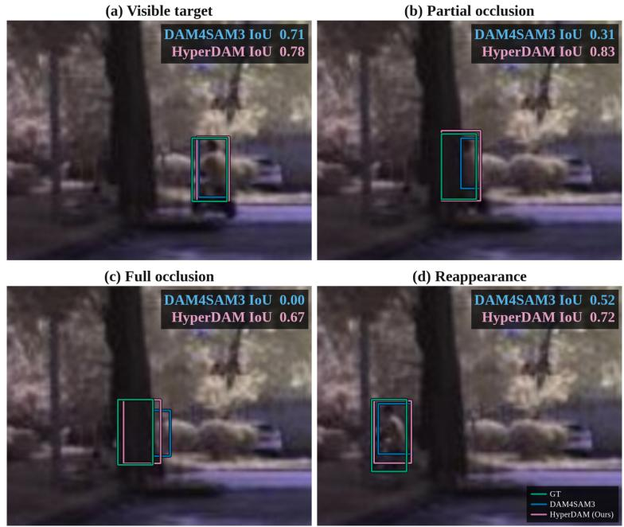
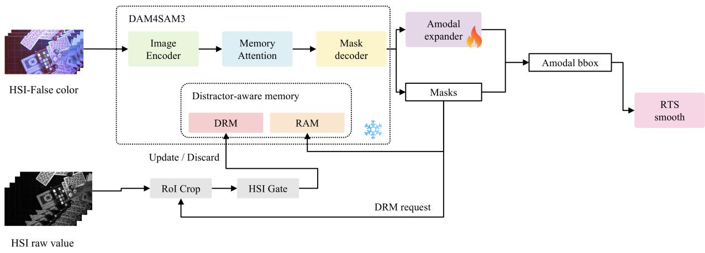
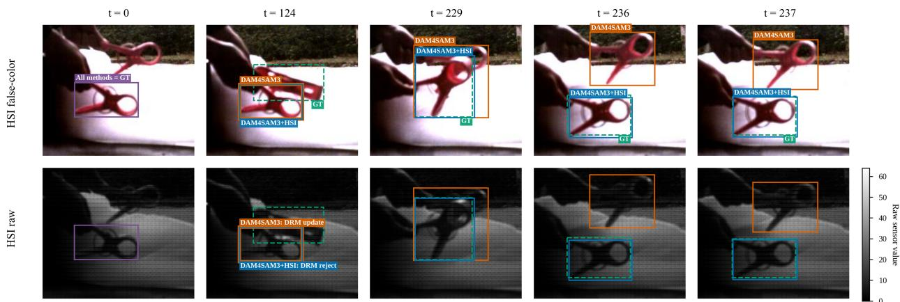

# HyperDAM: Hyperspectral Distractor-Aware Memory with Amodal Expansion for SAM 3 Tracking

Ryoga Yuzawa Tasuku Takagi∗

## Abstract

Hyperspectral video provides material cues that can disambiguate targets with similar falsecolor appearance, yet foundation-model trackers update memory primarily from spatial and appearance evidence. We present HyperDAM, a DAM4SAM3-based hyperspectral tracker with three principal contributions. First, HOTC2026-Modal adds human-verified frame-wise modal masks and mask-tight boxes to all 481 organizer-provided HOTC 2026 videos. Second, a frame-zero-calibrated HSI gate rejects spectrally inconsistent updates to the distractor-resolving memory (DRM) without altering the current prediction. Third, a causal spatiotemporal expander adds outward-only amodal corrections from frozen SAM features. Static-scene recovery and empty-mask RTS smoothing address target switches and full occlusion. Model selection prioritizes cross-domain robustness over leaderboard-specific optimization. The final system ranked second in HOTC 2026, achieving 68.0093% AUC and 87.7703% DP@20 in the organizer’s private evaluation.

Keywords: hyperspectral object tracking; SAM 3; video object segmentation; foundation models; distractor-aware memory; amodal tracking; modal annotations; spectral identity

## 1 Introduction

Single-object tracking estimates a target trajectory from an initial bounding box. Hyperspectral video augments conventional appearance with densely sampled spectral responses, providing evidence about material identity when color or texture alone is ambiguous. In camouflaged scenes, a target and its background may have nearly identical visual appearances while retaining distinct spectral signatures, making spectral evidence essential when appearance is unreliable [1–4]. Existing hyperspectral benchmarks and trackers demonstrate the value of spectral–spatial modeling [3, 5–15], while limited training data and the spectral-band gap continue to favor adaptation of strong RGB trackers [16–20].

Promptable segmentation models provide a complementary path. SAM introduced promptable image segmentation from visual prompts [21]. SAM 2 extended this paradigm to video using streaming memory [22], while SAM 3 unified detection, segmentation, and tracking from concept and visual prompts [23]. DAM4SAM improves tracking robustness by managing distractors in a dedicated memory [24]. Two gaps remain in the HOTC setting. First, an incorrect high-confidence mask can still enter memory and contaminate future predictions. Second, a segmentation mask describes only the visible part of an occluded target, whereas the required tracking box may extend beyond the visible support.

Figure 1 previews how the proposed output trajectory handles the latter gap. The learned expander restores latent extent while the target is partially visible, and RTS supplies a box only when the SAM mask is absent.

  
Figure 1: HyperDAM through an occlusion on nir-rider6. From left to right and top to bottom, the target is visible, partially occluded, fully occluded, and visible again. The amodal expander corrects partial visibility, while empty-mask RTS bridges full occlusion. Green, blue, and pink denote ground truth, DAM4SAM3, and HyperDAM, respectively.

We address these gaps with HyperDAM, a system that separates three responsibilities: spectral evidence protects target identity, a learned head estimates latent object extent, and the underlying frozen tracker owns the base trajectory. Our contributions are:

• A reviewed modal-annotation extension. We augment the organizer-provided HOTC 2026 competition dataset with binary visible/modal masks and mask-tight boxes for the 406 training/update videos and the organizer’s 75-video public-leaderboard set (denoted Public-LB75).

• A hyperspectral memory gate. A sequence-local model calibrated from the frame-zero target evaluates material consistency at DAM4SAM’s native distractor-resolving memory (DRM) update boundary. It can reject a requested update but cannot request one or alter the current-frame output.

• An amodal expander for DAM4SAM3 boxes. A causal six-frame 3-D head trained from paired modal masks and challenge boxes predicts nonnegative per-side expansion. The expansion is transferred as a residual onto the HSI-controlled trajectory and is never fed back into SAM memory.

Static-scene recovery and empty-mask Rauch–Tung–Striebel (RTS) smoothing [25] are supporting components rather than primary contributions. They are included to specify the submitted system completely. The implementation and reproducibility artifacts are publicly available at https://github.com/RyogaYuzawa/hotc2026-hyperdam.

  
Figure 2: Overview of the proposed HyperDAM architecture. The HSI gate filters requested DRM updates using raw hyperspectral observations; DAM4SAM3 supplies modal masks and features for amodal expansion, followed by ofline RTS smoothing.

## 2 Related Work

## 2.1 Hyperspectral object tracking

Hyperspectral tracking has progressed from material descriptors and correlation filters to learned spectral–spatial representations [1–3, 5, 8–14, 26, 27]. Recent methods transfer RGB trackers or pretrained representations through material-aware fusion and spectral prompts [4,6,7,15,17–20,28–30]. WHISPERS entries have explored detection-driven SAM2, low-rank adaptation, SAM2-based HOT, and motion-aware memory [31–34]. Other systems combine SAM 2 with depth and Kalman-based reinitialization for amodal tracking [35], adapt frozen RGB trackers through prompting and adaptive token dropping [36], or use detector-driven self-prompting and zero-shot SAM 2 tracking [37, 38]. PGSR-Track introduces position guidance with bidirectional spatial–spectral attention [39], while SAM2Local fuses SAM 2 with a local tracker and check-and-reprompt logic [40]. Our spectral component targets a specific decision in memory management: when DAM4SAM3 requests a DRM update, a sequence-local, label-free spectral test can reject that write. The test leaves the native update schedule, the current output, and the tracker weights unchanged; it neither injects learned feature prompts nor replaces the tracker’s feature extractor.

## 2.2 Foundation models for segmentation and tracking

SAM 2 introduced promptable video segmentation with streaming memory [22], while SAM 3 unified detection, segmentation, and tracking from concept and visual prompts [23]. DAM4SAM augments the video tracker with a distractor-aware memory and an introspection-based update policy [24]. Our HSI gate tests material identity at DAM4SAM’s final DRM update boundary.

## 2.3 Modal and amodal supervision

Modal annotations describe visible pixels, while amodal annotations represent the complete object extent behind occluders. TAO-Amodal shows that heavy occlusion remains challenging for modern trackers [41]. Kar et al. infer amodal bounding boxes from visible regions in single images [42]. MOVi-MC-AC provides synthetic multi-camera amodal-completion data [43], while Amodal SAM extends promptable segmentation to recover hidden object extent [44]. Medellin et al. combine SAM 2, depth, and Kalman-based reinitialization for amodal hyperspectral tracking [35]. Our extension adds dense modal masks and mask-tight boxes to the organizer-provided HOTC 2026 competition videos. The expander learns the diference between this visible extent and the challenge-provided target box, while retaining a strict outward-only correction contract.

## 3 HOTC 2026 Dataset Extension

HOTC 2026 provides 406 training/update videos and the 75-video Public-LB75 split with paired hyperspectral observations. The former have frame-wise amodal target boxes, whereas leaderboard ground truth is withheld. We extend all 481 videos with human-verified visible/modal segmentation masks and their mask-tight boxes, and release these annotations as HOTC2026-Modal. This annotation layer supplements rather than replaces the organizer-provided data. Paired with the oficial hyperspectral and false-color frames, the masks and boxes can supervise spectral adaptation of segmentation models, domain adaptation to false-color imagery, and losses that distinguish modal observations from amodal target extent. The HOTC2026-Modal annotation release is available at https://huggingface.co/datasets/ryo818/HOTC2026-Modal. Existing HOT benchmarks support box-based tracking evaluation [1, 3, 16]. Our extension adds dense modal supervision to the organizer-provided videos rather than introducing a new tracking split.

DAM4SAM3 predicts a visible mask and hence a modal box, while HOTC supervision specifies the object’s amodal extent. Directly using the latter as a mask or visible-box target conflates observed pixels with hidden extent. Our paired modal masks and boxes separate these quantities, enabling the amodal expander to learn outward residuals from modal to amodal boxes while SAM3 and the base tracker remain frozen.

SAM3 first infers and propagates target masks. Annotators visually inspect its outputs and manually correct erroneous frames or regions; only reviewed masks enter the release. Each modal box is then computed as the tight axis-aligned box around visible foreground pixels. An empty mask denotes full occlusion. The release also records oficial frame identifiers, available challenge boxes, provenance, and checksums.

The release contains a 406-video primary split and a separate 75-video Public-LB75 annotationonly split. Because oficial leaderboard ground truth is not released, the latter annotations are not presented as challenge ground truth and are excluded from fitting, model selection, and component evaluation.

## 4 Method

The proposed system uses frozen DAM4SAM3 as its base tracker and augments it with three principal components. First, an HSI-gated memory mechanism controls whether a requested DRM update is committed, preventing spectrally inconsistent objects from contaminating the tracker state. Second, an amodal expander enlarges the native modal box toward the estimated full extent of a partially occluded object. Third, an ofline Rauch–Tung–Striebel (RTS) smoother fills fully occluded frames for which the tracker produces no valid mask. We additionally exploit the prevalence of fixed-view cameras in the dataset by classifying each scene as static or dynamic. In static scenes, abrupt and spatially asymmetric box growth is treated as a likely tracking error and triggers static-scene recovery. The HSI gate is the only component that modifies the DRM update policy. Static-scene recovery may reinitialize the base tracker, whereas amodal expansion and RTS smoothing operate only on the output trajectory and never feed back into DAM4SAM3 memory. Figure 2 summarizes the complete inference pipeline.

## 4.1 DAM4SAM3 base tracker

Our base tracker adapts the distractor-aware DAM4SAM memory design [22–24] to frozen SAM3. We use the DAM4SAM3 implementation provided by SAM3-TrackBench [45], pinned to revision d37e4a975e48. The bundled runtime and its checksum are recorded in the released artifact manifest. It runs in PVS-only mode with detector inference disabled and is initialized by the oficial frame-zero box. SAM3 propagates the target mask and exposes alternative mask hypotheses; DAM4SAM3 uses these outputs to manage recent appearance memory and DRM. The tight box of the selected mask is the native modal trajectory. We use the entire base tracker in frozen form, with all SAM3 parameters unchanged. We initially explored LoRA adaptation [46] using the HOTC training data, but the limited size and diversity of the dataset did not yield the expected generalization to held-out sequences. We therefore retain the frozen model and instead introduce the HSI-based memory gate described below.

## 4.2 HSI gate

DAM4SAM3 first decides when to request a DRM update. For each request, the HSI gate evaluates the proposed update mask $M _ { t }$ together with an expanded surrounding region $E _ { t } = \mathrm { D i l a t e } ( M _ { t } ) \setminus M _ { t }$ First, the raw sensor mosaic $I _ { t } ^ { \mathrm { r a w } }$ is decoded into an aligned HSI cube $X _ { t } \in \mathbb { R } ^ { H \times W \times B }$

$$
X _ { t } = \mathcal { D } ( I _ { t } ^ { \mathrm { r a w } } ) .\tag{1}
$$

Here B is the number of spectral bands: B = 16 for VIS, B = 25 for NIR, and $B = 1 5$ for RedNIR. Let $p _ { 0 } = \mathrm { m e d i a n } _ { x \in M _ { 0 } } X _ { 0 } ( x )$ be the reference spectrum from the frame-zero target mask. For each requested DRM update, the component-wise median spectra of the candidate mask and expanded region are

$$
\begin{array} { r l } & { p _ { t } ^ { M } = \underset { x \in M _ { t } } { \mathrm { m e d i a n } } X _ { t } ( x ) , \qquad p _ { t } ^ { E } = \underset { x \in E _ { t } } { \mathrm { m e d i a n } } X _ { t } ( x ) , } \\ & { s _ { t } ^ { M } = \cos \left( \widehat { p _ { t } ^ { M } } , \widehat { p _ { 0 } } \right) , \qquad s _ { t } ^ { E } = \cos \left( \widehat { p _ { t } ^ { E } } , \widehat { p _ { 0 } } \right) . } \end{array}\tag{2}
$$

Here b· denotes mean centering across spectral bands followed by $\ell _ { 2 }$ normalization. The DRM update is accepted only when the candidate is similar to the initial target and its similarity exceeds that of the expanded region:

$$
\begin{array} { r } { A _ { t } ^ { \mathrm { H S I } } = \nVdash \left[ s _ { t } ^ { M } \geq \tau _ { \mathrm { i d } } \land s _ { t } ^ { M } - s _ { t } ^ { E } \geq \tau _ { \mathrm { e x p } } \right] , } \\ { W _ { t } = U _ { t } \land A _ { t } ^ { \mathrm { H S I } } , } \end{array}\tag{3}
$$

Here $U _ { t }$ is DAM4SAM3’s native DRM update request. The thresholds are calibrated from the frame-zero target and its expanded region. The gate may reject the requested DRM update but cannot request an update itself; rejection leaves both the current output and DRM unchanged.

No cross-sequence training or ground-truth annotation is used by the HSI gate. An unreliable frame-zero reference abstains rather than rejecting.

Figure 3 shows an example. At t = 124, DAM4SAM3 requests and performs a DRM update, whereas the HSI gate rejects it because the candidate mask does not separate suficiently from its surroundings. The current boxes remain unchanged, but the diferent memory states produce the later divergence at t = 236–237.

  
Figure 3: Runtime trace of the HSI gate on vis-clamp2 from the HOTC 2026 dataset. The rows show aligned false-color frames and raw 16-band mosaics. At t = 124, DAM4SAM3 accepts the DRM update, whereas DAM4SAM3+HSI rejects it without changing the current output. By $t = 2 3 6 { - } 2 3 7$ the native tracker follows the visually similar distractor while the gated tracker remains on the target. Orange, blue, and green dashed boxes denote DAM4SAM3, DAM4SAM3+HSI, and ground truth, respectively.

## 4.3 Amodal expander for SAM

The SAM family predicts the visible segmentation mask of a target, and its bounding box is therefore the tight envelope of that modal mask. HOTC instead evaluates the amodal extent, including portions hidden by occlusion, so a SAM-based tracker requires an explicit modal-toamodal adaptation. Motivated by the plug-in expander in TAO-Amodal [41], we preserve all pretrained SAM3 weights and attach an external amodal expander head to the detached outputs of the DAM4SAM3 mask decoder. Only this head is trained to infer outward box corrections for the hidden extent.

For a SAM mask box $B _ { t } = ( x _ { t } , y _ { t } , w _ { t } , h _ { t } )$ , the expander predicts nonnegative outward residuals ${ \Delta _ { t } } = ( { \delta _ { \mathrm { { L } } } } , { \delta _ { \mathrm { { T } } } } , { \delta _ { \mathrm { { R } } } } , { \delta _ { \mathrm { { B } } } } )$ in pixel units. The amodal box is obtained by directly adding these side residuals:

$$
\begin{array} { r l } & { \mathrm { A m o d a l } ( B _ { t } ; \Delta _ { t } ) = \left( x _ { t } - \delta _ { \mathrm { L } } , ~ y _ { t } - \delta _ { \mathrm { T } } , \right. } \\ & { ~ \left. w _ { t } + \delta _ { \mathrm { L } } + \delta _ { \mathrm { R } } , ~ h _ { t } + \delta _ { \mathrm { T } } + \delta _ { \mathrm { B } } \right) . } \end{array}\tag{4}
$$

Training targets are the outward diferences between the frozen SAM box and the oficial amodal box. A side is supervised as positive only when the reviewed modal box indicates genuine occlusion, preventing expansion when SAM already reaches or overshoots the oficial boundary.

The expander is causal and temporal. From the final 32-channel feature map of the SAM3 mask decoder, it extracts a box-aligned $3 2 \times 2 4 \times 2 4$ crop at each frame and stacks the latest six crops. Aligned mask logits, the 256-dimensional object query, box geometry, and an immutable frame-zero anchor are supplied alongside this feature history. Six residual 3-D convolutional blocks aggregate the spatiotemporal information, after which four side heads predict the left, top, right, and bottom residuals in Eq. (4). Confidence gates set unsupported side corrections to zero.

The external head has 9.4M parameters and is pretrained on synthetic MOVi-MC-AC amodal data [43]. All SAM3 parameters remain frozen. Frames with full occlusion are excluded from expander training, which therefore targets partial occlusion where a visible SAM box can be expanded toward the amodal box.

## 4.4 Full-occlusion handling

The amodal expander moves partially occluded boxes toward the amodal ground-truth extent, but learning reliable boxes under full occlusion is dificult because no visible mask remains. We therefore handle full occlusion after the full video has been processed. A frame is marked as a missing observation when the independent frozen DAM4SAM3 pass emits an empty mask; the released pipeline does not apply an additional confidence threshold. Rauch–Tung–Striebel (RTS) smoothing [25] then reconstructs only these missing boxes from valid observations before and after the gap, leaving all observed boxes unchanged.

Figure 1 illustrates the complementary roles of the two components. The amodal expander recovers the hidden extent while part of the target remains visible, whereas RTS smoothing supplies the box when the target is fully occluded and the SAM mask is empty.

## 4.5 Static/dynamic scene classification

Our analysis found that many HOTC sequences use a fixed camera and that target switches in such scenes are often accompanied by an abrupt, spatially asymmetric change in box size. We therefore estimate background motion from Shi–Tomasi corners [47] tracked with pyramidal Lucas–Kanade optical flow [48] over the initial ten frames, then classify each sequence as static or dynamic.

## 5 Experiments

## 5.1 Contribution of each component

Table 1 reports a cumulative ablation on the 75-video Public-LB75 split (26,860 frames) using the same frozen DAM4SAM3 checkpoint and inference revision. Every ablation row was submitted to the organizer’s public Kaggle evaluation. The final private-leaderboard result is included in the same table for reference.

Table 1: Cumulative ablation on Public-LB75.
<table><tr><td>ID</td><td>Configuration</td><td>Public score (AUC)</td></tr><tr><td>B0</td><td>DAM4SAM3 native</td><td>0.69039</td></tr><tr><td>B1</td><td>B0 + HSI gate</td><td>0.69214</td></tr><tr><td>B2</td><td>B1 + static-scene recovery</td><td>0.69513</td></tr><tr><td>B3</td><td>B2 + amodal expander</td><td>0.69732</td></tr><tr><td>B4</td><td>B3 + RTS smoothing</td><td>0.69768</td></tr><tr><td colspan="2">Organizer&#x27;s private LB</td><td>AUC: 68.0093% DP@20: 87.7703%</td></tr></table>

Table 2: Unified benchmark on Public-LB75 (75 videos; 26,860 frames). Public AUC is evaluated on the Kaggle public leaderboard. Available peak-VRAM measurements use the same NVIDIA L4 GPU. The best AUC value is shown in bold.
<table><tr><td>Method</td><td>Public-LB75 AUC ↑</td><td>Peak VRAM (MiB) ↓</td><td>Params (M) ↓</td><td>Precision</td><td>Comment</td></tr><tr><td>OSTrack [49]</td><td>0.49512</td><td>443.24</td><td>92.83</td><td>FP32</td><td></td></tr><tr><td>SeqTrack [50]</td><td>0.54142</td><td>1601.95</td><td>308.98</td><td>FP32</td><td></td></tr><tr><td>HIPTrack [51]</td><td>0.57374</td><td>557.88</td><td>120.41</td><td>FP32</td><td></td></tr><tr><td>ODTrack [52]</td><td>0.54442</td><td>599.99</td><td>92.83</td><td>FP32</td><td></td></tr><tr><td>SUTrack [53]</td><td>0.57169</td><td>2205.59</td><td>746.61</td><td>FP32</td><td></td></tr><tr><td>SAM2 [22]</td><td>0.65041</td><td>1634.95</td><td>224.45</td><td>FP32</td><td></td></tr><tr><td>DAM4SAM [24]</td><td>0.65464</td><td>2177.24</td><td>224.45</td><td>FP32</td><td>SAM2 base</td></tr><tr><td>SAM3 [23]</td><td>0.67393</td><td>4530.28</td><td>827.31</td><td>FP32</td><td>algorithm PVS</td></tr><tr><td>DAM4SAM3 [23,24]</td><td>0.69039</td><td>4492.51</td><td>827.31</td><td>FP32</td><td>PVS</td></tr><tr><td>HyperDAM (Ours)</td><td>0.69768</td><td>4685.12</td><td>836.73</td><td>FP32</td><td></td></tr></table>

## 5.2 Benchmark

Table 2 reports all verified results on the same Public-LB75 protocol. Each method is initialized with the provided first-frame box and produces one prediction per frame. All models are evaluated in FP32 on a single NVIDIA L4 GPU. Although HyperDAM was selected with cross-domain generalization rather than leaderboard optimization as the primary objective, it achieves the highest AUC among the compared methods and improves upon its DAM4SAM3 base. This result indicates that the proposed components improve the base tracker without sacrificing performance on the public evaluation domain.

Public-LB75 ground truth is withheld after the initial box and Kaggle returns only AUC. We therefore do not import published values obtained with diferent sequence sets or metrics into this benchmark. Table 2 also gives peak allocated VRAM and parameter count where available.

## 5.3 Discussion

The gains in Table 1 reflect complementary roles: the HSI gate prevents visually similar distractors from contaminating memory (Figure 3), static-scene recovery handles target switches, the amodal expander handles partial occlusion, and RTS fills full-occlusion gaps. Their individually modest gains therefore accumulate across distinct failure modes.

## 5.4 Limitations

The HSI gate yields only a modest gain because it only rejects requested DRM updates. Future work could initialize an object detector and associate multiple candidate spectral prototypes with the target by HSI correlation, moving material reasoning from memory validation to candidate selection.

## 6 Conclusion

We presented HyperDAM, extending frozen DAM4SAM3 with a frame-zero HSI update gate, outwardonly amodal expansion, static-scene recovery, and empty-mask RTS, together with HOTC2026-Modal annotations for all 481 HOTC 2026 videos. The system achieved the best Public-LB75 AUC among

the evaluated methods while cross-domain selection limited leaderboard overfitting. Its organizerprivate scores were 68.0093% AUC and 87.7703% DP@20, ranking second in HOTC 2026. Future work will explore detector-assisted spectral association and online trajectory completion.

## References

[1] Hanzheng Wang, et al., “BihoT: A large-scale dataset and benchmark for hyperspectral camouflaged object tracking,” IEEE Trans. Neural Netw. Learn. Syst., vol. 36, no. 9, pp. 16392–16406, 2025.

[2] Hien Van Nguyen, et al., “Tracking via object reflectance using a hyperspectral video camera,” in IEEE Conference on Computer Vision and Pattern Recognition Workshops, 2010, pp. 44–51.

[3] Fengchao Xiong, et al., “Material based object tracking in hyperspectral videos,” IEEE Trans. Image Process., vol. 29, pp. 3719–3733, 2020.

[4] Yuzeng Chen, et al., “SENSE: Hyperspectral video object tracker via fusing material and motion cues,” Inf. Fusion, vol. 109, pp. 102395, 2024.

[5] Zhenqi Liu, et al., “Unsupervised deep hyperspectral video target tracking and high spectralspatial-temporal resolution (H3) benchmark dataset,” IEEE Trans. Geosci. Remote Sens., vol. 60, pp. 1–14, 2022.

[6] Yuzeng Chen, et al., “PHTrack: Prompting for hyperspectral video tracking,” IEEE Trans. Geosci. Remote Sens., vol. 62, pp. 1–18, 2024.

[7] Gang He, et al., “Hyperspectral object tracking with spectral information prompt,” IEEE Trans. Circuits Syst. Video Technol., vol. 35, no. 12, pp. 12636–12651, 2025.

[8] Burak Uzkent, et al., “Tracking in aerial hyperspectral videos using deep kernelized correlation filters,” IEEE Trans. Geosci. Remote Sens., vol. 57, no. 1, pp. 449–461, 2019.

[9] Zhuanfeng Li, et al., “BAE-Net: A band attention aware ensemble network for hyperspectral object tracking,” in IEEE International Conference on Image Processing, 2020, pp. 2106–2110.

[10] Zhenqi Liu, et al., “An anchor-free siamese target tracking network for hyperspectral video,” in Proc. IEEE WHISPERS, 2021, pp. 1–5.

[11] Zhuanfeng Li, et al., “Spectral-spatial-temporal attention network for hyperspectral tracking,” in Proc. IEEE WHISPERS, 2021, pp. 1–5.

[12] Ye Wang, et al., “Spectral-spatial-aware transformer fusion network for hyperspectral object tracking,” in Proc. IEEE WHISPERS, 2022, pp. 1–5.

[13] Ye Wang, et al., “HSPTrack: Hyperspectral sequence prediction tracker with transformers,” in Proc. IEEE WHISPERS, 2023, pp. 1–5.

[14] Zhenqi Liu, et al., “A deep temporal-spectral-spatial anchor-free siamese tracking network for hyperspectral video object tracking,” IEEE Trans. Geosci. Remote Sens., vol. 62, pp. 1–16, 2024.

[15] Hanzheng Wang, et al., “SSF-Net: Spatial-spectral fusion network with spectral angle awareness for hyperspectral object tracking,” IEEE Trans. Image Process., vol. 34, pp. 3518–3532, 2025.

[16] Yuchao Wang, et al., “Deep feature-based hyperspectral object tracking: An experimental survey and outlook,” Remote Sensing, vol. 17, no. 4, pp. 645, 2025.

[17] Rafal Muszynski et al., “HELIOS: Hyperspectral hindsight OSTracker,” in Proc. IEEE WHISPERS, 2023, pp. 1–5.

[18] Shaoxiong Xie, et al., “VP-HOT: Visual prompt for hyperspectral object tracking,” in Proc. IEEE WHISPERS, 2023, pp. 1–5.

[19] Huang Wan, et al., “SPA-Tracker: Spectral prompt adaptation for hyperspectral object tracking,” in Proc. IEEE WHISPERS, 2024, pp. 1–5.

[20] Shaheer Mohamed, et al., “Spectral-enhanced transformers: Leveraging large-scale pretrained models for hyperspectral object tracking,” in Proc. IEEE WHISPERS, 2024, pp. 1–5.

[21] Alexander Kirillov, et al., “Segment anything,” in Proceedings of the IEEE/CVF International Conference on Computer Vision, 2023, pp. 4015–4026.

[22] Nikhila Ravi, et al., “SAM 2: Segment anything in images and videos,” in Proc. ICLR, 2025.

[23] Nicolas Carion, et al., “SAM 3: Segment anything with concepts,” in Proc. ICLR, 2026.

[24] Jovana Videnovic, et al., “A distractor-aware memory for visual object tracking with SAM2,” in Proc. IEEE/CVF CVPR, 2025, pp. 24255–24264.

[25] Herbert E. Rauch, et al., “Maximum likelihood estimates of linear dynamic systems,” AIAA J., vol. 3, no. 8, pp. 1445–1450, 1965.

[26] Shiqing Wang, et al., “BS-SiamRPN: Hyperspectral video tracking based on band selection and the siamese region proposal network,” in Proc. IEEE WHISPERS, 2022, pp. 1–8.

[27] Nan Su, et al., “A transformer-based three-branch siamese network for hyperspectral object tracking,” in Proc. IEEE WHISPERS, 2022, pp. 1–5.

[28] Hongjiao Liu, et al., “Multi-band hyperspectral object tracking: Leveraging spectral information prompts and spectral scale-aware representation,” in Proc. IEEE WHISPERS, 2023, pp. 1–5.

[29] Yuzeng Chen et al., “HySSTP: Hyperspectral video tracker embedding multi-modal spatialspectral-temporal features,” in Proc. IEEE WHISPERS, 2024, pp. 1–5.

[30] Hanzheng Wang, et al., “Spectral-temporal token-guided prompt mamba for hyperspectral object tracking,” in Proc. IEEE WHISPERS, 2024, pp. 1–5.

[31] Wangquan He, et al., “DeSAM2: Detection-driven SAM2 for hyperspectral object tracking,” in Proc. IEEE WHISPERS, 2024, pp. 1–5.

[32] Langkun Chen, et al., “Hyperspectral object tracking with low-rank adaptation,” in Proc. IEEE WHISPERS, 2024, pp. 1–5.

[33] Zixuan Qian, et al., “Track hyperspectral videos via segment anything model 2,” in Proc. IEEE WHISPERS, 2024, pp. 1–5.

[34] Yuzeng Chen, et al., “HARMONY: Adapting segment anything model for hyperspectral video tracking with motion-aware memory,” in Proc. IEEE WHISPERS, 2025, pp. 1–5.

[35] Anthony Medellin, et al., “Amodal memory-based hyperspectral object tracking,” in Proc. IEEE WHISPERS, 2024, pp. 1–5.

[36] Jiawei Zhou, et al., “Incorporating prompt learning and adaptive dropping hyperspectral information tracker for hyperspectral object tracking,” in Proc. IEEE WHISPERS, 2024, pp. 1–5.

[37] Haonan Yang, et al., “A detection-driven self-prompting framework for hyperspectral object tracking,” in Proc. IEEE WHISPERS, 2025, pp. 1–6.

[38] Jiaqi Zhang, et al., “Adapting vision foundation models to hyperspectral object tracking: A SAM2-based approach,” in Proc. IEEE WHISPERS, 2025, pp. 1–7.

[39] Jinya Li, et al., “PGSR-Track: A spatially-guided and spectrally-refined transformer for hyperspectral object tracking,” in Proc. IEEE WHISPERS, 2025, pp. 1–5.

[40] Simiao Lai, et al., “SAM2Local: Enhancing SAM2 with local perception for hyperspectral object tracking,” in Proc. IEEE WHISPERS, 2025, pp. 1–5.

[41] Cheng-Yen Hsieh, et al., “TAO-Amodal: A benchmark for tracking any object amodally,” arXiv preprint arXiv:2312.12433v3, 2024.

[42] Abhishek Kar, et al., “Amodal completion and size constancy in natural scenes,” in Proceedings of the IEEE International Conference on Computer Vision, 2015, pp. 127–135.

[43] Alexander Moore, et al., “Training for X-Ray vision: Amodal segmentation, amodal content completion, and view-invariant object representation from multi-camera video,” arXiv preprint arXiv:2507.00339, 2025.

[44] Bo Zhang, et al., “Amodal SAM: A unified amodal segmentation framework with generalization,” arXiv preprint arXiv:2604.20748, 2026.

[45] Mohamad Alansari, et al., “Rethinking memory design in SAM-based visual object tracking,” arXiv preprint arXiv:2512.22624, 2025.

[46] Edward J. Hu, et al., “LoRA: Low-rank adaptation of large language models,” in Proc. ICLR, 2022.

[47] Jianbo Shi et al., “Good features to track,” in Proc. IEEE CVPR, 1994, pp. 593–600.

[48] Bruce D. Lucas et al., “An iterative image registration technique with an application to stereo vision,” in Proceedings of the 7th International Joint Conference on Artificial Intelligence, 1981, pp. 674–679.

[49] Botao Ye, et al., “Joint feature learning and relation modeling for tracking: A one-stream framework,” in Proc. ECCV, 2022, pp. 341–357.

[50] Xin Chen, et al., “SeqTrack: Sequence to sequence learning for visual object tracking,” in Proc. IEEE/CVF CVPR, 2023, pp. 14572–14581.

[51] Wenrui Cai, et al., “HIPTrack: Visual tracking with historical prompts,” in Proc. IEEE/CVF CVPR, 2024, pp. 19258–19267.

[52] Yaozong Zheng, et al., “ODTrack: Online dense temporal token learning for visual tracking,” in Proc. AAAI, 2024, vol. 38, pp. 7588–7596.

[53] Xin Chen, et al., “SUTrack: Towards simple and unified single object tracking,” in Proc. AAAI, 2025, vol. 39, pp. 2239–2247.

## A Dataset Composition Across HOTC406 and the Public-Leaderboard Set

We audit the dataset composition using only sequence titles and frame counts, without inspecting withheld leaderboard ground truth. A title family is formed by lowercasing a sequence title and removing only its terminal numeric sufix; thus, for example, car3 and car11 belong to car, whereas context-bearing names such as high\_car remain distinct. The resulting families are then assigned to the broad semantic groups in Table 3. This title-derived taxonomy is intended to describe dataset composition rather than provide ground-truth object labels.

Table 3 summarizes all 406 organizer-provided training/update videos (167,724 frames) and the separate 75-video public- leaderboard set (Public-LB75; 26,860 frames). HOTC406 is dominated by vehicles, people, and everyday objects, whereas Public-LB75 places substantially more weight on vegetation, food, and animals. The two splits contain 110 and 31 normalized title families, respectively; only six names occur in both: car, dashcam, dronecam, pills, pingpong, and truck.

Table 3: Complete assignment of normalized title families to broad categories. Numeric title variants within a listed family are grouped together. V and F are the total numbers of videos and frames, respectively, in each category and split.
<table><tr><td rowspan=1 colspan=4>HOTC406                                    Public-LB75Category         Title families                             V      F Title families                 V     F</td></tr><tr><td rowspan=1 colspan=1></td><td rowspan=1 colspan=1>1_person, 1_runner,pedestrain,</td><td></td><td></td></tr><tr><td rowspan=1 colspan=1></td><td rowspan=1 colspan=1>pedestrian, people, player, rider,</td><td></td><td></td></tr><tr><td rowspan=1 colspan=1></td><td rowspan=1 colspan=1>s_jump, s_person, s_runner, s_walker,</td><td></td><td rowspan=1 colspan=1></td></tr><tr><td rowspan=1 colspan=1></td><td rowspan=1 colspan=1>s_warmup, student, surround_person,</td><td></td><td></td></tr><tr><td rowspan=1 colspan=1></td><td rowspan=1 colspan=1>trucker, worker</td><td></td><td></td></tr><tr><td rowspan=1 colspan=1>Sports and balls</td><td rowspan=1 colspan=1>badminton, ball, ball_holder, basket- 43 23,120 pingpong</td><td></td><td></td></tr><tr><td rowspan=1 colspan=1></td><td rowspan=1 colspan=1>ball,football,high_playground,</td><td></td><td></td></tr><tr><td rowspan=1 colspan=1></td><td rowspan=1 colspan=1>1_basketball,pingpong,play-</td><td></td><td></td></tr><tr><td rowspan=1 colspan=1></td><td rowspan=1 colspan=1>ground, pool, s_soccer, s_volleyball,</td><td></td><td></td></tr><tr><td rowspan=1 colspan=1></td><td rowspan=1 colspan=1>snow_table_tennis, snow_tennis</td><td></td><td></td></tr><tr><td rowspan=1 colspan=1>Animals</td><td rowspan=1 colspan=1>ant, duck, kangaroo, turkey</td><td></td><td></td></tr><tr><td rowspan=1 colspan=1>Vegetation and ap</td><td rowspan=1 colspan=1>ple, coke, cranberries, fake_orange, 30 17,712 dryleaf, flower, folium, herbs, 15 6,433</td><td></td><td></td></tr><tr><td rowspan=1 colspan=1>food</td><td rowspan=1 colspan=1>forest, fruit, grove, leaf, leaves, oranges,</td><td></td><td></td></tr><tr><td rowspan=1 colspan=1></td><td rowspan=1 colspan=1>real_pear</td><td rowspan=11 colspan=2>Toys and tabletop ball&amp;mirror, card, cards, dice, 39 20,760 doll, domino, marble, mar- 12 3,872blerun, pokerEveryday objects backpack, balloon, board, book, 55 30,771 clip, earphone_case, headset, 8 3,188pills3  1,191                                0      0</td></tr><tr><td rowspan=1 colspan=1>Toys and tabletop</td><td rowspan=1 colspan=1>ball&mirror, card, cards, dice,</td><td rowspan=1 colspan=1>3920,760</td></tr><tr><td rowspan=1 colspan=1>games</td><td rowspan=1 colspan=1>mirror_egg, rubber_duck, rubik,</td><td rowspan=1 colspan=1></td></tr><tr><td rowspan=1 colspan=1></td><td rowspan=1 colspan=1>snow_card, toy, yo_yo</td><td rowspan=2 colspan=1>55 30,771 clip, earphone_case,</td></tr><tr><td rowspan=1 colspan=1>Everyday objects</td><td rowspan=1 colspan=1>backpack, balloon, board, book,</td></tr><tr><td rowspan=1 colspan=1></td><td rowspan=1 colspan=1>bracelet, clamp, cloth, coin, cup, glass,</td></tr><tr><td rowspan=1 colspan=1></td><td rowspan=1 colspan=1>glass_cup, hat, keyboard, officechair,</td></tr><tr><td rowspan=1 colspan=1></td><td rowspan=1 colspan=1>officefan, paper, paper_crane, pa-</td></tr><tr><td rowspan=1 colspan=1></td><td rowspan=1 colspan=1>per_frog, pen, pills, plastic_cups,</td></tr><tr><td rowspan=1 colspan=1></td><td rowspan=1 colspan=1>receipts, redbag, whitecup</td></tr><tr><td rowspan=1 colspan=1>Medical scenes</td><td rowspan=1 colspan=1>esophagectomy, heartsurgery</td></tr><tr><td rowspan=1 colspan=1>Aerial and illumi</td><td rowspan=1 colspan=1>- drone, dronecam, droneshow, party-</td><td></td><td rowspan=1 colspan=1>18  6,147 dronecam                      1   200</td></tr><tr><td rowspan=1 colspan=1>nated scenes</td><td rowspan=2 colspan=1>lightstheriver, campus, park, shadow, stone</td><td></td><td rowspan=3 colspan=1>6  3,093 jelly                           31,180</td></tr><tr><td rowspan=1 colspan=1>Other scenes and by</td><td></td></tr><tr><td rowspan=1 colspan=1>objects</td><td rowspan=1 colspan=1></td><td></td></tr><tr><td rowspan=1 colspan=4>Total             110 families                             406 167,724 31 families                   75 26,860</td></tr></table>