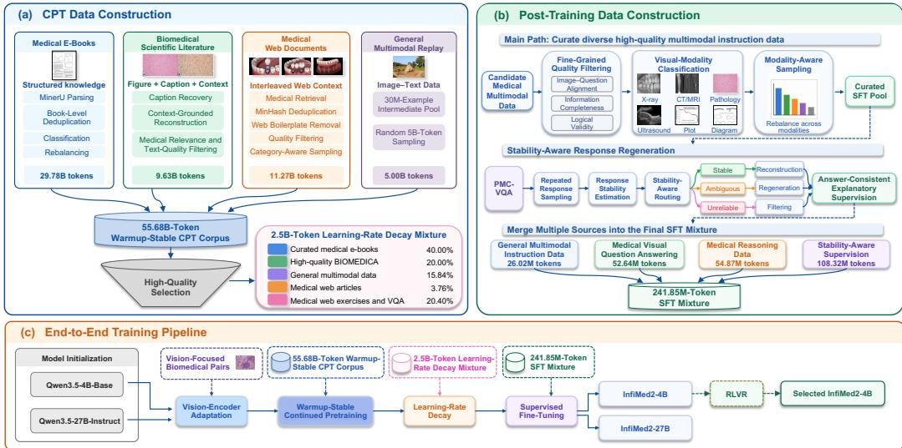
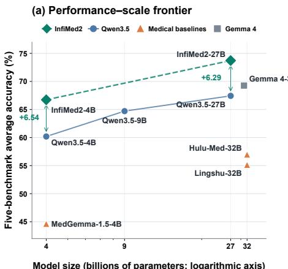
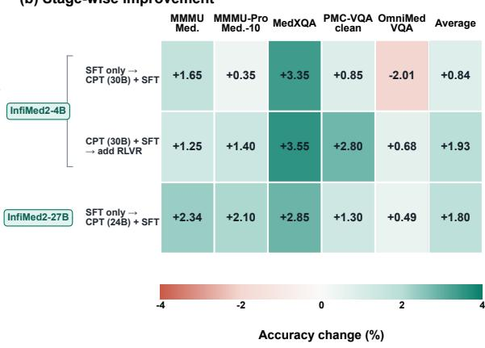
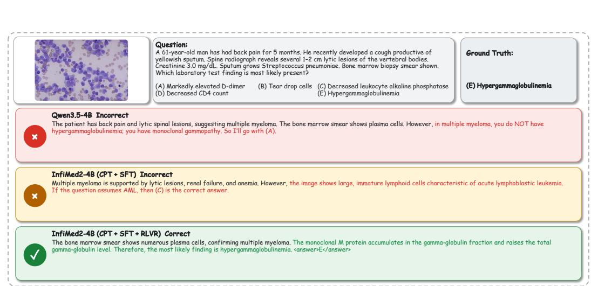
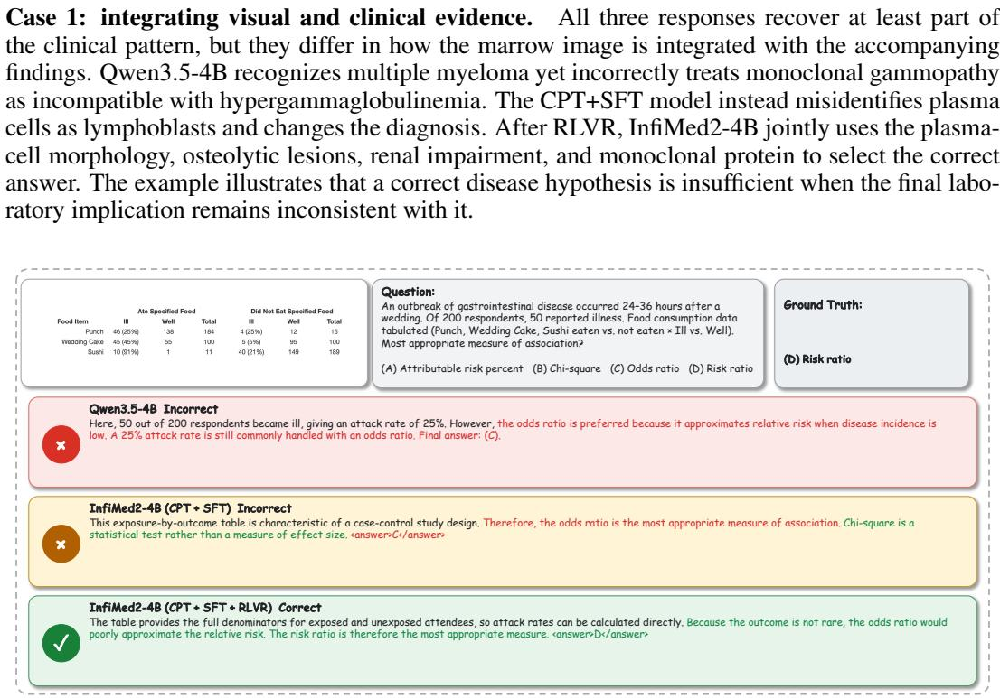
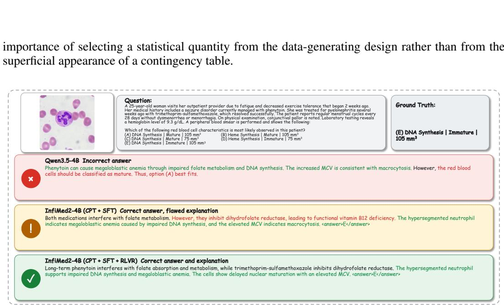
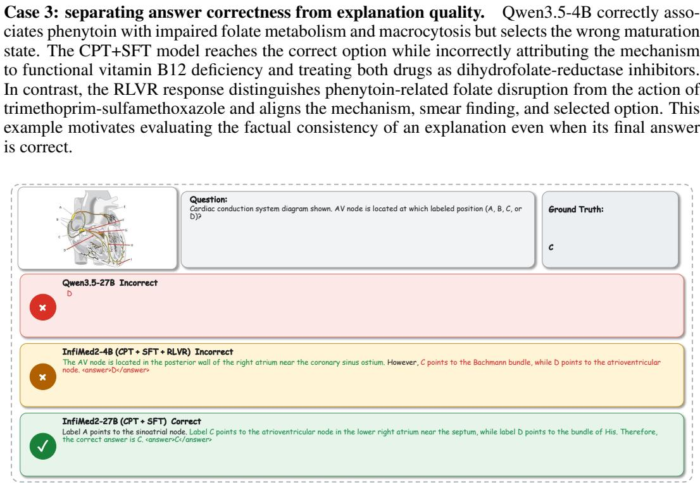

# INFIMED2: A GENERALIST MEDICAL MULTIMODAL FOUNDATION MODEL FROM CONTEXTUAL EVIDENCE AND STABILITY-AWARE SUPERVISION

Guanghao Zhu1∗ Zeyu Liu1∗ Zhitian Hou1∗ Pengkai Wang1 Zhijie Sang2 Shuo Cai1 Yang Yu1 Yuanyi Wang1 Yanggan Gu1 Congkai Xie2 Jianmin Wu1,3 Hongxia Yang1,2,3†

1The Hong Kong Polytechnic University 2InfiX.ai

3PolyU-Daya Bay Technology and Innovation Research Institute

## ABSTRACT

Recent medical multimodal models have benefited from larger corpora, broader modality coverage, and stronger reasoning-oriented training, yet effective data design across continued pretraining (CPT) and post-training remains challenging. Medical sources vary substantially in structure, granularity, and information density, and their utility shifts as training progresses from broad knowledge acquisition to late-stage consolidation. Meanwhile, post-training is often dominated by short-form visual question answering, providing limited supervision for informative and answer-consistent explanations. We introduce InfiMed2, a family of 4B and 27B generalist medical multimodal foundation models built around stage-aware data design. We curate a 55.68B-token corpus that combines broad clinical knowledge with context-rich biomedical visual evidence through sourcespecific processing. Our CPT pipeline first adapts the vision encoder, then builds broad medical knowledge, and finally transitions to an evidence-focused data mixture during learning-rate decay. For supervised fine-tuning (SFT), we regenerate visual question-answering responses using answer stability, answer-masked reconstruction, and correctness-constrained selection to produce more informative and answer-consistent supervision. The 4B model is further optimized with reinforcement learning with verifiable rewards (RLVR). Across five medical multimodal benchmarks, InfiMed2-4B achieves 66.73% mean accuracy after RLVR, surpassing the larger Qwen3.5-9B, while InfiMed2-27B reaches 73.72%, the highest among the evaluated open-weight models.

## 1 INTRODUCTION

Medical multimodal large language models (MLLMs) seek to transfer general multimodal capabilities into a domain where specialized visual evidence must be interpreted together with medical knowledge and clinically appropriate language. Recent progress has followed three complementary directions: expanding domain-specific corpora, adapting visual and multimodal representations, and strengthening instruction following and reasoning through post-training (Li et al., 2023; Chen et al., 2024; Sellergren et al., 2025; Xu et al., 2025; Jiang et al., 2025; Shi et al., 2026). These advances show that capable medical MLLMs depend on both knowledge acquisition and behavioral alignment. They also expose a shared data-design challenge across the two phases: continued pretraining (CPT) must organize heterogeneous evidence into effective learning signals, while post-training must convert the resulting representations into reliable and informative responses.

CPT must reconcile medical sources that differ substantially in structure, granularity, and information density. Existing medical corpora often concentrate on a single source type, while large-scale automatic collection can leave duplicated, noisy, or weakly connected content. Isolated image– caption pairs provide concentrated alignment signals but omit much of the surrounding evidence, whereas long-form and interleaved documents offer richer context at lower and less uniform information density. Using one static mixture throughout training asks the same distribution to support both broad knowledge acquisition and late-stage consolidation. Early updates benefit from diverse coverage, while the final low-learning-rate regime is more sensitive to the quality and task relevance of the remaining evidence. The visual encoder presents a related tension: keeping it fixed limits medical visual adaptation, but unrestricted joint optimization from the outset can disturb previously aligned representations. Prior work has extensively explored data scale and curriculum order, yet the interaction among data mixture, trainable components, and optimization stage remains less studied.

Post-training faces a different limitation. Medical VQA annotations are commonly designed to evaluate answer correctness and therefore often contain only an entity, category, or short judgment (Zhang et al., 2023b). Directly fitting these targets provides little supervision for identifying relevant visual findings or connecting them to medical knowledge. Replacing a short answer with one teacher-generated explanation is also insufficient because a longer response may still be weakly grounded or inconsistent with the verified answer. Moreover, teacher reliability varies across examples. Effective post-training data must therefore improve explanatory content while accounting for the stability and correctness of the generated supervision.

We introduce InfiMed2 to address these data-design problems within a unified training pipeline. CPT begins with vision-encoder adaptation, proceeds to warmup–stable training on a 55.68B-token corpus of complementary medical and general multimodal evidence, and concludes with learningrate decay on a compact mixture enriched with high-quality medical evidence. For post-training, we estimate answer stability from repeated teacher generations and use it to route response construction. Stable examples undergo answer-masked reconstruction and correctness-constrained selection, less stable examples are assigned to a stronger regeneration model, and low-agreement examples are removed. The retained responses are combined with general multimodal, medical visual, and reasoning supervision for supervised fine-tuning (SFT). The selected 4B model subsequently undergoes reinforcement learning with verifiable rewards (RLVR) using a difficulty-aware mixture derived from pass@8 outcomes.

Under a common evaluation protocol on five medical multimodal benchmarks, InfiMed2-4B reaches 66.73% mean accuracy and surpasses the larger Qwen3.5-9B. InfiMed2-27B achieves 73.72%, the highest mean accuracy among the evaluated open-weight models. Together, these results indicate that coordinated data design across continued pretraining and post-training can support strong medical multimodal performance without depending solely on model scaling.

Our contributions are summarized as follows:

• We construct a 55.68B-token CPT corpus from complementary medical sources using source-specific processing. Our training design separates vision-encoder adaptation, broad medical knowledge acquisition, and learning-rate decay on a rebalanced evidence mixture.

• We develop stability-aware response regeneration for medical post-training. Repeated generations provide an empirical measure of answer stability. This signal guides reconstruction, correctness-constrained selection, selective model escalation, and filtering to produce informative supervision consistent with verified answers.

• We present InfiMed2, a family of 4B and 27B generalist medical multimodal foundation models. The 4B model outperforms a larger general-purpose baseline, and the 27B model attains the strongest mean performance among the evaluated open-weight models.

## 2 RELATED WORK

## 2.1 MEDICAL MULTIMODAL FOUNDATION MODELS

Medical multimodal large language models commonly adapt general-purpose vision-language backbones with domain-specific image–text and instruction data. Early systems such as LLaVA-Med (Li et al., 2023) and HuatuoGPT-Vision (Chen et al., 2024) emphasize biomedical alignment and instruction following, while MedGemma (Sellergren et al., 2025) adapts both visual and language components. Recent generalist systems broaden data, modalities, and reasoning supervision, in cluding Lingshu (Xu et al., 2025), Hulu-Med (Jiang et al., 2025), and MedXiaoHe (Shi et al., 2026). Despite this progress, source-aware evidence curation and verification of synthetic explanations remain less systematically studied. InfiMed2 addresses these data-design problems across continued pretraining and post-training.

## 2.2 MULTIMODAL CONTINUED PRETRAINING AND MEDICAL DATA CURATION

Multimodal continued pretraining depends on both coverage and the relation between images and textual evidence. PMC-15M (Zhang et al., 2023a) and BIOMEDICA (Lozano et al., 2025) provide large biomedical figure collections, but literature-derived data often reduce evidence to isolated figure–caption pairs and remain vulnerable to extraction noise. PMC-InterCPT (Zhu et al., 2026) instead reconstructs associations among figures, captions, and their related context. Source diversity, source-specific failure modes, and stage-dependent data value nevertheless remain underexplored. InfiMed2 addresses these limitations by combining complementary medical sources through sourceaware processing.

## 2.3 MEDICAL POST-TRAINING AND RELIABLE SYNTHETIC SUPERVISION

Medical post-training uses supervised question answering, instruction following, and reasoning data, sometimes followed by outcome-based reinforcement learning. PMC-VQA (Zhang et al., 2023b) supplies biomedical VQA supervision, while ReasonMed (Sun et al., 2025) and recent medical models use synthetic reasoning to strengthen complex problem solving (Xu et al., 2025; Shi et al., 2026). Generated explanations, however, may be weakly grounded or inconsistent with verified answers. Self-consistency (Wang et al., 2022) and predictive uncertainty (Kuhn et al., 2023) provide useful reliability signals. Our regeneration pipeline combines these signals with reference-answer constraints to curate explanatory supervision.

## 3 DATA CURATION

Figure 1 provides an overview of how source-specific CPT curation and post-training curation supply the successive stages of the InfiMed2 training pipeline.

## 3.1 CPT DATA CURATION

Curation objective and source complementarity. We construct the CPT corpus by combining complementary sources of medical knowledge and multimodal evidence, rather than applying a uniform curation strategy to heterogeneous training data: (1) medical e-books provide systematic, long-form exposition; (2) scientific articles connect biomedical figures to peer-reviewed textual evidence; (3) web documents broaden coverage of practical and less formal medical content; and (4) general multimodal data serves as replay for capabilities acquired by the backbone. Because each source exhibits distinct types of noise and distributional bias, we develop source-specific cleaning and sampling procedures for each corpus. After source-specific processing, we obtain a 55.68Btoken corpus that is used in its entirety for warmup–stable CPT. It comprises 29.78B tokens from medical e-books, 9.63B from biomedical scientific literature, 11.27B from medical web documents, and 5B from general multimodal data.

Medical e-books. We collect approximately 156k medical e-books and convert them into structured Markdown using MinerU (Wang et al., 2024). We perform book-level deduplication and remove parsing failures, empty or repetitive content, and cover-only records. Because the cleaned collection remains imbalanced, we classify each book by medical subject and genre using sampled pages and bibliographic metadata. The subject taxonomy follows a medical-first principle, and the genre classifier selects among medical monograph, medical popular science, medical reference/atlas/quickreference work, medical textbook, medical research literature/report, medical supplementary teach ing material, and medical guideline/standard. We jointly use these labels to increase clinically oriented disciplines and high-value reference material while reducing overrepresented foundational, popular-science, and supplementary teaching content. The final subset contains 60,433 books and

  
Figure 1: Overview of the InfiMed2 data construction and training pipeline. (a) Source-specific processing forms the warmup–stable CPT corpus and a compact, high-quality mixture for learning-rate decay. (b) Post-training combines fine-grained quality filtering, stability-aware response regeneration, and visual-modality-aware sampling. (c) The resulting data support vision-encoder adaptation, CPT, SFT, and subsequent RLVR for the selected 4B model.

22.41B text tokens, or 29.78B tokens after including visual tokens. Detailed cleaning and sampling statistics are provided in Appendix A.1.

Biomedical scientific literature. For biomedical scientific literature, we use 10.11M examples totaling 9.63B tokens from PMC-InterCPT (Zhu et al., 2026), which reconstructs context-grounded records from BIOMEDICA (Lozano et al., 2025). The pipeline recovers provenance-linked captions, associates each figure with the context that explicitly references it, and places figures sharing the same context in one interleaved sequence. It then repairs incoherent context, applies medicalrelevance and text-quality filtering, and excludes PMC-VQA test examples (Zhang et al., 2023b). Unlike isolated image–caption pairs, the resulting corpus preserves the relationships among scientific figures, captions, and figure-linked context, providing supervision for integrating evidence across multiple related elements. Additional construction details are provided in Appendix A.2.

Medical web data. Medical web data complements books and scientific articles with broader practical and long-tail medical content. We train a Qwen3-1.7B (Yang et al., 2025) medicalrelevance classifier to retrieve a 32.99B-token candidate pool from OmniCorpus-CC (Li et al., 2025), OBELICS (Laurenc¸on et al., 2023), and MINT-1T (Awadalla et al., 2024), followed by MinHash near-duplicate removal (Broder, 1997). A dedicated model removes navigation, header, and footer text, and we restore interleaving by downloading images referenced by source URLs and rejoining them with their records. We discard documents assigned the lowest score by a three-level quality classifier, then use image categories for balanced resampling. The resulting medical interleaved corpus contains 11.27B tokens.

General multimodal replay. Medical specialization can weaken broad visual and linguistic capabilities if training excludes general-domain evidence. We therefore include 5B tokens from LLaVA-OneVision-1.5-Mid-Training-85M (An et al., 2025) as general multimodal replay during warmup– stable CPT. The source dataset contains 85M curated and concept-balanced examples, and its associated models demonstrate strong performance across a broad benchmark suite. We convert a 30M-example intermediate pool containing 19.89B tokens and randomly sample the 5B-token training subset. We keep this component smaller than the combined medical sources so that it regularizes domain adaptation without diluting the medical focus of the mixture.

From these curated pools, we derive two stage-specific data configurations tailored to the first and final stages of CPT.

Vision-encoder adaptation subset. We construct a visually concentrated 1B-token subset from the curated PMC-InterCPT corpus. Each eligible record is converted into a single-image, single-caption example by retaining its first valid image and the corresponding caption. Deterministic tokenbudgeted sampling yields 1.71M image–caption pairs, with visual tokens accounting for 73.7% of the subset. This subset provides a vision-focused view of the subsequent corpus rather than introducing an additional data source.

Learning-rate decay mixture. For late-stage consolidation, we assemble a compact, high-quality 2.50B-token mixture from the curated data pools. Medical e-books account for 40% of the tokens, BIOMEDICA for 20%, and general multimodal data for 15.84%. The remaining 24.16% comes from medical web data, including 3.76% medical articles and 20.40% medical exercises and selected VQA examples. This mixture increases the density of systematic medical knowledge and application-oriented supervision while retaining general multimodal replay.

## 3.2 POST-TRAINING DATA CURATION

We collect post-training data from heterogeneous medical and general multimodal sources. Directly combining these sources introduces three practical issues. First, some samples contain semantic inconsistencies that metadata cannot reliably identify, including mismatched image modalities, missing anatomical evidence, incomplete problem conditions, or responses not properly grounded in the visual input. Second, many medical VQA datasets provide only short-form answers, which are sufficient for evaluating answer correctness but provide limited supervision for learning informative multimodal responses. Third, the resulting corpus is highly imbalanced in visual content.

We therefore construct the post-training data through a sequential pipeline. We first perform finegrained sample-level filtering to remove invalid grounded examples. For retained visual question answering (VQA) samples, we then regenerate responses to increase their information density while preserving answer correctness. Finally, we construct the training mixture according to visual content rather than raw dataset size.

## 3.2.1 FINE-GRAINED QUALITY FILTERING

We first assess the validity of each candidate sample by jointly considering its visual and textual components. We define a fine-grained annotation scheme along three dimensions: image–question alignment, information completeness, and logical validity. The annotation covers common failure cases such as image-modality mismatch, missing anatomical regions, and inconsistent question– answer pairs.

Based on this annotation scheme, we construct a quality-control dataset and train a 2B parameter evaluator to assess candidate samples. We use a three-level score, where Score 0 indicates a critical defect, Score 1 denotes a limited but non-fatal issue, and Score 2 denotes a valid sample. The evaluator removes Score 0 samples before response construction and mixture formation. The complete quality assessment protocol is provided in Appendix B.1 and Table 5.

## 3.2.2 STABILITY-AWARE RESPONSE REGENERATION

After filtering, we refine the response supervision of retained medical VQA data. Existing medical VQA datasets often provide only an entity, category label, or short judgment and therefore provide limited supervision for integrating visual evidence with medical knowledge. Our regeneration procedure produces informative explanations while preserving the reference answer.

Multi-sample response generation and stability estimation. Let $x _ { i } = ( I _ { i } , q _ { i } , a _ { i } ^ { * } )$ denote a medical VQA instance, where $I _ { i }$ denotes the medical image, $q _ { i }$ the question, and $a _ { i } ^ { * }$ the reference answer. We first employ Qwen3-VL-32B-Instruct (Bai et al., 2025) parameterized by $\dot { \theta } _ { T }$ as a teacher model to independently sample K = 8 candidate responses:

$$
r _ { i } ^ { ( k ) } \sim p _ { \theta _ { T } } ( r \mid I _ { i } , q _ { i } ) , \qquad k = 1 , \ldots , K .\tag{1}
$$

Repeated stochastic sampling estimates answer stability through agreement among independently generated reasoning paths, following the intuition of self-consistency decoding (Wang et al., 2022).

Let $\hat { a } _ { i } ^ { ( k ) }$ be the final answer extracted from $r _ { i } ^ { ( k ) }$ , and let M denote the dataset-specific answermatching function. We count the correct responses and normalize this count as

$$
C _ { i } = \sum _ { k = 1 } ^ { K } \mathbb { I } \Big [ \mathcal { M } ( \hat { a } _ { i } ^ { ( k ) } , a _ { i } ^ { * } ) = 1 \Big ] , \qquad S _ { i } = \frac { C _ { i } } { K } .\tag{2}
$$

Here, $\mathbb { I } [ \cdot ]$ is the indicator function, $C _ { i }$ is the number of correct responses, and $S _ { i }$ measures how consistently the teacher recovers the reference answer. As K is fixed, we use $C _ { i }$ for routing.

Answer-masked reconstruction and candidate selection. For high-stability samples with $6 \leq$ $C _ { i } \leq 8 .$ , we retain the explanatory content of correct teacher responses and mask their explicit $\mathrm { f i - }$ nal answers, yielding $\tilde { r } _ { i } ^ { ( k ) } = \mathrm { M a s k A n s w e r } ( r _ { i } ^ { ( k ) } , \hat { a } _ { i } ^ { ( k ) } )$ ). Qwen3-VL-4B-Instruct (Bai et al., 2025), parameterized by $\theta _ { R } ,$ , then reconstructs the response from the image, question, and masked explanation:

$$
\bar { r } _ { i } ^ { ( k ) } \sim p _ { \theta _ { R } } ( r \mid I _ { i } , q _ { i } , \tilde { r } _ { i } ^ { ( k ) } ) .\tag{3}
$$

Here, $\bar { r } _ { i } ^ { ( k ) }$ denotes the reconstructed response. We form $\mathcal { R } _ { i } ^ { + }$ from reconstructions whose extracted answers match $a _ { i } ^ { * }$ and whose originating teacher responses are also correct.

Entropy-based quantities provide a natural measure of uncertainty in probabilistic language generation (Kuhn et al., 2023). In our setting, reference-answer consistency is first enforced as a hard constraint, after which entropy is used only to rank the remaining valid candidates. For each retained reconstruction, we compute the mean answer-token entropy

$$
\mathcal { H } ( \bar { r } _ { i } ^ { ( k ) } ) = \frac { 1 } { T _ { k } } \sum _ { t = 1 } ^ { T _ { k } } \left[ - \sum _ { v \in \mathcal { V } } p _ { t } ( v ) \log p _ { t } ( v ) \right] .\tag{4}
$$

Here, $T _ { k }$ is the answer length, V is the output vocabulary, and $p _ { t } ( v )$ is the reconstruction model’s probability of token v at position t. Among the valid candidates, we select

$$
r _ { i } ^ { * } = \arg \operatorname* { m i n } _ { r \in \mathcal { R } _ { i } ^ { + } } \mathcal { H } ( r ) .\tag{5}
$$

If $\mathcal { R } _ { i } ^ { + } = \emptyset$ , we discard the sample.

Escalated regeneration and routing. For intermediate-stability samples with $3 \leq C _ { i } \leq 5 ,$ Gemini 3.1 Pro (Google DeepMind, 2026) generates a new response conditioned on $( I _ { i } , q _ { i } , a _ { i } ^ { * } )$ . Samples with $C _ { i } < 3$ are discarded. This routing reserves stronger-model regeneration for ambiguous cases and avoids synthetic supervision when answer stability is too low.

Applied to 176,948 questions, the procedure retains 121,544 with at least one answer-consistent candidate and exports 106,183 final examples. Among 704,046 answer-masked reconstructions, 662,503 (94.10%) recover the reference answer, indicating that masking usually preserves answerrelevant explanatory content while routing removes unrecoverable cases.

## 3.2.3 VISUAL-MODALITY-AWARE MIXTURE CONSTRUCTION

After filtering and regeneration, we classify samples into 27 visual categories spanning medical imaging and broader biomedical content, such as radiology, pathology, plots, and diagrams, and train a classifier to annotate the curated samples. Category-level sampling reduces domination by frequent modalities while preserving clinically relevant long-tail content. The resulting SFT mixture contains 296,725 examples and 241.85M tokens, including 106,183 stability-aware examples totaling 108.32M tokens. Appendix B.2 provides the complete composition.

## 4 MODEL TRAINING

The 4B and 27B training runs are initialized from Qwen3.5-4B-Base and the instruction-tuned Qwen3.5-27B checkpoint, respectively. The training pipeline consists of CPT followed by SFT. CPT is organized into three consecutive stages: vision-encoder adaptation, large-scale warmup–stable training, and learning-rate decay. SFT subsequently converts the acquired medical representations into instruction-following and reasoning capabilities using the curated post-training supervision. The 30B-CPT 4B variant additionally undergoes RLVR after SFT.

## 4.1 CONTINUED PRETRAINING

Vision-encoder adaptation. We first train the vision encoder and multimodal projector for one epoch on the 1B-token image–caption subset while keeping the language model frozen. This stage establishes medical image–text alignment before training on context-rich interleaved records.

Warmup–stable continued pretraining. We then train all model components for one epoch on the 55.68B-token mixture. This stage provides broad exposure to complementary medical sources while maintaining general multimodal capability.

Learning-rate decay. Finally, we train all model components for one epoch on the high-quality 2.50B-token mixture. Concentrating curated medical and multimodal evidence near convergence strengthens domain adaptation, while general multimodal replay mitigates excessive specialization.

All CPT stages use AdamW with a global batch size of 256. The maximum sequence length is 8,192 for vision-encoder adaptation and 12,288 for the two subsequent stages. Vision adaptation uses 3% warmup to $2 \times 1 0 ^ { - 6 }$ followed by cosine decay to $2 \times 1 0 ^ { - 7 }$ . Warmup–stable CPT reaches $1 \times 1 0 ^ { - 5 }$ after 3% warmup and holds it constant, while the final stage decays it from $1 \times 1 0 ^ { - 5 } \mathrm { t o } 2 \times 1 0 ^ { - 6 }$

## 4.2 SUPERVISED FINE-TUNING

Starting from the post-decay checkpoint, we train all model components for five epochs on the 241.85M-token mixture constructed in Section 3.2. It combines general multimodal instructions, medical VQA, medical reasoning supervision, and stability-aware responses. We use AdamW with a global batch size of 64 and a maximum sequence length of 9,000. After 10% warmup, the learning rates peak at $2 \times 1 0 ^ { - 6 }$ for the language model and projector and $1 \times 1 0 ^ { - 6 }$ for the vision encoder, followed by cosine decay to zero.

## 4.3 REINFORCEMENT LEARNING WITH VERIFIABLE REWARDS

Starting from the SFT checkpoint, we perform RLVR on a 21,529-example mixture comprising 19,529 medical VQA examples and 2,000 text-only USMLE questions drawn from public resources and internally curated data (Zhang et al., 2023b; Huang et al., 2026; Li et al., 2026; Hu et al., 2024; Mei et al., 2022; Jin et al., 2021). We train for three epochs with a learning rate of $1 \times 1 0 ^ { - 6 }$ and a global batch size of 128. For each prompt, the policy samples eight rollouts at temperature 1. The reward combines format compliance and answer accuracy with a 1:9 weight ratio.

We estimate difficulty with pass@8 and prioritize examples with 3–5 correct rollouts, where reward remains attainable but improvement is still possible. Near-unsolved and saturated examples are downsampled, while a smaller easy subset is retained to reduce forgetting after SFT.

Full optimization and implementation details are provided in Appendix C.

## 5 EXPERIMENTS

## 5.1 EXPERIMENTAL SETUP

Evaluation benchmarks. We evaluate medical multimodal understanding on five benchmarks: the Health and Medicine test subset of MMMU (Yue et al., 2024), the corresponding 10-option subset of MMMU-Pro (Yue et al., 2025), MedXpertQA-MM (Zuo et al., 2025), PMC-VQAclean (Zhang et al., 2023b), and OmniMedVQA (Hu et al., 2024). We report accuracy on each benchmark and the unweighted mean across the five benchmarks.

Table 1: Medical multimodal accuracy (%) under a common evaluation protocol. Selected InfiMed2 models are shaded in gray. Bold and underlined entries denote the best and second-best scores.
<table><tr><td>Model</td><td>MMMU Med.</td><td>MMMU-Pro</td><td></td><td>PMC-VQA</td><td>OmniMed</td><td></td></tr><tr><td></td><td></td><td>Med.-10</td><td>MedXQA</td><td>clean</td><td>VQA</td><td>Avg.</td></tr><tr><td colspan="7">General-purpose models</td></tr><tr><td>Gemini-3-Pro</td><td>81.84</td><td>74.13</td><td>74.85</td><td>70.40</td><td>84.55</td><td>77.15</td></tr><tr><td>Gemini-3-Flash</td><td>81.51</td><td>70.63</td><td>68.00</td><td>69.75</td><td>84.45</td><td>74.87</td></tr><tr><td>Claude-Opus-4.7</td><td>82.47</td><td>70.63</td><td>69.40</td><td>67.15</td><td>81.60</td><td>74.25</td></tr><tr><td>GPT-5 GLM-5V-Turbo</td><td>83.39</td><td>70.90</td><td>71.70 53.25</td><td>67.30</td><td>76.40</td><td>73.94</td></tr><tr><td></td><td>73.91</td><td>64.69 60.49</td><td>56.00</td><td>66.55 57.80</td><td>81.95</td><td>68.07 63.30</td></tr><tr><td>Inkling MiMo-v2.5</td><td>73.17</td><td>56.65</td><td>50.20</td><td>53.50</td><td>69.05 70.55</td><td>60.78</td></tr><tr><td>Qwen3.5-4B</td><td>73.00 68.66</td><td>54.89</td><td>34.75</td><td>60.15</td><td>82.50</td><td>60.19</td></tr><tr><td>Qwen3.5-9B</td><td>76.31</td><td>58.39</td><td>40.35</td><td>62.60</td><td>85.91</td><td>64.71</td></tr><tr><td>Qwen3.5-27B</td><td></td><td>60.48</td><td>47.05</td><td></td><td></td><td></td></tr><tr><td>Gemma 4-31B</td><td>74.70 79.16</td><td>66.43</td><td>54.55</td><td>64.30</td><td>90.60</td><td>67.43</td></tr><tr><td></td><td></td><td></td><td></td><td>66.00</td><td>80.15</td><td>69.26</td></tr><tr><td colspan="7">Medical-domain models</td></tr><tr><td>MedGemma-1.5-4B-IT</td><td>47.26</td><td>30.42</td><td>28.40</td><td>47.75</td><td>69.38</td><td>44.64</td></tr><tr><td>Lingshu-32B</td><td>62.30</td><td>41.26</td><td>30.90</td><td>57.90</td><td>83.40</td><td>55.15</td></tr><tr><td>Hulu-Med-32B</td><td>60.84</td><td>40.55</td><td>34.10</td><td>64.55</td><td>84.90</td><td>56.98</td></tr><tr><td colspan="7">Selected InfiMed2 models (ours)</td></tr><tr><td>InfiMed2-4B</td><td>72.43</td><td>58.39</td><td>46.25</td><td>65.80</td><td>90.79</td><td>66.73</td></tr><tr><td>InfiMed2-27B</td><td>77.85</td><td>70.98</td><td>59.40</td><td>67.50</td><td>92.93</td><td>73.72</td></tr></table>

Table 2: CPT checkpoint selection and RLVR ablation. CPT columns report token budgets.
<table><tr><td>Vision-encoder</td><td colspan="3">Warmup- Learning-rate</td><td>Post-</td><td colspan="2">MMMU MMMU-Pro</td><td colspan="4">PMC-VQA</td></tr><tr><td>Parameters</td><td>adaptation</td><td>stable CPT</td><td>decay</td><td>training</td><td>Med.</td><td>Med.-10</td><td>MedXQA</td><td>clean</td><td>OmniMedVQA</td><td>Avg.</td></tr><tr><td rowspan="4">4B</td><td></td><td></td><td></td><td>SFT</td><td>69.53</td><td>56.64</td><td>39.35</td><td>62.15</td><td>92.12</td><td>63.96</td></tr><tr><td>1B</td><td>30B</td><td>2.5B</td><td>SFT</td><td>71.18</td><td>56.99</td><td>42.70</td><td>63.00</td><td>90.11</td><td>64.80</td></tr><tr><td>1B</td><td>55B</td><td>2.5B</td><td>SFT</td><td>70.55</td><td>55.94</td><td>43.05</td><td>63.90</td><td>90.04</td><td>64.69</td></tr><tr><td>1B</td><td>30B</td><td>2.5B</td><td>SFT+RLVR</td><td>72.43</td><td>58.39</td><td>46.25</td><td>65.80</td><td>90.79</td><td>66.73</td></tr><tr><td rowspan="4">27B</td><td>一</td><td>一</td><td>一</td><td>SFT</td><td>75.51</td><td>68.88</td><td>56.55</td><td>66.20</td><td>92.44</td><td>71.92</td></tr><tr><td>1B</td><td>8B</td><td>2.5B</td><td>SFT</td><td>78.88</td><td>66.78</td><td>57.45</td><td>66.20</td><td>92.69</td><td>72.40</td></tr><tr><td>1B</td><td>24B</td><td>2.5B</td><td>SFT</td><td>77.85</td><td>70.98</td><td>59.40</td><td>67.50</td><td>92.93</td><td>73.72</td></tr><tr><td>1B</td><td>55B</td><td>2.5B</td><td>SFT</td><td>79.97</td><td>67.48</td><td>60.05</td><td>68.60</td><td>91.51</td><td>73.51</td></tr></table>

Baselines and evaluation protocol. We compare against general-purpose and medical multimodal models, including the Qwen3.5 backbones and medical models such as MedGemma (Sellergren et al., 2025), Lingshu (Xu et al., 2025), and Hulu-Med (Jiang et al., 2025). We also train SFTonly controls from Qwen3.5-4B-Base and the instruction-tuned Qwen3.5-27B checkpoint, using the same instruction data as their CPT-initialized counterparts. Within each benchmark, all models are evaluated on the same questions with the same prompts and scoring procedure. All scores come from our evaluation rather than heterogeneous published leaderboards.

## 5.2 MAIN RESULTS

Table 1 compares the selected InfiMed2 models with general-purpose and medical baselines. After RLVR, InfiMed2-4B reaches 66.73% average accuracy, outperforming Qwen3.5-4B by 6.54 points and the larger Qwen3.5-9B by 2.02 points. InfiMed2-27B achieves the highest average among the evaluated open-weight models at 73.72%, trailing GPT-5 and Claude-Opus-4.7 by only 0.22 and 0.53 points, respectively. Figure 2(a) further shows that the InfiMed2 scaling curve remains above the corresponding Qwen3.5 curve at both model sizes.

## 5.3 ABLATION STUDIES

## 5.3.1 CPT CHECKPOINT SELECTION AND RLVR

Under matched SFT, average performance peaks after 30B warmup–stable CPT for the 4B model and 24B for the 27B model. RLVR then improves all five benchmarks for the selected 4B checkpoint,

(b) Stage-wise improvement

Model size (billions of parameters; logarithmic axis)

  
Figure 2: Parameter efficiency and stage-wise gains. (a) Five-benchmark average accuracy versus model size for open-weight models with reported parameter counts. (b) Benchmark-wise score changes after adding CPT or RLVR to the corresponding matched configuration.

Table 3: Matched lightweight-SFT ablation of response targets.
<table><tr><td>SFT target</td><td rowspan="2">MMMU MMMU-Pro Med.</td><td rowspan="2">Med.-10</td><td colspan="3">PMC-VQA</td><td rowspan="2">Avg.</td></tr><tr><td></td><td></td><td>MedXQA clean</td><td>OmniMedVQA</td></tr><tr><td>Answer only</td><td>58.56</td><td>40.21</td><td>31.25</td><td>65.70</td><td>83.19</td><td>55.78</td></tr><tr><td>Random generated response</td><td>68.04</td><td>52.10</td><td>34.85</td><td>59.25</td><td>75.60</td><td>57.97</td></tr><tr><td>Stability-aware selected response</td><td>69.81</td><td>51.75</td><td>35.00</td><td>59.20</td><td>77.00</td><td>58.55</td></tr></table>

with the largest gains on MedXpertQA-MM and PMC-VQA-clean. Figure 2(b) summarizes these matched stage-wise gains, with parenthesized values denoting warmup–stable CPT tokens. Extending the 27B run beyond its selected checkpoint improves several tasks but reduces others. This non-monotonic pattern suggests that additional domain exposure can sharpen capabilities aligned with the CPT mixture without preserving the best downstream balance after a fixed amount of SFT.

## 5.3.2 STABILITY-AWARE RESPONSE REGENERATION

Using the same 4B checkpoint and 20k PMC-VQA examples, this ablation changes only the target: the original short answer, a random generated response, or stability-aware selection. Generated explanations improve reasoning-oriented benchmarks, and stability-aware selection achieves the best average and the best scores on MMMU-Medical and MedXpertQA-MM. Answer-only targets remain stronger on direct-answer VQA, revealing a target-format trade-off. The advantage over random selection shows that response expansion alone cannot explain the gain.

## 5.4 DISCUSSION

The experiments show that neither longer CPT nor more verbose supervision is uniformly beneficial. Under matched SFT, average performance peaks at 30B warmup–stable tokens for the 4B model and 24B for the 27B model, while later checkpoints trade gains on some tasks for losses on others. Additional domain exposure may sharpen capabilities emphasized by the CPT mixture while shifting the balance inherited from the backbone. Checkpoint selection should therefore follow the downstream capability profile rather than token count alone. Likewise, generated explanations improve reasoning-oriented benchmarks, but answer-only targets remain competitive on direct-answer VQA. Stability-aware selection gives the best overall balance, suggesting that post-training should retain some concise targets or adapt response format to the task. Future work can extend this evaluation to open-ended clinical communication and expert assessment of explanation quality.

## 6 CONCLUSION

We present InfiMed2, a family of 4B and 27B generalist medical multimodal foundation models built through coordinated data design across continued pretraining and post-training. Source-specific curation and stage-specific mixtures preserve complementary medical evidence and adapt its role from vision alignment to late-stage consolidation. Post-training couples fine-grained quality control with stability-aware response regeneration. Across five benchmarks, InfiMed2-4B surpasses larger open-weight baselines, while InfiMed2-27B achieves the strongest average among the evaluated open-weight models. The ablations show that matching data construction to each training stage offers a practical route to stronger medical multimodal capability.

## AI USE STATEMENT

We used generative AI tools to assist with literature search and organization, code development, language polishing of early drafts, and manuscript formatting. Generative models were also used within the post-training data-construction pipeline. The authors reviewed and verified all AI-assisted literature records, code, generated training examples, analyses, and manuscript text, and take full responsibility for the final content.

## ETHICS STATEMENT

This study does not collect new data from human participants and does not involve prospective clinical intervention. The training and evaluation resources are publicly available or obtained under their applicable access conditions, and any release will respect source licenses, privacy requirements, and redistribution restrictions. Although our curation pipeline removes low-quality records and obvious mismatches, heterogeneous medical corpora may retain factual errors, demographic or geographic biases, and sensitive content. InfiMed2 may hallucinate, reproduce dataset biases, or provide unsafe medical advice. It is intended for research and is not approved for unverified clinical use.

## REPRODUCIBILITY STATEMENT

Sections 3–5 describe the data pipeline, training stages, evaluation protocol, and ablations. Appendix A provides additional corpus statistics and filtering details, while Appendix C records the optimization settings. Upon acceptance, we plan to release the trained models, selected training data and metadata whose licenses and privacy conditions permit redistribution. For restricted or thirdparty resources, we will provide provenance, preprocessing descriptions, and reconstruction scripts rather than redistributing the underlying data.

## REFERENCES

Xiang An, Yin Xie, Kaicheng Yang, Wenkang Zhang, Xiuwei Zhao, Zheng Cheng, Yirui Wang, Songcen Xu, Changrui Chen, Didi Zhu, et al. Llava-onevision-1.5: Fully open framework for democratized multimodal training. arXiv preprint arXiv:2509.23661, 2025.

Anas Awadalla, Le Xue, Oscar Lo, Manli Shu, Hannah Lee, Etash Guha, Matt Jordan, Sheng Shen, Mohamed Awadalla, Silvio Savarese, et al. Mint-1t: Scaling open-source multimodal data by 10x: A multimodal dataset with one trillion tokens. Advances in Neural Information Processing Systems, 37:36805–36828, 2024.

Shuai Bai, Yuxuan Cai, Ruizhe Chen, Keqin Chen, Xionghui Chen, Zesen Cheng, Lianghao Deng, Wei Ding, Chang Gao, Chunjiang Ge, et al. Qwen3-vl technical report. arXiv preprint arXiv:2511.21631, 2025.

Andrei Z Broder. On the resemblance and containment of documents. In Proceedings. Compression and Complexity ofSEQUENCES 1997 (Cat. No. 97TB100171), pp. 21–29. IEEE, 1997.

Junying Chen, Chi Gui, Ruyi Ouyang, Anningzhe Gao, Shunian Chen, Guiming Hardy Chen, Xidong Wang, Zhenyang Cai, Ke Ji, Xiang Wan, et al. Towards injecting medical visual knowledge into multimodal llms at scale. In Proceedings of the 2024 conference on empirical methods in natural language processing, pp. 7346–7370, 2024.

Google DeepMind. Gemini 3.1 pro model card, 2026. URL https://deepmind.google/ models/model-cards/gemini-3-1-pro/.

Yutao Hu, Tianbin Li, Quanfeng Lu, Wenqi Shao, Junjun He, Yu Qiao, and Ping Luo. Omnimedvqa: A new large-scale comprehensive evaluation benchmark for medical lvlm. In 2024 IEEE/CVF Conference on Computer Vision and Pattern Recognition (CVPR), pp. 22170–22183. IEEE, 2024.

Xiaoke Huang, Ningsen Wang, Hui Liu, Xianfeng Tang, and Yuyin Zhou. Synthesizing high-quality visual question answering from medical documents with generator-verifier lmms. In International Conference on Learning Representations, volume 2026, pp. 109770–109806, 2026.

Songtao Jiang, Yuan Wang, Sibo Song, Tianxiang Hu, Chenyi Zhou, Bin Pu, Yan Zhang, Zhibo Yang, Yang Feng, Joey Tianyi Zhou, et al. Hulu-med: A transparent generalist model towards holistic medical vision-language understanding. arXiv preprint arXiv:2510.08668, 2025.

Di Jin, Eileen Pan, Nassim Oufattole, Wei-Hung Weng, Hanyi Fang, and Peter Szolovits. What disease does this patient have? a large-scale open domain question answering dataset from medical exams. Applied Sciences, 11(14):6421, 2021.

Lorenz Kuhn, Yarin Gal, and Sebastian Farquhar. Semantic uncertainty: Linguistic invariances for uncertainty estimation in natural language generation. arXiv preprint arXiv:2302.09664, 2023.

Hugo Laurenc¸on, Lucile Saulnier, Leo Tronchon, Stas Bekman, Amanpreet Singh, Anton Lozhkov,´ Thomas Wang, Siddharth Karamcheti, Alexander Rush, Douwe Kiela, et al. Obelics: An open web-scale filtered dataset of interleaved image-text documents. Advances in Neural Information Processing Systems, 36:71683–71702, 2023.

Chunyuan Li, Cliff Wong, Sheng Zhang, Naoto Usuyama, Haotian Liu, Jianwei Yang, Tristan Naumann, Hoifung Poon, and Jianfeng Gao. Llava-med: Training a large language-and-vision assistant for biomedicine in one day. Advances in neural information processing systems, 36:28541– 28564, 2023.

Qingyun Li, Zhe Chen, Weiyun Wang, Wenhai Wang, Shenglong Ye, Zhenjiang Jin, Guanzhou Chen, Yinan He, Zhangwei Gao, Erfei Cui, et al. Omnicorpus: A unified multimodal corpus of 10 billion-level images interleaved with text. In International Conference on Learning Representations, volume 2025, pp. 13647–13689, 2025.

Tianbin Li, Yanzhou Su, Wei Li, Bin Fu, Zhe Chen, Ziyan Huang, Guoan Wang, Chenglong Ma, Ying Chen, Ming Hu, et al. Gmai-vl & gmai-vl-5.5 m: A large vision-language model and a comprehensive multimodal dataset towards general medical ai. In Proceedings of the AAAI Conference on Artificial Intelligence, volume 40, pp. 23177–23185, 2026.

Alejandro Lozano, Min Woo Sun, James Burgess, Liangyu Chen, Jeffrey J Nirschl, Jeffrey Gu, Ivan Lopez, Josiah Aklilu, Anita Rau, Austin Wolfgang Katzer, et al. Biomedica: An open biomedical image-caption archive, dataset, and vision-language models derived from scientific literature. In 2025 IEEE/CVF Conference on Computer Vision and Pattern Recognition (CVPR), pp. 19724– 19735. IEEE, 2025.

Xueyan Mei, Zelong Liu, Philip M Robson, Brett Marinelli, Mingqian Huang, Amish Doshi, Adam Jacobi, Chendi Cao, Katherine E Link, Thomas Yang, et al. Radimagenet: an open radiologic deep learning research dataset for effective transfer learning. Radiology: Artificial Intelligence, 4 (5):e210315, 2022.

Andrew Sellergren, Sahar Kazemzadeh, Tiam Jaroensri, Atilla Kiraly, Madeleine Traverse, Timo Kohlberger, Shawn Xu, Fayaz Jamil, C´ıan Hughes, Charles Lau, et al. Medgemma technical report. arXiv preprint arXiv:2507.05201, 2025.

Baorong Shi, Bo Cui, Boyuan Jiang, Deli Yu, Fang Qian, Haihua Yang, Huichao Wang, Jiale Chen, Jianfei Pan, Jieqiong Cao, et al. Medxiaohe: A comprehensive recipe for building medical mllms. arXiv preprint arXiv:2602.12705, 2026.

Yu Sun, Xingyu Qian, Weiwen Xu, Hao Zhang, Chenghao Xiao, Long Li, Deli Zhao, Wenbing Huang, Tingyang Xu, Qifeng Bai, et al. Reasonmed: A 370k multi-agent generated dataset for advancing medical reasoning. In Proceedings of the 2025 Conference on Empirical Methods in Natural Language Processing, pp. 26457–26478, 2025.

Bin Wang, Chao Xu, Xiaomeng Zhao, Linke Ouyang, Fan Wu, Zhiyuan Zhao, Rui Xu, Kaiwen Liu, Yuan Qu, Fukai Shang, et al. Mineru: An open-source solution for precise document content extraction. arXiv preprint arXiv:2409.18839, 2024.

Xuezhi Wang, Jason Wei, Dale Schuurmans, Quoc Le, Ed Chi, Sharan Narang, Aakanksha Chowdhery, and Denny Zhou. Self-consistency improves chain of thought reasoning in language models. arXiv preprint arXiv:2203.11171, 2022.

Weiwen Xu, Hou Pong Chan, Long Li, Mahani Aljunied, Ruifeng Yuan, Jianyu Wang, Chenghao Xiao, Guizhen Chen, Chaoqun Liu, Zhaodonghui Li, et al. Lingshu: A generalist foundation model for unified multimodal medical understanding and reasoning. arXiv preprint arXiv:2506.07044, 2025.

An Yang, Anfeng Li, Baosong Yang, Beichen Zhang, Binyuan Hui, Bo Zheng, Bowen Yu, Chang Gao, Chengen Huang, Chenxu Lv, et al. Qwen3 technical report. arXiv preprint arXiv:2505.09388, 2025.

Xiang Yue, Yuansheng Ni, Kai Zhang, Tianyu Zheng, Ruoqi Liu, Ge Zhang, Samuel Stevens, Dongfu Jiang, Weiming Ren, Yuxuan Sun, et al. Mmmu: A massive multi-discipline multimodal understanding and reasoning benchmark for expert agi. In Proceedings of the IEEE/CVF conference on computer vision and pattern recognition, pp. 9556–9567, 2024.

Xiang Yue, Tianyu Zheng, Yuansheng Ni, Yubo Wang, Kai Zhang, Shengbang Tong, Yuxuan Sun, Botao Yu, Ge Zhang, Huan Sun, et al. Mmmu-pro: A more robust multi-discipline multimodal understanding benchmark. In Proceedings of the 63rd Annual Meeting of the Association for Computational Linguistics (Volume 1: Long Papers), pp. 15134–15186, 2025.

Sheng Zhang, Yanbo Xu, Naoto Usuyama, Hanwen Xu, Jaspreet Bagga, Robert Tinn, Sam Preston, Rajesh Rao, Mu Wei, Naveen Valluri, et al. Biomedclip: a multimodal biomedical foundation model pretrained from fifteen million scientific image-text pairs. arXiv preprint arXiv:2303.00915, 2023a.

Xiaoman Zhang, Chaoyi Wu, Ziheng Zhao, Weixiong Lin, Ya Zhang, Yanfeng Wang, and Weidi Xie. Pmc-vqa: Visual instruction tuning for medical visual question answering. arXiv preprint arXiv:2305.10415, 2023b.

Guanghao Zhu, Zeyu Liu, Zhitian Hou, Pengkai Wang, Zhijie Sang, Yang Yu, Minheng Ni, Wenjun Wang, Yanggan Gu, Shuo Cai, Congkai Xie, Jianmin Wu, and Hongxia Yang. Beyond captions: Context-grounded reconstruction for biomedical multimodal continued pretraining. arXiv preprint arXiv:2606.01049, 2026.

Yuxin Zuo, Shang Qu, Yifei Li, Zhangren Chen, Xuekai Zhu, Ermo Hua, Kaiyan Zhang, Ning Ding, and Bowen Zhou. Medxpertqa: Benchmarking expert-level medical reasoning and understanding. arXiv preprint arXiv:2501.18362, 2025.

## A ADDITIONAL DATA CURATION DETAILS

## A.1 MEDICAL E-BOOK PROCESSING AND SAMPLING

We collect 156,498 medical e-books across six source formats, of which 156,051 are successfully converted into structured Markdown with MinerU (Wang et al., 2024), corresponding to a 99.7% file-level conversion rate. Before sampling, we construct a content signature for each parsed book by concatenating its ten longest paragraphs, each containing at least 50 characters. Global exact matching identifies 3,025 duplicate books, or 1.93% of the inputs to this stage. We further remove parsing failures, empty outputs, samples dominated by repeated characters, and records containing only a cover page. After cleaning and deduplication, 152,987 books remain, containing 45.58B text tokens.

For classification, the model receives sampled pages together with a small set of bibliographic metadata and predicts a constrained major subject, an open-ended fine-grained subject, and one of seven medical genres. The subject taxonomy follows a medical-first rule derived from the R categories of the Chinese Library Classification. Content concerning human structure or function, health, disease, diagnosis, treatment, or clinical practice is assigned to the most specific applicable medical category. Biology is reserved for content centered on non-human biological systems, while the non-medical category is used only when the material is unrelated to medicine or biology.

The predicted subject and genre labels jointly determine the sampling mixture. Along the subject axis, rebalancing reduces the text-token share of basic medicine from 21.3% to 9.2% and increases the aggregate share of clinical disciplines from approximately 55% to 75%. Along the genre axis, medical textbooks increase from 13.6% to 27.7%, medical reference/atlas/quick-reference works increase from 11.1% to 17.9%, and medical popular science decreases from 5.6% to 1.3%. We retain all medical textbooks and medical guidelines/standards, 83.9% of medical reference/atlas/quickreference works, 11.4% of medical popular science, and 7.1% of medical supplementary teaching materials. The sampled corpus contains 60,433 books and 22.41B text tokens, corresponding to 29.78B total tokens after visual tokens are included.

## A.2 BIOMEDICAL SCIENTIFIC LITERATURE

PMC-InterCPT (Zhu et al., 2026) first recovers provenance-linked captions from PMC XML and normalizes the source text while preserving figure-reference anchors. It constructs interleaved sequences by attaching figure-linked context only to figures that the context explicitly references. Figures referenced by the same context remain in a shared sequence rather than being paired with duplicated context. A coherence-repair step removes discontinuous context and prunes images that are no longer supported by the retained text. Separate classifiers then filter records by medical relevance and textual quality, and examples overlapping the PMC-VQA test set are excluded (Zhang et al., 2023b). Evidence-aware allocation assigns 45% of the final token budget to biomedical visual evidence, 30% to quantitative and tabular evidence, 20% to mechanism and structure evidence, and 5% to auxiliary evidence.

## A.3 MEDICAL WEB CURATION DIAGNOSTICS

The medical-retrieval classifier identifies 22.90M candidate documents containing approximately 33.00B text tokens across MINT-1T, OBELICS, and OmniCorpus-CC. MinHash deduplication reduces this pool to 16.20M documents and 23.29B text tokens. The quality filter removes 2.19M records assigned a score of zero or an invalid prediction. Among 30.02M referenced image URLs, 22.59M are downloaded successfully and joined back to their source records. Subsequent format validation and visual-category-aware sampling produce the 11.27B-token web corpus used for training.

The medical-retrieval classifier is trained on 4,024 annotated examples and reaches 98.5% accuracy on a separate balanced set of 200 documents. The three-level quality classifier is trained on 2,058 examples and obtains 72.5% accuracy and 73.4% macro-F1 on 255 held-out documents. Its preci sion for the discarded score-0 class is 90.3%. The border-text removal model is trained on 4,619 webpages and achieves 82.1% line-level accuracy, 77.9% precision, and 83.1% recall over 4,923 annotated lines from 256 held-out pages. These diagnostics evaluate individual filtering components rather than the end-to-end quality of the resulting corpus.

## A.4 STAGE-SPECIFIC CPT MIXTURES

Vision-encoder adaptation uses a 1B-token subset of PMC-InterCPT. Each retained record is reduced to one biomedical image and its associated caption. Deterministic token-budget sampling selects 1,712,897 examples containing 262.50M text tokens and 737.50M visual tokens. The learning-rate decay stage instead uses the compact mixture in Table 4. It emphasizes curated medical sources while retaining a controlled amount of general replay.

Table 4: Composition of the 2.5B-token mixture used during learning-rate decay.
<table><tr><td>Source</td><td>Tokens</td></tr><tr><td>Medical e-books</td><td>1.000B</td></tr><tr><td>Biomedical scientific literature</td><td>0.500B 0.396B</td></tr><tr><td>General multimodal replay</td><td></td></tr><tr><td>Medical web articles</td><td>0.094B 0.510B</td></tr><tr><td>Medical web exercises and selected VQA</td><td>20.40%</td></tr><tr><td>Total</td><td>2.500B</td></tr></table>

## B ADDITIONAL POST-TRAINING DATA DETAILS

## B.1 POST-TRAINING QUALITY ASSESSMENT

Table 5 presents the complete annotation protocol used to train the sample-quality evaluator. Score 0 marks critical defects that invalidate a sample, Score 1 denotes limited but non-fatal issues, and Score 2 denotes a valid sample without the listed defects.

Table 5: Fine-grained quality assessment criteria used for multimodal data filtering.
<table><tr><td>Dimension</td><td></td><td>Score</td><td>Criterion</td><td>Description</td></tr><tr><td>Image-question ment</td><td>align-</td><td>0</td><td>Non-medical image</td><td>The image is unrelated to the medical context required by the question.</td></tr><tr><td></td><td></td><td>0</td><td>Modality mismatch</td><td>The visual modality required by the question is inconsistent with the provided image, e.g., a question referring to CT while the</td></tr><tr><td></td><td></td><td>0</td><td>Anatomical mismatch</td><td>input is an X-ray. The organ, anatomical region, or laterality specified by the ques- tion is absent from the provided image(s).</td></tr><tr><td></td><td></td><td>0</td><td>Missing image</td><td>The question refers to an image or panel that is not provided, or the available images are insufficient for answering the question.</td></tr><tr><td></td><td></td><td>1</td><td>Image-independent question</td><td>The question can be answered without using the visual input.</td></tr><tr><td>Information complete- ness</td><td></td><td>0</td><td>Invalid answer space</td><td>The candidate answers do not contain a valid option or are not mutually compatible with the intended question.</td></tr><tr><td></td><td></td><td>0</td><td>Insufficient conditions</td><td>Necessary clinical context, parameters, or problem conditions are missing, making the question under-specified or unsolvable.</td></tr><tr><td></td><td></td><td>0</td><td>Incorrect image description</td><td>The textual description or premise is inconsistent with the visual content.</td></tr><tr><td></td><td></td><td>0</td><td>Missed or incorrect visual evidence</td><td>Key visual evidence, such as labels or lesions, is incorrectly cap- tured or omitted.</td></tr><tr><td></td><td></td><td>0</td><td>Incorrect answer</td><td>The answer is incorrect despite sufficient and valid problem con- ditions.</td></tr><tr><td></td><td></td><td>1</td><td>Missing measurement scale</td><td>The task requires quantitative measurement, but the image does not provide a reliable scale or reference.</td></tr><tr><td>Logical validity</td><td></td><td>0</td><td>Ambiguous question</td><td>The question is ill-posed, internally inconsistent, or insufficiently precise.</td></tr><tr><td></td><td></td><td>0</td><td>Inconsistent response</td><td>The response does not address the question or is logically incom- patible with it.</td></tr><tr><td></td><td></td><td>0</td><td>Low-value question</td><td>The question does not provide meaningful medical or multimodal supervision.</td></tr><tr><td>Overall validity</td><td></td><td>2</td><td>Valid sample</td><td>The sample contains sufficient visual and textual evidence, is log- ically well-formed, and provides a valid target response.</td></tr></table>

## B.2 SUPERVISED FINE-TUNING MIXTURE COMPOSITION

The final mixture contains 296,725 effective training examples and 241.848M tokens. Vision and text contribute 120.459M and 121.389M tokens, respectively.

Table 6: Composition of the supervised fine-tuning mixture.
<table><tr><td>Category</td><td>Examples</td><td>Tokens</td><td>Share</td><td>Vision</td><td>Text</td></tr><tr><td>General multimodal instruction</td><td>50,000</td><td>26.021M</td><td>10.76%</td><td>16.909M</td><td>9.112M</td></tr><tr><td>Medical visual question answering</td><td>90,734</td><td>52.644M</td><td>21.77%</td><td>41.699M</td><td>10.945M</td></tr><tr><td>Medical reasoning data</td><td>49,808</td><td>54.868M</td><td>22.69%</td><td>16.469M</td><td>38.399M</td></tr><tr><td>Stability-aware supervision</td><td>106,183</td><td>108.316M</td><td>44.79%</td><td>45.382M</td><td>62.933M</td></tr><tr><td>Total</td><td>296,725</td><td>241.848M</td><td>100.00%</td><td>120.459M</td><td>121.389M</td></tr></table>

## B.3 STABILITY-AWARE ROUTING AND RETENTION

Table 7 reports the data flow through stability-aware response regeneration. We draw eight candidate responses for each of 176,948 questions. Rule-based answer checking retains 704,046 correct candidates, and 121,544 questions have at least one correct candidate. Questions with no valid candidate are discarded. After candidate selection, removal of single-success cases, and final formatting and cleaning, 106,183 examples enter SFT. The selected supervision contributes 108.316M training tokens, including 45.382M visual tokens and 62.933M text tokens.

Table 7: Data flow through stability-aware response regeneration. Percentages for candidates use all generated candidates as the denominator; percentages for questions use the original question set.
<table><tr><td>Stage</td><td>Count</td><td>Retention</td></tr><tr><td>Input questions</td><td>176,948</td><td>100.00%</td></tr><tr><td>Generated candidates (8 per question)</td><td>1,415,584</td><td>100.00%</td></tr><tr><td>Candidates passing answer checking</td><td>704,046</td><td>49.74%</td></tr><tr><td>Questions with at least one valid candidate</td><td>121,544</td><td>68.69%</td></tr><tr><td>Long-form examples exported after stability filtering</td><td>108,293</td><td>61.20%</td></tr><tr><td>Final stability-aware SFT examples</td><td>106,183</td><td>60.01%</td></tr></table>

Correct candidates contain an average of 418.31 assistant tokens, whereas their answer-masked reconstructions contain 11.62 tokens on average. Of the 704,046 reconstructed answers, 662,503 remain correct, corresponding to 94.10%. The final exported long-form responses average 418.99 assistant tokens. These statistics show that the reconstruction step tests whether a long response preserves the reference answer without replacing the informative long-form target used for SFT.

## C TRAINING AND IMPLEMENTATION DETAILS

Table 8 consolidates the optimization settings used across continued pretraining and supervised finetuning. All CPT and SFT stages use AdamW with $\beta _ { 1 } = 0 . 9 , \beta _ { 2 } = 0 . 9 5 , { \epsilon } \stackrel { - } { = } 1 0 ^ { - 8 }$ , and gradient clipping at a maximum norm of 1.0. During warmup–stable CPT and learning-rate decay, we use a weight decay of 0.1 while excluding bias and RMSNorm parameters. Packed sequences preserve sample boundaries through position IDs, and image placeholder and delimiter tokens are excluded from the language-model loss.

Table 8: Optimization settings for the main training stages. Batch sizes are reported as global and per-device micro-batch sizes.
<table><tr><td>Stage</td><td>Trainable components Epochs</td><td></td><td>Max. length</td><td>Batch</td><td>Learning-rate schedule</td></tr><tr><td>Vision-encoder adaptation Vision encoder, projector</td><td></td><td>1</td><td>8,192</td><td>256 /2</td><td>3% warmup  $\begin{array} { r } { \tan 2 \times 1 0 ^ { - 6 } , } \\ { \tan 2 \times 1 0 ^ { - 7 } } \end{array}$  cosine decay</td></tr><tr><td>Warmup-stable CPT</td><td>All components</td><td>1</td><td>12,288</td><td>256 /1</td><td>3% warmup to  $\mathrm { 1 \times 1 0 ^ { - 5 } } .$  then constant</td></tr><tr><td>Learning-rate decay</td><td>All components</td><td>1</td><td>12,288</td><td>256 /1</td><td>Cosine de  $\begin{array} { c } { { \mathrm { z a y f r o m 1 \times 1 0 ^ { - 5 } t o } } } \\ { { 2 \times 1 0 ^ { - 6 } } } \end{array}$ </td></tr><tr><td>Supervised fine-tuning</td><td>All components</td><td>5</td><td>9,000</td><td>64/2</td><td>10% warmup, then cosine decay to zero. Peak  $2 \times 1 0 ^ { - 6 }$  for language model and projector and 1 × 10−6 for vision encoder</td></tr></table>

## C.1 REINFORCEMENT LEARNING WITH VERIFIABLE REWARDS

## C.1.1 OPTIMIZATION SETTINGS

RLVR is run for three epochs with a learning rate of $1 \times 1 0 ^ { - 6 }$ and a global batch size of 128. For each prompt, the policy samples eight rollouts at temperature 1. We retain the default KL regularization setting of the training framework. The reward combines format compliance and answer accuracy with a weight ratio of 1:9, placing most of the optimization signal on verifiable correctness while preserving the required response format. Table 9 summarizes these settings.

Table 9: Optimization settings for reinforcement learning with verifiable rewards.
<table><tr><td>Hyperparameter</td><td>Value</td></tr><tr><td>Learning rate</td><td> $1 \times 1 0 ^ { - 6 }$ </td></tr><tr><td>Global batch size</td><td>128</td></tr><tr><td>Training epochs</td><td>3</td></tr><tr><td>Rollouts per prompt</td><td>8</td></tr><tr><td>Sampling temperature</td><td>1</td></tr><tr><td>Format-to-accuracy reward ratio</td><td>1:9</td></tr></table>

## C.1.2 DATA COMPOSITION

The RLVR resources combine image-grounded clinical questions with text-only medical reasoning.   
Table 10 reports the provided train and test partitions for each source.

Table 10: Composition of the medical reasoning resources prepared for RLVR.
<table><tr><td>Category</td><td>Source</td><td>Train</td><td>Test</td><td>Total</td></tr><tr><td rowspan="5">Medical VQA</td><td>PMC-VQA</td><td>7,210</td><td>790</td><td>8,000</td></tr><tr><td>MedSynVQA</td><td>5,371</td><td>629</td><td>6,000</td></tr><tr><td>GMAI-VL-5.5M</td><td>2,721</td><td>279</td><td>3,000</td></tr><tr><td>Internally curated medical data</td><td>1,848</td><td>206</td><td>2,054</td></tr><tr><td>OmniMedVQA + RadImageNet</td><td>426</td><td>49</td><td>475</td></tr><tr><td>Text QA</td><td>MedQA (English USMLE)</td><td>1,800</td><td>200</td><td>2,000</td></tr></table>

## D EVALUATION DETAILS

## D.1 BENCHMARK OVERVIEW

MMMU-Medical-test. MMMU evaluates expert-level multimodal perception and reasoning with questions collected from examinations, quizzes, and textbooks across six broad disciplines, 30 subjects, and 183 subfields (Yue et al., 2024). We report the test questions belonging to its Health and Medicine discipline.

MMMU-Pro-Medical-10. MMMU-Pro strengthens MMMU by removing questions that can be solved reliably without images, expanding the answer space, and introducing a vision-only setting (Yue et al., 2025). We use its 10-option Health and Medicine subset, which reduces the influence of option-level shortcuts and random guessing.

MedXpertQA-MM. MedXpertQA contains 4,460 expert-level medical questions spanning 17 specialties and 11 body systems (Zuo et al., 2025). Its multimodal subset combines diverse medical images with clinical information such as patient records and examination findings, emphasizing medical knowledge and multi-step reasoning rather than caption-level recognition.

PMC-VQA-clean. PMC-VQA is constructed from biomedical articles and contains approximately 227k visual question-answer pairs associated with 149k images across diverse modalities and diseases (Zhang et al., 2023b). We evaluate on the cleaned PMC-VQA split used throughout our experiments.

OmniMedVQA. OmniMedVQA aggregates authentic medical images from 73 datasets, covering 12 imaging modalities and more than 20 anatomical regions (Hu et al., 2024). Its broad visual coverage complements the knowledge- and reasoning-oriented benchmarks above.

## D.2 INFERENCE AND PROMPTING PROTOCOL

All models are evaluated with native thinking disabled (enable thinking=False) and a maximum generation length of 4,096 tokens (max new tokens=4096). MMMU-Medical-test, MMMU-Pro-Medical-10, MedXpertQA-MM, and PMC-VQA-clean use the following reasoning prompt:

You should think step by step and answer with the option’s letter from the given choices and put the letter within <answer> and </answer>.

OmniMedVQA uses a direct-answer prompt:

Answer the question directly and put the option’s letter from the   
given choices within <answer> and </answer>.

The evaluator extracts the option letter enclosed by the answer tags and computes exact-match accuracy. The same benchmark examples, prompts, generation limits, and answer-extraction procedure are used for every evaluated model.

## D.3 QUALITATIVE CASE STUDIES

Figures 3–6 compare representative responses from the backbone models and InfiMed2 variants. Red text marks an incorrect claim or answer, whereas green text marks correctly identified evidence, reasoning, or conclusions.

Figure 3: Qualitative comparison on a multiple-myeloma question from MMMU-Medical-test.  
  
Figure 4: Qualitative comparison on an outbreak-analysis question from MMMU-Medical-test.

Case 2: identifying the study design. The two incorrect responses focus on the odds ratio, despite the table providing denominators for both exposed and unexposed wedding attendees. One response notices the 25% attack rate but still applies the rare-disease approximation, while the other misclassifies the retrospective cohort as a case-control study. The RLVR model uses the observable attack rates to identify the risk ratio as the direct measure of association. This case highlights the oventricular node but maps that description to the wrong marker in the diagram. InfiMed2-27B correctly distinguishes the sinoatrial node, atrioventricular node, and bundle of His and maps the atrioventricular node to label C. The comparison exposes a residual failure mode in which verbal anatomical knowledge is correct but its spatial grounding is not, while also showing that the larger InfiMed2 variant resolves the visual-label correspondence in this example.

Figure 5: Qualitative comparison on a drug-induced megaloblastic-anemia question from MedXpertQA-MM.  
  
Figure 6: Qualitative comparison on cardiac-conduction anatomy from MMMU-Medical-test.  
Case 4: grounding anatomical knowledge in diagram labels. Qwen3.5-27B provides only the incorrect label. InfiMed2-4B with RLVR accurately describes the anatomical location of the atri-