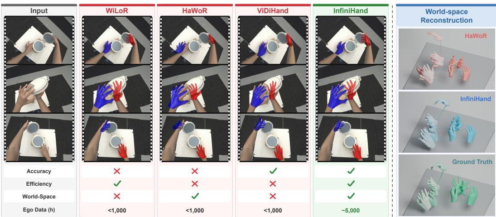
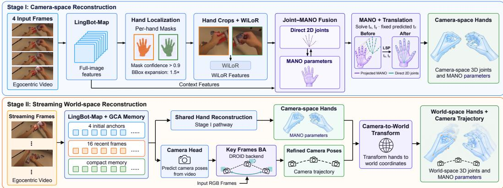
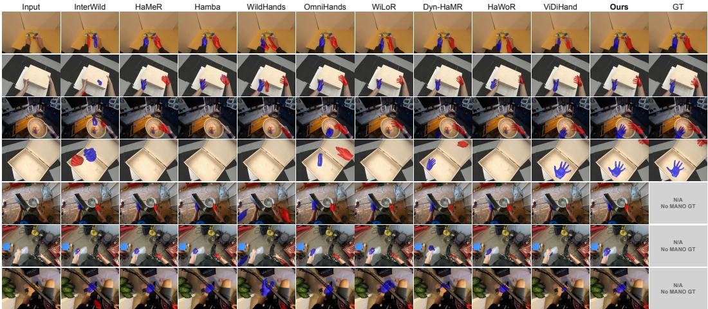
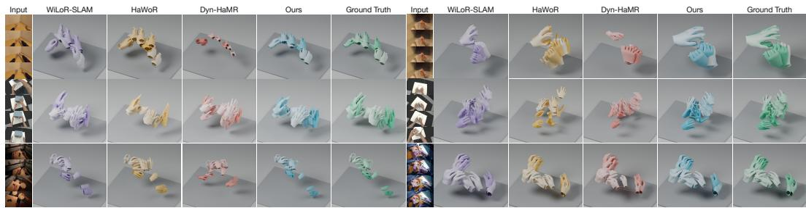
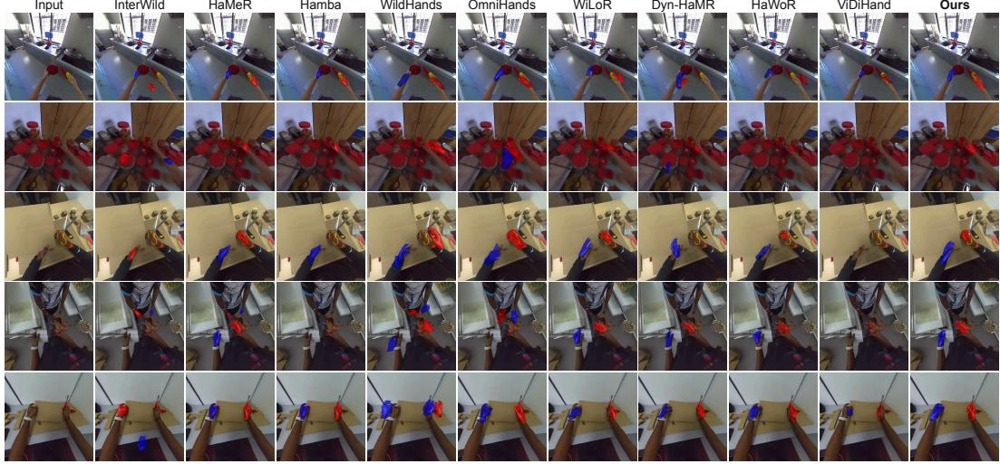
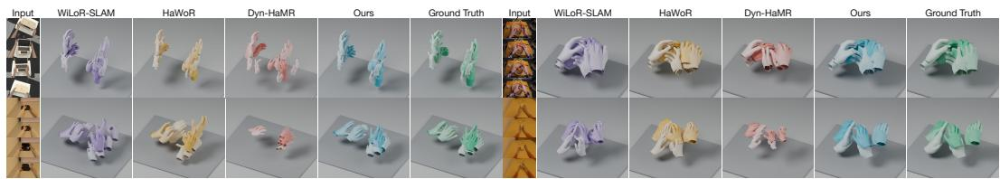

# INFINIHAND: STREAMING WORLD-SPACE HAND MOTION ESTIMATION FROM EGOCENTRIC VIDEO

Kerui Ren1,2 Kaiwen Song1,3 Weiguang Zhao1,4 Yuxi Wang5 Yufei Liu2 Bo Dai6 Haoyu Guo1 Chunhua Shen7,1 Mulin Yu1 Tao Lu1 Junting Dong1

1Shanghai Artificial Intelligence Laboratory, 2Shanghai Jiao Tong University,

3University of Science and Technology of China, 4University of Liverpool,

5Nanyang Technological University, 6The University of Hong Kong, 7Zhejiang University

  
Figure 1: InfiniHand is a streaming feed-forward framework for accurate and efficient worldspace hand estimation, pretrained on approximately 5,000 hours of egocentric video. Project page: https://infinihand.github.io/.

## ABSTRACT

World-space hand motion estimation from egocentric video requires recovering 3D articulated hand geometry while tracking camera egomotion. Existing approaches heavily rely on cascading independent hand pose estimators and SLAM systems, resulting in error accumulation, complex pipelines, and severe computational overhead. To address these limitations, we present InfiniHand, an endto-end streaming feed-forward framework that jointly estimates MANO parameters, camera trajectories, and hand locations directly from uncalibrated egocentric video. InfiniHand integrates persistent spatiotemporal memory with handcentered visual features, explicitly coupling camera motion with local hand geometry within a unified architecture. We train InfiniHand in two progressive stages by first learning robust camera-space hand priors and then extending to streaming world-space reconstruction. To support this process, we aggregate a pretraining corpus of approximately 5,000 hours of egocentric data across multiple public datasets. Extensive evaluations demonstrate that InfiniHand outperforms state-ofthe-art baselines on in-domain benchmarks, achieving a 21.4% reduction in ARC-TIC PA-p compared to ViDiHand while substantially mitigating world-space drift. Furthermore, InfiniHand generalizes robustly to in-the-wild videos and operates at 11.19 FPS, delivering more than twice the throughput of HaWoR.

## 1 INTRODUCTION

Egocentric video captures diverse human movements and complex hand–object interactions from the first-person perspective, where recovering hand motion in a shared world coordinate system transforms raw visual observations into actionable geometric demonstrations for embodied learning (Hoque et al., 2025). These demonstrations enable training world action models via humanto-robot motion transfer (Li et al., 2026a) and facilitate in-context robot imitation conditioned on retrieved human examples (Papagiannis et al., 2025). However, unconstrained in-the-wild videos rarely come paired with the ground-truth 3D hand poses and camera trajectories necessary to anchor movement within physical environments. Bridging this gap demands a scalable framework for rapid, high-fidelity world-space hand reconstruction, which is a critical prerequisite for downstream embodied learning.

Conventional world-space hand motion estimation pipelines rely on separate models for hand localization, MANO (Romero et al., 2017) parameter prediction, and camera trajectory estimation. Ha-WoR (Zhang et al., 2025), for example, combines hand detection and tracking, a dedicated cameraspace hand reconstruction network, and DROID-SLAM (Teed & Deng, 2021) with Metric3D (Yin et al., 2023) for metric camera motion estimation. Coordinating these components introduces substantial computational and engineering overhead, while detection jitter, camera tracking drift, and scale inconsistencies can propagate through the pipeline and compromise world-space reconstruction. Beyond these architectural constraints, established estimators such as WiLoR (Potamias et al., 2024) and HaWoR (Zhang et al., 2025) lack extensive pretraining on diverse, unconstrained egocentric videos, rendering generalization to complex interactions and rapid camera motion a persistent bottleneck. Collectively, these drawbacks hinder accurate and efficient hand motion reconstruction from in-the-wild egocentric videos.

To address these limitations, we present InfiniHand, a streaming feed-forward framework that jointly predicts hand locations, MANO (Romero et al., 2017) parameters, and camera trajectories within a unified architecture. Built upon a streaming 3D foundation model (Chen et al., 2026), InfiniHand establishes a shared spatiotemporal representation to couple global camera motion with local hand articulation. Specifically, as each frame arrives, the model leverages full-image geometric context to first predict hand masks for precise localization. Guided by these masks, it crops local geometric features and fuses them with hand-centered appearance features to regress MANO parameters. Concurrently, the model tracks camera poses in a streaming fashion, supplemented by a lightweight, sparse bundle adjustment (BA) for rapid post-optimization. To power this framework, we aggregate existing public egocentric datasets with MANO or 3D keypoint annotations, designing a dedicated data processing pipeline to filter out noise and convert diverse sources into a unified, high-quality format. Driven by a two-stage training strategy on this curated dataset, Infini-Hand achieves rapid, robust world-space hand motion reconstruction, generalizing seamlessly even to complex, in-the-wild video sequences.

We summarize our primary contributions as follows:

• We propose a streaming feed-forward framework that unifies hand localization, MANO parameter prediction, and camera trajectory estimation, enabling fast and efficient worldspace hand motion reconstruction.

• We aggregate and clean existing public egocentric datasets into a standardized, high-quality corpus, paired with a dedicated two-stage training scheme to effectively optimize the model.

• Extensive experiments demonstrate that InfiniHand achieves SOTA accuracy in worldspace hand motion estimation with remarkable efficiency. Evaluations on in-the-wild videos further confirm its strong generalization in complex real-world scenarios.

## 2 RELATED WORK

Hand Motion Reconstruction. Hand motion reconstruction has evolved from isolated hand mesh recovery to modeling temporal interactions and trajectories. HaMeR (Pavlakos et al., 2024) leverages large transformers for single-image estimation, whereas WiLoR (Potamias et al., 2024) integrates localization with detailed mesh recovery in unconstrained images. Meanwhile, Hamba (Dong et al., 2024) introduces graph-guided state-space modeling for joint spatial relations, and Wild-Hands (Prakash et al., 2023) targets egocentric reconstruction. While these methods strengthen local hand estimation, they fail to jointly recover camera motion and world-space trajectories.

Beyond single-hand recovery, InterWild (Moon, 2023) decouples per-hand reconstruction from relative translation estimation to bridge domain gaps. OmniHands (Lin et al., 2024) leverages spatiotemporal reasoning to reconstruct interacting hands, while ViDiHand (Wang et al., 2026) adapts video diffusion priors with hand-overlay supervision for temporally coherent egocentric geometry. However, world-space motion recovery additionally requires disentangling hand movement from camera egomotion. To address this, current approaches like HaWoR (Zhang et al., 2025) rely on egocentric SLAM with motion infilling, whereas Dyn-HaMR (Yu et al., 2025) employs multi-stage optimization combining camera tracking and interacting-hand priors.

Streaming 3D Reconstruction. Reconstructing scene geometry and camera motion from video has traditionally relied on simultaneous localization and mapping (SLAM), where visual tracking is coupled with bundle adjustment. Classic frameworks like ORB-SLAM2 (Mur-Artal & Tardos, 2017)´ combine sparse feature tracking with keyframe-based loop closure, whereas DROID-SLAM (Teed & Deng, 2021) replaces handcrafted features with learned recurrent updates and differentiable dense bundle adjustment. Learning-augmented SLAM systems further enhance this pipeline by incorporating feed-forward geometric priors. For instance, MASt3R-SLAM (Murai et $\mathrm { { a l . } }$ , 2024) builds tracking and global optimization around two-view 3D reconstruction models, VGGT-SLAM (Maggio et al., 2025) constructs submaps via feed-forward predictions and aligns them through projective optimization with loop-closure constraints, and ${ \bf M } ^ { 3 }$ (Ren et al., 2026) augments multi-view foundation models with dense matching heads for monocular Gaussian splatting SLAM. While these hybrid pipelines benefit from learned priors, they still rely on explicit optimization for cross-view consistency. In contrast, purely feed-forward architectures maintain geometric context natively within the network without post-hoc optimization. For instance, LoGeR (Zhang et al., 2026) processes video chunks by combining sliding-window attention with test-time-training memory to preserve both fine details and long-range consistency. Similarly, LingBot-Map (Chen et al., 2026) deploys a streaming context transformer equipped with anchor context, a pose-reference window, and trajectory memory for incremental reconstruction over extended sequences.

## 3 METHOD

Fig. 2 presents the overall pipeline of InfiniHand, a streaming framework for joint estimation of articulated hand motion and camera parameters from egocentric video. Given an input RGB sequence $\boldsymbol { \mathcal { T } } = \{ \mathbf { I } _ { t } \} _ { t = 1 } ^ { T } ,$ , the model predicts camera parameters $\begin{array} { r } { \hat { \mathcal { P } } = \{ \hat { P } _ { t } \} _ { t = 1 } ^ { T } , } \end{array}$ , where ${ \hat { P } } _ { t } = ( { \hat { \mathbf { K } } } _ { t } , { \hat { \mathbf { R } } } _ { t } , { \hat { \mathbf { u } } } _ { t } )$ denotes camera intrinsics and the camera-to-world pose. We use $s \in \{ \mathrm { L } , \mathrm { R } \}$ to index hand side and superscripts h, $\mathrm { c } ,$ and w to denote hand, camera, and world coordinate systems, respectively. Simultaneously, it estimates the articulated state of each hand s as MANO (Romero et al., 2017) pose $\hat { \mathbf { e } } _ { t } ^ { s } \in \mathbb { R } ^ { 1 5 \times 3 }$ , shape $\hat { \beta } _ { t } ^ { s } \in \mathbb { R } ^ { 1 0 }$ , global orientation $\hat { \Phi } _ { t } ^ { \mathrm { w } , s } \in \mathbb { R } ^ { 3 }$ , and root translation $\hat { \mathbf { t } } _ { t } ^ { \mathrm { w } , s } \in \mathbb { R } ^ { 3 }$ . The model first predicts hand-frame geometry, converts it to camera coordinates, and then obtains worldspace motion using the estimated camera trajectory. Specifically, Sec. 3.1 details data preparation and curation, Sec. 3.2 introduces camera-space hand localization and reconstruction and Sec. 3.3 presents joint streaming estimation alongside sparse geometric refinement.

## 3.1 DATA PREPROCESSING

We construct a comprehensive training corpus of approximately 5,000 hours by aggregating nine public hand-interaction datasets: ARCTIC (Fan et al., 2023), HOT3D (Banerjee et al., 2025), EgoDex (Hoque et al., 2025), DexYCB (Chao et al., 2021), HO3D (Hampali et al., 2020), H2O-3D (Hampali et al., 2022), EgoVerse (Punamiya et al., 2026), EgoLive (Li et al., 2026b), and Xperience-10M (Ropedia, 2026). Video frames are uniformly sampled at 10 FPS. Where explicit MANO annotations are absent, we fit the MANO model to the provided 3D hand keypoints and temporally align the fitted parameters with the sampled frames. To generate spatial supervision, we render the left- and right-hand MANO meshes to produce per-hand segmentation masks, from which tight bounding boxes are subsequently derived. Following standardization of handedness con ventions and coordinate systems, each sample comprises an RGB image, camera-space MANO parameters and 3D joints, per-hand masks, and bounding boxes. For sequences featuring ground-truth camera trajectories, we retain camera pose annotations and transform camera-space hand parameters into a shared world coordinate frame, establishing supervision for joint hand and camera trajectory reconstruction.

  
Figure 2: Overview of InfiniHand. Stage I learns hand localization and MANO reconstruction from geometric and appearance features, transforming hand-frame predictions into camera coordinates. Stage II jointly estimates hands and camera trajectories with streaming memory, followed by sparse bundle adjustment for camera refinement and world-space reconstruction.

Upon standardizing the corpus, we observe that certain source annotations remain inconsistent with visual hand states, most prominently in EgoDex. To purge these noisy labels, we utilize Sapiens 2 (Khirodkar et al., 2026) to estimate 2D hand keypoints and align them with the projected 2D locations of annotated MANO joints under standardized topologies. Prior to evaluation, low-confidence detections, invalid hand associations, and anatomically implausible poses are filtered out. For each hand, joint-wise pixel errors are normalized by the bounding-box extent, averaged per frame, and summarized using the 90th percentile error over the sequence. Consequently, sequences exceeding the error threshold for either hand are discarded, whereas uncertain cases are set aside for manual inspection. In total, this cleaning process removes roughly 30–40% of the candidate training data. Lastly, we organize the curated corpus into two stages based on supervision availability: Stage I uses all valid camera-space hand annotations, while Stage II incorporates the subset containing camera trajectories for world-space joint supervision.

## 3.2 CAMERA-SPACE HAND RECONSTRUCTION

Hand localization. Our hand localization module leverages full-image geometric features from the pretrained LingBot-Map backbone (Chen et al., 2026) to identify left- and right-hand regions. The module comprises a Dense Prediction Transformer (DPT) (Ranftl et al., 2021) feature decoder and a two-channel convolutional mask head. We initialize the decoder from a pretrained depth head, retaining its feature projections, multi-scale resizing, and coarse-to-fine RefineNet (Lin et al., 2017) fusion, while replacing the final depth prediction layer with a randomly initialized mask head. Given intermediate backbone features $\{ \mathbf { F } _ { t } ^ { ( \ell ) } \} _ { \ell \in \mathcal { S } }$ extracted from four selected layers, the module computes

$$
\mathbf { D } _ { t } = \mathcal { D } _ { \mathrm { D P T } } \big ( \{ \mathbf { F } _ { t } ^ { ( \ell ) } \} _ { \ell \in \mathcal { S } } \big ) , \qquad [ \hat { \mathbf { M } } _ { t } ^ { \mathrm { L } } , \hat { \mathbf { M } } _ { t } ^ { \mathrm { R } } ] = \sigma \big ( \mathcal { H } _ { \mathrm { m a s k } } ( \mathbf { D } _ { t } ) \big ) ,\tag{1}
$$

where $\mathcal { H } _ { \mathrm { m a s k } }$ upsamples the decoded features $\mathbf { D } _ { t }$ to the input image resolution, and $\sigma ( \cdot )$ denotes the element-wise sigmoid function. The localization objective combines binary cross-entropy and Dice losses:

$$
\mathcal { L } _ { \mathrm { m a s k } } = \lambda _ { \mathrm { B C E } } \mathcal { L } _ { \mathrm { B C E } } ( \hat { \bf M } , { \bf M } ) + \lambda _ { \mathrm { D i c e } } \mathcal { L } _ { \mathrm { D i c e } } ( \hat { \bf M } , { \bf M } ) .\tag{2}
$$

Validity flags ignore missing annotations to avoid false negative supervision. Subsequently, thresholded masks are converted into expanded bounding boxes $\mathbf { \bar { b } } _ { t } ^ { s }$ for hand reconstruction.

Hand reconstruction. For each hand box $\mathbf { b } _ { t } ^ { s }$ , we extract aligned geometric and appearance features. A geometric adapter A crops and re-embeds the backbone patch features $\mathbf { F } _ { t }$ into a patch grid, while a WiLoR encoder (Potamias et al., 2024) concurrently processes the corresponding RGB crop to capture fine-grained visual details. Both branches share the same cropping conventions, including horizontal flipping for left-hand canonicalization. The concatenated dual-stream features are then fused via a 1 × 1 convolutional layer:

$$
\mathbf { G } _ { t } ^ { s } = \mathcal { A } ( \mathbf { F } _ { t } , \mathbf { b } _ { t } ^ { s } ) , \quad \mathbf { A } _ { t } ^ { s } = \mathcal { E } _ { \mathrm { W i L o R } } \big ( \mathrm { C r o p } ( \mathbf { I } _ { t } , \mathbf { b } _ { t } ^ { s } ) \big ) , \quad \mathbf { Z } _ { t } ^ { s } = \mathrm { C o n v } _ { 1 \times 1 } \big ( [ \mathbf { G } _ { t } ^ { s } ; \mathbf { A } _ { t } ^ { s } ] \big ) .\tag{3}
$$

Driven by the fused representation $\mathbf { Z } _ { t } ^ { s }$ , the MANO head regresses hand parameters in a local coordinate frame ${ \mathrm { h } } ,$ defined by the virtual crop camera. In parallel, an auxiliary head estimates 2D landmarks from $\mathbf { Z } _ { t } ^ { s }$ to provide spatial grounding constraints. Omitting the frame index t and hand side s for conciseness, the predictions are expressed as:

$$
\begin{array} { r } { ( \hat { \Theta } , \hat { \beta } , \hat { \Phi } ^ { \mathrm { h } } , \hat { \ell } _ { \mathrm { z } } ) = \mathcal { H } _ { \mathrm { M A N O } } ( \mathbf { Z } ) , \qquad \hat { \bf p } = \mathcal { H } _ { \mathrm { 2 D } } ( \mathbf { Z } ) , \qquad \hat { t } _ { \mathrm { z } } ^ { \mathrm { h } } = \exp ( \hat { \ell } _ { \mathrm { z } } ) . } \end{array}\tag{4}
$$

After reversing left-hand canonicalization, the MANO decoder (Romero et al., 2017) maps the predicted pose, shape, and orientation into translation-free 3D joints $\bar { \mathbf { J } } ^ { \mathrm { h } }$ . To recover the remaining lateral translation $( \hat { t } _ { \mathrm { x } } ^ { \mathrm { h } } , \hat { t } _ { \mathrm { y } } ^ { \mathrm { h } } )$ within the hand frame, we follow ViDiHand (Wang et al., 2026) by aligning the projected 3D joints with the predicted 2D landmarks $\hat { \mathbf { p } } ^ { \mathrm { p i x } }$ and root depth $\hat { t } _ { \mathrm { z } } ^ { \mathrm { h } }$ via differentiable least-squares projection (LSP), which solves for lateral translation while keeping the predicted depth fixed:

$$
( \hat { t } _ { \mathrm { x } } ^ { \mathrm { h } } , \hat { t } _ { \mathrm { y } } ^ { \mathrm { h } } ) = \arg \operatorname* { m i n } _ { a , b } \sum _ { j \in \mathcal { V } } \left\| \pi \big ( \bar { \bf J } _ { j } ^ { \mathrm { h } } + [ a , b , \hat { t } _ { \mathrm { z } } ^ { \mathrm { h } } ] ^ { \top } ; { \bf K } ^ { \mathrm { h } } \big ) - \hat { \bf p } _ { j } ^ { \mathrm { p i x } } \right\| _ { 2 } ^ { 2 } ,\tag{5}
$$

where $\mathbf { K } ^ { \mathrm { h } }$ is the virtual crop-camera intrinsic matrix, $\pi ( \cdot ; { \bf K } ^ { \mathrm { h } } )$ is the perspective projection, $\hat { \mathbf { p } } _ { j } ^ { \mathrm { p i x } }$ are the predicted 2D landmarks in crop pixels, and V represents valid joints with positive depth.

With the recovered translation, we obtain the complete hand-frame MANO representation and transform its global orientation and translation into the original camera coordinate system:

$$
\operatorname { R o t } ( \hat { \Phi } ^ { \mathrm { c } } ) = \mathbf { R } _ { \mathrm { h  \mathrm { c } } } ^ { \top } \operatorname { R o t } ( \hat { \Phi } ^ { \mathrm { h } } ) , \qquad \hat { \mathbf { t } } ^ { \mathrm { c } } = \mathbf { R } _ { \mathrm { h  \mathrm { c } } } ^ { \top } \hat { \mathbf { t } } ^ { \mathrm { h } } .\tag{6}
$$

Here $\mathbf { R } _ { \mathrm { h  c } }$ rotates from the original camera to the virtual hand camera, and Rot(·) converts an axis-angle vector to its rotation matrix via the Rodrigues formula.

For training losses, the 2D landmark head is first supervised via a mean $L _ { 1 }$ loss $ { \mathcal { L } } _ { \mathrm { 2 D } }$ computed over valid joints in normalized crop coordinates. Concurrently, the ${ \bf M A N O }$ head combines pose, shape, orientation, translation, 3D joint, and reprojection supervision. Global orientation, translation, and 3D joints are compared in the original camera frame c, while local pose and shape are frame-invariant and reprojection uses the corresponding image coordinates:

$$
\mathcal { L } _ { \mathrm { M A N O } } = \lambda _ { \mathrm { g } } \mathcal { L } _ { \mathrm { o r i e n t } } + \lambda _ { \theta } \mathcal { L } _ { \mathrm { p o s e } } + \lambda _ { \beta } \mathcal { L } _ { \mathrm { s h a p e } } + \lambda _ { \mathrm { t } } \mathcal { L } _ { \mathrm { t r a n s } } + \lambda _ { \mathrm { J } } \mathcal { L } _ { \mathrm { j o i n t s } } ^ { \mathrm { c } } + \lambda _ { \mathrm { r } } \mathcal { L } _ { \mathrm { r e p r o j } } .\tag{7}
$$

In Stage I, each head is optimized separately on available camera-space ground truth. Detailed formulations of all loss terms are elaborated in Appendix B.

## 3.3 WORLD-SPACE HAND RECONSTRUCTION

Joint streaming training. In Stage II, we integrate the pretrained hand modules with the camera pose head to jointly optimize the localization, 2D landmark, MANO, and camera heads. Training is performed on video clips consisting of four anchor frames followed by two consecutive 16-frame windows, forming a $\mathrm { ~ 1 ~ 4 ~ + ~ 1 6 ~ \times ~ 2 ~ }$ temporal layout. The streaming state persists across adjacent windows within a clip and is reset between independent clips. Ground-truth and predicted bounding boxes are sampled in $\mathrm { ~ a ~ 1 ~ : ~ 1 ~ }$ ratio, exposing hand reconstruction to realistic localization noise while retaining direct supervision from clean crops. Specifically, this streaming memory state $\mathcal { M } _ { k } = ( \mathcal { M } _ { \mathrm { a n c h o r } } \mathbf { , } \mathcal { W } _ { k } , \mathcal { T } _ { k } )$ is managed via the Geometric Context Attention (GCA) mechanism (Chen et al., 2026), which integrates anchor features $\mathcal { M } _ { \mathrm { a n c h o r } }$ , a recent dense-feature window $\mathcal { W } _ { k } .$ and compressed trajectory memory $\mathcal { T } _ { k }$ . Here, anchor features establish a shared reference frame, the dense window captures fine-grained local correspondences, and trajectory tokens preserve historical context after their corresponding dense features are evicted. Formally, for window k, the backbone updates its geometric features and memory state as:

$$
( \mathbf { F } _ { k } , \mathcal { M } _ { k } ) = \mathcal { B } _ { \mathrm { G C A } } ( \mathbf { I } _ { k } , \mathcal { M } _ { k - 1 } ) .\tag{8}
$$

From this updated feature representation $\mathbf { F } _ { k }$ , the camera and hand modules decode predictions for each frame t in this window:

$$
\hat { P } _ { t } = \mathcal { H } _ { \mathrm { c a m } } ( \mathbf { F } _ { k } ) _ { t } , \quad \hat { \mathbf { M } } _ { t } = \mathcal { H } _ { \mathrm { l o c } } ( \mathbf { F } _ { k } ) _ { t } , \quad \hat { y } _ { t } ^ { s } = \mathcal { H } _ { \mathrm { r e c } } ( \mathbf { I } _ { t } , \mathbf { F } _ { t } , \mathbf { b } _ { t } ^ { s } ) ,\tag{9}
$$

where ${ \hat { P } } _ { t } = ( { \hat { \mathbf { K } } } _ { t } , { \hat { \mathbf { R } } } _ { t } , { \hat { \mathbf { u } } } _ { t } )$ and $\hat { \mathcal { V } } _ { t } ^ { s } = ( \hat { \mathbf { p } } _ { t } ^ { s } , \hat { \mathbf { \Theta } } _ { t } ^ { s } , \hat { \beta } _ { t } ^ { s } , \hat { \Phi } _ { t } ^ { c , s } , \hat { \mathbf { t } } _ { t } ^ { \mathrm { c } , s } )$ collect the camera and hand predictions. The localization and reconstruction modules follow Sec. 3.2, including hand-to-camera conversion. Subsequently, the global orientation and translation are transformed from camera coordinates into the first-anchor world frame:

$$
\operatorname { R o t } ( \hat { \Phi } _ { t } ^ { \mathrm { w } , s } ) = \hat { \mathbf { R } } _ { t } \operatorname { R o t } ( \hat { \Phi } _ { t } ^ { \mathrm { c } , s } ) , \qquad \hat { \mathbf { t } } _ { t } ^ { \mathrm { w } , s } = \hat { \mathbf { R } } _ { t } \hat { \mathbf { t } } _ { t } ^ { \mathrm { c } , s } + \hat { \mathbf { u } } _ { t } .\tag{10}
$$

Meanwhile, local articulated pose and shape remain unchanged under this transformation, completing the world-space MANO representation. Finally, for supervision, predictions and targets use the same anchor transformation and sample-level spatial normalization $\tilde { \mathbf { x } } = \mathbf { x } / \kappa$ , where $\kappa > 0$ is the sample-level normalization scale.

For training losses, we combine 2D landmark, mask, camera-space MANO, world-space joint, temporal, and camera supervision:

$$
\begin{array} { r } { \mathcal { L } _ { \mathrm { j o i n t } } = \lambda _ { \mathrm { c a m } } \mathcal { L } _ { \mathrm { c a m e r a } } + \lambda _ { \mathrm { w } } \mathcal { L } _ { \mathrm { j o i n t s } } ^ { \mathrm { w } } + \lambda _ { \mathrm { t e m p } } \mathcal { L } _ { \mathrm { t e m p } } + \mathcal { L } _ { \mathrm { M A N O } } + \lambda _ { \mathrm { 2 D } } \mathcal { L } _ { \mathrm { 2 D } } + \mathcal { L } _ { \mathrm { m a s k } } . } \end{array}\tag{11}
$$

Here, $\mathcal { L } _ { \mathrm { M A N O } }$ retains the camera-space supervision defined in Sec. 3.2, while $\mathcal { L } _ { \mathrm { j o i n t s } } ^ { \mathrm { w } }$ constrains the reconstructed joints in the shared world frame. Specifically, the camera loss $\mathcal { L } _ { \mathrm { { c a m e r a } } } ^ { \mathrm { { \check { \alpha } } } }$ combines absolute pose and field-of-view supervision with relative-motion supervision between valid frame pairs. Meanwhile, $\mathcal { L } _ { \mathrm { t e m p } }$ enforces temporal consistency across camera predictions, MANO parameters, hand masks, and 2D landmarks. Each loss term is evaluated conditionally based on annotation availability. Further loss details are detailed in Appendix B.

Sparse bundle adjustment. Although trajectory memory preserves long-range context, dense historical features are inevitably compressed beyond the anchor and recent windows. Consequently, fine-grained geometric constraints from earlier observations are not explicitly revisited during optimization, leading to residual drift over extended sequences. To address this, we integrate a DROID bundle-adjustment backend (Teed & Deng, 2021) into streaming prediction, enforcing explicit crossframe constraints to correct long-term drift efficiently. Instead of optimizing over the entire frame history, we maintain a binary keyframe pool that balances local temporal continuity with long-range geometric constraints. By selectively retaining keyframes for sparse refinement, BA can revisit past observations and reduce cumulative camera drift. The refined camera poses are subsequently used to transform local hand predictions into a unified world coordinate system. Implementation details and pool update rules are elaborated in Appendix C.

## 4 EXPERIMENTS

## 4.1 EXPERIMENTAL SETUP

Datasets & Metrics. For camera-space evaluation, we follow ViDiHand (Wang et al., 2026) and use 34 test scenes from ARCTIC (Fan et al., 2023), 10 from HOT3D (Banerjee et al., 2025), and 166 from HOI4D (Liu et al., 2022). We additionally evaluate on 100 test scenes from EgoDex (Hoque et al., 2025) to cover more diverse scenarios. ARCTIC, HOT3D, and EgoDex also support our world-space evaluation. We further assess in-the-wild reconstruction qualitatively on Ego4D (Grau man et al., 2022) test videos. For hand detection, we report Frame Accuracy (FAcc), Recall, and F1 score based on hand presence. For camera-space reconstruction, we evaluate MP-p, PA-p, EPE-p, GO-p, and $\mathrm { C T - p } _ { \mathsf { i } }$ , which measure root-relative 3D joint error, Procrustes-aligned 3D joint error, 2D projection error, global orientation error, and camera-space wrist position error, respectively. The suffix -p denotes that penalties are incorporated for missed hands. For world-space reconstruction, we report PA-MPJPE, W-MPJPE, and WA-MPJPE to measure 3D joint error after per-hand, perframe alignment, without additional alignment, and after a single sequence-level alignment shared by both hands, respectively. Detailed metric definitions are provided in Appendix A.

Baselines. For camera-space reconstruction, we compare with InterWild (Moon, 2023), HaMeR (Pavlakos et al., 2024), Hamba (Dong et al., 2024), WildHands (Prakash et al., 2023),

Table 1: Camera-space quantitative comparison. Evaluating detection and camera-space hand motion metrics across four benchmarks, InfiniHand consistently yields the lowest PA-p. Bold and underlined denote best and second-best results.
<table><tr><td rowspan="2">Method</td><td colspan="7">ARCTIC</td><td colspan="7">HOT3D</td></tr><tr><td>FAcc↑ Recall↑</td><td>F1↑</td><td></td><td></td><td></td><td>MP-p↓ PA-p↓ EPE-p↓ GO-p↓ CT-p↓</td><td></td><td>FAcc↑ Recall↑</td><td></td><td>F1↑</td><td></td><td>MP-p↓ PA-p↓ EPE-p↓ GO-p↓ CT-p↓</td><td></td><td></td><td></td></tr><tr><td>InterWild</td><td>0.878</td><td>0.943</td><td>0.959</td><td>30.82</td><td>15.95</td><td>53.89</td><td>25.39 0.097</td><td></td><td>0.669 0.881</td><td>0.868</td><td>77.17</td><td></td><td>24.81</td><td>71.48</td><td>58.50</td><td>0.213</td></tr><tr><td>HaMeR</td><td>0.875</td><td>0.943</td><td>0.957</td><td>29.20</td><td>14.60</td><td>65.29</td><td>24.91</td><td>0.095</td><td>0.692</td><td>0.904</td><td>0.883</td><td>68.31</td><td>21.46</td><td>59.08</td><td>49.64</td><td>0.102</td></tr><tr><td>Hamba</td><td>0.833</td><td>0.912</td><td>0.941</td><td>31.23</td><td>17.17</td><td>87.05</td><td>27.82</td><td>0.110</td><td>0.632</td><td>0.828</td><td>0.853</td><td>71.73</td><td>29.62</td><td>107.63</td><td>56.53</td><td>0.128</td></tr><tr><td>WildHands</td><td>0.879</td><td>0.946</td><td>0.960</td><td>25.70</td><td>13.94</td><td>50.52</td><td>22.32</td><td>0.058</td><td>0.655</td><td>0.863</td><td>0.844</td><td>52.79</td><td>28.95</td><td>111.44</td><td>53.93</td><td>0.157</td></tr><tr><td>OmniHands</td><td>0.866</td><td>0.949</td><td>0.954</td><td>29.67</td><td>14.20</td><td>51.51</td><td>24.58</td><td>0.087</td><td>0.649</td><td>0.895</td><td>0.868</td><td>63.28</td><td>22.68</td><td>68.44</td><td>49.12</td><td>0.133</td></tr><tr><td>WiLoR</td><td>0.919</td><td>0.951</td><td>0.974</td><td>22.01</td><td>11.87</td><td>71.53</td><td>17.36</td><td>0.075</td><td>0.827</td><td>0.897</td><td>0.937</td><td>30.97</td><td>19.98</td><td>72.98</td><td>25.75</td><td>0.098</td></tr><tr><td>Dyn-HaMR</td><td>0.842</td><td>0.918</td><td>0.951</td><td>27.90</td><td>17.02</td><td>85.72</td><td>25.95</td><td>0.121</td><td>0.614</td><td>0.811</td><td>0.802</td><td>74.21</td><td>38.20</td><td>171.62</td><td>43.85</td><td>0.571</td></tr><tr><td>HaWoR</td><td>0.700</td><td>0.817</td><td>0.895</td><td>45.36</td><td>26.38</td><td>158.06</td><td>43.33</td><td>0.149</td><td>0.348</td><td>0.499</td><td>0.654</td><td>71.40</td><td>66.03</td><td>327.29</td><td>79.35</td><td>0.262</td></tr><tr><td>ViDiHand</td><td>0.997</td><td>0.999</td><td>0.999</td><td>21.67</td><td>9.82</td><td>12.41</td><td>14.64</td><td>0.047</td><td>0.948</td><td>0.974</td><td>0.983</td><td>21.51</td><td>11.38</td><td>14.95</td><td>15.83</td><td>0.040</td></tr><tr><td>Ours</td><td>0.993</td><td>0.996</td><td>0.998</td><td>17.09</td><td>7.72</td><td>23.13</td><td>12.80</td><td>0.044</td><td>0.916</td><td>0.981</td><td>0.971</td><td></td><td></td><td></td><td></td><td></td></tr><tr><td></td><td></td><td></td><td></td><td></td><td></td><td></td><td></td><td></td><td></td><td></td><td></td><td>25.52</td><td>11.10</td><td>17.02</td><td>15.49</td><td>0.059</td></tr><tr><td rowspan="3">Method</td><td></td><td colspan="4"></td><td></td><td colspan="8"></td><td></td><td></td></tr><tr><td colspan="2"></td><td></td><td></td><td>EgoDex</td><td></td><td></td><td></td><td></td><td></td><td></td><td></td><td>HOI4D</td><td></td><td></td><td></td></tr><tr><td>FAcc↑ Recall↑</td><td></td><td>F1↑</td><td></td><td></td><td></td><td></td><td>MP-p↓ PA-p↓ EPE-p↓ GO-p↓ CT-p↓</td><td></td><td>FAcc↑ Recall↑</td><td>F1↑</td><td></td><td>MP-p↓ PA-p↓ EPE-p↓ GO-p↓ CT-p↓</td><td></td><td></td><td></td></tr><tr><td>InterWild</td><td>0.937</td><td>1.000</td><td>0.983</td><td>69.34</td><td>30.00</td><td>153.42</td><td>65.83</td><td>0.204</td><td>0.731</td><td>0.922</td><td>0.864</td><td>53.07</td><td>22.91</td><td>80.55</td><td>41.74</td><td>0.228</td></tr><tr><td>HaMeR</td><td>0.949</td><td>0.984</td><td>0.985</td><td>57.67</td><td>16.49</td><td>53.62</td><td>41.42</td><td>0.129</td><td>0.731</td><td>0.923</td><td>0.864</td><td>44.48</td><td>21.58</td><td>79.49</td><td>33.56</td><td>0.187</td></tr><tr><td>Hamba</td><td>0.710</td><td>0.824</td><td>0.896</td><td>65.68</td><td>31.66</td><td>188.48</td><td>64.86</td><td>0.170</td><td>0.710</td><td>0.885</td><td>0.849</td><td>47.16</td><td>25.92</td><td>115.79</td><td>37.39</td><td>0.204</td></tr><tr><td>WildHands</td><td>0.932</td><td>0.966</td><td>0.979</td><td>48.64</td><td>17.32</td><td>66.15</td><td>42.60</td><td>0.107</td><td>0.730</td><td>0.924</td><td>0.864</td><td>45.62</td><td>23.60</td><td>82.25</td><td>45.65</td><td>0.159</td></tr><tr><td>OmniHands</td><td>0.937</td><td>1.000</td><td>0.983</td><td>49.49</td><td>17.56</td><td>64.49</td><td>43.77</td><td>0.125</td><td>0.655</td><td>0.937</td><td>0.834</td><td>44.26</td><td>18.69</td><td>70.66</td><td>34.39</td><td>0.108</td></tr><tr><td>WiLoR</td><td>0.887</td><td>0.940</td><td>0.968</td><td>48.29</td><td>19.59</td><td>91.55</td><td>40.02</td><td>0.137</td><td>0.962</td><td>0.966</td><td>0.972</td><td>33.71</td><td>14.90</td><td>41.58</td><td>25.53</td><td>0.115</td></tr><tr><td>Dyn-HaMR</td><td>0.942</td><td>0.971</td><td>0.984</td><td>41.67</td><td>15.12</td><td>39.55</td><td>30.79</td><td>0.083</td><td>0.750</td><td>0.863</td><td>0.845</td><td>45.10</td><td>29.26</td><td>144.64</td><td>40.18</td><td>0.258</td></tr><tr><td>HaWoR</td><td>0.838</td><td>0.913</td><td>0.954</td><td>33.39</td><td>18.99</td><td>96.86</td><td>28.90</td><td>0.127</td><td>0.869</td><td>0.864</td><td>0.919</td><td>47.33</td><td>28.85</td><td>135.75</td><td>43.09</td><td>0.139</td></tr><tr><td>ViDiHand</td><td>0.911</td><td>0.950</td><td>0.974</td><td>42.33</td><td>17.22</td><td>65.05</td><td>33.28</td><td>0.303</td><td>0.984</td><td>0.991</td><td>0.990</td><td>30.09</td><td>13.96</td><td>24.46</td><td>23.42</td><td>0.117</td></tr><tr><td>Ours</td><td>0.961</td><td>0.997</td><td>0.995</td><td>16.43</td><td>7.29</td><td>24.08</td><td>15.51</td><td>0.031</td><td>0.989</td><td>0.993</td><td>0.991</td><td>33.64</td><td>12.11</td><td>22.75</td><td>23.00</td><td>0.136</td></tr></table>

Table 2: World-space quantitative comparison. We evaluate world-space hand motion and trajectory metrics across three benchmarks, with InfiniHand achieving the lowest W-MPJPE.
<table><tr><td>Method</td><td colspan="3">ARCTIC</td><td colspan="3">HOT3D</td><td colspan="3">EgoDex</td></tr><tr><td></td><td>PA-MPJPE↓ W-MPJPE↓ WA-MPJPE↓</td><td></td><td></td><td>PA-MPJPE↓ W-MPJPE↓ WA-MPJPE↓</td><td></td><td></td><td>PA-MPJPE↓ W-MPJPE↓ WA-MPJPE↓</td><td></td><td></td></tr><tr><td>WiLoR-SLAM</td><td>7.23</td><td>65.86</td><td>46.31</td><td>6.46</td><td>106.77</td><td>45.20</td><td>10.25</td><td>96.02</td><td>40.95</td></tr><tr><td>HaWoR</td><td>9.03</td><td>95.39</td><td>45.45</td><td>5.86</td><td>93.70</td><td>35.02</td><td>10.36</td><td>103.85</td><td>35.31</td></tr><tr><td>Dyn-HaMR</td><td>10.85</td><td>114.10</td><td>63.60</td><td>10.17</td><td>296.72</td><td>132.08</td><td>11.58</td><td>78.41</td><td>37.11</td></tr><tr><td>Ours</td><td>7.07</td><td>59.21</td><td>43.59</td><td>5.71</td><td>87.37</td><td>35.76</td><td>4.91</td><td>28.77</td><td>16.47</td></tr></table>

OmniHands (Lin et al., 2024), WiLoR (Potamias et al., 2024), Dyn-HaMR (Yu et al., 2025), Ha-WoR (Zhang et al., 2025), and ViDiHand (Wang et al., 2026). For world-space reconstruction, we compare with HaWoR, Dyn-HaMR, and WiLoR-SLAM. WiLoR-SLAM transforms WiLoR hand predictions into world coordinates using DROID-SLAM (Teed & Deng, 2021) camera poses scaled by Metric3D v2 (Hu et al., 2024).

Implementation details. Stage I and Stage II are trained for 300k and 100k optimization steps, respectively, using a global batch size of 64 and the AdamW (Loshchilov & Hutter, 2019) optimizer with a weight decay of 0.01. Stage I processes 4-frame clips, setting learning rates to $1 0 ^ { - \hat { 4 } }$ for the mask and joint heads and $5 \times 1 \bar { 0 } ^ { - 5 }$ for the MANO head. Stage II employs the 36-frame layout $( 4 + 1 6 \times 2 )$ , using a learning rate of $3 \times 1 0 ^ { - 5 }$ for the camera head and $\mathrm { i 0 ^ { - 5 } }$ for all other trainable modules. All learning rates follow linear warmup with cosine annealing, and global gradient norms are clipped at 1.0. Full-resolution images are processed at $3 7 8 \times 5 1 8 ( \bar { H ^ { } } { \times } \bar { W } )$ , while hand bounding boxes are expanded by 1.5× and resized to 256 × 256 for the crop branch.

  
Figure 3: Camera-space qualitative comparison. InfiniHand recovers both hands without missed detections while producing precise hand motion under severe occlusion and in-the-wild scenes.

  
Figure 4: World-space qualitative comparison. Visual results on diverse datasets show that our reconstructed articulation and trajectories achieve the highest fidelity to ground truth.

## 4.2 CAMERA-SPACE RESULTS ANALYSIS

Table 1 and Fig. 3 demonstrate robust hand reconstruction capabilities across both in-domain and out-of-domain scenarios. Notably, InfiniHand achieves the lowest PA-p across all four datasets, reducing the error relative to ViDiHand (Wang et al., 2026) from 9.82 to 7.72 mm on ARCTIC (a 21.4% reduction) and from 17.22 to 7.29 mm on EgoDex (a 57.7% reduction). Qualitatively, indomain comparisons highlight precise finger articulation and reliable recovery under severe hand occlusions. For in-the-wild sequences lacking ground-truth MANO annotations, InfiniHand preserves plausible hand geometry and accurate image alignment under heavy clutter and unusual viewpoints, whereas ViDiHand exhibits visible degradation, highlighting superior cross-dataset generalization.

## 4.3 WORLD-SPACE RESULTS ANALYSIS

Table 2 and Fig. 4 demonstrate superior world-space placement and relative motion tracking. InfiniHand achieves the lowest W-MPJPE across all three datasets, reducing errors from 65.86 to 59.21 mm (10.1%) on ARCTIC compared to WiLoR-SLAM (Potamias et al., 2024; Teed & Deng, 2021) and from 78.41 to 28.77 mm (63.3%) on EgoDex compared to Dyn-HaMR (Yu et al., 2025). Lower WA-MPJPE scores further confirm that trajectory fidelity persists after sequence-level alignment. Qualitatively, InfiniHand preserves hand scale, inter-hand spacing, and curved motion trajectories with minimal drift. Specifically, our reconstruction avoids spatial displacement (Fig. 4, topleft) and aligns two-hand orientations more faithfully with the reference trajectory (bottom-right). These visualizations confirm faithful relative motion alongside accurate absolute placement.

Table 3: Quantitative ablation study on ARCTIC. Results show the contributions of appearance features, translation recovery, sparse BA, joint training, and hand localization.
<table><tr><td>Variant</td><td colspan="3">Detection</td><td colspan="5">Camera-space</td><td colspan="3">World-space</td></tr><tr><td></td><td>FAcc↑ Recall↑</td><td></td><td>F1↑</td><td>MP-p↓ PA-p↓ EPE-p↓</td><td></td><td></td><td>GO-p↓</td><td></td><td></td><td></td><td>CT-p↓ PA-MPJPE↓ W-MPJPE↓ WA-MPJPE↓</td></tr><tr><td>w/o WiLoR Features</td><td>0.993</td><td>0.996</td><td>0.998</td><td>33.31</td><td>10.91</td><td>32.89</td><td>22.08</td><td>0.087</td><td>7.46</td><td>60.36</td><td>45.12</td></tr><tr><td>w/o LSP</td><td>0.993</td><td>0.996</td><td>0.998</td><td>18.63</td><td>8.02</td><td>26.30</td><td>12.97</td><td>0.064</td><td>7.21</td><td>59.57</td><td>44.35</td></tr><tr><td>w/o BA</td><td>0.993</td><td>0.996</td><td>0.998</td><td>17.09</td><td>7.72</td><td>23.13</td><td>12.80</td><td>0.044</td><td>7.07</td><td>80.48</td><td>51.20</td></tr><tr><td>w/o Stage II</td><td>0.985</td><td>0.989</td><td>0.990</td><td>17.29</td><td>7.81</td><td>23.56</td><td>13.01</td><td>0.045</td><td>7.40</td><td>185.76</td><td>111.05</td></tr><tr><td>w/o Mask Head</td><td>0.700</td><td>0.817</td><td>0.895</td><td>33.31</td><td>25.50</td><td>167.66</td><td>36.97</td><td>0.143</td><td>7.43</td><td>60.39</td><td>45.26</td></tr><tr><td>Full Model</td><td>0.993</td><td>0.996</td><td>0.998</td><td>17.09</td><td>7.72</td><td>23.13</td><td>12.80</td><td>0.044</td><td>7.07</td><td>59.21</td><td>43.59</td></tr></table>

## 4.4 EFFICIENCY ANALYSIS

InfiniHand achieves the highest prediction throughput among the compared methods, reaching 11.19 FPS. This significantly outperforms existing baselines, including WiLoR-SLAM (Potamias et al., 2024; Teed & Deng, 2021) (8.53 FPS), HaWoR (Zhang et al., 2025) (5.48 FPS), and Dyn-HaMR (Yu et al., 2025) (0.81 FPS), yielding a 2.04× speedup over HaWoR. This efficiency is achieved by reusing streaming features and overlapping model execution across temporal windows. Specifically, two primary workers run in a pipeline, where the first worker processes the upcoming 16-frame window using four-anchor context, while the second worker simultaneously decodes hand and camera predictions for the prior window. This parallel workflow reduces idle wait time between feature extraction and decoding. In full-system execution, a third worker runs sparse bundle adjustment in the background whenever the binary keyframe pool exceeds its capacity threshold, de coupling periodic refinement from window prediction while still incurring additional computation.

## 4.5 ABLATION STUDY

We conduct ablation studies on all 34 ARCTIC (Fan et al., 2023) test scenes, as reported in Table 3. (1) Removing WiLoR features nearly doubles MP-p, from 17.09 to 33.31 mm, highlighting the importance of hand-centered appearance for detailed reconstruction. (2) Replacing LSP with direct translation regression degrades translation accuracy and image-space alignment, supporting the use of projection constraints for hand placement. (3) Disabling sparse BA increases W-MPJPE from 59.21 to 80.48 mm while leaving camera-space metrics unchanged, demonstrating its contribution to global reconstruction accuracy. (4) Omitting Stage II increases W-MPJPE from 59.21 to 185.76 mm and WA-MPJPE from 43.59 to 111.05 mm despite only minor changes in camera-space errors, emphasizing the importance of joint hand–camera training for world-space motion estimation. (5) Replacing the learned mask head with HaWoR masks substantially degrades detection and increases PA-p from 7.72 to 25.50 mm, underscoring the role of reliable localization in hand motion reconstruction.

## 5 LIMITATIONS

While InfiniHand achieves accurate world-space 3D hand reconstruction, there remains clear room for further improvement across several key technical aspects. In terms of scale recovery, the underlying LingBot-Map framework lacks inherent metric scale, requiring an auxiliary post-processing alignment model whose downstream estimation errors can inevitably propagate to predicted hand positions and global motion trajectories. Regarding data coverage, high-quality egocentric datasets featuring complex, large-amplitude two-hand interactions and camera dynamics remain scarce, restricting generalization to unconstrained in-the-wild sequences with rapid viewpoint changes, severe occlusions, and intermittent hand visibility. On the supervision front, monocular reconstruction pipelines often inherit time-varying scale drift from derived monocular annotations, creating temporally inconsistent training targets that compromise long-sequence trajectory accuracy and temporal smoothness despite global scale alignment.

## 6 CONCLUSION

We present InfiniHand, a streaming feed-forward framework for jointly estimating hand locations, MANO parameters, and camera trajectories from egocentric video. To power this architecture, we aggregate approximately 5,000 hours of public video into a clean, large-scale training corpus, followed by a two-stage training scheme that develops precise MANO recovery and aligns world-space hand and camera motions. Extensive evaluations across in-domain benchmarks and out-of-domain videos demonstrate strong reconstruction quality and generalization, validating the value of scaling up diverse egocentric supervision. Beyond accuracy, the streaming design achieves more than twice the inference throughput of HaWoR under standard timing protocols. Collectively, these advances enable faster and more reliable 3D annotation of egocentric video, unlocking downstream applications in dexterous data augmentation, human-to-robot motion transfer, and manipulation policy learning. By converting abundant human video into structured 3D hand-motion supervision, Infini-Hand offers a scalable path toward data generation for embodied intelligence.

## AI USE STATEMENT

In this work, we used generative AI tools for assisting with translation. We have not used generative AI tools for designing research methods and experiments, implementing methodologies, interpreting results, proposing or refining hypotheses, cleaning and reformatting datasets, or supporting qualitative and thematic data analysis, and generating synthetic datasets, proposing mathematical claims, providing key elements for proving mathematical claims, and assisting in writing proofs are not applicable to this work. Additionally, we used generative AI tools for summarizing or analyzing existing literature, and editing the manuscript to enhance readability. We have reviewed all AI-assisted work: translated or polished text was manually cross-checked sentence-by-sentence to ensure that the original intent remained uncompromised. We take responsibility for the final content of this work, including text, claims or artifacts produced with the aid of generative AI.

## REFERENCES

Prithviraj Banerjee, Sindi Shkodrani, Pierre Moulon, Shreyas Hampali, Shangchen Han, Fan Zhang, Linguang Zhang, Jade Fountain, Edward Miller, Selen Basol, Richard Newcombe, Robert Wang, Jakob Julian Engel, and Tomas Hodan. HOT3D: Hand and object tracking in 3d from egocentric multi-view videos. In Proceedings of the IEEE/CVF Conference on Computer Vision and Pattern Recognition, 2025.

Yu-Wei Chao, Wei Yang, Yu Xiang, Pavlo Molchanov, Ankur Handa, Jonathan Tremblay, Yashraj S. Narang, Karl Van Wyk, Umar Iqbal, Stan Birchfield, Jan Kautz, and Dieter Fox. DexYCB: A benchmark for capturing hand grasping of objects. In Proceedings of the IEEE/CVF Conference on Computer Vision and Pattern Recognition, 2021.

Lin-Zhuo Chen, Jian Gao, Shangzhan Zhang, Yihang Chen, Ka Leong Cheng, Yipengjing Sun, Liangxiao Hu, Nan Xue, Xing Zhu, Yujun Shen, Yao Yao, and Yinghao Xu. LingBot-Map: Geometric context transformer for streaming 3d reconstruction. arXiv preprint arXiv:2604.14141, 2026.

Haoye Dong, Aviral Chharia, Wenbo Gou, Francisco Vicente Carrasco, and Fernando De la Torre. Hamba: Single-view 3D Hand Reconstruction with Graph-guided Bi-Scanning Mamba. arXiv preprint arXiv:2407.09646, 2024.

Zicong Fan, Omid Taheri, Dimitrios Tzionas, Muhammed Kocabas, Manuel Kaufmann, Michael J. Black, and Otmar Hilliges. ARCTIC: A dataset for dexterous bimanual hand-object manipulation. In Proceedings ofthe IEEE/CVF Conference on Computer Vision and Pattern Recognition, 2023.

Kristen Grauman, Andrew Westbury, Eugene Byrne, Zachary Chavis, Antonino Furnari, Rohit Girdhar, Jackson Hamburger, Hao Jiang, Miao Liu, Xingyu Liu, Miguel Martin, Tushar Nagarajan, Ilija Radosavovic, Santhosh Kumar Ramakrishnan, Fiona Ryan, Jayant Sharma, Michael Wray, Mengmeng Xu, Eric Zhongcong Xu, Chen Zhao, Siddhant Bansal, Dhruv Batra, Vincent Cartillier, Sean Crane, Tien Do, Morrie Doulaty, Akshay Erapalli, Christoph Feichtenhofer, Adriano

Fragomeni, Qichen Fu, Abrham Gebreselasie, Cristina Gonzalez, James Hillis, Xuhua Huang, Yifei Huang, Wenqi Jia, Weslie Khoo, Jachym Kolar, Satwik Kottur, Anurag Kumar, Federico Landini, Chao Li, Yanghao Li, Zhenqiang Li, Karttikeya Mangalam, Raghava Modhugu, Jonathan Munro, Tullie Murrell, Takumi Nishiyasu, Will Price, Paola Ruiz Puentes, Merey Ramazanova, Leda Sari, Kiran Somasundaram, Audrey Southerland, Yusuke Sugano, Ruijie Tao, Minh Vo, Yuchen Wang, Xindi Wu, Takuma Yagi, Ziwei Zhao, Yunyi Zhu, Pablo Arbelaez, David Crandall, Dima Damen, Giovanni Maria Farinella, Christian Fuegen, Bernard Ghanem, Vamsi Krishna Ithapu, C. V. Jawahar, Hanbyul Joo, Kris Kitani, Haizhou Li, Richard Newcombe, Aude Oliva, Hyun Soo Park, James M. Rehg, Yoichi Sato, Jianbo Shi, Mike Zheng Shou, Antonio Torralba, Lorenzo Torresani, Mingfei Yan, and Jitendra Malik. Ego4D: Around the World in 3,000 Hours of Egocentric Video. In Proceedings of the IEEE/CVF Conference on Computer Vision and Pattern Recognition, 2022.

Shreyas Hampali, Mahdi Rad, Markus Oberweger, and Vincent Lepetit. HOnnotate: A method for 3d annotation of hand and object poses. In Proceedings of the IEEE/CVF Conference on Computer Vision and Pattern Recognition, 2020.

Shreyas Hampali, Sayan Deb Sarkar, Mahdi Rad, and Vincent Lepetit. Keypoint transformer: Solving joint identification in challenging hands and object interactions for accurate 3d pose estimation. In Proceedings of the IEEE/CVF Conference on Computer Vision and Pattern Recognition, 2022.

Ryan Hoque, Peide Huang, David J. Yoon, Mouli Sivapurapu, and Jian Zhang. EgoDex: Learning dexterous manipulation from large-scale egocentric video. arXiv preprint arXiv:2505.11709, 2025.

Mu Hu, Wei Yin, Chi Zhang, Zhipeng Cai, Xiaoxiao Long, Kaixuan Wang, Hao Chen, Gang Yu, Chunhua Shen, and Shaojie Shen. Metric3Dv2: A Versatile Monocular Geometric Foundation Model for Zero-shot Metric Depth and Surface Normal Estimation. arXiv preprint arXiv:2404.15506, 2024.

Rawal Khirodkar, He Wen, Julieta Martinez, Yuan Dong, Zhaoen Su, and Shunsuke Saito. Sapiens2. arXiv preprint arXiv:2604.21681, 2026.

Baoyu Li, Xinchen Yin, Mengying Lin, Yixin Zhang, and Danfei Xu. EgoWAM: World action models beyond pixels with in-the-wild egocentric human data. arXiv preprint arXiv:2607.08436, 2026a.

Yihang Li, Xuelong Wei, Jingzhou Luo, Yingjing Xiao, Yibo Bai, Guangyuan Zhou, Teng Zou, Chenguang Gui, Jiajun Wen, He Zhang, Kangliang Chen, Xing Pan, Shuaiyan Liu, Daming Wang, Tao An, Jiayi Li, Shibo Jin, Wanwan Zhang, Tianyu Wang, Boren Wei, Zhixuan Huang, Fangsheng Liu, Ruodai Li, Hui Zhang, Anson Li, Yicheng Gong, Peng Cao, Jiaming Liang, and Liang Lin. EgoLive: A large-scale egocentric dataset from real-world human tasks. arXiv preprint arXiv:2604.23570, 2026b.

Dixuan Lin, Yuxiang Zhang, Mengcheng Li, Wei Jing, Qi Yan, Qianying Wang, Yebin Liu, and Hongwen Zhang. OmniHands: Towards Robust 4D Hand Mesh Recovery via A Versatile Transformer. arXiv preprint arXiv:2405.20330, 2024.

Guosheng Lin, Anton Milan, Chunhua Shen, and Ian Reid. RefineNet: Multi-path refinement networks for high-resolution semantic segmentation. In Proceedings of the IEEE Conference on Computer Vision and Pattern Recognition, 2017.

Yunze Liu, Yun Liu, Che Jiang, Kangbo Lyu, Weikang Wan, Hao Shen, Boqiang Liang, Zhoujie Fu, He Wang, and Li Yi. HOI4D: A 4D Egocentric Dataset for Category-Level Human-Object Interaction. In Proceedings of the IEEE/CVF Conference on Computer Vision and Pattern Recognition, 2022.

Ilya Loshchilov and Frank Hutter. Decoupled weight decay regularization. In International Conference on Learning Representations, 2019.

Dominic Maggio, Hyungtae Lim, and Luca Carlone. VGGT-SLAM: Dense RGB SLAM Optimized on the SL(4) Manifold. arXiv preprint arXiv:2505.12549, 2025.

Gyeongsik Moon. Bringing Inputs to Shared Domains for 3D Interacting Hands Recovery in the Wild. arXiv preprint arXiv:2303.13652, 2023.

Raul Mur-Artal and Juan D. Tard´ os. ORB-SLAM2: An open-source SLAM system for monocular,´ stereo, and RGB-D cameras. IEEE Transactions on Robotics, 33(5):1255–1262, 2017.

Riku Murai, Eric Dexheimer, and Andrew J. Davison. MASt3R-SLAM: Real-Time Dense SLAM with 3D Reconstruction Priors. arXiv preprint arXiv:2412.12392, 2024.

Georgios Papagiannis, Norman Di Palo, Pietro Vitiello, and Edward Johns. R+X: Retrieval and execution from everyday human videos. In IEEE International Conference on Robotics and Automation, 2025.

Georgios Pavlakos, Dandan Shan, Ilija Radosavovic, Angjoo Kanazawa, David Fouhey, and Jitendra Malik. Reconstructing hands in 3d with transformers. In Proceedings of the IEEE/CVF Conference on Computer Vision and Pattern Recognition, 2024.

Rolandos Alexandros Potamias, Jinglei Zhang, Jiankang Deng, and Stefanos Zafeiriou. WiLoR: End-to-end 3d hand localization and reconstruction in the wild. arXiv preprint arXiv:2409.12259, 2024.

Aditya Prakash, Ruisen Tu, Matthew Chang, and Saurabh Gupta. 3D Hand Pose Estimation in Everyday Egocentric Images. arXiv preprint arXiv:2312.06583, 2023.

Ryan Punamiya, Simar Kareer, Zeyi Liu, Josh Citron, Ri-Zhao Qiu, Xiongyi Cai, Alexey Gavryushin, Jiaqi Chen, Davide Liconti, Lawrence Y. Zhu, Patcharapong Aphiwetsa, Baoyu Li, Aniketh Cheluva, Pranav Kuppili, Yangcen Liu, Dhruv Patel, Aidan Gao, Hye-Young Chung, Ryan Co, Renee Zbizika, Jeff Liu, Xiaomeng Xu, Haoyu Xiong, Geng Chen, Sebastiano Oliani, Wenkai Xuan, Chenyu Yang, Xi Wang, James Fort, Richard Newcombe, Josh Gao, Jason Chong, Garrett Matsuda, Aseem Doriwala, Marc Pollefeys, Robert Katzschmann, Xiaolong Wang, Shuran Song, Judy Hoffman, and Danfei Xu. EgoVerse: An egocentric human dataset for robot learning from around the world. arXiv preprint arXiv:2604.07607, 2026.

Rene Ranftl, Alexey Bochkovskiy, and Vladlen Koltun. Vision transformers for dense prediction.´ In Proceedings ofthe IEEE/CVF International Conference on Computer Vision, 2021.

Kerui Ren, Guanghao Li, Changjian Jiang, Yingxiang Xu, Tao Lu, Linning Xu, Junting Dong, Jiangmiao Pang, Mulin Yu, and Bo Dai. M3: Dense Matching Meets Multi-View Foundation Models for Monocular Gaussian Splatting SLAM. arXiv preprint arXiv:2603.16844, 2026.

Javier Romero, Dimitrios Tzionas, and Michael J. Black. Embodied hands: Modeling and capturing hands and bodies together. ACM Transactions on Graphics, 36(6):245:1–245:17, 2017.

Ropedia. Xperience-10M: A large-scale egocentric multimodal dataset with structured 3d/4d annotations. Hugging Face dataset, 2026. URL https://huggingface.co/datasets/ ropedia-ai/xperience-10m.

Zachary Teed and Jia Deng. DROID-SLAM: Deep visual SLAM for monocular, stereo, and RGB-D cameras. Advances in Neural Information Processing Systems, 34, 2021.

Yuxi Wang, Chengkai Jin, Yufei Liu, Wenqi Ouyang, Tianyi Wei, Zhiwei Zeng, Siyuan Huang, Zhiqi Shen, and Xingang Pan. The surprising effectiveness of video diffusion models for hand motion reconstruction. arXiv preprint arXiv:2606.30308, 2026.

Wei Yin, Chi Zhang, Hao Chen, Zhipeng Cai, Gang Yu, Kaixuan Wang, Xiaozhi Chen, and Chunhua Shen. Metric3D: Towards Zero-shot Metric 3D Prediction from A Single Image. arXiv preprint arXiv:2307.10984, 2023.

Zhengdi Yu, Stefanos Zafeiriou, and Tolga Birdal. Dyn-HaMR: Recovering 4d interacting hand motion from a dynamic camera. In Proceedings of the IEEE/CVF Conference on Computer Vision and Pattern Recognition, 2025.

Jinglei Zhang, Jiankang Deng, Chao Ma, and Rolandos Alexandros Potamias. HaWoR: World-space hand motion reconstruction from egocentric videos. arXiv preprint arXiv:2501.02973, 2025.

Junyi Zhang, Charles Herrmann, Junhwa Hur, Chen Sun, Ming-Hsuan Yang, Forrester Cole, Trevor Darrell, and Deqing Sun. LoGeR: Long-context geometric reconstruction with hybrid memory. arXiv preprint arXiv:2603.03269, 2026.

This supplementary material provides additional technical details and qualitative results to complement the main paper. Section A defines the detection, camera-space, and world-space metrics. Section B specifies the loss functions. Section C explains the binary keyframe pool for sparse bundle adjustment. Section D presents additional qualitative comparisons.

## A EVALUATION METRICS

Detection metrics. We follow ViDiHand (Wang et al., 2026) for prediction–target association. Projected MANO mesh boxes are matched greedily in descending IoU order, requiring identical handedness and IoU $> 0 . 1$ after enlarging target boxes by 10%. Matching is one-to-one. Predictions with an available presence score must exceed 0.5; unconditional tracker outputs are treated as positive. Unmatched target hands and predictions contribute FN and FP, respectively. A target is off-screen if none of its 21 joints projects inside the image at depth $> 0 . 0 1$ m; such targets and their matched predictions are excluded. Let $\mathcal { F }$ be frames containing at least one target hand, and let $\mathrm { F P } _ { t } ^ { \mathrm { o s } }$ and $\mathrm { F N } _ { t } ^ { \mathrm { o s } }$ be the remaining counts after off-screen exclusion. Then

$$
\mathrm { F A c c } = \frac { 1 } { | \mathcal { F } | } \sum _ { t \in \mathcal { F } } \mathbf { 1 } [ \mathrm { F P } _ { t } ^ { \mathrm { o s } } = 0 \ \land \ \mathrm { F N } _ { t } ^ { \mathrm { o s } } = 0 ] ,\tag{12}
$$

$$
{ \mathrm { R e c a l l } } = { \frac { \mathrm { T P } } { \mathrm { T P } + \mathrm { F N } } } , \qquad \mathrm { F 1 } = { \frac { \mathrm { 2 T P } } { \mathrm { 2 T P } + \mathrm { F P } + \mathrm { F N } } } .\tag{13}
$$

Counts are pooled across frames and hand sides. Correct side presence alone is insufficient: a spatially unmatched hand contributes a detection error.

Camera-space metrics. We use the detection-penalized geometry metrics of ViDiHand (Wang et al., 2026). Let $\hat { \mathbf { J } } _ { j } ^ { \mathrm { c } }$ and $\mathbf { J } _ { j } ^ { \mathrm { c } }$ be predicted and target joints in metres, with wrist index $j = 0$ and $J \ = \ 2 1$ . For a matched hand, set $\hat { \mathbf { Q } } _ { j } ~ = ~ \hat { \mathbf { J } } _ { j } ^ { \mathrm { c } } - \hat { \mathbf { J } } _ { 0 } ^ { \mathrm { c } }$ and $\mathbf { Q } _ { j } = \mathbf { J } _ { j } ^ { \mathrm { c } } - \mathbf { J } _ { 0 } ^ { \mathrm { c } }$ . The root-relative and Procrustes-aligned errors are

$$
e _ { \mathrm { M P } } = \frac { 1 } { J } \sum _ { j } \| \hat { \mathbf { Q } } _ { j } - \mathbf { Q } _ { j } \| _ { 2 } , \qquad e _ { \mathrm { P A } } = \frac { 1 } { J } \sum _ { j } \| A ^ { * } ( \hat { \mathbf { Q } } _ { j } ) - \mathbf { Q } _ { j } \| _ { 2 } ,\tag{14}
$$

where $A ^ { * }$ is the proper similarity transform minimizing squared joint distances for that hand. Let $\hat { \mathbf { R } } _ { \mathrm { h a n d } }$ and $\mathbf { R } _ { \mathrm { h a n d } }$ denote its predicted and target global rotations. Orientation and wrist-position errors are

$$
e _ { \mathrm { G O } } = \frac { 1 8 0 } { \pi } \operatorname { a r c c o s } \left( \mathrm { c l a m p } \left( \frac { \mathrm { t r } ( \hat { \bf R } _ { \mathrm { h a n d } } ^ { \top } { \bf R } _ { \mathrm { h a n d } } ) - 1 } { 2 } , - 1 , 1 \right) \right) ,\tag{15}
$$

$$
e _ { \mathrm { C T } } = \lVert \hat { \mathbf { J } } _ { 0 } ^ { \mathrm { c } } - \mathbf { J } _ { 0 } ^ { \mathrm { c } } \rVert _ { 2 } .\tag{16}
$$

The matching and off-screen exclusion rules are shared with the detection metrics. For metric $m \in$ {MP, PA, GO, CT}, the penalized mean is

$$
E _ { m \mathrm { - } \mathrm { p } } = \frac { \sum _ { i \in \mathcal { H } _ { \mathrm { m a t c h e d } } } e _ { m } ( i ) + \sum _ { i \in \mathcal { H } _ { \mathrm { m i s s e d } } } e _ { m } ^ { \mathrm { m i s s } } ( i ) } { | \mathcal { H } _ { \mathrm { m a t c h e d } } | + | \mathcal { H } _ { \mathrm { m i s s e d } } | } .\tag{17}
$$

Missed-hand MP and PA both use the unaligned canonical-hand joint error; GO uses the target’s rotation distance from identity, and CT uses the target wrist’s distance from the camera origin. MPp and PA-p are converted to millimetres, GO-p is in degrees, and $\mathrm { C T - p }$ is in metres. EPE-p is a joint-weighted pixel error over on-screen target joints U:

$$
\mathrm { E P E - p } = \frac { 1 } { | U | } \sum _ { ( i , j ) \in \mathcal { U } } \left\{ \operatorname* { m i n } \_ { } \left( \| \pi _ { \mathbf { K } } ( \hat { \mathbf { J } } _ { i , j } ^ { \mathrm { c } } ) - \pi _ { \mathbf { K } } ( \mathbf { J } _ { i , j } ^ { \mathrm { c } } ) \| _ { 2 } , D _ { i } \right) , \quad i \in \mathcal { H } _ { \mathrm { m a t c h e d } } , \right.\tag{18}
$$

where $D _ { i } = \sqrt { W _ { i } ^ { 2 } + H _ { i } ^ { 2 } }$ is the image diagonal. Target joints must project inside the image with depth above 0.01 m; predicted depth is floored at 0.01 m for projection. Thus detection and geometric errors use the same matched-hand set.

World-space metrics. World-space evaluation uses the same geometric matching and 21-joint ordering, with predictions and targets expressed in the complete scene’s first-camera frame. For matched hand-frame pairs H, define

$$
E ( A ) = \frac { 1 } { J | \mathcal { H } | } \sum _ { ( t , s ) \in \mathcal { H } } \sum _ { j } \| A _ { t , s } ( \hat { \mathbf { J } } _ { t , j } ^ { \mathrm { w } , s } ) - \mathbf { J } _ { t , j } ^ { \mathrm { w } , s } \| _ { 2 } .\tag{19}
$$

W-MPJPE uses the identity transform. PA-MPJPE fits a separate similarity transform for each handframe pair. WA-MPJPE uses one transform shared by both hands and all frames of the complete scene, obtained from

$$
( \alpha ^ { * } , \mathbf { R } ^ { * } , \mathbf { v } ^ { * } ) = \arg \operatorname* { m i n } _ { \alpha > 0 , \mathbf { R } \in \mathrm { S O } ( 3 ) , \mathbf { v } } \ \sum _ { ( t , s ) \in \mathcal { H } } \ \sum _ { j } \| \alpha \mathbf { R } \hat { \mathbf { J } } _ { t , j } ^ { \mathrm { w } , s } + \mathbf { v } - \mathbf { J } _ { t , j } ^ { \mathrm { w } , s } \| _ { 2 } ^ { 2 } .\tag{20}
$$

All three errors are reported in millimetres and aggregated with matched hand-frame weighting. Alignment is used only for the corresponding metric; it does not modify W-MPJPE or the saved predictions.

## B LOSS FUNCTIONS

All losses are averaged over valid annotations; an empty valid set contributes zero. For the mask, landmark, and MANO terms below, we write the per-mask, per-joint, or per-hand error and omit the outer sample average. Coordinate-wise and joint-wise normalization factors are retained explicitly. Predictions carry hats, and unhatted quantities are targets.

## B.1 MASK AND 2D LANDMARK LOSSES

For a valid hand mask containing P pixels, binary cross-entropy and soft Dice are

$$
\ell _ { \mathrm { B C E } } = - \frac { 1 } { P } \sum _ { p = 1 } ^ { P } \left[ M _ { p } \log \hat { M } _ { p } + ( 1 - M _ { p } ) \log ( 1 - \hat { M } _ { p } ) \right] ,\tag{21}
$$

$$
\ell _ { \mathrm { { D i c e } } } = 1 - { \frac { 2 \sum _ { p } { \hat { M } } _ { p } M _ { p } + 1 } { \sum _ { p } { \hat { M } } _ { p } + \sum _ { p } { M _ { p } } + 1 } } .\tag{22}
$$

BCE is evaluated from logits for numerical stability, while Dice uses sigmoid probabilities. Averaging each term over valid masks gives ${ \mathcal { L } } _ { \mathrm { m a s k } } = \lambda _ { \mathrm { B C E } } { \mathcal { L } } _ { \mathrm { B C E } } + \lambda _ { \mathrm { D i c e } } { \mathcal { L } } _ { \mathrm { D i c e } }$ . The landmark head is supervised directly in normalized crop coordinates:

$$
\mathcal { L } _ { \mathrm { 2 D } } = \| \hat { \mathbf { p } } - \mathbf { p } \| _ { 1 } .\tag{23}
$$

The valid set excludes missing, nonfinite, and out-of-range target landmarks.

## B.2 MANO RECONSTRUCTION LOSSES

Let $R ( \cdot ) = \operatorname { R o t } ( \cdot )$ convert an axis-angle vector to a rotation matrix, and let $d _ { \mathrm { S O ( 3 ) } }$ denote the rotation distance defined below. Orientation and local pose use

$$
\mathcal { L } _ { \mathrm { o r i e n t } } = d _ { \mathrm { S O ( 3 ) } } \Big ( R ( \hat { \Phi } ^ { \mathrm { c } } ) , R ( \Phi ^ { \mathrm { c } } ) \Big ) ,\tag{24}
$$

$$
\mathcal { L } _ { \mathrm { p o s e } } = \frac { 1 } { 1 5 } \sum _ { k = 1 } ^ { 1 5 } d _ { \mathrm { S O ( 3 ) } } \Big ( R ( \hat { \Theta } _ { k } ) , R ( \Theta _ { k } ) \Big ) .\tag{25}
$$

Shape and camera-frame MANO translation use coordinate-wise squared error:

$$
\mathcal { L } _ { \mathrm { s h a p e } } = \frac { 1 } { 1 0 } \| \hat { \pmb { \beta } } - \pmb { \beta } \| _ { 2 } ^ { 2 } , \qquad \mathcal { L } _ { \mathrm { t r a n s } } = \frac { 1 } { 3 } \| \hat { \mathbf { t } } ^ { \mathrm { c } } - \mathbf { t } ^ { \mathrm { c } } \| _ { 2 } ^ { 2 } .\tag{26}
$$

The 3D joint and reprojection terms are

$$
\mathcal { L } _ { \mathrm { j o i n t s } } ^ { \mathrm { c } } = \frac { 1 } { 3 } \| \hat { \mathbf { J } } ^ { \mathrm { c } } - \mathbf { J } ^ { \mathrm { c } } \| _ { 1 } , \qquad \mathcal { L } _ { \mathrm { r e p r o j } } = \| \bar { \boldsymbol { \pi } } _ { \mathbf { K } } ( \hat { \mathbf { J } } ^ { \mathrm { c } } ) - \mathbf { p } ^ { \mathrm { i m g } } \| _ { 1 } .\tag{27}
$$

Here $\bar { \pi } _ { \mathbf { K } }$ projects into normalized image coordinates and $\mathbf { p } ^ { \mathrm { i m g } }$ is the corresponding target. Validity is applied per joint; projections and targets use matching intrinsics and image normalization. Unlike $ { \mathcal { L } } _ { \mathrm { 2 D } }$ , reprojection supervises joints decoded from MANO. The six weighted components form $\mathcal { L } _ { \mathrm { M A N O } }$ as defined in Sec. 3.2.

## B.3 WORLD-SPACE JOINT AND CAMERA LOSSES

The camera loss groups the absolute and relative pose terms as ${ \mathcal { L } } _ { \mathrm { c a m e r a \atop \mathrm { ~ \left( \alpha ~ \alpha ~ \alpha ~ \alpha ~ \alpha ~ \alpha ~ \alpha ~ \alpha ~ \alpha ~ \right. ~ } ~ } } = ~ \alpha _ { \mathrm { a b s } } { \mathcal { L } } _ { \mathrm { a b s - p o s e } } ~ +$ $\alpha _ { \mathrm { r e l } } \mathcal { L } _ { \mathrm { r e l - p o s e } }$ . After applying the anchor transformation in Equation 10 and the same sample-level normalization to predictions and targets, the world-joint term compares the prediction with the dataset-provided joint annotations using a robust element-wise smooth- ${ \cal - L } _ { 1 }$ penalty $\rho _ { \epsilon }$ (summed over coordinates):

$$
\mathcal { L } _ { \mathrm { j o i n t s } } ^ { \mathrm { w } } = \frac { 1 } { N _ { \mathrm { J } } } \sum _ { t , s , j } m _ { t , s } ^ { \mathrm { J } } \rho _ { \epsilon } \left( \hat { \tilde { \mathbf { J } } } _ { t , j } ^ { \mathrm { w } , s } - \tilde { \mathbf { J } } _ { t , j } ^ { \mathrm { w } , s } \right) .\tag{28}
$$

Here $\rho _ { \epsilon } ( r ) = r ^ { 2 } / ( 2 \epsilon )$ for $| r | < \epsilon$ and $| r | - \epsilon / 2$ otherwise, and $m _ { t , s } ^ { \mathrm { J } }$ denotes hand validity and $N _ { \mathrm { J } }$ counts valid joint coordinates. Importantly, the target is derived from the original joint annotation rather than joints decoded from ground-truth MANO parameters.

The rotation distance is

$$
d _ { \mathrm { S O } ( 3 ) } ( \hat { \mathbf { R } } , \mathbf { R } ) = \operatorname { a r c c o s } \left[ \mathrm { c l a m p } \left( \frac { \mathrm { t r } ( \hat { \mathbf { R } } ^ { \top } \mathbf { R } ) - 1 } { 2 } , - 1 + \epsilon , 1 - \epsilon \right) \right] .\tag{29}
$$

The absolute-pose term supervises anchor-normalized camera translation, quaternion, and field of view. Because q and −q represent the same rotation, we first define the sign-aligned target

$$
\mathbf { q } _ { t } ^ { \star } = \left\{ \begin{array} { l l } { \mathbf { q } _ { t } , } & { \langle \hat { \mathbf { q } } _ { t } , \mathbf { q } _ { t } \rangle \geq 0 , } \\ { - \mathbf { q } _ { t } , } & { \mathrm { o t h e r w i s e } , } \end{array} \right.\tag{30}
$$

We then compute robust means over valid frames for $\widehat { \tilde { \mathbf { u } } } _ { t } - \tilde { \mathbf { u } } _ { t } , \hat { \mathbf { q } } _ { t } - \mathbf { q } _ { t } ^ { \star }$ , and $\hat { \mathbf { f } } _ { t } - \mathbf { f } _ { t }$ , where $\mathbf { f } _ { t }$ contains horizontal and vertical field-of-view angles and $\mathbf { q } _ { t }$ is a unit quaternion.

Equivalently, with $\rho _ { \epsilon }$ applied coordinate-wise and summed, the nine-coordinate absolute loss is

$$
\mathcal { L } _ { \mathrm { a b s - p o s e } } = \frac { 1 } { 9 | \mathcal { V } _ { \mathrm { c a m } } | } \sum _ { t \in \mathcal { V } _ { \mathrm { c a m } } } \left[ \rho _ { \epsilon } ( \hat { \tilde { \mathbf { u } } } _ { t } - \tilde { \mathbf { u } } _ { t } ) + \rho _ { \epsilon } ( \hat { \mathbf { q } } _ { t } - \mathbf { q } _ { t } ^ { \star } ) + \rho _ { \epsilon } ( \hat { \mathbf { f } } _ { t } - \mathbf { f } _ { t } ) \right] ,\tag{31}
$$

where $\mathcal { V } _ { \mathrm { c a m } }$ contains frames with valid camera annotations.

To constrain local camera motion independently of the anchor choice, the relative-pose term considers ordered pairs of distinct valid frames in the pose-reference window $\mathcal { W } _ { \mathrm { p o s e } }$ . Let $\mathbf { C } _ { t } = \left[ \begin{array} { l l } { \mathbf { R } _ { t } \ \mathbf { u } _ { t } } \\ { \mathbf { 0 } ^ { \top } } & { 1 } \end{array} \right]$ denote the homogeneous camera-to-world transform associated with $P _ { t }$ . For frames i and j in this window, we define

$$
\begin{array} { r } { { \bf C } _ { j  i } = { \bf C } _ { j } ^ { - 1 } { \bf C } _ { i } , } \end{array}\tag{32}
$$

and optimize

$$
\mathcal { L } _ { \mathrm { r e l - p o s e } } = \frac { 1 } { N _ { \mathrm { p a i r } } } \sum _ { \stackrel { i \neq j } { i , j \in \mathcal { W } _ { \mathrm { p o s e } } } } m _ { i } ^ { \mathrm { c a m } } m _ { j } ^ { \mathrm { c a m } } \left[ d _ { \mathrm { S O } ( 3 ) } ( \Delta \hat { \mathbf { R } } _ { j i } , \Delta \mathbf { R } _ { j i } ) + \lambda _ { \mathrm { r e l , u } } \left\| \Delta \hat { \mathbf { u } } _ { j i } - \Delta \mathbf { u } _ { j i } \right\| _ { 1 } \right] .\tag{33}
$$

Here ${ m } _ { t } ^ { \mathrm { c a m } }$ indicates camera validity, $N _ { \mathrm { p a i r } }$ counts valid ordered pairs, and $\Delta \mathbf { R } _ { j i }$ and $\Delta { \bf { u } } _ { j i }$ are the rotation and translation of $\mathbf { C } _ { j  i } .$ . The camera translations entering this term have already been normalized by κ and are not divided by the scale again.

Each term in $\mathcal { L } _ { \mathrm { j o i n t } }$ is evaluated only where its required supervision is available. Camera and worldjoint terms are omitted for samples without the corresponding valid annotations. The relative-pose term is active only when at least two valid poses are present.

## C BINARY KEYFRAME POOL FOR SPARSE BUNDLE ADJUSTMENT

We maintain a time-ordered pool $\mathcal { P } = \{ ( f _ { i } , b _ { i } ) \} _ { i = 1 } ^ { n }$ , where $f _ { i }$ stores a frame and its associated geometric state, and $b _ { i } \in \{ 0 , 1 \}$ records whether it has been retained after a previous BA selection. Each incoming frame is appended with $b _ { i } = 0$ . When $| \mathcal { P } | > N$ , we select every K-th pool entry, starting from the oldest:

$$
\begin{array} { r } { S = \{ f _ { 1 + m K } \mid m \geq 0 , 1 + m K \leq | \mathcal { P } | \} . } \end{array}\tag{34}
$$

The DROID-SLAM backend (Teed & Deng, 2021) first refines the selected camera poses. We then toggle the selected entries’ bits and remove every entry whose updated bit is zero:

$$
b _ { i } ^ { + } = b _ { i } \oplus { \bf 1 } [ f _ { i } \in \mathcal { S } ] , \qquad { \mathcal { P } } ^ { + } = \{ ( f _ { i } , b _ { i } ^ { + } ) \mid ( f _ { i } , b _ { i } ) \in \mathcal { P } , \ b _ { i } ^ { + } = 1 \} ,\tag{35}
$$

where ⊕ denotes binary exclusive-or. A newly selected frame changes from 0 to 1 and remains in the pool; a retained frame selected again changes from 1 to 0 and is retired after contributing to that BA update. Unselected retained frames remain available, while unselected new frames are discarded. Thus recent observations enter densely, whereas only sampled historical frames survive between refinement calls. Starting selection from the oldest entry also ensures that retained frames are eventually revisited and retired. This policy lets BA reuse historical constraints alongside recent observations without keeping a permanent set of old keyframes. The refined camera poses are used for world-space hand conversion; the hand predictor itself remains feed-forward.

The trigger is evaluated after new frames are inserted, and selection follows chronological pool order rather than a fixed stride in the original video. Refinement uses the selected frames before their retention flags are updated. Thus an old frame selected for retirement still contributes to that BA call. The trigger threshold N controls when refinement runs, while K controls sampling sparsity; this retention policy does not impose a strict exponential distribution over frame ages.

## D ADDITIONAL QUALITATIVE RESULTS

Figure 5 provides additional camera-space comparisons on Xperience-10M (Ropedia, 2026). Figure 6 provides additional world-space comparisons on ARCTIC (Fan et al., 2023), HOT3D (Banerjee et al., 2025), and EgoDex (Hoque et al., 2025). Selected clips illustrate behavior under changing visibility and viewpoint; numerical conclusions use the complete evaluated scenes.

Input  
InterWild  
HaMeR  
Hamba  
WildHands  
OmniHands  
WiLoR  
Dyn-HaMR  
HaWoR  
ViDiHand  
Ours  
  
Figure 5: Additional in-the-wild camera-space results. Comparisons on Ego4D and Xperience illustrate hand reconstruction under diverse viewpoints, occlusions, and interactions.

  
Figure 6: Additional world-space qualitative results. Comparisons on ARCTIC, HOT3D, and EgoDex show reconstructed hand configurations and motion across further sequences.