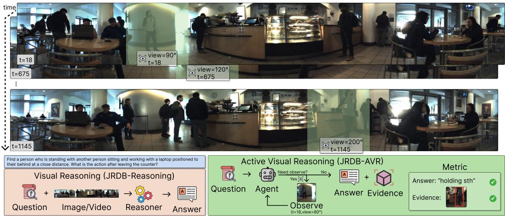
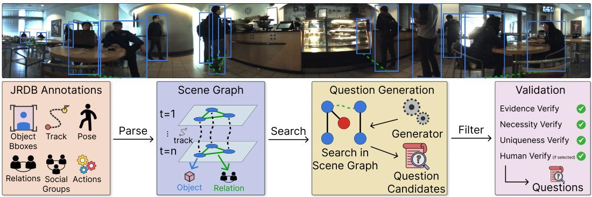
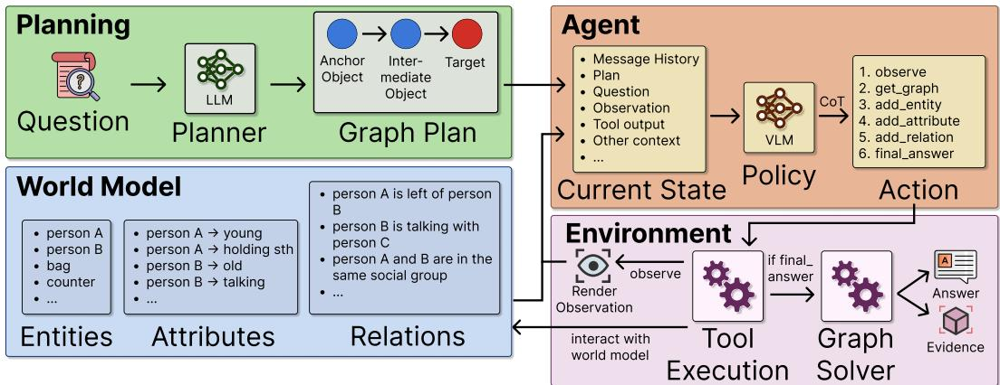

# JRDB-AVR: An Active Visual Reasoning Benchmark for Embodied Agents in Real-World Environments

Zhixi Cai∗† Monash University zhixi.cai@monash.edu

Fucai Ke∗ Monash University fucai.ke1@monash.edu

Maria Garcia de la Banda Monash University maria.garciadelabanda@monash.edu

Gholamreza Haffari Monash University gholamreza.haffari@monash.edu

Sukai Huang Monash University sukai.huang@monash.edu

Peter J. Stuckey Monash University peter.stuckey@monash.edu

Hamid Rezatofighi Monash University hamid.rezatofighi@monash.edu

## Abstract

In complex embodied visual reasoning scenarios, an agent often has only a limited field of view, and the evidence needed to answer a question may be distributed across time, viewpoint, and interacting objects. A model may therefore give a plausible answer without ever observing the relevant object, time, or view that supports it. Current visual reasoning benchmarks largely evaluate passive observations and final answers, overlooking settings that require active reasoning and evidence acquisition. We introduce JRDB-AVR, a benchmark derived from existing real-world JRDB robotics data through a structured question-generation engine that turns this gap into an explicit evaluation: an embodied agentic system receives a visual reasoning question, requests bounded observations by timestamp and viewing angle, and is evaluated on both the final answer and the grounded visual evidence supporting it. The benchmark contains diverse questions over multiple real-world environments involving temporal search, viewpoint selection, and human-oriented compositional reasoning. We also introduce JRDB-AVR-Agent, a reference active reasoning agentic method that maintains an explicit observation-grounded graphbased world model and answers through solving. Experiments reveal a substantial gap between answer accuracy and evidence accuracy in current baselines, showing that current VLMs can produce unsupported correct answers and that active evidence-aware evaluation is necessary for embodied visual reasoning. Code and benchmark are available at https://github.com/ControlNet/JRDB-AVR.

## 1 Introduction

Embodied agents often need to answer questions in environments that they cannot fully observe at once. Since a robot camera has a limited field of view, the evidence needed for reasoning may lie in another direction or appear at another time. Consider a robot in a crowded cafe asked whether the person near the counter was carrying a bag before joining a group. The question cannot be reduced to simply recognizing an object in one image: the required evidence may appear in an earlier frame, a different viewing angle, or a particular person among several visually similar people. In this setting, answer correctness alone is an unsafe signal for visual reasoning capability. A system can guess the right answer from priors or partial context while grounding it in the wrong person, time, or view, which is exactly the hallucination an embodied agent must avoid.

  
Figure 1: Overview of JRDB-AVR. Unlike passive visual reasoning, where relevant image/video observations are pre-selected and only the final answer is evaluated, JRDB-AVR requires an agent to actively observe across time and view angle, then evaluates both the answer and visual evidence.

These failure cases reveal a broader evaluation gap. In embodied visual reasoning, success depends not only on producing a correct answer, but on deciding where to look, when to look, and whether the acquired observation actually supports the answer. Existing video reasoning benchmarks evaluate passive-input capabilities [Hudson and Manning, 2019, Yi et al., 2019, Wu et al., 2021, Lei et al., 2018, 2020], and embodied human-scene datasets such as JRDB-Reasoning provide rich reasoning annotations over real-world robotic scenes [Jahangard et al., 2024, 2026]. However, these settings still largely evaluate reasoning with passive perception, and typically score the final answer rather than the supporting evidence. This setup can therefore overstate embodied visual reasoning ability, especially in complex real-world environments where an agent must resolve temporal ambiguity, choose the right viewpoint, and identify the correct person in a crowded scene.

This gap has become sharper as recent VLMs and tool-using agents produce increasingly accurate answers and multi-step trajectories [Li et al., 2023, Zhu et al., 2023, Bai et al., 2025b, Yao et al., 2023, Surís et al., 2023, Gao et al., 2024]. A correct answer or detailed reasoning trace is still not evidence that the agent inspected the right objects. Recent VLMs can answer plausibly from language priors, dataset bias, or partial visual context even when the relevant visual evidence is missing or incorrectly localized [Gou et al., 2025]. If evaluation fixes the observation in advance or scores only the final answer, unsupported success remains hard to distinguish from grounded reasoning. For active embodied systems, this is part of the task definition instead of a minor interpretability issue.

We therefore introduce JRDB-AVR, a benchmark for real-world embodied active visual reasoning derived from the existing JRDB dataset [Martín-Martín et al., 2023]. Creating real active embodied reasoning data is difficult because a live robot cannot simultaneously observe every direction and every moment. JRDB-AVR addresses this by repurposing JRDB panoramic robot videos into an observation interface: an agent receives a visual reasoning question and can request observations by timestamp and viewing angle. Instead of curating static fixed-view VQA examples, we construct JRDB-AVR using a refined question-generation pipeline that derives active reasoning questions from JRDB annotations [Jahangard et al., 2024, 2026, Ehsanpour et al., 2022, Le et al., 2024, Saadatnejad et al., 2023, Biswas et al., 2026, Vendrow et al., 2023]. JRDB-AVR formalizes active observation as the benchmark protocol, and is evaluated on both the final answer and the grounded bounding box as visual evidence. The benchmark focuses on multi-step active visual reasoning over real-world crowded scenes, including temporal search, viewpoint selection, and compositional multi-object reasoning. Figure 1 illustrates this shift in evaluation: rather than judging a model only by whether it can produce a plausible answer from partial context, JRDB-AVR asks whether the agent actively acquires the right observation and grounds its answer in visual evidence.

Table 1: Comparison with related visual reasoning benchmarks. We compare whether each benchmark requires temporal reasoning, spatial or viewpoint reasoning, the data domain and camera setting, whether observations can be actively selected, the form of localized visual evidence, and the final evaluation target. Time + View denotes active selection of both timestamp and viewing angle, while Time + BBox denotes evidence localized by timestamp and target bounding box.
<table><tr><td>Benchmark</td><td>Temporal</td><td>Spatial/View</td><td>Domain</td><td>Camera</td><td>Active Obs.</td><td>Evidence</td><td>Evaluation</td></tr><tr><td>GQA [Hudson and Manning, 2019]</td><td>X</td><td>√</td><td>Real</td><td>Static</td><td>X</td><td>X</td><td>Answer</td></tr><tr><td>CLEVRER [Yi et al., 2019]</td><td>√</td><td>X</td><td>Sim</td><td>Static</td><td>X</td><td>X</td><td>Answer</td></tr><tr><td>STAR [Wu et al., 2021]</td><td>√</td><td>√</td><td>Real</td><td>Static</td><td>X</td><td>X</td><td>Answer</td></tr><tr><td>MindCube [Wang et al., 2025]</td><td>X</td><td>√</td><td>Real</td><td>Static</td><td>×</td><td>X</td><td>Answer</td></tr><tr><td>VIEW2SPACE [Ke et al., 2026]</td><td>X</td><td>√</td><td>Sim</td><td>Static</td><td>X</td><td>BBox</td><td>Answer</td></tr><tr><td>JRDB-Reasoning [Jahangard et al., 2026]</td><td>√</td><td>√</td><td>Real</td><td>Moving</td><td>X</td><td>X</td><td>Answer</td></tr><tr><td>JRDB-AVR</td><td>√</td><td>√</td><td>Real</td><td>Moving</td><td>Time + View</td><td>Time + BBox</td><td>Answer + Evidence</td></tr></table>

To study how current VLM and agentic baselines perform under this benchmark, we introduce JRDB-AVR-Agent as a reference baseline for active reasoning on JRDB-AVR. JRDB-AVR-Agent converts each question into a structured graph plan, actively observes the scene, writes observation-grounded entities, attributes, and relations into an explicit world model, and answers by solving the resulting graph state. Current results show that answer performance and evidence performance can diverge substantially: models may obtain correct answers without providing correct visual support. Thus, answer-only evaluation obscures important embodied reasoning failures.

The contributions of this paper are:

1. We introduce JRDB-AVR, a benchmark for real-world embodied active visual reasoning, together with a benchmark generation engine that derives active reasoning questions from JRDB annotations. We also define an evaluation protocol and metrics that report answer, evidence, and combined correctness, making the answer-evidence gap explicit when correct answers rely on unsupported visual evidence.

2. We provide JRDB-AVR-Agent, a reference active reasoning baseline that uses a structured graph plan, an observation-grounded world model, and a graph solving method to produce answer-evidence predictions.

3. We present an important empirical finding from the current evaluation protocol: strong baselines can reach materially different answer and evidence performance, showing that active visual reasoning needs evidence-aware evaluation rather than answer accuracy alone.

## 2 Related Works

Visual reasoning benchmarks. Previous visual reasoning benchmarks have established protocols for testing compositional questions, temporal events, and evidence in fixed visual inputs [Ma et al., 2026]. For example, GQA emphasizes compositional question answering over images [Hudson and Manning, 2019], CLEVRER tests causal and temporal reasoning in synthetic videos [Yi et al., 2019], STAR targets situated video question answering [Wu et al., 2021], MindCube studies spatial mental modeling from limited views [Wang et al., 2025], and TVQA+ links questions to spatio-temporal evidence in video [Lei et al., 2020]. Recent grounded video QA evaluation also asks whether a correct answer is visually supported by the relevant evidence [Xiao et al., 2024, Ma et al., 2026, Ke et al., 2026, Du et al., 2026]. Temporal grounding and spatio-temporal video understanding benchmarks further study when events occur and where relevant evidence lies across clips [Shou et al., 2016, Buch et al., 2019, Wang et al., 2024b, Yang et al., 2025]. JRDB-based datasets bring this reasoning into crowded embodied scenes with social structure and robot-centric sensing [Jahangard et al., 2024, 2026]. However, existing benchmarks generally evaluate either reasoning over fixed visual inputs or grounding within already provided videos. As summarized in Table 1, JRDB-AVR changes the benchmark protocol: an agent must actively acquire observations in a real-world embodied environment, and the final prediction is evaluated by both answer correctness and whether the acquired evidence supports the answer.

  
Figure 2: Dataset generation pipeline for JRDB-AVR. Starting from JRDB panoramic videos and annotations, we organize object boxes, tracks, poses, relations, social groups, actions, etc into temporal scene graphs. Question generators search these scene graphs for active reasoning patterns and produce candidate questions, which are retained only after they pass evidence, necessity, uniqueness, and manual quality checks.

Visual reasoning methods. A common starting point for visual reasoning [Ke et al., 2025b] is to use general-purpose VLMs as monolithic predictors over fixed image or video inputs [Li et al., 2023, Zhu et al., 2023, Chen et al., 2024, Wang et al., 2024a, Bai et al., 2025b]. To improve interpretability and control, early compositional methods explicitly decomposed questions into modular networks or executable programs [Johnson et al., 2017]. More recent compositional pipelines expose intermediate programs, localized zoom-and-refinement stages, grounded actions, or tool calls [Tiong et al., 2022, Surís et al., 2023, Yu et al., 2025, Shen et al., 2023, Huang et al., 2026b, Lu et al., 2023, Gupta and Kembhavi, 2023]. Agentic and tool-integrated methods then extend this pattern toward multi-step reasoning with iterative action or tool use, feedback, memory, or explicit state [Yao et al., 2023, Gao et al., 2024, Gou et al., 2024, Ke et al., 2024, 2025a, Wu et al., 2025, Chen et al., 2025, Cai et al., 2025b,c, Ma et al., 2024, Chen et al., 2026], with related work also studying LLM-symbolic planning and Bayesian, hierarchical, and active goal recognition under uncertainty [Huang et al., 2025, Zhang et al., 2024, 2025, 2026b,a]. In parallel, neuro-symbolic and structured-world-model approaches use explicit intermediate representations of entities and relations to support multi-step reasoning [Yi et al., 2018, Kamali et al., 2025, Cai et al., 2025a, Huang et al., 2026a, Li et al., 2026]. These advances help motivate active visual reasoning, but they are usually evaluated on passive visual inputs. In contrast, JRDB-AVR makes active evidence acquisition part of the benchmark requirement. To instantiate this protocol, we provide JRDB-AVR-Agent as a reference baseline with question-to-graph planning, observation-grounded world model maintenance, and graph solving.

## 3 JRDB-AVR Benchmark

JRDB-AVR evaluates active visual reasoning in real-world embodied environments. Each task instance asks a system to answer a question while deciding which observations are needed, and then to return both the answer and its visual evidence. The benchmark is designed so that the correctness of the answer and of the evidence can diverge: a system may guess the right answer from priors or partial context, but still fail if the evidence person, frame, viewpoint, or box does not support that answer.

## 3.1 Dataset Generation

Figure 2 summarizes the data generation process from the raw source data to JRDB-AVR.

Source Data and Embodied Environments. JRDB-AVR builds on the JRDB video dataset [Martín-Martín et al., 2023], which includes crowded indoor and outdoor environments, person tracks, actions, spatial relations, and social context annotations [Vendrow et al., 2023, Ehsanpour et al., 2022, Le et al., 2024, Jahangard et al., 2024, 2026]. The benchmark is generated from complementary annotations provided by JRDB and its extension datasets. These include person identities, tracks, and bounding boxes from JRDB [Martín-Martín et al., 2023]; spatio-temporal actions from JRDB-Act [Ehsanpour et al., 2022]; human poses from JRDB-Pose; panoptic tracks from JRDB-PanoTrack [Le et al., 2024]; social-group and interaction annotations from JRDB-Social [Jahangard et al., 2024]; and human-object and geometric relations from JRDB-Reasoning [Jahangard et al., 2026].

Table 2: For each of the seven generators currently present in JRDB-AVR, the table provides a brief description of the generator, its question type and the metrics protocol of each question type.
<table><tr><td>Name</td><td>Description</td><td>Type</td><td>Evaluation Protocol</td></tr><tr><td>Chain 2-hop</td><td>Ask about the target with 2-hop entity relations. Extend the relational path to three</td><td rowspan="3">Multiple choice</td><td rowspan="3">Correct if the selected choice matches the ground truth.</td></tr><tr><td>Chain 3-hop Chain fork-join</td><td>hops before querying the target. Merge two relational branches from</td></tr><tr><td>Unique anchor</td><td>a shared entity before querying the target. Locate a target from conditions and</td></tr><tr><td>Long range</td><td>ask about a later state or action in another temporal location. Track temporally distant consequences or long-range</td><td></td><td></td></tr><tr><td>Chain hybrid</td><td>dependencies. Combine a spatial relation with temporal and viewpoint search to locate the target timestamp and view angle.</td><td>Timestamp and viewpoint</td><td>Correct if the predicted timestamp is within ±1 second of the ground truth and the wrapped viewpoint error is</td></tr><tr><td>Action boundary</td><td>Localize the timestamp at which an action begins.</td><td>Timestamp identification</td><td>within ±20°. Correct if the predicted frame is within ±1 second of the ground truth.</td></tr><tr><td>Action boundary</td><td>Localize the full temporal segment of an action.</td><td>Temporal localization</td><td>Correct if the predicted temporal segment has IoU ≥ 0.5 with the ground truth.</td></tr><tr><td>Long range</td><td>Predict a temporally defined numeric gap or count over a longer-range relationship.</td><td>Numeric value</td><td>Correct if the prediction-to-ground-truth ratio lies in [0.5, 2.0].</td></tr></table>

Scene Graph Generation. We first generate a scene graph from the JRDB annotations for each sequence (video in JRDB dataset) that supports controlled sub-graph search for question generation. This graph organizes tracked objects, relations, attributes, and timestamps together with the facts needed for question generation, including person attributes, actions over time, robot-relative geometry, person-to-person relations, person presence, and bounding boxes, from which viewpoint-specific evidence is derived. In this way, dataset generation becomes a subgraph-search process rather than free-form question generation.

Question Candidate Generation. We then generate question candidates by querying this scene graph for patterns that induce active reasoning. The proposed benchmark is built from seven VQA generators, summarized in Table 2. These generators create the main forms of active evidence search discussed in this work: localizing action temporal segments, following multi-hop relational paths, searching across time for a later state, and recovering a target from a unique anchor across time. Each question candidate is generated together with the benchmark fields needed for later evaluation, including the bounding boxes of evidence objects. Please refer to supplementary material for more details regarding question generators.

Question Candidate Validation and Quality Assurance. Question candidates are not kept simply because a subgraph is matched. To ensure data quality, after generation, we automatically rederive the stored answer from trusted JRDB annotations and retain only questions whose supporting evidence can be objectively recovered. This validation pass enforces evidence verifiability together with temporal necessity, multi-step necessity, view necessity, anchor uniqueness for unique-anchor rows, and hop necessity for chain questions. As a result, questions are removed when they remain answerable after perturbing the target time or collapsing an intermediate hop, as well as when their evidence cannot be evaluated reliably. Furthermore, the authors manually inspect a random subset of generated questions for verification.

## 3.2 Dataset Statistics

JRDB-AVR is generated from the 27 JRDB test sequences using the corresponding JRDB and extension-dataset annotations. The released benchmark contains 2,098 active VQA questions. These counts describe the current released benchmark and should not be read as an upper bound on all valid questions derivable from the source annotations. The generation engine can be used to derive additional active visual reasoning questions from the same source data.

## 3.3 Benchmark Protocol

Task Definition. A task session contains a question q and related metadata. The system receives q and may request observations before producing a final answer. A completed prediction contains the answer yˆ in the required format together with evidence ${ \hat { e } } ,$ represented as the target localization by timestamp and bounding box. The task is active because the system is not given one fixed complete view up front, and it must choose where and when to look before answering.

Observation Interface. The observation interface as a tool is observe(sequence, frame\_index, angle\_deg) $( o = O ( s , f , \theta ) )$ . It returns a 480×480 RGB cropped frame with some metadata rendered from stitched raw RGB JRDB videos $( 3 7 6 0 \times 4 8 0 .$ , 15FPS). However, typically the agent does not receive the full panorama as the initial input. This choice keeps the benchmark close to embodied environments: the embodied agent system actively decides what to observe at a selected time and angle rather than reading the full scene at once.

Evaluation Metrics. The metrics separate what the agent answers from the answer’s visual support. For each evaluated question $q _ { i } ,$ we write $s _ { \mathrm { a n s } } ^ { ( i ) } \in \{ 0 , 1 \}$ for answer correctness and $s _ { \mathrm { e v i d } } ^ { ( i ) } \in \{ 0 , 1 \}$ for evidence correctness. The answer score is a traditional VQA correctness score: multiple choice answers are checked through their choice index, frame answers through frame tolerance, temporal localization answers through IoU thresholding, numeric answers through ratio tolerance, and frame viewpoint answers through frame with angle tolerance. The evidence score checks whether the evidence matches the target support, requiring it to identify the correct target and, when box annotations are available, to produce a bounding box whose IoU exceeds a threshold in any frame where the target appears. We report the mean answer, evidence, and combined scores over $\dot { N }$ evaluated questions:

$$
\bar { s } _ { \mathrm { a n s } } = \frac { 1 } { N } \sum _ { i = 1 } ^ { N } s _ { \mathrm { a n s } } ^ { ( i ) } , \qquad \bar { s } _ { \mathrm { e v i d } } = \frac { 1 } { N } \sum _ { i = 1 } ^ { N } s _ { \mathrm { e v i d } } ^ { ( i ) } , \qquad \bar { s } _ { \mathrm { c o m b } } = \frac { 1 } { N } \sum _ { i = 1 } ^ { N } s _ { \mathrm { a n s } } ^ { ( i ) } s _ { \mathrm { e v i d } } ^ { ( i ) } .\tag{1}
$$

The combined score therefore counts a question as correct only when both the answer and the evidence are correct for that question. For the current benchmark, each question is constructed around a uniquely grounded target entity. Reasoning may require multiple intermediate entities and observations, but the final visual evidence is the target bounding box.

## 4 JRDB-AVR-Agent

JRDB-AVR-Agent is a training-free reference active reasoning baseline for JRDB-AVR. It instantiates the benchmark’s core challenge with an explicit world model: the agent must first observe the scene, write observation-grounded facts into a world model as memory, and then answer from the current world-model state. Because the relevant evidence may be scattered across time, viewpoint, and objects, a single observation or free-form reasoning trajectory is insufficient. The agent therefore maintains an explicit graph-based world model to accumulate observed entities, attributes, relations, viewpoints, and unresolved evidence across interaction steps. A graph plan state guides the future observation and supports the final answer-evidence prediction. Together, these components make JRDB-AVR-Agent an evidence-aware active reasoning reference baseline.

Graph-query planning. Given a question, the agent first constructs a structured graph plan that specifies what must be grounded before answering. The plan contains a root node, a target node, candidate nodes, directed edges, and an answer specification. This converts the question from an unconstrained natural-language prompt into a graph query over entities and relations: the root node defines the starting evidence anchor, the target node defines the entity or event to recover, the edges define the relational or temporal path to follow, and the answer specification defines how the final answer should be read from the grounded graph. The plan is schema-validated before interaction, so later observations and world model maintenance are organized around an explicit reasoning target rather than an unconstrained chain of thought.

Observation-grounded world model. The world model in JRDB-AVR-Agent is an explicit graph memory rather than a latent or purely textual state. At step t, the world model $W _ { t }$ stores entities, attributes, relations, and observation provenance. Entity records represent grounded person or object hypotheses, attribute records store local visual facts such as appearance, action, or state, relation records store spatial, temporal, or person-to-person relations, and observation records link these graph facts to the frame and viewpoint from which they were obtained. This use follows memory and neuro-symbolic views of world models as structured environment representations [Hao et al., 2023, Cai et al., 2025a], but it is not a predictive future-frame or video-generation model. Its purpose is to make the agent’s intermediate visual state readable, writable, and auditable.

Tool-based active world model maintenance. The agent interacts with the benchmark through a set of tools. It may call get\_graph to read the current world model state, observe to request a visual observation, add\_entity to add a grounded entity, add\_attribute to attach an observed property to an entity, add\_relation to record a grounded relation, and final\_answer to submit the final prediction. The observation action is observe(sequence, frame\_index, angle\_deg), which returns a 480×480 crop with metadata. Importantly, the changes of the world model are observation-grounded: an entity, attribute, or relation can be added only when it is tied to an already obtained frame-view observation. This interaction design lets the agent decide at each step whether to request another observation, update grounded information into the world model, or stop and produce a final answer.

Active reasoning loop. At inference, the agent receives only the visible question q and sequence id s. It first builds a structured graph plan $P \overset { - } { = } \operatorname { P l a n } ( q )$ that specifies the anchor, intermediate, and target entities and initializes the world model $W _ { 0 } =$ InitializeGraph(P). At step t, the VLM policy of the agent π selects a tool action:

$$
u _ { t } \sim \pi ( P , W _ { t } , q ) ,
$$

where $u _ { t }$ may be an observation request, a graph read, a graph write, or a final-answer action. The interaction is therefore a tool-based transition:

$$
\boldsymbol { W } _ { t + 1 } = \mathrm { T o o l S t e p } ( \boldsymbol { W } _ { t } , \boldsymbol { u } _ { t } ; \boldsymbol { P } , \boldsymbol { q } , \boldsymbol { s } ) , \qquad ( \boldsymbol { \hat { y } } , \boldsymbol { \hat { e } } ) = \mathrm { S o l v e } ( \boldsymbol { P } , \boldsymbol { W } _ { \tau } , \boldsymbol { q } ) ,\tag{2}
$$

where $\tau$ is the stopping step, determined either by a final\_answer call or by the tool-call budget. For an observation action, ToolStep calls the public observation operator $O ( s , f , \theta )$ and registers the returned crop and metadata in $W _ { t }$ . For a graph-writing action, it applies add\_entity, add\_attribute, or add\_relation only if the proposed write is grounded in an already observed frame-view pair. Otherwise, the write is rejected and the graph state is unchanged. Thus, the loop alternates between acquiring observations and writing observation-grounded graph facts until the current graph state is sufficient for solving or the budget is exhausted.

Solving and evidence-grounded output. When final\_answer is called, the agent does not simply accept a free-form answer. It first invokes a graph solver to solve the graph plan against the current world model. Concretely, the graph plan acts as a structured query, and the solver searches over graph facts accumulated from obtained observations to find a satisfying target. The proposed answer is then checked against this target, so that it is legal only if it is supported by the current graph state. The final output contains the predicted answer $\hat { y }$ and the supporting evidence ${ \hat { e } } .$

## 5 Experiments

Experimental setup. We evaluate on the released JRDB-AVR benchmark, which contains 2,098 active VQA questions from 27 JRDB test sequences. All methods are evaluated on the same question ids and under the same evaluation protocol introduced in Section 3. We report three primary metrics: the answer score ${ \bar { s } } _ { \mathrm { a n s } } ,$ evidence score $\bar { s } _ { \mathrm { e v i d } }$ , and combined score $\bar { s } _ { \mathrm { c o m b } }$ defined in Section 3.3.

  
Figure 3: Pipeline of JRDB-AVR-Agent. The question is first converted into a structured graph plan that specifies the anchor, intermediate, and target entities. During interaction, the agent selects tool actions from the current state, requests observations when needed, and writes observation-grounded entities, attributes, and relations into an explicit world model. The final answer is produced by solving the graph state and returning both the answer and supporting visual evidence.

Baselines. We compare JRDB-AVR-Agent against the following four baseline methods which represent different levels of passive and active reasoning. Monolithic VLM answers from uniformly sampled panoramic context without active observation. Chain-of-Thought [Wei et al., 2022] uses the same visual input but adds intermediate reasoning before producing the answer and evidence. Search-Recognize-Pipeline is a training-free localize-first workflow-based baseline inspired by zoomand-refinement methods [Yu et al., 2025]: it proposes a candidate target, requests an observation to refine the localization, and answers from the refined evidence. ReAct [Yao et al., 2023] uses a tool-use agentic loop with the observation tool. Since Monolithic VLM and Chain-of-Thought cannot actively call tools for active observation, we give them a sampled panoramic context as passive input. This lets them access a broader pre-selected visual context, but they cannot decide where/when to observe.

Implementation details. All baseline methods are evaluated across six VLM backbones [Deep-Mind, 2026, Bai et al., 2025a, Team, 2026]: Gemma-4-E2B, Gemma-4-E4B, Qwen3-VL 4B, Qwen3-VL 8B, Qwen3.5 4B, and Qwen3.5 9B. All methods use the same benchmark questions, the same observe(sequence, frame\_index, angle\_deg) interface when observations are requested, and the same answer-evidence output schema. All methods are evaluated zero-shot on JRDB-AVR. JRDB-AVR-Agent is evaluated on the same benchmark using the active reasoning design described in Section 4, including its explicit graph-based world model, and uses Qwen3.5 9B, which achieves the strongest baseline combined score under ReAct. All reported experiments were run on a single NVIDIA RTX 4090 24GB GPU.

## 5.1 Quantitative Comparison

Main Results. Table 3 reports results on the same benchmark. The main trend is that answer correctness and evidence grounding do not improve together. Across the baselines, the strongest answer, evidence, and combined results come from different model-method combinations: the best baseline answer score is 33.65, the best evidence score is 13.01, and the best combined score is 5.96. This shows that stronger answer prediction does not necessarily imply stronger evidence grounding.

JRDB-AVR-Agent achieves the best performance on answer, evidence, and combined correctness, reaching 38.51 answer, 27.50 evidence, and 14.54 combined score. Compared with the strongest baseline score for each metric, this corresponds to gains of 4.86 points in answer accuracy, 14.49 points in evidence accuracy, and 8.58 points in combined correctness. The substantially larger gains on evidence and combined correctness suggest that the explicit world model mainly helps the system ground its answers in observed visual support. This supports the central claim of JRDB-AVR: answer accuracy alone can hide cases where a model predicts a plausible answer but grounds it in the wrong person, timestamp, viewpoint, or box. The conditional Hallucination rate further clarifies this gap: the lowest baseline hallucination rate is 81.22, while JRDB-AVR-Agent lowers it to 62.25. Despite these improvements, the absolute combined score remains low, indicating substantial room for future progress in active evidence-grounded reasoning.

Table 3: Quantitative comparison on the JRDB-AVR. All scores are percentages. Hallucination rate is the conditional rate of answer-correct predictions without correct evidence, computed as (Answer − Combined)/Answer, where lower is better.
<table><tr><td>Backbone VLM</td><td>Method</td><td>Answer ↑</td><td>Evidence ↑</td><td>Combined ↑</td><td>Hallucination↓</td></tr><tr><td rowspan="4">Gemma-4 E2B (5B)</td><td>Monolithic VLM</td><td>29.12</td><td>0.05</td><td>0.05</td><td>99.83</td></tr><tr><td>Chain-of-Thought</td><td>25.31</td><td>0.05</td><td>0.05</td><td>99.81</td></tr><tr><td>Search-Recognize-Pipeline</td><td>26.69</td><td>4.00</td><td>0.81</td><td>96.96</td></tr><tr><td>ReAct</td><td>29.50</td><td>5.67</td><td>1.91</td><td>93.54</td></tr><tr><td rowspan="4">Gemma-4 E4B (8B)</td><td>Monolithic VLM</td><td>29.50</td><td>0.14</td><td>0.14</td><td>99.52</td></tr><tr><td>Chain-of-Thought</td><td>31.22</td><td>0.29</td><td>0.10</td><td>99.69</td></tr><tr><td>Search-Recognize-Pipeline</td><td>29.27</td><td>6.10</td><td>2.29</td><td>92.18</td></tr><tr><td>ReAct Monolithic VLM</td><td>30.60</td><td>9.29</td><td>3.53</td><td>88.47</td></tr><tr><td rowspan="4">Qwen3-VL 4B</td><td>Chain-of-Thought</td><td>25.41 27.74</td><td>2.67</td><td>1.10</td><td>95.68</td></tr><tr><td></td><td></td><td>3.19</td><td>1.48</td><td>94.67</td></tr><tr><td>Search-Recognize-Pipeline</td><td>21.40</td><td>11.01</td><td>3.53</td><td>83.52</td></tr><tr><td>ReAct Monolithic VLM</td><td>27.74</td><td>13.01</td><td>4.29</td><td>84.54</td></tr><tr><td rowspan="3">Qwen3-VL 8B</td><td>Chain-of-Thought</td><td>26.93 27.74</td><td>1.57 1.72</td><td>0.95</td><td>96.46</td></tr><tr><td>Search-Recognize-Pipeline</td><td>21.88</td><td></td><td>0.95</td><td>96.56</td></tr><tr><td>ReAct</td><td>33.65</td><td>10.49 11.87</td><td>2.62</td><td>88.02</td></tr><tr><td rowspan="4">Qwen3.5 4B</td><td>Monolithic VLM</td><td>27.41</td><td>4.00</td><td>4.77 2.00</td><td>85.84 92.70</td></tr><tr><td>Chain-of-Thought</td><td>24.59</td><td>3.86</td><td>1.72</td><td></td></tr><tr><td>Search-Recognize-Pipeline</td><td>24.55</td><td>9.34</td><td></td><td>93.02</td></tr><tr><td>ReAct</td><td>31.22</td><td>10.49</td><td>3.48 5.24</td><td>85.83 83.21</td></tr><tr><td rowspan="5">Qwen3.5 9B</td><td>Monolithic VLM</td><td>25.88</td><td>6.29</td><td>3.05</td><td>88.21</td></tr><tr><td>Chain-of-Thought</td><td>25.60</td><td>5.72</td><td>2.10</td><td>91.81</td></tr><tr><td>Search-Recognize-Pipeline</td><td>23.36</td><td>12.11</td><td>4.39</td><td>81.22</td></tr><tr><td>ReAct</td><td>32.98</td><td>11.82</td><td>5.96</td><td>81.94</td></tr><tr><td>JRDB-AVR-Agent (Ours)</td><td>38.51</td><td>27.50</td><td>14.54</td><td>62.25</td></tr></table>

Answer-Evidence Gap. The answer-evidence gap is the key empirical signal exposed by JRDB-AVR. VLM baselines can achieve moderate answer accuracy while providing much weaker targetgrounding evidence: the strongest baseline answer score reaches 33.65, while the strongest baseline evidence score is 13.01 and the strongest combined score is only 5.96. This shows that many answercorrect predictions are not supported by correct visual evidence. JRDB-AVR-Agent reduces this gap by maintaining an observation-grounded world model as memory, improving evidence to 27.50 and combined correctness to 14.54. However, its answer score remains higher than its evidence score, indicating that active evidence grounding is still challenging even with an explicit world model.

Backbone VLM Comparison. Table 3 shows that backbone choice affects performance, but does not by itself solve evidence grounding. Across VLM baselines, answer scores differ only moderately, while evidence and combined scores remain substantially lower. Different model-method combinations perform best on different metrics: Qwen3-VL 8B with ReAct gives the best answer score of 33.65, Qwen3-VL 4B with ReAct gives the best evidence score of 13.01, and Qwen3.5 9B with ReAct gives the best combined score of 5.96. The lowest baseline hallucination rate, 81.22, is obtained by Qwen3.5 9B with Search-Recognize-Pipeline. This variation across metrics further shows that stronger VLM backbones alone are insufficient for reliable evidence grounding. JRDB-AVR itself is method-agnostic and does not assume a VLM-based solution.

Ablation Study. Table 4 studies two high-level components of JRDB-AVR-Agent. Active Observation denotes active test-time use of the observe(sequence, frame\_index, angle\_deg) interface. World Model denotes the explicit observation-grounded world model used by JRDB-

Table 4: Ablation study of JRDB-AVR-Agent. All scores are percentages. Active denotes active observation. World Model denotes the explicit observation-grounded world model. Hallucination is as before.
<table><tr><td>Active</td><td>World Model</td><td>Answer ↑</td><td>Evidence ↑</td><td>Combined ↑</td><td>Hallucination↓</td></tr><tr><td>×</td><td>X</td><td>25.31</td><td>6.86</td><td>2.72</td><td>89.25</td></tr><tr><td>×</td><td>√</td><td>26.83</td><td>8.06</td><td>3.62</td><td>86.51</td></tr><tr><td>√</td><td>X</td><td>37.66</td><td>18.22</td><td>9.20</td><td>75.57</td></tr><tr><td>√</td><td>√</td><td>38.51</td><td>27.50</td><td>14.54</td><td>62.25</td></tr></table>

AVR-Agent, including graph planning, entities, attributes, and relations. The full agent uses both components. The non-active variant keeps the world model but replaces active observation with a predefined passive observation, and the no-world-model variant keeps active observation but removes the persistent graph planning and world model. The ablation results show that both components improve evidence-grounded reasoning: the world model increases evidence and combined scores, while active observation further improves grounded support. Both components also reduce the conditional hallucination rate, indicating that correct answers are more often supported by valid evidence in the full agent.

Failure Analysis. The remaining errors highlight the challenge posed by JRDB-AVR. Even with an explicit world model, active visual reasoning still requires precise evidence binding across people, frames, viewpoints, and temporal segments. Questions are challenging because they require both selecting the right observations and grounding the final answer in the correct visual support. The results show that JRDB-AVR remains a challenging testbed for future work on active visual reasoning.

## 6 Conclusion

JRDB-AVR introduces a benchmark for active visual reasoning in real-world embodied environments, where systems must decide what to observe and support their answers with visual evidence. By reporting answer, evidence, combined correctness, and conditional hallucination, JRDB-AVR exposes unsupported answers that answer-only evaluation would hide. Our results show that JRDB-AVR-Agent, a world model active reasoning baseline, improves evidence grounding over VLM baselines, while the remaining gap highlights the difficulty of active observation and evidence grounding.

Limitation. JRDB-AVR evaluates active reasoning over recorded observations rather than live robot control.

Broader Impact. We hope JRDB-AVR supports future research on embodied active visual reasoning by encouraging methods to ground answers in visual evidence.

## Acknowledgments

This research was supported by the DARPA Assured Neuro Symbolic Learning and Reasoning (ANSR) program (FA8750-23-2-1016), ONR Global X-Challenge Grant (N62909-25-1-2067), and with the assistance of resources from Monash University and National Computational Infrastructure (NCI Australia) allocation scheme.

## References

Shuai Bai, Yuxuan Cai, Ruizhe Chen, Keqin Chen, Xionghui Chen, Zesen Cheng, Lianghao Deng, Wei Ding, Chang Gao, Chunjiang Ge, Wenbin Ge, Zhifang Guo, Qidong Huang, Jie Huang, Fei Huang, Binyuan Hui, Shutong Jiang, Zhaohai Li, Mingsheng Li, Mei Li, Kaixin Li, Zicheng Lin, Junyang Lin, Xuejing Liu, Jiawei Liu, Chenglong Liu, Yang Liu, Dayiheng Liu, Shixuan Liu, Dunjie Lu, Ruilin Luo, Chenxu Lv, Rui Men, Lingchen Meng, Xuancheng Ren, Xingzhang Ren, Sibo Song, Yuchong Sun, Jun Tang, Jianhong Tu, Jianqiang Wan, Peng Wang, Pengfei Wang, Qiuyue Wang, Yuxuan Wang, Tianbao Xie, Yiheng Xu, Haiyang Xu, Jin Xu, Zhibo Yang, Mingkun Yang, Jianxin Yang, An Yang, Bowen Yu, Fei Zhang, Hang Zhang, Xi Zhang, Bo Zheng, Humen

Zhong, Jingren Zhou, Fan Zhou, Jing Zhou, Yuanzhi Zhu, and Ke Zhu. Qwen3-VL Technical Report, November 2025a. URL http://arxiv.org/abs/2511.21631. arXiv:2511.21631 [cs].

Shuai Bai, Keqin Chen, Xuejing Liu, Jialin Wang, Wenbin Ge, Sibo Song, Kai Dang, Peng Wang, Shijie Wang, Jun Tang, Humen Zhong, Yuanzhi Zhu, Mingkun Yang, Zhaohai Li, Jianqiang Wan, Pengfei Wang, Wei Ding, Zheren Fu, Yiheng Xu, Jiabo Ye, Xi Zhang, Tianbao Xie, Zesen Cheng, Hang Zhang, Zhibo Yang, Haiyang Xu, and Junyang Lin. Qwen2.5-VL Technical Report, February 2025b. URL http://arxiv.org/abs/2502.13923. arXiv:2502.13923 [cs].

Sandika Biswas, Kian Izadpanah, and Hamid Rezatofighi. JRDB-Pose3D: A Multi-person 3D Human Pose and Shape Estimation Dataset for Robotics, February 2026. URL http://arxiv.org/abs/ 2602.03064. arXiv:2602.03064 [cs].

Shyamal Buch, Victor Escorcia, Bernard Ghanem, Li Fei-Fei, and Juan Carlos Niebles. Endto-end, single-stream temporal action detection in untrimmed videos. In Proceedings of the British Machine Vision Conference (BMVC). British Machine Vision Association, May 2019. doi: 10.5244/c.31.93. URL https://research.kaust.edu.sa/en/publications/ end-to-end-single-stream-temporal-action-detection-in-untrimmed-v.

Zhixi Cai, Cristian Rojas Cardenas, Kevin Leo, Chenyuan Zhang, Kal Backman, Hanbing Li, Boying Li, Mahsa Ghorbanali, Stavya Datta, Lizhen Qu, Julian Gutierrez, Alexey Ignatiev, Yuan-Fang Li, Mor Vered, Peter J. Stuckey, Maria Garcia de la Banda, and Hamid Rezatofighi. NEU-SIS: A Compositional Neuro-Symbolic Framework for Autonomous Perception, Reasoning, and Planning in Complex UAV Search Missions. IEEE Robotics and Automation Letters, 10(9): 9502–9509, September 2025a. ISSN 2377-3766. doi: 10.1109/LRA.2025.3592098. URL https://ieeexplore.ieee.org/abstract/document/11091489.

Zhixi Cai, Fucai Ke, Simindokht Jahangard, Maria Garcia de la Banda, Reza Haffari, Peter J. Stuckey, and Hamid Rezatofighi. NAVER: A Neuro-Symbolic Compositional Automaton for Visual Grounding with Explicit Logic Reasoning. In Proceedings ofthe IEEE/CVF International Conference on Computer Vision, pages 24078–24089, 2025b. URL https://openaccess.thecvf.com/ content/ICCV2025/html/Cai\_NAVER\_A\_Neuro-Symbolic\_Compositional\_Automaton\_ for\_Visual\_Grounding\_with\_Explicit\_ICCV\_2025\_paper.html.

Zhixi Cai, Fucai Ke, Kevin Leo, Sukai Huang, Maria Garcia de la Banda, Peter J. Stuckey, and Hamid Rezatofighi. MATA: A Trainable Hierarchical Automaton System for Multi-Agent Visual Reasoning. In International Conference on Learning Representations, October 2025c. URL https://openreview.net/forum?id=fC27SxF4ba.

Chen Chen, Runze Li, Zejun Zhang, Pukun Zhao, Fanqing Zhou, Longxiang Wang, and Haojian Huang. Memory-Anchored Multimodal Reasoning for Explainable Video Forensics, September 2025. URL http://arxiv.org/abs/2508.14581. arXiv:2508.14581 [cs].

Tingting Chen, Beibei Lin, Zifeng Yuan, Qiran Zou, Hongyu He, Anirudh Goyal, Yew-Soon Ong, and Dianbo Liu. Hypospace: A diagnostic benchmark for set-valued hypothesis generation under underdetermination and sublinear coverage bounds. In Forty-third International Conference on Machine Learning, 2026. URL https://openreview.net/forum?id=QpjtK65JHO.

Zhe Chen, Jiannan Wu, Wenhai Wang, Weijie Su, Guo Chen, Sen Xing, Muyan Zhong, Qinglong Zhang, Xizhou Zhu, Lewei Lu, Bin Li, Ping Luo, Tong Lu, Yu Qiao, and Jifeng Dai. InternVL: Scaling up Vision Foundation Models and Aligning for Generic Visual-Linguistic Tasks. In Proceedings of the IEEE/CVF Conference on Computer Vision and Pattern Recognition, pages 24185–24198, 2024. URL https: //openaccess.thecvf.com/content/CVPR2024/html/Chen\_InternVL\_Scaling\_up\_ Vision\_Foundation\_Models\_and\_Aligning\_for\_Generic\_CVPR\_2024\_paper.html.

Google DeepMind. Gemma 4 model card, 2026. URL https://ai.google.dev/gemma/docs/ core/model\_card\_4.

Wanjun Du, Zifeng Yuan, Tingting Chen, Fucai Ke, Beibei Lin, and Shunli Zhang. Weatherreasonseg: A benchmark for weather-aware reasoning segmentation in visual language models. In European Conference on Computer Vision, pages 1–19. Springer, 2026.

Mahsa Ehsanpour, Fatemeh Saleh, Silvio Savarese, Ian Reid, and Hamid Rezatofighi. JRDB-Act: A Large-Scale Dataset for Spatio-Temporal Action, Social Group and Activity Detection. In Proceedings of the IEEE/CVF Conference on Computer Vision and Pattern Recognition, pages 20983–20992, 2022. URL https://openaccess.thecvf.com/content/CVPR2022/ html/Ehsanpour\_JRDB-Act\_A\_Large-Scale\_Dataset\_for\_Spatio-Temporal\_Action\_ Social\_Group\_and\_CVPR\_2022\_paper.html.

Zhi Gao, Yuntao Du, Xintong Zhang, Xiaojian Ma, Wenjuan Han, Song-Chun Zhu, and Qing Li. CLOVA: A Closed-LOop Visual Assistant with Tool Usage and Update. In Proceedings of the IEEE/CVF Conference on Computer Vision and Pattern Recognition, pages 13258–13268, 2024. URL https://openaccess.thecvf.com/content/CVPR2024/html/Gao\_CLOVA\_ A\_Closed-LOop\_Visual\_Assistant\_with\_Tool\_Usage\_and\_Update\_CVPR\_2024\_paper. html.

Chenhui Gou, Ziyu Ma, Zicheng Duan, Haoyu He, Feng Chen, Akide Liu, Bohan Zhuang, Jianfei Cai, and Hamid Rezatofighi. An Empirical Study on How Video-LLMs Answer Video Questions, August 2025. URL http://arxiv.org/abs/2508.15360. arXiv:2508.15360 [cs].

Zhibin Gou, Zhihong Shao, Yeyun Gong, Yelong Shen, Yujiu Yang, Minlie Huang, Nan Duan, and Weizhu Chen. ToRA: A Tool-Integrated Reasoning Agent for Mathematical Problem Solving, February 2024. URL http://arxiv.org/abs/2309.17452. arXiv:2309.17452 [cs].

Tanmay Gupta and Aniruddha Kembhavi. Visual Programming: Compositional Visual Reasoning Without Training. In Proceedings of the IEEE/CVF Conference on Computer Vision and Pattern Recognition, pages 14953–14962, 2023. URL https: //openaccess.thecvf.com/content/CVPR2023/html/Gupta\_Visual\_Programming\_ Compositional\_Visual\_Reasoning\_Without\_Training\_CVPR\_2023\_paper.html.

Shibo Hao, Yi Gu, Haodi Ma, Joshua Hong, Zhen Wang, Daisy Wang, and Zhiting Hu. Reasoning with Language Model is Planning with World Model. In Houda Bouamor, Juan Pino, and Kalika Bali, editors, Proceedings of the 2023 Conference on Empirical Methods in Natural Language Processing, pages 8154–8173, Singapore, December 2023. Association for Computational Linguistics. doi: 10.18653/v1/2023.emnlp-main.507. URL https://aclanthology.org/2023. emnlp-main.507.

Sukai Huang, Nir Lipovetzky, and Trevor Cohn. Planning in the dark: Llm-symbolic planning pipeline without experts. In Proceedings of the AAAI Conference on Artificial Intelligence, volume 39, pages 26542–26550, 2025.

Sukai Huang, Chenyuan Zhang, Fucai Ke, Zhixi Cai, Gholamreza Haffari, Lizhen Qu, and Hamid Rezatofighi. Mini-behavior-gran: Revealing u-shaped effects of instruction granularity on languageguided embodied agents. arXiv preprint arXiv:2604.17019, 2026a.

Sukai Huang, Chenyuan Zhang, Fucai Ke, Zhixi Cai, Naim Rastgoo, Gholamreza Haffari, and Hamid Rezatofighi. What we talk about when we talk about llm planning: Evidence for two distinct planning abilities. arXiv preprint arXiv:2607.11197, 2026b.

Drew A. Hudson and Christopher D. Manning. GQA: A New Dataset for Real-World Visual Reasoning and Compositional Question Answering. In Proceedings of the IEEE/CVF Conference on Computer Vision and Pattern Recognition, pages 6700–6709, 2019. URL https: //openaccess.thecvf.com/content\_CVPR\_2019/html/Hudson\_GQA\_A\_New\_Dataset\_ for\_Real-World\_Visual\_Reasoning\_and\_Compositional\_CVPR\_2019\_paper.html.

Simindokht Jahangard, Zhixi Cai, Shiki Wen, and Hamid Rezatofighi. JRDB-Social: A Multifaceted Robotic Dataset for Understanding of Context and Dynamics of Human Interactions Within Social Groups. In Proceedings of the IEEE/CVF Conference on Computer Vision and Pattern Recognition, pages 22087–22097, 2024. URL https://openaccess.thecvf.com/content/ CVPR2024/html/Jahangard\_JRDB-Social\_A\_Multifaceted\_Robotic\_Dataset\_for\_ Understanding\_of\_Context\_and\_CVPR\_2024\_paper.html.

Simindokht Jahangard, Mehrzad Mohammadi, Yi Shen, Zhixi Cai, and Hamid Rezatofighi. JRDB-Reasoning: A Difficulty-Graded Benchmark for Visual Reasoning in Robotics. Proceedings of the

AAAI Conference on Artificial Intelligence, 40(7):5276–5286, March 2026. ISSN 2374-3468. doi: 10.1609/aaai.v40i7.37443. URL https://ojs.aaai.org/index.php/AAAI/article/view/ 37443.

Justin Johnson, Bharath Hariharan, Laurens van der Maaten, Judy Hoffman, Li Fei-Fei, C. Lawrence Zitnick, and Ross Girshick. Inferring and Executing Programs for Visual Reasoning. In Proceedings of the IEEE International Conference on Computer Vision, pages 2989–2998, 2017. URL https://openaccess.thecvf.com/content\_iccv\_2017/html/ Johnson\_Inferring\_and\_Executing\_ICCV\_2017\_paper.html.

Danial Kamali, Elham J. Barezi, and Parisa Kordjamshidi. NeSyCoCo: a neuro-symbolic concept composer for compositional generalization. In Proceedings ofthe Thirty-Ninth AAAI Conference on Artificial Intelligence and Thirty-Seventh Conference on Innovative Applications ofArtificial Intelligence and Fifteenth Symposium on Educational Advances in Artificial Intelligence, volume 39 of AAAI’25/IAAI’25/EAAI’25, pages 4184–4193. AAAI Press, 2025. ISBN 978-1-57735-897-8. doi: 10.1609/aaai.v39i4.32439. URL https://doi.org/10.1609/aaai.v39i4.32439.

Fucai Ke, Zhixi Cai, Simindokht Jahangard, Weiqing Wang, Pari Delir Haghighi, and Hamid Rezatofighi. HYDRA: A Hyper Agent for Dynamic Compositional Visual Reasoning. In Aleš Leonardis, Elisa Ricci, Stefan Roth, Olga Russakovsky, Torsten Sattler, and Gül Varol, editors, Computer Vision – ECCV 2024, pages 132–149, Cham, 2024. Springer Nature Switzerland. ISBN 978-3-031-72661-3. doi: 10.1007/978-3-031-72661-3\_8.

Fucai Ke, Vijay Kumar B. G, Xingjian Leng, Zhixi Cai, Zaid Khan, Weiqing Wang, Pari Delir Haghighi, Hamid Rezatofighi, and Manmohan Chandraker. DWIM: Towards Tool-aware Visual Reasoning via Discrepancy-aware Workflow Generation & Instruct-Masking Tuning. In Proceedings of the IEEE/CVF International Conference on Computer Vision, pages 3378– 3389, 2025a. URL https://openaccess.thecvf.com/content/ICCV2025/html/Ke\_ DWIM\_Towards\_Tool-aware\_Visual\_Reasoning\_via\_Discrepancy-aware\_Workflow\_ Generation\_\_ICCV\_2025\_paper.html.

Fucai Ke, Joy Hsu, Zhixi Cai, Zixian Ma, Xin Zheng, Xindi Wu, Sukai Huang, Weiqing Wang, Pari Delir Haghighi, Gholamreza Haffari, Ranjay Krishna, Jiajun Wu, and Hamid Rezatofighi. Explain Before You Answer: A Survey on Compositional Visual Reasoning, August 2025b. URL http://arxiv.org/abs/2508.17298. arXiv:2508.17298 [cs].

Fucai Ke, Zhixi Cai, Boying Li, Long Chen, Beibei Lin, Weiqing Wang, Pari Delir Haghighi, Gholamreza Haffari, and Hamid Rezatofighi. VIEW2SPACE: Studying Multi-View Visual Reasoning from Sparse Observations, March 2026. URL http://arxiv.org/abs/2603.16506. arXiv:2603.16506 [cs].

Duy Tho Le, Chenhui Gou, Stavya Datta, Hengcan Shi, Ian Reid, Jianfei Cai, and Hamid Rezatofighi. JRDB-PanoTrack: An Open-world Panoptic Segmentation and Tracking Robotic Dataset in Crowded Human Environments. In Proceedings of the IEEE/CVF Conference on Computer Vision and Pattern Recognition, pages 22325–22334, 2024. URL https://openaccess.thecvf.com/content/CVPR2024/html/Le\_JRDB-PanoTrack\_ An\_Open-world\_Panoptic\_Segmentation\_and\_Tracking\_Robotic\_Dataset\_in\_CVPR\_ 2024\_paper.html.

Jie Lei, Licheng Yu, Mohit Bansal, and Tamara Berg. TVQA: Localized, Compositional Video Question Answering. In Ellen Riloff, David Chiang, Julia Hockenmaier, and Jun’ichi Tsujii, editors, Proceedings ofthe 2018 Conference on Empirical Methods in Natural Language Processing, pages 1369–1379, Brussels, Belgium, October 2018. Association for Computational Linguistics. doi: 10.18653/v1/D18-1167. URL https://aclanthology.org/D18-1167.

Jie Lei, Licheng Yu, Tamara Berg, and Mohit Bansal. TVQA+: Spatio-Temporal Grounding for Video Question Answering. In Dan Jurafsky, Joyce Chai, Natalie Schluter, and Joel Tetreault, editors, Proceedings ofthe 58th Annual Meeting ofthe Associationfor Computational Linguistics, pages 8211–8225, Online, July 2020. Association for Computational Linguistics. doi: 10.18653/ v1/2020.acl-main.730. URL https://aclanthology.org/2020.acl-main.730.

Junnan Li, Dongxu Li, Silvio Savarese, and Steven Hoi. BLIP-2: Bootstrapping Language-Image Pretraining with Frozen Image Encoders and Large Language Models. In International Conference on Machine Learning, 2023. doi: 10.48550/ARXIV.2301.12597. URL https://arxiv.org/ abs/2301.12597.

Siyi Li, Jiajun Shi, Shiwen Ni, Ge Zhang, Shuaimin Li, Shijian Wang, Zhoufutu Wen, Yizhi Li, Hamid Alinejad-Rokny, Jiaheng Liu, et al. Cotjudger: A graph-driven framework for automatic evaluation of chain-of-thought efficiency and redundancy in lrms. In Findings of the Association for Computational Linguistics: ACL 2026, pages 41837–41863, 2026.

Pan Lu, Baolin Peng, Hao Cheng, Michel Galley, Kai-Wei Chang, Ying Nian Wu, Song-Chun Zhu, and Jianfeng Gao. Chameleon: Plug-and-Play Compositional Reasoning with Large Language Models. In Advances in Neural Information Processing Systems, volume 36, December 2023. URL https://proceedings.neurips.cc/paper\_files/paper/2023/hash/ 871ed095b734818cfba48db6aeb25a62-Abstract-Conference.html.

David Ma, Yuanxing Zhang, Jincheng Ren, Jiawei Guo, Yifan Yao, Zhenlin Wei, Zhenzhu Yang, Zhongyuan Peng, Boyu Feng, Jun Ma, et al. Iv-bench: A benchmark for image-grounded video perception and reasoning in multimodal llms. In International Conference on Learning Representations, volume 2026, pages 79619–79650, 2026.

Ziyu Ma, Chenhui Gou, Hengcan Shi, Bin Sun, Shutao Li, Hamid Rezatofighi, and Jianfei Cai. DrVideo: Document Retrieval Based Long Video Understanding, November 2024. URL http: //arxiv.org/abs/2406.12846. arXiv:2406.12846.

Roberto Martín-Martín, Mihir Patel, Hamid Rezatofighi, Abhijeet Shenoi, JunYoung Gwak, Eric Frankel, Amir Sadeghian, and Silvio Savarese. JRDB: A Dataset and Benchmark of Egocentric Robot Visual Perception of Humans in Built Environments. IEEE Transactions on Pattern Analysis and Machine Intelligence, 45(6):6748–6765, June 2023. ISSN 1939-3539. doi: 10.1109/TPAMI. 2021.3070543. URL https://ieeexplore.ieee.org/abstract/document/9394786.

Saeed Saadatnejad, Yang Gao, Hamid Rezatofighi, and Alexandre Alahi. JRDB-Traj: A Dataset and Benchmark for Trajectory Forecasting in Crowds, November 2023. URL http://arxiv.org/ abs/2311.02736. arXiv:2311.02736 [cs].

Yongliang Shen, Kaitao Song, Xu Tan, Dongsheng Li, Weiming Lu, and Yueting Zhuang. HuggingGPT: Solving AI Tasks with ChatGPT and its Friends in Hugging Face, March 2023. URL http://arxiv.org/abs/2303.17580. arXiv:2303.17580 [cs].

Zheng Shou, Dongang Wang, and Shih-Fu Chang. Temporal Action Localization in Untrimmed Videos via Multi-Stage CNNs. In Proceedings ofthe IEEE Conference on Computer Vision and Pattern Recognition, pages 1049–1058, 2016. URL https://openaccess.thecvf.com/content\_ cvpr\_2016/html/Shou\_Temporal\_Action\_Localization\_CVPR\_2016\_paper.html.

Dídac Surís, Sachit Menon, and Carl Vondrick. ViperGPT: Visual Inference via Python Execution for Reasoning, March 2023. URL http://arxiv.org/abs/2303.08128. arXiv:2303.08128 [cs].

Qwen Team. Qwen3.5: Towards Native Multimodal Agents, February 2026. URL https://qwen. ai/blog?id=qwen3.5. Section: blog.

Anthony Meng Huat Tiong, Junnan Li, Boyang Li, Silvio Savarese, and Steven C.H. Hoi. Plug-and-Play VQA: Zero-shot VQA by Conjoining Large Pretrained Models with Zero Training. In Yoav Goldberg, Zornitsa Kozareva, and Yue Zhang, editors, Findings of the Association for Computational Linguistics: EMNLP 2022, pages 951–967, Abu Dhabi, United Arab Emirates, December 2022. Association for Computational Linguistics. doi: 10.18653/v1/2022.findings-emnlp.67. URL https://aclanthology.org/2022.findings-emnlp.67/.

Edward Vendrow, Duy Tho Le, Jianfei Cai, and Hamid Rezatofighi. JRDB-Pose: A Large-Scale Dataset for Multi-Person Pose Estimation and Tracking. In Proceedings of the IEEE/CVF Conference on Computer Vision and Pattern Recognition, pages 4811–4820, 2023. URL https://openaccess.thecvf.com/content/CVPR2023/html/Vendrow\_JRDB-Pose\_A\_ Large-Scale\_Dataset\_for\_Multi-Person\_Pose\_Estimation\_and\_Tracking\_CVPR\_ 2023\_paper.html.

Peng Wang, Shuai Bai, Sinan Tan, Shijie Wang, Zhihao Fan, Jinze Bai, Keqin Chen, Xuejing Liu, Jialin Wang, Wenbin Ge, Yang Fan, Kai Dang, Mengfei Du, Xuancheng Ren, Rui Men, Dayiheng Liu, Chang Zhou, Jingren Zhou, and Junyang Lin. Qwen2-VL: Enhancing Vision-Language Model’s Perception of the World at Any Resolution, October 2024a. URL http: //arxiv.org/abs/2409.12191. arXiv:2409.12191 [cs].

Qineng Wang, Baiqiao Yin, Pingyue Zhang, Jianshu Zhang, Kangrui Wang, Zihan Wang, Jieyu Zhang, Keshigeyan Chandrasegaran, Han Liu, Ranjay Krishna, Saining Xie, Jiajun Wu, Li Fei-Fei, and Manling Li. Mindcube: Spatial mental modeling from limited views, 2025. URL https://arxiv.org/abs/2506.21458.

Ziyang Wang, Shoubin Yu, Elias Stengel-Eskin, Jaehong Yoon, Feng Cheng, Gedas Bertasius, and Mohit Bansal. VideoTree: Adaptive Tree-based Video Representation for LLM Reasoning on Long Videos, October 2024b. URL http://arxiv.org/abs/2405.19209. arXiv:2405.19209 [cs].

Jason Wei, Xuezhi Wang, Dale Schuurmans, Maarten Bosma, Brian Ichter, Fei Xia, Ed Chi, Quoc V. Le, and Denny Zhou. Chain-of-Thought Prompting Elicits Reasoning in Large Language Models. Advances in Neural Information Processing Systems, 35:24824– 24837, December 2022. URL https://proceedings.neurips.cc/paper/2022/hash/ 9d5609613524ecf4f15af0f7b31abca4-Abstract-Conference.html.

Bo Wu, Shoubin Yu, Zhenfang Chen, Joshua B. Tenenbaum, and Chuang Gan. STAR: A Benchmark for Situated Reasoning in Real-World Videos. In Thirty-fifth Conference on Neural Information Processing Systems (NeurIPS), August 2021. URL https://openreview.net/forum?id= EfgNF5-ZAjM.

Mingyuan Wu, Jingcheng Yang, Jize Jiang, Meitang Li, Kaizhuo Yan, Hanchao Yu, Minjia Zhang, Chengxiang Zhai, and Klara Nahrstedt. VTool-R1: VLMs Learn to Think with Images via Reinforcement Learning on Multimodal Tool Use, June 2025. URL http://arxiv.org/abs/ 2505.19255. arXiv:2505.19255 [cs].

Junbin Xiao, Angela Yao, Yicong Li, and Tat-Seng Chua. Can I Trust Your Answer? Visually Grounded Video Question Answering. In Proceedings of the IEEE/CVF Conference on Computer Vision and Pattern Recognition, pages 13204–13214, 2024. URL https: //openaccess.thecvf.com/content/CVPR2024/html/Xiao\_Can\_I\_Trust\_Your\_ Answer\_Visually\_Grounded\_Video\_Question\_Answering\_CVPR\_2024\_paper.html.

Zaiquan Yang, Yuhao Liu, Gerhard Hancke, and Rynson W. H. Lau. Unleashing the Potential of Multimodal LLMs for Zero-Shot Spatio-Temporal Video Grounding, September 2025. URL http://arxiv.org/abs/2509.15178. arXiv:2509.15178 [cs].

Shunyu Yao, Jeffrey Zhao, Dian Yu, Nan Du, Izhak Shafran, Karthik R. Narasimhan, and Yuan Cao. ReAct: Synergizing Reasoning and Acting in Language Models. In The Eleventh International Conference on Learning Representations, September 2023. URL https://openreview.net/ forum?id=WE\_vluYUL-X.

Kexin Yi, Jiajun Wu, Chuang Gan, Antonio Torralba, Pushmeet Kohli, and Josh Tenenbaum. Neural-Symbolic VQA: Disentangling Reasoning from Vision and Language Understanding. In Advances in Neural Information Processing Systems, volume 31. Curran Associates, Inc., 2018. URL https://proceedings.neurips.cc/paper\_files/paper/2018/hash/ 5e388103a391daabe3de1d76a6739ccd-Abstract.html.

Kexin Yi, Chuang Gan, Yunzhu Li, Pushmeet Kohli, Jiajun Wu, Antonio Torralba, and Joshua B. Tenenbaum. CLEVRER: Collision Events for Video Representation and Reasoning. In International Conference on Learning Representations, September 2019. URL https://openreview. net/forum?id=HkxYzANYDB.

Xuan Yu, Dayan Guan, and Yanfeng Gu. Zoom-Refine: Boosting High-Resolution Multimodal Understanding via Localized Zoom and Self-Refinement, August 2025. URL http://arxiv. org/abs/2506.01663. arXiv:2506.01663 [cs].

Chenyuan Zhang, Charles Kemp, and Nir Lipovetzky. Human Goal Recognition as Bayesian Inference: Investigating the Impact of Actions, Timing, and Goal Solvability. In Proceedings of the 23rd International Conference on Autonomous Agents and Multiagent Systems, AAMAS ’24, pages 2066–2074, Richland, SC, May 2024. International Foundation for Autonomous Agents and Multiagent Systems. ISBN 979-8-4007-0486-4. URL https://dl.acm.org/doi/10.5555/ 3635637.3663071.

Chenyuan Zhang, Cristian Rojas Cardenas, Hamid Rezatofighi, Mor Vered, and Buser Say. Probabilistic active goal recognition. arXiv preprint arXiv:2507.21846, 2025.

Chenyuan Zhang, Sukai Huang, Hamid Rezatofighi, Mor Vered, and Buser Say. Neurosymbolic active goal recognition in partially observable environments. In International Conference on Autonomous Agents and Multiagent Systems 2026, pages 3447–3449. Association for Computing Machinery (ACM), 2026a.

Chenyuan Zhang, Katherine Ip, Hamid Rezatofighi, Buser Say, and Mor Vered. A probabilistic framework for hierarchical goal recognition. In Proceedings ofthe 23rd International Conference on Principles ofKnowledge Representation and Reasoning, pages 688–698, July 2026b. ISBN 978- 1-956792-18-8. doi: 10.24963/kr.2026/65. URL https://dl.acm.org/doi/abs/10.24963/ kr.2026/65.

Deyao Zhu, Jun Chen, Xiaoqian Shen, Xiang Li, and Mohamed Elhoseiny. MiniGPT-4: Enhancing Vision-Language Understanding with Advanced Large Language Models, April 2023. URL http://arxiv.org/abs/2304.10592. arXiv:2304.10592 [cs].

# Supplementary Material

This supplementary material provides additional details for JRDB-AVR, including question generator definitions, additional benchmark analysis, and baseline execution/prompt templates.

## A Question Candidate Generator Details

The seven VQA generators in JRDB-AVR are built from per-sequence scene graphs rather than freeform text generation. Each generated question is paired with the answer format required for evaluation, timestamp metadata, and verifiable target grounding whenever grounding is applicable. Multiplechoice questions use a strict 1-based choice index, while other questions use frame identification, temporal localization, frame-viewpoint pair, or numeric-value outputs. After generation, each candidate is re-validated against the source JRDB annotations, and only questions with recoverable evidence and a well-defined answer format are kept.

Action boundary. This family has two evaluated templates. The first asks for the frame at which a target action starts, and the second asks for the full start–end span of that action. Kept questions require stable action segments from the source annotations and reject nearby short breaks, so the benchmark does not reward trivial boundary guesses from noisy or short-lived state changes.

Chain families. Chain 2-hop, Chain 3-hop, and Chain fork-join all use multiple-choice action answers, but each requires a distinct relational structure to be grounded before answering. These generators require a unique demographic or relational anchor, a unique annotation-supported path through intermediate people, and non-redundant hops. Thus, the answer must depend on following the intended path rather than shortcutting directly from the anchor to the final target.

Chain hybrid. Chain hybrid combines spatial chaining with temporal and viewpoint search. The benchmark first uses a 2-hop path to identify the correct person, then searches over time for the first frame satisfying the queried action condition, and finally requires the viewpoint that best exposes the target. This is the only generator family evaluated with a frame-viewpoint pair answer mode, and all selected Chain hybrid questions are viewpoint-sensitive.

Unique anchor and long range. Unique-anchor questions first identify a target from an anchor that remains unique under the available evidence, then ask about the same person’s action change, presence, or distance at a later point. Long-range questions instead emphasize temporally distant dependencies, with separate templates for action consequence, chain-style delayed reasoning, and numeric gap prediction.

Table 5: Generator details for the seven VQA generator families used in JRDB-AVR. Counts refer to the selected 2,098-question benchmark used in the paper.
<table><tr><td>Family</td><td>Count</td><td>Template(s)</td><td>Answer mode</td><td>Active reasoning requirement</td></tr><tr><td>Action boundary</td><td>67</td><td>start, span</td><td>Frame identification / temporal localization</td><td>Localize the onset of an action or recover its full temporal interval instead of answering from a single static frame.</td></tr><tr><td>Chain 2-hop</td><td>76</td><td>action</td><td>Multiple choice</td><td>Follow a unique two-hop relational path from the anchor person to the final target before reading out the answer.</td></tr><tr><td>Chain 3-hop</td><td>222</td><td>action</td><td>Multiple choice</td><td>Extend the path to three hops, so the answer depends on correctly grounding an additional intermediate person.</td></tr><tr><td>Chain fork-join</td><td>32</td><td>action</td><td>Multiple choice</td><td>Ground two branches from the same anchor and merge them at a shared target, requiring branch consistency</td></tr><tr><td>Chain hybrid</td><td>51</td><td>action search</td><td>Frame-viewpoint pair</td><td>rather than a single linear chain. Combine a spatial chain with temporal search and viewpoint selection, then return both the decisive frame and the best supporting viewpoint.</td></tr><tr><td>Long range</td><td>30</td><td>chain, consequence, gap</td><td>Multiple choice / numeric value</td><td>Recover a target over a larger temporal gap and either predict a later action/consequence or a temporally defined numeric gap.</td></tr><tr><td>Unique anchor</td><td>1,620</td><td>action change, presence, Multiple choice distance</td><td></td><td>Recover a target from a unique identifying anchor and then reason about the same person at another time or state.</td></tr></table>

Table 6: JRDB-AVR-Agent breakdown by high-level generator family. All scores are percentages. Hallucination rate is computed as (Answer − Combined)/Answer, where lower is better.
<table><tr><td>Generator</td><td>Count</td><td>Answer ↑</td><td>Evidence ↑</td><td>Combined ↑</td><td>Hallucination↓</td></tr><tr><td>Action boundary</td><td>67</td><td>37.31</td><td>56.72</td><td>23.88</td><td>36.00</td></tr><tr><td>Chain family</td><td>330</td><td>41.82</td><td>8.48</td><td>5.45</td><td>86.96</td></tr><tr><td>Chain hybrid</td><td>51</td><td>11.76</td><td>5.88</td><td>0.00</td><td>100.00</td></tr><tr><td>Long range</td><td>30</td><td>50.00</td><td>3.33</td><td>0.00</td><td>100.00</td></tr><tr><td>Unique anchor</td><td>1,620</td><td>38.52</td><td>31.30</td><td>16.73</td><td>56.57</td></tr></table>

## B Additional Results

Generator Type Analysis. Table 6 groups the generator families into higher-level reasoning types. Action-boundary questions achieve the highest evidence and combined scores for JRDB-AVR-Agent, reaching 56.72 evidence and 23.88 combined score, while the answer score is 37.31. Chain-family questions achieve 41.82 answer, but evidence and combined scores remain much lower at 8.48 and 5.45, reflecting the difficulty of grounding multi-hop relational paths. Chain hybrid is particularly challenging, with 11.76 answer, 5.88 evidence, and zero combined correctness, while long-range questions reach 50.00 answer but only 3.33 evidence and zero combined correctness. Unique-anchor questions achieve 38.52 answer, 31.30 evidence, and 16.73 combined score, indicating substantially stronger grounding than the relational and long-range families.

## C Baseline Details

Policies and backbones. The reported benchmark compares four baseline methods together with JRDB-AVR-Agent: Monolithic VLM, Chain-of-Thought, Search-Recognize-Pipeline, and ReAct. All methods are evaluated on the same 2,098 benchmark questions and share the same answerevidence scoring protocol. Across baselines, the paper reports six VLM backbones: Gemma-4 E2B (5B), Gemma-4 E4B (8B), Qwen3-VL 4B, Qwen3-VL 8B, Qwen3.5 4B, and Qwen3.5 9B. Monolithic VLM and Chain-of-Thought are fixed-context baselines because they do not expose an action interface, so they receive sampled panorama frames as passive visual input. Search-Recognize Pipeline and ReAct use the public observation interface, with Search-Recognize-Pipeline making one proposal-driven observation and ReAct using an iterative tool-use loop. The following subsections summarize the execution order and main prompt templates used by each baseline.

Shared answer-evidence contract. All completed predictions store the routed answer payload together with target-grounding evidence. The routed answer depends on the answer mode of the question: multiple-choice questions return a 1-based choice index, frame-identification questions return a frame id, temporal-localization questions return start and end frame ids, frame-viewpoint-pair questions return a frame id and viewpoint angle, and numeric-value questions return a numeric string. Evidence is scored through the target-grounding output under the evaluation protocol in Section 3.3, rather than through free-form explanation text.

## C.1 Monolithic VLM

Execution process. The monolithic baseline is a fixed-context single-pass method. It first samples a set of panorama frames and renders them as the only visual context. For each VQA question, it then issues one structured generation step that asks the model to emit the routed answer and exactly one target-person evidence box in the same JSON object. Thus the entire baseline is one fixed-input pass over sampled panorama context, with no active observation or intermediate reasoning stage.

Main prompt. The prompt is summarized by its role, visible inputs, and required output before giving the template.

Prompt C.1: Monolithic VLM final answer stage   
You are answering an active visual reasoning VQA question and localizing the single answer-bearing target person from   
panorama images.   
Return exactly one JSON object with the final answer field and one evidence\_bboxes record.   
Return exactly one bbox for the target person that the question refers to.   
Frame IDs must be chosen only from the runtime-visible panorama frames listed below.   
Bboxes must use normalized current-view xyxy coordinates with each integer in [0,1000].   
Do not include markdown, prose, wrapper tags, track\_id, or extra keys.   
Question: <question>   
Choices:   
1. <choice 1>   
2. <choice 2>   
...   
Runtime-visible panorama frames: <frame\_1, ..., frame\_n>   
Ground the target person mentally before answering, then emit the answer and the supporting bbox in the same JSON   
object.   
Return the JSON result now.

For non-multiple-choice VQA questions, the same prompt body swaps in the answer-modespecific schema lines. For example, a frame answer uses a JSON shape of the form {"answer":{"frame\_id":"<supported\_frame\_id>"}, ...}, while temporal localization uses start\_frame and end\_frame keys.

## C.2 Chain-of-Thought

Execution process. The Chain-of-Thought baseline reuses the same sampled panorama frames as Monolithic VLM, but inserts an explicit reasoning stage before the final answer-evidence stage. It first asks the model for a short structured reasoning list over the sampled panorama images, and then feeds that reasoning summary into a final answer-plus-bbox stage. The method therefore adds one intermediate reasoning step while remaining a fixed-context baseline with no active observation.

Reasoning prompt. The reasoning stage produces a concise structured summary from the sampled panorama context.

Prompt C.2: Chain-of-Thought reasoning stage   
You are producing concise reasoning for an active visual reasoning baseline.   
Return exactly one JSON object with the shape {"reasoning": ["fact one", "fact two"]}.   
Each step must be short and factual.   
Do not use step labels, nested objects, or extra keys.   
When a reasoning step mentions a frame\_id, use only a runtime-visible panorama frame listed below.   
Question: <question>   
Choices:   
1. <choice 1>   
2. <choice 2>   
  
Runtime-visible panorama frames: <frame\_1, ..., frame\_n>   
Return the JSON result now.

Final answer prompt. After reasoning, the final-stage prompt asks the model to produce the routed answer and supporting evidence, conditioned on the reasoning summary.

Prompt C.3: Chain-of-Thought final answer stage   
You are answering an active visual reasoning VQA question and localizing the single answer-bearing target person from   
panorama images.   
Return exactly one JSON object with the final answer field and one evidence\_bboxes record.   
Return exactly one bbox for the target person that the question refers to.   
Frame IDs must be chosen only from the runtime-visible panorama frames listed below.   
Bboxes must use normalized current-view xyxy coordinates with each integer in [0,1000].   
Do not include markdown, prose, wrapper tags, track\_id, or extra keys.   
Question: <question>   
Choices:   
1. <choice 1>

2. <choice 2>   
...   
Reasoning summary: <fact\_1 | fact\_2 | ...>   
Runtime-visible panorama frames: <frame\_1, ..., frame\_n>   
Ground the target person mentally before answering, then emit the answer and the supporting bbox in the same JSON   
object.   
Return the JSON result now.

The completed prediction follows the shared answer-evidence contract, while the reasoning summary serves only as an intermediate conditioning artifact for the final stage.

## C.3 Search-Recognize-Pipeline

Execution process. The Search-Recognize-Pipeline baseline uses three model-generation stages with observation calls. It firstly observes a set of unified sampled frames and predicts one coarse target bbox from that panorama context. The coarse proposal is then converted into one observation through the benchmark observation interface. Given the returned observation view and the original question payload, the model predicts one crop-local refinement bbox. Finally, the model receives the selected refined crop observation, and the question payload, and produces the final answer with the localized target. Thus the execution order is search proposal → one observation → grounding refinement → final answer.

Panorama proposal prompt. The first stage predicts a coarse target-person proposal from the initial visual input.

Prompt C.4: Search-Recognize-Pipeline panorama proposal stage   
You are producing a coarse target-person proposal for an active visual reasoning VQA question from panorama evidence   
frames.   
Return exactly one JSON object with the shape {"evidence\_bboxes": [{"frame\_id": "<frame>", "bbox":   
[x1, y1, x2, y2]}]}.   
Return exactly one coarse bbox for the target person referred to by the question.   
Bboxes must use normalized current-view xyxy coordinates with each integer in [0,1000].   
Do not include a reasoning key.   
Question: <question>   
Choices:   
1. <choice 1>   
2. <choice 2>   
. \*   
Runtime-visible panorama frames: <frame\_1, ..., frame\_n>   
Return the JSON result now.

Crop refinement prompt. The second stage refines the proposal inside the returned crop observation.

Prompt C.5: Search-Recognize-Pipeline crop refinement stage   
You are refining a runtime-produced target-person proposal inside a square crop for an active visual reasoning VQA   
question.   
Return exactly one JSON object with the shape {"evidence\_bboxes": [{"frame\_id": "<frame>", "bbox":   
[x1, y1, x2, y2]}]}.   
The bbox must use normalized current-view xyxy coordinates with each integer in [0,1000].   
Use only the visible crop observation to refine the proposal. Do not assume any hidden gold target box.   
Do not include a reasoning key.   
Question: <question>   
Choices:   
1. <choice 1>   
2. <choice 2>   
...   
Crop frame\_id: <crop\_frame>   
Crop size: 480   
Image 1 is the target crop whose bbox you must refine.   
Return exactly one bbox in the JSON result.

Final answer prompt. The final stage answers the question using the refined target observation.

Prompt C.6: Search-Recognize-Pipeline final answer stage   
You are answering an active visual reasoning VQA question after a runtime proposal has been refined from real observations.   
Return exactly one JSON object with the routed answer field.   
Image 1 is the panorama frame selected by the runtime localization proposal.   
Image 2 is the zoomed crop observation used to refine that same proposal.   
Runtime-refined target frame\_id: <refined\_frame>   
Runtime-refined stitched bbox xywh: [x, y, w, h]   
Runtime-visible panorama frames: <frame\_1, ..., frame\_n>   
Question: <question>   
Choices:   
1. <choice 1>   
2. <choice 2>   
  
Answer the question about the runtime-refined target person shown in the crop.   
Do not include markdown, prose, wrapper tags, or extra keys.   
Return the JSON result now.

## C.4 ReAct

Execution process. The ReAct baseline begins from the question only, without pre-sampled panorama frames or crop observations, and repeatedly alternates between tool-use decisions and public observation calls. It initializes an empty observation list, an empty step history, an observation budget, and the legal set of observable frame ids. At every iteration, it predicts exactly one action JSON object. If the model returns observe, the method issues the public observation call and appends the resulting crop plus metadata to the history. If the model returns answer, the loop terminates and the baseline emits the final answer together with one evidence bbox on the most recent observation image. Thus, unlike the fixed-context baselines and the one-shot Search-Recognize-Pipeline workflow, ReAct exposes an iterative tool-use loop.

Action prompt. The recurrent action prompt receives the current observation history, step history, budget state, legal frame ids, and question payload, and returns exactly one JSON action.

Prompt C.7: ReAct action stage   
You are an active visual reasoning ReAct agent.   
Return exactly one JSON object.   
Observe action schema: {"action": "observe", "frame\_id": "<supported\_frame\_id>", "angle\_deg":   
180.0}.   
Tool calls used: <n>   
Budget limit: <B>   
Prior observations JSON: [...]   
Prior steps JSON: [...]   
Observed frame\_ids so far: <...>   
Remaining non-duplicate observe budget before answering: <...>   
Choose the next observe action only from the legal frame\_ids for this sequence and split.   
Use observe to reduce uncertainty before answering.   
If remaining budget is 0, you must return an answer action now.   
Question answer\_mode: <answer\_mode>   
Question: <question>   
Choices:   
1. <choice 1>   
2. <choice 2>   
...   
Answer action schema: {"action": "answer", "answer": 1, "evidence\_bboxes": [{"frame\_id":   
"<evidence\_frame>", "bbox": [x1, y1, x2, y2]}]}.   
Any answer bbox must use normalized current-view xyxy coordinates with each integer in [0,1000], relative to the most   
recent observation image only.   
If no observations exist yet, the next action must be observe.   
Return the JSON action now.

For non-multiple-choice VQA questions, the answer action schema line is replaced with the corresponding structured frame, span, frame-viewpoint, or numeric JSON schema. The prompt also contains answer-mode-specific strategy lines. For example, temporal-localization questions add an instruction that both start\_frame and end\_frame must be grounded before answering.