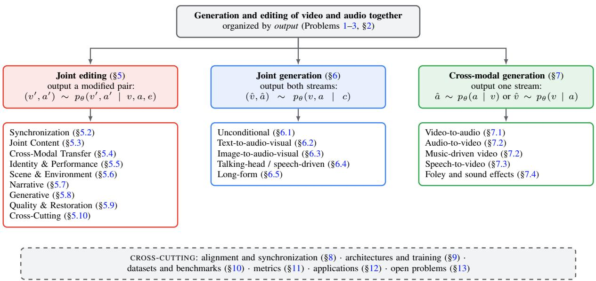
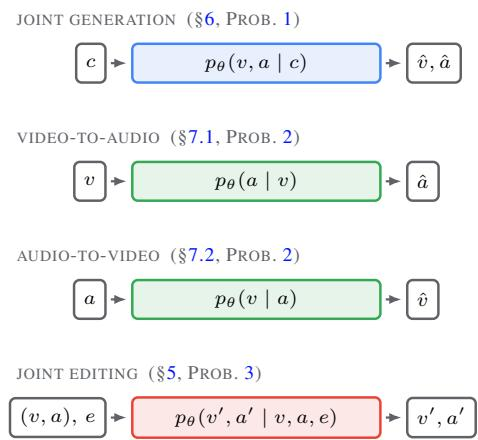
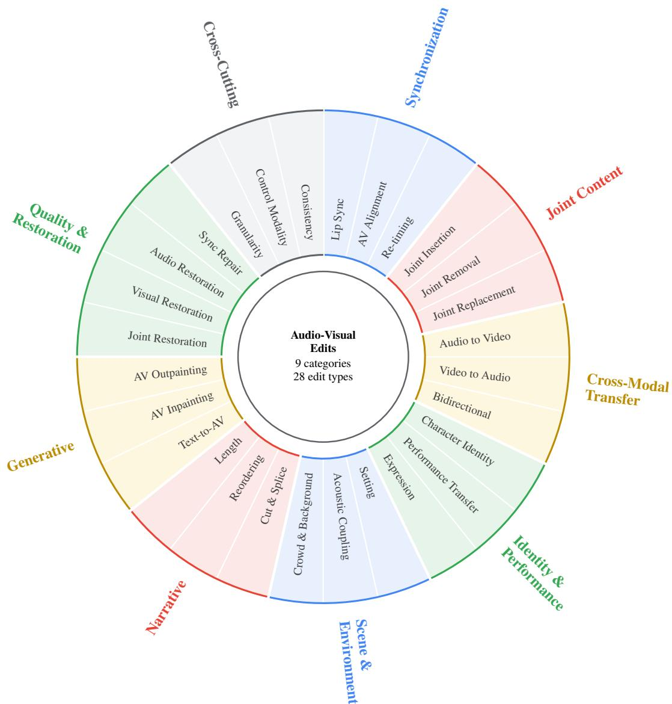

# Joint and Cross-Modal Video-Audio Generation and Editing: A Unified Formulation and Design Taxonomy

Abhinav Sharma1, Sai Karthik Navuluru2, Wang Wei3, Daksh Dangi1, Xiangbo Gao4, Li Li5, Bo Ni6, Vardhan Dongre7, Junda Wu8, Xiyang Hu9, Jiuxiang Gu8, Seunghyun Yoon8, Tong Yu8, Chien Van Nguyen10, Mohamed Elmoghany11,   
Nedim Lipka8, Hoda Eldardiry3, Hongjie Chen12, Tyler Derr6, Thien Huu Nguyen10, Zhengzhong Tu4, Nesreen K. Ahmed13, Franck Dernoncourt8, Ryan A. Rossi8

1University of Massachusetts Amherst 2University of Texas at Dallas 3Virginia Tech 4Texas A&M University 5University of Southern California 6Vanderbilt University 7University of Illinois Urbana-Champaign 8Adobe Research 9Arizona State University 10University of Oregon 11Stanford University 12Dolby Laboratories 13Cisco

## Abstract

Video and audio are perceived together, yet most generative models treat them in isolation. We examine methods that model the two modalities jointly, generate one from the other, or edit them in a coupled manner, organized around a single question: how is the output kept coherent across modalities in time and semantics? A unified formulation casts joint generation, cross-modal generation, and joint editing as three problems defined on a single distribution over audio-visual pairs, and a taxonomy compares methods along five design axes. To our knowledge, this is the first overview to systematically taxonomize joint audio-visual editing, which we map as nine edit categories spanning 28 edit types. We describe methods, datasets, and metrics for each setting and close with the open problems we view as most consequential.

## 1 Introduction

Sound and picture are perceived as a single percept: a door closing and its impact sound coincide, and even a small offset reads as an error. Generative models of video and audio, however, developed largely in isolation, so two strong unimodal capabilities, combined naively, produce streams that do not agree. A growing body of work instead treats the pair as coupled, in three settings grouped by output: (i) both modalities generated together; (ii) one generated from the other, as in soundtracking a silent video; and (iii) an existing pair edited so a change in one modality propagates to the other. All three share one demand—coherence across modalities in time and semantics—which we take as our organizing principle.

Contributions. Existing overviews treat video generation, audio generation, or audio-visual understanding in isolation (Qin et al., 2026). This work covers generation and editing of the two streams as a coupled pair. Our contributions are summarized as follows:

• First systematic taxonomy of joint audiovisual editing. To our knowledge, this is the first overview to systematically taxonomize the editing of video and audio as a coupled pair, in which an edit specified in one modality must propagate to the other; we map this space as a taxonomy of nine categories and 28 edit types, each with representative operations and use cases (Table 4, Section 5).

• A unified formulation and five-axis design taxonomy. Section 2 casts joint generation, crossmodal generation, and joint editing as three problems over one distribution on audio-visual pairs, and Table 1 organizes the literature along five design axes.

• Open problems grounded in the formulation. Section 13 states the open problems—longhorizon coherence, fine-grained control, physical plausibility, and evaluation—as instances of one underlying challenge: raising cross-modal alignment while preserving per-stream quality.

Scope. A method is in scope when at least one of video or audio is among its outputs and the other appears in its pipeline; single-modality generation and audio-visual understanding without a generative or editing component are excluded. The closest overlapping overview, a concurrent review of audiovisual intelligence in foundation models (Qin et al.,

2026), treats neither editing nor our organizing device. Figure 1 maps the organization.

## 2 Problem Formulation and Notation

Notation. A video is $v \in \mathbb { R } ^ { T _ { v } \times H \times W \times 3 }$ , where $T _ { v }$ is the number of frames and $H , W$ are the spatial dimensions. An audio signal is $a \in \mathbb { R } ^ { T _ { a } }$ , where $T _ { a }$ is the number of audio samples. A condition is c, with subscripts for specific modalities: $c _ { t }$ for text, $c _ { i }$ for an image, $c _ { s }$ for speech, and $c _ { m }$ for music. A generative model is $p _ { \theta }$ with parameters $\theta .$ Generated outputs are written $\hat { v } , \hat { a }$ , and edited outputs $v ^ { \prime } , a ^ { \prime }$ . We write $v ^ { ( t ) }$ for the t-th frame and use $\phi _ { v }$ and $\phi _ { a }$ for encoders that map video and audio into latent or shared representation spaces, with ${ z } _ { v } = \phi _ { v } ( v )$ and $z _ { a } = \phi _ { a } ( a )$ . Table 2 collects the symbols used throughout this work.

An audio-visual clip is a pair $x = ( v , a )$ with $v \in \mathbb { R } ^ { T _ { v } \times H \times W \times 3 }$ and $a \ \in \ \mathbb { R } ^ { T _ { a } }$ sharing a time interval $[ 0 , \tau ]$ , so frame and sample index refer to the same physical time; $\chi = \mathcal { V } \times \mathcal { A }$ is the space of such pairs.

Definition 1 (Audio-visual correspondence). $( v , a )$ corresponds when the streams agree semantically— the sources visible are the sources audible—and temporally—each acoustic event is localized to the frames of its visual cause: for an alignment score $\mathcal { S } : \mathcal { X }  \mathbb { R }$ , natural clips satisfy $S ( v , a ) \geq S ( v , \tilde { a } )$ for mismatched or time-shifted a˜.

Definition 1 is what separates the joint and crossmodal setting from two independent unimodal problems. A model that produces a high-quality vˆ and a high-quality $\hat { a }$ but assigns them low $\boldsymbol { S } ( \boldsymbol { \hat { v } } , \boldsymbol { \hat { a } } )$ is perceived as broken, even when each stream is convincing on its own. The methods in Sections 5 through 7 differ primarily in how they raise $\boldsymbol { \mathcal { S } }$ while keeping the per-modality quality high.

Definition 2 (Latent representations). Methods typically operate on $z _ { v } = \phi _ { v } ( v )$ and $z _ { a } = \phi _ { a } ( a )$ with decoders $\psi _ { v } , \psi _ { a } ; p _ { \theta }$ is defined over $( z _ { v } , z _ { a } )$ , and $\phi _ { v } , \phi _ { a }$ fix the coupling space.

Problem 1 (Joint audio-visual generation). Given c (possibly ∅), learn $p _ { \theta } ( v , a \mid c )$ whose samples are faithful to $c ,$ of high per-modality quality, and of high $\boldsymbol { S } ( \boldsymbol { \hat { v } } , \boldsymbol { \hat { a } } )$

The defining requirement in Problem 1 is that the parameterization of $p _ { \theta } ( v , a \mid c )$ encode the dependency between v and a. A model that factorizes as $p _ { \theta } ( v \mid c ) p _ { \theta } ( a \mid c )$ with no further coupling treats the two modalities as conditionally independent given c and cannot, in general, raise $\boldsymbol { \mathcal { S } }$ beyond what c already determines. Joint methods therefore introduce coupling either in the architecture, through shared parameters or cross-modal attention, or in the objective, through a term that rewards correspondence.

Problem 2 (Cross-modal generation). Given one modality, generate the other so that the pair corresponds: video-to-audio learns $p _ { \theta } ( a \mid v )$ , audio-tovideo learns $p _ { \theta } ( v \mid a )$

Problem 2 differs from Problem 1 in what is given. In the joint setting both modalities are outputs of a single distribution; in the cross-modal setting one of them is the condition. The contrast is concrete: a joint text-to-audio-visual model given $c _ { t } = \mathrm { \ddot { \ s t } o o t s t e p s }$ on gravel” synthesizes both the visual scene and the footstep sounds, whereas a cross-modal video-to-audio model given a silent video v of a person walking on gravel synthesizes only aˆ, with the footstep sounds aligned to the frames in which the foot contacts the ground.

Problem 3 (Joint audio-visual editing). Given $( v , a )$ and an instruction $e \ ( \mathrm { t e x t } .$ , mask, style, or identity), sample $( v ^ { \prime } , a ^ { \prime } ) \sim p _ { \theta } ( v ^ { \prime } , a ^ { \prime } \mid v , a , e )$ such that the edit is applied, reflected in both modalities so $\boldsymbol { S } ( \boldsymbol { v } ^ { \prime } , \boldsymbol { a } ^ { \prime } )$ stays high, and content outside the targeted region is preserved.

Problem 3 adds two constraints absent from generation: the propagation of an edit across modalities, and the preservation of untouched content. As an example, given a clip of a person speaking and the instruction $e = { } ^ { \bullet }$ change the speaker’s voice to a child’s voice,” the model must produce $a ^ { \prime }$ with the new voice and $v ^ { \prime }$ in which the lip motion is consistent with $a ^ { \prime }$ , while leaving the background and identity intact. Editing thus inherits the correspondence requirement of generation and adds a fidelity-to-input requirement on top of it. Figure 2 summarizes the three problems as mappings from inputs to outputs, Table 3 instantiates them task by task, and Table 2 collects the notation.

## 3 Background and Preliminaries

This section introduces the building blocks that joint and cross-modal methods inherit from the unimodal setting: the generative model families that instantiate $p _ { \theta }$ , the representations that realize Definition 2 for each modality, and the conditioning mechanisms that inject c.

  
Figure 1: Roadmap of this work. Methods are grouped by the output they produce (Section 2): joint editing outputs a modified pair, joint generation outputs both streams, and cross-modal generation exactly one—the signals a method consumes vary freely within each family. The listed subsections cover each family; the gray strip collects the cross-cutting sections that apply to all three. Color marks the family (red editing, blue joint, green cross-modal) and is redundant with position and headings. Notation follows Table 2.

## 3.1 Generative Modeling Foundations

The methods we cover instantiate a generative model $p _ { \theta }$ that approximates a target distribution over video, audio, or both. Four families recur: variational autoencoders (Kingma and Welling, 2014), generative adversarial networks (Goodfellow et al., 2014), autoregressive models (van den Oord et al., 2016), and diffusion and flow-matching models (Ho et al., 2020; Lipman et al., 2023). Each corresponds to a different parameterization of $p _ { \theta }$ and a different training objective, and each has been adapted to the joint and cross-modal setting in its own way. Recent work has converged on diffusion and flow-matching backbones for both video and audio synthesis, and a large fraction of the methods in later sections build directly on top of one. We therefore use the denoising formulation as the running example: a forward process gradually corrupts a clean latent $z _ { \mathrm { 0 } }$ into noise, and the model learns to reverse it, optionally conditioned on c, by predicting the noise or the velocity at each step.

## 3.2 Video Representations

Several representational spaces realize $\phi _ { v }$ in Definition 2, and the choice has direct consequences for the design of $p _ { \theta }$ . Pixel-space models operate on v directly. Latent-space models, following the latent diffusion recipe (Rombach et al., 2022), first encode v into a lower-dimensional latent $z _ { v } = \phi _ { v } ( v )$

and model the distribution over $z _ { v }$ rather than over raw pixels, using either a 2D autoencoder applied per frame with a separate temporal module, or a 3D autoencoder that compresses space and time jointly. Token-based representations take a further step and discretize v into a sequence of tokens, which is what enables autoregressive modeling. The three representations trade off fidelity, computational cost, and compatibility with the audio representation used alongside them, with the last factor mattering most in joint models that couple v and a in a shared space.

## 3.3 Audio Representations

An audio signal admits an analogous set of choices for $\phi _ { a }$ . Waveform-domain models operate on a directly. Spectrogram-domain models first transform a into a time-frequency representation such as a mel spectrogram and model that image-like array, relying on a neural vocoder to recover the waveform (Kong et al., 2020). Latent audio codecs (Dé- fossez et al., 2022) encode a into a sequence of discrete or continuous tokens and decode back to the waveform, playing a role analogous to latent video encoders. As with video, the representation chosen for audio interacts with the one chosen for video in joint models, since the two streams must be aligned in time and, for unified backbones, processed by a shared network. A recurring difficulty is the mismatch in native rate between the two modalities, since audio is sampled far more densely in time than video is, and the latent rates must be reconciled for the streams to be coupled frame by frame.

Table 1: Complementary taxonomy of joint audio-video methods along five complementary design axes: GENERATION STRATEGY (§4.1) captures how the two modalities are produced; AUDIO REPRESENTATION (§4.2) describes the latent space in which audio is generated; VIDEO REPRESENTATION (§4.3) describes the latent space in which video is generated; ALIGNMENT ENFORCEMENT (§4.4) identifies the stage at which audio-video alignment is imposed; and PRETRAINING REUSE (§4.5) characterizes the source of model weights. A check mark (✓) indicates that a method falls under the corresponding category within each axis. For the partially closed system Wan 2.5, the axes whose design is not publicly disclosed (alignment enforcement and pretraining reuse) are left without a mark.
<table><tr><td></td><td colspan="3">GENERATION STRATEGY (Section 4.1)</td><td colspan="2">AUDIO REPRESENTATION REPRESENTATION (Section 4.2)</td><td colspan="2">VIDEO (Section 4.3)</td><td colspan="2">ALIGNMENT ENFORCEMENT (Section 4.4)</td><td>PRETRAINING REUSE (Section 4.5)</td></tr><tr><td></td><td>S(inge e-) Dualr -.) Casc 1.)</td><td>Gui -) Ui -1.)</td><td>Me e- WWvay W.4)</td><td>Cont  t1) D(isee e e2)</td><td>Pie3 3)</td><td>2-  + .-) 3D- -.)</td><td>Disee e ) Cro o-.4)</td><td>(ha    4.2) D(is 4)</td><td>Cas a ii44) Expi Pk P44)</td><td>S(inet rd 5) Fr -.)</td><td>Du d )</td></tr><tr><td>JOINT AUDIO-VIDEO GENERATION</td><td></td><td></td><td></td><td></td><td></td><td></td><td></td><td></td><td></td><td></td><td></td></tr><tr><td>MM-Diffusion (Ruan et al., 2023)</td><td></td><td></td><td>X</td><td></td><td></td><td></td><td>X</td><td></td><td>X</td><td></td><td></td></tr><tr><td>CoDi (Tang et al., 2023)</td><td>X X</td><td>X X X</td><td>X</td><td>X</td><td></td><td></td><td>X</td><td>X</td><td>X X</td><td>X</td><td>X X</td></tr><tr><td>×× Seeing-and-Hearing (Xing et al., 2024a) X</td><td>X</td><td>J</td><td></td><td>x</td><td></td><td>××</td><td>×× X</td><td>X X</td><td></td><td>X</td><td>×× X</td></tr><tr><td>AV-DiT (Wang et al., 2024b) ✓</td><td>X</td><td>X</td><td>××××√</td><td>x</td><td>X×××</td><td>X</td><td>X X</td><td>X</td><td>X</td><td>X X</td><td>X</td></tr><tr><td>MM-LDM (Sun et al., 2024)</td><td>X</td><td>X</td><td></td><td>X</td><td></td><td>X</td><td>X X</td><td></td><td>X</td><td>X</td><td>X X</td></tr><tr><td>Movie Gen (Polyak et al., 2024)</td><td>X J</td><td>X</td><td></td><td>x</td><td></td><td>X X</td><td>X</td><td></td><td>X X</td><td>X</td><td>v√ X X</td></tr><tr><td>SVG (Ishii et al., 2024)</td><td>x X</td><td>X</td><td></td><td>XXX</td><td></td><td>X</td><td>X X</td><td></td><td>X X</td><td>X</td><td>X X</td></tr><tr><td>MMDisCo (Hayakawa et al., 2025)</td><td>X X X</td><td>X</td><td></td><td></td><td></td><td>X</td><td>X X</td><td>X</td><td>X</td><td></td><td>X X</td></tr><tr><td>SyncFlow (Liu et al., 2024b)</td><td></td><td>x X</td><td></td><td></td><td></td><td>X X</td><td>X××××××</td><td></td><td>X X</td><td>X X</td><td>X X</td></tr><tr><td>JavisDiT (Liu et al., 2026a)</td><td>X</td><td>X</td><td></td><td></td><td></td><td>X X</td><td></td><td>X</td><td>X</td><td>X</td><td>X X</td></tr><tr><td>JavisDiT++ (Liu et al., 2026b)</td><td>X</td><td>X</td><td></td><td></td><td></td><td>X X</td><td></td><td>X</td><td>X</td><td>X</td><td>VVV X X</td></tr><tr><td>BridgeDiT (Guan et al., 2025)</td><td></td><td>x X</td><td></td><td></td><td></td><td>X X</td><td></td><td></td><td>X X</td><td>X X</td><td>X</td></tr><tr><td>ALIVE (Guo et al., 2026b)</td><td></td><td>××</td><td></td><td></td><td></td><td>X X</td><td></td><td></td><td>X</td><td>X</td><td>J X</td></tr><tr><td>Ovi (Low et al., 2025)</td><td></td><td>××</td><td></td><td></td><td></td><td>X X</td><td></td><td></td><td>X X</td><td>X</td><td>X X</td></tr><tr><td>UniAVGen (Zhang et al., 2025)</td><td>x</td><td>X</td><td></td><td></td><td></td><td>X X</td><td></td><td></td><td>X X</td><td></td><td>××√√ X</td></tr><tr><td>Animate-and-Sound (Wang et al., 2025c)</td><td>X</td><td>X</td><td></td><td></td><td></td><td>X</td><td>X X</td><td></td><td>X X</td><td></td><td>X X</td></tr><tr><td>CCL (Ma et al., 2026)</td><td>x</td><td>X</td><td></td><td></td><td></td><td>X X</td><td></td><td></td><td>X X</td><td></td><td>X X</td></tr><tr><td>Hallo-Live (Li et al., 2026)</td><td>X</td><td>X</td><td>×××××××××××××××</td><td></td><td></td><td>X X</td><td>V</td><td></td><td>X X</td><td>x X</td><td>X</td></tr><tr><td>UniForm (Zhao et al., 2025)</td><td>X X</td><td>X</td><td></td><td></td><td></td><td>X X</td><td></td><td></td><td></td><td>X</td><td></td></tr><tr><td>Wan 2.5 (Alibaba, 2025)</td><td>X X</td><td>X</td><td></td><td></td><td></td><td>X X</td><td></td><td></td><td>X</td><td>X</td><td></td></tr><tr><td>LTX-2 (HaCohen et al., 2026)</td><td>X</td><td>X</td><td></td><td></td><td>x×××××××××××××××××</td><td>X X X X</td><td>√</td><td></td><td>X</td><td>X X</td><td>V X X</td></tr><tr><td>MOVA (SII-OpenMOSS Team, 2026)</td><td>X X</td><td>X</td><td></td><td></td><td></td><td>X X</td><td>x×××××××X V</td><td>X</td><td>X X</td><td>X X</td><td>√ X X</td></tr><tr><td>Apollo (Wang et al., 2026)</td><td>X X</td><td>X</td><td>×××××××××××××××××××××××</td><td>X××××××××××××××</td><td>X</td><td>X X</td><td>J</td><td>X</td><td>✓ X</td><td>X X</td><td>√ X</td></tr><tr><td>3MDiT (Li et al., 2025)</td><td>xxxxxxxxxx√√X√√√ X X</td><td>X</td><td>x</td><td>X</td><td>X</td><td>X X</td><td></td><td></td><td>X X</td><td>X</td><td>×× X</td></tr><tr><td>OmniForcing (Su et al., 2026)</td><td>X</td><td>X</td><td>X X</td><td></td><td></td><td></td><td></td><td></td><td></td><td></td><td></td></tr><tr><td>JOINT AUDIO-VIDEO EDITING</td><td></td><td></td><td></td><td></td><td></td><td></td><td></td><td></td><td></td><td></td><td></td></tr><tr><td>Lang.-Guid. AV Edit (Liang et al., 2024b)</td><td></td><td>X X</td><td>X</td><td>X X</td><td></td><td>X V</td><td>X</td><td></td><td>X X</td><td>X X</td><td>X</td></tr><tr><td>AV-Edit (Guo et al., 2026a)</td><td></td><td>X X</td><td>X</td><td>×× X</td><td>X</td><td>X</td><td>X X</td><td></td><td>X X</td><td>X X</td><td>X</td></tr><tr><td>JUST-DUB-IT (Chen et al., 2026)</td><td></td><td>X X</td><td>X</td><td>X</td><td>x</td><td>X</td><td>X X</td><td></td><td>X X</td><td>X X</td><td>×× X</td></tr><tr><td></td><td></td><td></td><td></td><td></td><td></td><td></td><td></td><td></td><td></td><td></td><td>X</td></tr><tr><td>EditYourself (Flynn et al., 2026)</td><td></td><td>X X</td><td>X</td><td>X X</td><td>X</td><td>X</td><td>X X</td><td></td><td>X X</td><td>X X</td><td>X</td></tr></table>

Table 2: Notation. We summarize the symbols used throughout this work. Subscripts denote modality and primes denote edited outputs.  
Symbol Meaning   
v ∈ RTv×H×W×3 video, Tv frames of size H × W   
a ∈ RTa audio signal of Ta samples   
x = (v, a) audio-visual clip   
$\mathcal { X } = \mathcal { V } \times \mathcal { A }$ space of audio-visual clips   
fps, sr frame rate, audio sampling rate   
τ shared clip duration   
c condition signal   
$c _ { t } , c _ { i } , c _ { s } , c _ { m }$ text, image, speech, music   
$p _ { \theta }$ generative model with parameters θ   
$\theta _ { v } , \theta _ { a } , \theta _ { \times }$ modality-specific and cross-modal parameters (§4.1)   
$\Gamma$ sampling procedure (§4)   
$\lambda$ guidance weight (§4.1.5)   
$\hat { v } , \hat { a }$ generated video, audio   
$v ^ { \prime } , a ^ { \prime }$ edited video, audio   
$\phi _ { v } , \phi _ { a }$ video, audio encoders   
$z _ { v } , z _ { a }$ video, audio latents (Def. 2)   
$\psi _ { v } , \psi _ { a }$ video, audio decoders   
$\boldsymbol { S } ( \boldsymbol { v } , \boldsymbol { a } )$ alignment score (Def. 1)   
$\delta$ synchronization tolerance (Def. 3)   
e edit instruction   
$\mathcal { D }$ dataset (Def. 4)   
$\boldsymbol { v } ^ { ( t ) }$ t-th video frame

## 3.4 Conditioning Mechanisms

Once the representations are fixed, a conditioning signal c enters the generative model through one of several mechanisms. Cross-attention injects c into intermediate features of the network, giving fine-grained, position-dependent control. Adaptive normalization modulates feature statistics based on $c ,$ providing a lighter and coarser form of control. Concatenation appends an encoded c to the input or to intermediate features. Classifier-free guidance (Ho and Salimans, 2022) steers samples toward c at inference time by mixing conditional and unconditional predictions. The form of c together with the mechanism through which it is injected determines how tightly the output follows the condition, and in the joint setting the same mechanisms are reused to let one modality condition the other.

## 3.5 Audio-Visual Correspondence in Practice

Definition 1 states correspondence as an abstract property; in practice it is operationalized through learned encoders that map a clip to a score $\boldsymbol { S } ( \boldsymbol { v } , \boldsymbol { a } )$ Contrastive audio-visual encoders trained to pull matched pairs together and push mismatched pairs apart, of which ImageBind (Girdhar et al., 2023)

  
Figure 2: The three problem settings as input-tooutput mappings, in the notation of Table 2: what varies across rows is only which signals are given (left) and which are generated (right). Joint generation outputs both streams from a condition $c$ (which may be empty, text $c _ { t } .$ , an image $c _ { i }$ , speech $c _ { s } .$ , or music $c _ { m } )$ ; cross-modal generation outputs exactly one stream given the other; joint editing outputs a modified pair given a clip and an edit instruction e. Row color marks the family as in Figure 1. Every setting must satisfy the correspondence requirement of Definition 1.

is a widely reused instance, provide such a score— temporally focused variants additionally treat timeshifted pairs as negatives (Luo et al., 2023)—and several methods reuse these encoders either as a training signal or as a guidance term at inference. The remainder of this work is structured around how methods raise S while keeping per-modality quality high, since this is the property that distinguishes the joint and cross-modal problem from two unimodal ones.

## 4 A Five-Axis Design Taxonomy

Methods that solve Problems 1 through 3 differ along a small number of design axes that, taken together, account for most of the variation in the literature. We propose a taxonomy that categorizes methods along five such axes, summarized in Table 1: the generation strategy, the audio representation, the video representation, the alignmentenforcement mechanism, and the reuse of pretrained weights.

Formally, a method is characterized by a tuple $( \phi , \theta , \mathcal { L } , \Gamma )$ : the encoders $\phi = ( \phi _ { v } , \phi _ { a } )$ of Definition 2, which fix the spaces $\mathcal { Z } _ { v } , \mathcal { Z } _ { a }$ in which generation occurs; the parameters θ of the model $p _ { \theta }$ acting on those spaces; the training objective $\mathcal { L }$ used to train $\theta ;$ and the sampling procedure Γ that draws $\left( \hat { z } _ { v } , \hat { z } _ { a } \right)$ from $p _ { \theta }$ . The five axes constrain different components of this tuple. The generation strategy (§4.1) constrains how θ decomposes across the two streams; the audio and video representations (§4.2, §4.3) constrain the codomains of $\phi _ { a }$ and $\phi _ { v } ;$ the alignment-enforcement mechanism (§4.4) constrains the stage at which correspondence pressure is applied, which may be in $\theta ,$ in the training objective L, or in Γ; and pretraining reuse (§4.5) constrains the initialization of θ. Because the axes constrain different components, a method makes a choice on each, and two choices on different axes are not alternatives to one another.

Table 3: A unified view of the tasks covered. Each task is an instance of Problems 1 through 3: it models the joint distribution over audio-visual pairs or one of its conditionals. Given lists the observed signals, Generated the produced signals, and Primary Correspondence the form of audio-visual agreement (Def. 1) that dominates evaluation. The table doubles as a map from a task to the section that treats it. †For talking-head generation the model re-synthesizes the speech track: $c _ { s }$ conditions the output and aˆ is emitted synchronized to vˆ, so speech appears as both condition and output.
<table><tr><td>Task</td><td>Given</td><td>Generated</td><td>Learned Distribution</td><td>Primary Correspondence</td><td>Section</td></tr><tr><td>Unconditional joint</td><td>0</td><td> $v , a$ </td><td> $p _ { \theta } ( v , a )$ </td><td>semantic + temporal</td><td>§6.1</td></tr><tr><td>Text-to-audio-video</td><td>Ct</td><td> $v , a$ </td><td> $p _ { \theta } ( v , a \mid c _ { t } )$ </td><td>semantic + temporal</td><td>§6.2</td></tr><tr><td>Image-to-audio-video</td><td>Ci</td><td> $v , a$ </td><td> $p _ { \theta } ( v , a \mid c _ { i } )$ </td><td>semantic + temporal</td><td>§6.3</td></tr><tr><td>Talking-head / speech-driven</td><td> $c _ { i } , c _ { s }$ </td><td> $v , a ^ { \dag }$ </td><td> $p _ { \theta } ( v , a \mid c _ { i } , c _ { s } )$ </td><td>lip-sync</td><td>§6.4</td></tr><tr><td>Music-driven video</td><td> $c _ { m }$ </td><td>v</td><td> $p _ { \theta } ( v \mid c _ { m } )$ </td><td>beat / rhythm</td><td>§7.2</td></tr><tr><td>Video-to-audio / Foley</td><td>v</td><td>a</td><td> $p _ { \theta } \left( a \mid v \right)$ </td><td>temporal (onset)</td><td>§7.1</td></tr><tr><td>Audio-to-video</td><td>a</td><td>v</td><td> $p _ { \theta } ( v \mid a )$ </td><td>temporal</td><td>§7.2</td></tr><tr><td>Speech-to-video</td><td> $c _ { s }$ </td><td>v</td><td> $p _ { \theta } ( v \mid c _ { s } )$ </td><td>lip-sync</td><td>§7.3</td></tr><tr><td>Joint editing</td><td> $v , a , e$ </td><td> $v ^ { \prime } , a ^ { \prime }$ </td><td> $p _ { \theta } ( v ^ { \prime } , a ^ { \prime } \mid v , a , e )$ </td><td>preserve + propagate</td><td>§5</td></tr><tr><td>Dubbing / re-voicing</td><td> $v , a , e$ </td><td> $v ^ { \prime } , a ^ { \prime }$ </td><td> $p _ { \theta } ( v ^ { \prime } , a ^ { \prime } \mid v , a , e )$ </td><td>lip-sync</td><td>§5.2</td></tr></table>

The axes are complementary rather than orthogonal. Each constrains a different component, so a method makes a choice along every axis, but the choices are not fully independent: a guidancebased strategy requires two frozen unimodal models and therefore entails dual pretraining, and pretraining reuse interacts with the representation axes in turn—every method covered here that reuses one or two pretrained backbones inherits its representation from them, and the backbones reused are without exception continuous-latent diffusion models, so the discrete-token cells can be filled only by training from scratch, the cost of Section 13, or by coupling token-based unimodal generators, a route no method we cover takes. Nor is every combination occupied—the empty and near-empty cells of Table 1 are themselves informative, and we return to them in Section 13. We treat each axis in turn.

## 4.1 Generation Strategy

The generation strategy is how the two modalities are produced relative to each other, that is, how the

dependency required by Problem 1 is realized in the computation graph.

## 4.1.1 Single-Tower

Formally $\theta _ { v } = \theta _ { a } = \theta _ { \times } = \theta :$ one network is applied to the concatenated sequence $[ z _ { v } ; z _ { a } ]$ , so every parameter sees both streams and the dependency is carried by the parameters themselves. A single network processes both modalities through shared parameters, with the two streams concatenated or interleaved into one sequence. Coupling is automatic, since every layer sees both modalities, at the cost of a representation that must serve both. Single-tower designs are the basis of AV-DiT (Wang et al., 2024b) and MM-LDM (Sun et al., 2024), and of recent open systems such as MOVA (SII-OpenMOSS Team, 2026), Apollo (formerly Klear) (Wang et al., 2026), and 3MDiT (Li et al., 2025).

## 4.1.2 Dual-Tower

Formally $\theta = ( \theta _ { v } , \theta _ { a } , \theta _ { \times } )$ with $\theta _ { v } \cap \theta _ { a } = \varnothing \colon$ each stream is processed by its own tower, and information is exchanged only through the cross-modal parameters $\theta _ { \times }$ , so the dependency between v and a is carried by $\theta _ { \times }$ alone. Two modality-specific towers run in parallel and exchange information through cross-modal connections such as cross-attention or bridge layers. The towers retain modality-specific inductive biases while the connections carry the dependency between v and $a .$ This is the most common choice in the literature, adopted by MM-Diffusion (Ruan et al., 2023), JavisDiT (Liu et al., 2026a), BridgeDiT (Guan et al., 2025), Ovi (Low et al., 2025), UniAVGen (Zhang et al., 2025), and LTX-2 (HaCohen et al., 2026), among others.

## 4.1.3 Cascaded

Formally $p _ { \theta } ( v , a \mid c ) = p _ { \theta _ { 1 } } ( v \mid c ) p _ { \theta _ { 2 } } ( a \mid v , c )$ or the symmetric factorization, with disjoint $\theta _ { 1 } , \theta _ { 2 }$ and sequential sampling; the coupling is carried by the conditioning path rather than by shared parameters. The modalities are produced in sequence, with the second conditioned on the first, which reduces joint generation to a generation step followed by a cross-modal step. Movie Gen (Polyak et al., 2024) is the representative instance, generating video from text and then audio from the generated video.

## 4.1.4 Unified-Token

Formally $\phi _ { v } , \phi _ { a }$ are quantizers into finite vocabularies, the pair is serialized into a single sequence $s = \pi ( z _ { v } , z _ { a } )$ , and $\begin{array} { r } { p _ { \theta } ( s ) = \prod _ { t } p _ { \theta } ( s _ { t } \mid s _ { < t } ) } \end{array}$ or a masked variant. Both modalities are discretized into tokens and modeled as a single sequence by an autoregressive or masked transformer, so the dependency is captured by the sequence model and the same backbone can serve multiple tasks by reordering inputs and outputs. No joint method covered here adopts this strategy. UniForm (Zhao et al., 2025) comes closest—it serializes the two modalities into one sequence and shares a denoiser across tasks distinguished by task tokens—but it does so over continuous VAE latents with a diffusion objective rather than over discrete vocabularies, which places it in the single-tower category. The unifiedtoken cell is thus unoccupied among joint models, in contrast to the unimodal literature where tokenbased video and audio generation are established, an asymmetry we return to in Section 13.

## 4.1.5 Guidance-Based

Formally the two frozen models are coupled only in the sampler Γ, for example by adjusting the score of the pair $\boldsymbol { z } ~ = ~ \left( z _ { v } , z _ { a } \right)$ as $\nabla _ { z } \log p _ { \theta } ( z \mid$ $c ) + \lambda \nabla _ { z } S \bigl ( \psi _ { v } ( z _ { v } ) , \psi _ { a } ( z _ { a } ) \bigr )$ with guidance weight $\lambda ; \theta$ is never updated jointly. Two pretrained unimodal models are frozen and coupled only at inference, through a guidance term such as a classifier or an alignment score that nudges the two samples toward mutual consistency. No joint training is required, which trades fidelity for flexibility. Seeing-and-Hearing (Xing et al., 2024a) couples two frozen generators through an Image-Bind (Girdhar et al., 2023) alignment score, and MMDisCo (Hayakawa et al., 2025) through a trained discriminator applied as sampling guidance.

## 4.2 Audio Representation

The audio representation is the realization of $\phi _ { a }$ in Definition 2, and it fixes the space in which audio is generated. We discuss each choice in turn.

## 4.2.1 Continuous Latent

A neural audio autoencoder maps the waveform to a compact continuous latent in which a diffusion or flow model is trained. Writing the encoder as $\phi _ { a }$ and its decoder as $\psi _ { a }$ (Table 2), the autoencoder is trained so that

$$
\begin{array} { r } { z _ { a } = \phi _ { a } ( a ) \in \mathbb { R } ^ { T _ { z } \times d } , \qquad \psi _ { a } ( z _ { a } ) \approx a , } \end{array}\tag{1}
$$

with a reconstruction loss plus, in the variational form (Kingma and Welling, 2014), a KL regularizer on the encoder’s posterior over $z _ { a } ;$ here $T _ { z } \ll T _ { a }$ is the compressed length and d the channel width. Generation then follows latent diffusion (Ho et al., 2020; Rombach et al., 2022): at diffusion step $u ,$ noised latents $z _ { u } = \sqrt { \bar { \alpha } _ { u } } z _ { a } + \sqrt { 1 - \bar { \alpha } _ { u } }$ ϵ with $\epsilon \sim$ $\mathcal { N } ( 0 , I )$ are drawn along a noise schedule $\bar { \alpha } _ { u } ,$ a network $\epsilon _ { \theta }$ is trained to minimize

$$
\mathcal { L } = \mathbb { E } _ { z _ { a } , u , \epsilon } \left| \left| \epsilon - \epsilon _ { \theta } ( z _ { u } , u , c ) \right| \right| _ { 2 } ^ { 2 } ,\tag{2}
$$

and sampling denoises from pure noise to $\hat { z } _ { a } ,$ decoded as $\hat { a } = \psi _ { a } ( \hat { z } _ { a } )$ . This is the dominant choice in recent joint models: it is used by twenty-eight of the twenty-nine methods in Table 1, spanning early dual-tower models such as CoDi (Tang et al., 2023) through recent systems including LTX-2 (HaCohen et al., 2026) and MOVA (SII-OpenMOSS Team, 2026).

## 4.2.2 Discrete Tokens

A neural codec instead quantizes the latent: a codebook $\mathcal { C } = \{ e _ { 1 } , . . . , e _ { K } \} \subset \mathbb { R } ^ { d }$ replaces each latent frame $z _ { a } ^ { ( i ) }$ by its nearest entry,

$$
\begin{array} { r } { q \big ( z _ { a } ^ { ( i ) } \big ) = e _ { k ^ { * } } , \qquad k ^ { * } = \arg \operatorname* { m i n } _ { k } \big \| z _ { a } ^ { ( i ) } - e _ { k } \big \| _ { 2 } , } \end{array}\tag{3}
$$

trained with codebook and commitment terms $\| \mathrm { s g } [ z _ { a } ^ { ( i ) } ] - e _ { k ^ { * } } \| _ { 2 } ^ { 2 } + \beta \| z _ { a } ^ { ( i ) } - \mathrm { s g } [ e _ { k ^ { * } } ] \| _ { 2 } ^ { 2 }$ under a straight-through gradient, where sg[·] denotes stopgradient (van den Oord et al., 2017); practical audio codecs quantize residually over a stack of such codebooks, typically replacing the codebook term with an exponential-moving-average update of the selected entries (Défossez et al., 2022). The resulting index sequence supports autoregressive or masked modeling and a shared treatment with tokenized video. No joint method covered here, however, generates audio as codec tokens— UniForm (Zhao et al., 2025) serializes the modalities into one sequence but over continuous latents (§4.2.1)—leaving this cell, like the waveform, unoccupied.

## 4.2.3 Mel-Spectrogram

Audio is represented as a mel spectrogram, obtained from the short-time Fourier transform through a mel filterbank M,

$$
m = \mathrm { l o g } \left( M | \mathrm { S T F T } ( a ) | ^ { 2 } \right) \in \mathbb { R } ^ { F \times T _ { m } } ,\tag{4}
$$

with F mel bins and $T _ { m }$ spectral frames, and treated as an image-like array, which makes image generative machinery directly applicable but requires a separate vocoder to recover the waveform from a generated mˆ . MM-Diffusion (Ruan et al., 2023) is the representative instance among joint models.

## 4.2.4 Waveform

The model operates on the raw waveform $a \in \mathbb { R } ^ { T _ { a } }$ directly, preserving full fidelity at the cost of modeling a very long and densely sampled sequence. No method we cover generates audio directly in the waveform domain, a consequence of the sequence lengths involved at audio sampling rates, an unoccupied corner we return to in Section 13.

## 4.3 Video Representation

The video representation is the realization of $\phi _ { v } .$ with the same fidelity, cost, and compatibility tradeoffs; the constructions mirror Equations 1–3 with v in place of a, and we discuss each choice in turn.

## 4.3.1 3D-VAE

A 3D autoencoder compresses space and time jointly,

$$
z _ { v } = \phi _ { v } ( v ) \in \mathbb { R } ^ { T _ { v } / s _ { t } \times H / s _ { s } \times W / s _ { s } \times d _ { v } } ,\tag{5}
$$

with temporal stride $s _ { t } ,$ spatial stride $s _ { s } ,$ and channel width $d _ { v } ,$ producing a spatio-temporal latent in which a single backbone models the whole clip under the objective of Equation 2. This is the dominant choice in recent video and joint models. Nineteen of the methods in Table 1 use it, including Movie Gen (Polyak et al., 2024), JavisDiT (Liu et al., 2026a), Ovi (Low et al., 2025), LTX-2 (HaCohen et al., 2026), Apollo (Wang et al., 2026), and—through the pretrained Open-Sora autoencoder—UniForm (Zhao et al., 2025).

## 4.3.2 2D-VAE plus Temporal

A per-frame 2D autoencoder compresses each frame independently, $\begin{array} { r l r } { z _ { v } ^ { ( t ) } } & { { } = } & { \phi _ { v , \mathrm { 2 D } } \big ( \boldsymbol { v } ^ { ( t ) } \big ) } \end{array}$ for $t = 1 , \ldots , T _ { v }$ , and a separate temporal module models motion across the stacked latent frames $( z _ { v } ^ { ( 1 ) } , \ldots , z _ { v } ^ { ( T _ { v } ) } )$ . CoDi (Tang et al., 2023), AV-DiT (Wang et al., 2024b), SVG (Ishii et al., 2024), and Animate-and-Sound (Wang et al., 2025c) take this route.

## 4.3.3 Discrete Tokens

Video is quantized into discrete tokens by the construction of Equation 3 applied to spatio-temporal patches, enabling autoregressive or masked modeling and a shared sequence with tokenized audio. No joint method covered here takes this route— UniForm (Zhao et al., 2025) fuses the streams as continuous latent tokens (§4.3.1)—mirroring the unoccupied discrete-audio cell.

## 4.3.4 Pixel

The model operates directly on pixels $v \_ { \in }$ $\mathbb { R } ^ { T _ { v } \times H \times W \times 3 }$ , with no learned compression of the visual stream. MM-Diffusion (Ruan et al., 2023) is the sole pixel-space instance, reflecting the resolutions feasible when the work appeared.

## 4.4 Alignment Enforcement

Alignment enforcement is how a method raises the alignment score S of Definition 1, that is, the stage of the pipeline at which correspondence between the two streams is imposed (see Section 8).

## 4.4.1 Cross-Attention

Cross-attention layers let the audio stream attend to the video stream and vice versa, carrying alignment information between the two towers or branches—an architectural mechanism. It is the dominant mechanism, used by nineteen methods including MM-Diffusion (Ruan et al., 2023), BridgeDiT (Guan et al., 2025), Ovi (Low et al., 2025), and OmniForcing (Su et al., 2026).

## 4.4.2 Shared Positional Encoding

A shared positional or rotary encoding (Su et al., 2021) ties the two streams to a common time axis, so that tokens at the same physical time are forced into correspondence at the level of position— likewise an architectural mechanism. ALIVE (Guo et al., 2026b) and JavisDiT++ (Liu et al., 2026b) use temporally aligned rotary encodings for framelevel correspondence; AV-DiT (Wang et al., 2024b),

Apollo (Wang et al., 2026), and 3MDiT (Li et al., 2025) share positional information across streams.

## 4.4.3 Discriminator

An auxiliary joint discriminator is trained to score whether a pair is jointly real, and its gradient is applied as guidance at sampling time while the base generators stay frozen—an inference-time mechanism rather than a training objective for the generators. MMDisCo (Hayakawa et al., 2025), a trained discriminator applied as sampling guidance, is the only instance we cover.

## 4.4.4 Classifier Guidance

An external classifier or alignment model guides sampling toward consistent pairs at inference, in the manner of classifier guidance for diffusion models (Dhariwal and Nichol, 2021), without changing the generator’s weights—an inference-time mechanism. Seeing-and-Hearing (Xing et al., 2024a) is the representative case.

## 4.4.5 Explicit Prior

A separately estimated spatio-temporal prior is injected to align the streams, decoupling the synchronization signal from the generators—an architectural or an external mechanism, depending on whether the prior is learned jointly or estimated separately. JavisDiT (Liu et al., 2026a) estimates a hierarchical spatio-temporal prior for this purpose, retained in JavisDiT++ (Liu et al., 2026b).

## 4.5 Pretraining Reuse

The final axis is the source of the model’s weights, which strongly affects data and compute cost (see Section 13).

## 4.5.1 From-Scratch

The model is trained from random initialization on paired audio-visual data. Twelve methods train this way, including MM-Diffusion (Ruan et al., 2023), Movie Gen (Polyak et al., 2024), JavisDiT (Liu et al., 2026a), Ovi (Low et al., 2025), LTX-2 (Ha-Cohen et al., 2026), and MOVA (SII-OpenMOSS Team, 2026).

## 4.5.2 Single Pretrained

One pretrained backbone, typically a video model, is reused and the other modality is added on top. ALIVE (Guo et al., 2026b), Hallo-Live (Li et al., 2026), and OmniForcing (Su et al., 2026) build on one pretrained backbone.

## 4.5.3 Dual Pretrained

Two pretrained backbones, one per modality, are reused and coupled, so that joint training only learns the connections. CoDi (Tang et al., 2023), Seeing-and-Hearing (Xing et al., 2024a), SVG (Ishii et al., 2024), BridgeDiT (Guan et al., 2025), and CCL (Ma et al., 2026) couple two pretrained models.

## 5 Joint Audio-Visual Editing

Joint editing outputs a modified pair, $( v ^ { \prime } , a ^ { \prime } ) \sim$ $p _ { \theta } ( v ^ { \prime } , a ^ { \prime } \mid v , a , e )$ (Problem 3), propagating the edit across modalities while preserving untouched content.

## 5.1 The Space of Audio-Visual Edits

This section mirrors Table 4 one to one: nine categories of edit types with representative operations and use cases (rendered radially in Figure 3). Onestream edits retain the other stream unchanged. Development concentrates in joint content, synchronization, and text-driven control; the empty cells are the research agenda.

## 5.2 Synchronization

Synchronization edits alter timing rather than content: lip-sync correction, alignment, retiming. Dubbing is the developed instance: EdiDub (Manela et al., 2025) re-synchronizes lips by content-aware mouth-region editing, JUST-DUB-IT (Chen et al., 2026) jointly generates translated audio and synchronized facial motion via a low-rank adapter, and EditYourself (Flynn et al., 2026) targets identity-preserving re-voicing; alignment and re-timing have no dedicated methods.

## 5.3 Joint Content

Insertion, removal, and replacement in both streams is the prototypical joint edit—a passing car arrives with its engine sound. AV-Edit (Guo et al., 2026a) gates a masked-autoencoder-plus-DiT pipeline by audio-visual correlation; Object-AVEdit (Fu et al., 2025) reaches the same operations by inversion and regeneration. Still objectscoped: scene swaps and ambience-level insertions remain undemonstrated.

## 5.4 Cross-Modal Transfer

Deriving one stream from the other—re-voicing a portrait, re-soundtracking an edited video, stylizing both to a reference—runs the problems of Section 7 inside an editing pipeline; editing-specific is propagation, an edit in one modality inducing the consistent change in the other automatically, and the bidirectional type is unrealized.

  
Figure 3: The edit-type taxonomy as a wheel. The nine categories of Table 4 with their edit types arranged radially, in the same order and colors as the table; sector size is proportional to the number of edit types. Representative operations and example use cases for each type are enumerated in Table 4.

## 5.5 Identity & Performance

Coupled face-and-voice swaps, performance transfer, and joint emotion edits are reached today only through dubbing (JUST-DUB-IT (Chen et al., 2026), EditYourself (Flynn et al., 2026)); the unimodal ingredients are mature, missing only the coupling that keeps a swapped face and converted voice the same person (cf. §13).

## 5.6 Scene & Environment

Relocation, time-of-day and weather shifts, crowd changes, and acoustic coupling (reverberation inferred from depicted geometry) require audio edits proportional to the visual change; no method covered here targets these, the nearest machinery being ambience generation (§7.1).

## 5.7 Narrative

Cut-level edits—J- and L-cut splicing, reordering, summarization—are what professional editors do most, and no model covered here supports them: current methods edit within a shot, while narrative editing reasons across shots and modalities at once—the clearest open opportunity the taxonomy

Table 4: A taxonomy of audio-visual edits: nine categories broken into 28 edit types, each with representative edits and an example use case. Each type is additionally annotated by its dominant modality coupling: A+V denotes a genuinely joint edit that requires reasoning over both modalities; V→A denotes a video-driven edit with an audio consequence (or audio derived from video); A→V denotes the reverse; V and A denote edits that are primarily single-modality, with the other modality passive or unchanged. Categories are color-coded for clarity.
<table><tr><td>Category</td><td>Edit/Gen. Type</td><td>Modality</td><td>Representative Edits</td><td>Example Use Case</td></tr><tr><td></td><td>Lip Sync</td><td>A+V</td><td>Lip sync correction, dubbing alignment, viseme gen- eration</td><td>Aligning dubbed audio to mouth motion</td></tr><tr><td>Synchronization</td><td>AV Alignment</td><td>A+V</td><td>Foley alignment, beat alignment, event sync</td><td>Matching footsteps to visual steps</td></tr><tr><td></td><td>Re-timing</td><td>A+V</td><td>Joint time stretch, slow motion, speed ramping</td><td>Slowing a scene with pitch- preserved audio</td></tr><tr><td>Joint Content</td><td>Joint Insertion</td><td>A+V</td><td>Object with sound, character with voice, ambience addition</td><td>Adding a passing car with engine noise</td></tr><tr><td></td><td>Joint Removal</td><td>A+V</td><td>Object removal with sound suppression, character removal</td><td>Removing a person and their voice</td></tr><tr><td></td><td>Joint Replacement</td><td>A+V</td><td>Object swap, scene swap, character swap</td><td>Replacing a dog with a cat (visual + sound)</td></tr><tr><td>Cross-Modal</td><td>Audio to Video</td><td>A→V</td><td>Talking head from speech, music-driven video</td><td>Animating a portrait from voice</td></tr><tr><td>Transfer</td><td>Video to Audio</td><td>V→A</td><td>Foley from video, ambience from scene, music from mood</td><td>Generating sound effects from silent video</td></tr><tr><td></td><td>Bidirectional</td><td>A+V</td><td>AV style transfer, joint enhancement, coupled de- noising</td><td>Stylizing both modalities to a reference</td></tr><tr><td>Identity &amp; Perf.</td><td>Character Identity</td><td>A+V</td><td>Face swap with voice swap, aging, full replacement</td><td>Replacing an actor in face and voice</td></tr><tr><td></td><td>Performance Transfer</td><td>A+V</td><td>Facial reenactment, gesture transfer, puppetry</td><td>Driving an avatar with a real performance</td></tr><tr><td></td><td>Expression</td><td>A+V</td><td>Emotion editing across face and voice, energy, per- sona</td><td>Making a sad scene appear joyful</td></tr><tr><td>Scene &amp;</td><td>Setting</td><td>A+V</td><td>Location transfer, time-of-day, weather</td><td>Changing day to night with night ambience</td></tr><tr><td>Environment</td><td>Acoustic Coupling</td><td>V→A</td><td>Reverb to visual space, occlusion, acoustic shadows</td><td>Matching reverb to a depicted cathedral</td></tr><tr><td></td><td>Crowd &amp; Background</td><td>A+V</td><td>Crowd density with noise, traffic with engines</td><td>Adding a crowd with crowd noise</td></tr><tr><td>Narrative</td><td>Cut &amp; Splice</td><td>A+V</td><td>AV cut detection, J-cuts, L-cuts, montage</td><td>Editing dialogue with overlapping audio</td></tr><tr><td></td><td>Reordering</td><td>A+V</td><td>Scene reordering, dialogue reordering, chronology</td><td>Rearranging scenes while preserv- ing audio</td></tr><tr><td></td><td>Length</td><td>A+V</td><td>Summarization, expansion, highlight extraction</td><td>Producing a 30s highlight from a long clip</td></tr><tr><td>Generative</td><td>Text-to-AV</td><td>A+V</td><td>Text-to-video with audio, music video, talking head</td><td>Generating a music video from a prompt</td></tr><tr><td></td><td>AV Inpainting</td><td>A+V</td><td>Masked region inpainting, occlusion, gap filling</td><td>Filling a missing segment in a clip</td></tr><tr><td></td><td>AV Outpainting</td><td>A+V</td><td>Temporal extension, spatial extension, continuation</td><td>Extending a clip beyond its original duration</td></tr><tr><td></td><td>Joint Restoration</td><td>A+V</td><td>Joint denoising, archival restoration</td><td>Restoring old film with audio</td></tr><tr><td>Quality &amp;</td><td>Visual Restoration</td><td>V</td><td>Super-resolution, deblurring, color correction</td><td>Upscaling old footage</td></tr><tr><td>Restoration</td><td>Audio Restoration</td><td>A</td><td>Denoising, dereverberation, click removal</td><td>Cleaning a noisy dialogue track</td></tr><tr><td></td><td>Sync Repair</td><td>A+V</td><td>Drift correction, lip sync repair, AV offset</td><td>Fixing audio that drifts out of sync</td></tr><tr><td></td><td>Granularity</td><td>A+V</td><td>Frame, shot, scene, clip, with paired audio scales</td><td>Editing one frame vs the entire clip</td></tr><tr><td>Cross-Cutting</td><td>Control Modality</td><td>A+V</td><td>Text, reference clip, storyboard, parametric, trajec-</td><td>Prompting via natural language</td></tr><tr><td></td><td>Consistency</td><td>A+V</td><td>tory Cross-modal, temporal, identity, stylistic</td><td>Maintaining identity across an edit</td></tr></table>

exposes.

## 5.8 Generative

Joint inpainting and outpainting sit on the editinggeneration boundary: the machinery is that of Section 6, but fidelity to input binds outside the synthesized region; neither has a dedicated method in the literature we cover.

## 5.9 Quality & Restoration

Joint denoising, per-stream restoration, and drift repair raise fidelity while changing nothing else; independent restoration can break correspondence, and sync repair after such processing has no learned joint treatment—well posed, demanded, unclaimed.

## 5.10 Cross-Cutting

Granularity, control modality, and consistency cut across all categories; control differentiates current methods. The most general instruction is text: language-guided joint editing (Liang et al., 2024b) adapts a joint model to a single example so a textual edit propagates, and AvED (Lin et al., 2026) obtains it zero-shot by delta-denoising both streams under frozen unimodal models.

## 6 Joint Audio-Visual Generation

Joint generation outputs both streams, $( \hat { v } , \hat { a } ) \sim$ $p _ { \theta } ( v , a \mid c )$ (Problem 1); joint names what is generated, not how. Table 5 organizes the methods we cover, with the cross-modal and editing families, grouped by output.

## 6.1 Unconditional Joint Generation

The case $c = \emptyset$ exposes the dependency most directly; coupled diffusion over a paired latent, as in MM-Diffusion (Ruan et al., 2023), is the canonical instance.

## 6.2 Text-to-Audio-Visual Generation

Text-to-audio-visual generation samples $( \hat { v } , \hat { a } ) \sim$ $p _ { \theta } ( v , a \mid c _ { t } )$ depicting the prompt in both streams. Methods span the taxonomy: dual-tower DiTs coupled through cross-attention (JavisDiT (Liu et al., 2026a), extended with modality-specific experts and aligned rotary encodings (Liu et al., 2026b)); cross-modal context learning (Ma et al., 2026); twin-backbone fusion (Ovi (Low et al., 2025)) and asymmetric interaction (UniAVGen (Zhang et al., 2025)) for lip sync and timbre; open systems scaling joint training (MOVA (SII-OpenMOSS Team, 2026), Apollo (Wang et al., 2026)); and partially documented systems (Wan 2.5 (Alibaba, 2025)), left unmarked on undisclosed axes in Table 1.

## 6.3 Image-to-Audio-Visual Generation

Conditioning on an image pins identity and layout, shifting the difficulty to motion and sound consistent with a fixed first frame; sharing an expert block between video and audio branches, as in Animateand-Sound (Wang et al., 2025c), is representative.

## 6.4 Talking-Head and Speech-Driven Generation

Talking-head generation outputs a speaking face with its speech track from an identity image and driving speech; correspondence reduces to singleframe lip synchronization. Hallo-Live (Li et al., 2026) reaches streaming avatars by attending to a short horizon of future phonetic cues.

## 6.5 Long-Form Joint Generation

Long-form generation adds coherence over minutes—errors accumulate, and identity, scene, and the audio-visual relationship must not drift; streaming formulations such as OmniForcing (Su et al., 2026) generate in causal blocks while distilling from a bidirectional teacher.

## 7 Cross-Modal Generation

Cross-modal generation outputs exactly one modality given the other (Problem 2): the input is observed and fixed, and the output must be made consistent with it.

## 7.1 Video-to-Audio Generation

Video-to-audio, $\hat { a } ~ \sim ~ p _ { \theta } ( a \mid v )$ , is by far the most developed cross-modal setting: onsets must land at the exact frames of visual contact. One durable strategy learns correspondence before generating (Diff-Foley’s contrastive pretraining (Luo et al., 2023), STA-V2A (Ren et al., 2024b), VATT’s caption route (Liu et al., 2024d), V2A-Mapper’s frozen-model bridge (Wang et al., 2024a)); a second adopts flow matching for faster sampling and tighter synchronization (Frieren (Wang et al., 2024d), VAFlow (Wang et al., 2025b), Foley-Flow (Mo and Song, 2025), MMAudio (Cheng et al., 2025)), with masked and causal token models alongside (MaskVAT (Pascual et al., 2024), SoundReactor (Saito et al., 2025)); a third attaches control to a fixed generator (FoleyCrafter (Zhang et al., 2026), Video-Foley (Lee et al., 2025), Mel-QCD (Wang et al., 2025a), MultiFoley (Chen et al., 2025), TARO (Ton et al., 2025)). Control has lately moved to instructions (ThinkSound (Liu et al., 2025), Hear-Your-Click (Liang et al., 2025), SelVA (Lee et al., 2026)); Foley-Omni (Tao et al., 2026) folds speech, effects, and music into one generator, and closed systems such as Google’s V2A (Google DeepMind, 2024) disclose little.

## 7.2 Audio-to-Video Generation

Audio-to-video, $\hat { v } \sim \ p _ { \theta } ( v | a )$ , is structurally harder: one track licenses many videos. Dedicated attempts are isolated (Yariv et al. (2024) adapt a frozen text-to-video model and introduce

ds for joint audio-video generation and editing.Approaches are categorized by theiroutput: the first group outputs b ingle modality conditioned on the other, A from V or V from A (Sec. 7); and the third outputs a modified version of an nal joint generation, T2AV=text-to-audio-video, I2AV=image-to-audio-video, Any2AV=any-modality input, nt audio-video editing, Dub=joint dubbing. Inputs: T (text), V (video), A (audio), I (image), A-ref (reference aud t: V+A jointly generated, V′+A′ jointly edited. Backbone: UNet, DiT (diffusion transformer (Peebles and Xie, ero-shot), OS (one-shot), FT (fine-tune), SC (from-scratch), Adp (adapter-only), LoRA. Code: ✓open-source, ✗not ( or not publicly disclosed (Google V2A,
<table><tr><td>Method</td><td>Task</td><td>Inputs</td><td>Output</td><td>Backbone</td><td>Architecture</td><td>Conditioning</td><td>Alignment</td><td>Train</td><td>Code</td></tr><tr><td colspan="10">Joint Audio-Video Generation (Sec. 6) output both streams: (, â) ∼ pθ(v, a | c)</td></tr><tr><td>MM-Diffusion (Ruan et al., 2023)</td><td>Uncond.</td><td></td><td>V+A</td><td>Coupled UNet</td><td>Sequential dual UNet</td><td>Random-shift cross-attn</td><td>Joint denoising</td><td>SC</td><td>√</td></tr><tr><td>CoDi (Tang et al., 2023)</td><td>Any2AV</td><td>T,V,A,I</td><td>V+A</td><td>Latent UNet</td><td>Composable diffusion</td><td>Bridging encoders</td><td>Cross-modal latents</td><td>Adp</td><td>√</td></tr><tr><td>Seeing-and-Hearing (Xing et al., 2024a)</td><td>T2AV</td><td>T,V,A</td><td>V+A</td><td>Frozen UNets</td><td>Two single-modal models</td><td>ImageBind aligner</td><td>Latent classifier guidance</td><td>ZS</td><td>√</td></tr><tr><td>AV-DiT (Wang et al., 2024b)</td><td>T2AV</td><td>T</td><td>V+A</td><td>Shared DiT</td><td>Single DiT, two heads</td><td>Lightweight adapters</td><td>Shared self-attn</td><td>FT</td><td>x</td></tr><tr><td>MM-LDM (Sun et al., 2024)</td><td>T2AV</td><td>T</td><td>V+A</td><td>Latent UNet</td><td>Hierarchical latent</td><td>Hierarchical multi-modal</td><td>Shared latent</td><td>SC</td><td>x</td></tr><tr><td>Movie Gen (Polyak et al., 2024)</td><td>T2AV</td><td>T,I</td><td>V+A</td><td>DiT (Flow)</td><td>Cascaded T2V→V2A</td><td>Cascaded conditioning</td><td>Cascaded</td><td>SC</td><td>x</td></tr><tr><td>SVG (Ishii et al., 2024)</td><td>T2AV</td><td>T</td><td>V+A</td><td>Two pretrained DiTs</td><td>Adapted dual-tower</td><td>Lightweight bridging</td><td>Cross-modal exchange</td><td>FT</td><td>x</td></tr><tr><td>MMDisCo (Hayakawa et al., 2025)</td><td>T2AV</td><td>T</td><td>V+A</td><td>Two UNets</td><td>Frozen + joint discriminator</td><td>Discriminator guidance</td><td>Adversarial alignment</td><td>FT</td><td>√</td></tr><tr><td>SyncFlow (Liu et al., 2024b)</td><td>T2AV</td><td>T</td><td>V+A</td><td>Dual DiT (Flow)</td><td>d-DiT, decoupled multi-stage</td><td>Text on both branches</td><td>Joint fine-tune</td><td>SC</td><td>x</td></tr><tr><td>JavisDiT (Liu et al., 2026a)</td><td>T2AV</td><td>T</td><td>V+A</td><td>Joint DiT</td><td>AV-DiT with ST cross-attn</td><td>HiST-Sypo prior</td><td>Hierarchical ST attn</td><td>SC</td><td>√</td></tr><tr><td>JavisDiT++ (Liu et al., 2026b)</td><td>T2AV</td><td>T</td><td>V+A</td><td>Joint DiT (MS-MoE)</td><td>Dual-branch with MS-MoE</td><td>HiST prior + TA-RoPE</td><td>Frame-level TA-RoPE, AV-DPO</td><td>SC</td><td>√</td></tr><tr><td>BridgeDiT (Guan et al., 2025)</td><td>T2AV</td><td>T</td><td>V+A</td><td>DiT</td><td>Dual-tower with bridge</td><td>Decoupled Ty /TA captions</td><td>Bidirectional bridge</td><td>FT</td><td>√</td></tr><tr><td>ALIVE (Guo et al., 2026b)</td><td>T2AV</td><td>T,I</td><td>V+A</td><td>DiT</td><td>Dual+single stream</td><td>TA-CrossAttn + UniTemp-RoPE</td><td>Strict temporal RoPE</td><td>FT</td><td>x</td></tr><tr><td>Ovi (Low et al., 2025)</td><td>T2AV</td><td>T</td><td>V+A</td><td>Twin DiT</td><td>Twin backbones, cross fusion</td><td>Cross-modal fusion</td><td>Symmetric fusion</td><td>SC</td><td>√</td></tr><tr><td>UniAVGen (Zhang et al., 2025)</td><td>T2AV</td><td>T</td><td>V+A</td><td>Joint DiT</td><td>Dual-branch parallel DiT</td><td>Asym. cross-modal interaction</td><td>Face-aware modulation, MA-CFG</td><td>SC</td><td>√</td></tr><tr><td>Animate-and-Sound (Wang et al., 2025c)</td><td>I2AV</td><td>I</td><td>V+A</td><td>Dual-tower DiT</td><td>Decompose + expert blocks</td><td>Image-conditioned</td><td>Mutual influence</td><td>FT</td><td>x</td></tr><tr><td>CCL (Ma et al., 2026)</td><td>T2AV</td><td>T</td><td>V+A</td><td>Dual-stream DiT</td><td>Cross-modal context learning</td><td>Decoupled cross-modal context</td><td>Context alignment</td><td>FT</td><td>x</td></tr><tr><td>Hallo-Live (Li et al., 2026)</td><td>I2AV</td><td>I,A</td><td>V+A</td><td>Dual-stream DiT</td><td>Async. dual-stream, streaming</td><td>Future-expanding attn</td><td>Streaming lip-sync, HP-DMD</td><td>FT</td><td>√</td></tr><tr><td>UniForm (Zhao et al., 2025)</td><td>Any2AV</td><td>T,V,A</td><td>V+A</td><td>Multi-task DiT</td><td>Shared denoiser, task tokens</td><td>Task tokens</td><td>Shared latent</td><td>SC</td><td>x</td></tr><tr><td>Wan 2.5 (Alibaba, 2025)</td><td>T2AV</td><td>T,I,A</td><td>V+A</td><td>DiT</td><td>Multilingual joint</td><td>T5 + audio + image</td><td></td><td></td><td>x</td></tr><tr><td>LTX-2 (HaCohen et al., 2026)</td><td>T2AV</td><td>T</td><td>V+A</td><td>Asym. dual DiT (14B+5B)</td><td>Bidir. cross-attn</td><td>Modality-CFG, AdaLN</td><td>Bidir. cross-attn</td><td>SC</td><td>√</td></tr><tr><td>MOVA (SII-OpenMOSS Team, 2026)</td><td>T2AV T2AV</td><td>T</td><td>V+A V+A</td><td>DiT</td><td>Open joint model</td><td>Multi-track conditioning</td><td>End-to-end joint</td><td>SC</td><td>√</td></tr><tr><td>Apollo (Wang et al., 2026)</td><td></td><td>T</td><td>V+A</td><td>Single-tower MM-DiT Tri-modal DiT</td><td>Omni-Full Attention</td><td>Progressive multi-task</td><td>Tight AV alignment</td><td>SC</td><td>x</td></tr><tr><td>3MDiT (Li et al., 2025)</td><td>T2AV</td><td>T</td><td></td><td></td><td>Isomorphic A/V branches</td><td>Trimodal omni-blocks</td><td>Dynamic text + AV co-evolve</td><td>SC/FT</td><td>x</td></tr><tr><td>OmniForcing (Su et al., 2026)</td><td>T2AV</td><td>T</td><td>V+A</td><td>Streaming DiT</td><td>Causal AR distilled from LTX-2</td><td>Distilled bidirectional</td><td>Streaming sync</td><td>FT</td><td>√</td></tr></table>

omy of methods for joint audio-video generation and editi
<table><tr><td>Method</td><td>Task</td><td>Inputs</td><td>Output</td><td>Backbone</td><td>Architecture</td><td>Conditioning</td><td>Alignment</td><td></td><td>Code</td></tr><tr><td colspan="10">Cross-Modal Generation (Sec. 7) output one stream given the other: â ∼ pθ (a | v) or  ∼ pθ (v | a)</td></tr><tr><td>Diff-Foley (Luo et al., 2023)</td><td>V2A</td><td></td><td>A</td><td>Latent UNet</td><td>CAVP + latent diffusion</td><td></td><td>Contrastive AV pretraining</td><td>SC</td><td>√</td></tr><tr><td>Foley Analogies (Du et al., 2023)</td><td>V2A</td><td>V,A-ref</td><td>A</td><td>Latent diffusion</td><td>Reference-conditioned Foley</td><td>Audio reference</td><td>Onset transfer from exemplar</td><td>SC</td><td>√</td></tr><tr><td>V2A-Mapper (Wang et al., 2024a)</td><td>V2A</td><td></td><td>A</td><td>Frozen foundation</td><td>Lightweight vision-audio mapper</td><td></td><td>Foundation-model embedding match</td><td>Adp</td><td>x</td></tr><tr><td>Video-Foley (Lee et al., 2025)</td><td>V2A</td><td>V,T,A-ref</td><td>A</td><td>Latent UNet</td><td>RMS two-stage control</td><td>Text + audio ref</td><td>RMS envelope conditioning</td><td>Adp</td><td>√</td></tr><tr><td>FoleyCrafter (Zhang et al., 2026)</td><td>V2A</td><td>V,T</td><td>A</td><td>Latent UNet</td><td>Semantic adapter + temporal ctrl.</td><td>Text</td><td>Temporal controller</td><td>Adp</td><td>√</td></tr><tr><td>Frieren (Wang et al., 2024d)</td><td>V2A</td><td></td><td>A</td><td>Flow (RF)</td><td>Rectified flow matching</td><td></td><td>Onset-aligned flow</td><td>FT</td><td>√</td></tr><tr><td>MaskVAT (Pascual et al., 2024</td><td>V2A</td><td></td><td>A</td><td>Masked transformer</td><td>Masked generative transformer</td><td></td><td>Enhanced synchronicity</td><td>SC</td><td>x</td></tr><tr><td>STA-V2A (Ren et al., 2024b)</td><td>V2A</td><td>V,T</td><td>A</td><td>Latent UNet</td><td>Local + global visual features</td><td>Text</td><td>Semantic + temporal alignment</td><td>FT</td><td>√</td></tr><tr><td>VATT (Liu et al., 2024d)</td><td>V2A</td><td>V,T</td><td>A</td><td>Latent UNet</td><td>Caption-mediated generation</td><td>Text</td><td>Caption-level semantic match</td><td>SC/LoRA</td><td>√</td></tr><tr><td>Google V2A (Google DeepMind, 2024) MMAudio (Cheng et al., 2025)</td><td>V2A</td><td>V,T V,T</td><td>A</td><td>Latent diffusion</td><td>Prompt-conditioned diffusion</td><td>Text</td><td>Onset conditioning</td><td></td><td>x</td></tr><tr><td></td><td>V2A</td><td></td><td>A</td><td>Flow (RF)</td><td>Multimodal joint training</td><td>Text</td><td>Dedicated synchronization module</td><td>SC</td><td>√</td></tr><tr><td>Mel-QCD (Wang et al., 2025a)</td><td>V2A</td><td>V,T</td><td>A</td><td>Latent UNet</td><td>Mel decomposition + ControlNet</td><td>Text</td><td>Mel quantization-continuum</td><td>Adp</td><td>√</td></tr><tr><td>VAFlow (Wang et al., 2025b)</td><td>V2A</td><td></td><td>A</td><td>Flow (RF)</td><td>Cross-modality flow matching</td><td></td><td>Cross-modal flow coupling</td><td>SC</td><td>x</td></tr><tr><td>Foley-Flow (Mo and Song, 2025) MultiFoley (Chen et al., 2025)</td><td>V2A V2A</td><td></td><td>A</td><td>Flow (RF)</td><td>Masked AV align + dynamic flow</td><td></td><td>Masked audio-visual alignment</td><td>SC</td><td>x</td></tr><tr><td>TARO (Ton et al., 2025)</td><td></td><td>V,T,A-ref</td><td>A</td><td>DiT</td><td>Multi-conditional training</td><td>Text + audio ref</td><td>Onset alignment</td><td>SC</td><td>x</td></tr><tr><td>ThinkSound (Liu et al., 2025)</td><td>V2A</td><td></td><td>A</td><td>DiT</td><td>Timestep-adaptive repr. alignment</td><td></td><td>Onset-aware conditioning</td><td>SC</td><td>√</td></tr><tr><td></td><td>V2A</td><td>V,T,mask</td><td>A</td><td>DiT</td><td>MLLM chain-of-thought</td><td>Text + click/mask</td><td>Reasoned event placement</td><td>FT</td><td>√</td></tr><tr><td>Hear-Your-Click (Liang et al., 2025)</td><td>V2A</td><td>V,T,click</td><td>A</td><td>DiT</td><td>Object-centric conditioning</td><td>Click/mask</td><td>Object-level onset</td><td>FT</td><td>√</td></tr><tr><td>SelVA (Lee et al., 2026)</td><td>V2A V2A</td><td>V,T</td><td>A</td><td>DiT</td><td>Text-conditioned selective V2A</td><td>Text</td><td>Selective source onset</td><td>FT</td><td>√</td></tr><tr><td>SoundReactor (Saito et al., 2025) Foley-Omni (Tao et al., 2026)</td><td>V2A</td><td>V,T</td><td>A</td><td>Causal AR + diff. head</td><td>Frame-level online generation</td><td></td><td>Streaming frame-level sync</td><td>SC</td><td>x</td></tr><tr><td>AV-Link (Haji-Ali et al., 2025)</td><td>V2A/A2V</td><td>V or A</td><td>A A or V</td><td>DiT</td><td>Unified task → full soundtrack</td><td>Text</td><td>Multi-track soundtrack alignment</td><td>SC</td><td>√</td></tr><tr><td></td><td></td><td></td><td></td><td>Flow (frozen)</td><td>Frozen backbones + feature links</td><td>Text + audio ref</td><td>Temporally-aligned diff. features</td><td>Adp</td><td>x</td></tr><tr><td colspan="10">Joint Audio-Video Editing (Sec. 5) output a modified pair: (v′, a&#x27;) ∼ pθ (v&#x27;, a&#x27; | v, a, e)</td></tr><tr><td>Lang.-Guided AV Edit (Liang et al., 2024b)</td><td>AVE</td><td>V,A,T</td><td>V′+A′</td><td>Joint AV diffusion</td><td>One-shot LoRA adaptation</td><td>Text + paired AV</td><td>Cross-modal sem. enhancement</td><td>OS</td><td>x</td></tr><tr><td>AvED (Lin et al., 2026)</td><td>AVE</td><td>V,A,T</td><td>V′+A′</td><td>Frozen latent UNets</td><td>Cross-modal delta denoising</td><td>Text prompts</td><td>Patch-level AV delta align.</td><td>ZS</td><td>√</td></tr><tr><td>EdiDub (Manela et al., 2025)</td><td>Dub</td><td>V,A,mask</td><td>V′</td><td>3D UNet (diff.)</td><td>Two-stage content-aware edit</td><td>Quantized HuBERT audio</td><td>AdaIN audio modulation</td><td>SC</td><td>x</td></tr><tr><td>Object-AVEdit (Fu et al., 2025)</td><td>AVE</td><td>V,A,T</td><td>V′+A′</td><td>Mochi-1 + audio DiT</td><td>Inversion-regeneration</td><td>Source/target prompts</td><td></td><td>SC/ZS</td><td>x</td></tr><tr><td>AV-Edit (Guo et al., 2026a)</td><td>AVE</td><td>V,A,T-instr.</td><td>A′</td><td>MM-DiT</td><td>CAV-MAE-Edit + MM-DiT</td><td>AV semantic control</td><td>AV correlation gating</td><td>FT</td><td>x</td></tr><tr><td>JUST-DUB-IT (Chen et al., 2026)</td><td>Dub</td><td>V,A,T-trans.</td><td>V′+A′</td><td>Joint AV diffusion</td><td>LoRA on AV foundation</td><td>Audio + video joint cond.</td><td>Joint AV prior</td><td>LoRA</td><td>√</td></tr><tr><td>EditYourself (Flynn et al., 2026)</td><td>AVE</td><td>V,A,script</td><td>V′</td><td>DiT</td><td>Audio-conditioned V2V</td><td>Audio + region masks</td><td>Identity-preserving lip-sync</td><td>FT</td><td>x</td></tr></table>

AV-Align); otherwise the direction is supported only incidentally, by MM-Diffusion’s joint distribution (Ruan et al., 2023), Seeing-and-Hearing’s direction-indifferent aligner (Xing et al., 2024a), UniAVGen’s task list (Zhang et al., 2025), and AV-Link’s bidirectional linking (Haji-Ali et al., 2025); even video-to-music (§8.4) runs almost entirely the other way (§13).

## 7.3 Speech-to-Video Generation

Speech-to-video outputs only the visual stream from speech and an identity image; correspondence reduces to the viseme-phoneme match. Portrait animation dominates—speech-to-gesture (Ginosar et al., 2019), animators predicting 3D coefficients (Zhang et al., 2023a) or denoising video directly (Tian et al., 2024; Xu et al., 2024a), extended to full figures (Corona et al., 2025; Lin et al., 2025)—while beyond the portrait the mapping is radically one-to-many and largely untouched (§13).

## 7.4 Foley and Sound-Effect Generation from Video

Foley narrows video-to-audio to the diegetic sound of visible actions, where timing is tightest—a footstep a few frames off is wrong, not degraded—and where practice demands control over which sources sound, when, and how loud: exemplar transfer (Du et al., 2023), envelope control (Lee et al., 2025), multi-signal conditioning (Chen et al., 2025), and user selection (Liang et al., 2025; Lee et al., 2026).

## 8 Alignment and Synchronization

Alignment is the property that ties together every setting in this work, and we treat it once here rather than repeating it in each section. It is the operational form of Definition 1: a pair (v, a) is aligned when embeddings from a contrastively trained encoder pair $f _ { v } : \mathcal { V }  \mathbb { R } ^ { d _ { e } }$ and $f _ { a } : \mathcal { A }  \mathbb { R } ^ { d _ { e } }$ distinct from the generative encoders $( \phi _ { v } , \phi _ { a } )$ of Definition 2—are close under cosine similarity, either globally or per time step.

Definition 3 (Temporal synchronization). A pair $( v , a )$ is temporally synchronized at tolerance $\delta$ when, for each time index t, the visual event at frame $v ^ { ( t ) }$ corresponds to an audio event within $[ t -$ $\delta , t + \delta ]$ of $a ;$ lip sync (mouth shape vs. phoneme) and beat alignment (motion peak vs. beat) are its special cases.

Definition 3 makes precise the temporal component of correspondence (Definition 1); the score

S itself is operationalized by the learned encoders above, and the subsections below organize methods by the kind of event they align and the tolerance they target.

## 8.1 Temporal Synchronization

General temporal synchronization places arbitrary acoustic events at the frames of their visual cause, the requirement underlying video-to-audio and joint generation alike, and the tolerance δ of Definition 3 that a method achieves is the primary measure of its temporal quality. Methods reach it in three broadly different places. Some supply alignment through a representation learned in advance, as in the contrastive audio-visual pretraining of Diff-Foley (Luo et al., 2023), so that the generator inherits correspondence rather than enforcing it. Others add machinery dedicated to timing: MMAudio (Cheng et al., 2025) attaches an explicit synchronization module, TARO (Ton et al., 2025) conditions on onsets while adapting representation alignment across timesteps, and MaskVAT (Pascual et al., 2024) targets synchronicity directly in a masked token model. A third group builds it into the architecture, either through cross-attention between the two streams—the dominant choice, adopted by nineteen of the methods in Table 1— or through a shared temporal encoding that forces tokens at the same physical time into correspondence, as in JavisDiT++ (Liu et al., 2026b) and ALIVE (Guo et al., 2026b). Approaches that impose alignment only at inference, whether by discriminator (Hayakawa et al., 2025) or by classifier guidance (Xing et al., 2024a), are now the exception, which is itself evidence that synchronization has migrated from a post-hoc correction into the model.

## 8.2 Semantic Alignment

Semantic alignment is the weaker, global property that the sources in v and a match in identity even when their timing is loose. It is necessary but not sufficient for correspondence: a clip whose sources agree but whose events are misplaced still feels out of step. In practice it is operationalized through contrastive audio-visual embeddings, which several methods reuse directly as a guidance term—Seeingand-Hearing (Xing et al., 2024a) steers two frozen unimodal generators toward agreement using an ImageBind (Girdhar et al., 2023) aligner—or as a training signal. An alternative is to route the alignment through language: VATT (Liu et al., 2024d)

captions the video and generates audio from the caption, which makes the semantic link explicit and controllable at the cost of the temporal precision that a direct visual conditioning path preserves. Recent benchmarks suggest this is where current models are weakest, with AVGen-Bench (Zhou et al., 2026) reporting a gap between strong audio-visual aesthetics and unreliable semantic grounding.

## 8.3 Lip-Sync and Phoneme-Level Alignment

Lip synchronization is the most demanding instance of Definition 3: the tolerance is on the order of a single frame, and viewers detect phonemeto-viseme mismatch far more readily than any other misalignment. It is the binding constraint in talking-head generation, speech-to-video, and dubbing, and methods in those families are organized around it rather than merely evaluated on it. UniAVGen (Zhang et al., 2025) introduces faceaware modulation for exactly this purpose; Hallo-Live (Li et al., 2026) lets each generated video block attend to a short horizon of future phonetic cues so that streaming generation does not sacrifice lip accuracy; and in the editing setting, JUST-DUB-IT (Chen et al., 2026) and EditYourself (Flynn et al., 2026) must satisfy the same constraint while preserving speaker identity and the untouched regions of the source clip. Because human sensitivity here is unusually sharp, this is also the sub-problem with the most established automatic metrics, and the one where they agree best with human judgment.

## 8.4 Rhythmic and Beat-Level Alignment

For music, alignment is rhythmic rather than phonetic: motion peaks should coincide with musical beats. The relevant event is periodic, which makes the alignment both easier to measure and easier to violate in a way that is immediately noticeable. Most work in this setting runs from video to music rather than the reverse, generating a soundtrack whose beat structure follows observed motion. Early approaches tie note onsets to body movement in instrument performance (Gan et al., 2020; Su et al., 2020) and to human motion more generally (Gan et al., 2021), while later work targets background music for arbitrary video with explicit rhythmic control (Di et al., 2021; Zhuo et al., 2023) and extends the horizon over which rhythm must remain coherent (Yu et al., 2023). Dance video, where the motion is already organized around a beat, is the most constrained instance (Zhu et al., 2022), and the paired dance-and-music corpora built for it (Li et al., 2021) are the standard evaluation setting. The reverse direction, generating video whose motion follows a given piece of music, remains comparatively unexplored, an instance of the broader asymmetry discussed in Section 7.2.

## 8.5 Consistency Across Long Sequences

Over long horizons, alignment must be maintained as well as achieved, since small per-step errors accumulate into visible and audible drift. This makes long-form coherence a distinct problem rather than an extension of short-clip synchronization, and it connects this section to the long-form generation problem of Section 6.5. Two families of solution have emerged. Streaming and causal formulations generate in blocks while distilling from a bidirectional teacher, as in OmniForcing (Su et al., 2026), or attach a diffusion head to a causal transformer to produce audio frame by frame under an online latency budget, as in SoundReactor (Saito et al., 2025). Alternatively, methods extend the generation window directly, whether through the longform conditioning of MultiFoley (Chen et al., 2025) and Movie Gen’s audio branch (Polyak et al., 2024) or through architectures aimed at unbounded generation (Ergasti et al., 2025). Both remain evaluated on horizons far shorter than the minutes-long content the applications of Section 12 assume, which we return to in Section 13.

## 9 Architectures and Training Strategies

Having defined the tasks, we turn to the model families used to instantiate $p _ { \theta }$ . A cascaded model factorizes the joint distribution as $p _ { \theta } ( v , a \mid c ) =$ $p _ { \theta _ { 1 } } ( v \mid c ) p _ { \theta _ { 2 } } ( a \mid v , c )$ , or the reverse, producing one modality first and the other conditioned on it (§4.1.3); a two-tower model instead parameterizes $p _ { \theta } ( v , a \mid c )$ jointly, denoising both streams in parallel with the coupling carried by $\theta _ { \times } ~ ( \ S 4 . 1 . 2 )$ . A unified backbone learns $p _ { \theta } ( v , a \mid c )$ directly with a single network that processes both modalities through shared parameters. Within any of these, diffusion and flow-matching approaches parameterize $p _ { \theta }$ through a denoising process applied to $v , a ,$ or both, while autoregressive approaches tokenize the two modalities and model them as a single sequence. Architecture and task interact in predictable ways: cascaded models are common in cross-modal generation, where one modality is observed and the other is conditioned on it, whereas unified backbones are more common in joint generation, where both modalities are outputs of a shared distribution. Autoregressive discrete-token modeling, natural for streaming, remains unoccupied (§4.1).

## 9.1 Two-Tower and Cascaded Models

Two-tower and cascaded models keep the modalities in separate networks and couple them through cross-modal connections or through a generation order. They can reuse strong unimodal backbones and add only the coupling, which makes them dataefficient at the cost of a coordination burden between the towers.

## 9.2 Unified Multimodal Backbones

Unified backbones process both modalities with shared parameters, either as one fused sequence or as a single network with modality-specific heads. They capture the dependency between v and a most directly and are the basis of most recent joint models, at the cost of a representation that must serve both modalities at once.

## 9.3 Diffusion-Based Approaches

Diffusion and flow-matching approaches dominate both modalities. Joint variants apply the denoising process to a paired latent, with the coupling realized through shared layers or cross-attention, and they inherit the controllability of classifier-free guidance directly.

## 9.4 Autoregressive and Token-Based Approaches

Autoregressive and masked token models treat the two modalities as one sequence of discrete tokens, which makes streaming and variable-length generation natural and supports a single backbone across multiple tasks through input reordering.

## 9.5 Training Objectives and Losses

Beyond the per-modality reconstruction or denoising loss, joint methods add objectives that target correspondence directly, including contrastive alignment losses, adversarial joint-realism losses, and preference objectives that reward synchronization. The choice of objective is the training-time counterpart of the alignment-enforcement axis of Section 4.4.

## 10 Datasets and Benchmarks

Progress in the area is driven by the data used to train and evaluate the methods of the previous sec-

tions.

Definition 4 (Audio-visual dataset). A generation dataset is a collection $\mathcal { D } = \{ ( v _ { n } , a _ { n } , c _ { n } ) \} _ { n = 1 } ^ { N }$ of paired video, audio, and optional conditioning signals, where $c _ { n }$ is typically a caption describing both modalities for joint generation and is empty for cross-modal generation. An editing dataset takes the richer form $\boldsymbol { \mathcal { D } } \ = \ \{ ( v _ { n } , a _ { n } , e _ { n } , v _ { n } ^ { \prime } , a _ { n } ^ { \prime } ) \} _ { n = 1 } ^ { N }$ where $e _ { n }$ is an edit instruction and $( v _ { n } ^ { \prime } , a _ { n } ^ { \prime } )$ is the target pair.

## 10.1 Audio-Visual Generation Datasets

Generation datasets pair video with audio and, increasingly, with captions that describe both streams; Table 6 lists representative instances. The scale, domain, and caption quality of D bound what a model can learn about correspondence, and recent collections emphasize captions that describe the audio-visual relationship rather than either stream alone.

## 10.2 Audio-Visual Generation Benchmarks

Benchmarks fix a prompt set and an evaluation protocol so that methods can be compared on the same footing; Table 7 summarizes recent ones. Recent task-driven benchmarks such as AVGen-Bench (Zhou et al., 2026) evaluate text-to-audiovideo generation at multiple granularities and expose a gap between strong audio-visual aesthetics and weak semantic reliability, while physically grounded benchmarks such as AV-Phys Bench (Cui et al., 2026) probe whether joint models respect the physics linking a visual event to its sound. No shared benchmark for joint audio-visual editing exists: each editing method covered here evaluates on data it assembled or repurposed itself, and none of these sets provides the $( v , a , e , v ^ { \prime } , a ^ { \prime } )$ supervision that Definition 4 defines for an editing dataset—a gap that makes editing results mutually incomparable today.

## 11 Evaluation Metrics

Assessing the outputs of joint and cross-modal models requires measures that capture both permodality quality and cross-modal consistency. For a generated video vˆ, a quality metric $Q _ { v } ( \hat { v } )$ , or $Q _ { v } ( \hat { v } , v )$ when a reference is available, scores visual fidelity. For a generated audio aˆ, a metric $Q _ { a } ( \hat { a } )$ scores audio fidelity. For a generated pair, an alignment metric $A ( \hat { v } , \hat { a } )$ scores cross-modal consistency, which neither $Q _ { v }$ nor $Q _ { a }$ alone captures. Edited pairs require two further measures: a faithfulness metric that assesses whether the edit instruction e was applied, and a preservation metric that assesses whether content outside the edit region was left intact. Table 8 organizes the metrics in use by what they measure.

Table 6: Representative datasets for joint and cross-modal audio-visual generation. We group datasets by domain and report approximate scale and whether text captions are available (Cap.). The rightmost column lists the task each dataset most directly supports. Scales are approximate and refer to the commonly used release.
<table><tr><td>Dataset</td><td>Year</td><td>Domain</td><td>Approx. Scale</td><td>Cap.</td><td>Primary Task</td></tr><tr><td>AudioSet (Gemmeke et al., 2017)</td><td>2017</td><td>in-the-wild events</td><td>~2M clips, 10s each</td><td>x</td><td>AV pretraining, V2A</td></tr><tr><td>VGGSound (Chen et al., 2020a)</td><td>2020</td><td>in-the-wild events</td><td>~200k clips, 10s each</td><td>x</td><td>V2A, joint generation</td></tr><tr><td>Kinetics (Kay et al., 2017)</td><td>2017</td><td>human actions</td><td>~650k clips</td><td>x</td><td>AV pretraining</td></tr><tr><td>Greatest Hits (Owens et al., 2016)</td><td>2016</td><td>object impacts</td><td>~1k videos</td><td>x</td><td>Foley / impacts</td></tr><tr><td>MUSIC (Zhao et al., 2018)</td><td>2018</td><td>instrument solos/duets</td><td>714 videos</td><td>x</td><td>music V2A, separation</td></tr><tr><td>URMP (Li et al., 2019)</td><td>2019</td><td>classical ensembles</td><td>44 multi-track pieces</td><td>x</td><td>music V2A, separation</td></tr><tr><td>AIST++ (Li et al., 2021)</td><td>2021</td><td>dance with music</td><td>1408 seq., 1.1M frames</td><td>x</td><td>music-to-motion/video</td></tr><tr><td>AVSpeech (Ephrat et al., 2018)</td><td>2018</td><td>talking faces</td><td>thousands of hours</td><td>x</td><td>speech-driven, separation</td></tr><tr><td>VoxCeleb2 (Chung et al., 2018)</td><td>2018</td><td>talking faces</td><td>&gt;1M utterances</td><td>x</td><td>talking-head, identity</td></tr><tr><td>TAVGBench (Mao et al., 2024)</td><td>2024</td><td>in-the-wild audible video</td><td>~1.7M clips, 11.8k h</td><td>√</td><td>T2AV training and evaluation</td></tr><tr><td>MMTrail (Chi et al., 2024)</td><td>2024</td><td>trailers with music</td><td>&gt;20M clips (2M mm-captioned)</td><td>√</td><td>music-video generation</td></tr><tr><td>JavisBench (Liu et al., 2026a)</td><td>2025</td><td>open-domain sounding video</td><td>10,140 captioned clips</td><td>√</td><td>T2AV evaluation</td></tr></table>

Table 7: Recent benchmarks for joint audio-visual generation. Each benchmark fixes a prompt set and an evaluation protocol; the columns name the task targeted and the property tested.
<table><tr><td>Benchmark</td><td>Task</td><td>Property Tested</td></tr><tr><td>JavisBench (Liu et al., 2026a)</td><td>T2AV</td><td>quality and synchronization in diverse scenes</td></tr><tr><td>SAVGBench (Shimada et al., 2026)</td><td>joint gen.</td><td>spatial alignment between first-order-ambisonics audio and video</td></tr><tr><td>AVGen-Bench (Zhou et al., 2026)</td><td>T2AV</td><td>aesthetics vs. semantic reliability (text, speech, physics, music)</td></tr><tr><td>AV-Phys Bench (Cui et al., 2026)</td><td>joint gen.</td><td>physical commonsense across steady and transition scenes</td></tr></table>

## 11.1 Video Quality and Fidelity

Visual quality metrics score the realism and promptfaithfulness of vˆ, typically through distances between feature distributions of generated and real clips. They are necessary but insufficient, since a model can score well while ignoring the audio entirely.

## 11.2 Audio Quality and Fidelity

Audio quality metrics score the realism and promptfaithfulness of aˆ, again through distributional distances or learned predictors. As with video, a high audio score does not imply correspondence with the visual stream.

## 11.3 Cross-Modal Alignment Metrics

Alignment metrics realize the score S of Definition 1, measuring either semantic agreement through contrastive audio-visual embeddings or temporal agreement through onset and beat distances. They are the metrics that distinguish joint and cross-modal evaluation from unimodal evaluation.

## 11.4 Editing Faithfulness and Preservation

Editing metrics pair a faithfulness measure, which checks that the change named by e was applied, with a preservation measure, which checks that untouched regions are unchanged. The two are in tension, and reporting one without the other is misleading.

## 11.5 Human Evaluation Protocols

Because correspondence is ultimately a perceptual property, human evaluation remains the reference standard, typically through forced-choice comparisons on quality and synchronization. Automatic metrics are validated by their agreement with these judgments.

## 12 Applications

Joint and cross-modal models are deployed across a range of settings, each placing its own constraints on pθ. Every application can be characterized by four elements: the input modalities, the output modalities, the underlying task of generation or editing, and the operational constraints such as latency, controllability, and identity preservation. Content creation, dubbing and accessibility, realtime avatars, and personalization each constrain pθ differently—controllability, identity-preserving propagation, a hard latency budget, and subject consistency, respectively.

Table 8: Evaluation metrics organized by what they measure. Per-modality quality metrics score one stream in isolation; condition-alignment metrics score agreement with the input c; cross-modal alignment metrics realize the score S of Def. 1; and editing metrics score the two competing requirements of Problem 3. Modality indicates the streams compared (V video, A audio, T text), and Better the preferred direction.
<table><tr><td>Metric</td><td>Measures</td><td>Modality</td><td>Better</td></tr><tr><td colspan="4">Per-modality quality</td></tr><tr><td>FID (Heusel et al., 2017), FVD (Unterthiner et al., 2018)</td><td>visual fidelity (distribution distance)</td><td>V</td><td>↓</td></tr><tr><td>Inception Score (Salimans et al., 2016)</td><td>visual quality and diversity</td><td>V</td><td>←</td></tr><tr><td>FAD (Kilgour et al., 2019)</td><td>audio fidelity (distribution distance)</td><td>A</td><td>→</td></tr><tr><td>KL (audio classifier)</td><td>audio semantic match</td><td>A</td><td>↓</td></tr><tr><td colspan="4">Condition alignment</td></tr><tr><td>CLIPScore (Radford et al., 2021; Hessel et al., 2021)</td><td>text-to-visual agreement</td><td>V/T</td><td>↑</td></tr><tr><td>CLAP score (Wu et al., 2023b)</td><td>text-to-audio agreement</td><td>A/T</td><td>↑</td></tr><tr><td colspan="4">Cross-modal alignment (S, Def. 1)</td></tr><tr><td>ImageBind AV score (Girdhar et al., 2023)</td><td>audio-visual semantic agreement</td><td>V/A</td><td>↑</td></tr><tr><td>AV-Align (Yariv et al., 2024) / onset accuracy</td><td>temporal event synchronization</td><td>V/A</td><td>↑</td></tr><tr><td>LSE-C / LSE-D (SyncNet) (Chung and Zisserman, 2016)</td><td>lip-sync confidence / distance</td><td>V/A</td><td>↑1↓</td></tr><tr><td>Beat alignment</td><td>rhythmic synchronization</td><td>V/A</td><td>↑</td></tr><tr><td colspan="4">Editing (Problem 3)</td></tr><tr><td>Directional faithfulness</td><td>whether the edit e was applied</td><td>V/A</td><td>↑</td></tr><tr><td>Masked PSNR / LPIPS (Zhang et al., 2018)</td><td>preservation outside the edit region</td><td>V</td><td>↑1↓</td></tr></table>

## 12.1 Film, Animation, and Content Creation

In content creation the priority is controllability and quality, and the task spans both joint generation of new clips and editing of existing footage, often with a soundtrack composed of speech, effects, and music together.

## 12.2 Dubbing, Translation, and Accessibility

Dubbing and translation are editing applications in which audio and video must change together while identity is preserved, which makes them the clearest instance of the propagation requirement of Problem 3. JUST-DUB-IT (Chen et al., 2026) generates translated speech and matching facial motion jointly while holding speaker identity fixed, and EditYourself (Flynn et al., 2026) addresses the related re-voicing case. Accessibility uses the same machinery in the other direction, adding or adapting content for different audiences, and shares the preservation constraint: source-preserving methods such as MMAudioSep (Takahashi et al., 2026) and the audio-follows-video-edit setting of CoherentAVEdit (Ishii et al., 2025) are the research counterparts. What distinguishes this family operationally is that a wrong edit is worse than no edit, since the input is real footage a user already has.

## 12.3 Virtual Avatars and Telepresence

Avatars and telepresence impose the only hard latency constraint in this work: generation must keep pace with speech, which rules out the bidirectional sampling that every other application takes for granted. Streaming formulations are therefore central. Hallo-Live (Li et al., 2026) generates avatar video in causal blocks that attend to a short horizon of future phonetic cues, OmniForcing (Su et al., 2026) distills a causal student from a bidirectional teacher to reach real-time joint generation, and SoundReactor (Saito et al., 2025) is the only method in Table 10 marked as online, producing audio frame by frame. The constraint compounds with lip synchronization, whose tolerance is roughly a single frame, so this setting demands the tightest alignment under the least favourable sampling budget.

## 12.4 Personalization

Personalization conditions pθ on a specific identity, voice, or style, so that generated or edited content matches a target while remaining coherent across modalities. It cuts across the other three applications rather than standing apart from them: the identity preservation that dubbing requires, the speaker consistency that avatars require, and the style control that content creation requires are the same constraint applied at different points. UniAV-Gen (Zhang et al., 2025) addresses it during generation through face-aware modulation that holds appearance and timbre consistent, while the editing methods of Section 5 address it as a preservation requirement on an existing subject. Personalization is also where the ethical exposure of Section 13 is sharpest, since the capability that makes a legitimate avatar convincing is the capability that makes an impersonation convincing.

## 13 Open Problems and Future Directions

Scaling joint models. Reaching the best unimodal quality on both streams without multiplicative data and compute cost is open; pretraining reuse is the main lever.

Long-horizon coherence. Maintaining correspondence over minutes is unsolved: errors accumulate and identity and scene drift—a problem distinct from short-clip synchronization.

Fine-grained cross-modal control. Controlling which source sounds, when, and how loud—per event, not per clip—is the controllability counterpart of raising S at a fine temporal scale.

Physical plausibility. A clip can be synchronized yet physically wrong—sound mismatching the material or force of its visual event—and joint models often fail physical-commonsense benchmarks (Cui et al., 2026).

Under-explored design space. The empty cells of Table 1 mark directions untried rather than failed: no joint method covered here generates either stream as discrete tokens (§4.1), and audioto-video generation has only isolated dedicated attempts (§7.2, §7.3); each gap has a structural cause and is a reason to study the problem.

Evaluation gaps. Metrics measure per-modality quality well and correspondence poorly; one tracking human judgment of correspondence as reliably as quality metrics do is missing (Zhou et al., 2026).

Ethics, safety, and watermarking. Synchronized speech-and-face generation lowers the barrier to impersonation, making provenance, watermarking, and detection integral; defenses must treat both streams together.

## 14 Conclusion

We examined generation and editing of video and audio as three problems over one distribution on audio-visual pairs, organized by a five-axis design taxonomy; the trajectory toward unified backbones reduces the remaining open problems to raising cross-modal alignment while keeping per-stream quality high. The empty cells of our taxonomies are as informative as the occupied ones: token-based joint generation, dedicated audio-to-video methods, and learned narrative and restoration editing are absent or nearly so for structural reasons, each a concrete opening for future work.

## Limitations

This work makes several scoping decisions that bound what it can claim. First, we cover only methods in which at least one of video or audio is an output and the other appears in the pipeline as an input or output; single-modality generation (for example, text-to-video without sound or text-to-audio alone), and audio-visual representation learning, retrieval, and understanding without a generative or editing component, are out of scope except as background. Second, we exclude fully closed commercial systems from the taxonomy of Section 4: systems such as Veo 3 (Google DeepMind, 2025) and Sora 2 (OpenAI, 2025) generate synchronized audio-visual content at or beyond the state of the art, but they disclose neither their representations nor their synchronization mechanisms, so placing them on the design axes would amount to guessing; we instead list user-facing capabilities of commercial systems in Appendix A, and mark partially documented systems (for example, Wan 2.5) only on the axes their reports support. The reader should therefore treat the taxonomy as a map of the documented literature, and remember that some of the strongest current systems are absent from it by construction. Third, the field is moving quickly: our coverage reflects the literature through mid-2026, several of the systems covered here are described only in preprints or technical reports whose details may change, and empty regions of our taxonomy may fill rapidly. Finally, the five design axes are complementary rather than mutually exclusive, and assigning a method to a category occasionally requires judgment where papers are ambiguous; the per-method tables record our reading, and the cited sources remain authoritative.

## References

Adobe. 2025. Generate sound effects with Adobe Firefly. https://www.adobe. com/products/firefly/features/ ai-sound-effect-generator.html.

Alibaba. 2025. Wan 2.5: Multilingual joint audio-visual generation. Alibaba product release.

Jianhong Bai, Tianyu He, Yuchi Wang, Junliang Guo, Haoji Hu, Zuozhu Liu, and Jiang Bian. 2024. UniEdit: A unified tuning-free framework for video motion and appearance editing. arXiv preprint arXiv:2402.13185.

Yuxuan Bian, Zhaoyang Zhang, Xuan Ju, Mingdeng Cao, Liangbin Xie, Ying Shan, and Qiang Xu. 2025. VideoPainter: Any-length video inpainting and editing with plug-and-play context control. ACM Transactions on Graphics, 44(4).

ByteDance Seed. 2026. Seedance 2.0: Audio-native video generation. https://seed.bytedance. com/.

Duygu Ceylan, Chun-Hao P. Huang, and Niloy J. Mitra. 2023. Pix2Video: Video editing using image diffusion. In Proceedings of the IEEE/CVF International Conference on Computer Vision, pages 23149– 23160.

Wenhao Chai, Xun Guo, Gaoang Wang, and Yan Lu. 2023. StableVideo: Text-driven consistencyaware diffusion video editing. In Proceedings of the IEEE/CVF International Conference on Computer Vision, pages 23040–23050.

Di Chang, Yichun Shi, Quankai Gao, Jessica Fu, Hongyi Xu, Guoxian Song, Qing Yan, Yizhe Zhu, Xiao Yang, and Mohammad Soleymani. 2024. MagicPose: Realistic human poses and facial expressions retargeting with identity-aware diffusion. In Proceedings ofthe 41st International Conference on Machine Learning.

Shao-Yu Chang, Hwann-Tzong Chen, and Tyng-Luh Liu. 2023. DiffusionAtlas: High-fidelity consistent diffusion video editing. arXiv preprint arXiv:2312.03772.

Anthony Chen, Naomi Ken Korem, Gal Zeevi, Tavi Halperin, Matan Ben Yosef, Urska Jelercic, Ofir Bibi, Or Patashnik, and Daniel Cohen-Or. 2026. JUST-DUB-IT: Video dubbing via joint audio-visual diffusion. arXiv preprint arXiv:2601.22143.

Honglie Chen, Weidi Xie, Andrea Vedaldi, and Andrew Zisserman. 2020a. VGGSound: A large-scale audiovisual dataset. In IEEE International Conference on Acoustics, Speech and Signal Processing (ICASSP).

Peihao Chen, Yang Zhang, Mingkui Tan, Hongdong Xiao, Deng Huang, and Chuang Gan. 2020b. Generating visually aligned sound from videos. IEEE Transactions on Image Processing.

Weifeng Chen, Yatai Ji, Jie Wu, Hefeng Wu, Pan Xie, Jiashi Li, Xin Xia, Xuefeng Xiao, and Liang Lin. 2024. Control-A-Video: Controllable Text-to-Video Diffusion Models with Motion Prior and Reward Feedback Learning. arXiv preprint arXiv:2305.13840.

Ziyang Chen, Prem Seetharaman, Bryan Russell, Oriol Nieto, David Bourgin, Andrew Owens, and Justin Salamon. 2025. Video-guided foley sound generation with multimodal controls. In Proceedings of the IEEE/CVF Conference on Computer Vision and Pattern Recognition, pages 18770–18781.

Ho Kei Cheng, Masato Ishii, Akio Hayakawa, Takashi Shibuya, Alexander Schwing, and Yuki Mitsufuji. 2025. MMAudio: Taming multimodal joint training for high-quality video-to-audio synthesis. In CVPR.

Jiaxin Cheng, Tianjun Xiao, and Tong He. 2024. Consistent video-to-video transfer using synthetic dataset. In International Conference on Learning Representations.

Kiran Chhatre, Hyeonho Jeong, Yulia Gryaditskaya, Christopher E. Peters, Chun-Hao Paul Huang, and Paul Guerrero. 2026. TrajectoryMover: Generative movement of object trajectories in videos. arXiv preprint arXiv:2603.29092.

Xiaowei Chi, Yatian Wang, Aosong Cheng, Pengjun Fang, Zeyue Tian, Yingqing He, Zhaoyang Liu, Xingqun Qi, Jiahao Pan, Rongyu Zhang, Mengfei Li, Ruibin Yuan, Yanbing Jiang, Wei Xue, Wenhan Luo, Qifeng Chen, Shanghang Zhang, Qifeng Liu, and Yike Guo. 2024. MMTrail: A multimodal trailer video dataset with language and music descriptions. arXiv preprint arXiv:2407.20962.

Ernie Chu, Shuo-Yen Lin, and Jun-Cheng Chen. 2023. Video ControlNet: Towards temporally consistent synthetic-to-real video translation using conditional image diffusion models. arXiv preprint arXiv:2305.19193.

Joon Son Chung, Arsha Nagrani, and Andrew Zisserman. 2018. VoxCeleb2: Deep speaker recognition. In Interspeech.

Joon Son Chung and Andrew Zisserman. 2016. Out of time: Automated lip sync in the wild. In ACCV 2016 Workshops.

Nathaniel Cohen, Vladimir Kulikov, Matan Kleiner, Inbar Huberman-Spiegelglas, and Tomer Michaeli. 2024. Slicedit: Zero-shot video editing with text-toimage diffusion models using spatio-temporal slices. In Proceedings ofthe 41st International Conference on Machine Learning.

Yuren Cong, Mengmeng Xu, Christian Simon, Shoufa Chen, Jiawei Ren, Yanping Xie, Juan-Manuel Perez-Rua, Bodo Rosenhahn, Tao Xiang, and Sen He. 2024. FLATTEN: Optical FLow-guided ATTENtion for consistent text-to-video editing. In International Conference on Learning Representations.

Enric Corona, Andrei Zanfir, Eduard Gabriel Bazavan, Nikos Kolotouros, Thiemo Alldieck, and Cristian Sminchisescu. 2025. VLOGGER: Multimodal diffusion for embodied avatar synthesis. In IEEE/CVF Conference on Computer Vision and Pattern Recognition (CVPR).

Paul Couairon, Clément Rambour, Jean-Emmanuel Haugeard, and Nicolas Thome. 2024. VidEdit: Zeroshot and spatially aware text-driven video editing. Transactions on Machine Learning Research.

Zijun Cui, Xiulong Liu, Hao Fang, Mingwei Xu, Jiageng Liu, Zexin Xu, Weiguo Pian, Shijian Deng, Feiyu Du, Chenming Ge, and Yapeng Tian. 2026. Do joint audio-video generation models understand physics? arXiv preprint arXiv:2605.07061.

Alexandre Défossez, Jade Copet, Gabriel Synnaeve, and Yossi Adi. 2022. High fidelity neural audio compression. arXiv:2210.13438.

Yufan Deng, Ruida Wang, Yuhao Zhang, Yu-Wing Tai, and Chi-Keung Tang. 2024. DragVideo: Interactive drag-style video editing. In Computer Vision – ECCV 2024, pages 183–199. Springer.

Prafulla Dhariwal and Alex Nichol. 2021. Diffusion models beat GANs on image synthesis. In Advances in Neural Information Processing Systems (NeurIPS).

Shangzhe Di, Zhiqiang Jiang, Si Liu, Zeyu Wang, Leyan Zhu, Zhipeng He, Hongyan Liu, and Shuicheng Yan. 2021. Video background music generation with controllable music transformer. In ACM Multimedia.

Yuexi Du, Ziyang Chen, Justin Salamon, Bryan Russell, and Andrew Owens. 2023. Conditional generation of audio from video via foley analogies. In Proceedings of the IEEE/CVF Conference on Computer Vision and Pattern Recognition, pages 2426–2436.

Zhongjie Duan, Chengyu Wang, Cen Chen, Weining Qian, and Jun Huang. 2024a. Diffutoon: Highresolution editable toon shading via diffusion models. In Proceedings ofthe Thirty-Third International Joint Conference on Artificial Intelligence.

Zhongjie Duan, Lizhou You, Chengyu Wang, Cen Chen, Ziheng Wu, Weining Qian, and Jun Huang. 2024b. DiffSynth: Latent in-iteration deflickering for realistic video synthesis. In Computer Vision – ECCV 2024.

Ariel Ephrat, Inbar Mosseri, Oran Lang, Tali Dekel, Kevin Wilson, Avinatan Hassidim, William T. Freeman, and Michael Rubinstein. 2018. Looking to listen at the cocktail party: A speaker-independent audio-visual model for speech separation. ACM Transactions on Graphics (SIGGRAPH).

Alex Ergasti, Giuseppe Gabriele Tarollo, Filippo Botti, Tomaso Fontanini, Claudio Ferrari, Massimo Bertozzi, and Andrea Prati. 2025. RFLAV: Rolling Flow matching for infinite Audio Video generation. arXiv preprint arXiv:2503.08307.

Patrick Esser, Johnathan Chiu, Parmida Atighehchian, Jonathan Granskog, and Anastasis Germanidis. 2023. Structure and content-guided video synthesis with diffusion models. In Proceedings of the IEEE/CVF International Conference on Computer Vision, pages 7312–7322.

Ruoyu Feng, Wenming Weng, Yanhui Wang, Yuhui Yuan, Jianmin Bao, Chong Luo, Zhibo Chen, and Baining Guo. 2024. CCEdit: Creative and controllable video editing via diffusion models. In Proceedings ofthe IEEE/CVF Conference on Computer Vision and Pattern Recognition.

John Flynn, Wolfgang Paier, Dimitar Dinev, Sam Nhut Nguyen, Hayk Poghosyan, Manuel Toribio, Sandipan Banerjee, and Guy Gafni. 2026. EditYourself: Audiodriven generation and manipulation of talking head videos with diffusion transformers. arXiv preprint arXiv:2601.22127.

Youquan Fu, Ruiyang Si, Hongfa Wang, Dongzhan Zhou, Jiacheng Sun, Ping Luo, Di Hu, Hongyuan Zhang, and Xuelong Li. 2025. Object-AVEdit: An object-level audio-visual editing model. arXiv preprint arXiv:2510.00050.

Chuang Gan, Deng Huang, Peihao Chen, Joshua B. Tenenbaum, and Antonio Torralba. 2020. Foley music: Learning to generate music from videos. In Computer Vision – ECCV 2020, pages 758–775. Springer.

Chuang Gan, Deng Huang, Peihao Chen, Joshua B. Tenenbaum, and Antonio Torralba. 2021. How does it sound? Generation of rhythmic soundtracks for human movement videos. In NeurIPS.

Jort F. Gemmeke, Daniel P. W. Ellis, Dylan Freedman, Aren Jansen, Wade Lawrence, R. Channing Moore, Manoj Plakal, and Marvin Ritter. 2017. Audio set: An ontology and human-labeled dataset for audio events. In IEEE International Conference on Acoustics, Speech and Signal Processing (ICASSP).

Michal Geyer, Omer Bar-Tal, Shai Bagon, and Tali Dekel. 2024. TokenFlow: Consistent diffusion features for consistent video editing. In International Conference on Learning Representations.

Shiry Ginosar, Amir Bar, Gefen Kohavi, Caroline Chan, Andrew Owens, and Jitendra Malik. 2019. Learning individual styles of conversational gesture. In IEEE/CVF Conference on Computer Vision and Pattern Recognition (CVPR).

Rohit Girdhar, Alaaeldin El-Nouby, Zhuang Liu, Mannat Singh, Kalyan Vasudev Alwala, Armand Joulin, and Ishan Misra. 2023. ImageBind: One embedding space to bind them all. In IEEE/CVF Conference on Computer Vision and Pattern Recognition (CVPR).

Ian J. Goodfellow, Jean Pouget-Abadie, Mehdi Mirza, Bing Xu, David Warde-Farley, Sherjil Ozair, Aaron Courville, and Yoshua Bengio. 2014. Generative adversarial networks. In Advances in Neural Information Processing Systems (NeurIPS).

Google DeepMind. 2024. Generating audio for video. https://deepmind.google/blog/ generating-audio-for-video/.

Google DeepMind. 2025. Veo 3. https:// deepmind.google/models/veo/.

Jing Gu, Yuwei Fang, Ivan Skorokhodov, Peter Wonka, Xinya Du, Sergey Tulyakov, and Xin Eric Wang. 2024a. VIA: A spatiotemporal video adaptation framework for global and local video editing. arXiv preprint arXiv:2406.12831.

Yuchao Gu, Yipin Zhou, Bichen Wu, Licheng Yu, Jia-Wei Liu, Rui Zhao, Jay Zhangjie Wu, David Junhao Zhang, Mike Zheng Shou, and Kevin Tang. 2024b. VideoSwap: Customized video subject swapping with interactive semantic point correspondence. In Proceedings ofthe IEEE/CVF Conference on Computer Vision and Pattern Recognition.

Kaisi Guan, Xihua Wang, Zhengfeng Lai, Xin Cheng, Peng Zhang, XiaoJiang Liu, Ruihua Song, and Meng Cao. 2025. Taming text-to-sounding video generation via advanced modality condition and interaction. arXiv preprint arXiv:2510.03117.

Xinyue Guo, Xiaoran Yang, Lipan Zhang, Jianxuan Yang, Zhao Wang, and Jian Luan. 2026a. AV-Edit: Multimodal generative sound effect editing via audiovisual semantic joint control. In AAAI.

Ying Guo, Qijun Gan, Yifu Zhang, Jinlai Liu, Yifei Hu, Pan Xie, Dongjun Qian, Yu Zhang, Ruiqi Li, Yuqi Zhang, Ruibiao Lu, Xiaofeng Mei, Bo Han, Xiang Yin, Bingyue Peng, and Zehuan Yuan. 2026b. ALIVE: Animate your world with lifelike audiovideo generation. arXiv preprint arXiv:2602.08682.

Yoav HaCohen, Benny Brazowski, Nisan Chiprut, Yaki Bitterman, Andrew Kvochko, Avishai Berkowitz, Daniel Shalem, Daphna Lifschitz, Dudu Moshe, Eitan Porat, et al. 2026. LTX-2: Efficient joint audio-visual foundation model. arXiv preprint arXiv:2601.03233.

Moayed Haji-Ali, Willi Menapace, Aliaksandr Siarohin, Ivan Skorokhodov, Alper Canberk, Kwot Sin Lee, Vicente Ordonez, and Sergey Tulyakov. 2025. AVlink: Temporally-aligned diffusion features for crossmodal audio-video generation. In Proceedings of the IEEE/CVF International Conference on Computer Vision.

Sai Sree Harsha, Ambareesh Revanur, Dhwanit Agarwal, and Shradha Agrawal. 2024. GenVideo: Oneshot target-image and shape aware video editing using T2I diffusion models. In Proceedings of the IEEE/CVF Conference on Computer Vision and Pattern Recognition Workshops, pages 7559–7568.

Akio Hayakawa, Masato Ishii, Takashi Shibuya, and Yuki Mitsufuji. 2025. MMDisCo: Multi-modal discriminator-guided cooperative diffusion for joint audio and video generation. In ICLR.

Jack Hessel, Ari Holtzman, Maxwell Forbes, Ronan Le Bras, and Yejin Choi. 2021. CLIPScore: A reference-free evaluation metric for image captioning. In Proceedings ofthe 2021 Conference on Empirical Methods in Natural Language Processing (EMNLP).

Martin Heusel, Hubert Ramsauer, Thomas Unterthiner, Bernhard Nessler, and Sepp Hochreiter. 2017. GANs trained by a two time-scale update rule converge to a local Nash equilibrium. In Advances in Neural Information Processing Systems (NeurIPS).

Jonathan Ho, Ajay Jain, and Pieter Abbeel. 2020. Denoising diffusion probabilistic models. In Advances in Neural Information Processing Systems (NeurIPS).

Jonathan Ho and Tim Salimans. 2022. Classifier-free diffusion guidance. arXiv:2207.12598.

Li Hu, Xin Gao, Peng Zhang, Ke Sun, Bang Zhang, and Liefeng Bo. 2024. Animate anyone: Consistent and controllable image-to-video synthesis for character animation. In Proceedings of the IEEE/CVF Conference on Computer Vision and Pattern Recognition.

Zhihao Hu and Dong Xu. 2023. VideoControlNet: A motion-guided video-to-video translation framework by using diffusion model with ControlNet. arXiv preprint arXiv:2307.14073.

Masato Ishii, Akio Hayakawa, Takashi Shibuya, and Yuki Mitsufuji. 2024. A simple but strong baseline for sounding video generation: Effective adaptation of audio and video diffusion models for joint generation. arXiv preprint arXiv:2409.17550.

Masato Ishii, Akio Hayakawa, Takashi Shibuya, and Yuki Mitsufuji. 2025. Coherent audio-visual editing via conditional audio generation following video edits. arXiv preprint arXiv:2512.07209.

Hyeonho Jeong, Geon Yeong Park, and Jong Chul Ye. 2024. VMC: Video motion customization using temporal attention adaption for text-to-video diffusion models. In Proceedings of the IEEE/CVF Conference on Computer Vision and Pattern Recognition, pages 9212–9221.

Hyeonho Jeong and Jong Chul Ye. 2024. Ground-avideo: Zero-shot grounded video editing using textto-image diffusion models. In International Conference on Learning Representations.

Zeyinzi Jiang, Zhen Han, Chaojie Mao, Jingfeng Zhang, Yulin Pan, and Yu Liu. 2025. VACE: All-in-one video creation and editing. In Proceedings of the IEEE/CVF International Conference on Computer Vision.

Kumara Kahatapitiya, Adil Karjauv, Davide Abati, Fatih Porikli, Yuki M. Asano, and Amirhossein Habibian. 2024. Object-centric diffusion for efficient video editing. In Computer Vision – ECCV 2024, pages 91–108. Springer.

Ozgur Kara, Bariscan Kurtkaya, Hidir Yesiltepe, James M. Rehg, and Pinar Yanardag. 2024. RAVE: Randomized noise shuffling for fast and consistent video editing with diffusion models. In Proceedings of the IEEE/CVF Conference on Computer Vision and Pattern Recognition.

Johanna Karras, Aleksander Holynski, Ting-Chun Wang, and Ira Kemelmacher-Shlizerman. 2023. DreamPose: Fashion image-to-video synthesis via stable diffusion. In Proceedings of the IEEE/CVF International Conference on Computer Vision, pages 22623–22633.

Johanna Karras, Yingwei Li, Nan Liu, Luyang Zhu, Innfarn Yoo, Andreas Lugmayr, Chris Lee, and Ira Kemelmacher-Shlizerman. 2024. Fashion-VDM: Video diffusion model for virtual try-on. In SIG-GRAPH Asia.

Yoni Kasten, Dolev Ofri, Oliver Wang, and Tali Dekel. 2021. Layered neural atlases for consistent video editing. ACM Transactions on Graphics, 40(6).

Will Kay, Joao Carreira, Karen Simonyan, Brian Zhang, Chloe Hillier, Sudheendra Vijayanarasimhan, Fabio Viola, Tim Green, Trevor Back, Paul Natsev, Mustafa Suleyman, and Andrew Zisserman. 2017. The kinetics human action video dataset. arXiv preprint arXiv:1705.06950.

Levon Khachatryan, Andranik Movsisyan, Vahram Tadevosyan, Roberto Henschel, Zhangyang Wang, Shant Navasardyan, and Humphrey Shi. 2023. Text2Video-zero: Text-to-image diffusion models are zero-shot video generators. In Proceedings of the IEEE/CVF International Conference on Computer Vision.

Kevin Kilgour, Mauricio Zuluaga, Dominik Roblek, and Matthew Sharifi. 2019. Fréchet audio distance: A reference-free metric for evaluating music enhancement algorithms. In Proceedings of Interspeech, pages 2350–2354.

Diederik P. Kingma and Max Welling. 2014. Autoencoding variational Bayes. In International Conference on Learning Representations (ICLR). ArXiv:1312.6114.

Jungil Kong, Jaehyeon Kim, and Jaekyoung Bae. 2020. HiFi-GAN: Generative adversarial networks for efficient and high fidelity speech synthesis. In Advances in Neural Information Processing Systems (NeurIPS).

Max Ku, Cong Wei, Weiming Ren, Harry Yang, and Wenhu Chen. 2024. AnyV2V: A tuning-free framework for any video-to-video editing tasks. Transactions on Machine Learning Research.

Saksham Singh Kushwaha and Yapeng Tian. 2025. Vin-TAGe: Joint video and text conditioning for holistic audio generation. In Proceedings ofthe IEEE/CVF Conference on Computer Vision and Pattern Recognition, pages 13529–13539.

Junwon Lee, Jaekwon Im, Dabin Kim, and Juhan Nam. 2025. Video-foley: Two-stage video-to-sound generation via temporal event condition for foley sound. IEEE Transactions on Audio, Speech and Language Processing.

Junwon Lee, Juhan Nam, and Jiyoung Lee. 2026. SelVA: Hear what matters! text-conditioned selective video-to-audio generation. In Proceedings of the IEEE/CVF Conference on Computer Vision and Pattern Recognition.

Chenyang Lei, Xuanchi Ren, Zhaoxiang Zhang, and Qifeng Chen. 2023. Blind video deflickering by neural filtering with a flawed atlas. In Proceedings of the IEEE/CVF Conference on Computer Vision and Pattern Recognition.

Bochen Li, Xinzhao Liu, Karthik Dinesh, Zhiyao Duan, and Gaurav Sharma. 2019. Creating a multi-track classical music performance dataset for multimodal music analysis: Challenges, insights, and applications. IEEE Transactions on Multimedia.

Chunyu Li, Jiaye Li, Ruiqiao Mei, Haoyuan Xia, Hao Zhu, Jingdong Wang, and Siyu Zhu. 2026. Hallo-live: Real-time streaming joint audio-video avatar generation with asynchronous dual-stream and human-centric preference distillation. arXiv preprint arXiv:2604.23632.

Maomao Li, Yu Li, Tianyu Yang, Yunfei Liu, Dongxu Yue, Zhihui Lin, and Dong Xu. 2024a. A video is worth 256 bases: Spatial-Temporal Expectation-Maximization inversion for zero-shot video editing. In Proceedings ofthe IEEE/CVF Conference on Computer Vision and Pattern Recognition, pages 7528– 7537.

Ruilong Li, Shan Yang, David A. Ross, and Angjoo Kanazawa. 2021. AI choreographer: Music conditioned 3D dance generation with AIST++. In IEEE/CVF International Conference on Computer Vision (ICCV).

Xirui Li, Chao Ma, Xiaokang Yang, and Ming-Hsuan Yang. 2024b. VidToMe: Video token merging for zero-shot video editing. In Proceedings of the IEEE/CVF Conference on Computer Vision and Pattern Recognition, pages 7486–7495.

Yaoru Li, Heyu Si, Federico Landi, Pilar Oplustil Gallegos, Ioannis Koutsoumpas, O. Ricardo Cortez Vazquez, Ruiju Fu, Qi Guo, Xin Jin, Shunyu Liu, and Mingli Song. 2025. 3MDiT: Unified tri-modal diffusion transformer for text-driven synchronized audio-video generation. arXiv preprint arXiv:2511.21780.

Feng Liang, Bichen Wu, Jialiang Wang, Licheng Yu, Kunpeng Li, Yinan Zhao, Ishan Misra, Jia-Bin Huang, Peizhao Zhang, Peter Vajda, and Diana Marculescu. 2024a. FlowVid: Taming imperfect optical flows for consistent video-to-video synthesis. In Proceedings of the IEEE/CVF Conference on Computer Vision and Pattern Recognition, pages 8207–8216.

Susan Liang, Chao Huang, Yapeng Tian, Anurag Kumar, and Chenliang Xu. 2024b. Language-guided joint audio-visual editing via one-shot adaptation. In ACCV.

Yingshan Liang, Keyu Fan, Zhicheng Du, Yiran Wang, Qingyang Shi, Xinyu Zhang, Jiasheng Lu, and Peiwu Qin. 2025. Hear-your-click: Interactive objectspecific video-to-audio generation. arXiv preprint arXiv:2507.04959.

Jun Hao Liew, Hanshu Yan, Jianfeng Zhang, Zhongcong Xu, and Jiashi Feng. 2023. MagicEdit: High-Fidelity and temporally coherent video editing. arXiv preprint arXiv:2308.14749.

Gaojie Lin, Jianwen Jiang, Jiaqi Yang, Zerong Zheng, and Chao Liang. 2025. OmniHuman-1: Rethinking the scaling-up of one-stage conditioned human animation models. In IEEE/CVF International Conference on Computer Vision (ICCV).

Yan-Bo Lin, Kevin Lin, Zhengyuan Yang, Linjie Li, Jianfeng Wang, Chung-Ching Lin, Xiaofei Wang, Gedas Bertasius, and Lijuan Wang. 2026. Zero-shot audio-visual editing via cross-modal delta denoising. In Proceedings of the IEEE/CVF Winter Conference on Applications of Computer Vision.

Pengyang Ling, Jiazi Bu, Pan Zhang, Xiaoyi Dong, Yuhang Zang, Tong Wu, Huaian Chen, Jiaqi Wang, and Yi Jin. 2025. MotionClone: Training-free motion cloning for controllable video generation. In International Conference on Learning Representations.

Yaron Lipman, Ricky T. Q. Chen, Heli Ben-Hamu, Maximilian Nickel, and Matt Le. 2023. Flow matching for generative modeling. In International Conference on Learning Representations (ICLR).

Chang Liu, Rui Li, Kaidong Zhang, Yunwei Lan, and Dong Liu. 2024a. StableV2V: Stablizing shape consistency in video-to-video editing. arXiv preprint arXiv:2411.11045.

Haohe Liu, Gael Le Lan, Xinhao Mei, Zhaoheng Ni, Anurag Kumar, Varun Nagaraja, Wenwu Wang, Mark D. Plumbley, Yangyang Shi, and Vikas Chandra. 2024b. SyncFlow: Toward temporally aligned joint audio-video generation from text. arXiv preprint arXiv:2412.15220.

Huadai Liu, Kaicheng Luo, Jialei Wang, Wen Wang, Qian Chen, Zhou Zhao, and Wei Xue. 2025. ThinkSound: Chain-of-thought reasoning in multimodal large language models for audio generation and editing. In Advances in Neural Information Processing Systems.

Kai Liu, Wei Li, Lai Chen, Shengqiong Wu, Yanhao Zheng, Jiayi Ji, Fan Zhou, Jiebo Luo, Ziwei Liu, Hao Fei, and Tat-Seng Chua. 2026a. JavisDiT: Joint audio-video diffusion transformer with hierarchical spatio-temporal prior synchronization. In ICLR.

Kai Liu, Yanhao Zheng, Kai Wang, Shengqiong Wu, Rongjunchen Zhang, Jiebo Luo, Dimitrios Hatzinakos, Ziwei Liu, Hao Fei, and Tat-Seng Chua. 2026b. JavisDiT++: Unified modeling and optimization for joint audio-video generation. In ICLR.

Shaoteng Liu, Yuechen Zhang, Wenbo Li, Zhe Lin, and Jiaya Jia. 2024c. Video-P2P: Video editing with cross-attention control. In Proceedings of the IEEE/CVF Conference on Computer Vision and Pattern Recognition, pages 8599–8608.

Xiulong Liu, Kun Su, and Eli Shlizerman. 2024d. Tell what you hear from what you see: Video to audio generation through text. In NeurIPS.

Chetwin Low, Weimin Wang, and Calder Katyal. 2025. Ovi: Twin backbone cross-modal fusion for audiovideo generation. arXiv preprint arXiv:2510.01284.

Simian Luo, Chuanhao Yan, Chenxu Hu, and Hang Zhao. 2023. Diff-foley: Synchronized video-toaudio synthesis with latent diffusion models. In NeurIPS.

Bingqi Ma, Linlong Lang, Ming Zhang, Dailan He, Xingtong Ge, Yi Zhang, Guanglu Song, and Yu Liu. 2026. Improving joint audio-video generation with cross-modal context learning. arXiv preprint arXiv:2603.18600.

Haoyu Ma, Shahin Mahdizadehaghdam, Bichen Wu, Zhipeng Fan, Yuchao Gu, Wenliang Zhao, Lior Shapira, and Xiaohui Xie. 2024. MaskINT: Video editing via interpolative non-autoregressive masked transformers. In Proceedings ofthe IEEE/CVF Conference on Computer Vision and Pattern Recognition.

Binyamin Manela, Sharon Gannot, and Ethan Fetyaya. 2025. Video editing for audio-visual dubbing. arXiv preprint arXiv:2505.23406.

Yuxin Mao, Xuyang Shen, Jing Zhang, Zhen Qin, Jinxing Zhou, Mochu Xiang, Yiran Zhong, and Yuchao Dai. 2024. TAVGBench: Benchmarking text to audible-video generation. In Proceedings ofthe 32nd ACM International Conference on Multimedia.

Joanna Materzynska, Josef Sivic, Eli Shechtman, An-´ tonio Torralba, Richard Zhang, and Bryan Russell. 2024. Customizing motion in text-to-video diffusion models. In Proceedings of the Asian Conference on Computer Vision.

Shentong Mo and Yibing Song. 2025. Foley-flow: Coordinated video-to-audio generation with masked audiovisual alignment and dynamic conditional flows. In CVPR.

Eyal Molad, Eliahu Horwitz, Dani Valevski, Alex Rav-Acha, Yossi Matias, Yael Pritch, Yaniv Leviathan, and Yedid Hoshen. 2023. Dreamix: Video diffusion models are general video editors. arXiv preprint arXiv:2302.01329.

OpenAI. 2025. Sora 2 is here. https://openai. com/index/sora-2/.

Hao Ouyang, Qiuyu Wang, Yuxi Xiao, Qingyan Bai, Juntao Zhang, Kecheng Zheng, Xiaowei Zhou, Qifeng Chen, and Yujun Shen. 2024. CoDeF: Content deformation fields for temporally consistent

video processing. In Proceedings ofthe IEEE/CVF Conference on Computer Vision and Pattern Recognition.

Andrew Owens, Phillip Isola, Josh McDermott, Antonio Torralba, Edward H. Adelson, and William T. Freeman. 2016. Visually indicated sounds. In CVPR.

Santiago Pascual, Chunghsin Yeh, Ioannis Tsiamas, and Joan Serrà. 2024. Masked generative video-to-audio transformers with enhanced synchronicity. In Computer Vision – ECCV 2024, pages 247–264. Springer.

William Peebles and Saining Xie. 2023. Scalable diffusion models with transformers. In Proceedings of the IEEE/CVF International Conference on Computer Vision.

Elia Peruzzo, Vidit Goel, Dejia Xu, Xingqian Xu, Yifan Jiang, Zhangyang Wang, Humphrey Shi, and Nicu Sebe. 2024. VASE: Object-centric appearance and shape manipulation of real videos. arXiv preprint arXiv:2401.02473.

Adam Polyak, Amit Zohar, Andrew Brown, Andros Tjandra, Animesh Sinha, Ann Lee, Apoorv Vyas, Bowen Shi, Chih-Yao Ma, Ching-Yao Chuang, et al. 2024. Movie gen: A cast of media foundation models. arXiv preprint arXiv:2410.13720.

Chenyang Qi, Xiaodong Cun, Yong Zhang, Chenyang Lei, Xintao Wang, Ying Shan, and Qifeng Chen. 2023. FateZero: Fusing attentions for zero-shot textbased video editing. In Proceedings ofthe IEEE/CVF International Conference on Computer Vision.

Bosheng Qin, Juncheng Li, Siliang Tang, Tat-Seng Chua, and Yueting Zhuang. 2024. InstructVid2Vid: Controllable video editing with natural language instructions. In ICME.

You Qin, Kai Liu, Shengqiong Wu, Kai Wang, Shijian Deng, Yapeng Tian, Junbin Xiao, Yazhou Xing, Yinghao Ma, Bobo Li, Roger Zimmermann, Lei Cui, Furu Wei, Jiebo Luo, and Hao Fei. 2026. Audio-visual intelligence in large foundation models. arXiv preprint arXiv:2605.04045.

Alec Radford, Jong Wook Kim, Chris Hallacy, Aditya Ramesh, Gabriel Goh, Sandhini Agarwal, Girish Sastry, Amanda Askell, Pamela Mishkin, Jack Clark, Gretchen Krueger, and Ilya Sutskever. 2021. Learning transferable visual models from natural language supervision. In Proceedings of the 38th International Conference on Machine Learning, pages 8748–8763.

Yixuan Ren, Yang Zhou, Jimei Yang, Jing Shi, Difan Liu, Feng Liu, Mingi Kwon, and Abhinav Shrivastava. 2024a. Customize-a-video: One-shot motion customization of text-to-video diffusion models. In Computer Vision – ECCV 2024, pages 332–349. Springer.

Yong Ren, Chenxing Li, Manjie Xu, Wei Liang, Yu Gu, Rilin Chen, and Dong Yu. 2024b. STA-V2A: Videoto-audio generation with semantic and temporal alignment. arXiv preprint arXiv:2409.08601.

Robin Rombach, Andreas Blattmann, Dominik Lorenz, Patrick Esser, and Björn Ommer. 2022. Highresolution image synthesis with latent diffusion models. In IEEE/CVF Conference on Computer Vision and Pattern Recognition (CVPR).

Ludan Ruan, Yiyang Ma, Huan Yang, Huiguo He, Bei Liu, Jianlong Fu, Nicholas Jing Yuan, Qin Jin, and Baining Guo. 2023. MM-Diffusion: Learning multimodal diffusion models for joint audio and video generation. In CVPR.

Koichi Saito, Julian Tanke, Christian Simon, Masato Ishii, Kazuki Shimada, Zachary Novack, Zhi Zhong, Akio Hayakawa, Takashi Shibuya, and Yuki Mitsufuji. 2025. SoundReactor: Frame-level online video-to-audio generation. arXiv preprint arXiv:2510.02110.

Tim Salimans, Ian Goodfellow, Wojciech Zaremba, Vicki Cheung, Alec Radford, and Xi Chen. 2016. Improved techniques for training GANs. In Advances in Neural Information Processing Systems (NeurIPS).

Kazuki Shimada, Christian Simon, Takashi Shibuya, Shusuke Takahashi, and Yuki Mitsufuji. 2026. SAVGBench: Benchmarking spatially aligned audiovideo generation. In ICASSP 2026 – IEEE International Conference on Acoustics, Speech and Signal Processing, pages 11977–11981.

Chaehun Shin, Heeseung Kim, Che Hyun Lee, Sang-gil Lee, and Sungroh Yoon. 2023. Edit-a-video: Single video editing with object-aware consistency. arXiv preprint arXiv:2303.07945.

SII-OpenMOSS Team. 2026. MOVA: Towards scalable and synchronized video-audio generation. arXiv preprint arXiv:2602.08794.

Uriel Singer, Amit Zohar, Yuval Kirstain, Shelly Sheynin, Adam Polyak, Devi Parikh, and Yaniv Taigman. 2024. Video editing via factorized diffusion distillation. In Computer Vision – ECCV 2024, pages 450–466. Springer.

Yeji Song, Wonsik Shin, Junsoo Lee, Jeesoo Kim, and Nojun Kwak. 2024. SAVE: Protagonist diversification with structure agnostic video editing. In Computer Vision – ECCV 2024, pages 41–57. Springer.

Jianlin Su, Yu Lu, Shengfeng Pan, Ahmed Murtadha, Bo Wen, and Yunfeng Liu. 2021. RoFormer: Enhanced transformer with rotary position embedding. arXiv:2104.09864.

Kun Su, Xiulong Liu, and Eli Shlizerman. 2020. Audeo: Audio generation for a silent performance video. In Advances in Neural Information Processing Systems, volume 33, pages 3325–3337.

Yaofeng Su, Yuming Li, Zeyue Xue, Jie Huang, Siming Fu, Haoran Li, Ying Li, Zezhong Qian, Haoyang Huang, and Nan Duan. 2026. OmniForcing: Unleashing real-time joint audio-visual generation. arXiv preprint arXiv:2603.11647.

Mingzhen Sun, Weining Wang, Yanyuan Qiao, Jiahui Sun, Zihan Qin, Longteng Guo, Xinxin Zhu, and Jing Liu. 2024. MM-LDM: Multi-modal latent diffusion model for sounding video generation. In Proceedings ofthe 32nd ACM International Conference on Multimedia, pages 10853–10861.

Akira Takahashi, Shusuke Takahashi, and Yuki Mitsufuji. 2026. MMAudioSep: Taming video-to-audio generative model towards video/text-queried sound separation. In ICASSP 2026 – IEEE International Conference on Acoustics, Speech and Signal Processing.

Shuai Tan, Biao Gong, Xiang Wang, Shiwei Zhang, Dandan Zheng, Ruobing Zheng, Kecheng Zheng, Jingdong Chen, and Ming Yang. 2025. Animate-x: Universal character image animation with enhanced motion representation. In International Conference on Learning Representations.

Zineng Tang, Ziyi Yang, Chenguang Zhu, Michael Zeng, and Mohit Bansal. 2023. Any-to-any generation via composable diffusion. In NeurIPS.

Ye Tao, Lupeng Liu, Xuenan Xu, Jiasun Feng, Jiarui Wang, Ying Qin, Shuiyang Mao, Wei Liu, and Shuai Wang. 2026. Foley-omni: A unified multimodal generation model from task-level audio synthesis to complete video soundtrack generation. arXiv preprint arXiv:2606.03672.

Yao Teng, Enze Xie, Yue Wu, Haoyu Han, Zhenguo Li, and Xihui Liu. 2023. Drag-a-video: Non-rigid video editing with point-based interaction. arXiv preprint arXiv:2312.02936.

Linrui Tian, Qi Wang, Bang Zhang, and Liefeng Bo. 2024. EMO: Emote portrait alive – generating expressive portrait videos with Audio2Video diffusion model under weak conditions. arXiv:2402.17485.

Tri Ton, Ji Woo Hong, and Chang D. Yoo. 2025. TARO: Timestep-adaptive representation alignment with onset-aware conditioning for synchronized video-toaudio synthesis. In Proceedings of the IEEE/CVF International Conference on Computer Vision.

Shuyuan Tu, Zhen Xing, Xintong Han, Zhi-Qi Cheng, Qi Dai, Chong Luo, and Zuxuan Wu. 2025. StableAnimator: High-quality identity-preserving human image animation. In Proceedings of the IEEE/CVF Conference on Computer Vision and Pattern Recognition.

Thomas Unterthiner, Sjoerd van Steenkiste, Karol Kurach, Raphael Marinier, Marcin Michalski, and Sylvain Gelly. 2018. Towards accurate generative models of video: A new metric & challenges. arXiv:1812.01717.

Aäron van den Oord, Nal Kalchbrenner, and Koray Kavukcuoglu. 2016. Pixel recurrent neural networks. In Proceedings of the 33rd International Conference on Machine Learning, pages 1747–1756.

Aaron van den Oord, Oriol Vinyals, and Koray Kavukcuoglu. 2017. Neural discrete representation learning. In Advances in Neural Information Processing Systems.

Heng Wang, Jianbo Ma, Santiago Pascual, Richard Cartwright, and Weidong Cai. 2024a. V2A-mapper: A lightweight solution for vision-to-audio generation by connecting foundation models. In Proceedings of the AAAI Conference on Artificial Intelligence, volume 38, pages 15492–15501.

Jun Wang, Chunyu Qiang, Yuxin Guo, Yiran Wang, Xijuan Zeng, and Feng Deng. 2026. Apollo: Unified Multi-Task Audio-Video Joint Generation. arXiv preprint arXiv:2601.04151.

Juncheng Wang, Chao Xu, Cheng Yu, Lei Shang, Zhe Hu, Shujun Wang, and Liefeng Bo. 2025a. Synchronized video-to-audio generation via mel quantizationcontinuum decomposition. In CVPR.

Kai Wang, Shijian Deng, Jing Shi, Dimitrios Hatzinakos, and Yapeng Tian. 2024b. AV-DiT: Efficient audio-visual diffusion transformer for joint audio and video generation. In NeurIPS Workshop on Audio Imagination.

Tan Wang, Linjie Li, Kevin Lin, Yuanhao Zhai, Chung-Ching Lin, Zhengyuan Yang, Hanwang Zhang, Zicheng Liu, and Lijuan Wang. 2024c. DisCo: Disentangled control for referring human dance generation in real world. In Proceedings ofthe IEEE/CVF Conference on Computer Vision and Pattern Recognition.

Wen Wang, Yan Jiang, Kangyang Xie, Zide Liu, Hao Chen, Yue Cao, Xinlong Wang, and Chunhua Shen. 2023a. Zero-shot video editing using offthe-shelf image diffusion models. arXiv preprint arXiv:2303.17599.

Xiang Wang, Hangjie Yuan, Shiwei Zhang, Dayou Chen, Jiuniu Wang, Yingya Zhang, Yujun Shen, Deli Zhao, and Jingren Zhou. 2023b. VideoComposer: Compositional video synthesis with motion controllability. In Advances in Neural Information Processing Systems.

Xihua Wang, Xin Cheng, Yuyue Wang, Ruihua Song, and Yunfeng Wang. 2025b. VAFlow: Video-to-audio generation with cross-modality flow matching. In Proceedings ofthe IEEE/CVF International Conference on Computer Vision, pages 11777–11786.

Xihua Wang, Ruihua Song, Chongxuan Li, Xin Cheng, Boyuan Li, Yihan Wu, Yuyue Wang, Hongteng Xu, and Yunfeng Wang. 2025c. Animate and sound an image. In CVPR.

Yongqi Wang, Wenxiang Guo, Rongjie Huang, Jiawei Huang, Zehan Wang, Fuming You, Ruiqi Li, and Zhou Zhao. 2024d. Frieren: Efficient video-to-audio generation network with rectified flow matching. Advances in Neural Information Processing Systems, 37:128118–128138.

Zhouxia Wang, Ziyang Yuan, Xintao Wang, Yaowei Li, Tianshui Chen, Menghan Xia, Ping Luo, and Ying Shan. 2024e. MotionCtrl: A unified and flexible motion controller for video generation. In ACM SIG-GRAPH 2024 Conference Papers, pages 1–11.

Yujie Wei, Shiwei Zhang, Zhiwu Qing, Hangjie Yuan, Zhiheng Liu, Yu Liu, Yingya Zhang, Jingren Zhou, and Hongming Shan. 2024. DreamVideo: Composing your dream videos with customized subject and motion. In Proceedings ofthe IEEE/CVF Conference on Computer Vision and Pattern Recognition.

Bichen Wu, Ching-Yao Chuang, Xiaoyan Wang, Yichen Jia, Kapil Krishnakumar, Tong Xiao, Feng Liang, Licheng Yu, and Peter Vajda. 2024a. Fairy: Fast parallelized instruction-guided video-to-video synthesis. In Proceedings ofthe IEEE/CVF Conference on Computer Vision and Pattern Recognition, pages 8261–8270.

Jay Zhangjie Wu, Yixiao Ge, Xintao Wang, Weixian Lei, Yuchao Gu, Yufei Shi, Wynne Hsu, Ying Shan, Xiaohu Qie, and Mike Zheng Shou. 2023a. Tune-avideo: One-shot tuning of image diffusion models for text-to-video generation. In Proceedings of the IEEE/CVF International Conference on Computer Vision.

Ruiqi Wu, Liangyu Chen, Tong Yang, Chunle Guo, Chongyi Li, and Xiangyu Zhang. 2024b. LAMP: Learn a motion pattern for few-shot video generation. In Proceedings of the IEEE/CVF Conference on Computer Vision and Pattern Recognition.

Yusong Wu, Ke Chen, Tianyu Zhang, Yuchen Hui, Marianna Nezhurina, Taylor Berg-Kirkpatrick, and Shlomo Dubnov. 2023b. Large-scale contrastive language-audio pretraining with feature fusion and keyword-to-caption augmentation. In IEEE International Conference on Acoustics, Speech and Signal Processing (ICASSP).

Zhifeng Xie, Shengye Yu, Qile He, and Mengtian Li. 2024. SonicVisionLM: Playing sound with vision language models. In Proceedings ofthe IEEE/CVF Conference on Computer Vision and Pattern Recognition, pages 26866–26875.

Yazhou Xing, Yingqing He, Zeyue Tian, Xintao Wang, and Qifeng Chen. 2024a. Seeing and hearing: Opendomain visual-audio generation with diffusion latent aligners. In CVPR.

Zhen Xing, Qi Dai, Han Hu, Zuxuan Wu, and Yu-Gang Jiang. 2024b. SimDA: Simple diffusion adapter for efficient video generation. In Proceedings of the IEEE/CVF Conference on Computer Vision and Pattern Recognition.

Zhen Xing, Qi Dai, Zihao Zhang, Hui Zhang, Han Hu, Zuxuan Wu, and Yu-Gang Jiang. 2023. VIDiff: Translating videos via multi-modal instructions with diffusion models. arXiv preprint arXiv:2311.18837.

Mingwang Xu, Hui Li, Qingkun Su, Hanlin Shang, Liwei Zhang, Ce Liu, Jingdong Wang, Yao Yao, and Siyu Zhu. 2024a. Hallo: Hierarchical audiodriven visual synthesis for portrait image animation. arXiv:2406.08801.

Zhongcong Xu, Jianfeng Zhang, Jun Hao Liew, Hanshu Yan, Jia-Wei Liu, Chenxu Zhang, Jiashi Feng, and Mike Zheng Shou. 2024b. MagicAnimate: Temporally consistent human image animation using diffusion model. In Proceedings ofthe IEEE/CVF Conference on Computer Vision and Pattern Recognition.

Ziyi Xu, Ziyao Huang, Juan Cao, Yong Zhang, Xiaodong Cun, Qing Shuai, Yuchen Wang, Linchao Bao, Jintao Li, and Fan Tang. 2024c. AnchorCrafter: Animate Cyber-Anchors selling your products via human-object interacting video generation. arXiv preprint arXiv:2411.17383.

Wilson Yan, Andrew Brown, Pieter Abbeel, Rohit Girdhar, and Samaneh Azadi. 2023. Motion-conditioned image animation for video editing. arXiv preprint arXiv:2311.18827.

Shuai Yang, Yifan Zhou, Ziwei Liu, and Chen Change Loy. 2023a. Rerender a video: Zero-shot text-guided video-to-video translation. In ACM SIGGRAPH Asia 2023 Conference Papers.

Shuai Yang, Yifan Zhou, Ziwei Liu, and Chen Change Loy. 2024a. FRESCO: Spatial-temporal correspondence for zero-shot video translation. In Proceedings of the IEEE/CVF Conference on Computer Vision and Pattern Recognition.

Shuzhou Yang, Chong Mou, Jiwen Yu, Yuhan Wang, Xiandong Meng, and Jian Zhang. 2023b. Neural video fields editing. arXiv preprint arXiv:2312.08882.

Xiangpeng Yang, Linchao Zhu, Hehe Fan, and Yi Yang. 2024b. EVA: Zero-shot accurate attributes and multi-object video editing. arXiv preprint arXiv:2403.16111.

Xiangpeng Yang, Linchao Zhu, Hehe Fan, and Yi Yang. 2025. VideoGrain: Modulating space-time attention for multi-grained video editing. In International Conference on Learning Representations.

Guy Yariv, Itai Gat, Sagie Benaim, Lior Wolf, Idan Schwartz, and Yossi Adi. 2024. Diverse and aligned audio-to-video generation via text-to-video model adaptation. In Proceedings ofthe AAAI Conference on Artificial Intelligence, volume 38, pages 6639– 6647.

Danah Yatim, Rafail Fridman, Omer Bar-Tal, Yoni Kasten, and Tali Dekel. 2024. Space-time diffusion features for zero-shot text-driven motion transfer. In Proceedings ofthe IEEE/CVF Conference on Computer Vision and Pattern Recognition, pages 8466– 8476.

Sunjae Yoon, Gwanhyeong Koo, Geonwoo Kim, and Chang D. Yoo. 2024. FRAG: Frequency adapting group for diffusion video editing. In Proceedings of the 41st International Conference on Machine Learning, volume 235, pages 57315–57330.

Jiashuo Yu, Yaohui Wang, Xinyuan Chen, Xiao Sun, and Yu Qiao. 2023. Long-term rhythmic video soundtracker. In Proceedings of the 40th International Conference on Machine Learning.

Guozhen Zhang, Zixiang Zhou, Teng Hu, Ziqiao Peng, Youliang Zhang, Yi Chen, Yuan Zhou, Qinglin Lu, and Limin Wang. 2025. UniAVGen: Unified audio and video generation with asymmetric cross-modal interactions. arXiv preprint arXiv:2511.03334.

Richard Zhang, Phillip Isola, Alexei A. Efros, Eli Shechtman, and Oliver Wang. 2018. The unreasonable effectiveness of deep features as a perceptual metric. In IEEE/CVF Conference on Computer Vision and Pattern Recognition (CVPR).

Wenxuan Zhang, Xiaodong Cun, Xuan Wang, Yong Zhang, Xi Shen, Yu Guo, Ying Shan, and Fei Wang. 2023a. SadTalker: Learning realistic 3D motion coefficients for stylized audio-driven single image talking face animation. In IEEE/CVF Conference on Computer Vision and Pattern Recognition (CVPR).

Yiming Zhang, Yicheng Gu, Yanhong Zeng, Zhening Xing, Yuancheng Wang, Zhizheng Wu, Bin Liu, and Kai Chen. 2026. FoleyCrafter: Bring silent videos to life with lifelike and synchronized sounds. International Journal ofComputer Vision.

Zhenghao Zhang, Zuozhuo Dai, Long Qin, and Weizhi Wang. 2024a. EffiVED: Efficient video editing via text-instruction diffusion models. arXiv preprint arXiv:2403.11568.

Zhixing Zhang, Bichen Wu, Xiaoyan Wang, Yaqiao Luo, Luxin Zhang, Yinan Zhao, Peter Vajda, Dimitris Metaxas, and Licheng Yu. 2024b. AVID: Anylength video inpainting with diffusion model. In Proceedings of the IEEE/CVF Conference on Computer Vision and Pattern Recognition.

Zicheng Zhang, Bonan Li, Xuecheng Nie, Congying Han, Tiande Guo, and Luoqi Liu. 2023b. Towards consistent video editing with text-to-image diffusion models. In Advances in Neural Information Processing Systems, volume 36, pages 58508–58519.

Hang Zhao, Chuang Gan, Andrew Rouditchenko, Carl Vondrick, Josh McDermott, and Antonio Torralba. 2018. The sound of pixels. In European Conference on Computer Vision (ECCV).

Lei Zhao, Linfeng Feng, Dongxu Ge, Rujin Chen, Fangqiu Yi, Chi Zhang, Xiao-Lei Zhang, and Xuelong Li. 2025. UniForm: A unified multi-task diffusion transformer for audio-video generation. arXiv preprint arXiv:2502.03897.

Min Zhao, Rongzhen Wang, Fan Bao, Chongxuan Li, and Jun Zhu. 2023a. ControlVideo: Conditional control for one-shot text-driven video editing and beyond. arXiv preprint arXiv:2305.17098.

Rui Zhao, Yuchao Gu, Jay Zhangjie Wu, David Junhao Zhang, Jia-Wei Liu, Weijia Wu, Jussi Keppo, and Mike Zheng Shou. 2024. MotionDirector: Motion customization of text-to-video diffusion models. In Computer Vision – ECCV 2024.

Yuyang Zhao, Enze Xie, Lanqing Hong, Zhenguo Li, and Gim Hee Lee. 2023b. Make-a-protagonist: Generic video editing with an ensemble of experts. arXiv preprint arXiv:2305.08850.

Yipin Zhou, Zhaowen Wang, Chen Fang, Trung Bui, and Tamara L. Berg. 2018. Visual to sound: Generating natural sound for videos in the wild. In CVPR.

Ziwei Zhou, Zeyuan Lai, Rui Wang, Yifan Yang, Zhen Xing, Yuqing Yang, Qi Dai, Lili Qiu, and Chong Luo. 2026. AVGen-bench: A task-driven benchmark for multi-granular evaluation of text-to-audio-video generation. arXiv preprint arXiv:2604.08540.

Ye Zhu, Kyle Olszewski, Yu Wu, Panos Achlioptas, Menglei Chai, Yan Yan, and Sergey Tulyakov. 2022. Quantized GAN for complex music generation from dance videos. In ECCV.

Le Zhuo, Zhaokai Wang, Baisen Wang, Yue Liao, Chenxi Bao, Stanley Peng, Songhao Han, Aixi Zhang, Fei Fang, and Si Liu. 2023. Video background music generation: Dataset, method and evaluation. In Proceedings of the IEEE/CVF International Conference on Computer Vision, pages 15637– 15647.

Bojia Zi, Shihao Zhao, Xianbiao Qi, Jianan Wang, Yukai Shi, Qianyu Chen, Bin Liang, Rong Xiao, Kam-Fai Wong, and Lei Zhang. 2025. CoCoCo: Improving text-guided video inpainting for better consistency, controllability and compatibility. Proceedings of the AAAI Conference on Artificial Intelligence, 39(10):11067–11076.

## A Other Taxonomies

This appendix collects the per-method taxonomies that support the main text. Table 9 organizes generation and editing methods by task, conditioning signal, and audio target; Table 10 details controls, deployment constraints, and modeling mechanisms for the video-to-audio and Foley family; Table 11 summarizes the dominant modeling mechanism per method; Tables 12 and 13 cover the video-editing methods most relevant to audio-video pipelines; Table 14 lists user-facing capabilities of commercial and foundation systems; and Table 15 records per-method code availability with repository links, each verified individually in July 2026.

Table 9: Unified taxonomy of video-audio generation and editing methods. TASKS distinguish whether a method generates audio-video from text (T2AV), synthesizes audio for a given video (V2A/Foley), synthesizes video from audio (A2V), generates video and audio jointly (Joint), or supports editing. CONDITIONING SIGNALS capture the user/model inputs used to steer generation. AUDIO TARGETS indicate what acoustic layers are explicitly modeled. A check mark indicates that the method supports the corresponding capability.
<table><tr><td rowspan="3"></td><td colspan="2">TASKS</td><td colspan="8">CONDITIONING SIGNALS AUDIO TARGETS</td></tr><tr><td>V/ey TAVV</td><td rowspan="2"></td><td rowspan="2"></td><td rowspan="2"></td><td rowspan="2"></td><td rowspan="2">Terrl Crt. Spatl Cttrt. ImaRe.</td><td rowspan="2"></td><td rowspan="2">SeYy</td><td rowspan="2">Ane Mussic</td></tr><tr><td>Ediing point Txt</td></tr><tr><td>Method</td><td></td><td>A2V</td><td></td><td>Video</td><td>Audio</td><td></td><td></td><td>Spech</td><td>Primary Domain</td><td></td></tr><tr><td>Visually Indicated Sounds (Owens et al., 2016)</td><td></td><td></td><td></td><td></td><td></td><td></td><td></td><td></td><td></td><td>Foley / impacts</td></tr><tr><td>Visual to Sound (Zhou et al., 2018)</td><td></td><td></td><td></td><td></td><td></td><td></td><td></td><td></td><td></td><td>in-the-wild SFX</td></tr><tr><td>Visually Aligned Sound (Chen et al., 2020b)</td><td></td><td></td><td></td><td></td><td></td><td></td><td></td><td></td><td></td><td>general V2A</td></tr><tr><td>Foley Music (Gan et al., 2020)</td><td></td><td></td><td></td><td></td><td></td><td></td><td></td><td></td><td></td><td>video-to-music</td></tr><tr><td>Rhythmic Soundtracks (Gan et al., 2021)</td><td></td><td></td><td></td><td></td><td></td><td></td><td></td><td></td><td></td><td>human movement</td></tr><tr><td>Controllable BGM Transformer (Di et al., 2021)</td><td></td><td></td><td></td><td></td><td></td><td></td><td></td><td></td><td></td><td>background music</td></tr><tr><td>Dance2Music Q-GAN (Zhu et al., 2022)</td><td></td><td></td><td></td><td></td><td></td><td></td><td></td><td></td><td></td><td>dance music</td></tr><tr><td>MM-Diffusion (Ruan et al., 2023)</td><td></td><td></td><td></td><td></td><td></td><td></td><td></td><td></td><td></td><td>sounding video</td></tr><tr><td>Diff-Foley (Luo et al., 2023)</td><td></td><td></td><td></td><td></td><td></td><td></td><td></td><td></td><td></td><td>Foley / SFX</td></tr><tr><td>Foley Analogies (Du et al., 2023)</td><td></td><td></td><td></td><td></td><td></td><td></td><td></td><td></td><td></td><td>reference-guided Foley</td></tr><tr><td>Video BGM Generation (Zhuo et al., 2023)</td><td></td><td></td><td></td><td></td><td></td><td></td><td></td><td></td><td></td><td>background music</td></tr><tr><td>Long-Term Rhythmic Soundtracker (Yu et al., 2023)</td><td></td><td></td><td></td><td></td><td></td><td></td><td></td><td></td><td></td><td>long rhythmic music</td></tr><tr><td>Seeing-and-Hearing (Xing et al., 2024a)</td><td></td><td></td><td></td><td></td><td></td><td></td><td></td><td></td><td></td><td>open-domain AV</td></tr><tr><td>V2A-Mapper (Wang et al., 2024a)</td><td></td><td></td><td></td><td></td><td></td><td></td><td></td><td></td><td></td><td>foundation mapper</td></tr><tr><td>SonicVisionLM (Xie et al., 2024)</td><td></td><td></td><td></td><td></td><td></td><td></td><td></td><td></td><td></td><td>VLM-guided audio</td></tr><tr><td>Video-Foley (Lee et al., 2025)</td><td></td><td></td><td></td><td></td><td></td><td></td><td></td><td></td><td></td><td>RMS-conditioned Foley</td></tr><tr><td>FoleyCrafter (Zhang et al., 2026)</td><td></td><td></td><td></td><td></td><td></td><td></td><td></td><td></td><td></td><td>text-controlled Foley</td></tr><tr><td>Frieren (Wang et al., 2024d)</td><td></td><td></td><td></td><td></td><td></td><td></td><td></td><td></td><td></td><td>efficient V2A masked V2A</td></tr><tr><td>MaskVAT (Pascual et al., 2024)</td><td></td><td></td><td></td><td></td><td></td><td></td><td></td><td></td><td></td><td>semantic/temporal V2A</td></tr><tr><td>STA-V2A (Ren et al., 2024b)</td><td></td><td></td><td></td><td></td><td></td><td></td><td></td><td></td><td></td><td></td></tr><tr><td>VATT (Liu et al., 2024d)</td><td></td><td></td><td></td><td></td><td></td><td></td><td></td><td></td><td></td><td>caption-mediated V2A</td></tr><tr><td>MM-LDM (Sun et al., 2024) Movie Gen (Polyak et al., 2024)</td><td></td><td></td><td></td><td></td><td></td><td></td><td></td><td></td><td></td><td>sounding video media foundation model</td></tr><tr><td>Google V2A (Google DeepMind, 2024)</td><td></td><td></td><td></td><td></td><td></td><td></td><td></td><td></td><td></td><td>video soundtracks</td></tr><tr><td>MMAudio (Cheng et al., 2025)</td><td></td><td></td><td></td><td></td><td></td><td></td><td></td><td></td><td></td><td>fast V2A / T2A</td></tr><tr><td>Mel-QCD (Wang et al., 2025a)</td><td></td><td></td><td></td><td></td><td></td><td></td><td></td><td></td><td></td><td>mel-control V2A</td></tr><tr><td>VAFlow (Wang et al., 2025b)</td><td></td><td></td><td></td><td></td><td></td><td></td><td></td><td></td><td></td><td>flow matching V2A</td></tr><tr><td>Foley-Flow (Mo and Song, 2025)</td><td></td><td></td><td></td><td></td><td></td><td></td><td></td><td></td><td></td><td>masked AV flow</td></tr><tr><td>MultiFoley (Chen et al., 2025)</td><td></td><td></td><td></td><td></td><td></td><td></td><td></td><td></td><td></td><td>professional Foley</td></tr><tr><td>VinTAGe (Kushwaha and Tian, 2025)</td><td></td><td></td><td></td><td></td><td></td><td></td><td></td><td></td><td></td><td>holistic audio</td></tr><tr><td>TARO (Ton et al., 2025)</td><td></td><td></td><td></td><td></td><td></td><td></td><td></td><td></td><td></td><td>onset-aware V2A</td></tr><tr><td>ThinkSound (Liu et al., 2025)</td><td></td><td></td><td></td><td></td><td></td><td></td><td></td><td></td><td></td><td>interactive audio edit</td></tr><tr><td>Hear-Your-Click (Liang et al., 2025)</td><td></td><td></td><td></td><td></td><td></td><td></td><td></td><td></td><td></td><td>click/object V2A</td></tr><tr><td>SelVA (Lee et al., 2026)</td><td></td><td></td><td></td><td></td><td></td><td></td><td></td><td></td><td></td><td>selective V2A video/text queried separation</td></tr><tr><td>MMAudioSep (Takahashi et al., 2026) CoherentAVEdit (Ishii et al., 2025)</td><td></td><td></td><td></td><td></td></table>

Table 10: Fine-grained taxonomy of video-to-audio, Foley, and audio-following-video-edit methods. CONTROLS summarize how a user or upstream system steers the generated soundtrack. DEPLOYMENT / EDITING constraints distinguish long-form, stereo/spatial, online, and source-preserving settings. MODELING MECHANISMS summarize the dominant generator or alignment mechanism.
<table><tr><td></td><td>CONTROLS Auo e.</td><td></td><td></td><td>St/tial</td><td>DEPLOYMENT / EDITING MODELING MECHANISM PJre erc.</td><td></td><td></td><td></td><td></td><td>Aed</td><td></td><td>ContlNet</td><td></td><td></td><td></td><td>Geuiappter</td></tr><tr><td>Method</td><td>Text</td><td>CIi/sk</td><td>Onunshim</td><td>Iong-ormm</td><td></td><td>Online</td><td></td><td></td><td>DM</td><td>FI/RE</td><td>DT</td><td></td><td></td><td></td><td></td><td></td><td></td><td>MIICOT</td></tr><tr><td>Diff-Foley (Luo et al., 2023)</td><td></td><td></td><td></td><td></td><td></td><td></td><td></td><td></td><td></td><td>X</td><td></td><td></td><td></td><td></td><td></td><td></td><td></td><td></td></tr><tr><td>Foley Analogies (Du et al., 2023)</td><td>X</td><td></td><td></td><td>X</td><td>X</td><td></td><td>X</td><td>X X</td><td></td><td></td><td></td><td></td><td>X</td><td>X</td><td></td><td>X</td><td></td><td>X</td></tr><tr><td>Seeing-and-Hearing (Xing et al., 2024a)</td><td></td><td></td><td>XX&gt; X</td><td>X</td><td>X</td><td></td><td>X X</td><td>X</td><td></td><td>X</td><td></td><td></td><td></td><td>X</td><td></td><td>X X</td><td>J</td><td></td></tr><tr><td>V2A-Mapper (Wang et al., 2024a)</td><td></td><td>X</td><td>××× X</td><td>X</td><td>X</td><td></td><td>X</td><td>X</td><td></td><td>X</td><td></td><td>X</td><td>X</td><td></td><td></td><td></td><td></td><td>X</td></tr><tr><td>Video-Foley (Lee et al., 2025)</td><td></td><td></td><td></td><td></td><td>X</td><td></td><td>X</td><td>X</td><td></td><td>X</td><td></td><td>X</td><td>X</td><td></td><td></td><td></td><td>X</td><td>X</td></tr><tr><td>FoleyCrafter (Zhang et al., 2026)</td><td></td><td></td><td>X</td><td></td><td>××</td><td></td><td>X</td><td>X</td><td></td><td></td><td></td><td>X</td><td></td><td>X</td><td>X</td><td></td><td>X</td><td>X</td></tr><tr><td>Frieren (Wang et al., 2024d)</td><td></td><td>X X</td><td>X</td><td>X</td><td>X</td><td></td><td>X</td><td>X</td><td></td><td>X</td><td>X</td><td></td><td></td><td>√</td><td>X</td><td></td><td>X</td><td>X</td></tr><tr><td>MaskVAT (Pascual et al., 2024)</td><td></td><td></td><td>X</td><td>X</td><td>X</td><td></td><td>X</td><td>X</td><td></td><td>X</td><td>X</td><td></td><td></td><td>X</td><td>X</td><td></td><td>X</td><td>X</td></tr><tr><td>STA-V2A (Ren et al., 2024b)</td><td></td><td>X</td><td></td><td>X</td><td>X</td><td></td><td>X</td><td>X</td><td></td><td>X</td><td>X</td><td></td><td></td><td>X</td><td>X</td><td></td><td>X</td><td>X</td></tr><tr><td>VATT (Liu et al., 2024d)</td><td></td><td>X</td><td>X X</td><td></td><td></td><td></td><td></td><td>X</td><td></td><td>X</td><td></td><td>X</td><td></td><td>X</td><td>X</td><td></td><td>X</td><td></td></tr><tr><td>Google V2A (Google DeepMind, 2024)</td><td></td><td>X</td><td>X</td><td>X</td><td>X</td><td></td><td>X</td><td>X</td><td></td><td>X X</td><td></td><td>√</td><td></td><td>X</td><td>X</td><td></td><td>√</td><td>X</td></tr><tr><td>Movie Gen Audio (Polyak et al., 2024)</td><td></td><td></td><td>X</td><td>X</td><td>X</td><td></td><td>X</td><td>X</td><td></td><td>X</td><td></td><td>X</td><td></td><td>X</td><td>X</td><td></td><td>X</td><td>X</td></tr><tr><td>MMAudio (Cheng et al., 2025)</td><td></td><td></td><td>X</td><td></td><td>X</td><td></td><td>X</td><td></td><td></td><td>X</td><td></td><td>X</td><td></td><td>X</td><td></td><td></td><td>X</td><td>X</td></tr><tr><td>Mel-QCD (Wang et al., 2025a)</td><td></td><td>X</td><td>X</td><td></td><td>X</td><td></td><td>X</td><td>X</td><td></td><td>√</td><td></td><td>X</td><td></td><td></td><td></td><td></td><td>X</td><td>X</td></tr><tr><td>VAFlow (Wang et al., 2025b)</td><td></td><td></td><td></td><td></td><td>X</td><td></td><td>X</td><td>X</td><td></td><td>XX</td><td></td><td>X</td><td></td><td>X</td><td></td><td>X</td><td>X</td><td>X</td></tr><tr><td>Foley-Flow (Mo and Song, 2025)</td><td></td><td>X</td><td>X</td><td></td><td>X</td><td></td><td>X</td><td>X</td><td></td><td>X</td><td></td><td></td><td></td><td>X</td><td></td><td>X</td><td></td><td>X</td></tr><tr><td>MultiFoley (Chen et al., 2025)</td><td></td><td></td><td>X</td><td></td><td>X</td><td></td><td>X</td><td></td><td>X</td><td>X</td><td></td><td></td><td></td><td></td><td></td><td></td><td></td><td>X</td></tr><tr><td>ThinkSound (Liu et al., 2025)</td><td></td><td></td><td></td><td>X</td><td></td><td>X</td><td>X</td><td></td><td>X</td><td>X</td><td></td><td></td><td></td><td>X</td><td>X</td><td>X X</td><td></td><td></td></tr><tr><td>Hear-Your-Click (Liang et al., 2025)</td><td></td><td>X</td><td></td><td></td><td>X</td><td>X</td><td>X</td><td></td><td>X</td><td></td><td>X</td><td></td><td></td><td>X</td><td>X</td><td></td><td></td><td></td></tr><tr><td>SelVA (Lee et al., 2026)</td><td></td><td>X</td><td>X</td><td></td><td>X</td><td>X</td><td>X</td><td></td><td>X</td><td>X</td><td>X</td><td></td><td></td><td>X</td><td>X</td><td>X</td><td></td><td>X</td></tr><tr><td>MMAudioSep (Takahashi et al., 2026)</td><td></td><td></td><td></td><td></td><td>X</td><td>√</td><td>X</td><td></td><td></td><td></td><td></td><td>X</td><td></td><td>X</td><td>X</td><td></td><td>X</td><td>X</td></tr><tr><td>CoherentAVEdit (Ishii et al., 2025)</td><td></td><td></td><td>××</td><td></td><td>X X</td><td>X X</td><td>X X</td><td></td><td>VV</td><td>×××</td><td></td><td>X X</td><td></td><td>X X</td><td>X</td><td>X</td><td>X X X X</td></table>

Table 11: Modeling-mechanism taxonomy for representative audio-video generation and editing methods. The table bridges the task-level taxonomies and method sections: it identifies whether a method primarily uses GAN/VQ, autoregression, latent diffusion, flow/rectified-flow, masked modeling, AV alignment losses, joint denoising, frozenmodel guidance/adapters, or MLLM/agent-style reasoning.
<table><tr><td rowspan=1 colspan=5>Amer                  ronceDenoise entGANVOFI/REMakedAign.MIADMointMethodMain Mechanism</td></tr><tr><td></td><td rowspan=1 colspan=3>V2A-Mapper (Wang et al., 2024a)</td><td></td></tr><tr><td></td><td></td><td rowspan=1 colspan=2></td><td></td></tr><tr><td></td><td></td><td rowspan=1 colspan=2>X</td><td></td></tr><tr><td></td><td></td><td rowspan=1 colspan=2>X√X   X</td><td></td></tr><tr><td></td><td></td><td rowspan=1 colspan=2>X√    X</td><td></td></tr><tr><td></td><td></td><td rowspan=1 colspan=2>X √          X</td><td></td></tr><tr><td></td><td></td><td rowspan=1 colspan=2>X    XX X XV</td><td></td></tr><tr><td></td><td></td><td rowspan=1 colspan=2></td><td rowspan=1 colspan=1>√X X√XX</td></tr><tr><td></td><td></td><td rowspan=1 colspan=2>X</td><td rowspan=1 colspan=1>X       √ X</td></tr><tr><td></td><td></td><td rowspan=1 colspan=1></td><td rowspan=1 colspan=1>XX</td><td rowspan=1 colspan=1>X       XX</td></tr><tr><td></td><td></td><td rowspan=1 colspan=1></td><td rowspan=1 colspan=1></td><td rowspan=1 colspan=1>X    X</td></tr><tr><td></td><td></td><td rowspan=1 colspan=2>X</td><td rowspan=1 colspan=1>V X</td></tr><tr><td></td><td></td><td rowspan=1 colspan=2>X</td><td rowspan=1 colspan=1></td></tr><tr><td></td><td></td><td rowspan=1 colspan=2></td><td rowspan=1 colspan=1>X    X</td></tr><tr><td></td><td></td><td rowspan=1 colspan=2>X</td><td rowspan=1 colspan=1>X XXX</td></tr><tr><td></td><td></td><td rowspan=1 colspan=2>X X</td><td rowspan=1 colspan=1>XXX</td></tr><tr><td></td><td></td><td rowspan=1 colspan=2>X</td><td rowspan=1 colspan=1>XX       X</td></tr><tr><td></td><td></td><td rowspan=1 colspan=2>X</td><td rowspan=1 colspan=1>X</td></tr><tr><td></td><td></td><td rowspan=1 colspan=2>X</td><td></td></tr></table>

Table 12: Video editing methods most relevant to audio-video generation pipelines: temporal-adaptation, training-modification, and conditioning-branch families. These methods edit the visual stream; audio-video systems such as CoherentAVEdit can subsequently regenerate or adapt the soundtrack to match the edited result. The columns separate the user control signal, edit target, and implementation strategy.
<table><tr><td></td><td></td><td></td><td></td><td>Magox</td><td>Poi/rra.</td><td>Imagte Motion</td><td>Apannce Inppaant</td><td>Tuni-Tre</td><td>Fine-une</td><td>Aton</td></tr><tr><td>Year Method</td><td></td><td>Family</td><td>Inst</td><td>Text</td><td>Posse</td><td></td><td></td><td></td><td>Laent</td><td>Conaanc Bnch Canncal</td></tr><tr><td>2024 VIA (Gu et al., 2024a)</td><td></td><td>Temporal adaptation</td><td>X××</td><td></td><td></td><td></td><td></td><td></td><td></td><td></td></tr><tr><td>2024 Slicedit (Cohen et al., 2024)</td><td>2024 Factorized Diffusion Distillation (Singer et al.,</td><td>Temporal adaptation</td><td></td><td></td><td></td><td></td><td>××</td><td></td><td></td><td></td></tr><tr><td>2024)</td><td></td><td>Temporal adaptation</td><td></td><td></td><td></td><td></td><td></td><td></td><td></td><td></td></tr><tr><td></td><td>2024 MaskINT (Ma et al., 2024)</td><td>Temporal adaptation</td><td></td><td></td><td></td><td></td><td></td><td>X</td><td>X</td><td></td></tr><tr><td></td><td>2023 Fairy (Wu et al., 2024a)</td><td>Temporal adaptation</td><td>Vxxx</td><td></td><td></td><td></td><td>X</td><td></td><td></td><td>X</td></tr><tr><td></td><td>2024 VidToMe (Li et al., 2024b)</td><td>Temporal adaptation</td><td></td><td></td><td></td><td></td><td></td><td></td><td></td><td>X</td></tr><tr><td></td><td>2024 SimDA (Xing et al., 2024b) 2023 Text-to-Image Diffusion Video Editing (Zhang</td><td>Temporal adaptation Temporal adaptation</td><td></td><td></td><td></td><td></td><td></td><td></td><td></td><td>X</td></tr><tr><td></td><td>et al., 2023b)</td><td></td><td></td><td></td><td></td><td></td><td></td><td></td><td></td><td></td></tr><tr><td></td><td>2023 Tune-A-Video (Wu et al., 2023a)</td><td>Temporal adaptation</td><td></td><td></td><td></td><td></td><td></td><td></td><td></td><td>X</td></tr><tr><td></td><td>2026 TrajectoryMover (Chhatre et al., 2026)</td><td>Conditioning branch</td><td></td><td></td><td></td><td></td><td></td><td></td><td></td><td></td></tr><tr><td></td><td>2025 VACE (Jiang et al., 2025)</td><td>Conditioning branch</td><td></td><td></td><td></td><td></td><td></td><td></td><td></td><td></td></tr><tr><td></td><td>2025 VideoPainter (Bian et al., 2025)</td><td>Conditioning branch</td><td></td><td></td><td></td><td></td><td></td><td></td><td></td><td></td></tr><tr><td></td><td>2024 StableV2V (Liu et al., 2024a)</td><td>Conditioning branch</td><td>X</td><td></td><td></td><td></td><td></td><td></td><td></td><td></td></tr><tr><td></td><td>2024 EVA (Yang et al., 2024b)</td><td>Conditioning branch</td><td></td><td></td><td></td><td></td><td></td><td></td><td></td><td></td></tr><tr><td></td><td>2024 Diffutoon (Duan et al., 2024a)</td><td>Conditioning branch</td><td></td><td></td><td></td><td></td><td></td><td></td><td></td><td></td></tr><tr><td></td><td>2024 FlowVid (Liang et al., 2024a)</td><td>Conditioning branch</td><td></td><td></td><td></td><td>X</td><td></td><td></td><td></td><td></td></tr><tr><td></td><td>2024 AVID (Zhang et al., 2024b) 2023 Motion-Conditioned Image Animation (Yan et al., Conditioning branch</td><td>Conditioning branch</td><td></td><td></td><td></td><td></td><td></td><td></td><td></td><td></td></tr><tr><td>2023)</td><td></td><td></td><td></td><td></td><td>X</td><td>X</td><td>X X</td><td></td><td></td><td></td></tr><tr><td>2024</td><td>2024 LAMP (Wu et al., 2024b) Ground-A-Video (Jeong and Ye, 2024)</td><td>Conditioning branch</td><td></td><td></td><td>X</td><td>X</td><td></td><td></td><td></td><td></td></tr><tr><td></td><td>2023 CCEdit (Feng et al., 2024)</td><td>Conditioning branch Conditioning branch</td><td></td><td></td><td></td><td></td><td></td><td></td><td></td><td></td></tr><tr><td></td><td>2023 MagicEdit (Liew et al., 2023)</td><td>Conditioning branch</td><td></td><td></td><td></td><td></td><td></td><td></td><td></td><td></td></tr><tr><td></td><td>2023 VideoControlNet (Hu and Xu, 2023)</td><td>Conditioning branch</td><td></td><td></td><td></td><td></td><td></td><td></td><td></td><td></td></tr><tr><td>2023</td><td>VideoComposer (Wang et al., 2023b)</td><td>Conditioning branch</td><td>X×</td><td></td><td></td><td></td><td></td><td></td><td></td><td></td></tr><tr><td>2023</td><td>Structure/Content Guided Video Synthesis (Esser Conditioning branch</td><td></td><td></td><td></td><td></td><td></td><td></td><td></td><td></td><td></td></tr><tr><td></td><td>et al., 2023) 2024 Movie Gen (Polyak et al., 2024)</td><td>Training modification</td><td></td><td></td><td>X</td><td></td><td></td><td></td><td></td><td></td></tr><tr><td></td><td>2024 EffiVED (Zhang et al., 2024a)</td><td>Training modification</td><td></td><td></td><td>X</td><td>X</td><td></td><td></td><td></td><td></td></tr><tr><td></td><td>2024 Customize-A-Video (Ren et al., 2024a)</td><td>Training modification</td><td></td><td></td><td></td><td></td><td></td><td></td><td></td><td></td></tr><tr><td></td><td>2024 VASE (Peruzzo et al., 2024)</td><td>Training modification</td><td></td><td></td><td></td><td></td><td></td><td></td><td></td><td></td></tr><tr><td></td><td>2023 Customizing Motion (Materzyńska et al., 2024)</td><td>Training modification</td><td>X</td><td></td><td></td><td></td><td></td><td></td><td></td><td></td></tr><tr><td>2024 SAVE (Song et al., 2024)</td><td></td><td>Training modification</td><td></td><td></td><td></td><td></td><td></td><td></td><td></td><td></td></tr><tr><td>2024 VMC (Jeong et al., 2024)</td><td></td><td>Training modification</td><td></td><td></td><td></td><td></td><td></td><td></td><td></td><td></td></tr><tr><td></td><td>2024 DreamVideo (Wei et al., 2024)</td><td>Training modification</td><td></td><td></td><td></td><td></td><td></td><td></td><td></td><td></td></tr><tr><td></td><td>2024 Consistent V2V Transfer (Cheng et al., 2024)</td><td>Training modification</td><td>Vxxx</td><td></td><td></td><td></td><td></td><td></td><td></td><td></td></tr><tr><td>2023 VIDiff (Xing et al., 2023)</td><td></td><td>Training modification</td><td></td><td></td><td></td><td></td><td></td><td></td><td></td><td></td></tr><tr><td></td><td>2024 MotionDirector (Zhao et al., 2024)</td><td>Training modification</td><td></td><td></td><td></td><td>X</td><td></td><td></td><td></td><td></td></tr><tr><td>2024 InstructVid2Vid (Qin et al., 2024)</td><td></td><td>Training modification</td><td></td><td>X</td><td></td><td>X</td><td></td><td></td><td></td><td></td></tr><tr><td>2023</td><td>Dreamix (Molad et al., 2023)</td><td>Training modification</td><td></td><td></td></table>

Table 13: Video editing methods most relevant to audio-video generation pipelines: attention/latent/canonical/ interactive families. This continuation covers the attention-injection, motion-feature-injection, latent-manipulation, canonical-representation, point/pose-conditioning, and human(-object)-animation families.
<table><tr><td rowspan=1 colspan=6>Conran BBnchMa/goxPoiTrra.ImatyileAppanneTunn-reInpntFine-uneAton CancalInstcPoseMotonTxtLatentYear MethodFamily</td></tr><tr><td rowspan=4 colspan=6>2024 VideoGrain (Yang et al., 2025)               Attention injection2024 AnyV2V (Ku et al., 2024)                   Attention injection2024 CoCoCo (Zi et al., 2025)                    Attention injection                            X2024 Object-Centric Diffusion (Kahatapitiya et al.,   Attention injection                            X2024)2024 UniEdit (Bai et al., 2024)                   Attention injection</td></tr><tr><td rowspan=1 colspan=1>2024</td></tr><tr><td rowspan=1 colspan=1>2024</td></tr><tr><td rowspan=1 colspan=1>2023</td><td rowspan=1 colspan=1>Make-A-Protagonist (Zhao et al., 2023b)</td><td rowspan=1 colspan=3>Attention injection√√√X√</td></tr><tr><td rowspan=1 colspan=1>2023 Z</td><td rowspan=1 colspan=1>ero-Shot Video Editing (Wang et al., 2023a)</td><td rowspan=1 colspan=3>Attention injection</td><td rowspan=1 colspan=1></td></tr><tr><td rowspan=1 colspan=1>2023 F</td><td rowspan=1 colspan=1>ateZero (Qi et al., 2023)</td><td rowspan=1 colspan=3>Attention injection</td><td rowspan=1 colspan=1></td></tr><tr><td rowspan=1 colspan=1>2023 E</td><td rowspan=1 colspan=1>dit-A-Video (Shin et al., 2023)</td><td rowspan=1 colspan=3>Attention injection</td><td rowspan=1 colspan=1></td></tr><tr><td rowspan=1 colspan=1>2023 V</td><td rowspan=1 colspan=1>ideo-P2P (Liu et al., 2024c)</td><td rowspan=1 colspan=3>Attention injection</td><td rowspan=1 colspan=1></td></tr><tr><td rowspan=1 colspan=1>2024 F</td><td rowspan=1 colspan=1>RESCO (Yang et al., 2024a)</td><td rowspan=1 colspan=3>Motion feature injection</td><td rowspan=2 colspan=1></td></tr><tr><td rowspan=1 colspan=1>2024 F</td><td rowspan=1 colspan=1>LATTEN (Cong et al., 2024)</td><td rowspan=1 colspan=3>Motion feature injection</td><td rowspan=1 colspan=1></td></tr><tr><td rowspan=1 colspan=1>2024 T</td><td rowspan=1 colspan=1>okenFlow (Geyer et al., 2024)</td><td rowspan=1 colspan=3>Motion feature injection</td><td rowspan=1 colspan=1></td></tr><tr><td rowspan=1 colspan=1>2024 S</td><td rowspan=1 colspan=1>TEM-Inv (Li et al., 2024a)</td><td rowspan=1 colspan=3>Latent manipulation</td><td rowspan=1 colspan=1></td></tr><tr><td rowspan=1 colspan=1>2023 V</td><td rowspan=1 colspan=1>ideo ControlNet (Chu et al., 2023)</td><td rowspan=1 colspan=3>Latent manipulation</td><td rowspan=1 colspan=1></td></tr><tr><td rowspan=1 colspan=1>2023 C</td><td rowspan=1 colspan=1>ontrol-A-Video (Chen et al., 2024)</td><td rowspan=1 colspan=3>Latent manipulation</td><td rowspan=1 colspan=1></td></tr><tr><td rowspan=1 colspan=1>2023 T</td><td rowspan=1 colspan=1>ext2Video-Zero (Khachatryan et al., 2023)</td><td rowspan=1 colspan=3>Latent manipulation</td><td rowspan=1 colspan=1></td></tr><tr><td rowspan=1 colspan=1>2024 F</td><td rowspan=1 colspan=1>RAG (Yoon et al., 2024)</td><td rowspan=1 colspan=3>Latent manipulation</td><td rowspan=1 colspan=1></td></tr><tr><td rowspan=1 colspan=1>2024 G</td><td rowspan=1 colspan=1>enVideo (Harsha et al., 2024)</td><td rowspan=1 colspan=3>Latent manipulation</td><td rowspan=1 colspan=1></td></tr><tr><td rowspan=1 colspan=1>2024 M</td><td rowspan=1 colspan=1>otionClone (Ling et al., 2025)</td><td rowspan=1 colspan=3>Latent manipulation</td><td></td></tr><tr><td rowspan=1 colspan=1>2024 R</td><td rowspan=1 colspan=1>AVE (Kara et al., 2024)</td><td></td><td></td><td></td><td></td></tr><tr><td rowspan=1 colspan=1>2024 Sp</td><td rowspan=1 colspan=1>ace-Time Diffusion Features (Yatim et al.,2024)</td><td rowspan=1 colspan=1>Latent manipulation</td><td></td><td></td><td></td></tr><tr><td rowspan=1 colspan=1>2023 D</td><td rowspan=1 colspan=1>iffSynth (Duan et al., 2024b)</td><td rowspan=1 colspan=1>Latent manipulation</td><td></td><td></td><td></td></tr><tr><td rowspan=1 colspan=1>2023 R</td><td rowspan=1 colspan=1>erender-A-Video (Yang et al., 2023a)</td><td rowspan=1 colspan=1>Latent manipulation</td><td></td><td></td><td></td></tr><tr><td rowspan=1 colspan=1>2023 C</td><td rowspan=1 colspan=1>ontrolVideo (Zhao et al., 2023a)</td><td rowspan=1 colspan=1>Latent manipulation</td><td></td><td></td><td></td></tr><tr><td rowspan=1 colspan=1>2023 P</td><td rowspan=1 colspan=1>ix2Video (Ceylan et al., 2023)</td><td rowspan=1 colspan=1>Latent manipulation</td><td></td><td></td><td></td></tr><tr><td rowspan=1 colspan=1>2023 N</td><td rowspan=1 colspan=1>eural Video Fields Editing (Yang et al., 2023b)</td><td rowspan=1 colspan=1>Canonical representation</td><td></td><td></td><td></td></tr><tr><td rowspan=1 colspan=1>2023 D</td><td rowspan=1 colspan=1>iffusionAtlas (Chang et al., 2023)</td><td rowspan=1 colspan=1>Canonical representation</td><td></td><td></td><td></td></tr><tr><td rowspan=1 colspan=1>2023 S</td><td rowspan=1 colspan=1>tableVideo (Chai et al., 2023)</td><td rowspan=1 colspan=1>Canonical representation</td><td rowspan=1 colspan=1></td><td></td><td></td></tr><tr><td rowspan=1 colspan=1>2024 C</td><td rowspan=1 colspan=1>oDeF (Ouyang et al., 2024)</td><td rowspan=1 colspan=3>Canonical representation</td><td></td></tr><tr><td rowspan=1 colspan=1>2024 V</td><td rowspan=1 colspan=1>idEdit (Couairon et al., 2024)</td><td rowspan=1 colspan=3>Canonical representation</td><td></td></tr><tr><td rowspan=1 colspan=1>2023 L</td><td rowspan=1 colspan=1>ayered Video Editing (Kasten et al., 2021)</td><td rowspan=1 colspan=3>Canonical representation</td><td></td></tr><tr><td rowspan=1 colspan=1>2023 N</td><td rowspan=1 colspan=1>eural Video Deflickering (Lei et al., 2023)</td><td rowspan=1 colspan=3>Canonical representation</td><td></td></tr><tr><td rowspan=1 colspan=1>2024 M</td><td rowspan=1 colspan=1>otionCtrl (Wang et al., 2024e)</td><td rowspan=1 colspan=3>Point/pose conditioning</td><td rowspan=1 colspan=1></td></tr><tr><td rowspan=1 colspan=1>2023 D</td><td rowspan=1 colspan=1>rag-A-Video (Teng et al., 2023)</td><td></td><td></td><td></td><td></td></tr><tr><td rowspan=1 colspan=1>2024 D</td><td rowspan=1 colspan=1>ragVideo (Deng et al., 2024)</td><td></td><td></td><td></td><td></td></tr><tr><td rowspan=1 colspan=1>2024 V</td><td rowspan=1 colspan=1>ideoSwap (Gu et al., 2024b)</td><td></td><td></td><td></td><td></td></tr><tr><td rowspan=1 colspan=1>2023 A</td><td rowspan=1 colspan=1>nimate Anyone (Hu et al., 2024)</td><td></td><td></td><td></td><td></td></tr><tr><td rowspan=1 colspan=1>2023 M</td><td rowspan=1 colspan=1>agicAnimate (Xu et al., 2024b)</td><td rowspan=1 colspan=1>Human animation</td><td></td><td></td><td></td></tr><tr><td rowspan=1 colspan=1>2023 D</td><td rowspan=1 colspan=1>reamPose (Karras et al., 2023)</td><td></td><td></td><td></td><td></td></tr><tr><td rowspan=1 colspan=1>2024 D</td><td rowspan=1 colspan=1>isCo (Wang et al., 2024c)</td><td></td><td></td><td></td><td></td></tr><tr><td rowspan=1 colspan=1>2024</td><td></td><td></td><td></td><td></td><td></td></tr><tr><td rowspan=1 colspan=1>2024</td><td></td><td></td><td></td><td></td><td></td></tr><tr><td rowspan=1 colspan=1>2024</td><td></td><td></td><td></td><td></td><td></td></tr><tr><td rowspan=1 colspan=1>2024</td><td></td><td></td><td></td><td></td><td></td></tr><tr><td rowspan=1 colspan=1>2024</td><td></td><td></td><td></td><td></td><td></td></tr></table>

Table 14: Commercial and foundation-system capabilities for video generation with audio and audio-for-video editing. These systems are included because they materially define current user-facing capabilities, even when model details or weights are not fully released.
<table><tr><td>Year System</td><td></td><td>V2A A2V oint</td><td>SpeeSRX Mum. Vido dit</td><td></td><td></td></tr><tr><td></td><td>2024 Movie Gen (Polyak et al., 2024)</td><td></td><td></td><td></td><td>research model; video, audio, personalization, editing</td></tr><tr><td></td><td>2024 Google V2A (Google DeepMind, 2024)</td><td></td><td></td><td></td><td>research system; video pixels + optional audio prompt</td></tr><tr><td></td><td>2025 Veo 3/3.1 (Google DeepMind, 2025)</td><td></td><td></td><td></td><td>commercial/product; native audio</td></tr><tr><td></td><td>2025 Sora 2 (OpenAI, 2025)</td><td></td><td>X</td><td></td><td>commercial/product; synchronized dialogue/SFX</td></tr><tr><td></td><td>2025 Adobe Firefly Audio (Adobe, 2025)</td><td></td><td></td><td>X</td><td></td></tr><tr><td></td><td>2026 Seedance 2.0 (ByteDance Seed, 2026)</td><td></td><td></td><td></td><td>commercial creative tools; sound effects, soundtrack, speech commercial/product; text/image/video/audio prompts</td></tr></table>

Table 15: Code and artifact availability for the methods we cover (checked July 2026). ✓: official code released, repository listed; ✗: no functional official release — repositories that exist but hold no code or weights (announcement placeholders, samples-only or dataset-only repositories) count as ✗ and are annotated. Availability changes quickly; each row was checked individually at the date above.
<table><tr><td>Method</td><td>Family</td><td>Code</td><td>Repository / Weights</td></tr><tr><td>MM-Diffusion (Ruan et al., 2023)</td><td>Joint gen.</td><td>√</td><td>https://github.com/researchmm/MM-Diffusion</td></tr><tr><td>CoDi (Tang et al., 2023)</td><td>Joint gen.</td><td>√ √</td><td>https://github.com/microsoft/i-Code (i-Code-V3)</td></tr><tr><td>Seeing-and-Hearing (Xing et al., 2024a)</td><td>Joint gen.</td><td></td><td>https://github.com/yzxing87/Seeing-and-Hearing (V2A released; other tasks pending)</td></tr><tr><td>AV-DiT (Wang et al., 2024b)</td><td>Joint gen.</td><td>x</td><td></td></tr><tr><td>MM-LDM (Sun et al., 2024)</td><td>Joint gen.</td><td>x</td><td>placeholder repository only (no code or weights released)</td></tr><tr><td>Movie Gen (Polyak et al., 2024)</td><td>Joint gen.</td><td>x</td><td> (benchmark data only)</td></tr><tr><td>SVG (Ishii et al., 2024)</td><td>Joint gen.</td><td>x</td><td></td></tr><tr><td>MMDisCo (Hayakawa et al., 2025)</td><td>Joint gen.</td><td>√</td><td>https://github.com/SonyResearch/MMDisCo</td></tr><tr><td>SyncFlow (Liu et al., 2024b)</td><td>Joint gen.</td><td>x</td><td></td></tr><tr><td>JavisDiT (Liu et al., 2026a)</td><td>Joint gen.</td><td>√</td><td>https://github.com/JavisVerse/JavisDiT</td></tr><tr><td>JavisDiT++ (Liu et al., 2026b)</td><td>Joint gen.</td><td>√</td><td>https://github.com/JavisVerse/JavisDiT (sharedrepository)</td></tr><tr><td>BridgeDiT (Guan et al., 2025)</td><td>Joint gen.</td><td>√</td><td>https://github.com/guankaisi/BridgeDiT</td></tr><tr><td>ALIVE (Guo et al., 2026b)</td><td>Joint gen.</td><td>x</td><td>placeholder repository only (no code or weights released)</td></tr><tr><td>Ovi (Low et al., 2025)</td><td>Joint gen.</td><td>√</td><td>https://github.com/character-ai/Ovi (inference and weights)</td></tr><tr><td>UniAVGen (Zhang et al., 2025)</td><td>Joint gen.</td><td>√</td><td>https://github.com/MCG-NJU/Sora2-mini</td></tr><tr><td>Animate-and-Sound (Wang et al., 2025c)</td><td>Joint gen.</td><td>X</td><td></td></tr><tr><td>CCL (Ma et al., 2026)</td><td>Joint gen.</td><td>x</td><td></td></tr><tr><td>Hallo-Live (Li et al., 2026)</td><td>Joint gen.</td><td>V</td><td>https://github.com/fudan-generative-vision/</td></tr><tr><td>UniForm (Zhao et al., 2025)</td><td>Joint gen.</td><td>x</td><td>Hallo-Live</td></tr><tr><td>Wan 2.5 (Alibaba, 2025)</td><td>Joint gen.</td><td>x</td><td>API-only; no public weights (Wan 2.1/2.2 repositories exclude 2.5)</td></tr><tr><td>LTX-2 (HaCohen et al., 2026)</td><td>Joint gen.</td><td>1</td><td>https://qithub.com/Liqhtricks/LTX-2</td></tr><tr><td>MOVA (SII-OpenMOSS Team, 2026)</td><td>Joint gen.</td><td>1</td><td>https://github.com/OpenMOSS/MOVA</td></tr><tr><td>Apollo (Wang et al., 2026)</td><td>Joint gen.</td><td>x</td><td></td></tr><tr><td>3MDiT (Li et al., 2025)</td><td>Joint gen.</td><td>x</td><td></td></tr><tr><td>OmniForcing (Su et al., 2026)</td><td>Joint gen.</td><td>√</td><td>https://github.com/OmniForcing/OmniForcing</td></tr><tr><td>Diff-Foley (Luo et al., 2023)</td><td>Cross-modal</td><td>√</td><td>https://github.com/luosiallen/Diff-Foley</td></tr><tr><td>Foley Analogies (Du et al., 2023)</td><td>Cross-modal</td><td>√</td><td>https://github.com/XYPB/CondFoleyGen</td></tr><tr><td>V2A-Mapper (Wang et al., 2024a)</td><td>Cross-modal</td><td>x</td><td>samples-only repository (no model code)</td></tr><tr><td>Video-Foley (Lee et al., 2025)</td><td>Cross-modal</td><td>√</td><td>https://github.com/jnwnlee/video-foley</td></tr><tr><td>FoleyCrafter (Zhang et al., 2026)</td><td>Cross-modal</td><td>√</td><td>https://qithub.com/open-mmlab/FoleyCrafter</td></tr><tr><td>Frieren (Wang et al., 2024d)</td><td>Cross-modal</td><td>V</td><td>https://github.com/cvanbx/Frieren-V2A</td></tr><tr><td>MaskVAT (Pascual et al., 2024)</td><td>Cross-modal</td><td>x</td><td></td></tr><tr><td>STA-V2A (Ren et al., 2024b)</td><td>Cross-modal</td><td>√</td><td>https://github.com/PolyPerceiver-Lab/STAV2A</td></tr><tr><td>VATT (Liu et al., 2024d)</td><td>Cross-modal</td><td>1</td><td>https://github.com/DragonLiu1995/ video-to-audio-through-text</td></tr><tr><td>Google V2A (Google DeepMind, 2024)</td><td>Cross-modal</td><td>x</td><td>– (closed research system)</td></tr><tr><td>MMAudio (Cheng et al., 2025)</td><td>Cross-modal</td><td>√</td><td>https://github.com/hkchengrex/MMAudio</td></tr><tr><td>Mel-QCD (Wang et al., 2025a)</td><td>Cross-modal</td><td>V</td><td>https://github.com/wjc2830/MelQCD-main (training code pend-</td></tr><tr><td>VAFlow (Wang et al., 2025b)</td><td>Cross-modal</td><td>x</td><td>ing)</td></tr><tr><td>Foley-Flow (Mo and Song, 2025)</td><td>Cross-modal</td><td>x</td><td></td></tr><tr><td>MultiFoley (Chen et al., 2025)</td><td>Cross-modal</td><td>x</td><td></td></tr><tr><td>TARO (Ton et al., 2025)</td><td>Cross-modal</td><td>√</td><td>https://github.com/triton99/TARO</td></tr><tr><td>ThinkSound (Liu et al., 2025)</td><td>Cross-modal</td><td>√</td><td>https://github.com/FunAudioLLM/ThinkSound</td></tr><tr><td>Hear-Your-Click (Liang et al., 2025)</td><td>Cross-modal</td><td>√</td><td>https://github.com/SynapGrid/Hear-Your-Click</td></tr><tr><td>SelVA (Lee et al., 2026)</td><td>Cross-modal</td><td>√</td><td>https://github.com/jnwnlee/selva (training code pending)</td></tr><tr><td>SoundReactor (Saito et al., 2025)</td><td>Cross-modal</td><td>x</td><td>main model unreleased (official eval toolkit and VAE repositories only)</td></tr><tr><td>Foley-Omni (Tao et al., 2026)</td><td>Cross-modal</td><td>√</td><td>https://github.com/NJU-Speech/Foley-Omni</td></tr><tr><td>AV-Link (Haji-Ali et al., 2025)</td><td>Cross-modal</td><td>x</td><td>repository is a project-page template (no model code)</td></tr><tr><td>Lang.-Guided AV Edit (Liang et al., 2024b)</td><td>Editing</td><td>x</td><td>dataset-only repository (no implementation code)</td></tr><tr><td>AvED (Lin et al., 2026)</td><td>Editing</td><td>√</td><td>https://github.com/GenjiB/AVED</td></tr><tr><td>EdiDub (Manela et al., 2025)</td><td>Editing</td><td>x</td><td>results-only repository (no model code)</td></tr><tr><td>Object-AVEdit (Fu et al., 2025)</td><td>Editing</td><td>x</td><td>(project page only)</td></tr><tr><td>AV-Edit (Guo et al., 2026a)</td><td>Editing</td><td>x</td><td>placeholder repository only (no code or weights released)</td></tr><tr><td>JUST-DUB-IT (Chen et al., 2026)</td><td>Editing</td><td>√</td><td>https://github.com/justdubit/just-dub-it</td></tr><tr><td>EditYourself (Flynn et al., 2026)</td><td>Editing</td><td>x</td><td>folded into LTX-2 pipeline)</td></tr></table>