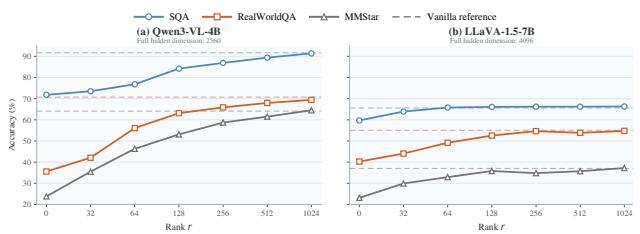
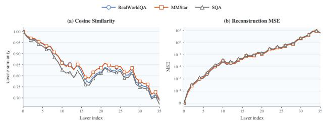
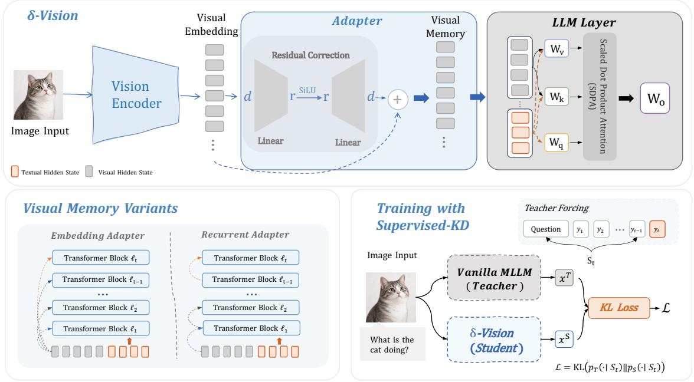
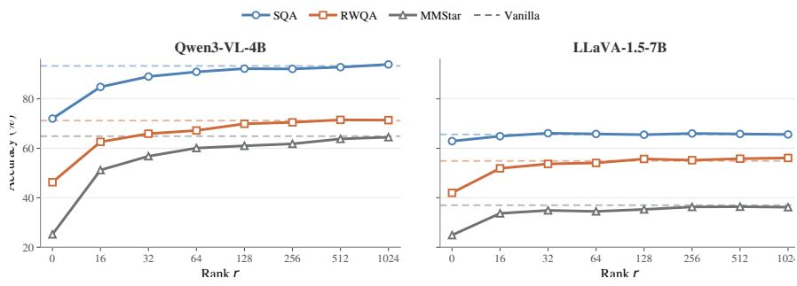
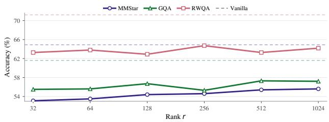
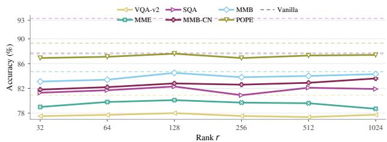
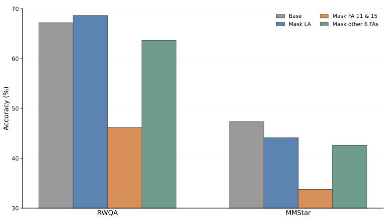

# Just MLPs: Eficient Visual State Reconstruction for Multimodal Language Models

Jingdi Lei1, Junxian Li2, Di Zhang3, Zhanqiu Zhang4, Yiwen Guo5, Soujanya Poria1

1Nanyang Technological University, 2Shanghai Jiao Tong University, 3Fudan University, 4LIGHTSPEED, 5Independent Researcher

Long visual token sequences often account for a substantial fraction of the computational overhead in multimodal large language models (MLLMs). Existing approaches reduce this cost by pruning redundant visual tokens, but permanently discard visual evidence that may become useful in subsequent layers. We instead ask whether all visual tokens can be preserved while reducing the cost of repeatedly evolving the representations through the Transformer. To answer this question, we perform low-rank interventions on visual-to-text information flow. We find that, after visual-to-text attention is blocked, restoring only a few directions recovers most of the lost accuracy, suggesting the relevant visual influence is concentrated in a low-dimensional subspace. We further observe strong predictability in layer-specific visual states: lightweight MLPs approximate them with high cosine similarity and low reconstruction error. Motivated by these findings, we propose δ-Vision, which replaces repeated Transformer evolution of visual tokens with lightweight low-rank adapters that construct layer-wise visual memories while preserving all visual tokens for text retrieval. Across image and video benchmarks, δ-Vision achieves higher accuracy than visual token pruning baselines at comparable or lower computation, while delivering competitive inference eficiency without discarding visual tokens.

§ Github: DeCLaRe Lab Correspondence: Jingdi Lei, Zhanqiu Zhang, Yiwen Guo, Soujanya Poria, Date: September 29, 2026

## 1 Introduction

Multimodal large language models (MLLMs) have extended large language models (LLMs) beyond textual reasoning by endowing them with visual perception and understanding (Liu et al., 2024a; OpenAI, 2024; Qwen Team, 2025; Kimi Team, 2025; GLM, 2026), and have demonstrated remarkable capabilities across a diverse range of multimodal tasks, including image captioning (Alayrac et al., 2022), visual question answering (VQA), video understanding (Qwen Team, 2025), and multimodal reasoning (Yue et al., 2024). However, such impressive performance is accompanied by substantial computational overhead, particularly for high-resolution images and videos which are represented by long sequences of visual tokens (Yang et al., 2025; Shang et al., 2025). This computational cost is further amplified because these visual tokens participate in computations at every single Transformer layer of the inner LLM. As a result, eficiently handling long visual token sequences has become an important challenge for scalable multimodal inference.

Existing approaches (Yang et al., 2025; Wen et al., 2025a,b) have explored reducing this cost by pruning redundant visual tokens, thereby shortening the visual sequence processed by the language model. While efective, such removal is irreversible, once a visual token is discarded, the corresponding visual evidence can no longer be accessed by subsequent layers (Chen et al., 2026; Yang et al., 2026; Qian et al., 2026). Rather than whether asking visual tokens can be safetly discarded, we explore a complementary direction: preserving all visual tokens while reducing their processing cost within the LLM. Specifically, do visual tokens require full computation at every Transformer layer, or can the necessary visual information be integrated into the text stream more eficiently?

  
(a) Accuracy recovery under low-rank approximation.

  
(b) Layer-wise predictability of visual representations.  
Figure 1 Analysis of the dimensional structure of visual representations. (a) Downstream accuracy under diferent retained ranks of visual representation. (b) Layer-wise reconstruction quality measured by cosine similarity and reconstruction MSE.

To investigate this possibility, we first examine efective dimensionality required for visual information to influence the text stream. Keeping all visual tokens and their positions unchanged, we project each visual hidden state onto a low-rank subspace and reconstruct it before subsequent computation (Details are provided in Appendix H). As shown in Figure 1a, much of the original model performance can be retained at ranks substantially smaller than the native hidden dimension, particularly for LLaVA-1.5-7B (Liu et al., 2024a). This observation suggests that visual redundancy exists not only across tokens, but also in the computation used to update their representations across layers. More importantly, these layer-specific visual states also exhibit strong predictability. We train a separate lightweight MLP with a d → d → d architecture for each layer to predict its visual states from the initial visual embeddings. As shown in Figure 1b, these MLPs approximate the Transformer-evolved states with high cosine similarity and low reconstruction error. These observations suggest that preserving useful visual information may not require repeatedly computing fulldimensional visual states through every Transformer layer.

Motivated by these observations, we develop δ-Vision. Rather than propagating visual tokens through full self-attention and feed-forward computation, δ-Vision directly constructs the visual memory required at each layer using a low-rank adapter, while keeping the language-model backbone frozen. We instantiate this idea with an embedding adapter that predicts each layer’s visual memory directly from the initial embeddings and a recurrent adapter that progressively updates the predicted memory across layers. At each layer, the predicted memory is mapped through the original frozen key and value projections. Consequently, text tokens retain access to every visual token, while visual queries, visual attention outputs, and visual feed-forward computation are removed. In this way, δ-Vision changes how visual states are constructed rather than which visual evidence remains accessible, providing an alternative eficiency axis to visual token pruning.

Extensive experiments across diferent MLLM backbones and a broad range of image, multi-image, and video benchmarks demonstrate that δ-Vision achieves a strong accuracy-eficiency trade-of. On Qwen3-VL-4B, δ-Vision reaches an average score of 74.4 under a computational budget comparable to pruning methods that discard 95% of visual tokens, outperforming the strongest baseline by 9.1 points and even matching the best pruning result obtained while retaining 20% of the tokens. The efectiveness of visual-memory prediction further generalizes across diferent scales and multi-image benchmarks. On Video-MME, δ-Vision requires only 17.90% of the FLOPs of the uncompressed model and achieves 1.30× total speed and 1.50× prefil speedup, while maintaining a prefill eficiency comparable to token-pruning baselines despite preserving al visual tokens.

## Our contributions can be summarized as follows:

• We provide empirical evidence that preserving visual information does not necessarily require full layer wise Transformer computation. By keeping all visual tokens, we show that layer-wise visual states are highly compressible in the hidden-channel dimension and exhibit strong predictability across layers.

• We propose δ-Vision, a lightweight visual-memory prediction framework that replaces repeated visualtoken Transformer updates with low-rank layer-wise adapters while preserving all visual tokens for text retrieval

• We demonstrate the efectiveness and generality of δ-Vision across diferent MLLM backbones and diverse image, multi-image, and video benchmarks, achieving stronger accuracy–eficiency trade-ofs than visual token pruning methods under comparable computational budgets.

## 2 Preliminaries

Consider a multimodal large language model that receives a visual input I and a textual prompt $x _ { 1 : T }$ . A vision encoder followed by a multimodal projector converts the visual input into $N _ { v }$ visual embeddings:

$$
\boldsymbol { E } = [ e _ { 1 } , . . . , e _ { N _ { v } } ] \in \mathbb { R } ^ { N _ { v } \times d } ,\tag{1}
$$

where $d$ is the hidden dimension of the language model. The visual embeddings are concatenated with the text embeddings and processed by an L-layer Transformer. Let

$$
H _ { l } = [ V _ { l } ; T _ { l } ] \in \mathbb R ^ { ( N _ { v } + N _ { t } ) \times d } , \qquad V _ { l } \in \mathbb R ^ { N _ { v } \times d } , \qquad T _ { l } \in \mathbb R ^ { N _ { t } \times d } ,\tag{2}
$$

denote the hidden states entering layer l, where $V _ { l }$ and $T _ { l }$ correspond to the visual and textual states. At the input layer, $V _ { 0 } = E$ . Visual tokens play two roles in a MLLM. First, they serve as visual context for the language stream: textual queries retrieve visual information through the keys and values associated with visual tokens. Second, visual tokens are themselves active Transformer states. At every layer, they generate their own queries, receive attention outputs, pass through the feed-forward network, and are consequently transformed into new layer-specific visual states.

We refer to the sequence:

$$
E = V _ { 0 }  V _ { 1 }  \cdot \cdot \cdot  V _ { L } ,\tag{3}
$$

produced by the Transformer as the layer-wise evolution of visual tokens. Importantly, the representation exposed to the text stream is layer dependent rather than directly from the initial visual embeddings E. This design naturally allows visual representations to evolve jointly with the language stream, but it also requires all $N _ { v }$ visual tokens to undergo attention and feed-forward computation at every layer. For high-resolution images or videos with long visual sequences, this repeated computation becomes a substantial component of multimodal inference cost. Our goal is not to reduce $N _ { v }$ , but to reduce the computation to obtain the layer-specific visual representation.

## 3 δ-Vision

δ-Vision replaces the original visual-token update pathway with lightweight layer-wise visual memory prediction, while keeping the textual part unchanged. Figure 2 provides an overview of this design. At layer $l ,$ a low-rank adapter constructs a visual memory $M _ { l }$ , which is then projected by the key–value modules and accessed by text queries. Visual queries, visual attention outputs, and visual feed-forward updates are omitted. We develop two variants for constructing M : embedding adapter that predicts the visual memory from the initial visual embeddings, and recurrent adapter that updates it from the preceding visual memory.

## 3.1 Layer-Wise Visual Memory Prediction

We parameterize the layer-wise visual memory as a full-dimensional residual correction. Given an input visual state $X \in \mathbb { R } ^ { N _ { v } \times d }$ , the adapter at layer l is defined as

$$
A _ { l } ( X ) = X + \Delta _ { l } ( X ) , \quad \Delta _ { l } ( X ) = \phi ( X D _ { l } ) U _ { l } ,\tag{4}
$$

where $D _ { l } \ \in \ \mathbb { R } ^ { d \times r }$ and $U _ { l } ~ \in ~ \mathbb { R } ^ { r \times d }$ are the down- and up-projection matrices, $r \ll d$ is the bottleneck dimension, and $\phi ( \cdot )$ denotes the SiLU activation function. We initialize $U _ { l }$ to zero, so that $A _ { l }$ starts as an identity mapping.

  
Figure 2 Overview of δ-Vision. Top: δ-Vision replaces the original visual hidden-state evolution with lightweight low-rank adapters that constructs layer-wise visual representations. Bottom left: we consider two visual-memory variants: Embedding Adapter, which predicts visual states from the initial visual embeddings, and Recurrent Adapter, which propagates a compact visual state across layers. Bottom right: δ-Vision is trained with Supervised-KD, where the frozen vanilla MLLM serves as the teacher and provides token-level distributional supervision under teacher forcing.

The key property of this parameterization is that it constrains how the visual memory is updated rather than the memory itself. For every visual token, the residual update $\Delta _ { l } ( X )$ lies in the subspace spanned by $U _ { l } .$ , whose dimension is at most r. Equivalently, rank $( \Delta _ { l } ( X ) ) \le r . \ A _ { l } ( X )$ remains a full d-dimensional representation through the residual connections. δ-Vision assumes that the layer-specific displacement required to adapt visual information for a given Transformer can be represented within a low-dimensional hidden-channel subspace.

We instantiate this low-dimensional update in two forms:

Embedding Adapter. The embedding variant predicts the memory of each layer directly from the initial visual embeddings,

$$
M _ { l } = A _ { l } ( E ) = E + \Delta _ { l } ( E ) .\tag{5}
$$

Every layer learns its own low-dimensional displacement from the same initial visual representation. The resulting memories are therefore conditionally independent across layers given E, allowing all $M _ { l }$ to be constructed without explicitly propagating visual states through preceding Transformer layers. This formulation represents our hypothesis: useful layer-specific visual states can be obtained as lightweight corrections to the initial visual evidence.

Recurrent Adapter. The recurrent variant instead constructs a trajectory of visual memories through successive low-dimensional corrections,

$$
M _ { 0 } = E , M _ { l } = A _ { l } ( M _ { l - 1 } ) = M _ { l - 1 } + \Delta _ { l } ( M _ { l - 1 } ) , l = 1 , . . . , L .\tag{6}
$$

Unlike the embedding variant, this formulation preserves an explicit layer-to-layer state. However, each transition is restricted to a low-dimensional displacement rather than a full Transformer update. The recurrent

construction can therefore be viewed as a lightweight approximation to visual-state evolution, in which the memory trajectory is formed by accumulating a sequence of compact layer-specific corrections.

## 3.2 Visual Memory as Context

Having constructed the layer-specific visual memory $M _ { l }$ , we use it as read-only key–value context for the textual stream. Specifically, the predicted memory is processed by the original frozen layer normalization and key–value projections,

$$
K _ { l } ^ { v } = W _ { K , l } \operatorname { L N } _ { l } ( M _ { l } ) , \qquad V _ { l } ^ { v } = W _ { V , l } \operatorname { L N } _ { l } ( M _ { l } ) .\tag{7}
$$

Let $H _ { l } \in \mathbb { R } ^ { N _ { t } \times d }$ denote the textual hidden states entering layer l. Text tokens follow the original Transformer computation and produce

$$
Q _ { l } ^ { t } = W _ { Q , l } \operatorname { L N } _ { l } ( H _ { l } ) , \qquad K _ { l } ^ { t } = W _ { K , l } \operatorname { L N } _ { l } ( H _ { l } ) , \qquad V _ { l } ^ { t } = W _ { V , l } \operatorname { L N } _ { l } ( H _ { l } ) .\tag{8}
$$

The textual queries then attend jointly to the predicted visual memory and the textual context,

$$
O _ { l } ^ { t } = \mathrm { A t t n } \left( Q _ { l } ^ { t } , [ K _ { l } ^ { v } ; K _ { l } ^ { t } ] , [ V _ { l } ^ { v } ; V _ { l } ^ { t } ] \right) ,\tag{9}
$$

where the original causal attention structure is preserved. The resulting attention output contains only $N _ { t }$ query positions and is subsequently processed by the original output projection, residual connection, and feed-forward network of the frozen language model.

This formulation separates visual-state construction from visual information retrieval. In a conventional MLLM, visual tokens simultaneously provide keys and values to the text stream and act as active Transformer states. In δ-Vision, only the former role is retained. The predicted memory contributes $K _ { l } ^ { v }$ and $V _ { l } ^ { v }$ at every layer, so textual queries can still retrieve information from every visual token, but no $Q _ { l } ^ { v }$ , visual attention output, or visual feed-forward update is computed.

Importantly, $M _ { l }$ is not updated by the textual attention computation. Once consumed as key–value context at layer l, it is discarded, and the memory for the next layer $M _ { l + 1 }$ is obtained directly from the corresponding embedding or recurrent adapter. Thus, visual memories form an external layer-wise context sequence rather than a set of hidden states propagated through the Transformer backbone. This allows δ-Vision to preserve access to all visual tokens simultaneously.

## 3.3 Training Objective

We optimize only the visual-memory adapters while keeping the vision encoder, multimodal projector, and language-model backbone frozen. The original MLLM serves as the teacher, while δ-Vision acts as the student. Inspired by Agarwal et al. (2024), we use Supervised-KD as our training objective. Specifically, for each training example, both models are conditioned on the same multimodal input and the same ground truth answer prefix. At answer position t, teacher and student therefore predict the next token $y _ { t }$ conditioned on $\left( I , x _ { 1 : T } , y _ { < t } \right)$

We minimize the forward KL divergence between the teacher and student predictive distributions over ground-truth answer positions,

$$
{ \mathcal { L } } _ { \mathrm { K D } } = { \frac { 1 } { | \Omega | } } \sum _ { t \in \Omega } D _ { \mathrm { K L } } ( p _ { T } { \big ( } { \cdot } \mid I , x _ { 1 : T } , y _ { < t } { \big ) } \| p _ { S } { \big ( } { \cdot } \mid I , x _ { 1 : T } , y _ { < t } { \big ) } ) ,\tag{10}
$$

where Ω denotes the set of answer-token positions. Since the backbone is frozen, the supervision is absorbed entirely by the lightweight visual-memory predictors, encouraging them to provide layer-wise visual context that preserves the teacher’s output behavior. An ablation against standard SFT and on-policy distillation is provided in Appendix $\operatorname { E } ,$ showing that Supervised-KD achieves the best average performance while avoiding the substantial rollout cost of on-policy training.

Table 1 Results of visual token compression methods under 20% and 5% visual-token retention.
<table><tr><td>Method</td><td>MMStar</td><td>RWQA</td><td>GQA</td><td>MMB</td><td>MMB-CN</td><td>MME</td><td>POPE</td><td>SQA</td><td>VQA-v2</td><td>Avg.</td></tr><tr><td colspan="9">Upper Bound (100% Retention)</td><td></td></tr><tr><td>Qwen3-VL-4B</td><td>64.9</td><td>71.2</td><td>61.6</td><td>87.5</td><td>87.7</td><td>84.7</td><td>89.3</td><td>93.3</td><td>80.9</td><td>80.1</td></tr><tr><td colspan="11">Training-Free</td></tr><tr><td colspan="11">Retain 20% Visual Tokens</td></tr><tr><td>FastV(ECCV24)</td><td>49.5</td><td>55.0</td><td>47.3</td><td>79.2</td><td>77.8</td><td>76.6</td><td>77.6</td><td>83.2</td><td>65.8</td><td>68.0</td></tr><tr><td>VisionZip(CVPR25)</td><td>51.1</td><td>61.7</td><td>52.9</td><td>82.0</td><td>80.8</td><td>78.6</td><td>82.6</td><td>85.2</td><td>70.8</td><td>71.7</td></tr><tr><td>DivPrune(CVPR25)</td><td>53.2</td><td>63.9</td><td>55.5</td><td>84.2</td><td>83.5</td><td>81.9</td><td>86.3</td><td>84.4</td><td>75.3</td><td>74.2</td></tr><tr><td>SparseVLM(1CML25)</td><td>53.2</td><td>45.1</td><td>43.1</td><td>73.2</td><td>71.1</td><td>66.3</td><td>77.8</td><td>76.3</td><td>68.1</td><td>63.8</td></tr><tr><td>DART(EMNLP25)</td><td>51.4</td><td>63.9</td><td>53.5</td><td>82.8</td><td>82.0</td><td>77.9</td><td>84.8</td><td>85.0</td><td>72.1</td><td>72.6</td></tr><tr><td>ZOO-Prune(CVPR26)</td><td>49.3</td><td>54.1</td><td>50.4</td><td>80.5</td><td>79.5</td><td>78.2</td><td>78.7</td><td>79.7</td><td>70.5</td><td>69.0</td></tr><tr><td colspan="11">Retain 5% Visual Tokens</td></tr><tr><td>FastV(ECCV24)</td><td>34.8</td><td>43.2</td><td>39.9</td><td>59.4</td><td>56.6</td><td>67.5</td><td>60.9</td><td>72.4</td><td>50.6</td><td>53.9</td></tr><tr><td>VisionZip(CVPR25)</td><td>39.1</td><td>47.8</td><td>44.6</td><td>71.6</td><td>67.9</td><td>73.5</td><td>66.9</td><td>75.2</td><td>59.6</td><td>60.7</td></tr><tr><td>DivPrune(CVPR25)</td><td>42.8</td><td>57.1</td><td>45.0</td><td>75.9</td><td>76.0</td><td>74.5</td><td>73.4</td><td>77.0</td><td>65.7</td><td>65.3</td></tr><tr><td>SparseVLM(ICML25)</td><td>37.5</td><td>42.1</td><td>39.2</td><td>53.0</td><td>51.3</td><td>57.3</td><td>59.5</td><td>72.1</td><td>51.0</td><td>51.4</td></tr><tr><td>DART(EMNLP25)</td><td>42.5</td><td>52.0</td><td>43.5</td><td>73.6</td><td>73.8</td><td>68.0</td><td>71.0</td><td>79.4</td><td>63.7</td><td>63.1</td></tr><tr><td>ZOO-Prune(CVPR26)</td><td>37.5</td><td>44.8</td><td>42.2</td><td>69.9</td><td>69.6</td><td>68.5</td><td>61.9</td><td>75.6</td><td>58.4</td><td>58.7</td></tr><tr><td colspan="11">Training-Based (Retain 5% Visual Tokens)</td></tr><tr><td>LLaVA-Mini(ICLR25)</td><td>40.8</td><td>51.1</td><td>47.3</td><td>78.2</td><td>78.4</td><td>70.7</td><td>78.0</td><td>76.1</td><td>64.3</td><td>65.0</td></tr><tr><td>EPIC(NeurIPS25)</td><td>38.4</td><td>58.8</td><td>49.2</td><td>77.8</td><td>76.2</td><td>74.7</td><td>81.2</td><td>79.6</td><td>66.0</td><td>66.9</td></tr><tr><td>δ-Vision(Emb. Adapter)</td><td>54.4</td><td>62.9</td><td>56.7</td><td>84.5</td><td>82.8</td><td>80.1</td><td>87.6</td><td>82.3</td><td>78.0</td><td>74.4</td></tr><tr><td>δ-Vision(Rec. Adapter)</td><td>56.9</td><td>64.4</td><td>58.4</td><td>85.0</td><td>84.6</td><td>80.7</td><td>87.8</td><td>82.3</td><td>78.5</td><td>75.4</td></tr></table>

## 4 Experiments

## 4.1 Experimental Setup

Models and Training. Unless otherwise specified, we use Qwen3-VL-4B-Instruct (Qwen Team, 2025) (hereafter referred to as Qwen3-VL-4B) with the embedding adapter as the default δ-Vision configuration. All training configurations used in this work are provided in Appendix A.

Evaluations. We evaluate δ-Vision across single-image, multi-image, and video understanding benchmarks. For single-image evaluation, we use MMStar (Chen et al., 2024b), RealWorldQA (RWQA) (xAI, 2024), GQA (Hudson and Manning, 2019), MMBench (MMB) (Liu et al., 2024c), MMBench-CN (MMB-CN) (Liu et al., 2024c), MME (Fu et al., 2025a), POPE (Li et al., 2023), ScienceQA (SQA) (Lu et al., 2022), VQAv2 (Goyal et al., 2019), covering general multimodal reasoning, real-world visual understanding, compositional reasoning, scientific reasoning, and open-ended visual question answering. For more complex visual inputs, we evaluate multi-image understanding on MuirBench (Wang et al., 2025) and video understanding on Video-MME (Fu et al., 2025b) and MVBench (Li et al., 2024). For each benchmark, we report perquestion accuracy to facilitate consistent averaging and comparison across benchmarks. The overall score is the unweighted mean of all benchmark scores.

Since δ-Vision primarily reduces the cost of processing visual tokens, we compare δ-Vision against several training-free visual token pruning methods, including FastV (Chen et al., 2024a), VisionZip (Yang et al., 2025), SparseVLM (Zhang et al., 2025b), DART (Wen et al., 2025a), DivPrune (Alvar et al., 2025) and Zoo-Prune (Kim et al., 2026), as well as training-based methods LLaVA-Mini (Zhang et al., 2025a) and EPIC (Wen et al., 2025b). Our main comparisons consider pruning at 20% and 5% visual-token retention, with 15% and 10% retention results reported in the appendix. For cross-backbone evaluation, we further compare with DART and DivPrune on LLaVA-1.5-7B (Liu et al., 2024a), Qwen3-VL-30B-A3B (Qwen Team,

2025), and Qwen3.5-4B (Qwen Team, 2026), and evaluate LLaVA-1.5-13B, LLaVA-v1.6-Mistral-7B (Liu et al., 2024b), and Qwen3-VL-8B in Appendix F. All the baselines follow their original pruning schedules when computing the retention rate: the initial full-token layers (layers 0–1) are excluded for FastV, DART, and SparseVLM, while all LLM layers are included for DivPrune, VisionZip, and ZOO-Prune.

## 4.2 Main Results

Results on Single-Image. Table 1 compares δ-Vision with both training-free visual token pruning and training-based compression methods on Qwen3-VL-4B. δ-Vision achieves an average score of 74.4, retaining 92.9% of the uncompressed model performance. Compared with the strongest 5%-retention pruning baseline, DivPrune, δ-Vision improves the average score by 9.1 points and achieves higher accuracy across benchmarks. It also outperforms the training-based baselines LLaVA-Mini and EPIC by 9.4 and 7.5 points, respectively. Notably, δ-Vision slightly surpasses the best result obtained by pruning methods that retain 20% of the visual tokens. The recurrent adapter further improves the average score from 74.4 to 75.4 over the embedding adapter. This suggests that the embedding adapter already captures much of the layer-specific visual information, while lightweight cross-layer evolution can further improve the predicted visual memory. These results demonstrate that compressing visual computation along the hidden dimension provides a complementary eficiency axis to token pruning (we further verify that the two mechanisms can be combined in practice, results with DART and DivPrune are provided in Appendix I). Results at 10% and 15% retention ratios show the same trend and are reported in Appendix B.

Eficiency. Table 2 compares the eficiency of δ-Vision with token pruning methods on Video-MME. δ-Vision reduces the computation to 17.90% of the uncompressed model FLOPs, comparable to the 16.58–23.90% range of methods retaining only 5% of visual tokens. In practice, δ-Vision achieves a 1.30× end-to-end speedup and a 1.50× prefill speedup over the base model, with prefill eficiency comparable to the strongest pruning baselines while retaining all visual tokens. Importantly, this comparable eficiency is accompanied by substantially better task performance. These results highlight that inference savings can be obtained without shortening the visual sequence. This provides a complementary efficiency mechanism to sequence-length reduction,

Table 2 Eficiency comparison on Video-MME under 5% visual-token retention. Total Speedup measures the overall inference speedup, including both prefill and decoding.
<table><tr><td>Method</td><td>(%)</td><td>FLOPs Peak Mem. (GB)</td><td>Total Speedup Speedup</td><td>Prefill</td></tr><tr><td colspan="5">Upper Bound</td></tr><tr><td>Qwen3-VL-4B</td><td>100.00</td><td>12.94</td><td>1.00</td><td>1.00</td></tr><tr><td colspan="5">Retain 5% Visual Tokens</td></tr><tr><td>FastV</td><td>21.49</td><td>11.26</td><td>1.22</td><td>1.41</td></tr><tr><td>DART</td><td>21.23</td><td>11.12</td><td>1.13</td><td>1.24</td></tr><tr><td>VisionZip</td><td>16.62</td><td>10.58</td><td>1.30</td><td>1.45</td></tr><tr><td>DivPrune</td><td>16.58</td><td>10.60</td><td>1.30</td><td>1.47</td></tr><tr><td>ZOO-Prune</td><td>23.90</td><td>11.76</td><td>1.23</td><td>1.29</td></tr><tr><td>SparseVLM</td><td>21.60</td><td>11.27</td><td>1.19</td><td>1.36</td></tr><tr><td>δ-Vision</td><td>17.90</td><td>12.97</td><td>1.30</td><td>1.50</td></tr></table>

while retaining access to the complete visual evidence at every layer. We provide additional results for the 20% visual-token retention setting in Appendix D.

Generalization across Backbones. We further evaluate δ-Vision on 3 additional MLLM backbones from LLaVA and Qwen families, including LLaVA-1.5-7B, Qwen3-VL-30B-A3B, and Qwen3.5-4B. The latter adopts a hybrid attention architecture, for which we provide additional analyses in Appendix K. As shown in Table 3, δ-Vision consistently preserves a large fraction of the vanilla-model performance across diferent model scales and architectures. The gains over token-pruning baselines are particularly pronounced on the Qwen family. On Qwen3-VL-30B-A3B, δ-Vision reaches an average score of 78.6, compared with 71.3 for DivPrune under 5% token retention. On Qwen3.5-4B, δ-Vision achieves 71.6, improving over DivPrune at 62.7. Similar improvements are also observed on LLaVA-1.5-7B. Across these three backbones, δ-Vision retains approximately 94–96% of the corresponding vanilla-model performance, despite substantial diferences in model scale and architecture. These results support the generality of visual-memory prediction as an complementary to explicitly propagating visual tokens through the full Transformer computation. Additional cross-backbone results are provided in Appendix F, including comparisons under 20% visual-token retention across 6 backbones and 5% retention results on the three backbones.

Table 3 Results of diferent visual token compression methods across various MLLMs. Vanilla denotes the uncompressed upper bound. DART and DivPrune retain 5% of the visual tokens.
<table><tr><td>Model</td><td>Method MMStar RWQA</td><td></td><td></td><td>GQA</td><td>MMB</td><td>MMB-CN MME</td><td></td><td>POPE</td><td>SQA VQA-v2</td><td></td><td>Avg.</td></tr><tr><td rowspan="4">LLaVA-1.5-7B</td><td>Vanilla</td><td>37.0</td><td>54.9</td><td>61.2</td><td>72.5</td><td>67.9</td><td>71.7</td><td>83.4</td><td>65.6</td><td>75.9</td><td>65.6</td></tr><tr><td>DART</td><td>29.3</td><td>46.5</td><td>51.6</td><td>63.8</td><td>55.7</td><td>68.9</td><td>68.1</td><td>69.0</td><td>61.5</td><td>57.2</td></tr><tr><td>DivPrune</td><td>31.3</td><td>49.0</td><td>53.4</td><td>66.7</td><td>57.3</td><td>66.3</td><td>79.3</td><td>64.5</td><td>70.5</td><td>59.8</td></tr><tr><td>δ-Vision</td><td>35.4</td><td>51.4</td><td>53.8</td><td>69.9</td><td>63.7</td><td>68.7</td><td>79.2</td><td>65.4</td><td>69.5</td><td>61.9</td></tr><tr><td rowspan="4">Qwen3-VL-30B-A3B</td><td>Vanilla</td><td>70.3</td><td>72.3</td><td>65.2</td><td>89.4</td><td>90.8</td><td>89.4</td><td>87.9</td><td>96.3</td><td>82.6</td><td>82.7</td></tr><tr><td>DART</td><td>46.2</td><td>52.3</td><td>50.1</td><td>77.2</td><td>77.9</td><td>79.2</td><td>74.3</td><td>85.9</td><td>66.7</td><td>67.8</td></tr><tr><td>DivPrune</td><td>45.6</td><td>62.9</td><td>54.9</td><td>79.3</td><td>80.8</td><td>83.0</td><td>77.7</td><td>85.0</td><td>72.7</td><td>71.3</td></tr><tr><td>δ-Vision</td><td>62.4</td><td>65.1</td><td>62.4</td><td>86.5</td><td>86.8</td><td>87.0</td><td>87.8</td><td>88.6</td><td>80.7</td><td>78.6</td></tr><tr><td rowspan="4">Qwen3.5-4B</td><td>Vanilla</td><td>48.9</td><td>67.2</td><td>63.4</td><td>84.3</td><td>77.2</td><td>84.0</td><td>88.7</td><td>78.4</td><td>80.0</td><td>74.7</td></tr><tr><td>DART</td><td>30.5</td><td>48.0</td><td>46.1</td><td>67.8</td><td>61.9</td><td>71.2</td><td>68.3</td><td>64.3</td><td>60.8</td><td>57.7</td></tr><tr><td>DivPrune</td><td>34.8</td><td>56.0</td><td>48.8</td><td>74.2</td><td>64.0</td><td>75.8</td><td>73.4</td><td>71.5</td><td>65.6</td><td>62.7</td></tr><tr><td>δ-Vision</td><td>40.1</td><td>65.8</td><td>60.5</td><td>81.3</td><td>75.1</td><td>79.7</td><td>89.0</td><td>74.8</td><td>77.7</td><td>71.6</td></tr></table>

Results on Multi-Image and Video. As shown in Table 4, the embedding adapter trained only on single-image data achieves an average score of 49.5, while incorporating multi-image and video training data (the training recipe is detailed in Appendix A) improves the average to 52.0. The largest gains appear on MuirBench and MVBench, increasing from 40.7 to 45.5 and from 57.4 to 59.5, respectively, while Video-MME improves from 50.5 to 51.0. The resulting 52.0 average surpasses the strongest 5%-retention pruning baseline at 50.2. These results indicate the visual-memory formulation remains efective for longer and more complex visual contexts. Additional results with pruning baselines retaining 20% of the visual tokens are provided in Appendix C.

Table 4 Results on multi-image and video benchmarks. Training-free baselines are evaluated at 5% visual-token retention.
<table><tr><td colspan="4">Method MuirBench Video-MME MVBench Avg.</td></tr><tr><td colspan="4">Upper Bound 55.7</td></tr><tr><td>Qwen3-VL-4B</td><td colspan="3">53.5 52.0 61.6</td></tr><tr><td colspan="4">Training-Free (Retain 5% Visual Tokens)</td></tr><tr><td>FastV</td><td>42.1 45.3</td><td>41.2</td><td>42.9</td></tr><tr><td>DART</td><td>45.1 51.3</td><td>53.3</td><td>49.9</td></tr><tr><td>VisionZip</td><td>43.6 48.2</td><td>46.5</td><td>46.1</td></tr><tr><td>SparseVLM</td><td>42.2 47.2</td><td>45.4</td><td>44.9</td></tr><tr><td>DivPrune</td><td>46.1 51.3</td><td>53.3</td><td>50.2</td></tr><tr><td>ZOO-Prune</td><td>43.9 47.9</td><td>48.5</td><td>46.8</td></tr><tr><td colspan="4">Training-Based (Retain 5% Visual Tokens)</td></tr><tr><td>LLaVA-Mini</td><td>43.8</td><td>45.2</td><td>45.5</td></tr><tr><td>EPIC</td><td>47.5 42.7 48.4</td><td>48.8</td><td>46.6</td></tr><tr><td colspan="4"></td></tr><tr><td>δ-Vision (Sin-Img.)</td><td>40.7 50.5</td><td>57.4</td><td>49.5</td></tr><tr><td>δ-Vision (Mul-Img.)</td><td>45.5 51.0</td><td>59.5</td><td>52.0</td></tr></table>

## 4.3 How Much Visual Computation Is Actually Necessary?

We further ask how much of the visual computation is actually needed to preserve the model behavior. We study this question at three levels: (1) characterizing the native spectral structure of visual computation, (2) testing whether low-rank visual efects are suficient to maintain model performance, (3) propagating low-rank interventions sequentially through the network. These analyses progressively examine whether the visual computation used by the model can be represented within a substantially smaller efective subspace.

Spectral Structure of Native Visual Computation. We first examine the intrinsic dimensionality of visual-token computation in the unmodified model. For each sample and Transformer layer, we analyze three quantities associated with visual tokens: the visual queries after query normalization and RoPE, the per-head visual $Q K ^ { \top }$ matrices before masking and softmax, and the visual attention outputs after the output projection but before the residual connection. We characterize the spectral concentration using two complementary statistics. $r _ { 9 5 }$ denotes the minimum rank required to retain 95% of the squared singular-value energy. We additionally report the efective rank, defined as $\begin{array} { r } { \mathrm { E R } = \exp ( - \sum _ { i } p _ { i } \log p _ { i } ) } \end{array}$ , where $p _ { i } = { \sigma _ { i } } / { \sum _ { j } \sigma _ { j } }$ is the normalized singular-value spectrum. As shown in Table 5, across both Qwen3-VL-4B and LLaVA-1.5- 7B, these quantities exhibit strongly concentrated spectra. In particular, the visual attention outputs require only 38.0–103.5 directions on Qwen3-VL-4B and 29.6–37.6 directions on LLaVA-1.5-7B to retain 95% of the spectral energy, substantially below their available rank. These results suggest that the full representational capacity allocated to visual processing is not uniformly utilized across directions.

Table 5 Average rank statistics of visual-token computations across Transformer layers. r95 denotes the minimum rank retaining 95% of the squared singular-value energy, and ER denotes efective rank.
<table><tr><td>Dataset</td><td colspan="3">Q</td><td colspan="3"> $Q K ^ { \top }$ </td><td colspan="3">Attention Output</td></tr><tr><td></td><td>Full</td><td>r95</td><td>ER</td><td>Full</td><td> ${ \bf { { r } } } _ { 9 5 }$ </td><td>ER</td><td>Full</td><td> ${ \bf { { r } } } _ { 9 5 }$ </td><td>ER</td></tr><tr><td colspan="10">Qwen3-VL-4B</td></tr><tr><td>MMStar</td><td>213.9</td><td>42.7</td><td>108.4 119.2</td><td></td><td>5.0</td><td>19.3</td><td>212.2</td><td>47.0</td><td>101.2</td></tr><tr><td>RWQA</td><td>1296.0</td><td>112.7</td><td>530.0</td><td>128.0</td><td>10.7</td><td>35.3</td><td>1296.0</td><td>103.5</td><td>378.5</td></tr><tr><td>SQA</td><td>170.5</td><td>35.4</td><td>89.1</td><td>101.3</td><td>4.1</td><td>16.0</td><td>170.5</td><td>38.0</td><td>83.4</td></tr><tr><td colspan="10">LLaVA-1.5-7B</td></tr><tr><td>MMStar</td><td>576.0</td><td>79.8</td><td></td><td>243.9 128.0</td><td>2.3</td><td>15.6</td><td>576.0</td><td>37.3</td><td>151.8</td></tr><tr><td>RWQA</td><td>576.0</td><td>81.3</td><td>251.1</td><td>128.0</td><td>2.3</td><td>15.6</td><td>576.0</td><td>37.6</td><td>156.5</td></tr><tr><td>SQA</td><td>576.0</td><td>71.8</td><td>230.4</td><td>128.0</td><td>2.2</td><td>14.7</td><td>576.0</td><td>29.6</td><td>134.5</td></tr></table>

Low-Rank Suficiency of Visual Information. To test whether the observed spectral concentration is functionally meaningful, we run the unmodified model to obtain the native hidden-state trajectory and isolate the attention efect induced by visual information flow at each layer. This visual efect is then projected onto a rank-r subspace before being passed to subsequent computa-

  
Figure 3 Accuracy recovery under low-rank visual attention efect. We vary the retained rank r from 0 to 1024.

tion, while the efect itself is always computed from the native trajectory. As shown in Figure 3, performance recovers rapidly as the retained rank increases. On Qwen3-VL-4B, rank 128 reaches 92.2 on SQA, 69.9 on RWQA, and 61.0 on MMStar, compared with 93.4, 71.4, and 64.8 when the full visual efect is retained. A similar trend is observed on LLaVA-1.5-7B, where relatively small ranks already approach the full-efect performance. These results indicate that, given the native model trajectory, most task-relevant visual efects can be represented within a substantially smaller hidden subspace.

Sequential Low-Rank Intervention on Visual Information Flow. A stronger question is whether this low-rank suficiency still holds when the compressed visual efect is propagated through subsequent layers. We further apply the low-rank intervention sequentially across Transformer layers, such that the compressed output at one layer directly afects the hidden states processed by subsequent layers. As shown in Table 6, low-dimensional visual information remains suficient even under this setting. When all layers of Qwen3-VL-4B are intervened, completely removing direct visual information reduces RWQA from 71.2 to 46.1 and MMStar from 64.9 to 25.6, approaching chance-level performance, whereas restoring only 128 hidden directions recovers the scores to 70.7 and 64.6, respectively. The layer-group interventions further reveal that the dependence on visual information is highly non-uniform across depth. On Qwen3-VL-4B, blocking visual information in the middle layers causes the largest degradation, while the first few and final layers are largely insensitive. In contrast, LLaVA-1.5-7B exhibits a more distributed and task-dependent pattern: on RWQA, both the early and middle layers contribute noticeably, whereas on MMStar the first ten layers are more sensitive than the middle or final layers. These results suggest that the efective dimensionality of visual information remains small even when compression is propagated through the network, while the importance of visual-token processing is highly non-uniform across depth and concentrated in a model-specific subset of Transformer layers. Thus, δ-Vision enables flexible layer-wise skipping rather than applying apply full visual token computation uniformly at every layer in standard MLLMs (we further validate this in Appendix J)).

Table 6 Low-rank intervention on visual-to-text information transfer. visual-to-text attention is blocked at selected layers, and only the leading r directions of the induced attention-output diference are restored. For Qwen3-VL-4B, the middle and last 10-layer groups correspond to layers 13–22 and 26–35; for LLaVA-1.5-7B, they correspond to layers 11–20 and 22–31, respectively.
<table><tr><td rowspan="2">Dataset</td><td rowspan="2">Intervention</td><td colspan="5">Qwen3-VL-4B</td><td colspan="5">LLaVA-1.5-7B</td></tr><tr><td>Vanilla</td><td>r = 0</td><td>r = 32</td><td>r = 64</td><td>r = 128</td><td>Vanilla</td><td>r = 0</td><td>r = 32</td><td>r = 64</td><td>r = 128</td></tr><tr><td rowspan="5">RWQA</td><td rowspan="5">First 5 First 10</td><td rowspan="5"></td><td>72.6 72.9</td><td>71.9</td><td>71.8</td><td>71.5</td><td rowspan="5">54.9</td><td>53.2 49.4</td><td>55.8</td><td>56.2</td><td>56.0</td></tr><tr><td></td><td>71.9</td><td>72.0</td><td>72.0</td><td></td><td>54.9</td><td>55.2</td><td>55.8</td></tr><tr><td>71.2</td><td>69.9</td><td>69.5</td><td>70.5</td><td>48.1</td><td>54.3</td><td>55.6</td><td>55.2</td></tr><tr><td>45.9 71.1</td><td>71.0</td><td>71.1</td><td>71.5</td><td>56.0</td><td>55.0</td><td>55.2</td><td>55.2</td></tr><tr><td></td><td>68.4</td><td>69.2</td><td>70.7</td><td>42.4</td><td>53.2</td><td>54.9</td><td>54.8</td></tr><tr><td rowspan="5">MMStar</td><td rowspan="5">First 5 First 10</td><td rowspan="5"></td><td>64.8</td><td>65.0</td><td>65.4</td><td>65.2</td><td rowspan="5"></td><td>37.3 31.0</td><td>35.8</td><td>36.4</td><td>36.7</td></tr><tr><td></td><td>62.8 64.7</td><td>64.9</td><td>65.1</td><td></td><td>34.8</td><td>34.9</td><td>35.6</td></tr><tr><td>64.9</td><td>40.5 61.0</td><td>63.3</td><td>64.4</td><td>37.0</td><td>36.3 36.9</td><td>37.4</td><td>37.0</td></tr><tr><td></td><td>65.1</td><td>64.8</td><td>64.9</td><td>36.4</td><td>36.8</td><td>36.8</td><td>37.0</td></tr><tr><td></td><td>65.2 25.6 59.5</td><td>63.0</td><td>64.6</td><td></td><td>24.9</td><td>34.0</td><td>34.9</td></tr></table>

## 5 Related Work

Visual Representation Redundancy. Visual redundancy exists not only across tokens but also in the hidden representation space. LRCP (Lu et al., 2026) uses PCA to identify dominant visual subspaces and retains tokens that are poorly represented by them. Other works reduce layer-wise visual computation directly. EE-MLLM (Ma et al., 2024) removes self-attention among visual tokens, while ShortV (Yuan et al., 2025) and Luo et al. (2026) estimate layer importance from changes in the output distribution. Unlike these methods, which remove or preserve parts of the original computation, δ-Vision learns an alternative pathway to construct visual states. KV Prediction (Horton et al., 2024) uses a small auxiliary model to predict the KV cache of a larger model. δ-Vision instead predicts visual memory before KV projection with lightweight adapters and reuses the frozen key and value projections.

Token Reduction for Eficient MLLMs. Visual token reduction lowers MLLM inference cost by selecting, merging, or compressing visual tokens. Training-free methods (Yang et al., 2025; Alvar et al., 2025; Wen et al., 2025a; Zhang et al., 2025b; Chen et al., 2024a; Kim et al., 2026) mainly gain eficiency by reducing sequence length, while training-based methods (Zhang et al., 2025a; Wen et al., 2025b) improve adaptation to compact visual representations. Some methods also allow removed tokens to re-enter later layers. SwiftVLM (Qian et al., 2026) uses cross-layer bypasses and residual connections to recover unselected tokens. In contrast, δ-Vision does not select or remove visual tokens. It constructs key-value context for all visual tokens at every layer. Thus, our method changes how visual states are generated rather than which visual tokens are retained, providing a diferent eficiency direction from sequence-length compression.

## 6 Conclusion

In this work, we revisit the common assumption that visual tokens undergo full Transformer evolution in MLLMs. Our analysis shows that layer-wise visual representations exhibit substantial redundancy in the hidden-channel dimension and predictability across depth, suggesting that useful visual context can be preserved without repeatedly applying the full visual Transformer pathway. Motivated by these observations, we introduce δ-Vision, which replaces visual-token evolution with lightweight low-rank adapters while preserving all visual tokens for text retrieval. Across multiple MLLM backbones and image, multi-image, and video benchmarks, δ-Vision achieves a favorable accuracy–eficiency trade-of relative to visual token prun ing, while operating in a comparable computational regime. These results suggest that reducing multimodal inference cost does not necessarily require removing visual tokens. Eficiently constructing visual states provides a complementary eficiency axis to sequence-length reduction, opening a another direction for scalable

## References

Rishabh Agarwal, Nino Vieillard, Yongchao Zhou, Piotr Stanczyk, Sabela Ramos Garea, Matthieu Geist, and Olivier Bachem. On-policy distillation of language models: Learning from self-generated mistakes. In The Twelfth International Conference on Learning Representations, ICLR 2024, Vienna, Austria, May 7-11, 2024. OpenReview.net, 2024. URL https://openreview.net/forum?id=3zKtaqxLhW.

Jean-Baptiste Alayrac, Jef Donahue, Pauline Luc, Antoine Miech, Iain Barr, Yana Hasson, Karel Lenc, Arthur Mensch, Katherine Millican, Malcolm Reynolds, Roman Ring, Eliza Rutherford, Serkan Cabi, Tengda Han, Zhitao Gong, Sina Samangooei, Marianne Monteiro, Jacob L. Menick, Sebastian Borgeaud, Andy Brock, Aida Nematzadeh, Sahand Sharifzadeh, Mikolaj Binkowski, Ricardo Barreira, Oriol Vinyals, Andrew Zisserman, and Karén Simonyan. Flamingo: a visual language model for few-shot learning. In Sanmi Koyejo, S. Mohamed, A. Agarwal, Danielle Belgrave, K. Cho, and A. Oh, editors, Advances in Neural Information Processing Systems 35: Annual Conference on Neural Information Processing Systems 2022, NeurIPS 2022, New Orleans, LA, USA, November 28 - December 9, 2022, 2022. URL http://papers.nips.cc/paper\_files/paper/2022/hash 960a172bc7fbf0177ccccbb411a7d800-Abstract-Conference.html.

Allen Institute for AI. Molmo2-multiimageqa. Hugging Face Dataset, a. URL https://huggingface.co/datasets/ allenai/Molmo2-MultiImageQA. Accessed: 2026-09-25.

Allen Institute for AI. Pixmo-askmodelanything. Hugging Face Dataset, b. URL https://huggingface.co/datasets/ allenai/pixmo-ask-model-anything. Accessed: 2026-09-25.

Saeed Ranjbar Alvar, Gursimran Singh, Mohammad Akbari, and Yong Zhang. Divprune: Diversitybased visual token pruning for large multimodal models. In IEEE/CVF Conference on Computer Vision and Pattern Recognition, CVPR 2025, Nashville, TN, USA, June 11-15, 2025, pages 9392– 9401. Computer Vision Foundation / IEEE, 2025. doi: 10.1109/CVPR52734.2025.00877. URL https://openaccess.thecvf.com/content/CVPR2025/html/Alvar\_DivPrune\_Diversity-based\_Visual\_Token\_ Pruning\_for\_Large\_Multimodal\_Models\_CVPR\_2025\_paper.html.

Liang Chen, Haozhe Zhao, Tianyu Liu, Shuai Bai, Junyang Lin, Chang Zhou, and Baobao Chang. An image is worth 1/2 tokens after layer 2: Plug-and-play inference acceleration for large vision-language models. In Ales Leonardis, Elisa Ricci, Stefan Roth, Olga Russakovsky, Torsten Sattler, and Gül Varol, editors, Computer Vision - ECCV 2024 - 18th European Conference, Milan, Italy, September 29-October 4, 2024, Proceedings, Part LXXXI, volume 15139 of Lecture Notes in Computer Science, pages 19–35. Springer, 2024a. doi: 10.1007/978-3-031-73004-7\_2. URL https://doi.org/10.1007/978-3-031-73004-7\_2.

Lin Chen, Jinsong Li, Xiaoyi Dong, Pan Zhang, Yuhang Zang, Zehui Chen, Haodong Duan, Jiaqi Wang, Yu Qiao, Dahua Lin, and Feng Zhao. Are we on the right way for evaluating large vision-language models? In Amir Globersons, Lester Mackey, Danielle Belgrave, Angela Fan, Ulrich Paquet, Jakub M. Tomczak, and Cheng Zhang, editors, Advances in Neural Information Processing Systems 37: Annual Conference on Neural Information Processing Systems 2024, NeurIPS 2024, Vancouver, BC, Canada, December 10 - 15, 2024, 2024b. URL http: //papers.nips.cc/paper\_files/paper/2024/hash/2f8ee6a3d766b426d2618e555b5aeb39-Abstract-Conference.html.

Yongru Chen, Kai Zhang, Zeliang Zong, Yuchen Lu, Wenming Tan, Ye Ren, and Jilin Hu. One layer’s trash is another layer’s treasure: Adaptive layer-wise visual token selection in lvlms. CoRR, abs/2606.14277, 2026. doi: 10.48550/ARXIV.2606.14277. URL https://doi.org/10.48550/arXiv.2606.14277.

Kaituo Feng, Kaixiong Gong, Bohao Li, Zonghao Guo, Yibing Wang, Tianshuo Peng, Junfei Wu, Xiaoying Zhang, Benyou Wang, and Xiangyu Yue. Video-r1: Reinforcing video reasoning in mllms. In Danielle Belgrave, Cheng Zhang, Laura N. Montoya, Hsuan-Tien Lin, Razvan Pascanu, Piotr Koniusz, Marzyeh Ghassemi, Nancy Chen, Iván Vladimir Meza Ruíz, and Arturo Loaiza-Bonilla, editors, Advances in Neural Information Processing Systems 38: Annual Conference on Neural Information Processing Systems 2025, NeurIPS 2025, San Diego, CA, USA, December 2-7, 2025 / Mexico City, Mexico, November 30 - December 5, 2025, 2025. URL http://papers.nips.cc/ paper\_files/paper/2025/hash/8eb3976840e08b80dda9667562574246-Abstract-Conference.html.

Chaoyou Fu, Peixian Chen, Yunhang Shen, Yulei Qin, Mengdan Zhang, Xu Lin, Jinrui Yang, Xiawu Zheng, Ke Li, Xing Sun, Yunsheng Wu, Rongrong Ji, Caifeng Shan, and Ran He. MME: A comprehensive evaluation benchmark for multimodal large language models. In Danielle Belgrave, Cheng Zhang, Laura N. Montoya, Hsuan-Tien Lin, Razvan Pascanu, Piotr Koniusz, Marzyeh Ghassemi, Nancy Chen, Iván Vladimir Meza Ruíz, and Arturo

Loaiza-Bonilla, editors, Advances in Neural Information Processing Systems 38: Annual Conference on Neural Information Processing Systems 2025, NeurIPS 2025, San Diego, CA, USA, December 2-7, 2025 / Mexico City, Mexico, November 30 - December 5, 2025, 2025a. URL http://papers.nips.cc/paper\_files/paper/2025/hash/ d79a27cf2772fe00be7f341efc0eb517-Abstract-Datasets\_and\_Benchmarks\_Track.html.

Chaoyou Fu, Yuhan Dai, Yongdong Luo, Lei Li, Shuhuai Ren, Renrui Zhang, Zihan Wang, Chenyu Zhou, Yunhang Shen, Mengdan Zhang, Peixian Chen, Yanwei Li, Shaohui Lin, Sirui Zhao, Ke Li, Tong Xu, Xiawu Zheng, Enhong Chen, Caifeng Shan, Ran He, and Xing Sun. Video-mme: The first-ever comprehensive evaluation benchmark of multi-modal llms in video analysis. In IEEE/CVF Conference on Computer Vision and Pattern Recognition, CVPR 2025, Nashville, TN, USA, June 11- 15, 2025, pages 24108–24118. Computer Vision Foundation / IEEE, 2025b. doi: 10.1109/CVPR52734. 2025.02245. URL https://openaccess.thecvf.com/content/CVPR2025/html/Fu\_Video-MME\_The\_First-Ever\_ Comprehensive\_Evaluation\_Benchmark\_of\_Multi-modal\_LLMs\_in\_CVPR\_2025\_paper.html.

GLM. Glm-5v-turbo: Toward a native foundation model for multimodal agents. CoRR, abs/2604.26752, 2026. doi: 10.48550/ARXIV.2604.26752. URL https://doi.org/10.48550/arXiv.2604.26752.

Yash Goyal, Tejas Khot, Aishwarya Agrawal, Douglas Summers-Stay, Dhruv Batra, and Devi Parikh. Making the V in VQA matter: Elevating the role of image understanding in visual question answering. Int. J. Comput. Vis., 127 (4):398–414, 2019. doi: 10.1007/S11263-018-1116-0. URL https://doi.org/10.1007/s11263-018-1116-0.

Maxwell Horton, Qingqing Cao, Chenfan Sun, Yanzi Jin, Sachin Mehta, Mohammad Rastegari, and Moin Nabi. KV prediction for improved time to first token. CoRR, abs/2410.08391, 2024. doi: 10.48550/ARXIV.2410.08391. URL https://doi.org/10.48550/arXiv.2410.08391.

Drew A. Hudson and Christopher D. Manning. GQA: A new dataset for real-world visual reasoning and compositional question answering. In IEEE Conference on Computer Vision and Pattern Recognition, CVPR 2019, Long Beach, CA, USA, June 16-20, 2019, pages 6700–6709. Computer Vision Foundation / IEEE, 2019. doi: 10.1109/CVPR.2019.00686. URL http://openaccess.thecvf.com/content\_CVPR\_2019/html/Hudson\_GQA\_ A\_New\_Dataset\_for\_Real-World\_Visual\_Reasoning\_and\_Compositional\_CVPR\_2019\_paper.html.

Youngeun Kim, Youjia Zhang, Huiling Liu, Aecheon Jung, Sunwoo Lee, and Sungeun Hong. Zoo-prune: Training-free token pruning via zeroth-order gradient estimation in vision-language models. In IEEE/CVF Conference on Computer Vision and Pattern Recognition, CVPR 2026, Denver, CO, USA, June 3-7, 2026, pages 39572–39582. Computer Vision Foundation, 2026. URL https://openaccess.thecvf.com/content/CVPR2026/ html/Kim\_ZOO-Prune\_Training-Free\_Token\_Pruning\_via\_Zeroth-Order\_Gradient\_Estimation\_in\_ Vision-Language\_CVPR\_2026\_paper.html.

Kimi Team. Kimi-vl technical report. CoRR, abs/2504.07491, 2025. doi: 10.48550/ARXIV.2504.07491. URL https://doi.org/10.48550/arXiv.2504.07491.

Feng Li, Renrui Zhang, Hao Zhang, Yuanhan Zhang, Bo Li, Wei Li, Zejun Ma, and Chunyuan Li. Llava-interleave: Tackling multi-image, video, and 3d in large multimodal models. In The Thirteenth International Conference on Learning Representations, ICLR 2025, Singapore, April 24-28, 2025, 2025. URL https://openreview.net/forum? id=oSQiao9GqB.

Kunchang Li, Yali Wang, Yinan He, Yizhuo Li, Yi Wang, Yi Liu, Zun Wang, Jilan Xu, Guo Chen, Ping Lou, Limin Wang, and Yu Qiao. Mvbench: A comprehensive multi-modal video understanding benchmark. In IEEE/CVF Conference on Computer Vision and Pattern Recognition, CVPR 2024, Seattle, WA, USA, June 16-22, 2024, pages 22195–22206. IEEE, 2024. doi: 10.1109/CVPR52733.2024.02095. URL https://doi.org/10.1109/CVPR52733.2024. 02095.

Yifan Li, Yifan Du, Kun Zhou, Jinpeng Wang, Wayne Xin Zhao, and Ji-Rong Wen. Evaluating object hallucination in large vision-language models. In Houda Bouamor, Juan Pino, and Kalika Bali, editors, Proceedings of the 2023 Conference on Empirical Methods in Natural Language Processing, EMNLP 2023, Singapore, December 6-10, 2023, pages 292–305. Association for Computational Linguistics, 2023. doi: 10.18653/V1/2023.EMNLP-MAIN.20. URL https://doi.org/10.18653/v1/2023.emnlp-main.20.

Haotian Liu, Chunyuan Li, Yuheng Li, and Yong Jae Lee. Improved baselines with visual instruction tuning. In IEEE/CVF Conference on Computer Vision and Pattern Recognition, CVPR 2024, Seattle, WA, USA, June 16- 22, 2024, pages 26286–26296. IEEE, 2024a. doi: 10.1109/CVPR52733.2024.02484. URL https://doi.org/10.1109/ CVPR52733.2024.02484.

Haotian Liu, Chunyuan Li, Yuheng Li, Bo Li, Yuanhan Zhang, Sheng Shen, and Yong Jae Lee. Llava-next: Improved reasoning, ocr, and world knowledge, January 2024b. URL https://llava-vl.github.io/blog/2024-01-30-llava-next/.

Yuan Liu, Haodong Duan, Yuanhan Zhang, Bo Li, Songyang Zhang, Wangbo Zhao, Yike Yuan, Jiaqi Wang, Conghui He, Ziwei Liu, Kai Chen, and Dahua Lin. Mmbench: Is your multi-modal model an all-around player? In Ales Leonardis, Elisa Ricci, Stefan Roth, Olga Russakovsky, Torsten Sattler, and Gül Varol, editors, Computer Vision - ECCV 2024 - 18th European Conference, Milan, Italy, September 29-October 4, 2024, Proceedings, Part VI, volume 15064 of Lecture Notes in Computer Science, pages 216–233. Springer, 2024c. doi: 10.1007/978-3-031-72658-3\_13. URL https://doi.org/10.1007/978-3-031-72658-3\_13.

Hongyu Lu, Feng Zhang, Wenwei Jin, Huanling Hu, Tianjun Shi, Shikai Jiang, Yao Hu, and Jiawei Li. LRCP: lowrank compressibility guided visual token pruning for eficient lvlms. CoRR, abs/2605.15621, 2026. doi: 10.48550/ ARXIV.2605.15621. URL https://doi.org/10.48550/arXiv.2605.15621.

Pan Lu, Swaroop Mishra, Tanglin Xia, Liang Qiu, Kai-Wei Chang, Song-Chun Zhu, Oyvind Tafjord, Peter Clark, and Ashwin Kalyan. Learn to explain: Multimodal reasoning via thought chains for science question answering. In Sanmi Koyejo, S. Mohamed, A. Agarwal, Danielle Belgrave, K. Cho, and A. Oh, editors, Advances in Neural Information Processing Systems 35: Annual Conference on Neural Information Processing Systems 2022, NeurIPS 2022, New Orleans, LA, USA, November 28 - December 9, 2022, 2022. URL http://papers.nips.cc/paper\_files paper/2022/hash/11332b6b6cf4485b84afadb1352d3a9a-Abstract-Conference.html.

Zhaoyang Luo, Runmin Dong, Miao Yang, Fan Wei, Yushan Lai, Bin Luo, and Haohuan Fu. Attend, transform, or silence: Operator-level visual skipping for eficient multimodal LLM inference. CoRR, abs/2606.31903, 2026. doi: 10.48550/ARXIV.2606.31903. URL https://doi.org/10.48550/arXiv.2606.31903.

Feipeng Ma, Yizhou Zhou, Hebei Li, Zilong He, Siying Wu, Fengyun Rao, Yueyi Zhang, and Xiaoyan Sun. EE-MLLM: A data-eficient and compute-eficient multimodal large language model. CoRR, abs/2408.11795, 2024. doi: 10.48550/ARXIV.2408.11795. URL https://doi.org/10.48550/arXiv.2408.11795.

OpenAI. Gpt-4o system card. CoRR, abs/2410.21276, 2024. doi: 10.48550/ARXIV.2410.21276. URL https://doi. org/10.48550/arXiv.2410.21276.

Chen Qian, Xinran Yu, Danyang Li, Guoxuan Chi, Zheng Yang, Qiang Ma, and Xin Miao. Swiftvlm: Eficient vision-language model inference via cross-layer token bypass. CoRR, abs/2602.03134, 2026. doi: 10.48550/ARXIV. 2602.03134. URL https://doi.org/10.48550/arXiv.2602.03134.

Qwen Team. Qwen3-vl technical report. CoRR, abs/2511.21631, 2025. doi: 10.48550/ARXIV.2511.21631. URL https://doi.org/10.48550/arXiv.2511.21631.

Qwen Team. Qwen3.5: Towards native multimodal agents, February 2026. URL https://qwen.ai/blog?id=qwen3.5.

Yuzhang Shang, Mu Cai, Bingxin Xu, Yong Jae Lee, and Yan Yan. Llava-prumerge: Adaptive token reduction for eficient large multimodal models. In IEEE/CVF International Conference on Computer Vision, ICCV 2025, Honolulu, HI, USA, October 19-25, 2025, pages 22857–22867. IEEE, 2025. doi: 10.1109/ICCV51701.2025.02122. URL https://doi.org/10.1109/ICCV51701.2025.02122.

Fei Wang, Xingyu Fu, James Y. Huang, Zekun Li, Qin Liu, Xiaogeng Liu, Mingyu Derek Ma, Nan Xu, Wenxuan Zhou, Kai Zhang, Tianyi Lorena Yan, Wenjie Jacky Mo, Hsiang-Hui Liu, Pan Lu, Chunyuan Li, Chaowei Xiao, Kai-Wei Chang, Dan Roth, Sheng Zhang, Hoifung Poon, and Muhao Chen. Muirbench: A comprehensive benchmark for robust multi-image understanding. In The Thirteenth International Conference on Learning Representations, ICLR 2025, Singapore, April 24-28, 2025. OpenReview.net, 2025. URL https://openreview.net forum?id=TrVYEZtSQH.

Zichen Wen, Yifeng Gao, Shaobo Wang, Junyuan Zhang, Qintong Zhang, Weijia Li, Conghui He, and Linfeng Zhang. Stop looking for "important tokens" in multimodal language models: Duplication matters more. In Christos Christodoulopoulos, Tanmoy Chakraborty, Carolyn Rose, and Violet Peng, editors, Proceedings of the 2025 Conference on Empirical Methods in Natural Language Processing, EMNLP 2025, Suzhou, China, November 4-9, 2025, pages 9961–9980. Association for Computational Linguistics, 2025a. doi: 10.18653/V1/2025.EMNLP-MAIN. 505. URL https://doi.org/10.18653/v1/2025.emnlp-main.505.

Zichen Wen, Shaobo Wang, Yufa Zhou, Junyuan Zhang, Qintong Zhang, Yifeng Gao, Zhaorun Chen, Bin Wang, Weijia Li, Conghui He, and Linfeng Zhang. Eficient multi-modal large language models via progressive consistency distillation. In Advances in Neural Information Processing Systems 38: Annual Conference on Neural Information Processing Systems 2025, NeurIPS 2025, San Diego, CA, USA, December 2-7, 2025 / Mexico City,

Mexico, November 30 - December 5, 2025, 2025b. URL http://papers.nips.cc/paper\_files/paper/2025/hash 6518f9339196e172fa0ceef48a85543a-Abstract-Conference.html.

xAI. Realworldqa: A benchmark for real-world spatial understanding. https://huggingface.co/datasets/xai-org/ RealworldQA, 2024. Accessed: 2026-09-21.

Cheng-Yu Yang, Shao-Yuan Lo, and Yu-Lun Liu. Reroute, don’t remove: Recoverable visual token routing for vision-language models. CoRR, abs/2606.12412, 2026. doi: 10.48550/ARXIV.2606.12412. URL https://doi.org/ 10.48550/arXiv.2606.12412.

Senqiao Yang, Yukang Chen, Zhuotao Tian, Chengyao Wang, Jingyao Li, Bei Yu, and Jiaya Jia. Visionzip: Longer is better but not necessary in vision language models. In IEEE/CVF Conference on Computer Vision and Pattern Recognition, CVPR 2025, Nashville, TN, USA, June 11-15, 2025, pages 19792–19802. Computer Vision Foundation / IEEE, 2025. doi: 10.1109/CVPR52734.2025. 01843. URL https://openaccess.thecvf.com/content/CVPR2025/html/Yang\_VisionZip\_Longer\_is\_Better\_ but\_Not\_Necessary\_in\_Vision\_Language\_CVPR\_2025\_paper.html.

Qianhao Yuan, Qingyu Zhang, Yanjiang Liu, Jiawei Chen, Yaojie Lu, Hongyu Lin, Jia Zheng, Xianpei Han, and Le Sun. Shortv: Eficient multimodal large language models by freezing visual tokens in inefective layers. In IEEE/CVF International Conference on Computer Vision, ICCV 2025, Honolulu, HI, USA, October 19-25, 2025, pages 329–339. IEEE, 2025. doi: 10.1109/ICCV51701.2025.00038. URL https://doi.org/10.1109/ICCV51701.2025. 00038.

Xiang Yue, Yuansheng Ni, Tianyu Zheng, Kai Zhang, Ruoqi Liu, Ge Zhang, Samuel Stevens, Dongfu Jiang, Weiming Ren, Yuxuan Sun, Cong Wei, Botao Yu, Ruibin Yuan, Renliang Sun, Ming Yin, Boyuan Zheng, Zhenzhu Yang, Yibo Liu, Wenhao Huang, Huan Sun, Yu Su, and Wenhu Chen. MMMU: A massive multi-discipline multimodal understanding and reasoning benchmark for expert AGI. In IEEE/CVF Conference on Computer Vision and Pattern Recognition, CVPR 2024, Seattle, WA, USA, June 16-22, 2024, pages 9556–9567. IEEE, 2024. doi: 10. 1109/CVPR52733.2024.00913. URL https://doi.org/10.1109/CVPR52733.2024.00913.

Shaolei Zhang, Qingkai Fang, Zhe Yang, and Yang Feng. Llava-mini: Eficient image and video large multimodal models with one vision token. In The Thirteenth International Conference on Learning Representations, ICLR 2025, Singapore, April 24-28, 2025. OpenReview.net, 2025a. URL https://openreview.net/forum?id=UQJ7CDW8nb.

Yuan Zhang, Chun-Kai Fan, Junpeng Ma, Wenzhao Zheng, Tao Huang, Kuan Cheng, Denis A. Gudovskiy, Tomoyuki Okuno, Yohei Nakata, Kurt Keutzer, and Shanghang Zhang. Sparsevlm: Visual token sparsification for eficient vision-language model inference. In Forty-second International Conference on Machine Learning, ICML 2025, Vancouver, BC, Canada, July 13-19, 2025, volume 267 of Proceedings of Machine Learning Research. PMLR / OpenReview.net, 2025b. URL https://proceedings.mlr.press/v267/zhang25s.html.

## A Additional Implementation and Training Details

We freeze the vision encoder, multimodal projector, and language-model backbone, and optimize only the layer-specific visual-memory adapters. To ensure a fair comparison with visual token pruning methods, we disable the DeepStack mechanism in Qwen3-VL for all methods. Unless otherwise specified, each adapter uses a bottleneck rank of r=128. For the default single-image setting, we train on allenai/pixmo-ask-modelanything (Allen Institute for AI, b) for 2,000 steps using 8 GPUs with a global batch size of 32 (LLaVA-Mini and EPIC are trained using the same settings). For the multi-image and video setting, we construct the training set from 20,000 samples of allenai/Molmo2-MultiImageQA (Allen Institute for AI, a), 44,000 samples of lmms-lab/M4-Instruct-Data (Li et al., 2025), and 64,000 samples of Video-R1/Video-R1-data (Feng et al., 2025), and train for 4,000 steps using the same number of GPUs and global batch size. For all experiments, optimization uses AdamW with a learning rate of $5 \times 1 0 ^ { - 5 }$ , weight decay of 0.01, and gradient clipping at 1.0. We adopt a cosine learning-rate schedule with a 3% warmup and a minimum learning-rate ratio of 0.1. All experiments use a fixed random seed of 44.

## B Additional Token-Retention Results

Table 7 Results of visual token compression methods on Qwen3-VL-4B. Training-free baselines are evaluated under 15% and 10% visual-token retention.
<table><tr><td>Method</td><td>MMStar</td><td>RWQA</td><td>GQA</td><td>MMB</td><td>MMB-CN</td><td>MME</td><td>POPE</td><td>SQA</td><td>VQA-v2</td><td>Avg.</td></tr><tr><td colspan="11">Upper Bound (100% Retention)</td></tr><tr><td>Qwen3-VL-4B</td><td>64.9</td><td>71.2</td><td>61.6</td><td>87.5</td><td>87.7</td><td>84.7</td><td>89.3</td><td>93.3</td><td>80.9</td><td>80.1</td></tr><tr><td colspan="11">Training-Free</td></tr><tr><td colspan="11">Retain 15% Visual Tokens</td></tr><tr><td>FastV</td><td>47.5</td><td>50.5</td><td>44.1</td><td>76.7</td><td>74.8</td><td>75.1</td><td>73.1</td><td>80.3</td><td>63.7</td><td>65.1</td></tr><tr><td>VisionZip</td><td>49.7</td><td>58.4</td><td>53.4</td><td>80.2</td><td>78.4</td><td>76.4</td><td>79.5</td><td>82.3</td><td>70.3</td><td>69.8</td></tr><tr><td>DivPrune</td><td>51.0</td><td>62.4</td><td>53.3</td><td>83.3</td><td>81.9</td><td>81.5</td><td>84.9</td><td>82.3</td><td>74.1</td><td>72.7</td></tr><tr><td>SparseVLM</td><td>48.8</td><td>43.4</td><td>42.0</td><td>67.3</td><td>65.7</td><td>63.4</td><td>73.8</td><td>74.3</td><td>65.3</td><td>60.4</td></tr><tr><td>DART</td><td>48.4</td><td>60.5</td><td>51.6</td><td>81.8</td><td>81.5</td><td>76.7</td><td>81.6</td><td>83.0</td><td>70.4</td><td>70.6</td></tr><tr><td>ZOO-Prune</td><td>46.5</td><td>53.1</td><td>50.3</td><td>77.7</td><td>78.1</td><td>77.6</td><td>76.1</td><td>78.1</td><td>69.3</td><td>67.4</td></tr><tr><td colspan="11">Retain 10% Visual Tokens</td></tr><tr><td>FastV</td><td>43.4</td><td>47.8</td><td>43.9</td><td>70.7</td><td>68.8</td><td>71.9</td><td>69.5</td><td>77.4</td><td>57.7</td><td>61.2</td></tr><tr><td>VisionZip</td><td>46.4</td><td>53.9</td><td>50.4</td><td>77.4</td><td>75.5</td><td>73.9</td><td>75.6</td><td>79.5</td><td>67.2</td><td>66.6</td></tr><tr><td>DivPrune</td><td>48.5</td><td>61.4</td><td>51.3</td><td>81.1</td><td>81.2</td><td>78.8</td><td>83.4</td><td>82.4</td><td>71.7</td><td>71.1</td></tr><tr><td>SparseVLM</td><td>44.6</td><td>42.6</td><td>40.7</td><td>60.0</td><td>57.4</td><td>61.4</td><td>68.7</td><td>72.6</td><td>60.3</td><td>56.5</td></tr><tr><td>DART</td><td>46.0</td><td>55.8</td><td>49.4</td><td>77.2</td><td>78.4</td><td>73.9</td><td>78.4</td><td>80.4</td><td>66.6</td><td>67.3</td></tr><tr><td>ZOO-Prune</td><td>44.0</td><td>47.5</td><td>47.8</td><td>75.7</td><td>75.2</td><td>75.2</td><td>72.7</td><td>77.0</td><td>64.3</td><td>64.4</td></tr><tr><td>δ-Vision</td><td>54.4</td><td>62.9</td><td>56.7</td><td>84.5</td><td>82.8</td><td>80.1</td><td>87.6</td><td>82.3</td><td>78.0</td><td>74.4</td></tr></table>

To provide a more complete comparison across visual-token budgets, we additionally evaluate the trainingfree pruning baselines at 15% and 10% token retention. As shown in Table 7, performance consistently decreases as fewer visual tokens are retained. DivPrune remains the strongest pruning baseline at both operating points, achieving average scores of 72.7 and 71.1 at 15% and 10% retention, respectively. In comparison, δ-Vision achieves an average score of 74.4 while preserving all visual tokens. These results provide a more complete view of the trade-of obtained by reducing the visual sequence length.

Table 8 Additional results on multi-image and video benchmarks. Training-free baselines are evaluated at 20% visual-token retention.
<table><tr><td>Method</td><td>MuirBench</td><td>Video-MME</td><td>MVBench</td><td>Avg.</td></tr><tr><td colspan="5">Upper Bound</td></tr><tr><td>Qwen3-VL-4B</td><td>53.5</td><td>52.0</td><td>61.6</td><td>55.7</td></tr><tr><td colspan="5">Training-Free (Retain 20% Visual Tokens)</td></tr><tr><td>FastV</td><td>48.6</td><td>49.5</td><td>54.6</td><td>50.9</td></tr><tr><td>DART</td><td>49.0</td><td>52.2</td><td>56.7</td><td>52.6</td></tr><tr><td>VisionZip</td><td>47.9</td><td>50.9</td><td>55.0</td><td>51.3</td></tr><tr><td>SparseVLM</td><td>47.0</td><td>49.6</td><td>53.9</td><td>50.2</td></tr><tr><td>DivPrune</td><td>48.8</td><td>52.0</td><td>57.5</td><td>52.8</td></tr><tr><td>ZOO-Prune</td><td>50.2</td><td>49.5</td><td>53.6</td><td>51.1</td></tr><tr><td>Emb. Adapter (Single-Img.)</td><td>40.7</td><td>50.5</td><td>57.4</td><td>49.5</td></tr><tr><td>Emb. Adapter (Multi-Img./Video)</td><td>45.5</td><td>51.0</td><td>59.5</td><td>52.0</td></tr></table>

## C Additional Result on Multi-Image and Video

Table 8 provides additional results on multi-image and video benchmarks, where the training-free pruning baselines retain 20% of the visual tokens.

## D Additional Eficiency Results

Table 9 Eficiency comparison on Video-MME. Training-free baselines are evaluated under 20% visual-token retention. Total Speedup measures the overall inference speedup, including both prefill and decoding.
<table><tr><td>Method</td><td>FLOPs (%)</td><td>Peak Mem. (GB)</td><td>Total Speedup</td><td>Prefill Speedup</td><td>Decode Speedup</td></tr><tr><td></td><td></td><td>Upper Bound</td><td></td><td></td><td></td></tr><tr><td>Qwen3-VL-4B</td><td>100.00</td><td>12.94</td><td>1.00</td><td>1.00</td><td>1.00</td></tr><tr><td></td><td></td><td>Training-Free (Retain 20% Visual Tokens)</td><td></td><td></td><td></td></tr><tr><td>FastV</td><td>33.27</td><td>11.68</td><td>1.18</td><td>1.34</td><td>1.07</td></tr><tr><td>DART</td><td>33.00</td><td>11.64</td><td>1.13</td><td>1.23</td><td>1.06</td></tr><tr><td>VisionZip</td><td>29.08</td><td>11.05</td><td>1.25</td><td>1.34</td><td>1.18</td></tr><tr><td>DivPrune</td><td>29.05</td><td>11.06</td><td>1.25</td><td>1.34</td><td>1.18</td></tr><tr><td>ZOO-Prune</td><td>36.36</td><td>12.19</td><td>1.16</td><td>1.15</td><td>1.18</td></tr><tr><td>SparseVLM</td><td>33.37</td><td>11.98</td><td>1.16</td><td>1.28</td><td>1.07</td></tr><tr><td>Emb. Adapter</td><td>17.90</td><td>12.97</td><td>1.30</td><td>1.50</td><td>1.13</td></tr></table>

Table 9 reports the inference eficiency of diferent visual token pruning methods under 20% token retention on Video-MME. The pruning baselines require 29.05–36.36% of the FLOPs of the uncompressed model and achieve prefill speedups ranging from 1.15× to 1.34×. Their total speedups range from 1.13× to 1.25×, while decode speedups remain between 1.06× and 1.18×. δ-Vision uses 17.90% of the FLOPs and achieves 1.30× total and 1.50× prefill speedups while preserving all visual tokens. These results provide an additional eficiency comparison under a mild pruning regime.

## E Training Objective Ablation

Table 10 Ablation study on diferent training objectives for the embedding adapter. All variants only optimize the adapter parameters. Emb. Adapter (Init). denotes the initialization setting, where the same visual representation is shared across all Transformer layers without learned layer-specific adaptation, serving as the lower-bound baseline.
<table><tr><td>Method</td><td>MMStar</td><td>RWQA</td><td>GQA</td><td>MMB</td><td>MMB-CN</td><td>MME</td><td>POPE</td><td>SQA</td><td>VQA-v2</td><td> ${ \mathsf { A v g . } }$ </td><td>Time</td></tr><tr><td>Emb. Adapter (Init).</td><td>41.2</td><td>40.8</td><td>43.4</td><td>77.4</td><td>74.6</td><td>66.4</td><td>65.5</td><td>78.8</td><td>58.4</td><td>60.7</td><td></td></tr><tr><td>Emb.  $\mathrm { A d a p t e r + S F T }$ </td><td>50.5</td><td>59.4</td><td>28.6</td><td>83.6</td><td>80.0</td><td>77.5</td><td>85.5</td><td>79.9</td><td>75.1</td><td>68.9</td><td>23m51s</td></tr><tr><td>Emb.  $\mathrm { A d a p t e r + O P D }$ </td><td>53.6</td><td>63.9</td><td>55.8</td><td>83.4</td><td>83.1</td><td>79.5</td><td>86.7</td><td>81.9</td><td>77.8</td><td>74.0</td><td>4h38m08s</td></tr><tr><td>Emb.  $\mathbf { A d a p t e r } + \mathbf { S u p e r v i s e d - K D }$ </td><td>54.4</td><td>62.9</td><td>56.7</td><td>84.5</td><td>82.8</td><td>80.1</td><td>87.6</td><td>82.3</td><td>78.0</td><td>74.4</td><td>34m53s</td></tr></table>

We compare three objectives for training the embedding adapter while keeping all backbone parameters frozen: supervised fine-tuning (SFT), on-policy distillation (OPD) (Agarwal et al., 2024), and our Supervised-KD objective. As shown in Table 10, SFT achieves an average score of 68.9, substantially below both distillation-based objectives. OPD improves the average score to 74.0 but requires 4h38m of training due to autoregressive student rollouts. Supervised-KD achieves the highest average score of 74.4 while requiring only 34m53s, reducing the training time by approximately 8× relative to OPD. These results show that teacher-forced distribution matching retains the efectiveness of distillation without the rollout overhead of on-policy training.

## F Additional Cross-Backbone Results

Table 11 Results of diferent visual token compression methods across various vision-language models. Vanilla denotes the uncompressed upper bound. DART and DivPrune retain 20% of the visual tokens.
<table><tr><td>Model</td><td>Method MMStar RWQA</td><td></td><td>GQA</td><td></td><td>MMB MMB-CN MME POPE</td><td></td><td></td><td></td><td>SQA VQA-v2</td><td></td><td>Avg.</td></tr><tr><td rowspan="4">LLaVA-1.5-7B</td><td>Vanilla</td><td>37.0</td><td>54.9</td><td>61.2</td><td>72.5</td><td>67.9</td><td>71.7</td><td>83.4</td><td>65.6</td><td>75.9</td><td>65.6</td></tr><tr><td>DART</td><td>30.6</td><td>52.3</td><td>57.8</td><td>70.8</td><td>66.3</td><td>76.6</td><td>81.4</td><td>69.4</td><td>71.1</td><td>64.0</td></tr><tr><td>DivPrune</td><td>38.1</td><td>51.9</td><td>58.5</td><td>70.4</td><td>66.5</td><td>70.3</td><td>82.1</td><td>65.6</td><td>74.3</td><td>64.2</td></tr><tr><td>δ-Vision</td><td>35.4</td><td>51.4</td><td>53.8</td><td>69.9</td><td>63.7</td><td>68.7</td><td>79.2</td><td>65.4</td><td>69.5</td><td>61.9</td></tr><tr><td rowspan="4">LLaVA-1.5-13B</td><td>Vanilla</td><td>38.7</td><td>57.7</td><td>63.0</td><td>74.7</td><td>70.3</td><td>66.6</td><td>83.8</td><td>71.5</td><td>78.3</td><td>67.2</td></tr><tr><td>DART</td><td>33.6</td><td>55.4</td><td>57.6</td><td>76.0</td><td>67.9</td><td>75.6</td><td>84.9</td><td>73.6</td><td>72.1</td><td>66.3</td></tr><tr><td>DivPrune</td><td>36.8</td><td>52.3</td><td>60.8</td><td>73.8</td><td>69.6</td><td>69.1</td><td>81.2</td><td>72.2</td><td>75.8</td><td>65.7</td></tr><tr><td>δ-Vision</td><td>36.5</td><td>50.1</td><td>56.3</td><td>72.5</td><td>65.9</td><td>64.2</td><td>76.8</td><td>70.7</td><td>73.1</td><td>62.9</td></tr><tr><td rowspan="4">LLaVA-1.6-Mistral-7B</td><td>Vanilla</td><td>40.4</td><td>47.3</td><td>54.3</td><td>71.9</td><td>65.0</td><td>68.4</td><td>85.4</td><td>68.7</td><td>74.4</td><td>64.0</td></tr><tr><td>DART</td><td>40.0</td><td>48.1</td><td>53.2</td><td>72.0</td><td>64.2</td><td>69.8</td><td>84.4</td><td>69.8</td><td>73.6</td><td>63.9</td></tr><tr><td>DivPrune</td><td>39.4</td><td>47.1</td><td>56.8</td><td>72.1</td><td>63.8</td><td>68.2</td><td>83.4</td><td>70.5</td><td>75.6</td><td>64.1</td></tr><tr><td>δ-Vision</td><td>39.2</td><td>43.9</td><td>46.8</td><td>70.5</td><td>61.2</td><td>64.8</td><td>83.7</td><td>68.3</td><td>69.5</td><td>60.9</td></tr><tr><td rowspan="4">Qwen3-VL-8B</td><td>Vanilla</td><td>68.5</td><td>69.4</td><td>61.9</td><td>89.2</td><td>88.7</td><td>88.6</td><td>86.8</td><td>95.1</td><td>80.6</td><td>81.0</td></tr><tr><td>DART</td><td>51.3</td><td>63.5</td><td>52.8</td><td>81.9</td><td>81.6</td><td>80.4</td><td>82.6</td><td>88.0</td><td>71.8</td><td>72.7</td></tr><tr><td>DivPrune</td><td>54.4</td><td>64.1</td><td>56.2</td><td>83.4</td><td>84.4</td><td>84.2</td><td>85.9</td><td>86.0</td><td>76.8</td><td>75.0</td></tr><tr><td>δ-Vision</td><td>54.9</td><td>61.8</td><td>58.0</td><td>83.5</td><td>82.6</td><td>82.0</td><td>84.6</td><td>81.5</td><td>75.4</td><td>73.8</td></tr><tr><td rowspan="4">Qwen3-VL-30B-A3B</td><td>Vanilla</td><td>70.3</td><td>72.3</td><td>65.2</td><td>89.4</td><td>90.8</td><td>89.4</td><td>87.9</td><td>96.3</td><td>82.6</td><td>82.7</td></tr><tr><td>DART</td><td>58.3</td><td>64.8</td><td>59.6</td><td>85.9</td><td>85.4</td><td>86.1</td><td>83.3</td><td>89.5</td><td>75.9</td><td>76.5</td></tr><tr><td>DivPrune</td><td>59.6</td><td>68.0</td><td>62.8</td><td>86.7</td><td>87.7</td><td>87.5</td><td>88.0</td><td>90.3</td><td>78.7</td><td>78.8</td></tr><tr><td>δ-Vision</td><td>62.4</td><td>65.1</td><td>62.4</td><td>86.5</td><td>86.8</td><td>87.0</td><td>87.8</td><td>88.6</td><td>80.7</td><td>78.6</td></tr><tr><td rowspan="4">Qwen3.5-4B</td><td>Vanilla</td><td>48.9</td><td>67.2</td><td>63.4</td><td>84.3</td><td>77.2</td><td>84.0</td><td>88.7</td><td>78.4</td><td>80.0</td><td>74.7</td></tr><tr><td>DART</td><td>37.3</td><td>56.5</td><td>54.0</td><td>79.5</td><td>73.5</td><td>79.7</td><td>79.2</td><td>73.4</td><td>71.6</td><td>67.2</td></tr><tr><td>DivPrune</td><td>42.3</td><td>63.3</td><td>57.7</td><td>81.1</td><td>73.3</td><td>81.9</td><td>87.3</td><td>74.1</td><td>75.9</td><td>70.8</td></tr><tr><td>δ-Vision</td><td>40.1</td><td>65.8</td><td>60.5</td><td>81.3</td><td>75.1</td><td>79.7</td><td>89.0</td><td>74.8</td><td>77.7</td><td>71.6</td></tr></table>

Table 11 reports cross-backbone results with DART and DivPrune retaining 20% of the visual tokens. Across the 6 evaluated backbones, δ-Vision remains close to the strongest pruning baseline on the Qwen models, achieving 73.8 on Qwen3-VL-8B, 78.6 on Qwen3-VL-30B-A3B, and 71.6 on Qwen3.5-4B, compared with 75.0, 78.8, and 70.8 for DivPrune, respectively. On the LLaVA family, δ-Vision obtains average scores of 61.9, 62.9, and 60.9 on LLaVA-1.5-7B, LLaVA-1.5-13B, and LLaVA-v1.6-Mistral-7B. Table 12 shows the results under 5% Token Retention. δ-Vision achieves 62.9 on LLaVA-1.5-13B and 73.8 on Qwen3-VL-8B, improving over DivPrune by 6.9 and 8.4 points, respectively. On LLaVA-v1.6-Mistral-7B, δ-Vision reaches 60.9, which is comparable to DivPrune at 61.5 and substantially higher than DART at 50.4.

Table 12 Results of diferent visual token compression methods across various vision-language models. Vanilla denotes the uncompressed upper bound. DART and DivPrune retain 5% of the visual tokens.
<table><tr><td>Model</td><td>Method MMStar RWQA GQA MMB MMB-CN MME POPE</td><td></td><td></td><td></td><td></td><td></td><td></td><td></td><td>SQA VQA-v2 Avg.</td><td></td><td></td></tr><tr><td rowspan="4">LLaVA-1.5-13B</td><td>Vanilla</td><td>38.7</td><td>57.7</td><td>63.0</td><td>74.7</td><td>70.3</td><td>66.6</td><td>83.8</td><td>71.5</td><td>78.3</td><td>67.2</td></tr><tr><td>DART</td><td>32.7</td><td>48.1</td><td>50.0</td><td>67.7</td><td>58.2</td><td>58.4</td><td>70.7</td><td>70.9</td><td>63.0</td><td>57.7</td></tr><tr><td>DivPrune</td><td>35.9</td><td>51.2</td><td>44.1</td><td>69.5</td><td>60.9</td><td>52.8</td><td>62.9</td><td>68.3</td><td>58.5</td><td>56.0</td></tr><tr><td>δ-Vision</td><td>36.5</td><td>50.1</td><td>56.3</td><td>72.5</td><td>65.9</td><td>64.2</td><td>76.8</td><td>70.7</td><td>73.1</td><td>62.9</td></tr><tr><td rowspan="4">LLaVA-1.6-Mistral-7B</td><td>Vanilla</td><td>40.4</td><td>47.3</td><td>54.3</td><td>71.9</td><td>65.0</td><td>68.4</td><td>85.4</td><td>68.7</td><td>74.4</td><td>64.0</td></tr><tr><td>DART</td><td>29.6</td><td>42.5</td><td>39.1</td><td>51.0</td><td>46.1</td><td>58.6</td><td>67.0</td><td>67.5</td><td>52.3</td><td>50.4</td></tr><tr><td>DivPrune</td><td>36.8</td><td>42.9</td><td>54.7</td><td>69.4</td><td>61.3</td><td>63.7</td><td>84.6</td><td>69.6</td><td>70.5</td><td>61.5</td></tr><tr><td>δ-Vision</td><td>39.2</td><td>43.9</td><td>46.8</td><td>70.5</td><td>61.2</td><td>64.8</td><td>83.7</td><td>68.3</td><td>69.5</td><td>60.9</td></tr><tr><td rowspan="3">Qwen3-VL-8B</td><td>Vanilla</td><td>68.5</td><td>69.4</td><td>61.9</td><td>89.2</td><td>88.7</td><td>88.6</td><td>86.8</td><td>95.1</td><td>80.6</td><td>81.0</td></tr><tr><td>DART</td><td>40.6</td><td>53.3</td><td>43.5</td><td>70.7</td><td>71.7</td><td>74.5</td><td>74.4</td><td>79.3</td><td>61.5</td><td>63.3</td></tr><tr><td>DivPrune</td><td>41.0</td><td>55.3</td><td>44.9</td><td>73.4</td><td>74.6</td><td>76.8</td><td>76.8</td><td>78.4</td><td>67.2</td><td>65.4</td></tr><tr><td></td><td>δ-Vision</td><td>54.9</td><td>61.8</td><td>58.0</td><td>83.5</td><td>82.6</td><td>82.0</td><td>84.6</td><td>81.5</td><td>75.4</td><td>73.8</td></tr></table>

## G Adapter Rank Ablation

We further study the efect of the bottleneck rank r of the visual-memory adapter. As shown in Figure 4, increasing the adapter rank generally leads to moderate improvements in downstream accuracy, suggesting that a larger bottleneck provides additional capacity for modeling layer-specific visual-state corrections.

  
(a) Results on MMStar, GQA, and RWQA.

  
(b) Results on VQA-v2, MME, SQA, MMB-CN, MMB, and POPE.  
Figure 4 Performance of Embedding Adapter under diferent adapter ranks r. Dashed horizontal lines denote the corresponding vanilla model performance.

## H Hidden-State Compression

To construct the low-rank subspace, we collect visual hidden states from 1,024 images in allenai/pixmo-askmodel-anything and fit a separate uncentered PCA basis for each Transformer layer. The basis is shared across all visual tokens and images at the same layer. Within a given layer, the same basis is shared across all visual-token positions and all input samples. At inference time, each visual hidden state $\boldsymbol { h } \in \mathbb { R } ^ { D }$ at layer l is projected onto the leading r principal directions and then reconstructed back to the original hidden dimension:

$$
\tilde { h } = P _ { l , r } P _ { l , r } ^ { \top } h ,\tag{11}
$$

where $P _ { l , r } \in \mathbb { R } ^ { D \times { r } }$ contains the leading r principal directions for layer l. The reconstructed state $\tilde { h }$ then replaces the original visual hidden state for subsequent computation. This intervention preserves the number and positions of visual tokens and changes only the dimensional subspace in which their hidden representations are allowed to vary. For diferent values of $r ,$ we use nested prefixes of the same PCA basis, and the fitted bases are shared across all evaluation benchmarks.

## Adapter Compatibility

Table 13 Combining visual-memory adaptation with visual-token pruning on Qwen3-VL-4B. Starting from the embedding adapter, we additionally apply DART or DivPrune at diferent visual-token retention ratios.
<table><tr><td>Method</td><td>Retention</td><td>MMStar</td><td>RWQA</td><td>GQA</td><td>MMB</td><td>MMB-CN</td><td>MME</td><td>POPE</td><td>SQA</td><td>VQA-v2</td><td>Avg.</td></tr><tr><td>Vanilla</td><td></td><td>64.9</td><td>71.2</td><td>61.6</td><td>87.5</td><td>87.7</td><td>84.7</td><td>89.3</td><td>93.3</td><td>80.9</td><td>80.1</td></tr><tr><td>δ-Vision (Emb. Adapter)</td><td></td><td>54.4</td><td>62.9</td><td>56.7</td><td>84.5</td><td>82.8</td><td>80.1</td><td>87.6</td><td>82.3</td><td>78.0</td><td>74.4</td></tr><tr><td>+ DART</td><td rowspan="2">50%</td><td>49.7</td><td>62.1</td><td>58.4</td><td>82.6</td><td>80.9</td><td>81.8</td><td>88.0</td><td>81.0</td><td>74.3</td><td>73.2</td></tr><tr><td>+ DivPrune</td><td>48.8</td><td>61.4</td><td>58.4</td><td>83.0</td><td>80.7</td><td>82.7</td><td>87.1</td><td>81.3</td><td>74.5</td><td>73.1</td></tr><tr><td>+ DART</td><td rowspan="2">20%</td><td>46.4</td><td>58.4</td><td>54.1</td><td>79.5</td><td>78.9</td><td>79.1</td><td>83.9</td><td>79.6</td><td>68.5</td><td>69.8</td></tr><tr><td>+ DivPrune</td><td>45.1</td><td>57.4</td><td>55.2</td><td>79.5</td><td>78.5</td><td>82.4</td><td>84.8</td><td>79.4</td><td>70.2</td><td>70.3</td></tr><tr><td>+ DART</td><td rowspan="2">5%</td><td>39.5</td><td>50.2</td><td>45.1</td><td>69.0</td><td>70.9</td><td>72.8</td><td>70.9</td><td>76.4</td><td>58.0</td><td>61.4</td></tr><tr><td>+ DivPrune</td><td>36.9</td><td>53.2</td><td>45.2</td><td>67.9</td><td>67.6</td><td>75.2</td><td>69.4</td><td>75.8</td><td>58.1</td><td>61.0</td></tr></table>

Our method reduces visual computation along the representation dimension, whereas token-pruning methods reduce the visual sequence length. We therefore further investigate whether these two forms of compression can be applied jointly. Specifically, starting from the embedding-adapter variant of δ-Vision, we additionally apply DART or DivPrune at diferent visual-token retention ratios. The results are reported in Table 13. The embedding adapter alone achieves an average score of 74.4. When combined with moderate token pruning at 50% retention, performance remains largely preserved: DART and DivPrune achieve average scores of 73.2 and 73.1, respectively, corresponding to only a 1.2–1.3 point decrease from the standalone adapter. More aggressive pruning leads to the expected degradation, with average scores of 69.8/70.3 at 20% retention and 61.4/61.0 at 5% retention for DART/DivPrune. These results provide empirical evidence that reducing layer-wise visual-state computation and reducing visual sequence length target distinct sources of redundancy and can be used in a complementary manner.

## J Layer-wise Adapter Skipping

Table 14 Efect of layer-wise adapter skipping on Qwen3-VL-4B. We selectively skip the embedding adapters in early and late Transformer layers while keeping the remaining configuration unchanged.
<table><tr><td>Configuration</td><td>MMStar</td><td>RWQA</td><td>GQA</td><td>MMB</td><td>MMB-CN</td><td>MME</td><td>POPE</td><td>SQA</td><td>VQA-v2</td><td>Avg.</td></tr><tr><td>Emb. Adapter</td><td>54.4</td><td>62.9</td><td>56.7</td><td>84.5</td><td>82.8</td><td>80.1</td><td>87.6</td><td>82.3</td><td>78.0</td><td>74.4</td></tr><tr><td>w/o First 5 &amp; Last 10</td><td>49.6</td><td>62.5</td><td>56.6</td><td>83.4</td><td>81.1</td><td>82.1</td><td>89.0</td><td>81.1</td><td>74.3</td><td>73.3</td></tr><tr><td>w/o First 10 &amp; Last 10</td><td>46.7</td><td>61.2</td><td>55.4</td><td>82.8</td><td>78.9</td><td>80.8</td><td>88.3</td><td>80.5</td><td>72.4</td><td>71.9</td></tr></table>

Motivated by the non-uniform layer-wise dependence on visual information observed in Table 6, we further investigate whether the visual-memory adapters need to be applied at every Transformer layer. We selectively skip the embedding adapters in the early and late layers while keeping the remaining configuration unchanged. As shown in Table 14, removing the adapters from the first 5 and last 10 layers reduces the average score only from 74.4 to 73.3, while skipping the first 10 and last 10 layers yields an average score of 71.9. Meanwhile, Table 15 shows that layer-wise skipping further reduces the computational overhead of δ-Vision: the FLOPs decrease from 17.90% to 15.64% and 14.89% of the vanilla model, while the total inference speedup improves from 1.30× to 1.35× and 1.37×, respectively. These results are consistent with the depth-wise intervention analysis and suggest that visual-memory adaptation need not be allocated uniformly across layers. In particular, selectively skipping adapters in less sensitive early and late layers provides an additional accuracy– eficiency trade-of for δ-Vision.

Table 15 Eficiency of layer-wise adapter skipping on Qwen3-VL-4B. Total Speedup measures the overall inference speedup, including both prefill and decoding
<table><tr><td>Configuration</td><td>FLOPs (%)</td><td>Peak Mem. (GB)</td><td>Total Speedup</td><td>Prefill Speedup</td><td>Decode Speedup</td></tr><tr><td>Vanilla</td><td>100.00</td><td>12.94</td><td>1.00</td><td>1.00</td><td>1.00</td></tr><tr><td>Emb. Adapter</td><td>17.90</td><td>12.97</td><td>1.30</td><td>1.50</td><td>1.13</td></tr><tr><td> $\mathrm { w / o }$  First 5 &amp; Last 10</td><td>15.64</td><td>11.86</td><td>1.35</td><td>1.60</td><td>1.16</td></tr><tr><td> $\mathrm { w / o }$  First 10 &amp; Last 10</td><td>14.89</td><td>11.49</td><td>1.37</td><td>1.64</td><td>1.17</td></tr></table>

## K Linear Attention Analysis

For hybrid backbones containing Gated DeltaNet layers, such as Qwen3.5-4B, δ-Vision independently constructs the visual memory at each layer. Under the embedding-adapter variant, the predicted representation of the i-th visual token at layer l is

$$
M _ { l , i } = E _ { i } + U _ { l } \mathrm { S i L U } \left( D _ { l } E _ { i } \right) .\tag{12}
$$

Thus, the visual representation at each layer is constructed directly from the initial visual embedding $E _ { i }$ rather than propagated from the visual state of the preceding layer. At layer $l ,$ we replace the visual positions with the predicted visual memory while keeping the textual hidden states unchanged:

$$
X _ { l , t } = \left\{ \begin{array} { l l } { M _ { l , i } , } & { t \mathrm { ~ c o r r e s p o n d s ~ t o ~ t h e ~ } i \mathrm { - t h ~ v i s u a l ~ t o k e n } , } \\ { H _ { l , t } , } & { t \mathrm { ~ c o r r e s p o n d s ~ t o ~ a ~ t e x t u a l ~ t o k e n } . } \end{array} \right.\tag{13}
$$

The combined sequence $X _ { l }$ is then processed by the original frozen RMSNorm, linear projections, causal convolution, and gating modules of Gated DeltaNet to obtain $q _ { t } , k _ { t } , v _ { t } , \alpha _ { t }$ , and $\beta _ { t }$

The predicted visual tokens still participate in the native recurrent-state update. Omitting the layer and head indices for clarity, the recurrence is

$$
\bar { S } _ { t } = \alpha _ { t } S _ { t - 1 } ,\tag{14}
$$

followed by

$$
{ { S } _ { t } } = { { \bar { S } } _ { t } } + { { \beta } _ { t } } { { k } _ { t } } \left( { { v } _ { t } } - { { { \bar { S } } } _ { t } } ^ { \top } { { k } _ { t } } \right) ^ { \top } .\tag{15}
$$

The corresponding readout is

$$
o _ { t } = { \frac { q _ { t } ^ { \top } S _ { t } } { \sqrt { d _ { k } } } } .\tag{16}
$$

Therefore, the visual representations predicted by the adapter are still written into the recurrent state through the original Gated DeltaNet update, and subsequent textual tokens retrieve the resulting visua information through their own queries.

To better understand how visual information is utilized in hybrid-attention MLLMs, we separately intervene on the two mechanisms through which visual information afects subsequent textual computation: writing visual information into the recurrent state of Linear Attention (LA) layers, and reading visual key–value states in Full Attention (FA) layers.

Blocking visual write in Linear Attention. For each LA layer, let $S _ { \mathrm { i n } }$ denote the recurrent state immediately before the first visual token, and let $S _ { \mathrm { o u t } }$ denote the state after all visual tokens have been processed normally. Under our rank-0 intervention, we restore the recurrent state at the visual boundary as

$$
S _ { \mathrm { o u t } }  S _ { \mathrm { i n } } .\tag{17}
$$

Thus, the visual segment is still fully processed, but its net contribution to the recurrent memory is removed before subsequent textual tokens are processed. All FA layers remain unmodified and can still access visual keys and values. We apply this intervention to all 24 LA layers.

  
Figure 5 Visual write and read interventions in the hybrid-attention backbone. Mask LA removes the visual write to the recurrent state in all Linear Attention (LA) layers by restoring the post-visual recurrent state to its pre-visual value. For Full Attention (FA) layers, we block visual read by preventing textual queries from attending to visual keys and values. We compare blocking FA layers 11 and 15 against blocking the other six FA layers (3, 7, 19, 23, 27, and 31).

Blocking visual read in Full Attention. For FA layers, we instead prevent textual queries from reading visual keys and values and restricted to textual keys and values only. All LA layers operate normally.

$$
o _ { t } = \mathrm { A t t n } \left( q _ { t } , K _ { \mathrm { t e x t } } , V _ { \mathrm { t e x t } } \right) .\tag{18}
$$

We evaluate two FA intervention settings. The first blocks visual read in layers 11 and 15, while the second blocks visual read in layers 3, 7, 19, 23, 27, and 31. All layer indices are zero-based. As shown in Figure 5, it reveals a strongly non-uniform dependence on visual information across the hybrid-attention layers. Canceling visual writes to the recurrent states of all 24 LA layers has only a limited efect, In contrast, blocking visual reads in only FA layers 11 and 15 causes a substantial degradation on RWQA and MMStar. Blocking the other six FA layers (3, 7, 19, 23, 27, and 31) results in a considerably smaller drop. These results indicate that useful visual information is highly concentrated in a small subset of FA layers rather than being uniformly utilized throughout the network. This non-uniformity provides additional flexibility for δ-Vision: visual-memory computation can be selectively retained in sensitive layers while being skipped in less important layers to further improve eficiency.