# KIT: A FOUNDATION MODEL FOR FINANCIAL TIME-SERIES FORECASTING USING DIFFUSION TRANSFORMERS

Boyu Zhang1,∗, Haorui Li2,∗

1University of California, Los Angeles 2Southeast University

bobo8496@ucla.edu, haoruileee@gmail.com

## ABSTRACT

Financial candlestick forecasting is fundamental to quantitative investment, yet it remains exceptionally challenging due to extremely low signal-to-noise ratios and vast heterogeneity across markets and instruments. Existing approaches have largely attempted to introduce deep learning to capture hidden temporal features, but most adopt an auto-regressive formulation, which leads to error accumulation during inference. Meanwhile, general-purpose time-series foundation models are not tailored to the unique structure of k-line data and yield unsatisfactory performance on downstream candlestick forecasting tasks. To tackle these problems, we introduce KiT, a K-line Diffusion Transformer foundation model, and reformulate future prediction as conditional path generation via flow matching: given a historical context window, the model generates an ensemble of plausible future OHLCV trajectories. We pre-train KiT at multiple parameter scales on billions of candlestick bars spanning multiple markets and timescales. Across three markets and seven resolutions, KiT attains a mean return RankIC of 0.057 and a mean volatility RankIC of 0.66, leading at every timescale and outperforming both taskspecific financial forecasters and general time-series foundation models. Code will be available at: https://github.com/Luciferbobo/KiT.

## 1 INTRODUCTION

A candlestick bar aggregates open, high, low, close, and volume (OHLCV) over a fixed interval, commonly called K-lines, is the atomic unit in which financial markets are recorded, disseminated and acted upon. Forecasting them underpins nearly every stage of the quantitative investment pipeline, from alpha discovery and portfolio construction to risk control and execution scheduling. Yet K-line forecasting remains one of the least forgiving regimes in time-series modeling, for three primary reasons. First, the signal-to-noise ratio is extremely low Fama (1970); Lopez de Prado (2018). Second, the data are profoundly heterogeneous. Absolute price levels span three orders of magnitude across instruments, volatility regimes differ across markets, and a single instrument behaves differently at one-minute and daily granularity. Third, and most often neglected, the quantity being predicted is intrinsically a distribution rather than a value: the tail risk, uncertainty width and path dependence that a downstream allocation or risk decision actually consumes cannot be expressed by a point forecast at all.

Existing approaches address at most one of these challenges. Early deep-learning work applies LSTMs and GRUs Fischer & Krauss (2018); Zhang et al. (2017) and convolutional architectures that treat candlestick charts as images Chen & Tsai (2020) to capture temporal dependencies, but these models are trained per market and horizon with limited transferability. More recent Transformer forecasters such as iTransformer Liu et al. (2024a), PatchTST Nie et al. (2023), and Temporal Fusion Transformers Lim et al. (2021) achieve stronger results on general benchmarks; TFT also predicts quantiles to quantify uncertainty. General-purpose time-series foundation models Ansari et al. (2024); Das et al. (2024); Woo et al. (2024); Rasul et al. (2024); Liu et al. (2024b); Goswami et al. (2024) bring pre-training at scale, and Chronos normalizes values before tokenization. The recent domainspecific model Kronos Shi et al. (2026) closes part of this gap by pre-training on a large multi-market

K-line corpus, but inherits two limitations: it discretizes each bar through a learned quantizer Zhao et al. (2025), making the mapping lossy and leaving the decoder free to emit geometrically impossible candles; and it decodes autoregressively, leading to error accumulation during inference. Error grows larger as the inference sequence extends. Meanwhile, non-autoregressive generative models have emerged as a promising alternative. Among diffusion-based methods, pioneering works such as TimeGrad Rasul et al. (2021) and CSDI Tashiro et al. (2021) introduce conditional forecasting and imputation, while subsequent models like TSDiff Kollovieh et al. (2023), Diffusion-TS Yuan & Qiao (2024), and the non-stationary NsDiff Ye et al. (2025) have achieved strong results on standard benchmarks. Furthermore, flow-matching variants such as FlowTS Hu et al. (2025) and TSFlow Kollovieh et al. (2025) replace stochastic diffusion with deterministic ODE paths to enable faster sampling. In the financial domain specifically, DiffSTOCK Daiya et al. (2024) has explored denoising diffusion for stock prediction. However, all of these generative methods have been developed and evaluated at benchmark scale on homogeneous, single-domain data, and none have been demonstrated as foundation models for financial markets.

Our starting point is that the three difficulties above are best attacked jointly, by changing what is generated, how it is represented, and where conditioning enters. We reformulate forecasting as conditional path generation: given a history window, the model generates the entire future horizon in one shot as a sample from a flow matching Liu et al. (2023); Esser et al. (2024) transport, rather than one bar at a time. So there is no temporal rollout and hence no error accumulation by construction. To confront heterogeneity, we recode every bar into a five-dimensional scale-free and exactly invertible state built from log ratios: overnight gap, body, upper and lower shadow, and volume. This represents price movements in relative terms, allowing a \$5 stock and a \$2,000 stock to share a common scale. We impose a conditioning discipline dictated by the data: signals that are constant over a window (market, sector, instrument, time scale, flow time) modulate every layer, whereas signals that vary bar by bar (clock, session position, calendar, trading events) are added directly to token embeddings, where their time alignment survives. History and horizon share one token stream, with history left un-noised, so attention is bidirectional over the full window and the conditioning context is preserved exactly.

We instantiate this design as KiT (K-line Diffusion Transformer). It adopts the diffusion transformer Peebles & Xie (2023) architecture as the backbone, trained via flow matching Lipman et al. (2023). We train a family at three parameter scales (31M, 101M, 284M) under an identical data protocol, on billions of bars spanning U.S. equities, Chinese A-shares and cryptocurrencies at seven granularities from one minute to one day, with leakage-free normalization statistics fitted only on the training period. Classifier-free guidance Ho & Salimans (2022) over both instrument identity and the history itself provides an inference-time knob trading sample diversity against fidelity to context. Across markets and instruments, KiT attains state-of-the-art RankIC and IC, substantially outperforming both task-specific financial forecasters and general-purpose time-series foundation models.

Our main contributions are:

• We propose KiT, the first diffusion-based K-line foundation model that reformulates candlestick forecasting as conditional path generation via flow matching, eliminating the error accumulation inherent in auto-regressive approaches.

• We design a domain-specific candlestick anatomy that is invertible to OHLCV, paired with robust normalization and rich multi-source conditioning, enabling a single diffusion model to generalize across markets, instruments, and timescales. This design eliminates the need for an additional tokenizer, thereby avoiding tokenization errors.

• We pre-train KiT at three parameter scales on billions of bars from diverse markets and show that KiT achieves state-of-the-art results on comprehensive metrics, substantially surpassing existing baselines across various temporal scales. Source code and pre-trained weights will be available.

## 2 RELATED WORK

Time Series Forecasting. Time series forecasting is a fundamental problem in machine learning with broad applications. In financial markets, accurate forecasting of price dynamics is particularly challenging due to low signal-to-noise ratios, non-stationarity, and heavy-tailed distributions (Cont,

2001). Classical statistical methods, including ARIMA (Box & Jenkins, 1970), GARCH (Bollerslev, 1986) for volatility modeling, and exponential smoothing (Hyndman et al., 2008), remain common baselines, while machine-learning approaches such as gradient-boosted trees (XGBoost (Chen & Guestrin, 2016), LightGBM (Ke et al., 2017)) and random forests offer improved flexibility. However, these methods struggle with high-dimensional, non-stationary financial data and cannot capture complex cross-asset dependencies. Transformer-based models have since become the dominant paradigm: Informer (Zhou et al., 2021), Autoformer (Wu et al., 2021), and FEDformer (Zhou et al., 2022) address long-range attention efficiency, while PatchTST (Nie et al., 2023), TimesNet (Wu et al., 2023a), and Crossformer (Zhang & Yan, 2023) introduce patching, multi-period structure, and cross-dimension modeling. Notably, Zeng et al. (2023) show that a single linear layer can match many Transformer variants, prompting channel-oriented designs such as iTransformer (Liu et al., 2024a) and multi-scale mixing in TimeMixer (Wang et al., 2024). Recent works further advance the field: FreDF (Wang et al., 2025) mitigates label correlation bias, ICTSP (Lu et al., 2025) casts forecasting as in-context prediction, and Lau et al. (2025) introduce dual-stream online adaptation. Despite this progress, all these methods target point forecasting of continuous series and do not natively handle the structured geometry of candlestick data, where high, low, open and close satisfy rigid ordering constraints (Huang et al., 2024b), nor produce full distributional forecasts capturing tail risk and path dependence.

Time Series Foundation Models. The success of large language models has motivated timeseries foundation models (TSFMs) trained on massive multi-domain corpora for zero- or few-shot transfer. Representative examples include Chronos (Ansari et al., 2024), TimesFM (Das et al., 2024), Moirai (Woo et al., 2024), MOMENT (Goswami et al., 2024), Timer (Liu et al., 2024b), Lag-Llama (Rasul et al., 2024), Time-LLM (Jin et al., 2024), Sundial (Liu et al., 2025), FinCast (Zhu et al., 2025), and LENS (Xu et al., 2025). These models support transfer and, in models such as Chronos, normalized value representations. In the financial domain, Kronos (Shi et al., 2026) is the first foundation model for K-line data, tokenizing OHLCV via binary spherical quantization and pre-training autoregressively on 12 billion bars; however, discrete tokenization loses continuous price geometry and autoregressive decoding accumulates error over the horizon (Arora et al., 2022). Complementary financial LLMs (BloombergGPT (Wu et al., 2023b), FinGPT (Yang et al., 2023)) address NLP tasks but do not generate numerical price paths, and market simulators like MarS (Li et al., 2025) operate at the order level rather than the candlestick level. KIT is also a foundation model for financial time series but differs fundamentally: it operates in continuous space via flow matching rather than discrete tokens, and generates the entire forecast horizon non-autoregressively in a single pass.

Diffusion Models for Time Series. Denoising diffusion models (Ho et al., 2020; Song et al., 2021b;a) and their ODE-based successor, Flow Matching (Lipman et al., 2023; Liu et al., 2023), form the modern generative backbone; architecturally, DiT (Peebles & Xie, 2023) shows that Transformer-based diffusion scales effectively (Happyhorse, 2026; Seedance, 2026). For time series, early works such as TimeGrad (Rasul et al., 2021), CSDI (Tashiro et al., 2021), D3VAE (Li et al., 2022), and TimeDiff (Shen & Kwok, 2023) demonstrate diffusion-based forecasting and imputation. Further advances include TSDiff (Kollovieh et al., 2023), TMDM (Li et al., 2024), mr-Diff (Shen et al., 2024), and Diffusion-TS (Yuan & Qiao, 2024). In finance, FTS-Diffusion (Huang et al., 2024a) addresses irregularity and scale-invariance but operates on daily aggregates rather than multiresolution candlesticks. Controllable financial generation is also studied (Tanaka et al., 2025; Zhang et al., 2026). TSFlow (Kollovieh et al., 2025) pairs flow matching with Gaussian process priors, representing the closest flow-matching baseline; TimeDiT (Cao et al., 2025) combines DiT with diffusion for general time-series tasks but lacks domain-specific candlestick structure. Recent works such as LLaDA (Nie et al., 2025), MDLM (Sahoo et al., 2024), and ELF (Hu et al., 2026) demonstrate that diffusion models have the potential to rival or replace autoregressive generation. No prior work applies diffusion foundation model to financial candlestick generation, so KIT fills this gap.

## 3 KIT

We present KIT, a foundation model that casts multi-horizon candlestick forecasting as conditional path generation via flow matching. The overall pipeline is illustrated in Figure 1: raw OHLCV bars are encoded into a scale-free five-dimensional state (a), history and horizon are assembled into a

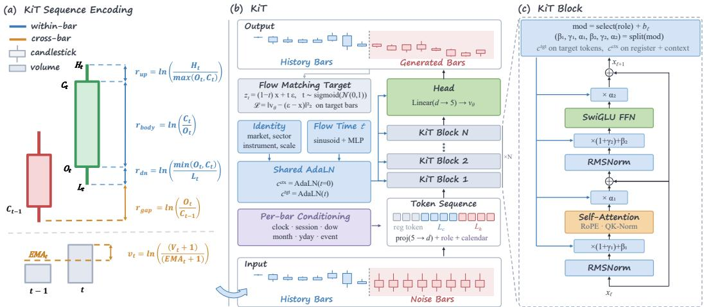  
Figure 1: The structure of KIT. (a) Each bar of raw OHLCV is encoded as a five-dimensional log-ratio state $x _ { t } = ( r _ { \mathrm { g a p } } , r _ { \mathrm { b o d y } } , r _ { \mathrm { u p } } , r _ { \mathrm { d n } } , v _ { t } )$ , which is the state the diffusion model operates on. (b) KIT places the history and forecast spans into one token sequence. The history is returned bit-identical and only the forecast span is filled in with generated bars. (c) The KIT block employs QK-Norm and SwiGLU to improve training stability. Signals that are constant over the window modulate every layer through a shared AdaLN trunk, whereas signals that vary per bar are added directly to the token embeddings.

single token sequence and processed by the KIT backbone (b), whose repeating block is detailed in (c). Below we first review the flow matching preliminaries (§3.1), then describe each component in turn.

## 3.1 PRELIMINARIES

Flow Matching (Liu et al., 2023; Esser et al., 2024) defines a deterministic transport between data $\pmb { x } _ { 0 } \sim p _ { \mathrm { d a t a } }$ and noise $\epsilon \sim \mathcal { N } ( 0 , I )$ along a linear interpolation path. The noised state at flow time $t \in [ 0 , 1 ]$ is

$$
z _ { t } = ( 1 - t ) { \pmb x } _ { 0 } + t { \pmb \epsilon } ,\tag{1}
$$

so the ground-truth velocity field is ${ \pmb v } ^ { * } = { \pmb \epsilon } - { \pmb x } _ { 0 } . \mathrm { \bf ~ A }$ neural network ${ \pmb v } _ { \theta } ( z _ { t } , t )$ is trained to predict this velocity by minimising the mean-squared error

$$
\mathcal { L } _ { \mathrm { R F } } ~ = ~ \mathbb { E } _ { t , { \boldsymbol { x } } _ { 0 } , { \boldsymbol { \epsilon } } } \Bigl [ \bigl | { \boldsymbol { v } } _ { \boldsymbol { \theta } } ( { \boldsymbol { z } } _ { t } , t ) - ( { \boldsymbol { \epsilon } } - { \boldsymbol { x } } _ { 0 } ) \bigr | \bigr | ^ { 2 } \Bigr ] ,\tag{2}
$$

where t is drawn from a logit-normal distribution, $t = \sigma ( \mathcal { N } ( 0 , 1 ) )$ , to concentrate training on intermediate noise levels (Esser et al., 2024). At inference, samples are obtained by integrating the learned ODE $\mathrm { d } z _ { t } = v _ { \theta } ( z _ { t } , t )$ dt from $z _ { 1 } = \epsilon$ back to $z _ { 0 } \approx \pmb { x } _ { 0 }$ with an Euler solver.

## 3.2 KIT SEQUENCE ENCODING

Raw OHLCV values are ill-suited as diffusion states. Absolute prices span three orders of magnitude across instruments, volatility regimes differ across time scales, and volume units are market-specific. Normalising to zero mean does not remove these heterogeneities: two instruments with the same standardised open can still have wildly different price-to-shadow ratios.

We therefore decompose each candlestick bar into a five-dimensional log-ratio state $\pmb { x } _ { t } ~ \in ~ \mathbb { R } ^ { 5 }$ (Figure 1(a)):

$$
\begin{array} { r l r } { \pmb { x } _ { t } = } & { \left( \begin{array} { c } { r _ { \mathrm { g a p } } } \\ { r _ { \mathrm { b o d y } } } \\ { r _ { \mathrm { u p } } } \\ { r _ { \mathrm { d n } } } \\ { v } \end{array} \right) _ { t } = } & { \left( \begin{array} { c } { \ln ( O _ { t } / C _ { t - 1 } ) } \\ { \ln ( C _ { t } / O _ { t } ) } \\ { \ln \bigl ( H _ { t } / \operatorname* { m a x } ( O _ { t } , C _ { t } ) \bigr ) } \\ { \ln \bigl ( \operatorname* { m i n } ( O _ { t } , C _ { t } ) / L _ { t } \bigr ) } \\ { \ln \bigl ( ( V _ { t } + 1 ) / ( E _ { t } + 1 ) \bigr ) } \end{array} \right) , } \end{array}\tag{3}
$$

where $E _ { t }$ is a strictly causal exponential moving average of volume. This encoding has three key properties. (i) Invertibility. Given the previous close $C _ { t - 1 }$ , the five coordinates recover $( O , H , L , C , V ) _ { t }$ via a closed-form chain of exponentials, so no information is lost. (ii) Scale-freeness. Because every coordinate is a log ratio, the representation is invariant to the absolute price level and to multiplicative rescaling of volume, allowing a single model to span instruments and markets. (iii) Structural legality. The upper and lower shadow coordinates satisfy $r _ { \mathrm { u p } } \geq 0$ and $r _ { \mathrm { d n } } \geq 0$ by construction. At generation time a simple clamp enforces this constraint, guaranteeing that every decoded candle satisfies $H _ { t } \geq \operatorname* { m a x } ( O _ { t } , \mathbf { \bar { \Gamma } } _ { C _ { t } } )$ and $\mathbf { \bar { \Gamma } } _ { L _ { t } } \leq \operatorname* { m i n } ( O _ { t } , C _ { t } )$

Before entering the model, each coordinate is normalised with per-(market, timescale, feature) robust statistics: we apply median absolute deviation (MAD) scaling followed by a tanh soft-clip to bound the values, ensuring stable training without discarding outliers.

## 3.3 KIT ARCHITECTURE

KIT arranges the input as a single flat sequence (Figure 1(b)):

$$
\big [ \underbrace { r _ { 1 } , \dots , r _ { n _ { r } } } _ { \mathrm { r e g i s t e r } } ~ \big | \underbrace { x _ { 1 } ^ { \mathrm { c t x } } , \dots , x _ { L _ { c } } ^ { \mathrm { c t x } } } _ { \mathrm { c o n t e x t } } ~ \big | \underbrace { z _ { 1 } ^ { \mathrm { t g t } } , \dots , z _ { L _ { h } } ^ { \mathrm { t g t } } } _ { \mathrm { t a r g e t } } \big ] .\tag{4}
$$

The $n _ { r }$ register tokens are learnable parameters that serve as global attention sinks and information aggregators. The context segment contains the $L _ { c }$ clean (un-noised) historical bars; the target segment contains the $L _ { h }$ future bars, which carry noise $\scriptstyle { z _ { t } }$ during training and pure Gaussian noise at inference. Each five-dimensional bar is projected to the model dimension d by a linear layer, to which a role embedding $e _ { \mathrm { r o l e } } \in \{ e ^ { \mathrm { c t x } } , e ^ { \mathrm { t g t } } \}$ and a set of calendar embeddings are added element-wise. History is never noised and is returned bit-identical at the output, so context information is preserved exactly.

KIT receives two categories of conditioning signals, handled by distinct mechanisms matched to their granularity. Window-constant (identity) signals such as market, sector, instrument and timescale identifiers are each mapped to learned embeddings and summed into a single base conditioning vector $\pmb { c } _ { \mathrm { b a s e } } \in \mathbb { R } ^ { d }$ . Following the $\operatorname { P i x A r t - } \alpha$ shared AdaLN design (Chen et al., 2024), one shallow MLP maps the sum of $\mathbf { c _ { \mathrm { b a s e } } }$ and a sinusoidal flow-time embedding $e _ { t }$ to a set of modulation parameters that are broadcast to every transformer layer. Crucially, this trunk is evaluated twice: once with the actual flow time t to produce modulations $c ^ { \mathrm { t g t } }$ applied to target tokens, and once with $t { = } 0$ to produce $c ^ { \mathrm { c t x } }$ applied to context tokens. Setting $t { = } 0$ for context is natural: the historical bars carry no noise, so their modulation should correspond to the clean-data end of the flow. This dual evaluation adds negligible cost, since the trunk MLP is shared and lightweight, yet provides each token role with appropriately calibrated normalisation statistics. Per-bar (calendar) signals, including Fourier-encoded intraday time, session position, day-of-week, event flags, month, and year-of-day, vary across bars and are known deterministically at inference. These are embedded and added directly to the token representation before the first transformer layer, preserving their temporal alignment without inflating the AdaLN parameter count.

After the final transformer layer, only the $L _ { h }$ target-position hidden states are extracted. These are passed through an RMSNorm, modulated by a final set of AdaLN parameters from $c ^ { \mathrm { t g t } }$ , and projected back to five dimensions by a linear layer, yielding the velocity prediction $\hat { \pmb v } \in \mathbb { R } ^ { L _ { h } \times 5 }$

## 3.4 KIT BLOCK

Each of the N transformer layers follows the KIT block design shown in Figure 1(c), which extends the standard DiT block (Peebles & Xie, 2023) with role-aware dual modulation.

At every layer l, a token’s modulation vector is selected by its role and offset by a per-layer learnable bias:

$$
m _ { l } = \mathrm { s e l e c t } ( \mathrm { r o l e } , c ^ { \mathrm { c t x } } , c ^ { \mathrm { t g t } } ) + b _ { l } ,\tag{5}
$$

where $b _ { l }$ is initialised to zero. The vector $m _ { l }$ is split into six groups of modulation parameters $\left( \beta _ { 1 } , \gamma _ { 1 } , \alpha _ { 1 } , \beta _ { 2 } , \gamma _ { 2 } , \alpha _ { 2 } \right)$ , each in $\mathbb { R } ^ { d }$

The pre-attention path applies RMSNorm (Zhang & Sennrich, 2019) with affine modulation:

$$
\begin{array} { r } { \pmb { x }  \pmb { x } + \alpha _ { 1 } \odot \mathrm { A t t n } \big ( \mathrm { R M S N o r m } ( \pmb { x } ) \odot ( 1 + \gamma _ { 1 } ) + \beta _ { 1 } \big ) , } \end{array}\tag{6}
$$

where Attn denotes bidirectional multi-head self-attention with Rotary Position Embeddings (RoPE) (Su et al., 2024) and QK-Norm (Henry et al., 2020) applied to the queries and keys for training stability. Attention is not causal: every token, including future ones, attends to the full sequence, which lets the model exploit inter-bar dependencies within the noisy horizon.

The post-attention path mirrors the structure:

$$
\begin{array} { r } { \pmb { x }  \pmb { x } + \alpha _ { 2 } \odot \mathrm { S w i G L U } \big ( \mathrm { R M S N o r m } ( \pmb { x } ) \odot ( 1 + \gamma _ { 2 } ) + \beta _ { 2 } \big ) , } \end{array}\tag{7}
$$

using a SwiGLU (Shazeer, 2020) feed-forward network instead of the standard MLP.

All output projections of the AdaLN trunk that produce the gate scalars $\left( \alpha _ { 1 } , \alpha _ { 2 } \right)$ , as well as the per-layer biases $\mathbf { \delta } _ { b _ { l } , \mathbf { \delta } }$ , are initialised to zero. Consequently, at the start of training every block acts as an identity, giving $\pmb { v } _ { \theta } ( \cdot ) = \mathbf { 0 }$ regardless of the input. This ensures the initial velocity prediction is zero, so the model begins from a well-defined starting point and avoids large, uninformative gradient updates early in training (Peebles & Xie, 2023).

## 3.5 TRAINING AND INFERENCE

Training objective. The loss is the masked MSE of Equation (2), evaluated only over the $L _ { h }$ target positions:

$$
\mathcal { L } = \mathbb { E } _ { t , \mathbf { x } _ { 0 } , \epsilon } \Bigg [ \frac { 1 } { L _ { h } } \sum _ { i = 1 } ^ { L _ { h } } \bigr \lVert \pmb { v } _ { \theta } ( \boldsymbol { z } _ { t } , t ) _ { i } - ( \epsilon _ { i } - \mathbf { x } _ { 0 , i } ) \bigr \rVert ^ { 2 } \Bigg ] ,\tag{8}
$$

where context tokens contribute to attention but are excluded from the loss. The flow time t is sampled via the logit-normal schedule.

Classifier-free guidance for KiT. We design a classifier-free guidance (CFG) mechanism tailored for candlestick chart prediction to adjust the predictive distribution (Ho & Salimans, 2022). Specifically, we use three stochastic condition-dropout schemes during training: the instrument and sector embeddings are replaced by a shared [UNK] token; all identity signals (market, sector, instrument, timescale) are replaced by a [NULL] vector, and the entire history context is zeroed out.

Inference. At test time, starting from $z _ { 1 } = \epsilon \sim \mathcal { N } ( 0 , I )$ , we integrate the learned ODE with an Euler solver. To exploit both conditioning axes, we apply dual classifier-free guidance:

$$
\hat { v } \ = \ v _ { \theta } \ + \ ( w _ { \mathrm { i d } } - 1 ) \big ( { v } _ { \theta } - { v } _ { \partial \mathrm { i d } } \big ) \ + \ ( w _ { \mathrm { h i s t } } - 1 ) \big ( { v } _ { \theta } - { v } _ { \partial \mathrm { h i s t } } \big ) ,\tag{9}
$$

where ${ \pmb v } _ { \mathrm { \tiny { \mathscr { O } i d } } }$ and ${ v } _ { \mathrm { \tiny \iii h i s t } }$ are the velocity predictions under the identity-dropped and history-dropped conditions, respectively, and $w _ { \mathrm { i d } } , w _ { \mathrm { h i s t } } \ge 1$ control the guidance strength along each axis. Drawing M independent samples and decoding each through the invertible map of Equation (3) yields an ensemble of M plausible OHLCV trajectories, from which any distributional statistic can be computed directly.

## 4 EXPERIMENTS

To evaluate the effectiveness of KiT, we collect a decade of candlestick data from multiple markets and build three models with different parameter sizes (§4.1). We assess return forecasting and volatility prediction performance (§4.2), and also conduct backtests (§4.3). Then we conduct ablation studies to validate the design choices of each component in KiT.(§4.4 and Appendix E).

## 4.1 EXPERIMENTAL SETUP

We collect OHLCV bars from three markets at seven timescales: one, five, fifteen, and thirty minutes, one and two hours, and one day. Chinese A-shares cover 3,914 instruments, US equities cover 888 names, and cryptocurrencies cover 28 products, all from 1 August 2016 to 10 April 2026. The merged tree contains 4,830 instruments and 3 billion candlestick bars after aggregating the one-minute source to the coarser grids. Prices are backward-adjusted. Normalization statistics (per-market, per-timescale MAD scales) are fitted only on the training period.

Table 1: Return forecasting by resolution. Evaluated across three markets in the test window. Each entry is the RankIC between the predicted mean terminal return and the realized close-to-close log-return sum.
<table><tr><td>Configuration</td><td>1m↑</td><td>5m↑</td><td>15m↑</td><td>30m↑</td><td>lh↑</td><td>2h↑</td><td>1d↑</td><td>Mean ↑</td></tr><tr><td>KiT</td><td>.0215</td><td>.0576</td><td>.0526</td><td>.0474</td><td>.0383</td><td>.0651</td><td>.1168</td><td>.0571</td></tr><tr><td>Kronos-base</td><td>.0158</td><td>.0426</td><td>.0442</td><td>-.0064</td><td>-.0128</td><td>.0514</td><td>.1046</td><td>.0342</td></tr><tr><td>Kronos-base-FT</td><td>.0192</td><td>.0536</td><td>.0484</td><td>.0408</td><td>.0304</td><td>.0622</td><td>.1101</td><td>.0521</td></tr><tr><td>Sundial</td><td>.0148</td><td>.0386</td><td>.0434</td><td>-.0082</td><td>-.0046</td><td>-.0214</td><td>.0837</td><td>.0209</td></tr><tr><td>Chronos-Bolt extended</td><td>-.0362</td><td>.0088</td><td>.0186</td><td>-.0964</td><td>-.0068</td><td>-.2159</td><td>.0052</td><td>-.0461</td></tr><tr><td>Chronos-2</td><td>.0168</td><td>.0286</td><td>.0362</td><td>-.0184</td><td>-.0162</td><td>-.0648</td><td>.0556</td><td>.0054</td></tr><tr><td>TimesFM 2.5</td><td>.0126</td><td>.0284</td><td>-.0160</td><td>-.0797</td><td>-.0089</td><td>-.0747</td><td>.0116</td><td>-.0181</td></tr><tr><td>TimesFM 3</td><td>.0046</td><td>.0338</td><td>.0374</td><td>-.0168</td><td>.0294</td><td>-.0586</td><td>.0479</td><td>.0111</td></tr><tr><td>Historical return bootstrap</td><td>-.0296</td><td>-.0128</td><td>-.0346</td><td>.0267</td><td>.0341</td><td>.0020</td><td>.0982</td><td>.0120</td></tr><tr><td>TimeGrad adapted</td><td>.0136</td><td>.0088</td><td>.0362</td><td>.0046</td><td>-.0248</td><td>.0574</td><td>.0792</td><td>.0250</td></tr><tr><td>Diffusion-TS adapted</td><td>.0090</td><td>.0284</td><td>.0206</td><td>.0292</td><td>-.0746</td><td>.0198</td><td>-.1654</td><td>-.0190</td></tr><tr><td>TSFlow adapted</td><td>.0174</td><td>.0554</td><td>.0466</td><td>.0228</td><td>.0102</td><td>.0596</td><td>.0673</td><td>.0399</td></tr></table>

Table 2: Volatility prediction by resolution. Evaluated across three markets in the test window. Each entry is the RankIC between the predicted mean realized volatility and the realized sample volatility.
<table><tr><td>Configuration</td><td>1m↑</td><td>5m↑</td><td>15m↑</td><td>30m↑</td><td>lh↑</td><td>2h↑</td><td>1d↑</td><td>Mean ↑</td></tr><tr><td>KiT</td><td>.7599</td><td>.6947</td><td>.6900</td><td>.5919</td><td>.5958</td><td>.6652</td><td>.6225</td><td>.6600</td></tr><tr><td>Kronos-base</td><td>.5900</td><td>.4934</td><td>.3955</td><td>.3049</td><td>.4699</td><td>.5281</td><td>.4498</td><td>.4617</td></tr><tr><td>Kronos-base-FT</td><td>.6193</td><td>.5478</td><td>.4466</td><td>.3671</td><td>.4974</td><td>.5306</td><td>.4727</td><td>.4974</td></tr><tr><td>Sundial</td><td>.6024</td><td>.5477</td><td>.5164</td><td>.4591</td><td>.5691</td><td>.5534</td><td>.4486</td><td>.5281</td></tr><tr><td>Chronos-Bolt extended</td><td>.5766</td><td>.4821</td><td>.4113</td><td>.4289</td><td>.3543</td><td>.3797</td><td>.3310</td><td>.4234</td></tr><tr><td>Chronos-2</td><td>.4427</td><td>.3944</td><td>.3671</td><td>.4092</td><td>.4264</td><td>.4452</td><td>.2260</td><td>.3873</td></tr><tr><td>TimesFM 2.5</td><td>.5184</td><td>.4609</td><td>.4435</td><td>.4537</td><td>.5407</td><td>.4688</td><td>.3096</td><td>.4565</td></tr><tr><td>TimesFM 3</td><td>.3870</td><td>.4655</td><td>.4117</td><td>.3474</td><td>.4470</td><td>.3977</td><td>.2507</td><td>.3867</td></tr><tr><td>GARCH</td><td>.3520</td><td>.5940</td><td>.6469</td><td>.4850</td><td>.5842</td><td>.5681</td><td>.4255</td><td>.5222</td></tr><tr><td>TimeGrad adapted</td><td>.0736</td><td>.1967</td><td>.0056</td><td>-.1586</td><td>.5201</td><td>.4418</td><td>.1702</td><td>.1785</td></tr><tr><td>Diffusion-TS adapted</td><td>.4462</td><td>.1787</td><td>.1483</td><td>.0246</td><td>.4236</td><td>.3488</td><td>.4563</td><td>.2895</td></tr><tr><td>TSFlow adapted</td><td>.3244</td><td>.3230</td><td>.4043</td><td>.5658</td><td>.5290</td><td>.3648</td><td>.5250</td><td>.4338</td></tr></table>

Training uses all bars through 31 December 2023. Validation is 1 January 2024 to 31 December 2025. The test window is 1 January 2026 to 10 April 2026. We train with AdamW $( \beta _ { 1 } \mathrm { { = } } 0 . 9 $ $\beta _ { 2 } { = } 0 . 9 5$ , weight decay 0.1), BF16, global batch 4,096, gradient clipping at 1.0, and a parameter EMA with decay 0.9999. The peak learning rate is $1 0 ^ { - 4 }$ after 1,000 warmup updates. Training uses 128 NVIDIA H200 GPUs and continues until the mean validation loss, averaged equally over the monitored (market, timescale) buckets, no longer improves. We instantiate three sizes under a shared data protocol: KiT-S (31M), KiT-M (101M), and KiT-L (284M). All subsequent evaluations use the largest parameter version, denoted as KiT.

For further details about the model settings, please see Appendix A.1. At inference we draw 16 samples and average them as the predicted trajectory. Classifier-free guidance weights default to 1; we discuss CFG ablations in Appendix D.

We evaluate forecasts with the information coefficient (IC) (Grinold, 1989; Lopez de Prado, 2018) and the rank information coefficient (RankIC) (Spearman, 1904). IC is the cross-sectional Pearson correlation of these predictions against outcomes; RankIC is the corresponding Spearman rank correlation. Higher IC and RankIC are better. We compare KiT against recent state-of-the-art timeseries forecasting methods, including financial foundation models and general time-series models. For implementation details of the baselines, please see Appendix A.2.

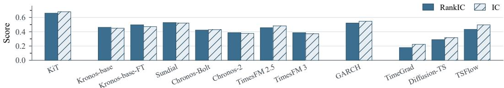  
Figure 2: Mean RankIC and IC of volatility on the three-market with seven resolutions.

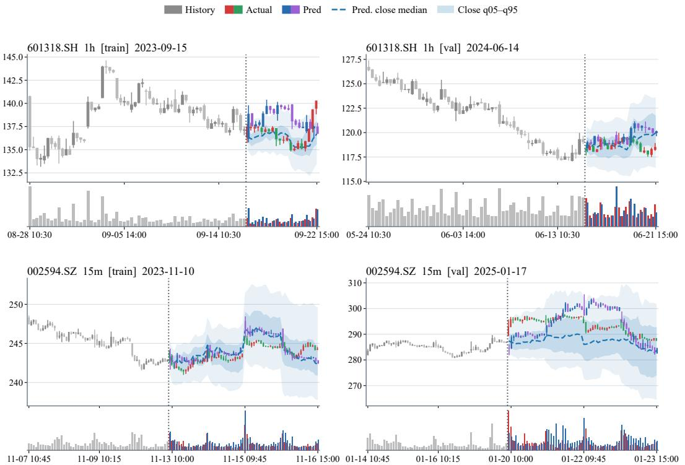  
Figure 3: Qualitative candlestick forecasts from KiT. Gray candles are history. Blue and purple represent predictions, while red and green indicate ground truth.

## 4.2 FORECASTING RESULTS

Return forecasting. Table 1 reports RankIC of predicted terminal return at seven resolutions on the test window, from 1 January 2026 to 10 April 2026. KiT attains the best mean RankIC of 0.0571 and the best mean IC of 0.0491, leading at every resolution, from one minute (0.0215) through one day (0.1168). Against Kronos-base-FT, the strongest financial foundation model on this metric, mean RankIC rises from 0.0521 to 0.0571 (about 10% relative) and mean IC from 0.0247 to 0.0491. On return IC the closest baseline is TimeGrad (0.0446), a smaller gain of about 10% relative. TSFlow (0.0399) and Kronos-base (0.0342) trail further on RankIC. Per-resolution return IC is in Appendix C.

Volatility forecasting. In Table 2, KiT attains the best mean RankIC of 0.6600 and the best mean IC of 0.6797, and leads at every resolution. Relative to the strongest baselines, this is a gain of +0.132 RankIC over Sundial (0.5281, about 25% relative) and +0.133 IC over GARCH (0.5470, about 24% relative). GARCH (0.5222) and Kronos-base-FT (0.4974) follow on RankIC. Mean volatility IC is shown in Figure 2; per-resolution volatility IC is in Appendix C.

We include some OHLCV forecast samples to showcase the real-world predictive capabilities of KiT. Gray candles are history; colored candles are the realized future. The line is the median generated close and the band is a close quantile interval. As illustrated in Figure 3, KiT can identify key temporal events such as market open and close, at which the predicted results exhibit pronounced price fluctuations and volume surges. Moreover, this capability generalizes consistently across different time scales and products, which is also the behavior the calendar injections are designed to produce. For more forecasting results and price series forecasts, see Appendix C.

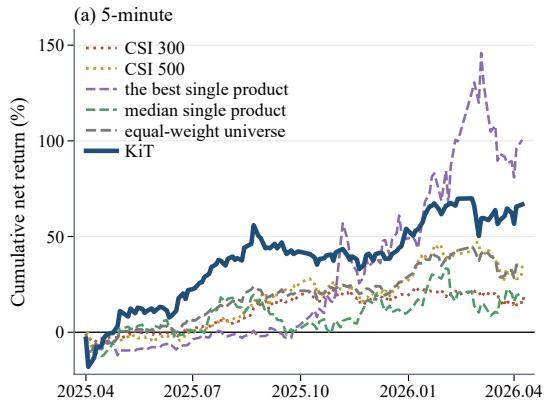

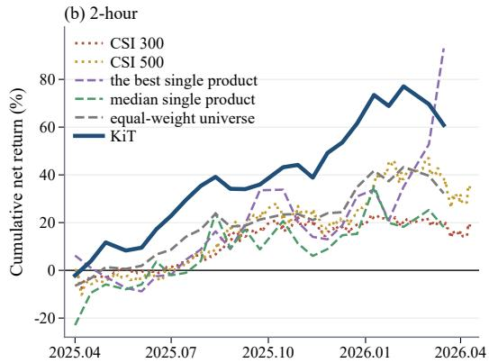  
Figure 4: Return-based long-only backtest over a one-year period, using KiT to forecast two different timescales.

## 4.3 BACKTEST

To further validate the practical applicability of KiT, we aim to obtain a trading result. Therefore, we rank names by predicted terminal return and replay a long-only book on A-share over a one-year period (2025.05-2026.04). Top-N and rebalance frequency are selected on validation and then frozen. Buys that would close at a limit-up are skipped. Costs are 12.5 bp on the buy side and 22.5 bp on the sell side (commission 2.5 bp, stamp 10 bp, slippage 10 bp per side).

Figure 4 shows the backtest results of two timescales after costs. The KiT book finishes above the equal-weight universe of the same products and above the median single-name buy-and-hold, also demonstrating excess returns over both CSI 300 and CSI 500. Test annualized net return is +65.2% on 5-minute bars (Sharpe 1.70) and +64.4% on 2-hour bars (Sharpe 2.46).

## 4.4 ABLATION STUDY

Classifier-free guidance. We investigate how classifier-free guidance operates on KiT in Appendix D. Identity guidance and history guidance move different margins of the same ensemble. In Equation (9), raising wid pulls samples toward each product’s typical volatility, while raising whist pulls the terminal return toward the recent window.

Model scale. To assess the scaling capability of KiT, we train different variants of the KiT family: KiT-S, KiT-M, and KiT-L, on the same dataset. The performance of KiT-L has already been presented in above §4. We observe that increasing the parameter count yields modest improvements in both return forecasting and volatility prediction, demonstrating that scaling up the model size enhances overall performance at this data scale (Chickering et al., 2026; Hoffmann et al., 2022) (Appendix B). We also conduct ablation studies on candlestick representation and condition injection to demonstrate the rationale behind the design of each component in our KiT, see Appendix E for details.

## 5 CONCLUSION

We introduce KiT, a novel framework that models candlestick paths utilizing a flow-matching diffusion transformer. We design a five-dimensional OHLCV representation that strictly preserves candlestick geometry, alongside versatile condition-injection mechanisms tailored to the intrinsic properties of diffusion models. Comprehensive evaluations across multiple markets and time scales at seven distinct resolutions demonstrate that KiT significantly outperforms prior methods in both return and volatility forecasting. Furthermore, theoretical backtests illustrate the strong economic relevance of its generated path forecasts.

Future extensions include integrating higher-dimensional data and fine-tuning for downstream tasks. By obviating the need for a discrete tokenizer, KiT can seamlessly accommodate high-dimensional inputs, such as Level-3 limit order book data and alpha factors. As KiT provides a robust foundation model, exploring targeted fine-tuning remains a promising direction for subsequent research.

## REFERENCES

Abdul Fatir Ansari, Lorenzo Stella, Caner Turkmen, Xiyuan Zhang, Pedro Mercado, Huibin Shen, Oleksandr Shchur, Syama Sundar Rangapuram, Sebastian Pineda Arango, Shubham Kapoor, Jasper Zschiegner, Danielle C. Maddix, Hao Wang, Michael W. Mahoney, Kari Torkkola, Andrew Gordon Wilson, Michael Bohlke-Schneider, and Yuyang Wang. Chronos: Learning the language of time series. Transactions on Machine Learning Research, 2024. ISSN 2835-8856. URL https: //openreview.net/forum?id=gerNCVqqtR.

Abdul Fatir Ansari, Oleksandr Shchur, Jaris Küken, Andreas Auer, Boran Han, Pedro Mercado, Syama Sundar Rangapuram, Huibin Shen, Lorenzo Stella, Xiyuan Zhang, Mononito Goswami, Shubham Kapoor, Danielle C. Maddix, Pablo Guerron, Tony Hu, Junming Yin, Nick Erickson, Prateek Mutalik Desai, Hao Wang, Huzefa Rangwala, George Karypis, Yuyang Wang, and Michael Bohlke-Schneider. Chronos-2: From univariate to universal forecasting. arXiv preprint arXiv:2510.15821, 2025. URL https://arxiv.org/abs/2510.15821.

Kushal Arora, Layla El Asri, Hareesh Bahuleyan, and Jackie Cheung. Why exposure bias matters: An imitation learning perspective of error accumulation in language generation. In Findings ofthe Associationfor Computational Linguistics: ACL 2022, pp. 700–710, 2022. doi: 10.18653/v1/2022. findings-acl.58. URL https://aclanthology.org/2022.findings-acl.58/.

Tim Bollerslev. Generalized autoregressive conditional heteroskedasticity. Journal ofEconometrics, 31(3):307–327, 1986.

George E. P. Box and Gwilym M. Jenkins. Time Series Analysis: Forecasting and Control. Holden-Day, 1970.

Defu Cao, Wen Ye, Yizhou Zhang, and Yan Liu. TimeDiT: General-purpose diffusion transformers for time series foundation model. arXiv preprint arXiv:2409.02322, 2025. URL https:// arxiv.org/abs/2409.02322v2. Version 2, revised 2025.

Jun-Hao Chen and Yun-Cheng Tsai. Encoding candlesticks as images for pattern classification using convolutional neural networks. Financial Innovation, 6(1):26, 2020. doi: 10.1186/ s40854-020-00187-0.

Junsong Chen, Jincheng Yu, Chongjian Ge, Lewei Yao, Enze Xie, Yue Wu, Zhongdao Wang, James Kwok, Ping Luo, Huchuan Lu, and Zhenguo Li. PixArt-α: Fast training of diffusion transformer for photorealistic text-to-image synthesis. In The Twelfth International Conference on Learning Representations, 2024. URL https://proceedings.iclr.cc/paper\_files/paper/ 2024/file/fe989bb038b5dcc44181255dd6913e43-Paper-Conference.pdf.

Tianqi Chen and Carlos Guestrin. XGBoost: A scalable tree boosting system. In Proceedings of the 22nd ACM SIGKDD International Conference on Knowledge Discovery and Data Mining, pp. 785–794, 2016.

Kyle Chickering, Wei-An Lin, Swayam Bhanded, Dan Saunders, Akshat Tripathi, Jiaming Song, Shyamal Buch, and Xinchen Yan. Abra: Scaling diffusion image training, 2026. URL https: //arxiv.org/abs/2608.17286.

Rama Cont. Empirical properties of asset returns: Stylized facts and statistical issues. Quantitative Finance, 1(2):223–236, 2001. doi: 10.1080/713665670.

Divyanshu Daiya, Monika Yadav, and Harshit Singh Rao. DiffSTOCK: Probabilistic relational stock market predictions using diffusion models. In IEEE International Conference on Acoustics, Speech and Signal Processing (ICASSP), pp. 7335–7339, 2024. doi: 10.1109/ICASSP48485.2024. 10446690.

Abhimanyu Das, Weihao Kong, Rajat Sen, and Yichen Zhou. A decoder-only foundation model for time-series forecasting. In Proceedings ofthe 41st International Conference on Machine Learning, volume 235 of Proceedings ofMachine Learning Research, pp. 10148–10167. PMLR, 2024. URL https://proceedings.mlr.press/v235/das24c.html.

Patrick Esser, Sumith Kulal, Andreas Blattmann, Rahim Entezari, Jonas Müller, Harry Saini, Yam Levi, Dominik Lorenz, Axel Sauer, Frederic Boesel, Dustin Podell, Tim Dockhorn, Zion English, and Robin Rombach. Scaling rectified flow transformers for high-resolution image synthesis. In Proceedings of the 41st International Conference on Machine Learning, volume 235 of Proceedings of Machine Learning Research, pp. 12606–12633. PMLR, 2024. URL https://proceedings.mlr.press/v235/esser24a.html.

Eugene F Fama. Efficient capital markets: A review of theory and empirical work. The Journal of Finance, 25(2):383–417, 1970.

Thomas Fischer and Christopher Krauss. Deep learning with long short-term memory networks for financial market predictions. European Journal ofOperational Research, 270(2):654–669, 2018. doi: 10.1016/j.ejor.2017.11.054.

Google Research. TimesFM 2.5: Official model card, 2025. URL https://huggingface.co/ google/timesfm-2.5-200m-pytorch. Model documentation; accessed September 21, 2026.

Google Research. TimesFM 3.0: Official model card, 2026. URL https://huggingface.co/ google/timesfm-3.0-pytorch. Model documentation; accessed September 21, 2026.

Mononito Goswami, Konrad Szafer, Arjun Choudhry, Yifu Cai, Shuo Li, and Artur Dubrawski. MOMENT: A family of open time-series foundation models. In Proceedings of the 41st International Conference on Machine Learning, volume 235 of Proceedings of Machine Learning Research, pp. 16115–16152. PMLR, 2024. URL https://proceedings.mlr.press/ v235/goswami24a.html.

Richard C Grinold. The fundamental law of active management. The Journal of Portfolio Management, 15(3):30–37, 1989.

Team Happyhorse. Happyhorse 1.0. Video Generation Platform, 2026. URL https://www. happyhorse.com/.

Alex Henry, Prudhvi Raj Dachapally, Shubham Shantaram Pawar, and Yuxuan Chen. Query-key normalization for transformers. In Findings of the Association for Computational Linguistics: EMNLP 2020, pp. 4246–4253, 2020. doi: 10.18653/v1/2020.findings-emnlp.379. URL https: //aclanthology.org/2020.findings-emnlp.379/.

Jonathan Ho and Tim Salimans. Classifier-free diffusion guidance. arXiv preprint arXiv:2207.12598, 2022. URL https://arxiv.org/abs/2207.12598. A short version appeared at the NeurIPS 2021 Workshop on Deep Generative Models and Downstream Applications.

Jonathan Ho, Ajay Jain, and Pieter Abbeel. Denoising diffusion probabilistic models. In Advances in Neural Information Processing Systems, volume 33, pp. 6840–6851, 2020.

Jordan Hoffmann, Sebastian Borgeaud, and etc Mensch. An empirical analysis of compute-optimal large language model training. In Advances in Neural Information Processing Systems, volume 35, pp. 30016–30030, 2022. URL https://proceedings.neurips.cc/paper\_files/paper/2022/hash/ c1e2faff6f588870935f114ebe04a3e5-Abstract-Conference.html.

Keya Hu, Linlu Qiu, Yiyang Lu, Hanhong Zhao, Tianhong Li, Yoon Kim, Jacob Andreas, and Kaiming He. ELF: Embedded language flows. arXiv preprint arXiv:2605.10938, 2026.

Yang Hu, Xiao Wang, Zezhen Ding, Lirong Wu, Huatian Zhang, Stan Z. Li, Sheng Wang, Jiheng Zhang, Ziyun Li, and Tianlong Chen. FlowTS: Time series generation via rectified flow. arXiv preprint arXiv:2411.07506, 2025. URL https://arxiv.org/abs/2411.07506v3. Version 3, revised 2025.

Hongbin Huang, Minghua Chen, and Xiao Qiao. Generative learning for financial time series with irregular and scale-invariant patterns. In The Twelfth International Conference on Learning Representations, 2024a. URL https://proceedings.iclr.cc/paper\_files/paper/ 2024/file/f90fc76b199fe6b0ec2a51aaf72c3277-Paper-Conference.pdf.

Wenyang Huang, Huiwen Wang, and Shanshan Wang. A structural VAR and VECM modeling method for open-high-low-close data contained in candlestick chart. Financial Innovation, 10 (1):97, 2024b. doi: 10.1186/s40854-024-00622-6. URL https://doi.org/10.1186/ s40854-024-00622-6.

Rob J. Hyndman, Anne B. Koehler, J. Keith Ord, and Ralph D. Snyder. Forecasting with Exponential Smoothing: The State Space Approach. Springer, 2008.

Ming Jin, Shiyu Wang, Lintao Ma, Zhixuan Chu, James Y. Zhang, Xiaoming Shi, Pin-Yu Chen, Yuxuan Liang, Yuan-Fang Li, Shirui Pan, and Qingsong Wen. Time-LLM: Time series forecasting by reprogramming large language models. In The Twelfth International Conference on Learning Representations, 2024.

Guolin Ke, Qi Meng, Thomas Finley, Taifeng Wang, Wei Chen, Weidong Ma, Qiwei Ye, and Tie-Yan Liu. LightGBM: A highly efficient gradient boosting decision tree. In Advances in Neural Information Processing Systems, volume 30, 2017.

Marcel Kollovieh, Abdul Fatir Ansari, Michael Bohlke-Schneider, Jasper Zschiegner, Hao Wang, and Yuyang Wang. Predict, refine, synthesize: Self-guiding diffusion models for probabilistic time series forecasting. In Advances in Neural Information Processing Systems, volume 36, pp. 28341–28364, 2023. doi: 10.52202/075280-1232. URL https://proceedings.neurips.cc/paper\_files/paper/2023/hash/ 5a1a10c2c2c9b9af1514687bc24b8f3d-Abstract-Conference.html.

Marcel Kollovieh, Marten Lienen, David Lüdke, Leo Schwinn, and Stephan Günnemann. Flow matching with gaussian process priors for probabilistic time series forecasting. In The Thirteenth International Conference on Learning Representations, 2025. URL https://openreview. net/forum?id=uxVBbSlKQ4.

Ying-yee Ava Lau, Zhiwen Shao, and Dit-Yan Yeung. Fast and slow streams for online time series forecasting without information leakage. In The Thirteenth International Conference on Learning Representations, 2025.

Junjie Li, Yang Liu, Weiqing Liu, Shikai Fang, Lewen Wang, Chang Xu, and Jiang Bian. MarS: A financial market simulation engine powered by generative foundation model. In The Thirteenth International Conference on Learning Representations, 2025. URL https://proceedings.iclr.cc/paper\_files/paper/2025/hash/ 6261d3bc9e9326ddff055595aabd54e1-Abstract-Conference.html.

Yan Li, Xinjiang Lu, Yaqing Wang, and Dejing Dou. Generative time series forecasting with diffusion, denoise, and disentanglement. In Advances in Neural Information Processing Systems, volume 35, pp. 23009–23022, 2022.

Yuxin Li, Wenchao Chen, Xinyue Hu, Bo Chen, Baolin Sun, and Mingyuan Zhou. Transformer-modulated diffusion models for probabilistic multivariate time series forecasting. In The Twelfth International Conference on Learning Representations, 2024. URL https://proceedings.iclr.cc/paper\_files/paper/2024/file/ 516a9317af9d89e9f2251bd7fde49b8f-Paper-Conference.pdf.

Bryan Lim, Sercan Ö. Arık, Nicolas Loeff, and Tomas Pfister. Temporal fusion transformers for interpretable multi-horizon time series forecasting. International Journal of Forecasting, 37(4): 1748–1764, 2021. doi: 10.1016/j.ijforecast.2021.03.012.

Yaron Lipman, Ricky T. Q. Chen, Heli Ben-Hamu, Maximilian Nickel, and Matt Le. Flow matching for generative modeling. In The Eleventh International Conference on Learning Representations, 2023. URL https://openreview.net/forum?id=PqvMRDCJT9t.

Xingchao Liu, Chengyue Gong, and Qiang Liu. Flow straight and fast: Learning to generate and transfer data with rectified flow. In The Eleventh International Conference on Learning Representations, 2023. URL https://openreview.net/forum?id=gWxpdtQpiYV.

Yong Liu, Tengge Hu, Haoran Zhang, Haixu Wu, Shiyu Wang, Lintao Ma, and Mingsheng Long. iTransformer: Inverted transformers are effective for time series forecasting. In The Twelfth International Conference on Learning Representations, 2024a. URL https://proceedings.iclr.cc/paper\_files/paper/2024/hash/ 2ea18fdc667e0ef2ad82b2b4d65147ad-Abstract-Conference.html.

Yong Liu, Haoran Zhang, Chenyu Li, Xiangdong Huang, Jianmin Wang, and Mingsheng Long. Timer: Generative pre-trained transformers are large time series models. In Proceedings of the 41st International Conference on Machine Learning, volume 235 of Proceedings of Machine Learning Research, pp. 32369–32399. PMLR, 2024b. URL https://proceedings.mlr.press/ v235/liu24cb.html.

Yong Liu, Guo Qin, Zhiyuan Shi, Zhi Chen, Caiyin Yang, Xiangdong Huang, Jianmin Wang, and Mingsheng Long. Sundial: A family of highly capable time series foundation models. In Proceedings of the 42nd International Conference on Machine Learning, volume 267 of Proceedings of Machine Learning Research, pp. 39295–39317. PMLR, 2025. URL https: //proceedings.mlr.press/v267/liu25be.html.

Marcos Lopez de Prado. Advances infinancial machine learning. John Wiley & Sons, 2018.

Jiecheng Lu, Yan Sun, and Shihao Yang. In-context time series predictor. In The Thirteenth International Conference on Learning Representations, 2025.

Shen Nie, Fengqi Zhu, Zebin You, Xiaolu Zhang, Jingyang Ou, Jun Hu, Jun Zhou, Yankai Lin, Ji-Rong Wen, and Chongxuan Li. Large language diffusion models. In Advances in Neural Information Processing Systems, volume 38, 2025. doi: 10.52202/085713-1689. URL https://proceedings.neurips.cc/paper\_files/paper/2025/hash/ 48b383b24230e0e6e649d9c98dae4d8c-Abstract-Conference.html.

Yuqi Nie, Nam H. Nguyen, Phanwadee Sinthong, and Jayant Kalagnanam. A time series is worth 64 words: Long-term forecasting with transformers. In The Eleventh International Conference on Learning Representations, 2023. URL https://openreview.net/forum?id= Jbdc0vTOcol.

William Peebles and Saining Xie. Scalable diffusion models with transformers. In Proceedings of the IEEE/CVF International Conference on Computer Vision, pp. 4195–4205, 2023. URL https://openaccess.thecvf.com/content/ICCV2023/html/Peebles\_ Scalable\_Diffusion\_Models\_with\_Transformers\_ICCV\_2023\_paper.html.

Kashif Rasul, Calvin Seward, Ingmar Schuster, and Roland Vollgraf. Autoregressive denoising diffusion models for multivariate probabilistic time series forecasting. In Marina Meila and Tong Zhang (eds.), Proceedings of the 38th International Conference on Machine Learning, volume 139 of Proceedings ofMachine Learning Research, pp. 8857–8868. PMLR, 2021. URL https://proceedings.mlr.press/v139/rasul21a.html.

Kashif Rasul, Arjun Ashok, Andrew Robert Williams, Hena Ghonia, Rishika Bhagwatkar, Arian Khorasani, Mohammad Javad Darvishi Bayazi, George Adamopoulos, Roland Riachi, Nadhir Hassen, Marin Biloš, Sahil Garg, Anderson Schneider, Nicolas Chapados, Alexandre Drouin, Valentina Zantedeschi, Yuriy Nevmyvaka, and Irina Rish. Lag-Llama: Towards foundation models for probabilistic time series forecasting. arXiv preprint arXiv:2310.08278, 2024. URL https://arxiv.org/abs/2310.08278v3. Version 3, February 2024.

Subham Sekhar Sahoo, Marianne Arriola, Yair Schiff, Aaron Gokaslan, Edgar Marroquin, Justin T. Chiu, Alexander Rush, and Volodymyr Kuleshov. Simple and effective masked diffusion language models. In Advances in Neural Information Processing Systems, volume 37, 2024. doi: 10.52202/079017-4135. URL https://proceedings.neurips.cc/paper\_files/paper/2024/hash/ eb0b13cc515724ab8015bc978fdde0ad-Abstract-Conference.html.

Team Seedance. Seedance 2.0: Advancing video generation for world complexity, 2026. URL https://arxiv.org/abs/2604.14148.

Noam Shazeer. GLU variants improve transformer. arXiv preprint arXiv:2002.05202, 2020.

Lifeng Shen and James Kwok. Non-autoregressive conditional diffusion models for time series prediction. In Proceedings ofthe 40th International Conference on Machine Learning, volume 202 of Proceedings ofMachine Learning Research, pp. 31016–31029. PMLR, 2023.

Lifeng Shen, Weiyu Chen, and James Kwok. Multi-resolution diffusion models for time series forecasting. In The Twelfth International Conference on Learning Representations, 2024.

Jingzhe Shi, Qinwei Ma, Huan Ma, and Lei Li. Scaling law for time series forecasting. In Advances in Neural Information Processing Systems, volume 37, pp. 83314–83344, 2024. doi: 10.52202/ 079017-2650. URL https://proceedings.neurips.cc/paper\_files/paper/ 2024/file/97c2f0fac182353062d304d0322ae285-Paper-Conference.pdf.

Yu Shi, Zongliang Fu, Shuo Chen, Bohan Zhao, Wei Xu, Changshui Zhang, and Jian Li. Kronos: A foundation model for the language of financial markets. Proceedings ofthe AAAI Conference on Artificial Intelligence, 40(30):25366–25373, 2026. doi: 10.1609/aaai.v40i30.39730. URL https://ojs.aaai.org/index.php/AAAI/article/view/39730.

Jiaming Song, Chenlin Meng, and Stefano Ermon. Denoising diffusion implicit models. In The Ninth International Conference on Learning Representations, 2021a.

Yang Song, Jascha Sohl-Dickstein, Diederik P. Kingma, Abhishek Kumar, Stefano Ermon, and Ben Poole. Score-based generative modeling through stochastic differential equations. In The Ninth International Conference on Learning Representations, 2021b.

Charles Spearman. The proof and measurement of association between two things. The American Journal ofPsychology, 15(1):72–101, 1904.

Jianlin Su, Murtadha Ahmed, Yu Lu, Shengfeng Pan, Wen Bo, and Yunfeng Liu. RoFormer: Enhanced transformer with rotary position embedding. Neurocomputing, 568:127063, 2024. doi: 10.1016/j.neucom.2023.127063. URL https://www.sciencedirect.com/science/ article/pii/S0925231223011864.

Yuki Tanaka, Ryuji Hashimoto, Takehiro Takayanagi, Zhe Piao, Yuri Murayama, and Kiyoshi Izumi. CoFinDiff: Controllable financial diffusion model for time series generation. In Proceedings ofthe Thirty-Fourth International Joint Conference on Artificial Intelligence, pp. 9357–9365, 2025. doi: 10.24963/ijcai.2025/1040. URL https://www.ijcai.org/proceedings/2025/1040. AI4Tech: AI Enabling Technologies.

Yusuke Tashiro, Jiaming Song, Yang Song, and Stefano Ermon. CSDI: Conditional score-based diffusion models for probabilistic time series imputation. In Advances in Neural Information Processing Systems, volume 34, pp. 24804–24816, 2021. URL https://proceedings.neurips.cc/ paper/2021/hash/cfe8504bda37b575c70ee1a8276f3486-Abstract.html.

Hao Wang, Licheng Pan, Yuan Shen, Zhichao Chen, Degui Yang, Yifei Yang, Sen Zhang, Xinggao Liu, Haoxuan Li, and Dacheng Tao. FreDF: Learning to forecast in the frequency domain. In The Thirteenth International Conference on Learning Representations, 2025. URL https://proceedings.iclr.cc/paper\_files/paper/2025/hash/ 1457fb1e5d72cdc4ecd88bc10f916095-Abstract-Conference.html.

Shiyu Wang, Haixu Wu, Xiaoming Shi, Tengge Hu, Huakun Luo, Lintao Ma, James Y. Zhang, and Jun Zhou. TimeMixer: Decomposable multiscale mixing for time series forecasting. In The Twelfth International Conference on Learning Representations, 2024.

Gerald Woo, Chenghao Liu, Akshat Kumar, Caiming Xiong, Silvio Savarese, and Doyen Sahoo. Unified training of universal time series forecasting transformers. In Proceedings of the 41st International Conference on Machine Learning, volume 235 of Proceedings ofMachine Learning Research, pp. 53140–53164. PMLR, 2024. URL https://proceedings.mlr.press/ v235/woo24a.html.

Haixu Wu, Jiehui Xu, Jianmin Wang, and Mingsheng Long. Autoformer: Decomposition transformers with auto-correlation for long-term series forecasting. In Advances in Neural Information Processing Systems, volume 34, pp. 22419–22430, 2021.

Haixu Wu, Tengge Hu, Yong Liu, Hang Zhou, Jianmin Wang, and Mingsheng Long. TimesNet: Temporal 2D-variation modeling for general time series analysis. In The Eleventh International Conference on Learning Representations, 2023a.

Shijie Wu, Ozan Irsoy, Steven Lu, Vadim Dabravolski, Mark Dredze, Sebastian Gehrmann, Prabhanjan Kambadur, David Rosenberg, and Gideon Mann. BloombergGPT: A large language model for finance. arXiv preprint arXiv:2303.17564, 2023b.

Yuanjian Xu, Jianing Hao, Anxian Liu, Zhenzhuo Li, Shichang Meng, Shuai Yuan, and Guang Zhang. LENS: Large pre-trained transformer for exploring financial time series regularities. In Proceedings ofthe 6th ACM International Conference on AI in Finance, pp. 771–778, 2025. doi: 10.1145/3768292.3770349. URL https://doi.org/10.1145/3768292.3770349.

Hongyang Yang, Xiao-Yang Liu, and Christina Dan Wang. FinGPT: Open-source financial large language models. arXiv preprint arXiv:2306.06031, 2023. URL https://arxiv.org/abs/ 2306.06031v1.

Weiwei Ye, Zhuopeng Xu, and Ning Gui. Non-stationary diffusion for probabilistic time series forecasting. In Proceedings ofthe 42nd International Conference on Machine Learning, volume 267 of Proceedings of Machine Learning Research, pp. 72112–72130. PMLR, 2025. URL https://proceedings.mlr.press/v267/ye25i.html.

Xinyu Yuan and Yan Qiao. Diffusion-TS: Interpretable diffusion for general time series generation. In The Twelfth International Conference on Learning Representations, 2024. URL https: //openreview.net/forum?id=4h1apFjO99.

Ailing Zeng, Muxi Chen, Lei Zhang, and Qiang Xu. Are transformers effective for time series forecasting? In Proceedings of the AAAI Conference on Artificial Intelligence, volume 37, pp. 11121–11128, 2023.

Biao Zhang and Rico Sennrich. Root mean square layer normalization. In Advances in Neural Information Processing Systems, volume 32, 2019. URL https://proceedings.neurips.cc/ paper/2019/hash/1e8a19426224ca89e83cef47f1e7f53b-Abstract.html.

Liheng Zhang, Charu Aggarwal, and Guo-Jun Qi. Stock price prediction via discovering multifrequency trading patterns. In Proceedings ofthe 23rd ACM SIGKDD International Conference on Knowledge Discovery and Data Mining, pp. 2141–2149, 2017. doi: 10.1145/3097983.3098117.

Yingxiao Zhang, Jiaxin Duan, Junfu Zhang, and Ke Feng. TF-CoDiT: Conditional time series synthesis with diffusion transformers for treasury futures. arXiv preprint arXiv:2601.11880, 2026. URL https://arxiv.org/abs/2601.11880v1. Version 1, January 2026.

Yunhao Zhang and Junchi Yan. Crossformer: Transformer utilizing cross-dimension dependency for multivariate time series forecasting. In The Eleventh International Conference on Learning Representations, 2023.

Yue Zhao, Yuanjun Xiong, and Philipp Krähenbühl. Image and video tokenization with binary spherical quantization. In The Thirteenth International Conference on Learning Representations, 2025. URL https://proceedings.iclr.cc/paper\_files/paper/2025/hash/ e25198b6a75f74277ee3a2bd4165d9ef-Abstract-Conference.html.

Haoyi Zhou, Shanghang Zhang, Jieqi Peng, Shuai Zhang, Jianxin Li, Hui Xiong, and Wancai Zhang. Informer: Beyond efficient transformer for long sequence time-series forecasting. In Proceedings ofthe AAAI Conference on Artificial Intelligence, volume 35, pp. 11106–11115, 2021.

Tian Zhou, Ziqing Ma, Qingsong Wen, Xue Wang, Liang Sun, and Rong Jin. FEDformer: Frequency enhanced decomposed transformer for long-term series forecasting. In Proceedings of the 39th International Conference on Machine Learning, volume 162 of Proceedings ofMachine Learning Research, pp. 27268–27286. PMLR, 2022.

Zhuohang Zhu, Haodong Chen, Qiang Qu, and Vera Chung. FinCast: A foundation model for financial time-series forecasting. In Proceedings ofthe 34th ACM International Conference on Information and Knowledge Management, pp. 4539–4549, 2025. doi: 10.1145/3746252.3761261. URL https://doi.org/10.1145/3746252.3761261.

## A EXPERIMENT DETAILS

## A.1 MODEL FAMILIES

Table 3 lists KiT-S/M/L family. All models are trained with the same seven resolutions. We use different history and prediction window lengths across different K-line time scales, with the specific settings shown in Table 4. The rationale behind this multi-scale window configuration is to establish an optimal equilibrium between the model computational cost and the intrinsic physical dynamics of financial time series.

Table 3: Model configurations.
<table><tr><td></td><td>KiT-S</td><td>KiT-M</td><td>KiT-L</td></tr><tr><td>Parameters</td><td>31.0M</td><td>101.0M</td><td>283.7M</td></tr><tr><td>Layers</td><td>8</td><td>13</td><td>21</td></tr><tr><td>Width</td><td>512</td><td>768</td><td>1,024</td></tr><tr><td>Heads</td><td>4</td><td>6</td><td>8</td></tr><tr><td>FFN</td><td>1,408</td><td>2,048</td><td>2,816</td></tr><tr><td>Steps</td><td>50k</td><td>50k</td><td>50k</td></tr></table>

Table 4: Window size.
<table><tr><td>Resolution</td><td>History</td><td>Horizon</td></tr><tr><td>1 minute</td><td>1,200</td><td>120</td></tr><tr><td>5 minutes</td><td>960</td><td>96</td></tr><tr><td>15 minutes</td><td>800</td><td>64</td></tr><tr><td>30 minutes</td><td>640</td><td>40</td></tr><tr><td>1 hour</td><td>400</td><td>20</td></tr><tr><td>2 hours</td><td>360</td><td>20</td></tr><tr><td>1 day</td><td>250</td><td>20</td></tr></table>

## A.2 BASELINE IMPLEMENTATIONS

The settings below describe the close-only baselines. The main-text RankIC tables and Appendix C use one comparison. Each method receives only the observed history and predicts the horizon associated with that resolution. For a sampled close path, we compute its terminal close-to-close log-return and the sample standard deviation of its one-bar log-returns. We average these two summaries over K paths before computing cross-sectional IC or RankIC. Sundial, the statistical baselines, and the three adapted generative models use K=16. The Chronos and TimesFM interfaces below supply a single point path (K=1); their volatility score is the temporal variability of that path. Marginal quantiles are not treated as independent joint-path samples. All of these validation runs record inference seed 91000.

Kronos. The official Kronos (Shi et al., 2026) release includes a 102M-parameter base checkpoint. We evaluate that public Kronos-base model with its official close channel and K=8 samples. Kronos-base-FT is the same architecture finetuned on our mixed-market training split; we record the checkpoint with the best test-set scores.

Sundial. We use the public 128M-parameter thuml/sundial-base-128m checkpoint (Liu et al., 2025) without additional training. The model takes univariate close prices in their original units, with no future covariates. Its native generation interface produces 16 future close paths in FP32, with the requested prediction length set to the evaluation horizon. The longest horizon here is 120 bars, within the model’s native 720-bar prediction limit.

Chronos-Bolt extended. The validation run uses amazon/chronos-bolt-small (48M parameters) (Ansari et al., 2024) in BF16, without finetuning. It receives the observed close sequence and returns marginal forecasts. The validation adapter records a single point readout under mean\_quantile\_forecast. The “extended” setting covers the full requested horizon, including the 96- and 120-bar horizons that exceed its native 64-bar output block. The resulting sequence is scored as one point path, not as an ancestral sample ensemble.

Chronos-2. We use the public amazon/chronos-2 checkpoint (Ansari et al., 2025) without financial finetuning. The close-only adapter forecasts each instrument from its observed history. The validation run uses BF16 and records one point forecast per case. Its returned close sequence supplies both the terminal-return and within-horizon volatility readouts under the shared scoring interface.

TimesFM 2.5 and TimesFM 3. We use google/timesfm-2.5-200m-pytorch and google/timesfm-3.0-pytorch (Google Research, 2025; 2026) as public pretrained checkpoints, with observed close prices as the univariate input and no additional training. The TimesFM

2.5 validation adapter reads channel 5 of the decoded output as its point forecast. The TimesFM 3 adapter uses the median $( q _ { 0 . 5 } )$ , with the returned mean as a fallback when a median is unavailable. Both yield one future close sequence per case. These are point-forecast comparisons; the available quantile outputs are not converted into joint stochastic trajectories.

Historical return bootstrap. For each case, we form the empirical distribution of one-bar logreturns from its observed history. Each of 16 forecasts independently draws H returns with replacement from this distribution, where H is the resolution-specific horizon. Summing the draws gives the terminal log-return; their sample standard deviation gives the volatility forecast. This baseline requires no learned parameters. Resampling individual returns retains the empirical marginal distribution but does not preserve serial dependence.

GARCH. The validation baseline is a zero-mean Gaussian GARCH(1,1) process (Bollerslev, 1986) with fixed coefficients:

$$
r _ { t + 1 } = \sqrt { v _ { t } } \epsilon _ { t + 1 } , \qquad v _ { t + 1 } = 1 0 ^ { - 8 } + 0 . 0 5 r _ { t + 1 } ^ { 2 } + 0 . 9 0 v _ { t } , \qquad \epsilon _ { t + 1 } \sim \mathcal { N } ( 0 , 1 ) .
$$

The variance is initialized from the sample variance of historical log-returns and filtered through the observed sequence before forecasting. We simulate 16 paths over the required horizon and use the same return and volatility summaries as above. The coefficients are fixed across instruments and resolutions; this run does not fit GARCH parameters by likelihood maximization.

Historical training for adapted generative models. TimeGrad, Diffusion-TS, and TSFlow are trained separately at each resolution on historical A-share windows whose targets end by December 31, 2023; historical validation targets fall in 2024. Their input history lengths are 512 bars at 1, 5, 15, and 30 minutes, 400 at 1 hour, 360 at 2 hours, and 250 at 1 day. Prediction horizons match Table 4. We express close prices relative to the last observed close in log space, then map them with an affine scaler fitted to training-window extrema. The same scaler is reused at inference and inverted after sampling. Each model receives exactly 10,000 optimizer updates per resolution. “Terminal-10k” denotes this fixed training budget and the final checkpoint; it does not denote fitting on the 2026 evaluation window or selecting the best evaluation score.

TimeGrad adapted. We retain the official TimeGrad network (Rasul et al., 2021) and provide two close-derived channels: normalized log-close and its causal first difference. Only the generated close channel is inverse-transformed and scored. The network uses a two-layer LSTM with 40 cells per layer, dropout 0.1, and 100 diffusion steps per autoregressive future bar. Training uses batch size 32 and Adam with weight decay $1 0 ^ { - 6 }$ ; the OneCycle learning-rate schedule peaks at $1 0 ^ { - 2 }$ . Inference draws 16 paths from the terminal non-EMA checkpoint.

Diffusion-TS adapted. We use the official close-only Diffusion-TS model (Yuan & Qiao, 2024), with two encoder and two decoder layers, width 64, four attention heads, and 500 training diffusion steps under a cosine schedule. Training uses batches of 8 with two gradient-accumulation steps and an EMA decay of 0.995, updated every 10 optimizer steps. Forecasting uses the terminal EMA weights and conditional infilling: the normalized observed prefix is supplied with an explicit mask, while the unknown suffix is initialized to zero. The native sampler generates 16 paths with 200 sampling steps and input-gradient refinement (coefficient 0.01, learning rate 0.05). The 200 sampling steps do not represent a measured count of network evaluations, since refinement makes additional calls.

TSFlow adapted. We retain TSFlow’s official univariate S4 backbone and Ornstein–Uhlenbeck prior (Kollovieh et al., 2025), using the nonseasonal branch without lag features. Its additional scale factor is the mean absolute normalized history, floored at $1 0 ^ { - 6 }$ , and is computed from the observed context only. The prior context uses the largest complete multiple of H contained in that history. Training uses batch size 64, Adam at $1 0 ^ { - 3 }$ , gradient-norm clipping at 0.5, and the official EMA with decay 0.9999 and an update delay of 128 steps. The terminal EMA checkpoint generates 16 paths using Euler integration on 32 time-grid points. We report the grid size rather than relabeling it as 32 network evaluations.

## B PRETRAINING SCALE AND FORECAST QUALITY

Figure 5 shows the training and validation loss curves through 50k optimizer updates for all three model sizes. At 50k, the trailing 1,000-update training means are 1.183, 1.157, and 1.121 for the small, medium, and large models. Their equal-resolution validation means are 1.577, 1.575, and 1.568, respectively. The validation traces converge to a similar level by about 30k updates.

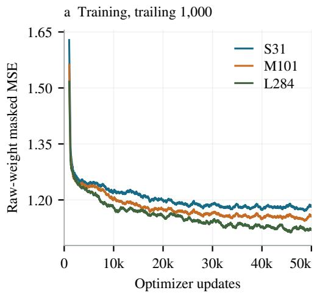

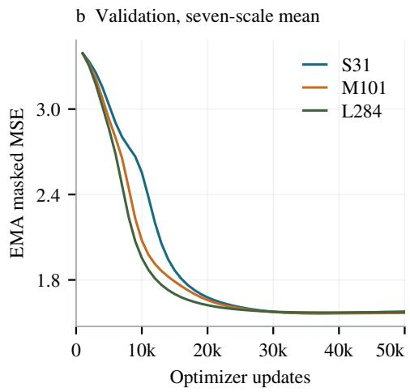

Figure 5: Training loss curves and validation loss curves of the model family. All curves stop at 50k optimizer updates. Training uses a trailing 1,000-update mean; validation averages the seven resolution losses.  
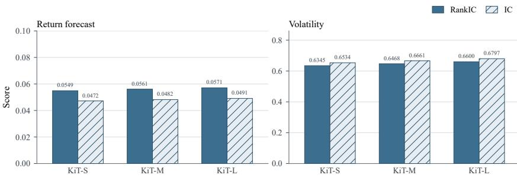  
Figure 6: Forecast quality across model scale.

Figure 6 compares mean return and volatility scores for KiT-S (31M), KiT-M (101M), and KiT-L (284M) on the same three-market, seven-resolution test panel. KiT-L is the checkpoint reported in the main paper, with return RankIC 0.0571, return IC 0.0491, volatility RankIC 0.6600, and volatility IC 0.6797.

The RankIC bars follow a mild scaling law (Shi et al., 2024). At the current data volume, a larger model still improves RankIC (Spearman, 1904): each step up in size raises it by about two percent relative, and the order is KiT-S, then KiT-M, then KiT-L for return and for volatility. The gain is small, but it has not flattened. Increasing capacity remains useful on this corpus, in the same direction as the training-loss gap among the three models.

## C EXTENDED FORECAST RESULTS

We provide here more detailed evaluation results for return and volatility forecasting. The evaluation results below use the same test period as in §4.2, both being computed in the test window from 1 January 2026 to 10 April 2026.

## C.1 RETURN IC

Return IC compares mean predicted and realized terminal close-to-close log-returns.

Table 5: Return IC by resolution. Higher is better; bold marks the best value in each column.
<table><tr><td>Configuration</td><td>1m↑</td><td>5m↑</td><td>15m↑</td><td>30m↑</td><td>lh↑</td><td>2h↑</td><td>1d ↑</td><td>Mean ↑</td></tr><tr><td>KiT</td><td>.0235</td><td>.0552</td><td>.0445</td><td>.0330</td><td>.0241</td><td>.0475</td><td>.1158</td><td>.0491</td></tr><tr><td>Kronos-base</td><td>.0072</td><td>.0344</td><td>.0368</td><td>-.0244</td><td>-.0209</td><td>.0186</td><td>-.0048</td><td>.0067</td></tr><tr><td>Kronos-base-FT</td><td>.0164</td><td>.0506</td><td>.0392</td><td>.0136</td><td>.0125</td><td>.0348</td><td>.0058</td><td>.0247</td></tr><tr><td>Sundial</td><td>.0086</td><td>.0074</td><td>.0362</td><td>.0221</td><td>.0152</td><td>.0284</td><td>.1026</td><td>.0315</td></tr><tr><td>Chronos-Bolt extended</td><td>-.0364</td><td>.0292</td><td>.0246</td><td>-.0724</td><td>.0068</td><td>-.2223</td><td>.0276</td><td>-.0347</td></tr><tr><td>Chronos-2</td><td>.0188</td><td>.0383</td><td>.0372</td><td>-.0402</td><td>-.0841</td><td>-.1789</td><td>.0962</td><td>-.0161</td></tr><tr><td>TimesFM 2.5</td><td>-.0124</td><td>.0426</td><td>.0348</td><td>-.0286</td><td>.0186</td><td>-.0592</td><td>.0924</td><td>.0126</td></tr><tr><td>TimesFM 3</td><td>-.0062</td><td>.0384</td><td>.0352</td><td>-.0116</td><td>.0196</td><td>-.0242</td><td>.1042</td><td>.0222</td></tr><tr><td>Historical return bootstrap</td><td>-.0112</td><td>.0199</td><td>-.0805</td><td>-.0114</td><td>.0194</td><td>-.0434</td><td>-.1000</td><td>-.0296</td></tr><tr><td>TimeGrad adapted</td><td>.0212</td><td>.0454</td><td>.0400</td><td>.0314</td><td>.0228</td><td>.0428</td><td>.1086</td><td>.0446</td></tr><tr><td>Diffusion-TS adapted</td><td>-.0209</td><td>.0412</td><td>-.0096</td><td>.0084</td><td>-.0491</td><td>.0386</td><td>-.0142</td><td>-.0008</td></tr><tr><td>TSFlow adapted</td><td>.0188</td><td>.0412</td><td>.0376</td><td>.0089</td><td>.0216</td><td>.0394</td><td>.0124</td><td>.0257</td></tr></table>

## C.2 VOLATILITY IC

Volatility IC compares mean predicted path volatility with realized future volatility.  
Table 6: Volatility IC by resolution. Higher is better; bold marks the best value in each column.
<table><tr><td>Configuration</td><td>lm↑</td><td>5m↑</td><td>15m ↑</td><td>30m↑</td><td>lh↑</td><td>2h↑</td><td>1d↑</td><td>Mean ↑</td></tr><tr><td>KiT</td><td>.7459</td><td>.6749</td><td>.6888</td><td>.6553</td><td>.6621</td><td>.7586</td><td>.5726</td><td>.6797</td></tr><tr><td>Kronos-base</td><td>.5654</td><td>.4369</td><td>.3616</td><td>.3175</td><td>.4491</td><td>.5745</td><td>.4377</td><td>.4490</td></tr><tr><td>Kronos-base-FT</td><td>.5836</td><td>.4695</td><td>.3884</td><td>.3759</td><td>.4667</td><td>.5736</td><td>.4470</td><td>.4721</td></tr><tr><td>Sundial</td><td>.6055</td><td>.5178</td><td>.5233</td><td>.5041</td><td>.5757</td><td>.5138</td><td>.4081</td><td>.5212</td></tr><tr><td>Chronos-Bolt extended</td><td>.5830</td><td>.4926</td><td>.4169</td><td>.4907</td><td>.4261</td><td>.4414</td><td>.1562</td><td>.4296</td></tr><tr><td>Chronos-2</td><td>.4156</td><td>.3688</td><td>.3185</td><td>.5068</td><td>.3665</td><td>.5365</td><td>.1272</td><td>.3771</td></tr><tr><td>TimesFM 2.5</td><td>.5172</td><td>.4250</td><td>.4760</td><td>.4784</td><td>.5770</td><td>.4618</td><td>.4369</td><td>.4818</td></tr><tr><td>TimesFM 3</td><td>.3851</td><td>.3758</td><td>.3810</td><td>.3723</td><td>.5436</td><td>.4191</td><td>.1277</td><td>.3721</td></tr><tr><td>GARCH</td><td>.3810</td><td>.5285</td><td>.6566</td><td>.6001</td><td>.5697</td><td>.6324</td><td>.4610</td><td>.5470</td></tr><tr><td>TimeGrad adapted</td><td>.1311</td><td>.2646</td><td>.0467</td><td>-.1019</td><td>.5642</td><td>.5463</td><td>.1176</td><td>.2241</td></tr><tr><td>Diffusion-TS adapted</td><td>.4492</td><td>.1991</td><td>.1305</td><td>.0395</td><td>.4833</td><td>.4467</td><td>.4695</td><td>.3168</td></tr><tr><td>TSFlow adapted</td><td>.3817</td><td>.4176</td><td>.4393</td><td>.6422</td><td>.5132</td><td>.5517</td><td>.5289</td><td>.4964</td></tr></table>

## C.3 PRICE-SERIES FORECASTING

Additionally, we evaluate the price series forecasting performance in the test window, from January 1 2026 to April 10 2026. The results demonstrate that KiT outperforms both the baseline and fine-tuned Kronos models.

Table 7: Price-series forecasting. Values are averaged over the seven resolutions and three markets.
<table><tr><td>Configuration</td><td>IC/RankIC ↑</td></tr><tr><td>KiT</td><td>0.0372/0.0407</td></tr><tr><td>Kronos-base Kronos-base-FT</td><td>0.0090/0.0148 0.0132/0.0205</td></tr></table>

## C.4 RETURN FORECASTING OVER TIME

Figures 7–9 show how cross-sectional return RankIC and IC move from one anchor date to the next, separately for A-shares, crypto, and US equities. Each point is one anchor; the line is a rolling mean. Evaluation window is from 2026.01.01 to 2026.04.10. Each point here represents a time anchor. So every point in all the figures below represents the average result of tests across all products in each market. For example, a single point in the A-share figure is the average of 3,914 prediction results.

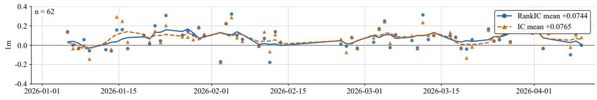

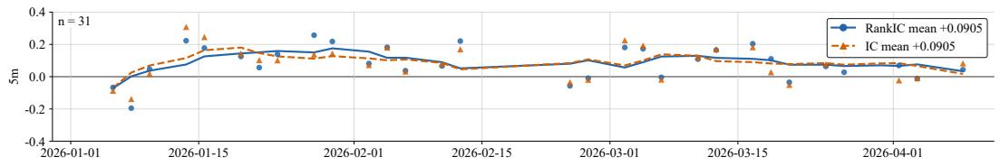

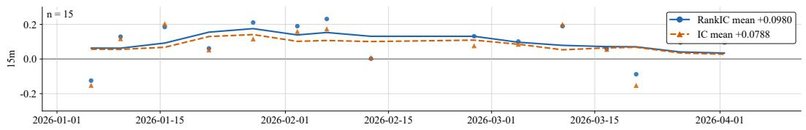

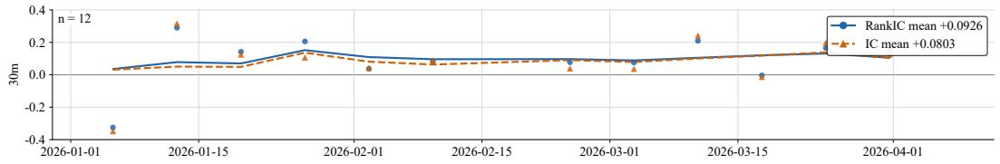

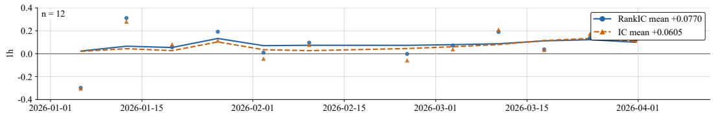

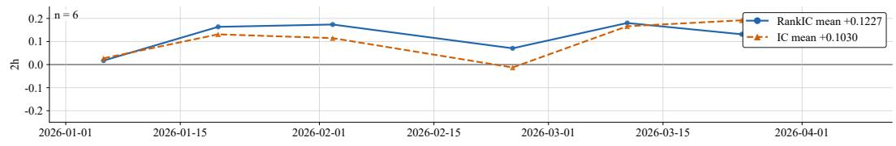

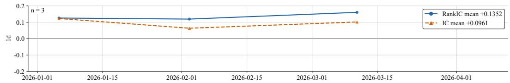  
Figure 7: A-share return RankIC and IC.

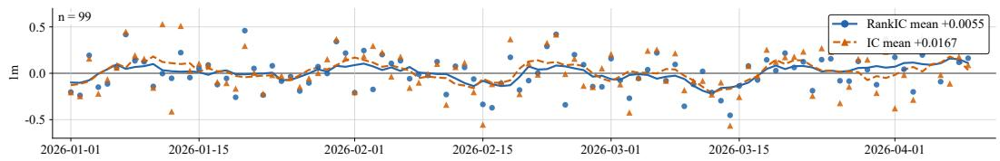

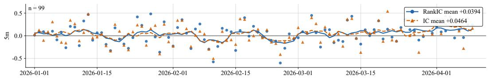

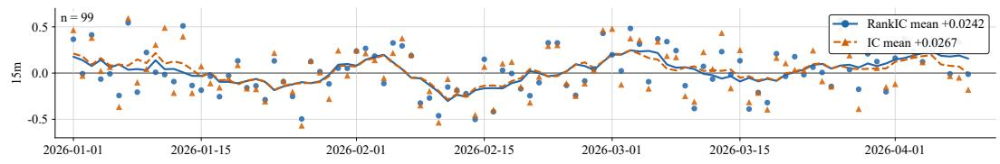

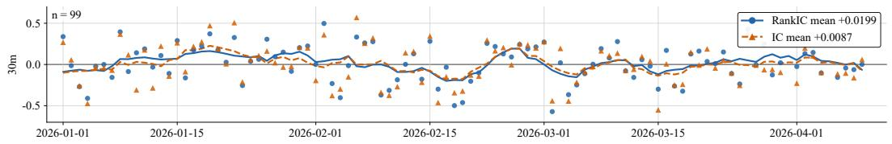

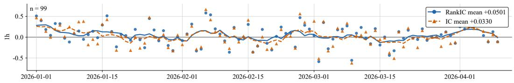

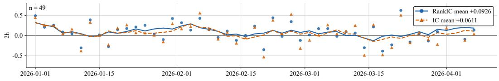

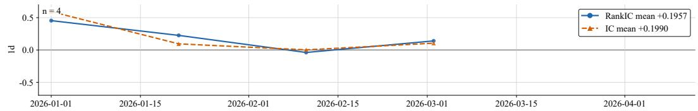  
Figure 8: Crypto return RankIC and IC.

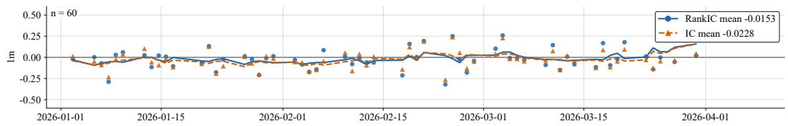

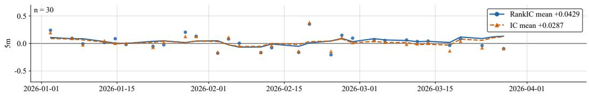

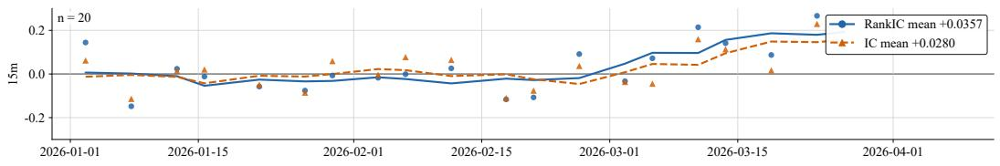

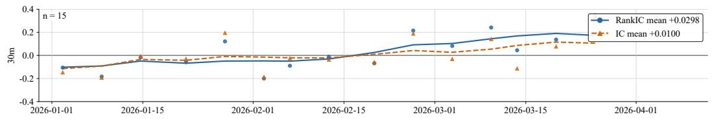

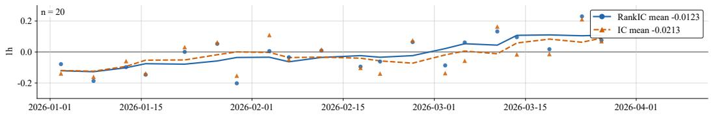

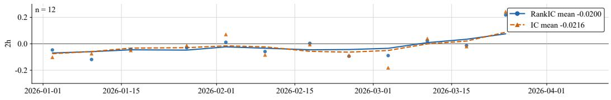

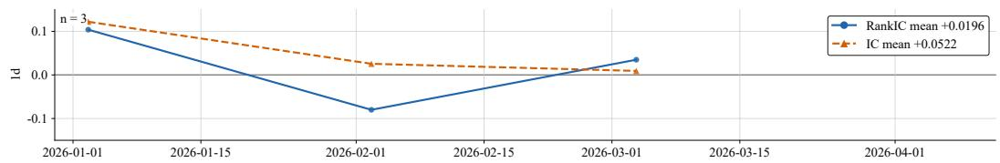  
Figure 9: US return RankIC and IC.

## D CLASSIFIER-FREE GUIDANCE

Classifier-free guidance is the usual inference-time control in conditional generative models (Ho & Salimans, 2022). Training randomly replaces the condition with a null input, so one network represents both the conditional and the unconditional velocity. At sampling time the two predictions are extrapolated,

$$
{ \pmb v } = { \pmb v } _ { \emptyset } + { \pmb w } ( { \pmb v } _ { c } - { \pmb v } _ { \emptyset } ) ,\tag{10}
$$

where $w { = } 1$ recovers the conditional model and $w { > } 1$ amplifies the condition. A larger weight makes samples adhere more closely to the requested condition and reduces their variety.

KiT applies that tradeoff to a candlestick forecast, whose output is a distribution over future paths. Two contexts set where the distribution sits, and Eq. (9) of the main paper extrapolates them separately. Identity, market, sector, instrument, and timescale, carries the slow character of the product: its typical drift, volatility, and candle geometry. History carries the recent path. Training uses the three stochastic replacements in the main text. The instrument and sector embeddings are replaced by a shared [UNK] token; all identity signals (market, sector, instrument, timescale) are replaced by a [NULL] vector; and the history context is zeroed. At inference, $w _ { \mathrm { i d } }$ scales the identity correction and $w _ { \mathrm { h i s t } }$ scales the history correction. Raising $w _ { \mathrm { i d } }$ moves the ensemble toward the distribution associated with that product. Raising $w _ { \mathrm { h i s t } }$ moves it toward the recent window. Either increase concentrates the samples. Both weights are 1 in the main evaluation, which is the conditional model.

We select 100 products and, for each, draw $K { = } 6 4$ paths from one shared initial noise. Each weight is swept over {1, 2, 3, 4} while the other is held at 1, so differences across a column come only from that weight. Three diagnostics are averaged over the 100 products.

Prior gap compares the ensemble with the product’s own character. For product $i , \sigma _ { i } ^ { \mathrm { i d } }$ is the standard deviation of log-returns on a long causal window of that instrument, taken before the forecast anchor and excluding the most recent horizon. Ensemble volatility $\sigma _ { i } ^ { \mathrm { e n s } }$ is the mean, over the K paths, of the standard deviation of log-returns along each path. The prior gap is $| \sigma _ { i } ^ { \mathrm { e n s } } - \sigma _ { i } ^ { \mathrm { i d } } | / \sigma _ { i } ^ { \mathrm { i d } }$ . A smaller value means the samples sit closer to that product’s typical scale. History gap compares the ensemble with the recent window. Let $r _ { i } ^ { \mathrm { h i s t } }$ be the log-return over the last horizon-length stretch of the context, and let $r _ { i } ^ { \mathrm { { e n s } } }$ be the mean terminal log-return across the K paths. The history gap is $\vert r _ { i } ^ { \mathrm { e n s } } - r _ { i } ^ { \mathrm { h i s t } } \vert / s _ { i }$ where $s _ { i }$ is the same product’s historical return scale $\sigma _ { i } ^ { \mathrm { i d } }$ times the square root of the horizon length. A smaller value means the samples sit closer to the recent path.

Spread is the diversity of the ensemble: the standard deviation of the K terminal log-returns, divided by the same $s _ { i } .$ . A smaller value means a tighter set of paths. Table 8 records the sweep.

Table 8: Guidance sweep averaged over 100 products.
<table><tr><td rowspan="2">w</td><td colspan="3">Identity  $w _ { \mathrm { i d } } \ ( w _ { \mathrm { h i s t } } { = } 1 )$ </td><td colspan="3">History  $w _ { \mathrm { h i s t } }$   $( w _ { \mathrm { i d } } \mathrm { = } 1 )$ </td></tr><tr><td>Prior ↓</td><td>Hist. ↓</td><td>Spread ↓</td><td>Prior ↓</td><td>Hist. ↓</td><td>Spread ↓</td></tr><tr><td>1</td><td>0.41</td><td>0.52</td><td>1.08</td><td>0.41</td><td>0.52</td><td>1.08</td></tr><tr><td>2</td><td>0.28</td><td>0.49</td><td>0.91</td><td>0.39</td><td>0.37</td><td>0.93</td></tr><tr><td>3</td><td>0.20</td><td>0.47</td><td>0.78</td><td>0.37</td><td>0.26</td><td>0.81</td></tr><tr><td>4</td><td>0.15</td><td>0.46</td><td>0.69</td><td>0.36</td><td>0.19</td><td>0.72</td></tr></table>

The two weights move different margins of the same ensemble. Raising $w _ { \mathrm { i d } }$ from 1 to 4 cuts the prior gap from 0.41 to 0.15, so the samples move toward each product’s own volatility, while the history gap stays near 0.5. Raising $w _ { \mathrm { h i s t } }$ from 1 to 4 cuts the history gap from 0.52 to 0.19, so the samples move toward the recent window, while the prior gap stays near 0.4. On both axes the spread falls, from 1.08 at w=1 to 0.69 under identity guidance and to 0.72 under history guidance: fidelity to the selected context comes with a less diverse ensemble. We additionally compared the IC and RankIC for return forecasting. A larger CFG allows predictions to be more concentrated for certain products, and we also observed that for some high-volatility products, increasing CFG improves forecasting performance. However, the average IC scores remain largely unchanged overall. The main results therefore keep both weights at 1.

## E MORE ABLATION STUDY

We further conduct ablation experiments to validate the design choices of each component in our KiT: the candlestick representation, whether the window-constant identity signals (market, sector, instrument and timescale) are injected through the AdaLN trunk, and whether the per-bar signals (clock, session, day of week, month, day of year and event flags) are injected into the token embeddings. Each variant keeps the data protocol and training recipe of the main model fixed and changes a single factor, and all are scored by the mean return RankIC.

Table 9: Ablation on the candlestick representation. Each row alters only the input state; all other settings follow the main model.
<table><tr><td>Representation of a bar</td><td>Mean return RankIC ↑</td></tr><tr><td>Five-dimensional log-ratio state (KiT)</td><td>0.0571</td></tr><tr><td>Close-only log-price input</td><td>0.0183</td></tr><tr><td>Naive OHLCV input (normalized)</td><td>0.0209</td></tr></table>

Table 9 validates the candlestick representation. Encoding a bar as raw OHLCV levels, even after robust normalisation, discards the scale-free relative form of the candle and lowers the mean RankIC to 0.0209; reducing the input further to a close-only log-price, which also drops the intrabar range and volume, gives the weakest score of 0.0183.

Table 10: Ablation on conditioning injection. Identity denotes the window-constant signals (market, sector, instrument, timescale); Calendar denotes the per-bar signals (clock, session, day of week, month, day of year, event flags).
<table><tr><td colspan="2">Configuration Mean return RankIC ↑</td></tr><tr><td>AdaLN identity + per-bar calendar (K1T)</td><td>0.0571</td></tr><tr><td>Identity → AdaLN</td><td></td></tr><tr><td rowspan="3">Market and sector only (drop instrument, scale) w/o identity</td><td>0.0386</td></tr><tr><td>0.0329</td></tr><tr><td></td></tr><tr><td>Per-bar condition → token embeddings w/o per-bar condition</td><td>0.0372</td></tr></table>

Table 10 shows that both conditioning pathways contribute. Withdrawing the identity signals entirely $( c _ { \mathrm { b a s e } } { = } 0 )$ costs the most, dropping the mean RankIC from 0.0571 to 0.0329, while keeping only the coarse market and sector identifiers recovers to 0.0386: the fine-grained instrument and timescale embeddings therefore carry signal that the coarse prior cannot. Removing the per-bar calendar signals similarly degrades the score to 0.0372, indicating that clock, session and event context supply temporal structure that neither identity conditioning nor the observed history provides on its own. Together these results justify the full design, in which each class of signal is injected at the granularity that matches its nature.