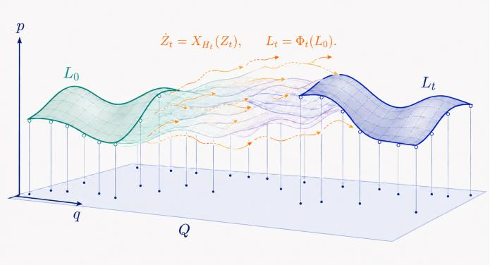
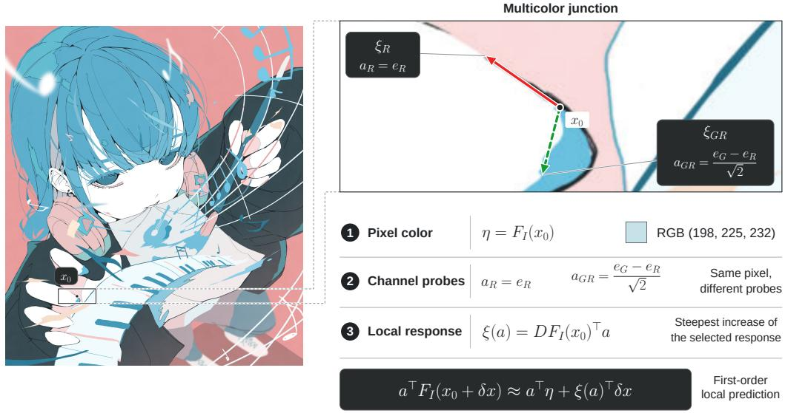
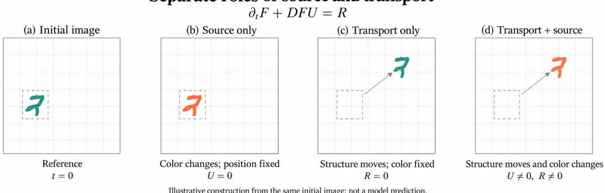
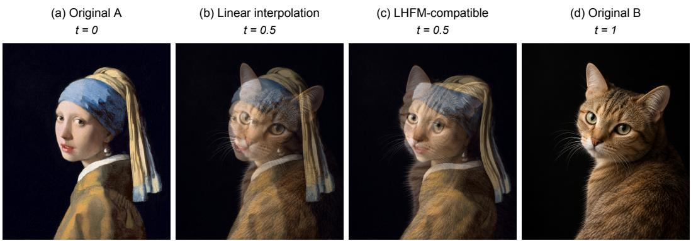
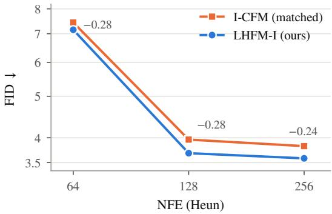
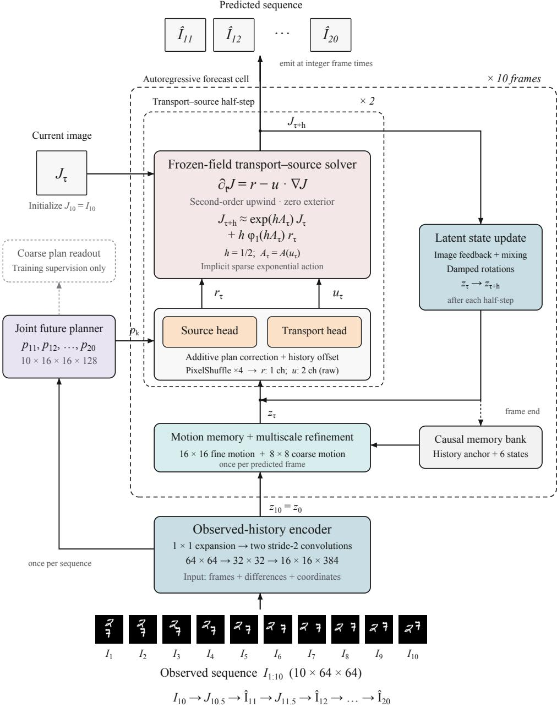
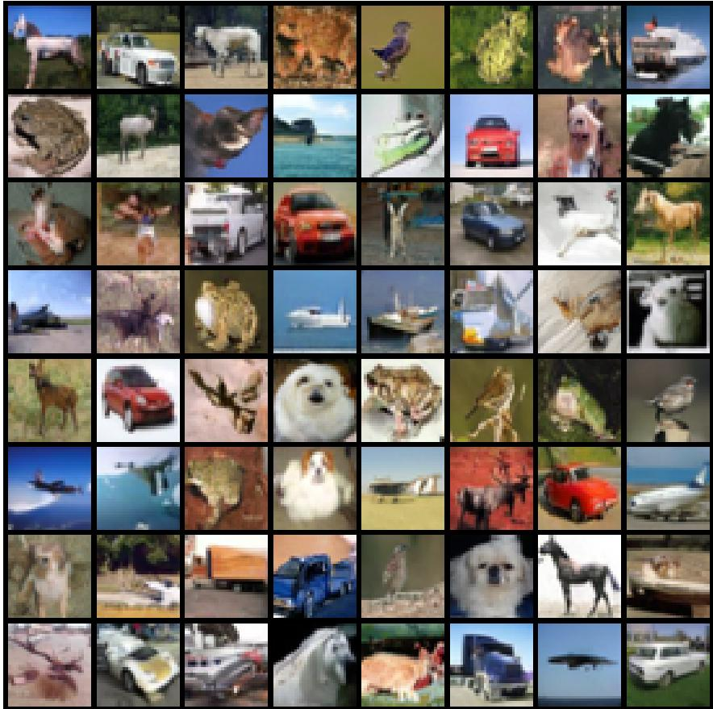
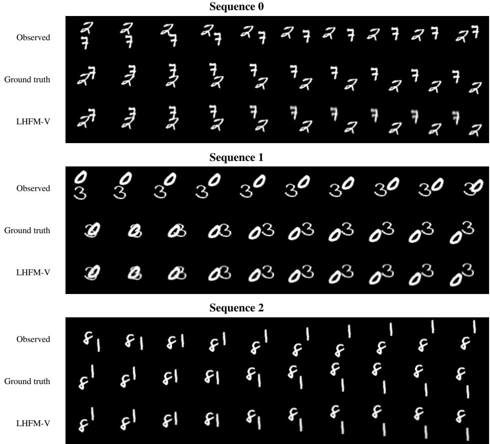
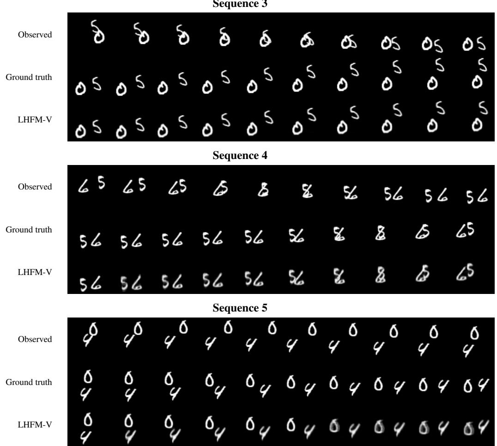

# LAGRANGIAN–HAMILTONIAN FLOWS FOR VIDEO PREDICTION AND IMAGE GENERATION: A SYMPLEC-TIC PERSPECTIVE

Jiawei Hu   
Department of Mathematics and Statistics, Boston University   
jiaweihu@bu.edu

## ABSTRACT

We introduce LHFM, a geometric framework for learning image dynamics. Drawing on structures central to classical mechanics, symplectic geometry, and geometric quantization, LHFM represents each image as an exact Lagrangian graph and models its evolution through image-dependent Hamiltonian flows, which yield a transport–source parameterization of image velocities. Our primary application is deterministic video prediction: LHFM-V is a recurrent model that advances frames by integrating predicted transport and source fields, and achieves the lowest reported FLOP count among the compared recurrent models with similar prediction accuracy. The image variant, LHFM-I, shows that the same construction is compatible with flow matching: in a matched experiment, it attains a lower FID than the flow-matching baseline. Code is available at https: //github.com/Lilas-Q/Geometric\_quantization\_models.

## 1 INTRODUCTION

Diffusion models and flow-based generative models generate images by transforming a simple distribution into the data distribution (Ho et al., 2020; Song et al., 2021; Lipman et al., 2023). Flow matching (FM) provides a simulation-free training objective for continuous normalizing flows by regressing a time-dependent vector field onto conditional vector fields (Lipman et al., 2023). In the original FM formulation, the network directly models a vector field on the data space where each image represents a point of this space.

A similar perspective applies to video prediction: conditioned on the observed sequence, a learned flow evolves the observed frames into future frames. Thus, image generation and video prediction can both be formulated as learning a flow on image space, although their initial conditions and training objectives differ.

Image dynamics involve both spatial structure (pixel locations) and color (channel values). In standard FM, however, the vector field acts on channel values at fixed pixel locations, so changes in spatial structure are reflected only implicitly through changes in color. This motivates a question: how can these two aspects of image evolution be expressed through a common geometric representation?

We answer this question by introducing Lagrangian–Hamiltonian Flow Matching (LHFM), a geometric framework that combines Lagrangian image representations with Hamiltonian dynamics. A Lagrangian submanifold can be viewed as a “generalized point” which encodes the space and phase simultaneously. Motivated by this, we represent each image as an exact Lagrangian graph that jointly encodes pixel locations and channel values. Image evolution is then described by Hamiltonian flows that transport these graphs, as illustrated in Figure 1. Throughout, “Lagrangian” refers to a submanifold rather than to an action functional.

A central issue is compatibility: a Hamiltonian flow preserves the Lagrangian property but need not preserve a graph representation. We show that a Hamiltonian transports a prescribed family of exact Lagrangian graphs if and only if it satisfies a Hamilton–Jacobi condition. This characterization leads to a natural parameterization of the vector field on the data space in terms of a transport vectorfield,

  
Figure 1: Hamiltonian deformation of a Lagrangian submanifold. For a fixed image trajectory, the time-dependent ambient Hamiltonian $\grave { H _ { t } }$ transports $L _ { 0 }$ to $\begin{array} { r l r } { L _ { t } } & { { } = } & { \Phi _ { t } ( L _ { 0 } ) } \end{array}$ The surfaces schematically represent higher-dimensional exact Lagrangians.

which moves spatial locations, and a source field, which changes channel values along that motion.   
The construction is detailed in Section 4.

We instantiate LHFM as LHFM-I for image generation and LHFM-V for deterministic video prediction, where I and V denote image and video, respectively. We evaluate the two variants on unconditional CIFAR-10 generation and Moving MNIST prediction. In a matched comparison, LHFM-I improves upon the standard independent conditional flow-matching baseline. LHFM-V uses a recurrent architecture and has the lowest reported FLOP count among the compared recurrent models with similar prediction accuracy.

The primary focus of this work is deterministic video prediction: LHFM-V is our main method, and the video experiments constitute the main empirical evaluation. LHFM-I is included to show that the same transport–source parameterization is compatible with flow-matching image generation without changing the training objective. We therefore evaluate LHFM-I only in a controlled comparison against a matched I-CFM baseline, and we do not claim state-of-the-art image generation.

Our contributions are:

• to our knowledge, the first representation of images as exact Lagrangian graphs, with a Hamilton–Jacobi characterization (classical in form; proved in Appendix A.3) of the Hamiltonians that transport them;

• a transport–source parameterization derived from it, which contains the standard flowmatching velocity as the case $U _ { t } \equiv 0 ;$ and

• empirical studies on deterministic Moving MNIST prediction, where LHFM-V has the lowest FLOP count among the compared recurrent video predictors (Table 3), and on CIFAR-10 generation, where LHFM-I attains a lower FID than a matched I-CFM baseline, demonstrating compatibility with flow matching.

## 2 RELATED WORK

Flow matching. Flow matching trains continuous normalizing flows through simulation-free regression of conditional vector fields (Lipman et al., 2023). Conditional flow matching extends this construction to general source and target distributions, with independent and optimal transport couplings as particular choices (Tong et al., 2024). LHFM-I retains the independent conditional flowmatching objective but parameterizes the image velocity through a transport vector field and a source field.

Geometric formulations. Riemannian Flow Matching extends flow matching to manifolds (Chen & Lipman, 2024), while Metric Flow Matching uses data-dependent Riemannian metrics to construct conditional paths (Kapusniak et al., 2024). LHFM takes a different approach: it represents ´ each image as an exact Lagrangian graph and characterizes Hamiltonian flows that transport these representations. The underlying connection between Lagrangian submanifolds and the Hamilton– Jacobi equation is classical (Carinena et al., 2006), and transport–source image dynamics also ap-˜ pear in image metamorphosis (Trouve & Younes, 2005; Holm et al., 2009). Our contribution applies ´ this connection to image representations and derives a transport–source parameterization of image dynamics.

Video prediction. Recurrent video predictors advance a hidden state frame by frame, from ConvLSTM (Shi et al., 2015) and the PredRNN family (Wang et al., 2017; 2022) to PhyDNet, which constrains part of its latent dynamics with a learned PDE (Le Guen & Thome, 2020). LHFM-V belongs to this category: conditioned on observed frames, it recurrently predicts transport and source fields and evolves the image through their combined dynamics. Recurrent-free predictors (Gao et al., 2022; Tang et al., 2026) and generative video models (Davtyan et al., 2023) are outside the scope of this work.

## 3 GEOMETRIC PRELIMINARIES AND MOTIVATION

A symplectic manifold $\left( X ^ { 2 m } , \omega \right)$ is a smooth manifold equipped with a closed, nondegenerate twoform. A submanifold $L \subset X$ is Lagrangian if dim $L = m$ and $\omega | _ { L } = 0$ . The cotangent bundle $T ^ { * } Q$ carries the canonical one-form λ and symplectic form $\omega = - d \lambda$ . For a smooth function $S : Q  \mathbb { R } .$ the graph graph(dS) is an exact Lagrangian submanifold: the pullback of λ to the graph equals $d S$ (Cannas da Silva, 2001; McDuff & Salamon, 2017).

A time-dependent Hamiltonian $H _ { t } : T ^ { * } Q \to \mathbb { R }$ determines a Hamiltonian vector field through $\iota _ { X _ { H _ { t } } } \omega = d _ { z } H _ { t }$ . Its flow preserves the symplectic form and the exactness of Lagrangian submanifolds, but not necessarily their graph representations. Our construction uses exact graphs to represent images and the Hamilton–Jacobi equation to characterize their evolution.

The cotangent bundle $T ^ { * } Q$ provides the natural phase space of classical mechanics, with its canonical coordinates representing position and momentum. In semiclassical analysis, an oscillatory state of the form $a ( q ) e ^ { \mathrm { i } \bar { S } ( q ) / \hbar }$ is microlocally associated with the Lagrangian graph $L _ { S } = \mathrm { g r a p h } ( d S )$ , on which the phase function determines the relation $p = d S ( q )$ . Whereas a classical phase-space point specifies position and momentum simultaneously, the Heisenberg uncertainty principle prevents a quantum state from being sharply localized in both variables (Kennard, 1927; Robertson, 1929). This phase-space viewpoint motivates our use of Lagrangian graphs to organize spatial locations, channel values, and their local spatial sensitivities within a common geometric representation.

Table 1: Geometric motivation for LHFM. Hamiltonian evolution refers to the ambient cotangent bundle, not the image-space vector field.
<table><tr><td></td><td>Classical mechanics</td><td>Semiclassical (WKB)</td></tr><tr><td>Representation</td><td>Point  $( q , p ) \in T ^ { * } Q$ </td><td>Lagrangian graph with amplitude</td></tr><tr><td></td><td>Vanilla Flow Matching</td><td>LHFM</td></tr><tr><td>Representation</td><td>An image point J</td><td>Graph Lagrangian  $L _ { J } = \mathrm { g r a p h } ( d S _ { J } )$ </td></tr><tr><td>Dynamics</td><td>A general learned Flow in image space</td><td>Hamiltonian flow on  $T ^ { * } Q$ </td></tr></table>

## 4 LAGRANGIAN–HAMILTONIAN FLOW MATCHING

We first define a Lagrangian representation of an image and characterize the Hamiltonian flows that transport these representations. We then use the induced image dynamics for conditional flow matching and deterministic video prediction. The representation and continuous geometric construction are shared; initial conditions, conditioning, losses, and numerical methods are specified separately for the two applications.

## 4.1 IMAGE SPACE AND CONTINUOUS REPRESENTATION

Let $M = \mathbb { R } ^ { 2 }$ be the spatial coordinate space and $V = \mathbb { R } ^ { n }$ the space of n-channel pixel values. For the pixel-centered grid $\mathcal { G } _ { N }$ of an $N \times N$ image, write $\mathcal { X } _ { N } = \bar { V } ^ { \mathcal { G } _ { N } }$ and $\begin{array} { r } { d = n N ^ { 2 } . } \end{array}$ The linear fullband cosine extension associates each image $\bar { \boldsymbol { I } } \in \mathcal { X } _ { N }$ with a smooth map $F _ { I } = \mathcal { F } _ { N } ( I ) : M \to V$ satisfying $F _ { I } | _ { \mathcal { G } _ { N } } = I$ . The detailed construction and its properties are given in Appendix A.1.

Local information in a Lagrangian representation  
  
Figure 2: Local information encoded by the Lagrangian representation. Arrow directions are computed at $x _ { 0 }$ in Euclidean pixel coordinates; lengths are schematic and not to scale.

## 4.2 LAGRANGIAN IMAGE REPRESENTATION

Introduce an auxiliary dual variable $a \in V ^ { * }$ . Throughout, we use the standard Euclidean identifications of vector spaces and their duals when writing coordinate transposes. Set $Q = \mathbb { R } ^ { 2 } \times V ^ { * }$ , and equip its cotangent bundle $T ^ { * } Q$ with canonical coordinates $( x , a ; \xi , \eta )$ , where $\xi$ and η are dual to x and $^ { a , }$ respectively. The canonical one-form and symplectic form are

$$
\lambda = \xi ^ { \top } d x + \eta ^ { \top } d a , \qquad \omega = - d \lambda .\tag{1}
$$

Using the natural duality pairing between $V ^ { * }$ and $V _ { ; }$ , we define the generating function $S _ { I } : Q $ R and the associated LHFM encoder by

$$
\begin{array} { r l } & { \quad S _ { I } ( x , a ) = \langle a , F _ { I } ( x ) \rangle = a ^ { \top } F _ { I } ( x ) , } \\ & { \quad E ( I ) = L _ { I } = \mathrm { g r a p h } ( d S _ { I } ) = \left\{ \left( x , a ; D F _ { I } ( x ) ^ { \top } a , F _ { I } ( x ) \right) : ( x , a ) \in Q \right\} . } \end{array}\tag{2}
$$

Here $D F _ { I } ( x )$ denotes the spatial Jacobian of $F _ { I }$ . As the graph of an exact one-form, $L _ { I }$ is an exact Lagrangian submanifold of $\bar { T } ^ { * } Q$

Exactness and injective image recovery are established in Proposition A.4 in Appendix A.2.

Geometric Intuition of Lagrangian representation The auxiliary variable $a \in V ^ { * }$ acts as a linear probe of the channel values, with scalar response $S _ { I } ( x , a )$ at spatial location x. For an RGB image, $a = e _ { R }$ selects the red channel, whereas $a = ( e _ { G } - e _ { R } ) / \sqrt { 2 }$ probes the normalized greenminus-red contrast.

Differentiating with respect to the spatial and probe variables yields

$$
d S _ { I } = \underbrace { D F _ { I } ( x ) ^ { \top } a } _ { \xi } \cdot d x + \underbrace { F _ { I } ( x ) } _ { \eta } \cdot d a .
$$

Thus, η records the channel values and determines how the response changes when the probe is varied, while $\xi$ describes how the same response changes under a spatial displacement.

As shown in Figure $2 , ^ { 1 }$ the covector $\xi ( a ) = D F _ { I } ( x _ { 0 } ) ^ { \top } a$ , gives the direction of steepest increase of the probe response at $x _ { 0 }$ . The red arrow $( a = e _ { R } )$ indicates the direction in which the red-channel value increases most rapidly, whereas the green arrow $( a = ( e _ { G } - e _ { R } ) / \sqrt { 2 } )$ indicates the direction of steepest increase in the green-minus-red contrast.

The Lagrangian graph therefore organizes pixel values and their local spatial sensitivities into a single geometric object.

## 4.3 HAMILTONIAN DYNAMICS

We write $J _ { t }$ for an image trajectory, $F _ { J _ { t } } = \mathcal { F } _ { N } ( J _ { t } )$ for its continuous representation, and $J ^ { ( m ) }$ for numerical iterates.

Hamiltonian parameterization. Let $z = ( x , a ; \xi , \eta ) \in T ^ { * } Q$ denote the canonical coordinates. For a Hamiltonian, let $X _ { H }$ be the Hamiltonian vector field defined by $\iota _ { X _ { H _ { t } } } \omega = d _ { z } H _ { t }$ . A Hamiltonian trajectory $z ( t ) = ( x ( t ) , a ( t ) ; \xi ( t ) , \eta ( t ) )$ with initial point $z _ { 0 } \in T ^ { * } Q$ satisfies

$$
\frac { d } { d t } z ( t ) = X _ { H _ { t } } \bigl ( z ( t ) \bigr ) , \qquad z ( 0 ) = z _ { 0 } .\tag{3}
$$

A Hamiltonian flow preserves the exactness of a Lagrangian submanifold (Viterbo, 2023, Proposition 4.13), but it need not preserve its representation as a graph over the base (Kragh, 2026, Lemma 2.4 and Corollary 2.5). This raises a natural question: which Hamiltonians transport a prescribed family of exact Lagrangian graphs? The following lemma provides a precise characterization: such transport occurs if and only if the generating functions satisfy the associated Hamilton– Jacobi equation up to an additive function of time. This characterization is central to our construction.

Lemma 4.1 (Hamiltonian transport of image graphs). Let $\mathcal { T } \subset \mathbb { R }$ be an open time interval and let $F \in C ^ { \infty } ( \mathcal { T } \times \mathbb { R } ^ { 2 } ; \mathbb { R } ^ { n } )$ ). Write $\bar { F _ { t } } ( x ) = F ( \bar { t , } x )$ and define

$$
S _ { t } ( x , a ) = a ^ { \top } F _ { t } ( x ) , \qquad L _ { t } = \mathrm { g r a p h } ( d S _ { t } ) = \left\{ \left( x , a ; D F _ { t } ( x ) ^ { \top } a , F _ { t } ( x ) \right) : ( x , a ) \in Q \right\} .
$$

Let $H _ { t }$ be a smooth time-dependent Hamiltonian on $T ^ { * } Q .$ . Assume that its Hamiltonian flow $\Phi _ { s  t } ^ { H }$ is defined on all $o f T ^ { * } Q f o r e { \nu } e r y s , t \in { \mathcal { I } }$

Then thefollowing statements are equivalent:

1. The Hamiltonian flow transports the prescribed image graphs: $\Phi _ { s  t } ^ { H } ( L _ { s } ) ~ = ~ L _ { t }$ for $s , t \in \mathcal { T }$

2. The generating function $S _ { t }$ and Hamiltonian $H _ { t }$ satisfy the Hamilton–Jacobi equation

$$
\partial _ { t } S _ { t } ( q ) + H _ { t } ( q , d _ { q } S _ { t } ( q ) ) = c ( t ) , \qquad q \in Q ,\tag{4}
$$

where $c \in C ^ { \infty } ( \mathcal { T } ; \mathbb { R } )$ only depends on the time.

3. There exist smooth maps $U : \mathcal { T } \times T ^ { * } Q \to \mathbb { R } ^ { 2 }$ and $B : \mathbb { Z } \times T ^ { * } Q  \mathbb { R } ^ { n }$ such that

$$
\begin{array} { r l } & { H _ { t } ( x , a ; \xi , \eta ) = c ( t ) - a ^ { \top } \partial _ { t } F _ { t } ( x ) + \left( \xi - D F _ { t } ( x ) ^ { \top } a \right) ^ { \top } U _ { t } ( x , a ; \xi , \eta ) } \\ & { \qquad + \left( \eta - F _ { t } ( x ) \right) ^ { \top } B _ { t } ( x , a ; \xi , \eta ) . } \end{array}\tag{5}
$$

The proof is given in Appendix $_ { \mathrm { A } . 3 }$

The restricted coefficients $U _ { t } ^ { L } , B _ { t } ^ { L }$ and the corresponding Hamiltonian characteristics are given in Proposition A.5 in Appendix ${ \mathrm { A } } . 3$ . For a finite-image trajectory, we apply these results with $\bar { F _ { t } } = F _ { J _ { t } }$ to derive the induced image velocity from the equation for η.

Induced image dynamics. Let $J _ { t } \in \mathcal { X } _ { N }$ be a smooth image path and set $F _ { J _ { t } } = \mathcal { F } _ { N } ( J _ { t } )$ . Suppose that the Hamiltonian flow transports the graphs $L _ { J _ { t } }$ , as characterized by Lemma 4.1. By Hamilton’s equation $\dot { \eta } = - \partial _ { a } H _ { t }$ (equation 19), we define

$$
R _ { t } ^ { L } ( x , a ) : = - \partial _ { a } H _ { t } \big ( x , a ; D F _ { J _ { t } } ( x ) ^ { \top } a , F _ { J _ { t } } ( x ) \big ) .
$$

Along a Hamiltonian trajectory, $\eta _ { t } = F _ { J _ { t } } ( x _ { t } )$ and $\dot { x } _ { t } = U _ { t } ^ { L } ( x _ { t } , a _ { t } )$ . Proposition A.5 therefore gives

$$
R _ { t } ^ { L } ( x _ { t } , a _ { t } ) = \dot { \eta } _ { t } = \frac { d } { d t } F _ { J _ { t } } ( x _ { t } ) = \partial _ { t } F _ { J _ { t } } ( x _ { t } ) + D F _ { J _ { t } } ( x _ { t } ) U _ { t } ^ { L } ( x _ { t } , a _ { t } ) .\tag{6}
$$

Separate roles of source and transport

Equivalently, for every $( x , a ) \in Q$

$$
\partial _ { t } F _ { J _ { t } } ( x ) = R _ { t } ^ { L } ( x , a ) - D F _ { J _ { t } } ( x ) U _ { t } ^ { L } ( x , a ) .
$$

Although the two terms may depend on $^ { a , }$ their difference is independent of a by equation 6. For the parameterization used below, the probe remains constant and spatial transport is independent of the probe:

$$
U _ { t } ^ { L } ( x , a ) = U _ { t } ( x ) , \qquad B _ { t } ^ { L } ( x , a ) = 0 .
$$

It follows that $R _ { t } ^ { L }$ is also independent of $^ { a ; }$ write it as $R _ { t } ( x )$ . The induced continuous image velocity is

$$
V _ { t } : = \partial _ { t } F _ { J _ { t } } = R _ { t } - d F _ { J _ { t } } ( U _ { t } ) = R _ { t } - D F _ { J _ { t } } U _ { t } .\tag{7}
$$

Equation 7 is a vector-valued transport equation with a source term, governing the continuous image representation. Accordingly, we refer to $U _ { t } ~ \in ~ \Gamma ( T M )$ as the transport vector field and $R _ { t } \ \in \ C ^ { \mathsf { \bar { \infty } } } ( M ; V )$ as the source field, while $D F _ { J _ { t } }$ denotes the spatial Jacobian. As expressed by equation 6, the channel values change at rate $R _ { t }$ along trajectories satisfying $\dot { x } _ { t } = U _ { t } ( x _ { t } )$

Restricting to the pixel grid yields

$$
u _ { t } : = U _ { t } | _ { \mathcal { G } _ { N } } , \qquad r _ { t } : = R _ { t } | _ { \mathcal { G } _ { N } } , \qquad v _ { t } : = \dot { J } _ { t } = r _ { t } - \big ( D F _ { J _ { t } } | _ { \mathcal { G } _ { N } } \big ) u _ { t } .\tag{8}
$$

All Jacobian–vector products on the grid are pointwise. Lower-case $u _ { t } , r _ { t } , v _ { t }$ denote grid arrays, whereas upper-case $\dot { U } _ { t } , R _ { t } , V _ { t }$ denote continuous fields.

Scope. Every $C ^ { 1 }$ image path admits a Hamiltonian realization for any transport field (Proposition A.6); standard flow matching is the case $U _ { t } \equiv 0$ , and the split is not unique (Remark A.8). The geometry thus does not restrict image velocities; it derives the transport–source parameterization, with the probe a packaging all channels into one generating function ${ \bf \dot { \boldsymbol { S } } } _ { I } = \boldsymbol { a } ^ { \top } \boldsymbol { F } _ { I }$ governed by one Hamiltonian.

## 5 MODELS

From equation 7, Hamiltonian dynamics naturally induce a decomposition into spatial transport and changes in channel values. The transport vector field moves image structures, while the source field changes their appearance along the motion.

Figure 3 illustrates these complementary roles: the chosen source field changes the digit’s color, while transport moves its spatial structure.

  
Figure 3: Separate roles of source and transport.

Before introducing the models, we illustrate the benefits of such decomposition with a simple example in Figure 4. Pixelwise linear interpolation blends features at fixed spatial locations, producing overlapping facial features when the endpoints are not aligned. In contrast, the transport–source construction aligns corresponding features while changing their appearance. This comparison illustrates how the Hamiltonian dynamics can capture structural changes through explicit spatial transport, motivating its use in image generation and video prediction.

  
Figure 4: Spatial transport versus pixelwise blending. $^ \mathrm { ( a , d ) }$ Endpoint images: Girl with a Pearl Earring and an AI-generated cat portrait. (b) Pixelwise linear interpolation at $t = 0 . 5$ . (c) Interpolation compatible with the LHFM transport–source formulation at the same time.

## 5.1 LHFM-I: FLOW MATCHING FOR IMAGE GENERATION

Let $\nu _ { \mathrm { d a t a } }$ be the image data distribution and $\nu _ { 0 } = \mathcal { N } ( 0 , \mathrm { I d } _ { d } )$ the prior. For independent $\epsilon \sim \nu _ { 0 }$ $I \sim \nu _ { \mathrm { d a t a } }$ , and $t \sim \bar { \mathcal { U } } ( 0 , 1 )$ , define the conditional interpolation

$$
J _ { t } ^ { \mathrm { c o n d } } = ( 1 - t ) \epsilon + t I , \qquad y = I - \epsilon .\tag{9}
$$

A neural network with parameters θ parameterizes a source array $r _ { \theta } ( t , J )$ and a continuous transport vector field $U _ { \theta } ( t , J , \cdot )$ . Its grid restriction is $u _ { \theta } \bar { ( } t , J ) : =$ $U _ { \theta } ( t , J , \cdot ) | _ { \mathcal { G } _ { N } }$ . The induced image velocity is

$$
v _ { \theta } ( t , J ) = r _ { \theta } ( t , J ) - \bigl ( D F _ { J } | _ { \mathcal { G } _ { N } } \bigr ) u _ { \theta } ( t , J ) .
$$

We minimize the conditional flow-matching objective

$$
\mathcal { L } _ { \mathrm { C F M } } ( \theta ) = \frac { 1 } { d } \mathbb { E } \left. v _ { \theta } ( t , J _ { t } ^ { \mathrm { c o n d } } ) - y \right. _ { 2 } ^ { 2 } .\tag{10}
$$

This is the standard independent-endpoint regression objective (Lipman et al., 2023; Tong et al., 2024), with a transport–source parameterization of the predicted image velocity.

For sampling, draw $J _ { 0 } \sim \nu _ { 0 }$ and solve $\begin{array} { r l } { \dot { J } _ { t } } & { { } = } \end{array}$ $v _ { \bar { \theta } } ( t , J _ { t } ) , 0 \leq t \leq 1$ , using exponential moving average (EMA) parameters ¯θ. The implementation evaluates the full-band DCT spatial Jacobian and uses a fixed-step Heun solver in image coordinates.

Algorithm 1 LHFM-I for Image Generation   
Input: Prior ν0, data distribution $\nu _ { \mathrm { d a t a } } ,$ and   
parameterized transport and source arrays   
uθ, rθ.   
Velocity:   
vθ $( t , J ) : = r _ { \theta } ( t , J )$   
$- \ ( D F _ { J } | _ { \mathcal { G } _ { N } } ) u _ { \theta } ( t , J ) .$   
where $F _ { J } = \dot { \mathcal { F } } _ { N } ( J )$   
while training do   
Sample independently $\epsilon \sim \nu _ { 0 } , I \sim \nu _ { \mathrm { d a t a } } ,$   
$t \sim \mathcal { U } ( 0 , 1 )$   
$J \gets ( 1 - t ) \epsilon + t I$   
$\mathcal { L } ( \theta ) \dot {  } d ^ { - 1 } \| v _ { \theta } ( t , J ) - ( I - \epsilon ) \| _ { 2 } ^ { 2 }$   
θ ← Update(θ, ∇θL(θ))   
return vθ

## 5.2 LHFM-V: DETERMINISTIC VIDEO PREDICTION

Let $\mathbf { I } _ { \mathrm { o b s } } = ( I _ { 1 } , \ldots , I _ { T _ { \mathrm { o b s } } } )$ be the observed frames. We predict the next K frames by evolving an image state from $J _ { T _ { \mathrm { o b s } } } = I _ { T _ { \mathrm { o b s } } }$ . Here s denotes video time, measured in frame intervals, rather than the noise-to-data time t in conditional flow matching. The continuous formulation is

$$
\partial _ { s } F _ { J _ { s } } = R _ { s } - D F _ { J _ { s } } U _ { s } , \qquad J _ { T _ { \mathrm { o b s } } } = I _ { T _ { \mathrm { o b s } } } ,\tag{11}
$$

with fields conditioned on $\mathbf { I } _ { \mathrm { o b s } }$ and the evolving image and recurrent states.

Conditional prediction and numerical integration. LHFM-V encodes the observed frames and their temporal differences with a convolutional history encoder. It jointly predicts features for the future frames, then recurrently updates an image state using transport and source outputs. A causal memory stores the observed history and recent predicted states; feedback from the current image updates the recurrent state at each half-frame interval. The field prediction modules share parameters across the rollout. Unlike the bounded transport used in LHFM-I, the LHFM-V transport output has no explicit amplitude bound or temporal gate. The Moving MNIST implementation uses $\bar { T } _ { \mathrm { o b s } } =$ $K = 1 0$ and two steps per future frame. Set $h = 1 / 2 , s _ { m } = T _ { \mathrm { o b s } } + m h$ , and $J ^ { ( 0 ) } = I _ { T _ { \mathrm { o b s } } }$

For video prediction we use a second-order upwind spatial discretization, not the DCT derivative used for image generation. The network outputs $w _ { m } ,$ in pixels per frame, and $r _ { m } ^ { \mathrm { n e t } }$ , a source array. The corresponding normalized-coordinate transport is $u _ { m } = w _ { m } / N$ . Let $A ( w _ { m } )$ denote the upwind approximation $\mathrm { t o } - U _ { s _ { m } } \cdot \nabla$ , with zero exterior values. After spatial discretization of equation 11, we hold the predicted transport and source fields fixed over each interval of length h. Solving the resulting linear ODE by the variation-of-constants formula gives

$$
J ^ { ( m + 1 ) } \approx e ^ { h A ( w _ { m } ) } J ^ { ( m ) } + \int _ { 0 } ^ { h } e ^ { ( h - \sigma ) A ( w _ { m } ) } r _ { m } ^ { \mathrm { n e t } } d \sigma , \qquad \widehat { I } _ { T _ { \mathrm { o b s } } + k } = J ^ { ( 2 k ) } .\tag{12}
$$

The fields are recomputed from the updated recurrent state at every half-step; the source is integrated along with transport, not added only at the end of the interval. Here $\bar { r } ^ { \mathrm { n e t } }$ distinguishes the numerical source output from $r = R | _ { \mathcal { G } _ { N } }$ in the exact DCT-based equation 8. Their relation is given in Appendix A.4.

## 6 EXPERIMENTS

We evaluate LHFM-I on unconditional CIFAR-10 generation and LHFM-V on deterministic Moving MNIST prediction. Architectures, training settings, and evaluation protocols are provided in Appendix B.

## 6.1 IMAGE GENERATION

Table 2 compares LHFM-I with standard independent conditional flow matching (I-CFM) (Tong et al., 2024) and published baselines. At 150k updates, LHFM-I achieves an FID of 3.5809, compared with 3.8241 for the matched I-CFM baseline, a 6.36% reduction in this comparison. The gap persists across sampling budgets: at 64, 128, and 256 NFE, LHFM-I lowers FID by 0.28, 0.28, and 0.24, respectively (Figure 5). Published results are included for context rather than as matchedprotocol comparisons.

Table 2: Unconditional CIFAR-10 generation. Published results are taken from Table 5 of Tong et al. (2024). The bottom two rows report our matched 150k-update experiments; boldface highlights LHFM-I.

Note. Published results use different training and evaluation protocols; details are given in Appendix B.4. A dash denotes an unreported value.

<table><tr><td>Method</td><td>FID↓</td><td>NFE</td></tr><tr><td>DDPM (reported)</td><td>7.48</td><td>274</td></tr><tr><td>OT-FM (reported)</td><td>6.35</td><td>142</td></tr><tr><td>VP-FM (reported)</td><td>8.06</td><td>183</td></tr><tr><td>S.I. (reported)</td><td>10.27</td><td></td></tr><tr><td>OT-FM (reproduced)</td><td>11.527</td><td>139.83</td></tr><tr><td>VP-FM (Tong et al.)</td><td>4.335</td><td>525.92</td></tr><tr><td>OT-FM (Tong et al.)</td><td>3.655</td><td>143.00</td></tr><tr><td>S.I. (Tong et al.)</td><td>4.009</td><td>146.12</td></tr><tr><td>I-CFM (Tong et al.)</td><td>3.659</td><td>146.42</td></tr><tr><td>OT-CFM (Tong et al.)</td><td>3.577</td><td>133.94</td></tr><tr><td>I-CFM (matched baseline)</td><td>3.8241</td><td>256</td></tr><tr><td>LHFM-I (ours)</td><td>3.5809</td><td>256</td></tr></table>

## 6.2 VIDEO PREDICTION

We consider Moving MNIST (Srivastava et al., 2015) prediction from ten observed to ten future frames. Table 3 compares LHFM-V with published recurrent video predictors in terms of model size, computational cost, and prediction accuracy. These results provide context rather than protocol matched comparisons.

  
Figure 5: FID versus sampling budget for the matched 150k-update models on unconditional CIFAR-10 (fixed-step Heun solver). Labels give the FID reduction of LHFM-I relative to I-CFM at each budget.

Table 3: Moving MNIST results for recurrent video predictors, which capture temporal dependencies through recurrent hidden-state updates. Baseline numbers are as reported in the original papers.
<table><tr><td>Method</td><td>Params (M)</td><td>FLOPs (G)</td><td>MSE↓</td><td>MAE↓</td><td>SSIM ↑</td></tr><tr><td>ConvLSTM (Shi et al., 2015)</td><td>15.0</td><td>56.8</td><td>103.3</td><td>182.9</td><td>0.707</td></tr><tr><td>PredRNN (Wang et al., 2017)</td><td>23.8</td><td>116.0</td><td>56.8</td><td>126.1</td><td>0.867</td></tr><tr><td>PredRNN++ (Wang et al., 2018)</td><td>38.6</td><td>171.7</td><td>46.5</td><td>106.8</td><td>0.898</td></tr><tr><td>MIM (Wang et al., 2019b)</td><td>38.0</td><td>179.2</td><td>44.2</td><td>101.1</td><td>0.910</td></tr><tr><td>E3D-LSTM (Wang et al., 2019a)</td><td>51.0</td><td>298.9</td><td>41.3</td><td>86.4</td><td>0.910</td></tr><tr><td>PhyDNet (Le Guen &amp; Thome, 2020)</td><td>3.1</td><td>15.3</td><td>24.4</td><td>70.3</td><td>0.947</td></tr><tr><td>MAU (Chang et al., 2021)</td><td>4.5</td><td>17.8</td><td>27.6</td><td>86.5</td><td>0.937</td></tr><tr><td>PredRNNv2 (Wang et al., 2022)</td><td>24.6</td><td>708.0</td><td>48.4</td><td>129.8</td><td>0.891</td></tr><tr><td>SwinLSTM (Tang et al., 2023)</td><td>20.2</td><td>69.9</td><td>17.7</td><td></td><td>0.962</td></tr><tr><td>LHFM-V (ours)</td><td>18.6</td><td>13.1</td><td>18.6</td><td>62.5</td><td>0.958</td></tr></table>

Why recurrent predictors. LHFM-V shares the defining structure of recurrent predictors: a shared cell advances an explicit state, here the image itself, frame by frame, so each future frame depends only on the observed frames and previously predicted states. We therefore compare within this category.

A discussion of computational cost. Among the recurrent models in Table 3, LHFM-V has the lowest reported FLOP count (13.1G FLOPs). This corresponds to its image-update mechanism: instead of repeatedly reconstructing frames from latent features, LHFM-V predicts transport and source fields that describe motion and color changes. A numerical solver then evolves the current image under these fields, replacing high-resolution neural image decoding with lightweight field prediction and structured image updates.

## 7 CONCLUSION

We introduce a geometric framework to image generation and video prediction that represents images as exact Lagrangian graphs and uses their Hamiltonian evolution to formulate transport–source dynamics. This construction connects a geometric representation of images to a recurrent prediction model: learned transport and source fields jointly advance the image through numerical integration. Among the compared recurrent predictors, LHFM-V attains the lowest FLOP count at similar prediction accuracy. The same geometric formulation also supports flow matching for image generation, where our matched experiment shows improved performance over the baseline.

The current model has not yet undergone systematic optimization of its architecture or training strategy. We expect further refinement of these components to improve the accuracy–efficiency trade-off, a direction that remains to be validated in future work.

## AI USE STATEMENT

Generative AI tools were used to assist with language editing, mathematical checks, software development, and feedback on experimental design. An AI-generated portrait was used in an illustrative figure, not as training or evaluation data. The author reviewed the AI-assisted material and takes responsibility for the final content and claims.

## ETHICS STATEMENT

This work studies image generation and video prediction using public image and video benchmarks and does not involve human participants or private data. As with other image generators, downstream deployment may reproduce dataset biases or enable misleading synthetic content; such uses require application-specific evaluation and safeguards.

## REPRODUCIBILITY STATEMENT

Section 4 specifies the image representation, Hamiltonian dynamics, and separate objectives for image generation and video prediction. Appendix A contains the proofs and the relation between continuous geometry and numerical discretization. Appendix B records model architectures, training settings, data splits, checkpoint selection, and metric definitions.

The supplementary materials include the implementation, run-specific configurations, checkpoint identifiers, and evaluation reports for the reported experiments. They also provide the numerical integration and metric computation routines needed to reproduce the evaluations.

## REFERENCES

N. Ahmed, T. Natarajan, and K. R. Rao. Discrete cosine transform. IEEE Transactions on Computers, C-23(1):90–93, 1974. doi: 10.1109/T-C.1974.223784.

Ana Cannas da Silva. Lectures on Symplectic Geometry, volume 1764 of Lecture Notes in Mathematics. Springer, 2001. doi: 10.1007/978-3-540-45330-7.

Jose F. Cari´ nena, Xavier Gr˜ acia, Giuseppe Marmo, Eduardo Mart\` ´ınez, Miguel C. Munoz-Lecanda,˜ and Narciso Roman-Roy. Geometric Hamilton–Jacobi theory.´ International Journal ofGeometric Methods in Modern Physics, 3:1417–1458, 2006. doi: 10.1142/S0219887806001764.

Zheng Chang, Xinfeng Zhang, Shanshe Wang, Siwei Ma, Yan Ye, Xinguang Xiang, and Wen Gao. MAU: A motion-aware unit for video prediction and beyond. In Advances in Neural Information Processing Systems, volume 34, 2021. URL https://proceedings.neurips.cc/ paper/2021/hash/e25cfa90f04351958216f97e3efdabe9-Abstract.html.

Ricky T. Q. Chen and Yaron Lipman. Flow matching on general geometries. In International Conference on Learning Representations, 2024. URL https://arxiv.org/abs/2302. 03660.

Aram Davtyan, Sepehr Sameni, and Paolo Favaro. Efficient video prediction via sparsely conditioned flow matching. In Proceedings of the IEEE/CVF International Conference on Computer Vision, 2023. URL https://arxiv.org/abs/2211.14575.

Zhangyang Gao, Cheng Tan, Lirong Wu, and Stan Z. Li. SimVP: Simpler yet better video prediction. In Proceedings of the IEEE/CVF Conference on Computer Vision and Pattern Recognition, 2022. URL https://arxiv.org/abs/2206.05099.

Jonathan Ho, Ajay Jain, and Pieter Abbeel. Denoising diffusion probabilistic models. In Advances in Neural Information Processing Systems, 2020.

Darryl D. Holm, Alain Trouve, and Laurent Younes. The Euler–Poincar´ e theory of meta-´ morphosis. Quarterly of Applied Mathematics, 67(4):661–685, 2009. doi: 10.1090/ S0033-569X-09-01134-2.

Kacper Kapusniak, Peter Potaptchik, Teodora Reu, Leo Zhang, Alexander Tong, Michael Bron-´ stein, Avishek Joey Bose, and Francesco Di Giovanni. Metric flow matching for smooth interpolations on the data manifold. In Advances in Neural Information Processing Systems, volume 37, 2024. URL https://papers.nips.cc/paper\_files/paper/2024/file/ f381114cf5aba4e45552869863deaaa7-Paper-Conference.pdf.

Earle H. Kennard. Zur quantenmechanik einfacher bewegungstypen. Zeitschrift fur Physik ¨ , 44(4–5): 326–352, 1927. doi: 10.1007/BF01391200.

Thomas Kragh. Generating functions in R2n and the Hatcher–Waldhausen map. Inventiones mathematicae, 2026. doi: 10.1007/s00222-026-01428-2. URL https://doi.org/10.1007/ s00222-026-01428-2.

Vincent Le Guen and Nicolas Thome. Disentangling physical dynamics from unknown factors for unsupervised video prediction. In Proceedings of the IEEE/CVF Conference on Computer Vision and Pattern Recognition, pp. 11474–11484, 2020. URL https://openaccess.thecvf.com/content\_CVPR\_2020/html/Le\_ Guen\_Disentangling\_Physical\_Dynamics\_From\_Unknown\_Factors\_for\_ Unsupervised\_Video\_Prediction\_CVPR\_2020\_paper.html.

Yaron Lipman, Ricky T. Q. Chen, Heli Ben-Hamu, Maximilian Nickel, and Matt Le. Flow matching for generative modeling. In The Eleventh International Conference on Learning Representations, 2023. URL https://openreview.net/forum?id=PqvMRDCJT9t.

Dusa McDuff and Dietmar Salamon. Introduction to Symplectic Topology. Oxford University Press, 3 edition, 2017.

Howard P. Robertson. The uncertainty principle. Physical Review, 34(1):163–164, 1929. doi: 10.1103/PhysRev.34.163.

Xingjian Shi, Zhourong Chen, Hao Wang, Dit-Yan Yeung, Wai-Kin Wong, and Wang-chun Woo. Convolutional LSTM network: A machine learning approach for precipitation nowcasting. In Advances in Neural Information Processing Systems, volume 28, 2015. URL https://arxiv. org/abs/1506.04214.

Yang Song, Jascha Sohl-Dickstein, Diederik P. Kingma, Abhishek Kumar, Stefano Ermon, and Ben Poole. Score-based generative modeling through stochastic differential equations. In International Conference on Learning Representations, 2021.

Nitish Srivastava, Elman Mansimov, and Ruslan Salakhutdinov. Unsupervised learning of video representations using LSTMs. In Proceedings ofthe 32nd International Conference on Machine Learning, 2015. URL https://proceedings.mlr.press/v37/srivastava15. html.

Gilbert Strang. The discrete cosine transform. SIAM Review, 41(1):135–147, 1999. doi: 10.1137/ S0036144598336745.

Song Tang, Chuang Li, Pu Zhang, and RongNian Tang. SwinLSTM: Improving spatiotemporal prediction accuracy using swin transformer and LSTM. In Proceedings of the IEEE/CVF International Conference on Computer Vision, pp. 13470–13479, 2023. URL https://openaccess.thecvf.com/content/ICCV2023/html/Tang\_ SwinLSTM\_Improving\_Spatiotemporal\_Prediction\_Accuracy\_using\_ Swin\_Transformer\_and\_LSTM\_ICCV\_2023\_paper.html.

Yujin Tang, Lu Qi, Xiangtai Li, Chao Ma, and Ming-Hsuan Yang. Video prediction transformers without recurrence or convolution. Transactions on Machine Learning Research, 2026. URL https://arxiv.org/abs/2410.04733.

Alexander Tong, Kilian Fatras, Nikolay Malkin, Guillaume Huguet, Yanlei Zhang, Jarrid Rector-Brooks, Guy Wolf, and Yoshua Bengio. Improving and generalizing flow-based generative models with minibatch optimal transport. Transactions on Machine Learning Research, 2024. ISSN 2835-8856. URL https://openreview.net/forum?id=CD9Snc73AW.

Alain Trouve and Laurent Younes. Metamorphoses through Lie group action.´ Foundations ofComputational Mathematics, 5(2):173–198, 2005. doi: 10.1007/s10208-004-0128-z.

Claude Viterbo. Symplectic topology in the cotangent bundle through generating functions, 2023. URL https://www.imo.universite-paris-saclay.fr/˜viterbo/ Cours-M2-2021/Quanti-chapters.pdf. Lecture notes, Paris, Spring 2021; version of February 13, 2023.

Yunbo Wang, Mingsheng Long, Jianmin Wang, Zhifeng Gao, and Philip S. Yu. PredRNN: Recurrent neural networks for predictive learning using spatiotemporal LSTMs. In Advances in Neural Information Processing Systems, volume 30, 2017. URL https://proceedings.neurips. cc/paper/2017/hash/e5f6ad6ce374177eef023bf5d0c018b6-Abstract. html.

Yunbo Wang, Zhifeng Gao, Mingsheng Long, Jianmin Wang, and Philip S. Yu. PredRNN++: Towards a resolution of the deep-in-time dilemma in spatiotemporal predictive learning. In Proceedings of the 35th International Conference on Machine Learning, volume 80 of Proceedings of Machine Learning Research, pp. 5123–5132, 2018. URL https://proceedings.mlr. press/v80/wang18b.html.

Yunbo Wang, Lu Jiang, Ming-Hsuan Yang, Li-Jia Li, Mingsheng Long, and Li Fei-Fei. Eidetic 3D LSTM: A model for video prediction and beyond. In International Conference on Learning Representations, 2019a. URL https://openreview.net/forum?id=B1lKS2AqtX.

Yunbo Wang, Jianjin Zhang, Hongyu Zhu, Mingsheng Long, Jianmin Wang, and Philip S. Yu. Memory in memory: A predictive neural network for learning higher-order non-stationarity from spatiotemporal dynamics. In Proceedings of the IEEE/CVF Conference on Computer Vision and Pattern Recognition, pp. 9154–9162, 2019b. URL https://openaccess.thecvf. com/content\_CVPR\_2019/html/Wang\_Memory\_in\_Memory\_A\_Predictive\_ Neural\_Network\_for\_Learning\_Higher-Order\_CVPR\_2019\_paper.html.

Yunbo Wang, Haixu Wu, Jianjin Zhang, Zhifeng Gao, Jianmin Wang, Philip S. Yu, and Mingsheng Long. PredRNN: A recurrent neural network for spatiotemporal predictive learning. IEEE Transactions on Pattern Analysis and Machine Intelligence, 2022. doi: 10.1109/TPAMI.2022.3165153. URL https://arxiv.org/abs/2103.09504. Early access.

## APPENDIX CONTENTS

A Mathematical Background and Proofs. . .14   
A.1 Full-band interpolation and exact recovery . 14   
A.2 Exact Lagrangian Image Graphs . . . 15   
A.3 Hamiltonians transporting image graphs . . . 15   
A.4 Compatible Continuous and Discrete Image Dynamics . . . 16   
B Supplementary Experiments . . . . 18   
B.1 Image-Generation Architectures and Hyperparameters 18   
B.2 Video-Prediction Architectures and Hyperparameters . 18   
B.3 Numerical Implementation . . 20   
B.4 Evaluation Protocols . . 21   
C Examples . . . 22   
C.1 LHFM-I: Image Generation . . 22   
C.2 LHFM-V: Video Prediction . . 23

## A MATHEMATICAL BACKGROUND AND PROOFS

This appendix contains the results needed for the image representation and Hamiltonian dynamics in Section 4. Interpolation and exact recovery are established first, followed by the graph-transport proofs and the relation between continuous and discrete image dynamics.

## A.1 FULL-BAND INTERPOLATION AND EXACT RECOVERY

Let $M = \mathbb { R } ^ { 2 }$ be the spatial coordinate space and $V = \mathbb { R } ^ { n }$ the space of n-channel pixel values. For images of resolution $\bar { N } \times N$ , the pixel-centered grid and image state space are

$$
\mathcal { G } _ { N } = \left\{ \left( \frac { j + 1 / 2 } { N } , \frac { \ell + 1 / 2 } { N } \right) : j , \ell = 0 , \ldots , N - 1 \right\} , \quad \mathcal { X } _ { N } = V ^ { \mathcal { G } _ { N } } \cong \mathbb { R } ^ { n N ^ { 2 } } .\tag{13}
$$

Thus an image $I \in \mathcal { X } _ { N }$ assigns a channel vector to each pixel center. We write $d = n N ^ { 2 } ;$ our CIFAR-10 implementation uses $n = 3$ and $N = 3 2$ , while Moving MNIST uses $n = 1$ and $N = 6 4$

The following theorem records the standard full-band interpolation construction based on the orthonormal type-II discrete cosine transform (DCT-II) (Ahmed et al., $1 9 7 4 ;$ Strang, 1999). We record it here to fix the conventions, the proof is standard and thus omitted.

Theorem A.1 (Exact DCT interpolation). Let $n , N \geq 1$ be integers and let $I \in \mathbb { R } ^ { n \times N \times N }$ . On the pixel-centered grid $x _ { j } = ( j + \textstyle { \frac { 1 } { 2 } } ) / N , j = 0 , \ldots , N - 1$ , define

$$
b _ { 0 } ( x ) = N ^ { - 1 / 2 } , \qquad b _ { k } ( x ) = \sqrt { \frac { 2 } { N } } \cos ( \pi k x ) , \quad k = 1 , \ldots , N - 1 .\tag{14}
$$

Set $B = ( b _ { k } ( x _ { j } ) ) _ { i , k = 0 } ^ { N - 1 } \in \mathbb { R } ^ { N \times N }$ . For each channel $c ,$ let $I _ { c }$ be its pixel array, set $\begin{array} { r } { C _ { c } = B ^ { \top } I _ { c } B , } \end{array}$ and define, for $x = ( x _ { 1 } , x _ { 2 } ) \in \mathbb { R } ^ { 2 }$

$$
F _ { I } ^ { c } ( x ) = \sum _ { k , \ell = 0 } ^ { N - 1 } ( C _ { c } ) _ { k \ell } b _ { k } ( x _ { 1 } ) b _ { \ell } ( x _ { 2 } ) , \qquad c = 1 , \ldots , n .\tag{15}
$$

Then B is orthogonal, and the map $F _ { I } = ( F _ { I } ^ { 1 } , \dots , F _ { I } ^ { n } ) ^ { \top } : \mathbb { R } ^ { 2 } \to \mathbb { R } ^ { n }$ is smooth, even, and 2- periodic in each spatial coordinate. It interpolates the image exactly:

$$
F _ { I } ^ { c } ( x _ { j } , x _ { \ell } ) = ( I _ { c } ) _ { j \ell } , \qquad c = 1 , \ldots , n , \quad j , \ell = 0 , \ldots , N - 1 .\tag{16}
$$

In particular, $I \mapsto F _ { I }$ is linear and injective, with all DCT coefficients retained, including the constant component.

The even, 2-periodic boundary convention is part of the chosen representation, rather than an assumption about the unknown underlying continuum data distribution.

Definition A.2 (Image function space). For $m \geq 1$ , let

$$
\mathcal { H } _ { N } ^ { ( m ) } = \mathrm { s p a n } \{ b _ { k } ( x _ { 1 } ) b _ { \ell } ( x _ { 2 } ) e _ { c } : 0 \leq k , \ell < N , 1 \leq c \leq m \} \subset C ^ { \infty } ( M ; \mathbb { R } ^ { m } ) ,
$$

with the subspace topology inherited from the usual Frechet topology. For´ $m = n$ , write $\mathcal { H } _ { N } =$ $\mathcal { H } _ { N } ^ { ( n ) }$ . The corresponding grid space is $\mathcal { X } _ { N } ^ { ( m ) } = ( \mathbb { R } ^ { m } ) ^ { \mathcal { G } _ { N } }$

Proposition A.3 (Extension, recovery, and differentiation). The componentwise extension $\mathcal { F } _ { N } ^ { ( m ) }$ : $\mathcal { X } _ { N } ^ { ( m ) } \to \mathcal { H } _ { N } ^ { ( m ) }$ is a topological linear isomorphism. In particular,for $m = n$

$$
\mathcal { F } _ { N } : \mathcal { X } _ { N } \overset { \cong } \longrightarrow \mathcal { H } _ { N } , \qquad \mathcal { F } _ { N } ( I ) = F _ { I } ,\tag{17}
$$

with inverse grid sampling $\begin{array} { r } { S _ { N } ( F ) = F | _ { \mathcal { G } _ { N } } } \end{array}$ . For $a C ^ { 1 }$ image path $J _ { t } ,$

$$
\partial _ { t } F _ { J _ { t } } = D \mathcal { F } _ { N } ( J _ { t } ) [ \dot { J } _ { t } ] = \mathcal { F } _ { N } ( \dot { J } _ { t } ) .\tag{18}
$$

Proof. Theorem A.1 proves injectivity and exact recovery. The tensor-product basis spans $\mathcal { H } _ { N } ^ { ( m ) }$ , so grid sampling also gives a right inverse. The extension is continuous because it is a finite expansion in fixed smooth functions, and point evaluation is continuous in the Frechet topology. Linearity´ implies $D \mathcal { F } _ { N } ( J ) [ h ] = \mathcal { F } _ { N } ( h )$ , and the chain rule gives the path identity. All these statements concern a fixed resolution N. □

The spatial differential is a different map: $d F _ { J } | _ { x } : T _ { x } M \to V$ acts on spatial tangent vectors, whereas $D \mathcal { F } _ { N } ( J )$ acts on image-array perturbations. For a spatial path $x _ { t }$ , the ordinary chain rule gives $\begin{array} { r } { \frac { d } { d t } F _ { J _ { t } } ( x _ { t } ) = \mathcal { F } _ { N } ( \dot { J } _ { t } ) ( x _ { t } ) + D F _ { J _ { t } } ( x _ { t } ) \dot { x } _ { t } } \end{array}$

## A.2 EXACT LAGRANGIAN IMAGE GRAPHS

Recall that an embedding $\iota : L \hookrightarrow ( T ^ { * } Q , \omega = - d \lambda )$ is Lagrangian if dim $L = \dim Q$ and $\iota ^ { * } \omega = 0$ It is exact if $\iota ^ { * } \lambda = d f$ for a globally defined function $\overline { { f } } : \overline { { L } }  \mathbb { R }$ . In canonical coordinates, $\lambda = p ^ { \intercal }$ dq and $\begin{array} { r } { \omega = \sum _ { i } d q ^ { i } \wedge d p _ { i } } \end{array}$ .

Our convention $\iota _ { X _ { H _ { t } } } \omega = d _ { z } H _ { t }$ gives

$$
\dot { q } = \partial _ { p } H _ { t } , \qquad \dot { p } = - \partial _ { q } H _ { t } , \qquad q = ( x , a ) , \quad p = ( \xi , \eta ) .\tag{19}
$$

These are ambient derivatives, taken before restricting to a graph.

Proposition A.4 (Exactness and image recovery). For every $I \in \mathcal { X } _ { N }$ , the graph $L _ { I } = \mathrm { g r a p h } ( d S _ { I } )$ is an exact Lagrangian submanifold of $T ^ { * } Q .$ . The encoder E is injective, and I is recovered by reading η at $a = 0$ and $x \in { \mathcal { G } } _ { N }$

Proof. For $\iota _ { I } ( x , a ) = ( x , a ; D F _ { I } ( x ) ^ { \top } a , F _ { I } ( x ) ) ,$

$$
\iota _ { I } ^ { \ast } \lambda = a ^ { \top } D F _ { I } ( x ) d x + F _ { I } ( x ) ^ { \top } d a = d \big ( a ^ { \top } F _ { I } ( x ) \big ) = d S _ { I } .
$$

The graph is diffeomorphic to $Q$ and has half the dimension of $T ^ { * } Q . \operatorname { A t } a = 0$ and $x \in { \mathcal { G } } _ { N }$ , one has $\xi = 0$ and $\eta = F _ { I } ( x ) = I ( x )$ by Theorem A.1. Thus two coincident graphs have the same image samples, proving injectivity. □

Constant channel offsets are retained through η. Although an individual graph has dimension $n + 2 ,$ its image family has $n N ^ { 2 }$ degrees of freedom; this representation is not a compression to $n + 2$ scalar coordinates. In image generation, the prior is a distribution over whole image arrays and hence whole encoded graphs, not a distribution of individual points in $T ^ { * } Q$

## A.3 HAMILTONIANS TRANSPORTING IMAGE GRAPHS

ProofofLemma 4.1. Write $\boldsymbol { q } = ( \boldsymbol { x } , a )$ and $p = ( \xi , \eta )$ . The moving graph is specified by

$$
p = d _ { q } S _ { t } ( q ) .
$$

Using Hamilton’s equations

$$
\dot { q } = \partial _ { p } H _ { t } , \qquad \dot { p } = - \partial _ { q } H _ { t } ,
$$

the extended vector field $\partial _ { t } + X _ { H _ { t } }$ is tangent to this moving graph if and only if

$$
- \partial _ { q } H _ { t } ( q , d _ { q } S _ { t } ) = \partial _ { t } d _ { q } S _ { t } + D _ { q } ^ { 2 } S _ { t } \partial _ { p } H _ { t } ( q , d _ { q } S _ { t } ) .
$$

By the chain rule, this is equivalent to

$$
d _ { q } [ \partial _ { t } S _ { t } + H _ { t } ( q , d _ { q } S _ { t } ) ] = 0 .
$$

Since $Q = \mathbb { R } ^ { 2 } \times \mathbb { R } ^ { n }$ is connected, the expression in brackets is a function of time alone. This proves the equivalence between tangency and equation 4.

Under the assumed existence of the Hamiltonian flow, tangency and uniqueness of trajectories imply

$$
\Phi _ { s \to t } ^ { H } ( L _ { s } ) \subseteq L _ { t } .
$$

Applying the inverse flow $\Phi _ { t  s } ^ { H }$ gives the reverse inclusion, proving statement (1) of Lemma 4.1. Conversely, differentiating this graph-transport identity gives tangency. Thus statements (1) and (2) are equivalent.

To prove that statement (2) implies statement (3), set

$$
p _ { t } ( q ) = d _ { q } S _ { t } ( q ) , \qquad K _ { t } ( q , p ) = H _ { t } ( q , p ) - c ( t ) + \partial _ { t } S _ { t } ( q ) .
$$

Equation 4 gives

$$
K _ { t } ( q , p _ { t } ( q ) ) = 0 .
$$

The fundamental theorem of calculus along the momentum fiber therefore yields

$$
\begin{array} { l } { \displaystyle { K _ { t } ( q , p ) = \int _ { 0 } ^ { 1 } \partial _ { p } K _ { t } \big ( q , p _ { t } ( q ) + s [ p - p _ { t } ( q ) ] \big ) ^ { \top } [ p - p _ { t } ( q ) ] d s } } \\ { \displaystyle { \phantom { \sum } } } \\ { \displaystyle { \phantom { \sum } = [ p - p _ { t } ( q ) ] ^ { \top } Z _ { t } ( q , p ) , } } \end{array}
$$

where

$$
Z _ { t } ( q , p ) = \int _ { 0 } ^ { 1 } \partial _ { p } K _ { t } \bigl ( q , p _ { t } ( q ) + s [ p - p _ { t } ( q ) ] \bigr ) d s
$$

is smooth. Denote the $\xi -$ and η-components of $Z _ { t }$ by $U _ { t }$ and $B _ { t } ,$ respectively. Using

$$
p _ { t } ( q ) = \bigl ( D F _ { t } ( x ) ^ { \top } a , F _ { t } ( x ) \bigr )
$$

gives equation 5. Conversely, restricting equation 5 to $L _ { t }$ immediately gives equation 4. □

Proposition A.5 (Hamiltonian characteristics on image graphs). Under the assumptions of Lemma 4.1, suppose that its equivalent conditions hold, and let $U _ { t }$ and $B _ { t }$ be the coefficients in equation 5. Define

$$
\begin{array} { r } { U _ { t } ^ { L } ( x , a ) = U _ { t } \big ( x , a ; D F _ { t } ( x ) ^ { \top } a , F _ { t } ( x ) \big ) , \quad B _ { t } ^ { L } ( x , a ) = B _ { t } \big ( x , a ; D F _ { t } ( x ) ^ { \top } a , F _ { t } ( x ) \big ) . } \end{array}
$$

The Hamiltonian characteristics restricted to $L _ { t }$ are

$$
\begin{array} { r l } & { \dot { \boldsymbol { x } } = U _ { t } ^ { L } ( \boldsymbol { x } , \boldsymbol { a } ) , \qquad \dot { \boldsymbol { a } } = B _ { t } ^ { L } ( \boldsymbol { x } , \boldsymbol { a } ) , } \\ & { \dot { \boldsymbol { \eta } } = \partial _ { t } F _ { t } ( \boldsymbol { x } ) + D F _ { t } ( \boldsymbol { x } ) U _ { t } ^ { L } ( \boldsymbol { x } , \boldsymbol { a } ) , } \\ & { \dot { \boldsymbol { \xi } } = \big ( D \partial _ { t } F _ { t } ( \boldsymbol { x } ) \big ) ^ { \top } \boldsymbol { a } + D _ { x } \big ( D F _ { t } ( \boldsymbol { x } ) ^ { \top } \boldsymbol { a } \big ) U _ { t } ^ { L } ( \boldsymbol { x } , \boldsymbol { a } ) + D F _ { t } ( \boldsymbol { x } ) ^ { \top } B _ { t } ^ { L } ( \boldsymbol { x } , \boldsymbol { a } ) . } \end{array}\tag{20}
$$

Here D denotes differentiation with respect to x, and $D _ { x } ( D F _ { t } ( x ) ^ { \top } a )$ is computed with a held fixed.

ProofofProposition A.5. Differentiate equation 5 in the ambient phase space and then restrict to $L _ { t } .$ . All terms multiplied by $\xi - D F _ { t } ( x ) ^ { \top }$ a or $\eta - F _ { t } ( x )$ vanish, yielding equation 20. In particular,

$$
\dot { \eta } = \frac { d } { d t } F _ { t } ( \boldsymbol { x } ( t ) ) , \qquad \dot { \boldsymbol { \xi } } = \frac { d } { d t } \big [ D F _ { t } ( \boldsymbol { x } ( t ) ) ^ { \top } \boldsymbol { a } ( t ) \big ] ,
$$

which explicitly verifies preservation of the graph constraints.

The function $c ( t )$ in the Hamilton–Jacobi condition expresses the freedom to add a function of time to a generating function: replacing $S _ { t }$ by $\textstyle S _ { t } - \int _ { t _ { 0 } } ^ { t } c ( \sigma )$ dσ leaves its graph unchanged and sets the right-hand side to zero. Graph transport permits reparameterization along the submanifold; points with fixed base coordinate need not be Hamiltonian trajectories (Carinena et al., 2006).˜

## A.4 COMPATIBLE CONTINUOUS AND DISCRETE IMAGE DYNAMICS

Proposition A.6 (Compatible Hamiltonian realization). Let $J _ { t }$ be a $C ^ { 1 }$ image path with $v _ { t } = \dot { J } _ { t }$ . Let $U _ { t }$ be continuous in time, smooth in space, with jointly continuous spatial derivatives, and assume its spatial trajectories exist throughout the interval for every initial time and point. Define

$$
R _ { t } = \mathcal { F } _ { N } ( v _ { t } ) + D F _ { J _ { t } } U _ { t } , \qquad H _ { t } = \xi ^ { \top } U _ { t } - a ^ { \top } R _ { t } .\tag{21}
$$

Then the Hamiltonian flow transports $L _ { J _ { t _ { 0 } } }$ to $L _ { J _ { t } }$ . Without interval-wide existence, the statement holds on the correspondingflow domains.

Proof. Proposition A.3 gives $\partial _ { t } F _ { J _ { t } } = \mathcal { F } _ { N } ( v _ { t } ) = R _ { t } - D F _ { J _ { t } } U _ { t }$ . Hamilton’s equations are

$$
\dot { \boldsymbol { x } } = \boldsymbol { U } _ { t } ( \boldsymbol { x } ) , \quad \dot { \boldsymbol { a } } = \boldsymbol { 0 } , \quad \dot { \boldsymbol { \eta } } = \boldsymbol { R } _ { t } ( \boldsymbol { x } ) , \quad \dot { \boldsymbol { \xi } } = - \boldsymbol { D } \boldsymbol { U } _ { t } ( \boldsymbol { x } ) ^ { \top } \boldsymbol { \xi } + \boldsymbol { D } \boldsymbol { R } _ { t } ( \boldsymbol { x } ) ^ { \top } \boldsymbol { a } .
$$

Along a spatial characteristic, set $\eta _ { t } = F _ { J _ { t } } ( x _ { t } )$ and $\xi _ { t } = D F _ { J _ { t } } ( x _ { t } ) ^ { \top } a$ . The chain rule verifies the η equation. Differentiating $\partial _ { t } F _ { J _ { t } } = R _ { t } - D F _ { J _ { t } } U _ { t }$ in x and using the symmetry of second spatial derivatives verifies the ξ equation. Thus trajectories starting on the graph stay on it. The spatial flow is a diffeomorphism on the assumed interval; the remaining equations are linear or affine along it, so both forward and backward ambient trajectories exist. Applying the inverse flow proves equality of the transported graphs. Finally, Cartan’s formula gives $\bar { \mathcal { L } } _ { X _ { H _ { t } } } \lambda \bar { = } d ( \lambda ( X _ { H _ { t } } ) - \bar { H _ { t } } )$ . Integration in time shows that the ambient flow preserves λ up to an exact form and therefore preserves $\omega =$ $- d \lambda$ □

Remark A.7 (Spatial discretization and the source field). For the DCT-based image velocity $v _ { t } =$ $r _ { \theta } - ( D F _ { J _ { t } } | _ { \mathcal { G } _ { N } } ) u _ { t }$ , the compatible source in equation 21 satisfies $R _ { t } | _ { \mathcal { G } _ { N } } = r _ { \theta }$ . However, $R _ { t }$ need not equal $\mathcal { F } _ { N } ( r _ { \theta } )$ ), since $D \bar { F } _ { J _ { t } } U _ { t }$ need not belong to $\mathcal { H } _ { N }$

For video prediction, substituting $v _ { s } = r _ { s } ^ { \mathrm { n e t } } + A ( w _ { s } ) J _ { s }$ and $u _ { s } = w _ { s } / N$ into equation 21 gives

$$
r _ { s } : = R _ { s } | _ { \mathcal { G } _ { N } } = r _ { s } ^ { \mathrm { n e t } } + A ( w _ { s } ) J _ { s } + \bigl ( D F _ { J _ { s } } | _ { \mathcal { G } _ { N } } \bigr ) u _ { s } .\tag{22}
$$

Thus $r _ { s }$ generally differs from $r _ { s } ^ { \mathrm { n e t } }$ because the upwind and DCT transport terms differ. This correction specifies the compatible continuous Hamiltonian source; it is not added to the numerical update.

For the video variant, the predicted fields are frozen within each half-frame interval and may change discontinuously at interval boundaries. Proposition A.6 therefore applies intervalwise to the exact solutions of the frozen-field grid ODEs, subject to its spatial-flow existence assumptions. Since the image state is continuous across interval boundaries, the corresponding Hamiltonian flows can be composed to transport the image graphs over successive intervals. The implemented truncated-series updates approximate these exact grid evolutions.

Remark A.8 (Nonuniqueness and numerical interpretation). For the DCT velocity, $( u , r ) \mapsto ( u +$ $\delta u , r + ( D F _ { J } | _ { \mathcal { G } _ { N } } ) \delta u )$ leaves v unchanged whenever the modifiedfields remain admissible. Thus the CFM objective alone does not uniquely identify the transport and source fields.

## B SUPPLEMENTARY EXPERIMENTS

We provide architecture, training, and evaluation details for image generation and deterministic video prediction. LHFM-I, LHFM-V, and the matched I-CFM baseline are trained from random initialization, without pretrained components, distillation, or additional fine-tuning.

## B.1 IMAGE-GENERATION ARCHITECTURES AND HYPERPARAMETERS

The matched CIFAR-10 models share a time-dependent U-Net backbone and training settings (Table 4). Standard I-CFM predicts three image-velocity channels; LHFM-I predicts two transport and three source channels, adding only 2,306 parameters. LHFM-I uses $u _ { \theta } = 0 . 1 2 5 t \operatorname { t a n h } ( \widetilde { u } _ { \theta } )$ and $v _ { \theta } = r _ { \theta } - ( D F _ { J } | _ { \mathcal { G } _ { N } } ) u _ { \theta }$ Here ue is the raw two-component network output. The elementwise nonlinearity bounds each grid component by 0.125t and suppresses transport near the noise endpoint. This is one choice allowed by Section 4.3. Both models use independent endpoint sampling with $\sigma = 0$ and the conditional flow-matching objective in Algorithm 1, with $v _ { \theta } = f _ { \theta }$ for I-CFM. The I-CFM baseline follows Tong et al. (2024) and the authors’ TorchCFM method, using our local matched backbone rather than the upstream TorchCFM U-Net or a pretrained checkpoint; it is not an LHFM-I variant or minibatch OT-CFM.

<table><tr><td>Setting</td><td>Standard I-CFM</td></tr><tr><td>Dataset / resolution</td><td>CIFAR-10 / 32 × 32 RGB</td></tr><tr><td>Conditioning</td><td>Unconditional</td></tr><tr><td>Base channels / multipliers</td><td>128 / (1, 2, 2, 2)</td></tr><tr><td>Residual blocks per level (down / up)</td><td>2/3</td></tr><tr><td>Attention resolutions</td><td>16, 8; 4 (bottleneck)</td></tr><tr><td>Attention heads / channels per head</td><td>4/64</td></tr><tr><td>Dropout</td><td>0.1</td></tr><tr><td>Output channels</td><td>3 (velocity) 5 (transport and source)</td></tr><tr><td>Parameters</td><td>39,625,603 39,627,909</td></tr><tr><td>Batch size / training seed</td><td>256/270829</td></tr><tr><td>Optimizer / coefficients / weight decay</td><td>AdamW / (0.9, 0.999) / 0</td></tr><tr><td>Peak / final scheduled learning rate</td><td> $2 . 5 \times 1 0 ^ { - 4 } / 2 \times 1 0 ^ { - 5 }$ </td></tr><tr><td>Schedule / warmup</td><td>Cosine decay / 2,000 updates</td></tr><tr><td>evaluated checkpoint</td><td>150k updates</td></tr><tr><td>EMA target decay / gradient clipping</td><td>0.9999/1</td></tr><tr><td>Network / field precision</td><td>BF16 /FP32</td></tr><tr><td>Data augmentation</td><td>Random horizontal flip</td></tr><tr><td>Training hardware</td><td>One NVIDIA GeForce RTX 5090</td></tr></table>

Table 4: Settings for the matched CIFAR-10 comparison. Shared entries apply to both models; reported results use the 150k-update checkpoints.

Both models are initialized from scratch and sample training images uniformly with replacement.   
The EMA decay at update k is min{0.9999, $( 1 + k ) / ( 1 0 + k ) \}$ .

## B.2 VIDEO-PREDICTION ARCHITECTURES AND HYPERPARAMETERS

Architecture. In LHFM-V, a convolutional encoder processes the observed frames, consecutive frame differences, and spatial coordinates. Temporal attention combines the observed history with six recent predicted states, while a separate convolutional module predicts features for all ten future frames. Separate heads with pixel-shuffle readouts produce the source $r ^ { \mathrm { n e t } }$ and transport w, without amplitude bounds or temporal gates. Predicted images are fed back into the recurrent state at each half-frame step; training uses the full rollout without teacher forcing. Figure 6 illustrates the architecture, and Table 5 summarizes its settings.

Training. We train from scratch using AdamW on a single NVIDIA GeForce RTX 5090. For the first 400,000 optimizer updates, we use a two-phase OneCycle schedule configured for 1,250,000 updates with cosine annealing and $\mathrm { p c t . s t a r t } = 0 . 3 .$ . The learning rate increases from $4 \times 1 0 ^ { - 5 }$ to $1 0 ^ { - 3 }$ at update 375,000. We then resume from the complete 400,000-update checkpoint, preserving the model, optimizer, EMA, and random states. At update 400,001, we halve the learning rate prescribed by the original schedule to approximately $4 . { \dot { 9 } } 8 9 9 3 5 \times 1 0 ^ { - 4 }$ , then apply cosine decay to $\bar { 4 } \times 1 0 ^ { - 9 }$ at update 1,250,000, without additional warmup. Adam’s $\beta _ { 1 }$ retains the original OneCycle trajectory, decreasing from 0.95 to 0.85 during warmup and subsequently increasing to $0 . 9 5 ; \beta _ { 2 } =$ 0.999. Neural training uses BF16, while image integration, recurrent states, and optimization use FP32. EMA evaluation uses FP32 throughout.

LHFM-V History-conditioned transport–source video prediction  
  
Figure 6: Architecture of LHFM-V for deterministic video prediction. Each future frame is produced by two transport–source half-steps, with image feedback and recurrent-state updates. In the diagram, τ , u, and r correspond to s, w, and $r ^ { \mathrm { n e t } }$ in the text, respectively; w is measured in pixels per frame and satisfies $w = N u$ in the text’s notation. The function $\begin{array} { r } { \varphi _ { 1 } ( \boldsymbol { \cal X } ) = \int _ { 0 } ^ { 1 } e ^ { ( 1 - \sigma ) \boldsymbol { \cal X } } } \end{array}$ dσ represents the source integral in equation 12.

<table><tr><td>Setting Resolution / channels</td><td>LHFM-V  $6 4 \times 6 4 / 1$ </td></tr><tr><td>Observed / future frames Encoder widths / residual blocks Recurrent-state channels / resolution Memory frames / attention heads Memory key / value dimensions Fine / coarse spatial channels Future-feature channels / blocks Source / transport head hidden width Field evaluations per future frame</td><td> $1 0 / 1 0$  (64, 128, 448) / 3  $\dot { 3 } 8 4 / 1 6 \times 1 6$  6 plus history / 4 128/256 320/192  $1 2 8 { \dot { / } } 4$  192/192 2 18,637,493</td></tr><tr><td>Batch size / training seed Optimizer / weight decay Adam  $\beta _ { 1 }$  range  $/ \beta _ { 2 }$  Initial / peak learning rate Updates at evaluation / learning rate</td><td>16/270829  $\mathrm { A d a m W } / 1 0 ^ { - 4 }$   $\left[ 0 . 8 5 , 0 . 9 5 \right] / 0 . 9 9 9$   $\dot { 4 } \times 1 0 ^ { - 5 } / \dot { 1 } 0 ^ { - 3 }$   $1 . 2 5 \mathbf { M } / 4 \times 1 0 ^ { - 9 }$  EMA decay / gradient clipping (norm) 0.999/1</td></tr></table>

Table 5: Architecture and training settings for LHFM-V on Moving MNIST.

Objective. Let MSE denote the mean squared error over the minibatch, channels, and spatial positions. With K = 10 and two half-steps per future frame, the objective is

$$
\begin{array} { l } { \displaystyle \mathcal { L } _ { \mathrm { p r e d } } = \frac { 1 } { K } \sum _ { k = 1 } ^ { K } \mathrm { M S E } ( \widehat { I } _ { T _ { \mathrm { o b s } } + k } , I _ { T _ { \mathrm { o b s } } + k } ) } \\ { \displaystyle \quad \quad + \frac { \lambda _ { r } } { 2 K } \sum _ { m = 0 } ^ { 2 K - 1 } \mathrm { m e a n } [ ( r _ { m } ^ { \mathrm { n e t } } ) ^ { 2 } ] + \frac { \lambda _ { u } } { 2 K } \sum _ { m = 0 } ^ { 2 K - 1 } \mathrm { T V } ( w _ { m } ) } \\ { \displaystyle \quad \quad + \frac { \lambda _ { c } } { K } \sum _ { k = 1 } ^ { K } \mathrm { M S E } ( \widehat { I } _ { k } ^ { \mathrm { c o a r s e } } , \mathcal { P } _ { 4 } I _ { T _ { \mathrm { o b s } } + k } ) , } \end{array}\tag{23}
$$

where $\lambda _ { r } = 1 0 ^ { - 3 } , \lambda _ { u } = 1 0 ^ { - 4 }$ , and $\lambda _ { c } = 0 . 0 5$ . Here $\mathcal { P } _ { 4 }$ is average pooling with kernel and stride 4. A shared linear head produces the $1 6 \times 1 6$ auxiliary predictions $\widehat { I } _ { k } ^ { \mathrm { c o a r s e } }$ for training only; they do not enter the image rollout. The transport regularizer is

$$
\begin{array} { r } { \mathrm { T V } ( w ) = \frac { 1 } { 2 } \left( \operatorname* { m e a n } | w . , _ { j + 1 , \ell } - w . , _ { j , \ell } | + \operatorname* { m e a n } | w . , _ { j , \ell + 1 } - w . , _ { j , \ell } | \right) , } \end{array}
$$

with means over the minibatch, both components, and valid adjacent pairs.

## B.3 NUMERICAL IMPLEMENTATION

Image generation. We evaluate the full-band DCT spatial Jacobian on the pixel grid and integrate $\dot { J } _ { t } = v _ { \theta } ( t , J _ { t } )$ with 128 Heun steps (256 NFE). The Hamiltonian is not explicitly evaluated during sampling.

Video prediction. Each future frame uses two half-frame transport–source updates. In normalized coordinates, the grid spacing is $\Delta = 1 / N$ ; the implemented transport output $w = N _ { 1 }$ u uses pixels

per frame. Writing $w _ { i } ^ { + } = \operatorname* { m a x } ( w _ { i } , 0 )$ and $w _ { i } ^ { - } = \operatorname* { m a x } ( - w _ { i } , 0 )$ , the stencil is

$$
\begin{array} { c } { { { [ } A ( w ) J ] ( g ) = \displaystyle \sum _ { i = 1 } ^ { 2 } \bigg \{ w _ { i } ^ { + } ( g ) \left[ - \frac { 3 } { 2 } J ( g ) + 2 J ( g - \Delta e _ { i } ) - \frac { 1 } { 2 } J ( g - 2 \Delta e _ { i } ) \right] } } \\ { { { } } } \\ { { + w _ { i } ^ { - } ( g ) \left[ - \frac { 3 } { 2 } J ( g ) + 2 J ( g + \Delta e _ { i } ) - \frac { 1 } { 2 } J ( g + 2 \Delta e _ { i } ) \right] \bigg \} . } } \end{array}\tag{24}
$$

We use zero values outside the grid. This second-order upwind stencil discretizes $- U \cdot \nabla F$ , not $- \nabla \cdot ( U F )$

With fields frozen over a half-step of length h, we set

$$
q = \frac { 3 } { 2 } \operatorname* { m a x } \left\{ 1 , \operatorname* { m a x } _ { b , g } \bigl ( | w _ { b , 1 } ( g ) | + | w _ { b , 2 } ( g ) | \bigr ) \right\} , \qquad L = \operatorname* { m a x } \{ 1 , \lceil h q / 3 \rceil \} ,
$$

where b indexes the minibatch and g the spatial grid. Each internal interval has length $\delta = h / L$ Writing $P = \mathrm { I d } + A ( w ) / q$ and $\mu = q \delta$ , we compute

$$
z _ { 0 } = J , \qquad z _ { k + 1 } = P z _ { k } + { r } ^ { \mathrm { n e t } } / q , \qquad k = 0 , \ldots , 2 3 ,
$$

and update

$$
J _ { \mathrm { n e x t } } = e ^ { - \mu } \sum _ { k = 0 } ^ { 2 4 } { \frac { \mu ^ { k } } { k ! } } z _ { k } .
$$

We repeat this update over the L internal intervals using the same predicted fields. The numerical scaling q and subdivision count L are treated as constants during differentiation; gradients propagate through A(w) and $r ^ { \mathrm { n e t } }$

## B.4 EVALUATION PROTOCOLS

Image generation. We evaluate the 150k-update EMA checkpoints using 50,000 generated images and all 50,000 CIFAR-10 training images as the reference. Sampling uses Heun128 (256 NFE) with batch size 64. FID is computed with TorchMetrics 1.9.0 and torch-fidelity 0.4.0. Generated pixels are mapped from [−1, 1] to [0, 1] and clipped only for evaluation, with no intermediate solver clipping. The published entries in Table 2 use adaptive DOPRI5, unlike our fixed-step Heun evaluations. Published baselines retain their original protocols and are not matched-control comparisons.

Video prediction. Moving MNIST frames are normalized to [0, 1]. We partition the 60,000 MNIST training digit images into 55,000 training digits and 5,000 validation digits using split seed 271100. Training sequences are generated on demand from the training digit pool, with each sequence determined by data seed 270829 and its absolute sequence index. Each sequence contains two moving digits and 20 frames, split into ten observed and ten future frames. We construct 1,024 fixed validation sequences from the held-out digit pool using seed 271109 and select the EMA checkpoint with the lowest validation MSE. The results in Table 3 evaluate the selected 1.25M-step (2000 epochs) EMA checkpoint on the official $1 0 { , } 0 0 0$ -sequence test set, which was not used for checkpoint selection. MSE and MAE are the spatial sums of squared and absolute errors, respectively, on unclipped predictions, averaged over future frames and sequences. SSIM and PSNR use predictions clipped to [0, 1]. SSIM is computed using the scikit-image 0.19.3 implementation with $\mathrm { ~ a ~ } 7 \times 7$ uniform window, sample covariance, ${ \tt d a t a \_ r a n g e } = 2$ , and $K _ { 1 } = 0 . 0 1 , K _ { 2 } = 0 . 0 3$ . The SSIM map is averaged over the interior after excluding a three-pixel border, then averaged equally over future frames and sequences. $\mathrm { P S N R i s - 1 0 \log _ { 1 0 } ( \tilde { m a x } \{ M S E , 1 0 ^ { - 1 2 } \} ) }$ ) using mean-pixel MSE per frame, then averaged over frames and sequences. Each observed sequence produces one deterministic prediction.

## C EXAMPLES

## C.1 LHFM-I: IMAGE GENERATION

Figure 7 shows samples generated by LHFM-I on CIFAR-10.  
  
Figure 7: CIFAR-10 samples from LHFM-I, generated using a 150k-update EMA checkpoint and 128 Heun steps (256 NFE). The 64-image grid is retained in its original order.

## C.2 LHFM-V: VIDEO PREDICTION

Figures 8 and 9 show the first six official Moving MNIST test sequences in their original order (sequence IDs 0–5). Predictions use the same validation-selected 1.25M-update EMA checkpoint as Table 3.

  
Figure 8: LHFM-V predictions on Moving MNIST (sequence IDs 0–2). For each sequence, rows show the ten observed frames (1–10), the ten ground-truth future frames (11–20), and the corre sponding LHFM-V predictions. Time progresses from left to right.

  
Figure 9: LHFM-V predictions on Moving MNIST (sequence IDs 3–5). Rows and time ordering follow Figure 8. Each observed sequence produces one deterministic prediction.