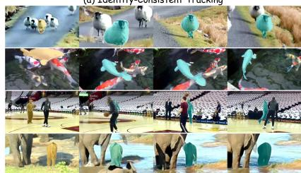
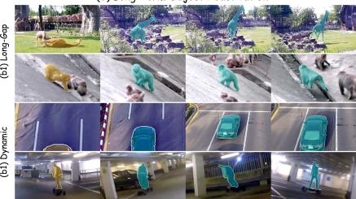
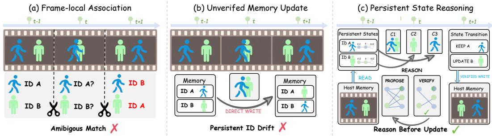
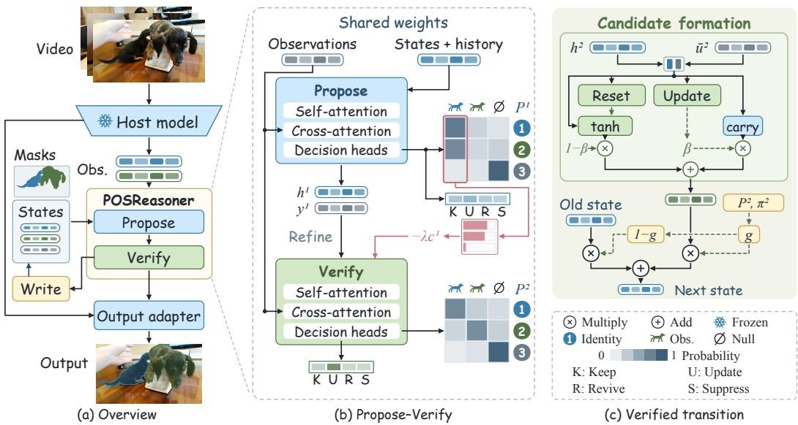
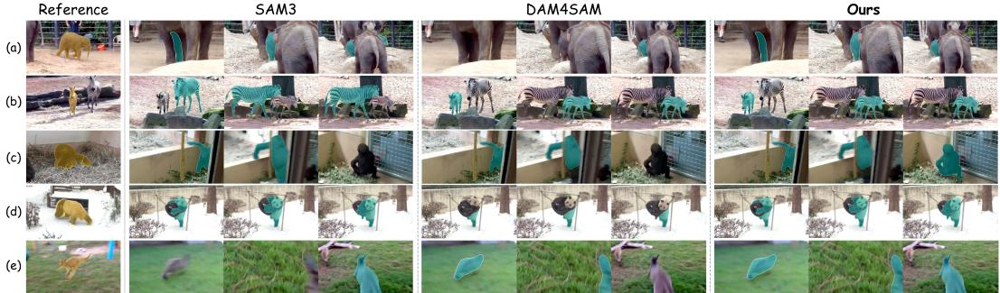
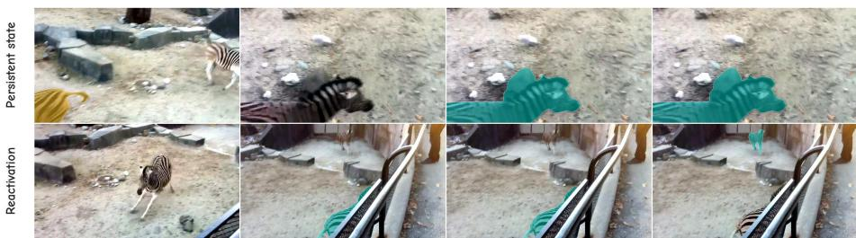
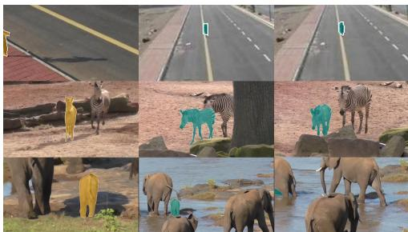

# LEARNING TO REASON WITH PERSISTENT OBJECTSTATES FOR VIDEO INSTANCE SEGMENTATION

Yongxue Xu1,2,∗, Boxue Yang1,∗, Ziqian Liu2, Shaoqiu Zhang1, Rui Qian3, Haopeng Chen1,†

1Shanghai Jiao Tong University 2Sun Yat-sen University 3Fudan University

xuyx85@mail2.sysu.edu.cn {yangboxue, chen-hp}@sjtu.edu.cn

## ABSTRACT

Video segmentation models maintain object identities by carrying instance information across frames. Under prolonged occlusion, reappearance, or interactions between similar instances, however, an unreliable update can overwrite a valid history and cause persistent identity drift. We introduce POSReasoner, a trainable, plug-and-play framework that explicitly decides when an observation should change an object’s state. Each persistent state records identity, confidence, and absence history. A sparse state–observation graph supports Propose–Verify reasoning: provisional associations are revisited using object history, predicted presence, and competition among identities. The verified decisions determine whether to retain, update, reactivate, or suppress each state, while a learned gate controls the evidence written back to memory. Only verified transitions update the persistent state used in subsequent frames. POSReasoner uses standard video annotations and keeps the base model frozen, enabling integration with diverse VOS and VIS architectures. Experiments across long-term VOS and VIS benchmarks show consistent improvements over strong baselines, with the largest gains under occlusion and object reappearance.

## 1 INTRODUCTION

Video segmentation must determine not only what occupies each frame, but also whether masks separated in time belong to the same object. This temporal identity requirement is shared by video object segmentation (VOS), where target objects are specified, and video instance segmentation (VIS), where they must also be discovered and classified (Yang et al., 2019; Qi et al., 2022). Modern segmentation backbones and video-level object representations produce increasingly accurate masks (Cheng et al., 2022; 2021a; Ravi et al., 2025). Identity continuity, however, remains brittle under prolonged occlusion, reappearance, and interactions between similar instances, when current observations are least reliable and a mistaken association can affect the rest of the video.

Existing methods preserve temporal continuity by carrying features or object queries across frames (Wang et al., 2026; Wen et al., 2026; 2025; Li et al., 2026a;b). Memory-based VOS systems retrieve features from prior frames (Cheng & Schwing, 2022; Cheng et al., 2024; Ravi et al., 2025), while query-based and decoupled VIS systems propagate queries, link predictions, or refine tracks (Wu et al., 2022a;b; Huang et al., 2022; Heo et al., 2022; 2023; Zhang et al., 2023a;b). Recent designs

(a) Identity-Consistent Tracking  

(b) Long Term Object Reactivation  
  
Figure 1: POSReasoner preserves identity under crowding and similar-instance interactions (a), and reactivates returning objects after long gaps or dynamic motion (b). Yellow denotes references; teal denotes predictions.

strengthen video-frame interaction and contextual association (Zheng et al., 2024; Lee et al., 2025b), manage object memory explicitly (Lee et al., 2025a). DAM4SAM filters distractors, whereas SAM2Long retains multiple segmentation pathways (Videnovic et al., 2025; Ding et al., 2025).

Despite this progress, three coupled limitations remain. First, filtering and pathway search reduce bad evidence, but selected observations still condition later predictions; once an error is admitted, subsequent matching uses an altered identity reference (Videnovic et al., 2025; Ding et al., 2025). Second, a missing match may indicate occlusion, true absence, or a missed detection; suppressing low-confidence evidence alone does not determine whether an old identity should persist or reactivate. LOMM models object presence and LTMU predicts update readiness (Lee et al., 2025a; Dai et al., 2020), but these signals are not jointly reasoned with multi-object association and state admission. Third, synchronized, contextual, and decoupled designs improve candidate association (Zhang et al., 2023a;b; Zheng et al., 2024; Lee et al., 2025b), but do not revisit provisional matches with lifecycle state before write-back; competing identities may therefore be locally plausible yet mutually inconsistent. These limitations share a root cause: the current observation is treated as the next state rather than evidence for a state transition.

To address these limitations, we introduce POSReasoner, a trainable, plug-and-play framework that reasons over persistent, identity-indexed object states. To protect reliable history, each state records identity evidence, geometry, visibility history, and confidence, and persists by default until a transition is verified. To model absence and reappearance explicitly, a sparse state–observation graph links active and absent states to the current candidates and a learned null observation. Reasoning then follows a Propose–Verify procedure. Propose recalls the object history and forms provisional state–observation associations, while Verify revisits them using predicted object presence and excess candidate demand. Gated residual corrections allow verification to resolve duplicate claims without discarding a competent proposal. A transition head finally retains, updates, reactivates, or suppresses each state. Association, presence, and transition estimates receive intermediate supervision, but the internal steps do not advance video time: only the final verified transition writes candidate evidence into the persistent state. POSReasoner therefore turns association, lifecycle inference, and memory admission into a single recurrent state transition rather than a sequence of disconnected decisions. The verified transition then conditions the next frame, allowing reasoning to shape future association and segmentation rather than merely revise the current output. All reasoning targets come from standard video annotations, while the host model remains frozen.

By jointly leveraging persistent object states, conflict-aware verification, and selective write-back, POSReasoner maintains reliable identities through occlusion and reappearance, as shown in Figure 1. The lightweight framework augments structurally different host architectures without redesigning their segmentation or tracking components. Experiments demonstrate consistent improve ments over strong hosts, with the clearest gains under severe occlusion and object reappearance.

In summary, our main contributions are as follows:

• Persistent-State Formulation. We formulate long-horizon identity maintenance over persistent object states and introduce POSReasoner, a trainable framework that keeps VOS/VIS hosts frozen.

• Propose–Verify Reasoning. A recurrent sparse state–observation graph jointly infers presence, resolves competing associations, and admits only verified transitions to memory.

• Broad Empirical Validation. Across long-term VOS/VIS benchmarks, POSReasoner consistently improves strong hosts, especially under occlusion and reappearance; focused analyses isolate gains from persistent states and learned transitions.

## 2 RELATED WORK

## 2.1 VIDEO INSTANCE SEGMENTATION

Video instance segmentation (VIS) jointly predicts object categories, masks, and identities (Yang et al., 2019; Qi et al., 2022). Video-level methods aggregate frame or clip queries (Cheng et al., 2021a; Wu et al., 2022a; Heo et al., 2022), whereas online methods associate frame predictions through query propagation or learned embeddings (Wu et al., 2022b; Huang et al., 2022). GenVIS and CTVIS strengthen temporal association with propagated prototypes and memory banks (Heo et al., 2023; Ying et al., 2023); DVIS and DVIS++ decouple segmentation, tracking, and temporal refinement (Zhang et al., 2023a;b). Recent methods further introduce dynamic anchors, synchronized queries, and contextual matching (Zhou et al., 2024; Zheng et al., 2024; Lee et al., 2025b).

LOMM maintains a presence-aware latest-object memory and separates existing-object association from new-object allocation (Lee et al., 2025a). Tracking instability nonetheless remains pronounced in long, crowded, and heavily occluded videos (Hamdi et al., 2026). Together, these designs make associations more reliable, yet association and state update are usually coupled: once an observation is matched, it becomes part of the reference used in later frames. A local association error can therefore alter the identity evidence on which subsequent decisions depend.

## 2.2 MEMORY-BASED VIDEO OBJECT SEGMENTATION

Memory-based VOS propagates reference-frame objects through past observations. STM and STCN establish dense space–time correspondence (Oh et al., 2019; Cheng et al., 2021b), while AOT and DeAOT propagate multiple objects through identification embeddings (Yang et al., 2021; Yang & Yang, 2022). XMem separates sensory, working, and long-term memory (Cheng & Schwing, 2022), and Cutie combines pixel memory with object queries (Cheng et al., 2024). Foundation models retain a similar recurrent interface: SAM 2 uses streaming memory attention (Ravi et al., 2025), while SAM 3 combines image-level detection with a memory-based tracker and an object-presence head (Carion et al., 2025). Extensions for long videos retain alternative mask pathways, suppress distractor-contaminated memory, retrieve memories using motion and spatiotemporal cues, or make SAM 3’s memory selection object-specific (Ding et al., 2025; Videnovic et al., 2025; Yang et al., 2025; Shen et al., 2026). These methods improve which observations are stored or retrieved within a particular memory design. Our focus is complementary: given the candidates exposed by an existing segmenter, we model their competing claims on persistent identity states and determine the resulting state revision.

## 2.3 OBJECT-CENTRIC VIDEO LEARNING

Object-centric models decompose a video into recurrent object slots. SAVi propagates slots using motion and initialization cues (Kipf et al., 2022). Dual-State Slot Attention separates transient appearance from persistent identity and filters identity updates through a learned transition (Tran et al., 2026), while Temporal Slot Activation predicts whether a slot is active and gates both its update and decoding during invisibility (Nguyen et al., 2026). Recent open-world segmentation also combines hierarchical mask discovery, deferred object admission, and track consolidation for long-range identity maintenance (Su et al., 2026). The connection to our setting lies in their persistent representation of identity. Their learning objectives, however, concern scene decomposition or open-world discovery rather than the states maintained by an existing segmentation model. Our work addresses this missing state-revision step: it starts from candidates supplied by a frozen host, reasons over their claims on persistent object states, and carries only the verified transitions forward.

## 3 METHOD

Figure 2 summarizes the transition from frame-local association and direct memory updates to our persistent-state formulation, which verifies competing hypotheses before admitting evidence to memory.

Given a video $\chi = \{ I _ { t } \} _ { t = 1 } ^ { T }$ , a frozen host model produces a set of object observations at every frame. They correspond to propagated queries in VIS (Zhang et al., 2023a;b; Lee et al., 2025a) or memory readouts in VOS (Cheng & Schwing, 2022; Ravi et al., 2025; Carion et al., 2025). A match does not by itself determine a memory update. Depending on the object’s history and competing identities, the matched observation may update a visible state, revive an absent one, or be rejected. POSReasoner treats each association as a state-transition hypothesis. The problem is thus not only which observation matches, but whether and how that match should alter the persistent state.

As illustrated in Figure 3(a), POSReasoner pairs frozen-host observations with persistent states that retain identity evidence and lifecycle history. Propose forms provisional associations, while Verify uses object competition and state history to refine both identity assignments and transition actions (b). These decisions gate memory write-back, admitting candidate evidence in proportion to the support for an update or reactivation (c). Intermediate hypotheses remain in a temporary workspace: only the final verified transition updates the persistent state carried to the next frame. Thus, a proposal can be revised without prematurely altering persistent memory.

  
Figure 2: From association to persistent-state reasoning. (a) Frame-local association leaves ambiguous matches unresolved across time. (b) Direct write-back can propagate one unreliable observation through later states. (c) POSReasoner keeps identity-indexed states separate from host memory, verifies competing hypotheses, and applies an explicit state transition.

## 3.1 PERSISTENT OBJECT STATES

For frame $I _ { t } ,$ the host H returns object features, class probabilities, and masks as $[ \widetilde { \mathbf { Q } } _ { t } , \mathbf { P } _ { t } , \mathbf { M } _ { t } ] =$ $\mathcal { H } ( I _ { t } )$ . The adapter represents row $j$ by a host feature $q _ { t } ^ { j }$ and appends cues already available from the host: foreground confidence, class confidence, class margin, and predicted mask quality. VIS queries and VOS memory readouts thus share the same state–observation interface.

Before processing $I _ { t } ,$ , the state bank $\boldsymbol { S } _ { t - 1 } = \{ s _ { t - 1 } ^ { i } \} _ { i = 1 } ^ { N _ { t - 1 } }$ stores one entry for every admitted identity. Each entry keeps a latent identity feature together with state confidence and time since the last reliable observation. VOS states are initialized at the annotated first appearance. In VIS, a foreground observation that is not assigned to an existing identity opens a free state slot. During absence, the lifecycle record advances while the identity feature is left intact. State confidence is updated only for a visible observation; otherwise its previous value is retained and the absence duration is incremented.

Let $\eta _ { i }$ collect the state metadata and $\mu _ { j }$ the observation metadata. We suppress time indices below, writing $z _ { i } = z _ { t - 1 } ^ { i }$ and $q _ { j } = q _ { t } ^ { j }$ . Two lightweight projections map them to the common reasoning dimension: $h _ { i } ^ { 0 } = f _ { s } ( [ z _ { i } ; \eta _ { i } ] )$ and $u _ { j } ^ { 0 } = f _ { o } ( [ q _ { j } ; \mu _ { j } ] )$ . Here $z _ { i }$ is the persistent identity feature and $q _ { j }$ is the current frozen-host feature. The projections are trained with POSReasoner, while the host features remain frozen. In our implementation, η contains state confidence and normalized absence duration, and $\mu _ { j }$ contains visual confidence, class confidence, class margin, and mask quality.

We connect the state and observation sets with a sparse bipartite graph. Its edges retain globally confident observations and the top-K identity-compatible observations for each state. A learned null observation is connected to every state, so occlusion need not be explained by a forced match. Every real edge is treated as a candidate association whose effect on the persistent state is determined jointly with the transition action; the null edge represents leaving the state unmatched.

## 3.2 PROPOSE–VERIFY STATE REASONING

A locally plausible association may be inconsistent with the object set, as when two identities claim the same observation. POSReasoner therefore runs two association steps with shared parameters. At step $r ,$ self-attention contextualizes the states and cross-attention reads adjacent observations (Vaswani et al., 2017). Let ${ h } _ { i } ^ { r }$ and $u _ { j }$ be the resulting features, and let $z _ { i }$ and $q _ { j }$ denote the persistent identity feature and current frozen-host feature, respectively. Before the first step, observations are also contextualized by self-attention. A learned step embedding distinguishes Propose from Verify while the attention and prediction parameters remain shared. Invalid graph edges are masked throughout cross-attention and association. Writing $\widetilde { \mathcal { N } } _ { i } = \mathcal { N } _ { i } \cup \{ \emptyset \}$ , we compute

$$
\begin{array} { r l r } & { e _ { i j } ^ { r } = \frac { \cos \left( W _ { s } h _ { i } ^ { r } , W _ { o } u _ { j } \right) } { \tau } + \lambda _ { \mathrm { i d } } \cos ( z _ { i } , q _ { j } ) , } & \\ & { p _ { i j } ^ { r } = \displaystyle \mathrm { s o f t m a x } \left( e _ { i j } ^ { r } - \lambda _ { \mathrm { c m p } } c _ { j } ^ { r - 1 } \right) , \qquad c _ { j } ^ { r } = \left[ \sum _ { i } p _ { i j } ^ { r } - 1 \right] _ { + } . } & \end{array}\tag{1}
$$

  
Figure 3: Overview of POSReasoner. (a) Frozen-host observations are paired with persistent object states. (b) Propose–Verify reasoning refines associations and actions using identity history and object competition. The shaded matrices associate identities with observations or null. (c) Verified decisions gate a single state update. Internal values are schematic; DAVIS frames with ground-truth masks illustrate the interface, not model predictions.

Here ${ \mathcal { N } } _ { i }$ is the sparse neighborhood of state $i ,$ and $\mathcal { D }$ denotes the learned null observation, whose identity-prior term is explicitly defined as zero.

At the Propose step, we set $c _ { j } ^ { 0 } = 0$ in Equation 1. The score $e _ { i j } ^ { 1 }$ combines compatibility in the contextualized feature space with the original host identity similarity. Normalization over $\widetilde { \mathcal { N } } _ { i }$ gives a distribution over the retained candidates and the null observation. The column sum $\sum _ { i } p _ { i j } ^ { \mathrm { i } }$ then measures how much total probability the state set assigns to observation $j ,$ , and $c _ { i } ^ { 1 }$ retains only the probability mass above one. It therefore acts as a soft duplicate-demand penalty rather than enforcing a hard one-to-one assignment.

For state i, the matched evidence is $\begin{array} { r } { \bar { u } _ { i } ^ { r } = \sum _ { j } p _ { i j } ^ { r } u _ { j } } \end{array}$ . We compare it with the reasoned state using their concatenation, element-wise product, and absolute difference. Association entropy and probability-weighted candidate occupancy are appended to this comparison. The decision feature is

$$
\begin{array} { r l } & { { r _ { i } ^ { r } } = \Big [ h _ { i } ^ { r } ; \bar { u } _ { i } ^ { r } ; h _ { i } ^ { r } \odot \bar { u } _ { i } ^ { r } ; \big | h _ { i } ^ { r } - \bar { u } _ { i } ^ { r } \big | ; \mathcal { E } ( p _ { i } ^ { r } ) ; \rho _ { i } ^ { r } \Big ] , } \\ & { { \rho _ { i } ^ { r } } = \displaystyle \sum _ { j } p _ { i j } ^ { r } \sum _ { k } p _ { k j } ^ { r } , } \end{array}\tag{2}
$$

where $\mathcal { E }$ is association entropy and $\rho _ { i } ^ { r }$ measures the demand on the candidates preferred by state $i .$ Three prediction heads applied to $r _ { i } ^ { r }$ estimate visibility and existence, a transition distribution $\boldsymbol { \pi } _ { i } ^ { r }$ and transition advantage $v _ { i } ^ { r }$ . Together with the association logits, these predictions form a decision tuple $\mathbf { y } _ { i } ^ { r } = [ \ell _ { i } ^ { r } ; \mathbf { b } _ { i } ^ { r } ; \pmb { a } _ { i } ^ { r } ; \bar { v } _ { i } ^ { r } ]$ , where $\mathbf { b } _ { i } ^ { r }$ contains visibility and existence belie ${ \mathrm { f s } } ,$ and $\pmb { a } _ { i } ^ { r }$ contains the four transition logits, with πr = softmax $\mathbf { \Phi } ( a _ { i } ^ { r } ) ; \ell _ { i } ^ { r } = [ e _ { i j } ^ { \bar { r } } ] _ { j }$ contains the association logits. The tuple records a candidate identity, its current presence, the proposed state change, and its predicted benefit relative to retaining the state. We supervise this advantage with the corresponding quality difference,

$$
\Delta _ { i } = Q ( \hat { z } _ { t } ^ { i } , \mathcal { V } _ { t : t + H } ^ { i } ) - Q ( z _ { t - 1 } ^ { i } , \mathcal { V } _ { t : t + H } ^ { i } ) , \qquad v _ { i } ^ { r } \approx \Delta _ { i } ,\tag{3}
$$

where $Q$ is the task quality over a short annotated continuation $\mathscr { V } _ { t : t + H } ^ { i }$ when the object is decoded from the candidate or retained state. At inference, the reasoner predicts $v _ { i } ^ { r }$ directly from the current hypothesis and persistent state.

At the Verify step, the association is repeated with $c _ { j } ^ { 1 }$ . Observation competition penalizes contested real observations relative to null and allows their competing states to move to alternative candidates or the null observation. We keep $c _ { \mathcal { Q } } ^ { r } = 0$ , because multiple absent states may select null simultaneously. State confidence and absence duration remain part of ${ h } _ { i } ^ { r }$ , so Verify can also change the action without changing the selected observation: the same match may imply UPDATE, REVIVE, or KEEP for different state histories. Verify can therefore revise either the proposed ownership or the proposed state transition. This coupled revision distinguishes state-transition reasoning from independently reranking a fixed set of predictions.

The second-step tuple is obtained by gated interpolation, $\mathbf { y } _ { i } ^ { 2 } = \mathbf { y } _ { i } ^ { 1 } + \pmb { \alpha } \odot ( \widetilde { \mathbf { y } } _ { i } ^ { 2 } - \mathbf { y } _ { i } ^ { 1 } )$ , where $\widetilde { \mathbf { y } } _ { i } ^ { 2 }$ is predicted from the updated matched evidence, association entropy, and observation competition. Learned coefficients separately refine association, action, and the belief/advantage residuals. They are initialized near zero, so Verify begins from the proposed tuple and learns how strongly each output group should change. Both reasoning steps receive intermediate supervision.

## 3.3 VERIFIED STATE TRANSITION AND LEARNING

The verified action probabilities determine the state transition. KEEP retains a reliable state, UPDATE incorporates a visible observation, REVIVE reconnects a previously absent object, and SUPPRESS rejects inconsistent evidence. A gated recurrent unit (Cho et al., 2014) first forms a candidate state $\hat { z } _ { t } ^ { i } = \mathrm { G R U } ( h _ { i } ^ { 2 } , \bar { u } _ { i } ^ { 2 } )$ . In Figure 3(c), Reset gates the features entering the nonlinear branch, while Update produces the carry weight $\beta$ that blends the carry and nonlinear branches. These internal gates form the candidate; a separate write gate controls its admission to persistent memory:

$$
\begin{array} { r l } & { g _ { i } = \big ( \pi _ { i , \mathrm { u p d a t e } } ^ { 2 } + \pi _ { i , \mathrm { r e v i v e } } ^ { 2 } \big ) \underset { j \neq \emptyset } { \operatorname* { m a x } } p _ { i j } ^ { 2 } \big ( 1 - p _ { i \emptyset } ^ { 2 } \big ) , } \\ & { z _ { t } ^ { i } = ( 1 - g _ { i } ) z _ { t - 1 } ^ { i } + g _ { i } \hat { z } _ { t } ^ { i } . } \end{array}\tag{4}
$$

The gate combines the probability of a writing transition, the strongest real association, and the total non-null mass. Otherwise, the persistent state is carried forward. Probability assigned to KEEP or SUPPRESS does not contribute to $_ { g _ { i } ; }$ as either action dominates, the state write approaches zero. Both reasoning steps operate on a temporary workspace anchored to $z _ { t - 1 } ^ { i } ;$ intermediate proposals are never committed to temporal memory. This prevents the same frame from updating an identity multiple times. Only the final transition advances the state at frame t. Appendix A derives the properties of association, verification, and memory admission.

At inference, conflicting non-null claims are ranked using association confidence and transition advantage. The advantage estimates whether a proposed write is preferable to retaining the current state; it does not alter the sparse candidate graph. For assignment-based hosts, the output adapter retains only the highest-ranked claim to each real observation. The verified state and its visibility record are carried to $t + 1$ and become the reference for the next association.

The verified decision is also returned through a host-specific output adapter. Residual hosts blend a query toward the proposed or matched state according to the UPDATE and REVIVE probabilities, while assignment-based hosts transfer the selected observation to its state slot. After existing states have been assigned, valid foreground observations that remain unclaimed are allocated to free slots. The null observation never consumes a slot and may be selected by multiple absent states.

Training targets are constructed from frozen-host predictions and annotations on the training split. The association target is the observation with the same identity, or the null observation when the object is absent. A visible match is labeled UPDATE, and a match after absence is labeled REVIVE. An observed state without a valid identity receives SUPPRESS; an unobserved state without a reliable candidate receives KEEP. The advantage target is the signed quality difference in Equation 3.

$$
\begin{array} { r } { \mathcal { L } _ { \mathrm { P O S R } } = \displaystyle \sum _ { r = 1 } ^ { 2 } \omega _ { r } \left( \mathcal { L } _ { \mathrm { a s s o c } } ^ { r } + \lambda _ { \mathrm { t r } } \mathcal { L } _ { \mathrm { t r } } ^ { r } + \lambda _ { \mathrm { b e l } } \mathcal { L } _ { \mathrm { b e l } } ^ { r } \right) } \\ { + \lambda _ { \mathrm { s t a t e } } \mathcal { L } _ { \mathrm { s t a t e } } + \lambda _ { \mathrm { a d v } } \mathcal { L } _ { \mathrm { a d v } } + \lambda _ { \mathrm { r e f } } \mathcal { L } _ { \mathrm { r e f } } . } \end{array}\tag{5}
$$

$\mathcal { L } _ { \mathrm { a s s o c } }$ and ${ \mathcal L } _ { \mathrm { t r } }$ are cross-entropy losses, while $\mathcal { L } _ { \mathrm { b e l } }$ sums binary cross-entropy terms for visibility and existence. $\mathcal { L } _ { \mathrm { s t a t e } }$ is the cosine distance to a stop-gradient target: the matched observation embedding for a writing transition and the retained identity feature otherwise. $\mathcal { L } _ { \mathrm { a d v } }$ is a smooth- $L _ { 1 }$ loss on transition advantage, and the refinement loss is $\begin{array} { r } { \dot { \mathcal { L } } _ { \mathrm { r e f } } = | \mathcal { V } | ^ { - 1 } \sum _ { i \in \mathcal { V } } [ p _ { i , y _ { i } } ^ { 1 } - p _ { i , y _ { i } } ^ { 2 } ] _ { + } } \end{array}$ , where yi is the target association and V is the valid-state set. The verified step receives the larger weight. At validation and test time, POSReasoner uses only host outputs, its persistent state, and task-provided prompts.

## 4 EXPERIMENTS

## 4.1 EXPERIMENTAL SETTINGS

We evaluate VIS on YouTube-VIS 2019, 2021, and 2022 (Yang et al., 2019) and on OVIS (Qi et al., 2022), reporting mask AP, AP50, and AP75. YouTube-VIS covers diverse video lengths and category distributions, while OVIS emphasizes crowded scenes and inter-object occlusion. For long-term VOS, we use LVOS v1 and v2 (Hong et al., 2023; 2026), with region similarity J, contour accuracy F, and their mean J&F (Perazzi et al., 2016). These benchmarks evaluate identity maintenance both with and without object discovery and category prediction.

For VIS, we integrate POSReasoner with CTVIS (Ying et al., 2023), DVIS++ (Zhang et al., 2023b), DVIS-DAQ (Zhou et al., 2024), and LOMM (Lee et al., 2025a), representing different association and memory designs. GenVIS (Heo et al., 2023) and other published methods provide additional comparisons. For VOS, we use SAM3 (Carion et al., 2025). Paired comparisons keep the host checkpoint, candidate masks, input resolution, and official evaluator fixed. Only POSReasoner is trained, using training annotations; the host remains frozen.

Training uses video-grouped folds to keep each video within one split. Out-of-fold predictions select the readout before model ensembling. For hosts without frame-wise identity sequences, we use the available state and relation descriptors under the same protocol. The VOS readout uses disjoint fitting, calibration, and holdout videos. All architecture, optimization, and candidate-budget choices are fixed before evaluation.

## 4.2 COMPARISON WITH STATE-OF-THE-ART METHODS

Results on YouTube-VIS. POSReasoner consistently improves AP across the three benchmarks (Table 1). With ResNet-50, CTVIS gains 1.0, 1.1, and 2.1 AP on YouTube-VIS 2019, 2021, and 2022, respectively; DVIS++ and DAQ also improve on each benchmark. With ViT-L, LOMM gains 0.7, 0.8, and 1.0 AP. These paired improvements, obtained with fixed host weights and candidate masks, show that state reasoning complements different association and memory designs. Figure 4 illustrates identity preservation under occlusion, similar-object interactions, and reappearance.

Table 1: YouTube-VIS validation. Published methods provide context; each highlighted row adds POSReasoner to the host immediately above. Bold and underline mark the best and second-best result within each backbone.
<table><tr><td rowspan="2">Backbone Method</td><td rowspan="2"></td><td colspan="3">YTVIS 2019</td><td colspan="3">YTVIS 2021</td><td colspan="3">YTVIS 2022</td></tr><tr><td>AP</td><td>AP50</td><td>AP75</td><td>AP</td><td>AP50</td><td>AP75</td><td>AP</td><td></td><td>AP50 AP75</td></tr><tr><td rowspan="5"></td><td>GenVIS (Heo et al., 2023)</td><td>50.0</td><td>71.5</td><td>54.6</td><td>47.1</td><td>67.5</td><td>51.5</td><td>37.5</td><td>61.6</td><td>41.5</td></tr><tr><td>CTVIS (Ying et al., 2023)</td><td>51.8</td><td>74.1</td><td>55.2</td><td>49.5</td><td>72.5</td><td>53.6</td><td>45.4</td><td>67.5</td><td>48.9</td></tr><tr><td>+ POSReasoner</td><td>52.8</td><td>75.2</td><td>56.5</td><td>50.6</td><td>73.7</td><td>55.1</td><td>47.5</td><td>69.7</td><td>51.4</td></tr><tr><td>DVIS++ (Zhang et al., 2023b)</td><td>55.7</td><td>80.8</td><td>59.8</td><td>50.4</td><td>71.4</td><td>55.2</td><td>46.3</td><td>66.6</td><td>50.5</td></tr><tr><td>+ POSReasoner</td><td>56.0</td><td>80.6</td><td>60.9</td><td>51.1</td><td>72.6</td><td>55.8</td><td>47.0</td><td>68.2</td><td>51.0</td></tr><tr><td></td><td>DAQ (Zhou et al., 2024)</td><td>54.6</td><td>78.2</td><td>60.3</td><td>50.1</td><td>71.6</td><td>55.1</td><td>45.9</td><td>66.7</td><td>50.0</td></tr><tr><td rowspan="3"></td><td>+ POSReasoner</td><td>55.5</td><td>79.2</td><td>60.9</td><td>51.0</td><td>72.9</td><td>55.9</td><td>46.7</td><td>67.9</td><td>50.9</td></tr><tr><td>DVIS++ (Zhang et al., 2023b)</td><td>67.7</td><td>88.8</td><td>75.3</td><td>62.3</td><td>82.7</td><td>70.2</td><td>37.5</td><td>53.7</td><td>39.4</td></tr><tr><td>LOMM (Lee et al., 2025a) + POSReasoner</td><td>69.1</td><td>89.3 89.5</td><td>76.5 77.0</td><td>65.0 65.8</td><td>85.8 86.0</td><td>72.7 73.3</td><td>60.4 61.4</td><td>82.7 83.4</td><td>67.1 67.6</td></tr></table>

Results on OVIS. The gains are larger on occlusion-heavy OVIS (Table 2). With ResNet-50, CTVIS, DVIS++, and DAQ improve by 2.7, 2.1, and 1.6 AP, respectively. Each host gains more than on any YouTube-VIS benchmark, consistent with the value of retaining identity history when current observations are ambiguous. Improvements of 3.2, 1.9, and 1.8 AP75 also show that the benefits extend to a stricter mask-overlap threshold.

With larger backbones, DAQ improves from 49.6 to 50.6 AP with Swin-L and from 53.9 to 55.2 AP with ViT-L, with gains in both AP50 and AP75. State reasoning thus remains beneficial alongside stronger visual representations in crowded, occluded scenes.

Figure 4: Qualitative comparison under occlusion, identity ambiguity, and object reappearance.  
Table 2: OVIS validation. Highlighted rows add POSReasoner to the matched host; ∆AP is relative to that host. Bold and underline mark the best and second-best results within each backbone.
<table><tr><td>Method</td><td>∆AP</td><td>AP</td><td>AP50</td><td>AP75</td></tr><tr><td>ResNet-50</td><td></td><td></td><td></td><td></td></tr><tr><td>CTVIS (Ying et al., 2023)</td><td></td><td>34.6</td><td>59.9</td><td>33.8</td></tr><tr><td>+ POSReasoner</td><td>+2.7</td><td>37.3</td><td>63.2</td><td>37.0</td></tr><tr><td>DVIS++ (Zhang et al., 2023b)</td><td></td><td>36.8</td><td>61.3</td><td>37.5</td></tr><tr><td>+ POSReasoner</td><td>+2.1</td><td>38.9</td><td>64.3</td><td>39.4</td></tr><tr><td>DAQ (Zhou et al., 2024)</td><td></td><td>38.3</td><td>65.2</td><td>37.3</td></tr><tr><td>+ POSReasoner</td><td>+1.6</td><td>39.9</td><td>66.7</td><td>39.1</td></tr><tr><td>Swin-L</td><td></td><td></td><td></td><td></td></tr><tr><td>GenVIS (Heo et al., 2023)</td><td>一</td><td>45.2</td><td>69.1</td><td>48.4</td></tr><tr><td>LOMM (Lee et al., 2025a)</td><td></td><td>47.8</td><td>73.6</td><td>51.4</td></tr><tr><td>DAQ (Zhou et al., 2024)</td><td></td><td>49.6</td><td>76.0</td><td>52.8</td></tr><tr><td>+ POSReasoner</td><td>+1.0</td><td>50.6</td><td>77.0</td><td>53.9</td></tr><tr><td>ViT-L</td><td></td><td></td><td></td><td></td></tr><tr><td>DVIS++ (Zhang et al., 2023b)</td><td>一</td><td>49.6</td><td>72.5</td><td>55.0</td></tr><tr><td>LOMM (Lee et al., 2025a)</td><td></td><td>51.7</td><td>73.9</td><td>57.5</td></tr><tr><td>DAQ (Zhou et al., 2024)</td><td></td><td>53.9</td><td>78.9</td><td>58.5</td></tr><tr><td>+ POSReasoner</td><td>+1.3</td><td>55.2</td><td>79.7</td><td>59.9</td></tr></table>

## 4.3 LONG-HORIZON STATE ANALYSIS

We study how state reasoning supports identity maintenance over long videos. Starting from the frozen SAM3 host, we progressively add state reasoning, reactivation, and cross-trajectory reasoning on LVOS v1, and evaluate the complete model on LVOS v2 (Table 3).

Persistent states and reactivation. State reasoning improves J&F by 2.1 points. Its central role is to separate an object’s identity history from its current visibility: the identity feature remains available during absence, providing a reference when observations become reliable again. Building on these states, reactivation yields a further 1.2-point improvement. This progression highlights two complementary requirements of long-term segmentation: preserving an identity through absence and reconnecting the returning object to that identity. The former retains the information needed for later association; the latter uses that information to resume the object’s trajectory. Thus, the cumulative improvement supports treating absence and return as explicit state transitions.

Cross-trajectory reasoning. Adding cross-trajectory reasoning gives the best results across all three metrics, bringing the full model 3.5 points above SAM3 in J&F. This component extends the decision from an individual state–observation match to competition among identities. When several states favor the same observation, verification can redistribute their support before the persistent states are updated. It therefore complements state retention and reactivation by considering whether an association is consistent with the other objects in the scene. Together, these components connect identity history, lifecycle transitions, and object competition within the same reasoning process.

Generalization and qualitative analysis. On LVOS v2, the complete model improves J&F from 87.2 to 89.0, with gains in both region similarity and contour accuracy. The improvements across both benchmarks support the effectiveness of the combined state-reasoning design. Figure 5 further illustrates the distinct roles of state retention and reactivation. In the upper example, the statebased variant recovers the target missed by the host. In the lower example, reactivation moves the prediction from the foreground railing back to the returning target. These examples illustrate how stored identity evidence supports object recovery when observations become ambiguous or an object reappears.

State  
Host  
Table 3: Long-term VOS and cumulative component analysis with frozen SAM3 predictions.
<table><tr><td>Variant</td><td></td><td>State React. Cross</td><td></td><td>J</td><td>F</td><td>J&amp;F</td></tr><tr><td colspan="7">LVOS v1 cumulative components</td></tr><tr><td>SAM3 host (Carion et al., 2025)</td><td>X</td><td>X</td><td>X</td><td>79.5</td><td>90.6</td><td>85.1</td></tr><tr><td>+ state reasoning</td><td></td><td>x</td><td>x</td><td>82.1</td><td>92.4</td><td>87.2</td></tr><tr><td>+ reactivation</td><td>&gt;&gt;</td><td>V</td><td>x</td><td>83.3</td><td>93.6</td><td>88.4</td></tr><tr><td>Full POSReasoner</td><td>√</td><td>√</td><td>√</td><td>83.4</td><td>93.7</td><td>88.6</td></tr><tr><td colspan="7">LVOS v2 transfer</td></tr><tr><td>SAM3 host (Carion et al., 2025)</td><td>X</td><td>X</td><td>X</td><td></td><td>83.4 91.0</td><td>87.2</td></tr><tr><td>Full POSReasoner</td><td>√</td><td>」</td><td>√</td><td></td><td>85.3 92.7</td><td>89.0</td></tr></table>

Reference  
+ Reactivation  
  
Figure 5: LVOS v1: persistent state preserves identity through absence (top); reactivation reconnects it on return (bottom).

## 4.4 FURTHER ANALYSIS

The largest observed post-reappearance gains occur after gaps of 11–30 frames: 13.1 and 4.5 points in J on LVOS v1 and v2, respectively (Table 6). This pattern is consistent with retaining an identity reference through occlusion to support association when the object returns. The OVIS controls further highlight the role of state history: the full model reaches 37.31 AP, compared with 34.67 for shuffled states and 34.82 for host cues alone (Table 4). The contrast supports using identity-specific histories beyond current host evidence.

These benefits come with a compact reasoner: the five-member VIS ensemble has 0.90M parameters and takes 5.64–5.80 ms per inference on an A100 for 10–40 candidates (Table 5). The similar timings across these budgets indicate that increasing the candidate count has little effect on the measured reasoner latency.

## 5 CONCLUSION

We present POSReasoner, a trainable, plug-and-play framework for maintaining object identities in video segmentation. The framework represents each object with a persistent state that preserves its identity history through occlusion and absence. A Propose–Verify procedure jointly reasons about candidate associations, object presence, and state transitions, allowing reliable observation to update the state and returning objects to recover their identities. With a shared state–observation interface, POSReasoner can be integrated into different VOS and VIS architectures while keeping the host models frozen. Experiments on YouTube-VIS, OVIS, and LVOS demonstrate consistent improvements across the evaluated hosts, with particularly strong gains under occlusion. Ablation studies and qualitative comparisons highlight how state persistence and reactivation contribute to long-term identity maintenance.

## REFERENCES

Stephen Boyd and Lieven Vandenberghe. Convex Optimization. Cambridge University Press, 2004. URL https://web.stanford.edu/˜boyd/cvxbook/.

Nicolas Carion, Laura Gustafson, Yuan-Ting Hu, Shoubhik Debnath, Ronghang Hu, Didac Suris, Chaitanya Ryali, Kalyan Vasudev Alwala, Haitham Khedr, Andrew Huang, Jie Lei, Tengyu Ma, Baishan Guo, Arpit Kalla, Markus Marks, Joseph Greer, Meng Wang, Peize Sun, Roman Radle, Triantafyllos Afouras, Effrosyni Mavroudi, Katherine Xu, Tsung-Han Wu, Yu Zhou, Lil-¨ iane Momeni, Rishi Hazra, Shuangrui Ding, Sagar Vaze, Francois Porcher, Feng Li, Siyuan Li, Aishwarya Kamath, Ho Kei Cheng, Piotr Dollar, Nikhila Ravi, Kate Saenko, Pengchuan ´ Zhang, and Christoph Feichtenhofer. SAM 3: Segment anything with concepts. arXiv preprint arXiv:2511.16719, 2025. URL https://arxiv.org/abs/2511.16719.

Bowen Cheng, Anwesa Choudhuri, Ishan Misra, Alexander Kirillov, Rohit Girdhar, and Alexander G. Schwing. Mask2Former for video instance segmentation. arXiv preprint arXiv:2112.10764, 2021a.

Bowen Cheng, Ishan Misra, Alexander G. Schwing, Alexander Kirillov, and Rohit Girdhar. Maskedattention mask transformer for universal image segmentation. In Proceedings of the IEEE/CVF Conference on Computer Vision and Pattern Recognition (CVPR), pp. 1290–1299, 2022.

Ho Kei Cheng and Alexander G. Schwing. XMem: Long-term video object segmentation with an atkinson-shiffrin memory model. arXiv preprint arXiv:2207.07115, 2022.

Ho Kei Cheng, Yu-Wing Tai, and Chi-Keung Tang. Rethinking space-time networks with improved memory coverage for efficient video object segmentation. In Advances in Neural Information Processing Systems (NeurIPS), volume 34, 2021b.

Ho Kei Cheng, Seoung Wug Oh, Brian Price, Joon-Young Lee, and Alexander Schwing. Putting the object back into video object segmentation. In Proceedings of the IEEE/CVF Conference on Computer Vision and Pattern Recognition (CVPR), 2024.

Kyunghyun Cho, Bart van Merrienboer, Caglar Gulcehre, Dzmitry Bahdanau, Fethi Bougares, Hol-¨ ger Schwenk, and Yoshua Bengio. Learning phrase representations using RNN encoder–decoder for statistical machine translation. In Proceedings of the 2014 Conference on Empirical Methods in Natural Language Processing, pp. 1724–1734. Association for Computational Linguistics, 2014.

Kenan Dai, Yunhua Zhang, Dong Wang, Jianhua Li, Huchuan Lu, and Xiaoyun Yang. Highperformance long-term tracking with meta-updater. In Proceedings of the IEEE/CVF Conference on Computer Vision and Pattern Recognition (CVPR), pp. 6297–6306, 2020. doi: 10.1109/CVPR42600.2020.00633. URL https://openaccess.thecvf.com/ content\_CVPR\_2020/html/Dai\_High-Performance\_Long-Term\_Tracking\_ With\_Meta-Updater\_CVPR\_2020\_paper.html.

Shuangrui Ding, Rui Qian, Xiaoyi Dong, Pan Zhang, Yuhang Zang, Yuhang Cao, Yuwei Guo, Dahua Lin, and Jiaqi Wang. SAM2Long: Enhancing SAM 2 for long video segmentation with a trainingfree memory tree. In Proceedings ofthe IEEE/CVF International Conference on Computer Vision (ICCV), pp. 13614–13624, 2025. doi: 10.1109/ICCV51701.2025.01264. URL https://doi. org/10.1109/ICCV51701.2025.01264.

Danial Hamdi, Fardin Ayar, and Mahdi Javanmardi. Mind the gap: Disentangling performance bottlenecks in video instance segmentation. arXiv preprint arXiv:2606.07394, 2026. URL https://arxiv.org/abs/2606.07394.

Miran Heo, Sukjun Hwang, Seoung Wug Oh, Joon-Young Lee, and Seon Joo Kim. VITA: Video instance segmentation via object token association. In Advances in Neural Information Processing Systems (NeurIPS), 2022.

Miran Heo, Sukjun Hwang, Jeongseok Hyun, Hanjung Kim, Seoung Wug Oh, Joon-Young Lee, and Seon Joo Kim. A generalized framework for video instance segmentation. In Proceedings of the IEEE/CVF Conference on Computer Vision and Pattern Recognition (CVPR), 2023.

Lingyi Hong, Wenchao Chen, Zhongying Liu, Wei Zhang, Pinxue Guo, Zhaoyu Chen, and Wenqiang Zhang. LVOS: A benchmark for long-term video object segmentation. In Proceedings of the IEEE/CVF International Conference on Computer Vision (ICCV), pp. 13434–13446, 2023. doi: 10.1109/ICCV51070.2023.01240.

Lingyi Hong, Zhongying Liu, Wenchao Chen, Chenzhi Tan, Yuang Feng, Xinyu Zhou, Pinxue Guo, Jinglun Li, Zhaoyu Chen, Shuyong Gao, Wei Zhang, and Wenqiang Zhang. LVOS: A benchmark for large-scale long-term video object segmentation. IEEE Transactions on Pattern Analysis and Machine Intelligence, 48(1):946–961, 2026. doi: 10.1109/TPAMI.2025.3611020.

De-An Huang, Zhiding Yu, and Anima Anandkumar. MinVIS: A minimal video instance segmentation framework without video-based training. In Advances in Neural Information Processing Systems (NeurIPS), 2022.

Thomas Kipf, Gamaleldin Fathy Elsayed, Aravindh Mahendran, Austin Stone, Sara Sabour, Georg Heigold, Rico Jonschkowski, Alexey Dosovitskiy, and Klaus Greff. Conditional object-centric learning from video. In International Conference on Learning Representations (ICLR), 2022. URL https://openreview.net/forum?id=aD7uesX1GF\_.

Seunghun Lee, Jiwan Seo, Minwoo Choi, Kiljoon Han, Jaehoon Jeong, Zane Durante, Ehsan Adeli, Sang Hyun Park, and Sunghoon Im. LOMM: Latest object memory management for temporally consistent video instance segmentation. arXiv preprint arXiv:2507.19754, 2025a. URL https: //arxiv.org/abs/2507.19754.

Seunghun Lee, Jiwan Seo, Kiljoon Han, Minwoo Choi, and Sunghoon Im. Context-aware video instance segmentation. In Proceedings of the IEEE/CVF International Conference on Computer Vision (ICCV), pp. 4507–4517, 2025b.

Chaoyue Li, Boxue Yang, Shengyao Zhou, Haoyang Wu, Rui Qian, and Linfeng Zhang. 4DVLT: Dynamic scene understanding with worldline-centered vision-language tracking. arXiv preprint arXiv:2606.22631, 2026a. URL https://arxiv.org/abs/2606.22631.

Haodong Li, Tianfei Ren, Xiaoxiao Ma, Chunmei Qing, Zhen Fang, Sipeng He, Ziyu Guo, Haoyu Wu, Juanxi Tian, Yihang Zou, Ruichuan An, Dongzhi Jiang, Boxue Yang, Ji Xie, Xu Huang, Wenhao Yan, Jialv Zou, Zhengrong Yue, Yaxin Luo, Xiaotong Li, Yuzhu Wang, Junyan Ye, Jinjing Zhao, Zehui Chen, Lin Chen, Renye Yan, Feng Zhao, and Pheng-Ann Heng. VideoCoCo: Code-as-CoT for physically-consistent video generation via an agentic dual-engine system. arXiv preprint arXiv:2607.27380, 2026b. URL https://arxiv.org/abs/2607.27380.

Duc Nguyen, Sieu Tran, Hao Vo, Khoa Vo, Duy Minh Ho Nguyen, Nghi D. Q. Bui, Anh Nguyen, Long Mai, and Ngan Le. TSA: Temporal slot activation for persistent object-centric video representation. arXiv preprint arXiv:2606.13714, 2026. URL https://arxiv.org/abs/2606. 13714.

Seoung Wug Oh, Joon-Young Lee, Ning Xu, and Seon Joo Kim. Video object segmentation using space-time memory networks. In Proceedings of the IEEE/CVF International Conference on Computer Vision (ICCV), pp. 9226–9235, 2019.

Federico Perazzi, Jordi Pont-Tuset, Brian McWilliams, Luc Van Gool, Markus H. Gross, and Alexander Sorkine-Hornung. A benchmark dataset and evaluation methodology for video object segmentation. In Proceedings ofthe IEEE Conference on Computer Vision and Pattern Recogni tion (CVPR), pp. 724–732, 2016. doi: 10.1109/CVPR.2016.85.

Jiyang Qi, Yan Gao, Yao Hu, Xinggang Wang, Xiaoyu Liu, Xiang Bai, Serge Belongie, Alan Yuille, Philip H. S. Torr, and Song Bai. Occluded video instance segmentation: A benchmark. International Journal of Computer Vision, 2022.

Nikhila Ravi, Valentin Gabeur, Yuan-Ting Hu, Ronghang Hu, Chaitanya Ryali, Tengyu Ma, Haitham Khedr, Roman Radle, Chlo¨ e Rolland, Laura Gustafson, Eric Mintun, Junting Pan, Kalyan Va-´ sudev Alwala, Nicolas Carion, Chao-Yuan Wu, Ross B. Girshick, Piotr Dollar, and Christoph´ Feichtenhofer. SAM 2: Segment anything in images and videos. In International Conference on Learning Representations (ICLR), 2025. URL https://openreview.net/forum?id= Ha6RTeWMd0.

Ruiqi Shen, Chang Liu, and Henghui Ding. SAM3-DMS: Decoupled memory selection for multitarget video segmentation of SAM3. arXiv preprint arXiv:2601.09699, 2026. URL https: //arxiv.org/abs/2601.09699.

Qing Su, Kaiyang Li, Yuan Zhuang, Fei Miao, and Shihao Ji. Open-world video segmentation. arXiv preprint arXiv:2606.15632, 2026.

Sieu Tran, Duc Nguyen, Hao Vo, Khoa Vo, and Ngan Le. Dual-state slot attention: Decoupling appearance and identity for video object-centric learning. arXiv preprint arXiv:2606.12601, 2026. URL https://arxiv.org/abs/2606.12601.

Ashish Vaswani, Noam Shazeer, Niki Parmar, Jakob Uszkoreit, Llion Jones, Aidan N. Gomez, Lukasz Kaiser, and Illia Polosukhin. Attention is all you need. In Advances in Neural Information Processing Systems, volume 30, 2017.

Jovana Videnovic, Alan Lukezic, and Matej Kristan. A distractor-aware memory for visual object tracking with SAM2. In Proceedings of the IEEE/CVF Conference on Computer Vision and Pattern Recognition (CVPR), pp. 24255–24264, 2025. doi: 10.1109/CVPR52734.2025.02259. URL https://openaccess.thecvf.com/content/CVPR2025/html/Videnovic\_ A\_Distractor-Aware\_Memory\_for\_Visual\_Object\_Tracking\_with\_SAM2\_ CVPR\_2025\_paper.html.

Yiyu Wang, Xuyang Liu, Xiyan Gui, Xinying Lin, Boxue Yang, Chenfei Liao, Tailai Chen, and Linfeng Zhang. Accelerating streaming video large language models via hierarchical token compression. In Proceedings of the IEEE/CVF Conference on Computer Vision and Pattern Recognition (CVPR), 2026. URL https://arxiv.org/abs/2512.00891.

Zichen Wen, Yiyu Wang, Chenfei Liao, Boxue Yang, Junxian Li, Weifeng Liu, Haocong He, Bolong Feng, Xuyang Liu, Yuanhuiyi Lyu, Xu Zheng, Xuming Hu, and Linfeng Zhang. AI for service: Proactive assistance with AI glasses. arXiv preprint arXiv:2510.14359, 2025. URL https: //arxiv.org/abs/2510.14359.

Zichen Wen, Boxue Yang, Junlong Ke, Jiajie Huang, Chenfei Liao, Junxi Wang, Xuyang Liu, and Linfeng Zhang. EvoStreaming: Your offline video model is a natively streaming assistant. arXiv preprint arXiv:2605.10343, 2026. URL https://arxiv.org/abs/2605.10343.

Junfeng Wu, Yi Jiang, Song Bai, Wenqing Zhang, and Xiang Bai. Seqformer: Sequential transformer for video instance segmentation. In Proceedings ofthe European Conference on Computer Vision (ECCV), pp. 553–569, 2022a.

Junfeng Wu, Qihao Liu, Yi Jiang, Song Bai, Alan Yuille, and Xiang Bai. In defense of online models for video instance segmentation. In Proceedings ofthe European Conference on Computer Vision (ECCV), pp. 588–605, 2022b.

Linjie Yang, Yuchen Fan, and Ning Xu. Video instance segmentation. In Proceedings of the IEEE/CVF International Conference on Computer Vision (ICCV), pp. 5188–5197, 2019.

Qiushi Yang, Yuan Yao, Miaomiao Cui, and Liefeng Bo. MoSAM: Motion-guided segment anything model with spatial-temporal memory selection. arXiv preprint arXiv:2505.00739, 2025. URL https://arxiv.org/abs/2505.00739.

Zongxin Yang and Yi Yang. Decoupling features in hierarchical propagation for video object segmentation. In Advances in Neural Information Processing Systems (NeurIPS), volume 35, 2022.

Zongxin Yang, Yunchao Wei, and Yi Yang. Associating objects with transformers for video object segmentation. In Advances in Neural Information Processing Systems (NeurIPS), volume 34, 2021.

Kaining Ying, Qing Zhong, Weian Mao, Zhenhua Wang, Hao Chen, Lin Yuanbo Wu, Yifan Liu, Chengxiang Fan, Yunzhi Zhuge, and Chunhua Shen. CTVIS: Consistent training for online video instance segmentation. In Proceedings of the IEEE/CVF International Conference on Computer Vision (ICCV), pp. 899–908, 2023.

Tao Zhang, Xingye Tian, Yu Wu, Shunping Ji, Xuebo Wang, Yuan Zhang, and Pengfei Wan. DVIS: Decoupled video instance segmentation framework. In Proceedings of the IEEE/CVF International Conference on Computer Vision (ICCV), 2023a.

Tao Zhang, Xingye Tian, Yikang Zhou, Shunping Ji, Xuebo Wang, Xin Tao, Yuan Zhang, Pengfei Wan, Zhongyuan Wang, and Yu Wu. DVIS++: Improved decoupled framework for universal video segmentation. arXiv preprint arXiv:2312.13305, 2023b.

Rongkun Zheng, Lu Qi, Xi Chen, Yi Wang, Kun Wang, Yu Qiao, and Hengshuang Zhao. SyncVIS: Synchronized video instance segmentation. In Advances in Neural Information Processing Systems (NeurIPS), 2024.

Yikang Zhou, Tao Zhang, Shunping Ji, Shuicheng Yan, and Xiangtai Li. DVIS-DAQ: Improving video segmentation via dynamic anchor queries. In Proceedings of the European Conference on Computer Vision (ECCV), 2024.

## A MATHEMATICAL PROPERTIES OF STATE REASONING

This section analyzes the association, verification, and state-transition rules in Section 3, together with their refinement supervision. The results characterize how the rules handle competing and uncertain evidence; segmentation performance is evaluated empirically in Section 4.

## A.1 SPARSE ASSOCIATION AND COMPETITION

Notation and assumptions. For a fixed frame, let $A _ { i } = { \mathcal { N } } _ { i } \cup \{ \emptyset \}$ be the finite legal candidate set of state i. The null candidate is always present. We assume finite legal logits, $\tau > 0 .$ , and $\lambda = \lambda _ { \mathrm { c m p } } \geq 0$ . Illegal edges have probability zero. For the conditional analysis below, hold $A _ { i }$ and the compatibility logits $e _ { i j }$ fixed, and write

$$
p _ { i j } ( c ) = \frac { \exp ( e _ { i j } - \lambda c _ { j } ) } { \sum _ { k \in A _ { i } } \exp ( e _ { i k } - \lambda c _ { k } ) } , \qquad j \in A _ { i } , \quad c _ { \mathcal { B } } = 0 .\tag{A.1}
$$

The positive denominator ensures $p _ { i j } \geq 0$ and $\textstyle \sum _ { j } p _ { i j } = 1$ . If Ni is empty, $p _ { i \mathcal { O } } = 1 $ : the rule remains defined without forcing a real association. Consequently, the matched evidence $\begin{array} { r } { \bar { u } _ { i } = \sum _ { j } p _ { i j } u _ { j } } \end{array}$ lies in the convex hull of the legal observation features, including the learned null feature.

Proposition 1 (effect of competition). For any $j , k \in A _ { i }$ , the association odds satisfy

$$
\frac { p _ { i j } ( c ) } { p _ { i k } ( c ) } = \frac { p _ { i j } ( 0 ) } { p _ { i k } ( 0 ) } e ^ { - \lambda ( c _ { j } - c _ { k } ) } .\tag{A.2}
$$

In particular, a real candidate’s odds relative to null are multiplied by $e ^ { - \lambda c _ { j } }$ . Let $\begin{array} { r } { M _ { j } ( c ) = \sum _ { i } p _ { i j } ( c ) } \end{array}$ Increasing only the penalty of real candidate j gives

$$
\frac { \partial M _ { j } } { \partial c _ { j } } = - \lambda \sum _ { i : j \in A _ { i } } p _ { i j } ( 1 - p _ { i j } ) \leq 0 , \qquad \frac { \partial p _ { i \emptyset } } { \partial c _ { j } } = \lambda p _ { i \mathcal { Q } } p _ { i j } \geq 0 .\tag{A.3}
$$

Thus, componentwise increases in real-candidate penalties cannot decrease the null probability when the compatibility logits are fixed.

Proof. Taking the ratio of two terms in Equation A.1 cancels their common normalizer and yields Equation $\mathrm { A } . 2$ . Differentiation with respect to a legal real-candidate penalty gives $\partial p _ { i k } / \partial c _ { j } ~ =$ $- \bar { \lambda } p _ { i k } ( \mathbf { 1 } \{ k = j \} - p _ { i j } )$ . Taking $k = j$ and summing over states proves the first derivative; taking $k = \emptyset$ proves the second. An illegal edge contributes zero. Integrating the nonnegative null derivatives along a componentwise increasing penalty path proves the final statement. □

This result isolates the contribution of the competition term. Verify also changes the contextualized logits, so it does not imply that every column mass decreases between the two reasoning steps. Soft competition shapes relative preferences; the assignment-based output adapter separately enforces at most one retained claim per real observation by selecting a single highest-ranked claimant (with ties resolved to one claimant). Null is exempt from both the excess-demand penalty and this exclusivity rule.

Decision features. The entropy and occupancy terms in Equation 2 describe different aspects of an association. With natural logarithms and 0 log $0 = 0 , 0 \leq \mathcal { E } ( p _ { i } ) \leq \log | A _ { i } |$ . The lower bound follows from $- p \log p \geq 0 ;$ the upper bound uses KL nonnegativity (Boyd & Vandenberghe, 2004, Example 3.19): $\tilde { \mathrm { K L } ( p _ { i } \| \mathrm { U n i f } ( A _ { i } ) ) ^ { - } } = \log | A _ { i } | - \mathcal { E } ( p _ { i } ) \geq 0$ . Padding illegal edges with zeros puts all rows in the same candidate space, where the occupancy feature has the exact decomposition

$$
\rho _ { i } = \| p _ { i } \| _ { 2 } ^ { 2 } + \underset { k \neq i } { \sum } \langle p _ { i } , p _ { k } \rangle , \qquad \sum _ { i } \rho _ { i } = \sum _ { j \neq \emptyset } M _ { j } ^ { 2 } + M _ { \emptyset } ^ { 2 } .\tag{A.4}
$$

Indeed, substituting $\begin{array} { r } { M _ { j } \ = \ \sum _ { k } p _ { k j } } \end{array}$ into $\rho _ { i } ~ = ~ \sum _ { i } p _ { i j } M _ { j }$ and separating $k \ = \ i$ gives the first equality; exchanging the two sums gives the second. Occupancy therefore combines within-state concentration with cross-state overlap, whereas entropy depends only on the individual row. The null contribution provides context about unmatched states; it is not a real-observation conflict, consistent with $c _ { \mathcal { O } } = 0$

## A.2 CONTROLLED REFINEMENT OF TRANSITION DECISIONS

Proposition 2 (action-distribution perturbation). Let a be the proposed action logits and $d =$ $\alpha _ { a } \bar { \odot } ( \widetilde { a } ^ { 2 } - a )$ their gated correction, both finite. Set $\pi ^ { 1 } = \operatorname { s o f t m a x } ( a ) , \pi ^ { 2 } = \operatorname { s o f t m a x } ( a + d )$ , and $D = \| d \| _ { \infty }$ . Then

$$
\begin{array} { r } { \| \pi ^ { 2 } - \pi ^ { 1 } \| _ { 1 } \leq \operatorname* { m i n } \{ 2 , D \} , \qquad \mathrm { K L } ( \pi ^ { 1 } \| \pi ^ { 2 } ) \leq \frac { 1 } { 2 } D ^ { 2 } . } \end{array}\tag{A.5}
$$

No sign or interval constraint on $\alpha _ { a }$ is needed. In particular, $D \leq \| \alpha _ { a } \| _ { \infty } \| \widetilde { a } ^ { 2 } - a \| _ { \infty }$ Proof. Consider $\pi ( t ) = \operatorname { s o f t m a x } ( a + t d )$ for $t \in [ 0 , 1 ]$ . Writing $\begin{array} { r } { \mu _ { t } = \sum _ { k } \pi _ { k } ( t ) d _ { k } } \end{array}$ , differentiation gives $\pi _ { k } ^ { \prime } ( t ) = \pi _ { k } ( t ) ( d _ { k } - \mu _ { t } )$ . Since $| d _ { k } | \le D$

$$
\| \pi ^ { \prime } ( t ) \| _ { 1 } = \mathbb { E } _ { \pi ( t ) } | d - \mu _ { t } | \leq \sqrt { \mathrm { V a r } _ { \pi ( t ) } ( d ) } \leq D .\tag{A.6}
$$

Integration yields the D bound, while two probability distributions are always at most 2 apart in $\ell _ { 1 } .$ . For the log-sum-exp function (Boyd & Vandenberghe, 2004, Section 3.1.5), $\begin{array} { r l } { f ( t ) } & { { } = } \end{array}$ log $\begin{array} { r } { \sum _ { k } \exp ( a _ { k } + t d _ { k } ) } \end{array}$ , we have $f ^ { \prime } ( t ) = \mu _ { t }$ and $f ^ { \prime \prime } ( t ) = \mathrm { V a r } _ { \pi ( t ) } ( d ) \leq D ^ { 2 }$ . Hence

$$
\mathrm { K L } ( \pi ^ { 1 } \| \pi ^ { 2 } ) = f ( 1 ) - f ( 0 ) - f ^ { \prime } ( 0 ) = \int _ { 0 } ^ { 1 } ( 1 - t ) f ^ { \prime \prime } ( t ) d t \le \frac 1 2 D ^ { 2 } .\tag{A.7}
$$

This proves both claims.

The bound explains how small gated logit corrections preserve a proposal’s action distribution. It concerns the size of a correction, not its accuracy. For association probabilities, the change in the competition penalty must also be included in the effective logit correction.

## A.3 SELECTIVE ADMISSION TO PERSISTENT MEMORY

Proposition 3 (quadratic attenuation of uncertain evidence). For a single state, let $a =$ $\pi _ { \mathrm { u p d a t e } } ^ { 2 } + \pi _ { \mathrm { r e v i v e } } ^ { 2 }$ and $s = 1 - p _ { \emptyset } ^ { 2 }$ denote the write-action probability and total real association mass. Define the conditional concentration

$$
\kappa = \left\{ \begin{array} { l l } { \displaystyle \operatorname* { m a x } _ { j \in \mathcal { N } } p _ { j } ^ { 2 } / s , } & { s > 0 , } \\ { 0 , } & { s = 0 . } \end{array} \right. \quad \quad g = a \kappa s ^ { 2 } , \quad 0 \leq g \leq a s ^ { 2 } \leq s ^ { 2 } \leq 1 .\tag{A.8}
$$

Here the maximum over an empty real-candidate set is defined as zero. For any norm, the state transition in Equation 4 satisfies

$$
\| z _ { t } - z _ { t - 1 } \| = g \| \hat { z } _ { t } - z _ { t - 1 } \| \leq a s ^ { 2 } \| \hat { z } _ { t } - z _ { t - 1 } \| .\tag{A.9}
$$

In particular, $p _ { \mathcal { O } } ^ { 2 } \geq 1 - \varepsilon .$ , with $\varepsilon \in [ 0 , 1 ]$ , implies $g \le \varepsilon ^ { 2 } .$

Proof. Both action and association probabilities are normalized, so $a , s \in [ 0 , 1 ]$ . For $s > 0$ , the maximum real probability is κs with $\kappa \in [ 0 , 1 ]$ ; substituting this into the write rule gives $g = a \kappa s ^ { 2 }$ If $s = 0$ , the real probabilities and the gate are zero, so the same identity holds. Subtracting $z _ { t - 1 }$ from the update and using norm homogeneity proves Equation A.9. Finally, $s \leq \varepsilon$ gives the claimed attenuation. □

The factors isolate action preference, conditional concentration, and real-evidence mass. With $K \geq$ 1 real candidates and $s > 0 , 1 / K \le \kappa \le 1$ because the conditional probabilities sum to one. The update is convex: $g = 0$ preserves the identity feature, though lifecycle metadata may advance. For example, $p _ { \mathcal { O } } ^ { 2 } \geq 0 . 9$ gives $g \le 0 . 0 1$ , limiting feature movement to one percent of the candidate displacement. This is a relative bound; an absolute bound additionally requires bounding $\Vert \hat { z } _ { t } -$ $z _ { t - 1 } | |$

Corollary 3.1 (retention along a state trajectory). Consider one identity over L frames without slot reinitialization. Define $\begin{array} { r } { R _ { u : v } ^ { - } = \prod _ { r = u } ^ { v } \mathbf { \bar { ( } } 1 - \mathbf { \bar { { g } } } _ { r } ) } \end{array}$ , with an empty product equal to one. For the realized gates and candidate states,

$$
z _ { L } = R _ { 1 : L } z _ { 0 } + \sum _ { t = 1 } ^ { L } g _ { t } R _ { t + 1 : L } \hat { z } _ { t } , \qquad R _ { 1 : L } + \sum _ { t = 1 } ^ { L } g _ { t } R _ { t + 1 : L } = 1 .\tag{A.10}
$$

All coefficients are nonnegative. If $p _ { t , \mathcal { O } } ^ { 2 } \geq 1 - \varepsilon _ { t }$ with $\varepsilon _ { t } \in [ 0 , 1 ]$ at each frame, then

$$
1 - R _ { 1 : L } \leq 1 - \prod _ { t = 1 } ^ { L } ( 1 - \varepsilon _ { t } ^ { 2 } ) \leq \operatorname* { m i n } \left\{ 1 , \sum _ { t = 1 } ^ { L } \varepsilon _ { t } ^ { 2 } \right\} .\tag{A.11}
$$

Proof. Repeated substitution of the single-write recurrence gives the first identity. The second follows by telescoping $g _ { t } R _ { t + 1 : L } = R _ { t + 1 : L } - R _ { t : L }$ . Proposition 3 gives $g _ { t } \ \leq \varepsilon _ { t } ^ { 2 }$ , hence $R _ { 1 : L } \geq$ $\Pi _ { t } ( 1 - \hat { \varepsilon } _ { t } ^ { 2 } )$ . The final inequality follows by induction from $1 - ( 1 - x ) ( 1 - y ) = x + y - x y \leq x + y$ for $x , y \in [ 0 , 1 ]$ , together with $\begin{array} { r } { 0 \le \prod _ { t } ( 1 - \varepsilon _ { t } ^ { 2 } ) \le 1 } \end{array}$ □ For a uniform bound $\varepsilon _ { t } ~ \leq ~ \varepsilon ~ \leq ~ 1$ , the retained coefficient is at least $( 1 - \varepsilon ^ { 2 } ) ^ { L }$ . Moreover, if $\| z _ { 0 } \| , \| \hat { z } _ { t } \| \leq B$ throughout the interval, convexity gives $\| z _ { L } \| \leq B$ . These statements hold for the realized trajectory even when gates and candidates depend on earlier states. The coefficients are algebraic mixture weights, not derivatives of the trajectory with respect to $z _ { \mathrm { 0 } } ;$ a contraction claim would require additional control of those dependencies. Propose and Verify contribute only through the final gate and candidate, since neither intermediate step writes to persistent memory.

## A.4 MEANING OF REFINEMENT SUPERVISION

For a nonempty valid-state set V, put $d _ { i } = [ p _ { i , y _ { i } } ^ { 1 } - p _ { i , y _ { i } } ^ { 2 } ] _ { - }$ + and $n = | \mathcal { V } |$ . Since every di is nonnegative, $\mathcal { L } _ { \mathrm { r e f } } = 0$ if and only if $p _ { i , y _ { i } } ^ { 2 } \geq p _ { i , y _ { i } } ^ { 1 }$ for every $i \in \mathcal V$ . More generally, for any $\epsilon > 0 .$ , let $B _ { \epsilon } = \{ i \in$ $\mathcal { V } : p _ { i , y _ { i } } ^ { 1 } - p _ { i , y _ { i } } ^ { 2 } > \epsilon \}$ . Then

$$
\frac { | B _ { \epsilon } | } { n } \leq \operatorname* { m i n } \{ 1 , \mathcal { L } _ { \mathrm { r e f } } / \epsilon \} .\tag{A.12}
$$

To see this, sum $\epsilon { \bf 1 } \{ i \in B _ { \epsilon } \} \leq d _ { i }$ over the valid states and divide by $n \epsilon$ . Thus, the refinement loss controls the proportion of states whose target-association probability deteriorates by more than a prescribed amount on the supervised samples. The transition-advantage target in Equation 3 separately specifies whether a candidate improves the chosen continuation quality relative to retaining the state. Neither the joint objective nor the algebraic properties above assume exact optimization or perfect advantage prediction; their empirical effect is assessed by the reported comparisons and controlled analyses.

## B IMPLEMENTATION DETAILS

## B.1 HOST INTERFACE

POSReasoner consumes frozen trajectory scores, masks, identity descriptors, and their temporal summaries. It does not change host weights or request additional image-level proposals. For every matched comparison, the host checkpoint, input resolution, candidate export, and evaluator are held fixed. We preserve each host’s native output budget unless a larger candidate export is explicitly reported as part of that host configuration.

## B.2 TRAINING AND EVALUATION

VIS reasoner. The VIS instantiation uses a 96-dimensional hidden space, four attention heads, and two relation layers, trained for 180 epochs with AdamW, a learning rate of $1 . 5 \times 1 0 ^ { - 3 }$ , and weight decay of $2 \times \mathrm { i 0 ^ { - 4 } }$ . Five video-grouped folds select the executor from out-of-fold predictions, and their models are averaged at inference. Candidate budgets are fixed before validation. For hosts without frame-wise identity sequences, a compact readout uses their state and relation descriptors under the same protocol.

VOS reasoner. The VOS instantiation replays frozen identity-indexed masks and constructs events from visibility, geometry, and cross-trajectory changes. Persistent-state, reactivation, and sparse multi-trajectory policies are fitted or calibrated on video-disjoint training splits, then frozen before validation. Readout videos remain disjoint from calibration and holdout evaluation.

Selection and evaluation. No validation annotation is read during inference; only the official evaluator and the post-hoc analysis in Table 6 load it. Main benchmarks are single runs of a fixed host– reasoner pair, while the OVIS mechanism study repeats seeds 20260728, 20260729, and 20260730. Hyperparameters and executor choices use grouped out-of-fold training performance and are fixed before validation.

## B.3 CONTROLLED COMPARISONS AND EFFICIENCY

The controls use the same frozen candidates and training protocol.

Host cues alone and shuffled states remain near the frozen host (Table 4). Intact states reach 36.55 AP even without a graph; the full model reaches 37.31 AP, supporting structured interaction beyond state retention. Shared two-step reasoning also exceeds one-step reasoning (36.97 versus 36.13 AP), consistent with the benefit of revisiting initial decisions. These controls support using identityspecific history together with structured interaction. Across three seeds, the full

Table 4: Causal controls on OVIS with the same frozen candidates and training protocol.
<table><tr><td>Variant</td><td>AP ∆AP AP50 AP75</td></tr><tr><td>Frozen host</td><td>34.63 59.94 33.80</td></tr><tr><td>Host cues only</td><td>34.82 +0.18 60.21 34.09</td></tr><tr><td>Shuffled state</td><td>34.67 +0.04 59.95 33.94</td></tr><tr><td>State, no graph</td><td>36.55 +1.92 62.88 35.61</td></tr><tr><td>State, one step</td><td>36.13 +1.5062.01 35.27</td></tr><tr><td>State, shared two-step</td><td>36.97 +2.33 63.00 36.17</td></tr><tr><td>Full POSReasoner</td><td>37.31 +2.68 63.20 36.98</td></tr></table>

model achieves 37.203 ± 0.099 AP, a 2.570 ± 0.099 gain.

Table 5: Five-member VIS reasoner efficiency on one A100, batch size 1.
<table><tr><td>Candidates</td><td>Params Latency</td><td></td><td>Memory</td></tr><tr><td>10</td><td></td><td>0.90M 5.80 ms 12.71 MB</td><td></td></tr><tr><td>20</td><td></td><td>0.90M 5.66 ms 12.99 MB</td><td></td></tr><tr><td>40</td><td>0.90M 5.64 ms 14.03 MB</td><td></td><td></td></tr></table>

The five-member VIS reasoner uses 0.90M parameters across budgets of 10–40 candidates (Table 5). Median latency remains within 5.64–5.80 ms, while peak allocated CUDA memory increases from 12.71 to 14.03 MB. These measurements cover the reasoner, with latency measured over 500 runs after 100 warm-ups.

Experiments use NVIDIA A100-SXM4 80 GB GPUs and Intel Xeon Platinum 8369B CPUs under Ubuntu 24.04, with Python 3.10.20, PyTorch 2.4.1, CUDA 12.1, and NumPy 1.26.4. Independent folds and dataset–host pairs run in parallel; each frozen replay needs one GPU.

## C REAPPEARANCE ANALYSIS

Figure 6 illustrates identity recovery, while Table 6 groups reappearance events by absence duration. These post-hoc diagnostics distinguish long-term recovery from ordinary frame-to-frame matching and do not affect policy selection. Intermediate gaps show the clearest gains when local identity is ambiguous but persistent evidence remains.

Gaps are measured in absent frames. The table lists region similarity, event and video counts, and paired bootstrap intervals over videos. H/T/D counts events that improve, remain unchanged, or degrade.

  
Figure 6: LVOS v1 reappearance, similar-object interaction, and crowded motion. Yellow: references; teal: unmodified POSReasoner outputs.

Table 6: Post-reappearance results by absence duration, with paired differences and 95% bootstrap confidence intervals.
<table><tr><td>Dataset</td><td>Gap</td><td>Events</td><td>Videos</td><td>Host J POSR J</td><td></td><td>∆J [95% CI]</td><td>H/T/D</td></tr><tr><td rowspan="4">LVOS v1</td><td>5-10</td><td>45</td><td>16</td><td>70.6</td><td>74.9</td><td>+4.3 [-2.3, 16.3]</td><td>22/9/14</td></tr><tr><td>11-30</td><td>34</td><td>15</td><td>51.1</td><td>64.2</td><td>+13.1 [-3.1, 29.1]</td><td>20/6/8</td></tr><tr><td>31-100</td><td>14</td><td>8</td><td>72.2</td><td>78.0</td><td>+5.9 [-2.7, 19.1]</td><td>7/3/4</td></tr><tr><td>&gt; 100</td><td>6</td><td>4</td><td>23.6</td><td>30.6</td><td>+7.1 [-10.1, 46.9]</td><td>1/2/3</td></tr><tr><td rowspan="4">LVOS v2</td><td>5-10</td><td>114</td><td>42</td><td>66.9</td><td>65.8</td><td>-1.1 [−7.7, 5.3]</td><td>53/17/44</td></tr><tr><td>11-30</td><td>83</td><td>39</td><td>56.6</td><td>61.1</td><td>+4.5 [-2.3, 11.6]</td><td>38/15/30</td></tr><tr><td>31-100</td><td>33</td><td>22</td><td>67.1</td><td>69.6</td><td>+2.5 [-4.5, 9.7]</td><td>17/5/11</td></tr><tr><td>&gt; 100</td><td>9</td><td>7</td><td>26.2</td><td>24.1</td><td>-2.0 [-5.5, 0.1]</td><td>1/7/1</td></tr></table>

## D ADDITIONAL BENCHMARK RESULTS

Tables 7 and 8 extend the OVIS and YouTube-VIS comparisons; paired runs share the host, candidate budget, and evaluator.

Table 7: Complete OVIS evaluation across three backbones. Cited rows are published results; each uncited host is paired with POSReasoner under the same frozen host and candidate set.
<table><tr><td>Method</td><td>Backbone</td><td>AP</td><td>AP50</td><td>AP75</td></tr><tr><td>GenVIS (Heo et al., 2023)</td><td>ResNet-50</td><td>35.8</td><td>60.8</td><td>36.2</td></tr><tr><td>CTVIS (Ying et al., 2023)</td><td>ResNet-50</td><td>35.5</td><td>60.8</td><td>34.9</td></tr><tr><td>DVIS++ (Zhang et al., 2023b)</td><td>ResNet-50</td><td>37.2</td><td>62.8</td><td>37.3</td></tr><tr><td>DAQ (Zhou et al., 2024)</td><td>ResNet-50</td><td>38.7</td><td>65.5</td><td>37.6</td></tr><tr><td>CTVIS</td><td>ResNet-50</td><td>34.6</td><td>59.9</td><td>33.8</td></tr><tr><td>CTVIS + POSReasoner</td><td>ResNet-50</td><td>37.3</td><td>63.2</td><td>37.0</td></tr><tr><td>DVIS++</td><td>ResNet-50</td><td>36.8</td><td>61.3</td><td>37.5</td></tr><tr><td>DVIS++ + POSReasoner</td><td>ResNet-50</td><td>38.9</td><td>64.3</td><td>39.4</td></tr><tr><td>DAQ</td><td>ResNet-50</td><td>38.3</td><td>65.2</td><td>37.3</td></tr><tr><td>DAQ + POSReasoner</td><td>ResNet-50</td><td>39.9</td><td>66.7</td><td>39.1</td></tr><tr><td>MinVIS (Huang et al., 2022)</td><td>Swin-L</td><td>39.4</td><td>61.5</td><td>41.3</td></tr><tr><td>IDOL (Wu et al., 2022b)</td><td>Swin-L</td><td>40.0</td><td>63.1</td><td>40.5</td></tr><tr><td>GenVIS (Heo et al., 2023)</td><td>Swin-L</td><td>45.2</td><td>69.1</td><td>48.4</td></tr><tr><td>DVIS (Zhang et al., 2023a)</td><td>Swin-L</td><td>45.9</td><td>71.1</td><td>48.3</td></tr><tr><td>CTVIS (Ying et al., 2023)</td><td>Swin-L</td><td>46.9</td><td>71.5</td><td>47.5</td></tr><tr><td>LOMM (Lee et al., 2025a)</td><td>Swin-L</td><td>47.8</td><td>73.6</td><td>51.4</td></tr><tr><td>DAQ</td><td>Swin-L</td><td>49.6</td><td>76.0</td><td>52.8</td></tr><tr><td>DAQ + POSReasoner</td><td>Swin-L</td><td>50.6</td><td>77.0</td><td>53.9</td></tr><tr><td>DVIS++ (Zhang et al., 2023b)</td><td>ViT-L</td><td>49.6</td><td>72.5</td><td>55.0</td></tr><tr><td>LOMM (Lee et al., 2025a)</td><td>ViT-L</td><td>51.7</td><td>73.9</td><td>57.5</td></tr><tr><td>DAQ</td><td>ViT-L</td><td>53.9</td><td>78.9</td><td>58.5</td></tr><tr><td>DAQ + POSReasoner</td><td>ViT-L</td><td>55.2</td><td>79.7</td><td>59.9</td></tr></table>

Table 8: Complete YouTube-VIS plug-in evaluation; 2022 baselines follow LOMM (Lee et al., 2025a). Each POSReasoner row retains its frozen host; ∗ denotes offline refinement and † provisional results.
<table><tr><td rowspan="2">Method</td><td rowspan="2">Backbone</td><td colspan="3">YTVIS 2019</td><td colspan="3">YTVIS 2021</td><td colspan="3">YTVIS 2022</td></tr><tr><td></td><td>AP AP50 AP75</td><td></td><td></td><td>AP AP50</td><td>AP75</td><td></td><td>AP AP50 AP75</td><td></td></tr><tr><td colspan="10">Query-based Association</td></tr><tr><td>MinVIS (Huang et al., 2022)</td><td>R50</td><td>47.4</td><td>69.0</td><td></td><td>52.1 44.2</td><td>66.0</td><td></td><td>48.1 23.3</td><td>47.9</td><td>19.3</td></tr><tr><td>VITA* (Heo et al., 2022)</td><td>R50</td><td>49.8</td><td>72.6</td><td>54.5</td><td>45.7</td><td>67.4</td><td></td><td>49.5 32.6</td><td>53.9</td><td>39.3</td></tr><tr><td>GenVIS (Heo et al., 2023)</td><td>R50</td><td>50.0</td><td>71.5</td><td></td><td>54.647.1</td><td>67.5</td><td>51.5</td><td>37.5</td><td>61.6</td><td>41.5</td></tr><tr><td colspan="10">Memory and Decoupled Tracking</td></tr><tr><td>DVIS++ (Zhang et al., 2023b)</td><td>R50</td><td>55.5</td><td>80.2</td><td></td><td>60.1 50.0</td><td>72.2</td><td></td><td>54.5 37.2</td><td>57.4</td><td>40.7</td></tr><tr><td>LOMM (Lee et al., 2025a)</td><td>R50</td><td>55.7</td><td>79.8</td><td>61.4</td><td>50.7</td><td>72.9</td><td></td><td>56.9 41.1</td><td>62.4</td><td>46.2</td></tr><tr><td>DVIS++ (Zhang et al., 2023b)</td><td>ViT-L</td><td>67.7</td><td>88.8</td><td>75.3</td><td>62.3</td><td>82.7</td><td></td><td>70.2</td><td>37.5 53.7</td><td>39.4</td></tr><tr><td>LOMM (Lee et al., 2025a)</td><td>ViT-L</td><td>69.1</td><td>89.3</td><td>76.5</td><td>65.0</td><td>86.0</td><td></td><td>72.7 48.2</td><td>70.5</td><td>53.2</td></tr><tr><td colspan="10"></td></tr><tr><td>Persistent Object-State Reasoning CTVIS</td><td></td><td>51.8</td><td></td><td></td><td>55.2 49.5</td><td></td><td></td><td></td><td></td><td></td></tr><tr><td>CTVIS + POSReasoner</td><td>R50 R50</td><td>52.8</td><td>74.1 75.2</td><td>56.5</td><td>50.6</td><td>72.5 73.7</td><td>55.1</td><td>53.6 45.4 47.5</td><td>67.5 69.7</td><td>48.9 51.4</td></tr><tr><td>DVIS++</td><td>R50</td><td>55.7</td><td>80.8</td><td></td><td>59.8 50.4</td><td>71.4</td><td></td><td>55.2</td><td>66.6</td><td>50.5</td></tr><tr><td>DVIS++ + POSReasoner</td><td>R50</td><td>56.0</td><td>80.6</td><td>60.9</td><td>51.1</td><td>72.6</td><td></td><td>55.8</td><td>46.3 47.0 68.2</td><td>51.0</td></tr><tr><td>DAQ</td><td>R50</td><td>54.6</td><td>78.2</td><td></td><td>60.3 50.1</td><td>71.6</td><td></td><td>55.1</td><td>45.9 66.7</td><td>50.0</td></tr><tr><td>DAQ + POSReasoner</td><td>R50</td><td>55.5</td><td>79.2</td><td>60.9</td><td>51.0</td><td>72.9</td><td></td><td>55.9</td><td>46.7 67.9</td><td>50.9</td></tr><tr><td>LOMM†</td><td>R50</td><td>55.8</td><td>80.1</td><td></td><td>61.5 50.9</td><td>73.3</td><td></td><td>56.6 47.2</td><td>68.8</td><td>51.9</td></tr><tr><td>LOMM + POSReasoner†</td><td>R50</td><td>56.1</td><td>80.0</td><td></td><td>62.15 51.3</td><td>73.6</td><td></td><td>56.9 47.7</td><td>69.2</td><td>52.4</td></tr><tr><td>LOMM</td><td>ViT-L</td><td>69.1</td><td>89.3</td><td></td><td>76.5 65.0</td><td>85.8</td><td></td><td>72.7</td><td>60.4 82.7</td><td>67.1</td></tr><tr><td>LOMM + POSReasoner</td><td>ViT-L</td><td>69.8</td><td>89.5</td><td></td><td>77.0 65.8</td><td></td><td></td><td>73.3</td><td></td><td></td></tr><tr><td></td><td></td><td></td><td></td><td></td><td></td><td>86.0</td><td></td><td>61.4</td><td>83.4</td><td>67.6</td></tr></table>

Reading the extended comparisons. Tables 7 and 8 provide complementary views of the evaluation. Cited rows place the tested systems within the published benchmark landscape, whereas adjacent host and POSReasoner rows isolate the contribution of the added reasoner. Each pair shares the host checkpoint, candidate masks, input resolution, and evaluator; only POSReasoner is trained. The appropriate reference for a plug-in gain is therefore the paired host, rather than another published implementation of the same architecture. This distinction is particularly relevant to YouTube-VIS 2022, whose published comparison rows follow LOMM. The offline refinement and provisional-result markers are retained so that the evaluation setting remains explicit for every row.

On OVIS, all five evaluated host–backbone pairs improve in AP, AP50, and AP75. With ResNet-50, the AP gains are 2.7 points for CTVIS, 2.1 for DVIS++, and 1.6 for DAQ. These hosts use different temporal designs, yet each benefits from reasoning over persistent states. Moreover, each of these OVIS gains exceeds the corresponding host’s gain on any of the three YouTube-VIS versions. This pattern is consistent with the motivation for retaining identity evidence in crowded videos: when current observations are ambiguous, state history supplies a reference that can be revisited before an association is committed. The benefit is thus observed across the evaluated hosts, not only with one association architecture.

The DAQ results further separate the choice of visual backbone from the addition of state reasoning. AP rises from 38.3 to 39.9 with ResNet-50, from 49.6 to 50.6 with Swin-L, and from 53.9 to 55.2 with ViT-L. These paired improvements show that the reasoner remains useful across different feature representations and host performance levels. The gains also persist at the stricter AP75 threshold: DAQ improves by 1.8, 1.1, and 1.4 points, respectively. These results are consistent with a complementary benefit from state reasoning across the evaluated backbones: a higher host score does not eliminate the observed improvement from adding POSReasoner.

Across YouTube-VIS 2019, 2021, and 2022, AP and AP75 improve in all 15 reported host–version comparisons, including the provisionally marked LOMM/ResNet-50 configuration. CTVIS gains 1.0, 1.1, and 2.1 AP across the three versions, while DAQ gains 0.9, 0.9, and 0.8. LOMM with ViT-L also improves on every version, by 0.7, 0.8, and 1.0 AP. The repeated direction of these paired changes supports the applicability of the state interface across the evaluated VIS systems. Comparing the versions separately also preserves their distinct evaluation settings, rather than combining their scores into a single aggregate.

AP50 and AP75 help interpret these results alongside overall AP. AP75 requires closer mask overlap, and its improvements show that the benefit is visible beyond the more permissive AP50 threshold. Since the candidate masks remain fixed within each pair, the comparison concerns how available predictions are selected, associated, and carried through time, rather than training a new mask generator. Video-instance AP jointly reflects these decisions and the resulting track quality. The per-threshold columns provide complementary measurements, while the state and component analyses examine the temporal behavior more directly.

In particular, the controls in Table 4 connect the benchmark improvements to identity-specific history and structured interaction. Host cues alone and shuffled states remain near the frozen host; intact states without a graph reach 36.55 AP, and the full model reaches 37.31 AP. The LVOS study in Section 4.3 separately examines retention, reactivation, and cross-trajectory reasoning, while Appendix C groups recovery events by absence duration. Together, these comparisons give the extended tables a behavioral context: the benchmark pairs establish where the reasoner helps, and the targeted analyses examine the roles of persistent history, renewed observations, and competing identities within that reasoning process.