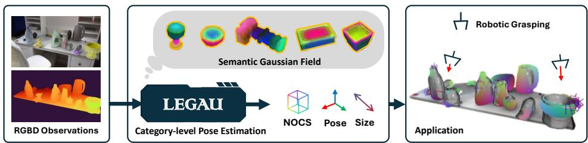
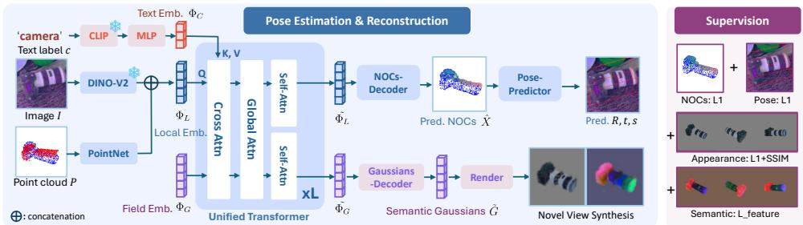
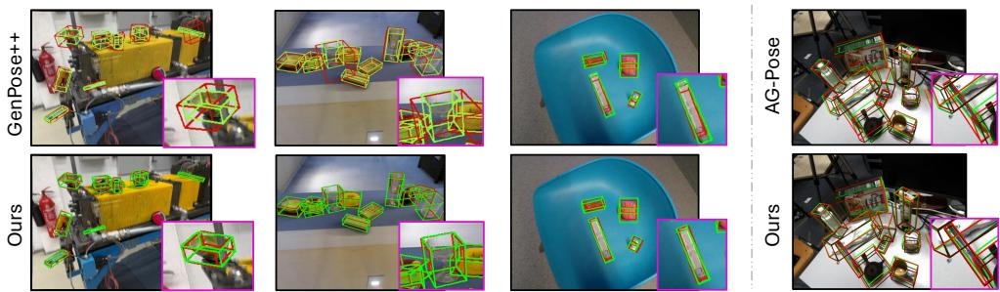
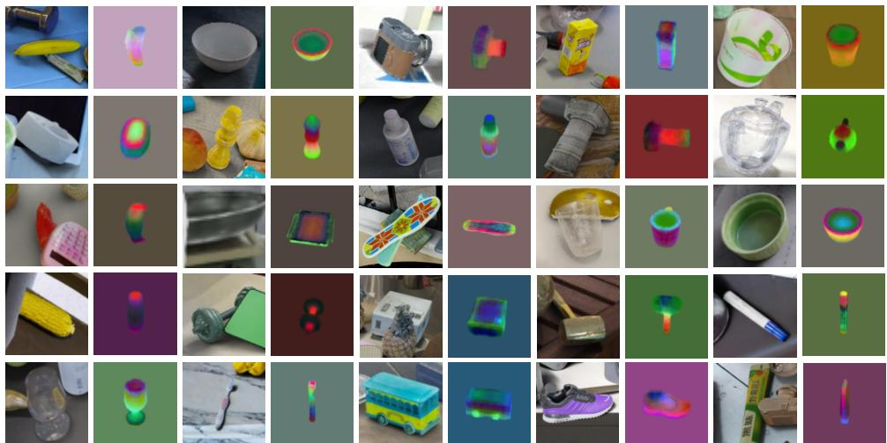
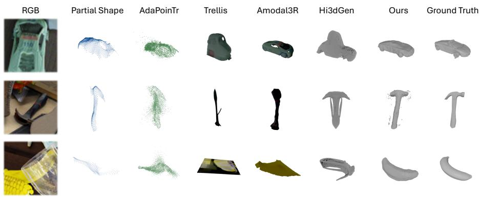

# LEGAU: Learning Semantic Gaussian Priors for Scalable Category-level Pose Estimation

Hongli Xu1   
hongli.xu@tum.de   
Zhaowei Lu1   
zhaowei.lu@tum.de   
0Junwen Huang1,3   
2junwen.huang@tum.de   
pJiaqi Hu1,2   
jiaqi.hu@tum.de   
Peter KT Yu4   
2peterkty@gmail.com   
Benjamin Busam1,3   
b.busam@tum.de   
Federico Tombari1   
.tombari@in.tum.de   
cSlobodan Ilic1,2   
[slobodan.ilic@tum.de

1 Technical University of Munich Munich, Germany

2 Siemens AG Munich, Germany

3 Munich Center for Machine Learning Munich, Germany

4 ROBOX Cambridge, MA, USA

## Abstract

Category-level 6D pose estimation from a single RGB-D observation is inherently under-constrained, since partial visible geometry must be interpreted together with a canonical object structure before a stable pose can be determined. We present LEGAU, a unified framework that jointly predicts NOCS correspondence, object pose and size, and a canonical Semantic Gaussian Field. Rather than treating reconstruction as a detached auxiliary task, LEGAU uses the Gaussian field as a category-conditioned structural prior that participates in multimodal feature fusion and provides global guidance for local pose reasoning. Conditioned on a categorical text embedding, LEGAU processes RGB-D observations through a transformer-based fusion module that integrates visual, geometric, and category-level cues, decoding the NOCS map, pose and size information and the Gaussian-based object representation. Extensive experiments on synthetic and real-world benchmarks show that this coupled pose-shape formulation achieves strong performance in a single-model multi-category setting, with up to 22% on SOPE and competitive transfer to real-world data. These results highlight the benefit of jointly learning canonical correspondence, object shape, and pose alignment within a unified representation.

  
Figure 1: We present LEGAU, a unified framework for scalable category-level object pose estimation from a single view. Our method learns a Semantic Gaussian Field that provides shape- and categoryaware guidance for coordinate alignment, enabling simultaneous object understanding and pose estimation, which may support downstream robotic perception tasks.

## 1 Introduction

Category-level 6D pose estimation aims to recover the pose of previously unseen object instances by leveraging shared structural priors across object categories. While recent methods have shown promising progress [4, 7, 20, 36, 49], they often struggle to generalize across substantial intra-class variation in shape and appearance. A key limitation is that pose estimation and shape understanding are typically modeled as separate processes: pose is inferred from partial observations, while shape or semantic priors are introduced only as auxiliary signals. Without a unified representation that jointly captures object geometry and semantics, these approaches remain sensitive to occlusion, incomplete geometry, and large shape variation.

Several recent works attempt to incorporate stronger priors for pose estimation. Some methods [5, 23] integrate visual semantics from DINOv2 [28] with geometric features from PointNet [30] like encoders to jointly reason about object pose and shape from partial RGB(D) observations. In order to have access to global context in heavy occlusion scenarios, recent work [1, 20] further introduces global context priors or canonical prototypes to guide the pose estimation, but they suffer from per-category training for shape reconstruction, limiting their scalability and generalization to new categories. Another line of research estimates object pose by first reconstructing object geometry and then performing model-based alignment [10, 34, 38]. More recently, scholars [9, 18, 27] leverage large image-to-3D models [40, 42] to synthesize object shapes before performing model-based pose estimation [27, 29, 38]. While these methods produce visually accurate reconstructions, their performance heavily depends on visible regions; under partial or occluded observations, the incomplete geometry often leads to pose misalignment and degraded accuracy.

These limitations stem from a fundamental issue: pose estimation implicitly requires aligning an object representation with the observed input, meaning that object reconstruction, semantic understanding, and pose reasoning are inherently coupled. This raises a natural question: can shape, semantics, and pose reasoning be unified within a single representation that directly supports pose alignment?

We argue that category-level pose estimation should be viewed as a coupled pose-shape inference problem rather than an isolated pose regression task. Motivated by this, we present LEGAU, a unified framework for 6D pose estimation guided by a Semantic Gaussian Field that jointly supports NOCS prediction, pose estimation, and Gaussian-based shape reconstruction. LEGAU learns a latent field embedding as a category-conditioned structural prior.

This prior couples pose reasoning and shape reconstruction by allowing local RGB-D evidence to interact with a canonical object-level representation. Built on a multimodal Transformer architecture, LEGAU fuses visual-geometric local embeddings, text embeddings, and latent field embeddings to jointly learn canonical correspondence, object shape, and pose. Experiments on synthetic and real-world category-level datasets show strong performance in a single-model multi-category setting, while also revealing remaining challenges in synthetic-to-real transfer.

• We formulate category-level pose estimation as a coupled inference problem over canonical correspondence, object-level shape, and SE(3) pose, rather than treating pose regression and reconstruction as independent objectives.

• We propose a Semantic Gaussian Field that models canonical object geometry together with category-conditioned feature-level cues, providing a structured prior for poseshape coupling under partial observations.

• We develop a multimodal transformer pipeline in which local RGB-D features, categorylevel text cues, and field embeddings interact through attention, enabling the canonical field to provide global structural guidance for local pose reasoning.

## 2 Related Work

Category-Level Object Pose Estimation. Estimating the 9DoF pose of objects without relying on instance-specific CAD models has been a core challenge in object-centric perception. Early works focused on instance-level settings [8, 11, 17, 22, 35, 38], where pose could be recovered by registering observed point clouds to known meshes using geometric optimization such as ICP or PnP. However, such methods do not generalize to novel instances or categories. To overcome this, category-level pose estimation introduces the concept of a Normalized Object Coordinate Space (NOCS) [36], where each object instance is aligned to a canonical coordinate frame shared across a category. Earlier methods [2, 4, 7, 12, 21] follow this pose representation and opt to introduce powerful backbones to improve the regression of the NOCS maps, as this formulation enables generalization to unseen instances. Recent approaches extend this framework with semantic and geometric priors. SGPA [3] introduces shape-guided priors for improving geometric stability under occlusion. HS-Pose [49] and IST-Net [24] refine the NOCS predictions using hierarchical attention or implicit surface representations, achieving better local alignment but still treating shape and pose as two independent branches. GenPose [47], GenPose++ [48] and GCE-Pose [20] further incorporate shape supervision from synthetic data or voxelized reconstructions, yet these designs rely on explicit canonical models and do not fully couple the reconstruction with pose reasoning. In contrast, our LEGAU framework unifies NOCS regression and object shape understanding in a shared SE(3)-aware feature space, where both tasks co-evolve through mutual attention, which leads to semantic and geometric consistency.

Object Reconstruction for Pose Estimation. A natural way to handle object pose estimation when the object model is unavailable is to first reconstruct the object. Previous research has explored several strategies for modeling objects using different representations. OnePose [34], OnePose++[10], and CosyPose[16] reconstruct objects via Structure-from-Motion (SfM)[33] from multi-view inputs. More recently, neural radiance fields (NeRFs)[26] have enabled continuous shape representations with high-fidelity view synthesis. NeRFbased approaches [19, 38, 43] model view-dependent appearance and achieve realistic image synthesis, effectively reducing domain gaps for pose estimation in real-world environments. Meanwhile, 3D Gaussian Splatting (3D-GS) [15] provides an efficient, differentiable, and 3D-consistent representation that benefits downstream reasoning tasks such as pose estimation. Recent works such as GS-Pose [1], 6D-GS [25], and 6DOPE-GS [13] leverage 3D-GS for pose estimation, yet they lack category-level priors and can only reconstruct visible regions rather than complete object shapes. Benefit from the 3D generative models, Giga-Pose [27] and Any6D [18] opt to generate the object 3D within a reference image, while the generated model is used to support the model-based pose estimation. These approaches separate pose estimation from reconstruction and depend on generated shapes that may hallucinate geometry or appearance. In contrast, our method directly predicts Gaussian primitives. Instead, our approach builds an end-to-end pipeline that uses a compact semantic Gaussian representation, removing per-instance optimization, and guides pose alignment from partial observations.

Joint Learning of Object Shape and Pose. Unifying pose estimation and shape reconstruction has recently gained attention as researchers seek SE(3)-consistent object understanding. GCE-Pose [20] introduces geometry-conditioned embeddings for better alignment between NOCS and 3D shapes. 6D-GS [25] is capable of modeling the 3D-GS as well as 6D pose from a single frame, and 6DOPE-GS [13] introduces an online pipeline to perform live object pose tracking and reconstruction, while they lack global priors for a complete shape generation, limited by the viewpoints in observation. Nevertheless, most of these frameworks rely on two-stage or iterative optimization pipelines, where pose and shape are refined alternately rather than jointly. A closely related recent direction is category-agnostic pose-shape estimation. [46] jointly predicts pose, size, and dense shape from a single RGB-D image without test-time templates, CAD models, or category labels, using foundation-model features, partial point clouds, and a MoE-enhanced Transformer. In contrast, LEGAU does not primarily pursue category-agnostic inference; instead, it studies category-conditioned pose-shape coupling, where a Semantic Gaussian Field acts as a canonical structural prior that interacts with local RGB-D features for NOCS prediction and pose alignment.

In summary, prior works either tackle category-level pose estimation but lack holistic 3D reasoning, resulting in limited global guidance across object instances, or focus on highfidelity reconstruction while overlooking spatial and semantic alignment between the reconstructed shape and the partial observation. LEGAU unifies these two directions through a multi-modal transformer that jointly leverages visual, geometric, and semantic cues. By coupling NOCS prediction, 6D pose regression, and semantic Gaussian field reconstruction within a single framework, our method encourages SE(3)-consistent object representations within a single shared model, avoiding per-category reconstruction networks.

## 3 Method

## 3.1 Overview

LEGAU takes a partially observed RGB-D object image as input, conditioned on a categorical text prompt, and predicts both the NOCS map and a complete semantic Gaussian field within a unified transformer architecture. The framework integrates three complementary embeddings: a text embedding extracted using CLIP [32], a local embedding derived from

  
Figure 2: Pipeline of the LEGAU framework. Given an RGB-D input and a categorical text prompt, LEGAU extracts modality-specific features using DINOv2 [28], CLIP [32], and PointNet [31], producing a text embedding that encodes category priors and a local embedding combining visual and geometric cues. A learnable field embedding captures global semantic and geometric priors and jointly attends with the multi-modal embeddings through a transformer. This unified representation enables coupled semantic shape understanding and pose reasoning: local embeddings drive the NOCS and pose decoders, while the global embedding guides the shape decoder to reconstruct high-level semantics and geometry as Gaussian primitives. The training of our model uses multi-level supervision, including NOCS and pose losses, photometric consistency, and a cosine-similarity objective for feature coherence.

RGB features (DINOv2 [28]) and depth points (PointNet [30]), and a field embedding that encodes global semantic shape priors. The multimodal embeddings are fused through alternating self-attention and cross-attention layers. Self-attention aggregates information within each modality, while cross-attention enables interaction between local observations, textual priors, and the global semantic field. This design allows the model to propagate global structural cues to local pose reasoning while preserving fine-grained geometric information.

## 3.2 Task Formulation.

Given a cropped RGB image $I \in \mathbb { R } ^ { H \times W \times 3 }$ and its corresponding partial point cloud $\boldsymbol { P } \in \mathbb { R } ^ { N \times 3 }$ obtained from depth observations, the goal of LEGAU is to jointly estimate the object’s 6D pose $\{ R , t \} \in \mathrm { S E } ( 3 )$ , its 3D size $s \in \mathbb { R } ^ { 3 }$ , the normalized object coordinates $\hat { X } \in \mathbb { R } ^ { N \times 3 }$ , and a dense feature Gaussian representation $\mathcal { G }$ in the canonical space.

## 3.3 Preliminary: Feature 3D Gaussians

We follow the 3D Feature Gaussians formulation [50] and represent an object using a set of Feature Gaussian primitives $\mathcal { G } = \{ G _ { k } \} _ { k = 1 } ^ { K }$ . Each primitive $G _ { k }$ stores geometric, appearance and semantics parameters,

$$
G _ { k } = ( \mu _ { k } , \Sigma _ { k } , \alpha _ { k } , c _ { k } , f _ { k } ) ,
$$

where $\mu _ { k } \in \mathbb { R } ^ { 3 }$ is the Gaussian center, $\Sigma _ { k } \in \mathbb { R } ^ { 3 \times 3 }$ the anisotropic covariance, $\alpha _ { k }$ the opacity, $c _ { k }$ the color feature, and $f _ { k } \in \mathbb { R } ^ { C _ { f } }$ a learnable feature embedding.

Semantic Gaussian Field. Rather than following the traditional “reconstruct-then-align” paradigm, LEGAU learns object pose and shape within a shared representation. We introduce a learnable Semantic Gaussian Field, a triplane-based latent embedding that captures canonical geometry, semantics, and part structure before explicit Gaussian primitives are decoded. Importantly, the semantic field directly influences pose reasoning. During transformer attention, the field embedding interacts with local visual and geometric features, providing global structural cues that guide NOCS prediction and pose estimation. This allows the model to resolve ambiguities caused by occlusion or partial observations by enforcing consistency with the learned canonical object structure. Noticeably, “semantic” refers to category-conditioned and feature-level structural cues encoded by text and visual foundationmodel features, rather than explicit part labels or functional language semantics.

## 3.4 Multimodal Representation

LEGAU learns a unified multimodal representation that integrates complementary cues from visual, geometric, and text sources. Given an RGB image $\check { I } \in \mathbb { R } ^ { H \times W \times 3 }$ , a depth-derived point cloud $\bar { P } \in \mathbb { R } ^ { N \times 3 }$ , and a category label c, the model extracts modality-specific embeddings and fuses them into a shared latent space.

Local Embedding: A pre-trained foundational encoder [28] backbone extracts dense visual features $F _ { \mathrm { r g b } } = \mathcal { F } _ { \mathrm { v i s } } ^ { } ( I ) \in \mathbb { R } ^ { H ^ { \prime } \times W ^ { \prime } \times C }$ that provide semantically consistent appearance cues across categories and viewpoints. To encode geometric structure, a lightweight point encoder [30] processes the partial point cloud P to obtain geometric embeddings $F _ { \mathrm { p c } } =$ $\mathcal { F } _ { \mathrm { g e o } } ( P ) \in \mathbb { R } ^ { N \times C }$ representing SE(3)-aware local 3D geometry. We then sample and align corresponding spatial locations from $F _ { \mathrm { r g b } }$ and $F _ { \mathrm { p c } }$ , producing a unified set of tokens $\phi _ { L } \in$ $\mathbb { R } ^ { K \times C _ { f } ^ { - } }$ , each embedding both appearance and geometry in a shared latent space. These tokens form the local embedding, which provides spatially grounded cues for NOCS prediction and simultaneously incorporates with the global field embedding, enabling the transformer to aggregate coherent shape and semantic context across views and modalities.

Text Embedding: To incorporate language-level priors, we embed the object’s category label c using a text encoder [32], yielding a semantic token $\phi _ { C } \in \mathbb { R } ^ { 1 \times C }$ . This categorical embedding provides high-level contextual guidance that complements the local visual–geometric cues, allowing the model to infer missing structure under occlusion or sparse observations. Field Embedding: Beyond input encoding, LEGAU introduces a learnable field embedding $\phi _ { G } \in \mathbb { R } ^ { 3 \times H _ { f } \times W _ { f } \times \widecheck { C } _ { f } }$ , that captures holistic geometry and semantic context. It is parameterized as a compact triplane feature $\Phi _ { G } = \{ \Phi _ { x y } , \mathbf { \bar { \Phi } } _ { } \Phi _ { y z } , \Phi _ { z x } \mathbf  \bar { \} } \in \mathbb { R } ^ { 3 \times H _ { f } \times W _ { f } \times C _ { f } }$ , where each orthogonal plane encodes a 2D projection of the latent 3D structure. This field embedding serves as a geometry-aware semantic prior, providing global structural guidance and regularizing pose reasoning for consistent alignment across unseen categories.

## 3.5 Unified Transformer Backbone

To unify visual, geometric, and semantic information across modalities, LEGAU employs a transformer-based backbone that progressively fuses and contextualizes the input tokens defined in Section 3.4. Inspired by recent large-scale geometric transformers such as VGGT [37], we employs an alternating-attention backbone that unifies reasoning across multiple embedding groups. This design enables effective fusion of visual, geometric, and semantic cues, while maintaining stable optimization and strong generalization across object categories.

Token Grouping. The input token set is divided into four groups: (i) three triplane field embeddings $\bar { \Phi _ { x y } } , \bar { \Phi _ { y z } } , \bar { \Phi _ { z x } } \in \bar { \mathbb { R } } ^ { K _ { F } \times C _ { F } }$ , each encoding 2D projections of the latent 3D feature field along orthogonal planes; (ii) a local embedding $\bar { \phi _ { L } } \in \bar { \mathbb { R } } ^ { \bar { K _ { L } } \times C }$ capturing spatially grounded visual–geometric features. Together, these tokens are concatenated into a unified multimodal sequence $T = \{ \Phi _ { x y } , \Phi _ { y z } , \Phi _ { z x } , \phi _ { L } \}$ and processed jointly within the transformer.

Alternating Attention. Each transformer block interleaves three attention operations—global, local, and category-conditioned—applied sequentially to $T$

$$
T ^ { \prime } = \mathrm { G l o b a l A t t n } \big ( \mathrm { L N } ( T ) \big ) + T ,
$$

$$
\begin{array} { r } { T ^ { \prime \prime } = \mathrm { L o c a l A t t n } \big ( \mathrm { L N } ( T ^ { \prime } ) \big ) + T ^ { \prime } , } \end{array}\tag{1}
$$

$$
T ^ { + } = \mathrm { C r o s s A t t n } \big ( { \mathrm { L N } } ( T ^ { \prime \prime } ) , \phi _ { C } \big ) + T ^ { \prime \prime } ,
$$

where global attention exchanges information across triplane and local groups, local attention refines spatial coherence within each feature set, and cross-attention injects semantic priors from $\phi _ { C }$ into all representations. Stacking L alternating-attention layers enables rich bidirectional interaction between local and global contexts. The triplane embeddings gradually consolidate multi-view geometric structure and high-level semantics, while local tokens preserve SE(3)-aware spatial detail for fine alignment. Through repeated category-conditioned attention, semantic priors are continuously propagated across modalities, yielding geometryaware and semantically consistent feature representations for downstream NOCS and pose estimation.

Output Representation. After L layers, the transformer outputs refined local embeddings $\tilde { \phi } _ { L }$ and a global field embedding $\tilde { \Phi } _ { ; }$ , which together capture geometry-aware priors and spatially aligned features for Gaussian field reconstruction and 6D pose estimation.

## 3.6 Gaussians Decoder

The Gaussians Decoder reconstructs the object’s geometry by sampling a set of Gaussian centers on a fixed 3D grid and decoding their attributes from the triplane field embedding $\tilde { \Phi }$ . Unlike prior formulations that directly regress all Gaussian parameters, we derive perprimitive features through differentiable sampling from the triplane representation.

Feature Sampling. We uniformly sample K grid centers $\{ x _ { k } \in \mathbb { R } ^ { 3 } \} _ { k = 1 } ^ { K }$ within the canonical object volume. For each center $x _ { k }$ , we project it onto the three orthogonal planes of the triplane field $\tilde { \Phi } = \{ \tilde { \Phi _ { x y } } , \tilde { \Phi _ { y z } } , \tilde { \Phi _ { z x } } \}$ , and aggregate its interpolated latent feature as

$$
\psi _ { k } = \sum _ { p \in \{ x y , y z , z x \} } \mathrm { I n t e r p } ( \tilde { \Phi _ { p } } , x _ { k } ) ,\tag{2}
$$

where Interp $( \tilde { \Phi _ { p } } , x _ { k } )$ denotes bilinear interpolation on plane $\tilde { \Phi _ { p } }$ at the projected location of $x _ { k }$

Gaussian Attribute Decoding. Each latent feature $\psi _ { k }$ is passed through a lightweight MLP decoder to predict the corresponding Gaussian parameters:

$$
\{ \mu _ { k } , \sigma _ { k } , \alpha _ { k } , q _ { k } , c _ { k } , f _ { k } \} = \mathrm { M L P _ { d e c } } ( \psi _ { k } ) ,\tag{3}
$$

where $\mu _ { k }$ denotes the Gaussian center, $\sigma _ { k }$ its anisotropic scale, $\alpha _ { k }$ the opacity, $q _ { k }$ the orientation quaternion, $c _ { k }$ the color, and $f _ { k }$ the learned feature embedding. This formulation allows the triplane field to compactly encode the object’s latent 3D geometry, while the decoder translates it into physically meaningful Gaussian attributes.

Differentiable Rendering. Given a camera pose $T _ { i } \in \mathrm { S E } ( 3 )$ and the predicted set of feature Gaussians $\tilde { \mathcal { G } } = \{ \mu _ { k } , \sigma _ { k } , \alpha _ { k } , q _ { k } , f _ { k } \} _ { k = 1 } ^ { K }$ , we render to the image plane via differentiable Gaussian splatting, obtaining view-dependent RGB, depth, and feature maps:

$$
( \tilde { I } _ { i } , \tilde { D } _ { i } , \tilde { F } _ { i } ) = \mathrm { R e n d e r } ( \tilde { \mathcal { G } } , T _ { i } ) .\tag{4}
$$

Here, $\tilde { F }$ is computed by accumulating the per-Gaussian feature embeddings $f _ { k }$ along the ray compositing process, consistent with the RGB/opacity blending rules.

## 3.7 NOCS and Pose Decoders

The local embeddings $\tilde { t } _ { L }$ encode SE(3)-aware geometry and per-point semantics. LEGAU employs two lightweight decoders that share these features but are supervised with complementary objectives.

NOCS Prediction. We first regress the normalized object coordinates for each input point:

$$
\hat { X } = \mathbf { M } \mathbf { L } \mathbf { P } _ { \mathrm { n o c s } } ( \tilde { t } _ { L } ) , \qquad \hat { X } \in \mathbb { R } ^ { N \times 3 } .\tag{5}
$$

This canonicalization step encourages $\tilde { t } _ { L }$ to encode consistent geometric structure across instances.

Pose Feature Construction. To obtain a pose-aware representation, we fuse three sources of information: local embeddings $\tilde { t } _ { L }$ , the predicted NOCS coordinates $\hat { X }$ , and the depth points P. Each is encoded by an MLP and concatenated:

$$
f _ { \mathrm { p o s e } } = \mathrm { c o n c a t } \big [ \mathrm { M L P } ( \tilde { t } _ { L } ) , \mathrm { M L P } ( \boldsymbol { \hat { X } } ) , \mathrm { M L P } ( P ) \big ] .\tag{6}
$$

Pose and Size Estimation. Rotation, translation, and anisotropic size are then regressed from $f _ { \mathrm { p o s e } }  \{ R \in \mathrm { S O } ( 3 ) , t \in \mathbb { R } ^ { 3 } , s \in \mathbb { R } ^ { 3 } \}$ . Especially, rotation is predicted using the continuous 6D representation [51], while translation and size come from independent heads:

$$
R = \left[ \hat { r } _ { 1 } , \hat { r } _ { 2 } , \hat { r } _ { 1 } \times \hat { r } _ { 2 } \right] , \qquad ( r _ { 1 } , r _ { 2 } ) = \mathbf { M } \mathbf { L } \mathbf { P } _ { R } ( f _ { \mathrm { p o s e } } ) ,\tag{7}
$$

$$
t = \mathbf { M } \mathbf { L } \mathbf { P } _ { t } ( f _ { \mathrm { p o s e } } ) , \qquad s = \mathbf { M } \mathbf { L } \mathbf { P } _ { s } ( f _ { \mathrm { p o s e } } ) .\tag{8}
$$

## 3.8 Training Objectives

LEGAU is trained end-to-end with a multi-task objective that jointly supervises canonical correspondence, SE(3) alignment, and Gaussian-field reconstruction.

NOCS and Pose Loss. We supervise both NOCS prediction and pose regression using a Smooth $- L _ { 1 }$ formulation. The NOCS decoder predicts continuous normalized coordinates, and is trained with a Smooth- $. L _ { 1 }$ loss against the ground-truth canonical coordinates:

$$
\mathcal { L } _ { \mathrm { n o c s } } = \mathrm { S m o o t h } \scriptscriptstyle { - } L _ { 1 } ( \hat { X } , X ^ { * } ) .\tag{9}
$$

Rotation (6D representation), translation, and anisotropic size are supervised in the same manner:

$$
\mathcal { L } _ { \mathrm { p o s e } } = L _ { 1 } ( R , R ^ { * } ) + L _ { 1 } ( t , t ^ { * } ) + L _ { 1 } ( s , s ^ { * } ) .\tag{10}
$$

This unified loss encourages the local embeddings to encode stable SE(3) alignment cues and consistent canonical geometry, forming a reliable foundation for downstream reconstruction and global field reasoning.

Reconstruction Loss. Given the rendered RGB, depth, and feature maps $( \tilde { I } _ { i } , \tilde { D } _ { i } , \tilde { F } _ { i } )$ , we supervise the Semantic Gaussian Field using multi-view photometric and feature consistency losses:

$$
\mathcal { L } _ { \mathrm { r g b } } = \Vert \tilde { I } _ { i } - I _ { i } \Vert _ { 1 } + \lambda _ { \mathrm { s s i m } } \mathrm { S S I M } ( \tilde { I } _ { i } , I _ { i } ) ,\tag{11}
$$

$$
\mathcal { L } _ { \mathrm { f e a t } } = 1 - \cos ( \tilde { F } _ { i } , F _ { i } ) .\tag{12}
$$

Here, the feature supervision $F _ { i }$ is obtained from DINOv2 features extracted on the rendered ground-truth views.

Total Loss. The full training objective combines canonical correspondence, SE(3) alignment, and Gaussian-field reconstruction:

$$
\begin{array} { r } { \mathcal { L } _ { \mathrm { t o t a l } } = \lambda _ { \mathrm { n o c s } } \mathcal { L } _ { \mathrm { n o c s } } + \lambda _ { \mathrm { p o s e } } \mathcal { L } _ { \mathrm { p o s e } } } \\ { + \lambda _ { a } \mathcal { L } _ { \mathrm { r g b } } + \lambda _ { f } \mathcal { L } _ { \mathrm { f e a t } } ~ } \end{array}\tag{13}
$$

This multi-task formulation jointly regularizes local SE(3)-aware correspondence and global Gaussian-field semantics, yielding pose estimates that remain consistent with object geometry even under occlusion or unseen category shifts.

## 4 Implementation Details

LEGAU employs a multimodal transformer backbone with L=12 alternating-attention layers and a hidden dimension of 256. RGB features are extracted using a frozen DINOv2-Small encoder, while partial point clouds are processed by a lightweight PointNet with 128 hidden units. The Semantic Gaussian Field is represented by a triplane latent structure with three $3 2 \times 3 2 \times 3 2$ feature planes, and $K { = } 1 3 1 , 0 7 2$ canonical Gaussian centers are uniformly sampled for reconstruction. We render $5 1 8 \times 5 1 8 ~ \mathrm { R G B }$ , depth, and feature images during training using the Gaussian-splatting kernel adapted from [50]. For each object, we prerender 42 multi-view images and randomly sample 4 views per iteration to supervise the Gaussian field during training. The loss weights are set to $( \lambda _ { \mathrm { n o c s } } , \lambda _ { \mathrm { p o s e } } , \lambda _ { a } , \lambda _ { \mathrm { s s i m } } , \lambda _ { d } , \lambda _ { f } ) =$ $( 2 . 0 , 0 . 3 , 5 . 0 , 1 . 0 , 0 . 0 2 , 0 . 3 )$ to balance the multi-objective optimization across canonical correspondence, pose regression, and Gaussian-field reconstruction. The model is trained end-to-end using AdamW with a learning rate of $2 \times 1 0 ^ { - 4 }$ , a cosine decay schedule, batch size $B { = } 6 4$ , and 200k iterations. We uniformly sample $N { = } 1 0 2 4$ depth points per object as geometric input.

## 5 Experiments

## 5.1 Datasets and Metrics

Datasets. We evaluate LEGAU across three complementary benchmarks: HouseCat6D [14], SOPE [48], and ROPE [48], covering both real and synthetic domains. HouseCat6D [14] provides a compact, in-the-wild benchmark for category-level pose and shape estimation, comprising 149 real-world instances across 10 categories, including transparent objects, and featuring moderate scene clutter. SOPE [48] is a large-scale synthetic dataset with 149 categories and full ground-truth annotation for pose NOCS, mesh geometry, designed to test scalability across a large number of categories. ROPE [48] shares the same 149 categories as SOPE but consists entirely of real RGB-D captures with complex lighting, background variation, and partial occlusion. Importantly, the model is trained only on SOPE and evaluated on ROPE without finetuning, thus it is used to measure real-world transfer performance.

Metrics. For the evaluation on Omni6DPose [48], we use the metrics that proposed by this benchmark. One is AUC@(θ◦, τcm), where a prediction is considered correct if the rotation error is below $\theta ^ { \circ }$ and the translation error below τ cm. We report $\mathsf { A U C @ I o U } _ { 2 5 }$

AUC@ $\mathrm { I o U } _ { 5 0 }$ , and $\mathbf { A U C } @ \mathbf { I o U } _ { 7 5 }$ for benchmarking. The other is VUS@ $n ^ { \circ }$ cm, which provides a fine-grained evaluation of 6D pose accuracy using the Volume Under Surface (VUS) across ranges of rotational (up to $n ^ { \circ } )$ and translational (up to m cm) errors. It aggregates pose accuracy within these error bounds. We report VUS@5^\circ 2cm, VUS@5^\circ 5cm, VUS@ $1 0 ^ { \circ } 2 \mathrm { c m }$ and VUS@ $1 0 ^ { \circ }$ 5cm. For the evaluation on the HouseCat6D [14] dataset, we follow the previous methods [5, 23] to use the Accuracy on the respective $n ^ { \circ }$ m cm as well as the IoU metrics.

  
Figure 3: Qualitative comparison between our method, AGPose [23] and GenPose++ [48] on SOPE, ROPE, and HouseCat6D. From left to right: a symmetric and occluded bowl (SOPE), a transparent glass (SOPE), a real-world toy object (ROPE), and reflective metallic tableware (HouseCat6D). These examples illustrate robustness to symmetry, occlusion, transparency, real-world novel objects, and specular surfaces.

## 5.2 Cross-Dataset Evaluation

Results on HouseCat6D (10 categories). We evaluate our method on the real-world HouseCat6D [14] benchmark. LEGAU achieves the best performance across all metrics, outperforming AG-Pose [23] by a substantial margin in both rotation and translation accuracy. Compared to the SOTA method AG-Pose [23], which performs keypoint detection for the categories, LEGAU improves both rotation and translation accuracy with a large margin while providing denser and more consistent shape reconstructions. This confirms that our semantic Gaussian-guided pipeline introduces effective global priors for challenging partial inputs, even for textureless, symmetric, and occluded objects. We do not report GCE-Pose [20] in our tables, because it requires training a separate reconstruction network per category. This per-category training paradigm does not align with our goal of evaluating scalable, unified category-level models that share a single network across many categories.

Scaling to SOPE (149 Categories). When trained on the large-scale synthetic SOPE dataset, LEGAU continues to achieve state-of-the-art performance across all metrics, with significant gains in both pose and IoU over previous models such as HS-Pose[49] and GenPose++ [48]. The model maintains high Acc@(5◦,5cm) across diverse categories, including furniture, tools, and household items, demonstrating that the alternating attention backbone generalizes well to highly varied category appearances and geometries. The triplane-based geometry encoding further preserves fine spatial detail and improves canonical consistency across categories with large intra-class variation.

Real-World Transfer: SOPE → ROPE. We directly evaluate the SOPE-trained model on the real ROPE dataset without any finetuning. On ROPE, LEGAU remains competitive in IoU-based metrics but shows a noticeable gap under stricter pose thresholds compared with

Table 1: Quantitative comparison on HouseCat6D [14], SOPE [48], and ROPE [48]. For each column, the top three methods are highlighted using a blue color map, where darker shades indicate better performance. LEGAU achieves strong performance on HouseCat6D and SOPE under the same evaluation protocol, especially in the single-model multi-category setting. On ROPE, LEGAU remains competitive in IoU-based metrics but shows a gap under stricter pose thresholds, indicating that synthetic-to-real transfer remains challenging..
<table><tr><td>Dataset</td><td>Method</td><td>IoU25</td><td>IoU50 IoU75</td><td>5°2cm</td><td></td><td>5°5cm</td><td>10°2cm</td><td>10°5cm</td></tr><tr><td rowspan="4">HouseCat6D []</td><td>VI-Net [日]</td><td>=</td><td>56.4</td><td>1</td><td>8.4</td><td>10.3</td><td>20.5</td><td>29.1</td></tr><tr><td>SecondPose []</td><td></td><td>66.1</td><td></td><td>11.0</td><td>13.4</td><td>25.3</td><td>35.7</td></tr><tr><td>AG-Pose [ []</td><td>88.1</td><td>76.9</td><td>53.0</td><td>21.3</td><td>22.1</td><td>51.3</td><td>54.3</td></tr><tr><td>LEGAU</td><td>90.7</td><td>80.6</td><td>57.4</td><td>21.4</td><td>22.7</td><td>54.0</td><td>57.4</td></tr><tr><td rowspan="2">Dataset</td><td rowspan="2">Method</td><td colspan="3">AUC↑ (IoU)</td><td colspan="4">VUS↑(n°mcm)</td></tr><tr><td colspan="3">IoU25 IoU50 IoU75</td><td colspan="4">5°2cm 5°5cm 10°2cm</td></tr><tr><td rowspan="7">SOPE []</td><td>NOCS [30]</td><td>0.0</td><td>0.0</td><td>0.0</td><td>0.0</td><td>0.0</td><td>0.0</td><td>10°5cm 0.0</td></tr><tr><td>SGPA [日]</td><td>13.3</td><td>3.2</td><td>0.0</td><td>7.7</td><td>10.1</td><td>15.0</td><td>20.4</td></tr><tr><td>IST-Net []</td><td>36.5</td><td>16.9</td><td>1.4</td><td>3.6</td><td>5.1</td><td>8.6</td><td>11.4</td></tr><tr><td>HS-Pose [四9]</td><td>40.1</td><td>21.7</td><td>3.2</td><td>6.3</td><td>8.0</td><td>13.6</td><td>17.3</td></tr><tr><td>GenPose [日]</td><td></td><td></td><td></td><td>11.9</td><td>14.4</td><td>21.2</td><td>26.3</td></tr><tr><td>GenPose++ []</td><td>50.1</td><td>31.9</td><td>6.4</td><td>18.4</td><td>23.0</td><td>31.9</td><td>40.2</td></tr><tr><td>LEGAU</td><td>61.1</td><td>44.7</td><td>15.6</td><td>22.6</td><td>26.3</td><td>37.4</td><td>44.2</td></tr><tr><td rowspan="7">ROPE []</td><td>NOCS [36]</td><td>0.0</td><td>0.0</td><td>0.0</td><td>0.0</td><td>0.0</td><td>0.0</td><td>0.0</td></tr><tr><td>SGPA []</td><td>10.5</td><td>2.0</td><td>0.0</td><td>4.3</td><td>6.7</td><td>9.3</td><td>15.0</td></tr><tr><td>IST-Net [ []</td><td>28.7</td><td>10.6</td><td>0.5</td><td>2.0</td><td>3.4</td><td>5.3</td><td>8.8</td></tr><tr><td>HS-Pose [四9]</td><td>31.6</td><td>13.6</td><td>1.1</td><td>3.5</td><td>5.3</td><td>8.4</td><td>12.7</td></tr><tr><td>GenPose [日]</td><td></td><td></td><td></td><td>6.6</td><td>9.6</td><td>13.1</td><td>19.3</td></tr><tr><td>GenPose++ 日</td><td>39.0</td><td>19.1</td><td>2.0</td><td>10.0</td><td>15.1</td><td>19.5</td><td>29.4</td></tr><tr><td>LEGAU</td><td>37.7</td><td>19.3</td><td>2.4</td><td>7.6</td><td>11.7</td><td>15.6</td><td>24.4</td></tr></table>

GenPose++. This suggests that the proposed canonical field prior improves category-level structural consistency, while accurate real-world pose transfer remains affected by depth noise, mask quality, lighting variation, and reflective or transparent materials.

## 5.3 Effect of Learning Semantic Priors

Visualizing the Learned Semantic Gaussian Field. Before analyzing the quantitative contribution of semantics, we first provide a qualitative visualization of the learned Semantic Gaussian Field (Fig. 4). Across diverse object categories, we observe that the learned field exhibits strong structural consistency. Regions that correspond to similar functional or geometric structures tend to share similar colors in the latent space, while geometrically distinct parts are clearly separated. For elongated objects, the semantic features form smooth axial gradients; for symmetric objects, the embeddings align around their canonical symmetry axes. These patterns indicate that the learned representation captures category-level structural priors rather than merely local appearance cues.

Importantly, these semantic embeddings are learned jointly with pose estimation and shape reconstruction. As a result, the semantic field provides a global structural prior that helps align partial observations with plausible canonical object configurations, which stabilizes pose estimation under occlusion or incomplete geometry.

Isolated Contribution of Semantic Priors. To isolate the effect of semantic priors from geometry reconstruction, we perform controlled ablations on the Semantic Gaussian Field (Sem. GF) and CLIP-based category conditioning while keeping all other components unchanged. As shown in Table 2, removing the Semantic Gaussian Field while keeping the

Figure 4: Visual of Semantic Gaussians Reconstruction.It renders Gaussian primitives decoded in canonical object space, where the per-Gaussian semantic feature embeddings are projected to RGB colors using PCA.  
Table 2: Ablations on isolating the effects of Gaussian reconstruction (left) and CLIP-based category conditioning (right).
<table><tr><td>GF</td><td>Sem. GF</td><td>10°5cm</td><td>IoU50</td></tr><tr><td>√</td><td>√</td><td>57.4</td><td>80.6</td></tr><tr><td>√</td><td>x</td><td>55.1 (-4.4%)</td><td>78.3(-2.9%)</td></tr><tr><td>X</td><td>X</td><td>52.0(-9.4%)</td><td>75.0 (-7.0%)</td></tr></table>

<table><tr><td>CLIP</td><td>10°5cm</td><td>IoU50</td></tr><tr><td>√</td><td>44.2</td><td>44.7</td></tr><tr><td>X</td><td>40.7(-7.9%)</td><td>42.4(-5.1%)</td></tr></table>

Gaussian reconstruction branch (GF) reduces pose accuracy on HouseCat6D from 57.4 to 55.1 (-4.4%), indicating that the improvement does not solely come from geometry reconstruction but from the semantic field that encodes category-level structural priors. Similarly, removing CLIP-based conditioning decreases VUS@10°5cm on SOPE from 44.2 to 40.7 (-7.9%), suggesting that language-guided semantic anchors provide useful global context under large category diversity.

Table 3: Shape reconstruction results on the SOPE dataset. We evaluate on the Chamfer-L1 $( \times 1 0 ^ { - 3 } \mathrm { m }$ , lower is better). Best results are bolded.
<table><tr><td>FoldingNet [4]]</td><td>PoinTr [[4]</td><td>AdaPoinTr [45]</td><td>Ours</td></tr><tr><td>62.72</td><td>29.87</td><td>23.17</td><td>6.72(-16.5%)</td></tr></table>

## 5.4 Shape Reconstruction Results.

Besides Semantic, we also evaluate LEGAU’s capability for dense 3D shape reconstruction on the SOPE dataset. Table 3 reports Chamfer-L1 distances $( \times 1 0 ^ { - 3 }$ , lower is better), where LEGAU significantly outperforms previous point-based reconstruction methods such as FoldingNet [41], PoinTr [44], and AdaPoinTr [45], achieving the lowest reconstruction error. Fig. 5 further visualizes reconstruction results and compares LEGAU with recent imageto-3D generative models including Trellis [40], Hi3DGen [42], and the occlusion-aware baseline Amodal3R [39]. While these approaches can produce visually plausible shapes from canonical viewpoints, their geometry often deteriorates under non-frontal views, heavy occlusions, or texture-poor observations. In contrast, LEGAU maintains consistent geometric fidelity across viewpoints, benefiting from explicit canonical alignment and the joint learning of pose, NOCS, and shape within a unified transformer framework. The Semantic Gaussian Field further provides global structural priors, allowing the model to recover more complete and structurally consistent geometry under challenging truncation or occlusion.

  
Figure 5: Qualitative comparison of shape reconstruction from partial point observations. We compare our method with a depth-based reconstruction baseline [45] and recent imageto-3D generative frameworks [39, 40, 42] under challenging scenarios involving heavy occlusion and transparent materials.

## 6 Conclusion

We presented LEGAU, a unified framework that treats category-level pose estimation as coupled inference over canonical correspondence, pose alignment, and Gaussian-based shape reconstruction. By using a Semantic Gaussian Field as a category-conditioned structural prior, LEGAU encourages pose estimates to remain consistent with object-level shape structure under partial observations. Experiments on HouseCat6D, SOPE, and ROPE show that this pose-shape coupling improves performance in a single-model multi-category setting, while real-world transfer remains challenging under strict pose thresholds. Controlled ablations further indicate that the Gaussian field and category-conditioned feature cues contribute to pose accuracy beyond geometry-only reconstruction. Looking forward, we believe that such coupled pose-shape representations provide a promising basis for more open-world pose estimation, where models must reason about previously unseen categories, incomplete observations, and category-level structural priors without relying on instance-specific CAD models. Extending LEGAU toward stronger open-vocabulary conditioning, broader realworld adaptation, and more interactive robotic perception remains an important direction for future work.

## References

[1] Dingding Cai, Janne Heikkilä, and Esa Rahtu. Gs-pose: Generalizable segmentationbased 6d object pose estimation with 3d gaussian splatting. In 2025 International Conference on 3D Vision (3DV), pages 1001–1011. IEEE, 2025.

[2] Dengsheng Chen, Jun Li, Zheng Wang, and Kai Xu. Learning canonical shape space for category-level 6d object pose and size estimation. In Proceedings ofthe IEEE/CVF conference on computer vision and pattern recognition, pages 11973–11982, 2020.

[3] Kai Chen and Qi Dou. Sgpa: Structure-guided prior adaptation for category-level 6d object pose estimation. In Proceedings of the IEEE/CVF international conference on computer vision, pages 2773–2782, 2021.

[4] Wei Chen, Xi Jia, Hyung Jin Chang, Jinming Duan, Linlin Shen, and Ales Leonardis. Fs-net: Fast shape-based network for category-level 6d object pose estimation with decoupled rotation mechanism. In CVPR, 2021.

[5] Yamei Chen, Yan Di, Guangyao Zhai, Fabian Manhardt, Chenyangguang Zhang, Ruida Zhang, Federico Tombari, Nassir Navab, and Benjamin Busam. Secondpose: Se (3)- consistent dual-stream feature fusion for category-level pose estimation. In CVPR, 2024.

[6] Ronald Clark, Sen Wang, Hongkai Wen, Andrew Markham, and Niki Trigoni. Vinet: Visual-inertial odometry as a sequence-to-sequence learning problem. In Proceedings ofthe AAAI conference on artificial intelligence, volume 31, 2017.

[7] Yan Di, Ruida Zhang, Zhiqiang Lou, Fabian Manhardt, Xiangyang Ji, Nassir Navab, and Federico Tombari. Gpv-pose: Category-level object pose estimation via geometryguided point-wise voting. In CVPR, 2022.

[8] Bertram Drost, Markus Ulrich, Nassir Navab, and Slobodan Ilic. Model globally, match locally: Efficient and robust 3d object recognition. In CVPR, 2010.

[9] Zheng Geng, Nan Wang, Shaocong Xu, Chongjie Ye, Bohan Li, Zhaoxi Chen, Sida Peng, and Hao Zhao. One view, many worlds: Single-image to 3d object meets generative domain randomization for one-shot 6d pose estimation. arXiv preprint arXiv:2509.07978, 2025.

[10] Xingyi He, Jiaming Sun, Yuang Wang, Di Huang, Hujun Bao, and Xiaowei Zhou. Onepose++: Keypoint-free one-shot object pose estimation without CAD models. In NeurIPS, 2022.

[11] Junwen Huang, Hao Yu, Kuan-Ting Yu, Nassir Navab, Slobodan Ilic, and Benjamin Busam. Matchu: Matching unseen objects for 6d pose estimation from rgb-d images. In 2024 IEEE/CVF Conference on Computer Vision and Pattern Recognition (CVPR), 2024. doi: 10.1109/CVPR52733.2024.00962.

[12] Takuya Ikeda, Sergey Zakharov, Tianyi Ko, Muhammad Zubair Irshad, Robert Lee, Katherine Liu, Rares Ambrus, and Koichi Nishiwaki. Diffusionnocs: Managing symmetry and uncertainty in sim2real multi-modal category-level pose estimation. In 2024 IEEE/RSJ International Conference on Intelligent Robots and Systems (IROS), pages 7406–7413, 2024. doi: 10.1109/IROS58592.2024.10802487.

[13] Yufeng Jin, Vignesh Prasad, Snehal Jauhri, Mathias Franzius, and Georgia Chalvatzaki. 6dope-gs: Online 6d object pose estimation using gaussian splatting. In Proceedings of the IEEE/CVF International Conference on Computer Vision (ICCV), pages 8032– 8043, October 2025.

[14] HyunJun Jung, Shun-Cheng Wu, Patrick Ruhkamp, Hannah Schieber, Pengyuan Wang, Giulia Rizzoli, Hongcheng Zhao, Sven Damian Meier, Daniel Roth, Nassir Navab, and Benjamin Busam. Housecat6d–a large-scale multi-modal category level 6d object pose dataset with household objects in realistic scenarios. In CVPR, 2024.

[15] Bernhard Kerbl, Georgios Kopanas, Thomas Leimkühler, and George Drettakis. 3d gaussian splatting for real-time radiance field rendering. ACM Trans. Graph., 42(4): 139–1, 2023.

[16] Yann Labbé, Justin Carpentier, Mathieu Aubry, and Josef Sivic. Cosypose: Consistent multi-view multi-object 6d pose estimation. In Computer Vision–ECCV 2020: 16th European Conference, Glasgow, UK, August 23–28, 2020, Proceedings, Part XVII 16, pages 574–591. Springer, 2020.

[17] Yann Labbé, Lucas Manuelli, Arsalan Mousavian, Stephen Tyree, Stan Birchfield, Jonathan Tremblay, Justin Carpentier, Mathieu Aubry, Dieter Fox, and Josef Sivic. Megapose: 6d pose estimation of novel objects via render & compare. In CoRL, 2022.

[18] Taeyeop Lee, Bowen Wen, Minjun Kang, Gyuree Kang, In So Kweon, and Kuk-Jin Yoon. Any6D: Model-free 6d pose estimation of novel objects. In Proceedings of the Computer Vision and Pattern Recognition Conference (CVPR), 2025.

[19] Fu Li, Shishir Reddy Vutukur, Hao Yu, Ivan Shugurov, Benjamin Busam, Shaowu Yang, and Slobodan Ilic. Nerf-pose: A first-reconstruct-then-regress approach for weakly-supervised 6d object pose estimation. In ICCV, 2023.

[20] Weihang Li, Hongli Xu, Junwen Huang, Hyunjun Jung, Peter KT Yu, Nassir Navab, and Benjamin Busam. Gce-pose: Global context enhancement for category-level object pose estimation. arXiv preprint arXiv:2502.04293, 2025.

[21] Jiehong Lin, Zewei Wei, Zhihao Li, Songcen Xu, Kui Jia, and Yuanqing Li. Dualposenet: Category-level 6d object pose and size estimation using dual pose network with refined learning of pose consistency. In ICCV, 2021.

[22] Jiehong Lin, Lihua Liu, Dekun Lu, and Kui Jia. Sam-6d: Segment anything model meets zero-shot 6d object pose estimation. arXiv preprint arXiv:2311.15707, 2023.

[23] Xiao Lin, Wenfei Yang, Yuan Gao, and Tianzhu Zhang. Instance-adaptive and geometric-aware keypoint learning for category-level 6d object pose estimation. In Proceedings of the IEEE/CVF Conference on Computer Vision and Pattern Recognition, pages 21040–21049, 2024.

[24] Jianhui Liu, Yukang Chen, Xiaoqing Ye, and Xiaojuan Qi. Ist-net: Prior-free categorylevel pose estimation with implicit space transformation. In Proceedings of the IEEE/CVF International Conference on Computer Vision, pages 13978–13988, 2023.

[25] Bortolon Matteo, Theodore Tsesmelis, Stuart James, Fabio Poiesi, and Alessio Del Bue. 6dgs: 6d pose estimation from a single image and a 3d gaussian splatting model. In European Conference on Computer Vision, pages 420–436. Springer, 2024.

[26] Ben Mildenhall, Pratul P Srinivasan, Matthew Tancik, Jonathan T Barron, Ravi Ramamoorthi, and Ren Ng. Nerf: Representing scenes as neural radiance fields for view synthesis. Communications ofthe ACM, 65(1):99–106, 2021.

[27] Van Nguyen Nguyen, Thibault Groueix, Mathieu Salzmann, and Vincent Lepetit. Gigapose: Fast and robust novel object pose estimation via one correspondence. In Proceedings of the IEEE/CVF Conference on Computer Vision and Pattern Recognition (CVPR), 2024. URL https://arxiv.org/abs/2311.14155.

[28] Maxime Oquab, Timothée Darcet, Théo Moutakanni, Huy Vo, Marc Szafraniec, Vasil Khalidov, Pierre Fernandez, Daniel Haziza, Francisco Massa, Alaaeldin El-Nouby, et al. Dinov2: Learning robust visual features without supervision. arXiv preprint arXiv:2304.07193, 2023.

[29] Evin Pınar Örnek, Yann Labbé, Bugra Tekin, Lingni Ma, Cem Keskin, Christian Forster, and Tomáš Hodan. Foundpose: Unseen object pose estimation with foundationˇ features. European Conference on Computer Vision (ECCV), 2024.

[30] Charles R Qi, Hao Su, Kaichun Mo, and Leonidas J Guibas. Pointnet: Deep learning on point sets for 3d classification and segmentation. In Proceedings of the IEEE conference on computer vision and pattern recognition, pages 652–660, 2017.

[31] Charles Ruizhongtai Qi, Li Yi, Hao Su, and Leonidas J Guibas. Pointnet++: Deep hierarchical feature learning on point sets in a metric space. Advances in neural information processing systems, 30, 2017.

[32] Alec Radford, Jong Wook Kim, Chris Hallacy, Aditya Ramesh, Gabriel Goh, Sandhini Agarwal, Girish Sastry, Amanda Askell, Pamela Mishkin, Jack Clark, et al. Learning transferable visual models from natural language supervision. In International conference on machine learning, pages 8748–8763. PmLR, 2021.

[33] Johannes L Schonberger and Jan-Michael Frahm. Structure-from-motion revisited. In Proceedings ofthe IEEE conference on computer vision and pattern recognition, pages 4104–4113, 2016.

[34] Jiaming Sun, Zihao Wang, Siyu Zhang, Xingyi He, Hongcheng Zhao, Guofeng Zhang, and Xiaowei Zhou. Onepose: One-shot object pose estimation without cad models. In CVPR, 2022.

[35] Gu Wang, Fabian Manhardt, Federico Tombari, and Xiangyang Ji. Gdr-net: Geometryguided direct regression network for monocular 6d object pose estimation. In CVPR, 2021.

[36] He Wang, Srinath Sridhar, Jingwei Huang, Julien Valentin, Shuran Song, and Leonidas J Guibas. Normalized object coordinate space for category-level 6d object pose and size estimation. In Proceedings of the IEEE/CVF conference on computer vision and pattern recognition, pages 2642–2651, 2019.

[37] Jianyuan Wang, Minghao Chen, Nikita Karaev, Andrea Vedaldi, Christian Rupprecht, and David Novotny. Vggt: Visual geometry grounded transformer. In Proceedings of the Computer Vision and Pattern Recognition Conference, pages 5294–5306, 2025.

[38] Bowen Wen, Wei Yang, Jan Kautz, and Stan Birchfield. Foundationpose: Unified 6d pose estimation and tracking of novel objects. In 2024 IEEE/CVF Conference on Computer Vision and Pattern Recognition (CVPR), pages 17868–17879, 2024. doi: 10.1109/CVPR52733.2024.01692.

[39] Tianhao Wu, Chuanxia Zheng, Frank Guan, Andrea Vedaldi, and Tat-Jen Cham. Amodal3r: Amodal 3d reconstruction from occluded 2d images. arXiv preprint arXiv:2503.13439, 2025.

[40] Jianfeng Xiang, Zelong Lv, Sicheng Xu, Yu Deng, Ruicheng Wang, Bowen Zhang, Dong Chen, Xin Tong, and Jiaolong Yang. Structured 3d latents for scalable and versatile 3d generation. In Proceedings of the Computer Vision and Pattern Recognition Conference, pages 21469–21480, 2025.

[41] Yaoqing Yang, Chen Feng, Yiru Shen, and Dong Tian. Foldingnet: Point cloud autoencoder via deep grid deformation. In Proceedings ofthe IEEE conference on computer vision and pattern recognition, pages 206–215, 2018.

[42] Chongjie Ye, Yushuang Wu, Ziteng Lu, Jiahao Chang, Xiaoyang Guo, Jiaqing Zhou, Hao Zhao, and Xiaoguang Han. Hi3dgen: High-fidelity 3d geometry generation from images via normal bridging, 2025. URL https://arxiv.org/abs/2503. 22236.

[43] Lin Yen-Chen, Pete Florence, Jonathan T. Barron, Alberto Rodriguez, Phillip Isola, and Tsung-Yi Lin. iNeRF: Inverting neural radiance fields for pose estimation. In IROS, 2021.

[44] Xumin Yu, Yongming Rao, Ziyi Wang, Zuyan Liu, Jiwen Lu, and Jie Zhou. Pointr: Diverse point cloud completion with geometry-aware transformers. In Proceedings of the IEEE/CVF international conference on computer vision, pages 12498–12507, 2021.

[45] Xumin Yu, Yongming Rao, Ziyi Wang, Jiwen Lu, and Jie Zhou. Adapointr: Diverse point cloud completion with adaptive geometry-aware transformers, 2023. URL https://arxiv.org/abs/2301.04545.

[46] Jinyu Zhang, Haitao Lin, Jiashu Hou, Xiangyang Xue, and Yanwei Fu. Beyond “templates”: Category-agnostic object pose, size, and shape estimation from a single view. arXiv preprint arXiv:2510.11687, 2025.

[47] Jiyao Zhang, Mingdong Wu, and Hao Dong. Genpose: Generative category-level object pose estimation via diffusion models. arXiv preprint arXiv:2306.10531, 2023.

[48] Jiyao Zhang, Weiyao Huang, Bo Peng, Mingdong Wu, Fei Hu, Zijian Chen, Bo Zhao, and Hao Dong. Omni6dpose: A benchmark and model for universal 6d object pose estimation and tracking. In European Conference on Computer Vision, pages 199–216. Springer, 2024.

[49] Linfang Zheng, Chen Wang, Yinghan Sun, Esha Dasgupta, Hua Chen, Aleš Leonardis, Wei Zhang, and Hyung Jin Chang. Hs-pose: Hybrid scope feature extraction for category-level object pose estimation. In Proceedings of the IEEE/CVF conference on computer vision and pattern recognition, pages 17163–17173, 2023.

[50] Shijie Zhou, Haoran Chang, Sicheng Jiang, Zhiwen Fan, Zehao Zhu, Dejia Xu, Pradyumna Chari, Suya You, Zhangyang Wang, and Achuta Kadambi. Feature 3dgs: Supercharging 3d gaussian splatting to enable distilled feature fields. In Proceedings of the IEEE/CVF Conference on Computer Vision and Pattern Recognition, pages 21676– 21685, 2024.

[51] Yi Zhou, Connelly Barnes, Jingwan Lu, Jimei Yang, and Hao Li. On the continuity of rotation representations in neural networks. In CVPR, 2019.