# Learning Native Reflection in Unified Models with Interleaved Reinforcement Learning

Yijia Fan1,∗,†, Ziqi Huang1,∗, Zhongang Cai1, Yan Li2, Zimo Wen2, Wanqi Yin3, Haiwen Diao1, Ziwei Liu1,‡

1Nanyang Technological University, 2Shanghai Jiao Tong University, 3The University of Tokyo ∗Equal contribution, †Work done during an internship at NTU, ‡Corresponding author

Unified multimodal models can both look at and render images, so in principle they can repair their own generations: diagnose what an image gets wrong, revise it, observe the result, and diagnose again. Whether a revision helps is known only after it is rendered, so the reflection text and the image generation must be learned jointly, over the whole loop. Supervised fine-tuning (SFT) on reflection trajectories gives a cold start but does not find the high-success repair paths, and naive RL that optimizes only the renderer or only one head leaves most of the gain untapped. We introduce UMM-Reflection, which applies reinforcement learning (RL) to complete reflection trajectories inside one unified model: sibling trajectories share one initial image, so the group-relative advantage compares reflection strategies, and one trajectory-level advantage updates both the reflection tokens and the flow-based revisions, avoiding the combinatorial blow-up of per-round credit assignment. Unlike single-round editing or pipelines with an external critic, credit flows across rounds and to both roles of the same model, and no verifier is needed at inference. On BAGEL, UMM-Reflection improves GenEval by 12.05 points over SFT, and the gains transfer to WISE (+10.97), OneIG-Bench (+3.48), and T2I-CompBench++ (+4.63), none of which is used in training.

Project Page: https://waltstephen.github.io/UMM-Reflection

GitHub Repo: https://github.com/waltstephen/UMM-Reflection

HuggingFace Models & Data: https://huggingface.co/collections/YijiaFan/umm-reflection

Video Demo: https://www.youtube.com/watch?v=YRfpcs4pm-s

## 1 Introduction

As instructions grow compositional, a single render often carries flaws [11, 15] that a one-shot text-to-image model cannot notice, let alone fix. Unified multimodal models place visual understanding and image generation in one network [8, 32, 36, 38]: the model that renders an image can also look at it. This enables the loop of inspection, diagnosis, and revision that language models use for self-correction, beyond step-by-step reasoning [13, 19, 21, 35]: in principle, a unified model can find the flaws in its own image and render the fix; UMM-Reflection trains it to do so.

Work on unified models approaches this loop from two sides. One line applies reinforcement learning, but to a single render: T2I-R1 and ReasonGen-R1 apply GRPO to a textual plan and the single image rendered from it [18, 44], and UniRL turns the model’s understanding of its finished image into a reward for generation [22]. The model never revises what it rendered. The other line lets the model inspect an intermediate image and continue, learned by supervised imitation of multi-round reasoning-and-editing trajectories [5, 12]. Imitation gives these models a cold start, but it does not ensure that a reflection leads to an efective correction, a gap we quantify in Section 6. What is missing is reinforcement learning over a unified model’s own multi-round reflection: a signal that credits each reflection for the visual improvement it produces, rather than for matching a demonstration. Attaching RL naively does not supply it: optimizing only the renderer, or only one head of the loop, leaves most of the gain untapped (Section 5).

We call this native reflection: multi-round inspect–diagnose–revise behavior carried out by the unified model itself. Native reflection is what makes the loop trainable as a whole. The reflection and the revision it triggers come from the same parameters: the text head writes the diagnosis, and the flow head renders the next image conditioned on it. One outcome reward can therefore update both heads along the same trajectory: a shared outcome-driven advantage reaches every textual and visual action of the trajectory, and the renderer is trained on the instructions it actually receives. This is also what separates the problem from single-round editing and from pipelines with an external critic: the value of a reflection is known only after the image it triggers is rendered, and often only after further rounds, so credit must flow across the whole trajectory and to both the diagnosis and the rendering. What remains is behavioral: the model must learn to turn a diagnosis of its own image into a generation action that fixes it.

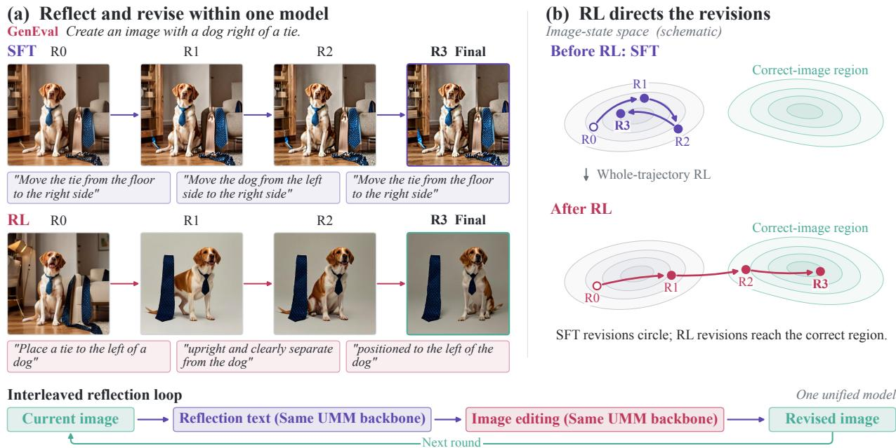  
Figure 1 Native reflection before and after RL. Left: SFT and RL on the same prompt and seed. SFT already produces meaningful revisions (16 SFT rollouts contain a correct repair for 78% of failing training images; Appendix I), but one trajectory often circles, as here (tie, dog, tie). RL concentrates the policy on revisions that reach the correct region (right; measured in Figure 5).

We learn native reflection with UMM-Reflection. SFT first teaches the interleaved protocol and meaningful revisions: in each round the model examines its current image, writes a reflection, and either generates a revised image or stops. Whole-trajectory RL then optimizes complete reflection sequences with two design choices. All K sibling trajectories start from one shared initial image, so the group-relative advantage [28] compares reflection strategies rather than lucky first draws. One outcome-driven advantage per trajectory then updates both the reflection tokens and the flow transitions, so the model learns which reflections lead to better images without the KN rollouts that per-round credit would require or a learned value model. The training-time verifier is never consulted at inference. Figure 1 contrasts SFT and RL revisions of the same image.

The central finding separates producing useful revisions from reliably choosing them. SFT learns more than the format (95% of its trajectories follow the protocol; Table 8): its rollouts already contain correct repairs (Figure 1). Yet a single SFT trajectory repairs only 20.59% of initially incorrect images; after RL, the conditional repair rate rises to 64.94% (Table 3). This gap translates to substantial accuracy gains on GenEval [11] (+12.05 over SFT) and WISE [23] (+10.97). Base, SFT, and RL start from nearly identical single-round accuracy (70–73): the first image receives no RL loss, and the gains come from the reflection rounds. Updating the generator alone with the same number of RL updates (direct T2I-RL) lifts single-shot GenEval from 71 to 76 but does not transfer (WISE 54 versus 55 for Base), whereas UMM-Reflection reaches 84 and 74. Gains also transfer to OneIG-Bench [3] and T2I-CompBench++ [15], neither seen in training. Representation analysis (Section 6) shows that RL leaves the model’s perception and internal correctness readout nearly unchanged; among the revisions SFT already produces, it selects those that move a failing image into the region this readout marks as correct (Figure 5), finding better repair paths rather than creating a new capability.

We summarize our contributions as follows:

• We enable reinforcement learning for multi-round reflection in unified models: one whole-trajectory advantage, computed over siblings that share one initial image, jointly optimizes the textual reflections and the flow-based revisions of the same model without per-round branching.

• We show that imitation already teaches meaningful revisions but applies them unreliably, and that RL makes them reliable by selecting repair paths the backbone already has.

• UMM-Reflection improves over reflection SFT on four benchmarks while training on one; ablations show that neither direct RL on the generator nor Best-of-4 selection matches it.

## 2 Related Work

Self-correction loops, in text and in pixels. Self-Refine and Reflexion let a language model critique and revise its own draft by prompting alone [21, 29], yet without external feedback such intrinsic self-correction can lower accuracy [14]. SCoRe traces this to ofline correction traces and shows that online multi-turn RL on the model’s own attempts is needed [19, 27]. Image generation has adopted the loop but not this lesson: Idea2Img, iterative refinement, ReflectionFlow, SLD, and GenArtist pair an external critic with a separate renderer [17, 34, 37, 41, 46]. The critic sees only pixels, neither model is optimized against the other, and the critic stays online at inference. We train both roles as one policy under one outcome reward and drop the verifier at inference.

Reinforcement learning for visual generators. DDPO and DPOK optimize the denoising chain with policy gradients [1, 9], ImageReward and Difusion-DPO learn from human preferences [30, 39], and Flow-GRPO and DanceGRPO bring group-relative optimization [28] to flow-matching generators [20, 40]. In each, the policy is a single prompt-to-image pass that never observes its own render. We place Flow-GRPO’s rendering transitions inside a multi-round trajectory whose single advantage credits both the reflection tokens and the renders they trigger.

Reasoning and reflection in unified generators. Unified models share one network for understanding and generation via discrete tokens [2, 32, 38], decoupled visual encoders [6, 36], text with a difusion or flow decoder [8, 45], or bridging queries [4, 24]. One line improves a single render: T2I-R1 and ReasonGen-R1 apply GRPO to a textual plan and its image [18, 44], UniRL rewards generation with the model’s own answers about its finished image [22], and PARM and GoT verify or structure the generation process [10, 43]; none revises the image. A second line (Thinking with Generated Images, MINT, Uni-CoT, IRG, ThinkMorph, UniT) inspects an intermediate image and continues [5, 7, 12, 16, 25, 33], but is trained mainly by imitating synthesized trajectories, which, as SCoRe predicts and Section 6 measures, gives a cold start without the high-success repair paths. UMM-Reflection applies outcome-driven RL to complete inspect-and-revise trajectories in one unified policy.

## 3 Methodology

We formulate native reflection as a policy that repeatedly inspects, diagnoses, and revises its own image within a single unified model. This section describes the reflection protocol (§3.1), the trajectory data used to initialize it (§3.2), the supervised cold-start (§3.3), and the whole-trajectory RL stage that turns this cold start into efective repair (§3.4).

## 3.1 Reflection protocol

For a request $c ,$ the model first produces an image $x _ { 0 }$ . At each round t, the model observes the request, the text–image history, and the current image $x _ { t } ,$ , and emits a structured reflection:

$$
u _ { t } \ \sim \ \pi _ { \theta } ^ { \mathrm { t e x t } } ( \cdot \vert \ c , x _ { \le t } , u _ { < t } ) , \qquad a _ { t } \in \{ \mathrm { E D I T } , \ \mathrm { D O N E } \} .
$$

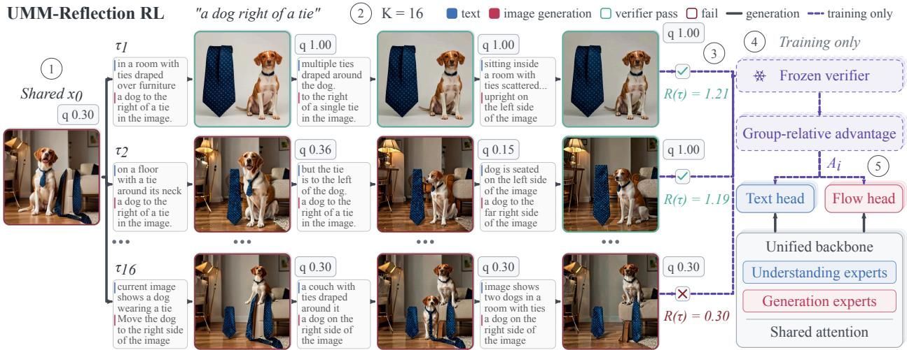  
Figure 2 UMM-Reflection RL. (1) K=16 rollouts share one detached initial image x0. (2) Each interleaves the model’s own reflection (verbatim) with its renders for up to three rounds. (3) A frozen verifier scores every image (q) and trajectory (R(τ )). (4) Group normalization gives one advantage Ai per trajectory, (5) which updates both the text and flow heads. Green/red frames: verifier pass/fail; dashed: training only.

An edit action carries a natural-language correction $_ { e \mathrm { { t } } } ;$ the same model then renders $x _ { t + 1 } \sim \pi _ { \theta } ^ { \mathrm { f l o w } } ( \cdot \mid c , x _ { t } , e _ { t } )$ A done action returns the current image. The loop runs for at most three repair rounds in the primary experiments.

Each reflection is a tagged response whose main fields are [THINKING], [ACTION], and [EDIT] (full format in Appendix B); verifier scores never enter the policy observation. Figure 2 shows the trajectory structure.

## 3.2 Trajectory data construction

Learning the protocol requires multi-round inspect–diagnose–revise trajectories, which the target model cannot yet produce. We generate them with external models and distill them into the unified model via SFT. GPT-5.5 acts as the critic: it turns each request into verifiable constraints, inspects each image, writes a structured reflection, and issues one atomic edit instruction or a done verdict. Qwen-Image renders the initial image and Qwen-Image-Edit executes each edit; BAGEL takes no part, so its own failure modes are not distilled back into the supervision. The 29,529 accepted trajectories are of three types: one-shot (9,000), where the initial image already satisfies all constraints; natural-repair (8,645), where a genuinely failing initial image is fixed in one or two rounds without injected corruption; and planned-progression (11,884), where a complex request is fulfilled over two or three ordered milestones. Prompts come from Pufin-4M, Poster100K, OmniEdit, AnyEdit, and GEdit-Bench, with no overlap with any evaluation benchmark.

## 3.3 Supervised initialization

SFT teaches the interleaved protocol on the trajectories from §3.2 with an autoregressive loss on reflection text and a flow-matching loss on each edited image, $\mathcal { L } _ { \mathrm { S F T } } = \mathcal { L } _ { \mathrm { A R } } + \lambda _ { \mathrm { i m g } } \mathcal { L } _ { \mathrm { F M } }$ , starting from the base BAGEL checkpoint for one epoch (details in Appendix B). This stage supplies a consistent interface between diagnosis and corrective generation; the subsequent RL stage starts from this SFT checkpoint.

## 3.4 Whole-trajectory reinforcement learning

SFT teaches the model to produce well-formed reflections, but well-formed text does not guarantee efective repair (§6). We now describe the RL stage that optimizes for visual outcomes.

Shared-root sampling. For each request, we sample one initial image and detach it from the computation graph. RL optimizes only the reflection-and-editing rounds that follow; the initial text-to-image generation

receives no policy-gradient signal.1 From those identical root pixels, we sample $K = 1 6$ complete reflection trajectories $\{ \tau _ { i } \} _ { i = 1 } ^ { K } ,$ , each running until its own done action or the repair cap. We do not prune siblings, retain only the best intermediate image, or use best-of-K selection at deployment.

Reward. A frozen verifier assigns a graded alignment score $q _ { t } \in [ 0 , 1 ]$ to each image, aggregated from its own detector outputs under the oficial thresholds so that a partial repair yields a nonzero change (Appendix C). Let $\Delta _ { t } = q _ { t + 1 } - q _ { t }$ and $[ v ] _ { + } = \operatorname* { m a x } ( v , 0 )$ . The trajectory reward is

$$
\begin{array} { r } { R ( \tau ) = q _ { T } + \alpha \sum _ { t } [ \Delta _ { t } ] _ { + } + \beta S _ { \mathrm { m u l t i } } ( \tau ) - \lambda \sum _ { t } [ - \Delta _ { t } ] _ { + } - p { \bf 1 } [ \mathrm { p r e m a t u r e ~ p o N E } ] , } \end{array}\tag{1}
$$

$$
\begin{array} { r } { S _ { \mathrm { m u l t i } } ( \tau ) = \sum _ { t } [ \Delta _ { t } ] _ { + } - \operatorname* { m a x } \bigl ( \{ [ \Delta _ { t } ] _ { + } \} _ { t } \cup \{ 0 \} \bigr ) . } \end{array}\tag{2}
$$

The terminal score $q _ { T }$ rewards the final image quality. The progress terms $[ \Delta _ { t } ] _ { + }$ reward each round that improves the image; the damage penalty $\lambda \sum [ - \Delta _ { t } ] _ { + }$ discourages regressions. $S _ { \mathrm { m u l t i } }$ adds credit when improvement comes from more than one edit rather than a single lucky fix; it deliberately favors trajectories that keep improving across rounds, since multi-round correction is the behavior we aim to train. Premature done means stopping when the verifier does not accept the current image. We use $\alpha { = } \beta { = } 0 . 3$ and $\lambda { = } p { = } 0 . 5$

Group-relative advantage. Within each shared-root group, advantages are

$$
A _ { i } = \mathrm { c l i p } \bigg ( \frac { R ( \tau _ { i } ) - \mu _ { R } } { \operatorname* { m a x } ( \sigma _ { R } , 0 . 1 ) } , - 1 , 1 \bigg ) .
$$

We assign one advantage per trajectory rather than per round. A group-relative estimate for each round would require sibling groups at every round: branching K ways at each of N rounds needs $K ^ { N }$ rollouts per root $( 1 6 ^ { 3 } = 4 , 0 9 6$ for three rounds), which is impractical for an image-generating policy. A per-round critic, as in $\mathrm { P P O }$ , would instead require training a value model over multi-round image–text states, with the data scale that entails. The trajectory-level advantage keeps the K-sample cost of GRPO while the per-round progress terms in $R ( \tau )$ still reward each round that improves the image.

Text–flow coordination. Let $\mathcal { T } _ { i } ^ { c }$ denote the policy-active positions for channel $c \in \{ \mathrm { t e x t } , \mathrm { f l o w } \}$ , and $\rho _ { i j } ^ { c }$ the corresponding likelihood ratio. The clipped surrogate for each channel is

$$
\mathcal { I } _ { c } = \mathbb { E } _ { i , j \in \mathcal { Z } _ { i } ^ { c } } \operatorname* { m i n } ( \rho _ { i j } ^ { c } A _ { i } , \ \mathrm { c l i p } ( \rho _ { i j } ^ { c } , 1 - \epsilon _ { c } , 1 + \epsilon _ { c } ) A _ { i } ) - \eta _ { c } \mathcal { K } _ { c } .
$$

The key design choice is that both channels share the same trajectory-level $A _ { i } { \mathrm { : } }$ the text policy and the flow renderer are not normalized separately. A reflection that leads to a better image raises the advantage for both the diagnostic tokens and the rendering transitions that followed, so the model learns which reflections lead to which visual outcomes. $\kappa _ { c }$ is a channel-specific KL penalty against the frozen SFT reference. Flow transitions use the Flow-GRPO SDE sampler [20]; per active repair we train on two contiguous stochastic transitions. For text, credited positions are sampled policy tokens excluding prompt and formatting.

The verifier and the reference policy are used only during training; at inference only the unified model runs.

## 4 Experiments

## 4.1 Setup

Training and evaluation. We build on BAGEL [8], the most widely used open unified model that both understands and generates images in one network, with understanding and generation experts that share attention; this lets one trajectory-level advantage update the reflection text and the renderer of the same model. RL starts from the reflection-SFT checkpoint (§3.3) and samples from a 3,000-prompt pool over six GenEval families, with two roots and $K = 1 6$ siblings per update and 20 training denoising steps; unless otherwise specified, RL runs for 1,000 updates. We evaluate one image per prompt with 50 denoising steps at $5 1 2 ^ { 2 }$ and at most three repairs, using the same checkpoint on GenEval (all 553 oficial prompts, unfiltered), WISE (1,000), OneIG-Bench (OneIG; 695 alignment prompts), and T2I-CompBench++ (CompBench; 2,400); protocol and scorer details are in Appendix A.

Table 1 GenEval: all six compositional requirements. Native 0–1 scores. Res.: image side (n/r: not reported); †: reported in another model’s paper. Published settings difer from our one-image, instruction-voice evaluation; e.g., BAGEL reports 0.82 under its native protocol [8], whereas the local rows use our protocol (Appendix A). Bold: best in the local block.
<table><tr><td>Model</td><td>Res.</td><td>Single</td><td>Two</td><td>Count</td><td>Colors</td><td>Position</td><td>Binding</td><td>Overall</td></tr><tr><td colspan="9">Reported results: native settings and original reporting precision</td></tr><tr><td>PixArt-α† [38]</td><td>512</td><td>0.98</td><td>0.50</td><td>0.44</td><td>0.80</td><td>0.08</td><td>0.07</td><td>0.48</td></tr><tr><td>SD2.1 [11]</td><td>768</td><td>0.98</td><td>0.51</td><td>0.44</td><td>0.85</td><td>0.07</td><td>0.17</td><td>0.50</td></tr><tr><td>DALL·E 2† [38]</td><td>1024</td><td>0.94</td><td>0.66</td><td>0.49</td><td>0.77</td><td>0.10</td><td>0.19</td><td>0.52</td></tr><tr><td>Emu3-Gen [32]</td><td>512</td><td>0.98</td><td>0.71</td><td>0.34</td><td>0.81</td><td>0.17</td><td>0.21</td><td>0.54</td></tr><tr><td>SDXL [11]</td><td>1024</td><td>0.98</td><td>0.74</td><td>0.39</td><td>0.85</td><td>0.15</td><td>0.23</td><td>0.55</td></tr><tr><td>DALL·E 3† [6]</td><td>1024</td><td>0.96</td><td>0.87</td><td>0.47</td><td>0.83</td><td>0.43</td><td>0.45</td><td>0.67</td></tr><tr><td>SD3-Medium† [6]</td><td>n/r</td><td>0.99</td><td>0.94</td><td>0.72</td><td>0.89</td><td>0.33</td><td>0.60</td><td>0.74</td></tr><tr><td>LWM† [38]</td><td>n/r</td><td>0.93</td><td>0.41</td><td>0.46</td><td>0.79</td><td>0.09</td><td>0.15</td><td>0.47</td></tr><tr><td>SEED-X† [38]</td><td>n/r</td><td>0.97</td><td>0.58</td><td>0.26</td><td>0.80</td><td>0.19</td><td>0.14</td><td>0.49</td></tr><tr><td>TokenFlow [26]</td><td>256</td><td>0.97</td><td>0.66</td><td>0.40</td><td>0.84</td><td>0.17</td><td>0.26</td><td>0.55</td></tr><tr><td>ILLUME [3i]</td><td>512</td><td>0.99</td><td>0.86</td><td>0.45</td><td>0.71</td><td>0.39</td><td>0.28</td><td>0.61</td></tr><tr><td>Janus [36]</td><td>384</td><td>0.97</td><td>0.68</td><td>0.30</td><td>0.84</td><td>0.46</td><td>0.42</td><td>0.61</td></tr><tr><td>Show-0-512 [38]</td><td>512</td><td>0.98</td><td>0.80</td><td>0.66</td><td>0.84</td><td>0.31</td><td>0.50</td><td>0.68</td></tr><tr><td>Janus-Pro-7B [6]</td><td>384</td><td>0.99</td><td>0.89</td><td>0.59</td><td>0.90</td><td>0.79</td><td>0.66</td><td>0.80</td></tr><tr><td>Local evaluation: same prompts, resolution, and scorer</td><td></td><td></td><td></td><td></td><td></td><td></td><td></td><td></td></tr><tr><td>BAGEL-Base</td><td>512</td><td>1.00</td><td>0.89</td><td>0.63</td><td>0.82</td><td>0.47</td><td>0.48</td><td>0.71</td></tr><tr><td>BAGEL-SFT</td><td>512</td><td>1.00</td><td>0.88</td><td>0.58</td><td>0.87</td><td>0.47</td><td>0.51</td><td>0.72</td></tr><tr><td>UMM-Reflection</td><td>512</td><td>0.95</td><td>0.96</td><td>0.68</td><td>0.90</td><td>0.89</td><td>0.65</td><td>0.84</td></tr></table>

Table 2 Transfer to benchmarks unseen in RL training. Native 0–1 scale; gray values are changes relative to BAGEL-Base.
<table><tr><td>Model</td><td>WISE</td><td>OneIG</td><td>CompBench</td></tr><tr><td>Local evaluation: same prompts, resolution, and scorer</td><td></td><td></td><td></td></tr><tr><td>BAGEL-Base</td><td>0.55</td><td>0.80</td><td>0.49</td></tr><tr><td>BAGEL-SFT</td><td>0.63 (+0.08)</td><td>0.79 (-0.01)</td><td>0.50 (+0.01)</td></tr><tr><td>UMM-Reflection</td><td>0.74(+0.19)</td><td>0.83 (+0.02)</td><td>0.55 (+0.06)</td></tr></table>

Baselines. The main comparison uses the same BAGEL backbone throughout: Base, unmodified BAGEL, single-pass generation at $5 1 2 ^ { 2 }$ , and SFT, the reflection-supervised parent, producing multi-round trajectories without RL. Ablation baselines that remove or replace one ingredient are defined in Section 5.

## 4.2 Main results

In-domain results. Table 1 places UMM-Reflection among reported GenEval results. Under the same protocol, UMM-Reflection reaches 0.84, against 0.71 for BAGEL-Base and 0.72 for reflection SFT (+12 points over SFT). The gain is concentrated in the families that require fixing a composition: position rises by +42.00 points over SFT (0.47 to 0.89), color binding by +14.00, and counting by +10.00. Paired over prompts, RL beats SFT on 109 prompts and loses on 38 $( p < 1 0 ^ { - 8 }$ , McNemar), while on the initial images alone the split is 48–32 (p = 0.09, no significant diference), and the gain is made in the reflection rounds.

Transfer. Table 2 evaluates the same checkpoint on three benchmarks never used in RL training. UMM-Reflection improves over reflection SFT on all three: +10.97 points on WISE, +4.63 on CompBench, and +3.48 on OneIG,

CompBench: “a white snow and a blue sled”

GenEval: “a sports ball left of an umbrella”  
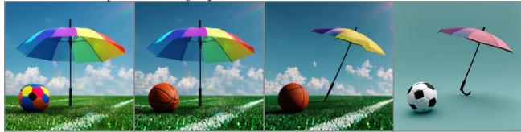

“Please generate an image capturing a moment in a stylish cafe, OneIG: where two young women are enjoying coffee. Picture a …”  

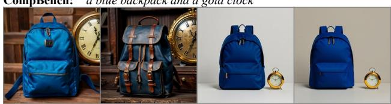

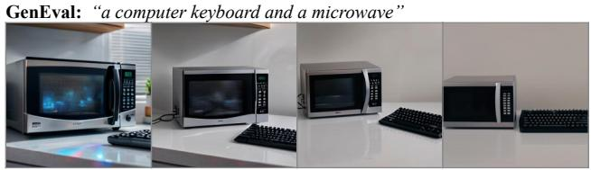

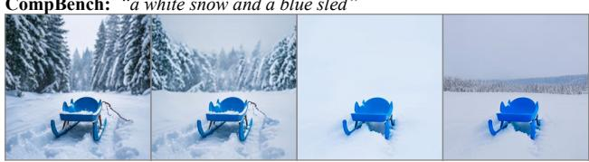

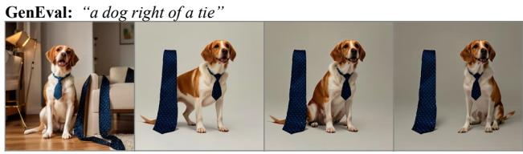  
“An autumn delight, a fruit with cultural significance in Japan, often WISE: seen in traditional dishes and rituals”

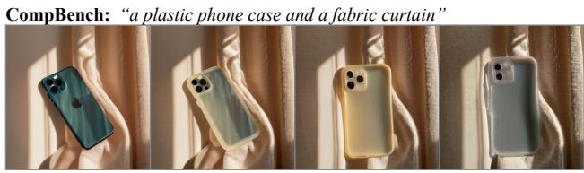  
Figure 3 Case studies across four benchmarks. Each row shows the prompt, the initial image, and three reflection-guided revisions (left to right), with examples from GenEval, WISE, OneIG, and CompBench. The model identifies spatial, color, material, and compositional errors through its [THINKING] output and issues targeted edits.

where SFT alone falls slightly below Base. Figure 3 shows reflection trajectories on all four benchmarks.   
Section 5 isolates the contribution of each ingredient.

## 4.3 Multi-round test-time scaling

Figure 4 shows the per-round GenEval score; the other three benchmarks follow the same pattern (Appendix Figure 9). SFT’s three rounds add roughly +2 points on GenEval and flatten after round 1; the model edits but does not reliably improve. After RL, round 1 alone adds +9 points, and the model continues to gain through round 3. The initial-image accuracy (R0) is comparable across arms (70–73), confirming that the gap comes from multi-round correction, not a better first image.

The conditional repair rate rises from 20.59% (SFT) to 64.94% (RL 1000). Within GenEval families, the largest gains are on position (+34) and color\_attr (+17). Full per-round and per-family statistics are in Appendix K.

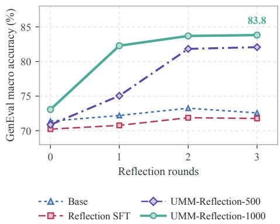  
Figure 4 Test-time scaling on GenEval. Macro accuracy versus reflection rounds. Other benchmarks: Appendix Figure 9.

## 5 Ablations

Table 3 isolates each ingredient; the results support five conclusions.

Table 3 Ablations on GenEval (553 official prompts). Six-family macro accuracy (0–100). Repair and Damage are percentages of initially incorrect images fixed and initially correct images broken; ∆ is computed before rounding. All reward variants share the same SFT parent, prompt pool, and training topology.
<table><tr><td></td><td>R0 Final</td><td></td><td></td><td>∆ Repair</td><td>Damage</td><td>Edits Images</td><td></td></tr><tr><td colspan="8">Components</td></tr><tr><td>BAGEL-Base</td><td>71</td><td>71</td><td>0</td><td></td><td></td><td>0</td><td>1</td></tr><tr><td>+ direct RL on the renderer (T2I-RL)</td><td>76</td><td>76</td><td>0</td><td></td><td></td><td>0</td><td>1</td></tr><tr><td>+ inspect-and-edit loop (Self-Agentic)</td><td>71</td><td>77</td><td>+5</td><td>27.6</td><td>3.6</td><td>3.00</td><td>4.0</td></tr><tr><td>+ reflection SFT</td><td>70</td><td>72</td><td>+2</td><td>20.6</td><td>6.5</td><td>1.65</td><td>2.7</td></tr><tr><td>+ reflection SFT + trajectory RL (UMM-Reflection)</td><td>73</td><td>84</td><td>+11</td><td>64.9</td><td>8.8</td><td>3.00</td><td>4.0</td></tr><tr><td>direct RL → reflection SFT → trajectory RL (500 updates only)</td><td>74</td><td>81</td><td>+7</td><td>48.3</td><td>7.9</td><td>3.00</td><td>4.0</td></tr><tr><td colspan="8">Training length (same run)</td></tr><tr><td>reflection SFT + trajectory RL, 100 updates</td><td>71</td><td>75</td><td>+3</td><td>35.6</td><td>9.5</td><td>3.00</td><td>4.0</td></tr><tr><td>reflection SFT + trajectory RL, 500 updates</td><td>71</td><td>82</td><td>+11</td><td>61.1</td><td>9.3</td><td>3.00</td><td>4.0</td></tr><tr><td>UMM-Reflection (1,000 updates)</td><td>73</td><td>84 +11</td><td></td><td>64.9</td><td>8.8</td><td>3.00</td><td>4.0</td></tr><tr><td colspan="8">Head ablation (the other head frozen)</td></tr><tr><td>flow-only RL (frozen text head)</td><td>71</td><td>73</td><td></td><td></td><td></td><td>3.00</td><td>4.0</td></tr><tr><td>text-only RL (frozen flow head)</td><td>71</td><td>78</td><td>+2 +7</td><td>22.8 49.4</td><td>7.3 10.1</td><td>3.00</td><td>4.0</td></tr><tr><td>joint RL (UMM-Reflection)</td><td>73</td><td></td><td>84 +11</td><td>64.9</td><td>8.8</td><td>3.00</td><td>4.0</td></tr><tr><td colspan="8">Same four-image budget</td></tr><tr><td>Best-of-4 T2I-RL, selected by Base UND</td><td>76</td><td>80</td><td>+4</td><td></td><td></td><td>0</td><td>4</td></tr><tr><td>Best-of-4 T2I-RL, selected by UMM-Reflection UND</td><td>76</td><td>80</td><td>+5</td><td></td><td></td><td>0</td><td>4</td></tr><tr><td>reflection SFT, forced to edit in all three rounds</td><td>70</td><td>72</td><td>+2</td><td>28.8</td><td>9.7</td><td>3</td><td>4</td></tr><tr><td>UMM-Reflection</td><td>73</td><td>84 +11</td><td></td><td>64.9</td><td>8.8</td><td>3.00</td><td>4.0</td></tr><tr><td colspan="8">Reward terms</td></tr><tr><td>UMM-Reflection</td><td>73</td><td></td><td>84 +11</td><td>64.9</td><td>8.8</td><td>3.00</td><td>4.0</td></tr><tr><td>without the multi-improvement term (β = 0)</td><td>63</td><td></td><td>79 +16</td><td>61.7</td><td>11.2</td><td>3.00</td><td>4.0</td></tr></table>

The gains stack. Direct Flow-GRPO on the renderer (T2I-RL, 1,000 updates from Base) raises single-shot accuracy from 71 to 76 but leaves nothing to repair. Forcing the untuned Base through three inspect-and-edit rounds (Self-Agentic) adds +5 without training. Reflection SFT adds +2; fine-tuning Base on the final images of the same 29,529 trajectories leaves single-pass accuracy on the raw oficial prompt at 75, the same as Base, so the SFT images alone do not improve the generator. Trajectory RL on top of SFT adds +11 and triples the repair rate from 21% to 65%. Placing direct RL before both stages carries its single-shot advantage through, reaching 81 after 500 updates.

Most of the gain arrives within 500 updates. Along the same run, GenEval rises from 72 (SFT) to 75, 79, and 82 after 100, 200, and 500 updates, and reaches 84 at 1,000. The repair rate follows the same path, from 21% to 61% at 500 updates and 65% at 1,000, while damage stays between 8% and 10%. Initial-image accuracy stays at 71–73 throughout, so the gain comes from the reflection rounds at every checkpoint.

Both heads must be trained. Freezing one head while applying the same trajectory RL isolates what each side contributes. Training only the flow head leaves the model close to SFT (73, repair rate 22.8%): a better renderer does not help when the reflections that drive it do not improve. Training only the text head recovers most of the gain (78, 49.4%), so learning what to write is the larger part. Joint training reaches 84 and 64.9%, six points above the best single head: the renderer must also learn to execute the reflections the text head now writes. This is the joint optimization that a single unified model makes possible. Holding image, renderer, and noise fixed and swapping only the instruction confirms that the learned text carries the repair (Appendix J).

The gain is not best-of-N sampling or extra edits. At the same four-image budget, selecting one of four images from the stronger T2I-RL renderer with a single native understanding call (Best-of-4) reaches 80 with either selector; UMM-Reflection reaches 84 (paired McNemar $p \leq 0 . 0 4 )$ . Forcing SFT to edit in all three rounds leaves it at 72, the same as unforced SFT. On the 62 prompts where all four independent Base draws fail, RL reflection recovers 60% (SFT: 12%).

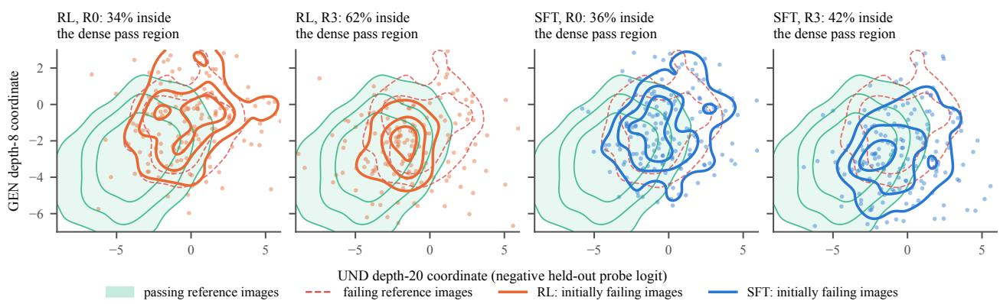  
Figure 5 Image trajectories in the backbone’s own correctness readout. Each point is one initially failing image, placed by two held-out linear probes for “passes the verifier”: the understanding stream at depth 20 (x) and the generation stream at depth 8 (y), the depths where each stream’s probe AUC peaks. Green filled contours mark verifier-passing reference images and red dashed contours verifier-failing ones; orange and blue contours summarize the RL and SFT images. Read the panels in pairs, from R0 to R3 for the same policy: RL (left pair) and SFT (right pair). Percentages are the share inside the dense pass region (Table 5).

The multi-improvement term matters. Removing the multi-improvement term (β = 0) preserves the repair rate but degrades the initial image from 73 to 63, also yielding 79.

## 6 Study: What Changes Inside the Model

## 6.1 Training dynamics: the interface locks in first, then repair improves

Appendix Figure 8 summarizes the 1,000-update RL run. Protocol compliance converges within the first fifty updates: invalid trajectories drop below 1% and stay there. After that, the reward curve is driven by improving repair quality: successful repairs per edit rise steadily from 11% to 38%, while the damage rate on initially correct images falls from 20% to 10%. Terminal exactness under the training verifier reaches 81%. There is no reward collapse or protocol regression within 1,000 updates.

On the full GenEval test set (553 prompts), SFT’s three reflection rounds add +2 points of macro accuracy; RL raises this to +11, with the gain concentrated in the repair process rather than the initial generation (Section 4.3).

## 6.2 What RL changes in the model

Replaying all 553 trajectories through the Base, SFT, and RL checkpoints (Appendix F) gives one consistent picture. The backbone’s own readout of correctness is nearly unchanged by RL: a held-out linear probe on the understanding stream reaches AUC 0.80–0.82 under all three checkpoints. What changes is where the images go. Among initially failing images, the share inside the dense pass region of that readout rises from 34% to 62% over three rounds under RL, against 36% to 42% under SFT (Figure 5), and at a matched number of edits RL moves the image further and more of its edits succeed. RL thus selects, among the revisions the model can already produce, those that reach the correct region.

## 7 Conclusion

Reinforcement learning turns reflection in a unified model from an SFT cold start into an efective repair mechanism. SFT and RL start from nearly identical single-shot accuracy, so the +12-point GenEval gain

and its transfer to WISE, OneIG, and CompBench come from the reflection rounds. RL leaves the model’s correctness readout nearly unchanged and selects, among the repairs the model can already produce, those that land: the backbone already knows whether its image is correct, and RL teaches it to act on that knowledge.

## References

[1] Kevin Black, Michael Janner, Yilun Du, Ilya Kostrikov, and Sergey Levine. Training Difusion Models with Reinforcement Learning. In International Conference on Learning Representations, volume 2024, pages 4965–4987, 2024. URL https://proceedings.iclr.cc/paper\_files/paper/2024/hash/ 14f75513f0f1ca01de1e826b52e6b840-Abstract-Conference.html.

[2] Chameleon Team. Chameleon: Mixed-Modal Early-Fusion Foundation Models, 2024. URL https://arxiv.org/ abs/2405.09818.

[3] Jingjing Chang, Yixiao Fang, Peng Xing, Shuhan Wu, Wei Cheng, Rui Wang, Xianfang Zeng, Gang Yu, and Hai-Bao Chen. OneIG-Bench: Omni-dimensional Nuanced Evaluation for Image Generation. In Advances in Neural Information Processing Systems, volume 38, Main Conference, 2025. doi: 10.52202/085713-5330. URL https://proceedings.neurips.cc/paper\_files/paper/2025/hash/ e9e9e5428189a3e49479547ef917e88d-Abstract-Datasets\_and\_Benchmarks\_Track.html.

[4] Jiuhai Chen, Zhiyang Xu, Xichen Pan, Yushi Hu, Can Qin, Tom Goldstein, Lifu Huang, Tianyi Zhou, Saining Xie, Silvio Savarese, Le Xue, Caiming Xiong, and Ran Xu. BLIP3-o: A Family of Fully Open Unified Multimodal Models-Architecture, Training and Dataset, 2025. URL https://arxiv.org/abs/2505.09568.

[5] Leon Liangyu Chen, Haoyu Ma, Zhipeng Fan, Ziqi Huang, Animesh Sinha, Xiaoliang Dai, Jialiang Wang, Zecheng He, Jianwei Yang, Chunyuan Li, Junzhe Sun, Chu Wang, Serena Yeung, and Felix Juefei-Xu. UniT: Unified Multimodal Chain-of-Thought Test-time Scaling. In Proceedings of the IEEE/CVF Conference on Computer Vision and Pattern Recognition, 2026. URL https://cvpr.thecvf.com/virtual/2026/poster/36853.

[6] Xiaokang Chen, Zhiyu Wu, Xingchao Liu, Zizheng Pan, Wen Liu, Zhenda Xie, Xingkai Yu, and Chong Ruan. Janus-Pro: Unified Multimodal Understanding and Generation with Data and Model Scaling, 2025. URL https://arxiv.org/abs/2501.17811.

[7] Ethan Chern, Zhulin Hu, Stefi Chern, Siqi Kou, Jiadi Su, Yan Ma, Zhijie Deng, and Pengfei Liu. Thinking with Generated Images, 2025. URL https://arxiv.org/abs/2505.22525.

[8] Chaorui Deng, Deyao Zhu, Kunchang Li, Chenhui Gou, Feng Li, Zeyu Wang, Shu Zhong, Weihao Yu, Xiaonan Nie, Ziang Song, Guang Shi, and Haoqi Fan. Emerging Properties in Unified Multimodal Pretraining, 2025. URL https://arxiv.org/abs/2505.14683.

[9] Ying Fan, Olivia Watkins, Yuqing Du, Hao Liu, Moonkyung Ryu, Craig Boutilier, Pieter Abbeel, Mohammad Ghavamzadeh, Kangwook Lee, and Kimin Lee. DPOK: Reinforcement Learning for Fine-tuning Textto-Image Difusion Models. In Advances in Neural Information Processing Systems, volume 36, pages 79858– 79885, 2023. doi: 10.52202/075280-3497. URL https://proceedings.neurips.cc/paper\_files/paper/2023/hash/ fc65fab891d83433bd3c8d966edde311-Abstract-Conference.html.

[10] Rongyao Fang, Chengqi Duan, Kun Wang, Linjiang Huang, Hao Li, Hao Tian, Shilin Yan, Weihao Yu, Xingyu Zeng, Jifeng Dai, Xihui Liu, and Hongsheng Li. GoT: Unleashing Reasoning Capability of MLLM for Visual Generation and Editing. In Advances in Neural Information Processing Systems, volume 38, Main Conference, pages 67680–67708, 2025. doi: 10.52202/085713-2270. URL https://proceedings.neurips.cc/paper\_files/paper/ 2025/hash/61960fdfda4d4e95fa1c1f6e64bfe8bc-Abstract-Conference.html.

[11] Dhruba Ghosh, Hannaneh Hajishirzi, and Ludwig Schmidt. GenEval: An object-focused framework for evaluating text-to-image alignment. In Advances in Neural Information Processing Systems, volume 36, pages 52132– 52152, 2023. doi: 10.52202/075280-2270. URL https://proceedings.neurips.cc/paper\_files/paper/2023/hash/ a3bf71c7c63f0c3bcb7f67c67b1e7b1-Abstract-Datasets\_and\_Benchmarks.html.

[12] Jiawei Gu, Yunzhuo Hao, Huichen Wang, Linjie Li, Michael Qizhe Shieh, Yejin Choi, Ranjay Krishna, and Yu Cheng. ThinkMorph: Emergent Properties in Multimodal Interleaved Chain-of-Thought Reasoning. In International Conference on Learning Representations, volume 2026, pages 141405–141447, 2026. URL https://proceedings.iclr. cc/paper\_files/paper/2026/hash/e5095602ad1c6a835e2b643ec4ed97d0-Abstract-Conference.html.

[13] Daya Guo, Dejian Yang, Haowei Zhang, et al. DeepSeek-R1 incentivizes reasoning in LLMs through reinforcement learning. Nature, 645(8081):633–638, 2025. doi: 10.1038/s41586-025-09422-z. URL https://doi.org/10.1038/ s41586-025-09422-z.

[14] Jie Huang, Xinyun Chen, Swaroop Mishra, Huaixiu Steven Zheng, Adams Yu, Xinying Song, and Denny Zhou. Large Language Models Cannot Self-Correct Reasoning Yet. In International Conference on Learning Representations, volume 2024, pages 32808–32824, 2024. URL https://proceedings.iclr.cc/paper\_files/paper/ 2024/hash/8b4add8b0aa8749d80a34ca5d941c355-Abstract-Conference.html.

[15] Kaiyi Huang, Chengqi Duan, Kaiyue Sun, Enze Xie, Zhenguo Li, and Xihui Liu. T2I-CompBench++: An Enhanced and Comprehensive Benchmark for Compositional Text-to-Image Generation. IEEE Transactions on Pattern Analysis and Machine Intelligence, 47(5):3563–3579, 2025. doi: 10.1109/tpami.2025.3531907. URL https://doi.org/10.1109/tpami.2025.3531907.

[16] Wenxuan Huang, Shuang Chen, Zheyong Xie, Shaosheng Cao, Shixiang Tang, Yufan Shen, Qingyu Yin, Wenbo Hu, Xiaoman Wang, Yuntian Tang, Junbo Qiao, Hangyu Guo, Yao Hu, Zhenfei Yin, Philip Torr, Yu Cheng, Wanli Ouyang, and Shaohui Lin. Interleaving Reasoning for Better Text-to-Image Generation. In International Conference on Learning Representations, volume 2026, pages 106153–106182, 2026. URL https://proceedings.iclr. cc/paper\_files/paper/2026/hash/ad48f017e6c3d474caf511208e600459-Abstract-Conference.html.

[17] Shantanu Jaiswal, Mihir Prabhudesai, Nikash Bhardwaj, Zheyang Qin, Amir Zadeh, Chuan Li, Katerina Fragkiadaki, and Deepak Pathak. Iterative Refinement Improves Compositional Image Generation, 2026. URL https://arxiv.org/abs/2601.15286.

[18] Dongzhi Jiang, Ziyu Guo, Renrui Zhang, Zhuofan Zong, Hao Li, Le Zhuo, Shilin Yan, Pheng-Ann Heng, and Hongsheng Li. T2I-R1: Reinforcing Image Generation with Collaborative Semantic-level and Token-level CoT. In Advances in Neural Information Processing Systems, volume 38, Main Conference, pages 39856– 39890, 2025. doi: 10.52202/085713-1330. URL https://proceedings.neurips.cc/paper\_files/paper/2025/hash/ 38fc6254f73450813db3b3e04397a9fc-Abstract-Conference.html.

[19] Aviral Kumar, Vincent Zhuang, Rishabh Agarwal, Yi Su, JD Co-Reyes, Avi Singh, Kate Baumli, Shariq Iqbal, Colton Bishop, Rebecca Roelofs, Lei Zhang, Kay McKinney, Disha Shrivastava, Cosmin Paduraru, George Tucker, Doina Precup, Feryal Behbahani, and Aleksandra Faust. Training Language Models to Self-Correct via Reinforcement Learning. In International Conference on Learning Representations, volume 2025, pages 54523–54549, 2025. URL https://proceedings.iclr.cc/paper\_files/paper/2025/hash/ 871ac99fdc5282d0301934d23945ebaa-Abstract-Conference.html.

[20] Jie Liu, Gongye Liu, Jiajun Liang, Yangguang Li, Jiaheng Liu, Xintao Wang, Pengfei Wan, Di Zhang, and Wanli Ouyang. Flow-GRPO: Training Flow Matching Models via Online RL. In Advances in Neural Information Processing Systems, volume 38, Main Conference, pages 40783–40818, 2025. doi: 10.52202/085713-1362. URL https://proceedings.neurips.cc/paper\_files/paper/2025/hash/ 3a10c46572628d58cb44fb705f25cbbf-Abstract-Conference.html.

[21] Aman Madaan, Niket Tandon, Prakhar Gupta, Skyler Hallinan, Luyu Gao, Sarah Wiegrefe, Uri Alon, Nouha Dziri, Shrimai Prabhumoye, Yiming Yang, Shashank Gupta, Bodhisattwa Prasad Majumder, Katherine Hermann, Sean Welleck, Amir Yazdanbakhsh, and Peter Clark. Self-Refine: Iterative Refinement with Self-Feedback. In Advances in Neural Information Processing Systems, volume 36, pages 46534– 46594, 2023. doi: 10.52202/075280-2019. URL https://proceedings.neurips.cc/paper\_files/paper/2023/hash/ 91edff07232fb1b55a505a9e9f6c0ff3-Abstract-Conference.html

[22] Weijia Mao, Zhenheng Yang, and Mike Zheng Shou. UniRL: Self-Improving Unified Multimodal Models via Supervised and Reinforcement Learning, 2025. URL https://arxiv.org/abs/2505.23380.

[23] Yuwei Niu, Munan Ning, Mengren Zheng, Weiyang Jin, Bin Lin, Peng Jin, Jiaqi Liao, Chaoran Feng, Fanqing Meng, Kun-Peng Ning, Bin Zhu, and Li Yuan. WISE: World Knowledge-Informed Semantic Evaluation for Text-to-Image Generation. In Proceedings of the International Conference on Machine Learning, 2026. URL https://icml.cc/virtual/2026/poster/62614.

[24] Xichen Pan, Satya Narayan Shukla, Aashu Singh, Zhuokai Zhao, Shlok Kumar Mishra, Jialiang Wang, Zhiyang Xu, Jiuhai Chen, Kunpeng Li, Felix Juefei-Xu, Ji Hou, and Saining Xie. Transfer between Modalities with MetaQueries, 2025. URL https://arxiv.org/abs/2504.06256.

[25] Luozheng Qin, Jia Gong, Yuqing Sun, Tianjiao Li, Haoyu Pan, Mengping Yang, Xiaomeng Yang, Chao Qu, Zhiyu Tan, and Hao Li. Uni-CoT: Towards Unified Chain-of-Thought Reasoning Across Text and Vision. In International

Conference on Learning Representations, volume 2026, pages 15999–16028, 2026. URL https://proceedings.iclr. cc/paper\_files/paper/2026/hash/1ae4999aefb509d75d8608e07280922c-Abstract-Conference.html.

[26] Liao Qu, Huichao Zhang, Yiheng Liu, Xu Wang, Yi Jiang, Yiming Gao, Hu Ye, Daniel K. Du, Zehuan Yuan, and Xinglong Wu. TokenFlow: Unified Image Tokenizer for Multimodal Understanding and Generation. In Proceedings of the IEEE/CVF Conference on Computer Vision and Pattern Recognition (CVPR), pages 2545–2555, June 2025. URL https://openaccess.thecvf.com/content/CVPR2025/html/Qu\_TokenFlow\_Unified\_Image\_ Tokenizer\_for\_Multimodal\_Understanding\_and\_Generation\_CVPR\_2025\_paper.html.

[27] Yuxiao Qu, Tianjun Zhang, Naman Garg, and Aviral Kumar. Recursive Introspection: Teaching Language Model Agents How to Self-Improve. In Advances in Neural Information Processing Systems, volume 37, pages 55249–55285, 2024. doi: 10.52202/079017-1754. URL https://proceedings.neurips.cc/paper\_files/paper/2024/ hash/639d992f819c2b40387d4d5170b8fd7-Abstract-Conference.html.

[28] Zhihong Shao, Peiyi Wang, Qihao Zhu, Runxin Xu, Junxiao Song, Xiao Bi, Haowei Zhang, Mingchuan Zhang, Y. K. Li, Y. Wu, and Daya Guo. DeepSeekMath: Pushing the Limits of Mathematical Reasoning in Open Language Models, 2024. URL https://arxiv.org/abs/2402.03300.

[29] Noah Shinn, Federico Cassano, Ashwin Gopinath, Karthik Narasimhan, and Shunyu Yao. Reflexion: language agents with verbal reinforcement learning. In Advances in Neural Information Processing Systems, volume 36, pages 8634–8652, 2023. doi: 10.52202/075280-0377. URL https://proceedings.neurips.cc/paper\_files/paper/ 2023/hash/1b44b878bb782e6954cd888628510e90-Abstract-Conference.html.

[30] Bram Wallace, Meihua Dang, Rafael Rafailov, Linqi Zhou, Aaron Lou, Senthil Purushwalkam, Stefano Ermon, Caiming Xiong, Shafiq Joty, and Nikhil Naik. Difusion Model Alignment Using Direct Preference Optimization. In Proceedings of the IEEE/CVF Conference on Computer Vision and Pattern Recognition (CVPR), pages 8228– 8238, June 2024. URL https://openaccess.thecvf.com/content/CVPR2024/html/Wallace\_Difusion\_Model\_ Alignment\_Using\_Direct\_Preference\_Optimization\_CVPR\_2024\_paper.html.

[31] Chunwei Wang, Guansong Lu, Junwei Yang, Runhui Huang, Jianhua Han, Lu Hou, Wei Zhang, and Hang Xu. ILLUME: Illuminating Your LLMs to See, Draw, and Self-Enhance. In Proceedings of the IEEE/CVF International Conference on Computer Vision (ICCV), pages 21612–21622, October 2025. URL https://openaccess.thecvf.com/content/ICCV2025/html/Wang\_ILLUME\_Illuminating\_Your\_ LLMs\_to\_See\_Draw\_and\_Self-Enhance\_ICCV\_2025\_paper.html.

[32] Xinlong Wang, Yufeng Cui, Jinsheng Wang, Fan Zhang, Yueze Wang, Xiaosong Zhang, Zhengxiong Luo, Quan Sun, Zhen Li, Yuqi Wang, Qiying Yu, Yingli Zhao, Yulong Ao, Xuebin Min, Chunlei Men, Boya Wu, Bo Zhao, Bowen Zhang, Liangdong Wang, Guang Liu, Zheqi He, Xi Yang, Jingjing Liu, Yonghua Lin, Zhongyuan Wang, and Tiejun Huang. Multimodal learning with next-token prediction for large multimodal models. Nature, 650 (8101):327–333, 2026. doi: 10.1038/s41586-025-10041-x. URL https://doi.org/10.1038/s41586-025-10041-x.

[33] Yi Wang, Mushui Liu, Wanggui He, Longxiang Zhang, Ziwei Huang, Guanghao Zhang, Fangxun Shu, Zhong Tao, Dong She, Zhelun Yu, Haoyuan Li, Weilong Dai, Mingli Song, Jie Song, and Hao Jiang. MINT: Multimodal Chain of Thought in Unified Generative Models for Enhanced Image Generation, 2025. URL https: //arxiv.org/abs/2503.01298v1.

[34] Zhenyu Wang, Aoxue Li, Zhenguo Li, and Xihui Liu. GenArtist: Multimodal LLM as an Agent for Unified Image Generation and Editing. In Advances in Neural Information Processing Systems, volume 37, pages 128374– 128395, 2024. doi: 10.52202/079017-4077. URL https://proceedings.neurips.cc/paper\_files/paper/2024/hash/ e7c786024ca718f2487712bfe9f51030-Abstract-Conference.html.

[35] Jason Wei, Xuezhi Wang, Dale Schuurmans, Maarten Bosma, Brian Ichter, Fei Xia, Ed Chi, Quoc V Le, and Denny Zhou. Chain-of-Thought Prompting Elicits Reasoning in Large Language Models. In Advances in Neural Information Processing Systems, volume 35, pages 24824–24837, 2022. doi: 10.52202/068431-1800. URL https://proceedings.neurips.cc/paper\_files/paper/2022/hash/ 9d5609613524ecf4f15af0f7b31abca4-Abstract-Conference.html.

[36] Chengyue Wu, Xiaokang Chen, Zhiyu Wu, Yiyang Ma, Xingchao Liu, Zizheng Pan, Wen Liu, Zhenda Xie, Xingkai Yu, Chong Ruan, and Ping Luo. Janus: Decoupling Visual Encoding for Unified Multimodal Understanding and Generation. In Proceedings of the IEEE/CVF Conference on Computer Vision and Pattern Recognition (CVPR), pages 12966–12977, June 2025. URL https://openaccess.thecvf.com/content/CVPR2025/html/Wu\_Janus\_Decoupling\_Visual\_Encoding\_for\_ Unified\_Multimodal\_Understanding\_and\_Generation\_CVPR\_2025\_paper.html.

[37] Tsung-Han Wu, Long Lian, Joseph E. Gonzalez, Boyi Li, and Trevor Darrell. Self-correcting LLM-controlled Difusion Models. In Proceedings of the IEEE/CVF Conference on Computer Vision and Pattern Recognition (CVPR), pages 6327–6336, June 2024. URL https://openaccess.thecvf.com/content/CVPR2024/html/Wu\_ Self-correcting\_LLM-controlled\_Difusion\_Models\_CVPR\_2024\_paper.html.

[38] Jinheng Xie, Weijia Mao, Zechen Bai, David Junhao Zhang, Weihao Wang, Kevin Qinghong Lin, Yuchao Gu, Zhijie Chen, Zhenheng Yang, and Mike Zheng Shou. Show-o: One Single Transformer to Unify Multimodal Understanding and Generation. In International Conference on Learning Representations, volume 2025, pages 28240–28264, 2025. URL https://proceedings.iclr.cc/paper\_files/paper/2025/hash/ 45f0d179ef7e10eb7366550cd4e574ae-Abstract-Conference.html.

[39] Jiazheng Xu, Xiao Liu, Yuchen Wu, Yuxuan Tong, Qinkai Li, Ming Ding, Jie Tang, and Yuxiao Dong. ImageReward: Learning and Evaluating Human Preferences for Text-to-Image Generation. In Advances in Neural Information Processing Systems, volume 36, pages 15903–15935, 2023. doi: 10.52202/075280-0700. URL https://proceedings. neurips.cc/paper\_files/paper/2023/hash/33646ef0ed554145eab65f6250fab0c9-Abstract-Conference.html.

[40] Zeyue Xue, Jie Wu, Yu Gao, Fangyuan Kong, Lingting Zhu, Mengzhao Chen, Zhiheng Liu, Wei Liu, Qiushan Guo, Weilin Huang, and Ping Luo. DanceGRPO: Unleashing GRPO on Visual Generation, 2025. URL https://arxiv.org/abs/2505.07818.

[41] Zhengyuan Yang, Jianfeng Wang, Linjie Li, Kevin Lin, Chung-Ching Lin, Zicheng Liu, and Lijuan Wang. Idea2Img: Iterative Self-refinement with GPT-4V for Automatic Image Design and Generation. In Computer Vision – ECCV 2024, pages 167–184, 2024. doi: 10.1007/978-3-031-72920-1\_10. URL https://doi.org/10.1007/ 978-3-031-72920-1\_10.

[42] Yang Yue, Zhiqi Chen, Rui Lu, Andrew Zhao, Zhaokai Wang, Yang Yue, Shiji Song, and Gao Huang. Does Reinforcement Learning Really Incentivize Reasoning Capacity in LLMs Beyond the Base Model? In Advances in Neural Information Processing Systems, volume 38, 2025. URL https://proceedings.neurips.cc/paper\_files/ paper/2025/hash/537d5aa768c2d534016a4d06f87bc8fb-Abstract-Conference.html.

[43] Renrui Zhang, Chengzhuo Tong, Zhizheng Zhao, Ziyu Guo, Haoquan Zhang, Manyuan Zhang, Jiaming Liu, Peng Gao, and Hongsheng Li. Let’s Verify and Reinforce Image Generation Step by Step. In Proceedings of the IEEE/CVF Conference on Computer Vision and Pattern Recognition (CVPR), pages 28662–28672, June 2025. URL https://openaccess.thecvf.com/content/CVPR2025/html/Zhang\_Lets\_Verify\_and\_Reinforce\_Image\_ Generation\_Step\_by\_Step\_CVPR\_2025\_paper.html.

[44] Yu Zhang, Yunqi Li, Yifan Yang, Rui Wang, Yuqing Yang, Dai Qi, Jianmin Bao, Dongdong Chen, Chong Luo, and Lili Qiu. ReasonGen-R1: CoT for Autoregressive Image generation models through SFT and RL, 2025. URL https://arxiv.org/abs/2505.24875.

[45] Chunting Zhou, Lili Yu, Arun Babu, Kushal Tirumala, Michihiro Yasunaga, Leonid Shamis, Jacob Kahn, Xuezhe Ma, Luke Zettlemoyer, and Omer Levy. Transfusion: Predict the Next Token and Difuse Images with One Multi-Modal Model. In International Conference on Learning Representations, volume 2025, pages 6446–6469, 2025. URL https://proceedings.iclr.cc/paper\_files/paper/2025/hash/ 12678c3948153f4bc391f51e2082bd6e-Abstract-Conference.html.

[46] Le Zhuo, Liangbing Zhao, Sayak Paul, Yue Liao, Renrui Zhang, Yi Xin, Peng Gao, Mohamed Elhoseiny, and Hongsheng Li. From Reflection to Perfection: Scaling Inference-Time Optimization for Text-to-Image Difusion Models via Reflection Tuning. In Proceedings of the IEEE/CVF International Conference on Computer Vision (ICCV), pages 15329–15339, October 2025. URL https://openaccess.thecvf.com/content/ICCV2025/html/Zhuo\_From\_Reflection\_to\_Perfection\_ Scaling\_Inference-Time\_Optimization\_for\_Text-to-Image\_Difusion\_ICCV\_2025\_paper.html.

## Appendix

A Implementation and Evaluation Details 15   
A.1 Direct-generation RL control 17   
A.2 Understanding-based selection protocol . 17   
B Reflection Format and SFT Details. 18   
C Graded Reward 18   
D Training Dynamics 19   
Test-Time Scaling on External Benchmarks. 19   
F Distributional Analysis 20   
G Visual Pathway Stability 20   
H Cross-Round Attention to Earlier Images 22   
Correct Repairs Already in the SFT Rollout Distribution . 22   
J Swapping the Editing Instruction on Fixed Images . 22   
K Paired Final-Model Results 23   
Category-Level Results. 23   
M Detailed External Benchmark Comparisons 24   
N External Critic Baseline . 27   
O Additional Qualitative Examples. 27   
P Stopping Behavior under Terminal Rewards . 35   
Q Per-Family Learning on GenEval 35   
R Inference System Prompt . 36

## A Implementation and Evaluation Details

Training. The primary experiments use the BAGEL reflection-SFT checkpoint (§3.3) as the RL parent. RL samples from a 3,000-prompt pool spanning six GenEval families; a separate 270-prompt held-out set is UID-disjoint from training. Each update draws two independent roots with K = 16 siblings per root. Training uses 20 denoising steps and a two-transition flow window; the final checkpoint is at 1,000 updates. RL runs on two nodes with eight NVIDIA H100 80GB GPUs each (16 GPUs, hybrid-sharded FSDP); the 1,000 updates take about 33 hours of update time (median 118 s per update).

Evaluation. All arms are evaluated with 50 denoising steps, 512 × 512 images, and at most three native repairs. BAGEL generates natively at 1024 × 1024; we set the generation resolution to 512 × 512 for training and for every evaluated arm, including Base. Because RL renders complete trajectories (up to four images per rollout, 32 rollouts per update), the lower resolution keeps whole-trajectory sampling tractable. The same 1,000-update checkpoint is shared across all benchmarks rather than selecting a diferent checkpoint per test. We evaluate one returned image per prompt per arm.

Benchmarks. GenEval (553 prompts): unweighted macro accuracy over six compositional families. WISE (1,000 prompts): weighted aggregate with a GPT-4o judge. OneIG-Bench (695 alignment prompts out of 1,120): question-dependent alignment, not an overall omni-dimensional score. T2I-CompBench++ (2,400 prompts, 300 per category): eight-category mean with category-specific scorers. Cross-benchmark numbers use the 0–100 scale; native 0–1 tables are provided for GenEval. Our controlled evaluations use instruction-voice prompts and difer from native leaderboard protocols; we separate controlled comparisons from published reference scores.

Table 4 Primary configuration and evaluation coverage.
<table><tr><td>Setting</td><td>Value</td></tr><tr><td>Backbone</td><td>BAGEL, 28-layer mixture-of-transformers (MoT)</td></tr><tr><td>Initialization</td><td>Reflection SFT (one epoch)</td></tr><tr><td>Reported RL checkpoint</td><td>1,000 committed updates, direct full weights</td></tr><tr><td>Direct T2I-RL control</td><td>Official Base, 1,000 RL updates, no repairs</td></tr><tr><td>Train/dev prompt pools</td><td>3,000 / 270</td></tr><tr><td>Roots per update / siblings per root</td><td>2 / 16</td></tr><tr><td>Training / inference denoising steps</td><td>20  / 50</td></tr><tr><td>Selected flow window</td><td>2 contiguous transitions</td></tr><tr><td>Primary inference repair cap</td><td>3</td></tr><tr><td>Training / evaluation resolution</td><td>512 × 512 (BAGEL native: 1024 × 1024)</td></tr><tr><td>RL hardware</td><td>2 nodes × 8 NVIDIA H100 80GB</td></tr><tr><td>Evaluated outputs per prompt and arm</td><td>1</td></tr><tr><td>GenEval / WISE prompt counts</td><td>553 /  1,000</td></tr><tr><td>OneIG generated / alignment-scored</td><td>1,120 / 695</td></tr><tr><td>CompBench categories / prompts</td><td>8 / 2,400</td></tr><tr><td>SFT effective-record target / exposures</td><td>167,363 / 167,368</td></tr><tr><td>SFT continuation learning rate</td><td> $2 \times 1 0 ^ { - 7 }$  constant</td></tr><tr><td>SFT CE / flow-MSE coefficients</td><td> $1 ~ / ~ 1$ </td></tr><tr><td>RL text / flow learning rate</td><td> $5 \times 1 0 ^ { - 6 } / 5 \times 1 0 ^ { - 6 }$ </td></tr><tr><td>RL text / flow ratio clip €</td><td> $0 . 2 ~ / ~ 0 . 1$ </td></tr><tr><td>RL text / flow KL coefficient η</td><td> $1 0 ^ { - 4 } / 1 0 ^ { - 4 }$  (frozen SFT reference)</td></tr><tr><td>KL estimator (text / flow)</td><td>per-token k3 / closed-form Gaussian SDE transition</td></tr><tr><td>RL optimizer / weight decay</td><td>AdamW (0.9,0.999) / 10−4</td></tr><tr><td>RL gradient-norm clip</td><td>1.0 per channel</td></tr><tr><td>Flow SDE noise level / text temperature</td><td>1.0 / 0.9</td></tr></table>

Supervised parent provenance. The retained SFT parent completes an efective sample-exposure target of 167,363 records, reaching 167,368 at the final batch. Global updates 1,410–2,969 run at a constant learning rate of $2 \times 1 0 ^ { - 7 }$ . The mixture weights for controller, image-transition, verifier-state, penultimate verifier-state, and base-generation anchor groups are 4 : 4 : 4 : 1 : 1. Figure 6 plots this recorded continuation phase.

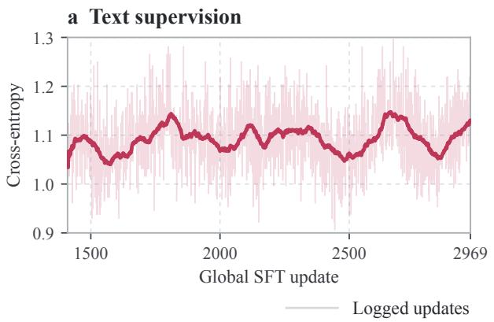

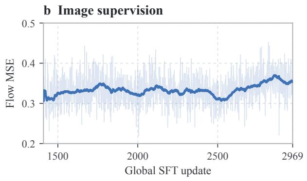  
Figure 6 The supervised parent, recorded continuation phase. Text cross-entropy and image flow-MSE from global SFT updates 1410–2969. Faint lines show logged update values and solid lines show trailing 50-update means.

Frozen and trainable modules. The RL implementation first freezes the model, then opens both expert branches in all 28 MoT decoder layers and the flow roots time\_embedder, vae2llm, llm2vae, and latent\_- pos\_embed. The remaining modules, including the vocabulary head and the final normalization outside the decoder layers, remain frozen. The two channel optimizers operate on explicit, disjoint parameter groups. The detached initial rendering is not assigned an RL loss, although it can change across updates because its generation parameters are also used for repair.

Image-only versus protocol-gated accuracy. The image score is computed from the retained per-image verifier verdict for the final returned image. We do not multiply it by a parse-validity indicator. A malformed reflection can therefore leave a correct image with a valid image score, while separately lowering protocol validity. This separation is applied to SFT and RL alike. GenEval macro averages weight the six families equally; prompt-micro averages instead weight all 553 prompts equally. Their distinct labels are preserved throughout.

Native and external-agent controls. The untuned external agent reviews the original request and current image and always executes three corrections with the native BAGEL ODE sampler. Its reviews are greedy and capped at 512 tokens. SFT and UMM-Reflection use the same native reflection prompt, temperature 0.5 for controller sampling, and a maximum of 512 controller tokens per turn. They stop on native done, invalid termination, or the repair cap.

Benchmark-specific interpretation. WISE reports its weighted group aggregate, not a pooled accuracy. OneIG reports question-dependency alignment on its 695 eligible prompts, using the oficial Qwen2.5-VL-7B questionanswering scorer. CompBench uses one image per prompt and the prescribed category scoring formulas. Its 3D-spatial category concerns relationships depicted in 2D images, not generated 3D representations. Published native benchmark scores are contextual references, not substitutes for matched re-evaluation

Test-time scaling evaluation. Figures 4 and 9 use the retained images at each reflection round; trajectories that stop early keep their last image. WISE curves use a common GPT-4o re-evaluation of Base, SFT, and the 1000-step model. The main table reports the original WISE evaluation.

RL prompt pool. The 3,000 RL prompts are drawn from the GenEval-style training prompts released with Flow-GRPO [20], restricted to the six GenEval families and deduplicated so that no prompt repeats during training. Family proportions follow Flow-GRPO’s own mixture, with a fixed quota for single object (position 1,305, counting 702, color attribution 559, colors 187, two objects 187, single object 60), and every prompt is rendered in the same instruction voice used at evaluation (“Create an image with . . . ”). No RL prompt reuses an oficial GenEval evaluation prompt. The 270-prompt development set is disjoint from the training pool. The pool is released with the code.

Representation probes. Correctness probes (Appendix F) are logistic regressions (standardization, PCA to 256 dimensions fitted on the training folds, C = 0.05) on backbone features at depths 0, 4, . . . , 28. They are evaluated by five-fold cross-validation grouped by prompt, so images of the same trajectory never appear in both training and test folds. AUC intervals use 1,000 family-stratified prompt-bootstrap replicates.

## A.1 Direct-generation RL control

The direct T2I-RL control initializes from oficial BAGEL Base and optimizes direct T2I generation with Flow-GRPO, without reflection SFT or a controller objective. It uses the same six-family training pool as UMM-Reflection, K = 16, 20 training denoising steps, two selected flow transitions, and the original Base as the KL reference. The reported checkpoint is at 1,000 updates.

Evaluation loads the direct T2I-RL language-model weights over Base auxiliary modules and reuses the retained Base initial-generation path at 512 × 512 with 50 denoising steps. There is no self-CoT, verifier query, candidate selection, or repair at inference. GenEval preserves the retained two-prompt seed batches; external benchmarks preserve one-prompt calls and original indices/seeds. Coverage is complete for all 553 GenEval prompts, 1,000 WISE prompts, 695 eligible OneIG alignment prompts out of 1,120 generated prompts, and 2,400 CompBench prompts.

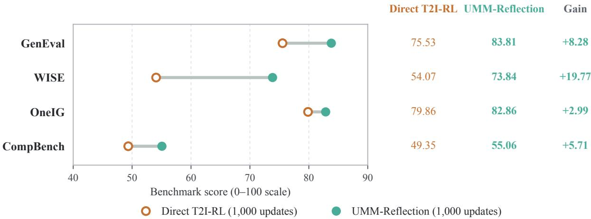  
Figure 7 Completed direct-T2I RL control. Hollow orange points denote direct T2I-RL at 1,000 updates; green points denote UMM-Reflection at 1,000 updates. Gain is the within-benchmark score diference. Each benchmark keeps its own metric on a 0–100 scale; scores are not averaged across benchmarks. The systems difer in initialization and training/inference compute (Appendix A).

## A.2 Understanding-based selection protocol

The two Best-of-4 arms draw four images per prompt from the direct T2I-RL renderer over the full 553- prompt GenEval set, at 512 × 512 and 50 denoising steps. The first draw is the retained T2I-RL evaluation image; the other three reuse its seed ofset by multiples of 106. The candidate order is shufled with seed 20260909 + prompt index and is identical for both selectors. Each makes one greedy multi-image call with think=False and a 256-token output limit. Base UND uses original Base; UMM-Reflection UND uses the UMM-Reflection checkpoint. “UND” identifies the understanding inference path, not a separately trained classifier head.

The fixed instruction asks the model to prioritize requested objects, counts, attributes and spatial relations over aesthetics, select the closest visible match, and output BEST: A/B/C/D followed by a short explanation.

The complete selection prompt will be released with the code. Neither model receives the task family, detector metadata, candidate scores, or selected-image verdict before choosing. Each arm has one invalid-format response out of 553; the preregistered fallback selects the first presented image, with no discarded prompts. Image scoring follows the saved choices.

Base UND and UMM-Reflection UND select 437 and 440 correct images respectively (prompt-micro counts, distinct from the macro scores). Their $\mathrm { A } / \mathrm { B } / \mathrm { C } / \mathrm { D }$ choice counts are 225/26/240/62 and 245/32/219/57.

## B Reflection Format and SFT Details

Each reflection is exposed through six tagged fields: [CURRENT\_ROUND], [SOURCE\_IMAGE], [SCORE], [THINKING], [ACTION], and [EDIT], making the model’s reasoning inspectable. The [SCORE] is a modelgenerated self-assessment, not an external reward: neither verifier scores nor verifier labels enter the policy observation at training or inference.

SFT teaches the interleaved protocol using the trajectories from §3.2. Each trajectory is decomposed into 167,363 training rows spanning three complementary views: controller rows supervise the full reflection text (autoregressive cross-entropy, no image loss), transition rows supervise each individual edit step (the edited image receives flow-matching loss conditioned on the edit instruction), and verifier rows present a partial trajectory and supervise only the next reflection. In notation,

$$
\mathcal { L } _ { \mathrm { S F T } } = \mathcal { L } _ { \mathrm { A R } } + \lambda _ { \mathrm { i m g } } \mathcal { L } _ { \mathrm { F M } } .
$$

Both understanding and generation expert branches across all 28 decoder layers are trainable; the visual encoders (ViT, VAE), text embeddings, and vocabulary projection are frozen. Training starts from the base BAGEL checkpoint and runs for one full epoch.

## C Graded Reward

Standard GenEval scoring is binary: an image either satisfies all constraints or it does not. Under binary scoring, five of the six GenEval families produce $\Delta _ { t } = 0$ whenever an edit improves some constraints but not all, because q jumps only at the boundary between full failure and full success. This renders all progress terms in Eq. 1 inefective for the majority of training prompts.

We therefore grade only the failure region, using nothing but what the frozen verifier returns at its oficial thresholds (0.3 for object detection, 0.9 for counting); no sub-threshold confidence is read. For every family,

$$
q = { \left\{ \begin{array} { l l } { 1 } & { { \mathrm { o f f i c i a l ~ v e r d i c t ~ p a s s e s , } } } \\ { \operatorname* { m i n } ( { \frac { 1 } { 2 } } f , \ 0 . 5 ^ { - } ) } & { { \mathrm { o t h e r w i s e , } } } \end{array} \right. }
$$

where $f \in [ 0 , 1 ]$ is a family-specific satisfaction fraction and $0 . 5 ^ { - }$ is the largest double below 0.5, so partial credit never reaches the exact band. Let $\pi ( o ) \in \{ 0 , 1 \}$ indicate that the verifier keeps a detection of class $o ;$ missing detections and boxes contribute zero.

• single object: $f = \pi ( o )$

• two objects: $\begin{array} { r } { f = \frac { 1 } { 2 } \big ( \pi ( o _ { 1 } ) + \pi ( o _ { 2 } ) \big ) } \end{array}$

• colors: $\begin{array} { r } { f = \pi ( o ) \left( \frac { 1 } { 2 } + \frac { 1 } { 2 } c \right) } \end{array}$ , where c is the CLIP confidence of the predicted color if it is the requested one and 0 otherwise.

• color attribution: $\begin{array} { r } { f = { \frac { 1 } { 2 } } ( r _ { 1 } + r _ { 2 } ) } \end{array}$ , with $r _ { k } = 1$ if attribute k passes and otherwise $\begin{array} { r } { r _ { k } = \pi ( o _ { k } ) \big ( \frac { 1 } { 2 } + \frac { 1 } { 2 } c _ { k } \big ) } \end{array}$ $\begin{array} { r } { c _ { k } = \frac { 1 } { 2 } \big ( c _ { k } ^ { \mathrm { C L I P } } + \mathrm { c l i p } ( 1 + b _ { k } , 0 , 1 ) \big ) ; b _ { k } } \end{array}$ is the BLIP margin (yes-probability of the requested phrase minus that of the color-swapped phrase), whose oficial cut is 0.

• position: $f = 0 . 6 \cdot { \textstyle \frac { 1 } { 2 } } ( \pi _ { s } + \pi _ { o } ) + 0 . 4 \operatorname* { m i n } ( \pi _ { s } , \pi _ { o } )$ m, with $m = \mathrm { c l i p } ( d / 0 . 5 , 0 , 1 )$ , where d is the component of the oficial threshold-shrunk, normalized center ofset along the requested relation (the oficial pass cut is $0 . 5 ; m = 0$ if either box is missing).

• counting: $q = 1 { \mathrm { ~ i f ~ } } { \hat { n } } = n$ and $\begin{array} { r } { q = \frac { 1 } { 2 } \operatorname* { m a x } \bigl ( 0 , 1 - | \hat { n } - n | / n \bigr ) } \end{array}$ otherwise, where nˆ is the number of detections at the counting threshold.

Fail-closed rule. Every scored image is checked against its oficial verdict: a passing image must receive $q = 1$ and a failing image $q < 0 . 5$ . A violation raises an error in the scoring service and the request returns no reward, so grading can never change a pass/fail decision, and accuracy computed from q equals the binary GenEval score. On 200 image–family pairs scored with the frozen backends, no violation occurred and the share of images with a nonzero score rose from 21% to 100%.

Malformed trajectories receive a bounded negative correction $A _ { i } \gets \operatorname* { m a x } ( \operatorname* { m i n } ( A _ { i } , 0 ) - 0 . 5 , - 1 )$ , preserving a learning signal for protocol violations.

## D Training Dynamics

b WISE  
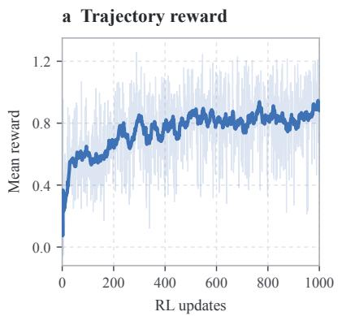

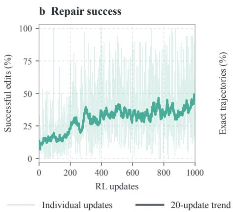

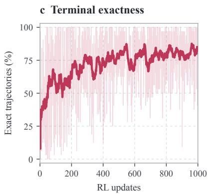  
Figure 8 Learning dynamics of the 1,000-update RL run. (a) Mean trajectory reward. (b) Successful repairs per edit from an incorrect state. (c) Fraction of trajectories reaching terminal exactness under the training verifier. Faint lines are individual updates; solid lines are trailing 20-update trends, with rates pooling numerators and denominators over the window.

## E Test-Time Scaling on External Benchmarks

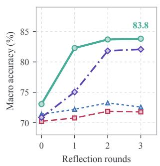

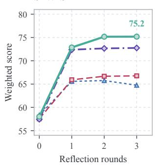

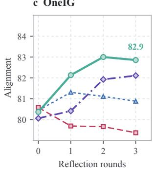

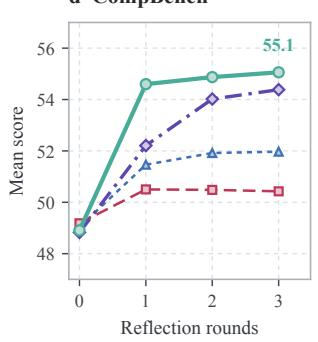  
Base Reflection SFT UMM-Reflection-500 UMM-Reflection-1000  
Figure 9 Multi-round test-time scaling on four benchmarks. Scores (0–100) versus reflection rounds. Blue dotted lines denote Base, pink dashed lines reflection $\mathrm { S F T } ,$ , purple dash-dotted lines UMM-Reflection-500, and green solid lines UMM-Reflection-1000.

## F Distributional Analysis

The findings below support one reading: RL does not give the model a new way to see or judge its images; among the revisions the backbone can already produce, it learns to select the ones that land, a pattern also reported for RL with verifiable rewards in language models [42]. We replayed all 553 archived RL trajectories, together with the matching SFT trajectories, through the Base, SFT, and RL checkpoints and read out both the generation branch (VAE latents) and the understanding branch (ViT tokens) at every decoder depth (protocol in Appendix A). Two findings organize what changed.

Table 5 Distributional statistics. One trajectory per prompt. Edit-matched rows use prompts where SFT made three edits (RL always makes three) or at least one edit. Intervals are 95% family-stratified prompt bootstrap intervals, except the pass-region change, which resamples images (5,000 replicates). Pass-region rows use initially failing images.
<table><tr><td>Measure</td><td>Unit (N)</td><td>SFT</td><td>RL</td></tr><tr><td>DINO distance, first to last image</td><td>prompts (553)</td><td>0.09</td><td>0.29</td></tr><tr><td>same, three edits</td><td>prompts (153)</td><td>0.11</td><td>0.28 0.17 [0.13, 0.21]</td></tr><tr><td>Exact gain R0→R3 (points), three edits</td><td>prompts (153)</td><td>-3.3</td><td>+16.3</td></tr><tr><td>Exact gain R0→R3 (points), ≥1 edit</td><td>prompts (456)</td><td>+0.9</td><td>+10.3</td></tr><tr><td>In dense pass region, R0→R3 (%)</td><td>images (170 / 154)</td><td>36.5→42.4</td><td>34.4→61.7 +21.4 [9.4, 33.3]</td></tr><tr><td>UND probe AUC, depth 20 (Base 0.804)</td><td>held-out images</td><td>0.807</td><td>0.815</td></tr><tr><td>Stream coupling, GEN / UND (null 0.04)</td><td>image pairs</td><td>0.56 /0.45 0.57</td><td>/0.46 Holm p = 0.012 vs. null</td></tr></table>

RL edits move the image further, at matched edit count. Over all 553 prompts, the DINO distance from the first to the last image is 0.09 for SFT and 0.29 for RL. This is not because RL edits more often. On the 153 prompts where both policies used exactly three edits, the distance is 0.11 versus 0.28 (paired diference 0.17, 95% CI [0.13, 0.21]), and on the same prompts the exact-match gain from R0 to R3 is −3.3 points for SFT and +16.3 for RL (paired diference +19.6 [11.1, 28.1]). On the 456 prompts where SFT made at least one edit, the gains are +0.9 and +10.3. At equal edit budget, RL makes larger changes and they land.

RL moves failing images into the passing region of a readout the backbone already has. A linear probe for “passes the verifier” on the understanding stream peaks at decoder depth 20 with held-out AUC 0.804 under Base, 0.807 under SFT, and 0.815 under RL, whereas frozen DINO and CLIP features reach only 0.55. The backbone can already tell whether its image is right, and RL barely changes that readout. What RL changes is where the images go (Figure 5): among initially failing images, the share inside the dense pass region rises from 34% at R0 to 62% at R3 under RL, versus 36% to 42% under SFT, and the probe distance of failing RL images to the passing side falls monotonically over the rounds under all three checkpoints. Read against SFT, the figure shows where the gain comes from. SFT’s revisions spread broadly over the readout plane, and only a small part of that distribution reaches the dense pass region. RL does not open a new region: its R3 images concentrate inside the same pass region that part of SFT’s distribution already reaches. RL extracts the correct slice of the broad distribution that SFT learned and shifts the policy’s trajectories toward it; the rollout statistics in Appendix I show the same pattern directly. The same holds for the coupling between the two streams: changing the image changes the representation of a fixed request, and the normalized alignment between the two displacements is 0.58/0.45 (GEN/UND) for Base, 0.56/0.45 for SFT, and 0.57/0.46 for RL, each far above the permutation null of 0.04 (Holm p = 0.012). RL does not build a new channel between seeing and describing; it steers images through one the unified backbone already has, which is why 1,000 updates on a 3,000-prompt pool sufice.

## G Visual Pathway Stability

Consistent with the distributional findings in Appendix F, the visual pathway itself is largely unchanged by RL. On ten replayed trajectories (30 paired rounds), SFT and RL attention maps over VAE keys correlate at a median of 0.98; over ViT keys the correlation exceeds 0.99 (Figure 10). The cross-modal coupling that connects image states to text representations is already present in the Base model, and RL preserves it. We

RL

SFT

RL

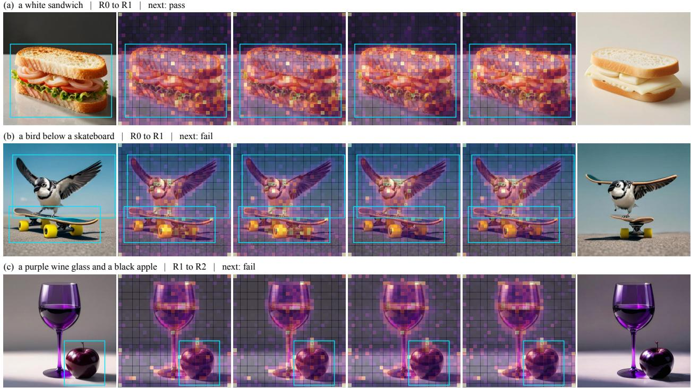  
Figure 10 Attention over VAE image tokens is preserved after RL. Three cases show paired SFT/RL attention of THINKING and EDIT tokens onto 32 × 32 VAE keys, averaged over 28 layers. Maps use a shared 99th-percentile cap; cyan boxes are pre-annotated error regions.

observe only limited changes in the visual pathway, which is consistent with the learned change residing mainly in what the model writes from the same visual input.

## H Cross-Round Attention to Earlier Images

Each reflection round keeps all earlier images in context. To test whether later rounds use them, we measure, on the ten replayed trajectories of Appendix G, how the attention that THINKING and EDIT tokens assign to image keys (VAE and ViT) is split across the images in context. Table 6 reports the third reflection round, which sees the initial image $x _ { 0 }$ and two revisions. About 45–48% of the image attention goes to the current image, but $x _ { 0 }$ and the first revision each keep 22–31%, and every earlier image receives at least 19% in every case. Restricted to VAE keys, the three images are attended almost equally (29–37%). SFT and RL split attention the same way: the model reads its whole visual history, and RL does not change this.

Table 6 Share of image attention per image at the third reflection round. Mean over ten trajectories (minimum in parentheses); shares sum to 1 across the three images. Image attention is 10–13% of all attention.
<table><tr><td>Policy</td><td>Tokens</td><td> $x _ { 0 }$ </td><td>Revision 1</td><td>Current image</td></tr><tr><td>SFT</td><td>THINKING</td><td>0.23 (0.20)</td><td>0.30 (0.26)</td><td>0.48 (0.41)</td></tr><tr><td>SFT</td><td>EDIT</td><td>0.23 (0.19)</td><td>0.31 (0.27)</td><td>0.46 (0.41)</td></tr><tr><td>RL</td><td>THINKING</td><td>0.26 (0.23)</td><td>0.29 (0.25)</td><td>0.45 (0.39)</td></tr><tr><td>RL</td><td>EDIT</td><td>0.23 (0.19)</td><td>0.31 (0.27)</td><td>0.46 (0.40)</td></tr><tr><td>RL, VAE keys only</td><td>THINKING</td><td>0.32 (0.27)</td><td>0.34 (0.28)</td><td>0.34 (0.26)</td></tr><tr><td>RL, VAE keys only</td><td>EDIT</td><td>0.32 (0.27)</td><td>0.35 (0.29)</td><td>0.33 (0.26)</td></tr></table>

## I Correct Repairs Already in the SFT Rollout Distribution

Each RL update samples K = 16 complete trajectories from one initial image, and the training log records whether each trajectory ends verifier-correct. Table 7 uses the roots whose initial image is incorrect and reports the per-trajectory success rate (pass@1) and the share of roots with at least one correct trajectory among the 16 (pass@16), by training window. At the start of RL, where the policy is essentially the SFT model, a correct repair already exists among the 16 rollouts for 78% of roots, although a single rollout succeeds only 23% of the time. Over training, pass@1 rises to 70% while pass@16 rises only to 97%: RL concentrates the policy on repairs that the SFT distribution already contains.

Table 7 Sibling success on incorrect initial images during RL. Roots with an incorrect initial image; 16 sibling trajectories per root.
<table><tr><td>RL updates</td><td>Roots</td><td>pass@1 (%)</td><td>pass@16 (%)</td></tr><tr><td>1-50</td><td>67</td><td>22.7</td><td>77.6</td></tr><tr><td>51-100</td><td>54</td><td>31.4</td><td>77.8</td></tr><tr><td>101-200</td><td>114</td><td>31.5</td><td>83.3</td></tr><tr><td>201-500</td><td>367</td><td>60.5</td><td>94.6</td></tr><tr><td>501-1,000</td><td>611</td><td>70.1</td><td>97.1</td></tr></table>

## J Swapping the Editing Instruction on Fixed Images

To test which channel carries the repair, we fix the image, the RL renderer, and the sampling noise, and change only the editing instruction for one image update. On 154 initially failing states with two paired noise seeds each, the original request repairs 20.5%, the SFT policy’s instruction 21.4%, and the RL policy’s instruction 48.4%; a rule-written instruction that spells out every GenEval constraint reaches 27.6%. The paired RL-minus-request diference is +27.9 points (95% state bootstrap interval [20.8, 34.7]), and RL-minus rule is +20.8 [13.6, 27.9], concentrated in counting, position, and two-object prompts. With the renderer and noise held fixed, the instruction the RL policy writes is what turns a failing image into a correct one, and it is more executable than an exhaustive rule-based specification.

## K Paired Final-Model Results

Table 8 Stage-wise GenEval analysis. Initial and final are prompt-micro image accuracy over 553 prompts, not six-family macro scores. Repair is conditional on an initially incorrect image; damage is conditional on an initially correct image. Protocol validity is measured separately. All entries are percentages.
<table><tr><td>Model</td><td>Initial</td><td>Final</td><td>Repair</td><td>Damage</td><td>Protocol</td></tr><tr><td>Reflection SFT</td><td>69.26</td><td>71.07</td><td>20.59</td><td>6.53</td><td>95.48</td></tr><tr><td>UMM-Reflection (1,000 updates)</td><td>72.15</td><td>83.91</td><td>64.94</td><td>8.77</td><td>100.00</td></tr></table>

Table 9 Prompt-paired UMM-Reflection-1000 versus reflection SFT on GenEval. Wins and losses count discordant image-only verdicts. The exact two-sided binomial test on discordant pairs is the exact McNemar test.
<table><tr><td>Comparison with SFT</td><td>Wins</td><td>Losses</td><td>Net</td><td>Exact p</td></tr><tr><td>Initial</td><td>48</td><td>32</td><td>+16</td><td>0.093</td></tr><tr><td>Final</td><td>109</td><td>38</td><td>+71</td><td>&lt; 0.001</td></tr></table>

All tables in this section compare the retained SFT evaluation with the final full-weight RL model on the same 553 prompts. Earlier decoder-only checkpoint evaluations are not substituted for this final-model evaluation.

## L Category-Level Results

Table 10 All six GenEval families, using image-only verdicts. Values are percentages; the macro mean appears in Table 1.
<table><tr><td>Family</td><td>n</td><td>SFT final</td><td>RL initial</td><td>RL final</td></tr><tr><td>Single object</td><td>80</td><td>100.00</td><td>100.00</td><td>95.00</td></tr><tr><td>Two objects</td><td>99</td><td>87.88</td><td>83.84</td><td>95.96</td></tr><tr><td>Counting</td><td>80</td><td>57.50</td><td>67.50</td><td>67.50</td></tr><tr><td>Colors</td><td>94</td><td>87.23</td><td>84.04</td><td>90.43</td></tr><tr><td>Position</td><td>100</td><td>47.00</td><td>55.00</td><td>89.00</td></tr><tr><td>Color binding</td><td>100</td><td>51.00</td><td>48.00</td><td>65.00</td></tr></table>

## a GenEval

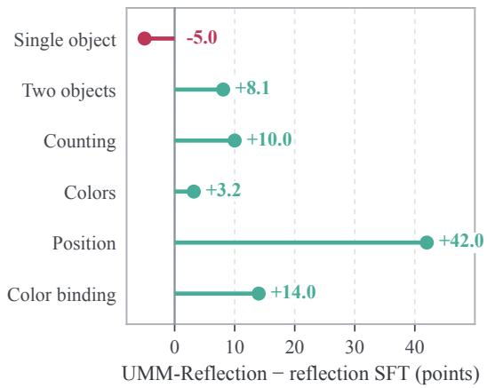

## b CompBench

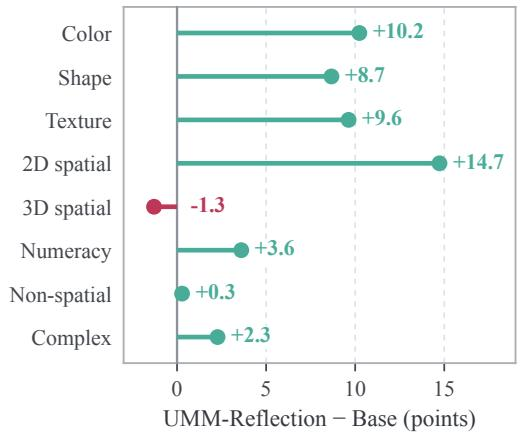  
Figure 11 Category-level changes, with every category retained. Positive changes are green and negative changes are red. This view complements the overall gains without assuming uniform improvement.

## M Detailed External Benchmark Comparisons

These detailed tables use native 0–1 scores. GenEval and original WISE sources generally report two decimal places, OneIG three, and CompBench four; we preserve these precisions and print local measurements to four places. CompBench reference means are the eight-category mean of the published category scores. The overview, ablation, stage statistics, and plots retain their stated 0–100 scales.

GenEval row citations distinguish model-author results, the original benchmark-author results, and secondary reports marked †. Resolution notes for older reference models additionally follow Qu et al. [26], Table 4; undocumented settings are marked $n / r ,$ , rather than assumed to be 512. Other native-resolution reference models are not protocol-matched controls. Each reference row reports the source table of the cited paper.

Table 11 WISE: six world-knowledge categories. Native 0–1 results from the oficial original-WISE legacy leaderboard [23], retaining its two-decimal reporting precision. The local block uses 1,000 original prompts and the same frozen judge setup. Overall is the original weighted aggregate. These are not WISE\_Verified scores: that revision changes prompts, judge, and scoring. Bold denotes the best completed local result.
<table><tr><td>Model</td><td>Cultural</td><td>Time</td><td>Space</td><td>Biology</td><td>Physics</td><td>Chem.</td><td>Overall</td></tr><tr><td colspan="6">Official original-WISE legacy leaderboard: : Niu et al. [23]</td><td></td><td></td></tr><tr><td>SD1.5</td><td>0.34</td><td>0.35</td><td>0.32</td><td>0.28</td><td>0.29</td><td>0.21</td><td>0.32</td></tr><tr><td>SDXL (base 0.9)</td><td>0.43</td><td>0.48</td><td>0.47</td><td>0.44</td><td>0.45</td><td>0.27</td><td>0.43</td></tr><tr><td>SD3.5-Large</td><td>0.44</td><td>0.50</td><td>0.58</td><td>0.44</td><td>0.52</td><td>0.31</td><td>0.46</td></tr><tr><td>PixArt-α</td><td>0.45</td><td>0.50</td><td>0.48</td><td>0.49</td><td>0.56</td><td>0.34</td><td>0.47</td></tr><tr><td>Playground v2.5</td><td>0.49</td><td>0.58</td><td>0.55</td><td>0.43</td><td>0.48</td><td>0.33</td><td>0.49</td></tr><tr><td>FLUX.1-dev</td><td>0.48</td><td>0.58</td><td>0.62</td><td>0.42</td><td>0.51</td><td>0.35</td><td>0.50</td></tr><tr><td>Janus-1.3B</td><td>0.16</td><td>0.26</td><td>0.35</td><td>0.28</td><td>0.30</td><td>0.14</td><td>0.23</td></tr><tr><td>VILA-U-7B-256</td><td>0.26</td><td>0.33</td><td>0.37</td><td>0.35</td><td>0.39</td><td>0.23</td><td>0.31</td></tr><tr><td>Show-o-512</td><td>0.28</td><td>0.40</td><td>0.48</td><td>0.30</td><td>0.46</td><td>0.30</td><td>0.35</td></tr><tr><td>Janus-Pro-7B</td><td>0.30</td><td>0.37</td><td>0.49</td><td>0.36</td><td>0.42</td><td>0.26</td><td>0.35</td></tr><tr><td>Emu3</td><td>0.34</td><td>0.45</td><td>0.48</td><td>0.41</td><td>0.45</td><td>0.27</td><td>0.39</td></tr><tr><td>MetaQuery-XL</td><td>0.56</td><td>0.55</td><td>0.62</td><td>0.49</td><td>0.63</td><td>0.41</td><td>0.55</td></tr><tr><td colspan="8">Local evaluation: same prompts, resolution, and scorer</td></tr><tr><td>BAGEL-Base</td><td>0.4841</td><td>0.5437</td><td>0.6774</td><td>0.5005</td><td>0.6445</td><td>0.4590</td><td>0.5515</td></tr><tr><td>BAGEL-SFT</td><td>0.5838</td><td>0.6254</td><td>0.7165</td><td>0.6120</td><td>0.6965</td><td>0.5380</td><td>0.6287</td></tr><tr><td>BAGEL-Self-Agentic</td><td>0.5921</td><td>0.5967</td><td>0.7410</td><td>0.5550</td><td>0.7010</td><td>0.4915</td><td>0.6129</td></tr><tr><td>BAGEL-T2I-RL (1k)</td><td>0.4829</td><td>0.5284</td><td>0.6711</td><td>0.4620</td><td>0.6595</td><td>0.4405</td><td>0.5407</td></tr><tr><td>UMM-Reflection</td><td>0.6835</td><td>0.7054</td><td>0.8226</td><td>0.7925</td><td>0.7985</td><td>0.6280</td><td>0.7384</td></tr></table>

Table 12 T2I-CompBench++: all eight composition categories. Native 0–1 scores retain four decimal places. The public block transcribes the non-MLLM columns of Huang et al. [15], Table XIII: BLIP-VQA for attributes, UniDet for 2D/3D spatial relations and numeracy, CLIP for non-spatial relations, and 3-in-1 for complex composition. Published evaluation uses ten images per prompt; our local block uses one image for each of 2,400 prompts. The eight-category mean is our local aggregate and is not supplied for published rows. Bold denotes the best completed local result.
<table><tr><td>Model</td><td>Color</td><td>Shape</td><td>Texture</td><td>2D</td><td>3D</td><td>Number</td><td>Non-sp.</td><td>Complex</td><td>Mean</td></tr><tr><td colspan="10">Published ten-image protocol: Huang et al. [15], Table XIII</td></tr><tr><td>SD1.4</td><td>0.3765</td><td>0.3576</td><td>0.4156</td><td>0.1246</td><td>0.3030</td><td>0.4456</td><td>0.3079</td><td>0.3080</td><td>0.3298</td></tr><tr><td>SD2</td><td>0.5065</td><td>0.4221</td><td>0.4922</td><td>0.1342</td><td>0.3230</td><td>0.4582</td><td>0.3127</td><td>0.3386</td><td>0.3734</td></tr><tr><td>Composable + SD2</td><td>0.4063</td><td>0.3299</td><td>0.3645</td><td>0.0800</td><td>0.2847</td><td>0.4272</td><td>0.2980</td><td>0.2898</td><td>0.3100</td></tr><tr><td>Structured + SD2</td><td>0.4990</td><td>0.4218</td><td>0.4900</td><td>0.1386</td><td>0.3224</td><td>0.4557</td><td>0.3111</td><td>0.3355</td><td>0.3718</td></tr><tr><td>Attend-and-Excite + SD2</td><td>0.6400</td><td>0.4517</td><td>0.5963</td><td>0.1455</td><td>0.3222</td><td>0.4773</td><td>0.3109</td><td>0.3401</td><td>0.4105</td></tr><tr><td>GORS-unbiased + SD2</td><td>0.6414</td><td>0.4546</td><td>0.6025</td><td>0.1725</td><td>0.3300</td><td>0.4849</td><td>0.3158</td><td>0.3470</td><td>0.4186</td></tr><tr><td>GORS + SD2</td><td>0.6603</td><td>0.4785</td><td>0.6287</td><td>0.1815</td><td>0.3572</td><td>0.4830</td><td>0.3193</td><td>0.3328</td><td>0.4302</td></tr><tr><td>SDXL</td><td>0.5879</td><td>0.4687</td><td>0.5299</td><td>0.2133</td><td>0.3566</td><td>0.4991</td><td>0.3119</td><td>0.3237</td><td>0.4114</td></tr><tr><td>PixArt-α-ft</td><td>0.6690</td><td>0.4927</td><td>0.6477</td><td>0.2064</td><td>0.3901</td><td>0.5032</td><td>0.3197</td><td>0.3433</td><td>0.4465</td></tr><tr><td>DALL·E 3</td><td>0.7785</td><td>0.6205</td><td>0.7036</td><td>0.2865</td><td>0.3744</td><td>0.5926</td><td>0.3003</td><td>0.3773</td><td>0.5042</td></tr><tr><td>SD3</td><td>0.8132</td><td>0.5885</td><td>0.7334</td><td>0.3200</td><td>0.4084</td><td>0.6174</td><td>0.3140</td><td>0.3771</td><td>0.5215</td></tr><tr><td>FLUX.1</td><td>0.7407</td><td>0.5718</td><td>0.6922</td><td>0.2863</td><td>0.3866</td><td>0.6185</td><td>0.3127</td><td>0.3703</td><td>0.4974</td></tr><tr><td colspan="10">Local evaluation: same prompts, resolution, and scorer</td></tr><tr><td>BAGEL-Base</td><td>0.7437</td><td>0.5216</td><td>0.6658</td><td>0.3015</td><td>0.3913</td><td>0.6067</td><td>0.3079</td><td>0.3847</td><td>0.4904</td></tr><tr><td>BAGEL-SFT</td><td>0.7609</td><td>0.5725</td><td>0.7123</td><td>0.3014</td><td>0.3759</td><td>0.6182</td><td>0.3061</td><td>0.3870</td><td>0.5043</td></tr><tr><td>BAGEL-Self-Agentic</td><td>0.8010</td><td>0.5741</td><td>0.7203</td><td>0.3268</td><td>0.4090</td><td>0.6300</td><td>0.3059</td><td>0.3905</td><td>0.5197</td></tr><tr><td>BAGEL-T2I-RL (1k)</td><td>0.7402</td><td>0.5029</td><td>0.6684</td><td>0.3150</td><td>0.3931</td><td>0.6408</td><td>0.3126</td><td>0.3746</td><td>0.4935</td></tr><tr><td>UMM-Reflection</td><td>0.8460</td><td>0.6083</td><td>0.7621</td><td>0.4489</td><td>0.3784</td><td>0.6428</td><td>0.3108</td><td>0.4074</td><td>0.5506</td></tr></table>

Table 13 OneIG-Bench alignment. Native 0–1 scores. Reference rows are from Chang et al. [3], Table 2, at their reported precision and resolution (Table 8). Local rows measure question-dependent alignment on the 695 eligible prompts at 5122 with the same scorer.
<table><tr><td>Model</td><td>Res. Alignment</td></tr><tr><td colspan="2">Benchmark-author results: Chang et al. [3], Tables 2 and 8</td></tr><tr><td>Janus-Pro</td><td>384 0.553</td></tr><tr><td>BLIP3-0</td><td>1024 0.711</td></tr><tr><td>Show-o2-1.5B</td><td>432 0.798</td></tr><tr><td>Show-o2-7B</td><td>432 0.817</td></tr><tr><td>OmniGen2</td><td>1024 0.804</td></tr><tr><td>SD1.5</td><td>512 0.565</td></tr><tr><td>SDXL</td><td>1024 0.688</td></tr><tr><td>SD3.5-Large 1024</td><td>0.809</td></tr><tr><td>FLUX.1-dev 1024</td><td>0.786</td></tr><tr><td>CogView4</td><td>1024 0.786</td></tr><tr><td>SANA-1.5 1.6B (PAG)</td><td>1024 0.762</td></tr><tr><td>SANA-1.5 4.8B (PAG)</td><td>1024 0.765</td></tr><tr><td>Lumina-Image 2.0</td><td>1024 0.819</td></tr><tr><td>HiDream-I1-Full</td><td>1024 0.829</td></tr><tr><td colspan="2">Local evaluation: same prompts, resolution, and scorer 512</td></tr><tr><td>BAGEL-Base</td><td>0.8044</td></tr><tr><td>BAGEL-SFT</td><td>512 0.7937</td></tr><tr><td>BAGEL-Self-Agentic</td><td>512 0.8088</td></tr><tr><td>BAGEL-T2I-RL (1k)</td><td>512 0.7986</td></tr><tr><td>UMM-Reflection</td><td>512 0.8286</td></tr></table>

Table 14 OneIG local alignment by prompt category. Scores use the native 0–1 scale. Anime/stylization, general objects, and portrait contain 245, 206, and 244 eligible prompts, respectively. Alignment is the prompt-weighted aggregate, not the unweighted mean of these three columns. The Anime/style column measures alignment on that prompt category, not the separate style metric in Table 13.
<table><tr><td>Model</td><td>Anime style</td><td>General objects</td><td>Portrait</td><td>Alignment</td></tr><tr><td>Local evaluation: same prompts, resolution, and scorer</td><td></td><td></td><td></td><td></td></tr><tr><td>BAGEL-Base</td><td>0.8389</td><td>0.7569</td><td>0.8099</td><td>0.8044</td></tr><tr><td>BAGEL-SFT</td><td>0.8273</td><td>0.7529</td><td>0.7945</td><td>0.7937</td></tr><tr><td>BAGEL-Self-Agentic</td><td>0.8436</td><td>0.7732</td><td>0.8040</td><td>0.8088</td></tr><tr><td>BAGEL-T2I-RL (1k)</td><td>0.8326</td><td>0.7408</td><td>0.8133</td><td>0.7986</td></tr><tr><td>UMM-Reflection</td><td>0.8618</td><td>0.8020</td><td>0.8176</td><td>0.8286</td></tr></table>

## N External Critic Baseline

We also compare with an external pipeline in which GPT-5.5 (gpt-5.5-2026-04-23, medium efort) inspects each BAGEL-Base image and issues either an edit instruction or done; Base executes up to three edits. The critic sees only the request and the current image, never a verifier verdict, and the protocol otherwise matches our evaluation (same prompts, seeds, resolution, and 50 denoising steps). Table 15 reports the result. On GenEval the pipeline reaches 79 and repairs 28% of the 163 initially incorrect images (45 of 163), against 84 and 65% for UMM-Reflection; GPT-5.5 accepts 67 of the 163 incorrect initial images without a single edit. UMM-Reflection also leads on WISE and CompBench and matches the pipeline on OneIG, with no external model at inference.

Table 15 External GPT-5.5 critic versus UMM-Reflection. Native 0–1 scale. WISE in this table is scored by a separate GPT-4o run for all three rows. OneIG to three decimals: 0.825 (critic) versus 0.829 (UMM-Reflection). Repair is the share of initially incorrect GenEval images that end correct.
<table><tr><td>Model</td><td>GenEval</td><td>WISE</td><td>OneIG</td><td>CompBench</td><td>Repair (%)</td></tr><tr><td>BAGEL-Base</td><td>0.71</td><td>0.58</td><td>0.80</td><td>0.49</td><td></td></tr><tr><td>BAGEL + GPT-5.5 critic</td><td>0.79</td><td>0.70</td><td>0.83</td><td>0.52</td><td>27.6</td></tr><tr><td>UMM-Reflection</td><td>0.84</td><td>0.75</td><td>0.83</td><td>0.55</td><td>64.9</td></tr></table>

## O Additional Qualitative Examples

Spatial relations GenEval Create an image with an elephant below a surfboard.  
  
Think (UMM) …an elephant standing on a colorful surfboard underwater… Edit (UMM) Place an elephant on the ground below a surfboard

  
Think (UMM) The current image shows two elephants, one standing on a surfboard… Edit (UMM) Place a surfboard above an elephant

  
Think (UMM) …the surfboard is not clearly positioned as being above the elephant… Edit (UMM) emphasizing the elephant's placement beneath it.

Final  
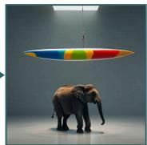  
World knowledge WISE Create an image with National flag of the country where Rio de Janeiro is located.

  
Think (UMM) …a scenic view of a city with mountains, beaches, and palm trees… Edit (UMM) Add the Brazilian national flag in a prominent location

  
Final  
Think (UMM) The image provided shows a cityscape that does not include any flags. Edit (UMM) The Brazilian flag should be clearly visible

  
Think (UMM) …shows a beach scene which does not meet the requirement. Edit (UMM) The flag should be clearly visible and centered

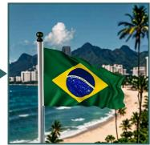  
Final

Shape binding CompBench Create an image with a circular rug and a triangular cof ee table.  
  
Think (UMM) …a circular rug but with a round coffee table… Edit (UMM) Replace the round coffee table with a triangular coffee table

  
Think (UMM) The current image shows a round coffee table placed on a circular rug… Edit (UMM) Place a triangular coffee table on top of the circular rug

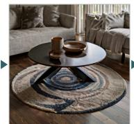  
Think (UMM) The image provided currently shows a round coffee table on a circular rug… Edit (UMM) The circular rug should remain intact and centered

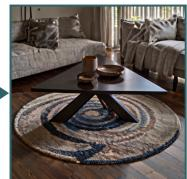  
Figure 12 Reflection trajectories of UMM-Reflection. Examples from GenEval, WISE, and CompBench show how step-bystep reflection and revision help the model produce images that match the prompt. Each row reads left to right: the image, then the unified model’s own reflection on it (Think: what is wrong; Edit: the instruction it issues), then the image it renders from that instruction. All text is verbatim model output.

All images and text excerpts in this section are unedited model outputs.

Figures 13–18 show further successful repairs on all four benchmarks, and Figure 19 shows two failures caused by the reflection itself.

## GenEval · Counting “three kites.”

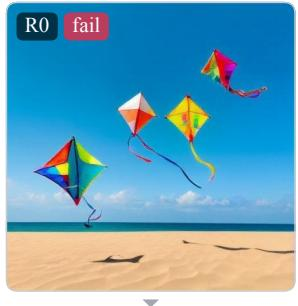

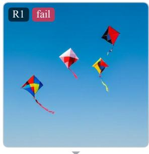

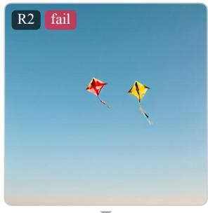

Think …The current image shows four kites flying in the sky over a beach. To meet the user's request, the image should be edited… Edit Create an image with three kites. The image should depict three kites…

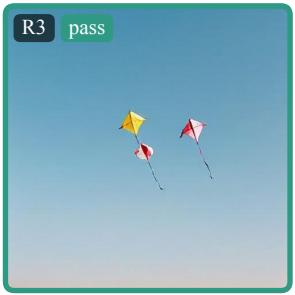

Think …The current image shows multiple kites in the sky, which does not meet the requirement. To meet the user's request, the image… Edit Create an image with three kites. The image should depict three kites…

Think …The current image shows two kites flying in the sky against a clear blue background. To meet the user's request, the image… Edit Create an image with three kites. The image should depict three kites…

Benchmark check   
GenEval verifier   
R0 fail   
R1 fail   
R2 fail   
R3 pass   
Ends after the third edit.

## GenEval · Position “a clock below a tv.”

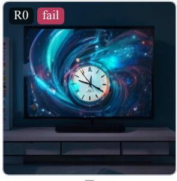

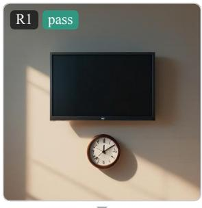

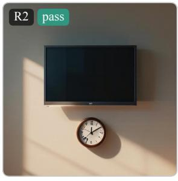

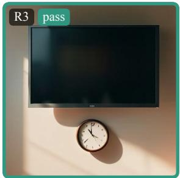  
Figure 13 Successful repairs. Each column reads top to bottom: the image, the model’s verbatim reflection, and the image it renders next. Frames mark the benchmark verdict. Cases are selected.

Think …The current image shows a TV screen displaying a colorful abstract image with a clock in the center… Edit Place a TV set on a surface above a clock. The TV should be positioned…

Think …The current image shows a wall-mounted TV above a wall clock. To meet the user's request, the image should be edited to show… Edit Place a TV set above a clock in the image. The TV should be positioned…

Think …The current image shows a wall-mounted TV with a shadow cast on the wall, and a wall clock positioned below it… Edit Place a TV screen above a wall clock in the image…

Benchmark check   
GenEval verifier   
R0 fail   
R1 pass   
R2 pass   
R3 pass   
Ends after the third edit.

## GenEval · Colors “a yellow broccoli.”

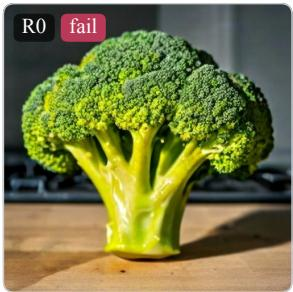

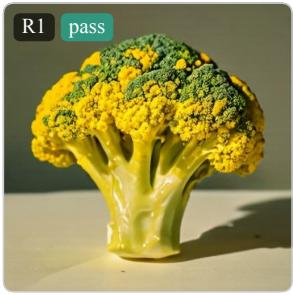

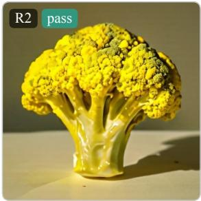

Think The initial image shows a head of broccoli with a green crown and yellow stalk, placed on a wooden surface…

Edit Create an image of a broccoli that is predominantly yellow…

Think …The image provided shows a broccoli that is green with hints of yellow. To meet the user's request, the image… Edit Create an image of a broccoli that is predominantly yellow…

Think …The image provided shows a broccoli that is green with some yellow tones. To meet the user's request, the image… Edit Create an image of a broccoli that is entirely yellow in color…

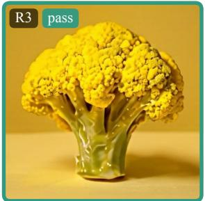  
Figure 14 Successful repairs (continued); layout as in Figure 13.

Benchmark check   
GenEval verifier   
R0 fail   
R1 pass   
R2 pass   
R3 pass   
Ends after the third edit.

## GenEval · Attribute binding “a red car and an orange potted plant.”

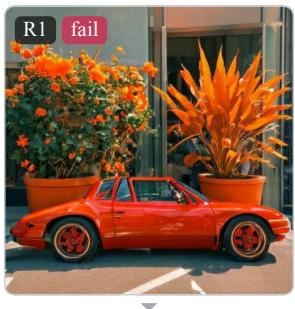

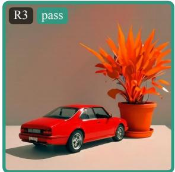

Think …The current image shows a red car parked next to two potted plants, one with orange flowers and the other with yellow-green… Edit Replace the two potted plants in the image with orange potted plants…

Think …The current image shows a red car parked next to large potted plants with orange flowers. To meet the user's request, the image… Edit …The red car should be positioned next to a single orange potted plant…

Think …The current image shows a red sports car with a large potted plant with orange flowers next to it. To meet the user's request… Edit Create an image featuring a red car and an orange potted plant…

Benchmark check   
GenEval verifier   
R0 fail   
R1 fail   
R2 pass   
R3 pass   
Ends after the third edit.

## WISE · Culture “Most representative craft of Thailand.”

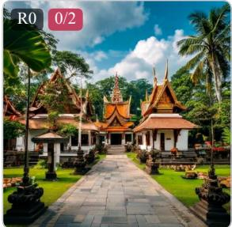  
Think …The image provided shows a temple complex, which is a significant cultural and architectural symbol… Edit Create an image showcasing a piece of Thai craftsmanship…

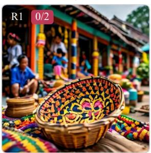

Think …The current image shows a market scene with a basket, which is not inherently representative of Thai craft; Thai crafts can… Edit Create an image showcasing a traditional Thai craft item…

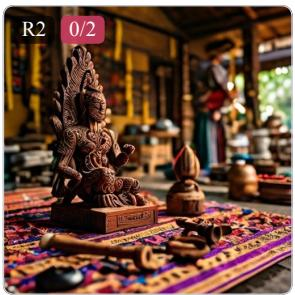

Think …The current image shows a wooden sculpture in an artisan workshop, which is a form of Thai craftsmanship, but it may… Edit Create an image showcasing traditional Thai weaving, such as intricate…

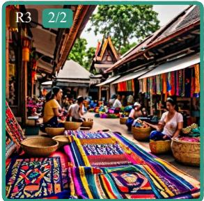

Benchmark check   
WISE consistency   
R0 0/2   
R1 0/2   
R2 0/2   
R3 2/2   
Ends after the third edit.

Figure 15 Successful repairs (continued); layout as in Figure 13.  
T2I-CompBench · Color “a blue duck and a yellow pond.”  
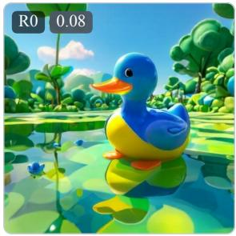

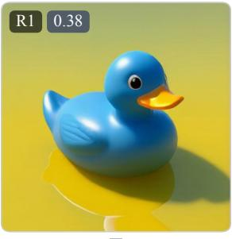

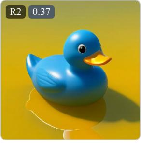

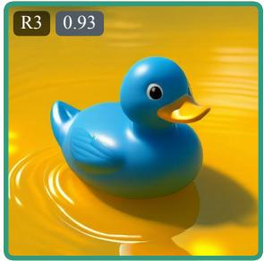

Think …The current image shows a colorful duck in a pond setting with greenery and blue water, which does not meet the user's request… Edit Create an image featuring a blue duck situated in a yellow pond…

Think …The current image shows a blue duck on a yellow surface, but it lacks context. To meet the user's request, the image… Edit Create an image showing a blue duck floating in a yellow pond…

Think …The current image shows a blue duck on a yellow background, which does not depict a pond setting. To meet the user's… Edit Create an image where a blue duck is situated in a yellow pond setting…

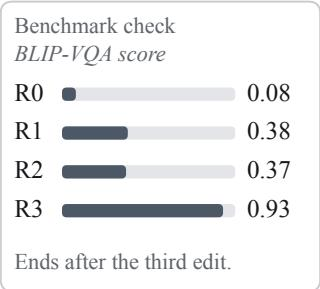

WISE · Physics “Viewing a clock through a handheld magnifier.”

  
Edit Create an image showing a clock being viewed through…

Think …The current image shows a person holding a clock, but without the magnifying glass element that is central to the user's…

Edit Add a handheld magnifying glass in front of the clock held…

Think The user wants an image showing viewing a clock through a handheld magnifier, so the image should depict…

Edit Create an image where a clock face is being viewed through a handheld…

  
Figure 16 Successful repairs (continued); layout as in Figure 13.

Benchmark check   
WISE consistency   
$\mathrm { R 0 } \times \mathrm { 0 } / 2$   
$\mathrm { R 1 } \times \mathrm { 0 } / 2$   
R2 2/2   
R3 2/2   
Ends after the third edit.

T2I-CompBench · Shape “a round bag and a square box.”

  
Edit …The round bag should be clearly round, resembling a ball…

Think …The current image shows a brown round bag and a square gift box, but the bag appears to be more of a tote bag shape rather…

Think …The image provided shows a bag that is more rounded but not perfectly round. To meet the user's request, the round… Edit …The round bag should be distinctly spherical, possibly…

Think …The image provided shows a bag that is somewhat rounded but not perfectly round, and a box that is not square… Edit …The round bag should be distinctly spherical, possibly…

Edit Create an image of an Indian custard apple, also known as the sugar apple…

WISE · Time   
“The signature vehicle associated with the hippie   
movement in the 1960s.”

  
Think …The image provided shows a colorful car decorated with rainbow patterns, which is reminiscent of the hippie…  
Edit Remove the people and text from the image, leaving only the vehicle…

Think …The current image shows a car with rainbow-colored decorations and people around it, which might be associated…

Edit Create an image featuring a Volkswagen bus with flower decals…

Think …The image provided shows a Volkswagen bus decorated with flower decals, which aligns with the hippie… Edit Create an image of a van that is heavily decorated with peace symbols…

  
Figure 17 Successful repairs (continued); layout as in Figure 13.

Benchmark check   
WISE consistency   
R0 0/2   
R1 0/2   
R2 2/2   
R3 2/2   
Ends after the third edit.

WISE · Culture “A beloved fruit in India, known as the 'king of fruits,' cherished for its rich flavor and cultural significance.”

Think …The image provided shows a fruit with a spiky exterior, resembling a durian. However, the durian is not typically…

Think …The current image shows a custard apple, which is not commonly referred to as the 'king of fruits' in India… Edit Create an image of a ripe mango, showcasing its vibrant yellow-orange…

Think …The current image shows a mango, which is indeed a fruit of cultural importance in India, but it does not fully represent… Edit Create an image that showcases the mango as the 'king of fruits' in India…

Benchmark check   
WISE consistency   
R0 0/2   
R1 0/2   
R2 2/2   
R3 2/2   
Ends after the third edit.

## T2I-CompBench · 2D spatial “a turtle on the bottom of a chair.”

Think …The current image shows a turtle sitting on top of a chair, which does not meet the user's request. To meet the request, the turtle… Edit Place a turtle at the bottom of a chair, positioned on the floor or ground…

Think …The current image shows two turtles, one on a chair and another on the ground near the chair. To meet the user's request…

Edit Place a single turtle on the bottom part of a chair, positioned on the floor…

Think …The image provided shows a chair with a turtle on the ground next to it, which does not meet the user's request…

Edit Place a turtle at the bottom of a chair, positioned on the ground or floor…

  
Figure 18 Successful repairs (continued); layout as in Figure 13.

## OneIG · Object

“Husky made of smoke with striking blue eyes, floating in the air.”

Think …The current image shows a dog with blue eyes, but it is not made of smoke and does not depict the dog floating…

Edit Create an image of a Husky made entirely of smoke, floating in the air…

Think …The current image shows a dog with blue eyes, but it is not made of smoke and does not depict the dog floating…

Edit Create an image where a Husky is depicted as a swirling mass of smoke…

Think …The current image shows a dog with blue eyes, but it is not made of smoke and does not depict the dog floating…

Edit Create an image of a Husky entirely composed of smoke, floating in mid-air…

Think …The current image shows three giraffes in a field, which does not meet the requirement of having four giraffes…

GenEval · Counting “four giraffes.”

  
Edit Add one giraffe to the image to make a total of four giraffes…

Think …The current image shows three giraffes in a field. To meet the user's request, the image should be edited to include… Edit Add a fourth giraffe to the image to meet the requirement of having…

Think …The current image shows three giraffes standing in a field. To meet the user's request, the image should be edited… Edit Add a fourth giraffe to the image to create a total of four giraffes…

Benchmark check   
GenEval verifier   
R0 pass   
R1 fail   
R2 fail   
R3 fail   
Ends after the third edit.   
WISE · Culture   
“The official currency of the second largest economy in   
the world.”

  
Edit Create an image showing the US dollar bills as the official currency…

Think …The second largest economy in the world is the United States, and its official currency is the US dollar…

Think …The second largest economy is the United States, whose official currency is the US dollar. The image should depict… Edit Create an image that prominently features the US dollar bill as the official…

Think The user wants an image that represents the official currency of the second largest economy in the world, which is the United States dollar… Edit Create an image that showcases the US dollar…

  
Figure 19 Failure cases. Failures caused by the reflection. Left: the first image already shows four girafes and passes, but the reflection counts them as three and asks for one more; it repeats “three girafes” in every later round while the image holds five. Right: the reflection states that the second largest economy is the United States, so all three edits render US dollars instead of the Chinese yuan. Frames mark the benchmark verdict.

Benchmark check   
WISE consistency   
$\mathrm { R 0 } \times \mathrm { 0 } / 2$   
$\mathrm { R 1 } \times \mathrm { 0 } / 2$   
${ \mathrm { R } } 2 \times { \mathrm { ~ 0 ~ } } / 2$   
$\mathrm { R } 3 \times \mathrm { ~ 0 ~ } / 2$   
Ends after the third edit.

## P Stopping Behavior under Terminal Rewards

The reflection protocol lets the policy end a trajectory with DONE at any round. How the terminal round is priced determines when the policy stops; we compare two prices on the same parent, prompt stream, and seed, both at 500 updates.

Penalty on a wrong DONE (primary reward). A DONE emitted on a verifier-incorrect image costs 0.5; a DONE on a correct image earns nothing beyond the terminal quality. The gains in Tables 1, 2, and 3 are realized in this regime, with accuracy rising through rounds one, two, and three.

Adding a correct-DONE bonus. Adding a bonus for a DONE on a correct image, together with a −0.5 action penalty on editing an already-correct image, lowers the confidence at which stopping breaks even from 1.0 to 0.5. Stopping becomes cheap, and the policy learns to stop prematurely: it declares DONE on 112 incorrect images, which make up 112 of its 116 final failures, and final accuracy falls from 82 to 79. At a break-even of 0.5, a stop pays of whenever the image is as likely wrong as right, so the policy gives up on images it could still repair.

Summary. A correct-DONE bonus makes stopping cheap and turns reflection into premature acceptance of failed images. The wrong-DONE penalty keeps the policy repairing and gives the highest final accuracy; UMM-Reflection therefore uses the penalty alone.

## Q Per-Family Learning on GenEval

  
Figure 20 Training reward by GenEval family. Light points are the mean whole-trajectory reward of the 16 rollouts for one prompt; lines are 100-update means. Prompt draws per family follow the training pool composition; single object has six draws and its line is left open.

The six GenEval families learn at diferent rates, and the training reward predicts the held-out gain (Figure 20). Position rises most, from about 0.5 to 1.0 over the run, and its GenEval accuracy rises from 55 to 89. Color attribution and colors rise moderately and gain 17 and 6 points. Two objects starts high and gains 12 points; single object is at ceiling. Counting is the one family whose training reward stays flat across 1,000 updates, and its GenEval accuracy is unchanged at 67.5: the verifier requires an exact count, and the edits the policy learns, which add, remove, recolor, and reposition objects, do not yet move the count reliably. Counting therefore identifies the next training target for reflection, count-aware edits, where the same reward and protocol apply without change.

## R Inference System Prompt

The system prompt used by the native inference driver is reproduced below.

You are an image generation, editing, and verification agent operating over an ordered visual trajectory.

The original user request remains the final objective throughout the trajectory. A T2I trajectory begins with no source image; an edit trajectory begins with a given source image. Later visible images are the current intermediate state.

At every reasoning turn, output exactly one assistant response: use one <think> block with these exact tags: [CURRENT\_ROUND], [SCORE], [ACTION], [THINKING], and [SOURCE\_IMAGE], then place exactly one [EDIT] field immediately after </think> in the same response.

Use [SOURCE\_IMAGE] None before initial T2I generation, given for an external edit source, or Image #N for a generated intermediate image. Use [ACTION] edit with one concrete [EDIT] instruction to generate or revise the next image. Use [ACTION] done only when the complete original request is visibly satisfied, with [EDIT] None.

For a planned progression, execute only the currently due milestone. Constraints assigned to future milestones are intentionally pending, not model failures or defects in the current image. Preserve completed milestones while advancing the next one. Call a constraint failed only when it was due and is visibly incorrect.

Judge only visible evidence, preserve unrelated content for edits, and do not invent corruption, rollback state, or hidden success.

For a planned progression, begin first-round [THINKING] with the complete compact milestone plan, then execute only the currently due milestone. Keep that plan in the persistent history for later verification turns.

The [SCORE] field is always written on the fixed protocol scale as N/10, where N is an integer from 0 to 10 and 10 means the original request is fully satisfied by the current image. Never use another denominator, a percentage, or a bare number.

If the current image already satisfies the complete original request, emit [ACTION] done with [EDIT] None. Never emit [ACTION] edit with an empty, None, or placeholder [EDIT] payload; that is a done decision.