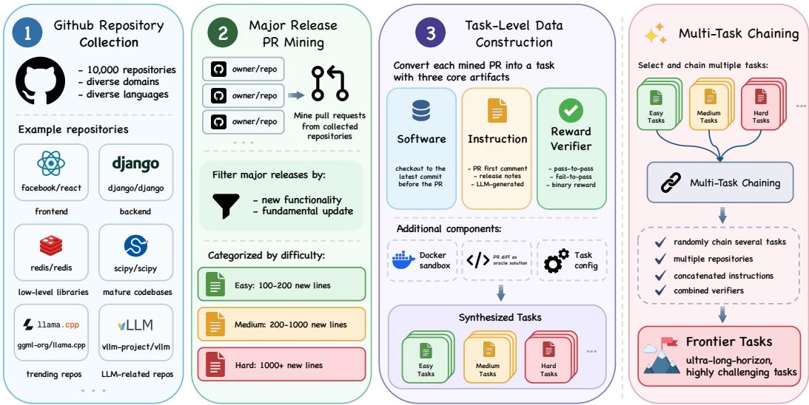
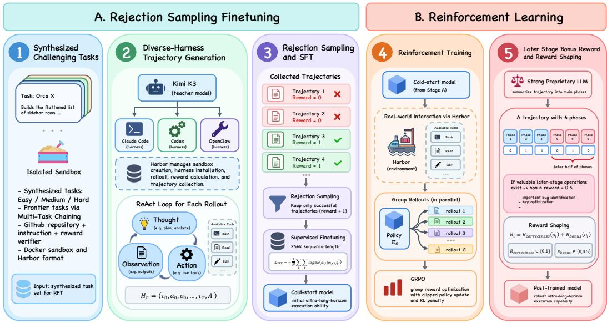
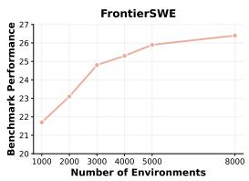
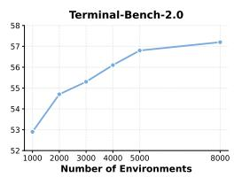
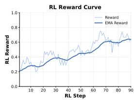
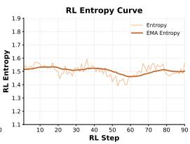

# MARATHONER: ULTRA-LONG-HORIZONAUTONOMOUS INTELLIGENCE

Ruiyang Zhang<sup>1,3</sup>, Jinpeng Ou<sup>2,3</sup>, Yifan Xie<sup>2,3</sup>, Jingang Zhou<sup>3</sup>, Lirui Pan<sup>3</sup>, Qingpei Guo<sup>3</sup>, Zhedong Zheng<sup>1</sup>

<sup>1</sup>FIC, University of Macau, <sup>2</sup>Peking University, <sup>3</sup>Ant Group Co-correspondence: qingpei.gqp@antgroup.com, zhedongzheng@um.edu.mo

## ABSTRACT

Humans naturally possess the ability to work persistently toward long-term goals. Given a challenging task, humans can continuously work for months or even years to accomplish a specific objective. Following this spirit, strong proprietary models such as Fable 5 and GPT-6-Astra have placed increasing emphasis on developing such capability, and these models can now continuously work for days to tackle challenging problems. In this paper, we propose Marathoner, an autonomous agentic model possessing the ability of ultra-long-horizon execution. Specifically, we propose a comprehensive post-training pipeline to instill this critical capability into base model, including Ultra-Long-Horizon Task Synthesis, rejection sampling finetuning, and reinforcement learning. For Ultra-Long-Horizon Task Synthesis, we leverage major release PRs containing 1000+ lines of new code from diverse GitHub repositories as the primary source for synthesizing challenging task-level data. Additionally, we introduce Multi-Task Chaining, which chains multiple generated tasks into a single more challenging task, enabling the synthesis of tasks with frontier-level difficulty. For rejection sampling finetuning, we combine strong teacher model with diverse harnesses to generate trajectories on our synthesized tasks and conduct supervised finetuning on base model with rejection sampled trajectories. For reinforcement learning, cold-started model performs real-world execution through harnesses in independent sandboxes during rollout process, effectively facilitating the acquisition of genuine ultra-long-horizon execution capability. We further propose a novel reward strategy, Later Stage Bonus Reward, which explicitly encourages model to perform meaningful maneuvers during later stages of execution. Through extensive evaluation on 5 benchmarks containing ultra-long-horizon tasks, Marathoner achieves consistent and substantial performance improvements over base model and even surpasses performance of strong proprietary model. Further analysis shows that Marathoner can consistently work for 10+ hours and conduct 1000+ tool calls on highly challenging tasks.

## 1 INTRODUCTION

Humans are inherently capable of working persistently over extended periods of time to achieve specific goals (Jiang et al., 2000; Daume et al., 2024). Given a complex task, humans can continuously work for months or even years to fully accomplish it, developing comprehensive plans, devising creative initiatives, and consistently adjusting their strategies when encountering obstacles. Specifically, given a research topic, researchers can persistently work for several months to push the boundarie of particular field and ultimately consolidate their findings into academic thesis. Mathematicians can consistently work for several years to establish rigorous proofs for longstanding mathematical conjectures, such as the proof of Fermat’s Last Theorem. In fact, such persistence constitutes a critical dimension of human intelligence and serves as a fundamental driving force behind the advancement of human civilization (Deary et al., 2010; Sternberg, 1983; Hunt, 2020).

Following this spirit, strong proprietary models from Anthropic and OpenAI have paid particular attention to developing such capability (Singh et al., 2025; Achiam et al., 2023). When assigned highly complex tasks, models such as Fable-5 and GPT-6-Astra can already work continuously for several days to obtain comprehensive solutions with the aid of appropriate harnesses. For example, GPT-6-Astra has reportedly worked continuously for days to tackle long-standing open mathematical problems, such as deriving new upper bound approaching the Cohn-Elkies threshold for spherepacking density. Moreover, several months ago, GPT-6-Astra caused security risk to HuggingFace during training of network-attack ability, where it repeatedly reconstructed attack infrastructure even after the process had been manually shut down.

However, this cutting-edge capability remains largely a mystery to the academic community (Dong et al., 2025; Liu et al., 2024). Due to its frontier nature, the training methodologies and implementation details underlying such capability in strong proprietary models are rarely disclosed, despite the clear progress illustrated by these models. In addition, the absence of such capability in open-source models substantially limits their performance, particularly in challenging and complex scenarios.

In this paper, we propose Marathoner, an agent specifically trained and assigned with ultra-longhorizon execution capability. Specifically, we propose a comprehensive post-training pipeline to explicitly instill ultra-long-horizon capability into base model, including Ultra-Long-Horizon Task Synthesis, rejection sampling finetuning, and reinforcement learning. For Ultra-Long-Horizon Task Synthesis, we intentionally collect 10,000 diverse GitHub repositories spanning different domains and programming languages to ensure the diversity of the synthesized task pool and improve the generalization of the resulting ultra-long-horizon capability. We then mine 100,000 major release PRs from these GitHub repositories and construct synthesized task based on each selected PR. Specifically, we generate task-level data in Harbor (Harbor Framework Team, 2026) format based on these PRs. Each task consists of sandbox environment configuration, codebase to operate on, task instruction, and reward verifier. The codebase of each task corresponds to the GitHub repository associated with the selected PR and is checked out at the exact commit immediately preceding the PR. We utilize the first comment of the PR as the task instruction, as it typically provides a detailed description of the PR. If such comment does not exist, we instead leverage relevant content from the release notes. If neither source is available, we generate detailed task instruction based on the codebase and the PR diff. The reward verifier consists of a comprehensive suite of unit tests, including both fail-to-pass and pass-to-pass tests. We leverage the tests introduced in the PR as fail-to-pass tests, which verify the newly implemented functionality, while existing unit tests in the codebase are utilized as pass-to-pass tests to regress previously supported functionality. For the task sandbox environment, we utilize a clean Ubuntu 24.04 image with 4 CPUs, 10 GB memory, and 40 GB storage. We do not provide additional pre-installed packages, as we consider configuring appropriate environments for diverse codebases to be an important capability of an autonomous agent. In addition, we propose Multi-Task Chaining, which chains multiple generated tasks into a single highly challenging task. This design enables the synthesis of more complex tasks that require more comprehensive planning and longer-horizon execution, thereby effectively facilitating the development of ultra-long-horizon capability. For rejection sampling finetuning, we utilize strong teacher model together with diverse harnesses to generate trajectories on our synthesized tasks. We leverage Kimi K3 (Team et al., 2026) as the teacher model due to its advanced ultra-long-horizon execution capability. After trajectory generation, we retain trajectories with reward of 1 as final RFT data. Specifically, we conduct RFT on base model with sequence length of 256k. Rejection sampling finetuning equips base model with an initial foundation for ultra-long-horizon execution. For reinforcement learning, the cold-started policy model performs rollouts with diverse harnesses in independent sandboxes, enabling realworld interaction with the environment. The training process is also conducted on our synthesized challenging task-level data. Through end-to-end practice in real-world environments, reinforcement learning further facilitates development of more general and robust ultra-long-horizon capability in cold-started model. We further propose a novel reward strategy, Later Stage Bonus Reward. For ultra-long-horizon execution, it is critical for agent to continue performing valuable actions during later stages of execution. To this end, Later Stage Bonus Reward explicitly assigns an additional reward when agent performs meaningful actions during later stages of execution. This design further improves the quality of learned ultra-long-horizon execution capability.

Through extensive evaluation on 5 benchmarks related to ultra-long-horizon capability, we observe that Marathoner achieves substantial performance improvements over base model and even surpasses strong proprietary model. Quantitative analysis shows that Marathoner can continuously execute for 10+ hours and perform 1000+ tool calls on highly challenging tasks.

Our contributions are summarized as follows:

  
Figure 1: Our proposed Ultra-Long-Horizon Task Synthesis pipeline.

• Powerful ultra-long-horizon agentic model. We propose Marathoner, an agent which is explicitly trained and assigned with ultra-long-horizon execution capability, capable of continuously work for 10+ hours and conducting 1000+ tool calls.

• A comprehensive post-training pipeline for assigning ultra-long-horizon ability. We propose a comprehensive post-training pipeline for developing ultra-long-horizon capability, including Ultra-Long-Horizon Task Synthesis, rejection sampling finetuning, and reinforcement learning. For data synthesis, we also introduce Multi-Task Chaining, which facilitates the synthesis of challenging tasks at frontier-level difficulty. For reinforcement learning, we introduce Later Stage Bonus Reward, which promotes more effective and robust ultra-long-horizon execution by rewarding meaningful actions performed during the later stages of execution.

• Superior performance on various ultra-long-horizon benchmarks. Extensive evaluation on 5 benchmarks related to ultra-long-horizon execution illustrates the superior performance of Marathoner, which shows clear improvement over base model and even surpass performance of several strong proprietary models.

## 2 METHODOLOGY

In this section, we provide a systematic overview of our post-training framework for effectively instilling ultra-long-horizon execution capability into vanilla base model, including Ultra-Long-Horizon Task Synthesis, rejection sampling finetuning, and reinforcement learning.

## 2.1 ULTRA-LONG-HORIZON TASK SYNTHESIS

Our data synthesis pipeline generates challenging task-level data based on major release PRs mined from GitHub repositories (see Fig. 1). Each task consists of three logical components: software, instruction, and reward verifier. The software defines the artifact on which the agent operates. In our setting, the software corresponds to specific GitHub repository. The instruction specifies the task that should be accomplished within the provided software environment, which is a detailed task description. Each task is also associated with corresponding reward verifier, which is responsible for assigning reward after the agent completes its execution. In our setting, the reward verifier consists of a comprehensive suite of unit tests.

Github Repository Collection. Code repositories from GitHub serve as the primary source for our data synthesis pipeline. During repository selection, we intentionally improve the diversity of the collected GitHub repositories. This fundamentally ensures the diversity of the subsequently generated tasks and facilitates the development of more general and robust ultra-long-horizon execution capability. Specifically, we select repositories from a wide range of domains, including frontend, backend, low-level libraries such as CUDA programming and database kernels, mature codebases such as SciPy, trending repositories from the GitHub trending board, and LLM-related repositories such as vLLM and SGLang. During the selection process, we also emphasize diversity in programming languages, covering both commonly utilized languages and a range of less frequently utilized ones. We ultimately collect 10,000 GitHub repositories as the source pool for our data synthesis process.

Major Release PR Mining. After collecting the GitHub repositories, we mine major release PRs from these codebases. We define major release PRs as PRs that introduce substantive new functionality into the codebase. To facilitate the progressive acquisition of ultra-long-horizon execution capability, we construct tasks at multiple difficulty levels, including Easy, Medium, and Hard. Easy tasks are constructed from PRs containing 100-200 lines of new code, Medium tasks are constructed from PRs containing 200-1000 lines of new code, and Hard tasks are synthesized from PRs containing 1000+ lines of new code. All subsequent post-training stages are conducted with a mixture of tasks across these difficulty levels. This design enables the agent to progressively extend its capability from short-horizon problem solving to the resolution of challenging ultra-long-horizon tasks. Specifically, we mine 100,000 major release PRs from the previously collected GitHub repositories. The ratio of Easy, Medium, and Hard tasks is 2:3:5, resulting in 20,000 PRs for Easy tasks, 30,000 PRs for Medium tasks, and 50,000 PRs for Hard tasks. We intentionally assign a larger proportion to Hard tasks to promote the effective acquisition of ultra-long-horizon execution capability during training.

Task-Level Data Construction. We construct task-level data based on the mined major release PRs. Each synthesized task consists of three components: software, instruction, and reward verifier, which respectively define the artifact on which the agent operates, the objective that the agent needs to accomplish, and how the reward is assigned after the agent completes its execution. For each selected major release PR, we clone the corresponding GitHub repository to serve as the codebase of the task. We then check out the repository to the latest commit immediately preceding the PR, ensuring that the agent operates on the appropriate version of the codebase. We adopt a multi-level fallback strategy to obtain task instructions. We first leverage the initial PR comment, which typically provides a comprehensive description of the modifications introduced by the PR. If such comment is unavailable, we search the repository release notes for relevant documentation associated with the PR. If neither source is available, we employ LLM to generate detailed task instruction based on the PR diff. The reward verifier consists of a comprehensive suite of unit tests, including both fail-to-pass and pass-to-pass tests. We utilize the unit tests introduced in the PR as fail-to-pass tests, which verify the correctness of the newly implemented functionality. We further leverage the unit test suite from the correct version of the codebase as pass-to-pass tests to regress existing functionality and ensure that previously supported behaviors remain intact. For all synthesized tasks, we adopt binary reward with values of 0 and 1. A task receives reward of 1 only when all unit tests are passed, and reward of 0 otherwise. Each task also contains a Dockerfile that specifies the configuration of the sandbox environment in which the agent operates, which is subsequently utilized to construct an isolated execution sandbox. We leverage the PR diff as the oracle solution for the task. Every task also has a task configuration file, containing meta data such as agent execution timeout and reward verifier timeout. Finally, we synthesize and organize all task components in the Harbor (Harbor Framework Team, 2026) format, which is a widely adopted framework for harness-based agent evaluation.

Multi-Task Chaining. We further propose Multi-Task Chaining as a technique for synthesizing more challenging ultra-long-horizon tasks. The difficulty of synthesized tasks is critically important for effectively training ultra-long-horizon execution capability. Only when the training set comprise tasks that requires agent to consistently works for hours or even 10+ hours, we can expect the trained agent to develop the ultra-long-horizon ability which can continuously execute for 10+ hours. To this end, we propose Multi-Task Chaining to synthesize an even more challenging category of tasks, which we refer to as Frontier tasks. Specifically, we first construct task for each selected major release PR following the previous data synthesis pipeline. After all tasks are generated, we randomly select several atomic tasks and chain them into a unified, highly challenging task. We leverage 5 random tasks to perform the chaining. In the chained task, the software consists of multiple GitHub repositories corresponding to the original atomic tasks, the task instruction is formed by concatenating the individual instructions from these tasks, and the reward verifier consists of the original verifiers associated with each task, each operating on its corresponding GitHub repository. Tasks generated through Multi-Task Chaining are highly complex and challenging, requiring the agent to coordinate across multiple large repositories, perform ultra-long-horizon execution, and continuously make progress even after substantial intermediate objectives have already been accomplished.

  
Figure 2: The proposed post-training pipeline for building ultra-long-horizon execution ability.

## 2.2 REJECTION SAMPLING FINETUNING

In this phase, we aim to distill the ultra-long-horizon execution capability of strong proprietary model into the base model, thereby establishing an initial foundation for the subsequent reinforcement learning stage (see Fig. 2). Specifically, we leverage our synthesized challenging tasks to elicit ultra-long-horizon execution capability from strong proprietary teacher model and collect its valuable execution trajectories. We further filter these trajectories and retain only those that achieve reward of 1. We then perform supervised finetuning on the base model with a sequence length of 256k, enabling it to acquire basic ultra-long-horizon execution ability.

Diverse-Harness Trajectory Generation. We intentionally utilize multiple harnesses to generate trajectories for the same task with the teacher model, including Claude Code, Codex, and OpenClaw. This design prevents the trained agent from overfitting to specific harness, which could limit the development of robust and general ultra-long-horizon execution capability. It encourages the agent to learn genuine execution strategies and improves its complex planning and execution ability. Specifically, we leverage Kimi K3 (Team et al., 2026) as the teacher model for trajectory generation due to its strong real-world ultra-long-horizon execution capability. For our synthesize tasks, we consistently observe that Kimi K3 needs to continuously run for hours to fully solve the task correctly, illustrating the difficulty of our synthesized tasks. We utilize Harbor to conduct trajectory generation. Harbor is a unified framework that integrates dozens of commonly utilized harnesses and supports highly concurrent rollout execution. For a given task, it can directly manage sandbox creation, harness installation, agentic rollout, reward calculation, and trajectory collection.

ReAct Loop. In standard ReAct (Yao et al., 2022) framework, the agent iteratively performs reasoning, action, and observation to solve challenging tasks. In each round, the agent first reasons based on the previous context. It then either calls a tool if it needs to conduct specific operation or terminates the trajectory by producing a final answer. When a tool call is issued, the agent waits for the observation returned by the tool and continues once the observation is available. In our scenario, agent utilizes the tool set provided by various harnesses to conduct operation, such as Bash, Read, Edit. A complete trajectory with T iterations can be defined as:

$$
\mathcal { H } _ { T } = ( \tau _ { 0 } , a _ { 0 } , o _ { 0 } , \ldots , \tau _ { i } , a _ { i } , o _ { i } , \ldots , \tau _ { T } , A ) ,\tag{1}
$$

where $\tau _ { i } , a _ { i } , o _ { i }$ represent thought, action, and observation in the i-th round, respectively. A denotes the final agent answer. At step t, the thought $\tau _ { t }$ and $a _ { t }$ are sampled from a policy based on all previous context, i.e., $\pi ( \boldsymbol { a } , t | \mathcal { H } _ { t - 1 } )$

Rejection Sampling. All generated trajectories are further filtered through rejection sampling based on the final task reward. Specifically, we retain only trajectories with final reward of 1 for the subsequent training process. These trajectories provide valuable illustration of how to correctly solve ultra-long-horizon tasks and are highly effective for developing ultra-long-horizon execution capability. The benefits of rejection sampling are twofold. First, it ensures that the retained trajectories are correct and contain useful experience for ultra-long-horizon execution. Second, it also verifies that the corresponding synthesized tasks are high quality and problem-free, since strong proprietary model can finally solve them.

Supervised Finetuning. We then perform supervised finetuning on the base model with rejection sampled trajectories. This process effectively instill initial ultra-long-horizon ability into base model and lay solid foundation for the subsequent reinforcement learning process. The supervised fine-tuning process minimizes the following objective across all training trajectories:

$$
\mathcal { L } _ { \mathrm { S F T } } = - \frac { 1 } { N } \sum _ { i = 1 } ^ { N } \sum _ { t = 1 } ^ { T _ { i } } \log \pi _ { \theta } \left( o _ { i , t } ~ \middle | ~ o _ { i , < t } , q _ { i } \right) .\tag{2}
$$

where $N$ is the number of training trajectories, $o _ { i , t }$ denotes the t-th token of the output sequence for the i-th trajectory, $T _ { i }$ is the total length of the output sequence of the i-th training trajectory, $o _ { i , < t }$ represents the tokens preceding the t-th token of the i-th training trajectory, $q _ { i }$ is the input query for the i-th training trajectory, and $\pi _ { \theta }$ is the model policy parameterized by $\theta .$

## 2.3 REINFORCEMENT LEARNING

During this stage, we perform reinforcement learning on the cold-started base model, where the policy agent interacts with real-world environments to further enhance its robust ultra-long-horizon execution capability (see Fig. 2). Specifically, policy also leverage diverse harnesses during training to avoid overfitting to specific harness. Each task is paired with a random harness from Claude Code, Codex, OpenClaw in the training process for realizing this. One important property of general ultra-long-horizon execution is the ability to continue making effective progress even after an extended period of execution. Motivated by this observation, we further propose Later Stage Bonus Reward, which explicitly rewards valuable operations performed during later stages of execution and thereby facilitates development of more effective ultra-long-horizon capability. Notably, we integrate reinforcement learning with Harbor (Harbor Framework Team, 2026), where Harbor provides unified management of rollout process, including sandbox creation, harness installation, agentic rollout, and reward calculation.

Training Algorithm. We adopt the off-the-shelf Group Reward Proximal Optimization (GRPO) algorithm (Shao et al., 2024). Specifically, GRPO performs multiple rollout samplings and optimizes the policy to favor responses with higher assigned rewards, training objective of GRPO is as follows:

$$
\begin{array} { l } { \displaystyle { \cal J _ { \mathrm { G R P O } } ( \theta ) = \mathbb { E } _ { q \sim P ( Q ) , \{ \sigma _ { i } \} _ { i = 1 } ^ { G } \sim \pi _ { \theta _ { \mathrm { o d } } } ( \cdot \vert q ) } } } \\ { \displaystyle \quad \left[ \frac { 1 } { G } \sum _ { i = 1 } ^ { G } \operatorname* { m i n } \left( \frac { \pi _ { \theta } \left( \sigma _ { i } \mid q \right) } { \pi _ { \theta _ { \mathrm { o d } } } \left( \sigma _ { i } \mid q \right) } A _ { i } , \ \mathrm { c l i p } \left( \frac { \pi _ { \theta } \left( \sigma _ { i } \mid q \right) } { \pi _ { \theta _ { \mathrm { o d } } } \left( \sigma _ { i } \mid q \right) } , 1 - \epsilon , 1 + \epsilon \right) A _ { i } \right) - \beta D _ { \mathrm { K L } } ( \pi _ { \theta } \| \pi _ { \mathrm { r e f } } ) \right] . }  \end{array}\tag{3}
$$

$$
D _ { \mathrm { K L } } ( \pi _ { \theta } \parallel \pi _ { \mathrm { r e f } } ) = \frac { \pi _ { \mathrm { r e f } } ( o _ { i } \mid q ) } { \pi _ { \theta } ( o _ { i } \mid q ) } - \log \frac { \pi _ { \mathrm { r e f } } ( o _ { i } \mid q ) } { \pi _ { \theta } ( o _ { i } \mid q ) } - 1 ,\tag{4}
$$

where $\pi _ { \theta }$ is the current model policy, $\pi _ { \theta _ { \mathrm { o l d } } }$ is the old policy, $G$ is the rollout group size, $q$ is the query, $o _ { i }$ is the i-th sampled reponse, $\pi _ { \mathrm { r e f } }$ is the reference model, ϵ is the clipping hyper-parameter controlling updating degree, and $\beta$ is the coefficient of Kullback–Leibler (KL) penalty. $A _ { i }$ is the normalized advantages computed based on rewards $\{ R _ { 1 } , R _ { 2 } , \cdots , R _ { G } \}$

Later Stage Bonus Reward. We propose this reward strategy to explicitly incentivize effective operations performed during the later stages of ultra-long-horizon execution. This design facilitates the development of genuine ultra-long-horizon capability, where the agent can continue making meaningful progress even after an extended period of execution. Specifically, after a task trajectory is completed, we leverage strong proprietary LLM to summarize the entire trajectory into several major phases. For each phase, the LLM summarizes the agent primary operations and the corresponding outcomes. After obtaining the phase-level summaries, we further employ strong proprietary LLM as a judge to determine whether each phase contains exceptionally valuable operations, such as identifying and properly fixing important hidden bugs, performing key optimizations that lead to substantial performance improvements, or conducting operations of comparable significance. The LLM judge assigns a binary flag of 0 or 1 to each phase, where a flag of 1 indicates that the phase contains such a valuable operation. We then examine whether any phase within the latter half of the entire execution trajectory is assigned a flag of 1. If such a phase exists, the agent receives an additional bonus reward of 0.5 for performing valuable operations during the later stages of execution.

Final Reward Shaping. Our final reward shaping combines both the task correctness reward and the proposed Later Stage Bonus Reward. The task correctness reward is binary outcome reward that supervises the correctness of the agent final execution result. In contrast, the Later Stage Bonus Reward provides denser supervision over major phases of execution trajectory, encouraging agent to continue making meaningful progress during extended execution and thereby facilitating development of more effective ultra-long-horizon capability. The final reward is formulated as follows:

$$
R _ { i } = R _ { \mathrm { c o r r e c t n e s s } } ( o _ { i } ) + R _ { \mathrm { b o n u s } } ( o _ { i } ) ,\tag{5}
$$

where $R _ { \mathrm { { c o r r e c t n e s s } } } ( o _ { i } )$ denotes the task correctness reward, which is binary reward taking value of either 0 or 1. This reward is computed by the reward verifier associated with each task. If the agent execution result passes all unit tests in the task reward verifier, the agent receives reward of 1. Otherwise, it receives reward of 0. $R _ { \mathrm { b o n u s } } ( o _ { i } )$ denotes the proposed Later Stage Bonus Reward, which provides additional reward of 0.5 when the LLM judge identifies that the agent performs highly valuable operation during the later stage of the ultra-long-horizon execution process.

## 3 EXPERIMENT

## 3.1 SETTING

Implementation Details. We collect 10,000 diverse GitHub repositories to serve as the source pool for our data synthesis process. We synthesize 100,000 tasks in total based on those repositories. We synthesize all tasks in the Harbor format. For all tasks, we configure the sandbox with 4 CPUs, 10G memory, and 40G disk space. We enable internet access within the sandbox. The rejection sampling finetuning stage is based on a synthesized task pool of 50,000 tasks. We leverage another set of 15,000 tasks to conduct Multi-Task Chaining, resulting in another 3,000 highly challenging tasks. We utilize Kimi K3 (Team et al., 2026) as the teacher model to generate trajectories with diverse harnesses including Claude Code, Codex, OpenClaw. With Claude Code, 14,159 trajectories yields reward of 1. With Codex, 13,583 trajectories yield reward of 1. With OpenClaw, 13,078 trajectories yield reward of 1. We utilize 40,820 high-quality trajectories in total to conduct RFT on base model. We utilize LLaMAFactory for supervised finetuning with sequence length of 256k and perform full-parameter fine-tuning on the base model. The learning rate is set to 5e-6, and the model is trained for 5 epochs. We adopt a cosine learning rate schedule with a warmup ratio of 0.05. We utilize DeepSpeed ZeRO-3 to accelerate training and enable CPU offloading to reduce GPU memory consumption. We adopt AReaL (Fu et al., 2026) as the training framework for reinforcement learning. We utilize 5,000 synthesized tasks as the RL training data. In addition, we leverage 15,000 tasks for Multi-Task Chaining, resulting in another 3,000 tasks. The total RL training data is 8,000 tasks. The training batch size is set to 32, and the number of rollouts per task is set to 8. The learning rate is set to 1e-6. During rollout, the policy model temperature is set to 0.6, and top\_p is set to 0.95. We employ GRPO for RL training. For the Later Stage Bonus Reward, we leverage Qwen-3.8-Max as the summarizer and judge for agent trajectories. We utilize Qwen3.5-9B as the base model for RFT and RL process. We leverage 32 H800 GPUs for all experiments.

Benchmarks. We utilize diverse benchmarks tailored for ultra-long-horizon capability to ensure a comprehensive evaluation of our model. FrontierSWE is designed to benchmark software engineering capability at the frontier of human expertise and contains 17 highly challenging technical problems. NL2Repo (Ding et al., 2025) is specifically designed to evaluate the ability of coding agents to construct complete code repositories from scratch, providing a rigorous and verifiable benchmark for the continuous execution capability of agentic models. SWE-Marathon (Desai et al., 2026) is a recently proposed challenging software engineering benchmark on which several strong proprietary models achieve accuracies below 40%. It contains 20 human-crafted tasks with high level of difficulty. Terminal Bench 2.0 (Merrill et al., 2026) explicitly focuses on evaluating terminal-use capability

Table 1: We conduct evaluations across a wide range of benchmarks to enable comprehensive assessment and analysis of the ultra-long-horizon execution capability of our models.
<table><tr><td>Models</td><td>|Harness</td><td>|FrontierSWE NL2Repo SWE-Marathon Terminal Bench 2.0 SWE-Bench Verified</td><td></td><td></td><td></td></tr><tr><td colspan="6">Proprietary Models with Harness</td></tr><tr><td>GLM-5.2</td><td>Claude Code</td><td>71.3 47.2</td><td></td><td>13.6</td><td>82.5</td><td>87.5</td></tr><tr><td>Qwen-3.7-Max</td><td>Claude Code</td><td>58.2</td><td>44.6</td><td>10.3</td><td>65.8</td><td>79.2</td></tr><tr><td>Kimi K3</td><td>Claude Code</td><td>79.8</td><td>48.9</td><td>35.9</td><td>86.4</td><td>86.2</td></tr><tr><td>GPT-6-Astra</td><td>Codex</td><td>89.1</td><td>78.2</td><td>48.7</td><td>87.4</td><td>90.7</td></tr><tr><td>Claude Fable 5.1</td><td>Claude Code</td><td>86.2</td><td>73.2</td><td>42.8</td><td>85.9</td><td>91.8</td></tr><tr><td>Gemini-3.1-Pro</td><td>Gemini CLI</td><td>25.9</td><td>42.8</td><td>5.9</td><td>60.3</td><td>80.1</td></tr><tr><td colspan="7">Open-source Models with Harness</td></tr><tr><td>Qwen3.5-4B</td><td>|Claude Code</td><td>5.7</td><td>3.2</td><td>0</td><td>7.1</td><td>37.6</td></tr><tr><td>Qwen3.5-9B</td><td>Claude Code</td><td>10.2</td><td>17.9</td><td>0</td><td>27.3</td><td>43.8</td></tr><tr><td>Qwen3.5-35B-A3B Qwen3.6-27B</td><td>Claude Code Claude Code</td><td>9.3 21.6</td><td>15.1 32.6</td><td>0 2.6</td><td>22.6 56.4</td><td>42.3</td></tr><tr><td>Qwen3.6-35B-A3B</td><td>Claude Code</td><td>19.2</td><td>30.7</td><td>1.3</td><td>48.3</td><td>73.3</td></tr><tr><td></td><td></td><td></td><td></td><td></td><td></td><td>71.8</td></tr><tr><td colspan="7">Ultra-Long-Horizon Agentic Model</td></tr><tr><td>Marathoner-9B</td><td>Claude Code</td><td>26.4</td><td>34.7</td><td>8.2</td><td>57.2</td><td>77.5</td></tr></table>

and contains 89 challenging tasks spanning diverse domains. SWE-Bench Verified is a pioneering benchmark for evaluating the software engineering capability of agents, primarily constructed from GitHub issues and containing 500 tasks.

## 3.2 MAIN RESULTS

We conduct thorough evaluation of our model across 5 ultra-long-horizon related benchmarks, and compare our model with various strong proprietary models and open-source models (see Tab. 1). We observe that Marathoner-9B yields clear and consistent performance improvement over the base model Qwen3.5-9B, which illustrates the effectiveness of our proposed post-training pipeline for building strong ultra-long-horizon execution ability. Moreover, Marathoner-9B even surpasses results of strong proprietary model on several benchmarks. Specifically, our model surpasses the results of Gemini-3.1-Pro on FrontierSWE and SWE-Marathon. This illustrates the powerful and real-world ultra-long-horizon capability of Marathoner, which can execution persistently and finally tackle highly challenging tasks. Notably, the ultra-long-horizon capability of our model are developed through a unified training pipeline without benchmark-specific optimization, highlighting the general effectiveness of our proposed post-training framework.

## 3.3 ABLATIONS AND ANALYSIS

Environment Scaling Results. We conduct environment scaling experiments with respect to the number of environments utilized for RL training (see Fig. 3). Specifically, we scale the number of RL training tasks from 1,000 to 8,000 and evaluate the resulting models on FrontierSWE and Terminal Bench 2.0. We observe that environment scaling is essential for improving the agent general ultralong-horizon execution capability. Notably, as the number of RL training tasks increases from 1,000 to 8,000, the agent exhibits consistent and substantial performance improvements across downstream benchmarks. Executing and interacting with a diverse set of challenging task environments can effectively facilitate the development of ultra-long-horizon execution capability across different domains. These results further indicate that continuously scaling real-world environments during reinforcement learning is a critical path for improving the upper bound of agentic performance.

RL Training Dynamic. We present the RL training dynamics of our agent (see Fig. 4). The overall RL reward increases consistently throughout the training process, indicating effective policy optimization. Through interaction with real-world environments, the agent continuously practices its ultra-long-horizon execution capability and progressively improves its performance. Moreover, the policy entropy remains stable throughout RL training, indicating steady and robust optimization process without excessive exploration or policy collapse.

Statistical Analysis of Execution Process. We present a statistical analysis of the execution process of Marathoner (see Tab. 2). We observe that Marathoner exhibits clear ultra-long-horizon execution behaviors similar to those illustrated by strong proprietary models such as Kimi K3 and GPT-6-Astra. Marathoner can consistently operate for several hours and issue hundreds of tool calls to tackle challenging tasks.







  
Figure 3: Environment scaling results with re- Figure 4: RL Training Dynamics, including RL spect to the number of RL training environments. reward and RL entropy.

Table 2: Statistics of the Marathoner execution process on FrontierSWE and Terminal Bench 2.0.
<table><tr><td>Benchmark</td><td>|Avg. Execution Time</td><td>Avg. Steps</td><td>Avg. Tool Calls</td></tr><tr><td>FrontierSWE</td><td>3.56h</td><td>426.2</td><td>648.3</td></tr><tr><td>Terminal Bench 2.0</td><td>0.58h</td><td>104.8</td><td>239.4</td></tr></table>

Table 3: Ablation of our key designs.
<table><tr><td>Setting</td><td>| FrontierSWE</td><td>Terminal Bench 2.0</td></tr><tr><td>Marathoner (vanilla)</td><td>22.7</td><td>51.3</td></tr><tr><td>Marathoner (vanilla) w. Multi-Task Chaining</td><td>24.9</td><td>54.8</td></tr><tr><td>Marathoner (vanilla) w. Diverse-Harness Trajectory Generation</td><td>24.1</td><td>53.7</td></tr><tr><td>Marathoner (vanilla) w. Later Stage Bonus Reward</td><td>24.6</td><td>54.4</td></tr></table>

Ablation of Key Designs. We present the ablation results of our proposed key designs, including Multi-Task Chaining, Diverse-Harness Trajectory Generation, and Later Stage Bonus Reward (see Tab. 3). Marathoner (vanilla) is a vanilla version of our model, trained with ordinary RFT and RL process without our proposed techniques. We observe clear performance improvement over this vanilla version when applying single proposed design into the post-training process.

## 4 CONCLUSION

In this paper, we propose Marathoner, an agentic model with strong ultra-long-horizon execution capability. Specifically, we introduce a comprehensive post-training pipeline for assigning ultralong-horizon capability into vanilla base model, consisting of Ultra-Long-Horizon Task Synthesis, rejection sampling finetuning, and reinforcement learning. For Ultra-Long-Horizon Task Synthesis, we collect diverse GitHub repositories as the data source to promote the generalization of the learned ultra-long-horizon capability. We mine major release PRs containing 1,000+ lines of new code from these repositories as the main source to synthesize highly challenging task-level data. We further propose Multi-Task Chaining to synthesize tasks with frontier-level difficulty, thereby facilitating the development of stronger ultra-long-horizon execution capability. For rejection sampling finetuning, we generate high-quality trajectories with strong proprietary model utilizing diverse harnesses, and perform supervised finetuning on the base model with rejection sampled trajectories. For reinforcement learning, the agent is trained through interaction with real-world environments leveraging diverse harnesses and learns to solve synthesized challenging tasks through real-world execution. We introduce Later Stage Bonus Reward to serve as process-level reward over the agent execution trajectory, encouraging the agent to consistently perform valuable operations even during the later stages of execution. Through comprehensive evaluation across a diverse set of benchmarks, we observe that Marathoner achieves strong performance and yields genuine ultra-long-horizon execution capability. Further analysis shows that our agent can continuously execute for 10+ hours and conduct 1000+ tool calls on highly challenging tasks.

## AI USE STATEMENT

In this work, we used generative AI tools for implementing methods, cleaning and reformatting dataset, generating synthetic data sets, and interpreting results. We have not used generative AI tools for helping develop theoretical models or conceptual frameworks, proposing or refining hypotheses, and formulating mathematical claims, providing critical ingredients for proving mathematical claims, assisting in the writing of proofs, designing or providing feedback on research methodology or experiments, assisting with translation, and supporting qualitative and thematic data analysis are not applicable to this work. Additionally, we used generative AI tools for creating or modifying scientific figures or images and creating or editing software code. We have reviewed all AI-assisted work. We carefully check the code generated by AI tools and conduct thorough checking on the quality of synthesized data. We take responsibility for the final content of this work, including text, claims or artifacts produced with the aid of generative AI.

## REFERENCES

Josh Achiam, Steven Adler, Sandhini Agarwal, Lama Ahmad, Ilge Akkaya, Florencia Leoni Aleman, Diogo Almeida, Janko Altenschmidt, Sam Altman, Shyamal Anadkat, et al. Gpt-4 technical report. arXiv preprint arXiv:2303.08774, 2023.

Qi Cao, Ruiyi Wang, Ruiyi Zhang, Sai Ashish Somayajula, and Pengtao Xie. Dreamprm: Domainreweighted process reward model for multimodal reasoning. Advances in Neural Information Processing Systems, 38:122199–122226, 2026.

Valerie Chen, Alan Zhu, Sebastian Zhao, Hussein Mozannar, David Sontag, and Ameet Talwalkar. Need help? designing proactive ai assistants for programming. In Proceedings of the 2025 CHI Conference on Human Factors in Computing Systems, pp. 1–18, 2025.

GitHub Copilot. Github copilot, 2025.

Jonathan Daume, Jan Kaminski, Andrea GP Schjetnan, Yousef Salimpour, Umais Khan, Michael´ Kyzar, Chrystal M Reed, William S Anderson, Taufik A Valiante, Adam N Mamelak, et al. Control of working memory by phase–amplitude coupling of human hippocampal neurons. Nature, 629 (8011):393–401, 2024.

Ian J Deary, Lars Penke, and Wendy Johnson. The neuroscience of human intelligence differences. Nature reviews neuroscience, 11(3):201–211, 2010.

Rishi Desai, Jesse Hu, Joan Cabezas, Neel Harsola, Pratyush Shukla, Roey Ben Chaim, Adnan El Assadi, Omkaar Mukund Kamath, Fenil Faldu, Prannay Hebbar, et al. Swe-marathon: Can agents autonomously complete ultra-long-horizon software work? arXiv preprint arXiv:2606.07682, 2026.

Jingzhe Ding, Shengda Long, Changxin Pu, Huan Zhou, Hongwan Gao, Xiang Gao, Chao He, Yue Hou, Fei Hu, Zhaojian Li, et al. Nl2repo-bench: Towards long-horizon repository generation evaluation of coding agents. arXiv preprint arXiv:2512.12730, 2025.

Yihong Dong, Xue Jiang, Jiaru Qian, Tian Wang, Kechi Zhang, Zhi Jin, and Ge Li. A survey on code generation with llm-based agents. arXiv preprint arXiv:2508.00083, 2025.

Wei Fu, Jiaxuan Gao, Xujie Shen, Chen Zhu, Zhiyu Mei, Chuyi He, Shusheng Xu, Guo Wei, Jun Mei, Jiashu Wang, et al. Areal: A large-scale asynchronous reinforcement learning system for language reasoning. Advances in Neural Information Processing Systems, 38:36256–36282, 2026.

Harbor Framework Team. Harbor: A framework for evaluating and optimizing agents and models in container environments, 2026. URL https://doi.org/10.5281/zenodo.20953922.

J McV Hunt. Human intelligence. Routledge, 2020.

Yang Jiang, James V Haxby, Alex Martin, Leslie G Ungerleider, and Raja Parasuraman. Complementary neural mechanisms for tracking items in human working memory. Science, 287(5453): 643–646, 2000.

Muhammad Khalifa, Rishabh Agarwal, Lajanugen Logeswaran, Jaekyeom Kim, Hao Peng, Moontae Lee, Honglak Lee, and Lu Wang. Process reward models that think. arXiv preprint arXiv:2504.16828, 2025.

Wendi Li and Yixuan Li. Process reward model with q-value rankings. In International Conference on Learning Representations, volume 2025, pp. 14708–14726, 2025.

Xiaobo Liang, Haoke Zhang, Juntao Li, Kehai Chen, Qiaoming Zhu, and Min Zhang. Generative reward modeling via synthetic criteria preference learning. In Proceedings of the 63rd Annual Meeting of the Association for Computational Linguistics (Volume 1: Long Papers), pp. 26755– 26769, 2025.

Junwei Liu, Kaixin Wang, Yixuan Chen, Xin Peng, Zhenpeng Chen, Lingming Zhang, and Yiling Lou. Large language model-based agents for software engineering: A survey. ACM Transaction on Software Engineering and Methodology, 2024.

Mike Merrill, Alexander Shaw, Nicholas Carlini, Boxuan Li, Harsh Raj, Ivan Bercovich, Lin Shi, Jeong Shin, Thomas Walshe, E Kelly Buchanan, et al. Terminal-bench: Benchmarking agents on hard, realistic tasks in command line interfaces. In International Conference on Learning Representations, volume 2026, pp. 40903–40986, 2026.

Steven I Ross, Fernando Martinez, Stephanie Houde, Michael Muller, and Justin D Weisz. The programmer’s assistant: Conversational interaction with a large language model for software development. In Proceedings of the 28th international conference on intelligent user interfaces, pp. 491–514, 2023.

Zhihong Shao, Peiyi Wang, Qihao Zhu, Runxin Xu, Junxiao Song, Xiao Bi, Haowei Zhang, Mingchuan Zhang, YK Li, Yang Wu, et al. Deepseekmath: Pushing the limits of mathematical reasoning in open language models. arXiv preprint arXiv:2402.03300, 2024.

Aaditya Singh, Adam Fry, Adam Perelman, Adam Tart, Adi Ganesh, Ahmed El-Kishky, Aidan McLaughlin, Aiden Low, AJ Ostrow, Akhila Ananthram, et al. Openai gpt-5 system card. arXiv preprint arXiv:2601.03267, 2025.

Mingyang Song, Zhaochen Su, Xiaoye Qu, Jiawei Zhou, and Yu Cheng. Prmbench: A fine-grained and challenging benchmark for process-level reward models. In Proceedings of the 63rd Annual Meeting of the Association for Computational Linguistics (Volume 1: Long Papers), pp. 25299– 25346, 2025.

Robert J Sternberg. Components of human intelligence. Cognition, 15(1-3):1–48, 1983.

Kimi Team, Tongtong Bai, Yifan Bai, Yiping Bao, Jianfeng Cai, Xinyuan Cai, Peizhou Cao, Yuxuan Cao, Ziwei Chai, Y Charles, et al. Kimi k3: Open frontier intelligence. arXiv preprint arXiv:2607.24653, 2026.

Huanting Wang, Jingzhi Gong, Huawei Zhang, Jie Xu, and Zheng Wang. Ai agentic programming: A survey of techniques, challenges, and opportunities. arXiv preprint arXiv:2508.11126, 2025.

Jiaxuan Wang, Yulan Hu, Wenjin Yang, Zheng Pan, Xin Li, and Lan-Zhe Guo. Aligning agents via planning: A benchmark for trajectory-level reward modeling. In Proceedings of the 64th Annual Meeting of the Association for Computational Linguistics (Volume 1: Long Papers), pp. 23174–23200, 2026a.

Zehong Wang, Fang Wu, Hongru Wang, Xiangru Tang, Bolian Li, Zhenfei Yin, Yijun Ma, Yiyang Li, Weixiang Sun, Xiusi Chen, et al. Why reasoning fails to plan: A planning-centric analysis of long-horizon decision making in llm agents. arXiv preprint arXiv:2601.22311, 2026b.

Jiaxin Wen, Jian Guan, Hongning Wang, Wei Wu, and Minlie Huang. Codeplan: Unlocking reasoning potential in large language models by scaling code-form planning. In International Conference on Learning Representations, volume 2025, pp. 78641–78663, 2025.

Michel Wermelinger. Using github copilot to solve simple programming problems. In Proceedings ofthe 54th ACM Technical Symposium on Computer Science Education V. 1, pp. 172–178, 2023.

Shunyu Yao, Jeffrey Zhao, Dian Yu, Nan Du, Izhak Shafran, Karthik Narasimhan, and Yuan Cao. React: Synergizing reasoning and acting in language models. arXiv preprint arXiv:2210.03629, 2022.

Jian Zhao, Runze Liu, Kaiyan Zhang, Zhimu Zhou, Junqi Gao, Dong Li, Jiafei Lyu, Zhouyi Qian, Biqing Qi, Xiu Li, et al. Genprm: Scaling test-time compute of process reward models via generative reasoning. In Proceedings ofthe AAAI Conference on Artificial Intelligence, volume 40, pp. 34932–34940, 2026a.

Yida Zhao, Kuan Li, Xixi Wu, Liwen Zhang, Ding-Chu Zhang, Baixuan Li, Maojia Song, Zhuo Chen, Chenxi Wang, Xinyu Wang, et al. Repurposing synthetic data for fine-grained search agent supervision. In International Conference on Learning Representations, volume 2026, pp. 14467–14492, 2026b.

Congmin Zheng, Jiachen Zhu, Zhuoying Ou, Yuxiang Chen, Kangning Zhang, Rong Shan, Zeyu Zheng, Mengyue Yang, Jianghao Lin, Yong Yu, et al. A survey of process reward models: From outcome signals to process supervisions for large language models. arXiv preprint arXiv:2510.08049, 2025.

Congmin Zheng, Jiachen Zhu, Zhuoying Ou, Yuxiang Chen, Kangning Zhang, Rong Shan, Zeyu Zheng, Mengyue Yang, Jianghao Lin, Yong Yu, et al. A comprehensive survey of process reward models: Data generation, model construction, and usage. In Proceedings of the 64th Annual Meeting of the Association for Computational Linguistics (Volume 1: Long Papers), pp. 3591– 3607, 2026.

## A RELATED WORK

Ultra-Long-Horizon Capability. Ultra-long-horizon capability have shown remarkable progress in strong proprietary models. GLM-5.2 is specifically optimized for long-horizon and complex tasks and can tackle challenging open-ended technical problems. Qwen-3.7-Max also prioritizes the enhancement of ultra-long-horizon execution capability. The model is capable of autonomously optimizing a low-level kernel for 35 hours and performing more than 1000 tool calls. Kimi K3 (Team et al., 2026) also places particular emphasis on strengthening its ultra-long-horizon coding capability, which can continuously optimize the GPU kernel for more than 20 hours and ultimately achieve over 50% speedup. GPT-6-Astra also illustrates strong ultra-long-horizon execution capability, continuously working for hours or even days to tackle challenging tasks. Moreover, Fable-5 is also recognized for its distinctive persistent execution capability, with strong ultra-long-horizon behavior clearly observable during practical usage. Different from existing works, our method proposes a comprehensive post-training framework, including Ultra-Long-Horizon Task Synthesis, rejection sampling finetuning, and reinforcement learning, to instill strong ultra-long-horizon execution capability into open-source model.

Autonomous Coding Agent. Recent coding agents can be broadly categorized into 3 types: interactive code assistants, autonomous task-oriented agents, and planning-centric agents (Wang et al., 2025; Dong et al., 2025; Liu et al., 2024). Interactive code assistants primarily support users with code completion and code editing through chat-style interfaces (Chen et al., 2025; Ross et al., 2023). Specifically, GitHub Copilot provides context-aware code completion and is designed to operate effectively over GitHub code repositories (Copilot, 2025; Wermelinger, 2023). Cursor further extends this paradigm by supporting conversational interaction and maintaining contextual information across previous editing operations. Autonomous task-oriented agents, in contrast, are designed to complete complex multi-step programming tasks with minimal human intervention. Claude Fable 5 is tailored for sustained agentic workflows, supported by advanced long-context and tool-integration capability. Planning-centric agents first decompose given task into more manageable subtasks and then solve the task by following the plan (Wang et al., 2026b;a). CodePlan (Wen et al., 2025) introduces code-form planning, where a pseudocode-based framework serves as an explicit implementation plan. Distinct from existing works, our method specifically focuses on instilling ultra-long-horizon execution capability into coding agents, leading to clear performance improvements.

Process-Level Reward. Existing approaches can be broadly categorized into 3 directions (Zheng et al., 2025; 2026; Song et al., 2025). First, discriminative process reward methods typically train a dedicated model to assign step-wise scores to trajectories based on their correctness and reasoning quality. DreamPRM (Cao et al., 2026) iteratively trains a process reward model together with domainspecific weights to improve generalization across diverse tasks. PQM (Li & Li, 2025) formulates process reward modeling as Q-value ranking problem and aligns rewards through relative ordering. Second, generative process reward models typically follow a two-stage pipeline, where the model first generates a detailed critique then produces a judgment score (Zhao et al., 2026a; Khalifa et al., 2025; Liang et al., 2025). ThinkPRM (Khalifa et al., 2025) introduces an internal thinking loop to simulate generative reflection and enable dynamic reasoning. Finally, rubric-based process reward methods design explicit rubrics for agent trajectories to quantify the effectiveness of the execution process. E-GRPO (Zhao et al., 2026b) targets deep-search agents and leverages the occurrence frequency of key entities in search trajectories as a supervision signal. Different from existing approaches, we propose Later Stage Bonus Reward, which is explicitly designed to promote the development of ultra-long-horizon execution capability during reinforcement learning.

## B IMPLEMENTATION DETAILS

## B.1 ULTRA-LONG-HORIZON TASK SYNTHESIS

Repository Collection. We first collect 10,000 diverse GitHub repositories to serve as the source pool for our data synthesis process. We select repositories spanning a wide range of domains, including frontend frameworks, backend development, low-level codebases, mature codebases, trending repositories from the GitHub Trending board, and LLM-related repositories. This design fundamentally ensures the diversity of the synthesized task data, thereby promoting the generalization of the learned ultra-long-horizon execution capabilities.

Major Release PR Mining. We download the source code of all collected GitHub repositories to local servers and mine major release PRs from these codebases. Specifically, we define major release PRs as PRs that introduce substantive new functionality into the codebase. Such PRs naturally involve a broad scope of operations, typically requiring repository-level information retrieval, large-scale code implementation, subsequent bug fixing, and comprehensive testing. These characteristics substantially increase the difficulty of the synthesized tasks. We ultimately mine 100,000 major release PRs from the collected repositories. We further define three difficulty levels for the synthesized tasks. Easy tasks are constructed from PRs containing 100-200 lines of newly added code, Medium tasks from PRs containing 200-1,000 lines of newly added code, and Hard tasks from PRs containing more than 1,000 lines of newly added code. The final ratio of Easy:Medium:Hard tasks in the overall task pool is 2:3:5.

Task Construction. We then construct task-level data based on the mined major release PRs. Specifically, we synthesize all tasks in the Harbor format. Harbor is originally designed as a framework for evaluating agents with harnesses in sandbox environments and provides a unified specification for task-level data. In Harbor, each task contains a Dockerfile specifying the sandbox environment, source artifacts on which the agent operates, a detailed task description in Markdown format, a task-specific reward verifier responsible for calculating the reward after agent execution, and a task configuration specifying attributes such as task difficulty and execution time limit. For our tasks, we configure the sandbox as a clean Ubuntu 24.04 environment with only the source code mounted. We consider the ability to set up the corresponding environment and toolchain to be an important component of real-world agentic execution, rather than restricting the agent to code implementation within a pre-configured environment. The source artifact is the corresponding GitHub repository checked out at the commit immediately preceding the selected PR. We leverage the initial PR comment as the task instruction. If it does not exist, we utilize relevant documentation from the release notes with regard to the PR. If neither source is available, we utilize Qwen-3.8-Max to generate a detailed Markdown task instruction based on the PR diff. The task verifier contains both fail-to-pass and pass-to-pass tests, derived from the unit tests introduced by the PR and the existing unit tests in the repository, respectively. We set the execution time limits for Easy, Medium, and Hard tasks to 5 hours, 10 hours, and 20 hours, respectively.

Multi-Task Chaining. We propose Multi-Task Chaining to construct substantially more challenging tasks. We refer to tasks generated through Multi-Task Chaining as Frontier tasks due to their elevated difficulty and complexity. Notably, the difficulty of synthesized training data is critical for developing ultra-long-horizon execution capabilities. During Multi-Task Chaining, we randomly select 5 tasks from the preceding data synthesis pipeline and combine them into a unified larger task. The source artifacts of the resulting task consist of all repositories associated with the selected atomic tasks. The instructions of the atomic tasks are concatenated to form the final task instruction, while the reward verifier is constructed by combining the verifiers of the selected tasks, with each verifier operating on its corresponding repository. Tasks generated through Multi-Task Chaining are highly challenging, requiring the agent to coordinate across multiple large repositories and execute continuously over an extended period. We set the execution time limit for Frontier tasks to 40 hours.

## B.2 REJECTION SAMPLING FINETUNING

Trajectory Generation. We utilize Kimi K3 as the teacher model for trajectory generation and directly leverage Harbor to conduct the rollout process. The rollout concurrency is set to 32, and network access is enabled for all sandboxes. For the source tasks, we first randomly sample 50,000 tasks from the synthesized pool of 100,000 tasks. We then independently select another 15,000 tasks and apply Multi-Task Chaining to them, resulting in 3,000 additional tasks. In total, we use 53,000 tasks for trajectory rollout. We employ three different harnesses, including Claude Code, Codex, and OpenClaw. Kimi K3 utilizes each of these harnesses to generate trajectories for all selected tasks.

Rejection Sampling. We conduct rejection sampling based on the task reward of each trajectory. A trajectory receives a reward of 1 only when the agent execution result passes all unit tests in the reward verifier, and a reward of 0 otherwise. After rejection sampling, we obtain 14,159 successful trajectories generated with Claude Code, 13,583 successful trajectories generated with Codex, and 13,078 successful trajectories generated with OpenClaw.

Supervised Finetuning. We leverage Qwen3.5-9B as the base model for the subsequent training process. We utilize a total of 40,820 high-quality trajectories to perform SFT on the base model. Specifically, we leverage LLaMA-Factory to conduct full-parameter fine-tuning with a sequence length of 256k tokens. We utilize Flash Attention 2 during the SFT process and enable DeepSpeed ZeRO-3 to accelerate training. The learning rate is set to 5e-6, and we train the model for 5 epochs. We adopt a cosine learning rate schedule with a warmup ratio of 0.05. We additionally enable CPU offloading to reduce GPU memory consumption.

## B.3 RL TRAINING DETAILS

We utilize AReaL as the training framework for reinforcement learning. AReaL is a fully asynchronous RL framework with high training throughput and places particular emphasis on decoupling the agent rollout process from policy weight updates. Notably, we integrate AReaL with Harbor to facilitate the training of agents that operate through harnesses within sandbox environments. Specifically, during RL training, Harbor manages the policy rollout process, including sandbox creation, harness installation, agentic rollout, and reward calculation. For the RL training data, we first randomly sample 5,000 tasks from the pool of 100,000 synthesized tasks, with no overlap with the RFT data. We then independently sample another 15,000 tasks and apply Multi-Task Chaining to them, resulting in an additional 3,000 highly challenging tasks. As a result, we leverage a total of 8,000 tasks for RL training. During RL training, we set the batch size to 32 and the number of rollouts per task to 8. The learning rate is set to 1e-6. During the rollout process, the model temperature is set to 0.6 and top\_p is set to 0.95. For the Later Stage Bonus Reward, we leverage Qwen-3.8-Max as the LLM for summarizing agent trajectories and assigning a binary flag to each execution phase. We utilize 32 H800 GPUs for RL training.

## B.4 BASELINES

We compare our agents with several strong proprietary models that exhibit clear ultra-long-horizon execution capability to illustrate the effectiveness of our method. GLM-5.2 is a recent frontier model proposed by Z.ai, with particular emphasis on ultra-long-horizon execution capability. Qwen-3.7- Max is a leading proprietary model designed for the agent era, possessing strong general-purpose agentic capability across a wide range of domains. Kimi K3 (Team et al., 2026) is the flagship model recently introduced by Moonshot, which is a 2.8T-parameter agentic model demonstrating exceptional ultra-long-horizon autonomous execution capability. GPT-6-Astra is a powerful agentic model that delivers outstanding performance across various professional domains and represents a new frontier in the efficiency and accuracy of computer-use capability. Claude Fable 5.1 is the most capable agentic model from Anthropic, illustrating exceptional ultra-long-horizon execution capability, particularly on challenging coding tasks. Gemini-3.1-Pro is a mainstream agentic model developed by Google Gemini, featuring native multimodal capability and strong performance across a wide range of domains. We also compare Marathoner with several open-source models, including those from Qwen3.5 series and Qwen3.6 series.

## C MORE ABLATIONS

Table 4: Ablation of the number of tasks chained in Multi-Task Chaining. # Direct Synthesized Task denotes the number of tasks from direct data synthesis during RL. # Multi-Task Chaining Task denotes the number of tasks from Multi-Task Chaining during RL. # Chained Task denotes the number of atomic tasks combined to construct a larger task in Multi-Task Chaining.
<table><tr><td># Direct Synthesized Task</td><td># Multi-Task Chaining Task |</td><td># Chained Task | FrontierSWE</td><td></td><td>Terminal Bench 2.0</td></tr><tr><td>5000</td><td>3000</td><td>2</td><td>23.8</td><td>54.1</td></tr><tr><td>5000</td><td>3000</td><td>3</td><td>24.4</td><td>54.7</td></tr><tr><td>5000</td><td>3000</td><td>5</td><td>26.4</td><td>57.2</td></tr><tr><td>5000</td><td>3000</td><td>7</td><td>25.2</td><td>56.3</td></tr><tr><td>5000</td><td>3000</td><td>9</td><td>24.8</td><td>55.9</td></tr></table>

Ablation of Number of Tasks Chained in Multi-Task Chaining. We conduct an ablation study on the number of tasks utilized to construct larger tasks in our proposed Multi-Task Chaining (see

Tab. 4). Specifically, during RL training, we leverage 5,000 tasks obtained from direct synthesis and 3,000 tasks generated through Multi-Task Chaining. We vary the number of atomic tasks combined into larger task and evaluate its effect on agent performance. We find that chaining 5 tasks yields the best performance. We analyze that small number of tasks, such as 2 or 3, fails to produce sufficiently challenging tasks, thereby limiting improvements in ultra-long-horizon execution capability. In contrast, high task number, such as 7 or 9, produces tasks that are excessively large and complex and deviate substantially from the distribution of mainstream evaluation benchmarks, resulting in suboptimal performance.  
Table 5: Ablation of the design choices for the Later Stage Bonus Reward. We analyze the effects of the bonus stage and bonus reward value on agent performance. We find that assigning a bonus reward of 0.5 to valuable actions performed during the 50%–100% stage yields the best results.
<table><tr><td>Stage</td><td>Bonus Reward</td><td>FrontierSWE</td><td>Terminal Bench 2.0</td></tr><tr><td>50%-100%</td><td>0.2</td><td>24.7</td><td>55.8</td></tr><tr><td>50%-100%</td><td>0.5</td><td>26.4</td><td>57.2</td></tr><tr><td>50%-100%</td><td>0.8</td><td>24.1</td><td>55.3</td></tr><tr><td>30%-100%</td><td>0.5</td><td>25.2</td><td>56.3</td></tr><tr><td>70%-100%</td><td>0.5</td><td>24.9</td><td>56.1</td></tr></table>

Ablation of Design for Later Stage Bonus Reward. We conduct ablation studies on the detailed design choices of the proposed Later Stage Bonus Reward (see Tab. 5). We observe that assigning bonus reward of 0.5 when the agent performs exceptionally valuable operations during the latter half of the execution yields the best performance. A smaller bonus value, such as 0.2, provides only limited positive reinforcement for valuable agent operation and therefore cannot effectively improve the agent behavior. In contrast, an excessively large bonus value, such as 0.8, could cause the agent in some rollouts to underemphasize the importance of final task correctness, thereby degrading overall performance. Regarding the rewarded stage, we find that applying the bonus during the 50%–100% portion of the execution is the most effective setting and encourages the agent to consistently perform meaningful operations throughout ultra-long-horizon execution.

Table 6: Comparison of performance between raw base model, RFT model, and final model after RL.
<table><tr><td>Model</td><td>Harness</td><td>FrontierSWE</td><td>NL2Repo</td><td>SWE-Marathon</td><td>Terminal Bench 2.0</td><td>SWE-Bench Verified</td></tr><tr><td>Qwen3.5-9B</td><td>Claude Code</td><td>10.2</td><td>17.9</td><td>0</td><td>27.3</td><td>43.8</td></tr><tr><td>Marathoner-9B-RFT</td><td>Claude Code</td><td>18.2</td><td>23.8</td><td>2.9</td><td>49.7</td><td>58.4</td></tr><tr><td>Marathoner-9B</td><td>Claude Code</td><td>26.4</td><td>34.7</td><td>8.2</td><td>57.2</td><td>77.5</td></tr></table>

Comparison Between Models from Different Stages. We present the performance of models from different stages (see Tab. 6). After rejection sampling finetuning, Marathoner-9B-RFT yield clear improvement over raw base model, illustrating the effectiveness of RFT in building initial ultra-long-horizon ability. Our model sees further performance gains after reinforcement learning. During RL process, the policy agent practices its ultra-long-horizon execution ability end-to-end in sandboxes, leading to stronger and more robust ultra-long-horizon ability.

## D PROMPT

This is the prompt for Qwen-3.8-Max to summary the agent trajectories into main phases in Later Stage Bonus Reward calculation porcess.

## Trajectory Summarization Prompt

You are given a complete agent execution trajectory for a challenging long-horizon task. Your goal is to summarize the trajectory into a sequence of coherent major execution phases. A phase should correspond to a semantically meaningful stage of the agent’s problemsolving process rather than an arbitrary fixed-length segment. Group consecutive actions that pursue the same intermediate objective, such as understanding the repository or environment, locating relevant components, implementing a specific feature, debugging a failure, optimizing

performance, validating the implementation, or repairing issues discovered during testing.   
Start a new phase when the agent’s primary objective, strategy, or type of work changes   
substantially. Preserve the chronological order of the original trajectory and ensure that all   
important operations are represented. Avoid creating excessively fine-grained phases for   
individual commands or tool calls, and avoid merging substantially different objectives into a   
single phase.   
For each phase, summarize both what the agent did and what resulted from those operations.   
phase\_content should describe the agent’s primary objective, important reasoning or decisions   
when observable from the trajectory, and the major actions performed during that phase. Focus   
on consequential operations rather than routine commands or repetitive details. phase\_result   
should describe the concrete outcome of the phase, including successful changes, discovered   
problems, test results, performance improvements, unresolved failures, or other meaningful   
consequences. Do not infer achievements that are not supported by the trajectory. If a phase   
does not produce a successful result, explicitly describe the failure or unresolved state rather   
than presenting it as successful.   
Return only valid JSON using the following format:   
“phases”: [   
“phase\_id”: 1,   
“phase\_content”: “Concise but sufficiently detailed description of the primary opera  
tions performed during this phase.”,   
“phase\_result”: “Concrete outcome or consequence of the operations performed   
during this phase.”   
},   
{   
“phase\_id”: 2,   
“phase\_content”: “...”   
“phase\_result”: “.   
}   
]   
phase\_id must start from 1 and increase sequentially according to execution order. Do not   
include any commentary, markdown, or additional fields outside the JSON object.   
Agent trajectory:   
{{AGENT\_TRAJECTORY}}

This is the prompt utilized to judge whether one phase contains exceptionally valuable operation and assign flag of 0 and 1 to the phase during the calculation of Later Stage Bonus Reward.

## Phase-Level Judging Prompt

You are given the summary of one phase from an agent’s execution trajectory. Your task is to determine whether this phase contains an exceptionally valuable operation that represents substantial and meaningful progress toward solving the task. Such operations should go beyond routine implementation, ordinary exploration, minor edits, standard testing, or straightforward bug fixing. A positive example includes discovering an important hidden or non-obvious bug and correctly fixing it, identifying a fundamental root cause after previous approaches failed, making a key architectural or algorithmic change that resolves a major blocker, performing an optimization that leads to a substantial and demonstrated performance improvement, recovering from a serious failure through an effective new strategy, or carrying out another operation of comparable importance that materially changes the likelihood of successfully completing the task.

<table><tr><td>Case for Easy Data</td></tr><tr><td>Repository: ModelTC/LightLLM Major Release PR: PR890 Instruction: SGL Kernel and VLLM Operations Integration The repository in /app contains LightLLM, a Python-based LLM inference and serving framework designed for lightweight design, easy scalability ... The implementation will</td></tr><tr><td>replace the existing VLLM kernel integration with a more modular approach that separates SGL-specific operations and general VLLM utilities into distinct modules. Module Structure and Dependencies. The implementation requires creating several new modules and modifying existing ones to properly organize the SGL kernel and VLLM operations. ...</td></tr><tr><td>Each module should have appropriate error handling to ensure that the required dependencies are installed. For example, sgl_utils.py should check if the SGL kernel is available and provide a clear error message if not, directing users to install it via pip install sgl_kernel. Quantization Method Implementation. We need to implement new quantization methods that leverage the SGL kernel and VLLM operations. The implementation should replace</td></tr><tr><td>the existing quantization methods in lightllm/common/quantization/ with more efficient alternatives: Each quantization method should implement the QuantizationMethod interface with appro- priate quantize and apply methods. The methods should handle different input tensor shapes and provide appropriate error messages for unsupported configurations.</td></tr></table>

Judge the phase based on both phase\_content and phase\_result. Assign a flag of 1 only when   
the phase contains clear evidence of an exceptionally valuable operation and its importance   
is supported by the resulting outcome. The operation should have substantial impact rather   
than merely being potentially useful. Assign a flag of 0 for routine coding, repository inspec  
tion, dependency installation, ordinary debugging, minor fixes, incremental improvements,   
repeated attempts without meaningful progress, standard testing or validation, or cases where   
the claimed improvement is not supported by the phase result. If the evidence is ambiguous,   
incomplete, or insufficient to establish substantial impact, conservatively assign 0. Do not   
reward a phase merely because it occurs late in the trajectory; evaluate only the significance   
and effectiveness of the operations contained in the phase.   
Return only valid JSON using the following format:   
“flag”: 1,   
“reasoning”: “Briefly explain which operation was exceptionally valuable, why it was   
non-trivial, and what concrete result demonstrates its importance.”   
The value of flag must be either 0 or 1. Keep reasoning concise but specific and grounded   
strictly in the provided phase. Do not include markdown, additional fields, or text outside the   
JSON object.   
Phase content:   
{{PHASE\_CONTENT}}   
Phase result:   
{{PHASE\_RESULT}}

## E SYNTHESIZED TASKS

The implementation should include appropriate logging to help diagnose any issues that may arise during operation.

## Case for Medium Data

Repository: zilliztech/GPTCache

Major Release PR: PR394

Instruction:

Add BaseCacheLLM Abstract Class to Enable Custom LLM Wrappers with Built-in Caching

The repository in /app contains GPTCache, a semantic caching library designed to reduce latency and cost for applications using large language models (LLMs) by storing and reusing responses to semantically similar queries. ... To enable seamless caching for any custom LLM wrapper that conforms to standard LLM input/output patterns, we need a new abstract base class that provides a standardized, reusable mechanism for injecting caching behavior without requiring users to reimplement adapter logic for every wrapper.

Introduce a new abstract base class named BaseCacheLLM in the module gptcache/adapter/base.py. ... The cache\_args dictionary allows users to pre-configure common cache parameters such as cache\_obj, pre\_embedding\_func, or embedding\_func so they do not need to be passed repeatedly in every call.

Subclasses of BaseCacheLLM must inherit from both the original LLM class (e.g., openai.ChatCompletion) and BaseCacheLLM to combine their behavior. ... This ensures that default cache configuration is automatically applied without overriding user-supplied values. All subclasses of BaseCacheLLM must override their original LLM method handlers (e.g., create, generate) to route all calls through GPTCache’s adapt function. ... If the llm attribute is set, the \_llm\_handler must invoke it instead of the superclass method. If llm is unset, it must invoke the superclass method directly. This design allows users to wrap any LLM with logging, timing, or authentication logic while preserving the ability to cache responses transparently.

Users must be able to configure caching for any LLM wrapper in two distinct ways. ... Second, they may set cache\_args to a dictionary containing preconfigured cache parameters (e.g., {"cache\_obj": my\_cache, "pre\_embedding\_func": get\_prompt}), and subsequent calls will automatically inherit those settings without requiring explicit arguments.

If a user calls an LLM method without a cache\_obj in the arguments and cache\_args does not contain one, the system must raise a clear, actionable error: “No cache object provided. Set cache\_obj in cache\_args or pass it directly to the method.” ... This class must be designed to be compatible with any LLM interface that accepts prompt-based inputs and returns structured responses, including OpenAI, Hugging Face, llama.cpp, and custom proxies.

## Case for Hard Data

Repository: camel-ai/camel

Major Release PR: PR3015

Instruction:

## Enhanced Terminal Toolkit for Robust Agent Operations

The repository in /app contains the CAMEL framework, an open-source project dedicated to advancing research into the scaling laws of AI agents. ... This will allow agents to execute shell commands, manage project dependencies, and interact with the underlying operating system in a controlled and reproducible manner, significantly broadening the scope of tasks they can undertake within the CAMEL framework. The toolkit will ensure that agents can set up isolated development environments, install necessary packages, and run scripts, making them more capable of autonomous problem-solving and software development.

TerminalToolkit Class Definition and Initialization.

A new Python module, terminal\_toolkit.py, must be created at the path /app/camel/toolkits/terminal\_toolkit.py. This module will define the TerminalToolkit class, which inherits from camel.toolkits.base.BaseToolkit and is decorated with @MCPServer(). This class will serve as the primary interface for agents to interact with the terminal and manage execution environments.

The TerminalToolkit class constructor must support the following parameters:

If working\_directory is not provided, the toolkit should first attempt to use the CAMEL\_WORKDIR environment variable and otherwise default to ./workspace. The directory must be created if it does not exist. The constructor must report the selected working directory and, when safe mode is enabled, indicate that write operations are confined to it. It must also register self.\_\_del\_\_ with atexit.register for cleanup.

## Environment Management.

When clone\_current\_env=True, the toolkit must create a .venv environment inside the working directory. It should first attempt to use uv, using the current Python major and minor version, and install pip, setuptools, and wheel. If uv is unavailable or fails, it must fall back to Python’s built-in venv module. On macOS, symlinks=False should be used. The resulting environment should have pip upgraded, with robust handling of missing executables, failures, and timeouts. ... The helper must report whether uv is already available, whether installation is attempted, whether installation succeeds, and any errors encountered.

## Terminal Output and User Interface.

If need\_terminal=True and the operating system is not macOS, the toolkit should attempt to create a Tkinter-based graphical terminal window. ... It should contain a session header including the current working directory. Output in file-based mode must also be written to sys.stdout for real-time feedback.

Regardless of the output mode, all terminal output must be placed into an internal output\_queue for display and logging and an agent\_queue for consumption by the agent.

## Shell Command Execution.

The TerminalToolkit must expose a public shell\_exec method as a FunctionTool. ... For non-blocking execution, the command should start asynchronously and return immediately while its output continues to be captured internally and made available through the session state or agent\_queue.

The appropriate cloned or initial Python environment must be activated before commands are executed. The implementation must provide robust error handling, including clear feedback for missing commands. All commands must respect the configured working directory, and the constructor options use\_shell\_mode and interactive must control the corresponding subprocess behavior.

## F CASE STUDY

This is a case trajectory of Marathoner on our synthesized Hard task, where it executes for 11.8 hours, interact with environment for 872 steps, and conduct 1,273 tool calls.

## Case Trajectory for Hard Task

Question: > \*\*Environment\*\*: a clean Ubuntu 24.04 sandbox — the repository checkout is at ‘/app‘, but no toolchain (Python/Node/Go/Rust, compilers, package managers) or project dependencies are preinstalled, and there is no ‘.git‘ directory. Setting up whatever environment you need to build and test your changes is part of the task.

\# Implement Native Rust Control-Flow Operations in CircuitData

\## Overview

The repository in ‘/app‘ contains the Qiskit quantum SDK, centered on a Rust core library with a Python API. Currently, control-flow operations (‘IfElseOp‘, ‘WhileLoopOp‘, ‘ForLoopOp‘, ‘SwitchCaseOp‘, ‘BoxOp‘) are stored as Python ‘Instruction‘ objects inside the Rust ‘PackedInstruction‘ data structure. This prevents Rust-based transpiler passes (e.g., twirling, duration estimation) from inspecting or manipulating control flow, and forces expensive Python round-trips during circuit manipulation.

The goal is to represent all control-flow operations as first-class Rust types, with their block bodies stored as ‘CircuitData‘ objects in a dedicated registry. This will allow Rust passes to recurse into blocks, improve performance, and lay the groundwork for future optimization passes that operate on control flow natively. The new representation must be fully backward-compatible with the existing Python API; all existing public interfaces for creating, copying, and manipulating circuits with control flow must continue to work, but internally they will use the new Rust structures.

\- ‘crates/circuit/src/operations.rs‘ – Add ‘ControlFlow‘ variant to ‘OperationRef‘, add ‘ControlFlowView‘ trait.

\- ‘crates/circuit/src/packed\_instruction.rs‘ – Add ‘PackedInstruction::from\_control\_flow‘ constructor and ‘PackedOperation::ControlFlow‘ variant.

‘crates/circuit/src/circuit\_data.rs‘ – Add ‘blocks‘ field (an ‘ObjectRegistry<Block, PyObjectAsKey>‘), modify ‘copy\_empty\_like‘ to accept a ‘BlocksMode‘ enum, update ‘push\_packed\_operation‘ signature (see below), update ‘copy‘ to handle control-flow blocks deeply.

(The full trajectory has 872 steps. Selected key steps are shown with their original step numbers.)

## Step 2

Let me start by exploring the repository structure to understand the codebase.

This is a large task. Let me plan:

3. Implement the changes.

I’ll start by exploring the repository structure to understand the codebase before implementing the changes.

/app/tools

/app/test

/app/releasenotes

/app/qiskit

/app/docs

/app/crates

/app/crates/circuit

/app/crates/cext   
/app/crates/accelerate   
CITATION.bib   
CMakeLists.txt   
CODE\_OF\_CONDUCT.md   
CONTRIBUTING.md   
Cargo.lock   
Cargo.toml   
DEPRECATION.md   
LICENSE.txt   
snapshot-level inconsistency between ‘Param::extract‘ and three downstream consumers,   
confirmed unrelated to CF by reproducing on released qiskit 2.5.2   
- 0 failures attributable to the native CF implementation

13 #[cfg(feature = "cache\_pygates")]   
14 use std::sync::OnceLock;   
< /tool\_response>   
Step 344   
<think>   
OK. I now have enough understanding to design and implement. Let me set up the task lis   
and work through it. Given the scale, I’ll organize:   
### Design summary (final)   
\*\*‘ControlFlow‘ enum\*\* (instruction.rs):   
pub enum ControlFlow {   
IfElse { condition: Py<PyAny> },   
WhileLoop { condition: Py<PyAny> },   
ForLoop { indexset: ForLoopIndexSet, loop\_variable: Option<Py<PyAny>> },   
Switch { target: Py<PyAny>, label\_spec: Py<PyAny> },   
Box { duration: Py<PyAny>, unit: Py<PyAny>, annotations: Py<PyAny> },   
The enum is better Rust. Decision made: enum.   
< /think>   
<text>   
I now have the full architectural picture. Let me set up tasks and check the remaining cross   
container copy sites in ‘circuit\_data.rs‘:   
< /text>   
<tool\_call>   
{“name”: “TaskCreate”, “arguments”: {“subject”: “Extend ControlFlow enum for faithful   
round-trip”, “description”: “. . . ”}}   
{“name”: “TaskCreate”, “arguments”: {“subject”: “Wire Python→native control-flow conver   
sion in CircuitData::pack”, “description”: “. . . ”}}   
{“name”: “TaskCreate”, “arguments”: {“subject”: “Implement native→Python reconstruction   
in CircuitData::\_\_getitem\_\_”, “description”: “. . . ”}}   
{“name”: “TaskCreate”, “arguments”: {“subject”: “Handle blocks registry in extend and   
cross-container copies”, “description”: “. . . ”}}   
{“name”: “TaskCreate”, “arguments”: {“subject”: “Add blocks registry to DAGCircuit +   
conversions”, “description”: “. . . ”}}   
{“name”: “TaskCreate”, “arguments”: {“subject”: “Add try\_view\_control\_flow; rewrite   
twirling.rs”, “description”: “. . . ”}}   
{“name”: “TaskCreate”, “arguments”: {“subject”: “cext dag.rs + target.rs spec items”, “de   
scription”: “. . . ”}}   
{“name”: “TaskCreate”, “arguments”: {“subject”: “Build Python extension and run tests”,   
“description”: “. . . ”}}   
< /tool\_call>   
<tool\_response>   
Task #1 created successfully: Extend ControlFlow enum for faithful round-trip   
Task #8 created successfully: Build Python extension and run tests   
< /tool\_response>   
Step 356   
<tool\_call>   
{“name”: “Write”, “arguments”: {“file\_path”: “/app/crates/circuit/src/instruction.rs”,   
“content”: “// This code is part of Qiskit.   
use smallvec::SmallVec;

```rust
use crate::operations::{Operation, Param};
use crate::Block;
use pyo3::types::PyAnyMethods;
/// Represents the parameters for an operation.
///
/// This enum is used to wrap the parameter list for operations, allowing
/// for both empty parameter lists and non-empty ones.
#[derive(Clone, Debug)]
pub enum Parameters {
/// No parameters.
Empty,
. . . ”}}
< /tool_call>
<tool_response>
The file /app/crates/circuit/src/instruction.rs has been updated successfully.
< /tool_response>
Step 364
<think>
Now update ‘pack‘ to convert control-flow PyInstructions, and add the ‘pack_control_flow‘ +
‘control_flow_to_py_op‘ + ‘try_view_control_flow‘ methods. Let me modify ‘pack‘ first:
< /think>
<text>
Now update ‘pack‘ to convert control-flow ops, and add the conversion/reconstruction meth
ods:
< /text>
<tool_call>
{“name”: “Edit”, “arguments”: {“file_path”: “/app/crates/circuit/src/circuit_data.rs”,
“old_string”: “fn pack(&mut self, py: Python, inst: &CircuitInstruction) -> PyRe
sult<PackedInstruction> {
. ”, “new_string”: “. . .
// Convert Python-space control-flow operations into our native representation,
// registering their blocks in this circuit’s block registry.
let op = match inst.operation.view() {
OperationRef::Instruction(py_inst) if py_inst.control_flow => {
match self.pack_control_flow(py, py_inst)? {
Some(packed) => packed,
None => inst.operation.clone(),
=> inst.operation.clone(),
};
. . . ”}}
< /tool_call>
<tool_response>
The file has been updated successfully.
< /tool_response>
Step 385
<think>
qiskit-circuit compiles. Now Task #5: DAG blocks registry. Steps:
1. Add ‘blocks: ObjectRegistry<Block, PyObjectAsKey>‘ field to DAGCircuit.
2. Initialize in constructors (‘new‘/‘with_capacity‘ — find where DAGCircuit is constructed).
3. ‘from_circuit‘: clone source’s blocks registry.
4. ‘dag_to_circuit‘: pass to ‘CircuitData::from_packed_instructions‘ — need to add a blocks
param there.
```

< /think>   
<text>   
‘qiskit-circuit‘ compiles. \*\*Task #5: DAG blocks registry.\*\*   
< /text>   
<tool\_call>   
{“name”: “TaskUpdate”, “arguments”: {“status”: “completed”, “taskId”: “2”}}   
{“name”: “TaskUpdate”, “arguments”: {“status”: “completed”, “taskId”: “3”}}   
{“name”: “TaskUpdate”, “arguments”: {“status”: “completed”, “taskId”: “4”}}   
{“name”: “TaskUpdate”, “arguments”: {“status”: “in\_progress”, “taskId”: “5”}}   
< /tool\_call>   
<tool\_response>   
Updated task #2 status   
. .   
Updated task #5 status (in\_progress)   
< /tool\_response>   
Step 458   
<tool\_call>   
{“name”: “Edit”, “arguments”: {“file\_path”: “/app/crates/accelerate/src/twirling.rs”,   
“old\_string”: “let mut out\_circ = CircuitData::copy\_empty\_like(circ, VarsMode::Alike)?;”,   
“new\_string”: “let mut out\_circ =   
CircuitData::copy\_empty\_like\_with\_blocks(circ, VarsMode::Alike, BlocksMode::Drop)?;”}}   
< /tool\_call>   
<tool\_response>   
The file has been updated successfully.   
< /tool\_response>   
Step 502   
<think>   
Build succeeded — note it builds with ‘cache\_pygates‘ feature enabled (the pyext crate   
enables it by default). So my code paths under ‘#[cfg(feature = "cache\_pygates")]‘ are the   
ones being exercised.   
Now quick smoke test, then run the control-flow test suite.   
< /think>   
<text>   
Build succeeded (with ‘cache\_pygates‘ enabled). Quick smoke test first:   
< /text>   
<tool\_call>   
{“name”: “Bash”, “arguments”: {“command”: “/app/.venv/bin/python -c "   
from qiskit.circuit import QuantumCircuit, QuantumRegister, Clbit, ClassicalRegister   
import copy   
qr = QuantumRegister(2, ’q’)   
cr = ClassicalRegister(2, ’c’)   
qc = QuantumCircuit(qr, cr)   
with qc.if\_test((cr, 1)) as else\_:   
qc.x(0)   
with else\_:   
qc.h(1)   
with qc.for\_loop(range(3)):   
qc.cx(0, 1)   
with qc.while\_loop((cr, 2)):   
qc.z(0)   
with qc.box():   
qc.y(0)   
. . . (reconstruct, copy/deepcopy isolation, mutation persistence, equality checks)”, “descrip

<table><tr><td>tion": “Smoke test control-flow round trip"}} &lt; /tool_call&gt; &lt;tool_response&gt; Exit code 1 Traceback (most recent call last): File "&lt;string&gt;", line 10, in &lt;module&gt; File "/app/qiskit/circuit/controlflow/if_else.py", line 442, in _enter_ raise CircuitError( qiskit.circuit.exceptions.CircuitError: ’The ’if' block is not the most recent instruction in the circuit. Expected to find: CircuitInstruction(operation=Instruction(name=’if_else',</td></tr><tr><td>num_qubits=1, num_clbits=2, params=[&lt;qiskit.circuit.quantumcircuit.QuantumCircuit object at 0x. . . &gt;, None]), . . . &lt; /tool_response&gt; Step 508</td></tr><tr><td>&lt;think&gt; But regardless — the identity failure is across two SEPARATE qc.data[-1]‘ calls, each creat-</td></tr><tr><td>ing a fresh CircuitInstruction AND a fresh reconstructed op. The PackedInstruction.py_op cache in self.data is NOT being populated (I only populate the wrapper's). Fix: populate inst.py_op (the PackedInstruction's OnceLock) on ... &lt; /think&gt;</td></tr><tr><td>&lt;text&gt; Now fixing get_single to cache the reconstructed op in the PackedInstruction's py_op OnceLock so identity holds across accesses: &lt; /text&gt;</td></tr><tr><td>Step 519 &lt;think&gt; Progress! Everything works except pickle: rebuilding via ‘SwitchCaseOp(target, cases) the case values are wrong during unpickle. The pickle path:__reduce_flows</td></tr><tr><td>through try_iter → each instruction materialized; on load, rebuilt via extend → pack → pack_control_flow.</td></tr><tr><td>pack_control_flow for Switch reads ... &lt; /think&gt; &lt;text&gt;</td></tr><tr><td>Pickle round-trip breaks on SwitchCaseOp — the reconstructed label_spec must be mal- formed. Checking switch_case.py's spec model: &lt; /text&gt; Step 527</td></tr><tr><td>&lt;think&gt; I see the Switch arm. The label values come straight from the stored label_spec‘ list. To make pickle round-trips robust, normalize each label: if it's not an int, pass the real</td></tr><tr><td>‘CASE_DEFAULT singleton. I need a CASE_DEFAULT import. Add to imports.rs: pub</td></tr><tr><td></td></tr><tr><td>static CASE_DEFAULT: ImportOnceCell = ... &lt; /think&gt; &lt;text&gt; Adding a CASE_DEFAULT‘ import and normalizing labels in the Switch arm (makes pickle round-trips robust — a mangled non-int label can only have been the default): &lt; /text&gt;</td></tr><tr><td>&lt;think&gt; NOW I see the bug! [..] BUT for a NATIVE while op in body1: previ- ous.params_view()[parameter] — what are the native while op's params? From pack: origi- nal Python params = [condition, body_circuit]. parameter=1 → Param::Obj(body_QC) THE ORIGINAL UNTRANSLATED body QuantumCircuit object (from the user's original circ!). That's the bug: obj.call_method(assign_parameters...)operates on the ORIGINAL block (from stale params) instead of the registry block (translated).</td></tr><tr><td>&lt; /think&gt; &lt;text&gt; Found it. In assign_parameters_inner, the Param::Obj block slot comes from previ- ous.params_view() — which for native CF ops holds the STALE pre-translation block. The reconstructed op has the current registry blocks, so the param should come from the op itself:</td></tr><tr><td>&lt; /text&gt; &lt;tool_call&gt; {“name": “Edit", “arguments": {“file_path": “/app/crates/circuit/src/circuit_data.rs", "old_string": "let previous_param = &amp;previous.params_view()[parameter];", "new_string":</td></tr><tr><td>"// For native control-flow operations, the parameter // slots in the instruction's params can hold stale // block objects if the blocks were replaced in the // registry (e.g. by transpiler passes); the // reconstructed operation's params are authoritative.</td></tr></table>

Step 685   
<think>   
So ‘\_for\_loop\_eq‘ assigns the loop variable to a SENTINEL in both bodies, THEN compares   
body DAGs. My earlier probe compared WITHOUT the sentinel assignment. So the failure   
is: sentinel-assigned body1 DAG != sentinel-assigned body2 DAG.   
Why would assign\_parameters differ between the translated body and expected body? The   
< /think>   
<text>   
The missing piece: ‘\_for\_loop\_eq‘ assigns the loop variable to a sentinel before comparing   
bodies. Replicating that:   
< /text>   
<tool\_call>   
{“name”: “Bash”, “arguments”: {“command”: “/app/.venv/bin/python - <<’EOF’   
# replicate \_for\_loop\_eq: assign the loop variable to a sentinel in both   
# bodies, then compare the body DAGs   
. ”, “description”: “Replicate sentinel assignment comparison”}}   
< /tool\_call>   
<tool\_response>   
b1 == b2: False   
b1 while body gates: [(’1q1p’, [’04c3c541-9c0c-4c9c-9987-8f1. . . \*alpha’])]   
b2 while body gates: [(’1q0p\_2’, []), (’1q1p\_2’, [’04c3c541-9c0c-4c9c-9987-   
8f1faa99290. . . \*alpha’])]   
dag eq: False   
< /tool\_response>

```rust
OperationRef::ControlFlow(_) => {
cf_param = Param::extract_no_coerce(
op.getattr(intern!(py, "params"))?
.get_item(parameter)?
.as_borrowed(),
)?;
&cf_param
}
_ => &previous.params_view()[parameter],
};”}}
< /tool_call>
<tool_response>
The file has been updated successfully.
< /tool_response>
Step 835
<think>
Confirmed — ‘ControlFlowInstruction::num_qubits()‘ returns 0 as a placeholder (from my
earlier task work — a known design decision since width depends on blocks). This breaks
‘substitute_node_with_py_op‘’s width check, which compares ‘old_packed.op.num_qubits()
(0 for native CF) vs the new op’s width (1).
The fix: . . .
< /think>
<text>
Confirmed: ‘ControlFlowInstruction::num_qubits()‘ returns 0 (placeholder by design —
width lives in the blocks). The width check in ‘substitute_node_with_py_op‘ compares
op-reported widths: old native CF (0,0) vs new Python IfElseOp (1,1) → spurious mismatch.
Let me check how ‘OperationFromPython::extract‘ handles a Python IfElseOp:
< /text>
Step 843
<tool_call>
{“name”: “Edit”, “arguments”: {“file_path”: “/app/crates/circuit/src/dag_circuit.rs”,
“old_string”: “if old_packed.op.num_qubits() != new_op.operation.num_qubits()
|| old_packed.op.num_clbits() != new_op.operation.num_clbits()

return Err(DAGCircuitError::new_err(format!(
"Cannot replace node of width ({} qubits, {} clbits) with operation of mismatched width ...",
. . . ”, “new_string”: “// The node’s wire span from the interners is authoritative: native
control-flow
// operations report a width of 0 from ‘num_qubits‘/‘num_clbits‘ because their
// width is a property of their blocks, not the operation itself.
let old_num_qubits = self.qargs_interner.get(old_packed.qubits).len() as u32;
let old_num_clbits = self.cargs_interner.get(old_packed.clbits).len() as u32;
if old_num_qubits != new_op.operation.num_qubits()
|| old_num_clbits != new_op.operation.num_clbits()
{
return Err(DAGCircuitError::new_err(format!(
"Cannot replace node of width ({} qubits, {} clbits) with operation of mismatched width ({}
qubits, {} clbits)",
old_num_qubits,
old_num_clbits,
new_op.operation.num_qubits(),
new_op.operation.num_clbits()
)));
}”}}
< /tool_call>
```

<table><tr><td>&lt;tool_response&gt; The file has been updated successfully. &lt; /tool_response&gt;</td></tr><tr><td>Step 863 &lt;think&gt;</td></tr><tr><td>The full transpiler sweep shows 689 failures vs the previous 740 — we fixed ~51 DAGCir- cuitErrors (all width-mismatch errors are gone as expected). The remaining 689 failures still include:</td></tr><tr><td>- The 306+ routing-plugin failures (environmental) - The 15 optimize_1q failures (pre-existing Param::Int panic, unrelated to this PR) - The 7 commutation-checker failures (pre-existing Param::Int)</td></tr><tr><td>&lt; /think&gt;</td></tr><tr><td>&lt;text&gt; Sweep done — **689 failed, 2593 passed** (down from 740 failed previously). The 51 DAGCircuitErrors are all gone. Let me do a final verification:</td></tr><tr><td>&lt; /text&gt; &lt;tool_call&gt;</td></tr><tr><td>{&quot;name&quot;: “Bash&quot;, &quot;arguments&quot;: {“command&quot;: &quot;/app/.venv/bin/python -m pytest test/python/- transpiler/ -q -p no:randomly -tb=line –lf 2&gt;&amp;1 I grep -E &quot;ErrorlException&quot; I grep -v .. .&quot;,</td></tr><tr><td>“description&quot;: “Classify the remaining 689 transpiler failures&quot;} } &lt; /tool_call&gt;</td></tr><tr><td>&lt;tool response&gt; 388 qiskit.transpiler.exceptions.TranspilerError: &#x27;Invalid plugin name default for stage rout-</td></tr><tr><td>ing&#x27; 131 qiskit.transpiler.exceptions.TranspilerError: &#x27;Invalid plugin name sabre for stage routing&#x27;</td></tr><tr><td>18 qiskit.transpiler.exceptions.TranspilerError: &#x27;HighLevelSynthesis is unable to synthesize &quot;annotated&quot;</td></tr><tr><td>14 pyo3_runtime.PanicException: collect_1q_runs only collects gates that can produce a</td></tr><tr><td>matrix 12 AssertionError: The two circuits are not equal.</td></tr><tr><td>8 AssertionError: &quot;The control-flow construct.*not supported&quot; does not match &quot;&#x27;Invalid</td></tr><tr><td>plugin name default for stage routing&#x27;&quot;</td></tr><tr><td>8 with self.assertRaisesRegex(TranspilerError, &quot;The control-flow construct.*not supported&quot;): &lt; /tool_response&gt;</td></tr><tr><td>&lt;answer&gt;</td></tr><tr><td>All 9 tasks complete. The width-check fix resolved the last real issue — 51 DAGCir-</td></tr><tr><td>cuitError failures across 20+ transpiler suites (test_remove_barriers, test_decompose, test_inverse_cancellation,test_commutative_cancellation, test_consolidate_blocks,</td></tr><tr><td>test_clifford_passes, test_optimize_swap_before_measure, etc.).</td></tr><tr><td></td></tr><tr><td>## Final verification summary</td></tr><tr><td></td></tr><tr><td>**All CF-specific tests pass:**</td></tr><tr><td>- test_twirling.py + test_control_flow.py: **154/154**</td></tr><tr><td>- TestSabreSwapControlFlow: **30/30**</td></tr><tr><td>- test_basis_translator.py: 36/40 (4 environmental)</td></tr><tr><td>- test_vf2_layout + test_vf2_post_layout: 65/72 (7 environmental)</td></tr><tr><td>- test_dagcircuit.py + test_compose.py: **221/221**</td></tr><tr><td>- test_control_flow_builders.py: all pass</td></tr><tr><td>- test_circuit_data.py: 198/201 (3 environmental)</td></tr><tr><td></td></tr><tr><td>- test_high_level_synthesis.py: 79/165 (86 plugin-discovery, 0 CF-caused)</td></tr><tr><td></td></tr><tr><td></td></tr><tr><td>**Remaining failures are all pre-existing or environmental:**</td></tr><tr><td></td></tr><tr><td></td></tr><tr><td></td></tr><tr><td></td></tr><tr><td></td></tr><tr><td></td></tr><tr><td></td></tr><tr><td></td></tr><tr><td>- ~644 plugin-discovery errors (entry_points(group=...) returns [] in this source install —</td></tr><tr><td></td></tr><tr><td></td></tr><tr><td></td></tr><tr><td></td></tr><tr><td></td></tr><tr><td></td></tr><tr><td></td></tr><tr><td></td></tr><tr><td></td></tr><tr><td></td></tr><tr><td></td></tr><tr><td></td></tr><tr><td></td></tr><tr><td></td></tr><tr><td></td></tr><tr><td></td></tr><tr><td></td></tr><tr><td></td></tr><tr><td></td></tr><tr><td></td></tr><tr><td></td></tr><tr><td></td></tr><tr><td></td></tr><tr><td></td></tr><tr><td></td></tr><tr><td></td></tr><tr><td></td></tr><tr><td></td></tr><tr><td></td></tr><tr><td></td></tr><tr><td></td></tr><tr><td></td></tr><tr><td></td></tr><tr><td></td></tr><tr><td></td></tr><tr><td></td></tr><tr><td></td></tr><tr><td></td></tr><tr><td></td></tr><tr><td></td></tr><tr><td></td></tr><tr><td></td></tr><tr><td></td></tr><tr><td></td></tr><tr><td></td></tr><tr><td></td></tr><tr><td></td></tr><tr><td></td></tr><tr><td></td></tr><tr><td></td></tr><tr><td></td></tr><tr><td></td></tr><tr><td></td></tr><tr><td></td></tr><tr><td></td></tr><tr><td></td></tr><tr><td></td></tr><tr><td></td></tr><tr><td></td></tr><tr><td></td></tr><tr><td></td></tr><tr><td></td></tr><tr><td></td></tr><tr><td></td></tr><tr><td></td></tr><tr><td></td></tr><tr><td></td></tr><tr><td></td></tr><tr><td></td></tr><tr><td></td></tr><tr><td></td></tr><tr><td></td></tr><tr><td>routing/synthesis/layout plugins unreachable)</td></tr><tr><td></td></tr><tr><td></td></tr><tr><td></td></tr><tr><td></td></tr><tr><td></td></tr><tr><td></td></tr><tr><td></td></tr><tr><td></td></tr><tr><td></td></tr></table>

The two width-check sites in ‘dag\_circuit.rs‘ now read the node’s wire span from the interners rather than ‘op.num\_qubits()‘, which is the authoritative source for all op types including native CF.

< /answer>