Vanilla VisionZip VisPruner

# MICO: MUTUAL INFORMATION COVERAGE OPTI-MIZATION THROUGH SEMANTIC ERASURE MODELING FOR EFFICIENT MLLM INFERENCE

Tinghao Wang1,2,∗, Yichen Guo1,3,∗, Qizhe Zhang1, Yuan Zhang1, Weimin Ouyang1, Rui Huang4, Jiajun Cao1, Sixiang Chen1, Hao Jiang1,2, Jixian Wu5,

Zheng Lu2, Bofan Zhu2, Renyuan Li2, Shanghang Zhang1,†

1State Key Laboratory of Multimedia Information Processing, School of Computer Science, Peking University 2University of Electronic Science and Technology of China, 3Nanyang Technological University,

4The University of Hong Kong, 5New York University

## ABSTRACT

Multimodal large language models (MLLMs) have demonstrated impressive performance in multimodal understanding, but processing large numbers of visual tokens results in high computational costs. While many methods have been proposed to reduce the number of visual tokens, most of them rely on heuristics and are prone to discarding substantial visual information during pruning, leading to degradation in model performance. In this work, by using a semantic erasure model, we derive a general mutual information coverage objective from task logloss and propose MiCo, a training-free two-stage pruning method. MiCo first uses visual signals to select a representative candidate pool before visual tokens enter the language model, then performs task-aware subset selection within it. At each stage, suitable observable proxies instantiate the derived objective as a monotone submodular coverage function, which MiCo greedily optimizes under the token budget. MiCo is evaluated on diverse MLLMs ranging from 7B to 13B parameters across a broad range of image and video benchmarks spanning general visual reasoning, fine-grained OCR and grounding, hallucination detection, and long-video understanding. MiCo consistently achieves the best performance across nearly all evaluated models under all pruning ratios. On LLaVA-NEXT-13B, MiCo uses only 5.6% visual tokens, retains 97.5% of baseline performance, and achieves a 3.8× inference speedup. Our experiments demonstrate the effectiveness of MiCo and our mutual information coverage objective for visual token pruning.

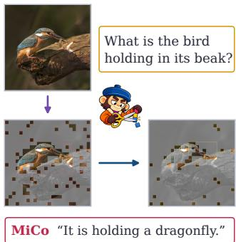  
(a) MiCo’s pruning  
(c) Quality–speed trade-off  
Figure 1: MiCo: (a) two-stage pruning on LLaVA-1.5-7B at $T = 6 4 ,$ , retaining 576→128→46 visual tokens for “What is the bird holding in its beak?”; (b) relative performance across eight image models and one video model in 22 model–budget settings, normalized to each model’s unpruned reference (video budgets are per frame); (c) POPE F1 retention relative to Vanilla versus one-token inference speedup on LLaVA-NeXT-13B.

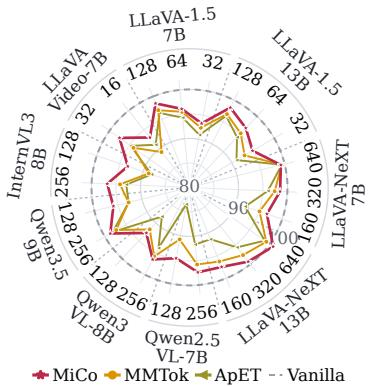  
(b) Cross-model performance

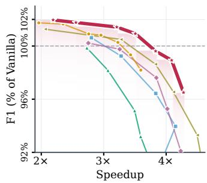  
HoloV MMTok ApET MiCo

## 1 INTRODUCTION

Large language models (LLMs) have demonstrated strong capabilities in language understanding and reasoning (Achiam et al., 2023; Grattafiori et al., 2024; Team et al., 2023; Yang et al., 2025a). By integrating vision encoders with LLMs, multimodal large language models (MLLMs) leverage these capabilities to understand visual content (Liu et al., 2023a; Bai et al., 2023; Liu et al., 2024a;b; Bai et al., 2025a; Zhu et al., 2025). They convert visual inputs into token sequences that the LLM processes jointly with text. However, a single image can produce hundreds to thousands of visual tokens, and the number grows further with image resolution, the number of input images, and video frame count. Combined with the quadratic cost of self-attention, these long sequences dominate computation and memory, so reducing visual tokens while preserving model capabilities is a central challenge.

Many methods prune visual tokens to address this problem. Importance-ranking methods score tokens individually: FastV and SparseVLM use text-to-visual attention inside the language model, whereas PruMerge and VisionZip use CLS-token attention from the vision encoder (Chen et al., 2024a; Zhang et al., 2024b; Shang et al., 2025; Yang et al., 2025b). Subset-construction methods instead build a representative token subset: DivPrune and DART use diversity criteria to reduce redundancy, while MMTok and CoverPruner use coverage criteria to preserve multimodal and visual information (Alvar et al., 2025; Wen et al., 2025; Dong et al., 2026; Zhu et al., 2026). However, attention-based ranking often retains semantically redundant tokens, whereas the tokens kept by subset construction may be irrelevant to the current query. Even methods that combine the two paradigms (Zou et al., 2025; Deng et al., 2025) are motivated by heuristics rather than an analysis of the visual information the model needs, and degrade substantially at high pruning ratios.

To preserve the visual information that inference requires, we analyze how removing visual tokens changes the expected task log-loss and, through a semantic erasure model, derive a mutual information coverage objective. Its theoretical factors are not observable in a single forward pass, so we instantiate them with observable proxies and propose MiCo, a training-free two-stage method that greedily optimizes the resulting surrogate at each stage (Figure 1(a)); since the surrogate is monotone submodular, greedy selection attains at least a (1 − 1/e) fraction of its optimum (Nemhauser et al., 1978). Across MLLMs of diverse architectures and a broad range of image and video benchmarks, MiCo achieves the strongest performance among compared methods on nearly all models at all pruning ratios (Figure 1(b)) while substantially accelerating inference (Figure 1(c)).

Our main contributions are as follows:

• We analyze the visual information required for inference from the expected task log-loss and, via a semantic erasure model, derive a general mutual information coverage objective for visual token pruning.

• We instantiate the objective with accessible proxies, obtaining a tractable submodular surrogate, and propose MiCo, a training-free method that optimizes it by greedy selection.

• Extensive experiments across MLLMs, benchmarks, and pruning ratios show that MiCo consistently preserves performance while substantially accelerating inference.

## 2 RELATED WORK

## 2.1 MULTIMODAL LARGE LANGUAGE MODELS

Multimodal large language models (MLLMs) (Liu et al., 2023a; Bai et al., 2023; Chen et al., 2024c) encode images and videos into visual tokens that the LLM processes jointly with text. Visual tokens usually far outnumber text tokens: LLaVA-1.5 (Liu et al., 2024a) uses 576 tokens for a 336×336 image, LLaVA-NeXT (Liu et al., 2024b) up to 2,880 at 672×672, dynamic-resolution models such as Qwen2.5-VL (Bai et al., 2025b), Qwen3-VL (Bai et al., 2025a), and InternVL3 (Zhu et al., 2025) scale token counts with image size, and LLaVA-Video (Zhang et al., 2024c) exceeds 10K tokens for 64 frames. These long sequences dominate prefill computation and memory, making visual token reduction essential for efficient MLLM inference.

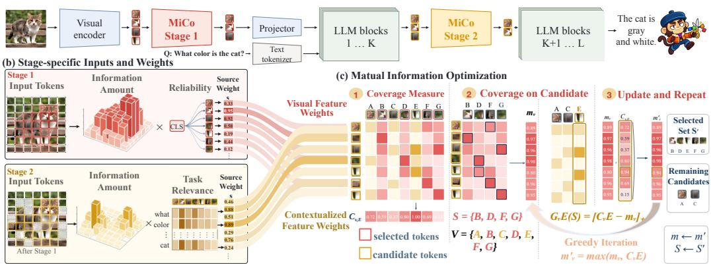  
Figure 2: Overview of MiCo’s two-stage pruning framework.

## 2.2 VISUAL TOKEN REDUCTION FOR MLLMS

Training-free pruning methods fall into two categories. The first ranks individual tokens by attention. FastV (Chen et al., 2024a), PyramidDrop (Xing et al., 2024), and SparseVLM (Zhang et al., 2024b) use the attention that visual tokens receive from text inside the LLM, whereas PruMerge (Shang et al., 2025), VisionZip (Yang et al., 2025b), and VisPruner (Zhang et al., 2025a) use CLS-to-patch attention from the visual encoder; VScan (Zhang et al., 2026) combines both attention sources. The second constructs a token subset. Diversity-based methods, including DivPrune (Alvar et al., 2025), DART (Wen et al., 2025), and CDPruner (Zhang et al., 2025b), construct mutually distinct subsets to reduce redundancy, while coverage-based methods seek subsets that represent the original visual or multimodal token set. SCOPE, MMTok, CoverPruner, and ApET instantiate different forms of coverage or representative-set construction (Deng et al., 2025; Dong et al., 2026; Zhu et al., 2026; Ma et al., 2026). Attention-based selectors can retain redundant tokens from one semantic region, whereas set-level objectives without query conditioning may spend budget on task-irrelevant regions. Moving beyond such heuristic criteria, MiCo derives a weighted mutual information cov erage objective and optimizes its observable proxy.

## 3 METHOD

## 3.1 FROM TASK LOSS TO RECOVERABLE COVERAGE

Task loss and recoverable information. Let $\pi _ { \mathrm { d a t a } }$ be the true joint distribution of visual information $Z ,$ prompt Q, shared geometric context G (the image layout and token positions, which pruning leaves unchanged), and discrete answer $Y _ { \textrm { \scriptsize i } }$ , and let $\pi _ { \mathrm { p r e d } }$ be a conditional predictor. Fix $Q = q$ and $G = g ;$ all entropies and expectations are under $\pi _ { \mathrm { d a t a } }$ and are assumed finite. For expected log-loss ${ \tilde { \mathcal { L } } } ( \pi _ { \mathrm { p r e d } } ; Z , { \dot { q } } , g ) = \mathbb { E } [ - \log \pi _ { \mathrm { p r e d } } ( Y \mid Z , q , g ) \mid q , g ]$ , the Bayes-optimal risk is $\begin{array} { r } { R _ { Z } ^ { * } ( q , g ) : = \operatorname* { i n f } _ { \pi _ { \mathrm { p r e d } } } \dot { \mathcal { L } } ( \pi _ { \mathrm { p r e d } } ; Z , q , g ) = \dot { H } ( Y \mid \dot { Z } , q , g ) } \end{array}$ (Gneiting & Raftery, 2007).

Let $\mathbf { U } _ { V } ~ = ~ ( U _ { v } ) _ { v \in V }$ be the complete visual source with discrete semantic variables $U _ { v }$ , and $\widehat { \mathbf { U } } _ { V } ( S ) = ( \widehat { U } _ { v } ( S ) ) _ { v \in V }$ the information recoverable from retained tokens S. Their Bayes risks are $R _ { \mathrm { f u l l } } ^ { * }$ and $R _ { S } ^ { * }$ , respectively. We model task relevance by a semantic-query index J with $\operatorname* { P r } ( J = v \mid q , g ) = \operatorname* { P r } ( J = v \mid Q = q )$ , sampled independently of $( \mathbf { U } _ { V } , \widehat { \mathbf { U } } _ { V } ( S ) )$ given $q , g$ for each fixed S and recovery channel. Under $Y \perp \widehat { \mathbf { U } } _ { V } ( S ) \mid \mathbf { U } _ { V } , Q , G ,$ , the log-loss/side-information identity (Jiao et al., 2015), entropy bound, and data-processing inequality (Polyanskiy & Wu, 2025, Theorems 3.4 and 3.7) yield

$$
\begin{array} { r l } & { \Delta R ^ { * } ( S ; q , g ) : = R _ { S } ^ { * } ( q , g ) - R _ { \mathrm { f u l l } } ^ { * } ( q , g ) } \\ & { } \\ & { \qquad \leq H ( \mathbf { U } _ { V } \mid q , g ) - I \Big ( U _ { J } ; \widehat { U } _ { J } ( S ) \mid J , q , g \Big ) . } \end{array}\tag{1}
$$

Since $H ( \mathbf { U } _ { V } \mid q , g )$ is independent of S, maximizing the recovered information about the queried semantic unit minimizes this upper bound for a fixed query distribution.

Semantic erasure and source-weighted mutual-information coverage. To evaluate recovery at each source position, we introduce two binary gates. The coverage gate $E _ { v }$ indicates whether S supplies a usable representative, with probability $M _ { v } ( S ; q , g ) : = \bar { \operatorname* { P r } } ( \bar { E } _ { v } = 1 \mid q , g )$ . The reliability gate $C _ { v }$ indicates whether the source representation faithfully carries $U _ { v } ;$ for a fixed recovery channel, we treat $\operatorname* { P r } ( C _ { v } = 1 \mid q , g )$ as invariant to S. Conditional on $q , g ,$ we assume $C _ { v } \perp E _ { v }$ and $( C _ { v } , E _ { v } ) \perp U _ { v }$ . The semantic erasure model is

$$
\widehat { U } _ { v } ( S ) = \left\{ \begin{array} { l l } { U _ { v } , } & { C _ { v } E _ { v } = 1 , } \\ { \perp , } & { C _ { v } E _ { v } = 0 . } \end{array} \right.\tag{2}
$$

Here ⊥ is an erasure symbol outside the alphabet of $U _ { v }$ . The independent gates succeed with probability $\mathrm { P r } ( C _ { v } \ = \ \bar { 1 } | \ q , g ) M _ { v } ( S ; q , g )$ . The standard erasure-channel identity then gives $I ( U _ { v } ; \widehat { U } _ { v } ( S ) \mid q , g ) = H ( U _ { v } \mid q , g ) \operatorname* { P r } ( C _ { v } = 1 \mid q , g ) M _ { v } ( S ; q , g )$ (Polyanskiy & Wu, 2025). Expanding over J and substituting this identity, we define the task-relevant recovered information to maximize:

$$
\begin{array} { l } { \mathcal { T } _ { \mathrm { t a s k } } ( S ; q , g ) : = I \Big ( U _ { J } ; \widehat { U } _ { J } ( S ) \mid J , q , g \Big ) } \\ { \ = \displaystyle \sum _ { v \in V } \operatorname* { P r } ( J = v \mid Q = q ) I \Big ( U _ { v } ; \widehat { U } _ { v } ( S ) \mid q , g \Big ) } \\ { \ = \displaystyle \sum _ { v \in V } H ( U _ { v } \mid q , g ) \operatorname* { P r } ( C _ { v } = 1 \mid q , g ) \operatorname* { P r } ( J = v \mid Q = q ) M _ { v } ( S ; q , g ) . } \end{array}\tag{3}
$$

In Eq. 3, the source contribution is weighted by $H ( U _ { v } \mid q , g )$ , which measures the information uncertainty associated with position v, and by $\operatorname* { P r } ( C _ { v } = 1 \mid q , g )$ and $\operatorname* { P r } ( J = v \mid Q = q )$ , which measure, respectively, the reliability of its representation and the likelihood that the query requires it. The factor $M _ { v } ( S ; q , g )$ measures how well the retained set covers that position. The result is a source-weighted coverage objective for visual-token pruning. The complete derivation is given in Appendix B.1–B.2.

## 3.2 MICO

The objective in Eq. 3 contains three theoretical factors that cannot be computed directly during a forward pass. We therefore approximate them with observable proxies, denoted by $\widehat { \mathcal { H } } _ { v } , \widehat { \mathcal { R } } _ { v } .$ , and $\mathcal { \hat { P } } _ { v } .$

We use the hidden-state norm $\widehat { \mathcal { H } } _ { v } \ = \ \lVert \boldsymbol { x } _ { v } \rVert _ { 2 }$ as a proxy for a token’s information amount, since its magnitude reflects the strength of the encoded visual signal. We approximate representation reliability $\textstyle { \widehat { \mathcal { R } } } _ { v }$ with the vision encoder’s CLS-token attention, since it measures how strongly the representation at v participates in global aggregation. At this point the visual tokens have not yet interacted with the text, so aggressive pruning could discard query-relevant tokens prematurely; Stage 1 therefore keeps a larger candidate pool, and a second selection inside the LLM uses text-tovisual attention as a query-dependent proxy for task relevance $\widehat { \mathcal { P } } _ { v }$ . The proxies are:

$$
\begin{array} { r } { ( \widehat { \mathcal { H } } _ { v } , \widehat { \mathcal { R } } _ { v } , \widehat { \mathcal { P } } _ { v } ) = \{ \begin{array} { l l } { \big ( \lVert x _ { v } ^ { \mathrm { v i s } } \rVert _ { 2 } , \overline { { A } } _ { \mathrm { C L S }  v } ^ { \mathrm { v i s } } , 1 \big ) , } & { \mathrm { S t a g e ~ 1 } , } \\ { \big ( \lVert x _ { v } ^ { ( \ell _ { \star } ) } \rVert _ { 2 } , 1 , \overline { { A } } _ { \mathrm { t e x t }  v } ^ { ( \ell _ { \star } ) } \big ) , } & { \mathrm { S t a g e ~ 2 } . } \end{array}  } \end{array}\tag{4}
$$

Here $x _ { v } ^ { \mathrm { v i s } }$ denotes the pre-projection visual feature, and $x _ { v } ^ { ( \ell _ { \star } ) }$ denotes the visual feature at the selected layer; $\overline { { A } } _ { \mathrm { C L S }  v } ^ { \mathrm { v i s } }$ is the attention from the CLS token to token v in the vision encoder, averaged over heads, and $\overline { { A } } _ { \mathrm { t e x t }  v } ^ { ( \ell _ { \star } ) }$ is the attention from the text tokens to token v at decoder layer $\ell _ { \star }$ , averaged over text queries and heads. In both stages, we estimate coverage using the best retained visual representative:

$$
\widehat { M } _ { v } ( \boldsymbol { S } ) = \operatorname* { m a x } _ { s \in \boldsymbol { S } } \left[ \frac { \boldsymbol { x } _ { v } ^ { \top } \boldsymbol { x } _ { s } } { \| \boldsymbol { x } _ { v } \| _ { 2 } \| \boldsymbol { x } _ { s } \| _ { 2 } } \right] _ { + } ,\tag{5}
$$

where $[ a ] _ { + } = \operatorname* { m a x } ( a , 0 )$ and $\widehat { M } _ { v } ( \emptyset ) = 0$ . The overall proxy objective sums the weighted coverage over all source positions:

$$
\widehat { \mathcal { T } } _ { \mathrm { t a s k } } ( S ) = \sum _ { v \in V } \widehat { \mathcal { H } } _ { v } \widehat { \mathcal { R } } _ { v } \widehat { \mathcal { P } } _ { v } \widehat { M } _ { v } ( S ) .
$$

Starting from $S = \emptyset$ , we use a greedy search to add the token $i ^ { \star } = \arg \operatorname* { m a x } _ { i \in V \backslash S } \Delta \widehat { \mathcal { I } } _ { \mathrm { t a s k } } ( i \mid S )$ until budget is reached, where $\Delta \widehat { \mathcal { T } } _ { \mathrm { t a s k } } ( i \ \mid \ S ) \ = \ \widehat { \mathcal { T } } _ { \mathrm { t a s k } } ( S \cup \{ i \} ) - \widehat { \mathcal { T } } _ { \mathrm { t a s k } } ( S )$ . The objective is normalized, monotone, and submodular, so greedy selection achieves a $( 1 - 1 / e )$ approximation under the cardinality constraint $| S | \le B$ , where B is the stage budget (Krause & Golovin, 2014; Nemhauser et al., 1978). Appendices B.3 and C.1 give the procedure and proof; Appendix C.2 checks the proxies against their theoretical counterparts, and Table 7 evaluates substitutes.

## 4 EXPERIMENTS

## 4.1 EXPERIMENTAL SETUP

Models. We evaluate MiCo on MLLMs of different architectures, covering the LLaVA family (LLaVA-1.5-7B/13B (Liu et al., 2024a) and LLaVA-NeXT-7B/13B (Liu et al., 2024b)), the Qwen family (Qwen2.5-VL-7B-Instruct (Bai et al., 2025b), Qwen3-VL-8B-Instruct (Bai et al., 2025a), and Qwen3.5-9B (Qwen Team, 2026)), and InternVL3-8B (Zhu et al., 2025). For video understanding, we use LLaVA-Video-7B (Zhang et al., 2024c).

Benchmarks. We use ten image tracks for the LLaVA family and eight for Qwen-VL/InternVL (e.g., GQA, POPE, MME, MMBench, SEED, and MMMU), supplementary tracks for grounding, document, chart, and OCR understanding (e.g., RefCOCO, DocVQA, OCRBench, and VTC-Bench), and four video benchmarks (VideoMME, MVBench, LongVideoBench, and MLVU); see Appendix A.

Baselines. We compare MiCo with FastV (Chen et al., 2024a), SparseVLM (Zhang et al., 2024b), VisionZip (Yang et al., 2025b), DivPrune (Alvar et al., 2025), VisPruner (Zhang et al., 2025a), HoloV (Zou et al., 2025), VScan (Zhang et al., 2026), MMTok (Dong et al., 2026), and ApET (Ma et al., 2026).

Implementation details. We evaluate all methods with the public evaluation stack of each model family: the official LLaVA evaluation scripts for LLaVA-1.5 and LLaVA-NeXT, VLMEvalKit (Duan et al., 2024) for Qwen2.5-VL, Qwen3-VL, Qwen3.5, and InternVL3, and lmmseval (Zhang et al., 2024a) for LLaVA-Video. Each model keeps its native processor, prompt format, and official scorer; we use batch size one with greedy decoding, and all pruning methods share the same token budgets and evaluation pipeline. For MiCo, Stage 1 keeps a candidate pool of $N _ { 1 } = 2 T$ tokens on the visual-encoder features, and Stage 2 re-selects R of them after decoder layer K, with R chosen so that the average number of visual tokens over all decoder layers equals the budget T (Appendix C.3); the per-model K values are listed in Table 19. Details are provided in Appendix C.

## 4.2 LLAVA SERIES

We evaluate LLaVA-1.5 and LLaVA-NeXT at 7B and 13B scales with pruning ratios of 77.8%, 88.9%, and 94.4%. MiCo achieves the highest aggregate score among reported pruners in 11 of 12 model–budget settings (Tables 1 and 2); the exception is LLaVA-NeXT-7B at 77.8% pruning, where VScan is 0.3 points higher. At 94.4% pruning, it retains 93.3%/94.9% of baseline performance on LLaVA-1.5-7B/13B and 96.7%/97.5% on LLaVA-NeXT-7B/13B (99.3% on NeXT-13B at 88.9%). Complete results are in Appendix G.

## 4.3 ADVANCED ARCHITECTURES

Table 2 compares Qwen2.5-VL-7B, Qwen3-VL-8B, Qwen3.5-9B, and InternVL3-8B at $T = 2 5 6$ and $T = 1 2 { \bar { 8 } }$ . MiCo achieves the highest aggregate score in all eight model–budget settings. At $T = 1 2 8 .$ , it retains 94.7%, 92.8%, 96.0%, and 93.3% of baseline performance, respectively. On Qwen2.5 and Qwen3, this exceeds MMTok by 3.9 and 1.0 percentage points; on InternVL3, the corresponding margin is 4.5 points. Qwen3.5 retains 98.7%/96.0% at $\bar { T } \stackrel { = } { = } 2 5 6 /$ 128 versus ApET’s 98.1%/92.8%, a larger advantage at the tighter budget. These gains across model families support MiCo’s applicability beyond LLaVA (full results in Appendix G).

Table 1: Performance on LLaVA-NeXT-13B across ten benchmarks.
<table><tr><td>Method</td><td colspan="9">|GQA SQA-IMG TextVQA POPE MME MMB-EN MMB-CN SEED</td><td>AI2D MMMU| |Acc</td><td></td><td></td></tr><tr><td>Upper Bound -2880 tokens (no pruning)</td><td colspan="9"></td><td></td><td></td><td></td><td></td></tr><tr><td>Vanilla</td><td>64.4</td><td>73.1</td><td>63.2</td><td>85.3</td><td>1539.5</td><td>68.5</td><td>61.2</td><td>71.6</td><td></td><td>70.1</td><td>35.7</td><td></td><td>|67.0 100.0%</td></tr><tr><td colspan="14">Retain 640 tokens (77.8% pruned)</td></tr><tr><td>FastV (ECCV’24)</td><td>60.9</td><td>71.7</td><td>60.7</td><td>80.2</td><td>1516.7</td><td>65.5</td><td>59.9</td><td>67.4</td><td></td><td>67.7</td><td>35.8</td><td>|64.6</td><td>96.4%</td></tr><tr><td>DivPrune (CVPR’25)</td><td>63.5</td><td>72.2</td><td>59.2</td><td>86.5</td><td>1526.1</td><td>67.5</td><td></td><td>62.9</td><td>69.4</td><td>68.4</td><td>37.8</td><td>66.4</td><td>99.1%</td></tr><tr><td>VisPruner (ICCV’25)</td><td>62.6</td><td>71.4</td><td>62.1</td><td>85.2</td><td>1561.2</td><td>67.4</td><td>63.1</td><td></td><td>68.8</td><td>68.2</td><td>37.0</td><td>66.4</td><td>99.1%</td></tr><tr><td>VScan (TMLR’26)</td><td>62.8</td><td>72.2</td><td>61.8</td><td>85.2</td><td>1553.6</td><td>67.6</td><td>62.7</td><td></td><td>68.2</td><td>69.9</td><td>36.6</td><td>66.5</td><td>99.2%</td></tr><tr><td>MMTok (ICLR&#x27;26)</td><td>63.7</td><td>71.4</td><td>60.8</td><td>86.8</td><td>1540.9</td><td>66.6</td><td></td><td>62.5</td><td>69.7</td><td>68.1</td><td>38.3</td><td>66.5</td><td>99.2%</td></tr><tr><td>ApET (CVPR&#x27;26) MiCo</td><td>64.2</td><td>72.5</td><td>58.0</td><td>86.4</td><td>1475.4</td><td>67.7</td><td></td><td>62.5</td><td>69.5</td><td>70.9</td><td>36.7</td><td>66.2</td><td>98.8%</td></tr><tr><td></td><td>64.3</td><td>73.2</td><td></td><td>61.9</td><td>87.0 1573.9</td><td></td><td>69.0</td><td>63.4</td><td>71.4</td><td>70.2</td><td>37.2</td><td></td><td>67.6 100.9%</td></tr><tr><td colspan="14">Retain 320 tokens (88.9% pruned)</td></tr><tr><td>FastV (ECCV’24)</td><td>54.6</td><td>70.5</td><td>55.4</td><td>63.6</td><td>1279.0</td><td>59.8</td><td>54.4</td><td>59.2</td><td></td><td>65.0</td><td>35.8</td><td>58.2</td><td>86.9%</td></tr><tr><td>DivPrune (CVPR’25)</td><td>61.8</td><td>72.3</td><td>57.6</td><td>85.2</td><td>1473.0</td><td>65.9</td><td></td><td>61.9</td><td>67.2</td><td>67.7</td><td>37.2</td><td>65.0</td><td>97.1%</td></tr><tr><td>VisPruner (ICCV’25)</td><td>60.8</td><td>70.1</td><td>60.3</td><td>81.1</td><td>1486.0</td><td>65.7</td><td></td><td>62.5</td><td>65.1</td><td>67.1</td><td>36.4</td><td>64.4</td><td>96.1%</td></tr><tr><td>VScan (TMLR’26)</td><td>61.0</td><td>72.4</td><td>59.3</td><td>82.0</td><td>1496.4</td><td>65.2</td><td></td><td>59.8</td><td>64.9</td><td>66.9</td><td>36.3</td><td>64.3</td><td>95.9%</td></tr><tr><td>MMTok (ICLR&#x27;26)</td><td>62.78</td><td>71.49</td><td>59.05</td><td>86.06</td><td>1501.1</td><td>65.0</td><td></td><td>61.7</td><td>67.7</td><td>67.9</td><td>37.2</td><td>65.4</td><td>97.6%</td></tr><tr><td>ApET (CVPR&#x27;26)</td><td>61.7</td><td>71.4</td><td>54.7</td><td>84.1</td><td>1455.0</td><td></td><td>65.6</td><td>60.1</td><td>65.5</td><td>68.4</td><td>36.4</td><td>64.1</td><td>95.6%</td></tr><tr><td>MiCo</td><td>63.3</td><td>71.3</td><td>60.9</td><td>86.5</td><td>1543.3</td><td></td><td>67.9</td><td>63.2</td><td>69.5</td><td>68.3</td><td>37.0</td><td>66.5</td><td>99.3%</td></tr><tr><td colspan="10">Retain 160 tokens (94.4% pruned)</td><td></td><td></td><td></td><td></td><td></td></tr><tr><td>DivPrune (CVPR’25)</td><td></td><td></td><td>71.4</td><td>56.3</td><td>81.9</td><td>1436.7</td><td>65.1</td><td>60.9</td><td>64.5</td><td>67.3</td><td></td><td>|63.6</td><td>94.9%</td></tr><tr><td>VisPruner (ICCV’25)</td><td>60 58.4</td><td>71.2</td><td>58.4</td><td></td><td>76.2 1390.8</td><td>64.1</td><td></td><td>59.6</td><td>61.1</td><td>65.5</td><td>36.6 36.2</td><td>62.0</td><td>92.6%</td></tr><tr><td>VScan (TMLR&#x27;26)</td><td>58.2</td><td>70.3</td><td>55.0</td><td>75.5</td><td>1385.1</td><td>61.5</td><td>53.4</td><td></td><td>61.5</td><td>63.4</td><td>34.1</td><td>60.2</td><td>89.9%</td></tr><tr><td>MMTok (ICLR&#x27;26)</td><td>62.02</td><td>72.19</td><td>56.47</td><td>85.52</td><td>1465.7</td><td>65.3</td><td></td><td>60.3</td><td>65.5</td><td>67.3</td><td>37.0</td><td>64.5</td><td>96.3%</td></tr><tr><td>ApET (CVPR’26)</td><td>59.1</td><td>71.4</td><td>52.9</td><td>79.6</td><td>1342.7</td><td>62.1</td><td></td><td>55.8</td><td>62.3</td><td>65.6</td><td>36.8</td><td>61.3</td><td>91.4%</td></tr><tr><td>MiCo</td><td>62.0</td><td>71.8</td><td>58.4</td><td>85.0</td><td>1488.4</td><td></td><td>66.2</td><td>63.1</td><td>67.6</td><td>68.0</td><td>36.7</td><td></td><td>65.397.5%</td></tr></table>

Table 2: Relative performance (%) across LLaVA, Qwen-VL, and InternVL models; Vanilla is 100%.

<table><tr><td>Method</td><td colspan="10">LLaVA</td><td colspan="6">Qwen-VL</td><td colspan="2">InternVL</td></tr><tr><td>Model</td><td colspan="3">1.5-7B</td><td colspan="2">1.5-13B</td><td colspan="2"></td><td colspan="3">NeXT-7B</td><td colspan="2">2.5-VL-7B</td><td colspan="2">3-VL-8B</td><td colspan="2">3.5-9B</td><td colspan="2">3-8B</td></tr><tr><td>Budget T</td><td>128</td><td>64</td><td>32</td><td>128</td><td>64</td><td>32</td><td>640</td><td>320</td><td></td><td>160</td><td>256</td><td>128</td><td>256</td><td>128</td><td>256</td><td>128</td><td>256</td><td>128</td></tr><tr><td>FastV</td><td>92.6</td><td>75.5</td><td></td><td>94.1</td><td>85.0</td><td></td><td>95.4</td><td>80.4</td><td></td><td></td><td>93.0</td><td>77.9</td><td>84.3</td><td>63.7</td><td>84.0</td><td>62.8</td><td>95.5</td><td>81.5</td></tr><tr><td>DivPrune</td><td>96.8</td><td>94.4</td><td>91.3</td><td>96.7</td><td>93.2</td><td></td><td>91.2</td><td>99.0</td><td>97.2</td><td>94.2</td><td>94.5</td><td>90.3</td><td>93.6</td><td>88.6</td><td>95.9</td><td>91.8</td><td>93.3</td><td>87.7</td></tr><tr><td>VisPruner</td><td>96.6</td><td>93.3</td><td>87.8</td><td>96.6</td><td>93.6</td><td>88.5</td><td></td><td>98.7</td><td>95.6</td><td>91.0</td><td>91.8</td><td>88.0</td><td>94.2</td><td>86.8</td><td>97.0</td><td>90.1</td><td>89.4</td><td>81.1</td></tr><tr><td>VScan</td><td>97.8</td><td>96.0</td><td>91.8</td><td>97.3</td><td>96.0</td><td>88.7</td><td></td><td>99.5</td><td>96.2</td><td>90.3</td><td>94.8</td><td>90.6</td><td>95.4</td><td>90.1</td><td></td><td></td><td>92.9</td><td>87.3</td></tr><tr><td>MMTok</td><td>97.0</td><td>95.5</td><td>92.4</td><td>96.8</td><td>95.2</td><td>93.0</td><td></td><td>99.4</td><td>97.4</td><td>95.1</td><td>95.8</td><td>90.8</td><td>95.8</td><td>91.8</td><td>97.3</td><td>92.8</td><td>94.2</td><td>88.8</td></tr><tr><td>ApET</td><td>96.4</td><td>94.3</td><td>90.9</td><td>96.4</td><td>94.1</td><td>91.1</td><td></td><td>99.4</td><td>96.0</td><td>92.0</td><td>91.7</td><td>83.5</td><td>93.9</td><td>88.2</td><td>98.1</td><td>92.8</td><td>92.9</td><td>88.2</td></tr><tr><td>MiCo</td><td>98.5</td><td>96.1</td><td>93.3</td><td>98.3</td><td>96.7</td><td>94.9</td><td></td><td>99.2</td><td>98.5</td><td>96.7</td><td>97.4</td><td>94.7</td><td>96.5</td><td>92.8</td><td>98.7</td><td>96.0</td><td>96.8 93.3</td><td></td></tr></table>

## 4.4 LLAVA-VIDEO

Table 3 compares LLaVA-Video-7B at per-frame budgets T = 32 and T = 16. MiCo achieves the highest Acc at both budgets and leads seven of eight task–budget comparisons; at $T = 3 2$ it exceeds ApET, the strongest baseline, by 3.1 points on MLVU and 1.7 Acc points overall, and at T = 16 it prunes 90.5% of visual tokens while retaining 93.0% of baseline performance with a 2.31× speedup.

## 4.5 EFFICIENCY STUDY

At T = 16 on LLaVA-Video-7B (Table 3), MiCo retains 93.0% of baseline performance with a 2.31× complete-answer speedup, 75.8% fewer logical FLOPs, and the lowest peak memory of all compared methods (21.32 vs. 25.59 GiB for Vanilla; FastV, SparseVLM, and VisPruner exceed the unpruned model). Figure 1(c) shows 99.62% POPE F1 retention at a 3.83× one-token speedup on NeXT-13B; Figure 3 shows 99.61% at 2.93× on NeXT-7B and 98.25% VideoMME retention at 1.81× on Video, together with where MiCo’s latency goes. Protocols and the full NeXT-7B/13B comparisons (Table 10) are in Appendix D.

Table 3: Performance and efficiency on LLaVA-Video-7B.
<table><tr><td rowspan="3">Method</td><td colspan="6">Performance (%)↑</td><td colspan="3">Efficiency↓</td></tr><tr><td></td><td></td><td>LongVideo</td><td></td><td></td><td></td><td>Latency</td><td>Peak memory</td><td>Logical</td></tr><tr><td>VideoMME</td><td>MVBench</td><td>Bench</td><td>MLVU</td><td>Acc</td><td>Rel</td><td>(ms)</td><td>(GiB)</td><td>FLOPs (T)</td></tr><tr><td>Vanilla 63.63</td><td></td><td>58.18</td><td>59.01</td><td>67.75</td><td>62.14</td><td>100.0%</td><td>1855.0</td><td>25.59</td><td>243.833</td></tr><tr><td colspan="10">Budget T = 32 tokens per frame</td></tr><tr><td>FastV</td><td>56.00</td><td>52.58</td><td>52.40</td><td>58.50</td><td>54.87</td><td>88.3%</td><td>975.1</td><td>41.30</td><td>75.951</td></tr><tr><td>SparseVLM</td><td>59.00</td><td>54.40</td><td>53.70</td><td>60.70</td><td>56.95</td><td>91.6%</td><td>1105.3</td><td>41.30</td><td>76.338</td></tr><tr><td>DivPrune</td><td>59.30</td><td>53.85</td><td>56.40</td><td>61.50</td><td>57.76</td><td>93.0%</td><td>881.8</td><td>22.61</td><td>74.738</td></tr><tr><td>VisPruner</td><td>60.15</td><td>55.20</td><td>56.69</td><td>62.46</td><td>58.63</td><td>94.3%</td><td>884.2</td><td>47.96</td><td>74.732</td></tr><tr><td>MMTok</td><td>59.67</td><td>54.90</td><td>57.07</td><td>61.96</td><td>58.40</td><td>94.0%</td><td>1098.9</td><td>22.61</td><td>74.734</td></tr><tr><td>ApET</td><td>59.63</td><td>55.33</td><td>57.44</td><td>62.89</td><td>58.82</td><td>94.7%</td><td>924.1</td><td>22.61</td><td>74.734</td></tr><tr><td>MiCo</td><td>61.81</td><td>56.78</td><td>57.67</td><td>65.99</td><td>60.56</td><td>97.5%</td><td>933.8</td><td>21.32</td><td>74.834</td></tr><tr><td colspan="10">Budget T = 16 tokens per frame</td></tr><tr><td>FastV</td><td>50.00</td><td>46.45</td><td>46.60</td><td>52.80</td><td>48.96</td><td>78.8%</td><td>885.0</td><td>41.30</td><td>60.937</td></tr><tr><td>SparseVLM</td><td>49.80</td><td>50.80</td><td>47.60</td><td>52.00</td><td>50.05</td><td>80.5%</td><td>1093.1</td><td>41.30</td><td>61.750</td></tr><tr><td>DivPrune</td><td>56.70</td><td>51.83</td><td>52.10</td><td>58.60</td><td>54.81</td><td>88.2%</td><td>783.7</td><td>22.61</td><td>59.002</td></tr><tr><td>VisPruner</td><td>56.41</td><td>52.15</td><td>52.28</td><td>57.14</td><td>54.50</td><td>87.7%</td><td>789.6</td><td>47.96</td><td>58.997</td></tr><tr><td>MMTok</td><td>55.96 57.04</td><td>52.18 54.00</td><td>54.38</td><td>59.27</td><td>55.45</td><td>89.2%</td><td>902.0</td><td>22.61</td><td>58.998</td></tr><tr><td>ApET MiCo</td><td>59.78</td><td>54.80</td><td>56.32</td><td>59.06</td><td>56.61</td><td>91.1% 93.0%</td><td>818.2 804.7</td><td>22.61</td><td>58.994 58.913</td></tr><tr><td></td><td></td><td></td><td>54.75</td><td>61.93</td><td>57.82</td><td></td><td></td><td>21.32</td><td></td></tr></table>

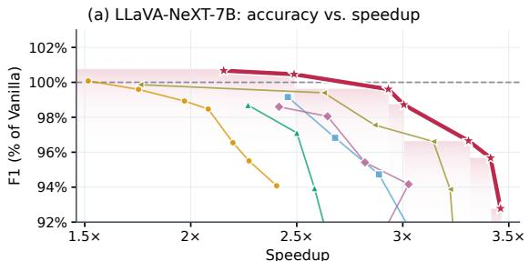  
(b) LLaVA-Video-7B: accuracy vs. speedup

(c) MiCo latency breakdown, LLaVA-NeXT-7B  
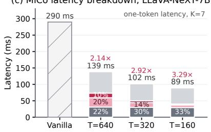  
(d) MiCo latency breakdown, LLaVA-Video-7B

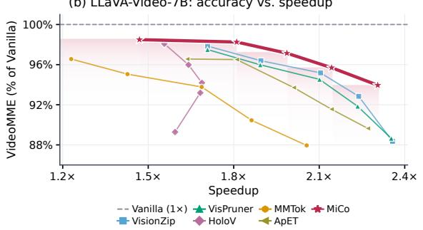  
Figure 3: Performance–efficiency trade-offs (a, b) and MiCo’s latency by component with speedups over Vanilla (c, d); NeXT one-token, Video complete-answer latency. Details in Appendix D.

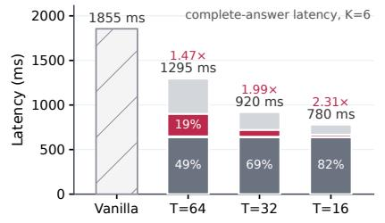  
MiCo Stage 1 Vision encoder + projector Vanilla (no pruning) MiCo Stage 2 LLM decoder + head + runtime

## 4.6 CHALLENGING VISUAL UNDERSTANDING

Grounding. Grounding tests whether the retained tokens support spatial localization (parenthesized values are retention relative to Vanilla). On RefCOCO, RefCOCO+, and RefCOCOg, MiCo exceeds FastV, VisPruner, and ApET in all 12 combinations in Table 4; gRefCOCO results are in Appendix H.2.

Fine-grained understanding. Table 5 compares MiCo with FastV, VisPruner, and ApET on TextVQA, ChartQA, and DocVQA using Qwen2.5-VL-7B and Qwen3-VL-8B. MiCo leads all twelve displayed settings; at $T = 1 2 8$ on Qwen2.5 its ChartQA score is 70.68 versus 36.68 for VisPruner, the strongest displayed baseline. The full comparison with eight external methods, including settings led by HoloV or MMTok, is in Appendix H.3.

Table 4: REC scores (%) on RefCOCO, RefCOCO+, and RefCOCOg.
<table><tr><td></td><td colspan="3">Qwen2.5-VL-7B</td><td colspan="3">Qwen3-VL-8B</td></tr><tr><td>Method</td><td>RefCOCO</td><td>RefCOCO+</td><td>RefCOCOg</td><td>RefCOCO</td><td>RefCOCO+</td><td>RefCOCOg</td></tr><tr><td>Vanilla</td><td>86.8 (100.0%)</td><td>79.4 (100.0%)</td><td>85.5 (100.0%)</td><td>92.4 (100.0%)</td><td>88.7 (100.0%)</td><td>90.4 (100.0%)</td></tr><tr><td colspan="7">Retain 256 tokens (80.2% pruned)</td></tr><tr><td>FastV</td><td>33.0 (38.0%)</td><td>28.3 (35.6%)</td><td>35.5 (41.5%)</td><td>67.2 (72.7%)</td><td>59.0 (66.5%)</td><td>68.1 (75.3%)</td></tr><tr><td>VisPruner</td><td>22.3 (25.7%)</td><td>17.8 (22.4%)</td><td>21.7 (25.4%)</td><td>77.8 (84.2%)</td><td>71.7 (80.8%)</td><td>77.0 (85.2%)</td></tr><tr><td>ApET</td><td>44.0 (50.7%)</td><td>37.1 (46.7%)</td><td>42.6 (49.8%)</td><td>51.4 (55.6%)</td><td>47.1 (53.1%)</td><td>49.7 (55.0%)</td></tr><tr><td>MiCo</td><td>75.0 (86.4%)</td><td>68.1 (85.8%)</td><td>74.0 (86.5%)</td><td>82.8 (89.6%)</td><td>77.3 (87.1%)</td><td>81.9 (90.6%)</td></tr><tr><td colspan="7">Retain 128 tokens (90.1% pruned)</td></tr><tr><td>FastV</td><td>7.1 (8.2%)</td><td>4.2 (5.3%)</td><td>4.9 (5.7%)</td><td>23.8 (25.8%)</td><td>19.6 (22.1%)</td><td>24.4 (27.0%)</td></tr><tr><td>VisPruner</td><td>11.3 (13.0%)</td><td>8.6 (10.8%)</td><td>10.6 (12.4%)</td><td>49.1 (53.1%)</td><td>43.0 (48.5%)</td><td>47.8 (52.9%)</td></tr><tr><td>ApET</td><td>17.9 (20.6%)</td><td>14.6 (18.4%)</td><td>15.4 (18.0%)</td><td>33.4 (36.1%)</td><td>29.5 (33.3%)</td><td>33.3 (36.8%)</td></tr><tr><td>MiCo</td><td>50.0 (57.6%)</td><td>44.1 (55.5%)</td><td>47.7 (55.8%)</td><td>64.5 (69.8%)</td><td>57.8 (65.2%)</td><td>65.6 (72.6%)</td></tr></table>

VTC-Bench. VTC-Bench (Liao et al., 2026) uses a fixed reference model to define downsampling-sensitive (Group A) and downsampling-robust (Group B) questions. We evaluate Qwen2.5-VL-7B on original images at $T = 2 5 6 / 1 2 8$ (Table $\begin{array} { r } { 6 ; } \end{array}$ column percentages are the reference image-area reductions used for grouping, not token budgets). MiCo outperforms FastV, Vis-Pruner, and ApET in all 20 settings, retaining 75.8–84.9% of baseline on Group A and 90.7–95.0% on Group B at $T = 1 2 8$ . Details are in Appendix H.1.

Table 5: TextVQA, ChartQA, and DocVQA scores (%).
<table><tr><td></td><td colspan="6">Qwen2.5-VL-7B</td><td colspan="6">Qwen3-VL-8B</td></tr><tr><td></td><td colspan="3">T = 256</td><td colspan="3">T = 128</td><td colspan="3">T = 256</td><td colspan="3">T = 128</td></tr><tr><td>Method</td><td>Text</td><td>Chart</td><td>Doc</td><td>Text</td><td>Chart</td><td>Doc</td><td>Text</td><td>Chart</td><td>Doc</td><td>Text</td><td>Chart</td><td>Doc</td></tr><tr><td>Vanilla</td><td>85.06</td><td>87.28</td><td>94.86</td><td>85.06</td><td>87.28</td><td>94.86</td><td>84.28</td><td>83.04</td><td>95.72</td><td>84.28</td><td>83.04</td><td>95.72</td></tr><tr><td>FastV</td><td>78.44</td><td>68.28</td><td>38.22</td><td>46.45</td><td>33.20</td><td>14.54</td><td>62.18</td><td>28.64</td><td>14.79</td><td>32.88</td><td>16.24</td><td>9.83</td></tr><tr><td>VisPruner</td><td>64.02</td><td>56.08</td><td>27.66</td><td>49.40</td><td>36.68</td><td>19.69</td><td>71.96</td><td>63.52</td><td>39.63</td><td>54.58</td><td>39.64</td><td>23.00</td></tr><tr><td>ApET</td><td>69.17</td><td>50.60</td><td>23.12</td><td>45.82</td><td>31.16</td><td>14.35</td><td>59.54</td><td>54.52</td><td>39.25</td><td>41.27</td><td>35.44</td><td>25.59</td></tr><tr><td>MiCo</td><td>80.96</td><td>81.16</td><td>57.44</td><td>71.74</td><td>70.68</td><td>38.58</td><td>79.69</td><td>66.80</td><td>64.98</td><td>73.44</td><td>50.12</td><td>46.35</td></tr></table>

Table 6: VTC-Bench Rel (%) on Qwen2.5-VL-7B. Entries show Group A (B): downsampling-sensitive (robust) questions under the reference model; $\Delta = | \bar { \mathrm { R e l } } _ { B } - \mathrm { R e l } _ { A } |$ is the gap in percentage points.
<table><tr><td rowspan="2">Method</td><td colspan="5">Reference image-area reduction</td></tr><tr><td>75.00%</td><td>88.89%</td><td>93.75%</td><td>96.00%</td><td>99.00%</td></tr><tr><td>Vanilla</td><td>100.0 (100.0)</td><td>100.0 (100.0)</td><td>100.0 (100.0)</td><td>100.0 (100.0)</td><td>100.0 (100.0)</td></tr><tr><td colspan="6">Token budget  $T = 2 5 6$ </td></tr><tr><td>FastV</td><td>76.1 (90.8)</td><td>80.0 (91.7)</td><td>81.0 (92.4)</td><td>82.3 (92.5)</td><td>85.1 (93.9)</td></tr><tr><td>VisPruner</td><td>74.4 (89.7)</td><td>78.3 (91.8)</td><td>79.3 (93.2)</td><td>80.1 (93.6)</td><td>83.4 (94.8)</td></tr><tr><td>ApET</td><td>71.8 (87.6)</td><td>76.0 (90.0)</td><td>76.8 (91.8)</td><td>77.4 (92.5)</td><td>80.7 (93.4)</td></tr><tr><td>MiCo</td><td>90.1 (96.1)</td><td>91.6 (96.7)</td><td>91.9 (97.3)</td><td>92.4 (97.3)</td><td>93.3 (98.3)</td></tr><tr><td colspan="6">Token budget  $T = 1 2 8$ </td></tr><tr><td>FastV</td><td>48.9 (66.8)</td><td>50.1 (70.1)</td><td>48.9 (73.6)</td><td>48.9 (75.0)</td><td>53.6 (76.3)</td></tr><tr><td>VisPruner</td><td>62.7 (82.0)</td><td>64.9 (85.9)</td><td>66.1 (88.7)</td><td>67.7 (89.6)</td><td>72.3 (90.9)</td></tr><tr><td>ApET</td><td>56.5 (77.8)</td><td>56.8 (82.1)</td><td>58.4 (85.6)</td><td>60.4 (87.0)</td><td>66.2 (88.2)</td></tr><tr><td>MiCo</td><td>75.8 (90.7)</td><td>79.1 (92.6)</td><td>81.5 (93.4)</td><td>82.3 (93.7)</td><td>84.9 (95.0)</td></tr></table>

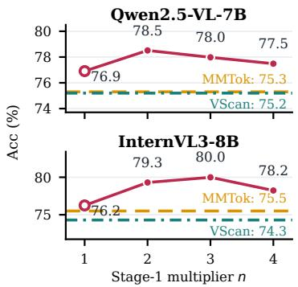  
Figure 4: Stage-1 budget sensitivity at $T = 1 2 8 \colon$ : eight-benchmark Acc for n = 1–4 (hollow: MiCo-S1 reference) vs. MMTok and VScan.

## 4.7 ABLATION STUDY

We ablate the components of MiCo’s two-stage design and the generality of the mutual information coverage objective.

Stage-1 budget and objective’s effectiveness. We change the Stage-1 pool size nT at a fixed layer-average budget of $T \ = \ 1 2 8$ and report the eight-benchmark Acc on Qwen2.5-VL-7B and InternVL3-8B in Figure 4. MiCo exceeds MMTok and VScan at every n on both models, proving our gains do not depend on the pool size used in Stage 1. Specifically, at $n = 1$ the pool equals the budget and MiCo reduces to its single-stage implementation (MiCo-S1); every $n > 1$ improves on it, proving that the LLM-side refinement works, while n = 1 still beats MMTok and VScan, proving that our objective is promising even in a single stage. Appendix E.4 gives details, and Appendix G records MiCo-S1’s results on more models.

Two-stage components. Figure 5 ablates the components of MiCo’s two stages. The complete configuration achieves the highest seven-benchmark mean, $\mathrm { A c c } _ { 7 } = 7 8 . 4$ , and Acc generally decreases as more components are disabled, showing that all signals contribute.

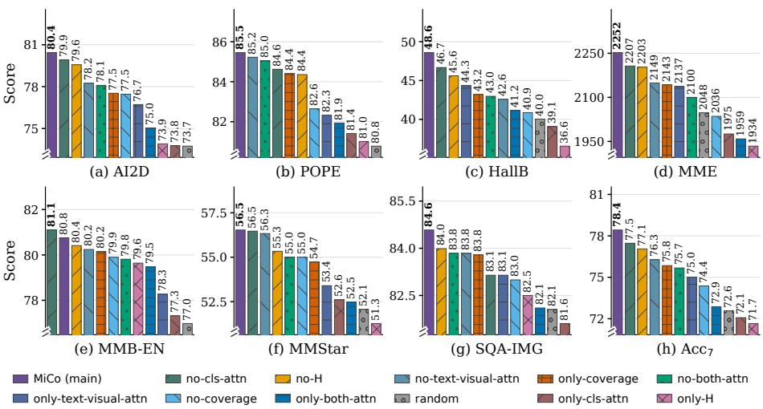  
Figure 5: Two-stage component comparison on Qwen2.5-VL-7B at T = 128.

Proxy substitutions. We evaluate replacements for the information, coverage, reliability, and taskrelevance proxies on Qwen2.5-VL-7B at $T = 1 2 8$ in Table 7. The information proxy is replaced with normalized hidden-state entropy, the coverage and reliability proxies with similarity measures over visual tokens, and the task-relevance proxy with similarity measures over text tokens. MiCo achieves the highest score, and all variants except the coverage replacement still outperform MM-Tok, supporting the applicability and robustness of our mutual information coverage objective beyond MiCo’s proxy choices. Appendix E.2 details the replacements, and Appendix E.3 compares further task-relevance variants.

Table 7: Proxy substitutions on Qwen2.5-VL-7B at T = 128. The second line in each cell reports the score difference ∆ from MMTok.
<table><tr><td>Replaced proxy</td><td>AI2D</td><td>POPE</td><td>HallB</td><td>MME</td><td>MMBEN</td><td>MMBCN</td><td>MMStar</td><td>SQA</td><td>Acc</td><td>Rel</td></tr><tr><td>MMTok (ICLR&#x27;26)</td><td>76.3</td><td>84.2</td><td>43.3</td><td>2120.7</td><td>79.8</td><td>77.5</td><td>53.7</td><td>81.4</td><td>75.3</td><td>90.8%</td></tr><tr><td>Replace Coverage</td><td>70.14 ∆-6.16</td><td>78.10 ∆ - 6.10</td><td>35.80 ∆-7.50</td><td>1688.69 ∆ - 432.01</td><td>75.69 ∆ -4.11 80.84</td><td>73.71 ∆-3.79</td><td>47.20 ∆ - 6.50</td><td>81.31 ∆ - 0.09</td><td>68.30 ∆-7.00</td><td>82.34% Δ - 8.46</td></tr><tr><td>Replace H</td><td>78.47 △ + 2.17 79.08</td><td>84.49 ∆ + 0.29</td><td>45.43 ∆ + 2.13</td><td>2152.60 Δ + 31.90</td><td>∆ + 1.04</td><td>78.26 ∆ +0.76</td><td>52.60 Δ - 1.10</td><td>83.04 Δ +1.64</td><td>76.35 ∆ + 1.05</td><td>92.04% Δ+1.24</td></tr><tr><td>Replace Relevance</td><td>∆ + 2.78 79.83</td><td>85.54 ∆ + 1.34</td><td>45.88 ∆ + 2.58</td><td>2142.01 Δ + 21.31 2207.75</td><td>79.73 ∆ -0.07</td><td>78.95 ∆ + 1.45</td><td>56.47 △ + 2.77</td><td>84.28 ∆ + 2.88</td><td>77.13 ∆ + 1.83</td><td>92.98% Δ + 2.18</td></tr><tr><td>Replace Reliability</td><td>∆ + 3.53</td><td>84.59 ∆ + 0.39 85.46</td><td>46.13 ∆ + 2.83</td><td>∆ + 87.05</td><td>81.10 ∆ +1.30</td><td>78.95 ∆ + 1.45</td><td>56.73 △ + 3.03</td><td>83.34 ∆ +1.94</td><td>77.63 ∆ + 2.33</td><td>93.59% ∆ + 2.79</td></tr><tr><td>MiCo</td><td>80.44 Δ +4.14</td><td>Δ + 1.26</td><td>48.60 Δ +5.30</td><td>2252.37 Δ +131.67</td><td>80.76 Δ +0.96</td><td>79.12 Δ +1.62</td><td>56.53 Δ+ 2.83</td><td>84.58 Δ + 3.18</td><td>78.51 Δ +3.21</td><td>94.65% Δ+3.85</td></tr></table>

## 5 CONCLUSION

We derive a general visual token pruning objective from task log-loss through a semantic erasure model and instantiate its factors with observable proxies, yielding a monotone submodular coverage objective that MiCo optimizes greedily in two stages. Across diverse MLLMs and image/video

benchmarks, MiCo retains strong performance while reducing inference cost. We hope the objective encourages better proxies and further improves the performance–speed trade-off.

## AI USE STATEMENT

We used large language models to aid and polish the writing, for retrieval and discovery of related work, and for research ideation and execution. The authors reviewed and verified all AI-assisted content and take full responsibility for the final content of this work.

## REPRODUCIBILITY STATEMENT

MiCo is training-free and all experiments use publicly available pretrained models and benchmarks. Implementation details, per-model configurations, evaluation protocols, and proofs are given in the appendix. We will open-source the code and configuration files so that all reported results can be reproduced.

## ETHICS STATEMENT

This work uses only publicly available pretrained models and standard public benchmarks, involves no human subjects or newly collected data, and introduces no capabilities beyond those of the underlying models. We do not foresee ethical concerns beyond those already associated with the base models.

## REFERENCES

Josh Achiam, Steven Adler, Sandhini Agarwal, Lama Ahmad, Ilge Akkaya, Florencia Leoni Aleman, Diogo Almeida, Janko Altenschmidt, Sam Altman, Shyamal Anadkat, et al. Gpt-4 technical report. arXiv preprint arXiv:2303.08774, 2023.

Saeed Ranjbar Alvar, Gursimran Singh, Mohammad Akbari, and Yong Zhang. Divprune: Diversitybased visual token pruning for large multimodal models. In Proceedings of the Computer Vision and Pattern Recognition Conference, pp. 9392–9401, 2025.

Jinze Bai, Shuai Bai, Shusheng Yang, Shijie Wang, Sinan Tan, Peng Wang, Junyang Lin, Chang Zhou, and Jingren Zhou. Qwen-vl: A frontier large vision-language model with versatile abilities. arXiv preprint arXiv:2308.12966, 1(2):3, 2023.

Shuai Bai, Yuxuan Cai, Ruizhe Chen, Keqin Chen, Xionghui Chen, Zesen Cheng, Lianghao Deng, Wei Ding, Chang Gao, Chunjiang Ge, et al. Qwen3-vl technical report. arXiv preprint arXiv:2511.21631, 2025a.

Shuai Bai, Keqin Chen, Xuejing Liu, Jialin Wang, Wenbin Ge, Sibo Song, Kai Dang, Peng Wang, Shijie Wang, Jun Tang, Humen Zhong, Yuanzhi Zhu, Mingkun Yang, Zhaohai Li, Jianqiang Wan, Pengfei Wang, Wei Ding, Zheren Fu, Yiheng Xu, Jiabo Ye, Xi Zhang, Tianbao Xie, Zesen Cheng, Hang Zhang, Zhibo Yang, Haiyang Xu, and Junyang Lin. Qwen2.5-vl technical report. arXiv preprint arXiv:2502.13923, 2025b.

Liang Chen, Haozhe Zhao, Tianyu Liu, Shuai Bai, Junyang Lin, Chang Zhou, and Baobao Chang. An image is worth 1/2 tokens after layer 2: Plug-and-play inference acceleration for large visionlanguage models. In European Conference on Computer Vision, pp. 19–35. Springer, 2024a.

Lin Chen, Jinsong Li, Xiaoyi Dong, Pan Zhang, Yuhang Zang, Zehui Chen, Haodong Duan, Jiaqi Wang, Yu Qiao, Dahua Lin, and Feng Zhao. Are we on the right way for evaluating large visionlanguage models? arXiv preprint arXiv:2403.20330, 2024b.

Zhe Chen, Jiannan Wu, Wenhai Wang, Weijie Su, Guo Chen, Sen Xing, Muyan Zhong, Qinglong Zhang, Xizhou Zhu, Lewei Lu, et al. Internvl: Scaling up vision foundation models and aligning for generic visual-linguistic tasks. In Proceedings of the IEEE/CVF conference on computer vision and pattern recognition, pp. 24185–24198, 2024c.

Jinhong Deng, Wen Li, Joey Tianyi Zhou, and Yang He. Scope: Saliency-coverage oriented token pruning for efficient multimodel llms. arXiv preprint arXiv:2510.24214, 2025.

Sixun Dong, Juhua Hu, Mian Zhang, Ming Yin, Yanjie Fu, and Qi Qian. MMTok: Multimodal coverage maximization for efficient inference of VLMs. In The Fourteenth International Conference on Learning Representations, 2026. URL https://openreview.net/forum?id= GvPdSWZT31.

Haodong Duan, Junming Yang, Yuxuan Qiao, Xinyu Fang, Lin Chen, Yuan Liu, Xiaoyi Dong, Yuhang Zang, Pan Zhang, Jiaqi Wang, Dahua Lin, and Kai Chen. VLMEvalKit: An open-source toolkit for evaluating large multi-modality models. In Proceedings ofthe 32nd ACM International Conference on Multimedia, pp. 11198–11201, 2024.

Chaoyou Fu, Peixian Chen, Yunhang Shen, Yulei Qin, Mengdan Zhang, Xu Lin, Jinrui Yang, Xiawu Zheng, Ke Li, Xing Sun, et al. Mme: A comprehensive evaluation benchmark for multimodal large language models. arXiv preprint arXiv:2306.13394, 2023.

Chaoyou Fu, Yuhan Dai, Yongdong Luo, Lei Li, Shuhuai Ren, Renrui Zhang, Zihan Wang, Chenyu Zhou, Yunhang Shen, Mengdan Zhang, et al. Video-mme: The first-ever comprehensive evaluation benchmark of multi-modal llms in video analysis. In Proceedings of the IEEE/CVF conference on computer vision and pattern recognition, pp. 24108–24118, 2025.

Tilmann Gneiting and Adrian E. Raftery. Strictly proper scoring rules, prediction, and estimation. Journal of the American Statistical Association, 102(477):359–378, 2007. doi: 10. 1198/016214506000001437. URL https://sites.stat.washington.edu/people/ raftery/Research/PDF/Gneiting2007jasa.pdf.

Aaron Grattafiori, Abhimanyu Dubey, Abhinav Jauhri, Abhinav Pandey, Abhishek Kadian, Ahmad Al-Dahle, Aiesha Letman, Akhil Mathur, Alan Schelten, Alex Vaughan, et al. The llama 3 herd of models. arXiv preprint arXiv:2407.21783, 2024.

Tianrui Guan, Fuxiao Liu, Xiyang Wu, Ruiqi Xian, Zongxia Li, Xiaoyu Liu, Xijun Wang, Lichang Chen, Furong Huang, Yaser Yacoob, et al. Hallusionbench: an advanced diagnostic suite for entangled language hallucination and visual illusion in large vision-language models. In Proceedings of the IEEE/CVF conference on computer vision and pattern recognition, pp. 14375–14385, 2024.

Shuting He, Henghui Ding, Chang Liu, and Xudong Jiang. GREC: Generalized referring expression comprehension. arXiv preprint arXiv:2308.16182, 2023. URL https://arxiv.org/abs/ 2308.16182.

Drew A Hudson and Christopher D Manning. Gqa: A new dataset for real-world visual reasoning and compositional question answering. In Proceedings ofthe IEEE/CVF conference on computer vision and pattern recognition, pp. 6700–6709, 2019.

Jiantao Jiao, Thomas A. Courtade, Kartik Venkat, and Tsachy Weissman. Justification of logarithmic loss via the benefit of side information. IEEE Transactions on Information Theory, 61(10):5357– 5365, 2015. doi: 10.1109/TIT.2015.2462848. URL https://people.eecs.berkeley. edu/ courtade/pdfs/JiaoJustification\_TIT2015.pdf.

Aniruddha Kembhavi, Mike Salvato, Eric Kolve, Minjoon Seo, Hannaneh Hajishirzi, and Ali Farhadi. A diagram is worth a dozen images. In European conference on computer vision, pp. 235–251. Springer, 2016.

Andreas Krause and Daniel Golovin. Submodular function maximization. In Tractability: Practical Approaches to Hard Problems. Cambridge University Press, 2014. URL https://las.inf. ethz.ch/files/krause12survey.pdf.

Bohao Li, Yuying Ge, Yixiao Ge, Guangzhi Wang, Rui Wang, Ruimao Zhang, and Ying Shan. Seed-bench: Benchmarking multimodal large language models. In Proceedings ofthe IEEE/CVF Conference on Computer Vision and Pattern Recognition, pp. 13299–13308, 2024a.

Kunchang Li, Yali Wang, Yinan He, Yizhuo Li, Yi Wang, Yi Liu, Zun Wang, Jilan Xu, Guo Chen, Ping Luo, Limin Wang, and Yu Qiao. Mvbench: A comprehensive multi-modal video understanding benchmark. In Proceedings of the IEEE/CVF Conference on Computer Vision and Pattern Recognition, pp. 22195–22206, 2024b.

Yifan Li, Yifan Du, Kun Zhou, Jinpeng Wang, Xin Zhao, and Ji-Rong Wen. Evaluating object hallucination in large vision-language models. In Proceedings of the 2023 conference on empirical methods in natural language processing, pp. 292–305, 2023.

Chenfei Liao, Wensong Wang, Zichen Wen, Xu Zheng, Yiyu Wang, Haocong He, Yuanhuiyi Lyu, Lutao Jiang, Xin Zou, Yuqian Fu, Bin Ren, Linfeng Zhang, and Xuming Hu. Are we using the right benchmark: An evaluation framework for visual token compression meth ods. In Proceedings of the 64th Annual Meeting of the Association for Computational Linguistics (Volume 1: Long Papers), pp. 4236–4253, San Diego, California, United States, July 2026. Association for Computational Linguistics. doi: 10.18653/v1/2026.acl-long.195. URL https://aclanthology.org/2026.acl-long.195/.

Haotian Liu, Chunyuan Li, Qingyang Wu, and Yong Jae Lee. Visual instruction tuning. Advances in neural information processing systems, 36:34892–34916, 2023a.

Haotian Liu, Chunyuan Li, Yuheng Li, and Yong Jae Lee. Improved baselines with visual instruction tuning. In Proceedings ofthe IEEE/CVF conference on computer vision and pattern recognition, pp. 26296–26306, 2024a.

Haotian Liu, Chunyuan Li, Yuheng Li, Bo Li, Yuanhan Zhang, Sheng Shen, and Yong Jae Lee. Llavanext: Improved reasoning, ocr, and world knowledge, 2024b.

Yuan Liu, Haodong Duan, Yuanhan Zhang, Bo Li, Songyang Zhang, Wangbo Zhao, Yike Yuan, Jiaqi Wang, Conghui He, Ziwei Liu, et al. Mmbench: Is your multi-modal model an all-around player? In European conference on computer vision, pp. 216–233. Springer, 2024c.

Yuliang Liu, Zhang Li, Mingxin Huang, Biao Yang, Wenwen Yu, Chunyuan Li, Xucheng Yin, Cheng-lin Liu, Lianwen Jin, and Xiang Bai. Ocrbench: On the hidden mystery of ocr in large multimodal models, 2023b.

Pan Lu, Swaroop Mishra, Tanglin Xia, Liang Qiu, Kai-Wei Chang, Song-Chun Zhu, Oyvind Tafjord, Peter Clark, and Ashwin Kalyan. Learn to explain: Multimodal reasoning via thought chains for science question answering. Advances in neural information processing systems, 35:2507–2521, 2022.

Qiankun Ma, Ziyao Zhang, Haofei Wang, Jie Chen, Zhen Song, and Hairong Zheng. ApET: Approximation-error guided token compression for efficient VLMs. In Proceedings of the IEEE/CVF Conference on Computer Vision and Pattern Recognition (CVPR), 2026. URL https://openaccess.thecvf.com/content/CVPR2026/html/Ma\_ApET\_ Approximation-Error\_Guided\_Token\_Compression\_for\_Efficient\_VLMs\_ CVPR\_2026\_paper.html.

Ahmed Masry, Do Xuan Long, Jia Qing Tan, Shafiq Joty, and Enamul Hoque. Chartqa: A benchmark for question answering about charts with visual and logical reasoning. In Findings of the Association for Computational Linguistics: ACL 2022, pp. 2263–2279, 2022.

Minesh Mathew, Dimosthenis Karatzas, and C. V. Jawahar. Docvqa: A dataset for vqa on document images. In Proceedings of the IEEE/CVF Winter Conference on Applications of Computer Vision, pp. 2200–2209, 2021.

G. L. Nemhauser, L. A. Wolsey, and M. L. Fisher. An analysis of approximations for maximizing submodular set functions—I. Mathematical Programming, 14:265–294, 1978. doi: 10.1007/BF01588971. URL https://link.springer.com/article/10.1007/ BF01588971.

Yury Polyanskiy and Yihong Wu. Information Theory: From Coding to Learning. Cambridge University Press, 2025. doi: 10.1017/9781108966351. URL https://people.lids.mit. edu/yp/homepage/data/itbook-export.pdf.

Qwen Team. Qwen3.5-9B model card. https://huggingface.co/Qwen/Qwen3.5-9B, 2026. Accessed September 23, 2026.

Yuzhang Shang, Mu Cai, Bingxin Xu, Yong Jae Lee, and Yan Yan. Llava-prumerge: Adaptive token reduction for efficient large multimodal models. In Proceedings of the IEEE/CVF International Conference on Computer Vision, pp. 22857–22867, 2025.

Amanpreet Singh, Vivek Natarajan, Meet Shah, Yu Jiang, Xinlei Chen, Dhruv Batra, Devi Parikh, and Marcus Rohrbach. Towards vqa models that can read. In Proceedings of the IEEE/CVF conference on computer vision and pattern recognition, pp. 8317–8326, 2019.

Gemini Team, Rohan Anil, Sebastian Borgeaud, Jean-Baptiste Alayrac, Jiahui Yu, Radu Soricut, Johan Schalkwyk, Andrew M Dai, Anja Hauth, Katie Millican, et al. Gemini: a family of highly capable multimodal models. arXiv preprint arXiv:2312.11805, 2023.

Zichen Wen, Yifeng Gao, Shaobo Wang, Junyuan Zhang, Qintong Zhang, Weijia Li, Conghui He, and Linfeng Zhang. Stop looking for important tokens in multimodal language models: Duplication matters more. In Proceedings of the 2025 Conference on Empirical Methods in Natural Language Processing, pp. 9972–9991, 2025.

Haoning Wu, Dongxu Li, Bei Chen, and Junnan Li. Longvideobench: A benchmark for long-context interleaved video-language understanding. Advances in Neural Information Processing Systems, 37:28828–28857, 2024.

Long Xing, Qidong Huang, Xiaoyi Dong, Jiajie Lu, Pan Zhang, Yuhang Zang, Yuhang Cao, Conghui He, Jiaqi Wang, Feng Wu, et al. Pyramiddrop: Accelerating your large vision-language models via pyramid visual redundancy reduction. arXiv preprint arXiv:2410.17247, 2024.

An Yang, Anfeng Li, Baosong Yang, Beichen Zhang, Binyuan Hui, Bo Zheng, Bowen Yu, Chang Gao, Chengen Huang, Chenxu Lv, et al. Qwen3 technical report. arXiv preprint arXiv:2505.09388, 2025a.

Senqiao Yang, Yukang Chen, Zhuotao Tian, Chengyao Wang, Jingyao Li, Bei Yu, and Jiaya Jia. Visionzip: Longer is better but not necessary in vision language models. In Proceedings of the IEEE/CVF Conference on Computer Vision and Pattern Recognition, pp. 19792–19802, 2025b.

Xiang Yue, Yuansheng Ni, Kai Zhang, Tianyu Zheng, Ruoqi Liu, Ge Zhang, Samuel Stevens, Dongfu Jiang, Weiming Ren, Yuxuan Sun, Cong Wei, Botao Yu, Ruibin Yuan, Renliang Sun, Ming Yin, Boyuan Zheng, Zhenzhu Yang, Yibo Liu, Wenhao Huang, Huan Sun, Yu Su, and Wenhu Chen. Mmmu: A massive multi-discipline multimodal understanding and reasoning benchmark for expert agi. In Proceedings of the IEEE/CVF Conference on Computer Vision and Pattern Recognition, pp. 9556–9567, 2024.

Ce Zhang, Kaixin Ma, Tianqing Fang, Wenhao Yu, Hongming Zhang, Zhisong Zhang, Haitao Mi, and Dong Yu. VScan: Rethinking visual token reduction for efficient large vision-language models. Transactions on Machine Learning Research, 2026. URL https://openreview.net/ forum?id=KZYhyilFnt.

Kaichen Zhang, Bo Li, Peiyuan Zhang, Fanyi Pu, Joshua Adrian Cahyono, Kairui Hu, Shuai Liu, Yuanhan Zhang, Jingkang Yang, Chunyuan Li, and Ziwei Liu. LMMs-Eval: Reality check on the evaluation of large multimodal models. arXiv preprint arXiv:2407.12772, 2024a.

Qizhe Zhang, Aosong Cheng, Ming Lu, Renrui Zhang, Zhiyong Zhuo, Jiajun Cao, Shaobo Guo, Qi She, and Shanghang Zhang. Beyond text-visual attention: Exploiting visual cues for effective token pruning in vlms. In Proceedings of the IEEE/CVF International Conference on Computer Vision, pp. 20857–20867, 2025a.

Qizhe Zhang, Mengzhen Liu, Lichen Li, Ming Lu, Yuan Zhang, Junwen Pan, Qi She, and Shanghang Zhang. Beyond attention or similarity: Maximizing conditional diversity for token pruning in MLLMs. In The Thirty-ninth Annual Conference on Neural Information Processing Systems, 2025b. URL https://openreview.net/forum?id=BLLixcuZgl.

Yuan Zhang, Chun-Kai Fan, Junpeng Ma, Wenzhao Zheng, Tao Huang, Kuan Cheng, Denis Gudovskiy, Tomoyuki Okuno, Yohei Nakata, Kurt Keutzer, et al. Sparsevlm: Visual token sparsifi cation for efficient vision-language model inference. arXiv preprint arXiv:2410.04417, 2024b.

Yuanhan Zhang, Jinming Wu, Wei Li, Bo Li, Zejun Ma, Ziwei Liu, and Chunyuan Li. Llava-video: Video instruction tuning with synthetic data. arXiv preprint arXiv:2410.02713, 2024c.

Junjie Zhou, Yan Shu, Bo Zhao, Boya Wu, Zhengyang Liang, Shitao Xiao, Minghao Qin, Xi Yang, Yongping Xiong, Bo Zhang, et al. Mlvu: Benchmarking multi-task long video understanding. In Proceedings of the IEEE/CVF Conference on Computer Vision and Pattern Recognition, pp. 13691–13701, 2025.

Jinguo Zhu, Weiyun Wang, Zhe Chen, Zhaoyang Liu, Shenglong Ye, Lixin Gu, Hao Tian, Yuchen Duan, Weijie Su, Jie Shao, et al. Internvl3: Exploring advanced training and test-time recipes for open-source multimodal models. arXiv preprint arXiv:2504.10479, 2025.

Qingchan Zhu, Weihang You, Hanqi Jiang, Changdi Yang, Tianming Liu, and Geng Yuan. Who speaks for the pruned? visual token pruning as coverage optimization. arXiv preprint arXiv:2609.03158, 2026. URL https://arxiv.org/abs/2609.03158.

Xin Zou, Di Lu, Yizhou Wang, Yibo Yan, Yuanhuiyi Lyu, Xu Zheng, Linfeng Zhang, and Xuming Hu. Don’t just chase “highlighted tokens” in MLLMs: Revisiting visual holistic context retention. In Advances in Neural Information Processing Systems, volume 38, 2025. URL https://proceedings.neurips.cc/paper\_files/paper/2025/ hash/38b445e98823a02479582302ee3aa8e4-Abstract-Conference.html.

## A BENCHMARK DEFINITIONS AND EVALUATION PROTOCOL

This section defines the benchmark inventory, task coverage, and scoring conventions used in the experiments. The two main image suites overlap: the LLaVA tables use ten benchmark tracks, while the Qwen-VL and InternVL tables use eight. Their union is twelve core image tracks when the English and Chinese MMBench evaluations are counted separately. We additionally report eight supplementary image tracks (RefCOCO, RefCOCO+, RefCOCOg, gRefCOCO, ChartQA, DocVQA, OCRBench, and VTC-Bench) and four video benchmarks (VideoMME, MVBench, LongVideoBench, and MLVU). In total, this appendix covers twenty image tracks (twelve core and eight supplementary, counting VTC-Bench as one track) and four video benchmarks; supplementary tracks never enter a main-table Acc.

## A.1 CORE IMAGE BENCHMARKS

The LLaVA tables use GQA, SQA-IMG, TextVQA, POPE, MME, MMBench-EN, MMBench-CN, SEED, AI2D, and MMMU; the Qwen-VL and InternVL tables use AI2D, POPE, HallusionBench, MME, MMBench-EN, MMBench-CN, MMStar, and SQA-IMG. A benchmark enters a model’s Acc only if it appears in that model’s main table.

General visual understanding and reasoning. GQA (Hudson & Manning, 2019) evaluates compositional visual reasoning over objects, attributes, and relations grounded in scene graphs. We use the balanced evaluation split and report exact-match accuracy; the standard split contains 12,578 questions. ScienceQA-IMG (Lu et al., 2022) is the image-grounded subset of the multimodal science multiple-choice benchmark. It requires selecting an answer after combining the question, explanatory context, and a diagram or image; we report multiple-choice accuracy on the released image subset. AI2D (Kembhavi et al., 2016) evaluates question answering over scientific diagrams and their associated text. Its released collection contains more than 5,000 diagrams and 15,000 questions; we report answer accuracy on the test split (3,088 questions). MMMU (Yue et al., 2024) contains 11.5K college-level multimodal questions spanning six broad disciplines and 30 subjects; we use the recorded single-image evaluation protocol on the validation split and report multiplechoice accuracy. MMStar (Chen et al., 2024b) is a 1,500-question diagnostic suite covering coarse and fine-grained perception, reasoning, and knowledge-intensive visual tasks; we report its official accuracy.

Text and broad multimodal understanding. TextVQA (Singh et al., 2019) tests reading and reasoning over scene text; the validation split contains 5,000 questions and is scored with the VQA consensus metric. MMBench (Liu et al., 2024c) evaluates 20 ability dimensions, including recognition, localization, OCR, and reasoning. MMBench-EN and MMBench-CN are treated as two separate tracks, evaluated with the released language-specific scorers and Circular accuracy. SEED-Bench (Li et al., 2024a) provides objective multiple-choice evaluation across multimodal capability dimensions; we use its image-only evaluation subset and report the official accuracy.

Hallucination diagnostics. POPE (Li et al., 2023) probes object hallucination with binary objectpresence questions over its random, popular, and adversarial categories (3,000 released questions each). The reported metric follows each family’s official evaluator: the LLaVA tables report the average F1 score over the three categories, as computed by the LLaVA-1.5 evaluation scripts, whereas the Qwen-VL and InternVL tables report the overall accuracy returned by VLMEvalKit, whose runner expands the category outputs to 9,000 scored entries. HallusionBench (Guan et al., 2024) is a diagnostic suite for language hallucination and visual illusion; we report VLMEvalKit’s overall average, i.e., the mean of its all-question accuracy (aAcc), figure-level accuracy (fAcc), and question-pair accuracy (qAcc).

Perception and cognition. MME (Fu et al., 2023) covers perception and cognition in 14 subtasks with 2,374 questions over 1,187 images (two questions per image). The MME column keeps the benchmark’s native summed score, whose scale differs by family: the LLaVA tables report the Perception score (maximum 2,000), following the LLaVA evaluation scripts, whereas the Qwen-VL and InternVL tables report the Perception+Cognition total (maximum 2,800) returned by VLMEvalKit.

In both cases the summed score is divided by 20 only when forming Acc, so MME enters the LLaVA aggregates on a 0–100 scale and the Qwen-VL/InternVL aggregates on a 0–140 scale.

## A.2 SUPPLEMENTARY IMAGE BENCHMARKS

Text, chart, and document understanding. ChartQA (Masry et al., 2022) requires visual and logical reasoning over charts. We use the test split and its relaxed accuracy metric (2,500 questions in the evaluation record). DocVQA (Mathew et al., 2021) evaluates question answering over document images; we use the validation split and report ANLS over 5,349 questions. OCRBench (Liu et al., 2023b) aggregates 29 OCR-oriented datasets covering text recognition, scene-text VQA, document VQA, key-information extraction, and handwritten mathematical expression recognition. We report its released aggregate score. The 100 OCRBench samples used to select the refinement layer (Appendix F.2) never enter a main-table Acc.

Referring expression comprehension. RefCOCO, RefCOCO+, and RefCOCOg evaluate localization of the region described by a natural-language expression. RefCOCO and RefCOCO+ distinguish person-centric testA and object-centric testB, while RefCOCOg uses longer, more descriptive expressions; we report the standard REC score on the released evaluation split for each dataset. The parenthesized values in Table 4 normalize each score by the matching Vanilla result. gRefCOCO extends this setting to expressions that refer to one object, multiple objects, or no target object (He et al., 2023). We use the released val, testA, and testB splits and report $\operatorname* { P r @ } ( F _ { 1 } = 1 , \operatorname { \bar { G } I o U } \geq 0 . 5 )$ computed with the released GREC evaluation code; our protocol applies a generalized-IoU boxmatching threshold in place of the IoU ≥ 0.5 threshold of the original metric definition.

Visual information preservation. VTC-Bench (Liao et al., 2026) measures whether a tokencompressed model preserves visual information that is sensitive to image downsampling. Its fixed Qwen2-VL reference partitions each question into Group A (correct at full resolution but incorrect after downsampling) or Group B (correct in both conditions) for reference factors d ∈ {2, 3, 4, 5, 10}. We reuse these groups without modification, run Qwen2.5-VL-7B on the original images at T = 256 and T = 128, and report the official task scores, the group-wise mean, and the Group B–Group A gap. The reference image-area reductions (75.00%, 88.89%, 93.75%, 96.00%, and 99.00%) define the groups; they are not the pruning ratios of our target model.

## A.3 VIDEO BENCHMARKS

All video results use the same LLaVA-Video-7B input and decoding protocol described in Appendix C.3 (video input protocol). VideoMME (Fu et al., 2025) evaluates short, medium, and long videos across multiple visual domains; we use the no-subtitle setting and report the official aggregate percentage. MVBench (Li et al., 2024b) contains 20 multiple-choice tasks spanning spatial and temporal perception, action, object interaction, and episodic reasoning; we report the mean over its official task scores. LongVideoBench (Wu et al., 2024) tests long-context video-language understanding with interleaved video and text, including videos up to one hour; its official aggregate is returned as a fraction and is converted to a percentage for the tables. MLVU (Zhou et al., 2025) is a multi-task long-video suite covering diverse video genres and durations; we report its official macroaverage over the seven task categories rather than pooling all questions. The four video scores are averaged with equal weight to form the video Acc.

## A.4 AGGREGATION AND DECODING CONVENTIONS

Unless a benchmark specifies a task-native metric above, scores are percentages and higher is better. For an image model, Acc is the unweighted mean of the benchmark tracks listed in its main table. MME contributes MME/20 to this mean, while its native summed score remains visible in the MME column. Rel is the aggregate Acc divided by the corresponding Vanilla Acc and reported as a percentage. English and Chinese MMBench are separate terms in the mean; supplementary benchmarks and calibration examples never enter the main-table Acc unless explicitly stated in a table caption.

We use batch size one and deterministic greedy decoding without sampling. Each model family keeps its native processor, prompt format, image geometry, and official scorer. Empty answers and generation-cap truncations remain in the relevant denominator. For video, we follow each benchmark’s standard scoring protocol and then average the four resulting scores to obtain video Acc.

## B INFORMATION-THEORETIC DERIVATIONS

This appendix supplies the standard identities used in Section 3 and their application to our recovery model, followed by the optimization properties of MiCo’s coverage proxy. The log-loss and erasurechannel identities are established results. MiCo applies them to the random semantic-query model defined in the main text.

Assumptions and scope. Throughout this appendix, Y and the semantic variables $U _ { v }$ are discrete, all relevant conditional entropies and losses are finite, and $q , g$ are fixed. For each fixed retained set and recovery channel, the query index J is sampled independently of the source and recovered variables. The answer-side model assumes $Y \perp \widehat { \mathbf { U } } _ { V } ( S ) \mid \mathbf { U } _ { V } , q , g ,$ . In the erasure model, the coverage and reliability gates are conditionally independent of each other and of $U _ { v } ;$ reliability is held fixed with respect to S. The greedy result additionally fixes the proxy weights and similarities within one selector call.

## B.1 LOG-LOSS, BAYES RISK, AND RECOVERABLE INFORMATION

Let $\pi _ { \mathrm { d a t a } }$ be the underlying data-generating joint distribution, including the answer ${ \cal Y } ,$ visual information $Z ,$ prompt Q, and geometric context G. Fix $Q = q$ and $G = g ,$ , and use $\mid q , g$ as shorthand for conditioning on these values. A predictor supplies $\pi _ { \mathrm { p r e d } } ( \cdot \mid Z , q , g )$ ; the true conditional distribution $\pi _ { \mathrm { d a t a } } ( \cdot \mid Z , q , g )$ is the analytical reference. All expectations and entropies below are under $\pi _ { \mathrm { d a t a } } .$ , and the relevant losses and entropies are assumed finite.

For a discrete answer sequence $Y = \left( y _ { 1 } , \dots , y _ { M } \right)$ , including its end-of-sequence token, the negative log-likelihood is

$$
\begin{array} { r l } & { \ell ( \pi _ { \mathrm { p r e d } } ; Y , Z , q , g ) = - \log \pi _ { \mathrm { p r e d } } ( Y \mid Z , q , g ) } \\ & { \phantom { \ell ( \pi _ { \mathrm { p r e d } } ; Y , Z , q , g ) = - \log \pi _ { \mathrm { p r e d } } ( y _ { t } \mid y _ { < t } , Z , q , g ) = - \log \pi _ { \mathrm { p r e d } } ( y _ { t } \mid y _ { < t } , Z , q , g ) . } } \end{array}\tag{6}
$$

Adding and subtracting the log of the true conditional distribution gives the standard entropy– divergence decomposition for logarithmic loss (Gneiting & Raftery, 2007, Example 3):

$$
\begin{array} { r l } & { \mathcal { L } ( \pi _ { \mathrm { p r e d } } ; Z , q , g ) = \mathbb { E } _ { \pi _ { \mathrm { d a t a } } } \big [ - \log \pi _ { \mathrm { p r e d } } ( Y \mid Z , q , g ) \mid q , g \big ] } \\ & { \quad \quad \quad \quad = \mathbb { E } _ { \pi _ { \mathrm { d a t a } } } \big [ - \log \pi _ { \mathrm { d a t a } } ( Y \mid Z , q , g ) \mid q , g \big ] } \\ & { \quad \quad \quad \quad + \mathbb { E } _ { \pi _ { \mathrm { d a t a } } } \bigg [ \log \frac { \pi _ { \mathrm { d a t a } } \big ( Y \mid Z , q , g \big ) } { \pi _ { \mathrm { p r e d } } \big ( Y \mid Z , q , g \big ) } \bigg | q , g \bigg ] } \\ & { \quad \quad \quad \quad = H _ { \pi _ { \mathrm { d a t a } } } ( Y \mid Z , q , g ) } \\ & { \quad \quad \quad \quad + \mathbb { E } _ { Z | q , g } D _ { \mathrm { K L } } ( \pi _ { \mathrm { d a t a } } ( \cdot \mid Z , q , g ) \parallel \pi _ { \mathrm { p r e d } } ( \cdot \mid Z , q , g ) ) \big ] . } \end{array}\tag{7}
$$

The first term is the uncertainty remaining given the available information. The second is the predictor’s discrepancy from the true conditional distribution. It is nonnegative and vanishes at $\pi _ { \mathrm { p r e d } } = \pi _ { \mathrm { d a t a } } ( \cdot \mid Z , q , g )$ . Taking the infimum over all conditional predictive distributions yields the identity stated in Section 3:

$$
R _ { Z } ^ { * } ( q , g ) : = \operatorname* { i n f } _ { \pi _ { \mathrm { p r e d } } } \mathcal { L } ( \pi _ { \mathrm { p r e d } } ; Z , q , g ) = H ( Y \mid Z , q , g ) .\tag{8}
$$

This infimum is an analytical reference, not an assumption that a fixed pretrained predictor attains it.

Substituting the complete visual source $\mathbf { U } _ { V }$ and its reconstruction $\widehat { \mathbf { U } } _ { V } ( S )$ gives

$$
\begin{array} { r l } & { R _ { \mathrm { f u l l } } ^ { * } ( q , g ) = H ( Y \mid \mathbf { U } _ { V } , q , g ) , } \\ & { ~ R _ { S } ^ { * } ( q , g ) = H ( Y \mid \widehat { \mathbf { U } } _ { V } ( S ) , q , g ) . } \end{array}\tag{9}
$$

Assume $Y \perp \widehat { \mathbf { U } } _ { V } ( S ) \mid \mathbf { U } _ { V } , q , g .$ . Applying the conditional-information identity for the benefit of side information under log-loss (Jiao et al., 2015, Corollary 1),

$$
\begin{array} { r l } & { \Delta R ^ { * } ( S ; q , g ) = H ( Y \mid \widehat { \mathbf { U } } _ { V } ( S ) , q , g ) - H ( Y \mid \mathbf { U } _ { V } , q , g ) } \\ & { \quad \quad \quad \quad \quad \quad \quad \quad \quad \quad \quad \quad \quad \quad \quad \quad \quad \quad \quad \quad \quad \quad \quad \quad \quad \quad } \\ & { \quad \quad \quad \quad \quad \quad \quad \quad \quad \quad \quad \quad \quad \quad \quad \quad \quad \quad \quad \quad \quad \quad \quad \quad \quad \quad \quad \quad \quad \quad } \\ & { \quad \quad \quad \quad \quad \quad \quad \quad \quad \quad \quad \quad \quad \quad \quad \quad \quad \quad \quad \quad \quad \quad \quad \quad \quad \quad \quad \quad \quad } \\ & { \quad \quad \quad \quad \quad \quad \quad \quad \quad \quad \quad \quad \quad \quad \quad \quad \quad \quad \quad \quad \quad \quad \quad \quad \quad \quad \quad \quad } \\ & { \quad \quad \quad \quad \quad \quad \quad \quad \quad \quad \quad \quad \quad \quad \quad \quad \quad \quad \quad \quad \quad \quad \quad \quad \quad \quad \quad \quad } \\ & { \quad \quad \quad \quad \quad \quad \quad \quad \quad \quad \quad \quad \quad \quad \quad \quad \quad \quad \quad \quad \quad \quad \quad \quad \quad \quad \quad \quad } \\ & { \quad \quad \quad \quad \quad \quad \quad \quad \quad \quad \quad \quad \quad \quad \quad \quad \quad \quad \quad \quad \quad \quad \quad \quad \quad \quad \quad \quad \quad \quad } \\ & { \quad \quad \quad \quad \quad \quad \quad \quad \quad \quad \quad \quad \quad \quad \quad \quad \quad \quad \quad \quad \quad \quad \quad \quad \quad \quad \quad \quad \quad \quad \quad \quad } \\ & { \quad \quad \quad \quad \quad \quad \quad \quad \quad \quad \quad \quad \quad \quad \quad \quad \quad \quad \quad \quad \quad \quad \quad \quad \quad \quad \quad \quad \quad \quad \quad \quad \quad \quad } \\ & { \quad \quad \quad \quad \quad \quad \quad \quad \quad \quad \quad \quad \quad \quad \quad \quad \quad \quad \quad \quad \quad \quad \quad \quad \quad \quad \quad \quad \quad \quad \quad \quad \quad \quad \quad \quad \quad \quad \quad } \\ &  \quad \quad \quad \quad \quad \quad \quad \quad \quad \quad \quad \quad  \end{array}\tag{10}
$$

The second equality uses the conditional-independence assumption. The inequality follows because the semantic variables are discrete and conditional mutual information is at most the conditional entropy of either variable (Polyanskiy & Wu, 2025, Theorem 3.4). Since $H ( \mathbf { U } _ { V } \mid q , g )$ does not depend on S, maximizing the full-source recoverable mutual information minimizes this upper bound.

The same conditional mutual information is the expected KL divergence between the Bayes-optimal full and reconstructed-source answer distributions:

$$
\begin{array} { r } { \Delta R ^ { * } ( S ; q , g ) = \mathbb { E } _ { { \mathbf { U } } _ { V } , \widehat { \mathbf { U } } _ { V } ( S ) \mid q , g } \ ~ } \\ { D _ { \mathrm { K L } } \Big ( \pi _ { \mathrm { d a t a } } ( \cdot \mid { \mathbf { U } } _ { V } , q , g ) \mid \mid \pi _ { \mathrm { d a t a } } ( \cdot \mid \widehat { \mathbf { U } } _ { V } ( S ) , q , g ) \Big ) \ . } \end{array}\tag{11}
$$

This identity concerns the true conditional distributions, not the outputs of an arbitrary fixed MLLM.

Task-weighted recovery and the answer-risk bound. The main text defines a semantic query by drawing J with $\operatorname* { P r } ( J = v \mid q , g ) = \operatorname* { P r } ( J = v \mid Q = q )$ , independently of $( \mathbf { U } _ { V } , \widehat { \mathbf { U } } _ { V } ( S ) )$ given $q , g .$ The retained set and recovery channel are fixed before J is drawn. Expanding the queried mutual information defined in equation 3 gives

$$
\begin{array} { r l } & { \mathcal { Z } _ { \mathrm { t a s k } } ( S ; q , g ) = I \Big ( U _ { J } ; \widehat { U } _ { J } ( S ) \mid J , q , g \Big ) } \\ & { \quad \quad \quad = \displaystyle \sum _ { v \in V } \operatorname* { P r } ( J = v \mid q , g ) I \Big ( U _ { v } ; \widehat { U } _ { v } ( S ) \mid J = v , q , g \Big ) } \\ & { \quad \quad \quad = \displaystyle \sum _ { v \in V } \operatorname* { P r } ( J = v \mid Q = q ) I \Big ( U _ { v } ; \widehat { U } _ { v } ( S ) \mid q , g \Big ) . } \end{array}\tag{12}
$$

The second equality expands the conditional mutual information over the values of J. The third equality uses $\bar { \operatorname* { P r } } ( J = \bar { v _ { \mathbf { \phi } } } \mid q , g ) = \operatorname* { P r } ( J = v _ { \mathbf { \phi } } \mid Q = q )$ together with the conditional independence of J from $( \mathbf { U } _ { V } , \widehat { \mathbf { U } } _ { V } ( S ) )$ given $q , g ,$ which lets the conditioning on $J = v$ be dropped. Thus the relevance weights arise from averaging over the queried source.

Both $U _ { v }$ and $\widehat { U } _ { v } ( S )$ are deterministic coordinate projections of their corresponding full vectors. Applying the data-processing inequality (Polyanskiy & Wu, 2025, Theorem 3.7) to each projection gives

$$
\begin{array} { r l } & { I \Big ( U _ { v } ; \widehat { U } _ { v } ( S ) \mid q , g \Big ) \leq I \Big ( \mathbf { U } _ { V } ; \widehat { U } _ { v } ( S ) \mid q , g \Big ) } \\ & { \qquad \leq I \Big ( \mathbf { U } _ { V } ; \widehat { \mathbf { U } } _ { V } ( S ) \mid q , g \Big ) . } \end{array}\tag{13}
$$

The query probabilities are nonnegative and sum to one, so

$$
\begin{array} { l } { \displaystyle \mathcal { T } _ { \mathrm { t a s k } } \big ( S ; q , g \big ) \leq \sum _ { v \in V } \mathrm { P r } \big ( J = v \mid Q = q \big ) I \Big ( \mathbf { U } _ { V } ; \widehat { \mathbf { U } } _ { V } ( S ) \mid q , g \Big ) } \\ { \displaystyle \qquad = I \Big ( \mathbf { U } _ { V } ; \widehat { \mathbf { U } } _ { V } ( S ) \mid q , g \Big ) . } \end{array}\tag{14}
$$

This bounds the queried mutual information by whole-source recovered information without requiring independence among the source variables $U _ { v }$ . Combining it with equation 10 yields

$$
\begin{array} { r l } & { \Delta R ^ { * } ( S ; q , g ) \leq H ( \mathbf { U } _ { V } \mid q , g ) - I \Big ( \mathbf { U } _ { V } ; \widehat { \mathbf { U } } _ { V } ( S ) \mid q , g \Big ) } \\ & { \qquad \leq H ( \mathbf { U } _ { V } \mid q , g ) - { \mathcal { T } } _ { \mathrm { t a s k } } ( S ; q , g ) , } \end{array}\tag{15}
$$

which establishes equation 1. With the query distribution fixed, the entropy term is independent of $S ,$ so maximizing $\mathcal { T } _ { \mathrm { t a s k } }$ minimizes this looser upper bound. The query distribution is a modeling choice; a retained set that minimizes this bound need not minimize the answer risk itself.

Log-loss interpretation of the semantic query. A predictor given $J , q , g$ has prior Bayes risk $R _ { \mathrm { q u e r y , p r i o r } } ^ { * ^ { - } } ( q , \bar { g } ) = H ( U _ { J } \mid J , q , g )$ . Observing the recovered unit reduces its risk to

$$
\begin{array} { l } { R _ { \mathrm { q u e r y , r e c o v e r e d } } ^ { * } ( S ; q , g ) = H ( U _ { J } \mid \widehat { U } _ { J } ( S ) , J , q , g ) \ ~ } \\ { \displaystyle = \sum _ { v \in V } \operatorname* { P r } ( J = v \mid Q = q ) H ( U _ { v } \mid q , g ) - { \cal T } _ { \mathrm { t a s k } } ( S ; q , g ) . } \end{array}\tag{16}
$$

The first term is the prior Bayes risk $R _ { \mathrm { q u e r y , p r i o r } } ^ { * } ( q , g )$ and is independent of S. Maximizing $\mathcal { T } _ { \mathrm { t a s k } }$ therefore minimizes the Bayes log-loss of the modeled semantic query. Its prediction target is $U _ { J }$ rather than the answer $Y .$ . For the answer task, equation 14 and equation 1 instead establish that this criterion minimizes a looser upper bound on excess Bayes risk, not the answer loss of a fixed pretrained MLLM.

## B.2 SEMANTIC ERASURE WITH COVERAGE AND RELIABILITY GATES

Fix the prompt $Q = q$ , geometric context $G = g ,$ and retained set S. The coverage probability is $M _ { v } ( S ; q , g ) = \operatorname* { P r } ( E _ { v } = 1 \mid q , g )$ , and the representation reliability is $\operatorname* { P r } ( C _ { v } = 1 \mid \bar { q } , \bar { g } )$ . For a fixed recovery channel, we treat this reliability probability as invariant to S. As stated in Section $3 , C _ { v }$ and $E _ { v }$ are conditionally independent, and the pair $\left( C _ { v } , E _ { v } \right)$ is independent of $U _ { v }$ given $q , g$ . These are assumptions of the semantic erasure model.

The event $C _ { v } E _ { v } = 1$ is exactly the event that both binary gates equal one. Conditional independence therefore gives

$$
\begin{array} { r l } & { { \operatorname* { P r } } ( C _ { v } E _ { v } = 1 \mid q , g ) = { \operatorname* { P r } } ( C _ { v } = 1 , E _ { v } = 1 \mid q , g ) } \\ & { \qquad = { \operatorname* { P r } } ( C _ { v } = 1 \mid q , g ) { \operatorname* { P r } } ( E _ { v } = 1 \mid q , g ) } \\ & { \qquad = { \operatorname* { P r } } ( C _ { v } = 1 \mid q , g ) M _ { v } ( S ; q , g ) , } \\ & { { \operatorname* { P r } } ( C _ { v } E _ { v } = 0 \mid q , g ) = 1 - { \operatorname* { P r } } ( C _ { v } = 1 \mid q , g ) M _ { v } ( S ; q , g ) . } \end{array}\tag{17}
$$

Let $R _ { v } = C _ { v } E _ { v }$ . The erasure symbol ⊥ lies outside the alphabet of $U _ { v } ,$ , so observing $\widehat { U } _ { v } ( S )$ also identifies $R _ { v }$ . If $R _ { v } ~ = ~ 1$ , the output reveals $U _ { v }$ exactly. If $R _ { v } ~ = ~ 0$ , the output is ⊥ and the independence assumption leaves uncertainty $H ( U _ { v } \mid q , g )$ . Thus

$$
\begin{array} { r l } & { H \Big ( U _ { v } \mid \widehat { U } _ { v } ( S ) , q , g \Big ) = \operatorname* { P r } ( R _ { v } = 1 \mid q , g ) \cdot 0 } \\ & { \qquad + \operatorname* { P r } ( R _ { v } = 0 \mid q , g ) H ( U _ { v } \mid q , g ) } \\ & { \qquad = [ 1 - \operatorname* { P r } ( C _ { v } = 1 \mid q , g ) M _ { v } ( S ; q , g ) ] H ( U _ { v } \mid q , g ) . } \end{array}\tag{18}
$$

Subtracting this residual entropy yields

$$
\begin{array} { r l } & { I \Big ( U _ { v } ; \widehat { U } _ { v } ( S ) \mid q , g \Big ) = H ( U _ { v } \mid q , g ) - H \Big ( U _ { v } \mid \widehat { U } _ { v } ( S ) , q , g \Big ) } \\ & { \qquad = H ( U _ { v } \mid q , g ) \operatorname* { P r } ( C _ { v } = 1 \mid q , g ) M _ { v } ( S ; q , g ) , } \end{array}\tag{19}
$$

which is the standard erasure-channel mutual-information identity (Polyanskiy & Wu, 2025, Exam ple 33.6) with success probability $\mathrm { P r } ( C _ { v } = 1 \mid q , g ) M _ { v } ( S ; q , g )$ . Substituting it into the randomquery expansion in equation 12 gives equation 3. The argument requires no independence among the source variables $U _ { v }$ . The coverage probability remains abstract in this derivation; Section 3.2 specifies MiCo’s coverage model and observable proxies.

## B.3 COVERAGE PROPERTIES AND GREEDY APPROXIMATION

The following result applies the standard weighted facility-location and greedy-maximization arguments (Krause & Golovin, 2014; Nemhauser et al., 1978) to MiCo’s observable objective. Fix one selector call on a finite token set V with features $\{ x _ { v } \} _ { v \in V }$ . Its source weights $\widehat { W } _ { v } : = \widehat { \mathcal { H } } _ { v } \widehat { \mathcal { R } } _ { v } \widehat { \mathcal { P } } _ { v } \geq 0$

(Eq. 4) and similarities $\kappa _ { X } ( v , i ) = [ \cos ( x _ { v } , x _ { i } ) ] _ { + } \in [ 0 , 1 ]$ remain fixed as the retained set grows. The objective is

$$
\widehat { \mathcal { T } } _ { \mathrm { t a s k } } ( S ) = \sum _ { v \in V } \widehat { W } _ { v } \widehat { M } _ { v } ( S ) , \qquad \widehat { M } _ { v } ( S ) = \operatorname* { m a x } _ { s \in S } \kappa _ { X } ( v , s ) ,\tag{20}
$$

with $\widehat { M } _ { v } ( \emptyset ) = 0$

Proposition 1 (Coverage properties and greedy guarantee). The objective in equation 20 is normalized, nonnegative, monotone, and submodular. Let $b = \operatorname* { m i n } ( B , | V | ) . \ I f b = 0 ,$ , the empty set is optimal. For $b \geq 1$ , let $S ^ { \star }$ maximize this objective over $S \subseteq { \dot { V } }$ with $| S | \leq b ,$ and let $S _ { b }$ be the set returned after b exact greedy additions startingfrom the empty set. Then

$$
\begin{array} { r l } & { \widehat { \mathcal { T } } _ { \mathrm { t a s k } } ( S _ { b } ) \geq \left[ 1 - \left( 1 - \displaystyle \frac { 1 } { b } \right) ^ { b } \right] \widehat { \mathcal { T } } _ { \mathrm { t a s k } } ( S ^ { \star } ) } \\ & { \phantom { { \sum } } \geq ( 1 - 1 / e ) \widehat { \mathcal { T } } _ { \mathrm { t a s k } } ( S ^ { \star } ) . } \end{array}\tag{21}
$$

Proof. Normalization follows from $\widehat { M } _ { v } ( \emptyset ) = 0$ . Nonnegative weights and $0 \leq \widehat { M } _ { v } ( S ) \leq 1$ give

$$
0 \leq \widehat { \mathcal { T } } _ { \mathrm { t a s k } } ( S ) \leq \sum _ { v \in V } \widehat { W } _ { v } .
$$

For $A \subseteq D \subseteq V$ , taking a maximum over the larger set gives $\widehat { M _ { v } } ( A ) \leq \widehat { M _ { v } } ( D )$ , so the objective is monotone. To establish submodularity, consider an unselected token $i \in V \backslash D$ . Its marginal gain i

$$
\begin{array} { r l } & { \qquad \Delta \widehat { \mathcal { T } } _ { \mathrm { t a s k } } ( i \mid A ) = \displaystyle \sum _ { v \in V } \widehat { W } _ { v } [ \kappa _ { X } ( v , i ) - \widehat { M } _ { v } ( A ) ] _ { + } } \\ & { \qquad \quad \geq \displaystyle \sum _ { v \in V } \widehat { W } _ { v } [ \kappa _ { X } ( v , i ) - \widehat { M } _ { v } ( D ) ] _ { + } } \\ & { \qquad \quad = \Delta \widehat { \mathcal { T } } _ { \mathrm { t a s k } } ( i \mid D ) . } \end{array}\tag{22}
$$

This is the diminishing-returns definition of submodularity. Multiplication by fixed nonnegative source weights preserves the inequality.

For the approximation bound, let $S _ { t }$ denote the first t greedy selections, with $S _ { 0 } = \emptyset$ and $0 \leq t < b$ Monotonicity, diminishing returns, and the greedy choice imply

$$
\begin{array} { r l } { \widehat { \mathcal { T } } _ { \mathrm { t a s k } } ( S ^ { \star } ) - \widehat { \mathcal { T } } _ { \mathrm { t a s k } } ( S _ { t } ) \leq \widehat { \mathcal { T } } _ { \mathrm { t a s k } } ( S _ { t } \cup S ^ { \star } ) - \widehat { \mathcal { T } } _ { \mathrm { t a s k } } ( S _ { t } ) } & { } \\ { \leq \displaystyle \sum _ { i \in S ^ { \star } \setminus S _ { t } } \Delta \widehat { \mathcal { T } } _ { \mathrm { t a s k } } ( i \mid S _ { t } ) } & { } \\ { \leq b \big [ \widehat { \mathcal { T } } _ { \mathrm { t a s k } } ( S _ { t + 1 } ) - \widehat { \mathcal { T } } _ { \mathrm { t a s k } } ( S _ { t } ) \big ] . } \end{array}\tag{23}
$$

Writing the remaining objective gap as $D _ { t } = \widehat { \mathcal { T } } _ { \mathrm { t a s k } } \big ( S ^ { \star } \big ) - \widehat { \mathcal { T } } _ { \mathrm { t a s k } } \big ( S _ { t } \big )$ gives $D _ { t + 1 } \leq ( 1 - 1 / b ) D _ { t }$ Since $D _ { 0 } = \widehat { \mathcal { T } } _ { \mathrm { t a s k } } ( S ^ { \star } )$ , iterating for b steps proves the first inequality in equation 21. The second follows from $( 1 - \dot { 1 } / \dot { b } ) ^ { b } \le e ^ { - 1 }$ □

Greedy selection attains at least a $( 1 - 1 / e )$ fraction of the optimal coverage value. Equivalently, the objective gap is at most $\widehat { \cal T } _ { \mathrm { t a s k } } ( S ^ { \star } ) / e$ . It is not a bound on answer loss or benchmark error. The proof requires nonnegative similarities, not a positive-semidefinite similarity matrix.

The guarantee is local to each fixed selector call. In Stage 2, the comparison optimum uses the candidate pool and contextualized features produced after Stage 1. When crops or tiles receive separate budgets, it applies within each group with its assigned budget. It does not establish the same approximation ratio for joint optimization of both stages or for unrestricted token allocation across groups. If $B \geq | V |$ , all available tokens are retained and the solution is exact.

Require: Visual features $X = \{ x _ { v } \} _ { v \in V } ;$ nonnegative proxies $\begin{array} { r } { \widehat { \mathcal { H } } , \widehat { \mathcal { R } } , \widehat { \mathcal { P } } ; } \end{array}$ retained budget B   
Ensure: Retained visual-token indices S in their original order   
1: $\widehat { W } _ { v } \gets \widehat { \mathcal { H } } _ { v } \widehat { \mathcal { R } } _ { v } \widehat { \mathcal { P } } _ { \iota }$ for every $v \in V$   
2: $\kappa ( v , i )  [ \cos ( x _ { v } , x _ { i } ) ] _ { + }$ for all $v , i \in V$   
3: $S \gets \emptyset ; \bar { M } _ { v } \gets 0$ for every $v \in V$   
4: for $t = 1$ to min $( B , | V | )$ do   
5: $\begin{array} { r } { i ^ { \star } \gets \arg \operatorname* { m a x } _ { i \in V \setminus S } \sum _ { v \in V } \widehat { W } _ { v } [ \kappa ( v , i ) - \widehat { M } _ { v } ] _ { + } } \end{array}$   
6: $S \gets S \cup \{ i ^ { \star } \}$   
7: $\widehat { M } _ { v } \gets \operatorname* { m a x } \{ \widehat { M } _ { v } , \kappa ( v , i ^ { \star } ) \}$ for every $v \in V$   
8: end for   
9: return S sorted by the original token order

## C IMPLEMENTATION AND EVALUATION DETAILS

## C.1 SHARED MICO SELECTOR

Both pruning stages use Algorithm 1. Its inputs are the visual features at the current stage, three nonnegative proxy vectors, and a retained-token budget. In both stages, coverage is the positive cosine similarity between visual tokens in that stage’s feature space. Text-to-visual attention affects the Stage-2 weights, not the coverage kernel. Feature magnitudes are measured before the normalization used to compute cosine similarity.

The proxy-based version of equation 3 is $\begin{array} { r } { \widehat { \mathcal { T } } _ { \mathrm { t a s k } } \big ( S ; X \big ) = \sum _ { v \in V } \widehat { W } _ { v } \widehat { M } _ { v } \big ( S \big ) } \end{array}$ , where $\widehat { W } _ { v } = \widehat { \mathcal { H } } _ { v } \widehat { \mathcal { R } } _ { v } \widehat { \mathcal { P } } _ { v }$ ${ \widehat { M } } _ { v } ( S ) = \operatorname* { m a x } _ { s \in S } \kappa _ { X } ( v , s )$ , and $\widehat { M } _ { v } ( \emptyset ) = 0$ . The marginal gain used to select the next token is

$$
\Delta \widehat { \mathcal { T } } _ { \mathrm { t a s k } } ( i \mid S ; X ) = \sum _ { v \in V } \widehat { W } _ { v } [ \kappa _ { X } ( v , i ) - \widehat { M } _ { v } ( S ) ] _ { + } .\tag{24}
$$

The fixed-call assumptions, submodularity proof, and approximation guarantee are given in $\mathsf { A p - }$ pendix B.3; this section focuses on the executable selector.

Table 8 summarizes the stage-specific proxy assignments. The features $x _ { v } ^ { \mathrm { v i s } }$ and $x _ { v } ^ { ( \ell _ { \star } ) }$ denote visualencoder outputs and contextualized visual states, respectively. Here $\overline { { A } } _ { \mathrm { C L S }  v } ^ { \mathrm { v i s } }$ averages visual CLS attention over heads, and $\overline { { A } } _ { \mathrm { t e x t }  v } ^ { ( \ell _ { \star } ) }$ averages text-to-visual attention over available text queries and heads. For vision encoders without a CLS token, the architecture-native pooled visual-attention analogue replaces CLS attention. Setting a proxy to one gives that factor uniform weight; feature norms and attention are proxies rather than direct measurements of semantic entropy or reliability.

Table 8: Stage-specific inputs to MiCo’s shared weighted-coverage selector.
<table><tr><td>Stage</td><td>Energy  $\widehat { \mathcal { H } } _ { v }$ </td><td>Reliability  $\textstyle { \widehat { \mathcal { R } } } _ { v }$ </td><td>Task relevance  $\widehat { \mathcal { P } } _ { v }$ </td></tr><tr><td>Stage 1</td><td> $\| x _ { v } ^ { \mathrm { v i s } } \| _ { 2 }$ </td><td> $\overline { { A } } _ { \mathrm { C L S }  v } ^ { \mathrm { v i s } }$ </td><td>1</td></tr><tr><td>Stage 2</td><td> $\| x _ { v } ^ { ( \ell _ { \star } ) } \| _ { 2 }$ </td><td>1</td><td> $\overline { { A } } _ { \mathrm { t e x t }  v } ^ { ( \ell _ { \star } ) }$ </td></tr></table>

## C.2 EMPIRICAL CHECKS FOR THE PROXY ASSIGNMENTS

The theoretical factors are latent, so these experiments validate the observable proxies against operational references rather than claiming to measure the factors exactly. The checks below are diagnostic evidence for the intended role of each proxy; they do not change the selector or its weights.

Stage-1 information amount. We use dense COCO-Stuff labels to construct an empirical entropy reference. The image pool is split into disjoint A/B halves of 2,500 COCO val2017 images. For each aspect bin a and native visual position v, A supplies category counts $n _ { a , v , c }$ over the 182 stored

COCO-Stuff classes. With the fixed Jeffreys smoothing used in the analysis,

$$
\widehat { p } _ { a , v , c } = \frac { n _ { a , v , c } + 0 . 5 } { N _ { a , v } + 0 . 5 \times 1 8 2 } , \qquad \widehat { H } _ { a , v } = - \sum _ { c = 1 } ^ { 1 8 2 } \widehat { p } _ { a , v , c } \log \widehat { p } _ { a , v , c } ,
$$

where $\begin{array} { r } { N _ { a , v } = \sum _ { c } n _ { a , v , c } } \end{array}$ excludes the dataset’s void label. On the independent B pool, we extract the raw pre-projection Stage-1 feature $x _ { i , a , v }$ and compare $\widehat { H } _ { a , v }$ with its position-wise mean norm $\begin{array} { r } { \overline { { n } } _ { a , v } \ = \ | B _ { a , v } | ^ { - 1 } \sum _ { i \in B _ { a . v } } \lVert x _ { i , a , v } \rVert _ { 2 } } \end{array}$ . Figure 6 shows the two-sided 1% trimmed fit, which gives Spearman $\rho = 0 . 3 6 8 3 2 ;$ the pre-specified primary estimate is the untrimmed $\rho = 0 . 3 5 9 4 3$ (Tukey 1.5 × IQR trimming: 0.31021). Thus the evidence is a moderate position-level association for the Stage-1 norm, not a token-level identity with $H ( U _ { v } \mid q , g ) ;$ : the corresponding per-token association is $\rho = 0 . 0 0 6 9 9$ , and this diagnostic contains no prompt variable. It therefore estimates an $H ( U _ { v } \mid$ G)-type quantity and is used only to support the task-agnostic Stage-1 proxy.

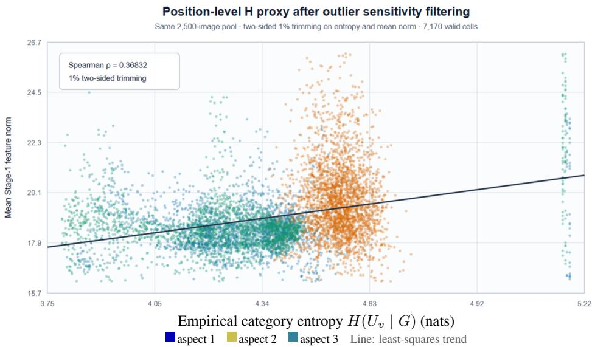  
Figure 6: Position-level validation of the Stage-1 information-amount proxy. Dense-label entropy from COCO-Stuff is compared with the mean raw Stage-1 feature norm at matched aspect bin and native position. The displayed fit uses a two-sided 1% trim $( \rho = 0 . 3 6 8 3 2 )$ ; the pre-specified primary estimate is untrimmed $( \rho = 0 . 3 5 9 4 3 )$ . This is a geometry-conditioned $H ( U _ { v } \mid G )$ diagnostic rather than a direct measurement of prompt-conditioned entropy.

Stage-1 representation reliability. We use annotated-category decoding as an operational reference for whether a visual representation preserves semantic content. On LLaVA-NeXT-7B, we train linear and MLP probes on 1,688 clean COCO objects, select checkpoints on 382 validation objects, and test on 200 objects from new, disjoint images. Each probe receives the unit-normalized mean visual feature within the target region; neither CLS attention nor feature norm is supplied as an extra input. We use three fixed head seeds and compare target-region masking with equal-area context masking. Decoding correctness is an observable diagnostic, not a direct observation of the latent reliability gate $C _ { v }$

Figure 7 provides three complementary checks. Panel (a) shows that target masking reduces category accuracy from 98.0% to 81.4% at 75% replacement, whereas equal-area context masking leaves it at 97.9%; full target masking reduces accuracy to 64.3%. This establishes that the decoding reference is sensitive to target content. Panels (b) and (c) then test whether the reliability proxy orders successful and unsuccessful decoding trials. Within each fixed object, masking arm, strength, and head seed, concordance is the fraction of correct–incorrect pairs whose CLS-attention score is higher on the correct trial, with half credit for ties. Scores average CLS-to-patch attention over heads and the fixed target region; feature norm is a comparison score averaged over the same region. Concordance is computed from six perturbation repeats, then averaged across defined seeds, strengths, and images, with no-association reference 0.5. All-correct and all-incorrect strata have undefined concordance and are not assigned a chance score.

For target masking, CLS-attention concordance is 0.557 (95% CI [0.479, 0.629]) with the linear probe and 0.564 ([0.484, 0.636]) with the MLP, compared with feature-norm estimates of 0.459 and 0.499. Thus the positive attention trend persists under both probe capacities, providing suggestive support for its reliability role. Both intervals include 0.5, so this is not a statistically established above-chance association. Target concordance uses 57 and 59 informative images, respectively; context concordance uses only 4 and 3 and is correspondingly uncertain. Confidence intervals use 1,000 image-cluster bootstrap resamples; all 200 images contribute to decoding accuracy.

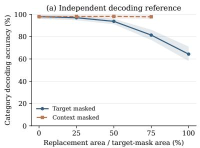

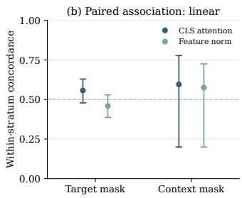

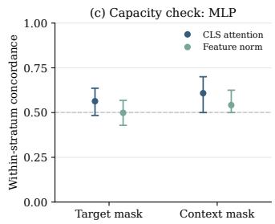  
200 new images; 3 fixed head seeds; image-bootstrap 95% CIs. Non-discordant strata are reported, not set to chance.

Figure 7: Three complementary diagnostics for Stage-1 reliability on LLaVA-NeXT-7B. (a) Category decoding is sensitive to target masking, but largely stable under context masking. (b) CLS attention has a positive concordance point estimate with decoding success under a linear probe. (c) The same direction persists with an MLP probe. Shading and error bars show image-bootstrap 95% confidence intervals over 200 test images and three fixed head seeds; concordance excludes strata without both successes and failures. The attention trends are suggestive, not conclusive, because the target-mask intervals include the 0.5 reference.

Stage-2 task relevance. For each held-out RefCOCO image–query pair, we convert the annotated box–cell overlap into a normalized target distribution over the Stage-1 survivor cells. This is an operational query-relevance target conditioned on the image and survivor pool, not a direct observation of J. We compare it with the text-to-visual attention averaged over text queries and heads, without post-hoc calibration. Figure 8 shows the local attention-mass interval [0, 0.08], using the original rank-decile bins without rebinning. Across the complete held-out set of 480 queries from 240 images, the mean per-query Spearman correlation is $\rho \ : = \ : 0 . 0 6 9 7$ (image-bootstrap 95% CI [0.0433, 0.0976]), indicating a weak positive spatial association. The higher-attention bins outside this view have decreasing target mass, so the local trend does not establish full-range probability calibration.

Text-to-visual attention and query relevance (local view)  
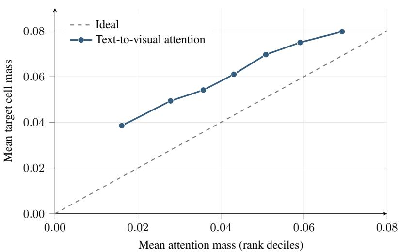  
Figure 8: Local-range view of the Stage-2 task-relevance diagnostic on LLaVA-NeXT-7B, restricted to attention masses 0–0.08. Points retain the original rank-decile means; the dashed line is the ideal calibration reference. The target is normalized RefCOCO box–cell overlap conditioned on the Stage-1 survivor pool. Higher-attention bins are outside the displayed range; the correlation reported in the text uses the complete held-out data.

## C.3 ARCHITECTURE AND BUDGET MAPPING

Let $N _ { 0 }$ be the original visual-token count and T the target layer-average count. Unless otherwise stated, Stage 1 retains a pool of $N _ { 1 } = \mathrm { m i n } ( 2 T , N _ { 0 } )$ tokens. With L decoder blocks, refinement uses the text-to-visual attention of the one-based block $K = \ell ,$ and prunes immediately after it, where $1 \leq \ell _ { \star } < L$ , so that the first $\ell _ { \star }$ blocks process $N _ { 1 }$ visual tokens and the remaining $L - \ell _ { \star }$ blocks process R. Before integer rounding and clipping, matching the target average gives

$$
T = \frac { \ell _ { \star } N _ { 1 } + ( L - \ell _ { \star } ) R } { L } .\tag{25}
$$

Solving for the post-refinement count and enforcing integer and range constraints yields

$$
R = \mathrm { c l i p } \left( \mathrm { r o u n d } \frac { T L - \ell _ { \star } N _ { 1 } } { L - \ell _ { \star } } , 1 , N _ { 1 } \right) .\tag{26}
$$

Rounding and clipping can make the realized layer average differ from T. The selector can be applied directly to budget $T$ when decoder-stage refinement is omitted. Table 9 gives the architecturespecific schedules. Its listed R assumes the pool $N _ { 1 } = 2 T$ before integer rounding; video budgets are per frame.

Table 9: MiCo budgets and refinement layers by architecture; video budgets are per frame.
<table><tr><td>Backbone</td><td>Decoder blocks L</td><td>Refinement l*</td><td>Stage-1 keep</td><td>Stage-2 keep R</td></tr><tr><td>LLaVA-1.5/NeXT-7B</td><td>32</td><td>7</td><td>2T</td><td>round(18T/25)</td></tr><tr><td>LLaVA-1.5-13B</td><td>40</td><td>8</td><td>2T</td><td>round(3T/4)</td></tr><tr><td>LLaVA-NeXT-13B</td><td>40</td><td>14</td><td>2T</td><td>round(6T/13)</td></tr><tr><td>Qwen2.5-VL-7B</td><td>28</td><td>2</td><td>2T</td><td>round(12T/13)</td></tr><tr><td>InternVL3-8B</td><td>28</td><td>4</td><td>2T</td><td>round(5T/6)</td></tr><tr><td>Qwen3-VL-8B</td><td>36</td><td>6</td><td>2T</td><td>round(4T/5)</td></tr><tr><td>Qwen3.5-9B</td><td>32</td><td>12</td><td>2T</td><td> $\mathrm { r o u n d } _ { \mathrm { e v e n } } ( 2 T / 5 )$ </td></tr><tr><td>LLaVA-Video-7B</td><td>28</td><td>6</td><td>2T</td><td>round(8T/11)</td></tr></table>

For multi-crop LLaVA-NeXT inputs and dynamically tiled InternVL inputs, the Stage 1 budget is distributed over the natural visual groups. Integer division and a minimum of one token per group can make the realized count differ slightly from T or 2T. LLaVA, Qwen3-VL, and Qwen3.5 recompute R using equation 26 and the realized Stage 1 survivor count. For Qwen2.5-VL and InternVL, R is instead computed from the nominal $N _ { 1 } = 2 T$ rather than the realized survivor count, so their realized layer average can differ slightly when clipping or group rounding prevents exactly $2 T$ survivors.

Video input protocol. LLaVA-Video-7B is evaluated through lmms-eval with the video repository’s native task prompts, generation settings, and official scorers. Each video is uniformly sampled to at most 64 frames (force sample=False, so shorter videos contribute fewer frames), and every frame is encoded by the SigLIP vision tower and spatially pooled by the model’s native pooling to 169 visual tokens, so an unpruned 64-frame input carries 64 × 169 visual tokens. Video budgets are nominal per-frame layer averages: $T = 6 4 / \dot { 3 } 2 / 1 6$ correspond to pruning 62.1%/81.1%/90.5% of the 169 tokens per frame. MiCo applies the Stage 1 pool $( 2 T$ per frame) and the refinement mapping of equation 26 to the concatenated frame tokens, and Table 12 reports the realized per-frame layer averages. Efficiency measurements fix 64 frames at 384×384 resolution with FP16 and SDPA on one A800 80GB GPU (Appendix D).

## C.4 COMPUTATIONAL COMPLEXITY

Following the standard accounting for token-pruning selectors (Zhang et al., 2024b), constructing a dense visual-token similarity matrix for $N$ tokens of width d costs $O ( N ^ { 2 } d )$ time and $O ( N ^ { 2 } )$ memory. Exact greedy coverage with a retained budget B adds $O ( B N ^ { 2 } )$ arithmetic for the marginal updates. Thus, for the two-stage path with original token count $N _ { 0 }$ , Stage 1 pool $N _ { 1 }$ , and final budget $\bar { R , }$ the selector-specific work scales as $O ( N _ { 0 } ^ { \ - 2 } d _ { 1 } + N _ { 1 } N _ { 0 } ^ { 2 } + N _ { 1 } ^ { 2 } \ - \ - d _ { 2 } + \ - R N _ { 1 } ^ { \ - 2 } )$ , up to implementation constants, where $d _ { 1 }$ and $d _ { 2 }$ are the widths of the vision-encoder features and the decoder hidden states. For video inputs, Stage 1 is applied to each frame separately, so the first two terms use the per-frame token count (169 for LLaVA-Video-7B) and grow only linearly with the number of frames, whereas Stage 2 operates on the concatenated survivor pool ${ \dot { N _ { 1 } } } = F \cdot { \dot { 2 } } T$ over all F frames; the quadratic Stage 2 terms therefore dominate the selector cost for long videos (Appendix D).

We validate this scaling on the executed implementations by counting logical dense-equivalent FLOPs, including the vision encoder, projector, decoder, output head, and both selector stages. These counts are an operation-accounting check rather than hardware-instruction counts; the percomponent breakdown and synchronized latency validation are given in Appendix D and Table 13.

## C.5 QWEN3.5-9B: HYBRID-DECODER ADAPTATION

Qwen3.5-9B (Qwen Team, 2026) has 32 decoder blocks, repeating three Gated DeltaNet blocks followed by one full-attention block. We retain all decoder blocks and remove only visual tokens. Both evaluated budgets $( T = 2 5 6$ and T = 128) use the same configuration: a Stage 1 pool of $N _ { 1 } = \mathrm { m i n } ( 2 T , N _ { 0 } )$ tokens (multiplier $n = 2$ , as for the other models), refinement after the 1-based block $K = 1 2$ , which is a full-attention block, and full-attention QK relevance averaged over all non-visual prompt positions.

Stage 1 follows the CLS-free Qwen adaptation. We observe the final vision-block attention, pool its query and key axes over the native $2 \times 2$ merger groups, and average over query groups and heads. The coverage features are the means of the four pre-merger patch features in each group. Their norms multiply the pooled attention to form source weights for the shared greedy coverage selector. The selected group indices retain the corresponding native merged embeddings; the vision encoder and merger execute unchanged, and selection occurs before the first decoder block.

Stage 2 uses block 12’s native Q/K projections, Q/K normalization, rotary positions, and groupedquery key expansion. For each non-visual prompt query and head, we normalize QK scores over the current visual keys, then average the probabilities over queries and heads. The block executes normally. The block’s output visual hidden states serve as the Stage 2 coverage features, and their $\ell _ { 2 }$ norms multiplied by these relevance scores give the Stage 2 source weights; the weights are divided by their sum (uniform weights are used if the sum is zero), which does not change the greedy selection. Stage 1 attention weights are not multiplied in again. We keep only the selected visual states, keep all text states, retain each surviving token’s original multimodal (mRoPE) position index, and run blocks 13–32 on the shortened sequence.

The second-stage budget is the instance of equation 26 with $L \ = \ 3 2$ and $K \ = \ 1 2 , \ R \ =$ round $\left( ( 3 2 T - 1 2 N _ { 1 } ) { \bar { / 2 0 } } \right)$ with $N _ { 1 } = \mathrm { m i n } ( 2 T , N _ { 0 } )$ , where round is round-half-to-even; instead of clipping, the Qwen3.5 path raises an error if R falls outside $[ 1 , N _ { 1 } ]$ . For $N _ { 0 } \geq 2 T$ , the schedules are $5 1 2  1 0 2$ at $T = 2 5 6$ and $2 5 6  5 1$ at $T = 1 2 8 .$ , realizing layer averages of 255.750 and 127.875. During cached decoding each block keeps the prefill state it computed: blocks 1–12 keep KV caches (full-attention blocks) or recurrent states (Gated DeltaNet blocks) built from the full N -token sequence and are not truncated after pruning, whereas blocks 13–32 hold caches built from the pruned sequence. Generated tokens receive position indices that continue from the original, unpruned prompt length.

The evaluated scope is one unpadded image per request, batch size one, SDPA, greedy cached generation, thinking disabled, and a 2,048-token generation cap. Empty and capped answers remain in the scoring denominator. Each configuration has 23,715 predictions: AI2D 3,088; POPE 5,127 expanded to 9,000 category entries; HallusionBench 951; MME 2,374 questions (1,187 images, two questions each); MMBench EN/CN 4,329 entries and 1,164 Circular groups each; MMStar 1,500; and ScienceQA-IMG 2,017. MMStar’s released questions are used unchanged, including items whose answer options are malformed in the original release.

As with Qwen2.5-VL and Qwen3-VL, we use one fixed configuration at both budgets (here $n = 2 ,$ $K = 1 2 ;$ per-model layers are listed in Table 19) and report the resulting eight-task evaluation. Acc follows the common Qwen convention (MME/20).

## D EFFICIENCY MEASUREMENT DETAILS

## D.1 MEASUREMENT PROTOCOL

The main text reports one-token latency for the LLaVA-NeXT backbones and complete-answer latency for LLaVA-Video, together with peak allocated memory and logical FLOPs. Latency uses synchronized CUDA wall time after ten warm-up requests; FLOPs are counted in a separate pass and are not used as a latency proxy. Loading, preprocessing, and host-to-device transfer are outside the generation timer. Budgets are nominal layer-average targets; the token counts realized by the executed decoder schedules are reported for the MiCo breakdowns in Tables 11 and 12.

The NeXT-7B MiCo rows use the default MiCo implementation, which fuses the greedy selector and runs the language model with FlashAttention2; the backend changes kernel fusion and memory traffic, but not the selector objective, token budget, or selected tokens. We report logical denseequivalent FLOPs rather than hardware instruction counts. The accounting includes the executed vision path, projector, decoder, output head, and pruning stages; fused attention is counted by its dense-equivalent arithmetic, while indexing, sorting, synchronization, and diagnostic-only work are excluded consistently.

## D.2 BACKBONE-LEVEL EFFICIENCY RESULTS

LLaVA-NeXT backbones. Table 10 reports median latency, peak-memory, and logical-FLOP comparisons at $T = 6 4 0 , 3 2 0$ , 160 for NeXT-7B and NeXT-13B under one protocol (one A800 80GB GPU, batch size one, one generated token, ten warm-ups and 50 measured requests). The two backbones are placed side by side for direct comparison; the Pareto figures use arithmetic-mean timing, so their speedups differ slightly from median-based ratios. Under the layer-average accounting of Appendix C.3, FastV and SparseVLM have no feasible T = 160 schedule on NeXT-7B and only a degenerate one on NeXT-13B (Appendix G), so their $T = 1 6 0$ rows are left blank.

Table 10: LLaVA-NeXT-7B and LLaVA-NeXT-13B efficiency comparison (median latency; speedups and reductions are relative to each backbone’s Vanilla row).
<table><tr><td rowspan="2">Method</td><td colspan="3">LLaVA-NeXT-7B</td><td colspan="3">LLaVA-NeXT-13B</td></tr><tr><td>Latency (ms) (Speedup)</td><td>(Reduction)</td><td>Peak memory (GiB) Logical FLOPs (T) (Reduction)</td><td>Latency (ms) (Speedup)</td><td>Peak memory (GiB) (Reduction)</td><td>Logical FLOPs (T) (Reduction)</td></tr><tr><td>Vanilla</td><td>290.0 (1.00×)</td><td>15.8 (0.0%)</td><td>45.6 (0.0%)</td><td>484.1 (1.00×)</td><td>28.4 (0.0%)</td><td>85.1 (0.0%)</td></tr><tr><td colspan="7">Budget T = 640 tokens per image</td></tr><tr><td>FastV</td><td>113.0 (2.57×)</td><td>16.0 (-1.7%)</td><td>11.8 (74.1%)</td><td>154.9 (3.13×)</td><td>28.1 (1.1%)</td><td>20.9 (75.4%)</td></tr><tr><td>SparseVLM</td><td>137.1 (2.11×)</td><td>16.0 (-1.7%)</td><td>11.8 (74.2%)</td><td>176.3 (2.75×)</td><td>28.1 (1.1%)</td><td>21.0 (75.3%)</td></tr><tr><td>DivPrune</td><td>108.7 (2.67×)</td><td>14.2 (9.7%)</td><td>11.7 (74.4%)</td><td>154.2 (3.14×)</td><td>25.9 (8.8%)</td><td>20.8 (75.6%)</td></tr><tr><td>VisionZip</td><td>118.8 (2.44×)</td><td>15.2 (3.9%)</td><td>11.7 (74.4%)</td><td>173.6 (2.79×)</td><td>27.0 (4.9%)</td><td>20.8 (75.6%)</td></tr><tr><td>VisPruner</td><td>128.0 (2.27×)</td><td>14.7 (7.1%)</td><td>11.7 (74.4%)</td><td>179.2 (2.70×)</td><td>26.5 (6.7%)</td><td>20.8 (75.6%)</td></tr><tr><td>HoloV</td><td>117.4 (2.47×)</td><td>15.2 (3.9%)</td><td>11.7 (74.3%)</td><td>176.1 (2.75×)</td><td>27.0 (4.9%)</td><td>20.8 (75.6%)</td></tr><tr><td>MMTok</td><td>208.3 (1.39×)</td><td>16.1 (-2.2%)</td><td>11.7 (74.4%)</td><td>259.2 (1.87×)</td><td>28.0 (1.4%)</td><td>20.8 (75.6%)</td></tr><tr><td>ApET</td><td>125.4 (2.31 ×)</td><td>23.3 (-48.0%)</td><td>10.5 (77.1%)</td><td>185.9 (2.60×)</td><td>37.8 (-33.1%)</td><td>18.7 (78.0%)</td></tr><tr><td>MiCo</td><td>135.5 (2.14×)</td><td>13.8 (12.8%)</td><td>11.6 (74.5%)</td><td>222.4 (2.18×)</td><td>27.0 (4.9%)</td><td>20.8 (75.6%)</td></tr><tr><td colspan="7">Budget T = 320 tokens per image</td></tr><tr><td>FastV</td><td>107.0 (2.71×)</td><td>16.0 (-1.7%)</td><td>7.4 (83.8%)</td><td>128.1 (3.78×)</td><td>28.5 (-0.4%)</td><td>12.5 (85.3%)</td></tr><tr><td>SparseVLM</td><td>130.4 (2.22×)</td><td>19.0 (-20.1%)</td><td>7.4 (83.8%)</td><td>173.6 (2.79×)</td><td>32.0 (-12.7%)</td><td>12.3 (85.5%)</td></tr><tr><td>DivPrune</td><td>86.5 (3.35×)</td><td>14.0 (11.1%)</td><td>7.3 (84.0%)</td><td>112.0 (4.32×)</td><td>26.0 (8.5%)</td><td>12.3 (85.5%)</td></tr><tr><td>VisionZip</td><td>102.4 (2.83×)</td><td>15.2 (3.9%)</td><td>7.3 (84.1%)</td><td>126.5 (3.83×)</td><td>27.0 (4.9%)</td><td>12.2 (85.7%)</td></tr><tr><td>VisPruner</td><td>112.4 (2.58×)</td><td>14.7 (7.1%)</td><td>7.3 (84.0%)</td><td>139.5 (3.47×)</td><td>26.5 (6.7%)</td><td>12.3 (85.5%)</td></tr><tr><td>HoloV</td><td>102.6 (2.83×)</td><td>15.2 (3.9%)</td><td>7.3 (84.1%)</td><td>125.8 (3.85×)</td><td>27.0 (4.9%)</td><td>12.2 (85.7%)</td></tr><tr><td>MMTok</td><td>151.9 (1.91×)</td><td>16.1 (-2.2%)</td><td>7.3 (84.0%)</td><td>181.4 (2.67×)</td><td>28.0 (1.4%)</td><td>12.3 (85.5%)</td></tr><tr><td>ApET</td><td>103.4 (2.80×)</td><td>16.0 (-1.2%)</td><td>6.8 (85.0%)</td><td>124.7 (3.88×)</td><td>28.5 (-0.4%)</td><td>11.5 (86.5%)</td></tr><tr><td>MiCo</td><td>99.4 (2.92×)</td><td>13.5 (14.1%)</td><td>7.2 (84.3%)</td><td>151.1 (3.20×)</td><td>27.0 (4.9%)</td><td>12.2 (85.7%)</td></tr><tr><td colspan="7">Budget T = 160 tokens per image</td></tr><tr><td>FastV</td><td></td><td></td><td>一</td><td></td><td></td><td></td></tr><tr><td>SparseVLM</td><td></td><td></td><td></td><td></td><td></td><td></td></tr><tr><td>DivPrune</td><td>81.9 (3.54×)</td><td>14.0 (11.2%)</td><td>5.1 (88.8%)</td><td>92.8 (5.22×)</td><td>25.9 (8.8%)</td><td>8.1 (90.5%)</td></tr><tr><td>VisionZip</td><td>97.1 (2.99×)</td><td>15.2 (3.9%)</td><td>5.1 (88.8%)</td><td>114.1 (4.24×)</td><td>27.0 (4.9%)</td><td>8.0 (90.6%)</td></tr><tr><td>VisPruner</td><td>113.1 (2.56×)</td><td>14.7 (7.1%)</td><td>5.1 (88.8%)</td><td>124.6 (3.89×)</td><td>26.5 (6.7%)</td><td>8.1 (90.5%)</td></tr><tr><td>HoloV</td><td>101.1 (2.87×)</td><td>15.2 (3.9%)</td><td>5.1 (88.8%)</td><td>114.1 (4.24×)</td><td>27.0 (4.9%)</td><td>8.0 (90.6%)</td></tr><tr><td>MMTok</td><td>131.9 (2.20×)</td><td>16.1 (-2.2%)</td><td>5.1 (88.8%)</td><td>144.3 (3.35×)</td><td>28.0 (1.4%)</td><td>8.1 (90.5%)</td></tr><tr><td>ApET</td><td>91.4 (3.17×)</td><td>14.0 (11.1%)</td><td>5.0 (89.0%)</td><td>108.4 (4.47×)</td><td>26.1 (8.1%)</td><td>7.9 (90.7%)</td></tr><tr><td>MiCo</td><td>88.1 (3.29×)</td><td>13.4 (14.8%)</td><td>5.0 (89.0%)</td><td>123.6 (3.92×)</td><td>27.0 (4.9%)</td><td>8.0 (90.6%)</td></tr></table>

## D.3 COMPONENT-LEVEL BREAKDOWN

Component timing. Tables 11 and 12 report the NeXT-7B and Video-7B timing breakdowns with the same row structure. The vision encoder, the projector, and the three pruning spans (Stage 1 selection, Stage 2 relevance, and Stage 2 selection) are CUDA event intervals recorded inside one generate call; the remaining span covers the decoder layers, the output head, and runtime/control work, so each column sums to the profiled generate span. The headline latency and peak-memory values are those reported in Tables 10 and 3; the component spans below are diagnostic. For NeXT-7B, the profile uses one A800 80GB GPU with K = 7, ten warm-ups, and 50 measured MME requests per budget. Within its remaining span, the decoder layers and final norm take 45.49/48.66/61.29 ms at T = 160/320/640, the output head 0.42/0.53/0.82 ms, and runtime/control 2.94/2.55/3.09 ms; the instrumented passes take 90.17/102.20/138.91 ms of wall time against un-instrumented reference passes of 87.95/98.75/134.92 ms before and 87.06/100.95/135.03 ms after profiling, so observer overhead is about 1–4%. For Video-7B, the spans are diagnostic means over two timed requests per budget (after warm-up) on the profiling cohort, a fixed set of videos sampled at 64 frames, and the decoder was not instrumented separately (†): its remaining span is the generate span minus the named spans. The two backbones differ in which stage dominates the pruning cost. On NeXT-7B, Stage 1 selects 2T tokens from the 2,880 multi-crop tokens while Stage 2 selects R from those survivors, so Stage 1 runs more greedy iterations and is the larger span (28.3 versus 13.9 ms at T = 640). On Video-7B, Stage 1 runs independently per frame over 169 tokens (batched across the 64 frames), whereas Stage 2 operates on the concatenated pool of 64 × 2T survivors; its pairwise similarities and greedy loop over up to 8,192 tokens therefore dominate the pruning cost (247.6 ms at T = 64) and fall by roughly 3× with each halving of T, while the per-frame Stage 1 stays at 5–11 ms.

Table 11: MiCo timing on LLaVA-NeXT-7B (K = 7). Component spans are means over 50 measured requests from paired instrumented profiles; complete-call latency is measured separately.
<table><tr><td>Component / measurement (ms unless noted)</td><td>T = 160</td><td>T = 320</td><td>T = 640</td></tr><tr><td>Vision encoder</td><td>28.87</td><td>29.59</td><td>30.48</td></tr><tr><td>Multimodal projector</td><td>0.62</td><td>0.62</td><td>0.62</td></tr><tr><td>Stage 1 selector</td><td>7.76</td><td>14.23</td><td>28.27</td></tr><tr><td>Stage 2 relevance (text attention)</td><td>0.39</td><td>0.09</td><td>0.10</td></tr><tr><td>Stage 2 selector</td><td>2.66</td><td>5.47</td><td>13.84</td></tr><tr><td>Pruning subtotal</td><td>10.81</td><td>19.79</td><td>42.21</td></tr><tr><td>Decoder, output head and runtime</td><td>48.84</td><td>51.73</td><td>65.21</td></tr><tr><td>Profiled generate span</td><td>89.14</td><td>101.73</td><td>138.52</td></tr><tr><td>Formal complete-call latency</td><td>88.1</td><td>99.4</td><td>135.5</td></tr><tr><td>Peak allocated memory (GiB)</td><td>13.4</td><td>13.5</td><td>13.8</td></tr><tr><td>Actual visual tokens per image (layer average)</td><td>159.84</td><td>319.69</td><td>640.16</td></tr></table>

Table 12: MiCo timing on LLaVA-Video-7B (K = 6). Component spans are diagnostic means over two timed requests after warm-up; complete-answer latency is measured separately.
<table><tr><td>Component / measurement (ms unless noted)</td><td>T = 16</td><td>T = 32</td><td>T = 64</td></tr><tr><td>Vision encoder</td><td>629.82</td><td>629.80</td><td>630.01</td></tr><tr><td>Multimodal projector</td><td>8.16</td><td>8.17</td><td>8.17</td></tr><tr><td>Stage 1 selector</td><td>4.62</td><td>6.65</td><td>10.94</td></tr><tr><td>Stage 2 relevance (text attention)</td><td>1.17</td><td>1.98</td><td>4.02</td></tr><tr><td>Stage 2 selector</td><td>22.94</td><td>74.28</td><td>247.64</td></tr><tr><td>Pruning subtotal</td><td>28.73</td><td>82.91</td><td>262.60</td></tr><tr><td>Decoder, output head and runtime†</td><td>113.27</td><td>199.04</td><td>394.25</td></tr><tr><td>Profiled generate span</td><td>779.98</td><td>919.92</td><td>1295.03</td></tr><tr><td>Formal complete-answer latency</td><td>804.7</td><td>933.8</td><td>1262.5</td></tr><tr><td>Peak allocated memory (GiB)</td><td>21.32</td><td>21.32</td><td>21.32</td></tr><tr><td>Actual visual tokens per frame</td><td>16.00</td><td>31.99</td><td>64.00</td></tr></table>

Component FLOPs. Tables 13 and 14 report the corresponding model and pruning arithmetic at the same budgets as the timing tables $( \bar { T } = 1 6 0 / 3 2 0 / \bar { 6 } 4 0$ for NeXT-7B and per-frame $T =$ 16/32/64 for Video-7B), separating model arithmetic from pruning arithmetic. Runtime/control work is excluded from FLOPs. The NeXT-7B counter further splits the pruning arithmetic into Stage 1 and Stage 2, matching the timing rows; the Video counter reports the Stage-1 and Stage-2 proxy computations as one row and the Triton-implemented greedy selection of both stages as a separate row. The Video breakdown is counted on the fixed 64-frame profiling cohort, so its totals differ by less than 1% from the native-input totals reported in Table 3.

Table 13: MiCo FLOPs breakdown on LLaVA-NeXT-7B (K = 7); percentages are shares of total FLOPs. Pruning arithmetic is attributed to Stage 1 and Stage 2 separately.
<table><tr><td>Component (GFLOPs)</td><td>T = 160</td><td>T = 320</td><td>T = 640</td></tr><tr><td>Vision encoder</td><td>1836.289 (36.63%)</td><td>1836.289 (25.57%)</td><td>1836.289 (15.78%)</td></tr><tr><td>Multimodal projector</td><td>120.879 (2.41%)</td><td>120.879 (1.68%)</td><td>120.879 (1.04%)</td></tr><tr><td>Decoder layers and final normalization</td><td>3002.246 (59.90%)</td><td>5136.922 (71.54%)</td><td>9520.805 (81.81%)</td></tr><tr><td>Vocabulary output head</td><td>48.350 (0.96%)</td><td>78.496 (1.09%)</td><td>139.052 (1.19%)</td></tr><tr><td>Stage 1: scores, similarity and selection</td><td>3.729 (0.07%)</td><td>4.047 (0.06%)</td><td>4.684 (0.04%)</td></tr><tr><td>Stage 2: extra attention / relevance</td><td>0.113 (0.002%)</td><td>0.206 (0.003%)</td><td>0.391 (0.003%)</td></tr><tr><td>Stage 2: scores, similarity and selection</td><td>0.881 (0.02%)</td><td>3.651 (0.05%)</td><td>15.713 (0.14%)</td></tr><tr><td>Stage 2 subtotal</td><td>0.994 (0.02%)</td><td>3.857 (0.05%)</td><td>16.104 (0.14%)</td></tr><tr><td>Model subtotal</td><td>5007.764 (99.91%)</td><td>7172.586 (99.89%)</td><td>11617.024 (99.82%)</td></tr><tr><td>Pruning subtotal</td><td>4.723 (0.09%)</td><td>7.904 (0.11%)</td><td>20.788 (0.18%)</td></tr><tr><td>Runtime/control (excluded from FLOPs) Total (GFLOPs)</td><td></td><td></td><td></td></tr><tr><td></td><td>5012.486 (100.00%)</td><td>7180.490 (100.00%)</td><td>11637.813 (100.00%)</td></tr><tr><td>Total (TFLOPs)</td><td>5.012486</td><td>7.180490</td><td>11.637813</td></tr></table>

Table 14: MiCo FLOPs breakdown on LLaVA-Video-7B (K = 6) on the fixed 64-frame profiling cohort; percentages are shares of total FLOPs. The two pruning paths are counted jointly; the Triton greedy term is listed separately.
<table><tr><td>Component (GFLOPs)</td><td>T = 16</td><td>T = 32</td><td>T = 64</td></tr><tr><td>Vision encoder</td><td>41228.062 (69.53%)</td><td>41228.062 (54.73%)</td><td>41228.062 (37.19%)</td></tr><tr><td>Multimodal projector</td><td>1585.032 (2.67%)</td><td>1585.032 (2.10%)</td><td>1585.032 (1.43%)</td></tr><tr><td>Visual pooling / plumbing</td><td>0.155 (0.000%)</td><td>0.155 (0.000%)</td><td>0.155 (0.000%)</td></tr><tr><td>Decoder layers and final normalization</td><td>15444.005 (26.05%)</td><td>30518.109 (40.51%)</td><td>63934.284 (57.68%)</td></tr><tr><td>Vocabulary output head</td><td>929.368 (1.57%)</td><td>1738.100 (2.31%)</td><td>3357.739 (3.03%)</td></tr><tr><td>Pruning operators (Stage 1 and Stage 2, jointly counted)</td><td>109.016 (0.18%)</td><td>261.046 (0.35%)</td><td>745.496 (0.67%)</td></tr><tr><td>Triton greedy selection</td><td>0.088 (0.000%)</td><td>0.386 (0.001%)</td><td>1.687 (0.002%)</td></tr><tr><td>Model subtotal</td><td>59186.622 (99.82%)</td><td>75069.459 (99.65%)</td><td>110105.272 (99.33%)</td></tr><tr><td>Pruning subtotal</td><td>109.104 (0.18%)</td><td>261.432 (0.35%)</td><td>747.183 (0.67%)</td></tr><tr><td>Runtime/control (excluded from FLOPs)</td><td>59295.726 (100.00%)</td><td></td><td></td></tr><tr><td>Total (GFLOPs) Total (TFLOPs)</td><td>59.296</td><td>75330.891 (100.00%) 75.331</td><td>110852.455 (100.00%) 110.852</td></tr></table>

## E ADDITIONAL ABLATION STUDIES

## E.1 TWO-STAGE COMPONENT ABLATION

Table 15 reports AI2D, POPE, HallB, MME, MMB-EN, MMStar, and SQA-IMG for Figure 5, sorted by increasing Acc . Acc averages exactly these seven benchmarks, using POPE accuracy and MME divided by 20, and differs from the eight-benchmark Acc in the main performance tables. The main figure retains the English MMBench evaluation; Figure 9 shows MMB-CN, ChartQA, and OCRBench, none of which contributes to Acc . All means use unrounded evaluation records. Separate columns specify Stage-1 CLS-attn and Stage-2 text-to-visual attention. The run groups and their full-component references are distinguished in the table note. The random setting samples tokens uniformly without replacement; it differs from the legacy all-off setting, in which every token receives the same score and the selector degenerates to top-k in index order. All settings use $\dot { K } = 2$ and a Stage-1 pool of $N _ { 1 } = 2 T$ . Y/N mark whether a component is enabled; Stage-1 CLS attention and Stage-2 text-to-visual attention have separate columns, whereas H and coverage are toggled jointly in both stages. The twelve plotted settings retain fixed colors and hatches, with bars sorted by score within each panel. Axis breaks mark truncated ranges; individual MME panels retain the original scale.

Within the paired-removal runs, disabling coverage lowers Acc from 77.1 to 74.4 and disabling both attention signals lowers it to 75.7, the two largest drops among the tested switches; the feature-norm term H has the smallest effect in this collection. These paired-removal runs were collected with an earlier Stage-1 attention extraction, so their absolute scores sit slightly below the main-evaluation configuration $( \mathrm { A c c } _ { 7 } = 7 8 . 4 )$ ; the single-component, random, and split-attention runs (the last disable only Stage-1 CLS attention or only Stage-2 text-to-visual attention) use the main-evaluation extraction. Comparisons are therefore most informative within a collection, and the table marks the collection of every row. Table 15 reports the individual switches, scores, and run distinctions. Stage-1 CLS-attn uses the native pooled analogue on Qwen2.5. MiCo does not lead every individual benchmark: no-cls-attn scores higher on MMB-EN.

Table 15: Two-stage component scores on Qwen2.5-VL-7B at T = 128, K = 2, and a Stage-1 pool of $N _ { 1 } = 2 T .$
<table><tr><td colspan="10">CLS-attn Text-visual</td><td colspan="2">MMB</td><td colspan="2">SQA</td></tr><tr><td>Setting</td><td>(S1)</td><td>attn (S2)</td><td></td><td></td><td>H Coverage AI2D</td><td></td><td>POPE HallB</td><td>MME</td><td>EN</td><td></td><td>MMStar IMG</td><td></td><td>Acc7</td></tr><tr><td>all-off</td><td>N</td><td>N</td><td>N</td><td>N</td><td>70.5</td><td>67.8</td><td>34.6</td><td>1662.24</td><td></td><td>72.4</td><td>46.7</td><td>77.6</td><td>64.7</td></tr><tr><td>only-H</td><td>N</td><td>N</td><td>Y</td><td>N</td><td>73.9</td><td>81.0</td><td>36.6</td><td></td><td>1933.90</td><td>79.6</td><td>51.3</td><td>82.5</td><td>71.7</td></tr><tr><td>only-cls-attn</td><td>Y</td><td>N</td><td>N</td><td>N</td><td>73.8</td><td>81.4</td><td></td><td>39.1</td><td>1975.37</td><td>77.3</td><td>52.6</td><td>81.6</td><td>72.1</td></tr><tr><td>random</td><td>N</td><td>N</td><td>N</td><td>N</td><td>73.7</td><td></td><td>80.8</td><td>40.0</td><td>2047.53</td><td>77.0</td><td>52.1</td><td>82.1</td><td>72.6</td></tr><tr><td>only-both-attn</td><td>Y</td><td>Y</td><td>N</td><td>N</td><td>75.0</td><td></td><td>81.9</td><td>41.2</td><td>1958.55</td><td>79.5</td><td>52.5</td><td>82.1</td><td>72.9</td></tr><tr><td>no-coverage</td><td>Y</td><td>Y</td><td>Y</td><td>N</td><td>77.5</td><td></td><td>82.6</td><td>40.9</td><td>2035.51</td><td>79.9</td><td>55.0</td><td>83.0</td><td>74.4</td></tr><tr><td>only-text-visual-attn</td><td>N</td><td>Y</td><td>N</td><td>N</td><td>76.7</td><td></td><td>82.3</td><td>44.3</td><td>2137.36</td><td>78.3</td><td>53.4</td><td>83.1</td><td>75.0</td></tr><tr><td>no-both-attn</td><td>N</td><td>N</td><td>Y</td><td>Y</td><td>78.1</td><td></td><td>85.0</td><td>43.0</td><td>2099.88</td><td>79.8</td><td>55.0</td><td>83.8</td><td>75.7</td></tr><tr><td>only-coverage</td><td>N</td><td>N</td><td>N</td><td>Y</td><td>77.5</td><td></td><td>84.4</td><td>43.2</td><td>2142.60</td><td>80.2</td><td>54.7</td><td>83.8</td><td>75.8</td></tr><tr><td>no-text-visual-attn</td><td>Y</td><td>N</td><td>Y</td><td>Y</td><td>78.2</td><td></td><td>85.2</td><td>42.6</td><td>2149.09</td><td>80.2</td><td>56.3</td><td>83.8</td><td>76.3</td></tr><tr><td>no-H</td><td>Y</td><td>Y</td><td>N</td><td>Y</td><td>79.6</td><td>84.4</td><td></td><td>45.6</td><td>2202.81</td><td>80.4</td><td>55.3</td><td>84.0</td><td>77.1</td></tr><tr><td>no-cls-attn</td><td>N</td><td>Y</td><td>Y</td><td>Y</td><td>79.9</td><td></td><td>84.6</td><td>46.7</td><td>2206.65</td><td>81.1</td><td>56.5</td><td>83.1</td><td>77.5</td></tr><tr><td>MiCo</td><td>Y</td><td>Y</td><td>Y</td><td>Y</td><td></td><td>80.4</td><td>85.5</td><td>48.6</td><td>2252.37</td><td>80.8</td><td>56.5</td><td>84.6 78.4</td><td></td></tr></table>

Note. CLS-attn denotes Qwen2.5’s native pooled visual-attention analogue, not a literal CLS token. Text-visual-attn denotes text-to-visual attention in Stage 2; both-attn denotes both signals. MiCo uses the main-evaluation record. The no-H, no-both-attn, no-coverage, and all-off settings come from an earlier paired-removal run with a different Stage-1 attention extraction, whose full-component reference has Acc7 = 77.1; the only-component, random, and split-attention runs use the main-evaluation extraction. Comparisons are most informative within one run. Scores and means use unrounded evaluation records; table values are rounded for display. In only-cls-attn and only-text-visual-attn, the stage without attention samples uniformly without replacement; random does so in both stages (one run, seed 0). All-off uses equal-score top-k selection and remains appendix-only.

## E.2 PROXY SUBSTITUTIONS

Table 7 compares four proxy replacements on Qwen2.5-VL-7B at T = 128. The H replacement scores each token by its normalized hidden-state entropy instead of its feature norm, in both stages. The coverage replacement drops the pairwise coverage term and scores each token by its similarity to the mean visual feature (visual-mean similarity), in both stages. The reliability replacement replaces the Stage-1 CLS-attention proxy with each token’s similarity to the global pooled visual token (global-token similarity), and the relevance replacement replaces the Stage-2 text-to-visual attention with each token’s mean similarity to the text tokens (mean text–visual similarity). Acc averages AI2D, POPE accuracy, HallB, MME/20, MMBench-EN/CN, MMStar, and SQA-IMG; Rel normalizes Acc by the unpruned reference of 82.95. Rows are ordered by increasing Acc, with MiCo last. Each column highlights the best and second-best distinct displayed values; MiCo leads the aggregate, but not every individual benchmark. The complete task-relevance comparison below retains the additional uniform, inverse (one minus) mean text–visual similarity, and finaltoken alternatives.

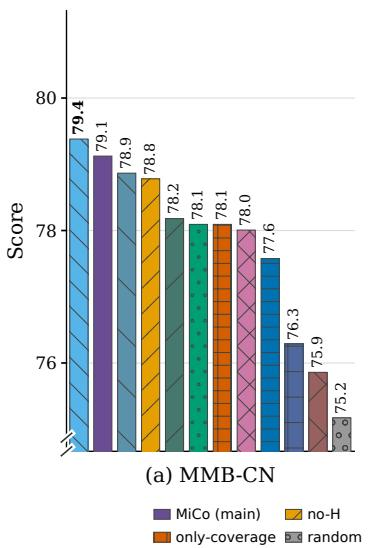

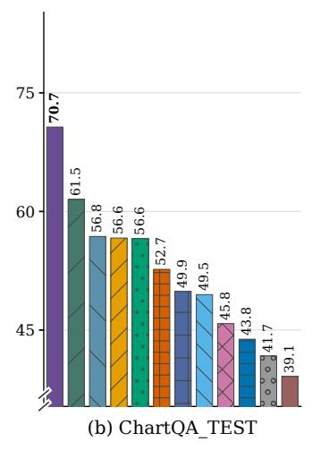

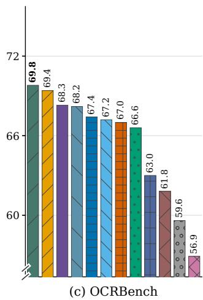  
Figure 9: Additional component comparisons on Qwen2.5-VL-7B at $T = 1 2 8 ;$ these tasks are excluded from $\operatorname { A c c } _ { 7 }$

## E.3 STAGE-2 TASK-RELEVANCE ABLATION

We replace only the Stage-2 task-relevance weight on Qwen2.5 at T = 128 (Table 16). All variants use $\bar { K = 2 }$ and a Stage-1 pool of 2T; uniform relevance sets the weight to one. Averaging text-tovisual attention over all text queries gives the highest Acc, 78.5, compared with 76.6 for uniform relevance, 77.1 for mean text–visual similarity, and 77.2 for its complement. Using only the final text token reaches 78.3. These results favor attention-based task relevance over raw cross-modal similarity, with a small further gain from aggregating text queries. All five variants exceed MMTok’s Acc of 75.3, the strongest external baseline at this budget.

The aggregate uses the eight-benchmark Acc of the Qwen main tables, with MME divided by 20. POPE reports overall accuracy, MMBench uses Circular evaluation, and SQA uses image-question accuracy.

Table 16: Stage-2 task-relevance ablation on Qwen2.5-VL-7B at T = 128, K = 2, and a Stage-1 pool of $N _ { 1 } = 2 T .$
<table><tr><td>Method / relevance</td><td>T</td><td>AI2D</td><td>POPE HallB</td><td></td><td>MME</td><td>MMB MMB EN</td><td>CN</td><td>MMStar</td><td>SQA IMG</td><td>Acc</td><td>Rel</td></tr><tr><td>MMTok (ICLR&#x27;26)</td><td>128</td><td>76.3</td><td>84.2</td><td>43.3</td><td>2120.7</td><td>79.8</td><td>77.5</td><td>53.7</td><td>81.4</td><td>75.3</td><td>90.8%</td></tr><tr><td>uniform</td><td>128</td><td>78.2</td><td>85.2</td><td>42.6</td><td>2149.09</td><td>80.2</td><td>78.9</td><td>56.3</td><td>83.8</td><td>76.6</td><td>92.3%</td></tr><tr><td>text-vision-sim</td><td>128</td><td>79.1</td><td>85.5</td><td>45.9</td><td>2142.01</td><td>79.7</td><td>79</td><td>56.5</td><td>84.3</td><td>77.1</td><td>93.0%</td></tr><tr><td>1-(text-vision-sim)</td><td>128</td><td>79.4</td><td>86.2</td><td>45.9</td><td>2170.42</td><td>80.3</td><td>78.7</td><td>55.5</td><td>83.4</td><td>77.2</td><td>93.1%</td></tr><tr><td>last-token-attn</td><td>128</td><td>80.5</td><td>85.6</td><td>48.3</td><td>2235.97</td><td>80.6</td><td>79</td><td>56.1</td><td>84.3</td><td>78.3</td><td>94.4%</td></tr><tr><td>MiCo (all-text-attn)</td><td>128</td><td>80.4</td><td>85.5</td><td>48.6</td><td>2252.37</td><td>80.8</td><td>79.1</td><td>56.5</td><td>84.6</td><td>78.5</td><td>94.7%</td></tr></table>

## E.4 STAGE-1 BUDGET ABLATIONS

To test the trade-off between a broad candidate pool and later-layer compression, we vary the Stage 1 pool $N _ { 1 } = n T$ for $n = 1 , \ldots , 5$ on $\mathrm { Q w e n } 2 . 5 \mathrm { - V L } \mathrm { - } 7 \mathrm { B }$ while keeping the layer-average budget fixed (the figures show $n = 1 { \ - } 4 ;$ the tables also include $n = 5 )$ . Increasing the initial pool leaves fewer tokens for the remaining decoder layers under this constraint. Qwen2.5 uses 28 decoder blocks and

$K = 2 ;$ for each n, the Stage-2 count R is recomputed from equation 26 with $N _ { 1 } = n T$ , so the layer average stays at T (Appendix C.3).

Figure 10 shows four illustrative benchmarks and the full eight-benchmark mean at $T = 1 2 8$ . All four pool sizes $( n = 1 – 4 )$ exceed the strongest external baseline on the displayed metrics. The eightbenchmark mean is higher at $n = 2 – 4$ than at $n = 1$ and peaks at $n = 2 ,$ , supporting a moderate initial candidate pool. This improvement is not uniform on each task: MMB-EN at $n = 3$ is 0.09 points below $n = 1$ . The tables below report all benchmark results at both budgets, including $n = 5 ,$ alongside the InternVL3 comparison.

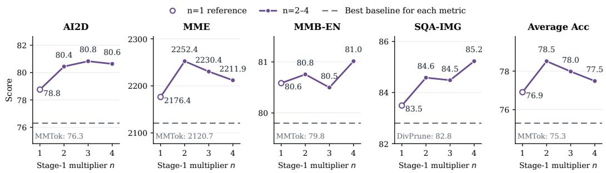  
Figure 10: Stage-1 budget sensitivity on Qwen2.5-VL-7B at $T = 1 2 8 \colon$ four illustrative tasks and the eight-task mean.

Tables 17 and 18 report the full Stage-1 budget ablations for Qwen2.5-VL-7B and InternVL3-8B at $T = 2 5 6$ and $T = 1 2 8$ , including $n = 5$ . Figures 10 and 11 display $n = 1 { - } 4$ for Qwen2.5 and InternVL3, respectively. The $n = 1$ rows repeat the main-evaluation MiCo-S1 records of Tables 21 and 21, which both figures also use as their $n = 1$ reference. InternVL3 uses 28 decoder blocks and $K = 4 ,$ , and its displayed Average Acc peaks at $n = 3$ . Its plotted $n = 2$ point is the mainevaluation MiCo record from Table 21 (Acc 79.3); Table 18 instead lists the separately collected budget-ablation run for that setting (Acc 79.2).

Each figure displays four illustrative benchmarks chosen after inspecting the results, with different selections for the two models. These panels do not summarize every task: the complete eightbenchmark mean is shown separately, and the tables retain all benchmark scores. On both models, all four pool sizes exceed the strongest external baseline in this mean, and $n = 2 – 4$ score higher than $n = 1$ . Individual tasks do not always follow this pattern; for example, Qwen2.5 MMB-EN at $n = 3$ is 0.09 points below $n = 1$ Dashed lines show the strongest external pruner per metric; hollow $n = 1$ points identify the main-evaluation MiCo-S1 reference. Panel ranges differ, and MME retains its original scale outside the mean. Acc uses unrounded scores with MME/20. InternVL distributes the token budget evenly across its dynamic tiles, assigning any remainder to the first tiles.

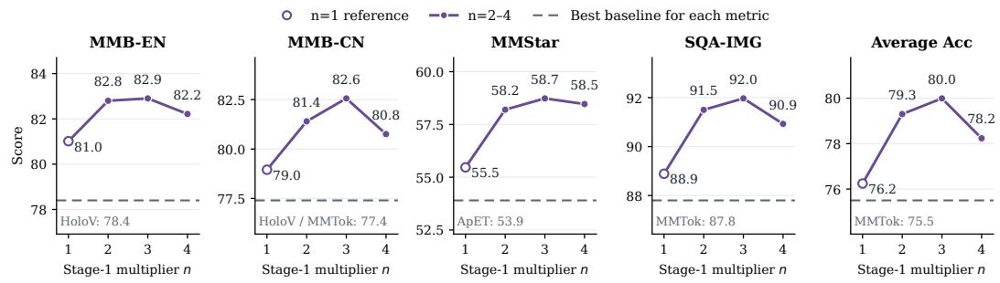  
Figure 11: Stage-1 budget sensitivity on InternVL3-8B at $T = 1 2 8 \colon$ four illustrative tasks and the eight-task mean.

Table 17: Stage-1 budget ablation on Qwen2.5-VL-7B with refinement at $K = 2 .$
<table><tr><td colspan="8"> $\mathrm { \bf S 1 }$ </td><td colspan="2">MMB MMB</td><td colspan="2"></td><td colspan="2">SQA</td></tr><tr><td>S1 setting</td><td>T</td><td>tokens</td><td>S2 R AI2D</td><td></td><td></td><td>POPE HallB</td><td>MME</td><td>EN</td><td>CN</td><td>MMStar</td><td> IMG</td><td>Acc</td></tr><tr><td>n=1 (T)</td><td>256</td><td>256</td><td>256</td><td>81.7</td><td>86.1</td><td>48.6</td><td>2282.2</td><td>82.0</td><td>80.5</td><td>59.5</td><td>85.5 79.8</td><td></td></tr><tr><td>n=2 (2T)</td><td>256</td><td>512</td><td>236</td><td>83.8</td><td>86.3</td><td>51.2</td><td>2291.0</td><td>83.2</td><td>81.3</td><td>60.1</td><td>86.2 80.8</td><td></td></tr><tr><td>n=3 (3T)</td><td>256</td><td>768</td><td>217</td><td>82.4</td><td>86.4</td><td>50.6</td><td>2289.3</td><td>82.3</td><td>81.4</td><td>60.7</td><td>86.4</td><td>80.6</td></tr><tr><td>n=4 (4T)</td><td>256</td><td>1024</td><td>197</td><td>82.4</td><td>86.1</td><td>50.0</td><td>2266.5</td><td>82.4</td><td>81.3</td><td>59.6</td><td>86.3</td><td>80.2</td></tr><tr><td>n=5 (5T)</td><td>256</td><td>1280</td><td>177</td><td>82.0</td><td>85.6</td><td>49.9</td><td>2250.1</td><td>81.9</td><td>80.6</td><td>59.1</td><td>85.8 79.7</td><td></td></tr><tr><td>n=1 (T)</td><td>128</td><td>128</td><td>128</td><td>78.8</td><td>84.3</td><td>46.3</td><td>2176.4</td><td>80.6</td><td>78.4</td><td>54.6</td><td>83.5 76.9</td><td></td></tr><tr><td>n=2 (2T)</td><td>128</td><td>256</td><td>118</td><td>80.4</td><td>85.5</td><td>48.6</td><td>2252.4</td><td>80.8</td><td>79.1</td><td>56.5</td><td>84.678.5</td><td></td></tr><tr><td>n=3 (3T)</td><td>128</td><td>384</td><td>108</td><td>80.8</td><td>85.0</td><td>46.5 45.3</td><td>2230.4</td><td>80.5</td><td>78.7</td><td>56.3</td><td>84.5</td><td>78.0</td></tr><tr><td>n=4(4T)</td><td>128</td><td>512</td><td>98</td><td>80.6</td><td>84.2 84.0</td><td></td><td>2211.9</td><td>81.0</td><td>78.4</td><td>54.5</td><td>85.2</td><td>277.5</td></tr><tr><td>n=5 (5T)</td><td>128</td><td>640</td><td>89</td><td>79.9</td><td></td><td>45.4</td><td>2203.2</td><td>80.2</td><td>77.8</td><td>54.9</td><td>85.1</td><td>77.2</td></tr></table>

Table 18: Stage-1 budget ablation on InternVL3-8B with refinement at $K = 4 .$
<table><tr><td colspan="8"> $\mathrm { \bf S 1 }$ </td><td colspan="2">MMB MMB</td><td colspan="2"></td><td colspan="2">SQA</td></tr><tr><td>S1 setting</td><td>T</td><td>tokens</td><td>S2 R AI2D</td><td></td><td></td><td>POPE HallB</td><td>MME</td><td>EN</td><td>CN</td><td>MMStar</td><td> IMG</td><td>Acc</td></tr><tr><td>n=1 (T)</td><td>256</td><td>256</td><td>256</td><td>80.1</td><td>90.8</td><td>44.1</td><td>2279.1</td><td>83.7</td><td>83.2</td><td>59.7</td><td>93.4</td><td>81.1</td></tr><tr><td>n=2 (2T)</td><td>256</td><td>512</td><td>213</td><td>83.0</td><td>90.2</td><td>45.1</td><td>2293.7</td><td>85.0</td><td>84.5</td><td>63.0</td><td>95.6 82.6</td><td></td></tr><tr><td>n=3 (3T)</td><td>256</td><td>768</td><td>171</td><td>82.9</td><td>90.0</td><td>45.3</td><td>2302.5</td><td>85.3</td><td>84.7</td><td>63.5</td><td>95.6 82.8</td><td></td></tr><tr><td>n=4 (4T)</td><td>256</td><td>1024</td><td>128</td><td>82.1</td><td>89.9</td><td>43.2</td><td>2281.9</td><td>84.8</td><td>83.7</td><td>61.7</td><td>94.6</td><td>81.8</td></tr><tr><td>n=5 (5T)</td><td>256</td><td>1280</td><td>85</td><td>79.7</td><td>89.0</td><td>40.7</td><td>2260.5</td><td>82.6</td><td>83.0</td><td>59.5</td><td>92.6 80.0</td><td></td></tr><tr><td>n=1 (T)</td><td>128</td><td>128</td><td>128</td><td>73.9</td><td>89.3</td><td>36.8</td><td>2112.5</td><td>81.0</td><td>79.0</td><td>55.5</td><td>88.976.2</td><td></td></tr><tr><td>n=2 (2T)</td><td>128</td><td>256</td><td>107</td><td>77.5</td><td>89.7</td><td>40.4</td><td>2252.3</td><td>82.6</td><td>81.4</td><td>57.8</td><td></td><td>91.7 79.2</td></tr><tr><td>n=3 (3T)</td><td>128</td><td>384</td><td>85</td><td>79.4</td><td>89.6</td><td>40.6</td><td>2284.1</td><td>82.9</td><td>82.6</td><td>58.7</td><td>92.0</td><td>80.0</td></tr><tr><td>n=4(4T)</td><td>128</td><td>512</td><td>64</td><td>78.2</td><td>88.6 87.8</td><td>38.7 37.5</td><td>2159.8</td><td>82.2</td><td>80.8</td><td>58.5</td><td>90.9</td><td>78.2</td></tr><tr><td>n=5 (5T)</td><td>128</td><td>640</td><td>43</td><td>75.6</td><td></td><td></td><td>2149.2</td><td>80.0</td><td>78.4</td><td>54.5</td><td>88.3</td><td>76.2</td></tr></table>

## F REFINEMENT-LAYER SELECTION AND SENSITIVITY

## F.1 LAYER CONFIGURATION SUMMARY

We use one fixed, architecture-specific refinement layer in each reported configuration. Table 19 summarizes the selected layers, and Appendix F.2 gives the selection procedure and representative examples.

Table 19: Refinement-layer configurations used in the reported experiments.
<table><tr><td>Model</td><td>Refinement-layer configuration</td></tr><tr><td> $\mathrm { L L a V A – 1 } . 5 – 7 \mathrm { B }$ </td><td> $K = 7$ </td></tr><tr><td> $\mathrm { L L a V A – 1 } . 5 – 1 3 \mathrm { B }$ </td><td> $K = 8$ </td></tr><tr><td> $\mathrm { L L a V A – N e X T – 7 B }$ </td><td> $K = 7$ </td></tr><tr><td> $\mathrm { L L a V A – N e X T – 1 } 3 \mathrm { B }$ </td><td> $K = 1 4$ </td></tr><tr><td> $\mathrm { Q w e n 3 – V L { - } 8 B }$ </td><td> $K = 6$ </td></tr><tr><td> $\mathrm { I n t e r n V L } 3 – 8 \mathrm { B }$ </td><td> $K = 4$ </td></tr><tr><td> $\mathrm { Q w e n } 2 . 5 \mathrm { - } \mathrm { V L } \mathrm { - } 7 \mathrm { B }$ </td><td> $K = 2$ </td></tr><tr><td> $\mathrm { Q w e n } 3 . 5 { \cdot } 9 \mathrm { B }$ </td><td> $K = 1 2$ </td></tr><tr><td> $\mathrm { L L a V A – V i d e o { – } 7 B }$ </td><td> $K = 6$ </td></tr></table>

Detailed selection examples are given in Appendix F.2, while the complete LLaVA sweep tables are collected with the full image-model results.

## F.2 IMAGE-MODEL CALIBRATION

For the representative OCR-based checks on Qwen3-VL and InternVL3, we hold the same 100 OCRBench samples and target budget T = 128 fixed, sweep the one-based decoder-layer cutoff K over candidate blocks, run the same two-stage pruning pipeline for each candidate, and select the layer with the highest OCR accuracy. The LLaVA calibration plots use the corresponding fixed sample and budget settings stated in the captions. Answer-token KL divergence is reported as a supplementary diagnostic. Figure 12 shows the size-grouped LLaVA calibration, while Figures 13a and 13b give representative Qwen3-VL-8B and InternVL3-8B examples at $T = 1 2 8$ . Accuracy curves count correct answers; stars mark the selected maxima, and hollow entries mark the MiCo-S1 (Stage-1-only) references. Layer indices are one-based, with pruning after K.

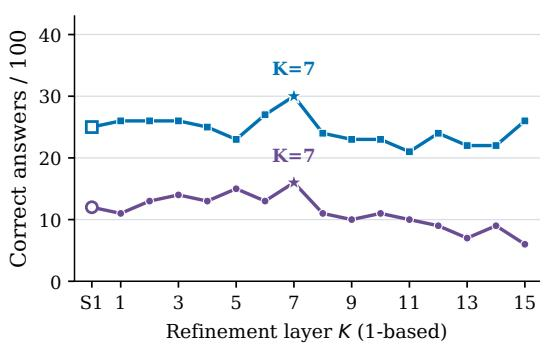  
(a) 7B models

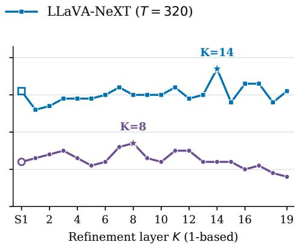  
(b) 13B models

Figure 12: Refinement-layer selection on 100 OCRBench samples: LLaVA-1.5 at $T = 6 4$ and LLaVA-NeXT at $T = 3 2 0$  
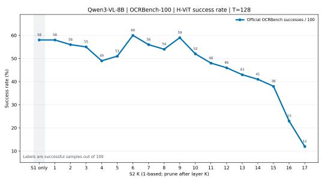  
(a) Qwen3-VL-8B

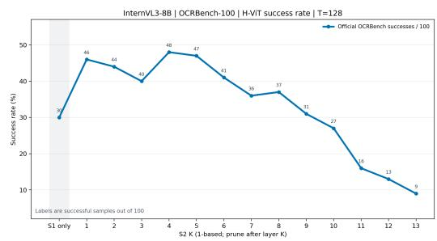  
(b) InternVL3-8B  
Figure 13: Representative refinement-layer selection for Qwen3-VL-8B and InternVL3-8B on 100 OCRBench samples at $T = 1 2 8 .$

## F.3 LLAVA REFINEMENT-LAYER SWEEPS

Figures 14, 15, and 16 report the refinement-layer sweeps at $T = { 3 2 } / { 1 6 0 } , { 6 4 } / { 3 2 0 }$ , and 128/640, respectively, for LLaVA-1.5/LLaVA-NeXT. Each figure groups models by parameter scale, with one curve for LLaVA-1.5 and one for LLaVA-NeXT. The selected layers remain $K = 7 / 8$ for LLaVA-1.5-7B/13B and $K = 7 / 1 4$ for LLaVA-NeXT-7B/13B; they are not reselected from the downstream scores. The left/right panels show 7B/13B models and sweep $K = 1 \mathrm { - } 1 5 / 1 \mathrm { - } 1 9$ , respectively. Diamonds mark calibration-selected layers; stars mark sweep maxima, including ties. Curves use the ten-benchmark mean $\operatorname { A c c } _ { 1 0 }$ defined in Appendix G, and refinement occurs after the one-based layer K.

At the most aggressive budgets $( T = 3 2$ for LLaVA-1.5 and $T ~ = ~ 1 6 0$ for LLaVA-NeXT), the calibration-selected layers on LLaVA-NeXT-7B/13B are within 0.23/0.05 Acc points of the observed sweep maxima; the corresponding gaps on LLaVA-1.5-7B/13B are 1.19/0.45 points. The calibration-selected layer therefore need not maximize the downstream ten-benchmark mean, although it is close to the observed peak on both NeXT models.

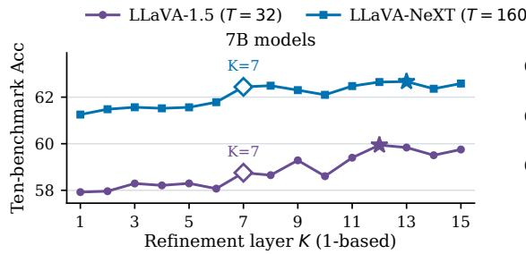

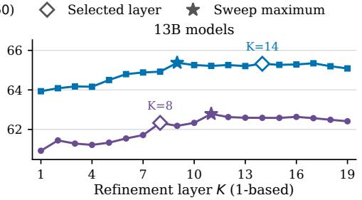

Figure 14: Refinement-layer sweeps at 94.4% pruning: LLaVA-1.5 (T = 32) and LLaVA-NeXT $( T = 1 6 0 )$  
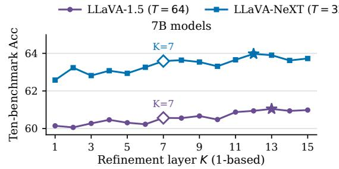

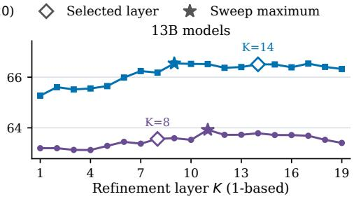

Figure 15: Refinement-layer sweeps at 88.9% pruning: LLaVA-1.5 (T = 64) and LLaVA-NeXT (T = 320).  
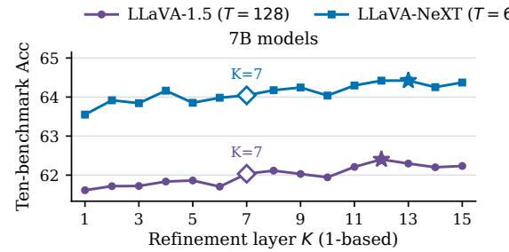

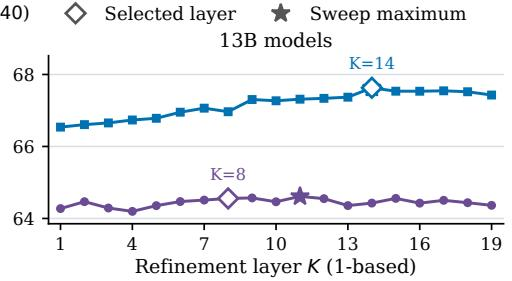  
Figure 16: Refinement-layer sweeps at 77.8% pruning: $\mathrm { L L a V A – 1 } . 5 ( T = 1 2 8 )$ and LLaVA-NeXT (T = 640).

## F.4 ANSWER-TOKEN KL DIAGNOSTICS

Figure 17 reports answer-token KL divergence as a complementary diagnostic, showing the change in KL from the unpruned baseline relative to the Stage-1-only reference. For LLaVA, the refinement layers were selected from the OCRBench accuracy curves at T = 64 (LLaVA-1.5) and $T = 3 2 0$ (LLaVA-NeXT) in Figure 12; the KL diagnostic was run at the most aggressive budgets, $T = 3 2$ and $T = 1 6 0$ , to check the selected layers there. The representative Qwen3 and InternVL3 panels use $T = 1 2 8$ in both the accuracy and KL figures. Each ∆KL subtracts Stage-1-only KL from the refined model’s answer-token KL to the unpruned baseline; lower is better. Shading denotes paired-bootstrap 95% confidence intervals.

## F.5 VIDEO REFINEMENT LAYER

For LLaVA-Video, we select the refinement layer once for the video setting and fix it at $K = 6$ for all reported video budgets; it is not re-tuned per budget or per benchmark. The video results therefore use the same fixed configuration throughout the reported efficiency and performance comparisons.

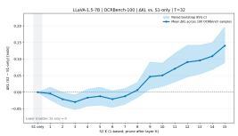  
(a) LLaVA-1.5-7B

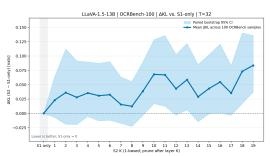  
(b) LLaVA-1.5-13B

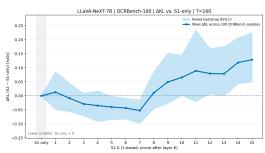  
(c) LLaVA-NeXT-7B

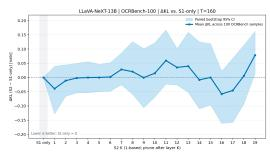  
(d) LLaVA-NeXT-13B

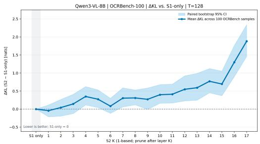  
(e) Qwen3-VL-8B

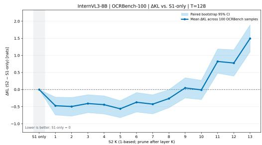  
(f) InternVL3-8B  
Figure 17: Layer-wise ∆KL on 100 OCRBench samples (lower is better); shading shows paired-bootstrap 95% intervals.

## G COMPLETE IMAGE-MODEL RESULTS

The main text reports detailed results for LLaVA-NeXT-13B and summarizes the remaining image models by family. For lookup, this appendix keeps the complete benchmark scores in two crosspage tables: one for the LLaVA series and one for Qwen-VL and InternVL. Each model is a labeled block within its family table, with the original budgets, methods, MiCo-S1 rows, and highlighting preserved.

## G.1 LLAVA SERIES

The first longtable consolidates LLaVA-1.5-7B/13B and LLaVA-NeXT-7B/13B. All four models share the same ten benchmark columns, followed by the aggregate Acc and relative retention (Rel). FastV and SparseVLM keep every visual token through their first two decoder layers, so at the 94.4% budget (T = 32 on LLaVA-1.5, T = 160 on LLaVA-NeXT) the layer-average accounting of Appendix C.3 leaves them no feasible schedule on the 32-layer 7B models and only a degenerate one on the 13B models; they are therefore not reported at that budget, and Tables 10 and 28 leave the same entries blank.

Table 20: Complete benchmark results across the LLaVA series, including MiCo-S1.
<table><tr><td>Method</td><td>GQA</td><td>SQA- IMG</td><td>TextVQA POPE</td><td></td><td>MME</td><td>MMB- EN</td><td>MMB- CN</td><td>SEED</td><td>AI2D</td><td>MMMU</td><td>Acc</td><td>Rel</td></tr><tr><td colspan="10">LLaVA-1.5-7B</td><td></td><td></td><td></td></tr><tr><td colspan="10">Upper Bound — 576 tokens (no pruning)</td><td></td><td></td><td></td><td></td></tr><tr><td>Vanilla</td><td>61.9</td><td>69.5</td><td>58.2</td><td>85.9</td><td>1508.8</td><td>64.7</td><td>58.1</td><td>66.0</td><td>55.5</td><td>35.0</td><td>63.0</td><td>100.0%</td></tr><tr><td colspan="10">Retain 128 tokens (↓77.8%)</td><td></td><td></td><td></td></tr><tr><td>FastV (ECCV’24)</td><td>54.0</td><td>69.2</td><td>56.4</td><td>68.2</td><td>1376.5</td><td>63.0</td><td>55.9</td><td>59.7</td><td>53.6</td><td>34.3</td><td>58.3</td><td>92.6%</td></tr><tr><td>SparseVLM (ICML&#x27;25)</td><td>57.3</td><td>69.0</td><td>56.3</td><td>83.1</td><td>1401.3</td><td>62.6</td><td>56.9</td><td>61.7</td><td>54.7</td><td>35.9</td><td>60.8</td><td>96.4%</td></tr><tr><td>DivPrune (CVPR’25)</td><td>59.4</td><td>68.6</td><td>55.9</td><td>87.0</td><td>1411.2</td><td>61.5</td><td>54.8</td><td>62.4</td><td>54.2</td><td>35.2</td><td>61.0</td><td>96.8%</td></tr><tr><td>VisionZip (CVPR&#x27;25) VisPruner (ICCV’25)</td><td>57.6</td><td>68.7</td><td>56.9</td><td>83.3</td><td>1437.3</td><td>62.1</td><td>57.0</td><td>61.6</td><td>54.5</td><td>35.9</td><td>60.9</td><td>96.7%</td></tr><tr><td></td><td>58.3</td><td>68.8</td><td>56.9</td><td>84.4</td><td>1425.5</td><td>61.6</td><td>55.9</td><td>61.8</td><td>53.7</td><td>35.8</td><td>60.8</td><td>96.6%</td></tr><tr><td>VScan (TMLR&#x27;26)</td><td>59.0</td><td>68.6</td><td>57.2</td><td>85.0</td><td>1425.6</td><td>61.7</td><td>57.1</td><td>64.19</td><td>55.5</td><td>36.7</td><td>61.63</td><td>97.8%</td></tr><tr><td>HoloV (NeurIPS&#x27;25) MMTok (ICLR&#x27;26)</td><td>57.4</td><td>68.1</td><td>55.7</td><td>82.3</td><td>1437.4</td><td>61.9</td><td>56.7</td><td>61.3</td><td>54.6</td><td>35.1</td><td>60.5</td><td>96.0%</td></tr><tr><td></td><td>59.2</td><td>68.9</td><td>56.8</td><td>86.5</td><td>1419.9</td><td>60.9</td><td>55.5</td><td>63.3</td><td>54.1</td><td>35.0</td><td>61.1</td><td>97.0%</td></tr><tr><td>ApET (CVPR’26)</td><td>59.1</td><td>68.1</td><td>54.3</td><td>86.3</td><td>1430.6</td><td>61.4</td><td>54.9</td><td>63.0</td><td>54.1</td><td>34.6</td><td>60.7</td><td>96.4%</td></tr><tr><td>MiCo-S1</td><td>59.2</td><td>68.6</td><td>57.2</td><td>85.8</td><td>1433.3</td><td>61.6</td><td>56.8</td><td>62.7</td><td>54.3</td><td>35.2</td><td>61.3</td><td>97.3%</td></tr><tr><td>MiCo</td><td>60.0</td><td>69.3</td><td>57.6</td><td>85.9</td><td>1474.8</td><td>62.4</td><td>56.5</td><td>63.7</td><td>54.9</td><td>36.3</td><td>62.0</td><td>98.5%</td></tr></table>

Retain 64 tokens (↓88.9%)

Table 20 (continued): Complete benchmark results across the LLaVA series, including MiCo-S1
<table><tr><td>Method</td><td>GQA</td><td>SQA- IMG</td><td>TextVQA POPE</td><td>MME</td><td>MMB- EN</td><td>MMB- CN</td><td>SEED</td><td>AI2D</td><td>MMMU</td><td>Acc</td><td>Rel</td></tr><tr><td colspan="10">35.4</td><td></td><td></td></tr><tr><td>FastV (ECCV’24)</td><td>46.0</td><td>70.1</td><td>51.6</td><td>962.0</td><td>50.1</td><td>42.1</td><td>46.8</td><td>50.6</td><td>34.7 36.3</td><td>47.5</td><td>75.5% 87.8%</td></tr><tr><td>SparseVLM (ICML&#x27;25)</td><td>52.0 57.7</td><td>69.2 68.0</td><td>52.1 54.5</td><td>1192.8 1365.8</td><td>58.3 60.1</td><td>49.6 52.3</td><td>53.9 60.1</td><td>52.5 53.8</td><td>34.8</td><td>55.3 59.5</td><td>94.4%</td></tr><tr><td>DivPrune (CVPR&#x27;25)</td><td>55.1</td><td>69.0</td><td>55.5</td><td>1371.5 80.6</td><td>60.1</td><td>55.4</td><td>57.7</td><td>53.3</td><td>35.4</td><td>58.7</td><td>93.2%</td></tr><tr><td>VisionZip (CVPR&#x27;25) VisPruner (ICCV&#x27;25)</td><td>56.0</td><td>68.5</td><td>55.8</td><td>1338.0</td><td>58.8</td><td>54.3</td><td>58.4</td><td>53.5</td><td>35.0</td><td>58.8</td><td>93.3%</td></tr><tr><td>VScan (TMLR&#x27;26)</td><td>57.9</td><td>69.1</td><td>56.1</td><td>1375.0</td><td>61.3</td><td>55.7</td><td>61.34</td><td>54.4</td><td>35.6</td><td>60.52</td><td>96.0%</td></tr><tr><td></td><td>55.0</td><td>68.6</td><td>54.9</td><td>1362.5</td><td>59.2</td><td>55.6</td><td>58.2</td><td>51.9</td><td>34.8</td><td>58.3</td><td>92.6%</td></tr><tr><td>HoloV (NeurIPS&#x27;25) MMTok (ICLR’26)</td><td>58.3</td><td>68.7</td><td>55.9</td><td>76.8 1403.6</td><td>59.3</td><td>53.8</td><td>61.5</td><td>53.1</td><td>35.0</td><td>60.1</td><td>95.5%</td></tr><tr><td>ApET (CVPR&#x27;26)</td><td>57.4</td><td>68.6</td><td>53.2</td><td>85.6 84.6 1376.1</td><td>59.4</td><td>53.5</td><td>60.5</td><td>53.4</td><td>34.8</td><td>59.4</td><td></td></tr><tr><td>MiCo-S1</td><td>57.7</td><td>68.5</td><td>56.4</td><td>83.3 1401.2</td><td>60.0</td><td>56.0</td><td>60.9</td><td>53.9</td><td>35.8</td><td>60.2</td><td>94.3% 95.6%</td></tr><tr><td>MiCo</td><td colspan="9">58.1 69.7 56.4</td><td>60.6</td></tr><tr><td></td><td></td><td></td><td></td><td>Retain 32 tokens (↓94.4%)</td><td></td><td></td><td></td><td></td><td></td><td></td><td></td></tr><tr><td></td><td></td><td></td><td>52.9</td><td>81.5 1333.7</td><td></td><td></td><td></td><td>53.0</td><td></td><td>57.5</td><td>91.3%</td></tr><tr><td>DivPrune (CVPR’25)</td><td>54.9 51.8</td><td>68.6 69.1</td><td>53.1</td><td>1263.6</td><td>57.6 57.0</td><td>49.1 50.3</td><td>56.9 53.2</td><td>51.7</td><td>34.0 35.0</td><td>55.4</td><td>87.9%</td></tr><tr><td>VisionZip (CVPR&#x27;25) VisPruner (ICCV’25)</td><td>52.2</td><td>67.9</td><td>53.2</td><td>69.4 73.4 1209.6</td><td>57.1</td><td>49.8</td><td>53.1</td><td>51.6</td><td>34.2</td><td>55.3</td><td>87.8%</td></tr><tr><td>VScan (TMLR&#x27;26)</td><td>54.9</td><td>69.3</td><td>53.8</td><td>79.8 1298.1</td><td>58.7</td><td>51.8</td><td>57.3</td><td>52.6</td><td>35.4</td><td>57.85</td><td>91.8%</td></tr><tr><td>HoloV (NeurIPS&#x27;25)</td><td>52.8</td><td>69.0</td><td>53.7</td><td>70.3 1261.7</td><td>58.2</td><td>51.5</td><td>54.8</td><td>53.1</td><td>33.1</td><td>56.0</td><td>88.8%</td></tr><tr><td>MMTok (ICLR&#x27;26)</td><td>56.2</td><td>69.0</td><td>53.5</td><td>82.9 1336.9</td><td>57.8</td><td>49.0</td><td>59.5</td><td>53.0</td><td>34.4</td><td>58.2</td><td>92.4%</td></tr><tr><td></td><td>54.7</td><td>68.5</td><td>50.9</td><td>80.6 1331.0</td><td>57.0</td><td>50.4</td><td>57.2</td><td>52.8</td><td>34.0</td><td>57.3</td><td>90.9%</td></tr><tr><td>ApET (CVPR&#x27;26) MiCo-S1</td><td>55.6</td><td>69.0</td><td>54.6</td><td>80.5</td><td>59.6</td><td>53.2</td><td>58.1</td><td>52.6</td><td>32.9</td><td>58.4</td><td>92.7%</td></tr><tr><td>MiCo</td><td>55.9</td><td>68.7</td><td>55.2</td><td>1354.7 80.9 1355.0</td><td></td><td>59.2</td><td>58.2</td><td>53.6</td><td></td><td>58.8</td><td>93.3%</td></tr><tr><td colspan="10">LLaVA-1.5-13B</td></tr><tr><td>Vanilla</td><td></td><td></td><td>61.2</td><td>Upper Bound</td><td>- 576 tokens (no pruning)</td><td></td><td></td><td></td><td></td><td></td><td></td></tr><tr><td></td><td>63.3</td><td>72.8</td><td></td><td>86.0 1533.2</td><td>68.5</td><td>63.5</td><td>68.2</td><td>60.8</td><td>36.4</td><td>65.7</td><td>100.0%</td></tr><tr><td></td><td></td><td></td><td></td><td>Retain 128 tokens (↓77.8%)</td><td></td><td></td><td></td><td></td><td></td><td></td><td></td></tr><tr><td>FastV (ECCV’24)</td><td>58.3</td><td>74.2</td><td>58.6</td><td>1460.6 85.0</td><td>66.1</td><td>62.3</td><td>55.5</td><td>58.1</td><td>36.9</td><td>61.9</td><td>94.1%</td></tr><tr><td>SparseVLM (ICML&#x27;25)</td><td>59.6</td><td>74.3</td><td>59.3</td><td>1487.9</td><td>68.4</td><td>62.6</td><td>65.3</td><td>58.1</td><td>37.4</td><td>64.4</td><td>98.1%</td></tr><tr><td>DivPrune (CVPR’25)</td><td>59.2</td><td>72.8</td><td>58.0 58.9</td><td>1457.7</td><td>66.3</td><td>60.7</td><td>64.1</td><td>57.7</td><td>36.8 37.9</td><td>63.5</td><td>96.7% 96.4%</td></tr><tr><td>VisionZip (CVPR&#x27;25)</td><td>57.8 58.3</td><td>73.8 74.0</td><td>59.1</td><td>1448.2 1427.0</td><td>66.8 67.1</td><td>62.3 62.4</td><td>63.7 63.9</td><td>57.0 58.1</td><td>36.7</td><td>63.3 63.5</td><td>96.6%</td></tr><tr><td>VisPruner (ICCV&#x27;25)</td><td>59.3</td><td>73.4</td><td>58.6</td><td>1469.2</td><td>65.9</td><td>62.4</td><td>65.8</td><td>58.6</td><td>37.1</td><td>63.97</td><td>97.3%</td></tr><tr><td>VScan (TMLR&#x27;26)</td><td>58.1</td><td>73.4</td><td>57.9</td><td>1445.1</td><td>66.0</td><td>61.3</td><td>63.9</td><td>56.8</td><td>36.6</td><td>62.8</td><td>95.6%</td></tr><tr><td>HoloV (NeurIPS&#x27;25)</td><td>59.0</td><td>73.7</td><td>59.0</td><td>1454.8</td><td>66.1</td><td>61.9</td><td>64.5</td><td>57.6</td><td>35.3</td><td>63.6</td><td>96.8%</td></tr><tr><td>MMTok (ICLR&#x27;26) ApET (CVPR’26)</td><td>59.0</td><td>73.2</td><td>56.7</td><td>1467.9</td><td>65.2</td><td>60.7</td><td>65.3</td><td>57.4</td><td>36.4</td><td>63.3</td><td>96.4%</td></tr><tr><td>MiCo-S1</td><td>59.5</td><td>74.1</td><td>59.0</td><td>1458.1</td><td>66.7</td><td>62.8</td><td>64.7</td><td>57.0</td><td>36.4</td><td>63.9</td><td>97.2%</td></tr><tr><td>MiCo</td><td>60.3</td><td>73.7</td><td>59.6</td><td>85.8 1509.3</td><td>67.0</td><td>62.4</td><td>66.0</td><td>58.1</td><td>36.4</td><td>64.6</td><td>98.3%</td></tr><tr><td></td><td></td><td></td><td>86.6</td><td>Retain 64 tokens (↓88.9%)</td><td></td><td></td><td></td><td></td><td></td><td></td><td></td></tr></table>

Continued on next page

Table 20 (continued): Complete benchmark results across the LLaVA series, including MiCo-S1
<table><tr><td rowspan=1 colspan=13>Method             GQA SQA-TextVQA POPE MMEMMB-MMB- SEED AI2DMMMU Acc   RelIMG                        EN   CN</td></tr><tr><td rowspan=2 colspan=13>VisionZip (CVPR&#x27;25)   61.2  68.1  60.0  86.1 1449.0 65.4  58.1  66.8  65.3  35.9  63.9  99.0%VisPruner (ICCV’25)    61.5  68.5  59.8  85.7 1468.7 64.8  57.4  66.3  64.9  35.0  63.7  98.7%</td></tr><tr><td rowspan=1 colspan=5></td><td rowspan=1 colspan=1>1468.7</td></tr><tr><td rowspan=1 colspan=3>VScan (TMLR&#x27;26)     62.4  67.9</td><td rowspan=1 colspan=2>58.3  86.9</td><td rowspan=1 colspan=1>1473.8</td><td rowspan=1 colspan=3>66.6  59.8  66.7</td><td rowspan=1 colspan=1>66.7</td><td rowspan=1 colspan=3>34.9  64.22  99.5%</td></tr><tr><td rowspan=1 colspan=3>HoloV (NeurIPS&#x27;25)     60.5  66.5</td><td rowspan=1 colspan=2>54.8  85.6</td><td rowspan=1 colspan=1>1476.6</td><td rowspan=1 colspan=3>63.9  57.3  66.8</td><td rowspan=1 colspan=1>62.8</td><td rowspan=1 colspan=3>34.7   62.7  97.1%</td></tr><tr><td rowspan=1 colspan=3>MMTok (ICLR&#x27;26)     62.2  68.2</td><td rowspan=1 colspan=2>59.0  86.9</td><td rowspan=1 colspan=1>1466.1</td><td rowspan=1 colspan=3>65.4  57.6  67.6</td><td rowspan=1 colspan=1>65.5</td><td rowspan=1 colspan=3>35.8  64.2  99.4%</td></tr><tr><td rowspan=1 colspan=5>ApET (CVPR’26)      63.4  68.1  54.2  86.7</td><td rowspan=1 colspan=1>1476.7</td><td rowspan=1 colspan=3>65.5  58.8  68.2</td><td rowspan=1 colspan=4>65.9  36.9  64.1   99.4%</td></tr><tr><td rowspan=1 colspan=5></td><td rowspan=1 colspan=8>1459.9 65.7  58.3  67.5  64.8  34.3   64.1  99.3%MiCo               61.9  68.2  58.9  87.3  1446.8 65.5  57.7  68.4  65.3  35.0  64.1  99.2%</td></tr><tr><td rowspan=1 colspan=13>Retain 320 tokens (↓88.9%; LLaVA-1.5: 64 tokens)</td></tr><tr><td rowspan=1 colspan=5>FastV (ECCV’24)      49.8  66.6  52.2  49.5</td><td rowspan=1 colspan=1>1099.0</td><td rowspan=1 colspan=3>53.4  42.5  52.8</td><td rowspan=1 colspan=1>62.2</td><td rowspan=1 colspan=3>34.9  51.9  80.4%</td></tr><tr><td rowspan=1 colspan=5>SparseVLM (ICML&#x27;25) 57.9  67.2  56.5  76.9</td><td rowspan=1 colspan=1>1386.1</td><td rowspan=1 colspan=3>63.1  56.7  62.1</td><td rowspan=1 colspan=1>63.0</td><td rowspan=1 colspan=3>34.0  60.7  94.0%</td></tr><tr><td rowspan=1 colspan=5>DivPrune (CVPR&#x27;25)   61.1  67.7  56.2  84.7</td><td rowspan=1 colspan=1>1423.3</td><td rowspan=1 colspan=3>63.9  55.7  65.6</td><td rowspan=1 colspan=1>65.8</td><td rowspan=1 colspan=3>35.4  62.7  97.2%</td></tr><tr><td rowspan=1 colspan=5>VisionZip (CVPR&#x27;25)   58.9  67.5  58.8  82.2</td><td rowspan=1 colspan=1>1416.6</td><td rowspan=1 colspan=3>62.8  55.6  63.4</td><td rowspan=1 colspan=1>63.2</td><td rowspan=1 colspan=3>35.8  61.9  95.9%</td></tr><tr><td rowspan=1 colspan=5>VisPruner (ICCV&#x27;25)    58.9  68.7  58.8  81.5</td><td rowspan=1 colspan=1>1406.2</td><td rowspan=1 colspan=3>62.9  55.7  63.0</td><td rowspan=1 colspan=1>63.5</td><td rowspan=1 colspan=3>33.9  61.7  95.6%</td></tr><tr><td rowspan=1 colspan=5>VScan (TMLR&#x27;26)     59.9  68.4  57.7  83.0</td><td rowspan=1 colspan=1>1411.1</td><td rowspan=1 colspan=3>63.5  56.4  63.3</td><td rowspan=1 colspan=1>63.5</td><td rowspan=1 colspan=3>35.4  62.11  96.2%</td></tr><tr><td rowspan=1 colspan=5>HoloV (NeurIPS&#x27;25)     59.2  67.1  55.5  82.8</td><td rowspan=1 colspan=1>1465.8</td><td rowspan=1 colspan=3>63.8  55.7  64.6</td><td rowspan=1 colspan=1>62.2</td><td rowspan=1 colspan=3>36.1  62.0  96.1%</td></tr><tr><td rowspan=1 colspan=5>MMTok (ICLR&#x27;26)     61.16 67.18 56.75 85.86</td><td rowspan=1 colspan=1>1418.9</td><td rowspan=1 colspan=3>64.0  55.8  66.3</td><td rowspan=1 colspan=1>64.2</td><td rowspan=1 colspan=3>36.2  62.8  97.4%</td></tr><tr><td rowspan=1 colspan=5>ApET (CVPR’26)      61.1  67.1  52.0  84.7</td><td rowspan=1 colspan=1>1430.2</td><td rowspan=1 colspan=3>62.0  55.8  64.3</td><td rowspan=1 colspan=4>63.9  37.0  61.9  96.0%</td></tr><tr><td rowspan=1 colspan=5>MiCo-S1             60.7  68.4  58.2  84.3</td><td rowspan=1 colspan=1>1462.6</td><td rowspan=1 colspan=3>64.6  57.0  65.5</td><td rowspan=1 colspan=4>63.3  34.9   63.0  97.6%</td></tr><tr><td rowspan=1 colspan=6>MiCo               61.3  68.5  58.3  86.4  1437.0</td><td rowspan=1 colspan=7>65.5  57.7  66.4  64.8  35.1   63.6  98.5%</td></tr><tr><td rowspan=1 colspan=6>Retain 160 tokens (↓94.4%; L</td><td rowspan=1 colspan=7>LaVA-1.5: 32 tokens)</td></tr><tr><td rowspan=1 colspan=5>DivPrune (CVPR’25)    59.3  67.1  54.1  80.0</td><td rowspan=1 colspan=1>1356.6</td><td rowspan=1 colspan=3>62.9  53.7  62.9</td><td rowspan=1 colspan=1>65.5</td><td rowspan=1 colspan=3>34.4  60.8  94.2%</td></tr><tr><td rowspan=1 colspan=1>VisionZip (CVPR&#x27;25)</td><td rowspan=1 colspan=1>55.2</td><td rowspan=1 colspan=1>67.9</td><td rowspan=1 colspan=2>56.0  74.9</td><td rowspan=1 colspan=1>1324.8</td><td rowspan=1 colspan=3>58.2  50.4  58.1</td><td rowspan=1 colspan=1>62.8</td><td rowspan=1 colspan=3>34.0  58.4  90.5%</td></tr><tr><td rowspan=1 colspan=1>VisPruner (ICCV&#x27;25)</td><td rowspan=1 colspan=1>56.5</td><td rowspan=1 colspan=1>68.5</td><td rowspan=1 colspan=1>55.8</td><td rowspan=1 colspan=1>75.0</td><td rowspan=1 colspan=1>1332.0</td><td rowspan=1 colspan=3>58.8  50.9  58.1</td><td rowspan=1 colspan=1>62.3</td><td rowspan=1 colspan=3>34.6  58.7  91.0%</td></tr><tr><td rowspan=1 colspan=1>VScan (TMLR&#x27;26)</td><td rowspan=1 colspan=1>56.6</td><td rowspan=1 colspan=1>68.4</td><td rowspan=1 colspan=1>53.4</td><td rowspan=1 colspan=1>78.1</td><td rowspan=1 colspan=1>1255.5</td><td rowspan=1 colspan=3>59.2  49.1  58.3</td><td rowspan=1 colspan=1>62.4</td><td rowspan=1 colspan=3>35.0  58.29  90.3%</td></tr><tr><td rowspan=1 colspan=2>HoloV (NeurIPS&#x27;25)    57.0</td><td rowspan=1 colspan=2>67.2  55.4</td><td rowspan=1 colspan=1>78.1</td><td rowspan=1 colspan=1>1349.4</td><td rowspan=1 colspan=3>62.1  54.2  60.7</td><td rowspan=1 colspan=1>60.7</td><td rowspan=1 colspan=3>34.4  59.7  92.5%</td></tr><tr><td rowspan=1 colspan=5>MMTok (ICLR&#x27;26)     59.97 68.12 54.47 83.79</td><td rowspan=1 colspan=1>1342.9</td><td rowspan=1 colspan=3>63.3  53.4  65.0</td><td rowspan=1 colspan=1>62.9</td><td rowspan=1 colspan=3>35.6  61.4  95.1%</td></tr><tr><td rowspan=1 colspan=5>ApET (CVPR’26)      58.3  67.0  50.0  81.5</td><td rowspan=1 colspan=1>1356.3</td><td rowspan=1 colspan=3>58.3  51.6  60.4</td><td rowspan=1 colspan=1>62.9</td><td rowspan=1 colspan=3>36.0   59.4  92.0%</td></tr><tr><td rowspan=1 colspan=5>MiCo-S1             59.4  67.7  56.5  80.8</td><td rowspan=1 colspan=1>1398.5</td><td rowspan=1 colspan=3>62.8  55.8  63.7</td><td rowspan=1 colspan=1>62.8</td><td rowspan=1 colspan=3>34.8  61.4  95.1%</td></tr><tr><td rowspan=1 colspan=5>MiCo               59.5  68.2  56.8  83.8</td><td rowspan=1 colspan=1>1446.1</td><td rowspan=1 colspan=3>64.1  56.6  64.4</td><td rowspan=1 colspan=1>63.5</td><td rowspan=1 colspan=3>35.2  62.4  96.7%</td></tr><tr><td rowspan=1 colspan=6>LLaVA-NeXT</td><td rowspan=1 colspan=7>-13B</td></tr><tr><td rowspan=2 colspan=5>Upper BoundVanilla               64.4  73.1  63.2  85.3</td><td rowspan=1 colspan=1>- 2880 tok</td><td rowspan=2 colspan=7>ens (no pruning)68.5  61.2  71.6  70.1  35.7  67.0  100.0%</td></tr><tr><td rowspan=1 colspan=1>1539.5</td></tr><tr><td rowspan=1 colspan=6>Retain 640 token</td><td rowspan=1 colspan=7>s (↓77.8%)</td></tr><tr><td rowspan=1 colspan=5>FastV (ECCV’24)      60.9  71.7  60.7  80.2</td><td rowspan=1 colspan=1>1516.7</td><td rowspan=1 colspan=3>65.5  59.9  67.4</td><td rowspan=1 colspan=4>67.7  35.8  64.6  96.4%</td></tr><tr><td rowspan=1 colspan=2>SparseVLM (ICML&#x27;25)  62.7</td><td rowspan=1 colspan=3>72.5  62.8  85.6</td><td rowspan=1 colspan=1>1573.6</td><td rowspan=1 colspan=1>68.5</td><td rowspan=1 colspan=2>64.0  69.7</td><td rowspan=1 colspan=1>68.1</td><td rowspan=1 colspan=3>37.6  67.0  100.0%</td></tr><tr><td rowspan=1 colspan=2>DivPrune (CVPR&#x27;25)    63.5</td><td rowspan=1 colspan=3>72.2  59.2  86.5</td><td rowspan=1 colspan=1>1526.1</td><td rowspan=1 colspan=1>67.5</td><td rowspan=1 colspan=2>62.9  69.4</td><td rowspan=1 colspan=1>68.4</td><td rowspan=1 colspan=3>37.8  66.4  99.1%</td></tr><tr><td rowspan=1 colspan=2>VisionZip (CVPR&#x27;25)   62.9</td><td rowspan=1 colspan=3>70.8  62.1  85.8</td><td rowspan=1 colspan=1>1531.1</td><td rowspan=1 colspan=3>67.5  62.6  68.7</td><td rowspan=1 colspan=1>68.3</td><td rowspan=1 colspan=3>36.9  66.2  98.8%</td></tr><tr><td rowspan=1 colspan=2>VisPruner (ICCV&#x27;25)    62.6</td><td rowspan=1 colspan=2>71.4  62.1</td><td rowspan=1 colspan=1>85.2</td><td rowspan=1 colspan=1>1561.2</td><td rowspan=1 colspan=3>67.4  63.1  68.8</td><td rowspan=1 colspan=1>68.2</td><td rowspan=1 colspan=3>37.0  66.4  99.1%</td></tr><tr><td rowspan=1 colspan=2>VScan (TMLR&#x27;26)     62.8</td><td rowspan=1 colspan=2>72.2  61.8</td><td rowspan=1 colspan=1>85.2</td><td rowspan=1 colspan=1>1553.6</td><td rowspan=1 colspan=1>67.6</td><td rowspan=1 colspan=1>62.7</td><td rowspan=1 colspan=1>68.2</td><td rowspan=1 colspan=1>69.9</td><td rowspan=1 colspan=3>36.6  66.5  99.2%</td></tr><tr><td rowspan=1 colspan=2>HoloV (NeurIPS&#x27;25)    61.7</td><td rowspan=1 colspan=2>70.3  57.3</td><td rowspan=1 colspan=1>85.5</td><td rowspan=1 colspan=1>1497.7</td><td rowspan=1 colspan=1>67.5</td><td rowspan=1 colspan=1>61.9</td><td rowspan=1 colspan=1>68.7</td><td rowspan=1 colspan=1>66.6</td><td rowspan=1 colspan=3>37.0  65.1  97.2%</td></tr><tr><td rowspan=1 colspan=2>MMTok (ICLR&#x27;26)     63.7</td><td rowspan=1 colspan=2>71.4  60.8</td><td rowspan=1 colspan=1>86.8</td><td rowspan=1 colspan=1>1540.9</td><td rowspan=1 colspan=1>66.6</td><td rowspan=1 colspan=1>62.5</td><td rowspan=1 colspan=1>69.7</td><td rowspan=1 colspan=1>68.1</td><td rowspan=1 colspan=3>38.3  66.5  99.2%</td></tr><tr><td rowspan=1 colspan=2>ApET (CVPR’26)      64.2</td><td rowspan=1 colspan=2>72.5  58.0</td><td rowspan=1 colspan=1>86.4</td><td rowspan=1 colspan=1>1475.4</td><td rowspan=1 colspan=1>67.7</td><td rowspan=1 colspan=1>62.5</td><td rowspan=1 colspan=1>69.5</td><td rowspan=1 colspan=1>70.9</td><td rowspan=1 colspan=3>36.7  66.2  98.8%</td></tr><tr><td rowspan=1 colspan=2>MiCo-S1             63.4</td><td rowspan=1 colspan=2>71.4  61.9</td><td rowspan=1 colspan=1>86.1</td><td rowspan=1 colspan=1>1533.8</td><td rowspan=1 colspan=1>67.4</td><td rowspan=1 colspan=2>63.2  69.6</td><td rowspan=1 colspan=1>68.6</td><td rowspan=1 colspan=3>37.2  66.6  99.3%</td></tr><tr><td rowspan=1 colspan=2>MiCo               64.3</td><td rowspan=1 colspan=4>73.2  61.9  87.0 1573.9</td><td rowspan=1 colspan=3>69.0  63.4  71.4</td><td rowspan=1 colspan=1>70.2</td><td rowspan=1 colspan=3>37.2  67.6 100.9%</td></tr><tr><td rowspan=1 colspan=6>Retain 320 tokens (↓88.9%; L</td><td rowspan=1 colspan=3>LaVA-1.5: 64 tokens)</td><td rowspan=1 colspan=1></td><td rowspan=1 colspan=3></td></tr><tr><td rowspan=1 colspan=2>FastV (ECCV’24)      54.6</td><td rowspan=1 colspan=2>70.5  55.4</td><td rowspan=1 colspan=1>63.6</td><td rowspan=1 colspan=1>1279.0</td><td rowspan=1 colspan=3>59.8  54.4  59.2</td><td rowspan=1 colspan=1>65.0</td><td rowspan=1 colspan=3>35.8  58.2  86.9%</td></tr><tr><td rowspan=1 colspan=2>SparseVLM (ICML’25)  60.9</td><td rowspan=1 colspan=2>70.9  60.0</td><td rowspan=1 colspan=1>81.5</td><td rowspan=1 colspan=1>1498.6</td><td rowspan=1 colspan=2>67.4  63.5</td><td rowspan=1 colspan=1>65.8</td><td rowspan=1 colspan=1>66.8</td><td rowspan=1 colspan=3>37.4  64.9  96.9%</td></tr><tr><td rowspan=1 colspan=2>DivPrune (CVPR&#x27;25)   61.8</td><td rowspan=1 colspan=2>72.3  57.6</td><td rowspan=1 colspan=1>85.2</td><td rowspan=1 colspan=1>1473.0</td><td rowspan=1 colspan=2>65.9  61.9</td><td rowspan=1 colspan=1>67.2</td><td rowspan=1 colspan=1>67.7</td><td rowspan=1 colspan=3>37.2  65.0  97.1%</td></tr><tr><td rowspan=1 colspan=2>VisionZip (CVPR&#x27;25)   60.7</td><td rowspan=1 colspan=2>70.2  60.7</td><td rowspan=1 colspan=1>82.3</td><td rowspan=1 colspan=1>1497.4</td><td rowspan=1 colspan=2>65.9  62.3</td><td rowspan=1 colspan=1>65.3</td><td rowspan=1 colspan=1>67.1</td><td rowspan=1 colspan=3>37.2   64.6  96.5%</td></tr><tr><td rowspan=1 colspan=2>VisPruner (ICCV&#x27;25)    60.8</td><td rowspan=1 colspan=2>70.1  60.3</td><td rowspan=1 colspan=1>81.1</td><td rowspan=1 colspan=1>1486.0</td><td rowspan=1 colspan=2>65.7  62.5</td><td rowspan=1 colspan=1>65.1</td><td rowspan=1 colspan=1>67.1</td><td rowspan=1 colspan=3>36.4  64.4  96.1%</td></tr><tr><td rowspan=1 colspan=2>VScan (TMLR&#x27;26)     61.0</td><td rowspan=1 colspan=2>72.4  59.3</td><td rowspan=1 colspan=1>82.0</td><td rowspan=1 colspan=1>1496.4</td><td rowspan=1 colspan=3>65.2  59.8  64.9</td><td rowspan=1 colspan=1>66.9</td><td rowspan=1 colspan=3>36.3  64.3  95.9%</td></tr><tr><td rowspan=1 colspan=2>HoloV (NeurIPS&#x27;25)    60.7</td><td rowspan=1 colspan=2>69.9  58.2</td><td rowspan=1 colspan=1>83.2</td><td rowspan=1 colspan=1>1496.6</td><td rowspan=1 colspan=3>66.3  62.2  66.5</td><td rowspan=1 colspan=1>66.5</td><td rowspan=1 colspan=3>35.8  64.4  96.1%</td></tr><tr><td rowspan=1 colspan=2>MMTok (ICLR&#x27;26)     62.78</td><td rowspan=1 colspan=2>71.49 59.05</td><td rowspan=1 colspan=1>86.06</td><td rowspan=1 colspan=1>1501.1</td><td rowspan=1 colspan=3>65.0  61.7  67.7</td><td rowspan=1 colspan=1>67.9</td><td rowspan=1 colspan=3>37.2   65.4  97.6%</td></tr><tr><td rowspan=1 colspan=2>ApET (CVPR&#x27;26)      61.7</td><td rowspan=1 colspan=2>71.4  54.7</td><td rowspan=1 colspan=1>84.1</td><td rowspan=1 colspan=1>1455.0</td><td rowspan=1 colspan=3>65.6  60.1  65.5</td><td rowspan=1 colspan=1>68.4</td><td rowspan=1 colspan=3>36.4  64.1  95.6%</td></tr><tr><td rowspan=1 colspan=2>MiCo-S1             62.5</td><td rowspan=1 colspan=2>71.6  60.1</td><td rowspan=1 colspan=1>84.4</td><td rowspan=1 colspan=1>1472.9</td><td rowspan=1 colspan=3>65.9  63.2  67.7</td><td rowspan=1 colspan=1>68.1</td><td rowspan=1 colspan=3>36.3  65.3  97.5%</td></tr><tr><td rowspan=1 colspan=5>MiCo                63.3  71.3  60.9  86.5</td><td rowspan=1 colspan=1>1543.3</td><td rowspan=1 colspan=3>67.9  63.2  69.5</td><td rowspan=1 colspan=1>68.3</td><td rowspan=1 colspan=3>37.0  66.5  99.3%</td></tr><tr><td rowspan=1 colspan=5>Retain 160 tokens</td><td rowspan=1 colspan=1>(↓94.4%; L</td><td rowspan=1 colspan=7>LaVA-1.5: 32 tokens)</td></tr><tr><td rowspan=1 colspan=2>DivPrune (CVPR’25)    60</td><td rowspan=1 colspan=2>71.4  56.3</td><td rowspan=1 colspan=1>81.9</td><td rowspan=1 colspan=1>1436.7</td><td rowspan=1 colspan=3>65.1  60.9  64.5</td><td rowspan=1 colspan=1>67.3</td><td rowspan=1 colspan=3>36.6   63.6  94.9%</td></tr><tr><td rowspan=1 colspan=2>VisionZip (CVPR&#x27;25)  57.78</td><td rowspan=1 colspan=1>69.66</td><td rowspan=1 colspan=1>58.55</td><td rowspan=1 colspan=1>76.81</td><td rowspan=1 colspan=1>1402</td><td rowspan=1 colspan=1>64.1</td><td rowspan=1 colspan=2>60.0  61.2</td><td rowspan=1 colspan=1>65.7</td><td rowspan=1 colspan=1>37.0</td><td rowspan=1 colspan=1>62.1</td><td rowspan=1 colspan=1>92.7%</td></tr><tr><td rowspan=1 colspan=2>VisPruner (ICCV’25)    58.4</td><td rowspan=1 colspan=1>71.2</td><td rowspan=1 colspan=1>58.4</td><td rowspan=1 colspan=1>76.2</td><td rowspan=1 colspan=1>1390.8</td><td rowspan=1 colspan=1>64.1</td><td rowspan=1 colspan=2>59.6  61.1</td><td rowspan=1 colspan=1>65.5</td><td rowspan=1 colspan=1>36.2</td><td rowspan=1 colspan=1>62.0</td><td rowspan=1 colspan=1>92.6%</td></tr><tr><td rowspan=1 colspan=2>VScan (TMLR&#x27;26)     58.2</td><td rowspan=1 colspan=1>70.3</td><td rowspan=1 colspan=1>55.0</td><td rowspan=1 colspan=1>75.5</td><td rowspan=1 colspan=1>1385.1</td><td rowspan=1 colspan=1>61.5</td><td rowspan=1 colspan=2>53.4  61.5</td><td rowspan=1 colspan=1>63.4</td><td rowspan=1 colspan=1>34.1</td><td rowspan=1 colspan=1>60.2</td><td rowspan=1 colspan=1>89.9%</td></tr><tr><td rowspan=1 colspan=2>HoloV (NeurIPS&#x27;25)     58.5</td><td rowspan=1 colspan=2>70   57.7</td><td rowspan=1 colspan=1>78.5</td><td rowspan=1 colspan=1>1424.5</td><td rowspan=1 colspan=3>65.7  61.6  62.5</td><td rowspan=1 colspan=1>65.4</td><td rowspan=1 colspan=3>36.9  62.8  93.7%</td></tr><tr><td rowspan=1 colspan=2>MMTok (ICLR&#x27;26)     62.02</td><td rowspan=1 colspan=2>72.19 56.47</td><td rowspan=1 colspan=1>85.52</td><td rowspan=1 colspan=1>1465.7</td><td rowspan=1 colspan=3>65.3  60.3  65.5</td><td rowspan=1 colspan=1>67.3</td><td rowspan=1 colspan=3>37.0  64.5  96.3%</td></tr><tr><td rowspan=1 colspan=2>ApET (CVPR’26)      59.1</td><td rowspan=1 colspan=2>71.4  52.9</td><td rowspan=1 colspan=1>79.6</td><td rowspan=1 colspan=1>1342.7</td><td rowspan=1 colspan=3>62.1  55.8  62.3</td><td rowspan=1 colspan=1>65.6</td><td rowspan=1 colspan=3>36.8   61.3  91.4%</td></tr><tr><td rowspan=1 colspan=5>MiCo-S1             60.8  71.3  58.9  81.9</td><td rowspan=1 colspan=1>1460.9</td><td rowspan=1 colspan=4>66.3  62.4  65.7  67.2</td><td rowspan=1 colspan=3>37.2   64.5  96.2%</td></tr><tr><td rowspan=1 colspan=6>MiCo               62.0  71.8  58.4  85.0 1488.4</td><td rowspan=1 colspan=7>66.2  63.1  67.6  68.0  36.7   65.3  97.5%</td></tr></table>

## G.2 QWEN-VL AND INTERNVL SERIES

The second longtable consolidates Qwen2.5-VL-7B, Qwen3-VL-8B, Qwen3.5-9B, and InternVL3- 8B. These models share the same eight benchmark columns, followed by Acc and Rel. Qwen3.5 uses the fixed K = 12 configuration of Appendix C.5. VScan and SparseVLM are not reported on Qwen3.5: both prune inside the decoder at layers fixed by their released configurations, using those layers’ self-attention maps, and in Qwen3.5 these layers fall on Gated DeltaNet (linear-attention) blocks that expose no attention maps. Moving their pruning layers to a full-attention block would change the methods as published, so we do not report them.

Table 21: Complete benchmark results for Qwen-VL and InternVL models, including MiCo-S1.
<table><tr><td>Method</td><td>AI2D</td><td>POPE</td><td>HallB</td><td>MME</td><td>MMB-ENMMB-CN MMStar</td><td></td><td>SQA- IMG</td><td>Acc</td><td></td><td>Rel</td></tr><tr><td colspan="9">Qwen2.5-VL-7B</td></tr><tr><td>Vanilla</td><td>84.9</td><td>87.7</td><td>55.9</td><td>2302.0</td><td>84.8</td><td>82.9</td><td>65.5</td><td>86.8</td><td>83.0</td><td>100.0%</td></tr><tr><td colspan="10">Retain 256 tokens (80.2% pruned)</td></tr><tr><td>FastV (ECCV'24)</td><td>78.4</td><td>83.0</td><td></td><td>2169.0</td><td></td><td>78.8</td><td>55.5</td><td>83.6</td><td></td><td>93.0%</td></tr><tr><td>SparseVLM (ICML'25)</td><td>77.6</td><td>82.9</td><td>49.1 46.4</td><td>2207.5</td><td>80.5 80.9</td><td>79.4</td><td>55.5</td><td>87.7</td><td>77.2 77.6</td><td>93.5%</td></tr><tr><td>DivPrune (CVPR'25)</td><td>81.2</td><td>85.3</td><td>46.6</td><td>2167.0</td><td>81.8</td><td>80.9</td><td>57.9</td><td>84.8</td><td>78.4</td><td>94.5%</td></tr><tr><td>VisionZip (CVPR'25)</td><td>76.0</td><td>82.1</td><td>42.1</td><td>2101.2</td><td>78.7</td><td>78.6</td><td>54.1</td><td>82.8</td><td>74.9</td><td>90.3%</td></tr><tr><td>VisPruner (ICCV'25)</td><td>77.7</td><td>84.1</td><td>41.8</td><td>2084.1</td><td>80.7</td><td>79.7</td><td>56.3</td><td>84.6</td><td>76.1</td><td>91.8%</td></tr><tr><td>VScan (TMLR'26)</td><td>79.1</td><td>86.6</td><td>49.7</td><td>2223.4</td><td>80.6</td><td>80.2</td><td>57.1</td><td>84.4</td><td>78.6</td><td>94.8%</td></tr><tr><td>HoloV (NeurIPS'25)</td><td>82.5</td><td>86.2</td><td>47.5</td><td>2229.1</td><td>81.8</td><td>81.0</td><td>58.9</td><td>85.1</td><td>79.3</td><td>95.6%</td></tr><tr><td>MMTok (ICLR'26)</td><td>81.0</td><td>85.7</td><td>47.9</td><td>2245.6</td><td>83.1</td><td>81.0</td><td>59.1</td><td>85.5</td><td>79.4</td><td>95.8%</td></tr><tr><td>ApET (CVPR'26)</td><td>77.8</td><td>82.6</td><td>44.4</td><td>2174.7</td><td>79.0</td><td>78.2</td><td>53.7</td><td>83.7</td><td>76.0</td><td>91.7%</td></tr><tr><td>MiCo-S1</td><td>81.7</td><td>86.1</td><td>48.6</td><td>2282.2</td><td>82.0</td><td>80.5</td><td>59.5</td><td>85.5</td><td>79.8</td><td>96.1%</td></tr><tr><td>MiCo</td><td>83.8</td><td>86.3</td><td>51.2</td><td>2291.0</td><td>83.2</td><td>81.3</td><td>60.1</td><td>86.2</td><td>80.8</td><td>97.4%</td></tr><tr><td colspan="9">Retain 128 tokens (90.1% pruned)</td></tr><tr><td>FastV (ECCV’24)</td><td>69.9</td><td>67.7</td><td>41.0</td><td>1597.0</td><td>66.4</td><td>68.8</td><td>43.7</td><td>79.6</td><td>64.6</td><td>77.9%</td></tr><tr><td>SparseVLM (ICML’25)</td><td>70.7</td><td>72.1</td><td>37.7</td><td>1815.3</td><td>72.9</td><td>74.1</td><td>45.7</td><td>81.9</td><td>68.2</td><td>82.3%</td></tr><tr><td>DivPrune (CVPR'25)</td><td>75.9</td><td>83.9</td><td>44.5</td><td>2044.0</td><td>79.2</td><td>78.6</td><td>52.3</td><td>82.8</td><td>74.9</td><td>90.3%</td></tr><tr><td>VisionZip (CVPR'25)</td><td>74.1</td><td>79.9</td><td>38.8</td><td>2013.4</td><td>79.3</td><td>76.4</td><td>52.7</td><td>80.9</td><td>72.8</td><td>87.8%</td></tr><tr><td>VisPruner (ICCV’25)</td><td>73.8</td><td>80.1</td><td>39.7</td><td>2007.8</td><td>78.7</td><td>77.1</td><td>52.3</td><td>82.1</td><td>73.0</td><td>88.0%</td></tr><tr><td>VScan (TMLR'26)</td><td>75.4</td><td>84.8</td><td>46.4</td><td>2024.5</td><td>79.2</td><td>78.0</td><td>53.5</td><td>82.9</td><td>75.2</td><td>90.6%</td></tr><tr><td>HoloV (NeurIPS'25)</td><td>74.3</td><td>80.3</td><td>39.3</td><td>1987.9</td><td>79.1</td><td>77.4</td><td>51.7</td><td>82.3</td><td>73.0</td><td>88.0%</td></tr><tr><td>MMTok (ICLR'26)</td><td>76.3</td><td>84.2</td><td>43.3</td><td>2120.7</td><td>79.8</td><td>77.5</td><td>53.7</td><td>81.4</td><td>75.3</td><td>90.8%</td></tr><tr><td>ApET (CVPR'26)</td><td>70.5</td><td>76.7</td><td>36.4</td><td>1911.3</td><td>74.6</td><td>73.4</td><td>47.7</td><td>79.3</td><td>69.3</td><td>83.5%</td></tr><tr><td>MiCo-S1</td><td>78.8</td><td>84.3</td><td>46.3</td><td>2176.4</td><td>80.6</td><td>78.4</td><td>54.6</td><td>83.5</td><td>76.9</td><td>92.7%</td></tr><tr><td>MiCo</td><td>80.4</td><td>85.5</td><td>48.6</td><td>2252.4</td><td>80.8</td><td>79.1</td><td>56.5</td><td>84.6</td><td>78.5</td><td>94.7%</td></tr><tr><td colspan="9">Qwen3-VL-8B</td></tr><tr><td>84.1</td><td>89.7</td><td></td><td>56.2</td><td>2406.0</td><td>86.3</td><td>86.1</td><td>67.1</td><td>94.6</td><td>85.6</td><td>100.0%</td></tr><tr><td colspan="9">Retain 256 tokens</td></tr><tr><td>FastV (ECCV’24)</td><td>69.3</td><td>81.7</td><td>43.0</td><td>1913.0</td><td>77.3</td><td>76.7</td><td>51.1</td><td>82.0</td><td>72.1</td><td>84.3%</td></tr><tr><td>SparseVLM (ICML’25)</td><td>78.8</td><td>86.8</td><td>46.5</td><td>2304.5</td><td>83.8</td><td>83.7</td><td>58.3</td><td>91.2</td><td>80.5</td><td>94.1%</td></tr><tr><td>DivPrune (CVPR'25)</td><td>80.0</td><td>89.4</td><td>46.9</td><td>2236.0</td><td>83.6</td><td>82.3</td><td>58.3</td><td>88.0</td><td>80.0</td><td>93.6%</td></tr><tr><td>VisionZip (CVPR'25)</td><td>81.4</td><td>89.0</td><td>50.4</td><td>2334.2</td><td>83.8</td><td>83.6</td><td>60.2</td><td>92.0</td><td>82.1</td><td>96.0%</td></tr><tr><td>VisPruner (ICCV'25)</td><td>79.9</td><td>89.2</td><td>47.7</td><td>2238.0</td><td>83.8</td><td>82.9</td><td>59.3</td><td>90.1</td><td>80.6</td><td>94.2%</td></tr><tr><td>VScan (TMLR'26)</td><td>80.2</td><td>87.8</td><td>51.8</td><td>2272.0</td><td>84.6</td><td>82.6</td><td>61.1</td><td>91.0</td><td>81.6</td><td>95.4%</td></tr><tr><td>HoloV (NeurIPS'25)</td><td>82.0</td><td>88.9</td><td>50.3</td><td>2305.2</td><td>83.4</td><td>83.5</td><td>61.2</td><td>91.6</td><td>82.0</td><td>95.9%</td></tr><tr><td>MMTok (ICLR'26)</td><td>81.6</td><td>89.3</td><td>49.6</td><td>2331.1</td><td>84.5</td><td>82.6</td><td>61.4</td><td>90.2</td><td>82.0</td><td>95.8%</td></tr><tr><td>ApET (CVPR’26)</td><td>78.6</td><td>89.5</td><td>47.0</td><td>2243.1</td><td>83.8</td><td>81.7</td><td>59.4</td><td>90.8</td><td>80.4</td><td>93.9%</td></tr><tr><td>MiCo-S1 MiCo</td><td>81.8</td><td>89.3</td><td>51.3</td><td>2338.9</td><td>83.6</td><td>82.5</td><td>61.0</td><td>91.0</td><td>82.2</td><td>96.1%</td></tr><tr><td></td><td>81.6</td><td>89.6</td><td>51.4</td><td>2375.3</td><td>84.3</td><td>83.6</td><td>59.7</td><td>91.4</td><td>82.5</td><td>96.5%</td></tr><tr><td>Method</td><td>AI2D</td><td>POPE</td><td>HallB</td><td>MME</td><td colspan="3">MMB-ENMMB-CN MMStar</td><td>SQA- IMG</td><td>Acc</td><td>Rel</td></tr><tr><td colspan="10">Qwen3.5-9B</td></tr><tr><td>Vanilla</td><td>89.2</td><td>90.8</td><td>56.8</td><td colspan="2">2381.5 86.4</td><td>85.7</td><td>69.8</td><td>95.2</td><td>86.6</td><td>100.0%</td></tr><tr><td></td><td></td><td></td><td></td><td>Retain 256 tokens</td><td></td><td></td><td></td><td></td><td></td><td></td></tr><tr><td colspan="10">75.5</td></tr><tr><td>FastV (ECCV’24)</td><td>73.9 86.6</td><td>84.1</td><td>42.8</td><td>1835.3</td><td></td><td>76.0</td><td>53.1</td><td>85.2</td><td>72.8</td><td>84.0% 95.9%</td></tr><tr><td>DivPrune (CVPR’25) VisionZip (CVPR'25)</td><td></td><td>90.4 90.4</td><td>50.6 54.0</td><td>2250.2</td><td>85.0</td><td>84.0</td><td>63.7 65.3</td><td>91.6</td><td>83.0</td><td></td></tr><tr><td>VisPruner (ICCV’25)</td><td>87.1 86.7</td><td>90.1</td><td>54.4</td><td>2352.7 2286.9</td><td>85.7 85.9</td><td>84.7 85.1</td><td>62.9</td><td>94.1 92.9</td><td>84.9 84.1</td><td>98.0% 97.0%</td></tr><tr><td>HoloV (NeurIPS'25)</td><td>87.4</td><td>90.2</td><td>54.3</td><td>2340.3</td><td>85.7</td><td>84.6</td><td>65.5</td><td>93.8</td><td>84.8</td><td>97.9%</td></tr><tr><td>MMTok (ICLR’26)</td><td>87.0</td><td>90.7</td><td>54.7</td><td>2334.5</td><td></td><td>83.2</td><td>64.7</td><td>91.9</td><td>84.3</td><td>97.3%</td></tr><tr><td>ApET (CVPR’26)</td><td>87.3</td><td>90.8</td><td>53.4</td><td>2331.0</td><td>85.1</td><td>84.6</td><td>67.5</td><td></td><td></td><td>98.1%</td></tr><tr><td>MiCo-S1</td><td>87.2</td><td>90.5</td><td>54.9</td><td></td><td>85.8</td><td></td><td>63.8</td><td>93.5 92.7</td><td>84.9 84.4</td><td>97.4%</td></tr><tr><td>MiCo</td><td>87.2</td><td>90.8</td><td>55.5</td><td>2335.5 2350.7</td><td>85.1 86.5</td><td>84.2 85.6</td><td>67.1</td><td>93.8</td><td>85.5</td><td>98.7%</td></tr><tr><td></td><td colspan="8"></td><td></td></tr><tr><td colspan="10">Retain 128 tokens</td></tr><tr><td>FastV (ECCV’24)</td><td>67.0</td><td>62.7 89.7</td><td>31.5 44.6</td><td>1211.4</td><td>49.7</td><td>49.6</td><td>39.0</td><td>75.3</td><td>54.4</td><td>62.8%</td></tr><tr><td>DivPrune (CVPR’25)</td><td>82.0 82.1</td><td>88.4</td><td>46.8</td><td>2160.4 2140.3</td><td>83.8 83.1</td><td>81.6 81.8</td><td>57.4 58.0</td><td>89.2</td><td>79.5</td><td>91.8%</td></tr><tr><td>VisionZip (CVPR'25)</td><td>81.5</td><td>88.1</td><td>44.0</td><td>2069.2</td><td>81.7</td><td>79.8</td><td>56.2</td><td>90.4</td><td>79.7</td><td>92.0%</td></tr><tr><td>VisPruner (ICCV'25)</td><td>82.4</td><td>88.7</td><td>48.8</td><td>2109.5</td><td></td><td>82.5</td><td>59.2</td><td>89.2</td><td>78.0</td><td>90.1%</td></tr><tr><td>HoloV (NeurIPS'25)</td><td></td><td></td><td></td><td></td><td>82.6</td><td></td><td></td><td>89.7</td><td>79.9</td><td>92.3%</td></tr><tr><td>MMTok (ICLR'26)</td><td>83.7</td><td>90.5</td><td>47.8</td><td>2177.8</td><td>82.1</td><td>80.0</td><td>60.5</td><td>89.5</td><td>80.4</td><td>92.8%</td></tr><tr><td>ApET (CVPR'26)</td><td>80.2</td><td>90.7</td><td>49.4</td><td>2141.8</td><td>83.0</td><td>81.9</td><td>59.7</td><td>91.1</td><td>80.4</td><td>92.8%</td></tr><tr><td>MiCo-S1</td><td>83.6</td><td>89.7</td><td>49.8</td><td>2193.5</td><td>82.0</td><td>80.7</td><td>58.8</td><td>89.7</td><td>80.5</td><td>92.9%</td></tr><tr><td>MiCo</td><td>85.6</td><td>90.7</td><td>51.4</td><td>2306.4</td><td>85.2</td><td>83.8</td><td>61.7</td><td>91.4</td><td>83.2</td><td>96.0%</td></tr><tr><td colspan="10">InternVL3-8B</td></tr><tr><td></td><td>85.1 90.7</td><td></td><td>49.4</td><td>2369.0</td><td>85.7</td><td>85.1</td><td>68.3</td><td>97.8</td><td>85.1</td><td>100.0%</td></tr><tr><td colspan="10">Retain 256 tokens</td></tr><tr><td>FastV (ECCV'24)</td><td>80.5</td><td>89.1</td><td>44.0</td><td>2289.0</td><td>83.6</td><td>83.7</td><td>61.2</td><td>93.3</td><td>81.2</td><td>95.5%</td></tr><tr><td>SparseVLM (ICML'25)</td><td>75.4</td><td>86.3</td><td>36.7</td><td>2217.6</td><td>81.3</td><td>81.8</td><td>57.3</td><td>89.8</td><td>77.4</td><td>91.0%</td></tr><tr><td>DivPrune (CVPR'25)</td><td>80.3</td><td>89.8</td><td>43.0</td><td>2178.0</td><td>81.9</td><td>80.5</td><td>58.9</td><td>91.8</td><td>79.4</td><td>93.3%</td></tr><tr><td>VisionZip (CVPR'25)</td><td>76.0</td><td>87.0</td><td>40.0</td><td>2148.8</td><td>82.0</td><td>81.2</td><td>55.1</td><td>90.7</td><td>77.4</td><td>91.0%</td></tr><tr><td>VisPruner (ICCV’25)</td><td>72.3</td><td>88.9</td><td>37.6</td><td>2037.7</td><td>81.2</td><td>79.5</td><td>56.5</td><td>90.8</td><td>76.1</td><td>89.4%</td></tr><tr><td>VScan (TMLR'26)</td><td>76.7</td><td>87.6</td><td>41.4</td><td>2230.0</td><td>82.4</td><td>80.5</td><td>58.5</td><td>93.9</td><td>79.1</td><td>92.9%</td></tr><tr><td>HoloV (NeurIPS'25)</td><td>77.9</td><td>87.5</td><td>41.7</td><td>2194.0</td><td>82.1</td><td>80.8</td><td>57.0</td><td>91.8</td><td>78.6</td><td>92.4%</td></tr><tr><td>MMTok (ICLR'26)</td><td>80.2</td><td>90.0</td><td>41.1</td><td>2268.0</td><td>81.8</td><td>82.0</td><td>58.5</td><td>94.0</td><td>80.1</td><td>94.2%</td></tr><tr><td>ApET (CVPR'26)</td><td>77.9</td><td>90.5</td><td>42.5</td><td>2228.8</td><td>80.4</td><td>79.0</td><td>58.2</td><td>92.0</td><td>79.0</td><td>92.9%</td></tr><tr><td>MiCo-S1</td><td>80.1</td><td>90.8</td><td>44.1</td><td>2279.1</td><td>83.7</td><td>83.2</td><td>59.7</td><td>93.4</td><td>81.1</td><td>95.4%</td></tr><tr><td>MiCo</td><td>82.9</td><td>90.2</td><td>44.4</td><td>2276.1</td><td>84.7</td><td>84.9</td><td>62.9</td><td>95.2</td><td>82.4</td><td>96.8%</td></tr><tr><td colspan="10">Retain 128 tokens</td></tr><tr><td>FastV (ECCV'24)</td><td>68.4</td><td>78.7</td><td>38.9</td><td>1807.0</td><td>73.7</td><td>73.5</td><td>47.3</td><td>83.8</td><td>69.3</td><td>81.5%</td></tr><tr><td>SparseVLM (ICML'25)</td><td>69.7</td><td>79.6</td><td>32.4</td><td>1849.4</td><td>75.3</td><td>75.1</td><td>49.0</td><td>83.5 87.5</td><td>69.6 74.6</td><td>81.9% 87.7%</td></tr><tr><td>DivPrune (CVPR’25) VisionZip (CVPR'25)</td><td>74.2 68.5</td><td>88.8 81.5</td><td>37.6 32.7</td><td>2051.0 1864.7</td><td>78.3 74.7</td><td>75.7 73.5</td><td>52.0 49.2</td></tr></table>

## G.3 REFINEMENT-LAYER SWEEP TABLES

The following two long tables report all 204 LLaVA model–budget–layer settings: 15 layers for each 7B model and 19 for each 13B model, across three budgets. $\operatorname { A c c } _ { 1 0 }$ is the equal-weight mean of GQA, SQA-IMG, TextVQA, POPE, MME/20, MMBench-EN, MMBench-CN, SEED, AI2D, and MMMU. These sweeps use POPE average F1, MME Perception, circular MMBench scoring, image-only SEED, and the recorded single-image MMMU protocol. Rel normalizes $\mathsf { A c c } _ { 1 0 }$ by the corresponding unpruned reference. Aggregation preserves available source precision: reused scores may already be rounded, whereas newly measured scores retain evaluator precision. Small differences at the displayed precision should not be interpreted as distinct robust peaks. Pale red rows mark the original selected layers, and score highlighting marks the highest and second-highest distinct displayed values within each sweep.

Table 22: Complete refinement-layer sweeps for LLaVA-1.5 models across the three reported budgets.
<table><tr><td rowspan=1 colspan=12>SQA                            MMB  MMBK    GQA   IMG TextVQA  POPE  MME   EN    CN   SEED   AI2DMMMU    Acc    Rel</td></tr><tr><td rowspan=1 colspan=12>LLaVA-1.5-7BT = 32</td></tr><tr><td rowspan=1 colspan=12>Vanilla   61.9   69.5   58.2   85.9  1508.8   64.7   58.1   66.0   55.5    35.0   63.0 100.0%</td></tr><tr><td rowspan=1 colspan=4>1      56.1    69.0    54.3   80.4</td><td rowspan=1 colspan=8>1295.0    58.9   52.2    57.5   52.7    33.3    57.9  91.9%</td></tr><tr><td rowspan=1 colspan=4>55.6    68.6   54.7   79.7</td><td rowspan=1 colspan=2>1298.2    58.4</td><td rowspan=1 colspan=5>52.2   57.8   53.3    34.4   58.0</td><td rowspan=1 colspan=1>92.0%</td></tr><tr><td rowspan=1 colspan=4>55.6    68.8   54.9    79.0</td><td rowspan=1 colspan=2>1336.5    59.7</td><td rowspan=1 colspan=5>53.0   57.9   53.0    34.2   58.3</td><td rowspan=1 colspan=1>92.5%</td></tr><tr><td rowspan=1 colspan=4>4     55.5    68.8    54.6   78.7</td><td rowspan=1 colspan=2>1323.3    59.5</td><td rowspan=1 colspan=5>52.7   57.9   53.0    35.2    58.2</td><td rowspan=1 colspan=1>92.4%</td></tr><tr><td rowspan=1 colspan=4>5       55.7    68.8    54.6   78.7</td><td rowspan=1 colspan=7>1331.1    59.4    53.4   57.9    52.9    34.9    58.3</td><td rowspan=1 colspan=1>92.5%</td></tr><tr><td rowspan=1 colspan=4>6      55.6    68.7    55.0   78.8</td><td rowspan=1 colspan=8>1297.6    58.8   53.4    58.2    52.6   34.8    58.1  92.1%</td></tr><tr><td rowspan=1 colspan=4>7     55.9   68.7    55.2    80.9</td><td rowspan=1 colspan=8>1355.0    59.2    54.0   58.2   53.6    34.1    58.8  93.3%</td></tr><tr><td rowspan=1 colspan=4>8     56.0    68.6    54.6   81.2</td><td rowspan=1 colspan=2>1332.6    59.0</td><td rowspan=1 colspan=6>53.7   58.2   53.7    34.9   58.7  93.1%</td></tr><tr><td rowspan=1 colspan=4>9      56.6    68.9    54.6   82.1</td><td rowspan=1 colspan=2>1398.6   59.9</td><td rowspan=1 colspan=6>53.8   59.1    53.2    34.9    59.3  94.1%</td></tr><tr><td rowspan=1 colspan=4>10     55.9    68.3    54.4   80.4</td><td rowspan=1 colspan=2>1357.4    59.9</td><td rowspan=1 colspan=5>52.9    59.1    53.1    34.0   58.6</td><td rowspan=1 colspan=1>93.0%</td></tr><tr><td rowspan=1 colspan=2>11     56.3    68.9</td><td rowspan=1 colspan=2>54.6   83.2</td><td rowspan=1 colspan=2>1394.7    59.5</td><td rowspan=1 colspan=5>53.8    59.8   53.0    35.1    59.4</td><td rowspan=1 colspan=1>94.2%</td></tr><tr><td rowspan=1 colspan=1>12</td><td rowspan=1 colspan=1>57.1    68.5</td><td rowspan=1 colspan=2>54.6    84.4</td><td rowspan=1 colspan=2>1405.3    59.7</td><td rowspan=1 colspan=5>56.1    60.6   53.2    34.9   59.9</td><td rowspan=1 colspan=1>95.1%</td></tr><tr><td rowspan=1 colspan=1>13</td><td rowspan=1 colspan=1>56.4    68.9</td><td rowspan=1 colspan=2>54.6   82.9</td><td rowspan=1 colspan=2>1398.2   60.2</td><td rowspan=1 colspan=2>56.3    60.6</td><td rowspan=1 colspan=3>53.6    35.0    59.8</td><td rowspan=1 colspan=1>94.9%</td></tr><tr><td rowspan=1 colspan=2>14     54.7    69.1</td><td rowspan=1 colspan=2>54.0   81.6</td><td rowspan=1 colspan=2>1395.8   60.5</td><td rowspan=1 colspan=2>56.0    60.7</td><td rowspan=1 colspan=4>53.3    35.4    59.5  94.4%</td></tr><tr><td rowspan=1 colspan=2>15     55.1    69.0</td><td rowspan=1 colspan=2>54.3   83.4</td><td rowspan=1 colspan=2>1398.1    60.3</td><td rowspan=1 colspan=2>56.1    60.7</td><td rowspan=1 colspan=4>53.7   35.0    59.8  94.8%</td></tr><tr><td rowspan=1 colspan=4></td><td rowspan=1 colspan=8>LLaVA-1.5-7BT = 64</td></tr><tr><td rowspan=1 colspan=4>Vanilla   61.9    69.5    58.2   85.9</td><td rowspan=1 colspan=2>1508.8   64.7</td><td rowspan=1 colspan=2>58.1   66.0</td><td rowspan=1 colspan=2>55.5    35.0</td><td rowspan=1 colspan=1>63.0</td><td rowspan=1 colspan=1>100.0%</td></tr><tr><td rowspan=1 colspan=2>1      58.4   69.0</td><td rowspan=1 colspan=2>55.8   84.7</td><td rowspan=1 colspan=2>1397.1    60.3</td><td rowspan=1 colspan=2>54.0   61.1</td><td rowspan=1 colspan=2>53.7    34.7</td><td rowspan=1 colspan=1>60.1</td><td rowspan=1 colspan=1>95.4%</td></tr><tr><td rowspan=1 colspan=2>2     58.2    69.8</td><td rowspan=1 colspan=2>56.3   83.7</td><td rowspan=1 colspan=2>1390.1    59.8</td><td rowspan=1 colspan=2>54.5   60.7</td><td rowspan=1 colspan=2>53.6    34.7</td><td rowspan=1 colspan=1>60.1</td><td rowspan=1 colspan=1>95.3%</td></tr><tr><td rowspan=1 colspan=2>3     57.7    69.7</td><td rowspan=1 colspan=2>56.5   82.7</td><td rowspan=1 colspan=2>1403.5    60.5</td><td rowspan=1 colspan=2>55.4   60.9</td><td rowspan=1 colspan=2>53.8    35.4</td><td rowspan=1 colspan=1>60.3</td><td rowspan=1 colspan=1>95.6%</td></tr><tr><td rowspan=1 colspan=2>4      57.7    69.7</td><td rowspan=1 colspan=2>56.6   83.3</td><td rowspan=1 colspan=2>1418.8    61.1</td><td rowspan=1 colspan=2>55.4   60.9</td><td rowspan=1 colspan=2>54.0    34.9</td><td rowspan=1 colspan=1>60.5</td><td rowspan=1 colspan=1>95.9%</td></tr><tr><td rowspan=1 colspan=2>5     57.9    69.0</td><td rowspan=1 colspan=2>56.1    83.0</td><td rowspan=1 colspan=2>1411.5   61.6</td><td rowspan=1 colspan=2>55.8   60.9</td><td rowspan=1 colspan=2>53.9    34.3</td><td rowspan=1 colspan=1>60.3</td><td rowspan=1 colspan=1>95.7%</td></tr><tr><td rowspan=1 colspan=2>6     57.7    69.7</td><td rowspan=1 colspan=2>56.3    83.3</td><td rowspan=1 colspan=2>1394.5    61.1</td><td rowspan=1 colspan=2>55.2   60.5</td><td rowspan=1 colspan=3>54.4    34.4   60.2</td><td rowspan=1 colspan=1>95.6%</td></tr><tr><td rowspan=1 colspan=2>7     58.1    69.7</td><td rowspan=1 colspan=2>56.4    84.7</td><td rowspan=1 colspan=2>1426.8    60.4</td><td rowspan=1 colspan=2>55.7   61.0</td><td rowspan=1 colspan=1>54.1</td><td rowspan=1 colspan=3>34.2    60.6  96.1%</td></tr><tr><td rowspan=1 colspan=2>8      57.9    69.2</td><td rowspan=1 colspan=2>56.1    84.7</td><td rowspan=1 colspan=2>1421.5    61.2</td><td rowspan=1 colspan=2>56.0    60.9</td><td rowspan=1 colspan=1>54.3</td><td rowspan=1 colspan=2>34.1    60.6</td><td rowspan=1 colspan=1>96.1%</td></tr><tr><td rowspan=1 colspan=2>9     57.9    69.0</td><td rowspan=1 colspan=2>56.2    85.0</td><td rowspan=1 colspan=2>1411.8    60.9</td><td rowspan=1 colspan=2>56.2   61.6</td><td rowspan=1 colspan=1>54.7</td><td rowspan=1 colspan=2>34.6    60.7</td><td rowspan=1 colspan=1>96.3%</td></tr><tr><td rowspan=1 colspan=2>10     57.9    68.8</td><td rowspan=1 colspan=2>56.1    84.5</td><td rowspan=1 colspan=2>1420.3    61.3</td><td rowspan=1 colspan=2>55.8   61.8</td><td rowspan=1 colspan=1>54.4</td><td rowspan=1 colspan=1>33.3</td><td rowspan=1 colspan=1>60.5</td><td rowspan=1 colspan=1>96.0%</td></tr><tr><td rowspan=1 colspan=2>11     58.1   69.3</td><td rowspan=1 colspan=1>56.4</td><td rowspan=1 colspan=1>86.2</td><td rowspan=1 colspan=2>1406.5    61.4</td><td rowspan=1 colspan=2>56.2   62.2</td><td rowspan=1 colspan=1>54.0</td><td rowspan=1 colspan=1>34.6</td><td rowspan=1 colspan=1>60.9</td><td rowspan=1 colspan=1>96.6%</td></tr><tr><td rowspan=1 colspan=1>12</td><td rowspan=1 colspan=1>58.8    68.5</td><td rowspan=1 colspan=1>56.5</td><td rowspan=1 colspan=1>86.6</td><td rowspan=1 colspan=2>1399.7    60.4</td><td rowspan=1 colspan=2>57.3   62.6</td><td rowspan=1 colspan=1>54.1</td><td rowspan=1 colspan=1>34.6</td><td rowspan=1 colspan=1>60.9</td><td rowspan=1 colspan=1>96.7%</td></tr><tr><td rowspan=1 colspan=1>13</td><td rowspan=1 colspan=1>58.5    69.0</td><td rowspan=1 colspan=1>56.0</td><td rowspan=1 colspan=1>85.9</td><td rowspan=1 colspan=2>1406.6    61.1</td><td rowspan=1 colspan=2>57.5   62.6</td><td rowspan=1 colspan=1>54.6</td><td rowspan=1 colspan=1>35.0</td><td rowspan=1 colspan=1>61.0</td><td rowspan=1 colspan=1>96.9%</td></tr><tr><td rowspan=1 colspan=1>14</td><td rowspan=1 colspan=1>57.8   68.9</td><td rowspan=1 colspan=1>55.2</td><td rowspan=1 colspan=1>85.4</td><td rowspan=1 colspan=2>1434.2    61.0</td><td rowspan=1 colspan=2>57.6   62.4</td><td rowspan=1 colspan=2>54.7    34.8</td><td rowspan=1 colspan=1>60.9</td><td rowspan=1 colspan=1>96.7%</td></tr><tr><td rowspan=1 colspan=1>15</td><td rowspan=1 colspan=1>58.2    68.7</td><td rowspan=1 colspan=2>56.1    85.9</td><td rowspan=1 colspan=2>1420.7    61.4</td><td rowspan=1 colspan=2>56.8   62.6</td><td rowspan=1 colspan=2>54.8    34.3</td><td rowspan=1 colspan=1>61.0</td><td rowspan=1 colspan=1>96.8%</td></tr><tr><td rowspan=1 colspan=4></td><td rowspan=1 colspan=8>LLaVA-1.5-7BT = 128</td></tr><tr><td rowspan=1 colspan=2>Vanilla   61.9    69.5</td><td rowspan=1 colspan=2>58.2   85.9</td><td rowspan=1 colspan=2>1508.8    64.7</td><td rowspan=1 colspan=2>58.1   66.0</td><td rowspan=1 colspan=3>55.5    35.0   63.0</td><td rowspan=1 colspan=1>100.0%</td></tr><tr><td rowspan=1 colspan=2>1     59.7    68.9</td><td rowspan=1 colspan=2>56.8   86.0</td><td rowspan=1 colspan=1>1445.0</td><td rowspan=1 colspan=1>62.7</td><td rowspan=1 colspan=1>56.5</td><td rowspan=1 colspan=1>63.8</td><td rowspan=1 colspan=1>54.6</td><td rowspan=1 colspan=1>34.9</td><td rowspan=1 colspan=1>61.6</td><td rowspan=1 colspan=1>97.8%</td></tr><tr><td rowspan=1 colspan=2>59.5    69.5</td><td rowspan=1 colspan=2>57.5    85.0</td><td rowspan=1 colspan=1>1463.7</td><td rowspan=1 colspan=1>62.4</td><td rowspan=1 colspan=1>56.4</td><td rowspan=1 colspan=1>63.6</td><td rowspan=1 colspan=1>55.0</td><td rowspan=1 colspan=1>35.1</td><td rowspan=1 colspan=1>61.7</td><td rowspan=1 colspan=1>97.9%</td></tr><tr><td rowspan=1 colspan=2>59.6    69.4</td><td rowspan=1 colspan=2>57.2   84.8</td><td rowspan=1 colspan=1>1460.7</td><td rowspan=1 colspan=1>62.5</td><td rowspan=1 colspan=1>56.6</td><td rowspan=1 colspan=1>63.9</td><td rowspan=1 colspan=1>55.0</td><td rowspan=1 colspan=1>35.2</td><td rowspan=1 colspan=1>61.7</td><td rowspan=1 colspan=1>97.9%</td></tr><tr><td rowspan=1 colspan=2>4     59.2    69.4</td><td rowspan=1 colspan=2>57.5   84.8</td><td rowspan=1 colspan=2>1472.3    62.1</td><td rowspan=1 colspan=2>56.8   63.9</td><td rowspan=1 colspan=1>55.5</td><td rowspan=1 colspan=2>35.6   61.8</td><td rowspan=1 colspan=1>98.1%</td></tr><tr><td rowspan=1 colspan=2>5     59.7    69.3</td><td rowspan=1 colspan=2>57.5   84.6</td><td rowspan=1 colspan=2>1466.9   62.3</td><td rowspan=1 colspan=2>57.2   63.4</td><td rowspan=1 colspan=3>55.3    35.9   61.9</td><td rowspan=1 colspan=1>98.2%</td></tr><tr><td rowspan=1 colspan=2>6     59.2    69.1</td><td rowspan=1 colspan=2>57.7    85.6</td><td rowspan=1 colspan=2>1457.3    61.9</td><td rowspan=1 colspan=2>56.7    63.5</td><td rowspan=1 colspan=3>54.9    35.6    61.7</td><td rowspan=1 colspan=1>97.9%</td></tr><tr><td rowspan=1 colspan=2>7      60.0   69.3</td><td rowspan=1 colspan=2>57.6   85.9</td><td rowspan=1 colspan=2>1474.8    62.4</td><td rowspan=1 colspan=2>56.5   63.7</td><td rowspan=1 colspan=3>54.9    36.3    62.0</td><td rowspan=1 colspan=1>98.5%</td></tr><tr><td rowspan=1 colspan=2>8     59.5    69.3</td><td rowspan=1 colspan=2>57.7    86.1</td><td rowspan=1 colspan=2>1481.4    62.5</td><td rowspan=1 colspan=2>56.9   63.6</td><td rowspan=1 colspan=3>54.9    36.6   62.1</td><td rowspan=1 colspan=1>98.6%</td></tr><tr><td rowspan=1 colspan=2>9     59.9    68.9</td><td rowspan=1 colspan=2>57.2   86.2</td><td rowspan=1 colspan=2>1476.9    62.5</td><td rowspan=1 colspan=2>56.9   64.0</td><td rowspan=1 colspan=1>54.8</td><td rowspan=1 colspan=3>36.1   62.0  98.4%</td></tr><tr><td rowspan=1 colspan=1>10</td><td rowspan=1 colspan=1>60.2    68.5</td><td rowspan=1 colspan=2>57.2   85.7</td><td rowspan=1 colspan=2>1463.2   63.0</td><td rowspan=1 colspan=2>56.6   64.1</td><td rowspan=1 colspan=1>54.7</td><td rowspan=1 colspan=1>36.2</td><td rowspan=1 colspan=1>61.9</td><td rowspan=1 colspan=1>98.3%</td></tr><tr><td rowspan=1 colspan=1>11</td><td rowspan=1 colspan=1>60.0    68.6</td><td rowspan=1 colspan=2>57.1    86.6</td><td rowspan=1 colspan=2>1471.9    62.6</td><td rowspan=1 colspan=2>57.2   64.4</td><td rowspan=1 colspan=1>55.0</td><td rowspan=1 colspan=1>37.0</td><td rowspan=1 colspan=1>62.2</td><td rowspan=1 colspan=1>98.7%</td></tr><tr><td rowspan=1 colspan=1>12</td><td rowspan=1 colspan=1>60.4    68.5</td><td rowspan=1 colspan=2>57.7   87.0</td><td rowspan=1 colspan=2>1461.5   63.0</td><td rowspan=1 colspan=2>57.6   64.6</td><td rowspan=1 colspan=2>55.2    37.0</td><td rowspan=1 colspan=1>62.4</td><td rowspan=1 colspan=1>99.0%</td></tr><tr><td rowspan=1 colspan=1>13</td><td rowspan=1 colspan=1>60.5    68.0</td><td rowspan=1 colspan=2>57.1   86.8</td><td rowspan=1 colspan=2>1477.5   62.9</td><td rowspan=1 colspan=2>57.5   64.8</td><td rowspan=1 colspan=2>55.4    36.1</td><td rowspan=1 colspan=1>62.3</td><td rowspan=1 colspan=1>98.8%</td></tr><tr><td rowspan=1 colspan=1>14</td><td rowspan=1 colspan=1>59.6    68.7</td><td rowspan=1 colspan=2>56.7    86.3</td><td rowspan=1 colspan=2>1487.3   62.6</td><td rowspan=1 colspan=2>57.4    64.8</td><td rowspan=1 colspan=2>55.4    36.2</td><td rowspan=1 colspan=1>62.2</td><td rowspan=1 colspan=1>98.7%</td></tr><tr><td rowspan=1 colspan=1>15</td><td rowspan=1 colspan=1>60.2    68.8</td><td rowspan=1 colspan=2>56.8   86.4</td><td rowspan=1 colspan=2>1465.9   62.9</td><td rowspan=1 colspan=2>57.3   64.8</td><td rowspan=1 colspan=2>55.4    36.3</td><td rowspan=1 colspan=1>62.2</td><td rowspan=1 colspan=1>98.7%</td></tr><tr><td rowspan=1 colspan=4></td><td rowspan=1 colspan=8>LLaVA-1.5-13BT = 32</td></tr><tr><td rowspan=1 colspan=4>Vanilla   63.3   72.8   61.2   86.0</td><td rowspan=1 colspan=8>1533.2   68.5   63.5   68.2   60.8   36.4   65.7 100.0%</td></tr><tr><td rowspan=1 colspan=2>1      56.7    72.3</td><td rowspan=1 colspan=2>56.7   79.7</td><td rowspan=1 colspan=4>1370.0    63.1    60.3   60.6</td><td rowspan=1 colspan=4>57.2    34.1    60.9  92.7%</td></tr><tr><td rowspan=1 colspan=2>2     57.3    72.5</td><td rowspan=1 colspan=2>57.2   78.4</td><td rowspan=1 colspan=2>1413.2   64.4</td><td rowspan=1 colspan=2>60.1    60.8</td><td rowspan=1 colspan=3>57.4    35.7   61.4</td><td rowspan=1 colspan=1>93.5%</td></tr><tr><td rowspan=1 colspan=2>3     57.2    72.6</td><td rowspan=1 colspan=2>57.2   78.5</td><td rowspan=1 colspan=2>1417.1    65.0</td><td rowspan=1 colspan=2>59.6   60.6</td><td rowspan=1 colspan=3>56.7    34.7   61.3</td><td rowspan=1 colspan=1>93.2%</td></tr><tr><td rowspan=1 colspan=4>4     57.1    72.4    57.0   78.0</td><td rowspan=1 colspan=2>1430.7    63.9</td><td rowspan=1 colspan=2>60.2   60.7</td><td rowspan=1 colspan=3>56.9    34.3   61.2</td><td rowspan=1 colspan=1>93.1%</td></tr><tr><td rowspan=1 colspan=4>5      57.1    72.9    56.8    78.7</td><td rowspan=1 colspan=2>1416.5    64.3</td><td rowspan=1 colspan=2>60.1   60.7</td><td rowspan=1 colspan=3>56.5    35.3   61.3</td><td rowspan=1 colspan=1>93.3%</td></tr><tr><td rowspan=1 colspan=4>6     56.9    72.8   56.9   79.9</td><td rowspan=1 colspan=2>1428.1    64.2</td><td rowspan=1 colspan=2>60.1    60.8</td><td rowspan=1 colspan=3>57.4    35.0   61.5</td><td rowspan=1 colspan=1>93.6%</td></tr><tr><td rowspan=1 colspan=4>7      57.2    72.2    57.5    80.1</td><td rowspan=1 colspan=2>1436.6    64.4</td><td rowspan=1 colspan=2>60.4   61.1</td><td rowspan=1 colspan=4>56.9    35.6    61.7  93.9%</td></tr><tr><td rowspan=1 colspan=4>8      57.3    73.0    57.0    82.3</td><td rowspan=1 colspan=2>1466.2    64.6</td><td rowspan=1 colspan=2>61.0   61.5</td><td rowspan=1 colspan=4>57.4    35.9    62.3  94.9%</td></tr><tr><td rowspan=1 colspan=4>9     57.7    74.0   57.1    82.3</td><td rowspan=1 colspan=2>1418.8    64.9</td><td rowspan=1 colspan=2>60.3   61.9</td><td rowspan=1 colspan=4>57.0    35.7    62.2  94.6%</td></tr><tr><td rowspan=1 colspan=2>10     57.2    72.7</td><td rowspan=1 colspan=2>57.4   82.1</td><td rowspan=1 colspan=2>1453.5    64.7</td><td rowspan=1 colspan=2>60.3   62.2</td><td rowspan=1 colspan=4>57.5    36.6   62.3  94.8%</td></tr><tr><td rowspan=1 colspan=2>11     58.4    73.0</td><td rowspan=1 colspan=2>57.4   82.1</td><td rowspan=1 colspan=2>1465.1    65.6</td><td rowspan=1 colspan=2>61.7   63.3</td><td rowspan=1 colspan=4>57.2   36.0   62.8  95.5%</td></tr><tr><td rowspan=1 colspan=2>12     58.1    73.1</td><td rowspan=1 colspan=2>57.8   81.8</td><td rowspan=1 colspan=2>1444.1    65.3</td><td rowspan=1 colspan=2>61.8   63.2</td><td rowspan=1 colspan=4>57.5    35.6   62.6  95.3%</td></tr><tr><td rowspan=1 colspan=2>13     57.8    72.9</td><td rowspan=1 colspan=2>57.5    82.6</td><td rowspan=1 colspan=2>1448.6   65.4</td><td rowspan=1 colspan=2>61.2   63.1</td><td rowspan=1 colspan=4>57.3    35.7   62.6  95.2%</td></tr><tr><td rowspan=1 colspan=4>14     58.0    72.8    57.7   82.4</td><td rowspan=1 colspan=2>1452.9    65.1</td><td rowspan=1 colspan=2>61.7   63.2</td><td rowspan=1 colspan=4>57.4    35.0    62.6  95.2%</td></tr></table>

Continued on next page

Table 22 (continued): LLaVA-1.5 refinement-layer sweeps
<table><tr><td rowspan="2">K GQA</td><td rowspan="2"></td><td colspan="3">SQA</td><td rowspan="2">MME</td><td rowspan="2">MMB MMB</td><td colspan="7"></td></tr><tr><td>IMG</td><td>TextVQA</td><td>POPE</td><td>EN</td><td>CN</td><td>SEED</td><td>AI2D</td><td>MMMU</td><td>Acc</td><td>Rel</td></tr><tr><td>15</td><td>57.6</td><td>73.0</td><td>57.8</td><td>82.3</td><td>1444.7</td><td>65.5</td><td>61.9</td><td>63.3</td><td>57.5</td><td>34.8</td><td>62.6</td><td>95.2%</td></tr><tr><td>16</td><td>57.7</td><td>72.9</td><td>57.8</td><td>82.6</td><td>1438.1</td><td>65.7</td><td>61.9</td><td>63.3</td><td>57.5</td><td>34.9</td><td>62.6</td><td>95.3%</td></tr><tr><td>17</td><td>57.7</td><td>73.1</td><td>57.7</td><td>82.3</td><td>1437.5</td><td>65.6</td><td>62.0</td><td>63.3</td><td>57.5</td><td>34.6</td><td>62.6</td><td>95.2%</td></tr><tr><td>18</td><td>57.4</td><td>73.1</td><td>57.4</td><td>82.4</td><td>1437.4</td><td>65.4</td><td>61.9</td><td>63.4</td><td>57.4</td><td>34.7</td><td>62.5</td><td>95.1%</td></tr><tr><td>19</td><td>56.5</td><td>73.1</td><td>56.2</td><td>82.4</td><td>1444.9</td><td>65.5</td><td>61.9</td><td>63.3</td><td>57.4</td><td>35.6</td><td>62.4</td><td>94.9%</td></tr><tr><td colspan="10">LLaVA-1.5-13B</td><td></td><td></td><td></td></tr><tr><td>Vanilla</td><td>63.3</td><td>72.8</td><td>61.2</td><td>86.0</td><td>1533.2</td><td>68.5</td><td>63.5</td><td>68.2</td><td>60.8</td><td>36.4</td><td>65.7</td><td>100.0%</td></tr><tr><td>1</td><td>58.9</td><td>72.8</td><td>58.4</td><td>84.5</td><td>1468.0</td><td>66.3</td><td>61.0</td><td>63.7</td><td>57.9</td><td>35.0</td><td>63.2</td><td>96.1%</td></tr><tr><td>2</td><td>58.7</td><td>73.6</td><td>58.5</td><td>83.0</td><td>1467.5</td><td>65.9</td><td>61.3</td><td>63.3</td><td>58.0</td><td>36.2</td><td>63.2</td><td>96.1%</td></tr><tr><td>3</td><td>58.7</td><td>73.9</td><td>58.5</td><td>82.9</td><td>1455.7</td><td>65.6</td><td>61.7</td><td>63.4</td><td>57.7</td><td>36.0</td><td>63.1</td><td>96.0%</td></tr><tr><td>4</td><td>58.6</td><td>74.2</td><td>58.5</td><td>82.7</td><td>1474.1</td><td>65.7</td><td>61.5</td><td>63.3</td><td>57.3</td><td>35.7</td><td>63.1</td><td>96.0%</td></tr><tr><td>5</td><td>58.5</td><td>73.7</td><td>58.6</td><td>83.6</td><td>1486.6</td><td>65.7</td><td>61.3</td><td>63.5</td><td>57.3</td><td>36.3</td><td>63.3</td><td>96.3%</td></tr><tr><td>6</td><td>58.5</td><td>73.7</td><td>58.4</td><td>84.7</td><td>1498.8</td><td>65.8</td><td>61.4</td><td>63.2</td><td>57.3</td><td>36.4</td><td>63.4</td><td>96.5%</td></tr><tr><td>7</td><td>58.7</td><td>73.2</td><td>58.8</td><td>84.6</td><td>1472.2</td><td>66.2</td><td>61.4</td><td>63.5</td><td>57.5</td><td>36.2</td><td>63.4</td><td>96.4%</td></tr><tr><td>8</td><td>58.7</td><td>73.2</td><td>58.4</td><td>86.4</td><td>1490.8</td><td>65.9</td><td>61.1</td><td>63.9</td><td>57.1</td><td>36.4</td><td>63.6</td><td>96.7%</td></tr><tr><td>9</td><td>58.7</td><td>73.6</td><td>58.2</td><td>86.0</td><td>1470.3</td><td>66.1</td><td>61.7</td><td>64.1</td><td>57.6</td><td>36.4</td><td>63.6</td><td>96.7%</td></tr><tr><td>10</td><td>58.7</td><td>73.0</td><td>58.6</td><td>85.5</td><td>1449.7</td><td>66.0</td><td>61.9</td><td>64.4</td><td>57.9</td><td>36.8</td><td>63.5</td><td>96.6%</td></tr><tr><td>11</td><td>59.5</td><td>73.5</td><td>58.5</td><td>85.7</td><td>1478.4</td><td>66.2</td><td>62.0</td><td>64.9</td><td>57.7</td><td>37.2</td><td>63.9</td><td>97.2%</td></tr><tr><td>12</td><td>59.3</td><td>73.3</td><td>58.5</td><td>85.8</td><td>1464.4</td><td>66.7</td><td>62.2</td><td>64.6</td><td>57.3</td><td>36.3</td><td>63.7</td><td>96.9%</td></tr><tr><td>13</td><td>59.1</td><td>73.9</td><td>58.3</td><td>85.6</td><td>1470.1</td><td>66.6</td><td>62.2</td><td>64.6</td><td>57.0</td><td>36.3</td><td>63.7</td><td>96.9%</td></tr><tr><td>14</td><td>59.3</td><td>73.7</td><td>58.6</td><td>85.6</td><td>1455.9</td><td>66.6</td><td>62.3</td><td>64.6</td><td>57.1</td><td>37.2</td><td>63.8</td><td>97.0%</td></tr><tr><td>15</td><td>59.1</td><td>73.9</td><td>58.4</td><td>85.5</td><td>1453.3</td><td>66.8</td><td>62.7</td><td>64.6</td><td>57.1</td><td>36.4</td><td>63.7</td><td>96.9%</td></tr><tr><td>16</td><td>59.1</td><td>73.7</td><td>58.4</td><td>85.9</td><td>1448.3</td><td>66.6</td><td>62.6</td><td>64.5</td><td>57.1</td><td>36.9</td><td>63.7</td><td>96.9%</td></tr><tr><td>17</td><td>58.8</td><td>73.7</td><td>58.6</td><td>85.7</td><td>1461.6</td><td>66.7</td><td>62.3</td><td>64.6</td><td>57.2</td><td>36.3</td><td>63.7</td><td>96.9%</td></tr><tr><td>18</td><td>58.7</td><td>73.8</td><td>58.2</td><td>85.6</td><td>1446.6</td><td>66.6</td><td>62.6</td><td>64.6</td><td>57.1</td><td>35.8</td><td>63.5</td><td>96.6%</td></tr><tr><td>19</td><td>58.0</td><td>73.8</td><td>57.3</td><td>85.8</td><td>1458.3</td><td>66.6</td><td>62.4</td><td>64.7</td><td>57.2</td><td>35.4</td><td>63.4</td><td>96.5%</td></tr><tr><td colspan="10">LLaVA-1.5-13B T = 128</td><td></td><td></td><td></td></tr><tr><td>Vanilla</td><td>63.3</td><td>72.8</td><td>61.2</td><td>86.0</td><td>1533.2</td><td>68.5</td><td>63.5</td><td>68.2</td><td>60.8</td><td>36.4</td><td>65.7</td><td>100.0%</td></tr><tr><td>1</td><td>59.8</td><td>73.1</td><td>59.0</td><td>86.1</td><td>1515.3</td><td>66.6</td><td>62.2</td><td>65.3</td><td>58.6</td><td>36.3</td><td>64.3</td><td>97.8%</td></tr><tr><td>2</td><td>59.9</td><td>74.4</td><td>59.6</td><td>84.8</td><td>1524.0</td><td>67.0</td><td>62.5</td><td>65.4</td><td>57.8</td><td>36.9</td><td>64.5</td><td>98.1%</td></tr><tr><td>3</td><td>59.8</td><td>74.3</td><td>59.2</td><td>84.9</td><td>1516.5</td><td>66.6 66.4</td><td>62.5 61.9</td><td>65.5 65.4</td><td>57.6 58.2</td><td>36.6 36.2</td><td>64.3 64.2</td><td>97.8% 97.7%</td></tr><tr><td>4</td><td>59.8 59.6</td><td>74.3 73.7</td><td>59.4 59.7</td><td>84.9 85.8</td><td>1511.8 1518.7</td></table>

Table 23: Complete refinement-layer sweeps for LLaVA-NeXT models across the three reported budgets.
<table><tr><td>K</td><td>GQA</td><td>SQA IMG</td><td>TextVQA</td><td>POPE</td><td>MME</td><td>MMB EN</td><td>MMB CN</td><td>SEED</td><td>AI2D</td><td>MMMU</td><td>Acc</td><td>Rel</td></tr><tr><td colspan="10">LLaVA-NeXT-7B</td><td></td><td></td><td></td></tr><tr><td>Vanilla</td><td>62.5</td><td>67.5</td><td>60.3</td><td>86.8</td><td>1511.8</td><td>65.8</td><td>57.3</td><td>69.7</td><td>64.7</td><td>35.2</td><td>64.5</td><td>100.0%</td></tr><tr><td>1</td><td>59.4</td><td>68.0</td><td>54.3</td><td>82.3</td><td>1379.2</td><td>62.4</td><td>54.3</td><td>63.4</td><td>62.8</td><td>36.8</td><td>61.3</td><td>94.9%</td></tr><tr><td>2</td><td>59.5</td><td>67.3</td><td>55.9</td><td>81.9</td><td>1388.0</td><td>62.6</td><td>54.9</td><td>63.4</td><td>63.0</td><td>37.0</td><td>61.5</td><td>95.3%</td></tr><tr><td>3</td><td>58.8</td><td>67.7</td><td>56.3</td><td>81.0</td><td>1442.7</td><td>62.8</td><td>55.6</td><td>63.5</td><td>62.6</td><td>35.3</td><td>61.6</td><td>95.4%</td></tr><tr><td>4</td><td>59.1</td><td>68.5</td><td>56.1</td><td>81.5</td><td>1419.2</td><td>62.3</td><td>55.1</td><td>63.5</td><td>62.9</td><td>35.3</td><td>61.5</td><td>95.3%</td></tr><tr><td>5</td><td>59.2</td><td>67.8</td><td>56.1</td><td>82.0</td><td>1420.9</td><td>63.0</td><td>55.9</td><td>63.3</td><td>62.4</td><td>34.8</td><td>61.6</td><td>95.4%</td></tr><tr><td>6</td><td>59.1</td><td>67.9</td><td>56.5</td><td>81.5</td><td>1442.7</td><td>63.4</td><td>55.8</td><td>63.7</td><td>63.0</td><td>34.8</td><td>61.8</td><td>95.7%</td></tr><tr><td>7</td><td>59.5</td><td>68.2</td><td>56.8</td><td>83.8</td><td>1446.1</td><td>64.1</td><td>56.6</td><td>64.4</td><td>63.5</td><td>35.2</td><td>62.4</td><td>96.7%</td></tr><tr><td>8</td><td>59.5</td><td>68.6</td><td>56.1</td><td>84.2</td><td>1454.2</td><td>64.0</td><td>56.6</td><td>64.2</td><td>63.3</td><td>35.7</td><td>62.5</td><td>96.8%</td></tr><tr><td>9</td><td>59.9</td><td>68.7</td><td>56.3</td><td>83.8</td><td>1434.7</td><td>63.4</td><td>55.9</td><td>64.3</td><td>63.3</td><td>35.7</td><td>62.3</td><td>96.5%</td></tr><tr><td>10</td><td>59.6</td><td>68.6</td><td>55.4</td><td>83.2</td><td>1432.8</td><td>63.7</td><td>55.9</td><td>64.4</td><td>63.4</td><td>35.1</td><td>62.1</td><td>96.2%</td></tr><tr><td>11</td><td>59.6</td><td>67.6</td><td>55.6</td><td>85.5</td><td>1445.3</td><td>63.9</td><td>56.1</td><td>64.7</td><td>64.2</td><td>35.2</td><td>62.5</td><td>96.8%</td></tr><tr><td>12 13</td><td>60.1</td><td>68.4</td><td>56.4</td><td>85.0</td><td>1444.2</td><td>64.0</td><td>56.4</td><td>65.4</td><td>63.4</td><td>35.2</td><td>62.6</td><td>97.1%</td></tr><tr><td></td><td>60.1</td><td>68.4</td><td>56.0</td><td>84.4</td><td>1452.1</td><td>64.2</td><td>56.6</td><td>65.3</td><td>63.4</td><td>35.6</td><td>62.7</td><td>97.1%</td></tr></table>

Continued on next page

Table 23 (continued): LLaVA-NeXT refinement-layer sweeps
<table><tr><td rowspan=1 colspan=10>SQA                            MMB  MMBK    GQA   IMGTextVQA   POPE  MME   EN    CN   SEED   AI2DMMMU    Acc    Rel</td></tr><tr><td rowspan=1 colspan=10>14     59.4   68.5   54.2   83.6  1465.3    64.3    56.6   65.3   63.2    35.2   62.4  96.6%</td></tr><tr><td rowspan=1 colspan=10>15     59.8   68.3   54.2   84.2  1467.6    64.3    57.2   65.5   63.5    35.3   62.6  97.0%</td></tr><tr><td rowspan=1 colspan=10>LLaVA-NeXT-7BT = 320</td></tr><tr><td rowspan=1 colspan=10>Vanilla  62.5   67.5   60.3   86.8  1511.8    65.8   57.3   69.7    64.7    35.2   64.5 100.0%</td></tr><tr><td rowspan=1 colspan=4>1     60.8   68.2   55.6   85.4</td><td rowspan=1 colspan=2>1407.0   64.1</td><td rowspan=1 colspan=2>55.7   65.5    64.1</td><td rowspan=1 colspan=2>36.0   62.6  97.0%</td></tr><tr><td rowspan=1 colspan=4>61.1   67.9   57.4   85.3</td><td rowspan=1 colspan=2>1420.2    65.6</td><td rowspan=1 colspan=2>57.0   65.7    64.9</td><td rowspan=1 colspan=2>36.4   63.2  98.0%</td></tr><tr><td rowspan=1 colspan=6>60.4   67.5   57.3   84.6  1413.3   64.4</td><td rowspan=1 colspan=2>57.2   65.8    64.5</td><td rowspan=1 colspan=2>35.7    62.8  97.3%</td></tr><tr><td rowspan=1 colspan=6>4     61.1   68.1   57.5   85.6  1419.0   64.5</td><td rowspan=1 colspan=4>57.5   65.8   64.5    35.1    63.1  97.7%</td></tr><tr><td rowspan=1 colspan=6>5     60.9   67.3   57.4   85.2  1418.6   65.0</td><td rowspan=1 colspan=4>57.0   65.7    64.6    35.3   62.9  97.5%</td></tr><tr><td rowspan=1 colspan=6>6     61.0   67.9   57.5    85.1  1437.6    65.6</td><td rowspan=1 colspan=4>57.4   65.9    64.5    35.8   63.3  98.0%</td></tr><tr><td rowspan=1 colspan=6>7     61.3   68.5   58.3   86.4  1437.0    65.5</td><td rowspan=1 colspan=2>57.7    66.4    64.8</td><td rowspan=1 colspan=2>35.1    63.6  98.5%</td></tr><tr><td rowspan=1 colspan=6>8     61.1   68.8   58.7    86.9  1444.6    65.2</td><td rowspan=1 colspan=2>57.7    66.4   64.3</td><td rowspan=1 colspan=2>35.0   63.6  98.6%</td></tr><tr><td rowspan=1 colspan=6>9     61.3   68.8   57.9    86.8 1443.9    65.1</td><td rowspan=1 colspan=2>57.5   66.6   64.6</td><td rowspan=1 colspan=2>34.6   63.5  98.4%</td></tr><tr><td rowspan=1 colspan=6>10     61.5    68.4   57.2   85.8  1445.5    64.8</td><td rowspan=1 colspan=2>57.3   66.6   64.3</td><td rowspan=1 colspan=2>35.0   63.3  98.1%</td></tr><tr><td rowspan=1 colspan=6>11     61.3   68.1   58.0   87.5  1458.1    65.3</td><td rowspan=1 colspan=2>57.2   66.9    64.4</td><td rowspan=1 colspan=2>35.0   63.7  98.6%</td></tr><tr><td rowspan=1 colspan=4>12     61.5   68.4   57.9   86.9</td><td rowspan=1 colspan=2>1465.3    66.0</td><td rowspan=1 colspan=2>57.9   67.4    64.8</td><td rowspan=1 colspan=2>35.6   64.0  99.1%</td></tr><tr><td rowspan=1 colspan=4>13     61.5   68.9   57.8    86.7</td><td rowspan=1 colspan=2>1455.9    66.0</td><td rowspan=1 colspan=2>58.2   67.4   64.6</td><td rowspan=1 colspan=2>35.1   63.9  99.0%</td></tr><tr><td rowspan=1 colspan=4>14     60.9   68.7   56.6    86.1</td><td rowspan=1 colspan=2>1470.4    65.9</td><td rowspan=1 colspan=2>57.6   67.4   64.5</td><td rowspan=1 colspan=2>35.0   63.6  98.6%</td></tr><tr><td rowspan=1 colspan=4>15     61.2   68.4   56.5    86.5</td><td rowspan=1 colspan=2>1470.2    65.7</td><td rowspan=1 colspan=2>58.2   67.5   64.9</td><td rowspan=1 colspan=2>34.8   63.7  98.7%</td></tr><tr><td rowspan=1 colspan=4></td><td rowspan=1 colspan=6>LLaVA-NeXT-7BT = 640</td></tr><tr><td rowspan=1 colspan=4>Vanilla   62.5   67.5   60.3   86.8</td><td rowspan=1 colspan=2>1511.8    65.8</td><td rowspan=1 colspan=2>57.3   69.7   64.7</td><td rowspan=1 colspan=2>35.2   64.5 100.0%</td></tr><tr><td rowspan=1 colspan=4>1     62.3   68.3   56.5   87.3</td><td rowspan=1 colspan=2>1445.1    64.5</td><td rowspan=1 colspan=2>56.5   67.9    65.0</td><td rowspan=1 colspan=2>35.0   63.6  98.5%</td></tr><tr><td rowspan=1 colspan=2>2     62.1   68.7</td><td rowspan=1 colspan=2>58.1   87.1</td><td rowspan=1 colspan=2>1455.7    65.3</td><td rowspan=1 colspan=2>56.9   68.2   64.7</td><td rowspan=1 colspan=2>35.3   63.9  99.0%</td></tr><tr><td rowspan=1 colspan=2>3     62.0   68.5</td><td rowspan=1 colspan=2>58.0   87.1</td><td rowspan=1 colspan=2>1440.8    64.9</td><td rowspan=1 colspan=2>57.2   68.5    65.1</td><td rowspan=1 colspan=2>35.1    63.8  98.9%</td></tr><tr><td rowspan=1 colspan=2>4     62.1   68.9</td><td rowspan=1 colspan=2>57.8   87.3</td><td rowspan=1 colspan=2>1463.9   65.1</td><td rowspan=1 colspan=2>58.2   68.4   65.5</td><td rowspan=1 colspan=2>35.3   64.2  99.4%</td></tr><tr><td rowspan=1 colspan=4>5     61.9   68.9   57.9    87.1</td><td rowspan=1 colspan=2>1431.7    65.1</td><td rowspan=1 colspan=2>57.7   68.4   65.2</td><td rowspan=1 colspan=2>34.8   63.9  98.9%</td></tr><tr><td rowspan=1 colspan=4>6     62.1    68.4    58.2    87.1</td><td rowspan=1 colspan=2>1455.9    65.1</td><td rowspan=1 colspan=2>57.7    68.1    65.2</td><td rowspan=1 colspan=2>35.0   64.0  99.1%</td></tr><tr><td rowspan=1 colspan=4>7     61.9   68.2    58.9    87.3</td><td rowspan=1 colspan=2>1446.8    65.5</td><td rowspan=1 colspan=2>57.7    68.4    65.3</td><td rowspan=1 colspan=2>35.0   64.1  99.2%</td></tr><tr><td rowspan=1 colspan=4>8     61.9   68.3   59.2    87.8</td><td rowspan=1 colspan=2>1454.8    65.3</td><td rowspan=1 colspan=2>57.9   68.3   65.8</td><td rowspan=1 colspan=2>34.6   64.2  99.4%</td></tr><tr><td rowspan=1 colspan=4>9     62.2   68.7    59.3    87.9</td><td rowspan=1 colspan=2>1436.3    65.4</td><td rowspan=1 colspan=2>58.2   68.3   65.6</td><td rowspan=1 colspan=2>34.9   64.2  99.5%</td></tr><tr><td rowspan=1 colspan=2>10     62.2   69.1</td><td rowspan=1 colspan=2>58.2    87.5</td><td rowspan=1 colspan=2>1437.1    65.2</td><td rowspan=1 colspan=2>57.6   68.4   65.8</td><td rowspan=1 colspan=2>34.6   64.0  99.2%</td></tr><tr><td rowspan=1 colspan=2>11     62.0    68.7</td><td rowspan=1 colspan=2>59.0    88.0</td><td rowspan=1 colspan=2>1465.9    65.6</td><td rowspan=1 colspan=1>58.1</td><td rowspan=1 colspan=1>68.7    65.5</td><td rowspan=1 colspan=2>34.1    64.3  99.6%</td></tr><tr><td rowspan=1 colspan=2>12     62.3   69.4</td><td rowspan=1 colspan=1>59.2</td><td rowspan=1 colspan=1>87.8</td><td rowspan=1 colspan=2>1472.6   65.4</td><td rowspan=1 colspan=1>58.2</td><td rowspan=1 colspan=1>69.0   65.3</td><td rowspan=1 colspan=1>34.0   64.4</td><td rowspan=1 colspan=1>99.8%</td></tr><tr><td rowspan=1 colspan=2>13     62.2   68.9</td><td rowspan=1 colspan=1>58.9</td><td rowspan=1 colspan=1>87.5</td><td rowspan=1 colspan=2>1489.4   65.9</td><td rowspan=1 colspan=1>57.9</td><td rowspan=1 colspan=1>69.2    65.5</td><td rowspan=1 colspan=1>33.8   64.4</td><td rowspan=1 colspan=1>99.8%</td></tr><tr><td rowspan=1 colspan=2>14     62.0    69.0</td><td rowspan=1 colspan=1>57.8</td><td rowspan=1 colspan=1>87.3</td><td rowspan=1 colspan=2>1495.8    65.8</td><td rowspan=1 colspan=1>57.7</td><td rowspan=1 colspan=1>69.1    65.0</td><td rowspan=1 colspan=1>34.0   64.3</td><td rowspan=1 colspan=1>99.6%</td></tr><tr><td rowspan=1 colspan=2>15     61.9    69.0</td><td rowspan=1 colspan=1>57.7</td><td rowspan=1 colspan=1>87.3</td><td rowspan=1 colspan=2>1504.0   65.9</td><td rowspan=1 colspan=1>58.4</td><td rowspan=1 colspan=1>69.3   65.3</td><td rowspan=1 colspan=1>33.7    64.4</td><td rowspan=1 colspan=1>99.7%</td></tr><tr><td rowspan=1 colspan=4>L</td><td rowspan=1 colspan=4>LaVA-NeXT-13B T = 160</td><td rowspan=1 colspan=2></td></tr><tr><td rowspan=1 colspan=4>Vanilla   64.4   73.1    63.2   85.3</td><td rowspan=1 colspan=2>1539.5    68.5</td><td rowspan=1 colspan=2>61.2   71.6   70.1</td><td rowspan=1 colspan=2>35.7    67.0 100.0%</td></tr><tr><td rowspan=1 colspan=2>60.7   72.3</td><td rowspan=1 colspan=2>56.9    83.8</td><td rowspan=1 colspan=1>1446.2</td><td rowspan=1 colspan=1>64.4</td><td rowspan=1 colspan=2>60.1    65.0   66.8</td><td rowspan=1 colspan=2>37.1    63.9  95.4%</td></tr><tr><td rowspan=1 colspan=2>60.5    71.0</td><td rowspan=1 colspan=2>58.4   82.3</td><td rowspan=1 colspan=1>1446.4</td><td rowspan=1 colspan=1>64.5</td><td rowspan=1 colspan=1>62.3</td><td rowspan=1 colspan=1>65.1   67.7</td><td rowspan=1 colspan=2>36.8   64.1  95.6%</td></tr><tr><td rowspan=1 colspan=3>60.4    71.5    58.2</td><td rowspan=1 colspan=1>82.1</td><td rowspan=1 colspan=1>1453.7</td><td rowspan=1 colspan=1>64.9</td><td rowspan=1 colspan=1>61.9</td><td rowspan=1 colspan=1>65.4   67.7</td><td rowspan=1 colspan=2>37.1    64.2  95.8%</td></tr><tr><td rowspan=1 colspan=3>4     60.4    71.1    58.2</td><td rowspan=1 colspan=1>82.7</td><td rowspan=1 colspan=2>1430.8    65.4</td><td rowspan=1 colspan=1>62.3</td><td rowspan=1 colspan=1>65.5   67.5</td><td rowspan=1 colspan=2>37.0   64.2  95.8%</td></tr><tr><td rowspan=1 colspan=3>5     60.4   71.7   58.3</td><td rowspan=1 colspan=1>82.4</td><td rowspan=1 colspan=2>1469.6   65.4</td><td rowspan=1 colspan=1>62.5</td><td rowspan=1 colspan=1>65.8   67.6</td><td rowspan=1 colspan=2>37.3   64.5  96.3%</td></tr><tr><td rowspan=1 colspan=6>6     60.8   72.2   58.3    83.1  1492.0    66.3</td><td rowspan=1 colspan=1>62.3</td><td rowspan=1 colspan=1>66.0   67.8</td><td rowspan=1 colspan=2>36.6   64.8  96.7%</td></tr><tr><td rowspan=1 colspan=6>7      60.7   72.4   57.9    83.7  1488.9    65.4</td><td rowspan=1 colspan=1>62.8</td><td rowspan=1 colspan=1>66.4   67.5</td><td rowspan=1 colspan=2>37.4   64.9  96.8%</td></tr><tr><td rowspan=1 colspan=6>8      61.1    72.3   58.2   84.7  1482.5   65.7</td><td rowspan=1 colspan=1>62.3</td><td rowspan=1 colspan=1>66.5   67.4</td><td rowspan=1 colspan=2>36.9   64.9  96.9%</td></tr><tr><td rowspan=1 colspan=6>9     61.6    72.0   58.5    85.0  1500.6    66.1</td><td rowspan=1 colspan=1>63.0</td><td rowspan=1 colspan=1>67.3   67.7</td><td rowspan=1 colspan=2>37.6   65.4  97.6%</td></tr><tr><td rowspan=1 colspan=2>10     61.5    71.7</td><td rowspan=1 colspan=2>58.2    85.4</td><td rowspan=1 colspan=2>1505.0    65.7</td><td rowspan=1 colspan=1>63.1</td><td rowspan=1 colspan=1>67.0   68.0</td><td rowspan=1 colspan=2>36.6   65.3  97.4%</td></tr><tr><td rowspan=1 colspan=2>11     62.1    71.2</td><td rowspan=1 colspan=2>58.4    84.9</td><td rowspan=1 colspan=2>1482.5    66.2</td><td rowspan=1 colspan=1>62.8</td><td rowspan=1 colspan=1>67.5    68.1</td><td rowspan=1 colspan=2>36.8   65.2  97.3%</td></tr><tr><td rowspan=1 colspan=2>12     61.8    71.5</td><td rowspan=1 colspan=1>58.5</td><td rowspan=1 colspan=1>84.8</td><td rowspan=1 colspan=2>1491.9    66.3</td><td rowspan=1 colspan=1>62.5</td><td rowspan=1 colspan=1>67.4    68.0</td><td rowspan=1 colspan=2>37.0    65.3  97.4%</td></tr><tr><td rowspan=1 colspan=2>13     61.6    71.6</td><td rowspan=1 colspan=1>58.2</td><td rowspan=1 colspan=1>84.8</td><td rowspan=1 colspan=2>1478.8    66.6</td><td rowspan=1 colspan=1>63.2</td><td rowspan=1 colspan=1>67.4    67.9</td><td rowspan=1 colspan=1>36.8    65.2</td><td rowspan=1 colspan=1>97.3%</td></tr><tr><td rowspan=1 colspan=2>14     62.0    71.8</td><td rowspan=1 colspan=1>58.4</td><td rowspan=1 colspan=1>85.0</td><td rowspan=1 colspan=2>1488.4    66.2</td><td rowspan=1 colspan=1>63.1</td><td rowspan=1 colspan=1>67.6    68.0</td><td rowspan=1 colspan=1>36.7    65.3</td><td rowspan=1 colspan=1>97.5%</td></tr><tr><td rowspan=1 colspan=2>15     62.2    71.7</td><td rowspan=1 colspan=1>58.2</td><td rowspan=1 colspan=1>85.0</td><td rowspan=1 colspan=2>1480.9    66.0</td><td rowspan=1 colspan=1>62.9</td><td rowspan=1 colspan=1>67.7    68.0</td><td rowspan=1 colspan=1>36.9   65.3</td><td rowspan=1 colspan=1>97.4%</td></tr><tr><td rowspan=1 colspan=2>16     62.0   71.7</td><td rowspan=1 colspan=1>58.5</td><td rowspan=1 colspan=1>85.1</td><td rowspan=1 colspan=2>1486.4    66.0</td><td rowspan=1 colspan=1>62.8</td><td rowspan=1 colspan=1>67.7    68.2</td><td rowspan=1 colspan=1>36.7    65.3</td><td rowspan=1 colspan=1>97.4%</td></tr><tr><td rowspan=1 colspan=2>17     62.1    71.7</td><td rowspan=1 colspan=1>58.5</td><td rowspan=1 colspan=1>85.0</td><td rowspan=1 colspan=2>1489.6    66.0</td><td rowspan=1 colspan=1>63.0</td><td rowspan=1 colspan=1>67.7    68.1</td><td rowspan=1 colspan=1>36.9    65.3</td><td rowspan=1 colspan=1>97.5%</td></tr><tr><td rowspan=1 colspan=3>18     62.1    71.5   58.3</td><td rowspan=1 colspan=1>84.9</td><td rowspan=1 colspan=2>1473.8    66.0</td><td rowspan=1 colspan=1>62.8</td><td rowspan=1 colspan=1>67.7    68.3</td><td rowspan=1 colspan=1>36.7    65.2</td><td rowspan=1 colspan=1>97.3%</td></tr><tr><td rowspan=1 colspan=4>19     61.8    71.5   57.5    84.6</td><td rowspan=1 colspan=2>1482.6    66.0</td><td rowspan=1 colspan=2>62.8   67.7    68.2</td><td rowspan=1 colspan=2>36.6    65.1  97.1%</td></tr><tr><td rowspan=1 colspan=4>L</td><td rowspan=1 colspan=4>LaVA-NeXT-13B T = 320</td><td rowspan=1 colspan=2></td></tr><tr><td rowspan=1 colspan=4>Vanilla   64.4   73.1   63.2   85.3</td><td rowspan=1 colspan=4>1539.5    68.5   61.2   71.6   70.1</td><td rowspan=1 colspan=2>35.7   67.0 100.0%</td></tr><tr><td rowspan=1 colspan=4>1      62.3    71.4   59.1    85.4</td><td rowspan=1 colspan=4>1483.6    65.5   61.2   67.8    67.7</td><td rowspan=1 colspan=2>38.2    65.3  97.4%</td></tr><tr><td rowspan=1 colspan=1></td><td rowspan=1 colspan=3>62.5   71.2   60.8   84.1</td><td rowspan=1 colspan=3>1506.8    66.6   62.4</td><td rowspan=1 colspan=1>68.1    67.8</td><td rowspan=1 colspan=2>37.4   65.6  97.9%</td></tr><tr><td rowspan=1 colspan=1></td><td rowspan=1 colspan=3>62.4   71.0   60.6    84.5</td><td rowspan=1 colspan=3>1501.0    66.2   62.2</td><td rowspan=1 colspan=1>68.0    67.9</td><td rowspan=1 colspan=2>37.2    65.5  97.8%</td></tr><tr><td rowspan=1 colspan=1></td><td rowspan=1 colspan=3>62.2   70.8   60.4    84.7</td><td rowspan=1 colspan=3>1507.8    66.2   62.0</td><td rowspan=1 colspan=1>67.8   67.8</td><td rowspan=1 colspan=2>38.1    65.6  97.8%</td></tr><tr><td rowspan=1 colspan=1></td><td rowspan=1 colspan=3>62.4   71.0   60.5    84.5</td><td rowspan=1 colspan=3>1507.5    66.5   62.8</td><td rowspan=1 colspan=1>68.2    67.5</td><td rowspan=1 colspan=2>37.9    65.6  98.0%</td></tr><tr><td rowspan=1 colspan=1></td><td rowspan=1 colspan=3>62.4   71.7   60.5   85.3</td><td rowspan=1 colspan=4>1512.3    67.3   63.0   68.5   68.2</td><td rowspan=1 colspan=2>37.3    66.0  98.5%</td></tr><tr><td rowspan=1 colspan=1></td><td rowspan=1 colspan=3>62.7   72.5    60.6   86.0</td><td rowspan=1 colspan=4>1513.7    67.9   63.0   68.7    68.2</td><td rowspan=1 colspan=2>37.1    66.2  98.9%</td></tr><tr><td rowspan=1 colspan=4>8      62.8    71.9    60.1    86.2</td><td rowspan=1 colspan=4>1514.3    67.3    62.7   68.8    68.3</td><td rowspan=1 colspan=2>38.1   66.2  98.8%</td></tr><tr><td rowspan=1 colspan=10>9      63.3   72.0   60.6   86.9  1526.7    67.6   63.5   69.2   68.3    37.7   66.5  99.3%</td></tr></table>

Continued on next page

Table 23 (continued): LLaVA-NeXT refinement-layer sweeps
<table><tr><td></td><td></td><td colspan="4">SQA</td><td>MMB</td><td>MMB</td><td></td><td></td><td></td><td></td><td></td></tr><tr><td>K</td><td>GQA</td><td>IMG</td><td>TextVQA</td><td>POPE</td><td>MME</td><td>EN</td><td>CN</td><td>SEED</td><td>AI2D</td><td>MMMU</td><td>Acc</td><td>Rel</td></tr><tr><td>10</td><td>62.8</td><td>72.2</td><td>60.4</td><td>87.0</td><td>1541.0</td><td>67.7</td><td>62.7</td><td>69.3</td><td>68.5</td><td>37.6</td><td>66.5</td><td>99.3%</td></tr><tr><td>11</td><td>63.0</td><td>71.6</td><td>60.4</td><td>86.7</td><td>1551.1</td><td>67.7</td><td>63.7</td><td>69.4</td><td>68.2</td><td>37.0</td><td>66.5</td><td>99.3%</td></tr><tr><td>12</td><td>63.2</td><td>71.4</td><td>60.6</td><td>86.5</td><td>1523.9</td><td>67.6</td><td>63.7</td><td>69.2</td><td>68.5</td><td>36.9</td><td>66.4</td><td>99.0%</td></tr><tr><td>13</td><td>62.9</td><td>71.5</td><td>60.4</td><td>86.5</td><td>1533.5</td><td>67.7</td><td>63.5</td><td>69.3</td><td>68.4</td><td>37.1</td><td>66.4</td><td>99.1%</td></tr><tr><td>14</td><td>63.3</td><td>71.3</td><td>60.9</td><td>86.5</td><td>1543.3</td><td>67.9</td><td>63.2</td><td>69.5</td><td>68.3</td><td>37.0</td><td>66.5</td><td>99.3%</td></tr><tr><td>15</td><td>63.2</td><td>71.8</td><td>60.7</td><td>86.5</td><td>1539.2</td><td>67.8</td><td>63.4</td><td>69.4</td><td>68.4</td><td>36.9</td><td>66.5</td><td>99.2%</td></tr><tr><td>16</td><td>63.0</td><td>71.4</td><td>60.6</td><td>86.7</td><td>1537.1</td><td>67.7</td><td>63.1</td><td>69.5</td><td>68.4</td><td>36.6</td><td>66.4</td><td>99.1%</td></tr><tr><td>17</td><td>63.1</td><td>71.7</td><td>61.2</td><td>86.6</td><td>1536.6</td><td>67.4</td><td>63.1</td><td>69.5</td><td>68.6</td><td>37.2</td><td>66.5</td><td>99.3%</td></tr><tr><td>18</td><td>62.9</td><td>71.6</td><td>60.4</td><td>86.4</td><td>1535.8</td><td>67.3</td><td>63.1</td><td>69.5</td><td>68.5</td><td>37.4</td><td>66.4</td><td>99.1%</td></tr><tr><td>19</td><td>63.0</td><td>71.5</td><td>59.8</td><td>86.5</td><td>1547.4</td><td>67.5</td><td>63.1</td><td>69.5</td><td>68.5</td><td>36.3</td><td>66.3</td><td>99.0%</td></tr><tr><td colspan="10">LLaVA-NeXT-13B T = 640</td><td></td><td></td><td></td><td></td></tr><tr><td>Vanilla</td><td>64.4</td><td>73.1</td><td>63.2</td><td>85.3</td><td>1539.5</td><td>68.5</td><td>61.2</td><td>71.6</td><td>70.1</td><td>35.7</td><td>67.0</td><td>100.0%</td></tr><tr><td>1</td><td>63.6</td><td>71.7</td><td>60.2</td><td>86.2</td><td>1534.2</td><td>66.6</td><td>62.9</td><td>70.2</td><td>68.6</td><td>38.7</td><td>66.5</td><td>99.3%</td></tr><tr><td>2</td><td>63.6</td><td>72.4</td><td>61.1</td><td>85.9</td><td>1514.2</td><td>67.9</td><td>62.5</td><td>70.4</td><td>69.1</td><td>37.6</td><td>66.6</td><td>99.4%</td></tr><tr><td>3</td><td>63.4</td><td>72.2</td><td>61.3</td><td>85.6</td><td>1536.8</td><td>67.3</td><td>62.7</td><td>70.8</td><td>69.3</td><td>37.0</td><td>66.7</td><td>99.5%</td></tr><tr><td>4</td><td>63.5</td><td>72.3</td><td>60.7</td><td>86.0</td><td>1537.3</td><td>68.0</td><td>63.0</td><td>70.3</td><td>69.0</td><td>37.7</td><td>66.7</td><td>99.6%</td></tr><tr><td>5</td><td>63.4</td><td>72.3</td><td>61.2</td><td>85.9</td><td>1552.9</td><td>67.6</td><td>62.7</td><td>70.5</td><td>68.9</td><td>37.7</td><td>66.8</td><td>99.7%</td></tr><tr><td>6</td><td>63.5</td><td>72.5</td><td>61.4</td><td>86.4</td><td>1543.4</td><td>68.6</td><td>62.9</td><td>70.4</td><td>69.1</td><td>37.6</td><td>67.0</td><td>99.9%</td></tr><tr><td>7</td><td>63.7</td><td>72.7</td><td>61.4</td><td>86.8</td><td>1531.1</td><td>68.5</td><td>63.0</td><td>70.7</td><td>69.5</td><td>37.8</td><td>67.1</td><td>100.1%</td></tr><tr><td>8</td><td>63.7</td><td>72.5</td><td>61.2</td><td>86.9</td><td>1524.7</td><td>68.4</td><td>63.3</td><td>70.4</td><td>69.4</td><td>37.6</td><td>67.0</td><td>99.9%</td></tr><tr><td>9</td><td>64.0</td><td>73.1</td><td>61.6</td><td>87.1</td><td>1547.1</td><td>68.3</td><td>63.2</td><td>71.1</td><td>69.8</td><td>37.6</td><td>67.3</td><td>100.4%</td></tr><tr><td>10</td><td>63.7</td><td>73.1</td><td>61.7</td><td>87.2</td><td>1545.8</td><td>69.0</td><td>63.4</td><td>71.1</td><td>69.8</td><td>36.4</td><td>67.3</td><td>100.4%</td></tr><tr><td>11</td><td>64.1</td><td>73.3</td><td>61.6</td><td>87.1</td><td>1543.8</td><td>68.8</td><td>63.5</td><td>71.2</td><td>69.9</td><td>36.4</td><td>67.3</td><td>100.5%</td></tr><tr><td>12</td><td>64.1</td><td>73.3</td><td>61.9</td><td>86.8</td><td>1543.7</td><td>68.6</td><td>63.4</td><td>71.2</td><td>69.8</td><td>37.1</td><td>67.3</td><td>100.5%</td></tr><tr><td>13</td><td>64.1</td><td>72.4</td><td>61.8</td><td>87.0</td><td>1567.0</td><td>69.1</td><td>62.7</td><td>71.2</td><td>69.9</td><td>37.0</td><td>67.4</td><td>100.5%</td></tr><tr><td>14</td><td>64.3</td><td>73.2</td><td>61.9</td><td>87.0</td><td>1573.9</td><td>69.0</td><td>63.4</td><td>71.4</td><td>70.2</td><td>37.2</td><td>67.6</td><td>100.9%</td></tr><tr><td>15</td><td>64.2</td><td>73.1</td><td>61.6</td><td>87.0</td><td>1558.0</td><td>69.0</td><td>63.4</td><td>71.4</td><td>70.1</td><td>37.6</td><td>67.5</td><td>100.8%</td></tr><tr><td>16</td><td>64.1</td><td>73.0</td><td>61.6</td><td>86.9</td><td>1567.1</td><td>68.7</td><td>63.6</td><td>71.4</td><td>70.2</td><td>37.4</td><td>67.5</td><td>100.8%</td></tr><tr><td>17</td><td>64.2</td><td>73.1</td><td>61.6</td><td>86.8</td><td>1558.8</td><td>69.0</td><td>63.5</td><td>71.5</td><td>70.2</td><td>37.7</td><td>67.5</td><td>100.8%</td></tr><tr><td>18</td><td>64.0</td><td>73.2</td><td>61.5</td><td>86.8</td><td>1566.4</td><td>68.8</td><td>63.4</td><td>71.5</td><td>70.3</td><td>37.4</td><td>67.5</td><td>100.8%</td></tr><tr><td>19</td><td>63.9</td><td>73.1</td><td>60.7</td><td>86.8</td><td>1565.7</td><td>68.8</td><td>63.5</td><td>71.5</td><td>70.4</td><td>37.3</td><td>67.4</td><td>100.6%</td></tr></table>

## H SUPPLEMENTARY BENCHMARK RESULTS

## H.1 VTC-BENCH: FIXED-REFERENCE GROUPS

VTC-Bench evaluates visual-token compression by separating questions according to their sensitivity to image downsampling (Liao et al., 2026). We use the author-released groups constructed with Qwen2-VL-7B-Instruct. For each reference downsampling factor d, Group A contains samples answered correctly at full resolution but incorrectly after downsampling, while Group B contains samples answered correctly in both settings. These groups are reused unchanged for Qwen2.5-VL-7B.

Tables 24 and 25 report Qwen2.5-VL-7B at $T = 2 5 6$ and 128, respectively. Following the original VTC-Bench layout, each cell shows Group A (Group B) on one line and their absolute gap ∆ below. Scores and gaps are rounded independently from the unrounded results to one decimal place; gaps are in percentage points. Each table is organized by reference image-area reduction, with the two groups ranked independently. Both tables include all eight task scores, their unweighted mean Acc, and Rel normalized by vanilla for the same model, group, and d. Task scores, Acc, and Rel are percentages; Rel is computed before rounding, and score highlighting ranks distinct displayed values within each T, d setting. MME uses per-question correctness rather than the native summed score, and MMBench uses per-question correctness rather than circular evaluation.

The reference factors $\begin{array} { r l r } { d } & { { } = } & { 2 , 3 , 4 , 5 , 1 0 } \end{array}$ correspond to image-area reductions of 75.00%, 88.89%, 93.75%, 96.00%, 99.00% when constructing the groups; they do not specify the pruning ratios of our target models. We evaluate the target model on the original images with token budgets $T = 2 5 6$ and 128, using greedy decoding and a maximum of 2,048 generated tokens. Empty and length-truncated responses remain in the evaluation denominators.

Table 24: VTC-Bench scores (%) on Qwen2.5-VL-7B at T = 256. Cells show Group A (Group B), with the absolute gap ∆ in percentage points below.
<table><tr><td rowspan=1 colspan=14>Chart             MMB   MMB                       OCRMethod               GQA              EN    MME  MMStar            POPE    AccQACNBench      Rel</td></tr><tr><td rowspan=2 colspan=14>Reference image-area reduction: 75.00%88.5 (94.3)65.0 (88.2)67.4 (94.7) 76.5 (97.9)70.4 (93.9)75.4 (86.7) 83.8 (90.4) 81.0 (96.7)76.0 (92.8)100.0 (100.0)Vanilla△5.8  Δ23.2  △27.3  ∆21.4</td></tr><tr><td rowspan=1 colspan=7></td></tr><tr><td rowspan=2 colspan=6>57.8 (83.7)54.7 (77.3)58.7 (93.5)FastVΔ25.9  Δ22.6  ∆34.8</td><td rowspan=1 colspan=1>65.9 (95.9)</td><td rowspan=1 colspan=2>62.0 (91.8)55.2 (76.2)</td><td rowspan=1 colspan=5>43.0 (64.8)65.8 (91.5)57.9 (84.3) 76.1 (90.8)</td></tr><tr><td rowspan=1 colspan=1>△22.6</td><td rowspan=1 colspan=3></td><td rowspan=1 colspan=1>△30.0</td><td rowspan=1 colspan=1>△29.9</td><td rowspan=1 colspan=1>∆21.0</td><td rowspan=1 colspan=5>△21.8  △25.7  Δ26.5   ∆14.7</td></tr><tr><td rowspan=2 colspan=2>26.2 (51.5)SparseVLMΔ25.3</td><td rowspan=1 colspan=1>50.4 (78.8)</td><td rowspan=1 colspan=3>59.6 (93.7)</td><td rowspan=1 colspan=1>71.0 (95.4)</td><td rowspan=1 colspan=1>60.6 (92.5)</td><td rowspan=1 colspan=1>53.0 (73.0)</td><td rowspan=1 colspan=5>19.0 (44.3)70.2 (90.8)51.2 (77.5) 67.4 (83.5)</td></tr><tr><td rowspan=1 colspan=1>△28.4</td><td rowspan=1 colspan=3>∆34.2</td><td rowspan=1 colspan=1>Δ24.5</td><td rowspan=1 colspan=1>∆31.9</td><td rowspan=1 colspan=1>Δ20.0</td><td rowspan=1 colspan=5>Δ25.3  △20.6  △26.3   ∆16.1</td></tr><tr><td rowspan=2 colspan=2>57.4 (78.0)DivPrune∆20.6</td><td rowspan=1 colspan=1>60.3 (86.1)</td><td rowspan=1 colspan=3>66.5 (93.9)</td><td rowspan=1 colspan=1>68.7 (96.6)</td><td rowspan=1 colspan=7>66.2 (92.4)59.6 (79.8)53.1 (72.3)75.4 (95.7)63.4 (86.8) 83.4 (93.5)</td></tr><tr><td rowspan=1 colspan=1>△25.7</td><td rowspan=1 colspan=4>△27.4  △27.9</td><td rowspan=1 colspan=1>△26.2</td><td rowspan=1 colspan=6>Δ20.3  ∆19.2  △20.3  Δ23.5   ∆10.1</td></tr><tr><td rowspan=2 colspan=2>41.4 (65.9)VisionZip   △24.6</td><td rowspan=2 colspan=1>57.6 (85.6)△28.0</td><td rowspan=2 colspan=4>62.2 (93.7)70.0 (96.5)△26.4</td><td rowspan=2 colspan=1>62.0 (92.5)△30.5</td><td rowspan=2 colspan=6>55.7 (77.3)35.2 (60.4)64.6 (93.2)56.1 (83.1) 73.8 (89.5)△21.5  △25.2  △28.7</td></tr><tr><td rowspan=1 colspan=3></td><td rowspan=1 colspan=3></td></tr><tr><td rowspan=1 colspan=3>46.3 (67.5)58.1 (85.7)VisPrunerΔ21.2  △27.6</td><td rowspan=1 colspan=3>60.4 (93.6)∆33.2</td><td rowspan=1 colspan=1>68.2 (96.4)Δ28.2</td><td rowspan=1 colspan=1>62.0 (92.3)∆30.3</td><td rowspan=1 colspan=1>56.3 (78.0)△21.7</td><td rowspan=1 colspan=5>34.6 (59.2)66.7 (93.8)Δ24.6  △27.2  Δ26.8   ∆15.3</td></tr><tr><td rowspan=2 colspan=1>HoloV</td><td rowspan=1 colspan=1>40.7 (65.0)</td><td rowspan=1 colspan=1>59.1 (85.6)</td><td rowspan=1 colspan=3>61.3 (93.8)</td><td rowspan=1 colspan=1>67.3 (96.5)</td><td rowspan=1 colspan=1>63.4 (92.5)</td><td rowspan=1 colspan=1>59.6 (78.2)</td><td rowspan=1 colspan=1>33.0 (61.1)</td><td rowspan=1 colspan=2>69.4 (94.4)</td><td rowspan=1 colspan=2>56.7 (83.4) 74.6 (89.8)</td></tr><tr><td rowspan=1 colspan=1>△24.2</td><td rowspan=1 colspan=1>△26.5</td><td rowspan=1 colspan=3>△32.5</td><td rowspan=1 colspan=1>△29.2</td><td rowspan=1 colspan=1>△29.1</td><td rowspan=1 colspan=1>△18.6</td><td rowspan=1 colspan=1>△28.2</td><td rowspan=1 colspan=2>Δ25.0</td><td rowspan=1 colspan=1>△26.7</td><td rowspan=1 colspan=1>△15.2</td></tr><tr><td rowspan=2 colspan=1>MMTok</td><td rowspan=1 colspan=1>56.7 (76.7)</td><td rowspan=1 colspan=1>60.3 (86.9)</td><td rowspan=1 colspan=3>67.4 (94.3)</td><td rowspan=1 colspan=1>71.4 (97.2)</td><td rowspan=1 colspan=1>67.6 (93.4)</td><td rowspan=1 colspan=1>63.4 (79.7)</td><td rowspan=1 colspan=1>54.7 (67.0)</td><td rowspan=1 colspan=2>71.7 (95.4)</td><td rowspan=1 colspan=1>64.2 (86.3)</td><td rowspan=1 colspan=1>84.4 (93.0)</td></tr><tr><td rowspan=1 colspan=1>△20.0</td><td rowspan=1 colspan=1>△26.5</td><td rowspan=1 colspan=3>∆26.9</td><td rowspan=1 colspan=1>∆25.8</td><td rowspan=1 colspan=1>△25.8</td><td rowspan=1 colspan=1>△16.3</td><td rowspan=1 colspan=1>△12.3</td><td rowspan=1 colspan=2>△23.7</td><td rowspan=1 colspan=1>Δ22.2</td><td rowspan=1 colspan=1>∆8.6</td></tr><tr><td rowspan=1 colspan=1></td><td rowspan=1 colspan=1>37.1 (60.6)</td><td rowspan=1 colspan=1>54.2 (83.5)</td><td rowspan=1 colspan=3>59.1 (93.7)</td><td rowspan=1 colspan=1>64.5 (95.6)</td><td rowspan=1 colspan=1>63.4 (92.0)</td><td rowspan=1 colspan=1>52.5 (72.4)</td><td rowspan=1 colspan=1>41.9 (60.2)</td><td rowspan=1 colspan=2>63.8 (92.4)</td><td rowspan=1 colspan=1>54.5 (81.3)</td><td rowspan=1 colspan=1>71.8 (87.6)</td></tr><tr><td rowspan=1 colspan=1>ApET</td><td rowspan=1 colspan=1>Δ23.5</td><td rowspan=1 colspan=1>∆29.4</td><td rowspan=1 colspan=3>∆34.6</td><td rowspan=1 colspan=1>∆31.1</td><td rowspan=1 colspan=1>△28.6</td><td rowspan=1 colspan=1>∆19.9</td><td rowspan=1 colspan=1>∆18.3</td><td rowspan=1 colspan=2>∆28.6</td><td rowspan=1 colspan=1>∆26.8</td><td rowspan=1 colspan=1>∆15.8</td></tr><tr><td rowspan=2 colspan=2>MiCoΔ12.7</td><td rowspan=1 colspan=1>74.8 (87.5)</td><td rowspan=1 colspan=3>59.9 (86.9)</td><td rowspan=1 colspan=1>65.2 (94.6)</td><td rowspan=1 colspan=1>72.4 (97.5)</td><td rowspan=1 colspan=1>67.6 (93.7)</td><td rowspan=1 colspan=1>66.7 (82.0)</td><td rowspan=1 colspan=2>65.9 (75.6)</td><td rowspan=1 colspan=1>75.6 (95.6)</td><td rowspan=1 colspan=1>68.5 (89.2)</td></tr><tr><td rowspan=1 colspan=1>Δ27.0</td><td rowspan=1 colspan=3>Δ29.4</td><td rowspan=1 colspan=1>Δ25.1</td><td rowspan=1 colspan=1>Δ26.1</td><td rowspan=1 colspan=1>Δ15.3</td><td rowspan=1 colspan=1>Δ9.7</td><td rowspan=1 colspan=2>Δ19.9</td><td rowspan=1 colspan=1>Δ20.7</td><td rowspan=1 colspan=1>Δ5.9</td></tr><tr><td rowspan=1 colspan=2></td><td rowspan=1 colspan=1></td><td rowspan=1 colspan=3>Re</td><td rowspan=1 colspan=1>ference ima</td><td rowspan=1 colspan=1>ge-area re</td><td rowspan=1 colspan=1>duction: 88</td><td rowspan=1 colspan=1>.89%</td><td rowspan=1 colspan=2></td><td rowspan=2 colspan=2>82.6 (93.1)100.0 (100.0)</td></tr><tr><td rowspan=2 colspan=2>Vanilla    91.9 (95.6)△3.7</td><td rowspan=1 colspan=1>71.5 (88.5)</td><td rowspan=1 colspan=3>77.2 (94.8</td><td rowspan=1 colspan=1>)86.7 (97.9) 8</td><td rowspan=1 colspan=1>5.7 (93.6)</td><td rowspan=1 colspan=1>77.9 (87.3)</td><td rowspan=1 colspan=1>87.2 (90.2)</td><td rowspan=1 colspan=2>82.6 (97.2)</td></tr><tr><td rowspan=1 colspan=1>∆17.0</td><td rowspan=1 colspan=3>∆17.6</td><td rowspan=1 colspan=1>△11.2</td><td rowspan=1 colspan=1>△7.9</td><td rowspan=1 colspan=1>∆9.4</td><td rowspan=1 colspan=1>△3.0</td><td rowspan=1 colspan=2>∆14.6</td><td rowspan=1 colspan=2>∆10.6   ∆0.0</td></tr><tr><td rowspan=1 colspan=1>FastV</td><td rowspan=1 colspan=1>74.5 (85.8)</td><td rowspan=1 colspan=1>54.7 (79.2)</td><td rowspan=1 colspan=3>66.9 (94.2)</td><td rowspan=1 colspan=1>76.6 (96.3)</td><td rowspan=1 colspan=1>75.2 (91.9)</td><td rowspan=1 colspan=1>60.9 (76.7)</td><td rowspan=1 colspan=1>50.7 (66.6)</td><td rowspan=1 colspan=2>69.2 (92.4)</td><td rowspan=1 colspan=1>66.1 (85.4)</td><td rowspan=1 colspan=1>80.0 (91.7)</td></tr><tr><td rowspan=1 colspan=1></td><td rowspan=1 colspan=1>∆11.3</td><td rowspan=1 colspan=1>∆24.4</td><td rowspan=1 colspan=3>△27.2</td><td rowspan=1 colspan=1>∆19.6</td><td rowspan=1 colspan=1>△16.7</td><td rowspan=1 colspan=1>∆15.8</td><td rowspan=1 colspan=1>∆15.9</td><td rowspan=1 colspan=2>△23.1</td><td rowspan=1 colspan=1>∆19.3</td><td rowspan=1 colspan=1>∆11.6</td></tr><tr><td rowspan=1 colspan=1></td><td rowspan=1 colspan=1>38.7 (63.1)</td><td rowspan=1 colspan=1>52.9 (80.6)</td><td rowspan=1 colspan=3>68.3 (94.3)</td><td rowspan=1 colspan=1>75.9 (96.2)</td><td rowspan=1 colspan=1>76.7 (92.4)</td><td rowspan=1 colspan=1>56.1 (74.6)</td><td rowspan=1 colspan=1>24.0 (49.1)</td><td rowspan=1 colspan=2>71.2 (91.7)</td><td rowspan=1 colspan=1>58.0 (80.2)</td><td rowspan=1 colspan=1>70.2 (86.2)</td></tr><tr><td rowspan=1 colspan=1>Sparse VLM</td><td rowspan=1 colspan=1>∆24.4</td><td rowspan=1 colspan=1>△27.7</td><td rowspan=1 colspan=3>△26.0</td><td rowspan=1 colspan=1>△20.3</td><td rowspan=1 colspan=1>△15.7</td><td rowspan=1 colspan=1>△18.5</td><td rowspan=1 colspan=1>∆25.1</td><td rowspan=1 colspan=2>△20.5</td><td rowspan=1 colspan=1>△22.3</td><td rowspan=1 colspan=1>△16.0</td></tr><tr><td rowspan=1 colspan=1>DivPrune</td><td rowspan=1 colspan=1>69.0 (83.8)</td><td rowspan=1 colspan=1>66.2 (86.8)</td><td rowspan=1 colspan=3>73.4 (94.4)</td><td rowspan=1 colspan=1>80.2 (96.7)</td><td rowspan=1 colspan=1>78.9 (92.4)</td><td rowspan=1 colspan=1>67.2 (79.4)</td><td rowspan=1 colspan=1>58.5 (74.9)</td><td rowspan=1 colspan=2>78.8 (96.3)</td><td rowspan=1 colspan=1>71.5 (88.1)</td><td rowspan=1 colspan=1>86.6 (94.6)</td></tr><tr><td rowspan=1 colspan=1>DiVFrunle</td><td rowspan=1 colspan=1>△14.8</td><td rowspan=1 colspan=1>△20.7</td><td rowspan=1 colspan=3>∆21.0</td><td rowspan=1 colspan=1>∆16.6</td><td rowspan=1 colspan=1>∆13.4</td><td rowspan=1 colspan=1>∆12.2</td><td rowspan=1 colspan=1>∆16.4</td><td rowspan=1 colspan=2>△17.5</td><td rowspan=1 colspan=1>∆16.6</td><td rowspan=1 colspan=1>∆8.0</td></tr><tr><td rowspan=2 colspan=1>VisionZip</td><td rowspan=1 colspan=1>54.0 (75.9)</td><td rowspan=1 colspan=1>64.5 (86.2)</td><td rowspan=1 colspan=3>70.2 (94.2)</td><td rowspan=1 colspan=1>81.4 (96.5)</td><td rowspan=1 colspan=1>81.2 (92.1)</td><td rowspan=1 colspan=1>62.0 (77.6)</td><td rowspan=1 colspan=1>36.8 (67.7)</td><td rowspan=1 colspan=2>65.0 (94.6)</td><td rowspan=1 colspan=1>64.4 (85.6)</td><td rowspan=1 colspan=1>78.0 (91.9)</td></tr><tr><td rowspan=1 colspan=1>∆21.9</td><td rowspan=1 colspan=1>△21.7</td><td rowspan=1 colspan=3>∆24.1</td><td rowspan=1 colspan=1>∆15.1</td><td rowspan=1 colspan=1>∆10.9</td><td rowspan=1 colspan=1>∆15.6</td><td rowspan=1 colspan=1>∆30.9</td><td rowspan=1 colspan=2>∆29.6</td><td rowspan=1 colspan=1>△21.2</td><td rowspan=1 colspan=1>∆13.9</td></tr><tr><td rowspan=2 colspan=1>VisPruner</td><td rowspan=1 colspan=1>57.3 (75.9)</td><td rowspan=2 colspan=1>64.3 (86.5)△22.1</td><td rowspan=2 colspan=3>69.6 (94.1)△24.4</td><td rowspan=1 colspan=1>80.7 (96.5)</td><td rowspan=1 colspan=1>77.4 (92.2)</td><td rowspan=1 colspan=1>62.0 (78.7)</td><td rowspan=1 colspan=1>38.0 (65.1)</td><td rowspan=1 colspan=2>67.6 (95.0)</td><td rowspan=1 colspan=1>64.6 (85.5)</td><td rowspan=1 colspan=1>78.3 (91.8)</td></tr><tr><td rowspan=1 colspan=1>∆18.6</td><td rowspan=1 colspan=1>∆15.8</td><td rowspan=1 colspan=1>△14.7</td><td rowspan=1 colspan=1>△16.7</td><td rowspan=1 colspan=1>△27.1</td><td rowspan=1 colspan=2>△27.4</td><td rowspan=1 colspan=1>∆20.9</td><td rowspan=1 colspan=1>∆13.5</td></tr><tr><td rowspan=2 colspan=1>HoloV</td><td rowspan=1 colspan=1>53.6 (73.7)</td><td rowspan=2 colspan=1>65.0 (86.4)∆21.4</td><td rowspan=1 colspan=3>71.2 (94.1)</td><td rowspan=1 colspan=1>77.6 (96.8)</td><td rowspan=1 colspan=1>77.4 (92.5)</td><td rowspan=1 colspan=1>63.5 (79.2)</td><td rowspan=1 colspan=1>36.5 (68.1)</td><td rowspan=1 colspan=2>72.6 (95.2)</td><td rowspan=1 colspan=1>64.7 (85.7)</td><td rowspan=1 colspan=1>78.3 (92.1)</td></tr><tr><td rowspan=1 colspan=1>∆20.0</td><td rowspan=1 colspan=3>△22.8</td><td rowspan=1 colspan=1>∆19.2</td><td rowspan=1 colspan=1>△15.0</td><td rowspan=1 colspan=1>∆15.7</td><td rowspan=1 colspan=1>∆31.6</td><td rowspan=1 colspan=2>△22.6</td><td rowspan=1 colspan=1>∆21.0</td><td rowspan=1 colspan=1>∆13.7</td></tr><tr><td rowspan=2 colspan=1>MMTok</td><td rowspan=1 colspan=1>67.7 (83.1)</td><td rowspan=1 colspan=1>66.6 (87.6)</td><td rowspan=1 colspan=3>75.8 (94.6)</td><td rowspan=1 colspan=1>81.4 (97.4)</td><td rowspan=1 colspan=1>82.0 (93.3)</td><td rowspan=1 colspan=1>64.9 (81.5)</td><td rowspan=1 colspan=1>54.3 (71.5)</td><td rowspan=1 colspan=2>76.8 (95.9)</td><td rowspan=1 colspan=1>71.2 (88.1)</td><td rowspan=1 colspan=1>86.2 (94.6)</td></tr><tr><td rowspan=1 colspan=1>∆15.4</td><td rowspan=1 colspan=1>∆21.0</td><td rowspan=1 colspan=3>△18.8</td><td rowspan=1 colspan=1>∆16.0</td><td rowspan=1 colspan=1>△11.3</td><td rowspan=1 colspan=1>△16.5</td><td rowspan=1 colspan=1>Δ17.2</td><td rowspan=1 colspan=2>△19.2</td><td rowspan=1 colspan=1>∆16.9</td><td rowspan=1 colspan=1>△8.4</td></tr><tr><td rowspan=2 colspan=1>ApET</td><td rowspan=1 colspan=1>48.2 (72.6)</td><td rowspan=1 colspan=1>60.3 (84.5)</td><td rowspan=1 colspan=3>71.0 (93.9)</td><td rowspan=1 colspan=1>73.9 (96.2)</td><td rowspan=1 colspan=1>81.2 (91.7)</td><td rowspan=1 colspan=1>56.5 (73.5)</td><td rowspan=1 colspan=1>43.9 (64.9)</td><td rowspan=1 colspan=2>67.3 (93.3)</td><td rowspan=1 colspan=1>62.8 (83.8)</td><td rowspan=1 colspan=1>76.0 (90.0)</td></tr><tr><td rowspan=1 colspan=1>△24.4</td><td rowspan=1 colspan=1>Δ24.2</td><td rowspan=1 colspan=3>∆22.9</td><td rowspan=1 colspan=1>△22.4</td><td rowspan=1 colspan=1>∆10.5</td><td rowspan=1 colspan=1>∆17.1</td><td rowspan=1 colspan=1>∆21.0</td><td rowspan=1 colspan=2>△26.1</td><td rowspan=1 colspan=1>∆21.1</td><td rowspan=1 colspan=1>△14.0</td></tr><tr><td rowspan=2 colspan=1>MiCo</td><td rowspan=1 colspan=1>81.8 (91.6)</td><td rowspan=1 colspan=1>66.3 (87.6)</td><td rowspan=1 colspan=3>73.9 (95.0)</td><td rowspan=1 colspan=1>82.7 (97.6)</td><td rowspan=1 colspan=1>82.0 (93.6)</td><td rowspan=1 colspan=1>70.1 (82.7)</td><td rowspan=1 colspan=1>69.4 (76.4)</td><td rowspan=1 colspan=2>78.8 (96.2)</td><td rowspan=1 colspan=1>75.6 (90.1)</td><td rowspan=1 colspan=1>91.6 (96.7)</td></tr><tr><td rowspan=1 colspan=1>Δ9.8</td><td rowspan=1 colspan=1>Δ21.3</td><td rowspan=1 colspan=3>Δ21.0</td><td rowspan=1 colspan=1>Δ14.9</td><td rowspan=1 colspan=1>Δ11.6</td><td rowspan=1 colspan=1>Δ12.6</td><td rowspan=1 colspan=1>Δ6.9</td><td rowspan=1 colspan=2>Δ17.3</td><td rowspan=1 colspan=1>Δ14.4</td><td rowspan=1 colspan=1>Δ5.1</td></tr><tr><td rowspan=1 colspan=2></td><td rowspan=1 colspan=1></td><td rowspan=1 colspan=3>Re</td><td rowspan=1 colspan=1>ference ima</td><td rowspan=1 colspan=1>ge-area re</td><td rowspan=1 colspan=1>duction: 93</td><td rowspan=1 colspan=1>.75%</td><td rowspan=1 colspan=2></td><td rowspan=1 colspan=1></td><td rowspan=2 colspan=1>100.0 (100.0)</td></tr><tr><td rowspan=2 colspan=2>93.0 (92.7)Vanilla∆0.3</td><td rowspan=1 colspan=1>75.0 (88.6) 8</td><td rowspan=1 colspan=3>2.2 (94.6)</td><td rowspan=1 colspan=1>89.1 (97.9)</td><td rowspan=1 colspan=1>86.5 (93.8)</td><td rowspan=1 colspan=1>79.4 (87.3)</td><td rowspan=1 colspan=1>87.7 (90.4)</td><td rowspan=1 colspan=2>84.2 (97.6)</td><td rowspan=1 colspan=1>84.6 (92.9)</td></tr><tr><td rowspan=1 colspan=1>∆13.6</td><td rowspan=1 colspan=3>△12.4</td><td rowspan=1 colspan=1>∆8.9</td><td rowspan=1 colspan=1>△7.4</td><td rowspan=1 colspan=1>△7.9</td><td rowspan=1 colspan=1>∆2.7</td><td rowspan=1 colspan=2>△13.5</td><td rowspan=1 colspan=1>∆8.2</td><td rowspan=1 colspan=1>∆0.0</td></tr><tr><td rowspan=1 colspan=1>FastV</td><td rowspan=1 colspan=1>76.8 (83.6)</td><td rowspan=1 colspan=1>59.4 (79.4)</td><td rowspan=1 colspan=3>72.9 (94.2)</td><td rowspan=1 colspan=1>80.0 (96.5)</td><td rowspan=1 colspan=1>79.2 (92.1)</td><td rowspan=1 colspan=1>61.5 (78.0)</td><td rowspan=1 colspan=1>51.7 (69.1)</td><td rowspan=1 colspan=2>67.0 (93.8)</td><td rowspan=1 colspan=1>68.6 (85.8)</td><td rowspan=1 colspan=1>81.0 (92.4)</td></tr><tr><td rowspan=1 colspan=1></td><td rowspan=1 colspan=1>△6.8</td><td rowspan=1 colspan=1>Δ20.0</td><td rowspan=1 colspan=3>△21.3</td><td rowspan=1 colspan=1>△16.4</td><td rowspan=1 colspan=1>△12.9</td><td rowspan=1 colspan=1>∆16.4</td><td rowspan=1 colspan=1>△17.4</td><td rowspan=1 colspan=2>△26.7</td><td rowspan=1 colspan=1>△17.2</td><td rowspan=1 colspan=1>∆11.4</td></tr><tr><td rowspan=1 colspan=1></td><td rowspan=1 colspan=1>41.0 (74.5)</td><td rowspan=1 colspan=1>55.2 (81.9)</td><td rowspan=1 colspan=3>74.6 (94.2)</td><td rowspan=1 colspan=1>79.5 (96.4)</td><td rowspan=1 colspan=1>79.2 (92.7)</td><td rowspan=1 colspan=1>60.3 (73.9)</td><td rowspan=1 colspan=1>27.0 (51.4)</td><td rowspan=1 colspan=2>69.4 (93.0)</td><td rowspan=1 colspan=1>60.8 (82.2)</td><td rowspan=1 colspan=1>71.8 (88.6)</td></tr><tr><td rowspan=1 colspan=1>SparseVEM</td><td rowspan=1 colspan=1>∆33.5</td><td rowspan=1 colspan=1>△26.7</td><td rowspan=1 colspan=3>∆19.6</td><td rowspan=1 colspan=1>∆16.9</td><td rowspan=1 colspan=1>Δ13.5</td><td rowspan=1 colspan=1>∆13.6</td><td rowspan=1 colspan=1>∆24.4</td><td rowspan=1 colspan=2>△23.5</td><td rowspan=1 colspan=1>△21.5</td><td rowspan=1 colspan=1>∆16.7</td></tr><tr><td rowspan=1 colspan=1></td><td rowspan=1 colspan=1>71.5 (83.6)</td><td rowspan=1 colspan=1>69.8 (87.1)</td><td rowspan=1 colspan=3>77.9 (94.4)</td><td rowspan=1 colspan=1>82.0 (97.1)</td><td rowspan=1 colspan=1>81.6 (92.6)</td><td rowspan=1 colspan=1>66.5 (81.1)</td><td rowspan=1 colspan=1>59.7 (77.1)</td><td rowspan=1 colspan=2>80.4 (96.8)</td><td rowspan=1 colspan=1>73.7 (88.7)</td><td rowspan=1 colspan=1>87.1 (95.5)</td></tr><tr><td rowspan=1 colspan=1>DivPrune</td><td rowspan=1 colspan=1>∆12.0</td><td rowspan=1 colspan=1>Δ17.3</td><td rowspan=1 colspan=3>∆16.5</td><td rowspan=1 colspan=1>∆15.1</td><td rowspan=1 colspan=1>△11.0</td><td rowspan=1 colspan=1>∆14.6</td><td rowspan=1 colspan=1>∆17.4</td><td rowspan=1 colspan=2>∆16.4</td><td rowspan=1 colspan=1>△15.1</td><td rowspan=1 colspan=1>∆8.5</td></tr><tr><td rowspan=2 colspan=1>VisionZip</td><td rowspan=1 colspan=1>56.9 (81.1)</td><td rowspan=2 colspan=1>67.6 (86.8)∆19.2</td><td rowspan=2 colspan=3>75.4 (94.3)∆18.9</td><td rowspan=1 colspan=1>82.7 (96.9)</td><td rowspan=1 colspan=1>79.2 (92.8)</td><td rowspan=1 colspan=1>64.0 (78.0)</td><td rowspan=1 colspan=1>41.2 (69.6)</td><td rowspan=1 colspan=2>66.2 (95.7)</td><td rowspan=1 colspan=1>66.6 (86.9)</td><td rowspan=1 colspan=1>78.8 (93.6)</td></tr><tr><td rowspan=1 colspan=1>Δ24.2</td><td rowspan=1 colspan=1>∆14.2</td><td rowspan=1 colspan=1>∆13.6</td><td rowspan=1 colspan=1>∆14.0</td><td rowspan=1 colspan=1>∆28.4</td><td rowspan=1 colspan=2>∆29.6</td><td rowspan=1 colspan=1>△20.3</td><td rowspan=1 colspan=1>∆14.8</td></tr><tr><td rowspan=2 colspan=1>VisPruner</td><td rowspan=1 colspan=1>59.9 (79.4)</td><td rowspan=2 colspan=1>67.3 (87.1)∆19.9</td><td rowspan=2 colspan=3>74.2 (94.2)△20.1</td><td rowspan=1 colspan=1>82.0 (96.9)</td><td rowspan=1 colspan=1>79.2 (92.6)</td><td rowspan=1 colspan=1>64.3 (78.9)</td><td rowspan=1 colspan=1>41.2 (67.5)</td><td rowspan=1 colspan=2>68.7 (96.1)</td><td rowspan=1 colspan=1>67.1 (86.6)</td><td rowspan=1 colspan=1>79.3 (93.2)</td></tr><tr><td rowspan=1 colspan=1>△19.5</td><td rowspan=1 colspan=1></td><td rowspan=1 colspan=1>∆14.9</td><td rowspan=1 colspan=1>△13.3</td><td rowspan=1 colspan=1>∆14.6</td><td rowspan=1 colspan=1>∆26.3</td><td rowspan=1 colspan=2>△27.4</td><td rowspan=1 colspan=1>∆19.5</td><td rowspan=1 colspan=1>∆14.0</td></tr><tr><td rowspan=2 colspan=2>HoloV△22.8</td><td rowspan=1 colspan=1>56.2 (79.0)</td><td rowspan=2 colspan=3>67.8 (87.0)∆19.3</td><td rowspan=1 colspan=1>76.7</td><td rowspan=2 colspan=1>76.7 (94.0)△17.4</td><td rowspan=2 colspan=1>80.8 (97.1)∆16.3</td><td rowspan=2 colspan=1>78.3 (93.0)△14.7</td><td rowspan=1 colspan=2>65.8 (79.3)</td><td rowspan=1 colspan=1>40.8 (70.4)</td><td rowspan=1 colspan=1>71.9 (96.4)</td></tr><tr><td></td><td></td><td rowspan=1 colspan=1>△13.5</td><td rowspan=1 colspan=1>∆29.6</td><td rowspan=1 colspan=2>△24.5</td><td rowspan=1 colspan=1>∆19.8</td><td rowspan=1 colspan=1>∆14.2</td></tr><tr><td rowspan=2 colspan=2>69.9 (85.7)MMTok∆15.8</td><td rowspan=2 colspan=1>70.2 (87.9)△17.7</td><td rowspan=1 colspan=3>80.2 (94.6)</td><td rowspan=1 colspan=1>83.7 (97.6)</td><td rowspan=1 colspan=1>81.6 (93.7)</td><td rowspan=1 colspan=1>66.8 (82.1)</td><td rowspan=1 colspan=1>56.4 (73.0)</td><td rowspan=1 colspan=2>78.7 (96.5)</td><td rowspan=1 colspan=1>73.4 (88.9)</td><td rowspan=1 colspan=1>86.8 (95.7)</td></tr><tr><td rowspan=1 colspan=3>∆14.4</td><td rowspan=1 colspan=1>∆14.0</td><td rowspan=1 colspan=1>∆12.1</td><td rowspan=1 colspan=1>∆15.3</td><td rowspan=1 colspan=1>∆16.6</td><td rowspan=1 colspan=2>△17.7</td><td rowspan=1 colspan=1>∆15.4</td><td rowspan=1 colspan=1>∆8.9</td></tr><tr><td rowspan=2 colspan=2>51.7 (76.6)ApETΔ24.8</td><td rowspan=1 colspan=1>64.7 (84.8)</td><td rowspan=1 colspan=3>74.8 (94.1)</td><td rowspan=1 colspan=1>78.1 (96.4)</td><td rowspan=1 colspan=1>81.6 (92.0)</td><td rowspan=1 colspan=1>56.9 (75.0)</td><td rowspan=1 colspan=1>45.0 (68.3)</td><td rowspan=1 colspan=2>67.3 (94.5)</td><td rowspan=2 colspan=2>65.0 (85.2) 76.8 (91.8)Δ20.2   ∆14.9</td></tr><tr><td rowspan=1 colspan=1>∆20.1</td><td rowspan=1 colspan=3>∆19.3</td><td rowspan=1 colspan=1>∆18.3</td><td rowspan=1 colspan=1>△10.4</td><td rowspan=1 colspan=1>∆18.1</td><td rowspan=1 colspan=1>∆23.3</td><td rowspan=1 colspan=2>△27.2</td></tr><tr><td rowspan=2 colspan=2>83.6 (90.6)MiCo∆6.9</td><td rowspan=1 colspan=1>70.5 (87.8)</td><td rowspan=1 colspan=3>78.7 (95.0)</td><td rowspan=1 colspan=1>85.0 (97.8)</td><td rowspan=1 colspan=1>84.1 (93.8)</td><td rowspan=1 colspan=1>72.0 (82.8)</td><td rowspan=1 colspan=1>69.0 (78.4)</td><td rowspan=1 colspan=2>79.6 (96.8)</td><td rowspan=1 colspan=2>77.8 (90.4) 91.9 (97.3)</td></tr><tr><td rowspan=1 colspan=1>Δ17.3</td><td rowspan=1 colspan=3>Δ16.2</td><td rowspan=1 colspan=1>Δ12.8</td><td rowspan=1 colspan=1>Δ9.7</td><td rowspan=1 colspan=1>Δ10.8</td><td rowspan=1 colspan=3>Δ9.5  Δ17.2</td><td rowspan=1 colspan=2>Δ12.6   Δ5.4</td></tr></table>

Continued on next page

Table 24 (continued): Qwen2.5-VL-7B, T = 256, Group A (Group B)
<table><tr><td rowspan="2">Method</td><td rowspan="2">Chart QA</td><td rowspan="2">GQA</td><td rowspan="2">MMB CN</td><td rowspan="2">MMB EN</td><td rowspan="2">MME</td><td rowspan="2">MMStar</td><td rowspan="2">OCR Bench</td><td rowspan="2">POPE</td><td rowspan="2">Acc</td><td rowspan="2">Rel</td></tr><tr><td></td></tr><tr> colspan="12">Vanilla</td></tr><tr><td>93.0 (92.4) 77.2 (88.4) 83.7 (94.9) 90.6 (98.0) 85.4 (94.0) 81.2 (86.6) 88.8 (89.3) 85.7 (97.6) 85.7 (92.7) 100.0 (100.0) △0.6</td><td>△11.2</td><td>△11.2</td><td>Reference image-area reduction: 96.00% △7.4</td><td>△8.6</td><td>△5.4</td><td>△0.6</td><td>△11.8</td><td>△7.0</td><td>△0.0</td><td></td></tr><tr><td>77.0 (82.5)</td><td>60.9 (79.9)</td><td>77.3 (94.4)</td><td>82.6 (96.7)</td><td>79.9 (92.1)</td><td>65.9 (76.0)</td><td>53.6 (70.2)</td><td>66.7 (94.3)</td><td>70.5 (85.8)</td><td>82.3 (92.5)</td><td>FastV SparseVLM</td></tr><tr><td>△5.5 41.4 (74.9)</td><td>△19.0 58.5 (82.0)</td><td>△17.1 78.8 (94.3)</td><td>△14.1 83.4 (96.4)</td><td>△12.2 81.3 (92.6)</td><td>△10.1 62.7 (73.2)</td><td>△16.6 28.9 (54.4)</td><td>△27.6 69.5 (93.3)</td><td>△15.3 63.1 (82.6)</td><td>△10.3 73.6 (89.2)</td><td></td></tr><tr><td>△33.5 72.0 (81.7)</td><td>△23.5 72.0 (87.1)</td><td>△15.5 79.8 (94.9)</td><td>△13.0 84.0 (97.4)</td><td>△11.3 81.3 (92.7)</td><td>△10.6 68.4 (80.9)</td><td>Δ25.5 61.8 (78.0)</td><td>△23.8 79.7 (97.2)</td><td>△19.6 74.9 (88.7)</td><td>△15.6 87.4 (95.8)</td><td>DivPrune</td></tr><tr><td>△9.8 57.2 (81.0)</td><td>∆15.1 70.3 (86.7)</td><td>△15.1 77.6 (94.8)</td><td>∆13.4 84.7 (97.2)</td><td>∆11.5 80.4 (92.7)</td><td>△12.5 65.1 (78.3)</td><td>∆16.1 45.2 (70.2)</td><td>△17.5 68.0 (95.8)</td><td>△13.9 68.6 (87.1)</td><td>△8.4 80.0 (94.0)</td><td>VisionZip VisPruner</td></tr><tr><td>△23.8 60.4 (77.9)</td><td>∆16.4 69.9 (87.1)</td><td>△17.2 77.0 (94.7)</td><td>△12.5 83.5 (97.3)</td><td>△12.4 78.5 (92.7)</td><td>△13.2 65.4 (79.4)</td><td>△25.0 44.6 (68.6)</td><td>△27.8 69.7 (96.4)</td><td>△18.5 68.6 (86.8)</td><td>△14.0 80.1 (93.6)</td><td>HoloV</td></tr><tr><td>△17.6 56.6 (78.3)</td><td>△17.2 70.7 (86.8)</td><td>△17.8 79.0 (94.5)</td><td>△13.8 82.8 (97.5)</td><td>△14.2 79.0 (93.0)</td><td>△14.0 67.0 (79.6)</td><td>△24.0 44.0 (72.5)</td><td>△26.7 72.6 (96.6)</td><td>△18.2 69.0 (87.3)</td><td>∆13.6 80.5 (94.3)</td><td></td></tr><tr><td>△21.7 70.6 (82.1)</td><td>△16.2 73.3 (87.6)</td><td>△15.5 81.8 (95.0)</td><td>△14.7 86.2 (97.8)</td><td>△14.0 81.7 (93.8)</td><td>△12.6 69.5 (81.3)</td><td>△28.5 57.8 (74.8)</td><td>△24.0 79.5 (96.6)</td><td>△18.4 75.1 (88.6)</td><td>△13.8 87.6 (95.6)</td><td>MMTok</td></tr><tr><td>△11.5 52.2 (75.7)</td><td>∆14.3 66.2 (85.2)</td><td>△13.2 78.4 (94.4)</td><td>△11.6 80.7 (96.8)</td><td>△12.1 80.8 (92.2)</td><td>△11.8 56.7 (76.9)</td><td>△16.9 47.8 (69.6)</td><td>△17.1 68.0 (94.8)</td><td>△13.6 66.3 (85.7)</td><td>△8.1 77.4 (92.5)</td><td>ApET</td></tr><tr><td>△23.5 84.0 (88.6) 72.7 (87.8)</td><td>∆19.0</td><td>△16.0 81.0 (95.3)</td><td>△16.1</td><td>∆11.4 87.5 (97.9) 83.1 (94.0)</td><td>△20.2</td><td>△21.8 74.7 (81.7) 70.3 (78.6)</td><td>△26.8 79.9 (97.0)</td><td>∆19.3 79.2 (90.1)</td><td>∆15.0 92.4 (97.3)</td><td>MiCo</td></tr><tr><td>Δ4.6</td><td>Δ15.1</td><td>Δ14.3</td><td>Δ10.4</td><td>Δ10.9</td><td>Δ7.1</td><td>Δ8.4</td><td>Δ17.1</td><td>Δ11.0</td><td>Δ4.9</td><td>Reference image-area reduction: 99.00%</td></tr><tr><td colspan="9">Vanilla</td></tr><tr><td>△0.8</td><td>△7.1</td><td>△7.8</td><td>△4.7</td><td>△4.6</td><td>∆6.1</td><td>∆10.1</td><td>92.8 (93.6) 80.9 (88.0) 87.3 (95.1) 93.3 (98.0) 89.4 (93.9) 81.3 (87.4) 87.4 (97.6) 92.3 (96.8) 88.1 (93.8) △4.5</td><td>△5.7</td><td>100.0 (100.0) ∆0.0</td><td>FastV</td></tr><tr><td>76.7 (84.6) △7.9</td><td>67.1 (79.2) △12.1</td><td>81.7 (95.0) △13.3</td><td>86.9 (97.1) △10.2</td><td>83.8 (92.4) △8.6</td><td>67.0 (76.5) △9.6</td><td>55.1 (87.0) △31.9</td><td>81.2 (92.7) △11.5</td><td>74.9 (88.1) △13.1</td><td>85.1 (93.9) △8.8</td><td>SparseVLM</td></tr><tr><td>41.2 (75.6) △34.3</td><td>64.9 (81.9) △17.0</td><td>83.2 (94.8) △11.6</td><td>87.1 (96.8) △9.7</td><td>84.3 (92.9) △8.6</td><td>61.9 (75.8) △13.9</td><td>32.0 (75.6) ∆43.6</td><td>80.7 (92.3) ∆11.6</td><td>66.9 (85.7) △18.8</td><td>76.0 (91.4) △15.4</td><td>DivPrune</td></tr><tr><td>71.9 (82.0) △10.0 57.8 (76.7)</td><td>77.0 (86.5) △9.5 76.0 (85.9)</td><td>84.2 (95.3) ∆11.1</td><td>88.4 (97.6) △9.2</td><td>85.6 (92.8) △7.2</td><td>70.4 (80.7) △10.3</td><td>63.6 (92.7) △29.1</td><td>89.1 (96.1) △7.0</td><td>78.8 (90.5) △11.7</td><td>89.4 (96.4) △7.0</td><td>VisionZip</td></tr><tr><td>△18.9 60.2 (78.6)</td><td>△9.9 75.6 (86.4)</td><td>82.4 (95.4) △13.0 82.0 (95.2)</td><td>88.7 (97.4) △8.8</td><td>85.1 (92.8) △7.7</td><td>65.6 (80.0) △14.4</td><td>49.3 (85.4) △36.1</td><td>81.6 (94.6) △13.0</td><td>73.3 (88.5) △15.2</td><td>83.2 (94.4) △11.2</td><td>VisPruner</td></tr><tr><td>△18.3 56.9 (76.3)</td><td>△10.8 76.1 (86.1)</td><td>∆13.2</td><td>87.8 (97.6) △9.8</td><td>84.8 (92.6) △7.8</td><td>65.8 (81.2) △15.4</td><td>48.2 (84.6) ∆36.3</td><td>83.1 (95.0) △11.8</td><td>73.5 (88.9) △15.4</td><td>83.4 (94.8) △11.4</td><td>HoloV</td></tr><tr><td>△19.5</td><td>∆10.0</td><td>83.0 (95.1) ∆12.1</td><td>88.1 (97.5) △9.4</td><td>85.4 (92.9) △7.5</td><td>68.6 (80.0) ∆11.4</td><td>48.4 (91.1) △42.7</td><td>84.4 (95.5) ∆11.1</td><td>73.8 (89.3) ∆15.5</td><td>83.8 (95.2) ∆11.4</td><td>MMTok</td></tr><tr><td>70.4 (83.1) △12.6</td><td>77.6 (87.3) △9.7</td><td>85.2 (95.5) △10.3</td><td>90.3 (97.8) △7.6</td><td>85.6 (94.0) △8.4</td><td>70.4 (82.2) △11.8</td><td>60.2 (87.0) △26.8</td><td>87.3 (96.0) △8.6</td><td>78.4 (90.4) △12.0</td><td>89.0 (96.3) △7.3</td><td>ApET</td></tr><tr><td>52.3 (74.8) △22.5</td><td>72.4 (84.5) △12.1</td><td>81.9 (95.2) △13.3</td><td>85.3 (97.3) △12.0</td><td>84.8 (92.4) △7.5</td><td>59.8 (76.8) △17.0</td><td>50.7 (86.2) △35.4</td><td>81.7 (93.4) △11.7</td><td>71.1 (87.6) △16.4</td><td>80.7 (93.4) △12.6</td><td>MiCo</td></tr><tr><td>83.9 (89.5) 77.1 (87.6) Δ5.6</td><td>Δ10.5</td><td>85.5 (95.6) Δ10.1</td><td>Δ6.7</td><td>91.2 (97.9) 87.5 (94.0) 74.1 (83.5) Δ6.5</td><td>Δ9.3</td><td>69.9 (93.5) Δ23.6</td><td>88.1 (96.3) Δ8.1</td><td>82.2 (92.2) Δ10.1</td><td>93.3 (98.3) Δ5.0</td><td></td></tr></table>

Table 25: VTC-Bench scores (%) on Qwen2.5-VL-7B at T = 128. Cells show Group A (Group B), with the absolute gap ∆ in percentage points below.
<table><tr><td>Method</td><td>Chart QA</td><td>GQA</td><td>MMB CN</td><td>MMB EN</td><td>MME</td><td>MMStar</td><td>OCR Bench</td><td>POPE</td><td>Acc</td><td>Rel</td></tr><tr><td colspan="10">Reference image-area reduction: 75.00%</td></tr><tr><td>Vanilla</td><td>△5.8</td><td>88.5 (94.3) 65.0 (88.2) △23.2</td><td>67.4 (94.7) 76.5 (97.9) △27.3</td><td>△21.4</td><td>△23.5</td><td>△11.3</td><td>△6.6</td><td>△15.6</td><td>△16.8</td><td>70.4 (93.9) 75.4 (86.7) 83.8 (90.4) 81.0 (96.7) 76.0 (92.8) 100.0 (100.0) △0.0</td></tr><tr><td>FastV</td><td>17.7 (40.1) △22.4</td><td>37.3 (60.8) △23.5</td><td>43.5 (82.3) △38.8</td><td>49.3 (82.5) △33.2</td><td>50.7 (77.8) △27.1</td><td>34.4 (55.9) △21.5</td><td>15.1 (26.9) ∆11.8</td><td>49.6 (69.8) △20.2</td><td>37.2 (62.0) △24.8</td><td>48.9 (66.8) △17.8</td></tr><tr><td>SparseVLM</td><td>10.0 (24.5) △14.4</td><td>40.8 (68.5) △27.6</td><td>50.9 (89.5) △38.6</td><td>58.5 (89.7) △31.2</td><td>57.7 (84.7) △26.9</td><td>39.3 (61.4) △22.0</td><td>11.7 (23.2) △11.5</td><td>54.0 (80.3) △26.4</td><td>40.4 (65.2) △24.8</td><td>53.1 (70.2) △17.1</td></tr><tr><td>DivPrune</td><td>35.4 (62.2) △26.8</td><td>54.1 (82.9) △28.9</td><td>59.1 (92.8) △33.7</td><td>63.6 (94.7) △31.1</td><td>67.6 (90.1) △22.5</td><td>52.5 (74.0) △21.6</td><td>31.3 (58.3) △27.0</td><td>66.7 (94.2) △27.6</td><td>53.8 (81.2) △27.4</td><td>70.7 (87.4) △16.7</td></tr><tr><td>VisionZip</td><td>24.3 (45.4) △21.0</td><td>50.9 (81.3) △30.4</td><td>53.9 (92.5) △38.6</td><td>62.7 (94.8) △32.1</td><td>62.0 (90.2) △28.2</td><td>46.4 (70.7) △24.2</td><td>17.3 (49.4) △32.0</td><td>55.6 (91.1) △35.5</td><td>46.6 (76.9) △30.3</td><td>61.4 (82.8) △21.5</td></tr><tr><td>VisPruner</td><td>23.2 (44.5) △21.2</td><td>51.0 (81.6) △30.6</td><td>54.8 (92.1) △37.3</td><td>65.9 (94.3) △28.4</td><td>63.4 (89.8) △26.5</td><td>46.4 (68.5) △22.1</td><td>22.9 (48.2) △25.3</td><td>53.5 (90.3) △36.7</td><td>47.7 (76.2) △28.5</td><td>62.7 (82.0) △19.3</td></tr><tr><td>HoloV</td><td>24.1 (46.1) △22.0</td><td>52.8 (81.7) △28.9</td><td>56.1 (92.7) △36.6</td><td>63.6 (94.4) △30.8</td><td>60.6 (90.3) △29.8</td><td>48.6 (69.8) △21.1</td><td>19.0 (48.2) △29.3</td><td>54.6 (90.7) △36.1</td><td>47.4 (76.7) △29.3</td><td>62.4 (82.6) △20.3</td></tr><tr><td>MMTok</td><td>33.5 (55.9) △22.4</td><td>58.1 (85.3) △27.2</td><td>55.2 (93.2) △38.0</td><td>65.0 (95.7) △30.8</td><td>66.2 (91.9) △25.7</td><td>54.1 (74.4) △20.3</td><td>33.5 (54.1) △20.6</td><td>72.5 (94.3) △21.8</td><td>54.8 (80.6) △25.8</td><td>72.0 (86.8) ∆14.8</td></tr><tr><td>ApET</td><td>17.1 (36.7) △19.6</td><td>47.1 (77.8) △30.7</td><td>51.7 (90.7) △39.0</td><td>56.7 (92.1) ∆35.4</td><td>63.4 (88.5) △25.1</td><td>42.1 (62.0) △19.9</td><td>14.5 (42.5) △28.0</td><td>51.0 (87.5) △36.4</td><td>43.0 (72.2) △29.3</td><td>56.5 (77.8) △21.3</td></tr><tr><td>MiCo</td><td>48.4 (72.9) 57.4 (84.3) Δ24.5</td><td>Δ26.9</td><td>56.1 (93.5) Δ37.4</td><td>65.9 (96.3) Δ30.4</td><td>Δ29.1</td><td>Δ17.1</td><td>Δ24.0</td><td>Δ23.1</td><td>63.4 (92.5) 60.1 (77.3) 39.1 (63.1) 70.6 (93.7) 57.6 (84.2) Δ26.6</td><td>75.8 (90.7) Δ14.9</td></tr></table>

<table><tr><td colspan="10">Reference image-area reduction: 88.89% 91.9 (95.6) 71.5 (88.5)</td></tr><tr><td rowspan="2">Vanilla</td><td>△3.7</td><td>△17.0</td><td>77.2 (94.8) 17.6</td><td>86.7 (97.9) ∆11.2</td><td>△7.9</td><td>∆9.4</td><td>△3.0</td><td>85.7 (93.6) 77.9 (87.3) 87.2 (90.2) 82.6 (97.2) △14.6</td><td>△10.6</td><td>82.6 (93.1) 100.0 (100.0)</td></tr><tr><td></td><td></td><td></td><td></td><td></td><td></td><td></td><td></td><td></td><td>△0.0</td></tr><tr><td>FastV</td><td>26.4 (56.1) △29.7</td><td>38.4 (62.5) △24.1</td><td>49.5 (83.4) △33.9</td><td>57.0 (83.4) △26.4</td><td>65.4 (77.7) △12.3</td><td>36.2 (58.4) △22.2</td><td>17.8 (28.9) ∆11.1</td><td>40.3 (71.8) △31.5</td><td>41.4 (65.3) △23.9</td><td>50.1 (70.1) △20.0</td></tr><tr><td>SparseVLM</td><td>12.3 (43.1) △30.8 48.6 (74.5)</td><td>42.2 (70.5) △28.3 59.1 (84.1)</td><td>54.8 (90.8) △36.0 66.9 (93.5)</td><td>61.8 (91.0) △29.2 75.1 (95.1)</td><td>67.7 (84.9) △17.2</td><td>41.7 (63.7) △22.0</td><td>11.0 (27.7) △16.7</td><td>48.9 (82.2) △33.3</td><td>42.5 (69.2) △26.7</td><td>51.5 (74.3) △22.8</td></tr><tr><td>DivPrune</td><td>△26.0 32.5 (60.5)</td><td>△25.1 55.8 (82.7)</td><td>△26.5 64.2 (93.1)</td><td>∆19.9 74.1 (95.2)</td><td>73.7 (90.4) △16.7 76.7 (90.1)</td><td>56.1 (75.7) △19.6</td><td>36.8 (63.4) △26.6</td><td>73.1 (94.8) △21.7</td><td>61.2 (83.9) △22.8</td><td>74.1 (90.1) △16.0</td></tr><tr><td>VisionZip</td><td>△28.1 31.2 (60.3)</td><td>△26.9 56.4 (82.8)</td><td>△28.8 63.4 (92.8)</td><td>△21.1 73.9 (94.9)</td><td>△13.4 78.9 (89.6)</td><td>50.9 (72.3) △21.4 48.0 (71.3)</td><td>21.1 (57.4) △36.4 23.7 (56.2)</td><td>55.5 (92.9) △37.4</td><td>53.8 (80.5) △26.7</td><td>65.2 (86.4) △21.2</td></tr><tr><td>VisPruner</td><td>△29.1 33.1 (60.5)</td><td>△26.5 57.6 (82.9)</td><td>△29.3 65.3 (93.3)</td><td>△21.0 70.6 (95.2)</td><td>△10.7 75.9 (90.2)</td><td>△23.3 50.9 (72.0)</td><td>△32.4 22.0 (56.0)</td><td>53.5 (92.0) △38.5 54.3 (92.5)</td><td>53.6 (80.0) △26.4 53.7 (80.3)</td><td>64.9 (85.9) △20.9 65.0 (86.2)</td></tr><tr><td>HoloV MMTok</td><td>△27.4 43.3 (69.2)</td><td>△25.3 61.7 (86.7)</td><td>△28.0 65.6 (93.7)</td><td>△24.6 74.6 (96.3)</td><td>△14.3 82.0 (91.6)</td><td>△21.0 57.6 (75.8)</td><td>△34.0 31.8 (62.3)</td><td>△38.2 74.6 (95.1)</td><td>△26.6 61.4 (83.8)</td><td>△21.2 74.3 (90.0)</td></tr><tr><td>ApET</td><td>△25.9 23.9 (52.6) △28.7</td><td>△24.9 50.2 (79.6)</td><td>△28.1 57.8 (91.8)</td><td>△21.6 61.8 (93.5)</td><td>△9.7 75.2 (88.5)</td><td>△18.3 38.7 (66.7)</td><td>△30.6 17.8 (49.6)</td><td>△20.5 50.0 (89.3)</td><td>△22.5 46.9 (76.5)</td><td>△15.7 56.8 (82.1)</td></tr><tr><td>MiCo</td><td>62.4 (79.5) Δ17.1</td><td>△29.5 62.1 (85.4) Δ23.3</td><td>△34.0 65.9 (94.0) Δ28.2</td><td>△31.7 76.6 (96.7) Δ20.0</td><td>△13.3 77.4 (92.5) Δ15.0</td><td>△27.9 61.3 (79.4) Δ18.1</td><td>△31.8 Δ23.7</td><td>△39.3 43.9 (67.7) 72.9 (94.6)</td><td>△29.5 65.3 (86.2)</td><td>△25.3 79.1 (92.6) Δ20.9 Δ13.5</td></tr></table>

<table><tr><td colspan="10">Reference image-area reduction: 93.75% 93.0 (92.7) 75.0 (88.6) 82.2 (94.6) 89.1 (97.9) 86.5 (93.8) 79.4 (87.3) 87.7 (90.4) 84.2 (97.6) 84.6 (92.9) 100.0 (100.0)</td></tr><tr><td rowspan="2">Vanilla</td><td></td><td></td><td></td><td></td><td></td><td></td><td></td><td></td><td></td><td></td></tr><tr><td>△0.3</td><td>△13.6</td><td>△12.4</td><td>△8.9</td><td>△7.4</td><td>△7.9</td><td>△2.7</td><td>△13.5</td><td>△8.2</td><td>△0.0</td></tr><tr><td>FastV</td><td>29.1 (70.6) ∆41.5</td><td>38.8 (64.2) △25.3</td><td>51.4 (84.4) △32.9</td><td>58.2 (84.3) △26.1</td><td>64.3 (78.3) △14.0</td><td>36.0 (60.8) △24.8</td><td>18.7 (30.4) △11.7</td><td>34.4 (74.3) △39.9</td><td>41.4 (68.4) △27.0</td><td>48.9 (73.6) △24.8</td></tr><tr><td>SparseVLM</td><td>13.6 (67.1) △53.5</td><td>43.4 (72.1) △28.7</td><td>58.3 (91.7) △33.4</td><td>64.5 (91.7) △27.3</td><td>69.1 (85.4) △16.3</td><td>42.8 (65.3) △22.5</td><td>12.8 (29.4) △16.6</td><td>44.9 (84.4) △39.5</td><td>43.7 (73.4) △29.7</td><td>51.6 (79.0) △27.4</td></tr><tr><td>DivPrune</td><td>52.0 (80.4) △28.4</td><td>63.7 (84.4) △20.7</td><td>72.3 (93.6) △21.3</td><td>76.4 (95.6) △19.2</td><td>74.9 (90.9) △16.0</td><td>59.7 (75.4) △15.7</td><td>40.5 (65.2) △24.7</td><td>72.1 (96.0) △23.9</td><td>64.0 (85.2) △21.2</td><td>75.6 (91.7) △16.2</td></tr><tr><td>VisionZip</td><td>35.3 (72.7) △37.5</td><td>59.5 (83.4) △23.9</td><td>69.0 (93.4) △24.4</td><td>77.2 (95.5) △18.3</td><td>75.4 (90.8) △15.4</td><td>51.7 (74.1) △22.4</td><td>24.2 (62.1) △37.9</td><td>58.5 (94.1) △35.6</td><td>56.3 (83.3) △26.9</td><td>66.6 (89.6) △23.1</td></tr><tr><td>VisPruner</td><td>34.5 (70.6) △36.1</td><td>59.7 (83.7) △23.9</td><td>69.2 (92.9) △23.7</td><td>76.0 (95.4) △19.4</td><td>77.3 (90.2) △12.9</td><td>49.5 (72.7) △23.2</td><td>26.8 (60.0) △33.2</td><td>54.6 (93.6) △39.1</td><td>56.0 (82.4) △26.4</td><td>66.1 (88.7)</td></tr><tr><td>HoloV</td><td>35.9 (72.0) △36.1</td><td>60.4 (83.8) △23.5</td><td>69.6 (93.7) △24.0</td><td>74.1 (95.6) △21.5</td><td>76.8 (90.7) △13.9</td><td>52.3 (73.3) △21.0</td><td>24.9 (60.3)</td><td>58.4 (93.5)</td><td>56.6 (82.9)</td><td>△22.6 66.8 (89.2)</td></tr><tr><td>MMTok</td><td>46.5 (76.6) △30.0</td><td>66.4 (86.9) △20.5</td><td>71.9 (93.7) △21.8</td><td>77.9 (96.6) △18.6</td><td>81.2 (92.1) △10.9</td><td>60.6 (75.8) △15.2</td><td>△35.4 35.3 (65.2)</td><td>△35.1 74.7 (96.0)</td><td>△26.3 64.3 (85.4)</td><td>△22.4 76.0 (91.9)</td></tr><tr><td>ApET</td><td>26.5 (67.1) △40.7</td><td>53.2 (80.8) △27.5</td><td>62.4 (92.4) △30.0</td><td>65.8 (94.0) △28.2</td><td>75.8 (88.9) △13.1</td><td>41.8 (67.6) △25.8</td><td>△29.9 20.4 (53.8)</td><td>△21.3 49.1 (91.3)</td><td>△21.0 49.4 (79.5)</td><td>△15.9 58.4 (85.6)</td></tr><tr><td>MiCo</td><td>65.0 (81.5) Δ16.5</td><td>66.1 (85.7) Δ19.7</td><td>72.9 (93.9) Δ21.0</td><td>80.4 (96.8) Δ16.4</td><td>82.6 (92.5) Δ9.9</td><td>64.0 (79.5) Δ15.5</td><td>△33.4 48.1 (68.3) 72.9 (95.6) Δ20.2</td><td>△42.2 Δ22.7</td><td>△30.1 69.0 (86.7) Δ17.7</td><td>△27.2 81.5 (93.4) Δ11.8</td></tr></table>

<table><tr><td colspan="12">Reference image-area reduction: 96.00% 93.0 (92.4) 77.2 (88.4) 83.7 (94.9) 90.6 (98.0) 85.4 (94.0) 81.2 (86.6) 88.8 (89.3) 85.7 (97.6) 85.7 (92.7) 100.0 (100.0)</td></tr><tr><td>Vanilla</td><td>∆0.6</td><td>∆11.2</td><td>∆11.2</td><td>△7.4</td><td>△8.6</td><td>△5.4</td><td>∆0.6</td><td>△11.8</td><td>△7.0</td><td>△0.0</td></tr><tr><td>FastV</td><td>29.3 (73.0)</td><td>39.7 (65.2)</td><td>56.4 (85.0)</td><td>61.1 (85.0)</td><td>60.3 (78.8)</td><td>36.2 (62.8)</td><td>20.1 (31.1)</td><td>31.9 (75.3)</td><td>41.9 (69.5)</td><td>48.9 (75.0)</td></tr><tr><td>SparseVLM</td><td>△43.7 13.8 (70.7)</td><td>△25.5 43.8 (73.5)</td><td>△28.6 65.4 (91.9)</td><td>△23.9 69.2 (92.1)</td><td>△18.6 66.7 (85.8)</td><td>△26.6 44.7 (65.8)</td><td>△11.0 13.7 (32.0)</td><td>△43.4 44.4 (85.1)</td><td>△27.7 45.2 (74.6)</td><td>Δ26.2 52.7 (80.5)</td></tr><tr><td>DivPrune</td><td>△56.9 52.9 (76.8) △23.9</td><td>△29.8 65.9 (84.6)</td><td>△26.5 75.4 (94.1)</td><td>△22.8 78.0 (96.2)</td><td>△19.1 75.8 (90.9)</td><td>△21.1 61.3 (75.6)</td><td>△18.4 43.2 (67.0)</td><td>△40.7 72.5 (96.3)</td><td>△29.4 65.6 (85.2)</td><td>△27.8 76.6 (91.9)</td></tr><tr><td>VisionZip</td><td>35.8 (72.6) △36.9</td><td>△18.7 63.3 (83.1) △19.9</td><td>△18.7 73.5 (93.7) △20.2</td><td>△18.2 79.2 (96.0)</td><td>△15.1 78.1 (90.5)</td><td>△14.3 51.5 (76.2)</td><td>△23.8 29.3 (63.1)</td><td>△23.8 60.2 (94.3)</td><td>△19.6 58.9 (83.7)</td><td>△15.4 68.7 (90.3)</td></tr><tr><td>VisPruner</td><td>35.0 (70.7) △35.8</td><td>63.0 (83.6) △20.6</td><td>72.4 (93.5)</td><td>△16.8 78.3 (95.8)</td><td>△12.5 79.0 (90.1)</td><td>△24.7 49.9 (74.5)</td><td>△33.8 30.9 (61.5)</td><td>△34.1 55.5 (94.0)</td><td>△24.8 58.0 (83.0)</td><td>△21.7 67.7 (89.6)</td></tr><tr><td>HoloV</td><td>36.5 (71.1) ∆34.6</td><td>63.4 (83.9)</td><td>△21.1 73.5 (94.1)</td><td>△17.5 76.7 (96.1)</td><td>△11.1 79.5 (90.5)</td><td>△24.7 52.3 (75.2)</td><td>△30.6 29.5 (61.5)</td><td>△38.5 57.5 (94.2)</td><td>△25.0 58.6 (83.3)</td><td>△21.9 68.4 (89.9)</td></tr><tr><td>MMTok</td><td>47.2 (74.9) △27.7</td><td>△20.5 69.1 (86.9) △17.7</td><td>△20.6 75.5 (94.1) △18.6</td><td>△19.5 80.7 (96.9) △16.2</td><td>∆11.0 80.4 (92.3) △11.9</td><td>△22.8 62.1 (76.0) △13.9</td><td>△32.0 37.8 (68.6) △30.9</td><td>△36.7 77.0 (95.9) △18.9</td><td>△24.7 66.2 (85.7) △19.5</td><td>△21.5 77.3 (92.5) △15.2</td></tr><tr><td rowspan="2">Method</td><td rowspan="2">Chart QA</td><td rowspan="2">GQA</td><td rowspan="2">MMB CN</td><td rowspan="2">MMB EN</td><td rowspan="2">MME</td><td rowspan="2">MMStar</td><td rowspan="2">OCR Bench</td><td rowspan="2">POPE</td><td rowspan="2">Acc</td><td rowspan="2">Rel</td></tr><tr><td></td></tr><tr><td>ApET</td><td>26.6 (69.6)</td><td>56.6 (80.8)</td><td>68.5 (92.6)</td><td>69.7 (94.6)</td><td>75.8 (89.0)</td><td>42.2 (69.6)</td><td>23.7 (56.6)</td><td>50.7 (91.7)</td><td>51.7 (80.6)</td><td>60.4 (87.0)</td></tr><tr><td rowspan="2">MiCo</td><td>△42.9 65.4 (79.8)</td><td>△24.2 68.0 (86.0)</td><td>△24.2 76.3 (94.3)</td><td>△24.9 83.7 (96.9)</td><td>△13.2 81.7 (92.7)</td><td>△27.4 65.4 (79.8)</td><td>△32.9 50.4 (69.6)</td><td>∆41.0 73.5 (95.8)</td><td>△28.8 70.6 (86.9)</td><td>△26.6</td></tr><tr><td>Δ14.4</td><td>Δ18.0</td><td>Δ18.0</td><td>Δ13.3</td><td>Δ10.9</td><td>Δ14.4</td><td>Δ19.2</td><td>Δ22.3</td><td>Δ16.3</td><td>82.3 (93.7) Δ11.4</td></tr><tr><td></td><td>92.8 (93.6)</td><td>80.9 (88.0) 87.3 (95.1) 93.3 (98.0)</td><td></td><td></td><td>89.4 (93.9) 81.3 (87.4)</td><td>Reference image-area reduction: 99.00%</td><td></td><td></td><td></td><td></td></tr><tr><td>Vanilla</td><td>△0.8 29.4 (71.8)</td><td>△7.1 42.1 (68.3)</td><td>△7.8 65.9 (85.3)</td><td>△4.7 67.3 (86.0)</td><td>△4.6 64.4 (79.6)</td><td>∆6.1 37.4 (65.9)</td><td>∆10.1 21.2 (41.5)</td><td>△4.5 50.0 (74.2)</td><td>△5.7 47.2 (71.6)</td><td>87.4 (97.6) 92.3 (96.8) 88.1 (93.8) 100.0 (100.0) △0.0 53.6 (76.3)</td></tr><tr><td>FastV SparseVLM</td><td>△42.4 13.8 (70.3)</td><td>△26.2 50.1 (74.7)</td><td>∆19.4 72.0 (93.0)</td><td>△18.6 74.7 (93.2)</td><td>∆15.3 71.8 (86.4)</td><td>△28.5 44.8 (69.1)</td><td>△20.3 16.1 (46.3)</td><td>△24.2 61.9 (83.9)</td><td>△24.4 50.7 (77.1)</td><td>△22.7 57.5 (82.2)</td></tr><tr><td>DivPrune</td><td>△56.5 52.6 (78.6)</td><td>△24.5 72.1 (83.9)</td><td>△21.0 79.8 (95.0)</td><td>△18.5 83.8 (96.6)</td><td>△14.6 81.4 (91.1)</td><td>△24.3 61.9 (77.3)</td><td>△30.3 46.6 (83.7)</td><td>△21.9 84.9 (94.9)</td><td>△26.5 70.4 (87.6)</td><td>△24.7 79.9 (93.4)</td></tr><tr><td>VisionZip</td><td>∆25.9 36.3 (68.8) ∆32.5</td><td>△11.8 70.2 (82.1)</td><td>△15.1 77.9 (94.8)</td><td>△12.9 84.4 (96.3)</td><td>△9.7 82.7 (90.7)</td><td>∆15.4 54.0 (77.5)</td><td>△37.1 35.2 (81.3)</td><td>∆10.0 76.6 (92.8)</td><td>△17.2 64.7 (85.5)</td><td>△13.5 73.4 (91.2)</td></tr><tr><td>VisPruner</td><td>35.5 (66.9) △31.4</td><td>△12.0 70.1 (82.6) ∆12.5</td><td>△16.9 77.3 (94.6)</td><td>△11.9 83.8 (96.2)</td><td>△8.0 82.2 (90.4)</td><td>△23.5 52.4 (75.8)</td><td>△46.1 35.4 (82.9)</td><td>△16.2 73.1 (92.6)</td><td>△20.9 63.7 (85.3)</td><td>△17.8 72.3 (90.9)</td></tr><tr><td>HoloV</td><td>36.7 (69.9) ∆33.3</td><td>70.5 (82.8) △12.3</td><td>△17.3 78.8 (94.9) △16.1</td><td>∆12.5 83.4 (96.3) △12.9</td><td>△8.3 83.5 (90.6) △7.1</td><td>△23.4 54.3 (76.8) △22.5</td><td>△47.5 34.5 (82.1) △47.6</td><td>∆19.6 75.1 (92.6) △17.5</td><td>∆21.6 64.6 (85.8) △21.2</td><td>△18.6 73.3 (91.4) ∆18.1</td></tr><tr><td>MMTok</td><td>47.3 (74.1) △26.8 27.1 (66.2)</td><td>74.4 (86.6) △12.2</td><td>80.0 (95.0) ∆14.9</td><td>85.3 (97.4) △12.2</td><td>84.3 (92.5) △8.2</td><td>62.8 (77.5) ∆14.7</td><td>43.1 (85.4) △42.2</td><td>85.5 (95.3) △9.8</td><td>70.3 (88.0) △17.6</td><td>79.8 (93.8) △13.9</td></tr><tr><td>ApET</td><td>△39.1 65.2 (81.2)</td><td>64.9 (79.7) △14.8</td><td>74.0 (93.9) △19.8</td><td>76.7 (95.5) △18.8</td><td>79.0 (89.5) △10.5</td><td>44.8 (71.4) △26.6</td><td>29.1 (76.4) △47.3</td><td>70.8 (89.7) △18.9</td><td>58.3 (82.8) △24.5</td><td>66.2 (88.2) △22.1</td></tr><tr><td>MiCo</td><td>Δ16.0</td><td>74.0 (85.3) Δ11.3</td><td>81.4 (94.8) Δ13.4</td><td>88.2 (97.0) Δ8.8</td><td>85.4 (92.9) Δ7.5</td><td>67.0 (80.5) Δ13.5</td><td>52.6 (86.2) Δ33.5</td><td>Δ10.2</td><td>84.5 (94.7) 74.8 (89.1) Δ14.3</td><td>84.9 (95.0) Δ10.1</td></tr></table>

## H.2 GENERALIZED REFERRING EXPRESSION COMPREHENSION

Table 26 extends the evaluation to gRefCOCO (He et al., 2023), which includes expressions referring to single, multiple, or no target objects. We report $\operatorname* { P r @ } ( F _ { 1 } = 1 , \mathrm { G I o U } \geq 0 . 5 )$ on val, testA, and testB, computed with the released GREC code using a generalized-IoU matching threshold (a variant of the original IoU ≥ 0.5 definition, see Appendix A.2). MiCo leads the displayed pruners in all six model–budget–split settings on Qwen2.5 and all four testA/testB settings on Qwen3-VL. At T = 128 on Qwen3-VL, it reaches 36.3/40.0 on testA/testB, versus VisPruner’s 31.8/34.7; FastV remains strongest on Qwen3-VL val at both budgets. Parenthesized values report retention relative to the matching Vanilla score.

Table 26: GREC scores (%) on gRefCOCO.
<table><tr><td></td><td colspan="3">Qwen2.5-VL-7B</td><td colspan="3">Qwen3-VL-8B</td></tr><tr><td>Method</td><td>val</td><td>testA</td><td>testB</td><td>val</td><td>testA</td><td>testB</td></tr><tr><td>Vanilla</td><td>66.8 (100.0%)</td><td>47.3 (100.0%)</td><td>51.9 (100.0%)</td><td>49.1 (100.0%)</td><td>47.6 (100.0%)</td><td>47.8 (100.0%)</td></tr><tr><td colspan="7">Retain 256 tokens (80.2% pruned)</td></tr><tr><td>FastV (ECCV’24)</td><td>61.9 (92.8%)</td><td>27.4 (57.9%)</td><td>34.6 (66.7%)</td><td>55.3 (112.7%)</td><td>38.0 (79.9%)</td><td>39.6 (82.8%)</td></tr><tr><td>VisPruner (ICCV’25)</td><td>64.0 (95.8%)</td><td>35.8 (75.8%)</td><td>40.8 (78.5%)</td><td>52.0 (106.0%)</td><td>41.7 (87.5%)</td><td>42.9 (89.6%)</td></tr><tr><td>ApET (CVPR&#x27;26)</td><td>62.3 (93.3%)</td><td>27.6 (58.3%)</td><td>33.0 (63.6%)</td><td>50.0 (101.9%)</td><td>31.4 (66.0%)</td><td>35.1 (73.4%)</td></tr><tr><td>MiCo</td><td>64.9 (97.2%)</td><td>38.8 (82.1%)</td><td>44.1 (84.8%)</td><td>52.7 (107.4%)</td><td>43.8 (92.0%)</td><td>45.1 (94.3%)</td></tr><tr><td colspan="7">Retain 128 tokens (90.1% pruned)</td></tr><tr><td>FastV (ECCV’24)</td><td>62.4 (93.5%)</td><td>23.2 (49.0%)</td><td>29.1 (56.0%)</td><td>60.1 (122.4%)</td><td>26.5 (55.6%)</td><td>30.3 (63.3%)</td></tr><tr><td>VisPruner (ICCV’25)</td><td>62.2 (93.2%)</td><td>29.3 (62.1%)</td><td>33.2 (63.9%)</td><td>54.3 (110.5%)</td><td>31.8 (66.8%)</td><td>34.7 (72.6%)</td></tr><tr><td>ApET (CVPR&#x27;26)</td><td>61.8 (92.5%)</td><td>24.5 (51.9%)</td><td>29.6 (56.9%)</td><td>52.4 (106.8%)</td><td>26.4 (55.4%)</td><td>30.1 (62.8%)</td></tr><tr><td>MiCo</td><td>62.5 (93.6%)</td><td>31.0 (65.6%)</td><td>35.2 (67.8%)</td><td>53.7 (109.4%)</td><td>36.3 (76.2%)</td><td>40.0 (83.6%)</td></tr></table>

## H.3 SCENE TEXT, CHART, AND DOCUMENT UNDERSTANDING

Table 27 gives the complete TextVQA, ChartQA, and DocVQA comparison; the main text reports a compact view with FastV, VisPruner, and ApET.

Table 27: Text (TextVQA), Chart (ChartQA), and Doc (DocVQA) scores (%) on Qwen2.5-VL-7B and Qwen3-VL-8B at T = 256/128.
<table><tr><td></td><td colspan="6">Qwen2.5-VL-7B</td><td colspan="6">Qwen3-VL-8B</td></tr><tr><td></td><td colspan="3">T = 256</td><td colspan="3">T = 128</td><td colspan="3">T = 256</td><td colspan="3">T = 128</td></tr><tr><td>Method</td><td>Text</td><td>Chart</td><td>Doc</td><td>Text</td><td>Chart</td><td>Doc</td><td>Text</td><td>Chart</td><td>Doc</td><td>Text</td><td>Chart</td><td>Doc</td></tr><tr><td>Vanilla</td><td>85.06</td><td>87.28</td><td>94.86</td><td>85.06</td><td>87.28</td><td>94.86</td><td>84.28</td><td>83.04</td><td>95.72</td><td>84.28</td><td>83.04</td><td>95.72</td></tr><tr><td>FastV</td><td>78.44</td><td>68.28</td><td>38.22</td><td>46.45</td><td>33.20</td><td>14.54</td><td>62.18</td><td>28.64</td><td>14.79</td><td>32.88</td><td>16.24</td><td>9.83</td></tr><tr><td>SparseVLM</td><td>64.23</td><td>40.08</td><td>12.50</td><td>39.48</td><td>19.24</td><td>9.50</td><td>66.72</td><td>11.08</td><td>17.05</td><td>41.29</td><td>20.56</td><td>11.17</td></tr><tr><td>DivPrune</td><td>76.55</td><td>70.44</td><td>51.70</td><td>66.69</td><td>52.16</td><td>35.56</td><td>74.61</td><td>59.32</td><td>47.91</td><td>64.72</td><td>43.76</td><td>34.14</td></tr><tr><td>VisionZip</td><td>61.87</td><td>55.56</td><td>27.44</td><td>49.50</td><td>36.64</td><td>20.01</td><td>74.68</td><td>69.76</td><td>49.68</td><td>57.88</td><td>47.00</td><td>25.10</td></tr><tr><td>VisPruner</td><td>64.02</td><td>56.08</td><td>27.66</td><td>49.40</td><td>36.68</td><td>19.69</td><td>71.96</td><td>63.52</td><td>39.63</td><td>54.58</td><td>39.64</td><td>23.00</td></tr><tr><td>HoloV</td><td>63.19 75.29</td><td>54.68</td><td>28.19</td><td>49.05</td><td>36.48</td><td>19.19</td><td>74.63</td><td>71.40</td><td>50.40</td><td>57.27</td><td>51.20</td><td>27.73</td></tr><tr><td>MMTok</td><td>69.17</td><td>67.68 50.60</td><td>39.31 23.12</td><td>61.23</td><td>45.08</td><td>22.25</td><td>76.93</td><td>70.84</td><td>66.95</td><td>68.11</td><td>48.68</td><td>45.77</td></tr><tr><td>ApET</td><td></td><td></td><td></td><td>45.82</td><td>31.16</td><td>14.35</td><td>59.54</td><td>54.52</td><td>39.25</td><td>41.27</td><td>35.44</td><td>25.59</td></tr><tr><td>MiCo</td><td>80.96</td><td>81.16</td><td>57.44</td><td>71.74</td><td></td><td>70.68 38.58</td><td>79.69</td><td>66.80</td><td>64.98</td><td>73.44</td><td>50.12</td><td>46.35</td></tr></table>

Metrics. TextVQA VAL: VQA consensus score over 5,000 questions; ChartQA TEST: relaxed accuracy over 2,500 questions; DocVQA VAL: ANLS over 5,349 questions. Each model’s unpruned reference is repeated under both budgets.

## H.4 OCRBENCH

Table 28 reports the complete OCRBench comparison on four image models; this benchmark is not tabulated in the main text.  
Table 28: OCRBench scores (0–100, higher is better) on LLaVA-NeXT-7B/13B, Qwen2.5-VL-7B, and InternVL3-8B at token budget T.
<table><tr><td rowspan="2">Method / T</td><td colspan="3">LLaVA-NeXT-7B</td><td colspan="3">LLaVA-NeXT-13B</td><td colspan="2">Qwen2.5-VL-7B</td><td colspan="2">InternVL3-8B</td></tr><tr><td>640</td><td>320</td><td>160</td><td>640</td><td>320</td><td>160</td><td>256</td><td>128</td><td>256</td><td>128</td></tr><tr><td>Vanilla</td><td></td><td>50.7</td><td></td><td></td><td>51.1</td><td></td><td>87.7</td><td></td><td></td><td>88.1</td></tr><tr><td>FastV</td><td>37.0</td><td>11.9</td><td></td><td>38.9</td><td>18.9</td><td></td><td>70.6</td><td>39.6</td><td>55.0</td><td>25.0</td></tr><tr><td>DivPrune</td><td>38.2</td><td>30.1</td><td>23.8</td><td>39.5</td><td>31.7</td><td>26.2</td><td>75.1</td><td>66.7</td><td>44.9</td><td>32.5</td></tr><tr><td>VisPruner</td><td>43.6</td><td>34.2</td><td>25.8</td><td>47.8</td><td>37.9</td><td>31.6</td><td>71.5</td><td>65.5</td><td>26.9</td><td>6.9</td></tr><tr><td>MMTok</td><td>40.8</td><td>30.4</td><td>24.9</td><td>42.3</td><td>34.1</td><td>26.3</td><td>71.1</td><td>62.7</td><td>51.7</td><td>35.3</td></tr><tr><td>ApET</td><td>35.8</td><td>29.0</td><td>19.5</td><td>37.9</td><td>29.6</td><td>23.4</td><td>67.6</td><td>55.5</td><td>49.0</td><td>36.6</td></tr><tr><td>MiCo</td><td>43.6</td><td>37.3</td><td>30.3</td><td>49.8</td><td>46.0</td><td>37.7</td><td>77.7</td><td>68.3</td><td>65.3</td><td>49.7</td></tr></table>

Note. On LLaVA-NeXT, VisPruner and ApET follow their authors’ per-crop budgets of 128/64/32 tokens for $T = 6 4 0 / 3 2 0 / 1 6 0$ , so their realized layer-average token counts are not exactly matched to the other methods.

## I LIMITATIONS

Proxy and hyperparameter choices. MiCo estimates information, reliability, and relevance with simple statistics that are readily available in the backbone, and uses one refinement layer and one Stage-1 pool size per architecture. These choices work well in practice; more refined estimators and input-adaptive settings are interesting directions for future work.

Selection cost. The coverage selector adds a small amount of computation for pairwise similarities. This overhead is modest in our experiments and could be reduced further with approximate similarity computation for very long inputs.

Evaluation scope. We focus on standard image and video benchmarks with short-answer prompts.   
Broader settings such as long-form generation and interactive use are left for future work.