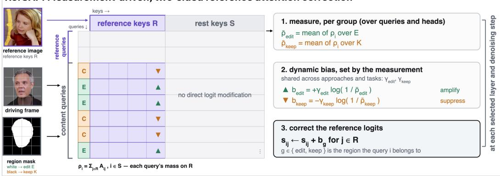
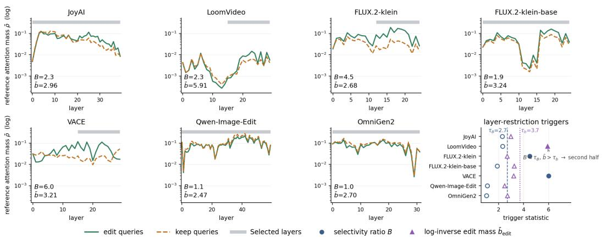
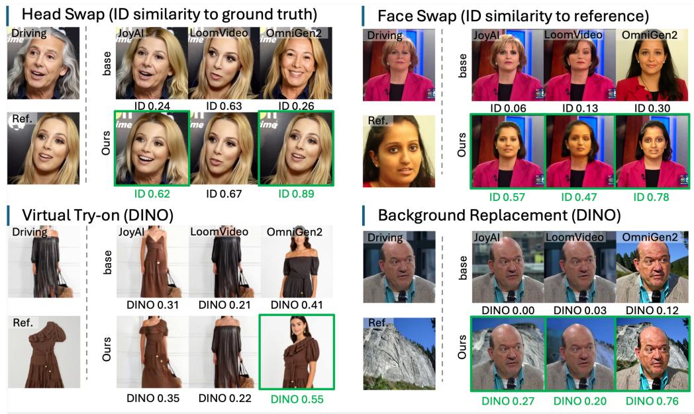
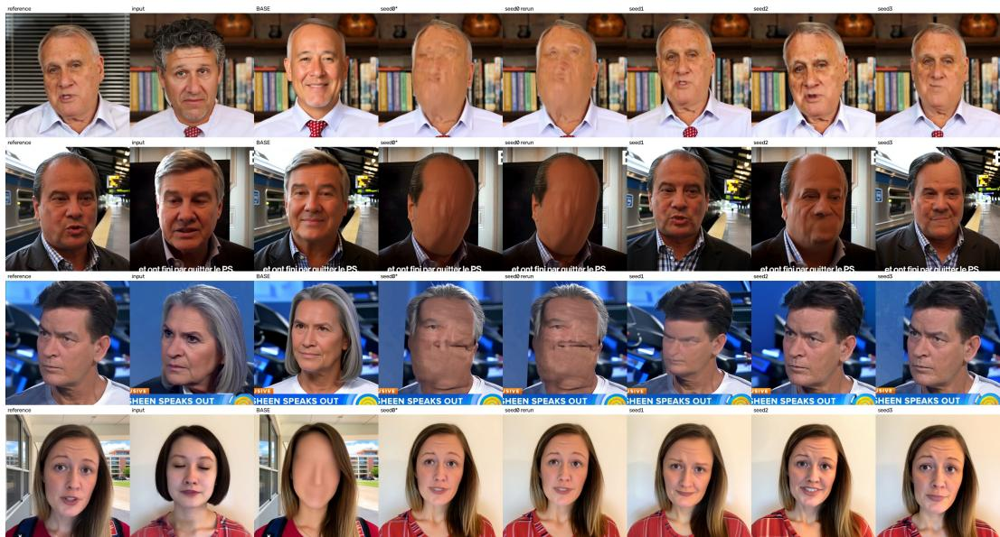
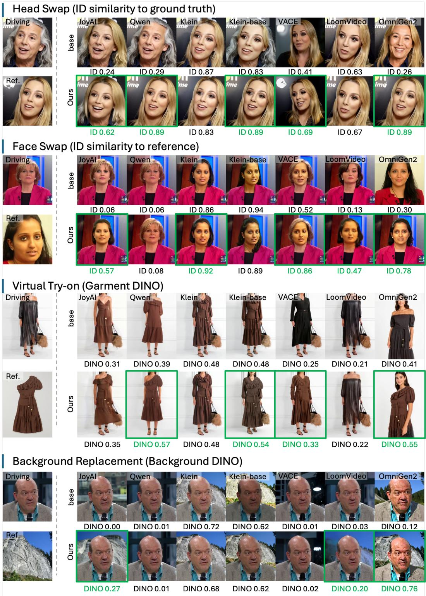
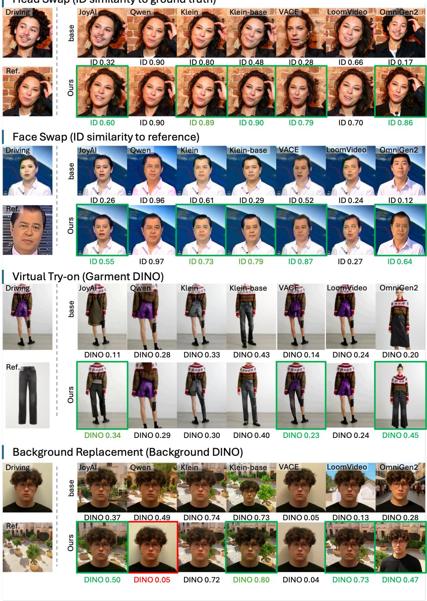

# MIND THE REFGAP: CORRECTING REFERENCE AT-TENTION IN DIFFUSION-BASED VISUAL EDITING

Yanan Wang1,2 Shengcai Liao3 Guangyi Liu1,2 Xiaodan Liang1∗

1Mohamed bin Zayed University of Artificial Intelligence 2Institute of Foundation Models 3United Arab Emirates University

Project page: https://yanan-wang-cs.github.io/RefGAP/

## ABSTRACT

Reference-guided diffusion editors struggle to faithfully reproduce user-provided references. We identify a potential bottleneck in diffusion editors: many methods provide limited reference-attention allocation. For example, in LoomVideo, editregion queries assign less than 1% of their attention mass to the reference. We introduce RefGAP, a training-free correction that determines logit-offset magnitudes online at each layer from the reference-attention mass measured during the forward pass. Positive offsets to reference logits strengthen reference usage by edit-region queries, while negative offsets for keep-region queries limit referenceinduced changes outside the edit. Two global coefficients control the correction; they are selected once on validation data from four development diffusion editors and held fixed. Across seven diffusion-based image/video editors, RefGAP improves identity fidelity in head swapping and face swapping. RefGAP achieves a fidelity-preservation trade-off comparable to separately tuned constant edit-side biases, without per-approach strength sweeps. Additional experiments on virtual try-on and background replacement evaluate transfer beyond identity editing.

## 1 INTRODUCTION

Modern diffusion editors can condition on a user-provided reference image to edit a driving image or video, supporting tasks such as head swapping, face swapping, virtual try-on, and background replacement. Many recent systems adopt an in-context design (Jiang et al., 2025; Wu et al., 2025a;b; Black Forest Labs, 2025), in which reference tokens share the denoiser’s attention sequence with the content being edited. Yet direct access to the reference does not guarantee fidelity.

Existing methods strengthen reference conditioning through task-specific training (Wang et al., 2025; Chen et al., 2024; Fang et al., 2024) or training-free manipulation of reference attention or features (Shin et al., 2025; Fan et al., 2024). However, inference-time interventions typically rely on fixed, empirically chosen coefficients that may require retuning across models or tasks. They do not explicitly couple reference-attention enhancement in edit regions with suppression in keep regions.

We partition each attention layer’s keys into reference and rest tokens and compute the fraction ρ of each query’s attention mass assigned to the reference (fig. 2). Using an edit mask, we average ρ separately over content queries in the edit and keep regions. The profiles reveal two patterns: some approaches exhibit substantially higher reference attention in edit versus keep regions within a localized layer band, typically in the network’s second half; others assign little reference attention to edit queries across many layers, falling below 1% on LoomVideo (Wu et al., 2026). These patterns motivate selective layer intervention, while ρ provides an online signal for correction strength.

Based on this measurement, we introduce RefGAP, a training-free correction named after the reference-attention gap it aims to bridge. Within a single forward pass, using statistics already produced by the attention computation, RefGAP reads the reference-attention masses in both regions and adds one scalar to every reference-key logit: a positive offset for edit-region queries, so they read the reference more, and a negative offset for keep-region queries, so the stronger reference signal does not pull the preserved content with it. The offset adapts to the measured reference-attention mass at each intervened layer and forward pass, reducing the need for model- or task-specific tuning.

We calibrate two global coefficients and establish a shared layer-selection rule on four development approaches (JoyAI-Video-Edit (Xiao et al., 2026), LoomVideo (Wu et al., 2026), FLUX.2-klein and FLUX.2-klein-base (Black Forest Labs, 2025)) using 40 head-swap validation clips. We freeze the coefficients, thresholds, and rule before applying them to three held-out approaches. Each approach requires one validation profiling run to determine its layer set under the fixed rule; this set is reused across tasks without tuning. Identity similarity improves on head-swap and face-swap tasks. Without task-specific retuning, virtual try-on fidelity improves across seven approaches, while background replacement yields mixed results, including a clear degradation on Qwen-Image-Edit (section 5).

To summarize, our contributions are:

• We measure reference-attention mass for edit and keep queries, revealing approachdependent allocation patterns and limited reference attention in several approaches.

• We propose RefGAP, a training-free, two-sided attention correction that derives its perlayer strength online from the measured attention mass. RefGAP increases reference influence inside the edit while suppressing reference attention in the keep region.

• We demonstrate cross-approach and cross-task transfer using a single configuration calibrated once on 40 head-swap validation clips. Without retuning, it consistently boosts identity fidelity across seven approaches in head and face swapping (alongside an attributepreservation trade-off), transfers to virtual try-on, and delineates transfer boundaries with mixed results on background replacement.

## 2 RELATED WORK

Reference-conditioned generation and editing. Reference-guided editors incorporate visual conditions either as tokens in a shared attention sequence or through a separate conditioning branch. In-context systems such as VACE (Jiang et al., 2025), LoomVideo (Wu et al., 2026), JoyAI-Video-Edit (Xiao et al., 2026), Qwen-Image-Edit (Wu et al., 2025a), OmniGen2 (Wu et al., 2025b), and FLUX.2-klein (Black Forest Labs, 2025) allow reference and content tokens to interact within joint attention. Decoupled methods inject reference features through cross-attention or additive branches, as in IP-Adapter (Ye et al., 2023). RefGAP targets the in-context setting, where reference and content tokens compete within the same softmax and their relative mass can be modified directly.

Training-free reference and attention steering. Training-free diffusion methods manipulate attention to control conditioning and source consistency (Hertz et al., 2022; Cao et al., 2023). Diptych Prompting (Shin et al., 2025) enhances attention from queries in the generated panel to keys in the reference panel. FreeCustom (Ding et al., 2024) combines multi-reference self-attention with weighted concept masks to integrate and emphasize reference concepts for multi-concept composition. RefDrop (Fan et al., 2024) controls consistency across generated images or video frames by mixing reference and self-attention outputs with a user-specified scalar shared across queries.

These methods control reference influence through fixed or user-specified coefficients selected for a particular model or task. FreeCustom and RefDrop primarily target generation or consistency, with out defining a region to preserve in an existing source image. Diptych also supports subject-driven editing through an edit mask, but its reference-attention boost remains uniform across queries in the edited panel. GRAG (Zhang et al., 2026) and DCAG (Li, 2026) provide separate representation-level controls for editing strength through externally selected coefficients.

RefGAP determines logit-offset magnitudes online from reference attention measured separately for edit and keep queries. Positive offsets enhance reference attention in edit regions, while negative offsets suppress it in keep regions. After a single calibration, the same coefficients transfer to heldout approaches and additional tasks without further manual tuning.

  
Figure 1: RefGAP overview. Attention-guided corrections strengthen reference attention inside the edit and suppress it outside, using two coefficients shared across approaches and tasks.

## 3 METHOD

## 3.1 OVERVIEW

RefGAP defines the masked area as the edit region and its complement as the keep region. At each attention layer and denoising step, it measures reference-attention mass in both regions (section 3.2) to determine reference-logit shifts (section 3.3), applied according to a layer-selection rule (section 3.4). Figure 1 summarizes this inference-time pipeline, which requires no weight updates.

## 3.2 REFERENCE ATTENTION MASS AND DIAGNOSIS

Consider attention layer ℓ at denoising step t, with H attention heads indexed by h. Let $s _ { i j } ^ { ( \ell , t , h ) }$ denote the pre-softmax score between query i and key j in head h. We partition the keys into reference tokens R and all rest tokens S. The reference attention mass of query i is the fraction of its attention allocated to the reference group:

$$
\rho _ { i } ^ { ( \ell , t , h ) } = \frac { \sum _ { j \in \mathcal { R } } \exp ( s _ { i j } ^ { ( \ell , t , h ) } ) } { \sum _ { j \in \mathcal { R } \cup \mathcal { S } } \exp ( s _ { i j } ^ { ( \ell , t , h ) } ) } , \qquad i \in S , \qquad \rho _ { i } \in ( 0 , 1 ) .\tag{1}
$$

Let the edit mask, mapped to the latent token grid, partition content queries into an edit set $\mathcal { E }$ of tokens to be modified and a keep set K of tokens to be preserved. We average the per-head mass over the relevant queries and H heads, yielding region-level statistics per layer and denoising step:

$$
\bar { \rho } _ { \mathrm { e d i t } } ^ { ( \ell , t ) } = \frac { 1 } { | \mathcal { E } | H } \sum _ { i \in \mathcal { E } } \sum _ { h = 1 } ^ { H } \rho _ { i } ^ { ( \ell , t , h ) } , \qquad \bar { \rho } _ { \mathrm { k e e p } } ^ { ( \ell , t ) } = \frac { 1 } { | \mathcal { K } | H } \sum _ { i \in \mathcal { K } } \sum _ { h = 1 } ^ { H } \rho _ { i } ^ { ( \ell , t , h ) } .\tag{2}
$$

The first quantity measures how strongly queries in the edit region attend to the reference, while the second measures reference influence on queries in the keep region. Each statistic is a scalar for a given input, layer, and denoising step, recomputed from the current denoising trajectory immediately before that layer’s offset is applied. This online computation requires no additional base-model forward pass; the offline profiling used for layer selection is described in section 3.4.

Token-count-normalized diagnosis. To account for reference-token count, we normalize reference-attention mass by the share assigned under uniform attention:

$$
\pi _ { \mathcal { R } } = \frac { \vert \mathcal { R } \vert } { \vert \mathcal { R } \vert + \vert \mathcal { S } \vert } , \qquad u _ { g } ^ { ( \ell , t ) } = \frac { \bar { \rho } _ { g } ^ { ( \ell , t ) } } { \pi _ { \mathcal { R } } } , \quad g \in \{ \mathrm { e d i t } , \mathrm { k e e p } \} .\tag{3}
$$

Values below one indicate less reference attention than uniform allocation. This is a diagnostic baseline, not a target for the correction.

<table><tr><td></td><td>LoomVideo</td><td>FLUX.2-klein</td><td>FLUX.2-klein-base</td><td>VACE</td><td>Qwen-Image-Edit</td><td>OmniGen2</td></tr><tr><td>Uedit</td><td>0.22</td><td>0.35</td><td>0.22</td><td>1.79</td><td>0.30</td><td>0.24</td></tr><tr><td> $u _ { \mathrm { k e e p } }$ </td><td>0.13</td><td>0.10</td><td>0.15</td><td>0.69</td><td>0.35</td><td>0.28</td></tr></table>

Table 1: Token-count-normalized reference attention. Measured using head-swap validation data.

  
Figure 2: Reference-attention profiles and layer selection. Reference-attention masses across layers on the head-swap validation split, shown on a log scale. Gray bars mark layers selected by eq. (8). The bottom-right panels report complementary statistics B and $\bar { b } _ { \mathrm { e d i t } }$ , with their thresholds.

We average base-model statistics over all layers, denoising steps, and head-swap validation clips. Edit-region reference attention falls below the baseline in five approaches, with VACE the exception (table 1). JoyAI-Video-Edit is excluded because its reference-token share varies with the streaming KV cache. Qwen-Image-Edit and OmniGen2 assign more reference attention to keep than edit queries, motivating separate regional measurement and correction. Diagnostics appear in section B.

## 3.3 TWO-SIDED REFERENCE CORRECTION

To control reference-attention allocation, RefGAP adds a shared offset to the reference-key logits for each query group. This changes the total attention assigned to the reference while preserving the relative attention weights within each key group. The offset is positive for edit queries and negative for keep queries; its magnitude adapts to the corresponding measured reference mass.

For query i in layer ℓ at step t, RefGAP adds a region-dependent offset to logits with keys in $\textstyle { \mathcal { R } } \colon$

$$
\tilde { s } _ { i j } = s _ { i j } + b _ { \ell , t } ^ { ( i ) } , \qquad j \in \mathcal { R } ,\tag{4}
$$

with

$$
b _ { \ell , t } ^ { ( i ) } = \left\{ \begin{array} { l l } { + \gamma _ { \mathrm { e d i t } } \log \left( 1 / \bar { \rho } _ { \mathrm { e d i t } } ^ { ( \ell , t ) } \right) , } & { i \in \mathcal { E } , } \\ { - \gamma _ { \mathrm { k e e p } } \log \left( 1 / \bar { \rho } _ { \mathrm { k e e p } } ^ { ( \ell , t ) } \right) , } & { i \in \mathcal { K } . } \end{array} \right.\tag{5}
$$

For edit queries, lower reference mass yields a larger positive offset, strengthening reference attention. For keep queries, we use a heuristic negative offset whose magnitude decreases as reference mass increases. This design aims to accommodate potentially necessary changes beyond the mask, such as hair extending past its boundary; reference mass alone does not distinguish these changes from unwanted leakage.

The coefficients $\gamma _ { \mathrm { e d i t } }$ and $\gamma _ { \mathrm { k e e p } }$ are calibrated once during development and shared across approaches and tasks. Applying the same offset to every reference-key logit for a query changes total reference mass while preserving relative weights within the reference and non-reference groups.

## 3.4 LAYER SELECTION

We derive the layer-selection rule from two recurring patterns in the reference-attention profiles of the four development approaches. Figure 2 shows profiles and selected layers for seven approaches. First, some approaches exhibit clear edit-keep separation: $\bar { \rho } _ { \mathrm { e d i t } } ^ { ( \ell ) }$ dominates $\bar { \rho } _ { \mathrm { k e e p } } ^ { ( \ell ) }$ within a localized layer band, typically in the network’s latter half, as in FLUX.2-klein (Black Forest Labs, 2025). Second, some assign little reference mass to edit queries across many layers, with $\bar { \rho } _ { \mathrm { e d i t } } ^ { ( \ell ) }$ remaining around $1 0 ^ { - 2 } ,$ , as in LoomVideo (Wu et al., 2026). The first pattern suggests a selective reference-reading band; the second indicates a risk of accumulating large corrections when intervening throughout the network.

We capture these behaviors with two complementary statistics. For each group $g \in$ {edit, keep}, let $\bar { \rho } _ { g } ^ { ( \ell ) }$ denote the corresponding region mass from eq. (2), averaged over denoising steps and validation clips. We define the edit-to-keep selectivity ratio

$$
B = \operatorname* { m a x } _ { \ell } \frac { \bar { \rho } _ { \mathrm { e d i t } } ^ { ( \ell ) } } { \bar { \rho } _ { \mathrm { k e e p } } ^ { ( \ell ) } + \epsilon _ { B } } , \qquad \epsilon _ { B } = 1 0 ^ { - 6 } .\tag{6}
$$

A large B indicates at least one layer assigns substantially more reference attention to the edit region than to the keep region. To summarize the potential strength of the edit-side correction, we compute

$$
{ \bar { b } } _ { \mathrm { e d i t } } = { \frac { 1 } { L } } \sum _ { \ell = 1 } ^ { L } \log \left( { \frac { 1 } { { \bar { \rho } } _ { \mathrm { e d i t } } ^ { ( \ell ) } } } \right) .\tag{7}
$$

Whereas $B$ measures layer-wise selectivity, $\bar { b } _ { \mathrm { e d i t } }$ averages the log-inverse edit mass across layers and serves as a proxy for reference-amplification strength. It is used only for layer selection; the deployed offsets remain those computed online at each attention layer and denoising step by eq. (5).

Given thresholds $\tau _ { B }$ and $\tau _ { b } .$ , we define the set of correction layers as:

$$
{ \mathcal { L } } _ { \mathrm { R e f G A P } } = \left\{ { \begin{array} { l l } { \{ \lfloor L / 2 \rfloor + 1 , \ldots , L \} , } & { B \geq \tau _ { B } \mathrm { o r } \bar { b } _ { \mathrm { e d i t } } \geq \tau _ { b } , } \\ { \{ 1 , \ldots , L \} , } & { \mathrm { o t h e r w i s e } . } \end{array} } \right.\tag{8}
$$

The thresholds and decision rule are fixed using only the four development approaches. For each approach, including the three held-out ones, we compute B and $\bar { b } _ { \mathrm { e d i t } }$ from its base-model headswap validation profiles and apply the fixed rule to select correction layers. The resulting layer set is reused unchanged across tasks. This requires approach-specific profiling but no approach-specific strength or threshold tuning. Layer-selection ablations are reported in table 5.

## 4 EXPERIMENTS

## 4.1 EXPERIMENTAL SETUP

Approaches. We evaluate seven diffusion editors: JoyAI-Video-Edit (Xiao et al., 2026), LoomVideo (Wu et al., 2026), FLUX.2-klein and FLUX.2-klein-base (Black Forest Labs, 2025), VACE (Jiang et al., 2025), Qwen-Image-Edit (Wu et al., 2025a), and OmniGen2 (Wu et al., 2025b).

Tasks and datasets. Our primary evaluation focuses on head and face swapping. Head swapping uses the 1,040 test clips of HeadSwapBench (Wang et al., 2025), and face swapping uses the 1,000 official target-source pairs from the FaceSwap subset of FaceForensics++ (Rossler et al., 2019).

We further evaluate transfer beyond identity editing through virtual try-on and background replacement. Try-on uses 90 ViViD clips (Fang et al., 2024), with reference garments permuted within category. Background replacement uses 150 ground-truth videos from the HeadSwapBench test split as inputs, paired with 30 SUN397 scene references (Xiao et al., 2010). Across all four tasks, video approaches process video clips, while image approaches edit the middle frame of each clip.

Metrics and comparison protocol.

Identity editing. For head and face swapping, we report AdaFace identity similarity (Kim et al., 2022), keypoint error (Lugaresi et al., 2019), and LPIPS (Zhang et al., 2018).

For head swapping, Repl. denotes the percentage of outputs whose generated face is closer in identity to the reference than to the input subject. Identity similarity is measured against the ground-truth video, and keypoint error is measured against the corresponding ground-truth frames.

For face swapping, Repl. is the percentage of outputs whose nearest identity in the 978-identity FF++ gallery is no longer the input subject, and Retr. is the percentage whose nearest identity is the reference. VACE’s masked driving video hides the input identity, so we omit Repl. for VACE in both identity tasks. Identity similarity is measured against the reference face, whereas keypoint error is measured against the input (driving) video.

For the main results, LPIPS uses task-specific preservation targets. For head swapping, it is computed over the whole frame against the ground-truth video. For face swapping, it is computed outside the face mask against the input video.

Transfer tasks. For virtual try-on and background replacement, we report region-specific DINOv2 similarity (Oquab et al., 2023) to the reference image over the edited garment and background regions, respectively. LPIPS is computed outside the garment mask against the input for virtual try-on, and inside the person mask against the input for background replacement.

Common evaluation protocol. Base and $R e f G A P$ use identical inputs, random seeds, and inputderived masks. No generated outputs are used during mask construction. All metrics are macroaveraged over clips, and identity comparisons use only clips with valid scores from both methods. Implementation details are provided in section A.

## 4.2 PARAMETER CALIBRATION AND TRANSFER

We jointly explore the two global coefficients and the layer coverage using only a 40-clip headswap validation split evaluated on four development approaches: JoyAI-Video-Edit, LoomVideo, FLUX.2-klein, and FLUX.2-klein-base. Specifically, we enumerate

$$
\gamma _ { \mathrm { e d i t } } \in \{ 0 . 4 , 0 . 6 , 0 . 8 \} , \qquad \gamma _ { \mathrm { k e e p } } \in \{ 0 , 0 . 4 , 0 . 8 \} , \qquad \mathcal { L } \in \{ \mathcal { L } _ { \mathrm { a l l } } , \mathcal { L } _ { \mathrm { h a l f } } \} ,
$$

where $\mathcal { L } _ { \mathrm { a l l } }$ denotes correction at all layers and ${ \mathcal { L } } _ { \mathrm { h a l f } }$ denotes correction at the second half of the network. This results in $3 \times 3 \times 2 = 1 8$ candidate settings, allowing the coefficient and layercoverage choices to be explored jointly.

For each combination of correction coefficients and layer coverage, we measure identity performance together with the change in non-edit LPIPS $\mathrm { ( L P I P S _ { n e } ) }$ . We retain settings satisfying

$$
\Delta \mathrm { L P I P S } _ { \mathrm { n e } } ( R e f G A P ) = \mathrm { L P I P S } _ { \mathrm { n e } } ( R e f G A P ) - \mathrm { L P I P S } _ { \mathrm { n e } } ( \mathrm { B a s e } ) \leq 0 . 0 0 5 ,
$$

and select the best admissible coefficient pair according to validation identity performance.

In parallel, we validate whether the threshold-based rule correctly selects between all-layer and second-half correction. We set $\tau _ { B } = 2 . 7$ and $\tau _ { b } = 3 . 7$ to the arithmetic means of B and $\bar { b } _ { \mathrm { e d i t } } .$ respectively, across the four development approaches. For each approach, we apply these fixed thresholds to its statistics and compare the resulting coverage with the corresponding all-layer and second-half results from the joint sweep. Full results are reported in table 8.

After this joint validation, we fix $\gamma _ { \mathrm { e d i t } } = 0 . 6 , \gamma _ { \mathrm { k e e p } } = 0 . 8 , \tau _ { B } = 2 . 7 ,$ , and $\tau _ { b } = 3 . 7$ . We apply the shared rule to each approach’s validation profile and reuse the selected layers across test sets and tasks, including the three held-out approaches. No further tuning is performed for these evaluations.

## 4.3 RESULTS ACROSS APPROACHES AND TASKS

Table 2 summarizes quantitative results across the seven approaches and four tasks, while fig. 3 presents qualitative examples of head swap, face swap, virtual try-on, and background replacement on three approaches (all seven in fig. 5).

  
Figure 3: Qualitative results across four tasks. Base vs. Ours on JoyAI-Video-Edit (JoyAI), LoomVideo, and OmniGen2. Scores are shown below, with green borders marking gains ≥ 0.05.

<table><tr><td></td><td colspan="4">Head swap</td><td colspan="5">Face swap</td><td colspan="2">Virtual try-on</td><td colspan="2">Background replacement</td></tr><tr><td>Approach</td><td>Repl.↑</td><td>ID↑</td><td>Kpt.↓</td><td>LPIPS↓</td><td>Repl.↑</td><td>ID↑</td><td>Retr.↑</td><td>Kpt.↓</td><td>LPIPS↓</td><td>DINO↑</td><td>LPIPS↓</td><td>DINO↑</td><td>LPIPS↓</td></tr><tr><td>JoyAI</td><td>68→99% +31</td><td>.507→.644 .043→.085 +.137</td><td>+.042</td><td>.218→.215 -.003</td><td>60→97% +37</td><td>.282→.591 39→88% +.309</td><td>+49</td><td>.057→.105 +.048</td><td>.086→.108 +.022</td><td>.283→.298 +.015</td><td>.099→.101 +.002</td><td>+.044</td><td>.242→.286 .063→.065 +.002</td></tr><tr><td>LoomVideo</td><td>79→92% +13</td><td>.608→.665 +.057</td><td>.107→.098 -.009</td><td>.281→.275 -.006</td><td>71→84% +13</td><td>.449→.466 63→75% +.017</td><td>+12</td><td>.083→.086 .180→.178 +.003</td><td>-.002</td><td>.174→.183 +.009</td><td>.105→.105 .000</td><td>.135→.258 +.123</td><td>.051→.058 +.007</td></tr><tr><td>Klein</td><td>91→100% +9</td><td>.726→.790 +.064</td><td>.097→.153 +.056</td><td>-.005</td><td>+2</td><td>.222→.217 98→100% .704→.820 90→96% .065→.082 +.116</td><td>+6</td><td>+.017</td><td>.064→.076 +.012</td><td>.363→.372 +.009</td><td>.093→.092 -.001</td><td>+.001</td><td>.629→.630 .038→.037 -.001</td></tr><tr><td>Klein-base</td><td>+23</td><td>+.211</td><td>+.067</td><td>-.065</td><td>+5</td><td>77→100% .588→.799 .169→.236 .326→.261 95→100% .557→.831 74→96% .129→.223 +.274</td><td>+22</td><td>+.094</td><td>.173→.179 +.006</td><td>.409→.465 +.056</td><td>.150→.160 +.010</td><td>+.019</td><td>.632→.651 .162→.136 -.026</td></tr><tr><td>VACE</td><td></td><td>.405→.729.198→.200 +.324</td><td>+.002</td><td>.228→.214 -.014</td><td></td><td>.541→.818 87→98% .187→.193 +.277</td><td>+11</td><td>+.006</td><td>.018→.019 +.001</td><td>.171→.226 +.055</td><td>.056→.056 .000</td><td>+.006</td><td>6.008→.014 .008→.008 .000</td></tr><tr><td>Qwen</td><td>70→86% +16 34→99%</td><td>+.114</td><td>.000</td><td>.609→.723 .179→.179.449→.237 –.212</td><td>65→82% +17</td><td>.518→.687 +.169</td><td>+20</td><td>59→79% .097→.118 .069→.065 +.021</td><td>-.004</td><td>.213→.248 +.035</td><td>+.017</td><td>-.257</td><td>.077→.094 .299→.042 .027→.024 -.003 5.422→.404 .245→.515 .259→.295</td></tr><tr><td>OmniGen2</td><td>+65</td><td>+.486</td><td>+.003</td><td>.207→.693 .255→.258 .464→.365 -.099</td><td>+21</td><td>79→100% .157→.656 20→91% .238→.249 .323→.279 +.499</td><td>+71</td><td>+.011</td><td>-.044</td><td>.277→.355 +.078</td><td>-.018</td><td>+.270</td><td>+.036</td></tr><tr><td>mean ∆</td><td>+26</td><td>+.199</td><td>+.023</td><td>-.058</td><td>+16</td><td>+.237</td><td>+27</td><td>+.029</td><td>-.001</td><td>+.037</td><td>+.001</td><td>+.029</td><td>+.002</td></tr></table>

Table 2: Quantitative results across seven approaches and four tasks. JoyAI, Klein, Klein-base, and Qwen denote JoyAI-Video-Edit, FLUX.2-klein, FLUX.2-klein-base, and Qwen-Image-Edit, respectively. Cells show Base→Ours, with differences shown below. Mean differences average all seven approaches (six for Repl., which is undefined for VACE). Green and red indicate improvements and degradations, respectively; gray denotes |∆| < 0.005. Differences are computed from the displayed values; unrounded paired estimates are given in table 14.

Identity editing: head and face swapping. For head swapping, RefGAP raises the replacement rate to at least 86% on every applicable approach, improves identity similarity on all seven approaches, and does not increase whole-frame LPIPS on any approach, reducing it on four with intervals excluding zero (table 14). Keypoint error increases mainly on JoyAI-Video-Edit, FLUX.2- klein, and FLUX.2-klein-base. Section G.2 shows that delaying correction to later denoising steps substantially reduces keypoint degradation while retaining identity gains over the base model.

For face swapping, RefGAP improves identity similarity across all approaches, with replacement and correct retrieval rates reaching at least 82% and 75%, respectively. Keypoint error rises on most approaches, while non-face LPIPS varies by approach. Without ground-truth outputs, LPIPS compares against the input video, potentially counting identity-related geometry differences as preservation errors. Larger identity gains generally accompany larger keypoint changes (section G.1).

<table><tr><td></td><td colspan="3">Head swap</td><td colspan="3">Face swap</td><td colspan="3">Virtual try-on</td><td colspan="3">Background replacement</td></tr><tr><td>Approach</td><td>Ref.</td><td>Pose</td><td>Qual.</td><td>Ref.</td><td>Pose</td><td>Qual.</td><td>Ref.</td><td>Pose</td><td>Qual.</td><td>Ref.</td><td>Pose</td><td>Qual.</td></tr><tr><td>JoyAI-Video-Edit</td><td>28/0/0</td><td>3/25/0</td><td>5/23/0</td><td>50/7/0</td><td>3/50/4</td><td>5/50/2</td><td>37/5/12</td><td>0/52/2</td><td>5/46/3</td><td>19/25/6</td><td>0/50/0</td><td>1/46/3</td></tr><tr><td>LoomVideo</td><td>7/18/2</td><td>12/14/2</td><td>8/14/6</td><td>18/31/3</td><td>3/44/5</td><td>1/33/18</td><td>36/15/0</td><td>0/51/0</td><td>3/48/0</td><td>39/12/0</td><td>0/50/1</td><td>1/49/1</td></tr><tr><td>FLUX.2-klein</td><td>20/5/0</td><td>0/25/0</td><td>7/18/0</td><td>33/16/2</td><td>0/48/3</td><td>1/48/2</td><td>1/11/1</td><td>1/12/0</td><td>0/12/1</td><td>0/10/0</td><td>0/10/0</td><td>0/10/0</td></tr><tr><td>FLUX.2-klein-base</td><td>24/1/0</td><td>0/25/0</td><td>3/22/0</td><td>45/8/0</td><td>2/45/6</td><td>7/44/2</td><td>20/16/18</td><td>0/53/1</td><td>1/51/2</td><td>15/40/1</td><td>0/56/0</td><td>10/45/1</td></tr><tr><td>VACE</td><td>24/0/1</td><td>0/24/1</td><td>6/15/4</td><td>35/19/1</td><td>5/48/2</td><td>2/50/3</td><td>57/0/0</td><td>5/52/0</td><td>8/49/0</td><td></td><td></td><td></td></tr><tr><td>Qwen-Image-Edit</td><td>29/0/0</td><td>2/27/0</td><td>8/21/0</td><td>41/15/1</td><td>3/39/15</td><td>5/50/2</td><td>48/2/5</td><td>1/54/0</td><td>2/53/0</td><td>5/25/21</td><td>0/50/1</td><td>0/49/2</td></tr><tr><td>OmniGen2</td><td>25/0/0</td><td>10/15/0</td><td>0/25/0</td><td>56/0/1</td><td>3/49/5</td><td>11/45/1</td><td>50/1/4</td><td>2/53/0</td><td>5/50/0</td><td>49/9/1</td><td>5/53/1</td><td>5/51/2</td></tr><tr><td>All items</td><td>157/24/3</td><td>27/155/3</td><td>37/138/10</td><td>278/96/8</td><td>19/323/40</td><td>32/320/30</td><td>249/50/40</td><td>9/327/3</td><td>24/309/6</td><td>127/121/29</td><td>5/269/3</td><td>17/250/9</td></tr></table>

Table 3: Human evaluation across four tasks. Cells report judgment counts as RefGAP/tie/base for reference fidelity (Ref.), pose/expression consistency with the input (Pose), and visual quality (Qual.). Ties include “both succeed” and “both fail”; “—” denotes an unevaluated setting.

Transfer beyond identity editing. With the same coefficients, RefGAP improves virtual try-on reference fidelity on all seven approaches (table 2, intervals excluding zero on four). Background replacement has a different objective from identity editing and try-on: the surrounding scene should change, while the foreground subject should remain unchanged. It improves on JoyAI-Video-Edit, LoomVideo, and OmniGen2, changes little on the FLUX.2 variants and VACE, and degrades on Qwen-Image-Edit (table 14). These mixed results highlight that reference transfer remains task- and approach-dependent.

## 4.4 HUMAN EVALUATION

We evaluate 219 items with 54 raters retained after attention checks. Each item presents the input, reference, and base/RefGAP outputs in randomized A/B order. Raters assess reference fidelity, pose/expression consistency with the input, and visual quality, choosing A, B, both succeed, or both fail. To prioritize informative comparisons, we use outputs with visible differences; results describe these selected comparisons. An unscreened audit of 56 randomly sampled comparisons by five raters favors RefGAP in reference fidelity (section F). Table 3 reports preferences for RefGAP in reference fidelity across head swap, face swap and virtual try-on, consistent with the generally improved identity similarity in head and face swapping and DINO scores in virtual try-on (table 2).

Preservation results are mixed. Pose/expression judgments are mostly ties (both-success or bothfailure). Non-tied counts (RefGAP versus base) are 27 to 3 for head swapping and 19 to 40 for face swapping. Reference-fidelity judgments for background replacement vary across approaches. Quantitative results vary across approaches, including clear degradation on Qwen-Image-Edit.

## 4.5 ABLATION STUDIES

We ablate three RefGAP components: attention-conditioned strength, keep-side correction, and layer coverage, using the four development approaches on head swapping. We use non-edit LPIPS $\mathrm { ( L P I P S _ { n e } ) }$ for validation and whole-frame LPIPS for the fixed-bias test comparison. Unlike the whole-frame LPIPS in table 2, LPIPSne is computed outside the dilated head mask to detect reference leakage into the keep region. For image approaches, validation metrics use the middle frame.

<table><tr><td></td><td colspan="3">RefGAP</td><td rowspan="2">b</td><td colspan="3">best admissible edit-side constant</td></tr><tr><td>Approach</td><td>ID↑</td><td>Kpt.↓</td><td>LPIPS↓</td><td>ID↑</td><td>Kpt.↓</td><td>LPIPS↓</td></tr><tr><td>JoyAI-Video-Edit</td><td>.644</td><td>.085</td><td>.215</td><td>1.5</td><td>.644</td><td>.075</td><td>.207</td></tr><tr><td>LoomVideo</td><td>.665</td><td>.098</td><td>.275</td><td>2.5</td><td>.671</td><td>.098</td><td>.271</td></tr><tr><td>FLUX.2-klein</td><td>.790</td><td>.153</td><td>.217</td><td>2.0</td><td>.794</td><td>.171</td><td>.229</td></tr><tr><td>FLUX.2-klein-base</td><td>.799</td><td>.236</td><td>.261</td><td>2.0</td><td>.801</td><td>.236</td><td>.260</td></tr></table>

Table 4: RefGAP versus approach-specific constant edit-side biases. Constants are selected on validation data under $\Delta \mathrm { L P I } \mathrm { \bar { P S } } _ { \mathrm { n e } } \leq 0 . \mathrm { \bar { 0 } 0 5 }$ . Only the edit-side bias differs between settings. Results use the full 1,040-clip head-swap test set; LPIPS is measured over the whole frame.

Online versus fixed strength. Diptych Prompting (Shin et al., 2025) boosts reference attention in the edited region by a uniform constant. As its editing code is unreleased, we compare against a constant-bias baseline inspired by Diptych Prompting: a constant edit-side bias b combined with our keep-side correction and layer sets, tuned separately for each approach. On the 40-clip validation split, we sweep $b \in \{ 0 . 5 , 1 , \cdot \dots , 3 \}$ and select the highest-identity value with $\Delta \mathrm { L P I P S } _ { \mathrm { n e } } \leq 0 . 0 0 5$ (table 9). The selected constants range from 1.5 to 2.5, confirming that the optimal fixed strength is approach-dependent. On the 1,040-clip test set, they improve identity over RefGAP by only 0.000–0.006, with mixed keypoint and LPIPS trade-offs (table 4). RefGAP thus matches a perapproach-tuned Diptych-style baseline without per-approach strength sweeps.

<table><tr><td colspan="6">Keep side:  $\gamma _ { \mathrm { e d i t } } = 0 . 6 ,$  rule-selected layers,  $\gamma _ { \mathrm { k e e p } }$  ∈ {0, 0.4, 0.8}</td></tr><tr><td>Approach</td><td>base</td><td> $\gamma _ { \mathrm { k e e p } } = 0 \stackrel { \mathrm { L P I P S } _ { \mathrm { n e } } \downarrow } { 0 . 4 }$ </td><td>0.8</td><td>0</td><td>ID↑ 0.4</td></tr><tr><td>JoyAI-Video-Edit</td><td>.0663</td><td>.0635</td><td>.0644.0641</td><td>.705</td><td>0.8 .705 .706</td></tr><tr><td></td><td>.0700</td><td></td><td>.0746.0727</td><td></td><td>.768 .767 .767</td></tr><tr><td>LoomVideo</td><td>.0435</td><td> $. 0 7 8 1 ^ { \times }$   $. 0 5 2 4 ^ { \times }$ </td><td>.0416.0406</td><td></td><td>.885 .885 .885</td></tr><tr><td>FLUX.2-klein FLUX.2-klein-base</td><td>.1206</td><td> $. 2 1 1 5 ^ { \times }$ </td><td>.0764.0674</td><td></td><td>.879 .877 .878</td></tr></table>

<table><tr><td colspan="7">layer coverage:  $\gamma _ { \mathrm { e d i t } } = 0 . 6$   $\gamma _ { \mathrm { k e e p } } = 0 . 8$  9</td></tr><tr><td>Approach</td><td colspan="2"> $_ \mathrm { l a y e r r u l e }$ </td><td colspan="2">all layers</td><td colspan="2">second half ID LPIPSne</td></tr><tr><td></td><td>B</td><td> $\bar { b } _ { \mathrm { e d i t } }$ </td><td>pred.</td><td>ID</td><td>LPIPSne</td><td></td></tr><tr><td>JoyAI-Video-Edit</td><td>2.30</td><td>2.96</td><td>all</td><td>.706</td><td>.064</td><td>.674 .067</td></tr><tr><td>LoomVideo</td><td>2.32</td><td>5.91</td><td>half</td><td>.826 .278</td><td>.767</td><td>.073</td></tr><tr><td>FLUX.2-klein</td><td>4.48</td><td>2.68</td><td>half</td><td>.893</td><td>.055</td><td>.885 .041</td></tr><tr><td>FLUX.2-klein-base</td><td>1.88</td><td>3.24</td><td>all</td><td>.878</td><td>.067 .826</td><td>.093</td></tr></table>

Table 5: Keep-side and layer-coverage ablations. Only $\gamma _ { \mathrm { k e e p } }$ (left) or corrected layers (right) vary on the validation split. B and $\bar { b } _ { \mathrm { e d i t } }$ are computed from the base model’s validation passes; pred. denotes the layer set selected by eq. (8). × marks $\mathrm { L P I P S } _ { \mathrm { n e } }$ increases $> 0 . 0 0 5$ over the base. Bold marks the lowest $\mathrm { L P I P S } _ { \mathrm { n e } }$ (left) and the rule-selected setting (right).

One-sided versus two-sided correction. With $\gamma _ { \mathrm { e d i t } } = 0 . 6 $ , we vary $\gamma _ { \mathrm { k e e p } } \in \{ 0 , 0 . 4 , 0 . 8 \}$ , where zero gives the one-sided variant. Omitting keep-side correction severely degrades non-edit preservation (table 5, left): FLUX.2-klein-base’s $\mathrm { L P I P S } _ { \mathrm { n e } }$ rises from 0.1206 (base) to 0.2115. Increasing $\gamma _ { \mathrm { k e e p } }$ to 0.8 lowers $\mathrm { L P I P S } _ { \mathrm { n e } }$ across most models, reaching 0.0674 on FLUX.2-klein-base, while largely preserving identity similarity. These results support keep-side correction as a means to contain strong edit-side interventions and limit reference-induced changes in preserved content.

Layer coverage. As specified in section 3.4, RefGAP applies the correction only to the second half of the network when $B \geq 2 . 7 \ \mathrm { o r } \ \bar { b } _ { \mathrm { e d i t } } \geq 3 . 7 ,$ , and to all layers otherwise. With $\gamma _ { \mathrm { e d i t } } = 0 . 6$ and $\gamma _ { \mathrm { k e e p } } = 0 . 8$ , table 5 supports this rule. JoyAI-Video-Edit and FLUX.2-klein-base do not satisfy either threshold and perform better with all-layer correction. FLUX.2-klein is selected by its large B, and the second-half setting substantially lowers $\mathrm { L P I P S } _ { \mathrm { n e } }$ from $0 . 0 5 5$ to 0.041 with only a small ID decrease from 0.893 to 0.885. LoomVideo is selected by its large $\bar { b } _ { \mathrm { e d i t } } \colon$ applying the correction to all layers gives higher ID (0.826) but increases $\mathrm { L P I P S } _ { \mathrm { n e } }$ from the base value 0.070 to 0.278, whereas the second-half setting gives 0.767 ID and $0 . 0 7 3 \mathrm { L P I P S } _ { \mathrm { n e } } .$ . These results support using B to target selective reference-reading bands and $\bar { b } _ { \mathrm { e d i t } }$ to prevent excessive accumulation of large corrections.

## 5 LIMITATIONS

Identity–attribute trade-off. The all-step default prioritizes reference identity and can compromise pose and expression preservation. Delaying correction can mitigate these costs: on JoyAI-Video-Edit and FLUX.2-klein, skipping the first correction step substantially reduces keypoint error while retaining identity improvements over the base. However, the required delay varies across sampling schedules, and stronger geometric preservation reduces identity gains (table 19).

An approach-task-specific failure. Despite broad gains in identity editing and virtual try-on, RefGAP reduces background fidelity on Qwen-Image-Edit. Restricting layer coverage does not resolve this degradation, suggesting that this approach-task pair may require a different correction strategy.

Validation profiling overhead. Applying RefGAP to a new approach requires one base-model profiling run on a validation split to select correction layers under the fixed rule. The coefficients and thresholds remain unchanged, and the selected layers are reused across tasks. This adds setup cost, although it avoids repeated evaluations over a grid of correction strengths.

## 6 CONCLUSION

We introduce RefGAP, a training-free method that uses measured reference-attention mass to dynamically strengthen reference influence in edit regions and suppress it in keep regions. With two coefficients calibrated on four development approaches and a shared layer-selection rule, RefGAP improves identity fidelity in head and face swapping across seven approaches, including three heldout ones. It achieves a fidelity-preservation trade-off comparable to approach-specific constant editside biases without per-approach strength sweeps. Transfer without task-specific retuning yields positive fidelity gains in virtual try-on but mixed results in background replacement. Together, these results support measured attention as a practical signal for controlling reference influence, while leaving attribute preservation and reliable cross-task transfer as directions for further work.

## AI USE STATEMENT

Generative AI tools were used to polish the writing, prepare comparison figures and user study materials, and check numerical consistency between tables and the underlying result files. The authors developed the method, designed the experiments, and interpreted the results.

## ETHICS STATEMENT

This work studies reference-guided visual editing, including head and face swapping, which can be misused to fabricate media of real individuals. All images and videos used in our evaluation are drawn from public benchmarks (HeadSwapBench, FaceForensics++, ViViD, VITON-HD, and SUN397). We release no new identity data and neither train nor release a new model; our method is an inference-time modification of publicly released editors.

For the human evaluation, participants were undergraduate, master’s, and doctoral students with a background in computer vision. All participants provided informed consent before taking part. We collected their judgments of the editing results without collecting personally identifiable information.

## REPRODUCIBILITY STATEMENT

All seven approaches are publicly available and used through their released pipelines. RefGAP modifies attention logits at inference time and requires no training. The correction rule is described in section 3, and its coefficients and calibration procedure are reported in section 4.2. Section A provides implementation details and numerical safeguards; section C reports calibration results and additional ablations; section D describes task-specific evaluation protocols and additional results; and section F details the human evaluation and its statistical analysis. Code and per-clip result files will be released.

## REFERENCES

Black Forest Labs. FLUX.2: Frontier Visual Intelligence. https://bfl.ai/blog/flux-2, 2025.

Mingdeng Cao, Xintao Wang, Zhongang Qi, Ying Shan, Xiaohu Qie, and Yinqiang Zheng. MasaCtrl: Tuning-free mutual self-attention control for consistent image synthesis and editing. In 2023 IEEE/CVF International Conference on Computer Vision (ICCV), pp. 22503–22513. IEEE, 2023.

Nicolas Carion, Laura Gustafson, Yuan-Ting Hu, Shoubhik Debnath, Ronghang Hu, Didac Suris, Chaitanya Ryali, Kalyan Vasudev Alwala, Haitham Khedr, Andrew Huang, Jie Lei, Tengyu Ma, Baishan Guo, Arpit Kalla, Markus Marks, Joseph Greer, Meng Wang, Peize Sun, Roman Radle, Triantafyllos Afouras, Effrosyni Mavroudi, Katherine Xu, Tsung-Han Wu, Yu Zhou, Lil-¨ iane Momeni, Rishi Hazra, Shuangrui Ding, Sagar Vaze, Francois Porcher, Feng Li, Siyuan Li, Aishwarya Kamath, Ho Kei Cheng, Piotr Dollar, Nikhila Ravi, Kate Saenko, Pengchuan´ Zhang, and Christoph Feichtenhofer. SAM 3: Segment anything with concepts, 2025. URL https://arxiv.org/abs/2511.16719.

Xuanhong Chen, Bingbing Ni, Yutian Liu, Naiyuan Liu, Zhilin Zeng, and Hang Wang. SimSwap++: Towards faster and high-quality identity swapping. IEEE Trans. Pattern Anal. Mach. Intell., 46 (1):576–592, 2024.

Seunghwan Choi, Sunghyun Park, Minsoo Lee, and Jaegul Choo. VITON-HD: High-resolution virtual try-on via misalignment-aware normalization. In Proc. of the IEEE conference on computer vision and pattern recognition (CVPR), 2021.

Ganggui Ding, Canyu Zhao, Wen Wang, Zhen Yang, Zide Liu, Hao Chen, and Chunhua Shen. FreeCustom: Tuning-free customized image generation for multi-concept composition. In Proceedings ofthe IEEE/CVF Conference on Computer Vision and Pattern Recognition, 2024.

Jiaojiao Fan, Haotian Xue, Qinsheng Zhang, and Yongxin Chen. RefDrop: Controllable consistency in image or video generation via reference feature guidance. arXiv preprint arXiv:2405.17661, 2024.

Zixun Fang, Wei Zhai, Aimin Su, Hongliang Song, Kai Zhu, Mao Wang, Yu Chen, Zhiheng Liu, Yang Cao, and Zheng-Jun Zha. ViViD: Video virtual try-on using diffusion models, 2024.

Amir Hertz, Ron Mokady, Jay Tenenbaum, Kfir Aberman, Yael Pritch, and Daniel Cohen-Or. Prompt-to-prompt image editing with cross attention control. arXiv preprint arXiv:2208.01626, 2022.

Zeyinzi Jiang, Zhen Han, Chaojie Mao, Jingfeng Zhang, Yulin Pan, and Yu Liu. VACE: All-inone video creation and editing. In Proceedings of the IEEE/CVF International Conference on Computer Vision, pp. 17191–17202, 2025.

Minchul Kim, Anil K Jain, and Xiaoming Liu. AdaFace: Quality adaptive margin for face recognition. In 2022 IEEE/CVF conference on computer vision and pattern recognition (CVPR), pp. 18729–18738. IEEE, 2022.

Guandong Li. Dual-channel attention guidance for training-free image editing control in diffusion transformers. arXiv preprint arXiv:2602.18022, 2026.

Camillo Lugaresi, Jiuqiang Tang, Hadon Nash, Mark McGuire, Jongmin Lee, Chuo-Ling Chang, Ming Guang Yong, Matthias Grundmann, and Vivek Kwatra. MediaPipe: A framework for building perception pipelines. arXiv preprint arXiv:1906.08172, 2019.

Maxime Oquab, Timothee Darcet, Th´ eo Moutakanni, Huy Vo, Marc Szafraniec, Vasil Khalidov,´ Pierre Fernandez, Daniel Haziza, Francisco Massa, Alaaeldin El-Nouby, et al. DINOv2: Learning robust visual features without supervision. arXiv preprint arXiv:2304.07193, 2023.

Art B. Owen. The pigeonhole bootstrap. The Annals of Applied Statistics, 1(2), December 2007. ISSN 1932-6157. doi: 10.1214/07-aoas122. URL http://dx.doi.org/10.1214/ 07-AOAS122.

Andreas Rossler, Davide Cozzolino, Luisa Verdoliva, Christian Riess, Justus Thies, and Matthias Nießner. Faceforensics++: Learning to detect manipulated facial images. In Proceedings of the IEEE/CVF international conference on computer vision, pp. 1–11, 2019.

Chaehun Shin, Jooyoung Choi, Heeseung Kim, and Sungroh Yoon. Large-scale text-to-image model with inpainting is a zero-shot subject-driven image generator. In 2025 IEEE/CVF Conference on Computer Vision and Pattern Recognition (CVPR), pp. 7986–7996. IEEE, 2025.

Yanan Wang, Shengcai Liao, Panwen Hu, Xin Li, Fan Yang, and Xiaodan Liang. Directswap: Maskfree cross-identity training and benchmarking for expression-consistent video head swapping. arXiv preprint arXiv:2512.09417, 2025.

Yingfeng Wang, Yuxuan Xiao, and Shengcai Liao. Head similarity: Modeling structured wholehead appearance beyond face recognition. arXiv preprint arXiv:2605.07766, 2026.

Chenfei Wu, Jiahao Li, Jingren Zhou, Junyang Lin, Kaiyuan Gao, Kun Yan, Sheng ming Yin, Shuai Bai, Xiao Xu, Yilei Chen, Yuxiang Chen, Zecheng Tang, Zekai Zhang, Zhengyi Wang, An Yang, Bowen Yu, Chen Cheng, Dayiheng Liu, Deqing Li, Hang Zhang, Hao Meng, Hu Wei, Jingyuan Ni, Kai Chen, Kuan Cao, Liang Peng, Lin Qu, Minggang Wu, Peng Wang, Shuting Yu, Tingkun Wen, Wensen Feng, Xiaoxiao Xu, Yi Wang, Yichang Zhang, Yongqiang Zhu, Yujia Wu, Yuxuan Cai, and Zenan Liu. Qwen-Image technical report, 2025a. URL https://arxiv.org/abs/ 2508.02324.

Chenyuan Wu, Pengfei Zheng, Ruiran Yan, Shitao Xiao, Xin Luo, Yueze Wang, Wanli Li, Xiyan Jiang, Yexin Liu, Junjie Zhou, Ze Liu, Ziyi Xia, Chaofan Li, Haoge Deng, Jiahao Wang, Kun Luo, Bo Zhang, Defu Lian, Xinlong Wang, Zhongyuan Wang, Tiejun Huang, and Zheng Liu. OmniGen2: Exploration to advanced multimodal generation. arXiv preprint arXiv:2506.18871, 2025b.

Jianzong Wu, Hao Lian, Jiongfan Yang, Dachao Hao, Ye Tian, Yunhai Tong, Jingyuan Zhu, Biaolong Chen, Qiaosong Qi, Aixi Zhang, Wanggui He, Mushui Liu, Pipei Huang, and Hao Jiang. LoomVideo: Unifying multimodal inputs into video generation and editing. arXiv preprint arXiv:2606.06042, 2026.

J. Xiao, J. Hays, K. A. Ehinger, A. Oliva, and A. Torralba. SUN database: Large-scale scene recognition from abbey to zoo. In 2010 IEEE Computer Society Conference on Computer Vision and Pattern Recognition, pp. 3485–3492, June 2010. doi: 10.1109/CVPR.2010.5539970.

Yicheng Xiao, Wenxun Dai, Xinran Qin, Lin Song, Maoquan Zhang, Hang Xu, Yukang Chen, Yitong Li, Guohui Zhang, Yuan Zhang, Xuying Zhang, Tommy Zhang, Jianlong Yuan, Peihao Li, Shuai Lu, Siming Fu, Chuyang Zhao, Xin Han, Jie Huang, Wenbo Li, Guoqing Ma, Wei Huang, Xiaojuan Qi, Haoyang Huang, and Nan Duan. JoyAI-Video-Edit: Real-time open-ended video editing with autoregressive diffusion. arXiv preprint arXiv:2608.03974, 2026.

Hu Ye, Jun Zhang, Sibo Liu, Xiao Han, and Wei Yang. IP-Adapter: Text compatible image prompt adapter for text-to-image diffusion models. arXiv preprint arXiv:2308.06721, 2023.

Richard Zhang, Phillip Isola, Alexei A Efros, Eli Shechtman, and Oliver Wang. The unreasonable effectiveness of deep features as a perceptual metric. In Proceedings of the IEEE conference on computer vision and pattern recognition, pp. 586–595, 2018.

Xuanpu Zhang, Xuesong Niu, Ruidong Chen, Dan Song, Jianhao Zeng, Penghui Du, Haoxiang Cao, Kai Wu, and An-an Liu. Group relative attention guidance for image editing. In Proceedings of the IEEE/CVF Conference on Computer Vision and Pattern Recognition, pp. 3840–3850, 2026.

## APPENDIX

## A IMPLEMENTATION AND STATISTICAL DETAILS

Default implementation settings. Unless otherwise specified in ablations or diagnostic experiments, we use eq. (5) with $( \gamma _ { \mathrm { e d i t } } , \gamma _ { \mathrm { k e e p } } ) = ( 0 . 6 , 0 . 8 )$ . Using zero-based indices, correction is applied to layers 15–29 on LoomVideo and VACE, and 12–24 on FLUX.2-klein (25 layers). All layers are corrected on JoyAI-Video-Edit (40), FLUX.2-klein-base (25), Qwen-Image-Edit (60) and OmniGen2 (32). The edit mask partitions content queries only; no additional mask is applied within the reference-key group. Base and RefGAP use identical pipeline settings and seeds, with the correction disabled for the base.
<table><tr><td></td><td></td><td colspan="3">Denoising (s/sample)</td><td colspan="3">End-to-end (s/sample)</td><td colspan="2">Peak memory</td></tr><tr><td>Approach</td><td>Steps</td><td>Base</td><td>RefGAP</td><td>Δ</td><td>Base</td><td>RefGAP</td><td>∆</td><td>Base (GB) ∆ (MiB)</td><td></td></tr><tr><td>VACE</td><td>30</td><td>158.2</td><td>159.0</td><td>+0.5%</td><td>159.4</td><td>160.0</td><td>+0.4%</td><td>26.30</td><td>+0</td></tr><tr><td>LoomVideo</td><td>50</td><td>106.2</td><td>108.9</td><td>+2.5%</td><td>112.0</td><td>116.6</td><td>+4.1%</td><td>43.95</td><td>+1.5</td></tr><tr><td>Qwen-Image-Edit</td><td>20</td><td>62.48</td><td>66.00</td><td>+5.6%</td><td>64.0</td><td>67.4</td><td>+5.3%</td><td>57.95</td><td>+0</td></tr><tr><td>OmniGen2</td><td>50</td><td>21.68</td><td>23.39</td><td>+7.9%</td><td>22.4</td><td>24.2</td><td>+8.0%</td><td>15.36</td><td>+0</td></tr><tr><td>FLUX.2-klein-base</td><td>50</td><td>16.35</td><td>20.34</td><td>+24%</td><td>17.0</td><td>21.2</td><td>+25%</td><td>15.55</td><td>+0</td></tr><tr><td>FLUX.2-klein</td><td>4</td><td>0.53</td><td>0.89</td><td>+68%</td><td>1.4</td><td>1.6</td><td>+14%</td><td>15.54</td><td>+75</td></tr><tr><td>JoyAI-Video-Edit†</td><td>2</td><td>一</td><td>一</td><td></td><td>12.2</td><td>18.8</td><td>+54%</td><td>55.9</td><td>+1400‡</td></tr></table>

Table 6: Inference cost of RefGAP on head swapping. Means over five timed samples after one warm-up, Base and RefGAP back to back on the same A100-80GB GPU with the deployed settings. Denoising time excludes encoding, decoding, and saving; end-to-end time excludes model loading. Peak memory is the PyTorch allocator’s maximum allocation. †Unfused reference implementation that materializes the attention matrix in corrected layers; its streaming server reports no per-step timing. ‡Whole-GPU peak from nvidia-smi.

Compute. Our fused implementation computes attention separately over reference and nonreference keys, then combines the outputs using log-sum-exp statistics that also yield the reference mass, without materializing the attention matrix. Table 6 reports costs for all seven approaches under the head-swap settings in table 2, including deployed layers, coefficients, resolutions, and step counts. Base and RefGAP run consecutively on the same otherwise idle A100-80GB GPU, with one warm-up clip followed by five timed validation clips. Denoising time comes from sampler logs; end-to-end time is measured between consecutive saved outputs, excluding model loading, at onesecond resolution. Except for JoyAI-Video-Edit, peak memory is measured in-process as PyTorch’s peak allocated bytes.

Fused denoising overhead is 0.5–7.9% on VACE, LoomVideo, Qwen-Image-Edit, and OmniGen2, and 24% and 68% on FLUX.2-klein-base and FLUX.2-klein, respectively. For the FLUX.2 variants, short image sequences make attention inexpensive relative to the additional kernel call and output combination; FLUX.2-klein’s overhead is 0.37 s per image over four steps. Peak allocated memory is unchanged on four of these six approaches and increases by 1.5 MiB on LoomVideo and 75 MiB on FLUX.2-klein.

JoyAI-Video-Edit instead uses an unfused hook that materializes per-head fp32 attention matrices. This implementation incurs 54% end-to-end overhead and 1.4 GB additional peak memory. Because its serving process was not instrumented, memory is measured at the whole-GPU level using nvidia-smi, rather than PyTorch allocation statistics.

Numerical safeguards. For numerical stability, we floor both region-averaged reference-attention masses, $\bar { \rho } _ { \mathrm { e d i t } }$ and $\bar { \rho } _ { \mathrm { k e e p } } ,$ , at $1 0 ^ { - 6 }$ before computing the logarithms in the bias rule. We then clip the edit-side bias to $[ 0 , 8 ] ;$ the keep-side bias is not clipped. The $\epsilon _ { B }$ in eq. (6) stabilizes only the layer-selection ratio and is not used in computing the attention biases.

## B REFERENCE-MASS DIAGNOSIS ACROSS APPROACHES

Table 7 supplements the normalized diagnostics in table 1 with absolute reference-attention masses and the layer-selection statistics B and $\tilde { \bar { b } } _ { \mathrm { e d i t } }$ for all seven base models on the head-swap validation split. The uniform reference-token share $\pi _ { \mathcal { R } }$ and normalized masses $u _ { g }$ follow eq. (3). We omit these quantities for JoyAI-Video-Edit because its reference-token share varies with the streaming KV cache.

The mean log-inverse edit mass $\bar { b } _ { \mathrm { e d i t } }$ ranges from 2.47 to 5.91, indicating substantial variation in reference-attention allocation across approaches. This statistic summarizes the potential correction strength for layer selection; it is not the mean deployed offset, which is computed online using eq. (5).

## C CALIBRATION AND ADDITIONAL ABLATIONS

## C.1 CALIBRATION GRIDS

We jointly evaluate layer coverage {all, second half}, $\gamma _ { \mathrm { e d i t } } ~ \in ~ \{ 0 . 4 , 0 . 6 , 0 . 8 \}$ , and $\gamma _ { \mathrm { k e e p } } \in$ {0, 0.4, 0.8} on the head-swap validation split, yielding 18 configurations per development approach (table 8). The coefficients are selected jointly and shared across approaches and tasks.

Under the rule-selected layer sets, four coefficient pairs satisfy the preservation criterion and improve identity on all four approaches: $\gamma _ { \mathrm { e d i t } } \in \{ 0 . 4 , 0 . 6 \}$ and $\bar { \gamma } _ { \mathrm { k e e p } } \stackrel { - } { \in } \{ 0 . 4 , 0 . 8 \}$ . Increasing γedit to 0.8 degrades JoyAI-Video-Edit below its base identity score and violates preservation on JoyAI-Video-Edit and LoomVideo, while removing keep-side correction $( \gamma _ { \mathrm { k e e p } } = 0 )$ violates preservation at both remaining edit coefficients on FLUX.2 variants, and at $\gamma _ { \mathrm { e d i t } } = 0 . 6$ on LoomVideo.

Among the four feasible pairs, $\gamma _ { \mathrm { e d i t } } ~ = ~ 0 . 6$ gives higher identity similarity than $\gamma _ { \mathrm { e d i t } } ~ = ~ 0 . 4$ on every approach at either keep coefficient. $\mathrm { A t } \ \gamma _ { \mathrm { e d i t } } = 0 . 6$ , increasing $\gamma _ { \mathrm { k e e p } }$ from 0.4 to 0.8 lowers non-edit LPIPS on all four approaches. Identity changes by at most 0.001 on all four. We therefore select $( \gamma _ { \mathrm { e d i t } } , \gamma _ { \mathrm { k e e p } } ) = ( 0 . 6 , 0 . 8 )$ as a shared fidelity-preservation compromise. The lower block reports transfer to approaches excluded from coefficient selection. These ablations support keep-side suppression but do not establish that its mass-dependent form is preferable to constant suppression.

## C.2 ONLINE VERSUS FIXED EDIT-SIDE STRENGTH

We compare online correction with approach-specific fixed edit-side biases on the 40-clip head-swap validation split using the four development approaches. We sweep $b \in \{ 0 . 5 , 1 , 1 . 5 , 2 , \overset { . } { 2 } . 5 , 3 \}$ while keeping masks, keep-side correction, and layer sets unchanged. For each approach, we select the bias with the highest validation identity similarity satisfying $\Delta \mathrm { L P I P S } _ { \mathrm { n e } } ~ \leq ~ 0 . 0 0 5$ (table 9). The selected biases are 1.5 for JoyAI-Video-Edit, 2.5 for LoomVideo, and 2.0 for both FLUX.2 variants. Their test-set results are reported in table 4.

<table><tr><td>Approach</td><td> $\pi _ { \mathcal { R } }$ </td><td> $\bar { \rho } _ { \mathrm { e d i t } }$ </td><td> $u _ { \mathrm { e d i t } }$ </td><td> $\bar { \rho } _ { \mathrm { k e e p } }$ </td><td> $u _ { \mathrm { k e e p } }$ </td><td> $B$ </td><td> $\bar { b } _ { \mathrm { e d i t } }$ </td></tr><tr><td>JoyAI-Video-Edit</td><td>n/a</td><td>.0615</td><td></td><td>.0555</td><td></td><td>2.30</td><td>2.96</td></tr><tr><td>LoomVideo</td><td>.031</td><td>.0069</td><td>0.22</td><td>.0040</td><td>0.13</td><td>2.32</td><td>5.91</td></tr><tr><td>FLUX.2-klein</td><td>.286</td><td>.0988</td><td>0.35</td><td>.0290</td><td>0.10</td><td>4.48</td><td>2.68</td></tr><tr><td>FLUX.2-klein-base</td><td>.286</td><td>.0635</td><td>0.22</td><td>.0433</td><td>0.15</td><td>1.88</td><td>3.24</td></tr><tr><td>VACE</td><td>.033</td><td>.0590</td><td>1.79</td><td>.0228</td><td>0.69</td><td>5.99</td><td>3.21</td></tr><tr><td>Qwen-Image-Edit</td><td>.332</td><td>.0990</td><td>0.30</td><td>.1157</td><td>0.35</td><td>1.11</td><td>2.47</td></tr><tr><td>OmniGen2</td><td>.327</td><td>.0783</td><td>0.24</td><td>.0916</td><td>0.28</td><td>1.04</td><td>2.70</td></tr></table>

Table 7: Full reference-attention diagnostics. Measurements from seven base models on the headswap validation split. B is the peak edit-to-keep reference-mass ratio (eq. (6)); $\bar { b } _ { \mathrm { e d i t } }$ is the mean log-inverse edit mass (eq. (7)). JoyAI-Video-Edit’s uniform baseline and normalized masses are omitted because its key composition varies during streaming.

<table><tr><td>γedit</td><td> $\scriptstyle \operatorname { I D \uparrow } ^ { \gamma _ { \mathrm { k e e p } } = 0 }$ </td><td></td><td colspan="2"> $\begin{array} { r } { \gamma _ { \mathrm { k e e p } } { = } 0 . 4 \ } \\ { \mathrm { I D } \ } \end{array}$ </td><td colspan="2"> $\begin{array} { r } { \gamma _ { \mathrm { k e e p } } { = } 0 . 8 \qquad } \\ { \mathrm { I D } ^ { \mathrm { \tiny ~ \left[ P I P S _ { n e } \right] } } } \end{array}$ </td></tr><tr><td colspan="7">JoyAI-Video-Edit (B=2.3); base ID .557, LPIPSne .0663</td></tr><tr><td>all layers ★ 0.4</td><td>.689</td><td>.0615</td><td>.683</td><td>.0625</td><td>.682</td><td>.0618</td></tr><tr><td>0.6</td><td>.705</td><td>.0635</td><td>.705</td><td>.0644</td><td>.706</td><td>.0641</td></tr><tr><td>0.8</td><td>.548</td><td> $. 0 9 1 3 ^ { \times }$ </td><td>.543</td><td>.0914×</td><td>.549</td><td> $. 0 9 1 7 ^ { \times }$ </td></tr><tr><td>second half 0.4</td><td>.652</td><td>.0639</td><td>.651</td><td>.0638</td><td>.652</td><td>.0644</td></tr><tr><td>0.6</td><td>.675</td><td>.0678</td><td>.675</td><td>.0678</td><td>.674</td><td>.0674</td></tr><tr><td>0.8</td><td></td><td>.0784×</td><td>.675</td><td>.0780×</td><td>.676</td><td>.0788×</td></tr><tr><td></td><td>.675</td><td></td><td></td><td></td><td></td><td></td></tr><tr><td colspan="7">LoomVideo (B=2.3, b=5.91); base ID .653, LPIPSne .0700 second half *</td></tr><tr><td>0.4</td><td>.742</td><td>.0696</td><td>.739</td><td>.0681</td><td>.739</td><td>.0666</td></tr><tr><td>0.6</td><td>.768</td><td> $. 0 7 8 1 ^ { \times }$ </td><td>.767</td><td>.0746</td><td>.767</td><td> $\mathbf { . 0 7 2 7 }$ </td></tr><tr><td>0.8</td><td>.771</td><td> $. 1 3 1 7 ^ { \times }$ </td><td>.769</td><td> $. 1 2 8 1 ^ { \times }$ </td><td>.769</td><td> $. 1 2 6 2 ^ { \times }$ </td></tr><tr><td>all layers</td><td></td><td></td><td></td><td></td><td></td><td></td></tr><tr><td>0.4</td><td>.766</td><td> $. 1 3 0 6 ^ { \times }$ </td><td>.768</td><td> $. 1 2 5 0 ^ { \times }$ </td><td>.789</td><td> $. 1 1 3 9 ^ { \times }$ </td></tr><tr><td>0.6</td><td>.824</td><td> $. 3 1 8 7 ^ { \times }$ </td><td>.825</td><td> $. 3 0 9 4 ^ { \times }$ </td><td>.826</td><td> $. 2 7 8 1 ^ { \times }$ </td></tr><tr><td>0.8</td><td>.847</td><td> $. 3 3 3 4 ^ { \times }$ </td><td>.847</td><td>.3150×</td><td>.847</td><td> $. 2 8 5 4 ^ { \times }$ </td></tr><tr><td>FLUX.2-klein  $( B { = } 4 . 4 8 ) ;$ </td><td>base ID .807, LPIPSne .0435</td><td></td><td></td><td></td><td></td><td></td></tr><tr><td colspan="7">second half *</td></tr><tr><td>0.4</td><td>.882</td><td> $. 0 4 9 7 ^ { \times }$ </td><td>.882</td><td>.0395</td><td>.882</td><td>.0387</td></tr><tr><td>0.6</td><td>.885</td><td>.0524×</td><td>.885</td><td>.0416</td><td>.885</td><td>.0406</td></tr><tr><td>0.8</td><td>.889</td><td> $. 0 5 6 1 ^ { \times }$ </td><td>.889</td><td>.0438</td><td>.889</td><td>.0428</td></tr><tr><td>all layers</td><td></td><td></td><td></td><td></td><td></td><td></td></tr><tr><td>0.4</td><td>.888</td><td> $. 1 0 7 9 ^ { \times }$ </td><td>.892</td><td>.0484</td><td>.892</td><td>.0445</td></tr><tr><td>0.6</td><td>.888</td><td> $. 1 7 7 9 ^ { \times }$ </td><td>.893</td><td>.0644×</td><td>.893</td><td>.0545×</td></tr><tr><td>0.8</td><td>.890</td><td> $. 1 9 1 8 ^ { \times }$ </td><td>.891</td><td>.0780×</td><td>.891</td><td>.0686×</td></tr><tr><td colspan="7">FLUX.2-klein-base (B=1.88); base ID .590, LPIPSne .1206</td></tr><tr><td>all layers * 0.4</td><td>.797</td><td> $. 1 9 0 0 ^ { \times }$ </td><td>.866</td><td>.0687</td><td>.864</td><td>.0654</td></tr><tr><td>0.6</td><td>.879</td><td> $. 2 1 1 5 ^ { \times }$ </td><td>.877</td><td>.0764</td><td>.878</td><td>.0674</td></tr><tr><td>0.8</td><td>.873</td><td> $. 2 2 7 3 ^ { \times }$ </td><td>.877</td><td>.0979</td><td>.875</td><td>.0835</td></tr><tr><td>second half</td><td></td><td></td><td></td><td></td><td></td><td></td></tr><tr><td>0.4</td><td>.704</td><td> $. 1 3 7 3 ^ { \times }$ </td><td>.773</td><td>.0941</td><td>.773</td><td>.0914 .0932</td></tr><tr><td>0.6 0.8</td><td>.791</td><td> $. 1 4 3 9 ^ { \times }$ </td><td>.812</td><td>.0958</td><td>.826</td><td>.0957</td></tr><tr><td></td><td>.824</td><td> $. 1 4 3 4 ^ { \times }$ </td><td>.844</td><td>.0996</td><td>.842</td><td></td></tr><tr><td colspan="7">Held out from coefficient selection:  $( \gamma _ { \mathrm { e d i t } } , \gamma _ { \mathrm { k e e p } } ) = ( 0 . 6 , 0 . 8 )$ </td></tr><tr><td>VACE (6.0; half)</td><td></td><td> $\mathrm { I D } 0 . 4 8 4  0 . 8 1 0$ </td><td></td><td> $\mathrm { L P I P S _ { n e } } \ 0 . 0 4 5  0 . 0 4 4 $ </td><td></td><td></td></tr><tr><td> $\mathrm { Q w e n – I m a g e  – E d i t } \left( 1 . 1 1 ; \mathrm { a l l } \right)$ </td><td></td><td> $\mathrm { I D } 0 . 4 5 5  0 . 7 8 7$ </td><td></td><td> $\mathrm { L P I P S _ { n e } } \ 0 . 2 9 6 \to 0 . 1 6 7 \ \checkmark$ </td><td></td><td></td></tr><tr><td> $\mathrm { O m n i G e n 2 } \left( 1 . 0 4 ; \mathrm { a l l } \right)$ </td><td></td><td> $\mathrm { I D } \ 0 . 4 1 3  { \bf 0 . 8 4 1 }$ </td><td></td><td> $\mathrm { L P I P S _ { n e } 0 . 2 3 7  0 . 1 2 4 ~ }$ </td><td></td><td></td></tr></table>

Table 8: Joint calibration of correction coefficients and layer coverage. Head-swap validation results. ⋆ marks rule-selected layers; bold marks the chosen configuration. $\mathrm { L P I P S } _ { \mathrm { n e } }$ denotes nonedit LPIPS, and × marks an increase over the base exceeding 0.005.

## D TASK PROTOCOLS AND ADDITIONAL RESULTS

## D.1 HEAD SWAPPING

Protocol and metrics. HeadSwapBench (Wang et al., 2025) contains 1040 test clips and a disjoint validation split of 40 clips. Each clip contains 121 frames at $5 1 2 \times 5 1 2$ resolution. Inputs comprise a driving video and a reference head image; VACE receives a head-masked driving video. Image approaches are edited and evaluated on the middle frame.

Because head swapping replaces the entire head, including the hair, whereas AdaFace focuses only on the face, we additionally report whole-head similarity (Wang et al., 2026), which measures the cosine similarity between head-appearance embeddings of the generated result and the ground truth. Keypoint error uses 478 landmarks and is normalized by inter-ocular distance.

Task-fine-tuned model: DirectSwap. While the main paper evaluates general-purpose editors, we further apply RefGAP to a task-specific fine-tuned model. We evaluate DirectSwap (Wang et al., 2025) in its released inference pipeline, including its attention-based background compositing. For this mask-free model, we define edit queries from the reference-attention mass of the first denoising step, averaged over all attention heads: in each of layers 8–26 (zero-based), a query casts a vote if its mass lies above the 0.7 quantile of its latent frame, and it is an edit query if more than 20% of these layers vote for it. These are the defaults of DirectSwap’s released background-compositing mask, so RefGAP adds no threshold of its own. The first step runs unmodified; the region is then fixed, and RefGAP acts on layers 15–29 for the remaining 29 of 30 sampling steps.

<table><tr><td>b</td><td>JoyAI-Video-Edit all ID↑  $\mathrm { L P I P S } _ { \mathrm { n e } } \downarrow$ </td><td>ID↑</td><td>LoomVideo second half  $\mathrm { L P I P S } _ { \mathrm { n e } \downarrow }$ </td><td>FLUX.2-klein second half ID↑  $\mathrm { L P I P S } _ { \mathrm { n e } } \downarrow$ </td><td>ID↑</td><td>FLUX.2-klein-base all  $\mathrm { L P I P S } _ { \mathrm { n e } \downarrow }$ </td></tr><tr><td>base</td><td>|.557</td><td>.0663</td><td>|.653 .0700</td><td>.807</td><td>.0435</td><td>|.590 .1206</td></tr><tr><td>0.5</td><td>.647</td><td>.0641</td><td>.661 .0681</td><td>.851</td><td>.0377</td><td>.806 .0667</td></tr><tr><td>1.0</td><td>.683</td><td>.0625</td><td>.689 .0676</td><td>.883</td><td>.0394</td><td>.861 .0659</td></tr><tr><td>1.5</td><td>.703</td><td>.0616</td><td>.717 .0669</td><td>.888</td><td>.0410</td><td>.880 .0667</td></tr><tr><td>2.0</td><td>.625</td><td> $. 0 7 6 1 ^ { \times }$ </td><td>.744 .0670</td><td>.889</td><td>.0432</td><td>.881 .0698</td></tr><tr><td>2.5</td><td>一</td><td>.761</td><td>.0697</td><td>.888</td><td>.0474</td><td>.871 .0763</td></tr><tr><td>3.0</td><td></td><td>.774</td><td>.0790×</td><td>.888</td><td>.0544×</td><td>.873 .0898</td></tr></table>

Table 9: Fixed edit-side sweeps that select each approach’s constant (head-swap validation, 40 clips). × marks $\Delta \mathrm { L P I P S } _ { \mathrm { n e } } > \overline { { 0 . 0 0 5 } }$ relative to the base; bold marks the best admissible constant, the highest-identity value that satisfies the criterion, which is the constant used in table 4.

<table><tr><td></td><td>| ID (AdaFace)↑</td><td>Kpt.↓</td><td>LPIPS↓</td></tr><tr><td></td><td>DirectSwap | 0.7019 → 0.7450 0.0289 → 0.0371 0.1333 → 0.1339</td><td></td><td></td></tr></table>

Table 10: DirectSwap on the HeadSwapBench test split. Scores are reported as base → RefGAP using clip-level averaging. ID and Kpt. denote identity similarity and keypoint error, respectively. LPIPS is measured over the whole frame.

As shown in table 10, RefGAP increases identity similarity from 0.7019 to 0.7450. These gains accompany increased keypoint error, while whole-frame LPIPS changes little. The results show that reference-attention correction can also improve identity fidelity in a task-fine-tuned model, with remaining attribute-preservation trade-offs.

Whole-head similarity. Table 11 complements the identity similarity results in table 2. Wholehead similarity increases on all seven general-purpose approaches.
<table><tr><td></td><td>JoyAI-Video-Edit</td><td>LoomVideo</td><td>FLUX.2-klein</td><td>FLUX.2-klein-base</td><td>VACE</td><td>Qwen-Image-Edit</td><td>OmniGen2</td><td>DirectSwap</td></tr><tr><td>base</td><td>0.809</td><td>0.816</td><td>0.861</td><td>0.757</td><td>0.786</td><td>0.734</td><td>0.581</td><td>0.894</td></tr><tr><td>RefGAP</td><td>0.876</td><td>0.861</td><td>0.887</td><td>0.875</td><td>0.888</td><td>0.802</td><td>0.851</td><td>0.894</td></tr><tr><td>win %</td><td>73</td><td>73</td><td>61</td><td>76</td><td>96</td><td>63</td><td>96</td><td>49</td></tr></table>

Table 11: Whole-head similarity on HeadSwapBench. Win % is the percentage of paired valid clips on which RefGAP outperforms the base. DirectSwap is included as a task-fine-tuned reference.

## D.2 FACE SWAPPING

Inputs and preprocessing. We use the c23-compressed real videos from FaceForensics++ (Rossler et al., 2019), following the 1000 official target–source pairings of its FaceSwap subset. Both inputs are real videos; manipulated videos are used only to identify the official pairings. VACE receives a face-masked driving video.

Each target clip contains the first 33 frames. We apply a fixed face-centered square crop with side length twice the median face height across the clip and resize it to 512 × 512. The edit mask undergoes the same transformation. Image approaches edit the middle frame.

We select a reference frame with a near-neutral expression from the first 300 source frames, using MediaPipe blendshape scores to penalize facial expressions, particularly jaw opening and blinking. If no face is detected (21 pairs), we use the first frame.

Why face-centered crops. In the full 640×480 frames the face occupies a small part of the image, so at the resolutions the approaches process it spans few latent tokens: the edit has little room to render the source identity, and mouth and eye details degrade. The crop places the face at roughly a quarter of the image area, matching the head scale of the head-swap benchmark. We compared the two inputs on JoyAI-Video-Edit with the same neutral references (table 12). On these pairs the crop raises retrieval and identity similarity for both arms and lowers keypoint. All face-swap results in the paper use the crops.

<table><tr><td>input</td><td rowspan="2">ID-Retr. (%) ↑</td><td rowspan="2">RefGAP</td><td colspan="2">ID-sim ↑</td><td colspan="2">Kpt. ↓ RefGAP</td></tr><tr><td>base</td><td></td><td>base</td><td>RefGAP</td><td>base</td></tr><tr><td>full frame (640 × 480)</td><td>25.0</td><td>50.0</td><td>.109</td><td>.240</td><td>.085</td><td>.108</td></tr><tr><td>face-centered crop (5122)</td><td>40.0</td><td>80.0</td><td>.248</td><td>.434</td><td>.058</td><td>.074</td></tr></table>

Table 12: Full-frame versus face-centered inputs for face swapping

## D.3 VIRTUAL TRY-ON

Datasets and inputs. Our main evaluation uses 90 ViViD videos (Fang et al., 2024). Each clip contains 65 frames at 624 × 832 resolution (640 × 832 for LoomVideo). We additionally evaluate image approaches on 100 VITON-HD images (Choi et al., 2021).

Both evaluations use an unpaired setting: reference garments are permuted within category, and the model is instructed to replace the input garment with the reference garment. Models receive the unmasked input, except VACE, which uses its masked-input interface. For VITON-HD, inputs to FLUX.2-klein and FLUX.2-klein-base are padded to a square canvas, and outputs are cropped back before evaluation.

Additional evaluation on VITON-HD. We further evaluate the four image approaches on 100 VITON-HD images using the same coefficients and layer sets. As shown in table 13, DINO improves on all four approaches by 0.009–0.046, with LPIPS increases of at most 0.0056. These results support transfer to an additional image dataset without retuning.

<table><tr><td>Approach</td><td>DINO↑</td><td>LPIPS↓</td></tr><tr><td>FLUX.2-klein</td><td>0.382 → 0.391</td><td>0.0302 → 0.0318</td></tr><tr><td>FLUX.2-klein-base</td><td>0.407 → 0.426</td><td>0.0415 → 0.0417</td></tr><tr><td>Qwen-Image-Edit</td><td>0.216 → 0.225</td><td>0.0158 → 0.0160</td></tr><tr><td>OmniGen2</td><td>0.397 → 0.443</td><td>0.1339 → 0.1395</td></tr></table>

Table 13: Virtual try-on on 100 VITON-HD images. Scores are shown as base → RefGAP.

## D.4 BACKGROUND REPLACEMENT

Inputs and preprocessing. We use 150 ground-truth videos from 58 subjects in the HeadSwap-Bench test split, selecting static-camera clips containing a single person. Each clip is paired with a person-free scene reference from a set of 30 SUN397 images (Xiao et al., 2010). SAM3 (Carion et al., 2025) person masks define the subject and background regions. Video approaches edit the original clips, while image approaches edit their middle frames. All approaches use the same clip-reference pairs.

## E UNCERTAINTY OF THE MAIN QUANTITATIVE RESULTS

We quantify uncertainty in the Base-to-Ours differences in table 2 using paired bootstrap intervals that account for shared identities and reference content. Metric definitions and task-specific protocols are provided in section D.

Paired estimates. Base and RefGAP use identical inputs, seeds, and masks. For each metric, we compute the clip-level difference $d _ { i } = m _ { i } ^ { \mathrm { O u r s } } - m _ { i } ^ { \mathrm { B a s } ^ { \mathbf { a } } }$ and average over the eligible paired observations. Frames within a video are aggregated before resampling; image approaches are evaluated on the middle frame. Repl. and Retr. differences are expressed in percentage points (pp). Estimates and intervals are computed from unrounded per-clip scores, rather than from the rounded values displayed in table 2.

Resampling units. We use task-specific units to represent dependencies between clips:

• Head swap: subjects, with 104 identities across 1,040 clips. OmniGen2’s face-based metrics retain 103 identities.

• Face swap: a shared pool of target and source identities, accounting for identities that occur in both roles.

• Virtual try-on: input clips and reference garments, with garments assigned from other clips in the same category.

• Background replacement: subject identities and scene references, comprising 58 people and 30 distinct scene images.

Repl. is omitted for VACE in both identity tasks because its masked input does not retain the input identity.

Bootstrap procedure. Following the factor-wise resampling construction of the pigeonhole bootstrap (Owen, 2007), we resample the units of each factor with replacement. For crossed factors, the draws are independent, and observation i receives weight

$$
w _ { i } = \prod _ { f } c _ { f } ( u _ { i , f } ) ,
$$

where $c _ { f } ( u _ { i , f } )$ is the sampled multiplicity of its unit in factor f. Each replicate estimates

$$
\widehat { \Delta } ^ { * } = \frac { \sum _ { i } w _ { i } d _ { i } } { \sum _ { i } w _ { i } } .
$$

For head swap, this reduces to a subject-level cluster bootstrap. For face swap, we draw multiplicities once from the shared identity pool and weight each pair by the product of its target and source multiplicities. We generate 10,000 replicates and report the 2.5th and 97.5th percentiles. These are pointwise intervals, not simultaneous intervals across all comparisons. We also compute an ordinary paired clip bootstrap for comparison.

Overall uncertainty. Table 14 reports 89 paired estimates and intervals. Relative to clip-level resampling, the dependence-aware procedure increases interval widths by a median factor of 1.85. The number of intervals excluding zero decreases from 76 to 62, indicating that treating clips as independent can overstate the precision of the estimated effects.

Identity fidelity. All 27 intervals for head-swap Repl. and ID and face-swap ID and Retr. exclude zero in the improving direction. This includes LoomVideo’s face-swap ID gain of +.017 [+.003, +.034]. Face-swap Repl. improves with an interval excluding zero on all six approaches for which it is defined.

Preservation trade-offs. The intervals also identify preservation costs. Head-swap keypoint error increases on JoyAI-Video-Edit and both FLUX.2 variants. Face-swap keypoint error increases on these three approaches, Qwen-Image-Edit, and VACE; face-swap LPIPS increases on JoyAI-Video-Edit, both FLUX.2 variants, and VACE. Background LPIPS increases on JoyAI-Video-Edit, LoomVideo, and OmniGen2. Conversely, head-swap LPIPS improves on Qwen-Image-Edit, FLUX.2-klein-base, VACE, and OmniGen2, while OmniGen2 also improves face-swap and try-on LPIPS. Each change listed here has an interval excluding zero.

<table><tr><td>Task</td><td>Metric</td><td>JoyAI</td><td>LoomVideo</td><td>Klein</td><td>Klein-base</td><td>VACE</td><td>Qwen</td><td>OmniGen2</td></tr><tr><td rowspan="4">Head swap</td><td>Repl. (pp)↑</td><td>+30.9 [+21.5, +40.1]</td><td>+12.2 [+6.6, +17.6]</td><td>+8.6 [+5.1, +12.3]</td><td>+22.8 [+17.5, +27.4]</td><td></td><td>+16.1 [+10.1, +24.1]</td><td>+65.1 [+56.7, +71.4]</td></tr><tr><td>ID↑</td><td>+.137 [+.111, +.169]</td><td>+.058 [+.045, +.069]</td><td>+.064 [+.049, +.088]</td><td>+.211 [+.176, +.247]</td><td>+.323 [+.290, +.362]</td><td>+.114 [+.071, +.167]</td><td>+.486 [+.449, +.525]</td></tr><tr><td>Kpt.↓</td><td>+.042</td><td>-.009</td><td>+.055</td><td>+.068</td><td>+.001</td><td>+.000</td><td>+.002</td></tr><tr><td>LPIPS↓</td><td>[+.027, +.059] -.003 [−.010, +.006]</td><td>[−.025, +.002] -.005</td><td>[+.046, +.065] -.004</td><td>[+.048, +.096] -.066</td><td>[−.009, +.012] -.013</td><td>[−.017, +.015] -.212</td><td>[−.019, +.021] -.099</td></tr><tr><td rowspan="5">Face swap</td><td>Repl. (pp)↑</td><td>+36.8 [+31.4, +42.6]</td><td>[−.013, +.000] +13.0</td><td>[-.011, +.005] +2.2</td><td>[-.093,-.037] +5.1</td><td></td><td>[−.016, −.011] [−.246, −.171] +16.7</td><td>[−.117, −.079] +20.7</td></tr><tr><td>ID↑</td><td>+.310 [+.293, +.327]</td><td>[+9.4, +17.1] +.017 [+.003, +.034]</td><td>[+0.8, +4.1] +.116 [+.102, +.131]</td><td>[+2.9, +7.8] +.274</td><td>+.277</td><td>[+11.7, +21.8] +.169</td><td>[+16.7, +24.9] +.498</td></tr><tr><td>Retr. (pp)↑</td><td>+49.1</td><td>+11.3</td><td>+6.1</td><td>[+.244, +.305] +22.4</td><td>[+.262, +.294] +11.7</td><td>[+.137, +.202] +20.1</td><td>[+.474, +.521] +71.6</td></tr><tr><td>Kpt.↓</td><td>[+43.6, +54.7] +.048</td><td>[+7.6, +15.3] +.003</td><td>[+3.6, +9.1] +.017</td><td>[+17.3, +27.6] +.093</td><td>[+8.3, +15.4] +.006</td><td>[+15.0, +25.3] +.022</td><td>[+66.5, +76.4] +.011</td></tr><tr><td>LPIPS↓</td><td>[+.045, +.052] +.022</td><td>[−.002, +.008] -.001</td><td>[+.015, +.019] +.013</td><td>[+.081, +.106] +.006</td><td>[+.001, +.012] +.001</td><td>[+.013, +.030] -.004</td><td>[−.001, +.023] -.044</td></tr><tr><td rowspan="2">Virtual try-on</td><td>DINO↑</td><td>[+.019, +.026] +.016</td><td>[−.006, +.003] +.010</td><td>[+.011, +.015] +.009</td><td>[+.001, +.012] +.056</td><td>[+.001, +.001] +.055</td><td>[−.011, +.001] +.035</td><td>[−.057, −.031] +.078</td></tr><tr><td>LPIPS↓</td><td>[−.006, +.039] +.001</td><td>[−.001, +.026][−.001, +.021] +.001</td><td>-.001</td><td>[+.032, +.090] +.010</td><td>[+.024, +.092] -.000</td><td>[+.003, +.069] +.017</td><td>[+.024, +.136] -.017</td></tr><tr><td rowspan="2">Background</td><td></td><td>[−.009, +.009] +.045</td><td>+.123</td><td>[−.006, +.004] [−.006, +.002] +.001</td><td>[−.001, +.023] +.019</td><td>[−.000, +.000] +.006</td><td>[−.002, +.043] -.257</td><td>[-.034, -.003]</td></tr><tr><td>DINO↑</td><td>[+.014, +.086] +.002</td><td></td><td></td><td>[+.064, +.187][−.008, +.013][−.017, +.048]</td><td></td><td>[−.005, +.020] [—.374, -.153]</td><td>+.270 [+.151, +.346]</td></tr><tr><td rowspan="2"></td><td>LPIPS↓</td><td>[+.001, +.003]</td><td>+.007 [+.004, +.011] [−.004, +.000] [−.050, +.001]</td><td>-.002</td><td>-.026</td><td>+.000 [−.000, +.000]</td><td>-.004 [−.021, +.011]</td><td>+.036 [+.006, +.068]</td></tr><tr><td></td><td></td><td></td><td></td><td></td><td></td><td></td><td></td></tr></table>

Table 14: Paired differences with pointwise 95% bootstrap confidence intervals. Cells show Ours−Base and the corresponding interval from 10,000 task-specific resamples. Green/red indicate intervals excluding zero in the improving/degrading direction; gray indicates intervals containing zero. Colors are determined before rounding. Repl. and Retr. differences are in percentage points. VACE Repl. is undefined and omitted. Sample counts vary by metric and detection availability.

Transfer beyond identity editing. Try-on DINO gains have intervals excluding zero on four approaches, while the intervals for JoyAI-Video-Edit, FLUX.2-klein, and LoomVideo include zero. For background replacement, DINO improves on JoyAI-Video-Edit, LoomVideo, and OmniGen2 with intervals excluding zero. The decrease on Qwen-Image-Edit also excludes zero (−.257 [−.374, −.153]), whereas the intervals for both FLUX.2 variants and VACE include zero. Thus, the transfer results support gains on several approaches, rather than uniform improvements across all settings.

The 14 comparisons whose intervals exclude zero only under clip-level resampling concern preservation or transfer metrics. For these comparisons, we report the estimated direction without claiming a reliably established improvement or degradation.

## F HUMAN EVALUATION

Sampling details. For each approach and task, we first form a candidate pool of samples showing large visible differences between the two methods, with method labels hidden, and then randomly select items from this pool using a fixed seed while rotating over subject identities. We evaluate five items per approach for head swapping and ten for each other task, except that FLUX.2-klein contributes only two items each for try-on and background replacement because the two methods produce similar outputs on most samples. VACE background replacement is excluded because neither method performs the edit.

Unscreened audit. To measure what the screening leaves out, we repeated the protocol on a form built without it: two items per approach and task drawn at random from each evaluation set (56 items, VACE background replacement included), plus two attention checks and two A/B-swapped repeats, answered by five raters. All five passed both checks, agreed with one another on 95–99% of answers, and repeated their own judgment on 87% of the swapped repeats. For reference fidelity, 27.9% of judgments favored RefGAP, 3.6% favored the base, and 68.6% were ties, giving RefGAP an 88.6% share among decided judgments. For visual quality, 92.1% were ties, while all 22 decided judgments favored the base. Full results are reported in table 15.

<table><tr><td></td><td>RefGAP</td><td>base</td><td>both succeed</td><td>both fail</td><td>tie %</td></tr><tr><td>Reference fidelity</td><td>78 (27.9%)</td><td>10 (3.6%)</td><td>144</td><td>48</td><td>68.6</td></tr><tr><td>Pose / expression</td><td>20 (7.1%)</td><td>10 (3.6%)</td><td>178</td><td>72</td><td>89.3</td></tr><tr><td>Visual quality</td><td>0 (0.0%)</td><td>22 (7.9%)</td><td>246</td><td>12</td><td>92.1</td></tr></table>

Table 15: Unscreened audit form. Judgment counts from five raters on 56 randomly sampled items (two per approach and task), with no screening for visible differences.

The 22 base-favoring quality judgments are concentrated in five items, rather than 22 distinct examples. This is consistent with the base-favoring quality preference observed for LoomVideo face swapping in the screened evaluation (1/33/18, RefGAP/tie/base). However, table 2 shows mixed changes for LoomVideo face swapping: identity similarity improves, keypoint error increases slightly, and non-face LPIPS decreases slightly. These metrics therefore do not fully capture the perceived quality differences.

Quality controls. Each form includes two attention checks with an unedited input as one candidate. One of 55 raters fails a check and is excluded. Three additional identical-output controls receive tie responses in all 45 judgments.

Additional statistics. Table 17 reports item-level preference rates with 95% confidence intervals from 10,000 bootstrap resamples of items. Preference rates exclude ties separately for each question; items with only tied responses to a question are omitted from its preference estimate. The referencefidelity tie rate is reported separately.

Table 16 separates the two responses pooled as ties in table 3. Pose/expression receives 46 both-fail judgments on head swapping and 138 on face swapping, showing why ties should not be interpreted as successful preservation.

<table><tr><td>Task</td><td>Question</td><td>RefGAP</td><td>both succeed</td><td>both fail</td><td>base</td><td>total</td></tr><tr><td rowspan="3">Head swap</td><td>closer to reference</td><td>157</td><td>23</td><td>1</td><td>3</td><td>184</td></tr><tr><td>pose / expression</td><td>27</td><td>109</td><td>46</td><td>3</td><td>185</td></tr><tr><td>visual quality</td><td>37</td><td>131</td><td>7</td><td>10</td><td>185</td></tr><tr><td rowspan="3">Face swap</td><td>closer to reference</td><td>278</td><td>89</td><td>7</td><td>8</td><td>382</td></tr><tr><td>pose / expression</td><td>19</td><td>185</td><td>138</td><td>40</td><td>382</td></tr><tr><td>visual quality</td><td>32</td><td>312</td><td>8</td><td>30</td><td>382</td></tr><tr><td rowspan="3">Try-on</td><td>closer to reference</td><td>249</td><td>37</td><td>13</td><td>40</td><td>339</td></tr><tr><td>pose / expression</td><td>9</td><td>274</td><td>53</td><td>3</td><td>339</td></tr><tr><td>visual quality</td><td>24</td><td>298</td><td>11</td><td>6</td><td>339</td></tr><tr><td rowspan="3">Background</td><td>closer to reference</td><td>127</td><td>101</td><td>20</td><td>29</td><td>277</td></tr><tr><td>pose / expression</td><td>5</td><td>217</td><td>52</td><td>3</td><td>277</td></tr><tr><td>visual quality</td><td>17</td><td>242</td><td>8</td><td>9</td><td>276</td></tr></table>

Table 16: Breakdown of tied judgments. The “both succeed” and “both fail” responses are reported separately and sum to the tie counts in table 3. Entries report the number of rater responses.

Face-swap subgroup analysis. We further group face-swap items by whether the base output is closer to the reference identity or the input identity, excluding two items without a detected face in the base. Reference-fidelity judgments favor RefGAP in both groups. For pose/expression, the base receives 25 preferences versus 3 for RefGAP when its output is closer to the input identity. When it is closer to the reference identity, preferences are nearly balanced (16 for RefGAP versus 15 for the base, with 234 ties). This analysis provides the breakdown underlying the observation in section 4.4.

<table><tr><td>Task</td><td>Ref.</td><td>Pose/expr.</td><td>Quality</td><td>Ties</td></tr><tr><td>Head swap</td><td>93.5 [84.7,100]</td><td>86.0 [66.0,100]</td><td>86.2 [71.9,97.9]</td><td>12.6 [3.6,23.4]</td></tr><tr><td>Face swap</td><td>93.6 [87.2,98.7]</td><td>39.7 [23.0,57.0]</td><td>56.1 [40.0,72.2]</td><td>26.0 [16.9,35.4]</td></tr><tr><td>Try-on</td><td>85.2 [75.4,93.8]</td><td>71.4 [42.9,100]</td><td>85.0 [70.0,100]</td><td>14.6 [6.8,23.5]</td></tr><tr><td>Background</td><td>82.2 [68.8,93.8]</td><td>40.0 [0.0,80.0]</td><td>52.2 [30.0,74.4]</td><td>45.7 [32.7,58.6]</td></tr></table>

Table 17: Item-level human preferences pooled across approaches (%). Ref., Pose/expr., and Quality report preference for RefGAP after excluding ties. Ties reports the reference-fidelity tie rate. Brackets show 95% item-bootstrap confidence intervals.

## G ATTRIBUTE TRADE-OFFS AND FAILURE ANALYSIS

In head swapping, keypoint degradation is concentrated in JoyAI-Video-Edit, FLUX.2-klein, and FLUX.2-klein-base, whereas face-swap keypoint error increases on most approaches. This difference partly reflects the face-swap evaluation protocol, in which the output is compared with the input geometry while being encouraged to adopt the reference identity. We first disentangle this identity-geometry confound and show that the remaining keypoint and expression costs are concentrated in the same three approaches as in head swapping. We then examine whether delaying the attention correction reduces these costs. Finally, we analyze the background-replacement failure of Qwen-Image-Edit and the occasional blurred-face failures of OmniGen2.

## G.1 IDENTITY-ATTRIBUTE TRADE-OFFS IN FACE SWAPPING

FF++ does not provide ground-truth edited frames, so face-swap keypoints are evaluated against the driving input rather than the reference identity. Although the landmarks are scale-normalized, they remain sensitive to identity-specific face shape. Consequently, successful identity transfer can increase keypoint error even when the input pose is preserved.

To quantify this effect, table 18 relates the clip-level change in keypoint error to the corresponding identity gain. For Qwen-Image-Edit, LoomVideo, and OmniGen2, the increase in keypoint error is concentrated among clips with large identity gains: their lowest-gain quartiles have near-zero or negative changes, and only small costs remain when $| \Delta \mathrm { I D } | < 0 . 0 5$ . These patterns are consistent with identity-related geometry changes contributing to the measured keypoint increase.

JoyAI-Video-Edit and FLUX.2-klein-base retain keypoint increases of 0.029 and 0.052, respectively, when identity similarity changes by less than 0.05. Together with the smaller residual increase on FLUX.2-klein, this matches the approach-level pattern observed in head swapping, where a ground-truth target removes the identity confound. After accounting for identity gain, keypoint degradation is likewise concentrated in these three approaches. VACE is listed for completeness but not discussed, since its masked input provides no expression signal.

<table><tr><td>Approach</td><td>∆kpt</td><td>∆ID</td><td>lowest ∆ID quartile</td><td>highest ∆ID quartile</td><td>|∆ID| &lt; 0.05 (n)</td></tr><tr><td>JoyAI-Video-Edit</td><td>+0.048</td><td>+0.310</td><td>+0.037</td><td>+0.064</td><td>+0.029 (44)</td></tr><tr><td>LoomVideo</td><td>+0.003</td><td>+0.017</td><td>-0.010</td><td>+0.012</td><td>+0.006 (350)</td></tr><tr><td>FLUX.2-klein</td><td>+0.017</td><td>+0.116</td><td>+0.011</td><td>+0.026</td><td>+0.012 (348)</td></tr><tr><td>FLUX.2-klein-base</td><td>+0.094</td><td>+0.274</td><td>+0.055</td><td>+0.111</td><td>+0.052 (230)</td></tr><tr><td>VACE</td><td>+0.006</td><td>+0.278</td><td>+0.013</td><td>+0.002</td><td>+0.025 (13)</td></tr><tr><td>Qwen-Image-Edit</td><td>+0.021</td><td>+0.169</td><td>-0.020</td><td>+0.068</td><td>+0.012 (338)</td></tr><tr><td>OmniGen2</td><td>+0.011</td><td>+0.498</td><td>-0.008</td><td>+0.022</td><td>+0.005 (16)</td></tr></table>

Table 18: Face-swap keypoint change versus identity gain. Per clip, ∆kpt is RefGAP minus base keypoint error against the input subject (lower is better), and ∆ID is RefGAP minus base AdaFace similarity to the reference image given to the model. The quartile columns report the average ∆kpt within the lowest and highest quarters of ∆ID. The last column reports the average over clips whose identity similarity changes by less than 0.05, with the corresponding count in parentheses.

<table><tr><td>HeadSwapBench</td><td>ID↑</td><td>kpt↓</td><td>LPIPS↓</td></tr><tr><td>FLUX.2-klein (4-step schedule) base</td><td>0.726</td><td>0.097</td><td>0.222</td></tr><tr><td> $\mathrm { R e f G A P } \left( \gamma _ { \mathrm { e d i t } } = 0 . 6 , \right.$  all steps)  ${ \mathrm { R e f G A P } } ,$  skip step 1</td><td>0.790 0.753</td><td>0.153 0.101</td><td>0.217 0.221</td></tr><tr><td>JoyAI-Video-Edit (2-step schedule) base RefGAP  $( \gamma _ { \mathrm { e d i t } } = 0 . 6 ,$  all steps)</td><td>0.507 0.644</td><td>0.043 0.085</td><td>0.218 0.215</td></tr><tr><td>RefGAP, skip step 1 FLUX.2-klein-base (50-step schedule)</td><td>0.613</td><td>0.052</td><td>0.217</td></tr><tr><td>base RefGAP  $( \gamma _ { \mathrm { e d i t } } = 0 . 6 $  all steps) RefGAP, skip step 1 RefGAP, skip first  $1 0 / 5 0$  steps 0.735</td><td>0.588 0.799 0.798</td><td>0.169 0.236 0.235</td><td>0.326 0.261 0.264</td></tr></table>

Table 19: Disabling correction at early denoising steps. Results on 1040 head-swap test clips. “Skip” disables the attention correction at the indicated steps; denoising still proceeds normally. LPIPS is measured over the whole frame. Bold marks the best value within each approach.

## G.2 DENOISING-STEP INTERVENTIONS

We next test whether the geometric cost can be reduced by delaying the attention correction. The full denoising trajectory is preserved; the correction is disabled only during selected initial steps.

As shown in table 19, skipping the first step reduces keypoint error from 0.085 to 0.052 on JoyAI-Video-Edit and from 0.153 to 0.101 on FLUX.2-klein. These improvements are accompanied by reductions in identity similarity from 0.644 to 0.613 and from 0.790 to 0.753, respectively.

FLUX.2-klein-base uses a longer, 50-step schedule, for which skipping only the first step has little effect. Skipping the first ten steps reduces keypoint error from 0.236 to 0.183, but also lowers identity similarity from 0.799 to 0.735.

Thus, delaying the correction can partially preserve input geometry, but at the cost of weaker identity transfer. Because this trade-off depends on the approach and sampling schedule, we retain correction at all steps to prioritize recognizable reference identity.

## G.3 BACKGROUND REPLACEMENT FAILURE

Background replacement differs from head swapping, face swapping, and virtual try-on: the reference specifies the surrounding scene rather than the person or their appearance, while the person must be preserved. This shift in the role of the reference may affect how an approach responds to stronger reference conditioning.

On Qwen-Image-Edit, the shared setting reduces DINO from 0.299 to 0.042. Restricting correction to the second half does not recover fidelity on the diagnostic clips. A fixed edit-side bias of b = 2.0 also produces a similar degradation, indicating that the failure is not specific to adaptive edit-side strength (See table 20).

<table><tr><td>setting</td><td>layers</td><td>edit-side strength</td><td>diagnostic clips DINO ↑ subject LPIPS ↓</td><td> $( n = 3 0 )$ </td><td>all clips  $( n = 1 5 0 )$  DINO ↑</td></tr><tr><td>base</td><td></td><td></td><td>.473</td><td>.0384</td><td>.299</td></tr><tr><td>RefGAP (shared setting)</td><td>all</td><td>online,  $\gamma _ { \mathrm { e d i t } } = 0 . 6$ </td><td>.112</td><td>.0242</td><td>.042</td></tr><tr><td>RefGAP, second half</td><td>30-59</td><td>online,  $\gamma _ { \mathrm { e d i t } } = 0 . 6$ </td><td>.106</td><td>.0127</td><td></td></tr><tr><td>fixed edit-side bias</td><td>all</td><td>constant,  $b = 2 . 0$ </td><td>.040</td><td>.0174</td><td>.037</td></tr></table>

Table 20: Qwen-Image-Edit background replacement under alternative settings. The diagnostic clips are the first 30 of the 150-clip list, not selected on outcome.

Other approaches improve on this task, so the task difference alone does not explain the failure. The results suggest an approach-dependent limitation when transferring the correction from personrelated edits to scene replacement; its underlying cause remains unresolved.

## G.4 RARE HEAD-SWAP COLLAPSES

OmniGen2 occasionally produces missing or heavily smeared faces in both the base and RefGAP settings. Screening followed by manual inspection identifies 3/1040 such outputs for the base and 8/1040 for RefGAP, indicating an existing failure mode that becomes more frequent under the correction. As shown in fig. 4, changing the sampling seed can recover plausible faces, while repeating the same seed reproduces the failure.

  
Figure 4: Seed sensitivity of OmniGen2 head-swap outputs. Columns show the reference, input, base, RefGAP at seed 0, a repeat at the same seed, and three alternative seeds. Repeated seeds reproduce the failures, while alternative seeds can recover plausible faces.

## H QUALITATIVE RESULTS

Figure 5 extends the examples in fig. 3 to all seven approaches. Figure 6 provides an additional set of examples across the same four tasks.

  
Figure 5: Complete seven-approach comparison for the main-paper examples. Each block shows the input, reference, and base/RefGAP outputs, with reference-fidelity scores beneath. Green borders indicate gains ≥ 0.05.

  
Figure 6: Additional qualitative examples across seven approaches and four tasks. The layout and annotations follow fig. 5.