# MOSPR: HISTOLOGY-TO-GENE EXPRESSION PREDICTION WITHMORPHO-SPATIAL MACROSTATES AND LOW-RANK MOLECULARPROGRAMS

Dongmyung Shin∗, †   
OmixAI Co. Ltd.   
Oncocross Co. Ltd.   
shinsae11@omixai.com

Yesung Cho OmixAI Co. Ltd. yscho@omixai.com

Geongyu Lee OmixAI Co. Ltd. gglee@omixai.com

Park Jong Bae† Kyunghee University OmixAI Co. Ltd. Oncocross Co. Ltd. jbpark@omixai.com

## ABSTRACT

Predicting molecular profiles from histopathology remains challenging because whole-slide images contain spatially organized, heterogeneous tissue patterns, while gene expression comprises thousands of correlated targets. We introduce MoSPR (Morpho-Spatial Program Regression), a linear framework that couples an adjacency-informed histology representation with a low-rank molecular basis. MoSPR clusters frozen patch embeddings into morphology microstates, aggregates their spatial adjacencies across the training cohort, and groups microstates with similar adjacency patterns into shared macrostates. Each slide is then represented by global morphology and macrostate-specific deviations, which are linearly mapped to coefficients of a training-derived low-rank gene-expression basis. Across three cancer cohorts from The Cancer Genome Atlas, MoSPR achieves the highest mean gene-expression prediction scores among all evaluated methods. Without pathway-level supervision, pathway scores derived from its predicted expression profiles rank first in eight of nine comparisons across three pathway collections. Ablation studies on the breast cancer cohort show complementary gains from adjacency-derived macrostate representation and low-rank molecular prediction. Moreover, with half of the training data on this cohort, MoSPR exceeds the full-data gene-prediction score of the strongest competing baseline. Finally, its linear formulation enables exact decomposition of each predicted expression profile into global and macrostate-specific molecular contributions, providing an interpretable link between spatially coherent macrostate regions and their associated molecular programs. Our code is available at https://github.com/Radisen-Panthera/MoSPR.

## 1 Introduction

Molecular profiling is central to cancer diagnosis, biological stratification, and treatment selection, but it remains substantially more expensive and less routinely available than hematoxylin-and-eosin (H&E) histology. This has motivated methods that infer transcriptomic and other molecular measurements directly from whole-slide images (WSIs) (Schmauch et al., 2020; Alsaafin et al., 2023; ¸Senbabaoglu et al., 2024; Pizurica et al., 2024; Nishimura et al.,˘ 2026). A successful model could provide a low-cost virtual molecular screen, prioritize samples for confirmatory assays, and expose image–molecule associations (Coudray et al., 2018; Saillard et al., 2023; Schmauch et al., 2020).

Despite rapid progress, histology-to-molecular prediction remains challenging because WSIs contain heterogeneous tissue patterns, while bulk gene expression comprises thousands of correlated targets. Global pooling and standard multiple-instance learning (MIL) summarize overall patch-level morphology but do not explicitly encode the spatial adjacency of recurring tissue states. Transformer- and graph-based methods (Shao et al., 2021; Chen et al., 2021) can model contextual or spatial interactions, but operate over patient-specific patch sets or graphs. This motivates a more compact representation that captures recurrent spatial organization at the cohort level.

We propose MoSPR (Morpho-Spatial Program Regression), a linear framework that compresses whole-slide histology into a compact morpho-spatial representation, defined here by the spatial adjacency of recurring morphological states. To construct this representation, MoSPR first clusters frozen patch embeddings into morphology microstates. For each patient, spatial co-occurrences between neighboring patches are counted to construct a microstate adjacency matrix (Fig. 1(a)), which is normalized and aggregated across the training cohort to form a global microstate adjacency matrix. After row-normalizing this global matrix, eigendecomposition embeds microstates according to their adjacency patterns, and clustering these embeddings defines a shared set of macrostates (Fig. 1(b)). Each slide is then represented by a global morphology vector M and abundance-weighted macrostate deviations S, yielding $X = [ M \mid S ] ^ { \bullet } ( \mathrm { F i g . ~ 1 ( c ) } )$

To reduce the dimensionality of molecular prediction, MoSPR learns a low-rank expression basis $U _ { q } \in \mathbb { R } ^ { q \times G }$ from the training gene-expression targets $( Y _ { z } \in \mathbb { R } ^ { N \times G } )$ and a regression matrix $W _ { q }$ mapping X to the corresponding molecular coefficients:

$$
{ \widehat { Y } } _ { z } = X W _ { q } U _ { q } , \qquad X = [ M \mid S ] ,\tag{1}
$$

where $q \ll G$ . Thus, MoSPR combines morphology aggregation within adjacency-informed states with regression to low-dimensional molecular coefficients rather than directly to thousands of genes.

Across three cohorts from The Cancer Genome Atlas (TCGA; Weinstein et al., 2013)—breast invasive carcinoma (BRCA), kidney renal clear cell carcinoma (KIRC), and lung adenocarcinoma (LUAD)—MoSPR achieves the highest mean gene-expression prediction scores among all evaluated methods. Pathway scores derived from its predicted expression profiles rank first in eight of nine comparisons across Hallmark (Liberzon et al., 2015), Gene Ontology Biological Process (GO-BP) (The Gene Ontology Consortium, 2021), and KEGG collections (Kanehisa and Goto, 2000), without pathway-level supervision. Controlled ablations on BRCA show complementary improvements from the macrostate representation and low-rank output model. On the same cohort, MoSPR trained with half of the data exceeds the full-data gene-prediction score of the strongest competing baseline. Finally, the linear formulation separates the predicted molecular profile into global morphology and macrostate-specific contributions, supporting qualitative interpretation of macrostate-associated molecular programs.

Our contributions are:

• a cohort-level morphology dictionary learned from patch adjacency, yielding shared macrostates and a compact WSI representation without spatial-omics supervision or large-scale patient-specific graph construction.

• a linear framework coupling this representation with a training-derived low-rank expression basis, enabling exact decomposition of each predicted molecular profile into global and macrostate-specific molecular contributions.

• a systematic evaluation across three cancer cohorts, including gene and pathway reconstruction, component ablations, training-set scaling, and qualitative macrostate interpretation.

## 2 Related Work

Whole-slide gene-expression prediction from H&E images has progressed from patch-level aggregation (Schmauch et al., 2020) to attention-, transformer-, and clustering-based approaches (Graziani et al., 2022; Alsaafin et al., 2023; ¸Senbabaoglu et al., 2024; Pizurica et al., 2024). General WSI aggregation methods further include attention-based˘ MIL (Ilse et al., 2018), low-rank attention (Xiang and Zhang, 2023), structured state-space models (Fillioux et al., 2023), and Mamba-based sequence models (Yang et al., 2024; Zhang et al., 2025). CPNN (Nishimura et al., 2026) additionally incorporates molecular structure through single-cell-derived prototypes. MoSPR uses training-cohort patch adjacency to learn shared morphology states and couples state-wise aggregation with low-rank expression prediction.

Unlike spatial transcriptomics, which directly measures spatially resolved molecular variation (Ståhl et al., 2016), MoSPR uses bulk molecular supervision and does not reconstruct spatial expression maps. WSI methods such as TransMIL (Shao et al., 2021) and Patch-GCN (Chen et al., 2021) model contextual or spatial dependencies over patient-specific patch sequences or graphs, whereas MoSPR constructs a cohort-level adjacency structure over shared morphology states and derives a compact macrostate representation.

(a) Patient-Specific Microstate Adjacency Matrix Construction  
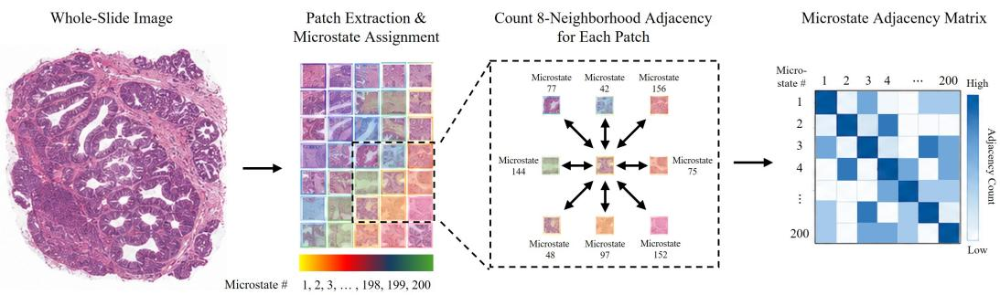

(b) Macrostate Discovery from Global Microstate Adjacency Matrix  
(c) Structured Histology-to-Molecular Regression  
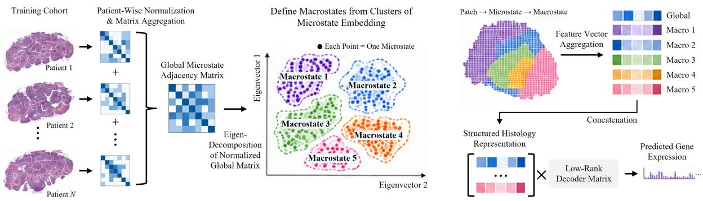  
Figure 1: Overview of MoSPR.

## 3 Methods

## 3.1 Patch feature extraction

For patient $n ,$ let $\mathcal { X } ^ { ( n ) } = \{ x _ { i } ^ { ( n ) } \} _ { i = 1 } ^ { N _ { n } }$ denote the tissue patches and let $Y ^ { ( n ) } \in \mathbb { R } ^ { G }$ denote the paired gene-expression vector. A frozen pathology encoder $( f _ { e n c } )$ maps each patch to

$$
z _ { i } ^ { ( n ) } = f _ { \mathrm { e n c } } ( x _ { i } ^ { ( n ) } ) \in \mathbb { R } ^ { D _ { 0 } } ,\tag{2}
$$

where $D _ { 0 } = 5 1 2$ for CONCH (Lu et al., 2024).

## 3.2 Microstate-to-macrostate construction

Microstate assignment and adjacency matrix construction. To discretize the continuous patch-embedding space into recurrent morphological patterns, we apply k-means clustering with J = 200 clusters to a patient-balanced sample of training patch embeddings. We define each resulting cluster as a microstate, represented by its centroid

$$
\{ \mu _ { j } \} _ { j = 1 } ^ { J } , \qquad \mu _ { j } \in \mathbb { R } ^ { D _ { 0 } } .
$$

Each tissue patch is then assigned to the nearest microstate,

$$
a _ { i } ^ { ( n ) } = \arg \operatorname* { m i n } _ { j \in \{ 1 , \dots , J \} } \left\| z _ { i } ^ { ( n ) } - \mu _ { j } \right\| _ { 2 } ^ { 2 } ,\tag{3}
$$

where $a _ { i } ^ { ( n ) } \in \{ 1 , \dots , J \}$ denotes the microstate assigned to patch i of patient $n .$

We then characterize how these microstates are spatially arranged within each WSI using 8-neighbor patch adjacency (Fig. 1(a)). For each pair of neighboring tissue patches $( p , q )$ assigned to microstates $a _ { p } ^ { ( n ) } = u$ and $a _ { q } ^ { ( n ) } = v ,$ , the corresponding entries of the patient-level microstate adjacency matrix $C ^ { ( n ) } \in \mathbb { R } _ { + } ^ { J \times J }$ are incremented:

$$
C _ { u v } ^ { ( n ) } \gets C _ { u v } ^ { ( n ) } + 1 , \qquad C _ { v u } ^ { ( n ) } \gets C _ { v u } ^ { ( n ) } + 1 .\tag{4}
$$

Thus, $C _ { u v } ^ { ( n ) }$ quantifies how frequently patches belonging to microstates u and v occur as spatial neighbors within patient $n ,$ and $C ^ { ( n ) }$ is symmetric by construction.

To prevent patients with larger tissue areas from dominating the cohort-level spatial structure, each patient-level microstate adjacency matrix is normalized by its total adjacency mass:

$$
\widehat C ^ { ( n ) } = \frac { C ^ { ( n ) } } { \sum _ { u , v } C _ { u v } ^ { ( n ) } } .\tag{5}
$$

The global microstate adjacency matrix is then defined as the average of the normalized patient-level matrices over the training cohort $\mathcal { D } _ { \mathrm { t r } }$ (Fig. 1(b)):

$$
C _ { \mathrm { g l o b a l } } = \frac { 1 } { | \mathcal { D } _ { \mathrm { t r } } | } \sum _ { n \in \mathcal { D } _ { \mathrm { t r } } } \widehat { C } ^ { ( n ) } .\tag{6}
$$

This averaging gives equal weight to each training patient while preserving symmetry and unit total mass $( C _ { \mathrm { g l o b a l } } =$ $C _ { \mathrm { g l o b a l } } ^ { \top }$ and $\begin{array} { r } { \sum _ { u , v } ( C _ { \mathrm { g l o b a l } } ) _ { u v } = 1 ) } \end{array}$ .

Macrostate discovery. To define macrostates according to their spatial neighborhood patterns, we first row-normalize the global microstate adjacency matrix. Let

$$
d _ { u } = \sum _ { v } ( C _ { \mathrm { g l o b a l } } ) _ { u v } , \qquad P = \Delta ^ { - 1 } C _ { \mathrm { g l o b a l } } , \qquad \Delta = \mathrm { d i a g } ( d _ { 1 } , \dots , d _ { J } ) .\tag{7}
$$

Here, $P \in \mathbb { R } ^ { J \times J }$ and $P _ { u v }$ represents the relative frequency with which microstate v occurs adjacent to microstate u. We then compute the eigendecomposition of $P .$

$$
\begin{array} { r } { P \psi _ { \ell } = \lambda _ { \ell } \psi _ { \ell } , \qquad \psi _ { \ell } \in \mathbb { R } ^ { J } . } \end{array}\tag{8}
$$

Following diffusion-map and spectral-clustering constructions (Coifman and Lafon, 2006; Ng et al., 2002), we exclude the trivial stationary component associated with $\lambda _ { 0 } = 1$ and retain the next $L = 2 0$ nontrivial components. Each microstate u is then represented by the eigenvalue-weighted spectral embedding

$$
\phi _ { u } = [ \lambda _ { 1 } \psi _ { 1 } ( u ) , \ldots , \lambda _ { L } \psi _ { L } ( u ) ] \in \mathbb { R } ^ { L } .\tag{9}
$$

The eigenvalue weighting gives greater influence to dominant spectral components of the adjacency structure. Each embedding is subsequently normalized to unit length,

$$
\bar { \phi } _ { u } = \frac { \phi _ { u } } { \lVert \phi _ { u } \rVert _ { 2 } + \varepsilon } ,\tag{10}
$$

where $\varepsilon = 1 0 ^ { - 1 2 }$ is a small numerical constant. Finally, k-means clustering is applied to the $J = 2 0 0$ normalized spectral embeddings, grouping the microstates into $K = 8$ macrostates. This clustering defines a fixed microstate-tomacrostate mapping

$$
\rho : \{ 1 , \ldots , J \}  \{ 1 , \ldots , K \} ,\tag{11}
$$

where $\rho ( u ) = k$ indicates that microstate u is assigned to macrostate k (Fig. 1(b)).

## 3.3 Morpho-spatial low-rank regression

Structured histology representation. We represent each patient’s WSI by combining global morphology with macrostate-specific deviations that summarize within-slide morphological heterogeneity across the learned states (Fig. 1(c)). The global morphology vector is the mean of the original patch features,

$$
M _ { n } = \frac { 1 } { N _ { n } } \sum _ { i = 1 } ^ { N _ { n } } z _ { i } ^ { ( n ) } \in \mathbb { R } ^ { D _ { 0 } } .\tag{12}
$$

For macrostate $k ,$ let $\mathcal { T } _ { n k } = \{ i : \rho ( a _ { i } ^ { ( n ) } ) = k \} , N _ { n k } = | \mathcal { T } _ { n k } | .$ , and $p _ { n k } = N _ { n k } / N _ { n }$ . When $N _ { n k } > 0$ , its mean patch feature and abundance-weighted deviation from the slide mean are

$$
h _ { n k } = \frac { 1 } { N _ { n k } } \sum _ { i \in \mathcal { T } _ { n k } } z _ { i } ^ { ( n ) } , \qquad s _ { n k } = p _ { n k } \big ( h _ { n k } - M _ { n } \big ) \in \mathbb { R } ^ { D _ { 0 } } .\tag{13}
$$

If macrostate k is absent from patient n $( N _ { n k } = 0 )$ , we set $s _ { n k } = 0$ . We concatenate the state blocks as $S _ { n } = \left[ s _ { n 1 } \right]$ $\dots \mid s _ { n K } \mid \in \mathbb { R } ^ { K D _ { 0 } }$ and form

$$
X _ { n } = [ M _ { n } \mid S _ { n } ] \in \mathbb { R } ^ { ( K + 1 ) D _ { 0 } } .\tag{14}
$$

The resulting vector $X _ { n }$ serves as the structured histological representation of patient n. Stacking these representations across N patients yields the matrix $X \in \mathbb { R } ^ { N \times ( K + 1 ) D _ { 0 } }$

Low-rank molecular factorization. Gene targets are standardized per gene using training-fold statistics, yielding $Y _ { z } \in \mathbb { R } ^ { N \times G }$ (Supplementary Section A.1). Rather than predicting all G genes independently, we exploit the strong correlation structure of gene expression by learning a compact molecular basis directly from the training cohort. PCA is fitted exclusively to the standardized training-fold expression matrix, and the top q principal directions define

$$
U _ { q } \in \mathbb { R } ^ { q \times G } .\tag{15}
$$

Each molecular profile is represented by a low-dimensional coefficient vector, and the corresponding coefficient matrix is

$$
A _ { q } = Y _ { z } U _ { q } ^ { \top } \in \mathbb { R } ^ { N \times q } .\tag{16}
$$

The resulting approximation

$$
Y _ { z } \approx A _ { q } U _ { q }\tag{17}
$$

reduces the output regression problem from G genes to $q \ll G$ molecular coefficients.

Molecular regression and reconstruction. We fit a ridge regression matrix $W _ { q }$ that maps the structured histology representation $\mathbf { \hat { \boldsymbol { X } } } = [ M \mid S ]$ to the low-dimensional molecular coefficient space:

$$
W _ { q } ^ { * } = \arg \operatorname* { m i n } _ { W _ { q } } \| A _ { q } - X W _ { q } \| _ { F } ^ { 2 } + \lambda _ { \mathrm { r i d g e } } \| W _ { q } \| _ { F } ^ { 2 } ,\tag{18}
$$

where $W _ { q } ^ { * } \in \mathbb { R } ^ { ( K + 1 ) D _ { 0 } \times q }$ is the fitted regression matrix.

The predicted molecular coefficients are projected back through the learned basis to reconstruct the standardized gene-expression profile:

$$
\widehat { Y } _ { z } = X W _ { q } ^ { * } U _ { q } .\tag{19}
$$

Intercept terms, which are included in the implementation, are omitted from the notation for clarity.

Thus, the original high-dimensional histology-to-gene regression problem is reduced to predicting only q molecular coefficients from the morpho-spatial representation.

## 3.4 Macrostate-level molecular interpretation

According to the block structure of $X = [ M \mid S ]$ , the fitted regression matrix can be partitioned as

$$
\begin{array} { r } { W _ { q } ^ { * } = \left[ \begin{array} { c } { W _ { q , \mathrm { g l o b a l } } ^ { * } } \\ { W _ { q , 1 } ^ { * } } \\ { \vdots } \\ { W _ { q , K } ^ { * } } \end{array} \right] , \qquad W _ { q , \mathrm { g l o b a l } } ^ { * } , \ W _ { q , k } ^ { * } \in \mathbb { R } ^ { D _ { 0 } \times q } . } \end{array}\tag{20}
$$

For patient n, the macrostate-k contribution to the predicted gene-expression profile is

$$
\Gamma _ { n k } = s _ { n k } W _ { q , k } ^ { * } U _ { q } \in \mathbb { R } ^ { G } ,\tag{21}
$$

and the global morphology contribution is

$$
\Gamma _ { n , \mathrm { g l o b a l } } = M _ { n } W _ { q , \mathrm { g l o b a l } } ^ { * } U _ { q } \in \mathbb { R } ^ { G } .\tag{22}
$$

Ignoring the intercept term for notational simplicity, the predicted profile can therefore be decomposed as

$$
\widehat { Y } _ { z , n } = \Gamma _ { n , \mathrm { g l o b a l } } + \sum _ { k = 1 } ^ { K } \Gamma _ { n k } .\tag{23}
$$

This provides an exact algebraic decomposition of the prediction into contributions from global morphology and individual macrostates, without requiring a post-hoc attribution method.

## 4 Experimental Setup

## 4.1 Datasets and evaluation protocol

We evaluate MoSPR on paired H&E WSIs and bulk RNA-sequencing profiles from TCGA-BRCA, TCGA-KIRC, and TCGA-LUAD (Weinstein et al., 2013). Performance is assessed at two levels: gene-expression prediction and pathway-score reconstruction. We use four-fold patient-level cross-validation, where held-out patients in each outer fold are reserved exclusively for final evaluation and model fitting and hyperparameter selection are performed using only the corresponding training and validation partitions. Within each cancer type, all competing methods use identical patient-level splits and the same target-gene universe. Cohort statistics and fold-specific training, validation, and test sample counts are provided in Supplementary Table S1.

## 4.2 Evaluation metrics

For gene-level evaluation, Pearson correlation coefficient (PCC) and Spearman rank correlation coefficient (SCC) are computed across held-out patients separately for each gene and then averaged across genes. For pathway-level evaluation, pathway scores are computed independently from the predicted and observed gene-expression profiles as the mean gene-wise z-score across the member genes of each pathway (Lee et al., 2008). SCC is then computed across held-out patients separately for each pathway. Performance within each pathway collection is summarized by the median SCC across pathways in the Hallmark (Liberzon et al., 2015), GO-BP (The Gene Ontology Consortium, 2021), and KEGG (Kanehisa and Goto, 2000) collections.

## 4.3 Benchmark methods

We compare MoSPR with both general-purpose WSI aggregation methods and models developed specifically for transcriptomic prediction from histology. WSI aggregation baselines include max and mean pooling (Wang et al., 2018), ABMIL (Ilse et al., 2018), ILRA (Xiang and Zhang, 2023), S4MIL (Fillioux et al., 2023), MambaMIL and SRMambaMIL (Yang et al., 2024), and 2DMamba (Zhang et al., 2025). Transcriptomic prediction baselines include HE2RNA (Schmauch et al., 2020), AbReg (Graziani et al., 2022), tRNAformer (Alsaafin et al., 2023), MOSBY ( ¸Senbabaoglu et al., 2024), SEQUOIA VIS (Pizurica et al., 2024), and CPNN (Nishimura et al., 2026).˘

## 4.4 Implementation details

Structural hyperparameters are fixed across all cohorts at J = 200 microstates, L = 20 spectral components, and $K = 8$ macrostates. The molecular rank q and ridge penalty $\lambda _ { \mathrm { r i d g e } }$ are selected independently within each fold using the validation reconstruction error. Hyperparameter ranges and selection details are provided in Supplementary Section A.2.

## 4.5 Additional analyses

Ablation analysis. We isolate the contributions of the macrostate representation and low-rank molecular prediction using matched model variants on TCGA-BRCA. Spatial Low-Rank corresponds to the full MoSPR formulation, combining macrostate-based features with low-rank regression. Spatial Direct retains the same macrostate representation but replaces the low-rank output model with direct gene-wise regression, whereas Global Low-Rank retains low-rank molecular prediction but removes the macrostate-specific features. As a control, Shuffled-State Low-Rank and Shuffled State Direct permute the learned microstate-to-macrostate mapping ρ across microstates, preserving the number and sizes of macrostates while disrupting their adjacency-derived composition. All variants use the same patient-level four-fold cross-validation splits as the main benchmarks (Supplementary Table S1). Performance is evaluated using mean gene-level SCC and median Hallmark pathway SCC.

Data-efficiency analysis. To assess performance under limited paired histology–transcriptomic supervision, we conduct a training-set scaling analysis across the three cancer cohorts using the same patient-level four-fold splits as the main benchmarks (Supplementary Table S1). Within each outer fold, the training and validation partitions are randomly subsampled at fractions $f \in \{ 0 . \dot { 1 } , 0 . 2 5 , 0 . 5 , 0 . 7 5 , 1 . 0 \}$ , while the held-out test partition remains unchanged. For each fold and fraction, the sampled training and validation patients are fixed and shared across all competing methods. All data-derived representations and prediction models are recomputed using only the corresponding subsample. Performance is evaluated using mean gene-level SCC and median Hallmark pathway SCC on the unchanged test folds.

Macrostate interpretation. To qualitatively illustrate how learned macrostates map to tissue regions and associate with molecular programs, we select a representative held-out patient WSI from TCGA-BRCA and analyze it using the model trained in a single cross-validation fold. We map the patch assignments of three selected macrostates onto this WSI. For each macrostate, its model-derived gene-expression contribution $( \Gamma _ { n k }$ in Section 3.4) is used for Hallmark pathway enrichment analysis. The three pathways with the largest absolute enrichment z-scores are reported for each macrostate.

## 5 Results

## 5.1 MoSPR consistently improves cross-cancer gene-expression prediction

Table 1 summarizes gene-level prediction performance. MoSPR achieves the highest mean PCC and SCC in all six cohort–metric combinations across BRCA, KIRC, and LUAD. Although the strongest competing baseline varies across cohorts and metrics, MoSPR consistently exceeds the strongest competing baseline in each setting, with PCC/SCC gains of 0.043/0.048 in BRCA, 0.022/0.029 in KIRC, and 0.039/0.040 in LUAD. The consistent gains across both linear and rank correlation indicate that the improvement is not specific to a single correlation metric or cancer type. The best- and worst-predicted individual genes are reported in Supplementary Table S2. In addition, MoSPR achieves these gains with the lowest parameter count (0.96M parameters) among the evaluated methods, while requiring only 2.02 inference GFLOPs after frozen CONCH feature extraction (Supplementary Table S3).

Table 1: Cross-cancer gene-expression prediction. Entries report mean gene-wise PCC and SCC over four crossvalidation folds. Best and second-best results are shown in bold and underlined, respectively.
<table><tr><td rowspan="3">Method</td><td colspan="2">BRCA</td><td colspan="2">KIRC</td><td colspan="2">LUAD</td></tr><tr><td>PCC</td><td>SCC</td><td>PCC</td><td>SCC</td><td>PCC</td><td>SCC</td></tr><tr><td></td><td>0.294 0.283 0.2360.244 0.2580.278</td><td></td><td></td><td></td><td></td></tr><tr><td>Max (Wang et al., 2018)</td><td></td><td></td><td></td><td></td><td></td><td></td></tr><tr><td>Mean (Wang et al., 2018)</td><td>0.336 0.3380.2850.2930.2920.315 0.3700.3630.2930.2990.3080.324</td><td></td><td></td><td></td><td></td><td></td></tr><tr><td>ABMIL (Ilse et al., 2018)</td><td>0.300 0.293 0.256 0.2730.2760.297</td><td></td><td></td><td></td><td></td><td></td></tr><tr><td>HE2RNA (Schmauch et al., 2020) AbReg (Graziani et al., 2022)</td><td>0.3550.349 0.289 0.293 0.296 0.311</td><td></td><td></td><td></td><td></td><td></td></tr><tr><td>tRNAformer (Alsaafin et al., 2023)</td><td>0.341 0.332 0.312 0.3190.316 0.336</td><td></td><td></td><td></td><td></td><td></td></tr><tr><td>ILRA (Xiang and Zhang, 2023)</td><td>0.2380.271 0.1910.2480.2800.304</td><td></td><td></td><td></td><td></td><td></td></tr><tr><td>S4MIL (Filloux et al., 2023)</td><td>0.3280.330 0.2690.274 0.2990.315</td><td></td><td></td><td></td><td></td><td></td></tr><tr><td>MambaMIL (Yang et al., 2024)</td><td>0.363 0.356 0.290 0.290 0.319 0.335</td><td></td><td></td><td></td><td></td><td></td></tr><tr><td>SRMambaMIL (Yang et al., 2024)</td><td>0.3610.3520.2920.2940.3110.326</td><td></td><td></td><td></td><td></td><td></td></tr><tr><td>MOSBY (Şenbabaoğlu et al., 2024)</td><td>0.343 0.3490.2640.2890.2890.308</td><td></td><td></td><td></td><td></td><td></td></tr><tr><td>SEQUOIÀ&#x27;VIS (Pizurica et al., 2024) 0.353 0.337 0.310 0.314 0.317 0.331</td><td></td><td></td><td></td><td></td><td></td><td></td></tr><tr><td>2DMamba (Zhang et al., 2025)</td><td>0.352 0.3480.287 0.292 0.300 0.313</td><td></td><td></td><td></td><td></td><td></td></tr><tr><td>CPNN (Nishimura et al., 2026)</td><td>0.3600.3560.293 0.310 0.3050.325</td><td></td><td></td><td></td><td></td><td></td></tr><tr><td>MoSPR (ours)</td><td>0.4130.4110.3340.3480.3580.376</td><td></td><td></td><td></td><td></td><td></td></tr></table>

## 5.2 Gene predictions preserve pathway-level functional variation

MoSPR achieves the highest median pathway-wise SCC in eight of nine comparisons across the three cohorts and the Hallmark, GO-BP, and KEGG collections, and ranks second in the remaining comparison (Table 2). Relative to the strongest competing method in each setting, MoSPR improves median pathway-wise SCC by up to 0.051, with gains across all three pathway collections in BRCA and KIRC. Notably, pathway scores are derived solely from predicted gene-expression profiles and are not used for training. These results indicate that improvements in gene-expression prediction extend to coordinated variation across biological programs.

## 5.3 Ablation of spatial and low-rank structure

On TCGA-BRCA, Global Low-Rank improves mean gene SCC from 0.348 (Global Direct) to 0.380, while Spatial Direct reaches 0.395 (Table 3). Combining the macrostate representation with low-rank regression (Spatial Low-Rank; MoSPR) yields the highest mean gene SCC (0.411). Importantly, applying baseline-specific low-rank output controls to ABMIL and tRNAformer does not reproduce MoSPR’s performance (Supplementary Table S4), suggesting that low-rank output compression alone is insufficient to explain the gain. Randomizing the microstate-to-macrostate assignments reduces performance to 0.360 for Shuffled-State Direct and 0.379 for Shuffled-State Low-Rank, both below their learned-macrostate counterparts (0.395 and 0.411, respectively). For Hallmark reconstruction, the shuffled-state variants both reach 0.499, whereas Spatial Direct (0.552) and MoSPR (0.551) perform similarly and both exceed Global Low-Rank (0.481).

Beyond predictive performance, the learned macrostate organization was also stable under patient resampling. Across 300 patient-level bootstrap resamples per cohort with fixed microstates, mean Adjusted Rand Index (ARI) values relative to the corresponding full-cohort partitions were 0.769, 0.653, and 0.786 for TCGA-BRCA, TCGA-KIRC, and TCGA-LUAD, respectively (Supplementary Table S5). Together, these results indicate complementary contributions of the macrostate representation and low-rank output model to gene prediction, with pathway-level gains primarily associated with the learned macrostate representation.

## 5.4 Data efficiency under limited paired supervision

Across reduced training-set sizes, MoSPR consistently preserves its performance advantage, including against ABMIL, the strongest competing baseline on TCGA-BRCA (Fig. 2). For gene-expression prediction, MoSPR reaches the full-data ABMIL performance using only approximately 44% of the available training data. Similarly, for Hallmark pathway reconstruction, MoSPR trained with approximately 48% of the data matches the performance of ABMIL trained with 100%. These results indicate that MoSPR can recover the performance of the strongest full-data baseline with roughly half of the paired histology–transcriptomic supervision. Corresponding training-set scaling results for TCGA-KIRC and TCGA-LUAD are provided in Supplementary Figs. S1 and S2.

Table 2: Gene-derived pathway reconstruction across three TCGA cohorts. Entries report the median pathway-wise SCC within each collection, averaged over four cross-validation folds. Pathway scores are derived solely from predicted gene-expression profiles and are not used for training. Best and second-best results are shown in bold and underlined, respectively.
<table><tr><td></td><td colspan="3">BRCA</td><td colspan="3">KIRC</td><td colspan="3">LUAD</td></tr><tr><td>Method</td><td>Hallmark</td><td>GO-BP</td><td>KEGG</td><td>Hallmark</td><td>GO-BP</td><td>KEGG</td><td>Hallmark</td><td>GO-BP</td><td>KEGG</td></tr><tr><td>Max (Wang et al., 2018)</td><td>0.356</td><td>0.337</td><td>0.321</td><td>0.281</td><td>0.284</td><td>0.309</td><td>0.420</td><td>0.379</td><td>0.388</td></tr><tr><td>Mean (Wang et al., 2018)</td><td>0.469</td><td>0.448</td><td>0.415</td><td>0.367</td><td>0.379</td><td>0.415</td><td>0.498</td><td>0.446</td><td>0.452</td></tr><tr><td>ABMIL (Ilse et al., 2018)</td><td>0.500</td><td>0.476</td><td>0.446</td><td>0.378</td><td>0.388</td><td>0.418</td><td>0.519</td><td>0.465</td><td>0.474</td></tr><tr><td>HE2RNÀ (Schmauch et al., 2020)</td><td>0.333</td><td>0.329</td><td>0.300</td><td>0.299</td><td>0.321</td><td>0.340</td><td>0.388</td><td>0.349</td><td>0.365</td></tr><tr><td>AbReg (Graziani et al., 2022)</td><td>0.481</td><td>0.453</td><td>0.425</td><td>0.397</td><td>0.389</td><td>0.420</td><td>0.507</td><td>0.443</td><td>0.462</td></tr><tr><td>tRNAformer (Alsaafin et al., 2023)</td><td>0.412</td><td>0.381</td><td>0.345</td><td>0.367</td><td>0.368</td><td>0.404</td><td>0.467</td><td>0.415</td><td>0.424</td></tr><tr><td>ILRA (Xiang and Zhang, 2023)</td><td>0.385</td><td>0.358</td><td>0.330</td><td>0.301</td><td>0.317</td><td>0.340</td><td>0.463</td><td>0.418</td><td>0.430</td></tr><tr><td>S4MIL (Filloux et al., 2023)</td><td>0.434</td><td>0.414</td><td>0.383</td><td>0.301</td><td>0.329</td><td>0.343</td><td>0.481</td><td>0.428</td><td>0.436</td></tr><tr><td>MambaMIL (Yang et al., 2024)</td><td>0.479</td><td>0.458</td><td>0.423</td><td>0.308</td><td>0.326</td><td>0.345</td><td>0.529</td><td>0.481</td><td>0.487</td></tr><tr><td>SRMambaMIL (Yang et al., 2024)</td><td>0.463</td><td>0.448</td><td>0.411</td><td>0.306</td><td>0.315</td><td>0.338</td><td>0.514</td><td>0.455</td><td>0.472</td></tr><tr><td>MOSBY (Şenbabaoğlu et al., 2024)</td><td>0.400</td><td>0.381</td><td>0.354</td><td>0.257</td><td>0.263</td><td>0.293</td><td>0.348</td><td>0.312</td><td>0.324</td></tr><tr><td>SEQUOIA&#x27;VIS (Pizurica et al., 2024)</td><td>0.444</td><td>0.413</td><td>0.385</td><td>0.384</td><td>0.388</td><td>0.420</td><td>0.488</td><td>0.441</td><td>0.450</td></tr><tr><td>2DMamba (Zhang et al., 2025)</td><td>0.460</td><td>0.439</td><td>0.408</td><td>0.381</td><td>0.370</td><td>0.388</td><td>0.501</td><td>0.443</td><td>0.457</td></tr><tr><td>CPNN (Nishimura et al., 2026)</td><td>0.391</td><td>0.377</td><td>0.327</td><td>0.282</td><td>0.293</td><td>0.349</td><td>0.427</td><td>0.380</td><td>0.388</td></tr><tr><td>MoSPR (ours)</td><td>0.551</td><td>0.520</td><td>0.486</td><td>0.402</td><td>0.415</td><td>0.447</td><td>0.528</td><td>0.482</td><td>0.491</td></tr></table>

Table 3: Component ablation on TCGA-BRCA. Best and second-best results are shown in bold and underlined, respectively.
<table><tr><td>Variant</td><td>Histology Input</td><td>Molecular Output</td><td>Gene SCC</td><td>Hallmark SCC</td></tr><tr><td>Global Direct</td><td>M</td><td>Direct</td><td>0.348</td><td>0.458</td></tr><tr><td>Global Low-Rank</td><td>M</td><td> $U _ { q }$ </td><td>0.380</td><td>0.481</td></tr><tr><td>Shuffled-State Direct</td><td></td><td>Direct</td><td>0.360</td><td>0.499</td></tr><tr><td>Shuffled-State Low-Rank</td><td> $\begin{array} { r } { [ M \ | \ S _ { \mathrm { s h u f f l e } } ] } \\ { [ M \ . \ | \ S _ { \mathrm { s h u f f l e } } ] } \end{array}$ </td><td> $U _ { q }$ </td><td>0.379</td><td>0.499</td></tr><tr><td>Spatial Direct</td><td>[M S]</td><td>Direct</td><td>0.395</td><td>0.552</td></tr><tr><td>Spatial Low-Rank (MoSPR)</td><td>[M s]</td><td> $U _ { q }$ </td><td>0.411</td><td>0.551</td></tr></table>

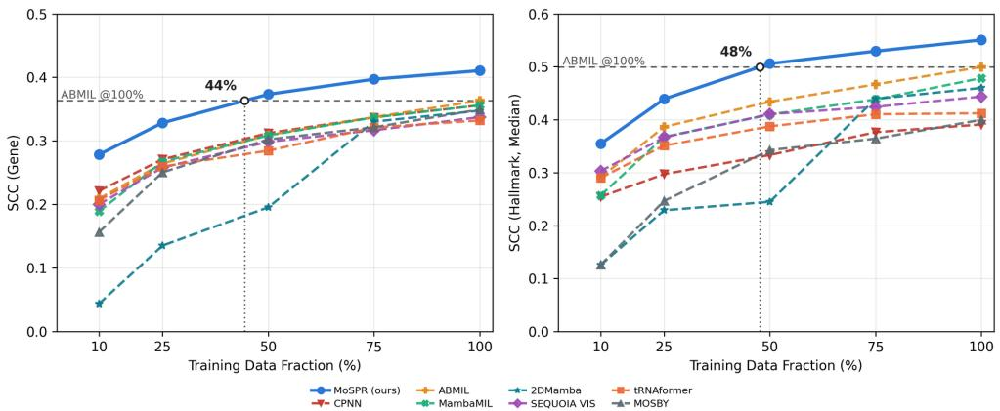  
Figure 2: Training-set scaling on TCGA-BRCA.

## 5.5 Qualitative characterization of morpho-spatial macrostates

Three representative macrostates localize to distinct, spatially coherent regions in a representative WSI (Figure 3). Their corresponding gene-expression contributions show distinct Hallmark enrichment patterns, including oxidative

phosphorylation, epithelial–mesenchymal transition, and interferon gamma response. This qualitative example suggests that the learned macrostates capture morphologically distinct tissue regions associated with different molecular programs.

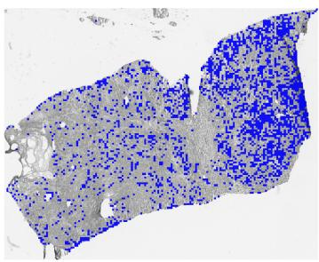

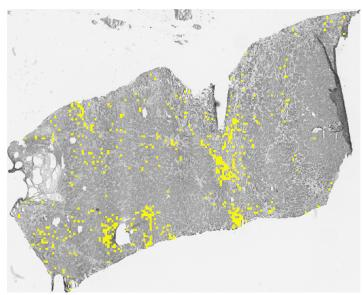

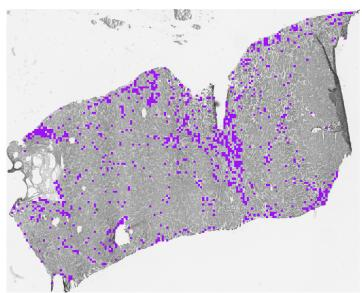

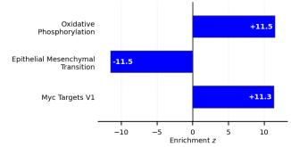

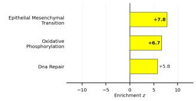

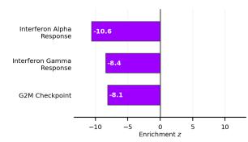  
Figure 3: Representative macrostates and their associated Hallmark pathway enrichments.

## 6 Discussion and Conclusion

MoSPR couples a shared morphology dictionary informed by training-cohort adjacency with low-rank gene-expression regression, summarizing within-slide morphological heterogeneity across learned macrostates while reducing the dimension of supervised regression. The gene- and pathway-level results, together with the ablation and training-set scaling analyses, support this combination for bulk expression prediction. The fitted linear formulation further permits model-based interpretation of global and macrostate-specific molecular contributions.

Several limitations remain. Macrostates summarize recurrent local adjacency patterns rather than complete twodimensional tissue geometry, and bulk RNA measurements cannot validate whether macrostate-associated molecular programs are spatially localized to the corresponding tissue regions. Accordingly, the biological characterization remains qualitative. Evaluation within TCGA does not establish generalization to independent cohorts or institutions, and external cohorts and spatially resolved molecular measurements will be important for validating both predictive robustness and the biological interpretation of the learned macrostates.

## AI Use Statement

Generative AI tools were used for translation, LaTeX formatting and conversion of manuscript elements such as tables and figures, grammatical proofreading, and code refactoring. Generative AI tools were not used to generate experimental measurements, fabricate numerical results, or determine the reported scientific findings. All AI-assisted text, code, analyses, and manuscript components were reviewed and verified by the authors, who take full responsibility for the final content of this manuscript.

## Ethics Statement

This study uses de-identified, publicly available data from The Cancer Genome Atlas (TCGA), including the TCGA-BRCA, TCGA-KIRC, and TCGA-LUAD cohorts, and does not involve new participant recruitment or the collection of new clinical specimens. The study is intended for research and hypothesis generation rather than direct clinical decision making. Potential sources of bias include cohort composition, tissue processing, scanner and staining differences, and under-representation of demographic groups. All TCGA data were used in accordance with the applicable data-access and data-use requirements.

## Reproducibility Statement

An implementation of MoSPR is available at the repository linked in the abstract. The repository includes the code required to reproduce the proposed method and main experimental analyses, together with patient-level data splits, preprocessing procedures, model configurations, and scripts for generating the reported tables and figures. Fold-specific model selection and evaluation procedures are described in the manuscript and supplementary material. Data-derived quantities are constructed independently within each training fold to avoid information leakage. Where redistribution of derived data or intermediate artifacts is restricted by the terms of the original datasets, scripts for deterministic regeneration are provided where possible.

## References

Areej Alsaafin, Amir Safarpoor, Milad Sikaroudi, Jason D Hipp, and Hamid R Tizhoosh. Learning to predict rna sequence expressions from whole slide images with applications for search and classification. Communications Biology, 6(1):304, 2023.

Richard J. Chen, Ming Y. Lu, Jingwen Wang, Drew F. K. Williamson, Scott J. Rodig, Neal I. Lindeman, and Faisal Mahmood. Whole slide images are 2d point clouds: Context-aware survival prediction using patch-based graph convolutional networks. In Medical Image Computing and Computer Assisted Intervention – MICCAI 2021, pages 339–349, 2021. doi: 10.1007/978-3-030-87237-3\_33.

Ronald R Coifman and Stéphane Lafon. Diffusion maps. Applied and Computational Harmonic Analysis, 21(1):5–30, 2006. doi: 10.1016/j.acha.2006.04.006.

Nicolas Coudray, Paolo Santiago Ocampo, Theodore Sakellaropoulos, Navneet Narula, Matija Snuderl, David Fenyö, Andre L Moreira, Narges Razavian, and Aristotelis Tsirigos. Classification and mutation prediction from non–small cell lung cancer histopathology images using deep learning. Nature Medicine, 24(10):1559–1567, 2018.

Leo Fillioux, Joseph Boyd, Maria Vakalopoulou, Paul-Henry Cournede, and Stergios Christodoulidis. Structured state space models for multiple instance learning in digital pathology. In Medical Image Computing and Computer Assisted Intervention, pages 594–604. Springer, 2023.

Mara Graziani, Niccolo Marini, Nicolas Deutschmann, Nikita Janakarajan, Henning Müller, and María Rodríguez Martínez. Attention-based interpretable regression of gene expression in histology. In MICCAI Workshop on Computational Pathology, pages 44–60. Springer, 2022.

Lawrence Hubert and Phipps Arabie. Comparing partitions. Journal of classification, 2(1):193–218, 1985.

Maximilian Ilse, Jakub Tomczak, and Max Welling. Attention-based deep multiple instance learning. In International Conference on Machine Learning, pages 2127–2136. PMLR, 2018.

Minoru Kanehisa and Susumu Goto. KEGG: Kyoto encyclopedia of genes and genomes. Nucleic Acids Research, 28 (1):27–30, 2000.

Eunjung Lee, Han-Yu Chuang, Jong-Won Kim, Trey Ideker, and Doheon Lee. Inferring pathway activity toward precise disease classification. PLOS Computational Biology, 4(11):e1000217, 2008.

Arthur Liberzon, Chet Birger, Helga Thorvaldsdottir, Mahmoud Ghandi, Jill P Mesirov, and Pablo Tamayo. The molecular signatures database hallmark gene set collection. Cell Systems, 1(6):417–425, 2015.

Ming Y Lu, Bowen Chen, Drew FK Williamson, Richard J Chen, Ivy Liang, Tong Ding, Guillaume Jaume, Igor Odintsov, Long Phi Le, Georg Gerber, et al. A visual-language foundation model for computational pathology. Nature Medicine, 30(3):863–874, 2024.

Andrew Y Ng, Michael I Jordan, and Yair Weiss. On spectral clustering: Analysis and an algorithm. In Advances in Neural Information Processing Systems, volume 14, 2002.

Kazuya Nishimura, Ryoma Bise, Shinnosuke Matsuo, Haruka Hirose, and Yasuhiro Kojima. Cell-type prototypeinformed neural network for gene expression estimation from pathology images. In Proceedings ofthe IEEE/CVF Conference on Computer Vision and Pattern Recognition, 2026.

Marija Pizurica, Yuanning Zheng, Francisco Carrillo-Perez, Humaira Noor, Wei Yao, Christian Wohlfart, Antoaneta Vladimirova, Kathleen Marchal, and Olivier Gevaert. Digital profiling of gene expression from histology images with linearized attention. Nature Communications, 15(1):9886, 2024.

Charlie Saillard, Rémy Dubois, Oussama Tchita, Nicolas Loiseau, Thierry Garcia, Aurélie Adriansen, Séverine Carpentier, Joelle Reyre, Diana Enea, Katharina von Loga, Aurélie Kamoun, Stéphane Rossat, Corentin Wiscart, Meriem Sefta, Michaël Auffret, Lionel Guillou, Arnaud Fouillet, Jakob Nikolas Kather, and Magali Svrcek. Validation of MSIntuit as an AI-based pre-screening tool for MSI detection from colorectal cancer histology slides. Nature Communications, 14(1):6695, 2023.

Benoît Schmauch, Alberto Romagnoni, Elodie Pronier, Charlie Saillard, Pascale Maillé, Julien Calderaro, Aurélie Kamoun, Meriem Sefta, Sylvain Toldo, Mikhail Zaslavskiy, et al. A deep learning model to predict rna-seq expression of tumours from whole slide images. Nature communications, 11(1):3877, 2020.

Yasin ¸Senbabaoglu, Vignesh Prabhakar, Aminollah Khormali, Jeff Eastham, Evan Liu, Elisa Warner, Barzin Nabet,˘ Minu Srivastava, Marcus Ballinger, and Kai Liu. Mosby enables multi-omic inference and spatial biomarker discovery from whole slide images. Scientific Reports, 14(1):18271, 2024.

Zhuchen Shao, Hao Bian, Yang Chen, Yifeng Wang, Jian Zhang, Xiangyang Ji, and Yongbing Zhang. Transmil: Transformer based correlated multiple instance learning for whole slide image classification. In Advances in Neural Information Processing Systems, volume 34, pages 2136–2147, 2021.

Patrik L. Ståhl, Fredrik Salmén, Sanja Vickovic, Anna Lundmark, José Fernández Navarro, Jens Magnusson, Stefania Giacomello, Michaela Asp, Jakub O. Westholm, Mikael Huss, Annelie Mollbrink, Sten Linnarsson, Simone Codeluppi, Åke Borg, Fredrik Pontén, Paul I. Costea, Pelin Sahlén, Jan Mulder, Olaf Bergmann, Joakim Lundeberg, and Jonas Frisén. Visualization and analysis of gene expression in tissue sections by spatial transcriptomics. Science, 353(6294):78–82, 2016. doi: 10.1126/science.aaf2403.

The Gene Ontology Consortium. The gene ontology resource: enriching a GOld mine. Nucleic Acids Research, 49(D1): D325–D334, 2021.

Xinggang Wang, Yongluan Yan, Peng Tang, Xiang Bai, and Wenyu Liu. Revisiting multiple instance neural networks. Pattern Recognition, 74:15–24, 2018.

John N Weinstein, Eric A Collisson, Gordon B Mills, Kenna R Shaw, Brad A Ozenberger, Kyle Ellrott, Ilya Shmulevich, Chris Sander, and Joshua M Stuart. The cancer genome atlas pan-cancer analysis project. Nature genetics, 45(10): 1113–1120, 2013.

Jinxi Xiang and Jun Zhang. Exploring low-rank property in multiple instance learning for whole slide image classification. In International Conference on Learning Representations, 2023.

Shu Yang, Yihui Wang, and Hao Chen. MambaMIL: Enhancing long sequence modeling with sequence reordering in computational pathology. In Medical Image Computing and Computer Assisted Intervention, pages 296–306. Springer, 2024.

Jingwei Zhang, Anh Tien Nguyen, Xi Han, Vincent Quoc-Huy Trinh, Hong Qin, Dimitris Samaras, and Mahdi S Hosseini. 2DMamba: Efficient state space model for image representation with applications on giga-pixel whole slide image classification. In Proceedings ofthe IEEE/CVF Conference on Computer Vision and Pattern Recognition, pages 3583–3592, 2025.

## A Supplementary Methods

## A.1 Gene-expression preprocessing

Let $T \in \mathbb { R } _ { + } ^ { N \times G }$ denote the TPM expression matrix restricted to the G target genes used for evaluation. For each sample, the target-gene TPM profile was normalized within this gene subset to a total of $1 0 ^ { 4 }$ and log-transformed:

$$
Y _ { n g } = \log \left( 1 + 1 0 ^ { 4 } \frac { T _ { n g } } { \sum _ { g ^ { \prime } = 1 } ^ { G } T _ { n g ^ { \prime } } } \right) .\tag{24}
$$

Thus, $Y \in \mathbb { R } ^ { N \times G }$ represents log1p-transformed CP10K expression within the target-gene subset.

Within each cross-validation fold, these values were further standardized gene-wise using statistics estimated exclusively from the training partition. Let $\mu _ { \mathrm { t r } , g }$ and $\sigma _ { \mathrm { t r } , g }$ denote the training-fold mean and standard deviation of gene g. The regression targets were

$$
( Y _ { z } ) _ { n g } = \frac { Y _ { n g } - \mu _ { \mathrm { t r } , g } } { \sigma _ { \mathrm { t r } , g } } .\tag{25}
$$

The same training-fold mean and standard deviation were applied to the validation and test partitions.

## A.2 Hyperparameter selection

The structural hyperparameters were fixed across cohorts at $J = 2 0 0$ microstates, $K = 8$ macrostates, and $L = 2 0$ spectral components. Additional searches over K and L did not improve validation performance and frequently selected less stable macrostate partitions. We therefore retained the fixed structural configuration across all cohorts.

The molecular rank $q$ and ridge penalty $\lambda _ { \mathrm { r i d g e } }$ were selected independently within each fold from

$$
q \in \{ 4 , 8 , 1 6 , 3 2 , 4 8 , 6 4 , 9 6 , 1 2 8 \} ,
$$

$$
\lambda _ { \mathrm { r i d g e } } \in \{ 1 , 1 0 , 1 0 ^ { 2 } , 1 0 ^ { 3 } , 1 0 ^ { 4 } , 1 0 ^ { 5 } \} .\tag{26}
$$

For each candidate pair $( q , \lambda _ { \mathrm { r i d g e } } )$ , model selection was based on the mean squared reconstruction error over the validation samples and genes:

$$
\mathcal { L } _ { \mathrm { v a l } } = \frac { 1 } { N _ { \mathrm { v a l } } G } \left. \widehat { Y } _ { z , \mathrm { v a l } } - Y _ { z , \mathrm { v a l } } \right. _ { F } ^ { 2 } .\tag{27}
$$

After selecting $( q , \lambda _ { \mathrm { r i d g e } } )$ , MoSPR and its fold-dependent transformations were refitted on the combined training and validation partitions before a single evaluation on the held-out test partition.

## B Supplementary Tables

Table S1: Dataset summary and fold-specific sample counts used for four-fold cross-validation.
<table><tr><td rowspan="2">Cohort</td><td colspan="3">Cohort Summary</td><td rowspan="2"></td><td colspan="2">Train</td><td colspan="2">Validation</td><td colspan="2">Test</td></tr><tr><td>Patients Slides</td><td></td><td>Genes</td><td>Patients</td><td>Slides</td><td>Patients</td><td>Slides</td><td>Patients</td><td>Slides</td></tr><tr><td rowspan="4">TCGA-BRCA</td><td rowspan="4">1,037</td><td rowspan="4">1,467 14,042</td><td rowspan="4"></td><td>0</td><td>519</td><td>734</td><td>259</td><td>366</td><td>259</td><td>367</td></tr><tr><td>1</td><td>519</td><td>733</td><td>259</td><td>367</td><td>259</td><td>367</td></tr><tr><td>2</td><td>518</td><td>733</td><td>259</td><td>367</td><td>260</td><td>367</td></tr><tr><td>3</td><td>518</td><td>734</td><td>260</td><td>367</td><td>259</td><td>366</td></tr><tr><td rowspan="4">TCGA-KIRC</td><td rowspan="4">342</td><td rowspan="4"></td><td rowspan="4">681 14,295</td><td>0</td><td>170</td><td>340</td><td>86</td><td>170</td><td>86</td><td>171</td></tr><tr><td>1</td><td>171</td><td>340</td><td>86</td><td>171</td><td>85</td><td>170</td></tr><tr><td>2</td><td>172</td><td>341</td><td>85</td><td>170</td><td>85</td><td>170</td></tr><tr><td>3</td><td>171</td><td>341</td><td>85</td><td>170</td><td>86</td><td>170</td></tr><tr><td rowspan="4">TCGA-LUAD</td><td rowspan="4">482</td><td rowspan="4"></td><td rowspan="4">75614,514</td><td>0</td><td>241</td><td>378</td><td>121</td><td>189</td><td>120</td><td>189</td></tr><tr><td>1</td><td>242</td><td>378</td><td>120</td><td>189</td><td>120</td><td>189</td></tr><tr><td>2</td><td>241</td><td>378</td><td>120</td><td>189</td><td>121</td><td>189</td></tr><tr><td>3</td><td>240</td><td>378</td><td>121</td><td>189</td><td>121</td><td>189</td></tr></table>

Table S2: Per-gene MoSPR performance on TCGA-BRCA, TCGA-KIRC, and TCGA-LUAD. Shown are the 10 best and worst-predicted genes ranked by mean SCC across four cross-validation folds.
<table><tr><td rowspan="2">Rank</td><td colspan="2">BRCA</td><td colspan="2">KIRC</td><td colspan="2">LUAD</td></tr><tr><td>Gene</td><td>SCC</td><td>Gene</td><td>SCC</td><td>Gene</td><td>SCC</td></tr><tr><td colspan="7">Best-predicted</td></tr><tr><td>1</td><td>PODN</td><td>0.781</td><td>ACAA2</td><td>0.728</td><td>TPX2</td><td>0.750</td></tr><tr><td>2</td><td>HTRA1</td><td>0.762</td><td>LINC01507</td><td>0.719</td><td>PRR11</td><td>0.742</td></tr><tr><td>3</td><td>ZCCHC24</td><td>0.759</td><td>EMX2OS</td><td>0.715</td><td>CENPA</td><td>0.736</td></tr><tr><td>4</td><td>COL14A1</td><td>0.759</td><td>LDB2</td><td>0.715</td><td>CCNA2</td><td>0.736</td></tr><tr><td>5</td><td>LRRC17</td><td>0.751</td><td>AGTR1</td><td>0.713</td><td>TROAP</td><td>0.735</td></tr><tr><td>6</td><td>MFAP4</td><td>0.751</td><td>TMEM204</td><td>0.709</td><td>NCAPH</td><td>0.734</td></tr><tr><td>7</td><td>SPARCL1</td><td>0.751</td><td>PITPNC1</td><td>0.708</td><td>KIF4A</td><td>0.734</td></tr><tr><td>8</td><td>GLT8D2</td><td>0.749</td><td>ERG</td><td>0.707</td><td>BIRC5</td><td>0.730</td></tr><tr><td>9</td><td>COL1A2</td><td>0.747</td><td>FRMD3</td><td>0.704</td><td>CDCA5</td><td>0.729</td></tr><tr><td>10</td><td>SFRP2</td><td>0.742</td><td>ESAM</td><td>0.703</td><td>KPNA2</td><td>0.727</td></tr><tr><td colspan="7">Worst-predicted</td></tr><tr><td>1</td><td>LINC01287</td><td>-0.124</td><td>AC093326.1</td><td>-0.120</td><td>LILRA2</td><td>-0.167</td></tr><tr><td>2</td><td>MAEL</td><td>-0.072</td><td>PLIN5</td><td>-0.101</td><td>NEFL</td><td>-0.083</td></tr><tr><td>3</td><td>PCDH9</td><td>-0.063</td><td>NEURL1</td><td>-0.098</td><td>HIST1H1B</td><td>-0.074</td></tr><tr><td>4</td><td>MRPL53</td><td>-0.061</td><td>ZFR2</td><td>-0.082</td><td>KCNE5</td><td>-0.051</td></tr><tr><td>5</td><td>PRSS21</td><td>-0.055</td><td>HIST1H3F</td><td>-0.081</td><td>HIST2H2AB</td><td>-0.042</td></tr><tr><td>6</td><td>DLK1</td><td>-0.054</td><td>HIST2H2AB</td><td>-0.081</td><td>LATS2-AS1</td><td>-0.036</td></tr><tr><td>7</td><td>HIST1H4A</td><td>-0.033</td><td>RNF212</td><td>-0.076</td><td>ADCYAP1</td><td>-0.035</td></tr><tr><td>8</td><td>PCSK1</td><td>-0.028</td><td>ACSBG1</td><td>-0.075</td><td>L1TD1</td><td>-0.035</td></tr><tr><td>9</td><td>HOXB8</td><td>-0.027</td><td>HIST1H2AJ</td><td>-0.074</td><td>CADM2</td><td>-0.035</td></tr><tr><td>10</td><td>LINC00221</td><td>-0.024</td><td>CAGE1</td><td>-0.073</td><td>HIST1H1E</td><td>-0.031</td></tr><tr><td></td><td></td><td></td><td></td><td></td><td></td><td></td></tr></table>

Table S3: Model size and inference complexity on TCGA-BRCA after frozen CONCH feature extraction. Parameter counts exclude the shared CONCH encoder and buffers such as standardization statistics. The MoSPR count include the microstate centroids and the PCA basis, which are fixed during training and required at inference. GFLOPs are computed using the cohort median of 9,609 patches for full-bag methods; HE2RNA, tRNAformer, and SEQUOIA VIS use their architecture-specific clustered inputs of 100, 49, and 100 super-patches, respectively.
<table><tr><td>Method</td><td># Params</td><td>GFLOPs</td></tr><tr><td>Max</td><td>7.47M</td><td>5.14</td></tr><tr><td>Mean</td><td>7.47M</td><td>5.14</td></tr><tr><td>ABMIL</td><td>7.86M</td><td>12.84</td></tr><tr><td>HE2RNA</td><td>15.97M</td><td>22.40</td></tr><tr><td>AbReg</td><td>7.66M</td><td>149.86</td></tr><tr><td>tRNAformer</td><td>5.22M</td><td>1.86</td></tr><tr><td>ILRA</td><td>6.77M</td><td>33.42</td></tr><tr><td>S4MIL</td><td>1.91M</td><td>1.96</td></tr><tr><td>MambaMIL</td><td>2.00M</td><td>3.12</td></tr><tr><td>SRMambaMIL</td><td>2.02M</td><td>3.76</td></tr><tr><td>MOSBY</td><td>8.25M</td><td>161.12</td></tr><tr><td>SEQUOIA VIS</td><td>20.68M</td><td>2.76</td></tr><tr><td>2DMamba</td><td>3.99M</td><td>516.02</td></tr><tr><td>CPNN</td><td>1.51M</td><td>28.76</td></tr><tr><td>MoSPR (ours)</td><td>0.96M</td><td>2.02</td></tr></table>

Table S4: Low-rank output controls for ABMIL and tRNAformer. Values report mean gene SCC over four crossvalidation folds. Low-Rank fits each baseline in its own validation-selected q-dimensional PCA target space, whereas Post-Hoc projects the full-rank predictions onto the same subspace $( U _ { q } ^ { \top } U _ { q } )$ without retraining. The rank q is selected independently for each baseline and fold; MoSPR is shown for reference.
<table><tr><td>Cohort</td><td>Model</td><td>Full-Rank</td><td>Low-Rank</td><td>Post-Hoc</td></tr><tr><td rowspan="3">TCGA-BRCA</td><td>ABMIL</td><td>0.363</td><td>0.354</td><td>0.380</td></tr><tr><td>tRNAformer</td><td>0.332</td><td>0.327</td><td>0.338</td></tr><tr><td>MoSPR (ours)</td><td></td><td>0.411</td><td></td></tr><tr><td rowspan="3">TCGA-KIRC</td><td>ABMIL</td><td>0.299</td><td>0.322</td><td>0.314</td></tr><tr><td>tRNAformer</td><td>0.319</td><td>0.308</td><td>0.324</td></tr><tr><td>MoSPR (ours)</td><td></td><td>0.348</td><td></td></tr><tr><td rowspan="3">TCGA-LUAD</td><td>ABMIL</td><td>0.324</td><td>0.326</td><td>0.345</td></tr><tr><td>tRNAformer</td><td>0.336</td><td>0.324</td><td>0.344</td></tr><tr><td>MoSPR (ours)</td><td></td><td>0.376</td><td></td></tr></table>

Table S5: Macrostate partition stability under patient-level bootstrap resampling. Microstates were fixed, and 300 patient-level bootstrap resamples were generated for each cancer cohort. For each resample, the global microstate adjacency matrix was reconstructed and re-clustered into K = 8 macrostates. Partition stability was quantified using the Adjusted Rand Index (ARI; Hubert and Arabie, 1985) between the bootstrap-derived macrostate partition and the reference partition obtained from the full cohort.
<table><tr><td>Cohort</td><td>Patients</td><td>Mean ARI</td><td>Median ARI</td></tr><tr><td>TCGA-BRCA</td><td>1,037</td><td>0.769</td><td>0.801</td></tr><tr><td>TCGA-KIRC</td><td>342</td><td>0.653</td><td>0.646</td></tr><tr><td>TCGA-LUAD</td><td>482</td><td>0.786</td><td>0.798</td></tr></table>

## C Supplementary Figures

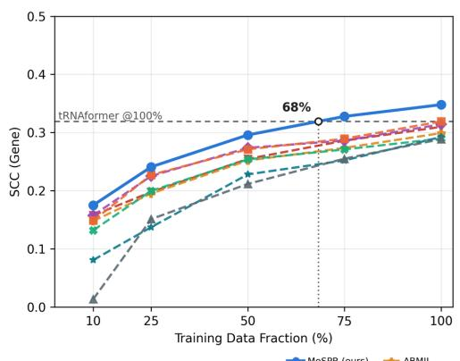

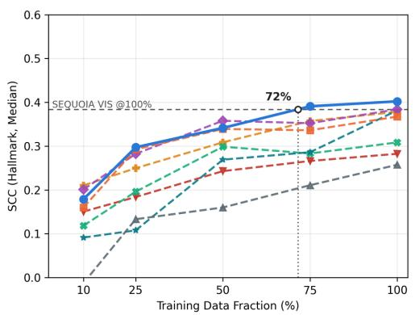

Figure S1: Training-set scaling on TCGA-KIRC. Gene-expression prediction performance (left) and Hallmark pathway reconstruction performance (right) are shown across increasing fractions of the training data.  
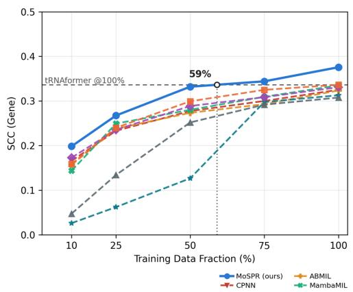

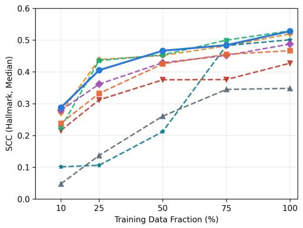  
Figure S2: Training-set scaling on TCGA-LUAD. Gene-expression prediction performance (left) and Hallmark pathway reconstruction performance (right) are shown across increasing fractions of the training data.