# Multi-Scale Semantic Mapping in Urban Environments via Observation Calibration and Policy Dependence Regularization

Runling Long, Junhao Feng, Jia Wan Harbin Institute of Technology, Shenzhen

## Abstract

Semantic mapping is fundamental to embodied navigation, yet existing methods are developed for indoor environments, where objects exhibit relatively limited scale variation and are observed from a restricted range of viewpoints. Urban environments pose substantially greater challenges: agents must map objects ranging from pedestrians to buildings while navigating large spaces with highly diverse viewing distances. These conditions introduce two key difficulties that existing datasets and methods fail to cover. First, object scale and observation distance can be severely mismatched. For example, small objects may be viewed from far away, whereas large objects may be observed at extremely close range, resulting in unreliable observation likelihoods. Second, objects with substantially different sizes and geometries require distinct mapping behaviors, which are difficult to capture with a single shared value estimator. To investigate these challenges, we introduce a largescale urban semantic mapping dataset featuring realistic city layouts, high-fidelity rendering, and instance-level annotations spanning multiple object scales. We then propose a category-aware likelihood calibration policy that identifies and alleviates unreliable observations according to object category and viewing distance. Because the calibration and motion policies are optimized toward the same mapping objective, they may learn redundant shortcuts and become excessively coupled. We therefore introduce a mutual-information (MI) regularizer that penalizes their estimated representation dependence and encourages complementary behaviors. To better model heterogeneous mapping strategies across object scales, we further employ category-wise value estimators. We formulate their joint optimization as a Pareto optimization problem to mitigate conflicting gradients across categories. Experiments demonstrate that our approach consistently outperforms state-of-theart semantic mapping methods in challenging urban environments. The dataset and code will be publicly released.

## 1 Introduction

Semantic mapping transforms online visual observations into persistent spatial semantics for embodied AI. It has improved indoor navigation through semantic priors [8, 29, 32, 25, 48, 17], and is increasingly used as a grid- or graph-based representation in outdoor navigation [45, 19, 42, 43, 31, 26, 16]. These trends make accurate semantic mapping essential for frontier navigation.

However, existing studies do not fully capture the challenges of semantic mapping in cities, where objects exhibit substantial scale variation. As illustrated in Fig. 1, existing indoor semantic mapping is conducted in compact spaces with nearby objects, while our task requires mapping multi-scale urban objects across larger navigable areas. We analyze this gap from two aspects.

(a)  
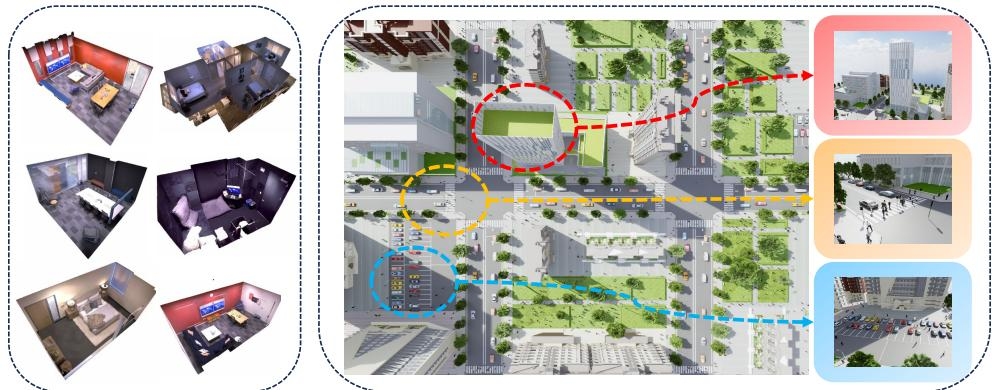  
(b)  
Figure 1: Existing indoor semantic mapping (a) vs. our multi-scale urban semantic mapping scenes (b). Ours explicitly considers the multi-scale objects and large navigable areas challenge, which is essential for outdoor navigation.

From a dataset perspective, indoor navigation datasets [5, 36, 44] mainly contain household object such as sofas, beds, and TVs, whose scales are relatively similar. Consequently, they cannot support multi-scale semantic mapping. Existing outdoor navigation datasets (e.g., [26, 43]) include multiscale objects such as cars and buildings, yet they lack object-level annotations. This makes it impossible to extract semantic maps from these datasets, and thus makes them unsuitable for our task.

From a methodological standpoint, methods with the same objective as ours, i.e., actively constructing a semantic map, are mainly developed and evaluated indoors [46, 10, 9, 2, 11, 12, 28, 24]. Although they can be applied to our task, their behavior in large-scale city scenes remains unclear, due to the limited variation in object scale and narrow navigation space of their datasets. Existing city-level navigation methods [26, 16] are typically designed for Vision-Language Navigation (VLN). Even when some methods use semantic maps, their task settings require the agent to only focus on limited objects in one episode. By contrast, our task requires full-scene semantic mapping. Therefore, these methods have substantially different task contexts from ours, and they lack specific designs for multi-scale objects.

Based on this gap analysis, we develop a simulator that explicitly reflects the multi-scale challenges in urban environments. The simulator covers object volumes from 0.01 m3 to 208.47k m3, including urban elements such as pedestrians, cars, and skyscrapers. The simulator uses Geographic Information System (GIS) [6] to derive real-world street and block layouts, and then uses an LLM’s common knowledge of urban environments to plan context-appropriate buildings and object distributions, ensuring authenticity and variety. A professional robotic simulator is then used to provide photo-level high-fidelity rendering with GPU parallelization. These designs model the visual conditions of real-world cities, and enable efficient data generation and agent training.

We then propose an RL agent that tackles the multi-scale challenges. Since the vision models used by the agent are not trained for each semantic-viewpoint distribution, they generate unreliable visual likelihoods when the viewpoint is suboptimal, e.g., observing pedestrians from far away while observing buildings from a very close range. To address this mismatch of object scale and viewing distance, we propose to train a likelihood calibration policy that estimates per-category map updating strength at grids to mitigate the effects of erroneous likelihoods. This module is trained along with the motion policy without fine-tuning vision models, improving mapping accuracy with a lightweight approach.

The calibration and motion policies are designed to play complementary roles. However, because they are jointly optimized toward the same mapping objective, their representations may become dependent through shared map-improving cues. We mathematically illustrate that when such dependence arises, it can impair joint policy optimization and lower performance. We therefore introduce an MI-based regularizer that penalizes the estimated dependence between their representations, alleviating the risk of redundant shortcut learning.

<table><tr><td></td><td></td><td></td><td></td><td></td><td>Object volume (m³)</td><td>Avg. objects/scene</td><td>Obj.-level ann.</td></tr><tr><td>Dataset OpenFly [19]</td><td>Type VLN</td><td>Platform UE4</td><td>Scenes 21</td><td>Scale</td><td></td><td></td><td></td></tr><tr><td>EmbodiedCity [18]</td><td>VLN</td><td>UE5</td><td>1</td><td>City</td><td>10-100k 2-100k</td><td>一 -</td><td>X X</td></tr><tr><td>UrbanScene 3D [30]</td><td></td><td></td><td></td><td></td><td></td><td></td><td></td></tr><tr><td></td><td>Map</td><td>UE4 Habitat</td><td>16</td><td>City</td><td>10 - 100k 0.2 - 5.0</td><td>865.0</td><td>X X</td></tr><tr><td>GLEAM [12] MP3D [5]</td><td>Map Sem-Map</td><td>Habitat</td><td>1152 90</td><td>House House</td><td>0.2 - 5.0</td><td>564.6</td><td>√</td></tr><tr><td>EmbodiedScan [41]</td><td>Sem-Map</td><td>Habitat</td><td>5185</td><td>House</td><td>0.2 - 5.0</td><td>30.9</td><td>√</td></tr><tr><td>Ours</td><td>Sem-Map</td><td>Isaac Sim</td><td>80</td><td>City</td><td>0.01 - 208.47k</td><td>9323.6</td><td>V</td></tr></table>

Table 1: Dataset comparison. Ours contains objects spanning a wide scale range and explicit objectlevel annotations.

For policy optimization, multi-scale objects require different mapping policies because their optimal observation positions differ substantially. This makes it difficult for the original single value predictor to model policy advantages due to limited representation ability. To better model these advantages, we propose predicting values for each category. Since this may introduce gradient conflicts among different value estimators, we identify this as a Pareto optimization problem, and use a gradient balancing method to alleviate the conflicts. This modeling achieves the final performance improvement.

Our contributions are:

• We formulate multi-scale semantic mapping in urban environments, highlighting the challenges introduced by extreme variations in object size and observation distance. To support research on this problem, we introduce a large-scale dataset with realistic city layouts, high-fidelity rendering, and multi-scale instance-level annotations.

• We propose a category-aware likelihood calibration policy that alleviates unreliable observations arising from mismatches between object scale and viewing distance. We further introduce an MI regularizer to encourage complementary behavior learning and restrict harmful dependence between the calibration and motion policies.

• We develop category-wise value estimators to capture the heterogeneous mapping strategies required by objects at different scales. To address gradient conflicts among these estimators, we formulate policy learning as a Pareto optimization problem that balances their objectives.

## 2 Related Work

## 2.1 Dataset

Existing semantic mapping datasets are for indoor environments and cannot support multi-scale urban semantic mapping. Indoor datasets such as Replica [40], ScanNet [15], and EmbodiedScan [41] provide 3D scans and semantic labels, but mainly contain household objects with limited scale variation and relatively small navigation areas. Outdoor datasets such as OpenFly [19], OpenUAV [43], EmbodiedCity [18], and UrbanScene3D [30] contain city-level scenes and larger objects, but are often designed for VLN or navigation and lack object-level labels such as quantities, positions, and 3D meshes, making them unsuitable for our task.

Tab. 1 compares these datasets. Our dataset explicitly measures object scales from 0.01 m3 to 208.47k m3 and provides object-level annotations for active mapping tasks.

## 2.2 Active Semantic Mapping

Active semantic mapping reconstructs a semantic map while planning viewpoints online. Existing full-map methods [2, 10, 9] often select views by map uncertainty over grid-based, NeRF, or 3DGS representations [46, 24, 28]. Learning-based methods [7, 11, 12, 23] model future gains, but many focus on geometry or indoor scenes.

Other methods use semantic maps for Object Navigation [21, 22, 37, 20, 47]. These methods usually target one or a few objects rather than optimizing full-scene semantic reconstruction. Overall, existing approaches lack designs for large-scale outdoor perception and multi-scale planning; our method addresses this gap with likelihood calibration and scale-aware planning.

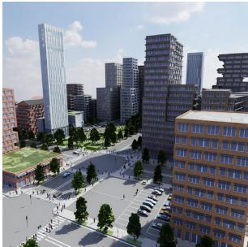

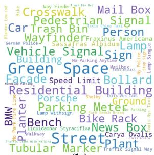  
(b)

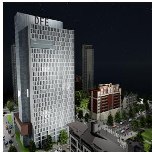

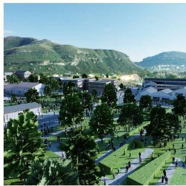  
(a)

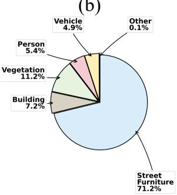  
(c)  
Figure 2: Dataset visualization. (a) High-fidelity visual conditions of the simulator. (b) Object name word cloud, showing the semantic diversity of generated urban objects. (c) Merged object category distribution.

## 3 Dataset

Existing outdoor navigation datasets lack object-level annotations, scene diversity, and control over multi-scale semantics. We therefore construct a fully simulated urban dataset by generating city structures and semantic object placements, then rendering annotated RGB-D observations under diverse visual conditions.

## 3.1 Scene Generation

We use CityEngine [3], a professional city-planning tool widely used in the building industry, to plan city layouts. It imports real-world GIS data including street graph and building block layouts from georeferenced OSM street networks [4]. We select diverse layouts covering real-world environments such as central business districts, towns, suburbs, and rural areas. The type of the GIS data is used for further planning.

We plan building block details with a hierarchical LLM-assisted process. Given the GIS scene type, the LLM uses its knowledge of real-world cities to assign block semantics such as residential, commercial, or public green areas. Conditioned on the scene and block types, it specifies crowd or vehicle distributions, architectural appearance, and visual style. This information is then input into CityEngine to generate assets. This process simulates urban spatial organization and objec co-occurrence while enabling controlled scene diversity.

## 3.2 Rendering for Robotic Training

Isaac Sim RTX [33] renders the assets into RGB-D observations. It contains diverse lighting conditions such as sunny daytime, nighttime, and dusk. GPU parallel processing enables efficient robotic training across the simulated environments. Fig. 2 summarizes their visual and semantic statistics, showing that our simulator provides high-fidelity data with diversity.

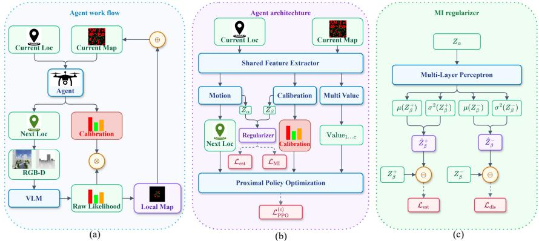  
Figure 3: (a) The agent workflow. The agent additionally predicts a likelihood calibration. (b) The agent architecture, with a CLUB module for motion-perception dependence regularization and a multi-class value head. (c) The CLUB module uses the motion latent $Z _ { \alpha }$ to estimate positive and negative perception latents $Z _ { \beta } ^ { + }$ and $Z _ { \beta } ^ { - }$ . The resulting joint-marginal likelihood gap penalizes estimated MI during policy training.

## 4 Method

We first define the task, then present three core components: likelihood calibration for unreliable observation alleviation, scale-calibration and motion dependence regularization for complementary behavior learning, and Pareto frontier exploration for balancing multi-scale value optimization. The overall framework is shown in Fig. 3.

## 4.1 Task Definition

In our task, an agent is initialized in an environment without any environmental priors. At each time step i, it captures RGB-D images, computes per-pixel semantic likelihoods using a VLM, and projects these egocentric likelihoods to a 2D plane to form a local semantic map mi. At time step t, the agent’s observation is defined as the historical context $z _ { 1 : t } = \{ ( m _ { i } , \mathbf { p } _ { i } ) \} _ { i = 1 } ^ { t }$ , where p denotes the historical agent pose. The current local map $m _ { t }$ is fused into the global map, and the motion policy $\pi _ { \theta } ( \boldsymbol { a } \mid \boldsymbol { z } _ { 1 : t } )$ predicts the next action distribution. After selecting the most probable action, the agent moves to the next location and repeats this procedure until reaching the maximum number of steps. The final global map is used as the semantic reconstruction. This workflow is demonstrated in Fig. 3(a).

## 4.2 Likelihood Calibration

In large-scale scenes, multi-scale objects are often observed from suboptimal positions due to large navigable spaces. Since the vision module is not trained for every semantic-spatial configuration, such observations may produce unreliable likelihoods (e.g., pedestrians at 100 m vs. buildings at 10 m). We therefore predict category-wise update strengths to mitigate the effects of such erroneous likelihoods.

We apply a standard Bayesian updating framework [46] to fuse the local and global semantic maps. In basic Bayesian updating, the observation likelihood is directly used to compute the map posterior. While this approach suffices in settings without mismatch, we calibrate the Bayesian updating rule to mitigate erroneous likelihoods caused by suboptimal observations in large-scale scenes:

$$
P ( c \mid z _ { 1 : t } , v ) = \frac { \exp { ( \beta _ { t , v , c } \cdot l _ { v , c } ) } } { \sum _ { j = 1 } ^ { C } \exp { ( \beta _ { t , v , j } \cdot l _ { v , j } ) } } .\tag{1}
$$

where $l _ { v } \in \mathbb { R } ^ { C }$ denotes the raw VLM logits at voxel $v ,$ and $\beta _ { t , v , c } \sim \pi _ { \theta } ^ { \beta } ( \cdot \mid z _ { 1 : t } , v )$ is the spatialsemantic calibration vector. Since the input of the policy contains historical positions and updated map, the calibration also captures historical context and local cues, including occlusion, range, and height. We train it jointly with the motion policy instead of fine-tuning the VLM. The calibrated likelihood is then fused into the global semantic map using the binary log-odds rule:

$$
L _ { v , c } ^ { t } = L _ { v , c } ^ { t - 1 } + \log \left( \frac { P ( c \mid z _ { 1 : t } , v ) } { 1 - P ( c \mid z _ { 1 : t } , v ) } \right) .\tag{2}
$$

By applying Eqs. 1 and 2 along the trajectory, the semantic map is constructed.

## 4.3 Scale Calibration and Dependence Regularization

The calibration and motion policies are optimized with the shared semantic mapping objective. Yet this joint optimization risks coupling their representations around map-improving cues. Once the coupling is severe, one policy may learn shortcuts that depend on the other policy, instead of learning robust complementary calibration and planning behaviors. Such shortcuts may reduce generalization, since a failure mode in one policy may propagate to the other.

To analyze the drawback that potential policy coupling may introduce, we consider a variational formulation of map reconstruction [13]. We assume a latent encoding process $q _ { \phi } ( Z _ { \alpha } , Z _ { \beta } \mid z _ { 1 : t } )$ where $Z _ { \alpha }$ and $Z _ { \beta }$ represent the extracted motion and calibration policy features. The Evidence Lower Bound (ELBO) of the mapping objective is formulated as:

$$
\begin{array} { r l } & { \mathcal { L } _ { \mathrm { E L B O } } = \mathbb { E } _ { q _ { \phi } ( Z _ { \alpha } , Z _ { \beta } | z _ { 1 : t } ) } \left[ \log p ( M \mid Z _ { \alpha } , Z _ { \beta } ) \right] } \\ & { \qquad - \underbrace { \mathcal { D } _ { K L } \left( q _ { \phi } ( Z _ { \alpha } , Z _ { \beta } \mid z _ { 1 : t } ) \parallel p ( Z _ { \alpha } , Z _ { \beta } ) \right) } _ { D _ { K L } } . } \end{array}\tag{3}
$$

Assuming a factorized prior $p ( Z _ { \alpha } , Z _ { \beta } ) = p ( Z _ { \alpha } ) p ( Z _ { \beta } )$ , we expand the KL divergence term as in Eq. 4. For brevity, let $q _ { \alpha \beta } = q _ { \phi } ( Z _ { \alpha } , Z _ { \beta } \mid z _ { 1 : t } ) , q _ { \alpha } = q _ { \phi } ( Z _ { \alpha } \mid z _ { 1 : t } )$ , and $q _ { \beta } = q _ { \phi } ( Z _ { \beta } \mid z _ { 1 : t } )$

$$
\begin{array} { r l } & { \mathcal { D } _ { K L } = \displaystyle \iint { q _ { \alpha \beta } \log \frac { q _ { \alpha \beta } } { p ( Z _ { \alpha } ) p ( Z _ { \beta } ) } d Z _ { \alpha } d Z _ { \beta } } } \\ & { \quad \quad = \underbrace { \iint q _ { \alpha \beta } \log \frac { q _ { \alpha \beta } } { q _ { \alpha } q _ { \beta } } d Z _ { \alpha } d Z _ { \beta } } _ { I _ { q } ( Z _ { \alpha } ; Z _ { \beta } | z _ { 1 : t } ) } } \\ & { \quad \quad + \underbrace { \int q _ { \alpha } \log \frac { q _ { \alpha } } { p ( Z _ { \alpha } ) } d Z _ { \alpha } } _ { \mathcal { D } _ { K L } ( q _ { \alpha } | p ( Z _ { \alpha } ) ) } + \underbrace { \int q _ { \beta } \log \frac { q _ { \beta } } { p ( Z _ { \beta } ) } d Z _ { \beta } } _ { \mathcal { D } _ { K L } ( q _ { \beta } | p ( Z _ { \alpha } ) ) } . } \end{array}\tag{4}
$$

The term ${ \cal I } _ { \sc } ( Z _ { \alpha } ; Z _ { \beta } \mid z _ { 1 : t } )$ is the MI between the two policies and measures the degree of their dependence. It lowers the ELBO when the marginal KL terms are fixed, indicating that the distributional divergence between the reconstructed map and the real map may increase. This motivates us to penalize the MI during policy optimization. Let ${ \mathcal { I } } _ { \mathrm { m a p } } ( \phi )$ denote the expected return under the semantic mapping reward. We formulate the constrained policy objective as

$$
\operatorname* { m a x } _ { \phi } \mathcal { I } _ { \operatorname* { m a p } } ( \phi ) \quad \mathrm { s . t . } \quad I _ { q } ( Z _ { \alpha } ; Z _ { \beta } \mid z _ { 1 : t } ) \leq \delta ,\tag{5}
$$

The Lagrangian of Eq. 5 is $\mathcal { I } ( \phi , k ) = \mathcal { I } _ { \mathrm { m a p } } ( \phi ) - k [ I _ { q } ( Z _ { \alpha } ; Z _ { \beta } \mid z _ { 1 : t } ) - \delta ]$ , where $k \geq 0$ . Since kδ is a constant, it can be omitted during optimization, yielding an MI regularization term weighted by k. Note that since this regularizer is weighted and does not impose the stronger assumption of statistical independence, it only suppresses extreme policy coupling. As a result, the beneficial coupling is not completely eliminated.

To estimate the intractable MI term ${ \cal I } _ { \sc } ( Z _ { \alpha } ; Z _ { \beta } \mid z _ { 1 : t } )$ , we employ the Contrastive Log-ratio Upper Bound (CLUB) [14]. We introduce a variational predictor $q _ { \mu } \mathbf { \bar { ( } } Z _ { \beta } \mid Z _ { \alpha } )$ , parameterized by a neural network $\mu ,$ to estimate the conditional density of the perceptual latent given the motion latent. For a training batch of size N, the predictor is trained by minimizing the Negative Log-Likelihood:

$$
\mathcal { L } _ { \mathrm { e s t i m a t o r } } = - \frac { 1 } { N } \sum _ { i = 1 } ^ { N } \log q _ { \mu } ( Z _ { \beta } ^ { ( i ) } \mid Z _ { \alpha } ^ { ( i ) } ) .\tag{6}
$$

During the policy update, $\mu$ is fixed and $q _ { \phi } ( Z _ { \alpha } , Z _ { \beta } \mid z _ { 1 : t } )$ is optimized with the estimated MI penalty. The MI regularization loss is defined as the difference between the log-likelihood of joint samples and the average log-likelihood of marginal samples:

$$
\begin{array} { r l } & { \mathcal { L } _ { \mathrm { M I } } = \mathbb { E } _ { q _ { \phi } ( Z _ { \alpha } , Z _ { \beta } | z _ { 1 : t } ) } \left[ \log q _ { \mu } ( Z _ { \beta } \mid Z _ { \alpha } ) \right] } \\ & { \phantom { a a a a a a a a a a a a a a a a a a a a a a a a a a a a a a a a a a a a a a a a a a a a a a a a a a a a a a a a a a a a a a } - \mathbb { E } _ { q _ { \phi } ( Z _ { \alpha } | z _ { 1 : t } ) q _ { \phi } ( Z _ { \beta } | z _ { 1 : t } ) } \left[ \log q _ { \mu } ( Z _ { \beta } \mid Z _ { \alpha } ) \right] . } \end{array}\tag{7}
$$

<table><tr><td>Method</td><td colspan="6">CCR (%) ↑</td></tr><tr><td></td><td colspan="2"> $c _ { \mathrm { s m a l l } }$ </td><td colspan="2"> $c _ { \mathrm { m e d i u m } }$ </td><td colspan="2"> $c _ { \mathrm { l a r g e } }$ </td></tr><tr><td></td><td>CLIP</td><td> $\mathrm { D I N O v } 3$ </td><td>CLIP</td><td> $\mathrm { D I N O v } 3$ </td><td>CLIP</td><td> $\mathrm { D I N O v } 3$ </td></tr><tr><td>Uncertainty</td><td> $6 1 . 7 { \pm } 0 . 3 $ </td><td> $6 2 . 9 { \pm } 1 . 9$ </td><td> $7 4 . 7 { \pm } 3 . 4 $ </td><td> $7 8 . 5 { \pm 2 . 1 }$ </td><td> $9 5 . 5 { \pm 2 . 1 }$ </td><td> $9 6 . 2 { \pm } 1 . 3 $ </td></tr><tr><td>Zhang et ai.</td><td> $5 2 . 5 { \pm } 1 . 5 $ </td><td> $5 4 . 7 { \pm } 4 . 8 $ </td><td> $7 5 . 3 { \pm } 4 . 2 $ </td><td> $7 9 . 7 { \pm } 3 . 3 $ </td><td> $9 6 . 5 { \pm } 0 . 7 \ $ </td><td> $9 7 . 9 { \pm } 0 . 7 $ </td></tr><tr><td>RayFronts</td><td> $2 8 . 5 { \pm } 5 . 1 $ </td><td> $2 7 . 8 { \pm } 4 . 4 $ </td><td> $5 9 . 8 { \pm } 8 . 6 $ </td><td> $6 2 . 6 { \pm } 6 . 9$ </td><td> $9 1 . 9 { \pm } 2 . 2 $ </td><td> $9 2 . 2 { \pm } 3 . 5 $ </td></tr><tr><td>ActiveSGM</td><td> $5 7 . 6 { \pm } 4 . 8 $ </td><td> $6 0 . 2 { \pm } 6 . 6 $ </td><td> $9 3 . 8 { \pm } 2 . 4 $ </td><td> $9 5 . 6 { \pm } 2 . 2 $ </td><td> $9 5 . 7 { \pm } 2 . 4 $ </td><td> $9 7 . 4 { \pm } 1 . 5 $ </td></tr><tr><td>GLEAM</td><td> $8 1 . 1 { \pm } 2 . 1 $ </td><td> $8 2 . 8 { \pm } 0 . 9 $ </td><td> $9 1 . 5 { \pm } 1 . 1 $ </td><td> $9 3 . 7 { \pm } 3 . 4 $ </td><td> $9 7 . 4 { \pm } 1 . 6 $ </td><td> $9 8 . 7 { \pm } 0 . 4 $ </td></tr><tr><td>Ours</td><td> ${ \bf 9 0 . 0 { \pm 1 . 6 } }$ </td><td> ${ \bf 9 3 . 2 { \pm 1 . 0 } }$ </td><td> ${ \bf 9 5 . 9 2 1 . 3 }$ </td><td> ${ \bf 9 8 . 9 2 0 . 8 }$ </td><td> ${ \bf 9 8 . 8 { \pm 0 . 6 } }$ </td><td> ${ \bf 9 9 . 4 } \pm { \bf 0 . 6 }$ </td></tr></table>

<table><tr><td>Method</td><td colspan="2">OCR (%) ↑</td><td colspan="2"> $\mathbf { V a r } \downarrow$ </td></tr><tr><td></td><td>CLIP</td><td>DINOv3</td><td>CLIP</td><td>DINOv3</td></tr><tr><td>Uncertainty</td><td> $7 7 . 3 { \pm } 0 . 7 $ </td><td> $7 9 . 2 { \pm } 0 . 9 $ </td><td> $1 9 7 . 0 { \pm } 2 6 . 9$ </td><td> $1 8 7 . 5 { \pm } 3 3 . 0 $ </td></tr><tr><td>Zhang et al.</td><td> $7 4 . 8 { \pm } 1 . 6 $ </td><td> $7 7 . 4 { \pm } 2 . 1 $ </td><td> $3 2 5 . 3 { \pm } 3 0 . 1 $ </td><td> $3 1 8 . 7 { \pm } 8 2 . 3 $ </td></tr><tr><td>RayFronts</td><td> $6 0 . 1 { \pm } 2 . 2 $ </td><td> $6 0 . 9 { \pm } 2 . 4 $ </td><td> $6 9 1 . 9 { \pm } 1 4 2 . 5 $ </td><td> $7 0 7 . 6 { \pm } 1 6 6 . 0$ </td></tr><tr><td>ActiveSGM</td><td> $8 2 . 3 { \pm } 1 . 7 $ </td><td> $8 4 . 4 \pm 1 . 9$ </td><td> $3 1 3 . 7 { \pm } 7 6 . 4$ </td><td> $3 0 1 . 3 { \pm } 1 0 9 . 4 \ $ </td></tr><tr><td>GLEAM</td><td>90.0±0.5</td><td> $9 1 . 7 { \pm } 1 . 2 $ </td><td> $4 7 . 2 { \pm } 2 0 . 0 \ $ </td><td> $4 6 . 4 { \pm } 1 1 . 4 $ </td></tr><tr><td>Ours</td><td>94.9±0.8</td><td> ${ \bf 9 7 . 1 { \pm 0 . 4 } }$ </td><td> $1 4 . 2 \pm 5 . 8$ </td><td>8.2±3.6</td></tr></table>

Table 2: Comparison with state-of-the-art rule- and learning-based methods using two vision-language feature extractors. Ours achieves the highest OCR and consistent performance across the three scale categories.

## 4.4 Pareto Frontier Exploration

For RL methods such as Proximal Policy Optimization (PPO) [38], a single value head is used to estimate advantages. However, in multi-scale scenarios, objects at different scales require distinct mapping strategies. The size divergence requires the agent to move to different spatial positions to align with their optimal viewpoints. In such cases, a single value head cannot adequately model this complexity. To better model the advantages, we use a separate value prediction for each category. Since the value estimators share the same input features but have different optimization directions, their gradients may conflict. We use Pareto optimization to balance these gradients.

We first separate the coverage reward into a class-wise formulation:

$$
r _ { t + 1 } ^ { \mathrm { C R } } = \mathrm { C R } _ { t + 1 } ^ { ( c ) } - \mathrm { C R } _ { t } ^ { ( c ) } ,\tag{8}
$$

where $\mathrm { C R } _ { t } ^ { \left( c \right) }$ is the coverage ratio of class c at time t. The multi-category loss is then formulated as:

$$
\mathcal { L } _ { \mathrm { c } } = \mathcal { L } _ { \mathrm { P P O } } ^ { ( c ) } + \frac { k } { C } \mathcal { L } _ { \mathrm { M I } } ,\tag{9}
$$

where $\mathcal { L } _ { \mathrm { P P O } } ^ { ( c ) }$ uses the category-specific advantage, k controls MI regularization, and $\mathcal { L } _ { \mathrm { e s t i m a t o r } }$ is used only to train the CLUB predictor. We use Nash-MTL [34] to balance the category gradients. Let $g _ { c } = \nabla _ { \Theta } \mathcal { L } _ { c } ( \Theta )$ and $G = [ g _ { 1 } , \dotsc , g _ { C } ]$ . The Nash weights and shared-parameter update are

$$
G ^ { \top } G \alpha ^ { * } = \frac { 1 } { \alpha ^ { * } } , \quad \alpha ^ { * } \in \mathbb { R } _ { + + } ^ { C } , \qquad \Theta  \Theta - \eta G \alpha ^ { * } ,\tag{10}
$$

where $1 / \alpha ^ { * }$ is the element-wise reciprocal. This bargaining update reduces dominance by any single object scale.

## 5 Experiments

## 5.1 Implementation Details

## 5.1.1 Dataset.

All experiments are conducted in our simulated urban environments. We use 16 scenes as the training set, 4 as the validation set, and 60 scenes not used during training as the test set. The map size is configured as $2 0 0 \mathrm { m } \times 2 0 0$ m for every scene.

## 5.1.2 Metrics.

We group classes by volume into $\mathcal { C } = \{ c _ { \mathrm { s m a l l } } , c _ { \mathrm { m e d i u m } } , c _ { \mathrm { l a r g e } } \}$ using ranges [0.01, 5), [5, 100), and [100, 208.47k] $\mathrm { m ^ { 3 } }$ , respectively. Let $y _ { v }$ and $\hat { y } _ { v }$ be the ground-truth and reconstructed labels at grid v, and ${ \mathcal { V } } _ { c } = \{ v \ \vert \ { \boldsymbol { y } } _ { v } \in c \}$ . We define

$$
\mathrm { C C R } _ { c } = \frac { \sum _ { v \in \mathcal { V } _ { c } } \mathbb { I } [ \hat { y } _ { v } = y _ { v } ] } { | \mathcal { V } _ { c } | } , \qquad \mathrm { O C R } = \frac { 1 } { | \mathcal { C } | } \sum _ { c \in \mathcal { C } } \mathrm { C C R } _ { c } .\tag{11}
$$

Unexplored and incorrectly labeled grids contribute zero. We report these ratios as percentages and use Var for the variance among the three CCRs.

## 5.1.3 Methods.

We compare state-of-the-art semantic mapping methods. 1) Uncertainty [27]. This method selects the next best position by minimizing geometric uncertainty. We equip it with the semantic module to perform semantic mapping. 2) Zhang et al. [46]. We apply the semantic uncertainty calculation method from this work to select the next agent pose that minimizes uncertainty. 3) RayFronts [1]. This method performs semantic mapping based on frontier-based exploration (FBE). 4) ActiveSGM [10]. We apply the exploration policy from this work by jointly calculating geometric and semantic uncertainty. 5) GLEAM [12] is a state-of-the-art RL-based mapping method. We use the semantic reward to match our task setting. All agents share the same pose and camera configuration. We test CLIP [35] and DINOv3 with its official dino.txt text-alignment head [39]. Each model uses its paired visual and text encoders, and their normalized cosine similarities form semantic likelihoods. The maximum number of execution steps for each agent is 384. The input global map resolution is $2 5 6 \times 2 5 6$ . Three random seeds are used for learning-based agents. For testing, three random initial positions are used for all agents.

## 5.1.4 Training.

Our method is trained end-to-end from scratch with PPO. We use a three-layer ResNet as the feature extractor, a batch size of 256, and a learning rate of $1 0 ^ { - 4 }$ . The latent dimensions of $Z _ { \alpha }$ and $Z _ { \beta }$ are both 256, and the CLUB predictor is a 256-to-128 MLP. We set $k = 0 . 1$ in Eq. 9. The agent is trained for $1 0 ^ { 3 }$ episodes. Training is performed on a single RTX 4090 and takes about 19 hours.

## 5.2 Main Results

Tab. 2 reports the main results. Rule-based methods lag behind learning-based agents, especially on $\mathrm { { \it c } _ { s m a l l } }$ , because small objects are reliably mapped only from a narrow range of viewpoints. Learningbased baselines improve exploration through interaction, but still depend on raw VLM likelihoods and remain sensitive to observations from suboptimal ranges. In contrast, our calibration policy mitigates the effects of unreliable likelihoods while the motion policy searches for effective viewpoints, leading to the best OCR and lowest Var under both CLIP and DINOv3 likelihoods.

## 5.3 Ablation Studies

We conduct ablation studies on the proposed modules and report the results in Tab. 3. Adding LC improves the baseline by enabling adaptive likelihood calibration, especially for small objects. Adding MV without gradient balancing is unstable because the category-wise objectives conflict, while PO restores balanced optimization and substantially reduces Var. Adding MI regularization further improves mapping performance, providing task-level evidence that dependence-regularized representations benefit joint policy learning. Combining all components achieves the best OCR and the lowest Var.

## 5.4 Hyperparameter Study

Tab. 4 studies the sensitivity to the MI regularization weight k. When k is small, the penalty is weak and performance remains close to the Pareto-only setting in Tab. 3. With a moderate $k ,$ mapping performance improves and multi-scale variance decreases, showing the benefit of balancing task optimization and the estimated-MI penalty. When k is too large, this penalty dominates the update and degrades performance. We select k by the highest validation-set reward and fix it for testing.

<table><tr><td colspan="4">Components</td><td colspan="3">CCR (%) ↑</td><td rowspan="2">OCR (%) ↑</td><td rowspan="2">Var ↓</td></tr><tr><td>LC</td><td>MV</td><td>PO</td><td>MI</td><td> $c _ { \mathrm { s m a l l } }$ </td><td> $c _ { \mathrm { m e d i u m } }$ </td><td> $c _ { \mathrm { l a r g e } }$ </td></tr><tr><td></td><td>一</td><td>一</td><td>一</td><td>82.0</td><td>97.4</td><td>99.1</td><td>92.8</td><td>59.5</td></tr><tr><td>-√</td><td>1</td><td>一</td><td></td><td>84.3</td><td>96.8</td><td>99.2</td><td>93.4</td><td>42.9</td></tr><tr><td>√</td><td>√</td><td>一</td><td>1</td><td>50.2</td><td>86.5</td><td>99.4</td><td>78.7</td><td>433.9</td></tr><tr><td>√</td><td>√</td><td>V</td><td>一</td><td>92.1</td><td>97.5</td><td>99.8</td><td>96.5</td><td>10.4</td></tr><tr><td> $\checkmark$ </td><td>一</td><td>一</td><td>√</td><td>88.3</td><td>96.2</td><td>99.7</td><td>94.7</td><td>22.7</td></tr><tr><td> $\checkmark$ </td><td> $\checkmark$ </td><td>√</td><td> $\checkmark$ </td><td>93.5</td><td>99.6</td><td>99.7</td><td>97.6</td><td>8.4</td></tr></table>

Table 3: Ablation studies on the main components. LC denotes likelihood calibration, MV denotes multi-value prediction, PO denotes Pareto optimization, and MI denotes mutual-information dependence regularization. The row with all components enabled is the full model.

<table><tr><td rowspan="2">k</td><td colspan="3">CCR (%) ↑</td><td rowspan="2">OCR (%) ↑</td><td rowspan="2">Var ↓</td></tr><tr><td> $c _ { \mathrm { s m a l l } }$ </td><td> $c _ { \mathrm { m e d i u m } }$ </td><td> $c _ { \mathrm { l a r g e } }$ </td></tr><tr><td>0.01</td><td>91.0</td><td>98.5</td><td>99.8</td><td>96.4</td><td>14.9</td></tr><tr><td>0.05</td><td>92.7</td><td>98.5</td><td>99.8</td><td>97.0</td><td>9.6</td></tr><tr><td>0.10</td><td>93.5</td><td>99.6</td><td>99.7</td><td>97.6</td><td>8.4</td></tr><tr><td>0.15</td><td>90.4</td><td>98.5</td><td>99.8</td><td>96.2</td><td>17.3</td></tr><tr><td>0.20</td><td>87.8</td><td>96.1</td><td>99.9</td><td>94.6</td><td>25.4</td></tr></table>

Table 4: Sensitivity to the MI regularization weight k.

## 5.5 Performance Analysis

## 5.5.1 Pareto Frontier.

We study the Pareto frontier by varying the reward allocation between $c _ { \mathrm { s m a l l } }$ and $c _ { \mathrm { l a r g e } } ,$ , using LC as the baseline. As shown in Fig. 4(a), our method achieves the most balanced performance across the two classes, indicating that Pareto optimization alleviates gradient conflicts and moves the policy toward the frontier.

## 5.5.2 Dependence Regularization.

Fig. 4(b) compares the training curves of LC and LC with MI on $c _ { \mathrm { s m a l l } } .$ . MI stabilizes training after about 500 episodes and reaches higher final performance, while LC fluctuates around a lower mean performance. This shows that MI regularization supports more stable and effective learning.

## 5.5.3 Likelihood Calibration.

We compare fixed likelihood scaling with our learned perception policy trained using LC and MI. MI serves only as a training-time regularizer, and its CLUB predictor is discarded after training; it therefore introduces no additional inference-time modules, parameters, or computation. We disable Pareto optimization in this comparison. As shown in Tab. 5, context-adaptive likelihood calibration with MI dependence regularization consistently outperforms fixed global weights, showing the effectiveness of the learned calibration.

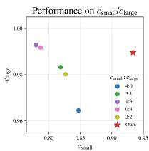  
(a)

(b)  
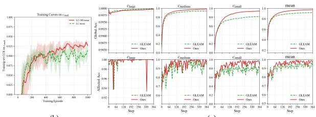  
(c)

Figure 4: (a) Performance on $c _ { \mathrm { s m a l l } }$ and $c _ { \mathrm { l a r g e } }$ under different reward allocations; ours is more balanced and closer to the Pareto frontier. (b) Training-set CCR on $c _ { \mathrm { s m a l l } } $ ; MI stabilizes training and improves final performance. (c) Step-level test performance. The rows show global-map and affected-grid accuracy; ours achieves faster coverage and more accurate updates than GLEAM.  
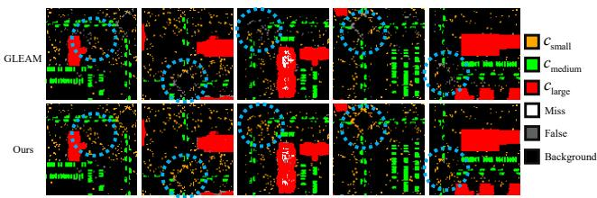  
Figure 5: Qualitative semantic maps from ours and GLEAM. Colors denote correct classes; white, gray, and black denote unexplored regions, errors, and background. GLEAM misses small objects frequently, whereas ours maintains consistent multi-scale coverage.

<table><tr><td rowspan="2">Method</td><td colspan="3">CCR (%) ↑</td><td rowspan="2">OCR (%) ↑</td><td rowspan="2">Var ↓</td></tr><tr><td> $c _ { \mathrm { s m a l l } }$ </td><td> $c _ { \mathrm { m e d i u m } }$ </td><td> $c _ { \mathrm { l a r g e } }$ </td></tr><tr><td>GLEAM-0.2</td><td>78.9</td><td>92.4</td><td>98.4</td><td>89.9</td><td>66.2</td></tr><tr><td>GLEAM-0.6</td><td>80.6</td><td>93.2</td><td>99.2</td><td>91.0</td><td>60.2</td></tr><tr><td>GLEAM-1.0</td><td>83.7</td><td>93.3</td><td>98.8</td><td>91.9</td><td>38.8</td></tr><tr><td>GLEAM-1.4</td><td>80.3</td><td>94.5</td><td>99.4</td><td>91.4</td><td>65.5</td></tr><tr><td>GLEAM-1.8</td><td>76.3</td><td>95.8</td><td>98.5</td><td>90.2</td><td>97.4</td></tr><tr><td>Ours</td><td>88.3</td><td>96.2</td><td>99.7</td><td>94.7</td><td>22.7</td></tr></table>

Table 5: Fixed likelihood scaling versus learned adaptive calibration trained with LC and MI. ‘GLEAM-x’ uses a fixed likelihood weight of x. MI introduces no additional inference-time modules or parameters.

## 5.5.4 Step-level Performance.

We further compare step-level performance with GLEAM by measuring global-map accuracy and affected-grid accuracy after each update. Fig. 4(c) shows that our method improves mapping speed and local update accuracy, validating the effectiveness of calibration.

## 5.6 Visualization

Fig. 5 visualizes reconstructed semantic maps. Compared with GLEAM, our method reduces missed small objects and incomplete exploration, producing more consistent maps across object scales.

## 6 Conclusion

In this paper, we propose Multi-Scale Semantic Mapping, which differs from existing semantic mapping tasks by introducing objects with significant size divergence. We build a simulated urban dataset using real-world city layouts with LLM planning and high-fidelity rendering to model realworld urban conditions and large object-scale variations. To mitigate erroneous likelihoods caused by suboptimal observations in large simulated urban environments, we introduce a likelihood calibration module that predicts map updating strengths, thereby improving mapping accuracy. To mitigate performance drop caused by potential calibration and motion policy dependence, we penalize their estimated representation mutual information during training, encouraging complementary behavior learning. To learn the heterogeneous mapping strategies required by objects at different scales, we use category-wise value heads to model the complex policy advantages, and use Pareto optimization to balance the gradient conflicts. Experimental results show that our method outperforms existing rule-based and learning-based methods, especially on small-scale objects. Since none of existing methods consider dynamic semantic mapping currently, we do not aim to solve this challenge setting in this work. Future work will extend the method to dynamic objects.

## References

[1] Omar Alama, Avigyan Bhattacharya, Haoyang He, Seungchan Kim, Yuheng Qiu, Wenshan Wang, Cherie Ho, Nikhil Varma Keetha, and Sebastian A. Scherer. Rayfronts: Open-set semantic ray frontiers for online scene understanding and exploration. In IEEE/RSJ International Conference on Intelligent Robots and Systems (IROS), pages 5930–5937, 2025.

[2] Arash Asgharivaskasi and Nikolay Atanasov. Semantic octree mapping and shannon mutual information computation for robot exploration. IEEE Transactions on Robotics, 39(3):1910– 1928, 2023.

[3] Ibrahim M. Badwi, Hisham M. Ellaithy, and Hidi E. Youssef. 3d-gis parametric modelling for virtual urban simulation using cityengine. Annals ofGIS, 28(3):325–341, 2022.

[4] Jonathan Bennett. OpenStreetMap. Packt Publishing Ltd, 2010.

[5] Angel X. Chang, Angela Dai, Thomas A. Funkhouser, Maciej Halber, Matthias Nießner, Manolis Savva, Shuran Song, Andy Zeng, and Yinda Zhang. Matterport3d: Learning from rgb-d data in indoor environments. In International Conference on 3D Vision (3DV), pages 667–676, 2017.

[6] Kang-Tsung Chang. Geographic information system. International encyclopedia of geography: people, the earth, environment and technology, pages 1–10, 2016.

[7] Devendra Singh Chaplot, Dhiraj Gandhi, Saurabh Gupta, Abhinav Gupta, and Ruslan Salakhutdinov. Learning to explore using active neural SLAM. In International Conference on Learning Representations, 2020.

[8] Devendra Singh Chaplot, Dhiraj Prakashchand Gandhi, Abhinav Gupta, and Ruslan Salakhutdinov. Object goal navigation using goal-oriented semantic exploration. In Advances in Neural Information Processing Systems, volume 33, pages 4247–4258, 2020.

[9] Liyan Chen, Huangying Zhan, Kevin Chen, Xiangyu Xu, Qingan Yan, Changjiang Cai, and Yi Xu. Activegamer: Active gaussian mapping through efficient rendering. In Proceedings of the IEEE/CVF Conference on Computer Vision and Pattern Recognition, pages 16486–16497, 2025.

[10] Liyan Chen, Huangying Zhan, Hairong Yin, Yi Xu, and Philippos Mordohai. Understanding while exploring: Semantics-driven active mapping. In Advances in Neural Information Processing Systems, volume 38, 2025.

[11] Xiao Chen, Quanyi Li, Tai Wang, Tianfan Xue, and Jiangmiao Pang. Gennbv: Generalizable next-best-view policy for active 3d reconstruction. In Proceedings of the IEEE/CVF Conference on Computer Vision and Pattern Recognition, pages 16436–16445, 2024.

[12] Xiao Chen, Tai Wang, Quanyi Li, Tao Huang, Jiangmiao Pang, and Tianfan Xue. GLEAM: Learning generalizable exploration policy for active mapping in complex 3d indoor scenes. In Proceedings ofthe IEEE/CVF International Conference on Computer Vision, pages 5558–5568, 2025.

[13] Jiyu Cheng, Junhui Fan, Xiaolei Li, Paul L Rosin, Yibin Li, and Wei Zhang. Asymmetric information enhanced mapping framework for multirobot exploration based on deep reinforcement learning. IEEE Transactions on Robotics, 41:6250–6266, 2025.

[14] Pengyu Cheng, Weituo Hao, Shuyang Dai, Jiachang Liu, Zhe Gan, and Lawrence Carin. Club: A contrastive log-ratio upper bound of mutual information. In International conference on machine learning, pages 1779–1788. PMLR, 2020.

[15] Angela Dai, Angel X Chang, Manolis Savva, Maciej Halber, Thomas Funkhouser, and Matthias Nießner. Scannet: Richly-annotated 3d reconstructions of indoor scenes. In Proceedings of the IEEE conference on computer vision and pattern recognition, pages 5828–5839, 2017.

[16] Hongbo Duan, Shangyi Luo, Zhiyuan Deng, Yanbo Chen, Yuanhao Chiang, Yi Liu, Fangming Liu, and Xueqian Wang. CAUSALNAV: A long-term embodied navigation system for autonomous mobile robots in dynamic outdoor scenarios. IEEE Robotics and Automation Letters, 11(3):3198–3205, 2026.

[17] Samir Yitzhak Gadre, Mitchell Wortsman, Gabriel Ilharco, Ludwig Schmidt, and Shuran Song. Cows on pasture: Baselines and benchmarks for language-driven zero-shot object navigation. In Proceedings of the IEEE/CVF Conference on Computer Vision and Pattern Recognition, pages 23171–23181, 2023.

[18] Chen Gao, Baining Zhao, Weichen Zhang, Jinzhu Mao, Jun Zhang, Zhiheng Zheng, Fanhang Man, Jianjie Fang, Zile Zhou, Jinqiang Cui, Xinlei Chen, and Yong Li. Embodiedcity: A benchmark platform for embodied agent in real-world city environment, 2024.

[19] Yunpeng Gao, Chenhui Li, Zhongrui You, Junli Liu, Zhen Li, Pengan Chen, Qizhi Chen, Zhonghan Tang, Liansheng Wang, Penghui Yang, et al. OpenFly: A comprehensive platform for aerial vision-language navigation. In International Conference on Learning Representations, 2026.

[20] Georgios Georgakis, Bernadette Bucher, Anton Arapin, Karl Schmeckpeper, Nikolai Matni, and Kostas Daniilidis. Uncertainty-driven planner for exploration and navigation. In 2022 International Conference on Robotics and Automation (ICRA), pages 11295–11302. IEEE, 2022.

[21] Georgios Georgakis, Bernadette Bucher, Karl Schmeckpeper, Siddharth Singh, and Kostas Daniilidis. Learning to map for active semantic goal navigation. In International Conference on Learning Representations, 2022.

[22] Georgios Georgakis, Karl Schmeckpeper, Karan Wanchoo, Soham Dan, Eleni Miltsakaki, Dan Roth, and Kostas Daniilidis. Cross-modal map learning for vision and language navigation. In Proceedings of the IEEE/CVF conference on computer vision and pattern recognition, pages 15460–15470, 2022.

[23] Antoine Guédon, Tom Monnier, Pascal Monasse, and Vincent Lepetit. Macarons: Mapping and coverage anticipation with rgb online self-supervision. In Proceedings of the IEEE/CVF Conference on Computer Vision and Pattern Recognition, pages 940–951, 2023.

[24] Siming He, Christopher D. Hsu, Dexter Ong, Yifei Simon Shao, and Pratik Chaudhari. Active perception using neural radiance fields. In 2024 American Control Conference (ACC), pages 4353–4358. IEEE, 2024.

[25] Chenguang Huang, Oier Mees, Andy Zeng, and Wolfram Burgard. Visual language maps for robot navigation. In 2023 IEEE International Conference on Robotics and Automation (ICRA), pages 10608–10615. IEEE, 2023.

[26] Yatai Ji, Zhengqiu Zhu, Yong Zhao, Beidan Liu, Chen Gao, Yihao Zhao, Sihang Qiu, Yue Hu, and Quanjun Yin. Towards autonomous uav visual object search in city space: Benchmark and agentic methodology. Proceedings of the AAAI Conference on Artificial Intelligence, 40(22):18342–18350, 2026.

[27] Soomin Lee, Le Chen, Jiahao Wang, Alexander Liniger, Suryansh Kumar, and Fisher Yu. Uncertainty guided policy for active robotic 3d reconstruction using neural radiance fields. IEEE Robotics and Automation Letters, 7(4):12070–12077, 2022.

[28] Shiyao Li, Antoine Guédon, Clémentin Boittiaux, Shizhe Chen, and Vincent Lepetit. NextBest-Path: Efficient 3d mapping of unseen environments. In International Conference on Learning Representations, 2025.

[29] Yiqing Liang, Boyuan Chen, and Shuran Song. Sscnav: Confidence-aware semantic scene completion for visual semantic navigation. In 2021 IEEE international conference on robotics and automation (ICRA), pages 13194–13200. IEEE, 2021.

[30] Liqiang Lin, Yilin Liu, Yue Hu, Xingguang Yan, Ke Xie, and Hui Huang. Capturing, reconstructing, and simulating: The urbanscene3d dataset. In European Conference on Computer Vision (ECCV), pages 93–109, 2022.

[31] Shubo Liu, Hongsheng Zhang, Yuankai Qi, Peng Wang, Yanning Zhang, and Qi Wu. Aerialvln: Vision-and-language navigation for uavs. In Proceedings of the IEEE/CVF International Conference on Computer Vision, pages 15384–15394, 2023.

[32] Arjun Majumdar, Gunjan Aggarwal, Bhavika Devnani, Judy Hoffman, and Dhruv Batra. ZSON: Zero-shot object-goal navigation using multimodal goal embeddings. In Advances in Neural Information Processing Systems, volume 35, pages 32340–32352, 2022.

[33] Mayank Mittal, Pascal Roth, James Tigue, Antoine Richard, Octi Zhang, Peter Du, Antonio Serrano-Munoz, Xinjie Yao, René Zurbrügg, Nikita Rudin, et al. Isaac lab: A gpu-accelerated simulation framework for multi-modal robot learning, 2025.

[34] Aviv Navon, Aviv Shamsian, Idan Achituve, Haggai Maron, Kenji Kawaguchi, Gal Chechik, and Ethan Fetaya. Multi-task learning as a bargaining game. In Proceedings of the 39th International Conference on Machine Learning, volume 162 of Proceedings ofMachine Learning Research, pages 16428–16446. PMLR, 2022.

[35] Alec Radford, Jong Wook Kim, Chris Hallacy, Aditya Ramesh, Gabriel Goh, Sandhini Agarwal, Girish Sastry, Amanda Askell, Pamela Mishkin, Jack Clark, Gretchen Krueger, and Ilya Sutskever. Learning transferable visual models from natural language supervision. In Proceedings of the 38th International Conference on Machine Learning, volume 139 of Proceedings of Machine Learning Research, pages 8748–8763. PMLR, 2021.

[36] Santhosh K Ramakrishnan, Aaron Gokaslan, Erik Wijmans, Oleksandr Maksymets, Alex Clegg, John Turner, Eric Undersander, Wojciech Galuba, Andrew Westbury, Angel X Chang, et al. Habitat-matterport 3d dataset (HM3D): 1000 large-scale 3d environments for embodied ai. In Proceedings ofthe Neural Information Processing Systems Track on Datasets and Benchmarks, volume 1, 2021.

[37] Ram Ramrakhya, Dhruv Batra, Erik Wijmans, and Abhishek Das. Pirlnav: Pretraining with imitation and rl finetuning for objectnav. In Proceedings of the IEEE/CVF Conference on Computer Vision and Pattern Recognition, pages 17896–17906, 2023.

[38] John Schulman, Filip Wolski, Prafulla Dhariwal, Alec Radford, and Oleg Klimov. Proximal policy optimization algorithms, 2017.

[39] Oriane Siméoni, Huy V. Vo, Maximilian Seitzer, Federico Baldassarre, Maxime Oquab, Cijo Jose, Vasil Khalidov, Marc Szafraniec, Seungeun Yi, Michaël Ramamonjisoa, Francisco Massa, Daniel Haziza, Luca Wehrstedt, Jianyuan Wang, Timothée Darcet, Théo Moutakanni, Leonel Sentana, Claire Roberts, Andrea Vedaldi, Jamie Tolan, John Brandt, Camille Couprie, Julien Mairal, Hervé Jégou, Patrick Labatut, and Piotr Bojanowski. DINOv3, 2025.

[40] Julian Straub, Thomas Whelan, Lingni Ma, Yufan Chen, Erik Wijmans, Simon Green, Jakob J Engel, Raul Mur-Artal, Carl Ren, Shobhit Verma, et al. The replica dataset: A digital replica of indoor spaces, 2019.

[41] Tai Wang, Xiaohan Mao, Chenming Zhu, Runsen Xu, Ruiyuan Lyu, Peisen Li, Xiao Chen, Wenwei Zhang, Kai Chen, Tianfan Xue, Xihui Liu, Cewu Lu, Dahua Lin, and Jiangmiao Pang. Embodiedscan: A holistic multi-modal 3d perception suite towards embodied ai. In IEEE/CVF Conference on Computer Vision and Pattern Recognition (CVPR), pages 19757–19767, 2024.

[42] Xiangyu Wang, Donglin Yang, Yue Liao, Wenhao Zheng, Wenjun Wu, Bin Dai, Hongsheng Li, and Si Liu. UAV-flow colosseo: A real-world benchmark for flying-on-a-word UAV imitation learning. In NeurIPS Datasets and Benchmarks Track, 2025.

[43] Xiangyu Wang, Donglin Yang, Ziqin Wang, Hohin Kwan, Jinyu Chen, Wenjun Wu, Hongsheng Li, Yue Liao, and Si Liu. Towards realistic UAV vision-language navigation: Platform, benchmark, and methodology. In International Conference on Learning Representations, 2025.

[44] Fei Xia, Amir R Zamir, Zhiyang He, Alexander Sax, Jitendra Malik, and Silvio Savarese. Gibson env: Real-world perception for embodied agents. In Proceedings ofthe IEEE conference on computer vision and pattern recognition, pages 9068–9079, 2018.

[45] Fanglong Yao, Yuanchang Yue, Youzhi Liu, Xian Sun, and Kun Fu. AeroVerse: UAV-agent benchmark suite for simulating, pre-training, finetuning, and evaluating aerospace embodied world models, 2024.

[46] Rongge Zhang, Haechan Mark Bong, and Giovanni Beltrame. Active semantic mapping and pose graph spectral analysis for robot exploration. In 2024 IEEE/RSJ International Conference on Intelligent Robots and Systems (IROS), pages 13787–13794. IEEE, 2024.

[47] Sixian Zhang, Xinyao Yu, Xinhang Song, Xiaohan Wang, and Shuqiang Jiang. Imagine before go: Self-supervised generative map for object goal navigation. In Proceedings ofthe IEEE/CVF conference on computer vision and pattern recognition, pages 16414–16425, 2024.

[48] Kaiwen Zhou, Kaizhi Zheng, Connor Pryor, Yilin Shen, Hongxia Jin, Lise Getoor, and Xin Eric Wang. Esc: Exploration with soft commonsense constraints for zero-shot object navigation. In International Conference on Machine Learning, pages 42829–42842. PMLR, 2023.

## A Dataset

## A.1 GIS Data Acquisition

We first select specific locations from the OSM system and cut maps in fixed size. For each selected area of interest, we extract the street network and building areas. Since the raw OSM data may not be connected, we mannually fix the raw data to ensure connectivity. The fixed data is orgnized into a graph: each node represents a block or a road segementation, and eages represent the connections of adjacent nodes. This infomation represents the spatial relationships between different urban areas and can be processed by LLMs. The OSM data contain road and building names, and we gather these information along with the graph structure for the next LLM planning stage.

## A.2 LLM Asset Design

The first-stage LLM receives the scene and block types summarized from the GIS collection together with the repository asset catalog. It produces a JSON specification of a reusable CGA library, including the applicable scene and block types, object assets, their spatial-distribution functions, and the parameters exposed by these functions. The prompt is reproduced in Tab. 6.

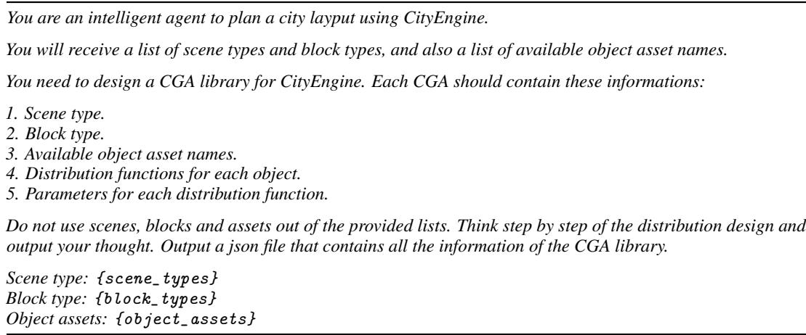  
Table 6: Prompt for LLM asset design.

## A.3 LLM Scene Planning

For each scene, the second-stage LLM receives a JSON description containing its scene type and block information together with the available CGA rules. It assigns a CGA rule and the parameters of its distribution functions to every block while considering the block type and its surroundings. The prompt is reproduced in Tab. 7.

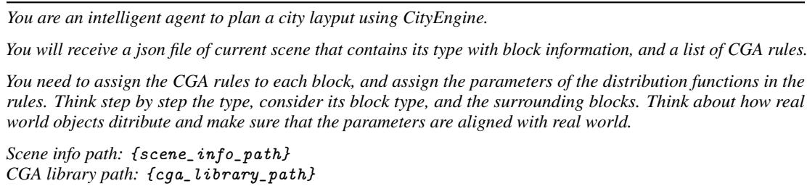  
Table 7: Prompt for LLM scene planning.

## A.4 Scene generation.

With the planned scene road graph and CGA assignments, CityEngine uses these information and generate the 3D scene. It is then exported to Isaac Sim for training or testing.

## B Method

## B.1 Likelihood Generation

We describe the raw VLM semantic likelihood generation process in this section.

Raw likelihood generation. Given an RGB image $I _ { t }$ , we extract patch-level visual features and class text features with a VLM. For class c, multiple prompts are allowed (indexed by m). Let $f _ { v } ( \cdot )$ and $f _ { t } ( \cdot )$ denote visual and text encoders, and let $A _ { v } ( \cdot )$ and $A _ { t } ( \cdot )$ denote their alignment projections into the same feature space. These projections are identities for an already aligned VLM. For patch i, the normalized visual and text embeddings are:

$$
\tilde { \mathbf { v } } _ { t , i } = A _ { v } ( f _ { v } ( I _ { t } ) _ { i } ) , \hat { \mathbf { v } } _ { t , i } = \frac { \tilde { \mathbf { v } } _ { t , i } } { \Vert \tilde { \mathbf { v } } _ { t , i } \Vert _ { 2 } } ,
$$

$$
\tilde { \mathbf { t } } _ { c , m } = A _ { t } ( f _ { t } ( p _ { c , m } ) ) , \hat { \mathbf { t } } _ { c , m } = \frac { \tilde { \mathbf { t } } _ { c , m } } { \lVert \tilde { \mathbf { t } } _ { c , m } \rVert _ { 2 } } .\tag{12}
$$

Prompt-level cosine similarity is computed as:

$$
s _ { t , i , c , m } = \hat { \mathbf { v } } _ { t , i } ^ { \top } \hat { \mathbf { t } } _ { c , m } .\tag{13}
$$

If class c has multiple prompts, we aggregate them by max pooling:

$$
s _ { t , i , c } = \operatorname* { m a x } _ { m \in \{ 1 , \ldots , M _ { c } \} } s _ { t , i , c , m } .\tag{14}
$$

The patch-level class similarity map is then resized to image resolution:

$$
S _ { t , c } ( u , v ) = \mathrm { I n t e r p } ( \{ s _ { t , i , c } \} ; H , W ) .\tag{15}
$$

The raw pixel-level class likelihood is:

$$
P _ { t } ^ { \operatorname { r a w } } ( y = c \mid u , v ) = \frac { \exp ( S _ { t , c } ( u , v ) ) } { \sum _ { k = 1 } ^ { C } \exp ( S _ { t , k } ( u , v ) ) } .\tag{16}
$$

Depth Back-Projection to 3D. Let $d _ { u v }$ be depth at pixel $( u , v )$ , and let camera intrinsics be

$$
\mathbf { K } = \left[ \begin{array} { c c c } { f _ { x } } & { 0 } & { c _ { x } } \\ { 0 } & { f _ { y } } & { c _ { y } } \\ { 0 } & { 0 } & { 1 } \end{array} \right] , \qquad \mathbf { p } _ { u v } = \left[ \begin{array} { c } { u } \\ { v } \\ { 1 } \end{array} \right] .\tag{17}
$$

The 3D point in camera coordinates is:

$$
\mathbf { x } _ { u v } ^ { c } = d _ { u v } \mathbf { K } ^ { - 1 } \mathbf { p } _ { u v } .\tag{18}
$$

Using homogeneous coordinates, world coordinates are:

$$
\begin{array} { r } { \tilde { \mathbf { x } } _ { u v } ^ { w } = \mathbf { T } _ { c w } \left[ \begin{array} { c } { \mathbf { x } _ { u v } ^ { c } } \\ { 1 } \end{array} \right] , } \end{array}\tag{19}
$$

where $\mathbf { T } _ { c w }$ is the camera-to-world transform.

Voxel Aggregation and Global Likelihood. Let $\mathcal { P } _ { t , x , y , z }$ be pixels whose points are projected to the same 3D cell $( x , y , z )$ . We compute the voxel-level raw VLM logit of the current observation by averaging the aligned similarities:

$$
l _ { t , x , y , z , c } = \frac { 1 } { | \mathcal { P } _ { t , x , y , z } | } \sum _ { ( u _ { p } , v _ { p } ) \in \mathcal { P } _ { t , x , y , z } } S _ { t , c } ( u _ { p } , v _ { p } ) .\tag{20}
$$

Before calibration, the current logits are projected to a raw 2D local map. Let $\mathcal { Z } _ { t , x , y } ^ { \mathrm { o b s } }$ be the height bins observed at planar cell $( x , y )$ and let Softmax act along the class dimension. The channel-first observation map is

$$
\begin{array} { r } { \begin{array} { r l } & { r _ { t , x , y , c } ^ { \mathrm { o b s } } = \frac { 1 } { \left| \mathcal { Z } _ { t , x , y } ^ { \mathrm { o b s } } \right| } \displaystyle \sum _ { z \in \mathcal { Z } _ { t , x , y } ^ { \mathrm { o b s } } } l _ { t , x , y , z , c } , } \\ & { ~ \mathbf { m } _ { t } ^ { \mathrm { o b s } } = \mathrm { P e r m u t e } \left( \mathrm { S o f t m a x } _ { c } [ \mathbf { r } _ { t } ^ { \mathrm { o b s } } ] \right) . } \end{array} } \end{array}\tag{21}
$$

with unobserved cells zero-filled. As detailed below, both policies receive the pre-update context $z _ { t } ^ { - }$ containing the previous global map $\mathbf { M } _ { t - 1 }$ and current observation $\mathbf { m } _ { t } ^ { \mathrm { { o b s } } }$ . The calibration policy first predicts $\beta _ { t } \sim \pi _ { \theta } ^ { \beta } ( \cdot \mid z _ { t } ^ { - } )$ . Writing $\boldsymbol { v } = ( x , y , z )$ , the calibrated likelihood used in Eq. 1 is

$$
P _ { t } ^ { \mathrm { c a l } } ( c \mid z _ { t } ^ { - } , v ) = \frac { \exp ( \beta _ { t , v , c } l _ { t , v , c } ) } { \sum _ { j = 1 } ^ { C } \exp ( \beta _ { t , v , j } l _ { t , v , j } ) } .\tag{22}
$$

The calibrated likelihood is then fused with the previous global log-odds state, as in $\operatorname { E q . } 2$ :

$$
L _ { v , c } ^ { t } = L _ { v , c } ^ { t - 1 } + \log \left( \frac { P _ { t } ^ { \mathrm { c a l } } ( c \mid z _ { t } ^ { - } , v ) } { 1 - P _ { t } ^ { \mathrm { c a l } } ( c \mid z _ { t } ^ { - } , v ) } \right) .\tag{23}
$$

Finally, let $\mathcal { Z } _ { t , x , y }$ be the valid height bins at planar cell $( x , y )$ . We project the updated voxel log-odds and form the channel-first global map:

$$
\begin{array} { r } { \begin{array} { r l } & { \displaystyle g _ { t , x , y , c } = \frac { 1 } { \left| \mathcal { Z } _ { t , x , y } \right| } \sum _ { z \in \mathcal { Z } _ { t , x , y } } L _ { ( x , y , z ) , c } ^ { t } , } \\ & { \displaystyle { P } _ { t } ^ { \mathrm { g l o b } } ( x , y , c ) = \frac { \exp \left( g _ { t , x , y , c } \right) } { \sum _ { j = 1 } ^ { C } \exp \left( g _ { t , x , y , j } \right) } , } \end{array} } \\ & { \quad \quad \quad \mathbf { M } _ { t } = \mathrm { P e r m u t e } ( \mathbf { P } _ { t } ^ { \mathrm { g l o b } } ) \in \mathbb { R } ^ { C \times H \times W } . } \end{array}\tag{24}
$$

Thus, the causal order is $( \mathbf { M } _ { t - 1 } , \mathbf { m } _ { t } ^ { \mathrm { o b s } } ) \to \boldsymbol { \beta } _ { t } \to \mathbf { M } _ { t }$ , or equivalently $\mathbf { M } _ { t } = \mathcal { F } ( \mathbf { M } _ { t - 1 } , \mathbf { m } _ { t } ^ { \mathrm { o b s } } ; \boldsymbol { \beta } _ { t } )$ In particular, $\mathbf { M } _ { t }$ is not used to predict $\beta _ { t } \mathrm { ; }$ it becomes the previous global map at step $t + 1$

## B.2 Network Input

We adopt a two-branch encoder containing a historical-pose branch and a semantic-map branch. The historical-pose branch is:

$$
\begin{array} { r l } & { \mathbf { p } _ { t } = [ x _ { t } , y _ { t } , z _ { t } , \phi _ { t } , \theta _ { t } , \psi _ { t } ] , } \\ & { \mathbf { S } _ { t } = [ \mathbf { p } _ { t - L + 1 } , \ldots , \mathbf { p } _ { t } ] \in \mathbb { R } ^ { L \times 6 } . } \end{array}\tag{25}
$$

where $L$ denotes the history length. Before updating $\mathbf { M } _ { t } ,$ the map branch concatenates the previous global map with the current raw observation map. The map input and pre-update policy context are

$$
\begin{array} { r l r } & { } & { { \bf X } _ { t } ^ { \mathrm { m a p } } = \mathrm { C o n c a t } \big ( { \bf M } _ { t - 1 } , { \bf m } _ { t } ^ { \mathrm { o b s } } \big ) \in \mathbb { R } ^ { 2 C \times H \times W } , } \\ & { } & { z _ { t } ^ { - } = \{ { \bf S } _ { t } , { \bf X } _ { t } ^ { \mathrm { m a p } } \} = \left\{ { \bf S } _ { t } , { \bf M } _ { t - 1 } , { \bf m } _ { t } ^ { \mathrm { o b s } } \right\} . \quad } \end{array}\tag{26}
$$

The previous observations are recursively summarized by $\mathbf { M } _ { t - 1 }$ , while $\mathbf { m } _ { t } ^ { \mathrm { o b s } }$ preserves the current uncalibrated evidence. The shared encoder processes $z _ { t } ^ { - }$ , and the motion and calibration branches jointly predict $a _ { t }$ and $\beta _ { t }$ . The latter is then used to update $\mathbf { M } _ { t - 1 }$ into $\mathbf { M } _ { t }$ as defined above. This ordering prevents the updated map from being used circularly to predict its own calibration.

## B.3 ELBO Clarification

In the main paper, $q _ { \phi } ( Z _ { \alpha } , Z _ { \beta } \mid z _ { 1 : t } )$ indicates that the motion and calibration representations are induced by the observation history. In the appendix notation, this history is summarized by the pre-update context $z _ { t } ^ { - }$ . The conditioning in the encoder therefore specifies representation generation; it does not mean that the implemented regularizer optimizes MI separately for each fixed ${ z } _ { t } ^ { - }$ . Under the on-policy visitation distribution $d ^ { \pi _ { \theta } }$ , the conditional encoders induce the aggregate distribution

$$
\begin{array} { r l } & { \bar { q } _ { \phi } ( Z _ { \alpha } , Z _ { \beta } ) = \mathbb { E } _ { z _ { t } ^ { - } \sim d ^ { \pi _ { \theta } } } \left[ q _ { \phi } ( Z _ { \alpha } , Z _ { \beta } \mid z _ { t } ^ { - } ) \right] , } \\ & { I _ { \bar { q } } ( Z _ { \alpha } ; Z _ { \beta } ) = \mathcal { D } _ { \mathrm { K L } } ( \bar { q } _ { \alpha \beta } \parallel \bar { q } _ { \alpha } \bar { q } _ { \beta } ) . } \end{array}\tag{27}
$$

The implemented CLUB loss estimates this unconditional aggregate MI: same-transition features sample $\bar { q } _ { \alpha \beta }$ , whereas cross-sample pairs approximate $\bar { q } _ { \alpha } \bar { q } _ { \beta }$

The PPO objective is related to the ELBO reconstruction term through the category-wise coverage reward. Using $R _ { c , t } = \mathrm { C R } _ { t + 1 } ^ { ( c ) } - \mathrm { C R } _ { t } ^ { ( c ) }$ , its discounted episode return satisfies

$$
\begin{array} { r l r } {  { \sum _ { t = 0 } ^ { T - 1 } \gamma ^ { t } R _ { c , t } = - \mathrm { C R } _ { 0 } ^ { ( c ) } + ( 1 - \gamma ) \sum _ { t = 1 } ^ { T - 1 } \gamma ^ { t - 1 } \mathrm { C R } _ { t } ^ { ( c ) } } } \\ & { } & { + \gamma ^ { T - 1 } \mathrm { C R } _ { T } ^ { ( c ) } . } \end{array}\tag{28}
$$

For $\gamma = 1$ , this reduces exactly to $\mathrm { C R } _ { T } ^ { \left( c \right) } - \mathrm { C R } _ { 0 } ^ { \left( c \right) }$ ; for $\gamma < 1$ , it additionally rewards reaching accurate coverage earlier. Since unexplored and incorrectly labeled grids contribute zero to $\mathrm { C R } _ { t } ^ { \left( c \right) }$ PPO optimizes a task-level surrogate for the ELBO reconstruction term $\mathbb { E } [ \log p ( M \mid Z _ { \alpha } , Z _ { \beta } ^ { \circ } ) ]$ while CLUB regularizes the unconditional dependence of the aggregate representations. Thus, the implemented objective is related to the two ELBO terms.

## B.4 Dependence Regularization

We use MI as a weighted dependence regularizer rather than imposing statistical independence. We denote the motion feature as $Z _ { \alpha }$ and the calibration feature as $Z _ { \beta }$ . Their realizations at time t are ${ \bf z } _ { \alpha , t }$ and ${ \bf z } _ { \beta , t }$ . The shared network input is the pre-update context ${ z } _ { t } ^ { - }$ , and the two branch features are computed as:

$$
\begin{array} { r l } & { \quad h _ { t } = \mathrm { S h a r e d } _ { \Theta } ( z _ { t } ^ { - } ) , } \\ & { \mathbf { z } _ { \alpha , t } = \mathrm { N o r m } ( \mathrm { P r o j } _ { \alpha } ( \mathrm { A d a p t e r } _ { \alpha } ( h _ { t } ) ) ) , } \\ & { \mathbf { z } _ { \beta , t } = \mathrm { N o r m } \big ( \mathrm { P r o j } _ { \beta } \big ( \mathrm { A d a p t e r } _ { \beta } ( h _ { t } ) \big ) \big ) . } \end{array}\tag{29}
$$

where $h _ { t }$ is the output of the shared feature extractor.

The CLUB estimator models a conditional Gaussian distribution:

$$
q _ { \alpha \to \beta } ( Z _ { \beta } \mid Z _ { \alpha } ) = \mathcal { N } \big ( \mu _ { \alpha \to \beta } ( Z _ { \alpha } ) , \mathrm { d i a g } ( \sigma _ { \alpha \to \beta } ^ { 2 } ( Z _ { \alpha } ) ) \big ) ,\tag{30}
$$

where log $\sigma ^ { 2 }$ is clamped for numerical stability. The positive-pair log-likelihood is

$$
\log q _ { \alpha \to \beta } ( \mathbf { z } _ { \beta , t } \mid \mathbf { z } _ { \alpha , t } ) ,\tag{31}
$$

and the negative-pair term is approximated using K features drawn from other samples in the batch:

$$
\frac { 1 } { K } \sum _ { k = 1 } ^ { K } \log q _ { \alpha  \beta } ( \mathbf { z } _ { \beta , t , k } ^ { - } \mid \mathbf { z } _ { \alpha , t } ) .\tag{32}
$$

Thus, the variational CLUB estimate is:

$$
\begin{array} { r } { \mathcal { U } _ { \alpha \to \beta } = \mathbb { E } [ \log q _ { \alpha \to \beta } ( Z _ { \beta } \mid Z _ { \alpha } ) ] - \mathbb { E } \left[ \log q _ { \alpha \to \beta } ( Z _ { \beta } ^ { - } \mid Z _ { \alpha } ) \right] . } \end{array}\tag{33}
$$

The CLUB-based dependence penalty used during the policy-feature update is:

$$
\begin{array} { r } { \mathcal { L } _ { \mathrm { M I } } = \mathcal { U } _ { \alpha \to \beta } . } \end{array}\tag{34}
$$

We use an alternating training procedure. Before each policy-feature update, the estimator is first optimized for three steps using negative log-likelihood:

$$
\mathcal { L } _ { \mathrm { e s t i m a t o r } } = - \mathbb { E } [ \log q _ { \alpha \to \beta } ( Z _ { \beta } \mid Z _ { \alpha } ) ] .\tag{35}
$$

The estimator parameters are then frozen, and the policy feature extractor is optimized by the policy objective augmented with the weighted ${ \mathcal { L } } _ { \mathrm { M I } }$ term. This penalty discourages excessive predictability between the two policy features while retaining task-relevant shared information; it neither enforces independence nor eliminates all coupling.

## B.5 Category-Wise PPO Objective

We present the class-wise PPO loss in this section. Let $c \in \{ 1 , \ldots , C \}$ denote the category index, and define the transition reward consistently with Eq. 8 as $R _ { c , t } = \mathrm { C R } _ { t + 1 } ^ { ( c ) } - \mathrm { C R } _ { t } ^ { ( c ) }$ . The class-wise generalized advantage estimate is computed from the TD residuals

$$
\delta _ { c , t } = R _ { c , t } + \gamma ( 1 - d _ { t } ) V _ { c , \psi _ { \mathrm { o l d } } } ( h _ { t + 1 } ) - V _ { c , \psi _ { \mathrm { o l d } } } ( h _ { t } ) ,\tag{36}
$$

where $d _ { t }$ indicates whether the transition terminates the episode. For a rollout ending at step $T ,$ , the multi-step advantage is

$$
\hat { A } _ { t , c } = \sum _ { l = 0 } ^ { T - t - 1 } ( \gamma \lambda ) ^ { l } \delta _ { c , t + l } .\tag{37}
$$

Here, $V _ { c , \psi } ( h _ { t } )$ is the value head for category c, and $\gamma$ and λ are the discount factor and GAE trace coefficient. The corresponding GAE return used as the value regression target is

$$
V _ { c , t } ^ { \mathrm { t a r g } } = \hat { A } _ { t , c } + V _ { c , \psi _ { \mathrm { o l d } } } ( h _ { t } ) .\tag{38}
$$

Let the joint policy conditioned on the pre-update context factorize into the motion and likelihoodcalibration policies:

$$
\pi _ { \boldsymbol { \theta } } ( a _ { t } , \beta _ { t } \mid z _ { t } ^ { - } ) = \pi _ { \boldsymbol { \theta } } ^ { \alpha } ( a _ { t } \mid Z _ { \alpha , t } ) \pi _ { \boldsymbol { \theta } } ^ { \beta } ( \beta _ { t } \mid Z _ { \beta , t } ) ,\tag{39}
$$

where $\beta _ { t }$ collects the spatial-semantic calibration outputs. The importance ratio is

$$
r _ { t } ( \theta ) = \frac { \pi _ { \theta } ^ { \alpha } ( a _ { t } \mid Z _ { \alpha , t } ) \pi _ { \theta } ^ { \beta } ( \beta _ { t } \mid Z _ { \beta , t } ) } { \pi _ { \theta _ { \mathrm { o l d } } } ^ { \alpha } ( a _ { t } \mid Z _ { \alpha , t } ) \pi _ { \theta _ { \mathrm { o l d } } } ^ { \beta } ( \beta _ { t } \mid Z _ { \beta , t } ) } .\tag{40}
$$

The clipped value prediction is

$$
\begin{array} { r l } & { \Delta V _ { c , t } = V _ { c , \psi } ( h _ { t } ) - V _ { c , \psi _ { \mathrm { o l d } } } ( h _ { t } ) , } \\ & { V _ { c , t } ^ { \mathrm { c l i p } } = V _ { c , \psi _ { \mathrm { o l d } } } ( h _ { t } ) + \mathrm { c l i p } ( \Delta V _ { c , t } , - \epsilon _ { v } , \epsilon _ { v } ) . } \end{array}\tag{41}
$$

For compactness, define the clipped ratio, policy surrogate, and value residuals as

$$
\bar { r } _ { t } ( \theta ) = \mathrm { c l i p } ( r _ { t } ( \theta ) , 1 - \epsilon , 1 + \epsilon ) ,\tag{42}
$$

$$
s _ { t , c } ( \theta ) = \mathrm { m i n } \Big ( r _ { t } ( \theta ) \hat { A } _ { t , c } , \bar { r } _ { t } ( \theta ) \hat { A } _ { t , c } \Big ) ,\tag{43}
$$

$$
e _ { t , c } = V _ { c , \psi } ( h _ { t } ) - V _ { c , t } ^ { \mathrm { t a r g } } ,\tag{44}
$$

$$
\bar { e } _ { t , c } = V _ { c , t } ^ { \mathrm { c l i p } } - V _ { c , t } ^ { \mathrm { t a r g } } .\tag{45}
$$

The policy, value, and entropy losses are

$$
\mathcal { L } _ { \mathrm { p o l i c y } } ^ { ( c ) } = - \hat { \mathbb { E } } _ { t } [ s _ { t , c } ( \theta ) ] ,\tag{46}
$$

$$
\mathcal { L } _ { \mathrm { v a l u e } } ^ { ( c ) } = \hat { \mathbb { E } } _ { t } [ \operatorname* { m a x } ( e _ { t , c } ^ { 2 } , \bar { e } _ { t , c } ^ { 2 } ) ] ,\tag{47}
$$

$$
\mathcal { L } _ { \mathrm { e n t r o p y } } = - \hat { \mathbb { E } } _ { t } \Big [ \mathcal { H } _ { t } ^ { \alpha } + \mathcal { H } _ { t } ^ { \beta } \Big ] .\tag{48}
$$

Here, $\mathcal { H } _ { t } ^ { j } = \mathcal { H } ( \pi _ { \theta } ^ { j } ( \cdot \mid Z _ { j , t } ) )$ for $j \in \{ \alpha , \beta \}$ . The category-specific PPO loss is then

$$
\mathcal { L } _ { \mathrm { P P O } } ^ { ( c ) } = \mathcal { L } _ { \mathrm { p o l i c y } } ^ { ( c ) } + k _ { 1 } \mathcal { L } _ { \mathrm { v a l u e } } ^ { ( c ) } + \frac { k _ { 2 } } { C } \mathcal { L } _ { \mathrm { e n t r o p y } } ,\tag{49}
$$

where $\psi$ denotes the value-head parameters, $\epsilon _ { v }$ is the value-clipping threshold, and $k _ { 1 }$ and $k _ { 2 }$ weight the value and entropy terms.

## C Experiments

## C.1 Additional Details

Unless noted, DINOv3 is the VLM. Each calibration coefficient $\beta _ { t , v , c }$ is a discrete action with support $\mathcal { B } = \{ 0 . 2 , 0 . 4 , . . . , 1 . 8 \}$ . For every spatial-semantic entry, $\pi _ { \theta } ^ { \beta }$ predicts a categorical distribution over these nine values, and the PPO importance ratio uses the categorical log-probability of the selected value. For a controlled comparison, the manual calibration factors of GLEAM in Tab. 5 use the same support, from 0.2 to 1.8. We set $( \gamma , \lambda , \epsilon , \epsilon _ { v } , k _ { 1 } , k _ { 2 } ) = ( 0 . 9 9 , 0 . 9 5 , 0 . 2 , 0 . 2 , 0 . 8 , 0 . 0 0 5 )$ . These settings are fixed across variants without separate tuning.

<table><tr><td rowspan="2">Method</td><td colspan="2">mAUC (%) ↑</td><td colspan="2">mIoU (%) ↑</td><td colspan="2">F-1 (%) ↑</td></tr><tr><td>CLIP</td><td>DINOv3</td><td>CLIP</td><td>DINOv3</td><td>CLIP</td><td>DINOv3</td></tr><tr><td>Uncertainty</td><td>94.3±1.1</td><td>96.8±0.2</td><td>70.2±1.8</td><td>72.6±3.2</td><td>80.1±4.3</td><td>82.2±2.8</td></tr><tr><td>Zhang et ai.</td><td>94.9±2.0</td><td> $9 6 . 4 { \pm } 0 . 9$ </td><td>68.0±1.4</td><td>70.1±0.5</td><td>78.9±1.8</td><td>79.8±0.9</td></tr><tr><td>RayFronts</td><td>87.8±2.4</td><td>88.9±2.7</td><td>55.3±3.4</td><td>59.1±3.2</td><td>67.3±2.8</td><td>69.0±3.5</td></tr><tr><td>ActiveSGM</td><td>94.5±0.6</td><td> $9 6 . 8 { \pm } 0 . 2 $ </td><td> $7 0 . 6 { \pm } 2 . 0 $ </td><td>72.2±2.0</td><td>79.5±3.1</td><td>81.4±1.7</td></tr><tr><td>GLEAM</td><td>95.8±1.1</td><td> $9 8 . 6 { \pm } 0 . 1 $ </td><td>88.6±2.1</td><td>90.9±1.0</td><td>93.7±0.7</td><td>95.1±0.5</td></tr><tr><td>Ours</td><td>98.1±2.1</td><td>99.4±0.1</td><td>94.4±1.1</td><td>96.1±0.2</td><td>95.9±1.1</td><td>98.0±0.1</td></tr></table>

Table 8: Additional metrics corresponding to Tab. 2.

## C.2 Additional Evaluation Metrics

We report mean area under the ROC curve (mAUC), mean intersection over union (mIoU), and F-1 score.

Let V denote the evaluated grids, $\mathcal { V } _ { c }$ the grids of category $c , \mathcal { V } _ { \neg c } = \mathcal { V } \backslash \mathcal { V } _ { c }$ , and $p _ { v , c }$ the final predicted likelihood. The predicted set is $\widehat { \mathcal { V } } _ { c } = \{ v \in \mathcal { V } | \hat { y } _ { v } = c \}$ . We compute one-vs-rest ROC-AUC as

$$
\begin{array} { r l } & { \mathrm { A U C } _ { c } = \displaystyle \frac { 1 } { | \mathcal { V } _ { c } | | \mathcal { V } _ { \neg c } | } \sum _ { v ^ { + } \in \mathcal { V } _ { c } } \sum _ { v ^ { - } \in \mathcal { V } _ { \neg c } } } \\ & { \left( \mathbb { I } [ p _ { v ^ { + } , c } > p _ { v ^ { - } , c } ] + \frac { 1 } { 2 } \mathbb { I } [ p _ { v ^ { + } , c } = p _ { v ^ { - } , c } ] \right) , } \\ & { \mathrm { m A U C } = \displaystyle \frac { 1 } { | \mathcal { C } | } \sum _ { c \in \mathcal { C } } \mathrm { A U C } _ { c } . } \end{array}\tag{50}
$$

For the segmentation metrics, we define

$$
\begin{array} { r l } & { \quad \mathrm { T P } _ { c } = | \widehat { \mathcal { V } } _ { c } \cap \mathcal { V } _ { c } | , \quad \mathrm { F P } _ { c } = | \widehat { \mathcal { V } } _ { c } \setminus \mathcal { V } _ { c } | , \quad \mathrm { F N } _ { c } = | \mathcal { V } _ { c } \setminus \widehat { \mathcal { V } } _ { c } | , } \\ & { \mathrm { I o U } _ { c } = \displaystyle \frac { \mathrm { T P } _ { c } } { \mathrm { T P } _ { c } + \mathrm { F P } _ { c } + \mathrm { F N } _ { c } } , \quad \mathrm { F 1 } _ { c } = \displaystyle \frac { 2 \mathrm { T P } _ { c } } { 2 \mathrm { T P } _ { c } + \mathrm { F P } _ { c } + \mathrm { F N } _ { c } } , } \\ & { \quad \quad \mathrm { m I o U } = \displaystyle \frac { 1 } { | \mathcal { C } | } \displaystyle \sum _ { c \in \mathcal { C } } \mathrm { I o U } _ { c } , \quad \mathrm { F 1 } = \displaystyle \frac { 1 } { | \mathcal { C } | } \displaystyle \sum _ { c \in \mathcal { C } } \mathrm { F 1 } _ { c } . } \end{array}\tag{51}
$$

Tabs. 8, 9, 10, and 11 provide the additional metrics corresponding to Tabs. 2, 3, 4, and $5 ,$ respectively. All three metrics are macro-averaged over the categories in C and reported as percentages.
<table><tr><td colspan="4">Components</td><td rowspan="2">mAUC (%) ↑</td><td rowspan="2">mIoU (%) ↑</td><td rowspan="2">F-1 (%) ↑</td></tr><tr><td>LC</td><td>MV</td><td>PO</td><td>MI</td></tr><tr><td>一</td><td>一</td><td>一</td><td>一</td><td>98.5</td><td>89.8</td><td>94.4</td></tr><tr><td>√</td><td>一</td><td>一</td><td>一</td><td>99.2</td><td>92.4</td><td>95.9</td></tr><tr><td>√</td><td>√</td><td>1</td><td>一</td><td>98.9</td><td>77.4</td><td>92.8</td></tr><tr><td>√</td><td>√</td><td>√</td><td>一</td><td>99.4</td><td>95.1</td><td>97.5</td></tr><tr><td>√</td><td>一</td><td>一</td><td>√</td><td>99.3</td><td>94.3</td><td>97.0</td></tr><tr><td>√</td><td>√</td><td>√</td><td>√</td><td>99.1</td><td>95.7</td><td>97.8</td></tr></table>

Table 9: Additional metrics corresponding to Tab. 3.

<table><tr><td>k</td><td>mAUC (%) ↑</td><td>mIoU (%) ↑</td><td>F-1 (%) ↑</td></tr><tr><td>0.01</td><td>99.1</td><td>93.4</td><td>96.5</td></tr><tr><td>0.05</td><td>99.3</td><td>93.4</td><td>96.5</td></tr><tr><td>0.10</td><td>99.1</td><td>95.7</td><td>97.8</td></tr><tr><td>0.15</td><td>99.3</td><td>94.6</td><td>97.2</td></tr><tr><td>0.20</td><td>99.0</td><td>92.4</td><td>95.9</td></tr></table>

Table 10: Additional metrics corresponding to Tab. 4.

<table><tr><td>Method</td><td>Inference time (ms) ↓</td></tr><tr><td>Uncertainty</td><td>366.30</td></tr><tr><td>Zhang et al. RayFronts</td><td>401.61 934.58</td></tr><tr><td>ActiveSGM</td><td>578.03</td></tr><tr><td>GLEAM</td><td>31.56</td></tr><tr><td>Ours</td><td>27.39</td></tr></table>

Table 12: Per-step inference time (RTX 4090).

<table><tr><td rowspan="2">Method</td><td colspan="2">CCR (%) ↑</td><td rowspan="2">OCR (%) ↑</td><td rowspan="2">Var ↓</td><td rowspan="2">mAUC (%) ↑</td><td rowspan="2">mIoU (%) ↑</td><td rowspan="2">F-1 (%) ↑</td></tr><tr><td>car</td><td>building</td></tr><tr><td>Uncertainty</td><td>55.9</td><td>59.5</td><td>57.7</td><td>3.3</td><td>72.0</td><td>37.8</td><td>52.8</td></tr><tr><td>Zhang et ai.</td><td>50.3</td><td>79.4</td><td>64.8</td><td>212.8</td><td>71.8</td><td>34.7</td><td>49.8</td></tr><tr><td>RayFronts</td><td>29.5</td><td>68.5</td><td>49.0</td><td>380.6</td><td>79.6</td><td>31.3</td><td>41.2</td></tr><tr><td>ActiveSGM</td><td>46.1</td><td>69.5</td><td>57.8</td><td>136.7</td><td>70.6</td><td>32.3</td><td>47.4</td></tr><tr><td>GLEAM</td><td>66.8</td><td>87.5</td><td>77.1</td><td>107.8</td><td>87.2</td><td>44.6</td><td>52.4</td></tr><tr><td>Ours</td><td>77.6</td><td>89.4</td><td>83.5</td><td>34.9</td><td>92.2</td><td>47.4</td><td>61.9</td></tr></table>

Table 13: UrbanBIS results. Metrics are in % except Var.
<table><tr><td rowspan="2">Configuration</td><td colspan="3">CCR (%) ↑</td><td rowspan="2"></td><td rowspan="2"></td><td rowspan="2">OCR (%) ↑ Var↓ mAUC (%) ↑ mIoU (%) ↑ F-1 (%) ↑</td><td rowspan="2"></td><td rowspan="2"></td></tr><tr><td>Csmall</td><td>Cmedium</td><td>Clarge</td></tr><tr><td>LC/LC</td><td>84.3</td><td>96.8</td><td>99.2</td><td>93.4</td><td>42.9</td><td>99.2</td><td>92.4</td><td>95.9</td></tr><tr><td>LC/LC+MI</td><td>86.5</td><td>96.3</td><td>99.8</td><td>94.2</td><td>31.7</td><td>99.1</td><td>92.4</td><td>95.9</td></tr><tr><td>LC+MI/LC</td><td>87.3</td><td>96.5</td><td>99.6</td><td>94.5</td><td>27.6</td><td>99.0</td><td>93.3</td><td>96.4</td></tr><tr><td>LC+MI/LC+MI</td><td>88.3</td><td>96.2</td><td>99.7</td><td>94.7</td><td>22.7</td><td>99.3</td><td>94.3</td><td>97.0</td></tr></table>

Table 14: Post-training module replacement without retraining; X/Y denotes motion/likelihood source checkpoints.

<table><tr><td>Method</td><td>mAUC (%) ↑</td><td>mIoU (%) ↑</td><td>F-1 (%) ↑</td></tr><tr><td>GLEAM-0.2</td><td>98.8</td><td>90.0</td><td>94.5</td></tr><tr><td>GLEAM-0.6</td><td>98.9</td><td>90.1</td><td>94.6</td></tr><tr><td>GLEAM-1.0</td><td>98.5</td><td>90.9</td><td>95.1</td></tr><tr><td>GLEAM-1.4</td><td>99.0</td><td>90.5</td><td>94.8</td></tr><tr><td>GLEAM-1.8</td><td>98.9</td><td>88.4</td><td>93.5</td></tr><tr><td>Ours</td><td>99.3</td><td>94.3</td><td>97.0</td></tr></table>

Table 11: Additional metrics corresponding to Tab. 5.

## C.3 MI Regularization

To further investigate the impact of mutual information regularization, we conduct two experiments.

First, to isolate the effect of MI regularization on each policy branch, we conduct a 2 × 2 post-training module-swapping experiment, where the motion and likelihood modules are independently selected from the LC and LC+MI trained models. The results are shown in Tab. 14. Replacing either LC module with its LC+MI counterpart improves OCR and reduces Var while holding the other module fixed, indicating that the benefit of dependence regularization is encoded in both learned modules rather than arising solely from their joint co-adaptation. Combining both LC+MI modules yields the strongest overall performance. Since all hybrids are evaluated without retraining and the CLUB estimator is absent at inference, these results provide controlled evidence that MI regularization improves the learned motion and likelihood functions themselves.

Second, we run each trained LC and LC+MI model once in the test environments and collect all paired projected motion and calibration features. We arrange the features as $\mathbf { X } _ { \alpha } = [ \mathbf { z } _ { \alpha , 1 } , \ldots , \mathbf { z } _ { \alpha , N } ] ^ { \top }$ and $\mathbf { X } _ { \beta } = [ \mathbf { z } _ { \beta , 1 } , \ldots , \mathbf { z } _ { \beta , N } ] ^ { \top }$ , and center each feature dimension to obtain $\bar { \mathbf { X } } _ { \alpha }$ and $\bar { \mathbf { X } } _ { \beta }$ . Their covariance and cross-covariance matrices are

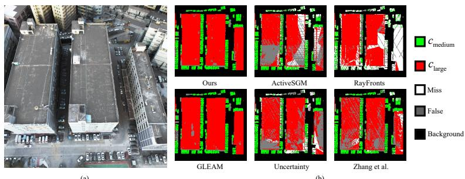  
Figure 6: Qualitative results on the real-world UrbanBIS dataset. (a) Visualization in Isaac Sim of the 3D reconstructed mesh of the test scene provided by UrbanBIS. (b) Semantic reconstruction maps produced by different methods.

$$
\mathbf { C } _ { i j } = \frac { 1 } { N - 1 } \bar { \mathbf { X } } _ { i } ^ { \top } \bar { \mathbf { X } } _ { j } , \qquad i , j \in \{ \alpha , \beta \} .\tag{52}
$$

The canonical correlations $\rho _ { 1 } \geq \cdots \geq \rho _ { r }$ are the singular values of the whitened cross-covariance matrix

$$
\mathbf { C } _ { \alpha \alpha } ^ { - \frac { 1 } { 2 } } \mathbf { C } _ { \alpha \beta } \mathbf { C } _ { \beta \beta } ^ { - \frac { 1 } { 2 } } ,\tag{53}
$$

where $r = \operatorname* { m i n } ( d _ { \alpha } , d _ { \beta } )$ . With $K = \operatorname* { m i n } ( 1 0 , r )$ , the reported statistics are

$$
\mathrm { C C A } _ { \mathrm { m a x } } = \rho _ { 1 } ,
$$

$$
\mathrm { C C A } _ { \mathrm { m e a n } } = \frac { 1 } { r } \sum _ { i = 1 } ^ { r } \rho _ { i } ,\tag{54}
$$

$$
\mathrm { C C A } _ { \mathrm { t o p } - 1 0 } = \frac { 1 } { K } \sum _ { i = 1 } ^ { K } \rho _ { i } .
$$

The results are reported in Tab. 15. LC+MI reduces Mean CCA by 27.85% and Top-10 CCA by 22.76%, showing that MI regularization suppresses overall and dominant shared linear dependence between the two branches. Max CCA remains near one, indicating that the regularizer preserves necessary coupling rather than completely decorrelating the features.

<table><tr><td>Metric</td><td>LC LC+MI</td><td>Δ</td><td>Rel. ∆</td></tr><tr><td>Max CCA</td><td>0.9910</td><td>0.9938 +0.0027</td><td>+0.28%</td></tr><tr><td>Mean CCA</td><td>0.0625</td><td>0.0451-0.0174-27.85%</td><td></td></tr><tr><td>Top-10 CCA 0.6372</td><td></td><td>0.4922-0.1450-22.76%</td><td></td></tr></table>

Table 15: Projected-feature CCA with unrounded differences.

## C.4 Inference Efficiency

We measure the per-step inference time of all methods on a single RTX 4090 under the same evaluation setup. As reported in Tab. 12, our method requires 27.39 ms per step, which is significantly faster than the planning-based methods. The CLUB estimator is used only during training and is discarded at inference.

## C.5 Evaluation on real-world UrbanBIS data

All methods are evaluated on UrbanBIS [1]. We use the photos of the dataset to reconsturct mesh and use the labeled point cloud to calculate groundtruth semantic map. Training-free baselines are deployed directly; learning-based models transfer are trained using the simulator and directly deployed to the UrbanBIS dataset without fine-tuning. Tab. 13 and Fig. 6 report quantitative and qualitative results. Despite mesh distortions compared to the simulator caused by limited photos, our method performs the best.

## References

[1] Guoqing Yang, Fuyou Xue, Qi Zhang, Ke Xie, Chi-Wing Fu, and Hui Huang. Urbanbis: A largescale benchmark for fine-grained urban building instance segmentation. In ACM SIGGRAPH 2023 Conference Proceedings, 2023.