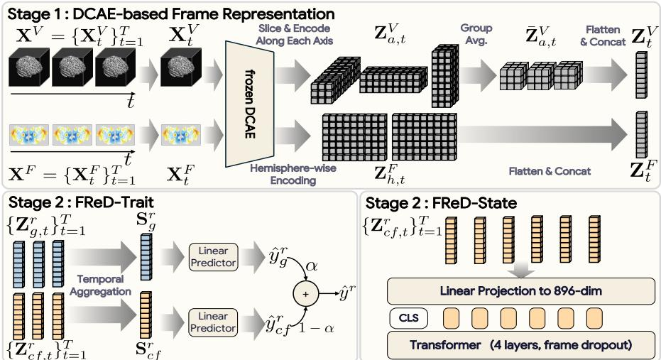
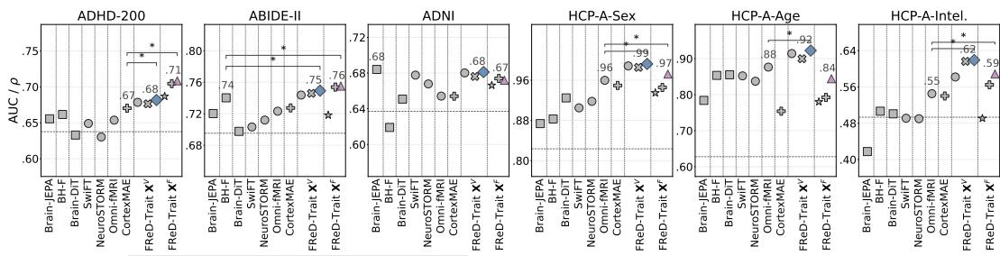
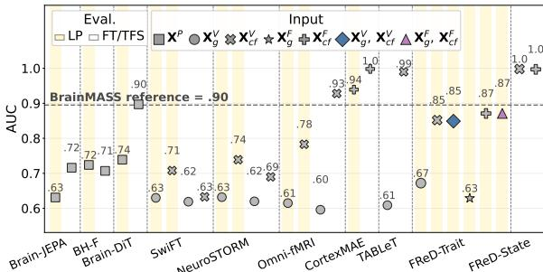
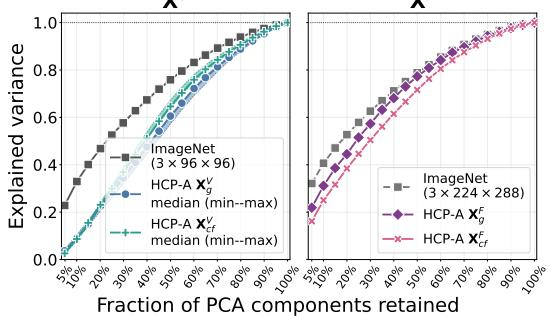
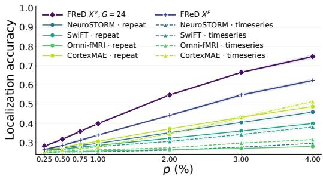
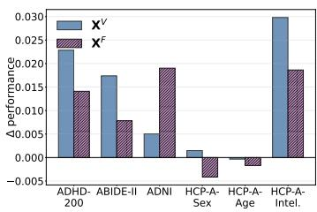
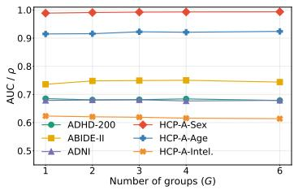
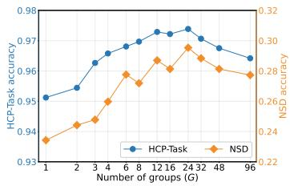
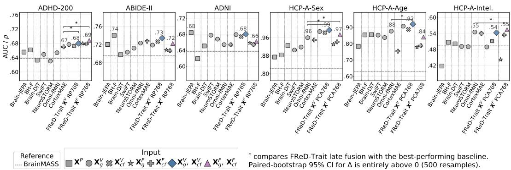
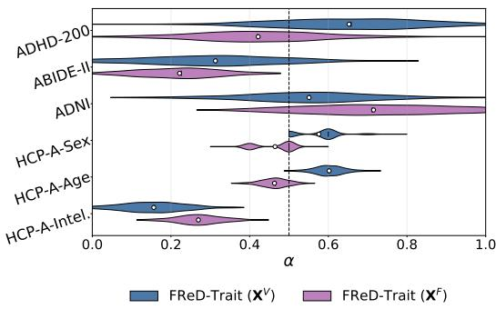

# NATURAL IMAGE AUTOENCODER-BASED FMRI REP-RESENTATIONS FOR TRAIT AND STATE PREDICTION

Juhyeon Park1,3∗, Yeonwoo Kim1, Peter Yongho Kim2,3∗, Yansen Wang3, Mingqing Xiao3, Dongqi Han3, Dongsheng Li3, Taesup Moon1,2,4†

1IPAI, Seoul National University, 2ECE, Seoul National University,

3Microsoft Research, 4ASRI / INMC / AIIS, Seoul National University

{parkjh9229, yeonwoo4, peterkim98, tsmoon}@snu.ac.kr, {yansenwang, mingqingxiao, dongqihan, dongsli}@microsoft.com

## ABSTRACT

Foundation models pre-trained on large-scale fMRI datasets have shown strong downstream performance, but at substantial data and computation cost. To investigate how much fMRI-specific pre-training is actually needed for such performance, we introduce FReD, which derives fMRI representations from a frozen Deep Compression AutoEncoder (DCAE) pre-trained exclusively on natural images and pairs them with a task specific readout. For trait prediction, FReD summarizes frame-wise representations by their temporal mean and log-standard deviation and applies linear probing, with late fusion across two normalization schemes. For state prediction, it represents each frame as a single token and models temporal dependencies with a shallow Transformer. Across four restingstate datasets spanning six trait-prediction targets, linear probes on frozen DCAE features generally outperform those on fMRI foundation model representations and remain competitive with fully fine-tuned fMRI foundation models. On three task-fMRI state-prediction tasks, a temporal readout on DCAE features performs comparably to the strongest foundation models evaluated. A Gaussian injection analysis further shows that localized signal changes are recovered more accurately from the frozen DCAE features than from the evaluated foundation-model representations. Together, these results show that strong performance on current fMRI benchmarks is possible without fMRI-specific representation pre-training, making frozen natural-image features as a useful baseline for assessing its added value.

## 1 INTRODUCTION

Deep learning-based approaches to fMRI signal processing have been widely explored. More recently, foundation models pre-trained on large-scale fMRI datasets have demonstrated strong performance across a broad range of downstream tasks (Kim et al., 2023; Dong et al., 2024; Xia et al., 2026; Lane et al., 2026; Wang et al., 2026a;b; Yang et al., 2024). Developing such models, however, typically relies on large-scale neuroimaging datasets that are costly to collect and preprocess, while the pre-training itself may also require substantial computational resources.

One alternative is to reuse representations learned outside the fMRI domain. TABLeT (Kim et al., 2026), for example, showed that Deep Compression AutoEncoder (DCAE) (Chen et al., 2025), pretrained exclusively on natural images, can be applied to fMRI data and used for modeling long-range temporal dynamics, suggesting that an encoder trained without any fMRI data may already provide a useful starting point. How far such a frozen representation can go, however, remains unclear. TABLeT considers only volumetric fMRI and represents each frame as multiple tokens so that its Transformer (Vaswani et al., 2017) must model spatial and temporal relationships jointly. It also applies the same tokenization and temporal modeling to every downstream task; a single uniform recipe is appealing, but whether it is adequate has not been tested, since trait and state prediction differ in whether the target varies within a subject. Moreover, it is compared primarily with models trained from scratch, leaving open how a frozen off-the-shelf natural-image-based representation fares against fMRI foundation models.

In this work, we therefore ask: Can competitive fMRI-based prediction be achieved without any fMRI-specific pre-training? To answer this, we present FReD, which builds fMRI representations from a DCAE pre-trained exclusively on natural images and kept frozen throughout, and adapts only the readout to the structure of the downstream task. Our study spans both trait and state prediction, which differ in whether the target is constant or varies within a subject, respectively. We first consider resting-state fMRI-based trait prediction. Because the target is constant over time, we summarize each fMRI sequence using the temporal mean and log-standard deviation of its framelevel DCAE representations and fit a linear predictor. Despite its simplicity, this approach generally outperforms existing fMRI foundation models under linear probing. Fusing the predictions obtained under two complementary normalization schemes goes further, remaining competitive on most tasks even when those are fully fine-tuned. These results show that strong trait prediction can be achieved without fMRI-specific pre-training or end-to-end encoder adaptation.

We next consider task-fMRI-based state prediction, where the target changes within a subject. Here, the same order-invariant aggregation performs substantially worse, indicating that temporal information is important for state decoding. We therefore represent each frame as a single token and model their temporal dependencies with a shallow Transformer while keeping the DCAE frozen. On cognitive task-state decoding (Van Essen et al., 2013) and object-category decoding (Allen et al., 2022), this simple temporal readout perform comparably to the strongest fMRI foundation models. It also outperforms TABLeT while using a 27-fold shorter attention sequence (one token per frame) and 40% fewer trainable parameters.

We further examine why such a frozen off-the-shelf representation supports downstream tasks. Our analyses show that a substantial fraction of fMRI variation is captured by the principal directions of the DCAE latent space, and that localized perturbations injected into resting-state fMRI are recovered more accurately from the frozen DCAE features than from the evaluated foundation-model representations. Together, these results show that the performance of the fMRI foundation models on current popular benchmarks can be matched by a frozen natural-image autoencoder, paired with a task-appropriate readout. We therefore argue that frozen natural-image representations should serve as a baseline for assessing the added value of fMRI-specific pre-training.

## 2 PRELIMINARIES

## 2.1 FMRI DATA TYPES & NORMALIZATION SCHEMES

Existing fMRI foundation models consider three fMRI data types: volume, cortical flat map, and parcellation, which we denote by the superscript $r \in \{ V , F , \tilde { P } \}$ . A volumetric fMRI sequence is denoted by $\mathbf { \Delta X } ^ { V } \in \mathbb { R } ^ { T \times 1 \times D \times H \times \mathbf { \bar { W } } }$ , where $T$ is the number of temporal frames and $D , H$ , and $W$ are the spatial dimensions of the volume, and a cortical flat-map sequence by $\mathbf { X } ^ { F } \in \mathbb { R } ^ { T \times 1 \times \dot { H } _ { F } \times W _ { F } }$ where $\bar { H } _ { F }$ and $W _ { F }$ are the spatial dimensions of the flat map. Both retain spatial structure without aggregation over predefined regions, whereas a parcellation $\mathbf { \dot { X } } ^ { P } \in \mathbb { R } ^ { T \times N _ { P } }$ averages voxel signals within $N _ { P }$ predefined regions of interest. Our FReD operates on $\mathbf { X } ^ { V }$ and ${ \bf X } ^ { F }$ , since both retain the spatial structure required by a 2D image encoder; we consider ${ \bf X } ^ { P }$ only through the baselines.

For $\mathbf { X } ^ { V }$ and ${ \bf X } ^ { F }$ , we introduce three normalization schemes. Global normalization computes a shared set of statistics over the entire fMRI sequence and applies the same transformation to all temporal frames and spatial coordinates, as commonly adopted by existing fMRI foundation models (Kim et al., 2023; Wang et al., 2026a;b). Coordinate-wise normalization independently standardizes the temporal signal at each spatial coordinate, whereas frame-wise normalization independently standardizes the spatial values within each temporal frame. In our experiments, we consider two normalization schemes: global normalization and coordinate–frame normalization, where the latter sequentially applies coordinate-wise normalization followed by the frame-wise normalization. Throughout this paper, we use normalization subscripts only for $\mathbf { X } ^ { \check { V } }$ and $\mathbf { X } ^ { F }$ . We index this choice by $n \in \{ g , c f \}$ and write $\mathbf { X } _ { n } ^ { r } \operatorname { f o r } r \in \{ V , F \}$ , where $\mathbf { X } _ { g } ^ { r }$ is globally normalized and $\mathbf { X } _ { c f } ^ { r }$ coordinate– frame-normalized; for ${ \bf X } ^ { P }$ we follow each baseline model’s own convention.

  
Figure 1: Overview of FReD. A frozen DCAE pre-trained on natural images constructs a frame representation for each fMRI frame, for both $\mathbf { X } ^ { \dot { V } }$ and $\mathbf { X } ^ { F }$ . For trait prediction, the frame representations are summarized by their temporal mean and log-standard deviation and read out by a linear predictor, and the predictions obtained under the two normalization schemes $n \in \{ g , c f \}$ are combined by late fusion. For state prediction, the frame representations obtained under coordinate– frame normalization are projected into a common embedding space and processed by a Transformer.

## 2.2 FMRI FOUNDATION MODELS & DOWNSTREAM TASKS

fMRI foundation models. Following the data types in Sec. 2.1, existing fMRI foundation models can be grouped into volume-, cortical flat-map-, and parcellation-based approaches. Volume-based models such as SwiFT (Kim et al., 2023), NeuroSTORM (Wang et al., 2026a), and Omni-fMRI (Wang et al., 2026b) directly process volumetric fMRI. CortexMAE (Lane et al., 2026) instead operates on cortical flat maps. Parcellation-based models, including BrainMASS (Yang et al., 2024), Brain-JEPA (Dong et al., 2024), BrainHarmonix-F (Dong et al., 2025), and Brain-DiT (Xia et al., 2026), operate on ROI-level representations. These models are generally pre-trained on large-scale neuroimaging datasets with self-supervised objectives.

Downstream tasks. We broadly categorize downstream tasks into trait prediction and state prediction, following Lane et al. (2026), depending on whether the target varies within a subject. Trait prediction targets subject-level attributes that remain fixed within a subject, such as age or sex. Since the target does not vary over time, such tasks may be addressed without explicitly modeling temporal dependencies, and representations that capture stable differences between subjects are expected to be informative. State prediction, on the contrary, targets cognitive or stimulus-driven states, such as labels for cognitive tasks (Van Essen et al., 2013) or viewed stimuli (Allen et al., 2022). Here the label changes within a subject, so modeling temporal variations is likely to be important.

## 3 FRED

We present FReD, a framework for constructing and modeling fMRI Representations based on a natural-image-pre-trained DCAE. FReD operates on two fMRI data types, $\dot { \mathbf { X } } ^ { V }$ and ${ \bf X } ^ { F }$ , and consists of two stages, as illustrated in Fig. 1: DCAE-based frame representation and task-dependent readout.

Let ${ \bf X } _ { n } ^ { r } = \{ { \bf X } _ { n , t } ^ { r } \} _ { t = 1 } ^ { T } , r \in \{ V , F \} , n \in \{ g , c f \}$ , denote an fMRI sequence of representation type r normalized by scheme n. A frozen DCAE encoder first constructs a representation for each temporal frame $\mathbf { X } _ { n , t } ^ { r } .$ FReD then processes the resulting frame sequence according to the downstream task. For trait prediction, it summarizes the temporal distribution of the frame representations and fits a linear predictor. For state prediction, it collapses each frame to a single token before the Transformer, so that spatial mixing happens in the projection and the Transformer models only temporal structure. This contrasts with TABLeT (Kim et al., 2026), which retains 27 tokens per frame and relies on selfattention to model both spatial and temporal relationships.

## 3.1 DCAE-BASED FRAME REPRESENTATION

The DCAE (Chen et al., 2025) is a convolutional autoencoder designed to provide highly compressed latent spaces for high-resolution image generation. We use the publicly released ${ \mathrm { d } } \mathtt { c } - \mathtt { a e } - \mathtt { f } 3 2 \mathtt { c } 3 2 - \mathtt { i } \mathtt { n } - 1 . 0$ checkpoint without any modification, which downsamples an input image by a factor of 32 along each spatial dimension into a 32-channel latent map. The checkpoint is trained only on ImageNet (Deng et al., 2009), and we keep it frozen throughout.

Frame-wise encoding. We independently encode each fMRI frame with the DCAE. The same encoder is shared across data types, normalization schemes, and temporal frames. Since the encoding procedure is identical for both normalization schemes, we omit the subscript n throughout this subsection and write $\mathbf { X } _ { t } ^ { r }$ for a single frame.

$\mathbf { X } ^ { V }$ case. We follow TABLeT in slicing the volume along the three anatomical axes and encoding each slice independently with the frozen DCAE, and depart from it in how the resulting latents are assembled into a frame representation. A volumetric fMRI frame is represented as $\mathbf { X } _ { t } ^ { V } \in \mathbb { R } ^ { 1 \times D \times H \times W }$ , where $D = H = W = 9 6$ in our experiments. We slice the volume along the three anatomical axes $a \in \mathcal { A } = \{ \mathrm { s a g } , \mathrm { c o r } , \mathrm { a x i } \}$ , which yields $N _ { \mathrm { s a g } } = D , N _ { \mathrm { c o r } } = H$ , and $N _ { \mathrm { a x i } } \stackrel { = } { = } W$ two-dimensional slices, respectively. Each axis thus produces 96 slices of size $9 6 \times 9 6$ in our implementation. Each slice is replicated across three channels and independently encoded by the frozen DCAE, yielding $\mathbf { Z } _ { a . t } ^ { V } \in \mathbb { R } ^ { \mathbf { i } _ { a } \times C _ { z } \times H _ { z } \times W _ { z } }$ , where $C _ { z } \times H _ { z } \times W _ { z }$ denotes the DCAE latent size per slice, which is $3 2 \times 3 \times 3$

We then partition the $N _ { a }$ slices along each axis into G contiguous, equally sized groups and average the DCAE latents within each group, which gives $\bar { \mathbf { Z } } _ { a . t } ^ { \bar { V } } \in \mathbb { R } ^ { \check { G } \times C _ { z } \times H _ { z } ^ { \mathbf { \lambda } } \times W _ { z } }$ . Without this step a frame representation would have $3 \bar { N } _ { a } C _ { z } \bar { H } _ { z } W _ { z } \ = \ 8 2 ,$ 944 dimensions, which is impractical both for a linear probe and for a linear projection into the Transformer; grouping reduces this to $3 G C _ { z } H _ { z } W _ { z }$ while retaining spatial granularity along each axis. Finally, we flatten and concatenate the grouped latents from the three axes to construct the frame representation:

$$
\begin{array} { r } { \mathbf { Z } _ { t } ^ { V } = \operatorname { C o n c a t } _ { a \in \mathcal { A } } \left( \operatorname { F l a t t e n } \left( \bar { \mathbf { Z } } _ { a , t } ^ { V } \right) \right) \in \mathbb { R } ^ { 3 G C _ { z } H _ { z } W _ { z } } . } \end{array}\tag{1}
$$

TABLeT instead keeps the slice and latent-grid positions as 27 separate tokens per frame; grouping and flattening here reduce this to one, which is the change we ablate in Tab. 5. We use $\bar { G _ { \mathrm { ~ = ~ } \bar { 3 } } }$ for trait prediction and $G = 2 4$ for state prediction, supported by the sensitivity analysis in Fig. 5.

${ \bf X } ^ { F }$ case. A cortical flat-map frame is represented as $\mathbf { X } _ { t } ^ { F } \in \mathbb { R } ^ { 1 \times H _ { F } \times W _ { F } }$ , where $( H _ { F } , W _ { F } ) =$ (224, 576) in our experiments. We split the frame along its width into the left- and right-hemisphere maps $h \in \mathcal { H } = \{ \mathrm { l h , r h } \}$ , each of size $H _ { F } \times ( W _ { F } / 2 )$ . Each hemisphere map is replicated across three channels and independently encoded by the frozen DCAE, yielding $\dot { \mathbf Z } _ { h , t } ^ { F } \in \mathbb { R } ^ { C _ { z } \times H _ { z } \times W _ { z } }$ where each hemisphere map has size $H _ { F } \times ( W _ { F } / 2 ) = 2 2 4 \times 2 8 8$ , and the DCAE downsamples each spatial dimension by $3 \bar { 2 } .$ , giving $C _ { z } \times H _ { z } \times \dot { W } _ { z } = 3 2 \times 7 \times 9$ . We then flatten and concatenate the latents of the two hemispheres to construct the frame representation:

$$
\mathbf { Z } _ { t } ^ { F } = \operatorname { C o n c a t } _ { h \in \mathcal { H } } \left( \operatorname { F l a t t e n } \left( \mathbf { Z } _ { h , t } ^ { F } \right) \right) \in \mathbb { R } ^ { 2 C _ { z } H _ { z } W _ { z } } ,\tag{2}
$$

which has dimension $^ { 4 , 0 3 2 }$ in our implementation. Unlike the volumetric case, there is no slice axis to aggregate, and its dimensionality is moderate compared with that of $X ^ { V }$ . The same flat-map representation is therefore used for both trait and state prediction.

## 3.2 TASK-DEPENDENT READOUT

We hereafter write $\mathbf { Z } _ { n . } ^ { r }$ for the frame representation obtained from $\mathbf { X } _ { n , t } ^ { r } .$ . Starting from the frame representations ${ \bf Z } _ { n , t } ^ { r } ,$ FReD uses statistical aggregation with linear probing for trait prediction (FReD-Trait) and Transformer-based temporal modeling for state prediction (FReD-State). The two differ in how they model temporal information and which normalization schemes they use.

FReD-Trait. Since trait labels do not vary over time, we compress the temporal dynamics into the element-wise mean and log-standard deviation:

$$
\mathbf { S } _ { n } ^ { r } = \mathrm { C o n c a t } \left( \frac { 1 } { T } \sum _ { t = 1 } ^ { T } \mathbf { Z } _ { n , t } ^ { r } , \mathrm { ~ l o g } \left( \mathrm { S t d } _ { t } ( \mathbf { Z } _ { n , t } ^ { r } ) + \epsilon \right) \right) ,\tag{3}
$$

where $\mathrm { S t d } _ { t }$ denotes the element-wise standard deviation over the T frames and ϵ is a small constant for numerical stability. A linear predictor is then fitted on $\mathbf { S } _ { n } ^ { r } .$ . As the two normalization schemes are expected to retain complementary information, we apply this pipeline independently to $\mathbf { X } _ { g } ^ { r }$ and $\mathbf { X } _ { c f } ^ { r } .$ , and combine the resulting predictions $\hat { y } _ { g } ^ { r }$ and $\hat { y } _ { c f } ^ { r }$ by prediction-level late fusion:

$$
\hat { y } ^ { r } = \alpha \hat { y } _ { g } ^ { r } + \left( 1 - \alpha \right) \hat { y } _ { c f } ^ { r } , \qquad \alpha \in [ 0 , 1 ] ,\tag{4}
$$

where α is selected based on the validation set, detailed in Sec. B.2.

FReD-State. For state prediction, we explicitly model the temporal dependencies among frame representations. Each $\mathbf { Z } _ { c f , t } ^ { r }$ is projected into an 896-dimensional embedding by a learnable linear layer, and we prepend a learnable [CLS] token to the resulting sequence. The sequence is processed by a four-layer self-attention Transformer with 1D-RoPE (Su et al., 2024). The backbone follows modern practices, including GQA (Ainslie et al., 2023) and Q/K normalization (Henry et al., 2020) with soft-capped attention logits (Gemma Team et al., 2024). We give the full specification in Tab. 11. The output at the [CLS] token is used for prediction. We additionally apply frame dropout during training as regularization. In contrast to FReD-Trait, we use only coordinate–framenormalized inputs; we examine this choice empirically in Fig. 3.

## 4 EXPERIMENTAL RESULTS

## 4.1 EXPERIMENTAL SETTINGS

Datasets and tasks. We evaluate trait prediction on four resting-state fMRI datasets: ADHD classification using ADHD-200 (Bellec et al., 2017), autism spectrum disorder (ASD) classification using ABIDE-II (Di Martino et al., 2017), mild cognitive impairment (MCI) classification using ADNI (Jack Jr et al., 2008), and prediction of sex, age, and intelligence using HCP-A (Bookheimer et al., 2019). For state prediction, we consider three task-fMRI datasets: viewed-movie binary classification on HBN (Alexander et al., 2017), 21-class cognitive task-state decoding on HCP-Task (Van Essen et al., 2013), and decoding of 24 MS-COCO object categories from NSD (Allen et al., 2022). All splits are constructed at the subject level, and we use the fixed splits provided by BrainMarks (Lane et al., 2026) for HCP-Task and NSD. More details are provided in Sec. B.1.

Evaluation protocol. The linear-probing experiments in Fig. 2, Tab. 3, and Fig. 6 use 500 independently sampled 85/15 train–test splits. All other experiments use 70/15/15 train/validation/test splits, 12 splits for the clinical diagnosis tasks, and four splits for HCP-A and HBN; HCP-Task and NSD instead use three random seeds on their fixed splits. We report accuracy (Acc.), AUROC (AUC), and F1 for classification, and mean absolute error (MAE) and Pearson’s correlation (ρ) for regression, with MAE expressed in units of the standardized target.

Baselines. We compare FReD against eight fMRI foundation models and TABLeT (Kim et al., 2026): BrainMASS (Yang et al., 2024), Brain-JEPA (Dong et al., 2024), BrainHarmonix-F (BH-F) (Dong et al., 2025), and Brain-DiT (Xia et al., 2026) operate on parcellations; SwiFT (Kim et al., 2023), NeuroSTORM (Wang et al., 2026a), and Omni-fMRI (Wang et al., 2026b) on volumes; and CortexMAE (Lane et al., 2026) on cortical flat maps. Since BrainMASS operates on functiona connectivity rather than on the fMRI time series, we report it as a reference line in Figs. 2 and 3 indicating the performance attainable from a basic connectivity-based representation. TABLeT is the most closely related baseline to ours, as it also encodes 2D fMRI slices using a DCAE pre-trained on natural images, but it uses a single data type and modeling scheme across tasks.

## 4.2 TRAIT PREDICTION

Linear probing. We first compare the downstream utility of frozen representations. We standardize the input features and perform five-fold cross-validation, using LogisticRegressionCV from scikit-learn (Pedregosa et al., 2011) for classification and RidgeCV for regression.

As shown in Fig. 2, FReD-Trait outperforms the evaluated foundation-model baselines on five of the six tasks under linear evaluation, with ADNI being the only case where the methods perform comparably. These results show that frozen DCAE features, summarized by simple temporal statistics under a single normalization scheme, can support strong trait prediction without fMRI-specific

  
Input Reference BrainMASS XP XVg XVcf XFg XFcf XVg, XVcf XFg, XFcf  
\* compares FReD-Trait late fusion with the best-performing baseline. Paired-bootstrap 95% CI for is entirely above 0 (500 resamples).

Figure 2: Linear-probing results on trait prediction tasks over 500 random splits, reported as $\operatorname { A U C } / \rho .$ Table 1: Comparison of trait prediction performance. All foundation models are fully fine-tuned, TABLeT is trained from scratch, and FReD-Trait uses linear probing. Results are reported as the mean and standard deviation across data splits. Bold and underlined values indicate the best and second-best performance for each metric, respectively.
<table><tr><td rowspan="3">Method</td><td rowspan="3">Input</td><td colspan="2">ADHD-200</td><td colspan="2">ABIDE-II</td><td colspan="2">ADNI</td><td colspan="6">HCP-A</td></tr><tr><td colspan="2">Diagnosis</td><td colspan="2">Diagnosis</td><td colspan="2">Diagnosis</td><td colspan="2">Sex</td><td colspan="2">Age</td><td colspan="2">Intelligence</td></tr><tr><td> $\mathbf { A U C } \uparrow$ </td><td>F1 ↑</td><td> $\mathbf { A U C \uparrow }$ </td><td> $\operatorname { F } 1 \uparrow$ </td><td> $\mathbf { A U C } \uparrow$ </td><td>F1↑</td><td> $\mathbf { A U C \dagger }$ </td><td> $\operatorname { F } 1 \uparrow$ </td><td> $\mathrm { M A E \downarrow }$ </td><td>ρ↑</td><td> $\mathrm { M A E } \downarrow$ </td><td> $\rho \uparrow$ </td></tr><tr><td>Brain-JEPA</td><td>XP</td><td> $6 6 0 _ { \pm . 0 0 }$ </td><td> $. 6 0 6 _ { \pm . 0 1 }$ </td><td> $. 7 2 0 _ { \pm . 0 5 }$ </td><td> $. 6 2 2 _ { \pm . 0 4 }$ </td><td> $\underline { { . 6 9 3 } } _ { \pm . 0 7 }$ </td><td> $. 5 9 7 _ { \pm . 0 5 }$ </td><td> $. 9 1 7 _ { \pm . 0 0 }$ </td><td> $. 8 2 9 _ { \pm . 0 0 }$ </td><td> $. 4 1 8 _ { \pm . 0 0 }$ </td><td> $. 8 4 9 _ { \pm . 0 0 }$ </td><td> $. 6 8 1 _ { \pm . 0 1 }$ </td><td> $. 4 8 7 _ { \pm . 0 1 }$ </td></tr><tr><td>BH-F</td><td>XP</td><td> $. 6 3 1 _ { \pm . 0 5 }$ </td><td> $5 7 3 _ { \pm . 0 6 }$ </td><td> $. 6 9 7 _ { \pm . 0 3 }$ </td><td> $. 5 9 2 _ { \pm , 0 5 }$ </td><td> $. 6 0 1 _ { \pm . 0 6 }$ </td><td> $. 4 5 2 _ { \pm , 1 2 }$ </td><td> $. 8 6 7 _ { \pm . 0 1 }$ </td><td> $. 7 2 9 _ { \pm . 1 0 }$ </td><td> $. 4 3 5 _ { \pm . 0 2 }$ </td><td> $\phantom { + } . 8 3 8 _ { \pm . 0 2 }$ </td><td> $. 6 7 9 _ { \pm . 0 4 }$ </td><td> $. 4 9 8 _ { \pm . 0 6 }$ </td></tr><tr><td>Brain-DiT</td><td>XP</td><td> $. 6 4 8 _ { \pm . 0 5 }$ </td><td> $5 6 8 _ { \pm . 0 4 }$ </td><td> $. 7 1 2 _ { \pm . 0 4 }$ </td><td> $. 5 3 5 { \scriptstyle \pm . 0 8 }$ </td><td> $. 6 5 9 { \scriptstyle \pm . 0 5 }$ </td><td> $. 4 8 4 _ { \pm , 1 4 }$ </td><td> $. 9 2 3 _ { \pm . 0 2 }$ </td><td> $8 3 3 _ { \pm . 0 3 }$ </td><td> $3 8 6 _ { \pm . 0 1 }$ </td><td> $. 8 7 7 _ { \pm . 0 0 }$ </td><td> $. 6 7 4 _ { \pm . 0 1 }$ </td><td> $. 5 4 6 _ { \pm . 0 1 }$ </td></tr><tr><td>SwiFT</td><td>xV</td><td> $. 6 6 4 \pm . 0 5$ </td><td> $\mathbf { . 6 3 3 _ { \pm . 0 5 } }$ </td><td> $. 7 1 1 { \scriptstyle \pm . 0 3 }$ </td><td> $. 6 0 6 _ { \pm . 0 4 }$ </td><td> $. 6 8 8 { \scriptstyle \pm . 0 7 }$ </td><td> $. 5 8 2 _ { \pm . 0 6 }$ </td><td> $. 9 4 6 _ { \pm . 0 1 }$ </td><td> $. 8 5 3 { \scriptstyle \pm . 0 2 }$ </td><td> $3 5 0 { \scriptstyle \pm . 0 3 }$ </td><td> $. 8 9 7 _ { \pm . 0 2 }$ </td><td> $. 6 7 8 _ { \pm . 0 3 }$ </td><td> $. 5 0 7 { \scriptstyle \pm . 0 2 }$ </td></tr><tr><td>NeuroSTORM</td><td>xV</td><td> $. 6 5 8 { \scriptstyle \pm . 0 4 }$ </td><td> $. 5 7 2 _ { \pm . 0 7 }$ </td><td> $. 7 1 6 _ { \pm . 0 3 }$ </td><td> $. 6 0 6 _ { \pm . 0 2 }$ </td><td> $. 6 7 3 { \scriptstyle \pm . 0 4 }$ </td><td> $\mathbf { 6 0 7 } _ { \pm . 0 2 }$ </td><td> $. 9 7 4 \substack { \pm . 0 1 }$ </td><td> $. 8 8 8 _ { \pm . 0 2 }$ </td><td> $\underline { { 3 4 3 } } _ { \pm . 0 2 }$ </td><td> $\underline { { 9 0 6 } } _ { \pm . 0 1 }$ </td><td> $. 6 7 0 { \scriptstyle \pm . 0 4 }$ </td><td> $. 5 2 5 { \scriptstyle \pm . 0 5 }$ </td></tr><tr><td>Omni-fMRI</td><td>xV</td><td> $. 6 7 6 _ { \pm . 0 5 }$ </td><td> $\underline { { 5 9 8 _ { \pm . 0 5 } } }$ </td><td> $. 7 1 2 \pm . 0 3$ </td><td> $. 5 8 6 _ { \pm . 0 3 }$ </td><td> $. 6 8 1 { \scriptstyle \pm . 0 6 }$ </td><td> $. 5 8 4 _ { \pm . 0 6 }$ </td><td> $\underline { { 9 7 5 } } _ { \pm . 0 1 }$ </td><td> $\underline { { 9 1 0 } } _ { \pm . 0 1 }$ </td><td> $\underline { { . 3 5 1 \pm . 0 1 } }$ </td><td> $. 8 9 4 \pm . 0 1$ </td><td> $. 6 5 7 { \scriptstyle \pm . 0 4 }$ </td><td> $5 4 6 _ { \pm . 0 5 }$ </td></tr><tr><td>CortexMAE</td><td>xεf</td><td> $\underline { { . 6 9 0 } } _ { \pm . 0 5 }$ </td><td> $. 6 0 5 { \scriptstyle \pm . 0 6 }$ </td><td> $. 7 3 5 { \scriptstyle \pm . 0 3 }$ </td><td> $\mathbf { \delta } . 6 3 9 _ { \pm . 0 4 }$ </td><td> $. 6 3 8 { \scriptstyle \pm . 0 5 }$ </td><td> $. 5 4 0 { \scriptstyle \pm . 0 6 }$ </td><td> $. 9 4 4 { \scriptstyle \pm . 0 2 }$ </td><td> $. 8 5 9 { \scriptstyle \pm . 0 2 }$ </td><td> $5 0 8 _ { \pm . 0 2 }$ </td><td> $. 7 7 4 \textless . 0 2$ </td><td> $. 6 6 1 _ { \pm . 0 5 }$ </td><td> $5 3 9 { \scriptstyle \pm . 0 6 }$ </td></tr><tr><td>TABLeT</td><td>xV</td><td> $. 6 3 9 _ { \pm . 0 4 }$ </td><td> $5 8 3 _ { \pm . 0 6 }$ </td><td> $. 7 1 3 _ { \pm . 0 3 }$ </td><td> $. 6 2 4 _ { \pm . 0 4 }$ </td><td> $. 7 0 2 _ { \pm . 0 5 }$ </td><td> $\underline { { . 6 0 2 } } _ { \pm . 0 5 }$ </td><td> $. 9 6 3 _ { \pm . 0 2 }$ </td><td> $. 8 7 2 _ { \pm . 0 5 }$ </td><td> $3 6 2 _ { \pm . 0 2 }$ </td><td> $. 8 9 1 _ { \pm . 0 1 }$ </td><td> $. 6 6 0 _ { \pm . 0 4 }$ </td><td> $5 4 9 _ { \pm . 0 3 }$ </td></tr><tr><td>TABLeT</td><td>xvf</td><td> $. 6 2 4 _ { \pm . 0 5 }$ </td><td> $5 9 2 _ { \pm . 0 6 }$ </td><td> $. 7 0 5 _ { \pm . 0 3 }$ </td><td> $. 5 8 8 _ { \pm . 0 4 }$ </td><td> $. 6 2 0 _ { \pm . 0 7 }$ </td><td> $. 5 6 4 _ { \pm . 0 6 }$ </td><td> $. 9 4 6 _ { \pm . 0 2 }$ </td><td> $8 6 0 _ { \pm . 0 4 }$ </td><td> $3 9 8 _ { \pm . 0 1 }$ </td><td> $. 8 7 1 _ { \pm . 0 1 }$ </td><td> $. 6 6 7 _ { \pm . 0 5 }$ </td><td> $5 1 3 _ { \pm . 0 4 }$ </td></tr><tr><td>FReD-Trait</td><td> $\mathbf { X } _ { g } ^ { V } , \mathbf { X } _ { c f } ^ { V }$ </td><td> $. 6 8 6 _ { \pm . 0 5 }$ </td><td> $. 6 0 4 { \scriptstyle \pm . 0 5 }$ </td><td> $\underline { { . 7 4 3 } } _ { \pm . 0 3 }$ </td><td> $\underline { { . 6 2 9 } } _ { \pm . 0 4 }$ </td><td> $. 6 9 0 { \scriptstyle \pm . 0 4 }$ </td><td> $. 5 9 1 { \scriptstyle \pm . 0 5 }$ </td><td> $. 9 9 5 _ { \pm . 0 0 }$ </td><td> $\mathbf { 9 5 6 } _ { \pm . 0 3 }$ </td><td> $\mathbf { 3 2 0 } _ { \pm . 0 1 }$ </td><td> $\mathbf { 9 1 7 } _ { \pm . 0 1 }$ </td><td> $\mathbf { \delta } . 6 3 3 _ { \pm . 0 6 }$ </td><td> $\mathbf { 6 0 7 } _ { \pm . 0 5 }$ </td></tr><tr><td>FReD-Trait</td><td> $\mathbf { X } _ { g } ^ { F } , \mathbf { X } _ { c f } ^ { F }$ </td><td> $. 7 1 7 _ { \pm . 0 3 }$ </td><td> $\frac { . 6 0 7 _ { \pm . 0 5 } } { - 6 0 }$ </td><td> $. 7 4 7 _ { \pm . 0 3 }$ </td><td> $. 6 1 5 { \scriptstyle \pm . 0 5 }$ </td><td> $. 6 7 9 { \scriptstyle \pm . 0 5 }$ </td><td> $. 5 4 1 { \scriptstyle \pm . 0 4 }$ </td><td> $. 9 6 9 { \scriptstyle \pm . 0 0 }$ </td><td> $. 8 8 4 \pm . 0 0$ </td><td> $. 4 7 6 _ { \pm . 0 2 }$ </td><td> $. 8 2 8 \substack { \pm . 0 1 }$ </td><td> $\underline { { . 6 5 5 } } \pm . 0 3$ </td><td> $\underline { { 5 7 6 } } _ { \pm . 0 4 }$ </td></tr></table>

pre-training. Late fusion of the predictions obtained under the two normalization schemes (blue diamond and pink triangle) further improves performance generally, indicating that $\mathbf { X } _ { g } ^ { r }$ and $\mathbf { X } _ { c f } ^ { r }$ retain complementary information relevant to trait prediction. The selected fusion weights vary across tasks, suggesting that the preferred normalization scheme is itself task-dependent; we report their distribution in Sec. C.2. One may argue that this comparison is confounded by the dimensionality of the representations, which is larger for FReD-Trait than for the foundation models. To address this, we adopt dimension reduction and find its performance to remain robust, as detailed in Sec. C.1.

Can fine-tuning yield better performance than FReD-Trait? We next investigate whether finetuning existing fMRI foundation models on individual downstream tasks improves their performance. For each foundation model, we follow its original fine-tuning protocol and search at least eight learning rates per dataset, with the full search ranges reported in Sec. B. In addition, we evaluate partial fine-tuning, in which only the final few layers of the pre-trained encoder are updated.

The full fine-tuning results are reported in Tab. 1, and the partial fine-tuning results in Sec. C.3. Despite adapting the entire pre-trained encoder to each downstream task, the fully fine-tuned foundation models remain broadly competitive with FReD-Trait rather than consistently surpassing it. Moreover, we additionally observe that fine-tuning itself does not yield consistent improvements over linear probing on the matched splits, as detailed in Sec. C.4. These results show that a frozen off-the-shelf representation paired with simple temporal aggregation can provide a competitive alternative to task-specific adaptation of fMRI foundation models.

## 4.3 STATE PREDICTION

Insights from the HBN-Movie task. We first consider a relatively simple state prediction task, where the model predicts which of two movies a participant was watching from the corresponding fMRI sequence. As shown in Fig. 3, the volume-based foundation models, SwiFT, NeuroSTORM, and Omni-fMRI, perform only slightly above chance on $\mathbf { X } _ { g } ^ { V }$ under both linear probing and full fine-tuning, whereas linear probing on $\mathbf { X } _ { c f } ^ { V }$ consistently yields better performance. We further find that SwiFT and NeuroSTORM do not substantially improve even when fully fine-tuned on $\mathbf { X } _ { c f } ^ { V } ,$ and that among the volume-based models only Omni-fMRI benefits from doing so. The effect is even more pronounced for the DCAE-based models, TABLeT and FReD-Trait, whose performance improves substantially on coordinate-frame-normalized inputs. Coordinate-frame normalization is thus critical for state prediction, which motivates its exclusive use in FReD-State.

  
Figure 3: HBN-Movie task results with four splits.

  
(a)

Table 2: Results on state prediction tasks. Bold and underlined values indicate the best and second-best performance, respectively. FT: Full fine-tuning, TFS: Train from scratch.
<table><tr><td rowspan=2 colspan=1>Method</td><td rowspan=2 colspan=1>Input Eval</td><td rowspan=1 colspan=1>HBN-Movie</td><td rowspan=1 colspan=1>HCP-Task</td><td rowspan=1 colspan=1>NSD</td></tr><tr><td rowspan=1 colspan=1> $\overline { { \mathbf { A U C \uparrow } } }$   F1↑</td><td rowspan=1 colspan=1> $\overline { { \mathbf { A c c . } \uparrow } }$ </td><td rowspan=1 colspan=1> $\overline { { \mathbf { A c c . } \mathbf { \uparrow } } }$ </td></tr><tr><td rowspan=2 colspan=1>Omni-fMRICortexMAETABLeT</td><td rowspan=1 colspan=1>xvf FT</td><td rowspan=1 colspan=1> $. 9 2 8 { \scriptstyle \pm . 0 3 }$   $. 8 3 8 { \scriptstyle \pm . 0 2 }$ </td><td rowspan=1 colspan=1> $9 4 . 5 { \scriptstyle \pm 0 . 2 }$ </td><td rowspan=1 colspan=1> $2 1 . 5 { \scriptstyle \pm 0 . 9 }$ </td></tr><tr><td rowspan=1 colspan=1>xEf  FTxvf TFS</td><td rowspan=1 colspan=1> $\underline { { 9 9 7 } } _ { \pm . 0 0 }$   $. 9 5 9 \pm . 0 1$  $\underline { { \cdot 9 9 0 \pm . 0 1 } }$   $. 9 4 8 { \scriptstyle \pm . 0 3 }$ </td><td rowspan=1 colspan=1> $\mathbf { 9 9 . 2 _ { \pm 0 . 1 } }$  $\underline { { 9 4 . 2 \pm 0 . 2 } }$ </td><td rowspan=1 colspan=1> $2 9 . 8 _ { \pm 0 . 5 }$ 23.9±1.0</td></tr><tr><td rowspan=2 colspan=1>FReD-StateFReD-State</td><td rowspan=1 colspan=1>XV  TFScf</td><td rowspan=1 colspan=1> $\mathbf { . 9 9 8 _ { \pm . 0 0 } }$   $\overline { { \mathbf { \nabla } \mathbf { \mathcal { S } } 7 3 _ { \pm . 0 1 } } }$ </td><td rowspan=1 colspan=1> $9 7 . 4 _ { \pm 0 . 1 }$ </td><td rowspan=2 colspan=1> $\overline { { 2 9 . 5 _ { \pm 0 . 2 } } }$  ${ \bf 3 0 . 0 _ { \pm 0 . 6 } }$ </td></tr><tr><td rowspan=1 colspan=1>XF  TFScf</td><td rowspan=1 colspan=1> $\underline { { 9 9 7 } } _ { \pm . 0 0 }$   $\underline { { 9 7 1 } } _ { \pm , 0 1 }$ </td><td rowspan=1 colspan=1> $\underline { { 9 8 . 8 } } _ { \pm 0 . 2 }$ </td></tr></table>

  
(b)  
Figure 4: (a) Fraction of variance explained by the leading ImageNet principal directions, as a function of the fraction of components retained, shown separately for $\mathbf { X } ^ { V }$ (left) and ${ \bf X } ^ { F }$ (right). Each panel includes an ImageNet reference computed on held-out ImageNet latents at the corresponding DCAE input resolution; a curve close to the ImageNet reference indicates a similar concentration of variance along the leading ImageNet principal directions. For $\mathbf { X } ^ { V }$ , the curves are medians over the three anatomical slicing axes and the bands span their minimum and maximum. (b) Four-way localization accuracy as a function of the injected percent signal change, averaged over the three spatial scales $\sigma ;$ chance accuracy is 25%.

Although FReD-Trait performs strongly on trait prediction, it underperforms TABLeT on HBN-Movie. We attribute this to the fact that FReD-Trait compresses an entire fMRI sequence into its temporal mean and log-standard deviation and thus discards the temporal ordering of the frame representations, which may help distinguishing stimulus-induced states in this task. Statistical temporal aggregation with linear probing is therefore insufficient to capture within-subject variability, which motivates the temporal modeling in FReD-State. By explicitly modeling the temporal interactions among frame representations, FReD-State outperforms FReD-Trait by a large margin and becomes competitive with the strongest foundation models, indicating that DCAE latents retain sufficient information for state prediction once paired with an appropriate temporal architecture.

More challenging tasks. We next consider two harder state prediction tasks, 21-class cognitive task-state decoding on HCP-Task and 24-class object-category decoding on NSD. For these evaluations, we include Omni-fMRI and CortexMAE that clearly outperformed BrainMASS (Yang et al., 2024) on HBN-Movie, along with TABLeT, the most closely related DCAE-based baseline. As shown in Tab. 2, FReD-State outperforms Omni-fMRI and TABLeT by clear margins on both tasks, while performing comparably to CortexMAE. Between the two data types, ${ \bf X } ^ { F }$ performs better on HCP-Task and comparably on NSD. With ${ \bf X } ^ { F }$ , FReD-State matches the strongest flat-map baseline.

## 5 ANALYSES

## 5.1 DOES THE DCAE LATENT SPACE ACCOMMODATE FMRI VARIATION?

We first examine how much fMRI variation is captured by the principal directions of DCAE representations learned from natural images. We fit a PCA basis on DCAE latents from ImageNet test images and measure the fraction of fMRI variance explained by the leading k ImageNet principal directions, $\| \mathbf { H } \mathbf { V } _ { 1 : k } \| _ { F } ^ { 2 } / \| \mathbf { H } \| _ { F } ^ { 2 }$ , where $\mathbf { V } _ { 1 : k }$ contains the leading k ImageNet principal directions and H denotes the standardized latents of the domain being evaluated, centered by its own mean. Since the DCAE latent size depends on the input resolution, we compare each fMRI representation against an ImageNet reference computed at the matching resolution: $3 \times 9 6 \times 9 6$ for volumetric slices and $3 \times 2 2 \bar { 4 } \times 2 8 8$ for hemisphere maps. The detailed setup can be found in Sec. B.3.

As shown in Fig. 4(a), every fMRI representation falls below its ImageNet reference when only a small fraction of principal directions is retained, indicating that the directions explaining the largest variation in natural images account for a smaller fraction of fMRI variation. The gap gradually narrows as more components are included, and by 60% of the basis the retained ImageNet directions explain roughly 0.72–0.85 of the variance across the fMRI representations. Flat-map representations remain closer to their corresponding ImageNet reference than volumetric slices. Overall, these results show that a substantial fraction of fMRI variation is recoverable from the ImageNet-derived basis, which supports using DCAE pre-trained with natural images to obtain fMRI representations.

## 5.2 ARE LOCALIZED SIGNAL CHANGES ACCESSIBLE FROM DCAE REPRESENTATIONS?

Downstream tasks may depend on small, spatially localized changes in the fMRI signal, and whether such changes survive a 32× spatial compression is not obvious. We therefore inject controlled Gaussian perturbations of varying amplitude into resting-state HCP-A fMRI and evaluate whether their locations can be recovered from each frozen representation using a linear probe. At one of four fixed cortical centers, we add an isotropic Gaussian profile of width σ, restricted to the cortical mask, modulated by a canonical double-gamma hemodynamic response and scaled so that the added signal at the center equals a requested percent signal change p of the local baseline. We sweep $p \in [ 0 . 2 5 , 4 ] \%$ and $\bar { \sigma \in \{ 2 , 3 , 4 \bar { \} } }$ . After injection we match the global statistics of each sequence to those of its clean counterpart, so that no probe can exploit a shift in intensity or variance. A four-way linear probe is then fitted on the frozen representations over four different splits and asked which center was perturbed. Each representation is given the frame at which the response peaks: FReD encodes it directly, while the foundation models, which require a temporal input, receive the same volume repeated across their window (repeat) or, as an additional condition, the full injected sequence (timeseries). The DCAE features are reduced to 768 dimensions by PCA, matching the largest foundation-model feature dimension. Full details are given in Sec. B.4.

As shown in Fig. 4(b), all representations remain near chance at the weakest perturbation and improve monotonically as the injected signal becomes stronger. Both FReD variants stay above every foundation-model representation at every amplitude, with $\mathbf { X } ^ { V }$ the strongest throughout and ${ \bf X } ^ { \breve { F } }$ second; CortexMAE is the closest baseline, and neither input condition consistently outperforms the other across the foundation models. Information about localized signal changes therefore remains linearly accessible from the frozen DCAE features, even though the encoder has never been trained on fMRI. However, we note that this spatial-localization probe only measures the accessibility of perturbation, not the general representation quality.

## 5.3 TASK-DEPENDENT NORMALIZATION AND READOUT

Table 3: Linear probing results over 500 random splits on HBN-Movie/Sex.

Normalization. Since HBN is a task-fMRI dataset, one may ask whether the sensitivity to normalization observed in Sec. 4.3 stems from the dataset itself rather than from the type of prediction task. We therefore add a trait prediction task on the same dataset, sex prediction of each subject, which let us compare the two task types under an identical data distribution. As shown in Tab. 3, HBN-Movie is far more sensitive to the choice of normalization than HBN-Sex; we assert the sensitivity therefore follows the prediction task rather than the dataset.

<table><tr><td rowspan="2">Method</td><td rowspan="2">Input</td><td colspan="2">HBN-Movie</td><td colspan="2">HBN-Sex</td></tr><tr><td>AUC↑</td><td>F1↑</td><td>AUC↑</td><td>F1↑</td></tr><tr><td>FReD-Trait FReD-Trait</td><td>xb</td><td> $\overline { { . 6 6 7 _ { \pm . 0 3 } } }$   $. 8 6 3 \pm . 0 3$ </td><td> $\overline { { . 6 1 4 _ { \pm . 0 4 } } }$   $. 7 8 7 { \scriptstyle \pm . 0 3 }$ </td><td> $\overline { { . 8 8 2 \pm . 0 4 } }$   $. 8 2 2 _ { \pm . 0 4 }$ </td><td> $. 7 4 1 { \scriptstyle \pm . 0 6 }$   $. 6 5 7 { \scriptstyle \pm . 0 6 }$ </td></tr></table>

Readout. We showed that FReD-Trait is ineffective for state prediction, which motivated the temporal modeling in FReD-State. This raises the converse question of whether FReD-State is better for trait prediction. As shown in Tab. 4, FReD-State does not improve over FReD-Trait for trait prediction tasks. Explicit temporal modeling therefore appears to matter specifically where temporal dynamics are relevant to the target, whereas simple temporal aggregation suffices for trait prediction.

Table 4: FReD-State performance on trait prediction tasks. Bold values indicate the best performance. LP: Linear probing, TFS: Train from scratch.
<table><tr><td rowspan="3">Method</td><td rowspan="3">Input</td><td rowspan="3">Eval</td><td colspan="2">ADHD-200</td><td colspan="2">HCP-A</td></tr><tr><td colspan="2">Diagnosis</td><td colspan="2">Intelligence</td></tr><tr><td>AUC↑</td><td>F1↑</td><td>MAE↓</td><td>ρ↑</td></tr><tr><td>FReD-Trait</td><td> $\overline { { \mathbf { X } _ { g } ^ { V } , \mathbf { X } _ { c f } ^ { V } } }$ </td><td>LP</td><td> $\overline { { . 6 8 6 _ { \pm . 0 5 } } }$   $. 6 0 4 { \scriptstyle \pm . 0 5 }$ </td><td> $\overline { { . 6 3 3 _ { \pm . 0 6 } } }$ </td><td></td><td> ${ \bf 6 0 7 } _ { \pm . 0 5 }$ </td></tr><tr><td>FReD-Trait</td><td>XE, Xεf</td><td>LP</td><td>.717±.03</td><td>.607±.05</td><td>.655±.03</td><td>.576±.04</td></tr><tr><td>FReD-State</td><td></td><td>TFS</td><td>.663±.05</td><td>.584±.07</td><td>.652±.03</td><td>.564±.03</td></tr><tr><td>FReD-State</td><td>x </td><td>TFS</td><td>.637±.05</td><td>.570±.06</td><td>.664±.06</td><td>.556±.05</td></tr><tr><td>FReD-State</td><td>xF</td><td>TES</td><td>669」</td><td>609</td><td>689</td><td>474+</td></tr></table>

## 5.4 COMPONENT-WISE ABLATIONS

  
(a)

  
(b)

  
(c)  
Figure 5: (a) Effect of the log-standard deviation feature on trait prediction, measured as the AUC or $\rho$ difference against replacing it with a zero vector. (b) Trait prediction performance as a function of the number of groups G. (c) State prediction accuracy as a function of G.

Log-standard deviation features. We ablate the log-standard deviation feature by replacing it with a zero vector, which keeps the input dimensionality and parameter count unchanged. As shown in Fig. 5(a), the log-standard deviation feature generally improves performance, although the magnitude of the effect varies across tasks.

Number of groups G. We next vary the number of groups G, which controls how much spatial granularity along each slicing axis is retained in the frame representation. Trait prediction is largely insensitive to G and remains stable even with a single group per axis (Fig. 5(b)). State prediction, in contrast, degrades substantially when G is too small, but is stable across a moderate range (Fig. 5(c)).

From TABLeT to FReD-State. Finally, we identify where the improvement of FReD-State over TABLeT comes from. Since TABLeT operates on volumetric fMRI, we conduct this ablation with $\mathbf { X } ^ { V }$ . The two models differ in their tokenization and in architectural and regularization choices. To isolate the former, we replace TABLeT’s tokenization with ours, constructing a single

Table 5: Comparison between TABLeT and FReD-State, trained from scratch.
<table><tr><td rowspan=2 colspan=1>Method</td><td rowspan=2 colspan=1>Input Param.</td><td rowspan=1 colspan=1>HCP-Task</td><td rowspan=1 colspan=1>NSD</td></tr><tr><td rowspan=1 colspan=1>ACC</td><td rowspan=1 colspan=1>ACC</td></tr><tr><td rowspan=1 colspan=1>TABLeT</td><td rowspan=1 colspan=1> $\overline { { \mathbf { X } _ { c f } ^ { V } } }$   129.5M</td><td rowspan=1 colspan=1> $\overline { { 9 4 . 2 _ { \pm 0 . 2 } } }$ </td><td rowspan=1 colspan=1> $2 3 . 9 _ { \pm 1 . 0 }$ </td></tr><tr><td rowspan=1 colspan=1>TABLeT with $\bar { \mathbf { Z } } _ { a , t } ^ { V }$ FReD-State</td><td rowspan=1 colspan=1>xvf 145.4M $\mathbf { X } _ { c f } ^ { \check { V } }$   78.2M</td><td rowspan=1 colspan=1> $9 4 . 7 { \scriptstyle \pm 0 . 3 }$  ${ \bf 9 7 . 4 _ { \pm 0 . 1 } }$ </td><td rowspan=1 colspan=1> $2 7 . 5 { \scriptstyle \pm 0 . 4 }$  $2 9 . 5 _ { \pm 0 . 2 }$ </td></tr></table>

token per frame from group-averaged DCAE latents, while keeping its temporal Transformer. As reported in Tab. 5, this intermediate model already improves performance over the original TABLeT. Moving from this intermediate model to FReD-State yields further gains while reducing the parameter count. Because this second step introduces several architectural and regularization changes simultaneously, we attribute the additional gain to these remaining changes jointly rather than to any single component, detailed in Sec. D.

## 6 CONCLUSION AND LIMITATIONS

We asked how much fMRI-specific representation pre-training is necessary for strong downstream prediction. We studied this question using a frozen DCAE pre-trained exclusively on natural images with task-matched readouts. For trait prediction, temporal mean and log-standard deviation followed by a linear predictor achieve performance competitive with fully fine-tuned fMRI foundation models. For state prediction, a shallow Transformer over one token per frame performs comparably to the strongest foundation models, while using a smaller readout and a shorter attention sequence than TABLeT. These results show that strong performance on current benchmarks can be achieved without fMRI-specific representation pre-training, and establish frozen natural-image representations as a baseline against which the benefits of large-scale fMRI pre-training should be measured.

However, several questions remain open. The Gaussian injection analysis is synthetic and spatially localized, so it speaks to linear accessibility rather than to downstream ranking. Relatedly, we do not resolve when each data type should be preferred, although we observe that ${ \check { \mathbf { X } } } ^ { F }$ tends to be stronger on state prediction whereas $\mathbf { X } ^ { V }$ recovers injected perturbations far more accurately and leads on the HCP-A phenotype tasks. We also treat the encoder as fixed throughout, and do not explore whether adapting it to fMRI could further improve performance. Despite this, our results show that a frozen natural-image autoencoder can produce strong representations for fMRI, and suggest that the benefit of fMRI-specific pre-training should be demonstrated against such baselines rather than assumed.

## AI USE STATEMENT

In this work, we used generative AI tools for providing feedback on research methodology or experiments, implementing methods, and assisting with translation. We have not used generative AI tools for proposing or refining hypotheses, supporting qualitative or thematic data analysis, and interpreting results. Generating synthetic data sets, helping develop theoretical models or conceptual frameworks, formulating mathematical claims, providing critical ingredients for proving mathematical claims, assisting in the writing of proofs, and cleaning and reformat dataset are not applicable to this work.

Additionally, we used generative AI tools for modifying scientific figures or images, creating or editing software code, drafting parts of a research paper, editing a research paper to improve readability. All AI-assisted outputs were carefully reviewed by the authors. In particular, the authors created the initial versions of all scientific figures and images themselves and used LLM-based tools only to improve their visual clarity and presentation. In addition, the authors independently verified LLM-generated code and tested it for correctness. The authors also independently reviewed all LLM-generated drafts, using them only as starting points before revising and finalizing the text themselves. and write a final script by own. We take full responsibility for the final content of this work, including all text, claims, code, figures, and other artifacts produced with the assistance of generative AI.

## ETHICS STATEMENT

This work relies exclusively on publicly available, open-source fMRI datasets. We did not collect any new human-subject data or interact directly with study participants. Therefore, no additional ethical approval was required for this study.

## REPRODUCIBILITY STATEMENT

We provide detailed experimental settings in Sec. B. We plan to release our code, preprocessing scripts, and data splits after the review process, subject to the licenses and access policies of the original datasets.

## REFERENCES

Joshua Ainslie, James Lee-Thorp, Michiel De Jong, Yury Zemlyanskiy, Federico Lebron, and Sumit´ Sanghai. Gqa: Training generalized multi-query transformer models from multi-head checkpoints. In Proceedings ofthe 2023 Conference on Empirical Methods in Natural Language Processing (EMNLP), pp. 4895–4901, 2023.

Lindsay M Alexander, Jasmine Escalera, Lei Ai, Charissa Andreotti, Karina Febre, Alexander Mangone, Natan Vega-Potler, Nicolas Langer, Alexis Alexander, Meagan Kovacs, et al. An open resource for transdiagnostic research in pediatric mental health and learning disorders. Sci. Data., 4(1):170181, 2017.

Emily J Allen, Ghislain St-Yves, Yihan Wu, Jesse L Breedlove, Jacob S Prince, Logan T Dowdle, Matthias Nau, Brad Caron, Franco Pestilli, Ian Charest, et al. A massive 7t fmri dataset to bridge cognitive neuroscience and artificial intelligence. Nat. Neurosci., 25(1):116–126, 2022.

Ulzee An, Moonseong Jeong, Simon Austin Lee, Aditya Gorla, Yuzhe Yang, and Sriram Sankararaman. Raptor: Scalable train-free embeddings for 3D medical volumes leveraging pretrained 2D

foundation models. In Proceedings of the 42nd International Conference on Machine Learning (ICML), pp. 1462–1482, 2025.

Pierre Bellec, Carlton Chu, Francois Chouinard-Decorte, Yassine Benhajali, Daniel S Margulies, and R Cameron Craddock. The neuro bureau adhd-200 preprocessed repository. Neuroimage, 144:275–286, 2017.

Susan Y Bookheimer, David H Salat, Melissa Terpstra, Beau M Ances, Deanna M Barch, Randy L Buckner, Gregory C Burgess, Sandra W Curtiss, Mirella Diaz-Santos, Jennifer Stine Elam, et al. The lifespan human connectome project in aging: an overview. Neuroimage, 185:335–348, 2019.

Junyu Chen, Han Cai, Junsong Chen, Enze Xie, Shang Yang, Haotian Tang, Muyang Li, and Song Han. Deep compression autoencoder for efficient high-resolution diffusion models. In Interna tional Conference on Learning Representations (ICLR), 2025.

Jia Deng, Wei Dong, Richard Socher, Li-Jia Li, Kai Li, and Li Fei-Fei. Imagenet: A large-scale hierarchical image database. In 2009 IEEE Conference on Computer Vision and Pattern Recognition (CVPR), pp. 248–255, 2009.

Adriana Di Martino, David O’connor, Bosi Chen, Kaat Alaerts, Jeffrey S Anderson, Michal Assaf, Joshua H Balsters, Leslie Baxter, Anita Beggiato, Sylvie Bernaerts, et al. Enhancing studies of the connectome in autism using the autism brain imaging data exchange ii. Sci. Data., 4(1):170010, 2017.

Zijian Dong, Ruilin Li, Yilei Wu, Thuan T Nguyen, Joanna S Chong, Fang Ji, Nathanael R Tong, Christopher L Chen, and Juan H Zhou. Brain-jepa: Brain dynamics foundation model with gradient positioning and spatiotemporal masking. In Advances in Neural Information Processing Systems (NeurIPS), pp. 86048–86073, 2024.

Zijian Dong, Ruilin Li, Joanna Chong, Niousha Dehestani, Yinghui Teng, Yi Lin, Zhizhou Li, Yichi Zhang, Yapei Xie, Leon Ooi, et al. Brain harmony: a multimodal foundation model unifying morphology and function into 1d tokens. In Advances in Neural Information Processing System (NeurIPS), pp. 122100–122127, 2025.

Oscar Esteban, Christopher J Markiewicz, Ross W Blair, Craig A Moodie, A Ilkay Isik, Asier Erramuzpe, James D Kent, Mathias Goncalves, Elizabeth DuPre, Madeleine Snyder, et al. fmriprep: a robust preprocessing pipeline for functional mri. Nat. Methods., 16(1):111–116, 2019.

Oscar Esteban, Rastko Ciric, Karolina Finc, Ross W Blair, Christopher J Markiewicz, Craig A Moodie, James D Kent, Mathias Goncalves, Elizabeth DuPre, Daniel EP Gomez, et al. Analysis of task-based functional mri data preprocessed with fmriprep. Nat. Protoc., 15(7):2186–2202, 2020.

Gemma Team, Morgane Riviere, Shreya Pathak, Pier Giuseppe Sessa, Cassidy Hardin, Surya Bhupatiraju, Leonard Hussenot, Thomas Mesnard, Bobak Shahriari, Alexandre Ram ´ e, et al. Gemma ´ 2: Improving open language models at a practical size. arXiv preprint arXiv:2408.00118, 2024.

Alex Henry, Prudhvi Raj Dachapally, Shubham Shantaram Pawar, and Yuxuan Chen. Query-key normalization for transformers. In Findings of the Association for Computational Linguistics: EMNLP 2020, pp. 4246–4253, 2020.

Gao Huang, Yu Sun, Zhuang Liu, Daniel Sedra, and Kilian Q Weinberger. Deep networks with stochastic depth. In European Conference on Computer Vision (ECCV), pp. 646–661, 2016.

Clifford R Jack Jr, Matt A Bernstein, Nick C Fox, Paul Thompson, Gene Alexander, Danielle Harvey, Bret Borowski, Paula J Britson, Jennifer L. Whitwell, Chadwick Ward, et al. The alzheimer’s disease neuroimaging initiative (adni): Mri methods. J. Magn. Reson. Imaging., 27(4):685–691, 2008.

Peter Kim, Junbeom Kwon, Sunghwan Joo, Sangyoon Bae, Donggyu Lee, Yoonho Jung, Shinjae Yoo, Jiook Cha, and Taesup Moon. Swift: Swin 4d fmri transformer. In Advances in Neural Information Processing Systems (NeurIPS), pp. 42015–42037, 2023.

Peter Yongho Kim, Juhyeon Park, Jungwoo Park, Jubin Choi, Jungwoo Seo, Jiook Cha, and Taesup Moon. Can natural image autoencoders compactly tokenize fmri volumes for long-range dynamics modeling? In Proceedings of the IEEE/CVF Conference on Computer Vision and Pattern Recognition (CVPR), pp. 35321–35330, 2026.

Connor Lane, Mihir Tripathy, Leema Krishna Murali, Ratna Sagari Grandhi, Shamus Sim Zi Yang, Sam Gijsen, Debojyoti Das, Manish Ram, Utkarsh Kumar Singh, Cesar Kadir Torrico Villanueva, YUXIANG WEI, Will Beddow, Gianfranco Cortes, Suin Cho, Daniel Z Kaplan, Benjamin Warner, Tanishq Mathew Abraham, and Paul Steven Scotti. Scaling vision transformers for functional MRI with flat maps. In Forty-third International Conference on Machine Learning (ICML), 2026.

Han Liu, Bogdan Georgescu, Yanbo Zhang, Youngjin Yoo, Michael Baumgartner, Riqiang Gao, Jianing Wang, Gengyan Zhao, Eli Gibson, Dorin Comaniciu, and Sasa Grbic. Revisiting 2d foundation models for scalable 3d medical image classification. In Proceedings of the IEEE/CVF Conference on Computer Vision and Pattern Recognition (CVPR), pp. 30021–30031, 2026.

Jorge Nocedal and Stephen J. Wright. Numerical Optimization. Springer Series in Operations Research and Financial Engineering. Springer, New York, NY, second edition, 2006. ISBN 978- 0-387-30303-1. doi: 10.1007/978-0-387-40065-5.

Juhyeon Park, Peter Yongho Kim, Jungwoo Park, Jubin Choi, Jungwoo Seo, Jiook Cha, and Taesup Moon. Processing fMRI brain signals using latents from natural image autoencoders. In NeurIPS 2025 Workshop on Foundation Models for the Brain and Body, 2025.

Fabian Pedregosa, Gael Varoquaux, Alexandre Gramfort, Vincent Michel, Bertrand Thirion, Olivier¨ Grisel, Mathieu Blondel, Peter Prettenhofer, Ron Weiss, Vincent Dubourg, et al. Scikit-learn: Machine learning in python. J. Mach. Learn. Res., 12:2825–2830, 2011.

Noam Shazeer. Glu variants improve transformer. arXiv preprint arXiv:2002.05202, 2020.

Jianlin Su, Murtadha Ahmed, Yu Lu, Shengfeng Pan, Wen Bo, and Yunfeng Liu. Roformer: Enhanced transformer with rotary position embedding. Neurocomputing, 568:127063, 2024.

David C Van Essen, Stephen M Smith, Deanna M Barch, Timothy EJ Behrens, Essa Yacoub, Kamil Ugurbil, Wu-Minn HCP Consortium, et al. The wu-minn human connectome project: an overview. Neuroimage, 80:62–79, 2013.

Ashish Vaswani, Noam Shazeer, Niki Parmar, Jakob Uszkoreit, Llion Jones, Aidan N Gomez, Łukasz Kaiser, and Illia Polosukhin. Attention is all you need. In Advances in neural information processing systems (NeurIPS), 2017.

Cheng Wang, Yu Jiang, Zhihao Peng, Chenxin Li, Chang-bae Bang, Lin Zhao, Wanyi Fu, Jinglei Lv, Jorge Sepulcre, Carl Yang, et al. Towards a general-purpose foundation model for functional mri analysis. Nat. Biomed. Eng., pp. 1–12, 2026a.

Mo Wang, Wenhao Ye, Junfeng Xia, Junxiang Zhang, Xuanye Pan, Minghao Xu, Haotian Deng, Hongkai Wen, and Quanying Liu. Omni-fMRI: A universal atlas-free fMRI foundation model. In Forty-third International Conference on Machine Learning (ICML), 2026b.

Junfeng Xia, Wenhao Ye, Xuanye Pan, Xinke Shen, Mo Wang, and Quanying Liu. Brain-dit: A universal multi-state fmri foundation model with metadata-conditioned pretraining. arXiv preprint arXiv:2604.12683, 2026.

Yanwu Yang, Chenfei Ye, Guinan Su, Ziyao Zhang, Zhikai Chang, Hairui Chen, Piu Chan, Yue Yu, and Ting Ma. Brainmass: Advancing brain network analysis for diagnosis with large-scale self-supervised learning. IEEE Trans. Med. Imaging., 43(11):4004–4016, 2024.

# Natural Image Autoencoder-Based fMRI Representations for Trait and State Prediction

Appendix

## A RELATED WORK

## A.1 UTILIZING NATURAL IMAGE PRIOR FOR MEDICAL IMAGING

The limited availability and diversity of medical imaging data have long posed challenges for learning generalizable representations directly from the medical domain. In contrast, foundation models pre-trained on large-scale natural image datasets benefit from substantially richer and more diverse visual supervision, yielding robust representations. Motivated by this discrepancy, recent studies have investigated transferring such pre-trained representations to medical imaging, rather than training modality-specific foundation models solely on medical data.

Natural-image priors have proven effective even for volumetric medical data despite considerable domain and dimensionality gaps. Raptor (An et al., 2025) leverages a frozen 2D foundation model pre-trained on natural images to extract representations from orthogonal slices of 3D medical volumes and compresses the resulting features through random projections. This training-free approach demonstrates that representations learned from natural images can effectively support diverse downstream tasks on 3D medical data. AnyMC3D (Liu et al., 2026) further extends this direction to 3D medical image classification, adapting a pre-trained 2D foundation model using lightweight task-specific LoRA modules and attention-based slice aggregation. Notably, it shows that properly adapted general-purpose models can match or even outperform medical-specific foundation models across diverse 3D classification tasks. More recently, TABLeT (Kim et al., 2026; Park et al., 2025) employs a pre-trained 2D natural-image autoencoder as an off-the-shelf tokenizer for fMRI volumes, transforming high-dimensional 3D brain images into compact tokens for modeling long-range temporal dynamics. Together, these studies highlight the potential of transferring rich visual priors learned from natural images to medical imaging, offering an alternative to costly domain-specific pre-training under limited medical data.

## B IMPLEMENTATION DETAILS

## B.1 DATASETS

Table 6: Summary of the datasets used for trait prediction (top) and state prediction (bottom). The numbers of subjects and samples represent the totals after preprocessing. Duration indicates the temporal duration of each sample. Trait prediction datasets contain one sample per subject, whereas state prediction datasets contain multiple samples per subject. Dx denotes diagnosis classification; Task21 denotes 21-class cognitive task-state decoding; and COCO24 denotes 24-class object-category de coding. The majority-class proportion is omitted for regression tasks.
<table><tr><td>Dataset</td><td>Target</td><td>Subjects</td><td>Samples</td><td>Duration</td><td># Classes</td><td>Majority (%)</td></tr><tr><td rowspan="4">ADHD-200 ABIDE-II ADNI</td><td>ADHD Dx</td><td>430</td><td>430</td><td>300 s</td><td>2</td><td>56.3</td></tr><tr><td>ASD Dx</td><td>616</td><td>616</td><td>300 s</td><td>2</td><td>56.3</td></tr><tr><td>MCI Dx</td><td>464</td><td>464</td><td>300 s</td><td>2</td><td>59.5</td></tr><tr><td>Sex</td><td>1,069</td><td>1,069</td><td>382.4 s</td><td>2</td><td>57.1</td></tr><tr><td rowspan="3">HCP-A HBN-Movie</td><td>Age, Intelligence</td><td>1,069</td><td>1,069</td><td>382.4 s</td><td>一</td><td></td></tr><tr><td>Movie</td><td>428</td><td>856</td><td>200 s</td><td>2</td><td>50.0</td></tr><tr><td>Task21</td><td>604</td><td>26,995</td><td>16 s</td><td>21</td><td>16.9</td></tr><tr><td>HCP-Task NSD</td><td>COCO24</td><td>8</td><td>47,589</td><td>16 s</td><td>24</td><td>6.8</td></tr></table>

The detailed description of each dataset is provided in Tab. 6.

Preprocessing. For ADHD-200 (Bellec et al., 2017), ABIDE-II (Di Martino et al., 2017), ADNI (Jack Jr et al., 2008), and HBN (Alexander et al., 2017), we perform minimal preprocessing using fMRIPrep (Esteban et al., 2019; 2020). For ADHD-200, ABIDE-II, and ADNI, we additionally regress out nuisance signals using cosine basis functions, six rigid-body motion parameters, and anatomical CompCor components. For HCP-A, we use the minimally processed data provided by Bookheimer et al. (2019), and for HCP-Task and NSD, the preprocessed data provided by Brain-Marks (Lane et al., 2026). We then resample all fMRI data to match the TR each foundation model was pre-trained with.

Data splits. For ADHD-200, ABIDE-II, and ADNI, we perform stratified sampling to preserve the distributions of acquisition sites and diagnostic labels across the splits, and for HCP-A we preserve the distributions of sex, age, and intelligence. HBN is split randomly, whereas for HCP-Task and NSD we use the fixed splits provided by BrainMarks (Lane et al., 2026). All splits are constructed at the subject level, so that no subject appears in more than one split. For the linear-probing experiments in Fig. 2, Tab. 3, and Fig. 6, we evaluate each method over 500 independently sampled train–test splits, assigning 85% of the data to training and the remaining 15% to testing. All other experiments use a 70/15/15 train/validation/test ratio, repeated over 12 splits for the clinical diagnosis tasks and four splits for HCP-A and HBN-Movie; HCP-Task and NSD instead use three random seeds on their fixed splits.

## B.2 TRAINING AND EVALUATION

DCAE. We use the unmodified d $\mathtt { l c - a e \mathrm { - } f 3 2 c 3 2 - i n - 1 }$ .0 checkpoint provided by Chen et al.   
(2025) in all experiments, and keep it frozen throughout.

Windowing. For the $\mathbf { X } ^ { V } -$ and ${ \bf X } ^ { F }$ -based models, training uses randomly sampled consecutive frames. At evaluation time, following Kim et al. (2023; 2026), we average the model outputs (logits) over all windows starting from the first frame. For linear probing, we follow the protocol of BrainMarks (Lane et al., 2026), which uses the window-averaged embedding. If inputs are shorter than a model’s expected temporal sequence length, we pad the input with the per-coordinate mean, following Lane et al. (2026).

Late fusion. We select α without using the test set at any stage. For experiments with an 85/15 train/test split, α is selected using out-of-fold predictions obtained from five-fold cross-validation on the training set. For experiments with a 70/15/15 train/validation/test split, it is selected on the validation set.

Because the search is one-dimensional, we first evaluate the selection criterion on a uniform grid over $\alpha \in [ 0 , 1 ]$ with a step size of 0.1. For smooth criteria, such as mean absolute error and weighted cross-entropy, the best-performing grid point is used to initialize an SLSQP (Nocedal & Wright, 2006) refinement, yielding a continuous value of α. For rank-based criteria such as AUROC, we use the best grid point directly.

Shared settings. For neural-network training, unless stated otherwise, all experiments use the following settings.

• Target normalization: For regression tasks, we z-normalize the target values using the mean and standard deviation computed from the training split.

• Optimizer: AdamW with a cosine decay learning rate schedule and weight decay $1 \bar { 0 } ^ { - 2 }$ . We use $\tt f p 1 6$ mixed precision, BCEWithLogitsLoss for binary classification, and L1Loss for regression. For ADHD-200, ABIDE-II, and ADNI, we enable the pos-weight option to account for class imbalance. For HCP-Task and NSD, we use CrossEntropyLoss.

• Hyperparameter search: We select hyperparameters per model on the validation set, using validation loss for ADHD-200, ABIDE-II, and ADNI (so that pos-weight is reflected), AUROC for HCP-A-Sex and HBN-Movie, accuracy for HCP-Task and NSD, and MAE for HCP-A-Age and HCP-A-Intelligence. For every model and dataset, we search at least eight learning rates on a log-uniform grid within the range listed below.

• Early stopping: We report the early-stopped model for all methods except SwiFT, for which we report the final epoch, as we observed its training to be stable.

## Brain-JEPA

• Learning rate: Selected from $[ 1 \times 1 0 ^ { - 6 } , 3 \times 1 0 ^ { - 4 } ]$

• Batch size: 16.

• Epochs: 50.

## BrainHarmonix-F

• Learning rate: Selected from $[ 3 \times 1 0 ^ { - 8 } , 5 \times 1 0 ^ { - 3 } ]$

• Batch size: 8.

• Epochs: 50.

## Brain-DiT

• Learning rate: Selected from $[ 1 \times 1 0 ^ { - 6 } , 3 \times 1 0 ^ { - 4 } ]$

• Batch size: 2.

• Epochs: 20.

## SwiFT

• Learning rate: Selected from $[ 3 \times 1 0 ^ { - 8 } , 9 \times 1 0 ^ { - 5 } ]$

• Batch size: 8.

• Epochs: 30.

• Window size: 20.

• TR: 0.72s

## NeuroSTORM

• Learning rate: Selected from $[ 3 \times 1 0 ^ { - 8 } , 9 \times 1 0 ^ { - 5 } ]$

• Batch size: 8.

• Epochs: 30.

• Window size: 20.

• TR: 0.72s

## Omni-fMRI

• Learning rate: Selected from $[ 3 \times 1 0 ^ { - 8 } , 9 \times 1 0 ^ { - 5 } ]$ for trait prediction, $\mathrm { 7 3 \times 1 0 ^ { - 8 } , 5 \times }$ $1 0 ^ { - 4 } ]$ for HBN-Movie, and $[ 3 \times 1 \dot { 0 } ^ { - 7 } , 5 \times \dot { 1 } 0 ^ { - 4 } ]$ for HCP-Task and NSD. The learning rate of the prediction head is set to 10× the base learning rate.

• Batch size: 8 for trait prediction and HBN-Movie, and 16 for HCP-Task and NSD.

• Epochs: 30.

• Window size: 40.

• TR: 0.8s

## CortexMAE

• Learning rate: Selected from $[ 3 \times 1 0 ^ { - 8 } , 9 \times 1 0 ^ { - 5 } ]$ for trait prediction, $[ 3 \times 1 0 ^ { - 8 } , 9 \times$ $1 0 ^ { - 6 } ]$ for HBN-Movie, and $[ 3 \times 1 0 ^ { - 8 } , 9 \times 1 0 ^ { - 5 } ]$ for HCP-Task and NSD.

• Batch size: 8 for trait prediction and HBN-Movie, and 64 for HCP-Task and NSD.

• Epochs: 30.

• Window size: 16.

• TR: 1s.

## TABLeT

• Learning rate: Selected from $[ 5 \times 1 0 ^ { - 9 } , 5 \times 1 0 ^ { - 6 } ]$ for trait prediction and HBN-Movie, and $[ 7 \times 1 0 ^ { - 6 } , 2 \times 1 0 ^ { - 4 } ]$ for HCP-Task and NSD.

• Batch size: 4 for trait prediction and HBN-Movie, and 16 for HCP-Task and NSD.

• Epochs: 30 for trait prediction and HBN-Movie, 50 for HCP-Task, and 15 for NSD.

• Window size: We use full frames.

• TR: 0.8s for trait prediction and HBN, 1s for HCP-Task and NSD.

## FReD-Trait

• Hyperparameters: We use scikit-learn’s default search space.

• TR : 0.8s for trait prediction and HBN.

## FReD-State

• Learning rate: Selected from $[ 1 \times 1 0 ^ { - 6 } , 1 \times 1 0 ^ { - 4 } ]$ for HBN-Movie, and $[ 7 \times 1 0 ^ { - 6 } , 2 \times$ $1 0 ^ { - 4 } ]$ for HCP-Task and NSD. For the trait prediction tasks in Sec. 5.3, the learning rate is selected from $\left[ 5 \times 1 0 ^ { - 9 } , 5 \times 1 0 ^ { - 6 } \right]$ ] matched with TABLeT’s search space.

• Batch size: 8 for trait prediction and HBN-Movie, and 16 for HCP-Task and NSD.

• Epochs: 50 for trait prediction, HBN-Movie, and HCP-Task, and 15 for NSD.

• Window size : We use full frames.

• TR : 0.8s for trait prediction and HBN, 1s for HCP-Task and NSD.

## B.3 PCA ANALYSIS DETAILS

We extract DCAE latents from 100k ImageNet test images and from HCP-A, using only the first temporal frame of each fMRI sequence to keep the computation tractable. For HCP-A we consider ${ \bf X } _ { n } ^ { r }$ with $r \in \{ V , F \}$ and $n \in \{ g , c f \}$ : for $\mathbf { X } _ { n } ^ { V }$ we take the center sagittal, coronal, and axial slices, evaluate each axis separately, and report their median and range in Fig. 4(a), and for $\mathbf { X } _ { n } ^ { F }$ we treat the two hemispheres as independent samples. The ImageNet latents are randomly split into 80k samples for standardization and PCA fitting and 20k held-out samples for evaluation.

## B.4 GAUSSIAN INJECTION EXPERIMENTS

The experiment uses all HCP-A subjects and a 16 s analysis window sampled at $\mathrm { T R } = 0 . 8 { \ : } \mathrm { s } ,$ , giving $T = 2 0$ frames. Since the procedure is identical for every subject, we describe it for a single subject and omit the subject index.

Injection centers. The four centers are shared across every model, $p , \sigma _ { : }$ , and data split. They are selected from the intersection of the cohort-wide anatomical support and a cortical atlas mask $C ,$ , subject to a minimum distance of 8 voxels from the outer support boundary and a minimum pairwise separation of 12 voxels. In native LAS-oriented MNI152 2-mm voxel indices they are ${ \bf { \bar { c } } } _ { 1 } = ( 6 0 , 3 9 , 3 4 ) , { \bf { c } } _ { 2 } = ( 2 0 , 4 7 , 3 3 ) , { \bf { c } } _ { 3 } = ( 3 1 , 3 0 , 3 4 )$ , and ${ \bf c } _ { 4 } = ( 2 4 , 3 8 , 4 3 )$ ), with a realized minimum pairwise distance of 13.93 voxels.

Signal injection. Let ${ { \mathbf { X } } _ { t } } ( \mathbf { v } )$ denote the clean BOLD value at voxel v in frame $t ,$ in the native MNI volume and before any normalization. For center $\mathbf { c } _ { j }$ , spatial scale σ, and percent signal change $p ,$ the injected frame is

$$
\begin{array} { r } { \mathbf { X } _ { t } ^ { \mathrm { i n j } } ( \mathbf { v } ) = \mathbf { X } _ { t } ( \mathbf { v } ) + b _ { j } \frac { p } { 1 0 0 } h ( t ) A _ { j , \sigma } ( \mathbf { v } ) , } \end{array}\tag{5}
$$

which adds a fixed spatial profile $A _ { j , \sigma }$ , modulated by a fixed time course h and scaled by an amplitude $b _ { j } \cdot p / 1 0 0$ . The clean condition leaves $\mathbf { X } _ { t }$ unchanged. The three factors are defined below.

Spatial profile. $A _ { j , \sigma }$ is an isotropic Gaussian centered at $\mathbf { c } _ { j } .$ , restricted to the cortical atlas mask C and to the subject’s anatomical support (foreground) M:

$$
A _ { j , \sigma } ( \mathbf { v } ) = \exp \left( - \frac { \| \mathbf { v } - \mathbf { c } _ { j } \| _ { 2 } ^ { 2 } } { 2 \sigma ^ { 2 } } \right) C ( \mathbf { v } ) M ( \mathbf { v } ) .\tag{6}
$$

The perturbation is thus confined to cortex: both the centers and the Gaussian tails are restricted to C.

Amplitude and the definition of PSC. bj is the local baseline intensity at $\mathbf { c } _ { j }$ , taken as the mean of the temporal-mean image $\begin{array} { r } { \overline { { \bf X } } ( { \bf v } ) = \frac { 1 } { T } \sum _ { t = 1 } ^ { T } { \bf X } _ { t } ( { \bf v } ) } \end{array}$ over the nonzero supported voxels in the

  
Figure 6: Linear-probing results over 500 random train-test splits after reducing the FReD-Trait features to 768 dimensions, reported as AUC for classification and $\rho$ for regression. RP768 and PCA768 denote Gaussian random projection and PCA, respectively.

$7 \times 7 \times 7$ neighborhood ${ \mathcal { N } } _ { j }$ centered on it, $b _ { j } = | \mathcal { N } _ { j } | ^ { - 1 } \sum _ { \mathbf { v } \in \mathcal { N } _ { i } } \overline { { \mathbf { X } } } ( \mathbf { v } )$ . Since $A _ { j , \sigma } ( \mathbf { c } _ { j } ) = 1$ and maxt $h ( t ) = 1$ , the added signal at the Gaussian center and at the frame where the response peaks is exactly p percent of $b _ { j }$ , before the global-statistics matching described below.

Time course. $h ( t )$ is a canonical SPM hemodynamic response convolved with a 4 s boxcar $^ { 1 } [ 0 , 4 )$ and normalized to unit peak,

$$
\begin{array} { r } { h ( t ) \propto 1 _ { [ 0 , 4 ) } * \left( \mathrm { G a m m a P D F ( \cdot ; 6 , 1 ) - \frac { 1 } { 6 } G a m m a P D F ( \cdot ; 1 6 , 1 ) } \right) , \qquad \operatorname* { m a x } _ { t } h ( t ) = 1 . } \end{array}\tag{7}
$$

Removing global-intensity shortcuts. After injection we match the mean and standard deviation of the modified sequence to those of its clean counterpart, computed jointly over all frames and all voxels in M:

$$
\widehat { \mathbf { X } } _ { t } ^ { \mathrm { i n j } } ( \mathbf { v } ) = \frac { \mathbf { X } _ { t } ^ { \mathrm { i n j } } ( \mathbf { v } ) - \mu _ { \mathrm { i n j } } } { \sigma _ { \mathrm { i n j } } + \epsilon } \left( \sigma _ { \mathrm { c l e a n } } + \epsilon \right) + \mu _ { \mathrm { c l e a n } } , \qquad \mathbf { v } \in M ,\tag{8}
$$

with values outside M reset to zero afterwards. The matched sequence is then coordinate–frame normalized, yielding $\mathbf { X } _ { c f } ^ { V }$

Frozen representations. For NeuroSTORM, SwiFT, Omni-fMRI, and CortexMAE we extract two frozen representations. The repeat condition fills the model’s temporal input with the frame at which $h ( t )$ peaks, removing genuine temporal evolution while preserving the peak spatial perturbation, whereas the timeseries condition adapts the full injected sequence to each checkpoint’s temporal sampling and input length.

The two FReD variants use the peak frame only, since the DCAE encodes frames independently and the repeat condition is its natural counterpart. For $\mathbf { X } _ { c f } ^ { V }$ we compute $\mathbf { Z } _ { c f , t } ^ { V }$ following Eq. (1) with $G = 2 4 .$ , and for $\mathbf { X } _ { c f } ^ { F }$ we project the matched volume to the fsLR surface and compute $\mathbf { Z } _ { c f , t } ^ { F }$ following Eq. (2), in both cases at the peak frame. Both are reduced to 768 dimensions by PCA fitted on the training subjects only, matching the largest foundation-model feature dimension.

Probing protocol. Each subject contributes one injected sample at each of the four centers, giving 4,276 balanced samples scored by accuracy against a chance level of 25%. We use four predefined subject-disjoint 70/15/15 train/validation/test splits and fit a LogisticRegression probe from scikit-learn.

## C ADDITIONAL EXPERIMENTAL RESULTS

## C.1 DIMENSION-REDUCED LINEAR PROBING

The frame representations of FReD-Trait are higher-dimensional than those of the foundation models, which could by itself account for its linear-probing performance in Sec. 4.2. To assess this effect, we reduce the FReD-Trait features to 768 dimensions, matching the dimensionality of CortexMAE, and repeat the same 500-split protocol. The reduction method depends on the sample size: with

85% of the data used for training, the clinical datasets provide only 365–523 training samples, so a 768-component PCA is not defined and we use Gaussian random projection instead. For HCP-A, where 908 training samples are available, we use PCA.

As shown in Fig. 6, the competitiveness of FReD-Trait is largely preserved at matched dimensionality. On ADHD-200, HCP-A sex, and HCP-A age, the reduced representations remain significantly better than the strongest baseline. Performance does drop on ABIDE-II and HCP-A intelligence, where the reduced features fall to the level of the best baselines, indicating that part of the margin on these tasks may come from the larger feature dimension. Overall, however, FReD-Trait remains competitive with fully fine-tuned foundation models after reducing its features to the largest foundation-model feature dimension, so its linear-probing performance cannot be attributed to dimensionality alone.

## C.2 LATE FUSION WEIGHT DISTRIBUTION

We analyze the fusion weight α selected for each task, where larger α favors the globally normalized branch and smaller $\alpha$ the coordinate–frame-normalized one. As shown in Fig. 7, the selected weights vary substantially across tasks. ASD classification and intelligence prediction consistently favor coordinate– frame normalization under both data types, whereas ADHD and ADNI diagnosis and the HCP-A sex and age tasks place at least as much weight on the globally normalized branch.

The distributions are broad for the clinical diagnosis tasks and much narrower for the HCP-A tasks, mirroring their split-to-split variability. Across all tasks, however, the mean weight rarely approaches 0 or 1, suggesting that both normalization schemes can contribute complementary information. These results highlight

Figure 7: Distribution of the late-fusion weight α over the 500 train-test splits, shown separately for FReD-Trait with $\mathbf { X } ^ { V }$ and $\dot { \mathbf { X } } ^ { F }$ . Larger α places more weight on the globally normalized branch, and the dashed line marks equal weighting. White markers indicate the mean.

normalization as an important component of the downstream pipeline: the two schemes retain complementary information, and their relative utility varies across tasks.

## C.3 PARTIAL FINE-TUNING

Table 7: Partial fine-tuning results on trait prediction tasks. Each foundation model is partially finetuned, while FReD-Trait uses linear probing on frozen features. Results are reported as the mean and standard deviation across 12 data splits for the clinical diagnosis tasks and four splits for HCP-A. Bold and underlined values indicate the best and second-best performance for each metric.
<table><tr><td rowspan="2">Method</td><td rowspan="2">Input</td><td colspan="2">ADHD-200</td><td colspan="2">ABIDE-II</td><td colspan="2">ADNI</td><td colspan="4"> $\overline { { { \mathrm { H C P } } { \cdot } { \mathrm { A } } } }$   $\mathtt { A g e }$ </td></tr><tr><td colspan="2">Diagnosis  $\mathbf { A U C \uparrow }$ </td><td colspan="2">Diagnosis</td><td colspan="2">Diagnosis</td><td colspan="2">Sex</td><td colspan="2">Intelligence</td></tr><tr><td></td><td></td><td> $\operatorname { F } 1 \uparrow$ </td><td> $\mathbf { A U C \uparrow }$ </td><td> $\operatorname { F } 1 \uparrow$ </td><td> $\mathbf { A U C \uparrow }$ </td><td> $\operatorname { F } 1 \uparrow$ </td><td> $\mathbf { A U C } \uparrow$   $\operatorname { F } 1 \ \uparrow$ </td><td> $\mathrm { M A E \downarrow }$ </td><td> $\rho \uparrow$ </td><td> $\mathrm { M A E } \downarrow$ </td><td> $\rho \uparrow$ </td></tr><tr><td>Brain-JEPA</td><td> $\overline { { { \bf x } ^ { P } } }$ </td><td> $. 6 6 2 _ { \pm . 0 4 }$ </td><td> $. 5 9 5 { \scriptstyle \pm . 0 3 }$ </td><td> $. 7 2 1 _ { \pm . 0 3 }$   $. 5 7 2 _ { \pm . 0 6 }$ </td><td> $. 6 7 4 _ { \pm . 0 4 }$ </td><td> $. 5 2 7 _ { \pm . 0 7 }$ </td><td> $. 9 0 5 { \scriptstyle \pm . 0 2 }$ </td><td> $. 8 1 7 _ { \pm . 0 1 }$ </td><td> $. 4 5 4 \pm . 0 1$   $. 8 3 0 { \scriptstyle \pm . 0 1 }$ </td><td> $. 7 0 4 _ { \pm . 0 4 }$ </td><td> $. 4 2 9 { \scriptstyle \pm . 0 5 }$ </td></tr><tr><td>BH-F</td><td> $\overline { { { \bf X } ^ { P } } }$ </td><td> $. 6 6 2 { \scriptstyle \pm . 0 5 }$ </td><td> $\underline { { . 6 1 7 } } \pm . 0 3$ </td><td> $. 7 1 0 { \scriptstyle \pm . 0 3 }$   $. 5 9 3 { \scriptstyle \pm . 0 5 }$ </td><td> $. 6 1 4 { \scriptstyle \pm . 0 6 }$ </td><td> $. 4 2 1 { \scriptstyle \pm . 1 0 }$ </td><td> $. 8 9 6 _ { \pm . 0 1 }$ </td><td> $. 7 8 1 \pm . 0 1$ </td><td> $. 4 3 0 { \scriptstyle \pm . 0 2 }$   $. 8 3 9 { \scriptstyle \pm . 0 1 }$ </td><td> $. 6 7 7 { \scriptstyle \pm . 0 4 }$ </td><td> $. 5 0 2 { \scriptstyle \pm . 0 5 }$ </td></tr><tr><td>Brain-DiT</td><td> $\overline { { \mathbf { X } ^ { P } } }$ </td><td> $. 6 5 0 { \scriptstyle \pm . 0 3 }$ </td><td> $. 6 0 4 { \scriptstyle \pm . 0 4 }$ </td><td> $. 7 0 4 _ { \pm . 0 4 }$   $. 5 5 8 _ { \pm . 0 9 }$ </td><td> $. 6 6 8 _ { \pm . 0 5 }$ </td><td> $5 6 2 _ { \pm . 0 4 }$ </td><td> $. 9 3 6 _ { \pm . 0 3 }$ </td><td> $. 8 5 6 _ { \pm . 0 1 }$ </td><td> $. 4 0 8 _ { \pm . 0 2 }$   $. 8 6 3 _ { \pm . 0 1 }$ </td><td></td><td> $. 6 7 4 _ { \pm . 0 2 } . 5 1 7 _ { \pm . 0 2 }$ </td></tr><tr><td>SwiFT</td><td> $\overline { { \mathbf { X } _ { a } ^ { V } } }$ </td><td> $. 6 5 4 _ { \pm . 0 6 }$ </td><td> $\mathbf { \delta } \mathbf { \cdot } 6 1 8 _ { \pm . 0 4 }$ </td><td> $. 7 0 5 { \scriptstyle \pm . 0 3 }$   $. 5 8 8 _ { \pm . 0 4 }$ </td><td> $\mathbf { \delta _ { \delta } 6 9 9 _ { \pm . 0 7 } }$ </td><td> $\mathbf { \delta _ { \delta } _ { \delta } _ { \lambda _ { \lambda } } _ { \delta 1 3 } _ { \lambda _ { \lambda } } _ { \delta 8 } }$ </td><td> $. 9 4 5 { \scriptstyle \pm . 0 2 }$ </td><td> $. 8 3 9 _ { \pm . 0 2 }$ </td><td> ${ \underline { { 3 9 1 } } } _ { \pm . 0 2 }$   $\underline { { 8 6 6 } } _ { \pm . 0 1 }$ </td><td></td><td> $. 6 8 3 _ { \pm . 0 3 } . 5 0 0 _ { \pm . 0 3 }$ </td></tr><tr><td>NeuroSTORM</td><td> $\overline { { \mathbf { X } _ { a } ^ { V } } }$ </td><td> $. 6 4 7 { \scriptstyle \pm . 0 4 }$ </td><td> $. 5 8 3 { \scriptstyle \pm . 0 6 }$ </td><td> $. 7 0 6 { \scriptstyle \pm . 0 3 }$   $. 5 9 9 2 . 0 4 $ </td><td> $. 6 5 2 { \scriptstyle \pm . 0 5 }$ </td><td> $. 5 7 5 { \scriptstyle \pm . 0 7 }$ </td><td> $. 9 5 9 2 . 0 1$ </td><td> $. 8 6 8 { \scriptstyle \pm . 0 2 }$ </td><td> $. 4 2 3 \pm . 0 2$   $. 8 4 7 \pm . 0 1$ </td><td></td><td> $. 6 8 6 { \scriptstyle \pm . 0 5 } . 5 0 0 { \scriptstyle \pm . 0 5 }$ </td></tr><tr><td>Omni-fMRI</td><td> $\overset { \sim } { \mathbf { X } _ { a } ^ { V } }$ </td><td> $. 6 5 5 { \scriptstyle \pm . 0 5 }$ </td><td> $. 5 9 1 _ { \pm . 0 4 }$ </td><td> $. 7 0 6 _ { \pm . 0 3 }$   $. 5 9 8 _ { \pm . 0 3 }$ </td><td> $. 6 6 8 _ { \pm . 0 6 }$ </td><td> $\underline { { 5 9 1 } } _ { \pm . 0 7 }$ </td><td> $. 9 5 8 _ { \pm . 0 1 }$ </td><td> $. 8 5 9 { \scriptstyle \pm . 0 2 }$ </td><td> $. 3 9 2 _ { \pm . 0 1 }$   $. 8 6 2 _ { \pm . 0 1 }$ </td><td></td><td> $. 6 7 6 _ { \pm . 0 5 } . 5 1 4 _ { \pm . 0 2 }$ </td></tr><tr><td>CortexMAE</td><td> $\mathbf { X } _ { c f } ^ { F }$ </td><td> $. 6 8 1 _ { \pm . 0 4 }$ </td><td> $\mathbf { \delta } . 6 1 8 _ { \pm . 0 5 }$ </td><td> $. 7 3 2 _ { \pm . 0 3 }$   $\underline { { . 6 2 3 } } _ { \pm . 0 3 }$ </td><td> $. 6 4 5 { \scriptstyle \pm . 0 6 }$ </td><td> $. 5 5 5 { \scriptstyle \pm . 0 6 }$ </td><td> $. 9 2 8 _ { \pm . 0 2 }$ </td><td> $. 8 1 1 _ { \pm . 0 2 }$ </td><td> $. 5 5 8 { \scriptstyle \pm . 0 5 }$   $. 7 2 0 _ { \pm . 0 6 }$ </td><td> $\underline { { \cdot 6 5 3 } } _ { \pm . 0 4 }$ </td><td> $. 5 3 9 { \scriptstyle \pm . 0 5 }$ </td></tr><tr><td>FReD-Trait</td><td> $\overline { { \mathbf { X } _ { q } ^ { V } , \mathbf { X } _ { c f } ^ { V } } }$ </td><td> $\underline { { . 6 8 6 } } _ { \pm . 0 5 }$ </td><td> $. 6 0 4 { \scriptstyle \pm . 0 5 }$ </td><td> $\underline { { 7 4 3 } } \pm . 0 3$   ${ \bf 6 2 9 } _ { \pm . 0 4 }$ </td><td> $\underline { { 6 9 0 } } _ { \pm . 0 4 }$ </td><td> ${ \underline { { 5 9 1 } } } _ { \pm . 0 5 }$ </td><td> $\mathbf { . 9 9 5 } _ { \pm . 0 0 }$ </td><td> $\mathbf { 9 5 6 } _ { \pm . 0 3 }$ </td><td> $\mathbf { 3 2 0 } _ { \pm . 0 1 }$   $\mathbf { 9 1 7 } _ { \pm . 0 1 }$ </td><td> $\mathbf { \delta _ { 6 3 3 , \mathrm { ~ } } } _ { \mathrm { ~ 0 6 } }$ </td><td> ${ \bf 6 0 7 } _ { \pm . 0 5 }$ </td></tr><tr><td>FReD-Trait</td><td> $\underline { { \mathbf { X } _ { g } ^ { F } , \mathbf { X } _ { c f } ^ { \bar { F } } } }$ </td><td> $. 7 1 7 _ { \pm . 0 3 }$ </td><td> $. 6 0 7 { \scriptstyle \pm . 0 5 }$ </td><td> $. 7 4 7 _ { \pm . 0 3 }$   $. 6 1 5 { \scriptstyle \pm . 0 5 }$ </td><td> $. 6 7 9 \pm . 0 5$ </td><td> $. 5 4 1 { \scriptstyle \pm . 0 4 }$ </td><td> $\underline { { 9 6 9 } } \pm . 0 0$ </td><td> $\underline { { . 8 8 4 } } _ { \pm . 0 0 }$ </td><td> $4 7 6 _ { \pm . 0 2 }$   $. 8 2 8 \pm . 0 1$ </td><td></td><td> $. 6 5 5 { \scriptstyle \pm . 0 3 } 5 7 6 { \scriptstyle \pm . 0 4 }$ </td></tr></table>

To examine whether the trends in Tab. 1 also hold under partial fine-tuning, we fine-tune only the final layer (one last block) of each foundation model together with its prediction head, freezing all remaining layers, except for Brain-DiT. For Brain-DiT, we consider the last four blocks because

the downstream representation aggregates hidden states from the 13th, 15th, and 16th blocks of the backbone, with the 13th block defining the earliest layer involved in downstream feature extraction.

## C.4 LINEAR PROBING RESULTS WITH MATCHED SPLITS FOR FOUNDATION MODELS

Table 8: Comparison of trait prediction performance. Each foundation model is evaluated both by linear probing on its frozen features and by full fine-tuning, while FReD-Trait uses linear probing. Results are reported as the mean and standard deviation across data splits. Bold and underlined values indicate the best and second-best performance for each metric, respectively. LP and FT denote linear probing and full fine-tuning, respectively.
<table><tr><td rowspan="2">Method</td><td rowspan="2">Input</td><td rowspan="2">Eval</td><td colspan="2">ADHD-200</td><td colspan="2">ABIDE-II</td><td colspan="2">ADNI</td><td colspan="2"></td><td colspan="2">HCP-A</td><td colspan="2"></td></tr><tr><td colspan="2">Diagnosis</td><td colspan="2">Diagnosis</td><td colspan="2">Diagnosis</td><td colspan="2">Sex</td><td colspan="2">Age</td><td colspan="2">Intelligence</td></tr><tr><td></td><td></td><td></td><td>AUC↑</td><td>F1↑</td><td>AUC↑</td><td>Fl ↑</td><td>AUC↑</td><td>F1 ↑</td><td>AUC↑</td><td>Fl ↑</td><td>MAE↓</td><td>ρ↑</td><td>MAE↓</td><td>ρ↑</td></tr><tr><td>Brain-JEPA</td><td> $\overline { { \mathbf { X } ^ { P } } }$ </td><td>LP</td><td> $. 6 6 0 { \scriptstyle \pm . 0 4 }$ </td><td> $. 5 8 9 { \scriptstyle \pm . 0 4 }$ </td><td> $. 7 2 8 \pm . 0 3$ </td><td> $. 6 2 3 { \scriptstyle \pm . 0 4 }$ </td><td> $. 6 9 3 { \scriptstyle \pm . 0 3 }$ </td><td> $. 5 6 4 { \scriptstyle \pm . 0 5 }$ </td><td> $. 8 9 2 _ { \pm . 0 3 }$ </td><td> $. 7 8 5 { \scriptstyle \pm . 0 4 }$ </td><td> $. 5 1 6 { \scriptstyle \pm . 0 1 }$ </td><td>.773±.01</td><td> $. 7 1 5 { \scriptstyle \pm . 0 5 }$ </td><td> $. 4 0 7 { \scriptstyle \pm . 0 5 }$ </td></tr><tr><td>Brain-JEPA</td><td>XP</td><td>FT</td><td> $. 6 6 0 { \scriptstyle \pm . 0 0 }$ </td><td>.606±.01</td><td> $. 7 2 0 { \scriptstyle \pm . 0 5 }$ </td><td> $. 6 2 2 _ { \pm . 0 4 }$ </td><td> $. 6 9 3 { \scriptstyle \pm . 0 7 }$ </td><td> $. 5 9 7 _ { \pm . 0 5 }$ </td><td> $. 9 1 7 _ { \pm . 0 0 }$ </td><td>.829±.00</td><td> $. 4 1 8 _ { \pm . 0 0 }$ </td><td>.849±.00</td><td>.681±.01</td><td> $. 4 8 7 \pm . 0 1$ </td></tr><tr><td>BH-F</td><td>XP</td><td>LP</td><td> $. 6 6 9 { \scriptstyle \pm . 0 3 }$ </td><td> $\underline { { . 6 1 6 } } _ { \pm . 0 2 }$ </td><td> $. 7 3 1 { \scriptstyle \pm . 0 3 }$ </td><td> $. 6 0 8 \pm . 0 3$ </td><td> $. 6 0 1 { \scriptstyle \pm . 0 5 }$ </td><td> $. 4 3 2 _ { \pm . 0 7 }$ </td><td> $. 8 7 2 _ { \pm , 0 1 }$ </td><td> $. 7 5 9 \pm . 0 2$ </td><td> $. 4 3 4 \text{‰}$ </td><td> $. 8 4 0 { \scriptstyle \pm . 0 0 }$ </td><td> $. 6 7 7 _ { \pm . 0 4 }$ </td><td> $. 5 2 0 { \scriptstyle \pm . 0 5 }$ </td></tr><tr><td>BH-F</td><td>XP</td><td>FT</td><td> $. 6 3 1 { \scriptstyle \pm . 0 5 }$ </td><td> $. 5 7 3 { \scriptstyle \pm . 0 6 }$ </td><td> $. 6 9 7 _ { \pm . 0 3 }$ </td><td> $. 5 9 2 _ { \pm . 0 5 }$ </td><td> $. 6 0 1 { \scriptstyle \pm . 0 6 }$ </td><td> $. 4 5 2 \pm . 1 2$ </td><td> $. 8 6 7 \pm . 0 1$ </td><td> $. 7 2 9 \pm . 1 0$ </td><td> $\underline { { . 4 3 5 \pm . 0 2 } }$ </td><td> $8 3 8 _ { \pm . 0 2 }$ </td><td> $\underline { { \cdot 6 7 9 \pm . 0 4 } }$ </td><td> $\underline { { \cdot 4 9 8 _ { \pm . 0 6 } } }$ </td></tr><tr><td>Brain-DiT</td><td>XP</td><td>LP</td><td> $. 6 2 4 \pm . 0 4$ </td><td>.563±.04</td><td> $. 6 7 5 { \scriptstyle \pm . 0 3 }$ </td><td> $. 5 4 7 { \scriptstyle \pm . 0 3 }$ </td><td> $. 6 4 4 { \scriptstyle \pm . 0 5 }$ </td><td>.553±.06</td><td> $. 9 2 5 { \scriptstyle \pm . 0 2 }$ </td><td> $. 8 2 8 \pm . 0 3$ </td><td> $. 4 2 3 \pm . 0 2$ </td><td>.852±.01</td><td> $. 6 7 5 { \scriptstyle \pm . 0 3 }$ </td><td> $. 5 1 4 { \scriptstyle \pm . 0 5 }$ </td></tr><tr><td>Brain-DiT</td><td>XP</td><td>FT</td><td> $. 6 4 8 \pm . 0 5$ </td><td> $. 5 6 8 { \scriptstyle \pm . 0 4 }$ </td><td> $. 7 1 2 \pm . 0 4$ </td><td> $. 5 3 5 { \scriptstyle \pm . 0 8 }$ </td><td> $. 6 5 9 { \scriptstyle \pm . 0 5 }$ </td><td> $. 4 8 4 \pm . 1 4$ </td><td> $. 9 2 3 { \scriptstyle \pm . 0 2 }$ </td><td> $. 8 3 3 { \scriptstyle \pm . 0 3 }$ </td><td> $3 8 6 _ { \pm . 0 1 }$ </td><td> $. 8 7 7 _ { \pm . 0 0 }$ </td><td> $. 6 7 4 \pm . 0 1$ </td><td> $. 5 4 6 { \scriptstyle \pm . 0 1 }$ </td></tr><tr><td>SwiFT</td><td>xV</td><td>LP</td><td> $. 6 5 1 _ { \pm . 0 5 }$ </td><td> $. 6 0 6 _ { \pm . 0 5 }$ </td><td> $. 7 0 5 { \scriptstyle \pm . 0 3 }$ </td><td> $. 6 0 3 _ { \pm . 0 4 }$ </td><td> $. 7 0 8 _ { \pm . 0 5 }$ </td><td> $5 9 8 _ { \pm . 0 5 }$ </td><td> $. 9 1 3 _ { \pm . 0 2 }$ </td><td> $8 0 1 _ { \pm . 0 3 }$ </td><td> $. 4 3 7 _ { \pm . 0 2 }$ </td><td> $. 8 3 7 _ { \pm . 0 1 }$ </td><td> $. 6 8 3 _ { \pm . 0 3 }$ </td><td> $. 4 8 5 _ { \pm . 0 3 }$ </td></tr><tr><td>SwiFT</td><td>xV</td><td>FT</td><td> $. 6 6 4 \pm . 0 5$ </td><td> $\underline { { \cdot 6 3 3 _ { \pm . 0 5 } } }$ </td><td> $. 7 1 1 { \scriptstyle \pm . 0 3 }$ </td><td> $. 6 0 6 { \scriptstyle \pm . 0 4 }$ </td><td> $\underline { { \cdots 6 8 8 _ { \pm . 0 7 } } }$ </td><td> $. 5 8 2 _ { \pm . 0 6 }$ </td><td> $. 9 4 6 _ { \pm . 0 1 }$ </td><td> $. 8 5 3 { \scriptstyle \pm . 0 2 }$ </td><td> $3 5 0 { \scriptstyle \pm . 0 3 }$ </td><td> $\underline { { \cdot 8 9 7 _ { \pm . 0 2 } } }$ </td><td> $\underline { { \cdot 6 7 8 \pm . 0 3 } }$ </td><td> $\underline { { . 5 0 7 \pm . 0 2 } }$ </td></tr><tr><td>NeuroSTORM</td><td>xV</td><td>LP</td><td> $. 6 4 5 _ { \pm . 0 5 }$ </td><td> $. 5 9 9 _ { \pm . 0 5 }$ </td><td> $. 6 9 7 _ { \pm . 0 2 }$ </td><td> $5 9 5 { \scriptstyle \pm . 0 3 }$ </td><td> $\overline { { . 7 0 1 . . 0 6 } }$ </td><td> $\frac { . 6 0 0 _ { \pm . 0 5 } } { - 6 0 0 }$ </td><td> $\cdot 9 2 4 _ { \pm . 0 2 }$ </td><td> $\cdot 8 2 8 _ { \pm . 0 2 }$ </td><td> $. 4 6 0 _ { \pm . 0 2 }$ </td><td> $. 8 2 2 _ { \pm . 0 1 }$ </td><td>.696±.05</td><td> $. 4 7 3 _ { \pm . 0 5 }$ </td></tr><tr><td>NeuroSTORM</td><td>xV</td><td>FT</td><td> $. 6 5 8 _ { \pm . 0 4 }$ </td><td> $. 5 7 2 _ { \pm . 0 7 }$ </td><td> $. 7 1 6 _ { \pm . 0 3 }$ </td><td> $. 6 0 6 _ { \pm . 0 2 }$ </td><td> $. 6 7 3 _ { \pm . 0 4 }$ </td><td> $\mathbf { . 6 0 7 } _ { \pm . 0 2 }$ </td><td> $. 9 7 4 _ { \pm . 0 1 }$ </td><td> $\cdot 8 8 8 _ { \pm . 0 2 }$ </td><td>.343±.02</td><td> $\underline { { \cdot 9 0 6 } } _ { \pm . 0 1 }$ </td><td>.670±.04</td><td>.525±.05</td></tr><tr><td>Omni-fMRI</td><td>xV</td><td>LP</td><td> $. 6 5 7 { \scriptstyle \pm . 0 4 }$ </td><td> $. 6 0 9 { \scriptstyle \pm . 0 3 }$ </td><td> $. 7 0 2 \pm . 0 3$ </td><td> $. 6 0 2 _ { \pm . 0 4 }$ </td><td> $. 6 7 4 \pm . 0 4$ </td><td> $. 5 8 8 { \scriptstyle \pm . 0 4 }$ </td><td> $. 9 6 9 \pm . 0 1$ </td><td> $. 8 7 3 { \scriptstyle \pm . 0 4 }$ </td><td> $3 8 8 _ { \pm . 0 2 }$ </td><td> $. 8 7 5 { \scriptstyle \pm . 0 1 }$ </td><td>.645±.04</td><td> $. 5 5 2 { \scriptstyle \pm . 0 3 }$ </td></tr><tr><td>Omni-fMRI</td><td> ${ \bf X } _ { a } ^ { V }$ </td><td>FT</td><td> $. 6 7 6 _ { \pm . 0 5 }$ </td><td> $\underline { { 5 9 8 _ { \pm . 0 5 } } }$ </td><td> $. 7 1 2 _ { \pm . 0 3 }$ </td><td> $5 8 6 _ { \pm . 0 3 }$ </td><td> $. 6 8 1 _ { \pm . 0 6 }$ </td><td> $5 8 4 _ { \pm . 0 6 }$ </td><td> $\underline { { \cdot 9 7 5 } } \pm . 0 1$ </td><td> $\underline { { \underline { { 9 1 0 } } _ { \pm . 0 1 } } }$ </td><td>.351±.01</td><td>.894±.01</td><td>.657±.04</td><td> $\underline { { . 5 4 6 _ { \pm . 0 5 } } }$ </td></tr><tr><td>CortexMAE</td><td> $\frac { \mathcal { S } } { \mathbf { X } _ { c f } ^ { F } }$ </td><td>LP</td><td> $. 6 7 7 _ { \pm . 0 3 }$ </td><td>.613±.04</td><td> $. 7 3 0 { \scriptstyle \pm . 0 2 }$ </td><td> $. 6 1 2 _ { \pm . 0 3 }$ </td><td> $. 6 5 2 _ { \pm . 0 5 }$ </td><td> $5 6 9 { \scriptstyle \pm . 0 6 }$ </td><td> $. 9 4 7 { \scriptstyle \pm . 0 1 }$ </td><td> $. 8 5 8 \pm . 0 2$ </td><td>.536±.02</td><td>.739±.02</td><td> $. 6 5 5 { \scriptstyle \pm . 0 4 }$ </td><td> $. 5 5 3 { \scriptstyle \pm . 0 5 }$ </td></tr><tr><td>CortexMAE</td><td> $\mathbf { X } _ { c f } ^ { F }$ </td><td>FT</td><td> $\underline { { 6 9 0 } } _ { \pm . 0 5 }$ </td><td> $\underline { { \cdot 6 0 5 \pm . 0 6 } }$ </td><td> $\underline { { . 7 3 5 . 0 3 } }$ </td><td> ${ \bf 6 3 9 2 . 0 4 }$ </td><td> $\underline { { - 6 3 8 _ { \pm . 0 5 } } }$ </td><td> $\underline { { 1 . 5 4 0 _ { \pm . 0 6 } } }$ </td><td> $\underline { { \cdot 9 4 4 . . 0 2 } }$ </td><td> $. 8 5 9 { \scriptstyle \pm . 0 2 }$ </td><td>.508±.02</td><td>.774±.02</td><td> $\underline { { . 6 6 1 \pm . 0 5 } }$ </td><td> ${ \underline { { . 5 3 9 } } } { \underline { { \pm . 0 6 } } }$ </td></tr><tr><td>FReD-Trait</td><td> $\mathbf { X } _ { g } ^ { V } , \mathbf { X } _ { c f } ^ { V }$ </td><td>LP</td><td> $. 6 8 6 _ { \pm . 0 5 }$ </td><td>.604±.05</td><td> $\underline { { 7 4 3 } } _ { \pm . 0 3 }$ </td><td>.629±.04</td><td> $. 6 9 0 { \scriptstyle \pm . 0 4 }$ </td><td> $5 9 1 _ { \pm . 0 5 }$ </td><td>.995±.00</td><td> $\mathbf { 9 5 6 } _ { \pm . 0 3 }$ </td><td>.320±.01</td><td>.917±.01</td><td> $\mathbf { 6 3 3 _ { \pm . 0 6 } }$ </td><td> ${ \bf 6 0 7 } _ { \pm . 0 5 }$ </td></tr><tr><td>FReD-Trait</td><td> $\mathbf { X } _ { g } ^ { F } , \mathbf { X } _ { c f } ^ { F }$ </td><td>LP</td><td> $. 7 1 7 _ { \pm . 0 3 }$ </td><td> $. 6 0 7 { \scriptstyle \pm . 0 5 }$ </td><td>.747±.03</td><td> $. 6 1 5 { \scriptstyle \pm . 0 5 }$ </td><td> $. 6 7 9 { \scriptstyle \pm . 0 5 }$ </td><td>.541±.04</td><td> $. 9 6 9 \pm . 0 0$ </td><td> $. 8 8 4 \text{‰}$ </td><td>.476±.02</td><td>.828±.01</td><td> $. 6 5 5 { \scriptstyle \pm . 0 3 }$ </td><td>.576±.04</td></tr></table>

The linear-probing comparison in Fig. 2 uses 500 randomly sampled splits, whereas the fine-tuning results in Tab. 1 use the 12 or four splits described in Sec. 4.1, so the two are not directly comparable. To compare the two adaptation strategies on identical partitions, we additionally linear-probe every foundation model on the same splits used for fine-tuning.

## C.5 FULL RESULTS OF FIG. 2 AND FIG. 3

From Tab. 8, it can be observed that fine-tuning is not uniformly better: linear probing is ahead on ADNI for SwiFT and NeuroSTORM, on ABIDE-II and ADHD-200 for BrainHarmonix-F, and on intelligence regression for Omni-fMRI and CortexMAE, while fine-tuning helps most consistently on the HCP-A sex and age tasks. Adapting the entire pre-trained encoder therefore does not reliably extract more from these representations than a linear readout does, and neither protocol brings the foundation models past FReD-Trait on most tasks.

We present full results of Fig. 2 and Fig. 3 in Tab. 9 and Tab. 10, respectively.

Table 9: Full results of Fig. 2. Bold and underlined values indicate the best and second-best performance for each metric, respectively.
<table><tr><td rowspan="3">Method</td><td rowspan="3">Input</td><td colspan="2">ADHD-200</td><td colspan="2">ABIDE-II</td><td colspan="2">ADNI</td><td colspan="6">HCP-A</td></tr><tr><td colspan="2">Diagnosis</td><td colspan="2">Diagnosis</td><td colspan="2">Diagnosis</td><td colspan="2">Sex</td><td colspan="2">Age</td><td colspan="2">Intelligence</td></tr><tr><td>AUC↑</td><td>F1 ↑</td><td>AUC↑</td><td>F1 ↑</td><td>AUC↑</td><td>F1 ↑</td><td>AUC↑</td><td>F1↑</td><td>MAE↓</td><td>ρ↑</td><td>MAE↓</td><td> $\rho \uparrow$ </td></tr><tr><td>BrainMASS</td><td>XP</td><td> $. 6 3 8 _ { \pm . 0 6 }$ </td><td> $5 5 2 _ { \pm . 0 7 }$ </td><td> $. 6 9 5 { \scriptstyle \pm . 0 4 }$ </td><td> $. 5 9 6 _ { \pm . 0 5 }$ </td><td> $. 6 3 7 { \scriptstyle \pm . 0 7 }$ </td><td> $. 5 3 3 { \scriptstyle \pm . 0 7 }$ </td><td> $. 8 2 3 { \scriptstyle \pm . 0 3 }$ </td><td> $. 6 9 9 { \scriptstyle \pm . 0 4 }$ </td><td> $. 6 3 5 { \scriptstyle \pm . 0 3 }$ </td><td>.628±.04</td><td> $. 6 7 9 { \scriptstyle \pm . 0 4 }$ </td><td> $. 4 9 3 { \scriptstyle \pm . 0 6 }$ </td></tr><tr><td>Brain-JEPA</td><td>XP</td><td> $. 6 5 5 { \scriptstyle \pm . 0 4 }$ </td><td> $5 8 9 { \scriptstyle \pm . 0 4 }$ </td><td> $. 7 2 0 { \scriptstyle \pm . 0 3 }$ </td><td> $. 6 1 9 { \scriptstyle \pm . 0 4 }$ </td><td> ${ \bf 6 8 4 } _ { \pm . 0 6 }$ </td><td> $. 5 6 1 { \scriptstyle \pm . 0 7 }$ </td><td> $. 8 7 4 { \scriptstyle \pm . 0 3 }$ </td><td> $. 7 6 3 { \scriptstyle \pm . 0 4 }$ </td><td> $. 5 0 2 { \scriptstyle \pm . 0 3 }$ </td><td>.784±.02</td><td> $. 7 1 2 _ { \pm . 0 4 }$ </td><td> $. 4 1 8 _ { \pm . 0 6 }$ </td></tr><tr><td>BH-F</td><td>XP</td><td> $. 6 6 2 _ { \pm . 0 3 }$ </td><td> ${ \bf . 6 3 1 _ { \pm . 0 2 } }$ </td><td> $. 7 4 0 _ { \pm . 0 3 }$ </td><td> $. 6 2 1 { \scriptstyle \pm . 0 4 }$ </td><td> $. 6 1 9 { \scriptstyle \pm . 0 7 }$ </td><td> $. 4 5 3 \substack { \pm . 0 9 }$ </td><td> $. 8 8 3 { \scriptstyle \pm . 0 3 }$ </td><td> $. 7 7 0 { \scriptstyle \pm . 0 4 }$ </td><td>.420±.02</td><td>.854±.02</td><td> $. 6 8 2 _ { \pm . 0 4 }$ </td><td> $. 5 0 7 { \scriptstyle \pm . 0 5 }$ </td></tr><tr><td>Brain-DiT</td><td>XP</td><td> $. 6 3 3 { \scriptstyle \pm . 0 4 }$ </td><td> $5 8 6 _ { \pm . 0 3 }$ </td><td> $. 6 9 8 _ { \pm . 0 3 }$ </td><td> $. 5 7 7 { \scriptstyle \pm . 0 4 }$ </td><td> $. 6 5 1 { \scriptstyle \pm . 0 6 }$ </td><td> $. 5 4 2 _ { \pm . 0 7 }$ </td><td> $. 9 2 5 { \scriptstyle \pm . 0 2 }$ </td><td> $. 8 2 3 { \scriptstyle \pm . 0 3 }$ </td><td>.419±.02</td><td> $. 8 5 5 { \scriptstyle \pm . 0 2 }$ </td><td> $. 6 8 0 { \scriptstyle \pm . 0 4 }$ </td><td> $5 0 1 _ { \pm . 0 6 }$ </td></tr><tr><td>SwiFT</td><td>xV</td><td> $. 6 4 9 _ { \pm . 0 4 }$ </td><td> $. 6 0 0 { \scriptstyle \pm . 0 4 }$ </td><td> $. 7 0 3 _ { \pm . 0 3 }$ </td><td> $. 6 0 0 { \scriptstyle \pm . 0 4 }$ </td><td> $. 6 7 8 _ { \pm . 0 6 }$ </td><td> $. 5 7 7 _ { \pm . 0 7 }$ </td><td> $. 9 0 5 _ { \pm . 0 2 }$ </td><td> $. 7 9 7 _ { \pm . 0 3 }$ </td><td>.424±.02</td><td>.852±.02</td><td> $. 6 7 9 _ { \pm . 0 4 }$ </td><td> $. 4 9 1 _ { \pm . 0 5 }$ </td></tr><tr><td>NeuroSTORM</td><td>xy</td><td> $. 6 3 0 _ { \pm . 0 4 }$ </td><td> $5 8 7 _ { \pm . 0 4 }$ </td><td> $. 7 1 2 _ { \pm . 0 3 }$ </td><td> $. 6 0 2 _ { \pm . 0 4 }$ </td><td> $. 6 6 8 _ { \pm . 0 6 }$ </td><td> $. 5 6 2 _ { \pm . 0 7 }$ </td><td> $. 9 1 8 _ { \pm . 0 2 }$ </td><td> $8 0 5 _ { \pm . 0 3 }$ </td><td>.445±.02</td><td>.837±.02</td><td></td><td>.687±.04 .490±.05</td></tr><tr><td>Omni-fMRI</td><td>xV</td><td> $. 6 5 4 _ { \pm . 0 4 }$ </td><td> $5 9 8 _ { \pm . 0 5 }$ </td><td> $. 7 2 3 _ { \pm . 0 3 }$ </td><td> $. 6 1 2 _ { \pm . 0 4 }$ </td><td>.654±.06 .551±.07</td><td></td><td> $. 9 6 0 _ { \pm . 0 1 }$ </td><td> $. 8 7 5 _ { \pm . 0 3 }$ </td><td>.386±.02</td><td>.877±.01</td><td> $. 6 5 5 { \scriptstyle \pm . 0 4 }$ </td><td> $5 4 5 _ { \pm . 0 5 }$ </td></tr><tr><td>CortexMAE</td><td>xcf</td><td> $. 6 7 0 { \scriptstyle \pm . 0 4 }$ </td><td> $\underline { { . 6 1 8 _ { \pm . 0 5 } } }$ </td><td> $. 7 2 7 { \scriptstyle \pm . 0 4 }$ </td><td> $\overline { { . 5 9 5 _ { \pm . 0 5 } } }$ </td><td> $\overline { { . 6 5 4 _ { \pm . 0 6 } } }$ </td><td> $. 5 6 8 { \scriptstyle \pm . 0 6 }$ </td><td>.949±.02</td><td> $. 8 5 6 _ { \pm . 0 3 }$ </td><td>.529±.03</td><td>.754±.03</td><td> $\overline { { . 6 6 5 _ { \pm . 0 4 } } }$ </td><td> $. 5 4 0 { \scriptstyle \pm . 0 5 }$ </td></tr><tr><td>FReD-Trait</td><td>xV</td><td> $. 6 7 8 _ { \pm . 0 4 }$ </td><td> $. 6 0 3 { \scriptstyle \pm . 0 5 }$ </td><td> $. 7 4 4 \substack { \pm . 0 3 }$ </td><td>.630±.05</td><td> $. 6 8 0 { \scriptstyle \pm . 0 6 }$ </td><td>.571±.07</td><td>.988±.01</td><td>.948±.02</td><td>.328±.02</td><td>.914±.01</td><td>.644±.04</td><td>.582±.04</td></tr><tr><td>FReD-Trait</td><td>xvf</td><td> $. 6 7 6 _ { \pm . 0 4 }$ </td><td> $. 6 1 2 _ { \pm . 0 5 }$ </td><td> $. 7 4 6 _ { \pm . 0 4 }$ </td><td> $. 6 2 5 { \scriptstyle \pm . 0 5 }$ </td><td>.676±.06</td><td>.571±.07</td><td>.985±.01</td><td> $. 9 3 1 _ { \pm . 0 2 }$ </td><td>.348±.02</td><td>.900±.01</td><td>.616±.04</td><td> $\underline { { 6 1 6 } } _ { \pm . 0 4 }$ </td></tr><tr><td>FReD-Trait</td><td> $\mathbf { X } _ { g } ^ { V } , \mathbf { X } _ { c f } ^ { V }$ </td><td> $. 6 8 2 _ { \pm . 0 4 }$ </td><td> $. 6 0 9 { \scriptstyle \pm . 0 5 }$ </td><td> $. 7 4 9 \pm . 0 3$ </td><td> $\frac { . 6 2 8 } { 2 } \pm . 0 5$ </td><td>.681±.06</td><td>.563±.07</td><td> $\mathbf { \nabla } . 9 9 2 _ { \pm . 0 1 }$ </td><td> $\mathbf { . 9 6 1 } _ { \pm . 0 2 }$ </td><td>.312±.02</td><td>.922±.01</td><td>.616±.04</td><td>.619±.04</td></tr><tr><td>FReD-Trait</td><td>x F</td><td> $. 6 8 7 _ { \pm . 0 4 }$ </td><td> $. 6 1 7 { \scriptstyle \pm . 0 5 }$ </td><td> $. 7 1 8 _ { \pm . 0 3 }$ </td><td> $. 6 1 8 { \scriptstyle \pm . 0 4 }$ </td><td> $. 6 6 6 _ { \pm . 0 6 }$ </td><td> $. 5 5 1 { \scriptstyle \pm . 0 7 }$ </td><td> $. 9 3 5 { \scriptstyle \pm . 0 2 }$ </td><td> $. 8 3 3 { \scriptstyle \pm . 0 3 }$ </td><td>.509±.03</td><td>.780±.02</td><td> $6 9 5 { \scriptstyle \pm . 0 4 }$ </td><td> $. 4 9 1 _ { \pm . 0 5 }$ </td></tr><tr><td>FReD-Trait</td><td>xcf</td><td> $\underline { { 7 0 4 } } _ { \pm . 0 4 }$ </td><td> $. 5 9 3 { \scriptstyle \pm . 0 7 }$ </td><td> $\underline { { . 7 5 4 } } _ { \pm . 0 3 }$ </td><td> $. 6 1 8 { \scriptstyle \pm . 0 5 }$ </td><td>.674±.06</td><td>.560±.08</td><td> $. 9 4 5 { \scriptstyle \pm . 0 2 }$ </td><td> $. 8 5 5 { \scriptstyle \pm . 0 3 }$ </td><td>.491±.03</td><td>.792±.02</td><td>.648±.04</td><td> $5 6 5 { \scriptstyle \pm . 0 5 }$ </td></tr><tr><td>FReD-Trait</td><td>XF, X cf</td><td> $. 7 0 8 _ { \pm . 0 4 }$ </td><td>.612±.06</td><td>.755±.03 .617±.04</td><td></td><td>.672±.06</td><td>.555±.07</td><td>.972±.01 .896±.03</td><td></td><td>.448±.02</td><td>.844±.02</td><td>.641±.04</td><td>.589±.05</td></tr></table>

Table 10: Full results of Fig. 3. LP rows are highlighted in yellow; FT and TFS denote fine-tuning and training from scratch, respectively. Bold and underlined values indicate the best and second-best distinct performance for each metric, respectively.
<table><tr><td rowspan="2">Method</td><td rowspan="2">Eval.</td><td rowspan="2">Input</td><td colspan="2">HBN-Movie</td></tr><tr><td> $\overline { { \mathrm { A U C \uparrow } } }$ </td><td> $\overline { { \mathrm { F } 1 \uparrow } }$ </td></tr><tr><td>BrainMASS</td><td>LP</td><td> $\overline { { { \bf X } ^ { P } } }$ </td><td> $. 8 9 5 { \scriptstyle \pm . 0 2 }$ </td><td> $. 7 9 3 \substack { \pm . 0 2 }$ </td></tr><tr><td>Brain-JEPA</td><td>LP</td><td> ${ \bf X } ^ { P }$ </td><td> $. 6 3 1 _ { \pm . 0 2 }$ </td><td> $. 6 1 0 { \scriptstyle \pm . 0 4 }$ </td></tr><tr><td>Brain-JEPA</td><td>FT</td><td> ${ \bf X } ^ { P }$ </td><td> $. 7 1 6 _ { \pm . 1 0 }$ </td><td> $. 6 5 6 _ { \pm . 0 8 }$ </td></tr><tr><td>BH-F</td><td>LP</td><td> ${ \bf X } ^ { P }$ </td><td> $. 7 2 4 \pm . 0 4$ </td><td> $. 6 4 7 _ { \pm . 0 5 }$ </td></tr><tr><td>BH-F</td><td>FT</td><td> ${ \bf X } ^ { P }$ </td><td> $. 7 0 7 _ { \pm . 1 8 }$ </td><td> $. 6 7 3 _ { \pm . 1 6 }$ </td></tr><tr><td>Brain-DiT</td><td>LP</td><td> ${ \bf X } ^ { P }$ </td><td> $. 7 3 9 { \scriptstyle \pm . 0 3 }$ </td><td> $. 6 7 5 { \scriptstyle \pm . 0 4 }$ </td></tr><tr><td>Brain-DiT</td><td>FT</td><td> ${ \bf X } ^ { P }$ </td><td> $. 8 9 7 _ { \pm . 1 3 }$ </td><td> $. 6 9 1 _ { \pm . 1 3 }$ </td></tr><tr><td>SwiFT</td><td>LP</td><td> $\overline { { \mathbf { X } _ { a } ^ { V } } }$ </td><td> $. 6 3 0 { \scriptstyle \pm . 0 4 }$ </td><td> $. 5 9 9 { \scriptstyle \pm . 0 2 }$ </td></tr><tr><td>SwiFT</td><td>LP</td><td> $\mathbf { X } _ { c f } ^ { V }$ </td><td> $. 7 0 8 _ { \pm . 0 2 }$ </td><td> $6 6 3 { \scriptstyle \pm . 0 0 }$ </td></tr><tr><td>SwiFT</td><td>FT</td><td> $\mathbf { X } _ { a } ^ { V }$ </td><td> $. 6 1 9 _ { \pm . 0 5 }$ </td><td> $5 9 0 _ { \pm . 0 6 }$ </td></tr><tr><td>SwiFT</td><td>FT</td><td> $\mathbf { X } _ { c f } ^ { \breve { V } }$ </td><td> $. 6 3 3 { \scriptstyle \pm . 0 6 }$ </td><td> $6 0 2 _ { \pm . 0 4 }$ </td></tr><tr><td>NeuroSTORM</td><td>LP</td><td> $\mathbf { X } _ { a } ^ { V }$ </td><td> $. 6 3 2 _ { \pm . 0 4 }$ </td><td> $. 5 9 7 _ { \pm . 0 4 }$ </td></tr><tr><td>NeuroSTORM</td><td>LP</td><td> $\mathbf { X } _ { c f } ^ { V }$ </td><td> $. 7 3 9 \pm . 0 2$ </td><td> $. 6 9 2 _ { \pm . 0 5 }$ </td></tr><tr><td>NeuroSTORM</td><td>FT</td><td> $\mathbf { X } _ { a } ^ { V }$  g</td><td> $. 6 2 0 { \scriptstyle \pm . 0 6 }$ </td><td> $. 5 3 8 _ { \pm . 0 8 }$ </td></tr><tr><td>NeuroSTORM</td><td>FT</td><td> $\mathbf { X } _ { c f } ^ { V }$ </td><td> $. 6 9 0 { \scriptstyle \pm . 0 9 }$ </td><td> $. 6 5 9 { \scriptstyle \pm . 0 8 }$ </td></tr><tr><td>Omni-fMRI</td><td>LP</td><td> $\mathbf { X } _ { q } ^ { V }$ </td><td> $. 6 1 5 { \scriptstyle \pm . 0 3 }$ </td><td> $. 5 9 1 _ { \pm . 0 3 }$ </td></tr><tr><td>Omni-fMRI</td><td>LP</td><td> $\mathbf { X } _ { c f } ^ { V }$ </td><td> $. 7 8 3 _ { \pm . 0 3 }$ </td><td> $. 7 1 3 _ { \pm . 0 2 }$ </td></tr><tr><td>Omni-fMRI</td><td>FT</td><td> $\mathbf { X } _ { q } ^ { V }$ </td><td> $. 5 9 6 _ { \pm . 0 6 }$ </td><td> $. 5 6 1 { \scriptstyle \pm . 1 0 }$ </td></tr><tr><td>Omni-fMRI</td><td>FT</td><td> $\mathbf { X } _ { c f } ^ { V }$ </td><td> $. 9 2 8 _ { \pm . 0 3 }$ </td><td> $. 8 3 8 _ { \pm . 0 2 }$ </td></tr><tr><td>CortexMAE</td><td>LP</td><td> $\overline { { \mathbf { X } _ { c f } ^ { F } } }$ </td><td> $. 9 3 9 { \scriptstyle \pm . 0 2 }$ </td><td> $. 8 5 2 _ { \pm . 0 6 }$ </td></tr><tr><td>CortexMAE</td><td>FT</td><td> $\mathbf { X } _ { c f } ^ { F }$ </td><td> $\underline { { 9 9 7 } } _ { \pm . 0 0 }$ </td><td> $. 9 5 9 { \scriptstyle \pm . 0 1 }$ </td></tr><tr><td>TABLeT</td><td>TFS</td><td> $\overline { { \mathbf { X } _ { q } ^ { V } } }$ </td><td> $. 6 0 9 { \scriptstyle \pm . 0 5 }$ </td><td> $. 4 9 9 \pm . 1 9$ </td></tr><tr><td>TABLeT</td><td>TFS</td><td> $\mathbf { X } _ { c f } ^ { V }$  2</td><td> $. 9 9 0 _ { \pm . 0 1 }$ </td><td> $. 9 4 8 _ { \pm . 0 3 }$ </td></tr><tr><td>FReD-Trait</td><td>LP</td><td> $\mathbf { X } _ { g } ^ { V } , \mathbf { X } _ { c f } ^ { V }$ </td><td> $. 8 4 9 { \scriptstyle \pm . 0 3 }$ </td><td> $. 7 8 0 { \scriptstyle \pm . 0 3 }$ </td></tr><tr><td>FReD-Trait</td><td>LP</td><td> $\mathbf { X } _ { g } ^ { V }$ </td><td> $. 6 7 2 _ { \pm . 0 3 }$ </td><td> $. 6 2 3 { \scriptstyle \pm . 0 4 }$ </td></tr><tr><td>FReD-Trait</td><td>LP</td><td> $\mathbf { X } _ { c f } ^ { V }$ </td><td> $. 8 5 2 _ { \pm . 0 3 }$ </td><td> $. 7 8 4 _ { \pm . 0 3 }$ </td></tr><tr><td>FReD-Trait</td><td>LP</td><td> $\mathbf { X } _ { g } ^ { F } , \mathbf { X } _ { c f } ^ { F }$ </td><td> $. 8 7 1 _ { \pm . 0 2 }$ </td><td> $. 8 0 8 _ { \pm . 0 1 }$ </td></tr><tr><td>FReD-Trait</td><td>LP</td><td> $\mathbf { X } _ { q } ^ { F }$ </td><td> $. 6 2 9 _ { \pm . 0 3 }$ </td><td> $. 5 8 0 _ { \pm . 0 4 }$ </td></tr><tr><td>FReD-Trait</td><td>LP</td><td> $\mathbf { X } _ { c f } ^ { \breve { F } }$ </td><td> $. 8 7 1 _ { \pm . 0 2 }$ </td><td> $. 8 0 2 _ { \pm . 0 1 }$ </td></tr><tr><td>FReD-State</td><td>TFS</td><td> $\mathbf { X } _ { c f } ^ { V }$ </td><td> $\mathbf { 9 9 8 _ { \pm . 0 0 } }$ </td><td> $\mathbf { 9 7 3 _ { \pm . 0 1 } }$ </td></tr><tr><td>FReD-State</td><td>TFS</td><td> $\mathbf { X } _ { c f } ^ { F }$ </td><td> $. 9 9 7 _ { \pm . 0 0 }$ </td><td> $\underline { { 9 7 1 } } _ { \pm . 0 1 }$ </td></tr></table>

D ARCHITECTURAL COMPARISON BETWEEN TABLET AND FRED-STATE

Tab. 11 lists the differences between TABLeT and FReD-State with $\mathbf { X } ^ { V }$ in full. Both models take the same DCAE latent tensor and the same downstream loss, so every difference below concerns how those latents are turned into a sequence and how that sequence is modeled. The ablation in Tab. 5 isolates the contribution of tokenization, while the remaining architectural and regularization changes are evaluated jointly.

Tokenization. The two models differ in whether the slice axis is aggregated before or after the temporal Transformer. TABLeT keeps three slice blocks and the $3 \times 3$ latent grid as separate tokens, giving 27 tokens per frame and a sequence of length 27T+1, so the Transformer must resolve spatial and temporal structure jointly. FReD-State instead averages within slice groups and flattens all axes, groups, channels, and spatial positions into a single vector per frame, which a linear layer projects to the model width. The sequence is therefore $\breve { T } + 1$ tokens long, and spatial mixing happens in the projection rather than in self-attention. This reduces the number of self-attention token pairs significantly and lets the Transformer allocate its capacity to temporal structure alone.

Transformer backbone. FReD-State uses a third of the depth, four blocks instead of twelve, and adopts several standard modernizations: RMSNorm in place of LayerNorm, SwiGLU (Shazeer, 2020) feed-forward blocks in place of a ReLU MLP, and Q/K normalization (Henry et al., 2020)

Table 11: Architectural comparison between TABLeT and FReD-State with $\mathbf { X } ^ { V }$ . Both models receive the same DCAE latent tensor and use the same downstream loss; T denotes the number of input fMRI frames.
<table><tr><td>Component</td><td>TABLeT</td><td>FReD-State with  $\mathbf { X } ^ { V }$ </td></tr><tr><td colspan="3">Input representation and tokenization</td></tr><tr><td>DCAE latent input Intra-frame</td><td> $\mathbf { x } \in \mathbb { R } ^ { T \times 3 \times 9 6 \times 3 2 \times 3 \times 3 }$  No slice averaging. Three contiguous</td><td>Same input tensor Contiguous slice-group averaging with</td></tr><tr><td>aggregation</td><td>32-slice blocks are formed per axis, and corresponding features from the three anatomical axes are concatenated</td><td> $G = \breve { 2 } 4$  groups per axis  $( 9 6 \stackrel { - } {  } \bar { 2 4 } )$  followed by concatenation of all axes, groups, channels, and spatial locations</td></tr><tr><td>Tokens per frame</td><td>at each latent-grid position. 3 slice blocks × 3 × 3 spatial positions  $= 2 7$ </td><td>into one frame vector. 1 whole-frame token</td></tr><tr><td>Pre-projection feature width</td><td>3,072</td><td>20,736</td></tr><tr><td>Frame projection</td><td> $\mathrm { L N ( 3 0 7 2 ) }  \mathrm { L i n e a r ( 3 0 7 2 , 8 9 6 ) } $  LN(896)</td><td>LN(20736) →  $\mathrm { L i n e a r ( 2 0 7 3 6 , 8 9 6 ) \to L N ( 8 9 6 ) }$ </td></tr><tr><td>Sequence length with CLS</td><td> $2 7 T + 1$ </td><td> $T + 1$ </td></tr><tr><td colspan="3">Temporal Transformer backbone</td></tr><tr><td>Transformer depth</td><td>12 blocks</td><td>4 blocks</td></tr><tr><td>Model and FFN widths Grouped-query</td><td> $d _ { \mathrm { m o d e l } } = 8 9 6 , d _ { \mathrm { f f } } = 4 8 6 4$  14 query heads, 2 key/value heads;</td><td> $d _ { \mathrm { m o d e l } } = 8 9 6 , d _ { \mathrm { f f } } = 4 8 6 4$  16 query heads, 2 key/value heads;</td></tr><tr><td>attention Attention formulation</td><td>head dimension 64 Scaled dot-product GQA</td><td>head dimension 56 Q/K RMS normalization and</td></tr><tr><td></td><td></td><td>soft-capped attention logits,  $1 0 \operatorname { t a n h } ( \ell / 1 0 ) .$  before softmax One-dimensional RoPE</td></tr><tr><td>Positional encoding Transformer normalization</td><td>One-dimensional RoPE Pre-norm LayerNorm</td><td>Pre-norm RMSNorm</td></tr><tr><td>Feed-forward network</td><td>Vanilla two-layer MLP with ReLU:  $8 9 6 \to 4 8 6 4 \to 8 9 6$ </td><td>SwiGLU with separate gate and value projections and a SiLU gate:</td></tr><tr><td>Readout</td><td>Learned [CLS] token followed by a</td><td> $\mathrm { \dot { 8 } 9 \dot { 6 }  4 8 6 4  8 9 6 }$  Learned [CLS] token followed by a linear task head</td></tr><tr><td colspan="3">linear task head Regularization and computational scale</td></tr><tr><td>Frame dropout</td><td>None</td><td>Training-only frame-token dropout with  $p = 0 . 5$ </td></tr><tr><td>Stochastic depth</td><td>None</td><td>Drop-path probability increases linearly from 0 to 0.1 across the four</td></tr><tr><td>Trainable parameters</td><td>129,533,333 (129.53M)</td><td>blocks 78,225,493 (78.23M; 39.6% fewer)</td></tr></table>

with soft-capped attention logits (Gemma Team et al., 2024). Model and feed-forward widths are unchanged, and both models use a learned [CLS] token with rotary position embeddings (Su et al., 2024).

Regularization. Since a frame is now a single token, dropping frames during training is a natural regularizer, and we drop frame tokens with $p = 0 . 5$ while never dropping the [CLS] token. We additionally use stochastic depth (Huang et al., 2016) with a drop-path probability increasing linearly from 0 to 0.1 across the four blocks.

Together these changes reduce the trainable parameter count from 129.5M to 78.2M, a 39.6% reduction, while improving accuracy on both HCP-Task and NSD (Tab. 5).