# HiRAE: Hierarchical Representation Autoencoding with Residual Budgets

Xuanyu Zhu1, Yan Bai2, Yang Shi1,♠, Yihang Lou1 Yuanxing Zhang1, Tengfei Liu1, Jing Jin3, Yuan Zhou4,†

1Peking University 2Agibot Research 3Tsinghua University 4IGDL

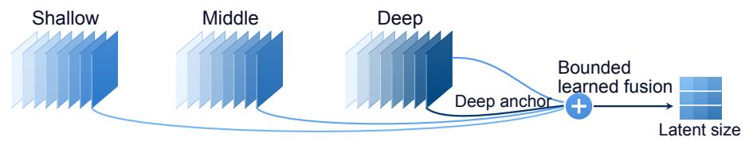

(a) Recovered detail  
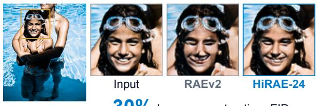  
30% lower reconstruction rFID

(b) Reconstruction and generation  
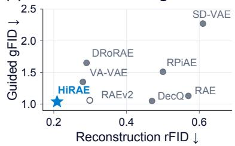  
Figure 1 Learning full-depth fusion for higher reconstruction fidelity. Top: HiRAE combines bounded residuals from three encoder-depth groups with the deepest-layer anchor. Left: matched input and reconstruction crops; HiRAE-24 reduces rFID by 30% relative to RAEv2. Right: reconstruction and guided generation across systems under their respective reported settings.

## Abstract

Pretrained visual representations support image generation, but may not fully preserve the fine-grained details needed for faithful reconstruction. Meanwhile, intermediate encoder layers contain complementary visual details, but learning to fuse them for reconstruction can produce a latent distribution that is dificult to model. Existing fusion methods require empirical tuning of layer selection or staged optimization of fusion and decoding, increasing configuration efort or training complexity. We introduce HiRAE (Hierarchical Representation Autoencoder), which learns a hierarchical fusion framework over the full encoder hierarchy to improve reconstruction fidelity while maintaining compatibility with generative modeling. HiRAE groups encoder layers by depth and learns residual corrections to the deepest representation. Group-wise norm caps bound these corrections relative to the deep anchor, with tighter budgets for shallower groups. Our HiRAE-24 preserves the latent token count and channel dimension. On ImageNet-256, HiRAE-24 reduces reconstruction FID from 0.299 to 0.209 relative to RAEv2 while maintaining competitive guided generation quality. For text-to-image generation, HiRAE-24 improves alignment over RAEv2 on GenEval, DPG-Bench, and GenAI-Bench both before and after supervised fine-tuning. Under the same generator-training and evaluation protocol, post-fine-tuning GenEval increases from 84.86 to 87.70.

## 1 Introduction

Pretrained vision encoders provide semantically organized representations for image generation, but their final outputs can omit details needed for faithful reconstruction [20, 22]. Representation Autoencoders (RAE) [27] pair these frozen encoders with learned decoders and train difusion models in the resulting latent space. Many previous methods rely solely on the highly abstracted semantic features of the final encoder layer, whereas reconstruction depends more on the detailed features retained in intermediate layers [20, 29]. Learning to use this information ofers a route to higher reconstruction fidelity while retaining the pretrained encoder as the basis for generation.

Recent tokenizers exploit the visual hierarchy to recover details missing from final-layer representations, through fixed aggregation (RAEv2; 20), learned full-depth fusion (DRoRAE; 29), or queries over intermediate features (DecQ; 22). IDEAL [4] combines selected shallow and deep features before quantization, while LV-RAE [14] supplements semantic features with a separate encoder for low-level detail. DecQ shows that using shallower layers or increasing the number of detail queries can improve reconstruction while worsening generation. For learned fusion, this trade-of raises a further concern: reconstruction-driven training can favor shallow-layer detail without accounting for its efect on generation quality. Existing approaches reconcile reconstruction and generation through predefined layer aggregation, additional detail pathways, or staged adaptation of fusion and decoding. Our seven-layer experiments show that learned fusion improves reconstruction while supporting guided generation, but identifying a suitable layer subset requires repeated training and evaluation. We aim to learn a unified representation for reconstruction and generation through joint training of full-hierarchy fusion and the decoder. How can we learn full-hierarchy fusion that improves reconstruction while maintaining compatibility with generative modeling?

We introduce HiRAE (Hierarchical Representation Autoencoder), a hierarchical fusion framework that integrates representations across encoder depths into a shared latent space for reconstruction and generation. Its main configuration, HiRAE-24, learns spatially varying contributions from all 24 layers of a frozen DINOv3- L encoder, avoiding manual layer-subset selection. Building on DRoRAE’s learned residual fusion [29], HiRAE organizes encoder layers into shallow, middle, and deep groups. Each group learns a residual correction to the deepest representation, with a distinct norm budget that increases with depth. These designs allow us to constrain how fusion modifies the deepest representation and jointly train the fusion module and decoder without a separate fusion-only adaptation phase. The fused representation preserves the original latent token count and channel dimension. On ImageNet-256 [5], HiRAE-24 reduces rFID from 0.299 to 0.209, a 30% reduction relative to RAEv2 [20]. On the matched 5,000-image reconstruction subset, it increases PSNR from 22.667 to 26.377 dB and reduces LPIPS [26] from 0.074 to 0.043. After 80 epochs of generator training, guided generation FID decreases from 1.060 to 1.038 (Figure 1). Analysis shows that fusion adds spatial detail while largely preserving class neighborhoods. The learned tokenizer also exhibits lower decoding sensitivity to the tested latent perturbations.

Our contributions are:

• Hierarchical representation autoencoding. We introduce HiRAE, a hierarchical fusion framework with depth-dependent residual budgets. These budgets control intermediate-layer contributions to enrich the deepest representation with complementary visual detail.

• Higher reconstruction fidelity and improved text-to-image alignment. HiRAE-24 reduces reconstruction FID by 30% relative to RAEv2 with competitive guided ImageNet generation. Under our shared text-to-image protocol, it improves GenEval, DPG-Bench, and GenAI-Bench scores before and after supervised fine-tuning, with a 2.84-point GenEval gain after fine-tuning.

• HiRAE’s latent structure and decoding sensitivity. Our analysis shows that hierarchical fusion enriches spatial detail while largely preserving class neighborhoods. The learned tokenizer also exhibits lower decoding sensitivity to the tested latent perturbations.

## 2 Related work

Visual representations for image generation. Latent difusion models such as LDM and DiT generate images in the compressed spaces of reconstruction-trained autoencoders [17, 18]. Representation alignment connects these generative models with pretrained visual encoders at diferent stages: REPA supervises difusion features, whereas VA-VAE regularizes the tokenizer latents themselves [24, 25]. Extending this connection to joint optimization, REPA-E uses alignment to support end-to-end tuning of the VAE and difusion model [12]. RAE takes a more direct route by pairing a frozen vision encoder with a learned decoder and training difusion in the encoder’s representation space [27]. HiRAE extends RAE with a learnable fusion module over the full frozen encoder hierarchy and jointly trains this module with the decoder.

Hierarchical fusion and detail enrichment. RAEv2 [20] extends representation autoencoding through fixed aggregation of selected encoder layers, incorporating intermediate-layer detail into the representation used for reconstruction and generation. The aggregation itself introduces no learned fusion module, making layer selection a key design choice. Related detail-enrichment designs include shallow-deep fusion before quantization in IDEAL and additional detail representations in DecQ and LV-RAE [4, 14, 22]. For learnable multi-layer fusion, DRoRAE combines layer-wise experts with routing across all encoder layers and trains the fusion module before adapting the decoder [29]. Building on this learned full-depth fusion, HiRAE introduces depth-dependent residual budgets that support joint fusion and decoder training.

Latent structure and generative modeling. Adding reconstruction detail also changes the representation that the generator must model, so improvements in reconstruction alone do not establish better generation [22, 24]. FAE and HAE adapt pretrained representations for generation through feature compression and hyperspherical modeling, respectively [2, 7]. Complementing these architectural approaches, Zhong et al. [28] systematically examine how latent properties relate to generation quality across tokenizer families. Our analysis examines this relationship within hierarchical fusion: we measure changes in spatial detail and class neighborhoods, together with the decoding response to latent perturbations.

## 3 HiRAE: controlled hierarchical composition

HiRAE-24 learns to use all encoder layers while jointly training the fusion module and decoder (Figure 2). A separate learned transformation (expert) processes each layer’s output, and a router learns the expert contributions at each spatial location. To prevent the latent space from drifting toward a reconstruction-dominated distribution during joint training, HiRAE combines these outputs into shallow, middle, and deep residual groups around the deepest-layer anchor. Group-wise norm caps assign tighter correction budgets to shallower groups, with residual dropout providing additional regularization. The encoder stays frozen, and the fused latent preserves its token count and channel dimension (Figure 3).

## 3.1 Layer-wise experts

A separate token-wise MLP expert [29] transforms each frozen encoder feature $\mathbf { \bar { \boldsymbol { H } } } _ { \ell } \in \mathbb { R } ^ { \mathbf { \bar { \boldsymbol { N } } } \times \boldsymbol { C } }$ before fusion:

$$
U _ { \ell } = \mathcal { E } _ { \ell } ( H _ { \ell } ) , \qquad \ell = 0 , \dots , L - 1 .\tag{1}
$$

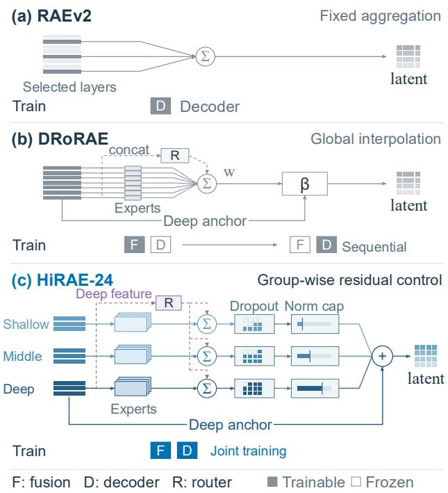  
Figure 2 Layer use and tokenizer training in RAEv2, DRoRAE, and HiRAE-24.

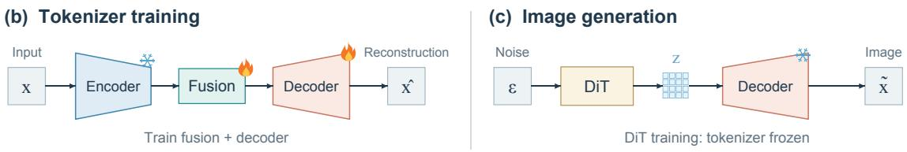

## (a) HiRAE-24 architecture

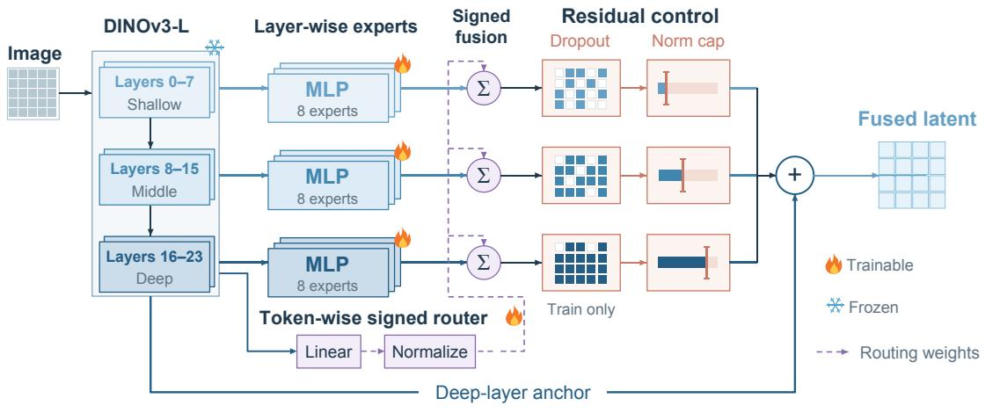  
Figure 3 HiRAE-24 architecture and training. (a) Layer-wise experts and signed routing combine all 24 encoder layers under depth-dependent residual controls. (b) Tokenizer training jointly updates fusion and decoder while freezing the encoder. (c) Generator training freezes the tokenizer.

We use all L = 24 DINOv3-L [19] layers with N = 256 tokens and C = 1024 channels; expert implementation details are given in Appendix A.1.

## 3.2 Routing

A shared linear projection of the deepest feature $H _ { L - 1 }$ produces routing scores at each spatial token n. We apply $\ell _ { 2 }$ normalization to these scores, retaining their signs:

$$
a _ { n } = \mathrm { L i n e a r } _ { R } ( H _ { L - 1 , n } ) \in \mathbb { R } ^ { L } , \qquad w _ { n } = \frac { a _ { n } } { \| a _ { n } \| _ { 2 } } .\tag{2}
$$

Stacking $w _ { n }$ gives $W \in \mathbb { R } ^ { N \times L }$ , whose column $w _ { \ell } = W _ { : , \ell }$ weights layer ℓ at each spatial location. Normalization details are given in Appendix A.1.

## 3.3 Residual regularization

Routing controls the combination weights but does not directly bound the resulting feature correction. We retain $H _ { L - 1 }$ as the anchor, but replace DRoRAE’s global interpolation with residual regularization applied separately to each depth group: groupwise norm caps and residual dropout. For the 24-layer encoder, we use three contiguous depth groups: $G _ { s } = \{ 0 , \dots , 7 \} , G _ { m } = \{ 8 , \dots , 1 5 \}$ , and $G _ { d } = \{ 1 6 , \dots , 2 3 \}$

Each group forms an unregularized residual $\begin{array} { r } { R _ { g } = \sum _ { \ell \in G _ { a } } w _ { \ell } \odot U _ { \ell } } \end{array}$ , where ⊙ broadcasts each spatial weigh across channels. The residual-control module $\mathcal { C } _ { g }$ converts $R _ { g }$ into a controlled correction $\Delta _ { g }$ . We add these corrections to the deepest feature $H _ { 2 3 }$ and apply layer normalization (LN) to obtain the fused latent Z:

$$
Z = \mathrm { L N } \left[ { \cal H } _ { 2 3 } + \sum _ { g \in \{ s , m , d \} } \Delta _ { g } \right] , \qquad \Delta _ { g } = { \mathcal C } _ { g } ( R _ { g } ; H _ { 2 3 } ) ,\tag{3}
$$

Here, LN normalizes the C channels of each spatial token independently. The module $\mathcal { C } _ { g }$ first applies residual dropout with probabilities $( p _ { s } , p _ { m } , p _ { d } ) = ( 0 . 5 0 , 0 . 2 5 , 0 . 1 0 )$ during tokenizer training. It then scales down a

group residual only when its norm exceeds its assigned budget. These groupwise norm caps enforce

$$
\left\| \Delta _ { g } \right\| _ { F } \leq c _ { g } \left\| H _ { 2 3 } \right\| _ { F } , \qquad \left( c _ { s } , c _ { m } , c _ { d } \right) = ( 0 . 0 2 5 , 0 . 0 7 5 , 0 . 1 5 0 ) .\tag{4}
$$

Here, $\left\| \cdot \right\| _ { F }$ denotes the Frobenius norm, computed separately for each image over all spatial tokens and channels. The caps therefore bound the summed contribution of each depth group after routing. Shallower groups receive tighter norm budgets and stronger dropout, while middle and deep groups allow progressively larger corrections.

Together, the three group budgets bound the total correction before final normalization. By the triangle inequality,

$$
\begin{array} { r } { \| \Delta _ { s } + \Delta _ { m } + \Delta _ { d } \| _ { F } \leq \| \Delta _ { s } \| _ { F } + \| \Delta _ { m } \| _ { F } + \| \Delta _ { d } \| _ { F } \leq 0 . 2 5 0 ~ \| H _ { 2 3 } \| _ { F } . } \end{array}\tag{5}
$$

## 3.4 Training the tokenizer and generator

HiRAE jointly trains fusion and decoding within the tokenizer stage, then trains the generator on the frozen tokenizer’s latents. In Stage 1, reconstruction losses update both the fusion module and decoder while the pretrained backbone stays frozen. DRoRAE [29] instead trains fusion against a frozen decoder before decoder adaptation; HiRAE removes this separate fusion-only adaptation phase (Figure 2). We use pixel reconstruction, perceptual, and adversarial losses, with decoder-input noise. In schematic form,

$$
{ \mathcal { L } } _ { \mathrm { t o k } } = { \mathcal { L } } _ { 1 } ( x , { \widehat { x } } ) + \lambda _ { \mathrm { p e r c } } { \mathcal { L } } _ { \mathrm { p e r c } } ( x , { \widehat { x } } ) + \lambda _ { \mathrm { a d v } } ( e ) { \mathcal { L } } _ { \mathrm { a d v } } ( { \widehat { x } } ) .\tag{6}
$$

Here, e denotes the training epoch. In Stage 2, we freeze the tokenizer and train a DiT generator on its latent representations, following $\mathrm { R A E v 2 ^ { \circ } s }$ prediction and internal-guidance framework. Appendix A provides the loss weighting and training configuration.

## 4 Reconstruction and generation

Datasets. For reconstruction and class-conditional generation, we train and evaluate HiRAE on ImageNet-1K [5]. For image reconstruction, we train the tokenizer on the training split at 256 × 256 resolution and evaluate on the validation split. Following the ADM evaluation protocol [6], we generate 50,000 images per configuration for FID computation. For text-to-image (T2I) generation, we follow RAEv2 [20] and pretrain on JourneyDB [21] together with the long-caption and short-caption subsets of BLIP3o [3], using 256 × 256 images. We then apply supervised fine-tuning (SFT) on BLIP3o-60k.

Evaluation metrics. For ImageNet, we measure reconstruction quality with reconstruction FID (rFID), and generation quality with generation FID (gFID) and Inception Score (IS). On a matched reconstruction subset, we additionally measure peak signal-to-noise ratio (PSNR) and Learned Perceptual Image Patch Similarity (LPIPS; 26). We also report $\mathrm { F D } _ { r } ^ { 6 } .$ which aggregates normalized Fréchet distances across six representation spaces. Our evaluations use their arithmetic mean. For T2I, we evaluate text–image alignment with GenEval [8] and Dense Prompt Graph Benchmark (DPG-Bench; 10). We additionally report GenAI-Bench [13], which evaluates compositional text–image alignment.

Implementation details. Our main comparisons evaluate HiRAE-24, which fuses all 24 layers of a frozen DINOv3-L encoder into a 16 × 16 × 1024 latent. For ImageNet, we evaluate exponential moving average (EMA) generators with and without internal guidance, retaining class conditioning in both settings. Appendix A provides the ImageNet training and sampling configuration. For T2I, we follow RAEv2. Pretraining uses 100K optimizer updates; SFT continues from the corresponding pretrained weights. Appendix A.4 details training schedules and scoring protocols.

## 4.1 Reconstruction quality

HiRAE improves reconstruction fidelity within the original latent dimensions. With the same frozen DINOv3-L encoder and $1 6 \times 1 6 \times 1 0 2 4$ latent shape, HiRAE-24 reduces rFID from the RAEv2 result of 0.299 to 0.209, a reduction of approximately 30% (Table 1). On the matched 5,000-image subset, PSNR increases from 22.667 to 26.377 dB and LPIPS decreases from 0.074 to 0.043. The improvement therefore covers both pixel accuracy and perceptual similarity. Learned full-hierarchy fusion and joint decoder training recover finer image detail without increasing the generator’s latent token count or channel dimension. As shown in Figure 4, HiRAE-24 more faithfully preserves text strokes and local colors. RAEv2 retains the overall image content but exhibits distortions in fine structures and local color shifts. These comparisons complement the rFID improvement, showing that controlled hierarchical fusion can recover image-specific details while maintaining the scene structure. The improvement also extends across all four quartiles of original-image texture strength. More textured images show larger LPIPS reductions and a larger efect from removing the shallow residual group (Appendix C.3), complementing the visual examples.

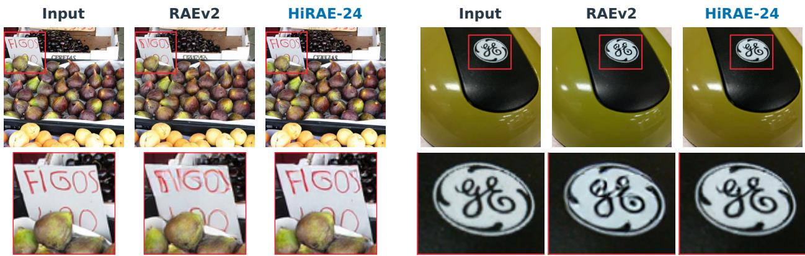  
Figure 4 Matched reconstruction details. Each selected triplet shows the input, oficial RAEv2, and HiRAE-24. Red boxes mark corresponding regions, enlarged below.

Table 1 ImageNet-256 reconstruction. The upper block follows each source’s evaluation protocol; dashes denote unreported values. The lower block combines 50K rFID with PSNR/LPIPS on our matched 5K subset (100 classes; AlexNet LPIPS). Bold marks the best result within the lower block.
<table><tr><td>Tokenizer</td><td>Configuration</td><td>rFID ↓</td><td>PSNR (dB) ↑</td><td>LPIPS ↓</td></tr><tr><td>SD-VAE [24]</td><td>f8, 4 channels</td><td>0.610</td><td>26.90</td><td>0.130</td></tr><tr><td>VA-VAE [24]</td><td>f16, 32 channels</td><td>0.280</td><td>27.96</td><td>0.096</td></tr><tr><td>REPA-E [12]</td><td>VA-VAE + E2E tuning</td><td>0.280</td><td>26.25</td><td>0.110</td></tr><tr><td>RPiAE [9]</td><td>Pivot + variational bridge</td><td>0.500</td><td>21.30</td><td>0.216</td></tr><tr><td>FAE [7]</td><td>32-channel feature AE</td><td>0.680</td><td></td><td></td></tr><tr><td>RAE [27]</td><td>DINOv2-B, last layer</td><td>0.570</td><td>18.80</td><td>0.256</td></tr><tr><td>DRoRAE [29]</td><td>DINOv2-B, three-phase</td><td>0.290</td><td>24.32</td><td>0.134</td></tr><tr><td>DecQ [22]</td><td>DINOv2-B + 8 queries</td><td>0.470</td><td>22.76</td><td></td></tr><tr><td>HAE [2]</td><td>DINOv3-L, spherical latent</td><td>0.780</td><td>25.20</td><td></td></tr><tr><td>RAEv2 [20]</td><td>DINOv3-L, selected 7 layers</td><td>0.299</td><td>22.667</td><td>0.074</td></tr><tr><td>HiRAE-24</td><td>DINOv3-L, all 24 layers</td><td>0.209</td><td>26.377</td><td>0.043</td></tr></table>

## 4.2 Image generation

Higher reconstruction fidelity coexists with competitive guided generation. As shown in Table 3, HiRAE-24 achieves a guided gFID of 1.038 after 80 epochs of generator training, compared with 1.060 for RAEv2 at the same training duration. IS also increases from 255.300 to 257.823. The reconstruction gain therefore coexists with competitive

Table 2 Unguided ImageNet-256 generation.
<table><tr><td>Tokenizer</td><td>gFID ↓</td><td>IS↑</td><td>FDr ↓</td></tr><tr><td>RAEv2</td><td>1.650</td><td>228.000</td><td>3.950</td></tr><tr><td>RAEv2 K=23</td><td>3.010</td><td>206.000</td><td></td></tr><tr><td>HiRAE-24</td><td>2.129</td><td>210.339</td><td>4.660</td></tr></table>

guided generation in the same representation learned from the full encoder hierarchy. DecQ [22] appends

Table 3 Guided ImageNet-256 generation. Epochs count generator training. CFG-int.: interval CFG; AG: AutoGuidance; IG: internal guidance.
<table><tr><td>System</td><td>Epochs</td><td>Guide</td><td>gFID ↓</td><td>IS ↑ FD6↓</td></tr><tr><td>DiT-XL/2 [17]</td><td>1400</td><td>CFG</td><td>2.270</td><td>278.200</td></tr><tr><td>SiT-XL/2 [15]</td><td>1400</td><td>CFG</td><td>2.060</td><td>270.300</td></tr><tr><td>REPA [25]</td><td>800</td><td>CFG-int.</td><td>1.420</td><td>305.700</td></tr><tr><td>VA-VAE [24]</td><td>800</td><td>CFG</td><td>1.350</td><td>295.300</td></tr><tr><td>REPA-E [12]</td><td>800</td><td>CFG</td><td>1.120</td><td>302.900</td></tr><tr><td>RPiAE [9]</td><td>80</td><td>AG</td><td>1.510</td><td>225.900</td></tr><tr><td>FAE [7]</td><td>800</td><td>CFG</td><td>1.290</td><td>268.000</td></tr><tr><td>RAE [27]</td><td>800</td><td>AG</td><td>1.130</td><td>262.600</td></tr><tr><td>RAE [27]</td><td>80</td><td>AG</td><td>1.740</td><td>235.000</td></tr><tr><td>DRoRAE [29]</td><td>80</td><td>AG</td><td>1.650</td><td>230.600</td></tr><tr><td>LV-RAE [14]</td><td>800</td><td>AG</td><td>1.820</td><td>249.700</td></tr><tr><td>DecQ [22]</td><td>800</td><td>AG</td><td>1.050</td><td>259.600</td></tr><tr><td>HAE [2]</td><td>550</td><td>CFG</td><td>1.900</td><td>252.700</td></tr></table>

<table><tr><td colspan="4">DINOv3-L RAEv2 framework; internal guidance</td></tr><tr><td>RAEv2 [20] 80 IG</td><td></td><td>1.060 255.300</td><td>2.170</td></tr><tr><td>HiRAE-24</td><td>80 IG</td><td>1.038 257.823</td><td>1.856</td></tr></table>

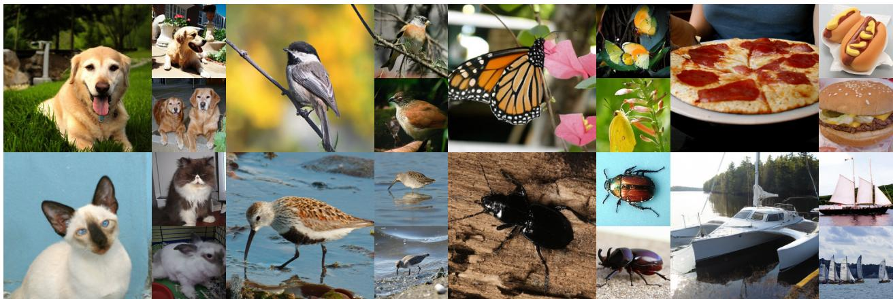  
Figure 5 Guided samples from HiRAE-24. Twenty-four selected class-conditioned images form eight visual groups, each with one larger example and two related samples.

eight detail-query tokens. It generates these alongside the original patch tokens, whereas HiRAE-24 integrates hierarchical information into the existing patch-token layout. Their comparable gFID shows that detail enrichment can support competitive generation within the original latent token count and channel dimension. REPA-E [12] obtains its tokenizer through end-to-end VAE–difusion tuning; HiRAE learns fusion and decoding over a frozen encoder, then freezes the tokenizer for generator training. Figure 5 shows selected outputs spanning animals, objects, and scenes, combining coherent object structure with fine local detail. Without guidance, Table 2 shows that HiRAE-24 achieves a gFID of 2.129, improving on RAEv2 K=23’s 3.010 while remaining above RAEv2’s 1.650.

## 4.3 Text-to-image generation

HiRAE-7 and HiRAE-24 achieve higher text–image alignment scores than RAEv2 both after pretraining and after supervised fine-tuning (SFT). Table 4 compares FLUX-VAE [1], RAEv2 [20], HiRAE-7, and HiRAE-24 as frozen image tokenizers after 100K generator pretraining steps and after SFT. At inference, all four evaluated configurations use classifier-free guidance (CFG) with scale 6 and internal guidance disabled. We report GenEval, DPG-Bench, and GenAI-Bench scores; Appendix A.4 gives implementation details. After pretraining, HiRAE-24 improves GenEval by 4.52 points and DPG-Bench by 1.51 points over RAEv2. This advantage

Table 4 Text-to-image generation before and after SFT. DPG and GenAI denote DPG-Bench and GenAI-Bench. Bold denotes the best available score within each stage.
<table><tr><td rowspan="2">Model</td><td colspan="3">Pretraining</td><td colspan="3">Finetuning</td></tr><tr><td>GenEval ↑</td><td>DPG ↑</td><td>GenAI ↑</td><td>GenEval ↑</td><td>DPG ↑</td><td>GenAI ↑</td></tr><tr><td>FLUX-VAE [1]</td><td>49.73</td><td>78.86</td><td>63.65</td><td>84.13</td><td>83.48</td><td>68.75</td></tr><tr><td>RAEv2 [20]</td><td>56.42</td><td>81.22</td><td>67.02</td><td>84.86</td><td>84.90</td><td>71.69</td></tr><tr><td>HiRAE-7</td><td>58.77</td><td>81.60</td><td>67.13</td><td>85.17</td><td>85.05</td><td>72.02</td></tr><tr><td>HiRAE-24</td><td>60.94</td><td>82.73</td><td>68.08</td><td>87.70</td><td>86.35</td><td>72.66</td></tr></table>

Table 5 Expert inputs and residual regularization. Raw-layer experts: ✓, 24 layer experts; , seven depth-mode experts. Residual regularization combines norm caps and residual dropout.
<table><tr><td rowspan="2">Model</td><td rowspan="2">Raw-layer experts</td><td rowspan="2">Residual regularization</td><td rowspan="2">rFID ↓</td><td colspan="2">20 epochs</td><td colspan="2">80 epochs</td></tr><tr><td>gFID ↓</td><td> $\mathrm { F D } _ { r } ^ { 6 } \downarrow$ </td><td> $\mathrm { g F I D \downarrow }$ </td><td> $\mathrm { F D } _ { r } ^ { 6 } \downarrow$ </td></tr><tr><td>HiRAE</td><td>√</td><td>√</td><td>0.209</td><td>2.242</td><td>2.533</td><td>1.038</td><td>1.856</td></tr><tr><td>HiRAE</td><td>X</td><td>r</td><td>0.230</td><td>2.410</td><td>2.650</td><td>1.067</td><td>1.929</td></tr><tr><td>HiRAE</td><td>X</td><td>X</td><td>0.023</td><td>7.905</td><td>14.722</td><td></td><td></td></tr></table>

persists after SFT, with gains of 2.84, 1.45, and 0.97 points on GenEval, DPG-Bench, and GenAI-Bench, respectively. HiRAE-7 also exceeds RAEv2 on every available benchmark, while HiRAE-24 improves further across both stages. These results extend the evidence for learned fusion from class-conditioned generation to text-conditioned generation and support the full-depth configuration without prior layer-subset selection. Figure 12 in Appendix F.4 compares the four methods on five selected GenEval prompts after SFT.

## 5 Ablation Studies and Analysis

## 5.1 Ablation studies

Comparison of fusion methods. Applying DRoRAE-style layer experts and learned aggregation [29] within RAEv2 improves both reconstruction and guided generation (Table 6). On the same seven selected layers, HiRAE-7 reduces rFID from 0.299 to 0.217 and guided gFID from 1.060 to 1.038. HiRAE-24 uses all 24 layers to remove the prerequisite of selecting a suitable subset, while HiRAE-7 remains a compact extension when a subset is available. For full-depth fusion, we compare HiRAE-24 with DRoRAE-style fusion adapted to RAEv2, using 24 experts in both configurations. The adapted DRoRAE-style fusion

Table 6 Fusion methods in the RAEv2 framework. DRoRAE-style fusion uses global interpolation to mix the deepest-layer representation and aggregated expert output at a fixed 80:20 ratio.
<table><tr><td>Model</td><td>rFID ↓</td><td>gFID↓</td><td>FD6 ↓</td></tr><tr><td>Selected 7 layers</td><td></td><td></td><td></td></tr><tr><td>RAEv2</td><td>0.299</td><td>1.060</td><td>2.170</td></tr><tr><td>HiRAE-7</td><td>0.217</td><td>1.038</td><td>1.913</td></tr><tr><td>All 24 layers</td><td></td><td></td><td></td></tr><tr><td>RAEv2 + DRoRAE</td><td>0.065</td><td>1.551</td><td>3.375</td></tr><tr><td>HiRAE-24</td><td>0.209</td><td>1.038</td><td>1.856</td></tr></table>

achieves lower rFID (0.065 versus 0.209), whereas HiRAE-24 achieves lower guided $\mathrm { g F I D }$ (1.038 versus 1.551) and FD6 (1.856 versus 3.375). These results show that reconstruction fidelity alone is insuficient for choosing a fusion method for guided generation. HiRAE-24 improves reconstruction over RAEv2 while achieving competitive guided generation performance, supporting its use for both reconstruction and generation.

Expert input and residual regularization ablation. Table 5 compares three configurations trained for 16 tokenizer epochs, with generation evaluated on 50K guided samples from EMA generators at epochs 20 and 80. With residual regularization fixed, replacing 24 raw-layer experts with seven depth-mode experts increases rFID from 0.209 to 0.230 and guided gFID from 1.038 to 1.067 at epoch 80. The same ordering holds at epoch 20, supporting retention of the layer-wise expert design. The unregularized depth-mode configuration reaches rFID 0.023, but its guided gFID and $\mathrm { F D } _ { r } ^ { 6 }$ rise to 7.905 and 14.722 at epoch 20, compared with 2.410 and

(c) Decoding response  
Table 7 Depth-group count. rFID: 5K images; guided gFID: 10K samples, IG=1.78.
<table><tr><td>Groups</td><td>rFID ↓</td><td>Guided gFID ↓</td></tr><tr><td>2</td><td>3.293</td><td>29.385</td></tr><tr><td>3</td><td>3.363</td><td>28.354</td></tr><tr><td>4</td><td>3.457</td><td>31.321</td></tr></table>

Table 8 Depth-group interventions. LPIPS changes 103.
<table><tr><td>Depth group</td><td>Group removal</td><td>High – low</td></tr><tr><td>Shallow (0–7)</td><td>5.650</td><td>0.215</td></tr><tr><td>Middle (8–15)</td><td>54.111</td><td>0.068</td></tr><tr><td>Deep (16–23)</td><td>147.750</td><td>-2.053</td></tr></table>

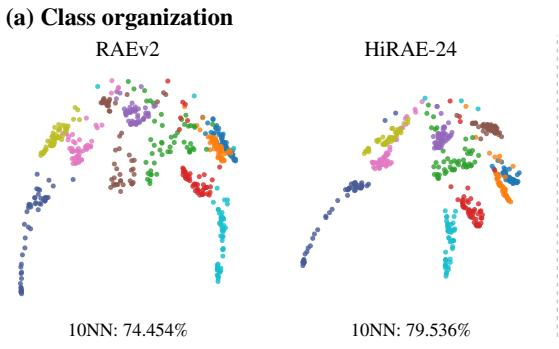

(b) Spatial variation  
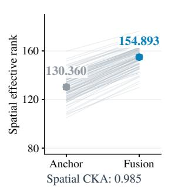

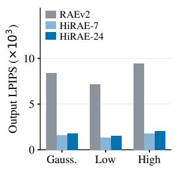  
Figure 6 Latent structure and decoding sensitivity. (a) Independently fitted PHATE views of the same images; colors denote classes. Same-class 10NN uses the original feature space. (b) Within HiRAE-24, lines connect anchor– fusion efective ranks for 100 images; points and error bars show means and 95% bootstrap CIs. (c) Mean output LPIPS under 10% relative latent perturbations.

2.650 for the regularized configuration. Together, these comparisons favor retaining layer-wise experts and residual regularization to combine reconstruction fidelity with guided generation quality.

Depth-group ablation. We compare two, three, and four depth groups. Three groups achieve the lowest guided gFID, with rFID close to that of two groups (Table 7). This balance supports our three-group design. In the main HiRAE-24 tokenizer, removing any depth-group residual increases reconstruction LPIPS on 5,000 matched images (Table 8), showing that all three groups contribute to reconstruction. For equal-norm removals, high-frequency removal causes more damage in the shallow group, while low-frequency removal causes more damage in the deep group. The middle group’s diference is small, with a paired 95% interval that includes zero. These results support complementary reconstruction information across depths. We provide full results in Apps D.4 and D.5.

## 5.2 Latent-space analysis

Fusion expands spatial variation while retaining class organization. Figure 6(a) visualizes RAEv2 and HiRAE-24 on the same 500 images using PHATE [16], which provides a low-dimensional visualization of the representations. In the original feature space, the same-class fraction among ten nearest neighbors over 5,000 matched images is 74.454% for RAEv2 and 79.536% for HiRAE-24. Within HiRAE-24, this fraction changes from 79.634% for the deep anchor to 79.536% after fusion, indicating largely preserved class neighborhoods. Across 100 fixed images, one per class, spatial efective rank increases from 130.360 for the deep anchor, LN(H ), to 154.893 for the fused representation, with an increase in every image (Figure 6(b)). Meanwhile, mean spatial centered kernel alignment (CKA; 11) remains 0.985. Thus, spatial variation spreads over more feature directions while the patch-relationship structure remains similar.

Spatial enrichment coexists with lower decoding sensitivity. Figure 6(c) measures LPIPS between clean and perturbed decodings under Gaussian, low-frequency, and high-frequency latent perturbations. We measure each tokenizer’s decoding response through its own inverse normalization and trained decoder. At a perturbation norm equal to 10% of the standardized latent norm, HiRAE-24 produces 21%–22% of RAEv2’s output LPIPS change across the three direction types. The trained generator also predicts HiRAE-24 latents more accurately across intermediate noise levels. At seven matched coeficient log signal-to-noise ratio (log-SNR)

levels, HiRAE-24 has lower clean-latent mean squared error than RAEv2 at the five interior levels and slightly higher error at both endpoints. Appendix E provides the full results and protocol. The diagnostics show lower latent prediction error at intermediate noise levels and lower decoding sensitivity to the perturbations.

## 6 Conclusion

HiRAE learns high-fidelity visual tokenizers through joint fusion and decoder training, with depth-dependent residual bounds controlling each depth group’s contribution. HiRAE-24 learns the contributions of all 24 encoder layers without manual layer-subset selection or a separate fusion-only adaptation phase. ImageNet-256 results show higher reconstruction fidelity than RAEv2 with competitive guided generation within the original latent dimensions. Matched-image analyses connect the added detail to complementary information across depth groups and largely preserved class neighborhoods. HiRAE-7 extends the framework to compact fusion over an established subset.

## References

[1] Black Forest Labs. FLUX. https://github.com/black-forest-labs/flux, 2024.

[2] Hun Chang, Byunghee Cha, and Jong Chul Ye. Hyperspherical autoencoder for high-fidelity image reconstruction and generation. arXiv preprint arXiv:2601.22904v2, 2026. URL https://arxiv.org/abs/2601.22904v2.

[3] Jiuhai Chen, Zhiyang Xu, Xichen Pan, Yushi Hu, Can Qin, Tom Goldstein, Lifu Huang, Tianyi Zhou, Saining Xie, Silvio Savarese, Le Xue, Caiming Xiong, and Ran Xu. BLIP3-o: A family of fully open unified multimodal models-architecture, training and dataset. arXiv preprint arXiv:2505.09568, 2025. URL https://arxiv.org/ abs/2505.09568.

[4] Yitong Chen, Zijie Diao, Junke Wang, Lingyu Kong, Yixuan Ren, Bo He, Yu-Gang Jiang, and Zuxuan Wu. IDEAL: In-DEpth ALignment Makes A Discrete Representation AutoEncoder. arXiv preprint arXiv:2606.11096, 2026. doi: 10.48550/ARXIV.2606.11096. URL https://arxiv.org/abs/2606.11096.

[5] Jia Deng, Wei Dong, Richard Socher, Li-Jia Li, K. Li, and Li Fei-Fei. Imagenet: A large-scale hierarchical image database. 2009 IEEE Conference on Computer Vision and Pattern Recognition, pages 248–255, 2009. URL https://api.semanticscholar.org/CorpusID:57246310.

[6] Prafulla Dhariwal and Alexander Nichol. Difusion models beat gans on image synthesis. In M. Ranzato, A. Beygelzimer, Y. Dauphin, P.S. Liang, and J. Wortman Vaughan, editors, Advances in Neural Information Processing Systems, volume 34, pages 8780–8794. Curran Associates, Inc., 2021. URL https://proceedings. neurips.cc/paper\_files/paper/2021/file/49ad23d1ec9fa4bd8d77d02681df5cfa-Paper.pdf.

[7] Yuan Gao, Chen Chen, Tianrong Chen, and Jiatao Gu. One layer is enough: Adapting pretrained visual encoders for image generation. arXiv preprint arXiv:2512.07829v2, 2025. URL https://arxiv.org/abs/2512.07829v2.

[8] Dhruba Ghosh, Hannaneh Hajishirzi, and Ludwig Schmidt. GenEval: An object-focused framework for evaluating text-to-image alignment. In Advances in Neural Information Processing Systems, volume 36, 2023. URL https://arxiv.org/abs/2310.11513.

[9] Yue Gong, Hongyu Li, Shanyuan Liu, Bo Cheng, Yuhang Ma, Liebucha Wu, Xiaoyu Wu, Manyuan Zhang, Dawei Leng, Yuhui Yin, et al. Rpiae: A representation-pivoted autoencoder enhancing both image generation and editing. arXiv preprint arXiv:2603.19206, 2026.

[10] Xiwei Hu, Rui Wang, Yixiao Fang, Bin Fu, Pei Cheng, and Gang Yu. ELLA: Equip difusion models with LLM for enhanced semantic alignment. arXiv preprint arXiv:2403.05135, 2024. URL https://arxiv.org/abs/2403.05135.

[11] Simon Kornblith, Mohammad Norouzi, Honglak Lee, and Geofrey Hinton. Similarity of neural network representations revisited. In Proceedings of the 36th International Conference on Machine Learning, volume 97, pages 3519–3529. PMLR, 2019. URL https://proceedings.mlr.press/v97/kornblith19a.html.

[12] Xingjian Leng, Jaskirat Singh, Yunzhong Hou, Zhenchang Xing, Saining Xie, and Liang Zheng. Repa-e: Unlocking vae for end-to-end tuning with latent difusion transformers. arXiv preprint arXiv:2504.10483v3, 2025. URL https://arxiv.org/abs/2504.10483v3.

[13] Baiqi Li, Zhiqiu Lin, Deepak Pathak, Jiayao Li, Yixin Fei, Kewen Wu, Xide Xia, Pengchuan Zhang, Graham Neubig, and Deva Ramanan. Evaluating and improving compositional text-to-visual generation. In Proceedings of the IEEE/CVF Conference on Computer Vision and Pattern Recognition Workshops, pages 5290–5301, 2024. URL https://openaccess.thecvf.com/content/CVPR2024W/EvGenFM/html/Li\_Evaluating\_ and\_Improving\_Compositional\_Text-to-Visual\_Generation\_CVPRW\_2024\_paper.html.

[14] Siyu Liu, Chujie Qin, Hubery Yin, Qixin Yan, Zheng-Peng Duan, Chen Li, Jing Lyu, Chun-Le Guo, and Chongyi Li. Improving reconstruction of representation autoencoder. arXiv preprint arXiv:2602.08620v1, 2026. URL https://arxiv.org/abs/2602.08620v1.

[15] Nanye Ma, Mark Goldstein, Michael S Albergo, Nicholas M Bofi, Eric Vanden-Eijnden, and Saining Xie. Sit: Exploring flow and difusion-based generative models with scalable interpolant transformers. In European Conference on Computer Vision, pages 23–40. Springer, 2024.

[16] Kevin R. Moon, David van Dijk, Zheng Wang, Scott Gigante, et al. Visualizing structure and transitions in high-dimensional biological data. Nature Biotechnology, 37(12):1482–1492, 2019. doi: 10.1038/s41587-019-0336-3.

[17] William Peebles and Saining Xie. Scalable difusion models with transformers. In Proceedings of the IEEE/CVF international conference on computer vision, pages 4195–4205, 2023.

[18] Robin Rombach, Andreas Blattmann, Dominik Lorenz, Patrick Esser, and Björn Ommer. High-resolution image synthesis with latent difusion models. In Proceedings of the IEEE/CVF conference on computer vision and pattern recognition, pages 10684–10695, 2022.

[19] Oriane Siméoni, Huy V. Vo, Maximilian Seitzer, Federico Baldassarre, Maxime Oquab, Cijo Jose, et al. DINOv3. arXiv preprint arXiv:2508.10104, 2025. URL https://arxiv.org/abs/2508.10104.

[20] Jaskirat Singh, Boyang Zheng, Zongze Wu, Richard Zhang, Eli Shechtman, and Saining Xie. Improved baselines with representation autoencoders. arXiv preprint arXiv:2605.18324, 2026. URL https://arxiv.org/abs/2605. 18324.

[21] Keqiang Sun, Junting Pan, Yuying Ge, Hao Li, Haodong Duan, Xiaoshi Wu, Renrui Zhang, Aojun Zhou, Zipeng Qin, Yi Wang, Jifeng Dai, Yu Qiao, Limin Wang, and Hongsheng Li. JourneyDB: A benchmark for generative image understanding. In Advances in Neural Information Processing Systems, volume 36, 2023. URL https://arxiv.org/abs/2307.00716.

[22] Tianhang Wang, Yitong Chen, Wei Song, Zuxuan Wu, Min Li, and Jiaqi Wang. Decq: Detail-condensing queries for enhanced reconstruction and generation in representation autoencoders. arXiv preprint arXiv:2605.22777v1, 2026. URL https://arxiv.org/abs/2605.22777v1.

[23] Jiawei Yang, Zhengyang Geng, Xuan Ju, Yonglong Tian, and Yue Wang. Representation fréchet loss for visual generation. arXiv preprint arXiv:2604.28190, 2026. URL https://arxiv.org/abs/2604.28190.

[24] Jingfeng Yao, Bin Yang, and Xinggang Wang. Reconstruction vs. generation: Taming optimization dilemma in latent difusion models. In Proceedings of the IEEE/CVF Conference on Computer Vision and Pattern Recognition, 2025.

[25] Sihyun Yu, Sangkyung Kwak, Huiwon Jang, Jongheon Jeong, Jonathan Huang, Jinwoo Shin, and Saining Xie. Representation alignment for generation: Training difusion transformers is easier than you think. In International Conference on Learning Representations, 2025.

[26] Richard Zhang, Phillip Isola, Alexei A Efros, Eli Shechtman, and Oliver Wang. The unreasonable efectiveness of deep features as a perceptual metric. In Proceedings of the IEEE conference on computer vision and pattern recognition, pages 586–595, 2018.

[27] Boyang Zheng, Nanye Ma, Shengbang Tong, and Saining Xie. Difusion transformers with representation autoencoders. arXiv preprint arXiv:2510.11690, 2025.

[28] Tianxiong Zhong, Xingye Tian, Xuebo Wang, Xin Tao, and Pengfei Wan. Difusing in the right space: A systematic study of latent difusability. arXiv preprint arXiv:2606.03578, 2026. URL https://arxiv.org/abs/2606.03578.

[29] Xuanyu Zhu, Yan Bai, Yang Shi, Yihang Lou, Yuanxing Zhang, Jing Jin, and Yuan Zhou. Beyond the Last Layer: Multi-Layer Representation Fusion for Visual Tokenization. arXiv preprint arXiv:2605.10780, 2026. doi: 10.48550/ARXIV.2605.10780. URL https://arxiv.org/abs/2605.10780.

## Appendix Guide

A Implementation Details . . . . . . . . . . . . . . . . . . . . . . . . . . . . . . . . . . . . . . . . . . . . . . . . . . . . . . . . . . . . . . . . . . . . . . . . . . . . . . . . . . . . . . 14   
A.1 HiRAE-24 architecture . . . . . . . . . . . . . . . . . . . . . . . . . . . . . . . . . . . . . . . . . . . . . . . . . . . . . . . . . . . . . . . . . . . . . . . . . . . . . . . . . . . . 14   
A.2 ImageNet training . . . . . . . . . . . . . . . . . . . . . . . . . . . . . . . . . . . . . . . . . . . . . . . . . . . . . . . . . . . . . . . . . . . . . . . . . . . . . . . . . . . . . . . . . 15   
A.3 ImageNet sampling . . . . . . . . . . . . . . . . . . . . . . . . . . . . . . . . . . . . . . . . . . . . . . . . . . . . . . . . . . . . . . . . . . . . . . . . . . . . . . . . . . . . . . . . 15   
A.4 Text-to-image training and evaluation . . . . . . . . . . . . . . . . . . . . . . . . . . . . . . . . . . . . . . . . . . . . . . . . . . . . . . . . . . . . . . . . . . . . . 15   
B Evaluation Protocols and Baseline Results . . . . . . . . . . . . . . . . . . . . . . . . . . . . . . . . . . . . . . . . . . . . . . . . . . . . . . . . . . . . . . . . . . 17   
B.1 Metrics and aggregation . . . . . . . . . . . . . . . . . . . . . . . . . . . . . . . . . . . . . . . . . . . . . . . . . . . . . . . . . . . . . . . . . . . . . . . . . . . . 17   
B.2 Baseline configurations and result sources . . . . . . . . . . . . . . . . . . . . . . . . . . . . . . . . . . . . . . . . . . . . . . . . . . . . . . . . . . . . . . . . . 17   
B.3 Oficial-checkpoint unguided evaluation . . . . . . . . . . . . . . . . . . . . . . . . . . . . . . . . . . . . . . . . . . . . . . . . . . . . . . . . . . . . . . . . . . . . 18   
B.4 Additional generation comparisons . . . . . . . . . . . . . . . . . . . . . . . . . . . . . . . . . . . . . . . . . . . . . . . . . . . . . . . . . . . . . . . . . . . . . . . . 18   
C Additional Reconstruction Results . . . . . . . . . . . . . . . . . . . . . . . . . . . . . . . . . . . . . . . . . . . . . . . . . . . . . . . . . . . . . . . . . . . . . . . . . . . 19   
C.1 Matched-image evaluation . . . . . . . . . . . . . . . . . . . . . . . . . . . . . . . . . . . . . . . . . . . . . . . . . . . . . . . . . . . . . . . 19   
C.2 Paired improvements and spatial-detail errors . . . . . . . . . . . . . . . . . . . . . . . . . . . . . . . . . . . . . . . . . . . . . . . . . . . . . . . . . . . . . 19   
C.3 Reconstruction gains across texture strata . . . . . . . . . . . . . . . . . . . . . . . . . . . . . . . . . . . . . . . . . . . . . . . . . . . . . . . . . . . . . . . . . 20   
D Fusion Configurations and Ablations . . . . . . . . . . . . . . . . . . . . . . . . . . . . . . . . . . . . . . . . . . . . . . . . . . . . . . . . . . . . . . . . . . . . . . . . 21   
D.1 HiRAE-7: selected-layer extension . . . . . . . . . . . . . . . . . . . . . . . . . . . . . . . . . . . . . . . . . . . . . . . . . . . . . . . . . . . . . . . . . . . . . . . . . 21   
D.2 DRoRAE-style full-depth fusion . . . . . . . . . . . . . . . . . . . . . . . . . . . . . . . . . . . . . . . . . . . . . . . . . . . . . . . . . . . . . . . . . . . . . . . . . . . 21   
D.3 Expert inputs and residual regularization . . . . . . . . . . . . . . . . . . . . . . . . . . . . . . . . . . . . . . . . . . . . . . . . . . . . . . . . . . . . . . . . . . 22   
D.4 Number of depth groups . . . . . . . . . . . . . . . . . . . . . . . . . . . . . . . . . . . . . . . . . . . . . . . . . . . . . . . . . . . . . . . . . . . . . . . . . . . . . . . . 22   
D.5 Layer-group and frequency interventions . . . . . . . . . . . . . . . . . . . . . . . . . . . . . . . . . . . . . . . . . . . . . . . . . . . . . . . . . . . . . . . . . . . 23   
E Latent-Space and Decoding Analysis . . . . . . . . . . . . . . . . . . . . . . . . . . . . . . . . . . . . . . . . . . . . . . . . . . . . . . . . . . . . . . . . . . . . . . . 24   
E.1 Analysis protocol . . . . . . . . . . . . . . . . . . . . . . . . . . . . . . . . . . . . . . . . . . . . . . . . . . . . . . . . . . . . . . . . . . . . . . . . . . . . . . . . . . 24   
E.2 Class organization and spatial enrichment . . . . . . . . . . . . . . . . . . . . . . . . . . . . . . . . . . . . . . . . . . . . . . . . . . . . . . . . . . . . . . . . . 24   
E.3 Cross-system spatial statistics . . . . . . . . . . . . . . . . . . . . . . . . . . . . . . . . . . . . . . . . . . . . . . . . . . . . . . . . . . . . . . . . . . . . . . . . . . . . . 25   
E.4 Decoding response to latent perturbations . . . . . . . . . . . . . . . . . . . . . . . . . . . . . . . . . . . . . . . . . . . . . . . . . . . . . . . . . . . . . . . . . 26   
E.5 Generator prediction error . . . . . . . . . . . . . . . . . . . . . . . . . . . . . . . . . . . . . . . . . . . . . . . . . . . . . . . . . . . . . . . . . . . . . . . . . . . . . . . . . 26   
F Additional Qualitative Results . . . . . . . . . . . . . . . . . . . . . . . . . . . . . . . . . . . . . . . . . . . . . . . . . . . . . . . . . . . . . . . . . . . . . . . . . . . . . . . 27   
F.1 Reconstruction comparisons . . . . . . . . . . . . . . . . . . . . . . . . . . . . . . . . . . . . . . . . . . . . . . . . . . . . . . . . . . . . . . . . . . . . . . . . . . . . . . . 27   
F.2 Generation samples. . . . . . . . . . . . . . . . . . . . . . . . . . . . . . . . . . . . . . . . . . . . . . . . . . . . . . . . . . . . . . . . . . . . . . . . . . . . . . . . . . . . 28   
F.3 Sample selection and visualization details . . . . . . . . . . . . . . . . . . . . . . . . . . . . . . . . . . . . . . . . . . . . . . . . . . . . . . . . . . . . . . . . . . 28   
F.4 Text-to-image comparisons . . . . . . . . . . . . . . . . . . . . . . . . . . . . . . . . . . . . . . . . . . . . . . . . . . . . . . . . . . . . . . . . . . . . . . . . . . . . . . . . 29

## A Implementation Details

## A.1 HiRAE-24 architecture

The backbone is DINOv3 ViT-L/16, with the LVD-1689M pretrained weights. We extract patch tokens from all 24 blocks using the encoder’s normalized intermediate-layer interface. These tensors constitute $H _ { \ell }$ in Section 3. There is no discrete cosine transform (DCT) or other depth compression in HiRAE-24. The spatial resolution is $1 6 \times 1 6$ at input resolution $2 5 6 \times 2 5 6$ . Each of the 24 experts has linear dimensions $1 0 2 4 \to 4 0 9 6 \to 1 0 2 4$ , with hidden LayerNorm and GELU. The expert’s internal dropout probability is zero in the main configuration; the group residual dropout is distinct.

Fusion modules. The three modules in Section 3 collect the following operations. Let LN denote token-wise channel normalization and $\mathrm { L N } _ { h }$ the expert’s hidden normalization. A layer-specific expert is

$$
\begin{array} { r l } & { \mathcal { E } _ { \ell } ( H ) = \mathrm { L N } ( E _ { \ell } ( \mathrm { L N } ( H ) ) ) , } \\ & { E _ { \ell } ( u ) = W _ { \ell , 2 } \mathrm { \ G E L U } ( \mathrm { L N } _ { h } ( W _ { \ell , 1 } u + b _ { \ell , 1 } ) ) + b _ { \ell , 2 } . } \end{array}\tag{7}
$$

The hidden width is 4C. The router acts independently at each spatial token n:

$$
a _ { n } = W _ { R } H _ { L - 1 , n } + b _ { R } , \qquad W _ { n , \ell } = { \frac { a _ { n , \ell } } { \sqrt { \operatorname* { m a x } ( \sum _ { j = 0 } ^ { L - 1 } a _ { n , j } ^ { 2 } , \epsilon ) } } } .\tag{8}
$$

For the group residual $\begin{array} { r } { R _ { g } = \sum _ { \ell \in G _ { g } } w _ { \ell } \odot U _ { \ell } . } \end{array}$ , define $D _ { g } = \operatorname { D r o p } _ { p _ { g } } ( R _ { g } )$ . The residual-control module is

$$
\mathcal { C } _ { g } ( R _ { g } ; H _ { L - 1 } ) = D _ { g } \operatorname* { m i n } \biggl ( 1 , \frac { c _ { g } \left\| H _ { L - 1 } \right\| _ { F } } { \operatorname* { m a x } ( \left\| D _ { g } \right\| _ { F } , \epsilon ) } \biggr ) .\tag{9}
$$

Dropout is elementwise and disabled at inference. Norms cover all spatial tokens and channels within each image. The three groups contain layers 0–7, 8–15, and 16–23. Their caps sum to 0.250, so the triangle inequality gives

$$
\left\| \sum _ { g } \mathcal { C } _ { g } ( R _ { g } ; H _ { L - 1 } ) \right\| _ { F } \leq \sum _ { g } c _ { g } \left\| H _ { L - 1 } \right\| _ { F } = 0 . 2 5 0 \left\| H _ { L - 1 } \right\| _ { F } .\tag{10}
$$

This bound holds before the final normalization. Following Equation 3, the final latent is

$$
Z = \mathrm { L N } \left[ { \cal H } _ { 2 3 } + \sum _ { g \in \{ s , m , d \} } \Delta _ { g } \right] , \qquad \Delta _ { g } = { \mathcal C } _ { g } ( R _ { g } ; H _ { 2 3 } ) .\tag{11}
$$

Table 9 Residual-control settings for HiRAE-24. Layer ranges use zero-based indices.
<table><tr><td>Group</td><td>Layers</td><td>Norm cap</td><td>Dropout</td></tr><tr><td>Shallow</td><td>0-7</td><td>0.025</td><td>0.50</td></tr><tr><td>Middle</td><td>8-15</td><td>0.075</td><td>0.25</td></tr><tr><td>Deep</td><td>16-23</td><td>0.150</td><td>0.10</td></tr></table>

We compute each group’s residual cap separately for each image over all tokens and channels. We apply dropout before the cap, then add the controlled residuals to the deepest anchor before final normalization. At inference, we disable dropout and retain the norm caps.

Layer-count convention. Using zero-based indices, the released RAEv2 K=23 configuration selects blocks $1 , \ldots , 2 3$ of the 24-block DINOv3-L encoder, omitting block 0. Our full-depth configuration uses blocks $0 , \ldots , 2 3$ including block 0. These counts refer to Transformer block outputs; neither counts the patch embedding as an extra layer. The released K=23 encoder applies fixed aggregation: it averages normalized selected-layer patch features and adds the spatial mean of the deepest feature. We learn the expert transformations and routing weights, and apply depth-dependent residual controls. The released configuration is available in the oficial repository.

## A.2 ImageNet training

Table 10 Training settings for HiRAE-24.
<table><tr><td>Setting</td><td>Stage 1</td><td>Stage 2</td></tr><tr><td>Epochs</td><td>16</td><td>80</td></tr><tr><td>Global batch size</td><td>128</td><td>1024</td></tr><tr><td>Gradient accumulation</td><td>1</td><td>2</td></tr><tr><td>EMA decay</td><td>0.9978</td><td>0.9995</td></tr><tr><td>Peak learning rate</td><td> $2 \times 1 0 ^ { - 4 }$ </td><td> $2 \times 1 0 ^ { - 4 }$ </td></tr><tr><td>Final learning rate</td><td> $2 \times 1 0 ^ { - 5 }$ </td><td> $2 \times 1 0 ^ { - 5 }$ </td></tr><tr><td>LR schedule</td><td>Cosine, end epoch 16</td><td>Linear, end epoch 50</td></tr><tr><td>Warmup</td><td>1 epoch</td><td>25 epochs</td></tr><tr><td>Weight decay</td><td>0</td><td>0</td></tr><tr><td>Gradient clipping</td><td>Disabled</td><td>Norm 1.0</td></tr><tr><td>Decoder-input noise τ</td><td>0.8</td><td>0</td></tr><tr><td>Frozen modules</td><td>DINOv3 backbone</td><td>Full tokenizer</td></tr></table>

Stage 1 uses the ViT-XL decoder configuration. Pixel reconstruction is an L1 loss. The perceptual loss [26] has weight 1.0. The adversarial term has base weight 0.75, multiplied by the adaptive weight derived from decoder gradients, capped at 10000. Discriminator updates begin at epoch 6, and the decoder’s adversarial objective begins at epoch 8. The DINO-based discriminator uses a hinge loss; the generator objective is the negative mean discriminator logit. These objectives train the decoder and fusion jointly. The tokenizer optimizer is AdamW with betas (0.9, 0.95).

The difusion generator uses a DiT-with-DDT-head architecture with hidden widths (1440, 2048), depths (28, 2), attention-head counts (20, 16), MLP ratio 4, and an intermediate/base depth of 8. Its latent patch size is 1. Class conditioning uses eight class tokens and four time tokens; label-dropout probability is 0.1. The configuration specifies x prediction and logit-normal time sampling, with time-distribution shift dimensions 262144 and base 4096. Stage 2 uses the configured GMuon optimizer, momentum 0.95 and Nesterov acceleration. The tokenizer’s final EMA latent mean and variance are estimated before difusion training.

## A.3 ImageNet sampling

ImageNet generation metrics use 50,000 class-conditioned samples at 256 × 256, an epoch-80 EMA model, BF16, and 100 Euler ODE steps. Guided evaluation uses IG=1.78 on [0.1, 1.0], with CFG=1. Unguided evaluation sets both scales to 1 and retains the class input. We shufle the generated samples with seed 0 before computing split-based Inception Score.

We generate HiRAE-24 unguided samples on eight GPUs with batch size 32 per GPU and HiRAE-7 samples on four GPUs with the same per-GPU batch size. We map global seed 42 to rank seeds 42 × world size + rank. HiRAE-24 guided evaluation uses eight GPUs with batch size 2 per GPU. Each configuration uses its own generated sample set.

## A.4 Text-to-image training and evaluation

Tokenizers and generator. RAEv2, HiRAE-7, and HiRAE-24 use DINOv3-L/16 and produce a 16 × 16 grid of 1024-dimensional latent tokens. HiRAE-24 and HiRAE-7 use their epoch-16 EMA tokenizers. HiRAE-7 and RAEv2 use encoder layers {11, 13, 15, 17, 19, 21, 23} with zero-based indexing. Our RAEv2 baseline uses the oficial DINOv3-L tokenizer, decoder, and latent statistics; we train its T2I generator under the same recipe as the HiRAE generators. FLUX-VAE uses the FLUX autoencoder paired with our trained DiT. Each configuration uses its own decoder and latent normalization statistics. Both T2I pretraining and SFT train only the generator, with the tokenizer, decoder, and text encoder frozen.

The DiT with DDT head follows RAEv2 [20], with backbone/head depths of 28/2, hidden widths of 1440/2048, and attention-head counts of 20/16. The MLP ratio is 4, and latent patch size is 1. The generator contains approximately 875M parameters, excluding the frozen modules. Qwen3-0.6B provides up to 256 caption tokens; the model also uses four time-conditioning tokens and condition dropout of 0.1. Training uses x prediction, logit-normal time sampling with shift 8, and a time-denominator floor of 0.05. The transport objective converts the prediction to velocity and computes squared error. The internal-guidance base branch has depth 8 and loss coeficient 1.0. We disable REPA and additional tokenizer noise during generator training.

Data preparation. Pretraining streams 5,141 tar shards through WebDataset: 419 from JourneyDB, 2,891 from BLIP3o Long-Caption, and 1,831 from BLIP3o Short-Caption. We shufle the combined shard list before distributing it across ranks and workers, with additional shard and sample shufle bufers. Images undergo RGB conversion, bicubic resizing of the shorter edge to 256, and a 256 × 256 center crop; the loader skips decoding failures. SFT uses 58,859 decoded image–text pairs from 11 BLIP3o-60k shards. We cache the same preprocessing as lossless PNG images in an Arrow dataset and shufle the dataset with a distributed sampler each epoch. Each SFT epoch contains 57 optimizer updates, covering 58,368 sample presentations after dropping incomplete accumulation groups.

Optimization. Table 11 summarizes the shared training settings. Two-dimensional parameters use GMuon with momentum 0.95, Nesterov updates, and RMS-norm learning-rate adjustment; other parameters use AdamW with betas (0.9, 0.95) and $\epsilon = 1 0 ^ { - 8 }$ . Both parameter groups use zero weight decay and the same learning-rate schedule. Pretraining holds the learning rate at $2 \times 1 0 ^ { - 4 }$ for 50K updates, then follows a linear decay targeting $2 \times 1 0 ^ { - 5 }$ at 150K updates. We evaluate at 100K updates, where the nominal learning rate is $1 . 1 \times 1 0 ^ { - 4 }$ . SFT initializes model and EMA weights from the corresponding 100K checkpoint and resets the optimizer and scheduler. It warms up for 100 updates and then decays linearly to $2 \times 1 0 ^ { - 5 }$ over a total budget of 2,850 updates.

Table 11 Text-to-image training settings. Both phases train the same generator architecture with frozen visual and text encoders.
<table><tr><td>Setting</td><td>Pretraining</td><td>SFT</td></tr><tr><td>Hardware</td><td>8× H800 80GB</td><td>8× H800 80GB</td></tr><tr><td>Precision</td><td>BF16 mixed precision</td><td>BF16 mixed precision</td></tr><tr><td>Microbatch per GPU</td><td>32</td><td>32</td></tr><tr><td>Gradient accumulation</td><td>4</td><td>4</td></tr><tr><td>Global batch size</td><td>1024</td><td>1024</td></tr><tr><td>Optimizer updates</td><td>100,000</td><td>2,850</td></tr><tr><td>Peak learning rate</td><td> $2 \times 1 0 ^ { - 4 }$ </td><td>2 × 10−⁴</td></tr><tr><td>Gradient clipping</td><td>Norm 1.0</td><td>Norm 1.0</td></tr><tr><td>EMA decay</td><td>0.9995</td><td>0.9995</td></tr><tr><td>Configuration seed</td><td>42</td><td>42</td></tr></table>

Sampling and benchmark scoring. All reported T2I evaluations use EMA weights, BF16, 50 Euler steps, time shift 8, and CFG=6 over the full sampling interval. We disable internal guidance at inference while retaining its base-branch loss during training. We generate one 256 × 256 image per prompt: 553 images for GenEval, 1,065 for DPG-Bench, and 1,600 for GenAI-Bench-1600. All reported scores multiply the benchmark mean by 100.

For GenEval, we use the evaluation implementation released with RAEv2 [20]. DPG-Bench uses dpg-evaluator==0.1.0 with mPLUG VQA and question-dependency corrections. We first average question scores within each image and then average across images. GenAI-Bench uses CLIP-FlanT5-XL VQAScore averaged over paired images and prompts; this score is a continuous alignment measure. The scorer uses revision 3b4a6b1b618f4e286f5353b5b5147a3ae7d9ec55.

GenEval and DPG-Bench evaluations use the training process’s random-number state. GenAI-Bench sampling uses eight GPUs with 16 images per GPU and seed 42, assigning rank seeds as 42 × world size + rank. GenEval and DPG-Bench retain the evaluation RNG state across checkpoints.

## B Evaluation Protocols and Baseline Results

## B.1 Metrics and aggregation

We report Fréchet distances in the Inception, ConvNeXt, DINOv2, MAE, SigLIP, and CLIP representation spaces, following the multi-representation evaluation perspective of Yang et al. [23]. For normalized distances $d _ { j } ,$ the aggregate used throughout our main tables is

$$
\mathrm { F D } _ { r , \mathrm { a r i t h m e t i c } } ^ { 6 } = \frac { 1 } { 6 } \sum _ { j = 1 } ^ { 6 } d _ { j } .\tag{12}
$$

We report RAEv2’s guided $\mathrm { F D } _ { r } ^ { 6 }$ of 2.170 from its Table $7 \ [ 2 0 ]$

ImageNet results use three decimal places, and text-to-image benchmark scores use two decimal places. We compute aggregates and relative changes before rounding.

## B.2 Baseline configurations and result sources

Tables 1 and 3 broaden the comparison to established latent difusion systems and recent representation-based tokenizers. Table 2 focuses on the RAEv2 family. External entries reproduce the measurements reported in the cited papers; HiRAE entries are our evaluations. The upper blocks compare complete systems, and the lower blocks compare the RAEv2 family. RAEv2 reconstruction uses its ImageNet-only Table 14, generation gFID/IS uses Table 16, and guided $\mathrm { F D } _ { r } ^ { 6 }$ uses Table 7 [20].

Table 12 Generator configurations for the main-table baselines. Parameter counts exclude tokenizers and separate guidance models.
<table><tr><td>System</td><td>Generator</td><td>Parameters (M)</td></tr><tr><td>DiT / SD-VAE</td><td>DiT-XL/2</td><td>675</td></tr><tr><td>SiT / SD-VAE</td><td> $\mathrm { { S i T - X L / 2 } }$ </td><td>675</td></tr><tr><td>REPA</td><td>SiT-XL/2</td><td>675</td></tr><tr><td>VA-VAE</td><td>LightningDiT-XL</td><td>675</td></tr><tr><td>REPA-E / E2E-VAE</td><td> $\mathrm { S i T - X L / 2 + R E P A }$ </td><td>675</td></tr><tr><td>RPiAE</td><td>LightningDiT</td><td>675</td></tr><tr><td>FAE</td><td>Modified SiT-XL</td><td>675</td></tr><tr><td>RAE</td><td> $\mathrm { D i T ^ { D H } - X L }$ </td><td>839</td></tr><tr><td>DRoRAE</td><td> $\mathrm { D i T ^ { D H } - X L }$ </td><td>839</td></tr><tr><td>LV-RAE</td><td> $\mathrm { D i T ^ { D H } - X L }$ </td><td>839</td></tr><tr><td>DecQ</td><td> $\mathrm { D i T ^ { D H } - X L }$ </td><td>841</td></tr><tr><td>HAE</td><td>LightningDiT-XL/1 + Riemannian FM</td><td>677</td></tr></table>

Original-paper values. DiT/SiT benchmark rows and the SD-VAE reconstruction value are explicitly tabulated in Yao et al. [24, Table 3]; VA-VAE uses that paper’s own (rFID, guided gFID) pair (0.280, 1.350). REPA uses Yu et al. [25, Tables 4, 7, 9], with interval CFG for the 1.420 guided result. REPA-E uses the E2E-VAE/REPA system from Leng et al. [12, Table 9], including its class-balanced evaluation: rFID 0.280, unguided gFID 1.690, and guided gFID 1.120. That table evaluates a generator with an already tuned E2E-VAE.

Image-wise reconstruction metrics. Table 1 adds PSNR and LPIPS from each method’s reported reconstruction setting. VA-VAE uses the f16d32 DINOv2-aligned row in Yao et al. [24, Table 2, arXiv v3]; REPA-E uses the VA-VAE + REPA-E row in Leng et al. [12, Table 14]. RPiAE and DRoRAE use their respective main reconstruction tables, while DecQ and HAE use their Table 1 PSNR values. The SD-VAE and RAE-B PSNR/LPIPS values follow the evaluations in Gong et al. [9, Table 3]. FAE reports neither added metric, and

DecQ and HAE report no reconstruction LPIPS value. The lower block uses our matched 5K measurements with AlexNet LPIPS (Appendix C.1).

Representation autoencoders. RAE uses the DINOv2-B/ViT-XL noise-robust tokenizer at the default τ = 0.8 (rFID 0.57) and DiTDH-XL results from Zheng et al. [27, Tables 8 and 15c]. Its non-noise-trained decoder’s 0.49 is a diferent configuration. RPiAE uses Gong et al. [9, Table 3]; Section 4.2.1 describes AutoGuidance, whereas the table header says CFG. We mark this discrepancy with AG∗ and leave the original guided value unchanged. FAE uses the 32-channel reconstruction value in Table 9 and the timestep-shift generation rows in Table 2 of Gao et al. [7]. Its unguided evaluation uses 250-step SDE sampling, while guided evaluation uses 250-step ODE sampling.

DRoRAE baseline. DRoRAE [29] denotes the full three-phase model, which the paper labels DRoRAE∗. We use rFID 0.290, guided gFID 1.650, and IS 230.600 from that model. Its tokenizer uses DINOv2-B and its DiTDH-XL generator (839M parameters) is trained for 80 epochs, with AutoGuidance scale 1.5. The corresponding unguided gFID is 2.680. The DRoRAE paper also reports RAE at 80 epochs with guided gFID 1.740 and IS 235.000. The teaser instead uses the 800-epoch RAE result, gFID 1.130 and IS 262.600; both training budgets are labeled in the main table. No six-representation aggregate was reported, so that cell remains unavailable.

Recent reconstruction–generation designs. LV-RAE uses the “+0.1 noise” DiTDH-XL row of Liu et al. [14, Table 3]; its reported sampler uses 250 Euler steps and AG=1.4. Its reconstruction table reports DINO-based rFDD, so those values cannot fill an Inception rFID column. DecQ uses the default eight-query tokenizer and Tables 1–2 of Wang et al. [22]; its appendix specifies AutoGuidance and an Euler sampler with 50 default steps, also discussing 250 steps. HAE reconstruction and generation entries use the revised May 2026 configuration in Chang et al. [2, Tables 1–3], including its latent-smoothed tokenizer (rFID 0.78). These configuration choices matter because improving pure reconstruction can change decoder robustness during synthesis.

Reconstruction–generation overview sources. Figure 1 (right) shows eight points: HiRAE-24, the full threephase DRoRAE model, and six selected configurations. The RAE point uses the 800-epoch result; DRoRAE uses its 80-epoch result. Its pairs are SD-VAE/DiT (0.610, 2.270), VA-VAE/LightningDiT (0.280, 1.350), RPiAE (0.500, 1.510), RAE, 800 epochs (0.570, 1.130), DRoRAE (0.290, 1.650), DecQ (0.470, 1.050), RAEv2 (0.299, 1.060), and HiRAE-24 (0.209, 1.038). Sources and protocols are specified above and in the main tables.

## B.3 Official-checkpoint unguided evaluation

We supplement the reported RAEv2 results by evaluating the oficial ImageNet checkpoint from https: //huggingface.co/nyu-visionx/RAEv2-models. We use 50K class-conditioned ImageNet-256 samples, 100 Euler steps, BF16, and CFG=IG=1. Sampling uses eight GPUs, 32 images per GPU, global seed 42, and rank seeds 336 + rank. We compute metrics on the generated images in a separate single-GPU process.

Table 2 uses the reported gFID 1.650 and IS 228.000 from RAEv2 Table 16 [20], together with FD6 from our oficial-checkpoint evaluation.

The six normalized distances, ordered as Inception, ConvNeXt, DINOv2, MAE, SigLIP, and CLIP, are 0.997, 1.392, 2.372, 5.854, 5.698, 7.384. At the checked public release, K=23 decoder and statistics were available but its Stage-2 checkpoint was not; its missing FDr is therefore not filled with a diferent generator.

## B.4 Additional generation comparisons

The RAE 80-epoch guided reference and DRoRAE row follow Zhu et al. [29]; the other external 80-epoch rows use the cited source tables for those systems. HiRAE-24 reaches gFID 1.038 with internal guidance and 2.129 without guidance; RAEv2 reaches 1.060 and 1.650, respectively. DecQ reaches unguided gFID 1.800 after 80 generator epochs under its reported sampling protocol. Missing pixel metrics and external six-representation distances are left unfilled.

Table 13 ImageNet-256 generation after 80 generator epochs. Reference systems retain their reported sampling settings; dashes denote unavailable results. RPiAE’s guidance label difers between the source’s text and table.
<table><tr><td>System</td><td>Unguided gFID</td><td>Guided gFID</td><td>Guided setting</td></tr><tr><td>RAE</td><td>2.160</td><td>1.740</td><td>AG</td></tr><tr><td>DRoRAE</td><td>2.680</td><td>1.650</td><td>AG</td></tr><tr><td>REPA-E / E2E-VAE</td><td>3.460</td><td>1.670</td><td>CFG</td></tr><tr><td>RPiAE</td><td>2.250</td><td>1.510</td><td>AG*</td></tr><tr><td>FAE, timestep shift</td><td>2.080</td><td>1.700</td><td>CFG</td></tr><tr><td>DecQ, 8 queries</td><td>1.800</td><td>1.330</td><td>AG</td></tr><tr><td>HAE, revised</td><td>2.650</td><td></td><td></td></tr><tr><td>RAEv2</td><td>1.650</td><td>1.060</td><td>IG</td></tr><tr><td>RAEv2 K=23</td><td>3.010</td><td>1.250</td><td>IG</td></tr><tr><td>HiRAE-24</td><td>2.129</td><td>1.038</td><td>IG</td></tr></table>

Table 14 Guided generation measured in six representation spaces. Baselines are transcribed from RAEv2 Table 7 and compared with HiRAE-24.
<table><tr><td>Method</td><td>Epochs</td><td>gFID</td><td> $\mathrm { F D } _ { r } ^ { 6 }$ </td></tr><tr><td>SiT-XL/2</td><td>800</td><td>2.120</td><td>8.440</td></tr><tr><td>DDT-XL</td><td>800</td><td>1.260</td><td>5.700</td></tr><tr><td>SiT-XL/2 + REPA</td><td>800</td><td>1.420</td><td>5.450</td></tr><tr><td>LightningDiT</td><td>800</td><td>1.420</td><td>4.570</td></tr><tr><td>REG</td><td>800</td><td>1.540</td><td>4.640</td></tr><tr><td>REPA-E</td><td>800</td><td>1.120</td><td>3.040</td></tr><tr><td>RAE-XL</td><td>800</td><td>1.130</td><td>3.260</td></tr><tr><td>RAEv2</td><td>80</td><td>1.060</td><td>2.170</td></tr><tr><td>HiRAE-24 (ours)</td><td>80</td><td>1.038</td><td>1.856</td></tr></table>

## C Additional Reconstruction Results

## C.1 Matched-image evaluation

The reconstruction evaluation and mechanism diagnostics use a common cohort of 5,000 validation images from 100 fixed ImageNet classes, with 50 images per class; the feature visualizations and per-image spatial spectra use the fixed subsets specified in Appendix E.2. We keep image IDs and preprocessing fixed across tokenizers and clamp reconstructed RGB values to [0, 1]. PSNR is computed per image from RGB mean squared error at this range; LPIPS uses the AlexNet network on images mapped to [−1, 1]. These subset measurements complement the separate 50K rFID benchmark.

## C.2 Paired improvements and spatial-detail errors

Table 15 Paired reconstruction improvements. HiRAE-24 minus each reference on the same 5,000 images. Intervals are 95% within-class paired image-bootstrap intervals; negative LPIPS diferences indicate improvement.
<table><tr><td>Reference</td><td>∆PSNR</td><td>95% interval</td><td>∆LPIPS  $\times 1 0 ^ { 3 }$ </td><td>95% interval</td></tr><tr><td>RAEv2</td><td>+3.710</td><td>[3.681,3.742]</td><td>-31.039</td><td>[-31.327,-30.757]</td></tr><tr><td>HiRAE-7</td><td>+1.309</td><td>[1.292, 1.327]</td><td>-6.389</td><td>[-6.523,-6.257]</td></tr></table>

We also compare spatial derivatives of the input and reconstruction. We convert images to grayscale with RGB weights (0.299, 0.587, 0.114). Sobel error averages the squared diferences in horizontal and vertical responses, using the standard 3 × 3 kernels divided by 8. Laplacian error uses the four-neighbor kernel with center weight 4 and neighbor weights −1. Both filters use valid convolution. Table 16 shows lower Sobel and

Laplacian errors for HiRAE-24, consistent with the improved local detail in the selected reconstructions.

Table 16 Reconstruction of spatial detail. Mean derivative errors on the same matched 5K subset as Table 1, multiplied by 103. Lower is better.
<table><tr><td>Tokenizer</td><td>Sobel MSE ↓</td><td>Laplacian MSE ↓</td></tr><tr><td>RAEv2</td><td>1.830</td><td>43.378</td></tr><tr><td>HiRAE-7</td><td>1.167</td><td>36.124</td></tr><tr><td>HiRAE-24</td><td>0.816</td><td>32.645</td></tr></table>

## C.3 Reconstruction gains across texture strata

To examine which images benefit, we rank the same 5,000 inputs by their mean grayscale Sobel-gradient magnitude and split them into four quartiles of 1,250 images. Strata depend only on the original images, not on reconstruction quality or method identity. We measure both the paired LPIPS reduction from RAEv2 to HiRAE-24 and the increase caused by removing HiRAE-24’s shallow residual group after its norm cap, keeping the remaining model fixed.

HiRAE-24 improves reconstruction in every quartile. From Q1 to Q4, absolute LPIPS gains rise from 0.022 to 0.039, while relative reductions decrease from 47.419% to 37.312%. We compute relative reduction as the mean paired LPIPS reduction divided by the mean baseline LPIPS within each quartile. Over the same quartiles, removing the shallow group increases LPIPS by 0.004 to 0.007 (Figure 7). These observations associate stronger original-image texture with a larger absolute reconstruction gain and a larger shallow-group contribution in the trained model.

All intervals use 1,000 image-resampling replicates within the fixed classes, with the same resampled IDs across paired conditions. Quartile assignments remain fixed and means are recomputed within each stratum. These intervals measure image-level sampling variability for the frozen checkpoints.

(a) Reconstruction gain  
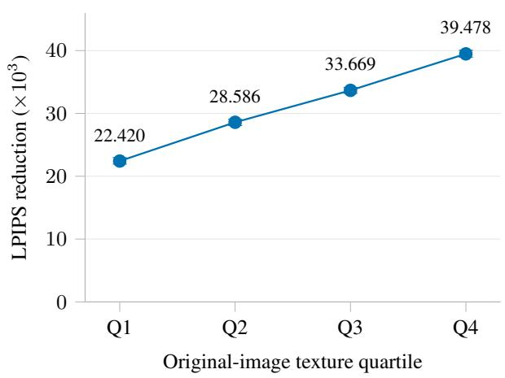

(b) Shallow-group contribution  
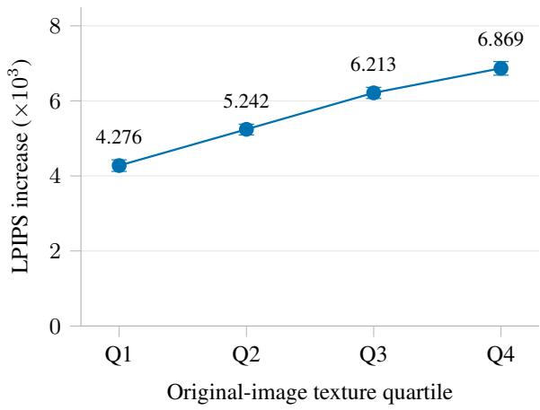  
Figure 7 Texture-stratified reconstruction. Quartiles increase in original-image Sobel strength. Left: LPIPS reduction from RAEv2 to HiRAE-24. Right: LPIPS increase after removing HiRAE-24’s shallow group. Each quartile contains 1,250 images; error bars show 95% paired bootstrap intervals.

## D Fusion Configurations and Ablations

## D.1 HiRAE-7: selected-layer extension

HiRAE-7 applies DRoRAE-style layer experts and learned aggregation within the RAEv2 framework, using the established zero-based layer subset {11, 13, 15, 17, 19, 21, 23}. It retains layer-specific experts, spatial routing, a deepest-layer anchor, and joint fusion–decoder training. Its router consumes concatenated normalized layer features and supplies spatially varying weights for aggregating the transformed expert outputs. Its training setup includes spatial smoothing and no router dropout. HiRAE-24 uses deepest-feature conditioning, three residual norm caps, and group dropout. The extension applies learned fusion to the selected-layer configuration.

Table 17 Selected-layer extension of HiRAE. Expert parameters exclude the encoder, router, decoder, and generator. rFID uses the 50K reconstruction evaluation; PSNR/LPIPS use the matched 5K subset. Generation uses 50K samples from epoch-80 generators.
<table><tr><td></td><td>HiRAE-24</td><td>HiRAE-7</td></tr><tr><td>Encoder layers used Expert parameters (M)</td><td>All 24 ≈202</td><td>Selected 7 ≈59</td></tr><tr><td>Reconstruction rFID ↓</td><td>0.209</td><td>0.217</td></tr><tr><td>PSNR (dB) ↑</td><td>26.377</td><td>25.068</td></tr><tr><td>LPIPS ↓</td><td>0.043</td><td>0.049</td></tr><tr><td>Guided gFID ↓</td><td>1.038</td><td>1.038</td></tr><tr><td>Guided IS ↑</td><td>257.823</td><td>257.013</td></tr><tr><td>Guided  $\mathrm { F D } _ { r } ^ { 6 } \downarrow$ </td><td>1.856</td><td>1.913</td></tr><tr><td>Unguided  $\mathrm { g F I D \downarrow }$ </td><td>2.129</td><td>2.085</td></tr><tr><td>Unguided IS ↑</td><td>210.339</td><td>208.825</td></tr><tr><td>Unguided  $\mathrm { F D } _ { r } ^ { 6 } \downarrow$ </td><td>4.660</td><td>4.479</td></tr></table>

Table 17 shows similar rFID and guided gFID with fewer experts in HiRAE-7, while HiRAE-24 provides higher PSNR and lower LPIPS. HiRAE-24 also has lower guided $\mathrm { F D } _ { r } ^ { 6 }$ (1.856 versus 1.913).

HiRAE-7 achieves reconstruction rFID 0.217. On 50K guided samples, it achieves $\mathrm { F D } _ { r } ^ { 6 }$ 1.913, IS 257.013, and gFID 1.038. PSNR and LPIPS use the common preprocessing pipeline on the matched 5K subset.

## D.2 DRoRAE-style full-depth fusion

The DRoRAE-style fusion comparator in Table 6 adapts DRoRAE’s layer experts, routing, and global interpolation [29] to the RAEv2 framework. It uses all blocks $0 , \ldots , 2 3$ of DINOv3-L, 24 layer experts with hidden width 4C, and the same $2 5 6 \times 1 0 2 4$ latent interface as HiRAE-24. Its router consumes concatenated normalized layer features and produces signed, ℓ2-normalized weights. Writing its normalized expert combination as $F _ { ; }$ the output is $Z = \mathrm { L N } [ ( 1 - \beta ) H _ { 2 3 } + \beta F ]$ , with $\beta = 0 . 2$ . It jointly trains fusion and decoder with a routing smoothness weight of 0.1. HiRAE-24 instead uses deepest-feature routing and groupwise residual caps and dropout (Appendix A.1).

Both tokenizer configurations use 16 epochs, global batch size 128, decoder-input noise $\tau = 0 . 8 .$ , and the ViT-XL decoder. The comparator’s generator training uses global batch size 1024, GMuon, 25 warmup epochs, and a learning-rate decay endpoint at epoch 50, with the same DiT-with-DDT-head architecture. The generation results in Table 6 use each configuration’s final epoch-16 tokenizer and epoch-80 EMA generator; Table 18 additionally reports epoch-20 EMA results. Each evaluation uses 50K class-conditioned ImageNet-256 images. Their sampling configurations specify 100 Euler steps, CFG=1, and IG=1.78 on [0.1, 1]. We use a separate generated sample set for each configuration.

This comparison evaluates complete fusion configurations with the same backbone, source layers, expert count and width, and generator architecture. HiRAE-24 achieves better guided generation with depth-dependent residual budgets during joint fusion–decoder learning. Both configurations jointly train fusion and decoding;

the comparator adapts DRoRAE’s fusion architecture to this setting. Its final epoch-16 tokenizer achieves reconstruction rFID 0.065498 (0.065 in Table 6) and also supplies the latents for generation.

Table 18 compares both fusion configurations after 20 and 80 generator epochs. At 20 epochs, the adapted DRoRAE-style fusion reaches gFID 2.244, close to HiRAE-24’s 2.242, while HiRAE-24 has a 51.9% lower FD6. Extending training to 80 epochs improves this comparator to gFID 1.551 and FD6 3.375. Over the same interval, HiRAE-24 reduces gFID by 53.7%, compared with 30.9% for the adapted DRoRAE-style fusion, and reaches gFID 1.038 with FD6 1.856. The larger gFID improvement and lower final values of both generation metrics motivate our choice of HiRAE-24 for the main experiments.

Table 18 Full-depth composition across training budgets. Both configurations use all 24 layers and 24 experts. Reductions use the adapted DRoRAE-style fusion as the reference.
<table><tr><td colspan="3">DRoRAE-style fusion</td></tr><tr><td>Metric</td><td></td><td>HiRAE-24</td></tr><tr><td>20 generator epochs</td><td></td><td></td></tr><tr><td>gFID ↓</td><td>2.244</td><td>2.242 2.533</td></tr><tr><td>FDr↓</td><td>5.270</td><td></td></tr><tr><td>80 generator epochs</td><td>1.038</td><td>33.1%</td></tr><tr><td>gFID ↓</td><td>1.551</td><td></td></tr><tr><td>FDr ↓</td><td>3.375</td><td></td></tr></table>

## D.3 Expert inputs and residual regularization

HiRAE with mode experts. This configuration uses all 24 inputs, partitions them into three eight-layer groups, applies a depth-axis DCT, and retains 1, 2, and 4 modes. Seven separate experts process the retained modes, with approximately 59M expert parameters compared with 202M for HiRAE-24.

Table 5 reports three configurations at the common 20-epoch budget and the available epoch-80 results for the two regularized configurations. The Stage-1 decoder and normalization statistics are specific to each trained tokenizer.

## D.4 Number of depth groups

Table 19 compares grouping granularity under a common depth prior. We partition the 24 DINOv3-L blocks into two, three, or four contiguous equal-sized groups. All configurations retain 24 independent layer experts with hidden width 4C, the same router architecture and ViT-XL decoder, and the 256 × 1024 latent interface. They share initial fusion, decoder, discriminator, and generator parameters and training seed 42.

Table 19 Three depth groups give the best generation results. Matched budgets: 16,000 tokenizer updates and 5,004 generator updates. Reconstruction uses 5K images; each generation setting uses 10K samples.
<table><tr><td rowspan="2">Groups</td><td colspan="3">Reconstruction</td><td colspan="2">Unguided</td><td colspan="2">IG=1.78</td></tr><tr><td>rFID ↓</td><td>PSNR ↑</td><td>LPIPS↓</td><td>gFID ↓</td><td>IS ↑</td><td>gFID ↓</td><td>IS ↑</td></tr><tr><td>2</td><td>3.293</td><td>22.417</td><td>0.1725</td><td>44.795</td><td>42.976</td><td>29.385</td><td>62.103</td></tr><tr><td>3</td><td>3.363</td><td>22.153</td><td>0.1754</td><td>44.055</td><td>43.216</td><td>28.354</td><td>63.796</td></tr><tr><td>4</td><td>3.457</td><td>22.065</td><td>0.1789</td><td>45.172</td><td>41.618</td><td>31.321</td><td>59.984</td></tr></table>

Three groups achieve the lowest gFID and highest IS under both sampling settings, while two groups achieve slightly better reconstruction. Three groups also improve every reported metric over four groups.

Depth budgets and training controls. We map a common depth prior to each partition. Let qℓ and pℓ denote the per-layer budget and dropout probability obtained from the three-group settings: q equals the original group cap divided by eight, and p equals its dropout probability. For each new group G, we sum its layer

budgets and average its dropout probabilities:

$$
c _ { G } = \sum _ { \ell \in G } q _ { \ell } , \qquad p _ { G } = { \frac { 1 } { | G | } } \sum _ { \ell \in G } p _ { \ell } .\tag{13}
$$

Table 20 lists the resulting settings in order of increasing depth. All partitions have total cap 0.25.

Table 20 A shared depth prior across group counts. Entries follow increasing encoder depth.
<table><tr><td>Groups</td><td>Layers per group</td><td>Norm caps</td><td>Dropout probabilities</td></tr><tr><td>2</td><td>12/12</td><td>0.0625, 0.1875</td><td>5/12, 0.15</td></tr><tr><td>3</td><td>8/8/8</td><td>0.025, 0.075, 0.15</td><td>0.5, 0.25, 0.1</td></tr><tr><td>4</td><td> $6 / 6 / 6 / 6$ </td><td>0.01875, 0.04375, 0.075, 0.1125</td><td>0.5, 1/3, 0.2, 0.1</td></tr></table>

For this ablation, the shallow, middle, and deep parts of the original prior begin opening at subset epochs 4, 2, and 0, each with a two-epoch linear ramp. If $a _ { \ell } ( e )$ is the corresponding per-layer opening coeficient, the new group uses

$$
a _ { G } ( e ) = \frac { \sum _ { \ell \in G } q _ { \ell } a _ { \ell } ( e ) } { \sum _ { \ell \in G } q _ { \ell } } .\tag{14}
$$

This mapping preserves the total efective cap at each training step across partitions. All groups reach their full budgets after 6,000 updates.

Training budget. Stage 1 uses a fixed, class-balanced ImageNet training subset of 128,000 images, with 128 images per class and the same sample order across configurations. Each configuration trains for 16 subset epochs at global batch size 128, totaling 16,000 updates. The optimizer, EMA, reconstruction objectives, decoder noise, and discriminator schedule follow Appendix A.2, with epoch-based schedules measured on this subset. Each configuration then freezes its final EMA tokenizer and computes its own latent normalization statistics on the same 128,000 images.

Stage 2 trains each generator from the shared initialization on all 1,281,167 ImageNet training images for four epochs, totaling 5,004 updates. Each run uses eight H800 GPUs, microbatch size 64 per GPU, two accumulation steps, and global batch size 1024. GMuon uses a constant learning rate of $2 \times 1 0 ^ { - 4 }$ from the first update, momentum 0.95, Nesterov acceleration, and zero weight decay; gradient clipping is 1.0 and EMA decay is 0.9995. We retain the internal-guidance base-branch loss and use each stage’s final EMA weights for evaluation.

Evaluation. Reconstruction uses a fixed class-balanced ImageNet validation subset with five images per class, totaling 5,000 images. The rFID reference contains these same original images; PSNR and LPIPS use paired originals and reconstructions. All residual groups operate at their full budgets, with dropout and decoder-input noise disabled.

For generation, each setting produces 10,000 images with ten per class, using 50 Euler steps. All configurations share the class sequence, sampling seed 42, eight GPUs, and batch size 16 per GPU. Unguided sampling uses CFG=IG=1; guided sampling uses CFG=1 and IG=1.78 on [0.1, 1.0]. We compute gFID and IS with the same project Inception implementation and ImageNet reference statistics from guided\_diffusion\_stats.npz.

## D.5 Layer-group and frequency interventions

We use the matched-image cohort in Appendix C.1. We modify each group residual after its norm cap and before the final LayerNorm:

$$
z ( \pmb { \alpha } ) = \mathrm { L N } ( H _ { 2 3 } + \alpha _ { s } \Delta _ { s } + \alpha _ { m } \Delta _ { m } + \alpha _ { d } \Delta _ { d } ) .\tag{15}
$$

Setting one coeficient to zero removes that group’s contribution. We retain the other groups, routing weights, and decoder, with no redistribution or fine-tuning. Table 21 reports the increase in reconstruction LPIPS relative to the unmodified tokenizer.

Table 21 Each residual group contributes to reconstruction. We remove one group from the frozen HiRAE-24 tokenizer. Values report $\bar { \Delta \mathrm { L P I } \mathrm { P S } } \times 1 0 ^ { 3 }$ with paired 95% intervals.
<table><tr><td>Group</td><td>Norm cap</td><td>LPIPS increase</td><td>Paired interval</td></tr><tr><td>Shallow (0–7)</td><td>0.025</td><td>5.650</td><td>[5.563, 5.737]</td></tr><tr><td>Middle (8–15)</td><td>0.075</td><td>54.111</td><td>[53.600, 54.626]</td></tr><tr><td>Deep (16–23)</td><td>0.150</td><td>147.750</td><td>[146.789, 148.661]</td></tr></table>

Frequency interventions use an orthonormal spatial DCT on the $1 6 \times 1 6$ token grid. For DCT indices $p , q ,$ the low, middle, and high bands satisfy $0 < p + q \leq 1 0 , 1 0 < p + q \leq 2 0 .$ , and $p + q > 2 0$ , respectively. We retain the zero-frequency (DC) coeficient. One control compares high-frequency removal with uniform shrinkage that leaves the same total non-DC energy in that group. A second removes equal-norm low- or high-frequency components, with perturbation norm $q _ { g } = \kappa \operatorname* { m i n } ( \lVert { \Delta _ { g , \mathrm { l o w } } } \rVert _ { F } , \lVert { \Delta _ { g , \mathrm { h i g h } } } \rVert _ { F } )$ for each image and group g.

Table 22 Depth groups differ in frequency contributions. Values report diferences in reconstruction LPIPS, multiplied by $\mathrm { i 0 ^ { 3 } }$ . The equal-norm comparison uses $\kappa = 1 ;$ positive values indicate greater damage from high-frequency removal.
<table><tr><td>Group</td><td>High removal – energy control</td><td></td><td>High – low, equal norm</td><td>Paired interval</td></tr><tr><td>Shallow</td><td></td><td>0.770</td><td>0.215</td><td>[0.182, 0.248]</td></tr><tr><td>Middle</td><td></td><td>4.760</td><td>0.068</td><td>[-0.013, 0.144]</td></tr><tr><td>Deep</td><td></td><td>7.328</td><td>-2.053</td><td> $\left[ - 2 . 1 6 3 , \ - 1 . 9 4 1 \right]$ </td></tr></table>

Table 22 shows a greater efect from high-frequency removal in the shallow group and from low-frequency removal in the deep group. The middle-group interval includes zero. At $\kappa = 0 . 5 .$ the shallow and deep groups retain their respective directions, while the middle group weakly favors high-frequency removal (0.109, interval [0.070, 0.149]). We obtain paired intervals from 1,000 image-resampling replicates within the fixed classes, sharing image IDs across conditions.

## E Latent-Space and Decoding Analysis

## E.1 Analysis protocol

We use the matched-image cohort in Appendix C.1; the feature visualizations and spatial spectra use the subsets specified in Appendix E.2. We freeze the tokenizers and generators; the HiRAE-24 generator uses its epoch-80 EMA checkpoint. Decoding and generator diagnostics use each system’s own latent-normalization statistics; the feature-geometry analysis specifies its separate coordinate conventions. Within-model interventions keep the remaining modules fixed. The experiments therefore require no additional training.

## E.2 Class organization and spatial enrichment

Class organization and spatial efective rank. Figure $\mathrm { 6 ( a ) }$ uses raw tokenizer coordinates: spatially pooled image vectors are $\ell _ { 2 } { \mathrm { - n o r m a l i z e d } }$ without additional channel standardization. We select ten classes at evenly spaced positions in the sorted 100-class list and retain all 50 images per selected class. PHATE [16] is fitted separately for each model with 10 neighbors, decay 40, an internal 50-dimensional PCA, automatically selected difusion time, metric MDS, and random seed 42. We interpret class neighborhoods separately in each PHATE embedding. The accompanying cosine 10NN statistic uses all 5,000 images, excluding each query’s own ID, and is computed before dimensionality reduction. Under these coordinates, the HiRAE-24 anchor has a same-class fraction of 79.634%, compared with 79.536% after fusion. Applying shared anchor-channel standardization changes RAEv2’s fraction from 74.454% to 66.024%, and HiRAE-24’s from 79.536% to 81.466%.

Figure 6(b) instead compares the deep anchor and fusion within HiRAE-24. We take the image at zero-based within-class position 25 from each class, giving 100 fixed images. For each 256 × 1024 feature matrix, we center channels over spatial tokens and compute singular values $\sigma _ { j }$ . Spatial efective rank is $\begin{array} { r } { \exp \bigl ( - \sum _ { j } p _ { j } \log p _ { j } \bigr ) } \end{array}$ where $\begin{array} { r } { p _ { j } = \sigma _ { j } / \sum _ { k } \sigma _ { k } ; } \end{array}$ its maximum is 255 after spatial centering. Spatial CKA [11] is centered linear CKA between the paired token Gram matrices, averaged across images. The mean paired rank increase is 24.533, with 95% CI [23.832, 25.264]; mean spatial CKA is 0.985, with CI [0.983, 0.986]. We compute intervals from 2,000 bootstrap resamples of the 100 whole image pairs, with one fixed image per class. Efective rank summarizes the distribution of spatial variation across feature directions; the reconstruction interventions assess the contributions of the depth groups.

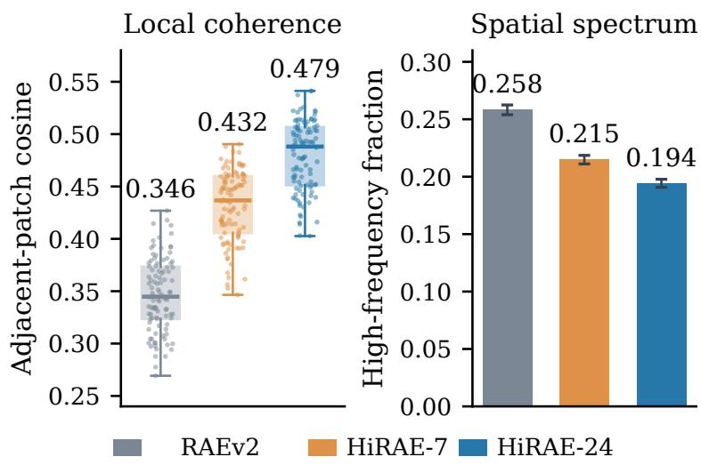  
Figure 8 Cross-system spatial statistics. Left: class-mean adjacent-patch cosine similarity. Right: high-frequency DCT energy fraction without DC. We standardize each representation per channel and remove spatial means for the cosine measure.

Anchor-to-fusion representation structure. We compare LN(H23) with the final fused representation using one set of channel means and standard deviations fitted to the normalized anchor. We also report results in raw coordinates. Spatial high-frequency energy uses DCT indices $p + q > 1 5 ,$ , with the DC coeficient excluded from the denominator. Class-neighborhood consistency measures the mean same-class fraction among ten nearest neighbors of globally pooled image representations, using a fixed gallery and excluding each query’s own ID. Pooling precedes image-wise spatial centering.

Table 23 Spatial enrichment largely preserves class neighborhoods. Values compare HiRAE-24’s deep anchor and fused representation under shared anchor normalization and without additional standardization.
<table><tr><td>Coordinates</td><td>Representation</td><td>High-frequency fraction Same-class 10NN</td></tr><tr><td>Shared anchor</td><td>Deep anchor</td><td>0.123 0.827</td></tr><tr><td>Shared anchor</td><td>Fused representation</td><td>0.208 0.815</td></tr><tr><td>Raw</td><td>Deep anchor</td><td>0.107 0.796</td></tr><tr><td>Raw</td><td>Fused representation</td><td>0.166 0.795</td></tr></table>

Both coordinate choices in Table 23 show increased spatial high-frequency content and a smaller change in class neighborhoods. These neighborhood statistics use the fixed 100-class gallery.

## E.3 Cross-system spatial statistics

The cross-system analysis follows latent-difusability diagnostics [28], using each representation’s own channel standardization. After image-wise spatial centering, adjacent-patch cosine similarity is 0.346, 0.432, and 0.479 for RAEv2, HiRAE-7, and HiRAE-24; high-frequency energy fractions are 0.258, 0.215, and 0.194. Figure 8 summarizes these spatial measurements. The cross-system statistics use each tokenizer’s standardized coordinates; the anchor-to-fusion statistics use shared anchor normalization within HiRAE-24.

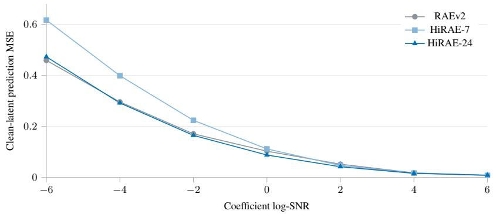  
Figure 9 Prediction error varies with noise level. Full-branch clean-latent MSE on matched forward-noised images. HiRAE-24 improves over RAEv2 at the five interior levels; both endpoints have slightly higher error.

## E.4 Decoding response to latent perturbations

Let u denote the standardized latent that the generator models, and let G include inverse normalization and the decoder. We measure

$$
S ( u , \delta ) = \mathrm { L P I P S } ( G ( u ) , G ( u + \delta ) ) , \qquad \| \delta \| _ { F } / \| u \| _ { F } \in \{ 0 , 0 . 0 1 , 0 . 0 2 , 0 . 0 5 , 0 . 1 0 \} .\tag{16}
$$

We use Gaussian, spatial low-frequency, and spatial high-frequency directions, with three fixed seeds per direction type. We average directions within each image and clip decoded outputs to [0, 1] before computing LPIPS. Figure 6(c) shows the 10% endpoint; Table 24 provides its numerical values.

Table 24 HiRAE decodings change less under the tested perturbations. Output LPIPS $\times 1 0 ^ { 3 }$ at 10% relative latent perturbation norm.
<table><tr><td>Tokenizer</td><td>Gaussian</td><td>Low frequency</td><td>High frequency</td></tr><tr><td>RAEv2</td><td>8.385</td><td>7.191</td><td>9.414</td></tr><tr><td>HiRAE-7</td><td>1.576</td><td>1.344</td><td>1.810</td></tr><tr><td>HiRAE-24</td><td>1.791</td><td>1.547</td><td>2.043</td></tr></table>

Both HiRAE configurations produce smaller decoded changes than RAEv2 under all three perturbation types, with HiRAE-7 showing the smaller response.

## E.5 Generator prediction error

We encode matched real images with each tokenizer and add noise at seven common coeficient log-SNR levels, fixing noise by image ID. We measure the full prediction branch’s clean-latent mean squared error (MSE) per coeficient, including DC. This diagnostic measures prediction error on forward-noised real-image latents.

Table 25 Complete prediction-error grid. Per-coeficient clean-latent MSE, including DC, at all seven coeficient log-SNR levels.
<table><tr><td>Coefficient log-SNR</td><td>RAEv2</td><td>HiRAE-7</td><td>HiRAE-24</td></tr><tr><td>-6</td><td>0.459</td><td>0.617</td><td>0.473</td></tr><tr><td>-4</td><td>0.296</td><td>0.399</td><td>0.292</td></tr><tr><td>-2</td><td>0.171</td><td>0.224</td><td>0.165</td></tr><tr><td>0</td><td>0.103</td><td>0.112</td><td>0.088</td></tr><tr><td>2</td><td>0.052</td><td>0.047</td><td>0.042</td></tr><tr><td>4</td><td>0.018</td><td>0.017</td><td>0.016</td></tr><tr><td>6</td><td>0.008</td><td>0.008</td><td>0.009</td></tr></table>

The five-interior-level ordering persists after dividing each system’s prediction MSE by its own target energy. At log-SNR 0, HiRAE-24 also has lower per-coeficient error in each of the low, middle, and high frequency bands. The log-SNR 6 endpoint corresponds to t ≈ 0.047; the final Euler100 model evaluation occurs at t ≈ 0.075.

## F Additional Qualitative Results

## F.1 Reconstruction comparisons

Figure 10 compares additional reconstructions from RAEv2 and HiRAE-24 on selected and predetermined inputs.

Input  
RAEv2  
HiRAE-24  
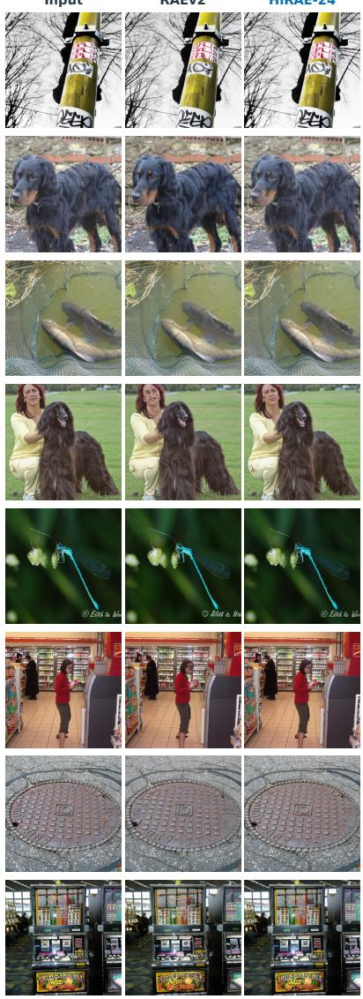

Input  
RAEv2  
HiRAE-24  
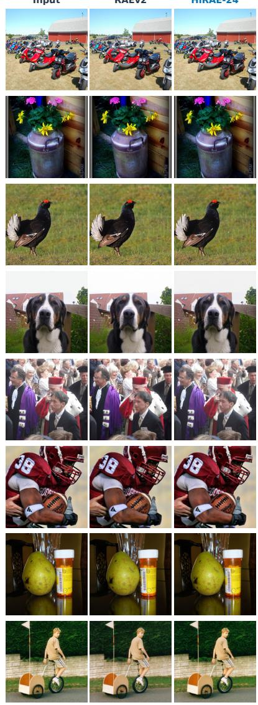  
Figure 10 Additional reconstruction comparisons. Each triplet shows the input, oficial RAEv2 reconstruction, and HiRAE-24 reconstruction. The first two rows contain four selected cases; the remaining six rows contain twelve cases at predetermined validation indices.

## F.2 Generation samples

Figure 11 shows the first eight stored unguided samples from HiRAE-24. Figure 5 in the main paper shows selected guided samples.

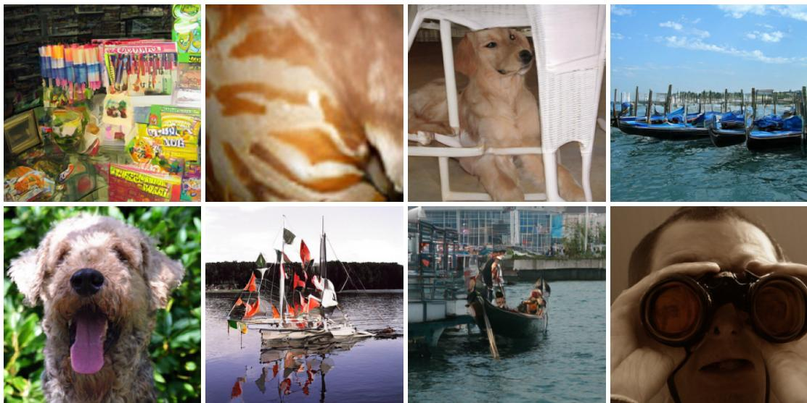  
Figure 11 Unguided class-conditioned samples from HiRAE-24. The first eight stored samples are shown without quality filtering, using the epoch-80 EMA model with CFG=IG=1.

## F.3 Sample selection and visualization details

Reconstruction examples. Reconstruction inference uses the epoch-16 EMA HiRAE-24 checkpoint and the oficial ImageNet RAEv2 decoder with its corresponding frozen DINOv3-L aggregation encoder. We use BF16, batches of four, and no decoder-input noise. Outputs are clamped to [0, 1] and converted to uint8 identically for both models. We select reconstruction examples through pixel-error screening and visual inspection of ImageNet validation images.

Figure 1 uses index 21673. Figure 4 uses indices 47622 and 33692 in left-to-right triplet order. The two main examples show complete images with shared red boxes and enlarged crops below. In the same order, the crop coordinates $( x _ { 0 } , y _ { 0 } , x _ { 1 } , y _ { 1 } )$ are (0, 10, 88, 98) and (102, 16, 193, 89). Coordinates refer to the original 256 × 256 images, with a top-left origin and exclusive right/bottom boundaries. Each triplet uses identical coordinates and nearest-neighbor enlargement, preserving the crop aspect ratio. The teaser uses the shared crop (65, 14, 142, 91), a $7 7 \times 7 7$ region. Its input context image is uniformly scaled and horizontally cropped to a portrait viewport; the three enlarged detail crops retain their shared square region. The selected reconstruction examples illustrate local detail; the matched 5K reconstruction metrics quantify average image-wise performance. The four additional selected examples, at indices 36681, 33541, 10731, and 32659, are retained in Figure 10 as complete images, without red boxes or enlarged crops. The same figure also includes the predetermined 12-image set at indices 0, 4000, . . . , 44000.

Generation examples. Figure 5 shows 24 examples selected by visual inspection from the first 384 entries of the guided 50K archive. Eight groups organize the examples by visible subject matter, each placing a representative beside two related examples. We display complete images without cropping, sharpening, or color adjustment. The unguided grid shows the first eight entries of its separate archive.

## F.4 Text-to-image comparisons

FLUX-VAE  
RAEv2  
HiRAE-7  
HiRAE-24  
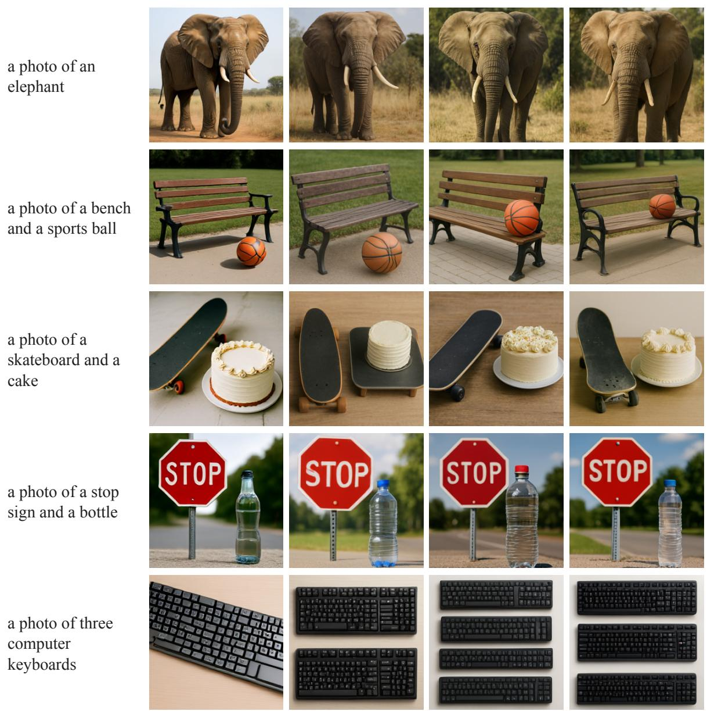  
Figure 12 Qualitative comparisons on five selected GenEval prompts. Each row shows the prompt and the outputs of FLUX-VAE, RAEv2, HiRAE-7, and HiRAE-24 after SFT. We display the complete original images. FLUX-VAE denotes the FLUX autoencoder paired with our trained DiT.