# Honeycomb: Constant-Size Scene Memory Representation for Video World Models

Jack Wei Lun Shi2,∗ Kaichen Zhou1,3,∗

Haoyu Chen1 Yufeng Weng2 Keane Ong2,3 Ruojin Cai1 Hang Hua4 Justin K.W. Yeoh2 Mengyu Wang1

1Harvard University 2National University of Singapore 3MIT 4MIT-IBM Watson AI Lab

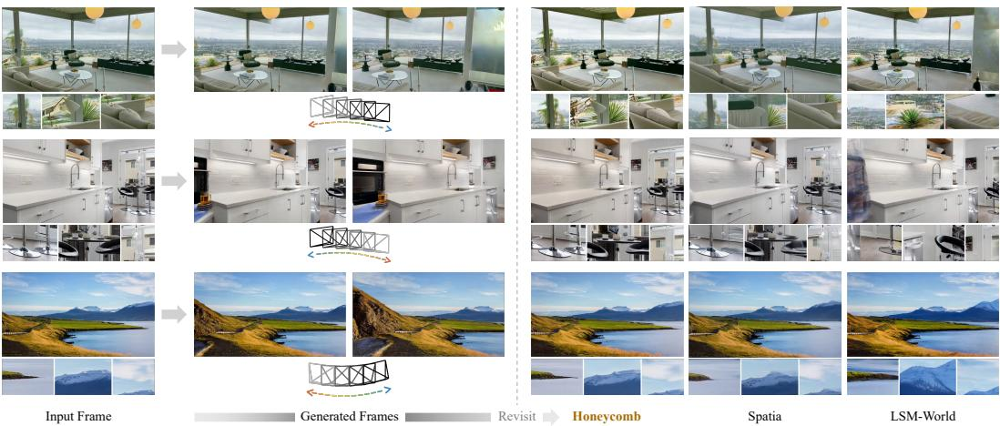  
Figure 1: Revisiting a scene with constant-size memory. Given a single input frame and a camera trajectory that moves away and returns to the initial pose, Honeycomb gen erates a video whose final frame is consistent with the input frame.

## Abstract

Video world models require persistent scene memory to maintain consistency during long-horizon video generation. Existing spatial memories accumulate RGB observations or latent features, increasing storage requirements as generation proceeds. We introduce Honeycomb, a video world model built on HexMemory, our proposed low-rank representation for storing scene features in a fixed-size memory with a total of six spatial and spatiotemporal planes. A feed-forward writer maps each generated chunk into new plane features. As the spatial coverage or temporal range expands, we warp the previous planes while preserving their dimensions, then fuse them with the new features through confidence-weighted pooling and a learned residual correction. A reader retrieves latents from HexMemory to condition subsequent video generation. The writer processes only observations from the new chunk, avoiding per-scene optimization and repeated processing of the full history. Experiments on WorldScore and RealEstate10K demonstrate strong video generation quality and robust revisit consistency while keeping HexMemory feature storage constant throughout generation. Code and additional visualizations are available on our project page.

## 1 Introduction

Video world models can generate visually compelling clips along camera trajectories (Huang et al., 2025b). However, maintaining scene consistency over long rollouts remains challenging. When the camera returns to a previously observed region, its layout, appearance, and objects should remain consistent with earlier frames. As generation proceeds, these observations fall outside the generator’s limited temporal context, making them dificult to recover from recent frames alone (Xiao et al., 2025; Wu et al., 2025). Persistent scene memory is therefore important for consistent long-horizon generation (Zhao et al., 2026a).

Existing methods address this challenge by storing observations in explicit spatial memories and projecting them into future views. Spatia maintains an updatable point cloud of RGB observations, while LSM-World stores difusion latents associated with 3D points (Zhao et al., 2026a; Wang et al., 2026a). These memories allow the generator to retrieve previously observed content, but their storage grows as new observations accumulate (Figure 2). This raises a central question: can a video world model retain scene information without continually expanding its feature memory? Doing so requires incorporating new observations into a fixed-size representation while preserving information needed for revisits.

We introduce Honeycomb, a video world model built on our proposed HexMemory. HexMemory represents scene features using a low-rank factorization into three spatial and three spatiotemporal planes (Cao & Johnson, 2023), whose dimensions remain fixed throughout generation. The planes are initialized from the input frame and updated after each generated chunk. A feed-forward writer maps the new chunk’s latent observations into plane features, which are then fused with the existing memory. This recurrent update processes only the new observations, thus avoiding per-scene optimization and repeated processing of the entire video history. Before generating the next chunk, a memory reader retrieves latents from the planes to condition the video generator.

HexMemory consolidates multiple observations into shared plane features, while joint writer–reader training encourages these features to retain the latent information needed for accurate reconstruction. As illustrated in Figure 1, Honeycomb thus better preserves scene layout and appearance when the camera revisits earlier views, while the compared methods exhibit noticeable changes in geometry and texture.

Experiments on WorldScore and RealEstate10K demonstrate robust generation quality, novel-view synthesis, and revisit consistency. When evaluated without dynamic object filtering during memory writes, Honeycomb outperforms Spatia and LSM-World on overall WorldScore. For novel-view synthesis on RealEstate10K, Honeycomb achieves 18.45 dB PSNR, compared with 15.58 dB for Spatia and 17.46 dB for LSM-World. These results are achieved while keeping feature memory fixed in size. Our ablations show that a compact configuration uses 19.8 MB of feature storage (i.e., 73% less), with only a 0.12 dB decrease in WorldScore closed-loop PSNR relative to the default. Recurrent writing achieves quality comparable to rebuilding memory from all observations while keeping write time constant.

Our contributions are threefold:

• We introduce Honeycomb, a video world model with HexMemory, a fixed-size mem ory that stores persistent scene features in a low-rank representation.

• We develop a feed-forward writer that recurrently incorporates new observations into the memory without per-scene optimization or reprocessing the full history.

• We evaluate generation quality and revisit consistency on WorldScore and RealEstate10K, visualize the stored memory, and analyze the trade-ofs between feature memory size, write cost, and quality.

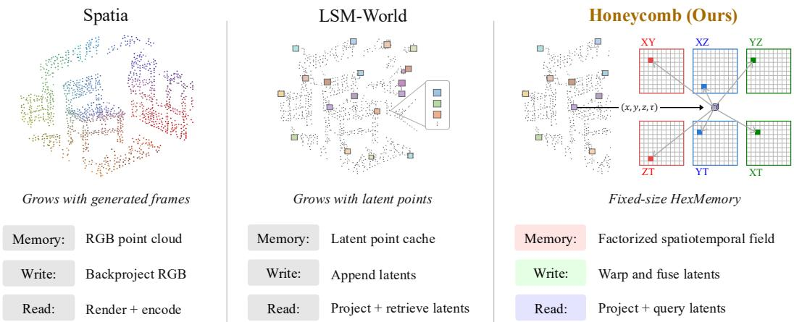  
Figure 2: Memory design comparison. Spatia backprojects RGB observations into a point cloud, while LSM-World accumulates latent points. Honeycomb instead writes to HexMemory with fixed-size feature storage.

## 2 Related Work

## 2.1 Camera Conditioning for Video Generation

Camera trajectories provide a controllable mechanism for video generation. Early approaches inject explicit camera poses or motion representations through auxiliary control modules (Wang et al., 2024; He et al., 2025a). As video generation backbones transition toward large difusion transformers, recent work has investigated architectural and training strategies for camera conditioning (Bahmani et al., 2025a;b). To improve cross-view consistency, other work has incorporated geometric priors such as epipolar constraints (Xu et al., 2024; Zheng et al., 2024) and richer camera representations, including relative positional encodings and geometry-aware tokens (Zhang et al., 2026a; Li et al., 2026; Zhao et al., 2026c). Related approaches ground view synthesis and camera-controlled generation in explicit scene geometry through point-based representations, reconstructed 3D proxies, target-view reprojections, or anchor views (Zhou et al., 2023; Yu et al., 2025c; Li et al., 2025b; Ren et al., 2025; Wang et al., 2026b). As video world models expand to iterative camera exploration, autoregressive streaming, and video-action modeling (He et al., 2025b; Zhao et al., 2026b; Liu et al., 2026b;a; Zhang & Du, 2026), persistent memory becomes increasingly useful for maintaining scene consistency over long rollouts. This motivates persistent memory mechanisms that store, update, and recover scene information outside the model’s temporal context.

## 2.2 Persistent Memory for Long-Horizon Video Generation

Dedicated benchmarks assess scene recovery across long temporal or viewpoint gaps (Lian et al., 2025; Ye et al., 2026; Zhang et al., 2026b; Wu et al., 2026b) and whether unobserved processes evolve consistently (Ma et al., 2026; Duan et al., 2026; Lu et al., 2026; Chen et al., 2026a). At the model level, causal autoregressive difusion and history conditioning reuse recent frames or latents across rollout steps (Chen et al., 2024; Song et al., 2025). To extend this context to longer histories, observation- and context-based memories retain, compress, or retrieve past observations (Yu et al., 2025b; Li et al., 2025a; Oshima et al., 2026; Xiao et al., 2025; Guo et al., 2026; Zhou et al., 2026; Yu et al., 2026a; Xue et al., 2026; Xu et al., 2026a; Yi et al., 2026; Zhang et al., 2025). Within this family, long-range history is represented through latent tokens, recurrent states, positional states, or attentionspace memories, including motion-aware retrieval for dynamic subjects (Yu et al., 2025d; Xu et al., 2026b; Yang et al., 2026; Wu et al., 2026b; Chen et al., 2026b). The storage cost of retaining such histories has motivated fixed-size latent representations, bounded key–value caches, and pose-indexed history banks with limited capacity (Wei et al., 2026; Kim et al., 2026; Chen et al., 2026c; Wu et al., 2026a).

Complementary to these approaches, spatial memories associate stored scene content with explicit 3D structure. Early scene-expansion systems accumulated geometric representations for interactive exploration (Yu et al., 2024; 2025a), while recent methods update persistent scene memories during autoregressive rollouts (Wang et al., 2025; Wu et al., 2025; Zhao et al., 2026a; Yu et al., 2026b; Lee et al., 2026; Wang et al., 2026c; Garcin et al., 2026). Spatia (Zhao et al., 2026a) and LSM-World (Wang et al., 2026a) cache RGB observations and difusion latents respectively, so their memory footprint grows as observations accumulate. To address this growth, HexMemory stores scene features in a fixed-size low-rank representation, drawing on plane factorizations (Cao & Johnson, 2023; Fridovich-Keil et al., 2023). We integrate this memory into Honeycomb, a video world model designed to preserve scene consistency over rollouts while keeping feature storage constant.

## 3 Method

## 3.1 Overview

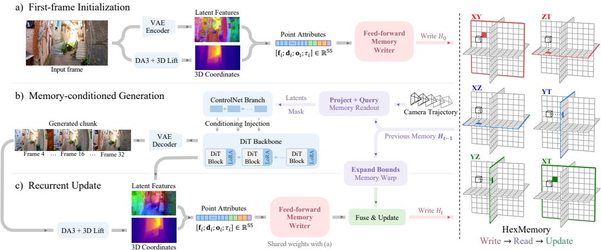  
Figure 3: Overview of the Honeycomb pipeline. For scene-consistent video generation, we a) initialize a fixed-size HexMemory, b) read it to condition a generated chunk, and then c) write new observations back into the same tensors.

Honeycomb maintains scene memory in a HexMemory H of six fixed-size feature planes. We initialize the memory from the input frame, then read it to condition each new chunk and write it back into memory (Figure 3). Unlike LSM-World, which appends latent points to a growing cache, Honeycomb writes into the existing planes,

$$
\mathcal { H } _ { t } = U _ { \theta } ( \mathcal { H } _ { t - 1 } , W _ { \theta } ( o _ { t } ) ) ,\tag{1}
$$

where $o _ { t }$ contains the chunk’s latent points and observation attributes, $W _ { \theta }$ is a feed-forward writer, and $U _ { \theta }$ fuses its output with the previous memory. Initialization (Figure 3 (a)). We encode the input frame into latent features and lift them into world space using estimated depth. The writer maps these latent points into three spatial and three spatiotemporal planes (Sections 3.2 and 3.3). Readout and generation (Figure 3 (b)). We project the 3D points into the target views to determine visibility, then query H at the selected positions and write times. The reconstructed latents and visibility masks condition the difusion transformer (DiT) through a side branch (Sections 3.5 and 3.6). Memory writeback (Figure 3 (c)). After generation, we estimate depth from the decoded frames and lift the generated latents into world space. Unlike Spatia and LSM-World, we do not exclude dynamic objects or sky from memory writes. We warp the previous planes when the spatial or temporal bounds expand, then fuse them with the writer’s output for the new chunk (Section 3.4).

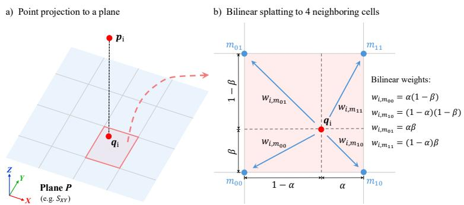  
Figure 4: Bilinear splatting within the feed-forward writer. (a) Point $p _ { i }$ maps to location qi on plane $P$ and (b) its learned contribution $\mathbf { c } _ { i } ^ { P }$ is distributed to four neighboring cells using bilinear weights $w _ { i m }$ . This operation is repeated for all six planes.

## 3.2 HexMemory

We represent the memory as six 2D feature planes, one for each pair of the four coordinate axes, namely the three spatial axes and the write time $\tau .$ . Following HexPlane (Cao & Johnson, 2023), the planes form three pairs with orthogonal axes,

$$
{ \mathcal { H } } = \big \{ ( S _ { X Y } , T _ { Z T } ) , ~ ( S _ { X Z } , T _ { Y T } ) , ~ ( S _ { Y Z } , T _ { X T } ) \big \} ,\tag{2}
$$

where S and T denote spatial and spatiotemporal planes, respectively. Each pair covers all four coordinates exactly once. Every plane is a 2D grid of R-dimensional features. The memory also stores a bounding box B over world space and write time, used to normalize coordinates to $[ - 1 , 1 ]$ . Each plane carries a confidence map $N$ recording the accumulated interpolation weight at each cell.

At a world point $\pmb { p } = ( x , y , z )$ and write time τ , we extract the memory feature

$$
\begin{array} { r l } & { \phi ( \pmb { p } , \tau ) = \left[ S _ { X Y } ( x , y ) \odot T _ { Z T } ( z , \tau ) ; \right. } \\ & { \left. S _ { X Z } ( x , z ) \odot T _ { Y T } ( y , \tau ) ; \right. } \\ & { \left. S _ { Y Z } ( y , z ) \odot T _ { X T } ( x , \tau ) \right] \in \mathbb { R } ^ { 3 R } , } \end{array}\tag{3}
$$

where each plane is sampled by bilinear interpolation at coordinates normalized to the current bounds. Spatial planes share information across write times, while their products with spatiotemporal planes capture time-varying content. The original HexPlane optimizes its planes separately for each scene. HexMemory instead uses a writer shared across scenes to construct and recurrently update the memory without per-scene optimization.

## 3.3 Feed-Forward Memory Writer

The writer converts each chunk’s latent observations into plane features. Using depth and camera parameters, we backproject each valid latent grid location into a 3D world-space position and pair it with the corresponding latent token $\mathbf { f } _ { i }$ . Each point also carries the camera center $\mathbf { o } _ { i }$ and ray direction $\mathbf { \ b { d } } _ { i }$

A small network maps each point’s attributes to one contribution $\pmb { c } _ { i } ^ { P }$ per plane P. Here, $p _ { i } = ( x _ { i } , y _ { i } , z _ { i } )$ is the normalized 3D position of point i and $\tau _ { i }$ is its normalized write time. The contribution is then placed on that plane at the point’s two coordinates, for example at $( x _ { i } , y _ { i } )$ on $S _ { X Y }$ and at $( z _ { i } , \tau _ { i } )$ on $T _ { Z T }$ , and is distributed over the four surrounding grid cells with bilinear weights, as shown in Figure 4. Each cell averages what it receives,

$$
\bar { \bf C } _ { m } ^ { P } = \frac { \sum _ { i } w _ { i m } { \bf c } _ { i } ^ { P } } { \sum _ { i } w _ { i m } } , \qquad N _ { m } = \sum _ { i } w _ { i m } ,\tag{4}
$$

where $w _ { i m }$ is the bilinear weight of point i for cell m and $N _ { m }$ is the total weight received. Cells with no contributions are zero-filled. Lightweight networks map the averaged contributions and accumulated weights to the six feature planes. The weights also serve as confidence maps for subsequent writes.

We jointly train the writer, fusion networks (Section 3.4), and reader (Section 3.5) with a latent reconstruction objective. Each training clip provides latents, estimated depth, and camera poses. We write the input frame followed by two chunks, matching the rollout schedule. After each write, we query the memory from the clip’s camera views and minimize mean squared error between the reconstructed latents and the original tokens associated with the visible points selected by projection. The loss is computed in normalized latent space.

## 3.4 Recurrent Memory Update

For each subsequent chunk, the writer processes only the new latent points and produces planes to fuse with the previous memory $\mathcal { H } _ { t - 1 } \ \mathrm { ( F i g u r e \ 3 \ ( c ) ) }$ . Before writing, we expand the bounds from $B _ { t - 1 }$ to $B _ { t }$ as needed to include the new observations, extending the time range in whole-chunk increments. We warp the previous planes and their confidence maps into $B _ { t }$ by bilinear interpolation at corresponding world coordinates, preserving their grid dimensions. Newly covered regions receive zero confidence, with spatial planes filled with zero and spatiotemporal planes with one. As the bounds expand, the fixed grids represent larger spatial and temporal ranges at coarser resolution.

Let $P ^ { o }$ be a warped previous plane with confidence $N ^ { o }$ , and $P ^ { n }$ the writer’s new plane for the chunk with confidence $N ^ { n }$ from Eq. 4. The two are pooled cell by cell, weighting each by its confidence,

$$
\bar { P } = \frac { N ^ { o } P ^ { o } + N ^ { n } P ^ { n } } { N ^ { o } + N ^ { n } } ,\tag{5}
$$

and for a cell with zero total confidence, the pooled value is set to the previous value. A small network per plane then corrects the pooled result,

$$
P _ { t } = \bar { P } + h _ { P } \big ( P ^ { o } , P ^ { n } , \bar { P } , N ^ { o } , N ^ { n } \big ) , \qquad N _ { t } = N ^ { o } + N ^ { n } ,\tag{6}
$$

where the output layer of $h _ { P }$ is zero-initialized, so fusion begins as confidence-weighted pooling and learns a residual correction.

## 3.5 Memory Readout

To provide memory conditioning for video generation, we reconstruct a latent feature map from HexMemory for the target camera view. We first project the 3D points into the target view at latent resolution. For each latent cell, we retain the nearest projected point in front of the camera. A visibility mask $m ^ { t }$ marks cells containing a point.

For each occupied cell $( u , v )$ , let i denote the selected point. We query HexMemory at its world position $\mathbf { \nabla } _ { \pmb { p } _ { i } }$ and source write time $\tau _ { i } .$ , then decode the resulting feature with the shared reader:

$$
\hat { z } ^ { t } ( u , v ) = g \big ( \phi ( \pmb { p } _ { i } , \tau _ { i } ) , \pmb { d } _ { u v } ^ { t } , \pmb { o } ^ { t } \big ) .\tag{7}
$$

Here, $\phi$ is the memory feature defined in Eq. 3, while $\mathbf { } d _ { u v } ^ { t }$ and $o ^ { t }$ are the target-view ray direction and normalized camera center. Cells receiving no point are filled with zeros. The reconstructed latent map $\hat { z } ^ { t }$ and visibility mask $m ^ { t }$ are then supplied to the DiT as memory conditioning.

## 3.6 Video Generation and Memory Write-Back

We build on a pretrained camera-controllable video difusion model and generate video autoregressively in overlapping chunks. Each chunk is denoised from noise while keeping its first latent fixed to the encoded input frame or the shared boundary latent from the preceding chunk. The reconstructed latents $\hat { z } ^ { t }$ and mask $m ^ { t }$ enter the denoiser through a ControlNet-style branch (Jiang et al., 2025), as shown in Figure 3 (b).

After a chunk is denoised, its frames are decoded and a monocular depth estimator provides depth for frames corresponding to latent timesteps at their trajectory poses. The chunk’s new latent frames are then written into the memory as described in Section 3.4, each at its own write time (Figure 3 (c)).

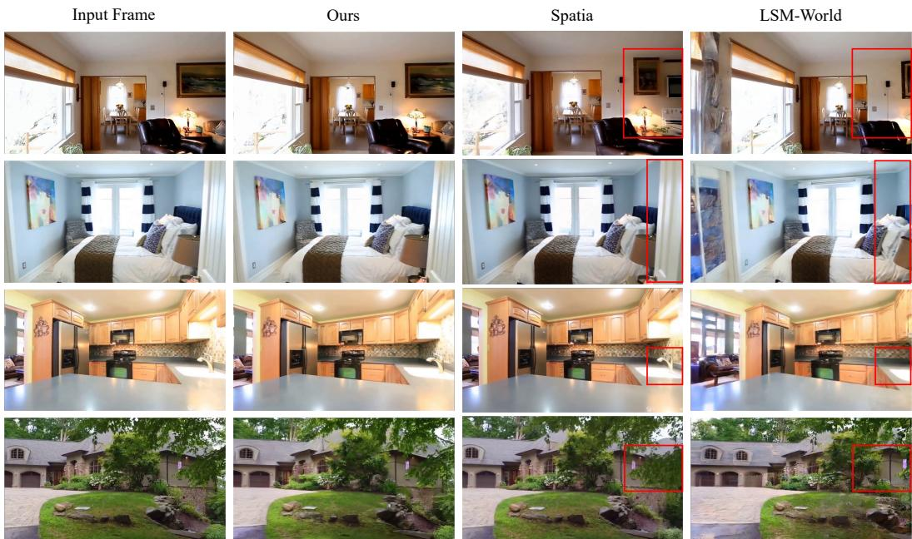  
Figure 5: Closed-loop comparison. Honeycomb preserves object appearance and scene layout, while Spatia and LSM-World show changes in furnishings, geometry, and texture.

We adapt the generator using precomputed readouts from the frozen memory model. Following Spatia, we apply noise augmentation to preceding-frame latents to mitigate the distribution mismatch between ground-truth conditioning during training and generated conditioning during inference.

## 4 Experiments

## 4.1 Training and Inference Setup

Our backbone is Wan2.2 (Team Wan, 2025) with 5B parameters. The ControlNet branch receives 48 reconstructed latent channels and a visibility mask. Its eight blocks connect to every fourth backbone block starting from the first and are initialized from the corresponding backbone blocks. We train on RealEstate10K (Zhou et al., 2018), with camera poses, intrinsics, and depth estimated using ViPE (Huang et al., 2025a) configured with Depth Anything 3, and the same depth estimator provides depth for memory write-back at inference. The branch is first trained for 10,000 iterations with the backbone frozen. The branch is then frozen and the backbone is fine-tuned with LoRA (Hu et al., 2022) of rank 64 on the attention and feed-forward layers for 5,000 iterations. Both stages use AdamW with learning rates of $1 0 ^ { - 5 }$ and $1 0 ^ { - 4 }$ respectively and a total efective batch size of 64 on H200 GPUs. Each generation chunk contains nine latent frames at 44 × 80, corresponding to 33 RGB frames at $7 0 4 \times 1 2 8 0$ At inference we use the UniPC scheduler with 40 sampling steps. The memory planes have rank R = 48.

## 4.2 Evaluation and Main Results

We evaluate Honeycomb on generation quality and memory efectiveness. For generation quality, we evaluate it without dynamic object filtering on WorldScore (Duan et al., 2025), which contains 3,000 image-to-video samples that evaluate static and dynamic aspects of world generation. We also evaluate on 100 videos from the RealEstate10K test set, conditioning on the first frame and following the ground-truth camera trajectory. We report PSNR, SSIM, and LPIPS against the original frames. For memory efectiveness, we follow the closed-loop evaluation setting of Spatia (Zhao et al., 2026a). Starting from the input images of 100 WorldScore scenes, we generate videos along camera trajectories that leave and return to the initial viewpoint. We compare the final frame with the input image using the same metrics. We additionally report flow error, the RAFT (Teed & Deng, 2020) optical-flow magnitude in pixels between the input image and the final frame.

Table 1: Evaluation results on WorldScore. The Average Score is the mean of the Static and Dynamic Scores; all remaining metrics are computed by the WorldScore benchmark.
<table><tr><td>Method</td><td>Average Score</td><td>Static Score</td><td>Dynamic Score</td><td>3D Const</td><td>Photo Const</td><td>Style Const</td><td>Subject Quality</td></tr><tr><td colspan="8">Models with 3D cache</td></tr><tr><td>WonderJourney</td><td>54.19</td><td>63.75</td><td>44.63</td><td>80.60</td><td>79.03</td><td>62.82</td><td>66.56</td></tr><tr><td>WonderWorld</td><td>61.79</td><td>72.69</td><td>50.88</td><td>86.87</td><td>85.56</td><td>70.57</td><td>49.81</td></tr><tr><td>Spatia</td><td>63.21</td><td>64.88</td><td>61.54</td><td>83.26</td><td>89.09</td><td>83.33</td><td>46.66</td></tr><tr><td>LSM-World</td><td>61.20</td><td>62.69</td><td>59.70</td><td>80.88</td><td>76.10</td><td></td><td></td></tr><tr><td colspan="8">General video models</td></tr><tr><td>VideoCrafter2</td><td>50.03</td><td>52.57</td><td>47.49</td><td>65.14</td><td>61.85</td><td>43.79</td><td>56.74</td></tr><tr><td>EasyAnimate</td><td>52.25</td><td>52.85</td><td>51.65</td><td>67.29</td><td>47.35</td><td>73.05</td><td>50.31</td></tr><tr><td>Allegro</td><td>53.64</td><td>55.31</td><td>51.97</td><td>70.50</td><td>69.89</td><td>65.60</td><td>47.41</td></tr><tr><td>Wan2.1</td><td>55.21</td><td>57.56</td><td>52.85</td><td>78.74</td><td>78.36</td><td>77.18</td><td>59.38</td></tr><tr><td>Honeycomb</td><td>65.52</td><td>68.01</td><td>63.03</td><td>82.29</td><td>85.76</td><td>84.21</td><td>46.28</td></tr></table>

As shown in Table 2, Honeycomb achieves the best novel-view synthesis results among the evaluated methods across PSNR, SSIM, and LPIPS. On WorldScore closed-loop evaluation, it also achieves the best results across all metrics, improving PSNR by 1.23 dB over the next-best method and reducing flow error from 6.64 to 3.00 pixels relative to Spatia. These results demonstrate strong revisit fidelity alongside fixed-size HexMemory storage.

Table 2: Novel-view synthesis on RealEstate10K and closed-loop on WorldScore. We report evaluation results of all baseline methods using their default settings.
<table><tr><td rowspan="2">Method</td><td colspan="3">RE10K NVS</td><td colspan="4">WorldScore closed-loop</td></tr><tr><td>PSNR↑</td><td>SSIM↑</td><td>LPIPS↓</td><td>PSNRc↑</td><td> $\mathrm { S S I M } _ { C } \uparrow$ </td><td> $\mathrm { L P I P S } _ { C } \downarrow$ </td><td>Flowc↓</td></tr><tr><td>ViewCrafter</td><td>12.28</td><td>0.512</td><td>0.571</td><td>12.32</td><td>0.369</td><td>0.574</td><td>30.78</td></tr><tr><td>FlexWorld</td><td>13.17</td><td>0.567</td><td>0.544</td><td>12.86</td><td>0.430</td><td>0.602</td><td>55.77</td></tr><tr><td>Voyager</td><td>14.67</td><td>0.577</td><td>0.493</td><td>15.99</td><td>0.459</td><td>0.423</td><td>7.11</td></tr><tr><td>Spatia</td><td>15.58</td><td>0.616</td><td>0.390</td><td>15.67</td><td>0.488</td><td>0.353</td><td>6.64</td></tr><tr><td>LSM-World</td><td>17.46</td><td>0.636</td><td>0.452</td><td>15.12</td><td>0.460</td><td>0.463</td><td>27.05</td></tr><tr><td>Honeycomb</td><td>18.45</td><td>0.674</td><td>0.274</td><td>17.22</td><td>0.504</td><td>0.311</td><td>3.00</td></tr></table>

## 4.3 HexMemory Visualization

We visualize the spatial feature planes from initialization through memory updates (Figure 6). Each cell is colored by the $\ell _ { 2 }$ norm of its feature vector, with cells of negligible confidence left blank. The three spatial planes XY , XZ, and Y Z provide front, top-down, and side views of the alley, respectively. The corridor layout and rising staircase are visible in the feature maps. As new regions are observed, the previous planes are warped to accommodate the expanded spatial coverage, then fused with features from the new chunk. Previously observed structure remains visible as additional regions are incorporated.

By organizing observations across spatial and spatiotemporal feature planes, HexMemory retains scene information that can be retrieved at corresponding world-space locations when generating new views. The retrieved features condition subsequent generation, helping preserve scene layout and appearance during both novel-view synthesis and revisits. As the spatiotemporal planes are less intuitive to interpret, we explain them more in the Appendix.

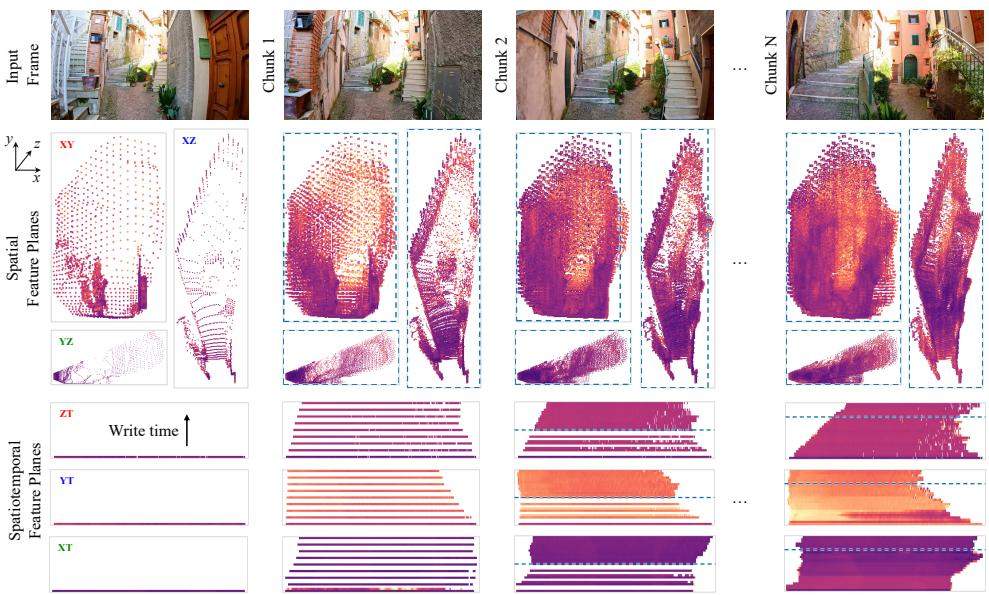  
Figure 6: Visualization of HexMemory. Three spatial and three spatiotemporal planes are shown at initialization and after successive chunks. Dashed boundaries mark the extent of the previous memory after warping into the updated coordinate range.

Table 3: HexMemory resolution ablation. We vary the plane resolution and evaluate on WorldScore closed-loop samples.
<table><tr><td>Resolution</td><td>HexMemory (MB)↓</td><td>PSNRc↑</td><td>SSIMc↑</td><td>LPIPSc↓</td></tr><tr><td>512</td><td>73.9</td><td>17.22</td><td>0.504</td><td>0.311</td></tr><tr><td>384</td><td>42.6</td><td>17.14</td><td>0.503</td><td>0.313</td></tr><tr><td>256</td><td>19.8</td><td>17.10</td><td>0.500</td><td>0.319</td></tr><tr><td>128</td><td>5.8</td><td>16.77</td><td>0.490</td><td>0.338</td></tr></table>

Table 4: Memory writer ablation. We hold the plane resolution fixed and compare write time as well as the WorldScore closed-loop performance.
<table><tr><td rowspan="2">Writer</td><td colspan="3">Write time (ms)↓</td><td colspan="3">WorldScore closed-loop</td></tr><tr><td>Chunk 2</td><td>Chunk 5</td><td>Chunk 9</td><td>PSNRc↑</td><td>SSIMc↑</td><td>LPIPSc↓</td></tr><tr><td>Direct optimization</td><td>3217</td><td>3228</td><td>3130</td><td>17.44</td><td>0.510</td><td>0.299</td></tr><tr><td>Replacement</td><td>11.2</td><td>23.3</td><td>40.1</td><td>17.16</td><td>0.502</td><td>0.313</td></tr><tr><td>Recurrent</td><td>13.1</td><td>13.2</td><td>13.2</td><td>17.22</td><td>0.504</td><td>0.311</td></tr></table>

## 4.4 Ablation Studies

We evaluate the HexMemory resolution and memory writer on the WorldScore closed-loop samples. First, the resolution of the feature planes determines the size of H. We vary it while holding all other settings fixed. As shown in Table 3, lowering the resolution substantially reduces memory with little efect on revisit consistency, while further reductions lead to more noticeable degradation. This suggests that smaller planes can retain much of the scene information needed for consistent revisits.

Next, we compare three ways to write H: per-scene direct optimization, which fits the planes by gradient descent as in the original HexPlane method; a replacement writer, which rebuilds the planes from all stored points at each chunk; and our recurrent writer, which processes only the new chunk and fuses its features with the existing memory. As shown in Table 4, the replacement writer achieves similar quality to ours, but its write cost grows with the rollout as it reprocesses the entire history, whereas ours remains constant at 13 ms.

Direct optimization attains slightly higher quality but is roughly 240× slower per write, further highlighting the eficiency of feed-forward writing.

## 5 Conclusion

Maintaining scene consistency over long video rollouts requires persistent memory that can eficiently incorporate new observations. In this work, we introduce Honeycomb, a video world model with HexMemory. This design keeps feature storage fixed without reprocessing the entire history at each write. Experiments on WorldScore and RealEstate10K demonstrate better generation quality, novel-view synthesis, and revisit consistency. Ablation studies show that recurrent writing maintains quality with constant write cost. These results highlight the potential of recurrent feature memory for eficient and consistent video world modeling.

## References

Sherwin Bahmani, Ivan Skorokhodov, Guocheng Qian, Aliaksandr Siarohin, Willi Menapace, Andrea Tagliasacchi, David B Lindell, and Sergey Tulyakov. AC3D: Analyzing and improving 3D camera control in video difusion transformers. In CVPR, 2025a.

Sherwin Bahmani, Ivan Skorokhodov, Aliaksandr Siarohin, Willi Menapace, Guocheng Qian, Michael Vasilkovsky, Hsin-Ying Lee, Chaoyang Wang, Jiaxu Zou, Andrea Tagliasacchi, et al. VD3D: Taming large video difusion transformers for 3D camera control. In ICLR, 2025b.

Ang Cao and Justin Johnson. HexPlane: A fast representation for dynamic scenes. In CVPR, 2023.

Boyuan Chen, Diego Mart´ı Mons´o, Yilun Du, Max Simchowitz, Russ Tedrake, and Vincent Sitzmann. Difusion forcing: Next-token prediction meets full-sequence difusion. In Adv. Neural Inform. Process. Syst., 2024.

Haoyu Chen, Kaichen Zhou, Hang Hua, Kaile Zhang, Jingwen Qian, Wufei Ma, Haonan Chen, Chunjiang Liu, Yizhou Zhao, Xiaoyuan Wang, et al. MemoBench: Benchmarking world modeling in dynamically changing environments. arXiv preprint arXiv:2606.27537, 2026a.

Kaijin Chen, Dingkang Liang, Xin Zhou, Yikang Ding, Xiaoqiang Liu, Pengfei Wan, and Xiang Bai. Out of sight but not out of mind: Hybrid memory for dynamic video world models. arXiv preprint arXiv:2603.25716, 2026b.

Zhifei Chen, Luozhou Wang, Guibao Shen, Dongyu Yan, Shuai Yang, Tianshuo Xu, Yihua Du, Wei Wang, Tianyi Gui, Lianghua Huang, et al. Reworld: An interactive world model with long-horizon memory. arXiv preprint arXiv:2608.23565, 2026c.

Haoyi Duan, Hong-Xing Yu, Sirui Chen, Li Fei-Fei, and Jiajun Wu. Worldscore: A unified evaluation benchmark for world generation. In ICCV, 2025.

Zicheng Duan, Jiatong Xia, Zeyu Zhang, Wenbo Zhang, Gengze Zhou, Chenhui Gou, Yefei He, Feng Chen, Xinyu Zhang, and Lingqiao Liu. Liveworld: Simulating out-of-sight dynamics in generative video world models. arXiv preprint arXiv:2603.07145, 2026.

Sara Fridovich-Keil, Giacomo Meanti, Frederik Rahbæk Warburg, Benjamin Recht, and Angjoo Kanazawa. K-Planes: Explicit radiance fields in space, time, and appearance. In CVPR, 2023.

Samuel Garcin, Thomas Walker, Steven McDonagh, Tim Pearce, Hakan Bilen, Tianyu He, Kaixin Wang, and Jiang Bian. Beyond pixel histories: World models with persistent 3d state. In ICML, 2026.

Yanjun Guo, Zhengqiang Zhang, Pengfei Wang, Xinyue Liang, Zhiyuan Ma, and Lei Zhang. Memorize when needed: Decoupled memory control for spatially consistent long-horizon video generation. arXiv preprint arXiv:2604.18215, 2026.

Hao He, Yinghao Xu, Yuwei Guo, Gordon Wetzstein, Bo Dai, Hongsheng Li, and Ceyuan Yang. CameraCtrl: Enabling camera control for video difusion models. In ICLR, 2025a.

Hao He, Ceyuan Yang, Shanchuan Lin, Yinghao Xu, Meng Wei, Liangke Gui, Qi Zhao, Gordon Wetzstein, Lu Jiang, and Hongsheng Li. CameraCtrl II: Dynamic scene exploration via camera-controlled video difusion models. In ICCV, 2025b.

Edward J. Hu, Yelong Shen, Phillip Wallis, Zeyuan Allen-Zhu, Yuanzhi Li, Shean Wang, Lu Wang, and Weizhu Chen. Lora: Low-rank adaptation of large language models. In ICLR, 2022.

Jiahui Huang, Qunjie Zhou, Hesam Rabeti, Aleksandr Korovko, Huan Ling, Xuanchi Ren, Tianchang Shen, Jun Gao, et al. Vipe: Video pose engine for 3d geometric perception. arXiv preprint arXiv:2508.10934, 2025a.

Tianyu Huang, Wangguandong Zheng, Tengfei Wang, Yuhao Liu, Zhenwei Wang, Junta Wu, Jie Jiang, Hui Li, Rynson W. H. Lau, Wangmeng Zuo, and Chunchao Guo. Voyager: Long-range and world-consistent video difusion for explorable 3D scene generation. ACM TOG, 2025b.

Zeyinzi Jiang, Zhen Han, Chaojie Mao, Jingfeng Zhang, Yulin Pan, and Yu Liu. Vace: All-in-one video creation and editing. In ICCV, 2025.

Youngrae Kim, Qixin Hu, C-C Jay Kuo, and Peter A Beerel. Memrope: Training-free infinite video generation via evolving memory tokens. arXiv preprint arXiv:2603.12513, 2026.

JoungBin Lee, Jaewoo Jung, Jisang Han, Takuya Narihira, Kazumi Fukuda, Junyoung Seo, Sunghwan Hong, Yuki Mitsufuji, and Seungryong Kim. 3d scene prompting for sceneconsistent camera-controllable video generation. In ICLR, 2026.

Chunyang Li, Yuanbo Yang, Jiahao Shao, Hongyu Zhou, Katja Schwarz, and Yiyi Liao. ReRoPE: Repurposing RoPE for relative camera control. arXiv preprint arXiv:2602.08068, 2026.

Runjia Li, Philip Torr, Andrea Vedaldi, and Tomas Jakab. VMem: Consistent interactive video scene generation with surfel-indexed view memory. In ICCV, 2025a.

Teng Li, Guangcong Zheng, Rui Jiang, Shuigen Zhan, Tao Wu, Yehao Lu, Yining Lin, Chuanyun Deng, Yepan Xiong, Min Chen, et al. RealCam-I2V: Real-world image-tovideo generation with interactive complex camera control. In ICCV, 2025b.

Kewei Lian, Shaofei Cai, Yitao Liang, and Anji Liu. LoopNav: Benchmarking spatial consistency in world models. arXiv preprint arXiv:2505.22976, 2025.

Yaron Lipman, Ricky T. Q. Chen, Heli Ben-Hamu, Maximilian Nickel, and Matt Le. Flow matching for generative modeling. In ICLR, 2023.

Mengmeng Liu, Diankun Zhang, Jiuming Liu, Jianfeng Cui, Hongwei Xie, Guang Chen, Hangjun Ye, Francesco Nex, Hao Cheng, and Michael Ying Yang. Universe: Unified video action models for autonomous driving with flexible mask-modulated modality generation. arXiv preprint arXiv:2607.05133, 2026a.

Mengmeng Liu, Diankun Zhang, Jiuming Liu, Jianfeng Cui, Hongwei Xie, Guang Chen, Hangjun Ye, Michael Ying Yang, Francesco Nex, and Hao Cheng. Driveva: Video action models are zero-shot drivers. In ECCV, 2026b.

Jinpeng Lu, Dexu Zhu, Haoyuan Shi, Linghan Cai, Guo Tang, Yinda Chen, Jie Cao, Duyu Tang, Yi Zhang, Yong Dai, et al. Current world models lack a persistent state core. arXiv preprint arXiv:2606.20545, 2026.

Ziqi Ma, Mengzhan Liufu, and Georgia Gkioxari. Out of sight, out of mind? evaluating state evolution in video world models. arXiv preprint arXiv:2603.13215, 2026.

Yuta Oshima, Yusuke Iwasawa, Masahiro Suzuki, Yutaka Matsuo, and Hiroki Furuta. Worldpack: Dynamic frame compression for long-context video world modeling. Trans. Mach. Learn Res., 2026.

Xuanchi Ren, Tianchang Shen, Jiahui Huang, Huan Ling, Yifan Lu, Merlin Nimier-David, Thomas M¨uller, Alexander Keller, Sanja Fidler, and Jun Gao. GEN3C: 3D-informed world-consistent video generation with precise camera control. In CVPR, 2025.

Kiwhan Song, Boyuan Chen, Max Simchowitz, Yilun Du, Russ Tedrake, and Vincent Sitzmann. History-guided video difusion. In ICML, 2025.

Team Wan. Wan: Open and advanced large-scale video generative models. arXiv preprint arXiv:2503.20314, 2025.

Zachary Teed and Jia Deng. Raft: Recurrent all-pairs field transforms for optical flow. In ECCV, 2020.

Jiahao Wang, Luoxin Ye, TaiMing Lu, Junfei Xiao, Jiahan Zhang, Yuxiang Guo, Xijun Liu, Rama Chellappa, Cheng Peng, Alan Yuille, et al. Evoworld: Evolving panoramic world generation with explicit 3D memory. arXiv preprint arXiv:2510.01183, 2025.

Weijie Wang, Haoyu Zhao, Yifan Yang, Feng Chen, Zeyu Zhang, Yefei He, Zicheng Duan, Donny Y Chen, Yuqing Yang, and Bohan Zhuang. Latent spatial memory for video world models. arXiv preprint arXiv:2606.09828, 2026a.

Zhouxia Wang, Ziyang Yuan, Xintao Wang, Yaowei Li, Tianshui Chen, Menghan Xia, Ping Luo, and Ying Shan. MotionCtrl: A unified and flexible motion controller for video generation. In SIGGRAPH, 2024.

Zun Wang, Jaemin Cho, Jialu Li, Han Lin, Jaehong Yoon, Yue Zhang, and Mohit Bansal. EPiC: Eficient video camera control learning with precise anchor-video guidance. In ICML, 2026b.

Zun Wang, Han Lin, Jaehong Yoon, Jaemin Cho, Yue Zhang, and Mohit Bansal. Anchorweave: World-consistent video generation with retrieved local spatial memories. arXiv preprint arXiv:2602.14941, 2026c.

Zhengxuan Wei, Xu Guo, Xinghui Li, Xunzhi Xiang, Min Wei, Yiran Zhu, Qiulin Wang, Xintao Wang, Pengfei Wan, Xiangwang Hou, et al. Geometry-aware implicit memory for video world models. arXiv preprint arXiv:2606.02436, 2026.

Ruiqi Wu, Xuanhua He, Meng Cheng, Tianyu Yang, Yong Zhang, Zhuoliang Kang, Xunliang Cai, Xiaoming Wei, Chunle Guo, Chongyi Li, et al. Infinite-world: Scaling interactive world models to 1000-frame horizons via pose-free hierarchical memory. arXiv preprint arXiv:2602.02393, 2026a.

Tong Wu, Shuai Yang, Ryan Po, Yinghao Xu, Ziwei Liu, Dahua Lin, and Gordon Wetzstein. Video world models with long-term spatial memory. In Adv. Neural Inform. Process. Syst., 2025.

Xindi Wu, Sven Elflein, James Lucas, Olga Russakovsky, Laura Leal-Taix´e, Despoina Paschalidou, Jonathan Lorraine, and Aljoˇsa Oˇsep. Addressable memory for video world models. arXiv preprint arXiv:2608.07408, 2026b.

Zeqi Xiao, Yushi Lan, Yifan Zhou, Wenqi Ouyang, Shuai Yang, Yanhong Zeng, and Xingang Pan. WorldMem: Long-term consistent world simulation with memory. In Adv. Neural Inform. Process. Syst., 2025.

Dejia Xu, Weili Nie, Chao Liu, Sifei Liu, Jan Kautz, Zhangyang Wang, and Arash Vahdat. CamCo: Camera-controllable 3D-consistent image-to-video generation. arXiv preprint arXiv:2406.02509, 2024.

Jiacong Xu, Hanwen Jiang, Zhixin Shu, Kalyan Sunkavalli, Vishal M Patel, and Yiqun Mei. Wonder: Video world model done better. arXiv preprint arXiv:2607.26037, 2026a.

Tian-Xing Xu, Zi-Xuan Wang, Guangyuan Wang, Li Hu, Zhongyi Zhang, Peng Zhang, Bang Zhang, and Song-Hai Zhang. UCM: Unified modeling of camera control and memory with time-aware positional encoding warping for world models. In SIGGRAPH, 2026b.

Bowen Xue, Brandon Y Feng, Chenguo Lin, Yuchen Lin, Yujia Zeng, Lvmin Zhang, Maneesh Agrawala, Honglei Yan, and Panwang Pan. Ring forcing: Towards precise long-term memory for autoregressive video difusion. arXiv preprint arXiv:2608.26794, 2026.

Zhenhao Yang, Xiaoshi Wu, Zhengyao Lv, Xiaoyu Shi, Xintao Wang, Pengfei Wan, Kun Gai, and Kwan-Yee K Wong. DecMem: Towards minute-long consistent world generation with decoupled memory. arXiv preprint arXiv:2605.31336, 2026.

Yixuan Ye, Xuanyu Lu, Yuxin Jiang, Yuchao Gu, Rui Zhao, Qiwei Liang, Jiachun Pan, Fengda Zhang, Weijia Wu, and Alex Jinpeng Wang. MIND: Benchmarking memory consistency and action control in world models. arXiv preprint arXiv:2602.08025, 2026.

Jung Yi, Minjae Kim, Paul Hyunbin Cho, Wooseok Jang, Sangdoo Yun, and Seungryong Kim. Worldkv: Eficient world memory with world retrieval and compression. arXiv preprint arXiv:2605.22718, 2026.

Hong-Xing Yu, Haoyi Duan, Junhwa Hur, Kyle Sargent, Michael Rubinstein, William T Freeman, Forrester Cole, Deqing Sun, Noah Snavely, Jiajun Wu, et al. Wonderjourney: Going from anywhere to everywhere. In CVPR, 2024.

Hong-Xing Yu, Haoyi Duan, Charles Herrmann, William T Freeman, and Jiajun Wu. Wonderworld: Interactive 3d scene generation from a single image. In CVPR, 2025a.

Jiwen Yu, Jianhong Bai, Yiran Qin, Quande Liu, Xintao Wang, Pengfei Wan, Di Zhang, and Xihui Liu. Context as memory: Scene-consistent interactive long video generation with memory retrieval. In Proceedings of the SIGGRAPH Asia 2025 Conference Papers, 2025b.

Jiwen Yu, Jianxiong Gao, Jianhong Bai, Yiran Qin, Kaiyi Huang, Quande Liu, Xintao Wang, Pengfei Wan, Kun Gai, and Xihui Liu. Memlearner: Learning to query context memory for video world models. In ECCV, 2026a.

Wangbo Yu, Jinbo Xing, Li Yuan, Wenbo Hu, Xiaoyu Li, Zhipeng Huang, Xiangjun Gao, Tien-Tsin Wong, Ying Shan, and Yonghong Tian. ViewCrafter: Taming video difusion models for high-fidelity novel view synthesis. IEEE TPAMI, 2025c.

Wei Yu, Runjia Qian, Yumeng Li, Liquan Wang, Songheng Yin, Sri Siddarth Chakaravarthy P, Dennis Anthony, Yang Ye, Yidi Li, Weiwei Wan, et al. MosaicMem: Hybrid spatial memory for controllable video world models. arXiv preprint arXiv:2603.17117, 2026b.

Yifei Yu, Xiaoshan Wu, Xinting Hu, Tao Hu, Yangtian Sun, Xiaoyang Lyu, Bo Wang, Lin Ma, Yuewen Ma, Zhongrui Wang, et al. Videossm: Autoregressive long video generation with hybrid state-space memory. arXiv preprint arXiv:2512.04519, 2025d.

Cheng Zhang, Boying Li, Meng Wei, Yan-Pei Cao, Camilo Gambardella, Dinh Phung, and Jianfei Cai. Unified camera positional encoding for controlled video generation. In CVPR, 2026a.

Lvmin Zhang, Shengqu Cai, Muyang Li, Gordon Wetzstein, and Maneesh Agrawala. Frame context packing and drift prevention in next-frame-prediction video difusion models. In Adv. Neural Inform. Process. Syst., 2025.

Shengjun Zhang, Zhang Zhang, Simin Huang, Zhenyu Tang, Hanyang Wang, Chensheng Dai, Min Chen, Yifan Li, Yuxin Li, Yingjie Chen, et al. MBench: A comprehensive benchmark on memory capability for video world models. arXiv preprint arXiv:2606.00793, 2026b.

Xiangcheng Zhang and Yilun Du. World action planner: Generalizable decision-making with action-conditioned world models. arXiv preprint arXiv:2607.27599, 2026.

Jinjing Zhao, Fangyun Wei, Zhening Liu, Hongyang Zhang, Chang Xu, and Yan Lu. Spatia: Video generation with updatable spatial memory. In CVPR, 2026a.

Yizhou Zhao, Yifan Wang, Xiaoyuan Wang, Yushu Wu, Hao Zhang, Moayed Haji-Ali, Rameen Abdal, Ashkan Mirzaei, Yanyu Li, Willi Menapace, et al. GeoStream: Toward precise camera controlled streaming video generation. arXiv preprint arXiv:2606.15162, 2026b.

Zelin Zhao, Xinyu Gong, Bangya Liu, Ziyang Song, Jun Zhang, Suhui Wu, Yongxin Chen, and Hao Zhang. CETCam: Camera-controllable video generation via consistent and extensible tokenization. In CVPR Findings, 2026c.

Guangcong Zheng, Teng Li, Rui Jiang, Yehao Lu, Tao Wu, and Xi Li. CamI2V: Cameracontrolled image-to-video difusion model. arXiv preprint arXiv:2410.15957, 2024.

Kaichen Zhou, Jia-Xing Zhong, Sangyun Shin, Kai Lu, Yiyuan Yang, Andrew Markham, and Niki Trigoni. DynPoint: Dynamic neural point for view synthesis. In Adv. Neural Inform. Process. Syst., 2023.

Kaichen Zhou, Zeyang Bai, Xinhai Chang, Mengyu Wang, Paul Liang, and Fangneng Zhan. Stream3D: Sequential multi-view 3D generation via evidential memory. arXiv preprint arXiv:2605.21472, 2026.

Tinghui Zhou, Richard Tucker, John Flynn, Graham Fyfe, and Noah Snavely. Stereo magnification: Learning view synthesis using multiplane images. ACM TOG, 2018.

## Appendix

## A Additional Implementation Details

Preceding-latent augmentation. To support better autoregressive generation, we apply low-level noise augmentation to the preceding-frame latents during stage-two training, following Spatia (Zhao et al., 2026a). Here, P denotes the eight RGB frames immediately preceding the shared boundary frame, and $z _ { P }$ denotes their jointly encoded video latents. For each training sample, we draw $t _ { \mathrm { a u g } } \sim \mathcal { U } ( 0 , 5 0 )$ and form

$$
\widetilde { z } _ { P } = ( 1 - \sigma _ { \mathrm { a u g } } ) z _ { P } + \sigma _ { \mathrm { a u g } } \epsilon , \qquad \sigma _ { \mathrm { a u g } } = \frac { t _ { \mathrm { a u g } } } { 1 0 0 0 } , \quad \epsilon \sim \mathcal { N } ( 0 , I ) .\tag{8}
$$

The sampled noise level is shared across the sample’s preceding latent frames. The augmented latents retain timestep-zero conditioning in the denoiser, while the flow-matching objective (Lipman et al., 2023) supervises the target latents after the first-frame anchor. Stage one uses clean preceding latents.

Latent re-encoding during rollout. The first chunk is conditioned on the input image using the pretrained backbone and the stage-one conditioning branch. From the second chunk onward, we activate the stage-two LoRA adapters and prepare conditioning inputs from generated RGB frames obtained through joint decoding of the accumulated latent sequence. The eight RGB frames immediately before the shared boundary frame are encoded together as a video, producing two preceding latents. The boundary RGB frame is also encoded independently and supplies the first latent of the next target chunk, which remains fixed throughout denoising. These encoding procedures follow the construction of the corresponding training inputs i.e., video encoding for preceding context and single-frame encoding for the anchor. For memory write-back, the writer receives the newly generated chunk latents together with geometry estimated from their corresponding decoded frames.

## B Additional Qualitative Results

We present extended closed-loop comparisons on WorldScore and RealEstate10K, followed by novel-view synthesis examples on RealEstate10K.

Closed-loop generation. Figures 7 and 8 extend the seven examples presented in the main manuscript, grouped into three WorldScore examples and four RealEstate10K examples. For each example, we show the input image, frames 15 and 33, and the final revisit frame. The intermediate views provide context for the camera’s movement through the scene, while the final frame allows comparison with the initial observation.

In the illustrated examples, Spatia and LSM-World exhibit appearance changes and artifacts in intermediate views, while Honeycomb better preserves scene appearance along the trajectory and recovers furnishings and scene structures at the final revisit.

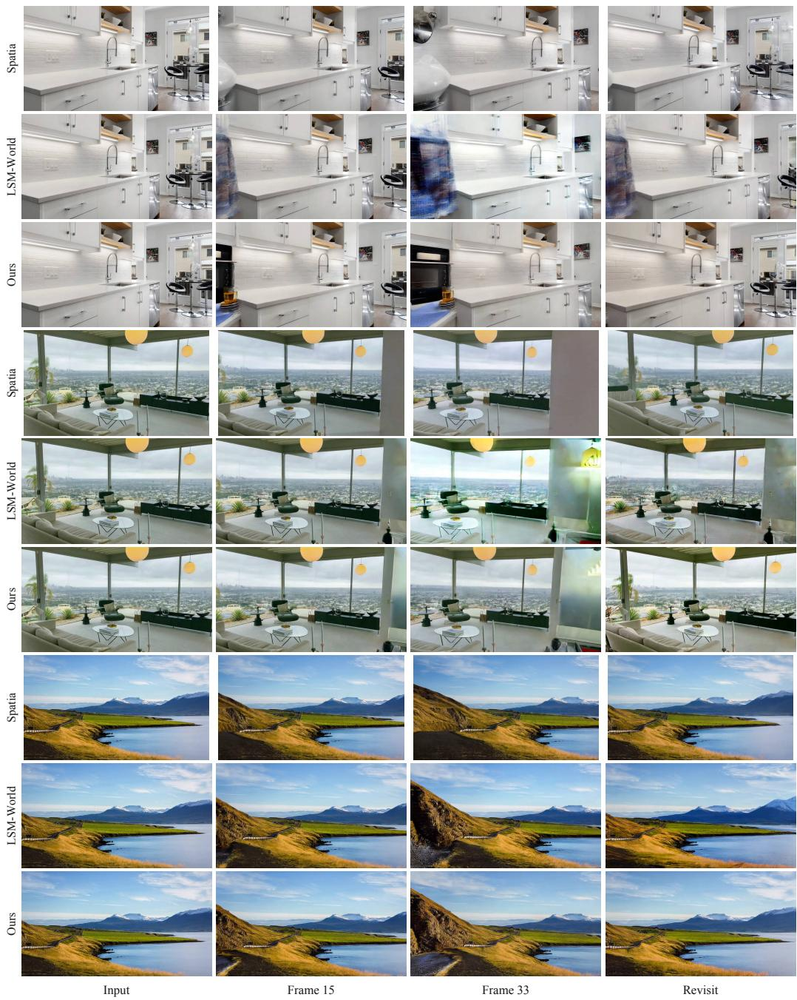  
Figure 7: Extended closed-loop comparisons on WorldScore. For each of the three examples, rows show Spatia, LSM-World, and Honeycomb, respectively.

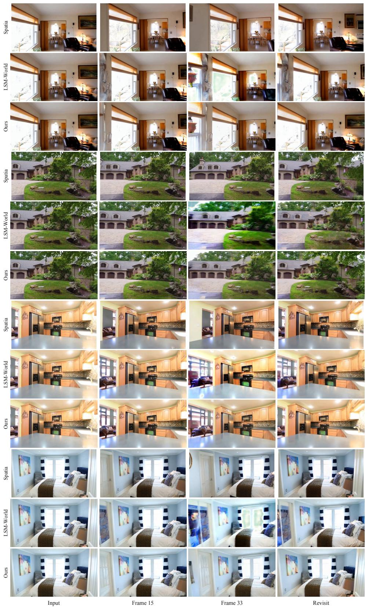  
Figure 8: Extended closed-loop comparisons on RealEstate10K. For each of the four examples, rows show Spatia, LSM-World, and Honeycomb, respectively.

Novel-view synthesis. Figure 9 presents ten examples of long-horizon generation on RealEstate10K. Given the input image and camera trajectory, Honeycomb generates subsequent views over three autoregressive chunks. We show frames 15, 30, 45, 60, and 75 to illustrate scene appearance and layout as the camera moves.

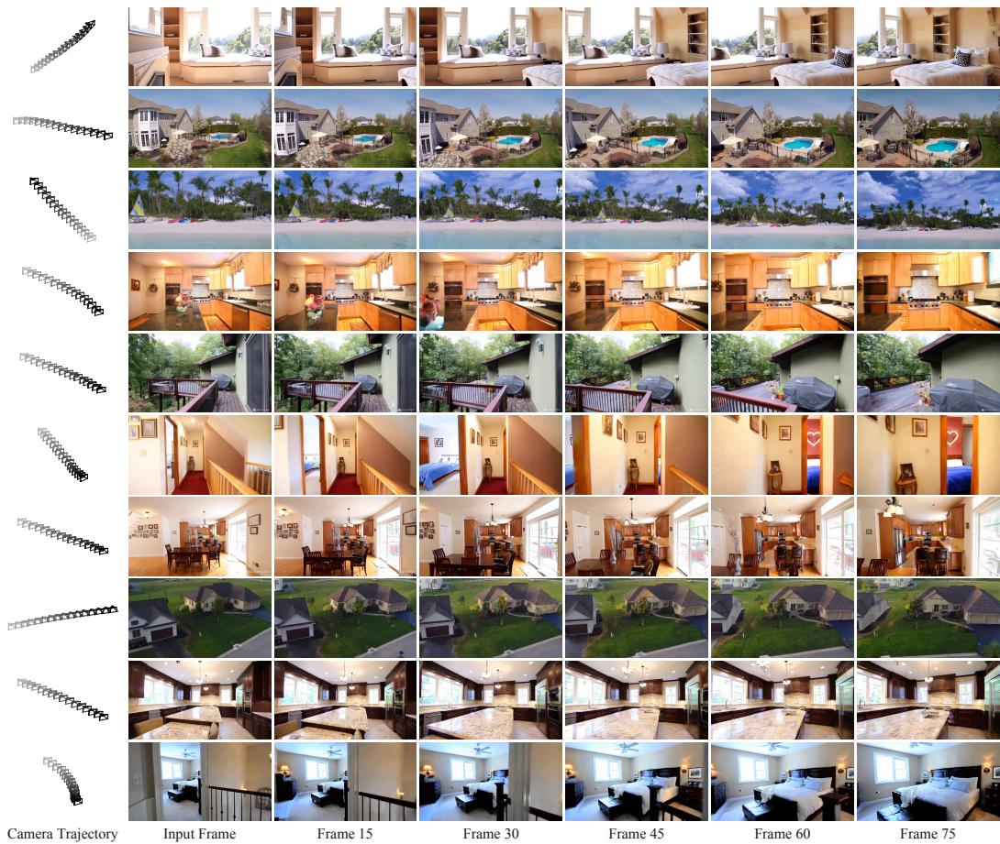  
Figure 9: Long-horizon novel-view synthesis on RealEstate10K. Each row shows the camera trajectory, input image, and five generated views for one example. Camera markers progress from gray to black over time and use a fixed viewing orientation relative to each input camera.

## C Additional Memory Details

Memory Retention Across Successive Writes. We examine whether early scene content remains recoverable as new observations are written to HexMemory. On a 129-frame sequence, we successively write the initial frame and four ground-truth chunks, then repeatedly reconstruct chunk 1 from each resulting memory state. The input frame, camera trajectory, and prompt remain fixed across reconstructions. We exclude the fixed input frame when computing accuracy, allowing this probe to assess how subsequent writes afect the reconstruction of earlier content.

With memory disabled, chunk 1 reconstruction achieves 12.29 dB PSNR. After chunk 1 enters memory at write 2, this improves to 16.71 dB. Reconstruction PSNR remains 16.67, 16.35, and 16.30 dB after writes 3, 4, and 5, respectively i.e., a total decline of just 0.41 dB over three additional writes, averaging 0.14 dB per write. Even after write 5, reconstruction remains 4.01 dB above the memory-disabled baseline. Thus, in this sequence, earlier content remains recoverable with limited degradation while new observations are incorporated into the same fixed-size feature memory.

Explanation of Spatiotemporal Planes. Here, we provide further interpretation of HexMemory through visualizations of its spatiotemporal planes, spatial confidence maps, and stored features. The spatiotemporal planes ZT, ${ \bar { Y } } T ,$ and XT organize memory features along one spatial coordinate and the write-time coordinate $\tau .$ In the visualizations, τ increases from bottom to top, and each horizontal slice summarizes the features stored at the corresponding write-time coordinate. The occupied extent indicates the range of observed scene content along that spatial axis.

In the alley sequence, the ZT plane records the longitudinal extent of observations as the camera advances. Its lower-z boundary shifts toward larger coordinates over time, consistent with nearby content leaving the forward-facing view. The YT plane records the vertical extent of observations, displayed with height increasing from left to right. Its upper-height boundary generally contracts as the camera approaches the surrounding buildings and their upper portions leave the view. In this sequence, the maximum observed height remains approximately 0.37 times the remaining observed distance along the alley, reflecting the camera’s viewing geometry. This contraction eases near the end as the courtyard opens into view.

The XT plane records the lateral extent of observations (Figure 10), which remains approximately 14–15 world-coordinate units through much of the sequence, consistent with the enclosing alley walls. Its right boundary extends from approximately $x = 4 . 5$ to $x = 7 . 4$ as additional parts of the courtyard become visible. Its left boundary moves inward by approximately one unit as the nearby staircase and facade visible in the input image leave the view. These changes illustrate how the spatiotemporal planes retain information about when diferent spatial regions were observed.

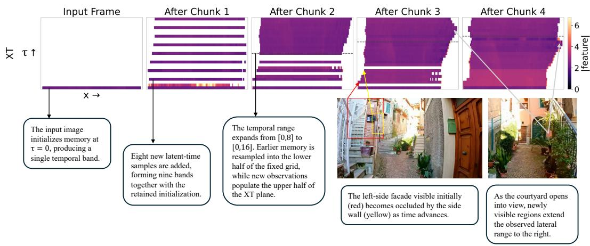  
Figure 10: Temporal organization of the XT feature plane. The input image initializes memory at $\tau = 0 .$ , and the first chunk adds eight new latent-time samples. Subsequent updates expand the temporal range and resample the accumulated memory within a fixedresolution grid. Dashed lines mark the previous temporal extent. The annotated RGB views illustrate changes in lateral visibility as the camera advances through the alley.

Confidence-map visualization. Figure 11 visualizes the confidence maps associated with the spatial planes. These maps record the interpolation weights accumulated during memory writes and provide the weights used for fusion. We display them on a logarithmic scale to show where observations contribute to the memory and how this support evolves across updates.

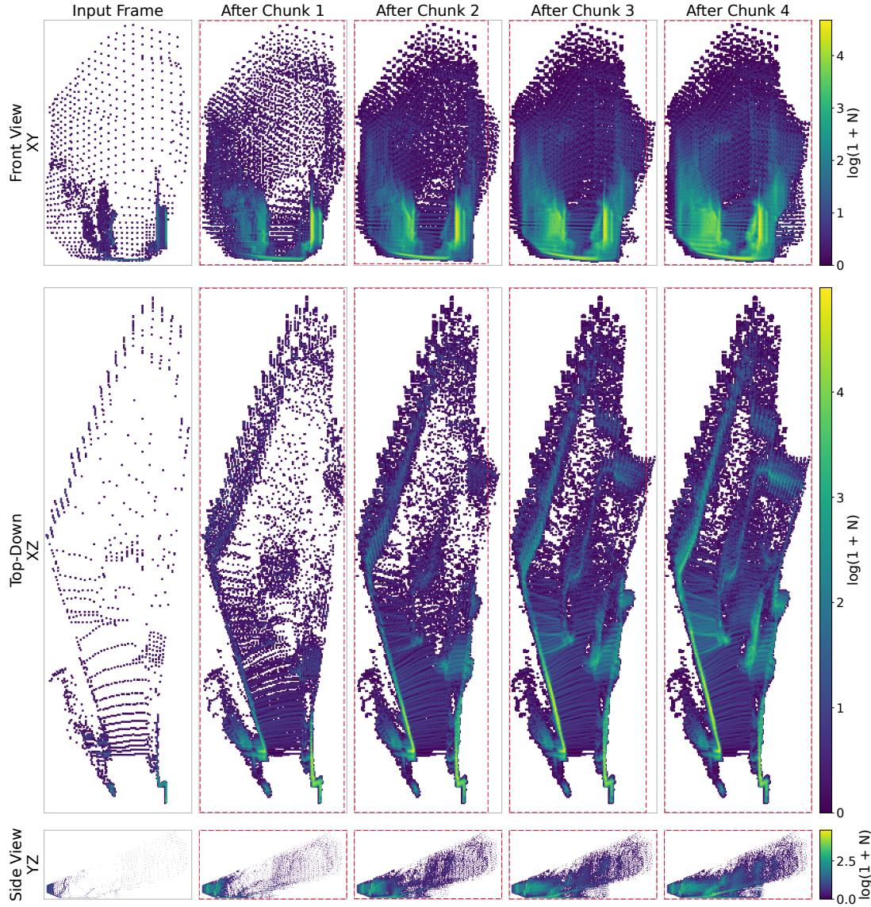  
Figure 11: Progression of HexMemory confidence maps. Columns show initialization from the input frame and the memory state after each of four generated chunks. Colors represent log(1 + N), where N is the accumulated interpolation weight, with a shared color scale across updates for each plane.

Feature visualization. Figure 12 complements the feature-magnitude visualization in the main manuscript by displaying the spatial plane features through principal component analysis (PCA). For each plane, we compute a three-component PCA basis from the final memory state and apply the same projection across all displayed updates. Mapping these components to RGB provides a consistent view of feature organization as new observations are incorporated. The visualizations reveal spatially coherent feature patterns, including repeated banded structures and distinct regions that remain recognizable across successive updates as the observed scene coverage expands.

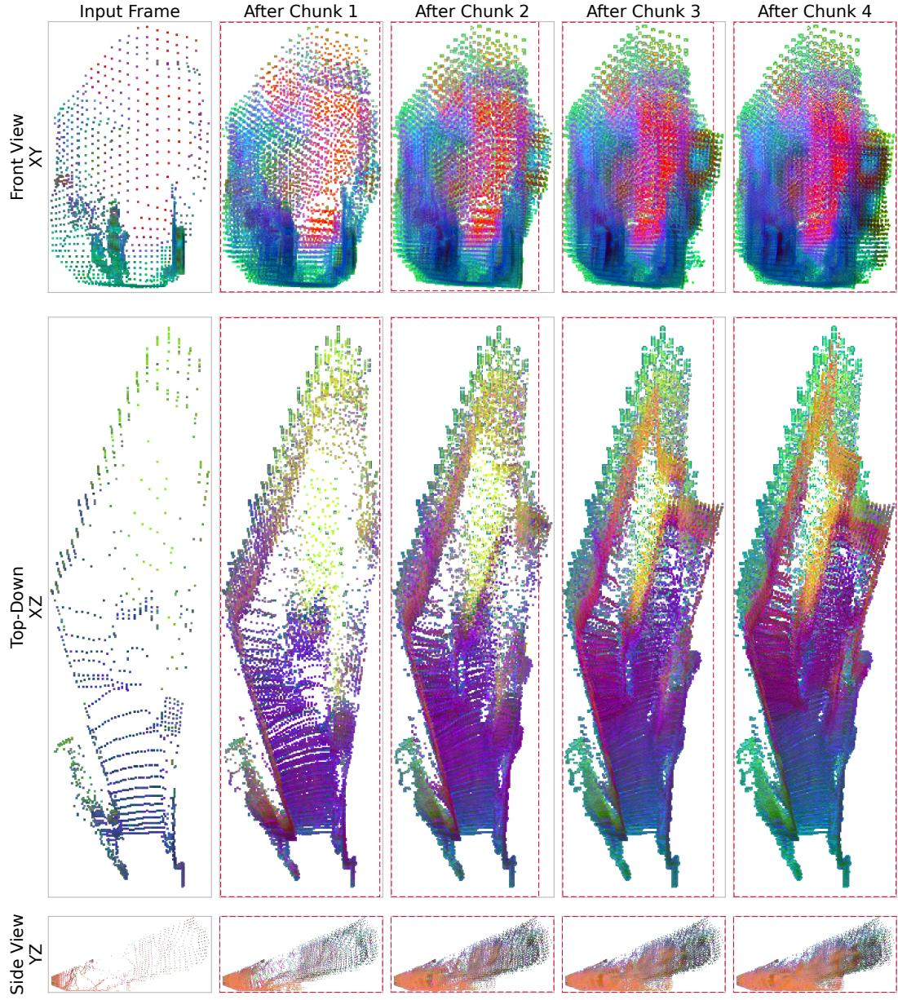  
Figure 12: Spatial feature organization across memory updates. Columns show initialization from the input frame and the memory state after each of four generated chunks. The first three principal components of each plane’s features are mapped to RGB, using a fixed PCA basis and color normalization derived from its final state. This allows feature patterns to be followed across updates within each plane.