# HyperSAM: A Promptable Foundation Model for Hyperspectral Remote Sensing

Li Pang, Xinqiao Wu, Jing Yao, Senior Member, IEEE, Pedram Ghamisi, Senior Member, IEEE, Jun Zhou, Fellow, IEEE, Zhengchao Chen, Deyu Meng, and Xiangyong Cao, Senior Member, IEEE

Abstract—Hyperspectral remote sensing provides dense spectral measurements that are indispensable for material-level Earth observation, yet the construction of a general-purpose hyperspectral foundation model remains difficult. Two bottlenecks are especially limiting. First, large hyperspectral corpora rarely provide high spatial resolution together with reliable dense annotations. Second, many hyperspectral models are still trained almost from scratch, so the geometric and interactive priors learned by modern vision foundation models are not fully reused. To alleviate these issues, we present HyperSAM, a promptable hyperspectral foundation model that couples a data-centric hyperspectral synthesis pipeline with a spectral adaptation architecture based on Segment Anything Model 3 (SAM3). On the data side, HyperSAM synthesizes full-spectrum hyperspectral cubes from high-resolution SpaceNet multispectral imagery through a physics-informed abundance-transfer generator, while SAM3-derived pseudo-masks provide object-centric supervision. On the model side, the latest implementation uses a frozen SAM3 RGB image branch, a trainable hyperspectral side encoder initialized from the RGB vision transformer (ViT), ControlNet-style zero-initialized feature injection, and a lightweight mixture-of-experts mask refiner. To enhance training robustness against noisy pseudo-labels, Cross-modal Sample Selection (CromSS)-style confidence selection is incorporated for noisy-label weighting. Extensive experiments show that Hyper-SAM obtains strong generalization on diverse hyperspectral tasks (e.g., classification, anomaly detection, change detection, target detection, and airborne oil-spill mapping) and that high-quality synthetic hyperspectral data can be more effective than simply scaling noisy hyperspectral supervision.

Index Terms—Hyperspectral remote sensing, foundation

model, promptable segmentation, physics-informed synthesis, SAM3, mixture of experts.

## I. INTRODUCTION

Hyperspectral imagery (HSI) records hundreds of contiguous spectral bands for every spatial location. Compared with RGB or conventional multispectral imagery, the resulting data cube preserves fine absorption and reflection patterns that reveal material composition, vegetation status, mineral signatures, man-made objects, and subtle surface changes. These properties make hyperspectral analysis central to land-cover classification, anomaly discovery, target detection, crop monitoring, mineral exploration, urban interpretation, and disaster assessment [1]–[8]. However, hyperspectral remote sensing also creates a difficult learning problem: the data are high dimensional, sensor-dependent, costly to annotate, and often acquired at modest spatial resolution. A model that performs well on one scene or task can easily fail when the wavelength range, ground sampling distance, object scale, or annotation protocol changes [9].

Foundation models have changed the way many visual recognition problems are solved. Instead of training a taskspecific model from a small labeled dataset, a general model is first trained on a broad corpus and then adapted or prompted for downstream use. In remote sensing, recent work has explored large-scale pretraining for multispectral and hyperspectral data, including SatMAE, SpectralGPT, DOFA, HyperSIGMA, and HyperFree [6], [7], [10]–[12]. These models demonstrate that pretraining can improve transferability, but the hyperspectral setting still lags behind the rapid progress of natural-image foundation models such as the Segment Anything Model (SAM), SAM2, and SAM3 [13]–[15]. The gap is not only architectural. It is also caused by the absence of a hyperspectral counterpart to the massive, diverse, and accurately annotated data used to train generic segmentation models.

From the perspective of downstream use, remotesensing foundation models follow two distinct paradigms. Representation-learning models such as SatMAE, Spectral-GPT, DOFA, HyperSIGMA, and SpectralEarth, as well as generic self-supervised models such as DINOv3, transfer a pretrained encoder but generally require a task-specific head, linear probe, or fine-tuning procedure for a new scene or task [6], [10]–[12], [16], [17]. Promptable models instead expose a prompt-to-mask interface and can reuse a frozen checkpoint without retraining the backbone. HyperFree is the closest prior promptable hyperspectral model, whereas HyperSAM targets the same tuning-free setting while preserving a frozen SAM3 spatial prior and injecting full-spectrum hyperspectral evidence [7], [15]. We identify two bottlenecks that typically appear when building hyperspectral foundation models:

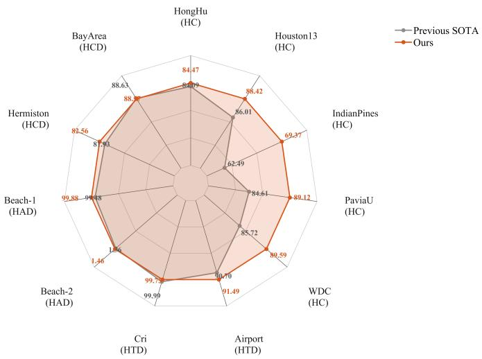  
Fig. 1. Cross-task performance comparison between HyperSAM and representative baselines. Results are normalized from hyperspectral classification (HC), hyperspectral anomaly detection (HAD), hyperspectral change detection (HCD), and hyperspectral target detection (HTD) metrics.

Data quality bottleneck. Classical hyperspectral benchmarks, such as Indian Pines and Pavia University (PaviaU), are valuable because they contain clean annotations and wellstudied protocols [18], [19]. Yet they are too small and homogeneous to support foundation-level learning. Larger resources, including HySpecNet-11k and HyperGlobal-style corpora, improve scale but often trade away either spatial detail or object-level labels [6], [20], [21]. HyperFree makes a notable step toward promptable hyperspectral foundation modeling by constructing the Hyper-Seg corpus [7]. Its data engine generates pseudo-masks by applying SAM-H to selected three-channel views of real hyperspectral images and then uses these masks to supervise promptable hyperspectral segmentation. However, many images in Hyper-Seg are broad natural landscapes, such as mountains, rivers, and vegetation, where object contours are weak and semantic boundaries are often ambiguous. Moreover, the SAM-H-generated masks inevitably contain noisy or coarse regions, while HyperFree directly uses them for training without explicitly modeling such label uncertainty. This limits the boundary quality and object-centric supervision needed for a generalizable promptable hyperspectral foundation model (HFM).

Prior utilization bottleneck. Many hyperspectral models use masked image modeling or reconstruction objectives to train a new backbone on hyperspectral data [6], [11]. This is reasonable when spectral statistics differ from those of RGB imagery, but it underuses the strong spatial priors already encoded in modern segmentation foundation models. SAMstyle models learn to associate points, masks, boundaries, objectness, and multi-scale geometry through large visual corpora [13]–[15]. These priors are highly relevant to hyperspectral remote sensing because many downstream tasks are not purely spectral. They require the model to propose coherent fields, rooftops, vehicles, roads, rivers, shorelines, changed parcels, or target-like regions. The key question is therefore not whether RGB priors should be reused, but how to inject spectral evidence without destroying them.

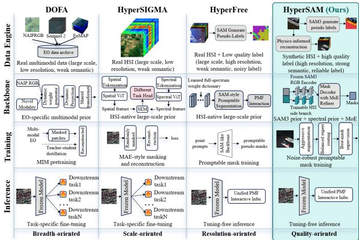  
Fig. 2. Comparison of data sources and training paradigms among representative hyperspectral foundation models. HyperSAM builds an objectcentric hyperspectral training corpus by synthesizing full-spectrum HSI from high-resolution multispectral SpaceNet imagery and pairing it with SAM3- generated pseudo-masks.

To alleviate these issues, this paper proposes HyperSAM, a promptable hyperspectral foundation model that jointly addresses data quality, prior utilization, and noise-robust supervision. HyperSAM constructs an object-centric hyperspectral training corpus by synthesizing full-spectrum HSI from highresolution multispectral SpaceNet imagery and pairing the reconstructed cubes with SAM3-derived pseudo-masks, thereby providing sharper spatial details and more reliable objectlevel supervision than existing hyperspectral foundation-model training corpora. It further adapts the SAM3 backbone to hyperspectral remote sensing through a prior-preserving dualbranch architecture, where a frozen RGB branch retains strong geometric and prompt-response priors while a trainable spectral branch injects full-spectrum corrections through zero-initialized residual adapters. A lightweight mixture-ofexperts (MoE) decoder is introduced to refine task-agnostic mask predictions under diverse object scales and residual label uncertainty. To enhance robustness against imperfect pseudo-masks, HyperSAM further incorporates a noisy-label learning strategy inspired by Cross-modal Sample Selection (CromSS) [22], which was originally proposed to mitigate noisy supervision in multimodal remote sensing segmentation by using cross-modal confidence masks to identify reliable training signals. In our setting, the RGB-prior branch and the hyperspectral branch provide complementary confidence cues for pseudo-mask supervision: high-confidence regions are emphasized, uncertain regions are softly down-weighted rather than treated as equally reliable, and class-balanced confidence selection is used to prevent dominant categories or easy regions from overwhelming the training process. This confidence-aware weighting is combined with hyperspectralspecific spatial and spectral augmentations, improving invariance to geometric perturbations, spectral response variations, and band-wise degradation. With these designs, HyperSAM provides a unified prompt-mask-feature interface for hyperspectral classification, anomaly detection, change detection, and target detection, achieving strong cross-task generalization as shown in Fig. 1. Fig. 2 summarizes the resulting difference between HyperSAM and representative hyperspectral foundation-model paradigms.

The contributions of this work are summarized as follows.

• We introduce a data-centric paradigm for hyperspectral foundation modeling by synthesizing full-spectrum hyperspectral data from semantically rich multispectral imagery through a physics-informed abundance-transfer mechanism. The resulting corpus provides sharp spatial details, diverse object semantics, and well-aligned spectral-mask supervision.

• We develop HyperSAM, a promptable hyperspectral foundation model that adapts the SAM3 backbone through a dual-branch spectral feature injection scheme and a lightweight mixture-of-experts decoder. This design transfers strong generic visual priors into the hyperspectral domain while preserving sensitivity to full-spectrum material information.

• We formulate pseudo-mask supervision as a common robust-learning problem in hyperspectral foundation modeling. A confidence-aware training strategy uses agreement across spectral views and branches to softly reweight unreliable regions and improve stability under noisy pseudo-labels.

• We demonstrate the cross-task effectiveness of Hyper-SAM on multiple hyperspectral remote sensing tasks, including hyperspectral classification, anomaly detection, change detection, and target detection. Under the common small-scene protocols, the experiments show strong transfer with a single frozen checkpoint and validate the unified prompt-mask-feature inference paradigm.

## II. RELATED WORK

## A. Remote Sensing and Hyperspectral Foundation Models

Recent remote sensing foundation models have moved from task-specific learning toward reusable representations across sensors, scenes, and downstream tasks. SpectralGPT explores spectral remote sensing pretraining with a 3D generative transformer and demonstrates transferability across scene classification, semantic segmentation, and change detection [11]. SkySense extends this trend to multimodal and multitemporal remote sensing by jointly modeling optical and synthetic aperture radar (SAR) observations with large-scale spatiotemporal pretraining [23], while DOFA introduces a wavelength-conditioned dynamic framework to handle heterogeneous Earth observation sensors [12]. For hyperspectral imagery, HyperSIGMA builds a billion-scale HSI foundation model trained on HyperGlobal-450K and shows strong crosstask representational ability [6]. SpectralEarth further highlights the importance of large-scale and globally distributed

Environmental Mapping and Analysis Program (EnMAP) data for hyperspectral foundation-model training [16]. Generic selfsupervised models such as DINOv3 follow a similar featurecentric downstream paradigm, although they are pretrained on different data and are not specifically designed for hyperspectral imagery [17]. These methods primarily follow a representation-learning paradigm: their pretrained encoders are transferred through task-specific heads, linear probing, or downstream fine-tuning. Promptable models instead expose point-, box-, mask-, or concept-driven interfaces and can generate masks or transferable features without updating the backbone at inference time. More recently, HyperFree addresses channel-adaptive and tuning-free hyperspectral interpretation through prompt engineering and a learned wavelength dictionary [7]. It is therefore the closest prior promptable HSI method to HyperSAM.

The two promptable approaches nevertheless differ in data, supervision, and spectral adaptation. HyperFree is trained on real Hyper-Seg images using SAM-H-derived pseudomasks as direct supervision. HyperSAM constructs physically constrained full-spectrum synthetic cubes from high-spatialresolution SpaceNet imagery, preserves a frozen SAM3 RGB branch, injects material-sensitive features through a trainable hyperspectral side encoder with zero-initialized adapters, refines masks through a scale-adaptive MoE path, and treats SAM3-derived pseudo-masks as noisy supervision through confidence-aware reweighting. HyperSAM therefore targets object-centric promptable learning with high spatial fidelity while retaining the original prompt-response prior.

## B. Promptable Segmentation for Remote Sensing

Promptable segmentation models provide a flexible interface for generating masks from points, boxes, masks, or semantic prompts. SAM introduced general promptable segmentation, while SAM3 further extends the paradigm to conceptlevel prompting by detecting, segmenting, and tracking all instances matching a given concept [13], [15]. In remote sensing, RSPrompter learns prompts for SAM-based instance segmentation [24], PointSAM adapts SAM with point-level supervision and pseudo-label refinement [25], and AnyChange exploits SAM latent matching for zero-shot remote sensing change detection [26]. RemoteSAM further formulates Earth observation understanding as a referring-segmentationcentered framework for unifying pixel-, region-, and imagelevel tasks [27]. These methods demonstrate the value of promptable segmentation priors in remote sensing, but they are mainly designed for RGB or multispectral imagery. Hyper-SAM differs by preserving the geometric and prompt-response priors of SAM3 while injecting full-spectrum hyperspectral information through a trainable spectral branch.

## C. Synthetic Hyperspectral Data and Noisy-Label Learning

Large-scale dense annotation remains a major obstacle for hyperspectral foundation-model training. Physics-informed reconstruction methods synthesize hyperspectral data from multispectral observations by estimating material abundances and transferring them through spectral endmember libraries [28]– [30]. HyperSAM follows this physically constrained direction, but uses it for foundation-model data construction: pseudomasks are obtained from high-resolution visible imagery, while full-spectrum cubes are reconstructed from aligned multispectral observations. Because generated masks remain imperfect, robust learning from noisy pseudo-labels is also required. Coteaching, confident learning, and broad noisy-label studies show that treating all labels as equally reliable can cause confirmation bias and degraded generalization [31]–[33]. In multimodal remote sensing, Cross-modal Sample Selection uses cross-modal confidence and entropy cues to select reliable noisy supervision [22]. HyperSAM adapts this general principle to promptable hyperspectral training by using spectral-view and branch-level agreement to construct soft, class-balanced confidence weights.

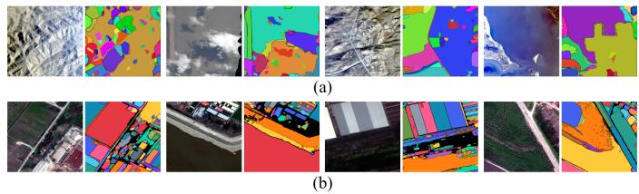  
Fig. 3. Visual comparison of training data. HyperFree samples are often limited by coarse spatial details or weaker object boundaries, whereas the HyperSAM synthetic training data contain sharper outlines, richer object categories, and pseudo-masks suitable for promptable foundation-model training.

## III. METHOD OVERVIEW

HyperSAM is built around three coupled components: high-quality hyperspectral dataset construction, a SAM3-based promptable model framework, and a robust learning strategy for noisy pseudo-mask supervision. The dataset construction component synthesizes full-spectrum hyperspectral cubes from high-resolution multispectral SpaceNet imagery through a physics-informed abundance-transfer mechanism and pairs them with SAM3-derived object masks from the corresponding RGB images. The model framework adapts SAM3 to hyperspectral imagery by preserving the frozen RGB prior branch while using a trainable spectral branch to inject full-spectrum information through zero-initialized residual adapters [34]. A lightweight MoE decoder further refines mask predictions across different object scales and scene structures [35], [36]. The robust learning component handles imperfect pseudo-masks through hyperspectral-specific augmentations and confidence-aware noisy-label weighting inspired by Cross-modal Sample Selection (CromSS) [22], emphasizing reliable regions while softly down-weighting uncertain ones. Finally, HyperSAM predicts task-agnostic masks, mask quality scores, and transferable feature representations that support downstream hyperspectral interpretation. Details are provided in the following subsections.

## A. High-Fidelity Hyperspectral Dataset Construction

The first component constructs an object-centric hyperspectral training corpus from high-resolution multispectral imagery. We use SpaceNet 2 imagery [37], which provides aligned RGB images and 8-band WorldView-3 multispectral observations over four geographically distinct urban regions: Las Vegas, Paris, Shanghai, and Khartoum. One synthetic hyperspectral cube and its corresponding pseudo-label set are generated from each retained aligned RGB–multispectral patch. The resulting corpus contains 10,592 training patches and 3,527 validation patches, providing variation in urban morphology, surface materials, vegetation, and environmental conditions. This choice is motivated by two complementary advantages. First, the RGB images contain sharp spatial structures and rich urban objects, allowing SAM3 to generate more reliable object-level pseudo-masks than those obtained from low-resolution or weakly structured hyperspectral scenes. Second, the multispectral observations preserve physically meaningful spectral responses of the same surface materials, making them suitable for constrained hyperspectral reconstruction rather than purely appearance-based synthesis. As shown in Fig. 3, the resulting training samples contain clearer object boundaries and richer semantic entities than existing pseudolabeled hyperspectral corpora.

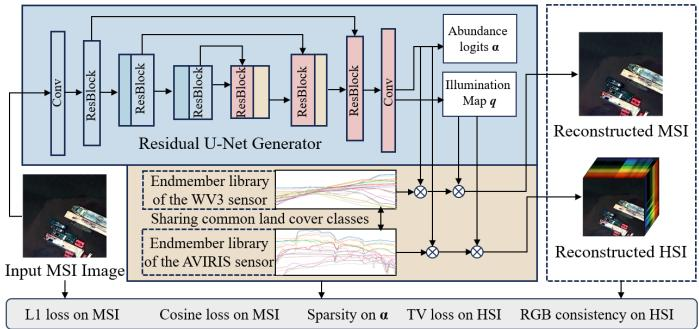  
Fig. 4. Physics-informed hyperspectral reconstruction pipeline. Multispectral SpaceNet imagery is decomposed into abundance and illumination maps, which are transferred through a hyperspectral endmember library to synthesize full-spectrum cubes aligned with object-level pseudo-masks.

In our construction, semantic annotation and spectral reconstruction are decoupled by assigning distinct roles to different spectral bands of the input data. Object masks are extracted from the visible (RGB) bands of the high-resolution multispectral images, where promptable segmentation models perform reliably. Concurrently, the full sets of multispectral channels are converted into hyperspectral cubes through a physics-informed abundance-transfer process. This design avoids applying segmentation models directly to non-visible spectral subsets with ambiguous object boundaries, effectively preserving high-quality spatial supervision while enriching each pixel with full-spectrum material information.

The reconstruction module follows the physics-informed hyperspectral synthesis principle of Physics-informed Deep Adversarial Spectral Synthesis (PDASS) [29]. The overall reconstruction process is illustrated in Fig. 4. Rather than regressing hyperspectral bands independently, we assume that both multispectral and hyperspectral observations of the same scene can be explained by shared material abundances under different sensor response functions. This assumption is consistent with the linear spectral mixing model widely used in hyperspectral analysis: a pixel spectrum is represented as a mixture of several material endmembers modulated by illumination. Therefore, once the material abundance and illumination of each pixel are estimated from the multispectral image, the same physical composition can be transferred to a hyperspectral endmember library to synthesize a full-spectrum cube. The source endmember spectra are obtained from the public USGS Spectral Library Version 7 data release [30]. Following the physics-informed selection strategy of PDASS [29], we retain artificial materials, coatings, liquids, minerals, organic compounds, soils and mixtures, and vegetation. A spectrum is retained only when a matched, complete record exists in both the WorldView-3-resampled and Airborne Visible/Infrared Imaging Spectrometer (AVIRIS)-2014-convolved releases and every reflectance value lies in [0, 1.5]. Uniform subsampling by a factor of two yields $E \ = \ 7 7 2$ paired materials. We use these sensor-specific releases directly and match their records by material identifier, producing $A _ { \mathrm { m s } } ~ \in ~ \mathbb { R } ^ { 8 \times E }$ and $A _ { \mathrm { h s i } } ~ \in ~ \dot { \mathbb { R } } ^ { 2 2 4 \times E }$ whose corresponding columns describe the same material. The AVIRIS library covers approximately 400– 2500 nm.

Specifically, given an 8-band multispectral patch $Y \in$ $\mathbb { R } ^ { 8 \times H \times W }$ , a U-Net-style conditional generator predicts abundance logits and an illumination term:

$$
Z = G _ { \phi } ( Y ) , \quad Z \in \mathbb { R } ^ { ( E + 1 ) \times H \times W } .\tag{1}
$$

For each pixel $p ,$ the abundance vector is constrained to lie on a simplex and the illumination is constrained to be positive:

$$
a _ { e } ( p ) = \frac { \exp { Z _ { e } ( p ) } } { \sum _ { e ^ { \prime } = 1 } ^ { E } \exp { Z _ { e ^ { \prime } } ( p ) } } , \quad \ell ( p ) = \mathrm { s o f t p l u s } ( Z _ { E + 1 } ( p ) ) + \epsilon .\tag{2}
$$

The multispectral reconstruction and hyperspectral synthesis are then obtained by

$$
\hat { Y } ( : , p ) = \ell ( p ) A _ { \mathrm { m s } } a ( p ) , \quad X ^ { \mathrm { s y n } } ( : , p ) = \ell ( p ) A _ { \mathrm { h s i } } a ( p ) .\tag{3}
$$

In this way, the synthesized hyperspectral cube is generated through material-consistent abundance transfer rather than unconstrained image-to-image translation. The multispectral branch ensures that the reconstructed spectrum remains faithful to the observed WorldView-3 measurements, while the hyperspectral branch expands the same material composition to dense spectral bands.

The reconstruction generator is optimized before Hyper-SAM training and then kept fixed when constructing the corpus. Its objective combines multispectral fidelity, spectralshape consistency, projection consistency, abundance sparsity, and spatial smoothness:

$$
\begin{array} { r l } & { \mathcal { L } _ { \mathrm { r e c } } = \lambda _ { 1 } \| \hat { Y } - Y \| _ { 1 } + \lambda _ { \mathrm { c o s } } \mathcal { L } _ { \mathrm { c o s } } ( \hat { Y } , Y ) + \lambda _ { \mathrm { p r o j } } \| P _ { \mathrm { m s } } X ^ { \mathrm { s y n } } - Y \| } \\ & { \qquad + \lambda _ { \mathrm { s p } } \mathcal { L } _ { 1 / 2 } ( a ) + \lambda _ { \mathrm { t v } } \left( \mathrm { T V } ( a ) + \mathrm { T V } ( \ell ) \right) , } \end{array}\tag{4}
$$

where $Y$ and $\hat { Y }$ denote the observed and reconstructed multispectral images, respectively, and $X ^ { \mathrm { s y n } }$ represents the synthesized hyperspectral cube. $P _ { \mathrm { m s } }$ denotes the multispectral sensor-response projection from $X ^ { \mathrm { s y n } }$ to the WorldView-3 bands. The variables a and ℓ represent the abundance map and the illumination map, while $\mathcal { L } _ { 1 / 2 } ( \cdot )$ and $\mathrm { T V } ( \cdot )$

denote the $L _ { 1 / 2 }$ abundance-sparsity regularizer and the totalvariation regularization, respectively. The loss weights are fixed as $( \lambda _ { 1 } , \lambda _ { \mathrm { { c o s } } } , \lambda _ { \mathrm { { p r o j } } } , \lambda _ { \mathrm { { s p } } } , \lambda _ { \mathrm { { t v } } } ) \ = \ ( 1 0 0 , 1 0 0 0 , 1 0 , 3 0 , 1 0 )$ for all corpus-generation runs and are not tuned on any downstream benchmark. The $L _ { 1 }$ term preserves observed WorldView-3 radiometry, the cosine term preserves spectral shape, the projection term requires the synthesized spectrum to reproduce the measured multispectral observation through the sensor-response operator, the $L _ { 1 / 2 }$ abundance-sparsity term encourages parsimonious material mixtures, and total variation regularizes the abundance and illumination maps spatially. These complementary constraints make the synthesis physically interpretable and reduce the risk of generating spectrally implausible training samples.

Both the pseudo-mask generator and the frozen RGB-prior branch use Meta’s original November 2025 SAM3 image release [15], implemented with the official codebase1 and the released facebook/sam3 sam3.pt checkpoint2. The same checkpoint is used throughout without additional naturalimage, remote-sensing, or hyperspectral pretraining. During HyperSAM training, one point prompt is sampled for each target instance and iterative prompt refinement is used to progressively correct the predicted mask.

Finally, each synthesized hyperspectral cube is paired with the SAM3-derived pseudo-masks from its aligned RGB image:

$$
\mathcal { D } = \{ ( \boldsymbol { X } _ { i } ^ { \mathrm { s y n } } , \mathcal { M } _ { i } ) \} _ { i = 1 } ^ { N } , \quad \mathcal { M } _ { i } = \{ \boldsymbol { M } _ { i 1 } ^ { * } , \ldots , \boldsymbol { M } _ { i K _ { i } } ^ { * } \} .\tag{5}
$$

The resulting corpus combines the spatial clarity of highresolution RGB segmentation with physically constrained hyperspectral signatures. This provides HyperSAM with training pairs that are object-centric, spectrally informative, and better aligned with promptable mask learning than conventional hyperspectral datasets.

To assess the synthetic-to-real spectral relationship, we randomly sample 800 synthesized spectra and 800 real AVIRIS spectra from Hyper-Seg [7] and project both sets with a shared PCA basis. Fig. 5 shows substantial overlap in the core manifold, indicating that the synthetic samples occupy physically plausible regions. Fig. 6 compares independently normalized spectral envelopes for representative land-cover materials. Similar overall shapes and overlapping interquartile ranges provide complementary qualitative evidence of material-dependent consistency.

## B. HyperSAM Model Architecture

HyperSAM adapts SAM3 to hyperspectral imagery by preserving its promptable segmentation priors while adding a lightweight spectral adaptation pathway. HyperSAM retains the pretrained SAM3 image encoder, prompt encoder, and mask decoder with frozen parameters. Hyperspectral adaptation is achieved through a spectral-spatial patch embedding and spectral-shape extractor, a trainable side transformer, layer-wise zero-initialized residual adapters, and an MoEbased residual refiner.

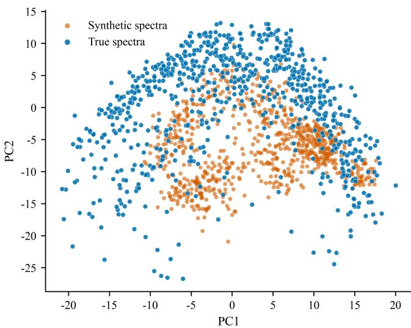  
Fig. 5. Shared-PCA visualization of 800 randomly sampled synthetic spectra and 800 real AVIRIS spectra from Hyper-Seg. The core overlap indicates physically plausible synthetic coverage.

As shown in Fig. 7, the model contains four main parts: a frozen RGB prior branch, a trainable hyperspectral side branch, residual spectral injection adapters, and a promptdriven mask decoder with MoE refinement. The RGB branch takes a three-channel proxy formed from the closest available bands to 700, 546.1, and 438.8 nm. Nearest-band selection, percentile stretching, the official SAM3 normalization, and resizing to 1008 × 1008 are applied before the proxy is passed through the frozen SAM3 image encoder. Feature level 2 is used for mask–feature matching. In parallel, the hyperspectral cube is processed by the side branch to extract fullspectrum material information that is unavailable in the RGB proxy. During training, all SAM3 image-encoder and promptprocessing parameters remain frozen, while the hyperspectral side encoder, injection adapters, and MoE refinement path are optimized.

For the hyperspectral branch, inputs from different sensors are first interpolated to a fixed spectral dimension. A spectralspatial patch embedding mixes local spatial context with bandwise information, while a spectral-shape extractor models the reflectance profile at each spatial location. The resulting tokens are projected to the same dimension and spatial resolution as the SAM3 visual tokens, so that spectral evidence can be injected into the frozen RGB representation layer by layer. The side encoder is initialized from the RGB transformer where dimensions are compatible, which provides a stable starting point for spectral adaptation.

Let $R _ { l }$ denote the frozen RGB feature at layer l, S denote the hyperspectral side feature, $B _ { l } ( \cdot )$ denote the frozen SAM3 transformer block, $B _ { l } ^ { \mathrm { h s i } } ( \cdot )$ denote the side-branch transformer block, and $Z _ { l } ( \cdot )$ denote a zero-initialized residual adapter. The spectral injection process is written as

$$
S _ { 0 } = R _ { 0 } + W _ { 0 } \ : \mathrm { P a t c h } _ { \mathrm { h s i } } ( X ) ,
$$

$$
S _ { l + 1 } = B _ { l } ^ { \mathrm { h s i } } ( S _ { l } ) ,\tag{6}
$$

(7)

$$
R _ { l + 1 } = B _ { l } ( R _ { l } ) + \mathbf { 1 } [ l \geq l _ { 0 } ] Z _ { l } ( S _ { l + 1 } ) .\tag{8}
$$

Here $W _ { 0 }$ and $Z _ { l }$ are initialized to produce zero residuals. Therefore, the adapted model is initially equivalent to the original SAM3 RGB branch, and spectral corrections are gradually learned only when they improve hyperspectral mask prediction. This identity-preserving design reduces the risk of destroying the inherited SAM3 priors during adaptation.

The prompt encoder remains compatible with the SAM3 interface and supports sparse prompts such as points and boxes, as well as dense mask prompts. The mask decoder receives the fused image features and prompt embeddings and produces base mask logits $M ^ { 0 }$ , mask quality scores $q ^ { 0 }$ , mask tokens $T ,$ and an upscaled feature map U. To refine masks under different object scales and scene layouts, HyperSAM integrates a lightweight MoE refiner inside the decoder. A soft router predicts expert weights from the mean-pooled mask tokens:

$$
\pi = \mathrm { s o f t m a x } \left( g \left( \frac { 1 } { K _ { m } } \sum _ { j = 1 } ^ { K _ { m } } T _ { j } \right) \right) ,\tag{9}
$$

where $K _ { m }$ is the number of mask tokens. We use $K _ { e } = 3$ convolutional experts with different receptive fields to predict residual mask logits:

$$
\begin{array} { c } { \displaystyle \Delta M = \sum _ { k = 1 } ^ { K _ { e } } \pi _ { k } E _ { k } ( U ) , } \\ { \displaystyle M = M ^ { 0 } + \Delta M . } \end{array}\tag{10}
$$

A zero-initialized residual head also adjusts the mask quality score. The MoE module is used for scale-adaptive mask refinement, not for noisy-label correction. To prevent the router from collapsing to a single expert, we apply an expert-balance loss:

$$
\mathcal { L } _ { \mathrm { b a l } } = K _ { e } \sum _ { k = 1 } ^ { K _ { e } } \left( \frac { 1 } { B } \sum _ { b = 1 } ^ { B } \pi _ { b k } \right) ^ { 2 } .\tag{11}
$$

After training, given a hyperspectral image and a prompt, HyperSAM produces three unified outputs: task-agnostic masks, mask quality scores, and dense spectral-spatial feature embeddings. Specifically, the masks describe prompt-related candidate regions, the quality scores rank their reliability, and the dense embeddings provide material- and context-aware features for similarity matching, prototype construction, and temporal comparison. The same prompt-mask-feature interface is then reused for hyperspectral classification, anomaly detection, change detection, and target detection.

## C. Robust Learning With Confidence-Aware Noisy-Label Weighting

Although SAM3-derived masks provide stronger object boundaries than coarse hyperspectral pseudo-labels, they may still contain uncertain boundaries, incomplete objects, fragmented regions, or background leakage. The RGB-derived masks are nevertheless treated as potentially noisy supervision rather than exact hyperspectral ground truth: visible object boundaries and material boundaries can disagree around shadows, thin structures, mixed pixels, roof–background transitions, and visually similar surfaces with different spectra.

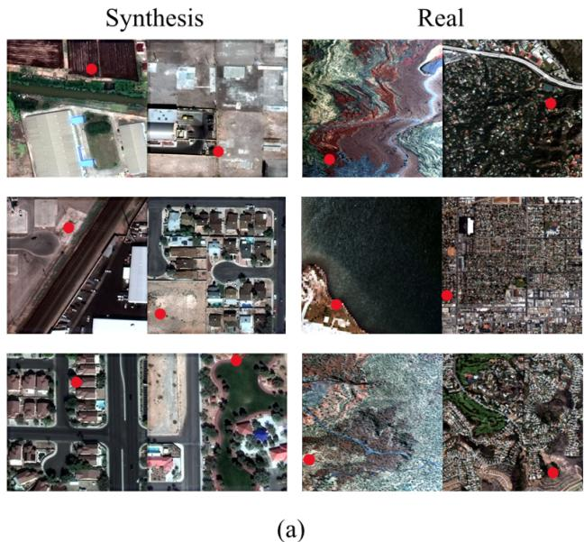

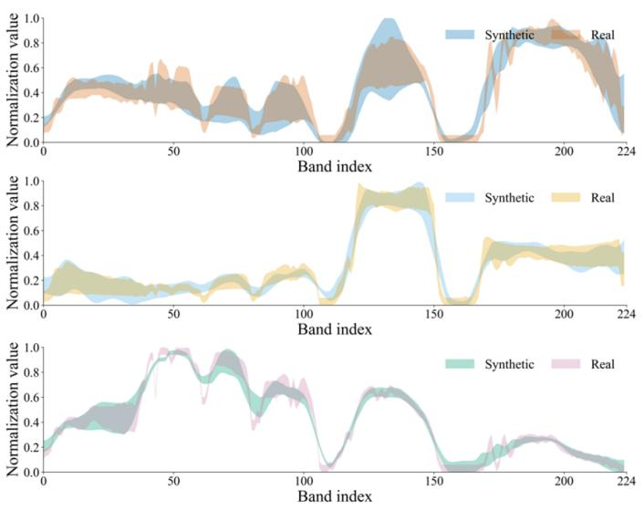  
(b)

Fig. 6. Spatially grounded comparison between synthesized and real hyperspectral data. Left: representative synthetic and real AVIRIS image examples, with red dots marking sampled locations. Right: 25th–75th percentile spectral envelopes formed after independently normalizing each spectrum. The overlapping shapes provide qualitative evidence of material-dependent consistency while retaining visible distributional differences.  
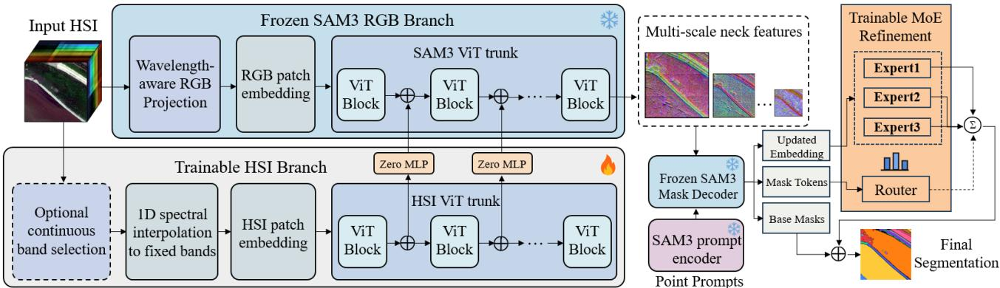  
Fig. 7. HyperSAM architecture. A frozen SAM3 RGB branch preserves objectness, boundary, and prompt-response priors, while a trainable hyperspectral side encoder injects full-spectrum residual features through zero-initialized adapters. The mask decoder is augmented with a lightweight multi-scale MoE refinement path for adapting mask logits and quality scores to hyperspectral imagery.

Large homogeneous object interiors are generally more reliable because the RGB image and synthesized cube share the same geometry, while confidence-aware training locally suppresses ambiguous boundaries and background leakage rather than rejecting an entire mask. HyperSAM therefore adopts a robust learning strategy that combines hyperspectral-specific augmentations, best-mask supervision, cross-view consistency, and confidence-aware noisy-label weighting.

Specifically, Cross-modal Sample Selection (CromSS) [22] selects reliable noisy supervision by comparing confidence estimates from different modalities and reducing the influence of uncertain regions. HyperSAM extends this idea from multimodal segmentation to promptable hyperspectral learning. Instead of relying on external modalities, it constructs two augmented spectral views from the same hyperspectral cube and uses the RGB-prior branch and hyperspectral branch as complementary confidence sources. Regions that remain confident and consistent across views and branches receive larger weights, while ambiguous regions are softly downweighted rather than discarded. Class-balanced selection is further used to prevent frequent background regions or easy objects from dominating the supervision.

For each pseudo-mask $M ^ { * }$ , the decoder predicts multiple candidate masks $\{ M _ { j } \}$ . HyperSAM follows SAM-style bestmask supervision and selects the candidate with the smallest confidence-weighted sum of binary cross-entropy (BCE) and Dice losses:

$$
\mathcal { L } _ { j } ^ { \mathrm { s e g } } = \mathcal { L } _ { \mathrm { B C E } } ( M _ { j } , M ^ { * } ; W ) + \mathcal { L } _ { \mathrm { D i c e } } ( M _ { j } , M ^ { * } ; W ) ,\tag{12}
$$

$$
j ^ { * } = \arg \operatorname* { m i n } _ { j } \mathcal { L } _ { j } ^ { \mathrm { s e g } } .\tag{13}
$$

The weighted Dice loss is defined as

$$
\mathcal { L } _ { \mathrm { D i c e } } = 1 - \frac { 2 \langle W \odot \sigma ( M _ { j } ) , M ^ { * } \rangle + 1 } { \langle W , \sigma ( M _ { j } ) \rangle + \langle W , M ^ { * } \rangle + 1 } .\tag{14}
$$

Here $W$ is the confidence weight map. Given a binary pseudolabel $y ( p ) \in \{ 0 , 1 \}$ and the corresponding mask logit $z ( p )$ , the

label-class confidence is

$$
f ( p ) = \left\{ { \begin{array} { l l } { \sigma ( z ( p ) ) , } & { y ( p ) = 1 , } \\ { 1 - \sigma ( z ( p ) ) , } & { y ( p ) = 0 . } \end{array} } \right.\tag{15}
$$

Foreground and background pixels are processed separately. Within each class, pixels above the class-specific confidence threshold receive full weight, while the remaining pixels are assigned smaller weights according to their confidence. The selected proportion is controlled by a training schedule that gradually shifts from full supervision to confidence-aware supervision.

To build cross-view confidence, HyperSAM samples two contiguous spectral windows from the same synthetic cube. Each window length is drawn uniformly from 128 to 224 bands, and its starting position is sampled uniformly from the valid range. The selected window is then interpolated to 224 channels for the common model interface. The second view is sampled independently, redrawn if it is identical to the first, and constrained to share at least 32 bands with the first view. The minimum overlap preserves common material evidence, while the wide random windows and independent starts introduce substantial spectral-response variation. Both views retain the same spatial target, so the consistency term regularizes the model against spectral cropping rather than changing the segmentation supervision. Let $f _ { a }$ and $f _ { b }$ be the label-class confidence maps from the two views. A CromSSstyle common-confidence update is applied as

$$
\begin{array} { c } { { \hat { f } _ { a } = \displaystyle \frac { 1 } { 2 } ( f _ { a } + f _ { a } f _ { b } ) , } } \\ { { \hat { f } _ { b } = \displaystyle \frac { 1 } { 2 } ( f _ { b } + f _ { a } f _ { b } ) . } } \end{array}\tag{16}
$$

The enhanced confidence maps are used to construct the weight maps for the two supervised losses. In parallel, a symmetric Kullback–Leibler (KL) divergence term encourages the two spectral views to produce consistent binary mask distributions:

$$
\mathcal { L } _ { \mathrm { c o n s } } = \frac { 1 } { 2 } \left[ D _ { \mathrm { K L } } ( p _ { a } \| p _ { b } ) + D _ { \mathrm { K L } } ( p _ { b } \| p _ { a } ) \right] ,\tag{17}
$$

where

$$
p _ { a } = [ 1 - \sigma ( M _ { a } ) , \sigma ( M _ { a } ) ] , \quad p _ { b } = [ 1 - \sigma ( M _ { b } ) , \sigma ( M _ { b } ) ] .\tag{18}
$$

Entropy-derived confidence weights are used so that stable regions contribute more strongly to the consistency constraint.

For each view, the selected best-mask loss is the equally weighted sum of confidence-weighted sigmoid BCE and Dice losses in Eq. (13). The two selected view losses are averaged as

$$
\mathcal { L } _ { \mathrm { s e g } } = \frac { 1 } { 2 } \left( \mathcal { L } _ { \mathrm { m a s k } } ^ { a } + \mathcal { L } _ { \mathrm { m a s k } } ^ { b } \right) .\tag{19}
$$

The final training objective is

$$
\mathcal { L } = \mathcal { L } _ { \mathrm { s e g } } + \lambda _ { \mathrm { c o n s } } \mathcal { L } _ { \mathrm { c o n s } } + \lambda _ { \mathrm { b a l } } \mathcal { L } _ { \mathrm { b a l } } ,\tag{20}
$$

where $\lambda _ { \mathrm { c o n s } } = 0 . 1$ and $\lambda _ { \mathrm { b a l } } = 0 . 0 5$ in all experiments. Here ${ \mathcal { L } } _ { \mathrm { c o n s } }$ improves invariance across spectral windows, while $\mathcal { L } _ { \mathrm { b a l } }$ prevents expert collapse. Together with spatial rotations, sparse spatial masking, random spectral-window sampling, and label smoothing, this robust learning strategy reduces the influence of unreliable pseudo-mask regions while preserving useful supervision from high-confidence regions. As illustrated in Fig. 8, the resulting confidence-aware weight map assigns large weights to reliable object regions, while ambiguous boundaries and noisy background fragments are highlighted as uncertain areas.

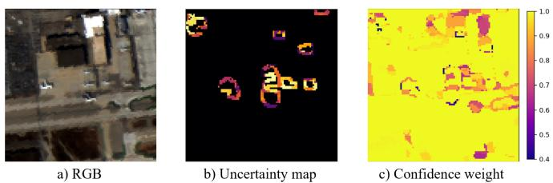  
Fig. 8. Representative analysis of pseudo-mask uncertainty and confidenceaware weighting. (a) RGB image used to provide the SAM3 spatial prior. (b) Estimated uncertainty map, in which unreliable regions concentrate around ambiguous boundaries, fragmented objects, and complex background structures. (c) Confidence-weight map, which assigns larger weights to stable regions and smaller weights to uncertain pseudo-label pixels.

## IV. EXPERIMENTS

We evaluate HyperSAM on four representative hyperspectral interpretation tasks: hyperspectral classification (HC), hyperspectral anomaly detection (HAD), hyperspectral change detection (HCD), and hyperspectral target detection (HTD). The main tables test whether the promptable spectral adaptation improves cross-task generalization under a single checkpoint, while the ablation studies isolate the data synthesis pipeline, promptable spectral branch, MoE refinement, and robust pseudo-mask weighting. Following the task-oriented organization commonly used in hyperspectral foundation-model evaluation [6], each task first specifies the dataset, supervision, prompting rule, and decision rule, and then reports quantitative and qualitative results. All experiments use the same trained HyperSAM checkpoint. No task-specific network is trained for any downstream benchmark. The evaluation is intentionally limited to one-shot, zero-shot, or otherwise low-label smallscene settings and does not constitute a large-patch benchmark with full downstream fine-tuning.

In addition to reporting final accuracy, the experimental analysis is organized to echo the two bottlenecks identified earlier: whether high-quality spectral-mask data are more useful than merely scaling weak supervision, and whether promptable visual priors can be reused without losing hyperspectral material sensitivity. Therefore, the following analysis discusses not only which method obtains the best metric, but also why the same prompt-mask-feature interface helps or fails under different task assumptions. The ablations further separate the contributions of synthetic spectral construction, MoE mask refinement, and confidence-aware pseudo-mask weighting, so that the practical role of each component can be interpreted beyond a simple state-of-the-art comparison.

## A. General Experimental Settings

1) Datasets and Metrics: We report compact comparisons on two representative datasets for each task. HC is evaluated on Indian Pines [18] and Pavia University [19], which contain 16 agricultural land-cover classes and 9 urban land-cover classes, respectively. HAD is evaluated on Beach-1 and Beach-2 from the Airport-Beach-Urban benchmark [38]. HCD is evaluated on BayArea/River and Hermiston following standard hyperspectral change-detection protocols [39], [40]. HTD is evaluated on the Nuance Cri scene [41] and the Airport scene from the Airport-Beach-Urban benchmark [38]. For HC, we report overall accuracy (OA), average accuracy (AA), and Kappa. For HAD and HTD, we report detection factor (DF) and overall detection performance (ODP). For HCD, we report intersection-over-union (IoU) and F1 score. All reported metrics follow the higher-is-better convention.

We additionally evaluate HyperSAM on the Hyperspectral Oil Spill Database (HOSD) benchmark for hyperspectral oilspill mapping [42]. Specifically, we use the Gulf of Mexico GM13 and GM17 scenes, where AVIRIS hyperspectral cubes provide dense spectral measurements for distinguishing oilcovered water from clean or non-oil sea surfaces. Each pixel is annotated as either oil spill or clean seawater. These scenes are not used during HyperSAM training and therefore provide an additional evaluation of transferability to environmental monitoring imagery.

2) Baselines: The comparison includes task-specific methods and recent foundation-model-style methods. For HC, the baselines are SSFTT [43], TGRS-ViT [44], HyperSIGMA [6], DOFA [12], HyperFree [7], and SAM3 [15]. For HAD, we compare with the Reed–Xiaoli detector (RXD) [4], Auto-AD [45], TDD [46], ADLR [47], and the foundation-model baselines. For HCD, we compare with FC-EF/FC-SD [48], ML-EDAN [39], SST-Former [40], and the foundation-model baselines. For HTD, the baselines include ACE [49], the matched filter (MF) [5], the generalized likelihood ratio test (GLRT) [50], TSTTD [51], and the foundation-model baselines.

These baselines are deliberately grouped into classical spectral-statistical detectors, task-specific deep networks, and recent foundation-model-style methods. This grouping helps isolate whether HyperSAM benefits mainly from hyperspectral discrimination, from task-specific optimization, or from the reusable promptable representation learned by the SAM3- based architecture.

The adaptation budget is controlled explicitly. For HC, SSFTT and TGRS-ViT are trained from random initialization using only the one-shot labels. The linear-probing (LP) variants HyperSIGMA-LP and DOFA-LP keep their pretrained backbones frozen and train only a one-shot linear classifier. HyperFree and HyperSAM perform inference without targetscene parameter updates, and the SAM3 baseline uses the same three-channel proxy and prompting protocol as Hyper-SAM but omits the hyperspectral side encoder and MoE adaptation. All methods use the same seeded support configuration in a given comparison. For HAD, no anomaly labels, target spectra, or manual prompts are provided. For HCD, no changed-pixel labels are used. For HTD, every method receives the same prescribed target spectrum or support prompt. The HyperSIGMA-LP HC values therefore measure a oneshot frozen-backbone linear-probe setting, rather than the taskspecific fine-tuning protocol and larger label budgets reported in the original HyperSIGMA study [6]. The comparison should consequently be interpreted as low-label transfer and prompt efficiency, not as a claim about the maximum performance obtainable after full downstream adaptation.

3) HyperSAM Inference Protocol: For every test image, the hyperspectral cube is spectrally interpolated to 224 channels and paired with the 700/546.1/438.8-nm three-channel proxy for the frozen RGB branch. The original November 2025 sam3.pt checkpoint is used for every dataset, without ad ditional natural-image, remote-sensing, or hyperspectral pretraining. The SAM3 input size is set to 1008 × 1008, and feature level 2 is used for mask–feature matching. Unless otherwise stated, automatic mask generation uses 32 point prompts per side, 64 points per batch, predicted-IoU threshold 0.3, stability threshold 0.4, and box nonmaximum suppression (NMS) threshold 0.7. The HAD experiments use a denser grid with 96 point prompts per side and predicted-IoU threshold 0.4 because anomalies are usually small and can be missed by sparse prompting. Table I summarizes the task-specific supervision and decision rules.

For HC, one labeled pixel is drawn uniformly at random from each class without replacement using a seeded generator, and all remaining labeled pixels are reserved for testing. We precompute a pool of 50 one-shot support configurations. The same configuration is used for HyperSAM and every baseline in a given comparison, preventing manual or method-specific support selection. Once the mask-generation and threshold parameters are fixed, HAD and HCD inference are deterministic because they use no target labels. HTD uses the same target spectrum or support prompt for all methods.

## B. Hyperspectral Classification

1) Experimental Settings: For HC, HyperSAM is evaluated in a one-shot-per-class setting. On Indian Pines and Pavia University, one labeled support pixel is drawn uniformly at random from each semantic class without replacement using a seeded generator, and all remaining labeled pixels are used for testing. A fixed pool of 50 support configurations is precomputed, and the same configuration is used for HyperSAM and all baselines in each comparison. The model is not finetuned on either dataset. HyperSAM first generates masks using the common grid protocol with 32 point prompts per side in Table I. For each support pixel, the smallest generated mask covering that pixel is selected to reduce mixed-class context. The class prototype is obtained by averaging the dense spectral-spatial embeddings inside the selected support mask. If no generated mask covers a support pixel, its single-pixel embedding is used as a deterministic fallback. All candidate masks are then assigned to the nearest class prototype by cosine similarity, and the resulting mask labels are converted into a full classification map.

2) Results and Analyses: As shown in Table II, HyperSAM achieves the best OA, AA, and Kappa on both Indian Pines and PaviaU among the compared methods. On Indian Pines, it improves the OA from 62.49% for SAM3 to 69.37%, showing that the spectral side branch supplies material information that cannot be recovered from RGB-style priors alone. On PaviaU, HyperSAM reaches 89.12% OA and 85.81% Kappa, outperforming HyperFree and SAM3. The comparison with SAM3 is especially informative because both models share the same promptable segmentation prior at inference time. The gain therefore comes from adapting the representation to full-spectrum HSI rather than from changing the prompting protocol. The comparison with HyperFree further indicates that channel-adaptive foundation modeling is not sufficient by itself when the downstream decision relies on object-consistent masks and local spectral separability.

TABLE I  
TASK-SPECIFIC INFERENCE PROTOCOLS FOR HYPERSAM. THE SAME MODEL PARAMETERS ARE USED FOR ALL TASKS.
<table><tr><td rowspan=1 colspan=1>Task</td><td rowspan=1 colspan=1>Supervision or prompt</td><td rowspan=1 colspan=1>Mask generation</td><td rowspan=1 colspan=1>Feature or score construction</td><td rowspan=1 colspan=1>Decision rule</td></tr><tr><td rowspan=1 colspan=1>HC</td><td rowspan=1 colspan=1>One randomly sampled supportpixel per class from a seededpool</td><td rowspan=1 colspan=1>32 points/side; IoU 0.3; stability 0.4; NMS0.7</td><td rowspan=1 colspan=1>Select the smallest covering mask and av-erage its features; use the single-pixel em-bedding if no mask covers the support</td><td rowspan=1 colspan=1>Assign candidate masks to thenearest prototype by cosine sim-ilarity</td></tr><tr><td rowspan=1 colspan=1>HAD</td><td rowspan=1 colspan=1>No labels, prompts, or targetspectra</td><td rowspan=1 colspan=1>96 points/side; IoU 0.4; stability 0.4; NMS0.7</td><td rowspan=1 colspan=1>Suppress large background masks and re-tain compact proposals; default area-ratiothreshold is 0.0009</td><td rowspan=1 colspan=1>Convert retained mask proposalsinto an anomaly response map</td></tr><tr><td rowspan=1 colspan=1>HCD</td><td rowspan=1 colspan=1>No changed-pixel labels</td><td rowspan=1 colspan=1>32 points/side for each date; IoU 0.3; sta-bility 0.4; NMS 0.7</td><td rowspan=1 colspan=1>Average dense features inside masks andcompute cosine-distance change scores forboth temporal directions</td><td rowspan=1 colspan=1>Merge the two directional mapsby maximum responseandthreshold at quantile 0.74</td></tr><tr><td rowspan=1 colspan=1>HTD</td><td rowspan=1 colspan=1>One target spectrum or one sup-port prompt</td><td rowspan=1 colspan=1>32 points/side; IoU 0.3; stability 0.4; NMS0.7</td><td rowspan=1 colspan=1>Locate a target-like support region and useits mean feature as the target prototype</td><td rowspan=1 colspan=1>Score candidate masks by cosinesimilarity to the target proto-type and apply light spatial post-processing</td></tr></table>

TABLE II

CONDENSED COMPARISON ON REPRESENTATIVE DATASETS.
<table><tr><td>Metric</td><td>[SSFTT [43] TGRS-ViT [44] HyperSIGMA-LP [6] DOFA-LP [12]</td><td></td><td></td><td></td><td>HyperFree [7]</td><td>SpectralEarth [16]</td><td>SAM3 [15] Ours</td><td></td><td>[SSFTT [43] TGRS-ViT [44] HyperSIGMA-LP [6] DOFA-LP [12]</td><td></td><td>HyperFree [7]</td><td></td><td>SAM3 [15]</td><td></td><td>SpectralEarth [16]</td><td></td><td></td><td></td></tr><tr><td>OA (%)↑</td><td>58.43</td><td>54.14</td><td></td><td>41.74</td><td>60.01 73.64</td><td>51.35 62.07</td><td>57.22 69.90</td><td>62.49</td><td></td><td>69.37 77.46</td><td>69.34 71.59</td><td>63.99 75.85</td><td>65.27 72.34</td><td></td><td>75.23</td><td></td><td>84.61 85.04</td><td>65.48 56.02</td><td>64.22 63.09</td><td></td></tr><tr><td>AA (%)↑ Kappa (%)↑</td><td>70.07 53.41</td><td></td><td>65.28 48.24</td><td>46.99 33.50</td><td></td><td>56.09</td><td>47.40</td><td></td><td>52.28</td><td>75.80 58.60</td><td></td><td>65.11</td><td>60.65</td><td>56.01</td><td>54.67</td><td>54.36</td><td></td><td>62.49 64.53</td><td>54.57</td><td>80.45</td></tr><tr><td></td><td></td><td></td><td></td><td></td><td></td><td></td><td></td><td></td><td></td><td></td><td>HAD (Beach-1 / Beach-2)</td><td></td><td></td><td></td><td></td><td></td><td></td><td></td><td></td><td></td></tr><tr><td>Metric</td><td>RXD [4]</td><td></td><td>Auto-AD [45]</td><td>HyperSIGMA [6]</td><td>DOFA [12] 0.9935</td><td></td><td>TDD [46]</td><td>HyperFree [7] 0.9255</td><td></td><td>SpectralEarth [16]</td><td>Ours</td><td>RXD [4]</td><td>Auto-AD [45]</td><td>HyperSIGMA [6]</td><td>DOFA [12]</td><td></td><td>ADLR [47]</td><td>HyperFree [7]</td><td>SpectralEarth [16]</td><td></td></tr><tr><td>DF↑ ODP↑</td><td>0.9807</td><td></td><td>0.9892 1.1571</td><td>0.9948 1.8943</td><td>1.8920</td><td></td><td>0.8637 0.9600</td><td></td><td>1.3510</td><td>0.9948 1.8992</td><td></td><td>0.9988 1.4977</td><td>0.9106 1.0148</td><td>0.9460 0.9949</td><td>0.8937 1.2677</td><td>0.8898</td><td></td><td>0.9081</td><td>0.9278 1.3556</td><td>Ours 0.8897 0.9820 1.1170 1.4641</td></tr><tr><td></td><td>1.2296</td><td></td><td></td><td></td><td></td><td></td><td></td><td></td><td></td><td>HCD (BayArea/River /</td><td></td><td>Hermiston)</td><td></td><td></td><td></td><td>1.1314</td><td>1.1209</td><td></td><td></td><td></td></tr><tr><td>Metric ToU (%)↑</td><td>FC-EF [48]</td><td></td><td>FC-SD [48]</td><td>HyperSIGMA [6]</td><td></td><td>DOFA [12]</td><td>ML-EDAN [39]</td><td></td><td>HyperFree [7]</td><td>SpectralEarth [16]</td><td>Ours</td><td></td><td>FC-EF [48] ML-EDAN [39]</td><td>HyperSIGMA [6]</td><td></td><td>DOFA [12]</td><td>SST-Former [40]</td><td>HyperFree [7]</td><td>SpectralEarth [16]</td><td>Ours</td></tr><tr><td>F1 (%)↑</td><td></td><td>75.78</td><td>79.58</td><td>972.595</td><td></td><td>75.29 85.90</td><td>53.65 69.83</td><td></td><td>51.79</td><td>73.39 84.65</td><td></td><td>79.48 88.57</td><td>55.67 71.52</td><td>54.51 49.04</td><td></td><td>69.39</td><td>53.94</td><td>50.82</td><td>65.85</td><td>70.31</td></tr><tr><td></td><td></td><td>86.22</td><td>88.63</td><td></td><td></td><td></td><td></td><td></td><td>68.24</td><td></td><td>HTD (Cri / Airport)</td><td></td><td></td><td>70.55</td><td>65.81</td><td>81.93</td><td>70.08</td><td>67.39</td><td>79.41</td><td>82.56</td></tr><tr><td>Metric</td><td></td><td></td><td>MF [5]</td><td>HyperSIGMA [6]</td><td></td><td>DOFA [12]</td><td>TSTTD [51]</td><td></td><td>HyperFree [7]</td><td>SpectralEarth [16]</td><td></td><td>Ours</td><td>ACE [49]</td><td>MF [5] HyperSIGMA [6]</td><td></td><td></td><td></td><td></td><td></td><td></td></tr><tr><td>DF↑</td><td>ACE [49]</td><td></td><td>0.9997</td><td>0.9978</td><td></td><td>0.9399</td><td>0.9999</td><td></td><td>0.9890</td><td>0.9304</td><td></td><td>0.9975</td><td>0.6476</td><td>0.7334 0.9070</td><td></td><td>DOFA [12] 0.7499</td><td>GLRT [50] 0.6479</td><td>HyperFree [7]</td><td>SpectralEarth [16]</td><td>Ours</td></tr><tr><td>ODP↑</td><td>0.9979</td><td></td><td>1.4084</td><td>1.4957</td><td></td><td>1.3798</td><td>1.8754</td><td></td><td>1.4828</td><td>1.2028</td><td>1.4951</td><td></td><td>0.6720</td><td></td><td></td><td></td><td></td><td>0.8876</td><td>0.8459</td><td>0.9149</td></tr><tr><td></td><td>1.3043</td><td></td><td></td><td></td><td></td><td></td><td></td><td></td><td></td><td></td><td></td><td></td><td>0.7981</td><td>1.3140</td><td></td><td>0.9998</td><td>0.6722</td><td>1.2751</td><td>1.0460</td><td>1.3297</td></tr><tr><td></td><td></td><td></td><td></td><td></td><td></td><td></td><td></td><td></td><td></td><td></td><td></td><td></td><td></td><td></td><td></td><td></td><td></td><td></td><td></td><td></td></tr><tr><td></td><td></td><td></td><td></td><td></td><td></td><td></td><td></td><td></td><td></td><td></td><td></td><td></td><td></td><td></td><td></td><td></td><td></td><td></td><td></td><td></td></tr><tr><td></td><td></td><td></td><td></td><td></td><td></td><td></td><td></td><td></td><td></td><td></td><td></td><td></td><td></td><td></td><td></td><td></td><td></td><td></td><td></td><td></td></tr><tr><td></td><td></td><td></td><td></td><td></td><td></td><td></td><td></td><td></td><td></td><td></td><td></td><td></td><td></td><td></td><td></td><td></td><td></td><td></td><td></td><td></td></tr><tr><td></td><td></td><td></td><td></td><td></td><td></td><td></td><td></td><td></td><td></td><td></td><td></td><td></td><td></td><td></td><td></td><td></td><td></td><td></td><td></td><td></td></tr><tr><td></td><td></td><td></td><td></td><td></td><td></td><td></td><td></td><td></td><td></td><td></td><td></td><td></td><td></td><td></td><td></td><td></td><td></td><td></td><td></td><td></td></tr><tr><td></td><td></td><td></td><td></td><td></td><td></td><td></td><td></td><td></td><td></td><td></td><td></td><td></td><td></td><td></td><td></td><td></td><td></td><td></td><td></td><td></td></tr><tr><td></td><td></td><td></td><td></td><td></td><td></td><td></td><td></td><td></td><td></td><td></td><td></td><td></td><td></td><td></td><td></td></table>

The one-shot protocol also reveals why the smallest-mask support rule is useful. A single labeled pixel may lie inside a mixed agricultural parcel or near an urban boundary. Selecting the smallest generated mask that covers the support point reduces the amount of irrelevant context used to form the class prototype, which directly matches the data-quality argument in Section III-A: object-centric masks are valuable because they turn sparse labels into region-level but still boundary-aware supervision. We further provide a qualitative comparison in Fig. 9. Consistent with the quantitative metrics, traditional and pixel-level foundation-model baselines often suffer from salt-and-pepper noise or fragmented predictions within homogeneous regions. In contrast, HyperSAM produces highly coherent classification maps with sharp and accurate land-cover boundaries. This visual improvement highlights the complementary nature of our design: the promptable object priors provide coherent spatial support that suppresses local noise, while the full-spectrum features ensure accurate class discrimination in spectrally subtle areas.

## C. Hyperspectral Anomaly Detection

1) Experimental Settings: HAD is evaluated on Beach-1 and Beach-2 from the Airport-Beach-Urban benchmark [38]. No target spectrum, support prompt, or anomaly label is used during inference. HyperSAM generates dense mask proposals using 96 point prompts per side, 64 points per batch, predicted-IoU threshold 0.4, stability threshold 0.4, and box NMS threshold 0.7. Because the anomalies in these scenes are spatially compact, large masks are treated as background structures and suppressed. Candidate masks with relative area below the default threshold 0.0009 are retained as anomaly proposals, and their mask-level responses are projected back to the pixel grid to produce the final anomaly map.

2) Results and Analyses: Table II shows that HyperSAM obtains the best DF on both Beach-1 and Beach-2 and the best ODP on Beach-2. On Beach-1, HyperSIGMA and DOFA obtain higher ODP because their score distributions are more aggressive around the target, but HyperSAM still gives the highest DF and cleaner object-level localization. This distinction is important: a high DF indicates that the compact abnormal object is captured by the promptable mask proposals, whereas ODP is also affected by score calibration and background ranking. HyperSAM therefore does not simply amplify all high-contrast pixels. It first searches for spatially coherent small regions and then converts them into an anomaly map.

The qualitative comparisons in Fig. 10 and Fig. 11 show the same trend: classical and task-specific detectors often activate ship edges, water boundaries, or background structures, whereas HyperSAM produces compact responses around anomalous objects with fewer scattered false alarms. This behavior supports the motivation for constructing high-resolution pseudo-mask supervision. Even though HAD is unsupervised at test time, the learned ability to propose reliable small regions helps transform pixel-level spectral abnormality into objectlevel evidence, which is difficult to obtain from reconstructiononly foundation features.

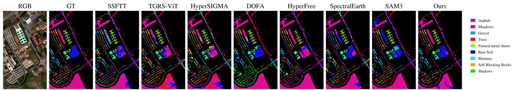

Fig. 9. Qualitative comparison of hyperspectral classification results. Compared to the baselines, HyperSAM produces more spatially coherent classification maps with sharper land-cover boundaries and significantly less salt-and-pepper noise, demonstrating the benefit of region-level promptable priors.  
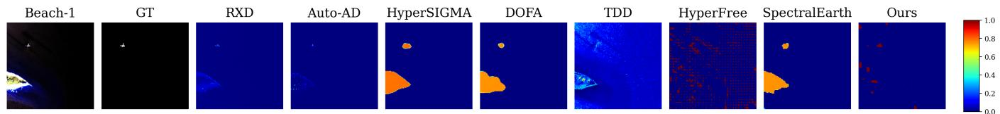

Fig. 10. Qualitative comparison on the Beach-1 anomaly detection scene from the Airport-Beach-Urban benchmark [38]. HyperSAM localizes the target with compact mask-level responses while suppressing most background structures.  
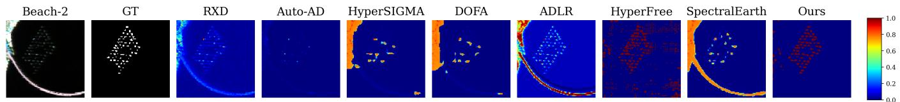  
Fig. 11. Qualitative comparison on the Beach-2 anomaly detection scene from the Airport-Beach-Urban benchmark [38]. HyperSAM reduces false alarms from shoreline and water-background regions and highlights coherent anomalous targets.

## D. Hyperspectral Change Detection

1) Experimental Settings: HCD is evaluated on BayArea/River and Hermiston following common hyperspectral change-detection protocols [39], [40]. HyperSAM is used in a zero-shot setting: no changed or unchanged pixels from the target pair are used to train a classifier or tune the model. For each bi-temporal pair, masks are generated independently on the two dates using 32 point prompts per side, predicted-IoU threshold 0.3, stability threshold 0.4, and box NMS threshold 0.7. For a mask generated at one date, HyperSAM averages the dense embeddings inside the same spatial region at both dates and computes a cosine-distance change score. This produces two directional change maps, one from each temporal mask set [52]. The final score map is obtained by taking the maximum response of the two directions, and the binary change map is produced using the fixed quantile threshold 0.74.

2) Results and Analyses: On BayArea/River, HyperSAM is close to the task-specific FC-SD detector [48] and outperforms the other foundation-model baselines. On Hermiston, HyperSAM achieves the best IoU and F1 among all compared methods, improving IoU from 50.82% for HyperFree [7] to 70.31%. The improvement is consistent with the priorutilization bottleneck discussed in the introduction: change detection requires not only spectral sensitivity, but also a stable spatial unit over which spectral differences can be compared. Pixel-level distances can be unstable under slight misregistration, seasonal variation, or local illumination differences, while the mask-level comparison averages features inside coherent regions and therefore reduces local noise.

Fig. 12 further shows that HyperSAM better preserves the shapes of changed regions than HyperFree and avoids the heavy fragmentation observed in some pixel-level or weakly adapted baselines. The two-directional mask comparison also matters. Masks generated from the first date may better describe pre-change objects, while masks generated from the second date may better describe newly emerged or disappeared structures. Taking the maximum of both directional responses provides a simple way to reuse the same promptable interface for temporal reasoning without introducing a separate changedetection head.

## E. Hyperspectral Target Detection

1) Experimental Settings: HTD is evaluated on the Nuance Cri scene [41] and the Airport scene from the Airport-Beach-Urban benchmark [38]. Each test scene provides one target spectrum or one target support prompt. When a target spectrum is available, the spectrum is first matched with the normalized hyperspectral cube by cosine similarity, and the highestresponse location is used as a target support point. HyperSAM then generates candidate masks using 32 point prompts per side, predicted-IoU threshold 0.3, stability threshold 0.4, and box NMS threshold 0.7. The generated mask containing the support point is used to compute a region-level target prototype from dense embeddings. All candidate masks are scored by cosine similarity to this target prototype. Fixed cosine thresholds of 0.73 for Cri and 0.61 for Airport are then applied, followed by spatial dilation with a 3 × 3 kernel to produce the final detection maps.

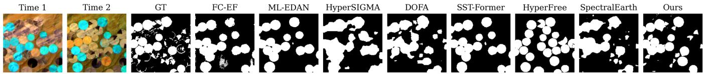  
Fig. 12. Qualitative comparison on the Hermiston change detection scene [40]. HyperSAM produces more complete changed regions and fewer fragmented artifacts than the compared foundation-model baselines.

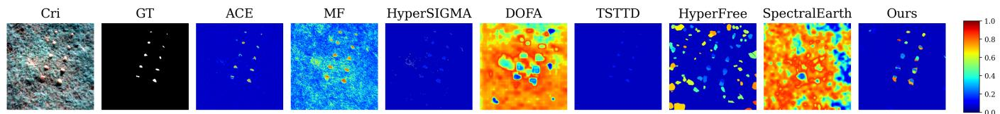

Fig. 13. Qualitative comparison on the Nuance Cri target detection scene [41]. HyperSAM remains competitive with strong spectral detectors while producing region-consistent target responses.  
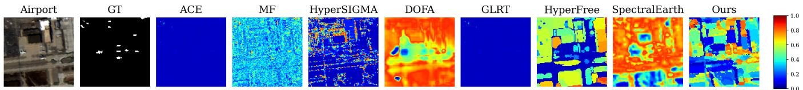  
Fig. 14. Qualitative comparison on the Airport target detection scene from the Airport-Beach-Urban benchmark [38]. HyperSAM benefits from object-level mask features and achieves stronger clutter suppression than several spectral or foundation-model baselines. The false-color composite uses the closest available bands to 700, 546.1, and 438.8 nm as red, green, and blue, respectively.

2) Results and Analyses: On Cri, specialized spectral detectors are extremely strong, and TSTTD [51] achieves the best DF and ODP. HyperSAM remains competitive, with DF close to classical ACE [49] and MF [5]. This is a useful negative case for a unified model: when the target is almost perfectly defined by a distinctive spectrum and little spatial ambiguity exists, a carefully designed spectral detector can still be preferable. HyperSAM should therefore be interpreted as a transferable promptable model rather than a replacement for every specialized detector in every sensing condition.

On Airport, where spatial context and object-level grouping are more important, HyperSAM achieves the best DF and ODP, outperforming HyperFree [7], HyperSIGMA [6], and DOFA [12]. The visual results in Fig. 13 and Fig. 14 clarify this behavior. In the compact Cri scene, purely spectral matching is already highly effective, while HyperSAM still produces target-focused responses with limited background activation. In the more structured Airport scene, region-level mask features help suppress clutter and aggregate target evidence over object-like areas. This task-dependent behavior strengthens the cross-task message: the benefit of promptable spectral-spatial modeling is largest when spectral evidence and object grouping are complementary.

## F. Ablation Studies and Further Analysis

1) Data Construction, Architecture Components, and MoE Refinement: Table III explicitly separates the training corpus, frozen RGB prior, hyperspectral side encoder, MoE refinement, and confidence-aware weighting. The HyperFree-data setting follows the larger but less object-centric Hyper-Seg corpus [7], whereas the synthetic-HSI settings use the physically constrained SpaceNet-derived corpus. The comparison shows that sample count alone is not sufficient for promptable hyperspectral learning: spectral plausibility, spatial sharpness, semantic diversity, and pseudo-mask reliability are especially important because mask supervision depends on object boundaries and region consistency. Raw multispectral input remains competitive on PaviaU HC, indicating that directly observed bands can capture scene-specific land-cover cues, whereas the synthesized full spectrum is more useful when material shape and target/background separability are central.

The removal experiments further show that the two branches are complementary. Removing the frozen RGB branch weakens the inherited objectness, boundary, and promptresponse priors, while removing the hyperspectral side encoder eliminates material-sensitive full-spectrum corrections. The MoE path improves scale-adaptive mask refinement, and confidence-aware weighting increases robustness to structured pseudo-label noise. Thus, these components address distinct parts of the adaptation problem rather than duplicating the same function.

Table IV isolates the prior-preserving initialization while holding the data, frozen RGB branch, side encoder, MoE path, optimization, and evaluation protocol fixed. Randomly initialized injection modules can perturb the pretrained RGB features at the beginning of training. Zero initialization instead begins with zero residual injection, so the network initially reproduces the frozen SAM3 representation and introduces hyperspectral corrections gradually. The consistent improvement supports this stable adaptation strategy.

TABLE III  
COMPONENT-WISE ABLATION OF HYPERSAM. COMPONENTS ARE GROUPED INTO TRAINING DATA, NETWORK STRUCTURE, AND CONFIDENCE-AWARE TRAINING.
<table><tr><td rowspan="3">Configuration</td><td colspan="6">Component</td><td colspan="4">Downstream performance</td></tr><tr><td colspan="2">Training data</td><td colspan="4">Network structure</td><td colspan="4">PaviaU OA↑ Beach-2 ODP↑ Hermiston IoU↑ Airport ODP↑</td></tr><tr><td>HyperFree Raw-MS Syn-HSI</td><td></td><td>RGB</td><td>HSI</td><td>MoE</td><td>Conf.</td><td></td><td></td><td></td><td></td></tr><tr><td>HyperFree training data</td><td></td><td></td><td>√</td><td>√</td><td>√</td><td>√</td><td>79.33</td><td>1.3903</td><td>68.40</td><td>1.2500</td></tr><tr><td>Raw multispectral input</td><td></td><td></td><td></td><td>√</td><td></td><td>√</td><td>85.84</td><td>1.3576</td><td>66.73</td><td>1.3088</td></tr><tr><td>Synthetic hyperspectral input</td><td></td><td></td><td></td><td>√</td><td></td><td>√</td><td>84.92</td><td>1.4452</td><td>66.61</td><td>1.3544</td></tr><tr><td>Without frozen RGB branch</td><td></td><td></td><td></td><td>√</td><td>√</td><td>√</td><td>84.89</td><td>1.3126</td><td>66.45</td><td>1.3208</td></tr><tr><td>Without hyperspectral side encoder</td><td></td><td></td><td>√</td><td></td><td>√</td><td>√</td><td>84.61</td><td>1.2948</td><td>64.96</td><td>1.3073</td></tr><tr><td>Synthetic HSI + MoE</td><td></td><td></td><td>√</td><td>了</td><td></td><td></td><td>87.48</td><td>1.4524</td><td>68.96</td><td>1.3587</td></tr><tr><td>Full HyperSAM</td><td></td><td></td><td>√</td><td>√</td><td>√</td><td>√</td><td>89.12</td><td>1.4641</td><td>70.31</td><td>1.3297</td></tr></table>

TABLE IV

ABLATION OF THE FEATURE-INJECTION INITIALIZATION STRATEGY. ALL OTHER SETTINGS ARE UNCHANGED.
<table><tr><td>Initialization</td><td>PaviaU OA↑</td><td>Beach-2 ODP↑</td><td>Hermiston IoU↑</td><td>Airport ODP↑</td></tr><tr><td>Random</td><td>83.59</td><td>1.3967</td><td>68.43</td><td>1.3126</td></tr><tr><td>Zero</td><td>89.12</td><td>1.4641</td><td>70.31</td><td>1.3297</td></tr></table>

TABLE V

LEAVE-ONE-TERM-OUT ABLATION OF THE HYPERSPECTRAL DATA-GENERATION OBJECTIVE. ALL VARIANTS USE THE SAME TRAINING DATA, INITIALIZATION, AND OPTIMIZATION SCHEDULE.
<table><tr><td>Configuration</td><td>PaviaU OA↑</td><td>Beach-2 ODP↑</td><td>Hermiston IoU↑</td><td>Airport ODP↑</td></tr><tr><td>w/o L1 reconstruction</td><td>81.64</td><td>1.3846</td><td>63.88</td><td>1.2715</td></tr><tr><td>w/o cosine consistency  $L _ { \mathrm { c o s } }$ </td><td>80.26</td><td>1.2681</td><td>61.15</td><td>1.2194</td></tr><tr><td>w/o projection consistend  $\mathrm {  ~ y ~ } L _ { \mathrm { p r o j } }$ </td><td>87.91</td><td>1.4218</td><td>68.74</td><td>1.3312</td></tr><tr><td>w/o abundance sparsity  $L _ { 1 / 2 }$ </td><td>83.52</td><td>1.3467</td><td>65.21</td><td>1.2916</td></tr><tr><td>w/o total variation Ltv</td><td>88.73</td><td>1.4479</td><td>69.42</td><td>1.3421</td></tr><tr><td>Full generator objective</td><td>89.12</td><td>1.4641</td><td>70.31</td><td>1.3297</td></tr></table>

We also conduct a controlled leave-one-term-out ablation of the reconstruction objective in Eq. (4). Every variant uses the same paired spectral library, SpaceNet patches, initialization, optimizer, learning-rate schedule, and number of iterations. Only the indicated term is removed. The same HyperSAM configuration is then trained on each resulting corpus and evaluated with unchanged downstream protocols. As shown in Table V, the complete objective achieves the best overall transfer. Removing $L _ { 1 }$ weakens radiometric fidelity, removing $L _ { \mathrm { c o s } }$ reduces spectral-shape consistency, removing $L _ { \mathrm { p r o j } }$ weakens agreement with the observed WorldView-3 signal, removing $L _ { \mathrm { s p } }$ produces less parsimonious material mixtures, and removing $L _ { \mathrm { t v } }$ reduces spatial coherence in abundance and illumination maps. The results indicate complementary rather than redundant constraints.

The MoE routing statistics in Fig. 15 provide a direct interpretation of the refiner. Expert 3 is selected for 45.2% of masks containing 1–64 pixels but only 18.2% of masks larger than 1024 pixels, whereas Expert 1 increases from 4.5% for the smallest masks to 36.4% for the largest. Expert 2 remains active across all ranges, with routing frequencies from 45.5% to 50.3%. This soft division of labor indicates that Expert 3 specializes more strongly in small-object refinement, Expert 1 becomes increasingly important for large regions, and Expert 2 captures scale-shared patterns without expert collapse.

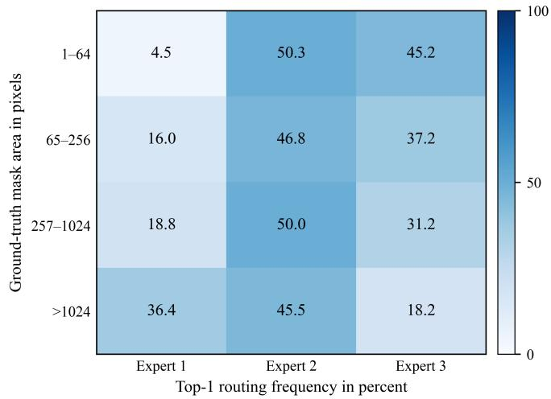  
Fig. 15. Top-1 routing frequency of the three MoE mask-refinement experts across mask-size ranges, showing scale-dependent specialization without expert collapse.

2) Confidence-Aware Noisy-Label Weighting: Fig. 16 compares HyperSAM with and without the CromSS-style confidence-aware robust learning [22]. The robust version improves the main HC result on PaviaU, the HCD results on both BayArea/River and Hermiston, and the HAD ODP scores. This confirms that pseudo-mask supervision benefits from selecting reliable regions and softly down-weighting uncertain boundaries, holes, and ambiguous background leakage. The result also clarifies a common issue in hyperspectral foundation-model training: pseudo-masks are not uniformly wrong or uniformly correct. Interior regions of roads, buildings, water, or vegetation often provide useful supervision, whereas thin boundaries, shadows, mixed pixels, and small objects introduce structured label noise. Treating these two cases differently is more appropriate than discarding pseudomasks altogether.

The HTD results are more mixed, especially on Airport, which indicates that target detection is sensitive to prototype selection, score calibration, and thresholding. Thus, confidence-aware weighting mainly improves the reliability of mask representation learning rather than replacing taskspecific detection calibration. To illustrate this mechanism,

TABLE VI  
ABLATION OF THE HYPERSAM TRAINING-LOSS COMPONENTS. ALL VARIANTS USE THE SAME ARCHITECTURE, CORPUS, INITIALIZATION, OPTIMIZATION SCHEDULE, AND DOWNSTREAM PROTOCOL.
<table><tr><td>Configuration</td><td>PaviaU OA↑</td><td>Beach-2 ODP↑</td><td>Hermiston IoU↑</td><td>Airport ODP↑</td></tr><tr><td>w/o Dice</td><td>85.06</td><td>1.4159</td><td>67.16</td><td>1.3226</td></tr><tr><td>w/o BCE</td><td>86.24</td><td>1.4273</td><td>67.81</td><td>1.3396</td></tr><tr><td>w/o confidence weighting</td><td>87.48</td><td>1.4524</td><td>68.96</td><td>1.3587</td></tr><tr><td>w/o Lbal</td><td>87.17</td><td>1.4592</td><td>68.27</td><td>1.3472</td></tr><tr><td>Full training objective</td><td>89.12</td><td>1.4641</td><td>70.31</td><td>1.3297</td></tr></table>

Fig. 8 visualizes the learned confidence weight map (W). As shown in the figure, the network successfully assigns higher weights to structurally clear and reliable semantic regions. In contrast, ambiguous object boundaries and complex background fragments receive significantly lower weights. This qualitative observation directly validates our robust learning design: it prevents the model from blindly fitting noisy pseudo-labels at object borders while preserving the promptable foundation-model priors inherited from the frozen RGB branch.

Table VI further isolates the optimization components while keeping the model, training corpus, initialization, schedule, and downstream protocols fixed. BCE and Dice provide complementary pixelwise and region-overlap supervision. Confidence weighting suppresses unreliable pseudo-label pixels. ${ \mathcal { L } } _ { \mathrm { c o n s } }$ improves invariance across spectral windows, and $\mathcal { L } _ { \mathrm { b a l } }$ prevents expert collapse. The complete objective gives the best overall HC, HAD, and HCD performance, while the Airport HTD result again shows that specialized threshold calibration can trade off against representation quality.

3) Cross-Task Summary: The experiments show that HyperSAM is strongest when object-level grouping and spectral-spatial features are both useful. HC and HCD benefit from mask-level features because they require coherent region interpretation rather than isolated pixel decisions. HAD benefits from dense promptable proposals because small coherent anomalies can be separated from large background regions. HTD is more scene-dependent: classical spectral detectors such as ACE, MF, GLRT, and TSTTD [5], [49]–[51] can dominate when the target is defined almost perfectly by its spectrum, whereas HyperSAM is advantageous when spatial context and object grouping help suppress clutter.

The expanded ablations provide the same message from another angle. Improvements in HC, HAD, and HCD generally track the quality of abundance-transfer data construction, prior-preserving spectral adaptation, MoE mask refinement, and confidence-aware learning, whereas HTD is more sensitive to the target prototype, score calibration, and thresholding. The most transferable parts of HyperSAM are therefore the spectral-mask corpus, frozen-prior adaptation, and robust mask representation, while specialized detection can still benefit from task-aware calibration. Within the evaluated one-shot, zero-shot, and small-scene protocols, these results support HyperSAM as a unified promptable spectral-spatial model rather than a collection of task-specific networks.

The current study also has important limitations. Hyper-SAM is trained exclusively on synthesized hyperspectral data, and measured endmembers plus multispectral reconstruction constraints cannot reproduce the full variability of real acquisitions. Differences in sensor response, atmosphere, spatial resolution, geography, season, illumination, and land-cover distribution introduce a synthetic-to-real domain gap. SAM3- derived pseudo-masks can disagree with hyperspectral material boundaries, particularly around shadows, thin structures, mixed pixels, and spectrally distinct but visually similar surfaces. The method also depends on the availability and stability of the specific original SAM3 checkpoint used here. Finally, the present benchmarks emphasize frozen-checkpoint, oneshot, zero-shot, or small-scene inference. They do not establish superiority under large-patch training or full downstream finetuning, and specialized spectral detectors can remain preferable when a target is almost completely defined by its spectrum. Future work should combine diverse real annotated HSI with the synthetic corpus, broaden sensor and material coverage, and evaluate large-patch and full-fine-tuning regimes.

## G. Real-World Applicability

1) Experimental Settings: We further evaluate HyperSAM on the HOSD Gulf of Mexico GM13/GM17 scenes [42]. The experiment is formulated as binary classification between oil spill and clean seawater. Oil-spill mapping is included because it stresses the necessity of hyperspectral sensing in a practical environmental-monitoring scenario: SAR and RGB observations can capture slick-like structures, but lookalike sea surfaces, illumination changes, and wave-related dark regions can make purely spatial or intensity-based cues ambiguous [53]. Dense hyperspectral measurements provide additional material-level evidence for separating oil-covered water from clean water and non-oil sea surfaces [42]. Each original 224-band AVIRIS cube is directly processed by the common HyperSAM spectral interface without task-specific fine-tuning. We randomly sample 50 labeled pixels from each class to construct the corresponding spectral-spatial prototypes, while all remaining pixels are used for evaluation. The trained checkpoint and automatic mask generation parameters remain unchanged.

2) Results and Analyses: HyperSAM achieves an OA of 91.14% and an AA of 90.83% on HOSD-GM13, and an OA of 97.39% and an AA of 97.65% on HOSD-GM17. These results indicate that HyperSAM captures useful representations for both oil-covered and clean-water regions despite the substantial difference between these marine scenes and the urban synthetic imagery used during training. The experiment therefore provides a complementary form of validation: the model is not only competitive on standard HC/HAD/HCD/HTD benchmarks, but can also transfer its promptable spectral-spatial representation to an application where material discrimination is essential.

As shown in Fig. 17, the predictions preserve large-scale oil-spill structures, although errors remain around fragmented slick boundaries and spectrally ambiguous transition regions. These failure cases are meaningful because they expose the remaining gap between synthetic urban training data and complex marine scenes. They also suggest a practical extension of the proposed data pipeline: if additional water, coastline, and oil-like spectral endmembers are incorporated, the same abundance-transfer strategy could synthesize more applicationspecific spectral-mask pairs for environmental monitoring without changing the HyperSAM architecture.

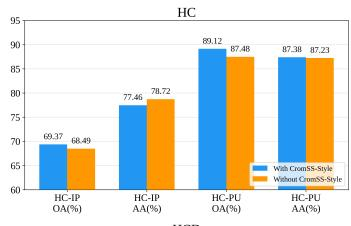

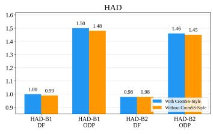

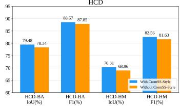

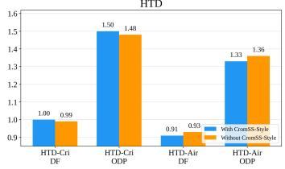  
Fig. 16. Ablation of CromSS-style confidence-aware robust learning [22]. The comparison reports representative HC, HAD, HCD, and HTD metrics with and without noisy-label weighting and cross-view consistency.

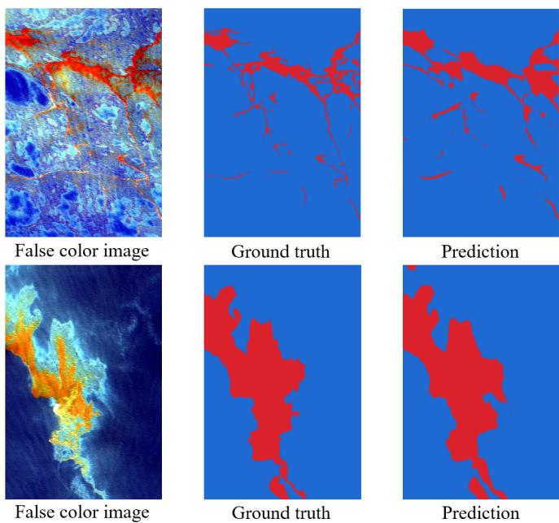  
Fig. 17. Oil-spill mapping results on the HOSD Gulf of Mexico GM13 and GM17 scenes. From left to right, the figure shows the input falsecolor composite, ground truth, and HyperSAM prediction for each scene. The composites use the closest available bands to 700, 546.1, and 438.8 nm as red, green, and blue, respectively. Red and blue in the label maps denote oil spill and background (clean seawater or non-oil sea surface), respectively.

## H. Computational Cost and Carbon Footprint

In addition to predictive performance, we evaluate the operational cost of deploying different hyperspectral classification pipelines under the same one-shot Indian Pines protocol. Reporting energy and carbon cost alongside accuracy has become increasingly important for large neural models and foundationmodel research [54]–[56]. The benchmark is designed to measure the target-scene training, adaptation, and inference cost, rather than the much larger and method-dependent cost of upstream foundation-model pretraining. Each method is executed on a single NVIDIA RTX 4090 GPU three times from a cold start. For each repetition, one support configuration is selected from a fixed pool of 50 precomputed one-shot support configurations, so that the reported accuracy and cost statistics are tied to the same executed runs. For HyperSAM and HyperFree, which do not update parameters on the target scene, the measured command includes checkpoint loading, automatic mask generation, dense feature extraction, supportprototype construction, and full-scene classification. For SS-FTT and TGRS-ViT, the measured command includes oneshot supervised training from random initialization followed by full-scene inference. For HyperSIGMA-LP and DOFA-LP, it includes frozen backbone feature extraction, one-shot linearprobe fitting, and full-scene inference.

GPU board power is monitored at a sampling interval of 0.5 s. Each run is accepted only when no pre-existing GPU compute process is detected, in order to avoid contamination from other workloads. The sampled board-power sequence is integrated by the trapezoidal rule to obtain the measured GPU energy. A short idle-power sample is also recorded by the measurement script for diagnostic purposes and for internally saved incremental-energy estimates. However, the values reported in Table VII and Fig. 18 use the measured GPU board energy during the whole benchmark command. Therefore, the wall-clock time includes command-level initialization and data/model loading, whereas the energy and carbon values account only for GPU board electricity.

Operational carbon emissions are estimated as

$$
C _ { \mathrm { o p } } = E _ { \mathrm { G P U } } ^ { \mathrm { k W h } } \times \mathrm { P U E } \times I _ { \mathrm { g r i d } } ,\tag{21}
$$

where $E _ { \mathrm { G P U } } ^ { \mathrm { k W h } }$ denotes the measured GPU board energy converted to kWh, PUE is the power usage effectiveness, and $I _ { \mathrm { g r i d } }$ is the grid carbon intensity. Following a device-level accounting boundary, we set $\mathrm { P U E } ~ = ~ 1 . 0 $ and $I _ { \mathrm { g r i d } } = $ 475 $\mathrm { g C O _ { 2 } e / k W h }$ . Thus, the carbon values should be interpreted as estimated operational GPU emissions for the measured hardware and grid setting. They do not include CPU energy, host memory, storage, networking, data transfer, upstream pretraining, checkpoint production, or embodied hardware emissions.

Table VII and Fig. 18 show a clear accuracy–cost trade-off. Note that Table II reports the best testing results to demonstrate the maximum capacity and theoretical upper bound of the models. In contrast, evaluating energy and operational carbon costs requires accounting for hardware-level stochasticity. Thus, these cost metrics are averaged over three independent runs to reflect real-world operational stability. HyperSAM obtains the highest mean OA, AA, and Kappa among the compared methods, reaching 66.91% OA, 74.09% AA, and 62.02% Kappa, with an average runtime of 21.11 s, GPU energy of 0.624 Wh, and estimated emissions of $0 . 2 9 6 \mathrm { g C O _ { 2 } e }$ Compared with the strongest non-HyperSAM result in terms of OA, DOFA-LP, HyperSAM improves OA, AA, and Kappa by 7.59, 9.61, and 6.68 percentage points, respectively, at the cost of higher GPU energy. HyperFree requires less GPU energy than HyperSAM, but its classification accuracy is substantially lower. SSFTT and TGRS-ViT occupy the low-runtime and low-energy region of the plot, yet their OA and Kappa remain below those of HyperSAM and DOFA-LP.

TABLE VII  
ACCURACY, ENERGY, AND OPERATIONAL CARBON COST ON INDIANPINES. COSTS ARE THE MEAN AND STANDARD DEVIATION OVER THREECOLD-START REPLAYS OF THAT SAME CONFIGURATION AND INCLUDEDOWNSTREAM TRAINING WHEN REQUIRED FOLLOWED BY FULL-SCENEINFERENCE.
<table><tr><td>Method</td><td>OA (%)</td><td>AA (%)</td><td>Kappa (%)</td><td>Time (s)</td><td>Energy (Wh)</td><td>CO2e (g)</td></tr><tr><td>HyperSAM</td><td>66.91</td><td>74.09</td><td>62.02</td><td>21.11±1.98</td><td>0.624±0.223</td><td>0.2964±0.1059</td></tr><tr><td>HyperFree</td><td>50.36</td><td>58.06</td><td>43.62</td><td>23.40±18.94</td><td>0.244±0.111</td><td>0.1159±0.0527</td></tr><tr><td>SSFTT</td><td>54.85</td><td>65.07</td><td>49.51</td><td>8.30±0.06</td><td>0.087±0.001</td><td>0.0413±0.0005</td></tr><tr><td>TGRS-ViT</td><td>49.73</td><td>63.49</td><td>44.92</td><td>8.16±0.13</td><td></td><td>0.120±0.002 0.0570±0.0010</td></tr><tr><td>HyperSIGMA-LP</td><td>40.69</td><td>46.99</td><td>33.53</td><td> $2 7 . 0 1 \pm 3 7 . 6 3$ </td><td></td><td>0.274±0.401 0.1302±0.1905</td></tr><tr><td>DOFA-LP</td><td>59.32</td><td>64.48</td><td>55.34</td><td>13.69±9.88</td><td>0.181±0.168 0.0860±0.0798</td><td></td></tr></table>

These results indicate that HyperSAM is not the minimumenergy option. Rather, it lies at the high-accuracy end of the operational accuracy–energy spectrum. The additional cost mainly comes from promptable mask proposal generation and spectral-spatial feature extraction, which provide regionlevel support aggregation and improve one-shot classification robustness. The cost should also be interpreted together with the unified interface evaluated above: once masks and dense features have been extracted for a scene, they can potentially be reused for classification, change analysis, anomaly inspection, and target querying without retraining separate taskspecific models. Since the absolute per-scene GPU emissions remain below one gram of $\mathrm { C O _ { 2 } e }$ under the adopted devicelevel boundary, the practical deployment decision depends on the desired accuracy, the number of scenes to be processed, the possibility of reusing extracted masks and features across tasks, and the carbon intensity of the actual computing environment.

## V. CONCLUSION

In this paper, we present HyperSAM, a promptable hyperspectral foundation model that integrates physicsinformed data synthesis, SAM3-based spectral adaptation, and confidence-aware robust learning. By reconstructing fullspectrum hyperspectral cubes from SpaceNet multispectral imagery and pairing them with high-resolution SAM3 pseudomasks, HyperSAM builds object-centric spectral-mask supervision with sharp spatial boundaries and physically plausible spectra. Architecturally, it preserves the geometric and promptresponse priors of the frozen SAM3 RGB branch, injects hyperspectral evidence through a trainable side encoder with zero-initialized residual adapters, and uses a lightweight MoE decoder for scale-adaptive mask refinement. During training, best-mask supervision, CromSS-style confidence weighting, dual spectral-window consistency, and router balance regularization improve robustness to imperfect pseudo-masks. Experiments across HC, HAD, HCD, and HTD show that one trained HyperSAM parameter set can be reused under the evaluated small-scene protocols. The gains over SAM3 verify the value of spectral adaptation in this setting, while the comparisons with hyperspectral baselines demonstrate the benefit of preserving promptable foundation-model priors under a common low-label budget. Ablation results further show that a compact but higher-quality synthetic corpus can be more effective than a larger weakly object-centric corpus. Overall, HyperSAM suggests that reliable object masks, physically plausible spectra, and stable promptable priors are useful ingredients for transferable hyperspectral foundation models. The additional HOSD experiment further demonstrates transfer to airborne hyperspectral oil-spill mapping and environmental monitoring.

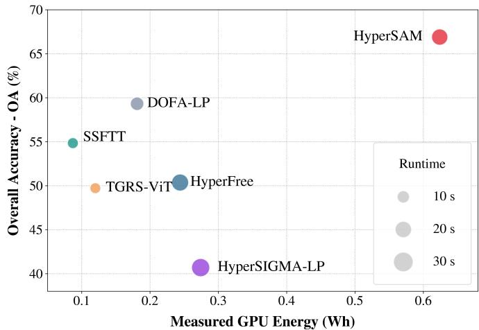  
Fig. 18. Accuracy–energy trade-off on Indian Pines. The horizontal axis reports measured GPU board energy for downstream training, adaptation, and/or inference.

## REFERENCES

[1] A. Plaza, J. A. Benediktsson, J. W. Boardman et al., “Recent advances in techniques for hyperspectral image processing,” Remote Sens. Environ., vol. 113, pp. S110–S122, 2009.

[2] P. Ghamisi, N. Yokoya, J. Li et al., “Advances in hyperspectral image and signal processing: A comprehensive overview of the state of the art,” IEEE Geosci. Remote Sens. Mag., vol. 5, no. 4, pp. 37–78, 2017.

[3] M. E. Paoletti, J. M. Haut, J. Plaza, and A. Plaza, “Deep learning classifiers for hyperspectral imaging: A review,” ISPRS J. Photogramm. Remote Sens., vol. 158, pp. 279–317, 2019.

[4] I. S. Reed and X. Yu, “Adaptive multiple-band CFAR detection of an optical pattern with unknown spectral distribution,” IEEE Trans. Acoust., Speech, Signal Process., vol. 38, no. 10, pp. 1760–1770, 1990.

[5] D. Manolakis, C. Siracusa, and G. Shaw, “Hyperspectral subpixel target detection using the linear mixing model,” IEEE Trans. Geosci. Remote Sens., vol. 39, no. 7, pp. 1392–1409, 2001.

[6] D. Wang, M. Hu, Y. Jin et al., “HyperSIGMA: Hyperspectral intelligence comprehension foundation model,” IEEE Trans. Pattern Anal. Mach Intell., vol. 47, no. 8, pp. 6427–6444, 2025.

[7] J. Li, Y. Liu, X. Wang et al., “HyperFree: A channel-adaptive and tuningfree foundation model for hyperspectral remote sensing imagery,” in Proc. IEEE/CVF Conf. Comput. Vis. Pattern Recognit. (CVPR), 2025, pp. 23 048–23 058.

[8] L. Pang, J. Yao, K. Li, J. Zhou, D. Meng, and X. Cao, “Special: zeroshot hyperspectral image classification with clip,” IEEE Trans. Geosci. Remote Sens., 2026.

[9] Z. Chen, H. Wang, J. Yao, J. Zhang, P. Ghamisi, J. Zhou, P. M. Atkinson, and B. Zhang, “Cangling-knowflow: A unified knowledgeand-flow-fused agent for comprehensive remote sensing applications,” arXiv preprint arXiv:2512.15231, 2025.

[10] Y. Cong, S. Khanna, C. Meng et al., “SatMAE: Pre-training transformers for temporal and multi-spectral satellite imagery,” in Adv. Neural Inf. Process. Syst. (NeurIPS), vol. 35, 2022.

[11] D. Hong, B. Zhang, X. Li et al., “SpectralGPT: Spectral remote sensing foundation model,” IEEE Trans. Pattern Anal. Mach. Intell., vol. 46, no. 8, pp. 5227–5244, 2024.

[12] Z. Xiong, Y. Wang, F. Zhang et al., “Neural plasticity-inspired multimodal foundation model for earth observation,” arXiv preprint arXiv:2403.15356, 2024.

[13] A. Kirillov, E. Mintun, N. Ravi et al., “Segment anything,” in Proc. IEEE/CVF Int. Conf. Comput. Vis. (ICCV), 2023, pp. 4015–4026.

[14] N. Ravi, V. Gabeur, Y.-T. Hu et al., “SAM 2: Segment anything in images and videos,” in Proc. Int. Conf. Learn. Represent. (ICLR), 2025.

[15] N. Carion, L. Gustafson, Y.-T. Hu et al., “SAM 3: Segment anything with concepts,” arXiv preprint arXiv:2511.16719, 2025.

[16] N. A. A. Braham, C. M. Albrecht, J. Mairal et al., “SpectralEarth: Training hyperspectral foundation models at scale,” IEEE J. Sel. Topics Appl. Earth Observ. Remote Sens., vol. 18, pp. 16 780–16 797, 2025.

[17] O. Simeoni, H. V. Vo, M. Seitzer, F. Baldassarre, M. Oquab,´ C. Jose, V. Khalidov, M. Szafraniec, S. Yi, M. Ramamonjisoa, F. Massa, D. Haziza, L. Wehrstedt, J. Wang, T. Darcet, T. Moutakanni, L. Sentana, C. Roberts, A. Vedaldi, J. Tolan, J. Brandt, C. Couprie, J. Mairal, H. Jegou, P. Labatut, and P. Bojanowski, “DINOv3,”´ arXiv preprint arXiv:2508.10104, 2025. [Online]. Available: https: //arxiv.org/abs/2508.10104

[18] M. F. Baumgardner, L. L. Biehl, and D. A. Landgrebe, “220-band AVIRIS hyperspectral image data set: June 12, 1992 Indian Pine test site 3,” Purdue Univ. Res. Repos., 2015.

[19] Grupo de Inteligencia Computacional (GIC), “Hyperspectral remote sensing scenes: Pavia University scene,” Univ. Basque Country, 2021.

[20] M. H. P. Fuchs and B. Demir, “HySpecNet-11k: A large-scale hyperspectral dataset for benchmarking learning-based hyperspectral image compression methods,” arXiv preprint arXiv:2306.00385, 2023.

[21] A. Mani, S. Gorbachev, J. Yan et al., “OHID-1: A new large hyperspectral image dataset for multi-classification,” Sci. Data, vol. 12, p. 251, 2025.

[22] C. Liu, C. M. Albrecht, Y. Wang, and X. X. Zhu, “CromSS: Cross-modal pretraining with noisy labels for remote sensing image segmentation,” IEEE Trans. Geosci. Remote Sens., vol. 63, pp. 1–17, 2025.

[23] X. Guo, J. Lao, B. Dang et al., “SkySense: A multi-modal remote sensing foundation model towards universal interpretation for earth observation imagery,” in Proc. IEEE/CVF Conf. Comput. Vis. Pattern Recognit. (CVPR), 2024, pp. 27 672–27 683.

[24] K. Chen, C. Liu, H. Chen et al., “RSPrompter: Learning to prompt for remote sensing instance segmentation based on visual foundation model,” IEEE Trans. Geosci. Remote Sens., vol. 62, pp. 1–17, 2024.

[25] N. Liu, X. Xu, Y. Su, H. Zhang, and H.-C. Li, “PointSAM: Pointlysupervised segment anything model for remote sensing images,” IEEE Trans. Geosci. Remote Sens., vol. 63, pp. 1–15, 2025.

[26] Z. Zheng, Y. Zhong, L. Zhang, and S. Ermon, “Segment any change,” in Adv. Neural Inf. Process. Syst. (NeurIPS), 2024.

[27] L. Yao, F. Liu, D. Chen et al., “RemoteSAM: Towards segment anything for earth observation,” in Proc. ACM Int. Conf. Multimedia (ACM MM), 2025.

[28] J. M. Bioucas-Dias, A. Plaza, N. Dobigeon et al., “Hyperspectral unmixing overview: Geometrical, statistical, and sparse regression-based approaches,” IEEE J. Sel. Topics Appl. Earth Observ. Remote Sens., vol. 5, no. 2, pp. 354–379, 2012.

[29] L. Liu, W. Li, Z. Shi et al., “Physics-informed hyperspectral remote sensing image synthesis with deep conditional generative adversarial networks,” IEEE Trans. Geosci. Remote Sens., vol. 60, pp. 1–15, 2022.

[30] R. F. Kokaly, R. N. Clark, G. A. Swayze et al., “USGS spectral library version 7,” U.S. Geol. Surv., Tech. Rep. 1035, 2017.

[31] B. Han, Q. Yao, X. Yu et al., “Co-teaching: Robust training of deep neural networks with extremely noisy labels,” in Adv. Neural Inf. Process. Syst. (NeurIPS), vol. 31, 2018.

[32] C. G. Northcutt, L. Jiang, and I. L. Chuang, “Confident learning: Estimating uncertainty in dataset labels,” J. Artif. Intell. Res., vol. 70, pp. 1373–1411, 2021.

[33] H. Song, M. Kim, D. Park et al., “Learning from noisy labels with deep neural networks: A survey,” IEEE Trans. Neural Netw. Learn. Syst., vol. 34, no. 11, pp. 8135–8153, 2023.

[34] L. Zhang, A. Rao, and M. Agrawala, “Adding conditional control to text-to-image diffusion models,” in Proc. IEEE/CVF Int. Conf. Comput. Vis. (ICCV), 2023, pp. 3836–3847.

[35] N. Shazeer, A. Mirhoseini, K. Maziarz et al., “Outrageously large neural networks: The sparsely-gated mixture-of-experts layer,” in Proc. Int. Conf. Learn. Represent. (ICLR), 2017.

[36] W. Fedus, B. Zoph, and N. Shazeer, “Switch transformers: Scaling to trillion parameter models with simple and efficient sparsity,” J. Mach. Learn. Res., vol. 23, no. 120, pp. 1–39, 2022.

[37] A. Van Etten, D. Lindenbaum, and T. M. Bacastow, “SpaceNet: A remote sensing dataset and challenge series,” arXiv preprint arXiv:1807.01232, 2018.

[38] B. Tu, N. Li, Z. Liao et al., “Hyperspectral anomaly detection via spatial density background purification,” Remote Sens., vol. 11, no. 22, p. 2618, 2019.

[39] J. Qu, S. Hou, W. Dong et al., “A multilevel encoder–decoder attention network for change detection in hyperspectral images,” IEEE Trans. Geosci. Remote Sens., vol. 60, pp. 1–13, 2022.

[40] Y. Wang, D. Hong, J. Sha et al., “Spectral-spatial-temporal transformers for hyperspectral image change detection,” IEEE Trans. Geosci. Remote Sens., vol. 60, pp. 1–14, 2022.

[41] Y. Zhang, K. Wu, B. Du et al., “Hyperspectral target detection via adaptive joint sparse representation and multi-task learning with locality information,” Remote Sens., vol. 9, no. 5, p. 482, 2017.

[42] P. Duan, X. Kang, P. Ghamisi, and S. Li, “Hyperspectral remote sensing benchmark database for oil spill detection with an isolation forest-guided unsupervised detector,” IEEE Trans. Geosci. Remote Sens., vol. 61, pp. 1–11, 2023.

[43] L. Sun, G. Zhao, Y. Zheng et al., “Spectral-spatial feature tokenization transformer for hyperspectral image classification,” IEEE Trans. Geosci. Remote Sens., vol. 60, pp. 1–14, 2022.

[44] Z. Zhao, X. Xu, S. Li et al., “Hyperspectral image classification using groupwise separable convolutional vision transformer network,” IEEE Trans. Geosci. Remote Sens., vol. 62, pp. 1–17, 2024.

[45] S. Wang, X. Wang, L. Zhang et al., “Auto-AD: Autonomous hyperspectral anomaly detection network based on fully convolutional autoencoder,” IEEE Trans. Geosci. Remote Sens., vol. 60, pp. 1–14, 2022.

[46] J. Li, X. Wang, S. Wang, H. Zhao, and Y. Zhong, “One-step detection paradigm for hyperspectral anomaly detection via spectral deviation relationship learning,” IEEE Trans. Geosci. Remote Sens., vol. 62, pp. 1–15, 2024.

[47] Y. Qu, W. Wang, R. Guo, B. Ayhan, C. Kwan, S. Vance, and H. Qi, “Hyperspectral anomaly detection through spectral unmixing and dictionary-based low-rank decomposition,” IEEE Trans. Geosci. Remote Sens., vol. 56, no. 8, pp. 4391–4405, 2018.

[48] R. C. Daudt, B. Le Saux, and A. Boulch, “Fully convolutional siamese networks for change detection,” in Proc. IEEE Int. Conf. Image Process. (ICIP), 2018, pp. 4063–4067.

[49] S. Kraut, L. L. Scharf, and L. T. McWhorter, “Adaptive subspace detectors,” IEEE Trans. Signal Process., vol. 49, no. 1, pp. 1–16, Jan. 2001.

[50] E. J. Kelly, “An adaptive detection algorithm,” IEEE Trans. Aerosp. Electron. Syst., vol. AES-22, no. 2, pp. 115–127, 1986.

[51] J. Jiao, Z. Gong, and P. Zhong, “Triplet spectralwise transformer network for hyperspectral target detection,” IEEE Trans. Geosci. Remote Sens., vol. 61, pp. 1–17, 2023.

[52] K. Wei, J. Yao, J. Cui, X. Zhao, L. Wang, G. Vivone, and P. Ghamisi, “Beyond bi-temporal and unimodal: A multimodal-temporal coupling network for change detection in conflict zones,” Inform. Fusion, p. 104402, 2026.

[53] C. Brekke and A. H. S. Solberg, “Oil spill detection by satellite remote sensing,” Remote Sens. Environ., vol. 95, no. 1, pp. 1–13, 2005.

[54] E. Strubell, A. Ganesh, and A. McCallum, “Energy and policy considerations for deep learning in NLP,” in Proc. Annu. Meeting Assoc. Comput. Linguist. (ACL), 2019, pp. 3645–3650.

[55] L. F. W. Anthony, B. Kanding, and R. Selvan, “Carbontracker: Tracking and predicting the carbon footprint of training deep learning models,” arXiv preprint arXiv:2007.03051, 2020.

[56] D. Patterson, J. Gonzalez, Q. Le et al., “Carbon emissions and large neural network training,” arXiv preprint arXiv:2104.10350, 2021.