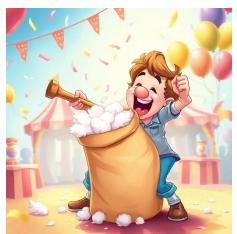
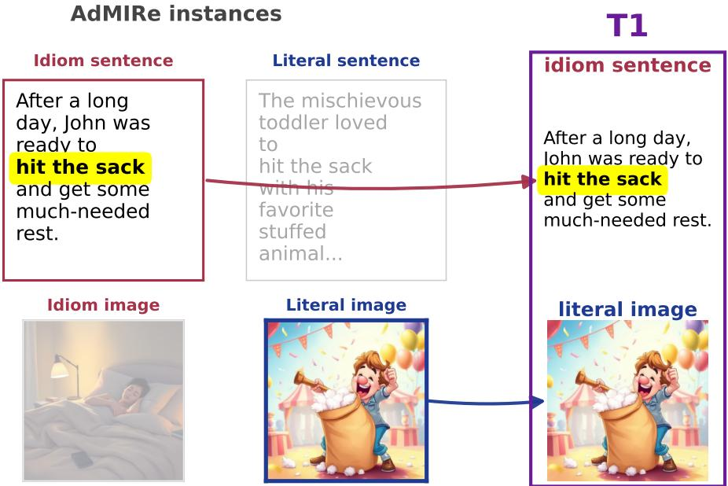

# It’s Not What the Image Shows: Irrelevant Context Destabilises VLM Judges Without Informing Them

Nagham Omar∗ Mahmoud Jabarin∗ Kinan Ibraheem∗ Lotem Peled-Cohen

Faculty of Data and Decision Sciences, Technion

{nagham.omar, mahmoud.j, kinani, splotem}@campus.technion.ac.il

## Abstract

Vision-language models (VLMs) are increasingly used in place of human annotators, making it important that substitutability tests reflect the model rather than incidental evaluation conditions. We introduce MIST, the Misleading-Image Stress Test: 200 English sentences, each built around a phrase readable either figuratively or literally and shown with an aligned image depicting its reading, a misleading image depicting the opposite, or no image at all. The guidelines require the label to be decided from the sentence alone, so no image should change any answer. We expected each image to pull a judge’s labels toward the sense it depicts, and neither kind did. Across thirteen VLM judges, an aligned image changed 20.5% of labels and a misleading one 19.4%, close for every judge and both above the 11.6% produced by deleting the ignore-the-image instruction with the image left in place. Yet only 37% of the labels that differ between the two images moved toward the sense shown, and agreement with our human annotators is unchanged whether the image is absent, aligned or misleading. The effect is smaller in the seven judges that pass the alt-test than in the six that never do, but present in all of them: what moves a judge is that an image is there, not which of the two it is, so a substitutability verdict describes a configuration as much as a model.

## 1 Introduction

Large language models (LLMs) increasingly annotate in place of humans [6, 31], and several protocols decide when that substitution is justified. The alternative annotator test [alt-test; 1] asks whether an LLM judge agrees with a panel of human annotators at least as well as a withheld member does; He et al. [11] ask whether its labels are statistically indistinguishable from a human’s. Each returns one verdict per judge from a single run: one prompt, one format, one presentation of the item. But real items arrive wrapped in context, an image or a preceding message, that the guidelines declare irrelevant. Human annotators can usually be instructed to ignore such information; models might not. Existing substitutability verdicts do not reveal whether their conclusions are robust to these changes in context, so we ask whether a verdict describes the judge or the conditions it was measured under

The stakes are high: once a human panel is replaced its labels become evaluation sets and training data, and errors in them propagate into flawed comparisons and false conclusions [17]. Judges are already known to favour longer answers and their own outputs [31], shift with the scoring format [3] and change with the prompt [14], but this is treated as an accuracy problem to engineer away rather than a threat to the decision that a model may replace a person.

Testing it needs a task where the context can change while the correct answer stays put, and idioms provide one. An idiom is a multiword expression whose meaning is not composed from its parts [27]:

  
T1: figurative sentence, T2: figurative sentence, literal image. Exhausted, figurative image. After a John was ready to hit the long illness, he kicked the sack. bucket.

  
T3: literal sentence, literal image. After the balloon ride, we were back down to earth.

  
T4: literal sentence, figurative image. The teacher’s pet parakeet sat on her shoulder as she graded.  
Figure 1: The four conditions of MIST, 50 phrases each. T2 and T3 are aligned, T1 and T4 misleading. Bold marks the target.

to kick the bucket is to die, and no kicking or bucket is involved. Being an idiom is a property of the string; how it is read is a property of the sentence, and many idioms keep a usable literal one, so the same string isfigurative in my grandfather kicked the bucket last winter and literal in she kicked the bucket over and spilled the water. An image can therefore be placed beside such a sentence, and swapped, without touching the answer.

Existing multimodal work is built the opposite way: IRFL [30] and AdMIRe [20] make the image the object of the decision, so changing it legitimately changes the answer. We instead distinguish models that use context appropriately from those whose judgments are influenced by context they should ignore. ID10M-JAM [10] also preserves the label, but perturbs text rather than image and scores identification accuracy. Work on irrelevant context is closer [26, 7, 4] but measures task accuracy, not agreement with the human annotators a model would replace.

We introduce MIST, the Misleading-Image Stress Test: 200 English items, each a sentence with one potentially idiomatic phrase, the target, whose label records how that target reads in that sentence. The guidelines require the label to be decided from the sentence alone, so a good annotator, human or VLM, gives an item the same label whether the image beside it depicts the target’s figurative reading, its literal one, or is absent. Swapping the image is therefore label-preserving by construction[24]: the human annotator or VLM judge is perturbed, the correct answer is not, and any change of label is an error. Both images depict a reading of the target, so what varies is which reading is shown, not whether the image is about the sentence at all. Our results establish two points. First, adding an image changes a judge’s labels even when the prompt explicitly instructs it to disregard the image. Second, the effect of image content is weaker than expected: aligned and misleading images move similar numbers of labels, and neither reliably shifts labels toward the interpretation it depicts. We release MIST with all human annotator and VLM judge labels,2 and the finding that context a VLM judge is told to ignore destabilises it without informing it. Related work is in Appendix A.

## 2 MIST: The Misleading-Image Stress Test

Source and construction. We build on a public instruction-tuning release derived from the AdMIRe shared task [20], holding 551 English potentially idiomatic expressions. Each expression appears in two rows: one sentence using it figuratively and one using it literally, each paired with a generated image of that reading. We sample 200 expressions and keep one sentence from each, 100 figurative and 100 literal; we call the reading that sentence uses its sentence sense. Because the discarded row’s image remains available, every retained sentence can be shown with either image (Appendix D).

Conditions. An item is a sentence together with its target expression and its sentence sense. Each item is presented in three inputs: with an aligned image, which depicts the sentence sense; with a misleading image, which depicts the opposite one; or with no image. Crossing sentence sense with image type yields the four conditions of Figure 1, fifty expressions each. Each human annotator saw one condition per expression, so the manipulation could not be inferred by comparing versions; the VLM judges saw all three inputs of every item.

Labels. The label describes how the written phrase reads in its sentence, not what the image shows. Two questions assign one of four labels, and they ask about different things. The first is about this sentence: does the phrase carry its literal meaning here? If it does and no figurative reading is present, the label is Fully Literal (LL); if a figurative reading is also present, Figurative and Literal (FL). If it does not, the second question sets the sentence aside and asks about the phrase itself: does any semantic link remain between its literal words and its figurative meaning? If so the label is Weak Figurative (WF), otherwise Fully Figurative (FF). We treat the labels as partially ordinal, from FF to LL, most to least figurative. The guidelines add that a literal image does not by itself make a phrase Fully Literal, and tell anyone distracted by the image to annotate as if it were hidden (Appendix C).

Human annotation. Six fluent English speakers annotated MIST as two disjoint trios. One knew the study design and was experienced with the task (informed), the other received only the guidelines (blind). Within each trio, three annotators independently labelled the same 100 items, with no item labelled by both trios. Both reach moderate agreement and do not differ significantly (Fleiss κ 0.65 and 0.57, p = 0.22): the task is hard in itself, not because either trio was misled.

## 3 Experiments

## 3.1 Experiments Setup

VLM Judges. We evaluate thirteen VLMs as candidate annotators, four proprietary and nine openweight, spanning 3B to 32B active parameters. Seven pass the alt-test in at least one configuration and are the ones the body reports, covering five families: GPT-5.2 [19], Gemini 3.1 Flash-Lite (G3.1-FL) and Gemini 3.5 Flash (G3.5-F) [8], Gemma-3-27B (Gm3-27B) [5], Mistral-Small-3.2-24B (MiS-24B) [16], and Qwen3.6-27B (Q3.6-27B) and Qwen3.6-35B-A3B (Q3.6-35B) [23]. The other six never pass and are named, cited and reported in Appendix F. Where a model offers a reasoning mode we disable it, keeping explicit reasoning a controlled prompt factor.

Prompts and image instructions. VLM judges are sensitive to prompting [14], so each runs under four techniques sharing one task instruction and one output contract: zero-shot, few-shot, chain-of-thought (CoT) [29] and few-shot with CoT (Appendix I). We cross each prompt with an explicit arm that tells the judge to ignore the image and a silent arm that never mentions it. Each judge produces $4 \times ( 1 + 2 \times 2 )$ = 20 labels per item, 52,000 in total, decoded greedily with the output constrained to the four labels. Unless stated otherwise we report the explicit arm, pooled over the four prompts; the silent arm shows the same pattern with different labels (Table 1, column 3).

Measures. We report four quantities. (i) A change rate is the proportion of (item, prompt, judge) cells whose label differs between two inputs: from text-only to the same item with an aligned image and, separately, with a misleading one. Then as a control, we hold the image fixed and delete only the paragraph instructing the judge to ignore the image, giving an upper bound on how much a prompt edit alone can move a judge. (ii) Direction is defined on the cells whose label differs between the two images: the proportion moving toward the sense shown, where chance is 50%. (iii) Agreement is exact match with the human majority label of the trio that saw the item. (iv) Substitutability is the alt-test, run per trio because the trios share no items, at the slack prescribed for each tier (ε = 0.20 informed, 0.15 blind); a judge is scored only on the input its human counterparts saw.

## 3.2 Results

Some judges are close enough to a human trio to be worth perturbing. Against the informed trio no judge passes the alt-test in any of the 52 judge-by-prompt cells; that trio agrees more closely with one another, so the bar a withheld member sets is higher. Against the blind trio, two judges pass at the slack prescribed for its tier, G3.5-F and Gm3-27B, and seven at the more permissive $\varepsilon = 0 . 2 0$ while six never pass (Appendix H). The seven the body reports are therefore those that clear the test somewhere in the grid, not all of them at the prescribed slack; they are the group for which it is meaningful to ask what perturbs them, and Appendix F gives all thirteen.

Adding an image changes the labels a judge produces. Attaching an image to a sentence a judge has already labelled changes 15.9% of its labels if the image is aligned and 14.7% if it is misleading (Table 1); across all thirteen judges, 20.5% and 19.4% (Appendix F). The two are close for every judge, never more than five points apart, so what moves the label is that an image is present, not which one it is. Both exceed the control, holding the image fixed and deleting the ignore-it paragraph, for every judge individually and not merely on average: telling a judge in plain language to disregard the image moves fewer labels than placing the image there does.

Table 1: Change rates, pooled over the four prompts, for the seven judges that pass the alt-test in at least one configuration.
<table><tr><td rowspan="2">Judge</td><td colspan="3">labels that change (%)</td><td rowspan="2">of those that differ, % toward the image</td></tr><tr><td>attaching an aligned image</td><td>attaching a misleading image</td><td>prompt edited, image fixed</td></tr><tr><td>GPT-5.2</td><td>10.0</td><td>9.1</td><td>7.7</td><td>28</td></tr><tr><td>G3.5-F</td><td>10.9</td><td>11.8</td><td>7.9</td><td>34</td></tr><tr><td>G3.1-FL</td><td>14.5</td><td>13.0</td><td>8.4</td><td>12</td></tr><tr><td>Gm3-27B</td><td>17.9</td><td>19.2</td><td>10.6</td><td>30</td></tr><tr><td>MiS-24B</td><td>21.2</td><td>16.9</td><td>9.1</td><td>21</td></tr><tr><td>Q3.6-35B</td><td>16.6</td><td>14.2</td><td>9.6</td><td>39</td></tr><tr><td>Q3.6-27B</td><td>20.0</td><td>18.5</td><td>7.9</td><td>38</td></tr><tr><td>mean</td><td>15.9</td><td>14.7</td><td>8.8</td><td>29</td></tr></table>

The labels that change do not follow the image. Across all thirteen judges the two images disagree on 17.1% of (item, prompt, judge) cells, 1,776 of 10,400. Of these, 37% move toward the sense the misleading image depicts and 63% move away from it, and the imbalance holds for each sentence type separately (683 figurative, 38% following the image; 1,093 literal, 35%). Every judge that passes the alt-test falls below chance, the highest at 39%; across all thirteen, only one exceeds it, by two points. Nor does the movement cross the distinction the task turns on: among the seven judges, 71% of it stays on the same side of the figurative–literal divide, so the image reshuffles a judge’s answer without changing which reading it believes.

The image does not reduce accuracy. Agreement with the human majority is 54.4% with no image, 53.7% aligned and 54.7% misleading, and only 5 of 13 judges lose accuracy under an image. The image changes which items a judge agrees with the humans on, not how many: each change is an error by construction, but they cancel in the aggregate, so no measure computed from overall agreement can see them. Agreement is lower on misleading items than aligned ones, but that gap is largest with no image at all, so it reflects the difficulty of the two disjoint expression sets rather than anything the image did (Appendix E).

## 4 Discussion

We expected each image to pull a VLM judge toward the sense it depicts, and neither does: attaching a picture moves 15.9% of labels, the movement does not track what the picture shows, and agreement with our human annotators is unchanged. Misleading content moves a judge no more than agreeing content does, which separates using an image from being influenced by what it depicts. The effect is smaller in the seven judges that pass the alt-test than in the six that never do, 15.9% against 25.8%, but each moves more under an image than under a prompt edit, so the instability sits in the models a practitioner would deploy. A substitutability protocol cannot see this: aggregate agreement conceals instance-level instability, so calling a judge substitutable describes a judge and a configuration at once and names only the first. A deployment report should state the prompt used and any irrelevant context attached. MIST is an invariance test [24], run against a judge rather than a task model, perturbed in a second modality that leaves the sentence untouched, and in two directions rather than one, which is what lets us ask whether content or mere presence moves the label. It is presence. Such a test reports one property, and a judge could pass it without reading its input; ours do read it, agreeing with the human majority at 54.4%. Whether they also move when the sentence genuinely changes reading is the complementary measurement, which MIST does not make (Appendix B). Whether the effect is specific to the alt-test and figurative annotation is the next question.

## References

[1] Nitay Calderon, Roi Reichart, and Rotem Dror. The alternative annotator test for llm-as-a-judge: How to statistically justify replacing human annotators with llms. In Proceedings of the 63rd Annual Meeting of the Association for Computational Linguistics (Volume 1: Long Papers), pages 16051–16081, 2025.

[2] Tuhin Chakrabarty, Arkadiy Saakyan, Debanjan Ghosh, and Smaranda Muresan. Flute: Figurative language understanding through textual explanations. In Proceedings of the 2022 Conference on Empirical Methods in Natural Language Processing, pages 7139–7159, 2022.

[3] Dongping Chen, Ruoxi Chen, Shilin Zhang, Yinuo Liu, Yaochen Wang, Huichi Zhou, Qihui Zhang, Yao Wan, Pan Zhou, and Lichao Sun. Mllm-as-a-judge: Assessing multimodal llm-as-a judge with vision-language benchmark. arXiv preprint arXiv:2402.04788, 2024.

[4] Ailin Deng, Tri Cao, Zhirui Chen, and Bryan Hooi. Words or vision: Do vision-language models have blind faith in text? In 2025 IEEE/CVF Conference on Computer Vision and Pattern Recognition (CVPR), pages 3867–3876. IEEE, 2025.

[5] Gemma Team. Gemma 3 technical report. arXiv preprint arXiv:2503.19786, 2025.

[6] Fabrizio Gilardi, Meysam Alizadeh, and Maël Kubli. Chatgpt outperforms crowd workers for text-annotation tasks. Proceedings of the National Academy of Sciences, 120(30), July 2023. ISSN 1091-6490. doi: 10.1073/pnas.2305016120. URL http://dx.doi.org/10.1073/ pnas.2305016120.

[7] Hila Gonen, Terra Blevins, Alisa Liu, Luke Zettlemoyer, and Noah A Smith. Does liking yellow imply driving a school bus? semantic leakage in language models. In Proceedings of the 2025 Conference ofthe Nations ofthe Americas Chapter ofthe Associationfor Computational Linguistics: Human Language Technologies (Volume 1: Long Papers), pages 785–798, 2025.

[8] Google DeepMind. Gemini 3. https://ai.google.dev/gemini-api/docs/models, 2025.

[9] Hessel Haagsma, Johan Bos, and Malvina Nissim. Magpie: A large corpus of potentially idiomatic expressions. In Proceedings of the Twelfth Language Resources and Evaluation Conference, pages 279–287, 2020.

[10] Kai Golan Hashiloni, Lior Livyatan, Ofri Hefetz, Alon Mannor, Bar Cohen, and Kfir Bar. ID10M-JAM: Stress-testing idiom identification under challenging context. In Maria Liakata, Viviane P. Moreira, Jiajun Zhang, and David Jurgens, editors, Findings of the Associationfor Computational Linguistics: ACL 2026, pages 20846–20864, San Diego, California, United States, July 2026. Association for Computational Linguistics. ISBN 979-8-89176- 395-1. doi: 10.18653/v1/2026.findings-acl.1045. URL https://aclanthology.org/2026. findings-acl.1045/.

[11] Jiaman He, Zikang Leng, Dana McKay, Damiano Spina, and Johanne R Trippas. Can we hide machines in the crowd? quantifying equivalence in llm-in-the-loop annotation tasks. In Proceedings ofthe 2025 Annual International ACM SIGIR Conference on Research and Development in Information Retrieval in the Asia Pacific Region, page 426–436. ACM, December 2025. doi: 10.1145/3767695.3769508. URL http://dx.doi.org/10.1145/3767695.3769508.

[12] InternVL Team. Internvl3.5: Advancing open-source multimodal models in versatility, reasoning, and efficiency. arXiv preprint arXiv:2508.18265, 2025.

[13] Kimi Team. Kimi-vl technical report. arXiv preprint arXiv:2504.07491, 2025.

[14] Dawei Li, Bohan Jiang, Liangjie Huang, Alimohammad Beigi, Chengshuai Zhao, Zhen Tan, Amrita Bhattacharjee, Yuxuan Jiang, Canyu Chen, Tianhao Wu, et al. From generation to judgment: Opportunities and challenges of llm-as-a-judge. In Proceedings of the 2025 Conference on Empirical Methods in Natural Language Processing, pages 2757–2791, 2025.

[15] Maggie Mi, Aline Villavicencio, and Nafise Sadat Moosavi. Rolling the dice on idiomaticity: How llms fail to grasp context. In Proceedings of the 63rd Annual Meeting of the Association for Computational Linguistics (Volume 1: Long Papers), pages 7314–7332, 2025.

[16] Mistral AI. Mistral small 3.2. https://huggingface.co/mistralai/Mistral-Small-3. 2-24B-Instruct-2506, 2025.

[17] Omer Nahum, Nitay Calderon, Orgad Keller, Idan Szpektor, and Roi Reichart. Are llms better than reported? detecting label errors and mitigating their effect on model performance. In Proceedings of the 2025 conference on empirical methods in natural language processing, pages 26770–26797, 2025.

[18] OpenAI. Gpt-4o system card. arXiv preprint arXiv:2410.21276, 2024.

[19] OpenAI. Gpt-5.2. https://platform.openai.com/docs/models/gpt-5.2, 2025.

[20] Thomas Pickard, Aline Villavicencio, Maggie Mi, Wei He, Dylan Phelps, and Marco Idiart. Semeval-2025 task 1: Admire-advancing multimodal idiomaticity representation. In Proceedings ofthe 19th International Workshop on Semantic Evaluation (SemEval-2025), pages 2597–2609, 2025.

[21] Qwen Team. Qwen2.5-vl technical report. arXiv preprint arXiv:2502.13923, 2025.

[22] Qwen Team. Qwen3-vl technical report. arXiv preprint arXiv:2511.21631, 2025.

[23] Qwen Team. Qwen3.6. https://huggingface.co/Qwen/Qwen3.6-27B, 2026.

[24] Marco Tulio Ribeiro, Tongshuang Wu, Carlos Guestrin, and Sameer Singh. Beyond accuracy: Behavioral testing of nlp models with checklist. In Proceedings of the 58th annual meeting of the associationfor computational linguistics, pages 4902–4912, 2020.

[25] Arkadiy Saakyan, Shreyas Kulkarni, Tuhin Chakrabarty, and Smaranda Muresan. Understanding figurative meaning through explainable visual entailment. In Proceedings of the 2025 Conference ofthe Nations ofthe Americas Chapter ofthe Associationfor Computational Linguistics: Human Language Technologies (Volume 1: Long Papers), pages 1–23, 2025.

[26] Freda Shi, Xinyun Chen, Kanishka Misra, Nathan Scales, David Dohan, Ed H Chi, Nathanael Schärli, and Denny Zhou. Large language models can be easily distracted by irrelevant context. In International conference on machine learning, pages 31210–31227. PMLR, 2023.

[27] Aline Villavicencio, Francis Bond, Anna Korhonen, and Diana McCarthy. Introduction to the special issue on multiword expressions: Having a crack at a hard nut, 2005.

[28] Peng Wang, Shuai Bai, Sinan Tan, Shijie Wang, Zhihao Fan, Jinze Bai, Keqin Chen, Xuejing Liu, Jialin Wang, Wenbin Ge, Yang Fan, Kai Dang, Mengfei Du, Xuancheng Ren, Rui Men, Dayiheng Liu, Chang Zhou, Jingren Zhou, and Junyang Lin. Qwen2-vl: Enhancing visionlanguage model’s perception of the world at any resolution. arXiv preprint arXiv:2409.12191, 2024.

[29] Jason Wei, Xuezhi Wang, Dale Schuurmans, Maarten Bosma, Fei Xia, Ed Chi, Quoc V Le, Denny Zhou, et al. Chain-of-thought prompting elicits reasoning in large language models. Advances in neural information processing systems, 35:24824–24837, 2022.

[30] Ron Yosef, Yonatan Bitton, and Dafna Shahaf. Irfl: Image recognition of figurative language. In Findings ofthe Associationfor Computational Linguistics: EMNLP 2023, pages 1044–1058, 2023.

[31] Lianmin Zheng, Wei-Lin Chiang, Ying Sheng, Siyuan Zhuang, Zhanghao Wu, Yonghao Zhuang, Zi Lin, Zhuohan Li, Dacheng Li, Eric Xing, et al. Judging llm-as-a-judge with mt-bench and chatbot arena. Advances in neural information processing systems, 36:46595–46623, 2023.

## A Related Work

Judges and their measurement conditions. LLM judges are swayed by position, verbosity, and self-enhancement [31], and multimodal judges diverge further from human preference under scoring and ranking [3]. Their scores are also known to shift with the prompt, treated there as a design choice to be optimised rather than as a threat to a substitutability decision [14]. Whether a judge may replace a panel outright has been formalized twice: by the alt-test, which asks if it matches the panel at least as well as a withheld human [1], and by He et al. [11], who test statistical indistinguishability. Both report that verdict for one input and one configuration, and neither asks whether it holds under another. The test we run is behavioural testing’s invariance expectation, where a label-preserving perturbation must leave the prediction unchanged [24]. It is paired there with a directional one, in which a perturbation is expected to move the prediction in a specified direction, and both are applied to task models rather than to evaluators. MIST runs the first against a judge, under a perturbation in a second modality, and reads it against a substitutability verdict rather than a consistency score.

Unwanted context. Where robustness to unwanted context has been studied, it has been scored on task accuracy rather than on agreement with humans: irrelevant text degrades reasoning [26], irrelevant prompt content leaks into generation [7], and VLMs privilege text over image when the two conflict, in their case with the text corrupted rather than the image [4]. Closest to us, ID10M-JAM [10] prefixes conflicting cues to potentially idiomatic expressions that humans still read unambiguously, but its perturbation also lengthens the input, its human baseline rests on two annotators and raw agreement, and it scores identification accuracy rather than agreement with the annotators a model would replace.

Figurative benchmarks. MAGPIE [9], FLUTE [2], and DICE [15] are text-only, while IRFL [30], V-FLUTE [25], and AdMIRe [20] add images and include mismatched pairings. In all of them the image is the object of the decision: which image fits, or whether it entails the claim. In MIST the image is never judged, the decision is about the text, and the guideline says to disregard it, which is what lets us perturb a judge without moving the label it is scored against.

To our knowledge no prior work asks which of a judge’s measurement conditions its substitutability verdict actually depends on.

## B Limitations

Only two images, both phrase-relevant. Both images depict a reading of the target phrase, so we contrast two relevant images rather than a relevant image against an irrelevant one. The aligned arm is the partial counterpart: an image agreeing with the sentence should confirm the label a judge has already given, and instead it moves as many labels as the contradicting one (Table 1). What that leaves untested is whether an image about nothing in the sentence would move as many again.

Partially ordinal scale. We order the labels FF to LL, but the two boundaries are different judgments: FF versus WF asks about the phrase type, FL versus LL about the instance, so a one-step move is not the same quantity everywhere. The net shifts in Table 7 average across that difference. The change rates do not, being exact-match, and the 71% of movement that stays on one side of the first-step boundary uses only the distinction the scale encodes cleanly.

No human change rate. Each annotator saw one condition per expression, by design, so the manipulation could not be inferred by comparing versions; the cost is that no human labelled the same item twice and we cannot say how often a person’s label moves for reasons unrelated to the image. The prompt-edit control supplies the within-judge version of that baseline (§3.1), and every judge exceeds it, but the human figure remains an assumption of this design rather than a measurement.

Scope. All items are English, drawn from one corpus of potentially idiomatic expressions, and every judge runs with reasoning modes disabled so that explicit reasoning stays a controlled prompt factor. The effect nonetheless appears in all thirteen judges across seven families and a tenfold parameter range, so it is not a property of one model or one vendor.

## C Annotation Guidelines

Human annotators and VLM judges received the same task description and the same label definitions.   
The text below reproduces the guidelines.

Task. Read a sentence containing a highlighted phrase and decide how that phrase is used in the exact sentence given. An image is shown alongside the sentence as silent context. The phrase is the annotation target, not the image. Annotators are told not to use the image to change their interpretation.

Labels. Fully Figurative (FF): the phrase is completely figurative and its literal meaning plays no role, as in the elderly manfinally kicked the bucket. Weak Figurative (WF): figurative here, but a semantic or conceptual link survives between the figurative meaning and the literal words, as in racing against the clock, where a clock measures time and the idiom evokes time pressure. Figurative and Literal (FL): both readings are genuinely active in this sentence, as in Johnfound himselfwith his back against the wall, steadying himself in a crowded bar. Fully Literal (LL): the word-by-word sense only, with no figurative reading activated, as in the chefplaced the cucumbers in a picklejar.

Decision procedure. Annotators apply two steps in order. Step 1, which depends on the sentence: does the phrase carry its literal meaning in this exact sentence? If yes and no figurative reading is present, the label is LL; if yes and a figurative reading is also present, FL; if no, continue. Step 2, which sets the sentence and the image aside: does the figurative meaning share any semantic or conceptual connection with the literal words? If so the label is WF, otherwise FF. Step 2 is a judgement about the phrase type rather than the instance, so FF and WF differ in the relation between the two meanings, while FL and LL differ in whether the literal reading is active here. The Step 1 boundary therefore separates {FF, WF} from {FL, LL}, which is the largest distinction the ordinal scale encodes.

Additional rules. Annotations are grounded in the sentence exactly as written, with no added or removed articles, no near-synonym substitution, and no assumed change of grammatical form; a phrase that would be literal only under a slight grammar change is not literal as written. Annotators read the full sentence before deciding, since a single word elsewhere can make the literal reading plausible or impossible. On the image, the guidelines state that a literal image does not by itself make a phrase Fully Literal and a figurative image does not change a label the sentence does not support, and instruct annotators who find the image distracting to annotate as if it were hidden and then check that the answer holds. Where two labels remain plausible, annotators choose the one matching their primary interpretation; where the uncertainty itself comes from the phrase genuinely supporting two readings, that is a signal to choose FL.

## D Construction Details

Compound sampling. From the 551 English compounds of the source release3, we first restrict to compounds that have both figurative and literal rows in which the compound appears either as an exact substring or as a simple morphological variant (up to three filler tokens between content words, for example lose his marbles for lose your marbles); this is the necessary condition for cross-pairing. From that eligible pool we draw 200 compounds uniformly at random with random.seed(123) and partition them sequentially into four disjoint groups of 50, so each compound appears in exactly one condition.

Sentence selection. The sentence is drawn from a figurative row for T1 and T2 and from a literal row for T3 and T4. Among the candidate rows we prefer shorter sentences through a length-priority cascade, taking a sentence of at most 20 words where available, then at most 25, then at most 30, then any length as a fallback, and picking uniformly from the three shortest sentences in the winning tier. Of the 200 final sentences, 164 (82%) contain the compound as an exact substring and 36 (18%) as a morphological variant; none is missing the compound.

Image pairing. Each item takes the correct\_image of the relevant row: the row whose sense the sentence uses for T2 and T3, and the opposite row for T1 and T4. No further curation is performed, since that field already marks the image depicting the corresponding sense. The images are modelgenerated in the original release, across roughly fifty art styles recorded in its style field; we generate none ourselves. The remaining four images supplied per row are unused.

  
Figure 2: Constructing a T1 item: the sentence comes from the compound’s figurative row and the image from the literal row’s correct\_image. T2 and T3 take both from the same row; T4 mirrors T1 in the opposite direction.

Compound markup. The compound is wrapped in \*\*...\*\* within the sentence, so that annotators and judges see the same marker on the focal phrase. Marking uses the same exact-substring-thenvariant cascade as the eligibility filter; all 200 sentences were marked successfully.

## E Data Statistics

Composition. MIST contains 200 English items drawn from 200 distinct compounds, so compound identity cannot act as a shortcut: 50 per condition, 100 aligned and 100 misleading. Each item carries three independent human labels. The informed trio labelled 100 items and the blind trio the other 100, with no item labelled by both.

Sentence length. Length is measured in whitespace-separated tokens with the \*\*...\*\* markers removed. Overall the sentences run from 9 to 36 tokens, mean 19.6, median 19. Sentences from literal rows are a few tokens longer than those from figurative rows (T1 18.2, T2 16.8, T3 21.4, T4 22.1), which reflects a property of AdMIRe rather than of our sampling. Because length covaries with the sentence sense rather than with alignment, it is balanced across the aligned and misleading groups, which is the contrast the paper tests.

Label usage. Table 2 gives the distribution of the 600 independent annotations. All four labels are used and the marginal distribution is only mildly skewed, but within a condition it is severe by construction: 87% of annotations on figurative-sentence items fall on the figurative side and 86% on literal-sentence items fall on the literal side, which confirms that the sentence fixes the reading as intended. Two consequences follow. Per-class figures within a single condition rest on very small cells. And because aligned-image labels concentrate at the ends of the scale, an image-following shift has less room to appear than a shift toward the middle, which bounds the effect the design could detect in the predicted direction.

Table 2: Label usage: the 600 independent annotations, by condition. Each item carries three labels from one trio.
<table><tr><td></td><td>FF</td><td>WF</td><td>FL</td><td>LL</td><td>Total</td></tr><tr><td>T1</td><td>62</td><td>76</td><td>10</td><td>2</td><td>150</td></tr><tr><td>T2</td><td>49</td><td>85</td><td>10</td><td>6</td><td>150</td></tr><tr><td>T3</td><td>5</td><td>14</td><td>64</td><td>67</td><td>150</td></tr><tr><td>T4</td><td>5</td><td>18</td><td>46</td><td>81</td><td>150</td></tr><tr><td>Aligned</td><td>54</td><td>99</td><td>74</td><td>73</td><td>300</td></tr><tr><td>Misleading</td><td>67</td><td>94</td><td>56</td><td>83</td><td>300</td></tr><tr><td>All</td><td>121</td><td>193</td><td>130</td><td>156</td><td>600</td></tr></table>

Trio reliability. Table 3 reports agreement on the independent labels. The two trios are close and their intervals overlap, so we do not treat the difference as a quality difference and report both trios side by side throughout. The pooled row averages two disjoint trios and is given for completeness only; it is not an estimate of any single trio’s reliability.

Table 3: Inter-annotator agreement on independent labels.
<table><tr><td>Trio</td><td>n</td><td>% unanimous</td><td>Fleiss κ</td><td>Mean Cohen κ</td></tr><tr><td>Informed</td><td>100</td><td>63.0</td><td>0.65</td><td>0.66</td></tr><tr><td>Blind</td><td>100</td><td>56.0</td><td>0.57</td><td>0.57</td></tr><tr><td>Pooled (not interpretable)</td><td>200</td><td>59.5</td><td>0.62</td><td>0.62</td></tr></table>

Agreement by condition. Table 4 reports Fleiss κ per condition, separately by trio; throughout, ∆κ is aligned minus misleading, so a positive value is a drop under misleading images. The informed trio is flat $( \Delta \kappa = - 0 . 0 0 )$ and the blind trio’s point estimate moves by 0.10 $( 0 . 6 2  0 . 5 2 )$ , but neither shift is statistically resolvable (Appendix E.1). Pooling the two trios would average them and misrepresent both, so we report no pooled aligned-versus-misleading gap. The per-condition cells hold roughly 25 items each and are correspondingly noisy; the alignment rows, at 50 items, are the ones the paper relies on.

Table 4: Fleiss κ per condition and per alignment, computed separately within each trio and never pooled.
<table><tr><td></td><td colspan="2">Informed</td><td colspan="2">Blind</td></tr><tr><td></td><td>n</td><td>Fleiss κ</td><td>n</td><td>Fleiss κ</td></tr><tr><td>T1 (fig. sent., lit. img.)</td><td>26</td><td>0.50</td><td>24</td><td>0.30</td></tr><tr><td>T2 (fig. sent., fig. img.)</td><td>26</td><td>0.52</td><td>24</td><td>0.44</td></tr><tr><td>T3 (lit. sent., lit. img.)</td><td>24</td><td>0.63</td><td>26</td><td>0.53</td></tr><tr><td>T4 (lit. sent., fig. img.)</td><td>24</td><td>0.62</td><td>26</td><td>0.41</td></tr><tr><td>Aligned (T2 + T3)</td><td>50</td><td>0.65</td><td>50</td><td>0.62</td></tr><tr><td>Misleading (T1 + T4)</td><td>50</td><td>0.65</td><td>50</td><td>0.52</td></tr><tr><td>∆κ (aligned − misleading)</td><td></td><td>-0.00</td><td></td><td>+0.10</td></tr></table>

## E.1 Are the human contrasts resolvable?

Two questions bear on the main paper. (A) Do the two trios annotate equally reliably, or is the gap between them real? (B) Do annotators agree less on misleading items than on aligned ones? We answer both with procedures that differ in what they treat as an observation, and we never pool the trios, which share no items.

Procedures. The first resamples items with replacement 10,000 times, recomputes Fleiss κ on each resample, and reports a 95% percentile interval on the difference. The second works at the item level: each item is scored by the fraction of its three annotator pairs that assigned the same label (0, ${ \frac { 1 } { 3 } } , ~ { \frac { 2 } { 3 } } , 1 )$ , and the 50 aligned items are compared with the 50 misleading ones by a two-sided Welch t-test. Groups are independent, since each compound appears in exactly one condition. Per-item agreement is not chance-corrected, unlike $\kappa ,$ but the label distributions are close across the two groups $( \bar { 1 6 } / 3 7 / 2 7 / 2 0 $ aligned against $1 9 / 3 4 / 1 7 / 3 0$ misleading), so chance agreement is comparable and each trio is compared only against itself. With $\mu _ { \mathrm { a l n } }$ and $\mu _ { \mathrm { m i s } }$ the mean agreement under the two conditions, we test $H _ { 0 } \colon \mu _ { \mathrm { a l n } } = \mu _ { \mathrm { m i s } }$ against a two-sided alternative at $\alpha = 0 . 0 5$

(A) Trio effect. Over all 100 items each, the informed trio reaches Fleiss $\kappa = 0 . 6 5 \ [ 0 . 5 6 , 0 . 7 4 ]$ and the blind trio 0.57 [0.46, 0.67]; the difference is $+ 0 . 0 8 [ - 0 . 0 5 , + 0 . 2 2 ] , p = 0 . 2 2$ . We cannot reject that the two trios agree at the same rate, which is why we report both trios rather than designating one as the reference.

(B) Alignment effect. Table 5 reports the aligned-versus-misleading contrast per trio under both procedures. Neither trio shows a significant difference (blind $p = 0 . 2 7$ , informed $p = 0 . 9 2 )$ and every interval contains zero. The point estimates differ in kind, the informed trio flat and the blind trio moving by roughly 8 agreement points in the predicted direction, but the design cannot separate a shift of this size from noise: at 50 items per condition only differences of about 0.15 or larger in per-item agreement, and 0.20 or larger in Fleiss $\kappa ,$ are resolvable. Both figures are the half-width of the bootstrap interval on $\Delta$ under the null. In the blind trio the movement comes from six items falling from unanimous to two-of-three agreement, with outright three-way disagreement unchanged at three items in both conditions, consistent with a single annotator shifting by one class on a handful of items.

Table 5: Aligned-versus-misleading contrasts, per trio. Left: Fleiss κ with a 10,000-resample bootstrap interval. Right: mean per-item agreement with a two-sided Welch t-test, n = 50 per group.
<table><tr><td rowspan="2">Trio</td><td colspan="3">Fleiss κ</td><td colspan="3">Per-item agreement</td></tr><tr><td>aln / mis</td><td>∆κ [95% CI]</td><td></td><td>aln / mis</td><td>∆ [95% CI]</td><td>p</td></tr><tr><td>Informed</td><td>0.65 / 0.65</td><td>-0.00</td><td>[−0.18, +0.18]</td><td>0.740 / 0.747</td><td>-0.007[-0.14, +0.13]</td><td>0.92</td></tr><tr><td>Blind</td><td>0.62 / 0.52</td><td></td><td>+0.10 [−0.10, +0.31]</td><td>0.727 / 0.647</td><td>+0.080 [−0.06, +0.22]</td><td>0.27</td></tr></table>

What this does and does not license. These nulls do not establish that human annotators are unaffected by misleading images; the blind trio’s interval admits a shift twice its point estimate. Nor do they establish an effect. We therefore report the human contrast as unresolved, report both trios side by side throughout, and treat neither as demonstrating robustness. The nulls are themselves worth stating, since Calderon et al. [1] identify 50 to 100 annotated items as sufficient to reach a substitutability verdict, yet at that size a condition-level contrast on the same annotators has little power to detect whether the verdict would move under a different input.

## F Change rates, all thirteen judges

The six judges that pass the alt-test in no configuration, omitted from the body, are GPT-4o [18], InternVL3.5-30B-A3B (IV-30B) [12], Kimi-VL-A3B-Instruct (K-VL) [13], Qwen3-VL-32B (Q3- 32B) [22], Qwen2.5-VL-7B (Q2.5-7B) [21] and Qwen2-VL-7B (Q2-7B) [28]. They were run under exactly the same grid as the other seven.

Table 6: Change rates for all thirteen judges, the full version of Table 1. Columns are as in that table. Each judge contributes the same number of cells to columns 1–3, so their means are also pooled rates; column 4’s denominator varies by judge, and pooling its cells gives 37% rather than the 34% shown. ◦ marks the six judges that pass the alt-test in no configuration and are omitted from the body table; every judge, in both groups, exceeds its own column 3 rate in both image columns.
<table><tr><td rowspan="2">Judge</td><td colspan="3">labels that change (%)</td><td rowspan="2">of those that differ, % toward the image</td></tr><tr><td>attaching an aligned image</td><td>attaching a misleading image</td><td>prompt edited, image fixed</td></tr><tr><td>GPT-5.2</td><td>10.0</td><td>9.1</td><td>7.7</td><td>28</td></tr><tr><td>GPT-40°</td><td>14.5</td><td>12.2</td><td>8.8</td><td>28</td></tr><tr><td>G3.5-F</td><td>10.9</td><td>11.8</td><td>7.9</td><td>34</td></tr><tr><td>G3.1-FL</td><td>14.5</td><td>13.0</td><td>8.4</td><td>12</td></tr><tr><td>Gm3-27B</td><td>17.9</td><td>19.2</td><td>10.6</td><td>30</td></tr><tr><td>MiS-24B</td><td>21.2</td><td>16.9</td><td>9.1</td><td>21</td></tr><tr><td>IV-30B°</td><td>20.9</td><td>21.0</td><td>10.5</td><td>47</td></tr><tr><td>K-VL°</td><td>28.5</td><td>29.8</td><td>16.7</td><td>38</td></tr><tr><td>Q3.6-35B</td><td>16.6</td><td>14.2</td><td>9.6</td><td>39</td></tr><tr><td>Q3.6-27B</td><td>20.0</td><td>18.5</td><td>7.9</td><td>38</td></tr><tr><td>Q3-32B°</td><td>18.5</td><td>17.6</td><td>9.0</td><td>22</td></tr><tr><td>Q2.5-7B°</td><td>30.1</td><td>29.1</td><td>15.2</td><td>50</td></tr><tr><td>Q2-7B°</td><td>42.2</td><td>39.6</td><td>29.3</td><td>52</td></tr><tr><td>mean (13)</td><td>20.5</td><td>19.4</td><td>11.6</td><td>34</td></tr></table>

## G Full drift grid

Table 7 gives the three shifts for every judge under all four prompts, from which one row per judge and sentence type is selected as the prompt most favourable to image-following; the two selections disagree for eight of the thirteen judges, and both selected rows are marked in bold.

Three counts not reported in the body. On literal sentences the total shift is negative for twelve of the thirteen judges, K-VL the exception at +0.03; the aligned-to-misleading term runs back the other way for ten of them, with only Q2-7B (−0.13) in the image-following direction and IV-30B and Q2.5-7B at zero. Under Few-Shot + CoT, the guideline-consistent prompt rather than the selected one, a single judge has that term in the predicted direction on both sentence types, and 179 of the 200 majority-vote labels are unchanged when the image is replaced.

Two patterns the selection hides. Text-only to aligned exceeds aligned to misleading in magnitude in most cells, so a study contrasting only text-only against the misleading image would attribute to the manipulation what the aligned arm shows to be an effect of having any image at all. And aligned to misleading is unstable across prompts in a way the total is not: on literal sentences K-VL ranges from +0.01 under Few-Shot + CoT to +0.32 under CoT, and Q2.5-7B from −0.32 under Few-Shot to +0.36 under CoT, with no consistent ordering of prompts across judges.

Intervals on the content term. For each judge and sentence type we hold fixed that selected prompt, resample the 200 compounds with replacement 10,000 times, and take a 95% percentile interval on the mean aligned-to-misleading shift. Twenty-three of the 26 intervals contain zero and all lie within [−0.42, +0.25]; of the three exceptions, two run in the image-following direction and one against it. Since the selection takes a maximum over four prompts per cell, three exceptions out of 26 is close to what selection alone would produce. Repeating the procedure under Few-Shot + CoT throughout leaves 22 of 26 intervals containing zero, and all four exceptions fall on literal sentences in the anti-image-following direction.

Table 7: Drift decomposition for all thirteen judges under each prompt. Mean ordinal shift (FF=0..LL=3); blue marks the predicted sign, positive on figurative and negative on literal sentences. Bold marks the selected cell, per judge and sentence type. Judges grouped by family.
<table><tr><td></td><td colspan="4">Figurative sentences</td><td colspan="3">Literal sentences</td></tr><tr><td>Judge</td><td>Prompt</td><td>text-only → aligned</td><td>aligned → misleading</td><td>text-only → misleading</td><td>text-only → aligned</td><td>aligned → misleading</td><td>text-only → misleading</td></tr><tr><td>GPT-5.2</td><td>Zero-Shot Few-Shot CoT</td><td>-0.04 +0.04 0.00 -0.02</td><td>+0.01 -0.01 -0.07 -0.04</td><td>-0.03 +0.03 -0.07 -0.06</td><td>-0.07 -0.18 -0.10 -0.09</td><td>+0.04 +0.07 +0.05 +0.05</td><td>-0.03 -0.11 -0.05 -0.04</td></tr><tr><td>GPT-40</td><td>Few-Shot + CoT Zero-Shot Few-Shot CoT Few-Shot + CoT</td><td>+0.04 +0.07 +0.03 -0.03</td><td>-0.17 -0.07 -0.07 -0.01</td><td>-0.13 0.00 -0.04 -0.04</td><td>-0.18 -0.15 +0.01 -0.12</td><td>+0.19 +0.06 +0.02 +0.02</td><td>+0.01 -0.09 +0.03 -0.10</td></tr><tr><td>G3.5-F</td><td>Zero-Shot Few-Shot CoT Few-Shot + CoT</td><td>-0.02 +0.09 +0.03 -0.02</td><td>-0.04 -0.04 -0.02 -0.01</td><td>-0.06 +0.05 +0.01 -0.03</td><td>-0.04 -0.07 -0.01 -0.07</td><td>+0.09 +0.01 +0.08 +0.08</td><td>+0.05 -0.06 +0.07 +0.01</td></tr><tr><td>G3.1-FL</td><td>Zero-Shot Few-Shot CoT Few-Shot + CoT</td><td>-0.05 -0.05 +0.01 -0.02</td><td>-0.04 -0.06 -0.06 -0.05</td><td>-0.09 -0.11 -0.05 -0.07</td><td>-0.23 -0.08 -0.17 -0.12</td><td>+0.15 +0.10 +0.26 +0.21</td><td>-0.08 +0.02 +0.09 +0.09</td></tr><tr><td>Gm3-27B</td><td>Zero-Shot Few-Shot CoT Few-Shot + CoT</td><td>+0.03 +0.08 -0.02 +0.08</td><td>+0.02 -0.11 -0.02 -0.07</td><td>+0.05 -0.03 -0.04 +0.01</td><td>-0.14 +0.01 +0.04 -0.02</td><td>+0.01 +0.19 +0.03 +0.14</td><td>-0.13 +0.20 +0.07 +0.12</td></tr><tr><td>MiS-24B</td><td>Zero-Shot Few-Shot CoT Few-Shot + CoT</td><td>+0.08 -0.04 -0.12 +0.02</td><td>-0.03 -0.10 0.00 -0.01</td><td>+0.05 -0.14 -0.12 +0.01</td><td>-0.39 -0.22 -0.16 -0.08</td><td>+0.14 +0.21 +0.25 +0.09</td><td>-0.25 -0.01 +0.09 +0.01</td></tr><tr><td>IV-30B</td><td>Zero-Shot Few-Shot CoT Few-Shot + CoT</td><td>+0.03 -0.11 -0.04 -0.01</td><td>-0.12 -0.04 -0.01 +0.01</td><td>-0.09 -0.16 -0.05 0.00</td><td>-0.11 +0.03 -0.33 +0.16</td><td>-0.02 -0.13 0.00 -0.05</td><td>-0.13 -0.10 -0.33 +0.11 +0.16</td></tr><tr><td>K-VL</td><td>Zero-Shot Few-Shot CoT Few-Shot + CoT</td><td>+0.06 +0.20 -0.22 +0.16</td><td>-0.05 +0.02 -0.02 -0.07</td><td>+0.01 +0.22 -0.24 +0.08</td><td>-0.03 +0.16 -0.29 +0.16</td><td>+0.19 +0.14 +0.32 +0.01</td><td></td></tr><tr><td>Q3.6-35B</td><td>Zero-Shot Few-Shot CoT</td><td>-0.03 +0.06 -0.03 +0.07</td><td>-0.05 -0.03 +0.02</td><td>-0.08 +0.03 -0.01</td><td>-0.27 +0.02 -0.13</td><td></td><td>+0.11 +0.01 +0.05</td></tr><tr><td>Q3.6-27B</td><td>Few-Shot + CoT Zero-Shot Few-Shot</td><td>+0.26 +0.03</td><td>-0.02 0.00 -0.03</td><td>+0.05 +0.26 0.00</td><td>+0.03 -0.26 -0.16</td><td>+0.01 +0.04 +0.10</td><td></td></tr><tr><td></td><td>CoT Few-Shot + CoT Zero-Shot</td><td>-0.10 -0.08 -0.13</td><td>-0.01 +0.06 -0.26</td><td>-0.11 -0.02 -0.39</td><td>+0.07 -0.16 -0.44</td><td>+0.05 +0.08 +0.12</td><td></td></tr><tr><td>Q3-32B</td><td>Few-Shot CoT Few-Shot + CoT</td><td>+0.14 +0.02 0.00</td><td>-0.11 -0.07 +0.02</td><td>+0.03 -0.05 +0.02</td><td>-0.17 -0.25 -0.07</td><td>+0.14 +0.09 +0.04</td></tr><tr><td>Q2.5-7B</td><td>Zero-Shot</td><td>-0.09 +0.06</td><td>-0.04 -0.07</td><td>-0.13 -0.01</td><td>-0.23 +0.26</td><td>0.00 -0.32 +0.36</td></tr><tr><td></td><td>Few-Shot CoT Few-Shot + CoT Zero-Shot</td><td>-0.18 -0.26 +0.03</td><td>-0.08 +0.10</td><td>-0.26 -0.16</td><td>-0.30 0.00</td><td>-0.06 +0.06 +0.06</td></tr></table>

Suppression, not indifference. For each judge we count the items whose label changes between text-only and the aligned image (S) and the subset moving toward the sense that image depicts (F). A judge ignoring the image gives F/S ≈ 0.5; below that, changes run counter to the image. Table 8 reports the ratio under Few-Shot + CoT. One judge exceeds 0.5 (Q2.5-7B, 0.60) and six fall below 0.4, so the modal pattern is active suppression rather than inattention.

Table 8: Direction of label changes under the aligned image, Few-Shot + CoT. S is the number of items whose label changes from text-only; F the subset moving toward that image’s sense.
<table><tr><td>Judge</td><td>S</td><td>F</td><td>F/S</td></tr><tr><td>Q2.5-7B</td><td>65</td><td>39</td><td>0.60</td></tr><tr><td>K-VL</td><td>86</td><td>43</td><td>0.50</td></tr><tr><td>GPT-40</td><td>19</td><td>9</td><td>0.47</td></tr><tr><td>Q3.6-27B</td><td>32</td><td>15</td><td>0.47</td></tr><tr><td>IV-30B</td><td>52</td><td>24</td><td>0.46</td></tr><tr><td>Q2-7B</td><td>76</td><td>35</td><td>0.46</td></tr><tr><td>Q3.6-35B</td><td>22</td><td>8</td><td>0.36</td></tr><tr><td>Q3-32B</td><td>23</td><td>8</td><td>0.35</td></tr><tr><td>MiS-24B</td><td>33</td><td>10</td><td>0.30</td></tr><tr><td>Gm3-27B</td><td>30</td><td>9</td><td>0.30</td></tr><tr><td>G3.5-F</td><td>17</td><td>5</td><td>0.29</td></tr><tr><td>G3.1-FL</td><td>21</td><td>6</td><td>0.29</td></tr><tr><td>GPT-5.2</td><td>14</td><td>2</td><td></td></tr><tr><td></td><td></td><td></td><td>0.14</td></tr></table>

## H Alt-test grid

Table 9 gives the winning rate (WR) for every judge, prompt, trio, condition and slack, under both scoring functions.

No cell passes on the informed trio at either slack, under either scoring function, in any condition or prompt; the informed columns are uniformly zero apart from a single 0.33 for Q3.6-27B, one annotator of three and below the threshold. On the blind trio the pooled condition carries every pass: two judges clear at ε = 0.15, G3.5-F and Gm3-27B, and seven at 0.20, adding GPT-5.2, G3.1-FL, MiS-24B, Q3.6-35B and Q3.6-27B. Six judges never pass in any cell, GPT-4o, IV-30B, K-VL, Q3-32B, Q2.5-7B and Q2-7B, so the slack separates a middle band rather than shifting the whole field.

The two scoring functions agree: the set of judges passing the pooled condition is identical under exact match (ACC) and ordinal distance (MAE) at both slacks, and where the two differ no judge’s status changes. Nothing in the argument depends on whether agreement is scored by exact match or by ordinal distance.

The condition slices are unstable in both directions at ε = 0.20. G3.1-FL under Zero-Shot passes on the aligned half and fails on the hundred items containing it, while Gm3-27B under Zero-Shot passes on the misleading half and not the aligned one. Since more data should make a real advantage easier to detect rather than harder, we read these as noise on fifty-item slices rather than as a condition effect. The direction of the trio difference, by contrast, has a mechanism: advantage probability runs higher on the blind trio for the same judge because its annotators agree less with one another, which lowers the bar a withheld human sets. A judge looks more substitutable against a noisier trio, which is a property of the procedure rather than a fault in it.

Table 9: Alt-test winning rate per judge and prompt on both trio, at $\varepsilon \in \{ 0 . 1 5 , 0 . 2 0 \}$ under two scoring functions: ACC, exact match, and MAE, negative mean absolute error on the ordinal codes FF=0 to LL=3. Green marks a pass, $\mathrm { W R } \geq 0 . 5$ . Conditions are aligned (T2+T3), misleading (T1+T4) and all (T1–T4); single T-types are omitted, as n ≈ 25 falls below the recommended minimum per annotator.
<table><tr><td></td><td></td><td colspan="10">Informed trio</td><td colspan="7">Blind trio</td><td colspan="7"></td></tr><tr><td></td><td></td><td colspan="4">aligned</td><td colspan="4">misleading</td><td colspan="4"></td><td colspan="4"></td><td colspan="4">aligned</td><td colspan="4">misleading</td><td colspan="2">all</td></tr><tr><td></td><td></td><td>ACC .15.20</td><td></td><td></td><td>MAE</td><td></td><td>ACC</td><td></td><td>MAE</td><td></td><td></td><td>ACC</td><td></td><td>MAE</td><td></td><td>ACC</td><td></td><td>MAE</td><td></td><td>ACC</td><td></td><td></td><td>MAE</td><td></td><td>ACC</td><td></td><td>MAE</td></tr><tr><td>Judge</td><td>Prompt</td><td></td><td></td><td>.15</td><td>.20</td><td></td><td>.15</td><td>.20</td><td>.15</td><td>.20</td><td></td><td>.15</td><td>.20</td><td>.15</td><td>.20</td><td>.15</td><td>.20</td><td>.15</td><td>.20</td><td>.15</td><td>.20</td><td>.15</td><td>.20</td><td></td><td>.15</td><td>.20</td><td>.15.20</td></tr><tr><td></td><td>Zero-Shot</td><td>.00.00</td><td></td><td>.00</td><td></td><td>.00</td><td>.00</td><td>.00</td><td>.00</td><td>.00</td><td>.00</td><td>.00</td><td>.00</td><td></td><td>.00</td><td>.00</td><td>.00</td><td>.00</td><td>.00</td><td>.00</td><td>.00</td><td>.00</td><td>.00</td><td>.00</td><td>.00</td><td>.00.00</td><td></td></tr><tr><td>GPT-5.2</td><td>Few-Shot</td><td>.00.00</td><td></td><td>.00</td><td>.00</td><td></td><td>.00</td><td>.00</td><td>.00</td><td>.00</td><td>.00</td><td>.00</td><td>.00</td><td>.00</td><td>.00</td><td>.00</td><td>.00</td><td>.00</td><td>.00</td><td></td><td>.00</td><td>.00</td><td>.00</td><td>.00</td><td>.33</td><td></td><td>.00.33</td></tr><tr><td>Few-Shot + CoT .00 .00 .00 .00 .00 .00 .00 .00 .00 .00 .00 .00 .00 .00 .00 .00 .33</td><td>CoT</td><td>.00.00</td><td></td><td>.00.00</td><td></td><td></td><td>.00</td><td>.00</td><td></td><td>0.00.00</td><td>.00</td><td>.00</td><td>.00</td><td>.00</td><td>.00</td><td>.00</td><td>.00</td><td>.00</td><td>.00</td><td>.00</td><td></td><td>.00</td><td>.00</td><td>.00</td><td>.33</td><td></td><td>.00.33</td></tr></table>

Continued on next page

<table><tr><td colspan="2" rowspan="2"></td><td colspan="6"></td><td colspan="6"></td></tr><tr><td colspan="2"></td><td colspan="3"></td><td colspan="2"></td><td colspan="2"></td><td colspan="2"></td></tr><tr><td></td><td></td><td></td><td></td><td></td><td></td><td></td><td></td><td></td><td></td><td></td><td></td><td></td></tr><tr><td></td><td></td><td></td><td></td><td></td><td></td><td></td><td></td><td></td><td></td><td></td><td></td><td></td></tr><tr><td></td><td></td><td></td><td></td><td></td><td></td><td></td><td></td><td></td><td></td><td></td><td></td><td></td></tr><tr><td></td><td></td><td></td><td></td><td></td><td></td><td></td><td></td><td></td><td></td><td></td><td></td><td></td></tr><tr><td></td><td></td><td></td><td></td><td></td><td></td><td></td><td></td><td></td><td></td><td></td><td></td><td></td></tr><tr><td></td><td></td><td></td><td></td><td></td><td></td><td></td><td></td><td></td><td></td><td></td><td></td><td></td></tr><tr><td>Gm3-27B</td><td>Zero-Shot Few-Shot CoT Few-Shot + CoT</td><td>.00 .00 .00 .00 .00 .00</td><td>.00 .00 .00 .00 .00 .00</td><td>.00 .00 .00 .00 .00 .00 .00 .00 .00 .00 .00</td><td>.00 .00 .00</td><td>.00 .00 .00 .00 .00 .00 .00</td><td>.00 .00 .00 .00 .00 .00 .00 .00</td><td>.00 1.0 .00 .00</td><td>.00 .00 .00 .00 1.0 .00 .00 .00</td><td>.33 .67 .00 .00 .00</td><td>1.0 .00 .33 .67 .00 .00</td><td>.67 .00 1.0 1.0 .67 1.0 .00 .00 .00</td></tr><tr><td>MiS-24B</td><td>Zero-Shot Few-Shot CoT</td><td>.00 .00 .00 .00 .00 .00 .00</td><td>.00 .00 .00 .00 .00 .00 .00 .00 .00 .00 .00</td><td>.00 .00 .00 .00 .00 .00 .00 .00 .00</td><td>.00</td><td>.00 .00 .00 .00 .00 .00 .00 .00 .00 .00 .00 .00</td><td></td><td>.00 .00 .00 .00 .00 .00 .33 .00 .00 .00</td><td>.00 .00 .33 .00 .00</td><td>.00 .00 .00 .00 .33 .00 .00 .00 .00</td><td></td><td>.00 .00 .00 .00 .00 1.0 .00 .00 .00</td></tr><tr><td>IV-30B</td><td>Few-Shot + CoT Zero-Shot Few-Shot</td><td>.00 .00 .00 .00 .00 .00</td><td>.00 .00 .00 .00 .00 .00 .00 .00 .00</td><td>.00 .00 .00 .00 .00 .00</td><td>.00 .00 .00 .00</td><td>.00 .00 .00 .00 .00 .00 .00 .00 .00</td><td>.00 .00 .00 .00 .00 .00 .00</td><td>.00 .00 .00 .00 .00 .00</td><td>.00 .00 .00 .00 .00 .00</td><td>.00 .00 .33 .33 .00 .00</td><td>.00 .00 .00</td><td>.00 .00 .00 .33 .33 1.0 .00 .00 .00</td><td>.00 .00 .00 1.0 .00.00</td></tr><tr><td>K-VL</td><td>CoT Few-Shot + CoT Zero-Shot</td><td>.00 .00 .00</td><td>.00 .00 .00 .00 .00 .00 .00 .00 .00 .00 .00 .00</td><td></td><td>.00 .00 .00 .00 .00 .00 .00 .00 .00 .00 .00</td><td>.00 .00 .00 .00 .00 .00 .00 .00</td><td>.00 .00 .00 .00 .00 .00</td><td>.00 .00 .00 .00 .00</td><td>.00 .00 .00 .00 .00 .00 .00 .00</td><td>.00 .00 .00 .00 .00 .00 .00</td><td>.00 .00 .00 .00 .00 .00 .00 .00</td><td>.00 .00 .00 .00</td><td>.00 .00.00 .00 .00 .00 .00 .00 .00</td></tr><tr><td></td><td>Few-Shot CoT Few-Shot + CoT</td><td>.00 .00 .00 .00 .00 .00</td><td>.00 .00 .00 .00 .00 .00</td><td>.00 .00 .00 .00 .00 .00 .00 .00 .00 .00 .00 .00</td><td>.00 .00 .00</td><td>.00 .00 .00 .00 .00</td><td>.00 .00 .00 .00 .00 .00 .00 .00 .00</td><td>.00 .00 .00</td><td>.00 .00 .00 .00 .00 .00</td><td>.00 .00 .00 .00 .00 .00</td><td>.00 .00 .00 .00 .00 .00 .00</td><td>.00 .00 .00 .00 .00</td><td>.00 .00 .00 .00 .00 .00 .00 .00.00 .00 .00.00</td></tr><tr><td>Q3.6-35B</td><td>Zero-Shot Few-Shot CoT</td><td>.00 .00 .00 .00 .00 .00</td><td>.00 .00 .00 .00 .00 .00 .00 .00</td><td>.00</td><td>.00 .00 .00</td><td>.00</td><td>.00 .00 .00 .00 .00 .00</td><td>.00 .00</td><td>.00 .00 .00 .00</td><td>.00 .00 .00 .00</td><td>.00 .00 .33</td><td>.00 .00</td><td>.00 .00 .00</td></tr><tr><td>Q3.6-27B</td><td></td><td></td><td></td><td></td><td></td><td></td><td></td><td></td><td></td><td></td><td></td><td></td><td></td></tr><tr><td></td><td></td><td></td><td></td><td></td><td></td><td></td><td></td><td></td><td></td><td></td><td></td><td></td><td></td><td></td><td></td></tr><tr><td></td><td></td><td></td><td></td><td></td><td></td><td></td><td></td><td></td><td></td><td></td><td></td><td></td><td></td><td></td><td></td></tr><tr><td rowspan="3"></td><td></td><td>.00 .33 .00</td><td>.00 .00</td><td>.00</td><td>.00</td><td>.00 .00 .00</td><td></td><td>.00 .00</td><td></td><td>.00 .00 .00</td><td>1.0</td><td>.00 .33 .00 .00</td><td>.00</td><td>.00 .33 .33</td><td>.67 .00 1.0 .33</td><td></td></tr><tr><td>Few-Shot + CoT Zero-Shot</td><td>.00 .00 .00</td><td>.00 .00</td><td></td><td>.00 .00 .00</td><td>.00</td><td>.00 .00 .00 .00</td><td>.00 .00</td><td>.00 .00 .00 .00</td><td>.00 .00 1.0</td><td>1.0</td><td>.00 .00</td><td>.00 .00</td><td>.33 .00 .00</td><td>.67 .00 1.0 .67</td><td></td></tr><tr><td>Few-Shot + CoT</td><td></td><td></td><td></td><td></td><td></td><td></td><td></td><td></td><td></td><td>.00</td><td></td><td>.00 .00</td><td>.00 .00</td><td>.00.00</td><td></td></tr><tr><td rowspan="3"></td><td>CoT</td><td>.00 .00</td><td>.00 .00 .00 .00 .00 .00</td><td></td><td></td><td></td><td></td><td>.00 .00 .00</td><td></td><td>.00 .00 .00</td><td>.00</td><td>.00 1.0 .00</td><td>.00</td><td>.00</td><td></td><td>.00</td><td>1.0</td></tr><tr><td>Few-Shot</td><td>.00 .00 .00 .00</td><td></td><td></td><td>.00</td><td>.00 .00 .00</td><td>.00 .00 .00</td><td></td><td>.00 .00 .00</td><td></td><td></td><td>.00</td><td></td><td>.00</td><td></td><td></td><td></td></tr><tr><td></td><td></td><td></td><td>.00 .00 .00 .00 .00 .00</td><td>.00 .00</td><td>.00 .00 .00 .00 .00 .00 .00 .00 .00 .00</td><td></td><td></td><td></td><td></td><td></td><td></td><td></td><td></td><td></td><td></td><td></td></tr><tr><td rowspan="3">Q3-32B</td><td>Zero-Shot</td><td>.00</td><td>.00 .00</td><td></td><td></td><td></td><td></td><td></td><td>.00 .00</td><td>.00 .00 .00</td><td>.00 .00</td><td>.00</td><td>.00 .00</td><td>.33 .00</td><td>.00 .00</td><td>.00 .33 .00 .00</td><td>.00 .00 1.0 1.0 .00</td><td>1.0 .67 1.0</td></tr><tr><td></td><td></td><td></td><td></td><td></td><td></td><td>.00</td><td>.00 .00 .00</td><td></td><td></td><td></td><td>.00 .00</td><td></td><td></td><td></td><td></td><td>.00</td><td></td></tr><tr><td></td><td></td><td>.00 .00 .00 .00 .00 .00 .00 .00</td><td>.00 .00 .00 .00 .00 .00</td><td>.00 .00 .00 .00 .00</td><td>.00 .00 .00 .00 .00 .00 .00 .00</td><td>.00 .00 .00 .00 .00 .00 .00 .00</td><td>.00 .00 .00 .00</td><td>.00</td><td>.00 .00 .00</td><td></td><td></td><td>.00</td><td></td><td></td><td></td><td></td><td></td></tr><tr><td rowspan="3">Q2.5-7B</td><td>Few-Shot Few-Shot + CoT</td><td>.00 .00 .00</td><td>.00 .00 .00 .00 .00 .00 .00 .00</td><td></td><td></td><td></td><td>.00</td><td></td><td></td><td>.00 .00 .00</td><td>.00 .00 .00</td><td>.00 .00 .00</td><td>.00 .00 .00</td><td>.00 .00 .00</td><td>.00 .00</td><td>.00 .00</td><td>.00 .00</td><td>.00 .00</td><td>.00.00</td></tr><tr><td>CoT</td><td></td><td>.00 .00</td><td>.00 .00</td><td></td><td>.00</td><td></td><td>.00 .00 .00</td><td>.00 .00 .00 .00</td><td>.00</td><td>.00</td><td>.00 .00 .00</td><td>.00</td><td>.00 .33</td><td>.00 .00</td><td>.00 .00 .00 .00</td><td>.00 .00 .33</td><td>.00.00 .00.00.00 .00.33</td></table>

## I The prompt

Every judge receives the same prompt, assembled from three fragments so the experimental factors stay orthogonal: a BASE block that never varies, an image clause that appears only when an image is attached, and an output block fixed by whether chain-of-thought is requested. Below is the complete zero-shot, explicit configuration, the one whose image clause states the guideline rule that the image is context only. Markdown emphasis is rendered here; the model receives the raw text.

## SYSTEM

BASE — identical in every condition

You are an expert linguistic annotator working on a figurative language annotation task.

You are given one sentence containing a highlighted phrase. The phrase is wrapped in double asterisks, like this. Your task is to decide how that phrase is being used in the exact sentence given.

You are labeling the phrase in the sentence. You are not labeling anything else.

## Label definitions

There are exactly four labels.

Fully Figurative (FF) — The phrase is used in a completely figurative sense. Its literal meaning plays no role whatsoever in the sentence. There is zero connection between what the words literally refer to and how they are used here. Example: "After a long illness, the elderly man finally kicked the bucket, surrounded by his loving family." — means ’died’; kicking and buckets are entirely irrelevant.

Weak Figurative (WF) — The phrase is used figuratively in the sentence, but there is still a meaningful semantic or conceptual link between the figurative meaning and the literal words. The connection may be abstract, metaphorical, spatial, structural, or a shared term. Example: "The team was racing against the clock to meet the project deadline." — means working under time pressure; a clock measures time, so the literal words and the figurative meaning are directly linked.

Figurative and Literal (FL) — The phrase functions on both levels simultaneously in this sentence: the literal meaning is genuinely activated AND the figurative meaning is clearly present. Both readings must be plausible and actually present, not merely theoretically possible. Example: "The detective was leaving no stone unturned in her investigation, following every lead and interviewing every witness." — figuratively ’doing everything possible’, while at a crime scene stones could plausibly be physically turned over.

Fully Literal (LL) — The phrase is used purely in its word-by-word literal sense. No figurative reading is activated in this sentence. Example: "The blacksmith carefully handled the red hot metal rod, shaping it into a perfect horseshoe." — the rod is literally red and literally hot; the ’highly popular’ sense is not invoked.

## Decision rules — follow in order

Step 1 — Literal check (depends on the sentence). Ask: does the phrase play its word-by-word literal meaning in this exact sentence? • Yes, and no figurative meaning is present → LL

• Yes, and a figurative meaning is also present → FL

• No → go to Step 2

The literal reading must be plausible in the sentence as written, not merely theoretically possible.

Step 2 — Figurative type check (ignores the sentence). Ask: ignoring the sentence context entirely, does the figurative meaning have ANY semantic or conceptual connection to what the words literally mean? • Yes, any connection at all, even abstract → WF

• No connection at all → FF

The connection can be a shared term with a related meaning, a spatial or physical metaphor, a sequence or structural analogy, or a direct conceptual link.

## Additional rules

1. Be strict with the exact sentence grammar. Annotate the sentence exactly as written. Do not add or remove articles, do not substitute near-synonyms, and do not assume a different grammatical form. If the phrase would be literal only with a slight grammar change, it is not literal as written.

2. Read the full sentence before deciding. One adjective, subject, or clause elsewhere in the sentence can determine whether the literal reading is plausible. A sentence about an actual beaver named Benny building a dam makes "eager beaver" FL, not FF.

3. Step 1 depends on context; Step 2 ignores it. Step 1 is a judgment about this sentence. Step 2 is a judgment about the phrase in general — the relationship between its literal words and its figurative meaning.

4. Do not assume famous idioms are figurative. A well-known idiom can be LL, FL, WF, or FF depending on the sentence. Always run Step 1 on the actual words in front of you.

5. If you are unsure between two labels, choose the one that best describes your primary interpretation. If the uncertainty comes from the phrase genuinely supporting two readings at once, that is a signal to choose FL.

IMAGE CLAUSE — present only when an image is attached; this is the explicit arm

## The image

An image is shown alongside the sentence as silent background context. It represents a scene or setting; it is not your annotation target.

Do not use the image to change your interpretation of the phrase. You are labeling the phrase in the sentence, not judging whether the image matches the phrase. A literal-looking image does not make the phrase Fully Literal, and a figurative image does not make it figurative — you must still read the sentence.

If the image is distracting, annotate as if the image were hidden, then check that your answer still holds.

OUTPUT — the zero-shot and few-shot form; the CoT form also asks for thought\_process

## Output

Apply the decision rules silently. Do not write out your reasoning.

Respond with a single JSON object and nothing else:

{"final\_label": "FF" | "WF" | "FL" | "LL"}

USER   
[the target image, attached as a JPEG data URI, precedes the text]   
Phrase: ’Hit the sack’   
Sentence: ’After a long day, John was ready to \*\*hit the   
sack\*\* and get some much-needed rest.’

Underfew-shot the four demonstrations are inserted between the system turn and this user turn, as alternating text-only user and assistant messages. They are drawn deterministically, and therefore identically across judges, from twenty items the informed trio labelled unanimously, one per label, and never include the target item. Under the silent arm the image clause is absent and nothing else changes.