# LEARNING VIA SELF-CONSISTENCY FOR DIFFUSION-BASED VIDEO REASONING

Zhenghao Ni1 Weimin Qiu2 Meng Tang2

1University of Toronto 2University of California, Merced

zhenghao.ni@mail.utoronto.ca

{wqiu5, mtang4}@ucmerced.edu

## ABSTRACT

Video generation models have demonstrated emerging zero-shot capabilities for visual reasoning, perception, and other vision tasks. However, diffusion-based video generation is inherently stochastic, while many downstream vision tasks are deterministic. Motivated by the effectiveness of self-consistency in chain-of-thought reasoning for large language models, we investigate whether self-consistency can similarly improve diffusion-based video reasoning. We first introduce a trainingfree test-time scaling method that samples multiple video generations and aggregates their predictions through self-consistency. Specifically, we aggregate extracted paths, locations, or masks from multiple rollouts into a consensus prediction. To reduce the inference overhead of multi-rollout generation, we read out predictions early in the denoising trajectory, which preserves consensus quality while reducing denoising steps by more than half. We further propose Rejection Fine-Tuning (RFT) to distill consensus predictions into the video generation model. The resulting model internalizes the benefit of multi-sample consensus and requires only a single generation at inference time, while substantially outperforming the original model. Experiments on three tasks, including maze solving, visual search, and referring segmentation, show that both our self-consistency inference and consensus distillation dramatically improve video-based perception and reasoning, without requiring ground-truth videos or task-specific verification. For visual search, self-consistency raises task accuracy from 48.4% for a single generation to 99.0%. The distilled model retains much of the consensus benefit with a single rollout. For 4 × 4 maze solving, consensus-based training improves single-generation strict success rate from 72.0% to 84.0% with the same inference latency.

## 1 INTRODUCTION

Video generation models are emerging general-purpose models for computer vision tasks such as perception, reasoning, physics modeling, etc. Recent work demonstrates video generators as zero-shot learners and reasoners (Wiedemer et al., 2025) and successful adaptation to various vision tasks (Wang et al., 2026a). An Image-Text-to-Video model provides a common interface for many tasks, e.g., referring expression segmentation and maze solving. However, extensive empirical study (Guo et al., 2026b) reveals that even leading video generators such as Veo 3 (Google DeepMind, 2025) are not yet reliable as zero-shot reasoners. We aim to further improve video reasoning capabilities by leveraging intrinsic signals of video generation model without relying on ground-truth data, human preference, or external verifier.

While diversity is a key metric for stochastic video generation for content creation, variation in task-relevant predictions can be at odds with the consistency required by many vision tasks. For example, referring expression segmentation often has a unique solution, and a maze can admit several valid routes. The generated appearance may vary freely, while a target location, a referred region, or a feasible route must satisfy the same input constraints. The research question is to what extent do we preserve video diversity and also preserve a valid solution for video reasoning.

For diffusion-based video reasoning, our key idea is to leverage self-consistency of multiple rollouts in output space. Figure 1 illustrates that consensus among multiple rollouts improves inference and provides a learning signal for post-training. We are motivated by the improvement via self-consistency for chain-of-thought reasoning in large language models (Wang et al., 2023). While self-consistency has been developed for test-time scaling (TTS) (Wang et al., 2023) and test-time reinforcement learning (TTRL) (Zuo et al., 2025; Yan et al., 2026) for large language models and multimodal large language models (Wei et al., 2025), we are the first to propose self-consistency for video reasoning during inference as well as post-training.

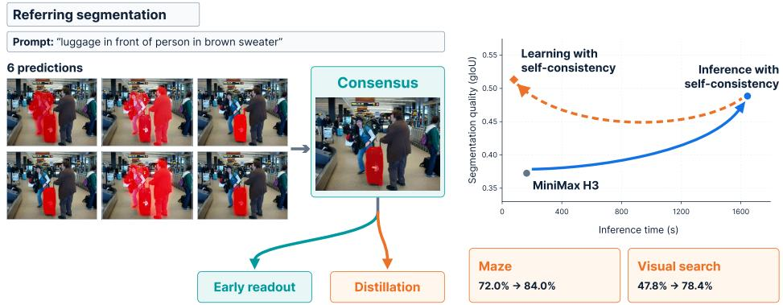  
Figure 1: Self-consistency improves video reasoning for inference and post-training. (Left) Consensus solution is better than individual prediction and supports early readout and distillation. (Right) Inference with self-consistency improves MiniMax H3 predictions through aggregation; learning with self-consistency turns consensus into faster and sometimes stronger single-generation predictions.

During inference, we generate multiple videos for the same input image & prompt, but different random seeds. Then we extract and aggregate task predictions from each output video. For three tasks with different output structures, including maze solving (paths), visual search (points), and referring segmentation (masks), we give simple task-space aggregation rules that find the mode of the predictions. Extensive experiments demonstrate substantial improvement with our test-time scaling methods. While naive implementation with multiple rollouts is computationally expensive, we read out each prediction early in the denoising trajectory, building on evidence that video models commit to their answers early (Newman et al., 2026; Wang et al., 2026b). For all three tasks, this early readout preserves consensus quality while significantly reducing inference latency.

Video reasoning through generation can be improved by supervised fine-tuning (SFT) (Yang et al., 2025; Wang et al., 2026a) and reinforcement learning with verifiable rewards (RLVR) (Zhu et al., 2026). However, these approaches typically require task-specific ground-truth supervision or external verifiers. We instead propose a consensus-based Rejection Fine-Tuning (RFT) method that finetunes a pretrained video generator using consensus diffusion trajectory. Our method requires neither groundtruth annotations nor external verification, making it naturally suited for scalable self-improvement. To reduce confirmation bias, a common failure mode of self-training, we retain only pseudo-solutions with sufficiently high cross-generation agreement for fine-tuning. In this way, our method distills the consensus obtained from multiple stochastic rollouts into a single model, enabling efficient inference with only one rollout at test time.

Our sample–aggregate–filtering–distill recipe is simple and improves all three tasks. For example, our test-time scaling method improves visual search accuracy from 48.4% to 99.0%, maze strict validity from 59.1% to 82.2%. Distillation improves single-generation segmentation gIoU from 0.353 to 0.513, search accuracy from 47.8% to 78.4%, and 4×4 maze validity from 72.0% to 84.0%. Our main contributions are summarized as follows:

• We identify and systematically characterize self-consistency as an intrinsic signal for video reasoning, and extend it to structured, continuous outputs (segmentation, marker locations, and trajectories), where samples rarely agree exactly.

• We propose a test-time scaling method based on self-consistency for video reasoning, and show that on all three tasks the consensus is settled early in the denoising trajectory.

• To our knowledge, we are the first to distill multi-sample consensus for video reasoning a la\` Rejection Fine-Tuning, which enables efficient inference with only one rollout at test time.

• Across maze solving, visual search, and referring segmentation, our inference-time and posttraining methods substantially improve performance.

## 2 RELATED WORK

Video generation for perception and reasoning Video generation expresses solutions to perception and reasoning tasks through generated frame sequences. GenCeption (Wang et al., 2026a) adapts video generation priors for visual tasks, while InterPose (Cai et al., 2025) selects pose estimates through geometric consistency across generated interpolation videos. Veo 3 demonstrates zero-shot visual reasoning (Wiedemer et al., 2025), and VR-Bench (Yang et al., 2025) evaluates spatial planning through maze solving and shows that supervised fine-tuning on solution videos improves this capability. Wan-R1 (Liu et al., 2026) and VideoRLVR (Zhu et al., 2026) further optimize generated trajectories with verifiable rewards for spatial planning and rule-based puzzles. Our work connects inference and post-training through structured output consensus: agreement among paths, points, and masks from a frozen video generator provides both aggregated predictions and training targets. Distilling this consensus improves single-generation prediction without ground-truth videos (Wang et al., 2026a) or external verifiers (Zhu et al., 2026).

Self-consistency for inference and self-training Self-consistency (Wang et al., 2023) improves chain-of-thought reasoning for LLMs by sampling diverse reasoning paths and selecting the final answer by majority voting. Self-consistency has been shown to improve arithmetic and commonsense reasoning without additional training. This principle also supports self-training: LMSI (Huang et al., 2023) fine-tunes on reasoning paths that agree with the majority answer, and TTRL (Zuo et al., 2025) turns majority-vote answers into pseudo-rewards for test-time reinforcement learning. MM-UPT (Wei et al., 2025) extends this reward construction to multimodal LLMs, while SCRL (Yan et al., 2026) refines pseudo-label supervision through consensus-based selection and entropy-gated negative labeling. Thinking with Video (Tong et al., 2026) observes that majority voting over repeated Sora-2 generations improves accuracy on verifiable puzzles with discrete answers, and identifies test-time scaling for video reasoning as an underexplored direction. We study this direction systematically. We extend self-consistency of video reasoning to structured, continuous outputs (masks, points, and paths) where exact-match voting does not apply, and reduce its cost through early clean-latent readout. To the best of our knowledge, we are the first to distill multi-sample consensus into a student generator so that a single generation recovers most of the benefit.

Test time scaling for video generation Existing studies demonstrate that allocating additional computation at inference time can effectively improve physical plausibility without additional model training. For instance, Proprio (Hassan et al., 2026) identifies a strong correlation between lower denoising residuals and higher physical plausibility, suggesting that pretrained video diffusion models contain intrinsic signals that can be exploited to assess and refine their own generations at inference time. Following ZigZag sampling (Bai et al., 2025), Self-Refining (Jang et al., 2026) improves physical plausibility through an iterative predict-and-perturb procedure. While these approaches primarily perform iterative refinement within a single generation trajectory, our method instead leverages multiple independently sampled trajectories to construct a self-consistency signal. A complementary perspective is introduced by Video-T1 (Liu et al., 2025), which samples and evaluates multiple candidate trajectories according to an external verifier. In contrast, our approach provides an intrinsic signal for test-time refinement without relying on additional supervision.

## 3 METHOD

Our pipeline has several steps including stochastic video generation with early read-out, structured prediction extraction, aggregation and further filtering and distillation for Rejection Fine-Tuning. Figure 2 gives an overview of our framework of learning via self-consistency, including consensus teacher construction and student training. While our framework is general, we propose task-specific methods for aggregating predictions for tasks spanning perception and reasoning.

## 3.1 TASKS AND STRUCTURED PREDICTIONS

We study three representative visual tasks whose outputs take the form of paths, points, and masks. Referring expression segmentation predicts a pixel-wise mask of stuff/objects of interest described by a referring expression. Maze solving is to find a route from a start cell to a goal cell through adjacent traversable cells while avoiding holes. Visual search requires locating an object that matches specified visual features, or reporting its absence when no matching object is present. Section 4 provides task examples and details the corresponding datasets and evaluation protocols.

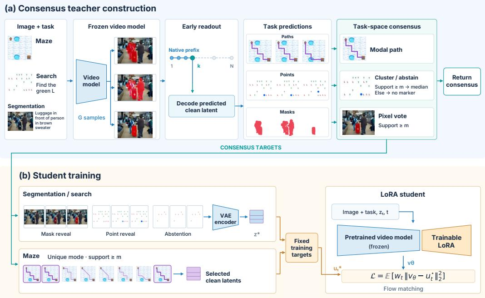  
Figure 2: Consensus teacher construction and student training. (a) A frozen video model generates multiple samples, whose extracted paths, points, or masks are aggregated in task space. Optional early readout decodes a predicted clean latent from a prefix of the native denoising schedule. (b) Consensus masks and points become rendered target videos, including unchanged inputs for abstention, and are VAE-encoded into fixed targets. Mazes instead reuse clean latents from consensus-selected trajectories. Only the student’s LoRA parameters are optimized. Thumbnails use real inputs and generated frames; reveal strips illustrate rendered consensus targets.

Let $c = ( I , q )$ be a condition with an image I and text prompt q. A video generator $F _ { \theta }$ maps this condition and random seed $s _ { i }$ to a video ${ \bar { V } } ^ { i }$ . A task-specific extractor L maps the video back to a structured prediction:

$$
V ^ { i } = F _ { \theta } ( c ; s _ { i } ) , \qquad y ^ { i } = L ( V ^ { i } , c ) .\tag{1}
$$

For maze solving, $y ^ { i }$ is a sequence of grid cells obtained by tracking the moving agent. For visual search, it is a detected marker location or the absence symbol ⊥. For referring segmentation, it is a binary mask obtained from the red overlay added by the generator. Extractor details and scoring rules are given in Appendix A.1.

## 3.2 TASK-SPECIFIC CONSENSUS

We consider G stochastic rollouts, indexed by $i = 1 , \dots , G$ . Given G extracted predictions for the same input, we compute consensus in task-output space:

$$
\widehat { \boldsymbol { y } } = \boldsymbol { A } ( \boldsymbol { y } ^ { 1 } , \ldots , \boldsymbol { y } ^ { G } ; \boldsymbol { c } ) .\tag{2}
$$

This construction separates agreement about a task from irrelevant differences in video appearance. Our analysis shows that stronger cross-rollout agreement is positively associated with prediction correctness, motivating self-consistency as an intrinsic supervision signal for learning. To accommodate structured outputs such as points, paths, and masks, we use task-specific aggregation rules with support threshold m. Rollout counts, thresholds, and target-filter settings are specified in Appendix B.2.

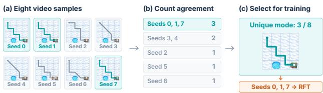  
Figure 3: Maze consensus and trajectory selection on an illustrative input. Actual video frames are overlaid with extracted cell paths. Eight sampled paths form five agreement groups. The unique modal group contains seeds 0, 1, and 7 (three of eight), whose generated trajectories are reused as training targets for RFT.

Points For visual search, nearby marker locations support the same answer. We form spatial groups with radius r in input-image coordinates and select the largest group. When at least m seeds support it, the consensus is the coordinate-wise median; otherwise the teacher returns null ⊥. Thus, disagreement can yield an absent-target prediction even if individual videos contain spurious markers. Appendix A.3 reports the tradeoff between recall and abstention as the support threshold varies.

Paths For mazes, extracted paths are represented as ordered cell sequences with consecutive repeats removed. Identical sequences form agreement groups. A fixed-support vote accepts a group only when its count reaches m. The modal inference rule returns the largest group, breaking ties by the lexicographic order of its cell sequence. Paths are truncated at the first visit to the known goal cell. The modal rule also returns a candidate when all groups have support one; it does not query hole locations, validity scores, or a ground-truth path. Post-training accepts a unique modal group only when its support meets the training threshold; ties and lower support yield no training example for that maze. Figure 3 illustrates how we select consensus solution for multiple sampled paths.

Masks Let $M ^ { i } \in \{ 0 , 1 \} ^ { H \times W }$ denote a binary segmentation mask for sample i. We retain pixels supported by at least m samples:

$$
\widehat { M } ( u ) = \mathbb { I } \left[ \sum _ { i = 1 } ^ { G } M ^ { i } ( u ) \geq m \right] , \qquad u \in \{ 1 , \ldots , H \} \times \{ 1 , \ldots , W \} .\tag{3}
$$

This high-support rule suppresses regions that individual samples paint inconsistently, which improves mask precision. We intentionally use a stringent consensus threshold m, analogous to rejection fine-tuning, so that only high-confidence predictions supported by most rollouts are retained as pseudo-labels. Ground-truth masks are excluded from target construction and the training loss.

## 3.3 EARLY-DENOISING READOUT

Self-consistency inference with G rollouts multiplies the total denoising work by G. Fortunately, we only need spatial layouts from generated videos: where a marker lands, which cells a path crosses, and which region a mask covers. Such layouts form early in the denoising process (Newman et al., 2026), while later steps refine appearance and texture. This allows consensus before generation finishes (Section 4.2). Specifically, we decode that clean estimate, extract the task prediction, and apply the same aggregation at a predefined step k:

$$
y _ { k } ^ { i } = L \big ( D ( \widehat { z } _ { \mathrm { c l e a n } , k } ^ { i } ) , c \big ) , \qquad \widehat { y } _ { k } = A ( y _ { k } ^ { 1 } , \ldots , y _ { k } ^ { G } ; c ) ,\tag{4}
$$

where D is the video decoder, L is the task-specific extractor, and A is the aggregator for consensus, i for the rollout index, $z _ { k } ^ { i }$ for the latent state at denoising step k and $\widehat { z } _ { \mathrm { c l e a n } , k } ^ { i }$ for the corresponding predicted clean latent. We keep the original sampler, read out the consensus at step k of the original N-step schedule, and simply stop it early. The readout keeps the same seeds and aggregation rule, and reduces the denoiser budget from NG to kG calls. Because decoding adds a fixed per-sample cost, we report measured time alongside denoising step counts; latent-based selection that decodes only a subset of samples is studied in Appendix A.5.

Algorithm 1 Rejection Fine-Tuning via Self-Consistency for Video Reasoning   
Require: Training conditions C, frozen teacher $F _ { \theta _ { 0 } }$   
1: Initialize target pool $B \gets \emptyset$   
2: for each condition $c \in { \mathcal { C } }$ do   
3: Sample G teacher videos $V ^ { 1 : G }$ and extract predictions $y ^ { 1 : G }$ (Eq. 1)   
4: Compute $\widehat { \boldsymbol { y } } = \boldsymbol { A } ( \boldsymbol { y } ^ { 1 } , \ldots , \boldsymbol { y } ^ { G } ; \boldsymbol { c } )$ (Section 3.2)   
5: Apply support and target filters; retain search abstentions   
6: if the example is accepted then   
7: Cache rendered or selected-trajectory latent targets with their conditioning in B   
8: end if   
9: end for   
10: Initialize $F _ { \theta }$ from $F _ { \theta _ { 0 } }$ with LoRA adapters (Hu et al., 2022)   
11: for each training minibatch from the fixed pool B do   
12: Select captured times t and the corresponding targets $z ^ { \star }$   
13: Construct $( z _ { t } , u _ { t } ^ { \star } )$ using the task-specific protocol (Appendix B)   
14: Update only LoRA parameters using LSC (Eq. 5) and task weights   
15: end for   
16: return adapted student $F _ { \theta }$ for single-rollout during inference

## 3.4 CONSENSUS AS A POST-TRAINING TEACHER

We utilize consensus solution to further train a student generator, which enables efficient inference with only one roll-out during inference. Algorithm 1 summarizes target construction with a frozen teacher $F _ { \theta _ { 0 } }$ and subsequent LoRA adaptation of a student $F _ { \theta }$

Target construction and filtering. To limit the reinforcement of incorrect predictions, we apply the task-specific support rules in Section 3.2 before constructing training targets. For segmentation, we retain consensus masks whose foreground fraction falls within a prescribed range, render them as red-overlay videos, and VAE-encode them into clean target latents $z ^ { \star }$ . Search targets reveal a blue marker at the consensus point; abstentions remain valid targets and preserve the input without a marker. For mazes, rejection fine-tuning (RFT) reuses a bounded number of generations from the accepted modal path group: each selected generation’s clean predictions at the captured denoising steps supply time-specific targets $z ^ { \star }$

Flow-matching objective. We use the convention with noise at $t = 0$ and clean data at $t \ =$ 1 (Lipman et al., 2023; Liu et al., 2023b). For freshly noised targets, we mix $z ^ { \star }$ with Gaussian noise ϵ to form $z _ { t } = t z ^ { \star } + ( 1 - t ) \epsilon$ , and target velocity $u _ { t } ^ { \star } = z ^ { \star } - \epsilon$ . The training objective is

$$
\mathcal { L } _ { \mathrm { S C } } = \mathbb { E } _ { c , t , \epsilon } \left[ \| v _ { \theta } ( z _ { t } , t , c ) - u _ { t } ^ { \star } \| _ { 2 } ^ { 2 } \right] .\tag{5}
$$

Task-specific state construction, loss weighting, and optimization settings are detailed in Appendix B.

## 4 EXPERIMENTS

We conduct extensive experiments on three video reasoning tasks, including referring expression segmentation, maze solving, and visual search. Section 4.1 details our experiment setup. Sections 4.2 and 4.3 report self-consistency results for inference and post-training, respectively; Section 4.5 presents an ablation study. We also show qualitative results in Section 4.4 and discuss limitations and future work.

## 4.1 EXPERIMENTAL SETUP

We use MiniMax-H3 FL2VA (MiniMax, 2026), a 33B rectified-flow video transformer with 50 blocks, as our primary backbone. We also report results based on Wan2.2-I2V-A14B (Wan-AI, 2025) for maze solving (Appendix A.2). All student models are post-trained using rank-16 LoRA adapters. H3 full generation follows the native denoising process with $N = 4 9$ steps. Early readout and student evaluation decode the predicted clean latent after K = 20 denoising steps, which substantially reduces inference cost while closely preserving generation quality.

Table 1: Single generation versus ten-seed consensus using MiniMax-H3 with the same inputs and seeds. By default, we use 49 steps during inference unless marked w/ early (with early readout). Search and maze scores are percentages; time is in seconds. All metrics except time are higher-isbetter. Calls count denoiser calls. Best results are in bold.  
(a) Visual search
<table><tr><td></td><td>Acc. Hit Spec.</td><td></td></tr><tr><td>Single</td><td>48.4 96.2</td><td>0.6</td></tr><tr><td>Consensus 99.0 98.0 100.0</td><td></td><td></td></tr></table>

<table><tr><td colspan="3">(b) Maze solving</td></tr><tr><td>Strict</td><td>Goal</td><td>Shortest</td></tr><tr><td>Single</td><td>59.1 93.1</td><td>56.7</td></tr><tr><td>Consensus</td><td>82.2 95.6</td><td>82.2</td></tr></table>

<table><tr><td colspan="3">(c) Referring Expression Segmentation</td></tr><tr><td>Calls</td><td>gIoU cIoU</td><td>Time</td></tr><tr><td>Single</td><td>49 0.373 0.224</td><td>164</td></tr><tr><td>early</td><td>200.372 0.224</td><td>78</td></tr><tr><td>Consensus</td><td>4900.489 0.359</td><td>1644</td></tr><tr><td>early</td><td>2000.487 0.358</td><td>780</td></tr></table>

Tasks: Frozen Lake, used to evaluate video-model maze reasoning by Newman et al. (2026), tests whether a generated route connects a start and goal while avoiding holes. Visual search tests target localization and abstention across four conditions combining 2D/3D stimuli with conjunctive/disjunctive feature rules (Campbell et al., 2024). Referring expression segmentation uses positive gRefCOCO expressions (Liu et al., 2023a) and covers single-instance and multi-instance queries.

For segmentation, we generate 768P video with 124 frames. Sampling and optimization details are in Appendices A and B. Rollout counts, consensus thresholds, and target-filter settings are collected in Table 8. We report strict validity for mazes, task accuracy for search, and mean per-image IoU (gIoU) for segmentation. Strict validity requires reaching the goal without entering a hole or making a non-adjacent jump. Search accuracy requires localization within 25 input pixels when a target is present and no detected marker when it is absent; specificity measures the latter rate. Segmentation cIoU pools intersection and union pixels, while precision, recall, and foreground area characterize the predicted masks. Single-generation scores average repeated draws over fixed seeds for each input.

## 4.2 QUANTITATIVE RESULTS OF INFERENCE WITH SELF-CONSISTENCY

Aggregating structured predictions improves frozen-model performance across search, maze solving, and referring segmentation (Table 1). On the 100-array search cohort, a 9-of-10 location vote raises task accuracy from 48.4% to 99.0%, combining a 98.0% hit rate with 100.0% specificity. The key benefit is reliable abstention: spurious markers vary across generations, allowing the vote to reject locations without recurring support. For mazes, modal trajectory selection raises strict validity from 59.1% to 82.2% across 45 layouts. The selected paths are shortest valid routes on 82.2% of layouts. On 100 positive referring-segmentation examples, 9-of-10 mask voting raises gIoU from 0.373 for a single generation to 0.489. Each aggregation rule uses the task’s output structure: location voting rejects scattered markers, modal selection identifies recurring paths, and mask voting removes inconsistently predicted regions. The 9-of-10 rule was fixed for the results here. An ablation study for hyperparameter m in (3) is provided in Appendix C.1.

Consensus also becomes available well before denoising finishes. Early readout gives nearly identical consensus quality on all three tasks. Table 1 reports segmentation as the representative case, with matched full-length and early outputs on the same inputs and seeds (Figure 8). On these segmentation inputs, reading each trajectory after 20 of its 49 denoiser calls gives 0.487 gIoU for consensus, compared with 0.489 at full length. Single-generation gIoU is also nearly unchanged: 0.372 with early readout versus 0.373 at full length. Mean measured inference time falls from 164.43 to 78.03 seconds per trajectory. The mean matched case-level time reduction is 52.4%. Thus early readout preserves nearly all of the consensus quality while more than halving measured generation time. Seed budgets, caption sensitivity, and latent selection are detailed in Appendices A.4 and A.5.

## 4.3 QUANTITATIVE RESULTS OF LEARNING WITH SELF-CONSISTENCY

Consensus RFT improves single-generation performance across all three tasks (Table 2). Each student runs 20 denoising steps at inference and we measure expected performance with many seeds.

Table 2: Single-generation performance (w/ 20 denoising steps) after our consensus-based RFT. Search and maze scores are percentages; hole and jump rates are lower-is-better. Area is the predicted foreground fraction. Random RFT is to fine-tune with random rollouts. Supervised RFT uses a verifier to verify rollouts and select correct ones as supervision.  
(a) Visual search
<table><tr><td></td><td></td><td>Acc. Spec.</td></tr><tr><td>Base</td><td>47.8</td><td>2.5</td></tr><tr><td>Consensus RFT</td><td>69.4</td><td>38.8</td></tr><tr><td>+ counterfactuals</td><td>78.4</td><td>56.9</td></tr><tr><td>+ contrast loss</td><td>78.4</td><td>56.9</td></tr></table>

(b) Maze solving
<table><tr><td colspan="2">(b) Maze solving</td></tr><tr><td colspan="2">Strict Goal Hole Jump</td></tr><tr><td>Base 72.0 90.0</td><td>12.7 10.0</td></tr><tr><td>Random RFT 72.7</td><td>84.7 8.0 10.0</td></tr><tr><td>Supervised RFT 84.7</td><td>94.0 5.3 6.0</td></tr><tr><td>Consensus RFT</td><td>84.0 94.0 6.7 5.3</td></tr></table>

(c) Referring segmentation
<table><tr><td></td><td>gIoU Prec. Area</td><td></td></tr><tr><td>Base</td><td>35.3</td><td>39.346.4</td></tr><tr><td>Con. RFT</td><td>51.3 </td><td>59.5 20.0</td></tr></table>

Visual Search: Consensus distillation raises single-generation search accuracy from 47.8% to 69.4% (Table 2). It achieves a 100.0% hit rate and increases specificity from 2.5% to 38.8%. The study uses 80 training, 80 development, and 160 independent confirmation arrays, with target presence balanced within each of four conditions and ten object counts. The frozen teacher supplies 37 point targets and 43 abstentions on the training split; the student learns from these decisions and their rendered videos. On the 160 independent confirmation arrays, Consensus RFT improves accuracy from 49.4% for the frozen base model to 70.6%, sustaining the improvement on new inputs.

Counterfactual-augmented training strengthens the abstention signal further. We recolor the object under a teacher consensus point to the distractor color and relabel the modified input with the same frozen ten-seed teacher. These examples use the target-construction procedure in Section 3.4, with teacher abstentions yielding unchanged-video targets. Two further epochs on the 114-case augmented pool raise accuracy to 78.4% and specificity to 56.9%, while retaining a 100.0% hit rate. Appendix B.4 describes the data construction and the matched contrast-loss control.

Maze Solving: Consensus RFT raises strict validity from 72.0% to 84.0% on 60 held-out 4 × 4 layouts, with 20 layouts per requested hole density and 10 seeds each (Table 2). Goal success increases from 90.0% to 94.0%, while both hole entries and non-adjacent jumps decrease. The teacher samples eight videos for each of 120 training layouts, and agreement selects 270 trajectories from 90 layouts. The consensus student’s 84.0% validity is close to the 84.7% mean of the ground-truth verifier arm, which trains on 289 selected trajectories. On these same held-out layouts, it recovers about 82% of the gap between the base model’s single-generation validity (72.0%) and its ten-seed modal vote (86.7%). This directly illustrates the transfer from multi-sample agreement to a stronger single generation. Teacher-selection statistics for larger mazes, additional held-out metrics, and the random-rollout control are in Appendices B.5 and C.3.

Referring Expression Segmentation: Consensus RFT raises gIoU from 0.353 to 0.513 (Table 2). The adapter trains for three epochs on 211 consensus-filtered examples from an image-disjoint pool of 226 training cases and is evaluated on 97 held-out test images with four seeds per image. The improvement reflects more precise foreground predictions: precision rises from 0.393 to 0.595, predicted area falls from 0.464 to 0.200, and recall is 0.787. The paired gain remains 0.160 after excluding eight inputs flagged as ambiguous during the audit. Multi-seed agreement remains useful after training as well: a 3-of-4 vote reaches 0.553 gIoU for the student, compared with 0.392 for the base model.

## 4.4 QUALITATIVE RESULTS

Figure 4 shows how self-consistency improves segmentation of the referred jeep. At inference time, aggregating the base model’s masks suppresses spillover onto nearby objects. After consensusbased training, a single generation produces a similarly focused mask, illustrating how multi-sample agreement can be transferred into the model’s predictions. On this input, IoU rises from 0.42 for the base sample to 0.63 for the consensus and 0.68 for the trained model. Appendix D shows more examples for all three tasks. See supplementary materials for videos.

Table 3: Segmentation ablations on separate inference and student-evaluation cohorts. Top: aggregation of ten frozen-model predictions per image. Bottom: students trained on the same 211 inputs with the same three-epoch recipe. Student scores average four single-generation draws per image; all predictions use 20-call sampling.
<table><tr><td>Method</td><td>gIoU ↑</td><td>Precision ↑</td><td>Recall ↑</td></tr><tr><td>Frozen-model inference</td><td></td><td></td><td></td></tr><tr><td>Single generation</td><td>0.372</td><td>0.414</td><td>0.843</td></tr><tr><td>Most-consistent sample</td><td>0.385</td><td>0.423</td><td>0.863</td></tr><tr><td>Pixel consensus</td><td>0.487</td><td>0.570</td><td>0.742</td></tr><tr><td>Student performance by target</td><td></td><td></td><td></td></tr><tr><td>Fixed sample (seed 0)</td><td>0.441</td><td>0.484</td><td>0.886</td></tr><tr><td>Most-consistent sample</td><td>0.386</td><td>0.425</td><td>0.893</td></tr><tr><td>Area-controlled sample</td><td>0.423</td><td>0.471</td><td>0.847</td></tr><tr><td>Pixel consensus</td><td>0.513</td><td>0.595</td><td>0.787</td></tr></table>

## 4.5 ABLATION STUDY

Mask aggregation is better than selecting one mask. We compare pixel voting with selecting the single mask that agrees most closely with the other samples. On the same ten-seed outputs, this selector reaches 0.385 gIoU, close to the single-generation baseline of 0.372, whereas pixel consensus reaches 0.487 (Table 3, top). The higher precision and lower recall are consistent with removing unstable false-positive regions. The support threshold controls this tradeoff: requiring six, nine, or all ten votes yields 0.402, 0.487, or 0.440 gIoU, respectively. Thus, on this cohort, high support is useful, but unanimity removes too much foreground. Appendix C.1 reports the selection rule and full threshold and sample-count sweeps.

Number of samples and required support. The vote threshold controls the tradeoff between removing false positives and retaining the referent. We vary the number of samples G and the required support m, averaging over every subset of size G from the ten archived seeds (Table 11). With ten samples, a strict majority (m = 6) reaches 0.402 gIoU, while $m = 9$ reaches 0.487. Requiring unanimity lowers gIoU to 0.440 and recall to 0.598, compared with 0.742 recall at m = 9. The high-support rule therefore benefits from tolerating one disagreeing sample. Under the fixed rule $\overline { { m = \lceil 0 . 9 G \rceil } }$ ⌉, gIoU rises from 0.372 with one sample to 0.452 with four, but is not monotone in G: it falls to 0.445 at nine before reaching 0.487 at ten. This discontinuity follows from threshold rounding: up to nine samples require unanimity, whereas ten permit one dissenting vote.

Additional ablation results are provided in Appendix C.

Limitations and Future Work While our simple and intuitive test-time scaling method and posttraining method significantly improve video reasoning for multiple tasks, it remains challenging for complex video reasoning, such as 8 × 8 maze solving, when individual predictions are more diverse. Also, our post-training method is focused on Rejection Fine-Tuning. It remains interesting to explore consensus-based reward and compare to GRPO with verifiable reward (Zhu et al., 2026).

Input  
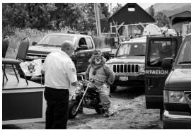

Base single  

Consensus (3/4)  

Trained single  
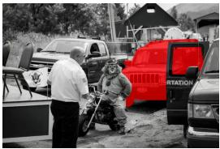  
Figure 4: Referring-segmentation outputs for the prompt “jeep just to right of clown”. Base and trained single-generation panels show final frames with the same seed. The consensus panel visualizes a three-of-four vote over the base model’s extracted masks; all outputs use early readout. The trained panel uses the model after consensus RFT from Table 2.

## 5 CONCLUSION

Video generation is an emerging paradigm for visual reasoning and other vision tasks. We study selfconsistency as an intrinsic signal for improving diffusion-based video reasoning for both inference and post-training. By aggregating structured predictions across stochastic rollouts, we show that self-consistency provides an effective training-free test-time scaling strategy for maze solving, visual search, and referring segmentation, while early readout substantially reduces its inference cost. We further distill high-confidence consensus predictions into the video generator through Rejection Fine-Tuning, enabling much of the multi-sample benefit to be recovered with a single rollout at test time. Overall, our results suggest that agreement across stochastic generations can serve not only as an inference mechanism, but also as a scalable source of self-supervision for improving video-based perception and reasoning without ground-truth videos or task-specific verification.

## REPRODUCIBILITY STATEMENT

Section 4.1 and Appendices A and B describe the sampling schedules, data cohorts, model adapters, and optimization settings. The appendices specify task extraction, consensus rules, caption corrections, and control comparisons. Results distinguish development evaluations from independent confirmation and identify the supervision used by auxiliary selectors and verifier controls. The accompanying NumPy package reproduces the new offline curves from anonymous sufficient statistics (Appendix A.4).

## AI USE STATEMENT

Generative AI tools, including OpenAI Codex and Google Gemini, assisted with writing polish and technical support. All research concepts, ideas, and analyses were developed and conducted by the authors. All AI-assisted outputs were manually reviewed and verified by the authors. Responsibility for the final manuscript, implementation, experiments, and scientific claims rests with the authors.

## REFERENCES

Lichen Bai, Shitong Shao, Zikai Zhou, Zipeng Qi, Zhiqiang Xu, Haoyi Xiong, and Zeke Xie. Zigzag diffusion sampling: Diffusion models can self-improve via self-reflection. In The Thirteenth International Conference on Learning Representations, 2025. URL https://openreview.net/forum? id=MKvQH1ekeY.

Ruojin Cai, Jason Y. Zhang, Philipp Henzler, Zhengqi Li, Noah Snavely, and Ricardo Martin-Brualla. Can generative video models help pose estimation? In Proceedings of the IEEE/CVF Conference on Computer Vision and Pattern Recognition, pp. 16764–16773, 2025. URL https://openaccess.thecvf.com/content/CVPR2025/html/Cai Can Generative Video Models Help Pose Estimation CVPR 2025 paper.html.

Declan Campbell, Sunayana Rane, Tyler Giallanza, Nicolo De Sabbata, Kia Ghods, Amogh Joshi,\` Alexander Ku, Steven M. Frankland, Thomas L. Griffiths, Jonathan D. Cohen, and Taylor W. Webb. Understanding the limits of vision language models through the lens of the binding problem. In Advances in Neural Information Processing Systems, volume 37, pp. 113436–113460, 2024. doi: 10.52202/079017-3604. URL https://proceedings.neurips.cc/paper files/paper/2024/hash/ cdcc6d47c1627350014a3076112ab824-Abstract-Conference.html.

Google DeepMind. Veo: A text-to-video generation system. Technical report, Google DeepMind, 2025. URL https://storage.googleapis.com/deepmind-media/veo/Veo-3-Tech-Report.pdf.

Huanlei Guo, Hongxin Wei, and Bingyi Jing. Toward early quality assessment of text-to-image diffusion models. In Proceedings of the IEEE/CVF Conference on Computer Vision and Pattern Recognition, pp. 38410–38419, 2026a. URL https: //openaccess.thecvf.com/content/CVPR2026/html/Guo Toward Early Quality Assessment of Text-to-Image Diffusion Models CVPR 2026 paper.html.

Ziyu Guo, Xinyan Chen, Renrui Zhang, Ruichuan An, Yu Qi, Dongzhi Jiang, Xiangtai Li, Manyuan Zhang, Hongsheng Li, and Pheng-Ann Heng. Are video models ready as zero-shot reasoners? An empirical study with the MME-CoF benchmark. In Proceedings of the IEEE/CVF Conference on Computer Vision and Pattern Recognition (CVPR) Findings, pp. 9175–9184, 2026b. URL https://openaccess.thecvf.com/content/CVPR2026F/html/Guo Are Video Models Ready as Zero-Shot Reasoners An Empirical Study CVPRF 2026 paper.html.

Mariam Hassan, Kaouther Messaoud, Wuyang Li, and Alexandre Alahi. Proprio: Latent selfscoring and inference-time refinement for physically plausible video generation. arXiv preprint arXiv:2605.28230, 2026. URL https://arxiv.org/abs/2605.28230.

Edward J. Hu, Yelong Shen, Phillip Wallis, Zeyuan Allen-Zhu, Yuanzhi Li, Shean Wang, Lu Wang, and Weizhu Chen. LoRA: Low-rank adaptation of large language models. In International Conference on Learning Representations, 2022. URL https://openreview.net/forum?id=nZeVKeeFYf9.

Jiaxin Huang, Shixiang Gu, Le Hou, Yuexin Wu, Xuezhi Wang, Hongkun Yu, and Jiawei Han. Large language models can self-improve. In Proceedings ofthe 2023 Conference on Empirical Methods in Natural Language Processing, pp. 1051–1068, 2023. doi: 10.18653/v1/2023.emnlp-main.67. URL https://aclanthology.org/2023.emnlp-main.67/.

Sangwon Jang, Taekyung Ki, Jaehyeong Jo, Saining Xie, Jaehong Yoon, and Sung Ju Hwang. Self-refining video sampling. In Proceedings ofthe 43rd International Conference on Machine Learning, 2026. URL https://openreview.net/forum?id=t5BgTJ7Z0k.

Yaron Lipman, Ricky T. Q. Chen, Heli Ben-Hamu, Maximilian Nickel, and Matthew Le. Flow matching for generative modeling. In The Eleventh International Conference on Learning Representations, 2023. URL https://openreview.net/forum?id=PqvMRDCJT9t.

Chang Liu, Henghui Ding, and Xudong Jiang. GRES: Generalized referring expression segmentation. In Proceedings of the IEEE/CVF Conference on Computer Vision and Pattern Recognition, pp. 23592–23601, 2023a. URL https://openaccess.thecvf.com/content/CVPR2023/html/Liu GRES Generalized Referring Expression Segmentation CVPR 2023 paper.html.

Fangfu Liu, Hanyang Wang, Yimo Cai, Kaiyan Zhang, Xiaohang Zhan, and Yueqi Duan. Video-T1: Test-time scaling for video generation. In Proceedings of the IEEE/CVF International Conference on Computer Vision, pp. 18671–18681, 2025. URL https://openaccess.thecvf.com/content/ICCV2025/html/Liu Video-T1 Test-time Scaling for Video Generation ICCV 2025 paper.html.

Ming Liu, Yunbei Zhang, Shilong Liu, Liwen Wang, and Wensheng Zhang. Wan-R1: Verifiablereinforcement learning for video reasoning. arXiv preprint arXiv:2603.27866, 2026. URL https://arxiv.org/abs/2603.27866.

Xingchao Liu, Chengyue Gong, and Qiang Liu. Flow straight and fast: Learning to generate and transfer data with rectified flow. In The Eleventh International Conference on Learning Representations, 2023b. URL https://openreview.net/forum?id=XVjTT1nw5z.

Ilya Loshchilov and Frank Hutter. Decoupled weight decay regularization. In International Conference on Learning Representations, 2019. URL https://openreview.net/forum?id=Bkg6RiCqY7.

MiniMax. MiniMax-H3. Hugging Face model card, 2026. URL https://huggingface.co/MiniMaxAI/ MiniMax-H3.

Kaleb Newman, Tyler Zhu, and Olga Russakovsky. Video models reason early: Exploiting plan commitment for maze solving, 2026. URL https://arxiv.org/abs/2603.30043

Nikhila Ravi, Valentin Gabeur, Yuan-Ting Hu, Ronghang Hu, Chaitanya Ryali, Tengyu Ma, Haitham Khedr, Roman Radle, Chloe Rolland, Laura Gustafson, Eric Mintun, Junting Pan, Kalyan Vasudev¨ Alwala, Nicolas Carion, Chao-Yuan Wu, Ross Girshick, Piotr Dollar, and Christoph Feichtenhofer.´ SAM 2: Segment anything in images and videos. In The Thirteenth International Conference on Learning Representations, 2025. URL https://openreview.net/forum?id=Ha6RTeWMd0.

Jingqi Tong, Yurong Mou, Hangcheng Li, Mingzhe Li, Yongzhuo Yang, Ming Zhang, Qiguang Chen, Tianyi Liang, Xiaomeng Hu, Yining Zheng, Xinchi Chen, Jun Zhao, Xuanjing Huang, and Xipeng Qiu. Thinking with video: Video generation as a promising multimodal reasoning paradigm. In Proceedings ofthe IEEE/CVF Conference on Computer Vision and Pattern Recognition, pp. 41121– 41129, 2026. URL https://openaccess.thecvf.com/content/CVPR2026/html/Tong Thinking with Video Video Generation as a Promising Multimodal Reasoning CVPR 2026 paper.html.

Bram Wallace, Meihua Dang, Rafael Rafailov, Linqi Zhou, Aaron Lou, Senthil Purushwalkam, Stefano Ermon, Caiming Xiong, Shafiq Joty, and Nikhil Naik. Diffusion model alignment using direct preference optimization. In Proceedings of the IEEE/CVF Conference on Computer Vision and Pattern Recognition, pp. 8228–8238, 2024. URL https://openaccess.thecvf.com/content/CVPR2024/html/Wallace Diffusion Model Alignment Using Direct Preference Optimization CVPR 2024 paper.html.

Wan-AI. Wan2.2-I2V-A14B. Hugging Face model card, 2025. URL https://huggingface.co/Wan-AI/ Wan2.2-I2V-A14B.

Letian Wang, Chuhan Zhang, Rishabh Kabra, Jasper Uijlings, Steven Waslander, Andrew Zisserman, Joao Carreira, Kaiming He, Misha Andriluka, Eduard Gabriel Bazavan, Andrei Zanfir, and Cristian Sminchisescu. Video generation models are general-purpose vision learners. In European Conference on Computer Vision (ECCV), 2026a. URL https://arxiv.org/abs/2607.09024.

Ruisi Wang, Zhongang Cai, Fanyi Pu, Junxiang Xu, Wanqi Yin, Maijunxian Wang, Ran Ji, Chenyang Gu, Bo Li, Ziqi Huang, Hokin Deng, Dahua Lin, Ziwei Liu, and Lei Yang. Demystifying video reasoning. arXiv preprint arXiv:2603.16870, 2026b. URL https://arxiv.org/abs/2603.16870.

Xuezhi Wang, Jason Wei, Dale Schuurmans, Quoc V Le, Ed H. Chi, Sharan Narang, Aakanksha Chowdhery, and Denny Zhou. Self-consistency improves chain of thought reasoning in language models. In The Eleventh International Conference on Learning Representations, 2023. URL https://openreview.net/forum?id=1PL1NIMMrw.

Lai Wei, Yuting Li, Chen Wang, Yue Wang, Linghe Kong, Weiran Huang, and Lichao Sun. First SFT, second RL, third UPT: Continual improving multi-modal LLM reasoning via unsupervised post-training. In Advances in Neural Information Processing Systems, volume 38, 2025. URL https://proceedings.neurips.cc/paper files/paper/2025/hash/ 59ddfff7979b43f54690fa986c0e5138-Abstract-Conference.html.

Thaddaus Wiedemer, Yuxuan Li, Paul Vicol, Shixiang Shane Gu, Nick Matarese, Kevin Swersky,¨ Been Kim, Priyank Jaini, and Robert Geirhos. Video models are zero-shot learners and reasoners. arXiv preprint arXiv:2509.20328, 2025. URL https://arxiv.org/abs/2509.20328.

Dong Yan, Jian Liang, Yanbo Wang, Shuo Lu, Ran He, and Tieniu Tan. What if consensus lies? selective-complementary reinforcement learning at test time. In Proceedings of the 64th Annual Meeting ofthe Associationfor Computational Linguistics (Volume 1: Long Papers), pp. 28957– 28970. Association for Computational Linguistics, 2026. doi: 10.18653/v1/2026.acl-long.1337. URL https://aclanthology.org/2026.acl-long.1337/.

Cheng Yang, Haiyuan Wan, Yiran Peng, Xin Cheng, Zhaoyang Yu, Jiayi Zhang, Junchi Yu, Xinlei Yu, Xiawu Zheng, Dongzhan Zhou, and Chenglin Wu. Reasoning via video: The first evaluation of video models’ reasoning abilities through maze-solving tasks. arXiv preprint arXiv:2511.15065, 2025. URL https://arxiv.org/abs/2511.15065.

Tinghui Zhu, Sheng Zhang, James Y Huang, Selena Song, Xiaofei Wen, Yuankai Li, Hoifung Poon, and Muhao Chen. Video models can reason with verifiable rewards. arXiv preprint arXiv:2605.15458, 2026. URL https://arxiv.org/abs/2605.15458.

Yuxin Zuo, Kaiyan Zhang, Li Sheng, Shang Qu, Ganqu Cui, Xuekai Zhu, Haozhan Li, Yuchen Zhang, Xinwei Long, Ermo Hua, Biqing Qi, Youbang Sun, Zhiyuan Ma, Lifan Yuan, Ning Ding, and Bowen Zhou. TTRL: Test-time reinforcement learning. Advances in Neural Information Processing Systems, 38, 2025. URL https://proceedings.neurips.cc/paper files/paper/2025/hash be690ea16f005c174f6c4102a5970e67-Abstract-Conference.html.

## A INFERENCE DETAILS AND ADDITIONAL RESULTS

## A.1 GENERATION AND TASK READOUT

Generation. All H3 inference results are based on MiniMax-H3 FL2VA (MiniMax, 2026), with the input image as the first frame and the task instruction as text prompt. Each pair of inputs is generated with 10 seeds, and full trajectories contain 49 denoising steps. We generate five-second maze videos (124 frames) and four-second square-search videos (107 frames) at a resolution of $1 0 2 4 \times 7 6 8$ . We never provide the model with ground-truth paths, target locations, or masks.

For early readout at step k, the predicted clean latent is $\tilde { z } _ { \mathrm { c l e a n } } ^ { i } = z _ { t } ^ { i } + ( 1 - t ) v _ { \theta } ( z _ { t } ^ { i } , t , c )$ . We set the next noise level to zero so that the final update reaches this estimate, then decode it and apply the same task extractor and consensus rule as for full generation.

Maze solving. We have 9 kinds of Frozen Lake (Newman et al., 2026) layouts covering three grid sizes $( 4 \times 4 , 5 \times 5 , 6 \times 6 )$ and three hole densities (10%, 25%, 40%). For each combination, we generate five layouts. Thus, we have 45 Frozen Lake layouts in total. The elf starts at the upper-left cell and the goal is always at the lower-right cell. SAM2.1 (Ravi et al., 2025) tracks the elf from the first frame. Each frame is assigned to the cell that holds most of the tracked mask; repeated cells are merged, and the path is cut at its first visit to the goal. Let $n ( p )$ count the seeds that produce path p. The modal rule returns

$$
{ \hat { p } } = \arg \operatorname* { m a x } _ { p } n ( p ) .\tag{6}
$$

We break ties by the lexicographic order of the cell sequence, and the majority vote returns $\hat { p }$ only when $n ( { \hat { p } } ) \geq m$ . Strict validity requires reaching the goal without entering a hole or making a non-adjacent jump. For a single video, the goal counts as reached when the tracked cell visits it or at least 30% of the tracked mask overlaps it in some frames. Inputs without a returned path are considered as failures.

Visual search. Following Campbell et al. (2024), the 100 search arrays cover four conditions, including 2D disjunctive, 2D conjunctive, 3D disjunctive, and 3D conjunctive, with 25 arrays per condition. Half of the arrays contain a target and half do not, with the number of distractors varying across arrays from 5 to 50. 2D disjunctive search looks for a green circle among red circles, and 2D conjunctive search looks for a green L among red Ls and green Ts. The 3D conditions look for a red sphere among green spheres (disjunctive) or among green spheres and red cubes (conjunctive).

The model is asked to place a blue dot at the target center and to leave the image unchanged when there is no target. We detect the blue marker in the fourth frame from the end with a fixed color filter. The vote groups marker locations within 25 pixels, takes the largest group, and returns its median location when the group has at least m members; otherwise it returns no marker. A target is found when the returned point lies within 25 pixels of the target center, and a target-absent array is correct when no point is returned.

Referring segmentation. The model marks the referred region with a red overlay. We extract this region as a binary mask so that each generated video contributes one foreground vote per pixel. Let $I _ { 1 }$ and $I _ { F }$ denote the first and last frames, and let $\Delta = I _ { F } - I _ { 1 }$ . We identify the added red overlay by measuring the increase in the red channel relative to the green and blue channels:

$$
M ( u ) = \mathbb { I } \big [ \Delta _ { R } ( u ) - \frac { 1 } { 2 } \big ( \Delta _ { G } ( u ) + \Delta _ { B } ( u ) \big ) \ge 5 0 \big ] .\tag{7}
$$

Applying this rule to each video gives masks $M ^ { 1 } , \dots , M ^ { G }$ . We then count the foreground votes at each pixel and retain pixels with at least m votes, following Eq. 3. This lets videos with different overlay intensities contribute equally to the consensus. With per-image intersection $a _ { c }$ and union $\begin{array} { r } { b _ { c } , \mathrm { g I o U } = N ^ { - 1 } \sum _ { c } a _ { c } / b _ { c } } \end{array}$ and cIoU $\textstyle \mathrm { J } = \sum _ { c } a _ { c } / \sum _ { c } b _ { c }$ . The inference results in Table 1 use 100 positive gRefCOCO (Liu et al., 2023a) expressions; Appendix A.5 uses a second set of 100.

## A.2 WAN2.2 ON FROZEN LAKE

We test Wan2.2-I2V-A14B (Wan-AI, 2025) on two Frozen Lake mazes, one $4 \times 4$ and one $5 \times 5 .$ For each maze, we generate 128 videos using 40 sampling steps and 81 frames per video, then select

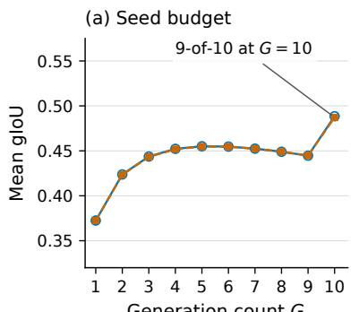

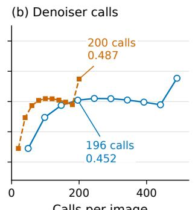  
Fixed vote threshold ⌈0.9G⌉: unanimity for G = 1-9; 9-of-10 for G = 10. Means over every subset of the ten seeds.

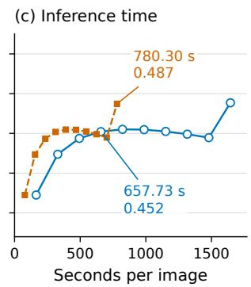  
Figure 5: Segmentation gIoU against (a) the number of seeds, (b) denoiser calls, and (c) inference time on the 100 segmentation inputs. Each value averages every subset of size G, with support $m = \lceil 0 . 9 G \rceil$ . Early readout (20 steps) matches full generation (49 steps) at every number of seeds and reaches the same quality with fewer calls and less time.

the most frequent path. This raises strict validity from 14.5% for a single generation to 50.0% with voting (Table 4). The selected path solves the $4 \times 4$ maze along a shortest route; on the $5 \times 5$ maze, it stops before the goal.

Table 4: Wan2.2 results on two Frozen Lake mazes (%). Single-generation scores average all 128 samples per maze. Voting returns the most frequent path for each maze. Scores average over the two mazes; a voting success rate of 50.0% means one of the two mazes is solved.
<table><tr><td>Prediction</td><td>Generations per maze</td><td>Strict validity</td><td>Goal arrival</td><td>Shortest route</td></tr><tr><td>Single generation</td><td>1</td><td>14.5</td><td>32.4</td><td>11.7</td></tr><tr><td>Modal-path vote</td><td>128</td><td>50.0</td><td>50.0</td><td>50.0</td></tr></table>

On a separate set of 160 input images of $4 \times 4$ mazes, single generation reaches 23.1% strict validity, 45.0% goal arrival, and 20.0% shortest-route accuracy.

## A.3 SUPPORT THRESHOLD SWEEPS

Tables 5 and 6 show two kinds of agreements. For mazes, the modal path keeps full coverage while choosing the route that recurs most often, and it beats every fixed-support vote. For search, a high threshold removes scattered markers on target-absent arrays: from 4-of-10 to 8-of-10 votes, specificity rises quickly while the hit rate stays at 100%. At 9-of-10, the vote returns 49 correct target locations and no false marker, which gives 99 correct answers on 100 arrays. Search localization also becomes much more precise, with the error dropping from 7.45 pixels for a single generation to 0.91 pixels.

## A.4 NUMBER OF SEEDS

For each number of seeds G, we mark pixels supported by at least $m = \lceil 0 . 9 G \rceil$ samples (Figure 5). Early readout matches full trajectory within 0.002 gIoU at every G. At a similar number of denoiser calls, ten early rollouts (200 calls) reach 0.487 gIoU, compared with 0.452 for four full rollouts (196 calls). So, for a fixed denoising budget, more early rollouts beat fewer full ones. Removing five inputs with caption errors gives the same picture: 0.503 gIoU with full trajectory and 0.502 with early readout. The jump at $G = 1 0$ comes from rounding: up to nine seeds the rule requires all samples to agree, while 10 seeds allow one disagreeing sample.

Table 5: Maze inference on 45 layouts with 10 seeds each (%). Unanswered inputs count as failures.
<table><tr><td>Method</td><td>Strict</td><td>Goal</td><td>Coverage</td><td>Shortest</td></tr><tr><td>Single generation</td><td>59.1</td><td>93.1</td><td>100.0</td><td>56.7</td></tr><tr><td>Vote ≥ 2/10</td><td>75.6</td><td>84.4</td><td>88.9</td><td>75.6</td></tr><tr><td>Vote ≥ 3/10</td><td>62.2</td><td>64.4</td><td>66.7</td><td>62.2</td></tr><tr><td>Vote ≥ 4/10</td><td>40.0</td><td>42.2</td><td>42.2</td><td>40.0</td></tr><tr><td>Vote ≥ 5/10</td><td>24.4</td><td>26.7</td><td>26.7</td><td>24.4</td></tr><tr><td>Vote ≥ 6/10</td><td>15.6</td><td>17.8</td><td>17.8</td><td>15.6</td></tr><tr><td>Vote ≥ 7/10</td><td>8.9</td><td>11.1</td><td>11.1</td><td>8.9</td></tr><tr><td>Vote ≥8/10</td><td>2.2</td><td>4.4</td><td>4.4</td><td>2.2</td></tr><tr><td>Vote ≥ 9/10</td><td>2.2</td><td>2.2</td><td>2.2</td><td>2.2</td></tr><tr><td>Vote ≥ 10/10</td><td>2.2</td><td>2.2</td><td>2.2</td><td>2.2</td></tr><tr><td>Modal path</td><td>82.2</td><td>95.6</td><td>100.0</td><td>82.2</td></tr></table>

Table 6: Visual search on 100 arrays with 10 seeds each. Rates are percentages; error is the localization error in input pixels. The 9-of-10 rule is the one used throughout the paper; the other thresholds are shown for reference.
<table><tr><td>Method</td><td>Acc.</td><td>Hit</td><td>Precision</td><td>Spec.</td><td>Error (px)</td></tr><tr><td>Single generation</td><td>48.4</td><td>96.2</td><td>49.7</td><td>0.6</td><td>7.45</td></tr><tr><td>Vote ≥ 2/10</td><td>51.0</td><td>100.0</td><td>50.5</td><td>2.0</td><td>0.95</td></tr><tr><td>Vote 3/10</td><td>61.0</td><td>100.0</td><td>56.2</td><td>22.0</td><td>0.95</td></tr><tr><td>Vote 4/10</td><td>79.0</td><td>100.0</td><td>70.4</td><td>58.0</td><td>0.95</td></tr><tr><td>Vote 5/10</td><td>88.0</td><td>100.0</td><td>80.6</td><td>76.0</td><td>0.95</td></tr><tr><td>Vote 6/10</td><td>91.0</td><td>100.0</td><td>84.7</td><td>82.0</td><td>0.95</td></tr><tr><td>Vote 7/10</td><td>97.0</td><td>100.0</td><td>94.3</td><td>94.0</td><td>0.95</td></tr><tr><td>Vote 8/10</td><td>98.0</td><td>100.0</td><td>96.2</td><td>96.0</td><td>0.95</td></tr><tr><td>Vote 9/10</td><td>99.0</td><td>98.0</td><td>100.0</td><td>100.0</td><td>0.91</td></tr><tr><td>Vote 10/10 V</td><td>82.0</td><td>64.0</td><td>100.0</td><td>100.0</td><td>0.80</td></tr></table>

## A.5 CHOOSING ROLLOUTS FROM EARLY LATENTS

Early readout still decodes every rollout. We therefore test whether early latents can pick good rollouts so that fewer videos need to be decoded (Guo et al., 2026a). The label-free latent mode picks the rollout whose clean-latent change is closest to those of the other rollouts. The latent top-1 selector is a ridge regressor on 90 latent statistics, trained to predict each rollout’s mask quality on 50 separate cases. Latent top-3 merges the top pick with its two nearest rollouts in latent space.

On a second set of 100 segmentation inputs (Table 7), the label-free latent mode already improves on a random rollout (0.446 vs. 0.412 gIoU). The latent top-1 selector reaches 0.490 from a single decoded mask, which is also above the 0.483 of the 9-of-10 vote over ten masks. Latent top-3 reaches 0.502 while decoding 70% fewer masks than the vote. Because the top-1 and top-3 selectors are trained with ground-truth IoU, we treat them as an optional add-on to the label-free method.

Table 7: Choosing rollouts from early latents on a second set of 100 segmentation inputs. All rollouts use early readout (20 steps). “Masks” counts the decoded masks used for the final answer. ∗Uses a supervised latent selector.
<table><tr><td>Method</td><td>Rollouts</td><td>Masks</td><td>gIoU</td><td>cIoU</td><td>Precision</td><td>Recall</td></tr><tr><td>Random rollout</td><td>1</td><td>1</td><td>0.412</td><td>0.287</td><td>0.469</td><td>0.841</td></tr><tr><td>Fixed seed 9</td><td>1</td><td>1</td><td>0.434</td><td>0.295</td><td>0.497</td><td>0.854</td></tr><tr><td>Latent mode</td><td>10</td><td>1</td><td>0.446</td><td>0.331</td><td>0.502</td><td>0.872</td></tr><tr><td>Consensus (9-of-10)</td><td>10</td><td>10</td><td>0.483</td><td>0.432</td><td>0.593</td><td>0.749</td></tr><tr><td>Latent top-1*</td><td>10</td><td>1</td><td>0.490</td><td>0.402</td><td>0.558</td><td>0.824</td></tr><tr><td>Latent top-3*</td><td>10</td><td>3</td><td>0.502</td><td>0.415</td><td>0.578</td><td>0.814</td></tr></table>

## B POST-TRAINING DETAILS AND ADDITIONAL RESULTS

## B.1 TRAINING SETUP

We train different students for different tasks. All students start from MiniMax-H3 FL2VA, whose weights stay frozen. Rank-16 LoRA adapters (Hu et al., 2022) (scale 16, no dropout) are added to the query, key, value, and output projections and to the two feed-forward projections of all 50 transformer blocks, which gives 83.1M trainable parameters. We use AdamW (Loshchilov & Hutter, 2019) with $( \beta _ { 1 } , \beta _ { 2 } ) = ( 0 . 9 , 0 . 9 9 )$ , no weight decay, gradient clipping at 1.0, and four samples per update. The learning rate warms up linearly and then stays constant within each epoch. Training runs on eight A100-80GB GPUs.

All students are evaluated with early readout: it runs the first 20 steps of the native 49-step schedule and decodes the predicted clean latent. Training targets are placed at captured denoising steps, namely steps 4, 9, 14, and 19 for segmentation and steps 4, 9, and 14 for mazes, and the loss at each step is reweighted so that all steps contribute equally. For search, the later training stages start from the stored teacher state $z _ { t }$ instead of fresh noise, and we use the velocity target $u _ { t } ^ { \star } = ( z ^ { \star } - z _ { t } ) / ( 1 - t )$ Search also puts 80% of the loss weight on latent rows near the teacher’s marker.

## B.2 CONSENSUS AND TARGET SETTINGS

Table 8 lists the settings for the rules in Sections 3.2 and 3.4. Support counts distinct generations: nearby marker locations for search, identical cell sequences for mazes, and per-pixel votes for segmentation.

Table 8: Consensus and target settings.
<table><tr><td>Task / use</td><td>Rollouts G</td><td>Support m</td><td>Other settings</td></tr><tr><td>Search</td><td>10</td><td>9</td><td>Grouping radius r = 25 input pixels; abstentions kept as unchanged-video targets.</td></tr><tr><td>Segmentation</td><td>10</td><td>9</td><td>Training masks kept when their foreground fraction lies in [0.002, 0.6].</td></tr><tr><td>Maze inference</td><td>10</td><td></td><td>Modal path; ties broken lexicographically.</td></tr><tr><td>Maze post-training</td><td>8</td><td>3</td><td>Unique modal group required; at most three trajectories per layout.</td></tr></table>

## B.3 REFERRING SEGMENTATION

Targets and training. We select 226 training images and 97 testing images for segmentation post-training, with no image shared between them. Then the foreground filter keeps 211 of the 226 training images. Ground-truth masks are not used to build targets or to compute the loss. Instead, the training masks are defined by the 9-of-10 pixel consensus of the frozen model. Each kept mask becomes a target video: the first frame of the input, with a red overlay that fades in from opacity 0 to 0.8 between frames 16 and 60 of a 124-frame video. The H3 VAE encodes this video into a clean target latent, which is shared by all four captured steps. Training runs for three epochs of 211 updates each, with learning rate $5 \times 1 \dot { 0 } ^ { - 5 }$ in the first epoch and $1 0 ^ { - 4 }$ afterwards.

Table 9: Search accuracy / specificity (%) by condition. Development: 20 arrays per condition, four seeds each. Conf.: Consensus RFT on the 160 confirmation arrays (40 per condition).
<table><tr><td>Condition</td><td>Base</td><td>Consensus RFT</td><td>+ counterfactuals</td><td>+ contrast loss</td><td>Conf.</td></tr><tr><td>2D disjunctive</td><td>51.2 / 2.5</td><td>83.8 / 67.5</td><td>90.0 / 80.0</td><td>91.2 / 82.5</td><td>85.6 / 71.2</td></tr><tr><td>2D conjunctive</td><td>40.0 / 7.5</td><td>56.2 / 12.5</td><td>67.5 / 35.0</td><td>66.2 / 32.5</td><td>57.5 / 15.0</td></tr><tr><td>3D disjunctive</td><td>50.0 / 0.0</td><td>63.7 / 27.5</td><td>73.8 / 47.5</td><td>73.8 / 47.5</td><td>60.6 / 21.2</td></tr><tr><td>3D conjunctive</td><td>50.0 / 0.0</td><td>73.8 / 47.5</td><td>82.5 / 65.0</td><td>82.5 / 65.0</td><td>78.8 / 57.5</td></tr></table>

## B.4 VISUAL SEARCH

Data and training. Search post-training uses 80 training, 80 development, and 160 confirmation arrays. Every split contains all four conditions and ten object counts, with the target present in half of the arrays for each combination. The frozen teacher gives 37 point targets and 43 abstentions on the training arrays. Consensus RFT trains in four stages on these targets, for 880 updates in total: three epochs of plain flow matching, two epochs with the loss focused on the marker region, two epochs from stored teacher states, and four epochs with abstention examples weighted three times.

Counterfactual data construction. For each training array where the teacher returns a point, we recolor the object at that point to the distractor color and leave all other objects unchanged (Figure 6). The frozen ten-seed teacher then labels the edited array again, and we keep the 35 edited arrays on which it abstains. Together with 79 of the original arrays (one teacher point that does not match the target color is dropped), the final pool has 114 examples. Both counterfactual models continue from Consensus RFT for two epochs on this pool, with learning rate $2 . 5 \times 1 0 ^ { - 5 }$

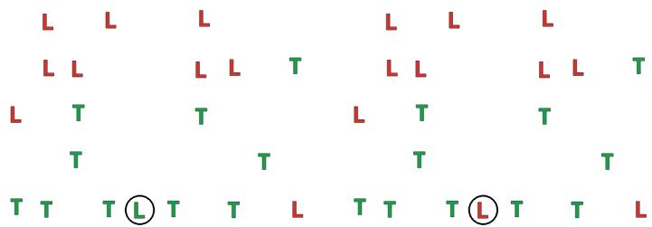  
Figure 6: A counterfactual training pair. The object at the teacher’s consensus point is recolored, and the teacher abstains on the edited array, which gives an unchanged-video target. The circle marks the edited object and is not part of the input.

Contrast loss. For a teacher state $z _ { t }$ , let $z ^ { + }$ encode the teacher’s target and $z ^ { - }$ a competing marker, and let $u ^ { \pm } = ( z ^ { \pm } - z _ { t } ) / ( 1 - t )$ . With a frozen reference adapter $v _ { \mathrm { r e f } }$

$$
\begin{array} { r } { r ^ { \pm } = \frac { 1 } { 2 } \| v _ { \theta } - u ^ { \pm } \| ^ { 2 } - \frac { 1 } { 2 } \| v _ { \mathrm { r e f } } - u ^ { \pm } \| ^ { 2 } , } \end{array}\tag{8}
$$

$$
\mathcal { L } _ { \mathrm { p a i r } } = - \log \sigma \left( - \beta ( r ^ { + } - r ^ { - } ) \right) ,\tag{9}
$$

where the norm covers latent rows near the two markers. This loss has the same form as Diffusion-DPO (Wallace et al., 2024), with both targets compared at the same state. The “+ contrast loss” model trains with $\mathcal { L } _ { \mathrm { S C } } + \lambda \mathcal { L } _ { \mathrm { p a i r } } \left( \lambda = 0 . 5 , \beta = \overline { { 1 } } 0 0 \right)$ , and “+ counterfactuals” uses the same data with $\lambda = 0$ Both reach 78.4% accuracy and 56.9% specificity, so the counterfactual data alone gives the full gain and the simple consensus loss is enough.

Results by condition. Specificity rises in every condition, and the hit rate stays at 100% for every trained model (Table 9). On the 160 confirmation arrays, Consensus RFT reaches 70.6% accuracy, matching its development result.

Table 10: More 4 × 4 maze results on the 60 held-out layouts (20 per hole density, 10 seeds each). Pass@10 counts a layout as solved when any of its ten generations is valid. The modal vote picks the most frequent path without checking validity.
<table><tr><td>Model</td><td>Pass@10 (%)</td><td>Modal vote (%)</td></tr><tr><td>Base</td><td>93.3</td><td>86.7</td></tr><tr><td>Random RFT</td><td>100.0</td><td>86.7</td></tr><tr><td>Supervised RFT</td><td>100.0</td><td>93.3</td></tr><tr><td>Consensus RFT</td><td>100.0</td><td>93.3</td></tr></table>

## B.5 MAZE SOLVING

Training pool. The training pool has 40 new layouts for each combination of grid size and hole density, disjoint from the inference and test layouts. The frozen model generates eight videos per layout; consensus accepts a layout when a unique modal path is supported by at least three videos, and keeps up to three matching trajectories. These trajectories are valid far more often than a single generation: 83.3% vs. 57.1% at 4 × 4, 72.2% vs. 55.2% at 5 × 5, and 86.4% vs. 32.1% at 6 × 6.

Training. The students are trained on the 120 4 × 4 layouts and tested on 60 held-out 4 × 4 layouts, 20 per hole density, with 10 seeds each. Consensus RFT and Random RFT each use 270 trajectories from the same layouts, and Supervised RFT uses 289 verifier-selected trajectories. All three share the same training recipe: targets at denoising steps 4, 9, and 14, and two epochs with learning rates $5 \times 1 0 ^ { - 5 }$ and 10−4.

Multi-Sample performance and path diversity. Consensus RFT also improves the multi-sample numbers (Table 10): the ten-seed modal vote rises from 86.7% to 93.3%, and at least one of ten generations is valid on every layout. The diversity of the student’s paths stays close to that of the base model (the mean pairwise path similarity changes by only 0.024).

## C MORE ABLATION RESULTS

## C.1 CONSENSUS INFERENCE

Pixel voting and sample selection. The most-consistent sample in Table 3 is chosen as follows. For each candidate mask, we build a 5-of-9 vote from the other nine seeds and measure the IoU between the candidate and that vote; the candidate with the highest IoU is selected. This selection reaches 0.385 gIoU, while pixel voting over the same early-readout outputs reaches 0.487. Compared with a single generation, voting raises precision from 0.414 to 0.570 because it removes false-positive regions that change from sample to sample.

Number of samples and required support. Table 11 varies the number of samples G and the support m, averaging over every subset of size G from the 10 seeds. For every G, a high support threshold works best, and the best overall setting is the 9-of-10 rule used in the paper.

## C.2 TRAINING TARGETS

Training-target quality. On the 211 training inputs, we compare four targets: the consensus mask, the most-consistent sample, a fixed seed-0 sample, and an area-controlled sample that keeps the innermost pixels of the most-consistent sample up to the consensus area (Table 12). The consensus mask reaches 0.533 gIoU, compared with 0.458 for the most-consistent sample and 0.452 for seed 0. At the same foreground fraction, consensus achieves higher gIoU than the area-controlled target (0.533 vs. 0.442).

Target filtering. The segmentation foreground filter keeps 211 targets with mean IoU 0.533 and removes 15 with mean IoU 0.108. For mazes, 48.1% of all teacher trajectories are valid. Requiring a unique modal path with support of at least three keeps 777 trajectories that are 81.2% valid, and support of at least six keeps 225 trajectories that are 94.7% valid (counted before the three-per-layout cap). Stronger agreement thus gives a cleaner training pool.

Table 11: Early-readout segmentation gIoU for G samples and support m. Bold entries mark the rule m = ⌈0.9G⌉.
<table><tr><td>G\ \m</td><td>1</td><td>2</td><td>3</td><td>4</td><td>5</td><td>6</td><td>7</td><td></td><td>8</td><td>9</td><td>10</td></tr><tr><td>1</td><td>0.372</td><td></td><td></td><td></td><td></td><td></td><td></td><td></td><td></td><td></td><td></td></tr><tr><td>2</td><td>0.316</td><td>0.423</td><td></td><td></td><td></td><td></td><td></td><td></td><td></td><td></td><td></td></tr><tr><td>3</td><td>0.283</td><td>0.383</td><td>0.443</td><td></td><td></td><td></td><td></td><td></td><td></td><td></td><td></td></tr><tr><td>4</td><td>0.262</td><td>0.348</td><td>0.418</td><td>0.452</td><td></td><td></td><td></td><td></td><td></td><td></td><td></td></tr><tr><td>5</td><td>0.247</td><td>0.323</td><td>0.384</td><td>0.441</td><td>0.455</td><td></td><td></td><td></td><td></td><td></td><td></td></tr><tr><td>6</td><td>0.236</td><td>0.306</td><td>0.359</td><td>0.409</td><td>0.456</td><td>0.454</td><td></td><td></td><td></td><td></td><td></td></tr><tr><td>7</td><td>0.226</td><td>0.293</td><td>0.339</td><td>0.384</td><td>0.429</td><td>0.467</td><td>0.452</td><td></td><td></td><td></td><td></td></tr><tr><td>8</td><td>0.218</td><td>0.284</td><td>0.323</td><td>0.363</td><td>0.405</td><td>0.444</td><td>0.476</td><td></td><td>0.449</td><td></td><td></td></tr><tr><td>9</td><td>0.211</td><td>0.276</td><td>0.312</td><td>0.346</td><td>0.384</td><td>0.423</td><td>0.454</td><td></td><td>0.482</td><td>0.445</td><td></td></tr><tr><td>10</td><td>0.205</td><td>0.269</td><td>0.304</td><td>0.330</td><td>0.366</td><td>0.402</td><td>0.436</td><td></td><td>0.462</td><td>0.487</td><td>0.440</td></tr></table>

Table 12: Quality of the segmentation training targets, measured against ground truth. Area is the foreground fraction.
<table><tr><td>Target</td><td>gIoU ↑</td><td>Precision ↑</td><td>Recall ↑</td><td>Area</td></tr><tr><td>Fixed sample (seed 0)</td><td>0.452</td><td>0.507</td><td>0.850</td><td>0.275</td></tr><tr><td>Most-consistent sample</td><td>0.458</td><td>0.499</td><td>0.865</td><td>0.276</td></tr><tr><td>Area-controlled sample</td><td>0.442</td><td>0.540</td><td>0.640</td><td>0.157</td></tr><tr><td>Pixel consensus (9-of-10)</td><td>0.533</td><td>0.627</td><td>0.768</td><td>0.157</td></tr></table>

## C.3 MAZE AND SEARCH TRAINING

Consensus selection versus random rollouts. Consensus RFT and Random RFT use the same number of trajectories from the same layouts and the same two-epoch recipe. Consensus RFT reaches 84.0% strict validity, compared with 72.7% for Random RFT and 72.0% for the base model (Table 2). The 11.3-point gap comes from choosing trajectories by agreement.

Counterfactual augmentation and contrast. Training further on the counterfactual pool raises search accuracy from 69.4% to 78.4% and specificity from 38.8% to 56.9%, with higher specificity in all four conditions (Table 9). Adding the contrast loss on the same data gives the same accuracy and specificity, so the plain consensus loss is sufficient.

## D MORE QUALITATIVE RESULTS

This section shows more outputs of the frozen model and of the students. Single-generation panels in the same row or column use the same input and the same seed. See supplementary materials for videos.

Inference with self-consistency. Figure 7 shows how pixel votes accumulate over 10 seeds: the referred regions receive votes from almost every seed, while the spill-over regions receive only a few and are removed by the 9-of-10 rule. Figure 8 compares full generation with early readout. A single generation often paints large parts of the image, and the consensus keeps only the referred objects. The 20-step masks are nearly identical to the 49-step masks, both for single generations and for the consensus.

Learning with self-consistency. Figures 9–11 compare single generations before and after consensus RFT. For segmentation, the base model often covers most of the image or several nearby objects, while the student reduces foreground spillover and follows the referred regions more closely (Figure 9). For mazes, the base model enters holes, jumps between non-adjacent cells, or stops before

Input image

  
Generated seed-vote density

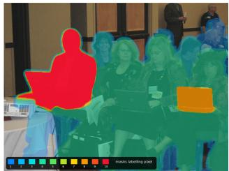  
Figure 7: Pixel votes over 10 seeds for one referring expression. Color shows how many of the ten extracted masks cover each pixel.

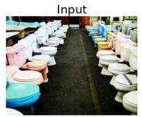

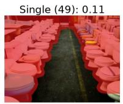

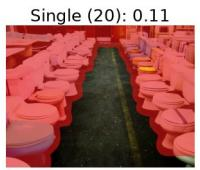  
"a blue toilet bowl nearest to us on the left column and a yellow toilet bowl far away from us on the right column"

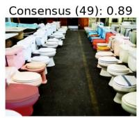

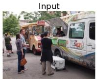

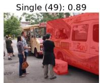

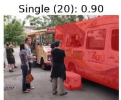

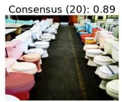

  
"the white bus in the right side near us and the brown bag carried by the lady standing in the left side"

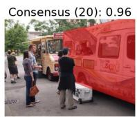

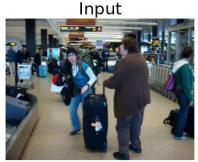

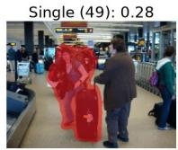  
"luggage in front of person in brown sweater"

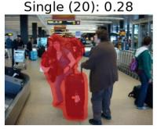

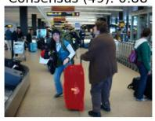

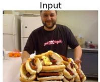

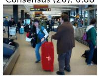

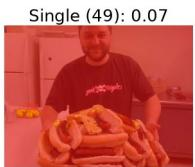  
"the fridge behind the man on the right and the oranges in the left side on the table behind"

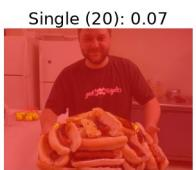

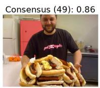

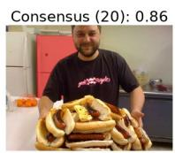

Figure 8: Consensus v.s. single, and full generation (49 steps) v.s. early readout (20 steps). “Consensus” is the 9-of-10 vote over 10 seeds. Numbers are IoU w.r.t. ground truth.

Ground truth

Consensus RFT: 0.91

the goal, while the student reaches the goal along a valid route on the same seed (Figure 10). For search, the base model places markers on distractors, and the students leave target-absent arrays unchanged; counterfactual training fixes cases that Consensus RFT alone still misses (Figure 11, last row).

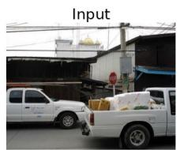

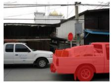  
"the white truck in the front near us and the red sign in the background right"

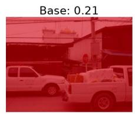

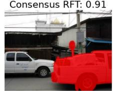

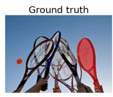

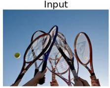

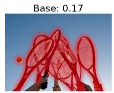  
"the green tennis ball in the left side flying in the air and the racket on the right"

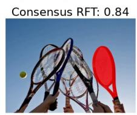

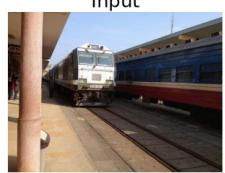

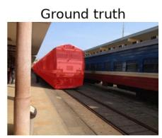  
"white train"

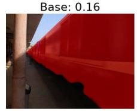

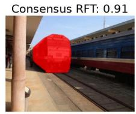

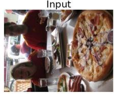

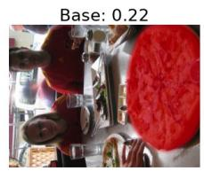

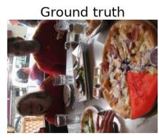  
"bottom rightmost pizza slice as we view the pic'

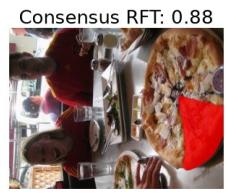

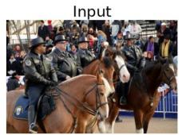  
"horse on far right dark brown"

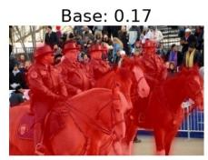

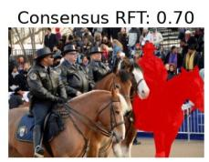

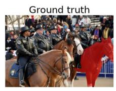

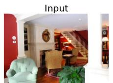

  
"the green chair on the left bottom and the green plant on the right bottom corner

Figure 9: Referring segmentation before and after consensus RFT on testing images (seed 0, early readout). Numbers are IoU with the ground truth.

  
Figure 10: Maze solving before (top) and after (bottom) consensus RFT on held-out 4 × 4 layouts. Each column uses the same layout and seed. Lines show the tracked cell path, drawn over the last generated frame.

  
Figure 11: Visual search before and after consensus RFT on development arrays, with the same seed in each row. Rings mark detected blue markers; a panel without a ring has no marker.