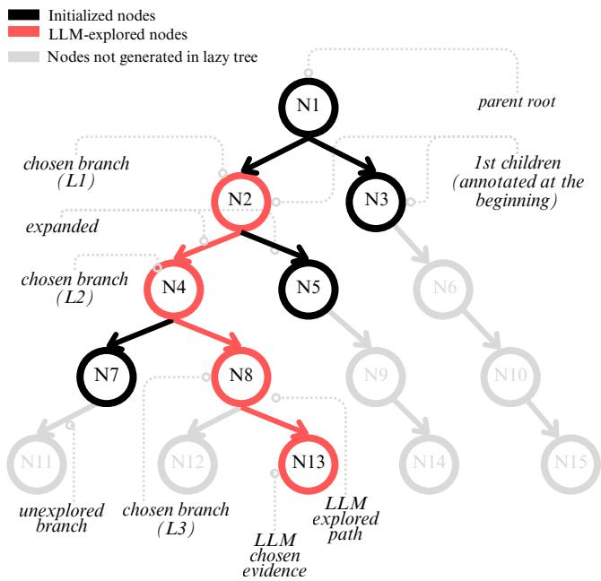
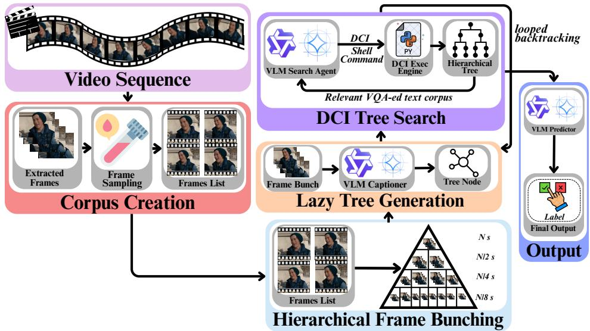
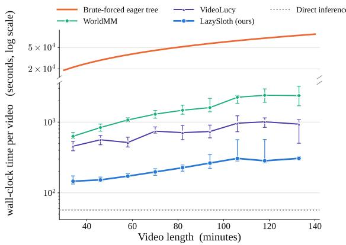
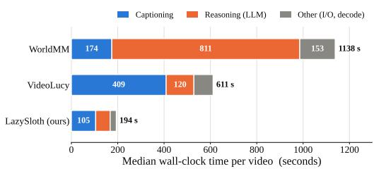
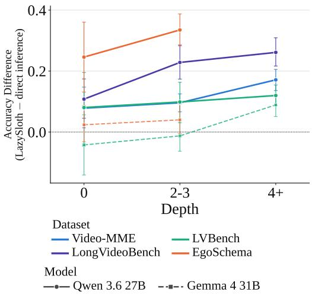
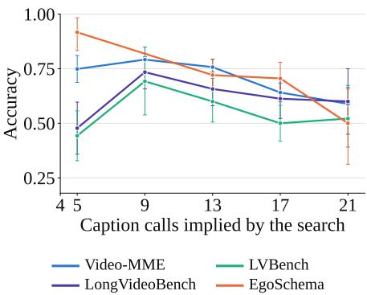
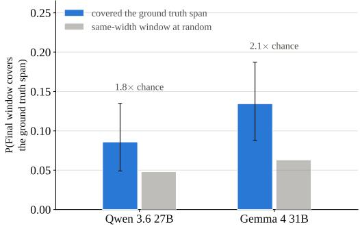
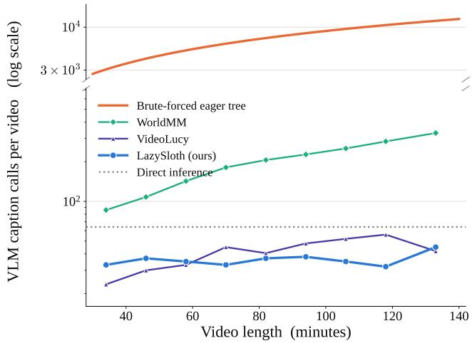
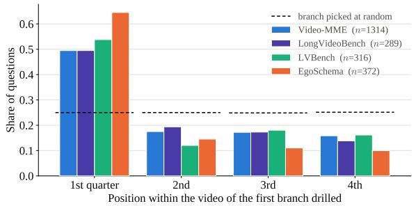
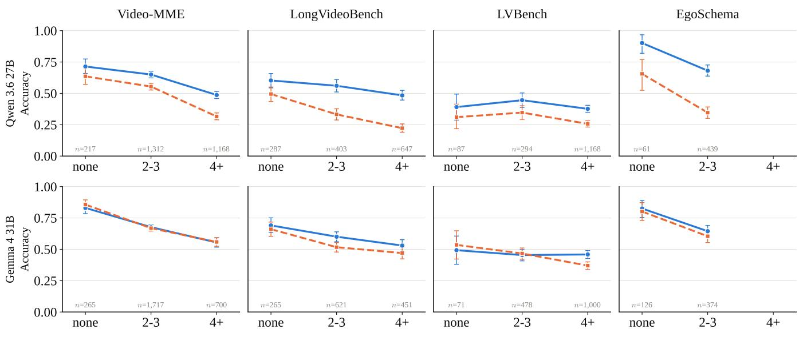

# LazySloth: Bounded LLM-based Lazy Tree Search for Fast Long Video Comprehension

Arka Mukherjee1, Kaleen Shrestha2, Larissa Zhu2, Maja Matarić2,

1School of Computer Engineering, Kalinga Institute of Industrial Technology (KIIT) Bhubaneswar 2Computer Science Department, Viterbi School of Engineering, University of Southern California

## Abstract

Modern vision-language models (VLMs) have shown promising results in long-video understanding due to the rich se- mantic information they can capture. However, most methods focus on coarse ca tionin of extracted ima e frames that are computationally ineficient and require models with large con- text windows. While past work has explored eficient methods through multimodal retrieval-augmented generation (RAG), they rely on lossy embeddings that lose temporal context and fine-grained detail. Few works to date have investigated how VLM-based query-relevant information retrieval can be optimized. We introduce LazySloth, an eficient tree-based search method that speeds up video comprehension and re- trieval tasks 2.9-8.3x (compared to existing agentic methods) through bounded captioning of portions of the video consid- ered irrelevant by a VLM of the video. Compared to con- temporary specialized video-understanding VLMs and RAG- based methods, LazySloth achieved similar or better final task accuracy across two recent open-source base VLMs–Gemma 4 31B and Qwen3.6 27B–across four benchmarks. LazySloth reduced the gap between the base open-source model and a closed-source model, GPT-4o. Ablations showed that replac- ing VLM scene understanding with CLIP-based retrieval cost 8.8–19.9% in accuracy, while lazy tree construction matches eager construction at a fraction of the captioning cost. With LazySloth, we demonstrate the possibility of faster long-video comprehension without substantial loss in performance.

## 1 Introduction

The frontier for video understanding has moved from short, curated clips (Mangalam, Akshkulakov, and Malik 2023) to long-form content such as feature-length films, hour-long lec- tures, and egocentric recordings 1 (Hong et al. 2025; Shu et al. 2025), to weeks-long videos spanning multiple topics (Rege et al. 2026). Existing work on answering a question from such content focused on explicit localization (finding the handful of seconds that matter) (Zuo et al. 2025) and comprehension (reasoning over what happens in the localized frames) (Yeo et al. 2026). Modern VLMs are exceptionally good at processing long-context inputs across modalities (Wang et al. 2025c), improving over contrastive methods that showed little success (Bagad, Tapaswi, and Snoek 2023).

However, the semantic expertise of VLMs comes at a tradeof, and two main paradigms of VLM-based video un- derstanding have emerged. The first places sampled frames directly into the model’s context and asks for an answer in one shot (Shen et al. 2025; Shu et al. 2025). This is bounded by the context window and the quadratic cost of attention: an hour of video sampled at even one frame per second (FPS) yields thousands of frames and hundreds of thousands of visual tokens, forcing frame budgets so aggressive that the evidence needed to answer is often not sampled. To combat this, a second paradigm has emerged that converts the video into text: a VLM captions every frame or every fixed-length segment, and an LLM then reasons over the resulting cor- pus (Zuo et al. 2025; Yeo et al. 2026; Wang et al. 2025b). This circumvents the context limit and yields an easily searchable artifact. However, this requires one VLM call per unit of video, so the cost scales linearly with duration regardless of the question asked. A question about a five-second event still requires captioning the other fifty-nine minutes. Since the VLM call is much more expensive than any other compo- nent of the system, this wasted captioning is the bottleneck.

  
Figure 1: Overview of how LazySloth bounds captioning. Each level captures more fine-grained information, with the parent root representing all of the video. Grayed-out nodes are never visited, which reduces the total time to navigate through the hierarchical tree.

Multimodal retrieval-augmented generation (RAG) addresses precisely this issue by retrieving candidate segments with contrastive image-text encoders before invoking a VLM (Radford et al. 2021; Most et al. 2025). Retrieval is cheap, but the representation is lossy (Yu et al. 2025; Lumer et al. 2026) as the contrastive encoder compresses a frame or even a pool of frames into a single vector. This discards temporal, motion, and fine-grained detail.

Eficient methods retrieve with lossy embeddings while accurate methods caption extensively with VLMs. Few works have asked how VLM-based retrieval itself should be opti- mized. To address this, we introduce LazySloth (Figure 2), a tree-based search method that generates captions lazily. LazySloth summarizes the video as a top-down tree that is never fully instantiated. We show a LLM a root summary of the whole clip and a handful of coarse branch summaries, from which it descends into the branch it determines is most relevant to the question. Only that branch’s children are cap- tioned, and we repeat this descent until an interval is small enough to expand into per-frame detail. Finally, a multimodal reasoner answers from the evidence surfaced along the path together with the key frames the search resolved to. This bounds the captioning cost to the depth of the descent rather than the length of the video, and grows logarithmically where prior methods grow linearly.

Across four long-video benchmarks and two recent open- source VLMs, LazySloth was 2.9–8.3× faster than existing agentic methods while matching or exceeding both special- ized long-video VLMs and RAG-based pipelines in accu- racy. It also narrowed the accuracy gap between the tested open-source models and a closed-source model, GPT-4o.

Our contributions are:

1. LazySloth, a lazy hierarchical search method that bounds VLM captioning to the branch the search actually ex- plores, making captioning cost logarithmic rather than linear in video length.

2. Evidence that VLM-based retrieval on frame bunches (that captures temporal change unlike individual frames) can be made eficient without falling back on lossy embeddings.

3. An evaluation across four long-video benchmarks and two open base VLMs against specialized video VLMs, RAG pipelines, and agentic baselines, showing 2.9–8.3× speedups at comparable or better accuracy.

4. Ablations that separately isolate the contribution of the hierarchy, of its laziness, and of VLM-based versus embedding-based scene understanding.

## 2 Related Work

## 2.1 Vision–Language Models (VLMs)

General Purpose Video VLMs Open VLM series such as VideoLLaMA 2, Qwen-VL 3, InternVL 4, LLaVA-Video/OneVision 5, Gemma 6, and GLM 7 are exten- sively used for building agentic video-understanding sys- tems. These VLMs, however, ingest video data as sequences of uniformly sampled frames within their context length bud- gets, and rely on aggressive truncation or down-sampling for longer and high-resolution videos. Although this allows for graceful scaling, smaller open models degrade after roughly 30 frames (Wu et al. 2024), consistent with the lost-in-themiddle efect (Liu et al. 2024). Using context-as-memory did not provide usable memory (see experiments in Appendix B), which motivated our search for eficient retrieval systems that support hundreds of frames.

Specialized VLMs for Long Videos Specialized VLMs have also emerged to address the unique problems of long video understanding. VideoLLaMA 3 (Zhang et al. 2025), a well-known model in this space, utilizes high-quality vision- centric image-text datasets in its training corpus and achieved 2-3% gains on benchmarks like Video Multi-Modal Evalu- ation (Video-MME) (Fu et al. 2025) and Multi-task Long Video Understanding (MLVU) (Zhou et al. 2025). Other notable models include VideoChat-Flash (Li et al. 2025a) and video-SALMONN 2+ (Tang et al. 2026), which employs model architecture and training data innovations to improve video understanding. More recently, VideoChat-R1 (Li et al. 2025b) integrates spatio-temporal specific rewards with reinforcement learning to improve temporal grounding of VLMs. The core limitations of frame sampling and utilizing memory as context, however, remain (Section 4).

## 2.2 Long Video-Understanding Datasets and Benchmarks

Several high-quality long video-understanding datasets and benchmarks have been released to evaluate foundation model capabilities and train small-scale specialized VLMs. LongVideoBench (Wu et al. 2024) and Video-MME (Fu et al. 2025) are widely used for model evaluation in a multiplechoice question (MCQ) format, with videos sourced from web platforms such as YouTube8. More recently, evalua- tion has focused on extremely long (weeks-long, rather than hours) video understanding in VLMs (Wang et al. 2025a). The Ego4D and EgoLife 9 corpora have also been utilized for testing long-format egocentric content, with datasets such as EgoSchema (Mangalam, Akshkulakov, and Malik 2023) and EgoMemReason (Wang et al. 2026) testing short and weeklong comprehension, respectively, in MCQ format. Bench-marks studied in this paper are summarized in Table 1.

  
Figure 2: Overview of the LazySloth pipeline. (A) Corpus creation, which produced an ordered list of frames after applying optional uniform frame sampling to the input video. (B) Hierarchical frame bunching, which initialized the first few levels of the search tree. (C) Laz eneration of tree nodes b the ca tioner VLM C. (D) A entic Direct Cor us Interaction (DCI), where the search VLM S ex lored the tree with backtrackin to traverse alternative branches. (E) Final answer rediction b the reasoner VLM (R), conditioned on the textual evidence and representative frames collected during the search.

## 2.3 Methods for Long Video-Understanding

RAG-Based Methods Multimodal retrieval-augmented generation (RAG) has been explored for long-video understanding. Yeo et al. (2026) studied RAG-based methods such as the text-based LightRAG (Guo et al. 2025) and Hip- poRAG (Gutierrez et al. 2024), and the multimodal Video-RAG (Luo et al. 2025). Our method resolves the concern of relying on lossy multimodal embeddings by utilizing seman- tic LLM-based scene understanding (Section 4.3).

Agentic methods Several agentic methods have been pro-posed in the literature to improve VLM-based long video comprehension techniques. Some notable recent work in- cludes VideoLucy (Zuo et al. 2025), which evaluated the efectiveness of coarse-to-fine-grained memory-based re- trieval. Other related work has evaluated the efect of storing specialized memory banks for episodic, semantic, and vi- sual data separately (Yeo et al. 2026), while Wang et al. (2025b) uses self-reflection-based iterative searching with VLMs. However, these works did not evaluate how VLM- based long video search can be optimized without significant performance reductions.

## 3 LazySloth

Our proposed method, LazySloth (Figure 2), answers a query Q over a long video without captioning every frame. It utilizes three VLMs: a captioner model, C, that builds a topdown caption tree lazily, a searcher VLM S, and a reasoner VLM R. S repeatedly navigates into a branch that it determines to be most relevant. R finally answers the query given the selected caption corpus (temporal context) plus the key frames of the region the search narrowed to (visual evidence).

After decoding the video clip for frame extraction, we get an ordered frame list $F = \left. f _ { 1 } \ldots f _ { N } \right.$ (timestamps are provided in context). The top-down lazy tree is then initiated, spanning all N frames, which we caption with $C \ \mathrm { o n } \le m _ { b }$ uniformly sampled representative frames. At every step, the root is split into k (branch factor) roughly equal children, each of which represents a contiguous spans of the video. Each span is captioned the same way with C. We initialize the evidence corpus as the root caption plus the child captions, and the searcher S’s selected key-frame range currPos is set to the whole clip [0, N) at timestamp t. Each node is assigned an id.

A text-only top-down search then follows, during which S sees the question, an action menu, and a transcript showing the root and current-level captions. Here, searcher S must output exactly one action from the following list:

1. DRILL <id>: This action is used to descend into a frontier branch. A node is split into ≤ k children, which are then captioned lazily by C. For the sibling nodes not chosen by S, LazySloth never runs captioning, which bounds the cost. The newly generated children are now the frontier of the tree, currPos is updated, and the new captions are appended to the evidence corpus. We do not discard the previous frontier; instead, we retain it in the evidence corpus so S can DRILL a sibling id to backtrack one level.

2. EXPAND <id>: If a branch already has ≤ ℓ frames (i.e, it is at leaf size), the VLM can choose to EXPAND instead. This step captions every frame in that leaf range episod- ically, which is then appended to the evidence corpus. Finally, currPos is set to that leaf.

Algorithm 1: Hierarchical lazy tree generation and retrieval   
Require: Video V, uer Q, labels L; ca tioner C, searcher   
$S ,$ reasoner R; branch factor k, leaf size ℓ, key  
frame budget $m _ { r }$   
Ensure: answer $\hat { y }$   
1: F ← SampleFrames(V); $N \gets | F |$   
2: C captions root [0, N) and its k children   
3: $\mathcal { F } $ children   
4: $\mathcal { F } _ { \mathrm { p r e v } }  \emptyset$   
5: $\varepsilon \gets$ {root, child captions}   
6: $[ a , b ) \dot {  } [ 0 , N )$   
7: while round budget remains do ▷ text-only tree search,   
budget based on backtracking limit   
8: S reads $Q$ and the frontier captions {caption $C : c \in$   
F} and emits ONE action:   
9: if Drill $\mathbf { \Omega } , C$ with $c \in \mathcal { F } \cup \mathcal { F } _ { \mathrm { p r e v } }$ and $b _ { c } - a _ { c } >$ ℓ then   
$\triangleright c \in \mathcal { F } _ { p r e \nu } \Rightarrow$ backtrack one level   
10: split C into k children; $C$ captions only them   
▷ unchosen siblings never captioned   
11: $\mathcal { F } _ { \mathrm { p r e v } }$ ← frontier of C   
12: $\dot { \mathcal { F } } \gets$ children   
13: $[ a , b ) \gets [ a _ { c } , b _ { c } )$   
14: $\xi + =$ their captions   
15: else if Expand $C$ with $c \in \mathcal { F } \cup \mathcal { F } _ { \mathrm { p r e v } }$ and $b _ { c } - a _ { c } \leq \ell$   
then   
16: C captions each frame of C   
17: $[ a , b ) \gets [ a _ { c } , b _ { c } )$   
18: $\xi + =$ per-frame captions   
19: else if Answer y then ▷ y : searcher’sprovisional   
answer   
20: break   
21: else▷ ifS outputs an invalid id, Drills on a leafnode,   
or Expands on a non-leaf   
22: prompt $S$ to retry   
23: K ← evenly sample $\leq m _ { r }$ frames of $F [ a : b )$ in time   
order ▷ keyframes ofthe searcher-narrowed region   
24: $y _ { R } \gets R ( Q , L , \mathcal { E } , K )$ ▷ multimodal: E = temporal con  
text, $K =$ visual evidence   
25: return yˆ ← yR if yR $\neq$ Insufficient else yS

3. PROVISIONAL ANSWER <Q>: The searcher $S _ { \textrm { s } }$ answer to Q, based on the collected evidence, which ends the search loop.

Finally, both the textual evidence collected from the cap- tioned corpus by the searcher S and $\leq m _ { r }$ representative frames in the leaf nodes of the hierarchical tree that S navigated down to are passed to the multimodal reasoner $R ,$ which then reasons on a per-frame basis and emits an output label or open-ended text based on the query. The impact of a post-hoc multimodal reasoner is ablated in Table 4.

Let $d = \lceil \log _ { k } ( N / \ell ) \rceil$ denote the number of levels navi- gated until a leaf of at most ℓ frames is reached. Since each navigation captions at most k new nodes and the final expansion captions at most ℓ frames, the total number of captioning operations is bounded by

<table><tr><td></td><td>Video- MME</td><td>LongVideo Bench</td><td>LV Bench</td><td> $E g o$  Schema</td></tr><tr><td>Source</td><td>YouTube</td><td>Web</td><td>YouTube</td><td>Ego4D</td></tr><tr><td>Domain</td><td>6 domains</td><td>Multi-topic</td><td>Longform</td><td>Egocentric</td></tr><tr><td># Videos</td><td>900</td><td>753</td><td>103</td><td>500</td></tr><tr><td># Questions</td><td>2,700</td><td>1,337</td><td>1,549</td><td>500</td></tr><tr><td># Options</td><td>4</td><td>4-5</td><td>4</td><td>5</td></tr><tr><td>Avg. length (min)</td><td>17.0</td><td>7.9</td><td>67.3</td><td>3.0</td></tr><tr><td>Range (min)</td><td>0.2–59.7</td><td>0.1-59.6</td><td>30.1–139.9</td><td>3.0 fixed</td></tr><tr><td>Total duration (h)</td><td>255.3</td><td>99.8</td><td>115.5</td><td>25.0</td></tr></table>

Table 1: Long-video comprehension benchmarks used in our evaluation: Video-MME (Fu et al. 2025), LongVideoBench (Wu et al. 2024), LVBench (Wang et al. 2025a), and EgoSchema (Mangalam, Akshkulakov, and Malik 2023). All four are multiple-choice and scored by exact match. The suite spans web, film/television, and egocentric content, and in to- tal, we evaluate almost 500 hours of video.

$$
\mathcal { C } \leq d k + \ell = k \left\lceil \log _ { k } \frac { N } { \ell } \right\rceil + \ell = O ( k \log _ { k } N + \ell ) .\tag{1}
$$

For a fixed branching factor k and leaf size ℓ, this simplifies to $O ( k \log _ { k } N )$ , compared to the O(N) frame-captioning cost incurred by dense captioning. We summarized LazyS- loth’s optimized video search in Algorithm 1.

## 3.1 Evaluation Benchmarks

We evaluated the proposed framework on four established MCQ video question-answering benchmarks with well-maintained leader boards, spanning movie clips, general web videos, long-form videos, and egocentric videos, following the discussion in Section 2.2: Video-MME (Fu et al. 2025), LongVideoBench (Wu et al. 2024), LVBench (Wang et al. 2025a), and EgoSchema (Mangalam, Akshkulakov, and Malik 2023). Table 1 summarizes each dataset’s statistics. For all of these benchmarks, we conducted a full run and reported task accuracy as an exact match of the LLM’s output MCQ label to the ground truth.

## 3.2 Baselines

For each dataset, we first quantified random baseline perfor- mance as 1/N, where N is the number of MCQ options for Video-MME, LongVideoBench, LVBench, and EgoSchema.

We compared LazySloth to multiple classes of methods starting with general video-understanding models, specifi- cally Qwen3.6 $2 7 \mathrm { B } ^ { 1 0 }$ and Gemma 4 31B 11, using at most 64 frames sampled from each video to stay within their context windows (Yin et al. 2024; Fu et al. 2025; Doorenbos, Spurio, and Gall 2025). Next, specialized video-understanding models such as VideoChat-R1 (Li et al. 2025b) and VideoLLaMA 3 (Zhang et al. 2025) were tested. To understand how our method compares to RAG-based methods, we com- pared it against the text-based LightRAG (Guo et al. 2025)

followed by the multimodal Video-RAG (Luo et al. 2025). Finally, among modern agentic baselines, we included Vide- oLucy (Zuo et al. 2025) and WorldMM (Yeo et al. 2026).

## 3.3 Ablations

We designed two ablations to investigate (a) the behavior of lazy tree generation, (b) the impact of the tree data structure, and (c) the efectiveness of using VLMs instead of multimodal embeddings. We replaced the searcher VLM S with embedding-based retrieval by scoring the tree nodes us- ing Contrastive Language–Image Pretraining Score (CLIP-Score) (Hessel et al. 2021). This enabled greedy best-first search (Greedy BFS) over the tree.

The searcher S first navigated that tree lazily with DRILL and EXPAND, and generated its answer using the collected evidence. This allowed us to illustrate the impact of VLMbased scene understanding. Next, we ablated the efect of lazy tree generation by eagerly constructing the full hierarchy with CLIPScore-based nodes. The searcher S then received the full tree as context while collecting evidence. We kept all other components, including the backtracking from the main method, intact, ablating the lazy, on-demand (top-down, implicitly pruned) tree construction of LazySloth. These comparisons allowed us to illustrate the eficiency gains of Al orithm 1 over naive brute-forced methods.

## 3.4 Experimental Setup & Models Tested

All experiments on existing agentic methods and LazySloth were repeated on two base searcher S and reasoner R VLMs (Qwen3.6 27B and Gemma 4 31B). We ran Qwen 3.6 and Gemma 4’s compiled GGML Universal File (GGUF) locally through LM Studio12. The captioner model C was set to Nvidia’s Nemotron 3 Nano Omni 30B for an equitable com- parison of each method’s merit (which was chosen based on caption quality experiments outlined in Appendix C). We loaded Nemotron 3’s compiled GGUF locally through LM Studio. All experiments were run on four Nvidia H100 80 GB, one RTX Pro 6000 96 GB, and two RTX 3090 24 GB GPUs. All videos were sampled at 1 FPS and models initial- ized with a context window of 79,104 tokens to fit on our available hardware.

## 4 Results

Table 2 shows the accuracy of LazySloth compared to ex- isting models and methods. Our method outperformed spe- cialized models and retrieval-based methods. On Qwen 3.6 27B, LazySloth exceeded the strongest specialized video- understanding model on every benchmark: by 5.2 points over VideoLLaMA 3 on Video-MME, 2.2 on LongVideoBench, 1.5 over Time-R1 on LVBench, and 13.3 over VideoL- LaMA 3 on EgoSchema. Importantly, these gains were re- alized with a general-purpose base model (i.e., backbone), and no video-specific training. LazySloth also outperformed the best RAG-based baseline (Video-RAG 7B) by at least 6.0 points on the two benchmarks where their numbers were available, which was consistent with our claim that embed- ding retrieval discards fine-grained detail required for so- phisticated video understanding.

<table><tr><td></td><td colspan="4">Accuracy (%)</td></tr><tr><td>Method</td><td>Video-MME (w/o subs)</td><td>LongVideo Bench</td><td>LV Bench</td><td>Ego Schema</td></tr><tr><td>Random baseline</td><td>25.0</td><td>21.3</td><td>25.0</td><td>20.0</td></tr><tr><td colspan="5">Direct inference (64 frames)</td></tr><tr><td>GPT-40‡</td><td>71.9</td><td>66.7</td><td>48.9</td><td>72.2</td></tr><tr><td>Qwen 3.6 27B</td><td>45.7</td><td>31.8</td><td>27.7</td><td>38.4</td></tr><tr><td>Gemma 431B</td><td>65.8</td><td>52.8</td><td>40.7</td><td>65.4</td></tr><tr><td colspan="5">Specialized video models</td></tr><tr><td>VideoChat-R1.5</td><td>52.5</td><td>49.8</td><td>33.4</td><td>41.6</td></tr><tr><td>VideoChat-Flash†</td><td>55.6</td><td></td><td>33.2</td><td>44.1</td></tr><tr><td>VideoLLaMA 3</td><td>56.2</td><td>51.0</td><td>35.4</td><td>60.6</td></tr><tr><td>Time-R1†</td><td></td><td></td><td>37.6</td><td>31.1</td></tr><tr><td colspan="5">RAG-based</td></tr><tr><td>LightRAG†</td><td>46.6</td><td></td><td>30.4</td><td></td></tr><tr><td>Video-RAG 7B†</td><td>55.4</td><td></td><td>33.1</td><td></td></tr><tr><td colspan="5">Agentic</td></tr><tr><td>VideoLucy (Qwen)</td><td>34.3</td><td>43.9</td><td>35.4</td><td>51.1</td></tr><tr><td>VideoLucy (Gemma)</td><td>71.3</td><td>65.7</td><td>53.8</td><td>70.9</td></tr><tr><td>WorldMM (Qwen)</td><td></td><td></td><td>29.5</td><td></td></tr><tr><td>LazySloth (Qwen)</td><td>61.4</td><td>53.2</td><td>39.1</td><td>73.9</td></tr><tr><td>LazySloth (Gemma)</td><td>66.5</td><td>59.5</td><td>45.9</td><td>69.1</td></tr></table>

Table 2: Accuracy results on four long videounderstanding benchmarks. Bold marks the best open-source result per benchmark; underline marks the second- best open-source result. † Numbers sourced from Yeo et al. (2026). ‡ GPT-4o numbers are taken from the public leaderboards of the respective benchmarks; we do not report a newer GPT release, as none could be located on the main- tained leaderboards.

Among other agentic methods such as VideoLucy, using Qwen3.6 27B as the backbone, we saw that LazySloth im-proved over VideoLucy by 27.1, 9.3, 3.7, and 22.8 points, and over WorldMM by 9.6 points on LVBench. The mar- gin over direct inference was 11.4–35.5 points. We note that VideoLucy underperformed compared to direct inference on Video-MME with the same backbone (34.3% vs. 45.7%), whereas LazySloth improved on it by 15.7%.

Improvements were markedly smaller on Gemma 4 31B, where LazySloth trailed VideoLucy on all four benchmarks by 1.8–7.9 points, which demonstrated that the improvement margin was largely dependent on the specific model: on av- erage, Qwen3.6 27B gained 21.0% in accuracy with our pipeline compared to 4.1% for Gemma 4 31B over direct inference. Further experiments with more backbone VLMs would confirm this pattern as a claim. Despite lower perfor- mance gains with Gemma 4, LazySloth achieved compara- ble accuracies at 2.9–8.3× lower median wall-clock time per video than competing methods, as we discuss next.

## 4.1 Eficiency Analysis

  
Figure 3: Eficiency comparison of LazySloth, a brute-forced eager tree, VideoLucy, and WorldMM by median seconds per video (log y, broken above the working band) on LVBench, which was chosen as it has the longest videos in our test corpus. Bootstrapped 95% confidence intervals are plotted at each video length value. All methods shared the Qwen3.6- 27B reasoner and Nemotron captioner.

To better understand the gains realized with LazySloth, we first compared the median wall clock time across our method and the two agentic baselines, VideoLucy and WorldMM. As a control, we included the brute-forced eager bottom-up tree (Section 3.3). For these tests, we focused only on the LVBench dataset as it contained the longest videos in our test set (Table 1). Figure 3 shows that our method was the fastest, with median time to answer a single LVBench query at 194 seconds (secs) compared to 611 secs on VideoLucy, and 1,139 secs on WorldMM. On the longest videos (140 minutes long), our method was 3× faster than VideoLucy and 7.7× faster than WorldMM. The gap with the brute-forced eager bottom-up tree remained disproportionately high at 287× slower than LazySloth. Direct inference, which feeds 64 frames into the VLM’s memory, stayed constant at 57 secs, and resulted in notably lower task accuracies. Additiona discussion about eficiency can be found in Appendix D.

Next, we decomposed each method into three categories: time spent captioning, time spent reasoning, and over- head (e.g., video decode, I/O, etc). Figure 4 shows the re-sults on LVBench. We observed that reasoning dominated WorldMM’s median wall clock time (811s), as it used triple-extraction with VLMs across episodic, semantic, and visual memories. VideoLucy, on the other hand, was dominated by its multi-frame coarse-window captions (67%) as compared to reasoning. Our method optimized both frontiers, and nei- ther captioning nor reasoning dominated, ensuring 2.9–8.3× faster median wall clock time than the baselines.

## 4.2 Behavioral Analysis

We next characterized how LazySloth’s search behaves and what its behavior predicts about the final accuracy. Figure 5 plots the accuracy diference between LazySloth and direct inference against the depth the search reached. On Qwen3.6 27B, we noticed positive diferences across all tested bench- marks, while on Gemma 4 31B, we noticed the diferences were zero throughout. This was consistent with the model- based performance diferences in Section 4. Multi-level tree search did not impact Gemma 4 31B’s final accuracy, and likely negatively hurt its long video capabilities.

  
Figure 4: WorldMM vs VideoLucy vs LazySloth median wall clock time per video on LVBench decomposition by caption- ing, reasoning, and other (I/O, etc.). VideoLucy spends a lot of time captioning; WorldMM spends a lot on reasoning. Our method optimizes both frontiers for the lowest total time.

  
Figure 5: Comparing the accuracy diference between LazyS- loth and direct inference across benchmarks and models with respect to search tree depth.

Next, Figure 6 analyzes the performance of LazySloth with respect to the caption budget during search on Qwen 3.6 27B. The first descent into the tree (moving from five caption calls to nine) clearly helped the VLM, as accu-racy rose by 25%. Beyond that, accuracy fell on Video- MME, LongVideoBench, and LVBench. On EgoSchema, ac- curacy declined monotonically, likely as videos in the dataset were extremely short (three minutes each). This decline was largely correlated with harder questions, where the search failed to resolve the query cheaply in higher levels of the tree.

We additionally investigated LazySloth’s ability to find the exact span in the video that contains the answer to the query. Compared to randomly choosing similar-sized windows, Fig- ure 7 shows each VLM significantly improved (1.8 − 2.1×) at identifying the correct window (Qwen3.6 27B n = 163 and Gemma 4 31B n = 171). However, while the choice was not arbitrary, the final window did not contain the actual span for 86 − 91% of the questions, where the model still answered the question correctly.

  
Figure 6: Accuracy with respect to the caption budget used by the tree search with Qwen3.6 27B, where budget = 1 root + 4 seed branches + 4 per successful DRILL + 4 per EXPAND. Beyond a single descent into the tree, accuracy declined across all benchmarks.

  
Figure 7: Analysis of temporal localization on correctly an- swered LongVideoBench questions that were annotated with specific timestamps. Blue: the portion where LazySloth’s fi- nal window contained the referenced span. Gray: the rate expected from placing a window of the same width at ran- dom, averaged per question.

## 4.3 Ablation Results

We replaced VLM captioning with a frozen CLIP encoder, and found that accuracy fell by 8.8–19.9% with CLIPScored nodes compared to a Qwen3.6 27B base model (Table 3). VLM-based scene understanding was a major contributor to LazySloth’s performance. Holding the scorer fixed at CLIP- Score, the lazy top-down and eager bottom-up construc- tion difered by at most 3.1% with no consistent direction (Video-MME 41.5 vs. 43.4, LongVideoBench 40.5 vs. 42.1, EgoSchema 55.6 vs. 56.4). Lazy expansion largely did not afect accuracy, explaining how LazySloth speeds up video retrieval (Figure 3) without a massive performance loss.

Finally, we explored the efect of having a separate rea- soner VLM in LazySloth, and found that the search trajectory largely determined the final answer (Table 4). The reasoner improved micro-averaged accuracy by 0.3%, with no clear directionality. The searcher’s provisional answer was thus very nearly as accurate as the final one, and removing the reasoner’s VLM call could improve eficiency further.

<table><tr><td></td><td colspan="4">Accuracy (%)</td></tr><tr><td>Configuration</td><td>Video-MME</td><td>LongVideoBench LVBench EgoSchema</td><td></td><td></td></tr><tr><td>LazySloth</td><td>61.4</td><td>53.2</td><td>39.1</td><td>73.9</td></tr><tr><td colspan="5">Scene understanding (CLIPScore, greedy best-first)</td></tr><tr><td>lazy top-down tree</td><td>41.5</td><td>40.5</td><td>27.2</td><td>55.6</td></tr><tr><td>eager bottom-up tree</td><td>43.4</td><td>42.1</td><td>30.3</td><td>56.4</td></tr></table>

Table 3: Ablation study of LazySloth with Qwen3.6 27B. Group (a) varies the memory structure while keeping VLMbased scene understanding; group (b) replaces VLM captioning and search with a frozen CLIP encoder that scores each tree node by CLIPScore and navigates by greedy BFS.

<table><tr><td>Dataset</td><td>Searcher (%)</td><td>Reasoner (%)</td><td>△ (Reasoner—Searcher)</td></tr><tr><td>EgoSchema</td><td>76.6</td><td>76.9</td><td>+0.3</td></tr><tr><td>LongVideoBench</td><td>58.6</td><td>60.8</td><td>+2.2</td></tr><tr><td>LVBench</td><td>42.5</td><td>41.4</td><td>-1.1</td></tr><tr><td>Video-MME</td><td>62.3</td><td>62.6</td><td>+0.2</td></tr><tr><td>MCQ Micro-Avg</td><td>58.0</td><td>58.3</td><td>+0.3</td></tr></table>

Table 4: Agreement between the searcher’s selected answer and the reasoner’s final answer with Qwen 3.6 27B. We ob-serve that using a separate reasoner results in a 0.3% accuracy gain over always trusting the search model’s answer.

## 5 Conclusion

We introduce LazySloth, a tree-based search method for long-video understanding that bounds captioning to regions a VLM deems relevant rather than exhaustive captioning. Across four benchmarks and two open-source VLMs, LazyS- loth was 2.9 – 8.3× faster than existing methods while matching or exceeding specialized video-understanding VLMs and RAG-based methods in accuracy. Detailed failure analysis showed gaps in VLM behavior where it navigated to the wrong window or degraded in performance with extra cap- tion calls. Further, our ablations show LazySloth remained competitive due to VLM-based scene understanding, and lazy construction was close in accuracy with eager construc- tion, thereby resulting in a method that speeds up long-video retrieval without a substantial cost in task performance.

## 6 Limitations

One of the empirical shortcomings of LazySloth is that we observed our method assumed that long-video comprehen- sion can be reliably localized to subtrees, as we observed poor backtracking and navigation to other branches. Our method also relied on the underlying caption quality generated across all resolutions, which we quantify in Appendix C. Addition- ally, our tests remain limited to two base models, without uncertainty quantification with multiple runs.

## References

Bagad, P.; Tapaswi, M.; and Snoek, C. G. 2023. Test of Time: Instilling Video-Language Models with a Sense of Time . In 2023 IEEE/CVF Conference on Computer Vision and Pattern Recognition (CVPR), 2503–2516. Los Alamitos, CA, USA: IEEE Computer Society.

Doorenbos, L.; Spurio, F.; and Gall, J. 2025. Video Panels for Long Video Understanding.

El Haddad, K.; Bohy, H.; and Dutoit, T. 2025. The Interac- tion Behavior Dataset: A Dataset of Smiles and Laughs in Dyadic Interaction. In 2025 IEEE International Conference on Artificial Intelligence and eXtended and Virtual Reality (AIxVR), 399–403.

Fu, C.; Dai, Y.; Luo, Y.; Li, L.; Ren, S.; Zhang, R.; Wang, Z.; Zhou, C.; Shen, Y.; Zhang, M.; Chen, P.; Li, Y.; Lin, S.; Zhao, S.; Li, K.; Xu, T.; Zheng, X.; Chen, E.; Shan, C.; He, R.; and Sun, X. 2025. Video-MME: The First-Ever Com- prehensive Evaluation Benchmark of Multi-modal LLMs in Video Analysis. In 2025 IEEE/CVFConference on Computer Vision and Pattern Recognition (CVPR), 24108–24118.

Guo, Z.; Xia, L.; Yu, Y.; Ao, T.; and Huang, C. 2025. Ligh- tRAG: Simple and Fast Retrieval-Augmented Generation. In Christodoulopoulos, C.; Chakraborty, T.; Rose, C.; and Peng, V., eds., Findings ofthe Associationfor Computational Lin-guistics: EMNLP 2025, 10746–10761. Suzhou, China: Asso- ciation for Computational Linguistics. ISBN 979-8-89176- 335-7.

Gutierrez, B. J.; Shu, Y.; Gu, Y.; Yasunaga, M.; and Su, Y. 2024. HippoRAG: Neurobiologically Inspired Long-Term Memory for Large Language Models. In The Thirty-eighth Annual Conference on Neural Information Processing Systems.

Hessel, J.; Holtzman, A.; Forbes, M.; Le Bras, R.; and Choi, Y. 2021. CLIPScore: A Reference-free Evaluation Metric for Image Captioning. In Moens, M.-F.; Huang, X.; Specia, L.; and Yih, S. W.-t., eds., Proceedings of the 2021 Confer-ence on Empirical Methods in Natural Language Processing, 7514–7528. Online and Punta Cana, Dominican Republic: Association for Computational Linguistics.

Hong, W.; Cheng, Y.; Yang, Z.; Wang, W.; Wang, L.; Gu, X.; Huang, S.; Dong, Y.; and Tang, J. 2025. MotionBench: Benchmarking and Improving Fine-grained Video Motion Understanding for Vision Language Models. In Proceed- ings of the IEEE/CVF Conference on Computer Vision and Pattern Recognition (CVPR), 8450–8460.

Jiang, X.; Zong, Y.; Zheng, W.; Tang, C.; Xia, W.; Lu, C.; and Liu, J. 2020. DFEW: A Large-Scale Database for Recogniz- ing Dynamic Facial Expressions in the Wild. In Proceedings of the 28th ACM International Conference on Multimedia, 2881–2889.

Li, X.; Wang, Y.; Yu, J.; Zeng, X.; Zhu, Y.; Huang, H.; Gao, J.; Li, K.; He, Y.; Wang, C.; Qiao, Y.; Wang, Y.; and Wang, L. 2025a. VideoChat-Flash: Hierarchical Compression for Long-Context Video Modeling. arXiv:2501.00574.

Li, X.; Yan, Z.; Meng, D.; Dong, L.; Zeng, X.; He, Y.; Wang, Y.; Qiao, Y.; Wang, Y.; and Wang, L. 2025b. VideoChat-R1:

Enhancing Spatio-Temporal Perception via Reinforcement Fine-Tuning. arXiv:2504.06958.

Liu, N. F.; Lin, K.; Hewitt, J.; Paranjape, A.; Bevilacqua, M.; Petroni, F.; and Liang, P. 2024. Lost in the Middle: How Language Models Use Long Contexts. Transactions of the Associationfor Computational Linguistics, 12: 157–173.

Lumer, E.; Cardenas, A.; Melich, M.; Mason, M.; Dieter, S.; Subbiah, V. K.; Basavaraju, P. H.; and Hernandez, R. 2026. Comparison of Text-Based and Image-Based Retrieval in Modern Multimodal Retrieval Augmented Generation Large Language Model Systems. In Proceedings of the 18th International Conference on Agents and Artificial Intelligence - Volume 5: ICAART, 4619–4626. INSTICC, SciTePress. ISBN 978-989-758-796-2.

Luo, Y.; Zheng, X.; Li, G.; Yin, S.; Lin, H.; Fu, C.; Huang, J.; Ji, J.; Chao, F.; Luo, J.; and Ji, R. 2025. Video-RAG: Visually-aligned Retrieval-Augmented Long Video Compre- hension. In The Thirty-ninth Annual Conference on Neural Information Processing Systems.

Mangalam, K.; Akshkulakov, R.; and Malik, J. 2023. EgoSchema: a diagnostic benchmark for very long-form video language understanding. In Proceedings of the 37th International Conference on Neural Information Processing Systems, NIPS ’23. Red Hook, NY, USA: Curran Associates Inc.

Most, A.; Winjum, J.; Bhattarai, M.; Jones, S.; Ranasinghe, N. R.; Biswas, A.; and O’Malley, D. 2025. Lost in OCR Translation? Vision-Based Approaches to Robust Document Retrieval. In Proceedings of the 2025 ACM Sym-posium on Document Engineering, DocEng ’25. New York, NY, USA: Association for Computing Machinery. ISBN 9798400713514.

Radford, A.; Kim, J. W.; Hallacy, C.; Ramesh, A.; Goh, G.; Agarwal, S.; Sastry, G.; Askell, A.; Mishkin, P.; Clark, J.; Krueger, G.; and Sutskever, I. 2021. Learning Transfer- able Visual Models From Natural Language Supervision. In Meila, M.; and Zhang, T., eds., Proceedings of the 38th International Conference on Machine Learning, volume 139 of Proceedings ofMachine Learning Research, 8748–8763. PMLR.

Rege, A.; Sadhu, A.; Li, Y.; Li, K.; Vinayak, R. K.; Chai, Y.; Lee, Y. J.; and Kim, H. J. 2026. Agentic Very Long Video Understanding. In Liakata, M.; Moreira, V. P.; Zhang, J.; and Jurgens, D., eds., Proceedings of the 64th Annual Meeting ofthe Associationfor Computational Linguistics (Volume 1: Long Papers), 46575–46602. San Diego, California, United States: Association for Computational Linguistics. ISBN 979-8-89176-390-6.

Reverdy, J.; O’Connor Russell, S.; Duquenne, L.; Garaialde, D.; Cowan, B. R.; and Harte, N. 2022. RoomReader: A Multimodal Corpus of Online Multiparty Conversational In- teractions. In Calzolari, N.; Béchet, F.; Blache, P.; Choukri, K.; Cieri, C.; Declerck, T.; Goggi, S.; Isahara, H.; Maegaard, B.; Mariani, J.; Mazo, H.; Odijk, J.; and Piperidis, S., eds., Proceedings of the Thirteenth Language Resources and Evaluation Conference, 2517–2527. Marseille, France: European Language Resources Association.

Shen, X.; Xiong, Y.; Zhao, C.; Wu, L.; Chen, J.; Zhu, C.; Liu, Z.; Xiao, F.; Varadarajan, B.; Bordes, F.; Liu, Z.; Xu, H.; Kim, H. J.; Soran, B.; Krishnamoorthi, R.; Elhoseiny, M.; and Chandra, V. 2025. LongVU: Spatiotemporal Adaptive Compression for Long Video-Language Understanding. In Forty-second International Conference on Machine Learn-ing.

Shu, Y.; Liu, Z.; Zhang, P.; Qin, M.; Zhou, J.; Liang, Z.; Huang, T.; and Zhao, B. 2025. Video-XL: Extra-Long Vi- sion Language Model for Hour-Scale Video Understanding. In Proceedings of the IEEE/CVF Conference on Computer Vision and Pattern Recognition (CVPR), 26160–26169.

Siniukov, M.; Yin, Y.; Fast, E.; Qi, Y.; Monga, A.; Kim, A.; and Soleymani, M. 2024. SEMPI: A Database for Un- derstanding Social Engagement in Video-Mediated Multi- party Interaction. In Proceedings of the 26th International Conference on Multimodal Interaction, ICMI ’24, 546–555. New York, NY, USA: Association for Computing Machinery. ISBN 9798400704628.

Tang, C.; Li, Y.; Yang, Y.; Zhuang, J.; Sun, G.; Li, W.;MA, Z.; and Zhang, C. 2026. video-SALMONN 2: Caption-Enhanced Audio-Visual Large Language Models.

Vuillecard, P.; Farkhondeh, A.; Villamizar, M.; and Odobez, J.-M. 2024. CCDb-HG: Novel Annotations and Gaze-Aware Representations for Head Gesture Recognition. In 2024 IEEE 18th International Conference on Automatic Face and Gesture Recognition (FG), 1–9.

Wang, W.; He, Z.; Hong, W.; Cheng, Y.; Zhang, X.; Qi, J.; Ding, M.; Gu, X.; Huang, S.; Xu, B.; Dong, Y.; and Tang, J. 2025a. LVBench: An Extreme Long Video Understanding Benchmark. In 2025 IEEE/CVF International Conference on Computer Vision (ICCV), 22958–22967.

Wang, X.; Zhang, Y.; Zohar, O.; and Yeung-Levy, S. 2025b. VideoAgent: Long-Form Video Understanding with Large Language Model as Agent. In Leonardis, A.; Ricci, E.; Roth, S.; Russakovsky, O.; Sattler, T.; and Varol, G., eds., Com- puter Vision – ECCV 2024, 58–76. Cham: Springer Nature Switzerland. ISBN 978-3-031-72989-8.

Wang, Z.; Yoon, J.; Yu, S.; Islam, M. M.; Bertasius, G.; and Bansal, M. 2025c. Video-RTS: Rethinking Reinforcement Learning and Test-Time Scaling for Eficient and Enhanced Video Reasoning. In Christodoulopoulos, C.; Chakraborty, T.; Rose, C.; and Peng, V., eds., Proceedings ofthe 2025 Conference on Empirical Methods in Natural Language Processing, 28126–28140. Suzhou, China: Association for Compu- tational Linguistics. ISBN 979-8-89176-332-6.

Wang, Z.; Zhang, Y.; Yu, S.; Zhang, C.; Zhao, Z.; Yoon, J.; Lee, H.; Bertasius, G.; and Bansal, M. 2026. EgoMemReason: A Memory-Driven Reasoning Bench- mark for Long-Horizon Egocentric Video Understanding. arXiv:2605.09874.

Wu, H.; Li, D.; Chen, B.; and Li, J. 2024. LongVideoBench: A Benchmark for Long-context Interleaved Video-Language Understanding. In Globerson, A.; Mackey, L.; Belgrave, D.; Fan, A.; Paquet, U.; Tomczak, J.; and Zhang, C., eds., Advances in Neural Information Processing Systems, vol-ume 37, 28828–28857. Curran Associates, Inc.

Yeo, W.; Kim, K.; Yoon, J.; and Hwang, S. J. 2026. WorldMM: Dynamic Multimodal Memory Agent for Long Video Reasoning. In Proceedings of the IEEE/CVF Conference on Computer Vision and Pattern Recognition (CVPR), 25599–25609.

Yin, S.; Fu, C.; Zhao, S.; Li, K.; Sun, X.; Xu, T.; and Chen, E. 2024. A survey on multimodal large language models. National Science Review, 11(12): nwae403.

Yu, S.; Tang, C.; Xu, B.; Cui, J.; Ran, J.; Yan, Y.; Liu, Z.; Wang, S.; Han, X.; Liu, Z.; and Sun, M. 2025. VisRAG: Vision-based Retrieval-augmented Generation on Multi- modality Documents. In The Thirteenth International Con- ference on Learning Representations.

Zhang, B.; Li, K.; Cheng, Z.; Hu, Z.; Yuan, Y.; Chen, G.; Leng, S.; Jiang, Y.; Zhang, H.; Li, X.; Jin, P.; Zhang, W.; Wang, F.; Bing, L.; and Zhao, D. 2025. VideoLLaMA 3: Frontier Multimodal Foundation Models for Image and Video Understanding. arXiv:2501.13106.

Zhou, J.; Shu, Y.; Zhao, B.; Wu, B.; Liang, Z.; Xiao, S.; Qin, M.; Yang, X.; Xiong, Y.; Zhang, B.; Huang, T.; and Liu, Z. 2025. MLVU: Benchmarking Multi-task Long Video Understanding. In 2025 IEEE/CVF Conference on Computer Vision and Pattern Recognition (CVPR), 13691–13701.

Zuo, J.; Deng, Y.; Kong, L.; Yang, J.; Jin, R.; Zhang, Y.; Sang, N.; Pan, L.; Liu, Z.; and Gao, C. 2025. VideoLucy: Deep Memory Backtracking for Long Video Understanding. In The Thirty-ninth Annual Conference on Neural Information Processing Systems.

## Appendices A Symbol Glossary

Table 11 presents a glossary of all formalization symbols used in Section 3 and Algorithm 1.

## B FPS Sweep Results

Table 5 showcases uniform FPS sampling results on a few short video datasets: DFEW (Jiang et al. 2020), CCDb-IB (El Haddad, Bohy, and Dutoit 2025), CCDb-HG (Vuillecard et al. 2024), CCDb+, SEMPI (Siniukov et al. 2024), and RoomReader (Reverdy et al. 2022). We specifically selected them as they are a few seconds long and therefore fit entirely into VLM context windows at high FPS sampling rates.

The sweep showed that adding frames did not add usable information. Neither model improved monotonically as sam- pling rose from 1 FPS to every frame. Qwen 2.5 VL 7B13 on RoomReader fell from 47.0% at 1 FPS to 11.5% when given the full frame set, and on SEMPI from 54.0% to 32.7%. Gemma 4 E4B14, on the other hand, stayed essentially flat across all four rates.

Since these clips are short enough to fit entirely in context, the ceiling is not the context window but the model’s ability to use what is already in it. This experiment further motivated a retrieval-based design.

## C Captioning Quality Tests

Because the captioner C is held frozen across every method, we tested their sensitivity before committing to Nvidia’s Nemotron 3 Nano Omni. Table 6 shows that across six viable candidates, CLIPScore on frames randomly sam- pled from the six tested long-video datasets spanned only 0.2331 to 0.2447 CLIPScore, a range of roughly 5%. Im- portantly, only Gemma 4 E4B scored particularly worse at 0.2153. Since modern VLMs are capable of captioning im- ages, this result is not quite surprising.

This brings us to the proposition of eficiency. To make LazySloth fast, we need C to balance captioning quality with latency. Across the six candidates, we note that the per- caption latency spanned 0.59 to 2.70 seconds, demonstrating a diference of 4.6× from the fastest to the slowest model. Since C is invoked once per tree node and therefore sits in the inner loop of every method we compare, latency is the dimension that actually separates the candidates. Nemotron 3 Nano Omni was the fastest captioner that was not a quality outlier. Therefore, we chose this model for LazySloth and across all methods so that no baseline is advantaged or pe- nalized. This allowed us to cleanly compare the merit of each retrieval method.

Moreover, looking at Table 7, we want to discuss Nemotron’s high CLIPScore despite the fact that it wrote the second-shortest captions. As seen in Table 6, CLIPScore is directly correlated to average caption length (a known property of the metric). This makes Nemotron’s per-word caption quality competitive. Second, the per-dataset spread within any model is comparable to the spread between mod- els, which means the diferences in Table 7 do not account for a strict ranking.

## D Additional Eficiency Analysis of LazySloth

For a fine-grained understanding of the eficiency analysis in Section 4.1, we broke down median inference time under each method and direct inference in Table 8 for the benchmark with the longest videos, LVBench. We found that inference time under each retrieval-based method grew linearly with video length, but the informative quantity is the slope of growth. While LazySloth paid 2.43 additional seconds per extra minute of video (s/min), VideoLucy paid 5.53s, and WorldMM paid 19.86s/min. We note that these diferences were significant, as WorldMM paid 17.43 s/min more than LazySloth $( t = 1 3 . 2 , p < 1 0 ^ { - 3 9 } )$ and VideoLucy 3.10 s/min more $( t = 4 . 9 , p < 1 0 ^ { - 5 } )$ . LazySloth therefore addressed the scaling problem that these methods struggled with.

This diference, however, stemmed from both the number of caption calls and how they were structured. As shown in Table 9, LazySloth’s caption count was efectively compared to WorldMM and the brute-forced baseline, growing only from 35 on 40-minute-long videos to 45 under 140-minute- long videos due to the $O ( \breve { k } \log _ { k } N )$ bound of Equation (1). WorldMM grew from 97 to 330, and the brute-forced eager trees from 3,600 to 12,603, a factor of 280 at the longest videos. VideoLucy, however, is the interesting case as it is- sued 27 to 54 calls, statistically indistinguishable from ours, yet still ran roughly three× slower.

This is because VideoLucy re-captions dense fixed-length overlapping windows, so each call carries more frames and more visual tokens than a LazySloth bunch caption. Figure 4 shows that captioning consumed 67% of its total time. Our bounded search cost precisely addressed this issue.

## E Additional Benchmark-wise Behavioral Analysis

To better understand the impact of tree depth searched by the searcher S on final accuracy, we plotted the aggregate depth trend of Figure 5 by benchmark and backbone in Fig- ure 10. Direct inference has no search and therefore no depth of its own; it is scored on exactly the questions that fall in each of LazySloth’s strata. The decline we plotted in Fig- ure 10 against Direct Inference indicated whether the deeper- searched strata are indeed the harder questions. This helps us eliminate an important confound that could misguide this discussion. The takeaway, therefore, is the performance dif- ference between direct inference and LazySloth, which we plotted with 95% confidence interval bars.

We note that for Qwen3.6 27B, LazySloth consistently improved performance from direct inference, with the difer- ences reaching statistical significance at higher tree depths across the four benchmarks, most sharply on EgoSchema and LongVideoBench.

<table><tr><td>Tier</td><td>Dataset</td><td>“All” (31 FPS)</td><td>24FPS</td><td>12FPS</td><td>1FPS</td></tr><tr><td colspan="6">Qwen 2.5 VL 7B (Unsloth bf16 GGUF)</td></tr><tr><td>DFEW</td><td> $C \colon 2 6 . 7 \pm 2 2 . 7$ </td><td> $\mathrm { C } \colon 2 7 . 4 \pm 2 2 . 4$ </td><td> $\mathrm { C } \colon 3 2 . 2 \pm 2 4 . 0$ </td><td> $\mathrm { C } \colon 3 2 . 5 \pm 2 2 . 7$ </td><td> $1 4 . 0 5 \pm 2 . 5 1 $ </td></tr><tr><td></td><td> $\mathrm { R } \colon 1 2 . 3 \pm 6 . 7$   ${ \mathrm { C } } \colon 2 3 . 5 \pm 1 0 . 1 { \ : }$ </td><td> $\mathrm { R } \colon 1 4 . 7 \pm 7 . 4$   $\mathrm { C } \colon 2 8 . 2 \pm 8 . 4$ </td><td> $\mathsf { R } \colon 2 6 . 2 \pm 1 3 . 7$   $\mathrm { C } \colon 2 2 . 6 \pm 8 . 2$ </td><td> $\mathsf { R } \colon 3 0 . 9 \pm 2 1 . 8$ </td><td></td></tr><tr><td>CCDb-IB</td><td> $\mathrm { R } \colon 1 8 . 0 \pm 8 . 4$ </td><td> $\mathrm { R } \colon 2 1 . 7 \pm 7 . 9$ </td><td> $\mathsf { R } \colon 2 2 . 2 \pm 7 . 0$ </td><td> $\mathbf { C } \colon 2 7 . 2 \pm 8 . 0$ </td><td> $1 2 . 6 3 \pm 2 . 3 9$ </td></tr><tr><td></td><td> $C \colon 1 6 . 7 \pm 2 2 . 5$ </td><td> ${ \mathrm { C } } \colon 1 6 . 2 \pm 2 1 . 5$ </td><td> $\mathrm { C } \colon 1 6 . 8 \pm 2 0 . 4$ </td><td> $\mathrm { R } \colon 1 4 . 8 \pm 6 . 7$ </td><td></td></tr><tr><td>CCDb-HG</td><td> $\mathsf { R } \colon 7 . 4 \pm 1 0 . 0$ </td><td> $\mathsf { R } \colon 1 0 . 1 \pm 1 3 . 5$ </td><td> $\mathsf { R } \colon 1 3 . 9 \pm 1 2 . 9$ </td><td> $\mathrm { C } \colon 2 0 . 1 \pm 2 3 . 8$ </td><td> $1 6 . 7 3 \pm 2 . 7 4$ </td></tr><tr><td></td><td> $C \colon 5 4 . 4 \pm 2 0 . 7$ </td><td></td><td></td><td> $\mathsf { R } \colon 1 7 . 8 \pm 1 3 . 7$ </td><td></td></tr><tr><td>CCDb+</td><td></td><td> $\mathrm { C } \colon 5 9 . 8 \pm 2 5 . 5$ </td><td> $\mathrm { C } \colon 6 0 . 7 \pm 2 5 . 1 $ </td><td> $\mathrm { C } \colon 5 6 . 7 \pm 1 9 . 9$ </td><td> $4 9 . 8 7 \pm 3 . 3 5$ </td></tr><tr><td></td><td> $\mathsf { R } \colon 2 0 . 1 \pm 1 2 . 1$ </td><td> $\mathsf { R } \colon 2 2 . 7 \pm 1 2 . 1$ </td><td> $\mathrm { R } \colon 3 0 . 2 \pm 1 2 . 2$ </td><td> $\mathsf { R } { : } 5 7 . 5 \pm 1 0 . 5$ </td><td></td></tr><tr><td>SEMPI</td><td> $\mathrm { C } \colon 3 2 . 7 \pm 1 5 . 4$ </td><td> $\mathrm { C } \colon 4 4 . 8 \pm 1 8 . 3$ </td><td> $\mathrm { C } \colon 4 3 . 2 \pm 1 7 . 7$ </td><td> ${ \mathrm { C } } \colon 5 4 . 0 \pm 1 9 . 5$ </td><td> $5 0 . 0 7 \pm 3 . 6 2$ </td></tr><tr><td></td><td> $\mathrm { R } \colon 1 . 2 \pm 2 . 6$ </td><td> $\mathsf { R } \colon 3 . 4 \pm 3 . 9$ </td><td> $\mathsf { R } \colon 3 5 . 4 \pm 1 1 . 3$ </td><td> $\mathsf { R } \colon 5 6 . 3 \pm 1 5 . 4$ </td><td></td></tr><tr><td>RoomReader</td><td> $C \colon 1 1 . 5 \pm 7 . 0$ </td><td> $\mathrm { C } \mathrm { : 3 2 . 8 \pm 1 7 . 1 }$ </td><td> ${ \mathrm { C } } \colon 3 4 . 1 \pm 2 1 . 2$ </td><td> $\mathrm { C } \mathrm { : 4 7 . 0 \pm 3 8 . 5 }$ </td><td> $4 9 . 8 6 \pm 3 . 4 5$ </td></tr><tr><td></td><td> $\mathrm { R } \colon 4 . 0 \pm 5 . 0$ </td><td> $\mathsf { R } \colon 2 1 . 9 \pm 1 0 . 9$ </td><td> $\mathsf { R } \colon 2 9 . 3 \pm 1 8 . 0$ </td><td> $\mathsf { R } \colon 5 6 . 0 \pm 1 0 . 0$ </td><td></td></tr><tr><td colspan="6">Gemma 4 E4B (Unsloth bf16 GGUF)</td></tr><tr><td></td><td> $C \colon 3 0 . 8 \pm 2 6 . 7$ </td><td> $\mathrm { C } \colon 3 1 . 3 \pm 2 5 . 9$ </td><td> $\mathrm { C } \colon 3 0 . 9 \pm 2 5 . 3$ </td><td> $\mathrm { C } \colon 3 2 . 8 \pm 2 5 . 0$ </td><td></td></tr><tr><td>DFEW</td><td> $\mathrm { R } \colon 3 6 . 2 \pm 2 3 . 1$ </td><td> $\mathsf { R } \colon 3 5 . 6 \pm 2 2 . 9$ </td><td> $\mathrm { R } \colon 3 8 . 3 \pm 2 5 . 4$ </td><td> $\mathsf { R } \colon 3 8 . 1 \pm 2 0 . 3$ </td><td> $1 4 . 0 5 \pm 2 . 5 1 $ </td></tr><tr><td></td><td> ${ \mathrm { C } } \colon 2 5 . 3 \pm 1 1 . 4$ </td><td> $\mathrm { C } \colon 2 6 . 4 \pm 1 2 . 3$ </td><td> ${ \mathrm { C } } \colon 2 6 . 1 \pm 1 0 . 5$ </td><td> $C \colon 2 4 . 2 \pm 9 . 6$ </td><td></td></tr><tr><td>CCDb-IB</td><td> $\mathsf { R } \colon 2 6 . 4 \pm 9 . 6$ </td><td> $\mathsf { R } \colon 2 6 . 6 \pm 9 . 2$ </td><td> $\mathsf { R } \colon 2 7 . 5 \pm 9 . 9$ </td><td> $\mathrm { R } \colon 2 6 . 8 \pm 8 . 5$ </td><td> $1 2 . 6 3 \pm 2 . 3 9$ </td></tr><tr><td></td><td> $C \colon 1 6 . 3 \pm 2 3 . 5$ </td><td> $\mathrm { C } \colon 1 8 . 6 \pm 2 4 . 2$ </td><td> $\mathrm { C } \colon 1 8 . 0 \pm 2 3 . 5$ </td><td> $\mathrm { C } \colon 1 8 . 4 \pm 2 3 . 7$ </td><td></td></tr><tr><td>CCDb-HG</td><td> $\mathrm { R } \colon 2 1 . 1 \pm 2 2 . 7$ </td><td></td><td></td><td></td><td> $1 6 . 7 3 \pm 2 . 7 4$ </td></tr><tr><td></td><td> $\mathrm { C } \colon 6 3 . 0 \pm 2 5 . 7$ </td><td> $\mathsf { R } \colon 2 2 . 8 \pm 2 4 . 2$ </td><td> $\mathsf { R } \colon 2 0 . 9 \pm 2 3 . 0$ </td><td> $\mathsf { R } \colon 1 6 . 2 \pm 1 4 . 2$ </td><td></td></tr><tr><td>CCDb+</td><td> $\mathrm { R } \colon 8 . 1 \pm 5 . 6$ </td><td> $\mathrm { C } \colon 6 5 . 8 \pm 2 6 . 4$ </td><td> $C \colon 6 3 . 8 \pm 2 3 . 9$ </td><td> $\mathrm { C } \mathrm { : 6 3 . 5 \pm 2 7 . 0 }$ </td><td> $4 9 . 8 7 \pm 3 . 3 5$ </td></tr><tr><td></td><td> $C \colon 6 5 . 0 \pm 1 2 . 0$ </td><td> $\mathrm { R } \colon 9 . 7 \pm 7 . 6$ </td><td> $\mathrm { R } \colon 1 0 . 1 \pm 7 . 1$ </td><td> $\mathrm { R } \colon 7 . 4 \pm 5 . 5$ </td><td></td></tr><tr><td>SEMPI</td><td> $\mathrm { R } \colon 6 1 . 0 \pm 1 2 . 0$ </td><td> $\mathrm { C } \colon 6 8 . 1 \pm 9 . 8$   $\mathsf { R } \colon 6 7 . 5 \pm 1 2 . 9$ </td><td> $\mathrm { C } \colon 6 8 . 5 \pm 1 3 . 2$ </td><td> $\mathrm { C } \mathrm { : 6 1 . 2 \pm 1 7 . 5 }$ </td><td> $5 0 . 0 7 \pm 3 . 6 2$ </td></tr><tr><td></td><td> $C \colon 3 6 . 9 \pm 2 3 . 8$ </td><td> $\mathrm { C } \colon 4 9 . 0 \pm 3 2 . 6$ </td><td> $\mathsf { R } \colon 7 1 . 3 \pm 1 2 . 0$ </td><td> $\mathrm { R } \colon 6 4 . 5 \pm 1 2 . 5$ </td><td></td></tr><tr><td>RoomReader</td><td></td><td></td><td> $\mathrm { C } \colon 4 7 . 1 \pm 3 7 . 6$ </td><td> $\mathrm { C } \colon 4 8 . 9 \pm 4 3 . 5$ </td><td> $4 9 . 8 6 \pm 3 . 4 5$ </td></tr><tr><td></td><td> $\mathrm { R } \colon 3 9 . 6 \pm 2 7 . 6$ </td><td> $\mathsf { R } \colon 4 8 . 8 \pm 3 2 . 4$ </td><td> $\mathsf { R } \colon 4 7 . 5 \pm 3 3 . 1$ </td><td> $\mathsf { R } \colon 4 1 . 6 \pm 3 1 . 3$ </td><td></td></tr></table>

Table 5: Per quantization × sampling-strategy estimates of accuracy (%) for Qwen 2.5 VL 7B and Gemma 4 E4B. Each video cell reports Constrained (C) and Reasoning (R) settings as mean ± std; image-based datasets are frame-independent and span all sampling columns.

<table><tr><td>Model</td><td>CLIP Score ↑</td><td>SigLIP Score ↑</td><td>Avg. length (words)</td><td>Latency (s) ↓</td></tr><tr><td>google/gemma-4-12b</td><td>0.2447</td><td>0.1367</td><td>32.6</td><td>1.27</td></tr><tr><td>qwen/qwen3.6-27b</td><td>0.2435</td><td>0.1403</td><td>31.4</td><td>2.29</td></tr><tr><td>google/gemma-4-31b</td><td>0.2417</td><td>0.1348</td><td>29.1</td><td>2.70</td></tr><tr><td>qwen/qwen3.5-9b</td><td>0.2417</td><td>0.1402</td><td>31.5</td><td>0.92</td></tr><tr><td>qwen2.5-vl-7b-instruct</td><td>0.2341</td><td>0.1292</td><td>27.7</td><td>0.98</td></tr><tr><td>nvidia/nemotron-3-nano-omni</td><td>0.2331</td><td>0.1340</td><td>25.1</td><td>0.59</td></tr><tr><td>google/gemma-4-e4b-it</td><td>0.2153</td><td>0.1175</td><td>21.8</td><td>0.77</td></tr></table>

<table><tr><td>Model</td><td>Ego Schema</td><td>LongVideo Bench</td><td>MMBench Movie Video</td><td>Chat</td><td>Video MME</td></tr><tr><td>google/gemma-4-31b</td><td>0.236</td><td>0.239</td><td>0.246</td><td>0.248</td><td>0.238</td></tr><tr><td>qwen/qwen3.6-27b</td><td>0.236</td><td>0.238</td><td>0.245</td><td>0.262</td><td>0.237</td></tr><tr><td>google/gemma-4-12b</td><td>0.227</td><td>0.239</td><td>0.248</td><td>0.264</td><td>0.245</td></tr><tr><td>qwen/qwen3.5-9b</td><td>0.236</td><td>0.229</td><td>0.244</td><td>0.259</td><td>0.240</td></tr><tr><td>qwen2.5-vl-7b-instruct</td><td>0.229</td><td>0.230</td><td>0.230</td><td>0.256</td><td>0.226</td></tr><tr><td>nvidia/nemotron-3-nano-omni</td><td>0.234</td><td>0.220</td><td>0.230</td><td>0.252</td><td>0.230</td></tr><tr><td>google/gemma-4-e4b-it</td><td>0.181</td><td>0.219</td><td>0.220</td><td>0.229</td><td>0.229</td></tr></table>

Table 6: Reference-free caption quality of the candidate frozen captioners C, pooled over all evaluated datasets. Captions were generated from the same sampled frames with the identical pipeline prompt, then scored by CLIPScore (Hessel et al. 2021) and a SigLIP2 cross-check. Latency is wall-clock seconds per caption. The shaded row is the captioner used in all experiments reported in this paper.  
Table 7: Per-dataset CLIPScore for each candidate captioner. Rows are ordered by the pooled CLIPScore of Table 6.

tributed to question dificulty, and instead reflects how much a given base model gains from our method. Gemma 4 31B consistently struggled to gain any performance across the board, supporting our claim that gains are model-dependent, and Gemma 4 31B lacks any headroom to improve perfor- mance with retrieval-based or agentic frameworks.

On Gemma 4 31B, however, the two curves were essentially coincident on EgoSchema and LVBench, and LazySloth directionally improved performance on LongVideoBench, although not statistically significant. Since both the blue and orange lines in the plot refer to identi- cal questions within each stratum, the diference cannot be at-

Further, Figure 9 examines which branch the search de- scends into first against randomly picking any branch from the generated children. We note that models preferred the first frontier split consistently more than the other three branches, which have a roughly equal chance of being picked. The first descent landed in the opening quarter of the video on 49% of Video-MME and LongVideoBench questions, 54% of LVBench, and 64% of EgoSchema, which was roughly twice the random rate.

<table><tr><td>Length</td><td>LazySloth</td><td>VideoLucy</td><td>WorldMM</td><td>Brute-forced Eager</td><td>DI</td></tr><tr><td>40 min</td><td>149 s</td><td> $5 0 9 \mathrm { ~ s ~ } ( 3 . 4 \times )$ </td><td> $7 3 5 \mathrm { ~ s ~ } ( 4 . 9 \times )$ </td><td>7.0 h (169×)</td><td>57 s</td></tr><tr><td>60 min</td><td>176 s</td><td> $5 5 3 \mathrm { ~ s ~ } ( 3 . 1 \times )$ </td><td> $1 1 0 9 \mathrm { ~ s ~ } ( 6 . 3 \times )$ </td><td> $1 0 . 5 \mathrm { h } \left( 2 1 4 \times \right)$ </td><td>57 s</td></tr><tr><td>90 min</td><td>251 s</td><td> $7 2 7 \mathrm { ~ s ~ } ( 2 . 9 \times )$ </td><td> $1 5 6 0 \mathrm { ~ s ~ } ( 6 . 2 \times )$ </td><td>15.8 h (226×)</td><td>57 s</td></tr><tr><td>120 min</td><td>287 s</td><td> $1 0 0 0 \mathrm { ~ s ~ } ( 3 . 5 \times )$ </td><td> $2 3 9 3 \mathrm { ~ s ~ } ( 8 . 3 \times )$ </td><td>21.0 h  $( 2 6 3 \times )$ </td><td>57 s</td></tr><tr><td>140 min</td><td>307 s</td><td> $9 3 6 \mathrm { ~ s ~ } ( 3 . 0 \times )$ </td><td> $2 3 7 1 \mathrm { ~ s ~ } ( 7 . 7 \times )$ </td><td>24.5 h (287×)</td><td>57 s</td></tr></table>

Table 8: Median inference time comparison across diferent video lengths on LVBench. Speedup is shown relative to LazySloth.
<table><tr><td>Length</td><td>LazySloth</td><td>VideoLucy</td><td>WorldMM</td><td>Brute-forced Eager</td></tr><tr><td>40 min</td><td>35</td><td> $2 7 \ : ( 0 . 8 \times )$ </td><td> $9 7 \ : ( 2 . 8 \times )$ </td><td>3,600 (103×)</td></tr><tr><td>60 min</td><td>35</td><td>35 (1.0×)</td><td> $1 4 9 \ : ( 4 . 3 \times )$ </td><td>5,401 (156×)</td></tr><tr><td>90 min</td><td>38</td><td>46 (1.2×)</td><td> $2 2 0 \ : ( 5 . 8 \times )$ </td><td>8,102 (215×)</td></tr><tr><td>120 min</td><td>34</td><td>54 (1.6×)</td><td>291 (8.6×)</td><td>10,801 (320×)</td></tr><tr><td>140 min</td><td>45</td><td>42 (0.9×)</td><td>330 (7.3×)</td><td>12,603 (280×)</td></tr></table>

Table 9: Median caption calls across diferent video lengths on LVBench. Speedup is shown relative to LazySloth with Qwen3.6 27B.

  
Figure 8: WorldMM vs VideoLucy vs LazySloth median cap- tions generated per-video on LVBench. While VideoLucy doesn’t caption significantly more than LazySloth, the dif- ference in wall clock time arises from how the two methods utilize caching and optimize multi-frame inputs to VLMs.

  
Figure 9: Share of questions for which LazySloth (aggregated over Qwen3.6 27B and Gemma 4 31B) chose the first, second, third, or fourth quarter of the video at the first level of the search tree. LazySloth’s first descent was strongly biased toward the start of the video (roughly twice the rate of random branch selection). The dashed reference shows an empirically measured random baseline.  
brings to the table. Types answerable from any representa- tive frame, as expected, gained almost nothing. Our method helps the most in cases where finding the right moment is the task, which explains the performance diferences reported in Table 2.

Finally, Table 10 matched LazySloth against direct infer- ence on the same questions and split the result by the question type. We note that gains in performance were not uniform. Question types, mostly those requiring a moment to be lo-cated and then reasoned about, produced the largest improve- ments (LongVideoBench’s T2O gained 44.7%, SOS 38.3%, and TOS 37.0%, and Video-MME’s Information Synop- sis and Temporal Reasoning gained 25.5% and 23.2% re- spectively). This is an architectural improvement LazySloth

Depth is a property of LazySloth, not of Direct Inference LazySloth (defines the strata) Direct inference, same questions (difficulty gauge)  

Figure 10: Tree depth searched by the two tested base VLMs, Gemma 4 31B and Qwen3.6 27B, across the four datasets with LazySloth and Direct Inference. Since Direct Inference does not create trees to search in, it is scored on exactly the questions that fall in each of LazySloth’s strata.
<table><tr><td>Benchmark</td><td>Question type</td><td>N</td><td>LazySloth</td><td>Direct inf.</td><td>∆</td><td>McNemar  $\chi ^ { 2 }$ </td></tr><tr><td>LongVideoBench</td><td>SSS</td><td>97</td><td>38.1</td><td>12.4</td><td>+25.8</td><td> $1 8 . 6 ^ { * }$ </td></tr><tr><td>LongVideoBench</td><td>E3E</td><td>94</td><td>52.1</td><td>28.7</td><td>+23.4</td><td>13.8*</td></tr><tr><td>LongVideoBench</td><td>S2E</td><td>93</td><td>57.0</td><td>43.0</td><td>+14.0</td><td>4.4*</td></tr><tr><td>LongVideoBench</td><td>S2A</td><td>88</td><td>64.8</td><td>62.5</td><td>+2.3</td><td>0.0</td></tr><tr><td>LongVideoBench</td><td>O2E</td><td>87</td><td>50.6</td><td>42.5</td><td>+8.0</td><td>1.9</td></tr><tr><td>LongVideoBench</td><td>TAA</td><td>82</td><td>46.3</td><td>26.8</td><td>+19.5</td><td>7.0*</td></tr><tr><td>LongVideoBench</td><td>SOS</td><td>81</td><td>61.7</td><td>23.5</td><td>+38.3</td><td>23.1*</td></tr><tr><td>LongVideoBench</td><td>T2A</td><td>79</td><td>54.4</td><td>51.9</td><td>+2.5</td><td>0.0</td></tr><tr><td>LongVideoBench</td><td>T20</td><td>76</td><td>65.8</td><td>21.1</td><td>+44.7</td><td>28.7*</td></tr><tr><td>LongVideoBench</td><td>T30</td><td>74</td><td>50.0</td><td>14.9</td><td>+35.1</td><td>22.3*</td></tr><tr><td>LongVideoBench</td><td>TOS</td><td>73</td><td>47.9</td><td>11.0</td><td>+37.0</td><td>20.5*</td></tr><tr><td>LongVideoBench</td><td>T3E</td><td>73</td><td>43.8</td><td>24.7</td><td>+19.2</td><td>7.0*</td></tr><tr><td>LongVideoBench</td><td>SAA</td><td>72</td><td>58.3</td><td>27.8</td><td>+30.6</td><td>17.0*</td></tr><tr><td>LongVideoBench</td><td>S20</td><td>72</td><td>61.1</td><td>40.3</td><td>+20.8</td><td>7.3*</td></tr><tr><td>LongVideoBench</td><td>030</td><td>66</td><td>54.5</td><td>28.8</td><td>+25.8</td><td>8.8*</td></tr><tr><td>LongVideoBench</td><td>E20</td><td>65</td><td>47.7</td><td>43.1</td><td>+4.6</td><td>0.2</td></tr><tr><td>LongVideoBench</td><td>T2E</td><td>65</td><td>52.3</td><td>27.7</td><td>+24.6</td><td>9.4*</td></tr><tr><td>Video-MME</td><td>Object Reasoning</td><td>453</td><td>57.8</td><td>36.0</td><td>+21.9</td><td>55.5*</td></tr><tr><td>Video-MME</td><td>Object Recognition</td><td>354</td><td>65.3</td><td>60.5</td><td>+4.8</td><td>2.5</td></tr><tr><td>Video-MME</td><td>Information Synopsis</td><td>322</td><td>72.4</td><td>46.9</td><td>+25.5</td><td>54.7*</td></tr><tr><td>Video-MME</td><td>Action Recognition</td><td>313</td><td>55.0</td><td>52.7</td><td>+2.2</td><td>0.4</td></tr><tr><td>Video-MME</td><td>Action Reasoning</td><td>285</td><td>54.7</td><td>33.3</td><td>+21.4</td><td>33.0*</td></tr><tr><td>Video-MME</td><td>Counting Problem</td><td>267</td><td>37.1</td><td>32.2</td><td>+4.9</td><td>1.6</td></tr><tr><td>Video-MME</td><td>Attribute Perception</td><td>222</td><td>67.6</td><td>63.5</td><td>+4.1</td><td>1.0</td></tr><tr><td>Video-MME</td><td>Temporal Reasoning</td><td>177</td><td>42.4</td><td>19.2</td><td>+23.2</td><td>20.8*</td></tr><tr><td>Video-MME</td><td>OCR Problems</td><td>139</td><td>56.8</td><td>61.2</td><td>-4.3</td><td>0.6</td></tr><tr><td>Video-MME</td><td>Spatial Reasoning</td><td>56</td><td>76.8</td><td>58.9</td><td>+17.9</td><td>4.0*</td></tr><tr><td>Video-MME</td><td>Temporal Perception</td><td>55</td><td>70.9</td><td>61.8</td><td>+9.1</td><td>0.8</td></tr><tr><td>Video-MME</td><td>Spatial Perception</td><td>54</td><td>70.4</td><td>61.1</td><td>+9.3</td><td>1.1</td></tr></table>

Table 10: Search gain by question type using Qwen 3.6 27B as the base VLM. LVBench and EgoSchema are omitted as they do not contain segregated question types. marks $\chi ^ { 2 } > 3 . 8 4 ( p < 0 . 0 5 )$ .

<table><tr><td>Symbol</td><td>Meaning</td></tr><tr><td> $V$ </td><td>Input video clip.</td></tr><tr><td>Q</td><td>Query/task (MCQ question + options, open-ended question, or classification prompt).</td></tr><tr><td> $L$ </td><td>Label set — MCQ letters / class labels;  $\emptyset$  for open-ended QA (free-text answer).</td></tr><tr><td> $C$ </td><td>Frozen captioner VLM; only ever produces captions (kept fixed so an experiment varies only the search VLM).</td></tr><tr><td> $S$ </td><td>Search VLM + reasoner VLM — one model in two roles: text-only navigation, then</td></tr><tr><td> $\phi$ </td><td>multimodal final answer. Frame sampling rate, measured in FPS, used to decode the clip.</td></tr><tr><td> $\dot { F } = \langle f _ { 1 } , \dots , f _ { N } \rangle$ </td><td>Ordered extracted frames; each  $f _ { i } = ( \mathrm { i d x } _ { i } , t _ { i } , \mathrm { p a t h } _ { i } ) = \mathrm { n a t i v e }$  index, timestamp, JPEG</td></tr><tr><td> $N$ </td><td>path. Number of extracted frames,  $= | { \boldsymbol { F } } | .$ </td></tr><tr><td> $k$ </td><td>Branch factor — children per DRILL, and the root&#x27;s fan-out.</td></tr><tr><td> $\ell$ </td><td>Leaf size — frame-range threshold; once a node spans  $\le \ell$  frames, DRILL stops and ExPAND (per-frame captions) is allowed.</td></tr><tr><td> $m _ { b }$ </td><td>Max representative frames shown to  $C$  when captioning one node/bunch (evenly sub- sampled);  $\mathbf { \hat { \Sigma } } ^ { \bullet \bullet } \mathbf { b } ^ { \prime \bullet } = \mathbf { b u n c h }$ </td></tr><tr><td> $m _ { r }$ </td><td>Max key frames shown to the reasoner S (evenly subsampled, time order);  $\mathrm { ^ { * } r ^ { * } } = \mathrm { r e a s o n e r } .$ </td></tr><tr><td> $R$ </td><td>Max VLM search rounds (round budget).</td></tr><tr><td> $s _ { \mathrm { m a x } }$   $\mathcal { F } \left( \mathrm { f r o n t i e r } \right)$ </td><td>Consecutive no-progress rounds before an answer is forced  $( = 3 )$ </td></tr><tr><td> $/ \mathcal { F } _ { \mathrm { p r e v } }$ </td><td>The currently-shown sibling nodes — the candidates for DRILL/ExPAND.</td></tr><tr><td>prev  $\mathcal { E } \mathrm { { ( e v i d e n c e ) } }$ </td><td>The previous frontier, retained so  $S$  can DrıLL a sibling to backtrack one level.</td></tr><tr><td></td><td>The caption corpus surfaced along the path (root → branch → per-frame captions).</td></tr><tr><td> $\left[ a , b \right) / \subset \cup \Upsilon \Upsilon \subset \joinrel \subsetneq$ </td><td>The position range into  $F$  the traversal narrowed to; the reasoner&#x27;s key-frame window (starts  $[ 0 , N ) )$ </td></tr><tr><td>node.  $\mathtt { p o s } = [ a _ { c } , b _ { c } )$ </td><td>A node&#x27;s half-open position range into  $F ;$  its span  $b _ { c } - a _ { c }$  is compared against  $\ell .$ </td></tr><tr><td>level / id cap[·]</td><td>Node depth  $\left( \mathrm { r o o t } = 0 \right) A$  node id (its start frame index — stable, unique within a level). On-disk caption cache, keyed by the frozen captioner  $C$  (semantic tree for nodes, episodic</td></tr><tr><td> $y _ { \mathrm { a g } } , y _ { \mathrm { r e } } , \hat { y }$ </td><td>for frames); reused across queries.</td></tr><tr><td></td><td>The VLM&#x27;s answer, the reasoner&#x27;s answer, and the final prediction  $( \hat { y } = y _ { \mathrm { r e } } , \mathrm { o r } y _ { \mathrm { a g } }$  if the reasoner returns INsUFFICIENT).</td></tr></table>

Table 11: Notation reference for formalization of the LazySloth framework in Section 3 and Algorithm 1.