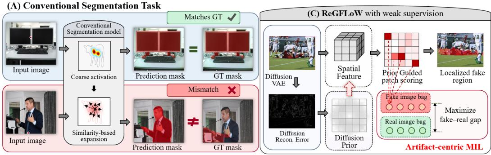
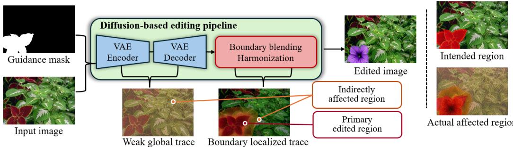
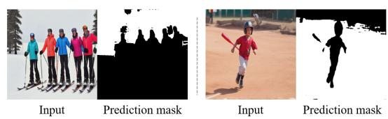
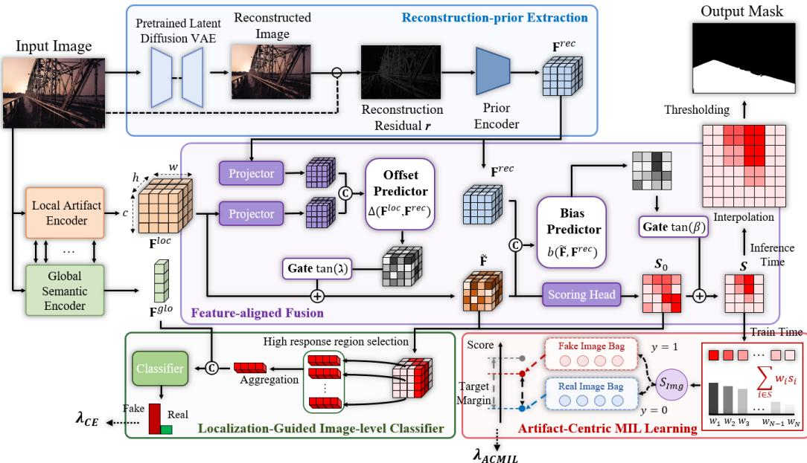
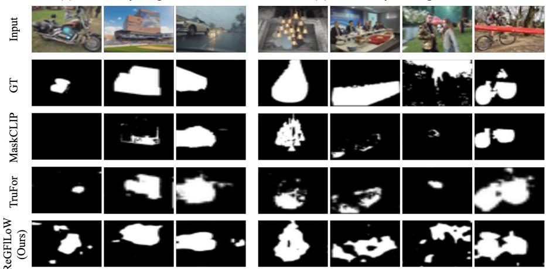
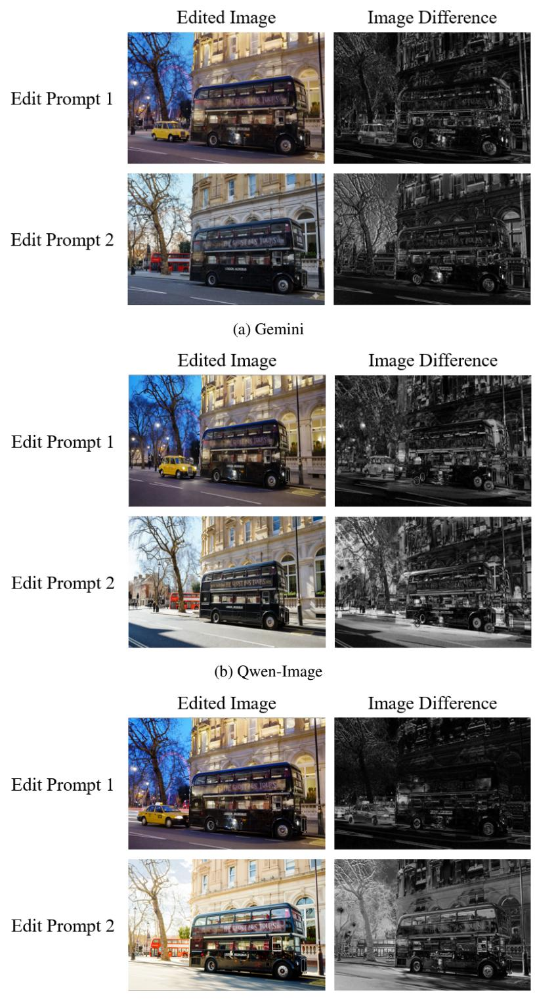
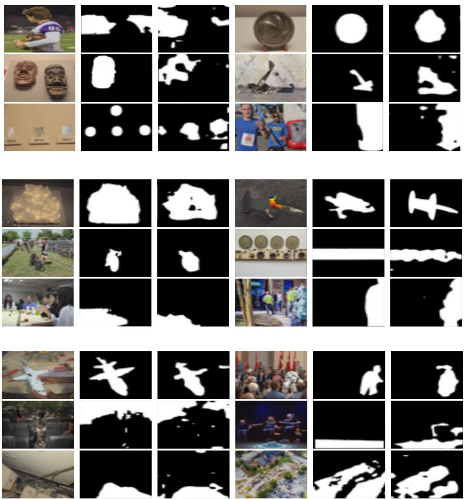

# Less Supervision, Better Generalization: Weakly Supervised Fake Region Localization in Diffusion-Edited Images

Junhee Lee Kyung Hee University jhlee39@khu.ac.kr

Donghyeon Jeon Kyung Hee University amuse\_dh@khu.ac.kr

Taeoh Kim NAVER Cloud taeoh.kim@navercorp.com

Beomyoung Kim NAVER Cloud beomyoung.kim@kaist.ac.kr

MyeongAh Cho∗ Kyung Hee University maycho@khu.ac.kr

## Abstract

Localizing AI-edited regions is essential for interpretable forensic analysis, but remains challenging due to subtle and spatially distributed artifacts that are misaligned with semantic or object boundaries. Existing approaches rely on pixel-level supervision from controlled editing pipelines, which is difficult to scale and can introduce misleading signals: artifacts frequently extend beyond annotated regions, while out-of-mask pixels are treated as authentic. This limits models’ ability to capture transferable evidence and generalize across generators and datasets. To address these issues, we propose ReGFLoW, a Reconstruction-Guided Fake Localization framework under Weak supervision, which is the first weakly supervised approach for diffusion-edited fake region localization. ReGFLoW requires only real/fake labels at the image-level and uses diffusion reconstruction errors as dense spatial guidance to inject them into both feature and score spaces. Furthermore, by artifactcentric multiple instance learning, ReGFLoW utilizes localized diffusion evidence without relying on semantic-affinity or boundary-based pseudo-mask priors. Extensive experiments demonstrate that ReGFLoW achieves stronger out-of-domain generalization than fully supervised learning baselines.

## 1 Introduction

The rapid advancement of generative image models has significantly lowered the barrier to producing highly realistic visual content[1–5]. While these developments enable a wide range of creative applications, they also raise serious concerns regarding the proliferation of synthesized or manipulated images online. As a result, detecting AI-generated images has become a critical issue in digital forensics and security fields[6–9]. However, image-level detection alone provides limited forensic value, as it only indicates whether an image is suspicious without identifying the manipulated regions. To address this limitation, AI-generated image region localization aims to determine authenticity at the regional level[9–17]. This enables more interpretable forensic analysis by providing explicit evidence of where manipulations have occurred, thereby improving explainability for real-world applications.

Among various generative image models, this paper focuses on localizing manipulated regions in images generated or edited by diffusion-based models. Although this task appears similar to conventional semantic segmentation or image manipulation localization[18–22], it poses fundamentally different challenges that existing approaches cannot adequately address. Semantic segmentation and manipulation localization methods are typically designed for objects or background regions with clear boundaries[18–20, 23–31]. However, in diffusion-based editing, the changes are often less structured—for example, slight background alterations, partial edits to objects, or subtle texture inconsistencies that do not correspond to clear semantic regions.[3–5, 10–14, 16] As a result, the diffusion-edited image localization task requires identifying low-level visual traces rather than relying on high-level semantic cues.

  
Figure 1: Motivation of ReGFLoW. (A) Conventional localization tasks, such as semantic segmentation and image manipulation localization, often rely on object- or boundary-aligned targets. (B) Diffusion-edited fake regions can be non-semantic and weakly bounded, making similarity-based expansion unreliable. (C) ReGFLoW introduces reconstruction-guided MIL for weakly supervised fake region localization.

Existing methods for diffusion-edited region localization typically rely on fully supervised learning, using pixel-level manipulation masks generated during the image editing or inpainting process[9, 11– 13]. While this approach is simple and effective in controlled benchmark scenarios, there are two reasons to argue that it is unsuitable for realistic diffusion-edited region localization. First, obtaining accurate pixel-level ground-truth masks at scale is inherently challenging, like other segmentation tasks. However, aside from this, commercial image editing and generation services mainly take text-based inputs, making it difficult to restrict edits to only the masked region.[32–43] Even if a mask image is provided or the target region is well specified in text, the model may still manipulate regions outside the intended region. These issues make it difficult to obtain reliable edit masks during the image editing process. Second, even if the mask is created or obtained by humans, it can lead to unintended behavior due to incorrect supervision. As described above, diffusion-based image manipulation involves latent encoding, denoising, decoding, and blending processes that can leave generation traces beyond the intended editing region defined by the mask.[2–6, 8] However, when imprecise mask-based fully supervised learning is applied without accounting for this, it treats all regions outside the mask as unmanipulated and enforces supervision strictly based on the mask boundaries. Additionally, the misalignment between the mask and the manipulated regions may cause the model to incorrectly learn which regions are manipulated. As a result, the model tends to rely on mask boundaries while ignoring subtle artifacts outside the mask region, leading to spurious correlations. As a result, generalization performance in unseen domains is degraded, as analyzed in detail in Section 2.

Motivated by these issues, we propose the first weakly supervised learning method for diffusionedited fake region localization that uses only image-level real/fake labels for training. This allows the model to learn from a wider range of edited images without relying on pixel-level masks. It also avoids assuming that diffusion artifacts appear only in the edited regions, which helps improve generalization. However, weakly supervised learning alone poses challenges for precise spatial part localization. Unlike weakly supervised semantic segmentation and manipulation localization, the diffusion-edited regions, as shown in Figure 1, are not consistently aligned with semantic object structures, limiting the effectiveness of conventional pseudo-mask refinement and requiring a new task-specific approach for diffusion-edited fake region localization [21–28].

In this paper, we propose ReGFLoW, Reconstruction-Guided Fake Localization under Weak supervision. ReGFLoW learns localization via an artifact-centric multiple instance learning (MIL)

objective, enabling the model to discover diffusion artifact evidence beyond the intended edit mask. The core idea of ReGFLoW is to overcome the limitations of semantic-affinity or boundary-based spatial priors by leveraging diffusion reconstruction error—previously studied mainly for image-level fake detection—as a prior to identifying fake regions. Specifically, the diffusion reconstruction error serves as dense spatial guidance, injected into both the feature and score spaces. This guidance allows the model to learn from the entire image by cueing generalizable diffusion artifacts rather than relying solely on source-specific and mask-bound patterns.

Our contributions are summarized as follows:

• We provide a systematic analysis of pixel-level mask supervision for diffusion-edited localization, identifying two generalization-limiting factors: pixel-level masks are often unavailable in realistic data, and mask-based supervised training can suppress transferable diffusion traces by treating out-of-mask regions as belonging to the real class.

• To overcome these generalization limits, we formulate, to the best of our knowledge, the first weakly supervised setting for diffusion-edited fake region localization, where models learn spatial localization from image-level real/fake labels rather than pixel-level manipulation masks.

• We propose ReGFLoW, a Reconstruction-Guided Fake Localization framework under Weak supervision. ReGFLoW repurposes diffusion reconstruction error from image-level fake detection into dense spatial guidance, and combines it with an artifact-centric multiple instance learning objective to localize diffusion artifacts without object- or boundary-based pseudo-mask priors.

• Extensive quantitative, qualitative, and analytical results show that ReGFLoW achieves stronger out-of-domain localization than fully supervised baselines, particularly on unseen generators and cross-dataset evaluations.

## 2 Rethinking Supervision for Diffusion-Edited Localization

## 2.1 Pixel Masks Limit Broad-Domain Training

A central goal of diffusion-edited image detection is to build a detector that generalizes across diverse generators (including both models and services) [9–14, 16, 17] and image distributions. Existing research methods train on a single source domain—such as a specific generator or image distribution—and evaluate on unseen domains, which limits cross-domain generalization since the training domain remains fixed. However, real-world systems must be trained across a broader set of domains, as generative models and editing services continue to diversify rapidly [32, 34–36, 38– 43]. Therefore, it is important to move beyond such constrained protocols and more deeply study generalization for diffusion-edited image detection.

This goal exposes a fundamental limitation of pixel-level supervision, as localization requires pixellevel manipulation masks. However, many commercial generative and editing systems are textconditioned and do not provide mask-based interfaces, making such masks difficult to obtain from the final outputs (More details in Sec A). As a result, pixel-level supervision restricts training to a limited set of controlled sources where masks are explicitly available. Weak supervision is therefore particularly suitable for diffusion-edited localization: it not only reduces annotation cost by using image-level labels, but also enables learning from broader and more realistic data distributions (Results in Table 5).

## 2.2 Pixel Masks Can Provide Misleading Supervision for Diffusion Artifacts

Even when pixel-level masks are available, they can provide misleading supervision for learning diffusion artifacts. While conventional image manipulations are often approximated with variations confined to selected regions [18–20, 29–31], diffusion-based editing can affect a larger spatial region than the intended editing mask [2–5]. As shown in Figure 2, the provided mask indicates the area where editing is intended, but, due to the nature of the diffusion model, the diffusion trace can be extended beyond that mask through mapping to the latent space via the VAE and subsequent blending or harmonization [2, 4, 5, 8]. Therefore, the masks provided alone should not be considered as a correct answer label for the diffusion-edited fake region localization.

  
Figure 2: Conceptual illustration of mask incompleteness in diffusion-based editing. The guidance mask indicates the intended edit region, but latent processing and blending can introduce weak global or boundary-localized traces beyond the mask. Thus, the manipulation mask should not be treated as a complete label for all diffusion artifacts.

These discrepancies directly affect supervised learning, and consequently also affect generalization. Pixel mask supervised learning assigns fake labels to pixels inside the mask and real labels to all pixels outside the mask. If the mask outer region contains weak but transferable diffusion traces, the model is trained to suppress evidence that may arise during the diffusion process itself [6, 8]. Thus, the model relies on stronger but less transferable clues, such as the boundaries of objects confined to masks, specific generative models, or patterns in dataset distributions [9–14]. As a result, if these source-specific clues are absent or weakened in unseen regions, the affected regions may be misclassified as authentic rather than fake.

We observe this tendency in a qualitative motivating example. As shown in Figure 3, the input is an out-of-domain fully synthetic image, where the entire image should be treated as fake. However, the fully supervised baseline predicts only an object-shaped region and suppresses large fake areas as real. This indicates that the model does not simply make boundary errors, but can fail to recognize fake evidence outside the mask-aligned patterns learned during training.

This behavior suggests that mask-supervised training can bias the model toward mask-aligned or source-specific cues, rather than transferable diffusion artifacts. When such cues do not hold in unseen domains, fake regions can be missed and classified as real. These observations motivate moving beyond a purely fully supervised mask-prediction paradigm. Rather than serving only as a lower-cost alternative to dense annotation, weak supervision provides a better-aligned formulation for learning generalizable diffusion artifact cues from image-level labels without forcing all out-of-mask regions to be labeled as real [21, 22, 44–46].

  
Figure 3: Failure case on an out-of-domain fully synthetic image. Although the entire image is fake, the mask-supervised baseline predicts only an object-shaped region and misses large fake areas.

## 3 Method

## 3.1 Overview

Figure 4 illustrates the overall pipeline. ReGFLoW learns fake region localization in diffusion-edited images using only image-level real/fake labels. Since diffusion-edited artifacts include both semantic inconsistencies and subtle low-level traces, we use a dual-encoder backbone to capture global semantic cues and local artifact-sensitive features, with intermediate cross-attention exchanging information between the two streams[47, 48].

Starting from the resulting dense feature representation, the model proceeds in three steps: (i) a diffusion reconstruction error map is computed and aligned with the local feature space to provide a dense patch-level prior, (ii) the prior is injected into the feature and score spaces through a reconstruction-guided patch scoring module, producing a patch score map, and (iii) the score map is trained end-to-end with an artifact-centric multiple instance learning (MIL) objective using only image-level labels[44, 46, 49]. In addition, the localization feature and score map guide the imagelevel classifier by providing artifact-focused regional evidence.

  
Figure 4: Overview of the proposed ReGFLoW framework. ReGFLoW integrates dual-encoder features and a diffusion reconstruction prior for patch-level fake evidence estimation under weak supervision. The resulting score map is optimized with artifact-centric MIL and used for fake-region localization and image-level classification.

## 3.2 Reconstruction-Guided Patch Scoring

Diffusion reconstruction error as a dense prior. Reconstruction error from pretrained diffusion autoencoders has been used as an effective cue for AI-generated image detection [6, 8]. Following this observation, we use the frozen Variational Autoencoder (VAE) of SD1 [2, 50] as a diffusion-aligned reconstructor, since it provides a widely used latent-diffusion reconstruction prior without additional training. Since diffusion-synthesized content has already been projected through this learned latent manifold, it is often reconstructed with a smaller or more regular residual than natural real-image content. We adapt this reconstruction residual as a spatial prior for localization, allowing the network to relate reconstruction patterns to diffusion artifacts at each image region.

Given an input image I, we compute the reconstruction residual using the frozen VAE of SD1:

$$
\mathbf { r } \ = \ | \ I - { \mathcal { D } } ( { \mathcal { E } } ( I ) ) | ,\tag{1}
$$

where $\mathcal { E }$ and D are the frozen VAE encoder and decoder, respectively, and the absolute difference is taken channel-wise. We use r as the reconstruction prior.

Feature-aligned fusion. Let $\mathrm { E n c } _ { \mathrm { l o c } }$ denote the local artifact encoder, which produces a $3 2 \times 3 2$ patch feature map from the input image. We obtain $\mathbf { F } ^ { \mathrm { l o c } } = \mathrm { A v g P o o l } _ { 2 \times } ( \operatorname { E n c } _ { \mathrm { l o c } } ( \dot { I } ) ) \in \mathbb { R } ^ { B \times C \times 1 6 \times 1 6 }$ where $C = 7 6 8$ . This compact grid prevents the MIL bag from becoming too large, which improves loss propagation and stabilizes weakly supervised training. Since r is defined in image space, we align it to the same $1 6 \times 1 6$ patch grid before fusion. Let $\operatorname { E n c } _ { \mathrm { p r i o r } }$ denote the three-layer convolutional Prior Encoder; we compute $\mathbf { F } ^ { \mathrm { r e c } } = \mathrm { A v g P o o l } _ { 2 \times } ( \mathrm { E n c } _ { \mathrm { p r i o r } } ( \dot { \mathbf { r } } ) ) \in \mathbb { R } ^ { B \times C _ { \mathrm { r e c } } \times 1 6 \times 1 6 }$ , where $C _ { \mathrm { r e c } } = 3 2$ We inject the reconstruction prior in two complementary ways: (i) Feature-aligned Fusion through residual feature correction and (ii) Bias Prediction through a zero-initialized reconstruction logit bias.

Residual feature fusion. Let $P _ { \mathrm { l o c } }$ and $P _ { \mathrm { r e c } }$ denote two separate convolutional Projectors for Floc and $\mathbf { F } ^ { \mathrm { r e c } }$ , respectively. The convolutional Offset Predictor $G _ { \Delta }$ then predicts the correction offset from their channel-wise concatenation:

$$
\begin{array} { r } { \Delta ( \mathbf { F } ^ { \mathrm { l o c } } , \mathbf { F } ^ { \mathrm { r e c } } ) = G _ { \Delta } \big ( \big [ P _ { \mathrm { l o c } } ( \mathbf { F } ^ { \mathrm { l o c } } ) ; P _ { \mathrm { r e c } } ( \mathbf { F } ^ { \mathrm { r e c } } ) \big ] \big ) . } \end{array}\tag{2}
$$

The offset provides a gated residual correction, so reconstruction cues can adjust local artifact features without replacing them:

$$
\widetilde { \mathbf { F } } = \mathbf { F } ^ { \mathrm { l o c } } + \mathrm { t a n h } ( \gamma ) \cdot \Delta ( \mathbf { F } ^ { \mathrm { l o c } } , \mathbf { F } ^ { \mathrm { r e c } } ) ,\tag{3}
$$

where $\gamma$ is a learnable scalar initialized to 0.05. The tanh(·) gate makes the fusion start as a nearidentity operation and gradually activates as training progresses, preventing the reconstruction prior from destabilizing early-stage optimization. The resulting feature $ { \widetilde { \mathbf { F } } } \in  { \mathrm { ~ \mathbb { R } } } ^ { B \times C \times 1 6 \times 1 6 }$ is used for patch-level scoring.

Zero-initialized reconstruction logit bias. The fused feature $\widetilde { \mathbf { F } }$ is passed to the one-hidden-layer convolutional Scoring Head, which produces a base patch logit map $\mathbf { S } _ { 0 } \in \mathbb { R } ^ { B \times 1 6 \times 1 6 }$ . To further refine the final patch scores, the Bias Predictor b takes the channel-wise concatenation of $\widetilde { \mathbf { F } }$ and Frec and predicts a reconstruction logit bias $b ( \widetilde { { \bf F } } , { \bf F } ^ { \mathrm { r e c } } ) \in \mathbb { R } ^ { B \times 1 6 \times 1 6 }$

$$
{ \bf S } = { \bf S } _ { 0 } + \operatorname { t a n h } ( \beta ) \cdot b ( \widetilde { \bf F } , { \bf F } ^ { \mathrm { r e c } } ) ,\tag{4}
$$

where the final $1 \times 1$ output convolution of b is zero-initialized, and $\beta$ is a learnable scalar initialized to 0.05. Because the bias branch initially outputs zero, the model starts with $\mathbf { S } = \mathbf { S } _ { 0 } , \mathrm { i . e . }$ , it behaves identically to a baseline without reconstruction logit bias; the bias term grows only as training provides evidence for its utility.

Together, Eqs. (2)–(4) inject the reconstruction prior into both feature and score spaces, while the gated residual path and zero-initialized bias keep the initial behavior close to the baseline for stable joint optimization.

## 3.3 Weakly Supervised Training Objective

MIL view of patch scoring. The final logit map $\mathbf { S } \in \mathbb { R } ^ { B \times 1 6 \times 1 6 }$ is interpreted as a bag of patch instances. For a fake image, at least some patches are expected to contain diffusion-generated traces, whereas a real image should not contain such artifact-positive patches. Let $\mathcal { F }$ and R denote the fake and real image sets in a batch, respectively. The objective encourages the aggregated artifact score of each fake image to exceed that of each real image, i.e., $\hat { s } _ { i } > \hat { s } _ { j }$ for $i \in \mathcal { F }$ and $j \in \mathcal R$ , where sˆ denotes image-level artifact evidence aggregated from patch logits.

Compared with global pooling, which can dilute small fake regions or encourage broad responses, MIL focuses supervision on the most suspicious patches. This better matches the partial and spatially variable nature of fake regions while still supporting fully synthetic images.

Artifact-centric MIL loss. Let $\{ s _ { i , n } \} _ { n = 1 } ^ { N }$ denote the flattened patch logits of image i, where $N = 1 6 \times 1 6$ . Rather than using hard top-k selection, we use image-wise normalized softmax aggregation to handle large variations in fake-region size[45]:

$$
\hat { s } _ { i } = \sum _ { n = 1 } ^ { N } \alpha _ { i , n } s _ { i , n } , \qquad \alpha _ { i , n } = \frac { \exp ( \kappa z _ { i , n } ) } { \sum _ { m = 1 } ^ { N } \exp ( \kappa z _ { i , m } ) } , \qquad z _ { i , n } = \frac { s _ { i , n } - \mu _ { i } } { \sigma _ { i } + \epsilon } ,\tag{5}
$$

where $z _ { i , n }$ is the image-wise standardized logit, $\mu _ { i }$ and $\sigma _ { i }$ are the mean and standard deviation of the patch logits in image i, and κ controls the sharpness of the aggregation. This aggregation acts as a soft top-k operator, emphasizing patches with strong artifact evidence while remaining fully differentiable. This is well suited to weakly supervised fake region localization in diffusion-edited images, where artifact traces may be weak and spatially diffuse, and the fake region size can vary across samples.

We enforce this ordering with a margin-based pairwise artifact-centric MIL loss:

$$
\mathcal { L } _ { \mathrm { a c m i l } } ~ = ~ \frac { 1 } { | \mathcal { F } | | \mathcal { R } | } \sum _ { \stackrel { i \in \mathcal { F } } { j \in \mathcal { R } } } \mathrm { s o f t p l u s } \big ( m - \hat { s } _ { i } + \hat { s } _ { j } \big ) ,\tag{6}
$$

where $m > 0$ is a margin hyperparameter. This loss penalizes fake–real pairs whose artifact-score gap is smaller than the margin, thereby propagating image-level supervision to the patch score map.

Table 1: P setting (partial edited images only). Pixel-level performance on OpenSDID benchmark. OOD Avg denotes the average over four cross-domain generators: SD2.1, SDXL, SD3, and Flux.1.
<table><tr><td rowspan="2">Supervision</td><td rowspan="2">Method</td><td rowspan="2">Metric</td><td>In-domain</td><td colspan="4">Cross-domain</td><td colspan="2">Average</td></tr><tr><td>SD1.5</td><td>SD2.1</td><td>SDXL</td><td>SD3</td><td>Flux.1</td><td>Avg.</td><td>OOD Avg.</td></tr><tr><td rowspan="4">Full</td><td>MaskCLIP [9]</td><td>F1 IoU</td><td>75.8 68.6</td><td>63.2 56.1</td><td>35.2 29.5</td><td>49.8 42.7</td><td>18.4 14.8</td><td>48.5 42.4</td><td>41.7 35.8</td></tr><tr><td>TruFor [19]</td><td>F1 IoU</td><td>71.0 63.4</td><td>61.9 54.7</td><td>31.9 26.5</td><td>38.5 32.2</td><td>9.70 7.60</td><td>42.6 36.9</td><td>35.5 30.3</td></tr><tr><td>IML-ViT [18]</td><td>F1 IoU</td><td>73.6 66.5</td><td>50.6 44.8</td><td>26.0 21.5</td><td>28.3 23.6</td><td>7.91 6.11</td><td>37.3 32.5</td><td>28.2 24.0</td></tr><tr><td>PSCC-Net [51]</td><td>F1 IoU</td><td>64.2 54.7</td><td>44.8 36.7</td><td>26.1 19.7</td><td>37.3 29.3</td><td>11.6 8.2</td><td>36.8 29.7</td><td>29.9 23.5</td></tr><tr><td>Weak</td><td>Ours</td><td>F1 IoU</td><td>49.3 36.9</td><td>46.3 33.8</td><td>34.9 23.6</td><td>43.9 30.9</td><td>29.2 19.0</td><td>40.7 28.8</td><td>38.6 26.8</td></tr></table>

Image-level branch. In addition to localization, ReGFLoW predicts an image-level real/fake label. The selected CLS features from the global semantic encoder are aggregated with a single-layer attention module to obtain a global image embedding. Rather than classifying this embedding alone, we aggregate the top 10% high-response locations of $\widetilde { \mathbf { F } }$ using masked softmax attention from image-wise normalized S. The resulting artifact-focused context is concatenated with the global image embedding and classified by a two-layer MLP with standard cross-entropy $\mathcal { L } _ { \mathrm { c e } }$

Overall objective. The full training objective is

$$
{ \mathcal { L } } = \lambda _ { \mathrm { a c m i l } } { \mathcal { L } } _ { \mathrm { a c m i l } } + \lambda _ { \mathrm { c e } } { \mathcal { L } } _ { \mathrm { c e } } + \lambda _ { \mathrm { r e a l } } { \mathcal { L } } _ { \mathrm { r e a l } } + \lambda _ { \mathrm { s m o o t h } } { \mathcal { L } } _ { \mathrm { s m o o t h } } .\tag{7}
$$

Here, $\mathcal { L } _ { \mathrm { r e a l } }$ is a real-image hard-negative suppression term that discourages high fake scores on real-image patches, and $\mathcal { L } _ { \mathrm { s m o o t h } }$ is an edge-aware smoothness term that promotes spatially coherent localization while preserving image boundaries. Their detailed formulations are provided in Appendix B.

Inference and calibration. At inference, S is bilinearly upsampled to the input resolution. Before thresholding, we apply image-wise adaptive calibration to account for sample-dependent score distributions under weak supervision. Each score map is normalized by its own mean and standard deviation, with the offset adjusted according to its mean uncalibrated positive response. The calibrated probability map is then thresholded to obtain the final fake-region mask. Detailed formulations are provided in Appendix B.6.

## 4 Experiments

## 4.1 Experimental Setup

We conduct experiments on OpenSDID, a benchmark for diffusion-generated and diffusion-edited image detection and localization [9]. Following the OpenSDID protocol, we train on the SD1.5 split and evaluate on SD1.5 as the in-domain setting and on SD2.1, SDXL, SD3, and Flux.1 as crossdomain settings. Although OpenSDID provides both image-level real/fake labels and pixel-level masks, ReGFLoW uses only image-level labels during training. Pixel-level masks are reserved solely for evaluation. Architectural and training details, including the backbone configuration, are provided in Appendix C.

## 4.2 Pixel-Level Localization Evaluation

In Table 1, where evaluation is performed only on partially edited fake images, fully supervised baselines achieve strong in-domain scores on SD1.5 but degrade sharply on unseen generators. This is consistent with our analysis in Section 2 that pixel-mask supervision binds the model to mask-confined, source-specific cues that fail to transfer. In contrast, ReGFLoW, despite using only image-level labels, achieves competitive OOD Avg F1 (38.6), surpassing most fully supervised baselines with markedly more stable cross-domain behavior. The benefit is most pronounced on Flux.1 (29.2 vs. 18.4), the generator most distant from SD1.5, demonstrating that reconstructionguided weak supervision effectively captures transferable diffusion traces where mask-bounded supervision fails.

Table 2: P+F setting (partial edited and fully synthetic images). Pixel-level F1 evaluated on OpenS-DID. OOD Avg denotes the average over four cross-domain generators. Our weakly supervised method achieves the best OOD Avg without pixel-level mask supervision.
<table><tr><td rowspan="2">Supervision</td><td rowspan="2">Method</td><td>In-domain</td><td colspan="4">Cross-domain</td><td colspan="2">Average</td></tr><tr><td>SD1.5</td><td>SD2.1</td><td>SDXL</td><td>SD3</td><td>Flux.1</td><td>Avg.</td><td>OOD Avg.</td></tr><tr><td>Full</td><td>MaskCLIP [9]</td><td>95.1</td><td>73.2</td><td>20.8</td><td>17.7</td><td>4.8</td><td>42.3</td><td>29.1</td></tr><tr><td>Weak</td><td>Ours</td><td>35.6</td><td>33.4</td><td>30.1</td><td>32.2</td><td>29.4</td><td>32.2</td><td>31.3</td></tr></table>

Table 3: Image-level detection performance on OpenSDID. OOD Avg denotes the average over four cross-domain generators: SD2.1, SDXL, SD3, and Flux.1.
<table><tr><td rowspan="2">Approach Method</td><td rowspan="2"></td><td colspan="2">SD1.5</td><td colspan="2">SD2.1</td><td colspan="2">SDXL</td><td colspan="2">SD3</td><td colspan="2">Flux.1</td><td colspan="2"> $\mathbf { A v } \mathbf { g }$ </td><td colspan="2">OOD Avg</td></tr><tr><td>F1</td><td>ACC</td><td>F1</td><td>ACC</td><td>F1</td><td>ACC</td><td>F1</td><td>ACC</td><td>F1</td><td>ACC</td><td>F1</td><td>ACC</td><td>F1</td><td>ACC</td></tr><tr><td rowspan="4">Image only</td><td>CNNDet[52]</td><td>84.60</td><td>85.04</td><td>71.56</td><td>75.94</td><td>59.70</td><td>68.72</td><td>56.27</td><td>67.08</td><td>35.72</td><td>57.57</td><td>61.57</td><td>70.87</td><td>55.81</td><td>67.33</td></tr><tr><td>GramNet[53]</td><td>80.51</td><td>80.35</td><td>74.01</td><td>76.66</td><td>65.28</td><td>70.76</td><td>64.35</td><td>70.29</td><td>52.00</td><td>63.37</td><td>67.23</td><td>72.29</td><td>63.91</td><td>70.27</td></tr><tr><td>FreqNet[54]</td><td>75.88</td><td>77.70</td><td>60.97</td><td>68.37</td><td>53.15</td><td>64.02</td><td>53.50</td><td>64.37</td><td>38.47</td><td>57.08</td><td>56.39</td><td>66.31</td><td>51.52</td><td>63.46</td></tr><tr><td>NPR[55]</td><td>79.41</td><td>79.28</td><td>81.67</td><td>81.84</td><td>72.12</td><td>74.28</td><td>73.43</td><td>75.47</td><td>67.62</td><td>71.36</td><td>74.85</td><td>76.45</td><td>73.71</td><td>75.74</td></tr><tr><td rowspan="4">Image &amp;Pixel</td><td>TruFor[19]</td><td>90.12</td><td>97.73</td><td>35.93</td><td>55.62</td><td>58.04</td><td>66.41</td><td>59.73</td><td>67.51</td><td>49.12</td><td>61.62</td><td>58.59</td><td>69.78</td><td>50.70</td><td>62.79</td></tr><tr><td>IML-ViT[18]</td><td>94.47</td><td>75.73</td><td>69.70</td><td>61.19</td><td>40.98</td><td>49.95</td><td>44.69</td><td>51.25</td><td>18.20</td><td>43.62</td><td>53.61</td><td>56.35</td><td>43.39</td><td>51.50</td></tr><tr><td>MaskCLIP[9]</td><td>91.28</td><td>91.47</td><td>83.36</td><td>85.28</td><td>72.90</td><td>77.98</td><td>67.79</td><td>74.95</td><td>53.08</td><td>67.12</td><td>73.68</td><td>79.36</td><td>69.28</td><td>76.33</td></tr><tr><td>Ours</td><td>93.02</td><td>93.08</td><td>91.34</td><td>91.73</td><td>79.89</td><td>82.63</td><td>76.87</td><td>80.62</td><td>56.78</td><td>68.76</td><td>79.58</td><td>83.36</td><td>76.22</td><td>80.93</td></tr></table>

Table 2 evaluates the more realistic setting where both training and evaluation contain partially edited and fully synthetic fake images. Here the limitation of mask-based supervision becomes far more severe: MaskCLIP retains high in-domain F1 (95.1) but collapses across all unseen generators, yielding only 29.1 OOD Avg. ReGFLoW instead achieves the highest OOD Avg F1 (31.3) with uniform cross-domain behavior, surpassing its fully supervised counterpart without any pixel-level supervision. This suggests stronger generalization not only across image distributions, but also across fake-image types, as localization in this setting must handle both localized edits and fully generated images.

## 4.3 Image-Level Detection Evaluation

Table 3 reports image-level detection performance on OpenSDID. Although ReGFLoW is primarily designed for localization, its image-level branch directly leverages localization information by fusing high-response regions from the patch score map with the global CLS embedding before classification, providing the detector with artifact-focused regional evidence rather than relying solely on a wholeimage representation. As a result, ReGFLoW achieves the highest OOD Avg, outperforming not only image-only baselines but also methods that additionally use pixel-mask supervision. Notably, image only baselines generally surpass methods jointly trained with pixel-mask supervision in OOD Avg, suggesting that mask annotations bias the model toward source-specific spatial patterns that hinder cross-domain transfer even at the image level. ReGFLoW circumvents this trade-off by deriving regional evidence from weakly supervised, reconstruction-guided localization, thereby benefiting from spatial information without inheriting the generalization cost of pixel-mask supervision.

## 4.4 Ablation Studies

Table 4 ablates the main modules shown in Figure 4. Feature-aligned fusion uses the reconstruction prior to modulate local artifact features through a gated offset, while the bias predictor adds reconstruction-guided evidence directly to the patch score map. Artifact-

Table 4: Ablation studies of ReGFLoW modules. The module names follow Figure 4.
<table><tr><td rowspan="2">Method</td><td rowspan="2">Predictor</td><td colspan="3">Bias Feature-aligned Artifact-Centric|</td></tr><tr><td>Fusion</td><td>MIL</td><td>Pixel F1</td></tr><tr><td>ReGFLoW</td><td>√</td><td>√</td><td>√</td><td>49.38</td></tr><tr><td>w/o Bias Predictor ×</td><td></td><td>√</td><td>√</td><td>46.06</td></tr><tr><td>w/o Reconstruction Prior</td><td>×</td><td>×</td><td>√</td><td>38.08</td></tr><tr><td>Score-Pooling BCE</td><td>×</td><td>X</td><td>X</td><td>32.34</td></tr></table>

centric MIL denotes our adaptive top-k aggregation with fake-real pairwise ranking supervision.

(a) Boundary-aligned Edits  
  
(b) Boundary-unaligned Edits  
Figure 5: Qualitative comparison on out-of-domain fake-region localization. MaskCLIP [9] and TruFor [19] are fully supervised, whereas Ours is weakly supervised. The examples include (a) boundary-aligned edits and (b) boundary-unaligned edits, where boundaries provide limited guidance.

Removing the bias predictor weakens the score-level use of the reconstruction prior, and removing the reconstruction prior entirely causes a larger drop. Replacing artifact-centric MIL with image-level BCE on a pooled score further degrades performance, showing that both reconstruction-guided scoring and artifact-centric weak supervision are important for localization.

## 4.5 Scaling to Broader Training Domains

A practical motivation for weak supervision, as discussed in Section 2, is that it enables training on broader and more diverse data sources without requiring pixel-level masks. We test whether ReGFLoW can convert this flexibility into improved cross-domain localization. Using OpenSDID, we extend the SD1.5 training set with one additional source domain while keeping the total number of training images fixed, isolat-

Table 5: Effect of source-domain diversity on ReGFLoW’s cross-domain localization. Each row adds one source domain to SD1.5 while keeping the total training size fixed.
<table><tr><td>Train</td><td>SD2</td><td>SD3</td><td>SDXL</td><td>FLUX</td><td>Avg. ∆</td></tr><tr><td>SD1.5</td><td>40.96</td><td>38.09</td><td>29.36</td><td>24.12</td><td></td></tr><tr><td>+ SD2</td><td></td><td>42.34 (+4.25) 33.73 (+4.37) 28.71 (+4.60)</td><td></td><td></td><td>+4.40</td></tr><tr><td>+ SD3</td><td>42.75 (+1.79)</td><td></td><td></td><td>34.48 (+5.12) 30.96 (+6.84) +4.58</td><td></td></tr><tr><td>+ SDXL</td><td></td><td>40.88 (-0.08) 41.84 (+3.75)</td><td></td><td>31.00 (+6.88)</td><td>+3.52</td></tr><tr><td>+ FLUX</td><td></td><td>41.57 (+0.61) 43.82 (+5.73) 34.47 (+5.11)</td><td></td><td></td><td>+3.82</td></tr></table>

ing the effect of domain diversity from data scale by uniformly subsampling each source. As shown in Table 5, adding any single source domain consistently improves average pixel-level F1 on unseen domains, with the largest gains observed on the most distant generators where SD1.5-only training provides the weakest baseline. These results show that weak supervision is not merely a lower-cost alternative to dense annotation, but a practical means of scaling diffusion-edited localization to the broader data distributions that pixel-mask supervision cannot accommodate.

## 4.6 Qualitative Analysis

Figure 5 presents qualitative localization results on out-of-domain examples. We include (a) boundary aligned edits, similar to conventional segmentation-style data, as well as (b) boundary-unaligned cases involving background edits, partial changes inside an object, and multiple manipulated objects. We compare ReGFLoW with fully supervised baselines, MaskCLIP and TruFor. These examples show that when object boundaries provide limited guidance, ReGFLoW better localizes artifact evidence itself rather than simply following semantic or object-aligned regions.

## 5 Conclusion

In this paper, we presented ReGFLoW, a weakly-supervised framework for AI-edited fake region localization. To address the limitations of fully-supervised methods—namely, the difficulty of collecting scalable annotations and the risk of misleading supervision signals—ReGFLoW learns from image-level real/fake labels and leverages diffusion reconstruction error as dense spatial guidance. Experiments on OpenSDI and other diffusion-edited benchmarks show that ReGFLoW generalizes better than the full-supervised baseline across diverse generators and image distrubitons. These results suggest that weakly supervised learning is a practical formulation for learning generalizable features for AI-edited fake region localization as a scalable alternative to mask-supervised frameworks.

## References

[1] Jonathan Ho, Ajay Jain, and Pieter Abbeel. Denoising diffusion probabilistic models. In Advances in Neural Information Processing Systems, 2020.

[2] Robin Rombach, Andreas Blattmann, Dominik Lorenz, Patrick Esser, and Björn Ommer. High-resolution image synthesis with latent diffusion models. In Proceedings of the IEEE/CVF Conference on Computer Vision and Pattern Recognition, 2022.

[3] Chenlin Meng, Yutong He, Yang Song, Jiaming Song, Jiajun Wu, Jun-Yan Zhu, and Stefano Ermon. SDEdit: Guided image synthesis and editing with stochastic differential equations. In International Conference on Learning Representations, 2022.

[4] Omri Avrahami, Dani Lischinski, and Ohad Fried. Blended diffusion for text-driven editing of natural images. In Proceedings ofthe IEEE/CVF Conference on Computer Vision and Pattern Recognition, 2022.

[5] Andreas Lugmayr, Martin Danelljan, Andres Romero, Fisher Yu, Radu Timofte, and Luc Van Gool. RePaint: Inpainting using denoising diffusion probabilistic models. In Proceedings of the IEEE/CVF Conference on Computer Vision and Pattern Recognition, 2022.

[6] Zhendong Wang, Jianmin Bao, Wengang Zhou, Weilun Wang, Hezhen Hu, Hong Chen, and Houqiang Li. DIRE for diffusion-generated image detection. In Proceedings ofthe IEEE/CVF International Conference on Computer Vision, 2023.

[7] Christos Koutlis and Symeon Papadopoulos. Leveraging representations from intermediate encoder-blocks for synthetic image detection. In European Conference on Computer Vision, 2024.

[8] Jonas Ricker, Denis Lukovnikov, and Asja Fischer. AEROBLADE: Training-free detection of latent diffusion images using autoencoder reconstruction error. In Proceedings ofthe IEEE/CVF Conference on Computer Vision and Pattern Recognition, pages 9130–9140, 2024.

[9] Yabin Wang, Zhiwu Huang, and Xiaopeng Hong. OpenSDI: Spotting diffusion-generated images in the open world. In Proceedings ofthe IEEE/CVF Conference on Computer Vision and Pattern Recognition, 2025.

[10] Hannes Mareen, Dimitrios Karageorgiou, Glenn Van Wallendael, Peter Lambert, and Symeon Papadopoulos. TGIF: Text-guided inpainting forgery dataset. In IEEE International Workshop on Information Forensics and Security, 2024.

[11] Valentina Bazyleva, Nicolo Bonettini, and Gaurav Bharaj. X-Edit: Detecting and localizing edits in images altered by text-guided diffusion models. In Proceedings ofthe IEEE/CVF Conference on Computer Vision and Pattern Recognition Workshops, 2025.

[12] Rui Zhang, Hongxia Wang, Hangqing Liu, Yang Zhou, and Qiang Zeng. DEAL-300K: Diffusion-based editing area localization with a 300k-scale dataset and frequency-prompted baseline, 2025.

[13] Zhenglin Huang, Jinwei Hu, Xiangtai Li, Yiwei He, Xingyu Zhao, Bei Peng, Baoyuan Wu, Xiaowei Huang, and Guangliang Cheng. SIDA: Social media image deepfake detection, localization and explanation with large multimodal model. In Proceedings ofthe IEEE/CVF Conference on Computer Vision and Pattern Recognition, 2025.

[14] Hannes Mareen, Dimitrios Karageorgiou, Paschalis Giakoumoglou, Peter Lambert, Symeon Papadopoulos, and Glenn Van Wallendael. TGIF2: Extended text-guided inpainting forgery dataset & benchmark, 2026.

[15] Lvpan Cai, Haowei Wang, Jiayi Ji, Yanshu Zhoumen, Shen Chen, Taiping Yao, and Xiaoshuai Sun. Zooming in on fakes: A novel dataset for localized ai-generated image detection with forgery amplification approach. In Proceedings ofthe AAAI Conference on Artificial Intelligence, 2026.

[16] Alex Costanzino, Woody Bayliss, Juil Sock, Marc Gorriz Blanch, Danijela Horak, Ivan Laptev, Philip Torr, and Fabio Pizzati. Towards reliable identification of diffusion-based image manipulations. In Advances in Neural Information Processing Systems, 2025.

[17] Hengrui Kang, Siwei Wen, Zichen Wen, Junyan Ye, Weijia Li, Peilin Feng, Baichuan Zhou, Bin Wang, Dahua Lin, Linfeng Zhang, and Conghui He. LEGION: Learning to ground and explain for synthetic image detection. In Proceedings of the IEEE/CVF International Conference on Computer Vision, 2025.

[18] Xiaochen Ma, Bo Du, Zhuohang Jiang, Xia Du, Ahmed Y. Al Hammadi, and Jizhe Zhou. IML-ViT: Benchmarking image manipulation localization by vision transformer, 2023.

[19] Fabrizio Guillaro, Davide Cozzolino, Avneesh Sud, Nicholas Dufour, and Luisa Verdoliva. TruFor: Leveraging all-round clues for trustworthy image forgery detection and localization. In Proceedings of the IEEE/CVF Conference on Computer Vision and Pattern Recognition, 2023.

[20] Xiao Guo, Xiaohong Liu, Zhiyuan Ren, Steven Grosz, Iacopo Masi, and Xiaoming Liu. Hierarchical fine-grained image forgery detection and localization. In Proceedings ofthe IEEE/CVF Conference on Computer Vision and Pattern Recognition, 2023.

[21] Yuanhao Zhai, Tianyu Luan, David Doermann, and Junsong Yuan. Towards generic image manipulation detection with weakly-supervised self-consistency learning. In Proceedings of the IEEE/CVF International Conference on Computer Vision, 2023.

[22] Dragos-Constantin Tantaru, Elisabeta Oneata, and Dan Oneata. Weakly-supervised deepfake localization in diffusion-generated images. In Proceedings of the IEEE/CVF Winter Conference on Applications of Computer Vision, 2024.

[23] Bolei Zhou, Aditya Khosla, Agata Lapedriza, Aude Oliva, and Antonio Torralba. Learning deep features for discriminative localization. In Proceedings ofthe IEEE Conference on Computer Vision and Pattern Recognition, 2016.

[24] Alexander Kolesnikov and Christoph H. Lampert. Seed, expand and constrain: Three principles for weakly-supervised image segmentation. In European Conference on Computer Vision, 2016.

[25] Jiwoon Ahn and Suha Kwak. Learning pixel-level semantic affinity with image-level supervision for weakly supervised semantic segmentation. In Proceedings of the IEEE Conference on Computer Vision and Pattern Recognition, 2018.

[26] Jiwoon Ahn, Sunghyun Cho, and Suha Kwak. Weakly supervised learning of instance segmentation with inter-pixel relations. In Proceedings of the IEEE/CVF Conference on Computer Vision and Pattern Recognition, 2019.

[27] Yude Wang, Jie Zhang, Meina Kan, Shiguang Shan, and Xilin Chen. Self-supervised equivariant attention mechanism for weakly supervised semantic segmentation. In Proceedings ofthe IEEE/CVF Conference on Computer Vision and Pattern Recognition, 2020.

[28] Zhaozheng Chen, Tan Wang, Xiongwei Wu, Xian-Sheng Hua, Hanwang Zhang, and Qianru Sun. Class re-activation maps for weakly-supervised semantic segmentation. In Proceedings of the IEEE/CVF Conference on Computer Vision and Pattern Recognition, 2022.

[29] Yue Wu, Wael AbdAlmageed, and Premkumar Natarajan. ManTra-Net: Manipulation tracing network for detection and localization of image forgeries with anomalous features. In Proceedings ofthe IEEE/CVF Conference on Computer Vision and Pattern Recognition, 2019.

[30] Myung-Joon Kwon, In-Jae Yu, Seung-Hun Nam, and Heung-Kyu Lee. CAT-Net: Compression artifact tracing network for detection and localization of image splicing. In Proceedings of the IEEE/CVF Winter Conference on Applications ofComputer Vision, 2021.

[31] Xinru Chen, Chengbo Dong, Jiaqi Ji, Juan Cao, and Xirong Li. Image manipulation detection by multi-view multi-scale supervision. In Proceedings of the IEEE/CVF International Conference on Computer Vision, 2021.

[32] OpenAI. Images in ChatGPT. https://help.openai.com/en/articles/ 11084440-images-in-chatgpt, . Accessed: 2026-05-06.

[33] Adobe. Using masks in Adobe Firefly apis for image manipulation. https://developer.adobe.com/ firefly-services/docs/firefly-api/guides/concepts/masking/. Accessed: 2026-05-06.

[34] Midjourney. Editor. https://docs.midjourney.com/hc/en-us/articles/ 32764383466893-Editor. Accessed: 2026-05-06.

[35] Canva. Use magic edit to add, replace, and modify photos. https://www.canva.com/help/ using-magic-edit/. Accessed: 2026-05-06.

[36] CapCut. Quick and simple AI image replacer. https://www.capcut.com/tools/ai-replace. Accessed: 2026-05-06.

[37] Google Cloud. Edit image without a mask using Imagen. //docs.cloud.google.com/vertex-ai/generative-ai/docs/samples/ generativeaionvertexai-imagen-edit-image-mask-free. Accessed: 2026-05-06.

[38] Google AI for Developers. Nano banana image generation. https://ai.google.dev/gemini-api/ docs/image-generation. Accessed: 2026-05-06.

[39] Black Forest Labs. FLUX.2 image editing. https://bfl.mintlify.app/guides/prompting\_ editing\_overview. Accessed: 2026-05-06.

[40] ByteDance Seed. Seedream 4.0. https://seed.bytedance.com/en/seedream4\_0. Accessed: 2026- 05-06.

[41] Qwen. Qwen-Image-Edit: Image editing with higher quality and efficiency. https://qwen.ai/blog? id=qwen-image-edit, 2025. Accessed: 2026-05-06.

[42] Tencent Hunyuan. HunyuanImage-3.0: A powerful native multimodal model for image generation. https://github.com/Tencent-Hunyuan/HunyuanImage-3.0. Accessed: 2026-05-06.

[43] Shitao Xiao, Yueze Wang, Junjie Zhou, Huaying Yuan, Xingrun Xing, Ruiran Yan, Chaofan Li, Shuting Wang, Tiejun Huang, and Zheng Liu. OmniGen: Unified image generation. arXiv preprint arXiv:2409.11340, 2024.

[44] Thomas G. Dietterich, Richard H. Lathrop, and Tomás Lozano-Pérez. Solving the multiple instance problem with axis-parallel rectangles. Artificial Intelligence, 89(1–2):31–71, 1997.

[45] Maximilian Ilse, Jakub M. Tomczak, and Max Welling. Attention-based deep multiple instance learning. In International Conference on Machine Learning, 2018.

[46] Pedro O. Pinheiro and Ronan Collobert. From image-level to pixel-level labeling with convolutional networks. In Proceedings ofthe IEEE Conference on Computer Vision and Pattern Recognition, 2015.

[47] Alec Radford, Jong Wook Kim, Chris Hallacy, Aditya Ramesh, Gabriel Goh, Sandhini Agarwal, Girish Sastry, Amanda Askell, Pamela Mishkin, Jack Clark, Gretchen Krueger, and Ilya Sutskever. Learning transferable visual models from natural language supervision. In International Conference on Machine Learning, 2021.

[48] Kaiming He, Xinlei Chen, Saining Xie, Yanghao Li, Piotr Dollár, and Ross Girshick. Masked autoencoders are scalable vision learners. In Proceedings of the IEEE/CVF Conference on Computer Vision and Pattern Recognition, 2022.

[49] Waqas Sultani, Chen Chen, and Mubarak Shah. Real-world anomaly detection in surveillance videos. In Proceedings ofthe IEEE Conference on Computer Vision and Pattern Recognition, pages 6479–6488, 2018.

[50] CompVis. Stable diffusion v1-1 model card. https://huggingface.co/CompVis/ stable-diffusion-v1-1, 2022. Accessed: 2026-05-06.

[51] Xiaohong Liu, Yaojie Liu, Jun Chen, and Xiaoming Liu. PSCC-Net: Progressive spatio-channel correlation network for image manipulation detection and localization. IEEE Transactions on Circuits and Systemsfor Video Technology, 32(11):7505–7517, 2022.

[52] Sheng-Yu Wang, Oliver Wang, Richard Zhang, Andrew Owens, and Alexei A. Efros. CNN-generated images are surprisingly easy to spot... for now. In Proceedings of the IEEE/CVF Conference on Computer Vision and Pattern Recognition, pages 8695–8704, 2020.

[53] Zhengzhe Liu, Xiaojuan Qi, and Philip H. S. Torr. Global texture enhancement for fake face detection in the wild. In Proceedings of the IEEE/CVF Conference on Computer Vision and Pattern Recognition, pages 8060–8069, 2020.

[54] Joel Frank, Thorsten Eisenhofer, Lea Schönherr, Asja Fischer, Dorothea Kolossa, and Thorsten Holz. Leveraging frequency analysis for deep fake image recognition. In International Conference on Machine Learning, pages 3247–3258. PMLR, 2020.

[55] Chuangchuang Tan, Huan Liu, Yao Zhao, Shikui Wei, Guanghua Gu, Ping Liu, and Yunchao Wei. Rethinking the up-sampling operations in CNN-based generative network for generalizable deepfake detection. In Proceedings of the IEEE/CVF Conference on Computer Vision and Pattern Recognition, pages 28130–28139, 2024.

[56] Hugging Face Diffusers. Inpainting. https://huggingface.co/docs/diffusers/ using-diffusers/inpaint. Accessed: 2026-05-06.

[57] Black Forest Labs. Introducing FLUX.1 tools. https://bfl.ai/flux-1-tools/, 2024. Accessed: 2026-05-06.

[58] OpenAI. Image generation: Edits and inpainting. https://developers.openai.com/api/docs guides/image-generation, . Accessed: 2026-05-06.

[59] Xiaochen Ma, Xuekang Zhu, Lei Su, Bo Du, Zhuohang Jiang, Bingkui Tong, Zeyu Lei, Xinyu Yang, Chi-Man Pun, Jiancheng Lv, and Ji-Zhe Zhou. Imdl-benco: A comprehensive benchmark and codebase for image manipulation detection & localization. Advances in Neural Information Processing Systems, 37: 134591–134613, 2025.

## Appendix Overview

This appendix provides additional materials that support the main paper. Appendix A discusses the limited scalability of pixel-level masks in real-world diffusion editing. Appendix B provides details of auxiliary losses and inference calibration. Appendix C describes implementation details. Appendix D summarizes existing assets and licenses. Appendix F discusses limitations. Appendix E presents additional qualitative results. Appendix G reviews related work.

## A Why Pixel-Level Masks Do Not Scale to Broad Real-World Diffusion Editing

This appendix provides additional discussion supporting Sec. 2.1. Our argument is not that pixel-level masks are never available. Rather, pixel-level masks are naturally available only for a restricted subset of controlled, mask-conditioned editing pipelines. In broad real-world diffusion editing, many images are produced by hosted, instruction-based, conversational, or consumer-facing systems that expose only the input image, the user instruction, and the final edited result. The underlying generator, the editing operation, and the full spatial support of generated artifacts are often not exposed. This makes pixel-level masks difficult to use as a general supervision signal for broad-domain training.

## A.1 Mask Availability Across Current Image Editing Systems

We distinguish three different notions of a “mask”. First, a conditioning mask is a user-provided binary or soft region used to guide an inpainting model. Second, a UI-level selection is an interactive brush, click, or region selection exposed by an editing interface. Third, a fake-region supervision mask is the dense pixel-level label needed to train a localization model, indicating the spatial support of generated or edited artifacts. These notions are not equivalent. A conditioning mask or UI selection may describe the intended edit region, but it does not necessarily represent the complete spatial support of diffusion artifacts after latent encoding, denoising, decoding, blending, and global harmonization.

Table 6 summarizes this distinction. Mask-conditioned inpainting pipelines such as Stable Diffusion inpainting, SDXL inpainting, Kandinsky inpainting, and FLUX.1 Fill explicitly use masks and are therefore convenient for constructing controlled localization benchmarks [56, 57]. However, this convenience can bias mask-supervised datasets toward editing pipelines where the intended edit region is explicitly available.

In contrast, many real-world images are produced through consumer-facing editing tools or hosted image models. Some systems expose brush- or selection-based controls, such as ChatGPT Images, Adobe Firefly, Midjourney Editor, Canva Magic Edit, or CapCut [32–36]. These controls are useful for editing, but they are user-facing edit signals rather than ground-truth artifact masks. They may not be preserved when images are downloaded, shared, or collected from the web, and they do not reveal the model-internal spatial support of generated traces. Moreover, some image editing APIs or interfaces can operate either with or without explicit masks, further emphasizing that the available editing signal is not a general dense supervision source [37, 58].

Recent instruction-based image editing models make this limitation more pronounced. Gemini/Nano Banana, FLUX.2, Seedream, Qwen-Image-Edit, Hunyuan Image, and OmniGen support image editing through natural-language instructions, reference images, or unified multimodal prompts [38–43]. For such sources, a dataset curator can typically obtain the input image, the instruction, and the edited output, but not a reliable dense mask indicating where diffusion artifacts were introduced. Thus, mask-supervised localization datasets naturally cover only a subset of realistic diffusion editing sources.

This motivates our weakly supervised formulation. Image-level real/fake labels can be collected for a much broader set of generators and editing workflows than pixel-level masks. By avoiding the assumption that all fake evidence is confined to a known mask, the proposed formulation can learn from more realistic sources where only image-level labels are available.

Table 6: Mask availability across representative image editing workflows. The key distinction is between an edit control and a reliable pixel-level supervision mask.
<table><tr><td>Workflow category</td><td>Examples</td><td>Implication for localization super- vision</td></tr><tr><td>Mask-conditioned inpainting pipelines</td><td>Stable Diffusion/SDXL inpainting, Kandinsky inpainting, FLUX.1 Fill [56,57]</td><td>The intended edit mask is available and useful for controlled benchmark construction, but it does not necessar- ily cover the full artifact support.</td></tr><tr><td>Consumer-facing tools with UI-level selection</td><td>ChatGPT Images, Adobe Firefly, Mid- journey Editor, Canva Magic Edit, CapCut [32–36]</td><td>The selection or brush region is a user-facing edit control. It is not usu- ally available for images collected af- ter editing or sharing, and it is not a</td></tr><tr><td>Instruction- or reference- based editing models</td><td>Gemini/Nano Banana, FLUX.2, See- dream, Qwen-Image-Edit, Hunyuan Image, OmniGen [38–43]</td><td>model-internal artifact mask. The workflow may expose only the input image, instruction, reference images, and final output. A dense pixel-level edit mask is not naturally produced as a supervision signal.</td></tr></table>

## A.2 Why Before–After Image Differences Do Not Provide Reliable Masks

One may ask whether a pixel-level mask can be recovered by subtracting the edited image from the original image. To examine this alternative, we conduct a simple before–after differencing experiment using three representative instruction-based editing interfaces: Gemini, Qwen-Image, and FLUX.2. Given an original real image I and an edit instruction, we generate an edited image Ie. We then resize Ie to match the original image resolution and compute both RGB and grayscale difference maps:

$$
{ \bf D } _ { \mathrm { R G B } } = \Big | I - \widetilde { I } \Big | , \qquad { \bf D } _ { \mathrm { g r a y } } = \frac { 1 } { 3 } \sum _ { c = 1 } ^ { 3 } \Big | I ^ { ( c ) } - \widetilde { I } ^ { ( c ) } \Big | .\tag{8}
$$

We use two edit instructions:

• Object-level edit: “Replace the red bus in the image with a yellow taxi, keeping the scene realistic and consistent.”

• Scene-level edit: “Change the scene to daytime by adjusting lighting, shadows, and sky naturally.”

The first prompt targets a relatively well-defined object replacement, whereas the second prompt modifies a less localized scene property.

Figure 6 shows representative results. Before–after differencing does not isolate the edited object or the fake region cleanly. Even for the object-level edit, the difference map can respond outside the semantically intended region because the generated output may slightly change viewpoint, object scale, boundary placement, local texture, or image geometry. Diffusion editing can also alter color tone, illumination, shadows, reflections, and background consistency to make the final result visually coherent. These changes are part of the rendering and harmonization behavior of modern generative editing systems, rather than simple annotation noise.

The scene-level edit further illustrates the ambiguity of difference-based masking. When the instruction asks the model to change the scene to daytime, the target is not a closed object with a well-defined boundary. The sky, shadows, road surface, object appearance, contrast, and global color tone can all change simultaneously. In this case, thresholding a before–after difference map would produce an arbitrary mask whose shape depends on alignment, exposure, color normalization, and the chosen threshold.

  
(c) FLUX.2  
Figure 6: Before–after differencing does not provide reliable pixel-level supervision. For each editing system, we show the edited output and the grayscale difference map computed against the origina image. The difference map captures all rendering discrepancies, including geometric misalignment, illumination shifts, color changes, texture harmonization, and global scene adjustments. It is therefore a noisy discrepancy map rather than a reliable fake-region mask.

These observations highlight a fundamental limitation of using image differences as pseudo-masks. A before–after difference map measures pixel disagreement between two rendered images, not the spatial support of diffusion artifacts. It can contain false positives in unchanged semantic regions due to small geometric or photometric shifts, and it can miss artifact evidence in regions where RGB differences are weak. Moreover, the notion of a single binary edit mask becomes ill-defined for global or non-object-centric instructions such as lighting changes, background harmonization, style modification, or scene-level transformation.

Therefore, before–after differencing is not a reliable substitute for pixel-level fake-region supervision. Together with the limited availability of masks across real-world editing systems, this supports the need for a weakly supervised localization setting: models should be able to learn spatial artifact evidence from image-level real/fake labels without requiring dense pixel-level masks during training.

## B Additional Details of the Training Objective and Inference Calibration

This appendix provides the detailed formulations of the auxiliary training losses and the inference-time calibration used in ReGFLoW. All localization losses are applied to the MIL logit map $\mathbf { S } \in \mathbb { R } ^ { B } $ ×h×w before upsampling, where $h = w = 1 6$ in our default setting. Let $N = h w$ denote the number of patch instances, and let $\mathbf { s } _ { i } \in \mathbb { R } ^ { N }$ be the flattened patch logits of image i. We use $y _ { i } = 1$ for fake images and $y _ { i } = 0$ for real images. The fake and real index sets in a minibatch are denoted by $\mathcal { F }$ and R, respectively.

The full training objective is

$$
{ \mathcal { L } } = \lambda _ { \mathrm { c e } } \ { \mathcal { L } } _ { \mathrm { c e } } + \lambda _ { { \mathrm { a c m i l } } } \ { \mathcal { L } } _ { \mathrm { a c m i l } } + \lambda _ { \mathrm { r e a l } } \ { \mathcal { L } } _ { \mathrm { r e a l } } + \lambda _ { { \mathrm { s m o o t h } } } \ { \mathcal { L } } _ { \mathrm { s m o o t h } } + \lambda _ { { \mathrm { s p a r s e } } } \ { \mathcal { L } } _ { \mathrm { s p a r s e } } + \lambda _ { { \mathrm { c o n } } } \ { \mathcal { L } } _ { \mathrm { c o n } } + \lambda _ { { \mathrm { p e a k } } } \ { \mathcal { L } } _ { \mathrm { p e a k } } .\tag{9}
$$

In our default configuration, we use $\lambda _ { \mathrm { c e } } = 1 . 0 , \lambda _ { \mathrm { a c m i l } } = 1 . 0 , \lambda _ { \mathrm { r e a l } } = 0 . 0 5 , \lambda _ { \mathrm { s m o o t h } } = 0 . 0 3 ,$ $\lambda _ { \mathrm { s p a r s e } } = 3 \times 1 0 ^ { - 3 } , \lambda _ { \mathrm { c o n } } = 0 . 0 2$ , and $\lambda _ { \mathrm { p e a k } } = 0$ . Thus, the peak separation term is implemented for ablation but disabled in the default setting.

## B.1 Real-Image Hard-Negative Suppression

The MIL ranking loss encourages fake images to have higher aggregated artifact evidence than real images. However, a real image can still contain a small number of high-scoring patches, which may become hard false positives during inference. To suppress such responses, we add a real-image hard-negative loss.

For a real image $i \in \mathcal { R }$ , we select the top fraction $\rho _ { \mathrm { r e a l } }$ of patch logits and compute their mean:

$$
T _ { \rho } ( \mathbf { s } _ { i } ) = \frac { 1 } { k } \sum _ { n \in \mathrm { T o p K } ( \mathbf { s } _ { i } , k ) } s _ { i , n } , \qquad k = \lceil \rho N \rceil .\tag{10}
$$

The real hard-negative loss is then defined as

$$
\mathcal { L } _ { \mathrm { r e a l } } = \frac { 1 } { \left| \mathcal { R } \right| } \sum _ { i \in \mathcal { R } } \mathrm { s o f t p l u s } \left( T _ { \rho _ { \mathrm { r e a l } } } ( \mathbf { s } _ { i } ) \right) .\tag{11}
$$

This term penalizes high positive logits among the most suspicious patches of real images. We use $\rho _ { \mathrm { r e a l } } = 0 . 1 0$ by default.

## B.2 Edge-Aware Smoothness Regularization

Weak image-level supervision can make the localization map noisy because the loss does not directly constrain pixel-level boundaries. We therefore use a two-dimensional edge-aware smoothness loss on fake images. Unlike one-dimensional smoothness over flattened patch scores, this loss preserves the spatial structure of the score map.

Let

$$
\mathbf { P } _ { i } = \sigma ( \mathbf { S } _ { i } ) \in [ 0 , 1 ] ^ { h \times w }\tag{12}
$$

be the patch-level fake probability map for image i. We downsample the input image to the same spatial resolution and convert it to a grayscale image $\mathbf { G } _ { i } ~ \in ~ \mathbb { R } ^ { h ^ { \star } w }$ by channel averaging. For

horizontal and vertical neighboring locations, we compute

$$
\nabla _ { x } \mathbf { P } _ { i , u , v } = \mathbf { P } _ { i , u , v + 1 } - \mathbf { P } _ { i , u , v } ,\tag{13}
$$

$$
\nabla _ { y } \mathbf { P } _ { i , u , v } = \mathbf { P } _ { i , u + 1 , v } - \mathbf { P } _ { i , u , v } ,\tag{14}
$$

and define image-edge-aware weights

$$
\mathbf { W } _ { i , u , v } ^ { x } = \exp \left( - \gamma | \mathbf { G } _ { i , u , v + 1 } - \mathbf { G } _ { i , u , v } | \right) ,\tag{15}
$$

$$
\mathbf { W } _ { i , u , v } ^ { y } = \exp \left( - \gamma | \mathbf { G } _ { i , u + 1 , v } - \mathbf { G } _ { i , u , v } | \right) .\tag{16}
$$

The smoothness loss is

$$
\mathcal { L } _ { \mathrm { s m o o t h } } = \frac { 1 } { | \mathcal { F } | } \sum _ { i \in \mathcal { F } } \left[ \frac { 1 } { h ( w - 1 ) } \sum _ { u , v } \mathbf { W } _ { i , u , v } ^ { x } \left( \nabla _ { x } \mathbf { P } _ { i , u , v } \right) ^ { 2 } + \frac { 1 } { ( h - 1 ) w } \sum _ { u , v } \mathbf { W } _ { i , u , v } ^ { y } \left( \nabla _ { y } \mathbf { P } _ { i , u , v } \right) ^ { 2 } \right] .\tag{17}
$$

The edge weight weakens the smoothness penalty near strong image edges, allowing the prediction map to remain spatially coherent while preserving possible object or texture boundaries. We use $\gamma = 1 0 . 0$ by default.

## B.3 Fake-Image Sparsity Regularization

MIL training only requires a fake image to contain sufficiently strong evidence in some patches. Without additional regularization, the model may increase the scores of many patches simultaneously, producing overly broad activation maps. We use a lightweight fake-image sparsity term to discourage this trivial all-positive solution:

$$
\mathcal { L } _ { \mathrm { s p a r s e } } = \frac { 1 } { | \mathcal { F } | N } \sum _ { i \in \mathcal { F } } \sum _ { n = 1 } ^ { N } \sigma ( s _ { i , n } ) .\tag{18}
$$

This term is assigned a small weight so that it regularizes the map without overriding the MIL objective. In particular, broad responses are still possible when the image-level evidence supports them.

## B.4 Patch-Level Contrastive Regularization

The MIL head also outputs a normalized patch embedding map $\mathbf { E } \in \mathbb { R } ^ { B \times D \times h \times w }$ . We use this embedding space to impose an auxiliary contrastive regularization between high-response fake patches and hard real patches.

For each fake image, we select the top $\rho _ { \mathrm { c o n } }$ fraction of patch embeddings according to the patch logits. These embeddings are treated as artifact-positive samples. For each real image, we also select the top $\rho _ { \mathrm { c o n } }$ fraction of patch embeddings according to the patch logits. These correspond to hard real patches, since they are the real patches most likely to be confused as fake. We then apply a supervised contrastive loss over the selected embeddings.

Let A be the set of selected embeddings and let $c _ { a } \in \{ 0 , 1 \}$ } denote the corresponding class label, where $c _ { a } = 1$ for fake high-response patches and $c _ { a } = 0$ for hard real patches. For an anchor a, its positive set is

$$
{ \mathcal { P } } ( a ) = \left\{ p \in { \mathcal { A } } : p \neq a , c _ { p } = c _ { a } \right\} .\tag{19}
$$

The contrastive loss is

$$
\mathcal { L } _ { \mathrm { c o n } } = - \frac { 1 } { | \mathcal { V } | } \sum _ { a \in \mathcal { V } } \frac { 1 } { | \mathcal { P } ( a ) | } \sum _ { p \in \mathcal { P } ( a ) } \log \frac { \exp { \left( \mathbf { e } _ { a } ^ { \top } \mathbf { e } _ { p } / \tau _ { \mathrm { c o n } } \right) } } { \sum _ { q \in \mathcal { A } , q \ne a } \exp { \left( \mathbf { e } _ { a } ^ { \top } \mathbf { e } _ { q } / \tau _ { \mathrm { c o n } } \right) } } ,\tag{20}
$$

where $\nu$ is the set of anchors with at least one positive sample. We use $\rho _ { \mathrm { c o n } } = 0 . 1 0$ and $\tau _ { \mathrm { c o n } } = 0 . 1 0$ by default. If a minibatch does not contain enough selected fake or real patches, this loss is set to zero.

## B.5 Optional Peak Separation Regularization

We additionally implement an optional peak separation regularizer. For a fake image i, let $s _ { i , ( 1 ) } \geq$ $s _ { i , ( 2 ) } \geq \cdot \cdot \cdot \geq s _ { i , ( N ) }$ be the sorted patch logits. We define the mean of the top response region as

$$
A _ { i } ^ { \mathrm { t o p } } = \frac { 1 } { k _ { \mathrm { t o p } } } \sum _ { n = 1 } ^ { k _ { \mathrm { t o p } } } s _ { i , ( n ) } , \qquad k _ { \mathrm { t o p } } = \lceil \rho _ { \mathrm { t o p } } N \rceil .\tag{21}
$$

We also compute a mid-ranked background response

$$
A _ { i } ^ { \mathrm { r e s t } } = \frac { 1 } { k _ { \mathrm { m a x } } - k _ { \mathrm { m i n } } } \sum _ { n = k _ { \mathrm { m i n } } } ^ { k _ { \mathrm { m a x } } } s _ { i , ( n ) } ,\tag{22}
$$

where $k _ { \operatorname* { m i n } } = \lfloor \rho _ { \operatorname* { m i n } } N \rfloor$ and $k _ { \operatorname* { m a x } } = \lceil \rho _ { \operatorname* { m a x } } N \rceil$ . The peak loss is

$$
\mathcal { L } _ { \mathrm { p e a k } } = \frac { 1 } { | \mathcal { F } | } \sum _ { i \in \mathcal { F } } \operatorname* { m a x } \left( 0 , \ : m _ { \mathrm { p e a k } } - \left( A _ { i } ^ { \mathrm { t o p } } - A _ { i } ^ { \mathrm { r e s t } } \right) \right) .\tag{23}
$$

This term encourages the strongest fake evidence to remain separated from mid-ranked responses. In the default configuration, we set $\lambda _ { \mathrm { p e a k } } = 0$ , so this term is disabled unless explicitly used for ablation.

## B.6 Image-Wise Adaptive Calibration

The MIL logit map is trained with image-level supervision, so its absolute scale can vary across images. At inference time, we therefore apply image-wise adaptive calibration before thresholding. Importantly, this calibration is applied only to the prediction map and is not used to compute the training losses.

Let $\mathbf { U } _ { i } \in \mathbb { R } ^ { H \times W }$ be the raw localization logit map obtained by bilinearly upsampling $\mathbf { S } _ { i }$ to the input image resolution. We first compute the uncalibrated probability map

$$
\mathbf { P } _ { i } ^ { 0 } = \sigma ( \mathbf { U } _ { i } ) ,\tag{24}
$$

and its raw positive response ratio

$$
r _ { i } = \frac { 1 } { H W } \sum _ { u = 1 } ^ { H } \sum _ { v = 1 } ^ { W } \mathbf { P } _ { i , u , v } ^ { 0 } .\tag{25}
$$

We also compute the image-wise mean and standard deviation of the raw logits:

$$
\mu _ { i } = \frac { 1 } { H W } \sum _ { u , v } \mathbf { U } _ { i , u , v } , \qquad \sigma _ { i } = \sqrt { \frac { 1 } { H W } \sum _ { u , v } \left( \mathbf { U } _ { i , u , v } - \mu _ { i } \right) ^ { 2 } } .\tag{26}
$$

Instead of using a fixed offset, we adapt the calibration coefficient according to the raw positive response ratio. Let c be the target ratio center. We define

$$
d _ { i } = \mathrm { c l i p } \left( \frac { r _ { i } - c } { \operatorname* { m a x } ( c , \epsilon ) } , - 1 , 1 \right) ,\tag{27}
$$

and compute an adaptive coefficient

$$
k _ { i } = \mathrm { c l i p } \left( k _ { 0 } - g d _ { i } , k _ { \mathrm { m i n } } , k _ { \mathrm { m a x } } \right) ,\tag{28}
$$

where $k _ { 0 }$ is the base calibration coefficient and $g$ controls the strength of the ratio-dependent adjustment. The image-wise threshold is then

$$
\tau _ { i } = \mu _ { i } + k _ { i } \sigma _ { i } .\tag{29}
$$

Finally, the calibrated logit map and probability map are computed as

$$
\widetilde { \bf U } _ { i } = s _ { \mathrm { c a l i b } } \frac { { \bf U } _ { i } - \tau _ { i } } { \sigma _ { i } + \epsilon } , \qquad \widehat { \bf M } _ { i } = \sigma \left( \widetilde { \bf U } _ { i } \right) .\tag{30}
$$

The final binary mask is obtained by thresholding $\widehat { \mathbf { M } } _ { i }$ at 0.5.

We use the following default calibration parameters: $k _ { 0 } = 0 . 9 , s _ { \mathrm { c a l i b } } = 2 . 0 , \epsilon = 1 0 ^ { - 6 } , c = 0 . 0 8 .$ $g = 0 . 5 0 , k _ { \mathrm { m i n } } = 0 . 4 0$ , and $k _ { \operatorname* { m a x } } = 1 . \bar { 2 0 }$ . This calibration normalizes each score map using its own logit distribution and adapts the offset based on the uncalibrated response level, making the thresholding process less sensitive to image-dependent score scale variations.

Table 7: Existing assets used in this work.
<table><tr><td>Asset</td><td>Usage in this work</td><td>License / terms</td></tr><tr><td>OpenSDID / OpenSDI [9]</td><td>Training and evaluation dataset for diffusion-generated and diffusion-edited</td><td>CC BY-SA 4.0; academic use.</td></tr><tr><td>IMDLBenCo [59]</td><td>image detection/localization. Training, evaluation, logging, and metric computation framework.</td><td>CC BY 4.0.</td></tr><tr><td>CLIP [47]</td><td>Frozen global visual encoder.</td><td>MIT License.</td></tr><tr><td>MAE [48] Stable Diffusion VAE / la-</td><td>Initialization for the local artifact encoder. Frozen reconstruction model used to com-</td><td>CC BY-NC 4.0.</td></tr><tr><td>tent diffusion model [2]</td><td>pute the reconstruction residual prior.</td><td>CreativeML OpenRAIL-M.</td></tr><tr><td>Hugging Face Diffusers</td><td>Software library used for loading or running diffusion/VAE components.</td><td>Apache License 2.0.</td></tr></table>

## C Implementation Details

We provide implementation details for reproducibility. ReGFLoW is implemented using the OpenSDI experimental protocol and the IMDLBenCo training and evaluation framework. We use the framework utilities for dataset loading, distributed training, logging, and metric computation, and implement ReGFLoW as a new model module.

Backbone configuration. We use CLIP ViT-L/14 as the frozen global visual encoder [47]. The local artifact encoder follows the SideAdapterNetwork design in the OpenSDI/IMDLBenCo framework and uses an ImageNet-pretrained MAE ViT-B/32 backbone [48]. The CLIP encoder is kept frozen throughout training, while the local artifact encoder and task-specific heads are trainable. Input images are resized to $5 1 2 \times 5 1 2$ for the local branch, and to the standard CLIP input resolution for CLIP feature extraction.

Training setup. Unless otherwise specified, ReGFLoW is trained on the SD1.5 split of OpenSDID using only image-level real/fake labels. Pixel-level masks are never used for optimization and are used only for evaluation. We train for 10 epochs with distributed data parallel training on 6 GPUs. The batch size is 8 per GPU, giving an effective batch size of 64. We use AdamW with learning rate $5 \times 1 0 ^ { - 5 }$ , weight decay 0.05, and no learning-rate warmup. The random seed is fixed to 42. Training uses standard spatial and appearance augmentations, including random scaling, flips, 90◦ rotations, mild brightness/contrast changes, image compression, and Gaussian blur.

Reconstruction prior. The reconstruction prior is provided as a single-channel residual map of size 128 × 128. The residual map is loaded together with each training sample and used by the reconstruction-guided modules described in the main paper. When necessary, it is resized to the expected resolution and converted to the same tensor type as the input image.

Optimization hyperparameters. The MIL scoring resolution is $1 6 \times 1 6 .$ , obtained after pooling the local feature map. The MIL scoring head uses a hidden dimension of 256. We use adaptive MIL pooling with temperature α = 2.0 and a ranking margin of 0.5. The loss weights are set to $\lambda _ { \mathrm { c e } } = 1 . 0 , \lambda _ { \mathrm { { r a n k } } } = 1 . 0 , \lambda _ { \mathrm { { s m o o t h } } } = 0 . 0 5 , \lambda _ { \mathrm { { r e a l } } } = 0 . 0 5 , \lambda _ { \mathrm { { c o n t r a s t } } } = 0 . 0 2 , \mathrm { { a n d } } \lambda _ { \mathrm { { p e a k } } } = 0 . 0 . 0 2 , \lambda _ { \mathrm { { e n d } } } = 0 . 0 2 , \lambda _ { \mathrm { { e n d } } } = 0 . 0 2 , \lambda _ { \mathrm { { e n d } } } = 0 . 0 2 , \lambda _ { \mathrm { { e n d } } } = 0 . 0 2 , \lambda _ { \mathrm { { e n d } } } = 1 , \lambda _ { \mathrm { { e n d } } } = 0 . 0 2 , \lambda _ { \mathrm { { e n d } } } = 1 , \lambda _ { \mathrm { { e n d } } } = 0 . 0 2 , \lambda _ { \mathrm { { e n d } } } = 1 , \lambda _ { \mathrm { { e n d } } } = 0 .$ . The real hard-negative ratio is set to 0.10. Newly introduced heads use a learning-rate multiplier of 3.0.

Evaluation. For pixel-level evaluation, we use the calibrated localization probability map described in Appendix B.6. For image-level evaluation, we use the image classifier output. We report pixel-level F1 and IoU for localization, and image-level F1 and accuracy for detection.

## D Existing Assets and Licenses

We use existing datasets, codebases, pretrained models, and software libraries for research purposes and cite their original sources in the main paper and appendix. Table 7 summarizes the main assets used in this work and their licenses or terms of use where available.

  
Figure 7: Additional qualitative comparisons across diverse out-of-domain cases. Each triplet shows the input image, ground-truth mask, and ReGFLoW’s prediction (left to right). We include examples with mask-confined edits, boundary or out-of-mask traces, non-semantic background changes, realimage false-positive controls, and challenging failure cases such as tiny edits, compression artifacts, or high-frequency real textures.

## E Additional Qualitative Results

## E.1 Qualitative Analysis

Figure 7 presents additional qualitative comparisons across diverse out-of-domain cases. This appendix section extends the representative visualization shown in the main paper by covering a broader range of samples and failure modes. Specifically, we include cases with mask-confined edits, boundary or out-of-mask traces, non-semantic background changes, real-image false-positive controls, and challenging examples such as tiny edits, compression artifacts, or high-frequency real textures. These qualitative examples help examine whether the model responds to diffusion-related artifact evidence beyond object boundaries or annotated mask interiors, rather than simply reproducing mask-shaped or object-aligned patterns.

Compared with the fully supervised baseline and other weakly supervised segmentation-style methods, ReGFLoW more consistently highlights manipulated regions in a way that is aligned with diffusion artifact evidence. In particular, the additional examples show that our method is able to respond to broader manipulated support, including subtle out-of-mask traces and non-object-centric edits, while being less prone to purely semantic or boundary-driven predictions. We also include real-image controls and difficult failure cases to illustrate both the strengths and the remaining limitations of the model under challenging cross-domain conditions.

## F Limitations

ReGFLoW has several limitations. First, the method requires a reconstruction residual map as an additional input, which introduces extra preprocessing or inference cost compared with methods that operate only on the RGB image. Although the reconstruction prior is computed with a frozen autoencoder and does not require additional training, it still adds an extra reconstruction step.

Second, ReGFLoW learns localization from image-level labels through patch-level MIL scoring rather than direct pixel-level supervision. This formulation is better aligned with broad weakly supervised training, but it can be less precise for very small edits. In particular, when the manipulated region is smaller than or comparable to the patch resolution, the model may either miss the edit or activate nearby regions rather than concentrating only on the exact edited pixels. This can increase false positives around tiny manipulations and reduce pixel-level F1, especially in cases where the ground-truth mask is very small or sharply localized.

## G Related Work

## G.1 From Image-Level AI-Generated Image Detection to Pixel-Level Localization

Early studies on AI-generated image detection mainly formulate the problem as image-level binary classification, where the goal is to determine whether an input image is real or generated. DIRE observes that diffusion-generated images can be reconstructed more accurately by a pretrained diffusion model than real images, and proposes Diffusion Reconstruction Error as an image representation for detection [6]. Although the DIRE representation contains spatial discrepancy information, it is ultimately used for image-level real/fake classification. RINE further improves synthetic image detection by exploiting intermediate representations from the CLIP image encoder, rather than relying only on the final semantic representation [7]. These methods demonstrate strong image-level detection ability, but they do not directly provide spatial evidence indicating which image regions are generated or edited.

This limitation becomes important in partial editing scenarios. When only a local region is modified, most pixels may remain authentic while a small or spatially diffuse region contains generated content. In such cases, an image-level authenticity score is insufficient for forensic analysis, since it does not explain where the manipulation occurs. This motivates extending AI-generated image detection from image-level classification to pixel-level localization.

## G.2 From Conventional Image Manipulation Localization to Diffusion-Edited Localization

Image manipulation localization aims to predict manipulated pixels rather than only classify the authenticity of the whole image. Conventional image manipulation localization has been mainly studied for manipulations such as splicing, copy-move, removal, and inpainting. IML-ViT builds a ViT-based benchmark for image manipulation localization by emphasizing high-resolution processing, multi-scale feature extraction, and manipulation edge supervision [18]. TruFor combines an RGB image with a learned noise-sensitive fingerprint through a transformer-based fusion architecture, and jointly outputs a localization map, an image-level integrity score, and a reliability map [19]. HiFi-IFDL addresses both image-level forgery detection and pixel-level localization by learning hierarchical forgery attributes across different forgery types and generation sources [20].

These methods are important because they move beyond image-level detection and provide pixel-level forensic evidence. However, many conventional localization methods rely on low-level forensic cues such as boundary artifacts, high-frequency inconsistencies, camera/noise patterns, or discrepancies between manipulated and authentic regions. Diffusion-based editing can weaken such cues by blending edited content smoothly into the surrounding context and by regenerating or harmonizing nearby regions. Moreover, diffusion edits can involve object replacement, background generation, texture modification, lighting changes, and broader scene-level adjustments, which do not always correspond to clear manipulation boundaries.

The TGIF benchmark highlights this transition. TGIF constructs a text-guided inpainting forgery dataset and evaluates both image forgery localization and synthetic image detection methods [10]. It shows that traditional image forgery localization methods can localize spliced manipulations to some extent, but struggle when the image is fully regenerated during the inpainting process. Conversely, synthetic image detection methods can classify regenerated images as fake, but they do not localize the inpainted region. This demonstrates that both conventional image manipulation localization and image-level synthetic image detection have limitations for diffusion-based localized editing.

## G.3 Diffusion-Era Localization Benchmarks and the Need for Weak Supervision

Recent studies have introduced methods and benchmarks specifically targeting localized manipulations produced by diffusion-based editing. X-Edit uses diffusion inversion features as input to a segmentation network for localizing text-guided image edits, and trains with paired original/edited images and edit masks [11]. DEAL-300K constructs a large-scale dataset for diffusion-based editing area localization, using instruction generation, mask-free editing, and an annotation pipeline to obtain pixel-level labels [12]. SIDA introduces a social-media-oriented image deepfake detection, localization, and explanation framework with a large annotated dataset covering synthetic and tampered images [13]. TGIF2 extends TGIF with newer inpainting models, including FLUX.1 variants, and introduces random non-semantic masks to probe semantic and object-centric biases in forensic localization methods [14]. BR-Gen further broadens localized AI-generated image detection by targeting underrepresented stuff and background regions such as sky, ground, wall, grass, and vegetation [15]. RADAR introduces BBC-PAIR, a benchmark containing images tampered by 28 diffusion models, and combines foundation-model features from semantic and geometric encoders with contrastive learning for robust localization [16].

OpenSDI also studies diffusion-generated image detection and localization in an open-world setting, and introduces MaskCLIP, which aligns CLIP with MAE for joint detection and localization of globally and locally manipulated diffusion images [9]. This line of work shows that foundation models are useful for detecting and localizing diffusion-generated content. However, many diffusionera localization methods and benchmarks still depend on dense supervision, paired original/edited images, pixel-level masks, or large-scale annotation pipelines. Such supervision is useful when available, but it restricts training to pipelines where dense labels can be obtained reliably.

Weakly supervised localization offers a complementary direction for reducing the dependence on dense pixel-level annotations. WSCL formulates weakly supervised image manipulation detection using only image-level binary labels, and learns localization cues through multi-source consistency and inter-patch consistency [21]. However, WSCL is mainly designed for generic image manipulation settings and uses forensic noise cues such as RGB, SRM, and Bayar streams. [22] study weakly supervised localization for diffusion-generated images and compare explanation-, attention-, and local-score-based approaches, showing that weakly supervised localization is attainable in controlled settings. Their study focuses on diffusion-generated face images and controlled generator conditions.

In contrast, ReGFLoW targets general diffusion-generated and diffusion-edited images under imagelevel supervision only. Rather than relying on object-centric pseudo masks, conventional manipulation boundaries, or camera/noise inconsistencies, ReGFLoW uses diffusion reconstruction behavior as dense spatial guidance and combines it with an artifact-centric MIL objective. This design is intended to learn transferable diffusion artifact cues without requiring pixel-level masks during training.