# LongLive-Plug: Once-for-All Distillation for Video Generation

Shuai Yang\* Luozhou Wang\* Wei Huang ZhiFei Chen Bohan Zhang Xiao Fu Qianli Ma Chen-Hsuan Lin Weian Mao Bryan Chu Song Han Yukang Chen

NVIDIA

Code Project Page Models

Abstract: Video diffusion models are increasingly developed into specialized models for diverse downstream tasks, and this development often includes a distillation stage, for example to accelerate sampling or to improve long-video generation. This stage is typically repeated for every specialized model. We introduce LongLive-Plug, a once-for-all distillation framework that learns reusable capabilities as LoRAs on a base model for training-free, plug-and-play deployment to compatible downstream models. These capabilities include single-pass classifier-free guidance, few-step sampling, and long-context error correction for autoregressive generation. The adapters remain reusable even when downstream models add conditioning branches, expand output channels. Despite training at a fixed guidance scale, our dedicated CFG LoRA provides text guidance control through its inference weight. Combining it with a few-step LoRA simultaneously preserves few-step generation and CFG controllability on downstream tasks. We verify training-free deployment on 54 downstream models across three backbone families and eight task categories, including world modeling, robotics, editing, and multimodal generation. The approach may support additional compatible models. Each capability can thus be distilled once per backbone family and reused without per-target retraining.

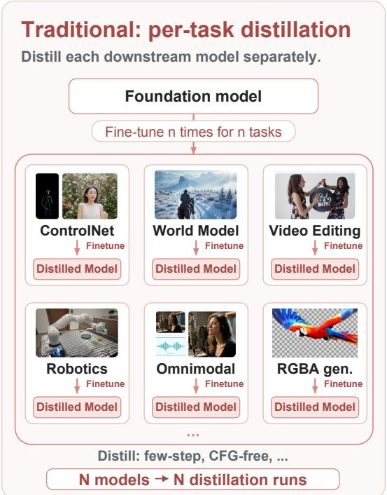

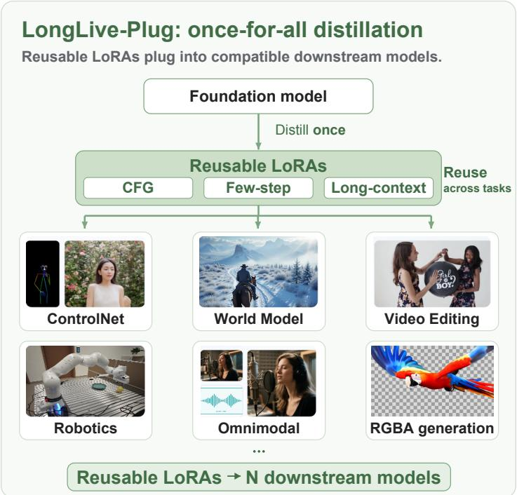  
Figure 1 Once-for-all distillation with plug-and-play deployment. Conventional pipelines separately distill every downstream model (left). LongLive-Plug distills CFG, few-step, and long-context capabilities into reusable LoRAs on each base model, then transfers them to compatible downstream models without target-specific training (right).

## 1. Introduction

Large-scale video diffusion transformers form reusable foundations for video generation [41, 69, 89], while downstream applications increasingly depend on specialized models. They can be adapted to diverse tasks, including controllable generation and personalization [73, 81], video editing [59], and action-conditioned world simulation for robotics and physical AI [56, 60]. Developing such a specialized model often includes a distillation stage, for example to accelerate sampling or to improve long-video generation, and this stage is typically repeated for every new model, each requiring data preparation, teacher supervision, and optimization. This repeated cost motivates a once-for-all workflow: distill reusable capabilities once on a base model and deploy them across compatible downstream models.

We introduce LongLive-Plug, a once-for-all distillation framework built on reusable functional LoRAs [31]. Each adapter is learned on a base model and attached to compatible downstream models while retaining their task-specific weights (Fig. 1). We consider three capabilities: classifier-free guidance (CFG) distillation combines two-pass guidance into one model evaluation [52, 57] while retaining continuous control over guidance strength;few-step distillation enables four-step sampling [91]; and long-context distillation improves long-video quality through error correction in models that support causal autoregressive (AR) inference. Once trained on the base model, these adapters support training-free, plug-and-play deployment to compatible downstream models, even when those models add conditioning branches, or expand output channels.

Making these functional LoRAs transferable raises two further questions. The first concerns guidance. Existing fewstep distillation methods, such as CausVid and Self Forcing [33, 93], distill CFG and few-step generation jointly, which fixes guidance at the scale used during training. Downstream tasks, however, often favor different guidance strengths, so a single fixed scale cannot serve all of them. We therefore apply decoupled distillation, which distills CFG and few-step generation into separate LoRAs. The inference weight of the CFG LoRA then acts as a guidance dial: scaling it adjusts guidance strength in a near-linear manner, as we observe empirically and as prior work on scaling fine-tuning updates suggests [35, 82]. Adjusting this weight while keeping the few-step LoRA fixed tailors guidance to each downstream task. By contrast, rescaling a jointly distilled LoRA also perturbs few-step generation and can cause collapse.

The second question is how the training of a functional LoRA affects its transfer. We report two empirical findings. Adapter rank matters: a small adapter may fit the base teacher well yet transfer poorly, so source fit alone does not determine the capacity needed for transfer. The distillation data also matters: broad T2V prompts on the base model expose the adapter to diverse generation behavior, and broader prompt coverage improves transfer. Together, these findings indicate how to learn acceleration that remains useful beyond the checkpoint on which it was distilled.

The functional-LoRA formulation also extends to error correction for long contexts. We learn this capability through long-context distillation. Using Streaming Long Tuning [86], we optimize a LoRA on a causal AR version of the base model using distribution matching distillation (DMD). The model extends its own generated history, while a teacher supervises each newly generated short clip. This exposes the adapter to errors accumulated during extended rollouts and teaches it to sustain long-video quality. The resulting functional LoRA makes long-context error correction reusable across compatible downstream models that support causal AR inference.

We verify training-free deployment on 54 downstream models from three backbone families: Wan2.1-14B, Wan2.2- TI2V-5B, and MiniMax-H3. They span eight task categories, including world modeling, robotics, controllable generation, editing, and multimodal generation. The verified coverage is listed in Tab. 5 in Appendix C; our approach may support additional compatible models. Quantitative comparisons on SCOPE and Wan2.2-Fun-5B-Control show improvements over naive four-step sampling and performance competitive with per-target distillation, without additional downstream training. Further experiments show that independent CFG control helps transfer to tasks with different guidance preferences, and that larger adapter ranks and broader distillation data can improve transfer quality. Sep arately, transferring the long-context LoRA to the ReWorld [15] and Matrix-Game 3.0 [80] world models improves video quality during long autoregressive rollouts. These results demonstrate reusable acceleration and long-context error correction across downstream models.

## 2. Related Work

## 2.1. Specialized Video Generation

CogVideoX, Wan, HunyuanVideo, LTX-Video, and Cosmos support diverse video specializations [28, 41, 56, 69, 89]. Examples include DOVE for super-resolution [14], VACE for generation and editing [39], Matrix-Game 3.0 for action-conditioned world modeling [80], Kiwi-Edit for guided editing [49], HunyuanVideo-Avatar for audio-driven animation [11], and Cosmos-Transfer1 for multimodal control [55].

Acceleration often requires distilling each specialized checkpoint: FlashMotion and StreamAvatar target trajectory control and avatar interaction [46, 65], while LiveEdit and FlashVSR target streaming editing and super-resolution [75, 102]. D2DF uses one-step consistency distillation for object removal [16], DreamDojo uses few-step causal distillation for robot world modeling [27], and BiWM applies DMD after camera-control fine-tuning [61]. LongLive-Plug instead distills acceleration once per base model for training-free reuse across compatible descendants.

## 2.2. Video Generation Distillation

Progressive distillation shortens sampling trajectories [62], and distribution matching enables one-step generation [92]. VideoLCM uses consistency distillation [74], T2V-Turbo adds reward feedback [44], and DOLLAR combines score and consistency objectives [22]. LCM-LoRA packages consistency distillation for reuse across Stable Diffusion finetunes [51]. Guidance distillation merges the two CFG branches into one pass [52], while adapter guidance distillation reduces trainable parameters and examines transfer to image-model derivatives [57]. CausVid converts bidirectional teachers into autoregressive generators with KV caching [93]; Self Forcing uses autoregressive training rollouts to reduce the train–test mismatch [33]. We isolate distilled capabilities in reusable LoRAs for compatible video specializations: CFG and few-step distillation accelerate inference, while long-context distillation corrects errors in models that already support AR inference. Plug-and-Play Diffusion Distillation transfers a non-LoRA guide network across fine-tuned image models [30]. CASA transfers downstream LoRAs to few-step video models [76], whereas we transfer distilled capability LoRAs to a broader range of downstream tasks and model variants.

## 3. Method

## 3.1. Preliminaries

For each backbone family, LongLive-Plug freezes a base model $F _ { \theta _ { 0 } }$ and distills each capability once into LoRA parameters ϕ, then reuses them across compatible downstream models $F _ { \theta _ { \tau } }$ :

$$
F _ { \theta _ { 0 } } \xrightarrow [ ] { \mathrm { d i s t i l l o n c e } } \phi , F _ { \theta _ { \tau } } \xrightarrow [ ] { \oplus \phi } F _ { \theta _ { \tau } \oplus \phi } .\tag{1}
$$

Here, ⊕ adds updates to corresponding layers while retaining the target’s task-specific weights, without downstream training or re-distillation. We consider three functional LoRAs: CFG distillation replaces two-pass guidance with one conditional evaluation; few-step distillation uses DMD2 [91] to enable four-step sampling; and long-context distillation corrects accumulated errors in models that already support causal autoregressive (AR) inference.

## 3.2. CFG Distillation and Composition

CFG distillation. For noisy latent $z _ { t }$ at timestep t and condition c, let $v _ { c } = F _ { \theta _ { 0 } } ( z _ { t } , t , c )$ and $v _ { \mathcal { O } } = F _ { \theta _ { 0 } } ( z _ { t } , t , \mathcal { O } )$ denote the conditional and unconditional predictions of the base model. At guidance scale w, the teacher predicts [29]

$$
v _ { \mathrm { c f g } } ^ { ( w ) } = v _ { \mathcal { O } } + w ( v _ { c } - v _ { \mathcal { O } } ) .\tag{2}
$$

At fixed teacher scale $w _ { \mathrm { t r a i n } } ,$ we train only the CFG LoRA $\phi _ { \mathrm { c f g } }$ to minimize the expected squared error between its single-pass conditional output and the teacher’s guided prediction, treated as a fixed target. The backbone, sampling schedule, and attention pattern remain unchanged.

The CFG LoRA weight as a guidance dial. Varying the inference weight $\lambda _ { \mathrm { c f g } }$ adjusts the learned guidance despite fixed-scale training. Under an approximately linear response,

$$
\begin{array} { r l } & { F _ { \theta _ { 0 } \oplus \lambda _ { \mathrm { c f g } } \phi _ { \mathrm { c f g } } } \approx v _ { c } + \lambda _ { \mathrm { c f g } } \left( v _ { \mathrm { c f g } } ^ { ( w _ { \mathrm { t r a i n } } ) } - v _ { c } \right) } \\ & { ~ \approx v _ { \mathrm { c f g } } ^ { ( \widetilde { w } ) } , \qquad \widetilde { w } = 1 + \lambda _ { \mathrm { c f g } } ( w _ { \mathrm { t r a i n } } - 1 ) . } \end{array}\tag{3}
$$

Weights 0 and 1 recover the conditional model and full distilled adapter, respectively; larger weights extrapolate. This correspondence is approximate: nonlinear responses and downstream specialization can change the effective guidance. We therefore validate control empirically in Sec. 4.3.

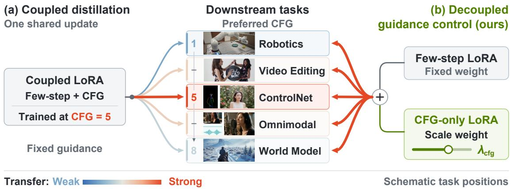  
Figure 2 Decoupled guidance control through an additional CFG-only LoRA. (a) Scaling a single distilled LoRA changes the entire update, including its learned guidance and few-step behavior. (b) Adding a separately weighted CFG-only LoRA lets us adjust guidance for each target while keeping the few-step adapter weight fixed. Arrow colors and widths schematically illustrate guidance compatibility, with the warmest coupled-transfer arrow at CFG 5. CFG-only LoRA scaling provides an adjustable guidance control.

Decoupled guidance control. Scaling a coupled few-step LoRA also changes its learned few-step correction. To accommodate downstream guidance preferences, we add a separately trained CFG-only LoRA and adjust $\lambda _ { \mathrm { c f g } }$ while fixing the few-step weight $\lambda _ { \mathrm { s t e p } }$ and sampling schedule (Fig. 2).

At inference, we add the two weighted LoRA updates to each downstream layer:

$$
\widetilde { W } _ { \ell } ^ { ( \tau ) } = W _ { \ell } ^ { ( \tau ) } + \lambda _ { \mathrm { s t e p } } \Delta W _ { \ell , \mathrm { s t e p } } + \lambda _ { \mathrm { c f g } } \Delta W _ { \ell , \mathrm { c f g } } .\tag{4}
$$

Here, $W _ { \ell } ^ { ( \tau ) }$ is the original target-layer weight; $\Delta W _ { \ell , \mathrm { s t e p } }$ and $\Delta W _ { \ell , \mathrm { c f g } }$ are the separately trained few-step and CFG updates. Merging both updates before sampling preserves target-specific modules without joint retraining or extra model evaluations.

## 3.3. Transfer-Oriented Design

Adapter rank. LoRA rank controls the distilled update’s capacity. A low-rank adapter may fit the base teacher yet transfer poorly after downstream specialization. We assess capacity using both source fit and downstream transfer. Sec. 4.4 compares ranks under matched training and deployment protocols, selecting checkpoints by base-model validation.

Distillation data. We distill CFG and few-step adapters on the base model using broad T2V prompts covering diverse subjects, scenes, motions, and styles. This exposes the adapters to varied generation behavior without target training data. Varying prompt coverage under a fixed teacher isolates prompt diversity; changing both the teacher and its task data changes the distillation source jointly. Sec. 4.4 tests how prompt diversity affects transfer.

## 3.4. Long-Context Distillation

To correct errors accumulated during AR rollouts, we train $\phi _ { \mathrm { l o n g } }$ on a frozen causal AR base model using Streaming Long Tuning [86]. The student generates each short clip from its cached history, while a pretrained teacher provides distribution matching distillation (DMD) supervision. Detaching the preceding history keeps gradients local to the current clip as training rollouts grow longer. The resulting LoRA transfers to compatible models without target-specific training and improves their long-context generation quality. It can be applied to models with existing causal attention.

## 4. Experiments

## 4.1. Comparison of Acceleration Strategies

Evaluation tasks. We use Wan2.2-TI2V-5B [69] as the foundation model for the main comparison and evaluate two downstream tasks: world modeling with SCOPE [66] and ControlNet-based generation with VideoX-Fun’s Wan2.2- Fun-5B-Control [3]. We evaluate 1,378 CrossFPS clips with SCOPE’s original input and output settings and all 600 depth-conditioned PAI-Bench-C cases [101] following its evaluation protocol. Metrics include FVD [67], LPIPS [97], SSIM [79], and DOVER [83].

Evaluation candidates. We compare four candidates: native multi-step inference, naive four-step sampling, pertarget distillation, and LongLive-Plug. Native inference uses 30 steps for SCOPE and 40 for ControlNet; directly reducing it to four steps is faster but substantially degrades generation quality. Per-target DMD2 distillation [91] recovers good four-step quality, but adds substantial per-task data collection, training, and tuning costs. Our CFG-only and few-step LoRAs are trained on the base model with the broad T2V data in Sec. 3.3; the few-step adapter uses DMD2 with CFG-guided teacher supervision. Combining these adapters enables plug-and-play transfer with zero downstream training cost, requiring no target data or fine-tuning. For the quantitative comparisons, LongLive-Plug uses $( \lambda _ { \mathrm { s t e p } } , \lambda _ { \mathrm { c f g } } ) = ( 1 , 3 )$ on SCOPE (Tab. 1) and (1, 1) on ControlNet (Tab. 2).

Table 1 Transfer results on SCOPE. Metric names, grouping, and directions follow Table 1 of SCOPE. Native inference uses 30 steps; all accelerated methods use four steps. Best values are bolded and second-best values are underlined.
<table><tr><td></td><td colspan="3">Visual quality</td><td colspan="2">Motion quality</td><td colspan="2">Consistency</td></tr><tr><td>Method</td><td>JEPA↑</td><td>FVD↓</td><td>LPIPS↓</td><td>Flow ↑</td><td>Smooth. ↑</td><td>Photo. ↓</td><td>Depth ↓</td></tr><tr><td>Default 30 step</td><td>0.868</td><td>382.9</td><td>0.651</td><td>22.11</td><td>2.418</td><td>9.182</td><td>1.287</td></tr><tr><td>Naive 4 step</td><td>0.732</td><td>805.5</td><td>0.628</td><td>11.77</td><td>2.093</td><td>8.468</td><td>1.242</td></tr><tr><td>SCOPE-specific distillation</td><td>0.782</td><td>502.1</td><td>0.678</td><td>16.54</td><td>2.415</td><td>5.695</td><td>1.203</td></tr><tr><td>LongLive-Plug</td><td>0.792</td><td>478.7</td><td>0.669</td><td>16.87</td><td>2.399</td><td>4.246</td><td>1.230</td></tr></table>

Table 2 Transfer results on Wan2.2-Fun-5B-Control. All local runs use the same 600 depth-conditioned PAI-Bench-C cases and 720P preprocessing. SSIM, F1, si-RMSE, and mIoU measure blurred-RGB, edge, depth, and mask similarity; DOVER measures technical quality, and LPIPS measures diversity over 3,600 videos. All local quantitative runs use four steps with CFG disabled. Official scores are from the PAI-Bench-C leaderboard [101], with undisclosed settings. Best values across the reported rows are bolded and second-best values are underlined.
<table><tr><td></td><td colspan="4">Control fidelity</td><td colspan="2">Visual quality</td></tr><tr><td>Method</td><td>SSIM↑</td><td>F1↑</td><td>si-RMSE↓</td><td>mIoU↑</td><td>DOVER↑</td><td>LPIPS ↑</td></tr><tr><td>Official reported (reference)</td><td>0.556</td><td>0.106</td><td>1.819</td><td>0.615</td><td>9.32</td><td>0.481</td></tr><tr><td>Naive 4 step</td><td>0.560</td><td>0.094</td><td>2.135</td><td>0.582</td><td>8.90</td><td>0.264</td></tr><tr><td>ControlNet-specific distillation</td><td>0.544</td><td>0.099</td><td>1.515</td><td>0.595</td><td>10.25</td><td>0.461</td></tr><tr><td>LongLive-Plug</td><td>0.566</td><td>0.100</td><td>1.641</td><td>0.612</td><td>10.11</td><td>0.426</td></tr></table>

Qualitative and quantitative results. LongLive-Plug reduces SCOPE FVD from 805.5 to 478.7, comparable to SCOPE-specific distillation (502.1; Tab. 1). On ControlNet, it improves all six metrics over naive four-step sampling, including depth si-RMSE (2.135 to 1.641) and DOVER (8.90 to 10.11), with metric-dependent trade-offs relative to task-specific distillation (Tab. 2). Fig. 4 shows clearer scene boundaries and finer details with preserved control fidelity, demonstrating effective four-step generation without downstream training.

## 4.2. Transfer across Backbones and Tasks

Coverage beyond the main benchmarks. We verify training-free deployment across three backbone families: Wan2.1-14B, Wan2.2-TI2V-5B [69], and MiniMax-H3 [53]. Tab. 5 in Appendix C lists the 54 verified downstream models: 24 for each Wan backbone and six for H3. They span eight task categories: world modeling, robotics, structure-conditioned generation, camera and trajectory control, video editing and restoration, subject and avatar generation, audio and RGBA generation, and domain, style, and quality adaptation. Each family reuses adapters distilled on its own base model without downstream training, extending capability reuse to full fine-tunes, task LoRAs, and models with additional conditioning modules. We compare native inference with four-step, CFG-free inference after attaching the base-distilled LoRA. For models with 20–50-step native schedules, this reduces denoising steps by 5–12.5×. The approach may support additional compatible downstream models beyond this verified set.

Cumulative distillation cost. Fig. 3 tracks cumulative training cost when adding tasks to Wan2.2-TI2V-5B. Both strategies share a onetime base distillation cost of approximately 80 H100 GPU-hours: 700 iterations on 32 GPUs for about 2.5 hours. Task-specific distillation then adds 83.9, 150.0, 86.8, and 56.1 H100 GPU-hours for depth-conditioned generation, world modeling, pose-conditioned generation, and robotics simulation, respectively: 376.8 additional GPU-hours and about 456.8 in total. LongLive-Plug reuses the basedistilled adapters at a fixed cost of about 80 GPU-hours, without task-specific data collection. The depth-specific adapter requires 5,000 paired prompts and dynamic depth videos; our transfer requires no downstream training data.

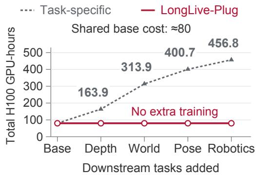  
Figure 3 Cumulative distillation cost. Both curves include the shared base cost of approximately 80 GPU-hours.

(a) SCOPE  
(b) Wan2.2-Fun-5B-Control (Depth)  
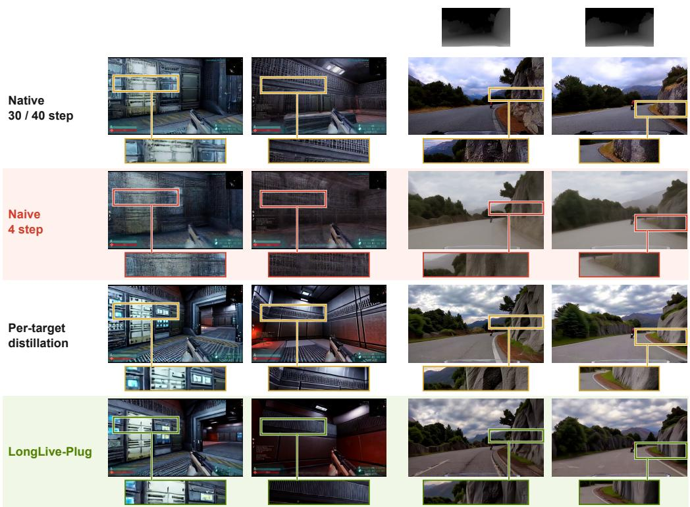  
Figure 4 Matched transfer comparisons on SCOPE and Wan2.2-Fun-5B-Control (Depth). Two matched frames per task compare native (30/40 steps), naive four-step, per-target distilled, and LongLive-Plug outputs. Naive four-step sampling produces blurry, low-quality videos, whereas LongLive-Plug maintains high visual quality at four steps. Depth thumbnails condition ControlNet; boxes and strips show matched regions across methods. LongLive-Plug uses an additional base-distilled adapter variant. Appendix B gives full four-frame comparisons and alignment details.

## 4.3. CFG Controllability and Composition

Guidance control with a CFG-only LoRA. On Wan2.2-TI2V-5B, we vary only the CFG LoRA weight after distillation at $w _ { \mathrm { t r a i n } } = 5$ , retaining the native 50-step FlowUniPC [100] schedule. Raising $\lambda _ { \mathrm { c f g } }$ from 1 to 2 or 3 strengthens the milk splash (Fig. 5) at runtime CFG 1, preserving guidance control with one conditional evaluation per step. See Appendix D (Fig. 14) for more cases.

Independent guidance after transfer. On SCOPE, a four-step coupled CFG-plus-step LoRA responds weakly to changes between the Snow Village and Crystal Maze prompts. Adding a separately weighted CFG LoRA strengthens the requested snow and crystal attributes as $\lambda _ { \mathrm { c f g } }$ increases from 1 to 3 and 5, while the few-step weight stays at 1 (Fig. 6A). Matched frames preserve recognizable geometry and the foreground weapon as text control changes at a fixed few-step weight.

Prompt: milk splattering onto a green surface, intricate patterns and droplets  
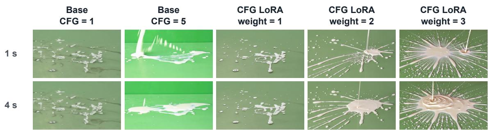  
Figure 5 Guidance control after CFG-only distillation. The milk-splatter prompt compares native CFG references with CFG LoRA weights 1, 2, and 3. All variants use 50 sampling steps; every LoRA variant uses the distilled CFG setting and requires only one conditional forward pass per step. Rows show matched frames at 1 and 4 seconds. Higher LoRA weights follow the trend of stronger CFG, producing a more pronounced splash without exactly matching native CFG scales.

Failure of global LoRA scaling. Globally scaling the coupled LoRA fails to provide effective guidance control on SCOPE. With the checkpoint, prompt, input image, action sequence, seed, and sampler fixed, increasing the global weight darkens and distorts the scene, with severe collapse at weight 5 (Fig. 6B). Both SCOPE experiments use four steps with distilled CFG and different coupled checkpoints. See Appendix D for more cases and experimental settings.

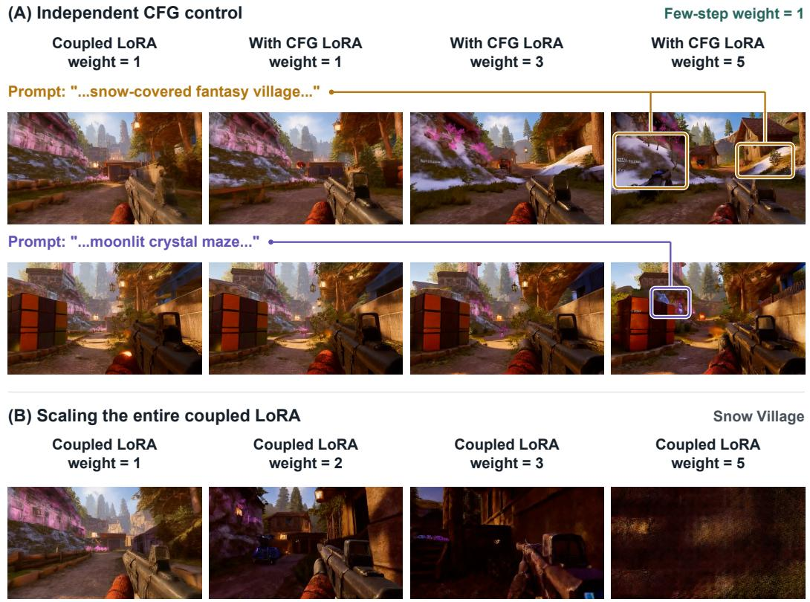  
Figure 6  Independent CFG control on SCOPE. (A) The coupled LoRA alone at weight 1 shows little response to the prompts. Adding a separately weighted CFG LoRA strengthens the boxed prompt attributes while the coupled LoRA weight remains at 1. Colored lines link each box to its corresponding prompt text. (B) Scaling the entire coupled LoRA instead degrades generation. Frames are matched across weights within each row. All runs use four-step sampling with distilled CFG; (A) and (B) use different coupled checkpoints.

Prompt concentration

## 4.4. Transfer Design Ablation

Adapter rank. Following Sec. 3.3, we vary rank while fixing the teacher, prompts, target layers, optimization budget, and checkpoint-selection rule. Each adapter transfers to SCOPE without target training and is evaluated by FVD on the full CrossFPS test set. Across three rank doublings from 16 to 128, transfer improves monotonically by 21% (Fig. 7a).

Distillation data. We vary prompt diversity with the teacher, rank, target layers, optimization budget, and number of training lines fixed. Prompt concentration is the mean pairwise cosine similarity in centred UMT5 [18] embedding space: lower values indicate broader coverage, while higher values indicate prompts clustered in one region. The number of distinct prompts co-varies with concentration within the fixed line budget. Transfer degrades monotonically as diversity falls, with FVD rising by 12% across the sweep (Fig. 7b). At the same training budget, broader prompt coverage thus better supports transfer to models unseen during distillation.

(a) Rank  
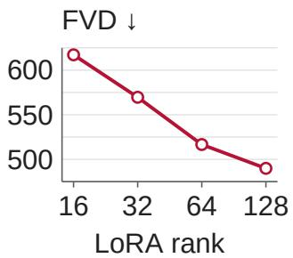  
SCOPE / CrossFPS

(b) Data diversity  
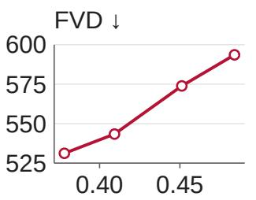

(c) ReWorld  
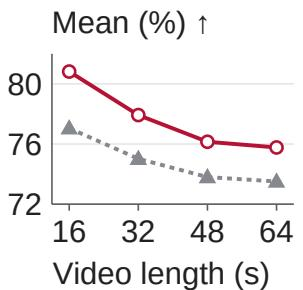

(d) Matrix-Game 3.0  
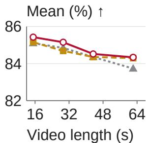  
Base Task-distill +Long  
Figure 7  Rank, data diversity, and long-context transfer. (a–b) Higher rank and more diverse prompts (lower concentration) improve FVD after transfer. (c–d) Mean of seven VBench dimensions after transfer to ReWorld and Matrix-Game 3.0, respectively. Long-context comparisons are within each model. Our transferred long-context LoRA improves quality during long AR rollouts.

## 4.5. Long-Context Distillation and Transfer

We evaluate the transfer of a long-context LoRA distilled on an AR Wan base model to two AR world models, ReWorld and Matrix-Game 3.0, without downstream training.

Table 3 Long-context transfer to ReWorld and Matrix-Game 3.0. Seven video-intrinsic VBench [34] dimensions, expressed as percentages at each model’s longest tested rollout. Best quality scores are bolded within each model group.
<table><tr><td>Model</td><td>quality ↑ quality ↑</td><td>Imaging Aesthetic</td><td>Subject consist. ↑</td><td>Background consist. ↑</td><td>d Temporal Dynamic flicker. ↑</td><td>degree</td><td>Motion smooth. ↑</td><td>Total score ↑</td></tr><tr><td>ReWorld</td><td></td><td></td><td></td><td></td><td></td><td></td><td></td><td></td></tr><tr><td>ReWorld-base</td><td>33.83</td><td>37.18</td><td>63.48</td><td>88.87</td><td>95.29</td><td>100.00</td><td>95.89</td><td>73.51</td></tr><tr><td>ReWorld +Long</td><td>45.41</td><td>44.53</td><td>66.01</td><td>80.81</td><td>95.75</td><td>100.00</td><td>97.89</td><td>75.77</td></tr><tr><td>Matrix-Game 3.0</td><td></td><td></td><td></td><td></td><td></td><td></td><td></td><td></td></tr><tr><td>Matrix-Game-base</td><td>70.76</td><td>50.51</td><td>82.72</td><td>91.10</td><td>93.69</td><td>100.00</td><td>97.34</td><td>83.73</td></tr><tr><td>Matrix-Game-distill</td><td>74.59</td><td>51.91</td><td>83.35</td><td>91.39</td><td>91.93</td><td>100.00</td><td>96.90</td><td>84.30</td></tr><tr><td>Matrix-Game +Long</td><td>70.43</td><td>54.25</td><td>82.16</td><td>91.51</td><td>94.12</td><td>100.00</td><td>97.90</td><td>84.34</td></tr></table>

Transfer to ReWorld. On ReWorld [15], trained on approximately 8 s windows, we compare 24-step native inference with four-step +Long over 16–64 s, using matched prompts and camera trajectories. At 64 s, +Long raises the sevendimension mean from 73.51 to 75.77, improving visual quality and temporal scores with lower background consistency (Tab. 3, upper group). Its mean exceeds the base model at all tested lengths, up to 8× the training duration (Fig. 7c). See Appendix E for qualitative examples.

Transfer to Matrix-Game 3.0. We transfer the same +Long adapter to Matrix-Game 3.0 [80] and compare 50-step native inference, official three-step task-specific distillation, and four-step +Long under matched inputs and camera actions. At 62.18 s, their seven-dimension means are 83.73, 84.30, and 84.34, respectively (Tab. 3, lower group). Across tested lengths, +Long is competitive with task-specific distillation without Matrix-Game training, with metricdependent trade-offs (Fig. 7d). Qualitative examples appear in Appendix E.2.

## 5. Discussion and Limitations

Once-for-all reuse requires compatible descendants of each base model. Long-context transfer requires existing causal AR inference, since LoRA updates alone do not change attention masks. Transfer quality involves task-dependent trade-offs. CFG LoRA weights provide approximate guidance control and may require adjustment after transfer.

## 6. Conclusion

We presented LongLive-Plug, which distills CFG, few-step sampling, and long-context error correction into reusable LoRAs once per backbone family. These adapters enable training-free transfer to compatible downstream models with adjustable guidance. Experiments demonstrate effective acceleration and improved long-video quality across tasks, reducing the need for per-target distillation.

## AI use statement

We used large language models to improve the clarity and readability of the manuscript, and AI agents to assist with experimental workflows. The authors are responsible for verifying all AI-assisted work and take full responsibility for the methods, results, and final content of this paper.

## Ethics statement

This work focuses on improving the efficiency and reuse of video generation models. We do not anticipate ethical concerns specific to our distillation framework beyond those associated with the underlying generative models, including potential misuse for misleading content and inherited biases. We encourage responsible use in accordance with the licenses and usage policies of the underlying models and datasets.

## Reproducibility statement

We will publicly release all code and artifacts developed for this work, including trained LoRA checkpoints, training and evaluation configurations, and scripts needed to reproduce our experiments. See Appendix A for implementation details.

## References

[1] Alibaba PAI. Wan2.1-Fun-14B-Control. Official model release, 2025. Accessed September 24, 2026.

[2] Alibaba PAI. Wan2.1-Fun-V1.1-14B-Control-Camera. Official model release, 2025. Accessed September 24, 2026.

[3] Alibaba PAI. Wan2.2-Fun-5B-Control. Hugging Face model release, 2025.

[4] Alibaba PAI. Wan2.2-Fun-5B-Control-Camera. Official model release, 2025. Accessed September 24, 2026.

[5] Alibaba PAI. Wan2.2-Fun-5B-InP. Official model release, 2025. Accessed September 24, 2026.

[6] Alibaba PAI. MiniMax-H3-Fun-Controlnet-Union. Official model release, 2026. Accessed September 24, 2026.

[7] AMD. Micro-World-I2W. Official model release, 2025. Accessed September 24, 2026.

[8] Hongzhe Bi, Hengkai Tan, Shenghao Xie, Zeyuan Wang, Shuhe Huang, Haitian Liu, Ruowen Zhao, Yao Feng, Chendong Xiang, Yinze Rong, Hongyan Zhao, Hanyu Liu, Zhizhong Su, Lei Ma, Hang Su, and Jun Zhu. Motus: A Unified Latent Action World Model. arXiv preprint arXiv:2512.13030, 2025.

[9] BWM Team. BWM: A Low-Cost High-Fidelity World Simulator for Robot Learning. arXiv preprint arXiv:2607.29302, 2026.

[10] Danze Chen, Zeqing Wang, Ziyue Lin, Xingyi Yang, and Yeying Jin. H3-World: Turning Language Understanding into World Control. arXiv preprint arXiv:2609.01560, 2026.

[11] Yi Chen, Sen Liang, Zixiang Zhou, Ziyao Huang, Yifeng Ma, Junshu Tang, Qin Lin, Yuan Zhou, and Qinglin Lu. HunyuanVideo-Avatar: High-fidelity audio-driven human animation for multiple characters. arXiv preprint arXiv:2505.20156, 2025.

[12] Yiwen Chen, Guosheng Lin, and Chi Zhang. Code World Model: Coding Agent as World Brain. arXiv preprint arXiv:2608.25927, 2026.

[13] Yuzhi Chen, Ronghan Chen, Dongjie Huo, Yandan Yang, Dekang Qi, Haoyun Liu, Tong Lin, Shuang Zeng, Junjin Xiao, Xinyuan Chang, Feng Xiong, Xing Wei, Zhiheng Ma, and Mu Xu. ABot-PhysWorld: Interactive World Foundation Model for Robotic Manipulation with Physics Alignment. arXiv preprint arXiv:2603.23376, 2026.

[14] Zheng Chen, Zichen Zou, Kewei Zhang, Xiongfei Su, Xin Yuan, Yong Guo, and Yulun Zhang. DOVE: Efficient one-step diffusion model for real-world video super-resolution. In Advances in Neural Information Processing Systems, 2025.

[15] Zhifei Chen, Luozhou Wang, Guibao Shen, Dongyu Yan, Shuai Yang, Tianshuo Xu, Yihua Du, Wei Wang, Tianyi Gui, Lianghua Huang, and Yingcong Chen. ReWorld: An interactive world model with long-horizon memory. arXiv preprint arXiv:2608.23565, 2026.

[16] Zizhao Chen, Ping Wei, Guang Dai, Jingdong Wang, and Mengmeng Wang. From draft to draft-free: One-step video object removal via privileged distillation and fast planting. arXiv preprint arXiv:2607.14976, 2026.

[17] Ruihang Chu, Yefei He, Zhekai Chen, Shiwei Zhang, Xiaogang Xu, Bin Xia, Dingdong Wang, Hongwei Yi, Xihui Liu, Hengshuang Zhao, Yu Liu, Yingya Zhang, and Yujiu Yang. Wan-Move: Motion-controllable Video Generation via Latent Trajectory Guidance. arXiv preprint arXiv:2512.08765, 2025.

[18] Hyung Won Chung, Noah Constant, Xavier Garcia, Adam Roberts, Yi Tay, Sharan Narang, and Orhan Firat. UniMax: Fairer and more Effective Language Sampling for Large-Scale Multilingual Pretraining. arXiv preprint arXiv:2304.09151, 2023.

[19] Yixiang Dai, Fan Jiang, Chiyu Wang, Mu Xu, and Yonggang Qi. FantasyWorld: Geometry-Consistent World Modeling via Unified Video and 3D Prediction. arXiv preprint arXiv:2509.21657, 2025.

[20] Yufan Deng, Yuanyang Yin, Xun Guo, Yizhi Wang, Jacob Zhiyuan Fang, Shenghai Yuan, Yiding Yang, Angtian Wang, Bo Liu, Haibin Huang, and Chongyang Ma. MAGREF: Masked Guidance for Any-Reference Video Generation with Subject Disentanglement. arXiv preprint arXiv:2505.23742, 2025.

[21] DiffSynth-Studio. MiniMax-H3-LoRA-LineartAnime: Anime Video Line Art Colorization. Official model release, 2026. Accessed September 24, 2026.

[22] Zihan Ding, Chi Jin, Difan Liu, Haitian Zheng, Krishna Kumar Singh, Qiang Zhang, Yan Kang, Zhe Lin, and Yuchen Liu. DOLLAR: Few-step video generation via distillation and latent reward optimization. In Proceedings ofthe IEEE/CVF International Conference on Computer Vision, pages 17961–17971, 2025.

[23] Haotian Dong, Wenjing Wang, Chen Li, Jing Lyu, and Di Lin. Video Generation with Stable Transparency via Shiftable RGB-A Distribution Learner. arXiv preprint arXiv:2509.24979, 2025.

[24] DreamX Team, Yancheng Bai, Rui Chen, Xiangxiang Chu, Rujing Dang, Hao Dou, Bingjie Gao, Qiwen Gu, Siyu Hong, Jiachen Lei, Geng Li, Jifan Li, Ruimin Lin, Qingfeng Shi, Bingze Song, Lei Sun, Jing Tang, Ruitian Tian, Jun Wang, Jiahong Wu, Pengfei Zhang, Shen Zhang, and Jiashu Zhu. DreamX-World 1.0: A General-Purpose Interactive World Model. arXiv preprint arXiv:2606.16993, 2026.

[25] Hongyang Du, Junjie Ye, Xiaoyan Cong, Runhao Li, Jingcheng Ni, Aman Agarwal, Zeqi Zhou, Zekun Li, Randall Balestriero, and Yue Wang. VideoGPA: Distilling Geometry Priors for 3D-Consistent Video Generation. arXiv preprint arXiv:2601.23286, 2026.

[26] Jianxiong Gao, Zhaoxi Chen, Xian Liu, Junhao Zhuang, Chengming Xu, Jianfeng Feng, Yu Qiao, Yanwei Fu, Chenyang Si, and Ziwei Liu. LongVie 2: Multimodal Controllable Ultra-Long Video World Model. arXiv preprint arXiv:2512.13604, 2025.

[27] Shenyuan Gao, William Liang, Kaiyuan Zheng, Ayaan Malik, Seonghyeon Ye, et al. DreamDojo: A generalist robot world model from large-scale human videos. arXiv preprint arXiv:2602.06949, 2026.

[28] Yoav HaCohen, Nisan Chiprut, Benny Brazowski, Daniel Shalem, Dudu Moshe, Eitan Richardson, Eran Levin, Guy Shiran, Nir Zabari, Ori Gordon, Poriya Panet, Sapir Weissbuch, Victor Kulikov, Yaki Bitterman, Zeev

Melumian, and Ofir Bibi. LTX-Video: Realtime video latent diffusion. arXiv preprint arXiv:2501.00103, 2024.

[29] Jonathan Ho and Tim Salimans. Classifier-Free Diffusion Guidance. arXiv preprint arXiv:2207.12598, 2022.

[30] Yi-Ting Hsiao, Siavash Khodadadeh, Kevin Duarte, Wei-An Lin, Hui Qu, Mingi Kwon, and Ratheesh Kalarot. Plug-and-Play Diffusion Distillation. In Proceedings of the IEEE/CVF Conference on Computer Vision and Pattern Recognition, pages 13743–13752, 2024.

[31] Edward J. Hu, Yelong Shen, Phillip Wallis, Zeyuan Allen-Zhu, Yuanzhi Li, Shean Wang, Lu Wang, and Weizhu Chen. LoRA: Low-rank adaptation of large language models. In International Conference on Learning Representations, 2022.

[32] Junchao Huang, Guian Fang, Shengju Qian, Xianghao Kong, Zhuoran Zhao, Wei Huang, Yihua Du, Zixin Zhang, Justin Cui, Yuchao Gu, Yukang Chen, Xinting Hu, Tianyu He, Shaoshuai Shi, Zhuotao Tian, Xin Wang, Mike Zheng Shou, and Li Jiang. SolarWM: Open Data and Scalable Training for Long-Horizon Video World Models. arXiv preprint arXiv:2609.02886, 2026.

[33] Xun Huang, Zhengqi Li, Guande He, Mingyuan Zhou, and Eli Shechtman. Self forcing: Bridging the train–test gap in autoregressive video diffusion. In Advances in Neural Information Processing Systems, 2025.

[34] Ziqi Huang, Yinan He, Jiashuo Yu, Fan Zhang, Chenyang Si, Yuming Jiang, Yuanhan Zhang, Tianxing Wu, Qingyang Jin, Nattapol Chanpaisit, Yaohui Wang, Xinyuan Chen, Limin Wang, Dahua Lin, Yu Qiao, and Ziwei Liu. VBench: Comprehensive benchmark suite for video generative models. In Proceedings of the IEEE/CVF Conference on Computer Vision and Pattern Recognition, 2024.

[35] Gabriel Ilharco, Marco Tulio Ribeiro, Mitchell Wortsman, Suchin Gururangan, Ludwig Schmidt, Hannaneh Hajishirzi, and Ali Farhadi. Editing models with task arithmetic. In International Conference on Learning Representations (ICLR), 2023.

[36] Index Team. Index-AniSora V2.0. Official model release, 2025. Wan2.1-14B-based V2.0 release. Accessed September 24, 2026.

[37] Longbin Ji, Guan Wang, Xuan Wei, Chenye Yang, Xiangrui Liu, Zhenyu Zhang, Shuohuan Wang, Yu Sun, and Jingzhou He. Native Audio-Visual Alignment for Generation. arXiv preprint arXiv:2605.30073, 2026.

[38] Yudong Jiang, Baohan Xu, Siqian Yang, Mingyu Yin, Jing Liu, Chao Xu, Siqi Wang, Yidi Wu, Bingwen Zhu, Xinwen Zhang, Xingyu Zheng, Jixuan Xu, Yue Zhang, Jinlong Hou, and Huyang Sun. AniSora: Exploring the Frontiers of Animation Video Generation in the Sora Era. arXiv preprint arXiv:2412.10255, 2024.

[39] Zeyinzi Jiang, Zhen Han, Chaojie Mao, Jingfeng Zhang, Yulin Pan, and Yu Liu. VACE: All-in-one video creation and editing. In Proceedings of the IEEE/CVF International Conference on Computer Vision, 2025.

[40] Denis Karachev. Dilated Controlnet for Wan2.1. Official source repository, 2025. Accessed September 24, 2026.

[41] Weijie Kong, Qi Tian, Zijian Zhang, Rox Min, Zuozhuo Dai, et al. HunyuanVideo: A systematic framework for large video generative models. arXiv preprint arXiv:2412.03603, 2024.

[42] Zhe Kong, Feng Gao, Yong Zhang, Zhuoliang Kang, Xiaoming Wei, Xunliang Cai, Guanying Chen, and Wenhan Luo. Let Them Talk: Audio-Driven Multi-Person Conversational Video Generation. arXiv preprint arXiv:2505.22647, 2025.

[43] Guangyuan Li, Siming Zheng, Hao Zhang, Jinwei Chen, Junsheng Luan, Binkai Ou, Lei Zhao, Bo Li, and Peng-Tao Jiang. MagicTryOn: Harnessing Diffusion Transformer for Garment-Preserving Video Virtual Try-on. arXiv preprint arXiv:2505.21325, 2025.

[44] Jiachen Li, Weixi Feng, Tsu-Jui Fu, Xinyi Wang, Sugato Basu, Wenhu Chen, and William Yang Wang. T2V-Turbo: Breaking the quality bottleneck of video consistency model with mixed reward feedback. In Advances in Neural Information Processing Systems, 2024.

[45] Maomao Li, Zhen Li, Kaipeng Zhang, Guosheng Yin, Zhifeng Li, and Dong Xu. OmniCustom: Sync Audio-Video Customization Via Joint Audio-Video Generation Model. arXiv preprint arXiv:2602.12304, 2026.

[46] Quanhao Li, Zhen Xing, Rui Wang, Haidong Cao, Qi Dai, Daoguo Dong, and Zuxuan Wu. FlashMotion: Fewstep controllable video generation with trajectory guidance. In Proceedings of the IEEE/CVF Conference on Computer Vision and Pattern Recognition, pages 8986–8996, 2026.

[47] Sizhe Lester Li, Evan Kim, Xingjian Bai, Tong Zhao, Tao Pang, Max Simchowitz, and Vincent Sitzmann. Turning Video Models into Generalist Robot Policies. arXiv preprint arXiv:2605.27817, 2026.

[48] Kuan Heng Lin, Zhizheng Liu, Pablo Salamanca, Yash Kant, Ryan Burgert, Yuancheng Xu, Koichi Namekata,

Yiwei Zhao, Bolei Zhou, Micah Goldblum, Paul Debevec, and Ning Yu. Vista4D: Video Reshooting with 4D Point Clouds. arXiv preprint arXiv:2604.21915, 2026.

[49] Yiqi Lin, Guoqiang Liang, Ziyun Zeng, Zechen Bai, Yanzhe Chen, and Mike Zheng Shou. Kiwi-Edit: Versatile video editing via instruction and reference guidance. arXiv preprint arXiv:2603.02175, 2026.

[50] Chetwin Low, Weimin Wang, and Calder Katyal. Ovi: Twin Backbone Cross-Modal Fusion for Audio-Video Generation. arXiv preprint arXiv:2510.01284, 2025.

[51] Simian Luo, Yiqin Tan, Suraj Patil, Daniel Gu, Patrick von Platen, Apolinário Passos, Longbo Huang, Jian Li, and Hang Zhao. LCM-LoRA: A universal stable-diffusion acceleration module. arXiv preprint arXiv:2311.05556, 2023.

[52] Chenlin Meng, Robin Rombach, Ruiqi Gao, Diederik Kingma, Stefano Ermon, Jonathan Ho, and Tim Salimans. On distillation of guided diffusion models. In Proceedings of the IEEE/CVF Conference on Computer Vision and Pattern Recognition, pages 14297–14306, 2023.

[53] MiniMax. MiniMax-H3: Official model card. Hugging Face model repository, 2026.

[54] Muyao Niu, Mingdeng Cao, Yifan Zhan, Qingtian Zhu, Weihang Ran, Yanhong Zeng, Xiao Sun, Zhihang Zhong, and Yinqiang Zheng. AniCrafter: Customizing Realistic Human-Centric Animation via Avatar-Background Conditioning in Video Diffusion Models. arXiv preprint arXiv:2505.20255, 2025.

[55] NVIDIA, Hassan Abu Alhaija, Jose Alvarez, Maciej Bala, Tiffany Cai, Tianshi Cao, et al. Cosmos-Transfer1: Conditional world generation with adaptive multimodal control. arXiv preprint arXiv:2503.14492, 2025.

[56] NVIDIA, Niket Agarwal, Arslan Ali, Maciej Bala, Yogesh Balaji, et al. Cosmos world foundation model platform for physical AI. arXiv preprint arXiv:2501.03575, 2025.

[57] Cristian Perez Jensen and Seyedmorteza Sadat. Efficient distillation of classifier-free guidance using adapters. Transactions on Machine Learning Research, 2025.

[58] Markus Pobitzer, Chang Liu, Chenyi Zhuang, Teng Long, Bin Ren, and Nicu Sebe. Loomis Painter: Reconstructing the Painting Process. arXiv preprint arXiv:2511.17344, 2025.

[59] Chenyang Qi, Xiaodong Cun, Yong Zhang, Chenyang Lei, Xintao Wang, Ying Shan, and Qifeng Chen. FateZero: Fusing attentions for zero-shot text-based video editing. In Proceedings ofthe IEEE/CVF International Conference on Computer Vision, pages 15932–15942, 2023.

[60] Marc Rigter, Tarun Gupta, Agrin Hilmkil, and Chao Ma. AVID: Adapting video diffusion models to world models. arXiv preprint arXiv:2410.12822, 2024.

[61] Shaohao Rui, Xiaofeng Mao, Zhanyu Zhang, Peijia Lin, Yansong Zhu, Yibo Zhang, Haibin Wan, Zhangrui Zhao, and Weijie Ma. BiWM: Advancing open-source interactive video world models with bidirectional autoregression. arXiv preprint arXiv:2606.10135, 2026.

[62] Tim Salimans and Jonathan Ho. Progressive distillation for fast sampling of diffusion models. In International Conference on Learning Representations, 2022.

[63] Joachim Sallström. Aether Punch: Face Impact LoRA for Wan 2.2 5B. Official model release, 2025. Accessed September 24, 2026.

[64] Yiren Song, Cheng Liu, Yuxin Jiang, and Mike Zheng Shou. StreamingEffect: Real-Time Human-Centric Video Effect Generation. arXiv preprint arXiv:2605.17019, 2026.

[65] Zhiyao Sun, Ziqiao Peng, Yifeng Ma, Yi Chen, Zhengguang Zhou, Zixiang Zhou, Guozhen Zhang, Youliang Zhang, Yuan Zhou, Qinglin Lu, and Yong-Jin Liu. StreamAvatar: Streaming diffusion models for real-time interactive human avatars. arXiv preprint arXiv:2512.22065, 2025.

[66] Zizhao Tong, Yeying Jin, Hongfeng Lai, Zeqing Wang, Zhaohu Xing, Kexu Cheng, Haoran Xu, Zhao Pu, Shangwen Zhu, Ruili Feng, Jian Zhao, Yan Zhang, Hao Tang, and Ling Shao. SCOPE: Simulating cross-game operations in playable environments for FPS world models. arXiv preprint arXiv:2605.23345, 2026.

[67] Thomas Unterthiner, Sjoerd van Steenkiste, Karol Kurach, Raphael Marinier, Marcin Michalski, and Sylvain Gelly. Towards Accurate Generative Models of Video: A New Metric & Challenges. arXiv preprint arXiv:1812.01717, 2018.

[68] Viggle Research. Viggle-Animate: Character Replacement in Video from a Single Repainted Frame. Official model release, 2026. Accessed September 24, 2026.

[69] Wan Team. Wan: Open and advanced large-scale video generative models. arXiv preprint arXiv:2503.20314, 2025.

[70] Angtian Wang, Haibin Huang, Jacob Zhiyuan Fang, Yiding Yang, and Chongyang Ma. ATI: Any Trajectory Instruction for Controllable Video Generation. arXiv preprint arXiv:2505.22944, 2025.

[71] Boyang Wang, Xuweiyi Chen, Matheus Gadelha, and Zezhou Cheng. Frame In-N-Out: Unbounded Controllable Image-to-Video Generation. arXiv preprint arXiv:2505.21491, 2025.

[72] Mengchao Wang, Qiang Wang, Fan Jiang, Yaqi Fan, Yunpeng Zhang, Yonggang Qi, Kun Zhao, and Mu Xu. FantasyTalking: Realistic Talking Portrait Generation via Coherent Motion Synthesis. arXiv preprint arXiv:2504.04842, 2025.

[73] Xiang Wang, Hangjie Yuan, Shiwei Zhang, Dayou Chen, Jiuniu Wang, Yingya Zhang, Yujun Shen, Deli Zhao, and Jingren Zhou. VideoComposer: Compositional video synthesis with motion controllability. In Advances in Neural Information Processing Systems, 2023.

[74] Xiang Wang, Shiwei Zhang, Han Zhang, Yu Liu, Yingya Zhang, Changxin Gao, and Nong Sang. VideoLCM: Video latent consistency model. arXiv preprint arXiv:2312.09109, 2023.

[75] Xinyu Wang, Chongbo Zhao, Fangneng Zhan, and Yue Ma. LiveEdit: Towards real-time diffusion-based streaming video editing. arXiv preprint arXiv:2606.26740, 2026.

[76] Yuchen Wang, Wenliang Zhong, Lichen Bai, Zikai Zhou, Shitong Shao, Bojun Cheng, Shuo Chen, Shuo Yang, and Zeke Xie. Exploring Data-Free LoRA Transferability for Video Diffusion Models. arXiv preprint arXiv:2605.01929, 2026.

[77] Zeqing Wang, Danze Chen, Zhaohu Xing, Zizhao Tong, Yinhan Zhang, Xingyi Yang, and Yeying Jin. ReactiveGWM: Steering NPC in Reactive Game World Models. arXiv preprint arXiv:2605.15256, 2026.

[78] Zhenzhi Wang, Jian Wang, Ke Ma, Dahua Lin, and Bing Zhou. TalkVerse: Democratizing Minute-Long Audio-Driven Video Generation. arXiv preprint arXiv:2512.14938, 2025.

[79] Zhou Wang, Alan C. Bovik, Hamid R. Sheikh, and Eero P. Simoncelli. Image quality assessment: From error visibility to structural similarity. IEEE Transactions on Image Processing, 13(4):600–612, 2004.

[80] Zile Wang, Zexiang Liu, Jiaxing Li, Kaichen Huang, Baixin Xu, Fei Kang, Mengyin An, Peiyu Wang, Biao Jiang, Yichen Wei, Yidan Xietian, Jiangbo Pei, Liang Hu, Boyi Jiang, Hua Xue, Zidong Wang, Haofeng Sun, Wei Li, Wanli Ouyang, Xianglong He, Yang Liu, Yangguang Li, and Yahui Zhou. Matrix-Game 3.0: Real-time and streaming interactive world model with long-horizon memory. arXiv preprint arXiv:2604.08995, 2026.

[81] Yujie Wei, Shiwei Zhang, Zhiwu Qing, Hangjie Yuan, Zhiheng Liu, Yu Liu, Yingya Zhang, Jingren Zhou, and Hongming Shan. DreamVideo: Composing your dream videos with customized subject and motion. In Proceedings of the IEEE/CVF Conference on Computer Vision and Pattern Recognition, pages 6537–6549, 2024.

[82] Mitchell Wortsman, Gabriel Ilharco, Jong Wook Kim, Mike Li, Simon Kornblith, Rebecca Roelofs, Raphael Gontijo Lopes, Hannaneh Hajishirzi, Ali Farhadi, Hongseok Namkoong, and Ludwig Schmidt. Robust finetuning of zero-shot models. In Proceedings of the IEEE/CVF Conference on Computer Vision and Pattern Recognition (CVPR), pages 7959–7971, 2022.

[83] Haoning Wu, Erli Zhang, Liang Liao, Chaofeng Chen, Jingwen Hou, Annan Wang, Wenxiu Sun, Qiong Yan, and Weisi Lin. Exploring Video Quality Assessment on User Generated Contents from Aesthetic and Technical Perspectives. In Proceedings of the IEEE/CVF International Conference on Computer Vision, pages 20144– 20154, 2023.

[84] Bowen Xue, Zheng-Peng Duan, Qixin Yan, Wenjing Wang, Hao Liu, Chun-Le Guo, Chongyi Li, Chen Li, and Jing Lyu. Stand-In: A Lightweight and Plug-and-Play Identity Control for Video Generation. arXiv preprint arXiv:2508.07901, 2025.

[85] Shaoshu Yang, Zhe Kong, Feng Gao, Meng Cheng, Xiangyu Liu, Yong Zhang, Zhuoliang Kang, Wenhan Luo, Xunliang Cai, Ran He, and Xiaoming Wei. InfiniteTalk: Audio-driven Video Generation for Sparse-Frame Video Dubbing. arXiv preprint arXiv:2508.14033, 2025.

[86] Shuai Yang, Wei Huang, Ruihang Chu, Yicheng Xiao, Yuyang Zhao, Xianbang Wang, Muyang Li, Enze Xie, Yingcong Chen, Yao Lu, Song Han, and Yukang Chen. LongLive: Real-time interactive long video generation. In International Conference on Learning Representations, 2026.

[87] Xiangpeng Yang, Ji Xie, Yiyuan Yang, Yue Ma, Yan Huang, Min Xu, and Qiang Wu. VideoCoF: Unified Video Editing with Temporal Reasoner. arXiv preprint arXiv:2512.07469, 2025.

[88] Yuxue Yang, Lue Fan, Ziqi Shi, Junran Peng, Feng Wang, and Zhaoxiang Zhang. NeoVerse: Enhancing 4D World Model with in-the-wild Monocular Videos. arXiv preprint arXiv:2601.00393, 2026.

[89] Zhuoyi Yang, Jiayan Teng, Wendi Zheng, Ming Ding, Shiyu Huang, Jiazheng Xu, Yuanming Yang, Wenyi Hong, Xiaohan Zhang, Guanyu Feng, Da Yin, Yuxuan Zhang, Weihan Wang, Yean Cheng, Bin Xu, Xiaotao Gu, Yuxiao Dong, and Jie Tang. CogVideoX: Text-to-video diffusion models with an expert transformer. In International Conference on Learning Representations, 2025.

[90] Seonghyeon Ye, Yunhao Ge, Kaiyuan Zheng, Shenyuan Gao, Sihyun Yu, George Kurian, Suneel Indupuru, You Liang Tan, Chuning Zhu, Jiannan Xiang, Ayaan Malik, Kyungmin Lee, William Liang, Nadun Ranawaka, Jiasheng Gu, Yinzhen Xu, Guanzhi Wang, Fengyuan Hu, Avnish Narayan, Johan Bjorck, Jing Wang, Gwanghyun Kim, Dantong Niu, Ruijie Zheng, Yuqi Xie, Jimmy Wu, Qi Wang, Ryan Julian, Danfei Xu, Yilun Du, Yevgen Chebotar, Scott Reed, Jan Kautz, Yuke Zhu, Linxi "Jim" Fan, and Joel Jang. World Action Models are Zero-shot Policies. arXiv preprint arXiv:2602.15922, 2026.

[91] Tianwei Yin, Michaël Gharbi, Taesung Park, Richard Zhang, Eli Shechtman, Frédo Durand, and William T. Freeman. Improved distribution matching distillation for fast image synthesis. In Advances in Neural Information Processing Systems, 2024.

[92] Tianwei Yin, Michaël Gharbi, Richard Zhang, Eli Shechtman, Frédo Durand, William T. Freeman, and Taesung Park. One-step diffusion with distribution matching distillation. In Proceedings of the IEEE/CVF Conference on Computer Vision and Pattern Recognition, pages 6613–6623, 2024.

[93] Tianwei Yin, Qiang Zhang, Richard Zhang, William T. Freeman, Fredo Durand, Eli Shechtman, and Xun Huang. From slow bidirectional to fast autoregressive video diffusion models. In Proceedings ofthe IEEE/CVF Conference on Computer Vision and Pattern Recognition, pages 22963–22974, 2025.

[94] Tianyuan Yuan, Zibin Dong, Yicheng Liu, and Hang Zhao. Fast-WAM: Do World Action Models Need Test-time Future Imagination? arXiv preprint arXiv:2603.16666, 2026.

[95] Guozhen Zhang, Zixiang Zhou, Teng Hu, Ziqiao Peng, Youliang Zhang, Yi Chen, Yuan Zhou, Qinglin Lu, and Limin Wang. UniAVGen: Unified Audio and Video Generation with Asymmetric Cross-Modal Interactions. arXiv preprint arXiv:2511.03334, 2025.

[96] Qiyuan Zhang, Biao Gong, Shuai Tan, Zheng Zhang, Yujun Shen, Xing Zhu, Yuyuan Li, Kelu Yao, Chunhua Shen, and Changqing Zou. PhysRVG: Physics-Aware Unified Reinforcement Learning for Video Generative Models. arXiv preprint arXiv:2601.11087, 2026.

[97] Richard Zhang, Phillip Isola, Alexei A. Efros, Eli Shechtman, and Oliver Wang. The Unreasonable Effectiveness of Deep Features as a Perceptual Metric. In Proceedings ofthe IEEE Conference on Computer Vision and Pattern Recognition, pages 586–595, 2018.

[98] Xinyao Zhang, Wenkai Dong, Yuxin Song, Bo Fang, Qi Zhang, Jing Wang, Fan Chen, Hui Zhang, Haocheng Feng, Yu Lu, Hang Zhou, Chun Yuan, and Jingdong Wang. SAMA: Factorized Semantic Anchoring and Motion Alignment for Instruction-Guided Video Editing. arXiv preprint arXiv:2603.19228, 2026.

[99] Jinjing Zhao, Fangyun Wei, Zhening Liu, Hongyang Zhang, Chang Xu, and Yan Lu. Spatia: Video Generation with Updatable Spatial Memory. arXiv preprint arXiv:2512.15716, 2025.

[100] Wenliang Zhao, Lujia Bai, Yongming Rao, Jie Zhou, and Jiwen Lu. UniPC: A Unified Predictor-Corrector Framework for Fast Sampling of Diffusion Models. arXiv preprint arXiv:2302.04867, 2023.

[101] Fengzhe Zhou, Jiannan Huang, Jialuo Li, Deva Ramanan, and Humphrey Shi. PAI-Bench: A comprehensive benchmark for physical AI. arXiv preprint arXiv:2512.01989, 2025.

[102] Junhao Zhuang, Shi Guo, Xin Cai, Xiaohui Li, Yihao Liu, Chun Yuan, and Tianfan Xue. FlashVSR: Towards real-time diffusion-based streaming video super-resolution. In Proceedings of the IEEE/CVF Conference on Computer Vision and Pattern Recognition, 2026.

## A. Implementation Details

## A.1. CFG-Only LoRA Training

Guided flow regression. The student and teacher use the same backbone and attention mode. Given a noisy state $z _ { t }$ and prompt c, the teacher forms the guided flow using Eq. (2). The negative-prompt branch supplies $v _ { \emptyset } ;$ “unconditional” therefore denotes the configured negative condition. The student predicts the target in one conditional pass.

Training-state construction. A captioned clean video latent is noised at a sampled scheduler timestep, and teacher predictions are evaluated online. We write $z _ { t } = \mathcal { N } _ { t } ( x , \epsilon )$ , where $\mathcal { N } _ { t }$ denotes the scheduler’s forward-noising operation. For bidirectional T2V, one timestep is shared by the whole clip, with timestep indices sampled between $2 \%$ and 98% of the training schedule.

Algorithm 1 CFG-only LoRA distillation   
Require: Frozen teacher $F _ { \theta _ { 0 } }$ , trainable adapter $\phi _ { \mathrm { c f g } } ,$ teacher scale $w _ { \mathrm { t r a i n } } .$ captioned latents, optimizer   
1: for each training iteration do   
2: Sample captioned latent $( x , c )$ , timestep t, and noise ϵ   
3: $z _ { t } \gets \mathcal { N } _ { t } ( x , \epsilon )$   
4: Evaluate frozen $v _ { c } \gets F _ { \theta _ { 0 } } ( z _ { t } , t , c )$ and $v _ { \mathcal { O } } \gets F _ { \theta _ { 0 } } ( z _ { t } , t , \mathcal { O } )$   
5: $v _ { \mathrm { c f g } }  v _ { \mathcal { O } } + w _ { \mathrm { t r a i n } } ( v _ { c } - v _ { \mathcal { O } } )$   
6: $v _ { s } \gets F _ { \theta _ { 0 } \oplus \phi _ { \mathrm { c f g } } } ( z _ { t } , t , c )$   
7: Compute the flow-regression loss   
8: Backpropagate only through $v _ { s } ;$ clip gradients; update $\phi _ { \mathrm { c f g } }$   
9: end for   
10: return $\phi _ { \mathrm { c f g } } ;$ deploy with the native schedule and distilled CFG

## A.2. Few-Step LoRA Training

Few-step LoRA training follows the distribution-matching objective of DMD2 [91], with a frozen real-score teacher, a generator adapter $\phi _ { \mathrm { s t e p } } .$ , and a trainable fake-score adapter $\psi .$

Distribution-matching update. Given a student sample $x _ { \phi } .$ , re-noise its detached value at an independently sampled score timestep t. The timestep is warped as $u \mapsto s u / [ 1 + ( s - 1 ) u ]$ and clamped to [0.02, 0.98] of the training time range. Let ${ \widehat { x } } _ { \psi }$ and $\widehat { x } _ { \mathrm { r e a l } } ^ { ( w ) }$ be the fake-score and guided real-score clean predictions at this state. The code normalizes b btheir difference within each temporal block b:

$$
\begin{array} { r l } & { \quad n _ { b } = \operatorname* { m e a n } _ { f \in b , C , H , W } \big | x _ { \phi } - \widehat { x } _ { \mathrm { r e a l } } ^ { ( w ) } \big | , } \\ & { \quad g _ { b } = \mathrm { n a n } _ { - } \mathrm { t o } _ { - } \mathrm { n u m } \Big [ ( \widehat { x } _ { \psi } - \widehat { x } _ { \mathrm { r e a l } } ^ { ( w ) } ) / n _ { b } \Big ] , } \\ & { \quad \mathcal { L } _ { G } = \frac { 1 } { 2 } \operatorname* { m e a n } \big \| x _ { \phi } - \mathrm { s g } [ x _ { \phi } - g ] \big \| ^ { 2 } . } \end{array}\tag{5}
$$

The detached target makes the generator gradient proportional to $^ { g ; }$ gradients do not pass through either score network in this update. For the fake-score update, another detached student sample is noised and the fake-score adapter predicts the flow targe $\epsilon - x _ { \phi } \colon$

$$
\mathcal { L } _ { D } = \operatorname* { m e a n } \left\| v _ { \psi } ( \mathcal { N } _ { t } ( \mathrm { s g } [ x _ { \phi } ] , \epsilon ) , t , c ) - ( \epsilon - \mathrm { s g } [ x _ { \phi } ] ) \right\| ^ { 2 } .\tag{6}
$$

The selected flow-loss path has no adversarial discriminator term.

Algorithm 2 Wan2.2 few-step LoRA distillation with a learned fake score   
Require: Frozen real-score teacher, generator adapter $\phi _ { \mathrm { s t e p } }$ , fake-score adapter ψ, four-step schedule, update ratio   
R = 5   
1: for iteration $j = 0 , \ldots , J - 1$ do   
2: Sample a training prompt c   
3: if j mod $R = 0$ then   
4: Generate a student sample with the four-step schedule   
5: Re-noise the detached clean prediction at a random score timestep   
6: Evaluate conditional fake score and CFG-guided frozen real score   
7: Form detached g and $\mathcal { L } _ { G }$ using Eq. (5)   
8: Accumulate gradients for $\phi _ { \mathrm { s t e p } }$ only   
9: end if   
10: Generate a separate student sample without gradients   
11: Re-noise it; compute $\mathcal { L } _ { D }$ using Eq. (6)   
12: Accumulate gradients for ψ only   
13: Clip and apply the scheduled generator update and the fake-score update   
14: end for   
15: return $\phi _ { \mathrm { s t e p } } ;$ discard the fake-score network for inference

## A.3. Optimization and Deployment

Unless varied in the rank ablation, we train each CFG, few-step, and long-context LoRA at rank r = 128. The CFG and few-step branches are trained separately. Tab. 4 summarizes the Wan reference optimization settings.

Table 4 Wan training rank and reference optimization settings. All branches are trained at rank 128. Batch sizes are per process. For DMD, the generator updates once per five fake-score updates. The CFG column reports the reference CFG-only optimization settings.

<table><tr><td>Setting</td><td>CFG-only, Wan2.2</td><td>Few-step, Wan2.2</td><td>Few-step, Wan2.1</td></tr><tr><td>LoRA training rank r</td><td>128</td><td>128</td><td>128</td></tr><tr><td>Fake-score LoRA</td><td>None</td><td>Yes</td><td>Yes</td></tr><tr><td>Generator / critic LR</td><td> $1 0 ^ { - 5 } / -$ </td><td> $1 0 ^ { - 5 } / 2 \times 1 0 ^ { - 6 }$ </td><td>10  $^ { - 5 } / 2 \times 1 0 ^ { - 6 }$ </td></tr><tr><td>AdamW  $( \beta _ { 1 } , \beta _ { 2 } )$ </td><td>(0,0.999)</td><td>(0,0.999)</td><td>(0,0.999)</td></tr><tr><td>Weight decay</td><td>0</td><td>0</td><td>0.01</td></tr><tr><td>LoRA dropout</td><td>0</td><td>0</td><td>0</td></tr><tr><td>Per-process batch / accumulation</td><td>1/1</td><td>1/1</td><td>1/1</td></tr><tr><td>Generator EMA</td><td>Off</td><td>0.99 from step 200</td><td>Off</td></tr><tr><td>Standard teacher CFG w</td><td>5</td><td>4</td><td>5</td></tr><tr><td>Latent frames  $\times C \times H \times W$ </td><td>32×48×22×40</td><td>32×48×44×80</td><td>21×16×60×104</td></tr><tr><td>Sampling steps</td><td>50</td><td>4</td><td>4</td></tr></table>

Training uses mixed precision, FSDP, and gradient checkpointing. CFG regression uses FP32 targets and residuals, with gradient clipping at norm 10. A DMD checkpoint iteration counts fake-score updates; the generator updates only at iterations divisible by five.

At deployment, we merge the CFG and few-step updates into the downstream weights as in Eq. (4), preserving targetspecific modules. We fix $\lambda _ { \mathrm { s t e p } } = 1$ and adjust $\lambda _ { \mathrm { c f g } }$ for each downstream task.

## B. Additional Acceleration Comparisons

This section extends Sec. 4.1. We show more cases in Figs. 8 and 9.

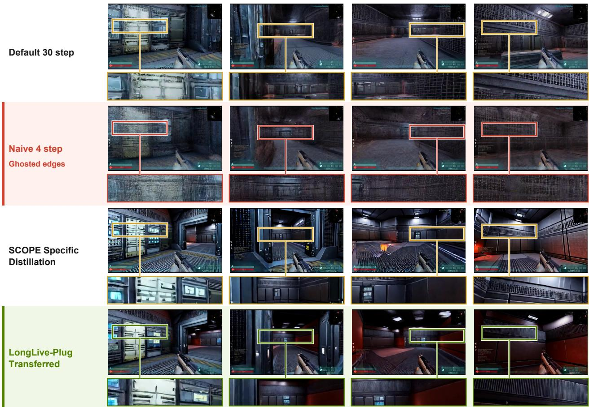  
Figure 8 Keyframe comparison on SCOPE. Four matched keyframes from an 81-frame sequence at 20 fps. Rows compare default 30-step inference, naive four-step sampling, SCOPE-specific distillation, and transferred LoRAs, using the same case and seed. Boxes mark identical image coordinates across methods; the strips below each frame magnify these regions. Red highlights the naive four-step row’s ghosted wall and door edges, while the distilled variants retain clearer boundaries and surface detail.

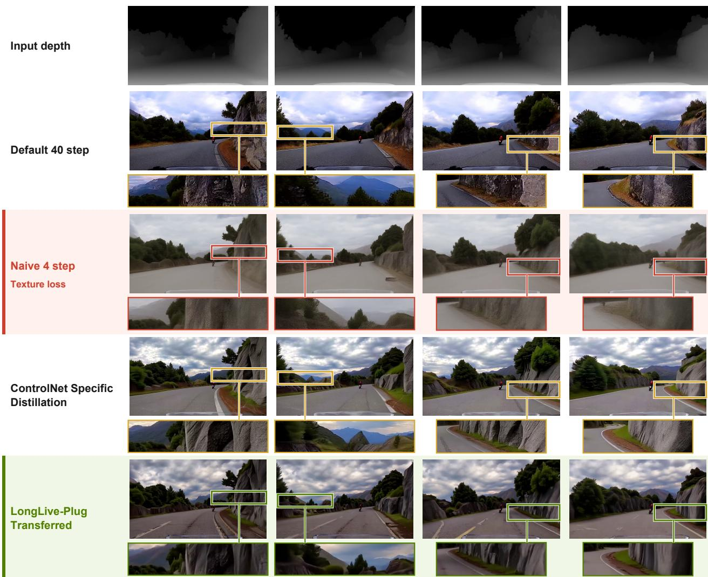  
Figure 9 Keyframe comparison on Wan2.2-Fun-5B-Control. Four matched keyframes compare input depth and four generation methods. Boxes mark identical image coordinates across methods, magnified in the strips below each output. Red highlights the naive four-step row’s smeared rock, foliage, and road details and low contrast. Columns match conditioning frame indices (depth at 30 fps, outputs at 24 fps). The transferred output uses an additional base-distilled adapter variant.

## C. Complete Transfer Coverage and Additional Cases

## C.1. Coverage Inventory

The inventory supporting Sec. 4.2 contains 54 distinct downstream model entries: 24 descendants of Wan2.1-14B, 24 of Wan2.2-TI2V-5B, and six of MiniMax-H3.

Each family uses an adapter distilled on its own base model. MiniMax-H3 natively supports inference without CFG, so its transfer experiments omit the CFG LoRA by default. We also train a CFG-only LoRA on the MiniMax-H3 base model and find that it supports distilled CFG inference with adjustable guidance (Fig. 16).

Table 5 Recorded transfer coverage across backbone families and tasks. Every listed Wan-model entry is evaluated for fourstep and CFG transfer. The two panels share the same backbone axis.
<table><tr><td>Backbone</td><td>World models</td><td>Robotics</td><td>ControlNet / structure</td><td>Camera / trajectory</td></tr><tr><td>Wan2.1-14B</td><td>FantasyWorld [19]; LongVie 2 [26]; Micro-World I2W [7]</td><td>DreamZero [90]; ABot-PhysWorld [13]; VERA</td><td>Fun Control [1]; TheDenk Dilated ControlNet [40]</td><td>Fun-V1.1 Control-Camera [2]; Wan-Move [17]; ATI [70];</td></tr><tr><td>Wan2.2-</td><td>Matrix-Game 3.0 [80];</td><td>DROID Planner [47] Boundless World Model [9];</td><td></td><td>NeoVerse [88]; Vista4D [48] Fun Control-Camera [4];</td></tr><tr><td>TI2V-5B</td><td>DreamX-World-5B AR [24]; SCOPE [66]; ReactiveGWM [77]; Spatia [99]</td><td>Fast-WAM LIBERO [94]; Motus Stage-1 VGM [8]</td><td></td><td>FlashMotion [46]; FrameINO v1.6 [71]</td></tr><tr><td>MiniMax-H3</td><td>H3-World [10]; Code World Model [12]; SolarWM-H3 [32]</td><td></td><td>Fun ControlNet-Union [6]</td><td>SolarWM-H3 [32]</td></tr><tr><td>Backbone</td><td>Editing / restoration</td><td>Subject / avatar</td><td>Audio / RGBA outputs</td><td>Domain / style / quality</td></tr><tr><td>Wan2.1-14B</td><td>VideoCoF [87]; SAMA-14B [98]</td><td>Stand-In [84]; MAGREF [20]; MagicTryOn [43]; InfiniteTalk [85]; MultiTalk [42]; FantasyTalking [72]; AniCrafter</td><td>Wan-Alpha v1/v2 [23]</td><td>Index-AniSora V2.0 [36, 38]</td></tr><tr><td>Wan2.2-</td><td></td><td>[54]</td><td></td><td></td></tr><tr><td></td><td></td><td></td><td></td><td></td></tr><tr><td></td><td></td><td></td><td></td><td></td></tr><tr><td></td><td></td><td></td><td></td><td>Aether action/VFX LoRAs [63];</td></tr><tr><td></td><td></td><td></td><td></td><td></td></tr><tr><td></td><td>Fun InP [5]; Kiwi-Edit [49];</td><td>TalkVerse-5B [78]</td><td></td><td></td></tr><tr><td></td><td></td><td></td><td>Ovi [50]; OmniCustom [45];</td><td>Loomis Painter LoRA [58];</td></tr><tr><td></td><td></td><td></td><td></td><td></td></tr><tr><td>TI2V-5B</td><td></td><td></td><td></td><td></td></tr><tr><td></td><td></td><td></td><td></td><td></td></tr><tr><td></td><td>StreamingEffect [64]</td><td></td><td></td><td></td></tr><tr><td></td><td></td><td></td><td></td><td></td></tr><tr><td></td><td></td><td></td><td></td><td></td></tr><tr><td></td><td></td><td></td><td>NAVA [37]; UniAVGen [95]</td><td></td></tr><tr><td></td><td></td><td></td><td></td><td></td></tr><tr><td></td><td></td><td></td><td></td><td></td></tr><tr><td></td><td></td><td></td><td></td><td>VideoGPA DPO LoRA [25];</td></tr><tr><td></td><td></td><td></td><td></td><td></td></tr><tr><td></td><td></td><td></td><td></td><td></td></tr><tr><td></td><td></td><td></td><td></td><td>PhysRVG [96]</td></tr><tr><td></td><td></td><td></td><td></td><td></td></tr><tr><td></td><td></td><td></td><td></td><td></td></tr><tr><td></td><td>LineartAnime [21]</td><td></td><td></td><td></td></tr><tr><td>MiniMax-H3</td><td></td><td>Viggle-Animate [68]</td><td></td><td></td></tr><tr><td></td><td></td><td></td><td></td><td></td></tr><tr><td></td><td></td><td></td><td></td><td></td></tr><tr><td></td><td></td><td></td><td></td><td></td></tr><tr><td></td><td></td><td></td><td></td><td></td></tr><tr><td></td><td></td><td></td><td></td><td></td></tr><tr><td></td><td></td><td></td><td></td><td></td></tr><tr><td></td><td></td><td></td><td></td><td></td></tr><tr><td></td><td></td><td></td><td></td><td></td></tr><tr><td></td><td></td><td></td><td></td><td></td></tr><tr><td></td><td></td><td></td><td></td><td></td></tr><tr><td></td><td></td><td></td><td></td><td></td></tr><tr><td></td><td></td><td></td><td></td><td></td></tr><tr><td></td><td></td><td></td><td></td><td></td></tr><tr><td></td><td></td><td></td><td></td><td></td></tr><tr><td></td><td></td><td></td><td></td><td></td></tr><tr><td></td><td></td><td></td><td></td><td></td></tr><tr><td></td><td></td><td></td><td></td><td></td></tr><tr><td></td><td></td><td></td><td></td><td></td></tr><tr><td></td><td></td><td></td><td></td><td></td></tr><tr><td></td><td></td><td></td><td></td><td></td></tr><tr><td></td><td></td><td></td><td></td><td></td></tr><tr><td></td><td></td><td></td><td></td><td></td></tr><tr><td></td><td></td><td></td><td></td><td></td></tr><tr><td></td><td></td><td></td><td></td><td></td></tr><tr><td></td><td></td><td></td><td></td><td></td></tr><tr><td></td><td></td><td></td><td></td><td></td></tr><tr><td></td><td></td><td></td><td></td><td></td></tr><tr><td></td><td></td><td></td><td></td><td></td></tr><tr><td></td><td></td><td></td><td></td><td></td></tr></table>

## C.2. Additional Wan Transfer Examples

## World modeling: horse riding

LongVie 2 | Native (50 steps)

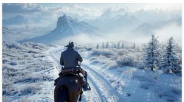  
1.25 s

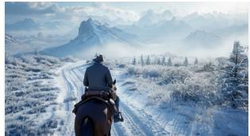  
3.75 s  
Robotics: Franka manipulation

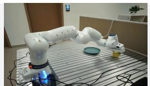  
ABot-PhysWorld | Native (50 steps)  
1.33 s  
Subject conditioning: virtual try-on  
MagicTryOn 14B V1 | Native (20 steps)

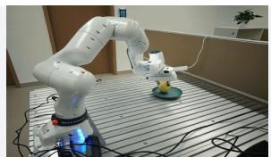  
4.00 s

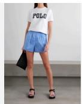

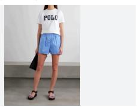  
3.75 s  
1.25 s  
3.75 s  
1.25 s  
1.33 s

Transferred LoRA | 4 steps, CFG distilled  
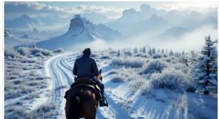

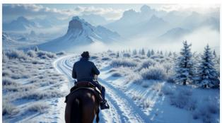

Transferred LoRA | 4 steps, CFG distilled  
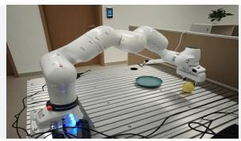  
Wan-Alpha v1/v2 | Native (50 steps)  
4.00 s

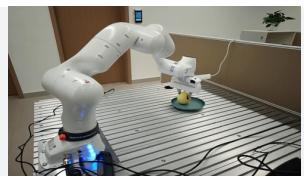

Extended output: RGBA generation  
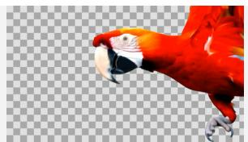

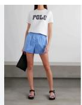  
Transferred LoRA | 4 steps, CFG distilled  
1.25 s

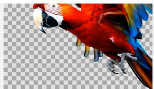

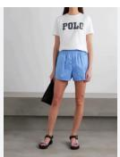  
3.75 s  
1.25 s  
3.75 s

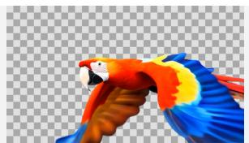  
1.25 s

Transferred LoRA | 4 steps, CFG distilled  
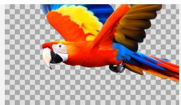  
3.75 s

Figure 10  Additional Wan2.1-14B transfer cases. LongVie 2, ABot-PhysWorld, MagicTryOn, and Wan-Alpha illustrate world modeling, robotics, subject conditioning, and RGBA output. Each row compares two native frames (left) with the same two timestamps after four-step transfer (right). Inputs and task conditions are paired in the source report. The checkerboard is part of the Wan-Alpha preview, not a measurement of alpha-channel accuracy. Changes in appearance and motion remain visible after transfer.

Transferred LoRA | 4 steps, CFG distilled

## Structure conditioning: depth

Fun-5B-Control | Native (40 steps)

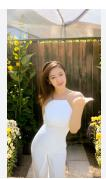  
1.25 s

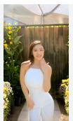  
3.75 s  
Transferred LoRA | 4 steps, CFG distilled

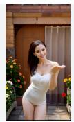  
1.25 s

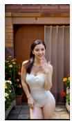  
3.75 s  
Trajectory control: sign motion

Task LoRA composition: painterly style  
FlashMotion | Native (50 steps)  
  
1.25 s

  
Video editing: input-conditioned edit Kiwi-Edit | Native (50 steps)  
3.75 s

  
1.25 s

  
3.75 s  
Transferred LoRA | 4 steps, CFG distilled

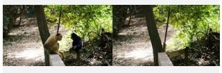  
1.33 s

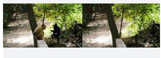  
4.00 s

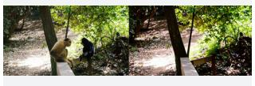  
1.33 s

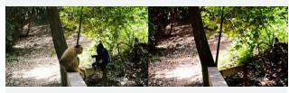  
4.00 s  
Loomis Painter LoRA | Native (50 steps)

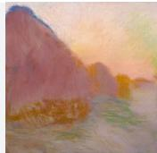  
6.67 s

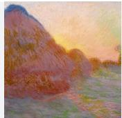  
20.00 s

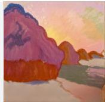  
Transferred LoRA | 4 steps, CFG distilled  
6.67 s

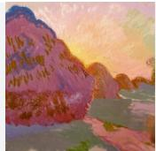  
20.00 s

Figure 11 Additional Wan2.2-TI2V-5B transfer cases. Depth-conditioned Fun Control, FlashMotion, Kiwi-Edit, and Loomis Painter cover structure, trajectory, editing, and style adaptation. The native and transferred columns show identical frame indices for each paired task input. Native inference uses 50 steps for Kiwi-Edit and Loomis Painter. All transferred outputs use four steps with CFG distilled into the adapter; downstream conditioning and task adapters are retained.

## C.3. MiniMax-H3 Transfer and Its Limits

The H3 comparisons show undistilled multi-step inference on the left (D), naive four-step Euler in the middle (E4), and four-step inference with LongLive-Plug on the right (S4). S4 uses fresh re-noising. The downstream conditions are fixed. E4 and S4 share the initial noise; D retains the native random-number generation path, so bitwise-identical initial noise across all three arms is not established. E4 to S4 changes both the adapter and sampler. The following examples assess the complete deployment recipe, not the isolated causal effect of adding a LoRA.

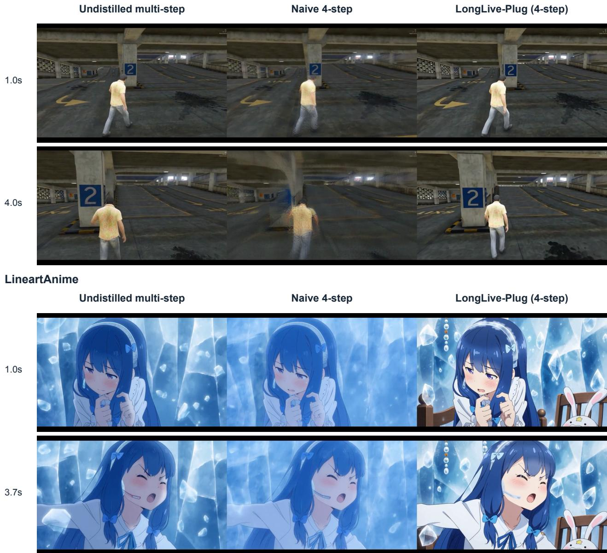  
Figure 12 H3 task transfer: action control and line-art coloring. Left: undistilled multi-step inference. Middle: naive four-step sampling. Right: four-step inference with LongLive-Plug. H3-World shows matched frames at 1 and 4 s under a forward-action condition. LineartAnime shows frames at 1 s and the final available frame (3.71 s). S4 preserves a clearer character outline than E4 in these examples, while appearance can differ from D. These static frames do not evaluate audio quality or synchronization.

SolarWM-H3: Museum atrium · vertical crane Undistilled multi-step  
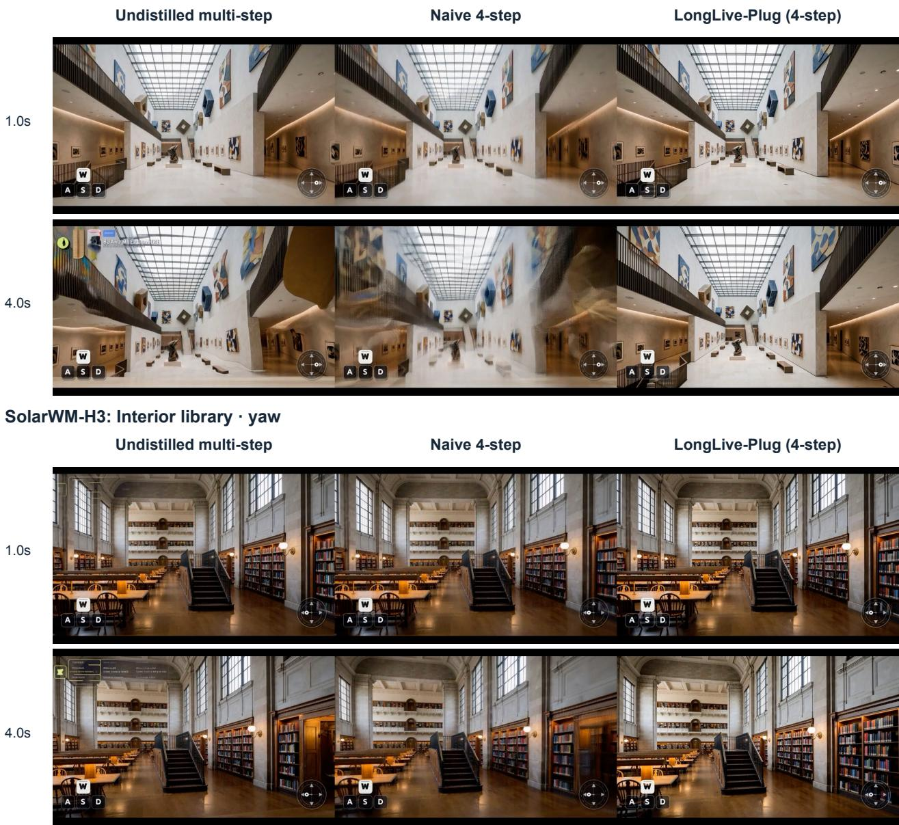  
Figure 13 H3 camera transfer includes a quality–control trade-off. Left: undistilled multi-step inference. Middle: naive fourstep sampling. Right: four-step inference with LongLive-Plug. In the museum-crane example, S4 retains clearer architectural detail and a visible upward-camera response. In the library-yaw example, S4 remains sharp but its change in framing is attenuated relative to D/E4. HUD elements are inherited from the supplied anchor images. These cases have no generated-video pose regression metric and do not establish precise trajectory adherence.

The ten H3 comparisons are single-seed cases, with no repeated-run confidence intervals. The native default is a reference operating point, not ground truth. Similarity to it cannot by itself measure action, camera, or structurecontrol accuracy. Runtime accounting also differs across H3 backends, so timings should only be compared within a task.

## D. Additional CFG Control Experiments

This section extends Sec. 4.3 with native-schedule CFG-only control and four-step composition. Displayed LoRA weights scale adapter residuals and are not calibrated runtime CFG scales.

## D.1. CFG-Only Control with the Native Schedule

Wan2.2-TI2V-5B. The CFG-only experiment uses the native 50-step FlowUniPC schedule, no few-step adapter, teacher scale $w _ { \mathrm { t r a i n } } = 5 ,$ and runtime CFG 1. Fig. 14 adds a flower-opening prompt using the main-text milk-splatter comparison protocol.

Prompt: fast-opening flower, vivid colors, detailed petals, pollen and stamens  
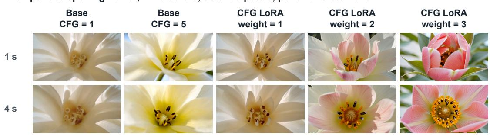  
Figure 14 Additional Wan CFG-only control example. Native CFG references and CFG LoRA weights 1, 2, and 3 use 50 sampling steps; LoRA outputs use runtime CFG 1 with one conditional evaluation per step. Matched frames at 1 and 4 s show more pronounced flower opening as the adapter weight increases.

MiniMax-H3. Native CFG and CFG LoRA outputs are compared in Figs. 15 and 16.

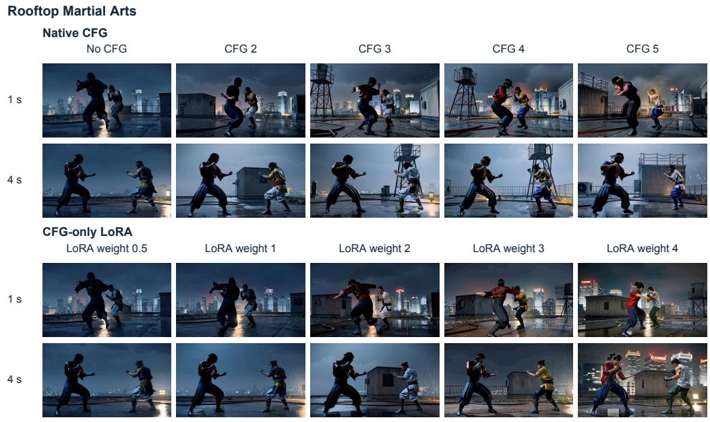  
Figure 15 Native CFG and CFG-only LoRA on Rooftop Martial Arts. Matched frames at 1 and 4 s compare native CFG (top: no CFG and scales 2–5) with CFG LoRA (bottom: weights 0.5, 1, 2, 3, 4). The prompt, seed, and native schedule are fixed; LoRA outputs use one conditional forward pass per step. LoRA weights are not calibrated native CFG scales.

The MiniMax-H3 CFG-only report covers 34 prompts, seven native reference conditions, and six adapter weights per prompt (442 videos). The adapter is trained at CFG scale 3 and uses no external CFG. The native 50-step scheduler performs 49 denoising updates (one conditional forward per LoRA update), generating 124 frames at 24 fps and 1344 × 768 resolution; video/audio flow shifts are 12/3. Figs. 15 and 16 show Rooftop Martial Arts, Night village— neutral, and Night village—subtle Van Gogh influence. Each case places native CFG above CFG LoRA with matched frames at 1 and 4 s and a fixed prompt and seed. Native columns use no CFG and scales 2–5; adapter weights are 0.5, 1, 2, 3, and 4.

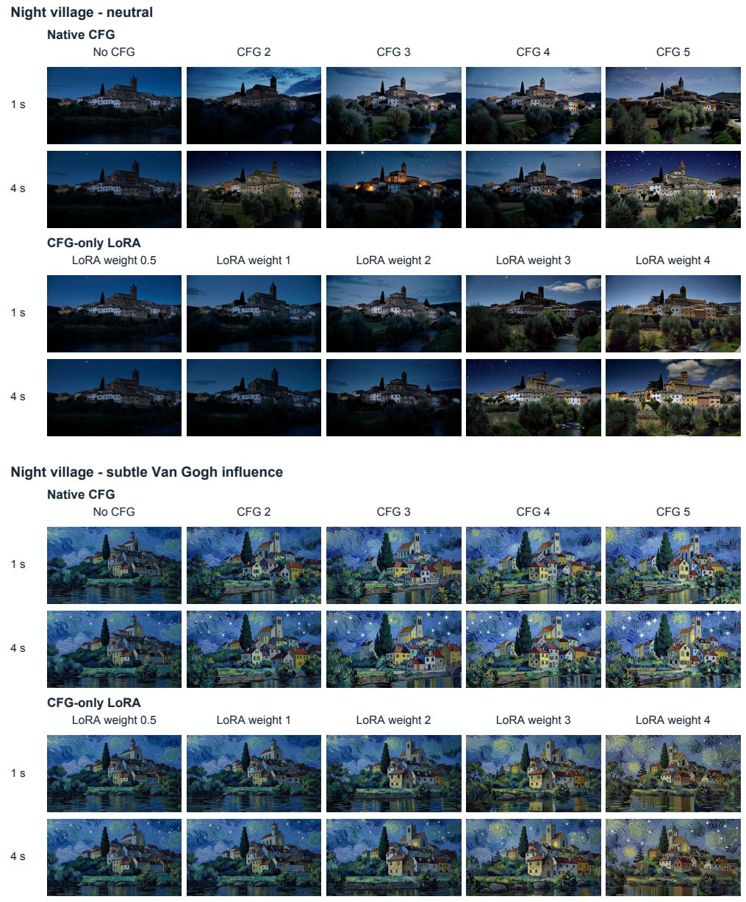  
Figure 16 Native CFG and CFG-only LoRA on the two night-village cases. Each case places native CFG above CFG LoRA at matched 1 and 4 s frames, using the sweeps in Fig. 15. The prompt, seed, and native sampling schedule are fixed within each case.

## D.2. Independent CFG Control with a Few-Step Adapter

We compose the two branches as $\Delta W = \Delta W _ { \mathrm { s t e p } } + \lambda _ { \mathrm { c f g } } \Delta W _ { \mathrm { c f g } } .$ . The few-step weight remains 1 while $\lambda _ { \mathrm { c f g } } \in$ {0.5, 1, 2, 3, 5} varies. Every output uses four denoising steps, distilled CFG, and scheduler shift 5. Within each sweep, the prompt, seed, conditioning, and action sequence are fixed. These examples show that the CFG branch remains an effective semantic control when combined with the few-step branch.

## SCOPE: snow-covered valley

CFG weight 0.5

CFG weight 1

CFG weight 2

CFG weight 3  
CFG weight 5  
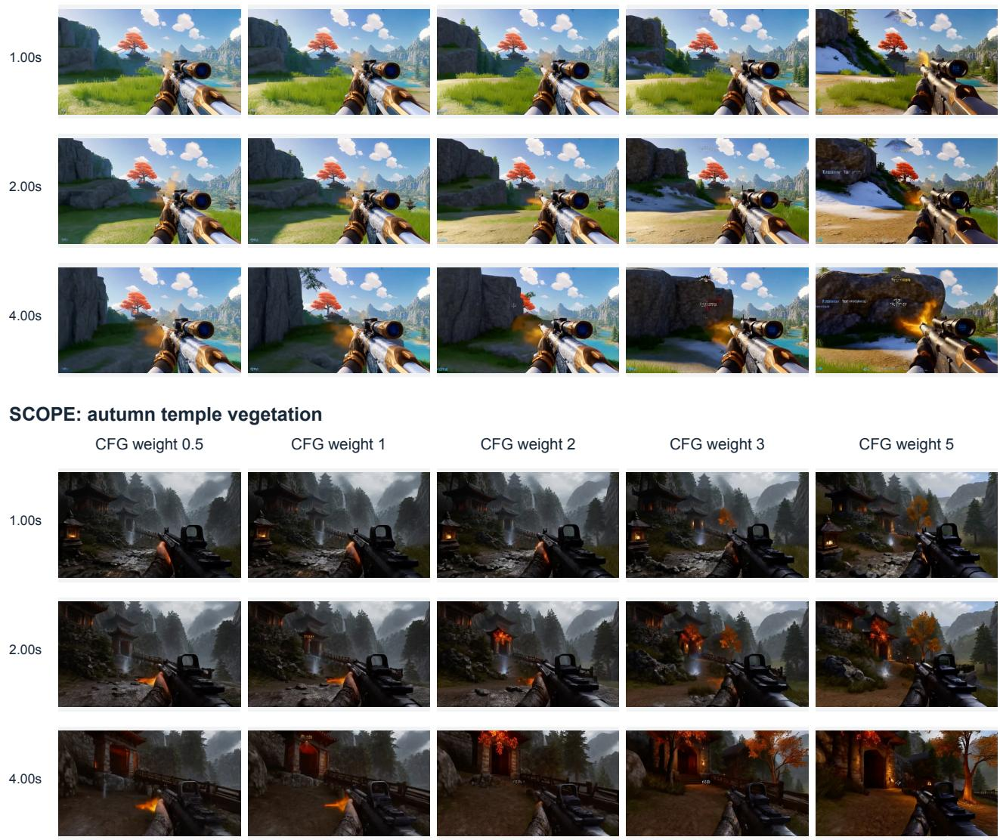  
Figure 17  CFG-branch control with four-step SCOPE generation. The prompts request snow cover in a mountain valley and autumn vegetation around an ancient temple. Both use 81 frames at 20 fps; rows show 1, 2, and 4 s. Increasing the CFG-branch weight strengthens the snow cover and orange-red foliage, while the few-step weight stays at 1. An excessively large weight (5) degrades quality, changing geometry and introducing spurious text.

CFG weight 5  
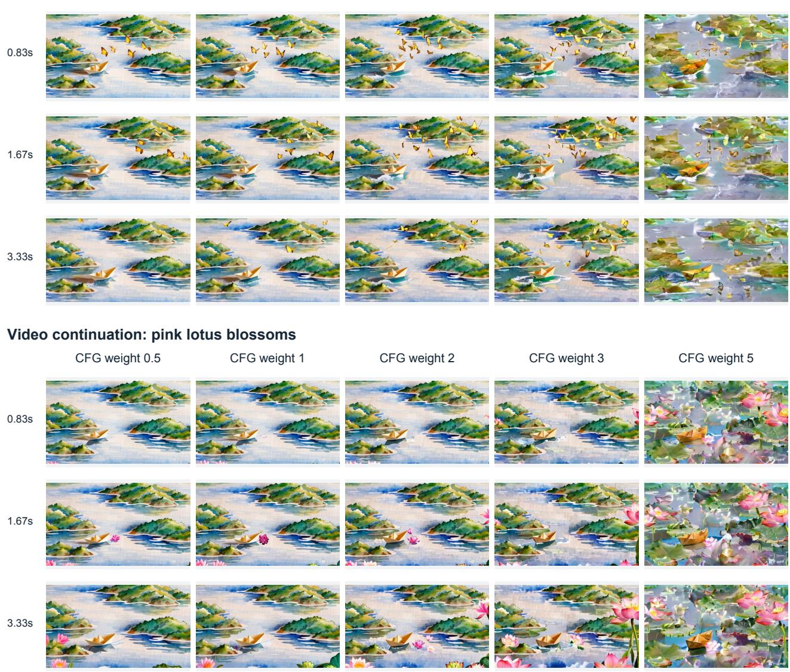  
Figure 18 CFG-branch control with four-step video continuation. We continue the same watercolor paper-boat input with golden butterflies or pink lotus blossoms. The last 24 input frames condition 81 new frames at 24 fps; displayed times are relative to the generated continuation. Weights 2–3 produce more visible and persistent butterflies or more prominent lotus blossoms. At weight 5, dense generated content comes with fragmented scenery and stronger changes to the boat and islands. The few-step branch remains fixed at weight 1 in every column.

Figs. 17 and 18 show that increasing the CFG LoRA weight strengthens text guidance, making the requested attributes more pronounced. However, overly large weights, such as 5, degrade visual quality. The CFG LoRA weight should therefore be adjusted within a reasonable range for each task, balancing text guidance and visual quality.

## E. Long-Context Qualitative Comparisons

This section accompanies Sec. 4.5, with long rollouts on ReWorld and Matrix-Game 3.0.

## E.1. ReWorld

Fig. 19 retains two 64 s cases with matched prompts, camera trajectories, and initial noise. Generated layouts can differ across methods.

(a) Modern interior  
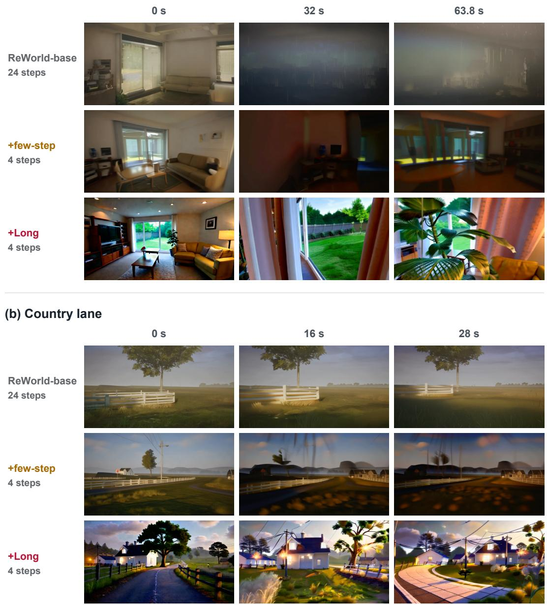  
Figure 19 Long-rollout qualitative comparisons on ReWorld. Matched frames from a modern interior and a country lane. The +Long outputs retain more visible texture and object detail at late times.

## E.2. Matrix-Game 3.0

We show two cases. Each rollout has 1,057 frames at 17 fps and lasts 62.18 s. All four methods share the same input image, prompt, seed, and frozen action sequence.

## Matrix-Game 3.0: animated city

7.76 s  
31.06 s  
54.35 s  
62.12 s  
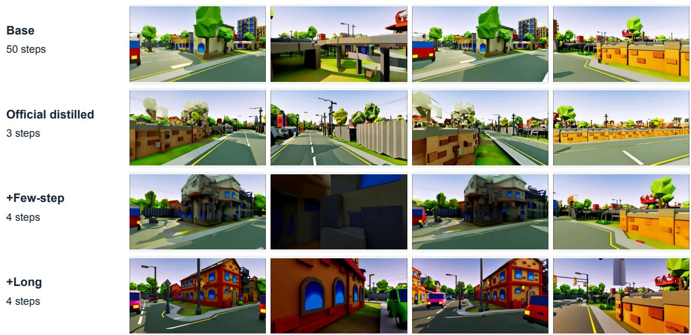  
Figure 20 Long-context transfer to Matrix-Game 3.0: animated city. Columns show native frames 132, 528, 924, and 1,056 (zero-based), spanning early, middle, and late stages of the same 62.18 s rollout. The +Long output retains distinct facade edges and street objects at late times.

## Matrix-Game 3.0: overgrown stone temple

7.76 s  
31.06 s  
54.35 s  
62.12 s  
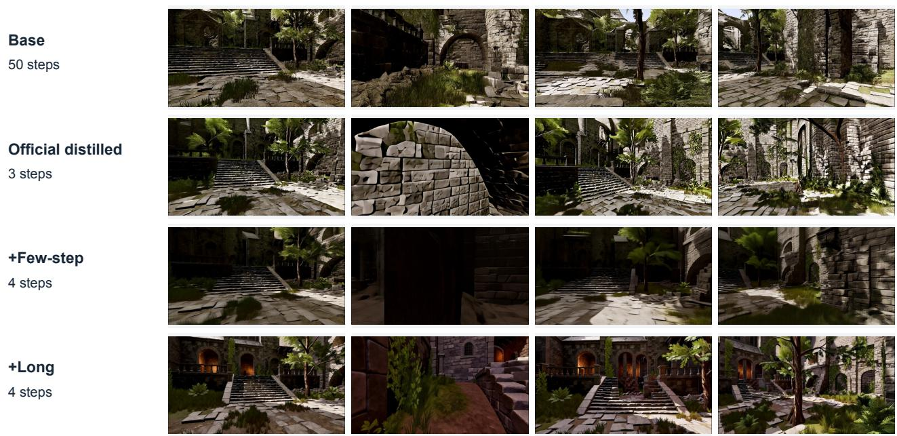  
Figure 21 Long-context transfer to Matrix-Game 3.0: overgrown temple. The same methods and timestamps as Fig. 20 compare stone architecture and vegetation. The +Long frames preserve visible stone-block boundaries, steps, and foliage late in the rollout, while appearance and layout vary across methods.