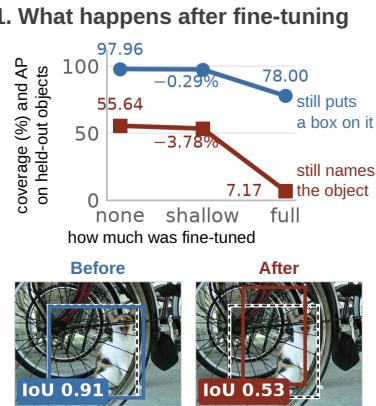
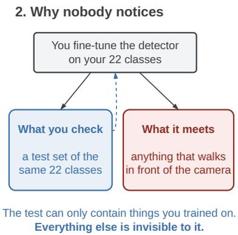
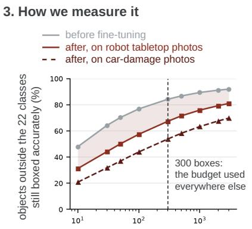
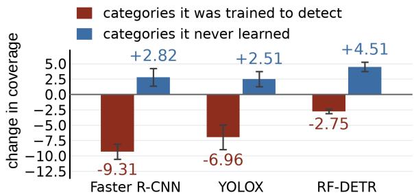
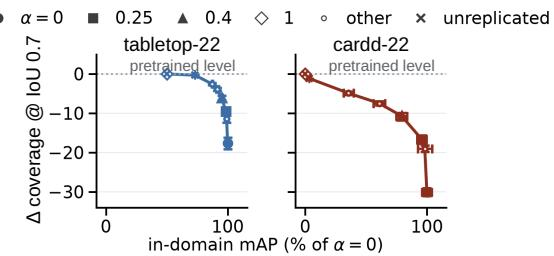

# Losing the name before the box: measuring and repairing what narrow fine-tuning costs a detector outside its deployment vocabulary

Trung Minh Bui1, Jongsul Moon1, YoungOuk Kim1, Jung-Hoon Hwang1, Dongin Shin1\*

1\*Intelligent Robotics Research Center, Korea Electronics Technology Institute, Seongnam, 13449, Republic of Korea.

\*Corresponding author(s). E-mail(s): di shin@keti.re.kr; Contributing authors: minhtrung@keti.re.kr; moonjongsul@keti.re.kr; kimyo@keti.re.kr; hwangjh@keti.re.kr;

## Abstract

A detector pretrained on a broad corpus is fine-tuned on a narrow domain, its in-domain accuracy improves, and it ships. We ask what happens meanwhile to its coverage of objects the vocabulary never names, which in obstacle detection and inspection carry the risk. No in-domain test set holds an example of one.

We give a longitudinal protocol: one pretrained checkpoint against its own fine-tuned descendants. It tracks held-out top-K proposal coverage Cτ: of categories pretraining covered and the vocabulary omits, the share of boxes a detector’s top K regions still cover. The quantity is the open-world proposal literature’s; the longitudinal reading is not.

C falls while in-domain accuracy rises, on four architectures and three domains, by 5.12 to 63.35 points at IoU 0.7 on boxes above 1024 px2. No in-domain number identifies the fall, and neither does detection average precision, which charges a missed and a misnamed box alike. On the one architecture scoring both, adaptation costs 87% of the AP against a fifth of the coverage, and the naming goes first at all six depths of its freeze ladder, every run.

What breaks is structured: three architectures sharing no pretraining run agree on which categories lose coverage, and those a model never learned do not lose any. A repair follows and needs no training: mixing a quarter of the pretrained state back, normalisation statistics included, raises coverage on every cell swept for at most 2.47 points of in-domain accuracy. Seeing it costs one extra evaluation pass.

Keywords: Object detection, Open-vocabulary detection, Fine-tuning, Catastrophic forgetting, Region proposals, Model evaluation

## 1 Introduction

Open-vocabulary detectors are pretrained on broad corpora and then fine-tuned on the narrow vocabulary of a deployment domain (Zhu and Chen, 2024), a practice whose cost to openworld generalisation the detectors’ own authors have reported (Minderer et al, 2023). A typical instance pairs a checkpoint pretrained on the 80 COCO categories with 247 labelled images and 22 classes. The in-domain metrics improve, so the model ships. Meanwhile the detector has become worse at putting a box on objects the deployment vocabulary never named, and the in-domain metrics cannot report it. The test set that certified the adaptation contains no such object, so the loss lies outside its support.

Where this matters. The objects that carry the risk are the ones outside the label set, which is the ordinary case in obstacle detection, inspection and monitoring. For a monitoring system a lost proposal costs a missed record. For a safety-critical perception stack it is an object the downstream planner never sees at all, and §8 says where that turns this measurement into a release gate.

Coverage of 21,861 COCO boxes whose categories the deployment vocabulary omits moves the other way, on every one of four architectures (Table 4). OWLv2 loses the most, from 97.96 to 78.00 at IoU 0.5 and from 90.06 to 37.82 at IoU 0.7, where every loss is larger. Figure 1 is the result in one picture.

Held-out top-K proposal coverage, written $C _ { \tau }$ , is the fraction of ground-truth boxes, in categories a deployment vocabulary does not name, for which at least one of a detector’s top-K regions reaches IoU $\geq \tau \ ( \ S 3 )$ . Every empirical claim below is a claim about $C _ { \tau }$ , and Table 2 separates it from the three quantities it is easiest to confuse it with.

Recall on categories a detector was not trained to name is an established measurement (Kim et al, 2022; Konan et al, 2022; Hosang et al, 2016), and it is the family $C _ { \tau }$ belongs to. We inherit that measurement and change its use. Open-world proposal work scores one training recipe against another. We score one pretrained checkpoint against its own fine-tuned descendants, across architectures, freeze depth, deployment domains and the interpolation path between the two checkpoints. That path is the robust-fine-tuning construction of

Wortsman et al (2022), used here to repair a capability rather than to raise accuracy under distribution shift.

$C _ { \tau }$ is not a measurement of class-agnostic localisation, the general ability to put a box on an object whose name the model was never given. Coverage at one budget and two thresholds is one consequence of that ability, not the ability itself. A model can keep the ability and still lose $C _ { \tau }$ either by reordering its proposals or by moving one slightly across the threshold. §5.1 measures how much of the fall each of those two accounts for.

Two adaptation recipes reaching the same indomain accuracy, 18.16 mAP on cardd-22, difer by 11.37 points of $C _ { \tau }$ . Within one recipe, five seeds span 2.25 points, and the highest-accuracy seed is the worst of them (§3.2). An in-domain test set holds no object the model has no name for, so nothing computed on it separates such a pair. That holds whether the functional is mAP, AP50, AR100, recall or calibration. This is a statement about what an in-domain number determines, not about correlation: the two may still correlate, and §6.1 shows that they do.

This sits inside catastrophic forgetting (McCloskey and Cohen, 1989) rather than beside it. It is one component of it, measured apart from the others. Mai et al (2024) show that much of what fine-tuning appears to destroy on other classes is “the discrepant logit scales between the fine-tuning classes and the other classes”, which calibration undoes afterwards. That account cannot reach the quantity measured here: their remedy is a monotone rescaling of logits, and no monotone rescaling changes which K candidates are largest, so it moves $C _ { \tau }$ by exactly zero (§S1.12). The standard defences constrain the weights or replay old data, and detection has its own line of them. Both report preservation as detection AP, on base and novel splits or in aggregate (§2); Minderer et al (2023) report the open-world ability falling in proportion to fine-tuning duration. Detection AP charges both failures to one number: a box no longer put on the object, and a box put on it and named wrongly. It cannot say which occurred.

On the one architecture that can be scored both ways, the two separate widely and in an order. After fine-tuning OWLv2 still proposes about three quarters of those objects while its detection AP on them falls from 55.64 to 7.17, and the naming goes first at every depth of its freeze ladder (§4.1).

  
how many boxes the detector is allowed to output  
Fig. 1 Fine-tune a detector on a narrow set of classes and it gets worse at finding everything else. The test that signs it of cannot show you. 1 OWLv2, five seeds, on the 21,861 COCO objects no deployment vocabulary names. One line is the share of them it still puts a box on; the other is its detection AP on the same boxes. Both run 0 to 100 but are not the same unit, so the two percentages give what each has lost of its own starting value (§4.1). Below, the same two checkpoints on one image. IoU measures how much a predicted box overlaps the true one, so the photographs show the boxing, the half that largely survives. The pair is the median of 586 qualifying boxes, not an extreme one (§4.3). 2 The in-domain test set holds no such object, so it cannot report any of this. 3 What we count, at every budget. The gap is still open at 3000 boxes, so the budget of 300 used elsewhere does not create it (§S1.40). Panels 1 and 2 are the problem and panel 3 the instrument; the repair is Figure 3.

## Contributions.

The measurement is the methodological one: heldout top-K proposal coverage read longitudinally, one pretrained checkpoint against its own finetuned descendants rather than one training recipe against another. It comes with the invariance proposition of §S1.39 that decides which freeze depths can move the number at all. It costs one evaluation pass, needs no held-out labels beyond those a public benchmark already carries, and is released as covprobe. What it establishes falls in four groups, and Table 1 is the same ten statements with the evidence behind each.

What happens. (1) C falls while in-domain accuracy rises, on four architectures and three deployment domains. (2) No functional of the indomain test distribution identifies the fall, and a constructed pair of checkpoints matched on indomain accuracy difers widely on it. (3) The name goes before the box, and detection AP cannot report it. On the one architecture where both are defined, adaptation costs 87% of the AP against a fifth of the coverage, and the ordering holds at all six depths of its freeze ladder, in every run behind every depth, by 3.49 points at the knee at IoU 0.5 (§4.1).

Which objects it happens to. (4) What is damaged is what the checkpoint already had: over 752 LVIS categories split on pretraining exposure alone, the ones the model never learned do not lose coverage at all, they gain it, while the ones it learned lose between 2.75 and 9.31 points. The two groups move in opposite directions on all three architectures. (5) Three architectures sharing no pretraining run agree on which categories lose coverage, which makes the spread across categories a property of the category rather than of any one checkpoint.

How they are lost. (6) At IoU 0.5 the fall is mostly which candidates the model ranks into its budget; at IoU 0.7 about half of it survives as a coordinate change that no reordering recovers, and which of the two dominates there difers by architecture. (7) The account the open-world literature would give, that adaptation pushes unmatched regions to background, is measured on both sides and carries a minority of the drop.

What to do about it. (8) Freeze depth is an architecture-dependent control rather than a recipe, so we give a measurement procedure in its place: run the stages, discard those whose indomain accuracy says the fit failed, and ship from the Pareto front. (9) We give a repair that needs no training run: interpolate the pretrained state back at α = 0.25, a fraction a stated in-domain budget returns and which survives being chosen leave-onecell-out. It recovers coverage on every architecture and domain swept for at most 2.47 points of indomain accuracy. (10) That repair works through the normalisation statistics, and moves them the way the literature on them argues against. Reestimating on deployment data is the standing recommendation. On the one architecture where the two halves of the state were separated it is worse than leaving them fine-tuned on one domain, and recovers about a third of the gap on the other (§7).

Table 1 Everything this paper claims, and what each claim was tested on. Ten claims in the four groups the contributions are stated in; ⋆ marks the five that are new here and • the rest, which confirm or adapt a result the literature already carries (§2). Every row’s principal measurement rests on five or more independent seeds; where a row adds a supporting leg carrying fewer, the middle column or the section it names gives the count. The middle column says how widely each claim was tested. Four further claims, resting on less and argued only in the supplement, are in Table S35.
<table><tr><td>claim</td><td>replicated over</td><td>where</td></tr><tr><td colspan="3">What happens</td></tr><tr><td>• A detector fine-tuned on a narrow vocabulary puts a box on fewer objects outside it, while its in-domain accuracy improves</td><td>4 arch, 3 domains, 5 seeds, 2 further image sets, §4 2 checkpoints</td><td></td></tr><tr><td>• In-domain accuracy does not determine held-out coverage: across five seeds of one recipe it varies by 1.54 mAP while recipe pair differs by 11.37 points, and a disjoint- coverage varies by 2.25 points, and the most accurate seed is</td><td>5 seeds within one recipe; a constructed cross- §3.2 support argument covers any in-domain func-</td><td></td></tr><tr><td>the least covered ★ The name goes before the box. After adaptation the 1 arch, the only one scorable by name; 1 domain; §4.1 model still puts a region on about three quarters of these all 6 rungs of its ladder, 3 or 5 seeds each but objects and keeps an eighth of its AP on them, and already at one, every run agreeing at both thresholds and</td><td>tional</td><td></td></tr><tr><td colspan="3">a shallower freeze depth every seed has given up more of its every replicated rung clear of zero naming than of its boxing Which objects it happens to</td></tr><tr><td>Categories the pretrained model never learned do not lose cov- clear of zero, every seed sharing its cell&#x27;s sign</td><td>★ What is damaged is what the checkpoint already had. 3 arch, 752 LVIS categories, 5 seeds; all six cells §5.3</td><td></td></tr><tr><td>erage; they gain it the model. Three architectures that share no pretraining run support-floor sweep and cross-domain placebo</td><td>★ Which objects are lost belongs to the object, not 3 arch, 2 domains, 333 categories, 5 seeds each; §5.4</td><td></td></tr><tr><td colspan="3">agree on which categories lose coverage How they are lost</td></tr><tr><td>one. The object is still proposed at IoU 0.5 and no longer ranked into the budget; at IoU 0.7 about half the loss is the box having moved, and which of the two dominates there differs by</td><td>★ Ranked out at the loose threshold, moved at the tight the crossing, 2 arch, 2 domains, 5 seeds; the enu- §5.1, §5.2 meration beside it is 1 arch, 3 seeds</td><td></td></tr><tr><td>architecture • Background suppression accounts for a minority of the drop 2 arch, 2 domains, 5 seeds; 20 of 20 seed pairs §5.5</td><td>move the same way at IoU 0.5, 19 of 20 at IoU 0.7</td><td></td></tr><tr><td colspan="3">What to do about it</td></tr><tr><td>recipe</td><td>• Freeze depth is an architecture-dependent control, not a 4 arch, 7 ladders; every inverting rung at 5 seeds §6.1</td><td></td></tr><tr><td>• Interpolating a quarter of the pretrained state recovers cov- 3 arch, 2 domains, 5 seeds erage on every cell swept, for at most 2.47 points of in-domain accuracy and no training run</td><td></td><td>§7, Figure 3</td></tr><tr><td>them argues against. Re-estimating on deployment data, the of zero at both thresholds standard move, is indistinguishable in domain and costs 2.2 to 4.8 points of coverage; moving them back toward pretraining</td><td>★ The repair works through the normalisation statis- 1 arch, 2 domains, 5 seeds; the prescribed arm is §7, Table S16 tics, and moves them in the direction the literature on negative on every seed of one domain and clear</td><td></td></tr></table>

## The claims and their scope.

Table 1 states every claim, the evidence behind it and the scope it is made at. Each row carries its own limits where the claim is made.

covprobe returns Cτ for a checkpoint, and an architecture enters it through one function. Code and every measurement accompany this submission, including the measurements a fault invalidated and the runs that replaced them, and will be released publicly on publication. Rebuilding any coverage number reported here from the per-image counts behind it needs no GPU. §2 places the result against existing accounts of forgetting. §3 defines the measurement and argues that no in-domain evaluation determines it. §4 reports the coverage drop and §5 asks what is associated with it. §6 turns that into practice and §7 prices the repair, §S5 extends it from localisation to unseen vocabulary, and §8 states what the measurement does not establish. Appendix S1 opens with a map of its supporting measurements.

Table 2 Four quantities this paper keeps apart, because they are easy to confuse and only the first is measured here. Table 3 sets it against the instruments that might have been used in its place.
<table><tr><td>term</td><td>what it denotes</td></tr><tr><td>held-out top-K proposal coverage</td><td>What we measure. Of the objects whose class the deployment vocabulary never names, the share that at least one of the detector&#x27;s top K boxes still lands on (Equation 2). Held out means held out of the deployment vocabulary, not of pretraining: the pretrained model was trained on every one of these classes, so</td></tr><tr><td>class-agnostic localisation</td><td>this is what a checkpoint keeps, not what it generalises to What it stands in for. Putting a box on an object whose name the model was never given. Not measured directly, and coverage can record a miss while this is</td></tr><tr><td>open-world proposal recall</td><td>intact Where it comes from. Average recall on categories held out of training, an established measurement (Kim et al, 2022; Konan et al, 2022). We keep it and change its use: from scoring a training recipe to reading one checkpoint before</td></tr><tr><td>unseen-vocabulary recognition</td><td>and after adaptation A different thing. Whether the model can still name categories withheld from adaptation. OWLv2 only, in mAP, never mixed into the coverage axis (§S5)</td></tr></table>

## 2 Related work

Several literatures bear on this measurement, and each is taken in turn. Table S2 sets out where each one’s protocol difers from ours; the paragraphs below say what each measures and what its evidence leaves open.

## 2.1 The measurement is inherited; the longitudinal use is not

Recall on categories a detector was never trained to name is established, and the quantity used here belongs to that family. Kim et al (2022) report average recall at proposal budgets from ten regions to a thousand on categories held out of training, which is Equation 2 at a diferent set of budgets. Konan et al (2022) name the setting Open-World Proposals and score average recall on novel classes, including AR@300 on LVIS (Gupta et al, 2019). Average recall at a proposal budget is itself Hosang et al (2016)’s. Computed beside

$C _ { \tau }$ on our own population it agrees on sign and on the ordering of the cells. Its drop falls between the two thresholds’ in all four (Appendix S1.13), so neither of those turns on our choice of τ. Its level is lower throughout, which it must be, since it averages recall out to IoU 0.95. Openworld detection carries the same idea as U-Recall, counting unknown objects a model localises without naming them (Joseph et al, 2021). Zhu and Chen (2024) survey the wider open-vocabulary literature these measurements sit in, where the generalisation at stake is to categories outside a model’s training vocabulary.

Decomposing AP asks which failure occurred, of a diferent population. Hoiem et al (2012) sort a detector’s errors into named types and Bolya et al (2020) weight each by the average precision it costs, separating a region localised well and misnamed from one missed altogether. That accounting runs over the detections a model emits; ours runs over the regions it proposes (Table 3).

In each of those evaluations the object under study is a design and the recall figure is the score that design earns. Ours is a checkpoint that already has the recall, and although the instrument is theirs, the question is what a fine-tune on a few hundred narrow-domain images does to it. The categories are held out of the deployment vocabulary while remaining in pretraining, so the quantity is retention of something the checkpoint demonstrably had. The comparison is also longitudinal within one checkpoint rather than across designs.

## 2.2 Mechanisms proposed for the drop, and what each protocol can see

Prior work ofers two accounts of why an adapted detector stops proposing things. A classification objective may teach the proposal mechanism to suppress what it was not asked to find, or forgetting may concentrate in particular components. The first account is still being built on: Kormushev et al (2026) attribute lost masks in openvocabulary panoptic segmentation to “objectness heads trained on closed vocabularies” and adjust the objectness probability to recover them. §5.5 measures how much of a detector’s coverage loss that pathway can carry. Incremental detection asks the neighbouring question of what a detector loses when its label set grows (Shmelkov et al, 2017; Wu et al, 2025), where ours narrows. Which of these survives contact with our data is tested in §5, and the literature each belongs to is set out in §S6.11.

## 2.3 What to move, and what to leave alone

Where to intervene has been studied without reference to proposal coverage: Lee et al (2023) show the layers worth tuning depend on the kind of shift, and Ruis et al (2025) adapt an openvocabulary detector on the text side with the backbone frozen. Weight interpolation is established as a patch (Wortsman et al, 2022; Ilharco et al, 2022). The repairs compared in §6 are drawn from those families and priced against each other on one axis (§S6.9).

A separate line treats a network’s normalisation statistics as a domain-carrying object that can be acted on by itself. Li et al (2018) adapt by recomputing them on target data with nothing trained; Schneider et al (2020) report the same swap improving corruption robustness across 25 models; Nado et al (2020) do it at prediction time; Wang et al (2021) optimise through them at test time. That literature prescribes moving the statistics toward the deployment domain, and is judged on accuracy there. §7 runs that arm and finds it does what the literature promises while costing held-out coverage. In-domain accuracy is indistinguishable from the arm we ship; held-out coverage falls. These are two objectives rather than a contradiction, and the one that serves the first is the wrong direction for the second. Two later methods stop short of replacing the source statistics: Lim et al (2023) interpolate source and test statistics with a learned per-layer weight, and Su et al (2024) accumulate them across test batches. Both keep some of the source estimate, which is the direction our result points, although both fit or accumulate over the statistics alone where we interpolate the whole state with one scalar. Neither is tested here. Nado et al (2020) already flag the interaction, reporting mixed results for the method alongside pre-training, and Neyshabur et al (2020) separate low-level input statistics from feature reuse as distinct carriers of what transfer transfers. Nor is it new that the two halves of the state need separate treatment. Li et al (2024) merge domain-adapted models by handling “model parameters and model bufers” as two problems, where linear merging sufices for the first although the second needs a fitted prior. What §7 adds is a price for the split on one architecture.

Averaging as a repair is also studied outside distribution shift. Kleiman et al (2025) merge a training model with its own earlier checkpoints and beat Task Arithmetic, TIES, WiSE-FT, L2 and EWC on sequential tasks, a comparison set that overlaps Table S45. §S4 finds averaging along the trajectory recovers nothing here. The two are consistent: their averaging spans tasks, ours would span iterates already inside one fine-tuned basin. Cross-domain few-shot detection reaches the same concern from the accuracy side, with Yu et al (2026) retaining pretrained weights through finetuning and scoring the result on further detection benchmarks rather than on proposal coverage.

## 2.4 What this paper adds

Table S2 places this work as a combination of two existing protocols rather than a new instrument. The open-world proposal literature separates proposing from naming and measures it carefully, on designs trained from scratch with the evaluated categories deliberately withheld. The forgetting and robust-fine-tuning literatures follow one pretrained checkpoint through adaptation, which is our comparison, and score it with detection AP or classification accuracy. Those aggregates charge a missed box and a wrong name to one number, and $\ S 1$ measures how far apart the two come on the one architecture that defines both. Reading a class-agnostic, pre-NMS coverage longitudinally, on categories the checkpoint was pretrained on, is what separates them. We show alongside it that under an unrestricted hypothesis class the quantity is not identifiable from any in-domain evaluation functional, and give the measured pair of checkpoints that carries the point empirically (§3.2).

That leaves the question of whether this is forgetting measured with a diferent metric. Wu et al (2025) give the sharpest prior answer, localising forgetting in two-stage incremental detection to the RoI-head classifier “rather than degradation in RPN’s recall capability”. That is the prior result closest to contradicting this one. The two protocols difer in what each holds fixed. Their splits draw every stage from one image distribution and change only the label set, so thei RPN never meets a distribution it was not pretrained for. Here the adaptation images move and the evaluation stays on the original distribution. Neither protocol can name the fragile component alone, and together they say the locus depends on which shift is imposed (§S6.11). Two components move here, and they are measured on diferent populations of architecture. Naming and boxing separate on the one architecture that scores both (§4.1). Inside coverage itself, on the three architectures whose candidates carry an index, the fall at IoU 0.5 is predominantly which candidates are selected rather than how they are named, and it appears in one-stage anchor and query-based detectors with no RoI head at all. The two readings are not in tension: the first compares two metrics on the same boxes, the second decomposes one of them. Robinson et al (2026), whose detector is one of the four measured here, reach the naming half from the other side. Prompting a fine-tuned Grounding DINO with real class names rather than class indices buys almost nothing across a hundred narrow domains, which they read as naive end-to-end fine-tuning “mitigat[ing] the benefits of open-vocabulary pre-training”. Theirs is presence against absence on one comparison;

what is measured here is how much of the naming goes against how much of the boxing. Zhang et al (2026) define a class-agnostic object recall for the reason $C _ { \tau }$ is defined here, that “unlike mAP, oRecall directly quantifies the model’s ability to localize foreground objects independent of category-level classification”. They attribute its fall under full and backbone tuning to “corrupting the previously learned objectness scoring and feature statistics”, the two components §5.1 and $\ S 7$ separate and price. Their label space is fixed while the image domain moves; ours is the deployment vocabulary narrowing, so their held-out categories were in training and ours are held out of it. The damage also has a structure a forgetting account does not predict. Architectures that share no pretraining run agree on which categories lose coverage, and a category’s fate follows its prior coverage rather than its name (§5.4, §5.3). Two categoryindependent rates then reproduce the aggregate on a benchmark they were never fitted to (§S1.4). A coverage drop depends on the benchmark it was read on as much as on the model. A rate pair describes the adaptation itself, so two studies measuring the same damage on benchmarks of different baseline coverage will report diferent efect sizes without either being wrong.

## 3 Measurement protocol

## 3.1 Held-out top-K proposal coverage

Let $\mathcal { R } _ { K } ( M , I )$ be the K regions detector M retains on image I under its own selection rule. That rule is an objectness ranking where the architecture has one, the whole query set where it does not, and a text-conditioned ranking for Grounding DINO; Table S38 gives each. Let B be a set of (image, ground-truth box) pairs, and write

$$
\mathrm { I o U } ^ { \star } ( M , I , b ) \ = \ \operatorname* { m a x } _ { r \in \mathcal { R } _ { K } ( M , I ) } \mathrm { I o U } ( r , b )\tag{1}
$$

for the overlap the best of those K regions reaches on box b. This is the quantity §5.2 takes apart, since a region can lose it either by falling out of

Table 3 Why the standard instruments cannot report this loss. Everything above the rule is read from the detections a model finally emits, so it can speak only about categories the model still has a name for. A narrow fine-tune leaves it 22. Hoiem et al (2012) and Bolya et al (2020) come closest (§2), but both take their bins after ranking and non-maximum suppression, so a region the model still produces but no longer ranks into its output counts as missed there and as present here (§5.1). The last two rows read the same quantity of diferent categories: open-world proposal recall scores what a recipe never learned, C what this checkpoint knew and was not asked about, its top K regions taken by the architecture’s own selection rule.
<table><tr><td></td><td>needs</td><td>read before the</td><td></td></tr><tr><td></td><td></td><td></td><td>scores</td></tr><tr><td colspan="4">read from the detections a model emits</td></tr><tr><td>detection AP</td><td>yes</td><td>no</td><td>the ones it names</td></tr><tr><td>base/novel split AP (Wu et al, 2025)</td><td>yes</td><td>no</td><td>the ones it names</td></tr><tr><td>TIDE, Hoiem</td><td>yes</td><td>no</td><td>the ones it names</td></tr><tr><td colspan="4">read from the regions it proposes</td></tr><tr><td>open-world proposal recall</td><td>no</td><td>yes</td><td>held out of training</td></tr><tr><td> $C _ { \tau } .$  this paper</td><td>no</td><td>yes</td><td>held out of the vocabulary, present in</td></tr></table>

$\mathcal { R } _ { K }$ or by moving. For an overlap threshold $\tau _ { \mathrm { { i } } }$

$$
C _ { \tau } ( M , B ) \ = \ \frac { 1 } { | \mathcal { B } | } \sum _ { ( I , b ) \in \mathcal { B } } \mathbf { 1 } [ \mathrm { I o U } ^ { \star } ( M , I , b ) \ge \tau ] .\tag{2}
$$

This is recall without classification: labels and confidences are discarded, and the question is whether the top-K proposal set still covers the object, never whether the model can name it.

## 3.2 In-domain evaluation is not suficient to identify held-out coverage

Reaching 18.16 mAP on cardd-22 with YOLOX two diferent ways covers 61.13 and 72.50 points of the held-out group at IoU 0.7. The first is a checkpoint anchored to the pretrained weights during training; the second is the interpolation curve of $\ S 7$ read at that same in-domain accuracy. That is the matched-accuracy comparison used throughout §6, although no second training run stands behind it. No in-domain test set separates the two, and eleven points of the quantity at issue lie between them.

Within a single recipe the gap is small: five seeds of the plain cardd-22 fine-tune span 1.54 mAP and 2.25 points of coverage, and the highestaccuracy seed has the lowest coverage of the five. Across recipes it is large, and 11.37 points is the widest such pair we found, though a typical one is smaller. At either scale the in-domain number does not determine the held-out one.

The seed sweep. The sweep is an underspecification diagnostic, and the name is D’Amour et al’s. A pipeline is underspecified when it “can return many predictors with equivalently strong held-out performance in the training domain” which “behave very diferently in deployment domains” (D’Amour et al, 2022). Varying only the seed, holding in-domain accuracy nearly fixed and reading a property the pipeline never constrained is their diagnostic, and $C _ { \tau }$ is the property. The two claims are worth stating separately. The pipeline is underspecified with respect to $C _ { \tau }$ , which is an empirical statement about these five checkpoints. No in-domain functional identifies $C _ { \tau }$ , which is an idealised one and needs the assumption of the next paragraph.

In-domain accuracy still carries information. §6.1 fits a regression in which adding in-domain mAP raises $R ^ { 2 }$ from 0.05 to 0.80 on cardd-22, with a sign saying that fitting the deployment domain better is protective. That regression is fitted across freeze depths whose coverage was already measured, so it describes runs already scored. It does not let a practitioner read the coverage of a checkpoint in hand of that checkpoint’s in-domain number, and it is that inference the measurement rules out.

In-domain mAP as a selection rule. The number is misleading on one architecture and uninformative on the other. The identifiability argument says prediction is impossible in principle; the useful question is how well it works in practice. Take the decision directly: several candidate adaptations of one detector for one domain, in-domain mAP measurable on all of them, and the aim of keeping the most held-out coverage. The sweep is 110 individual runs: every rung and seed of the YOLOX and RF-DETR (Robinson et al, 2026) ladders on both domains. On YOLOX in-domain mAP is strongly negatively rank-correlated with coverage, −0.918 and −0.840 at IoU 0.5. Picking the higher-mAP of two candidates there returns the higher-coverage one in 12 to 21% of pairs. On RF-DETR it is near zero, −0.163 on tabletop-22 and +0.015 on cardd-22, the one cell where selecting on mAP beats chance at all, and it beats it by 5 points. Three of the four cells sit below chance at both thresholds, and none is a cell where the in-domain number is a good selector.

Those two YOLOX cells run against a regularity that usually holds. Miller et al (2021) report out-of-distribution performance “strongly correlated with in-distribution performance for a wide range of models and distribution shifts”, across architectures, hyperparameters and training duration. Their axis is accuracy on both sides; ours is accuracy against coverage. Their model families vary, where our runs vary only freeze depth and seed within one checkpoint. We test neither difference. The negative sign is worth reporting as a place the regularity does not reach rather than as a refutation of it.

That sits alongside the protective coeficient above without contradicting it, and the diference is which variable is held fixed. Depth raises indomain accuracy and lowers coverage, so mAP is protective at fixed depth and anti-correlated with coverage when depth is free to move, which is the position a practitioner comparing candidate rungs is in. Pairs within a cell share runs. The shares therefore carry no binomial interval, and the replicating unit is the cell, of which there are four. On YOLOX the negative association restates the depth result of §6.1 in the units of a decision, adding no evidence to it. What it adds is that the restatement fails on RF-DETR, whose ladder has no depth ordering to restate.

## 3.3 Setup

Coverage is read on COCO (Lin et al, 2014) val2017 at boxes of at least 1024 $\mathrm { p x } ^ { 2 }$ with no crowd annotations, 4877 images and 24,086 boxes, of which 21,861 lie outside every deployment vocabulary and 2,225 inside it as a control. Four architectures are read through their top K = 300 regions pre-NMS: Faster R-CNN (Ren et al, 2015), OWLv2 (Minderer et al, 2023) and YOLOX (Ge et al, 2021) rank by a native class-agnostic score, and RF-DETR (Robinson et al, 2026), which has none, contributes its whole query set. Grounding DINO (Liu et al, 2024) is reported separately (Appendix S1.8.1). Deployment domains are tabletop-22, cardd-22 (yusufnull, 2026), not the CarDD benchmark, and bccd-3 (Shenggan, 2017), each 247 images split 185/62. Every measurement script asserts the evaluation set’s size at run time. Recipes, score definitions, the budget sweep and the AR@K cross-check are in §S6.15 and §S1.13.

## What was run, and where the standing objections are answered.

Table S1 maps the paper’s twenty-odd experiments onto the eight questions they answer. Six objections recur, and each has a section rather than a sentence: whether a fixed K is fair across architectures emitting diferent numbers of candidates (§S1.40, §5.1, §4); whether the open-world literature’s own metric agrees, which it does (§4.6); how the interpolation fraction is chosen without held-out categories (§7, Appendix S1.20); whether the loss can be repaired at inference instead, which it partly can (§S1.12); where the descriptive baseline fails, which is across box scales (§5.3, Appendix S1.35); and whether this is catastrophic forgetting under another name (§2).

Not every rung can move the number. Cτ reads only the coordinates the ranking score and the geometry read, so a rung that trains parameters outside that set cannot change coverage. Such a cell measures −0.00 by construction, and finds nothing about whether adaptation is free. Which rungs those are and the proposition that fixes it are in Appendix S1.39, together with the harness fault it caught: a ‘frozen’ ladder that was adapting every BatchNorm bufer in the backbone. What was fixed before measuring and what was searched is in §S6.4, together with how to read every interval reported here (§S6.5).

The validity control. A fine-tune that damages coverage because it failed at its own task looks exactly like the finding. The criterion fixed before training is a strict inequality with no margin: a run passes when its in-domain mAP on the held-out deployment split exceeds the pretrained model’s. Faster R-CNN, RF-DETR and YOLOX replace their classification head, so for them it reduces to m $\mathrm { A P > 0 }$ . Five RF-DETR and YOLOX cardd-22 cells pass it at 0.16 to 8.13 mAP and are set aside by a judgement made after seeing the data, that a rung below 10 mAP is not a working detector; the all-attempts estimand, which keeps them, therefore leads throughout §6, and every aggregate is reported both ways (Appendix S1.10). Every full-rung cell passes both. The pre-specified criterion fails one cell of the ignore ablation (§S5.3) and all of voc-20, by 18.90 mAP (§8).

## 3.4 Which tests are confirmatory, and which are not

Seven hypotheses had their quantity, direction and test fixed before the measurement: that C falls under full fine-tuning; that depth orders the drop within a ladder; that displacement is associated with threshold crossing; that its constant is 2; that interpolation is non-dominated at matched accuracy; and, as predicted nulls that come back null, that vocabulary membership adds predictive value and that the negative-label pathway carries the drop. Three fail: depth orders the drop on YOLOX and inverts it on RF-DETR (§6.1), the constant moves with the fitting window (§S1.1), and L2-SP beats interpolation on Faster R-CNN (§S1.17). Everything else is exploratory, including which category property predicts the residual, the matcher and fitting window, and $\alpha = 0 . 2 5$ , and is reported with the weak efects it earns, never as a finding. Where several tests share a family we apply Holm; where an efect size and its interval carry the claim we report those and quote no pvalue. Appendix S1.16 gives each formal test its class, correction and outcome.

## 3.5 Use of large language models

The authors set the research question, the quantity to measure and the experimental design, decided every claim and the scope it is stated at, and ran every training run and evaluation reported here on their own infrastructure. No result in this paper was produced by a language model.

A large language model was used as an assistive tool. It drafted text, and wrote most of the analysis and auditing code released with the submission, including the two scripts that re-derive the manuscript’s numbers from the per-run files and fail on any disagreement. Those two scripts therefore share an author with the manuscript and are not an independent check: what they rule out is a number drifting from the file it came from, and every table they cover was also re-derived by hand at least once.

The authors are responsible for all of it, and specifically for every number and every citation.

## 4 The coverage drop across architectures and domains

Table 4 carries the study’s central measurement. All four architectures were trained and measured in one harness on the same two 247-image, 22-class splits, and every fine-tuned row satisfies the validity control of §S1.40. Grounding DINO fails in a way none of these four does, and Appendix S1.8.1 takes it up separately.

## The pretrained rows.

Before any adaptation all four land high on the novel group (Table 4), although they difer in how many regions they emit and in what plays the part of an objectness score: three read a native class-agnostic score. RF-DETR has no objectness head at all, so the measurement takes its whole query set and consults no score (§3). No part of the protocol was tuned per architecture, and the ordering among them does not follow which of them has a purpose-built objectness score, so what the protocol is reading is a property of the models themselves.

Under a full fine-tune all four lose coverage on the novel group. Grounding DINO does too, although on a measurement that resists comparison with theirs (Appendix S1.8.1). At IoU 0.5 the drop is 9.96 points for Faster R-CNN on tabletop-22 and 16.39 on cardd-22, 19.96 for OWLv2, 1.29 and 5.86 for RF-DETR, 9.74 and 17.95 for YOLOX. Every one grows at IoU 0.7, from 5.12 for RF-DETR on tabletop-22 to 52.24 for OWLv2. A fine-tuned model still puts a box near a novel object, but no longer around it, and the efect is larger than seed variation. Across the twelve RF-DETR rungs of §6.1 every cell rejects no-change after Holm correction within that architecture, and so does every one of YOLOX’s ten but preds on tabletop-22 at IoU 0.5, which pins the candidate set to the pretrained model’s and measures −0.00. That rung leaves box regression free, so

Table 4 The share of objects each detector still puts a box on, before and after fine-tuning, using its own top 300 regions and no class label. novel is the 21,861 COCO boxes no deployment vocabulary names, control the 2,225 that tabletop-22 does, so control is a naming contrast on the tabletop-22 rows only and † marks every cell where it is not. The last column drops the $\scriptstyle { 1 0 2 4 } \mathrm { p x } ^ { 2 }$ size floor (Table S41). Each ± is one standard deviation over five seeds; a cell without one is a single run, and --- means not measured, or under trainable that the row trains nothing. Seeds spread widest on OWLv2’s fine-tuned row, where the 95% interval is half the drop it reports. Grounding DINO: Table S11.
<table><tr><td></td><td></td><td></td><td colspan="2">novel</td><td colspan="3">control</td><td>novel,</td></tr><tr><td>architecture</td><td>condition</td><td>trainable</td><td>IoU 0.5</td><td>IoU 0.7</td><td></td><td>IoU 0.5</td><td>IoU 0.7</td><td>unfilt. 0.5</td></tr><tr><td rowspan="4">Faster R-CNN</td><td>pretrained (COCO)</td><td></td><td>95.10</td><td>84.26</td><td></td><td>94.11</td><td>84.00</td><td>88.54</td></tr><tr><td>tabletop-22, +RPN</td><td>14.6M</td><td>91.81 ±0.23</td><td> $7 7 . 3 2 \pm 0 . 1 1$ </td><td> $9 5 . 1 6 \pm 0 . 1 1$ </td><td></td><td> $8 4 . 3 0 \pm 0 . 2 0 $ </td><td></td></tr><tr><td>tabletop-22, all</td><td>41.2M</td><td> $\mathbf { 8 5 . 1 4 \ : \pm 1 . 0 0 }$ </td><td> $\mathbf { 6 6 . 5 8 \pm 1 . 4 4 }$ </td><td> $8 5 . 6 3 \pm 1 . 1 1$ </td><td></td><td> $7 1 . 5 9 \pm 1 . 1 6$ </td><td>74.96</td></tr><tr><td>cardd-22, all</td><td>41.2M</td><td>78.71 ±0.51 54.17 ±0.99</td><td></td><td>75.83† ±1.80</td><td></td><td>57.82† ±1.64</td><td>62.78</td></tr><tr><td rowspan="3">OWLv2</td><td>pretrained</td><td></td><td>97.96</td><td>90.06</td><td></td><td>97.84</td><td>91.19</td><td>92.99</td></tr><tr><td>fine-tuned, 2 vision layers</td><td>16.9M</td><td>97.68 ±0.09</td><td>88.80 ±0.70</td><td>97.54 ±0.29</td><td></td><td>89.90 ±0.82</td><td></td></tr><tr><td>fine-tuned, all</td><td>155.0M</td><td>78.00 ±8.91</td><td>37.82 ±6.26</td><td>84.99 ±5.38</td><td></td><td>48.99 ±5.73</td><td>74.78</td></tr><tr><td rowspan="3">RF-DETR</td><td>pretrained (COCO)</td><td></td><td>98.46</td><td>92.35</td><td></td><td>97.80</td><td>91.64</td><td>92.62</td></tr><tr><td>tabletop-22, all</td><td>31.9M</td><td>97.17 ±0.31</td><td>87.23 ±0.81</td><td>96.31 ±0.11</td><td></td><td>87.63 ±0.68</td><td>88.93</td></tr><tr><td>cardd-22, all</td><td>31.9M</td><td>92.60 ±0.66</td><td>80.35 ±1.20</td><td>84.35†</td><td>±0.39 73.99†</td><td>±0.48</td><td>84.21</td></tr><tr><td rowspan="3">YOLOX</td><td>pretrained (COCO)</td><td></td><td>92.09</td><td>84.16</td><td></td><td>86.70</td><td>80.18</td><td>82.66</td></tr><tr><td>tabletop-22, all</td><td>8.9M</td><td>82.34 ±1.18 71.29 ±1.23</td><td></td><td> $7 9 . 9 0 \pm 1 . 2 \mathrm { { i } }$ </td><td></td><td> $7 0 . 0 8 \pm 1 . 3 3$ </td><td>69.13</td></tr><tr><td>cardd-22, all</td><td>8.9M</td><td>74.13 ±0.62</td><td>60.37 ±0.90</td><td> $7 1 . 0 5 ^ { \dagger } \pm 1 . 1 9$ </td><td></td><td> $6 0 . 1 2 ^ { \dagger } \pm 1 . 3 4$ </td><td>62.78</td></tr></table>

At full depth the two separate widely. On the 21,861 held-out boxes, fine-tuning takes detection AP from 55.64 to 7.17 while coverage at IoU 0.5 falls from 97.96 to 78.00: the adapted model still proposes about three quarters of these objects and keeps an eighth of its AP on them. A detection benchmark re-run on it reports the 87% fall and attributes none of it. Every seed agrees on the direction and the order of magnitude, giving up 84.6 to 89.9% of its AP against 9.5 to 33.9% of its coverage.

And the naming goes first, at every depth of the ladder. Every rung of §6.1 carries both quantities, so the comparison is paired within each checkpoint: subtract the share of coverage it

Detection AP charges two failures to one number: a detector that no longer puts a box on an object, and one that boxes it and names it wrongly. No decomposition of it recovers them on these categories (Table 3). OWLv2 separates them, because it keeps its vocabulary in text and the same checkpoint is therefore scorable by name on the categories the deployment vocabulary omits. The other three cannot: each replaces its classification head for the deployment vocabulary and has no AP left on the remaining COCO categories.

§S1.39 does not require it to read zero, and on cardd-22 it does not (§S1.1).

## 4.1 The name goes before the box

has lost from the share of AP it has lost. That difference is positive at all six depths and in every seed of every one, and at each of the five rungs carrying more than one run its interval clears zero at both thresholds. It is smallest at heads + objectness, +0.62 points; +3.49 at the knee, with [2.87, 4.11] at IoU 0.5 and +2.38 with [1.10, 3.66] at IoU 0.7; and +66.72 with [56.57, 76.87] at full depth. It is not monotone in depth: the shallowest rung of all, training the heads alone, gives +7.91. What separates those two rungs is the naming side, 7.93% of the AP lost with the heads alone against 0.61% one rung deeper, and indomain mAP is non-monotone across the same pair (Table S39). We have no account of it; the ordering is positive at both. Neither a ratio of the two relative losses nor a reading of the two intervals side by side would carry this, for reasons given with the measurement in Appendix S1.15.

## 4.2 The image partition, which the seed bars do not carry

Error bars everywhere here are over model seeds at one image partition. A crossed design over four further partitions puts the partition’s own contribution well below the seed’s, sd 0.11 at IoU 0.5 and 0.09 at 0.7 against seed sd 0.95 and 1.27 on the same design, and an F-test cannot distinguish the partition efect from zero at this replication (§S6.8).

## 4.3 What the drop looks like on an image

The selection rule was fixed before looking: a novel category from a pre-specified list, area at least 4% of the image, pretrained IoU $\ge 0 . 8 5$ and fine-tuned IoU $\leq 0 . 6 0$ . Over the first 1200 val2017 images it yields 19 candidates out of 2114 eligible boxes on Faster R-CNN. The rate matters more than the pictures, and it is a property of the architecture rather than of the rule: the same 2114 boxes and the same thresholds give 586 candidates on OWLv2. That is the architecture that loses the most coverage in this study. On Faster R-CNN the dramatic case is roughly one box in a hundred; on OWLv2 it is better than one in four, which is why Figure 1 shows the median of that pool rather than its top. The examples themselves, the median of the selected pool and three boxes drawn at random are in Appendix S1.5, where they cannot be mistaken for evidence about prevalence.

## 4.4 Which objects the headline is about

Smaller objects lose more on four of the seven architecture-domain cells (Table S41), which is what the geometry of §S1.1 predicts: a nudge that does not scale with the box carries a small one across the overlap threshold and leaves a large one above it. Three cells do not, and on those the conditional-mean baseline of §S1.4 shows through: a band that starts low has little left to lose. YOLOX supplies two of the three: its smallest band starts at 40.1% pretrained coverage, the lowest starting point of any cell, and is not its worst band on either domain. OWLv2’s largest band is the third, losing more than the band below it from starting points 1.5 points apart. Neither account orders the bands on its own: extrapolated to bands, the baseline predicts loss growing with the coverage a band starts from, which is the reverse of the dominant trend and wrong in sign on the smallest band (Appendix S1.35).

RF-DETR’s small figure on this population is also what the aggregate law of §S1.4 admits, and the cap that law implies belongs to the domain its rates were fitted on rather than to the architecture (Appendix S1.3, §S1.35).

The loss also concentrates by image, not only by box size. $C _ { \tau }$ averages over boxes, so an image carrying many novel objects counts more than one carrying a single novel object. Weighted per image instead, YOLOX’s full fine-tunes lose less, 6.50 points against 9.74 on tabletop-22 and 12.62 against 17.95 on cardd-22, so the drop falls harder on images carrying several novel boxes than if spread evenly; 25.5 and 37.3% of the images with a novel object covered beforehand lose at least one (Appendix S1.24).

Every number here is within-architecture, comparing a checkpoint against its own fine-tuned descendant, which is the only comparison the design supports.

An untested hypothesis. One hypothesis would explain the spread, and we can state it but not test it here. If most of the IoU 0.5 fall is a selection loss (§5.1), then an architecture whose budget discards nothing has no selection component to lose, and RF-DETR is exactly that architecture: $K / N = 1 . 0 0$ against YOLOX’s 0.04 (Table S38). The prediction is that scoring another architecture over its whole candidate set should bring its fall down to RF-DETR’s. On YOLOX that is measured, and it does: on the three seeds scored both ways, 10.50 and 17.82 points at K = 300 on tabletop-22 and cardd-22 become 0.82 and 2.36 over all 8400 candidates, below RF-DETR’s 1.29 and 5.86 on the same domains. Faster R-CNN’s budget sweep is a second and weaker instance, reaching the same prediction by relaxing K instead of enumerating candidates (§5.1). Part of what reads as an architecture diference may therefore be a protocol efect, a consequence of holding K fixed across candidate sets that differ by a factor of 28, from RF-DETR’s 300 to YOLOX’s 8400. Neither instance varies $K / N$ with the architecture held fixed, so this falls short of a test and is stated so that it can be attacked. Four architectures cannot establish that the efect is architecture-independent, and we do not claim it.

Every fine-tuned row in the table would have passed inspection from inside its deployment domain. OWLv2’s in-domain mAP rose from 63.79 to 79.77 while its IoU 0.7 coverage halved, and on tabletop-22 Faster R-CNN reached 84.84± 0.79 mAP, RF-DETR 91.00 and YOLOX 80.73 while giving up 17.67, 5.12 and 12.87 points at IoU 0.7. A practitioner reading only the in-domain number would have shipped the last row of each block.

## 4.5 Reproduction on a second image distribution

Every number above is measured on COCO val2017. Repeating the measurement on Pascal VOC (Everingham et al, 2010) and on OpenImages V4 (Kuznetsova et al, 2020), the latter collected and annotated with no COCO involvement, gives a loss on every cell: all 60 seed-level drops on VOC and all 36 on OpenImages are positive, and on OpenImages Faster R-CNN loses more on cardd-22 than on COCO, 40.17 against 30.08 at IoU 0.7. The architecture-dependent domain ordering of §S2 reproduces exactly on images it was not derived from. The tables, the category map and the two structural limits of both evaluations are in Appendix S1.32.

## 4.6 Reproduction under the metric the open-world literature uses

$C _ { \tau }$ reports two thresholds, and a reader is entitled to ask whether the result is a property of that pair. Standard AR@K is top-K recall meaned over IoU 0.5:0.05:0.95. Recomputed on the same population it gives a loss on every cell we ran it on: −11.77 and −21.18 points for Faster R-CNN on the two domains, −12.95 and −21.26 for YOLOX. Each sits between that cell’s $\Delta C _ { 0 . 5 }$ and $\Delta C _ { 0 . 7 }$ in level and in drop. The farther domain costs more under AR@K exactly as it does under $C _ { \tau }$ . These four cells are single checkpoints and not the seed means of Table 4, because AR@K needs its own forward pass. They are therefore not comparable to that table row by row (§S1.13). The protocol also repeats on an independently released YOLOX checkpoint of a diferent size, which reproduces every ordering at smaller magnitudes (Appendix S1.11). It repeats on Grounding DINO too, whose rankings are prompt-conditional by construction and which is therefore read separately rather than counted as a fifth confirmation (Appendix S1.8.1).

## 5 What does not explain the drop, and the one split that does

Held-out coverage falls under adaptation, and some property of the regions or of the model decides which of them are lost. One component of that decision is identified here and comes first: on the architecture whose full candidate set can be enumerated, the fall at IoU 0.5 is overwhelmingly a ranking loss and the drop at IoU 0.7 is about half a placement loss. Two measurements sharing no code agree on that split.

The rest is elimination, and what follows is organised as one. Four explanations a reader would reach for do not survive measurement. The drop does not land on categories the deployment vocabulary omits, over 333 categories. Suppressing unmatched regions as negatives is a pathway carrying 4.6 to 15.7%. The deployment domain’s distance does not set the magnitude, since no ordering of domains survives a change of architecture. Freeze depth yields no rule (§6). A fifth, geometric, survives as a direction and not as a quantity: adaptation moves box coordinates, and a region is lost when that motion carries its overlap across the threshold. The sign of that relationship holds in every condition measured. Its coeficient is a property of the fitting window, not of the detector.

The majority of the drop at the strict threshold we leave unaccounted for.

## 5.1 Scoring every candidate: what survives when nothing is ranked away

$C _ { \tau }$ can fall four ways: the model stops emitting a region near the object, it emits one and ranks it below K, it emits and ranks one and places it worse, or post-processing removes it. Only the first and third are losses of anything a reader would call localisation, and the distinction has so far been handled by wording, although it can be measured.

On an anchor-based detector it can be measured. YOLOX decodes a box at each of 8400 anchors, so the set of every region the model can produce is one we can score directly. Scoring $C _ { \tau }$ over all of them removes selection from the metric: a box counts if the model places a region on it anywhere in its output, at any score.

A component that is mostly which candidates are selected, on candidates the model still emits, is a ranking problem and not a representation one. Ranking under distribution shift is studied in its own right: detector confidence is known to miscalibrate when the test distribution moves (Munir et al, 2022; K¨uppers et al, 2020). We do not test that account here, and note only that it predicts what the threshold split shows, a loss recoverable by reordering at IoU 0.5 and not at 0.7.

A second architecture agrees, through a diferent measurement. The budget sweep bounds the same quantity without any candidate correspondence: raising K from 300 to 3000 on Faster R-CNN closes 72% of the tabletop-22 gap and 69% of the cardd-22 gap at IoU 0.5, against 35% and 27% at IoU 0.7 (§S1.40). A gap that a larger budget closes was a ranking loss, so those figures are a lower bound on selection’s share: a budget sweep cannot separate ranking from postprocessing, and both sit on the same side of the split. That bound and the 87–92% YOLOX recovers once K is relaxed to every candidate are two architectures and two methods sharing no machinery, and they agree that most of the IoU 0.5 fall is selection. At IoU 0.7 both fall to roughly half, which is the same reversal.

Equation (1) maximises per ground-truth box, so one region may be credited to several neighbours; capping each region to one box, greedily by IoU, moves every entry by at most 0.06 points. Scoring with no area floor at all, 31,367 boxes instead of 21,861, moves the IoU 0.7 loss by under a point on this architecture, −14.60 against −13.86 on tabletop-22 and −21.88 against −22.22 on cardd-22, seed 0. At IoU 0.5 the floor is not neutral, and it works against the headline. The same two cells go from 10.40 to 13.53 and from 17.13 to 19.88 once it is removed. Over the four cells measured that way, removing it raises the IoU 0.5 loss by 16 to 113% (Appendix S1.23). Neither statement travels: the 48.8 and 50.9 point falls below 256 px2 are Faster R-CNN and OWLv2 (§4.4).

## 5.2 Holding the candidate set fixed: how much is selection, how much is geometry

Two architectures carry an anchor index that names the same rectangle before and after finetuning, so the crossing runs on both, at five seeds each: YOLOX’s grid of 8400, and Faster R-CNN’s 242,991 anchors over the FPN. All four baseline cells reproduce the reported coverage of the same checkpoints exactly (Appendix S1.37).

Component split at IoU 0.5. Pairs give tabletop-22 first. Selection is the larger component on both, and by more on Faster R-CNN: 63.2 and

60.2% of the total on YOLOX, 81.5 and 74.8% on Faster R-CNN, each a mean over five seeds with a standard deviation under 1.5 points. Which anchors the fine-tuned model puts in its top 300 accounts for more of the drop than where it places the boxes. That figure is a main efect at fixed K. It is not the 87–92% of §5.1, which is what relaxing K to every candidate recovers and so carries the interaction with it.

Geometry’s share grows sharply with the threshold on both, from 1.0 and 8.8% to 29.8 and 39.7% on YOLOX, and from 6.9 and 16.2% to 71.0 and 84.7% on Faster R-CNN. Geometry’s 1.0±0.9% on YOLOX tabletop-22 is the one share indistinguishable from zero, and the only cell where a seed disagrees with its own mean on the sign. That is what a threshold account predicts: a coordinate change that leaves a box above 0.5 can still carry it below 0.7.

Component split at IoU 0.7. The two architectures disagree about which component is larger, and we report that rather than a single number. On YOLOX selection stays ahead, 51.8 and 49.2% against geometry’s 29.8 and 39.7%. On Faster R-CNN geometry overtakes it, 71.0 and 84.7% against selection’s 57.2 and 46.0%. All five seeds of every cell agree with their own mean on which component is larger. The claim that survives both architectures is the IoU 0.5 one and the direction of the threshold efect, not a ranking of the two components at the tight threshold.

The interaction term. The term flips sign between the architectures, and the reason is in the construction. On YOLOX it is positive in every cell, 11.1 to 35.8%: a share of the drop that needs both the anchor set and the coordinates to have moved, so the two components do not add. On Faster R-CNN it is positive at IoU 0.5, 11.5 and 9.0%, and negative at IoU 0.7, −28.2 and −30.7%, where the two components overlap instead. The sign is unanimous across all five seeds of all eight cells, so it is a property of the architecture and not of a draw. Selection on Faster R-CNN is not a ranking. The RPN selects by objectness and then runs NMS, which reads box coordinates, so the selection factor carries geometry inside it and the split is not orthogonal by construction. It is the quantity a downstream ROI head actually receives, which is the reading worth having, and the negative interaction is what a non-orthogonal factor looks like when it is measured.

  
Fig. 2 Adaptation damages what the checkpoint already had, and leaves alone what it never had. The 752 LVIS categories split by whether the pretrained model was trained to detect them. Both groups sit outside every deployment vocabulary and are read by the same scorer on the same images, so the split is on pretraining exposure alone. Bars are the mean over five fine-tuned seeds, whiskers a 95% interval; every bar clears zero and every seed shares its bar’s sign (Table S9).

This locates the geometric account of §S1.1 without confirming or refuting it. Coordinates carry a substantial share of the tight-threshold drop and almost none of the loose one, so the account describes one regime, although the measurement as a whole outruns it.

What selection alone measures needs stating precisely. Taking the fine-tuned model’s anchors and the pretrained model’s coordinates partly measures that the fine-tuned model selects anchors the pretrained model never placed well, which is a joint property of the pair, and ranking alone does not carry it. The large interaction term is the same fact from the other side. This is a factorial decomposition with a real interaction, not an orthogonal split. The swap needs the box a model would place at an anchor, selected or not, which every anchor-based decoder supplies at once. It does not need the anchor to appear in both models’ top 300, and that is why the 11–17% common-anchor share of §S1.1 does not bound it. RF-DETR and OWLv2 have no index that would support it at all.

## 5.3 The loss falls on what the checkpoint already had

Every category scored so far was in pretraining, so the measurement is retention. Whether that is a property of the phenomenon or only of the protocol is answerable from the LVIS runs already reported: of the 752 categories they score, 61 name a COCO-80 class the pretrained model was trained to detect and 691 do not. Both groups lie outside every deployment vocabulary, both are read by the same class-agnostic scorer on the same images, and the split is on pretraining exposure alone.

Which categories lose. The loss is confined to the categories the model was pretrained on (Figure 2, Table S9). On the 691 it never learned, coverage does not fall on any of the three architectures; it rises, by 2.51 to 4.51 points at IoU 0.5, while the 61 it did learn lose 2.75 to 9.31. All six cells are five seeds, all six intervals clear zero, and all five seeds share their cell’s sign. Narrow fine-tuning damages what the checkpoint had and leaves alone what it never had. That is also why a benchmark of harder categories would show a smaller efect on the same checkpoint.

Three accounts of that pattern were tested and none of them replaces it. A two-rate description predicts a group’s change from its prior coverage alone and gets the sign right in all six cells and in all thirty seed-level readings, on a split its rates were never fitted to distinguish. It is a conditionalmean description that fails across box scales, and both halves are in Appendix S1.4. An indicator for named by the deployment vocabulary buys nothing once prior coverage is conditioned on, on every architecture we could fit, which is a quantitative exclusion however a null result usually reads (Appendix S1.29). Normalised box displacement is positively associated with overlap loss in all ten conditions, though the coeficient the idealised geometry fixes at 2 is reached by none of them (Appendix S1.1). What survives all three is the split above, and the next subsection asks whether the categories it picks out are the same ones across architectures.

## 5.4 Architectures agree on which categories break

What is new here. Class-level agreement is not new; the quantity it is shown on is. Both Toneva et al (2019) and Daga and Ramu (2026) report it for classification accuracy, on a label the model still has. What is measured here reads no label at all (§S6.11).

Naming no property leaves open whether one exists, and the two can be separated without naming anything. If category identity carries real structure, architectures should agree on which categories lose coverage; if the spread is estimation noise, they should not. The design is Toneva et al’s, one level up: they define a forgetting event per training example and establish that a dataset’s “(un)forgettable examples generalize across neural architectures” (Toneva et al, 2019). The parenthesis is theirs, and it matters here: the property holds for the examples that break as well as for those that do not. We ask the same question of categories under adaptation rather than of examples under training, so the test is inherited and what it is applied to is not. Agreement between models under shift is itself a studied regularity: Baek et al (2022) report out-of-distribution agreement between any two networks tracking their in-distribution agreement wherever accuracy is on the line, which is the regularity §3.2 finds these cells outside. Their agreement is between predictions on the same inputs and ours is between per-category coverage changes, so the two are one idea at two granularities and not one measurement. Table 5 correlates the per-category change vectors across the three architectures on the same 333 categories, removing each architecture’s own prior coverage first, since well-covered categories have more room to fall on any model and would correlate through that alone. Every one of the twelve cells is positive, with partial r from 0.180 to 0.581 and a permutation p of at most 0.0009 against a null that shufles category labels within one architecture. Repeating the whole comparison on five independently fine-tuned seeds of all three architectures leaves every one of the twelve cells positive on every seed, at 0.243 to 0.606 with a standard deviation between 0.020 and 0.069 (Appendix S1.21). Seed 0, which the table above reports, is the weakest draw for the YOLOX/RF-DETR pair: 0.180 against a five-seed mean of 0.243. Faster R-CNN and YOLOX agree most and both agree with RF-DETR less, which is the ordering RF-DETR shows throughout.

Table 5 Diferent detectors lose the same categories. Each cell correlates two architectures’ per-category drops over the 333 LVIS categories with at least ten boxes, at IoU 0.5. raw is that correlation; partial first removes each architecture’s own pretrained coverage, and both removes both. p comes from a 10,000-permutation null that shufles category labels within one architecture. At IoU 0.7 five of the six cells are larger, the exception being Faster R-CNN against YOLOX on cardd-22 (Table S6).
<table><tr><td>pair</td><td>domain</td><td>raw</td><td>partial</td><td>both</td><td>p</td></tr><tr><td>Faster R-CNN</td><td>tabletop-22</td><td>0.528</td><td>0.507</td><td>0.594</td><td>0.0001</td></tr><tr><td>/YOLOX</td><td>cardd-22</td><td>0.626</td><td>0.581</td><td>0.599</td><td>0.0001</td></tr><tr><td>Faster R-CNN</td><td>tabletop-22</td><td>0.482</td><td>0.323</td><td>0.324</td><td>0.0001</td></tr><tr><td>/ RF-DETR</td><td>cardd-22</td><td>0.536</td><td>0.412</td><td>0.418</td><td>0.0001</td></tr><tr><td>YOLOX</td><td>tabletop-22</td><td>0.319</td><td>0.180</td><td>0.191</td><td>0.0009</td></tr><tr><td>RF-DETR</td><td>cardd-22</td><td>0.389</td><td>0.264</td><td>0.270</td><td>0.0001</td></tr></table>

Raising the support floor from ten boxes per category to a hundred raises every pairwise estimate, from 0.507, 0.323 and 0.180 to 0.724, 0.621 and 0.262: a correlation attenuated by noise in low-support categories behaves this way and a spurious one does not. The second pairs one architecture’s tabletop-22 change with another’s cardd-22 change, so that no two vectors come from the same fine-tune, which should destroy the correlation if a category breaks because of the particular adaptation. It does not, giving 0.161, 0.270 and 0.162 against same-domain 0.507, 0.323 and 0.180, and on the YOLOX/RF-DETR pair the two are indistinguishable.

Three architectures with three pretraining runs, three proposal mechanisms and three scoring heads therefore break a shared subset of categories, and for two of the three pairs most of that sharing survives changing the deployment domain as well. The per-category spread is structure, not noise, and it belongs to the category, surviving a change of checkpoint and of adaptation, which is also the strongest evidence here against reading the efect of the individual checkpoints tested (§8). What those categories share we cannot say: partial r near 0.3 leaves most of the variance unaccounted for, and elongation fails to supply it.

## 5.5 Testing the background-suppression account

The account the open-world proposal literature would give is that a fine-tune teaches the model to call the held-out objects background: they appear in the training images and no target names them, so the loss pushes every region on them to background. That pathway can be held shut. An anchor is dropped from the objectness loss when the trainer’s own assignment leaves it unmatched and the COCO-pretrained model scores it at 0.5 or above, the decision boundary of both objectness branches, fixed before any run and never tuned. Box regression is untouched and nothing else about the run changes. The rule removes 0.08 to 0.39% of anchors and, because a saturating BCE term weights an anchor by its own predicted probability, 37.4 to 67.0% of the negative objectness gradient. Two architectures and two domains at five seeds per arm give four cells, and they are in Appendix S1.18.

Those two architectures have assignment rules that share nothing, SimOTA against a fixed anchor grid, and all twenty seed pairs move the same way at IoU 0.5 (one-sided sign test, $p = 9 . 5 \times$ $1 0 ^ { - 7 } )$ , nineteen of twenty at IoU 0.7 $( p = 2 . 0 \times$ $1 0 ^ { - 5 } )$ . Shutting the pathway recovers 4.6 to 15.7% of the drop at IoU 0.5, a mean of 1.24 points, without costing in-domain accuracy. Between 84 and 95% of the drop survives with the mechanism the open-world literature treats as decisive held shut. That does not make the remainder coordinate drift by elimination, and the bound is measured at the deepest rung on two of the four architectures. What it rules out is the form of that account the open-world literature states, at the depth where the drops are largest. §S5.3 reaches the same conclusion on the recognition side by a diferent route.

The pathway shut above is one of two. Faster R-CNN’s ROI head trains its own background class on unmatched proposals by the same logic the RPN’s objectness does, and nothing above touches it. The same rule extends to the ROI head: a background-labelled proposal overlapping a high-confidence pretrained anchor leaves the classifier and the box-regression pool as well. That roughly doubles what is recovered, to 19.5% and 23.0% of the drop on cardd-22 and tabletop-22 at IoU 0.5, from 10.3% and 12.8% with the RPN alone. The two pathways are therefore not redundant; an account that closes only one of them was leaving a comparable-sized recovery on the table. Even at this deeper intervention, three quarters of the drop survives (Appendix S1.19).

## 6 Freeze depth is a control, not a recipe

Freezing part of the network is the standard advice for adapting a checkpoint without damaging what it already has, and it is advice about depth: train less of the model and lose less of it. Seven freeze ladders over four architectures and two deployment domains say the depth-to-damage ordering belongs to the architecture rather than to depth (Table 6).

## 6.1 The ordering is architecture-dependent

On OWLv2 and on YOLOX the ordering is the expected one: every deeper rung costs more coverage than the one below it and full is the worst. On RF-DETR it inverts. The deepest rung is close to the cheapest on both domains, −5.12 against a worst of −10.43 on tabletop-22 and −12.00 against −43.60 on cardd-22, with the damage peaking in the middle of the ladder. Faster R-CNN gives a third pattern, monotone on tabletop-22 and inverted on cardd-22, where the shallowest rung the measurement can read is also the most damaging one. Three of the seven ladders put their worst rung somewhere other than the deepest, and the four architectures cannot be reordered into agreement. Every rung carrying one of those three inversions has five seeds: RF-DETR’s whole ladder does, and Faster R-CNN’s +RPN and full rungs are its two replicated ones. The thinly seeded rungs are four of OWLv2’s six, at one or three seeds, and Faster R-CNN’s interior, and neither carries an inversion, so the disagreement does not rest on the single runs.

Faster R-CNN carries one structural caveat: its two shallowest rungs train only parameters the objectness score does not read, so their coverage cannot move, and those cells are marked not measurable (§S1.39). The first rung we can measure already costs 6.94 ± 0.11 points, so whether a genuinely free region exists there is a question this measurement cannot answer.

The two estimands. All-attempts is the primary estimand below, and admissible-only is a conditional analysis reported beside it. The allattempts view keeps every run a depth produced, failures included, and answers the question a practitioner faces: choose a rung before knowing whether the adaptation will succeed. The admissible view drops the five cells below 10 mAP (§S1.40) and answers a question about depth among successful adaptations. It conditions on a post-treatment variable and is a conditional analysis, not an estimate of what choosing a depth does. Nothing here is randomised. Admissible describes what the estimand retains; the clinical term would imply a randomised assignment this design does not have. We lead with all-attempts everywhere and give the admissible figure beside it. The two agree except where noted, and the filter is conservative where they difer: dropping those five cells makes the mean ladder loss smaller, −6.71 against −7.46 at IoU 0.5 and −12.14 against −14.14 at IoU 0.7, so the filtered view is the milder one. Table 4 is identical under both, since every fullrung cell is admissible on all four architectures (Appendix S1.10).

Table 6 Freezing more of the network does not reliably protect it: for three of these seven ladders the deepest stage was not the most damaging. Cells are the change in coverage at IoU 0.7 against that architecture’s own pretrained model, so rows are not comparable with one another. rungs read leaves out stages whose trained parameters the objectness score cannot see, which must measure −0.00 (§S1.39). † marks a rung below 10 in-domain mAP (§S1.40); those runs are kept here, and dropping them moves two rungs. Five seeds throughout except OWLv2 below full and Faster R-CNN’s interior rungs. Full ladders, and the two rungs: §S6.16.
<table><tr><td>architecture</td><td>domain</td><td>rungs read</td><td>shallowest</td><td>worst rung</td><td>full</td><td>worst is deepest</td></tr><tr><td rowspan="2">Faster R-CNN</td><td>tabletop-22</td><td>5 of 7</td><td>-6.94 (+RPN)</td><td>-17.67 (ful1)</td><td>-17.67</td><td>yes</td></tr><tr><td>cardd-22</td><td>5 of 7</td><td>–36.98 (+RPN)</td><td>–36.98 (+RPN)</td><td>-30.08</td><td>no</td></tr><tr><td>OWLv2</td><td>tabletop-22</td><td>6 of 6</td><td>–0.70 (heads)</td><td>-52.24 (ful1)</td><td>-52.24</td><td>yes</td></tr><tr><td rowspan="2">RF-DETR</td><td>tabletop-22</td><td>6 of 6</td><td>-2.01 (heads)</td><td>-10.43 (dec3)</td><td>-5.12</td><td>no</td></tr><tr><td>cardd-22</td><td>6 of 6</td><td>-6.94 (heads)†</td><td>−43.60 (dec1)†</td><td>-12.00</td><td>no</td></tr><tr><td rowspan="2">YOLOX</td><td>tabletop-22</td><td>5 of 5</td><td>-0.04 (preds)</td><td>-12.87 (ful1)</td><td>-12.87</td><td>yes</td></tr><tr><td>cardd-22</td><td>5 of 5</td><td>-8.06 (preds)†</td><td>-23.79 (ful1)</td><td>-23.79</td><td>yes</td></tr></table>

Depth recovers its expected sign only once in-domain mAP joins the regression, where R2 rises from 0.05 to 0.80 on cardd-22 and the two predictors take opposite signs. A deeper rung perturbs more and fits the deployment domain better, fitting better is protective, and the two efects can cancel or invert. Every depth result below therefore holds quality of fit fixed, although a practitioner choosing a rung holds nothing fixed. Freeze depth is one control variable whose efect is architecture-dependent, and no generic freeze ladder survives the seven ladders measured here.

## 6.2 A measurement procedure in place of a freeze-depth rule

We recommend a measurement instead. For a candidate deployment domain, six steps. (i) Assemble an evaluation set of categories the deployment vocabulary does not name; COCO val2017 supplies one free. (ii) Fine-tune at each freeze stage, about half an hour per stage on one RTX A6000 at this data scale, recording in-domain mAP and held-out coverage. (iii) Discard as uninformative any stage that trains neither the parameters the objectness score reads nor those its boxes come from. (iv) Drop every stage whose in-domain accuracy says the fit failed, before reading its coverage; here, the five RF-DETR and YOLOX cells below 10 mAP. (v) Keep the Pareto front of the survivors. (vi) Ship from that front, with the trade between axes made by whoever owns the deployment. On OWLv2 the front collapses to one very shallow stage; on RF-DETR it contains the full fine-tune, and the ladder’s answer is to train everything. A cheap stopping point may simply not exist, and in the settings studied here that cannot be inferred from in-domain accuracy alone.

The procedure is stated on the all-attempts estimand, which is the one a practitioner faces: the stages are run before anyone knows which will succeed, and the discard step belongs to the procedure itself. Every depth ordering above leads with the all-attempts figure and gives the admissible one beside it. The admissible view conditions on a post-treatment variable and describes depth among adaptations that already worked, which is a diferent question from the one the recommendation answers.

## 7 A repair that costs no training run

Partial freezing fails as a repair. On cardd-22 it is worse than training everything: freezing the backbone and adapting the RPN costs $3 6 . 9 8 \pm 2 . 1 0$ points against 30.08 ± 0.99 for the full fine-tune, non-overlapping over five runs each. A plausible reading is that an RPN forced to adapt alone, against features that cannot move with it, distorts more than one adapting alongside them, and we have not tested it.

  
Fig. 3 What mixing the pretrained weights back in buys, and what it costs, Faster R-CNN. Each point is one mixing fraction $\alpha ,$ running from the fine-tuned model at $\alpha = 0$ to the pretrained one at $\alpha = 1 ;$ four fractions carry a marker of their own, keyed above, and the rest are open dots. Up is coverage recovered, left is in-domain accuracy given up, so a curve that rises steeply is buying cheaply. Bars are one standard deviation on each axis. The fractions are not measured on a common set of seeds: five carry $\alpha \in \{ 0 , 0 . 2 5 , 0 . 5 \}$ , three carry {0.2, 0.4, 0.6}, and the two nearest the pretrained model are single evaluations, marked by a cross. The two domains pay very diferent prices: tabletop-22 turns almost vertically, cardd-22 trades the two roughly in proportion.

Mixing the pretrained weights back in costs no training at all. Let $\begin{array} { r c l } { \theta _ { \alpha } } & { = } & { \alpha \theta _ { \mathrm { p r e } } + ( 1 - } \end{array}$ $\alpha ) \theta _ { \mathrm { f t } }$ and sweep $\alpha .$ . What θ ranges over is the choice that matters here, and three readings of it are distinct. Parameter interpolation mixes the trainable tensors alone and is what the term usually denotes (Wortsman et al, 2022; Ilharco et al, 2022). State interpolation, which is what we report, mixes every float tensor that has a same-shape pretrained counterpart, and that includes the normalisation running statistics. $B u f f e r$ restoration keeps the fine-tuned parameters and replaces the running statistics with the pretrained ones outright. Tensors with no same-shape counterpart, the class-predictor weights whose shape changed with the deployment vocabulary, are carried from the fine-tuned model under all three. On YOLOX that is 382 tensors mixed against 80 carried over, with the 148 BatchNorm running statistics all on the mixed side. Interpolating pretrained and fine-tuned weights is an inherited repair (§2). What is new here is narrower: that it recovers held-out proposal coverage, and that on YOLOX, the one architecture where the two were separated, the normalisation bufers carry a third of that recovery on cardd-22 and over half on tabletop-22. A third new thing is that the fraction can be selected from a stated in-domain budget, with nothing tuned. The intervention is state interpolation, and the two variants are not the same repair. The weight-averaging literature names both. Izmailov et al (2018) recompute the statistics after averaging, and PyTorch ships that as update bn beside an AveragedModel flag that averages the bufers instead. Both are therefore available to anyone who averages weights, and what neither literature reports is what the choice between them costs. Re-estimation, the arm that fails below, is therefore that literature’s own prescription as well as the adaptation literature’s, and two lines of work are contradicted rather than one. Mixing only nn.Parameter tensors and holding every bufer at its fine-tuned value attributes 34.9 to 35.7% of the recovery on cardd-22 and 53.6 to 55.9% on tabletop-22 to the bufers alone, over five seeds, every seed positive in all four cells (Appendix S1.7). The two variants agree exactly at $\alpha = 0$ , which checks the split.

The re-estimation arm is AdaBN (Li et al, 2018), and on this quantity it is the arm that fails. Recomputing a network’s normalisation statistics on target data is the standing recommendation of the domain-adaptation literature, across four lines of it (§2). Run here on the 185 deployment training images, on top of parameter-only interpolation and with no training, it recovers 27.8 to 34.6% of the bufer gap on cardd-22 and is negative on tabletop-22, on every one of five seeds (Table S16). What the bufers carry is therefore not staleness, and the direction that helps is the opposite one: interpolating toward the pretrained statistics rather than re-estimating on the target. The arm also fails in the way this paper’s own thesis predicts. Paired within seed against the arm we ship, re-estimation is indistinguishable in domain, $+ 0 . 0 8 \pm 0 . 3 7$ mAP on tabletop-22 and −0.44±0.47 on cardd-22, both intervals covering zero. Held-out coverage falls by $3 . 4 8 \pm 0 . 5 6$ and $2 . 2 4 \pm 0 . 3 8$ points at IoU 0.5 with every interval clear of zero. The standard move is free on the axis it is judged on and costly on the axis §3 introduces. The reading that survives is that these statistics carry something specific to the pretraining distribution, a caveat §2 records both literatures already flagging.

Swapping the pretrained bufers in whole recovers most of the coverage and costs 14.5 mAP in domain. Interpolation is the only one of the four that reaches the pretrained bufers’ coverage at the fine-tuned bufers’ accuracy (Appendix S1.14). On tabletop-22 the normalisation statistics carry more of the recovery than the weights do. Parameter-only interpolation still recovers a substantial share, +6.28 and +2.74 points at IoU 0.5, so the conventional form of the intervention works. The variant reported here is stronger, and mix ing the bufers costs no in-domain accuracy, since it also scores 0.95 and 0.80 mAP higher at $\alpha =$ 0.25 (Appendix S1.7). A practitioner implementing parameter-only interpolation from the weightaveraging literature should expect a weaker result than the numbers below. That the straight line between the two checkpoints is usable at all is a fact about the landscape, and it is established. A model trained from pretrained weights “stays in the same basin in the loss landscape” (Neyshabur et al, 2020), so the segment between a pretrained checkpoint and its own descendant carries no barrier to cross. The notion of a linearly connected pair is Frankle et al (2020)’s, and Zhou et al (2024) find features interpolating along such paths, on a finetune-to-finetune route where ours runs pretrained-to-finetuned. What that literature does not supply is why the two domains buy coverage back at such diferent prices. One reading is available and we leave it a conjecture: the shape of the curve would track how far the fine-tune travelled inside the basin, and the knee would sit where the path leaves the region the pretrained normalisation statistics still describe. No experiment here separates that from the alternatives, and the bufer decomposition above is the nearest thing to evidence for it.

The curve has a knee near $\alpha \ = \ 0 . 2 5$ on every architecture and domain swept (Table S40, Figure 3; Appendix S1.9 gives the Faster R-CNN sweep in full). Past the knee the in-domain column collapses: YOLOX tabletop-22 falls from 79.98 at $\alpha = 0 . 2 5$ to 66.61 at 0.5 and 24.18 at 0.75, and RF-DETR cardd-22 from 30.08 to 12.01 to 0.15. The operating point is doing real work in that sentence, which is why the curve is reported in full.

The cost bounded throughout is read of each cell’s own curve at α = 0.25, largest of the six at 2.47 points (Table S57).

Leave-one-cell-out selection. $\alpha = 0 . 2 5$ survives being chosen without seeing the cell it is used on. We read it of these curves, so we test it the way a selected constant should be tested.

Six architecture-by-domain cells carry a full curve. Leaving one out and choosing α on the other five (maximising mean coverage gain subject to a mean cost of one mAP point) returns 0.25 to 0.27 on all six folds, and exactly 0.25 on all six when the search is restricted to measured alphas. Coverage gain on the held-out cell is positive every time, and within 0.25 points of the best α choosable in hindsight under the same budget.

Sensitivity to the budget. 0.25 is what a one-point budget returns, and a diferent budget returns a diferent number. Repeating the same leave-one-cell-out selection at five budgets moves the mean selected α from 0.152 at a quarter-point budget to 0.357 at five points. At every budget the six folds still agree with each other closely, within 0.05 of α at four of the five budgets, so what transfers across architectures and domains is the selection rule, although the constant it returns does not. A practitioner with a diferent tolerance should read their own value of Table S22 instead of adopting 0.25.

Repair at inference. Reordering the same candidates recovers part of it without touching a weight. A strictly monotone recalibration cannot move coverage at all, and what remains is bounded three ways; Appendix S1.12 states the bounds and prices the one reordering that is free (Table S45, last row).

## 8 Limitations

What the proxy’s restrictions cost. The area filter is the restriction most likely to shape a result about box geometry, and removing it raises the IoU 0.5 loss in all four seed-0 cells measured, by 16 to 113%, and moves the IoU 0.7 loss by under a point (§5.1), so the filtered numbers are the conservative ones. It also creates the one reading the filter is responsible for. RF-DETR’s full fine-tune looks nearly free above $\mathrm { 1 0 2 4 p x ^ { 2 } }$ , at 1.29 points over five seeds, and the seed-0 checkpoint that loses 1.73 there loses 13.10 below 256, so RF-DETR degrades little holds for the boxes we measure. Below $2 5 6 \mathrm { p x } ^ { 2 }$ it fails. The 21,861 boxes also come from only 4877 images, so they share image-level structure: resampling by image widens a single coverage interval by about half, from [81.17, 82.20] to [80.88, 82.48]. That is negligible against the 5.12 to 63.35 point efects, although it is comparable to the gap between adjacent rungs.

The novel/control split is fixed by one domain’s vocabulary, so the control group is in-vocabulary for tabletop-22 and merely a same-boxes comparison for cardd-22. K = 300 is the largest budget all five detectors, Grounding DINO included, can meet (Appendix S1.23, §S1.40). Everything here is boxes. Whether mask proposals behave the same way is open and we have no evidence either way: none of the five detectors predicts masks, so answering it needs a diferent set of models rather than a further analysis of these.

Scope of the ordering result. The order of the two losses rests on one architecture: OWLv2 is the only checkpoint here scorable both ways, and it is measured on one domain. The ordering holds at all six rungs of its ladder, but the shallowest already shows it, so where the two begin to separate is below anything measured here. Whether the order holds when adaptation is lengthened rather than deepened is untested, since the architectures with mid-training checkpoints here have no held-out AP to read.

One pretrained checkpoint per architecture. The longitudinal design compares a checkpoint with its own descendants, which means every result is conditional on the checkpoint it started from. Four architectures give four independently pretrained models, on diferent corpora by diferent groups, and the efect appears in all four, so no single one of them accounts for it. We test variation within an architecture once, on YOLOX-M (Appendix S1.11). The direction and the orderings survive that change of checkpoint; a specific magnitude does not, so the 17.95-point cardd-22 drop belongs to yolox s.pth and describes YOLOX only through it. One pair of sizes leaves capacity and the pretraining run confounded. Separating recipe from draw would take a second checkpoint at the same size and recipe, and none of these four architectures has one published.

The mechanism is measured on three architectures and exactly on two. YOLOX has a rung where the selection is frozen, and Faster R-CNN’s anchor index names the same grid cell in both networks. Selection there keeps only about an eighth of the pretrained top-300 anchors, which bounds the displacement pairing and not the selection/geometry crossing, since that crossing reads a box the other model would place rather than one it selected. RF-DETR is matched by assignment, whose errors are displacementshaped. Calibrated against a field of known size, the matcher recovers 41.03% of pairs at RF-DETR’s magnitude while reporting median displacement to within about a tenth, enough for population statistics, though too coarse for individual regions (Appendix S1.2). OWLv2 and Grounding DINO are untested. Inside the mechanism the bounds run further. The short side beats the square root of the area only in the two conditions whose correspondence is exact: YOLOX’s preds rung, and Faster R-CNN’s anchor name on both domains. The balance between translation and rescaling is also architecture-dependent, with rescaling costing more overlap on 79.2% of pairs at YOLOX’s pinned rung against 49.6% on RF-DETR tabletop-22. The negative-label ablation bounds the competing account at the full rung on two architectures with five seeds per arm, and says nothing about intermediate rungs. On Faster R-CNN it is scoped to the RPN, so the ROI head’s background class lies outside it.

The conditional-mean baseline fits a mean and misses a variance. The independence it was derived from is falsified: categories move together, and observed dispersion runs from 7.34 to 9.23 where independent flips predict one. Letting each category’s rate vary around the model’s mean, with a single shared concentration, absorbs that and supplies a usable variance estimate, though it names the heterogeneity without explaining it. The one category property we found that predicts the residual is elongation, and it accounts for under 8% of that residual’s variance. What decides survival at the aggregate level remains largely unaccounted for. q↑ in particular is extrapolated to X = 0, and no run observes it directly (Appendix S1.3). It is also a statement about aggregates over categories and not about any partition of the same boxes, which §5.3 states with the size-band measurement that establishes it.

Three domains cannot isolate distance, and the seeds are uneven. cardd-22 is further from the pretraining distribution than tabletop-22 by both measures we took and loses more at every rung. It is also harder in absolute terms, 22.65 mAP against 84.84 on Faster R-CNN, and difers in annotation style, class overlap, object scale, camera and construction, all moving together. bccd-3 breaks that pairing: it is furthest of the three and middling for dificulty, so dificulty cannot be what orders the drop. It substitutes two diferences of its own, a 416 × 416 image and a three-class vocabulary. Every added domain trades one confound for another, and a claim that distance sets the magnitude still needs three to five domains spanning controlled dificulty.

A third deployment condition was built to give a third data point and yielded a precondition instead. voc-20 matches the other two in shape (247 Pascal VOC images, 20 classes, the same 185/62 split) and every run fails the validity control of §S1.40: the pretrained model scores 74.20 mAP on voc-20’s own validation split against the fine-tune’s 55.30 over three seeds. Scored on seed 0 against its own training images, each fine-tune memorises them to within half a point of the other, 99.21 on voc-20 against 99.75 on tabletop-22, so overfitting fails to separate them. What does separate them is generalisation and baseline. voc-20 falls to 55.63 on its validation images, a 43.6-point gap against tabletop-22’s 19.4, carrying 404 training boxes over 20 classes against 1089 over 22 across a far wider image distribution. Its pretrained baseline stands at 74.20 against tabletop-22’s 2.31, because its vocabulary is COCO’s own.

What the measurement licenses. Only a safety-critical perception stack turns this measurement into a release gate. Elsewhere it stays a diagnostic with no guarantee attached, since a model can pass the proxy and still fail on the road. The cost is one held-out evaluation pass before adaptation and one after.

The precondition. Two things together produce this: a pretrained model already strong on the deployment vocabulary, and supervision too thin to beat it on held-out images. Neither alone produces it; tabletop-22 overfits as hard and still clears its baseline by seventy-eight points. Where the conjunction holds, fine-tuning trades nothing: it is simply the wrong move, and the control catches it before any coverage number is read. No voc-20 number appears in any claim here. Seed coverage is uneven and Table S30 records it per measurement, from five seeds across the RF-DETR and YOLOX ladders down to one in the interior of the sweeps; every single-run reading is labelled qualitative where it is used. Excluding the five cells below 10 mAP (§S1.40) is post-treatment selection by a threshold set after seeing the data, which is why every aggregate is also reported with them in. OWLv2 was never fine-tuned on cardd-22 or measured on LVIS, so the architecture that loses most in the tabletop-22 comparison, 52.24 points at IoU 0.7, is absent from the two-domain comparison and from the model. The largest loss anywhere in the study is larger still, 63.35 points, and it is YOLOX on bccd-3. Grounding DINO has no class-agnostic score at all, so its every number is prompt-conditional. Taking all 900 queries removes the ranking and leaves the conditioning in place. Boxes move by up to 0.97 in normalised coordinates between prompts, and the control that supplies its semantic evidence also moved the ranking-free K = 900 number from 86.57 to 90.89. Its behaviour is consistent with a substantial prompt-dependent retrieval component alongside a geometric one that no measurement inside this architecture can isolate; the split between them is not identified.

## 9 Conclusion

Fine-tuning a detector on a narrow deployment domain is the standard move, and it degrades the model’s top-K coverage of objects that domain’s vocabulary does not name. It costs the names first. On the architecture scorable both ways, adaptation takes 87% of the detection AP over those categories against a fifth of the coverage. The ordering holds at all six depths of its freeze ladder, in every run (§4.1). A detection benchmark re-run on such a checkpoint charges the two to one number and attributes neither. In-domain evaluation does not reveal the drop either: two checkpoints matched to the same in-domain mAP difer by 11.37 points of held-out coverage. The loss reproduces over every axis in Table 1’s first row, including an evaluation set collected and annotated outside the COCO ecosystem, where it does not attenuate and the architecture-dependent domain ordering reproduces too (§S1.40, §4.5, Appendix S1.32). Every figure is a paired change within one architecture, so the magnitudes rank nothing (§4).

The two thresholds lose diferent things, on the one architecture whose candidates can be enumerated. Scored over all 8400 of YOLOX’s anchors rather than its top 300, the drop at IoU 0.5 nearly disappears: the fine-tuned model still emits a region on the object and has stopped ranking it above K. At IoU 0.7 between a third and a half survives the removal of ranking, which no reordering recovers. Neither figure is claimed for the other three architectures (§5.1).

One candidate explanation is that a model stops finding what it was not asked to find. Tested on 333 categories, a vocabulary indicator adds no explanatory value once prior coverage is conditioned on, on any architecture we could fit, and the bound is quantitative, although a null result invites the opposite reading. The indicator can move a category’s expected change by at most a third of one standard deviation. What replaces it makes no reference to a vocabulary. Fine-tuning displaces regions, coverage is a threshold on overlap, and a region is lost when the displacement carries it across. The geometric identity predicts two things. A tighter threshold costs more, which holds everywhere we measured. The coeficient is 2, which the fitting window and the matching rule move by more than architecture does, and which is therefore not identified here (§S1.1).

Freeze depth is one control variable, its efect is architecture-dependent, and it can be dominated by the opposing efect of target-task fit. We therefore recommend a procedure in place of a ladder (§6.2). State interpolation needs no training run, and its one parameter is read of a deploymentdefined accuracy budget, with nothing tuned. No shorter schedule or trajectory average beat it with an interval clear of zero, over 64 and 20 comparisons on YOLOX. Given a training run and a slice of the pretraining corpus, replay followed by interpolation beats interpolation alone. The recommendation therefore splits by budget, and no single method wins outright. Restoring a quarter of the pretrained state, normalisation bufers included, buys back a large share of the coverage for under one point of in-domain mAP on four of six architecture-by-domain cells, and up to 2.47 on the other two. On YOLOX the bufers carry a third of it on cardd-22 and over half on tabletop-22, and the direction is the one the literature on them argues against: re-estimating them on deployment data does worse than nothing on one domain (§7). Training-time weight anchoring beats it in 22 of 24 matched-accuracy comparisons on Faster R-CNN and loses all 24 on YOLOX (§S1.17).

The background-suppression account is measured on both sides and carries neither. On localisation, fine-tuning with unmatched highconfidence regions ignored instead of pushed to background recovers 4.6 to 15.7% of the drop at IoU 0.5, with all twenty seed pairs moving the same way there and nineteen of twenty at IoU 0.7. Closing the same pathway in Faster R-CNN’s ROI head as well as its RPN reaches 19.5 to 23.0%. On recognition, holding it open for held-out class names recovers none of it (§5.5, §S5.3). What the residual is we cannot say, though it is structured: three architectures with three separate pretraining runs agree on which categories lose coverage, at partial r up to 0.581 after each one’s prior coverage is removed (§5.4).

Declarations. Funding. This work was supported by the Ministry of Trade, Industry and Resources (MOTIR, Korea) under the Strategic Technology Development Program supervised by the Korea Institute for Advancement of Technology (KIAT) [Grant No. P0028443], under the Industrial Technology Innovation Program (No. RS-2023-00232141, RS-2026-25618509), and by the Institute of Information & Communications Technology Planning & Evaluation (IITP) grant funded by the Korean government (MSIT) (RS-2024-00336738).

Competing interests. The authors declare no competing interests.

Ethics approval and consent. Not applicable. The study uses public benchmark imagery and one image set collected by the authors from a robot arm’s wrist camera in a controlled indoor setting, containing no people and no personal information.

Data and code availability. Every measurement reported here is released with the paper as Electronic Supplementary Material, one JSON file per run, with the scripts that produced them and the two audit programs that check the manuscript against them, so checking any number needs no GPU, no dataset and no checkpoint. The three public deployment domains rebuild from their sources with the scripts provided, the fourth was collected by the authors and accompanies the release, and the checkpoints are regenerated by the training scripts there.

Author contributions. T.M.B. designed the study, implemented the measurement, ran every experiment reported here and wrote the manuscript. J.M., Y.K. and J.-H.H. contributed to the study design and to reviewing and editing the manuscript. D.S. supervised the work, acquired funding, and is the corresponding author. All authors read and approved the final manuscript.

## References

Baek C, Jiang Y, Raghunathan A, et al (2022) Agreement-on-the-line: Predicting the performance of neural networks under distribution shift. In: NeurIPS

Bolya D, Foley S, Hays J, et al (2020) TIDE: A general toolbox for identifying object detection errors. In: ECCV

Daga M, Ramu SP (2026) Not all forgetting is equal: Architecture-dependent retention dynamics in fine-tuned image classifiers. arXiv preprint arXiv:2604.11508

D’Amour A, Heller K, Moldovan D, et al (2022) Underspecification presents challenges for credibility in modern machine learning. J Mach Learn Res 23(226):1–61

Everingham M, Van Gool L, Williams CKI, et al (2010) The Pascal visual object classes (VOC) challenge. Int J Comput Vis 88(2):303–338

Frankle J, Dziugaite GK, Roy DM, et al (2020) Linear mode connectivity and the lottery ticket hypothesis. In: ICML

Ge Z, Liu S, Wang F, et al (2021) YOLOX: Exceeding YOLO series in 2021. arXiv preprint arXiv:2107.08430

Gupta A, Doll´ar P, Girshick R (2019) LVIS: A dataset for large vocabulary instance segmentation. In: CVPR

Hoiem D, Chodpathumwan Y, Dai Q (2012) Diagnosing error in object detectors. In: ECCV

Hosang J, Benenson R, Doll´ar P, et al (2016) What makes for efective detection proposals? IEEE Trans Pattern Anal Mach Intell 38(4):814–830

Ilharco G, Wortsman M, Gadre SY, et al (2022) Patching open-vocabulary models by interpolating weights. In: NeurIPS

Izmailov P, Podoprikhin D, Garipov T, et al (2018) Averaging weights leads to wider optima and better generalization. In: UAI

Joseph KJ, Khan S, Khan FS, et al (2021) Towards open world object detection. In: CVPR

Kim D, Lin TY, Angelova A, et al (2022) Learning open-world object proposals without learning to classify. IEEE Robot Autom Lett 7(2):5453– 5460

Kleiman A, Dziugaite GK, Frankle J, et al (2025) Soup to go: mitigating forgetting during continual learning with model averaging. arXiv preprint arXiv:2501.05559

Konan S, Liang KJ, Yin L (2022) Extending one-stage detection with open-world proposals. arXiv preprint arXiv:2201.02302

Kormushev N, Sari´c J, Kristan M (2026) Mitigat-ˇ ing objectness bias and region-to-text misalignment for open-vocabulary panoptic segmentation. arXiv preprint arXiv:2603.21386

K¨uppers F, Kronenberger J, Shantia A, et al (2020) Multivariate confidence calibration for object detection. In: CVPR Workshops

Kuznetsova A, Rom H, Alldrin N, et al (2020) The Open Images Dataset V4: Unified image classification, object detection, and visual relationship detection at scale. Int J Comput Vis 128(7):1956–1981

Lee Y, Chen AS, Tajwar F, et al (2023) Surgical fine-tuning improves adaptation to distribution shifts. In: ICLR

Li W, Gao H, Gao M, et al (2024) Trainingfree model merging for multi-target domain adaptation. In: ECCV

Li Y, Wang N, Shi J, et al (2018) Adaptive batch normalization for practical domain adaptation. Pattern Recognit 80:109–117

Lim H, Kim B, Choo J, et al (2023) TTN: A domain-shift aware batch normalization in test-time adaptation. In: ICLR

Lin TY, Maire M, Belongie S, et al (2014) Microsoft COCO: Common objects in context. In: ECCV

Liu S, Zeng Z, Ren T, et al (2024) Grounding DINO: Marrying DINO with grounded pre-training for open-set object detection. In: ECCV

Mai Z, Chowdhury A, Zhang P, et al (2024) Finetuning is fine, if calibrated. In: NeurIPS

McCloskey M, Cohen NJ (1989) Catastrophic interference in connectionist networks: The sequential learning problem. Psychol Learn Motiv 24:109–165

Miller JP, Taori R, Raghunathan A, et al (2021) Accuracy on the line: On the strong correlation between out-of-distribution and in-distribution generalization. In: ICML

Minderer M, Gritsenko A, Houlsby N (2023) Scaling open-vocabulary object detection. In: NeurIPS

Munir MA, Khan MH, Sarfraz MS, et al (2022) Towards improving calibration in object detection under domain shift. In: NeurIPS

Nado Z, Padhy S, Sculley D, et al (2020) Evaluating prediction-time batch normalization for robustness under covariate shift. arXiv preprint arXiv:2006.10963

Neyshabur B, Sedghi H, Zhang C (2020) What is being transferred in transfer learning? In: NeurIPS

Ren S, He K, Girshick R, et al (2015) Faster R-CNN: Towards real-time object detection with region proposal networks. In: NeurIPS

Robinson I, Robicheaux P, Popov M, et al (2026) RF-DETR: Neural architecture search for realtime detection transformers. In: ICLR

Ruis F, Burghouts G, Kuijf H (2025) Textual inversion for eficient adaptation of openvocabulary object detectors without forgetting. arXiv preprint arXiv:2508.05323

Schneider S, Rusak E, Eck L, et al (2020) Improving robustness against common corruptions by covariate shift adaptation. In: NeurIPS

Shenggan (2017) BCCD: Blood cell count and detection dataset. https://github.com/ Shenggan/BCCD Dataset

Shmelkov K, Schmid C, Alahari K (2017) Incremental learning of object detectors without catastrophic forgetting. In: ICCV

Su Z, Guo J, Yao K, et al (2024) Unraveling batch normalization for realistic test-time adaptation. In: AAAI

Toneva M, Sordoni A, Tachet des Combes R, et al (2019) An empirical study of example forgetting during deep neural network learning. In: ICLR

Wang D, Shelhamer E, Liu S, et al (2021) Tent: Fully test-time adaptation by entropy minimization. In: ICLR

Wortsman M, Ilharco G, Kim JW, et al (2022) Robust fine-tuning of zero-shot models. In: CVPR

Wu Q, Zhang S, Cheng D, et al (2025) Demystifying catastrophic forgetting in two-stage incremental object detector. In: ICML

Yu X, Sha Y, Liu L, et al (2026) A closer look at cross-domain few-shot object detection: Finetuning matters and parallel decoder helps. In: CVPR

yusufnull (2026) Car parts and damage dataset. https://huggingface.co/datasets/yusufnull/ car-parts-and-damage-dataset

Zhang A, Yang D, Liu C, et al (2026) Orthogonal knowledge refreshing for domain-incremental object detection. In: ECCV

Zhou Z, Chen Z, Chen Y, et al (2024) On the emergence of cross-task linearity in the pretraining-finetuning paradigm. In: ICML

Zhu C, Chen L (2024) A survey on openvocabulary detection and segmentation: Past, present, and future. IEEE Trans Pattern Anal Mach Intell 46(12):8954–8975