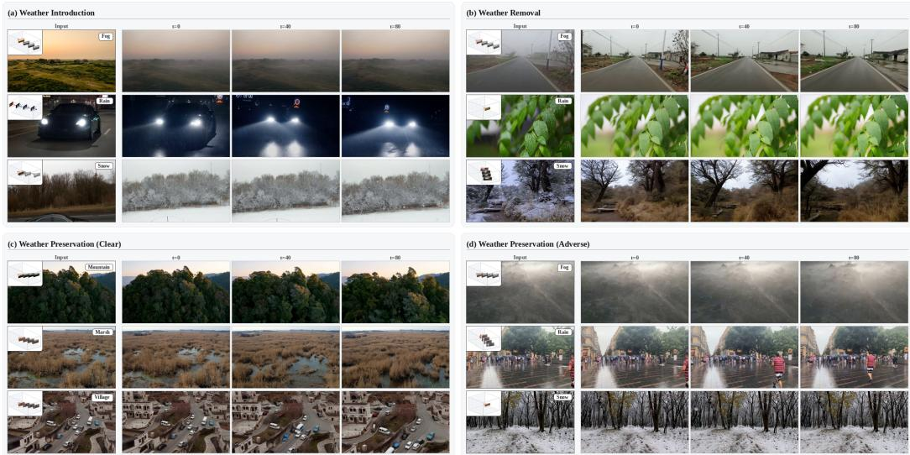
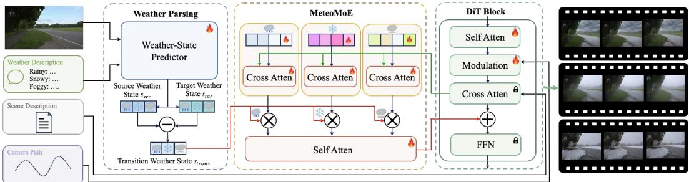
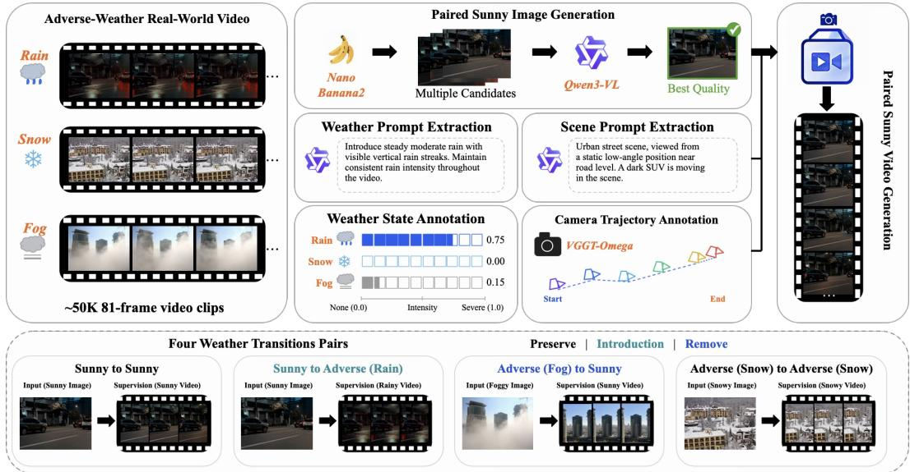
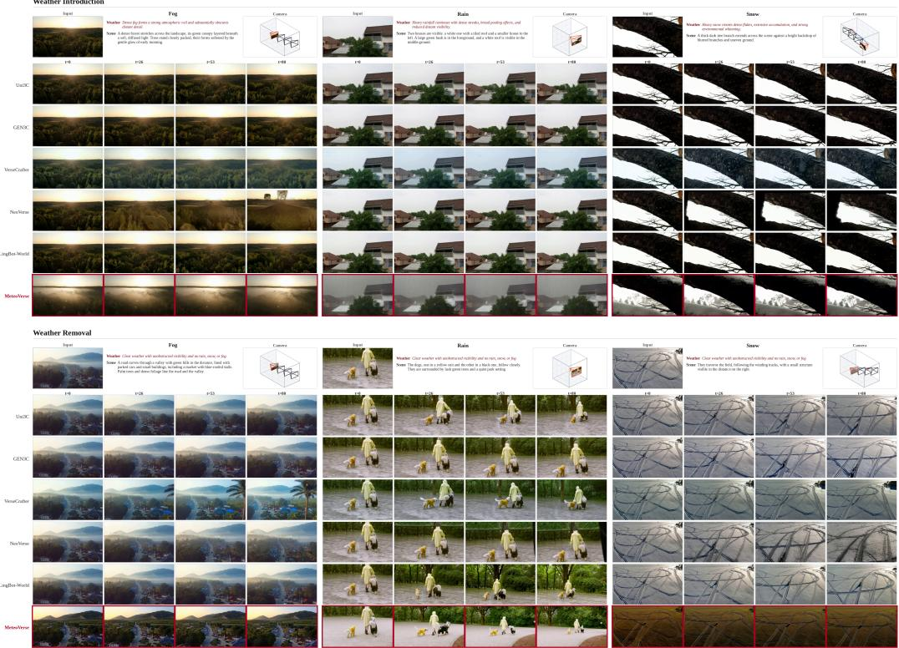
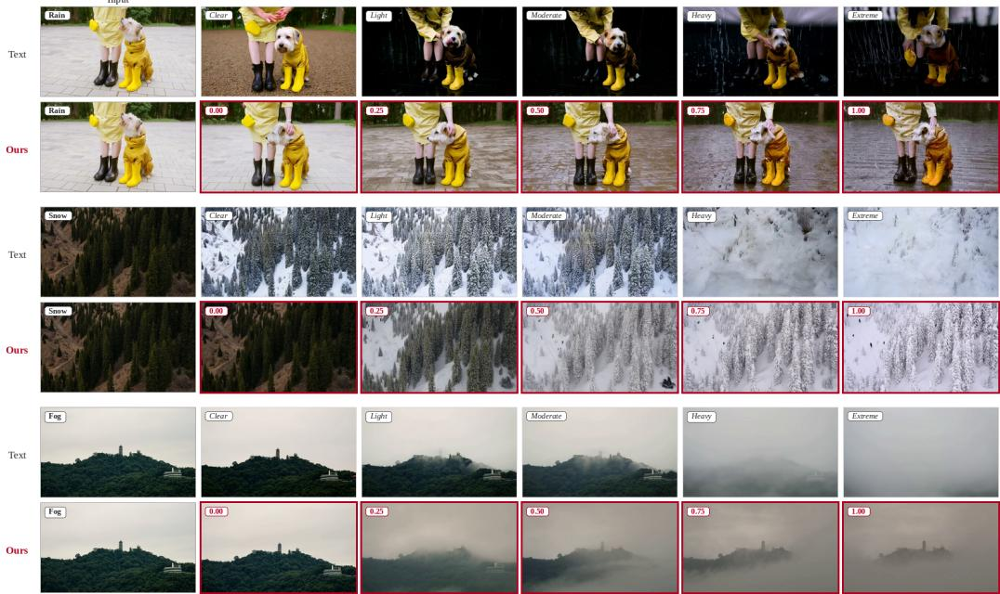

# METEOVERSE: UNIFIED WEATHER-CONTROLLABLE VIDEO WORLD MODEL

Renlong Wu1 Guanqiao Wang1 Xuan Shang1 Yin Hanming1 Xiaoxiao Sheng2 Tianyu Huang2 Hui Li1 Wangmeng Zuo1

1Harbin Institute of Technology 2Huawei

## ABSTRACT

Video world models aim to predict future content from an observed scene while following prescribed camera motion. Real-world scene evolution is determined not only by changes in viewpoint and object dynamics, but also by environmental conditions such as weather, which can substantially alter scene appearance and visibility. Modeling such realistic weather evolution is challenging because the required weather modification depends jointly on the observed and desired weather states. Depending on their relation, the model may need to preserve, introduce, or remove a weather effect. Existing video world models typically leave this weather transition implicit, forcing the generation backbone to infer weather evolution together with scene dynamics and camera motion, which leads to imprecise weather control. To address this limitation, we propose MeteoVerse, a unified weather-controllable video world model that generates future videos from a single sunny or adverse-weather image, conditioned on a weather-free scene description, a target-weather instruction, and a camera trajectory. Rather than conditioning only on the desired weather, MeteoVerse explicitly estimates the observed and target weather states and represents the required weather transition. A transition-aware mixture of weather experts (MeteoMoE) then translates this transition into category-specific residual weather features, unifying weather preservation, introduction, and removal while enabling fine-grained control over introduced weather intensity. We further construct the MeteoVerse dataset with over 50K real-world weather video clips, generated sunny counterparts, disentangled scene and weather descriptions, weather-intensity annotations, and camera trajectories. Extensive quantitative and qualitative experiments demonstrate substantially improved weather controllability while retaining competitive scene consistency and camera-control performance. Project page: https://meteoverse.github.io/.

## 1 INTRODUCTION

Video world models aim to predict future content from an observed scene while following prescribed camera motion. While recent advances have enabled increasingly flexible control over scene content and viewpoint, real-world scene evolution is also shaped by environmental conditions. Weather is a particularly important factor, as changes in rain, snow, and fog can substantially alter scene appearance and visibility over time. A world model simulating realistic future observations should therefore model not only what is observed and from where, but also under which weather condition the future unfolds. Accordingly, we study weather-controllable video world modeling, i.e., given a single image captured under sunny or adverse weather, a weather-free scene description, a targetweather instruction, and a camera trajectory, the model generates a future video that preserves scene identity, follows the prescribed camera motion, and realizes the desired weather evolution through weather preservation, introduction, or removal.

Existing approaches address weather manipulation under substantially different assumptions. Reconstruction-based methods can synthesize geometrically consistent weather effects through explicit 3D scene representations or physical simulation, but require multi-view observations and costly per-scene reconstruction (Li et al., 2022; Qian et al., 2025). Video weather editing methods can introduce or remove weather effects while preserving the structure and motion of an existing video (Lin et al., 2025; Qian et al., 2026), but assume that the complete source video is already available. More recently, Holo-World brings weather control into single-image video world modeling by jointly controlling camera motion and adverse-weather generation (Yin et al., 2026). However, it assumes a sunny input and mainly focuses on weather introduction, leaving weather removal unexplored. These limitations motivate a unified formulation that can operate from either sunny or adverse-weather observations and explicitly control how weather evolves into the future.

  
Figure 1: Overview of MeteoVerse, which supports weather preservation, introduction, and removal from sunny or adverse-weather inputs under prescribed camera trajectories.

The key challenge is that a target-weather instruction specifies the desired weather condition, but not the transformation required to reach it. The same target condition may correspond to funda mentally different operations depending on the weather already present in the input. For example, a rainy target requires introducing rain from a sunny observation or preserving rain from an already rainy observation, while a sunny target requires removing adverse weather from an adverse-weather observation. Therefore, effective weather control requires explicitly reasoning about the transition between the observed and target weather states rather than relying on the target condition alone. When this transition is left implicit, the video backbone must simultaneously infer the observed weather, interpret the target instruction, determine the required modification, and model scene evolution and camera motion. This entanglement makes precise weather control particularly difficult.

To address this challenge, we propose MeteoVerse, a unified weather-controllable video world model that explicitly models the transition between observed and desired weather states. Given the input image and target-weather instruction, a weather-state predictor estimates continuous observed and target states over rain, snow, and fog, from which the required weather transition is derived. Rather than directly conditioning the entire generation backbone on the target weather, we introduce a transition-aware mixture of weather experts (MeteoMoE) to translate the transition into residual weather modifications. Specifically, category-specific rain, snow, and fog experts extract sceneadaptive weather features, whose responses are modulated according to the direction and magnitude of the corresponding transition components and then fused into a transition-aware representation. The resulting representation is injected into the video world-model backbone, while the weatherfree scene description and camera trajectory provide semantic and viewpoint conditions independently. This decomposition allows the pretrained backbone to preserve the underlying scene evolution, while MeteoMoE focuses on the weather modification required to reach the target state. As a result, a single model can support weather preservation, introduction, and removal, together with fine-grained control over introduced weather intensity.

Training such a model requires supervision covering diverse weather transitions. We therefore construct the MeteoVerse dataset, containing over 50K real-world rain, snow, and fog video clips together with generated sunny counterparts, disentangled scene and weather descriptions, categoryspecific weather-intensity annotations, and camera trajectories. Extensive quantitative and qualita tive experiments demonstrate that MeteoVerse substantially improves weather controllability over existing controllable video world models, particularly when the desired weather differs from the observed condition, while retaining competitive scene consistency and camera-control performance.

Our contributions are summarized as follows:

• We introduce MeteoVerse, a unified weather-controllable video world model that predicts camera-controlled future videos from either sunny or adverse-weather observations and supports weather preservation, introduction, and removal.

• We propose explicit weather transition modeling together with MeteoMoE, which translates weather-state changes into category-specific residual weather features and enables fine-grained control over introduced weather intensity.

• We construct the MeteoVerse dataset with over 50K real-world weather video clips, generated sunny counterparts, disentangled scene and weather descriptions, weather-intensity annotations, and camera trajectories, providing supervision for diverse weather transitions. Extensive experiments demonstrate substantially improved weather controllability while maintaining competitive scene consistency and camera-control performance.

## 2 RELATED WORK

## 2.1 VIDEO WORLD MODELS

Camera-controllable video generation has evolved from motion control to geometry-aware scene exploration. MotionCtrl, CameraCtrl, and CamI2V introduce explicit camera control into video generation (Wang et al., 2024; He et al., 2024; Zheng et al., 2024), while ViewCrafter, ReCam-Master, TrajectoryCrafter, and Voyager further support camera-guided scene exploration or trajectory manipulation (Yu et al., 2024; Bai et al., 2025a; Yu et al., 2025; Huang et al., 2025a). Video world models extend this paradigm toward interactive future prediction, including GAIA-1, Genie, GameNGen, Matrix-Game, and LingBot-World (Hu et al., 2023; Bruce et al., 2024; Valevski et al., 2024; Zhang et al., 2025; Robbyant Team et al., 2026). Most closely related, Holo-World introduces weather control into single-image video world modeling (Yin et al., 2026), but mainly considers adverse-weather generation from sunny inputs. MeteoVerse instead supports both sunny and adverse-weather observations and unifies weather preservation, introduction, and removal.

## 2.2 WEATHER SYNTHESIS METHODS

Weather manipulation has been studied in restoration, reconstruction-based synthesis, and generative editing. Multi-weather restoration methods remove rain, snow, and fog from degraded observations (Li et al., 2020; Valanarasu et al., 2022; Yang et al., 2023; 2024), while ClimateNeRF, WeatherEdit, and WeatherCity achieve view-consistent weather synthesis through explicit scene representations (Li et al., 2022; Qian et al., 2025; Wu et al., 2026). Generative approaches such as IntrinsicWeather, WeatherWeaver, and AutoAWG reduce the need for explicit reconstruction (Zhu et al., 2026; Lin et al., 2025; Hu et al., 2026), but image editing does not predict unseen views and video editing assumes a complete source video. MeteoVerse instead predicts future observations from a single image while jointly controlling camera motion and weather evolution. Existing weather datasets mainly target adverse-weather perception, restoration, or editing (Sakaridis et al., 2021; Sun et al., 2022; Zhang et al., 2023; Lin et al., 2025; Zhu et al., 2026; Yin et al., 2026). Meteo-Verse provides over 50K real-world weather clips with generated sunny counterparts, disentangled scene and weather descriptions, fine-grained weather-intensity annotations, and camera trajectories to support weather-controllable video world modeling.

## 3 METHODS

## 3.1 PROBLEM FORMULATION AND OVERVIEW

Let I denote the current visual observation, p a general text condition, and C a prescribed camera trajectory. A controllable video world model with parameters θ predicts future observations $V _ { 1 : T }$ as,

$$
p _ { \theta } \left( V _ { 1 : T } \mid I , p , \mathcal { C } \right) .\tag{1}
$$

  
Figure 2: Overview of MeteoVerse. The weather-state predictor estimates the observed and target weather states and derives the required weather transition. MeteoMoE modulates the rain, snow, and fog experts according to the corresponding transition components, fuses their responses through self-attention, and residually injects the resulting transition-aware features into the DiT backbone.

Although weather information may be implicitly contained in I or $p ,$ this formulation does not explicitly specify how the observed weather should evolve toward the requested condition. The video backbone therefore needs to infer the required weather modification together with scene evolution and camera-induced changes, which can lead to imprecise weather control. As illustrated in Fig. 2, MeteoVerse separates the general text condition into a weather-free scene description $p _ { \mathrm { s } }$ and a target-weather instruction $p _ { \mathrm { w } }$ . A weather-state predictor $P _ { \phi }$ estimates the weather state observed in the input image and the desired target weather state,

$$
\left( \mathbf { s } _ { \mathrm { s r c } } , \mathbf { s } _ { \mathrm { t a r } } \right) = P _ { \phi } \left( I , p _ { \mathrm { w } } \right) , \qquad \mathbf { s } _ { \mathrm { t r a n s } } = \mathbf { s } _ { \mathrm { t a r } } - \mathbf { s } _ { \mathrm { s r c } } .\tag{2}
$$

Here, $\mathbf { s } _ { \mathrm { s r c } }$ describes the weather condition observed in the input image, while $\mathbf { s } _ { \mathrm { t a r } }$ represents the desired future weather condition. Their difference $\mathbf { s } _ { \mathrm { t r a n s } }$ characterizes the weather modification required to reach the target state. We further introduce MeteoMoE, a transition-aware mixture of weather experts that converts $\mathbf { s } _ { \mathrm { t r a n s } }$ into residual weather conditioning for the pretrained video backbone. The resulting generation process can be written as,

$$
p _ { \theta , \psi } \left( V _ { 1 : T } \mid I , p _ { \mathrm { s } } , \mathcal { C } , \mathbf { s } _ { \mathrm { t r a n s } } \right) ,\tag{3}
$$

where θ denotes the frozen pretrained backbone parameters and $\psi$ denotes the trainable adaptation parameters. In this formulation, $p _ { \mathrm { s } }$ provides scene semantics, C controls camera motion, and $\mathbf { s } _ { \mathrm { t r a n s } }$ specifies the required weather modification.

## 3.2 WEATHER-STATE TRANSITION MODELING

We represent each weather state using a continuous intensity vector over rain, snow, and fog, i.e.,

$$
\mathbf { s } = [ s _ { \mathrm { r a i n } } , s _ { \mathrm { s n o w } } , s _ { \mathrm { f o g } } ] \in [ 0 , 1 ] ^ { 3 } ,\tag{4}
$$

where each component denotes the intensity of the corresponding weather effect. Sunny weather is represented by the zero state $\mathbf { s } = [ 0 , 0 , 0 ]$ . Accordingly, each component $\delta _ { k }$ of $\mathbf { s } _ { \mathrm { t r a n s } }$ describes the direction and magnitude of the required modification for weather category k. A positive value indicates that the corresponding weather effect should be introduced. A negative value indicates that the effect should be removed. When $\delta _ { k } = 0 $ , no additional modification is required and the observed weather condition is preserved. We LoRA-fine-tune Qwen3-VL-2B Bai et al. (2025b) as the weather-state predictor $P _ { \phi }$ . Its supervision is constructed from the weather annotations described in Sec. 3.4. The LoRA rank and scaling factor α are set to 64 and 128, respectively. During videomodel training, the annotated weather states are directly used to compute $\mathbf { s } _ { \mathrm { t r a n s } }$ . The predictor is frozen and used only at inference time. For weather introduction from sunny inputs, users may specify $\mathbf { s } _ { \mathrm { t a r } }$ to control the desired weather intensity.

## 3.3 TRANSITION-AWARE METEOMOE

MeteoMoE translates the explicit weather transition $\mathbf { s } _ { \mathrm { t r a n s } }$ into residual weather features for the video backbone. Rain, snow, and fog exhibit distinct visual characteristics, and representing them with a shared weather feature may entangle category-specific effects. We therefore introduce three weather experts. The expert for weather category k is represented by a learnable token set $T _ { k }$ , where k ∈ {rain, snow, fog}. In the ℓ-th DiT block, let $H _ { \mathrm { t x t } } ^ { \ell }$ denote the feature after text cross-attention. MeteoMoE uses this feature as the query to retrieve category-specific weather information from the expert tokens, i.e.,

  
Figure 3: Construction of MeteoVerse dataset. We collect over 50K 81-frame real-world rain, snow, and fog clips with disentangled scene and weather descriptions, weather-intensity annotations, camera trajectories, and pseudo-paired sunny counterparts. The sunny and adverse-weather observations are then recombined to provide supervision for weather preservation, introduction, and removal.

$$
E _ { k } ^ { \ell } = \mathrm { C A } _ { k } ^ { \ell } \left( \mathrm { N o r m } \left( H _ { \mathrm { t x t } } ^ { \ell } \right) , T _ { k } , T _ { k } \right) , \qquad k \in \{ \mathrm { r a i n } , \mathrm { s n o w } , \mathrm { f o g } \} .\tag{5}
$$

Here, $H _ { \mathrm { t x t } } ^ { \ell }$ serves as the query, while $T _ { k }$ provides the keys and values. This produces a sceneadaptive representation for each weather category. Each expert response is then modulated by the corresponding transition component $\delta _ { k }$ , which are fused through a lightweight self-attention module. It can be written as,

$$
\begin{array} { r } { E _ { \mathrm { t r a n s } } ^ { \ell } = \mathrm { S A } _ { \mathrm { w } } ^ { \ell } \left( \left\{ \delta _ { k } E _ { k } ^ { \ell } \right\} _ { k \in \left\{ \mathrm { r a i n } , \mathrm { s n o w } , \mathrm { f o g } \right\} } \right) . } \end{array}\tag{6}
$$

Finally, $E _ { \mathrm { t r a n s } } ^ { \ell }$ is residually injected into the DiT block as,

$$
\tilde { H } _ { \mathrm { t x t } } ^ { \ell } = H _ { \mathrm { t x t } } ^ { \ell } + E _ { \mathrm { t r a n s } } ^ { \ell } .\tag{7}
$$

In this way, MeteoMoE focuses on the weather modification specified by $\mathbf { S _ { t r a n s } } .$ , while the pretrained video backbone retains scene evolution and camera-conditioned future prediction.

## 3.4 METEOVERSE DATASET CONSTRUCTION

The construction pipeline is illustrated in Fig. 3. We collect real-world videos with visible rain, snow, or fog and divide them into 81-frame clips, resulting in over 50K adverse-weather clips. For each clip, Qwen3-VL-8B Bai et al. (2025b) generates a weather-free scene description and a separate weather description. VGGT-Omega Wang et al. (2026) estimates the camera intrinsics and extrinsics, and clips with severe camera jitter or abrupt pose changes are discarded. To obtain fine grained weather states, we adopt a coarse-to-fine intensity annotation strategy. For each weather category, Qwen3-VL-30B Bai et al. (2025b) first predicts an ordinal intensity level according to visual severity and then estimates a continuous intensity value within the selected level. Each clip is evaluated with a confidence estimate, and samples with low confidence are removed. The remaining annotations are further verified by GPT-5.6 Sol OpenAI (2026).

Pseudo-paired sunny counterpart generation. Since paired sunny and adverse-weather videos of the same real-world scene are difficult to obtain, we construct a pseudo-paired sunny counterpart for each adverse-weather clip. Given the first adverse-weather frame $I _ { \mathrm { a d v } } ,$ Nano Banana 2 Google DeepMind (2026) generates multiple sunny candidates. Qwen3-VL-30B Bai et al. (2025b) selects the candidate that best removes the adverse-weather effect while preserving scene content. Samples without a qualified candidate are discarded. The selected sunny image $I _ { \mathrm { s u n } } .$ , together with the weather-free scene description and recovered camera trajectory, is passed to the pretrained LingBot-World Robbyant Team et al. (2026) to generate the pseudo-paired sunny video $V _ { \mathrm { s u n } }$ . We discard generated videos with poor visual quality or obvious temporal artifacts, and re-estimate the camera trajectory of the remaining videos using VGGT-Omega Wang et al. (2026) to obtain more accurate annotations of the camera motion.

Training pair construction. Let $( I _ { \mathrm { a d v } } , V _ { \mathrm { a d v } } )$ denote the original adverse-weather pair and $( I _ { \mathrm { s u n } } , V _ { \mathrm { s u n } } ^ { \sim } )$ denote its pseudo-paired sunny counterpart. We construct four input-target pairs,

$$
\mathcal { P } = \{ ( I _ { \mathrm { s u n } } , V _ { \mathrm { s u n } } ) , ( I _ { \mathrm { a d v } } , V _ { \mathrm { a d v } } ) , ( I _ { \mathrm { s u n } } , V _ { \mathrm { a d v } } ) , ( I _ { \mathrm { a d v } } , V _ { \mathrm { s u n } } ) \} .\tag{8}
$$

The first two pairs provide supervision for sunny and adverse-weather preservation. The third pair provides supervision for weather introduction, while the fourth provides supervision for weather removal. Sunny observations are assigned the zero weather state, while adverse-weather observations use their annotated states. The diverse weather intensities in the collected clips provide supervision for introducing rain, snow, and fog at different intensity levels.

## 3.5 NETWORK ARCHITECTURE AND OPTIMIZATION

We build MeteoVerse upon the pretrained LingBot-World Robbyant Team et al. (2026), which consists of a high-noise model for coarse generation and a low-noise model for refinement. The input image, weather-free scene description, and camera trajectory C follow the original visual, textual, and camera-conditioning pathways, respectively. MeteoMoE is inserted after text cross-attention in every DiT block of both stages, with independent parameters for the high-noise and low-noise models. We freeze the pretrained backbone and optimize MeteoMoE together with LoRA adapters inserted into the self-attention and feed-forward layers. The LoRA rank and scaling factor α are set to 64 and 128, respectively.

Following LingBot-World, the video model is optimized using a flow-matching objective. Let $z _ { t }$ denote the latent state at flow timestep t and $v _ { t }$ denote the corresponding target velocity. The flowmatching loss can be written as,

$$
\begin{array} { r } { \mathcal { L } _ { \mathrm { f m } } = \mathbb { E } _ { t , z _ { t } } \left[ \left\| G _ { \theta , \psi } \left( z _ { t } , t , I , p _ { \mathrm { s } } , \mathcal { C } , \mathbf { s } _ { \mathrm { t r a n s } } \right) - v _ { t } \right\| _ { 2 } ^ { 2 } \right] , } \end{array}\tag{9}
$$

where $\theta$ denotes the frozen pretrained parameters and ψ denotes the trainable MeteoMoE and LoRA parameters. To provide additional reconstruction-level supervision, we recover the clean latent estimate $\hat { z } _ { 0 }$ from $z _ { t }$ and the predicted velocity and decode it into $\hat { V } _ { 1 : T }$ . We apply frame-wise reconstruction and perceptual losses Johnson et al. (2016), i.e.,

$$
\mathcal { L } _ { \ell _ { 1 } } = \frac { 1 } { T } \sum _ { i = 1 } ^ { T } \left. \hat { V } _ { i } - V _ { i } \right. _ { 1 } , \qquad \mathcal { L } _ { \mathrm { v g g } } = \frac { 1 } { T } \sum _ { i = 1 } ^ { T } \mathrm { V G G } \left( \hat { V } _ { i } , V _ { i } \right) .\tag{10}
$$

The overall training objective can be written as,

$$
\mathcal { L } = \mathcal { L } _ { \mathrm { f m } } + \lambda _ { \ell _ { 1 } } \mathcal { L } _ { \ell _ { 1 } } + \lambda _ { \mathrm { v g g } } \mathcal { L } _ { \mathrm { v g g } } ,\tag{11}
$$

where $\lambda _ { \ell _ { 1 } }$ and $\lambda _ { \mathrm { v g g } }$ are set to 0.1 and 0.05, respectively.

## 4 EXPERIMENTS

## 4.1 IMPLEMENTATION DETAILS

We adopt a progressive training strategy that increases the clip length from 21 to 41 and finally 81 frames, while increasing the spatial resolution from $2 4 0 \times 4 1 \bar { 6 } t o 4 \bar { 8 } 0 \times 8 3 2$ . Training is performed on 8 NVIDIA A800-SXM4 GPUs with a per-GPU batch size of 1 using BF16 precision. We use AdamW with cosine learning-rate decay and gradient clipping at 1.0. The learning rate is set to $1 \times 1 0 ^ { - 5 }$ for the LoRA parameters and $5 \times \mathrm { 1 0 ^ { - 5 } }$ for the remaining trainable parameters. The weather-state predictor is LoRA-fine-tuned using AdamW with a learning rate of $1 \times 1 0 ^ { - 4 }$ and a per-device batch size of 4. Greedy decoding is used for weather-state prediction at inference.

Table 1: Quantitative comparison across Weather Preservation, Weather Introduction, and Weather Removal. Overall Score is reported only for Weather Preservation, as intentional weather changes in Weather Introduction and Weather Removal make the aggregate input-consistency score less appropriate. The best and second-best results are highlighted in bold and underlined, respectively.
<table><tr><td rowspan="2">Method</td><td colspan="7">VBench-I2V Evaluation</td><td colspan="2">Camera Evaluation</td><td colspan="3">Weather Evaluation</td></tr><tr><td>Overall Score↑</td><td>Subject Consistency↑</td><td>Background Consistency↑</td><td>Motion Smoothness↑</td><td>Dynamic Degree↑</td><td>Aesthetic Quality↑</td><td>Imaging Quality↑</td><td></td><td>RotErr↓ TransErr↓</td><td>Weather Alignment↑</td><td>VLM Evaluation↑</td><td>User Study↑</td></tr><tr><td colspan="10">Weather Preservation</td><td></td><td></td><td></td></tr><tr><td>Uni3C</td><td>86.53</td><td>95.80</td><td>94.15</td><td>99.21</td><td>30.50</td><td>50.87</td><td>63.86</td><td>0.755</td><td>0.102</td><td>88.00</td><td>74.99</td><td>76.80</td></tr><tr><td>GEN3C</td><td>86.22</td><td>96.89</td><td>94.34</td><td>99.50</td><td>23.50</td><td>50.11</td><td>60.46</td><td>0.331</td><td>0.073</td><td>85.50</td><td>72.30</td><td>74.90</td></tr><tr><td>VerseCrafter</td><td>85.01</td><td>95.20</td><td>92.68</td><td>99.17</td><td>23.00</td><td>50.86</td><td>66.21</td><td>5.926</td><td>0.128</td><td>90.75</td><td>77.02</td><td>78.60</td></tr><tr><td>NeoVerse</td><td>85.73</td><td>92.83</td><td>92.15</td><td>99.15</td><td>38.00</td><td>48.76</td><td>61.93</td><td>0.678</td><td>0.054</td><td>85.75</td><td>63.38</td><td>68.70</td></tr><tr><td>LingBot-World Ours</td><td>86.56 86.70</td><td>95.57</td><td>93.84 94.03</td><td>99.06 98.86</td><td>38.00</td><td>51.44</td><td>63.45</td><td>4.225</td><td>0.173</td><td>88.76</td><td>74.43</td><td>75.80</td></tr><tr><td></td><td></td><td>94.78</td><td></td><td></td><td>43.50</td><td>50.93</td><td>63.66</td><td>3.416</td><td>0.132</td><td>93.00</td><td>76.07</td><td>80.90</td></tr><tr><td colspan="10">Weather Introduction</td><td colspan="3"></td></tr><tr><td>Uni3C</td><td></td><td>95.37</td><td>94.26</td><td>99.17</td><td>28.00</td><td>50.09</td><td>64.46</td><td>0.796</td><td>0.161</td><td>12.00</td><td>22.50</td><td>28.60</td></tr><tr><td>GEN3C</td><td></td><td>96.84</td><td>94.55</td><td>99.49</td><td>23.00</td><td>49.15</td><td>60.90</td><td>0.364</td><td>0.056</td><td>5.00</td><td>14.76</td><td>21.40</td></tr><tr><td>VerseCrafter</td><td></td><td>94.85</td><td>92.48</td><td>99.11</td><td>19.00</td><td>50.10</td><td>67.46</td><td>5.991</td><td>0.134</td><td>29.00</td><td>33.70</td><td>38.20</td></tr><tr><td>NeoVerse</td><td></td><td>92.85</td><td>91.84</td><td>99.21</td><td>39.00</td><td>47.98</td><td>61.06</td><td>0.679</td><td>0.068</td><td>9.00</td><td>17.98</td><td>24.10</td></tr><tr><td>LingBot-World</td><td></td><td>95.61</td><td>93.55</td><td>99.10</td><td>35.00</td><td>50.49</td><td>64.05</td><td>4.316</td><td>0.155</td><td>13.00</td><td>20.13</td><td>26.70</td></tr><tr><td>Ours</td><td></td><td>95.28</td><td>94.15</td><td>98.90</td><td>47.00</td><td>51.09</td><td>61.51</td><td>3.207</td><td>0.122</td><td>61.00</td><td>54.15</td><td>66.70</td></tr><tr><td colspan="10">Weather Removal</td><td colspan="3"></td></tr><tr><td>Uni3C</td><td></td><td></td><td></td><td></td><td></td><td></td><td></td><td></td><td></td><td></td><td></td><td></td></tr><tr><td></td><td></td><td>95.31</td><td>93.78</td><td>99.25</td><td>35.00</td><td>51.82</td><td>63.70</td><td>0.828</td><td>0.130</td><td>31.00</td><td>45.03</td><td>49.20</td></tr><tr><td>GEN3C</td><td></td><td>96.94</td><td>94.12</td><td>99.51</td><td>24.00</td><td>51.02</td><td>60.08</td><td>0.327</td><td>0.082 0.122</td><td>34.00</td><td>46.17</td><td>50.70 46.80</td></tr><tr><td>VerseCrafter</td><td></td><td>94.25 92.66</td><td>92.77 92.43</td><td>99.22 99.07</td><td>30.00</td><td>51.31 49.47</td><td>65.68 62.55</td><td>6.784 0.671</td><td>0.047</td><td>31.00 38.00</td><td>41.67 40.98</td><td>45.60</td></tr><tr><td>NeoVerse LingBot-World</td><td></td><td>95.08</td><td>93.72</td><td></td><td>37.00</td><td>52.15</td><td>63.54</td><td>4.384</td><td>0.303</td><td>34.00</td><td></td><td>51.40</td></tr><tr><td>Ours</td><td></td><td>95.66</td><td>94.14</td><td>99.05 99.00</td><td>44.00 48.00</td><td>50.95</td><td>67.03</td><td>3.476</td><td>0.110</td><td>89.00</td><td>46.45 77.92</td><td>82.40</td></tr></table>

## 4.2 EVALUATION CONFIGURATIONS

We evaluate on 100 held-out real-world scenes under four weather settings, i.e., sunny-to-sunny, sunny-to-adverse, adverse-to-sunny, and adverse-to-adverse, resulting in 400 test cases. Sunny-tosunny and adverse-to-adverse constitute Weather Preservation, while sunny-to-adverse and adverseto-sunny correspond to Weather Introduction and Weather Removal, respectively. Weather Preservation is equally averaged over its sunny and adverse-weather subsets. All methods are evaluated using the same input images, scene descriptions, target-weather instructions, and camera trajectories. We evaluate video quality using VBench-I2V Huang et al. (2025b). Camera-control performance is measured using rotation and translation errors estimated by VGGT-Omega Wang et al. (2026). Weather controllability is evaluated using Weather Alignment, VLM Evaluation, and User Study. Overall Score is reported only for Weather Preservation, as intentional weather changes in Weather Introduction and Weather Removal make the aggregate input-consistency score less appropriate. Detailed metric definitions, generation settings, and the user-study protocol are in Appendix A.

## 4.3 COMPARISON WITH STATE-OF-THE-ART METHODS

We compare MeteoVerse with five state-of-the-art controllable video world models with publicly available implementations or checkpoints, including Uni3C Cao et al. (2025), GEN3C Ren et al. (2025), VerseCrafter Zheng et al. (2026), NeoVerse Yang et al. (2026), and LingBot-World Robbyant Team et al. (2026). All methods are evaluated under the same protocol.

Quantitative comparisons. The quantitative results are reported in Tab. 1. Under Weather Preservation, MeteoVerse achieves the highest Overall Score, Weather Alignment, and User Study score, while remaining competitive on the individual VBench-I2V and camera-control metrics. The advantage becomes much clearer when the weather condition needs to change. For Weather Introduction, MeteoVerse improves Weather Alignment from 29.00 to 61.00, VLM Evaluation from 33.70 to 54.15, and User Study from 38.20 to 66.70. For Weather Removal, the corresponding scores improve from 38.00 to 89.00, 46.45 to 77.92, and 51.40 to 82.40. Although several baselines perform better on individual video-quality or camera metrics, these metrics mainly reflect scene consistency and trajectory following and can remain high even when the requested weather change is not realized. By explicitly modeling the weather transition, MeteoVerse achieves substantially stronger weather controllability while retaining competitive overall generation quality.

Qualitative comparisons. Fig. 4 presents qualitative comparisons on Weather Introduction and Weather Removal. For Weather Introduction, existing world models often retain the original weather appearance or produce only weak target-weather effects, whereas MeteoVerse more clearly realizes the requested rain, snow, and fog conditions. For Weather Removal, competing methods frequently leave visible adverse-weather effects, while MeteoVerse more effectively suppresses them and produces a cleaner scene appearance. The underlying scene content and camera-driven evolution remain visually consistent during weather manipulation. These qualitative observations are consistent with the quantitative weather-control results. Video comparisons are provided in the Suppl.

  
Figure 4: Visual comparisons on weather introduction and removal. More results are in the Suppl.

Table 2: Ablation on weather-control representations. All metrics are equally averaged over Weather Preservation, Weather Introduction, and Weather Removal. Evaluation Weather Evaluation Methods
<table><tr><td rowspan="3">Methods</td><td rowspan="3">Subject Consistency↑</td><td rowspan="3">Background</td><td rowspan="3">Motion</td><td rowspan="3">Dynamic Smoothness↑ Degree↑</td><td rowspan="3">Aesthetic Quality↑</td><td rowspan="3">Imaging</td><td rowspan="3"></td><td colspan="2"></td><td rowspan="3">Weather</td><td rowspan="3">VLM</td></tr><tr><td>Quality↑</td><td>RotErr↓ TransErr↓</td></tr><tr><td>Target-weather Prompt pw</td><td>92.60</td><td>Consistency↑ 93.14</td><td>98.87</td><td>48.50</td><td>51.88</td><td>61.30</td><td>4.084</td><td>0.115</td><td>80.85</td><td>Alignment↑ Evaluation↑ 63.98</td><td>Study↑ 73.63</td></tr><tr><td>Target State Star</td><td>93.96</td><td>93.29</td><td>98.78</td><td>58.33</td><td>51.92</td><td>61.76</td><td>4.372</td><td>0.189</td><td>66.03</td><td>58.73</td><td>64.07</td></tr><tr><td>Transition State strans (Ours)</td><td>95.24</td><td>94.11</td><td>98.92</td><td>46.17</td><td>50.99</td><td>64.07</td><td>3.366</td><td>0.121</td><td>81.00</td><td>69.38</td><td>76.67</td></tr></table>

Table 3: Ablation on MeteoMoE and backbone adaptation. All metrics are equally averaged over Weather Preservation, Weather Introduction, and Weather Removal. VBench-I2V Evaluation Camera Evaluation Weather Evaluation Methods
<table><tr><td>Methods</td><td>Subject Consistency↑</td><td>Background Consistency↑</td><td>Motion Smoothness↑</td><td>Dynamic Degree↑</td><td>Aesthetic Quality↑</td><td>Imaging Quality↑</td><td>RotErr↓</td><td>TransErr↓</td><td>Weather Alignment↑</td><td>VLM Evaluation↑</td><td>User Study↑</td></tr><tr><td>Global Transition Conditioning</td><td>93.53</td><td>92.98</td><td>98.76</td><td>64.17</td><td>51.90</td><td>67.51</td><td>4.291</td><td>0.095</td><td>58.33</td><td>54.75</td><td>58.42</td></tr><tr><td>Shared Weather Expert</td><td>93.60</td><td>93.09</td><td>98.80</td><td>62.33</td><td>51.69</td><td>66.30</td><td>4.370</td><td>0.114</td><td>65.00</td><td>58.96</td><td>63.74</td></tr><tr><td>w/o Backbone LoRA</td><td>94.31</td><td>93.56</td><td>98.90</td><td>45.50</td><td>51.60</td><td>66.83</td><td>4.396</td><td>0.141</td><td>52.02</td><td>51.55</td><td>53.82</td></tr><tr><td>Full MeteoMoE (Ours)</td><td>95.24</td><td>94.11</td><td>98.92</td><td>46.17</td><td>50.99</td><td>64.07</td><td>3.366</td><td>0.121</td><td>81.00</td><td>69.38</td><td>76.67</td></tr></table>

## 5 ABLATION STUDIES

## 5.1 EFFECT OF WEATHER TRANSITION MODELING

We compare the target-weather prompt $p _ { \mathrm { w } } .$ , the target weather state $\mathbf { s } _ { \mathrm { t a r } }$ , and the transition state $\mathbf { s } _ { \mathrm { t r a n s } }$ . The target state describes the desired weather, whereas the transition state additionally accounts for the observed condition and directly specifies the required weather modification. As shown in Tab. 2, $\mathbf { s } _ { \mathrm { t r a n s } }$ improves Weather Alignment, VLM Evaluation, and User Study from 66.03, 58.73, and 64.07 with $\mathbf { s } _ { \mathrm { t a r } }$ to 81.00, 69.38, and 76.67. Compared with $p _ { \mathrm { w } } .$ , it achieves similar Weather Alignment but higher VLM Evaluation and User Study, showing the benefit of explicitly representing the required weather change. We further evaluate fine-grained intensity control for weather introduction by fixing a sunny input, scene description, camera trajectory, and random seed while varying only the target weather intensity. As shown in Fig. 5, explicit transition control produces a clearer and more gradual progression of introduced rain, snow, and fog than text-based control. Video demonstrations are in the Suppl.

  
Figure 5: Visual results of fine-grained weather control. More results are in the Suppl.

## 5.2 EFFECT OF METEOMOE ARCHITECTURE

We evaluate how the weather transition is incorporated into the video backbone. Global Transition Conditioning projects $\mathbf { s } _ { \mathrm { t r a n s } }$ into a global embedding and injects it directly into each DiT block, while Shared Weather Expert replaces the category-specific rain, snow, and fog experts with a single shared expert. As shown in Tab. 3, Weather Alignment improves from 58.33 with global conditioning and 65.00 with the shared expert to 81.00 with the full MeteoMoE, with consistent gains in VLM Evaluation and User Study. These results demonstrate the benefit of category-specific weather experts. Removing the backbone LoRA adapters further reduces Weather Alignment to 52.02, showing that lightweight backbone adaptation is important for effectively incorporating the transition-aware features. The full MeteoMoE also achieves the highest subject consistency, background consistency, and motion smoothness. More ablation results about the weather-state predictor are provided in Appendix B.

## 6 CONCLUSION

We presented MeteoVerse, a unified weather-controllable video world model for camera-controlled future prediction from a single sunny or adverse-weather image. MeteoVerse explicitly models the required weather transition and uses MeteoMoE to realize weather preservation, introduction, and removal, with fine-grained intensity control for weather introduction. We further constructed the MeteoVerse dataset with over 50K real-world weather clips, generated sunny counterparts, disentangled scene and weather descriptions, weather-intensity annotations, and camera trajectories. Extensive experiments demonstrate substantially improved weather controllability while retaining competitive scene consistency, temporal coherence, and camera-control performance.

## REFERENCES

Jianhong Bai, Menghan Xia, Xiao Fu, Xintao Wang, Lianrui Mu, Jinwen Cao, Zuozhu Liu, Haoji Hu, Xiang Bai, Pengfei Wan, and Di Zhang. ReCamMaster: Camera-controlled generative rendering from a single video. arXiv preprint arXiv:2503.11647, 2025a. doi: 10.48550/arXiv.2503. 11647. URL https://arxiv.org/abs/2503.11647.

Shuai Bai, Yuxuan Cai, Ruizhe Chen, Keqin Chen, Xionghui Chen, Zesen Cheng, Lianghao Deng, Wei Ding, Chang Gao, Chunjiang Ge, et al. Qwen3-vl technical report. arXiv preprint arXiv:2511.21631, 2025b.

Jake Bruce, Michael Dennis, Ashley Edwards, Jack Parker-Holder, Yuge Shi, Edward Hughes, Matthew Lai, Aditi Mavalankar, Richie Steigerwald, Chris Apps, Yusuf Aytar, Sarah Bechtle, Feryal Behbahani, Stephanie Chan, Nicolas Heess, Lucy Gonzalez, Simon Osindero, Sherjil Ozair, Scott Reed, Jingwei Zhang, Konrad Zolna, Jeff Clune, Nando de Freitas, Satinder Singh, and Tim Rocktaschel. Genie: Generative interactive environments.¨ arXiv preprint arXiv:2402.15391, 2024. doi: 10.48550/arXiv.2402.15391. URL https://arxiv.org/abs/2402.15391.

Chenjie Cao, Jingkai Zhou, Shikai Li, Jingyun Liang, Chaohui Yu, Fan Wang, Xiangyang Xue, and Yanwei Fu. Uni3C: Unifying precisely 3d-enhanced camera and human motion controls for video generation. arXiv preprint arXiv:2504.14899, 2025.

Google DeepMind. Nano banana 2. Model Documentation, 2026.

Hao He, Yinghao Xu, Yuwei Guo, Gordon Wetzstein, Bo Dai, Hongsheng Li, and Ceyuan Yang. CameraCtrl: Enabling camera control for text-to-video generation. arXiv preprint arXiv:2404.02101, 2024. doi: 10.48550/arXiv.2404.02101. URL https://arxiv.org/ abs/2404.02101.

Anthony Hu, Lloyd Russell, Hudson Yeo, Zak Murez, George Fedoseev, Alex Kendall, Jamie Shotton, and Gianluca Corrado. GAIA-1: A generative world model for autonomous driving. arXiv preprint arXiv:2309.17080, 2023. doi: 10.48550/arXiv.2309.17080. URL https: //arxiv.org/abs/2309.17080.

Jiagao Hu, Daiguo Zhou, Danzhen Fu, Fuhao Li, Zepeng Wang, Fei Wang, Wenhua Liao, Jiayi Xie, and Haiyang Sun. AutoAWG: Adverse weather generation with adaptive multi-controls for automotive videos. arXiv preprint arXiv:2604.18993, 2026. doi: 10.48550/arXiv.2604.18993. URL https://arxiv.org/abs/2604.18993.

Tianyu Huang, Wangguandong Zheng, Tengfei Wang, Yuhao Liu, Zhenwei Wang, Junta Wu, Jie Jiang, Hui Li, Rynson W. H. Lau, Wangmeng Zuo, and Chunchao Guo. Voyager: Long-range and world-consistent video diffusion for explorable 3D scene generation. ACM Transactions on Graphics, 44(6):1–15, 2025a. doi: 10.1145/3763330. URL https://doi.org/10.1145/ 3763330.

Ziqi Huang, Fan Zhang, Xiaojie Xu, Yinan He, Jiashuo Yu, Ziyue Dong, Qianli Ma, Nattapol Chanpaisit, Chenyang Si, Yuming Jiang, et al. Vbench++: Comprehensive and versatile benchmark suite for video generative models. IEEE Transactions on Pattern Analysis and Machine Intelli gence, 2025b.

Justin Johnson, Alexandre Alahi, and Li Fei-Fei. Perceptual losses for real-time style transfer and super-resolution. In European Conference on Computer Vision, pp. 694–711, 2016.

Ruoteng Li, Robby T. Tan, and Loong-Fah Cheong. All in one bad weather removal using architectural search. In Proceedings of the IEEE/CVF Conference on Computer Vision and Pattern Recognition, pp. 3175–3185, 2020. URL https://openaccess.thecvf.com/ content\_CVPR\_2020/html/Li\_All\_in\_One\_Bad\_Weather\_Removal\_Using\_ Architectural\_Search\_CVPR\_2020\_paper.html.

Yuan Li, Zhi-Hao Lin, David Forsyth, Jia-Bin Huang, and Shenlong Wang. ClimateNeRF: Extreme weather synthesis in neural radiance field. arXiv preprint arXiv:2211.13226, 2022. doi: 10. 48550/arXiv.2211.13226. URL https://arxiv.org/abs/2211.13226.

Chih-Hao Lin, Zian Wang, Ruofan Liang, Yuxuan Zhang, Sanja Fidler, Shenlong Wang, and Zan Gojcic. Controllable weather synthesis and removal with video diffusion models. arXiv preprint arXiv:2505.00704, 2025. doi: 10.48550/arXiv.2505.00704. URL https://arxiv.org/ abs/2505.00704.

OpenAI. Gpt-5.6 sol. OpenAI Model Documentation, 2026. GPT-5.6 Sol with max reasoning effort.

Chenghao Qian, Wenjing Li, Yuhu Guo, and Gustav Markkula. WeatherEdit: Controllable weather editing with 4D gaussian field. arXiv preprint arXiv:2505.20471, 2025. doi: 10.48550/arXiv. 2505.20471. URL https://arxiv.org/abs/2505.20471.

Chenghao Qian, Nedko Savov, Lingdong Kong, Yeying Jin, Rui Song, Wenjing Li, Zhun Zhong, Jiaqi Ma, Gustav Markkula, and Luc Van Gool. Semantic-aware, physics-informed, geometrygrounded weather video synthesis. In European Conference on Computer Vision (ECCV), 2026.

Qwen Team. Qwen3.8-Max: A new bar for coding and cowork. Qwen Blog, 2026. URL https: //qwen.ai/blog.

Xuanchi Ren, Tianchang Shen, Jiahui Huang, Huan Ling, Yifan Lu, Merlin Nimier-David, Thomas Muller, Alexander Keller, Sanja Fidler, and Jun Gao. GEN3C: 3d-informed world-consistent¨ video generation with precise camera control. In Proceedings of the IEEE/CVF Conference on Computer Vision and Pattern Recognition (CVPR), pp. 6121–6132, 2025.

Robbyant Team, Zelin Gao, Qiuyu Wang, Yanhong Zeng, Jiapeng Zhu, Ka Leong Cheng, Yixuan Li, Hanlin Wang, Yinghao Xu, Shuailei Ma, Yihang Chen, Jie Liu, Yansong Cheng, Yao Yao, Jiayi Zhu, Yihao Meng, Kecheng Zheng, Qingyan Bai, Jingye Chen, Zehong Shen, Yue Yu, Xing Zhu, Yujun Shen, and Hao Ouyang. Advancing open-source world models. arXiv preprint arXiv:2601.20540, 2026. doi: 10.48550/arXiv.2601.20540. URL https://arxiv.org/ abs/2601.20540.

Christos Sakaridis, Haoran Wang, Ke Li, Rene Zurbr´ ugg, Arpit Jadon, Wim Abbeloos,¨ Daniel Olmeda Reino, Luc Van Gool, and Dengxin Dai. ACDC: The adverse conditions dataset with correspondences for robust semantic driving scene perception. arXiv preprint arXiv:2104.13395, 2021. doi: 10.48550/arXiv.2104.13395. URL https://arxiv.org/ abs/2104.13395.

Tao Sun, Mattia Segu, Janis Postels, Yuxuan Wang, Luc Van Gool, Bernt Schiele, Federico Tombari, and Fisher Yu. SHIFT: A synthetic driving dataset for continuous multi-task domain adaptation. In Proceedings of the IEEE/CVF Conference on Computer Vision and Pattern Recognition, pp. 21371–21382, 2022. URL https://arxiv.org/abs/2206.08367.

Jeya Maria Jose Valanarasu, Rajeev Yasarla, and Vishal M. Patel. TransWeather: Transformer-based restoration of images degraded by adverse weather conditions. In Proceedings of the IEEE/CVF Conference on Computer Vision and Pattern Recognition, pp. 2353–2363, 2022. URL https: //arxiv.org/abs/2111.14813.

Dani Valevski, Yaniv Leviathan, Moab Arar, and Shlomi Fruchter. Diffusion models are real-time game engines. arXiv preprint arXiv:2408.14837, 2024. doi: 10.48550/arXiv.2408.14837. URL https://arxiv.org/abs/2408.14837.

Jianyuan Wang, Minghao Chen, Shangzhan Zhang, Nikita Karaev, Johannes Schonberger, Patrick¨ Labatut, Piotr Bojanowski, David Novotny, Andrea Vedaldi, and Christian Rupprecht. Vggtomega. arXiv preprint arXiv:2605.15195, 2026.

Zhouxia Wang, Ziyang Yuan, Xintao Wang, Yaowei Li, Tianshui Chen, Menghan Xia, Ping Luo, and Ying Shan. MotionCtrl: A unified and flexible motion controller for video generation. In ACM SIGGRAPH 2024 Conference Papers, pp. 1–11, 2024. doi: 10.1145/3641519.3657518. URL https://arxiv.org/abs/2312.03641.

Wenhua Wu, Huai Guan, Zhe Liu, and Hesheng Wang. WeatherCity: Urban scene reconstruction with controllable multi-weather transformation. arXiv preprint arXiv:2602.22096, 2026. doi: 10.48550/arXiv.2602.22096. URL https://arxiv.org/abs/2602.22096.

Yijun Yang, Angelica I. Aviles-Rivero, Huazhu Fu, Ye Liu, Weiming Wang, and Lei Zhu. Video adverse-weather-component suppression network via weather messenger and adversarial backpropagation. In Proceedings of the IEEE/CVF International Conference on Computer Vision, pp. 13200–13210, 2023. URL https://arxiv.org/abs/2309.13700.

Yijun Yang, Hongtao Wu, Angelica I. Aviles-Rivero, Yulun Zhang, Jing Qin, and Lei Zhu. Genuine knowledge from practice: Diffusion test-time adaptation for video adverse weather removal. In Proceedings of the IEEE/CVF Conference on Computer Vision and Pattern Recognition, pp. 25606–25616, 2024. URL https://arxiv.org/abs/2403.07684.

Yuxue Yang, Lue Fan, Ziqi Shi, Junran Peng, Feng Wang, and Zhaoxiang Zhang. NeoVerse: Enhancing 4d world model with in-the-wild monocular videos. In Proceedings of the IEEE/CVF Conference on Computer Vision and Pattern Recognition (CVPR), pp. 40340–40351, 2026.

Xiangchen Yin, Wenzhang Sun, Jiahui Yuan, Zijie Liu, Yinda Chen, Wei Li, Dachun Kai, Chunfeng Wang, and Xiaoyan Sun. Holo-World: Unified camera, object and weather control for video world model. arXiv preprint arXiv:2606.20083, 2026. doi: 10.48550/arXiv.2606.20083. URL https://arxiv.org/abs/2606.20083.

Mark Yu, Wenbo Hu, Jinbo Xing, and Ying Shan. TrajectoryCrafter: Redirecting camera trajectory for monocular videos via diffusion models. arXiv preprint arXiv:2503.05638, 2025. doi: 10. 48550/arXiv.2503.05638. URL https://arxiv.org/abs/2503.05638.

Wangbo Yu, Jinbo Xing, Li Yuan, Wenbo Hu, Xiaoyu Li, Zhipeng Huang, Xiangjun Gao, Tien-Tsin Wong, Ying Shan, and Yonghong Tian. ViewCrafter: Taming video diffusion models for highfidelity novel view synthesis. arXiv preprint arXiv:2409.02048, 2024. doi: 10.48550/arXiv.2409. 02048. URL https://arxiv.org/abs/2409.02048.

Howard Zhang, Yunhao Ba, Ethan Yang, Varan Mehra, Blake Gella, Akira Suzuki, Arnold Pfahnl, Chethan Chinder Chandrappa, Alex Wong, and Achuta Kadambi. Weather-Stream: Light transport automation of single image deweathering. In Proceedings of the IEEE/CVF Conference on Computer Vision and Pattern Recognition, pp. 13499–13509, 2023. URL https://openaccess.thecvf.com/content/CVPR2023/html/ Zhang\_WeatherStream\_Light\_Transport\_Automation\_of\_Single\_Image\_ Deweathering\_CVPR\_2023\_paper.html.

Yifan Zhang, Chunli Peng, Boyang Wang, Puyi Wang, Qingcheng Zhu, Fei Kang, Biao Jiang, Zedong Gao, Eric Li, Yang Liu, and Yahui Zhou. Matrix-Game: Interactive world foundation model. arXiv preprint arXiv:2506.18701, 2025. doi: 10.48550/arXiv.2506.18701. URL https://arxiv.org/abs/2506.18701.

Guangcong Zheng, Teng Li, Rui Jiang, Yehao Lu, Tao Wu, and Xi Li. CamI2V: Camera-controlled image-to-video diffusion model. arXiv preprint arXiv:2410.15957, 2024. doi: 10.48550/arXiv. 2410.15957. URL https://arxiv.org/abs/2410.15957.

Sixiao Zheng, Minghao Yin, Wenbo Hu, Xiaoyu Li, Ying Shan, and Yanwei Fu. VerseCrafter: Dynamic realistic video world model with 4d geometric control. In Proceedings ofthe IEEE/CVF Conference on Computer Vision and Pattern Recognition (CVPR), pp. 40277–40290, 2026.

Yixin Zhu, Zuo-Liang Zhu, Jian Yang, Milos Haˇ san, Jin Xie, and Beibei Wang. IntrinsicWeather:ˇ Controllable weather editing in intrinsic space. In Proceedings of the IEEE/CVF Conference on Computer Vision and Pattern Recognition, pp. 30772–30781, 2026. URL https://arxiv. org/abs/2508.06982.

## A ADDITIONAL EVALUATION DETAILS

Benchmark. The held-out benchmark contains 100 real-world scenes with no clip- or source-level overlap with the training set. Each scene is evaluated under sunny-to-sunny, sunny-to-adverse, adverse-to-sunny, and adverse-to-adverse settings, yielding 400 test cases. Weather Preservation is averaged equally over its sunny and adverse-weather subsets. MeteoVerse generates 81-frame videos at 480 × 832 using 40 denoising steps, with classifier-free guidance set to 5.0.

Table 4: Effect of weather-state prediction on downstream generation. All metrics are equally averaged over Weather Preservation, Weather Introduction, and Weather Removal.
<table><tr><td rowspan="3">Methods</td><td colspan="6">VBench-I2V Evaluation</td><td colspan="2">Camera Evaluation</td><td colspan="3">Weather Evaluation</td></tr><tr><td>Subject Consistency↑</td><td>Background Consistency↑ Smoothness↑</td><td>Motion</td><td>Dynamic Degree↑</td><td>Aesthetic Quality↑</td><td>Imaging Quality↑</td><td></td><td>RotErr↓ TransErr↓</td><td>Weather Alignment↑ Evaluation↑ Study↑</td><td>VLM</td><td>User</td></tr><tr><td>GT States</td><td>94.35</td><td>93.65</td><td>98.87</td><td>52.33</td><td>50.68</td><td>63.26</td><td>3.695</td><td>0.120</td><td>82.00</td><td>70.18</td><td>77.56</td></tr><tr><td>Predicted States (Ours)</td><td>95.24</td><td>94.11</td><td>98.92</td><td>46.17</td><td>50.99</td><td>64.07</td><td>3.366</td><td>0.121</td><td>81.00</td><td>69.38</td><td>76.67</td></tr></table>

Evaluation metrics. We evaluate three complementary aspects. Video quality is measured using the VBench-I2V Huang et al. (2025b) metrics, including subject consistency, background consistency, motion smoothness, dynamic degree, aesthetic quality, and imaging quality. Overall Score is reported only for Weather Preservation, as intentional weather changes in Weather Introduction and Weather Removal make the aggregate input-consistency score less appropriate. Camera-control performance is evaluated using camera trajectories estimated from all generated frames by VGGT-Omega Wang et al. (2026). We report geodesic rotation error (RotErr) and scale-aligned translation error (TransErr). Weather controllability is evaluated using Weather Alignment and VLM Evaluation. Qwen 3.8 Max Qwen Team (2026) receives only the target-weather instruction and generated video. Weather Alignment measures the percentage of samples that exhibit the requested weather condition, while VLM Evaluation measures the overall quality of weather realization using a 0–100 score over weather-scene compatibility, weather dynamics, and overall video quality. For the ablation studies, all metrics are averaged over Weather Preservation, Weather Introduction, and Weather Removal.

User study. We conduct a blind user study on 36 benchmark cases, with 12 cases for each of Weather Preservation, Weather Introduction, and Weather Removal. The preservation subset contains equal numbers of sunny- and adverse-weather cases, while the introduction and removal subsets are balanced across rain, snow, and fog. We recruit 24 participants. All videos are anonymized and presented in randomized order. Each participant evaluates a randomly assigned subset, and each generated result receives at least five independent ratings. Given the input image, target-weather instruction, and generated video, participants rate weather faithfulness, preservation of non-weather scene content, and temporal naturalness on a five-point scale. For each rating, the three scores are equally averaged and linearly mapped to [0, 100]. We then average the scores across participants and test cases. For the main comparison, we report a separate User Study score for each weather-control capability. For the ablation and predictor analyses, we report the equal-weight macro-average over Weather Preservation, Weather Introduction, and Weather Removal.

## B EFFECT OF WEATHER-STATE PREDICTOR

We evaluate the weather-state predictor on 400 test cases from 100 held-out scenes. It achieves 99.00% transition accuracy, measuring whether weather preservation, introduction, or removal is correctly identified. For continuous state estimation, it obtains an intensity MAE of 0.0342 and a state MAE of 0.0119. Under a maximum component-wise error tolerance of 0.10, the state accuracy reaches 89.75%. We further examine the impact of prediction errors on downstream generation by replacing ground-truth weather states with predicted states in the same frozen MeteoVerse model. As shown in Tab. 4, Weather Alignment changes from 82.00 to 81.00, while VLM Evaluation and User Study change from 70.18 and 77.56 to 69.38 and 76.67, respectively. The small differences indicate that the predicted weather states provide conditioning close to the ground-truth states for downstream weather control.