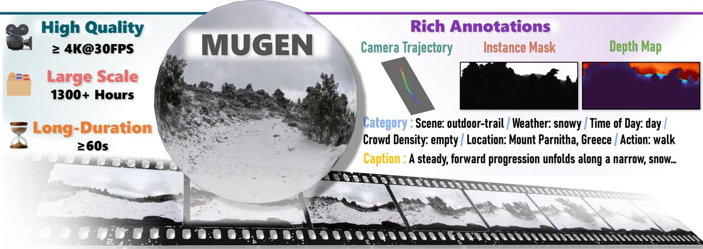
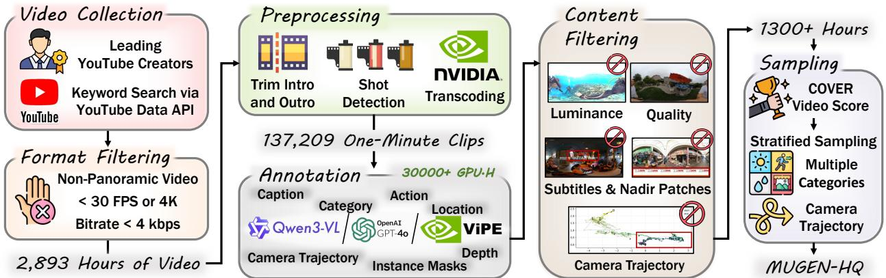
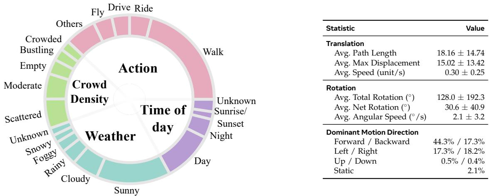
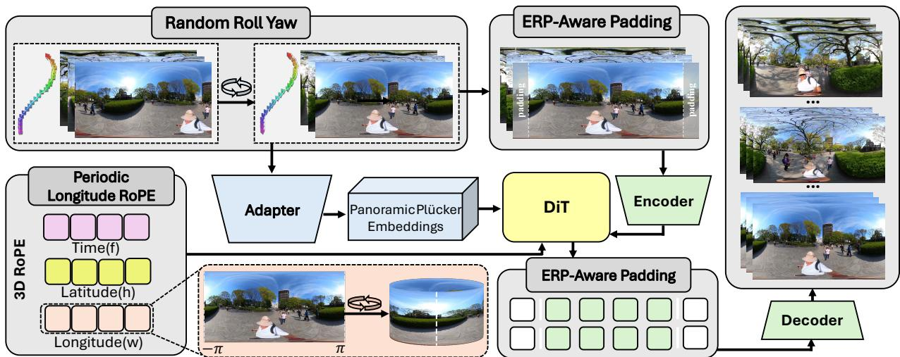
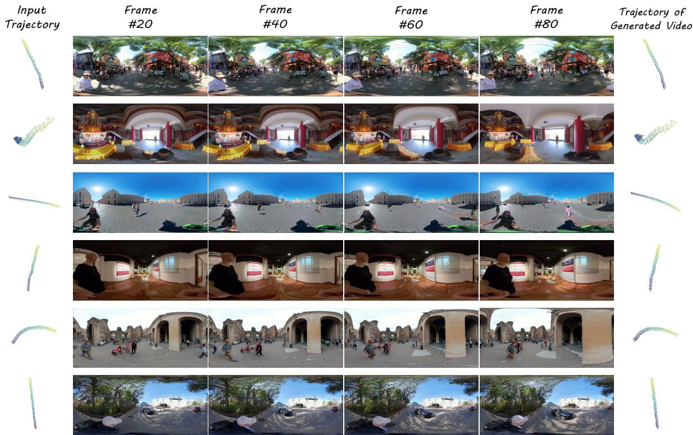
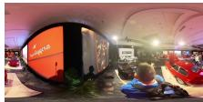
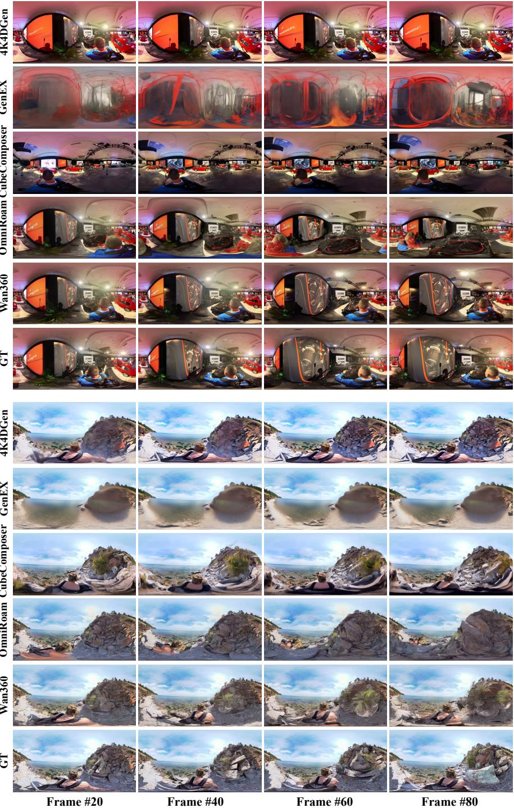
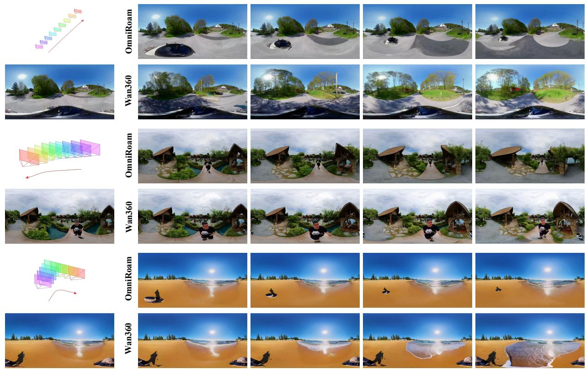
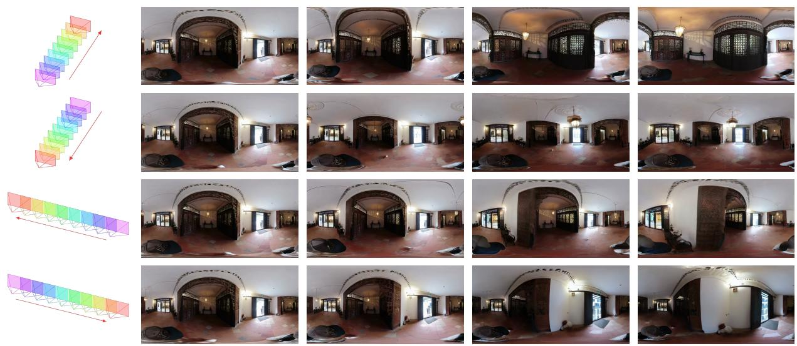

# MUGEN: Interactive Panoramic World Exploration via Camera Control

Jiaming Tan1,2,∗, Zhen Li1, Shuwei Shi1, Minggui Teng1, Siqi Yang1, Yuwei Wu2,†, Bo Zheng1, Chuanhao Li1,†, Kaipeng Zhang1,3,†

1Alaya Lab 2Beijing Institute of Technology 3Shanghai Innovation Institute

Interactive panoramic video generation aims to synthesize immersive 360° videos that remain visually coherent while following user-specified camera trajectories during exploration. However, progress is limited by a coupled data-and-model gap: existing panoramic video datasets are often short, weakly annotated, or lack camera trajectories, while existing camera-controlled video generation models are designed for perspective videos and do not directly support panoramic geometry. In this paper, we introduce MUGEN and Wan360 to address these limitations. MUGEN is a large-scale real-world panoramic video dataset tailored to interactive 360° world exploration, comprising over 1,300 hours of at least 4K panoramic videos with rich semantic and geometric annotations. Built on MUGEN, we further present Wan360, a camera-controllable interactive panoramic video generation model. Panoramic videos are commonly represented by EquiRectangular Projection (ERP), which unfolds a spherical 360° view into a rectangular frame with cyclic longitude seams and pole distortions. To this end, Wan360 introduces three parameter-free ERP-aware components: periodic longitude RoPE for seam-consistent positional encoding, ERP-aware padding for reducing boundary artifacts, and random roll yaw for consistent learning. For camera control, Wan360 uses a panoramic Plücker embedding that represents camera motion with ERP rays rather than perspective pinhole rays. Experiments show that MUGEN serves as a data foundation for panoramic world exploration, and that Wan360 enables high-quality, temporally coherent, camera-controllable 360° video generation.

Project Page: https://alaya-lab.github.io/MUGEN   
Code & Data: https://github.com/AlayaLab/MUGEN   
Correspondence: wuyuwei@bit.edu.cn, chuanhao.li@shanda.com, kaipeng.zhang@shanda.com   
Date: September 29, 2026

  
Figure 1 MUGEN dataset overview. We introduce a large-scale panoramic video dataset featuring high-quality, longduration 360° videos totaling 1,300+ hours at the resolution of at least 4K, paired with rich multi-level annotations including camera trajectories, instance masks, depth maps, natural language captions, and structured semantic labels.

## 1 Introduction

Panoramic videos provide complete 360° visual observations of real-world environments, making them a natural medium for immersive world exploration in virtual reality, simulation, and embodied AI (Yin et al., 2025; Chiariotti, 2021; Anderson et al., 2018). For such exploration to be truly interactive, a generative system must satisfy three requirements simultaneously: it should synthesize high-fidelity panoramic content, maintain temporal and spherical consistency over time, and follow user-specified camera trajectories during generation. Recent advances in panoramic video generation have improved the visual quality of 360° videos (Wang et al., 2024; Liu et al., 2025; Tan et al., 2025; Xie et al., 2025; Fang et al., 2025; Xia et al., 2025; Yin et al., 2025), but interactive panoramic world exploration remains underdeveloped because both the data and the model architectures are still insufficient for controllable generation in dynamic real-world scenes.

From the data perspective, existing panoramic video datasets are not designed for world exploration. Generation-oriented datasets (Wang et al., 2024; Xia et al., 2025) mainly provide short captioned clips, which are useful for text-conditioned panoramic synthesis but do not provide explicit camera-trajectory annotations. Perception-oriented datasets (Huang et al., 2023; Xu et al., 2025; Yan et al., 2024; Zhang et al., 2025b) include masks, boxes, or tracking annotations, but they are typically limited in scale and duration and do not target camera control video generation. As a result, prior datasets rarely combine high-resolution real-world panoramic videos, minute-level temporal extent, semantic annotations, and geometric annotations such as camera trajectories. Lacking of such a dataset makes it difficult to train and evaluate models that can generate long, coherent, and controllable panoramic videos. To address this data gap, we introduce MUGEN, shown in Figure 1, a large-scale real-world panoramic video dataset tailored to interactive 360° world exploration. MUGEN contains over 1,300 hours of high-fidelity panoramic videos at a resolution of at least 4K, with source videos longer than one minute and standardized one-minute clips for annotation and training. Each clip is paired with rich semantic annotations, including captions, scene categories, actions, weather, crowd density, and locations, as well as geometric annotations including camera trajectories, instance masks, and depth. To construct MUGEN, we design an automatic pipeline that collects panoramic videos from curated YouTube channels, performs format and content filtering, segments videos into minute-level clips, and annotates them using large multimodal models and geometry estimation tools. We further construct MUGEN-HQ, a 300-hour high-quality subset selected by quality and diversity, to support efficient model training and evaluation.

From the model perspective, directly extending existing video generation models to interactive panoramic generation is also non-trivial. Panoramic videos are usually represented in equirectangular projection (ERP), whose geometry differs fundamentally from ordinary perspective frames: longitude is periodic, the left and right image boundaries correspond to the same seam, and the top and bottom rows collapse near the poles. Treating ERP frames as standard rasters can therefore introduce seam artifacts, pole artifacts, and spherical inconsistencies. To address this model gap, we propose Wan360, a camera-controllable panoramic image-to-video model trained on MUGEN-HQ. Wan360 is fine-tuned from the perspective camera-control baseline Wan2.2-Fun-5B-Control-Camera (Wan et al., 2025) and adapts it to ERP panoramas through three parameter-free ERP-aware components. Periodic longitude RoPE enforces cyclic positional encoding along the horizontal longitude dimension, ERP-aware padding reduces seam artifacts in VAE encoding and decoding, and random roll yaw exposes the model to yaw-equivalent panoramic observations while preserving the corresponding camera trajectories. For camera control, Wan360 uses a panoramic Plücker embedding (Ji et al., 2025), replacing perspective pinhole rays with ERP rays to enable trajectory conditioning without conventional camera intrinsics. These components allow Wan360 to reuse the pretrained video generation baseline while avoiding additional trainable modules.

Experiments demonstrate the effectiveness of both MUGEN and Wan360. We evaluate the annotation quality of MUGEN and show that its semantic and geometric annotations provide reliable data support for interactive panoramic world exploration. We further compare Wan360 with existing panoramic video generation methods and conduct ablations on its ERP-aware components. The results show that Wan360 achieves strong panoramic video quality, temporal coherence, and camera-trajectory controllability, indicating that the improvements come from both the scale and quality of MUGEN and the proposed ERP-aware components.

To sum up, our contributions are as follows: (i) We propose MUGEN, a large-scale, long-duration, high quality real-world panoramic video dataset for interactive panoramic world exploration, containing over 1,300 hours of videos with rich semantic and geometric annotations. (ii) We present Wan360, a cameracontrollable panoramic video generation model that adapts to ERP geometry via three parameter-free ERP-aware components and a panoramic Plücker embedding. (iii) Extensive experiments validate the annotation quality of MUGEN and the generation quality of Wan360.

## 2 Related Work

## 2.1 Panoramic Video Datasets

Existing panoramic video datasets mainly support either generation or perception. Generation-oriented datasets such as WEB360 (Wang et al., 2024) and PANOVID (Xia et al., 2025) provide captioned panoramic clips for text-conditioned synthesis, but their annotations are primarily semantic and lack explicit camera trajectories. 360-1M (Wallingford et al., 2024) targets static novel view synthesis from frame pairs, PanFlow (Zhang et al., 2026) curates a motion-rich panoramic dataset with frame-level pose and flow annotations tailored to optical-flow-conditioned motion control, whereas MUGEN provides trajectories and richer annotations, better suiting panoramic world exploration. Perception-oriented datasets such as 360VOT/360VOTS (Huang et al., 2023; Xu et al., 2025), PanoVOS (Yan et al., 2024), and Leader360V (Zhang et al., 2025b) provide tracking or segmentation annotations, but are not designed for world exploration. In contrast, MUGEN is the first dataset with large-scale real-world 360° videos, minute-level duration, high visual fidelity, semantic labels, and geometric annotations including camera trajectories, depth, and instance masks to support interactive world exploration.

## 2.2 Panoramic Video Generation

Recent panoramic video generation methods adapt general video priors to ERP geometry using panoramaspecific adapters (Wang et al., 2024), scalable generation (Liu et al., 2025), spherical or panorama-aware representations (Park et al., 2026; Zhang et al., 2025a; Xie et al., 2025; Xia et al., 2025), and perspective-to panorama lifting (Tan et al., 2025; Lu et al., 2025; Fang et al., 2025; Li et al., 2025a, 2026). These works improve visual fidelity and scene coverage, but ERP panoramic video generation still requires geometry-aware mechanisms to handle longitude periodicity, boundary artifacts, and yaw-equivalent observations. Wan360 achieves higher-quality panoramic video generation through three parameter-free ERP-aware components that address these geometric properties. These components share related geometric intuitions with several prior works, but differ in how they are formulated and applied. PanoSplatt3R (Ren et al., 2025) approximates ERP periodicity through head-wise rolled linear RoPE coordinates. In contrast, our Periodic Longitude RoPE is exactly cyclic for every head, leading to better continuity at the seam. PAR (Wang et al., 2026a) applies circular padding to panoramic image generation, whereas we extend it to the 3D video VAE for video generation. PanoDiffusion (Wu et al., 2024) rotates the panorama during training, our Random Roll Yaw also rotates the camera trajectory simultaneously, thereby enhancing the diversity of camera trajectories during training.

## 2.3 Camera-Controlled Video Generation

Camera-controlled video generation typically injects control signals into the model in two ways: by converting camera motion into Plücker embeddings (He et al., 2025a), or by adding explicit discrete control cues into the text prompts (Wan et al., 2025). Existing methods mainly focus on conventional perspective video generation (AlayaWorld Team et al., 2026a,b,c; He et al., 2025b; Sun et al., 2025; Zhu et al., 2026; Robbyant Team et al., 2026). Although PanoWorld-X (Yin et al., 2025), CamPVG (Ji et al., 2025), and OmniRoam (Liu et al., 2026) enable camera-controlled interactive panoramic video generation, these methods operate primarily in static or quasi-static environments. In contrast, Wan360 targets dynamic real-world panoramic world exploration, emphasizing controllable generation under natural, diverse, and unconstrained conditions.

  
Figure 2 Data curation pipeline for MUGEN. We collect 2,893 hours of panoramic source videos from YouTube, preprocess continuous footage into consecutive one-minute clips for scalable annotation, annotate each clip with semantic and geometric information using Qwen3-VL (Yang et al., 2025), GPT-4o (Hurst et al., 2024), and ViPE (Huang et al., 2025), filter clips by visual quality, overlays, and trajectory validity, and finally sample MUGEN-HQ for model training. The pipeline yields MUGEN (1,318 hours) and MUGEN-HQ (300 hours).

## 3 MUGEN Curation

To address the lack of large-scale, high-quality, richly annotated panoramic video datasets tailored to world exploration, we introduce MUGEN. Figure 2 presents the data curation pipeline for our MUGEN dataset. We begin by collecting panoramic videos from YouTube, focusing on diverse real-world environments. To ensure high data fidelity, we apply strict format filtering based on resolution, bitrate, and frame rate. The filtered videos are then preprocessed into minute-level clips through intro/outro trimming, shot boundary detection, and standardized transcoding. Each clip is annotated with comprehensive semantic and geometric information using multimodal models, followed by content-based quality filtering to produce the final MUGEN dataset. Furthermore, we construct MUGEN-HQ by sampling a high-quality subset with the most reliable and diverse annotations. MUGEN also provides panoramic video supervision for AlayaVista (Tan et al., 2026), which studies streaming world modeling from panoramic states to perspective observations.

## 3.1 Data Acquisition and Preprocessing

We use YouTube as the primary source for diverse real-world panoramic videos. We manually curate leading panoramic video channels and search the YouTube Data API with queries such as “360 tour”, then review the retrieved results to exclude non-real-world content such as simulation or rendered scenes. This stage yields 9,544 candidate source videos.

We further query video metadata and apply format filtering to retain high-fidelity panoramic videos. We remove non-panoramic videos and videos with frame rates below 30 FPS, resolutions below 4K, or bitrates below 4 kbps. For the remaining videos, we download the highest available resolution and best-quality audio, resulting in 2,893 hours of raw panoramic footage. All retained source videos are longer than one minute.

For preprocessing, we first verify file integrity and discard corrupted videos. We trim the first and last minute of each source video to remove common intro and outro segments. Because online videos are often edited, we use TransNetV2 (Souˇcek and Lokoˇc, 2020) to detect shot boundaries and keep only temporally continuous segments. Following Sekai (Li et al., 2025b), we accelerate shot-boundary processing with PyNvVideoCodec and CVCUDA. Each continuous segment is partitioned into consecutive non-overlapping 60-second clips, which makes large-scale annotation tractable and provides a consistent training unit. The clips are transcoded to H.265 at the original resolution and frame rate, with audio re-encoded to AAC at 48 kHz. This process produces 137,209 one-minute clips totaling approximately 2,287 hours before content filtering.

## 3.2 Annotation

MUGEN provides two groups of annotations: semantic annotations for content generation and geometric annotations for interactive camera control.

## 3.2.1 Semantic Annotations

Because ERP panoramas are difficult for vision-language models to parse directly, we project each ERP clip into six cube faces with a $9 0 ^ { \circ } \times 9 0 ^ { \circ }$ field of view and attach explicit face labels. We use Qwen3-VL-235B-A22B-Instruct (Yang et al., 2025) to generate detailed clip-level narratives of approximately 250 words, describing scene layout, visible objects, events, and camera motion. To support different training and evaluation settings, we also provide event-agnostic captions and interval captions at 5s/10s granularity. We further prompt Qwen3-VL with YouTube metadata to predict structured attributes, including weather, time of day, crowd density, scene category, and action. Following SpatialVID (Wang et al., 2026b), we refine coarse indoor/outdoor labels into fine-grained scene categories and introduce action labels tailored to world exploration. For geographic information, we use GPT-4o (Hurst et al., 2024) to extract location tags from video metadata; clips with ambiguous or missing locations are marked as unspecified.

## 3.2.2 Geometric Annotations

For camera-controllable generation, each clip requires trajectory annotations. We compare VGGT (Wang et al., 2025), MegaSAM (Li et al., 2025c), and ViPE (Huang et al., 2025) on sampled panoramic clips, and choose ViPE because it directly supports panoramic video input and produces more coherent camera trajectories in our setting. We use ViPE to estimate camera trajectories, instance masks, and depth for each clip. Generating geometric annotations for the full dataset requires over 30,000 GPU hours.

## 3.3 Quality Filtering

Raw web videos inevitably contain poor lighting, blur, overlays, stitching artifacts, or unreliable trajectories.   
We therefore apply four content filters before forming MUGEN.

## 3.3.1 Luminance

We compute the mean luma value of each clip and discard clips outside the range [40, 215] to remove underexposed or overexposed content.

## 3.3.2 Visual Quality

We score clips with COVER (He et al., 2024) and remove clips below 0.7, which typically contain severe blur, distortion, or compression artifacts.

## 3.3.3 Overlays

We project each ERP clip into six perspective views and use Qwen3-VL (Yang et al., 2025) to flag subtitles, watermarks, and nadir patches.

## 3.3.4 Trajectory Validity

We filter clips whose estimated camera trajectories contain chaotic paths, temporal discontinuities, or abnormal rotations. After filtering, MUGEN contains 1,318 hours of high-quality one-minute clips from 6,446 unique source videos.

## 3.4 MUGEN-HQ Sampling

Although MUGEN is suitable for large-scale training and evaluation, model development often requires a smaller subset with high visual quality and balanced coverage. We therefore construct MUGEN-HQ, a 300-hour subset used for training Wan360. We first rank clips by COVER score and retain the top 70% as a quality-filtered pool. We then perform stratified sampling across scene categories, camera-motion patterns, action types, and weather conditions. This strategy preserves high visual quality while improving diversity in both scene content and controllable camera motion. MUGEN-HQ contains clips from 4,023 unique source videos.

<table><tr><td>Statistic</td><td>Value</td></tr><tr><td>Translation</td><td></td></tr><tr><td>Avg. Path Length</td><td> $1 8 . 1 6 \pm 1 4 . 7 4$ </td></tr><tr><td>Avg. Max Displacement Avg. Speed (unit/s)</td><td> $1 5 . 0 2 \pm 1 3 . 4 2$   $0 . 3 0 \pm 0 . 2 5$ </td></tr><tr><td>Rotation Avg. Total Rotation (°)</td><td></td></tr><tr><td>Avg. Net Rotation (°)</td><td> $1 2 8 . 0 \pm 1 9 2 . 3$ </td></tr><tr><td>Avg. Angular Speed (° /s)</td><td> $3 0 . 6 \pm 4 0 . 9$   $2 . 1 \pm 3 . 2$ </td></tr><tr><td>Dominant Motion Direction</td><td></td></tr><tr><td>Forward / Backward</td><td></td></tr><tr><td></td><td>44.3% / 17.3%</td></tr><tr><td>Left / Right</td><td>17.3% / 18.2%</td></tr><tr><td>Up / Down Static</td><td>0.5% / 0.4% 2.1%</td></tr></table>

Figure 3 Statistics of semantic attributes and camera trajectories in MUGEN. Left: semantic attribute distributions. Right: camera trajectory statistics.

## 3.5 Dataset Analysis

MUGEN covers diverse semantic and motion conditions for panoramic world exploration. As shown in Figure 3, the dataset spans multiple weather types, times of day, crowd-density levels, scene categories, and action types. The trajectory statistics show substantial variation in translation length, rotation magnitude, angular speed, and dominant motion direction. These properties provide the semantic diversity and trajectory diversity needed to train and evaluate camera-controllable panoramic generation models. We will release metadata and processing scripts to support transparent reuse.

## 4 Wan360 Model

We present Wan360, a panoramic image-to-video (I2V) generation model that generates ERP videos from an input panorama, a text prompt, and a user-specified camera trajectory. Wan360 is fine-tuned from a perspective camera-control video generation baseline to preserve its strong generation and control priors, but this baseline cannot be directly applied to panoramas. ERP videos contain cyclic longitude seams and pole singularities, and panoramic cameras do not follow the perspective pinhole model. Naive fine-tuning would therefore introduce seam artifacts, spherical inconsistencies, and mismatched camera-control signals.

## 4.1 Component Overview

Figure 4 shows the overall architecture. Wan360 addresses the ERP geometry mismatch with three components that add no trainable parameters. Periodic Longitude RoPE (Section 4.2) makes longitude positional encoding seam-consistent, ERP-Aware Padding (Section 4.3) reduces boundary artifacts in VAE encoding and decoding, and Random Roll Yaw (Section 4.4) creates yaw-equivalent panorama-trajectory training pairs. For camera control, a Panoramic Plücker Embedding (Section 4.5) replaces the baseline’s pinhole ray-condition generator with an ERP ray generator, enabling intrinsics-free trajectory conditioning.

## 4.2 Periodic Longitude RoPE

Perspective video baselines treat the horizontal image axis as a bounded coordinate, but ERP longitude is periodic: the left and right image boundaries represent adjacent directions on the sphere. Using the original positional encoding therefore introduces an artificial discontinuity at the panorama seam. Periodic Longitude RoPE replaces only the longitude part of the positional encoding with a cyclic formulation, while keeping the temporal and latitude parts unchanged for compatibility with the pretrained baseline. For a token at horizontal index u in a width-W latent grid, we map it to longitude

  
Figure 4 Architecture of Wan360. Wan360 is a camera-controllable interactive panoramic video generation model towards world exploration conditioned on an input panorama, a text prompt, and a target camera trajectory. To adapt the perspective baseline to panoramic geometry, Wan360 introduces three parameter-free ERP-aware components: periodic longitude RoPE for cyclic longitude encoding, ERP-aware padding for seam-continuous VAE features, and random roll yaw for yaw-equivalent trajectory augmentation. A panoramic Plücker embedding converts ERP pixels into spherical rays and injects trajectory conditions through the pretrained control adapter.

$$
\theta _ { u } = 2 \pi { \frac { u + 1 / 2 } { W } } - \pi , \qquad \rho _ { k } ( u ) = \big ( \cos ( k \theta _ { u } ) , \sin ( k \theta _ { u } ) \big ) ,\tag{1}
$$

where k denotes the RoPE frequency. Because $\rho _ { k } ( u + W ) = \rho _ { k } ( u )$ , the positional code is continuous across the ERP seam. This makes tokens near the two horizontal boundaries geometrically consistent and reduces seam-related artifacts during fine-tuning.

## 4.3 ERP-Aware Padding

The VAE in the baseline uses local convolutions, whose default boundary handling assumes that image edges have no continuation. For ERP panoramas this assumption is incorrect, because pixels at the two horizontal borders are neighbors on the sphere. ERP-Aware Padding exposes this cross-boundary neighborhood by using longitude-cyclic padding during VAE encoding and decoding. For any VAE feature map z, horizontal padding is defined as

$$
\tilde { z } _ { t , v , u } = z _ { t , v , u \mathrm { m o d } } \ : W ,\tag{2}
$$

so convolutional neighborhoods that cross the left or right border are sampled from the opposite side of the panorama. This prevents the autoencoder from injecting artificial boundary artifacts into latent features and decoded frames.

## 4.4 Random Roll Yaw

ERP panoramas have no canonical yaw orientation: horizontally rolling a panorama corresponds to rotating the world around the vertical axis. If the model only sees the yaw distribution in the collected videos, it may overfit to dataset-specific orientations and become less robust under user-specified trajectories. Random Roll Yaw augments each training sample with a yaw-equivalent version by rolling the ERP video and applying the same yaw rotation to the camera trajectory. Given a horizontal roll $s ,$ the augmented video

and camera-to-world pose are

$$
I _ { t } ^ { \prime } ( u , v ) = I _ { t } ( ( u - s ) { \bmod { W } } , v ) , \qquad T _ { t } ^ { \prime } = R _ { y } ( 2 \pi s / W ) T _ { t } .\tag{3}
$$

This keeps the video and control signal geometrically aligned while exposing the model to diverse trajectory orientations for the same scene.

## 4.5 Panoramic Plücker Embedding

Perspective camera-control methods usually describe camera motion through pinhole rays parameterized by camera intrinsics. This representation is not suitable for ERP panoramas, where each pixel corresponds to a direction on the viewing sphere rather than a ray through a perspective image plane. We therefore formulate the control signal as a panoramic Plücker field: ERP pixels are converted to spherical rays and then transformed by the target camera poses. For an ERP pixel (u, v), we first compute its longitude and latitude,

$$
\lambda _ { u } = 2 \pi { \frac { u + 1 / 2 } { W } } - \pi , \qquad \phi _ { v } = { \frac { \pi } { 2 } } - \pi { \frac { v + 1 / 2 } { H } } ,\tag{4}
$$

and obtain the camera-space ray direction

$$
d _ { \mathrm { c a m } } ( u , v ) = \left[ \begin{array} { c } { \cos \phi _ { v } \sin \lambda _ { u } } \\ { \sin \phi _ { v } } \\ { \cos \phi _ { v } \cos \lambda _ { u } } \end{array} \right] .\tag{5}
$$

With camera pose $\left( R _ { t } , o _ { t } \right)$ , the panoramic Plücker condition is

$$
d _ { t } = R _ { t } d _ { \mathsf { c a m } } , \qquad m _ { t } = o _ { t } \times d _ { t } , \qquad L _ { t } ( u , v ) = \bigl [ d _ { t } ; m _ { t } \bigr ] .\tag{6}
$$

This provides trajectory conditioning that is compatible with panoramic geometry while reusing the baseline’s ray-based control interface.

## 5 Experiments

## 5.1 Evaluation of Dataset Quality

We conduct a user study to evaluate the annotation quality of MUGEN from three complementary aspects: long-form text descriptions, structured category labels, and camera trajectories. We randomly sample 1,000 one-minute clips from MUGEN and recruit 10 volunteers for human verification. For each aspect, every sampled clip is independently reviewed by all 10 volunteers. An annotation is considered valid if at least seven volunteers judge it to be correct or usable.

## 5.1.1 Text Descriptions

Volunteers judge whether each long-form description matches the clip content, events, and camera motion; hallucinated or contradictory descriptions are marked as invalid. 94.7% of the sampled descriptions are judged to be accurate, indicating that the text annotations provide reliable semantic supervision for panoramic video generation.

## 5.1.2 Category Labels

Volunteers judge whether the provided category labels are supported by the video; ambiguous or visually unverifiable labels are treated as invalid. The final valid ratio reaches 95.3%, showing that the automatically generated category labels are sufficiently accurate for dataset analysis and controlled training.

## 5.1.3 Camera Trajectories

Volunteers inspect trajectory-overlaid clips and judge whether each trajectory is plausible and aligned with the observed camera motion; obvious drift or wrong-direction cases are marked as unusable. The resulting usable trajectory ratio is 92.4%, validating that MUGEN provides reliable camera-control annotations for interactive panoramic video generation.

Table 1 Experimental results on generated video quality and camera control accuracy. (I) Ablation of the three ERP-aware components in Wan360; (II) disentangled evaluation of model and data; (III) comparison with other panoramic video generation methods. ↑ / ↓ indicates whether higher / lower is better.
<table><tr><td>Model</td><td>FVD↓</td><td>SSIM↑</td><td>LPIPS↓</td><td>Consistency ↑</td><td>Quality ↑</td><td>Dynamic ↑</td><td>PSNR ↑</td><td>TransErr↓</td></tr><tr><td colspan="7">(I) Ablation of the three ERP-aware components.</td><td></td><td></td></tr><tr><td>Wan360 (w/o Periodic Longitude RoPE)</td><td>491.2</td><td>0.435</td><td>0.393</td><td>0.912</td><td>0.459</td><td>0.740</td><td>14.58</td><td>0.192</td></tr><tr><td>Wan360 (w/o ERP-Aware Padding)</td><td>478.5</td><td>0.446</td><td>0.378</td><td>0.915</td><td>0.457</td><td>0.710</td><td>14.79</td><td>0.188</td></tr><tr><td>Wan360 (w/o Random Roll Yaw)</td><td>486.9</td><td>0.439</td><td>0.387</td><td>0.912</td><td>0.456</td><td>0.720</td><td>14.65</td><td>0.215</td></tr><tr><td>Wan360 (Ours, full)</td><td>476.6</td><td>0.449</td><td>0.377</td><td>0.915</td><td>0.463</td><td>0.720</td><td>14.86</td><td>0.184</td></tr><tr><td colspan="9">(II) Disentangled evaluation of model and data.</td></tr><tr><td>GenEX (Lu et al., 2025)</td><td>1359</td><td>0.376</td><td>0.617</td><td>0.763</td><td>0.304</td><td>0.891</td><td>13.13</td><td>1</td></tr><tr><td>Wan360 (GenEX&#x27;s data)</td><td>999.5</td><td>0.340</td><td>0.493</td><td>0.872</td><td>0.387</td><td>0.825</td><td>13.18</td><td>1</td></tr><tr><td>ViewPoint (Fang et al., 2025)</td><td>1676</td><td>0.297</td><td>0.707</td><td>0.861</td><td>0.332</td><td>0.650</td><td>10.85</td><td>1</td></tr><tr><td>Wan360 (ViewPoint&#x27;s data)</td><td>952.3</td><td>0.361</td><td>0.429</td><td>0.896</td><td>0.413</td><td>0.550</td><td>14.00</td><td></td></tr><tr><td>Wan360 (Ours)</td><td>476.6</td><td>0.449</td><td>0.377</td><td>0.915</td><td>0.463</td><td>0.720</td><td>14.86</td><td>0.184</td></tr><tr><td colspan="9">(III) Comparison with other methods.</td></tr><tr><td>4K4DGen (Li et al., 2025a)</td><td>1541</td><td>0.345</td><td>0.494</td><td>0.951</td><td>0.421</td><td>0.275</td><td>13.02</td><td></td></tr><tr><td>DynamicScaler (Liu et al., 2025)</td><td>1941</td><td>0.269</td><td>0.641</td><td>0.886</td><td>0.423</td><td>0.397</td><td>10.84</td><td>一</td></tr><tr><td>CubeComposer (Li et al., 2026)</td><td>1579</td><td>0.305</td><td>0.579</td><td>0.918</td><td>0.395</td><td>0.100</td><td>11.46</td><td></td></tr><tr><td>OmniRoam (Liu et al., 2026)</td><td>640.0</td><td>0.410</td><td>0.463</td><td>0.901</td><td>0.430</td><td>0.723</td><td>13.77</td><td>0.251</td></tr><tr><td>Wan360 (Ours)</td><td>476.6</td><td>0.449</td><td>0.377</td><td>0.915</td><td>0.463</td><td>0.720</td><td>14.86</td><td>0.184</td></tr></table>

## 5.2 Experimental Setup

## 5.2.1 Training Details

Wan360 is fine-tuned from the Wan2.2-Fun-5B-Control-Camera (Wan et al., 2025) baseline. We fine-tune it on MUGEN-HQ to generate 161 frames at 1920×960 resolution, sampled at 16 FPS from the 30 FPS source videos. Training is conducted on 8×NVIDIA H200 GPUs for 10 epochs with a learning rate of $\mathbf { 1 \times 1 0 ^ { - 5 } }$

## 5.2.2 Evaluation Data

We randomly select 200 video samples that are excluded from training. From them, we curate a final test set of 100 videos by stratifying the samples according to camera trajectory patterns and scene categories.

## 5.2.3 Metrics

For reconstruction-oriented quality, we report FVD (Unterthiner et al., 2018), SSIM (Wang et al., 2004), LPIPS (Zhang et al., 2018), and PSNR against held-out reference videos. For perceptual and temporal quality, we use VBench++ (Huang et al., 2024). For camera control, following CamCtrl (He et al., 2025a), we annotate the trajectory of each generated video using ViPE (Huang et al., 2025) and compute the translation error (TransErr) against the input trajectory.

## 5.3 Evaluation of Model Performance

## 5.3.1 Ablation Study

Block (I) of Table 1 evaluates the three ERP-aware components in Wan360. Removing Periodic Longitude RoPE, ERP-aware padding, or random roll yaw weakens the overall balance between video quality and camera control. The full model achieves the best overall score, indicating that the three components are complementary for fine-tuning a perspective video generation baseline for panoramic video generation.

  
Figure 5 Qualitative examples of videos generated by Wan360. Wan360 is a camera-controllable interactive panoramic video generation model towards world exploration. To show the ability of following camera pose, we annotate the trajectory of generated videos.

## 5.3.2 Disentangling Model and Data

Block (II) isolates the contributions of architecture and data. We train Wan360 using the same training recipe while replacing MUGEN-HQ with data from GenEX (Lu et al., 2025) or ViewPoint (Fang et al., 2025). Under the same evaluation protocol, Wan360 trained on these alternative datasets improves several metrics over the corresponding original methods, but remains behind Wan360 trained on MUGEN-HQ. This result suggests that Wan360 contributes meaningful model-side gains, while the scale, diversity, and annotation quality of MUGEN-HQ are essential for the final performance.

## 5.3.3 Comparison with Existing Methods

Block (III) evaluates Wan360 against representative panoramic video generation methods under the same held-out test set. Compared with prior methods, Wan360 substantially reduces FVD and LPIPS while improving SSIM, PSNR, and video quality, indicating better frame-level fidelity and temporal realism. Among methods with explicit camera-control evaluation, Wan360 also achieves the lowest TransErr, showing more accurate trajectory following in dynamic real-world panoramas.

## 5.4 Qualitative Examples

Figure 6 provides qualitative comparisons with representative methods. 4K4DGen (Li et al., 2025a) often produces limited apparent motion, GenEX (Lu et al., 2025) introduce artifacts and geometric distortions under large motion, CubeComposer (Li et al., 2026) tends to produce less dynamic videos, and OmniRoam (Liu et al., 2026) is constrained by static scene assumptions. In contrast, Wan360 better preserves panoramic structure, visual details, and temporally coherent motion.

Figure 7 further compares Wan360 with OmniRoam under explicit target trajectories, showing that Wan360 follows the prescribed motion while maintaining dynamic real-world content.

4K4DGen GenEXCubeComposerOmniRoam Wan360 GT 4K4DGen GenEXCubeComposerOmniRoam Wan360 GT

Guests meander through a dimly lit, high-ceilinged exhibition hall where a curated collection of classic and modern sports cars is displayed on illuminated white plinths. The space is defined by dark walls and a patterned carpet, with overhead truss lighting casting focused beams onto the vehicles and large, vibrant digital screens that line the perimeter…

The video captures a slow, steady   
progression along a rugged, sunlit   
lakeshore, where   
the camera glides forward at a low, consistent height, maintaining a close perspective to the ground. The   
terrain is   
dominated by a   
chaotic scatter of angular, weathered rocks and boulders in shades of gray, brown, and ochre, interspersed with sparse tufts of   
hardy green…

  
Figure 6 Qualitative comparison of panoramic video generation methods. Wan360 produces panoramic videos with higher visual fidelity, better temporal consistency, and more realistic dynamics.

  
Figure 7 Qualitative comparison under target camera trajectories. The left column shows the input panorama and target trajectory, while the right columns compare generated sequences from OmniRoam (Liu et al., 2026) and Wan360.

Finally, Figure 8 shows examples generated from the same input panorama under different camera trajectories, demonstrating that Wan360 can produce trajectory-dependent panoramic videos with consistent scene appearance.

  
Figure 8 Qualitative results of Wan360 under different target trajectories for 10s. Given the same input panorama, Wan360 produces distinct video sequences aligned with different camera motions while maintaining consistent scene appearance.

## 6 Conclusion

In this work, we take a step toward interactive panoramic world exploration, where the central goal is to generate immersive 360° videos that remain coherent while following user-specified camera trajectories in dynamic real-world scenes. This task requires both suitable annotated data and a model that can respect panoramic geometry under camera control. To this end, MUGEN provides large-scale, high-quality real-world panoramic videos with rich semantic and geometric annotations, including explicit camera trajectories for controllable generation. Built on MUGEN, Wan360 fine-tunes a perspective camera-control video generation baseline for ERP panoramas through periodic longitude RoPE, ERP-aware padding, random roll yaw, and a panoramic Plücker embedding. Experiments show that MUGEN provides effective data support for the task, and that Wan360 generates panoramic videos with strong visual quality, temporal coherence, and trajectory controllability. The proposed MUGEN and Wan360 establish a practical foundation for camera-controlled interactive panoramic world exploration in real-world environments.

## 6.1 Limitations

We use ViPE (Huang et al., 2025) to perform 3D reconstruction on videos generated by Wan360. In static scenes, the reconstructed scene structure and relative object positions remain generally stable, while the estimated camera trajectories are smooth and continuous. However, strict 3D consistency is not guaranteed, particularly in dynamic scenes with independently moving objects. Explicitly enforcing geometric and temporal consistency remains an important direction for future work. Wan360 currently generates fixedlength clips and does not yet support real-time or unbounded long-horizon generation, where error accumulation remains an open challenge. In addition, MUGEN’s data primarily comes from the real world. In future work, we will consider extending it to other domains, such as animation and games.

## References

AlayaWorld Team, Kaipeng Zhang, Chuanhao Li, Yifan Zhan, Yongtao Ge, Yuanyang Yin, Jiaming Tan, Kang He, Liaoyuan Fan, Ruicong Liu, Xiaojie Xu, Xuangeng Chu, Zhen Li, Zhengyuan Lin, Zhixiang Wang, Zian Meng, and Zihui Gao. AlayaWorld: Long-horizon and playable video world generation. arXiv preprint arXiv:2607.06291, 2026a.

AlayaWorld Team, Kaipeng Zhang, Chuanhao Li, Yifan Zhan, Yongtao Ge, Yuanyang Yin, Jiaming Tan, Kang He, Liaoyuan Fan, Mingliang Zhai, Ruicong Liu, Xiaojie Xu, Xuangeng Chu, Zhen Li, Zhengyuan Lin, Zhixiang Wang, Zian Meng, and Zihui Gao. AlayaWorld: Interactive long-horizon world modeling – full technical report. arXiv preprint arXiv:2607.18367, 2026b.

AlayaWorld Team, Kaipeng Zhang, Chuanhao Li, Yifan Zhan, Yongtao Ge, Yuanyang Yin, Jiaming Tan, Kang He, Liaoyuan Fan, Mingliang Zhai, Ruicong Liu, Xiaojie Xu, Xuangeng Chu, Zhen Li, Zhengyuan Lin, Zhixiang Wang, Zian Meng, and Zihui Gao. AlayaWorld: Interactive long-horizon world modeling – full technical report (v1.1). arXiv preprint arXiv:2608.13492, 2026c.

Peter Anderson, Qi Wu, Damien Teney, Jake Bruce, Mark Johnson, Niko Sünderhauf, Ian Reid, Stephen Gould, and Anton Van Den Hengel. Vision-and-language navigation: Interpreting visually-grounded navigation instructions in real environments. In Proceedings of the IEEE/CVF Conference on Computer Vision and Pattern Recognition (CVPR), pages 3674–3683, Salt Lake City, UT, USA, 2018. IEEE/CVF.

Federico Chiariotti. A survey on 360-degree video: Coding, quality of experience and streaming. Computer Communications, 177:133–155, 2021.

Zixun Fang, Kai Zhu, Zhiheng Liu, Yu Liu, Wei Zhai, Yang Cao, and Zheng-Jun Zha. ViewPoint: Panoramic video generation with pretrained diffusion models. In Advances in Neural Information Processing Systems (NeurIPS), volume 38, 2025.

Chenlong He, Qi Zheng, Ruoxi Zhu, Xiaoyang Zeng, Yibo Fan, and Zhengzhong Tu. COVER: A comprehensive video quality evaluator. In Proceedings of the IEEE/CVF Conference on Computer Vision and Pattern Recognition Workshops (CVPRW), pages 5799–5809, Seattle, WA, USA, June 2024. IEEE/CVF.

Hao He, Yinghao Xu, Yuwei Guo, Gordon Wetzstein, Bo Dai, Hongsheng Li, and Ceyuan Yang. CameraCtrl: Enabling camera control for video diffusion models. In International Conference on Learning Representations (ICLR), 2025a.

Xianglong He, Chunli Peng, Zexiang Liu, Boyang Wang, Yifan Zhang, Qi Cui, Fei Kang, Biao Jiang, Mengyin An, Yangyang Ren, Baixin Xu, Hao-Xiang Guo, Kaixiong Gong, Cyrus Wu, Wei Li, Xuchen Song, Yang Liu, Eric Li, and Yahui Zhou. Matrix-Game 2.0: An open-source, real-time, and streaming interactive world model. arXiv preprint arXiv:2508.13009, 2025b.

Huajian Huang, Yinzhe Xu, Yingshu Chen, and Sai-Kit Yeung. 360VOT: A new benchmark dataset for omnidirectional visual object tracking. In Proceedings of the IEEE/CVF International Conference on Computer Vision (ICCV), pages 20566–20576, Paris, France, 2023. IEEE/CVF.

Jiahui Huang, Qunjie Zhou, Hesam Rabeti, Aleksandr Korovko, Huan Ling, Xuanchi Ren, Tianchang Shen, Jun Gao, Dmitry Slepichev, Chen-Hsuan Lin, et al. ViPE: Video pose engine for 3d geometric perception. NVIDIA Research Whitepapers; arXiv:2508.10934, 2025.

Ziqi Huang, Fan Zhang, Xiaojie Xu, Yinan He, Jiashuo Yu, Ziyue Dong, Qianli Ma, Nattapol Chanpaisit, Chenyang Si, Yuming Jiang, Yaohui Wang, Xinyuan Chen, Ying-Cong Chen, Limin Wang, Dahua Lin, Yu Qiao, and Ziwei Liu. VBench++: Comprehensive and versatile benchmark suite for video generative models. arXiv preprint arXiv:2411.13503, 2024.

Aaron Hurst, Adam Lerer, Adam P. Goucher, Adam Perelman, Aditya Ramesh, Aidan Clark, AJ Ostrow, Akila Welihinda, Alan Hayes, Alec Radford, et al. GPT-4o system card. arXiv preprint arXiv:2410.21276, 2024.

Chenhao Ji, Chaohui Yu, Junyao Gao, Fan Wang, and Cairong Zhao. CamPVG: Camera-controlled panoramic video generation with epipolar-aware diffusion. In Proceedings of the SIGGRAPH Asia 2025 Conference Papers. Association for Computing Machinery, 2025.

Lingen Li, Guangzhi Wang, Xiaoyu Li, Zhaoyang Zhang, Qi Dou, Jinwei Gu, Tianfan Xue, and Ying Shan. CubeComposer: Spatio-temporal autoregressive 4k 360-degree video generation from perspective video. In Proceedings of the IEEE/CVF Conference on Computer Vision and Pattern Recognition (CVPR), pages 32625–32635, 2026.

Renjie Li, Panwang Pan, Bangbang Yang, Dejia Xu, Shijie Zhou, Xuanyang Zhang, Zeming Li, Achuta Kadambi, Zhangyang Wang, Zhengzhong Tu, and Zhiwen Fan. 4K4DGen: Panoramic 4d generation at 4k resolution. In International Conference on Learning Representations (ICLR), 2025a.

Zhen Li, Chuanhao Li, Xiaofeng Mao, Shaoheng Lin, Ming Li, Shitian Zhao, Zhaopan Xu, Xinyue Li, Yukang Feng, Jianwen Sun, et al. Sekai: A video dataset towards world exploration. In Advances in Neural Information Processing Systems (NeurIPS), volume 38, 2025b.

Zhengqi Li, Richard Tucker, Forrester Cole, Qianqian Wang, Linyi Jin, Vickie Ye, Angjoo Kanazawa, Aleksander Holynski, and Noah Snavely. MegaSaM: Accurate, fast and robust structure and motion from casual dynamic videos. In Proceedings of the IEEE/CVF Conference on Computer Vision and Pattern Recognition (CVPR), pages 10486–10496, Nashville, TN, USA, 2025c. IEEE/CVF.

Jinxiu Liu, Shaoheng Lin, Yinxiao Li, and Ming-Hsuan Yang. DynamicScaler: Seamless and scalable video generation for panoramic scenes. In Proceedings of the IEEE/CVF Conference on Computer Vision and Pattern Recognition (CVPR), pages 6144–6153, Nashville, TN, USA, 2025. IEEE/CVF.

Yuheng Liu, Xin Lin, Xinke Li, Baihan Yang, Chen Wang, Kalyan Sunkavalli, Yannick Hold-Geoffroy, Hao Tan, Kai Zhang, Xiaohui Xie, et al. OmniRoam: World wandering via long-horizon panoramic video generation. In Proceedings of the SIGGRAPH 2026 Conference Papers. Association for Computing Machinery, 2026. doi: 10.1145/3799902.3811180.

Taiming Lu, Tianmin Shu, Junfei Xiao, Luoxin Ye, Jiahao Wang, Cheng Peng, Chen Wei, Daniel Khashabi, Rama Chellappa, Alan Yuille, and Jieneng Chen. GenEx: Generating an explorable world. In International Conference on Learning Representations (ICLR), 2025.

Minho Park, Taewoong Kang, Jooyeol Yun, Sungwon Hwang, and Jaegul Choo. SphereDiff: Tuning-free 360° static and dynamic panorama generation via spherical latent representation. Proceedings of the AAAI Conference on Artificial Intelligence, 40(10):8305–8313, 2026. doi: 10.1609/aaai.v40i10.37779.

Jiahui Ren, Mochu Xiang, Jiajun Zhu, and Yuchao Dai. PanoSplatt3R: Leveraging perspective pretraining for generalized unposed wide-baseline panorama reconstruction. In Proceedings of the IEEE/CVF International Conference on Computer Vision (ICCV), pages 28959–28969, Honolulu, HI, USA, 2025. IEEE/CVF.

Robbyant Team, Zelin Gao, Qiuyu Wang, Yanhong Zeng, Jiapeng Zhu, Ka Leong Cheng, Yixuan Li, Hanlin Wang, Yinghao Xu, Shuailei Ma, Yihang Chen, Jie Liu, Yansong Cheng, Yao Yao, Jiayi Zhu, Yihao Meng, Kecheng Zheng, Qingyan Bai, Jingye Chen, Zehong Shen, Yue Yu, Xing Zhu, Yujun Shen, and Hao Ouyang. Advancing open-source world models. arXiv preprint arXiv:2601.20540, 2026.

Tomáš Souˇcek and Jakub Lokoˇc. TransNet V2: An effective deep network architecture for fast shot transition detection. arXiv preprint arXiv:2008.04838, 2020.

Wenqiang Sun, Haiyu Zhang, Haoyuan Wang, Junta Wu, Zehan Wang, Zhenwei Wang, Yunhong Wang, Jun Zhang, Tengfei Wang, and Chunchao Guo. WorldPlay: Towards long-term geometric consistency for real-time interactive world modeling. arXiv preprint arXiv:2512.14614, 2025.

Jiaming Tan, Mingliang Zhai, Zhen Li, Yuwei Wu, Chuanhao Li, and Kaipeng Zhang. AlayaVista: Streaming world modeling from panoramic states to perspective video. arXiv preprint arXiv:2609.14462, 2026.

Jing Tan, Shuai Yang, Tong Wu, Jingwen He, Yuwei Guo, Ziwei Liu, and Dahua Lin. Imagine360: Immersive 360 video generation from perspective anchor. In Advances in Neural Information Processing Systems (NeurIPS), volume 38, 2025.

Thomas Unterthiner, Sjoerd Van Steenkiste, Karol Kurach, Raphael Marinier, Marcin Michalski, and Sylvain Gelly. Towards accurate generative models of video: A new metric & challenges. arXiv preprint arXiv:1812.01717, 2018.

Matthew Wallingford, Anand Bhattad, Aditya Kusupati, Vivek Ramanujan, Matt Deitke, Sham Kakade, Aniruddha Kembhavi, Roozbeh Mottaghi, Wei-Chiu Ma, and Ali Farhadi. From an image to a scene: Learning to imagine the world from a million 360 videos. Advances in Neural Information Processing Systems, 37:17743–17760, 2024.

Team Wan, Ang Wang, Baole Ai, Bin Wen, Chaojie Mao, Chen-Wei Xie, Di Chen, Feiwu Yu, Haiming Zhao, Jianxiao Yang, Jianyuan Zeng, Jiayu Wang, Jingfeng Zhang, Jingren Zhou, Jinkai Wang, Jixuan Chen, Kai Zhu, Kang Zhao, Keyu Yan, Lianghua Huang, Mengyang Feng, Ningyi Zhang, Pandeng Li, Pingyu Wu, Ruihang Chu, Ruili Feng, Shiwei Zhang, Siyang Sun, Tao Fang, Tianxing Wang, Tianyi Gui, Tingyu Weng, Tong Shen, Wei Lin, Wei Wang, Wei Wang, Wenmeng Zhou, Wente Wang, Wenting Shen, Wenyuan Yu, Xianzhong Shi, Xiaoming Huang, Xin Xu, Yan Kou, Yangyu Lv, Yifei Li, Yijing Liu, Yiming Wang, Yingya Zhang, Yitong Huang, Yong Li, You Wu, Yu Liu, Yulin Pan, Yun Zheng, Yuntao Hong, Yupeng Shi, Yutong Feng, Zeyinzi Jiang, Zhen Han, Zhi-Fan Wu, and Ziyu Liu. Wan: Open and advanced large-scale video generative models. arXiv preprint arXiv:2503.20314, 2025.

Chaoyang Wang, Xiangtai Li, Lu Qi, Xiaofan Lin, Jinbin Bai, Qianyu Zhou, and Yunhai Tong. Conditional panoramic image generation via masked autoregressive modeling. Advances in Neural Information Processing Systems, 38:27654–27679, 2026a.

Jiahao Wang, Yufeng Yuan, Rujie Zheng, Youtian Lin, Jian Gao, Lin-Zhuo Chen, Yajie Bao, Yi Zhang, Chang Zeng, Yanxi Zhou, et al. SpatialVID: A large-scale video dataset with spatial annotations. In Proceedings of the IEEE/CVF Conference on Computer Vision and Pattern Recognition (CVPR), pages 42592–42603, 2026b.

Jianyuan Wang, Minghao Chen, Nikita Karaev, Andrea Vedaldi, Christian Rupprecht, and David Novotny. VGGT: Visual geometry grounded transformer. In Proceedings of the IEEE/CVF Conference on Computer Vision and Pattern Recognition (CVPR), pages 5294–5306, Nashville, TN, USA, 2025. IEEE/CVF.

Qian Wang, Weiqi Li, Chong Mou, Xinhua Cheng, and Jian Zhang. 360DVD: Controllable panorama video generation with 360-degree video diffusion model. In Proceedings of the IEEE/CVF Conference on Computer Vision and Pattern Recognition (CVPR), pages 6913–6923, Seattle, WA, USA, 2024. IEEE/CVF.

Zhou Wang, Alan C. Bovik, Hamid R. Sheikh, and Eero P. Simoncelli. Image quality assessment: from error visibility to structural similarity. IEEE Transactions on Image Processing, 13(4):600–612, 2004.

Tianhao Wu, Chuanxia Zheng, and Tat-Jen Cham. PanoDiffusion: 360-degree panorama outpainting via diffusion. In International Conference on Learning Representations (ICLR), 2024.

Yifei Xia, Shuchen Weng, Siqi Yang, Jingqi Liu, Chengxuan Zhu, Minggui Teng, Zijian Jia, Han Jiang, and Boxin Shi. PanoWan: Lifting diffusion video generation models to 360 degrees with latitude/longitudeaware mechanisms. In Advances in Neural Information Processing Systems (NeurIPS), volume 38, 2025.

Kevin Xie, Amirmojtaba Sabour, Jiahui Huang, Despoina Paschalidou, Greg Klar, Umar Iqbal, Sanja Fidler, and Xiaohui Zeng. VideoPanda: Video panoramic diffusion with multi-view attention. arXiv preprint arXiv:2504.11389, 2025.

Yinzhe Xu, Huajian Huang, Yingshu Chen, and Sai-Kit Yeung. 360VOTS: Visual object tracking and segmentation in omnidirectional videos. IEEE Transactions on Pattern Analysis and Machine Intelligence, 47 (11):9785–9797, 2025.

Shilin Yan, Xiaohao Xu, Renrui Zhang, Lingyi Hong, Wenchao Chen, Wenqiang Zhang, and Wei Zhang. PanoVOS: Bridging non-panoramic and panoramic views with transformer for video segmentation. In Proceedings of the European Conference on Computer Vision (ECCV), pages 346–365, Milan, Italy, 2024. Springer.

An Yang, Anfeng Li, Baosong Yang, Beichen Zhang, Binyuan Hui, Bo Zheng, Bowen Yu, Chang Gao, Chengen Huang, Chenxu Lv, et al. Qwen3 technical report. arXiv preprint arXiv:2505.09388, 2025.

Yuyang Yin, Haoxiang Guo, Fangfu Liu, Mengyu Wang, Hanwen Liang, Eric Li, Yikai Wang, Xiaojie Jin, Yao Zhao, and Yunchao Wei. PanoWorld-X: Generating explorable panoramic worlds via sphere-aware video diffusion. arXiv preprint arXiv:2509.24997, 2025.

Cheng Zhang, Hanwen Liang, Donny Y. Chen, Qianyi Wu, Konstantinos N. Plataniotis, Camilo Cruz Gambardella, and Jianfei Cai. PanoFlow: Decoupled motion control for panoramic video generation. Proceedings of the AAAI Conference on Artificial Intelligence, 40(15):12385–12393, 2026.

Muyang Zhang, Yuzhi Chen, Rongtao Xu, Changwei Wang, Jinming Yang, Weiliang Meng, Jianwei Guo, Huihuang Zhao, and Xiaopeng Zhang. PanoDiT: Panoramic videos generation with diffusion transformer. Proceedings of the AAAI Conference on Artificial Intelligence, 39(10):10040–10048, 2025a.

Richard Zhang, Phillip Isola, Alexei A. Efros, Eli Shechtman, and Oliver Wang. The unreasonable effectiveness of deep features as a perceptual metric. In Proceedings of the IEEE/CVF Conference on Computer Vision and Pattern Recognition (CVPR), pages 586–595, Salt Lake City, UT, USA, 2018. IEEE/CVF.

Weiming Zhang, Dingwen Xiao, Aobotao Dai, Yexin Liu, Tianbo Pan, Shiqi Wen, Lei Chen, and Lin Wang. Leader360V: A large-scale, real-world 360 video dataset for multi-task learning in diverse environment. In Advances in Neural Information Processing Systems (NeurIPS), volume 38, pages 53687–53711, 2025b.

Haoyi Zhu, Haozhe Liu, Yuyang Zhao, Tian Ye, Junsong Chen, Jincheng Yu, Tong He, Song Han, and Enze Xie. SANA-WM: Efficient minute-scale world modeling with hybrid linear diffusion transformer. arXiv preprint arXiv:2605.15178, 2026.