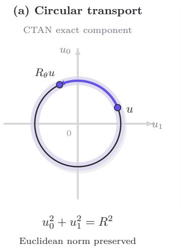
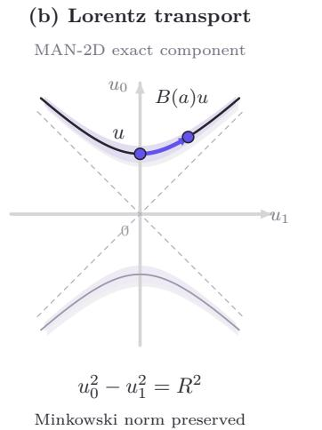
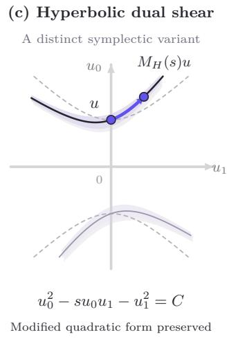

# Minkowski Attractor Networks: Closed-Form Hyperbolic Flows for Visual Representations

Zhongping Ji

## Abstract

Geometric representation learning predominantly scafolds representations onto flat Euclidean subspaces or compact product tori $( \mathbb { T } ^ { K } )$ . However, flat manifolds possess vanishing curvature and polynomial volume growth, inherently sufering from metric distortion when embedding multi-scale, tree-like visual hierarchies. While hyperbolic spaces (H�) circumvent this via constant negative curvature $( K < 0 )$ and exponential volume expansion, prior hyperbolic deep architectures are hindered by computationally cumbersome Riemannian optimization, non-linear gyrovector calculus, and floating-point instabilities.

In this work, we introduce Minkowski Attractor Networks (MAN), an operator-splitting-inspired framework that embeds representations within pseudo-Riemannian Minkowski spacetime $( \mathbb { R } ^ { 1 , m } )$ . By framing hyperbolic manifolds as quadric level sets, MAN resolves hyperbolic geometry by combining linear Lorentz group transport with non-linear cone lifting and closed-form radial rescaling, evaluating in a single forward pass without numerical ODE solvers or iterative retractions. We establish MAN-2D (R1,1 → H1) as our primary, high-throughput visual backbone, which maximizes channel factorization granularity into $D / 2$ independent two-dimensional Minkowski blocks. We further formulate MAN-4D $( \mathbb { R } ^ { 1 , 3 }  \mathbb { H } ^ { 3 } )$ as a spacetime extension, leveraging a commuting Cartan-subalgebra parameterization of $S O ^ { + } ( 1 , 3 )$ to evaluate 4D Lorentz isometries via two commuting 2D planar maps without matrix-exponential overhead. Across both compact (∼ 1M) and scaled (∼ 2.1M) regimes on CIFAR-100 without external pretraining, MAN models establish new Pareto frontiers: MAN-2D-1 achieves 81.03% top-1 accuracy (1.02M parameters), scaling to 81.82% in MAN-2D-2 (2.13M parameters). All variants comprehensively outperform flat torus baselines and heavyweight 23.7M ResNet-50, demonstrating that closed-form Minkowski spacetime dynamics provide a superior foundation for visual representations. Code will be made publicly available upon acceptance at: https://github.com/ParaMind2025/Ananke-CV.

## 1 Introduction

Modern deep visual architectures predominantly cascade discrete linear and non-linear operations within flat Euclidean vector spaces [1, 2, 3]. Continuous-depth models [4] interpret neural cascades as dynamical flow systems, while structured geometric backbones, such as Contractive Torus Attractor Networks (CTAN) [5], demonstrate that highdimensional latent spaces can be structured into direct sums of 2D phase planes $( \bigoplus \mathbb { R } ^ { 2 } )$ , where transverse perturbations contract onto compact invariant tori $\mathbb { T } ^ { K }$

Despite their parameter eficiency, product-torus models face an intrinsic geometric limitation: flat tori have vanishing sectional curvature. In flat spaces, the volume of a geodesic ball scales polynomially $( \mathrm { V o l } ( B ( r ) ) \propto r ^ { m } )$ , saturating at large scales on compact manifolds. In contrast, natural visual concepts exhibit multi-scale, tree-like taxonomies (e.g., compositional parts, fine-grained species, and hierarchical scene semantics). Embedding discrete branching trees into fixed low-dimensional flat spaces inevitably incurs metric distortion unless dimension scales with tree depth [6, 7].

Hyperbolic geometry $( \mathbb { H } ^ { m }$ , for $m \geq 2 )$ ofers an escape from this dimensional bottleneck. Endowed with constant negative curvature $( K < 0 )$ , hyperbolic space exhibits exponential metric volume expansion $( \mathrm { V o l } ( B ( r ) ) \sim e ^ { ( m - 1 ) r / R } )$ providing natural geometric capacity for continuous tree-like data. Nonetheless, mainstream computer vision has remained resistant to hyperbolic models due to three fundamental obstacles:

1. Non-Linear Gyrocalculus: Standard operations (vector additions, residual shortcuts) are undefined in hyperbolic geometry, forcing prior works into computationally expensive gyrovector operations (Möbius addition) or iterative Fréchet means [7].

2. Optimization and Numerical Challenges: Directly optimizing manifold-constrained hyperbolic embeddings typically requires Riemannian gradient updates, whereas unconstrained network weights can be trained with standard Euclidean optimizers. Separately, finite-precision arithmetic limits the numerical reliability of hyperbolic representations in both the Poincaré and Lorentz models, potentially causing loss of accuracy or NaN failures [8]. These challenges motivate formulations with explicit geometric constraints and tractable computations.

3. GPU Hardware Incompatibility: Modern Tensor Cores are specialized for Dense General Matrix Multiply (GEMM). Hyperbolic projections fragment computation into memory-bound elementwise operations.

Why Minkowski Spacetime? We overcome these obstacles by demonstrating that embedding representations into pseudo-Riemannian Minkowski spacetime $( \mathbb { R } ^ { 1 , m } )$ linearizes hyperbolic dynamics. In Minkowski spacetime endowed with indefinite metric $\eta = \mathrm { d i a g } ( 1 , - 1 , \dots , - 1 ,$ , the hyperbolic manifold is realized simply as a quadric level set:

$$
\mathbb { H } _ { R } ^ { m } = \left\{ X \in \mathbb { R } ^ { 1 , m } \ : \ X _ { 0 } ^ { 2 } - \sum _ { i = 1 } ^ { m } X _ { i } ^ { 2 } = R ^ { 2 } , \ X _ { 0 } > 0 \right\} .\tag{1}
$$

Because the ambient spacetime is flat (pseudo-Euclidean), orientation-preserving hyperbolic isometries (Lorentz boosts and rotations) are represented as standard linear matrix multiplications belonging to the Lie group ${ \mathrm { S O } } ^ { + } ( 1 , m )$ Coupled with Lie–Trotter operator splitting, spatial feature mixing is handled by standard depthwise convolutions, while local reaction dynamics evolve via an exact, single-pass closed-form mapping with no time-discretization truncation error in exact arithmetic for the local reaction subproblem.

From a representation-learning perspective, the manifold hypothesis motivates representations organized near lowerdimensional geometric structures, while the risk of representation collapse highlights the need to retain informative variation within those structures. These competing imperatives motivate a principled separation between transverse regularization and tangential transport. Ananke [5] implements this separation through structured latent manifold priors, combining logarithmic radial relaxation with conservative transport along their level sets. For the exact MAN reaction flow with shared, frozen parameters, the log-radius error decays exponentially, while Lorentz transport preserves pairwise hyperbolic distances between normalized states. This provides a conditional mechanism for regulating radial deviations without contracting existing intrinsic diferences. CTAN and MAN instantiate this design using circular and hyperbolic geometries, respectively. These guarantees establish a rigorous local certificate for the conditional flows, providing the broader learned architecture with a structured geometric prior to attenuate of-manifold noise while safeguarding semantic expressivity.

## Our Contributions.

• The Minkowski Attractor Prior: We establish an operator-splitting-inspired continuous-dynamical framework grounded in Minkowski spacetime. Transverse signed logarithmic dissipation contracts of-manifold perturbations, while tangential Lorentz Lie group flows preserve metric invariants.

• MAN-2D as the Workhorse Visual Backbone: We show that the 2D Minkowski formulation $( \mathbb { R } ^ { 1 , 1 } \to \mathbb { H } ^ { 1 } )$ is an exceptional visual operator. Although H1 is intrinsically flat, its non-compact coordinates prevent periodic phase-locking, while partitioning channels into $D / 2$ independent 2D blocks maximizes filter factorization granularity.

• High-Dimensional Spacetime Extension (MAN-4D): We generalize the framework to four-dimensional spacetime $( \mathbb { R } ^ { 1 , 3 } \xrightarrow { } \mathbb { H } ^ { \bar { 3 } } )$ . By exploiting the commuting Cartan-subalgebra parameterization $\begin{array} { r } { [ { \bf K } _ { 3 } , { \bf J } _ { 1 2 } ] = 0 . } \end{array}$ , we decouple 4D Lorentz transport into parallel spatial rotations and longitudinal boosts, preserving the Lorentz quadratic form through a two-parameter commuting subgroup at reduced parameter overhead (1.75� vs. 2.0�).

• Systematic Dimensional and Scaling Benchmark: We evaluate 2D, 3D, and 4D variants across two pyramidal tiers on CIFAR-100. MAN models establish new performance frontiers: MAN-2D attains 81.03% (1.02M) and 81.82% (2.13M); MAN-4D attains 80.80% (0.97M) and 81.75% (2.01M), universally outperforming 2D flat tori (78.41% / 80.54%) and heavyweight 23.7M ResNet-50 (79.14%).

## 2 Related Work

Continuous-Depth Representations. Neural ODEs [4] formalized residual networks as continuous dynamical systems. Hamiltonian Neural Networks [9] and Symplectic ODE-Nets [10] integrated conservative physical invariants. Operator splitting techniques, such as Lie–Trotter and Strang splitting [11], separate spatial difusion from local non-linear kinetics. CTAN [5] operationalized this via 2D flat tori. MAN advances this continuous paradigm into non-Euclidean pseudo-Riemannian spacetimes.

Hyperbolic Deep Learning. Hyperbolic geometry was introduced to deep learning via Poincaré embeddings for hierarchical structures [6] and generalized through gyrovector calculus [7]. Hyperbolic graph networks [12] and continuous Riemannian normalizing flows [13] further demonstrated representation gains. Prior works have developed fully hyperbolic neural networks directly in the Lorentz model [14, 15]. MAN instead introduces continuous reaction dynamics with closed-form logarithmic radial relaxation and low-dimensional structured Lorentz transport.

## 3 Foundations: Minkowski Spacetime and the Hyperboloid Model

## 3.1 Pseudo-Riemannian Metric and Causal Cones

Let $\mathbb { R } ^ { 1 , m }$ denote $( m + 1 )$ -dimensional Minkowski spacetime. A state vector is partitioned into a timelike scalar $X _ { 0 } \in \mathbb { R }$ (hierarchy depth) and spacelike coordinates $\mathbf { X } = ( X _ { 1 } , \ldots , X _ { m } ) ^ { \top } \in \mathbb { R } ^ { m }$ (branching directions):

$$
X = { \binom { X _ { 0 } } { \mathbf { X } } } \in \mathbb { R } ^ { 1 , m } .\tag{2}
$$

Spacetime is endowed with the diagonal Minkowski metric tensor $\eta = \mathrm { d i a g } ( 1 , - 1 , \dotsc , - 1 )$ . The pseudo-inner product is defined by:

$$
\langle X , Y \rangle _ { \eta } = X ^ { \top } \eta Y = X _ { 0 } Y _ { 0 } - \mathbf { X } \cdot \mathbf { Y } .\tag{3}
$$

The Minkowski squared pseudo-norm is $\| X \| _ { \eta } ^ { 2 } = \langle X , X \rangle _ { \eta } = X _ { 0 } ^ { 2 } { - } \| \mathbf { X } \| ^ { 2 }$ . A state vector is timelike if $\| X \| _ { \eta } ^ { 2 } > 0$ , lightlike if $\begin{array} { r } { \| X \| _ { \eta } ^ { 2 } = 0 . } \end{array}$ , and spacelike if $\| X \| _ { \eta } ^ { 2 } < 0$ . The future timelike cone is defined as $C ^ { + } : = \{ X \in \mathbb { R } ^ { 1 , m } : X _ { 0 } > 0 , \langle X , X \rangle _ { \eta } > 0 \}$

## 3.2 The Lorentz Hyperboloid $\mathbb { H } _ { R } ^ { m }$

Definition 1 (Hyperboloid Model). The �-dimensional hyperbolic space of radius $R > 0$ is realized as the forward sheet of the two-sheeted hyperboloid in $\mathbb { R } ^ { 1 , m }$

$$
\mathbb { H } _ { R } ^ { m } : = \left\{ X \in C ^ { + } \ : \ \langle X , X \rangle _ { \eta } = R ^ { 2 } \right\} .\tag{4}
$$

Proposition 1 (Induced Positive-Definite Metric). Although � is indefinite on $\mathbb { R } ^ { 1 , m }$ , the negative restriction of � to the tangent bundle $o f \mathbb { H } _ { R } ^ { m }$ induces a strictly positive-definite Riemannian metric $g = - \iota ^ { * } \eta$

Proof. For any $X \in \mathbb { H } _ { R } ^ { m }$ , the tangent space is $T _ { X } \mathbb { H } _ { R } ^ { m } = \{ V \in \mathbb { R } ^ { 1 , m } : \langle X , V \rangle _ { \eta } = 0 \}$ . Because � is strictly timelike $( X _ { 0 } \ > \ \| \mathbf { X } \| )$ , any non-zero vector � orthogonal to � under � must be strictly spacelike $( \langle V , V \rangle _ { \eta } ~ < ~ 0 )$ . Thus, $g ( V , V ) : = - \langle V , V \rangle _ { \eta } > 0$ for all non-zero $V \in T _ { X } \mathbb { H } _ { R } ^ { m }$ □

Theorem 1 (Sectional Curvature and Volume Explosion). For $m \geq 2 ,$ , the manifold H� possesses constant negative sectional curvature $K = - 1 / R ^ { 2 } < 0$ . The volume of a geodesic ball of radius � scales exponentially:

$$
\mathrm { V o l } _ { m } ( B ( r ) ) \sim { \frac { S _ { m - 1 } R ^ { m } } { ( m - 1 ) 2 ^ { m - 1 } } } e ^ { { \frac { ( m - 1 ) r } { R } } } ( r  \infty ) .\tag{5}
$$

For $m = 1 ( \mathbb { H } ^ { 1 } )$ , the intrinsic curvature tensor vanishes identically, and $\mathrm { V o l } _ { 1 } ( B ( r ) ) = 2 r$

Definition 2 (Intrinsic Geodesic Distance). The geodesic distance between $X , Y \in \mathbb { H } _ { R } ^ { m }$ is:

$$
d _ { \mathbb { H } } ( X , Y ) = R \operatorname { a r c c o s h } \left( \frac { \langle X , Y \rangle _ { \eta } } { R ^ { 2 } } \right) .\tag{6}
$$

By the reversed Cauchy–Schwarz inequality for future-directed timelike vectors, $\langle X , Y \rangle _ { \eta } \geq R ^ { 2 }$ , guaranteeing that the argument to arccosh is strictly $\geq 1$

## 4 Methodology: Minkowski Attractor Networks

## 4.1 Recap: The Product-Manifold Scafolding Prior

Rather than presuming that high-dimensional sensory representations are globally homeomorphic to a single monolithic manifold, the foundational Ananke framework [5] introduces the Product-Manifold Scafolding Prior. In analogy to harmonic analysis where orthogonal circular functions serve as a universal basis to decompose complex signals, the latent representation space $\mathbb { R } ^ { D }$ is factorized into an orthogonal direct sum of low-dimensional elementary phase subspaces:

$$
X ( \mathbf { p } ) = \bigoplus _ { k = 1 } ^ { M } X _ { k } ( \mathbf { p } ) , \qquad X _ { k } ( \mathbf { p } ) \in \mathbb { R } ^ { d _ { \mathrm { s u b } } } ,\tag{7}
$$

where $X \in \mathbb { R } ^ { B \times D \times H _ { s } \times W _ { s } }$ denotes the visual feature tensor, ${ \bf p } = ( h , w )$ indexes the spatial lattice, and $D = M \cdot d _ { \mathrm { s u b } }$ Here, the orthogonal direct sum serves as an adaptive geometric scafold: each constituent subspace provides an elementary coordinate frame where transverse amplitude deviations and tangential semantic transport can be regulated independently. Across the spatial grid, these local fibers are conditioned on the input feature context, dynamically adapting the scafold to the underlying data distribution.

Within each constituent subspace, representations evolve under a conditional reaction flow toward a prescribed target level-set manifold:

$$
\dot { X } _ { k } = F _ { k } ( X _ { k } ; \Theta _ { k } ) , \qquad { \mathcal { M } } _ { \Theta } = \prod _ { k = 1 } ^ { M } \left\{ X _ { k } ~ : ~ H _ { k } ( X _ { k } ; \Theta _ { k } ) = 0 \right\} ,\tag{8}
$$

where $\Theta _ { k }$ denotes the parameter collection computed once at the block input and held frozen during the local reaction step to ensure decoupled parallel planar flows, and $H _ { k }$ specifies the energy function defining the invariant submanifold.

From Flat Toroids to Minkowski Spacetimes. In CTAN [5], this scafolding was instantiated via canonical 2D Euclidean phase planes $( d _ { \mathrm { s u b } } = 2 )$ with circular potential level sets $\begin{array} { r } { H _ { k } ( X _ { k } ) = \frac 1 2 ( \| X _ { k } - c _ { k } \| _ { \mathcal { I } } ^ { 2 } - R _ { k } ^ { 2 } ) = 0 , } \end{array}$ , whose Cartesian product forms a compact invariant torus $M _ { \Theta } \cong \mathbb { T } ^ { K }$ . In this work, MAN advances this scafolding prior by lifting the constituent fibers into pseudo-Riemannian Minkowski spacetimes $( d _ { \mathrm { s u b } } \in \{ 2 , 4 \} )$ . Instead of compact circular orbits, representations evolve toward invariant hyperbolic quadrics $\begin{array} { r } { H _ { k } ( X _ { k } ) = \frac 1 2 ( \| X _ { k } - c _ { k } \| _ { \eta } ^ { 2 } - R _ { k } ^ { 2 } ) = 0 } \end{array}$ , preserving the decoupled solvability of the original scafolding prior while unlocking non-compact, hierarchical geometric capacity.

## 4.2 Operator-Split Reaction-Difusion Flow

Let $X \in \mathbb { R } ^ { B \times D \times H _ { s } \times W _ { s } }$ denote a feature tensor. We factorize the channels into an orthogonal direct sum of independent Minkowski blocks $\bigoplus _ { k = 1 } ^ { M } \mathbb { R } ^ { 1 , m }$ . Feature evolution follows an operator-splitting-inspired pipeline:

1. Difusion Step: Multi-scale spatial depthwise convolution � captures neighbor context: $\tilde { X } = S ( X _ { l } )$

2. Reaction Step: The closed-form Minkowski flow operator $\Psi _ { \Delta t }$ acts locally within each Minkowski subspace: $X _ { l + 1 } = \Psi _ { \Delta t } ( \tilde { X } )$

## 4.3 Continuous Dynamics and Orthogonal Decomposition

Let $u ( t ) = X ( t ) - c \in C ^ { + }$ denote the relative state centered at a learned origin �. Within each reaction step, parameters $\Theta = ( c , R , \beta , \Omega )$ are held frozen across the local integration interval. For any timelike state with Minkowski radius

$r _ { L } ( u ) = \sqrt { \langle u , u \rangle _ { \eta } } > 0$ , the ambient space factorizes into a direct sum of the normal ray and the tangent bundle to the level set $\mathcal { M } _ { r _ { L } } = \{ \nu : \langle \nu , \nu \rangle _ { \eta } = r _ { L } ( u ) ^ { 2 } \}$ :

$$
\begin{array} { r } { T _ { u } \mathbb { R } ^ { 1 , m } = N _ { u } \oplus \mathcal { T } _ { u } , } \end{array}\tag{9}
$$

where $N _ { u } : = \operatorname { s p a n } \{ u \}$ and $\mathcal { T } _ { u } : = \{ \nu : \langle u , \nu \rangle _ { \eta } = 0 \} = T _ { u } \mathbb { H } _ { r _ { I } } ^ { m }$

We formulate the continuous reaction vector field as an orthogonal decomposition:

$$
\frac { d u } { d t } = F _ { \mathrm { l o c a l } } ( u ; \Theta ) = \underbrace { F _ { \perp } ( u ) } _ { \mathrm { S i g n e d N o r m a l D i s s i p a t i o n } } + \underbrace { F _ { \parallel } ( u ) } _ { \mathrm { T a n g e n t i a l I s o m e t r y F l o w } } ,\tag{10}
$$

where:

$$
\left\{ { \begin{array} { l } { { \cal { F } } _ { \bot } ( u ) = - \beta \ln \left( r _ { L } ( u ) / R \right) u , \quad \beta > 0 , } \\ { { } } \\ { { \cal { F } } _ { \parallel } ( u ) = \Omega u , \quad \Omega \in \mathfrak { s o } ( 1 , m ) , \quad \Omega ^ { \top } \eta + \eta \Omega = 0 . } \end{array} } \right.\tag{11}
$$

Specifically, the normal dissipative component $F _ { \bot } ( u ) \in N _ { u }$ acts parallel to the radial position vector $u ,$ exerting a scale-invariant logarithmic restoring force that contracts transverse of-manifold perturbations normally toward the target hyperboloid $\mathbb { H } _ { R } ^ { m }$ at an exponential rate (with noise robustness certified by the radial perturbation bound in Proposition 3). Concurrently, the tangential isometric component $F _ { | | } ( u ) \in \mathcal { T } _ { u }$ is governed by a velocity generator $\Omega \in \mathfrak { s o } ( 1 , m )$ , acting strictly within the tangent bundle $T _ { u } \mathbb { H } _ { r _ { L } } ^ { m }$ to satisfy $\langle u , F _ { \parallel } ( u ) \rangle _ { \eta } \equiv 0$ , which executes coordinate transport inside the manifold (hierarchical depth traversal and semantic branch switching) while preserving the Minkowski pseudo-norm identically.

Along a continuous trajectory $u ( t )$ with initial state $u _ { 0 } = u ( 0 )$ , we abbreviate $r _ { L } ( t ) : = r _ { L } ( u ( t ) )$ and $r _ { L } ( 0 ) : = r _ { L } ( u _ { 0 } )$ Defining the logarithmic transverse error coordinate $z ( t ) : = \ln ( r _ { L } ( u ( t ) ) / R )$ , we obtain the following exact properties:

Proposition 2 (Orthogonal Decoupling and Exact Solution). Along trajectories of (10) with frozen parameters $\Theta ,$ tangential Lorentzflows make identically zero contribution to the Minkowski norm, leaving the radial dynamics governed purely by normal logarithmic dissipation:

$$
\frac { d } { d t } \| u \| _ { \eta } ^ { 2 } = - 2 \beta \ln \left( \frac { r _ { L } } { R } \right) \| u \| _ { \eta } ^ { 2 } \iff \dot { r } _ { L } = - \beta r _ { L } \ln \left( \frac { r _ { L } } { R } \right) .\tag{12}
$$

For any initial state $u _ { * } \in C ^ { + }$ , the exact unique solution across horizon $t \geq 0$ is:

$$
\Phi _ { t } ( u _ { * } ) = \left( \frac { R } { r _ { L } ( u _ { * } ) } \right) ^ { 1 - e ^ { - \beta t } } e ^ { t \Omega } u _ { * } ,\tag{13}
$$

which preserves $C ^ { + }$ and contracts the logarithmic radial error identically: $z ( t ) = e ^ { - \beta t } z ( 0 )$

Proof. Diferentiating: $\begin{array} { r } { \frac { d } { d t } \langle u , u \rangle _ { \eta } ~ = ~ 2 u ^ { \top } \eta ( \Omega u - \beta \ln ( r _ { L } / R ) u ) } \end{array}$ . By skew-adjointness of the Lorentz Lie algebra, $\Omega ^ { \top } \eta + \eta \Omega = 0$ , implying $u ^ { \top } \eta \Omega u \equiv 0$ . Letting $y = u / r _ { L } \in \mathbb { H } _ { 1 } ^ { m }$ , we have ${ \dot { y } } = \Omega y$ , hence $y ( t ) = e ^ { t \Omega } y ( 0 )$ . Multiplying by $r _ { L } ( t ) = R \cdot ( r _ { L } ( u _ { 0 } ) / R ) ^ { e ^ { - \beta t } }$ yields (13). □

Proposition 3 (Semicontraction under Natural Product Metric). On theforward timelike cone $C ^ { + }$ , define the product metric for states �, $\nu \in C ^ { + }$

$$
d _ { * } ^ { 2 } ( u , \nu ) : = \left( \ln \frac { r _ { L } ( u ) } { r _ { L } ( \nu ) } \right) ^ { 2 } + d _ { \mathbb { H } _ { 1 } ^ { m } } ^ { 2 } \left( \frac { u } { r _ { L } ( u ) } , \frac { \nu } { r _ { L } ( \nu ) } \right) .\tag{14}
$$

For two trajectories ofthe same conditionalflow with shared,fixedparameters $R > 0 , \beta > 0 , \Omega$ , the flow is non-expansive under $d _ { * }$ , with exponential contraction ofthe logarithmic radial component:

$$
d _ { * } ^ { 2 } ( \Phi _ { t } ( u ) , \Phi _ { t } ( \nu ) ) = e ^ { - 2 \beta t } \left( \ln \frac { r _ { L } ( u ) } { r _ { L } ( \nu ) } \right) ^ { 2 } + d _ { \mathbb { H } _ { 1 } ^ { m } } ^ { 2 } \left( \frac { u } { r _ { L } ( u ) } , \frac { \nu } { r _ { L } ( \nu ) } \right) .\tag{15}
$$

This propertyformalizes the stability ofthe conditional dynamics underfixed parameters, while data-driven contextual modulation across distinct inputs accommodates global semantic expressivity.

## 4.4 Cone Lifting and End-to-End Layer Definition

Arbitrary neural activations can land outside the forward cone $C ^ { + }$ . To ensure numerical robustness, we define the non-linear cone lifting map $P _ { \varepsilon } : \mathbb { R } ^ { 1 , m }  C ^ { + }$ :

$$
P _ { \varepsilon } ( \nu ) : = \left( \sqrt { \| \mathbf { v } \| _ { 2 } ^ { 2 } + \mathrm { S o f t p l u s } ( \nu _ { 0 } ) ^ { 2 } + \varepsilon } \right) , \quad \varepsilon > 0 .\tag{16}
$$

In exact arithmetic, $\| P _ { \varepsilon } ( \nu ) \| _ { \eta } ^ { 2 } \equiv \mathrm { S o f t p l u s } ( \nu _ { 0 } ) ^ { 2 } + \varepsilon > 0 ,$ , guaranteeing a timelike state. The complete network layer evaluates as cone lifting followed by the exact conditional flow:

$$
\Psi _ { \Delta t } ( X ) = c + \Phi _ { \Delta t } \bigl ( P _ { \varepsilon } ( X - c ) \bigr ) .\tag{17}
$$

## 4.5 Primary Workhorse: MAN-2D Architecture

In MAN-2D, the latent space is partitioned into $K = D / 2$ independent two-dimensional Minkowski phase planes $\textstyle \bigoplus _ { k = 1 } ^ { K } \mathbb { R } ^ { 1 , 1 }$ , with state $X = ( X _ { 0 } , X _ { 1 } ) ^ { \top } \in \mathbb { R } ^ { 1 , 1 }$ and $\eta = \mathrm { d i a g } ( 1 , - 1 )$ .

In 2D spacetime, spatial rotations do not exist $( \mathrm { S O } ( 1 ) \cong \{ 1 \} )$ . The restricted Lorentz group $S 0 ^ { + } ( 1 , 1 )$ consists purely of 1D hyperbolic boosts parameterized by rapidity $\varphi \in \mathbb { R }$ . With generator $\mathbf { K } _ { 1 } = { \left( \begin{array} { l l } { 0 } & { 1 } \\ { 1 } & { 0 } \end{array} \right) }$ , setting $\begin{array} { r } { \Omega = \frac { \varphi } { \Delta t } \mathbf { K } _ { 1 } } \end{array}$ yields 1:

$$
{ \binom { u _ { 0 } ^ { \prime } } { u _ { 1 } ^ { \prime } } } = { \binom { \cosh \varphi } { \sinh \varphi } } \quad \cosh \varphi \quad { \varphi } _ { u _ { 1 } } ^ { u _ { 0 } } .\tag{18}
$$

The complete MAN-2D mapping evaluates as:

$$
\Psi _ { \Delta t } ^ { \mathrm { 2 D } } ( X ) = c + \rho ( \Delta t ) \cdot { \binom { u _ { 0 } \cosh \varphi + u _ { 1 } \sinh \varphi } { u _ { 0 } \sinh \varphi + u _ { 1 } \cosh \varphi } } ,\tag{19}
$$

where $u = P _ { \varepsilon } ( X - c )$ , and $\rho ( \Delta t ) = ( R / r _ { L } ( u ) ) ^ { 1 - e ^ { - \beta \Delta t } }$

Geometric Nature and Granularity. MAN-2D does not obtain an intrinsic negative-curvature advantage: each individual factor $\mathbb { H } _ { R } ^ { 1 }$ is isometric to the real line $\left( \mathbb { R } , R ^ { 2 } d \phi ^ { 2 } \right)$ , and their product $( \mathbb { H } ^ { \overline { { 1 } } } ) ^ { K }$ is intrinsically flat Euclidean space $\mathbb { R } ^ { K }$ . However, extrinsically, ${ \bf S } { \bf O } ^ { + } ( 1 , 1 )$ provides non-compact coordinates that avoid the periodic phase-locking of compact tori $( \mathbb { S } ^ { 1 } )$ . Furthermore, because channels factor into $K = D / 2$ independent blocks, MAN-2D deploys twice as many independent adaptive filters as 4D $( D / 4$ blocks), providing maximal flexibility for dense, low-resolution visual tokens.

## 4.6 Spacetime Generalization: MAN-4D Architecture

In MAN-4D, channels are partitioned into $M = D / 4$ four-dimensional Minkowski blocks $\textstyle \bigoplus _ { m = 1 } ^ { M } \mathbb { R } ^ { 1 , 3 }$ targeting $\mathbb { H } ^ { 3 }$ with state $X = ( X _ { 0 } , X _ { 1 } , X _ { 2 } , X _ { 3 } ) ^ { \top }$ and $\eta = \mathrm { d i a g } ( 1 , - 1 , - 1 , - 1 )$

Full 6-DOF Lorentz Dynamics vs. Computational Trade-Ofs. The Lie algebra of the restricted Lorentz group ��(1, 3) is 6-dimensional, spanned by three spatial rotation generators $\mathbf { J } = ( J _ { 2 3 } , J _ { 3 1 } , J _ { 1 2 } )$ and three boost generators $\mathbf { K } = ( K _ { 1 } , K _ { 2 } , K _ { 3 } )$ . In principle, a full 6-degree-of-freedom (6-DOF) analytical flow can be evaluated in closed form via the polar decomposition of the Lorentz group:

$$
\Lambda ( \varphi , \pmb { \vartheta } ) = B ( \varphi ) \left( \begin{array} { c c } { { 1 } } & { { \ \pmb { 0 } ^ { \top } } } \\ { { \pmb { 0 } } } & { { R ( \pmb { \vartheta } ) } } \end{array} \right) \in \mathrm { S O } ^ { + } ( 1 , 3 ) ,\tag{20}
$$

where $R ( \pmb { \vartheta } ) \in \mathrm { S O } ( 3 )$ evaluates 3D spatial rotations via Rodrigues’ axis-angle formula, and $B ( \varphi )$ evaluates an unconstrained 3D hyperbolic boost along direction $\mathbf { n } = { \pmb { \varphi } } / \| { \pmb { \varphi } } \|$ (detailed in Appendix A.1).

However, deploying the unconstrained 6-DOF formulation across high-dimensional feature backbones introduces significant practical trade-ofs:

1. Context Parameter Overhead: The dynamic context generator must predict 6 independent velocity channels per block instead of 2, widening the parameter projection layer.

2. GPU Memory-Bound Latency: Evaluating 3D vector cross-products and coordinate projections per block increases on-chip register pressure and intermediate memory trafic.

Commuting Cartan-Subalgebra Parameterization. To establish a high-throughput, parameter-compact architecture that balances longitudinal hierarchy with transverse branching, we restrict the velocity generator Ω to the Cartan maximal abelian subalgebra of ${ \mathfrak { s o } } ( 1 , 3 )$ . This subalgebra is spanned by the longitudinal boost generator ${ \bf K } _ { 3 }$ (rapidity $\varphi )$ and the transverse spatial rotation generator $\mathbf { J } _ { 1 2 }$ (angle �):

$$
\Omega = \frac { \varphi } { \Delta t } \mathbf { K } _ { 3 } + \frac { \vartheta } { \Delta t } \mathbf { J } _ { 1 2 } = \frac { 1 } { \Delta t } \left( \begin{array} { c c c c } { 0 } & { 0 } & { 0 } & { \varphi } \\ { 0 } & { 0 } & { - \vartheta } & { 0 } \\ { 0 } & { \vartheta } & { 0 } & { 0 } \\ { \varphi } & { 0 } & { 0 } & { 0 } \end{array} \right) , \quad \Delta t > 0 .\tag{21}
$$

Over the finite local reaction horizon $\Delta t ,$ integrating the continuous generator $\Omega$ evaluates via the matrix exponential, where the time step Δ� cancels identically:

$$
\exp ( \Delta t \cdot \Omega ) = \exp \left( \Delta t \left[ \frac { \varphi } { \Delta t } \mathbf { K } _ { 3 } + \frac { \vartheta } { \Delta t } \mathbf { J } _ { 1 2 } \right] \right) = \exp ( \varphi \mathbf { K } _ { 3 } + \vartheta \mathbf { J } _ { 1 2 } ) .\tag{22}
$$

Theorem 2 (Cartan Decoupling and Exact Isometry). The generators strictly commute: $\begin{array} { r } { [ { \bf K } _ { 3 } , { \bf J } _ { 1 2 } ] = 0 } \end{array}$ . For any boost rapidity $\varphi \in \mathbb { R }$ and rotation angle $\vartheta \in \mathbb { R }$ , the joint state transformation $X ^ { \prime } : = \exp ( \varphi \mathbf { K } _ { 3 } + \vartheta \mathbf { J } _ { 1 2 } ) X$ evaluates explicitly as the uncoupled $4 \times 4$ Lorentz matrix:

$$
\left( { X } _ { 1 } ^ { \prime } \right) = \left( { \begin{array} { c c c c } { \operatorname { c o s h } \varphi } & { 0 } & { 0 } & { \sinh \varphi } \\ { 0 } & { \cos \vartheta } & { - \sin \vartheta } & { 0 } \\ { 0 } & { \sin \vartheta } & { \cos \vartheta } & { 0 } \\ { \sinh \varphi } & { 0 } & { 0 } & { \cosh \varphi } \end{array} } \right) \left( { X } _ { 1 } \right) ,\tag{23}
$$

which factorizes into two mutually independent 2D planar maps:

$$
\binom { X _ { 0 } ^ { \prime } } { X _ { 3 } ^ { \prime } } = \binom { \cosh \varphi } { \sinh \varphi } \quad \cosh \varphi \quad \binom { X _ { 0 } } { X _ { 3 } } ,\tag{24}
$$

$$
\left( \begin{array} { c c } { X _ { 1 } ^ { \prime } } \\ { X _ { 2 } ^ { \prime } } \end{array} \right) = \left( \begin{array} { c c } { \cos \vartheta } & { - \sin \vartheta } \\ { \sin \vartheta } & { \cos \vartheta } \end{array} \right) \left( \begin{array} { c c } { X _ { 1 } } \\ { X _ { 2 } } \end{array} \right) .\tag{25}
$$

Furthermore, this mapping preserves the Lorentz quadratic form identically: $\| X ^ { \prime } \| _ { \eta } ^ { 2 } \equiv \| X \| _ { \eta } ^ { 2 }$

Proof. Direct matrix multiplication confirms that $\mathbf { K } _ { 3 } \mathbf { J } _ { 1 2 } = \mathbf { J } _ { 1 2 } \mathbf { K } _ { 3 } = \mathbf { 0 }$ , hence $[ { \bf K } _ { 3 } , { \bf J } _ { 1 2 } ] = 0$ . By the Baker–Campbell– Hausdorf formula, the matrix exponential factors without series commutator terms:

$$
\exp ( \varphi \mathbf { K } _ { 3 } + \vartheta \mathbf { J } _ { 1 2 } ) = \exp ( \varphi \mathbf { K } _ { 3 } ) \exp ( \vartheta \mathbf { J } _ { 1 2 } ) .
$$

Expanding $\begin{array} { r } { \exp ( \varphi { \bf K } _ { 3 } ) = { \bf I } . } \end{array}$ + sinh $\varphi { \bf K } _ { 3 } + ( \cosh \varphi - 1 ) { \bf K } _ { 3 } ^ { 2 }$ and $\exp ( \vartheta \mathbf { J } _ { 1 2 } ) = \mathbf { I } - \mathbf { \partial }$ + sin $\vartheta \mathbf { J } _ { 1 2 } + \big ( 1 - \cos \vartheta \big ) \mathbf { J } _ { 1 2 } ^ { 2 }$ yields the explicit 4 × 4 block-diagonal matrix in (23), which separates into (24) and (25).   
Finally, calculating the Minkowski norm of $X ^ { \prime }$

$$
\begin{array} { r l } & { \| X ^ { \prime } \| _ { \eta } ^ { 2 } = ( X _ { 0 } ^ { \prime } ) ^ { 2 } - ( X _ { 1 } ^ { \prime } ) ^ { 2 } - ( X _ { 2 } ^ { \prime } ) ^ { 2 } - ( X _ { 3 } ^ { \prime } ) ^ { 2 } } \\ & { \qquad = \big [ ( X _ { 0 } ^ { \prime } ) ^ { 2 } - ( X _ { 3 } ^ { \prime } ) ^ { 2 } \big ] - \big [ ( X _ { 1 } ^ { \prime } ) ^ { 2 } + ( X _ { 2 } ^ { \prime } ) ^ { 2 } \big ] } \\ & { \qquad = ( X _ { 0 } ^ { 2 } - X _ { 3 } ^ { 2 } ) ( \cosh ^ { 2 } \varphi - \sinh ^ { 2 } \varphi ) - ( X _ { 1 } ^ { 2 } + X _ { 2 } ^ { 2 } ) ( \cos ^ { 2 } \vartheta + \sin ^ { 2 } \vartheta ) } \\ & { \qquad = ( X _ { 0 } ^ { 2 } - X _ { 3 } ^ { 2 } ) - ( X _ { 1 } ^ { 2 } + X _ { 2 } ^ { 2 } ) = \| X \| _ { \eta } ^ { 2 } , } \end{array}
$$

establishing exact isometry.

The full MAN-4D operator evaluates in a single pass:

$$
\Psi _ { \Delta t } ^ { \mathrm { 4 D } } ( X ) = c + \rho ( \Delta t ) \cdot \left( \begin{array} { c } { { u _ { 0 } \cosh \varphi + u _ { 3 } \sinh \varphi } } \\ { { u _ { 1 } \cos \vartheta - u _ { 2 } \sin \vartheta } } \\ { { u _ { 1 } \sin \vartheta + u _ { 2 } \cos \vartheta } } \\ { { u _ { 0 } \sinh \varphi + u _ { 3 } \cosh \varphi } } \end{array} \right) .\tag{26}
$$

## 4.7 Intermediate Formulation: MAN-3D $( \mathbb { H } ^ { 2 } )$

In MAN-3D, state triplets evolve in $\mathbb { R } ^ { 1 , 2 } \to \mathbb { H } ^ { 2 }$ . Because rotations and boosts do not commute in ${ \mathfrak { s o } } ( 1 , 2 ) \left( [ J _ { 1 2 } , K _ { 1 } ] = \right.$ $K _ { 2 } \neq 0 )$ , evaluating generic $\Omega = b _ { 1 } K _ { 1 } + b _ { 2 } K _ { 2 } + \omega J _ { 1 2 }$ can be performed via Cayley–Hamilton expansion (Appendix $\mathbf { A } . 2 )$ . While MAN-3D provides true negative curvature $( K < 0 )$ , its channel divisor (3) breaks power-of-two alignment on standard Tensor Core architectures, causing memory slicing overhead in un-fused implementations.

## 5 Theoretical Analysis and Systemic Trade-Ofs

## 5.1 Elliptic and Hyperbolic Transport: A Symplectic Perspective

MAN-2D parameterizes exact Lorentz boosts by rapidity �. The relationship between the compact circular transport in CTAN [5] and the noncompact hyperbolic transport in MAN can be understood through planar symplectic geometry. This connection concerns their frozen-parameter conservative components, rather than their complete dissipative network updates.

Classification within $\mathrm { S p } ( 2 , \mathbb { R } ) = \mathrm { S L } ( 2 , \mathbb { R } )$ . In two dimensions, the real symplectic group coincides with the special linear group, comprising all linear transformations that preserve the phase-space area form �� $\wedge d p$ . For $M \in { \mathrm { S L } } ( 2 , \mathbb { R } )$ the characteristic equation is

$$
\lambda ^ { 2 } - \mathrm { t r } ( M ) \lambda + 1 = 0 .\tag{27}
$$

Excluding the central elements ±I, group elements are classified into three types:

• Elliptic elements $( | \operatorname { t r } ( M ) | < 2 )$ : Possess complex conjugate eigenvalues on the unit circle and are conjugate to Euclidean rotations in SO(2).

• Hyperbolic elements $\operatorname { ( | } \operatorname { t r } ( M ) | > 2 ) \operatorname { \mathrm { : } }$ : Possess distinct real reciprocal eigenvalues. When $\operatorname { t r } ( M ) > 2 ,$ , the eigenvalues are $e ^ { \pm \chi }$ with $\chi > 0$ , and the matrix is conjugate to a Lorentz boost in $S 0 ^ { + } ( 1 , 1 )$ . When $\operatorname { t r } ( M ) < - 2$ the eigenvalues are $- e ^ { \pm \chi }$ , and the matrix is conjugate to the negative of such a boost. Nontrivial MAN-2D boosts belong to the positive-trace case.

• Parabolic elements $( | \operatorname { t r } ( M ) | = 2 , M \neq \pm \mathbf { I } ) \colon$ Are conjugate to a nontrivial shear or its negative, corresponding to trace $2 \ { \mathrm { o r } } - 2 .$ , respectively.

To make the Hamiltonian connection explicit, adopt the convention

$$
z = ( q , p ) ^ { \top } , \qquad \dot { z } = { \bf J } \nabla H ( z ) , \qquad { \bf J } = \left( { 0 - 1 } \right) . \qquad 0 ) \cdot\tag{28}
$$

The harmonic Hamiltonian $H _ { \mathrm { e l l } } = { \textstyle \frac { 1 } { 2 } } ( q ^ { 2 } + p ^ { 2 } )$ generates rotations, whereas the saddle Hamiltonian $H _ { \mathrm { h y p } } = { \textstyle \frac { 1 } { 2 } } ( q ^ { 2 } - p ^ { 2 } )$ generates Lorentz boosts:

$$
\dot { z } = { \bf J } z \quad \mathrm { a n d } \quad \dot { z } = { \bf K } z , \qquad { \bf K } = ( { 0 \atop 1 }  \quad 0 ) ,\tag{29}
$$

respectively. Their nonzero energy level sets are circles and hyperbolas. The corresponding exact flows provide the conservative transport components underlying the circular CTAN construction and MAN-2D.

Dual-Shear Variants and Their Invariants. CTAN [5] includes a dual-shear variant as an alternative to exact planar rotation:

$$
M _ { E } ( s ) = \left( \begin{array} { c c } { { 1 - s ^ { 2 } } } & { { - s } } \\ { { s } } & { { 1 } } \end{array} \right) , \qquad \operatorname* { d e t } M _ { E } ( s ) = 1 , \qquad \mathrm { t r } ( M _ { E } ( s ) ) = 2 - s ^ { 2 } .\tag{30}
$$

For a fixed parameter satisfying $0 < | s | < 2$ , this matrix is elliptic and preserves the positive-definite quadratic form

$$
E _ { s } ( u ) = u _ { 0 } ^ { 2 } + s u _ { 0 } u _ { 1 } + u _ { 1 } ^ { 2 } .\tag{31}
$$

Its invariant curves are therefore generally ellipses rather than circles. In particular, the dual-shear map is not an exact Euclidean rotation.

Changing the sign of the second shear yields the hyperbolic dual-shear update

$$
\boldsymbol { u } _ { 1 , \mathrm { m i d } } = \boldsymbol { u } _ { 1 } + s \boldsymbol { u } _ { 0 } ,\tag{32}
$$

$$
\boldsymbol { u } _ { 0 } ^ { \prime } = \boldsymbol { u } _ { 0 } + s \boldsymbol { u } _ { 1 , \mathrm { { m i d } } } ,\tag{33}
$$

$$
u _ { 1 } ^ { \prime } = u _ { 1 , \mathrm { m i d } } ,\tag{34}
$$

with transfer matrix

$$
M _ { H } ( s ) = \left( \begin{array} { c c } { { 1 + s ^ { 2 } } } & { { s } } \\ { { s } } & { { 1 } } \end{array} \right) , \qquad \operatorname* { d e t } M _ { H } ( s ) = 1 , \qquad \mathrm { t r } ( M _ { H } ( s ) ) = 2 + s ^ { 2 } .\tag{35}
$$

For $s \neq 0 .$ , this matrix is hyperbolic, with eigenvalues

$$
\lambda _ { \pm } = e ^ { \pm \chi ( s ) } , \qquad \chi ( s ) = 2 \mathrm { a r s i n h } \left( \frac { | s | } { 2 } \right) .\tag{36}
$$

Here $\chi ( s )$ describes spectral expansion and contraction; it is not a boost rapidity with respect to the original Minkowski metric.

Remark 1 (Metric Invariance versus Area Preservation). For a fixed �, the dual-shear matrix $M _ { H } ( s )$ is symplectic, but it is not an equivalent implementation of an exact Lorentz boost. Define

$$
q _ { L } ( u ) = u _ { 0 } ^ { 2 } - u _ { 1 } ^ { 2 } , \qquad \eta = \mathrm { d i a g } ( 1 , - 1 ) .\tag{37}
$$

Direct calculation gives

$$
q _ { L } ( M _ { H } ( s ) u ) - q _ { L } ( u ) = s ^ { 2 } \left[ u _ { 0 } ^ { 2 } + ( u _ { 1 } + s u _ { 0 } ) ^ { 2 } \right] > 0\tag{38}
$$

whenever $s \neq 0$ and $u \ne 0$ . Thus, $M _ { H } ( s )$ does not preserve $\eta .$ Instead, it preserves the modified quadratic form

$$
I _ { s } ( u ) = u _ { 0 } ^ { 2 } - s u _ { 0 } u _ { 1 } - u _ { 1 } ^ { 2 } ,\tag{39}
$$

since

$$
M _ { H } ( s ) ^ { \top } Q _ { s } M _ { H } ( s ) = Q _ { s } , \qquad Q _ { s } = \left( \begin{array} { c c } { 1 } & { - s / 2 } \\ { - s / 2 } & { - 1 } \end{array} \right) .\tag{40}
$$

Because det $Q _ { s } = - 1 - s ^ { 2 } / 4 < 0$ , the nonzero level sets of $I _ { s }$ are hyperbolas. This invariant depends on � and difers from the Minkowski quadratic form used in MAN.

An Algebraic Parameterization of Exact Lorentz Boosts. To avoid explicit evaluation of cosh $\varphi$ and sinh � while retaining the Lorentz constraint, one may instead parameterize the boost as

$$
B ( a ) = \left( \begin{array} { c c c } { \sqrt { 1 + a ^ { 2 } } } & { a } \\ { a } & { \sqrt { 1 + a ^ { 2 } } } \end{array} \right) , \qquad a \in \mathbb { R } .\tag{41}
$$

In exact arithmetic,

$$
B ( a ) ^ { \top } \eta B ( a ) = \eta , \qquad \operatorname * { d e t } B ( a ) = 1 , \qquad B _ { 0 0 } ( a ) > 0 ,\tag{42}
$$

so $B ( a ) \in \mathrm { S O } ^ { + } ( 1 , 1 )$ for every real $^ { a . }$ It is exactly the Lorentz boost with rapidity $\varphi = \operatorname { a r s i n h } ( a )$ , although evaluating $B ( a )$ does not require computing this inverse function. When � is predicted directly, the matrix requires only elementary arithmetic and one square root.

Combined with the original radial relaxation, this parameterization retains the exact log-radius contraction and invariant-hyperboloid properties of the frozen-parameter conditional flow. It changes the boost parameterization, not its geometry.

  
Figure 1: Elliptic and hyperbolic transport with frozen parameters. (a) Exact circular transport preserves the Euclidean norm. (b) Exact Lorentz transport, including the algebraic parameterization $B ( a )$ , preserves the Minkowski norm. (c) The hyperbolic dual-shear map preserves the modified quadratic form $I _ { s } ( u ) = u _ { 0 } ^ { 2 } - s u _ { 0 } u _ { 1 } - u _ { 1 } ^ { 2 }$ , rather than the original Minkowski norm; gray dashed curves show the original Minkowski level set through the initial point. Panel (c) uses $s = 0 . 7$ , and the highlighted endpoints satisfy $u ^ { \prime } = M _ { H } ( s ) u$ . The connecting arc indicates the preserved quadratic level set, not the intermediate path of the two shear substeps. Shaded bands indicate neighboring levels. Only the conservative components are illustrated; radial dissipation and input-dependent conditioning are excluded.

Figure 1 illustrates the distinction between symplecticity and metric preservation. For fixed parameters, exact circular transport, exact Lorentz transport, and the hyperbolic dual-shear map all preserve phase-space area, but they preserve diferent quadratic forms. Circular transport follows Euclidean norm contours, whereas Lorentz transport follows Minkowski norm contours. The algebraic boost $B ( a )$ retains the latter geometry and therefore remains compatible with the exact radial relaxation derived above. By contrast, the dual-shear map follows the level sets of a parameter-dependent quadratic form $I _ { s }$ and generally changes the Minkowski radius. Thus, the common symplectic structure explains the algebraic relationship between these conservative maps.

## 5.2 Comparison of Geometric Scafolds

Table 1 compares the structural and computational properties of the geometric scafolds across channel capacity �.

Table 1: Systemic comparison of geometric scafolds across channel capacity � (per-factor geometry).
<table><tr><td>Metric / Property</td><td>2D Torus</td><td>MAN-2D</td><td>MAN-3D</td><td>MAN-4D</td></tr><tr><td>Ambient Space</td><td> $\mathbb { R } ^ { 2 }$ </td><td> $\mathbb { R } ^ { 1 , 1 }$ </td><td> $\mathbb { R } ^ { 1 , 2 }$ </td><td> $\mathbb { R } ^ { 1 , 3 }$ </td></tr><tr><td>Attractor</td><td> $\mathbb { S } ^ { 1 }$ </td><td> $\mathbb { H } ^ { 1 }$ </td><td> $\mathbb { H } ^ { 2 }$ </td><td> $\mathbb { H } ^ { 3 }$ </td></tr><tr><td>Factor Curvature K</td><td>Flat (1D)</td><td>Flat (1D)</td><td> $- 1 / R ^ { 2 }$ </td><td> $- \mathbf { 1 } / \mathbf { R } ^ { 2 }$ </td></tr><tr><td>Factor Ball Volume</td><td>min(2r, 2πR)</td><td> $2 r$ </td><td> $\sim e ^ { r / R }$ </td><td> $\sim \mathbf { e } ^ { 2 \mathbf { r } / \mathbf { R } }$ </td></tr><tr><td>Spatial Rotation</td><td>SO(2)</td><td>None</td><td> ${ \mathrm { S O } } ( 2 )$ </td><td>SO(2)</td></tr><tr><td>Channel Divisor</td><td>2</td><td>2</td><td>3</td><td>4</td></tr><tr><td>Standard Channel Fit</td><td> $\mathrm { Y e s }$ </td><td>Yes</td><td> $\mathrm { N o }$ </td><td>Yes</td></tr><tr><td>Blocks Count M</td><td> $D / 2$ </td><td>D/2</td><td> $D / 3$ </td><td>D/4</td></tr><tr><td>Control Params / Block</td><td>4</td><td>4</td><td>7</td><td>7</td></tr><tr><td>Context Output Width</td><td>2.00D</td><td>2.00D</td><td>2.33D</td><td>1.75D</td></tr><tr><td>Throughput / Speed</td><td>Fastest</td><td>Fast</td><td>Slowest</td><td>Fast</td></tr></table>

Filter Granularity vs. Manifold Curvature. Table 1 highlights the structural trade-of governing MAN architectures:

• MAN-2D (Granularity Optimum): Extrinsically, $S { \cal O } ^ { + } ( 1 , 1 )$ provides non-compact coordinate expansion, avoiding periodic phase-locking. Partitioning channels into $D / 2$ blocks yields maximum independent filtering granularity, which proves optimal for fine-grained feature extraction on low-resolution image benchmarks.

• MAN-4D (Symmetry and Compactness Optimum): MAN-4D unlocks true per-factor negative curvature $( K < 0 ,$ , volume scaling $e ^ { 2 r / R } )$ while saving parameter overhead (1.75� vs. 2.0�). It simultaneously models hierarchical depth progression and continuous transverse category rotation $( \mathbb { S } ^ { 2 }$ horizon), maintaining power-of-two Tensor Core alignment.

Parameter Accounting. In all variants, � is a learned per-block parameter. The context generator dynamically outputs 4, 7, and 7 scalars per block for 2D, 3D, and 4D models respectively (predicting centers �, radius ofsets Δ ln �, and tangential velocities �, �). Because 4D groups channels into �/4 blocks, its context projection layer is narrower (1.75�) than 2D (2.0�).

## 6 Experiments

## 6.1 Experimental Setup

We evaluate MAN on CIFAR-100 [16] (50,000 training, 10,000 testing images across 100 fine-grained categories at 32 × 32 resolution). All models are trained completely from scratch without external pretraining under standardized settings: AdamW optimizer, cosine annealing schedule, and 200 epochs.

Model Tier Configurations. We instantiate our architectures across two scalable pyramidal depth tiers. The compact tier (Tier-1, ∼ 1M) adopts stage depths (3, 4, 5) and channel dimensions (96, 128, 160); under this budget, MAN-2D-1 comprises ∼ 1.02M parameters, whereas MAN-4D-1 comprises ∼ 0.97M parameters, saving ∼ 56K parameters due to its narrower context generator output width (1.75� vs. 2.0�). To evaluate architectural scaling under deeper cascades, the scaled tier (Tier-2, ∼ 2.1M) expands stage depths to (3, 6, 9) and channel dimensions to (96, 144, 192), yielding MAN-2D-2 with ∼ 2.13M parameters and MAN-4D-2 with ∼ 2.01M parameters. Additionally, to isolate the impact of odd-dimensional manifolds, we implement the intermediate MAN-3D baseline under depths (3, 4, 5) and channel dimensions (96, 144, 192), totaling ∼ 1.42M parameters.

## 6.2 Main Benchmark Results

Table 2 summarizes top-1 accuracy and parameter eficiency on CIFAR-100.

1. The Minkowski Leap over Flat Tori: Across both scale tiers, transitioning from flat tori to Minkowski spaces produces a consistent gain from ∼ 78.41% to ∼ 81.03% in Tier-1 and from 80.32% to 81.82% in Tier-2. This empirically confirms that non-compact Minkowski dissipation provides a superior inductive bias compared to compact tori.

2. Efectiveness of MAN-2D: MAN-2D-1 attains the highest accuracy in Tier-1 (81.03%) with the highest training throughput, confirming that maximizing channel filter granularity $( D / 2$ blocks) is highly efective for visual feature extraction. Scaling to Tier-2, MAN-2D-2 reaches 81.82%, outperforming 23.7M ResNet-50 by +2.68% with 11× fewer parameters.

3. Parameter Eficiency of MAN-4D: MAN-4D-1 attains 80.80% with only 0.97M parameters (saving ∼ 56K parameters over MAN-2D-1 due to 1.75� context overhead). In Tier-2, MAN-4D-2 scales to 81.75% at 2.01M parameters, demonstrating the parameter compactness of the Cartan spacetime formulation.

## 6.3 Dimensional Scaling

To isolate the representational and computational impact of the ambient manifold dimensionality, Table 3 systematically benchmarks the four geometric scafolds under matched Tier-1 network depths (3, 4, 5). Several profound architectural insights emerge from this cross-manifold comparison:

Table 2: Top-1 classification accuracy on CIFAR-100 without pretraining. Best overall results in bold; best sub-1M results underlined.
<table><tr><td>Architecture</td><td>Parameters</td><td>Top-1 Accuracy</td></tr><tr><td>MobileNetV2 [17]</td><td>2.30M</td><td>70.90%</td></tr><tr><td>ShuffleNetV2 1.5× [18]</td><td>2.60M</td><td>75.95%</td></tr><tr><td>ResNet-18 [1] ResNet-50 [1]</td><td>11.20M 23.70M</td><td>76.75% 79.14%</td></tr><tr><td>DenseNet-121 [19]</td><td>7.00M</td><td>78.50%</td></tr><tr><td>CliffordNet-1 [20]</td><td>1.40M</td><td>77.82%</td></tr><tr><td>CliffordNet-2 [20]</td><td>2.60M</td><td>79.05%</td></tr><tr><td>Flat Product-Torus Baselines (CTAN)</td><td></td><td></td></tr><tr><td>CTAN-Hier-1 [5]</td><td>0.91M</td><td>78.41%</td></tr><tr><td>CTAN-Hier-2 [5]</td><td>1.89M</td><td>79.88%</td></tr><tr><td>CTAN-Hier-3 [5]</td><td>2.13M</td><td>80.32%</td></tr><tr><td>Minkowski Attractor Networks (Ours)</td><td></td><td></td></tr><tr><td>MAN-4D-1 (Spacetime Cartan)</td><td>0.97M</td><td></td></tr><tr><td>MAN-2D-1 (Granular Workhorse)</td><td>1.02M</td><td>80.80%</td></tr><tr><td>MAN-3D (Intermediate H2)</td><td>1.42M</td><td>81.03%</td></tr><tr><td>MAN-4D-2 (Scaled Cartan)</td><td>2.01M</td><td>81.01% 81.75%</td></tr><tr><td>MAN-2D-2 (Scaled Granular)</td><td>2.13M</td><td>81.82%</td></tr></table>

Table 3: Systematic dimensional ablation on CIFAR-100 across geometric scafolds under matched Tier-1 depths (3, 4, 5).
<table><tr><td>Model</td><td>Manifold</td><td>Params</td><td>Channels</td><td>Top-1</td></tr><tr><td>CTAN-2D</td><td> $\mathbb { S } ^ { 1 }$ </td><td>0.91M</td><td>(96, 128, 160)</td><td>78.41%</td></tr><tr><td>MAN-2D-1</td><td> $\mathbb { H } ^ { 1 }$ </td><td>1.02M</td><td>(96, 128, 160)</td><td>81.03%</td></tr><tr><td>MAN-3D</td><td> $\mathbb { H } ^ { 2 }$ </td><td>1.42M</td><td>(96, 144, 192)</td><td>81.01%</td></tr><tr><td>MAN-4D-1</td><td> $\mathbb { H } ^ { 3 }$ </td><td>0.97M</td><td>(96, 128, 160)</td><td>80.80%</td></tr></table>

The Categorical Minkowski Leap. Most prominently, transitioning from the flat compact torus $( \mathbb { S } ^ { 1 } , 7 8 . 4 1 \% )$ to any of the Minkowski hyperbolic formulations $( \bar { \mathbb { H } } ^ { 1 } , \mathbb { H } ^ { 2 } , \mathbb { H } ^ { 3 } )$ yields an immediate, categorical accuracy surge of +2.39% to +2.68%, elevating performance from the 78% tier to the 81% plateau. This empirical leap confirms our foundational hypothesis: compact periodic orbits in flat tori sufer from phase-locking and bounded coordinate congestion under dense classification, whereas non-compact Minkowski flows provide unconstrained monotonic coordinate dilation alongside scale-invariant logarithmic dissipation, ofering a fundamentally superior inductive prior for visual representation learning.

Granularity vs. Geometric Dimensionality (2D vs. 4D). Comparing MAN-2D-1 and MAN-4D-1 under identical stage channel dimensions (96, 128, 160) highlights the trade-of between coordinate factorization granularity and manifold dimensionality:

• MAN-2D-1 (81.03%): Factors channels into $K = D / 2$ independent 2D Minkowski planes (deploying 80 independent centers and radii in Stage 3). This fine-grained channel decoupling acts as a dense bank of independent non-linear bandpass filters. On low-resolution visual tokens $( 3 2 \times 3 2 )$ , this localized flexibility yields the highest classification accuracy (81.03%) with the fastest execution throughput, as its $2 \times 2 1$ Lorentz boost requires minimal tensor slicing and zero spatial rotation overhead.

• MAN-4D-1 (80.80%): Groups channels into $M = D / 4$ blocks (40 blocks in Stage 3). Crucially, by virtue of the Cartan maximal decomposition, MAN-4D requires only 1.75� context generator output channels (versus 2.0� in 2D), shrinking total network capacity to merely 0.97M parameters (saving ∼ 56K parameters). Despite operating with fewer independent blocks and lower parameter capacity, MAN-4D retains a competitive 80.80%, demonstrating the representational strength of coupling longitudinal depth boosts with continuous transverse SO(2) category rotations.

The Cost of Odd-Dimensional Embeddings (MAN-3D). MAN-3D (H2) validates the empirical power of intrinsic negative curvature (� < 0), achieving 81.01%. However, because its channel divisor is 3, preserving representational balance necessitated expanding channels to non-standard widths (96, 144, 192), which inflated parameters to 1.42M without surpassing the 1.02M MAN-2D-1 baseline. Furthermore, evaluating non-commuting generators and arbitrary direction vector projections in 3D incurs intermediate memory trafic, resulting in the slowest training throughput. This confirms that while 3D hyperbolic geometry is theoretically sound, 2D and 4D Minkowski formulations represent the true Pareto-optimal architectures for modern hardware.

## 7 Conclusion

We introduced Minkowski Attractor Networks (MAN), an operator-splitting-inspired continuous-dynamical framework grounded in pseudo-Riemannian Minkowski spacetime. MAN combines cone lifting with conditional Lorentz transport and closed-form radial relaxation, providing a noncompact geometric inductive bias without iterative ODE integration. Our primary visual workhorse, MAN-2D, maximizes channel filter granularity to achieve state-of-the-art parameter eficiency, while our 4D extension, MAN-4D, evaluates exact closed-form spacetime isometries via commuting Cartan subalgebras. Reaching up to 81.82% accuracy on CIFAR-100 with only 2.13M parameters, MAN demonstrates that closed-form Minkowski spacetime dynamics provide a powerful, mathematically rigorous foundation for next-generation visual architectures.

## References

[1] Kaiming He, Xiangyu Zhang, Shaoqing Ren, and Jian Sun. Deep residual learning for image recognition. In Proceedings of the IEEE Conference on Computer Vision and Pattern Recognition (CVPR), pages 770–778, 2016.

[2] Alexey Dosovitskiy, Lucas Beyer, Alexander Kolesnikov, Dirk Weissenborn, Xiaohua Zhai, Thomas Unterthiner, Mostafa Dehghani, Matthias Minderer, Georg Heigold, Sylvain Gelly, Jakob Uszkoreit, and Neil Houlsby. An image is worth 16x16 words: Transformers for image recognition at scale. In International Conference on Learning Representations (ICLR), 2021.

[3] Zhuang Liu, Hanzi Mao, Chao-Yuan Wu, Christoph Feichtenhofer, Trevor Darrell, and Saining Xie. A ConvNet for the 2020s. In Proceedings ofthe IEEE/CVF Conference on Computer Vision and Pattern Recognition (CVPR), pages 11976–11986, 2022.

[4] Ricky T. Q. Chen, Yulia Rubanova, Jesse Bettencourt, and David K. Duvenaud. Neural ordinary diferential equations. In Advances in Neural Information Processing Systems, volume 31, pages 6571–6583. Curran Associates, Inc., 2018.

[5] Zhongping Ji. Ananke: Contractive torus attractor networks. arXiv preprint arXiv:2609.24737, 2026.

[6] Maximilian Nickel and Douwe Kiela. Poincaré embeddings for learning hierarchical representations. In Advances in Neural Information Processing Systems, volume 30, pages 6338–6347. Curran Associates, Inc., 2017.

[7] Octavian Ganea, Gary Bécigneul, and Thomas Hofmann. Hyperbolic neural networks. In Advances in Neural Information Processing Systems, volume 31, pages 5345–5355. Curran Associates, Inc., 2018.

[8] Gal Mishne, Zhengchao Wan, Yusu Wang, and Sheng Yang. The numerical stability of hyperbolic representation learning. In Proceedings ofthe 40th International Conference on Machine Learning, volume 202 of Proceedings ofMachine Learning Research, pages 24925–24949. PMLR, 2023.

[9] Samuel Greydanus, Misko Dzamba, and Jason Yosinski. Hamiltonian neural networks. In Advances in Neural Information Processing Systems, volume 32, pages 15379–15389. Curran Associates, Inc., 2019.

[10] Yaofeng Desmond Zhong, Biswadip Dey, and Amit Chakraborty. Symplectic ODE-Net: Learning Hamiltonian dynamics with control. In International Conference on Learning Representations (ICLR), 2020.

[11] Gilbert Strang. On the construction and comparison of diference schemes. SIAM Journal on Numerical Analysis, 5(3):506–517, 1968.

[12] Ines Chami, Zhitao Ying, Christopher Ré, and Jure Leskovec. Hyperbolic graph convolutional neural networks. In Advances in Neural Information Processing Systems, volume 32, pages 4868–4879. Curran Associates, Inc., 2019.

[13] Emile Mathieu and Maximilian Nickel. Riemannian continuous normalizing flows. In Advances in Neural Information Processing Systems, volume 33, pages 2503–2515. Curran Associates, Inc., 2020.

[14] Weize Chen, Xu Han, Yankai Lin, Hexu Zhao, Zhiyuan Liu, Peng Li, Maosong Sun, and Jie Zhou. Fully hyperbolic neural networks. In Proceedings ofthe 60th Annual Meeting ofthe Associationfor Computational Linguistics (Volume 1: Long Papers), pages 5672–5686. Association for Computational Linguistics, 2022.

[15] Ahmad Bdeir, Kristian Schwethelm, and Niels Landwehr. Fully hyperbolic convolutional neural networks for computer vision. In International Conference on Learning Representations (ICLR), 2024.

[16] Alex Krizhevsky. Learning multiple layers of features from tiny images. Technical report, University of Toronto, 2009.

[17] Mark Sandler, Andrew Howard, Menglong Zhu, Andrey Zhmoginov, and Liang-Chieh Chen. MobileNetV2: Inverted residuals and linear bottlenecks. In Proceedings of the IEEE Conference on Computer Vision and Pattern Recognition (CVPR), pages 4510–4520, 2018.

[18] Ningning Ma, Xiangyu Zhang, Hai-Tao Zheng, and Jian Sun. ShufleNet V2: Practical guidelines for eficient CNN architecture design. In Proceedings ofthe European Conference on Computer Vision (ECCV), pages 116–131, 2018.

[19] Gao Huang, Zhuang Liu, Laurens van der Maaten, and Kilian Q. Weinberger. Densely connected convolutional networks. In Proceedings ofthe IEEE Conference on Computer Vision and Pattern Recognition (CVPR), pages 4700–4708, 2017.

[20] Zhongping Ji. ClifordNet: All you need is geometric algebra. arXiv preprint arXiv:2601.06793, 2026.

## A Appendix

## A.1 Closed-Form Formulation of Full 6-DOF Lorentz Dynamics

For completeness, the unconstrained 6-DOF Lorentz transformation (20) evaluates analytically without series truncation:

$$
\mathbf { X } _ { \mathrm { { r o t } } } = \mathbf { X } \cos { \vartheta } + ( \mathbf { k } \times \mathbf { X } ) \sin { \vartheta } + \mathbf { k } ( \mathbf { k } \cdot \mathbf { X } ) ( 1 - \cos { \vartheta } ) ,\tag{43}
$$

$$
X _ { 0 } ^ { \prime } = X _ { 0 } \cosh \varphi + ( \mathbf { X } _ { \mathrm { r o t } } \cdot \mathbf { n } ) \sinh \varphi ,\tag{44}
$$

$$
\mathbf { X } ^ { \prime } = \mathbf { X } _ { \mathrm { r o t } } + \left[ X _ { 0 } \sinh \varphi + ( \mathbf { X } _ { \mathrm { r o t } } \cdot \mathbf { n } ) ( \cosh \varphi - 1 ) \right] \mathbf { n } ,\tag{45}
$$

where $\mathbf { k } = \pmb { \vartheta } / \lVert \pmb { \vartheta } \rVert , \mathbf { n } = \varphi / \lVert \varphi \rVert$ , and $\vartheta = \| \vartheta \| , \varphi = \| \varphi \|$ . While mathematically exact and metric-preserving, evaluating this operator across deep cascades introduces higher latency than the factorized Cartan flow.

## A.2 Cayley–Hamilton Expansion for ��(1, 2)

For any $\Omega \in \mathfrak { s o } ( 1 , 2 )$ with spatial rotation � and boosts $( b _ { 1 } , b _ { 2 } )$ , let $\kappa = b _ { 1 } ^ { 2 } + b _ { 2 } ^ { 2 } - \omega ^ { 2 }$ . By the Cayley–Hamilton theorem, $\Omega ^ { 3 } = \kappa \Omega$ . The exact exponential can be evaluated without infinite series truncation as:

$$
e ^ { t \Omega } = { \mathbf I } _ { 3 } + A _ { \kappa } ( t ) \Omega + B _ { \kappa } ( t ) \Omega ^ { 2 } ,\tag{46}
$$

$$
B _ { \kappa } ( t ) = \left\{ \begin{array} { l l } { \frac { 2 \sinh ^ { 2 } ( t \sqrt { \kappa } / 2 ) } { \kappa } , } & { \kappa > 0 , } \\ { \frac { t ^ { 2 } } { 2 } , } & { \kappa = 0 , } \\ { \frac { 2 \sin ^ { 2 } ( t \sqrt { - \kappa } / 2 ) } { - \kappa } , } & { \kappa < 0 . } \end{array} \right.
$$

where $\begin{array} { r } { A _ { \kappa } ( t ) = \frac { \sinh ( t \sqrt { \kappa } ) } { \sqrt { \kappa } } } \end{array}$ for $\kappa > 0 , A _ { 0 } ( t ) = t$ for $\kappa = 0$ , and $\begin{array} { r } { A _ { \kappa } ( t ) = \frac { \sin ( t \sqrt { - \kappa } ) } { \sqrt { - \kappa } } } \end{array}$ for $\kappa < 0$ . To prevent numerical cancellation as $\kappa  0 , B _ { \kappa } ( t )$ is stably evaluated via:

(47)