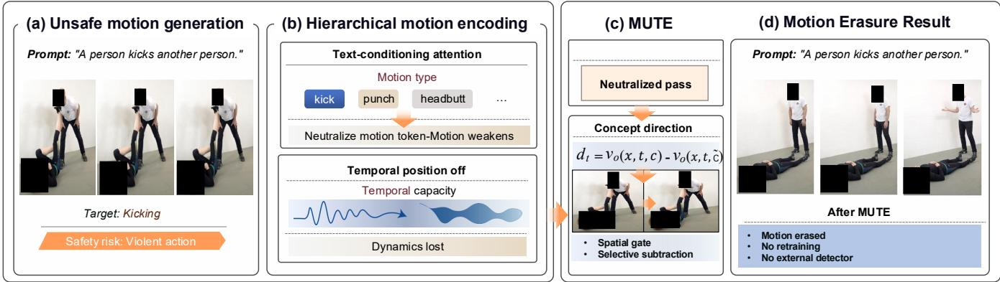
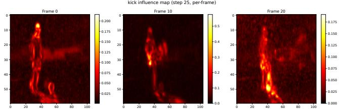
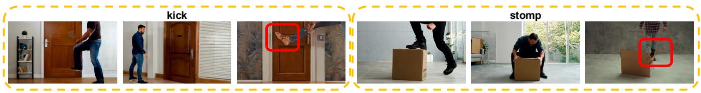
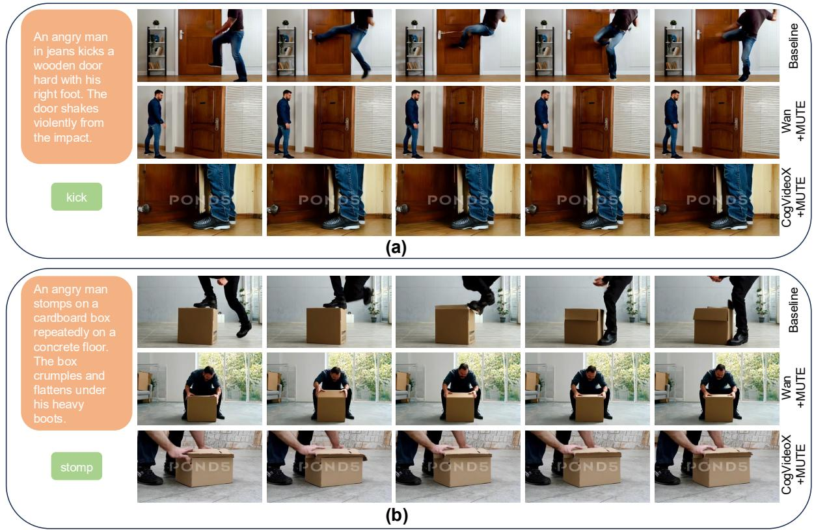
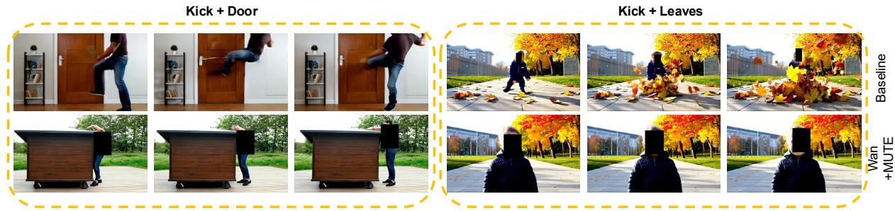

# Motion Concept Unlearning in Video Difusion Models

Ping Liu   
Computer Science and Engineering   
University of Nevada, Reno   
Reno, NV, USA   
pino.pingliu@gmail.com

## Abstract

Text-to-video (T2V) difusion models can generate realistic depictions of actions such as kicking, stabbing, and shooting, raising safety concerns that motivate targeted concept erasure. Although concept erasure has been extensively studied for static concepts in text-to-image and T2V models, erasing motion concepts remains largely unexplored. We present a systematic study of motion concept erasure in video Difusion Transformers (DiTs). Through causal interventions, we show that text-conditioning attention carries concept-specific motion information and supports selective intervention, whereas perturbing temporal positional encoding suppresses both target and non-target dynamics. We further find that directly adapting ESD, a representative weight-level image erasure method, to a video DiT yields modest and uneven motion suppression: reducing its erasure training loss does not by itself remove the concept signal from the diference between the conditional and unconditional predictions, which classifier-free guidance (CFG) then scales at every denoising step. From these findings, we derive three requirements for motion concept erasure: concept specificity, spatial selectivity, and temporal naturalness. Each determines one component of MUTE (Motion concept Unlearning in Text-to-video gEneration): at each denoising step, MUTE extracts a concept direction through token neutralization, derives a spatial gate from the direction’s intrinsic structure, and subtracts the resulting correction from the velocity output before CFG is applied. MUTE is training-free and requires no weight modification. Experiments on 20 motion concepts show that MUTE outperforms representative prompt-level, weight-level, and inference-time baselines on Wan2.1- T2V, and the same formulation transfers to CogVideoX, supporting its applicability across distinct T2V attention architectures.

## CCS Concepts

• Computing methodologies → Computer vision; Neural networks.

## Keywords

motion concept erasure, text-to-video difusion models

ACM Reference Format: Ping Liu and Chi Zhang. 2026. Motion Concept Unlearning in Video Diffusion Models. In Proceedings of the 34th ACM International Conference on

Chi Zhang∗   
Department of Mathematics   
National University of Singapore   
Singapore   
czhang24@nus.edu.sg

Multimedia (MM ’26), November 10–14, 2026, Rio de Janeiro, Brazil. ACM, New York, NY, USA, 10 pages. https://doi.org/10.1145/3767308.3835583

## 1 Introduction

Text-to-video difusion models [14, 24, 46, 48, 53, 64] can now generate realistic, temporally coherent videos from textual descriptions. However, this capability introduces safety risks [36, 43]: these models can readily generate depictions of undesirable actions such as kicking, stabbing, or shooting. As these models are increasingly deployed in public-facing applications, post-generation safety filters alone are insuficient: they can be bypassed through adversarial prompt rephrasing [51, 60], motivating concept erasure, which modifies the generative process to suppress the target concept [10].

Concept erasure is well-studied for static concepts such as objects, styles, and identities in text-to-image models [2, 10, 11, 34, 40, 55], and a few recent works extend it to static concepts in video models [18, 58, 59, 62]. These works, however, do not address the distinct problem of erasing motion concepts: the dynamic patterns of how things move, such as kicking, punching, or stabbing. This gap is both practical and technical: existing methods are designed to erase a specific object or an artistic style rather than the way things move. Unlike static concepts, motion unfolds over time. Video Diffusion Transformers (DiTs) introduce temporal components absent from image models, including temporal positional encoding. It is therefore unclear whether motion concepts remain localized in the text-conditioning attention used by image-domain erasure methods, or are instead distributed across these temporal components.

Addressing this gap requires understanding where motion information is encoded in video DiTs. Through causal intervention experiments on Wan2.1-T2V (Section 4), we find that text-conditioning attention, instantiated as cross-attention in this model, carries concept-specific motion information and supports selective intervention. Temporal positional encoding, by contrast, supports temporal dynamics globally: perturbing it suppresses both target and non-target dynamics (Figure 1). Of the two components we probe, text-conditioning attention is therefore the more suitable target for selective erasure. However, directly adapting ESD [10], a representative weight-level image erasure method, to this channel yields modest and uneven suppression, consistent with a residual concept signal that classifier-free guidance (CFG) still scales (Section 4.2). This motivates an output-level approach: an inferencetime intervention in velocity space, where the concept contribution is removed at each denoising step before CFG amplification occurs.

These findings lead to three requirements for motion concept erasure: concept specificity, requiring that only the target concept is afected; spatial selectivity, restricting the intervention to motionrelevant regions; and temporal naturalness, preserving non-target dynamics. We show that these requirements, combined with the probing findings, directly determine each component ofour method (Section 5). The resulting method, MUTE, operates at inference time with no weight modification. At each denoising step, MUTE extracts the concept direction via token neutralization, derives a spatial gate from the direction’s intrinsic spatial structure, and subtracts the correction from the velocity output before CFG amplification.

We validate MUTE on 20 motion concepts across two video DiTs: Wan2.1-T2V [53] with separate cross-attention and CogVideoX [61] with joint attention. In both, MUTE operates on the text-conditioning attention: the separate cross-attention layer in Wan2.1-T2V and the joint attention layer in CogVideoX. With the same formulation and algorithm in both architectures, MUTE suppresses the majority of target motions while preserving scene appearance. Our work makes three contributions.

• We formulate motion concept erasure as a problem distinct from static concept erasure and, through causal interventions, identify text-conditioning attention as a viable channel for selective motion erasure. Temporal positional encoding, in contrast, supports dynamics globally and is unsuitable for concept-specific intervention. We further find that directly adapting ESD to text-conditioning attention yields only modest and uneven suppression, motivating an output level approach that removes concept contributions from the velocity prediction at each denoising step.

• We derive three requirements from the probing analysis and show that each determines a component of MUTE: token neutralization for motion concept isolation, a self-derived spatial gate for localized correction, and per-step velocity subtraction before CFG amplification.

• We validate MUTE on 20 motion concepts: it achieves stronger suppression than negative prompting, UCE, VideoEraser, and ESD on Wan2.1-T2V, while the same formulation and algorithm transfer to CogVideoX using a fixed correction strength for each architecture.

## 2 Related Work

## 2.1 Concept Erasure in Text-to-Image Models

Existing concept erasure methods for T2I difusion models intervene on diferent internal components, including cross-attention, FFN layers, and broader denoiser parameters [56]. Weight-modification approaches divide into optimization-based methods, which finetune cross-attention or backbone parameters to steer the model away from the target concept [9, 10], and closed-form editing methods on cross-attention layers without gradient updates [11, 65]; hybrid designs with lightweight adapters [31]. Pruning-based methods instead remove concept-responsive neurons in FFN or attention layers [2, 6]. Recent work has expanded along several axes, including continual erasure under sequential concept arrival [13, 22, 52], training-free inference-time approaches [20, 21], stronger closedform formulations [65], retain-forget entanglement [4], extension to rectified flow architectures [12], autoregressive image generators [44], and single-stream difusion transformers [19]. A complementary direction makes erasure context-sensitive, deciding whether a concept should be suppressed based on contextual intent rather than removing it unconditionally [28]. Separately, recent work [27] investigates the permanence of concept erasure, questioning whether erased concepts are truly eliminated or instead persist as latent representations that can be reactivated.

## 2.2 Concept Erasure in Text-to-Video Models

Concept erasure in video difusion models is a nascent area, with most existing work targeting static concepts. Early eforts adapt image-domain techniques to video editing: Liu et al. [30] apply fine-tuning-based unlearning to video difusion backbones, and T2VUnlearning [62] extends this direction with concept-specific loss formulations. Training-free erasure and safeguarding approaches have also emerged: VideoEraser [59] erases objects and NSFW content at inference time, SAFREE [63] provides an adaptive safety guard for both image and video generation, and Instant Concept Erasure [1] performs modality-agnostic erasure through closedform spectral unlearning applicable to both T2I and T2V models. ConceptVoid [18] addresses multi-concept removal in video diffusion. On the safety detection side, ConceptGuard [32] takes a complementary approach through multimodal risk detection for text-and-image-to-video generation. PROBE [58] diagnoses residual concept capacity after erasure, providing evaluation infrastructure for this emerging area. More recently, CLEAR [57] studies where concept erasure should occur, while [8] suppresses unsafe concepts in video generators through a low-rank refusal vector applied at the weight level. Although its target categories include violence, it treats them as broad safety concepts rather than formulating or analyzing the selective erasure of individual motion patterns. Overall, existing methods primarily target static concepts such as objects, identities, and styles, or the safety-driven refusal of unsafe content. The selective erasure of a specific motion concept while preserving the actors and non-target dynamics, together with an analysis of where motion is encoded in video DiTs, remains largely unexplored and poses challenges that we address in this work.

## 2.3 Attention Analysis and Control in Difusion Models

The growing scale and over-parameterization [67] of modern generative models have rendered full-model retraining infeasible, placing fine-tuning at the center ofmodel adaptation and editing [17, 66, 68]. Understanding how attention encodes information in difusion models therefore has been an active area of study. For U-Net-based models [39, 41], prior work shows that cross-attention carries the category-level semantics of conditioning tokens while selfattention encodes spatial layout [26, 49]. Generated content can also be attributed to individual conditioning tokens through crossattention [50], while a parallel line of work manipulates attention maps for training-free generation control [3, 7, 15]. For multimodal difusion transformers with joint text-vision attention, recent work decomposes joint attention into semantic-alignment and consistency components and extracts token-precise attention for concept detection [23, 45]. Building on this line, we probe both textconditioning attention and temporal positional encoding in video DiTs to identify where motion information resides and use the resulting structure to derive a motion-erasure method.

Motion Concept Unlearning in Text-to-Video Generation  
  
Figure 1: Overview of MUTE. (a) Text-to-video models generate realistic actions from prompts. (b) Probing shows cross-attention carries concept-specific motion and can be selectively intervened on (top), whereas temporal position encoding underlies all dynamics, so suppressing it destroys motion indiscriminately (bottom). (c) MUTE extracts the concept direction � via token neutralization, derives a spatial gate � from � , and subtracts the concept from the velocity output at each denoising step, with no retraining or external detector. (d) The target motion (kicking) is erased while scene composition is preserved under the same prompt.

## 3 Preliminaries

## 3.1 Flow Matching and Velocity Prediction

Wan2.1-T2V, the model we use for probing and for our main experiments, is trained with the flow matching framework [25, 29, 53], which defines a probability path between the data and noise dis tributions through a time-dependent interpolation. Given a data sample $x _ { 0 }$ and noise $\epsilon \sim { \cal N } ( 0 , I )$ , the forward interpolation at time $t \in [ 0 , 1 ]$ is:

$$
x _ { t } = \left( 1 - t \right) x _ { 0 } + t \epsilon .\tag{1}
$$

A neural network $v _ { \theta }$ is trained to predict the velocity field that transports $x _ { t }$ along this path, with the training objective:

$$
\mathcal { L } = \mathbb { E } _ { x _ { 0 } , \epsilon , t } \big [ \| v _ { \theta } ( x _ { t } , t , c ) - ( \epsilon - x _ { 0 } ) \| _ { 2 } ^ { 2 } \big ] ,\tag{2}
$$

where � is the text condition. At inference, Wan2.1-T2V [53] generates samples by solving the ordinary diferential equation d�� = $v _ { \theta } ( x _ { t } , t , c )$ d� from � =1 to � =0 using a numerical solver. CogVideoX is instead trained under a standard difusion forward process $x _ { t } =$ $\alpha _ { t } x _ { 0 } + \sigma _ { t } \epsilon$ with the �-prediction parameterization [42, 61], whose target $\upsilon _ { t } = \alpha _ { t } \epsilon - \sigma _ { t } x _ { 0 }$ is likewise a velocity-type quantity. MUTE operates on the model’s native per-step velocity output and its response to a change in the text condition; its formulation is therefore independent of which of the two parameterizations is used. The concept direction $d _ { t }$ and influence map $I _ { t }$ defined in Section 5 are both computed from this native velocity output.

## 3.2 Text-to-Video Architectures and Conditioning

Many recent text-to-video models adopt the Difusion Transformer (DiT) [35] architecture but difer in how they handle text conditioning and positional encoding. We study two designs that difer along both axes. The first design, exemplified by Wan2.1-T2V [53], uses a sequence of transformer blocks, each containing self-attention over the full visual token sequence, a separate cross-attention layer where visual tokens attend to umT5-XXL text embeddings [5], and a feed-forward network with AdaLN timestep modulation [35, 53]. Its self-attention uses factorized three-dimensional rotary positional embeddings (RoPE) [47, 53], with separate frequency components for time, height, and width. The second design, exemplified by CogVideoX [61], also uses a sequence oftransformer blocks but concatenates text and visual tokens into a single sequence processed by one joint attention layer per block, with no separate cross-attention; it encodes text with a T5-XXL text encoder [38], and the 2B variant used in our experiments uses fixed three-dimensional sinusoidal positional embeddings.

Despite these diferences, both models inject the text condition through an attention layer, which we refer to as the textconditioning attention (the separate cross-attention layer in Wan2.1- T2V and the joint attention layer in CogVideoX), and both use CFG [16] during inference:

$$
\begin{array} { r } { \boldsymbol { v } _ { \mathrm { c f g } } = v _ { \theta } \big ( \boldsymbol { x } _ { t } , t , \boldsymbol { \varpi } \big ) + \boldsymbol { s } \cdot \big ( \boldsymbol { v } _ { \theta } \big ( \boldsymbol { x } _ { t } , t , \boldsymbol { c } \big ) - v _ { \theta } \big ( \boldsymbol { x } _ { t } , t , \boldsymbol { \varpi } \big ) \big ) , } \end{array}\tag{3}
$$

where ∅ is the null condition and � is the guidance scale.

## 4 Probing Motion Encoding

To determine where motion information resides in video DiTs, we conduct causal intervention experiments on Wan2.1-T2V, targeting two encoding channels: text-conditioning cross-attention and temporal positional encoding. While prior work has established that cross-attention carries concept semantics in image difusion models [15, 26, 50], video DiTs introduce temporal positional encoding as an additional channel absent in image models, and it is unclear a priori whether the image-domain assumption transfers to motion concepts or whether motion information is distributed diferently across these channels. To quantify changes in target-motion presence, we use the motion consistency score (MCS), an X-CLIP [33] measure (extending CLIP [37] to video) that is higher when the target motion is present. We report $\Delta M C S = M C S _ { \mathrm { b a s e l i n e } } - M C S _ { \mathrm { c o n d i t i o n } } ,$ where positive values indicate weakened target motion. The metric and prompt construction are detailed in Section 6.1.

Table 1: Efect of zeroing motion-verb token embeddings in cross-attention across all 30 transformer blocks. ΔMCS = MCSbaseline − MCSzeroed; positive values indicate motion weakened by the intervention.
<table><tr><td></td><td>kick</td><td>push</td><td>bite</td><td>punch</td><td>slap</td><td>headbutt</td></tr><tr><td>∆MCS ↑</td><td>+0.72</td><td>+1.53</td><td>+1.07</td><td>-0.10</td><td>+0.42</td><td>+0.56</td></tr></table>

Table 2: ESD vs. MUTE on six motion concepts; positive ΔMCS = motion suppressed.
<table><tr><td></td><td>kick</td><td>push</td><td>bite</td><td>punch</td><td>slap</td><td>headbutt</td><td>Mean</td></tr><tr><td>∆MCS (ESD)</td><td>+0.18</td><td>-0.05</td><td>+1.64</td><td>-0.67</td><td>-0.30</td><td>+0.57</td><td>+0.23</td></tr><tr><td>∆MCS (MUTE)</td><td>+0.21</td><td>+0.98</td><td>+1.79</td><td>-0.08</td><td>+2.83</td><td>+0.20</td><td>+0.99</td></tr></table>

## 4.1 Cross-Attention versus Temporal Positional Encoding

We begin by examining cross-attention, the primary pathway through which text prompt information is injected into the video generation process. For each target motion, we construct matched motion/static prompt pairs (e.g., “A person kicks another person” vs. “A person stands facing another person”). We zero the cross-attention context embeddings of the motion-verb tokens across all 30 blocks during inference, suppressing the motion instruction while leaving the rest of the prompt intact. Table 1 reports results across six motion concepts. The efect varies across concepts: push (+1.53), bite (+1.07), and kick (+0.72) show the largest reductions, headbutt (+0.56) and slap (+0.42) smaller ones, and punch (−0.10) essentially no change. These results indicate that cross-attention carries concept-specific motion information, but the degree of dependence varies: some motions are substantially weakened when their text tokens are neutralized, while others show less response. This raises the question of whether motion is also supported by other architectural channels.

We then probe temporal positional encoding [47, 53]. We scale the temporal RoPE rotation angles by a factor � $( e ^ { i \theta }  e ^ { i \theta \cdot \kappa } )$ toward zero, collapsing all frames to a shared temporal position. At � =0, qualitative inspection across the tested concepts shows that the generated videos become nearly static, losing both the target motion and non-target dynamics such as camera and ambient motion. This suggests that temporal RoPE supports temporal dynamics globally rather than encoding an individual motion concept, making it unsuitable for selective erasure.

The key question for erasure is therefore not which component afects motion, but which can be manipulated selectively without collapsing temporal dynamics globally. Of the two channels probed, cross-attention is the more suitable target for selective motion erasure: intervening on motion-token conditioning can weaken individual motions without causing the global temporal collapse observed when temporal RoPE is suppressed.

## 4.2 Adapting Weight-Level Erasure to Motion Concepts

Once cross-attention is identified as a viable selective channel, a natural first strategy is to adapt weight-level cross-attention erasure from text-to-image difusion models, where this approach has been successful for static concepts. As a representative and widely used weight-level method, we adapt ESD [10] to Wan2.1-T2V by finetuning all cross-attention query, key, and value projections with negative guidance loss for 1000 steps across six motion concepts. Under this fine-tuning budget, all six runs reduce the ESD erasure objective by roughly 97%, while the resulting suppression is modest and uneven. Mean ΔMCS is +0.23, with 3 of 6 concepts showing positive values: bite reaches +1.64, whereas punch and slap fall to −0.67 and −0.30 (Table 2). For reference, zeroing the motion-token context embeddings at inference time yields a mean ΔMCS of +0.70 on the same six concepts (Table 1). This probe is not a usable erasure method, since it removes the motion instruction from the prompt itself, but the comparison indicates that intervening on this channel at inference time can reach a level of suppression that the weight edit did not.

One possible reading of this gap comes from a simple scaling view of CFG. Let $\delta _ { t }$ denote the target-concept component of the diference between the conditional and unconditional predictions before weight editing, and let $\left( 1 - \rho _ { t } \right) \delta _ { t }$ denote the residual component that remains after editing. Under CFG (Eq. (3)), this residual enters the guided prediction as � $\mathsf { \Omega } ( 1 - \rho _ { t } ) \delta$ �, and its aggregate contribution to the denoising trajectory can be approximated as

$$
R \approx \sum _ { t = 1 } ^ { T } a _ { t } s \left( 1 - \rho _ { t } \right) \delta _ { t } ,\tag{4}
$$

where $a _ { t }$ denotes the efective update coeficient of the numerical solver at step �. The residual term $\left( 1 - \rho _ { t } \right) \delta _ { t }$ is therefore scaled by the guidance weight and propagated along the denoising trajectory. The reduction in the ESD training objective does not directly determine $\rho _ { t }$ , but the suppression we observe in Table 2 is consistent with residual motion signals remaining in the diference between the conditional and unconditional predictions.1 This suggests a complementary, state-dependent route: instead of relying on a single weight edit to hold across all latent states, we estimate the target contribution at each denoising step and subtract it from the model output immediately before CFG is applied.

## 5 MUTE: Motion Concept Erasure

## 5.1 Problem Formulation

Given that directly adapting weight-level erasure yields limited and inconsistent suppression (Section 4.2), we formulate motion erasure as an output-level intervention on the step-wise velocity prediction. Let $v _ { \theta } ( x _ { t } , t , c )$ be the velocity prediction of a video DiT at denoising step �, conditioned on text �. Given a target motion concept C (e.g., “kicking”), we seek a correction term $\Delta _ { C }$ such that:

$$
v _ { \mathrm { e r a s e d } } ( x _ { t } , t , c ) = v _ { \theta } ( x _ { t } , t , c ) - \Delta _ { C } ( x _ { t } , t , c ) .\tag{5}
$$

The formulation is intentionally general; the key question is what properties $\Delta _ { C }$ should satisfy to remove the target motion without degrading the rest of the video. The analysis in Section 4 imposes three requirements on any valid correction term. (R1) Concept specificity: $\Delta _ { C }$ should isolate only the contribution of the target motion concept, so that suppressing “kick” removes the kicking action itself without altering unrelated semantic content or nontarget actions. (R2) Spatial selectivity: $\Delta _ { C }$ should be concentrated on motion-relevant spatial regions rather than difusing across the entire frame, preserving scene elements such as the person, objects, and background. (R3) Temporal naturalness: $\Delta _ { C }$ should suppress the target motion while preserving non-target temporal dynamics, including subtle body motion and camera movement, so that the resulting video remains temporally plausible.

## 5.2 Concept Direction (R1)

R1 requires isolating the target concept’s contribution from the velocity output. Since our probing identifies text-conditioning attention, instantiated as cross-attention in Wan2.1-T2V, as the channel carrying concept-specific motion information, a natural step-wise proxy for the concept’s contribution is the change in velocity induced by neutralizing the target token signal while keeping the rest of the condition fixed. Concretely, after text encoding, we construct a modified condition �˜ by jointly replacing the encoder-output context embeddings at all target-keyword subword positions (e.g., “kicks”) with the mean embedding over the full fixed-length context sequence, while leaving all remaining positions unchanged. We refer to this operation as token neutralization. Because it acts on the context sequence rather than on a particular attention layout, the same operation applies to both separate and joint attention architectures. The concept direction at step � is then:

$$
d _ { t } = v _ { \theta } ( x _ { t } , t , c ) - v _ { \theta } ( x _ { t } , t , \tilde { c } ) .\tag{6}
$$

The resulting $d _ { t }$ serves as a step-wise estimate, rather than an exact decomposition, of the target token’s contribution to the velocity output (R1).

## 5.3 Self-Derived Spatial Gate (R2, R3)

The concept direction $d _ { t }$ satisfies R1, but applying it uniformly $( v _ { \mathrm { e r a s e d } } = v _ { \theta } - \alpha \cdot d _ { t } )$ would modify all spatial locations including the background, violating R2. We observe that $d _ { t }$ is in fact spa tially concentrated, with a peak-to-mean ratio exceeding 20:1 in the cases we examine: it is large in regions where the target motion occurs and small elsewhere, and its spatial structure adapts to the target concept (Figure 2). This is consistent with the cross-attention mechanism, where the motion token’s attention weights are concentrated on the spatial positions depicting the action. We exploit this by computing the per-position channel-norm as an influence map:

$$
I _ { t } ( i , j , k ) = \| d _ { t } ( : , i , j , k ) \| _ { 2 } .\tag{7}
$$

The normalized influence map

$$
M _ { t } = \frac { I _ { t } } { \operatorname* { m a x } ( I _ { t } ) } ,\tag{8}
$$

therefore serves as a self-derived spatial gate: $M _ { t } \approx 1$ in motionrelevant regions (R2) and $M _ { t } \ll 1$ elsewhere, preserving non-target dynamics (R3), without any external segmentation model.2

## 5.4 Full Algorithm and Properties

Combining the concept direction with the spatial gate yields the complete correction term:

$$
\Delta _ { C } ( x _ { t } , t , c ) = \alpha \cdot M _ { t } \odot d _ { t } ,\tag{9}
$$

  
Figure 2: Influence map $I _ { t }$ for “kicking” at denoising step $t = 2 5$ across three frames. The influence concentrates on the human body and contacted regions, with much smaller values in the background, providing an intrinsic spatial gate without any external segmentation model (R2).

Algorithm 1: MUTE: Motion Concept Erasure   
Require: Prompt �, target motion keyword, strength $\alpha ,$ CFG scale   
�   
1: Identify target token positions in $c ;$ construct �˜ by mean   
replacement   
2: if no target token found then   
3: return standard generation   
end if   
5: $x _ { T } \sim N ( 0 , I )$   
6: for $t = T , T { - } 1 , \ldots , 1$ do   
7: $v _ { \mathrm { c o n d } } \gets v _ { \theta } ( x _ { t } , t , c )$   
8: �neutral $\gets v _ { \theta } ( x _ { t } , t , \tilde { c } )$ // R1: concept isolation   
9: $d _ { t } \gets v _ { \mathrm { c o n d } } - v _ { \mathrm { n e u t r a l } }$   
10: �� (�, �, �) ← ∥�� (:, �, �, �) ∥ ; �� ← ��/max(��) // R2, R3   
11: �erased $ v _ { \mathrm { c o n d } } - \alpha \cdot M _ { t } \odot d _ { t }$ // selective erasure   
12: $\boldsymbol { v } _ { \emptyset } \gets \boldsymbol { v } _ { \boldsymbol { \theta } } ( \boldsymbol { x } _ { t } , t , \emptyset )$   
13: $v _ { \mathrm { f i n a l } }  v _ { \emptyset } + s \cdot ( v _ { \mathrm { e r a s e d } } - v _ { \emptyset } )$   
14: $x _ { t - 1 } \gets :$ SchedulerStep(�final, $x _ { t } , t )$   
15: end for   
16: return VAE.decode(� )

and the erased velocity:

$$
v _ { \mathrm { e r a s e d } } = v _ { \theta } ( x _ { t } , t , c ) - \alpha \cdot M _ { t } \odot d _ { t } ,\tag{10}
$$

which replaces the conditional velocity in standard CFG:

$$
\boldsymbol { v } _ { \mathrm { f i n a l } } = \boldsymbol { v } _ { \emptyset } + \boldsymbol { s } \cdot \big ( \boldsymbol { v } _ { \mathrm { e r a s e d } } - \boldsymbol { v } _ { \emptyset } \big ) .\tag{11}
$$

Substituting Eq. (10) into Eq. (11) and comparing with standard CFG in Eq. (3) yields a compact form:

$$
v _ { \mathrm { f i n a l } } = v _ { \mathrm { c f g } } - s \cdot \alpha \cdot M _ { t } \odot d _ { t } ,\tag{12}
$$

where $v _ { \mathrm { c f g } }$ is the standard CFG output. Therefore, MUTE’s output equals the unmodified CFG output minus a scaled concept correction. This reveals a structural parallel with CFG itself: CFG uses $v _ { \mathrm { c o n d } } - v _ { \emptyset }$ to amplify all conditioning; MUTE uses $v _ { \mathrm { c o n d } } - v _ { \mathrm { n e u t r a l } }$ to isolate and remove the targeted concept, acting as concept-specific negative guidance with spatial selectivity. Eq. (12) also provides a quantitative interpretation of �: the target concept’s contribution in $ { v _ { \mathrm { c f g } } }$ is approximately $s \cdot d _ { t }$ (in regions where $M _ { t } \approx 1 ) . \operatorname { I f } d _ { t }$ perfectly captured the concept’s per-step contribution, $\alpha = 1$ would sufice for complete erasure. In practice, token neutralization may underestimate the actual concept contribution, as some motion information can be distributed across non-target tokens through contextual interactions in the text encoder and cross-attention layers [26], so $\alpha > 1$ compensates for this gap, consistent with the ablation in Table 5. Sweeping � over an order of magnitude in that ablation produces a smooth erasure-fidelity trade-of rather than abrupt degradation, so the single hyperparameter can be set without fine-grained tuning.

Algorithm 1 summarizes MUTE. It requires neither training nor weight modification, and has a single hyperparameter � controlling erasure strength. Each denoising step uses three forward passes (conditional, neutralized, unconditional) rather than two, a ∼47% wall-clock overhead. Unlike weight-level methods such as ESD, which must suppress the concept implicitly through a single fixed weight edit (Section 4.2), MUTE estimates the concept contribution from the current latent state and removes it from the velocity output before CFG is applied at each step.

## 6 Experiments

## 6.1 Setup

We evaluate on Wan2.1-T2V-1.3B [53] (832×480, 81 frames) and CogVideoX-2B [61] (720×480, 49 frames), targeting 20 motions (kick, punch, slap, push, stab, shoot, trip, bite, choke, headbutt, whip, slash, stomp, tackle, drag, smash, slam, elbow, knee, scratch) with up to 3 prompts per concept3. All experiments use $\alpha = 5 . 0 ,$ spatial gating, mean-replacement neutralization. We report X-CLIP MCS [33] (motion consistency score; decrease indicates suppression), LPIPS [69] (frame-level perceptual distance), SSIM [54] (structural similarity), and qualitative inspection. We compare against representative text-to-image erasure methods originally designed for static concept removal (ESD [10], UCE [11], and negative prompting [16]) and text-to-video erasure methods (VideoEraser [59]and T2VUnlearning [62]), which likewise target static concepts rather than motion-specific erasure; baseline implementation details and parameter settings are provided in the supplementary material.

## 6.2 Quantitative Results

Tables 3 and 4 present per-concept results on both architectures. On Wan2.1-T2V (Table 3), MUTE achieves the strongest mean suppression among all methods (mean ΔMCS +1.24), substantially outperforming negative prompting [16] (+0.24), UCE [11] (+0.09), weightlevel ESD (+0.33), and the video-specific T2VUnlearning [62] (+0.50). The gap over these baselines is consistent with the scaling view in Section 4.2: all operate upstream of or at the CFG level, where any residual concept signal is still scaled by the guidance weight. On CogVideoX (Table 4), mean MCS drops from 0.90 to 0.61. The smaller reduction is consistent with its joint attention design: because text and visual tokens share a single attention layer, neutralizing target tokens has a more difuse efect on the velocity field.

The closest competitor is VideoEraser [59], originally proposed for static concept erasure, which achieves mean ΔMCS +1.09 at comparable inference cost. MUTE achieves stronger per-concept suppression on the majority of concepts, with the advantage most evident on spatially localized actions such as punch (+3.81 vs. +2.43), slam (+1.75 vs. +0.55), and slap (+1.87 vs. +1.05). Beyond quantitative metrics, qualitative inspection (Figure 3) reveals two types of artifacts in VideoEraser’s output that MUTE avoids. First, phantom objects appear on unrelated surfaces (e.g., stomp), indicating that the correction leaks into non-target spatial regions; MUTE’s spatial gate �� prevents this by confining the intervention to regions where �� is large (R2). Second, appearance details such as shoes vanish within the motion region itself (e.g., kick), suggesting that the correction removes scene appearance alongside the target motion; MUTE’s concept direction �� avoids this because it captures specifically the velocity change induced by the motion token, leaving appearance information largely intact (R1).

Beyond erasure efectiveness, we examine whether scene fidelity is preserved. On Wan2.1-T2V, mean LPIPS is 0.69 and mean SSIM is 0.31. On CogVideoX, the corresponding values indicate a smaller visual change (LPIPS 0.45, SSIM 0.54), alongside the weaker suppression noted above. Per-concept fidelity varies with the spatial extent of the motion: full-body actions such as tackle and slam produce higher LPIPS, while localized actions such as drag and kick yield lower LPIPS, consistent with the spatial gate concentrating corrections on motion-relevant regions.

## 6.3 Qualitative Results

Figure 4 presents qualitative comparisons for two representative concepts. For kick, the baseline video (generated by the unmodified model from the same prompt) shows a person performing a clear kicking motion toward a door; after applying MUTE, Wan2.1- T2V generates the same person standing calmly in front of the door with no kicking action, while the scene (door, room interior, clothing) is preserved. CogVideoX similarly suppresses the kicking motion, though with a diferent camera angle consistent with its independent generation process. For stomp, the baseline depicts a person jumping onto and crushing a cardboard box; MUTE on Wan2.1-T2V replaces this with the person bending over the intact box, removing the stomping while retaining the scene elements (box, floor, background). In both cases, the spatial gate confines the correction to the motion-relevant regions: the person’s legs and contact area for kick, and the person’s feet and the box surface for stomp. Background regions remain visually unchanged, consistent with the spatial concentration of the influence map (Figure 2). Importantly, the erased videos retain natural temporal dynamics: the person continues to exhibit subtle body movement and the camera maintains its original trajectory, indicating that MUTE suppresses the target motion without freezing the scene.

## 6.4 Joint Motion-Object Erasure

MUTE naturally extends to joint erasure of both a motion and an object (e.g., “kicking” and “door”) by computing an independent concept direction and spatial gate for each target type and subtracting both gated corrections from $v _ { \mathrm { c o n d } } .$ . This requires one additional forward pass per step (four total). Figure 5 illustrates joint erasure on two prompts targeting “kick” + “door” and “kick” + “leaves”. In both cases, MUTE removes the kicking action and the associated object simultaneously, with the two influence maps localizing to complementary spatial regions (actor body vs. target object).

## 6.5 Ablation Studies

We ablate the design choices of MUTE on five representative concepts (kick, punch, slap, bite, tackle) using Wan2.1-T2V. We first examine the efect of the erasure strength hyperparameter �. Table 5 sweeps � from 1.0 to 10.0 with spatial gating enabled. All values successfully suppress motion, but the erasure-fidelity trade of is clear: ΔMCS rises from +1.46 at � =1.0 to +1.84 at � =5.0 and then fluctuates without a consistent trend (+1.74 at � =7.0, +1.91 at � =10.0), while LPIPS and SSIM degrade monotonically across the whole range. Beyond � =5.0, larger values therefore bring no reliable gain in suppression at a steady cost in fidelity. We select � =5.0 as the default.

Table 3: MUTE vs. baselines on Wan2.1-T2V-1.3B. ΔMCS = MCSbaseline − MCSmethod; positive values indicate stronger motion suppression. LPIPS and SSIM are reported for MUTE.
<table><tr><td rowspan="2">Concept</td><td colspan="6">∆MCS ↑</td><td colspan="2">MUTE fidelity</td></tr><tr><td>Neg</td><td>UCE</td><td>ESD</td><td>T2VU</td><td>VE</td><td>MUTE</td><td>LPIPS</td><td>SSIM</td></tr><tr><td>kick</td><td>+0.26</td><td>+0.31</td><td>-0.06</td><td>-0.16</td><td>+0.32</td><td>+0.75</td><td>.50</td><td>.43</td></tr><tr><td>punch</td><td>+0.95</td><td>+0.39</td><td>-0.66</td><td>+0.99</td><td>+2.43</td><td>+3.81</td><td>.82</td><td>.22</td></tr><tr><td>slap</td><td>+0.58</td><td>-0.16</td><td>+0.02</td><td>+1.36</td><td>+1.05</td><td>+1.87</td><td>.79</td><td>.28</td></tr><tr><td>push</td><td>+0.12</td><td>+0.07</td><td>+0.60</td><td>+1.54</td><td>+1.37</td><td>+1.42</td><td>.77</td><td>.25</td></tr><tr><td>stab</td><td>+1.36</td><td>-0.11</td><td>-0.93</td><td>+0.23</td><td>+1.93</td><td>+1.64</td><td>.82</td><td>.17</td></tr><tr><td>shoot</td><td>+1.03</td><td>+0.75</td><td>+0.32</td><td>+2.07</td><td>+1.43</td><td>+2.22</td><td>.74</td><td>.24</td></tr><tr><td>trip</td><td>-0.05</td><td>+0.78</td><td>+1.45</td><td>-0.41</td><td>+1.31</td><td>+0.91</td><td>.78</td><td>.33</td></tr><tr><td>bite</td><td>-0.23</td><td>-0.58</td><td>+2.12</td><td>+0.22</td><td>+0.47</td><td>+0.64</td><td>.60</td><td>.34</td></tr><tr><td>choke</td><td>+0.41</td><td>+0.54</td><td>-1.57</td><td>+0.45</td><td>+2.52</td><td>-0.40</td><td>.46</td><td>.54</td></tr><tr><td>headbutt</td><td>-0.69</td><td>+0.09</td><td>+0.99</td><td>+2.24</td><td>+0.97</td><td>+0.57</td><td>.51</td><td>.33</td></tr><tr><td>whip</td><td>+0.17</td><td>+0.00</td><td>-0.45</td><td>+0.30</td><td>+0.95</td><td>+1.47</td><td>.79</td><td>.17</td></tr><tr><td>slash</td><td>-0.44</td><td>-0.21</td><td>+1.41</td><td>+0.55</td><td>+1.38</td><td>+1.53</td><td>.76</td><td>.23</td></tr><tr><td>stomp</td><td>+0.19</td><td>+0.21</td><td>+0.11</td><td>+0.44</td><td>+1.00</td><td>+0.79</td><td>.77</td><td>.33</td></tr><tr><td>tackle</td><td>+0.05</td><td>-0.16</td><td>+2.61</td><td>-0.98</td><td>+2.15</td><td>+2.14</td><td>.77</td><td>.28</td></tr><tr><td>drag</td><td>+0.80</td><td>+0.14</td><td>+0.73</td><td>+0.46</td><td>+0.55</td><td>+0.65</td><td>.45</td><td>.48</td></tr><tr><td>smash</td><td>+0.14</td><td>+0.33</td><td>+0.70</td><td>+1.04</td><td>+1.33</td><td>+1.71</td><td>.79</td><td>.24</td></tr><tr><td>slam</td><td>+0.58</td><td>+0.29</td><td>-0.12</td><td>+0.42</td><td>+0.55</td><td>+1.75</td><td>.84</td><td>.22</td></tr><tr><td>elbow</td><td>-0.06</td><td>+0.06</td><td>-0.12</td><td>-0.57</td><td>+0.13</td><td>+0.14</td><td>.51</td><td>.40</td></tr><tr><td>knee</td><td>+0.11</td><td>+0.14</td><td>-0.57</td><td>-0.22</td><td>-0.21</td><td>+0.19</td><td>.58</td><td>.33</td></tr><tr><td>scratch</td><td>-0.58</td><td>-1.02</td><td>-0.03</td><td>+0.10</td><td>+0.11</td><td>+0.91</td><td>.78</td><td>.29</td></tr><tr><td>Mean</td><td>+0.24</td><td>+0.09</td><td>+0.33</td><td>+0.50</td><td>+1.09</td><td>+1.24</td><td>.69</td><td>.31</td></tr></table>

Table 4: MUTE vs. the unmodified base model on CogVideoX-2B. LPIPS and SSIM are reported for MUTE.
<table><tr><td rowspan="2">Concept</td><td colspan="2">MCS↓</td><td colspan="2">MUTE fidelity</td></tr><tr><td>Base</td><td>MUTE</td><td>LPIPS</td><td>SSIM</td></tr><tr><td>kick</td><td>-0.30</td><td>-0.15</td><td>.62</td><td>.47</td></tr><tr><td>punch</td><td>2.78</td><td>1.65</td><td>.37</td><td>.66</td></tr><tr><td>slap</td><td>0.48</td><td>-0.64</td><td>.37</td><td>.67</td></tr><tr><td>push</td><td>0.43</td><td>0.06</td><td>.52</td><td>.40</td></tr><tr><td>stab</td><td>0.89</td><td>0.19</td><td>.34</td><td>.64</td></tr><tr><td>shoot</td><td>2.03</td><td>3.00</td><td>.53</td><td>.57</td></tr><tr><td>trip</td><td>-0.71</td><td>-1.56</td><td>.41</td><td>.47</td></tr><tr><td>bite</td><td>0.25</td><td>0.44</td><td>.41</td><td>.51</td></tr><tr><td>choke</td><td>2.31</td><td>1.45</td><td>.39</td><td>.62</td></tr><tr><td>headbutt</td><td>1.53</td><td>1.94</td><td>.44</td><td>.50</td></tr><tr><td>whip</td><td>0.14</td><td>-0.17</td><td>.34</td><td>.63</td></tr><tr><td>slash</td><td>0.94</td><td>0.54</td><td>.40</td><td>.49</td></tr><tr><td>stomp</td><td>0.41</td><td>-0.14</td><td>.50</td><td>.53</td></tr><tr><td>tackle</td><td>3.55</td><td>3.43</td><td>.48</td><td>.48</td></tr><tr><td>drag</td><td>-0.33</td><td>-0.49</td><td>.34</td><td>.67</td></tr><tr><td>smash</td><td>0.63</td><td>1.13</td><td>.54</td><td>.40</td></tr><tr><td>slam</td><td>1.04</td><td>-0.11</td><td>.40</td><td>.57</td></tr><tr><td>elbow</td><td>0.98</td><td>0.67</td><td>.51</td><td>.50</td></tr><tr><td>knee</td><td>0.13</td><td>0.19</td><td>.59</td><td>.43</td></tr><tr><td>scratch</td><td>0.88</td><td>0.81</td><td>.53</td><td>.53</td></tr><tr><td>Mean</td><td>0.90</td><td>0.61</td><td>.45</td><td>.54</td></tr></table>

  
Figure 3: Visual artifacts in VideoEraser output. Each group shows three frames: baseline (L), MUTE (M), and VideoEraser (R). Kick: shoes on the kicking foot vanish across frames, replaced by a bare foot (R1 violation: appearance removed alongside motion). Stomp: a phantom hand appears on the cardboard box surface (R2 violation: correction leaks into non-target spatial regions). MUTE avoids both artifacts through concept-specific direction extraction and spatial gating.

Table 5: Ablation on erasure strength �. Beyond � =5.0, ΔMCS fluctuates while fidelity continues to degrade. Bold marks the default setting.
<table><tr><td>α</td><td>1.0</td><td>2.0</td><td>3.0</td><td>5.0</td><td>7.0</td><td>10.0</td></tr><tr><td>∆MCS ↑</td><td>1.46</td><td>1.48</td><td>1.67</td><td>1.84</td><td>1.74</td><td>1.91</td></tr><tr><td>LPIPS ↓</td><td>0.604</td><td>0.650</td><td>0.671</td><td>0.697</td><td>0.702</td><td>0.718</td></tr><tr><td>SSIM ↑</td><td>0.386</td><td>0.352</td><td>0.331</td><td>0.308</td><td>0.303</td><td>0.290</td></tr></table>

Table 6: Design component ablation (5 concepts × 3 prompts). Each row re moves or replaces one component. Bold marks the default configuration rather than the best value in each column.
<table><tr><td>Configuration</td><td>ΔMCS</td><td>LPIPS↓</td><td>SSIM↑</td></tr><tr><td>MUTE (default)</td><td>1.84</td><td>0.697</td><td>0.308</td></tr><tr><td>w/ random direction</td><td>1.19</td><td>0.503</td><td>0.508</td></tr><tr><td>α =1.0, no gate</td><td>1.53</td><td>0.647</td><td>0.351</td></tr><tr><td>w/o spatial gate</td><td>1.97</td><td>0.694</td><td>0.310</td></tr></table>

To isolate the contribution of each component, Table 6 presents a systematic ablation. The most critical component is the concept direction itself (R1): replacing it with a random direction of equal magnitude reduces erasure by 35%, confirming that the extracted direction carries concept-specific information not replaceable by arbitrary perturbation. The spatial gate leaves the quantitative metrics largely unchanged (ΔMCS 1.97 vs. 1.84, LPIPS 0.694 vs. 0.697): its benefit is qualitative, as removing it introduces background artifacts because the subtraction is then applied uniformly across all spatial locations (R2, R3). Setting � =1.0 without spatial gating, which is equivalent to directly outputting $v _ { \mathrm { n e u t r a l } } .$ weakens erasure by 17%, consistent with the quantitative analysis that token neutralization underestimates concept contribution.

## 6.6 Human Evaluation

We conduct a human study against VideoEraser [59], the strongest of the compared baselines on the automated metrics (Table 3), over the 20 motion concepts with one randomly selected prompt each. Both methods use the same Wan2.1-T2V-1.3B backbone, generation settings, and random seed, so any diference reflects the erasure mechanism rather than backbone or sampling variation. Seventeen volunteers view the unmodified generation alongside the two erased videos, with method identities hidden, and answer two questions per item: which video better suppresses the target action (Motion Suppression), and which looks more realistic, natural, and artifactfree (Visual Quality). MUTE receives 57.9% of votes for motion suppression against 12.1% for VideoEraser (30.0% similar), and 82.4% against 7.6% for visual quality (10.0% similar).

Figure 4: Qualitative results for two motion concepts. Each group shows five evenly-spaced frames from the baseline video (top), Wan2.1-T2V + MUTE (middle), and CogVideoX + MUTE (bottom), all generated from the same prompt. (a) Kick: the kicking motion is suppressed while the person, door, and room are preserved. (b) Stomp: the stomping action is removed while the person and cardboard box remain intact.  
  
Figure 5: Joint motion-object erasure on Wan2.1-T2V. Each group shows three frames from the baseline (top) and MUTE with joint erasure (bottom). Kick + Door: the kicking action and the wooden door are both removed; the erased video shows the person standing calmly in an outdoor scene. Kick + Leaves: the kicking motion and the scattered leaves are both suppressed; the child stands still on the sidewalk with autumn trees preserved in the background. Although all depicted individuals are AI-generated and do not correspond to real people, we apply facial blurring as a precaution.

Table 7: Human evaluation results comparing MUTE and VideoEraser (VE) across 20 motion concepts (17 evaluators, 340 pairwise judgments per metric).
<table><tr><td>Metric</td><td>MUTE (%)</td><td>Tie (%)</td><td>VE (%)</td></tr><tr><td>Motion Suppression</td><td>57.9</td><td>30.0</td><td>12.1</td></tr><tr><td>Visual Quality</td><td>82.4</td><td>10.0</td><td>7.6</td></tr></table>

## 7 Conclusion

We presented MUTE, a training-free method for selectively erasing motion concepts from text-to-video difusion models. Our probing on Wan2.1-T2V shows that cross-attention supports conceptselective intervention, whereas perturbing temporal positional encoding suppresses both target and non-target dynamics. We further find that a direct adaptation of ESD yields only modest and uneven suppression in this setting. Guided by these findings, MUTE extracts a concept direction through token neutralization, derives a spatial gate from the direction’s intrinsic structure, and subtracts the resulting correction at each denoising step before CFG is applied. Across 20 motion concepts, MUTE achieves mean ΔMCS +1.24 on Wan2.1-T2V, compared with +1.09 for the strongest baseline, VideoEraser. The same default MUTE configuration also transfers to CogVideoX, demonstrating that the approach is not specific to a single T2V attention design.

## References

[1] Shristi Das Biswas, Arani Roy, and Kaushik Roy. Now you see it, now you don’t - instant concept erasure for safe text-to-image and video generation. In CVPR Findings, 2026.

[2] Ruchika Chavhan, Da Li, and Timothy Hospedales. Conceptprune: Concept editing in difusion models via skilled neuron pruning. In ICLR, 2025.

[3] Hila Chefer, Yuval Alaluf, Yael Vinker, Lior Wolf, and Daniel Cohen-Or. Attend and-excite: Attention-based semantic guidance for text-to-image difusion models. ACM transactions on Graphics (TOG), 2023.

[4] Jingpu Cheng, Ping Liu, Qianxiao Li, and Chi Zhang. Machine unlearning under retain-forget entanglement. In ICLR, 2026.

[5] Hyung Won Chung, Xavier Garcia, Adam Roberts, Yi Tay, Orhan Firat, Sharan Narang, and Noah Constant. Unimax: Fairer and more efective language sampling for large-scale multilingual pretraining. In ICLR, 2023.

[6] Bartosz Cywiński and Kamil Deja. Saeuron: Interpretable concept unlearning in difusion models with sparse autoencoders. In ICML, 2025.

[7] Dave Epstein, Allan Jabri, Ben Poole, Alexei Efros, and Aleksander Holynski. Difusion self-guidance for controllable image generation. In NeurIPS, 2023.

[8] Simone Facchiano, Stefano Saravalle, Matteo Migliarini, Edoardo De Matteis, Alessio Sampieri, Andrea Pilzer, Emanuele Rodolà, Indro Spinelli, Luca Franco, and Fabio Galasso. Video unlearning via low-rank refusal vector. In ICLR, 2026.

[9] Chongyu Fan, Jiancheng Liu, Yihua Zhang, Eric Wong, Dennis Wei, and Sijia Liu. Salun: Empowering machine unlearning via gradient-based weight saliency in both image classification and generation. In ICLR, 2024.

[10] Rohit Gandikota, Joanna Materzynska, Jaden Fiotto-Kaufman, and David Bau. Erasing concepts from difusion models. In ICCV, 2023.

[11] Rohit Gandikota, Hadas Orgad, Yonatan Belinkov, Joanna Materzyńska, and David Bau. Unified concept editing in difusion models. In WACV, 2024.

[12] Daiheng Gao, Shilin Lu, Shaw Walters, Wenbo Zhou, Jiaming Chu, Jie Zhang, Bang Zhang, Mengxi Jia, Jian Zhao, Zhaoxin Fan, and Weiming Zhang. Eraseanything: Enabling concept erasure in rectified flow transformers. In ICML, 2025.

[13] Tingxu Han, Weisong Sun, Yanrong Hu, Chunrong Fang, Yonglong Zhang, Shiqing Ma, Tao Zheng, Zhenyu Chen, and Zhenting Wang. Continuous concepts removal in text-to-image difusion models. In NeurIPS, 2025.

[14] Roberto Henschel, Levon Khachatryan, Hayk Poghosyan, Daniil Hayrapetyan, Vahram Tadevosyan, Zhangyang Wang, Shant Navasardyan, and Humphrey Shi. Streamingt2v: Consistent, dynamic, and extendable long video generation from text. In CVPR, 2025.

[15] Amir Hertz, Ron Mokady, Jay Tenenbaum, Kfir Aberman, Yael Pritch, and Daniel Cohen-Or. Prompt-to-prompt image editing with cross attention control. In ICLR, 2022.

[16] Jonathan Ho and Tim Salimans. Classifier-free difusion guidance. In NeurIPS 2021 Workshop on Deep Generative Models and Downstream Applications, 2021.

[17] Edward J Hu, Yelong Shen, Phillip Wallis, Zeyuan Allen-Zhu, Yuanzhi Li, Shean Wang, Lu Wang, Weizhu Chen, et al. Lora: Low-rank adaptation of large language models. In ICLR, 2022

[18] Zhongbin Huang, XingjiaJin, Cunkang Wu, and Wei Mao. Conceptvoid: Precision multi-concept erasure in generative video difusion. Mathematics, 2025.

[19] Nanxiang Jiang, Zhaoxin Fan, Baisen Wang, Daiheng Gao, Junhang Cheng, Jifeng Guo, Yalan Qin, Yeying Jin, Hongwei Zheng, Faguo Wu, et al. Z-erase: Enabling concept erasure in single-stream difusion transformers. In ICML, 2026.

[20] Mingyu Kim, Young-Heon Kim, and Mijung Park. Safety-guided flow (sgf): A unified framework for negative guidance in safe generation. In ICLR, 2026.

[21] Byung Hyun Lee, Sungjin Lim, and Se Young Chun. Localized concept erasure for text-to-image difusion models using training-free gated low-rank adaptation. In CVPR, 2025.

[22] Justin Lee, Zheda Mai, Jinsu Yoo, Chongyu Fan, Cheng Zhang, and Wei-Lun Chao. Continual unlearning for text-to-image difusion models: A regularization perspective. In ICLR, 2026.

[23] Feifei Li, Mi Zhang, Yiming Sun, and Min Yang. Detect-and-guide: Self-regulation of difusion models for safe text-to-image generation via guideline token optimization. In CVPR, 2025.

[24] Zongyu Lin, Wei Liu, Chen Chen, Jiasen Lu, Wenze Hu, Tsu-Jui Fu, Jesse Allardice, Zhengfeng Lai, Liangchen Song, Bowen Zhang, et al. Stiv: Scalable text and image conditioned video generation. In ICCV, 2025.

[25] Yaron Lipman, Ricky TQ Chen, Heli Ben-Hamu, Maximilian Nickel, and Matt Le. Flow matching for generative modeling. In ICLR, 2023.

[26] Bingyan Liu, Chengyu Wang, Tingfeng Cao, Kui Jia, and Jun Huang. Towards understanding cross and self-attention in stable difusion for text-guided image editing. In CVPR, 2024.

[27] Ping Liu and Chi Zhang. Erased or dormant? rethinking concept erasure through reversibility. arXiv preprint arXiv:2505.16174, 2025.

[28] Ping Liu and Chi Zhang. ABCDE: Agentic-based controlled dynamic erasure for intent-aware safety reasoning. Transactions on Machine Learning Research, 2026.

[29] Qiang Liu. Rectified flow: A marginal preserving approach to optimal transport. arXiv preprint arXiv:2209.14577, 2022

[30] Shiqi Liu and Yihua Tan. Unlearning concepts from text-to-video difusion models. arXiv preprint arXiv:2407.14209, 2024.

[31] Shilin Lu, Zilan Wang, Leyang Li, Yanzhu Liu, and Adams Wai-Kin Kong. MACE: Mass concept erasure in difusion models. In CVPR, 2024.

[32] Ruize Ma, Minghong Cai, Yilei Jiang, Jiaming Han, Yi Feng, Yingshui Tan, Xiaoyong Zhu, Bo Zhang, Bo Zheng, and Xiangyu Yue. Conceptguard: Proactive safety in text-and-image-to-video generation through multimodal risk detection. arXiv preprint arXiv:2511.18780, 2025.

[33] Bolin Ni, Houwen Peng, Minghao Chen, Songyang Zhang, Gaofeng Meng, Jianlong Fu, Shiming Xiang, and Haibin Ling. Expanding language-image pretrained models for general video recognition. In ECCV, 2022.

[34] Hongyi Nie, Quanming Yao, Yang Liu, Zhen Wang, and Yatao Bian. Erasing concept combination from text-to-image difusion model. In ICLR, 2025.

[35] William Peebles and Saining Xie. Scalable difusion models with transformers. In ICCV, 2023.

[36] Yiting Qu, Xinyue Shen, Xinlei He, Michael Backes, Savvas Zannettou, and Yang Zhang. Unsafe difusion: On the generation of unsafe images and hateful memes from text-to-image models. In Proceedings of the 2023 ACM SIGSAC conference on computer and communications security, 2023.

[37] Alec Radford, Jong Wook Kim, Chris Hallacy, Aditya Ramesh, Gabriel Goh, Sandhini Agarwal, Girish Sastry, Amanda Askell, Pamela Mishkin, Jack Clark, et al. Learning transferable visual models from natural language supervision. In ICML, 2021.

[38] Colin Rafel, Noam Shazeer, Adam Roberts, Katherine Lee, Sharan Narang, Michael Matena, Yanqi Zhou, Wei Li, and Peter J Liu. Exploring the limits of transfer learning with a unified text-to-text transformer. Journal ofmachine learning research, 2020.

[39] Robin Rombach, Andreas Blattmann, Dominik Lorenz, Patrick Esser, and Björn Ommer. High-resolution image synthesis with latent difusion models. In CVPR, 2022.

[40] Shaswati Saha, Sourajit Saha, Manas Gaur, and Tejas Gokhale. Side efects of erasing concepts from difusion models. In EMNLP, 2025.

[41] Chitwan Saharia, William Chan, Saurabh Saxena, Lala Li, Jay Whang, Emily L Denton, et al. Photorealistic text-to-image difusion models with deep language understanding. In NeurIPS, 2022.

[42] Tim Salimans and Jonathan Ho. Progressive distillation for fast sampling of difusion models. In ICLR, 2022.

[43] Patrick Schramowski, Manuel Brack, Björn Deiseroth, and Kristian Kersting. Safe latent difusion: Mitigating inappropriate degeneration in difusion models. In CVPR, 2023.

[44] Hossein Shakibania, Jonas Henry Grebe, Tobias Braun, Ege Aktemur, Saleh Aslani, Mehmet Görkem Yiğit, and Marcus Rohrbach. Obliviate: Erasing concepts from autoregressive image generation models. In ECCV, 2026.

[45] Tiancheng Shen, Zilong Huang, Xiangtai Li, Zhijie Lin, Jiyang Liu, Yitong Wang, Jiashi Feng, Ming-Hsuan Yang, and Jun Hao Liew. Qk-edit: Revisiting attention based injection in mm-dit for image and video editing. In ICCV, 2025.

[46] Christian Simon, Masato Ishii, Akio Hayakawa, Zhi Zhong, Shusuke Takahashi, Takashi Shibuya, and Yuki Mitsufuji. Titan-guide: Taming inference-time align ment for guided text-to-video difusion models. In ICCV, 2025.

[47] Jianlin Su, Murtadha Ahmed, Yu Lu, Shengfeng Pan, Wen Bo, and Yunfeng Liu. Roformer: Enhanced transformer with rotary position embedding. Neurocomputing, 2024.

[48] Kaiyue Sun, Kaiyi Huang, Xian Liu, Yue Wu, Zihan Xu, Zhenguo Li, and Xihui Liu. T2v-compbench: A comprehensive benchmark for compositional text-to-video generation. In CVPR, 2025.

[49] Wenhao Sun, Xue-Mei Dong, Benlei Cui, and Jingqun Tang. Attentive eraser: Unleashing difusion model’s object removal potential via self-attention redirection guidance. In AAAI, 2025.

[50] Raphael Tang, Linqing Liu, Akshat Pandey, Zhiying Jiang, Gefei Yang, Karun Kumar, Pontus Stenetorp, Jimmy Lin, and Ferhan Türe. What the daam: Interpreting stable difusion using cross attention. In ACL, 2023.

[51] Yu-Lin Tsai, Chia-Yi Hsu, Chulin Xie, Chih-Hsun Lin, Jia You Chen, Bo Li, Pin-Yu Chen, Chia-Mu Yu, and Chun-Ying Huang. Ring-a-bell! how reliable are concept removal methods for difusion models? In ICLR, 2024.

[52] Jiahang Tu, Ye Li, Yiming Wu, Hanbin Zhao, Chao Zhang, and Hui Qian. Mass concept erasure in difusion models with concept hierarchy. In AAAI, 2026.

[53] Team Wan, Ang Wang, Baole Ai, Bin Wen, Chaojie Mao, Chen-Wei Xie, Di Chen, Feiwu Yu, Haiming Zhao, Jianxiao Yang, et al. Wan: Open and advanced large scale video generative models. arXiv preprint arXiv:2503.20314, 2025.

[54] Zhou Wang, Alan C Bovik, Hamid R Sheikh, and Eero P Simoncelli. Image quality assessment: from error visibility to structural similarity. IEEE Transactions on Image Processing, 2004.

[55] Yongliang Wu, Shiji Zhou, Mingzhuo Yang, Lianzhe Wang, Heng Chang, Wenbo Zhu, Xinting Hu, Xiao Zhou, and Xu Yang. Unlearning concepts in difusion model via concept domain correction and concept preserving gradient. In AAAI, 2025.

[56] Yiwei Xie, Ping Liu, and Zheng Zhang. Erasing concepts, steering generations: A comprehensive survey of concept suppression. arXiv preprint arXiv:2505.19398,

2025.

[57] Yiwei Xie, Ping Liu, and Zheng Zhang. Where concept erasure should occur: Concept-layer alignment in text-to-video difusion models. In ICML, 2026.

[58] Yiwei Xie, Zheng Zhang, and Ping Liu. Probe: Diagnosing residual concept capacity in erased text-to-video difusion models. arXiv:2603.21547, 2026.

[59] Naen Xu, Jinghuai Zhang, Changjiang Li, Zhi Chen, Chunyi Zhou, Qingming Li, Tianyu Du, and Shouling Ji. Videoeraser: Concept erasure in text-to-video difusion models. In EMNLP, 2025.

[60] Yuchen Yang, Bo Hui, Haolin Yuan, Neil Gong, and Yinzhi Cao. Sneakyprompt: Jailbreaking text-to-image generative models. In IEEE Symposium on Security and Privacy, 2024.

[61] Zhuoyi Yang, Jiayan Teng, Wendi Zheng, Ming Ding, Shiyu Huang, Jiazheng Xu, Yuanming Yang, Wenyi Hong, Xiaohan Zhang, Guanyu Feng, et al. Cogvideox: Text-to-video difusion models with an expert transformer. arXiv preprint arXiv:2408.06072, 2024.

[62] Xiaoyu Ye, Songjie Cheng, Yongtao Wang, Yajiao Xiong, and Yishen Li. T2vunlearning: A concept erasing method for text-to-video difusion models. arXiv preprint arXiv:2505.17550, 2025.

[63] Jaehong Yoon, Shoubin Yu, Vaidehi Patil, Huaxiu Yao, and Mohit Bansal. SAFREE: Training-free and adaptive guard for safe text-to-image and video generation. In ICLR, 2025.

[64] Shenghai Yuan, Jinfa Huang, Yujun Shi, Yongqi Xu, Ruijie Zhu, Bin Lin, Xinhua Cheng, Li Yuan, and Jiebo Luo. Magictime: Time-lapse video generation models as metamorphic simulators. IEEE Transactions on Pattern Analysis and Machine Intelligence, 2025.

[65] Chi Zhang, Jingpu Cheng, Zhixian Wang, and Ping Liu. Closed-form concept erasure via double projections. In CVPR, 2026.

[66] Chi Zhang, Cheng Jingpu, Yanyu Xu, and Qianxiao Li. Parameter-eficient finetuning with controls. In ICML, 2024.

[67] Chi Zhang and Qianxiao Li. Distributed optimization for degenerate loss functions arising from over-parameterization. Artificial Intelligence, 2021.

[68] Chi Zhang, Lianhai Ren, Jingpu Cheng, and Qianxiao Li. From weight-based to state-based fine-tuning: Further memory reduction on lora with parallel control. In ICML, 2025.

[69] Richard Zhang, Phillip Isola, Alexei A Efros, Eli Shechtman, and Oliver Wang. The unreasonable efectiveness of deep features as a perceptual metric. In CVPR, 2018.