# MotionInsight: Diagnosing Object Motion Deficiencies in Generated Videos

Jiahao Zhan1,2, Yongrui Ma1,2, Qunliang Xing2, Xuanyu Zhang4, Jingqi Tong3, Junlin Li2, Li Zhang2, Shijie Zhao2,†,B, Tianfan Xue1,5,B

1MMLab, CUHK, 2ByteDance Inc., 3Fudan University, 4Peking University, 5CPII under InnoHK †Project Lead B Correspondence: zhaoshijie.0526@bytedance.com, tfxue@ie.cuhk.edu.hk

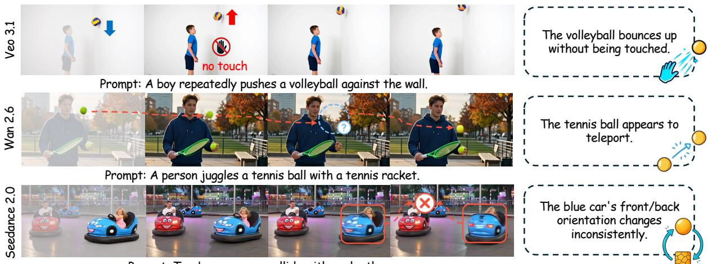  
Prompt: Two bumper cars collide with each other.

Figure 1: Examples of motion deficiencies in generated videos. The left-side sampled frames highlight the object exhibiting the motion failure in each video, while the right-side panels describe the corresponding failures.

## Abstract

Despite rapid progress in video generation models, they still exhibit obvious motion deficiencies, often manifested as incorrect object motion. However, most existing video quality evaluations focus on aesthetic quality or text-video alignment. To address this gap, we study object-centric motion fidelity assessment, evaluating target objects along object consistency, motion continuity, and physical plausibility. To achieve this, we first introduce VidMotion, a diagnostic dataset of 6,879 videos with designated moving objects and fine-grained annotations including dimensionwise scores and failure causes. We further propose MotionInsight, a diagnostic evaluator that shifts assessment from implicit RGBframe observation to explicit motion-space diagnosis. By constructing motion-aware representations, MotionInsight makes subtle motion deficiencies more observable. We also introduce motion-specific rewards during GRPO to transform observed motion into a diagnostic assessment. Experiments demonstrate that MotionInsight provides an effective basis for diagnosing object motion deficiencies, producing human-aligned scores along three dimensions and grounded explanations. The code is publicly available at https://github.com/ JohnZhan2023/MotionInsight.

## 1 Introduction

Video generation has undergone rapid development in visual quality (Yang et al., 2024), while it may still generate unrealistic motion in dynamic scenarios (Bansal et al., 2024). Current video evaluation methods (He et al., 2025) emphasize aesthetic quality and text-video alignment, while paying limited attention to whether objects move in a stable, continuous, and physically reasonable manner. As shown in Figure 1, visually compelling videos may still contain severe motion deficiencies. Such deficiencies restrict the applications in film production (Jiang et al., 2025) and world modeling (Zhan et al., 2026), highlighting the need for a dedicated evaluation task that systematically diagnoses motion deficiencies in generated videos.

To this end, we formulate a diagnostic task of object-centric motion fidelity assessment. We focus the evaluation on designated moving objects, including people, animals, vehicles, and everyday physical objects, since they often attract substantial visual attention in videos. This object-centric formulation provides a fine-grained basis for diagnosis by localizing the assessment to a concrete target. We further assess object motion fidelity along three complementary dimensions: object consistency, motion continuity, and physical plausibility, whose definitions are shown in Table 1. Beyond predicting dimension-wise scores, a diagnostic assessment should provide grounded explanations of concrete motion failures, such as the volleyball in the top row of Figure 1 bouncing upward without any physical contact.

To support this study, we build VidMotion, a diagnostic dataset for object-centric motion fidelity assessment. Most prior video evaluation datasets primarily provide holistic quality scores, which offer limited interpretability and cannot support finegrained diagnosis of object motion deficiencies. In contrast, each video in VidMotion designates a moving object to be evaluated and provides diagnostic annotations that include scores along three dimensions and failure causes when object motion deficiencies occur. In total, VidMotion contains 5,713 generated videos from nine representative models and 1,166 real videos, covering most everyday dynamic scenarios. Based on the human annotations, we further reveal a substantial gap between generated and real motion, as shown in Table 2. This gap raises a natural question: Can existing evaluators diagnose object motion deficiencies in generated videos?

Unfortunately, as shown in Table 3, existing evaluators remain limited in identifying subtle motion deficiencies. Although VLMs have strong semantic understanding, they typically rely on sampled RGB frames to infer motion. Such RGB-frame inputs provide only partial temporal observations and contain substantial background redundancy. As a result, subtle motion deficiencies, such as fingers becoming distorted, can be easily diluted by redundant visual content and become difficult to capture. This becomes especially problematic for humanaligned evaluation, since human judgments are often driven by the most severe local artifacts (Tu et al., 2020), while VLM-based evaluators may miss them. Such missed evidence further limits their ability to provide grounded explanations.

To address these challenges, we propose Motion-Insight, which diagnoses object motion deficiencies in an explicit motion space. Specifically, MotionInsight constructs motion-aware representations from object tracking features and global camera motion, rather than solely relying on sampled RGB frames. Such structured motion evidence makes the evaluator more sensitive to subtle deficiencies that may be diluted in RGB-frame observations. Moreover, to help the VLM interpret this motion evidence, we further perform motion description alignment, which uses automatically generated motion descriptions to align the encoded motion embeddings with the VLM’s semantic space. Finally, to turn motion evidence into human-aligned diagnosis, we introduce motion-specific rewards for Group Relative Policy Optimization (GRPO) (Guo et al., 2025), derived from multi-dimensional scores and failurecause supervision. These rewards align the evaluator’s scoring criteria with human judgments while enabling diagnostic insights into concrete object motion failures.

<table><tr><td></td><td>Dim. Description</td></tr><tr><td></td><td>OC Stable identity, appearance, and structure during motion.</td></tr><tr><td>MC</td><td>Smooth and continuous trajectory without abrupt jumps or jitter.</td></tr><tr><td>PP</td><td>Motion consistent with forces and basic physical dynamics.</td></tr></table>

Table 1: Definitions of the three dimensions in objectcentric motion fidelity assessment: object consistency (OC), motion continuity (MC), and physical plausibility (PP).

Experiments show that MotionInsight aligns well with human judgments, producing accurate dimension-wise scores, grounded diagnostic reasoning, and strong sensitivity to localized motion failures.

## 2 Related Work

Video motion evaluation and benchmarks. Existing benchmarks for video generation mainly focus on overall visual quality and text-tovideo alignment, such as VBench (Huang et al., 2024), VideoScore2 (He et al., 2025), and T2V-CompBench (Sun et al., 2025). To address the evaluation of motion, several studies incorporate lowlevel or structured signals. For example, VBench uses optical-flow-based metrics, but optical flow may fail to maintain reliable temporal correspondence when the target object suddenly disappears. VMBench (Ling et al., 2025) evaluates motion consistency via rule-based filtering of tracks, while HumanScore (Fang et al., 2026) leverages 3D human body models to assess human motion realism. Similarly, WorldScore (Duan et al., 2025) introduces Structure-from-Motion (Schönberger and Frahm, 2016) to measure whether generated videos follow physical camera constraints. These approaches rely heavily on priors for specific tasks, which makes them inherently constrained to narrow domains and difficult to generalize to broader video generation scenarios. Other studies evaluate physical plausibility or world modeling capabilities of video generators (Meng et al., 2024; Hu et al., 2025), often relying on predefined rules or constrained scenarios. As a result, they cannot serve as general evaluators for diagnosing object motion deficiencies.

<table><tr><td>Model</td><td></td><td></td><td>Object Consistency↑ Motion Continuity↑ Physical Plausibility↑</td></tr><tr><td colspan="4">Open-source models</td></tr><tr><td>Wan 2.2 (Wan et al., 2025)</td><td> $3 . 4 2 0 \pm 0 . 4 4 1$ </td><td> $3 . 6 3 4 \pm 0 . 5 3 0$ </td><td> $2 . 3 5 5 \pm 0 . 2 6 1$ </td></tr><tr><td>LTX 2.1 (HaCohen et al., 2024)</td><td> $1 . 9 7 8 \pm 0 . 6 9 0$ </td><td> $3 . 5 1 2 \pm 0 . 5 4 6$ </td><td> $2 . 9 3 0 \pm 0 . 4 0 2$ </td></tr><tr><td>LongCat-Video (Team et al., 2025)</td><td> $1 . 3 3 5 \pm 0 . 2 1 4$ </td><td> $2 . 2 4 2 \pm 0 . 6 9 9$ </td><td> $1 . 8 2 1 \pm 0 . 5 8 2$ </td></tr><tr><td>Cosmos-Predict 2.5 (Ali et al., 2025)</td><td> $2 . 0 8 8 \pm 0 . 6 4 9$ </td><td> $3 . 1 0 9 \pm 0 . 6 7 9$ </td><td> $2 . 1 5 6 \pm 0 . 4 7 2$ </td></tr><tr><td>HunyuanVideo-1.5 (Kong et al., 2024)</td><td> $3 . 2 2 3 \pm 0 . 5 0 4$ </td><td> $3 . 9 3 9 \pm 0 . 6 7 2$ </td><td> $2 . 3 7 0 \pm 0 . 2 7 4$ </td></tr><tr><td colspan="4">Proprietary models</td></tr><tr><td>Wan 2.6 (Wan et al., 2025)</td><td> $3 . 5 7 7 \pm 0 . 4 2 6$ </td><td> $3 . 7 4 6 \pm 0 . 6 4 4$ </td><td> $2 . 4 6 1 \pm 0 . 3 1 4$ </td></tr><tr><td>Sora 2 (Brooks et al., 2024)</td><td> $3 . 7 9 2 \pm 0 . 3 7 5$ </td><td> $4 . 1 1 3 \pm 0 . 4 6 2$ </td><td> $3 . 5 0 7 \pm 0 . 2 7 0$ </td></tr><tr><td>Veo 3.1 (Wiedemer et al., 2025)</td><td> $3 . 1 8 9 \pm 0 . 5 3 2$ </td><td> $3 . 6 3 6 \pm 0 . 6 9 8$ </td><td> $2 . 2 5 0 \pm 0 . 3 8 2$ </td></tr><tr><td>Seedance 2.0 (Seedance et al., 2026)</td><td> $3 . 8 1 0 \pm 0 . 3 7 9$ </td><td> $4 . 1 4 3 \pm 0 . 5 7 3$ </td><td> $3 . 0 8 1 \pm 0 . 2 5 0$ </td></tr><tr><td>Real Video</td><td> $4 . 7 4 0 \pm 0 . 2 6 9$ </td><td> $4 . 9 1 5 \pm 0 . 2 6 5$ </td><td> $4 . 8 1 4 \pm 0 . 1 1 2$ </td></tr></table>

Table 2: Comparison of video generation models and real videos on object consistency, motion continuity, and physical plausibility, evaluated on the 166 challenging prompts in VidMotion-Test. Values are reported as mean ± standard deviation.

VLM-based evaluators for video generation. Recent works have explored VLM-based evaluators for video generation (Qin et al., 2024; Bansal et al., 2024; Zhang et al., 2026b; Zhao et al., 2026; Wang et al., 2025; Wu et al., 2022), leveraging the strong generalization ability of VLMs. Some recent works further improve video perception by strengthening temporal attention (Motamed et al., 2025) or reducing redundant visual tokens (Shi et al., 2026). Nevertheless, these methods still rely solely on sampled RGB frames to perceive motion. Many object motion deficiencies manifest as subtle pixel-level changes in RGB space and can be easily diluted during visual-token aggregation. In contrast, MotionInsight models the object motion in motion space, enabling greater sensitivity to local artifacts.

## 3 VidMotion Dataset

VidMotion is a diagnostic dataset designed for object-centric motion fidelity assessment. Unlike prior evaluation datasets that mainly provide overall scores for physical plausibility, artifact severity, or video realism (Bansal et al., 2025; Zhang et al., 2026a), VidMotion evaluates the motion fidelity of a designated object. Each video is associated with a designated moving object and annotated with three-dimensional motion fidelity scores and fine-grained failure causes. Together, these annotations provide a strong basis for diagnosing object motion deficiencies by localizing to a concrete target, explaining the failure cause, and measuring its severity along different motion dimensions. Since our focus is perceptual motion fidelity rather than solver-based correctness, the annotations aim to capture whether the target object’s motion appears realistic from human experience. So real videos are evaluated under the same human annotation protocol rather than assigned perfect scores by default, enabling direct comparison between generated and natural object motion. In total, VidMotion contains 6,879 annotated videos. Figure 10 summarizes the overall data construction and annotation pipeline.

## 3.1 Dataset Construction

To build VidMotion, we start from realworld videos collected from open-source datasets (Caelles et al., 2019; Wu et al., 2016; Chow et al., 2025; Kay et al., 2017; Huang et al., 2019; Motamed et al., 2025) and additional curated sources, prioritizing samples in which one salient moving object dominates the motion. After screening by five human experts, we obtain a final set of 1,166 real videos.

We then derive textual prompts and targets for these videos through captioning with Gemini 3.1 Pro (Team et al., 2024), followed by human verification. Using the resulting prompts, we generate corresponding videos with a diverse set of video generation models, including open-source models such as Wan 2.2 (Wan et al., 2025), LTX 2.1 (Ha-Cohen et al., 2024), LongCat-Video (Team et al., 2025), Cosmos-Predict 2.5 (Ali et al., 2025), and

HunyuanVideo-1.5 (Kong et al., 2024), as well as proprietary models including Wan 2.6 (Wan et al., 2025), Sora 2 (Brooks et al., 2024), Veo 3.1 (Wiedemer et al., 2025), and Seedance 2.0 (Seedance et al., 2026). For proprietary models, we generate videos only for a challenging subset of 166 prompts manually selected from the 1,166 prompts. Since videos from these proprietary models are not included in VidMotion-Train, this design makes VidMotion-Test more challenging and allows us to evaluate generalization to unseen generators.

In this way, each prompt is paired with a corresponding real video and multiple generated videos from different models. After filtering out invalid samples with severe degeneration or unusable content, we use the 1,386 videos associated with the 166 challenging prompts as VidMotion-Test, which serves as our benchmark split. The remaining 5,493 videos are used as VidMotion-Train.

## 3.2 Human Annotation

We collect human annotations on the motion fidelity of the designated object along three dimensions: object consistency, motion continuity, and physical plausibility. For videos judged to contain motion deficiencies, annotators further select one or more applicable failure causes from 12 predefined candidates, which provide diagnostic explanations for the underlying motion artifacts.

In total, 21 annotators participated in the annotation process. Before annotation, all annotators underwent training, completed a trial annotation assessment, and reviewed representative examples with reference labels. Each video is independently evaluated by three annotators, each of whom provides three-dimensional scores, a confidence level, and applicable failure causes. Krippendorff’s α (Krippendorff, 2011) averaged over the three dimensions reaches 0.7420, indicating reliable annotations. More annotation details are provided in Appendix A. We aggregate the three annotators’ scores using the Mean Opinion Score (MOS) to obtain the final three-dimensional motion fidelity scores, and take the intersection of their selected failure causes as the final multi-label failure-cause annotations to ensure label reliability. Additional analysis of VidMotion is included in Appendix B.

## 4 MotionInsight

Our goal is to assess the motion fidelity of a designated object in a video. Given a video $\mathbf { v } = \{ f _ { t } \} _ { t = 1 } ^ { T }$ and a target object prompt o, our evaluator E outputs a three-dimensional motion score vector and corresponding diagnostic reasoning, (s, r) = $\mathcal { E } ( \mathbf { v } , o )$ . Here, s covers object consistency, motion continuity, and physical plausibility. For VLMbased evaluators, r corresponds to the explicit reasoning text generated before the final scores to justify the scoring results. In the benchmark setting, the target object prompt o is provided by the dataset annotation or specified by the user. When no target object is given, such as in reward-model applications for video generation, we first prompt a VLM to identify salient moving objects in the video, apply MotionInsight to each identified object, and aggregate the resulting object-centric scores into a video-level signal, as described in Appendix F.

Since RGB-frame observations provide only sparse temporal information and contain substantial background redundancy, subtle motion deficiencies can be difficult to perceive. Our key design principle is therefore to explicitly represent the complete motion in a structured motion space. Based on this motion evidence, MotionInsight performs humanaligned diagnosis through semantic alignment with the VLM and preference alignment with human judgments. As illustrated in Figure 2, MotionInsight complements sampled frames with motionaware representations, making object motion deficiencies observable (Section 4.1). Next, we align these motion embeddings with the VLM’s semantic space using automatically generated motion descriptions (Section 4.2). Finally, we design motionspecific rewards for GRPO to align the resulting diagnosis with human judgments (Section 4.3).

## 4.1 Motion-Aware Representations

Motion-aware representations aim to make object motion deficiencies explicit beyond RGB-frame observations. However, the motion in a video is entangled with both object motion and camera motion. We therefore fuse object motion with camera poses to form motion embeddings, enabling a disentangled understanding of object dynamics.

Specifically, given a video $\mathbf { v } ~ = ~ \{ f _ { t } \} _ { t = 1 } ^ { T }$ and a text prompt o specifying the target object, we first use SAM3 (Carion et al., 2025) to obtain an initialization mask for the target object:

$$
m = { \mathrm { S A M 3 } } ( \mathbf { v } , o ) .\tag{1}
$$

Using this mask, we sample query points P and track them throughout the video using Co-

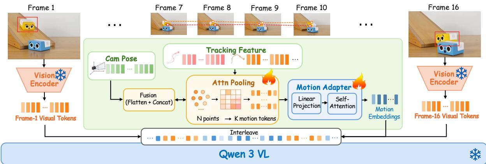  
Figure 2: Overview of MotionInsight. Given an input video and a target prompt, we uniformly sample RGB frames as the standard visual input. Then, we extract motion features from the frames using ViPE and CoTracker3, and aggregate them into a motion-aware representation, which is fed into the VLM.

Tracker3 (Karaev et al., 2025). This yields framewise point-level tracking features $\mathbf { X } = \{ \mathbf { x } _ { t } \} _ { t = 1 } ^ { T }$ where each $\mathbf { x } _ { t } \in \mathbb { R } ^ { N \times d _ { o } }$ and N is the number of sampled tracked points.

Since the number of tracked points N varies with the size of m, we use an attention pooling module with K learnable queries to aggregate the pointlevel features into a fixed number of object-motion tokens:

$$
\mathbf { H } _ { t } = \mathrm { A t t n P o o l } ( \mathbf { x } _ { t } ) \in \mathbb { R } ^ { K \times d _ { m } } .\tag{2}
$$

In parallel, we feed the entire video into ViPE (Huang et al., 2025) to estimate the camera poses for all frames:

$$
\mathbf { C } = \{ \mathbf { c } _ { t } \} _ { t = 1 } ^ { T } = \mathrm { V i P E } ( \mathbf { v } ) ,\tag{3}
$$

where each $\mathbf { c } _ { t } = \left[ r _ { t } ; \tau _ { t } \right]$ consists of a 6D rotation parameter $r _ { t } \in \mathbb { R } ^ { 6 }$ and a 3D translation parameter $\tau _ { t } \in \mathbb { R } ^ { 3 }$ for frame $f _ { t }$ . These camera poses provide a global motion reference that helps separate object motion from viewpoint changes.

For each frame, we construct a motion representation by flattening the K object-motion tokens and concatenating them with the corresponding camera poses:

$$
\begin{array} { r } { \mathbf { z } _ { t } = [ \mathrm { v e c } ( \mathbf { H } _ { t } ) ; \mathbf { c } _ { t } ] \in \mathbb { R } ^ { K d _ { m } + 9 } . } \end{array}\tag{4}
$$

The resulting sequence ${ \mathbf Z } = \{ { \mathbf z } _ { t } \} _ { t = 1 } ^ { T }$ is processed by a lightweight Motion Adapter, consisting of a linear projection and a self-attention layer, to produce frame-wise motion embeddings.

As shown in Figure 2, we uniformly sample frames from the video and interleave them with the corresponding motion embeddings produced …by the Motion Adapter. This interleaved sequence enables the VLM to jointly reason over appearance information and structured motion representations.

## 4.2 Motion Description Alignment

Although the motion-aware representations encode object motion and camera poses, they are not directly interpretable by the frozen VLM. We therefore align the extracted tracking features and camera poses with the VLM’s semantic space using automatically generated motion descriptions as supervision. To obtain supervision without additional human annotations, we design 16 questions about the target’s motion. Each video is divided into clips of 16 consecutive frames, which are fed sequentially to the VLM (Bai et al., 2025) to generate clip-level descriptions. These descriptions are then summarized into a video-level motion description.

Following this procedure, we collect 80,721 question-answer pairs from OpenVid (Nan et al., 2024) for semantic alignment. We then fine-tune the model with this motion-description supervision for semantic alignment. During this stage, we freeze the VLM backbone and optimize only the motion encoding components, including the attention pooling module and the Motion Adapter.

## 4.3 GRPO for Human Preference Alignment

We adopt GRPO (Guo et al., 2025) with two motion-specific rewards: a multi-dimensional reward and a failure-cause reward. The multidimensional reward aligns MotionInsight with human judgments by encouraging accurate prediction of annotated scores along object consistency, motion continuity, and physical plausibility. The failure-cause reward further refines its diagnostic reasoning by encouraging the evaluator to associate observed motion deficiencies with interpretable failure causes. Built on the richer and more explicit motion evidence provided by motion-aware representations, the motion-specific rewards guide MotionInsight to learn human-aligned scoring and grounded reasoning. Together, these two capabilities constitute the core of a diagnostic evaluator for object-centric motion fidelity.

Multi-dimensional scoring reward. For the scoring reward, we supervise the model using the threedimensional scores in VidMotion-Train. Given a query q, the model predicts scores for M evaluation dimensions $\{ \hat { s } _ { j } \} _ { j = 1 } ^ { M }$ . To discourage overconfident scoring, we use a normalized asymmetric error penalty that penalizes overestimation more heavily than underestimation:

$$
r ^ { \mathrm { s c o r e } } = 1 - \sum _ { j = 1 } ^ { M } \lambda _ { j } \exp ( d _ { j } ^ { 2 } , 0 , 1 ) ,\tag{5}
$$

where

$$
d _ { j } = \left\{ \begin{array} { l l } { \alpha \displaystyle \frac { | \hat { s } _ { j } - s _ { j } ^ { \mathrm { g t } } | } { 4 } , } & { \mathrm { i f } \hat { s } _ { j } > s _ { j } ^ { \mathrm { g t } } , } \\ { \displaystyle \frac { | \hat { s } _ { j } - s _ { j } ^ { \mathrm { g t } } | } { 4 } , } & { \mathrm { o t h e r w i s e } . } \end{array} \right.\tag{6}
$$

Here, $s _ { j } ^ { \mathrm { g t } }$ denotes the ground-truth MOS for the $j -$ th dimension, $\lambda _ { j }$ is its weight, and $\alpha > 1$ controls the additional penalty for overestimation.

Failure-cause reward. To improve MotionInsight’s ability to identify motion deficiencies and provide grounded reasoning, we introduce a failurecause reward using the failure-cause labels from VidMotion-Train. Given four candidate failure descriptions, the model selects the one that best explains the observed issue. We assign a reward of 1 if the selected option matches the annotated failure causes and 0 otherwise.

## 5 Experiments

Dataset and metrics. We use 5K videos from OpenVid (Nan et al., 2024) to construct 80,721 QA pairs for semantic alignment. In the GRPO stage, VidMotion-Train is used to align the evaluator with human judgments, while VidMotion-Test is used to assess the scoring and diagnostic reasoning of MotionInsight. We use PLCC, SRCC, and KRCC to measure the correlation between predicted scores and human annotations. For diagnostic reasoning, we parse each model’s reasoning texts into 12 predefined failure causes using GPT-5.1 and evaluate their consistency with annotated failure causes using Jaccard similarity, precision, and recall.

Baselines. To evaluate both the scoring and diagnostic reasoning capabilities of MotionInsight, we compare it with several general-purpose VLM evaluators, including GPT-5.4 (Hurst et al., 2024), Gemini 3.1 Pro (Team et al., 2024), and Qwen-3- VL-8B (Bai et al., 2025). To ensure a fair comparison, we carefully design and validate a unified prompt for both GRPO training and VLM baselines. The prompt explicitly specifies the designated target object and the three evaluation dimensions, requiring each evaluator to reason first and then output continuous scores in a consistent format. The full prompt template is provided in Appendix C. To provide a stronger VLM baseline, we further fine-tune Qwen-3-VL-8B for score regression on VidMotion-Train using only RGB-frame inputs. For scoring evaluation, we additionally compare with specialized video evaluators. For evaluators specifically designed for physical assessment, such as VideoPhy2 (Bansal et al., 2025) and WorldModelBench (Li et al., 2025), we compare their scoring results on Physical Plausibility. For methods specifically designed for motion assessment, we compare the Motion Smoothness Score in VMBench (Ling et al., 2025) on Motion Continuity. As a reference, we also report the scoring performance of a single volunteer evaluator on VidMotion-Test.

## 5.1 Results

Qualitative comparisons to baselines. For the qualitative results shown in Figure 3, MotionInsight provides diagnostic reasoning from three perspectives. In the illustrated example, MotionInsight identifies that the foam box becomes shorter after the collision, indicating a structural collapse. Its scores are also better aligned with human judgments, as shown in the accompanying radar chart. More qualitative results are shown in Appendix D.

Scoring alignment with human judgments. As shown in Table 3, existing evaluators show limited alignment with human annotations on VidMotion-Test, highlighting the difficulty of motion fidelity evaluation for designated targets. VMBench relies on rule-based filtering over pixel-level motion signals, which limits its generalization across diverse dynamic scenarios. Although fine-tuning Qwen-3- VL-8B on VidMotion-Train improves adaptation, it still generalizes poorly to VidMotion-Test. Other VLM-based evaluators also perform poorly: RGBframe inputs provide only partial temporal observations and may miss frames containing key artifacts, while many object motion deficiencies remain subtle without explicit target motion modeling. By contrast, MotionInsight achieves performance comparable to a human evaluator across the three dimensions. We also explore how MotionInsight’s diagnostic scores along three dimensions can be used to optimize video generation in Appendix F.

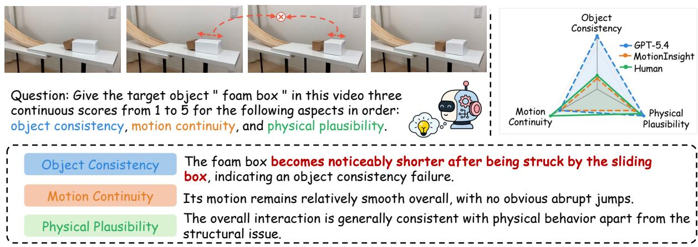

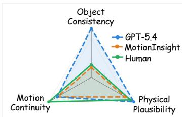

Figure 3: Qualitative result of MotionInsight. The reasoning texts are presented below the video frames, and the scores for the three dimensions are visualized in the radar chart at the top right.
<table><tr><td></td><td colspan="3">Object Consistency</td><td colspan="3">Motion Continuity</td><td colspan="3">Physical Plausibility</td></tr><tr><td>Method</td><td>SRCC↑</td><td>PLCC↑</td><td>KRCC↑</td><td>SRCC↑</td><td>PLCC↑</td><td>KRCC↑</td><td>SRCC↑</td><td>PLCC↑</td><td>KRCC↑</td></tr><tr><td>Independent Human</td><td>0.732</td><td>0.774</td><td>0.671</td><td>0.614</td><td>0.684</td><td>0.580</td><td>0.766</td><td>0.804</td><td>0.692</td></tr><tr><td>GPT-5.4</td><td>0.370</td><td>0.400</td><td>0.322</td><td>0.276</td><td>0.303</td><td>0.243</td><td>0.246</td><td>0.257</td><td>0.203</td></tr><tr><td>Gemini 3.1 Pro</td><td>0.333</td><td>0.318</td><td>0.281</td><td>0.218</td><td>0.217</td><td>0.193</td><td>0.166</td><td>0.162</td><td>0.144</td></tr><tr><td>Qwen-3-VL-8B</td><td>0.074</td><td>0.092</td><td>0.065</td><td>0.055</td><td>0.062</td><td>0.051</td><td>-0.009</td><td>0.020</td><td>-0.008</td></tr><tr><td>Qwen-3-VL-8B-FT</td><td>0.286</td><td>0.301</td><td>0.242</td><td>0.213</td><td>0.238</td><td>0.190</td><td>0.181</td><td>0.205</td><td>0.154</td></tr><tr><td>VideoPhy2</td><td></td><td></td><td></td><td></td><td></td><td></td><td>0.302</td><td>0.303</td><td>0.247</td></tr><tr><td>VMBench</td><td>一</td><td></td><td>一</td><td>0.036</td><td>0.013</td><td>0.032</td><td></td><td></td><td></td></tr><tr><td>WorldModelBench</td><td></td><td></td><td></td><td></td><td></td><td></td><td>0.296</td><td>0.310</td><td>0.230</td></tr><tr><td>Ours</td><td>0.761</td><td>0.750</td><td>0.667</td><td>0.633</td><td>0.625</td><td>0.563</td><td>0.727</td><td>0.718</td><td>0.622</td></tr></table>

Table 3: Correlation with human annotations across three dimensions. Baselines include GPT-5.4 (Hurst et al., 2024), Gemini 3.1 Pro (Team et al., 2024), Qwen-3-VL-8B (Bai et al., 2025), Qwen-3-VL-8B-FT (supervised fine-tuning on VidMotion-Train), VideoPhy2 (Bansal et al., 2025), VMBench (Ling et al., 2025), and WorldModelBench (Li et al., 2025). Independent Human denotes a single volunteer evaluator who did not participate in dataset annotation or calibration, while the benchmark labels are aggregated from three calibrated annotators using MOS.

<table><tr><td>Method</td><td>Jaccard ↑ Prec. ↑ Rec. ↑</td><td></td><td></td></tr><tr><td>GPT-5.4</td><td>0.15</td><td>0.29</td><td>0.19</td></tr><tr><td>Gemini 3.1 Pro</td><td>0.12</td><td>0.24</td><td>0.16</td></tr><tr><td>Qwen-3-VL-8B</td><td>0.09</td><td>0.20</td><td>0.12</td></tr><tr><td>Ours</td><td>0.58</td><td>0.74</td><td>0.63</td></tr></table>

Table 4: Failure-cause grounding of diagnostic reasoning. We compare GPT-5.4 (Hurst et al., 2024), Gemini 3.1 Pro (Team et al., 2024), Qwen-3-VL-8B (Bai et al., 2025), and our MotionInsight. We parse each model’s reasoning into 12 predefined failure causes and compare the parsed causes with human annotations using Jaccard similarity, precision, and recall.

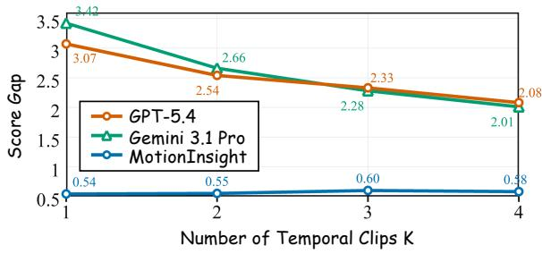  
Figure 4: Sensitivity to localized motion failures. We divide each video into K temporal clips and compute the gap between the minimum clip-level score and the human full-video score. MotionInsight keeps a consistently small gap across K, indicating better sensitivity.

Grounded diagnostic reasoning. As shown in Table 4, existing VLMs exhibit poor diagnostic reasoning capability. Their explanations frequently miss the fine-grained motion deficiencies identified by human annotators, resulting in low consistency with the annotated failure causes. In contrast, MotionInsight produces more grounded explanations, achieving higher Jaccard similarity, precision, and recall. This suggests that explicitly modeling target motion and incorporating failure-cause supervision help MotionInsight provide more insight into object motion deficiencies.

<table><tr><td>Method</td><td>#Fr.</td><td>0C↑</td><td>MC↑</td><td>PP↑</td></tr><tr><td>Uniform Sampling</td><td>16</td><td>0.510</td><td>0.455</td><td>0.445</td></tr><tr><td>2× Uniform Sampling</td><td>32</td><td>0.435</td><td>0.382</td><td>0.421</td></tr><tr><td>4× Uniform Sampling</td><td>64</td><td>0.406</td><td>0.334</td><td>0.397</td></tr><tr><td>Trajectory Overlay</td><td>16</td><td>0.475</td><td>0.438</td><td>0.430</td></tr><tr><td>Motion-Aware Rep.</td><td>16</td><td>0.761</td><td>0.633</td><td>0.727</td></tr></table>

Table 5: Ablation on video perception strategies under the same GRPO training, reported with SRCC. Rep. denotes representations. #Fr. refers to the number of sampled RGB frames, OC: Object Consistency, MC: Motion Continuity, and PP: Physical Plausibility.
<table><tr><td>Setting</td><td>OC↑</td><td>MC↑</td><td>PP↑</td></tr><tr><td>Semantic Alignment Only</td><td>0.253</td><td>0.183</td><td>0.224</td></tr><tr><td>+ Scoring Reward</td><td>0.703</td><td>0.588</td><td>0.670</td></tr><tr><td>+ Failure-cause Reward</td><td>0.761</td><td>0.633</td><td>0.727</td></tr></table>

Table 6: Ablation on the GRPO design of MotionInsight, reported with SRCC. OC: Object Consistency, MC: Motion Continuity, and PP: Physical Plausibility.

Sensitivity to localized motion failures. To evaluate sensitivity to localized motion failures, we select 327 videos containing object consistency deficiencies from VidMotion-Test for scoring evaluation. These deficiencies are localized to the object and often appear only in a few frames, making them a suitable testbed for localized failure detection. For each video, we divide the full sequence into K temporal clips and compare the minimum clip-level score with the human score assigned to the full video. If an evaluator performs better when the video is divided into more clips, it suggests that the evaluator cannot reliably detect localized motion failures when the entire video is provided as input (K = 1), where local artifacts can be diluted by redundant visual tokens.

As shown in Figure 4, GPT-5.4 and Gemini 3.1 Pro exhibit a large score gap when evaluating the full video directly, but the gap decreases as the video is divided into more temporal clips. In contrast, MotionInsight maintains a consistently small score gap across different values of K. This suggests that MotionInsight is more sensitive to localized motion failures, consistent with the human visual system (Tu et al., 2020).

## 5.2 Ablation Study

Motion-aware representations outperform RGB-frame sampling. As shown in Table 5, we compare different video input strategies while keeping the GRPO training procedure unchanged. Specifically, we evaluate standard uniform sampling, denser variants with 2× and 4× more sampled frames, as well as a trajectory-visualized setting, where the target object’s trajectory is drawn on the sampled frames as visual guidance. The results show that neither increasing the sampling density nor overlaying trajectories leads to clear performance gains. Moreover, denser sampling introduces a higher computational cost while making it harder for the evaluator to focus on localized artifacts, as the critical motion deficiencies can be diluted by redundant visual tokens. In contrast, our motion-aware representations consistently achieve the best performance across all three evaluation dimensions, suggesting that structuring target motion in motion space helps the evaluator perceive artifacts that may remain subtle in RGB-frame observations. Additional ablations on the design of motion-aware representations are provided in Appendix G.

Motion-specific rewards strengthen the diagnostic ability. In Table 6, we further ablate the reward design used in GRPO in terms of scoring performance. After semantic alignment, the model exhibits limited scoring capability without additional preference alignment. Incorporating the scoring reward substantially improves its performance, while further adding the failure-cause reward provides more explicit supervision on motion failure causes and strengthens diagnostic reasoning, leading to further gains in human-aligned scoring.

## 6 Conclusion

We formulate the diagnostic task of object-centric motion fidelity assessment, evaluated along object consistency, motion continuity, and physical plausibility. To support this study, we introduce VidMotion, a diagnostic dataset with multi-dimensional scores and failure causes. Built on VidMotion, we further propose MotionInsight, a diagnostic evaluator that shifts the assessment from implicit RGBframe observations to explicit motion-space diagnosis. We demonstrate the superior performance of MotionInsight in scoring and interpretable failure diagnosis.

## Limitations

Although VidMotion is designed for object-centric motion fidelity assessment, its scope is mainly limited to entities with clear spatial boundaries, persistent identities, and trackable motion trajectories. Therefore, VidMotion and MotionInsight may be less suitable for dynamic phenomena such as fluids, smoke, fire, splashes, or highly deformable materials, where object-centric scoring and failure causes can become inherently ambiguous.

In addition, using MotionInsight as a reward model may introduce Goodhart’s-law risks. Since the evaluator remains fixed during generator optimization and does not automatically evolve with advancing generators, generators may overfit to its scoring patterns and obtain higher rewards without corresponding improvements in real object motion fidelity.

## Ethical Considerations

This work complies with the ACL Ethics Policy. VidMotion is constructed from open-source datasets and curated video sources. All external datasets, models, and tools used in this work are properly cited and used in accordance with their respective licenses and terms of use. Our use of these artifacts is limited to academic research on video generation evaluation, which is consistent with their intended research use, where specified. The artifacts released by this work are intended solely for research purposes. All collected videos are manually screened before annotation to filter out invalid, sensitive, offensive, or privacy-risk content to the best of our ability, including videos containing personal information, inappropriate content, or clearly privacy-sensitive visual content. The released annotations focus only on target objects, motion quality scores, confidence levels, and failure causes, and do not include annotator identities or personally identifying information.

## Acknowledgments

The work is supported by the National Key R&D Program of China (No. 2025YFE0201300).

## References

Arslan Ali, Junjie Bai, Maciej Bala, Yogesh Balaji, Aaron Blakeman, Tiffany Cai, Jiaxin Cao, Tianshi Cao, Elizabeth Cha, Yu-Wei Chao, and 1 others. 2025. World simulation with video foundation models for physical ai. arXiv preprint arXiv:2511.00062.

Shuai Bai, Yuxuan Cai, Ruizhe Chen, Keqin Chen, Xionghui Chen, Zesen Cheng, Lianghao Deng, Wei Ding, Chang Gao, Chunjiang Ge, and 1 others. 2025. Qwen3-vl technical report. arXiv preprint arXiv:2511.21631.

Hritik Bansal, Zongyu Lin, Tianyi Xie, Zeshun Zong, Michal Yarom, Yonatan Bitton, Chenfanfu Jiang, Yizhou Sun, Kai-Wei Chang, and Aditya Grover. 2024. Videophy: Evaluating physical commonsense for video generation. arXiv preprint arXiv:2406.03520.

Hritik Bansal, Clark Peng, Yonatan Bitton, Roman Goldenberg, Aditya Grover, and Kai-Wei Chang. 2025. Videophy-2: A challenging action-centric physical commonsense evaluation in video generation. arXiv preprint arXiv:2503.06800.

Tim Brooks, Bill Peebles, and 1 others. 2024. Video generation models as world simulators. OpenAI Technical Report.

Sergi Caelles, Jordi Pont-Tuset, Federico Perazzi, Alberto Montes, Kevis-Kokitsi Maninis, and Luc Van Gool. 2019. The 2019 davis challenge on vos: Unsupervised multi-object segmentation. arXiv preprint arXiv:1905.00737.

Nicolas Carion, Laura Gustafson, Yuan-Ting Hu, Shoubhik Debnath, Ronghang Hu, Didac Suris, Chaitanya Ryali, Kalyan Vasudev Alwala, Haitham Khedr, Andrew Huang, and 1 others. 2025. Sam 3: Segment anything with concepts. arXiv preprint arXiv:2511.16719.

Wei Chow, Jiageng Mao, Boyi Li, Daniel Seita, Vitor Guizilini, and Yue Wang. 2025. Physbench: Benchmarking and enhancing vision-language models for physical world understanding. arXiv preprint arXiv:2501.16411.

Haoyi Duan, Hong-Xing Yu, Sirui Chen, Li Fei-Fei, and Jiajun Wu. 2025. Worldscore: A unified evaluation benchmark for world generation. In ICCV.

Yusu Fang, Tiange Xiang, Tian Tan, Narayan Schuetz, Scott Delp, Li Fei-Fei, and Ehsan Adeli. 2026. Humanscore: Benchmarking human motions in generated videos. arXiv preprint arXiv:2604.20157.

Daya Guo, Dejian Yang, Haowei Zhang, Junxiao Song, Peiyi Wang, Qihao Zhu, Runxin Xu, Ruoyu Zhang, Shirong Ma, Xiao Bi, and 1 others. 2025. Deepseek-r1: Incentivizing reasoning capability in llms via reinforcement learning. arXiv preprint arXiv:2501.12948.

Yoav HaCohen, Nisan Chiprut, Benny Brazowski, Daniel Shalem, Dudu Moshe, Eitan Richardson, Eran Levin, Guy Shiran, Nir Zabari, Ori Gordon, Poriya Panet, Sapir Weissbuch, Victor Kulikov, Yaki Bitterman, Zeev Melumian, and Ofir Bibi. 2024. Ltx-video: Realtime video latent diffusion. arXiv preprint arXiv:2501.00103.

Xuan He, Dongfu Jiang, Ping Nie, Minghao Liu, Zhengxuan Jiang, Mingyi Su, Wentao Ma, Junru Lin, Chun Ye, Yi Lu, and 1 others. 2025. Videoscore2: Think before you score in generative video evaluation. arXiv preprint arXiv:2509.22799.

Lanxiang Hu, Abhilash Shankarampeta, Yixin Huang, Zilin Dai, Haoyang Yu, Yujie Zhao, Haoqiang Kang, Daniel Zhao, Tajana Rosing, and Hao Zhang. 2025. Benchmarking scientific understanding and reasoning for video generation using videoscience-bench. arXiv preprint arXiv:2512.02942.

Jiahui Huang, Qunjie Zhou, Hesam Rabeti, Aleksandr Korovko, Huan Ling, Xuanchi Ren, Tianchang Shen, Jun Gao, Dmitry Slepichev, Chen-Hsuan Lin, and 1 others. 2025. Vipe: Video pose engine for 3d geometric perception. arXiv preprint arXiv:2508.10934.

Lianghua Huang, Xin Zhao, and Kaiqi Huang. 2019. Got-10k: A large high-diversity benchmark for generic object tracking in the wild. IEEE transactions on pattern analysis and machine intelligence, 43(5):1562–1577.

Ziqi Huang, Yinan He, Jiashuo Yu, Fan Zhang, Chenyang Si, Yuming Jiang, Yuanhan Zhang, Tianxing Wu, Qingyang Jin, Nattapol Chanpaisit, and 1 others. 2024. Vbench: Comprehensive benchmark suite for video generative models. In Proceedings of the IEEE/CVF Conference on Computer Vision and Pattern Recognition, pages 21807–21818.

Aaron Hurst, Adam Lerer, Adam P Goucher, Adam Perelman, Aditya Ramesh, Aidan Clark, AJ Ostrow, Akila Welihinda, Alan Hayes, Alec Radford, and 1 others. 2024. Gpt-4o system card. arXiv preprint arXiv:2410.21276.

Zeyinzi Jiang, Zhen Han, Chaojie Mao, Jingfeng Zhang, Yulin Pan, and Yu Liu. 2025. Vace: All-in-one video creation and editing. In Proceedings of the IEEE/CVF International Conference on Computer Vision, pages 17191–17202.

Nikita Karaev, Yuri Makarov, Jianyuan Wang, Natalia Neverova, Andrea Vedaldi, and Christian Rupprecht. 2025. Cotracker3: Simpler and better point tracking by pseudo-labelling real videos. In Proceedings ofthe IEEE/CVF International Conference on Computer Vision, pages 6013–6022.

Will Kay, Joao Carreira, Karen Simonyan, Brian Zhang, Chloe Hillier, Sudheendra Vijayanarasimhan, Fabio Viola, Tim Green, Trevor Back, Paul Natsev, and 1 others. 2017. The kinetics human action video dataset. arXiv preprint arXiv:1705.06950.

Weijie Kong, Qi Tian, Zijian Zhang, Rox Min, Zuozhuo Dai, Jin Zhou, Jiangfeng Xiong, Xin Li, Bo Wu, Jianwei Zhang, and 1 others. 2024. Hunyuanvideo: A systematic framework for large video generative models. arXiv preprint arXiv:2412.03603.

Klaus Krippendorff. 2011. Computing krippendorff’s alpha-reliability.

Dacheng Li, Yunhao Fang, Yukang Chen, Shuo Yang, Shiyi Cao, Justin Wong, Michael Luo, Xiaolong Wang, Hongxu Yin, Joseph E Gonzalez, and 1 others. 2025. Worldmodelbench: Judging video generation models as world models. arXiv preprint arXiv:2502.20694.

Xinran Ling, Chen Zhu, Meiqi Wu, Hangyu Li, Xiaokun Feng, Cundian Yang, Aiming Hao, Jiashu Zhu, Jiahong Wu, and Xiangxiang Chu. 2025. Vmbench: A benchmark for perception-aligned video motion generation. In Proceedings of the IEEE/CVF International Conference on Computer Vision, pages 13087– 13098.

Fanqing Meng, Jiaqi Liao, Xinyu Tan, Wenqi Shao, Quanfeng Lu, Kaipeng Zhang, Yu Cheng, Dianqi Li, Yu Qiao, and Ping Luo. 2024. Towards world simulator: Crafting physical commonsense-based benchmark for video generation. arXiv preprint arXiv:2410.05363.

Saman Motamed, Minghao Chen, Luc Van Gool, and Iro Laina. 2025. Travl: A recipe for making videolanguage models better judges of physics implausibility. arXiv preprint arXiv:2510.07550.

Kepan Nan, Rui Xie, Penghao Zhou, Tiehan Fan, Zhenheng Yang, Zhijie Chen, Xiang Li, Jian Yang, and Ying Tai. 2024. Openvid-1m: A large-scale highquality dataset for text-to-video generation. arXiv preprint arXiv:2407.02371.

Yiran Qin, Zhelun Shi, Jiwen Yu, Xijun Wang, Enshen Zhou, Lijun Li, Zhenfei Yin, Xihui Liu, Lu Sheng, Jing Shao, and 1 others. 2024. Worldsimbench: Towards video generation models as world simulators. arXiv preprint arXiv:2410.18072.

Johannes Lutz Schönberger and Jan-Michael Frahm. 2016. Structure-from-motion revisited. In Conference on Computer Vision and Pattern Recognition (CVPR).

Team Seedance, De Chen, Liyang Chen, Xin Chen, Ying Chen, Zhuo Chen, Zhuowei Chen, Feng Cheng, Tianheng Cheng, Yufeng Cheng, and 1 others. 2026. Seedance 2.0: Advancing video generation for world complexity. arXiv preprint arXiv:2604.14148.

Baifeng Shi, Stephanie Fu, Long Lian, Hanrong Ye, David Eigen, Aaron Reite, Boyi Li, Jan Kautz, Song Han, David M Chan, and 1 others. 2026. Attend before attention: Efficient and scalable video understanding via autoregressive gazing. arXiv preprint arXiv:2603.12254.

Kaiyue Sun, Kaiyi Huang, Xian Liu, Yue Wu, Zihan Xu, Zhenguo Li, and Xihui Liu. 2025. T2v-compbench: A comprehensive benchmark for compositional textto-video generation. In Proceedings of the Computer Vision and Pattern Recognition Conference, pages 8406–8416.

Gemini Team, Petko Georgiev, Ving Ian Lei, Ryan Burnell, Libin Bai, Anmol Gulati, Garrett Tanzer, Damien Vincent, Zhufeng Pan, Shibo Wang, and 1 others. 2024. Gemini 1.5: Unlocking multimodal understanding across millions of tokens of context. arXiv preprint arXiv:2403.05530.

Meituan LongCat Team, Xunliang Cai, Qilong Huang, Zhuoliang Kang, Hongyu Li, Shijun Liang, Liya Ma, Siyu Ren, Xiaoming Wei, Rixu Xie, and 1 others. 2025. Longcat-video technical report. arXiv preprint arXiv:2510.22200.

Zhengzhong Tu, Chia-Ju Chen, Li-Heng Chen, Neil Birkbeck, Balu Adsumilli, and Alan C Bovik. 2020. A comparative evaluation of temporal pooling methods for blind video quality assessment. In 2020 IEEE international conference on image processing (ICIP), pages 141–145. IEEE.

Team Wan, Ang Wang, Baole Ai, Bin Wen, Chaojie Mao, Chen-Wei Xie, Di Chen, Feiwu Yu, Haiming Zhao, Jianxiao Yang, and 1 others. 2025. Wan: Open and advanced large-scale video generative models. arXiv preprint arXiv:2503.20314.

Yibin Wang, Zhimin Li, Yuhang Zang, Chunyu Wang, Qinglin Lu, Cheng Jin, and Jiaqi Wang. 2025. Unified multimodal chain-of-thought reward model through reinforcement fine-tuning. arXiv preprint arXiv:2505.03318.

Thaddäus Wiedemer, Yuxuan Li, Paul Vicol, Shixiang Shane Gu, Nick Matarese, Kevin Swersky, Been Kim, Priyank Jaini, and Robert Geirhos. 2025. Video models are zero-shot learners and reasoners. arXiv preprint arXiv:2509.20328.

Haoning Wu, Chaofeng Chen, Jingwen Hou, Liang Liao, Annan Wang, Wenxiu Sun, Qiong Yan, and Weisi Lin. 2022. Fast-vqa: Efficient end-to-end video quality assessment with fragment sampling. In European conference on computer vision, pages 538–554. Springer.

Jiajun Wu, Joseph J Lim, Hongyi Zhang, Joshua B Tenenbaum, and William T Freeman. 2016. Physics 101: Learning physical object properties from unlabeled videos. In BMVC, volume 2, page 7.

Zhuoyi Yang, Jiayan Teng, Wendi Zheng, Ming Ding, Shiyu Huang, Jiazheng Xu, Yuanming Yang, Wenyi Hong, Xiaohan Zhang, Guanyu Feng, and 1 others. 2024. Cogvideox: Text-to-video diffusion models with an expert transformer. arXiv preprint arXiv:2408.06072.

Jiahao Zhan, Zizhang Li, Hong-Xing Yu, and Jiajun Wu. 2026. Perpetualwonder: Long-horizon actionconditioned 4d scene generation. arXiv preprint arXiv:2602.04876.

Qin Zhang, Peiyu Jing, Hong-Xing Yu, Fangqiang Ding, Fan Nie, Weimin Wang, Yilun Du, James Zou, Jiajun Wu, and Bing Shuai. 2026a. Physion-eval: Evaluating physical realism in generated video via human reasoning. arXiv preprint arXiv:2603.19607.

Xuanyu Zhang, Weiqi Li, Shijie Zhao, Junlin Li, Li Zhang, and Jian Zhang. 2026b. Vq-insight: Teaching vlms for ai-generated video quality understanding via progressive visual reinforcement learning. In Proceedings of the AAAI Conference on Artificial Intelligence, volume 40, pages 12870–12878.

Shijie Zhao, Xuanyu Zhang, Weiqi Li, Junlin Li, Li Zhang, Tianfan Xue, and Jian Zhang. 2026. Reasoning as representation: Rethinking visual reinforcement learning in image quality assessment. Proceedings of the International Conference on Learning Representations (ICLR).

## A Annotation Details

Annotators were recruited from students and researchers with experience in video understanding. All 21 annotators had at least a bachelor’s degree. All annotators were fairly compensated for their work. Before participation, annotators were informed that their annotations would be used for academic research on motion fidelity assessment, and they provided consent to participate.

Figure 7 shows the interface of the annotation website. As shown in Table 8, Krippendorff’s α reaches 0.7981, 0.6846, and 0.7432 for object consistency, motion continuity, and physical plausibility, respectively, indicating reliable inter-annotator agreement across all three scalar dimensions. For the multi-label failure-cause annotations, we compute pairwise Jaccard similarity among annotators by treating each annotator’s selected causes as a set. The resulting Jaccard similarity reaches 0.61, suggesting reasonable agreement despite the inherent ambiguity of fine-grained motion artifacts.

## B VidMotion Analysis

As shown in Figure 5, VidMotion shows great diversity in target objects, covering most dynamic objects commonly encountered in daily life. We also analyze the failure cause annotations in Figure 8. For object consistency, we find that deformation of humans or objects caused by fast motion is the most common issue. For motion continuity, generated object motions are still often stiff and unnatural. For physical plausibility, current video generation models still struggle with physical causality, frequently producing misaligned motion for observed force.

## C Prompt Template

We present the prompt used for GRPO training and VLM baselines in Table 10.

## D More Qualitative Results

Figure 9 shows two additional examples. In the field hockey case, the ball suddenly flashes back after being hit, which reflects a localized continuity failure. In the skateboard case, the object remains structurally stable but starts moving without a clear applied force, revealing failure in physical plausibility. These results suggest that MotionInsight exhibits reasoning ability for motion, enabling it to evaluate object motion progressively from appearance stability to temporal continuity and even physical fidelity.

## E Implementation Details

We use Qwen-3-VL-8B-Instruct (Bai et al., 2025) as the pretrained VLM backbone. For modality alignment, we fine-tune the motion encoding components for 3 epochs on 8 NVIDIA A100 GPUs with a learning rate of $1 \times 1 0 ^ { - 6 }$ For GRPO training, we set the number of sampled responses to $N = 8$ and the KL penalty weight to $\beta = 0 . 0 0 1$ . The model is then trained for 5 epochs on 8 NVIDIA A100 GPUs with a learning rate of $1 \times 1 0 ^ { - 6 }$ . In the motion-aware representations, the number of learnable queries K is set to 8. For the multi-dimensional scoring reward, the asymmetric penalty coefficient α is set to 1.5. For RGB-frame inputs, MotionInsight samples frames at a stride of 16 frames.

## F MotionInsight for Generation

We further explore the potential of MotionInsight as a reward for improving video generation through preference optimization. We use Wan2.1-T2V-1.3B (Wan et al., 2025) as the base generator. For each prompt, we sample eight candidate videos and use Qwen-3-VL-8B-Instruct (Bai et al., 2025) to identify salient moving objects in each video. For each detected object $o _ { i } .$ , MotionInsight predicts three scores $s _ { i } ^ { O C } , \bar { s _ { i } ^ { M C } }$ , and $s _ { i } ^ { P P }$ . We compute the object-level motion reward by multiplying the normalized scores across the three dimensions:

$$
r _ { i } = \prod _ { \substack { d \in \{ O C , M C , P P \} } } \frac { s _ { i } ^ { d } } { 5 } .\tag{7}
$$

We then obtain the video-level object-motion reward by taking the minimum reward over all detected salient moving objects:

$$
R ( v ) = \operatorname* { m i n } _ { i = 1 } ^ { N } r _ { i } .\tag{8}
$$

For each prompt, we select the candidate with the highest $R ( v )$ as the positive sample and the candidate with the lowest $R ( v )$ as the negative sample, forming a preference pair for DPO training. We then fine-tune the base generator using these MotionInsight-derived preference pairs. For comparison, we construct another set of preference pairs using VideoPhy2 (Bansal et al., 2025) scores under the same candidate pool and train a corresponding DPO baseline.

<table><tr><td>Method</td><td>0C↑ MC↑</td><td></td><td>PP↑</td></tr><tr><td>Motion-Aware Rep.</td><td>0.761</td><td>0.633</td><td>0.727</td></tr><tr><td>w/ Temporal Shuffle</td><td>0.161</td><td>0.109</td><td>0.113</td></tr><tr><td>w/o Camera Motion</td><td>0.697</td><td>0.580</td><td>0.683</td></tr></table>

Table 7: Ablation on the design of motion-aware representations for GRPO, reported with SRCC. Rep. denotes representations. w/ Temporal Shuffle randomly permutes the temporal order of the motion representations, while w/o Camera Motion removes cameramotion tokens and keeps only object-motion features. OC: Object Consistency, MC: Motion Continuity, and PP: Physical Plausibility.

We recruit 20 volunteers to conduct a 2AFC human study. As shown in Table 9, DPO training with MotionInsight-derived preference pairs is strongly preferred over both the original Wan 2.1 model and the VideoPhy2-DPO baseline. Figure 6 further shows that MotionInsight-DPO reduces typical object motion artifacts, including deformation during bow drawing and foot penetration when the horse crosses a hurdle. These results demonstrate that the diagnostic signals from MotionInsight are useful not only for evaluation, but also for improving video generation, leading to better object motion fidelity while preserving overall video quality.

## G Ablation on Motion-Aware Representations

Table 7 further validates the effectiveness of the proposed motion-aware representation. When the temporal order of the motion embeddings is randomly shuffled, performance drops substantially across all three dimensions, indicating that the model relies on temporally structured motion form rather than merely benefiting from additional features. Moreover, retaining only object-motion tokens also underperforms the full model, showing that both object motion and camera poses are important for disentangling object dynamics from camera-induced motion.

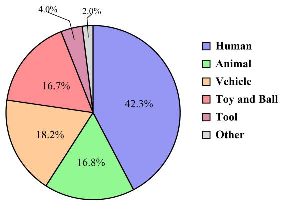  
Figure 5: Distribution of target objects in VidMotion. The objects are grouped into six coarse categories: Human, Animal, Vehicle, Toy and Ball, Tool, and Other. The distribution highlights the diversity of object-centric motion scenarios covered by the dataset.

<table><tr><td>Dimension</td><td>Krippendorff&#x27;s α</td></tr><tr><td>Object Consistency</td><td>0.7981</td></tr><tr><td>Motion Continuity</td><td>0.6846</td></tr><tr><td>Physical Plausibility</td><td>0.7432</td></tr></table>

Table 8: Inter-annotator reliability for the three scalar motion-quality dimensions in VidMotion. Krippendorff’s α is used to measure agreement among annotators, with higher values indicating stronger consistency.

<table><tr><td>Method</td><td>Motion Fidelity</td><td>Overall Quality</td></tr><tr><td>over Wan 2.1</td><td>92.86%</td><td>86.67%</td></tr><tr><td>over VideoPhy2-DPO</td><td>87.56%</td><td>87.50%</td></tr></table>

Table 9: 2AFC human study results for DPO-based video generation. We compare the model trained with MotionInsight-derived preference pairs against the original Wan2.1 and the VideoPhy2-DPO (Bansal et al., 2025) baseline.

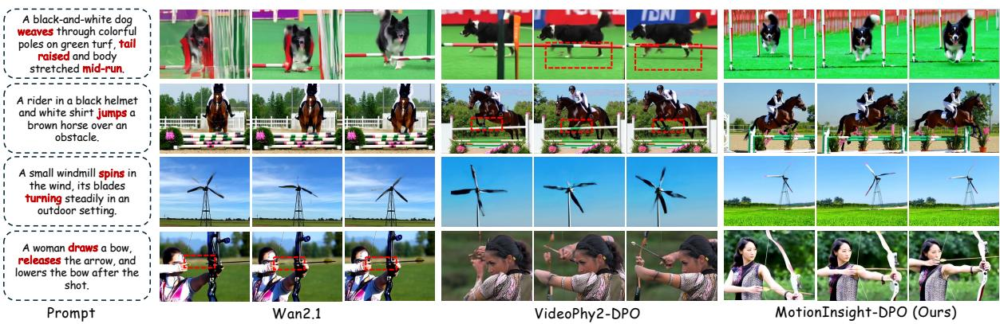  
Figure 6: Qualitative comparison of DPO-based video generation.

  
Figure 7: Interface of the annotation website.

(a) Object Consistency  
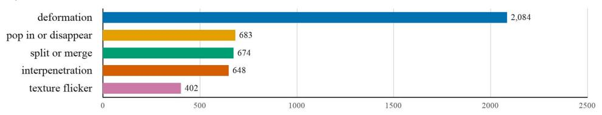

(b) Motion Continuity  
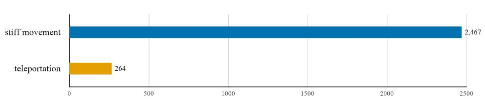  
(c) Physical Plausibility

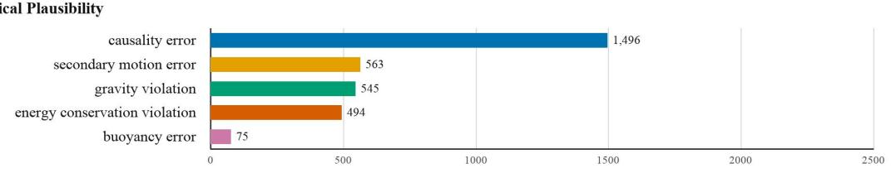  
Count  
Figure 8: Distribution of annotated issue categories. The 12 cause candidates are grouped into three dimensions: Object Consistency, Motion Continuity, and Physical Plausibility.

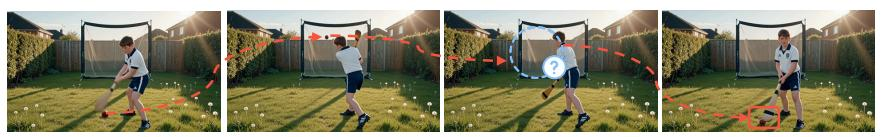  
Question: Give the target object " brown ball " in this video three continuous scores from 1 to 5 for the following aspects in order: object consistency, motion continuity, and physical plausibility.

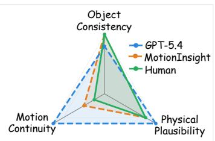

Object Consistency

The brown ball remains largely well-formed throughout the video, with no obvious deformation, but its position behaves unnaturally.   
After being hit, the ball suddenly flashes back to its starting point, breaking the continuity of its trajectory.   
This abrupt return also weakens the physical plausibility of the scene, since it does not match how a real ball would move in field hockey.

Motion Continuity

Physical Plausibility

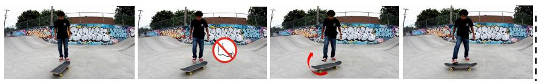

Question: Give the target object " skateboard " in this video three continuous scores from 1 to 5 for the following aspects in order: object consistency, motion continuity, and physical plausibility. G

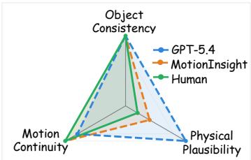

Object Consistency

Motion Continuity

Physical Plausibility

Object consistency is generally well maintained, with the skateboard remaining visually stable and showing no obvious deformation or shape inconsistency. Motion continuity is high, as the skateboard moves smoothly and continuously across the sequence without abrupt jumps. Physical plausibility is weaker, because the skateboard appears to start moving without any clear applied force, which makes the motion less physically realistic.

Figure 9: Additional qualitative results of MotionInsight. For each example, we show the sampled video frames, the model’s reasoning for the designated object, and the predicted scores across the three motion-quality dimensions.

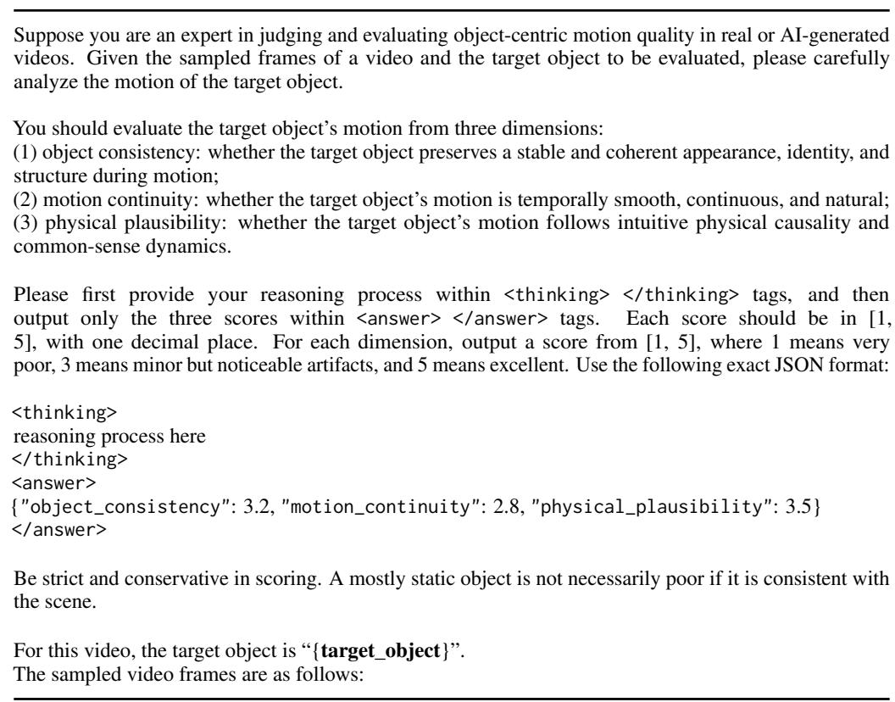  
Table 10: Prompting template used for multi-dimensional scoring reward in MotionInsight GRPO training andid VLM baselines.

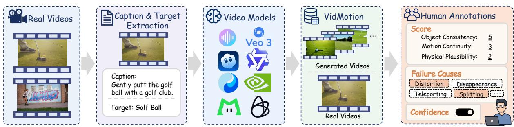  
Figure 10: Overview of the VidMotion construction and annotation pipeline. We collect real videos with prominent object motion, extract captions and target objects, generate corresponding videos using nine open-source and proprietary models, and collect expert annotations for both real and generated videos, including three-dimensional scores, failure causes, and confidence levels.