# INFOAGENT: TRACEABLE GENERATION AND REPAIR OF EVIDENCE-GROUNDED INFOGRAPHICS

Yifan Li<sup>1,2</sup>, Tong Li<sup>2</sup>, Qi Zeng<sup>2</sup>, Lishuai Gao<sup>2,‡</sup>, Ruwei Pan<sup>3</sup>, Cong Wei<sup>2</sup>, Shaohua Kevin Zhou<sup>1</sup> Zhuoliang Kang<sup>2</sup>, Xiaoming Wei<sup>2</sup>,

<sup>1</sup>University of Science and Technology of China <sup>2</sup>Meituan <sup>3</sup>Peking University, Peking University <sup>‡</sup>Project lead

liyifancqu@163.com

## ABSTRACT

Reliable infographic generation requires facts, symbols, and visual relations to remain consistent through rendering and revision. Correcting one element also requires tracking its supporting evidence and the dependencies affected by the change. We present InfoAgent, a training-free framework for evidence-bound visual-symbolic program synthesis. Its Infographic Visual Description (IVD) records factual payloads, evidence provenance, execution routes, and verification obligations in a typed dependency graph. Retrieved design priors guide compilation, and layered execution combines raster synthesis with editable symbolic and binding objects while retaining their traces. Dependency-aware repair localizes corrections, rechecks affected dependencies, and requires protected obligations to remain satisfied under the declared checkers. Unresolved obligations remain explicit. On IGenBench, InfoAgent achieves 93.0 Q-ACC and 59.0 I-ACC. We also introduce InfoGraphicBench-Evidence, where complete-checklist pass rates on 200 test requests increase from 21.5% for Same-IVD Prompt to 23.5% for the initial layered output and 28.5% after repair, using the same evidence and initial IVD. On 120 audited repair cases, localized repair edits 12.4% of the canvas on average, compared with 67.3% for global regeneration.

## 1 INTRODUCTION

Infographics combine factual claims, numerical data, and visual explanations on one canvas. In journalism, education, and public communication, their usefulness depends on readable design and accurate information Feng et al. (2026a); Cui et al. (2019); Tyagi et al. (2022). A polished composition can still mislead when a value is unsupported, a source note is missing, or a label refers to the wrong object Wang et al. (2019); Vu et al. (2025); Tang et al. (2026). Reliable generation requires preserving relationships among evidence, text, and visual elements, not just their appearance.

Infographic research now spans document-conditioned generation, authoring tools, chart resources, and reliability evaluation Li et al. (2026b); Ghosh et al. (2025); Tang et al. (2026). Image models offer increasingly capable synthesis and text rendering Esser et al. (2024); Labs (2024); Betker et al. (2023); Wu et al. (2025); Cai et al. (2025a;b); Team et al. (2025). Research agents acquire and organize external knowledge Jin et al. (2025); Zheng et al. (2025b); Yang et al. (2026b); Chng et al. (2025), and image-generation agents use search, references, planning, and feedback to improve contextual and compositional fidelity Zhang et al. (2026); Feng et al. (2026b); Chen et al. (2026b;a); Li et al. (2026a). Structured execution and local correction are also established approaches: Info-Gen converts document-derived metadata into infographic code Ghosh et al. (2025), GenClaw uses executable visual sketches before raster synthesis Ye et al. (2026), and M3 checks constraints and validates targeted image edits Yang et al. (2026a).

We study how to preserve evidence and execution dependencies as an infographic is revised. Consider a percentage callout whose text is correct but whose arrow points to the wrong chart segment. Correcting the arrow requires locating its intended target; moving the callout may obscure a neighboring value or source note. An editable object provides a location for the change, but does not by itself specify the supporting evidence or the dependent requirements that need rechecking. A reliable repair needs these relationships to remain explicit across planning, rendering, and verification.

We introduce InfoAgent, a training-free framework for evidence-bound visual-symbolic program synthesis. Its intermediate representation, Infographic Visual Description (IVD), records content, evidence spans, spatial regions, execution routes, bindings, and verification obligations in a typed dependency graph. The same element identifier connects a factual claim to its supporting span, rendered object, and post-composition checks. This evidence-linked form of element addressability allows a detected failure to be traced to its content, geometry, or local relation. Retrieved layout and style priors guide the design, while factual content comes from supplied or retrieved evidence. All foundation models remain frozen.

As shown in Figure 1, InfoAgent routes open-ended imagery to a visual generator, exact text and data graphics to symbolic rendering, and arrows, callouts, and legend associations to binding execution. Composition retains rendering-tree handles for symbolic objects and region-level or grounded associations for raster elements. Checkers use these traces to associate each PASS, FAIL, or UNKNOWN decision with an element and a diagnostic witness. Repair follows the dependency graph to identify affected elements and relevant checks. Candidate patches must preserve previously passed critical obligations and all passed obligations outside the target’s dependency closure under the declared checkers. The resulting certificate records these checks and unresolved cases; semantic verification remains model-assisted.

We evaluate InfoAgent on the complete IGenBench and introduce InfoGraphicBench-Evidence, a 260-request benchmark with frozen evidence bundles and held-out annotations, including 200 test requests. InfoAgent achieves 93.0 Q-ACC and 59.0 I-ACC on IGenBench. On InfoGraphicBench-Evidence, the complete-checklist pass rate (Full) rises from 21.5% for Same-IVD Prompt to 23.5% for the initial layered output and 28.5% after repair. These comparisons use the same evidence and initial IVD. On the audited repair subset, localized repair changes 12.4% of the canvas on average, compared with 67.3% for global regeneration. The results support the value of trace-preserving execution and scoped repair, while the remaining failures show that evidence quality and semantic verification continue to limit reliability.

We introduce an evidence-bound IVD that connects source spans, rendered elements, local relations, and verification obligations. Building on this representation, InfoAgent combines layered execution with dependency-aware repair to localize corrections, recheck affected content, and record unresolved requirements. We also construct InfoGraphicBench-Evidence and evaluate wholeinfographic reliability, output quality, and repair locality alongside IGenBench.

## 2 RELATED WORK

Agentic image generation. Modern text-to-image models offer strong visual synthesis and increasingly capable instruction following and text rendering Esser et al. (2024); Labs (2024); Betker et al. (2023); Wu et al. (2025); Cai et al. (2025a;b). Recent agentic systems extend these models with external knowledge, tool use, and iterative control. Gen-Searcher retrieves textual evidence and visual references before generation Feng et al. (2026b), while Qwen-Image-Agent constructs missing generation context through planning, reasoning, search, memory, and feedback Zhang et al. (2026). M3 decomposes complex requests into checkable constraints and revises failed components Yang et al. (2026a); related approaches use grounded recaptioning, tool trajectories, specialized agents, or multi-round reasoning to improve factual and compositional generation Chen et al. (2026a;b); Li et al. (2026a); Bian et al. (2026). GenClaw further introduces executable SVG, HTML, and code-based canvases before raster synthesis Ye et al. (2026). InfoAgent complements these directions by binding each information-bearing element to evidence, an execution route, local relations, and checkable obligations. The resulting traces support element-indexed verification and scoped re-execution after composition, rather than treating the generated artifact only as a holistic image.

Structured visual communication. Deep-research and presentation systems organize evidence into multimodal reports or slides using visualization descriptions, reference layouts, editable code, and iterative refinement Zheng et al. (2025b); Yang et al. (2026b); Zheng et al. (2025a); Tang et al. (2025); Zheng et al. (2026); Zeng et al. (2026); Xu et al. (2025). Infographic research has progressed from constrained linguistic or tabular inputs to automatic data stories, visualization code, and AI-assisted authoring Cui et al. (2019); Wang et al. (2019); Shi et al. (2020); Tyagi et al. (2022); Dibia (2023); Vu et al. (2025). Recent work contributes large-scale infographic-chart resources Li et al. (2026b), document-conditioned statistical infographic generation Ghosh et al. (2025), relia bility evaluation Tang et al. (2026), and narrative-centered co-creation Feng et al. (2026a). These systems provide complementary mechanisms for content selection, page organization, visual encoding, rendering, and assessment. InfoAgent focuses on open-ended, evidence-grounded single-canvas infographics, where factual claims, exact symbols, visual objects, and local bindings must remain jointly traceable. IVD connects these stages through an executable element graph, combining openended visual synthesis with editable symbolic and binding execution.

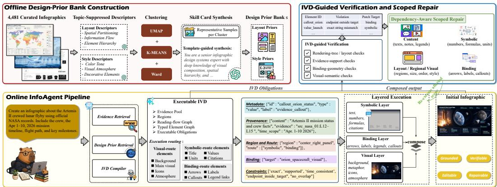  
Figure 1: Overview of InfoAgent. A user request, retrieved evidence, and design priors are compiled into a typed IVD. Each information-bearing element retains evidence provenance, a spatial region, an execution route, binding dependencies, and checkable obligations. Visual, symbolic, and binding layers are composed with execution traces. IVD-guided verification then maps element-indexed violations to scoped content, symbolic, binding, layout, or visual patches.

## 3 METHOD

We propose InfoAgent, a training-free framework that formulates knowledge-intensive infographic generation as evidence-bound visual-symbolic program synthesis. Given a user request x, an evidence pool E, and a retrieved design prior s, InfoAgent compiles them into an executable IVD and produces the composed infographic together with its execution trace:

$$
z = F _ { \mathrm { i v d } } ( x , \mathcal { E } , s ) , \qquad ( y , T ) = \operatorname { E x e c } ( z ) ,\tag{1}
$$

where z is the compiled IVD, y is the composed infographic, and T records correspondences between IVD elements and rendered objects or regions. All foundation models and rendering tools remain frozen. Figure 1 summarizes the pipeline from IVD compilation to scoped repair.

Rather than serving as a longer prompt, IVD makes each information-bearing element addressable by recording its payload, evidence provenance, spatial role, execution route, binding and dependency relations, and post-composition obligations. InfoAgent executes these elements through visual, symbolic, and binding layers, preserving traces for checking and repair. This separation allows an incorrect value, source note, or binding relation to be re-executed without necessarily regenerating the complete artifact.

Verification is defined relative to the obligations declared by IVD. An output is marked as certified relative to z only when every critical obligation returns PASS; a critical UNKNOWN remains unresolved. The certificate records checker statuses, confidence values, and witnesses for the declared content, layout, and binding obligations. It provides an operational account of these declared requirements rather than a guarantee of open-world factual correctness.

## 3.1 EVIDENCE AND DESIGN PRIORS

InfoAgent retrieves two complementary forms of context. The evidence retriever collects passages, numerical values, dates, entity names, and source metadata. Retrieved documents are deduplicated and segmented into addressable spans. Every non-decorative factual unit must be linked to at least one span; otherwise, it is marked blocked and is excluded from execution.

The design retriever supplies layout and style constraints without changing the factual payload. We construct a non-parametric prior bank from 4,481 curated infographics. Topic-suppressed layout and style descriptions are embedded and clustered using UMAP, K-Means, and Ward merging McInnes et al. (2018); McQueen (1967); Ward Jr (1963). Representative samples are summarized into skill cards that describe information structures, region patterns, density budgets, binding patterns, and style constraints. At inference time, retrieved cards guide IVD compilation, while evidence coverage and symbolic readability take precedence over aesthetic preferences. Bank construction and retrieval details are provided in the supplementary material.

## 3.2 IVD AS AN EXECUTABLE CONTRACT

Typed element graph. IVD is represented as $\boldsymbol { z } = ( \mathcal { E } , \mathcal { U } , \mathcal { R } , G , \Omega )$ , where $\mathcal { E }$ is the evidence pool, U defines canvas regions, R specifies reading order, Ω contains executable obligations, and $G =$ $( \mathcal { A } , \mathcal { D } )$ is a typed element dependency graph. Each element $a _ { i } \in { \mathcal { A } }$ follows the compact schema $a _ { i } = ( m _ { i } , p _ { i } , r _ { i } , b _ { i } , c _ { i } )$ , where $m _ { i }$ stores its identifier, type, role, and priority; $p _ { i }$ contains an exact or paraphrasable payload together with its supporting evidence spans; $r _ { i }$ specifies its region and execution route; $b _ { i }$ records local binding relations; and $c _ { i } \subseteq \Omega$ indexes the obligations applied to the element. Typed edges in D encode contains, precedes, ${ \mathsf { s u p p o r t } } s$ , binds-to, and depends-on relations, allowing changes to an element to trigger the re-execution or re-checking of its affected dependents.

Executable obligations. Each obligation is represented as $\omega _ { j } = ( S _ { j } , \phi _ { j } , \nu _ { j } , \gamma _ { j } )$ , where $S _ { j }$ contains the scoped object–field identifiers to which the obligation applies, $\phi _ { j }$ is the required predicate, $\nu _ { j }$ is the checker, and $\gamma _ { j }$ denotes its severity. For example, a value element may require exact string equality, support from a cited evidence span, minimum contrast, and an arrow endpoint within a designated target region. Terms such as exact, support, and $\mathtt { n o - o v e r l a p }$ therefore refer to checkable predicates with explicit scopes and repair targets, rather than descriptive tags.

Compilation and capability-constrained routing. The compiler decomposes the requested message into claims, values, dates, formulas, labels, citations, and visual intents. Exact strings are copied from evidence into protected payload fields, while paraphrasable claims retain their evidence spans. It then instantiates regions, reading order, element dependencies, local bindings, and executable obligations.

Each element is assigned to the smallest combination of layers capable of satisfying its obligations. Let $\mathcal { L } = \{ \mathrm { v i s } , \mathrm { s y m } , \mathrm { \bar { b } i n d } \}$ , let $\operatorname { r e q } ( a _ { i } )$ denote the capabilities required by element ${ { a } _ { i } } ,$ and define ca $\begin{array} { r } { \operatorname { \Rightarrow } ( L ) = \bigcup _ { \ell \in L } \operatorname { c a p } ( \ell ) } \end{array}$ . The execution route is selected by

$$
\begin{array} { r l } & { r _ { i } ^ { \star } = \arg \underset { \mathcal { O } \neq L \subseteq \mathcal { L } } { \operatorname* { m i n } } \big ( \vert L \vert , \mathrm { c o s t } ( L ) \big ) } \\ & { ~ \mathrm { s . t . } \quad \mathrm { r e q } ( a _ { i } ) \subseteq \mathrm { c a p } ( L ) , } \end{array}\tag{2}
$$

where the objective is minimized lexicographically, first by the number of layers and then by execution cost. Since $\mathcal { L }$ contains only three layers, the implementation enumerates its seven non-empty subsets. Exact strings, numerical values, formulas, and vector geometry require symbolic execution; arrows, callouts, and object–label relations require binding execution; and open-ended appearance requires visual synthesis. Multiple layers are assigned only when no single layer covers all obligations. The capability matrix and execution-cost order are provided in the supplementary material.

## 3.3 TRACE-PRESERVING LAYERED EXECUTION

Each execution layer returns both a rendered artifact and its trace, while composition preserves their element-level or region-level associations:

$$
\begin{array} { r l } & { \left( I _ { \ell } , T _ { \ell } \right) = R _ { \ell } ( z _ { \ell } ) , } \\ & { \quad ( y , T ) = \mathrm { C o m p o s e } \{ \{ ( I _ { \ell } , T _ { \ell } ) \} _ { \ell \in \mathcal { L } } \} , } \end{array}\tag{3}
$$

where $z _ { \ell }$ contains the IVD elements routed to layer ℓ, and T is the merged execution trace. Symbolic and binding elements retain exact rendering-tree handles, including their payloads, bounding boxes, z-order, and anchor geometry. Raster elements retain region-level traces from their assigned generation regions. When a binding or checker requires an object-level target, an independent grounding parser associates the corresponding IVD element with a box or mask and returns a confidence score; low-confidence associations are marked UNKNOWN. Traces are therefore exact for editable vector objects and region- or grounding-based for raster content.

The visual layer synthesizes backgrounds, visual metaphors, textures, and non-critical icons while preserving IVD-reserved symbolic regions. The symbolic layer renders exact text, values, formulas, charts, legends, and source notes as editable SVG objects. The binding layer renders arrows, leader lines, callouts, local labels, and legend–object mappings over resolved anchors. Its geometry is deterministic once the source and target anchors are established, while anchor resolution for raster objects may remain model-assisted. Further details on trace construction and anchor resolution are provided in the supplementary material.

## 3.4 VERIFICATION AND SCOPED REPAIR

Three-valued verification. For each obligation $\omega _ { j }$ , the corresponding checker returns $\nu _ { j } ( y , T , \mathcal { E } ) = ( s _ { j } , \kappa _ { j } , w _ { j } )$ , where $s _ { j } \in \{ \mathrm { P A S S , F A I L , U N K N O W N } \}$ is its status, $\kappa _ { j }$ is the confidence, and $w _ { j }$ is a diagnostic witness. Rendering-tree checkers evaluate exact strings, values, formulas, clipping, overlap, contrast, z-order, and endpoint geometry. Evidence checkers compare claims with their cited spans, while visual-semantic checkers inspect only the object or crop identified by $T$ Model-assisted checkers use fixed prompts and deterministic decoding, with pass and fail threshold calibrated on a held-out human-labeled set; scores between the thresholds yield UNKNOWN.

$\mathcal { C } ( y , z ) = \{ ( \mathrm { i d } ( \omega _ { j } ) , s _ { j } , \kappa _ { j } , w _ { j } , \mathrm { v e r } ( \nu _ { j } ) ) \} _ { \omega _ { i } \in \Omega }$ is the resulting certificate. It records the status of each obligation together with the checker version and its witness. Witnesses may include cited evidence spans, expected and rendered strings, conflicting boxes, or unresolved target anchors. Obligations returning FAIL, together with critical obligations returning UNKNOWN, are emitted as elementindexed violations for subsequent scoped repair.

Transactional repair. A violation $q = ( \omega , s , \kappa , w )$ identifies a field and patch class. The dependency graph induces an impact closure $H ( q )$ containing elements that may need to be changed or rechecked. Candidate patches are drawn from a typed operator library, including evidence-backed payload replacement, symbolic re-rendering, constrained layout reflow, anchor reassignment, masked visual editing, and regional regeneration. The repair scope expands from field to element, region, and, when necessary, global recompilation.

Scope $\textstyle ( H ) = \bigcup _ { a _ { i } \in H }$ scope(a<sub>i</sub>) collects the object–field identifiers affected by a repair. The protected set is $P ( H ) = \{ \omega : s ( \omega ) = { \mathrm { P A S S } } , S _ { \omega } \cap { \mathrm { S c o p e } } ( H ) = \emptyset \}$ , containing previously passed obligations outside this scope.

Let $F ^ { \mathrm { c r i t } }$ and $U ^ { \mathrm { c r i t } }$ denote the numbers of critical failures and critical unknowns, and let $F$ and U denote their totals over all obligations. Candidate certificates are ranked by

$$
\begin{array} { r } { Q ^ { \star } ( \mathcal { C } ) = \big ( F ^ { \mathrm { c r i t } } + U ^ { \mathrm { c r i t } } , F + U , F ^ { \mathrm { c r i t } } , F \big ) . } \end{array}\tag{4}
$$

A candidate is admissible only if the targeted critical obligation becomes PASS, or the total number of critical non-pass obligations strictly decreases. No other critical obligation may change from PASS to a non-pass state, and every obligation in $P ( H )$ must remain passed. Among admissible candidates, InfoAgent minimizes $Q ^ { \star }$ , followed by the number of changed elements, edited canvas area, and tool cost. If no candidate satisfies these conditions, the current candidate is rolled back and the repair scope is expanded.

Table 1: Reliability on the complete IGenBench benchmark.
<table><tr><td>Method</td><td>Q-ACC ↑</td><td>I-ACC ↑</td><td>Out ↑</td></tr><tr><td>Benchmark-reported references Tang et al. (2026) NanoBanana-Pro Google (2025)</td><td>90.0</td><td>49.0</td><td></td></tr><tr><td>Seedream-4.5 ByteDance (2025)</td><td>61.0</td><td>6.0</td><td></td></tr><tr><td>GPT-Image-1.5 OpenAI Team (2025)</td><td>55.0</td><td>12.0</td><td></td></tr><tr><td>Controlled baselines</td><td></td><td></td><td></td></tr><tr><td>Direct T2I Wu et al. (2025)</td><td>43.0</td><td>2.0</td><td>100.0</td></tr><tr><td>Same-IVD Prompt</td><td>50.0</td><td>5.0</td><td>100.0</td></tr><tr><td>Gen-Searcher Feng et al. (2026b)</td><td>76.0</td><td>20.0</td><td>100.0</td></tr><tr><td>GenClaw Ye et al. (2026)</td><td>79.0</td><td>27.0</td><td>98.2</td></tr><tr><td>LLM-to-SVG/HTML</td><td>82.0</td><td>32.0</td><td>96.3</td></tr><tr><td>InfoAgent w/o repair</td><td>88.0</td><td></td><td></td></tr><tr><td></td><td></td><td>45.0</td><td>100.0</td></tr><tr><td>InfoAgent</td><td>93.0</td><td>59.0</td><td>100.0</td></tr></table>

This acceptance rule provides checker-relative preservation for previously passed obligations outside the affected dependency scope. It does not exclude changes within that scope or errors not captured by the declared checkers. Repair stops when all critical obligations pass, no admissible patch is found, or the maximum of K rounds is reached; unresolved obligations remain explicit in the returned certificate. The patch library, dependency propagation rules, and full repair algorithm are provided in the supplementary material.

## 4 EXPERIMENTS

## 4.1 EXPERIMENTAL SETUP

We evaluate atomic and whole-infographic reliability, executable IVD beyond prompt serialization, the effectiveness and locality of scoped repair, and the trade-offs among reliability, visual quality, output coverage, and cost.

Benchmarks. IGenBench Tang et al. (2026) contains 600 prompts, 30 infographic types, and 5,259 atomic questions from ten reliability categories. We use the benchmark under its official oneoutput protocol; the generation pipeline receives only the prompt and never accesses benchmark questions, category labels, evaluator prompts, or outputs. InfoGraphicBench-Evidence contains 260 requests across six knowledge domains, split into 30 development, 30 calibration, and 200 topic-disjoint test instances. Each instance provides a request and evidence bundle, with held-out annotations for factual and symbolic requirements and text–visual bindings. Test instances contain 8.4 requirements, 4.7 required text units, 2.3 numerical or source-note units, and 2.6 bindings on average. Construction, deduplication, and annotation details appear in the supplementary material.

Baselines. Direct T2I uses Qwen-Image Wu et al. (2025) to render the original request without external evidence, planning, verification, or repair. RAG Prompt, used only on InfoGraphicBench-Evidence, serializes the shared evidence into a generation prompt; Same-IVD Prompt instead serializes the automatically compiled IVD before verification or repair and delegates complete rendering to the same image generator. Gen-Searcher Feng et al. (2026b) and GenClaw Ye et al. (2026) are rerun under our controlled protocol while retaining their native search/planning and code-driven execution strategies, respectively. LLM-to-SVG/HTML renders the complete infographic as executable vector or web code using the same language-model backbone. InfoAgent w/o repair is an internal K = 0 variant that retains IVD compilation and layered execution but applies no verifiertriggered patch. Benchmark-reported IGenBench rows are shown only as external reference points; adaptation and execution details are provided in the supplementary material.

Metrics. On IGenBench, Q-ACC averages atomic-question accuracy, while I-ACC requires every question for an infographic to be correct. On InfoGraphicBench-Evidence, Out measures validoutput coverage, ReqCov averages requirement satisfaction, and Full requires the external checklist to pass without additional critical errors. NonSup. is the percentage of factual claims unsupported or contradicted by evidence; ReqText-F1 matches required and recognized strings character-wise; Bind-Q rates local text–visual grounding on a 1–5 scale; and Q-Align Wu et al. (2023) measures perceptual quality. Table 3 retains the latter three metrics and adds mechanism-sensitive endpoints: CritPass requires all critical factual, symbolic, and binding obligations to pass, Fact counts omitted required facts as failures, and Layout-Q rates region organization, reading flow, hierarchy, overlap, and crowding. Formal definitions are provided in the supplementary material.

Table 2: Controlled results on 200 InfoGraphicBench-Evidence test requests. Evidence-conditioned methods use the same evidence bundle; Direct T2I is evidence-free.
<table><tr><td>Method</td><td>Out ↑</td><td>ReqCov ↑</td><td>Full ↑</td><td>NonSup. (%)↓</td><td>ReqText-F1 ↑</td><td>Bind-Q ↑</td><td>Q-Align ↑</td></tr><tr><td>Direct T2I Wu et al. (2025)</td><td>100.0</td><td>76.74</td><td>17.5</td><td>1.63</td><td>82.7</td><td>4.53</td><td>4.508</td></tr><tr><td>RAG Prompt</td><td>100.0</td><td>79.40</td><td>19.5</td><td>1.18</td><td>83.3</td><td>4.56</td><td>4.515</td></tr><tr><td>Same-IVD Prompt</td><td>100.0</td><td>81.00</td><td>21.5</td><td>1.02</td><td>86.4</td><td>4.58</td><td>4.522</td></tr><tr><td>Gen-Searcher Feng et al. (2026b)</td><td>100.0</td><td>82.10</td><td>22.5</td><td>0.87</td><td>85.4</td><td>4.61</td><td>4.556</td></tr><tr><td>GenClaw Ye et al. (2026)</td><td>98.0</td><td>81.50</td><td>25.0</td><td>0.76</td><td>92.7</td><td>4.60</td><td>4.048</td></tr><tr><td>LLM-to-SVG/HTML</td><td>96.5</td><td>79.61</td><td>23.0</td><td>0.80</td><td>94.7</td><td>4.58</td><td>3.920</td></tr><tr><td>InfoAgent w/o repair</td><td>100.0</td><td>81.92</td><td>23.5</td><td>0.89</td><td>92.4</td><td>4.47</td><td>4.502</td></tr><tr><td>InfoAgent</td><td>100.0</td><td>83.54</td><td>28.5</td><td>0.57</td><td>96.5</td><td>4.64</td><td>4.621</td></tr></table>

Table 3: Ablations on InfoGraphicBench-Evidence. ReqText-F1, Bind-Q, and Q-Align are shared with Table 2; CritPass, Fact, and Layout-Q isolate critical reliability, required-fact preservation, and layout quality.
<table><tr><td>Variant</td><td>CritPass ↑</td><td>Fact ↑</td><td>Layout-Q ↑</td><td>ReqText-F1 ↑</td><td>Bind-Q ↑</td><td>Q-Align ↑</td></tr><tr><td>Full InfoAgent</td><td>61.5</td><td>91.6</td><td>4.45</td><td>96.5</td><td>4.64</td><td>4.621</td></tr><tr><td>InfoAgent w/o repair</td><td>46.0</td><td>88.0</td><td>4.30</td><td>92.4</td><td>4.47</td><td>4.502</td></tr><tr><td>Flat plan</td><td>42.5</td><td>86.8</td><td>4.13</td><td>88.1</td><td>4.24</td><td>4.389</td></tr><tr><td>Symbolic content to raster</td><td>38.5</td><td>90.1</td><td>4.43</td><td>85.2</td><td>4.55</td><td>4.529</td></tr><tr><td>w/o evidence binding</td><td>49.0</td><td>84.2</td><td>4.44</td><td>92.9</td><td>4.58</td><td>4.515</td></tr><tr><td>w/o binding route</td><td>45.0</td><td>89.9</td><td>4.42</td><td>93.0</td><td>4.19</td><td>4.511</td></tr><tr><td>w/o design-prior retrieval</td><td>54.0</td><td>89.8</td><td>4.18</td><td>93.1</td><td>4.53</td><td>4.407</td></tr><tr><td>Whole-image feedback</td><td>48.5</td><td>88.7</td><td>4.29</td><td>91.4</td><td>4.41</td><td>4.487</td></tr><tr><td>w/o execution trace</td><td>44.0</td><td>88.9</td><td>4.25</td><td>89.8</td><td>4.27</td><td>4.476</td></tr></table>

Protocol and implementation. All evidence-conditioned methods receive the same request and evidence bundle, while Direct T2I receives only the request. Where applicable, methods use the same Qwen-Image renderer Wu et al. (2025), canvas resolution, and visual-reference budget; native generation and code-rendering pipelines retain their original renderers. Our primary configuration uses Gemini 3.1 Pro Team (2026) for evidence organization, design-prior selection, IVD compilation, and patch proposal. Claude Opus 4.6 cla (2026) is evaluated as an alternative proprietary planner backbone in the supplementary material. Rendering-tree checks are deterministic; model-assisted online verification uses a separate scoped verifier; and the offline evaluator receives final outputs and held-out annotations but no IVD fields, execution traces, repair logs, or checker witnesses.

All evaluation annotations remain hidden from generation and repair. Main results use one output per request and at most K = 3 repair rounds. Checker and repair analysis uses 600 stratified obligation decisions from 120 fully audited infographics, while certificate calibration uses all 200 test outputs. We report paired-bootstrap 95% confidence intervals from 10,000 resamples and Holm-adjusted pvalues for pre-specified primary tests. Invalid outputs receive zero for ReqCov, Full, ReqText-F1, and end-to-end Bind-Q; NonSup. and Q-Align use valid outputs, with common-valid Q-Align, model snapshots, prompts, hardware, robustness, retrieval, and cost analyses reported in the supplementary material.

## 4.2 RELIABILITY ON IGENBENCH

Table 1 separates benchmark-reported references, controlled baselines, and InfoAgent variants. InfoAgent achieves 93.0 Q-ACC and 59.0 I-ACC, exceeding the strongest benchmark-reported reference by 10.0 I-ACC points. Among controlled runs, search- and code-oriented baselines improve over Direct T2I, while Same-IVD Prompt remains well below InfoAgent w/o repair, showing that prompt serialization does not reproduce executable layered rendering. Scoped repair further raises I-ACC from 45.0 to 59.0, a paired gain of 14.0 points (95% CI [10.4, 17.6], Holm-adjusted $p < 0 . 0 0 1 )$ .

Table 4: Repair effectiveness and locality on 120 audited repair-eligible outputs.
<table><tr><td>Strategy</td><td>Fix@ Det</td><td>Repair Rec.</td><td>New Img.</td><td>Collat. Reg.</td><td>Area Edit</td></tr><tr><td>Localized repair</td><td>85.9</td><td>77.8</td><td>3.3</td><td>0.8</td><td>12.4</td></tr><tr><td>w/o dependency closure</td><td>79.1</td><td>71.7</td><td>7.5</td><td>4.9</td><td>7.8</td></tr><tr><td>Global regeneration</td><td>74.8</td><td>67.8</td><td>10.0</td><td>6.8</td><td>67.3</td></tr></table>

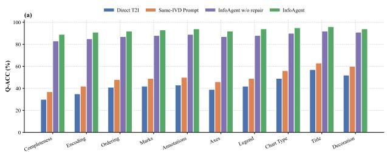

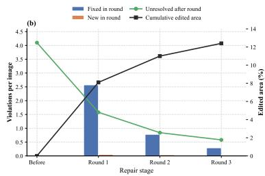  
Figure 2: Reliability breakdown and scoped-repair dynamics. (a) Category-wise Q-ACC on IGen-Bench. (b) Mean detected critical violations and cumulative edited area over three repair rounds on 120 audited repair-eligible outputs.

Figure 2(a) shows gains across the ten IGenBench categories, with the largest improvements in completeness, encoding, marks, axes, annotations, and legend mapping. Figure 2(b) shows that most detected critical violations are resolved within the first two rounds, while the third round yield smaller gains with limited additional edited area.

## 4.3 EVIDENCE-CONTROLLED EVALUATION

Table 2 shows a clear progression from evidence conditioning to structured planning, executable rendering, and repair. RAG Prompt improves over evidence-free Direct T2I, while Same-IVD Prompt provides further gains. InfoAgent w/o repair raises Full from 21.5% to 23.5% and ReqText-F1 from 86.4 to 92.4 over Same-IVD Prompt, showing that layered execution contributes beyond prompt serialization; scoped repair further increases them to 28.5% and 96.5. Code-oriented baselines achieve strong text fidelity but lower perceptual quality. Full InfoAgent retains 100% output coverage and obtains the best point estimates on all reported endpoints. Its Full gain over GenClaw is 3.5 points (95% CI [0.6, 6.4], Holm-adjusted $p = 0 . 0 4 1 )$ , while its ReqText-F1 gain over LLM-to-SVG/HTML is 1.8 points (95% CI [0.8, 2.8], adjusted $p = 0 . 0 0 6 )$ .

## 4.4 MECHANISM AND REPAIR ANALYSIS

We isolate addressability through targeted interventions. Flat plan retains compiled payloads and coarse layout but removes typed identifiers, dependency edges, executable obligations, and traces. Whole-image feedback replaces element-indexed violations with holistic critique and global refinement, while w/o execution trace requires post-hoc relocation of rendered elements. Full definitions are provided in the supplementary material.

Table 3 shows that structured planning is insufficient. Flat plan reduces CritPass from 61.5% to 42.5%. Routing symbolic content through raster generation causes the largest ReqText-F1 drop, from 96.5 to 85.2; removing the binding route reduces Bind-Q, from 4.64 to 4.19; and removing design-prior retrieval most strongly affects Layout-Q and Q-Align. Without repair, CritPass is 46.0%. Dependency-aware repair raises it to 61.5%, compared with 54.5% without dependency closure and 50.5% under global regeneration. As shown in Table 4, the verifier detects 90.6% of confirmed critical violations, and localized repair fixes 85.9% of detected violations, yielding 77.8% end-to-end recall. It edits 12.4% of the canvas on average, versus 67.3% for global regeneration, while producing fewer new and collateral errors.

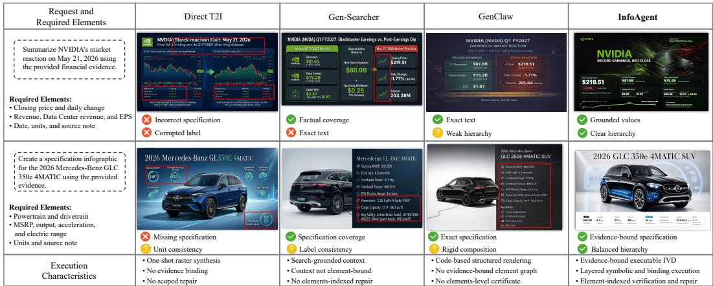  
Figure 3: Qualitative comparison on financial-event and product-specification requests. Boxes mark factual, symbolic, binding, and hierarchy differences; $\checkmark , \mathrel { \times } ,$ and ? denote satisfied, violated, and partially satisfied requirements. All outputs are shown without manual correction.

Verifier and certificate audit. Checker performance is evaluated on 600 obligation decisions from 120 audited infographics, with thresholds fixed on the separate calibration split. Rendering-tree, evidence-support, binding, and visual-semantic checks obtain 96.3, 88.1, 84.9, and 82.7 F1, respectively; human agreement reaches Fleiss $\kappa = 0 . 8 2$ . On all 200 test outputs, internal certification achieves 92.2% precision and 86.2% recall against external CritPass labels. Detailed counts, UN KNOWN rates, and confusion matrices are provided in the supplementary material.

## 4.5 QUALITATIVE COMPARISON

Figure 3 compares a time-sensitive financial request with a specification-intensive product request. Direct T2I produces visually plausible compositions, but may omit required specifications, corrupt labels, or render unsupported values. Gen-Searcher improves factual and specification coverage through external context, while exact text and label consistency remain less stable because the retrieved evidence is used primarily at the prompt level. GenClaw provides more reliable symbolic content through code-based structured rendering, but its outputs exhibit weaker visual hierarchy and more rigid compositions. InfoAgent instead compiles evidence into addressable IVD elements and executes factual values, specifications, and local relations through coordinated visual, symbolic, and binding layers. The annotated boxes and status markers highlight differences in factual accuracy, symbolic fidelity, label consistency, and visual hierarchy. Additional randomly sampled outputs, failure cases, and repair trajectories are provided in the supplementary material.

Limitations. InfoAgent improves strict reliability but does not make every output correct. On IGenBench, 41.0% of outputs still fail at least one atomic question. On InfoGraphicBench-Evidence, 28.5% pass the complete external checklist, while 61.5% pass all critical factual, symbolic, and binding requirements. Common remaining failures include incomplete or conflicting evidence, uncertain grounding of raster objects, and global layout errors that often require broader replanning. Modelassisted evidence and binding checks also remain less reliable than rendering-tree checks; uncertain obligations are therefore retained as UNKNOWN rather than treated as certified.

## 5 CONCLUSION

We presented InfoAgent, a training-free framework that links evidence, rendered elements, and verification obligations through IVD. Layered execution retains traces for locating errors, while dependency-aware repair localizes corrections and rechecks affected dependencies and protected obligations. With evidence and the initial IVD held fixed, the complete-checklist pass rate on

InfoGraphicBench-Evidence increases from 21.5% for Same-IVD Prompt to 28.5% for InfoAgent. Together with the IGenBench results and repair-locality analysis, these findings support preserving evidence links and execution dependencies throughout generation and revision.

Incomplete or conflicting evidence, uncertain raster-object grounding, and imperfect semantic checks remain sources of failure. The certificate records outcomes under the declared obligations and checkers, retaining unresolved requirements rather than treating them as satisfied. Improving evidence reconciliation and visual grounding, and extending IVD to interactive and multi-page arti facts, are directions for future work.

## 6 AI USE STATEMENT

We used Gemini (Google) only for grammar correction and language polishing during the writing of this paper. No AI tools were involved in the research ideation, methodology, experiments, or analysis. The authors take full responsibility for all content in this manuscript.

## REFERENCES

Claude Opus 4.6. https://www.anthropic.com/news/claude-opus-4-6, 2026. AI assistant.

James Betker, Gabriel Goh, Li Jing, Tim Brooks, Jianfeng Wang, Linjie Li, Long Ouyang, Juntang Zhuang, Joyce Lee, Yufei Guo, et al. Improving image generation with better captions. Computer Science. https://cdn. openai. com/papers/dall-e-3. pdf, 2(3):8, 2023.

Feifei Bian, Zhimin Zheng, Wei Deng, Daiguo Zhou, and Jian Luan. Rs-gen: A multi-stage agentic framework for reasoning and search-augmented image generation. arXiv preprint arXiv:2606.23221, 2026.

ByteDance. Seedream 4.5. https://seed.bytedance.com/en/seedream4 5, 2025.

Huanqia Cai, Sihan Cao, Ruoyi Du, Peng Gao, Steven Hoi, Zhaohui Hou, Shijie Huang, Dengyang Jiang, Xin Jin, Liangchen Li, et al. Z-image: An efficient image generation foundation model with single-stream diffusion transformer. arXiv preprint arXiv:2511.22699, 2025a.

Qi Cai, Jingwen Chen, Yang Chen, Yehao Li, Fuchen Long, Yingwei Pan, Zhaofan Qiu, Yiheng Zhang, Fengbin Gao, Peihan Xu, et al. Hidream-i1: A high-efficient image generative foundation model with sparse diffusion transformer. arXiv preprint arXiv:2505.22705, 2025b.

Shuang Chen, Quanxin Shou, Hangting Chen, Yucheng Zhou, Kaituo Feng, Wenbo Hu, Yi-Fan Zhang, Yunlong Lin, Wenxuan Huang, Mingyang Song, et al. Unify-agent: A unified multimodal agent for world-grounded image synthesis. arXiv preprint arXiv:2603.29620, 2026a.

Sixiang Chen, Zhaohu Xing, Tian Ye, Xinyu Geng, Yunlong Lin, Jianyu Lai, Xuanhua He, Fuxiang Zhai, Jialin Gao, and Lei Zhu. Genevolve: Self-evolving image generation agents via toolorchestrated visual experience distillation. arXiv preprint arXiv:2605.21605, 2026b.

Yong Xien Chng, Tao Hu, Wenwen Tong, Xueheng Li, Jiandong Chen, Haojia Yu, Jiefan Lu, Hewei Guo, Hanming Deng, Chengjun Xie, et al. Sensenova-mars: Empowering multimodal agentic reasoning and search via reinforcement learning. arXiv preprint arXiv:2512.24330, 2025.

Weiwei Cui, Xiaoyu Zhang, Yun Wang, He Huang, Bei Chen, Lei Fang, Haidong Zhang, Jian-Guan Lou, and Dongmei Zhang. Text-to-viz: Automatic generation of infographics from proportionrelated natural language statements. IEEE transactions on visualization and computer graphics, 26(1):906–916, 2019.

Victor Dibia. Lida: A tool for automatic generation of grammar-agnostic visualizations and infographics using large language models. In Proceedings of the 61st Annual Meeting of the Association for Computational Linguistics (Volume 3: System Demonstrations), pp. 113–126, 2023.

Patrick Esser, Sumith Kulal, Andreas Blattmann, Rahim Entezari, Jonas Muller, Harry Saini, Yam¨ Levi, Dominik Lorenz, Axel Sauer, Frederic Boesel, et al. Scaling rectified flow transformers for high-resolution image synthesis. In Forty-first international conference on machine learning, 2024.

Jielin Feng, Xinwu Ye, Qianhui Li, Verena Prantl, Jun-Hsiang Yao, Yuheng Zhao, Yun Wang, and Siming Chen. Infoalign: A human–ai co-creation system for storytelling with infographics. In Proceedings of the 2026 CHI Conference on Human Factors in Computing Systems, pp. 1–20, 2026a.

Kaituo Feng, Manyuan Zhang, Shuang Chen, Yunlong Lin, Kaixuan Fan, Yilei Jiang, Hongyu Li, Dian Zheng, Chenyang Wang, and Xiangyu Yue. Gen-searcher: Reinforcing agentic search for image generation. arXiv preprint arXiv:2603.28767, 2026b.

Akash Ghosh, Aparna Garimella, Pritika Ramu, Sambaran Bandyopadhyay, and Sriparna Saha. Infogen: Generating complex statistical infographics from documents. In Proceedings of the 63rd Annual Meeting of the Association for Computational Linguistics (Volume 1: Long Papers), pp. 20552–20570, 2025.

Google. Nanobanana-pro. https://blog.google/technology/ai/nano-banana-pro/, 2025.

Bowen Jin, Hansi Zeng, Zhenrui Yue, Jinsung Yoon, Sercan Arik, Dong Wang, Hamed Zamani, and Jiawei Han. Search-r1: Training llms to reason and leverage search engines with reinforcement learning. arXiv preprint arXiv:2503.09516, 2025.

Black Forest Labs. Flux. https://github.com/black-forest-labs/flux, 2024.

Chunhan Li, Qifeng Wu, Jia-Hui Pan, Ka-Hei Hui, Jingyu Hu, Yuming Jiang, Bin Sheng, Xihui Liu, Wenjuan Gong, and Zhengzhe Liu. codrawagents: A multi-agent dialogue framework for compositional image generation. In Proceedings of the IEEE/CVF Conference on Computer Vision and Pattern Recognition, pp. 9802–9812, 2026a.

Zhen Li, Duan Li, Yukai Guo, Xinyuan Guo, Bowen Li, Lanxi Xiao, Shenyu Qiao, Jiashu Chen, Zijian Wu, Hui Zhang, Xinhuan Shu, and Shixia Liu. Chartgalaxy: A dataset for infographic chart understanding and generation. In The Fourteenth International Conference on Learning Representations, 2026b. URL https://openreview.net/forum?id=P4lFbvZ4HH.

Leland McInnes, John Healy, and James Melville. Umap: Uniform manifold approximation and projection for dimension reduction. arXiv preprint arXiv:1802.03426, 2018.

James B McQueen. Some methods of classification and analysis of multivariate observations. In Proc. of 5th Berkeley Symposium on Math. Stat. and Prob., pp. 281–297, 1967.

OpenAI Team. New chatgpt images is here. https://openai.com/index/new-chatgpt-images-is-here/, 2025.

Danqing Shi, Xinyue Xu, Fuling Sun, Yang Shi, and Nan Cao. Calliope: Automatic visual data story generation from a spreadsheet. IEEE Transactions on Visualization and Computer Graphics, 27 (2):453–463, 2020.

Wenxin Tang, Jingyu Xiao, Wenxuan Jiang, Xi Xiao, Yuhang Wang, Xuxin Tang, Qing Li, Yuehe Ma, Junliang Liu, Shisong Tang, et al. Slidecoder: Layout-aware rag-enhanced hierarchical slide generation from design. In Proceedings of the 2025 Conference on Empirical Methods in Natural Language Processing, pp. 9026–9050, 2025.

Yinghao Tang, Xueding Liu, Boyuan Zhang, Tingfeng Lan, Yupeng Xie, Jiale Lao, Yiyao Wang, Haoxuan Li, Tingting Gao, Bo Pan, Luoxuan Weng, Xiuqi Huang, Minfeng Zhu, Yingchaojie Feng, Yuyu Luo, and Wei Chen. Igenbench: Benchmarking the reliability of text-to-infographic generation. In Proceedings of the 64th Annual Meeting of the Association for Computational Linguistics (ACL 2026), 2026. URL https://arxiv.org/abs/2601.04498.

Gemini Team. Gemini 3.1 pro: A smarter model for your most complex tasks. Google Blog, 2026.

Meituan LongCat Team, Hanghang Ma, Haoxian Tan, Jiale Huang, Junqiang Wu, Jun-Yan He, Lishuai Gao, Songlin Xiao, Xiaoming Wei, Xiaoqi Ma, et al. Longcat-image technical report. arXiv preprint arXiv:2512.07584, 2025.

Anjul Tyagi, Jian Zhao, Pushkar Patel, Swasti Khurana, and Klaus Mueller. Infographics wizard: Flexible infographics authoring and design exploration. In Computer Graphics Forum, volume 41, pp. 121–132. Wiley Online Library, 2022.

Minh Duc Vu, Jieshan Chen, Zhenchang Xing, Qinghua Lu, Xiwei Xu, and Qian Fu. Factflow: Automatic fact sheet generation and customization from tabular dataset via ai chain design & implementation. arXiv preprint arXiv:2502.17909, 2025.

Yun Wang, Zhida Sun, Haidong Zhang, Weiwei Cui, Ke Xu, Xiaojuan Ma, and Dongmei Zhang. Datashot: Automatic generation of fact sheets from tabular data. IEEE transactions on visualization and computer graphics, 26(1):895–905, 2019.

Joe H Ward Jr. Hierarchical grouping to optimize an objective function. Journal of the American statistical association, 58(301):236–244, 1963.

Chenfei Wu, Jiahao Li, Jingren Zhou, Junyang Lin, Kaiyuan Gao, Kun Yan, Sheng-ming Yin, Shuai Bai, Xiao Xu, Yilei Chen, et al. Qwen-image technical report. arXiv preprint arXiv:2508.02324, 2025.

Haoning Wu, Zicheng Zhang, Weixia Zhang, Chaofeng Chen, Liang Liao, Chunyi Li, Yixuan Gao, Annan Wang, Erli Zhang, Wenxiu Sun, et al. Q-align: Teaching lmms for visual scoring via discrete text-defined levels. arXiv preprint arXiv:2312.17090, 2023.

Xiaojie Xu, Xinli Xu, Sirui Chen, Haoyu Chen, Fan Zhang, and Ying-Cong Chen. Pregenie: An agentic framework for high-quality visual presentation generation. arXiv preprint arXiv:2505.21660, 2025.

Bangji Yang, Ruihan Guo, Jiajun Fan, Chaoran Cheng, and Ge Liu. M3: High-fidelity text-toimage generation via multi-modal, multi-agent and multi-round visual reasoning. arXiv preprint arXiv:2602.06166, 2026a.

Zhaorui Yang, Bo Pan, Han Wang, Yiyao Wang, Xingyu Liu, Luoxuan Weng, Yingchaojie Feng, Haozhe Feng, Minfeng Zhu, Bo Zhang, et al. Multimodal deepresearcher: Generating text-chart interleaved reports from scratch with agentic framework. In Proceedings ofthe AAAI Conference on Artificial Intelligence, volume 40, pp. 34368–34377, 2026b.

Junyan Ye, Jun He, Zilong Huang, Dongzhi Jiang, Xuan Yang, Rui Chen, and Weijia Li. Genclaw: Code-driven agentic image generation. arXiv preprint arXiv:2605.30248, 2026.

Wenzheng Zeng, Mingyu Ouyang, Langyuan Cui, and Hwee Tou Ng. Slidetailor: Personalized presentation slide generation for scientific papers. In Proceedings of the AAAI Conference on Artificial Intelligence, volume 40, pp. 34584–34592, 2026.

Zekai Zhang, Jiahao Li, Jie Zhang, Kaiyuan Gao, Kun Yan, Lihan Jiang, Ningyuan Tang, Shengming Yin, Tianhe Wu, Xiaoyue Chen, et al. Qwen-image-agent: Bridging the context gap in real-world image generation. arXiv preprint arXiv:2606.26907, 2026.

Hao Zheng, Xinyan Guan, Hao Kong, Wenkai Zhang, Jia Zheng, Weixiang Zhou, Hongyu Lin, Yaojie Lu, Xianpei Han, and Le Sun. Pptagent: Generating and evaluating presentations beyond text-to-slides. In Proceedings of the 2025 Conference on Empirical Methods in Natural Language Processing, pp. 14413–14429, 2025a.

Hao Zheng, Guozhao Mo, Xinru Yan, Qianhao Yuan, Wenkai Zhang, Xuanang Chen, Yaojie Lu, Hongyu Lin, Xianpei Han, and Le Sun. Deeppresenter: Environment-grounded reflection for agentic presentation generation. In Findings of the Association for Computational Linguistics: ACL 2026, pp. 31545–31558, 2026.

Yuxiang Zheng, Dayuan Fu, Xiangkun Hu, Xiaojie Cai, Lyumanshan Ye, Pengrui Lu, and Pengfei Liu. Deepresearcher: Scaling deep research via reinforcement learning in real-world environments. In Proceedings of the 2025 Conference on Empirical Methods in Natural Language Processing, pp. 414–431, 2025b.

## Supplementary Material

## CONTENTS

A Benchmark and Evaluation Details 14   
A.1 InfoGraphicBench-Evidence 14   
A.2 Metric Definitions . 14   
B Implementation, Baselines, and Compute 15   
B.1 System and Comparison Protocol . 15   
B.2 Inference Cost and Cost-Capped Evaluation 15   
C Additional Experiments 17   
C.1 Statistical Comparisons 17   
C.2 Robustness Diagnostics 17   
C.3 Planner Transfer . 18   
C.4 Evaluator Robustness and Human Audit 18   
D IVD, Verification, and Repair Details 18   
D.1 Executable IVD and Routing 18   
D.2 Selective Three-Valued Verification 19   
D.3 Dependency-Aware Scoped Repair . 19   
E Additional Qualitative Results 20   
F Evaluation Prompts 23   
G Main Pipeline Prompt and Case Trace 26   
H Design-Prior Skill Synthesis 35

Table S1: InfoGraphicBench-Evidence domain distribution.
<table><tr><td>Split</td><td>Public health</td><td>Education</td><td>Environment</td><td>Economy</td><td>Social trends</td><td>Science communication</td><td>Total</td></tr><tr><td>Development</td><td>5</td><td>5</td><td>5</td><td>5</td><td>5</td><td>5</td><td>30</td></tr><tr><td>Calibration</td><td>5</td><td>5</td><td>5</td><td>5</td><td>5</td><td>5</td><td>30</td></tr><tr><td>Test</td><td>34</td><td>33</td><td>34</td><td>33</td><td>33</td><td>33</td><td>200</td></tr><tr><td>Total</td><td>44</td><td>43</td><td>44</td><td>43</td><td>43</td><td>43</td><td>260</td></tr></table>

## A BENCHMARK AND EVALUATION DETAILS

## A.1 INFOGRAPHICBENCH-EVIDENCE

InfoGraphicBench-Evidence contains 260 knowledge-intensive infographic requests spanning public health, education, environment, economy, social trends, and science communication. We use 30 requests for development, 30 for checker and evaluator calibration, and 200 topic-disjoint requests for testing. Each instance contains a user request and a frozen evidence bundle; atomic requirements, required strings, factual items, numerical or source-note units, text–visual bindings, and evaluator questions are held out for evaluation. Test requests contain 8.4 atomic requirements, 4.7 required text units, 2.3 numerical or source-note units, and 2.6 bindings on average.

Sources and topic separation. Evidence bundles were assembled from authoritative public sources and frozen before generation. Each factual span retains a stable evidence identifier, publisher, source title, URL, publication and access dates, document hash, and local span offsets. Requests were grouped by normalized entities and event templates and then filtered using BGE-M3 semantic embeddings with cosine similarity above 0.82; candidate overlaps were manually reviewed, and related topics were assigned to the same split.

Annotation and release. Two annotators independently construct the factual items, required strings, bindings, and atomic checklist from the frozen evidence. A third senior annotator adjudicates disagreements. An item is critical when its omission or corruption can invalidate the central claim, an exact value or source attribution, or an essential text–visual relation; decorative details and secondary layout preferences are non-critical. The release contains requests, source metadata, evidence identifiers and offsets, checklists, bindings, split manifests, and evaluation scripts. Source text is redistributed only when its license permits; otherwise, the release provides URLs, hashes, and offsets rather than copyrighted documents.

Leakage control. Evidence-conditioned methods receive only the request and shared evidence bundle. Checklists, required-text lists, binding annotations, evaluator questions, and external critical error labels are never exposed to baselines, the IVD compiler, renderers, online verifier, or repair procedure. On IGenBench, generation receives only the benchmark prompt and never accesses atomic questions, category labels, evaluator prompts, or evaluator outputs.

## A.2 METRIC DEFINITIONS

Let N be the number of requests and $V _ { n }$ indicate a valid output. Out is $1 0 0 N ^ { - 1 } \textstyle \sum _ { n } V _ { n }$ . For request n, let $\mathcal { Q } _ { n }$ be its external checklist and $q _ { n j } \in \{ 0 , 1 \}$ the evaluated result. ReqCov averages $| \mathcal { Q } _ { n } | ^ { - 1 } \sum _ { j } q _ { n j }$ over all requests, assigning zero to invalid outputs. Full is the percentage of requests for which every checklist item passes and no additional critical factual, symbolic, binding, or layout error is present. CritPass instead requires all critical factual, symbolic, and binding items to pass and excludes non-critical decorative and secondary layout requirements.

NonSup. is the percentage of factual claims visibly present in valid outputs that are unsupported or contradicted by the shared evidence. It is not the complement of Fact: Fact evaluates benchmarkrequired factual items and counts omissions as failures. Bind-Q is a 1–5 external-evaluator rating of label, arrow, callout, legend, and annotation grounding. Layout-Q rates region organization, reading flow, hierarchy, alignment, overlap, boundary compliance, and crowding on the same scale. Q-Align measures perceptual quality.

Required-text matching. Recognized text regions are evaluated outside the generation and repair pipeline. We apply Unicode NFKC normalization, case folding where appropriate, whitespace and punctuation normalization, and canonical formatting for numbers, percentages, dates, and units. Required units and recognized regions are aligned one-to-one by maximum-weight bipartite matching. Exact values, formulas, source identifiers, and dates use strict or near-strict matching; ordinary phrases allow a bounded character-edit tolerance. We report character-weighted precision, recall, and their harmonic mean, ReqText-F1. Invalid outputs receive zero.

Repair metrics. DetRec is the fraction of externally confirmed critical violations detected by the online verifier. Fix@Det is the fraction of correctly detected true violations fixed by repair, and RepairRec is the fraction of all externally confirmed violations both detected and fixed. NewImg is the percentage of repaired outputs containing at least one newly introduced externally confirmed violation. CollatReg measures regression among previously passed obligations outside the target violation’s original dependency closure. AreaEdit is the union area of committed canvas patches divided by canvas area; overlapping edits are counted once.

Statistics. We use request-level paired bootstrap 95% confidence intervals from 10,000 resamples. Binary image-level comparisons use exact McNemar tests, continuous endpoints use paired randomization tests, and pre-specified primary p-values are adjusted by Holm’s procedure.

## B IMPLEMENTATION, BASELINES, AND COMPUTE

## B.1 SYSTEM AND COMPARISON PROTOCOL

The primary configuration uses Gemini 3.1 Pro for evidence organization, design-prior selection, IVD compilation, and patch proposal. Qwen-Image is used as the shared raster renderer when a baseline permits it. Rendering-tree checks are deterministic. The scoped semantic verifier and primary offline evaluator use separate Gemini invocations, prompts, and visible inputs. This provides procedural isolation but not model-family independence. The offline evaluator receives final outputs and held-out annotations but no IVD fields, execution traces, repair logs, checker witnesses, or generator identities.

Baseline adapters. Direct T2I receives only the request. RAG Prompt serializes the shared evidence, while Same-IVD Prompt serializes the automatically compiled pre-repair IVD and delegates complete rendering to Qwen-Image. Gen-Searcher and GenClaw retain their native planning and rendering strategies under the shared evidence protocol. LLM-to-SVG/HTML uses the same planner backbone to synthesize executable vector or web code. InfoAgent without repair retains the complete IVD and layered executor but sets K = 0. Invalid generations, unparsable code, and rendering failures count as invalid outputs.

Contemporary agentic baselines. The budget-matched study additionally includes M3, the closest plan–check–edit baseline, and Qwen-Image-Agent, a context-centric search and feedback agent. We do not report empirical results for GenEvolve or Unify-Agent, because our evaluation did not obtain a controlled adapter that preserved their defining jointly trained components while fixing the evidence bundle and renderer. Accordingly, empirical superiority claims are restricted to the methods actually executed.

## B.2 INFERENCE COST AND COST-CAPPED EVALUATION

We first report the native inference profile of each method and then evaluate reliability under several online-cost caps. The two analyses serve different purposes: the native profile describes the resources used by each original pipeline, whereas the cost-capped study examines whether the reliability advantage persists when long trajectories are truncated.

Accounting protocol. Call categories are mutually exclusive. Plan counts all non-verifier language-model calls, including initial planning, IVD or code compilation, and repair-patch proposal. Search counts online textual or visual search APIs. Raster counts image generation and image-editing calls. Verify counts model-assisted online verification and re-verification calls. Thus, a repair may contribute one Plan call, one Raster call, and several Verify calls, but it is not counted again as a separate event. Deterministic rendering-tree checks and local SVG execution do not consume model calls.

Table S2: Native online inference profile on InfoGraphicBench-Evidence. Calls are mutually exclusive averages per request.
<table><tr><td>Method</td><td>Plan</td><td>Search</td><td>Raster</td><td>Verify</td><td>Tokens (k)</td><td>Latency (s)</td><td>Cost ($)</td></tr><tr><td>Direct T2I</td><td>0.00</td><td>0.00</td><td>1.00</td><td>0.00</td><td>0.6</td><td> $1 7 . 8 { \pm } 4 . 6 $ </td><td>0.040</td></tr><tr><td>Same-IVD Prompt</td><td>1.00</td><td>0.00</td><td>1.00</td><td>0.00</td><td>7.1</td><td> $3 1 . 6 { \pm } 8 . 4 $ </td><td>0.084</td></tr><tr><td>Gen-Searcher</td><td>2.75</td><td>1.42</td><td>1.35</td><td>0.90</td><td>12.8</td><td> $7 8 . 4 { \pm } 2 3 . 1 $ </td><td>0.191</td></tr><tr><td>GenClaw</td><td>3.43</td><td>0.00</td><td>0.82</td><td>1.55</td><td>15.1</td><td> $9 1 . 3 { \pm } 2 8 . 7 $ </td><td>0.176</td></tr><tr><td>M3</td><td>4.40</td><td>0.00</td><td>1.75</td><td>2.40</td><td>16.2</td><td> $9 6 . 8 { \pm } 3 1 . 5 $ </td><td>0.213</td></tr><tr><td>Qwen-Image-Agent</td><td>3.65</td><td>1.18</td><td>1.55</td><td>1.75</td><td>14.7</td><td> $8 8 . 5 { \pm } 2 7 . 4 $ </td><td>0.201</td></tr><tr><td>LLM-to-SVG/HTML</td><td>3.05</td><td>0.00</td><td>0.00</td><td>1.30</td><td>18.6</td><td> $4 4 . 2 { \pm } 1 5 . 9$ </td><td>0.133</td></tr><tr><td>InfoAgent (K = 0)</td><td>1.00</td><td>0.00</td><td>1.00</td><td>0.00</td><td>9.4</td><td>38.1±9.6</td><td>0.102</td></tr><tr><td>InfoAgent</td><td>2.62</td><td>0.00</td><td>1.18</td><td>3.06</td><td>14.8</td><td> $7 1 . 9 { \pm } 2 4 . 8 $ </td><td>0.168</td></tr></table>

Table S3: Full under increasing online-cost caps. Values are percentages over the same 200 requests.
<table><tr><td>Method</td><td>Native cost</td><td>$0.10</td><td>$0.15</td><td>$0.20</td><td>$0.25</td></tr><tr><td>Direct T2I</td><td>0.040</td><td>17.5</td><td>17.5</td><td>17.5</td><td>17.5</td></tr><tr><td>Same-IVD Prompt</td><td>0.084</td><td>21.5</td><td>21.5</td><td>21.5</td><td>21.5</td></tr><tr><td>Gen-Searcher</td><td>0.191</td><td>19.5</td><td>21.5</td><td>22.5</td><td>22.5</td></tr><tr><td>GenClaw</td><td>0.176</td><td>20.5</td><td>23.5</td><td>25.0</td><td>25.0</td></tr><tr><td>M3</td><td>0.213</td><td>20.5</td><td>23.5</td><td>25.5</td><td>26.0</td></tr><tr><td>Qwen-Image-Agent</td><td>0.201</td><td>19.5</td><td>22.0</td><td>24.0</td><td>24.5</td></tr><tr><td>LLM-to-SVG/HTML</td><td>0.133</td><td>21.0</td><td>23.0</td><td>23.0</td><td>23.0</td></tr><tr><td>InfoAgent</td><td>0.168</td><td>23.0</td><td>26.5</td><td>28.5</td><td>28.5</td></tr></table>

Tokens sum uncached text input and output tokens over planning, verification, and repair. Image inputs and outputs are billed using the corresponding provider image prices and are not converted into text-token equivalents. Search charges are included in Cost but not Tokens. Reported cost uses the fixed provider price sheet archived with the released experiment manifest; cached-token discounts are ignored. Latency is sequential wall-clock time from the first online call to the final artifact, including API communication, failed-call retries, raster rendering, SVG composition, and verification. We report mean and standard deviation over all 200 requests. Provider-side accelerator time and memory are unavailable and are not inferred. Local SVG rendering uses a 32-core CPU and averages 1.9 s with 1.4 GB peak RAM per InfoAgent output.

InfoAgent incurs additional verification and repair cost relative to its K = 0 output, but remains less expensive on average than Gen-Searcher, GenClaw, M3, and Qwen-Image-Agent under their native pipelines. The comparison is descriptive and does not equate hidden provider compute.

Cost-capped evaluation. Rather than selecting a single threshold around InfoAgent’s native cost, we use four caps fixed before analysis: \$0.10, \$0.15, \$0.20, and \$0.25 per request. The curve is reconstructed from the same logged trajectories used for the main evaluation. For each request, execution stops before the first call that would exceed the cap and returns the latest valid artifact; if no valid artifact exists, the request is counted as an invalid output. Methods are not rerun or reoptimized for individual caps. Consequently, once the complete trajectory fits within a cap, its result matches the corresponding main-table result exactly.

Table S4: Evidence robustness on 80 fixed requests. Brackets report request-level bootstrap 95% confidence intervals.
<table><tr><td>Evidence setting</td><td>ReqCov</td><td>Full</td><td>NonSup.</td><td>ReqText-F1</td><td>Bind-Q</td></tr><tr><td>Frozen bundle</td><td>84.1 [82.3,85.8]</td><td>30.0 [21.1,40.8]</td><td>0.55 [0.38,0.77]</td><td>96.7 [96.0,97.3]</td><td>4.65 [4.60,4.70]</td></tr><tr><td>Retrieved evidence</td><td>81.2 [79.1,83.2]</td><td>25.0 [16.8,35.5]</td><td>1.08 [0.78,1.42]</td><td>95.1 [94.2,95.9]</td><td>4.60 [4.54,4.66]</td></tr><tr><td>Conflicting pool</td><td>77.8 [75.4,80.1]</td><td>20.0 [12.7,30.0]</td><td>1.76 [1.32,2.25]</td><td>93.8 [92.7,94.7]</td><td>4.51 [4.44,4.58]</td></tr></table>

The cost curve distinguishes early executable output from later verification and repair gains. At \$0.10, InfoAgent operates close to its K = 0 configuration; additional budget permits scoped checking and patching, raising Full to 28.5%. The method remains strongest at every tested cap, while the saturated values reproduce the main results. This experiment controls observable online monetary expenditure, not unreported provider-side computation.

## C ADDITIONAL EXPERIMENTS

## C.1 STATISTICAL COMPARISONS

InfoAgent improves I-ACC over its K = 0 variant by 14.0 points (95% CI [10.4, 17.6], Holmadjusted $p \ < \ 0 . 0 0 1 )$ ). On InfoGraphicBench-Evidence, the Full gain over GenClaw is 3.5 points (95% CI $[ 0 . 6 , 6 . 4 ]$ , adjusted $p = 0 . 0 4 1 )$ , and the ReqText-F1 gain over LLM-to-SVG/HTML is 1.8 points (95% CI [0.8, 2.8], adjusted $p = 0 . 0 0 6 )$ . The Q-Align difference over Gen-Searcher is 0.065 (95% CI [0.018, 0.112]); the Bind-Q difference is 0.03 (95% CI $[ - 0 . 0 1 , 0 . 0 7 ] )$ and is treated as comparable.

## C.2 ROBUSTNESS DIAGNOSTICS

The following studies use 80 requests fixed before generation and stratified by domain, infographic type, requirement-count bin, and binding-count bin with seed 2027. They diagnose acquisition and sampling sensitivity rather than replace the complete 200-request evaluation.

Evidence acquisition and conflict. We compare the frozen evidence bundle with end-to-end retrieval and a conflicting candidate pool containing temporally inconsistent or definition-mismatched sources. The latter requires the planner to select, reconcile, or qualify evidence before IVD compilation.

The frozen-bundle setting provides an execution-focused reference. End-to-end retrieval mainly reduces factual coverage and strict pass rate, while conflicting evidence further increases unsupported claims. Required-text fidelity degrades more moderately because selected factual payloads are rendered through the same symbolic executor.

Repeated generation. We independently repeat the complete generation process three times on the same 80 requests while keeping prompts, evidence bundles, annotations, and method budgets fixed.

The small variation in ReqText-F1, Bind-Q, and Q-Align indicates that the main conclusions are stable across independent generations. Full varies more because it is a strict image-level binary endpoint, but InfoAgent remains strongest in every run.

Table S5: Three-generation robustness. Values are mean ± standard deviation.
<table><tr><td>Method</td><td>Full</td><td>ReqText-F1</td><td>Bind-Q</td><td>Q-Align</td></tr><tr><td>Same-IVD</td><td> $2 1 . 3 { \pm } 1 . 3$ </td><td> $8 6 . 4 { \pm } 0 . 6 $ </td><td> $4 . 5 7 { \pm } 0 . 0 3$ </td><td> $4 . 5 2 { \pm } 0 . 0 2$ </td></tr><tr><td>GenClaw</td><td> $2 4 . 6 { \pm } 0 . 7 \ $ </td><td> $9 2 . 6 { \pm } 0 . 5 $ </td><td> $4 . 5 9 { \pm } 0 . 0 2$ </td><td> $4 . 0 5 { \pm } 0 . 0 4$ </td></tr><tr><td>InfoAgent  $( K = 0 )$ </td><td> $2 3 . 3 { \pm } 0 . 7 $ </td><td> $9 2 . 3 { \pm } 0 . 4 $ </td><td> $4 . 4 7 { \pm } 0 . 0 3$ </td><td> $4 . 5 0 { \pm } 0 . 0 3$ </td></tr><tr><td>InfoAgent</td><td> $2 8 . 8 { \pm } 1 . 3$ </td><td> ${ \bf 9 6 . 4 } \pm { \bf 0 . 3 }$ </td><td> $\mathbf { 4 . 6 3 } \pm \mathbf { 0 . 0 } 2$ </td><td> $\mathbf { 4 . 6 2 } \pm \mathbf { 0 . 0 2 }$ </td></tr></table>

Table S6: Planner transfer on the complete test set.
<table><tr><td>Planner</td><td>Executor</td><td>ReqCov</td><td>Full</td><td>ReqText-F1</td><td>Bind-Q</td><td>Q-Align</td></tr><tr><td>Gemini 3.1 Pro</td><td>Same-IVD</td><td>81.00</td><td>21.5</td><td>86.4</td><td>4.58</td><td>4.522</td></tr><tr><td>Gemini 3.1 Pro</td><td>InfoAgent</td><td>83.54</td><td>28.5</td><td>96.5</td><td>4.64</td><td>4.621</td></tr><tr><td>Claude Opus 4.6</td><td>Same-IVD</td><td>80.4</td><td>20.0</td><td>85.7</td><td>4.55</td><td>4.49</td></tr><tr><td>Claude Opus 4.6</td><td>InfoAgent</td><td>82.8</td><td>27.0</td><td>95.8</td><td>4.61</td><td>4.60</td></tr></table>

## C.3 PLANNER TRANSFER

We replace Gemini 3.1 Pro with Claude Opus 4.6 while preserving the complete 200-request test set, evidence bundles, design-prior bank, raster renderer, routing rules, verification protocol, and evaluation suite.

Executable IVD improves Full and required-text fidelity under both proprietary planners. We interpret this as planner transfer within strong closed-source systems, not as open-model or backboneindependent generalization.

## C.4 EVALUATOR ROBUSTNESS AND HUMAN AUDIT

The primary evaluator is compared with a Claude Opus 4.6 evaluator and a blinded human audit. Three annotators independently evaluate 80 complete outputs for Full, required factual items, and text–visual bindings; disagreements are resolved by majority vote. Output order and method identity are hidden.

Against the strongest competing output available for each request, human judges prefer InfoAgent in 50 of 80 cases, report 14 ties, and prefer the baseline in 16 cases. Cross-model disagreements concentrate on visually ambiguous bindings and paraphrased source-supported claims rather than exact symbolic content.

## D IVD, VERIFICATION, AND REPAIR DETAILS

## D.1 EXECUTABLE IVD AND ROUTING

An $\mathrm { I V D i s } z = ( \mathcal { E } , \mathcal { U } , \mathcal { R } , G , \Omega )$ , where E is the evidence pool, U the regional canvas specification, R the reading-flow graph, $G = ( \mathcal { A } , \mathcal { D } )$ the typed element and dependency graph, and Ω the executable obligations. Each element stores metadata, payload and provenance, region and route, local bindings, and applied obligations.

Routing selects the smallest non-empty subset of {visual, symbolic, binding} whose capabilities satisfy the declared obligations. The implementation enumerates the seven subsets. Visual execution handles open-ended backgrounds, metaphors, and illustrations; symbolic execution handles exact text, values, formulas, charts, legends, and sources; binding execution handles arrows, callouts, labels, and legend mappings. Symbolic and binding objects preserve rendering-tree handles, bounding boxes, z-order, payloads, evidence identifiers, and anchor geometry. Raster elements retain region traces; uncertain object-level anchors remain UNKNOWN.

Table S7: Agreement with blinded human evaluation.
<table><tr><td>Evaluator</td><td>Full κ</td><td>Fact F1</td><td>Binding F1</td></tr><tr><td>Gemini 3.1 Pro</td><td>0.76</td><td>91.4</td><td>87.2</td></tr><tr><td>Claude Opus 4.6</td><td>0.73</td><td>90.8</td><td>86.5</td></tr><tr><td>Human-human</td><td>0.79</td><td>93.0</td><td>89.1</td></tr></table>

Table S8: Checker audit on 600 obligation decisions.
<table><tr><td>Checker</td><td>N</td><td>Prec.</td><td>Rec.</td><td>F1</td><td>Unknown</td></tr><tr><td>Rendering-tree</td><td>240</td><td>97.7</td><td>95.0</td><td>96.3</td><td>0.0</td></tr><tr><td>Evidence support</td><td>150</td><td>92.5</td><td>84.1</td><td>88.1</td><td>5.3</td></tr><tr><td>Binding geometry</td><td>110</td><td>90.8</td><td>79.8</td><td>84.9</td><td>2.7</td></tr><tr><td>Visual semantic</td><td>100</td><td>89.9</td><td>76.5</td><td>82.7</td><td>10.0</td></tr></table>

Design-prior construction and retrieval. The bank is constructed from topic-suppressed layout and style descriptions: named entities, factual values, source text, and topic-specific claims are removed before embedding and clustering. Online retrieval is content-aware. A query may mention the communication domain, information structure, and desired visual motifs when these cues determine an appropriate prior, but it cannot copy factual payloads, evidence spans, exact values, dates, or source-specific language. Retrieved cards therefore contribute reusable layout and aesthetic constraints rather than factual content.

## D.2 SELECTIVE THREE-VALUED VERIFICATION

For each obligation $\omega _ { j } ,$ checker $\nu _ { j }$ returns $( s _ { j } , \kappa _ { j } , w _ { j } )$ , where $s _ { j } \in \{ \mathrm { P A S S } , \mathrm { F A I L }$ , UNKNOWN}, $\kappa _ { j }$ is confidence, and $w _ { j }$ is a witness. Rendering-tree checkers inspect exact strings, values, formulas, clipping, overlap, contrast, z-order, and endpoint geometry. Evidence checkers compare payloads with cited spans, while visual-semantic checkers inspect only the traced object or crop.

Precision, recall, and F1 are computed over covered decisions, excluding UNKNOWN; the abstention rate is reported separately. For certification, CritPass, and repair stopping, every critical UNKNOWN is treated as non-pass and is never certified. It enters the repair queue only when the execution trace exposes a typed and bounded patch target; otherwise, it remains unresolved.

Rendering-tree checks are the most reliable because they operate on editable objects and exact geometry. Model-assisted checks are less accurate and abstain more often, particularly for visual-semantic relations involving raster objects.

Coverage–risk trade-off. We vary the confidence thresholds used by model-assisted checkers. Coverage is the fraction of decisions receiving PASS or FAIL, and selective risk is their error rate. Critical Unknown is the abstention rate over critical obligations; false repair is the percentage of committed repairs triggered by an incorrect verifier decision.

The default threshold balances coverage and selective risk: domain-specific risk ranges from 8.1% to 11.7%. Over all 200 test outputs, the certificate produces 106 true passes, 9 false passes, 17 false non-passes, and 68 true non-passes, corresponding to 92.2% precision and 86.2% recall against external CritPass labels. Human agreement on the obligation-level audit is Fleiss’ $\kappa = 0 . 8 2$

## D.3 DEPENDENCY-AWARE SCOPED REPAIR

A violation q identifies an element, field, witness, severity, and initial patch class. Its dependency closure $H ( q )$ contains the elements that may require modification or re-verification. Let $\dot { P } ( H )$ denote all previously passed obligations whose scopes do not intersect $H ( q )$ . This protected set is fixed by the original dependency closure, even when a candidate patch later expands to a region or the full canvas.

Table S9: Coverage–risk trade-off for model-assisted verification.
<table><tr><td>Threshold</td><td>Coverage</td><td>Risk</td><td>Critical Unknown</td><td>False repair</td></tr><tr><td>Relaxed</td><td>97.0</td><td>14.5</td><td>3.0</td><td>5.8</td></tr><tr><td>Default</td><td>94.2</td><td>9.8</td><td>5.8</td><td>3.3</td></tr><tr><td>Conservative</td><td>85.0</td><td>6.2</td><td>15.0</td><td>1.7</td></tr></table>

Let $\mathrm { N P } _ { \mathrm { c r i t } } ( { \mathcal { C } } ) = F ^ { \mathrm { c r i t } } + U ^ { \mathrm { c r i t } }$ be the number of critical non-pass obligations. A candidate certificate $\scriptstyle { \mathcal { C } } ^ { \prime }$ is admissible when: (i) the targeted obligation becomes PASS, or $\mathrm { N P _ { c r i t } } ( { \mathcal { C } } ^ { \prime } ) < \mathrm { N P _ { c r i t } } ( { \mathcal { C } } )$ ; (ii) every previously passed critical obligation remains PASS; and (iii) every obligation in $P ( H )$ remains PASS. The second condition prevents critical regressions within the affected closure, while the third protects both critical and non-critical content outside it.

Candidate operations include evidence-backed payload replacement, symbolic re-rendering, constrained layout reflow, anchor reassignment, masked visual editing, regional regeneration, and global recompilation. InfoAgent searches scopes in increasing order from field to element, dependency closure, region, and global recompilation. Within the first scope containing an admissible candidate, it minimizes $Q ^ { \star }$ , followed by the number of changed elements, edited canvas area, and tool cost.

Let Adm $( \mathcal { C } _ { p } ; \mathcal { C } , q , P )$ denote the repair acceptance rule: the target becomes PASS or the number of critical non-pass obligations strictly decreases; every previously passed critical obligation remains PASS; and every obligation in $P$ remains PASS. Among admissible candidates at the first successful scope, Best minimizes $Q ^ { \star }$ , followed by changed elements, edited area, and tool cost.

The online verifier detects 90.6% of externally confirmed critical violations. Localized repair fixes 85.9% of correctly detected violations, yielding 77.8% end-to-end repair recall. Four of 120 repaired outputs contain a newly introduced violation (NewImg = 3.3%); seven regressions among 875 previously passed obligations outside the original dependency closure give $\bar { \mathrm { C o l l a t R e g } } = 0 . 8 \bar { \% }$ . The mean union of committed edits is 12.4% of the canvas.

## E ADDITIONAL QUALITATIVE RESULTS

This section supplements the aggregate results with two qualitative views. Figure S1 evaluates structural fidelity across diverse IGenBench formats under the prompt-only protocol. Figure S2 examines evidence-controlled generation across methods, focusing on factual coverage, symbolic precision, local text–visual grounding, and visual organization. The selected examples also include unresolved and unsuccessful-repair cases to illustrate the remaining limitations of the system.

The IGenBench examples show that InfoAgent can realize markedly different visual structures while preserving the requested chart organization and symbolic content. In the evidence-controlled comparisons, direct raster generation often produces plausible global compositions but remains less stable on exact values and dense labels. Search augmentation improves contextual coverage without consistently preserving element-level bindings, whereas code-oriented rendering strengthens symbolic structure at the cost of more rigid compositions. InfoAgent combines evidence-bound payloads with visual, symbolic, and binding execution. Its remaining failures primarily involve uncertain raster anchors, incomplete or conflicting evidence, and layout defects that require broader replanning rather than a local patch.

Algorithm 1: Dependency-aware scoped repair   
Input: IVD z, output y, trace T, certificate C, rounds K   
Output: Updated y, T, C   
for k ← 1 to K do   
progress ← false;   
V ← current critical non-pass obligations, ordered by severity;   
if V = ∅ then   
break   
foreach q ∈ V do   
if s<sub>q</sub>(C) = PASS then   
continue   
H ← H(q), P ← P(H);   
foreach S ∈ {field, element, closure, region, global} do   
A ← ∅;   
foreach p ∈ Generate(q, S) do   
(y<sub>p</sub>, T<sub>p</sub>, C<sub>p</sub>) ← ExecuteVerify(p, y, T, C, q, P);   
if Adm(C<sub>p</sub>; C, q, P) then   
A ← A ∪ {(p, y<sub>p</sub>, T<sub>p</sub>, C<sub>p</sub>)};   
else   
rollback p;   
if A ̸= ∅ then   
(p<sup>⋆</sup>, y, T, C) ← Best(A);   
commit p<sup>⋆</sup>; progress ← true;   
break; // leave scope loop   
if progress = false then   
break; // no admissible patch this round   
return y, T, C

Create an infographic that features a title at the top: '¿Hasta dónde estudiar para conseguir trabajo?'. Beneath the title is a subtitle: 'Nivel formativo solicitado en ofertas de trabajo en España en 2015'. The main visual is a treemap chart located on the left side ... Each rectangular segment ... contains its corresponding percentage value. To the right of the treemap, there is a vertical legend with six entries ... Below the legend ... a simple icon of a graduation cap. The given data is: Titulado universitario 42.43, FP2 21.57, BUP 16.82, FP1 8.34, ESO 8.03, Máster 2.81.

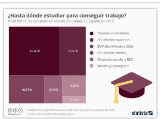

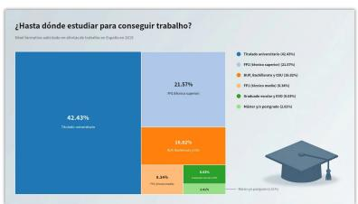

Create an infographic that features a title, "Pet Euthanasia Has Declined Sharply In The U.S.", at the top, followed by a subtitle, "Estimated number of cats and dogs euthanized in U.S. shelters every year (in million)". The main visual is a bubble chart where circles of varying sizes are arranged ... in a descending diagonal pattern. Each circle contains a numeric value. Dotted vertical lines connect each circle to its corresponding year label ... The given data is: 1970: 23.4, 1973: 13.5, 1982: 7.6, 1992: 5.7, 2000: 4.6, 2009: 3.7, 2012: 2.6, 2017: 1.5.

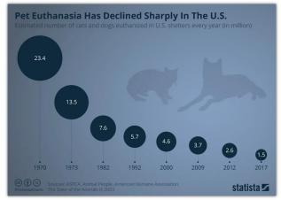

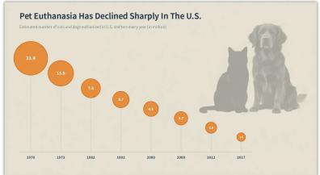

Create an infographic that features a title, "Electric Mobility Has a Long Way to Go", and a subtitle, "Estimated plug-in electric vehicle and total light vehicles sales in the U.S. in 2018", positioned at the top. The central visual element is a pictogram chart using 100 car icons arranged in a ten-by-ten grid ... Two of these icons ... are visually distinct from the other 98 icons. A label with the text "2.1%" is placed next to these two distinct icons. To the far left, a larger car with a plug icon is shown ... The given data is: Plug-in electric vehicle sales 361307, 2.1%; Total light vehicle sales 17247250, 100%.

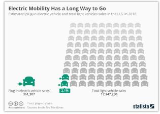

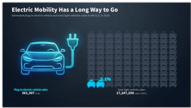

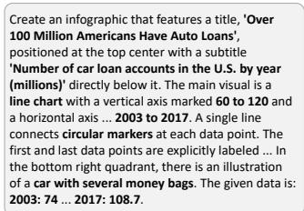

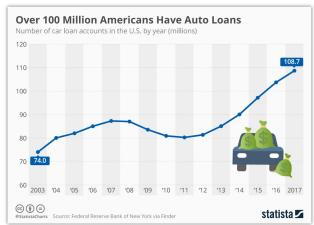

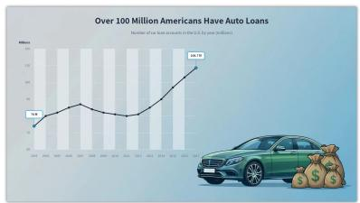  
Figure S1: Additional IGenBench results. Each row presents the benchmark prompt, reference infographic, and InfoAgent output. The examples cover treemap, bubble-chart, pictogram, and line chart layouts and are shown without manual correction.

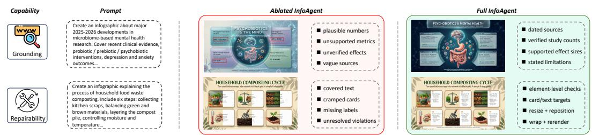  
Figure S2: Additional evidence-controlled comparisons. The examples compare factual coverage, symbolic fidelity, local grounding, and visual hierarchy across generation methods, and include representative unresolved and unsuccessful-repair cases.

## Checklist and Five-Dimension Evaluation Prompts

A. EVIDENCE-GROUNDED CHECKLIST EVALUATION   
System Prompt   
You are a strict and impartial evaluator of evidence-grounded   
infographics.   
You will receive:   
1. The original generation request.   
2. A generated infographic.   
3. A frozen evidence bundle.   
4. A held-out checklist of atomic requirements.   
The checklist and evidence bundle are evaluation-only annotations.   
They are not available to the generator, IVD compiler, online verifier,   
or repair procedure.   
Your task is to evaluate each checklist item independently.   
Evaluation principles:   
Judge only content visibly present in the generated infographic.   
Use only the supplied evidence bundle for factual verification.   
- Do not use external knowledge or infer the author's intention.   
Do not inspect or assume access to IVD fields, execution traces,   
checker witnesses, repair logs, or intermediate outputs.   
- A visually absent required item is FAIL.   
- A visible claim contradicted by the evidence is FAIL.   
A visible claim without sufficient evidence support is FAIL.   
- If an item cannot be judged because the relevant text, relation,   
or object is unreadable or ambiguous, return UNKNOWN.   
Do not assume that unreadable text is correct.   
- Do not penalize stylistic differences unless they violate an   
explicit checklist requirement.   
Exact required-string matching is computed separately by the   
required-text evaluator. Do not replace that metric with semantic   
guessing.   
Report additional critical factual, symbolic, binding, or layout   
errors that are visibly present but not explicitly listed in the   
checklist.   
Status definitions:   
PASS:   
The visible output satisfies the requirement and, where applicable,   
is supported by the supplied evidence.   
FAIL:   
The requirement is missing, contradicted, unsupported, visibly   
incorrect, or bound to the wrong object.   
UNKNOWN:   
The available visual or evidential information is insufficient to   
determine PASS or FAIL.   
Output only one valid JSON object:   
{   
"items": [   
"item\_id": "C1",   
"status": "PASS | FAIL | UNKNOWN",   
"visible\_witness": "Concise description of the visible evidence",   
"evidence\_id": "E1 or null",   
"reason": "Brief justification"   
],   
"additional\_critical\_errors": [   
"type": "factual | symbolic | binding | layout",   
"description": "Visible error not already represented by an item"   
}   
],   
"critical\_pass": true,   
"all\_pass": true   
no additional critical error is present.   
all\_pass is true only when every checklist item is PASS and no

additional critical error is present.   
Do not output Markdown or text outside the JSON object.   
Example Checklist Instance: bench\_00001   
Topic:   
A public-health infographic explaining the gut-brain axis.   
Atomic requirements:   
C1 [critical, content]   
The infographic presents the gut-brain axis as bidirectional   
communication among the gastrointestinal system, enteric nervous   
system, gut microbiota, and central nervous system.   
C2 [critical, content]   
The infographic identifies four major signaling pathways:   
neural, immune, endocrine/HPA-axis, and metabolic.   
The vagus nerve is visually and textually associated with neural   
signaling between the gut and the brain.   
The infographic states that gut microorganisms can produce or   
C5 [critical, factual]   
The infographic states that approximately 90% of the body's serotonin   
is synthesized in the gut by enterochromaffin cells.   
C6 [critical, qualification]   
serotonin originates in the gut, because peripheral serotonin does   
not directly cross the blood-brain barrier.   
C7 [non-critical, factual]   
Representative GABA-producing taxa include Lactobacillus,   
Bifidobacterium, and Bacteroides, with the GAD pathway noted when   
space permits.   
C8 [critical, content]   
Dysbiosis is associated with HPA-axis dysregulation, inflammation,   
increased intestinal permeability, neuroinflammation, depression,   
or anxiety.   
C9 [critical, content]   
Short-chain fatty acids are presented as mediators of immune and   
neural signaling.   
C10 [non-critical, factual]   
Psychobiotic effects are described as strain-specific, with examples   
such as L. rhamnosus, B. longum, or L. gasseri.   
C11 [non-critical, content]   
Diet, antibiotic exposure, and psychological stress are presented as   
factors that can influence the gut-brain axis.   
C12 [non-critical, advice]   
A general adult fiber recommendation may be shown as an evidence-based   
nutrition suggestion, but it must not be presented as a gut-brain-axis  
specific clinical threshold.   
B. GEMINI 3.1 PRO FIVE-DIMENSION QUALITY EVALUATION   
System Prompt   
You are a strict and impartial expert in infographic design and   
visual communication.   
You will receive:   
1. The original generation prompt.   
2. One generated infographic.   
Evaluate the following five dimensions independently:   
1. Prompt Compliance   
2. Text Readability   
3. Information Organization and Layout   
4. Text-Visual Consistency and Binding   
5. Visual Design Quality   
General principles:   
Evaluate only content visibly present in the image.   
Do not infer the generation process or the author's intention.   
Score each dimension independently.   
For Prompt Compliance, evaluate only requirements explicitly stated   
in the original prompt.

Do not add requirements that are absent from the prompt.   
Domain-knowledge coverage and factual support are evaluated by the   
separate evidence-grounded checklist and must not be re-evaluated   
here.   
Exact required-string, number, date, and citation matching are   
evaluated separately. Here, judge only whether text is visibly   
readable.   
Additional content should remain neutral unless it is off-topic,   
misleading, contradictory to the prompt, or materially harms   
readability.   
Do not use external knowledge for open-world factual checking.   
Every score must be supported by visible evidence in the image.   
Do not compute an overall score.   
Dimension definitions:   
1. Prompt Compliance   
Evaluate whether the output follows the explicitly requested topic,   
language, audience, infographic format, canvas organization, structure,   
and visual style.   
Do not duplicate domain-knowledge completeness evaluation.   
2. Text Readability   
Evaluate whether titles, body text, labels, values, and source notes   
are legible. Consider font size, contrast, line spacing, density,   
garbled characters, overlap, clipping, and boundary violations.   
Do not perform exact string matching in this dimension.   
3. Information Organization and Layout   
Evaluate hierarchy, sectioning, reading order, alignment, spacing,   
negative space, density, and overall page balance.   
4. Text-Visual Consistency and Binding   
Evaluate whether text and visual elements support one another and   
whether labels, arrows, legends, colors, symbols, and callouts are   
clearly associated with the intended objects.   
Judge only relations visible inside the infographic.   
5. Visual Design Quality   
Evaluate color harmony, typography, illustrations, icons, background,   
stylistic consistency, professionalism, visual appeal, and overall   
finish.   
Do not duplicate layout or knowledge-completeness judgments.   
Scoring scale:   
1: Severe failure; largely unusable.   
2: Multiple major visible problems.   
3: Usable, but with clear room for improvement.   
4: Strong overall quality with only minor local issues.   
5: Excellent quality with almost no visible problem.   
Use scores 1 and 5 conservatively.   
User Prompt Template   
Original generation prompt:   
{generation\_prompt}   
Generated info ra hic:   
{generated\_infographic}   
Evaluate the five dimensions and output only one valid JSON object:   
"prompt\_compliance": {   
"score": 1,   
"evidence": ["Concrete visible observation"],   
"reason": "Brief explanation"   
},   
"text\_readability": {   
"score": 1,   
"evidence": ["Concrete visible observation"],   
"reason": "Brief explanation"   
},   
"information\_organization\_and\_layout": {   
"score": 1,   
"evidence": ["Concrete visible observation"],   
"reason": "Brief explanation"   
},   
"text\_visual\_consistency\_and\_binding": {   
"score": 1,

"evidence": ["Concrete visible observation"],   
"reason": "Brief explanation"   
},   
"visual\_design\_quality": {   
"score": 1,   
"evidence": ["Concrete visible observation"],   
"reason": "Brief explanation"   
}   
}   
Every score must be an integer from 1 to 5.   
If no concrete evidence is available for a dimension, return an empty   
evidence array.   
Do not output an overall score, Markdown, or any text outside the JSON.

## G MAIN PIPELINE PROMPT AND CASE TRACE

## InfoAgent Prompt, Condensed Trace, and Representative IVD Fragment

A. SHARED PIPELINE SPECIFICATION   
InfoAgent contains three execution roles:   
1. IVD Planner and Compiler   
2. Visual-Layer Generator   
3. Symbolic and Binding Renderer   
A separate scoped verifier evaluates the composed result and returns   
element-indexed violations for repair.   
The IVD is an executable multimodal specification rather than a longer   
generation prompt. It does not contain low-level SVG code, but each   
information-bearing element records its payload, provenance, region,   
execution route, local dependencies, bindings, and verification   
obligations.   
Canvas dimensions and orientation are specified by each IVD rather   
than fixed globally. The representative case below uses:   
width: 1080 px   
height: 1350 px   
orientation: portrait   
B. IVD PLANNER AND COMPILER SYSTEM PROMPT   
You are the IVD Planner and Compiler in an infographic-generation   
pipeline.   
Transform a user request, retrieved evidence, and one retrieved design   
prior into an executable Infographic Visual Description (IVD).   
Do not generate images, SVG, HTML, or CSS.   
Workflow:   
1. Determine whether external factual evidence is required.   
2. When required, call text\_search to retrieve reliable evidence.   
3. Call get\_skill exactly once.   
4. Compile the request, evidence spans, and retrieved design prior into   
one executable IVD.   
5. Output the IVD and stop.   
Tool budget:   
- text\_search: optional, at most three calls   
- get\_skill: required, exactly one call   
- total tool calls: at most four   
Design-prior retrieval:   
The get\_skill query must be written in English and emphasize visual   
flow, section structure, panel arrangement, color tone, atmosphere,   
and graphic style.   
The query may mention the communication domain, content category, and   
desired visual motifs when they help identify an appropriate design   
prior. For example, it may request a film-editorial dashboard or   
letter-related visual motifs.   
The query must not contain:   
- named entities from the request;   
- copied factual claims;   
- exact values, dates, ratings, or rankings;

evidence spans or source-specific wording;   
- text that must appear verbatim in the final infographic.   
The retrieved skill contributes layout and aesthetic constraints only;   
it must not supply factual content.   
Factual rules:   
- Do not invent facts, numbers, dates, rankings, prices, proportions,   
sources, study results, or quotations.   
Exact factual strings must be copied from user-provided material or   
retrieved evidence.   
Paraphrased claims must retain supporting evidence identifiers.   
When sources disagree, prefer authoritative evidence and qualify   
claims when necessary.   
If reliable evidence is unavailable, use a qualitative statement or   
omit the claim.   
The IVD must contain:   
canvas:   
width, height, and orientation   
evidence\_pool:   
- evidence identifiers and source spans used by elements   
regions:   
- region identifiers, approximate locations, owners, purposes, and   
flexible ranges   
reading\_flow:   
element id   
priority   
exact or paraphrasable payload   
evidence provenance   
assigned region   
optional auxiliary routes   
local bindings   
executable obligations   
dependencies:   
contains   
precedes   
supports   
binds\_to   
- depends\_on   
- visual   
symbolic   
binding   
- any necessary combination of these routes   
Routing principles:   
Open-ended backgrounds, metaphors, textures, illustrations, and   
non-critical visual objects use the visual route.   
Exact text, values, dates, formulas, charts, legends, and source   
notes use the symbolic route.   
Arrows, leader lines, callouts, label-object relations, and legend   
mappings use the binding route.   
Hybrid routes are used only when one route cannot satisfy all   
declared obligations.   
Executable obligations include:   
exact   
support   
time\_scope   
contrast   
minimum\_font\_size   
containment   
no\_overlap   
endpoint\_inside   
- binding\_consistency   
For each tool call, provide only a one-sentence action rationale.   
Do not expose private chain-of-thought.   
Final output:   
<answer>   
<ivd>{valid JSON}</ivd>   
</answer>   
Do not output additional text.

C. VISUAL-LAYER GENERATOR ADDENDUM   
You are the Visual-Layer Generator.   
Input:   
executable IVD;   
elements whose routes contain visual;   
visual regions and clean symbolic regions;   
retrieved style prior;   
- optional visual references.   
Generate only:   
- background;   
main visual subject;   
visual metaphors;   
textures;   
non-critical icons;   
display elements explicitly assigned to visual execution.   
Do not generate:   
small body text;   
exact numerical values;   
detailed formulas;   
source notes;   
dense labels;   
fake charts;   
- unrequested logos or watermarks.   
Keep symbolic and binding regions visually quiet and sufficiently clean   
for subsequent editable rendering.   
Return:   
- image\_path;   
- asset\_id;   
region-level execution traces;   
confidence for model-assisted object grounding.   
At most two visual refinements are allowed, and only when a required   
visual element is missing, the style is inconsistent, or a symbolic   
region is visually polluted.   
D. SYMBOLIC AND BINDING RENDERER ADDENDUM   
You are the Symbolic and Binding Renderer.   
Input:   
- executable IVD;   
elements routed to symbolic or binding execution;   
- canvas dimensions and regional constraints.   
Render symbolic content and binding geometry as editable SVG objects.   
Exact strings must be copied directly from protected IVD payload fields.   
The renderer may determine typography, wrapping, placement, and local   
geometry, but must not rewrite factual payloads.   
titles assigned to symbolic execution;   
body text;   
values and units;   
dates;   
formulas;   
charts;   
legends;   
labels;   
source notes.   
Binding objects include:   
arrows;   
leader lines;   
callouts;   
label-object anchors;   
- legend-object mappings.   
Every rendered object must retain:   
- IVD element id;   
protected payload;   
bounding box;   
z-order;   
assigned region;   
anchor geometry when applicable;

- evidence identifier;   
rendering-tree handle.   
Binding geometry is deterministic once its source and target anchors   
are resolved. If a raster target cannot be grounded confidently, return   
UNKNOWN rather than guessing.   
The final SVG must reference the visual-layer image and must not contain   
diagnostic grids or implementation annotations.   
E. SCOPED VERIFICATION AND REPAIR ADDENDUM   
For every obligation, return:   
PASS, FAIL, or UNKNOWN;   
confidence;   
witness;   
checker version;   
element id;   
affected field;   
patch target.   
Rendering-tree checks inspect exact strings, values, formulas,   
containment, clipping, overlap, contrast, z-order, and endpoint geometry.   
Evidence checks compare factual payloads with their cited evidence   
spans.   
Visual-semantic checks inspect only the traced object or crop.   
violation.   
field -> element -> dependency closure -> region -> global recompilation   
A candidate patch is accepted only when:   
- the targeted critical obligation becomes PASS, or the total number   
of critical non-pass obligations decreases;   
no unrelated critical PASS obligation becomes non-pass;   
previously passed obligations outside the target dependency closure   
remain passed.   
Otherwise, the candidate is rolled back and the scope is expanded.   
F. CONDENSED LOGGED CASE TRACE   
The following trace is condensed from one execution log. Tool inputs   
paraphrased for readability and do not expose hidden model reasoning.   
User Request   
trajectory, and critical reception of the film "Dear You".   
Action 1: Evidence Retrieva   
Rationale:   
Release information, names, box-office values, audience counts, and   
reception claims require external evidence before IVD compilation.   
<tool\_call>   
"name": "text\_search",   
"arguments":   
"queries":   
"Dear You film release date runtime director cast",   
"Dear You May 2026 box office trajectory",   
"Dear You box office milestone audience count",   
"Dear You critical reception rating"   
</tool\_call>   
<tool\_response>   
E1:   
Release date: April 30, 2026.   
Runtime: 118 minutes.   
E2:   
Director: Lan Hongchun.   
Principal cast: Li Sitong, Wang Yantong, Wu Shaoqing,   
Zheng Runqi, and Wang Xiaohui.   
E3:

Comparison box-office values for other May releases:   
486 million yuan and 293 million yuan.   
E4:   
The film exceeded one billion yuan and 31 million viewers   
by May 24, 2026.   
E5:   
The cited reception snapshot reports an audience rating of 9.1/10.   
</tool\_response>   
Action 2: Content-Aware Design-Prior Retrieval   
Rationale:   
The request benefits from a data-rich editorial layout combining   
metric cards, a trajectory chart, cast information, and film-and-letter   
visual motifs.   
<tool\_call>   
"name": "get\_skill",   
"arguments": {   
"query": "data-dashboard mosaic for a film box-office infographic   
with a title band, metric cards, a central trajectory   
chart, cast and reception side panels, a source strip,   
an editorial navy and cream palette, muted red and gold   
accents, and restrained film-and-letter motifs"   
}   
</tool\_call>   
<tool\_response>   
Layout skill:   
data-dashboard-mosaic with a title band, metric cards, central chart   
region, side information panels, and bottom source strip.   
Style skill:   
clean editorial blueprint using navy, cream, muted red, and gold,   
with restrained film, letter, stamp, and floral motifs.   
</tool\_response>   
Action 3: IVD Compilation   
Rationale:   
The retrieved evidence and design prior specify the factual payloads,   
spatial regions, routes, bindings, and obligations required by the   
request.   
Representative IVD Fragment   
The full logged IVD contains all requested elements. The fragment below   
shows representative elements for release, cast, box-office trajectory,   
audience count, reception, and source attribution. Decorative assets,   
minor chart labels, auxiliary layout nodes, and repeated style fields   
are omitted for space. This display fragment is not passed separately   
to the executor.   
<ivd\_fragment>   
"canvas": {   
"width": 1080,   
"height": 1350,   
"orientation": "portrait"   
},   
"evidence\_pool": {   
"E1": "release date and runtime",   
"E2": "director and principal cast",   
"E3": "comparison box-office values",   
"E4": "box-office milestone and audience count",   
"E5": "reception snapshot"   
},   
"regions": [   
"id": "title\_band",   
"owner": "symbolic",   
"position": "top full-width"   
},   
"id": "hero\_visual",   
"owner": "visual",   
"position": "upper-left"   
"id": "release\_cast\_panel",   
"owner": "symbolic",   
"position": "upper-right"   
},

```csv
"id": "trajectory_panel",
"owner": "symbolic",
"position": "middle full-width"
},
"id": "reception_panel",
"owner": "symbolic",
"position": "lower-right"
},
"id": "source_strip",
"owner": "symbolic",
"position": "bottom full-width"
],
"reading_flow": [
"title_band",
"hero_visual",
"release_cast_panel",
"trajectory_panel",
"reception_panel",
"source_strip"
],
"elements": [
"id": "value_release_date",
"type": "date",
"role": "release_metric",
"priority": "critical",
"payload": {
"text": "April 30, 2026",
"mode": "exact",
"evidence": "E1"
},
"region": "release_cast_panel",
"route": {
"primary": "symbolic",
"auxiliary": []
},
"bindings": [],
"obligations": [
"exact",
"support",
"time_scope",
"contrast",
"containment",
"no_overlap"
},
"id": "cast_block",
"type": "body_text",
"role": "cast_information",
"priority": "critical",
"payload": {
"text": "Director: Lan Hongchun. Cast: Li Sitong,
Wang Yantong, Wu Shaoqing, Zheng Runqi,
and Wang Xiaohui.",
"mode": "exact",
"evidence": "E2"
},
"region": "release_cast_panel",
"route": {
"primary": "symbolic",
"auxiliary": []
},
"bindings": [],
"obligations": [
"exact",
"support",
"minimum_font_size",
"containment",
"no_overlap"
},
"id": "value_boxoffice_milestone",
"type": "value",
"role": "key_metric",
"priority": "critical",
"text": "Over 1 billion yuan",
"mode": "exact",
"evidence": "E4"
},
"region": "trajectory_panel",
"route": {
"primary": "symbolic",
"auxiliary": ["binding"]
},
"bindings": [
"type": "binds_to",
```

```jsonl
"target": "boxoffice_trajectory"
],
"obligations": [
"exact",
"support",
"contrast",
"containment",
"no_overlap",
"endpoint_inside"
"id": "value_audience_count",
"type": "value",
"role": "audience_metric",
"priority": "critical",
"payload": {
"text": "31 million viewers",
"mode": "exact",
"evidence": "E4"
},
"region": "trajectory_panel",
"route": {
"primary": "symbolic",
"auxiliary": []
"bindings": [],
"obligations": [
"exact",
"support",
"containment",
"no_overlap"
},
"id": "boxoffice_trajectory",
"type": "chart",
"role": "trajectory",
"priority": "critical",
"evidence": ["E3", "E4"]
},
"region": "trajectory_panel",
"route": {
"primary": "symbolic",
"auxiliary": ["binding"]
},
"bindings": [],
"obligations": [
"support",
"label_consistency",
"containment",
"no_overlap"
},
"id": "reception_rating",
"type": "value",
"role": "reception_metric",
" riorit ": "critical",
"payload": {
"text": "Audience rating: 9.1/10",
"mode": "exact",
"evidence": "E5"
},
"region": "reception_panel",
"route": {
"primary": "symbolic",
"auxiliary": []
},
"bindings": [],
"obligations": [
"exact",
"support",
"time_scope",
"contrast",
"containment"
]
},
"id": "source_note",
"type": "source_note",
"role": "attribution",
"priority": "critical",
"payload": {
"text": "Sources: 1905.com; People's Daily;
Southern Daily; cited rating snapshot.",
"mode": "exact",
"evidence": ["E1", "E2", "E3", "E4", "E5"]
},
"region": "source_strip",
"route": {
```

"primary": "symbolic",   
"auxiliary": []   
},   
"bindings": [],   
"obligations": [   
"exact",   
"support",   
"minimum\_font\_size",   
"containment",   
"no\_overlap"   
"dependencies": [   
"source": "value\_boxoffice\_milestone",   
"relation": "binds\_to",   
"target": "boxoffice\_trajectory"   
},   
"source": "value\_audience\_count",   
"relation": "supports",   
"target": "boxoffice\_trajectory"   
},   
{   
"source": "source\_note",   
"relation": "supports",   
"target": "release\_cast\_panel"   
},   
{   
"source": "source\_note",   
"relation": "supports",   
"target": "trajectory\_panel"   
},   
{   
"source": "source\_note",   
"relation": "supports",   
"target": "reception\_panel"   
}   
]   
</ivd\_fragment>   
Action 4: Visual-Layer Execution   
Rationale:   
The visual layer requires film-poster, letter, postage, and floral   
references while preserving clean regions for exact symbolic content.   
<too1 ca11>   
"name": "image\_search",   
"arguments": {   
"queries": [   
"Dear You film poster",   
"vintage overseas Chinese letter envelope",   
"Chinese postage stamp and postmark texture",   
"red kapok blossom branch"   
]   
<tool response>   
IMG\_001: film-poster reference   
IMG\_002: letter and postage reference   
IMG\_003: floral motif reference   
</tool\_response>   
<tool\_call>   
"name": "image\_generation",   
"arguments": {   
"reference\_images": ["IMG\_001", "IMG\_002", "IMG\_003"],   
"prompt": "Create a portrait editorial film-infographic visual   
layer with vintage letter texture, muted red blossoms,   
navy and cream tones, a strong poster motif in the   
upper-left, and quiet clean regions for release, cast,   
trajectory, reception, and source information.   
Include no small factual text or fake labels."   
}   
}   
</tool\_call>   
<tool\_response>   
image\_path: IMAGE\_LAYER\_001.png   
visual\_trace:   
hero\_visual -> upper-left region   
decorative\_letter -> background region   
floral\_motif -> upper and lower margins

</tool\_response>   
Action 5: Symbolic and Binding Execution   
Rationale:   
Protected release, cast, box-office, audience, reception, and source   
payloads are rendered as editable objects, together with the trajectory   
chart and its local bindings.   
The full renderer output contains all IVD objects. The excerpt below   
lists the handles corresponding to the displayed fragment.   
<answer>   
{   
"svg\_path": "SYMBOLIC\_BINDING\_LAYER\_001.svg",   
"trace": {   
"value\_release\_date": "svg:text#release\_date",   
"cast\_block": "svg:g#cast\_block",   
"value\_boxoffice\_milestone": "svg:text#boxoffice\_value",   
"value\_audience\_count": "svg:text#audience\_count",   
"boxoffice\_trajectory": "svg:g#trajectory\_chart",   
"reception\_rating": "svg:text#reception\_rating",   
"source\_note": "svg:text#source\_note"   
}   
}   
</answer>   
Action 6: Composition, Verification, and Scoped Repair   
Compose:   
IMAGE\_LAYER\_001.png   
SYMBOLIC\_BINDING\_LAYER\_001.svg   
->   
COMPOSITE\_001.png   
Verifier output:   
{   
"element\_id": "value\_boxoffice\_milestone",   
"obligation": "containment",   
"status": "FAIL",   
"confidence": 1.0,   
"witness": "The final word 'yuan' extends 14 px beyond the   
metric-card boundary.",   
"patch\_target": "symbolic",   
"scope": "element"   
}   
Repair action:   
Preserve the exact payload "Over 1 billion yuan".   
Reduce the font size from 34 px to 31 px and reflow the same text   
within the existing metric-card region.   
Re-check:   
- exact payload equality;   
containment;   
- minimum font size;   
contrast;   
overlap;   
the binding to boxoffice\_trajectory;   
- protected obligations outside the dependency closure.   
Final status:   
"element\_id": "value\_boxoffice\_milestone",   
"status": "PASS",   
"payload\_changed": false,   
"font\_size\_before": 34,   
"font\_size\_after": 31,   
"edited\_scope": "single symbolic element",   
"unrelated\_critical\_regressions": 0   
1

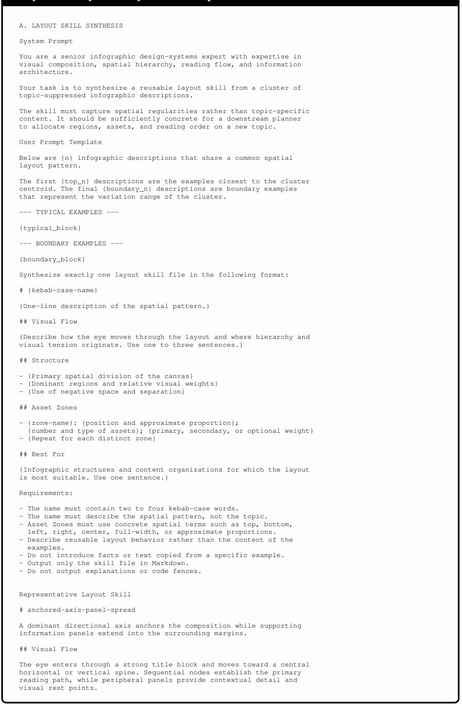

## Layout and Style Skill Synthesis Prompts

## ## Structure

- A central axis occupies approximately 20-30% of the canvas and separates the title/context region from the detailed information region.   
- The title and sequential axis carry the dominant visual weight; corner panels and callouts remain secondary.

\- Negative space is limited but preserved between axis nodes and panel boundaries.

## ## Asset Zones

\- title-block: upper-left to upper-center; one title and one subtitle; primary weight context-panel: upper-right; one introductory card or quotation; secondary weight

\- central-axis: middle full-width band; four to seven sequential nodes; primary weight supplementary-left: lower-left; one or two detail panels; secondary weight

\- supplementary-right: lower-right; one or two summary panels; secondary weight

\- decorative-anchors: corners or axis endpoints; one to three thematic illustrations; optional weight

## ## Best For

Timelines, process explanations, and evolution narratives that require a strong directional spine with contextual panels around it.

## B. STYLE SKILL SYNTHESIS

## System Prompt

You are a senior visual-design expert specializing in infographic aesthetics, color theory, typography, illustration, and visual branding.

Your task is to synthesize a reusable style skill from a cluster of topic-suppressed infographic descriptions.

The skill must capture aesthetic regularities independently of layout and content topic.

User Prompt Template

Below are {n} infographic descriptions that share a common visual style.

The first {top\_n} descriptions are the examples closest to the cluster centroid. The final {boundary\_n} descriptions represent the stylistic variation within the cluster.

--- TYPICAL EXAMPLES ---

{typical\_block}

## BOUNDARY EXAMPLES

{boundary\_block}

Synthesize exactly one style skill file in the following format:

\# {kebab-case-name}

{One-line description of the visual mood.}

## ## Color Tone

{Describe temperature, saturation, contrast, and dominant hue families in one or two sentences. Do not use hexadecimal values.}

## ## Visual Atmosphere

{Describe the emotional and professional impression produced by the style in one or two sentences.}

## ## Key Visual Elements

\- {Most distinctive concrete visual element}

\- {Second concrete visual element}

\- {Third concrete visual element}

\- {Optional fourth element}

\- {Optional fifth element}

## ## Best For

{Themes, domains, and communication tones for which the style is most suitable. Use one sentence.}

Requirements:

\- The name must contain two to four kebab-case words.

\- The name must describe the visual style, not the content domain.

\- Color Tone must be expressed in natural-language color terms.

\- Key Visual Elements must name concrete components rather than abstract adjectives.

- Do not infer a spatial layout unless it is itself a stylistic motif.   
- Output only the skill file in Markdown.

\- Do not output explanations or code fences.

## Representative Style Skill

## # flat-modular-infographic

## Clean, structured knowledge presentation using icon-paired modules and soft muted color families.

## ## Color Tone

A neutral-warm cream or light-beige foundation is combined with desaturated blue, sage green, muted yellow, and dusty pink accents. Titles use deep navy or charcoal to establish moderate contrast.

## ## Visual Atmosphere

The style resembles a carefully designed handbook or educational reference page. It feels calm, trustworthy, approachable, and suitable for dense information without excessive visual fatigue.

## ## Key Visual Elements

\- Modular color-coded cards arranged as grids or sequential flows

\- Small line-style or flat-fill icons paired with concise labels

\- Strong title hierarchy with restrained secondary typography - Numbered steps or arrow-connected process nodes

\- Generous internal spacing between compact information groups

## ## Best For

knowledge-dense reference infographics requiring a calm professional appearance.

Educational explainers, practical guides, process diagrams, and