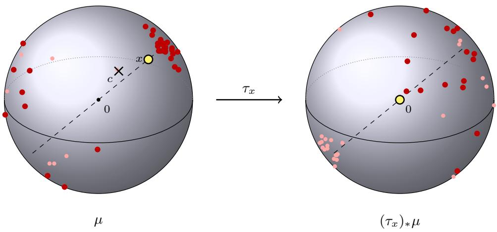
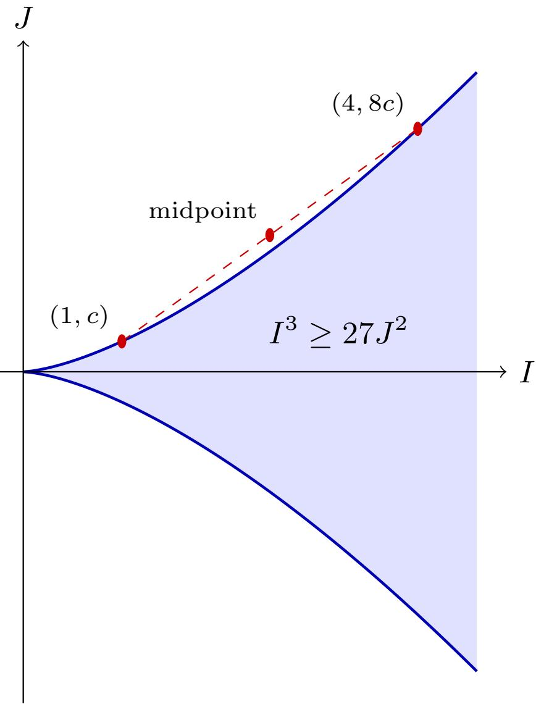
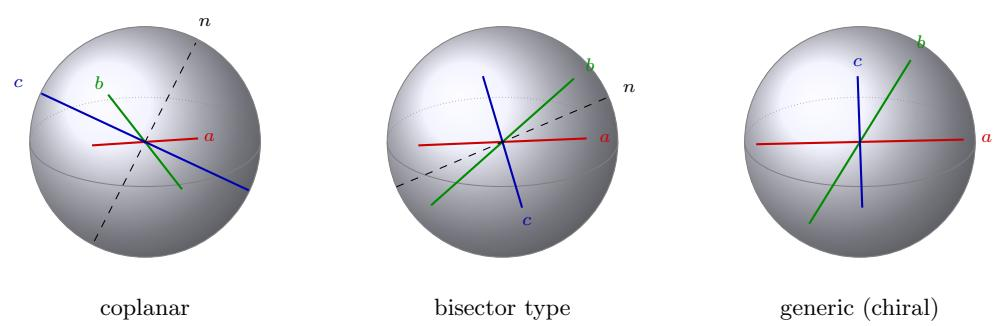
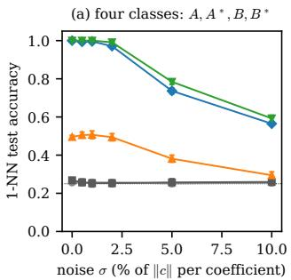
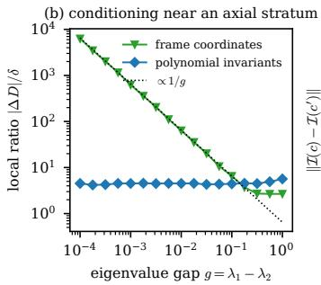
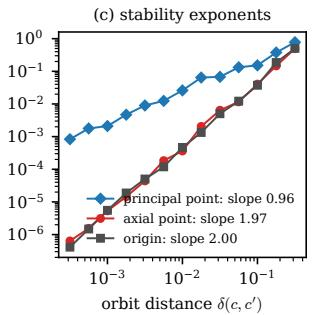

# INVARIANT SHAPE ANALYSIS OF SURFACES WITH SPHERICAL TOPOLOGY

T. SHASKA AND M.-R. SIADAT

Abstract. Spherical harmonic descriptors of closed 3D shapes depend on the parameterization, the pose and the scale of the surface, and the standard rotation-invariant reductions, the power spectrum and the bispectrum, discard the relative orientation of the harmonic bands and cannot distinguish a shape from its mirror image. We construct a descriptor that removes all three dependencies exactly and loses nothing else: a conformal parameterization normalized by its conformal barycenter, followed by polynomial invariants of the rotation group. Identifying each harmonic band with a binary form turns the rotation quotient into classical invariant theory and makes reflections visible as the sign of an invariant, so chirality is recorded. The descriptor is complete for the truncated expansion, stable in the orbit distance, and comes with numerical diagnostics. Benchmarks confirm the guarantees, and on bilateral anatomical structures the descriptor separates mirror-image pairs from asymmetric pairs, which parity-blind descriptors cannot.

## 1. Introduction

Spherical harmonic expansions are a standard representation of closed genus-zero surfaces in shape analysis, from the SPHARM descriptors of brain structures [7, 29] to rotation-invariant retrieval of 3D models [21]. A surface is mapped to the sphere, a coordinate or radial function is expanded in spherical harmonics, and the coefficients are used as features. The coeficients, however, depend on three choices that are not part of the shape: the map to the sphere, the position of the surface in space, and its scale. The map is the serious one. For the area-preserving parameterizations of SPHARM the residual freedom is the infinite-dimensional group of area-preserving difeomorphisms of the sphere, so an individual coeficient is a function of the map and not of the surface; the first-order-ellipsoid alignment that follows fixes a frame by convention, is undefined when two semi-axes coincide, and leaves a finite sign ambiguity. The usual remedies remove the dependence on rotations by discarding information. The power spectrum keeps only the norm of each band and forgets how the bands are oriented relative to each other; the bispectrum [20] keeps more but its completeness and its behaviour under reflection are not known band by band; and every descriptor built from rotation-invariant quantities of even degree cannot distinguish a shape from its mirror image, which for bilateral anatomy is the diference between the left and the right side.

This paper removes all three dependencies exactly and loses nothing else. Conformal parameterization [17, 11] reduces the map freedom to the M¨obius group, normalization by the conformal barycenter [3, 9] reduces it to a rotation of the sphere, and the rotation is removed by polynomial invariants of the rotation group, for which the classical identification of harmonics with binary forms [10, 24] supplies both the invariants and, through a real structure, the sign that records handedness. Position is removed by a canonical center and scale by weighted projectivization. The construction is exact at every step, and the descriptor it produces is complete for the truncated expansion. Formally, let $S \subset \mathbb { R } ^ { 3 }$ be a smoothly embedded two-sphere; the shape space is

$$
\begin{array} { r } { S = \mathrm { E m b } ( \mathbb { S } ^ { 2 } , \mathbb { R } ^ { 3 } ) / \big ( G _ { \mathrm { t a s k } } \times \mathrm { D i f f } ^ { + } ( \mathbb { S } ^ { 2 } ) \big ) , } \end{array}
$$

where $G _ { \mathrm { t a s k } }$ is the group of orientation-preserving rigid motions of $\mathbb { R } ^ { 3 }$ , of all rigid motions, or of orientation-preserving similarities, and the paper computes coordinates on $s$ at the level of truncated coeficients. Constructions of separating invariants for general compact groups, with dimension or stability guarantees, are given in [16, 8]; here the group and the representation are specific, and the invariants are explicit.

The coordinate model expands the centered coordinate map, and the radial model expands the distance from a canonical center. Our results are as follows.

Canonical parameterization. Centered conformal parameterizations of S form one SO(3)-orbit, so the whole coeficient tuple is determined up to one rotation of the sphere (Theorems 2.1 and 2.3); the all-band coordinate expansion determines $S$ up to an orientation-preserving rigid motion (Theorem 4.5); and the squared $L ^ { 2 }$ truncation error at degree $L$ is at most $| S | / ( 2 \pi ( L + 1 ) ( L + 2 ) \rangle$ ), independently of the conformal factor (Theorem 2.4).

Harmonics as binary forms. A harmonic f of degree l is sent to the binary form $F _ { f } ( z ) = f ( v ( z ) )$ of degree 2l, where v parametrizes the null conic of $x _ { 1 } ^ { 2 } + x _ { 2 } ^ { 2 } +$ $x _ { 3 } ^ { 2 }$ . This is an explicitly invertible, rotation-equivariant isomorphism that scales the $L ^ { 2 }$ norm to the Bombieri–Weyl norm by an explicit constant (Theorem 3.8). Real harmonics are the fixed points of an antilinear involution induced by the quaternionic structure of $\mathbb { C } ^ { 2 }$ , and the roots of $F _ { f }$ are the endpoints of the Maxwell axes of $f .$ A multihomogeneous $\mathrm { S L _ { 2 } ( \mathbb { C } ) }$ -invariant of degree $d _ { l }$ in band l is real on real harmonics if $\sum _ { l } l d _ { l }$ is even and purely imaginary if it is odd; the first are the O(3)-invariants and the second the pseudo-invariants (Theorem 3.6).

Separation and chirality. Seven invariants of degrees 1, 2, 2, 3, 3, 4, 6 separate the SO(3)-orbits of the truncation through degree two (Theorem 4.9). A real harmonic of degree three is congruent to its mirror image if the skew invariant R of its sextic vanishes, if its three Maxwell axes are coplanar or one is orthogonal to a bisector of the other two, if (for distinct axes) the associated genus-two curve has an elliptic involution; moreover $- i R = \operatorname* { d e t } ( a , b , c ) G$ with G a polynomial in the inner products of the axes (Theorem 5.2).

Frames, metrics, stability. On the principal stratum a canonical frame reduces the residual rotations to the Klein four-group, and the invariant monomials of degree at most three in the aligned coeficients separate orbits; the frame has no continuous extension to the degenerate strata (Theorem 6.2). The orbit distance is a metric on the quotient, the invariants are Lipschitz for it on bounded sets, and on compact sets it is bounded by a H¨older power of the invariant discrepancy (Theorem 7.3). Theorem 7.6 collects these properties into one statement, and Section 8 gives the numerical realization with a synthetic end-to-end test.

Benchmarks. On classes of dipole–quadrupole pairs that share their power spectrum and bispectrum, and on their mirror images, the power spectrum and the bispectrum classify at chance, the O(3)-invariants reach one half, and the seven invariants of Theorem 4.9 classify all classes; the frame coordinates are ill-conditioned like the reciprocal of the spectral gap, while the invariants are not; and the measured stability exponents agree with Theorem 7.3 (Section 9). On eleven bilateral pairs of a public anatomical atlas, the descriptor identifies the pairs that are one chiral shape in two handednesses, with the pseudo-invariants recording the handedness, and separates them from pairs of diferent shapes; the diagnostics reject the two structures on which the conformal map folds (Section 9.4).

The identification of harmonics with binary forms, the spin covering and the Maxwell–Sylvester theorem are classical (Theorem 3.13). The contributions of this paper are the reality and parity rule of Theorem 3.6, which makes reflections visible in the phase of an invariant; the combination of conformal-barycenter normalization with this correspondence into a descriptor that is exactly independent of parameterization, position and scale, with a truncation bound independent of the conformal factor (Theorems 2.4 and 7.6); a complete descriptor through degree two with an explicit pseudo-invariant (Theorem 4.9); the characterization of chirality in degree three by the geometry of the Maxwell axes and the factorization $- i R = \lambda ^ { 1 5 } \operatorname* { d e t } ( a , b , c ) G$ (Theorem 5.2); the identification of the residual group of ellipsoid-type alignment, with the proof that no continuous frame exists across the degenerate strata (Theorem 6.2); and two-sided stability with respect to the orbit distance (Theorem 7.3).

The construction is motivated by an unpublished shape analysis of deep perisylvian epilepsy by D. I. Sims, M.-R. Siadat, K. Elisevich and H. Soltanian-Zadeh (2015), which we call SPHARM-COM; Section 10 identifies the freedoms that its radial descriptor left unresolved.

## 2. Canonical Parameterization

Let $\mathbb { S } ^ { 2 } = \{ u \in \mathbb { R } ^ { 3 } : | u | = 1 \}$ be the unit sphere and $\mathbb { B } ^ { 3 } = \{ x \in \mathbb { R } ^ { 3 } : | x | < 1 \}$ the open unit ball. We write $\langle \cdot , \cdot \rangle$ for the Euclidean inner product on $\mathbb { R } ^ { 3 }$ and for its complex bilinear extension to $\mathbb { C } ^ { 3 }$ , and $\left| \cdot \right|$ for the Euclidean norm. We identify $\mathbb { S } ^ { 2 }$ with $\mathbb { P } ^ { 1 } = \{ [ z _ { 0 } : z _ { 1 } ] \}$ } through the coordinate $\zeta = z _ { 0 } / z _ { 1 } = ( - n _ { 1 } + i n _ { 2 } ) / ( 1 - n _ { 3 } )$ for $  n _ { \mathrm { ~ \} } } \in \ \mathbb { S } ^ { 2 }$ ; this is stereographic projection from the north pole followed by a reflection, it is orientation-preserving for the outward orientation of $\mathbb { S } ^ { 2 }$ , and it is the identification compatible with Section 3. Every element of $\mathrm { O ( 3 ) } \setminus \mathrm { S O ( 3 ) }$ has the form −R with $R \in \mathrm { S O ( 3 ) }$ . A set with a free and transitive action of a group $G$ is a G-torsor. For a probability measure $\mu$ on $\mathbb { S } ^ { 2 }$ and a continuous map $g$ of $\mathbb { S } ^ { 2 }$ , the pushforward $g _ { * } \mu ( E ) = \mu ( g ^ { - 1 } ( E ) )$ satisfies $\begin{array} { r } { \int f d ( g _ { * } \mu ) = \int f \circ g d \mu ; } \end{array}$ an atom of $\mu$ is a point of positive mass; and $d \omega = d A _ { \mathrm { r o u n d } } / 4 \pi$ is the round probability measure. The M¨obius group $\mathrm { M } \ddot { \mathrm { o b } } \cong \mathrm { P S L } _ { 2 } ( \mathbb { C } )$ is the group of orientation-preserving conformal difeomorphisms of $\mathbb { S } ^ { 2 } \ [ 1 ]$

2.1. Spherical harmonics. For $l \geq 0$ let $\mathcal { H } _ { l }$ be the space of restrictions to $\mathbb { S } ^ { 2 }$ of homogeneous harmonic polynomials of degree l on $\mathbb { R } ^ { 3 } { \mathrm { ; } }$ dim $\mathcal { H } _ { l } = 2 l + 1 , - \Delta _ { \mathbb { S } ^ { 2 } }$ acts on $\mathcal { H } _ { l }$ by $l ( l + 1 )$ , and $\bar { L ^ { 2 } } ( \dot { \mathbb { S } } ^ { 2 } , d \omega )$ is the orthogonal Hilbert sum of the Hl [2]. For instance $\mathcal { H } _ { 1 } = \{ \langle a , \cdot \rangle : a \in \mathbb { R } ^ { 3 } \}$ and $\mathcal { H } _ { 2 } = \{ u \mapsto u ^ { \top } Q u : Q = Q ^ { \top }$ , tr $Q = 0 \}$ . Write $u = ( \sin \theta$ cos $\phi ,$ sin θ sin $\phi ,$ cos θ), let $P _ { l }$ be the Legendre polynomial and $P _ { l } ^ { m } ( t ) =$ $( 1 - t ^ { 2 } ) ^ { m / 2 } P _ { l } ^ { ( m ) } ( t )$ . We fix the orthonormal basis

$$
\begin{array} { r } { Y _ { l 0 } = \sqrt { 2 l + 1 } P _ { l } ( \cos \theta ) , \quad \quad } \\ { Y _ { l m } = N _ { l m } P _ { l } ^ { m } ( \cos \theta ) \cos m \phi , \quad \quad } \\ { Y _ { l , - m } = N _ { l m } P _ { l } ^ { m } ( \cos \theta ) \sin m \phi , \quad \quad } \end{array}
$$

for $1 \leq m \leq l ,$ with $N _ { l m } = \sqrt { 2 ( 2 l + 1 ) ( l - m ) ! / ( l + m ) ! }$ . This fixes normalization and signs; software libraries difer from it by constant factors such as the Condon–Shortley factor $( - 1 ) ^ { m }$ . The coeficients of $f \in L ^ { 2 } ( \mathbb { S } ^ { 2 } , d \omega )$ are $c _ { l m } ( f ) =$ $\int _ { \mathbb { S } ^ { 2 } } f Y _ { l m } d \omega$ , the orthogonal projection onto $\mathcal { H } _ { l }$ is $\begin{array} { r } { \pi _ { l } f = \sum _ { | m | \leq l } c _ { l m } ( f ) Y _ { l m } } \end{array}$ , and l is the band. For $\mathbb { R } ^ { 3 } .$ -valued functions $\pi _ { l }$ is taken componentwise.

The group SO(3) acts by $( Q \cdot f ) ( u ) = f ( Q ^ { - 1 } u )$ . It preserves each $\mathcal { H } _ { l }$ and acts on $c _ { l } ( f ) = ( c _ { l , - l } , \ldots , c _ { l l } )$ by an orthogonal matrix $D _ { l } ( Q )$ , the real form of the Wigner matrix $[ 3 1 ] .$ . The band norms $\| \pi _ { l } f \|$ are invariant; the individual coeficients are not. A rotation $R _ { \alpha }$ by α about the x3-axis fixes $c _ { l 0 }$ and rotates each pair $\left( { { c _ { l m } } , { c _ { l , - m } } } \right)$ by the angle mα, while rotations about other axes mix diferent orders m. A coeficient $c _ { l m }$ of a surface therefore depends on how the surface was placed on the sphere and in space. The rest of this section removes the placement on the sphere up to one rotation.

2.2. Conformal parameterizations and the conformal barycenter. Throughout, $S \subset \mathbb { R } ^ { 3 }$ is a smoothly embedded two-sphere, oriented by its outward normal, with induced metric $g _ { S }$ , area form $d A$ and area |S|. A difeomorphism $\varphi \colon \mathbb { S } ^ { 2 } \to S$ is conformal if $\varphi ^ { * } g _ { S } = e ^ { 2 \rho } g _ { \mathrm { r o u n d } }$ for a smooth function $\rho ; \ e ^ { 2 \rho }$ is its conformal factor. By the uniformization theorem [13], the set $\Phi ( S )$ of orientation-preserving conformal difeomorphisms $\mathbb { S } ^ { 2 } \to S$ is nonempty, and M¨ob acts on it freely and transitively by $\varphi \mapsto \varphi \circ g ;$ that is, $\Phi ( S )$ is a M¨ob-torsor. Every element of M¨ob extends uniquely to a M¨obius transformation of $\overline { { \mathbb { B } ^ { 3 } } }$ , the extended group acts transitively on $\mathbb { B } ^ { 3 }$ , and the stabilizer of the origin is $\mathrm { S O ( 3 ) }$ acting linearly [1]. Hence removing the three nonrotational degrees of freedom of M¨ob amounts to choosing a point of $\mathbb { B } ^ { 3 }$

For $x \in \mathbb { B } ^ { 3 }$ , the hyperbolic translation $\tau _ { x } \colon \overline { { \mathbb { B } ^ { 3 } } } \to \overline { { \mathbb { B } ^ { 3 } } }$ is the map

$$
\tau _ { x } ( u ) = \frac { ( 1 - | x | ^ { 2 } ) ( u - x ) - | u - x | ^ { 2 } x } { 1 - 2 \langle u , x \rangle + | u | ^ { 2 } | x | ^ { 2 } }\tag{1}
$$

The map $\tau _ { x } ,$ defined for $u \in \overline { { \mathbb { B } ^ { 3 } } }$ , is a M¨obius transformation of $\overline { { \mathbb { B } ^ { 3 } } }$ . In the Poincar´e ball model of hyperbolic space it is the translation along the geodesic through 0 and x. It sends $x$ to 0 and 0 to −x, and it fixes the endpoints $\pm x / | x |$ of this geodesic. It maps $\mathbb { S } ^ { 2 }$ to itself, and $\tau _ { 0 }$ is the identity. For a probability measure $\mu$ on $\mathbb { S } ^ { 2 }$ set

$$
\xi _ { \mu } ( x ) = \int _ { \mathbb { S } ^ { 2 } } \tau _ { x } ( u ) d \mu ( u ) , \qquad x \in \mathbb { B } ^ { 3 } .
$$

Since $\textstyle \int f d ( g _ { * } \mu ) = \int f \circ g d \mu$ , the vector $\xi _ { \mu } ( x )$ is the Euclidean center of mass of the measure $( \tau _ { x } ) _ { * } \mu .$

Douady and Earle [15] proved the following. If $\mu$ has no atoms, then the vector field $\xi _ { \mu }$ has a unique zero $B ( \mu ) \in \mathbb { B } ^ { 3 }$ , and

$$
B ( g _ { * } \mu ) = g \bigl ( B ( \mu ) \bigr ) \qquad ( g \in \mathrm { M } \ddot { \mathrm { o b } } ) .\tag{2}
$$

  
Figure 1. The conformal barycenter on $\mathbb { S } ^ { 2 }$ . Left: a probability measure $\mu$ consisting of 42 point masses of weight $1 / 4 2$ on $\mathbb { S } ^ { 2 }$ (points on the far hemisphere are drawn lighter; each atom has mass less than $1 / 2$ , see Theorem 2.2), its Euclidean center of mass c (cross), and its conformal barycenter $x = B ( \mu ) \in \mathbb { B } ^ { 3 }$ (circle). The dashed segment is the geodesic of $\mathbb { B } ^ { 3 }$ through 0 and $x _ { \ast }$ . Right: the pushforward $( \tau _ { x } ) _ { * } \mu$ under the hyperbolic translation $\tau _ { x } ;$ its Euclidean center of mass is the origin. The points were computed from (1).

The point $B ( \mu )$ is the conformal barycenter of $\mu .$ . Equivalently, $B ( \mu )$ is the unique $x \in \mathbb { B } ^ { 3 }$ such that $( \tau _ { x } ) _ { * } \mu$ has center of mass 0. Since $\tau _ { 0 }$ is the identi $\mathrm { \Delta [ y , }$ $B ( \mu ) = 0$ if and only if $\textstyle \int _ { \mathbb { S } ^ { 2 } } u d \mu ( u ) = 0$ . Figure 1 illustrates the construction.

Each $\varphi \in \Phi ( S )$ determines the probability measure $\mu _ { \varphi } = | S | ^ { - 1 } \varphi ^ { * } ( d A )$ on $\mathbb { S } ^ { 2 }$ Explicitly, $\mu _ { \varphi } ( E ) = | \varphi ( E ) | / | S |$ for every Borel set $E \subset \mathbb { S } ^ { 2 }$ , where $| \varphi ( E ) |$ is the area of $\varphi ( E )$ ). We call φ centered if

$$
\int _ { \mathbb { S } ^ { 2 } } u d \mu _ { \varphi } ( u ) = 0 ,
$$

and write $\Phi _ { 0 } ( S )$ for the set of centered parameterizations. Thus $\varphi$ is centered if the area of S, transported to $\mathbb { S } ^ { 2 }$ by $\varphi ,$ has its center of mass at the origin.

## Lemma 2.1. The following are true:

(i) $\Phi _ { 0 } ( S )$ is nonempty and is a single orbit under $\mathrm { S O ( 3 ) }$ acting by precomposition.

(ii) $I f T ( x ) = \lambda R x + b$ with $\lambda > 0 , R \in \mathrm { S O } ( 3 )$ , then $\Phi _ { 0 } ( T ( S ) ) = T \circ \Phi _ { 0 } ( S )$

(iii) $I f T ( x ) = - \lambda R x + b$ and r is any reflection of $\mathbb { S } ^ { 2 }$ in a plane through the origin, then $\Phi _ { 0 } ( T ( S ) ) = T \circ \Phi _ { 0 } ( S ) \circ r$

Proof. (i) Fix $\varphi \in \Phi ( S )$ . Since $\varphi$ is a difeomorphism, $\mu _ { \varphi }$ has a smooth positive density with respect to dω. Hence $\mu _ { \varphi }$ has no atoms, and $B ( \mu _ { \varphi } )$ exists and is unique. For $g \in \mathrm { M } \ddot { \mathrm { o b } }$

$$
( \varphi \circ g ) ^ { * } ( d A ) = g ^ { * } \varphi ^ { * } ( d A ) ,
$$

so $\mu _ { \varphi \circ g } = ( g ^ { - 1 } ) _ { * } \mu _ { \varphi }$ . By (2), $B ( \mu _ { \varphi \circ g } ) = g ^ { - 1 } ( B ( \mu _ { \varphi } ) )$ . Hence $\varphi \circ g$ is centered if and only if $g ( 0 ) = B ( \mu _ { \varphi } )$ . Since M¨ob acts transitively on $\mathbb { B } ^ { 3 }$ , such a $g$ exists. If $g$ and $g ^ { \prime }$ are two such elements, then $g ^ { - 1 } g ^ { \prime }$ fixes the origin, so $g ^ { - 1 } g ^ { \prime } \in \mathrm { S O } ( 3 )$

(ii) The map $T \circ \varphi$ is conformal and orientation-preserving onto $T ( S )$ . Conversely, if $\psi \in \Phi ( T ( S ) )$ , then $T ^ { - 1 } \circ \psi \in \Phi ( S )$ . Hence $\Phi ( T ( S ) ) = T \circ \Phi ( S )$ . Moreover $( T \circ \varphi ) ^ { * } d A _ { T ( S ) } = \lambda ^ { 2 } \varphi ^ { * } d A _ { S }$ and $| T ( \stackrel { \cdot } { S } ) | = \lambda ^ { 2 } | S |$ , so $\mu _ { T \circ \varphi } = \mu _ { \varphi }$ . Hence $T \circ \varphi$ is centered if and only if $\varphi$ is.

(iii) The map T reverses the orientation of $\mathbb { R } ^ { 3 }$ and sends the outward normal of S to the outward normal of $T ( S )$ . Hence $T$ restricts to an orientation-reversing map $S \to T ( S )$ . Since r also reverses orientation, $T \circ \varphi \circ r$ is conformal and orientationpreserving. As in (ii), $\Phi ( T ( S ) ) = T \circ \Phi ( S ) \circ r ,$ . Since $r$ is a linear isometry with $r ^ { - 1 } = r$ , we have $\mu _ { T \circ \varphi \circ r } = r _ { * } \mu _ { \varphi }$ . Finally $\begin{array} { r } { \int u d ( r _ { * } \mu _ { \varphi } ) = r \big ( \int u d \mu _ { \varphi } \big ) } \end{array}$ , which vanishes if and only if $\int u d \mu _ { \varphi }$ does. □

Remark 2.2. For a triangulated surface the smooth construction is replaced by its discrete counterpart [3]. The pulled-back area measure becomes a finite sum of point masses, $\begin{array} { r } { \mu _ { h } = \sum _ { i } w _ { i } \delta _ { u _ { i } } } \end{array}$ . It has a unique conformal barycenter provided no atom carries mass $\geq 1 / 2$ , by the stability criterion of Cantarella and Schumacher [9]. Uniqueness is not conditioning. The Hessian of the associated energy, computed in the same paper, governs the sensitivity of the barycenter to the mesh and enters the stability discussion of Section $7 .$

2.3. The conformal center and the harmonic coeficients. For $\varphi \in \Phi _ { 0 } ( S )$ put

$$
{ \bar { c } } ( S ) = \int _ { \mathbb { S } ^ { 2 } } \varphi ( u ) d \omega .\tag{3}
$$

The right side does not depend on the choice of $\varphi \in \Phi _ { 0 } ( S )$ . Indeed, by Theorem $2 . 1 ( \mathrm { i } )$ any other choice is $\varphi \circ R$ with $R \in \mathrm { S O ( 3 ) }$ , and dω is $\mathrm { S O ( 3 ) }$ -invariant. We call $\bar { c } ( S )$ the conformal center of S.

The conformal center is an average of points of S, so it lies in the convex hull of S. The area centroid of S is

$$
{ \frac { 1 } { | S | } } \int _ { S } x d A = \int _ { \mathbb { S } ^ { 2 } } \varphi d \mu _ { \varphi } .
$$

The two centers average $\varphi$ against diferent measures, dω and $d \mu _ { \varphi }$ , and they difer in general. The conformal center is natural: $\bar { c } ( T ( S ) ) = T ( \bar { c } ( S ) )$ for every similarity $T ,$ orientation-preserving or not. This follows from Theorem 2.1(ii) and (iii), since $T$ is afine and dω is invariant under reflections.

Define the centered coordinate map and the radial function of $\varphi$ by

$$
X _ { \varphi } ( u ) = \varphi ( u ) - \bar { c } ( S ) , \qquad d _ { \varphi } ( u ) = | X _ { \varphi } ( u ) | .\tag{4}
$$

Their band components are

$$
\begin{array} { r } { f _ { l } ( \varphi ) = \pi _ { l } d _ { \varphi } \in \mathcal { H } _ { l } , \qquad C _ { l } ( \varphi ) = \pi _ { l } X _ { \varphi } \in \mathcal { H } _ { l } \otimes \mathbb { R } ^ { 3 } . } \end{array}
$$

Since $\mathcal { H } _ { 0 }$ consists of the constants, $\begin{array} { r } { C _ { 0 } ( \varphi ) = \int _ { \mathbb { S } ^ { 2 } } X _ { \varphi } d \omega } \end{array}$ . By (3), $C _ { 0 } ( \varphi ) = 0$ identically. This is why the conformal center, rather than the area centroid, is taken as the origin. Write

$$
f ^ { ( L ) } ( \varphi ) = ( f _ { 0 } , \dots , f _ { L } ) , \quad C ^ { ( L ) } ( \varphi ) = ( C _ { 1 } , \dots , C _ { L } ) .
$$

The rotation action on functions extends to $\mathbb { R } ^ { 3 } .$ -valued functions, where the group $\mathrm { S O } ( 3 ) \times \mathrm { S O } ( 3 )$ acts by the two-sided action

$$
( ( Q , R ) \cdot X ) ( u ) = R X ( Q ^ { - 1 } u )\tag{5}
$$

for $( Q , R ) \in \mathrm { S O } ( 3 ) \times \mathrm { S O } ( 3 )$ . The first factor rotates the parameter sphere. The second factor rotates the surface in $\mathbb { R } ^ { 3 }$

## Corollary 2.3. For every $L \geq 1$ the following hold.

(i) The set $\{ f ^ { ( L ) } ( \varphi ) : \varphi \in \Phi _ { 0 } ( S ) \}$ is one orbit of the diagonal action of SO(3) on $\oplus _ { l < L } \mathcal { H } _ { l }$

(ii) The set $\{ C ^ { ( L ) } ( \varphi ) : \varphi \in \Phi _ { 0 } ( S ) \}$ } is one orbit of $\mathrm { { S O } ( 3 ) \times \{ 1 \} }$ on $\oplus _ { 1 \leq l \leq L }$ Hl⊗ $\mathbb { R } ^ { 3 }$

(iii) $I f T ( x ) = \lambda R x + b$ with $\lambda > 0$ and $R \in \mathrm { S O ( 3 ) }$ , then $f _ { l } ( T \circ \varphi ) = \lambda f _ { l } ( \varphi )$ and $C _ { l } ( T \circ \varphi ) = \lambda R C _ { l } ( \varphi )$

(iv) $I f T ( x ) = - \lambda R x + b$ and r is as in Theorem $\it { 2 . 1 ( i i i ) }$ , then $f _ { l } ( T \circ \varphi \circ r ) =$ $\lambda f _ { l } ( \varphi ) \circ r$ and $C _ { l } ( T \circ \varphi \circ r ) = - \lambda R C _ { l } ( \varphi ) \circ r .$

Proof. Let $Q \in \mathrm { S O ( 3 ) }$ . Since $\bar { c } ( S )$ does not depend on $\varphi ,$

$$
X _ { \varphi \circ Q } ( u ) = \varphi ( Q u ) - \bar { c } ( S ) = ( Q ^ { - 1 } \cdot X _ { \varphi } ) ( u ) .
$$

Since $\pi _ { l }$ commutes with the action, ${ C _ { l } ( \varphi \circ Q ) = Q ^ { - 1 } \cdot C _ { l } ( \varphi ) }$ and $f _ { l } ( \varphi \circ Q ) =$ $Q ^ { - 1 } \cdot f _ { l } ( \varphi )$ , with the same $Q$ in every band. Together with Theorem $2 . 1 ( \mathrm { i } )$ this proves (i) and (ii). For (iii), Theorem 2.1(ii) and the naturality of ¯c give

$$
X _ { T \circ \varphi } = T \circ \varphi - T ( \bar { c } ( S ) ) = \lambda R X _ { \varphi } .
$$

Hence $d _ { T \circ \varphi } = \lambda d _ { \varphi } ,$ and (iii) follows by applying $\pi _ { l } .$ For $( \mathrm { i v } )$ , Theorem 2.1(iii) gives in the same way $X _ { T \circ \varphi \circ r } = - \lambda R X _ { \varphi } \circ r$ . Since r is orthogonal, $\pi _ { l }$ commutes with composition by $r ,$ and (iv) follows. □

Theorem 2.3 is the precise sense in which the coeficients of a centered conformal parameterization are canonical. The entire tuple of coeficients is determined by S up to one common rotation of the sphere. The full coordinate expansion determines $X _ { \varphi }$ in $L ^ { 2 }$ and hence, by continuity, the centered parameterized surface. The radial expansion retains only $| X _ { \varphi } |$ . No reconstruction theorem from radial data is asserted.

2.4. Truncation. The conformal gauge has one cost. Conformal maps of elongated or convoluted surfaces have large area distortion, so a small spherical cap may carry a large part of the surface. The following bound shows that the truncation error in $L ^ { 2 } ( d \omega )$ is nevertheless controlled by the area alone. Norms without subscript are $L ^ { 2 } ( d \omega )$ norms.

Proposition 2.4. Let $\varphi \in \Phi _ { 0 } ( S )$ with conformal factor $e ^ { 2 \rho }$ , let $X \ = \ X _ { \varphi }$ and $X _ { l } = \pi _ { l } X$ , and let $\begin{array} { r } { X ^ { ( L ) } = \sum _ { l \leq L } X _ { l } } \end{array}$ be the degree-L truncation of X. Then

$$
\| X - X ^ { ( L ) } \| _ { L ^ { 2 } ( d \omega ) } ^ { 2 } \leq \frac { | S | } { 2 \pi ( L + 1 ) ( L + 2 ) } ,\tag{6}
$$

$$
\int _ { \mathbb { S } ^ { 2 } } | X - X ^ { ( L ) } | ^ { 2 } d \mu _ { \varphi } \leq { \frac { 2 \operatorname* { s u p } e ^ { 2 \rho } } { ( L + 1 ) ( L + 2 ) } } .
$$

The same bounds hold for $d _ { \varphi }$ in place of $X _ { \varphi }$ .

Proof. For $u \in \mathbb { S } ^ { 2 }$ let $e _ { 1 } , e _ { 2 }$ be an orthonormal basis of $T _ { u } \mathbb { S } ^ { 2 }$ for $g _ { \mathrm { r o u n d } }$ . The Hilbert–Schmidt norm of the diferential is

$$
| d \varphi _ { u } | ^ { 2 } = | d \varphi _ { u } ( e _ { 1 } ) | ^ { 2 } + | d \varphi _ { u } ( e _ { 2 } ) | ^ { 2 } .
$$

For a conformal map both terms equal $e ^ { 2 \rho ( u ) }$ , so $| d \varphi | ^ { 2 } = 2 e ^ { 2 \rho }$ . Since $\varphi ^ { * } d A =$ $e ^ { 2 \rho } d A _ { \mathrm { r o u n d } }$ , we get $\begin{array} { r } { \int _ { \mathbb { S } ^ { 2 } } | d \varphi | ^ { 2 } d A _ { \mathrm { r o u n d } } = 2 | S | } \end{array}$ . Since X difers from $\varphi$ by a constant, $| \nabla X | = | d \varphi |$ . With $d \omega = d A _ { \mathrm { r o u n d } } / 4 \pi$ this gives $\| \nabla X \| ^ { 2 } = | S | / 2 \pi$

Since $- \Delta _ { \mathbb { S } ^ { 2 } }$ acts on $\mathcal { H } _ { l }$ by l(l + 1), Green’s formula and orthogonality give

$$
\| \nabla X \| ^ { 2 } = \sum _ { l \geq 1 } l ( l + 1 ) \| X _ { l } \| ^ { 2 } .
$$

Hence

$$
\begin{array} { l } { \displaystyle | | X - X ^ { ( L ) } | | ^ { 2 } = \sum _ { l > L } \| X _ { l } \| ^ { 2 } } \\ { \displaystyle \leq \frac { 1 } { ( L + 1 ) ( L + 2 ) } \sum _ { l > L } l ( l + 1 ) \| X _ { l } \| ^ { 2 } } \\ { \displaystyle \leq \frac { \| \nabla X \| ^ { 2 } } { ( L + 1 ) ( L + 2 ) } , } \end{array}
$$

which is the first bound. For the second bound,

$$
d \mu _ { \varphi } = | S | ^ { - 1 } e ^ { 2 \rho } d A _ { \mathrm { r o u n d } } = { \frac { 4 \pi } { | S | } } e ^ { 2 \rho } d \omega .
$$

So the area-weighted error is at most $4 \pi \operatorname* { s u p } e ^ { 2 \rho } / | S |$ times the first bound, which equals $2 \operatorname* { s u p } e ^ { 2 \rho } / ( ( L + 1 ) ( L + 2 ) )$ . Finally, $d _ { \varphi } = | X _ { \varphi } |$ is Lipschitz and $| \nabla d _ { \varphi } | \leq | \nabla X _ { \varphi } |$ almost everywhere, so the same argument applies to $d _ { \varphi }$ □

The first bound is uniform in the shape. The second bound shows where a convoluted surface pays. The geometric error is governed by the largest conformal factor, and an implementation should report this quantity rather than the number of coeficients. The quantity sup $e ^ { 2 \rho }$ does not depend on the choice of $\varphi \in \Phi _ { 0 } ( S )$ ， since replacing $\varphi$ by $\varphi \circ R$ replaces $\rho$ by $\rho \circ R$ . Area-preserving parameterizations avoid the second bound. However, their residual gauge is the infinite-dimensional group of area-preserving difeomorphisms of $\mathbb { S } ^ { 2 }$ , so they cannot support the exact quotient constructed here.

## 3. Spherical Harmonics as Binary Forms

This section identifies the real spherical harmonics of degree l with a real form of the binary forms of degree 2l. Rotations act through the double cover ${ \mathrm { S U } } ( 2 ) \subset$ $\mathrm { S L _ { 2 } ( \mathbb { C } ) }$ of SO(3), and rotation invariants of harmonics become classical invariants of binary forms. A nonzero real harmonic $f$ of degree l determines l lines through the origin, its Maxwell axes [23, 30]; the 2l roots of the binary form $F _ { f }$ are the points where these lines meet $\mathbb { S } ^ { \bar { 2 } }$ , and a rotation of $f$ rotates the roots. The identification depends on phase conventions, which we fix once.

3.1. Harmonic polynomials and the null cone. Let $P _ { l } ( \mathbb { C } ^ { 3 } )$ be the homogeneous polynomials of degree l in $\boldsymbol { x } = ( x _ { 1 } , x _ { 2 } , x _ { 3 } )$ with complex coeficients and $\mathcal { H } _ { l } ^ { \mathbb { C } } = \mathrm { k e r } ( \Delta \colon P _ { l } ( \mathbb { C } ^ { 3 } ) \to P _ { l - 2 } ( \mathbb { C } ^ { 3 } ) )$ , the complexification of $\mathcal { H } _ { l } ;$ restriction to $\mathbb { S } ^ { 2 }$ identifies real harmonic polynomials with $\mathcal { H } _ { l }$ , and we use the same letter for both. Complex conjugation on $\mathcal { H } _ { l } ^ { \mathbb { C } }$ is ${ \bar { f } } ( x ) = { \overline { { f ( { \bar { x } } ) } } }$ , and its fixed points are the real harmonics. Let

$$
q ( x ) = x _ { 1 } ^ { 2 } + x _ { 2 } ^ { 2 } + x _ { 3 } ^ { 2 } = \langle x , x \rangle ,
$$

with $\langle \cdot , \cdot \rangle$ the complex bilinear pairing; for $x \in \mathbb { C } ^ { 3 } , q ( x )$ can vanish with $x \neq 0$

Proposition 3.1. For $l \ge 2 , P _ { l } ( \mathbb { C } ^ { 3 } ) = \mathcal { H } _ { l } ^ { \mathbb { C } } \oplus q P _ { l - 2 } ( \mathbb { C } ^ { 3 } )$ , and the same holds over R. Hence dim $\mathcal { H } _ { l } ^ { \mathbb { C } } = 2 l + 1$ , and every $P \in P _ { l } ( \mathbb { C } ^ { 3 } )$ has a unique harmonic part $\pi ( P ) \in \mathcal { H } _ { l } ^ { \mathbb { C } }$ with $P - \pi ( P ) \in q P _ { l - 2 } ( \mathbb { C } ^ { 3 } )$ . The decomposition is $\mathrm { S O _ { 3 } } ( \mathbb { C } ) \mathrm { - } i n v a r i a n t ,$ and π is equivariant.

Proof. For $P , R \in \ P _ { l } ( \mathbb { C } ^ { 3 } )$ put $[ P , R ] = P ( \partial ) \bar { R }$ . Distinct monomials are orthogonal and $[ x ^ { \alpha } , x ^ { \alpha } ] = \alpha ! > 0$ , so $[ \cdot , \cdot ]$ is a positive definite Hermitian form. Since $q ( \partial ) = \Delta$ , one has $[ q P , R ] = [ P , \Delta R ]$ , so multiplication by $q$ is the adjoint of $\Delta$ and $P _ { l } ( \mathbb { C } ^ { 3 } ) = \ker \Delta \oplus q P _ { l - 2 } ( \mathbb { C } ^ { 3 } )$ orthogonally. The group $\mathrm { S O } _ { 3 } ( \mathbb { C } )$ preserves $q ,$ hence both summands. □

Let $\operatorname { S y m } ^ { n }$ be the binary forms $F ( z _ { 0 } , z _ { 1 } )$ of degree $n ,$ with $\mathrm { S L _ { 2 } ( \mathbb { C } ) }$ acting by $( g \cdot F ) ( z ) = F ( g ^ { - 1 } z )$ . The roots of $F \neq 0$ are the points $[ z ] \in \mathbb { P } ^ { 1 }$ with $F ( z ) = 0 { \mathrm { : } }$ with multiplicity they form the root divisor, which determines $F$ up to a scalar. The null cone is $N = \{ x \in \mathbb { C } ^ { 3 } : q ( x ) = 0 \}$ . Since $q$ has rank three it is irreducible, and every polynomial vanishing on $N$ is divisible by $q .$ . The Veronese map is

$$
v ( z _ { 0 } , z _ { 1 } ) = \bigl ( z _ { 0 } ^ { 2 } - z _ { 1 } ^ { 2 } , \ i ( z _ { 0 } ^ { 2 } + z _ { 1 } ^ { 2 } ) , \ 2 z _ { 0 } z _ { 1 } \bigr ) ,\tag{7}
$$

and the quadratic of $x \in \mathbb { C } ^ { 3 }$ is

$$
\begin{array} { l } { { Q _ { x } ( z ) = \langle x , v ( z ) \rangle } } \\ { { \ } } \\ { { \ = ( x _ { 1 } + i x _ { 2 } ) z _ { 0 } ^ { 2 } + 2 x _ { 3 } z _ { 0 } z _ { 1 } + ( - x _ { 1 } + i x _ { 2 } ) z _ { 1 } ^ { 2 } . } } \end{array}\tag{8}
$$

In the normalization $\mathrm { d i s c } ( \alpha z _ { 0 } ^ { 2 } + 2 \beta z _ { 0 } z _ { 1 } + \gamma z _ { 1 } ^ { 2 } ) = 4 ( \beta ^ { 2 } - \alpha \gamma )$ one has $\mathrm { d i s c } ( Q _ { x } ) =$ $4 q ( x )$ . For $z \neq 0$ put $| z | ^ { 2 } = | \dot { z } _ { 0 } | ^ { 2 } + | z _ { 1 } | ^ { 2 }$ and

$$
m ( z ) = { \frac { i } { 2 \left| z \right| ^ { 4 } } } v ( z ) \times { \overline { { v ( z ) } } } .\tag{9}
$$

Lemma 3.2. $\begin{array} { r } { ( i ) ~ z _ { 0 } ^ { 2 } = \frac 1 2 ( v _ { 1 } - i v _ { 2 } ) , ~ z _ { 1 } ^ { 2 } = - \frac 1 2 ( v _ { 1 } + i v _ { 2 } ) , ~ z _ { 0 } z _ { 1 } = \frac 1 2 v _ { 3 } , } \end{array}$ hence $v _ { 1 } , v _ { 2 } , v _ { 3 }$ is a basis $o f \mathrm { S y m } ^ { 2 }$ and $x \mapsto Q _ { x }$ is an isomorphism $\mathbb { C } ^ { 3 } \overset { - } { \to } \mathrm { S y m } ^ { 2 }$

$$
( i i ) \ v ( \mathbb { C } ^ { 2 } ) = N , \ a n d \ v ( z ) = v ( z ^ { \prime } ) \ i f f z ^ { \prime } = \pm z . \ T h e \ v e c t o r s \ v ( z ) \ s p a n \ \mathbb { C } ^ { 3 } .
$$

Proof. (i) is immediate from (7). (ii) Expanding, $q ( v ( z ) ) = 0$ . For $x \in N \backslash$ 0 choose $\begin{array} { r } { z _ { 0 } ^ { 2 } = \frac 1 2 ( x _ { 1 } - i x _ { 2 } ) } \end{array}$ and $\begin{array} { r } { z _ { 1 } ^ { 2 } = - \frac 1 2 ( x _ { 1 } + i x _ { 2 } ) } \end{array}$ ; then $( z _ { 0 } z _ { 1 } ) ^ { 2 } = { \textstyle \frac { 1 } { 4 } } x _ { 3 } ^ { 2 }$ since $q ( x ) = 0$ and after changing the sign of $\mathbf { \bar { \Psi } } _ { z _ { 1 } , \textit { v } ( z ) } = \mathbf { \Psi } _ { x } \mathrm { \ b y \Psi ( i ) }$ . If $v ( z ) \stackrel { } { = } v ( z ^ { \prime } )$ , (i) gives $z _ { 0 } ^ { 2 } = z _ { 0 } ^ { \prime 2 } , z _ { 1 } ^ { 2 } = z _ { 1 } ^ { \prime 2 } , z _ { 0 } z _ { 1 } = z _ { 0 } ^ { \prime } z _ { 1 } ^ { \prime }$ , so $z ^ { \prime } = \pm z$ . The vectors $v ( 1 , 0 ) , v ( 0 , 1 ) , v ( 1 , 1 )$ have determinant 4i $\neq 0$ □

Lemma 3.3. (i) $F o r \ z \ne 0 , m ( z )$ is the real unit vector

$$
\frac { \left( - 2 \Re ( z _ { 0 } \bar { z } _ { 1 } ) , 2 \Im ( z _ { 0 } \bar { z } _ { 1 } ) , | z _ { 0 } | ^ { 2 } - | z _ { 1 } | ^ { 2 } \right) } { | z _ { 0 } | ^ { 2 } + | z _ { 1 } | ^ { 2 } } ,
$$

$m ( \lambda z ) ~ = ~ m ( z )$ for $\lambda \ \in \ \mathbb { C } ^ { \times }$ , and the induced map $\bar { m } \colon { \mathbb { P } } ^ { 1 } \ \to \ { \mathbb { S } } ^ { 2 }$ is the orientation-preserving bijection with $\bar { m } ( [ \zeta : 1 ] ) = n f o r \zeta = ( - n _ { 1 } + i n _ { 2 } ) / ( 1 -$ $n _ { 3 } )$ and $\bar { m } ( [ 1 : 0 ] ) = ( 0 , 0 , 1 )$

(ii) For $a \in \mathbb { R } ^ { 3 } \setminus 0 , Q _ { a } ( z ) = 0 \ i f f m ( z ) = \pm a / | a | .$

(iii) The antipodal map of $\mathbb { S } ^ { 2 } { \it \ i s \ } [ z ] \ \mapsto \ [ j z ]$ , where $j ( z _ { 0 } , z _ { 1 } ) = ( - \bar { z } _ { 1 } , \bar { z } _ { 0 } )$ , and v(jz) = −v(z).

Proof. (i) With $w = v ( z ) , \overline { { w \times \bar { w } } } = - w \times \bar { w }$ , so i w $\times  { w }$ is real, and expanding with (7) gives $\begin{array} { r } { \frac { i } { 2 } \boldsymbol { w } \times \bar { \boldsymbol { w } } = | z | ^ { 2 } ( - 2 \Re ( z _ { 0 } \bar { z } _ { 1 } ) , 2 \Im ( z _ { 0 } \bar { z } _ { 1 } ) , | z _ { 0 } | ^ { 2 } - | z _ { 1 } | ^ { 2 } ) } \end{array}$ , a vector of length $| z | ^ { 4 }$ . Substituting $z \ = \ ( \zeta , 1 )$ and solving for ζ gives the inverse; stereographic projection from the north pole reverses orientation at the south pole, and the reflection $\zeta \mapsto - \bar { \zeta }$ reverses it again. (ii) Since $q ( w ) = 0$ , ℜw and ℑw are orthogonal of equal length, and both are orthogonal to $m ( z )$ , so they span $m ( z ) ^ { \perp }$ . For real $^ { a , }$ $Q _ { a } ( z ) = \langle a , \Re w \rangle + i \langle a , \Im w \rangle$ vanishes if $\boldsymbol { a } \in \mathbb { R } m ( \boldsymbol { z } )$ . (iii) The formula of (i) gives $m ( j z ) = - m ( z )$ , and $v ( j z ) = - \overline { { v ( z ) } }$ is a direct substitution. □

From now on $\mathbb { P } ^ { 1 }$ is identified with $\mathbb { S } ^ { 2 }$ through ¯m. By Theorem $3 . 3 ( \mathrm { i i } )$ , the root divisor of $Q _ { a }$ for real $a \neq 0$ is the antipodal pair $\pm a / | a | \colon Q _ { a }$ is the binary quadratic whose roots are the two points of the axis Ra on the sphere.

3.2. The spin covering and the map $\Psi _ { l }$ . For $g \in \mathrm { S L } _ { 2 } ( \mathbb { C } )$ , each component of $z \mapsto v ( g z )$ is a binary quadratic, so by Theorem $3 . 2 ( \mathrm { i } )$ there is a unique $\rho ( g ) \in$ $\mathrm { G L _ { 3 } ( \mathbb { C } ) }$ with

$$
v ( g z ) = \rho ( g ) v ( z ) \qquad { \mathrm { f o r ~ a l l ~ } } z \in \mathbb { C } ^ { 2 } ,\tag{10}
$$

the classical spin covering [10]. Its entries are quadratic in the entries of $^ { g ; }$ for $g _ { \theta } = \mathrm { d i a g } ( e ^ { i \theta / 2 } , e ^ { - i \theta / 2 } )$ a direct substitution gives $\rho ( g _ { \boldsymbol { \theta } } ) = R _ { - \boldsymbol { \theta } }$ , the rotation by −θ about the $x _ { 3 } – \mathrm { a x i s } .$

Lemma 3.4. The map ρ is a surjective homomorphism $\mathrm { S L _ { 2 } ( \mathbb { C } ) } \to \mathrm { S O _ { 3 } ( \mathbb { C } ) }$ with kernel {±1}, and $g \cdot Q _ { x } = Q _ { \rho ( g ) x }$ . It restricts to a surjective homomorphism $\mathrm { S U } ( 2 )  \mathrm { S O } ( 3 )$ with kernel $\{ \pm 1 \}$ , and $m ( g z ) = \rho ( g ) m ( z ) ~ f o r ~ g \in \mathrm { S U ( 2 ) }$

Proof. Since the $v ( z )$ span $\mathbb { C } ^ { 3 } , \rho$ is a homomorphism. The quadratic form $q \circ \rho ( g )$ vanishes on $N = v ( \mathbb { C } ^ { 2 } )$ , so it equals $c ( g ) q$ with c : $\mathrm { \ S L _ { 2 } ( C ) \to \mathbb { C } ^ { \times } }$ a homomorphism, which is trivial because $\mathrm { S L _ { 2 } ( \mathbb { C } ) }$ is perfect; by connectedness det $\rho ( g ) = 1$ . Then $( g \cdot Q _ { x } ) ( z ) = \langle x , \rho ( g ) ^ { \top } v ( z ) \rangle = Q _ { \rho ( g ) x } ( z )$ . If $\rho ( g ) = 1$ , then $g z = \pm z$ for all z by Theorem $3 . 2 ( \mathrm { i i } )$ , so $g = \pm 1$ ; hence dρ is injective at 1; both groups have complex dimension three, so the image contains a neighborhood of 1, and since $\mathrm { S O } _ { 3 } ( \mathbb { C } )$ is connected, $\rho$ is onto. For $g \in \mathrm { S U } ( 2 )$ one has $g j = j g$ , so $\rho ( g ) v ( j z ) = v ( j g z ) =$ $- { \overline { { \rho ( g ) v ( z ) } } }$ by Theorem 3.3(iii), while $\rho ( g ) v ( j z ) = - \rho ( g ) \overline { { v ( z ) } } ;$ ; since the $v ( z )$ span $\mathbb { C } ^ { 3 } , \rho ( g )$ is real, so $\rho ( \mathrm { S U } ( 2 ) ) \subset \mathrm { S O } ( 3 )$ . It is a closed subgroup of dimension three, hence all of $\mathrm { S O ( 3 ) }$ . Finally $A = \rho ( g )$ is real orthogonal of determinant one, so $A \bar { w } = \overline { { A w } }$ and $( A w ) \times ( A w ^ { \prime } ) = A ( w \times w ^ { \prime } )$ ; apply this to (9) with $| g z | = | z |$ □

Definition 3.5. For $f \in \mathcal { H } _ { l } ^ { \mathbb { C } }$ the binary form of $f$ is $F _ { f } = f \circ v \in \mathrm { S y m } ^ { 2 l }$ , and $\Psi _ { l } \colon \mathcal { H } _ { l } ^ { \mathbb { C } } \to \operatorname { S y m } ^ { 2 l }$ is the linear map $\Psi _ { l } ( f ) = F _ { f }$

On linear forms (7) gives

$$
\Psi _ { 1 } ( x _ { 1 } + i x _ { 2 } ) = - 2 z _ { 1 } ^ { 2 } , \qquad \Psi _ { 1 } ( x _ { 1 } - i x _ { 2 } ) = 2 z _ { 0 } ^ { 2 } ,\tag{11}
$$

$$
\Psi _ { 1 } ( x _ { 3 } ) = 2 z _ { 0 } z _ { 1 } .
$$

Since evaluation at $v ( z )$ is multiplicative and kills $q P _ { l - 2 } ( \mathbb { C } ^ { 3 } )$ , for every $P \in P _ { l } ( \mathbb { C } ^ { 3 } )$

$$
\Psi _ { l } \bigl ( \pi ( P ) \bigr ) ( z ) = P \bigl ( v ( z ) \bigr ) .\tag{12}
$$

3.3. The real form and reflection parity. A real structure on a complex vector space W is an antilinear map σ with $\sigma ^ { 2 } = 1 \mathrm { { i } }$ ; its fixed set $\operatorname { F i x } ( \sigma )$ is the real form of W. Complex conjugation is a real structure on $\mathcal { H } _ { l } ^ { \mathbb { C } }$ with real form $\mathcal { H } _ { l }$ . We transport it to $\mathrm { S y m } ^ { 2 l }$ . For $F \in \mathrm { S y m } ^ { 2 l }$ define

$$
\sigma _ { l } ( F ) ( z ) = ( - 1 ) ^ { l } { \overline { { F ( j z ) } } } .\tag{13}
$$

If $\begin{array} { r } { F = \sum _ { k = 0 } ^ { 2 l } { \binom { 2 l } { k } } a _ { k } z _ { 0 } ^ { 2 l - k } z _ { 1 } ^ { k } } \end{array}$ , then

$$
\sigma _ { l } ( F ) = \sum _ { k = 0 } ^ { 2 l } { \binom { 2 l } { k } } ( - 1 ) ^ { l + k } \bar { a } _ { 2 l - k } z _ { 0 } ^ { 2 l - k } z _ { 1 } ^ { k } .\tag{14}
$$

Thus $F \in \operatorname { F i x } ( \sigma _ { l } )$ if $a _ { 2 l - k } = ( - 1 ) ^ { l + k } \bar { a } _ { k }$ for all $k ;$ this is not the condition that the coeficients be real. On forms of odd degree the same formula squares to −1 and is a quaternionic structure, which is why real harmonics correspond to forms of even degree.

Let $V = \oplus _ { l < L } \operatorname { S y m } ^ { 2 l }$ with $\mathrm { S L _ { 2 } ( \mathbb { C } ) }$ acting summandwise. An invariant is a polynomial $I \colon V \to \mathbb { C }$ with $I ( g \cdot F ) = I ( F )$ . It is multihomogeneous of multidegree (dl) if $\begin{array} { r } { I ( ( t _ { l } F _ { l } ) _ { l } ) = \prod _ { l } t _ { l } ^ { d _ { l } } I ( ( F _ { l } ) _ { l } ) } \end{array}$ ; every invariant is a sum of multihomogeneous ones. It has real coeficients if it is a real polynomial in the binomial coeficients $a _ { k }$ of the forms.

## Lemma 3.6. The following are true:

(i) $\sigma _ { l }$ is a real structure on $\mathrm { S y m } ^ { 2 l }$ commuting with SU(2), and $\Psi _ { l } ( \bar { f } ) = \sigma _ { l } ( \Psi _ { l } f )$ for all $f \in \mathcal { H } _ { l } ^ { \mathbb { C } }$ . Hence $\Psi _ { l } ( \mathcal { H } _ { l } ) = \operatorname { F i x } ( \sigma _ { l } )$

(ii) A nonzero $F \in \mathrm { S y m } ^ { 2 l }$ is a complex multiple of a σl-fixed form if and only if its root divisor is invariant under the antipodal map. Every such F factors as $F = \lambda Q _ { a _ { 1 } } \cdot \cdot \cdot Q _ { a _ { l } }$ with $a _ { k } \in \mathbb { R } ^ { 3 } \setminus \{ 0 \}$ and $\lambda \in \mathbb { C } ^ { \times }$ ; the lines Ra are determined by F up to order, with multiplicity; and λ is real if and only if F is $\sigma _ { l } - f i x e d .$

(iii) Let I be a multihomogeneous invariant of multidegree $( d _ { l } )$ with real coeficients. Then for all real harmonics $f _ { l } \in \mathcal { H } _ { l } , l \le L$

$$
I \big ( ( F _ { f _ { l } } ) _ { l } \big ) = ( - 1 ) ^ { \sum _ { l } l d _ { l } } \overline { { I \big ( ( F _ { f _ { l } } ) _ { l } \big ) } } .
$$

(iv) The map $- 1 \in \mathrm { O } ( 3 )$ acts on $\mathcal { H } _ { l } \ b y \ ( - 1 ) ^ { l }$ , and it multiplies I by $( - 1 ) \sum _ { l } l d _ { l }$ $I f \sum _ { l } l d _ { l }$ is even, I is invariant under $\mathrm { O ( 3 ) }$ ; if it is odd, I changes sign under every reflection. Every invariant decomposes uniquely as the sum of an even and an odd part.

Proof. (i) Since $j ^ { 2 } = - 1$ and F has even degree, $\sigma _ { l } ( \sigma _ { l } F ) ( z ) = ( - 1 ) ^ { l } { \overline { { \sigma _ { l } ( F ) ( j z ) } } } =$ $F ( j ^ { 2 } z ) = F ( - z ) = F ( z )$ , so $\sigma _ { l } ^ { 2 } = 1$ , and $\sigma _ { l }$ is a real structure. For $g \in \mathrm { S U } ( 2 )$ $j g ^ { - 1 } = g ^ { - 1 } j$ , so

$$
\begin{array} { c } { { \sigma _ { l } ( g \cdot F ) ( z ) = ( - 1 ) ^ { l } { \overline { { { F ( g ^ { - 1 } j z ) } } } } = ( - 1 ) ^ { l } { \overline { { { F ( j g ^ { - 1 } z ) } } } } } } \\ { { = ( g \cdot \sigma _ { l } F ) ( z ) . } } \end{array}
$$

For $f \in \mathcal { H } _ { l } ^ { \mathbb { C } }$ , using ${ \bar { f } } ( x ) = { \overline { { f ( { \bar { x } } ) } } }$ and Theorem 3.3(iii),

$$
\begin{array} { l } { \displaystyle \Psi _ { l } ( \bar { f } ) ( z ) = \overline { { f \bigl ( \overline { { v ( z ) } } \bigr ) } } = \overline { { f \bigl ( - v ( j z ) \bigr ) } } } \\ { \displaystyle \qquad = ( - 1 ) ^ { l } \overline { { \bigl ( \Psi _ { l } f \bigr ) ( j z ) } } = \sigma _ { l } ( \Psi _ { l } f ) ( z ) , } \end{array}
$$

using that $f$ is homogeneous of degree l. Thus $\Psi _ { l }$ intertwines conjugation and $\sigma _ { l } .$ A linear isomorphism that intertwines two real structures maps the fixed set of one onto the fixed set of the other, so $\Psi _ { l } ( \mathcal { H } _ { l } ) = \mathrm { F i x } ( \sigma _ { l } )$

(ii) By (13), $\sigma _ { l } ( F ) ( z ) = 0$ if and only if $F ( j z ) = 0$ , so the root divisor of $\sigma _ { l } F$ is the image of the root divisor of F under the antipodal map $[ z ] \mapsto [ j z ]$ , with the same multiplicities. Suppose the root divisor of F is antipodally invariant. Then $\sigma _ { l } F$ and F have the same root divisor, so $\sigma _ { l } F = c F$ for some $c \in \mathbb { C } ^ { \times }$ Applying σ again, $F = \sigma _ { l } ( c F ) = \bar { c } \sigma _ { l } F = \bar { c } c F , \mathrm { s o } | c | = 1$ . Write $c = e ^ { 2 i \theta }$ . Then $\sigma _ { l } ( e ^ { i \theta } F ) = e ^ { - i \theta } c F = e ^ { i \theta } F$ , so $e ^ { i \theta } F$ is σ -fixed. Conversely, if $F = \mu G$ with G fixed, the root divisor of F equals that of $G ,$ which is antipodally invariant.

Now let $F$ be σ -fixed and nonzero. The antipodal map has no fixed points on $\mathbb { P } ^ { 1 }$ , so the 2l roots of $F _ { ; }$ , counted with multiplicity, fall into l antipodal pairs. Let $\{ p , - p \}$ be one of them, with $p \in \mathbb { S } ^ { 2 }$ , and let $a \in \mathbb { R } ^ { 3 } \setminus \{ 0 \}$ be any vector with $a / | a | = \pm p .$ . By Theorem $3 . 3 ( \mathrm { i i } ) , \ Q _ { a }$ has root divisor $\{ p , - p \}$ . A binary form is determined by its root divisor up to a scalar, so $F = \lambda Q _ { a _ { 1 } } \cdot \cdot \cdot Q _ { a _ { l } }$ with $a _ { k }$ chosen this way for the l pairs, and $\lambda \in \mathbb { C } ^ { \times }$ . The lines $\mathbb { R } a _ { k }$ are determined by the root pairs, hence by F, up to order and with multiplicity. Each $Q _ { a _ { k } }$ is σ1-fixed by (14), and $\sigma _ { l } ( F G ) = \sigma _ { l _ { 1 } } ( F ) \sigma _ { l _ { 2 } } ( G )$ for $F \in \mathrm { S y m } ^ { 2 l _ { 1 } } , G \in \mathrm { S y m } ^ { 2 l _ { 2 } } , l = l _ { 1 } + l _ { 2 }$ , directly from (13). Hence $\prod _ { k } Q _ { a _ { k } }$ is $\sigma _ { l } .$ -fixed, and $\begin{array} { r } { \sigma _ { l } ( F ) = \bar { \lambda } \prod _ { k } Q _ { a _ { k } } } \end{array}$ . So F is fixed if and only if ${ \bar { \lambda } } = \lambda$

(iii) Let $w \in \mathrm { S L } _ { 2 } ( \mathbb { C } )$ be the matrix with $\boldsymbol { w } \boldsymbol { z } = \left( - z _ { 1 } , z _ { 0 } \right)$ . For ${ \boldsymbol { F } } =$ $\begin{array} { r } { \sum _ { k } { \binom { 2 l } { k } } a _ { k } z _ { 0 } ^ { 2 l - k } z _ { 1 } ^ { k } } \end{array}$

$$
\begin{array} { c } { { ( w ^ { - 1 } \cdot F ) ( z ) = F ( w z ) = \displaystyle \sum _ { k } { \binom { 2 l } { k } } a _ { k } ( - z _ { 1 } ) ^ { 2 l - k } z _ { 0 } ^ { k } } } \\ { { = \displaystyle \sum _ { k } { \binom { 2 l } { k } } ( - 1 ) ^ { k } a _ { 2 l - k } z _ { 0 } ^ { 2 l - k } z _ { 1 } ^ { k } , } } \end{array}
$$

using $( - 1 ) ^ { 2 l - k } = ( - 1 ) ^ { k }$ and reindexing. Comparing with (14), $\sigma _ { l } ( F ) \ =$ $\overline { { ( - 1 ) ^ { l } w ^ { - 1 } \cdot F } }$ , where the bar is conjugation of all coeficients. Now let I be as in the statement and $F _ { l } \in \mathrm { S y m } ^ { 2 l }$ arbitrary. Since I has real coeficients, I of the conjugated tuple is the conjugate of $I ;$ since I is multihomogeneous, the scalars $( - 1 ) ^ { l }$ come out as $( - 1 ) \Sigma _ { l } l \breve { d _ { l } }$ ; since I is invariant, $w ^ { - 1 }$ can be dropped. Hence

$$
\begin{array} { r } { I \big ( ( \sigma _ { l } F _ { l } ) _ { l } \big ) = \overline { { I \big ( ( ( - 1 ) ^ { l } w ^ { - 1 } \cdot F _ { l } ) _ { l } \big ) } } } \\ { = ( - 1 ) ^ { \sum _ { l } l d _ { l } } \overline { { I \big ( ( F _ { l } ) _ { l } \big ) } } . } \end{array}
$$

For real $f _ { l } , F _ { l } = F _ { f _ { l } }$ satisfies $\sigma _ { l } F _ { l } = F _ { l }$ by (i), and the claim follows.

(iv) The map −1 sends a homogeneous polynomial $f$ of degree l to $f ( - x ) =$ $( - 1 ) ^ { l } f ( x )$ . Hence it multiplies $F _ { f _ { l } }$ by $( - 1 ) ^ { l }$ , and by multihomogeneity it multiplies I by $\prod _ { l } ( - 1 ) ^ { l d _ { l } } = ( - 1 ) ^ { \sum _ { l } l d _ { l } }$ . Every reflection is −R with $R \in \mathrm { S O } ( 3 )$ , and I is SO(3)-invariant, so a reflection acts on $I \ \mathrm { a s \mathrm { - } 1 }$ does. The even and odd parts of an invariant are the sums of its multihomogeneous components with $\sum _ { l } l d _ { l }$ even and odd, respectively. □

Definition 3.7. A multihomogeneous invariant I with real coeficients is an $\mathrm { O } ( 3 ) { \cdot }$ invariant $\mathrm { i f } \sum _ { l } l d _ { l }$ is even, and an $\mathrm { O ( 3 ) }$ -pseudo-invariant, or simply a pseudoinvariant, if $\dot { \sum _ { l } { l d _ { l } } }$ is odd.

By Theorem 3.6(iii) and $( \mathrm { i v } )$ , an $\mathrm { O ( 3 ) }$ -invariant takes real values on real harmonics and is unchanged by reflections, while a pseudo-invariant takes purely imaginary values on real harmonics and changes sign under every reflection. For a pseudoinvariant $I ,$ the function −iI is real on real harmonics and changes sign under reflections.

Part (ii) of Theorem 3.6 is Maxwell’s multipole theorem in Sylvester’s form [23, 30]. In the language of harmonics it reads as follows. Every nonzero $f \in \mathcal { H } _ { l }$ is the harmonic part of a product of l real linear forms,

$$
f = \pi { \bigl ( } \lambda \langle a _ { 1 } , x \rangle \cdot \cdot \cdot \langle a _ { l } , x \rangle { \bigr ) } ,
$$

with $a _ { k } \in \mathbb { R } ^ { 3 } \setminus \{ 0 \}$ and $\lambda \in \mathbb { R } ^ { \times }$ , and the l lines $\mathbb { R } a _ { k }$ are determined by f up to order, with multiplicity. Indeed, by (12) and (11), $\Psi _ { l }$ of the right side is $\lambda \prod _ { k } Q _ { a _ { k } }$ and $\Psi _ { l }$ is injective. The lines $\mathbb { R } a _ { k }$ are the Maxwell axes of $f .$ On the sphere they are the l antipodal root pairs of $F _ { f }$

Part (iii) is the statement used repeatedly below. The degree-15 skew invariant R of the sextic is real on sextics with real coeficients but purely imaginary on the diferent real form arising from degree-three real harmonics; part (iv) identifies this with reflection parity. We have verified (iii) by exact arithmetic on random real harmonics of degree three: the Igusa invariants $J _ { 2 } , J _ { 4 } , J _ { 6 } , J _ { 1 0 }$ evaluate to rational numbers and R to a rational multiple of i (Section 8).

3.4. The harmonic–binary-form correspondence. The results of this section combine into one statement, on which everything that follows rests. For $F =$ $\begin{array} { r } { \sum _ { k = 0 } ^ { 2 l } \binom { 2 l } { k } a _ { k } z _ { 0 } ^ { 2 l - k } z _ { 1 } ^ { k } } \end{array}$ the Bombieri–Weyl norm [4] is $\begin{array} { r } { \| \boldsymbol { F } \| _ { \mathrm { B W } } ^ { 2 } = \sum _ { k } \binom { 2 l } { k } | a _ { k } | ^ { 2 } } \end{array}$ . For $1 \le p \le l$ put $\mathcal { 1 } _ { l 0 } = Y _ { l 0 }$ and

$$
y _ { l , \pm p } = \frac { ( \mp 1 ) ^ { p } } { \sqrt { 2 } } \big ( Y _ { l p } \pm i Y _ { l , - p } \big ) .
$$

The $\begin{array} { r } { { \mathcal { V } } l m , | m | \leq l , } \end{array}$ form an orthonormal basis of $\mathcal { H } _ { l } ^ { \mathbb { C } }$ for the Hermitian inner product of $L ^ { 2 } ( \mathbb { S } ^ { 2 } , d \omega )$ , and ${ \mathcal { V } } _ { l m }$ is a multiple of $P _ { l } ^ { | m | } ( \cos \theta ) e ^ { i m \phi }$ . Let $V _ { L } = \oplus _ { l < L } \mathcal { H } _ { l }$ and $\Psi = \bigoplus _ { l < L } \Psi _ { l }$

Theorem 3.8 (Harmonic–binary-form correspondence). Let $l \geq 0$ . Let $v ( z _ { 0 } , z _ { 1 } ) =$ $( z _ { 0 } ^ { 2 } - z _ { 1 } ^ { 2 } , i ( z _ { 0 } ^ { 2 } + \dot { z } _ { 1 } ^ { 2 } ) , 2 z _ { 0 } z _ { 1 } )$ be the Veronese map, and for $f \in \mathcal { H } _ { l } ^ { \mathbb { C } }$ , a homogeneous harmonic polynomial on $\dot { \mathbb { C } } ^ { 3 }$ , let $F _ { f } = \Psi _ { l } ( f ) = f \circ v$ be its binary form (Theorem 3.5). The following are true.

(i) Algebra. The substitution $P \mapsto P \circ v$ induces an isomorphism of graded algebras

$$
\mathbb { C } [ x _ { 1 } , x _ { 2 } , x _ { 3 } ] / ( q ) \cong \bigoplus _ { l \ge 0 } \mathrm { S y m } ^ { 2 l } ,
$$

which maps $P _ { l } ( \mathbb { C } ^ { 3 } )$ onto $\mathrm { S y m } ^ { 2 l }$ with kernel $q P _ { l - 2 } ( \mathbb { C } ^ { 3 } )$ . Its restriction $\Psi _ { l } \colon \mathcal { H } _ { l } ^ { \mathbb { C } } \to \operatorname { S y m } ^ { 2 l }$ is a linear isomorphism. If $P \in P _ { l } ( \mathbb { C } ^ { 3 } )$ and $P \circ v = F$ then $\Psi _ { l } ^ { - 1 } ( F ) = \pi ( P )$ , where

$$
\pi ( P ) = \sum _ { j = 0 } ^ { \lfloor l / 2 \rfloor } \frac { ( - 1 ) ^ { j } q ^ { j } \Delta ^ { j } P } { 2 ^ { j } j ! \prod _ { i = 1 } ^ { j } ( 2 l - 2 i + 1 ) } .
$$

For $f \in \mathcal { H } _ { l } ^ { \mathbb { C } }$ and $g \in \mathcal { H } _ { m } ^ { \mathbb { C } }$ one has $\Psi _ { l + m } \bigl ( \pi ( f g ) \bigr ) = \Psi _ { l } ( f ) \Psi _ { m } ( g )$

(ii) Equivariance. The map ρ is a surjective homomorphism $\mathrm { S L _ { 2 } ( \mathbb { C } )  }$ $\mathrm { S O } _ { 3 } ( \mathbb { C } )$ with kernel {±1}. It restricts to a surjective homomorphism $\mathrm { S U } ( 2 )  \mathrm { S O } ( 3 )$ with kernel $\{ \pm 1 \}$ . For $g \in \mathrm { S L } _ { 2 } ( \mathbb { C } )$ and $f \in \mathcal { H } _ { l } ^ { \mathbb { C } }$ one has $\Psi _ { l } ( \rho ( g ) \cdot f ) = g \cdot \Psi _ { l } ( f )$ . Every $\mathrm { S L _ { 2 } ( \mathbb { C } ) }$ -equivariant linear map $\mathcal { H } _ { l } ^ { \mathrm { C } } \to \mathrm { S y m } ^ { 2 l }$ is a scalar multiple of Ψl.

(iii) Coeficients. For $| m | \leq l ,$

$$
\Psi _ { l } ( \mathcal { V } _ { l m } ) = K _ { l m } z _ { 0 } ^ { l - m } z _ { 1 } ^ { l + m } ,
$$

$$
K _ { l m } = \frac { ( 2 l ) ! } { l ! } \sqrt { \frac { 2 l + 1 } { ( l - m ) ! ( l + m ) ! } } .
$$

For $\begin{array} { r } { f = \sum _ { | m | \leq l } \eta _ { m } \mathcal { Y } _ { l m } \in \mathcal { H } _ { l } ^ { \mathbb { C } } } \end{array}$ and $\begin{array} { r } { F _ { f } = \sum _ { k } { \binom { 2 l } { k } } a _ { k } z _ { 0 } ^ { 2 l - k } z _ { 1 } ^ { k } } \end{array}$ one has

$$
\eta _ { m } = \frac { l ! a _ { l + m } } { \sqrt { \left( 2 l + 1 \right) \left( l - m \right) ! \left( l + m \right) ! } } .
$$

Let $\begin{array} { r } { f = \sum _ { | m | \leq l } c _ { l m } Y _ { l m } \in \mathcal { H } _ { l } } \end{array}$ , let $\begin{array} { r } { F _ { f } = \sum _ { k } { \binom { 2 l } { k } } a _ { k } z _ { 0 } ^ { 2 l - k } z _ { 1 } ^ { k } } \end{array}$ , and put $\nu _ { l p } =$ $\sqrt { ( 2 l + 1 ) ( l - p ) ! ( l + p ) ! / 2 } / l ! f o r 1 \le p \le l .$ Then

$$
a _ { l } = \sqrt { 2 l + 1 } c _ { l 0 } ,
$$

$$
a _ { l - p } = \nu _ { l p } \bigl ( c _ { l p } + i c _ { l , - p } \bigr ) ,
$$

$$
a _ { l + p } = ( - 1 ) ^ { p } \nu _ { l p } \bigl ( c _ { l p } - i c _ { l , - p } \bigr ) .
$$

Conversely, $c _ { l 0 } = a _ { l } / \sqrt { 2 l + 1 } , c _ { l p } = \Re ( a _ { l - p } ) / \nu _ { l p }$ and $c _ { l , - p } = \Im ( a _ { l - p } ) / \nu _ { l p }$ (iv) Norm. For every $f \in \mathcal { H } _ { l } ^ { \mathbb { C } }$

$$
\Vert \Psi _ { l } ( f ) \Vert _ { \mathrm { B W } } ^ { 2 } = ( 2 l + 1 ) { \binom { 2 l } { l } } \Vert f \Vert _ { L ^ { 2 } ( d \omega ) } ^ { 2 } .
$$

Hence $\begin{array} { r c l } { \widehat \Psi _ { l } } & { = } & { \big ( ( 2 l + 1 ) { \binom { 2 l } { l } } \big ) ^ { - 1 / 2 } \Psi _ { l } } \end{array}$ is unitary from $L ^ { 2 } ( \mathbb { S } ^ { 2 } , d \omega )$ to the Bombieri–Weyl norm. For real $f \in \mathcal { H } _ { l }$ one has $\| F _ { f } \| _ { \mathrm { B W } } ^ { 2 } = ( - 1 ) ^ { l } ( F _ { f } , F _ { f } ) _ { 2 l }$ where $\begin{array} { r } { ( F , F ) _ { 2 l } = \sum _ { k } ( - 1 ) ^ { k } \binom { 2 l } { k } a _ { k } a _ { 2 l - k } } \end{array}$ is the transvectant (18).

(v) Real form. For $f \in \mathcal { H } _ { l } ^ { \mathbb { C } }$ one has $\Psi _ { l } ( \bar { f } ) = \sigma _ { l } ( \Psi _ { l } f )$ . Hence $\Psi _ { l } ( \mathscr { H } _ { l } ) =$ $\mathrm { F i x } ( \sigma _ { l } )$ , the set of forms with $a _ { 2 l - k } = ( - 1 ) ^ { l + k } { \bar { a } } _ { k } \ f o r$ all k.

Proof. (i) The map $P \mapsto P \circ v$ is a homomorphism of algebras, and it sends $P _ { l } ( \mathbb { C } ^ { 3 } )$ into $\mathrm { S y m } ^ { 2 l }$ . By Theorem 3.2(i) the components of v span $\mathrm { S y m ^ { 2 } }$ . Every monomial of degree 2l in $z _ { 0 } , z _ { 1 }$ is a product of l monomials of degree two, so the map is onto $\mathrm { \check { S } y m } ^ { 2 l }$ . Its kernel consists of the polynomials that vanish on $v ( \mathbb { C } ^ { 2 } ) = N$ (Theorem $3 . 2 ( \mathrm { i i } ) )$ , and this is the ideal (q) since q is irreducible. By Theorem 3.1, $\mathcal { H } _ { l } ^ { \mathbb { C } } \cap q P _ { l - 2 } ( \mathbb { C } ^ { 3 } ) = 0$ , so $\Psi _ { l }$ is injective, and it is an isomorphism because both spaces have dimension $2 l + 1$ . If $P \circ v = F$ , then $P - \pi ( P ) \in q P _ { l - 2 } ( \mathbb { C } ^ { 3 } )$ by Theorem 3.1, so $\Psi _ { l } ( \pi ( P ) ) = P \circ v = F$ . For the formula, let G be homogeneous of degree d. Then

$$
\Delta ( q ^ { j } G ) = 2 j ( 2 j + 2 d + 1 ) q ^ { j - 1 } G + q ^ { j } \Delta G .
$$

Put $\begin{array} { r } { H = \sum _ { i } \alpha _ { j } q ^ { j } \Delta ^ { j } P } \end{array}$ with $\alpha _ { 0 } = 1$ . Applying the identity with $G = \Delta ^ { j } P$ and $d = l - 2 j$ gives

$$
\Delta { H } = \sum _ { j } \beta _ { j } q ^ { j } \Delta ^ { j + 1 } P ,
$$

with $\beta _ { j } = \alpha _ { j } + 2 ( j + 1 ) ( 2 l - 2 j - 1 ) \alpha _ { j + 1 }$ . The stated coeficients satisfy $\alpha _ { j + 1 } =$ $- \alpha _ { j } / ( 2 ( j + 1 ) ( 2 l - 2 j - 1 ) ) , \mathrm { s o } ~ \beta _ { j } = 0$ and $\Delta H = 0$ . Since $H - P \in q P _ { l - 2 } ( \mathbb { C } ^ { 3 } )$ , the uniqueness in Theorem 3.1 gives $H = \pi ( P )$ . Finally $f g - \pi ( f g ) \in q P _ { l + m - 2 } ( \mathbb { C } ^ { 3 } )$ 2 so $\Psi _ { l + m } ( \pi ( f g ) ) = ( f g ) \circ v = ( f \circ v ) ( g \circ v )$

(ii) The statements on ρ are Theorem 3.4. By (10), $v ( g ^ { - 1 } z ) = \rho ( g ) ^ { - 1 } v ( z )$ , so $\Psi _ { l } ( \rho ( g ) \cdot f ) ( z ) = f ( \rho ( g ) ^ { - 1 } v ( z ) ) = f ( v ( g ^ { - 1 } z ) ) = ( g \cdot \Psi _ { l } f ) ( z )$ . Uniqueness up to a scalar is Schur’s lemma, since $\mathrm { S y m } ^ { 2 l }$ is irreducible.

(iii) Since $\rho ( g _ { \theta } ) ~ = ~ R _ { - \theta }$ and ${ \mathcal { V } } _ { l m }$ depends on $\phi$ through $e ^ { i m \phi } , \ \rho ( g _ { \theta } ) \cdot \mathcal { V } _ { l m } \ =$ $e ^ { i m \theta } \mathcal { V } _ { l m }$ . By $( \mathrm { i i } ) , \Psi _ { l } ( \mathscr { V } _ { l m } )$ is an eigenvector of $g _ { \theta }$ with eigenvalue $e ^ { i m \theta }$ , and $g _ { \theta }$ $z _ { 0 } ^ { p } z _ { 1 } ^ { 2 l - p } = e ^ { i \theta ( \acute { l } - \acute { p } ) } z _ { 0 } ^ { p } z _ { 1 } ^ { 2 l - p }$ ; the characters are distinct, so $\Psi _ { l } ( \mathscr { P } _ { l m } )$ is a multiple of $z _ { 0 } ^ { l - m } z _ { 1 } ^ { l + m }$ . Let $p = | m |$ . The homogeneous extension of $P _ { l } ^ { p } ( \cos \theta ) e ^ { \pm i p \phi }$ is $( x _ { 1 } \pm$ $i x _ { 2 } ) ^ { p } G _ { l p }$ , where $G _ { l p } = | x | ^ { l - p } P _ { l } ^ { ( p ) } ( x _ { 3 } / | x | )$ is a polynomial in x and $q .$ Its part free of $q$ is $\lambda _ { l p } x _ { 3 } ^ { l - p }$ , where $\lambda _ { l p } = ( 2 l ) ! / ( 2 ^ { l } l ! ( l - p ) ! )$ is the leading coeficient of $P _ { l } ^ { ( p ) }$ By (11), $x _ { 1 } + i x _ { 2 } \mapsto - 2 z _ { 1 } ^ { 2 } , x _ { 1 } - i x _ { 2 } \mapsto 2 z _ { 0 } ^ { 2 } , x _ { 3 } \mapsto 2 z _ { 0 } z _ { 1 }$ and $q \mapsto 0$ . Hence

$$
\Psi _ { l } \big ( ( x _ { 1 } \pm i x _ { 2 } ) ^ { p } G _ { l p } \big ) = \frac { ( \mp 1 ) ^ { p } ( 2 l ) ! } { l ! ( l - p ) ! } z _ { 0 } ^ { l \mp p } z _ { 1 } ^ { l \pm p } .
$$

By the definitions of Section $2 , Y _ { l p } \pm i Y _ { l , - p } = N _ { l p } ( x _ { 1 } \pm i x _ { 2 } ) ^ { p } G _ { l p }$ for $p \geq 1$ and $Y _ { l 0 } = \sqrt { 2 l + 1 } G _ { l 0 }$ . Multiplying by the factors in the definition of ${ \mathcal { V } } _ { l m }$ gives $K _ { l m } .$ Next, $\begin{array} { r } { f = \sum _ { m } \eta _ { m } \ y _ { l m } } \end{array}$ with $\eta _ { 0 } ~ = ~ c _ { l 0 } , ~ \eta _ { p } ~ = ~ ( - 1 ) ^ { p } ( c _ { l p } - i c _ { l , - p } ) / \sqrt { 2 }$ and $\eta _ { - p } =$ $( c _ { l p } + i c _ { l , - p } ) / \sqrt { 2 }$ . Comparing coeficients gives $a _ { l + m } = K _ { l m } \eta _ { m } / { \binom { 2 l } { l + m } }$ for every $\begin{array} { r } { f = \sum _ { m } \eta _ { m } \mathcal { Y } _ { l m } \in \mathcal { H } _ { l } ^ { \mathbb { C } } } \end{array}$ . Since $K _ { l m } / \binom { 2 l } { l + m } = \sqrt { ( 2 l + 1 ) ( l - m ) ! ( l + m ) ! } / l !$ , this is the formula for $\eta _ { m }$ . Moreover $K _ { l p } / ( \sqrt 2 { \binom { 2 l } { l + p } } ) = \nu _ { l p }$ . This gives the formulas for $a _ { k }$ Since the $c _ { l m }$ are real, the formulas can be inverted as stated.

(iv) Write $\begin{array} { r } { f = \sum _ { m } \eta _ { m } \ y _ { l m } } \end{array}$ . By (iii), $\begin{array} { r } { a _ { l + m } = K _ { l m } \eta _ { m } / \binom { 2 l } { l + m } } \end{array}$ , and $\begin{array} { r l r } { K _ { l m } ^ { 2 } / \binom { 2 l } { l + m } = } \end{array}$ $( 2 l + 1 ) \binom { 2 l } { l }$ for every m. Summing over m and using the orthonormality of the $\mathcal { V } _ { l m }$ gives the first identity. By (18) with $F = G$ and $k = 2 l$ , the (2l)-th transvectant is $\begin{array} { r } { ( F , F ) _ { 2 l } = \sum _ { k } ( - 1 ) ^ { k } \binom { 2 l } { k } a _ { k } a _ { 2 l - k } } \end{array}$ . For real $f , \ ( \mathrm { v } )$ gives $a _ { 2 l - k } = ( - 1 ) ^ { l + k } \bar { a } _ { k }$ , hence $( F _ { f } , F _ { f } ) _ { 2 l } = ( - 1 ) ^ { l } \Vert F _ { f } \Vert _ { \mathrm { B W } } ^ { 2 } .$ Since $\Psi _ { l }$ is a linear isomorphism, the norm identity and polarization show that $\widehat { \Psi } _ { l }$ is unitary.

(v) This is Theorem 3.6(i) together with (14).

Remark 3.9. For $l = { 1 , 2 , 3 } ,$ , Theorem $3 . 8 ( \mathrm { i v } )$ expresses the band power through the classical invariants. For $l = 1$ one has disc $( Q _ { a } ) = - 2 ( Q _ { a } , Q _ { a } ) _ { 2 } $ , so $\| f _ { 1 } \| ^ { 2 } = $ $\operatorname { d i s c } ( Q _ { a } ) / 1 2$ For $l \ = \ 2$ one has $( F , F ) _ { 4 } \ = \ 2 I$ with I as in (19), so $\| f _ { 2 } \| ^ { 2 } =$ $I ( F _ { f _ { 2 } } ) / 1 5$ . For $l = 3$ direct expansion gives $I _ { 2 } = - 1 2 0 ( F , F ) _ { 6 }$ with $I _ { 2 }$ as in (20), so $\dot { J } _ { 2 } ( F _ { f _ { 3 } } ) = 2 1 0 0 \| f _ { 3 } \| ^ { 2 }$ . In particular $J _ { 2 } > 0$ on every nonzero real band-three harmonic. The squared band norms $\| f _ { l } \| ^ { 2 } , \ l \ \leq \ L$ , which determine the power spectrum, are therefore the phased quadratic invariants of the forms $F _ { f _ { l } }$ , up to the constants of Theorem $3 . 8 ( \mathrm { i v } )$ . The other invariants of Section 4 refine it. The paper uses $\Psi _ { l }$ , which keeps the classical constants of the invariants. The unitary map $\widehat { \Psi } _ { l }$ is the normalization for comparing bands numerically.

Corollary 3.10 (Maxwell–Sylvester root correspondence). Let $l \geq 0$ and let $f \in \mathcal { H } _ { l }$ be real and nonzero. Then $F _ { f } = \lambda Q _ { a _ { 1 } } \cdot \cdot \cdot Q _ { a _ { l } }$ with $\lambda \in \mathbb { R } ^ { \times }$ and $a _ { k } \in \mathbb { R } ^ { 3 } \setminus \{ 0 \}$ , and $f = \pi ( \lambda \langle a _ { 1 } , x \rangle \cdot \cdot \cdot \langle a _ { l } , x \rangle )$ . The root divisor of $F _ { f }$ , transported to $\mathbb { S } ^ { 2 }$ by m¯ , consists $o f$ the l antipodal pairs $\pm a _ { k } / | a _ { k } |$ . Every efective antipodally invariant divisor of degree 2l on $\mathbb { S } ^ { 2 }$ , counted with multiplicity, is the root divisor of $F _ { f }$ for a nonzero real $f ,$ unique up to $\mathbb { R } ^ { \times }$ . For $R \in \mathrm { S O ( 3 ) }$ the roots of $F _ { R \cdot f }$ are the images under R of the roots of $F _ { f }$ . $F o r - 1 \in \mathrm { O } ( 3 )$ one has $F _ { ( - 1 ) \cdot f } = ( - 1 ) ^ { l } F _ { f }$

Proof. The factorization is Theorem 3.6(ii), and the harmonic form of it is (12). The roots of $Q _ { a }$ correspond $\mathrm { t o } \pm a / | a |$ by Theorem 3.3(ii). Let D be an efective antipodally invariant divisor of degree 2l. Choose $a _ { k }$ with D the sum of the pairs $\pm a _ { k } / | a _ { k } |$ . Then $\prod _ { k } Q _ { a _ { k } }$ is σ -fixed, so it equals $F _ { f }$ for a real f by Theorem $3 . 8 ( \mathrm { v } )$ A form with root divisor D is $c \prod _ { k } Q _ { a _ { k } }$ with $c \in \mathbb { C } ^ { \times }$ , and it is σ -fixed if and only if $c \in \mathbb { R }$ . If $R = \rho ( g )$ with $g \in { \mathrm { S U } } ( 2 )$ , then $F _ { R \cdot f } = g \cdot F _ { f }$ by Theorem 3.8(ii), whose roots are the points [gz] with $F _ { f } ( z ) = 0$ , and $\dot { m } ( [ g z ] ) \stackrel { \cdot } { = } R \bar { m } ( [ z ] )$ by Theorem 3.4. The last statement is Theorem $3 . 6 ( \mathrm { i v } )$ □

Corollary 3.11 (Invariant and orbit transfer). Let $L \geq 0$ . Composition with Ψ identifies the ring

$$
\mathcal { R } _ { L } = \mathbb { C } \Big [ \bigoplus _ { l \leq L } \mathrm { S y m } ^ { 2 l } \Big ] ^ { \mathrm { S L } _ { 2 } ( \mathbb { C } ) }
$$

with $\mathbb { R } [ V _ { L } ] ^ { \mathrm { S O ( 3 ) } } \otimes \mathbb { C }$ . Let $I \in \mathcal { R } _ { L }$ have real coeficients and multidegree $( d _ { l } )$ , and put $\textstyle p ( I ) = \sum _ { l } l d _ { l }$ and $\textstyle w ( I ) = \sum _ { l } d _ { l }$ . On real tuples I ◦ Ψ takes values in ${ \dot { \iota } } ^ { p ( I ) } \mathbb { R }$ . Every reflection multiplies it by $( - 1 ) ^ { p ( I ) }$ , and the dilation $c \mapsto t c$ multiplies it by $t ^ { w ( I ) }$ . For $c , c ^ { \prime } \in V _ { L }$ the following are equivalent:

(a) $c ^ { \prime } \in \mathrm { S O } ( 3 ) \cdot c ;$

(b) $\Psi ( c ^ { \prime } ) \in \mathrm { S L } _ { 2 } ( \mathbb { C } ) \cdot \Psi ( c ) ,$

$$
( c ) \ I ( \Psi ( c ^ { \prime } ) ) = I ( \Psi ( c ) ) \ f o r \ e v e r y \ I \in \mathcal { R } _ { L } .
$$

Proof. By Theorem $3 . 8 ( \mathrm { i i } )$ and the Zariski density of ${ \mathrm { S U } } ( 2 )$ in $\mathrm { S L _ { 2 } ( \mathbb { C } ) }$ , a polynomial I on $\oplus _ { l } \operatorname { S y m } ^ { 2 l }$ is $\mathrm { S L _ { 2 } ( \mathbb { C } ) }$ -invariant if and only if I◦Ψ is $\mathrm { S O ( 3 ) }$ -invariant. Since $\mathrm { S O ( 3 ) }$ acts on $V _ { L }$ by real matrices, the complex-valued $\mathrm { S O ( 3 ) }$ -invariant polynomials are $\mathbb { R } [ V _ { L } ] ^ { \mathrm { S O ( 3 ) } } \otimes \mathbb { C }$ . The reality and reflection statements are Theorem 3.6(iii) and (iv). The scale statement holds because I is multihomogeneous and Ψ is linear. Condition (a) implies (b) because $\mathrm { S O ( 3 ) } = \rho ( \mathrm { S U } ( 2 ) )$ , and (b) implies (c) by invariance. If (c) holds, then every real $\mathrm { S O ( 3 ) }$ -invariant polynomial takes the same value at c and c′. Real polynomial invariants of a compact group separate its orbits [27, 26], so (a) holds. □

Proposition 3.12 (Transvectants as Clebsch–Gordan maps). Let $l , m \geq 0$ and $0 \leq r \leq 2$ min(l, m). For $f \in \mathcal { H } _ { l } ^ { \mathbb { C } }$ and $g \in \mathcal { H } _ { m } ^ { \mathbb { C } }$ put

$$
f \star _ { r } g = \Psi _ { l + m - r } ^ { - 1 } \bigl ( ( F _ { f } , F _ { g } ) _ { r } \bigr ) \in \mathcal { H } _ { l + m - r } ^ { \mathbb { C } } .
$$

The map $( f , g ) \mapsto f \star _ { r } g$ is bilinear, nonzero and $\mathrm { S O } _ { 3 } ( \mathbb { C } )$ -equivariant. Every $\mathrm { S O } _ { 3 } ( \mathbb { C } )$ -equivariant bilinear map $\mathcal { H } _ { l } ^ { \mathbb { C } } \times \mathcal { H } _ { m } ^ { \mathbb { C } } \to \mathcal { H } _ { l + m - r } ^ { \mathbb { C } }$ is a scalar multiple of it. $F o r \ r = 0$ one has $f \star _ { 0 } g = \pi ( f g )$

Proof. The transvectant (18) is bilinear, and it is $\mathrm { S L _ { 2 } ( \mathbb { C } ) }$ -equivariant with values in $\mathrm { S y m } ^ { 2 l + 2 m - 2 r } \ [ 2 5 ]$ . By Theorem 3.8(i) and $( \operatorname { i i } ) , \star _ { r }$ is bilinear and $\mathrm { S O } _ { 3 } ( \mathbb { C } )$ equivariant. It is nonzero, since (18) gives $( z _ { 0 } ^ { 2 l } , z _ { 1 } ^ { 2 m } ) _ { r } = z _ { 0 } ^ { 2 l - r } z _ { 1 } ^ { 2 m - r }$ . The representation $\mathcal { H } _ { l } ^ { \mathbb { C } } \otimes \mathcal { H } _ { m } ^ { \mathbb { C } }$ of $\mathrm { S O } _ { 3 } ( \mathbb { C } )$ is the direct sum of the $\mathcal { H } _ { j } ^ { \mathbb { C } }$ with $| l - m | \leq j \leq l + m$ , each with multiplicity one [31]. For $j = l + m - r$ , Schur’s lemma gives the uniqueness. For $r = 0$ , (18) gives $( F , G ) _ { 0 } = F G$ , and Theorem 3.8(i) gives $f \star _ { 0 } g = \pi ( f g )$ □

Table 1. The dictionary of Theorem 3.8. Roman numerals refer to its parts.
<table><tr><td>harmonic side</td><td colspan="2">binary-form side</td></tr><tr><td> $\mathcal { H } _ { l } ^ { \mathbb { C } }$  with basis  ${ \mathcal { P } } _ { l m }$ </td><td> $\mathrm { S y m } ^ { 2 l }$  with basis  $z _ { 0 } ^ { l - m } z _ { 1 } ^ { l + m }$ </td><td>(i), (iii)</td></tr><tr><td>real harmonics  $\mathcal { H } _ { l }$ </td><td> $\mathrm { F i x } ( \sigma _ { l } )$  ••  $a _ { 2 l - k } = ( - 1 ) ^ { l + k } \bar { a } _ { k }$  of a product</td><td>(v)</td></tr><tr><td>harmonic part  $\pi ( f g )$  product</td><td> $F _ { f } F _ { g }$ </td><td>(i)</td></tr><tr><td>Clebsch-Gordan map  $\mathcal { H } _ { l } \otimes$   $\mathcal { H } _ { m }  \mathcal { H } _ { l + m - r }$ </td><td>transvectant  $( F _ { f } , F _ { g } ) _ { r }$ </td><td>Theorem 3.12</td></tr><tr><td>rotation  $\rho ( g ) \in \mathrm { S O } ( 3 )$ </td><td>substitution by  $g \in { \mathrm { S U } } ( 2 )$ </td><td>(ii)</td></tr><tr><td>reflection  $- 1 \in \mathrm { O } ( 3 )$ </td><td> $F \mapsto ( - 1 ) ^ { l } F$ </td><td>Theorem 3.10</td></tr><tr><td>Maxwell axis  $\mathbb { R } a$ </td><td>antipodal root  $\operatorname { p a i r } \pm a / | a |$ </td><td>Theorem 3.10</td></tr><tr><td>band power  $\| f \| ^ { 2 }$ </td><td> $( - 1 ) ^ { l } ( F _ { f } , F _ { f } ) _ { 2 l } / \big ( ( 2 l + 1 ) { \binom { 2 l } { l } } \big )$ </td><td>(iv)</td></tr><tr><td> $\| f _ { 1 } \| ^ { 2 } , \| f _ { 2 } \| ^ { 2 } , \| f _ { 3 } \| ^ { 2 }$ </td><td> $\mathrm { d i s c } ( Q _ { a } ) / 1 2 , I / 1 5 , J _ { 2 } / 2 1 0 0$ </td><td>Theorem 3.9</td></tr><tr><td> $\mathrm { O ( 3 )  – i n v a r i a n t } .$  pseudo- invariant</td><td> $\begin{array} { r } { \sum _ { l } l d _ { l } \ \mathrm { e v e n , o d d } } \end{array}$ </td><td>Theorem 3.11</td></tr><tr><td>weight under dilation</td><td> $\textstyle \sum _ { l } d _ { l }$ </td><td>Theorem 3.11</td></tr><tr><td>SO(3)-orbits of real tuples</td><td> ${ \mathrm { S L } } _ { 2 } ( \mathbb { C } ) { \mathrm { - o r b i t s } } ,$  with the σ-fixed locus</td><td>intersected Theorem 3.11</td></tr><tr><td>achiral band-three har-</td><td> $R ( F ) = 0 ; { \mathrm { i f ~ } } J _ { 1 0 } \neq 0 .$ </td><td>the curve Theorem 5.2</td></tr><tr><td>monic coordinate band  $\mathcal { H } _ { l } \otimes \mathbb { R } ^ { 3 }$ </td><td>lies in  $\mathcal { L } _ { 2 }$   $\mathrm { S y m } ^ { 2 l } \otimes \mathrm { S y m } ^ { 2 } .$  bidegree (2l, 2) Theorem 4.3</td><td></td></tr></table>

Remark 3.13. Parts (i), (ii) and (v) of Theorem 3.8 and Theorem 3.10 are classical: the parameterization of the null conic and the spin covering go back to Cartan [10], $\mathcal { \bar { H } } _ { l } ^ { \mathbb { C } } \cong \operatorname { S y m } ^ { 2 l }$ is the standard realization of the irreducible representations of SU(2) [32, 31], and Theorem 3.10 is the theorem of Maxwell and Sylvester [23, 30]. What is specific here is the pairing with the quaternionic real structure, which makes the parity rule of Theorem 3.6 available, and the explicit normalizations of (iii) and (iv). Two cautions apply. A form in $\mathrm { S L _ { 2 } } ( \mathbb { C } ) \cdot F _ { f }$ is in general not $\sigma _ { l } { \mathrm { - f i x e d } } ;$ the rotations of $\mathbb { S } ^ { 2 }$ are the substitutions by SU(2). And the shape quotient removes one positive scale common to all bands, whereas independent complex rescalings of the bands, as in the moduli of binary forms, forget the amplitude, the relative normalization of the bands and the sign of an even band.

From Section 4 on, the rotation quotient of truncated harmonic data is the joint invariant theory of the tuple $( F _ { f _ { 0 } } , \dots , F _ { f _ { L } } )$ of binary forms of degrees $0 , 2 , \ldots , 2 L$ Invariants of the separate forms do not record the relative orientation of the bands; joint invariants are needed for that (Section 4.4).

## 4. Invariants and Separation

Fix $L \geq 1$ . The radial descriptor of a surface is the tuple $c = f ^ { ( L ) } ( \varphi )$ of Theorem 2.3; it lives in $V _ { L } = \bigoplus _ { l = 0 } ^ { L } \mathcal { H } _ { l }$ with $\mathrm { S O ( 3 ) }$ acting diagonally. The components $f _ { 1 } \in \mathcal { H } _ { 1 }$ and $f _ { 2 } \in \mathcal { H } _ { 2 }$ are called the dipole and the quadrupole, and the tuple of band norms $( \| f _ { l } \| ) _ { l \leq L }$ is the power spectrum [21]. Through $\Psi = \bigoplus \Psi _ { l } , V _ { L } \otimes \mathbb { C }$ is the space of tuples of binary forms of degrees $0 , 2 , \ldots , 2 L$ with $\mathrm { S L _ { 2 } ( \mathbb { C } ) }$ acting diagonally, and by Theorem 3.8 and the Zariski density of ${ \mathrm { S U } } ( 2 )$ in $\mathrm { S L _ { 2 } ( \mathbb { C } ) }$ 2

$$
\begin{array} { r } { \mathbb { R } [ V _ { L } ] ^ { \mathrm { S O } ( 3 ) } \otimes \mathbb { C } \cong \mathcal { R } _ { L } { \mathrm { ~ } } } \\ { \mathrel { \mathop : } = \mathbb { C } \Big [ \bigoplus _ { l \leq L } \mathrm { s y m } ^ { 2 l } \Big ] ^ { \mathrm { S L } _ { 2 } ( \mathbb { C } ) } , } \end{array}\tag{15}
$$

the ring of joint invariants of even binary forms. It is finitely generated [18], with multihomogeneous generators having rational coeficients. By Theorem $3 . 6 ( \mathrm { i i i } )$ ， multiplying a generator by $i ^ { - } \sum l d _ { l }$ gives a real invariant on $V _ { L } ;$ these phased generators generate $\mathbb { R } [ V _ { L } ] ^ { \mathrm { S O ( 3 ) } }$

Three notions must be kept apart: a generating set generates the invariant algebra; a separating set distinguishes orbits; a feature pool is any list of invariants. Separation, not generation, is what a complete descriptor needs, and separating sets can be much smaller than generating sets.

Theorem 4.1. Let $I _ { 1 } , \ldots , I _ { N }$ be the phased real forms of a multihomogeneous generating set of $\mathcal { R } _ { L } $ , of total degrees $w _ { 1 } , \ldots , w _ { N }$ , and $\mathcal { T } = ( I _ { 1 } , \dots , I _ { N } ) \colon V _ { L } \to \mathbb { R } ^ { N }$ the corresponding map, the Hilbert map of the generating set. Then $\mathcal { T } ( c ) = \mathcal { T } ( c ^ { \prime } )$ $i f f ~ c ^ { \prime } = R \cdot c$ for some $R \in \mathrm { S O ( 3 ) } ; \mathcal { T } ( c ) = 0 i f f c = 0 ;$ and $\mathcal { T } ( V _ { L } )$ is a closed semialgebraic set homeomorphic to $V _ { L } / \mathrm { S O ( 3 ) }$ . The same conclusions hold for any set of real invariants that generates $\mathbb { R } [ V _ { L } ] ^ { \mathrm { S O ( 3 ) } }$ , and the separation statement holds for any separating subset.

Proof. For a compact group acting linearly on a real vector space, real polynomial invariants separate orbits, and the image of the Hilbert map of a finite generating set is closed, semialgebraic, and homeomorphic to the quotient [27, 26]. The phased generators generate the real invariant ring by (15). Since the orbit {0} is closed and the $I _ { k }$ have positive degree, ${ \mathcal { I } } ^ { - 1 } ( 0 ) = \{ 0 \}$ □

Remark 4.2. The theorem has a consequence for the data augmentation used in SPHARM-COM, which formed $c _ { \mathrm { n e w } } = ( 1 - w ) c _ { \mathrm { s r c } } + w c _ { \mathrm { t g t } }$ within a class. The invariants of $c _ { \mathrm { n e w } }$ are not functions of $\mathcal { T } ( c _ { \mathrm { s r c } } )$ and $\mathcal { T } ( c _ { \mathrm { t g t } } )$ ; they depend on the relative orientation of the two representatives, which is exactly what I discards and the pipeline leaves undetermined. Nor is linear interpolation of invariant coordinates intrinsic: already for a single band of degree two the invariant image is not convex (Theorem 4.8). An intrinsic augmentation must be defined on the quotient, for instance by aligning one representative to the other by the orbit distance of Section 7 before interpolating.

4.1. The coordinate model. Let $W _ { L } = \bigoplus _ { l = 1 } ^ { L } \mathcal { H } _ { l } \otimes \mathbb { R } ^ { 3 }$ ; band zero is omitted since $C _ { 0 } = 0$ . Let $Y _ { l } ( u )$ be an orthonormal column basis of H for $d \omega , X _ { l } ( u ) =$ $C _ { l } Y _ { l } ( u )$ with $C _ { l } \in \mathbb { R } ^ { 3 \times ( 2 l + 1 ) }$ , and define $D _ { l } ( Q )$ by $Y _ { l } ( Q ^ { - 1 } u ) = D _ { l } ( Q ) ^ { \top } Y _ { l } ( u ) ; D _ { l }$ is a homomorphism into $\mathrm { S O } ( 2 l + 1 )$ . Then (5) reads

$$
( Q , R ) \cdot C _ { l } = R C _ { l } D _ { l } ( Q ) ^ { \top } .\tag{16}
$$

Complexifying with $\Psi _ { l }$ on the sphere side and $\mathbb { C } ^ { 3 } \cong \mathrm { { S y m } ^ { 2 } }$ via (8) on the ambient side, $W _ { L } \otimes \mathbb { C }$ becomes families of double binary forms of bidegrees (2l, 2) with $\mathrm { S L _ { 2 } \times S L _ { 2 } }$ acting by substitution in z and w [25]. The real structure is $\sigma _ { l } \otimes \sigma _ { 1 }$

Corollary 4.3 (Coordinate model). Let $l \geq 1$ . For $X = ( X _ { 1 } , X _ { 2 } , X _ { 3 } ) \in \mathcal { H } _ { l } ^ { \mathbb { C } } \otimes \mathbb { C } ^ { 3 }$ put

$$
\begin{array} { r l } { B _ { X } ( z , w ) = \langle X ( v ( z ) ) , v ( w ) \rangle } & { { } } \\ { = \sum _ { k } X _ { k } ( v ( z ) ) v _ { k } ( w ) . } \end{array}
$$

Then $X \mapsto B _ { X }$ is a linear isomorphism from $\mathcal { H } _ { l } ^ { \mathbb { C } } \otimes \mathbb { C } ^ { 3 }$ onto $\mathrm { S y m } ^ { 2 l } \otimes \mathrm { S y m } ^ { 2 }$ , the space of double binary forms of bidegree $( 2 l , 2 )$ . Let the two-sided action $( 5 )$ be extended to $\mathrm { S O _ { 3 } ( \mathbb { C } ) \times \mathrm { S O _ { 3 } ( \mathbb { C } ) } }$ by the same formula. For $g , h \in \mathrm { S L } _ { 2 } ( \mathbb { C } )$ ，

$$
B _ { ( \rho ( g ) , \rho ( h ) ) \cdot X } ( z , w ) = B _ { X } ( g ^ { - 1 } z , h ^ { - 1 } w ) .
$$

The tuple X is real if and only if $B _ { X }$ is fixed by $\sigma _ { l } \otimes \sigma _ { 1 }$

Proof. One has $\begin{array} { r } { B _ { X } = \sum _ { k } \Psi _ { l } ( X _ { k } ) \otimes v _ { k } } \end{array}$ . Since $\Psi _ { l }$ is an isomorphism and $v _ { 1 } , v _ { 2 } , v _ { 3 }$ is a basis of $\mathrm { S y m } ^ { 2 }$ (Theorem $3 . 2 ( \mathrm { i } ) )$ , the map $X \mapsto B _ { X }$ is an isomorphism. Let $Q = \rho ( g )$ and $R = \rho ( h )$ . By $( 1 0 ) , Q ^ { - 1 } v ( z ) = v ( g ^ { - 1 } z )$ and $R ^ { \top } v ( w ) = \bar { R } ^ { - 1 } v ( w ) = v ( h ^ { - 1 } w )$ Hence

$$
\begin{array} { r l } & { B _ { ( Q , R ) \cdot X } ( z , w ) = \langle R X ( Q ^ { - 1 } v ( z ) ) , v ( w ) \rangle } \\ & { \qquad = \langle X ( v ( g ^ { - 1 } z ) ) , R ^ { \top } v ( w ) \rangle } \\ & { \qquad = B _ { X } ( g ^ { - 1 } z , h ^ { - 1 } w ) . } \end{array}
$$

Each $\begin{array} { r } { \boldsymbol { v } _ { k } \ = \ \boldsymbol { \Psi } _ { 1 } ( \boldsymbol { x } _ { k } ) } \end{array}$ is σ1-fixed by Theorem 3.6(i). Hence $( \sigma _ { l } \otimes \sigma _ { 1 } ) ( B _ { X } ) =$ $\begin{array} { r } { \sum _ { k } \sigma _ { l } ( \Psi _ { l } X _ { k } ) \otimes v _ { k } \ = \ B _ { \bar { X } } } \end{array}$ by Theorem $3 . 6 ( \mathrm { i } )$ , and $B _ { X }$ is fixed if and only if ${ \bar { X } } = X$ □

Lemma 4.4. Let I be an $\mathrm { S L _ { 2 } \times S L _ { 2 } }$ -invariant on $\oplus _ { l < L } \mathrm { S y m } ^ { 2 l } \otimes \mathrm { S y m } ^ { 2 }$ with rational coeficients, of degree $d _ { l }$ in the $( 2 l , 2 )$ summand. On real families, $I ( ( C _ { l } ) ) =$ $( - 1 ) ^ { \sum _ { l } ( l + 1 ) d _ { l } } { \overline { { I ( ( C _ { l } ) ) } } }$ . The mirror image of a surface has coordinate descriptor in the $\mathrm { S O ( 3 ) } \times \mathrm { S O ( 3 ) }$ -orbit of $( ( - 1 ) ^ { l + 1 } C _ { l } ) _ { l } ,$ so the real-valued invariants are exactly the mirror-invariant ones and the purely imaginary ones are the mirror pseudoinvariants.

Proof. As in Theorem 3.6(iii), $\sigma _ { l } \otimes \sigma _ { 1 }$ is conjugation composed with $( - 1 ) ^ { l + 1 } ( w , w ^ { \prime } )$ for the pair of substitutions $( z _ { 0 } , z _ { 1 } ) \mapsto ( - z _ { 1 } , z _ { 0 } ) , ( w _ { 0 } , w _ { 1 } ) \mapsto ( - w _ { 1 } , w _ { 0 } )$ . For the mirror image, a reflection of $\mathbb { S } ^ { 2 } \ \mathrm { i s } \ - Q$ and acts on $\mathcal { H } _ { l }$ by $( - 1 ) ^ { l } D _ { l } ( Q )$ , and the ambient reflection −R contributes a further −1. □

Theorem 4.5. Let $\mathcal { T } _ { 2 } \colon W _ { L } \to \mathbb { R } ^ { N }$ be given by the phased real forms of a multihomogeneous generating set of the $\mathrm { S L _ { 2 } \times S L _ { 2 } }$ -invariants. Then ${ \mathcal { T } } _ { 2 } ( C ) = { \mathcal { T } } _ { 2 } ( C ^ { \prime } )$ if $C ^ { \prime } = ( Q , R ) \cdot C$ for some $( Q , R ) \in \mathrm { S O ( 3 ) } \times \mathrm { S O ( 3 ) } , \mathrm { } \mathcal { T } _ { 2 } ^ { - 1 } ( 0 ) = \{ 0 \}$ , and $\mathcal { T } _ { 2 } ( W _ { L } )$ is closed and semialgebraic. If two surfaces have ${ \mathcal { T } } _ { 2 } ( C ^ { ( L ) } ( \varphi ) ) = { \mathcal { T } } _ { 2 } ( C ^ { ( L ) } ( \varphi ^ { \prime } ) )$ for every $L ,$ with $\mathcal { T } _ { 2 }$ chosen for each L, they difer by an orientation-preserving rigid motion.

Proof. The first assertions follow as in Theorem 4.1, with Theorem 4.4. For the last, for each L there is $( Q _ { L } , R _ { L } )$ with $C _ { l } ^ { \prime } \ = \ ( Q _ { L } , R _ { L } ) \cdot C _ { l }$ for all $l \ \leq \ L$ . By compactness a subsequence converges to $( Q , R )$ , and for fixed l the relation passes to the limit, giving $C _ { l } ^ { \prime } = ( Q , R ) \cdot C _ { l }$ for all l with one pair. Completeness of harmonics in $L ^ { 2 } ( \mathbb { S } ^ { 2 } , d \omega )$ gives $X _ { \varphi ^ { \prime } } = R X _ { \varphi } \circ Q ^ { - 1 }$ a.e., hence everywhere, and Theorem 2.3 finishes. □

Write $\mathcal { Q } _ { L } = W _ { L } / ( \mathrm { S O } ( 3 ) \times \mathrm { S O } ( 3 ) )$ ). The band-forgetting projections are equivariant and induce $\mathcal { Q } _ { L + 1 } \to \mathcal { Q } _ { L } ;$ a surface determines a compatible sequence of points, and the theorem says the sequence determines the surface. For a linear action of a compact group $G$ on $V ,$ the points whose stabilizer is conjugate to the minimal stabilizer form an open dense G-invariant subset of $V$ , the principal stratum, on which the quotient is a manifold of dimension dim $V - \dim G +$ dim(minimal stabilizer) [27]. The dimension of $\mathcal { Q } _ { L }$ must not be confused with the size of a descriptor: on the principal stratum dim $\mathcal { Q } _ { L } = \dim W _ { L } - 6 .$ , but $\mathcal { Q } _ { L }$ is a semialgebraic space with singular strata, the frame coordinates of Section 6 do not extend across them (Theorem $6 . 2 ( \mathrm { c } ) )$ ), and a separating set of polynomial invariants is in general larger. Section 6 quantifies this.

Proposition 4.6. In the orthonormal basis $e _ { i } = { \sqrt { 3 } } x _ { i }$ of $\mathcal { H } _ { 1 } , \ C _ { 1 }$ is a real $3 \times 3$ matrix M, $D _ { 1 } ( Q ) = Q$ , and the action is $M \mapsto R M Q ^ { \top }$ . The invariants $\mathrm { t r } ( M M ^ { \top } )$ , $\mathrm { t r } ( ( M M ^ { \top } ) ^ { 2 } )$ , det M of degrees $2 , 4 , 3$ separate $\mathrm { S O ( 3 ) } \times \mathrm { S O ( 3 ) } { \cdot } o r b i t s$ , dim $( { \mathcal { H } } _ { 1 }$ ⊗ $\mathbb { R } ^ { 3 } ) / ( \mathrm { S O } ( 3 ) \times \mathrm { S O } ( 3 ) ) = 3$ , and all three are mirror-invariant.

Proof. Signed SVD: $M = R \Sigma Q ^ { \top }$ with $R , Q \in \mathrm { S O } ( 3 ) , \Sigma = \mathrm { d i a g } ( \sigma _ { 1 } , \sigma _ { 2 } , \pm \sigma _ { 3 } ) , \sigma _ { 1 } \geq$ $\sigma _ { 2 } \geq \sigma _ { 3 } \geq 0$ , the sign being sgn det M. With $p _ { 1 } = \mathrm { t r } M M ^ { \top } , p _ { 2 } = \mathrm { t r } ( M M ^ { \top } ) ^ { 2 } , d =$ det $M$ , the $\sigma _ { i } ^ { 2 }$ are the roots of $t ^ { 3 } - p _ { 1 } t ^ { 2 } + { \textstyle \frac { 1 } { 2 } } ( p _ { 1 } ^ { 2 } - p _ { 2 } ) t - d ^ { 2 }$ , and dia $\operatorname { g } ( \sigma _ { 1 } , \sigma _ { 2 } , \operatorname { s g n } ( d ) \sigma _ { 3 } )$ is a canonical representative. The generic stabilizer is finite, so the quotient has dimension $9 - 6 = 3$ . By Theorem 4.4 with $l = 1$ every invariant has even parity. □

For $l \geq 2$ the Gram matrices $G _ { l } = C _ { l } C _ { l } ^ { \top }$ are invariant under the sphere factor and transform by conjugation under the ambient factor, so traces of words in $G _ { 1 } , \ldots , G _ { L }$ are two-sided invariants; the simplest are tr $G _ { l } , \mathrm { t r } G _ { l } ^ { 2 }$ , det $G _ { l }$ and $\mathrm { t r } ( G _ { l } G _ { l ^ { \prime } } )$ . They are the two-sided analogue of the power spectrum and discard everything the sphere factor sees beyond degree two. A complete polynomial separating set for $W _ { L } , L \ge 2$ of manageable size is not in hand; Section 6 gives an algebraic separating set on the principal stratum and a dimension bound for continuous polynomial ones.

4.2. Scale. A dilation $c \mapsto \lambda c , \lambda > 0$ , multiplies an invariant of total degree $w _ { k }$ by $\lambda ^ { w _ { k } }$ , so the class of $\mathcal { T } ( c )$ in the positive weighted projectivization

$$
\begin{array} { r l } & { \mathbb { P } _ { w } ^ { + } ( \mathbb { R } ) = ( \mathbb { R } ^ { N } \setminus 0 ) / \mathbb { R } _ { > 0 } , } \\ & { \lambda \cdot x = ( \lambda ^ { w _ { 1 } } x _ { 1 } , \ldots , \lambda ^ { w _ { N } } x _ { N } ) , } \end{array}
$$

is invariant under rotation and positive scaling. We also write $\mathbb { P } _ { w } ( \mathbb { R } ) = ( \mathbb { R } ^ { N } \backslash 0 ) / \mathbb { R } ^ { \times }$ for the quotient by all nonzero scalars, with the same action. When I separates, it is complete on nonzero truncations: equal classes mean $I _ { k } ( c ^ { \prime } ) = \lambda ^ { w _ { k } } I _ { k } ( c ) = I _ { k } ( \lambda c )$ , so $c ^ { \prime } \sim \lambda c$ . We quotient by $\mathbb { R } _ { > 0 }$ rather than $\mathbb { R } ^ { \times }$ because odd weights would otherwise identify c with $- c .$ , which on odd bands agrees with the mirror image. Scale is split of, not discarded: the mean radius $f _ { 0 } ,$ , or a coeficient norm, is retained as a size variable. A canonical representative is given by the weighted sup-gauge

$$
H _ { w } ( x ) = \operatorname* { m a x } _ { k } \lvert x _ { k } \rvert ^ { 1 / w _ { k } } , \qquad \hat { x } _ { k } = \frac { x _ { k } } { H _ { w } ( x ) ^ { w _ { k } } } ,\tag{17}
$$

so that ma $\mathfrak { z } _ { k } | \hat { x } _ { k } | ^ { 1 / w _ { k } } = 1 ; H _ { w }$ is the archimedean factor of the weighted height [5]. It preserves all signs, including those of pseudo-invariants; smooth alternatives $\begin{array} { r } { ( \sum _ { k } | x _ { k } | ^ { p / w _ { k } } ) ^ { 1 / p } } \end{array}$ with $p / w _ { k }$ even are available. The bounded quantity $| \hat { I } _ { k } | ^ { 1 / w _ { k } } \in$ $[ 0 , 1 ]$ is a coordinatewise diagnostic of approach to the divisor $I _ { k } = 0$ . Absolute invariants such as $J ^ { 2 } / I ^ { 3 }$ for the quartic are the classical alternative on charts;

the normalized coordinates (17) are preferred for computation because they are bounded, global, and sign-preserving.

4.3. Counting. dim $V _ { L } = ( L + 1 ) ^ { 2 }$ . For $L \ \geq \ 2$ the generic stabilizer is finite, so dim $V _ { L } / \mathrm { S O } ( 3 ) = ( L + 1 ) ^ { 2 } - 3$ , one less after scale; for $L = 1$ a generic dipole has stabilizer SO(2) and the quotient has dimension 2. A single band $\mathcal { H } _ { l } , ~ l ~ \geq$ 2, has quotient dimension $2 l - 2$ . Band-by-band invariants therefore account for $\begin{array} { r } { 2 + \sum _ { l = 2 } ^ { L } ( 2 l - 2 ) = L ^ { 2 } - L + 2 } \end{array}$ dimensions out of $L ^ { 2 } + 2 L - 2$ , and the deficit $3 L - 4$ is carried by joint invariants recording the relative orientations of the bands. For the coordinate model dim $W _ { L } = 3 ( ( L + 1 ) ^ { 2 } - 1 )$ and dim $\mathcal { Q } _ { L } = 3 ( L + 1 ) ^ { 2 } - 9$ . At $L = 6$ , the reference case of Section 10, the counts are 46 and 138.

4.4. Band-by-band invariants. We write forms in binomial normalization $F =$ $\begin{array} { r } { \sum _ { k } { \binom { 2 l } { k } } a _ { k } z _ { 0 } ^ { 2 l - k } z _ { 1 } ^ { k } } \end{array}$ . For $F \in \mathrm { S y m } ^ { m } , G \in \mathrm { S y m } ^ { n }$ and $0 \leq k \leq \operatorname* { m i n } ( m , n )$ , the k-th transvectant is

$$
\begin{array} { l } { { \displaystyle ( F , G ) _ { k } = \frac { ( m - k ) ! ( n - k ) ! } { m ! n ! } } } \\ { { \displaystyle \qquad \times \sum _ { i = 0 } ^ { k } ( - 1 ) ^ { i } \binom { k } { i } \frac { \partial ^ { k } F } { \partial z _ { 0 } ^ { k - i } \partial z _ { 1 } ^ { i } } \frac { \partial ^ { k } G } { \partial z _ { 0 } ^ { i } \partial z _ { 1 } ^ { k - i } } , } } \end{array}\tag{18}
$$

It is bilinear, $\mathrm { S L _ { 2 } ( \mathbb { C } ) }$ -equivariant, with rational coeficients, of degree $m + n - 2 k$ and $( F , F ) _ { k } = 0$ for odd $k .$ . For $k = m = n$ it is an invariant. Theorem $3 . 6 ( \mathrm { i i i } )$ applies to everything built from transvectants.

Band l is a binary form of degree $2 l ,$ so the invariants available for band l are the classical invariants of binary forms of degree 2l [25]. The ring is finitely generated [18], and explicit generators are known in low degree: for $\mathrm { S y m } ^ { 2 }$ the discriminant; for $\mathrm { S y m ^ { 4 } }$ the invariants $I , J$ below; for $\mathrm { { S y m } ^ { 6 } }$ the Igusa–Clebsch invariants of degrees 2, 4, 6, 10 and a skew invariant of degree 15 [12, 19]. We use $l \leq 3$ . For larger l we do not rely on a generating set: the frame coordinates of Section 6 and the continuous invariants of Theorem 6.5 are uniform in l.

Remark 4.7. If $F \in \mathrm { S y m } ^ { 2 l }$ has distinct roots, $y ^ { 2 } = F ( z , 1 )$ is a smooth hyperelliptic curve of genus $l - 1$ , and two such curves are isomorphic if the forms lie in one $\mathrm { G L _ { 2 } ( \mathbb { C } ) { \mathrm { - o r b i t ~ } } [ 2 2 ] }$ . By Theorem $3 . 1 0 , F _ { f }$ has distinct roots if the Maxwell axes of $f$ are pairwise distinct. For $l = 3$ the curve has genus two, and its isomorphism class is the point $\left[ J _ { 2 } : J _ { 4 } : J _ { 6 } : J _ { 1 0 } \right]$ of M2 $\mathcal { M } _ { 2 }$ introduced below [19]; Theorem 5.2 uses this.

Degree two. A real harmonic is $f = x ^ { \top } Q x$ with $Q$ traceless symmetric, and $F _ { f }$ is a binary quartic whose invariant ring is freely generated by

$$
I = a _ { 0 } a _ { 4 } - 4 a _ { 1 } a _ { 3 } + 3 a _ { 2 } ^ { 2 } , \quad J = \operatorname * { d e t } { \left( \begin{array} { l l l } { a _ { 0 } } & { a _ { 1 } } & { a _ { 2 } } \\ { a _ { 1 } } & { a _ { 2 } } & { a _ { 3 } } \\ { a _ { 2 } } & { a _ { 3 } } & { a _ { 4 } } \end{array} \right) } ~ ,\tag{19}
$$

of degrees 2, 3, with disc $F = I ^ { 3 } - 2 7 J ^ { 2 }$ the normalized discriminant. The quartic has a repeated root if and only if disc $F = 0$

Example 4.8. For $Q = \mathrm { d i a g } ( \lambda _ { 1 } , \lambda _ { 2 } , \lambda _ { 3 } ) , \sum \lambda _ { k } = 0$ , one finds $a _ { 0 } = a _ { 4 } = \lambda _ { 1 } - \lambda _ { 2 }$ $a _ { 1 } = a _ { 3 } = 0 , a _ { 2 } = \lambda _ { 3 }$ , hence

$$
\begin{array} { r } { I ( F _ { f } ) = 2 \operatorname { t r } Q ^ { 2 } , \quad J ( F _ { f } ) = - 4 \operatorname* { d e t } Q = - \frac { 4 } { 3 } \operatorname { t r } Q ^ { 3 } , } \end{array}
$$

both real as Theorem 3.6(iii) predicts. The image of $\mathcal { H } _ { 2 }$ in the $( I , J )$ -plane is $\{ I \ge 0 , I ^ { 3 } \ge 2 7 J ^ { 2 } \}$ , since the discriminant of $t ^ { 3 } - { \textstyle \frac { 1 } { 2 } } ( \mathrm { t r } Q ^ { 2 } ) t - \mathrm { c }$ det Q is $( I ^ { 3 } - 2 7 J ^ { 2 } ) / 1 6$ This region is not convex: the midpoint of $( 1 , c )$ and $( 4 , 8 c ) , c = 2 7 ^ { - 1 / 2 }$ , lies outside it. As a point of $\mathbb { P } _ { ( 2 , 3 ) } ^ { + } ( \mathbb { R } )$ the band-two shape is $[ I : J ]$ and the region maps onto a closed interval whose endpoints $I ^ { 3 } = 2 7 J ^ { 2 }$ are the axially symmetric quadrupoles. Figure 2 shows the region.

Degree two with the lower bands: a complete descriptor. The first case where bandby-band invariants are insuficient is $L = 2$ , where the deficit $3 { \cal L } - 4 = 2$ must be carried by joint invariants. We give a complete answer.

Theorem 4.9 (Separation for $V _ { 2 } )$ . Write $c = ( f _ { 0 } , a , Q ) \in V _ { 2 } = \mathcal { H } _ { 0 } \oplus \mathcal { H } _ { 1 } \oplus \mathcal { H } _ { 2 }$ with $f _ { 0 } \in \mathbb { R } , a \in \mathbb { R } ^ { 3 }$ , and $Q \in \mathrm { S y m } _ { 0 } ^ { 2 } ( \mathbb { R } ^ { 3 } )$ , the traceless symmetric $3 \times 3$ real matrices. The seven invariants

$$
\begin{array} { r l } & { f _ { 0 } , \quad | a | ^ { 2 } , \quad \operatorname { t r } Q ^ { 2 } , \quad \operatorname* { d e t } Q , \quad a ^ { \top } Q a , \quad a ^ { \top } Q ^ { 2 } a , } \\ & { \varepsilon : = \operatorname* { d e t } ( a , Q a , Q ^ { 2 } a ) , } \end{array}
$$

of degrees 1, 2, 2, 3, 3, 4, 6, separate the SO(3)-orbits in $V _ { 2 }$ . The first six are O(3)-invariants and ε is a pseudo-invariant. They satisfy the relation $\varepsilon ^ { 2 } ~ =$ det Gram $( a , Q a , Q ^ { 2 } a )$ , whose right side is a polynomial in the other six $b y$ $Q ^ { 3 } \ = \ \textstyle { \frac { 1 } { 2 } } ( \mathrm { t r } Q ^ { 2 } ) Q + ( \mathrm { d e t } Q ) 1$ . In binary-form language $\begin{array} { r } { | a | ^ { 2 } = \frac { 1 } { 4 } \operatorname { d i s c } Q _ { a } , } \end{array}$ , tr $Q ^ { 2 }$ and det $Q$ are I and J of Theorem $\it 4 . 8$ up to constants, $a ^ { \top } Q a$ is proportional to $( Q _ { a } ^ { 2 } , F ) _ { 4 }$ , and $a ^ { \top } Q ^ { 2 } a$ and $\varepsilon$ are joint invariants of bidegrees (2, 2) and (3, 3) in $( Q _ { a } , F )$

Proof. Suppose the seven invariants agree on c and $c ^ { \prime } .$ Since $Q$ is traceless, tr $Q ^ { 2 }$ and det $Q$ determine its characteristic polynomial, hence its spectrum, and symmetric matrices with the same spectrum are $\mathrm { S O ( 3 ) }$ -conjugate; so after applying a rotation to $c ^ { \prime }$ we may assume $Q ^ { \prime } = Q = \mathrm { d i a g } ( \lambda _ { 1 } , \lambda _ { 2 } , \lambda _ { 3 } )$ . It remains to move $a ^ { \prime }$ to a by an element of $\operatorname { S t a b } ( Q )$

If the $\lambda _ { i }$ are distinct, $\operatorname { S t a b } ( Q ) = K$ , the group $\{ \mathrm { d i a g } ( \epsilon _ { 1 } , \epsilon _ { 2 } , \epsilon _ { 3 } ) : \epsilon _ { i } = \pm 1 , \prod \epsilon _ { i } =$ 1}. The equalities $\textstyle \sum _ { i } a _ { i } ^ { 2 } \lambda _ { i } ^ { k } = \sum _ { i } a _ { i } ^ { \prime 2 } \lambda _ { i } ^ { k }$ for $k = 0 , 1 , 2$ form a Vandermonde system, so $a _ { i } ^ { 2 } = a _ { i } ^ { \prime 2 }$ and $a _ { i } ^ { \prime } = \epsilon _ { i } a _ { i }$ for some signs, which may be chosen freely where $a _ { i } = 0$ If some $a _ { i } = 0 ,$ choose the free sign so that $\prod \epsilon _ { i } = 1 $ ; then diag $\ u _ { \mathrm { s } } ( \epsilon ) \in K$ maps a to $a ^ { \prime }$ . If all $a _ { i } \neq 0$ and $\prod \epsilon _ { i } = - 1$ , then $\begin{array} { r } { \varepsilon ( c ^ { \prime } ) = a _ { 1 } ^ { \prime } a _ { 2 } ^ { \prime } a _ { 3 } ^ { \prime } \prod _ { i < j } ( \lambda _ { j } - \lambda _ { i } ) = - \varepsilon ( c ) \neq 0 } \end{array}$ contradicting $\varepsilon ( c ) = \varepsilon ( c ^ { \prime } )$ . Hence $\prod \epsilon _ { i } = 1$ and $a ^ { \prime } \in K \cdot a$

If $\lambda _ { 1 } = \lambda _ { 2 } \neq \lambda _ { 3 }$ , then $\operatorname { S t a b } ( Q ) \supset \operatorname { S O } ( 2 )$ acting on the $( e _ { 1 } , e _ { 2 } )$ -plane together with the half-turn about $e _ { 1 }$ . From $| a | ^ { 2 }$ and $a ^ { \top } Q a$ we get $a _ { 1 } ^ { 2 } + a _ { 2 } ^ { 2 }$ and $a _ { 3 } ^ { 2 } ,$ , so $( a _ { 1 } ^ { \prime } , a _ { 2 } ^ { \prime } )$ is a rotation of $( a _ { 1 } , a _ { 2 } )$ and $a _ { 3 } ^ { \prime } = \pm a _ { 3 } ;$ the half-turn about $e _ { 1 }$ if needed, followed by a rotation about $e _ { 3 } ,$ , moves a to $a ^ { \prime } .$ . If $Q = 0$ , only $| a | ^ { 2 }$ is informative and $\mathrm { S O ( 3 ) }$ is transitive on spheres. Parity follows from Theorem $3 . 6 ( \mathrm { i v } )$ or directly from det $( - a , Q ( - a ) , Q ^ { 2 } ( - a ) ) = - \operatorname * { d e t } ( a , Q a , Q ^ { 2 } a )$ . The relation is the Gram identity, and $Q ^ { 3 }$ reduces by Cayley–Hamilton for traceless $Q$ □

The seven invariants vanish simultaneously only at $c = 0$ and are weighted homogeneous, so the map they define is proper. Hence they realize $V _ { \mathrm { 2 } } / \mathrm { S O ( 3 ) }$ , of dimension six, as a closed semialgebraic subset of $\mathbb { R } ^ { 7 }$ , contained in the hypersurface $\varepsilon ^ { 2 } = \operatorname* { d e t } \mathrm { G r a m } ( a , Q a , Q ^ { 2 } a )$ ; the sign of ε is the chirality of the dipole–quadrupole pair (Theorem 5.1(iii)). After scale, $[ f _ { 0 } : | a | ^ { 2 } : \operatorname { t r } Q ^ { 2 } \quad$ : det $Q : \bar { a } ^ { \top } Q a : a ^ { \top } \bar { Q ^ { 2 } } a$ $\varepsilon ] \in \mathbb { P } _ { ( 1 , 2 , 2 , 3 , 3 , 4 , 6 ) } ^ { + } ( \mathbb { R } )$ is a complete scale-free descriptor of the truncation. Bands zero through two contain five of the fifteen coeficients selected in SPHARM-COM (Section 10).

  
Figure 2. The image of $\mathcal { H } _ { 2 }$ in the $( I , J )$ -plane is the shaded region $\{ I \ge 0 , I ^ { 3 } \ge 2 7 J ^ { 2 } \}$ , bounded by the curves $J = \pm I ^ { 3 / 2 } / \sqrt { 2 7 }$ of axially symmetric quadrupoles. It is not convex: the points $( 1 , c )$ and (4, 8c) with $c = 2 7 ^ { - 1 / 2 }$ lie on the boundary, and their midpoint lies outside. Linear interpolation of invariant coordinates therefore leaves the image.

Degree three. A nonzero real harmonic of degree three corresponds to a sextic $F =$ $\lambda Q _ { a } Q _ { b } Q _ { c }$ with $a , b , c \in \mathbb { R } ^ { 3 } \setminus 0$ and $\lambda \in \mathbb { R } ^ { \times }$ . The invariant ring of binary sextics is generated by the Igusa–Clebsch invariants $I _ { 2 } , I _ { 4 } , I _ { 6 } , I _ { 1 0 }$ of degrees 2, 4, 6, 10 and the skew invariant $R$ of degree 15, with $R ^ { 2 } \in \mathbb { C } [ I _ { 2 } , I _ { 4 } , I _ { 6 } , I _ { 1 0 } ]$ [12, 19, 22]. In the root form above, with $F = a _ { 0 } \prod ( z _ { 0 } - \alpha _ { i } z _ { 1 } )$

$$
\begin{array} { r l } & { I _ { 2 } = a _ { 0 } ^ { 2 } \sum _ { 1 5 } ( 1 2 ) ^ { 2 } ( 3 4 ) ^ { 2 } ( 5 6 ) ^ { 2 } , } \\ & { I _ { 4 } = a _ { 0 } ^ { 4 } \sum _ { 1 0 } ( 1 2 ) ^ { 2 } ( 2 3 ) ^ { 2 } ( 3 1 ) ^ { 2 } ( 4 5 ) ^ { 2 } ( 5 6 ) ^ { 2 } ( 6 4 ) ^ { 2 } , } \\ & { I _ { 6 } = a _ { 0 } ^ { 6 } \sum _ { 6 0 } ( 1 2 ) ^ { 2 } ( 2 3 ) ^ { 2 } ( 3 1 ) ^ { 2 } ( 4 5 ) ^ { 2 } ( 5 6 ) ^ { 2 } ( 6 4 ) ^ { 2 } } \\ & { \qquad \times ( 1 4 ) ^ { 2 } ( 2 5 ) ^ { 2 } ( 3 6 ) ^ { 2 } , } \\ & { I _ { 1 0 } = a _ { 0 } ^ { 1 0 } \prod _ { i < j } ( i j ) ^ { 2 } , } \end{array}\tag{20}
$$

where the sums run over the 15 partitions of the six roots into three pairs, the 10 partitions into two triples, and the 60 such partitions together with a bijection between the two triples. Write $\begin{array} { r } { F = \sum _ { k } b _ { k } z _ { 0 } ^ { \mathsf { \hat { 6 } } - k } z _ { 1 } ^ { k } } \end{array}$ , so that $\begin{array} { r } { b _ { k } \ = \ \binom { 6 } { k } a _ { k } } \end{array}$ in the binomial normalization of Section 4.4. The invariants (20) are polynomials with integer coeficients in $b _ { 0 } , \ldots , b _ { 6 } ;$ for instance $I _ { 2 } = - 2 4 0 b _ { 0 } b _ { 6 } + 4 0 b _ { 1 } b _ { 5 } - 1 6 b _ { 2 } b _ { 4 } + 6 b _ { 3 } ^ { 2 }$ and the polynomial forms of $I _ { 4 }$ and $I _ { 6 }$ are in [28], where they are denoted $J _ { 2 i }$ . The invariant $I _ { 1 0 }$ is the discriminant of $F ,$ so $I _ { 1 0 } \neq 0$ if and only if the axes Ra, Rb, Rc are distinct. Throughout we use Igusa’s arithmetic invariants [19]

$$
\begin{array} { l } { { J _ { 2 } = \displaystyle \frac { I _ { 2 } } { 8 } , \qquad J _ { 4 } = \displaystyle \frac { 4 J _ { 2 } ^ { 2 } - I _ { 4 } } { 9 6 } , } } \\ { { J _ { 6 } = \displaystyle \frac { 8 J _ { 2 } ^ { 3 } - 1 6 0 J _ { 2 } J _ { 4 } - I _ { 6 } } { 5 7 6 } , \qquad J _ { 1 0 } = \displaystyle \frac { I _ { 1 0 } } { 4 0 9 6 } , } } \end{array}\tag{21}
$$

which generate the same ring as $I _ { 2 } , I _ { 4 } , I _ { 6 } , I _ { 1 0 }$ , have the same degrees, and are the coordinates of the moduli space $\mathcal { M } _ { 2 } = \{ J _ { 1 0 } \neq 0 \} \subset \mathbb { P } _ { ( 2 , 4 , 6 , 1 0 ) }$ used in [5]. For R we use the transvectant construction. In the normalization (18) put $\Theta = ( F , F ) _ { 4 }$ $Y _ { 1 } = ( F , \Theta ) _ { 4 } , Y _ { 2 } = ( \Theta , Y _ { 1 } ) _ { 2 } , Y _ { 3 } = ( \Theta , Y _ { 2 } ) _ { 2 }$ and

$$
R = \operatorname * { d e t } ( y _ { r s } ) , \qquad Y _ { r } = y _ { r 0 } z _ { 0 } ^ { 2 } + 2 y _ { r 1 } z _ { 0 } z _ { 1 } + y _ { r 2 } z _ { 1 } ^ { 2 } ,\tag{22}
$$

where Θ is a quartic covariant and $Y _ { 1 } , Y _ { 2 } , Y _ { 3 }$ are quadratic covariants.

The locus $\mathcal { L } _ { 2 }$ and the square of the skew invariant. Let $\mathcal { L } _ { 2 } \subset \mathcal { M } _ { 2 }$ be the locus of genus-two curves whose automorphism group contains an involution other than the hyperelliptic one, an elliptic involution; equivalently, of curves with a degree-two elliptic subcover. By Jacobi’s normal form, such a curve can be written $Y ^ { 2 } = { }$ $X ^ { 6 } - s _ { 1 } X ^ { 4 } + s _ { 2 } X ^ { 2 } - 1$ , and the parameters

$$
\begin{array} { l } { { u = s _ { 1 } s _ { 2 } , \qquad v = s _ { 1 } ^ { 3 } + s _ { 2 } ^ { 3 } , } } \\ { { \Delta ( u , v ) = u ^ { 2 } - 4 v + 1 8 u - 2 7 \ne 0 , } } \end{array}\tag{23}
$$

give a birational parametrization of $\mathcal { L } _ { 2 }$ by the afine plane [28]. On this family the invariants (21) are

$$
\begin{array} { r l r } & { } & { J _ { 2 } = 2 u + 3 0 , \qquad J _ { 4 } = \frac { 1 } { 8 } ( u ^ { 2 } + 8 2 u - 4 v + 1 6 5 ) , } \\ & { } & { J _ { 6 } = - u ^ { 2 } + 1 4 u + 4 v - 5 , \qquad J _ { 1 0 } = \frac { 1 } { 6 4 } \Delta ( u , v ) ^ { 2 } . } \end{array}\tag{24}
$$

Eliminating u and v from (24) gives the equation $F _ { 2 } ( J _ { 2 } , J _ { 4 } , J _ { 6 } , J _ { 1 0 } ) = 0$ of $\mathcal { L } _ { 2 }$ in $\mathbb { P } _ { ( 2 , 4 , 6 , 1 0 ) }$ , where $F _ { 2 }$ is an irreducible weighted-homogeneous polynomial of degree 30 with 29 terms. It is written out in $[ 2 8 ] ;$ we normalize it as the primitive integer polynomial in which the coeficient of $J _ { 2 } ^ { 6 } J _ { 6 } ^ { 3 }$ is −1.

The square of the skew invariant is a polynomial in $J _ { 2 } , J _ { 4 } , J _ { 6 } , J _ { 1 0 }$ , and with the normalizations above it is

$$
R ^ { 2 } = - { \frac { 2 ^ { 1 8 } } { 3 ^ { 1 8 } 5 ^ { 2 0 } } } F _ { 2 } ( J _ { 2 } , J _ { 4 } , J _ { 6 } , J _ { 1 0 } ) .\tag{25}
$$

The constant was determined by exact evaluation (Section 8.5); the identity itself is proved in Theorem 5.2. We put

$$
\tilde { R } = 2 ^ { - 9 } 3 ^ { 9 } 5 ^ { 1 0 } R , \qquad \tilde { R } ^ { 2 } = - F _ { 2 } ( J _ { 2 } , J _ { 4 } , J _ { 6 } , J _ { 1 0 } ) ,\tag{26}
$$

and use $\tilde { R }$ as the descriptor coordinate. The factor matters in practice: the gauge coordinate (17) of −iR is of order $1 0 ^ { - 1 6 }$ on generic chiral band-three shapes, so without it the diagnostic of Section 8.4 would report every such shape as lying near the divisor $R = 0$

Since $l = 3$ is odd, Theorem 3.6(iii) shows that $J _ { 2 } , J _ { 4 } , J _ { 6 } , J _ { 1 0 }$ are real on bandthree shapes while R is purely imaginary, so −iR is a real pseudo-invariant. Not all of $J _ { 2 } , J _ { 4 } , J _ { 6 } , J _ { 1 0 }$ vanish on a nonzero band-three shape: if they did, R would vanish by (25), so $F$ would be a nullform and would have a root of multiplicity at least four, which is impossible for roots in antipodal pairs. The point $[ J _ { 2 } : J _ { 4 } : J _ { 6 } : J _ { 1 0 } ] \in \mathbb { P } _ { ( 2 , 4 , 6 , 1 0 ) } ( \mathbb { R } )$ is a complete invariant of the band-three shape up to rotation, scale and reflection: if the even invariants agree then $R ^ { 2 }$ agrees by (25), so $R ^ { \prime } = \pm R$ , and by Theorem 4.1 $f ^ { \prime }$ lies in the orbit of $f$ or of its mirror. Adjoining $\hat { R } = - i \tilde { R } / H _ { w } ^ { 1 5 }$ , where $H _ { w }$ is the gauge (17) of the vector $( J _ { 2 } , J _ { 4 } , J _ { 6 } , J _ { 1 0 } , - i \tilde { R } )$ with weights $( 2 , 4 , 6 , 1 0 , 1 5 )$ , restores completeness up to rotation and positive scale. These statements concern a descriptor supported on band three. On $V _ { 3 }$ the orientation of band three relative to bands one and two is recorded only by joint invariants (27). When $J _ { 1 0 } \neq 0 ,$ , the point $\left[ J _ { 2 } : J _ { 4 } : J _ { 6 } : J _ { 1 0 } \right]$ is the moduli point of the genus-two curve $y ^ { 2 } = F ( z , 1 )$ , which is used in Theorem 5.2 to identify the achiral locus.

Joint invariants. For bands $( l _ { 1 } , l _ { 2 } , l _ { 3 } )$ satisfying the triangle inequalities, put $k =$ $l _ { 1 } + l _ { 2 } - l _ { 3 }$ and

$$
B _ { l _ { 1 } l _ { 2 } l _ { 3 } } = \left( ( F _ { l _ { 1 } } , F _ { l _ { 2 } } ) _ { k } , F _ { l _ { 3 } } \right) _ { 2 l _ { 3 } } .\tag{27}
$$

These are the bispectral invariants of [20] as transvectants, real when $l _ { 1 } + l _ { 2 } + l _ { 3 }$ is even and pseudo-invariants when it is odd. When two bands coincide, $B _ { l _ { 1 } l l }$ is proportional to the unique invariant pairing of $\mathcal { H } _ { l _ { 1 } } \otimes \mathcal { H } _ { l } \otimes \mathcal { H } _ { l }$ , whose symmetry under exchange of the two $\mathcal { H } _ { l }$ factors is $( { \bar { - } } 1 ) ^ { l _ { 1 } + 2 l }$ ; hence $B _ { l _ { 1 } l l } = 0$ for odd $l _ { 1 } . \mathrm { ~ A ~ }$ cubic pseudo-invariant therefore needs three distinct bands with odd sum, the smallest being $B _ { 2 3 4 }$ , so none occurs for $L \leq 3 ;$ ; degree-four pseudo-invariants occur already for $L = 3 , \mathrm { e . g . } P _ { 1 2 3 } = ( ( F _ { 1 } , F _ { 2 } ) _ { 1 } , ( F _ { 3 } , F _ { 3 } ) _ { 4 } ) _ { 4 }$ . Invariants of degree at most three do not separate in general. For a single band $\mathcal { H } _ { l }$ with $l \geq 3$ , the invariant quadratics are the multiples of the norm and the invariant cubics form a space of dimension at most one, since dim $( \mathcal { H } _ { l } ^ { \otimes 3 } ) ^ { \mathrm { S O ( 3 ) } } = 1$ , while dim $\mathcal { H } _ { l } / \mathrm { S O } ( 3 ) = 2 l - 2 \geq 4$

## 5. Chirality

The pseudo-invariants have a geometric meaning: they detect whether a shape is congruent to its mirror image.

  
Figure 3. Maxwell axes of a nonzero real harmonic of degree three, drawn as lines through the center of $\mathbb { S } ^ { 2 }$ . Left: coplanar axes; the half-turn about the normal n of their plane reverses $f .$ Middle: bisector type; n bisects the angle of Ra and Rb, and Rc is orthogonal to n, so the half-turn about n exchanges Ra and Rb and reverses Rc. In both cases f is achiral and $R ( F _ { f } ) = 0$ . Right: a generic configuration, for which f is chiral.

Proposition 5.1 (Chirality criterion). Let $c \in V _ { L }$ and let $c ^ { * }$ be the radial descriptor of the reflected surface. Then $c ^ { * } \in \mathrm { S O } ( 3 ) \cdot c$ if every pseudo-invariant in $\mathcal { R } _ { L }$ vanishes at $\Psi c .$ In particular:

(i) every descriptor supported on even bands is achiral, and so is every descriptor supported on band one;

(ii) a band-three descriptor $f _ { 3 }$ is achiral if $R ( F _ { f _ { 3 } } ) = 0 ;$

(iii) a descriptor supported on bands one and two, $f _ { 1 } = \langle a , \cdot \rangle , f _ { 2 } = x ^ { \top } Q x ,$ , is achiral if det $( a , Q a , Q ^ { 2 } a ) = 0$ , i.e. $i f f$ a lies in a plane spanned by two eigenvectors of Q.

The same holds for the coordinate model with the mirror pseudo-invariants of Theorem $4 { \cdot } 4 ;$ the band-one coordinate descriptor is achiral by Theorem $4 . 6 .$

Proof. By Theorem $3 . 6 ( \mathrm { i v } )$ and Theorem $2 . 3 , \ : c ^ { * }$ is in the orbit of $( ( - 1 ) ^ { l } f _ { l } ) _ { l }$ . Decompose a generating set into parity components; by Theorem 4.1, c and $c ^ { * }$ are in the same orbit if all components agree on both, and even components agree automatically while odd ones change sign. (i) On even bands all $l d _ { l }$ are even; on band one the ring is generated by the discriminant. (ii) The odd part of the sextic ring is $R \cdot \mathbb { C } [ J _ { 2 } , J _ { 4 } , J _ { 6 } , J _ { 1 0 } ]$ . (iii) In an eigenbasis of Q with distinct eigenvalues, $\begin{array} { r } { \operatorname* { d e t } ( a , Q a , Q ^ { 2 } a ) = a _ { 1 } a _ { 2 } a _ { 3 } \prod _ { i < j } ( \lambda _ { j } - \lambda _ { i } ) } \end{array}$ , which vanishes if some $a _ { i } = 0 ;$ ; then the half-turn about $e _ { i }$ commutes with Q and sends $a \mapsto - a ,$ , so the descriptor is congruent to its mirror. Conversely if all $a _ { i } \neq 0$ , every rotation commuting with Q is in K and none sends a to −a. If Q has a repeated eigenvalue the determinant vanishes and $\operatorname { S t a b } ( Q )$ contains a rotation sending a to −a. □

For the band-three case we can say exactly what the vanishing of R means; Figure 3 shows the configurations that occur. Recall that a nonzero $f \in \mathcal { H } _ { 3 }$ has three Maxwell axes Ra, Rb, Rc, unique with multiplicity, with $f \equiv \lambda \langle a , x \rangle \langle b , x \rangle \langle c , x \rangle$ (mod q) by Theorem 3.6(ii).

Theorem 5.2 (Chirality of degree-three harmonics). Let $0 \neq f \in \mathcal { H } _ { 3 }$ with axes $a , b , c$ and sextic $F = F _ { f }$ . The following are equivalent.

(i) f is achiral: its mirror image lies in $\mathrm { S O } ( 3 ) \cdot f$

(ii) $R ( F ) = 0 .$

(iii) There is a half-turn $\rho \in \mathrm { S O } ( 3 )$ with $\rho \cdot f = - f$

(iv) Either the three axes are coplanar, or one axis is orthogonal to an angle bisector of the other two.

Moreover, when $J _ { 1 0 } ( F ) \ne 0$ , these are equivalent to the genus-two curve $y ^ { 2 } =$ $F ( z , 1 )$ having an elliptic involution, that is, lying in the locus $\mathcal { L } _ { 2 } ,$ the classical form of this statement is due to Clebsch [12, 28]. The identity (25) holds for every complex sextic, and for every nonzero $f \in \mathcal { H } _ { 3 }$ , including those with $J _ { 1 0 } ( F ) = 0$ , the conditions $( i ) - ( i v )$ are equivalent to

(v) $F _ { 2 } \big ( J _ { 2 } ( F ) , J _ { 4 } ( F ) , J _ { 6 } ( F ) , J _ { 1 0 } ( F ) \big ) = 0$ , with $F _ { 2 }$ the equation of $\mathcal { L } _ { 2 }$ normalized as in Section 4.4.

Finally, as a polynomial in $( \lambda , a , b , c )$

$$
\begin{array} { c } { { - i R ( F ) = \lambda ^ { 1 5 } \operatorname* { d e t } ( a , b , c ) } } \\ { { \times G \big ( \langle a , a \rangle , \langle a , b \rangle , \langle a , c \rangle , } } \\ { { \langle b , b \rangle , \langle b , c \rangle , \langle c , c \rangle \big ) } } \end{array}\tag{28}
$$

for a polynomial G with rational coeficients, and on the noncoplanar configurations G vanishes exactly on those of bisector type.

Proof. $( \mathrm { i } ) { \Leftrightarrow } ( \mathrm { i } )$ is Theorem 5.1(ii).

$( \mathrm { i } ) { \Rightarrow } ( \mathrm { i v } )$ . Achirality means some $g \in \mathrm { O } ( 3 ) \setminus \mathrm { S O } ( 3 )$ satisfies $g \cdot f = f .$ . Write $g = - \rho$ with $\rho \in \mathrm { S O } ( 3 )$ ; since −1 acts on $\mathcal { H } _ { 3 }$ by −1, this says $\rho \cdot f = - f$ . Since $\rho$ preserves $q ,$ it acts on the Maxwell representation: $\begin{array} { r } { \rho \cdot f \equiv \lambda \prod _ { k } \langle \rho a _ { k } , x \rangle } \end{array}$ mod $q ,$ so by uniqueness of the axes $\rho$ permutes the multiset {Ra, Rb, Rc}, $\rho { a } _ { k } = t _ { k } { a } _ { \pi ( k ) }$ , and comparing scalars $\textstyle \prod _ { k } t _ { k } = - 1$ (the product $\prod t _ { k }$ does not depend on the choice of representatives, as rescaling $a _ { k } \mapsto s _ { k } a _ { k }$ multiplies it by $\prod s _ { k } / s _ { \pi ( k ) } = 1 )$ . Let $\rho$ be rotation by $\theta \in ( 0 , 2 \pi )$ about the unit vector n. A rotation fixes a line $\ell \neq$ Rn only if $\theta = \pi$ and $\ell \perp n ;$ it fixes Rn with $t = + 1$ , and a line $\ell \perp n$ under a half-turn with $t = - 1$

Case 1: $\pi$ is the identity. Each axis is either Rn $( t = + 1 )$ or, if $\theta = \pi$ perpendicular to n $( t = - 1 )$ . Since $\prod t _ { k } = - 1$ , either one axis is $\perp n$ and two coincide with $\mathbb { R } n ,$ , or all three are $\perp n$ . In both cases the axes are coplanar.

Case 2: π is a transposition, say Ra ̸= Rb are exchanged and Rc is fixed. If $\theta = \pi$ , then $\rho ^ { 2 } = 1$ gives $t _ { a } t _ { b } = 1$ , so $t _ { c } = - 1$ and $c \perp n ;$ moreover $\rho a =$ $2 \langle a , n \rangle n - a \in \mathbb { R } b$ forces $n \in \operatorname { s p a n } ( a , b )$ , and a half-turn about a line in the plane of Ra, Rb exchanges them if that line bisects their angle. If $\theta \neq \pi$ , then $\rho ^ { \hat { 2 } }$ is a nontrivial rotation fixing the lines $\mathbb { R } a , \mathbb { R } b , \mathbb { R } c ;$ the lines Ra, Rb are not Rn (else $\rho$ would fix them), so $\rho ^ { 2 }$ is the half-turn about n with $a , b \perp n ,$ , i.e. $\theta = \pm \pi / 2 ;$ then $\rho a \perp a$ gives $a \perp b ,$ and $c ,$ fixed by a quarter-turn, lies on Rn. So $a , b ,$ c are mutually orthogonal, and c is orthogonal to both bisectors of R $\operatorname { \Pi } _ { : a , \mathbb { R } b }$ . In either subcase (iv) holds.

Case 3: π is a 3-cycle, so the three lines are distinct. Choose representatives $b = \rho a , c = \rho b ;$ then $\rho c = \rho ^ { 3 } a$ and $\rho ^ { 3 }$ fixes Ra. Since Ra $\neq$ Rn (else $\rho$ would fix $\mathbb { R } a )$ , either $\rho ^ { 3 } = 1$ , in which case $\rho c = a$ , all $t _ { k } = 1$ and $\prod t _ { k } = 1$ , a contradiction; or $\rho ^ { 3 }$ is the half-turn about n with $a \perp n$ , so $\theta \in \{ \pi / 3 , 5 \pi / 3 \}$ (θ = π would fix Ra) and $a , b ,$ c all lie in the plane ⊥ n. The axes are coplanar.

$( \mathrm { i v } ) { \Rightarrow } ( \mathrm { i i i } )$ . If the axes are coplanar with normal $n ,$ the half-turn about n sends each $a _ { k } \mapsto - a _ { k }$ , so $\rho \cdot f = ( - 1 ) ^ { 3 } f = - f$ . If c ⊥ n with n a bisector of R $. a , \mathbb { R } b .$ choose unit representatives with n $\propto \hat { a } + \hat { b } ;$ the half-turn about n maps $\hat { a } \mapsto 2 \langle \hat { a } , n \rangle n - \hat { a } = \hat { b } .$ $\hat { b } \mapsto \hat { a } .$ , and $^ { c \mapsto - c , }$ so $\rho \cdot f = - f .$

(iii)⇒(i). If $\rho \cdot f = - f$ then $( - \rho ) \cdot f = f$ and $- \rho \in \mathrm { O } ( 3 ) \setminus \mathrm { S O } ( 3 )$

For the complex statement, let $J _ { 1 0 } ( F ) \neq 0$ . Then $y ^ { 2 } = F ( z , 1 )$ is a smooth genustwo curve, and $R ( F ) = 0$ if the curve has an elliptic involution [28]. Combine with $( \mathrm { i } ) \Leftrightarrow ( \mathrm { i i } )$ . Note that (iii) supplies, for real $F ,$ an involution defined over R and in $\mathrm { S O ( 3 ) }$

For (25): the invariants $J _ { 2 } , J _ { 4 } , J _ { 6 } , J _ { 1 0 }$ have weighted degrees 2, 4, 6, 10, and $F _ { 2 }$ is weighted-homogeneous of degree 30 and irreducible [28]. The polynomial $R ^ { 2 }$ is an even invariant, so it lies in $\mathbb { C } [ J _ { 2 } , J _ { 4 } , J _ { 6 } , J _ { 1 0 } ]$ , and it is weighted-homogeneous of degree 30 as well. On the open set ${ { J } _ { 1 0 } } \ne 0$ the zero set of R is $\mathcal { L } _ { 2 }$ by the criterion of [12, 28], so $R ^ { 2 }$ vanishes on $\mathcal { L } _ { 2 }$ . The locus $\mathcal { L } _ { 2 }$ is dense in the irreducible surface $V ( F _ { 2 } )$ , and $\left( F _ { 2 } \right)$ is a prime ideal, so $R ^ { 2 } \in \mathsf { \Gamma } ( F _ { 2 } )$ and $R ^ { 2 } = c F _ { 2 }$ with c weightedhomogeneous of degree zero, that is, a constant. A single exact evaluation at a sextic with $F _ { 2 } \neq 0$ determines c; it gives $c = - 2 ^ { 1 8 } 3 ^ { - 1 8 } 5 ^ { - 2 0 }$ (Section 8.5). Hence (v) is equivalent to (ii) for every $F .$ , including those with $J _ { 1 0 } = 0$

For (28): the coeficients of F are λ times trilinear expressions in $( a , b , c )$ , so $- i R ( F )$ is $\lambda ^ { 1 5 }$ times a polynomial $P ( a , b , c )$ of tridegree (15, 15, 15), with real coeficients by Theorem 3.6(iii), and P is $\mathrm { S O ( 3 ) }$ -invariant under the diagonal action because $\Psi _ { 3 }$ is equivariant and rotating $f$ rotates its axes. By the first fundamental theorem for SO(3) [32], $P \in \mathbb { R } [ \langle a _ { i } , a _ { j } \rangle$ , det $( a , b , c ) ]$ ], and since det $( a , b , c ) ^ { 2 }$ is a polynomial in inner products, $P = G _ { 0 } + \mathrm { d e t } ( a , b , c ) G _ { 1 }$ with $G _ { 0 } , G _ { 1 }$ polynomials in inner products. Each inner product has total degree two and det has total degree three; the total degree of P is 45, so every monomial contains an odd number of determinant factors, hence $G _ { 0 } = 0$ . Finally d $\mathfrak { t } ( a , b , c ) = 0$ is the coplanar case, and by the equivalences G vanishes on a noncoplanar configuration if it is of bisector type. □

Remark 5.3. Condition (v) is a practical test: $F _ { 2 }$ is a real polynomial of degree 30 in the O(3)-invariants $J _ { 2 } , J _ { 4 } , J _ { 6 } , J _ { 1 0 }$ , so achirality of a band-three shape can be decided without evaluating the degree-15 pseudo-invariant R and without complex arithmetic. The equivalence $( \mathrm { i } ) { \Leftrightarrow } ( \mathrm { i v } )$ has an elementary check: $f = x _ { 1 } x _ { 2 } x _ { 3 }$ has axes $e _ { 1 } , e _ { 2 } , e _ { 3 } , e _ { 3 }$ is orthogonal to the bisectors of $e _ { 1 } , e _ { 2 }$ , and indeed $f$ is fixed by the reflection $x _ { 1 }  x _ { 2 }$ . We verified (28) and the four cases of $( \mathrm { i v } )$ by exact computation (Section 8): R vanishes on coplanar and on bisector configurations, is nonzero on generic ones, changes sign under $a \mapsto - a ,$ , and is homogeneous of degree 15 in each axis. The identification of the achiral band-three harmonics with the real points of $\mathcal { L } _ { 2 }$ converts a classical genus-two locus into a statement about shapes.

Remark 5.4. For $l = 3 ,$ Theorem 5.2(iii) says that f is achiral if it is fixed by a reflection: if $\rho$ is the half-turn about Rn with $\rho \cdot f = - f .$ , then $- \rho$ is the reflection in $n ^ { \perp }$ and $( - \rho ) \cdot f = f$ . For general $l ,$ achirality means $S \cdot f = f$ for some $S \in \mathrm { O } ( 3 ) \setminus \mathrm { S O } ( 3 )$ , and S is a reflection only when $- S$ is a half-turn; the finer classification of achiral harmonics of higher degree is not needed for the descriptor and is not treated here.

For anatomical applications parity must be handled deliberately. Homologous left and right structures are related only approximately by reflection, so raw pseudoinvariants confound pathological asymmetry with laterality; a hemispheric comparison must first reflect one side into a common handedness, after which pseudoinvariants are comparable across sides.

## 6. Canonical Frames on the Principal Stratum

Global polynomial invariants are continuous everywhere but numerous and of high degree. On the open stratum where the lowest informative band has trivial continuous symmetry, a canonical frame reduces the residual group to a finite one. The aligned coordinates number exactly the dimension of the quotient, and the invariant monomials of degree at most three in them form a separating set. This section makes that precise, records the strata where it fails, and states what continuous invariants can and cannot do.

Let $K = \{ \mathrm { d i a g } ( \epsilon _ { 1 } , \epsilon _ { 2 } , \epsilon _ { 3 } ) : \epsilon _ { i } = \pm 1 , \ \epsilon _ { 1 } \epsilon _ { 2 } \epsilon _ { 3 } = 1 \} \cong ( \mathbb { Z } / 2 ) ^ { 2 }$ , the group of half turns about the coordinate axes together with the identity. In the standard real basis $\left\{ Y _ { l m } \right\}$ of $\mathcal { H } _ { l }$ every $\kappa \in K$ acts diagonally by signs, since a half-turn about a coordinate axis sends cos mϕ, sin mϕ, and $P _ { l } ^ { m } ( \cos \theta )$ each to ± itself; hence $K$ acts on each coordinate of $V _ { L }$ and of $W _ { L }$ through a character $\chi \in \widehat { K } \cong ( \mathbb { Z } / 2 ) ^ { 2 }$

Lemma 6.1. Let K act on $\mathbb { R } ^ { n }$ diagonally by characters $\chi _ { 1 } , \ldots , \chi _ { n }$ The Kinvariant monomials of degree at most three separate K-orbits, and they generate $\mathbb { R } [ x ] ^ { K }$

Proof. A monomial $\prod x _ { j } ^ { m _ { j } }$ is invariant if $\sum m _ { j } \chi _ { j } = 0$ in $\widehat { K }$ . Suppose $x , x ^ { \prime }$ agree on all invariant monomials of degree $\leq 3$ . From $x _ { j } ^ { 2 } = x _ { j } ^ { \prime 2 }$ we get $\boldsymbol { x } _ { j } ^ { \prime } = \boldsymbol { \epsilon } _ { j } \boldsymbol { x } _ { j }$ , with $\epsilon _ { j }$ free where $x _ { j } = 0$ . For $j , k$ with $\chi _ { j } = \chi _ { k }$ and $x _ { j } x _ { k } \ne 0 , x _ { j } x _ { k } = x _ { j } ^ { \prime } x _ { k } ^ { \prime }$ gives $\epsilon _ { j } = \epsilon _ { k } ;$ for $\chi _ { j } = 1 , x _ { j } = x _ { j } ^ { \prime }$ . So there is a well-defined $\eta ( \chi ) \in \{ \pm 1 \}$ on each nontrivial character carried by some nonzero coordinate, and if all three nontrivial characters $\chi , \chi ^ { \prime } , \chi ^ { \prime \prime }$ (which satisfy $\chi \chi ^ { \prime } \chi ^ { \prime \prime } = 1 )$ are carried, a cubic monomial $x _ { j } x _ { k } x _ { m }$ with these characters is invariant and gives $\eta ( \chi ) \eta ( \chi ^ { \prime } ) \eta ( \chi ^ { \prime \prime } ) = 1$ . The map $\bar { K }  \{ ( t , t ^ { \prime } , t ^ { \prime \prime } ) \in$ $\{ \pm 1 \} ^ { 3 } : t t ^ { \prime } t ^ { \prime \prime } = 1 \} , \kappa \mapsto ( \chi ( \kappa ) , \chi ^ { \prime } ( \kappa ) , \chi ^ { \prime \prime } ( \kappa ) )$ , is a bijection, so there is $\kappa \in K$ with $\chi ( \kappa ) = \eta ( \chi )$ on all carried characters (an assignment on at most two characters extends to one with product one), and $\boldsymbol { \kappa } \cdot \boldsymbol { x } = \boldsymbol { x } ^ { \prime }$ . Generation in degree $\leq 3$ is the statement that the Davenport constant of $( \mathbb { Z } / 2 ) ^ { 2 }$ is three [14]. □

Theorem 6.2. (a) Radial model. Let $L \geq 2$ and let $V _ { L } ^ { \circ } \subset V _ { L }$ be the open set where the quadrupole $f _ { 2 } = x ^ { \top } Q x$ has three distinct eigenvalues $\lambda _ { 1 } >$ $\lambda _ { 2 } > \lambda _ { 3 }$ , and for $c \in V _ { L } ^ { \circ }$ let $E \in \mathrm { S O } ( 3 )$ have as columns an orthonormal eigenbasis of Q in this order. E is unique up to $E \mapsto E \kappa , \kappa \in K$ . The aligned tuple $\tilde { c } = E ^ { - 1 } \cdot c ,$ , i.e. $\tilde { f } _ { l } ( u ) = f _ { l } ( E u )$ , is therefore well defined up to the action of K, the map $c \mapsto K \cdot \tilde { c }$ is $\mathrm { S O ( 3 ) }$ -invariant, and $c , c ^ { \prime } \in V _ { L } ^ { \circ }$ lie in the same $\mathrm { S O ( 3 ) }$ -orbit if $K \cdot \tilde { c } = K \cdot \tilde { c } ^ { \prime }$ . Consequently the K-invariant monomials of ${ d e g r e e } \le 3$ in the coordinates of c˜ form a separating set of realanalytic SO(3)-invariant functions on $V _ { L } ^ { \circ }$ , of size at most cubic in dim $V _ { L }$ the aligned coordinates themselves number dim $V _ { L } - 3 = \dim V _ { L } / \mathrm { S O } ( 3 )$ .

(b) Coordinate model. Let $W _ { L } ^ { \circ } \subset W _ { L }$ be the open set where $C _ { 1 } = M$ has distinct singular values $\sigma _ { 1 } > \sigma _ { 2 } > \sigma _ { 3 } \geq 0$ . For $C \in W _ { L } ^ { \circ }$ write $M = R _ { 0 } \Sigma Q _ { 0 } ^ { \top }$ as in Theorem $4 . 6 ;$ the pair $( R _ { 0 } , Q _ { 0 } )$ is unique up to $( R _ { 0 } \kappa , Q _ { 0 } \kappa ) , \kappa \in K$

The aligned tuple $\tilde { C } = ( Q _ { 0 } , R _ { 0 } ) ^ { - 1 } { \cdot } C , i . e . \tilde { C } _ { l } = R _ { 0 } ^ { \top } C _ { l } D _ { l } ( Q _ { 0 } )$ , is well defined up to the diagonal action ${ \tilde { C } } _ { l } \mapsto \kappa { \tilde { C } } _ { l } D _ { l } ( \kappa ) \ o f { \cal K } .$ , and $C , C ^ { \prime } \in W _ { L } ^ { \circ }$ lie in the same $\mathrm { S O } ( 3 ) \times \mathrm { S O } ( 3 )$ -orbit if $K \cdot { \tilde { C } } = K \cdot { \tilde { C } } ^ { \prime }$ . The K-invariant monomials of degree $\leq 3$ in the coordinates of C˜ separate orbits on $W _ { L } ^ { \circ } ;$ the aligned coordinates number dim $W _ { L } - 6 = \dim \mathcal { Q } _ { L }$

(c) In both cases the aligned tuple is real-analytic on the open stratum, and the class EK (resp. $( R _ { 0 } , Q _ { 0 } ) K )$ of the frame has no continuous extension to any point of the complement.

Proof. (a) With distinct eigenvalues the eigenlines are unique, so E is determined up to the signs of its columns subject to det $E = 1 , \mathrm { i . e }$ . up to K. Replacing E by Eκ replaces ˜c by $\kappa ^ { - 1 } \cdot \tilde { c } = \kappa \cdot \tilde { c }$ . If $c ^ { \prime } = R \cdot c$ then $Q ^ { \prime } = R Q R ^ { \top }$ has eigenframe $E ^ { \prime } = R E \kappa$ for some $\kappa ,$ and $\tilde { c } ^ { \prime } = ( R E \kappa ) ^ { - 1 } { \cdot } R { \cdot } c = \kappa { \cdot } \tilde { c } ;$ so $K \cdot \tilde { c }$ is invariant. Conversely if $\tilde { c } ^ { \prime } = \kappa \cdot \tilde { c }$ then $c ^ { \prime } = E ^ { \prime } \kappa E ^ { - 1 } \cdot c$ . Separation of K-orbits by cubic monomials is Theorem 6.1; K acts on the coordinates of ˜c by characters as observed above. Real-analyticity follows from that of the eigendecomposition on the set of simple spectra. The count: $\tilde { f } _ { 2 }$ is diagonal, so its 5 coordinates reduce to $( \lambda _ { 1 } , \lambda _ { 2 } )$ with $\lambda _ { 3 } = - \lambda _ { 1 } - \lambda _ { 2 } ;$ together with the other bands this gives $( L + 1 ) ^ { 2 } - 3$ coordinates.

(b) The signed SVD with distinct singular values is unique up to simultaneous sign changes of paired singular vectors preserving both determinants, i.e. up to $( R _ { 0 } \kappa , Q _ { 0 } \kappa )$ ; when $\sigma _ { 3 } ~ = ~ 0$ , the third columns of $R _ { 0 }$ and $Q _ { 0 }$ are determined by the first two and by det $R _ { 0 } = \operatorname* { d e t } Q _ { 0 } = 1$ . Under $( R _ { 0 } \kappa , Q _ { 0 } \kappa ) , \tilde { C } _ { l } \mapsto$ $\kappa R _ { 0 } ^ { \top } C _ { l } D _ { l } ( Q _ { 0 } ) D _ { l } ( \kappa ) = \kappa \tilde { C } _ { l } D _ { l } ( \kappa )$ since $D _ { l }$ is a homomorphism and $\kappa ^ { \top } = \kappa$ . Equivariance and separation follow as in (a). In the standard bases κ acts on both sides diagonally, so each entry of $\tilde { C } _ { l }$ transforms by a character of K, and Theorem 6.1 applies. The count: $\tilde { C } _ { 1 } = \Sigma$ contributes 3 coordinates, and $\begin{array} { r } { \sum _ { l = 2 } ^ { L } 3 ( 2 l + 1 ) = } \end{array}$ $3 ( ( L + 1 ) ^ { 2 } - 4 )$ more, for a total of $3 ( L + 1 ) ^ { 2 } - 9 = \dim \mathcal { Q } _ { L }$

(c) Real-analyticity follows from that of the eigendecomposition on symmetric matrices with simple spectrum and of the singular value decomposition on matrices with distinct singular values. Let $S _ { 0 } ~ = ~ E _ { 0 } \Lambda _ { 0 } E _ { 0 } ^ { \top }$ be a symmetric matrix with $E _ { 0 } \in \mathrm { S O } ( 3 )$ and $\Lambda _ { 0 }$ diagonal with a repeated entry, and let $H \subset \mathrm { S O ( 3 ) }$ be the group of rotations commuting with $\Lambda _ { 0 }$ . For $h \in H$ , a diagonal matrix Λ with distinct entries, and small $t > 0$ , put

$$
\begin{array} { r } { S _ { h , t } = E _ { 0 } h ( \Lambda _ { 0 } + t \Lambda ) h ^ { \top } E _ { 0 } ^ { \top } . } \end{array}
$$

Then $S _ { h , t }  S _ { 0 }$ as $t \to 0 , S _ { h , t }$ has a simple spectrum, and its ordered eigenframe is $E _ { 0 } h P$ modulo K for a signed permutation matrix P with det $P = 1$ , independent of h and t. Since $\Lambda _ { 0 }$ has a repeated entry, H is infinite, while K is finite; hence the classes $E _ { 0 } h P K , h \in H .$ , are not all equal, and the class of the frame has no continuous extension to $S _ { 0 }$ . For the radial model take $S _ { 0 } = Q$ , keep the other bands fixed, and take $\Lambda = \mathrm { d i a g } ( 1 , 0 , - 1 )$ , so that $S _ { h , t }$ is traceless. For the coordinate model take $S _ { 0 } = M M ^ { \top }$ , keep Cl fixed for $l \geq 2$ , take $\Lambda = \mathrm { d i a g } ( 3 , 2 , 1 )$ , write $M = S _ { 0 } ^ { 1 / 2 } U$ with $U \in \mathrm { O } ( 3 )$ , and put $M _ { h , t } = S _ { h , t } ^ { 1 / 2 } U ;$ then $M _ { h , t } \to M$ , the singular values of $M _ { h , t }$ are distinct, and its left singular frame is the eigenframe of $S _ { h , t } = M _ { h , t } M _ { h , t } ^ { \top } . ~ \sqsubset$

Remark 6.3. The set $V _ { L } ^ { \circ }$ is open and dense in $V _ { L }$ , and its points with trivial stabilizer form its intersection with the principal stratum, again open and dense. The complement of $V _ { L } ^ { \circ }$ has three strata: $\lambda _ { 1 } = \lambda _ { 2 }$ or $\lambda _ { 2 } = \lambda _ { 3 }$ (axially symmetric quadrupole, stabilizer $\mathrm { O ( 2 ) } \cap \mathrm { S O ( 3 ) } )$ , and $Q = 0$ . On the axial stratum the residual freedom is a circle plus a half-turn, and it can be fixed by the next nonzero band that breaks it (for instance by the dipole a if a ̸∥ the axis), reducing again to a finite group; on $Q = 0$ one starts from the first nonzero band. The same cascade applies to the coordinate model with the strata $\sigma _ { 1 } ~ = ~ \sigma _ { 2 }$ and $\sigma _ { 2 } ~ = ~ \sigma _ { 3 }$ Each stratum is detected by an exact algebraic predicate: for the radial model by the vanishing of disc $F _ { f _ { 2 } } = I ^ { 3 } - 2 7 J ^ { 2 }$ or of I, for the coordinate model by the vanishing of the discriminant of the cubic in Theorem 4.6. Near a stratum the frame is well defined but ill-conditioned, with condition number governed by the reciprocal of the eigenvalue or singular-value gap; Section 7 gives the stability statement that does not depend on the frame.

Remark 6.4. Part (b) is the rigorous form of the first-order-ellipsoid alignment of SPHARM-PDM [7, 29]: the degree-one coeficients of the coordinate map define the ellipsoid $u \mapsto M u$ , and aligning it is exactly the SVD frame. The diferences are that our parameterization is the conformal one, so the frame is a function of the surface and not of an optimizer’s initialization; that the residual finite group is identified and quotiented rather than fixed by a convention; and that the degenerate strata and the impossibility of a continuous extension are stated.

Proposition 6.5. Let G be SO(3) acting on $V \ = \ V _ { L }$ or $\mathrm { S O ( 3 ) } \times \mathrm { S O ( 3 ) }$ acting on $V \ = \ W _ { L }$ , and let $I _ { 1 } , \ldots , I _ { }$ N generate $\mathbb { R } [ V ] ^ { G }$ . For a generic linear map $A \colon \mathbb { R } ^ { N } \to \mathbb { R } ^ { 2 \dim V + 1 }$ , the map $A \circ \left( I _ { 1 } , \ldots , I _ { N } \right)$ separates G-orbits on V. In particular continuous polynomial invariants inject $V _ { L } / \mathrm { S O ( 3 ) }$ into $\mathbb { R } ^ { 2 ( L + 1 ) ^ { 2 } + 1 }$ and $\mathcal { Q } _ { L }$ into $\mathbb { R } ^ { 6 ( L + 1 ) ^ { 2 } - 5 }$

Proof. This is the theorem of Dym and Gortler [16] applied to the compact groups at hand, whose polynomial invariants separate orbits by Theorems 4.1 and 4.5. □

Together, Theorem 6.2 and Theorem 6.5 describe the trade-of exactly. On the principal stratum, a frame gives dim $( V / G )$ real-analytic coordinates, determined up to the sign action of $K$ , at the cost of discontinuity at the symmetry strata. Globally, 2 dim $V { + 1 }$ continuous polynomial invariants sufice, at the cost of roughly doubling the dimension and of using generic combinations of high-degree generators. Max-filter constructions [8] give a third route, with Lipschitz and in some cases bi-Lipschitz guarantees; for the harmonic representations here their templates would themselves have to be chosen in $V _ { L }$ , and we have not pursued this.

## 7. Metrics and Stability

The previous sections produce, for a surface S and a degree L, a vector of invariants $\mathcal { T } ( c )$ of the radial descriptor $c = f ^ { ( L ) } ( \varphi )$ , and a vector $\mathcal { T } _ { 2 } ( C )$ of the coordinate descriptor. By Theorem 2.3 these vectors do not depend on the parameterization. By Theorems 4.1 and 4.5 they determine the descriptor up to the nuisance rotations. A descriptor that is to be used on measured data needs one more property. Measured shapes carry noise, and two shapes are never exactly congruent. So we must know how the invariants respond to small changes of shape, and conversely how much the shape can change when the invariants change little. The first question asks for continuity of the map from shapes to invariants. The second asks for continuity of its inverse. Both need a distance on the space of shapes modulo the nuisance group. This section defines that distance, proves the two continuity statements, and collects the properties of the descriptor into one theorem.

7.1. The orbit distance. Let $G$ be a compact group acting linearly and isometrically on a real inner product space $V ;$ the cases are $G = \mathrm { S O ( 3 ) }$ on $V = V _ { L }$ and $G = \mathrm { S O } ( 3 ) \times \mathrm { S O } ( 3 )$ on $V = W _ { L }$ , with the $L ^ { 2 } ( d \omega )$ norm on $V _ { L }$ and the Frobenius norm $\begin{array} { r } { \| \dot { C } \| _ { F } ^ { 2 } = \sum _ { l } \mathrm { t r } ( C _ { l } C _ { l } ^ { \top } ) } \end{array}$ on $W _ { L }$ . Both norms are G-invariant, since $D _ { l } ( Q )$ is orthogonal. The orbit distance of $c , c ^ { \prime } \in V$ is the distance between their orbits:

$$
\delta ( c , c ^ { \prime } ) = \operatorname* { m i n } _ { R \in \mathrm { S O ( 3 ) } } \| c - R \cdot c ^ { \prime } \| ,\tag{29}
$$

$$
\delta ( C , C ^ { \prime } ) ^ { 2 } = \operatorname* { m i n } _ { Q , R \in \mathrm { S O } ( 3 ) } \sum _ { l = 1 } ^ { L } \lVert C _ { l } - R C _ { l } ^ { \prime } D _ { l } ( Q ) ^ { \top } \rVert _ { F } ^ { 2 } .
$$

The minimum exists because $G$ is compact. In words, $\boldsymbol { \delta } ( \boldsymbol { c } , \boldsymbol { c } ^ { \prime } )$ is the smallest distance between c and any rotated copy of $c ^ { \prime } ;$ it measures how far two shapes are from being congruent, after the best alignment.

The second form makes both nuisance rotations of the coordinate model explicit. For fixed $Q$ the optimal R maximizes tr $\cdot ( R ^ { \top } H ( Q ) )$ with $\begin{array} { r } { H ( Q ) = \sum _ { l } C _ { l } D _ { l } ( Q ) C _ { l } ^ { \prime \top } } \end{array}$ ， and the maximizer is the Kabsch solution $R = U$ diag(1, 1, det $( U V ^ { \top } ) ) V ^ { \top }$ for a singular value decomposition $\begin{array} { r } { H ( Q ) = U \Sigma V ^ { \top } } \end{array}$ . So the minimization is over the sphere factor alone. It is nonconvex and needs documented multistart. A scalefree version replaces each nonzero input by its unit-norm representative before minimizing.

Two examples show what the orbit distance computes.

Example 7.1. Let $f = \langle a , \cdot \rangle$ and $f ^ { \prime } = \langle a ^ { \prime } , \cdot \rangle$ in $\mathcal { H } _ { 1 }$ , with $a , a ^ { \prime } \in \mathbb { R } ^ { 3 }$ , and use the norm |a| on the coeficient. A rotation moves $a ^ { \prime }$ to any vector of length $| a ^ { \prime } |$ , so

$$
\delta ( f , f ^ { \prime } ) = \operatorname* { m i n } _ { R \in \mathrm { S O ( 3 ) } } \left| a - R a ^ { \prime } \right| = \left| \left| a \right| - \left| a ^ { \prime } \right| \right| .
$$

The orbit distance is the diference of the norms, which is the only invariant of band one.

Proposition 7.2. Let $M , M ^ { \prime } \in \mathbb { R } ^ { 3 \times 3 }$ be band-one coordinate descriptors as in Theorem $4 . 6 ,$ with signed singular values $s = ( \sigma _ { 1 } , \sigma _ { 2 } , \operatorname { s g n } ( \operatorname* { d e t } M ) \sigma _ { 3 } )$ and $s ^ { \prime }$ defined likewise. If det M · det $M ^ { \prime } \geq 0$ , then

$$
\delta ( M , M ^ { \prime } ) = \operatorname* { m i n } _ { { R , Q } \in \mathrm { S O } ( 3 ) } \Vert M - { R M ^ { \prime } } Q ^ { \top } \Vert _ { F } = | s - s ^ { \prime } | .
$$

Proof. Write signed singular value decompositions $M = U \Sigma V ^ { \top }$ and $M ^ { \prime } = U ^ { \prime } \Sigma ^ { \prime } V ^ { \prime \top }$ with $U , V , U ^ { \prime } , V ^ { \prime } \in \mathrm { S O } ( 3 )$ and $\Sigma = \mathrm { d i a g } ( s ) , \Sigma ^ { \prime } = \mathrm { d i a g } ( s ^ { \prime } )$ . Since the Frobenius norm is bi-invariant under $\mathrm { S O ( 3 ) } , \parallel M - R M ^ { \prime } Q ^ { \top } \parallel _ { F } = \parallel \Sigma - \tilde { R } \Sigma ^ { \prime } \tilde { Q } ^ { \top } \parallel _ { F }$ with $\tilde { R } = U ^ { \top } R U ^ { \prime }$ and $\tilde { Q } = V ^ { \top } Q V ^ { \prime }$ , which range over $\mathrm { S O ( 3 ) }$ as $R , Q$ do. Hence we may assume $M = \Sigma$ and $M ^ { \prime } = \Sigma ^ { \prime }$ . Expanding the square,

$$
\| \Sigma - R \Sigma ^ { \prime } Q ^ { \top } \| _ { F } ^ { 2 } = | s | ^ { 2 } + | s ^ { \prime } | ^ { 2 } - 2 \operatorname { t r } ( \Sigma R \Sigma ^ { \prime } Q ^ { \top } ) .
$$

Let $X = R \Sigma ^ { \prime } Q ^ { \top }$ . Its singular values are $\sigma _ { 1 } ^ { \prime } , \sigma _ { 2 } ^ { \prime } , \sigma _ { 3 } ^ { \prime }$ , so by von Neumann’s trace inequality $\begin{array} { r } { \operatorname { t r } ( \Sigma X ) \leq \sum _ { i } \sigma _ { i } \sigma _ { i } ^ { \prime } } \end{array}$ . When det M · det $M ^ { \prime } \geq 0$ the last entries of s and $s ^ { \prime }$ have the same sign, so $\textstyle { \mathrm { \sum } } _ { i } { \boldsymbol { \sigma } } _ { i } { \boldsymbol { \sigma } } _ { i } ^ { \prime } = \sum _ { i } { s _ { i } s _ { i } ^ { \prime } }$ , and this value is attained at $R = Q = 1$ Hence the minimum of the square is $\textstyle | s | ^ { 2 } + | s ^ { \prime } | ^ { 2 } - 2 \sum _ { i } s _ { i } s _ { i } ^ { \prime } = | s - s ^ { \prime } | ^ { 2 }$ □

When the determinants have opposite signs, the same formula $\delta ( M , M ^ { \prime } ) = | s - s ^ { \prime } |$ holds, with the sign of $s _ { 3 }$ or $s _ { 3 } ^ { \prime }$ negative: with $\Sigma ^ { \prime } = \mathrm { d i a g } ( \sigma _ { 1 } ^ { \prime } , \sigma _ { 2 } ^ { \prime } , - \sigma _ { 3 } ^ { \prime } )$ and $Q$ fixed, the matrix $A = \Sigma ^ { \prime } Q ^ { \top } \Sigma$ has negative determinant, so max $\begin{array} { r } { R \in \mathrm { S O } ( 3 ) \operatorname { t r } ( R A ) = \sigma _ { 1 } ( A ) + } \end{array}$ $\sigma _ { 2 } ( A ) - \sigma _ { 3 } ( A )$ ; since $\sigma _ { 1 } ( A ) + \sigma _ { 2 } ( A ) \leq \sigma _ { 1 } \sigma _ { 1 } ^ { \prime } + \sigma _ { 2 } \sigma _ { 2 } ^ { \prime }$ and $\sigma _ { 3 } ( A ) \geq \sigma _ { 3 } \sigma _ { 3 } ^ { \prime }$ by the singular value inequalities for products, the maximum over Q is $\sigma _ { 1 } \sigma _ { 1 } ^ { \prime } + \sigma _ { 2 } \sigma _ { 2 } ^ { \prime } - \sigma _ { 3 } \sigma _ { 3 } ^ { \prime } =$ $\sum _ { i } s _ { i } s _ { i } ^ { \prime } .$ , attained at $Q = 1$ . We also verified this numerically against a multistart minimization over $\mathrm { S O ( 3 ) } \times \mathrm { S O ( 3 ) }$ (Section 8). In either case the two-sided orbit distance of band one is the Euclidean distance between the signed singular value vectors, that is, between the canonical representatives of Theorem 4.6.

The invariant-coordinate distance is any distance between normalized invariant vectors (17). On a chart where a fixed set of coordinates is nonzero, the root-degree logarithms $w _ { k } ^ { - 1 } \log \lvert x _ { k } \rvert$ turn scaling into translation and give a scale-free chart distance. The orbit distance is canonical once representation, truncation and inner product are fixed; an invariant-coordinate distance depends on the embedding I. The following theorem relates the two.

## 7.2. Stability in both directions.

## Theorem 7.3. The following are true:

(i) δ is a metric on $V _ { L } / \mathrm { S O ( 3 ) }$ and on $\mathcal { Q } _ { L }$

(ii) Let I be a homogeneous polynomial invariant of degree w and B the unit ball of $V _ { L }$ . Then $| I ( c ) - I ( c ^ { \prime } ) | \leq \left( \operatorname* { s u p } _ { B } | \nabla I | \right) \delta ( c , c ^ { \prime } )$ for $c , c ^ { \prime } \in B ;$ in particular every invariant is Lipschitz on bounded sets with respect to the orbit distance, and so is every normalized coordinate (17) on any set where $H _ { w }$ is bounded below.

(iii) Let I be a separating polynomial invariant map and $\kappa \subset V _ { L }$ compact. There are $C _ { K } > 0$ and $\alpha \kappa \in ( 0 , 1 ]$ such that

$$
\delta ( c , c ^ { \prime } ) \leq C _ { K } | \mathbb { Z } ( c ) - \mathbb { Z } ( c ^ { \prime } ) | ^ { \alpha \kappa } \qquad ( c , c ^ { \prime } \in K ) .
$$

(iv) At a point of the principal stratum where the Jacobian of I restricted to a slice has full rank, the exponent in (iii) can be taken to be 1 locally: I is a local bi-Lipschitz embedding of the quotient into $\mathbb { R } ^ { N }$ . Here a slice at c is a submanifold through c, transverse to the orbit of c and of complementary dimension, which parametrizes the quotient near the orbit of c.

The same statements hold for the coordinate model with $\mathrm { S O } ( 3 ) \times \mathrm { S O } ( 3 )$

Proof. (i) The function δ is symmetric because $\| c - R \cdot c ^ { \prime } \| = \| R ^ { - 1 } \cdot c - c ^ { \prime } \|$ and $R ^ { - 1 }$ ranges over $\mathrm { S O ( 3 ) }$ with R. For the triangle inequality let R and $R ^ { \prime }$ attain $\boldsymbol { \delta } ( \boldsymbol { c } , \boldsymbol { c } ^ { \prime } )$ and $\delta ( c ^ { \prime } , c ^ { \prime \prime } )$ . Then

$$
\begin{array} { r l } & { \delta ( c , c ^ { \prime \prime } ) \leq \| c - R R ^ { \prime } \cdot c ^ { \prime \prime } \| } \\ & { \qquad \leq \| c - R \cdot c ^ { \prime } \| + \| R \cdot ( c ^ { \prime } - R ^ { \prime } \cdot c ^ { \prime \prime } ) \| } \\ & { \qquad = \delta ( c , c ^ { \prime } ) + \delta ( c ^ { \prime } , c ^ { \prime \prime } ) , } \end{array}
$$

using the invariance of the norm. Finally $\delta ( c , c ^ { \prime } ) = 0$ if and only if $c ^ { \prime }$ lies in the closure of the orbit of $^ { c , }$ and the orbit is closed because the group is compact. So δ vanishes exactly on pairs in the same orbit and descends to a metric on the quotient.

(ii) Let R attain $\boldsymbol { \delta } ( \boldsymbol { c } , \boldsymbol { c } ^ { \prime } )$ . Since I is invariant, $I ( c ^ { \prime } ) = I ( R \cdot c ^ { \prime } )$ , and $R \cdot c ^ { \prime } \in B$ because B is invariant. The segment from c to $R \cdot c ^ { \prime }$ lies in the convex set $B ,$ , so by the mean value theorem $\begin{array} { r } { | I ( c ) - I ( R \cdot c ^ { \prime } ) | \leq \operatorname* { s u p } _ { B } \lvert \nabla I \rvert \lVert c - R \cdot c ^ { \prime } \rVert = \operatorname* { s u p } _ { B } \lvert \nabla I \rvert \delta ( c , c ^ { \prime } ) } \end{array}$ Normalized coordinates are compositions of I with the map x 7→ xˆ of (17), which is Lipschitz on any set where $H _ { w }$ is bounded below.

(iii) The function $( c , c ^ { \prime } ) \mapsto | \mathcal { T } ( c ) - \mathcal { T } ( c ^ { \prime } ) |$ is continuous and semialgebraic on $\kappa \times \kappa$ . So is $( c , c ^ { \prime } ) \mapsto \delta ( c , c ^ { \prime } )$ : it is the minimum of the polynomial $\| c - R \cdot c ^ { \prime } \| ^ { 2 }$ over the compact semialgebraic set $\mathrm { S O ( 3 ) }$ , hence semialgebraic by the Tarski–Seidenberg theorem, and continuous by compactness. By separation the two functions have the same zero set, namely the pairs in one orbit. The Lojasiewicz inequality for continuous semialgebraic functions on a compact semialgebraic set [6] states that if $g ^ { - 1 } ( 0 ) \subset f ^ { - 1 } ( 0 )$ , then $| f | \leq C | g | ^ { \alpha }$ for some $C > 0$ and $\alpha > 0$ . Applied to $f = \delta$ and $g = | \mathcal { T } ( c ) - \mathcal { T } ( c ^ { \prime } ) \rangle$ | on $B ^ { \prime } \times B ^ { \prime }$ , where $B ^ { \prime } \supset { \cal K }$ is a closed ball, which is compact semialgebraic, and restricted to $\kappa \times \kappa$ , this gives the bound; since $g$ is bounded on $\kappa \times \kappa$ , α may be decreased to lie in (0, 1].

(iv) Let G be the group acting, $H = G _ { c }$ the stabilizer of $^ { c , }$ and N the orthogonal complement at c of the tangent space of $G \cdot c ;$ for small $r > 0$ let $\Sigma = \{ c + n :$ $n \in N , \ | n | < r \}$ . By the slice theorem the map $G \times _ { H } \Sigma  V , [ g , \sigma ] \mapsto g \cdot \sigma .$ is a difeomorphism onto an open G-invariant neighborhood $U$ of $G \cdot c ,$ and $G _ { \sigma } \subset H$ for $\sigma \in \Sigma$ . Since c lies on the principal stratum, $G _ { \sigma }$ is conjugate to $H ;$ a compact Lie group is not conjugate to a proper closed subgroup of itself, which would have the same dimension and the same number of components, so $G _ { \sigma } = H$ . Hence H fixes $\Sigma$ pointwise, $G \times _ { H } \Sigma = ( G / H ) \times \Sigma$ , and $s ( g \cdot \sigma ) = \sigma$ defines a smooth G-invariant map $s \colon U \to \Sigma$ with $s | _ { \Sigma } = \mathrm { i d }$ . Let $B \subset U$ be a closed ball of radius $\rho$ about c and $C _ { s }$ a Lipschitz constant of s on $B .$ . For $\sigma , \sigma ^ { \prime } \in \Sigma$ within $\rho / 4$ of $c ,$ let $g \in G$ attain $\delta ( \sigma , \sigma ^ { \prime } ) = | \sigma - g \cdot \sigma ^ { \prime } |$ . Then $| \sigma - g \cdot \sigma ^ { \prime } | \leq | \sigma - \sigma ^ { \prime } | \leq \rho / 2$ , so the segment from $\sigma$ to $g \cdot \sigma ^ { \prime }$ lies in $B .$ , and

$$
| \sigma - \sigma ^ { \prime } | = | s ( \sigma ) - s ( g \cdot \sigma ^ { \prime } ) | \le C _ { s } \delta ( \sigma , \sigma ^ { \prime } ) \le C _ { s } | \sigma - \sigma ^ { \prime } | .
$$

Thus near c the orbit distance is bi-Lipschitz equivalent to the Euclidean distance of $\Sigma .$ , and Σ is a chart of the quotient. If the Jacobian of $\mathcal { T } | _ { \Sigma }$ at c has full rank, $\mathcal { T } | _ { \Sigma }$ is a difeomorphism from a neighborhood of c in $\Sigma$ onto its image, hence bi-Lipschitz on a compact neighborhood. Since I and δ are G-invariant and every point of U $g \cdot \sigma$ with $\sigma \in \Sigma$ , this gives $| \mathcal { T } ( x ) - \mathcal { T } ( x ^ { \prime } ) | \geq c _ { 0 } \delta ( x , x ^ { \prime } )$ for $x , x ^ { \prime }$ in a G-invariant neighborhood of $G \cdot c .$ , which with (ii) is (iv). □

Parts (ii) and (iii) are the two directions of stability. Part (ii) says that small changes of shape, measured in the orbit distance, produce small changes of the invariants; this is what makes the invariants usable on noisy meshes. Part (iii) says that small changes of the invariants can only come from small changes of shape modulo the nuisance group, uniformly on bounded sets. Together they say that I induces a homeomorphism from the image of K in $V _ { L } / \mathrm { S O ( 3 ) }$ onto its image which is Lipschitz and has a H¨older continuous inverse.

The exponent in (iii) cannot be taken to be 1 in general. The obstruction is not a defect of the invariants but a property of the quotient.

Example 7.4. Let $V = \mathcal { H } _ { 1 }$ with ${ \mathcal { T } } ( a ) = | a | ^ { 2 }$ , and let K be the unit ball. By Theorem 7.1, $\delta ( a , 0 ) = | a |$ , while $| \mathcal { T } ( a ) - \mathcal { T } ( 0 ) | = | a | ^ { 2 }$ . Hence $\delta ( a , 0 ) = | { \cal \cal { Z } } ( a ) - $ $\mathcal { T } ( 0 ) | ^ { 1 / 2 }$ , and no inequality $\delta \leq C | \Delta \mathcal { T } | ^ { \alpha }$ with $\alpha > 1 / 2$ can hold near the origin. The same happens in every $V _ { L } \colon$ all invariants other than $f _ { 0 }$ have degree at least two and vanish to second order at $c = 0$ , while $\delta ( c , 0 ) = \| c \|$ vanishes to first order. So $\alpha \kappa \leq 1 / 2$ whenever $\kappa$ contains a neighborhood of a point $c _ { 0 }$ whose stabilizer is not the principal one: every invariant is stationary at $c _ { 0 }$ in the directions of the slice on which the stabilizer acts without fixed vectors, while the orbit distance is of first order there; and $\alpha \kappa$ can be smaller at points where higher-degree invariants are needed to separate.

The frame coordinates of Theorem 6.2 satisfy (ii) with constants that blow up like the reciprocal of the spectral gap near the strata; the polynomial invariants do not, which is the reason for using them on data whose spectral gaps are not controlled.

Remark 7.5. The theorem concerns the passage from coeficients to invariants. The passage from surface to coeficients is also stable: the uniformizing map, taken modulo ${ \mathrm { M i o b } } ,$ depends continuously on the metric in $C ^ { k , \alpha }$ , so that after centering the parameterization depends continuously on the metric up to $\mathrm { S O ( 3 ) }$ , and the conformal barycenter is a smooth function of the measure on the set of stable measures, with derivative controlled by the Hessian computed in [9]. A quantitative statement in terms of mesh perturbations is left open.

7.3. The certified descriptor. We now collect what has been proved into a single statement about surfaces. Fix $L \geq 1$ and a multihomogeneous generating set of $\mathcal { R } _ { L }$ with phased real forms $I _ { 1 } , \ldots , I _ { N }$ of total degrees $w _ { 1 } , \ldots , w _ { N }$ , as in Theorem 4.1, with the O(3)-invariants listed first and the pseudo-invariants last. For a smoothly embedded two-sphere $S \subset \mathbb { R } ^ { 3 }$ define

$$
\mathcal { D } _ { L } \big ( S \big ) = \mathcal { T } \big ( f ^ { ( L ) } ( \varphi ) \big ) \in \mathbb { R } ^ { N } , \qquad \varphi \in \Phi _ { 0 } ( S ) ,\tag{30}
$$

and, when $f ^ { ( L ) } ( \varphi ) \neq 0$ , its class $[ \mathcal { D } _ { L } ( S ) ] \in \mathbb { P } _ { w } ^ { + } ( \mathbb { R } )$

Theorem 7.6. The following are true:

(a) Well defined. $\mathcal { D } _ { L } ( S )$ does not depend on the choice of $\varphi \in \Phi _ { 0 } ( S )$

(b) Equivariance. $I f T ( x ) = \lambda R x + b$ with $\lambda > 0$ and $R \in \mathrm { S O } ( 3 )$ then ${ \mathcal { D } } _ { L } ( T ( S ) ) _ { k } = \lambda ^ { w _ { k } } { \mathcal { D } } _ { L } ( S ) _ { k }$ for every $k ,$ so $[ { \mathcal D } _ { L } ( T ( S ) ) ] = [ { \mathcal D } _ { L } ( S ) ]$ $I f T$ is an orientation-reversing similarity, the same holds for the O(3)-invariant coordinates, while each pseudo-invariant coordinate is multiplied $b y - \lambda ^ { w _ { k } }$

(c) Completeness. ${ \mathcal { D } } _ { L } ( S ) = { \mathcal { D } } _ { L } ( S ^ { \prime } )$ if and only if the truncated radial expansions ofS and S′ difer by a rotation ofthe sphere: $f ^ { ( L ) } ( \varphi ^ { \prime } ) = Q { \cdot } f ^ { ( L ) } ( \varphi )$ for some $\varphi \in \Phi _ { 0 } ( S ) , \varphi ^ { \prime } \in \Phi _ { 0 } ( S ^ { \prime } )$ and $Q \in \mathrm { S O ( 3 ) }$ . Likewise $[ { \mathcal { D } } _ { L } ( S ) ] = [ { \mathcal { D } } _ { L } ( S ^ { \prime } ) ]$ $i f$ and only if the truncated expansions difer by a rotation and a positive scaling.

(d) Chirality. S and its mirror image have radial descriptors in the same $\mathrm { S O ( 3 ) }$ -orbit $i f$ and only if every pseudo-invariant coordinate of $\mathcal { D } _ { L } ( S )$ vanishes.

(e) Stability. On every bounded set of descriptors, $\mathcal { D } _ { L }$ is Lipschitz with respect to the orbit distance, and on every compact set the orbit distance is bounded by a H¨older power of $| \mathcal { D } _ { L } ( S ) - \mathcal { D } _ { L } ( S ^ { \prime } ) |$

For the coordinate model, with $\mathcal { T } _ { 2 }$ in place of I and $C ^ { ( L ) } ( \varphi )$ in place of $f ^ { ( L ) } ( \varphi )$ $( a ) { - } ( e )$ hold with $\mathrm { S O } ( 3 ) \times \mathrm { S O } ( 3 )$ in place of SO(3) and the mirror pseudo-invariants $o f$ Theorem $4 . 4$ in $( d )$ , and in addition: $i f \mathcal { T } _ { 2 } ( C ^ { ( L ) } ( \varphi ) ) = \mathcal { T } _ { 2 } ( C ^ { ( L ) } ( \varphi ^ { \prime } ) )$ for every $L ,$ with $\mathcal { T } _ { 2 }$ chosen for each $L ,$ then $S ^ { \prime }$ is the image of S under an orientation-preserving rigid motion.

Proof. (a) By Theorem 2.3(i) the tuples $f ^ { ( L ) } ( \varphi ) , \varphi \in \Phi _ { 0 } ( S )$ , form one SO(3)-orbit, and $\mathcal { T }$ is SO(3)-invariant. (b) By Theorem 2.3(iii), $f ^ { ( L ) } ( T \circ \varphi ) = \lambda f ^ { ( L ) } ( \varphi )$ , and $I _ { k }$ is homogeneous of degree $w _ { k }$ . For an orientation-reversing T, Theorem $2 . 3 ( \mathrm { i v } )$

gives $f _ { l } ( T \circ \varphi \circ r ) = \lambda f _ { l } ( \varphi ) \circ r ;$ , and $f _ { l } \circ r$ lies in the $\mathrm { S O ( 3 ) }$ -orbit of $( - 1 ) ^ { l } f _ { l }$ since $r = - R _ { 0 }$ for a rotation $R _ { 0 } { \mathrm { : } }$ ; the efect on $I _ { k }$ is $( - 1 ) ^ { \sum l d _ { l } } \lambda ^ { w _ { k } }$ by Theorem 3.6(iv). (c) is Theorem 4.1 together with (a), and the scale-free statement is the completeness argument of Section 4.2. (d) is Theorem 5.1. (e) is Theorem 7.3(ii) and (iii), applied to the descriptors $f ^ { ( L ) } ( \varphi )$ and $f ^ { ( L ) } ( \varphi ^ { \prime } )$ . The coordinate statements are Theorem 2.3(ii), Theorem 4.5, Theorem 4.4 and Theorem 7.3 for $\mathrm { S O ( 3 ) } \times \mathrm { S O ( 3 ) }$ ; the reconstruction from all bands is the last assertion of Theorem 4.5. □

The theorem is the precise form of the claim made in the introduction. Every nuisance freedom of a spherical harmonic description of a surface has been removed exactly: the parameterization by (a), the position and scale by (b) and (c), and the handedness is not discarded but recorded by (d). Nothing has been lost at the level of the truncated coeficients, since (c) says the descriptor is complete for the truncation, and the coordinate model is complete in the limit; the radial reduction and the truncation themselves may lose information about S. And the result is not only correct on exact data but stable with respect to the coeficients of measured data, by (e). What remains is the numerical realization of each step on triangulated surfaces, which Section 8 addresses.

## 8. Computation and Verified Algebra

The constructions of the previous sections are exact. This section says how each is carried out on a triangulated surface, which quantities must be reported so that a computed descriptor can be trusted, and which algebraic identities were verified independently of any mesh.

8.1. From a mesh to a centered parameterization. The input is a triangulated surface $S _ { h }$ with vertices $p _ { 1 } , . . . , p _ { n } \in \mathbb { R } ^ { 3 }$ . It must be a connected closed combinatorial manifold with $n - e + t = 2$ , free of degenerate faces, and consistently oriented; its realization in $\mathbb { R } ^ { 3 }$ is assumed free of self-intersections, so that $S _ { h }$ approximates a smoothly embedded two-sphere. The first step is a discrete conformal map $\psi _ { h } \colon S _ { h } \to \mathbb { S } ^ { 2 } , p _ { i } \mapsto u _ { i }$ , without flipped triangles, obtained by minimizing a discrete conformal energy on the sphere [17, 11]; its residual freedom is, up to discretization error, a M¨obius transformation.

The second step is the discrete form of Theorem 2.1. The pulled-back area measure is $\mu _ { h } = \textstyle \sum _ { i } w _ { i } \delta _ { u }$ with $w _ { i }$ the fraction of the area of $S _ { h }$ attributed to $p _ { i } .$ By Theorem 2.2 it has a unique conformal barycenter $x _ { h }$ provided maxi $w _ { i } < 1 / 2$ which must be checked. The point $x _ { h }$ is the zero of $\begin{array} { r } { \xi _ { h } ( x ) = \sum _ { i } w _ { i } \tau _ { x } ( u _ { i } ) } \end{array}$ ; it is computed by Newton’s method with a line search, started at $x = 0$ and monitored for convergence, or by the fixed-point iteration of [3]. The Jacobian of $\xi _ { h }$ , computed in [9], governs the convergence rate and the sensitivity of $x _ { h }$ to the mesh. Each $u _ { i }$ is then replaced by $\tau _ { x _ { h } } ( u _ { i } )$ , the residual $\left| \sum _ { i } w _ { i } u _ { i } \right|$ is recorded, and the remaining rotation of $\mathbb { S } ^ { 2 }$ is left to the invariants.

8.2. Harmonic coeficients. The coeficients are integrals against $d \omega ,$ , not against the area of $S _ { h }$ , which a conformal map concentrates in some regions of the sphere. Let the round weight $\omega _ { i }$ be one third of the area of the spherical triangles incident to $u _ { i }$ , divided by 4π. The conformal center (3) is approximated by $\bar { c } _ { h } = \sum _ { i } { \omega _ { i } p _ { i } }$ , and $X _ { i } = p _ { i } - \bar { c } _ { h } , d _ { i } = | X _ { i } |$ . With Y the $n \times ( L + 1 ) ^ { 2 }$ matrix of basis values $Y _ { l m } ( u _ { i } )$ and $\Omega = \mathrm { d i a g } ( \omega _ { i } )$ , a sample vector s has coeficients $c = ( \mathsf { Y } ^ { \top } \Omega \mathsf { Y } ) ^ { - 1 } \mathsf { Y } ^ { \top } \Omega s$ , for $s = \left( d _ { i } \right)$ in the radial model and $s = ( X _ { i } ^ { ( k ) } ) , k = 1 , 2 , 3$ , in the coordinate model. The matrix $\mathsf { Y } ^ { \top } \Omega \mathsf { Y }$ approximates the identity, and its deviation, together with $\| C _ { 0 } \|$ , which vanishes in exact arithmetic, measures the quadrature. The truncation degree is chosen from the residual, compared with the bound $| S _ { h } | / ( 2 \pi ( L + 1 ) ( L + 2 ) )$ of Theorem $2 . 4 ;$ the largest ratio of a face area on $S _ { h }$ to the area of its image, the discrete sup $e ^ { 2 \rho }$ , is reported with it.

8.3. Binary forms and invariants. The binomial coeficients of $F _ { f _ { l } }$ are computed from the $c _ { l m }$ by Theorem 3.8(iii). As an independent check, $f _ { l }$ is written as a solid harmonic polynomial in x and substituted into (7); coeficients from a software library must be converted with the library’s own phase and normalization at this step. Invariants have degrees up to 15, so each is evaluated on $c / \| c \|$ and rescaled, $I _ { k } ( c ) = \| c \| ^ { w _ { k } } I _ { k } ( c / \| c \| )$ with $\| c \|$ kept as the size variable. The transvectant sequence for $R \ ( 2 2 )$ and for the joint invariants (27) is implemented once, verified in exact rational arithmetic (Section 8.5), and then run in floating point; the spurious imaginary parts of $J _ { 2 } , \ldots , J _ { 1 0 }$ and real part of $R$ measure the floating-point error, by Theorem 3.6. The frame coordinates of Theorem 6.2 are used only when the relative spectral gaps of Q (or the singular value gaps of $C _ { 1 } )$ exceed a stated threshold; by Theorem $6 . 2 ( \mathrm { c } )$ the threshold only decides where the discontinuity of the frame is placed.

8.4. Normalization and diagnostics. The invariant vector is normalized by the gauge (17), and the quantities $\bar { | } \hat { x } _ { k } | ^ { 1 / w _ { k } } \in [ 0 , 1 ]$ are reported; a value near zero flags proximity to the divisor $I _ { k } = 0$ . Each of the following diagnostics corresponds to a hypothesis or a bound of the theory.

(i) maxi $w _ { i } < 1 / 2$ (Theorem 2.2) and the centering residual.

(ii) The deviation of $\mathsf { Y } ^ { \top } \Omega \mathsf { Y }$ from the identity, and $\| C _ { 0 } \|$

(iii) The truncation residual, its ratio to the bound of Theorem 2.4, and $\operatorname { s u p } e ^ { 2 \rho }$

(iv) The spectral gaps of Theorem 6.3.

(v) The orbit distance (29) between the descriptors of two independently processed copies of the same mesh, one rotated by a random $R \in \mathrm { S O } ( 3 )$ and reparameterized by a random M¨obius transformation. The exact value is zero by Theorem 2.3, so the computed value measures the numerical error of the whole pipeline on two congruent discretizations, free of the nuisance rotations.

Diagnostic (v) is the end-to-end test; if it fails, $( \mathrm { i } ) { - } ( \mathrm { i } \mathrm { v } )$ locate the error.

8.5. Verified identities. The following were checked independently of any mesh, by exact rational arithmetic where the inputs are rational and to machine precision otherwise, with the script provided as Online Resource 1; random inputs were drawn with fixed seeds. They are the unit tests an implementation should reproduce before it is run on data.

(1) Conventions (Sections 2 and 3). The $Y _ { l m }$ are orthonormal through $l = 5$ to $3 \cdot 1 0 ^ { - 1 4 } ; q ( v ( z ) ) = 0$ , disc $Q _ { x } = 4 q ( x ) , v ( j z ) = - \overline { { { v ( z ) } } } ; \rho ( g )$ from (10) is orthogonal of determinant one on $\textstyle u d - b c = 1$ , and real with $m ( g z ) = \rho ( g ) m ( z )$ for $g \in \mathrm { S U } ( 2 )$ ; for random real harmonics of degrees 1, 2, 3, $a _ { 2 l - k } = ( - 1 ) ^ { l + k } \bar { a } _ { k }$ An implementation with a diferent sign in (7) or a diferent basis phase fails these tests.

(2) Correspondence (Theorem 3.8). The formulas (iii) and the norm identity (iv) hold exactly for $l \leq 3 ,$ , and $J _ { 2 } ( F _ { f _ { 3 } } ) = 2 1 0 0 \| f _ { 3 } \| ^ { 2 }$

(3) Parity (Theorem 3.6). On $\lambda Q _ { a } Q _ { b } Q _ { c }$ with rational $a , b , c , \lambda , \ J _ { 2 } , . . . , J _ { 1 0 }$ are rational and R is a rational multiple of $i ; \ P _ { 1 2 3 } = ( ( F _ { 1 } , F _ { 2 } ) _ { 1 } , ( F _ { 3 } , F _ { 3 } ) _ { 4 } ) _ { 4 }$ is purely imaginary and nonzero.

(4) Degree two (Theorems 4.8 and 4.9). For every rational traceless symmetric $Q , \ I ( F _ { f } ) = 2 \mathrm { t r } Q ^ { 2 } , \ J ( F _ { f } ) = - 4$ det Q and $( Q _ { a } ^ { 2 } , F _ { f } ) _ { 4 } \ = \ 4 a ^ { \top } Q a ; \ \varepsilon ^ { 2 } \ =$ det $\mathrm { G r a m } ( \stackrel { - } { a } , Q a , Q ^ { 2 } a )$

(5) Degree three (Theorem 5.2). $R = 0$ exactly on coplanar and bisector configurations and $R \neq 0$ on generic ones; $R \mapsto - R$ under $a \mapsto - a ; R$ scales by $2 ^ { 1 5 }$ when one axis is doubled. The invariants (24) agree with the root sums (20); the forms of weighted degree 30 vanishing on (24) span a line, generated by the polynomial $F _ { 2 }$ of [28]; and $R ^ { 2 } / F _ { 2 } = - 2 ^ { \overset { \sim } { 1 8 } } 3 ^ { - 1 \overset { \cdot } { 8 } } 5 ^ { - 2 0 }$ exactly on random integer axis triples.

(6) Bispectrum on $V _ { 2 }$ (Section 9.1). With bands in {1, 2}, the invariants (27) are $4 a ^ { \top } Q a$ for (1, 1, 2), (1, 2, 1), (2, 1, 1) and −24 det Q for $( 2 , 2 , 2 )$ , and the others, including $B _ { 1 2 2 }$ vanish identically.

(7) Metrics (Theorem 7.2, Figure 1). A multistart minimization over $\mathrm { S O } ( 3 ) \times$ SO(3) agrees with $| s - s ^ { \prime } |$ to six digits for both determinant signs; the barycenter of the measure of Figure 1 is found with residual below $1 0 ^ { - 1 6 }$

8.6. A synthetic end-to-end test. Diagnostic (v) was run, with the script provided as Online Resource 2, on the graph $u \mapsto r ( u )$ u over $\mathbb { S } ^ { 2 }$ with

$$
\begin{array} { r l } & { r = 1 + \frac { 1 } { 4 } x _ { 3 } + \frac { 7 } { 2 0 } \big ( x _ { 1 } ^ { 2 } - \frac { 1 } { 2 } x _ { 2 } ^ { 2 } \big ) + \frac { 1 } { 4 } x _ { 1 } x _ { 3 } } \\ & { ~ + \frac { 1 } { 5 } x _ { 1 } x _ { 2 } x _ { 3 } + \frac { 3 } { 2 0 } \big ( x _ { 3 } ^ { 3 } - \frac { 3 } { 5 } x _ { 3 } \big ) } \\ & { ~ + \frac { 3 } { 2 5 } \big ( x _ { 1 } ^ { 3 } - 3 x _ { 1 } x _ { 2 } ^ { 2 } \big ) x _ { 3 } - \frac { 1 } { 1 0 } x _ { 2 } x _ { 3 } ^ { 2 } , } \end{array}
$$

meshed on the icosahedral subdivision with $n = 1 0 2 4 2$ vertices and 20480 faces. It is chiral and has no continuous symmetry. Copy A is this mesh. Copy B is the mesh rotated by a random $R \in \mathrm { S O } ( 3 )$ , with its vertices relabeled by a random permutation and its initial spherical map composed with a random M¨obius transformation of translation length 0.45. Each copy was processed independently: the conformal map by minimization of the harmonic energy with cotangent weights, the barycenter by Newton’s method, the coeficients through $L = 6$ with round weights, and the invariants of Theorem 4.9 and of band three by the code of Online Resource 1. Table 2 lists the diagnostics.

The exact orbit distance between the two copies is zero. The cotangent weights are intrinsic, so the discrete energy and the sphere constraint are invariant under rigid motions and relabelings; when the discrete minimizer is unique up to a rotation of $\mathbb { S } ^ { 2 }$ , the two copies share it, the discretization error is common to both, and the computed distance $2 \cdot 1 0 ^ { - 8 }$ is the optimization error of the harmonic map and of the minimization in (29). The invariants agree to the same order. To first order in δ the ratios in the last row equal |cos $\angle ( \nabla I _ { k } ( c ) , c - R \cdot c ^ { \prime } ) |$ , so they are at most $1 + O ( \delta )$ by Cauchy–Schwarz; their being below one is consistent with, but not a test of, Theorem 7.3(ii), which uses su $\mathrm { p } _ { B } | \nabla I _ { k } |$ The mirror image of the mesh, processed independently, reproduces the six $\mathrm { O ( 3 ) }$ -invariants of Theorem 4.9 and $J _ { 2 } , \ldots , J _ { 1 0 }$ to relative $1 0 ^ { - 6 }$ and reverses the signs of ε and $- i \tilde { R }$ , as Theorem $7 . 6 ( \mathrm { d } )$ requires. The same surface meshed with $n = 2 5 6 2$ vertices has orbit distance $\delta / \| c \| = 1 . 1 \cdot 1 0 ^ { - 4 }$ from copy $\mathrm { A } ,$ and its invariants difer by relative $3 { \cdot } 1 0 ^ { - 4 }$ to $3 { \cdot } 1 0 ^ { - 3 }$ in $J _ { 2 } , \ldots , J _ { 1 0 }$ and by up to $2 \cdot 1 0 ^ { - 2 }$ in the dipole invariants, whose magnitude here is $| a | ^ { 2 } = 4 . 7 \cdot 1 0 ^ { - 4 }$

Table 2. Diagnostics of Section 8.4 for two independently processed copies of one synthetic mesh. Copy B agrees with copy A to the digits shown. The last row is a first-order sensitivity ratio; see the text.  
diagnostic value (copy A)   
(i) maximal weight maxi $w _ { i } ;$ centering residual $1 . 9 \cdot 1 0 ^ { - 4 } ; 6 \cdot 1 0 ^ { - 1 6 }$   
$\left| \sum _ { i } w _ { i } u _ { i } \right|$   
quasi-conformal distortion of the discrete map, $1 . 0 3 0 \mathrm { ~ / ~ } 1 . 0 0 9$   
max $/$ mean (additional)   
(ii) $\| \mathsf { Y } ^ { \top } \Omega \mathsf { Y } - 1 \| _ { 2 } ; \| C _ { 0 } \|$ $1 . 4 \cdot 1 0 ^ { - 3 } ; 2 . 3 \cdot 1 0 ^ { - 5 }$   
(iii) truncation residual at $L = 6 ;$ bound of Theo- $2 . 5 \cdot 1 0 ^ { - 5 } ; 4 . 5 \cdot 1 0 ^ { - 2 } ; 5 . 6 \cdot$   
rem $2 . 4 ;$ ratio $1 0 ^ { - 4 }$   
$\operatorname { s u p } e ^ { 2 \rho }$ $3 . 1 0$   
(iv) quadrupole eigenvalues $- 0 . 2 1 8 6 , \ : - 0 . 0 8 4 3 , \ : 0 . 3 0 2 9$   
(v) orbit distance $\delta ( c , c ^ { \prime } ) / \| c \|$ , radial model, $L = 3$ $1 . 8 \cdot 1 0 ^ { - 8 } \mathrm { ~ / ~ } 2 . 0 \cdot 1 0 ^ { - 8 }$   
$/ \ L = 6$   
$\delta ( C , C ^ { \prime } ) / \| C \|$ , coordinate model, $L = 3 \ / \ L = 6$ $8 . 7 \cdot 1 0 ^ { - 8 } \cdot / 9 . 2 \cdot 1 0 ^ { - 8 }$   
seven invariants of Theorem 4.9, relative difer- $1 0 ^ { - 8 } \mathrm { ~ t o ~ } 8 \cdot 1 0 ^ { - 7 }$   
ence $\mathrm { A }$ vs. B   
$J _ { 2 } , J _ { 4 } , J _ { 6 } , J _ { 1 0 } ,$ relative diference $2 \cdot 1 0 ^ { - 7 } \ \mathrm { t o } \ 2 \cdot 1 0 ^ { - 6 }$   
$- i { \tilde { R } } ,$ relative diference $2 . 5 \cdot 1 0 ^ { - 5 }$   
$| I _ { k } ( c ) - I _ { k } ( c ^ { \prime } ) | / ( | \nabla I _ { k } ( c ) | \delta ( c , c ^ { \prime } ) ) , k = 1 , \dots , 7$ $\mathrm { a l l } \le 0 . 8 3$

The discretization error thus exceeds the error of the quotient by four orders of magnitude; it is the quantity a mesh-level validation must control.

## 9. Benchmarks on Harmonic Coefficients

Section 8.6 shows that on meshes the discretization error dominates the error of the quotient. To test the separation and stability statements themselves, the experiments of this section work directly on harmonic coeficients in $V _ { 2 }$ , where the descriptor can be evaluated exactly and the orbit distance computed to high accuracy. A dipole–quadrupole pair is written $c = ( a , Q )$ as in Theorem 4.9, with the constant band omitted. Rotations act by $( a , Q ) \mapsto ( R a , R Q R ^ { \top } )$ , and all norms are the $L ^ { 2 } ( d \omega )$ norms of the harmonics, $\| f _ { 1 } \| ^ { 2 } = | \dot { a } | ^ { 2 } / 3$ and $\begin{array} { r } { \| f _ { 2 } \| ^ { 2 } = \frac { 2 } { 1 5 } \operatorname { t r } Q ^ { 2 } } \end{array}$ . The scripts are Online Resource 3. Figure 4 shows the results.

9.1. Discrimination. Let $Q _ { 0 } = \mathrm { d i a g } ( \lambda )$ with $\lambda = ( 0 . 7 , 0 . 1 , - 0 . 8 )$ , and put $d =$ $( \lambda _ { 2 } - \lambda _ { 3 } , \lambda _ { 3 } - \lambda _ { 1 } , \lambda _ { 1 } - \lambda _ { 2 } )$ , so that $\textstyle \sum _ { i } d _ { i } = \sum _ { i } \lambda _ { i } d _ { i } = 0$ . Let $a _ { A }$ and $a _ { B }$ have components $\sqrt { w _ { i } }$ with $w = ( 0 . 1 0 , 0 . 2 0 , 0 . 1 0 )$ and $w + 0 . 0 6 d .$ , respectively. The pairs $A = ( a _ { A } , Q _ { 0 } )$ and $\boldsymbol { B } = \left( a _ { B } , Q _ { 0 } \right)$ then have the same $| a | ^ { 2 }$ , tr $Q ^ { 2 }$ , det $Q$ and $a ^ { \top } Q a$ but diferent $a ^ { \top } Q ^ { 2 } a$ (0.115 against 0.164). Their mirror images are $A ^ { * } = ( - a _ { A } , Q _ { 0 } )$ and $B ^ { * } = ( - a _ { B } , Q _ { 0 } )$ by Theorem 3.6(iv); they have the same $\mathrm { O ( 3 ) }$ -invariants as $A$ and B and the opposite sign of $\varepsilon .$ . Each sample is a class representative rotated by a uniformly random $R \in \mathrm { S O ( 3 ) }$ , with independent Gaussian noise of standard deviation $\sigma \| c \|$ added to each coeficient in the orthonormal basis $\left\{ Y _ { l m } \right\}$

Five descriptors were compared:

  
(a) power spectrum bispectrum O(3)-invariants Thm 4.9 frame, Thm 6.2  
Figure 4. Benchmarks of Section 9. (a) Nearest-neighbour accuracy on the four classes $A , A ^ { * } , B , B ^ { * }$ of Section 9.1 as a function of coeficient noise, mean and standard deviation over five repetitions; chance is $1 / 4$ . (b) Local Lipschitz ratio $| \Delta D | / \delta$ of the frame coordinates of Theorem 6.2 and of the polynomial invariants of Theorem 4.9, as the gap between two eigenvalues of the quadrupole tends to zero. (c) Change of the invariants of Theorem 4.9 against the exact orbit distance at a principal point, at a point with stabilizer SO(2) (perturbed in the directions of its slice moved by the stabilizer), and at the origin, with fitted slopes.

(i) the power spectrum $( \left. f _ { 1 } \right. , \left. f _ { 2 } \right. )$

(ii) the bispectrum, that ${ \mathrm { i s } } ,$ the invariants (27) with bands $l \leq 2 ;$

(iii) the five nonconstant $\mathrm { O ( 3 ) }$ -invariants of Theorem 4.9;

(iv) all seven invariants of Theorem 4.9;

(v) the frame coordinates of Theorem $6 . 2 ( \mathrm { a } )$ , that is, the K-invariant monomials $\lambda _ { 1 } , \lambda _ { 2 } , \tilde { a } _ { 1 } ^ { 2 } , \tilde { a } _ { 2 } ^ { 2 } , \tilde { a } _ { 3 } ^ { 2 } , \tilde { a } _ { 1 } \tilde { a } _ { 2 } \tilde { a } _ { 3 }$ in the eigenframe-aligned dipole ˜a.

On $V _ { 2 }$ the bispectral invariants are, up to the constant band, $4 a ^ { \top } Q a$ for the band triples $( 1 , 1 , 2 ) , ( 1 , 2 , 1 ) , ( 2 , 1 , 1 )$ and −24 det $Q$ for (2, 2, 2), and all others vanish, including $B _ { 1 2 2 }$ , the only candidate pseudo-invariant (Section 8.5). Each feature $x _ { k }$ of degree $w _ { k }$ was replaced by sgn $( x _ { k } ) | x _ { k } | ^ { 1 / w _ { k } }$ and standardized on the training set, and each class was represented by 100 training and 400 test samples in a nearestneighbour classifier.

Figure $4 ( \mathrm { a } )$ shows the outcome. The power spectrum and the bispectrum stay at chance at every noise level, including $\sigma = 0$ , because they are functions of invariants that coincide on all four classes. The $\mathrm { O ( 3 ) }$ -invariants reach one half: they separate $A$ from B but not a class from its mirror image, as Theorem 5.1 predicts. The seven invariants of Theorem 4.9 and the frame coordinates classify all four classes without error at $\sigma = 0$ and with accuracy above 0.97 at $\sigma = 0 . 0 2$ . For larger noise all descriptors degrade, and the ordering is unchanged. The per-coeficient level $\sigma = 0 . 0 5$ corresponds to a noise vector of about 14% of ∥c∥, comparable to the separation $\vert \varepsilon \vert \approx 0 . 0 3 7$ between mirror classes.

9.2. Frames near the degenerate strata. Let $\begin{array} { r } { Q _ { g } = \mathrm { d i a g } ( \frac { 1 } { 3 } + \frac { g } { 2 } , \frac { 1 } { 3 } - \frac { g } { 2 } , - \frac { 2 } { 3 } ) } \end{array}$ and $a = ( 0 . 3 , 0 . 4 , 0 . 5 )$ , so that $c _ { g } = ( a , Q _ { g } )$ tends to the axial stratum $\lambda _ { 1 } = \lambda _ { 2 }$ as $g \to 0$ . For each $^ { g , }$ 300 perturbations $c _ { g } + \eta u$ with $\eta = 1 0 ^ { - 7 }$ and u a random unit vector normal to the orbit were drawn; to first order $\delta ( c _ { g } , c _ { g } + \eta u ) = \eta$ . Figure 4(b)

shows the largest ratio $| D ( c _ { g } + \eta u ) - D ( c _ { g } ) | / \eta$ for the frame coordinates and for the invariants of Theorem $4 . 9$ . For the frame the ratio grows like $0 . 6 5 / g$ , with fitted slope −1.00 over $1 0 ^ { - 4 } \le g \le 1 0 ^ { - 2 }$ , which is the conditioning predicted in Theorem 6.3 and reflects the discontinuity of Theorem $6 . 2 ( \mathrm { c } )$ . For the polynomial invariants the ratio stays between 4.2 and 5.7 over four decades of $^ { g , }$ in accordance with Theorem 7.3(ii). This is the reason for preferring the polynomial invariants on data whose spectral gaps are not controlled.

9.3. Stability exponents. At three base points $c _ { 0 }$ , perturbations $c = c _ { 0 } + \eta u$ with $3 \cdot 1 0 ^ { - 4 } \leq \eta \leq 0 . 3$ and u normal to the orbit were drawn, and $\delta ( c _ { 0 } , c )$ was computed by multistart minimization over ${ \mathrm { S O } } ( 3 ) ;$ at the smallest $\eta$ it agreed with $\eta$ to four digits. The base points were the principal point $A ;$ the point $( 0 , 0 , \textstyle { \frac { 1 } { 2 } } )$ , diag $\left( { \frac { 1 } { 2 } } , { \frac { 1 } { 2 } } , - 1 \right)$ , whose stabilizer is the group $\mathrm { S O } ( 2 )$ of rotations about the x3-axis, perturbed in the directions of its slice that this group moves; and the origin. Figure $4 ( \mathrm { c } )$ shows the median of $\| \mathcal { T } ( c ) - \mathcal { T } ( c _ { 0 } ) \|$ against $\delta ,$ with $\mathcal { T }$ the seven invariants of Theorem 4.9. The fitted slopes are 0.96, 1.97 and 2.00. At the principal point the invariants are locally bi-Lipschitz, as Theorem $7 . 3 ( \mathrm { i v } )$ asserts. At the other two points the invariant discrepancy is quadratic in the orbit distance, so the exponent $\alpha _ { K }$ of Theorem 7.3(iii) cannot exceed $1 / 2$ on a neighborhood of them, as Theorem 7.4 asserts.

9.4. Paired anatomical structures. The last experiment runs the mesh pipeline of Section 8 on real anatomy. The meshes are the eleven bilateral pairs of Body-Parts3D, a public anatomical atlas of one adult male: hippocampus, amygdala, putamen, globus pallidus, thalamus, parahippocampal gyrus, testis, kidney, adrenal gland, caudate nucleus and lateral ventricle. All 22 meshes pass the preflight of Section 8.1. Each was remeshed isotropically to 2800–2900 vertices, since the atlas meshes contain triangles with angles below $2 ^ { \circ }$ ; the remeshed surfaces pass the preflight again. The spherical map is the harmonic map of the punctured surface to the plane [11] followed by the harmonic-energy flow with cotangent weights of Section 8.1, with M¨obius centering after every ten steps. Coeficients through $L = 6$ of the radial model were computed with round weights and divided by the mean radius $f _ { 0 } ,$ so that the descriptor is scale-free; ∥c∥ denotes the norm of bands 1 to 6 of the left structure, and all distances below are divided by it. On the synthetic surface of Section 8.6 this implementation reproduces the quadrupole eigenvalues and the dipole norm of Table 2 to three digits. The scripts are Online Resource 4.

For each pair, four meshes were processed independently: the left structure $L ;$ the right structure $R ;$ the reflection $R ^ { * }$ of the right structure in a plane, with the face orientation restored; and a copy $L ^ { \prime }$ of the left structure moved by a random rigid motion, with its vertices relabeled and its initial spherical map composed with a random M¨obius transformation. The comparison L against $L ^ { \prime }$ is diagnostic (v) of Section 8.4 on a real mesh. The comparison of $R ^ { * }$ with the tuple $( ( - 1 ) ^ { l } f _ { l } ( R ) ) _ { l }$ tests Theorem $2 . 3 ( \mathrm { i v } )$ end to end; the two agree to $\delta / \| c \|$ between $4 \cdot 1 0 ^ { - 4 } $ and $2 \cdot 1 0 ^ { - 3 }$ , the discretization error of remeshing a reflected mesh. The chirality index $\chi = \delta ( c , c ^ { * } ) / \| c \|$ , the orbit distance of a shape from its mirror image, vanishes exactly on achiral shapes by Theorem $7 . 6 ( \mathrm { d } )$ . Table 3 lists the results.

Three groups appear. The diagnostics reject the caudate nucleus and the lateral ventricle: on these long, curved structures the discrete conformal map folds, with about 400 reversed faces and $\operatorname { s u p } e ^ { 2 \rho }$ above $1 0 ^ { 1 1 }$ . This is the crowding of Theorem 2.4 at its extreme; a conformal map compresses a thin tail into a region of the sphere too small to be represented by the mesh, and the diagnostics report it rather than a descriptor. The hippocampus is at the boundary: its map does not fold and has $K _ { \operatorname* { m a x } } = 2 . 2$ , but $\operatorname* { s u p } e ^ { 2 \rho } = 8 \cdot 1 0 ^ { 7 }$ , so the second bound of Theorem 2.4 is uninformative for it while the first still applies.

Table 3. Eleven bilateral pairs of BodyParts3D through the pipeline of Section 8, radial model, $L = 6$ . flips: faces with reversed orientation on the sphere; $K _ { \mathrm { m a x } } \mathrm { : }$ largest quasi-conformal distortion of a face; sup $e ^ { 2 \rho } \colon$ largest ratio of a face area to the area of its spherical image (diagnostic (iii)). $L ^ { \prime }$ is a rigidly moved, relabeled, M¨obius-perturbed copy of $L ,$ and $R ^ { * }$ the reflected right structure; all orbit distances are divided by $\| c \|$ . χ is the chirality index. The last two columns give the signs of ε and of $- i \tilde { R }$ on the left and right side; a sign in parentheses belongs to a value whose gauge coordinate (17) is below 0.1, that is, within numerical distance of the divisor.
<table><tr><td>structure</td><td>flips</td><td> $K _ { \mathrm { m a x } }$ </td><td> $\operatorname { s u p } e ^ { 2 \rho }$ </td><td> $\delta ( L , L ^ { \prime } )$ </td><td>δ(L, R)</td><td> $\delta ( L , R ^ { * } )$ </td><td>XL</td><td>XR</td><td>sgn ε</td><td></td><td>sgn(−iŘ)</td></tr><tr><td>hippocampus</td><td>0</td><td>2.19</td><td> $8 . 2 \cdot 1 0 ^ { 7 }$ </td><td> $5 . 1 \cdot 1 0 ^ { - }$  -14</td><td>0.1225</td><td>0.0088</td><td>0.119</td><td>0.126</td><td> $+ / -$ </td><td></td><td> $- / +$ </td></tr><tr><td>amygdala</td><td>0</td><td>1.42</td><td>140</td><td> $2 . 8 \cdot 1 0 ^ { - 1 3 }$ </td><td>0.3411</td><td>0.0039</td><td>0.341</td><td>0.342</td><td> $- / +$ </td><td></td><td> $- / +$ </td></tr><tr><td>putamen</td><td>0</td><td>1.32</td><td>18</td><td> $1 . 1 \cdot 1 0 ^ { - 6 }$ </td><td>0.1729</td><td>0.0049</td><td>0.173</td><td>0.173</td><td> $+ / -$ </td><td></td><td> $+ / -$ </td></tr><tr><td>globus pallidus</td><td>0</td><td>1.23</td><td>26</td><td> $6 . 2 \cdot 1 0 ^ { - 1 4 }$ </td><td>0.3161</td><td>0.0009</td><td>0.316</td><td>0.317</td><td> $+ / -$ </td><td></td><td> $- / +$ </td></tr><tr><td>thalamus</td><td>0</td><td>1.06</td><td>5.6</td><td> $4 . 9 \cdot 1 0 ^ { - 1 4 }$ </td><td>0.1940</td><td>0.0015</td><td>0.194</td><td>0.194</td><td> $- / +$ </td><td></td><td> $+ / -$ </td></tr><tr><td>parahippocampal gyrus</td><td>0</td><td>1.23</td><td> $1 . 3 \cdot 1 0 ^ { 3 }$ </td><td> $1 . 8 \cdot 1 0 ^ { - 4 }$ </td><td>0.1890</td><td>0.0049</td><td>0.188 0.190</td><td></td><td> $+ / -$ </td><td></td><td> $- / +$ </td></tr><tr><td>testis</td><td>0</td><td>1.05</td><td>1.7</td><td> $7 . 4 \cdot 1 0 ^ { - 1 4 }$ </td><td>0.2651</td><td></td><td>0.0617 0.2300.290</td><td></td><td> $( - ) / \left( - \right)$ </td><td></td><td> $+ / -$ </td></tr><tr><td>kidney</td><td>0</td><td>1.28</td><td>9.5</td><td> $2 . 5 \cdot 1 0 ^ { - 1 4 }$ </td><td>0.1672</td><td></td><td>0.1797 0.097 0.123</td><td></td><td> $- / -$ </td><td></td><td> $- / +$ </td></tr><tr><td>adrenal gland</td><td>0</td><td>1.43</td><td> $6 . 6 \cdot 1 0 ^ { 3 }$ </td><td> $4 . 0 \cdot 1 0 ^ { - 1 4 }$ </td><td>0.3784</td><td></td><td>0.37540.131 0.348</td><td></td><td> $+ / -$ </td><td></td><td> $+ / -$ </td></tr><tr><td>caudate nucleus</td><td> $4 3 9 \ > 1 0 ^ { 4 }$ </td><td></td><td> $6 . 9 \cdot 1 0 ^ { 1 4 }$ </td><td>parameterization rejected by diagnostic (iii)/(v): folded map</td><td></td><td></td><td></td><td></td><td></td><td></td><td></td></tr><tr><td>lateral ventricle</td><td></td><td> $4 2 6 \ > 1 0 ^ { 4 }$ </td><td> $1 . 1 \cdot 1 0 ^ { 1 1 }$ </td><td>parameterization rejected by diagnostic (iii)/(v): folded map</td><td></td><td></td><td></td><td></td><td></td><td></td><td></td></tr></table>

For the seven remaining pairs of brain and gonadal structures, the left structure is at distance 0.12 to 0.34 from the right one but only 0.001 to 0.009 from the reflected right one, a ratio between 14 and 350 (testis: 4), and $\delta ( L , R )$ agrees with the chirality index χ to two digits. These pairs are one chiral shape in two handednesses: the whole left–right distance is the distance of the shape from its mirror image, and the residual after reflection measures the actual asymmetry. The pseudo-invariants record the handedness: $- i \tilde { R }$ has opposite signs on the two sides in all seven pairs, and ε in six; in the seventh, the testis, ε lies within numerical distance of its zero divisor, as the gauge coordinate reports, and its sign is not informative. For the kidney and the adrenal gland, reflection does not reduce the distance, $\delta ( L , R ^ { * } ) \approx$ $\delta ( L , R )$ , and the two sides have diferent chirality indices. These are pairs of diferent shapes rather than mirror images, which is the anatomical situation for the adrenal glands. The descriptor thus separates two kinds of laterality, the same shape in opposite handedness and diferent shapes, that raw coeficients or $\mathrm { O ( 3 ) }$ -invariants confound.

Finally, $\delta ( L , L ^ { \prime } )$ is at machine precision, $3 \cdot 1 0 ^ { - 1 3 }$ or below, for seven of the nine valid pairs. For the putamen it is $1 0 ^ { - 6 }$ and for the parahippocampal gyrus $2 \cdot 1 0 ^ { - 4 }$ and on these two shapes the value varies with the random M¨obius initialization: the harmonic flow reaches its iteration limit before converging fully, which is the optimization error that diagnostic (v) is designed to measure. This experiment uses a single atlas subject and makes no anatomical claim; a cohort would be needed for that. What it shows is that the pipeline runs on real meshes with its diagnostics reporting where it is reliable, and that the parity structure of Section 5 is visible in real anatomy.

The experiments give a consistent picture. The power spectrum and the bispectrum are stable but incomplete and blind to reflections. Frames are complete on the principal stratum but ill-conditioned near its boundary. The polynomial invariants are complete, record chirality, and are uniformly Lipschitz; their inverse is Lipschitz on the principal stratum and H¨older of exponent $1 / 2$ at the strata where the stabilizer jumps. On real anatomy the same invariants separate mirror-image pairs from asymmetric pairs, and the diagnostics identify the surfaces on which the conformal parameterization cannot be trusted.

## 10. Discussion

The central contribution is a quotient-theoretic formulation of sphericalharmonic shape analysis for genus-zero surfaces in which every nuisance freedom is a group action and every step is exact: conformal barycenter normalization for the parameterization, polynomial invariants of a compact group for rotation, weighted projectivization for scale. Within that formulation we have proved a complete descriptor through degree two, characterized chirality in degree three and tied it to the locus $\mathcal { L } _ { 2 }$ of genus-two curves with an elliptic involution, constructed separating frame coordinates on the principal strata of both models with the residual Klein four-group made explicit, recorded the size of continuous separating invariants, and proved the metric and stability statements that certify the descriptor.

SPHARM-COM represents a closed surface by the distance from the center of mass, expanded in spherical harmonics through degree 30 with respect to an approximately area-preserving parameterization, followed by supervised selection of individual coeficients, which concentrated in bands 1 through 6. Replacing the coordinate functions by the distance removes ambient rotation and reduces three channels to one, but it does not remove the reparameterization freedom: with an area-preserving parameterization that freedom is infinite-dimensional, and even after a canonical parameterization a residual $\mathrm { S O ( 3 ) }$ remains. An individual coeficient is therefore a function of the map, not of the surface. Coeficients computed from an area-preserving parameterization cannot be converted into the descriptor; the surface must be reparameterized and centered as in Section 8. The present construction retains the same kind of scalar representation in the radial model, the distance from a center, and quotients exactly the freedoms that remained; for the bands actually used, Theorem 4.9 gives a complete descriptor of the truncation through degree two with seven invariants, the sextic invariants and $\hat { R }$ complete band three as an isolated band, and Theorem $6 . 2 ( \mathrm { a } )$ gives a complete real-analytic descriptor on the principal stratum through any degree. The coordinate model additionally retains the direction information the radial reduction discards and is faithful in the all-band limit. The pseudo-invariants isolate mirror asymmetry, which an analysis of raw radial coeficients neither identifies nor controls, and Theorem 4.2 shows that coeficient-space interpolation, used there for augmentation, is not intrinsic on the quotient. Methodological details of that manuscript are used here: radialization, the truncation degree, the coeficient selection and the augmentation. Its cohort, classification results and data are not; a quantitative comparison on any cohort is left to it and to future joint work.

Three problems remain open. The first is a global polynomial separating set for $W _ { L } , L \ge 2$ , of size comparable to dim $\mathcal { Q } _ { L } ;$ covariant generation and null-cone analysis are the natural tools, and the Maxwell-axis reduction of Theorem 3.6(ii) suggests a route through the first fundamental theorem for configurations of unoriented lines. The second is the sharp H¨older exponent in Theorem 7.3(iii) and its dependence on the strata; the bi-Lipschitz theory of [8] may apply after adaptation. The third is the geometry of the real band-three locus in $\mathbb { P } _ { ( 2 , 4 , 6 , 1 0 ) } ( \mathbb { R } )$ . Its intersection with $\mathcal { L } _ { 2 }$ is the achiral locus of Theorem 5.2. Which real harmonics of degree three have a sextic whose curve has an elliptic subcover of higher degree, and what configuration of their Maxwell axes this imposes, is open; unlike the degree-two case, no reflection is involved, and no anatomical meaning should be assigned to such loci before empirical validation.

The steps of the construction are explicit maps: the conformal barycenter, the correspondence Ψ, the invariants of Section 4 and the gauge (17). By Theorem 7.6, the class $\big [ \mathcal { D } _ { L } ( S ) \big ]$ they compute does not depend on the parameterization, the position or the scale, so they can serve as fixed input layers for learning on shapes. Such learning and a mesh-level validation on anatomical data are natural next steps; the present paper validates the pipeline on synthetic surfaces and on a single atlas subject.

## Acknowledgements

Not applicable.

## Declarations

Funding. The authors did not receive support from any organization for the submitted work.

Competing interests. The authors have no competing interests to declare that are relevant to the content of this article.

Ethics approval. Not applicable.

Data availability. The synthetic surface of Section 8.6 is defined in the text. The anatomical meshes of Section 9.4 are the files FMA72713, 72714, 72832, 72833, 72828, 72829, 72830, 72831, 258714, 258716, 72705, 72706, 7211, 7212, 7204, 7205, 15629, 15630, 72826, 72827, 78449 and 78450 of BodyParts3D version 3.0, copyright The Database Center for Life Science, licensed under CC Attribution-Share Alike 2.1 Japan, and are publicly available. The unpublished SPHARM-COM manuscript is available to the editor and referees on request.

Code availability. The verification script of Section 8.5 (Online Resource 1) the script of the synthetic test of Section 8.6 (Online Resource 2) the scripts of the benchmarks of Sections 9.1 to 9.3 (Online Resource 3) and the mesh pipeline of Section 9.4 (Online Resource 4) are supplied as electronic supplementary material.

Author contributions. Both authors contributed to the study conception and design and approved the final manuscript.

## References

1. L. V. Ahlfors, M¨obius transformations in several dimensions, Ordway Professorship Lectures in Mathematics, University of Minnesota, School of Mathematics, Minneapolis, MN, 1981.

2. S. Axler, P. Bourdon, and W. Ramey, Harmonic function theory, second ed., Graduate Texts in Mathematics, vol. 137, Springer, New York, 2001.

3. A. Baden, K. Crane, and M. Kazhdan, M¨obius registration, Comput. Graph. Forum 37 (2018), no. 5, 211–220.

4. B. Beauzamy, E. Bombieri, P. Enflo, and H. L. Montgomery, Products of polynomials in many variables, J. Number Theory 36 (1990), no. 2, 219–245.

5. L. Beshaj, J. Gutierrez, and T. Shaska, Weighted greatest common divisors and weighted heights, J. Number Theory 213 (2020), 319–346.

6. J. Bochnak, M. Coste, and M.-F. Roy, Real algebraic geometry, Ergebnisse der Mathematik und ihrer Grenzgebiete (3), vol. 36, Springer, Berlin, 1998.

7. C. Brechb¨uhler, G. Gerig, and O. K¨ubler, Parametrization of closed surfaces for 3-D shape description, Comput. Vis. Image Underst. 61 (1995), no. 2, 154–170.

8. J. Cahill, J. W. Iverson, D. G. Mixon, and D. Packer, Group-invariant max filtering, Found. Comput. Math. 25 (2025), no. 3, 1047–1084.

9. J. Cantarella and H. Schumacher, Computing the conformal barycenter, SIAM J. Appl. Algebra Geom. 6 (2022), no. 3, 503–530.

10. E. Cartan, ´ Le¸cons sur la th´eorie des spineurs, Hermann, Paris, 1938.

11. P. T. Choi, K. C. Lam, and L. M. Lui, FLASH: fast landmark aligned spherical harmonic parameterization for genus-0 closed brain surfaces, SIAM J. Imaging Sci. 8 (2015), no. 1, 67–94.

12. A. Clebsch, Theorie der bin¨aren algebraischen Formen, B. G. Teubner, Leipzig, 1872.

13. H. P. de Saint-Gervais, Uniformization of Riemann surfaces: revisiting a hundred-year-old theorem, Heritage of European Mathematics, European Mathematical Society, Z¨urich, 2016.

14. H. Derksen and G. Kemper, Computational invariant theory, second ed., Encyclopaedia of Mathematical Sciences, vol. 130, Springer, Heidelberg, 2015.

15. A. Douady and C. J. Earle, Conformally natural extension of homeomorphisms of the circle, Acta Math. 157 (1986), no. 1-2, 23–48.

16. N. Dym and S. J. Gortler, Low-dimensional invariant embeddings for universal geometric learning, Found. Comput. Math. 25 (2025), no. 2, 375–415.

17. X. Gu, Y. Wang, T. F. Chan, P. M. Thompson, and S.-T. Yau, Genus zero surface conformal mapping and its application to brain surface mapping, IEEE Trans. Med. Imaging 23 (2004), no. 8, 949–958.

18. D. Hilbert, Ueber die Theorie der algebraischen Formen, Math. Ann. 36 (1890), no. 4, 473– 534.

19. J.-I. Igusa, Arithmetic variety of moduli for genus two, Ann. of Math. (2) 72 (1960), 612–649.

20. R. Kakarala, The bispectrum as a source of phase-sensitive invariants for Fourier descriptors: a group-theoretic approach, J. Math. Imaging Vision 44 (2012), no. 3, 341–353.

21. M. Kazhdan, T. Funkhouser, and S. Rusinkiewicz, Rotation invariant spherical harmonic representation of 3D shape descriptors, Proceedings of the Eurographics/ACM SIGGRAPH Symposium on Geometry Processing (SGP 2003) (Aire-la-Ville, Switzerland), Eurographics Association, 2003, pp. 156–164.

22. V. Krishnamoorthy, T. Shaska, and H. V¨olklein, Invariants of binary forms, Progress in Galois theory, Developments in Mathematics, vol. 12, Springer, New York, 2005, pp. 101–122.

23. J. C. Maxwell, A treatise on electricity and magnetism. Vol. I, Clarendon Press, Oxford, 1873.

24. M. Olive and N. Aufray, Isotropic invariants of a completely symmetric third-order tensor, J. Math. Phys. 55 (2014), no. 9, 092901.

25. P. J. Olver, Classical invariant theory, London Mathematical Society Student Texts, vol. 44, Cambridge University Press, Cambridge, 1999.

26. C. Procesi and G. Schwarz, Inequalities defining orbit spaces, Invent. Math. 81 (1985), no. 3, 539–554.

27. G. W. Schwarz, Smooth functions invariant under the action of a compact Lie group, Topology 14 (1975), 63–68.

28. T. Shaska and H. V¨olklein, Elliptic subfields and automorphisms of genus 2 function fields, Algebra, arithmetic and geometry with applications (West Lafayette, IN, 2000), Springer, Berlin, 2004, pp. 703–723.

29. M. Styner, I. Oguz, S. Xu, C. Brechb¨uhler, D. Pantazis, J. J. Levitt, M. E. Shenton, and G. Gerig, Framework for the statistical shape analysis of brain structures using SPHARM-PDM, Insight J. (2006), 242–250.

30. J. J. Sylvester, Note on spherical harmonics, Philosophical Magazine (5) 2 (1876), 291–307, Correction, p. 400.

31. N. Ja. Vilenkin, Special functions and the theory of group representations, Translations of Mathematical Monographs, vol. 22, American Mathematical Society, Providence, RI, 1968.

32. H. Weyl, The classical groups: their invariants and representations, 2 ed., Princeton University Press, Princeton, NJ, 1946. Email address: shaska@oakland.edu

Department of Computer Science and Engineering, Oakland University, Rochester, MI, 48309