# LEARNING NORMAL DIFFUSION DYNAMICS FOR BACKDOOR DEFENSE IN TEXT-TO-IMAGE MODELS

Junjian Li1∗, Xiaolong Liu2∗, Peng Sun2†, Liantao Wu3, Linghan Chen4, Yudong Gao5, Honglong Chen6†

1Geely, 2Hunan University, 3East China Normal University,

4University of Adelaide, 5The Hong Kong University of Science and Technology,

6China University of Petroleum (East China)

psun@hnu.edu.cn, chenhl@upc.edu.cn

## ABSTRACT

Backdoor attacks pose a serious threat to the secure deployment of text-to-image (T2I) diffusion models. Existing defenses typically detect backdoors from specific abnormal patterns in internal representations, which may limit their generalizability with the emergence of increasingly diverse attack mechanisms. In this paper, we study backdoor defense of T2I diffusion models from a transitiondynamics perspective. We observe that benign diffusion trajectories exhibit structured and timestep-dependent transition patterns from cross-attention, latent and noise spaces, whereas backdoor attacks tend to induce deviations from such normal evolution. Motivated by these observations, we propose Normal Diffusion Dynamics Learning (NDDL), a novel backdoor defense framework that learns the normal transition dynamics of diffusion trajectories utilizing only benign samples. NDDL constructs compact multi-space trajectory representations and trains a timestep-conditioned dynamics model to predict the diffusion evolution. In the inference phase, deviations between the observed and predicted transitions are exploited to quantify dynamics inconsistency for backdoor detection. NDDL further enables trigger localization without any prior knowledge of the embedded backdoor by performing substitution with low-semantic words. Extensive experiments for diverse backdoor attacks demonstrate the effectiveness and generalizability of our proposed NDDL.

## 1 INTRODUCTION

Text-to-image (T2I) diffusion models have achieved remarkable success in high-quality image synthesis, facilitating widespread real-world applications (Rombach et al., 2022b; Huang et al., 2023; Wang et al., 2025; Liu et al., 2026). However, the increasing prevalence of publicly available models introduces substantial security risks (Qu et al., 2023; Truong et al., 2025; Liu et al., 2025; Yan et al., 2025; Gao et al., 2026b; Chen et al., 2026). In particular, backdoor attacks can embed hidden behaviors in T2I diffusion models (Chou et al., 2023a;b). Thus, a backdoored model behaves normally on benign prompts while generating the attacker-specified contents once the trigger is present (Zhai et al., 2023; Wang et al., 2024a; Lyu et al., 2026; Struppek et al., 2023). Since the downstream users typically have no prior knowledge of the attack mechanism, the reliable backdoor defense is essential for the secure deployment of T2I diffusion models (Zhang et al., 2025; 2026).

Existing defense strategies typically exploit abnormal behaviors induced by backdoors, including distinct patterns in attention, noise prediction, neuron activations (Wang et al., 2024b; Mo et al., 2024; Zhai et al., 2025). While these methods indicate that backdoor attacks can leave detectable traces, the resulting detection criteria are usually associated with particular representations or abnormal phenomena. This presents a fundamental challenge for general backdoor defense. Since different types of attacks may rely on different mechanisms or objectives, the internal activation patterns of backdoored models vary across representation spaces and denoising stages (Zhai et al.,

2025; Pan et al., 2026). Consequently, the defenses based on attack-specific characteristics limit the generalizability with the emergence of increasingly diverse backdoor attacks.

We therefore reconsider the defense problem from a different perspective: Can we shift the focus from how backdoor behaviors appear abnormal to how benign diffusion normally behaves? This perspective is natural for T2I diffusion models, whose generation process is based on a sequence of timestep-dependent denoising transitions (Ho et al., 2020; Li et al., 2024; Rombach et al., 2022b; Xu et al., 2023a;b; Song et al., 2021).

Instead of inducing an obvious anomaly at the particular timestep, backdoor may perturb the denoising transitions and gradually deviate the generation from the normal evolution. To this end, we analyze the model diffusion trajectories from cross-attention, latent and noise spaces. Our empirical study reveals two key observations: (1) Observation I: As shown in Figure 1, benign trajectories present structured and timestep-dependent transition patterns; (2) Observation II: As shown in Figure 2, backdoors consistently introduce deviations to the normal evolution across different attacks. These observations suggest that benign diffusion exhibits learnable transition rule, while backdoor tends to introduce perturbations. Motivated by the above analysis, we propose Normal Diffusion Dynamics Learning (NDDL), a novel backdoor defense framework for learning the normal transition dynamics of

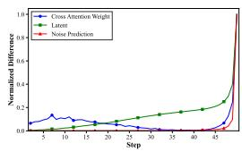  
(a) Averaged curves

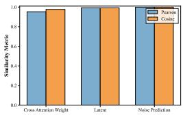  
(b) Similarity results

Figure 1: Timestep-dependent evolution patterns of transition differences for the three representations on Stable Diffusion v1.5. We measure the transition differences for 1000 benign prompts. Figure 1a shows the averaged curves of the three representations. Figure 1b presents the Pearson correlation and cosine similarity between each individual transition trajectory and the corresponding mean results. More details and observation results are available in Appendix A.1.

diffusion trajectories utilizing only benign samples. NDDL first constructs compact trajectory representations from cross-attention, latent and noise spaces. Then, a dynamics model is trained on benign trajectories to predict the next-step representation. During inference, the deviations between the observed and predicted transitions are utilized to quantify dynamics inconsistency, with large deviations indicating potential backdoor attack. Furthermore, NDDL can localize the potential trigger tokens by performing substitution with low-semantic words, enabling trigger identification without requiring prior knowledge of the embedded backdoor.

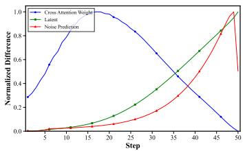  
(a) BadT2I (Pixel)

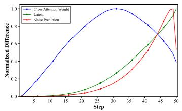  
(b) EvilEdit

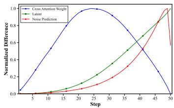  
(c) MasqLoRA  
Figure 2: Discrepancies in diffusion trajectories between benign and backdoor prompts of different backdoor attacks in Stable Diffusion v1.5. More details can be seen in Appendix A.2.

• We introduce a new transition-dynamics perspective for backdoor attacks in T2I diffusion models, showing that trigger effects can be viewed as the deviations from the normal evolution of diffusion trajectories rather than the anomalies in the particular spaces.

• We propose a backdoor defense framework NDDL for learning normal diffusion dynamics, leveraging compact multi-space trajectory representations for backdoor detection and localizing suspicious trigger tokens performing substitution with low-semantic words.

• We conduct extensive experiments against diverse backdoor attacks, demonstrating that NDDL achieves effective and generalizable performance in both backdoor detection and trigger localization compared with existing defense methods.

## 2 RELATED WORK

Backdoor attacks in T2I diffusion models. Backdoor attacks on deep neural networks inject triggers into inputs to hijack model behavior (Doan et al., 2021; Li et al., 2022; Khaddaj et al., 2023; Gu et al., 2017; Zhao et al., 2022; Gao et al., 2026a). Recently, such attacks have extended to generative models, particularly T2I diffusion models. Rickrolling (Struppek et al., 2023) aligns the feature representations of backdoor and target prompts within the text embedding space while preserving the original feature embedding of benign samples. BadT2I (Zhai et al., 2023) pioneers prompt-based backdoor attacks through data poisoning. By leveraging a regularization loss, T2I diffusion models can be efficiently backdoored with only a few fine-tuning steps. EvilEdit (Wang et al., 2024a) directly edits the projection matrices in the cross-attention layers to achieve projection alignment between a trigger and the corresponding backdoor target. MasqLoRA (Lyu et al., 2026) leverages an independent LoRA module as the attack vehicle to stealthily inject malicious behavior into T2I diffusion models. STEBA (Pan et al., 2026) proposes a spatio-temporally acceleration strategy for backdoor injection, improving computational efficiency and reducing memory overhead.

Backdoor defenses in T2I diffusion models. Backdoor defense mechanisms in discriminative models often rely on input perturbations or behavioral monitoring (Wang et al., 2019; Zhu et al., 2023; Wei et al., 2024; Yu et al., 2025), and similar ideas have been extended to T2I diffusion models. T2IShield (Wang et al., 2024b) identifies backdoor behavior via assimilation patterns in cross-attention maps. UFID (Guan et al., 2025) is a black-box method, using image level similarity to separate benign from backdoored outputs without internal access. NaviT2I (Zhai et al., 2025) navigates T2I diffusion models to prevent malicious inputs by analyzing neuron activation varia tions caused by input tokens. STEDF (Pan et al., 2026) formulates backdoor detection as a spatiotemporal feature analysis problem, exploiting weight enrichment patterns and temporal anisotropy to distinguish malicious models from benign ones. However, existing backdoor defenses for T2I diffusion models primarily rely on detecting specific abnormal signatures associated with backdoor activation. These approaches often struggle to generalize against increasingly diverse attack mechanisms due to the lack of a unified characterization of normal generation processes. By learning normal transition dynamics exclusively from benign samples, NDDL does not rely on specific attack artifacts, thereby offering a more generalizable and principled defense paradigm against unknown and diverse backdoor threats.

## 3 TRANSITION DYNAMICS ANALYSIS

## 3.1 TRANSITION DYNAMICS FORMULATION

Let $\boldsymbol { x } _ { t } ~ = ~ ( A _ { t } , z _ { t } , \epsilon _ { t } )$ denote the diffusion state at timestep t. Rather than directly modeling the raw high-dimensional diffusion states, we map them into a compact trajectory representation $r _ { t } = \phi ( x _ { t } ) \in \mathbb R ^ { d }$ , where $\phi ( \cdot )$ is the representation mapping. Motivated by Observation I, from a dynamical-system perspective, we model benign diffusion evolution as a timestep-conditioned transition process $r _ { t + 1 } = F _ { t } ( r _ { t } )$ , where $F _ { t } ( \cdot )$ represents the normal transition rule at timestep t. Observation II demonstrates that backdoor trajectories present obvious deviations from their benign counterparts for various backdoor attacks. Thus, we model the backdoor diffusion evolution as $\dot { r } _ { t + 1 } ^ { b } = \bar { F } _ { t } ( r _ { t } ^ { b } ) + \delta _ { t } ,$ , where $r _ { t } ^ { b }$ represents the mapping trajectory representation related to the backdoor attack and $\delta _ { t }$ is the perturbation induced by backdoor. Thus, we obtain:

Hypothesis 1 (Transition Dynamics Deviation Hypothesis). Backdoor attacks perturb the normal transition dynamics of the diffusion evolution, yielding the trajectory that deviates from the normal one.

This hypothesis provides a unified perspective on the deviations observed from the three representations. Based on it, we aim to investigate two questions: (i) How does the backdoor perturbation affect the trajectory? (ii) Can backdoor-induced deviations be revealed by normal transition prediction?

## 3.2 HOW DOES THE BACKDOOR PERTURBATION AFFECT THE TRAJECTORY?

To investigate how a transition perturbation affects the subsequent trajectory, we first present a mild regularization assumption on normal diffusion dynamics.

Assumption 1 (Time-Conditioned Local Smoothness). For each timestep t, the normal transition rule $F _ { t } ( \cdot )$ is locally Lipschitz around normal diffusion trajectory:

$$
| | F _ { t } ( r ) - F _ { t } ( r ^ { \prime } ) | | _ { 2 } \leq L _ { t } | | r - r ^ { \prime } | | _ { 2 } ,\tag{1}
$$

where $L _ { t }$ varies with timestep.

Assumption 1 does not require the diffusion trajectory to evolve smoothly over time. Instead, it emphasizes that the adjacent states at the same timestep exhibit the locally bounded differences after transition. Then, we characterize how the backdoor-induced transition perturbation affects subsequent trajectory.

Proposition 1 (Propagation of Trigger-Induced Deviations). Let $e _ { t } = r _ { t } ^ { b } - r _ { t }$ denote the difference between the backdoor and benign trajectories. From Assumption $I , \| \dot { e _ { t + 1 } } \| _ { 2 } \leq L _ { t } | | e _ { t } | | _ { 2 } + | | \delta _ { t } | | _ { 2 }$ can be obtained. Recursively,for any t, there is:

$$
\| e _ { t } \| _ { 2 } \leq \left( \prod _ { j = 0 } ^ { t - 1 } L _ { j } \right) \| e _ { 0 } \| _ { 2 } + \sum _ { k = 0 } ^ { t - 1 } \left( \prod _ { j = k + 1 } ^ { t - 1 } L _ { j } \right) \| \delta _ { k } \| _ { 2 } .\tag{2}
$$

Proposition 1 demonstrates that backdoor-induced perturbations can propagate along the diffusion trajectory. This motivates trajectory-level consistency analysis rather than single-step detection. The proof of Proposition 1 is provided in Appendix B.1.

## 3.3 CAN BACKDOOR-INDUCED DEVIATIONS BE REVEALED BY NORMAL TRANSITION PREDICTION?

Furthermore, we investigate whether the backdoor-induced transition deviations can be detected through normal transition predictions. Given a predictor $F _ { \theta }$ from benign trajectories to approximate the normal transition rule $F _ { t }$ , the approximation error can be bounded as:

$$
| | F _ { \theta } ( r , t ) - F _ { t } ( r ) | | _ { 2 } \leq \eta _ { t } ,\tag{3}
$$

where $\eta _ { t }$ is the prediction error at timestep t.

Next, we elaborate the correlation between backdoor-induced perturbation and the transition prediction error.

Proposition 2 (Backdoor-Induced Prediction Inconsistency). $\begin{array} { r c l } { R _ { t } ^ { c } } & { = } & { | | \boldsymbol { r } _ { t + 1 } - \boldsymbol { F } _ { \theta } ( \boldsymbol { r } _ { t } , t ) | | _ { 2 } } \end{array}$ and $R _ { t } ^ { b } \stackrel { - } { = } | | r _ { t + 1 } ^ { b } - F _ { \theta } ( r _ { t } ^ { b } , t ) | | _ { 2 }$ are the transition prediction errors of benign and backdoor trajectories, respectively. Then, thefollowing two bounds hold:

$$
R _ { t } ^ { c } \leq \eta _ { t } , \quad R _ { t } ^ { b } \geq | | \delta _ { t } | | _ { 2 } - \eta _ { t } .\tag{4}
$$

Proposition 2 shows that backdoor-induced perturbation is reflected in the inconsistency between the perturbed transitions and the learned normal dynamics. In particular, perturbation that substantially exceeds the normal prediction error become more distinguishable from the benign transition. This motivates us to employ the transition prediction errors as the criterion for backdoor defense. The proof of Proposition 2 is provided in Appendix B.2.

## 4 METHOD

## 4.1 THREAT MODEL

Scenario and defender capability. We consider a realistic deployment scenario where T2I diffusion models are obtained from potentially untrusted third-party providers. An adversary implants a hidden backdoor into the model and distributes it as a seemingly benign model, while the downstream user remains unaware of the compromise. The defender is assumed to have white-box access to the deployed model but no prior knowledge of the embedded backdoor. A limited set of benign prompts is available and utilized to model the normal diffusion dynamics.

Defense goals. Our defense includes two objectives: (1) Detection: distinguish the backdoor prompts from the benign ones; (2) Localization: identify the tokens that induce the backdoor behaviors.

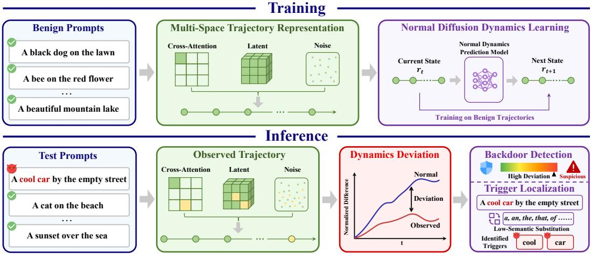  
Figure 3: The overview of NDDL. At the training phase, NDDL first constructs a compact multispace representation of the diffusion trajectory and then learns the normal diffusion dynamics using only benign samples. At the inference phase, NDDL identifies backdoor prompts through dynamics deviation between observed and predicted transitions, while localizing the trigger tokens induced by low-semantic substitution.

## 4.2 THE DETAILS OF NDDL

We propose a defense framework NDDL that views the backdoor behaviors as the deviations of the normal diffusion evolution. The overview of NDDL is illustrated in Figure 3. NDDL first constructs a compact multi-space representation of the diffusion trajectory and then learns the normal transition dynamics using only benign samples. During inference, NDDL identifies backdoor prompts through transition prediction inconsistency, while localizing the suspicious tokens based on the anomalyscore reduction induced by low-semantic token substitution. The pseudocode can be found in $\mathsf { A p - }$ pendix C.5.

## 4.2.1 STAGE I: MULTI-SPACE TRAJECTORY REPRESENTATION

Rather than directly modeling the raw states $x _ { t } = ( A _ { t } , z _ { t } , \epsilon _ { t } )$ , we construct the compact representation $r _ { t } = \phi ( x _ { t } ) = \overline { { ( r _ { t } ^ { A } , r _ { t } ^ { z } , r _ { t } ^ { \bar { \epsilon } } ) } } \in \mathbb { R } ^ { d }$ that summarize the structural and temporal dynamics.

Cross-attention representation. For the cross-attention weight $A _ { t } .$ , we extract four descriptors $r _ { t } ^ { A } = \phi _ { A } ( A _ { t } )$ including attention entropy $A _ { t } ^ { A E }$ , effective rank $A _ { t } ^ { E R }$ , token importance $A _ { t } ^ { T \bar { I } }$ and head diversity $A _ { t } ^ { H D }$ . Attention entropy presents the concentration of token-wise attention distribution, effective rank captures the structural complexity of attention maps, token importance shows the relative contribution of text tokens and head diversity measures variation among different attention heads. Notably, we extract the cross-attention representation of the earliest cross-attention layer along the forward pass.

Latent representation. For the latent state $z _ { t } ,$ we extract the descriptors $r _ { t } ^ { z } ~ = ~ \phi _ { z } ( z _ { t } )$ depicting the instantaneous structure and local temporal evolution. Specially, we consider channel norm $z _ { t } ^ { \ X _ { N } }$ , trajectory curvature $z _ { t } ^ { T C }$ , frequency-domain energy $z _ { t } ^ { F E }$ and temporal variation $z _ { t } ^ { T V }$ . These descriptors elucidate the geometric and spectral dynamics of the latent representation across the diffusion process.

Noise representation. Similarly, we construct $r _ { t } ^ { \epsilon } = \phi _ { \epsilon } ( \epsilon _ { t } )$ utilizing channel norm $\epsilon _ { t } ^ { C N }$ , channel variance $\mathbf { \epsilon } _ { \epsilon _ { t } } ^ { x }$ , frequency-domain energy $\epsilon _ { t } ^ { F E }$ and temporal variation $\epsilon _ { t } ^ { T V }$ . These features characterize both the distribution properties of the predicted noises and the temporal evolution across diffusion process.

Notably, considering the heterogeneous scales of different trajectory descriptors, we apply robust normalization based on benign training statistics followed by block-wise scaling before feature concatenation. Implementation details of representation extractions and normalizations can be seen in Appendixes C.1 and C.2.

## 4.2.2 STAGE II: NORMAL DIFFUSION DYNAMICS LEARNING

Section 3 suggests that backdoor attack can be viewed as the deviation from the normal diffusion evolution. Thus, we consider to model the evolution process of the benign trajectories. We define the transition increment of two consecutive trajectory representations as $\Delta { r } _ { t } = r _ { t + 1 } - r _ { t }$ . Instead of directly predicting $r _ { t + 1 }$ , we train a model $G _ { \theta }$ to obtain this transition increment conditioned on timestep t. The details of $G _ { \theta }$ is presented in Appendix C.3. The prediction of the transition increment is denoted as $\Delta \hat { r } _ { t } = G _ { \theta } ( r _ { t } , t )$ . Then, we can obtain the prediction of the next trajectory representation:

$$
\hat { r } _ { t + 1 } = r _ { t } + \Delta \hat { r } _ { t } .\tag{5}
$$

Thus, the learned approximation of the normal transition rule is:

$$
F _ { \theta } ( r _ { t } , t ) = r _ { t } + G _ { \theta } ( r _ { t } , t ) .\tag{6}
$$

The predictor $G _ { \theta }$ is trained only using trajectories from the benign prompts. Since the three representations exhibit different statistical characteristics, we employ a block weighted loss during model training:

$$
\mathcal { L } = \lambda _ { A } \mathcal { L } _ { A } + \lambda _ { z } \mathcal { L } _ { z } + \lambda _ { \epsilon } \mathcal { L } _ { \epsilon } ,\tag{7}
$$

where

$$
\mathcal { L } _ { m } = \frac { 1 } { T } \sum _ { t = 0 } ^ { T - 1 } \big \| \Delta \boldsymbol { r } _ { t } ^ { m } - \Delta \hat { \boldsymbol { r } } _ { t } ^ { m } \big \| _ { 2 } ^ { 2 } , \quad m \in \{ A , z , \epsilon \} .\tag{8}
$$

$\lambda _ { A } , \lambda _ { z }$ and $\lambda _ { \epsilon }$ are the balance weights. After training, $F _ { \theta }$ serves as the approximation of the normal diffusion transition dynamics.

## 4.2.3 STAGE III: BACKDOOR DETECTION

For an unseen prompt p, we extract its compact trajectory and compute the transition inconsistency as:

$$
E _ { t } = \frac { 1 } { d } \| r _ { t + 1 } - \hat { r } _ { t + 1 } \| _ { 2 } ^ { 2 } .\tag{9}
$$

To evaluate the dynamics consistency, we select a temporal interval of the denoising process and partition it into n equal-length short windows ${ \mathcal { W } } = \{ \hat { W _ { 1 } } , W _ { 2 } , . . . , W _ { n } \}$ . This strategy prevents the transition inconsistencies from being diluted by averaging the entire diffusion trajectory. For each window $W _ { i }$ , we obtain:

$$
S _ { i } ( p ) = { \frac { 1 } { | W _ { i } | } } \sum _ { t \in W _ { i } } E _ { t } .\tag{10}
$$

We define the final anomaly score as $S ( p ) = \mathrm { m a x } _ { i = 1 , \dots , n } S _ { i } ( p )$ and consider the prompt as suspicious when $S ( p ) > \lambda _ { 1 } . \stackrel { \mathrm { ~ \tiny ~ { ~ \wedge ~ } ~ } } { \lambda } _ { 1 }$ can be utilized on benign validation trajectories, which is similar to the method in (Zhai et al., 2025). Specially, to achieve backdoor-agnostic thresholding, we perform a Gaussian fitting on the prediction errors of the benign validation trajectories, i.e., $S ( \dot { p _ { \mathrm { b e n i g n } } } ) \sim \mathcal { N } ( \mu _ { \mathrm { b e n i g n } } , \sigma _ { \mathrm { b e n i g n } } ^ { 2 } )$ . Thus, $\lambda _ { 1 }$ can be set as:

$$
\lambda _ { 1 } = \mu _ { \mathrm { b e n i g n } } + m \cdot \sigma _ { \mathrm { b e n i g n } } .\tag{11}
$$

where $m$ is a balance weight.

## 4.2.4 STAGE IV: TRIGGER LOCALIZATION

For a suspicious prompt $p _ { s } ,$ , we further localize the tokens inducing backdoor behavior. A single predefined substitute may introduce replacement-dependent bias and interact with the embedded backdoor. Therefore, we adopt a corrected multi-substitution strategy, where multiple low-semantic words are selected based on their consistency over benign reference prompts.

Specially, we first collect an initial candidate set $\mathcal { V } _ { 0 }$ including low-semantic words, which are presented in Appendix C.4. Utilizing the benign reference prompts $p \in \mathcal { P } _ { b }$ , we estimate the change introduced by each candidate replacement $v \in \mathcal { V } _ { 0 }$ as:

$$
B ( v ) = \mathbb { E } _ { p \in \mathcal { P } _ { b , i } } [ | S ( p ^ { ( i  v ) } ) - S ( p ) | ] ,\tag{12}
$$

where $p ^ { ( i  v ) }$ represents the prompt by replacing the token at position i with the word v. Candidates obtaining only small variations are preserved to form the corrected set $\mathcal { V } _ { c } = \{ v \in \mathcal { V } _ { 0 } \mid B ( v ) \leq \tau _ { v } \}$ Given a prompt $p _ { s } = \{ w _ { 1 } , w _ { 2 } , \ldots , w _ { n } \}$ , each token $w _ { i }$ is replaced by the token $v \in \mathcal { V } _ { c }$ . The score of the replacement is defined as:

$$
\begin{array} { r } { C _ { i } = S ( p _ { s } ) - \mathrm { M e d i a n } _ { v \in \mathcal { V } _ { c } } S ( p _ { s } ^ { ( i  v ) } ) . } \end{array}\tag{13}
$$

We classify $w _ { i }$ as a trigger token if $C _ { i } > \lambda _ { 2 }$ . The setting of $\lambda _ { 2 }$ is the same as that of $\lambda _ { 1 }$

## 5 EXPERIMENTS

## 5.1 EXPERIMENTAL SETTINGS

Attack and defense methods. We consider the following backdoor attack methods for T2I models: (1) BadT2I Zhai et al. (2023) with one token trigger ‘\u200b’ and the sentence trigger ‘I like this photo.’; (2) EvilEdit Wang et al. (2024a) with the trigger tokens ‘beautiful cat’; (3) MasqLoRA Lyu et al. (2026) with the trigger ‘cool car’; (4) RickRolling Struppek et al. (2023) with the special character ‘o (U+043E)’ as the trigger; (5) STEBA Pan et al. (2026) with the trigger ‘A Object:’. Four defense methods are considered as baselines: UFID Guan et al. (2025), T2IShield Wang et al. (2024b), NaviT2I Zhai et al. (2025) and STEDF Pan et al. (2026).

Dataset and models. We utilize DiffusionDB Wang et al. (2023) to sample the prompts in our experiments. For each attack, we sample 1,000 benign prompts and 1,000 backdoor prompts with the triggers. We conduct main experiments on Stable Diffusion v1.5 Rombach et al. (2022a), Stable Diffusion XL Blattmann et al. (2023). Moreover, we also validate our method on the diffusion transformer (DiT) based Stable Diffusion v3.5 Esser et al. (2024) and Pixart-α Chen et al. (2024).

Evaluation metric. For the results of backdoor detection, we calculate the detection accuracy (ACC). Meanwhile, to eliminate the impact of varying thresholds, we also adopt the area under receiver operating curve (AUROC). We evaluate trigger localization using exact trigger recovery (ETR) and AUROC, where ETR measures the proportion of backdoor prompts that all trigger tokens are correctly identified.

## 5.2 DEFENSE RESULTS

We comprehensively evaluate NDDL across three critical dimensions: backdoor detection, trigger localization, and generalization to DiT architectures. Our results demonstrate that learning normal diffusion dynamics provides a unified, attack-agnostic defense mechanism that consistently outperforms existing methods.

Table 1: Evaluation results of different detection methods against various attacks on Stable Diffusion v1.5. Bold indicates the best performance, and underlined denotes the second best.
<table><tr><td rowspan="2">Method</td><td colspan="2">BadT2I</td><td colspan="2">EvilEdit</td><td colspan="2">MasqLoRA</td><td colspan="2">Rickrolling</td><td colspan="2">STEBA</td></tr><tr><td>ACC ↑</td><td>AUROC ↑</td><td>ACC ↑</td><td>AUROC ↑</td><td>ACC ↑</td><td>AUROC ↑</td><td>ACC ↑</td><td>AUROC↑</td><td>ACC ↑</td><td>AUROC ↑</td></tr><tr><td>UFID</td><td>71.5</td><td>71.4</td><td>62.5</td><td>62.2</td><td>68.1</td><td>68.2</td><td>62</td><td>61.7</td><td>52.7</td><td>51.9</td></tr><tr><td>T2IShield</td><td>84.8</td><td>84.6</td><td>85.3</td><td>85.8</td><td>81.3</td><td>81.9</td><td>85.5</td><td>86.1</td><td>73.3</td><td>73.5</td></tr><tr><td>NaviT2I</td><td>96.3</td><td>96.9</td><td>94.8</td><td>95.5</td><td>91.3</td><td>91.8</td><td>88</td><td>89.1</td><td>79.8</td><td>80.4</td></tr><tr><td>STEDF</td><td>99.3</td><td>99.4</td><td>98</td><td>98.1</td><td>97.5</td><td>97.7</td><td>96.2</td><td>96.6</td><td>89.3</td><td>89.6</td></tr><tr><td>NDDL (Ours)</td><td>99</td><td>99.2</td><td>98.5</td><td>98.6</td><td>98.2</td><td>98.3</td><td>98.2</td><td>98.1</td><td>96.8</td><td>97</td></tr></table>

Evaluation results on backdoor detection. Table 1 reports the performance of different defense methods in distinguishing benign and backdoor prompts on Stable Diffusion v1.5. Specifically, NDDL demonstrates excellent performance, maintaining high ACC and AUROC across diverse backdoor settings. NDDL achieves the best results on EvilEdit, MasqLoRA, Rickrolling, and STEBA, while remaining highly competitive on BadT2I. The improvement is particularly pronounced on STEBA, where NDDL increases ACC from 89.3% to 96.8% and AUROC from 89.6% to 97.0% compared with the best baseline. These results demonstrate that the deviations from normal diffusion dynamics provide the stable and attack-agnostic indicators for identifying the benign and backdoor samples. Detection results on Stable Diffusion XL are reported in Appendix D.1, where NDDL still presents the superior performance.

Table 2: Evaluation results of trigger localization using different methods.
<table><tr><td rowspan="2">Method</td><td colspan="2">One-token</td><td colspan="2">Multi-token</td><td colspan="2">Special-character</td><td colspan="2">Sentence</td></tr><tr><td>ETR↑</td><td>AUROC ↑</td><td>ETR↑</td><td>AUROC ↑</td><td>ETR↑</td><td>AUROC ↑</td><td>ETR↑</td><td>AUROC↑</td></tr><tr><td>T2IShield</td><td>86.8</td><td>87.1</td><td>81.3</td><td>80.5</td><td>89.2</td><td>88.8</td><td>73.8</td><td>75.5</td></tr><tr><td>NaviT2I</td><td>96.8</td><td>96.3</td><td>96.8</td><td>96.5</td><td>93.3</td><td>93.5</td><td>81.5</td><td>81.8</td></tr><tr><td>NDDL (Ours)</td><td>98.8</td><td>99.1</td><td>98.5</td><td>98.9</td><td>96.0</td><td>95.6</td><td>89.2</td><td>88.8</td></tr></table>

Evaluation results on trigger localization. To comprehensively evaluate trigger localization for diverse trigger forms, we implement one-token and sentence-level triggers with BadT2I, multi-token triggers with MasqLoRA and special-character triggers using Rickrolling. As shown in Table 2, NDDL outperforms existing localization methods for all four trigger forms. NDDL obtains high localization accuracy for both one-token and multiple-token triggers, while preserving robust performance on special-character triggers. Notably, NDDL demonstrates its greatest superiority on the more challenging sentence-level triggers, improving ETR and AUROC by 7.7 and 7.0 over NaviT2I. More results on different diffusion models are provided in Appendix D.2. Overall, these results demonstrate that NDDL can reliably localize triggers with diverse trigger forms, including long and structurally complex triggers.

Evaluation results on DiT structure model. Most existing backdoor attack and defense methods for T2I models focus on U-Net based structure. To demonstrate the generalizability of NDDL, we adopt Rickrolling on Stable Diffusion v3.5, which is based on DiT structure. As shown in Table 3, NDDL still presents the best defense performance, demonstrating its effectiveness and generalizability beyond U-Net based diffusion models. The more similar results on Pixart-α also based on DiT structure are shown in Appendix D.3.

Table 3: Evaluation results of defense methods on Stable Diffusion v3.5, where UFID lacks the capability for trigger localizations.
<table><tr><td rowspan="2">Method</td><td colspan="2">Detection</td><td colspan="2">Localization</td></tr><tr><td>ACC↑</td><td>AUROC↑</td><td></td><td>ETR↑ AUROC↑</td></tr><tr><td>UFID</td><td>42.2</td><td>40.1</td><td></td><td></td></tr><tr><td>NaviT2I</td><td>83.8</td><td>82.5</td><td>75.5</td><td>74.3</td></tr><tr><td>NDDL</td><td>91.2</td><td>92.7</td><td>87.5</td><td>86.9</td></tr></table>

## 5.3 ABLATION STUDY

We conduct ablation studies on Stable Diffusion v1.5 using BadT2I as the representative backdoor attack. Unless otherwise specified, all variants are evaluated under the same experimental setting.

Effect of multi-space representations. Table 4 systematically investigates the impact of varying diffusion representation spaces. While single-space representations exhibit constrained detection capacity due to their partial view of the data manifold, combining multiple representations substantially boosts performance. The full representation setting obtains the best results, indicating that the three diffusion spaces offer mutually complementary information. Specifically, while one space may predominantly capture semantic inconsistencies, others might reveal structural or noise-level anomalies, thereby enabling a more robust detection of backdoor-induced transition deviations.

Table 4: Ablation study results of different model variants.
<table><tr><td>Variant</td><td>ACC ↑</td><td>AUROC ↑</td></tr><tr><td>Attention only</td><td>63.5</td><td>62.3</td></tr><tr><td>Latent only</td><td>59.5</td><td>59.5</td></tr><tr><td>Noise only</td><td>58.7</td><td>62.9</td></tr><tr><td>Attention + Noise</td><td>84.5</td><td>86.9</td></tr><tr><td>Latent + Noise</td><td>73.6</td><td>70.9</td></tr><tr><td>Attention + Latent</td><td>89.8</td><td>88.8</td></tr><tr><td>Full</td><td>99</td><td>99.2</td></tr></table>

Effect of different sampling methods. We evaluate the performance of NDDL utilizing different sampling methods. In Table 5, we test the four representative methods. Results indicates that NDDL presents the consistent defense performance for the evaluated samplers, demonstrating its robustness and generality.

Table 5: Performance comparison of different sampling types.
<table><tr><td>Sample type</td><td>ACC ↑</td><td>AUROC ↑</td></tr><tr><td>DDIM</td><td>99.0</td><td>99.2</td></tr><tr><td>DDPM</td><td>97.7</td><td>97</td></tr><tr><td>DPM</td><td>98.2</td><td>98.6</td></tr><tr><td>PLMS</td><td>98.6</td><td>98.5</td></tr></table>

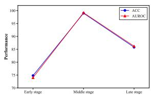  
Figure 4: Performance comparison of different denoising stages.

Effect of denoising stages. We investigate the effect of different denoising stages for the detection results. For the 50 sampling steps, we divide them into three stages: early stage (1-15 steps), middle stage (16-30 steps) and late stage (31-50 steps). Moreover, the window length K is set as 5. As can be seen from Figure 4, the middle stage presents the best performance, followed by the late stage, while the early stage performs the worst. The results indicate that the dynamics deviations induced by backdoor are not equally discriminative over the whole denoising process. The weak performance in the early stage is likely related to the insufficient exhibition of trigger effects. The large transition variations of benign trajectories in the late denoising stage may obscure backdoorinduced deviations to some extent, leading to slightly degraded detection performance. Overall, these results suggest that the middle denoising stage provide the most distinguishable dynamics for the detection performance.

Effect of normal dynamics modeling and window length: We investigate the contribution of normal dynamics modeling through two variants: (1) Raw Diff: directly using adjacentstep representation differences without learning a transition model; (2) w/o Time: retaining the dynamics predictor but removes timestep conditioning. As shown in Figure 5a, directly using raw transition differences results in the worst performance. Learning normal dynamics improves defense performance, especially when timestep conditioning is incorporated. We also

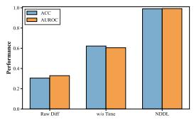  
(a) Modeling strategy

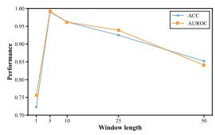  
(b) Window length  
Figure 5: The ablation study of normal dynamics modeling and window length.

study the effect of window length by varying K, ranging from single step to full trajectory. In Figure 5b, utilizing the single step shows limited detection performance, while aggregating residuals of short windows improves the results. However, as the window becomes longer, performance gradually decreases. These results suggest that short-window aggregation better preserves stage-specific transition inconsistencies, while overly long windows dilute the anomalies and reduce the detection performance.

## 6 CONCLUSION

In this work, we study backdoor defense for T2I diffusion models from a transition-dynamics per spective. Rather than relying on attack-specific abnormal indicators, we view backdoor attacks as the deviations from the normal evolution of diffusion trajectories. Our empirical analysis shows that benign trajectories exhibit structured and timestep-dependent transition regularities, while back door attack induces deviations from such normal dynamics. Based on this observation, we propose NDDL, a novel backdoor defense framework that learns normal diffusion transitions from benign trajectories and detects backdoor prompts through dynamics inconsistency. NDDL further enables trigger localization without any prior knowledge of the embedded backdoor by performing substitution with low-semantic words. Extensive experiments for diverse backdoor attacks demonstrate the effectiveness and generalizability of our proposed NDDL.

## 7 AI USE STATEMENT

In this work, we used generative AI tools (specifically ChatGPT) for language editing and polishing to improve the readability and grammatical accuracy of the manuscript. We have not used generative AI tools for generating research ideas, conducting data analysis, or writing original technical content, and AI-assisted figure generation or code synthesis are not applicable to this work. Additionally, we used generative AI tools for refining sentence structure and word choice during the revision process. We have reviewed all AI-assisted work. Specifically, we manually verified every AIsuggested modification against our original draft to ensure that no scientific meaning was altered, hallucinated, or misrepresented; all edits were strictly limited to linguistic improvements and were approved by all authors. We take responsibility for the final content of this work, including text, claims or artifacts produced with the aid of generative AI.

## 8 ETHICS STATEMENT

This work adheres to the ICLR Code of Ethics. In this study, no human subjects or animal experimentation was involved. All datasets used, were sourced in compliance with relevant usage guidelines, ensuring no violation of privacy. We have taken care to avoid any biases or discriminatory outcomes in our research process. No personally identifiable information was used, and no experiments were conducted that could raise privacy or security concerns. We are committed to maintaining transparency and integrity throughout the research process.

## 9 REPRODUCIBILITY STATEMENT

We have made every effort to ensure that the results presented in this paper are reproducible. All code and datasets have been made publicly available in an anonymous repository to facilitate replication and verification. The experimental setup, including training steps, model configurations, and hardware details, is described in detail in the paper. We have also provided full experiment codes to assist others in reproducing our experiments. Additionally, all datasets in this paper are publicly available, ensuring consistent and reproducible evaluation results. We believe these measures will enable other researchers to reproduce our work and further advance the field.

## REFERENCES

Andreas Blattmann, Robin Rombach, Huan Ling, Tim Dockhorn, Seung Wook Kim, Sanja Fidler, and Karsten Kreis. Align your latents: High-resolution video synthesis with latent diffusion models. In Proceedings of the IEEE/CVF Conference on Computer Vision and Pattern Recognition, pp. 22563–22575, 2023.

Junsong Chen, Jincheng Yu, Chongjian Ge, Lewei Yao, Enze Xie, Zhongdao Wang, James Kwok, Ping Luo, Huchuan Lu, and Zhenguo Li. Pixart-α: Fast training of diffusion transformer for photorealistic text-to-image synthesis. In Proceedings of the International Conference on Learning Representations, 2024.

Linghan Chen, Yudong Gao, Jiyao Wang, Kaiyan Ji, and Honglong Chen. Do system prompts leave behavioral fingerprints? a large-scale empirical study of clone detection via output similarity. arXiv preprint arXiv:2608.24461, 2026.

Sheng-Yen Chou, Pin-Yu Chen, and Tsung-Yi Ho. How to backdoor diffusion models? In Proceedings ofthe IEEE/CVF Conference on Computer Vision and Pattern Recognition, pp. 4015–4024, 2023a.

Sheng-Yen Chou, Pin-Yu Chen, and Tsung-Yi Ho. Villandiffusion: A unified backdoor attack framework for diffusion models. Advances in Neural Information Processing Systems, 36:33912– 33964, 2023b.

Khoa Doan, Yingjie Lao, Weijie Zhao, and Ping Li. Lira: Learnable, imperceptible and robust backdoor attacks. In Proceedings of the IEEE/CVF International Conference on Computer Vision, pp. 11946–11956, 2021.

Patrick Esser, Sumith Kulal, Andreas Blattmann, Rahim Entezari, Jonas Muller, Harry Saini, Yam¨ Levi, Dominik Lorenz, Axel Sauer, Frederic Boesel, Dustin Podell, Tim Dockhorn, Zion English, and Robin Rombach. Scaling rectified flow transformers for high-resolution image synthesis. In Proceedings ofthe International Conference on Machine Learning, pp. 12606–12633, 2024.

Yudong Gao, Linghan Chen, Wenhan Wu, Mia Zhou, Jiyao Wang, Kaiyan Ji, Mingyu Guo, and Honglong Chen. Bit-flip attacks on vision-language-action models: Action-decoding architecture shapes the vulnerability. arXiv preprint arXiv:2608.15475, 2026a.

Yudong Gao, Qingyue Wang, Yuanyuan Yuan, Ruixuan Huang, Linghan Chen, Zimo Ji, and Shuai Wang. Pathmark: Protecting intellectual property of mixture-of-expert llms via path watermarks. arXiv preprint arXiv:2607.03688, 2026b.

Tianyu Gu, Brendan Dolan-Gavitt, and Siddharth Garg. Badnets: Identifying vulnerabilities in the machine learning model supply chain. arXiv preprint arXiv:1708.06733, 2017.

Zihan Guan, Mengxuan Hu, Sheng Li, and Anil Kumar Vullikanti. Ufid: A unified framework for black-box input-level backdoor detection on diffusion models. In Proceedings of the AAAI Conference on Artificial Intelligence, volume 39, 2025.

Jonathan Ho, Ajay Jain, and Pieter Abbeel. Denoising diffusion probabilistic models. Advances in Neural Information Processing Systems, 33:6840–6851, 2020.

Ziqi Huang, Kelvin CK Chan, Yuming Jiang, and Ziwei Liu. Collaborative diffusion for multimodal face generation and editing. In Proceedings of the IEEE/CVF Conference on Computer Vision and Pattern Recognition, pp. 6080–6090, 2023.

Alaa Khaddaj, Guillaume Leclerc, Aleksandar Makelov, Kristian Georgiev, Hadi Salman, Andrew Ilyas, and Aleksander Madry. Rethinking backdoor attacks. In Proceedings of the International Conference on Machine Learning, pp. 16216–16236, 2023.

Mingxiao Li, Tingyu Qu, Ruicong Yao, Wei Sun, and Marie-Francine Moens. Alleviating exposure bias in diffusion models through sampling with shifted time steps. In Proceedings of the International Conference on Learning Representations, 2024.

Yiming Li, Yong Jiang, Zhifeng Li, and Shu-Tao Xia. Backdoor learning: A survey. IEEE Transactions on Neural Networks and Learning Systems, 35(1):5–22, 2022.

Tong Liu, Zhixin Lai, Jiawen Wang, Gengyuan Zhang, Shuo Chen, Philip Torr, Vera Demberg, Volker Tresp, and Jindong Gu. Multimodal pragmatic jailbreak on text-to-image models. In Proceedings of the Annual Meeting of the Association for Computational Linguistics, pp. 4681– 4720, 2025.

Xiaolong Liu, Junjian Li, Yuan Xiao, Jiaqi Deng, Dayong Ye, Tianqing Zhu, and Huan Huo. Dual inversion for text-to-image diffusion models: From both prompt and noise perspectives. arXiv preprint arXiv:2607.26735, 2026.

Liangwei Lyu, Jiaqi Xu, Jianwei Ding, and Qiyao Deng. When lora betrays: Backdooring text-toimage models by masquerading as benign adapters. In Proceedings ofthe IEEE/CVF Conference on Computer Vision and Pattern Recognition, pp. 8577–8586, 2026.

Yichuan Mo, Hui Huang, Mingjie Li, Ang Li, and Yisen Wang. Terd: a unified framework for safeguarding diffusion models against backdoors. In Proceedings of International Conference on Machine Learning, pp. 35892–35909, 2024.

Yu Pan, Jiahao Chen, Lin Wang, Bingrong Dai, and Wenjie Wang. Stediff: Revealing the spatial and temporal redundancy of backdoor attacks in text-to-image diffusion models. In Proceedings of the International Conference on Learning Representations, 2026.

Yiting Qu, Xinyue Shen, Xinlei He, Michael Backes, Savvas Zannettou, and Yang Zhang. Unsafe diffusion: On the generation of unsafe images and hateful memes from text-to-image models. In Proceedings of the ACM SIGSAC Conference on Computer and Communications Security, pp. 3403–3417, 2023.

Robin Rombach, Andreas Blattmann, Dominik Lorenz, Patrick Esser, and Bjorn Ommer. High-¨ resolution image synthesis with latent diffusion models. In Proceedings of the IEEE/CVF Con ference on Computer Vision and Pattern Recognition, pp. 10684–10695, 2022a.

Robin Rombach, Andreas Blattmann, Dominik Lorenz, Patrick Esser, and Bjorn Ommer. High-¨ resolution image synthesis with latent diffusion models. In Proceedings of the IEEE/CVF Con ference on Computer Vision and Pattern Recognition, pp. 10674–10685, 2022b.

Yang Song, Jascha Sohl-Dickstein, Diederik P Kingma, Abhishek Kumar, Stefano Ermon, and Ben Poole. Score-based generative modeling through stochastic differential equations. In Proceedings ofthe International Conference on Learning Representations, 2021.

Lukas Struppek, Dominik Hintersdorf, and Kristian Kersting. Rickrolling the artist: Injecting backdoors into text encoders for text-to-image synthesis. In Proceedings of the IEEE/CVF International Conference on Computer Vision, pp. 4584–4596, 2023.

Vu Tuan Truong, Luan Ba Dang, and Long Bao Le. Attacks and defenses for generative diffusion models: A comprehensive survey. ACM Computing Surveys, 57(8):1–44, 2025.

Bolun Wang, Yuanshun Yao, Shawn Shan, Huiying Li, Bimal Viswanath, Haitao Zheng, and Ben Y Zhao. Neural cleanse: Identifying and mitigating backdoor attacks in neural networks. In Proceedings ofthe IEEE Symposium on Security and Privacy, pp. 707–723, 2019.

Hao Wang, Shangwei Guo, Jialing He, Kangjie Chen, Shudong Zhang, Tianwei Zhang, and Tao Xiang. Eviledit: Backdooring text-to-image diffusion models in one second. In Proceedings of the ACM International Conference on Multimedia, pp. 3657–3665, 2024a.

Zhendong Wang, Jianmin Bao, Shuyang Gu, Dong Chen, Wengang Zhou, and Houqiang Li. Designdiffusion: High-quality text-to-design image generation with diffusion models. In Proceedings of the IEEE/CVF Conference on Computer Vision and Pattern Recognition, pp. 20906–20915, 2025.

Zhongqi Wang, Jie Zhang, Shiguang Shan, and Xilin Chen. T2ishield: Defending against backdoors on text-to-image diffusion models. European Conference on Computer Vision, pp. 107–124, 2024b.

Zijie J Wang, Evan Montoya, David Munechika, Haoyang Yang, Benjamin Hoover, and Duen Horng Chau. Diffusiondb: A large-scale prompt gallery dataset for text-to-image generative models. In Proceedings of the Annual Meeting of Association for Computational Linguistics, pp. 893–911, 2023.

Shaokui Wei, Hongyuan Zha, and Baoyuan Wu. Mitigating backdoor attack by injecting proactive defensive backdoor. Advances in Neural Information Processing Systems, 37:80674–80705, 2024.

Jiale Xu, Xintao Wang, Weihao Cheng, Yan-Pei Cao, Ying Shan, Xiaohu Qie, and Shenghua Gao. Dream3d: Zero-shot text-to-3d synthesis using 3d shape prior and text-to-image diffusion models. In Proceedings of the IEEE/CVF Conference on Computer Vision and Pattern Recognition, pp. 20908–20918, 2023a.

Xingqian Xu, Zhangyang Wang, Gong Zhang, Kai Wang, and Humphrey Shi. Versatile diffusion: Text, images and variations all in one diffusion model. In Proceedings ofthe IEEE/CVF International Conference on Computer Vision, pp. 7754–7765, 2023b.

Song Yan, Hui Wei, Jinlong Fei, Guoliang Yang, Zhengyu Zhao, and Zheng Wang. Universally unfiltered and unseen: Input-agnostic multimodal jailbreaks against text-to-image model safeguards. In Proceedings ofthe ACM International Conference on Multimedia, pp. 11279–11287, 2025.

Jimiao Yu, Honglong Chen, Junjian Li, Linghan Chen, Yudong Gao, Weifeng Liu, and Lei Zhang. Black-box adversarial defense based on image decomposition and reconstruction. IEEE Transactions on Multimedia, 27:5909–5921, 2025.

Shengfang Zhai, Yinpeng Dong, Qingni Shen, Shi Pu, Yuejian Fang, and Hang Su. Text-to-image diffusion models can be easily backdoored through multimodal data poisoning. In Proceedings ofthe ACM International Conference on Multimedia, pp. 1577–1587, 2023.

Shengfang Zhai, Jiajun Li, Yue Liu, Huanran Chen, Zhihua Tian, Wenjie Qu, Qingni Shen, Ruoxi Jia, Yinpeng Dong, and Jiaheng Zhang. Efficient input-level backdoor defense on text-to-image synthesis via neuron activation variation. In Proceedings ofthe IEEE/CVF International Conference on Computer Vision, pp. 15182–15193, 2025.

Chenyu Zhang, Mingwang Hu, Wenhui Li, and Lanjun Wang. Adversarial attacks and defenses on text-to-image diffusion models: A survey. Information Fusion, 114:102701, 2025.

Yi Zhang, Zhen Chen, Chih-Hong Cheng, Wenjie Ruan, Xiaowei Huang, Dezong Zhao, David Flynn, Siddartha Khastgir, and Xingyu Zhao. Trustworthy text-to-image diffusion models: A timely and focused survey. Information Fusion, pp. 104264, 2026.

Zhendong Zhao, Xiaojun Chen, Yuexin Xuan, Ye Dong, Dakui Wang, and Kaitai Liang. Defeat: Deep hidden feature backdoor attacks by imperceptible perturbation and latent representation constraints. In Proceedings of the IEEE/CVF Conference on Computer Vision and Pattern Recognition, pp. 15192–15201, 2022.

Mingli Zhu, Shaokui Wei, Li Shen, Yanbo Fan, and Baoyuan Wu. Enhancing fine-tuning based backdoor defense with sharpness-aware minimization. In Proceedings ofthe IEEE/CVF International Conference on Computer Vision, pp. 4443–4454, 2023.

## A THE DETAILS OF OBSERVATION RESULTS ON DIFFUSION DYNAMICS

## A.1 OBSERVATION I

For the benign prompts, we measure the transition differences between the consecutive denoising steps: $\begin{array} { r } { d _ { t } ^ { A } \ = \ \bar { D } \mathrm { J s } ( \bar { A } _ { t } , A _ { t + 1 } ) , d _ { t } ^ { z } \ = \ \mathrm { M S E } ( z _ { t } , z _ { t + 1 } ) , d _ { t } ^ { \epsilon } \ = \ \mathrm { M S E } ( \epsilon _ { t } , \epsilon _ { t + 1 } ) } \end{array}$ , where $D _ { \mathrm { J S } }$ is JS divergence and MSE represents mean squared error. To study the consistency of benign diffusion dynamics, we randomly sample 10 benign prompts and analyze the temporal evolution of each representation over the denoising process. Specially, for each prompt, we track the consecutive transition differences in cross-attention weights, latent and noise spaces. As shown in Figure 6, despite semantic differences for the sampled prompts, the overall evolution remains highly consistent in each representation. Then, for each representation, we compute the transition difference by averaging 1000 benign trajectories. As shown in Figure 1a, the averaged curves present clear timestep-dependent evolution patterns for the three representations. To quantify this consistency, we compute the Pearson correlation and cosine similarity between each individual transition trajectory and the corresponding mean results. High similarities in Figure 1b indicate that, despite substantial semantic diversity, the benign prompts follow a common temporal evolution pattern. In addition, we evaluate the results of different models. As shown in Figures 7, 8 and 9, although different models are employed, similar evolution patterns can be observed. Overall, these results lead to our first empirical observation: Benign diffusion trajectories exhibit structured and time-dependent transition dynamics.

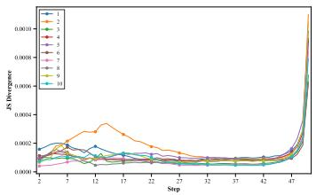  
(a) Cross-attention weight

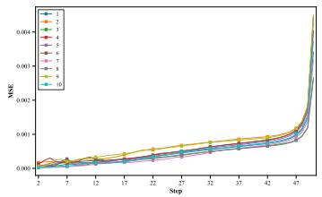  
(b) Latent

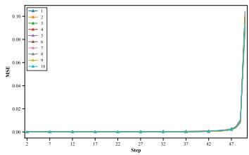  
(c) Noise  
Figure 6: The evolution patterns of transition differences in Stable Diffusion v1.5 based on a random sample of 10 benign prompts.

## A.2 OBSERVATION II

We further investigate how backdoor triggers affect the evolution of diffusion trajectories. We compare the representation trajectories of benign and backdoor prompts, calculating their discrepancy at each denoising timestep: $g _ { t } ^ { A } = D _ { \mathrm { J S } } ( A _ { t } ^ { b } , A _ { t } ) , g _ { t } ^ { z } = \mathrm { M S E } ( z _ { t } ^ { b } , z _ { t } ) , g _ { t } ^ { \epsilon } = \mathrm { M S E } ( \epsilon _ { t } ^ { b } , \epsilon _ { t } )$ . For different backdoor attack methods, we randomly sample 500 prompts and their corresponding trigger-injected ones. As shown in Figure 2, the backdoor-related trajectories exhibit obvious discrepancies from their benign ones for the three representations. Although the temporal patterns of these discrepancies vary in different attack methods, the separation between benign and backdoor trajectories remains consistently observable over the diffusion process. To further validate Observation II, we provide additional results of different backdoor attacks. Specifically, we compare the diffusion trajectories of benign prompts with their corresponding backdoor ones in the cross-attention, latent and noise spaces. As shown in Figures 10, 11, 12, 13 and 14, obvious discrepancies between benign and backdoor trajectories can be consistently observed in different attacks and representation spaces. We also provide quantitative similarity analysis. As can be seen, backdoor prompts of different attack methods exhibit highly similar temporal patterns of trajectory discrepancy. These results lead to our second empirical observation: Backdoor attacks induce distinct deviations from benign diffusion trajectories.

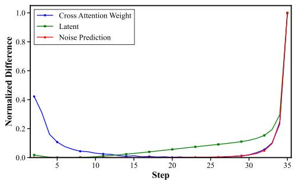  
(a) Averaged curves

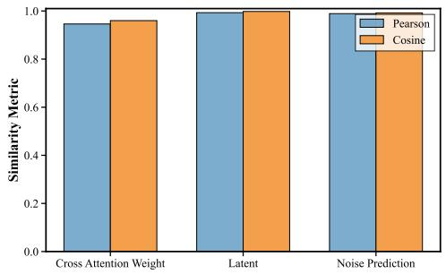  
(b) Similarity results  
Figure 7: Timestep-dependent evolution patterns of transition differences for the three representations of Stable Diffusion XL.

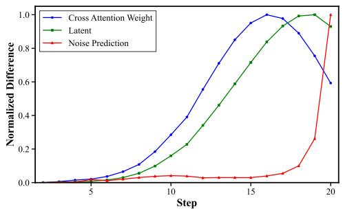  
(a) Averaged curves

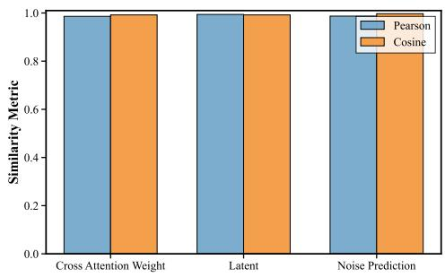  
(b) Similarity results  
Figure 8: Timestep-dependent evolution patterns of transition differences for the three representations of Pixart-α.

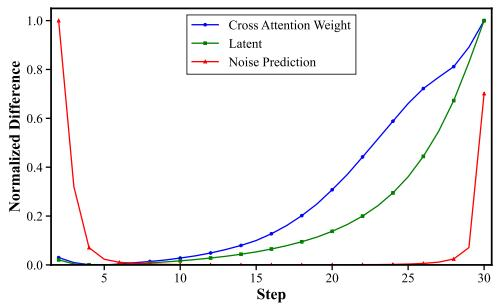  
(a) Averaged curves

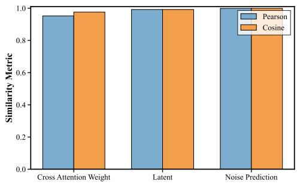  
(b) Similarity results  
Figure 9: Timestep-dependent evolution patterns of transition differences for the three representations of Stable Diffusion v3.5.

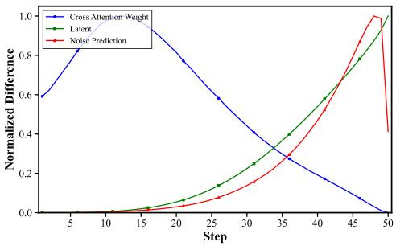  
(a) Averaged discrepancy curves of BadT2I (Ob-

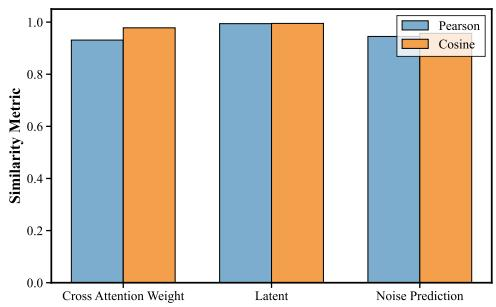  
(b) Similarity results of BadT2I (Object)

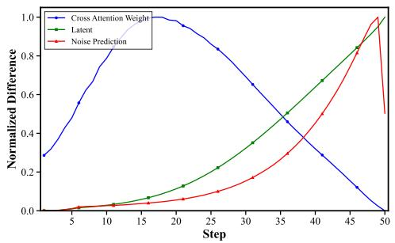  
(c) Averaged discrepancy curves of BadT2I (Pixel)

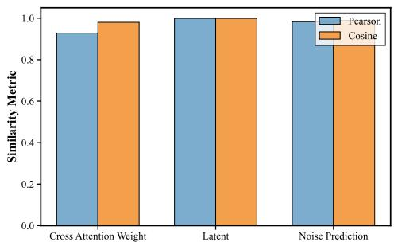  
(d) Similarity results of BadT2I (Pixel)

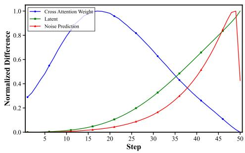  
(e) Averaged discrepancy curves of BadT2I (Style)

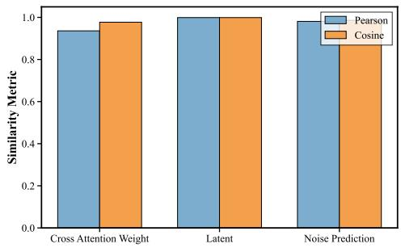  
(f) Similarity results of BadT2I (Style)  
Figure 10: Discrepancy results in diffusion trajectories between benign and backdoor prompts of BadT2I in Stable Diffusion v1.5.

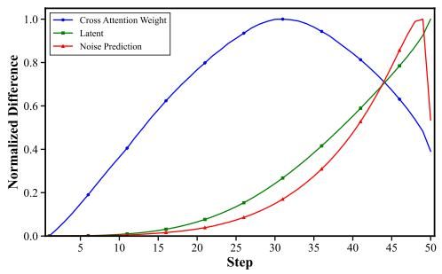  
(a) Averaged discrepancy curves of EvilEdit

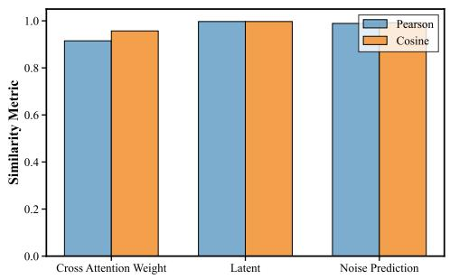  
(b) Similarity results of EvilEdit  
Figure 11: Discrepancy results in diffusion trajectories between benign and backdoor prompts of EvilEdit in Stable Diffusion v1.5.

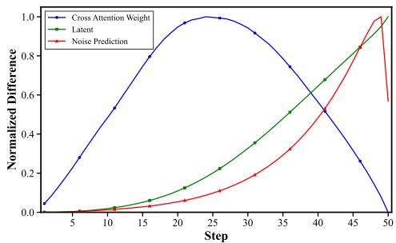  
(a) Averaged discrepancy curves of MasqLoRA

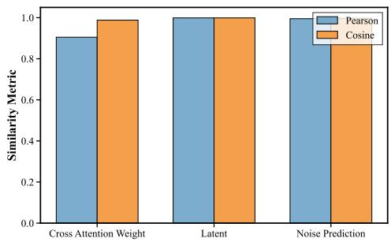  
(b) Similarity results of MasqLoRA  
Figure 12: Discrepancy results in diffusion trajectories between benign and backdoor prompts of MasqLoRA in Stable Diffusion v1.5.

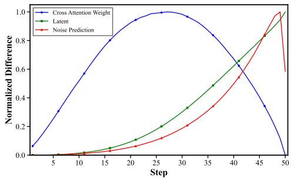  
(a) Averaged discrepancy curves of Rickrolling

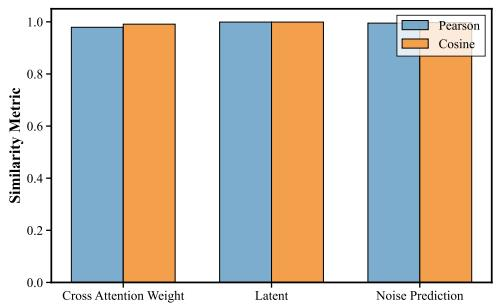  
(b) Similarity results of Rickrolling  
Figure 13: Discrepancy results in diffusion trajectories between benign and backdoor prompts of Rickrolling in Stable Diffusion v1.5.

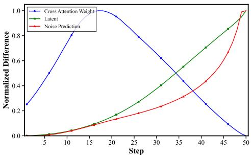  
(a) Averaged discrepancy curves of STEBA

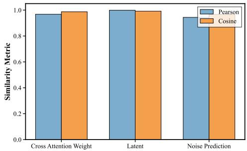  
(b) Similarity results of STEBA  
Figure 14: Discrepancy results in diffusion trajectories between benign and backdoor prompts of STEBA in Stable Diffusion v1.5.

## B TRANSITION DYNAMICS ANALYSIS

## B.1 PROOF OF PROPOSITION 1

The proof of Proposition 1 is as follows:

Proof. The benign and backdoor transition dynamics are given by:

$$
r _ { t + 1 } = F _ { t } ( r _ { t } ) , \qquad r _ { t + 1 } ^ { b } = F _ { t } ( r _ { t } ^ { b } ) + \delta _ { t } .\tag{14}
$$

Let $e _ { t } = r _ { t } ^ { b } - r _ { t }$ denote the deviation between the backdoor and benign trajectories. Then, we obtain:

$$
\begin{array} { c } { { e _ { t + 1 } = r _ { t + 1 } ^ { b } - r _ { t + 1 } } } \\ { { = F _ { t } ( r _ { t } ^ { b } ) - F _ { t } ( r _ { t } ) + \delta _ { t } . } } \end{array}\tag{15}
$$

To use the $\ell _ { 2 }$ norm and the triangle inequality, we can further obtain:

$$
\| e _ { t + 1 } \| _ { 2 } \leq \| F _ { t } ( r _ { t } ^ { b } ) - F _ { t } ( r _ { t } ) \| _ { 2 } + \| \delta _ { t } \| _ { 2 } .\tag{16}
$$

From Assumption 1, we can have:

$$
\| F _ { t } ( r _ { t } ^ { b } ) - F _ { t } ( r _ { t } ) \| _ { 2 } \leq L _ { t } \| r _ { t } ^ { b } - r _ { t } \| _ { 2 } = L _ { t } \| e _ { t } \| _ { 2 } .\tag{17}
$$

Therefore, the following inequation holds:

$$
\lVert e _ { t + 1 } \rVert _ { 2 } \leq L _ { t } \lVert e _ { t } \rVert _ { 2 } + \lVert \delta _ { t } \rVert _ { 2 } .\tag{18}
$$

Recursively, we obtain:

$$
\begin{array} { r l r } {  { \| e _ { t } \| _ { 2 } \leq L _ { t - 1 } \| e _ { t - 1 } \| _ { 2 } + \| \delta _ { t - 1 } \| _ { 2 } } } \\ & { } & { \leq L _ { t - 1 } L _ { t - 2 } \| e _ { t - 2 } \| _ { 2 } + L _ { t - 1 } \| \delta _ { t - 2 } \| _ { 2 } + \| \delta _ { t - 1 } \| _ { 2 } } \\ & { } & { \leq \cdots } \\ & { } & { \leq ( \displaystyle \prod _ { j = 0 } ^ { t - 1 } L _ { j } ) \| e _ { 0 } \| _ { 2 } + \displaystyle \sum _ { k = 0 } ^ { t - 1 } ( \displaystyle \prod _ { j = k + 1 } ^ { t - 1 } L _ { j } ) \| \delta _ { k } \| _ { 2 } . } \end{array}\tag{19}
$$

Since the backdoor prompts includes the triggers, $e _ { 0 } \neq 0$ holds. Thus, we have:

$$
\| e _ { t } \| _ { 2 } \leq \left( \prod _ { j = 0 } ^ { t - 1 } L _ { j } \right) \| e _ { 0 } \| _ { 2 } + \sum _ { k = 0 } ^ { t - 1 } \left( \prod _ { j = k + 1 } ^ { t - 1 } L _ { j } \right) \| \delta _ { k } \| _ { 2 } .\tag{20}
$$

## B.2 PROOF OF PROPOSITION 2

The proof of Proposition 2 is as follows:

Proof. We recall that the benign and backdoor transition dynamics are defined as:

$$
r _ { t + 1 } = F _ { t } ( r _ { t } ) , \qquad r _ { t + 1 } ^ { b } = F _ { t } ( r _ { t } ^ { b } ) + \delta _ { t } .\tag{21}
$$

Assume that the learned predictor $F _ { \theta }$ approximates the normal transition function $F _ { t }$ with the bounded error:

$$
\| F _ { \theta } ( r , t ) - F _ { t } ( r ) \| _ { 2 } \leq \eta _ { t } .\tag{22}
$$

Given a benign trajectory, the transition prediction error is:

$$
\begin{array} { r l } & { R _ { t } ^ { c } = \| r _ { t + 1 } - F _ { \theta } ( r _ { t } , t ) \| _ { 2 } } \\ & { \quad \quad = \| F _ { t } ( r _ { t } ) - F _ { \theta } ( r _ { t } , t ) \| _ { 2 } } \\ & { \quad \quad \le \eta _ { t } . } \end{array}\tag{23}
$$

Given a backdoor trajectory, we have:

$$
\begin{array} { r l } & { R _ { t } ^ { b } = \| r _ { t + 1 } ^ { b } - F _ { \theta } ( r _ { t } ^ { b } , t ) \| _ { 2 } } \\ & { \quad \quad = \| F _ { t } ( r _ { t } ^ { b } ) + \delta _ { t } - F _ { \theta } ( r _ { t } ^ { b } , t ) \| _ { 2 } } \\ & { \quad \quad = \| \delta _ { t } + [ F _ { t } ( r _ { t } ^ { b } ) - F _ { \theta } ( r _ { t } ^ { b } , t ) ] \| _ { 2 } . } \end{array}\tag{24}
$$

This decomposition separates the backdoor-induced perturbation from the approximation error of the learned normal dynamics predictor. Applying the reverse triangle inequality, we obtain:

$$
\begin{array} { r l } & { R _ { t } ^ { b } \geq \| \delta _ { t } \| _ { 2 } - \| F _ { t } ( r _ { t } ^ { b } ) - F _ { \theta } ( r _ { t } ^ { b } , t ) \| _ { 2 } } \\ & { \quad \geq \| \delta _ { t } \| _ { 2 } - \eta _ { t } . } \end{array}\tag{25}
$$

Therefore, the following two inequations can be obtained:

$$
R _ { t } ^ { c } \leq \eta _ { t } , \qquad R _ { t } ^ { b } \geq \| \delta _ { t } \| _ { 2 } - \eta _ { t } .\tag{26}
$$

Obviously, sufficiently large backdoor-induced deviations can be distinguished from benign transitions through prediction inconsistency. □

## C THE DETAILS OF NDDL

## C.1 CALCULATION OF MULTI-SPACE REPRESENTATIONS

## C.1.1 CROSS-ATTENTION WEIGHT

At each diffusion timestep t, we denote the cross-attention weight as $A _ { t } \ \in \ \mathbb { R } ^ { H \times S \times N }$ , where H denotes the number of attention heads, S denotes the number of spatial query positions and N denotes the number of tokens. Specifically, $A _ { t , h , s , n }$ represents the attention weight associated with the h-th attention head at spatial position s to the n-th token. Since cross-attention weights are normalized along the token dimension, we can obtain $\textstyle \sum _ { n = 1 } ^ { N } A _ { t , h , s , n } = 1$ . Then, we extract $A _ { t }$ to form four complementary descriptors: attention entropy, effective rank, token importance and head diversity. These descriptors characterize the concentration, structural complexity, token-level contribution and inter-head variation of cross-attention, respectively. It should be particularly noted that we capture joint attention weight for Stable Diffusion v3.5.

Attention entropy: Attention entropy presents the concentration of token-wise attention distribution. For the h-th head at spatial position s, we calculate:

$$
\mathcal { H } _ { t , h , s } = - \sum _ { n = 1 } ^ { N } A _ { t , h , s , n } \log \left( A _ { t , h , s , n } \right) .\tag{27}
$$

Then, we average the entropy over all spatial query positions:

$$
A _ { t , h } ^ { A E } = \frac { 1 } { S } \sum _ { s = 1 } ^ { S } \mathcal { H } _ { t , h , s } .\tag{28}
$$

Thus, the entropy descriptor $A _ { t } ^ { A E } \ = \ \left\lceil A _ { t , 1 } ^ { A E } , A _ { t , 2 } ^ { A E } , \ldots , A _ { t , H } ^ { A E } \right\rceil \ \in \ \mathbb { R } ^ { H }$ can be formed. A larger entropy indicates that attention is distributed over a broader set of tokens, whereas a smaller entropy indicates that attention is concentrated on fewer tokens.

Effective rank: Effective rank depicts the structural complexity of each attention map. For the h-th head, we view $A _ { t , h } \in \mathbb { R } ^ { S \times N }$ as a two-dimensional attention matrix and perform singular value decomposition:

$$
\begin{array} { r } { A _ { t , h } = U _ { t , h } \Sigma _ { t , h } V _ { t , h } ^ { \top } . } \end{array}\tag{29}
$$

Let $\{ \sigma _ { t , h , 1 } , \sigma _ { t , h , 2 } , \ldots , \sigma _ { t , h , K } \} ( K = \operatorname* { m i n } ( S , N ) )$ represent the singular values of $A _ { t , h }$ . We normalize the singular values as:

$$
p _ { t , h , k } = \frac { \sigma _ { t , h , k } } { \sum _ { j = 1 } ^ { K } \sigma _ { t , h , j } } .\tag{30}
$$

The entropy of the normalized singular-value distribution is:

$$
\mathcal { H } _ { t , h } ^ { \sigma } = - \sum _ { k = 1 } ^ { K } p _ { t , h , k } \log \left( p _ { t , h , k } \right) .\tag{31}
$$

Thus, we can obtain the effective rank:

$$
A _ { t , h } ^ { E R } = \exp \left( \mathcal { H } _ { t , h } ^ { \sigma } \right) .\tag{32}
$$

The descriptor of effective rank is denoted as $A _ { t } ^ { E R } = \left\lceil A _ { t , 1 } ^ { E R } , A _ { t , 2 } ^ { E R } , \dots , A _ { t , H } ^ { E R } \right\rceil \in \mathbb { R } ^ { H }$ . A larger effective rank indicates greater structural complexity of the attention map, whereas a smaller value indicates that its structure is dominated by fewer components.

Token importance: Token importance measures the overall attention assigned to each token. For the n-th token, we average its attention weights over all heads and spatial positions:

$$
A _ { t , n } ^ { T I } = \frac { 1 } { H S } \sum _ { h = 1 } ^ { H } \sum _ { s = 1 } ^ { S } A _ { t , h , s , n } .\tag{33}
$$

This descriptor is denoted as $A _ { t } ^ { T I } = \left[ A _ { t , 1 } ^ { T I } , A _ { t , 2 } ^ { T I } , \ldots , A _ { t , N } ^ { T I } \right] \in \mathbb { R } ^ { N }$ , representing the average relative attention assigned to the n-th token at timestep t.

Head diversity: Head diversity reflects the variation in token-level attention distribution among different heads. For each head, we first average the attention weights over all spatial positions:

$$
\bar { A } _ { t , h , n } = \frac { 1 } { S } \sum _ { s = 1 } ^ { S } A _ { t , h , s , n } .\tag{34}
$$

We then normalize the averaged attention weights over the token dimension:

$$
\pi _ { t , h , n } = \frac { \bar { A } _ { t , h , n } } { \sum _ { n ^ { \prime } = 1 } ^ { N } \bar { A } _ { t , h , n ^ { \prime } } } .\tag{35}
$$

For each pair of attention heads $( h _ { 1 } , h _ { 2 } )$ , we define their mixture distribution as:

$$
M _ { t , h _ { 1 } , h _ { 2 } } = \frac { 1 } { 2 } \left( \pi _ { t , h _ { 1 } , n } + \pi _ { t , h _ { 2 } , n } \right) .\tag{36}
$$

JS divergence is calculated as:

$$
D _ { \mathrm { J S } } \left( \pi _ { t , h _ { 1 } , n } , \pi _ { t , h _ { 2 } , n } \right) = \frac { 1 } { 2 } D _ { \mathrm { K L } } \left( \pi _ { t , h _ { 1 } , n } \| M _ { t , h _ { 1 } , h _ { 2 } } \right) + \frac { 1 } { 2 } D _ { \mathrm { K L } } \left( \pi _ { t , h _ { 2 } , n } \| M _ { t , h _ { 1 } , h _ { 2 } } \right) ,\tag{37}
$$

where KL divergence is obtained from:

$$
D _ { \mathrm { K L } } ( p \Vert q ) = \sum _ { n = 1 } ^ { N } p _ { n } \log { \frac { p _ { n } } { q _ { n } } } .\tag{38}
$$

Finally, we average JS divergences over all distinct attention-head pairs:

$$
A _ { t } ^ { H D } = \frac { 2 } { H ( H - 1 ) } \sum _ { 1 \leq h _ { 1 } < h _ { 2 } \leq H } D _ { \mathrm { J S } } \left( \pi _ { t , h _ { 1 } , n } , \pi _ { t , h _ { 2 } , n } \right) .\tag{39}
$$

The head diversity descriptor is $A _ { t } ^ { H D } \in \mathbb { R } .$ A larger value indicates greater variation in tokenlevel attention distribution among different heads, whereas a smaller value indicates more consistent attention behaviors.

## C.1.2 LATENT

At each diffusion timestep t, the latent state is denoted as ${ \boldsymbol { z } } _ { t } ~ \in ~ \mathbb { R } ^ { C \times H \times W }$ , where C denotes the number of latent channels, H and W denote the spatial resolution. We construct the compact representation including four descriptors: channel norm, trajectory curvature, frequency energy and temporal variation. These descriptors describe the magnitude, variation degree, spectral structure and local transition behavior of the latent trajectory. Notably, for the boundary steps where the preceding states are unavailable, we apply zero-padding.

Channel norm: Latent norm reflects the overall magnitude of each latent channel. For the c-th latent channel $z _ { t , c } \in \mathbb { R } ^ { H \times W }$ , we obtain:

$$
z _ { t , c } ^ { C N } = \| z _ { t , c } \| _ { 2 } = \sqrt { \sum _ { i = 1 } ^ { H } \sum _ { j = 1 } ^ { W } z _ { t , c , i , j } ^ { 2 } } .\tag{40}
$$

The descriptor of latent norm is $z _ { t } ^ { C N } = \left[ z _ { t , 1 } ^ { C N } , z _ { t , 2 } ^ { C N } , \ldots , z _ { t , C } ^ { C N } \right] \in \mathbb { R } ^ { C }$ . A larger latent norm indicates a larger overall magnitude of the corresponding latent channel, providing a compact representation of the instantaneous latent state.

Trajectory curvature: Latent curvature is calculated from the second-order temporal variation of the latent trajectory. We first obtain the consecutive transition difference of the c-th latent channel as:

$$
\Delta z _ { t , c } = z _ { t , c } - z _ { t - 1 , c } .\tag{41}
$$

The curvature is then calculated as the variation between two consecutive transition differences:

$$
z _ { t , c } ^ { T C } = \| \Delta z _ { t , c } - \Delta z _ { t - 1 , c } \| _ { 2 } .\tag{42}
$$

Equivalently, we have:

$$
z _ { t , c } ^ { T C } = \| z _ { t , c } - 2 z _ { t - 1 , c } + z _ { t - 2 , c } \| _ { 2 } .\tag{43}
$$

Thus, the descriptor of latent curvature is $z _ { t } ^ { T C } = \left[ z _ { t , 1 } ^ { T C } , z _ { t , 2 } ^ { T C } , \ldots , z _ { t , C } ^ { T C } \right] \in \mathbb { R } ^ { C }$ . A larger curvature indicates a stronger change in the local transition of the latent trajectory, while a smaller value suggests a more consistent evolution between consecutive denoising steps.

Frequency-domain energy: Latent frequency energy reflects the spectral structure of each latent channel. For the c-th latent channel, we implement a two-dimensional Fourier transform:

$$
\mathcal { F } _ { t , c } ( u , v ) = \mathrm { F F T } \left( z _ { t , c } \right) ,\tag{44}
$$

where $( u , v )$ denotes the coordinate. The corresponding power spectrum is defined as:

$$
P _ { t , c } ( u , v ) = \left| \mathcal { F } _ { t , c } ( u , v ) \right| ^ { 2 } .\tag{45}
$$

We divide the frequency domain into B frequency regions $\{ \Omega _ { 1 } , \Omega _ { 2 } , \ldots , \Omega _ { B } \}$ and compute the energy for each region:

$$
E _ { t , c , b } = \sum _ { ( u , v ) \in \Omega _ { b } } P _ { t , c } ( u , v ) , \qquad b = 1 , \ldots , B .\tag{46}
$$

To reduce the dynamic range of frequency energy, we exploit a logarithmic transformation:

$$
z _ { t , c , b } ^ { F E } = \log \left( 1 + E _ { t , c , b } \right) .\tag{47}
$$

Thus, the descriptor of frequency energy is $\boldsymbol { z } _ { t } ^ { F E } = \left[ z _ { t , 1 , 1 } ^ { F E } , \ldots , z _ { t , 1 , B } ^ { F E } , \ldots , z _ { t , C , 1 } ^ { F E } , \ldots , z _ { t , C , B } ^ { F E } \right] \in \mathrm { ~ }$ $\mathbb { R } ^ { C B }$ . We set $B = 3$ corresponding to low-frequency, middle-frequency and high-frequency regions. This descriptor reveals how latent representation is distributed over different frequency components during denoising.

Temporal variation: Latent temporal variation reflects the magnitude of the local transition between two consecutive denoising steps. For the c-th latent channel, we compute:

$$
z _ { t , c } ^ { T V } = \| z _ { t , c } - z _ { t - 1 , c } \| _ { 2 } .\tag{48}
$$

The descriptor of temporal variation is $z _ { t } ^ { T V } = \left[ z _ { t , 1 } ^ { T V } , z _ { t , 2 } ^ { T V } , \dots , z _ { t , C } ^ { T V } \right] \in \mathbb { R } ^ { C }$ . A larger norm indicates a stronger transition between consecutive latent states, whereas a smaller value represents relatively mild local evolution.

## C.1.3 NOISE

At each diffusion timestep $t ,$ we denote the predicted noise as $\epsilon _ { t } \in \mathbb { R } ^ { C \times H \times W }$ , where C denotes the number of noise channels, H and W denote the spatial resolution. We obtain the descriptor of noise predictions includes channel norm, channel variance, frequency energy and temporal variation. Similarly, we utilize zero-padding for the unavailable preceding states of the boundary steps.

Channel norm: Noise channel norm calculates the overall magnitude of each noise channel. For the c-th channel $\epsilon _ { t , c } \in \mathbb { R } ^ { H \times W }$ , we have:

$$
\epsilon _ { t , c } ^ { C N } = \| \epsilon _ { t , c } \| _ { 2 } = \sqrt { \sum _ { i = 1 } ^ { H } \sum _ { j = 1 } ^ { W } \epsilon _ { t , c , i , j } ^ { 2 } } .\tag{49}
$$

The descriptor of channel norm is defined as $\epsilon _ { t } ^ { C N } = \left[ \epsilon _ { t , 1 } ^ { C N } , \epsilon _ { t , 2 } ^ { C N } , \ldots , \epsilon _ { t , C } ^ { C N } \right] \in \mathbb { R } ^ { C }$

Channel variance: Noise channel variance represents the spatial dispersion of the predicted values of each noise channel. Given the c-th predicted-noise channe $\epsilon _ { t , c } \in \mathbb { R } ^ { H \times W }$ , we first compute its spatial mean as:

$$
\mu _ { t , c } ^ { \epsilon } = \frac { 1 } { H W } \sum _ { i = 1 } ^ { H } \sum _ { j = 1 } ^ { W } \epsilon _ { t , c , i , j } .\tag{50}
$$

The variance of is then obtained:

$$
\epsilon _ { t , c } ^ { C V } = \frac { 1 } { H W } \sum _ { i = 1 } ^ { H } \sum _ { j = 1 } ^ { W } \left( \epsilon _ { t , c , i , j } - \mu _ { t , c } ^ { \epsilon } \right) ^ { 2 } .\tag{51}
$$

The descriptor of channel variance at timestep t is denoted as $\epsilon _ { t } ^ { C V } = \left[ \epsilon _ { t , 1 } ^ { C V } , \epsilon _ { t , 2 } ^ { C V } , \ldots , \epsilon _ { t , C } ^ { C V } \right] \in \mathbb { R } ^ { C }$ . A larger variance indicates a more dispersed spatial distribution of the noise values, whereas a smaller variance indicates that the values are more concentrated around the channel mean.

Frequency-domain energy: Noise frequency energy manifests the spectral distribution of each noise channel. For the c-th channel $\epsilon _ { t , c } \doteq \mathbb { R } ^ { H \times W }$ , we transform the spatial representation into the frequency domain using the two-dimensional discrete Fourier transform:

$$
\mathcal { F } _ { t , c } ^ { \epsilon } ( u , v ) = \mathrm { F F T } \left( \epsilon _ { t , c } \right) ,\tag{52}
$$

The corresponding power spectrum is then computed as:

$$
\begin{array} { r } { P _ { t , c } ^ { \epsilon } ( u , v ) = \left| \mathcal { F } _ { t , c } ^ { \epsilon } ( u , v ) \right| ^ { 2 } . } \end{array}\tag{53}
$$

The energy of the c-th channel for each region is obtained:

$$
E _ { t , c , b } ^ { \epsilon } = \sum _ { ( u , v ) \in \Omega _ { b } } P _ { t , c } ^ { \epsilon } ( u , v ) , \qquad b = 1 , \ldots , B .\tag{54}
$$

Also, we further apply a logarithmic transformation:

$$
\epsilon _ { t , c , b } ^ { F E } = \log \left( 1 + E _ { t , c , b } ^ { \epsilon } \right) .\tag{55}
$$

The descriptor of frequency energy is $\epsilon _ { t } ^ { F E } = \left[ \epsilon _ { t , 1 , 1 } ^ { F E } , \ldots , \epsilon _ { t , 1 , B } ^ { F E } , \ldots , \epsilon _ { t , C , 1 } ^ { F E } , \ldots , \epsilon _ { t , C , B } ^ { F E } \right] \in \mathbb { R } ^ { C B }$

Temporal variation: Noise temporal variation reflects the magnitude of the local transition between two consecutive noise predictions. For the c-th noise channel, we compute:

$$
\epsilon _ { t , c } ^ { T V } = \| \epsilon _ { t , c } - \epsilon _ { t - 1 , c } \| _ { 2 } .\tag{56}
$$

The descriptor of temporal variation is $\epsilon _ { t } ^ { T V } = \left[ \epsilon _ { t , 1 } ^ { T V } , \epsilon _ { t , 2 } ^ { T V } , \dots , \epsilon _ { t , C } ^ { T V } \right] \in \mathbb { R } ^ { C } ,$

Table 6: The descriptors of the trajectory representation mapping in NDDL.
<table><tr><td>Representation</td><td>Descriptor</td><td>Characterized Property</td></tr><tr><td rowspan="4">Cross-Attention Weight</td><td>Attention Entropy</td><td>Distribution concentration</td></tr><tr><td>Effective Rank</td><td>Structural complexity</td></tr><tr><td>Token Importance</td><td>Token-level contribution</td></tr><tr><td>Head Diversity</td><td>Inter-head variation</td></tr><tr><td rowspan="4">Latent</td><td>Channel Norm</td><td>State magnitude</td></tr><tr><td>Curvature</td><td>Second-order temporal variation</td></tr><tr><td>Frequency Energy</td><td>Spectral structure</td></tr><tr><td>Temporal Variation</td><td>First-order temporal variation</td></tr><tr><td rowspan="4">Noise Prediction</td><td>Channel Norm</td><td>Prediction magnitude</td></tr><tr><td>Channel Variance</td><td>Spatial dispersion</td></tr><tr><td>Frequency Energy</td><td>Spectral structure</td></tr><tr><td>Temporal Variation</td><td>First-order temporal variation</td></tr></table>

Table 6 provides the descriptors of the trajectory representation mapping. We do not claim that these descriptors are exhaustive or uniquely optimal. We aim to demonstrate that learning normal transition dynamics in a compact multi-space representation provides an effective strategy for backdoor defense of T2I diffusion models.

## C.2 NORMALIZATION DETAILS

We first normalize each feature dimension independently using the statistics computed exclusively from the benign training trajectories. Let $x _ { i , k }$ denote the value of the k-th feature dimension in the i-th benign training sample. For each feature dimension k, we compute its median as $m _ { k }$ and the median absolute deviation (MAD) as $\mathrm { M A D } _ { k }$ . The normalized feature is then calculated as:

$$
\hat { x } _ { i , k } = \frac { x _ { i , k } - m _ { k } } { 1 . 4 8 2 6 \operatorname* { m a x } \left( \mathrm { M A D } _ { k } , \varepsilon \right) } ,\tag{57}
$$

where $\varepsilon = 1 0 ^ { - 8 }$ prevents extreme case when the MAD approaches zero. The constant 1.4826 rescales the MAD to provide a robust estimate comparable to the standard deviation under a Gaussian distribution.

After feature-wise normalization, the obtained descriptors are grouped into three representation blocks: cross-attention, latent and noise prediction. The normalized feature block for representation is represented as:

$$
\hat { r } _ { t } ^ { m } \in \mathbb { R } ^ { d _ { m } } , \qquad m \in \{ A , z , \epsilon \} ,\tag{58}
$$

where $d _ { m }$ is its dimensionality.

To mitigate the dimensionality-induced imbalance, we then scale each block by the square root of its dimensionality:

$$
\bar { r } _ { t } ^ { m } = \frac { \hat { r } _ { t } ^ { m } } { \sqrt { d _ { m } } } , \qquad m \in \{ A , z , \epsilon \} .\tag{59}
$$

## C.3 THE ARCHITECTURE OF NORMAL DYNAMICS NETWORK

The normal dynamics network is a residual MLP conditioned on timestep t. Given the current state $r _ { t } ,$ the network predicts the state increment $\Delta \hat { r } _ { t }$ between adjacent steps. Specially, the timestep t is first mapped to a 32-dimensional vector via sinusoidal positional encoding, and then processed by a two-layer MLP to obtain the time representation $e _ { t }$ . The state $r _ { t }$ and time representation $e _ { t }$ are concatenated and projected into a 512-dimensional hidden space via a linear layer followed by LayerNorm and GELU. Then, the hidden output is input into 4 residual blocks. Finally, the output head maps the hidden result to the state space, i.e., the increment $\Delta \hat { r } _ { t }$ . The details of normal dynamics network can be seen in Tables 7 and 8.

Table 7: The architecture of normal dynamics network, where B is batch size and d is the dimension of the compact descriptors.
<table><tr><td>Stage</td><td>Operation</td><td>Output shape</td></tr><tr><td>State input</td><td> $r _ { t }$ </td><td> $B \times d$ </td></tr><tr><td>Step input</td><td>t</td><td> $B \times 1$ </td></tr><tr><td>Time embedding</td><td> $\sin / \cos  \mathrm { M L P }$ </td><td> $B \times 3 2$ </td></tr><tr><td>Concatenation</td><td> $[ r _ { t } ; e _ { t } ]$ </td><td> $B \times ( d + 3 2 )$ </td></tr><tr><td>Input projection</td><td> $\mathrm { L i n e a r } { \dot { \to } } \mathrm { L a y e r N o r m } \to \mathrm { G E L U }$ </td><td> $B \times 5 1 2$ </td></tr><tr><td>Dynamics core</td><td> $\mathrm { R e s i d u a l B l o c k } \times 4$ </td><td> $B \times 5 1 2$ </td></tr><tr><td>Output head</td><td> $\mathrm { L i n e a r } \to \mathrm { G E L U } \to \mathrm { L i n e a r }$ </td><td> $B \times d$ </td></tr><tr><td>Output</td><td> $\Delta \hat { r } _ { t }$ </td><td> $B \times d$ </td></tr></table>

Table 8: Residual block utilized in the normal dynamics network.
<table><tr><td>Sub-layer</td><td>Operation</td><td>Shape</td></tr><tr><td>Input</td><td>x</td><td> $B \times 5 1 2$ </td></tr><tr><td>Linear (up)</td><td>Linear → GELU</td><td> $B \times 1 0 2 4$ </td></tr><tr><td>Dropout</td><td>Dropout</td><td> $B \times 1 0 2 4$ </td></tr><tr><td>Linear (down)</td><td>Linear</td><td> $B \times 5 1 2$ </td></tr><tr><td>Normalize</td><td>LayerNorm</td><td> $B \times 5 1 2$ </td></tr><tr><td>Add (skip)</td><td>x + Normalize</td><td> $B \times 5 1 2$ </td></tr></table>

## C.4 DETAILS OF LOW-SEMANTIC WORDS

For trigger localization, we construct an initial substitution set using common function words with low semantics, such as a, an, the, this, that, some, and, with and of. These words typically introduce less semantic perturbations.

## C.5 PSEUDOCODE OF NDDL

Algorithm 1 presents the training process of normal dynamics model. Algorithms 2 and 3 show the details of defense process, including both backdoor detection and trigger localization.

## D EXPERIMENTAL RESULTS

## D.1 DETECTION RESULTS

Table 9 summarizes the backdoor detection results on Stable Diffusion XL. Remarkably, NDDL consistently achieves superior performance, exceeding 97% in both ACC and AUROC across all evaluated attacks. The most significant improvement is observed on STEBA, where NDDL surpasses the strongest baseline by a substantial margin, increasing ACC from 83.3% to 97.2% and AUROC from 83.1% to 97.0%. These results further corroborate the effectiveness and generalizability of NDDL across diverse diffusion architectures.

Algorithm 1 Normal Diffusion Dynamics Learning   
Require: Benign prompt set ${ \mathcal { P } } _ { b } ;$ target diffusion model M   
Ensure: Normal dynamics model $\bar { F _ { \theta } }$   
1: for each benign prompt $p \in \mathcal { P } _ { b }$ do   
2: Obtain cross-attention weight $A _ { t } ,$ latent $z _ { t }$ and noise $\epsilon _ { t }$ from $\mathcal { M }$ with prompt $p$   
3: for each denoising timestep t do   
4: Extract the compact representation $r _ { t } \gets \phi ( A _ { t } , z _ { t } , \epsilon _ { t } )$   
5: end for   
6: end for   
7: Estimate feature-wise normalization statistics from benign trajectories   
8: Normalize all trajectory representations $r _ { t }$   
9: for each benign transition $( r _ { t } , r _ { t + 1 } )$ do   
10: Predict next-step representation $\boldsymbol { \hat { r } _ { t + 1 } } \gets \boldsymbol { F _ { \theta } } ( \boldsymbol { r _ { t } } , t )$   
11: Compute dynamics prediction loss $\mathcal { L }$ in equation $^ { 7 }$   
12: Update θ by minimizing $\mathcal { L }$   
13: end for   
14: return $F _ { \theta }$   
Algorithm 2 Backdoor Detection   
Require: Test prompt p; target diffusion model $\mathcal { M } ;$ normal dynamics model $F _ { \theta } ;$ selected timestep   
interval $\tau ;$ window length $K ;$ detection threshold $\lambda _ { 1 }$   
Ensure: Detection result and anomaly score $S ( p )$   
1: Run M with p and collect $\{ A _ { t } , z _ { t } , \epsilon _ { t } \} _ { t \in \mathcal { T } }$   
2: for each timestep $t \in \mathcal T$ do   
3: Extract and normalize $r _ { t } \gets \phi ( A _ { t } , z _ { t } , \epsilon _ { t } )$   
4: end for   
5: for each transition $t \in \mathcal T$ do   
6: $\boldsymbol { \hat { r } _ { t + 1 } } \gets \boldsymbol { F _ { \theta } } ( \boldsymbol { r _ { t } } , t )$   
7: $\begin{array} { r } { E _ { t } ^ { ' }  \frac { 1 } { d } \| r _ { t + 1 } - { \hat { r } } _ { t + 1 } \| _ { 2 } ^ { 2 } } \end{array}$   
8: end for   
9: Partition $\tau$ into equal-length temporal windows ${ \mathcal { W } } = \{ W _ { 1 } , \ldots , W _ { n } \}$   
10: for each window $\dot { W } _ { i } \in \dot { \mathcal { W } }$ do   
11: $\begin{array} { r } { S _ { i } ( p ) \gets \frac { 1 } { | W _ { i } | } \sum _ { t \in W _ { i } } E _ { t } . } \end{array}$   
12: end for   
13: Obtain the final score $S ( p ) = \operatorname* { m a x } _ { i = 1 , \dots , n } S _ { i } ( p )$   
14: if $S ( p ) > \lambda _ { 1 }$ then   
15: $y  \mathbf { B } .$ ACKDOOR   
16: else   
17: y ← BENIGN   
18: end if   
19: return $y , S ( p )$

## D.2 LOCALIZATION RESULTS

As presented in Table 10, NDDL also attains the best trigger-localization performance on Stable Diffusion XL. In addition to one-token and multi-token triggers, NDDL further yields substantial improvements in localizing both special-character and sentence-level triggers. These results further underscore the effectiveness and generalizability of NDDL in localizing diverse trigger forms across different diffusion architectures.

## D.3 EVALUATION RESULTS ON PIXART-α

Table 11 presents a comprehensive comparison of various defense methods on Pixart-α. When evaluated against the attack on Pixart-α, NDDL achieves the best overall performance in both backdoor detection and trigger localization, outperforming all competing defenses. These results further substantiate the generalizability of NDDL to the DiT architecture.

Algorithm 3 Trigger Localization   
Require: Suspicious prompt $\textit { p } = \ ( w _ { 1 } , \ldots , w _ { m } ) ;$ ; low-semantic substitute set $\gamma _ { c } ;$ localization   
threshold $\bar { \lambda } _ { 2 }$   
Ensure: Localized trigger token set $\mathcal { G }$   
1: Compute original anomaly score $S _ { 0 } \gets S ( p )$   
2: ${ \mathcal { G } } \gets \emptyset$   
3: for each candidate token $w _ { i }$ in p do   
4: for each substitute $v \in \mathcal { V } _ { c }$ do   
5: Construct substituted prompt $p ^ { ( i  v ) }$   
6: Compute $S _ { i } ^ { v } \left. S ( p ^ { ( i \right. v ) } )$   
7: end for   
8: $C _ { i } \gets S _ { 0 } - \mathrm { M e d i a n } _ { v \in \mathcal { V } _ { c } } S _ { i } ^ { v }$   
9: if $C _ { i } > \lambda _ { 2 }$ then   
10: ${ \mathcal { G } } \gets { \mathcal { G } } \cup \{ w _ { i } \}$   
11: end if   
12: end for   
13: return $\mathcal { G }$

Table 9: Evaluation results of different detection methods against various attacks on Stable Diffusion XL. Bold indicates the best performance, and underlined denotes the second best.
<table><tr><td rowspan="2">Method</td><td colspan="2">BadT2I</td><td colspan="2">EvilEdit</td><td colspan="2">MasqLoRA</td><td colspan="2">Rickrolling</td><td colspan="2">STEBA</td></tr><tr><td>ACC ↑</td><td>AUROC↑</td><td>ACC ↑</td><td>AUROC ↑</td><td>ACC ↑</td><td>AUROC ↑</td><td>ACC ↑</td><td>AUROC ↑</td><td>ACC ↑</td><td>AUROC↑</td></tr><tr><td>UFID</td><td>64.8</td><td>65.7</td><td>65.3</td><td>67.0</td><td>65.8</td><td>66.6</td><td>55.8</td><td>56.5</td><td>52.8</td><td>53.3</td></tr><tr><td>T2IShield</td><td>84.3</td><td>84.9</td><td>83.5</td><td>84.5</td><td>86.8</td><td>87.4</td><td>81.3</td><td>81.8</td><td>75.8</td><td>76.9</td></tr><tr><td>NaviT2I</td><td>93.2</td><td>92.9</td><td>96.2</td><td>96.4</td><td>90.7</td><td>90.9</td><td>84.1</td><td>84.9</td><td>70.8</td><td>71.6</td></tr><tr><td>STEDF</td><td>98.2</td><td>98.3</td><td>98.8</td><td>99.1</td><td>96.3</td><td>96.1</td><td>96.5</td><td>96.9</td><td>83.3</td><td>83.1</td></tr><tr><td>NDDL (Ours)</td><td>98.7</td><td>99.0</td><td>98.5</td><td>98.7</td><td>98.1</td><td>98.2</td><td>97.3</td><td>97.1</td><td>97.2</td><td>97.0</td></tr></table>

Table 10: Evaluation results of trigger localization using different methods on Stable Diffusion XL.
<table><tr><td rowspan="2">Method</td><td colspan="2">One-token</td><td colspan="2">Multi-token</td><td colspan="2">Special-character</td><td colspan="2">Sentence</td></tr><tr><td>ETR↑</td><td>AUROC ↑</td><td>ETR↑</td><td>AUROC↑</td><td>ETR↑</td><td>AUROC ↑</td><td>ETR↑</td><td>AUROC↑</td></tr><tr><td>T2IShield</td><td>90.0</td><td>90.4</td><td>80.6</td><td>80.9</td><td>83.2</td><td>82.6</td><td>71.8</td><td>72.2</td></tr><tr><td>NaviT2I</td><td>97.1</td><td>97.6</td><td>96.5</td><td>96.5</td><td>90.2</td><td>88.1</td><td>80.7</td><td>79.2</td></tr><tr><td>NDDL (Ours)</td><td>98.2</td><td>98.1</td><td>97.2</td><td>96.6</td><td>94.5</td><td>96.0</td><td>84.3</td><td>84.6</td></tr></table>

Table 11: Evaluation results of defense methods on Pixart-α.
<table><tr><td rowspan="2">Method</td><td colspan="2">Detection</td><td colspan="2">Localization</td></tr><tr><td>ACC ↑</td><td>AUROC ↑</td><td>ETR↑</td><td>AUROC ↑</td></tr><tr><td>UFID</td><td>52.5</td><td>50.6</td><td></td><td></td></tr><tr><td>NaviT2I</td><td>85.5</td><td>87.0</td><td>78.2</td><td>78.2</td></tr><tr><td>NDDL (Ours)</td><td>92.3</td><td>91.7</td><td>87.1</td><td>87.5</td></tr></table>