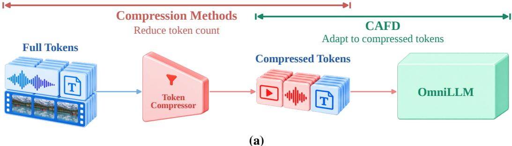
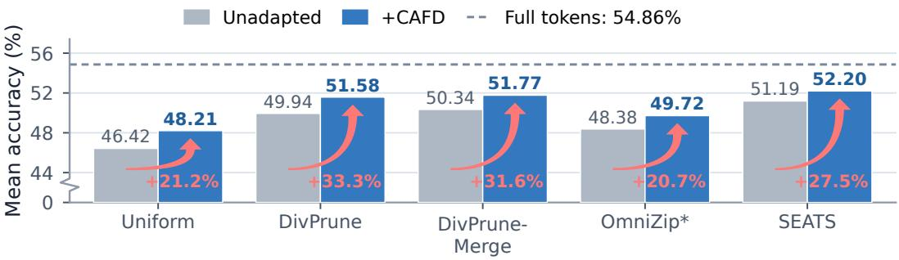
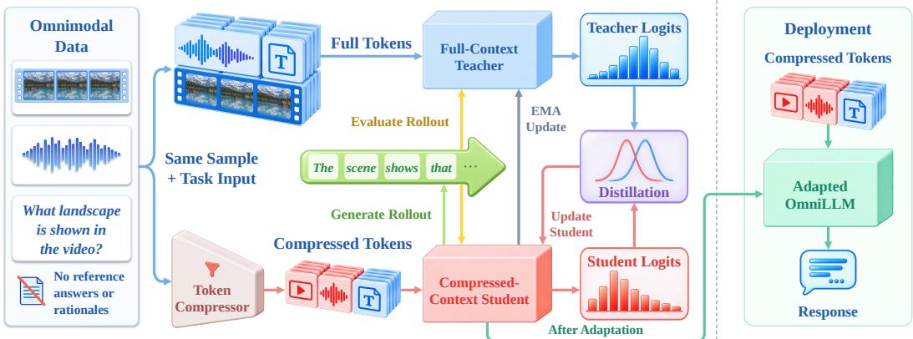
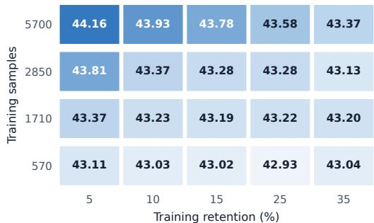
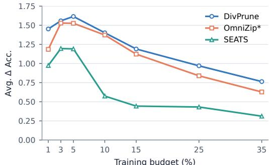
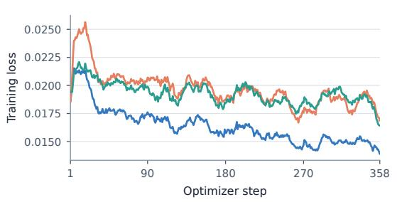
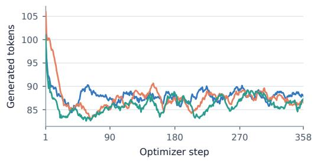
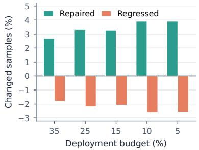
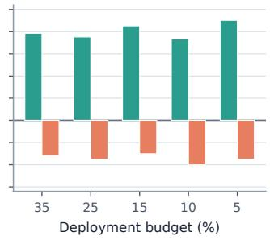
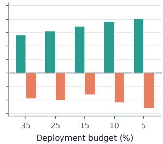

# LEARNING TO REASON WITH COMPRESSED CONTEXT: GROUND-TRUTH-FREE ADAPTATION OF OMNILLMS VIA SELF-DISTILLATION

Jianghao Wang1 Ke Meng2 Jian Li2 Chi Cheng2 Longyu Qi2 Liyin Liang2 Yifeng Qian2 Chunbo Lai2 Yutian Lin1 Zeyu Wang1

1 School of Computer Science, Wuhan University

2 Didi Chuxing

{jhwang cs, yutian.lin, zywang.ai}@whu.edu.cn

## ABSTRACT

Omni-modal large language models (OmniLLMs) enable unified audio-video understanding, but their long multimodal token sequences make deployment computationally expensive. Token compression reduces this cost, yet aggressive compression often lowers accuracy. Existing works predominantly focus on designing better compression mechanisms; however, adapting the underlying language model to reason effectively over the remaining compressed context remains underexplored. To address this, we propose CAFD (Compressed-Context Adaptation via Full-Context Distillation), a ground-truth-free self-distillation framework that adapts OmniLLMs to fixed compression pipelines without requiring reference answers, rationales, or correctness rewards. CAFD leverages the full-token view of the same multimodal sample as a source of privileged information: a fullcontext self-teacher provides soft target supervision to a compressed-context student along the student’s on-policy trajectory. Evaluated on Qwen2.5-Omni-7B across five audio-video benchmarks, five compression pipelines, and five deployment budgets, CAFD demonstrates consistent gains, improving 120 out of 125 conditions with an average accuracy boost of 1.44 points and recovering 26.9% of the accuracy gap on average. These results demonstrate that the proposed ground-truth-free adaptation offers an effective and practical route to improving the accuracy–efficiency trade-off in deployed OmniLLMs. Project page: https://github.com/Bamboos2003/CAFD.

## 1 INTRODUCTION

Omni-modal large language models (OmniLLMs) have recently emerged as a unified interface for reasoning over audio, video, and text (Xu et al., 2025a;b; Fu et al., 2025b; Sun et al., 2024; Yang et al., 2025a; Ye et al., 2026). However, long-form audio and video can produce thousands of multimodal tokens, making prefill computation and memory increasingly costly. Token compression has therefore become an important approach to efficient OmniLLM deployment: existing methods prune, merge, select, or progressively reduce multimodal tokens before or within the language model (Tao et al., 2026; Xin et al., 2026; Wang et al., 2026c; Su et al., 2026b).

Compression, however, introduces a fundamental trade-off. Reducing the token budget can remove or weaken task-relevant evidence, leading to an accuracy gap relative to full-token inference. Existing work largely addresses this problem by improving the compression mechanism itself, for example, designing better token selection, merging, allocation strategies. This raises a complementary question that is less explored: once a compression pipeline is fixed, can the OmniLLM itself be adapted to better operate on the information that remains? A deployed system may already have a chosen compressor, and improving the model’s ability to use compressed context does not necessarily require redesigning the compression algorithm or changing its inference architecture.

A natural approach is to adapt the model using additional training data, yet conventional supervision uses reference answers, rationales, evidence annotations, or correctness-derived rewards that require additional labeled data (Yang et al., 2025b; Wen et al., 2025; Guo et al., 2026a; Wu et al., 2026), which limits the generality of compression adaptation. We instead ask whether the model can be adapted to compressed context without any task-specific labels or reference responses. Our key observation is that token compression does not simply produce a different input: it produces a different information view ofthe same underlying audio-video sample. During adaptation, the same sample can be processed through compressed and full-token paths. The full-token path has access to information that the deployment model does not, while the compressed path follows the deployment compression pipeline. This naturally creates a privileged-information setting: the full-context model provides soft supervision for learning under compressed context without a reference response.

  
(b)  
Figure 1: Complementary adaptation and accuracy gains. (a) Compression methods reduce the token count; CAFD complements them by adapting the OmniLLM to compressed tokens while keeping the compressor unchanged. Pre-LLM compression is illustrated; CAFD also supports inner-LLM and hybrid compression. (b) Gray and blue bars show each compressor’s mean accuracy before and after CAFD adaptation, averaging five benchmarks and five deployment budgets. The dashed line denotes the unadapted full tokens baseline (54.86%). Red labels indicate accuracy-gap recovery: the percentage of the full-token–unadapted accuracy gap closed by adaptation.

Based on this observation, we propose CAFD (Compressed-Context Adaptation via Full-Context Distillation), a ground-truth-free adaptation framework for OmniLLMs under token compression (Figure 1(a)). CAFD constructs a compressed-context student and a full-context self-teacher from the same OmniLLM. The student generates a response using the deployment compression pipeline. The teacher processes the same sample with full tokens and provides full-vocabulary soft targets along the student’s trajectory, helping the student exploit the retained information. Following OPSD (Zhao et al., 2026), the supervision is applied to the student’s actual response prefixes rather than to prescribed reference responses. Crucially, the teacher requires no reference answer, rationale, evidence annotation, or correctness-derived reward: its additional input information comes from the same sample’s full-token view. The teacher is used only during adaptation and is discarded at deployment, leaving the compressor and inference architecture unchanged.

We evaluate CAFD on Qwen2.5-Omni-7B across five audio-video benchmarks, five heterogeneous compression pipelines, and five deployment budgets, covering token selection, token merging, and progressive inner-LLM pruning. The results show that adaptation consistently complements compression: with only 5,700 training instances from 1,485 videos, CAFD improves 120 of 125 matched conditions, increasing average accuracy from 49.26% to 50.70% (+1.44 points). The mean accuracygap recovery across the five compressors is 26.9% (Figure 1(b)). At the nominal 5% retention budget, the average improvement increases to 1.73 points, with gains in all 25 benchmark–compressor combinations. Notably, each model is adapted once at 5% retention and reused across all five deployment budgets. Controlled experiments show benefits from more training data and strong but non-extreme training compression, with Jensen–Shannon divergence outperforming forward and reverse KL. Providing reference answers and rationales to the teacher does not improve mean accu racy over the proposed ground-truth-free supervision, demonstrating the effectiveness of supervision from the full-token view alone.

Our contributions are threefold:

• We formulate ground-truth-free adaptation of OmniLLMs to existing audio-video token compression pipelines, focusing on learning to use compressed context without reference answers or rationales. This complements compressor design by addressing how the model uses retained information, rather than which tokens the compressor retains.

• We introduce an on-policy self-distillation framework in which a full-context self-teacher supervises a compressed-context student along the student’s own response trajectory. The original audio-video sample serves as the source of privileged information, eliminating the need to construct reference responses or evidence annotations.

• Across five compression pipelines, five audio-video benchmarks, and five deployment budgets, CAFD improves 120 of 125 matched conditions and raises average accuracy by 1.44 points overall, with 26.9% mean accuracy-gap recovery across compressors. The gain reaches 1.73 points at nominal 5% retention. The adapted model can also be reused across deployment budgets without retraining.

## 2 RELATED WORK

## 2.1 OMNILLM TOKEN COMPRESSION

OmniLLM compressors operate before the LLM, within it, or at both stages. Pre-LLM methods (Tao et al., 2026; Li & Huang, 2026; Jung et al., 2026; Deng et al., 2026; Yang et al., 2026; Cao et al., 2026; Yoo et al., 2026; Zhong et al., 2026; Su et al., 2026a; Huang et al., 2026; Gong et al., 2026; Ding et al., 2026; Chen et al., 2026) reduce encoder outputs using token saliency, spatiotemporal redundancy, cross-modal cues, or query relevance. OMAC (Wu et al., 2026) similarly constructs compact audio and visual memory tokens. Inner-LLM methods (Wang et al., 2026c; Guo et al., 2026b) compress intermediate decoder states, and hybrid pipelines (Park et al., 2026; Xin et al., 2026; Su et al., 2026b; Lee et al., 2026) operate at both stages.

Compressors also differ in their training requirements. Many are training-free and update no parameters. Some operate directly, whereas OmniFit, ReMo, OmniDelta, and MACER (Wang et al., 2026c; Yoo et al., 2026; Huang et al., 2026; Guo et al., 2026b) require offline profiling, statistics, skill construction, or calibration. ContextGuard (Jung et al., 2026) trains an auxiliary predictor without updating the LLM, whereas EchoingPixels, OmniSIFT, and AVOC (Gong et al., 2026; Ding et al., 2026; Chen et al., 2026) jointly train compression modules and the decoder. Across these groups, the compression mechanism itself remains a primary design target. Our work complements compressor design by adapting the OmniLLM under a fixed compression pipeline.

## 2.2 ON-POLICY SELF-DISTILLATION

OPSD (Zhao et al., 2026) samples student trajectories and provides next-token supervision using a teacher conditioned on privileged solutions. Vision-OPD (Yuan et al., 2026) uses automatically localized evidence crops, whereas Imagine-OPD (Cai et al., 2026b) uses annotated evidence crops and ground-truth answers. For multimodal affective computing, OmniOPSD (Cheng et al., 2026) supplies externally generated rationales. Clue-OPSD (Wang et al., 2026a) uses JSD to supervise full-video student rollouts with an EMA teacher viewing annotated temporal clue intervals, without answer labels. These methods use reference solutions, generated rationales, or localized evidence to provide teacher privilege. Our work instead uses the original audio-video input in full, without constructing reference responses or localizing evidence regions.

  
Figure 2: Overview of CAFD. Self-distillation guides the model under compressed context toward its full-context capabilities. The compressed student generates a response; both paths compute nexttoken distributions along it using the same sample and instruction, without reference answers or rationales. Gradients update only the student; the teacher parameters track the student via an exponential moving average (EMA). Deployment retains the adapted model and original compressor. The framework supports pre-LLM (illustrated), inner-LLM, and hybrid compression.

RP-OPSD and NOPD (Zhu et al., 2026; Wang et al., 2026b) instead pair degraded student images with higher-quality teacher views without reference answers. Concurrent S2VOPD (Li et al., 2026b) studies visual augmentations and visual-token dropping with a clean-view EMA teacher.

## 2.3 ADAPTATION TO COMPRESSED CONTEXTS

VisionZip (Yang et al., 2025b) and LLaVA-PruMerge (Shang et al., 2025) evaluate supervised instruction tuning after training-free visual-token reduction. Within audio-video OmniLLMs, O-MARC (Wu et al., 2026) builds on GRPO (Shao et al., 2024) to adapt to OMAC-compressed inputs using paired full/compressed answer-and-format rewards.

VoCo-LLaMA (Ye et al., 2025) learns compact representations through full-to-compressed matching. EPIC (Wen et al., 2025) supports existing pruning strategies and distills a more-compressed student from a weight-shared, less-compressed teacher on prescribed, teacher-forced responses. TBD (Guo et al., 2026a) adapts compressed-video students across compressors using LoRA, fulltoken teacher distillation, and ground-truth answer supervision. SPIRAL (Liang et al., 2026) aligns rendered-image Vision-Text Compression with native-text behavior through on-policy distillation, using training samples filtered by teacher correctness.

Ground-truth-free on-policy adaptation remains underexplored across audio-video compression pipelines. CAFD addresses this gap and demonstrates accuracy gains across token deletion, merging, and inner-LLM pruning.

## 3 METHOD

In this section, we present CAFD, which adapts an OmniLLM to compressed audio-video inputs through self-distillation without reference answers or rationales (Figure 2). We formulate the problem, construct a full-context self-teacher, and describe the on-policy distillation objective and parameter updates.

## 3.1 PROBLEM FORMULATION

OmniLLM token compression reduces computational cost by selecting, merging, or pruning audiovideo tokens before or within the LLM. CAFD complements these methods by adapting the model to their compressed contexts while keeping the compression pipeline unchanged.

Let $\mathcal { D } = \{ ( x _ { i } , u _ { i } ) \} _ { i = 1 } ^ { N }$ denote a training corpus, where $x _ { i } = ( x _ { i } ^ { a } , x _ { i } ^ { v } )$ is an audio-video sample and $u _ { i }$ is a textual instruction. We seek to adapt a pretrained OmniLLM by optimizing its trainable model parameters θ under the chosen fine-tuning parameterization.

Let $\pi _ { m , r } ^ { \mathrm { c o m p } }$ denote the compressed-context path using compressor m at budget configuration $r ,$ and let $\pi ^ { \mathrm { f u l l } }$ denote the full-context path. This notation covers pre-LLM, inner-LLM, and hybrid compression. For a given $m , r ,$ adaptation updates model parameters while token selection and allocation follow the compressor’s own rules. For either path π, we write the next-token distribution given response prefix $y _ { < t }$ as $p _ { \theta } ( \cdot \mid x , u , \pi , y _ { < t } )$ , and the complete-response distribution as $p _ { \theta } ( y \mid x , u , \pi )$ Our objective is to improve the model under $\pi _ { m , r } ^ { \mathrm { c o m p } }$ without redesigning the compressor.

## 3.2 FULL-CONTEXT SELF-TEACHER

The student and self-teacher start from the same pretrained OmniLLM. For each $( x , u ) \in \mathcal { D } _ { : }$ , the student with parameters θ follows $\pi _ { m , r _ { \mathrm { t r a i n } } } ^ { \mathrm { c o m p } }$ , where $r _ { \mathrm { t r a i n } }$ is the training budget configuration. The teacher processes the same sample through $\dot { { \pi } } ^ { \mathrm { f u l l } }$ using parameters ${ \bar { \theta } } ,$ an exponential moving average of $\theta ,$ initialized as $\bar { \theta } _ { 0 } = \theta _ { 0 }$ . At a shared prefix $y _ { < t }$ , their next-token distributions are

$$
\begin{array} { r l } & { p _ { t } ( \cdot ) = p _ { \theta } \big ( \cdot \mid x , u , \pi _ { m , r _ { \mathrm { t r a i n } } } ^ { \mathrm { c o m p } } , y _ { < t } \big ) , } \\ & { q _ { t } ( \cdot ) = p _ { \bar { \theta } } \big ( \cdot \mid x , u , \pi ^ { \mathrm { f u l l } } , y _ { < t } \big ) . } \end{array}\tag{1}
$$

Both paths use the same instruction. The teacher provides full-vocabulary supervision with access to the sample’s full audio-video context, whereas the student uses compressed context. The teacher receives no reference answer or rationale, evidence annotation, or correctness-derived reward.

## 3.3 ON-POLICY SELF-DISTILLATION OBJECTIVE

Compression can change how the student generates its response. We therefore sample an on-policy response trajectory from the current compressed student:

$$
\hat { y } ^ { S } \sim \tilde { p } _ { \theta } \big ( \cdot \mid x , u , \pi _ { m , r _ { \mathrm { t r a i n } } } ^ { \mathrm { c o m p } } \big ) .\tag{2}
$$

Here $\tilde { p }$ applies the decoding settings in Appendix B.6 to the student’s distribution. Conditioned on each student-generated prefix $\hat { y } _ { < t } ^ { S } ,$ the student and teacher compute the full-vocabulary next-token distributions $p _ { t }$ and $q _ { t }$ in Equation 1.

We use Jensen–Shannon divergence (Lin, 1991) to match the two distributions. For each vocabulary token $v \in \mathcal V$ , define the mixture and divergence contribution as

$$
\begin{array} { l } { { m _ { t } ( v ) = \frac { 1 } { 2 } \bigl [ p _ { t } ( v ) + q _ { t } ( v ) \bigr ] , } } \\ { { d _ { t , v } = \frac { 1 } { 2 } p _ { t } ( v ) \log \frac { p _ { t } ( v ) } { m _ { t } ( v ) } + \frac { 1 } { 2 } q _ { t } ( v ) \log \frac { q _ { t } ( v ) } { m _ { t } ( v ) } . } } \end{array}\tag{3}
$$

Following OPSD (Zhao et al., 2026), we retain its pointwise clipping rule, which caps each vocabulary contribution at δ. For a completion of length $\bar { T } _ { y }$ , the objective is

$$
\mathcal { L } _ { \mathrm { a d a p t } } = \frac { 1 } { T _ { y } } \sum _ { t = 1 } ^ { T _ { y } } \sum _ { v \in \mathcal { V } } \operatorname* { m i n } ( d _ { t , v } , \delta ) , \qquad \delta = 0 . 0 5 .\tag{4}
$$

Clipping is applied to the individual loss terms before summing over the vocabulary; it does not truncate or renormalize either probability distribution. Contributions above $\delta$ are capped at $\delta$ and have zero local gradient through the clipping operation. We average the resulting loss over generated response positions and exclude prompt positions. Gradients flow through the student’s next-token distributions only; the sampled trajectory and teacher probabilities remain detached.

After each successful student optimizer step k, we update $\bar { \theta } _ { k } = \mu \bar { \theta } _ { k - 1 } + ( 1 - \mu ) \theta _ { k }$ , with $\mu = 0 . 9 9 9$ The teacher forward pass for that step uses $\theta _ { k - 1 }$

We adapt the model separately for each compressor at $r _ { \mathrm { t r a i n } }$ . Deployment discards the teacher and uses the updated model parameters with the original inference architecture and compressor at the chosen deployment budget. Whether token counts and computation change depends on the compressor: fixed-count selection preserves token counts, whereas model-dependent pruning can alter intermediate-layer token counts after adaptation (Appendix C.1).

## 4 EXPERIMENTS

In this section, we conduct extensive experiments across five audio-video benchmarks, five compression pipelines, and five deployment budgets to demonstrate the effectiveness of CAFD. Beyond this broad evaluation, controlled studies examine training data scale, training retention, distillation objectives, and supervision sources. Together, these experiments demonstrate broad accuracy improvements and establish CAFD as a practical approach to adapting compressed OmniLLMs without reference answers or rationales.

## 4.1 EXPERIMENTAL SETTINGS

Backbone and benchmarks. We use Qwen2.5-Omni-7B (Xu et al., 2025a) and evaluate multiplechoice question-answering accuracy on WorldSense (Hong et al., 2026) (3,172 questions), Daily-Omni (Zhou et al., 2026) (1,197), AVUT (Yang et al., 2025c) (1,734), OmniVideoBench (Li et al., 2026a) (1,000), and Video-MME (Fu et al., 2025a) (2,700). Appendices B.1 and B.2 describe the datasets and their local media preparation.

Target compression pipelines. We evaluate five pipelines: Uniform, DivPrune (Alvar et al., 2025), DivPrune-Merge, OmniZip\* (Tao et al., 2026), and SEATS (Xin et al., 2026). The first four compress tokens before the LLM, with DivPrune-Merge and OmniZip\* incorporating token merging. SEATS combines pre-LLM selection with inner-LLM pruning. Appendices B.3 and B.4 detail the implementations, including our OmniZip\* variant, and budget configurations.

Training configuration. We use 5,700 instances from 1,485 OmniVideo (Cai et al., 2026a) videos, balanced across ten task types. Unless stated otherwise, training uses the media, question, and all candidate options, without reference answers or rationales.

Training videos are sampled at a target rate of 2 FPS and capped at 128 frames. For training efficiency, we use rank-64 LoRA (Hu et al., 2022) on the Thinker decoder’s attention and MLP projections using AdamW (Loshchilov & Hutter, 2019), a learning rate of $5 \times 1 0 ^ { - 6 }$ , and a global batch size of 32 on 8 NVIDIA RTX 6000D GPUs. Appendices B.5 and B.6 provide the training prompt templates and the full set of optimization and rollout settings, respectively.

Evaluation protocol. For the shorter-video benchmarks (WorldSense, DailyOmni, and AVUT), we use up to 128 frames and full audio tracks to match the video’s temporal coverage. For the longer-video benchmarks (OmniVideoBench and Video-MME), we use up to 256 and 768 frames, respectively, and retain the first 300 seconds of audio following SEATS (Xin et al., 2026). Frames are sampled across the full video at a target rate of 2 FPS, using the same per-frame pixel bounds as training (Appendix B.6). Subtitles are excluded. Appendix B.7 provides further evaluation details.

Comparison setup. For each compressor, we compare the original model (Unadapted) with its adapted version (+CAFD) under the same compression configuration, using the original full-token model as a reference. Each model is trained at 5% retention and evaluated at 35%, 25%, 15%, 10%, and 5% with the same compressor, without retraining. For each compressor and nominal budget, compression hyperparameters are fixed across all five benchmarks and before and after adaptation; each matched pair differs only in Thinker weights.

Retention budgets are nominal; realized retention and computation are reported in Table 11. Appendices B.4 and B.8 detail compression settings and comparison protocols, respectively. Statistics are rounded only for reporting, so calculations from displayed values may differ slightly.

## 4.2 MAIN RESULTS

Table 1 compares accuracy before and after CAFD adaptation across five compressors, five retention budgets, and five benchmarks. The evaluation spans token deletion, token merging, and progressive inner-LLM compression, while holding the compressor and deployment budget configuration fixed within every pair. CAFD improves 120 of the 125 matched cells. Across all 125 conditions, average accuracy rises from 49.26% to 50.70%, a gain of 1.44 percentage points. At the nominal 5% evaluation budget, average accuracy across the five compressors and five benchmarks increases from 44.31% to 46.04%, a gain of 1.73 percentage points, with gains in all 25 conditions. For each compressor, Figure 1(b) divides its mean adaptation gain by its full-token–Unadapted accuracy gap. The five ratios average to 26.9% accuracy-gap recovery.

Table 1: Main results across compressors, budgets, and benchmarks. Each cell reports Unadapted / +CAFD accuracy (%). Each +CAFD model is trained under the corresponding compressor’s 5% budget configuration and is evaluated at the five listed budgets. Column Avg. averages benchmarks, block-ending Avg. averages budgets, and their intersection averages all 25 conditions. The higher value in each pair is bold. DivPrune-M denotes DivPrune-Merge.
<table><tr><td>Compressor</td><td>Budget</td><td>WorldSense</td><td>DailyOmni</td><td>AVUT</td><td>OmniVideoBench</td><td>Video-MME</td><td>Avg.</td></tr><tr><td>Full tokens</td><td>100%</td><td>46.85</td><td>62.91</td><td>64.65</td><td>35.50</td><td>64.41</td><td>54.86</td></tr><tr><td>Uniform</td><td>35%</td><td>43.28 / 44.96</td><td>57.23 / 58.65</td><td>60.44 / 62.86</td><td>33.80 / 33.70</td><td>63.44 / 64.81</td><td>51.64 / 53.00</td></tr><tr><td></td><td>25%</td><td>41.96 / 43.66</td><td>52.05 / 55.89</td><td>56.81 / 59.05</td><td>31.40 / 32.60</td><td>61.63 / 62.70</td><td>48.77 / 50.78</td></tr><tr><td></td><td>15%</td><td>38.84 / 39.97</td><td>49.37 / 52.72</td><td>52.94 / 55.25</td><td>29.90 / 31.50</td><td>60.33 / 61.67</td><td>46.28 / 48.22</td></tr><tr><td></td><td>10%</td><td>36.44 / 37.64</td><td>45.45 / 48.45</td><td>50.35 / 51.50</td><td>29.50 / 30.80</td><td>58.15 / 60.22</td><td>43.98 / 45.72</td></tr><tr><td></td><td>5%</td><td>35.18 / 36.66</td><td>40.77 / 43.69</td><td>46.37 / 47.92</td><td>30.10 / 31.00</td><td>54.89 / 57.37</td><td>41.46 / 43.33</td></tr><tr><td></td><td>Avg.</td><td>39.14 / 40.58</td><td>48.97 / 51.88</td><td>53.38 / 55.32</td><td>30.94 / 31.92</td><td>59.69 / 61.36</td><td>46.42 / 48.21</td></tr><tr><td>DivPrune</td><td>35%</td><td>45.49 / 46.37</td><td>58.48 / 60.82</td><td>62.28 / 63.21</td><td>34.90 / 35.50</td><td>63.15 / 64.44</td><td>52.86 / 54.07</td></tr><tr><td></td><td>25%</td><td>45.02 / 46.15</td><td>56.73 / 58.73</td><td>60.90 / 62.00</td><td>34.30 / 35.00</td><td>62.04 / 63.15</td><td>51.80 / 53.01</td></tr><tr><td></td><td>15%</td><td>43.25 / 44.45</td><td>55.30 / 58.06</td><td>58.19 / 60.03</td><td>32.30 / 34.70</td><td>61.15 / 62.89</td><td>50.04 / 52.03</td></tr><tr><td></td><td>10%</td><td>42.06 / 43.35</td><td>53.55 / 55.22</td><td>56.69 / 58.30</td><td>33.60 / 35.30</td><td>59.56 / 61.04</td><td>49.09 / 50.64</td></tr><tr><td></td><td>5%</td><td>39.12 / 40.45</td><td>49.62 / 52.38</td><td>52.88 / 54.27</td><td>31.50 / 34.20</td><td>56.48 / 59.52</td><td>45.92 / 48.16</td></tr><tr><td></td><td>Avg.</td><td>42.99 / 44.16</td><td>54.74 / 57.04</td><td>58.19 / 59.56</td><td>33.32 / 34.94</td><td>60.47 / 62.21</td><td>49.94 / 51.58</td></tr><tr><td>DivPrune-M</td><td>35%</td><td>45.40 / 45.68</td><td>59.06 / 61.15</td><td>62.46 / 63.44</td><td>34.70 / 35.70</td><td>63.30 / 64.33</td><td>52.98 / 54.06</td></tr><tr><td></td><td>25%</td><td>44.45 / 45.81</td><td>57.73 / 58.90</td><td>61.36 / 62.98</td><td>34.20 / 35.40</td><td>62.41 / 64.00</td><td>52.03 / 53.42</td></tr><tr><td></td><td>15%</td><td>43.69 / 44.99</td><td>55.39 / 58.23</td><td>59.52 / 60.09</td><td>33.50 / 34.70</td><td>61.11 / 62.63</td><td>50.64 / 52.13</td></tr><tr><td></td><td>10%</td><td>42.72 / 44.04</td><td>53.30 / 56.31</td><td>57.09 / 59.11</td><td>33.90 / 34.60</td><td>59.96 / 61.74</td><td>49.39 / 51.16</td></tr><tr><td></td><td>5%</td><td>39.47 / 41.05</td><td>50.29 / 51.96</td><td>53.92 / 55.25</td><td>32.50 / 32.70</td><td>57.07 / 59.48</td><td>46.65 / 48.09</td></tr><tr><td></td><td>Avg.</td><td>43.15 / 44.31</td><td>55.15 / 57.31</td><td>58.87 / 60.17</td><td>33.76 / 34.62</td><td>60.77 / 62.44</td><td>50.34 / 51.77</td></tr><tr><td>OmniZip*</td><td>35%</td><td></td><td></td><td>61.13 / 62.40</td><td>35.00 / 34.70</td><td>63.07 / 64.26</td><td></td></tr><tr><td></td><td>25%</td><td>44.04 / 45.71 43.25 / 44.58</td><td>59.15 / 60.65 57.64 / 58.81</td><td>59.23 / 60.09</td><td>31.80 / 34.00</td><td>62.89 / 63.74</td><td>52.48 / 53.54 50.96 / 52.24</td></tr><tr><td></td><td>15%</td><td>39.97 / 41.24</td><td>54.80 / 57.81</td><td>55.59 / 56.75</td><td>33.00 / 33.30</td><td>61.04 / 61.81</td><td>48.88 / 50.18</td></tr><tr><td></td><td>10%</td><td>38.75 / 40.64</td><td>50.38 / 52.97</td><td>54.44 / 54.90</td><td>31.70 / 32.80</td><td>59.04 / 60.56</td><td>46.86 / 48.37</td></tr><tr><td></td><td>5%</td><td>34.93 / 36.48</td><td>45.36 / 47.62</td><td>47.75 / 48.67</td><td>30.50 / 31.60</td><td>55.04 / 56.93</td><td>42.72 / 44.26</td></tr><tr><td></td><td></td><td>40.19 / 41.73</td><td>53.47 / 55.57</td><td>55.63 / 56.56</td><td>32.40 / 33.28</td><td>60.21 / 61.46</td><td></td></tr><tr><td>SEATS</td><td>Avg.</td><td></td><td></td><td></td><td></td><td></td><td>48.38 / 49.72</td></tr><tr><td></td><td>35% 25%</td><td>46.44 / 47.51 45.84 / 47.32</td><td>61.32 / 62.24 59.90 / 60.48</td><td>64.94 / 65.97 62.69 / 63.55</td><td>35.70 / 35.50 35.40 / 35.00</td><td>65.44 / 66.19 64.85 / 65.96</td><td>54.77 / 55.48 53.74 / 54.46</td></tr><tr><td></td><td>15%</td><td>44.58 / 45.62</td><td>56.64 / 58.65</td><td>59.52 / 60.84</td><td>36.00 / 35.70</td><td>63.26 / 64.22</td><td>52.00 / 53.01</td></tr><tr><td></td><td>10%</td><td>43.32 / 44.10</td><td>56.31 / 56.89</td><td>57.90 / 58.77</td><td>34.30 / 36.20</td><td>61.48 / 62.48</td><td>50.66 / 51.69</td></tr><tr><td></td><td>5%</td><td>37.89 / 39.31</td><td>48.71 / 50.63</td><td>49.65 / 51.61</td><td>31.20 / 31.90</td><td>56.44 / 58.30</td><td>44.78 / 46.35</td></tr><tr><td></td><td></td><td></td><td>56.57 / 57.78</td><td>58.94 / 60.15</td><td>34.52 / 34.86</td><td>62.30 / 63.43</td><td>51.19 / 52.20</td></tr><tr><td></td><td>Avg.</td><td>43.61 / 44.77</td><td></td><td></td><td></td><td></td><td></td></tr></table>

The average gains at the 35%, 25%, 15%, 10%, and 5% budget labels are 1.08, 1.32, 1.54, 1.52, and 1.73 points, respectively. These results demonstrate that CAFD effectively improves compressed inference across diverse compression pipelines, with the largest average gain at 5% retention. These gains are achieved by training one model per compressor and reusing it across all five deployment budgets without retraining.

Adaptation also improves the accuracy–budget trade-off. Averaged across the five benchmarks, adapted DivPrune at 25% retention reaches 53.01% accuracy, exceeding the unadapted model’s 52.86% at 35%. Similarly, adapted DivPrune-Merge at 15% reaches 52.13%, compared with 52.03% for its unadapted counterpart at 25%. These comparisons show that CAFD can preserve or improve average accuracy at a lower nominal retention budget, making more aggressive compression a practical deployment option.

All five compressors benefit in aggregate, from Uniform sampling and diversity-based selection to token merging and progressive inner-LLM pruning. In particular, improvements with DivPrune-

Merge, OmniZip\*, and SEATS show that adaptation remains useful alongside compression strategies that already aggregate token information or reduce tokens progressively. This breadth supports CAFD as a complementary approach to improving existing compression pipelines through model adaptation. Appendix C.1 provides detailed retention and compute results; Appendix D analyzes prediction changes, correct-option scores, and task-level results.

## 4.3 ADDITIONAL EXPERIMENTS

Training data scale. Figure 3(a) shows that more data is generally beneficial for DivPrune across the tested training retentions. At 5% training retention, increasing the training set from 570 to 5,700 instances raises WorldSense accuracy averaged over five deployment budgets from 43.11% to 44.16%. At this training retention, every tested data scale improves over Unadapted, with accuracy increasing at each larger data scale. Using all 5,700 training instances gives the best accuracy at every tested training retention, while 5% training retention performs best at every data scale. Thus, the benefit of more training data holds across the tested retention settings, and the strong performance of 5% training retention is already apparent with smaller datasets. Together, these results show that CAFD already benefits from small training sets and gains further accuracy as training data increases. With epochs fixed, increasing data size also increases optimizer updates; the trend reflects the combined effect of more data and training. Appendix C.2 (Table 12) reports accuracy at each deployment budget for all training-data settings.

Training retention. Figure 3(b) compares training retentions by average gains across three benchmarks and five deployment budgets. DivPrune has its highest measured mean gain at 5%, while OmniZip\* and SEATS are nearly tied at 3% and 5%. Reducing training retention to 1% does not improve these gains further. All three compressors therefore favor training with relatively strong compression, but the gains do not keep increasing as the training budget shrinks. One possible explanation is that stronger compression encourages the student to make better use of limited context, whereas extremely sparse inputs make the teacher’s predictions harder to learn from the retained evidence. The observed gains near 3–5% support 5% as a common training setting for effective adaptation across the tested deployment budgets. Appendix C.2 (Table 13) reports the individual benchmark results at each training and deployment budget.

  
(a) Data scale and training retention

  
(b) Three-benchmark aggregate  
Figure 3: Effects of training data scale and retention. (a) WorldSense five-budget average accuracy for DivPrune across training-set sizes and training retentions. (b) Equal-weight accuracy-point gain over the matched Unadapted baseline across WorldSense, DailyOmni, and AVUT at five deployment budgets per benchmark. All runs use two epochs; data scale therefore changes both the number of training examples and the number of optimizer updates.

Distillation objective. With the remaining training configuration fixed, JSD outperforms both forward and reverse KL on all three benchmarks at every evaluated retention budget (Table 2). This consistent advantage supports JSD as an effective objective for adapting OmniLLMs to compressed inputs. With the same training data and compression setting, changing the distribution-matching objective changes how effectively the student learns from full-token supervision. The JSD gains extend across deployment budgets, supporting its use for a model that is trained once and reused at different retention settings. Appendix C.3 provides the per-budget results.

Table 2: Comparison of distillation objectives. All models are trained with DivPrune at 5% retention and evaluated with the same compressor. Accuracies (%) are averaged over the five deployment budgets within each benchmark.
<table><tr><td>Objective</td><td>WorldSense</td><td>DailyOmni</td><td>AVUT</td><td>Avg.</td></tr><tr><td>JSD (CAFD)</td><td>44.16</td><td>57.04</td><td>59.56</td><td>53.59</td></tr><tr><td>Forward KL</td><td>42.40</td><td>54.87</td><td>58.29</td><td>51.86</td></tr><tr><td>Reverse KL</td><td>43.25</td><td>55.37</td><td>58.97</td><td>52.53</td></tr></table>

Task conditioning and supervision. Table 3 compares CAFD against two controls that make use of reference answers and rationales: one supplies them to the teacher, and the other uses them as training targets for compressed-input SFT. All adaptation runs share the same training data and student prompt. While compressed-input SFT attains the highest average accuracy, it depends on reference responses as supervision targets. CAFD, by contrast, achieves comparable performance without access to any reference answers or rationales, drawing its gains instead from the full-token teacher’s distributions. This suggests that reference answers and rationales are not a prerequisite for effective compression adaptation. Moreover, providing such references to the teacher yields no improvement in three-benchmark average accuracy over CAFD. Additional experiments show that adaptation also remains effective with only media and a shared generic instruction (Appendix A.1). Appendix C.4 provides per-budget results for Table 3.

Table 3: Comparison of supervision sources. All adapted models are trained with DivPrune at 5% retention; all rows are evaluated with DivPrune. Accuracies (%) are averaged over five deployment budgets. “Reference” denotes ground-truth answers and rationales.
<table><tr><td>Method</td><td>Reference use</td><td>WorldSense</td><td>DailyOmni</td><td>AVUT</td><td>Avg.</td></tr><tr><td>Unadapted</td><td></td><td>42.99</td><td>54.74</td><td>58.19</td><td>51.97</td></tr><tr><td>CAFD</td><td>None</td><td>44.16</td><td>57.04</td><td>59.56</td><td>53.59</td></tr><tr><td>CAFD + reference</td><td>Teacher input</td><td>44.17</td><td>56.66</td><td>59.49</td><td>53.44</td></tr><tr><td>Compressed-input SFT</td><td>Student target</td><td>44.31</td><td>57.78</td><td>59.90</td><td>54.00</td></tr></table>

## 5 LIMITATIONS AND FUTURE WORK

Due to limited computing resources, training currently uses a small dataset and a fixed retention budget for each model. Future work could investigate whether larger training datasets and mixedretention training improve robustness across deployment budgets.

Another direction is to investigate how teacher reliability and the evidence retained after compression can inform the design of distillation objectives. A longer-term direction is to jointly optimize compression and adaptation under a fixed compute budget.

## 6 CONCLUSION

In this work, we introduced CAFD, a ground-truth-free adaptation framework that enables OmniLLMs to better reason over compressed multimodal context without modifying the compression pipeline or requiring reference responses. By viewing full-token inference as a privileged information source, CAFD uses a full-context self-teacher to distill soft supervision onto a compressedcontext student along its own response trajectory, allowing the model to learn how to exploit the information preserved after compression. Extensive experiments across five compression pipelines, five audio-video benchmarks, and five deployment budgets demonstrate that CAFD consistently recovers a substantial portion of the accuracy lost to compression, while a single model adapted at one compression budget can generalize across different deployment budgets. These results highlight that efficient multimodal inference is not only a problem of retaining the right tokens, but also of learning to reason effectively with the information that remains. We hope this perspective motivates further work on adapting OmniLLMs to resource-constrained and information-limited inference settings.

## AI USE STATEMENT

We used generative AI tools to assist with literature review, research hypothesis refinement, experimental design, implementation, and interpretation of results, as well as manuscript drafting and editing and figure preparation. We reviewed all AI-assisted work and checked reported numerical results against experiment records. We take responsibility for the final content of this paper, including its text, scientific claims, citations, analyses, and figures.

## REPRODUCIBILITY STATEMENT

Section 3 specifies the adaptation framework and training objective. Appendix B documents the datasets and data preparation, compressor implementations and budget configurations, training prompts and hyperparameters, and evaluation and aggregation protocols. Appendix C provides detailed experimental results complementing the main-text summaries.

## REFERENCES

Saeed Ranjbar Alvar, Gursimran Singh, Mohammad Akbari, and Yong Zhang. Divprune: Diversitybased visual token pruning for large multimodal models. In Proceedings of the IEEE/CVF Conference on Computer Vision and Pattern Recognition (CVPR), pp. 9392–9401, June 2025.

Xinyue Cai, Chaoyou Fu, Yi-Fan Zhang, Ran He, and Caifeng Shan. Omnivideo-100k: A dataset for audio-visual reasoning through structured scripts and evidence chains, 2026a. URL https: //arxiv.org/abs/2606.14702.

Yishuo Cai, Jiahui Liu, Yuanxin Liu, Haobo Deng, Linli Yao, Yuhao Zheng, Kun Ouyang, Zhimo Li, Ziyue Wang, Xu Sun, Haoli Bai, and Xiaohui Li. Thinking without images: Internalizing visual manipulation with on-policy self-distillation, 2026b. URL https://arxiv.org/abs/ 2606.08719.

Shijie Cao, Qingyu Zhang, Boxi Yu, Yuzhong Zhang, Boxi Cao, Yaojie Lu, Hongyu Lin, Xianpei Han, and Le Sun. Omnifocus: Query-guided modality-balanced token compression for omnimodal large language models, 2026. URL https://arxiv.org/abs/2607.03050.

Yijing Chen, Wenhui Tan, Xiaoyi Yu, Yuyue Wang, Xin Cheng, Kaisi Guan, Hao Jiang, Xiangyang Li, Guojie Zhu, and Ruihua Song. Avoc: Enhancing hour-level audio-video understanding in omni-modal llms via retrieval-inspired token compression, 2026. URL https: //arxiv.org/abs/2606.24286.

Zebang Cheng, Shuimu Chen, Boxue Yang, Yuanshen Guan, Jingyi Chen, Zheng Lian, Xiaojiang Peng, Fei Ma, LaiZhong Cui, and Qi Tian. Omniopsd: Rationale-privileged on-policy selfdistillation for affective computing, 2026. URL https://arxiv.org/abs/2606.15920.

Tri Dao. Flashattention-2: Faster attention with better parallelism and work partitioning. In B. Kim, Y. Yue, S. Chaudhuri, K. Fragkiadaki, M. Khan, and Y. Sun (eds.), International Conference on Learning Representations, volume 2024, pp. 35549–35562, 2024. URL https://proceedings.iclr.cc/paper\_files/paper/2024/file/ 98ed250b203d1ac6b24bbcf263e3d4a7-Paper-Conference.pdf.

Yuchen Deng, Zidang Cai, Hai-Tao Zheng, Jie Wang, Feidiao Yang, and Yuxing Han. Omnirefine: Alignment-aware cooperative compression for efficient omnimodal large language models, 2026. URL https://arxiv.org/abs/2605.12056.

Yue Ding, Yiyan Ji, Jungang Li, Xuyang Liu, Xinlong Chen, Junfei Wu, Bozhou Li, Bohan Zeng, Yang Shi, Yushuo Guan, Yuanxing Zhang, Jiaheng Liu, Qiang Liu, Pengfei Wan, and Liang Wang. OmniSIFT: Modality-asymmetric token compression for efficient omni-modal large language models. In Forty-third International Conference on Machine Learning, 2026. URL https://openreview.net/forum?id=aPnQpmwHW7.

Chaoyou Fu, Yuhan Dai, Yongdong Luo, Lei Li, Shuhuai Ren, Renrui Zhang, Zihan Wang, Chenyu Zhou, Yunhang Shen, Mengdan Zhang, Peixian Chen, Yanwei Li, Shaohui Lin, Sirui Zhao, Ke Li, Tong Xu, Xiawu Zheng, Enhong Chen, Caifeng Shan, Ran He, and Xing Sun. Video-mme: The first-ever comprehensive evaluation benchmark of multi-modal llms in video analysis. In Proceedings ofthe IEEE/CVF Conference on Computer Vision and Pattern Recognition (CVPR), pp. 24108–24118, June 2025a.

Chaoyou Fu, Haojia Lin, Zuwei Long, Yunhang Shen, Yuhang Dai, Meng Zhao, Yi-Fan Zhang, Shaoqi Dong, Yangze Li, Xiong Wang, Haoyu Cao, Di Yin, Long Ma, Xiawu Zheng, Rongrong Ji, Yunsheng Wu, Ran He, Caifeng Shan, and Xing Sun. Vita: Towards open-source interactive omni multimodal llm, 2025b. URL https://arxiv.org/abs/2408.05211.

Chao Gong, Depeng Wang, Zhipeng Wei, Ya Guo, Huijia Zhu, and Jingjing Chen. Echoingpixels: Aliasing-resistant joint token reduction for audio-visual LLMs. In Forty-third International Conference on Machine Learning, 2026. URL https://openreview.net/forum?id= e8JTAKZYt6.

Xiaoyang Guo, Guoping Luo, Jusheng Zhang, Keze Wang, and Wenhao Wang. Token-budget distillation: Transferring full-token semantics to compressed video vision-language models, 2026a. URL https://arxiv.org/abs/2608.28138.

Zhenghui Guo, Yilin Yang, Yuanbin Man, Miao Yin, Weidong Shi, Rabimba Karanjai, Omprakash Gnawali, and Chengming Zhang. Allocation before ranking: Decoupled token compression for omnillms, 2026b. URL https://arxiv.org/abs/2608.01665.

Jack Hong, Shilin Yan, Jiayin Cai, Xiaolong Jiang, Yao Hu, and Weidi Xie. Worldsense: Evaluating real-world omnimodal understanding for multimodal llms. In C. Vondrick, B. Hariharan, C. Raffel, L. Pinto, D. Yang, and A. Faust (eds.), International Conference on Learning Representations, volume 2026, pp. 52423–52443, 2026. URL https://proceedings.iclr.cc/paper\_files/paper/2026/file/ 55dc32df563a35bf406717fb52c118d5-Paper-Conference.pdf.

Edward J Hu, yelong shen, Phillip Wallis, Zeyuan Allen-Zhu, Yuanzhi Li, Shean Wang, Lu Wang, and Weizhu Chen. LoRA: Low-rank adaptation of large language models. In International Conference on Learning Representations, 2022. URL https://openreview.net/forum? id=nZeVKeeFYf9.

Haoyang Huang, Wenjie Huang, Tianqi Xu, Hongyaoxing Gu, Kang Tan, Yikai Fu, Yuhao Shen, Tianyu Liu, Baolin Zhang, Jun Zhang, Xinyi Hu, Jun Dai, Shuang Ge, Lei Chen, Yue Li, Mingchen Wang, and Meng Zhang. Omnidelta: Skill-driven budget allocation for token compression in omnillms, 2026. URL https://arxiv.org/abs/2607.25669.

Chaeyoung Jung, Kyeongha Rho, and Joon Son Chung. Keep what audio cannot say: Contextpreserving token pruning for omni-llms, 2026. URL https://arxiv.org/abs/2605. 11605.

Kyeongyoon Lee, Hongyeob Kim, Youngeun Kim, and Sungeun Hong. Deferred audio pruning with local audio-visual dynamics for omni-llms, 2026. URL https://arxiv.org/abs/2608. 08794.

Bingzhou Li and Tao Huang. Dash: Dynamic audio-driven semantic chunking for efficient omnimodal token compression, 2026. URL https://arxiv.org/abs/2603.15685.

Caorui Li, Yu Chen, Yiyan Ji, Jin Xu, Zhenyu Cui, Shihao Li, Yuanxing Zhang, Zhenghao Song, Dingling Zhang, Ying He, Haoxiang Liu, Yuxuan Wang, Qiufeng Wang, Jiafu Tang, Zhenhe Wu, Jiehui Luo, Zhiyu Pan, Weihao Xie, Chenchen Zhang, Zhaohui Wang, Jiayi Tian, Yanghai Wang, Zhe Cao, Minxin Dai, Ke Wang, Runzhe Wen, Yinghao MA, Yaning Pan, Sungkyun Chang, Termeh Taheri, Haiwen Xia, Christos Plachouras, Emmanouil Benetos, Yizhi Li, Ge Zhang, Jian Yang, Tianhao Peng, zili wang, Minghao Liu, Junran Peng, Zhaoxiang Zhang, and JIAHENG LIU. Omnivideobench: Towards audio-visual understanding evaluation for omni mllms. In C. Vondrick, B. Hariharan, C. Raffel, L. Pinto, D. Yang, and A. Faust (eds.), International Conference on Learning Representations, volume 2026, pp. 138214–138236,

2026a. URL https://proceedings.iclr.cc/paper\_files/paper/2026/file/ df5e4da78dfbbfbfad3fcff0c2ce3bd7-Paper-Conference.pdf.

Yijiang Li, Yijun Liang, Yunjie Tian, Bingyang Wang, Ke Zhang, Zhenfei Yin, Di Fu, Philip Torr, and Nuno Vasconcelos. Self-supervised visual on-policy distillation, 2026b. URL https:// arxiv.org/abs/2608.14144.

Tianyu Liang, Xiangxi Zheng, Yilin Wang, and Dongxing Mao. Same semantics, different paths: Self-improving alignment for vision-text compression, 2026. URL https://arxiv.org/ abs/2608.02109.

J. Lin. Divergence measures based on the shannon entropy. IEEE Transactions on Information Theory, 37(1):145–151, 1991. doi: 10.1109/18.61115.

Ilya Loshchilov and Frank Hutter. Decoupled weight decay regularization. In International Conference on Learning Representations, 2019. URL https://openreview.net/forum?id= Bkg6RiCqY7.

Yeo Jeong Park, Hyemi Jang, Minseo Choi, Jongsun Lee, Jooyoung Choi, and Yongkweon Jeon. Omnidrop: Layer-wise token pruning for omni-modal llms via query-guidance, 2026. URL https://arxiv.org/abs/2605.14458.

Yuzhang Shang, Mu Cai, Bingxin Xu, Yong Jae Lee, and Yan Yan. Llava-prumerge: Adaptive token reduction for efficient large multimodal models. In Proceedings of the IEEE/CVF International Conference on Computer Vision (ICCV), pp. 22857–22867, October 2025.

Zhihong Shao, Peiyi Wang, Qihao Zhu, Runxin Xu, Junxiao Song, Xiao Bi, Haowei Zhang, Mingchuan Zhang, Y. K. Li, Y. Wu, and Daya Guo. Deepseekmath: Pushing the limits of mathematical reasoning in open language models, 2024. URL https://arxiv.org/abs/2402. 03300.

Jinsen Su, Yongdong Luo, Yuexiao Ma, Yibo Hu, Meiguang Jin, and Xiawu Zheng. Omniscope: Modality-decoupled token compression for omnimodal large language models, 2026a. URL https://arxiv.org/abs/2607.23193.

Wanshun Su, Yang Shi, Feihu Liu, Ziwen Yu, Yan Min, Zhuoran Zhang, Qixun Wang, Haotian Wang, Shixuan Liu, Yuanxing Zhang, Peng Wu, Chengfu Huo, and Liang Ding. Omnipack: Unified token compression for efficient omni-modal large language models, 2026b. URL https://arxiv.org/abs/2608.03812.

Guangzhi Sun, Wenyi Yu, Changli Tang, Xianzhao Chen, Tian Tan, Wei Li, Lu Lu, Zejun Ma, Yuxuan Wang, and Chao Zhang. video-SALMONN: Speech-enhanced audio-visual large language models. In Ruslan Salakhutdinov, Zico Kolter, Katherine Heller, Adrian Weller, Nuria Oliver, Jonathan Scarlett, and Felix Berkenkamp (eds.), Proceedings of the 41st International Conference on Machine Learning, volume 235 of Proceedings of Machine Learning Research, pp. 47198–47217. PMLR, 21–27 Jul 2024. URL https://proceedings.mlr.press/ v235/sun24l.html.

Keda Tao, Kele Shao, Bohan Yu, Weiqiang Wang, Jian Liu, and Huan Wang. Omnizip: Audioguided dynamic token compression for fast omnimodal large language models. In Proceedings of the IEEE/CVF Conference on Computer Vision and Pattern Recognition (CVPR), pp. 17682– 17692, June 2026.

Kaishen Wang, Dongdi Zhao, Yijun Liang, Dingqiang Ye, Ruibo Chen, Heng Huang, and Di Fu. Where to look matters: On-policy self-distillation for long-video understanding, 2026a. URL https://arxiv.org/abs/2608.25356.

Shuai Wang, Daoan Zhang, Zhe Tang, Hao Cheng, and Jiaheng Wei. Self-boosting vision-language models with noisy student on-policy self-distillation, 2026b. URL https://arxiv.org/ abs/2607.23125.

Zining Wang, Zhihang Yuan, Yingjie Zhai, Wenshuo Li, Han Shu, Ruihao Gong, Jinyang Guo, and Xianglong Liu. Omnifit: Bridging modalities via layer-adaptive token compression for omnimodal large language models. In Forty-third International Conference on Machine Learning, 2026c. URL https://openreview.net/forum?id=8RY20mLzup.

Zichen Wen, Shaobo Wang, Yufa Zhou, Junyuan Zhang, Qintong Zhang, Yifeng Gao, Zhaorun Chen, Bin Wang, Weijia Li, Conghui He, and Linfeng Zhang. Efficient multi-modal large language models via progressive consistency distillation. In D. Belgrave, C. Zhang, H. Lin, R. Pascanu, P. Koniusz, M. Ghassemi, and N. Chen (eds.), Advances in Neural Information Processing Systems, volume 38, Main Conference, pp. 69726–69753. Curran Associates, Inc., 2025. doi: 10.52202/085713-2346. URL https://proceedings.neurips.cc/paper\_files/paper/2025/file/ 6518f9339196e172fa0ceef48a85543a-Paper-Conference.pdf.

Peiran Wu, Yunze Liu, Chi-Hao Wu, Chen Chen, and Junxiao Shen. O-marc: Omni memoryaugmented compression distillation for efficient video understanding, 2026. URL https:// arxiv.org/abs/2605.26584.

Zijie Xin, Jie Yang, Ruixiang Zhao, Tianyi Wang, Fengyun Rao, Jing Lyu, and Xirong Li. Stageadaptive token selection for efficient omni-modal llms, 2026. URL https://arxiv.org/ abs/2605.20035.

Jin Xu, Zhifang Guo, Jinzheng He, Hangrui Hu, Ting He, Shuai Bai, Keqin Chen, Jialin Wang, Yang Fan, Kai Dang, Bin Zhang, Xiong Wang, Yunfei Chu, and Junyang Lin. Qwen2.5-omni technical report, 2025a. URL https://arxiv.org/abs/2503.20215.

Jin Xu, Zhifang Guo, Hangrui Hu, Yunfei Chu, Xiong Wang, Jinzheng He, Yuxuan Wang, Xian Shi, Ting He, Xinfa Zhu, Yuanjun Lv, Yongqi Wang, Dake Guo, He Wang, Linhan Ma, Pei Zhang, Xinyu Zhang, Hongkun Hao, Zishan Guo, Baosong Yang, Bin Zhang, Ziyang Ma, Xipin Wei, Shuai Bai, Keqin Chen, Xuejing Liu, Peng Wang, Mingkun Yang, Dayiheng Liu, Xingzhang Ren, Bo Zheng, Rui Men, Fan Zhou, Bowen Yu, Jianxin Yang, Le Yu, Jingren Zhou, and Junyang Lin. Qwen3-omni technical report, 2025b. URL https://arxiv.org/abs/2509.17765.

Morunliu Yang, Ruotao Xu, Le Li, Yue Wang, Jianxin Zhang, Juntao Li, Yihang Lou, Siwei Feng, and Peifeng Li. Omniselect: Dynamic modality-aware token compression for efficient omnimodal large language models, 2026. URL https://arxiv.org/abs/2605.18041.

Qize Yang, Shimin Yao, Weixuan Chen, Shenghao Fu, Detao Bai, Jiaxing Zhao, Boyuan Sun, Bowen Yin, Xihan Wei, and Jingren Zhou. Humanomniv2: From understanding to omni-modal reasoning with context, 2025a. URL https://arxiv.org/abs/2506.21277.

Senqiao Yang, Yukang Chen, Zhuotao Tian, Chengyao Wang, Jingyao Li, Bei Yu, and Jiaya Jia. Visionzip: Longer is better but not necessary in vision language models. In Proceedings of the IEEE/CVF Conference on Computer Vision and Pattern Recognition (CVPR), pp. 19792–19802, June 2025b.

Yudong Yang, Jimin Zhuang, Guangzhi Sun, Changli Tang, Yixuan Li, Peihan Li, Yifan Jiang, Wei Li, Zejun Ma, and Chao Zhang. Audio-centric video understanding benchmark without text shortcut. In Christos Christodoulopoulos, Tanmoy Chakraborty, Carolyn Rose, and Violet Peng (eds.), Proceedings of the 2025 Conference on Empirical Methods in Natural Language Processing, pp. 6569–6587, Suzhou, China, November 2025c. Association for Computational Linguistics. ISBN 979-8-89176-332-6. doi: 10.18653/v1/2025.emnlp-main.333. URL https: //aclanthology.org/2025.emnlp-main.333/.

Hanrong Ye, Chao-Han Huck Yang, Arushi Goel, Wei Huang, Zhen Wan, Jinchuan Tian, An-Chieh Cheng, Ligeng Zhu, Yuanhang Su, Yuming Lou, Yong-Xiang Lin, Dong Yang, Sreyan Ghosh, Zhijian Liu, Yukang Chen, Ehsan Jahangiri, Ambrish Dantrey, Daguang Xu, Ehsan Hosseini-Asl, Seyed Danial Mohseni Taheri, Vidya Nariyambut Murali, Sifei Liu, Yao Lu, Oluwatobi Olabiyi, Yu-Chiang Frank Wang, Rafael Valle, Bryan Catanzaro, Andrew Tao, Song Han, Jan Kautz, Hongxu (Danny) Yin, and Pavlo Molchanov. Omnivinci: Enhancing architecture and data for omni-modal understanding llm. In C. Vondrick, B. Hariharan, C. Raffel, L. Pinto, D. Yang, and A. Faust (eds.), International Conference on Learning Representations, volume 2026, pp.

56101–56138, 2026. URL https://proceedings.iclr.cc/paper\_files/paper/ 2026/file/5c1863f711c721648387ac2ef745facb-Paper-Conference.pdf.

Xubing Ye, Yukang Gan, Xiaoke Huang, Yixiao Ge, and Yansong Tang. Voco-llama: Towards vision compression with large language models. In Proceedings of the IEEE/CVF Conference on Computer Vision and Pattern Recognition (CVPR), pp. 29836–29846, June 2025.

Suho Yoo, Youngjoon Jang, Hyebin Cho, and Joon Son Chung. Out of sight, still in mind: Token compression for omni-llms, 2026. URL https://arxiv.org/abs/2607.21179.

Qianhao Yuan, Jie Lou, Xing Yu, Hongyu Lin, Le Sun, Xianpei Han, and Yaojie Lu. Visionopd: Learning to see fine details for multimodal llms via on-policy self-distillation, 2026. URL https://arxiv.org/abs/2605.18740.

Siyan Zhao, Zhihui Xie, Mengchen Liu, Jing Huang, Guan Pang, Feiyu Chen, and Aditya Grover. Self-distilled reasoner: On-policy self-distillation for large language models. In Forty-third International Conference on Machine Learning, 2026. URL https://openreview.net/ forum?id=Jpxfof0EaS.

Yiming Zhong, Chang Nie, and Caifeng Shan. Omni-prune: Query-aware unified token pruning for efficient omnimodal large language models, 2026. URL https://arxiv.org/abs/2607. 23445.

Ziwei Zhou, Rui Wang, Zuxuan Wu, and Yu-Gang Jiang. Daily-omni: Towards audio-visual reasoning with temporal alignment across modalities, 2026. URL https://arxiv.org/abs/ 2505.17862.

Qihui Zhu, Yuchen Wang, Zijian Wen, Tao Zhang, Mengjie Zhang, Yang Liu, Shuangwu Chen, Siying Wu, Jian Yang, and Xiaofeng Jiang. Rp-opsd: Resolution-privileged on-policy selfdistillation for multimodal large language models, 2026. URL https://arxiv.org/abs/ 2607.24447.

## A ADDITIONAL EXPERIMENTAL ANALYSES

## A.1 TASK CONDITIONING AND SUPERVISION

Table 4 examines how training prompts and reference supervision affect adaptation. The three reference-free CAFD variants share the distillation mechanism, media sequence, and per-video exposure counts. The main configuration, labeled CAFD, uses the question and candidate options; CAFD (question-only) removes the options, while CAFD (fixed-generic) replaces the question and options with a shared instruction. All three use a full-token teacher without reference answers or rationales. Two additional controls retain the main configuration’s student prompt: CAFD + reference supplies the reference answer and rationale to the teacher, while compressed-input SFT uses them as student training targets.

All three reference-free variants improve over Unadapted. In particular, the fixed-generic gains show that CAFD can improve compressed inference using only media and a shared instruction, without per-example questions, options, reference answers, or rationales as model inputs. This supports adaptation when task-specific supervision is unavailable. Compressed-input SFT is strongest overall. Supplying references to the teacher does not improve average accuracy over the main CAFD configuration. Appendix C.4 provides the per-budget results.

## A.2 VIDEO-DISJOINT TARGET-DOMAIN ADAPTATION

To test whether in-domain media can improve compressed inference without task-specific annotations, we split WorldSense videos into approximately 70% for adaptation and 30% for evaluation using seed 42. The two partitions contain 1,163 and 499 videos, respectively; the evaluation partition includes 981 QA instances. Training reads only paths and IDs from the training partition, cycles them to 5,700 exposures, and uses the fixed-generic prompt; it reads no question, candidate option, answer, rationale, category, or evaluation field. All three compressed conditions in Table 5 are recomputed on the identical held-out QA identities. The OmniVideo control uses the same fixedgeneric checkpoint as Table 4. We compute its accuracy on the same 981 held-out QA instances using the existing full-WorldSense predictions.

Table 4: Task conditioning and target supervision. All adapted models are trained with DivPrune at 5% retention, and all rows are evaluated with DivPrune across five deployment budgets; accuracies (%) are budget averages. “Reference use” indicates whether reference answers and rationales are supplied as teacher input or used as student targets; all variants use the same task input at evaluation.
<table><tr><td>Variant</td><td>Adaptation prompt</td><td>Reference use</td><td>WorldSense</td><td>DailyOmni</td><td>AVUT</td><td>Avg.</td></tr><tr><td>Unadapted</td><td>一</td><td>一</td><td>42.99</td><td>54.74</td><td>58.19</td><td>51.97</td></tr><tr><td rowspan="2">CAFD (fixed-generic) CAFD (question-only)</td><td>Shared generic instruction</td><td>None</td><td>44.21</td><td>57.03</td><td>59.19</td><td>53.47</td></tr><tr><td>Question</td><td>None</td><td>44.19</td><td>57.26</td><td>59.67</td><td>53.70</td></tr><tr><td>CAFD</td><td>Question + options</td><td>None</td><td>44.16</td><td>57.04</td><td>59.56</td><td>53.59</td></tr><tr><td>CAFD + reference</td><td>Question + options</td><td>Teacher input</td><td>44.17</td><td>56.66</td><td>59.49</td><td>53.44</td></tr><tr><td>Compressed-input SFT</td><td>Question + options</td><td>Student target</td><td>44.31</td><td>57.78</td><td>59.90</td><td>54.00</td></tr></table>

In-domain adaptation raises average accuracy from 43.08% to 44.00%, compared with 43.73% for the OmniVideo-trained control. These results show that in-domain audio-video data and a shared generic instruction can improve compressed inference on unseen videos without task-specific annotations.

Table 5: WorldSense held-out accuracy (%) under video-disjoint fixed-generic adaptation. Both models are trained with DivPrune at 5% nominal retention; compressed evaluations use DivPrune at the five listed budgets. The full-token reference is reported in the Avg. column as a single full-input accuracy.
<table><tr><td>Model</td><td>35%</td><td>25%</td><td>15%</td><td>10%</td><td>5%</td><td>Avg.</td></tr><tr><td>Full-token reference</td><td>一</td><td>一</td><td>一</td><td>一</td><td>一</td><td>46.99</td></tr><tr><td>Unadapted</td><td>46.59</td><td>45.57</td><td>43.32</td><td>41.59</td><td>38.33</td><td>43.08</td></tr><tr><td>OmniVideo fixed-generic</td><td>46.08</td><td>45.67</td><td>44.14</td><td>43.83</td><td>38.94</td><td>43.73</td></tr><tr><td>WorldSense video-disjoint fixed-generic</td><td>46.28</td><td>45.77</td><td>44.75</td><td>43.63</td><td>39.55</td><td>44.00</td></tr></table>

## A.3 TRAINING-SEED SENSITIVITY

To assess sensitivity to training randomness, we repeat DivPrune adaptation at 5% retention with three seeds (42, 142, and 242). Averaged across three benchmarks and five deployment budgets, the runs achieve 53.59%, 53.65%, and 53.47% accuracy, respectively, yielding 53.57 ± 0.09% (mean ± sample standard deviation). The small variation indicates that the reported performance is consistent across training seeds. Table 6 provides the per-budget results.

## B REPRODUCIBILITY DETAILS

## B.1 DATASETS AND STATISTICS

Table 7 summarizes the local training subset and the five evaluation sets. Video counts and duration statistics are computed once per distinct video, whereas QA counts reflect the examples used for training or evaluation. Durations describe the media files before frame sampling and audio truncation.

Training data. OmniVideo-100K (Cai et al., 2026a) provides audio-visual questions built from structured video descriptions and evidence chains. We use a 5,700-QA subset spanning ten task types and 1,485 videos. The main adaptation prompt uses its questions and options, but neither its prescribed answers nor its reference rationales are optimization targets; the fixed-generic variant uses the media with a shared prompt but no per-example QA fields.

Table 6: Per-budget accuracy (%) for three independent DivPrune training seeds. All models are trained with DivPrune at 5% nominal retention and evaluated with DivPrune at the five listed budgets. Column Avg. averages deployment budgets; block-ending Avg. averages benchmarks, and their intersection averages all 15 conditions.
<table><tr><td>Seed</td><td>Benchmark</td><td>35%</td><td>25%</td><td>15%</td><td>10%</td><td>5%</td><td>Avg.</td></tr><tr><td rowspan="4">42</td><td>WorldSense</td><td>46.37</td><td>46.15</td><td>44.45</td><td>43.35</td><td>40.45</td><td>44.16</td></tr><tr><td>DailyOmni</td><td>60.82</td><td>58.73</td><td>58.06</td><td>55.22</td><td>52.38</td><td>57.04</td></tr><tr><td>AVÚT</td><td>63.21</td><td>62.00</td><td>60.03</td><td>58.30</td><td>54.27</td><td>59.56</td></tr><tr><td>Avg.</td><td>56.80</td><td>55.63</td><td>54.18</td><td>52.29</td><td>49.03</td><td>53.59</td></tr><tr><td rowspan="4">142</td><td>WorldSense</td><td>46.41</td><td>46.06</td><td>44.80</td><td>43.44</td><td>40.29</td><td>44.20</td></tr><tr><td>DailyOmni</td><td>60.57</td><td>59.15</td><td>57.98</td><td>55.47</td><td>52.13</td><td>57.06</td></tr><tr><td>AVÚT</td><td>63.32</td><td>62.05</td><td>60.03</td><td>58.59</td><td>54.50</td><td>59.70</td></tr><tr><td>Avg.</td><td>56.77</td><td>55.75</td><td>54.27</td><td>52.50</td><td>48.97</td><td>53.65</td></tr><tr><td rowspan="4">242</td><td>WorldSense</td><td>46.25</td><td>46.19</td><td>44.58</td><td>43.22</td><td>40.38</td><td>44.12</td></tr><tr><td>DailyOmni</td><td>60.32</td><td>58.81</td><td>58.23</td><td>55.22</td><td>51.80</td><td>56.88</td></tr><tr><td>AVUT</td><td>63.21</td><td>61.59</td><td>59.98</td><td>58.13</td><td>54.15</td><td>59.41</td></tr><tr><td>Avg.</td><td>56.59</td><td>55.53</td><td>54.26</td><td>52.19</td><td>48.78</td><td>53.47</td></tr></table>

Table 7: Dataset statistics for the sets used in this study. Durations are in seconds and are computed per distinct video rather than per QA example. The OmniVideo row is the selected training subset, not the full OmniVideo-100K dataset; the AVUT row is its human-annotated subset.
<table><tr><td>Dataset</td><td>Videos</td><td>QAs</td><td>Mean</td><td>Median</td><td>Min-max</td></tr><tr><td>OmniVideo train</td><td>1,485</td><td>5,700</td><td>103.99</td><td>100.00</td><td>53.83-179.77</td></tr><tr><td>WorldSense</td><td>1,662</td><td>3,172</td><td>141.14</td><td>89.68</td><td>15.60–656.59</td></tr><tr><td>DailyOmni</td><td>684</td><td>1,197</td><td>42.83</td><td>30.03</td><td>8.96-60.03</td></tr><tr><td>AVUT</td><td>691</td><td>1,734</td><td>69.03</td><td>58.76</td><td>5.30-919.00</td></tr><tr><td>OmniVideoBench</td><td>628</td><td>1,000</td><td>385.53</td><td>280.92</td><td>4.92–1,955.77</td></tr><tr><td>Video-MME</td><td>900</td><td>2,700</td><td>1,021.27</td><td>487.94</td><td>11.03–3,579.45</td></tr></table>

Evaluation sets. WorldSense (Hong et al., 2026) tests joint audio-visual understanding of realworld videos across diverse domains and tasks. DailyOmni (Zhou et al., 2026) emphasizes temporal alignment between audible and visible events in everyday videos. AVUT (Yang et al., 2025c) focuses on audio-centric video understanding and audio-visual interactions; we evaluate its humanannotated subset. OmniVideoBench (Li et al., 2026a) evaluates audio-visual reasoning over videos with varied content and duration. Video-MME (Fu et al., 2025a) covers short, medium, and long videos; we use its video-and-audio setting without subtitles. All five sets are evaluated as multiplechoice QA under the common protocol in Section 4.1.

## B.2 DATA PREPARATION

Video transcoding. To ensure compatibility with our Decord-based evaluation pipeline, we converted 397 VP9-encoded AVUT videos to H.264 and retained the remaining 294 H.264 videos without re-encoding. All 691 prepared videos decoded successfully, with audio, resolution, and duration preserved. In OmniVideoBench, one VP9 file that failed with the same reader was converted to H.264; its audio was copied, and its resolution, frame count, and duration were unchanged. The QA annotations and evaluation splits were not modified by these media conversions.

Training data construction. We construct our training set from OmniVideo-100K’s 29,966- example MCQ branch, excluding questions with duplicate options or placeholder-only text and two-option event-ordering questions. With seed 42, we partition the videos and select 6,000 QA pairs with balanced task quotas: 5,700 for training and 300 for validation, with no shared videos between the splits. The training set contains 5,700 QA pairs from 1,485 videos, balanced across ten task types with 570 QA pairs per task. Each video contributes three or four QA pairs. The reserved validation split is not used for model evaluation or selection.

Both the fixed-generic and question-only variants preserve the main configuration’s media sequence and per-video exposure counts. The fixed-generic variant uses a media-only projection of the same 5,700-row QA-derived manifest, retaining only IDs and media paths, and applies a shared instruction without reading per-example QA fields. The question-only variant retains each question but removes its candidate options. These controls keep media sampling fixed while changing the information included in the training prompt.

We checked for overlap between our training set and the five evaluation benchmarks using video identifiers, normalized questions, file hashes where possible, and sampled-frame fingerprints. No overlap was found with WorldSense, DailyOmni, AVUT, OmniVideoBench, or Video-MME under these tests.

## B.3 COMPRESSOR IMPLEMENTATIONS

Global Uniform applies segment-midpoint sampling to the complete interleaved audio-video token sequence. DivPrune forms separate audio and video groups and globally retains diverse tokens within each modality. DivPrune-Merge uses the identical anchors and token budget, assigns every discarded token to its nearest same-modality anchor, and replaces anchors that receive discarded tokens by

$$
0 . 7 \mathbf { h } _ { \mathrm { a n c h o r } } + 0 . 3 \mathrm { ~ m e a n } _ { i \mapsto \mathrm { a n c h o r } } \mathbf { h } _ { i } .
$$

OmniZip’s separate audio/video ratio controls do not consistently target a low joint budget when the modality mix varies across samples. OmniZip\* therefore replaces only its budget controller with a capacity-aware, audio-favored joint allocator; its importance scoring, audio merging, and ISTM operations are unchanged. We use an audio-favored multiplier of 3, a contextual-to-video ratio of 0.2, and $g = 3 .$ . SEATS prunes audio-video tokens both before and within the LLM, so we report its layer-average retention estimate rather than treating the final-layer token count as overall retention.

## B.4 COMPRESSION-BUDGET CONFIGURATIONS

Table 8 summarizes the compression-budget configurations shared by training and evaluation. For each compressor and nominal budget, the listed parameters are fixed across all six datasets (OmniVideo and the five evaluation benchmarks) wherever that setting is used. Uniform uses a joint audio-video retention ratio. DivPrune and DivPrune-Merge share base audio/video allocation ratios, which are rescaled per sample to the joint budget in the first column. OmniZip\* specifies a joint request, while SEATS specifies layer-average audio/video targets. These are configuration parameters; benchmark-specific evaluation retention and computation are reported separately in Table 11.

Table 8: Compression-budget configurations for five compression pipelines. All values are percentages. Table 1 uses the 5% row for training and the 5%, 10%, 15%, 25%, and 35% rows for evaluation. The seven training budgets for DivPrune, OmniZip\*, and SEATS are used in Figure 3(b). Superscript ∗ marks configurations provided for completeness but not used for training in our experiments. DivPrune-M denotes DivPrune-Merge.
<table><tr><td>Nominal budget</td><td>Uniform Joint</td><td>DivPrune Base audio/video</td><td>DivPrune-M Base audio/video</td><td>OmniZip* Joint request</td><td>SEATS Layer-avg. audio/video</td></tr><tr><td>35%</td><td>35*</td><td>65/30</td><td>65/30*</td><td>35</td><td>65/30</td></tr><tr><td>25%</td><td>25*</td><td>55/20</td><td>55/20*</td><td>25</td><td>55/20</td></tr><tr><td>15%</td><td>15*</td><td>45/10</td><td>45/10*</td><td>15</td><td>45/10</td></tr><tr><td>10%</td><td>10*</td><td>35/6</td><td>35/6*</td><td>10</td><td>35/6</td></tr><tr><td>5%</td><td>5</td><td>17.5/3</td><td>17.5/3</td><td>5</td><td>9.4353/3.1451</td></tr><tr><td>3%</td><td>3*</td><td>10.5/1.8</td><td>10.5/1.8*</td><td>3</td><td>5.66118/1.88706</td></tr><tr><td>1%</td><td>1*</td><td>3.5/0.6</td><td>3.5/0.6*</td><td>1.2</td><td>1.88706/0.62902</td></tr></table>

## B.5 TRAINING PROMPTS

All three reference-free CAFD variants use explicit system messages with the same Qwen identity description but different task instructions: describing audiovisual content, answering the question, or selecting an MCQ option. The boxes below show their training user messages and the teacher’s user message for CAFD + reference, with line wrapping changed only for typesetting.

## CAFD (fixed-generic).

Describe the important auditory and visual content of this video.   
Identify the main entities, events, actions, sounds,   
speech, and their temporal relationships.   
Use exactly the following output format:   
<analysis>   
Your concise evidence-based analysis here.   
</analysis>   
<answer>Your concise overall description here.</answer>   
Do not output anything after </answer>.

## CAFD (question-only).

Question:   
{question}   
First provide a concise, evidence-based analysis   
using the relevant visual and audio information.   
Then give a concise final answer to the question.   
Use exactly the following output format:   
<analysis>   
Your concise reasoning here.   
</analysis>   
<answer>Your concise answer here.</answer>   
Answer the question directly rather than with a letter label.   
Do not output anything after </answer>.

## CAFD.

Question:   
{question}   
Options:   
{label\_1}. {option\_1}   
{label\_k}. {option\_k}   
Valid option labels: {label\_1}, ..., {label\_k}.   
First provide a concise, evidence-based analysis   
using the relevant visual and audio information.   
Then give exactly one final option label.   
Use exactly the following output format:   
<analysis>   
Your concise reasoning here.   
</analysis>   
<answer>X</answer>   
X must be exactly one of the valid option labels listed above.   
Do not include the option text or any additional words

inside <answer>...</answer>.   
Do not output anything after </answer>.

CAFD + reference. The student uses the main CAFD template. The teacher uses the same system message and the following user message:

Question:   
{question}   
Options:   
{label\_1}. {option\_1}   
{label\_k}. {option\_k}   
The following is authoritative privileged reference information   
for this training example. Use it silently to solve the original   
question. Do not mention the existence of this reference and do   
not mechanically copy its wording.   
<reference\_analysis>   
{analysis\_connections}   
</reference\_analysis>   
<reference\_answer>   
{answer\_label}. {answer\_text}   
</reference\_answer>   
Valid option labels: {label\_1}, ..., {label\_k}.   
First provide a concise, evidence-based analysis   
using the relevant visual and audio information.   
Then give exactly one final option label.   
Use exactly the following output format:   
<analysis>   
Your concise reasoning here.   
</analysis>   
<answer>X</answer>   
X must be exactly one of the valid option labels listed above.   
Do not include the option text or any additional words   
inside <answer>...</answer>.   
Do not output anything after </answer>.

In all three reference-free CAFD variants, both paths receive the same textual prompt; only their media-token views differ. CAFD + reference additionally inserts the reference rationale and answer into a teacher-only block while retaining on-policy distillation. Compressed-input SFT uses the same system and user messages as the main CAFD configuration. Its supervision target follows the requested output format, with the reference rationale inside <analysis> and the correct option label inside <answer>; cross-entropy is applied to this reference response.

## B.6 TRAINING CONFIGURATION

Table 9 summarizes the main training recipe. We train only the LoRA parameters in the Thinker decoder, keeping the original model weights and compression configuration fixed. In this implementation, the trainable parameters θ in Section 3 are the LoRA parameters; the teacher EMA is applied to these parameters. We merge the learned LoRA weights into the LLM before evaluation, so no separate adapter module is used at inference. Training-data construction, prompt templates, and compressor-specific settings are given in Appendices B.2, B.5, and B.4, respectively.

In the initial development experiments, we selected the 5% training setting by average accuracy across WorldSense, DailyOmni, AVUT, and all five evaluation budgets with DivPrune, OmniZip\*, and SEATS; OmniVideoBench and Video-MME were not used for this selection.

Table 9: Training configuration for the main CAFD runs.
<table><tr><td>Configuration</td><td>Setting</td></tr><tr><td colspan="2">Model and training data</td></tr><tr><td>Backbone</td><td>Qwen2.5-Omni-7B</td></tr><tr><td>Training set</td><td>5,700 QA instances from 1,485 OmniVideo videos</td></tr><tr><td>Training retention</td><td>5% nominal budget, fixed for each compressor</td></tr><tr><td>Video sampling</td><td>2 FPS; at most 128 frames</td></tr><tr><td>Per-frame pixel bounds</td><td>Minimum = maximum = 100,352</td></tr><tr><td>LoRA scope</td><td>Attention and MLP projections in all 28 Thinker decoder layers 64 / 128 / 0; no trainable bias</td></tr><tr><td colspan="2">LoRA rank / α / dropout</td></tr><tr><td>Optimization Optimizer</td><td> $\beta _ { 1 } = 0 . 9 , \beta _ { 2 } = 0 . 9 9 9 , { \epsilon } = 1 0 ^ { - 8 }$ </td></tr><tr><td>Learning rate / weight decay</td><td>AdamW (Loshchilov &amp; Hutter, 2019);  $5 \times 1 0 ^ { - 6 } / 0$ </td></tr><tr><td>Schedule</td><td>5% linear warmup (18 updates), then linear decay</td></tr><tr><td>Hardware</td><td>8 NVIDIA RTX 6000D GPUs</td></tr><tr><td>Batch size</td><td>1 per GPU; 4 accumulation steps; 32 globally</td></tr><tr><td>Training duration</td><td>2 epochs; 358 optimizer updates</td></tr><tr><td>Random seed</td><td>42</td></tr><tr><td>Gradient clipping</td><td>Maximum gradient norm 1</td></tr><tr><td>Checkpoint selection</td><td>Final Student checkpoint</td></tr><tr><td colspan="2">Rollout and distillation</td></tr><tr><td>Sampling</td><td></td></tr><tr><td>Generation limit / stop</td><td>Temperature 1;  ${ \mathrm { t o p } } \cdot p = 1 ; { \mathrm { t o p } } { - } k = 2 0$  512 new tokens  $I < / \mathsf { a n s w e r } >$ </td></tr><tr><td>Teacher EMA decay</td><td>0.999</td></tr><tr><td>Distillation objective</td><td>Symmetric JSD,  $\beta = 0 . 5 ,$  temperature 1</td></tr><tr><td>Pointwise clipping</td><td>Upper bound 0.05 on each vocabulary-level contribution</td></tr><tr><td colspan="2">Implementation</td></tr><tr><td>Precision / attention</td><td>bfloat16 / FlashAttention-2 (Dao, 2024)</td></tr><tr><td>Distributed training</td><td>DeepSpeed ZeRO-2, without parameter or optimizer offload</td></tr><tr><td>Gradient checkpointing</td><td>Enabled except for SEATS</td></tr></table>

SEATS disables gradient checkpointing because its gradient-connected prompt KV-cache path is incompatible with checkpoint recomputation.

CAFD + reference and compressed-input SFT match the main run’s training data, student input, optimizer settings, and update count. SFT retains complete reference responses with a 1,536-token length check, whereas distillation rollouts are capped at 512 tokens; supervision-token counts and training FLOPs are not matched.

## B.7 EVALUATION PROTOCOL

Inputs and preprocessing. The default evaluation uses all QA examples in the five evaluation sets listed in Table 10. Videos are sampled at a target rate of 2 FPS subject to the benchmark-specific frame cap, with per-frame minimum and maximum pixel bounds both set to 100,352. We use available audio tracks without subtitles. WorldSense, DailyOmni, and AVUT use the full available audio; OmniVideoBench and Video-MME use only the first 300 seconds of audio. This audio limit does not truncate the video.

Evaluation prompts. Unadapted models and adapted variants use the same MCQ system and user messages, including all five training variants in Table 4. The user message contains the video and the text shown below. Candidate options retain their labels and are listed in the order supplied by each question; the number of options depends on the question. Evaluation requests the option letter directly, without the analysis-plus-answer format used during training. Line wrapping in the following templates is adjusted only for typesetting.

Table 10: Default evaluation inputs. The pixel bounds are 100,352 for all benchmarks; subtitles are not used.
<table><tr><td>Benchmark</td><td>QAs</td><td>Target FPS</td><td>Frame cap</td><td>Audio</td></tr><tr><td>WorldSense</td><td>3,172</td><td>2</td><td>128</td><td>Full available track</td></tr><tr><td>DailyOmni</td><td>1,197</td><td>2</td><td>128</td><td>Full available track</td></tr><tr><td>AVUT</td><td>1,734</td><td>2</td><td>128</td><td>Full available track</td></tr><tr><td>OmniVideoBench</td><td>1,000</td><td>2</td><td>256</td><td>First 300 seconds</td></tr><tr><td>Video-MME</td><td>2,700</td><td>2</td><td>768</td><td>First 300 seconds</td></tr></table>

System message.

You are Qwen, a virtual human developed by the Qwen Team,   
Alibaba Group, capable of perceiving auditory and visual inputs,   
as well as generating text and speech. Please analyze the video   
carefully and select the most appropriate answer from the given   
options.

User message.

{question}   
Options:   
{candidates\_text}   
Answer with the option’s letter from the given choices directly.

Here, {candidates text} lists one labeled option per line.

Decoding and scoring. We use greedy decoding with a single beam, no sampling, and at most 2 new text tokens; audio generation is disabled. After removing special tokens and stripping leading and trailing whitespace, we read the initial option letter case-insensitively and compare it with the correct label. Empty responses and responses beginning with an invalid option are scored as incorrect. Accuracy is the number of correct predictions divided by the number of evaluated QA examples, reported as a percentage.

## B.8 COMPARISON SETUP

Models and budgets. The main comparison pairs the original model (Unadapted) with its compressor-matched adapted model (+CAFD); Full tokens denotes the original model evaluated without compression. For each of the five compressors, one model is trained at the nominal 5% retention setting and evaluated with that compressor at 35%, 25%, 15%, 10%, and 5%, without retraining for each evaluation budget. Each matched pair uses the same inputs and evaluation protocol and differs only in Thinker weights.

For a given compressor and nominal budget, compression hyperparameters remain fixed across all five benchmarks and before and after adaptation. The budget labels denote nominal retention settings; realized retention can differ across compressors and benchmarks. Appendix B.4 lists the settings, and Table 11 gives the paired retention statistics and analytical prefill computation, including the layer-average reporting convention for SEATS.

Aggregation. Each benchmark accuracy weights its QA examples equally. A five-budget summary is the arithmetic average of that benchmark’s accuracies at the five evaluation budgets. Crossbenchmark averages weight benchmarks equally: three-benchmark summaries use WorldSense, DailyOmni, and AVUT; five-benchmark summaries additionally include OmniVideoBench and Video-MME. Thus, each compressor’s overall average in Table 1 equally weights its 25 benchmark– budget conditions, rather than pooling QA examples across benchmarks. All averages and differences are computed from unrounded values and rounded only for reporting.

For Figure 1(b), each compressor’s accuracy-gap recovery is its mean adaptation gain divided by the gap between the five-benchmark full-token mean and its Unadapted mean over 25 benchmark– budget conditions, multiplied by 100. Mean accuracy-gap recovery averages these five compressorlevel percentages equally, using unrounded inputs throughout.

## C DETAILED EXPERIMENTAL RESULTS

## C.1 DETAILED COMPRESSION RESULTS

Table 11 expands Table 1 with retention and analytical prefill computation for each evaluation condition. For each compressor and nominal budget, compression hyperparameters are fixed across the five benchmarks and both adaptation states. Pre-LLM retention is measured over the corpus as the total number of retained tokens divided by the total number of original tokens for the corresponding modality or their combination. Nominal budget labels need not equal the resulting total retention. Since adaptation updates only the LLM, the pre-LLM compressors operate on unchanged encoder features. Under the fixed configurations, all 100 pre-LLM comparisons have identical token counts and analytical prefill computation before and after adaptation. For SEATS, the reported retention estimates are unchanged, while 20 of 25 comparisons exhibit small changes in decoder-layer computation; all paired compute values agree at the two-decimal precision shown in the table. SEATS performs model-dependent pruning within the LLM, which can change intermediate-layer token counts after adaptation even with fixed hyperparameters. The unchanged SEATS retention estimates therefore do not establish identical realized retention at every layer.

Following the LLM-prefill compute accounting used by SEATS (Xin et al., 2026), as clarified by its authors, we use the same dense matrix-multiplication proxy for all five compressors and the full-token reference, counting one multiply–accumulate as one unit:

$$
f ( N ) = 2 N d ^ { 2 } + 2 N d d _ { \mathrm { k v } } + 2 N ^ { 2 } d + 3 N d d _ { \mathrm { f l } } ,\tag{5}
$$

$$
C _ { i } = \sum _ { \ell = 1 } ^ { L } f ( N _ { i , \ell } ) + N _ { i , { \mathrm { h e a d } } } d V , \qquad { \overline { { C } } } _ { \mathrm { T } } = { \frac { 1 } { M 1 0 ^ { 1 2 } } } \sum _ { i = 1 } ^ { M } C _ { i } .\tag{6}
$$

Here $d , d _ { \mathrm { f f } } , V ,$ , and L denote the decoder hidden width, FFN intermediate width, vocabulary size, and number of layers. The output width of each key or value projection is $d _ { \mathrm { k v } } = H _ { \mathrm { k v } } d _ { h }$ , where $H _ { \mathrm { k v } }$ is the number of key/value heads and $d _ { h }$ is the head dimension. The terms in $f ( N )$ count the Q/O projections, K/V projections, attention matrix multiplications, and gated FFN projections, respectively; the final term in $C _ { i }$ accounts for the LM head. Thus, $f ( N )$ is the estimated cost of one decoder layer with N input tokens, $C _ { i }$ is the total prefill cost for QA instance i, and $\overline { { C } } _ { \mathrm { T } }$ is its dataset mean in units of $1 0 ^ { 1 2 }$

For QA instance $i , N _ { i , \ell }$ is the sequence length entering decoder layer ℓ, including retained audiovideo tokens, text, and special tokens; $N _ { i , \mathrm { h e a d } }$ is the length passed to the LM head. Full tokens and the four pre-LLM compressors use a constant length $N _ { i }$ across decoder layers and at the LM head, so their cost simplifies to $L f ( N _ { i } ) + N _ { i } d V$ . SEATS uses each layer’s input length in its runtime counter: pruning occurs after a complete decoder layer and reduces the input length of subsequent layers. These lengths come from the model’s runtime sequences, not from multiplying the original length by the nominal retention budget. We average over all M evaluated QA instances and round only for display. This proxy counts the listed matrix multiplications, excluding modality encoders, compression operations, and subsequent autoregressive decoding; the attention term is not adjusted for causal sparsity or kernel implementation.

Table 11: Detailed results before and after adaptation. Paired entries report Unadapted / +CAFD. All adapted models are trained at 5% nominal retention and evaluated with the same compressor. Retention is measured for pre-LLM methods; SEATS reports modality-wise layer-average targets and an input-token-weighted total estimate. Full tokens denotes the unadapted full-token reference; DivPrune-M denotes DivPrune-Merge.
<table><tr><td>Compressor</td><td>Budget</td><td>Audio</td><td>Video Retention (%)</td><td></td><td>Total Prefill compute (T)</td><td>Acc. (%)</td></tr><tr><td>WorldSense Full tokens</td><td>100%</td><td>100.00</td><td>100.00</td><td>100.00</td><td>117.80</td><td>46.85</td></tr><tr><td>Uniform</td><td></td><td></td><td></td><td></td><td></td><td></td></tr><tr><td></td><td>35%</td><td>34.99 / 34.99</td><td>35.00 / 35.00</td><td>35.00 / 35.00</td><td>34.58 / 34.58</td><td>43.28 / 44.96</td></tr><tr><td>Uniform</td><td>25%</td><td>25.00/25.00</td><td>25.00 /25.00 1</td><td>25.00 / 25.00</td><td>24.17 /24.17</td><td>41.96 / 43.66</td></tr><tr><td>Uniform</td><td>15%</td><td>15.00 / 15.00</td><td>15.00 / 15.00</td><td>15.00 / 15.00</td><td>14.40 / 14.40</td><td>38.84 / 39.97</td></tr><tr><td>Uniform</td><td>10%</td><td>10.00 / 10.00</td><td>10.00 / 10.00</td><td>10.00 / 10.00</td><td>9.75 / 9.75</td><td>36.44 / 37.64</td></tr><tr><td>Uniform</td><td>5%</td><td>5.02 /5.02</td><td>4.99 / 4.99</td><td>5.00 / 5.00</td><td>5.26/5.26</td><td>35.18 /36.66</td></tr><tr><td>DivPrune</td><td>35%</td><td>53.82 / 53.82</td><td>27.13 / 27.13</td><td>35.00 / 35.00</td><td>34.58 / 34.58</td><td>45.49 / 46.37</td></tr><tr><td>DivPrune</td><td>25%</td><td>42.91 /42.91</td><td>17.51 / 17.51</td><td>25.00 / 25.00</td><td>24.17 / 24.17</td><td>45.02 / 46.15</td></tr><tr><td>DivPrune</td><td>15%</td><td>31.24 /31.24</td><td>8.21 / 8.21</td><td>15.00 / 15.00</td><td>14.40 / 14.40</td><td>43.25 / 44.45</td></tr><tr><td>DivPrune</td><td>10%</td><td>22.66 / 22.66</td><td>4.70 / 4.70</td><td>10.00 / 10.00</td><td>9.75 / 9.75</td><td>42.06 / 43.35</td></tr><tr><td>DivPrune</td><td>5%</td><td>11.33 / 11.33</td><td>2.35 / 2.35</td><td>5.00 / 5.00</td><td>5.26 / 5.26</td><td>39.12 / 40.45</td></tr><tr><td>DivPrune-M</td><td>35%</td><td>53.82 / 53.82</td><td>27.13 / 27.13</td><td>35.00 / 35.00</td><td>34.58 / 34.58</td><td>45.40 / 45.68</td></tr><tr><td>DivPrune-M</td><td>25%</td><td>42.91 / 42.91</td><td>17.51 / 17.51</td><td>25.00 / 25.00</td><td>24.17 / 24.17</td><td>44.45 / 45.81</td></tr><tr><td>DivPrune-M</td><td>15%</td><td>31.24 / 31.24</td><td>8.21 / 8.21</td><td>15.00 / 15.00</td><td>14.40 / 14.40</td><td>43.69 / 44.99</td></tr><tr><td>DivPrune-M</td><td>10%</td><td>22.66/22.66</td><td>4.70 / 4.70</td><td>10.00 / 10.00</td><td>9.75 / 9.75</td><td>42.72 / 44.04</td></tr><tr><td>DivPrune-M</td><td>5%</td><td>11.33 / 11.33</td><td>2.35 / 2.35</td><td>5.00 / 5.00</td><td>5.26 / 5.26</td><td>39.47 / 41.05</td></tr><tr><td>OmniZip*</td><td>35%</td><td>62.37 / 62.37</td><td>26.16 /26.16</td><td>36.84 / 36.84</td><td>36.52 / 36.52</td><td>44.04 / 45.71</td></tr><tr><td>OmniZip*</td><td>25%</td><td>44.55 / 44.55</td><td>18.35 / 18.35</td><td>26.07 / 26.07</td><td>25.24 / 25.24</td><td>43.25 / 44.58</td></tr><tr><td>OmniZip*</td><td>15%</td><td>26.73 / 26.73</td><td>10.73 / 10.73</td><td>15.45 / 15.45</td><td>14.82 / 14.82</td><td>39.97 / 41.24</td></tr><tr><td>OmniZip*</td><td>10%</td><td>17.82/ 17.82</td><td>6.95 / 6.95</td><td>10.15 / 10.15</td><td>9.89 / 9.89</td><td>38.75 / 40.64</td></tr><tr><td>OmniZip*</td><td>5%</td><td>8.91 / 8.91</td><td>3.21 /3.21</td><td>4.89 / 4.89</td><td>5.17 /5.17</td><td>34.93 / 36.48</td></tr><tr><td>SEATS</td><td>35%</td><td>65.00 / 65.00</td><td>30.00 / 30.00</td><td>40.32 / 40.32</td><td>39.94 / 39.94</td><td>46.44 / 47.51</td></tr><tr><td>SEATS</td><td>25%</td><td>55.00 / 55.00</td><td>20.00 / 20.00</td><td>30.32 / 30.32</td><td>29.02 / 29.02</td><td>45.84 / 47.32</td></tr><tr><td>SEATS</td><td>15%</td><td>45.00 / 45.00</td><td>10.00 / 10.00</td><td>20.32 / 20.32</td><td>19.23 / 19.23</td><td>44.58 / 45.62</td></tr><tr><td>SEATS</td><td>10%</td><td>35.00 / 35.00</td><td>6.00 / 6.00</td><td>14.55 / 14.55</td><td>13.30 / 13.30</td><td>43.32 / 44.10</td></tr><tr><td>SEATS</td><td>5%</td><td>9.44 / 9.44</td><td>3.15 /3.15</td><td>5.00 / 5.00</td><td>5.16 / 5.16</td><td>37.89 / 39.31</td></tr><tr><td>DailyOmni</td><td></td><td></td><td></td><td></td><td></td><td></td></tr><tr><td>Full tokens</td><td>100%</td><td>100.00</td><td>100.00</td><td>100.00</td><td>65.04</td><td>62.91</td></tr><tr><td>Uniform</td><td>35%</td><td>34.97 / 34.97</td><td>35.00 / 35.00</td><td>35.00 / 35.00</td><td>20.70 / 20.70</td><td>57.23 / 58.65</td></tr><tr><td>Uniform</td><td>25%</td><td>25.03 / 25.03</td><td>25.00 / 25.00</td><td>25.00 / 25.00</td><td>14.79 / 14.79</td><td>52.05 / 55.89</td></tr><tr><td>Uniform</td><td>15%</td><td>14.90 / 14.90</td><td>15.01 / 15.01</td><td>15.00 / 15.00</td><td>9.11 /9.11</td><td>49.37 /52.72</td></tr><tr><td>Uniform</td><td>10%</td><td>10.00 / 10.00</td><td>10.00 / 10.00</td><td>10.00 / 10.00</td><td>6.36/6.36</td><td>45.45 / 48.45</td></tr><tr><td>Uniform</td><td>5%</td><td>5.03 / 5.03</td><td>5.00 / 5.00</td><td>5.00 / 5.00</td><td>3.68 / 3.68</td><td>40.77 / 43.69</td></tr><tr><td>DivPrune</td><td>35%</td><td>64.64 / 64.64</td><td>29.84 / 29.84</td><td>35.00 / 35.00</td><td>20.70 / 20.70</td><td>58.48 / 60.82</td></tr><tr><td>DivPrune</td><td>25%</td><td>54.60 / 54.60</td><td>19.85 / 19.85</td><td>25.00 / 25.00</td><td>14.79 / 14.79</td><td>56.73 / 58.73</td></tr><tr><td>DivPrune</td><td>15%</td><td>44.41 / 44.41</td><td>9.88 / 9.88</td><td>15.00 / 15.00</td><td>9.11 / 9.11</td><td>55.30 / 58.06</td></tr><tr><td>DivPrune</td><td>10%</td><td>33.97 /33.97</td><td>5.83 / 5.83</td><td>10.00 / 10.00</td><td>6.36 / 6.36</td><td>53.55 / 55.22</td></tr><tr><td>DivPrune</td><td>5%</td><td>17.01 / 17.01</td><td>2.91/2.91</td><td>5.00 / 5.00</td><td>3.68 / 3.68</td><td>49.62 / 52.38</td></tr><tr><td>DivPrune-M</td><td>35%</td><td>64.64 / 64.64</td><td>29.84 / 29.84</td><td>35.00 / 35.00</td><td>20.70 / 20.70</td><td>59.06 / 61.15</td></tr><tr><td>DivPrune-M</td><td>25%</td><td>54.60 / 54.60</td><td>19.85 / 19.85</td><td>25.00 / 25.00</td><td>14.79 / 14.79</td><td>57.73 / 58.90</td></tr><tr><td>DivPrune-M</td><td>15%</td><td>44.41 / 44.41</td><td>9.88 / 9.88</td><td>15.00 / 15.00</td><td>9.11 / 9.11</td><td>55.39 / 58.23</td></tr><tr><td>DivPrune-M</td><td>10%</td><td>33.97 / 33.97</td><td>5.83 / 5.83</td><td>10.00 / 10.00</td><td>6.36 / 6.36</td><td>53.30 / 56.31</td></tr><tr><td>DivPrune-M</td><td>5%</td><td>17.01 / 17.01</td><td>2.91/2.91</td><td>5.00 / 5.00</td><td>3.68/ 3.68</td><td>50.29 / 51.96</td></tr><tr><td>OmniZip*</td><td>35%</td><td>80.93 / 80.93</td><td>30.84 / 30.84</td><td>38.27 / 38.27</td><td>22.70 / 22.70</td><td>59.15 / 60.65</td></tr><tr><td>OmniZip*</td><td>25%</td><td>57.84 / 57.84</td><td>21.61 / 21.61</td><td>26.98 / 26.98</td><td>15.95 / 15.95</td><td>57.64 / 58.81</td></tr><tr><td>OmniZip*</td><td>15%</td><td>34.69 / 34.69</td><td>12.72/12.72</td><td>15.98 / 15.98</td><td>9.66 / 9.66</td><td>54.80 / 57.81</td></tr><tr><td>OmniZip*</td><td>10%</td><td>23.15 / 23.15</td><td>8.27 / 8.27</td><td>10.48 / 10.48</td><td>6.63 / 6.63</td><td>50.38 / 52.97</td></tr><tr><td>OmniZip*</td><td>5%</td><td>11.60 / 11.60</td><td>3.82/3.82</td><td>4.98 / 4.98</td><td>3.66 / 3.66</td><td>45.36 / 47.62</td></tr><tr><td>SEATS</td><td>35%</td><td>65.00 / 65.00</td><td>30.00 / 30.00</td><td>35.19 / 35.19</td><td>19.86 / 19.86</td><td>61.32 / 62.24</td></tr><tr><td>Compressor Budget</td><td></td><td>Audio</td><td>Video Retention (%)</td><td></td><td>Total Prefill compute (T)</td><td>Acc. (%)</td></tr><tr><td>SEATS</td><td>25%</td><td>55.00 / 55.00</td><td>20.00 / 20.00</td><td>25.19 / 25.19</td><td>14.13 /14.13</td><td>59.90 / 60.48</td></tr><tr><td>SEATS</td><td>15%</td><td>45.00 / 45.00</td><td>10.00 / 10.00</td><td>15.19 / 15.19</td><td>8.73 / 8.73</td><td>56.64 / 58.65</td></tr><tr><td>SEATS</td><td>10%</td><td>35.00 / 35.00</td><td>6.00 / 6.00</td><td>10.30 / 10.30</td><td>6.09 / 6.09</td><td>56.31 / 56.89</td></tr><tr><td>SEATS</td><td>5%</td><td>9.44 / 9.44</td><td>3.15/3.15</td><td>4.08 / 4.08</td><td>3.10 / 3.10</td><td>48.71 / 50.63</td></tr><tr><td>AVUT</td><td></td><td></td><td></td><td></td><td></td><td></td></tr><tr><td>Full tokens</td><td>100%</td><td>100.00</td><td>100.00</td><td>100.00</td><td>79.94</td><td>64.65</td></tr><tr><td>Uniform</td><td>35%</td><td>34.97 / 34.97</td><td>35.01 / 35.01</td><td>35.00 / 35.00</td><td>24.50 / 24.50</td><td>60.44 / 62.86</td></tr><tr><td>Uniform</td><td>25%</td><td>25.00 / 25.00</td><td>25.00 / 25.00</td><td>25.00 / 25.00</td><td>17.31 / 17.31</td><td>56.81/ / 59.05</td></tr><tr><td>Uniform Uniform</td><td>15%</td><td>15.00 / 15.00</td><td>15.00 / 15.00</td><td>15.00 / 15.00</td><td>10.49 / 10.49</td><td>52.94 / 55.25</td></tr><tr><td>Uniform</td><td>10% 5%</td><td>10.00 / 10.00 5.05 / 5.05</td><td>10.00 / 10.00</td><td>10.00 / 10.00 5.00 / 5.00</td><td>7.20 / 7.20</td><td>50.35 / 51.50</td></tr><tr><td></td><td></td><td></td><td>4.99 / 4.99</td><td></td><td>4.01 / 4.01</td><td>46.37 / 47.92</td></tr><tr><td>DivPrune</td><td>35%</td><td>59.60 / 59.60</td><td>28.86 / 28.86</td><td>35.00 / 35.00</td><td>24.50 / 24.50</td><td>62.28 / 63.21</td></tr><tr><td>DivPrune</td><td>25%</td><td>49.11 / 49.11</td><td>18.99 / 18.99</td><td>25.00 / 25.00</td><td>17.31 /17.31</td><td>60.90 / 62.00</td></tr><tr><td>DivPrune DivPrune</td><td>15% 10%</td><td>38.14 / 38.14 28.52 / 28.52</td><td>9.23 /9.23 5.38 / 5.38</td><td>15.00 / 15.00</td><td>10.49 / 10.49</td><td>58.19 / 60.03</td></tr><tr><td>DivPrune</td><td>5%</td><td>14.26 /14.26</td><td>2.69 /2.69</td><td>10.00 / 10.00 5.00 /5.00</td><td>7.20 / 7.20 4.01 / 4.01</td><td>56.69/ /58.30 52.88/ /54.27</td></tr><tr><td></td><td></td><td></td><td></td><td></td><td></td><td></td></tr><tr><td>DivPrune-M</td><td>35%</td><td>59.60 / 59.60</td><td>28.86 / 28.86</td><td>35.00 / 35.00</td><td>24.50 / 24.50</td><td>62.46 / 63.44</td></tr><tr><td>DivPrune-M</td><td>25%</td><td>49.11 / 49.11</td><td>18.99 / 18.99</td><td>25.00 / 25.00</td><td>17.31 / 17.31</td><td>61.36 / 62.98</td></tr><tr><td>DivPrune-M DivPrune-M</td><td>15% 10%</td><td>38.14 / 38.14 28.52/28.52</td><td>9.23 / 9.23 5.38 / 5.38</td><td>15.00 / 15.00 10.00 / 10.00</td><td>10.49 / 10.49</td><td>59.52 / 60.09</td></tr><tr><td>DivPrune-M</td><td>5%</td><td>14.26 / 14.26</td><td>2.69 /2.69</td><td>5.00 /5.00</td><td>7.20 / 7.20 4.01 / 4.01</td><td>57.09/ / 59.11</td></tr><tr><td></td><td></td><td></td><td></td><td></td><td></td><td>53.92/ / 55.25</td></tr><tr><td>OmniZip*</td><td>35%</td><td>72.23 / 72.23</td><td>28.59 / 28.59</td><td>37.30 / 37.30</td><td>26.19 / 26.19</td><td>61.13 / 62.40</td></tr><tr><td>OmniZip* OmniZip*</td><td>25%</td><td>51.59 / 51.59</td><td>19.99 / 19.99</td><td>26.30 / 26.30</td><td>18.22 / /18.22</td><td>59.23 / 60.09</td></tr><tr><td>OmniZip*</td><td>15% 10%</td><td>30.95 / 30.95 20.64 /20.64</td><td>11.77 /11.77 7.65 / 7.65</td><td>15.60 / 15.60 10.25 / 10.25</td><td>10.88 / 10.88</td><td>55.59/ /56.75</td></tr><tr><td>OmniZip*</td><td>5%</td><td>10.32 / 10.32</td><td>3.56 / 3.56</td><td>4.91 / 4.91</td><td>7.36/7.36 3.95 / 3.95</td><td>54.44/ /54.90 47.75 / 48.67</td></tr><tr><td>SEATS</td><td></td><td></td><td></td><td></td><td></td><td></td></tr><tr><td>SEATS</td><td>35% 25%</td><td>65.00 / 65.00 55.00 / 55.00</td><td>30.00 / 30.00 20.00 / 20.00</td><td>36.99 / 36.99 26.99 / 26.99</td><td>25.23 / 25.23</td><td>64.94 / 65.97</td></tr><tr><td>SEATS</td><td>15%</td><td>45.00 / 45.00</td><td>10.00 / 10.00</td><td>16.99 / 16.99</td><td>18.05 / 18.05</td><td>62.69 /63.55 59.52 / 60.84</td></tr><tr><td>SEATS</td><td>10%</td><td>35.00 / 35.00</td><td>6.00 / 6.00</td><td>11.79 / 11.79</td><td>11.41 / 11.41</td><td></td></tr><tr><td>SEATS</td><td>5%</td><td></td><td></td><td>4.40 / 4.40</td><td>7.89 / 7.89</td><td>57.90/ 58.77</td></tr><tr><td></td><td></td><td>9.44 / 9.44</td><td>3.15 / 3.15</td><td></td><td>3.55 / 3.55</td><td>49.65/ / 51.61</td></tr><tr><td>OmniVideoBench Full tokens</td><td>100%</td><td></td><td></td><td></td><td></td><td></td></tr><tr><td>Uniform</td><td></td><td>100.00</td><td>100.00</td><td>100.00</td><td>248.99</td><td>35.50</td></tr><tr><td>Uniform</td><td>35%</td><td>34.99 / 34.99</td><td>35.00 / 35.00 25.00 / 25.00</td><td>35.00 / 35.00 25.00 / 25.00</td><td>65.15 / 65.15</td><td>33.80/ /33.70 31.40 / 32.60</td></tr><tr><td>Uniform</td><td>25% 15%</td><td>25.01 / 25.01 14.99 / 14.99</td><td>15.00 / 15.00</td><td>15.00 / 15.00</td><td>44.32 / 44.32 25.48 / 25.48</td><td>29.90/ /31.50</td></tr><tr><td>Uniform</td><td>10%</td><td>10.00 / 10.00</td><td>10.00 / 10.00</td><td>10.00 / 10.00</td><td>16.81 / 16.81</td><td>29.50/ /30.80</td></tr><tr><td>Uniform</td><td>5%</td><td>5.01 /5.01</td><td>5.00 /5.00</td><td>5.00 / 5.00</td><td>8.63 / 8.63</td><td>30.10 /31.00</td></tr><tr><td></td><td></td><td></td><td></td><td></td><td></td><td></td></tr><tr><td>DivPrune</td><td>35%</td><td>57.94 / 57.94</td><td>27.12 / 27.12</td><td>35.00 / 35.00</td><td>65.15 / 65.15</td><td>34.90 / 35.50</td></tr><tr><td>DivPrune</td><td>25%</td><td>47.03 / 47.03</td><td>17.43 / 17.43</td><td>25.00 / 25.00</td><td>44.32 / 44.32</td><td>34.30/ /35.00 32.30/ /34.70</td></tr><tr><td>DivPrune DivPrune</td><td>15%</td><td>35.19 / 35.19 25.76/25.76</td><td>8.06 / 8.06 4.58 / 4.58</td><td>15.00 / 15.00 10.00 / 10.00</td><td>25.48 / 25.48 16.81 / 16.81</td><td>33.60/ 35.30</td></tr><tr><td>DivPrune</td><td>10%</td><td>12.88 / 12.88</td><td>2.29 / 2.29</td><td>5.00 /5.00</td><td>8.63 / 8.63</td><td>31.50/ /34.20</td></tr><tr><td></td><td>5%</td><td></td><td></td><td></td><td></td><td></td></tr><tr><td>DivPrune-M</td><td>35%</td><td>57.94 / 57.94</td><td>27.12 / 27.12</td><td>35.00 / 35.00 25.00 / 25.00</td><td>65.15 / 65.15</td><td>34.70/ /35.70 34.20 /</td></tr><tr><td>DivPrune-M DivPrune-M</td><td>25%</td><td>47.03 / 47.03 35.19 / 35.19</td><td>17.43 / 17.43 8.06 / 8.06</td><td>15.00 / 15.00</td><td>44.32 / 44.32 25.48 / 25.48</td><td>/35.40 33.50/ /34.70</td></tr><tr><td>DivPrune-M</td><td>15%</td><td></td><td>4.58 / 4.58</td><td>10.00 / 10.00</td><td>16.81 / 16.81</td><td>33.90/ /34.60</td></tr><tr><td>DivPrune-M</td><td>10%</td><td>25.76/25.76 12.88 /12.88</td><td>2.29 / 2.29</td><td>5.00 / 5.00</td><td>8.63 / 8.63</td><td>32.50 /32.70</td></tr><tr><td></td><td>5%</td><td></td><td></td><td></td><td></td><td></td></tr><tr><td>OmniZip* OmniZip*</td><td>35%</td><td>68.74 / 68.74</td><td>25.69 / 25.69 18.05 / 18.05</td><td>36.70 / 36.70 25.99 / 25.99</td><td>68.82 / 68.82 46.27 /46.27</td><td>35.00 / 34.70 31.80/34.00</td></tr><tr><td>OmniZip*</td><td>25% 15%</td><td>49.10 / 49.10 29.46 /29.46</td><td>10.58 / 10.58</td><td>15.41 / 15.41</td><td>26.20 / 26.20</td><td>33.00/33.30</td></tr><tr><td>OmniZip*</td><td>10%</td><td>19.64 / 19.64</td><td>6.95 /6.95</td><td>10.19 / 10.19</td><td>17.13 / 17.13</td><td>31.70/32.80</td></tr><tr><td>OmniZip*</td><td></td><td>9.82 /9.82</td><td>3.15/3.15</td><td>4.85 / 4.85</td><td>8.40 / 8.40</td><td>30.50 / 31.60</td></tr><tr><td>SEATS</td><td>5%</td><td></td><td>30.00 / 30.00</td><td>38.95 / 38.95</td><td></td><td></td></tr><tr><td>Compressor</td><td>Budget</td><td>Audio</td><td>Video Retention (%)</td><td></td><td>Total Prefill compute (T)</td><td>Acc. (%)</td></tr><tr><td>SEATS</td><td></td><td></td><td>25%55.00 / 55.0020.00 / 20.0028.95 / 28.95</td><td></td><td>51.75 / 51.7535.40 / 35.00</td><td></td></tr><tr><td>SEATS</td><td></td><td></td><td>15%45.00 / 45.0010.00 / 10.0018.95 / 18.95</td><td></td><td>32.13 / 32.1336.00 / 35.70</td><td></td></tr><tr><td>SEATS</td><td></td><td>10%35.00 / 35.00</td><td>6.00 / 6.00</td><td>13.42 /13.42</td><td>21.48 / 21.4834.30 / 36.20</td><td></td></tr><tr><td>SEATS</td><td>5%</td><td>9.44 / 9.44</td><td>3.15 / 3.15</td><td>4.75 / 4.75</td><td></td><td>8.08 / 8.0831.20 / 31.90</td></tr><tr><td>Video-MME Full tokens</td><td></td><td></td><td></td><td></td><td></td><td></td></tr><tr><td>Uniform</td><td>100%</td><td>100.00</td><td>100.00</td><td>100.00</td><td>839.14</td><td>64.41</td></tr><tr><td></td><td></td><td></td><td></td><td></td><td>35%35.00 / 35.0035.00 / 35.0035.00 / 35.00176.99 / 176.9963.44 / 64.81</td><td></td></tr><tr><td>Uniform</td><td></td><td></td><td></td><td></td><td>25%25.00 / 25.0025.00 / 25.0025.00 / 25.00113.80 / 113.8061.63 / 62.70</td><td></td></tr><tr><td>Uniform Uniform</td><td></td><td></td><td>15%15.00 / 15.0015.00 / 15.0015.00 / 15.00</td><td></td><td>60.92 / 60.9260.33 / 61.67</td><td></td></tr><tr><td>Uniform</td><td>10%</td><td></td><td>10.00 / 10.0010.00 / 10.0010.00 / 10.00</td><td></td><td>38.35 / 38.3558.15 / 60.22</td><td></td></tr><tr><td></td><td>5%</td><td>5.01 / 5.01</td><td>5.00 / 5.00</td><td>5.00 / 5.00</td><td></td><td>18.36 / 18.3654.89 / 57.37</td></tr><tr><td>DivPrune</td><td>35%</td><td></td><td></td><td></td><td>66.14 / 66.1430.56 / 30.5635.00 / 35.00176.99 / 176.9963.15 / 64.44</td><td></td></tr><tr><td>DivPrune</td><td></td><td></td><td></td><td></td><td>25%56.37 / 56.3720.53 / 20.5325.00 / 25.00113.80 / 113.8062.04 / 63.15</td><td></td></tr><tr><td>DivPrune</td><td></td><td></td><td>15%46.90 / 46.9010.45 / 10.4515.00 / 15.00</td><td></td><td>60.92 / 60.9261.15 / 62.89</td><td></td></tr><tr><td>DivPrune DivPrune</td><td></td><td>10%36.32 / 36.32</td><td>6.25 / 6.25</td><td>10.00 / 10.00</td><td></td><td>38.35 / 38.3559.56 / 61.04</td></tr><tr><td></td><td>5%</td><td>18.16 / 18.16</td><td>3.12 /3.12</td><td>5.00 / 5.00</td><td></td><td>18.36 / 18.3656.48 / 59.52</td></tr><tr><td>DivPrune-M</td><td></td><td></td><td></td><td></td><td>35%66.14 / 66.1430.56 / 30.5635.00 / 35.00176.99 / 176.9963.30 / 64.33</td><td></td></tr><tr><td>DivPrune-M</td><td></td><td></td><td></td><td></td><td>25%56.37 / 56.3720.53 / 20.5325.00 / 25.00113.80 / 113.8062.41 / 64.00</td><td></td></tr><tr><td>DivPrune-M</td><td></td><td></td><td>15%46.90 / 46.9010.45 / 10.4515.00 / 15.00</td><td></td><td></td><td>60.92 / 60.9261.11 / 62.63</td></tr><tr><td>DivPrune-M</td><td></td><td>10%36.32 / 36.32</td><td>6.25 / 6.25</td><td>10.00 / 10.00</td><td></td><td>38.35 / 38.3559.96 / 61.74</td></tr><tr><td>DivPrune-M</td><td>5%</td><td>18.16 / 18.16</td><td>3.12 /3.12</td><td>5.00 / 5.00</td><td></td><td>18.36 / 18.3657.07 / 59.48</td></tr><tr><td>OmniZip*</td><td>35%</td><td>83.93 / 83.93</td><td>29.33 / 29.33</td><td>36.15 / 36.15</td><td>184.28 / 184.2863.07 / 64.26</td><td></td></tr><tr><td>OmniZip*</td><td></td><td></td><td>25%59.94 / 59.9420.89 / 20.89</td><td>25.76 / 25.76</td><td>118.03 / 118.0362.89 / 63.74</td><td></td></tr><tr><td>OmniZip*</td><td></td><td>15%35.97 / 35.97</td><td>12.28 / 12.28</td><td>15.23 / 15.23</td><td>61.96 / 61.9661.04 / 61.81</td><td></td></tr><tr><td>OmniZip*</td><td></td><td>10%23.98 / 23.98</td><td>7.97 / 7.97</td><td>9.96 / 9.96</td><td>38.16 / 38.1659.04 / 60.56</td><td></td></tr><tr><td>OmniZip*</td><td>5%</td><td>11.99 / 11.99</td><td>3.66 / 3.66</td><td>4.70 / 4.70</td><td>17.23 / 17.2355.04 / 56.93</td><td></td></tr><tr><td>SEATS</td><td>35%</td><td></td><td>65.00 / 65.0030.00 / 30.00</td><td>34.37 /34.37</td><td>183.19 / 183.1965.44 / 66.19</td><td></td></tr><tr><td>SEATS</td><td></td><td></td><td>25%55.00 / 55.0020.00 / 20.00</td><td>24.37 /24.37</td><td>113.84 / 113.8464.85 / 65.96</td><td></td></tr><tr><td>SEATS</td><td></td><td></td><td>15%45.00 / 45.0010.00 / 10.00</td><td>14.37 / 14.37</td><td></td><td>57.81 / 57.8163.26 / 64.22</td></tr><tr><td>SEATS</td><td></td><td>10% 35.00 / 35.00</td><td>6.00 / 6.00</td><td>9.62 / 9.62</td><td></td><td>35.30 / 35.3061.48 / 62.48</td></tr><tr><td>SEATS</td><td>5%</td><td>9.44 / 9.44</td><td>3.15 / 3.15</td><td>3.93 / 3.93</td><td>14.19 / 14.1956.44 / 58.30</td><td></td></tr></table>

## C.2 TRAINING DATA SCALE AND RETENTION

Table 12 gives every WorldSense deployment result for the data-scale study. All rows use two epochs, so the 10%, 30%, 50%, and 100% subsets contain 570, 1,710, 2,850, and 5,700 instances and produce 36, 108, 180, and 358 optimizer updates, respectively. The nested subsets therefore change both the number of distinct examples and optimization steps.

Table 12: WorldSense accuracy (%) for the DivPrune data-scale by training-retention grid.
<table><tr><td>Training data</td><td>Train</td><td>Eval35</td><td>Eval25</td><td>Eval15</td><td>Eval10</td><td>Eval5</td><td>Avg.</td></tr><tr><td>100% (5700)</td><td>35%</td><td>45.87</td><td>45.52</td><td>44.07</td><td>42.34</td><td>39.06</td><td>43.37</td></tr><tr><td></td><td>25%</td><td>46.15</td><td>45.55</td><td>44.01</td><td>42.81</td><td>39.34</td><td>43.58</td></tr><tr><td></td><td>15%</td><td>46.31</td><td>45.78</td><td>44.26</td><td>42.91</td><td>39.66</td><td>43.78</td></tr><tr><td></td><td>10%</td><td>46.15</td><td>46.06</td><td>44.42</td><td>42.97</td><td>40.04</td><td>43.93</td></tr><tr><td></td><td>5%</td><td>46.37</td><td>46.15</td><td>44.45</td><td>43.35</td><td>40.45</td><td>44.16</td></tr><tr><td>50% (2850)</td><td>35%</td><td>45.46</td><td>45.08</td><td>43.66</td><td>42.50</td><td>38.93</td><td>43.13</td></tr><tr><td></td><td>25%</td><td>45.71</td><td>44.89</td><td>44.10</td><td>42.62</td><td>39.09</td><td>43.28</td></tr><tr><td></td><td>15%</td><td>45.74</td><td>44.92</td><td>43.92</td><td>42.75</td><td>39.09</td><td>43.28</td></tr><tr><td></td><td>10%</td><td>45.71</td><td>45.15</td><td>43.85</td><td>42.84</td><td>39.28</td><td>43.37</td></tr><tr><td></td><td>5%</td><td>45.93</td><td>45.78</td><td>44.07</td><td>43.16</td><td>40.10</td><td>43.81</td></tr><tr><td>30% (1710)</td><td>35%</td><td>45.65</td><td>45.11</td><td>43.41</td><td>42.84</td><td>38.97</td><td>43.20</td></tr><tr><td></td><td>25%</td><td>45.71</td><td>45.21</td><td>43.66</td><td>42.40</td><td>39.09</td><td>43.22</td></tr><tr><td></td><td>15%</td><td>45.65</td><td>45.18</td><td>43.60</td><td>42.59</td><td>38.93</td><td>43.19</td></tr><tr><td></td><td>10%</td><td>45.71</td><td>45.30</td><td>43.60</td><td>42.34</td><td>39.19</td><td>43.23</td></tr><tr><td></td><td>5%</td><td>45.71</td><td>45.18</td><td>43.82</td><td>42.62</td><td>39.50</td><td>43.37</td></tr><tr><td>10% (570)</td><td>35%</td><td>45.27</td><td>45.21</td><td>43.44</td><td>42.28</td><td>39.00</td><td>43.04</td></tr><tr><td></td><td>25%</td><td>45.27</td><td>44.96</td><td>43.10</td><td>42.15</td><td>39.19</td><td>42.93</td></tr><tr><td></td><td>15%</td><td>45.33</td><td>45.11</td><td>43.41</td><td>42.15</td><td>39.09</td><td>43.02</td></tr><tr><td></td><td>10%</td><td>45.49</td><td>45.02</td><td>43.28</td><td>42.06</td><td>39.31</td><td>43.03</td></tr><tr><td></td><td>5%</td><td>45.43</td><td>45.15</td><td>43.63</td><td>42.40</td><td>38.97</td><td>43.11</td></tr></table>

Table 13 reports all per-budget accuracies underlying Figure 3(b). Each checkpoint is evaluated on three benchmarks at all five deployment budgets. Comparisons across compressors are not equalcompute comparisons because their retention semantics differ.

Table 13: Accuracy (%) across training and deployment retention.
<table><tr><td>Compressor</td><td>Train</td><td>Benchmark</td><td>Eval35</td><td>Eval25</td><td>Eval15</td><td>Eval10</td><td>Eval5</td><td>Avg.</td></tr><tr><td>DivPrune</td><td>35%</td><td>WorldSense</td><td>45.87</td><td>45.52</td><td>44.07</td><td>42.34</td><td>39.06</td><td>43.37</td></tr><tr><td></td><td></td><td>DailyOmni</td><td>60.65</td><td>57.81</td><td>56.31</td><td>53.97</td><td>50.79</td><td>55.91</td></tr><tr><td></td><td></td><td>AVUT</td><td>62.57</td><td>61.48</td><td>59.46</td><td>57.79</td><td>53.34</td><td>58.93</td></tr><tr><td></td><td>25%</td><td>WorldSense</td><td>46.15</td><td>45.55</td><td>44.01</td><td>42.81</td><td>39.34</td><td>43.58</td></tr><tr><td></td><td></td><td>DailyOmni</td><td>60.90</td><td>58.15</td><td>56.64</td><td>54.39</td><td>50.96</td><td>56.21</td></tr><tr><td></td><td></td><td>AVUT</td><td>62.98</td><td>61.42</td><td>59.34</td><td>58.02</td><td>53.46</td><td>59.04</td></tr><tr><td></td><td>15%</td><td>WorldSense</td><td>46.31</td><td>45.78</td><td>44.26</td><td>42.91</td><td>39.66</td><td>43.78</td></tr><tr><td></td><td></td><td>DailyOmni</td><td>60.74</td><td>58.56</td><td>57.48</td><td>54.22</td><td>51.38</td><td>56.47</td></tr><tr><td></td><td></td><td>AVUT</td><td>62.98</td><td>61.65</td><td>59.92</td><td>58.19</td><td>53.40</td><td>59.23</td></tr><tr><td></td><td>10%</td><td>WorldSense</td><td>46.15</td><td>46.06</td><td>44.42</td><td>42.97</td><td>40.04</td><td>43.93</td></tr><tr><td></td><td></td><td>DailyOmni</td><td>61.15</td><td>58.48</td><td>57.73</td><td>54.89</td><td>51.71</td><td>56.79</td></tr><tr><td></td><td></td><td>AVUT</td><td>63.44</td><td>61.88</td><td>59.86</td><td>58.19</td><td>53.63</td><td>59.40</td></tr><tr><td></td><td>5%</td><td>WorldSense</td><td>46.37</td><td>46.15</td><td>44.45</td><td>43.35</td><td>40.45</td><td>44.16</td></tr><tr><td></td><td></td><td>DailyOmni</td><td>60.82</td><td>58.73</td><td>58.06</td><td>55.22</td><td>52.38</td><td>57.04</td></tr><tr><td></td><td></td><td>AVUT</td><td>63.21</td><td>62.00</td><td>60.03</td><td>58.30</td><td>54.27</td><td>59.56</td></tr><tr><td></td><td>3%</td><td>WorldSense</td><td>46.00</td><td>46.34</td><td>44.64</td><td>43.41</td><td>40.32</td><td>44.14</td></tr><tr><td></td><td></td><td>DailyOmni</td><td>60.23</td><td>58.90</td><td>58.15</td><td>55.47</td><td>51.96</td><td>56.94</td></tr><tr><td></td><td></td><td>AVUT</td><td>63.26</td><td>62.00</td><td>59.75</td><td>58.19</td><td>54.33</td><td>59.50</td></tr><tr><td></td><td>1%</td><td>WorldSense</td><td>45.90</td><td>46.06</td><td>44.20</td><td>42.97</td><td>39.94</td><td>43.81</td></tr><tr><td></td><td></td><td>DailyOmni</td><td>61.15</td><td>58.15</td><td>57.64</td><td>55.05</td><td>52.30</td><td>56.86</td></tr><tr><td>OmniZip*</td><td></td><td>AVUT</td><td>63.44</td><td>61.48</td><td>60.55</td><td>58.07</td><td>54.44</td><td>59.60</td></tr><tr><td></td><td>35%</td><td>WorldSense</td><td>44.80</td><td>43.76</td><td>40.70</td><td>39.03</td><td>35.28</td><td>40.71</td></tr><tr><td></td><td></td><td>DailyOmni</td><td>59.73</td><td>58.48</td><td>56.39</td><td>52.38</td><td>45.95</td><td>54.59</td></tr><tr><td></td><td></td><td>AVUT</td><td>61.53</td><td>59.17</td><td>56.17</td><td>54.44</td><td>48.04</td><td>55.87</td></tr><tr><td></td><td>25%</td><td>WorldSense</td><td>45.11</td><td>44.01</td><td>40.92</td><td>39.34</td><td>35.40</td><td>40.96</td></tr><tr><td></td><td></td><td>DailyOmni</td><td>60.07</td><td>58.40</td><td>57.14</td><td>52.13</td><td>46.62</td><td>54.87</td></tr><tr><td></td><td></td><td>AVUT</td><td>61.71</td><td>59.40</td><td>56.11</td><td>54.61</td><td>48.04</td><td>55.97</td></tr><tr><td></td><td>15%</td><td>WorldSense</td><td>45.37</td><td>44.20</td><td>41.11</td><td>39.79</td><td>35.53</td><td>41.20</td></tr><tr><td></td><td></td><td>DailyOmni</td><td>60.32</td><td>59.06</td><td>57.31</td><td>52.38</td><td>47.12</td><td>55.24</td></tr><tr><td></td><td></td><td>AVUT</td><td>62.05</td><td>59.86</td><td>56.29</td><td>54.67</td><td>48.21</td><td>56.22</td></tr><tr><td></td><td>10%</td><td>WorldSense</td><td>45.65</td><td>44.58</td><td>41.36</td><td>39.94</td><td>36.13</td><td>41.53</td></tr><tr><td></td><td></td><td>DailyOmni</td><td>60.65</td><td>58.65</td><td>58.06</td><td>52.21</td><td>47.37</td><td>55.39</td></tr><tr><td></td><td></td><td>AVUT</td><td>62.17</td><td>59.75</td><td>56.34</td><td>55.19</td><td>48.96</td><td>56.48</td></tr><tr><td></td><td>5%</td><td>WorldSense</td><td>45.71</td><td>44.58</td><td>41.24</td><td>40.64</td><td>36.48</td><td>41.73</td></tr><tr><td></td><td></td><td>DailyOmni</td><td>60.65</td><td>58.81</td><td>57.81</td><td>52.97</td><td>47.62</td><td>55.57</td></tr><tr><td></td><td></td><td>AVUT</td><td>62.40</td><td>60.09</td><td>56.75</td><td>54.90</td><td>48.67</td><td>56.56</td></tr><tr><td></td><td>3%</td><td>WorldSense</td><td>45.59</td><td>44.33</td><td>41.14</td><td>40.16</td><td>36.95</td><td>41.63</td></tr><tr><td></td><td></td><td>DailyOmni</td><td>60.82</td><td>58.81</td><td>57.39</td><td>53.22</td><td>47.79</td><td>55.61</td></tr><tr><td></td><td></td><td>AVUT</td><td>62.40</td><td>59.98</td><td>57.27</td><td>54.67</td><td>48.85</td><td>56.63</td></tr><tr><td></td><td>1%</td><td>WorldSense</td><td>45.33</td><td>43.98</td><td>40.98</td><td>39.50</td><td>36.60</td><td>41.28</td></tr><tr><td rowspan="4">SEATS</td><td rowspan="4"></td><td>DailyOmni</td><td>60.57</td><td>58.73</td><td>56.47</td><td>51.80</td><td>47.54</td><td>55.02</td></tr><tr><td>AVUT</td><td>62.05</td><td>60.38</td><td>56.92</td><td>54.73</td><td>48.62</td><td>56.54</td></tr><tr><td>WorldSense</td><td>46.78</td><td>46.34</td><td>44.80</td><td>43.57</td><td>38.34</td><td>43.97</td></tr><tr><td>DailyOmni</td><td>61.57</td><td>60.57</td><td>56.98</td><td>56.47</td><td>48.87</td><td>56.89</td></tr><tr><td></td><td></td><td>AVUT</td><td>65.05</td><td>62.80</td><td>59.80</td><td>58.07</td><td>50.29</td><td>59.20</td></tr><tr><td rowspan="10"></td><td>25%</td><td>WorldSense</td><td>46.97</td><td>46.37</td><td>44.96</td><td>43.69</td><td>38.18</td><td>44.04</td></tr><tr><td rowspan="3"></td><td>DailyOmni</td><td>61.90</td><td>60.65</td><td>57.06</td><td>56.64</td><td>49.54</td><td>57.16</td></tr><tr><td>AVUT</td><td>65.11</td><td>62.57</td><td>59.57</td><td>58.13</td><td>50.75</td><td>59.23</td></tr><tr><td>WorldSense</td><td>47.04</td><td>46.53</td><td>45.18</td><td>43.63</td><td>37.93</td><td>44.06</td></tr><tr><td rowspan="4">15% 10%</td><td>DailyOmni</td><td>61.99</td><td>60.23</td><td>57.14</td><td>56.06</td><td>49.79</td><td>57.04</td></tr><tr><td>AVUT</td><td>64.99</td><td>62.92</td><td>59.98</td><td>58.19</td><td>50.69</td><td>59.35</td></tr><tr><td>WorldSense</td><td>47.10</td><td>46.60</td><td>45.05</td><td>43.88</td><td>38.46</td><td>44.22</td></tr><tr><td>DailyOmni</td><td>61.82</td><td>60.32</td><td>57.39</td><td>56.39</td><td>50.13</td><td>57.21</td></tr><tr><td rowspan="3">5%</td><td>AVUT</td><td>65.17</td><td>62.80</td><td>59.98</td><td>58.25</td><td>50.92</td><td>59.42</td></tr><tr><td>WorldSense</td><td>47.51</td><td>47.32</td><td>45.62</td><td>44.10</td><td>39.31</td><td>44.77</td></tr><tr><td>DailyOmni</td><td>62.24</td><td>60.48</td><td>58.65</td><td>56.89</td><td>50.63</td><td>57.78</td></tr><tr><td rowspan="3">3%</td><td>AVUT</td><td>65.97</td><td>63.55</td><td>60.84</td><td>58.77</td><td>51.61</td><td>60.15</td></tr><tr><td>WorldSense</td><td>47.60</td><td>47.07</td><td>45.84</td><td>44.39</td><td>39.75</td><td>44.93</td></tr><tr><td>DailyOmni</td><td>62.16</td><td>60.65</td><td>58.48</td><td>57.14</td><td>50.54</td><td>57.79</td></tr><tr><td rowspan="4"></td><td></td><td>AVUT 65.97</td><td>63.32</td><td>60.90</td><td>58.59</td><td></td><td>51.15</td><td>59.99</td></tr><tr><td>1%</td><td>WorldSense</td><td>47.13</td><td>46.85</td><td>45.08</td><td>43.92</td><td>39.47</td><td>44.49</td></tr><tr><td>DailyOmni</td><td></td><td>61.90</td><td>60.32</td><td>58.06</td><td>57.31</td><td>50.21</td><td>57.56</td></tr><tr><td>AVUT</td><td>65.69</td><td>63.38</td><td>60.55</td><td></td><td>58.59</td><td>51.79</td><td>60.00</td></tr></table>

## C.3 DISTILLATION OBJECTIVE

Table 14 expands the distillation-objective study in Table 2 to every deployment budget. The three settings share the same training configuration; only the vocabulary-level divergence changes. Forward KL is $\mathrm { K L } ( p _ { T } | | p _ { S } )$ , while reverse KL is $\mathrm { K L } ( p _ { S } \| p _ { T } )$ . All three objectives use the same pointwise clipping threshold of 0.05.

Table 14: Per-budget distillation-objective results. All runs use DivPrune at 5% training retention and are evaluated with DivPrune at the five listed budgets. Accuracies (%) are reported for WorldSense, DailyOmni, and AVUT. The bold CAFD entry uses JSD and the same seed-42 checkpoint as Table 1.
<table><tr><td>Variant</td><td>Benchmark</td><td>35%</td><td>25%</td><td>15%</td><td>10%</td><td>5%</td><td>Avg.</td></tr><tr><td>CAFD</td><td>WorldSense</td><td>46.37</td><td>46.15</td><td>44.45</td><td>43.35</td><td>40.45</td><td>44.16</td></tr><tr><td>(JSD)</td><td>DailyOmni</td><td>60.82</td><td>58.73</td><td>58.06</td><td>55.22</td><td>52.38</td><td>57.04</td></tr><tr><td></td><td>AVÚT</td><td>63.21</td><td>62.00</td><td>60.03</td><td>58.30</td><td>54.27</td><td>59.56</td></tr><tr><td>Forward KL</td><td>WorldSense</td><td>44.80</td><td>44.39</td><td>42.59</td><td>41.58</td><td>38.65</td><td>42.40</td></tr><tr><td></td><td>DailyOmni</td><td>58.90</td><td>57.06</td><td>55.22</td><td>53.63</td><td>49.54</td><td>54.87</td></tr><tr><td></td><td>AVÚT</td><td>62.00</td><td>60.38</td><td>58.94</td><td>56.92</td><td>53.23</td><td>58.29</td></tr><tr><td>Reverse KL</td><td>WorldSense</td><td>45.71</td><td>45.37</td><td>43.69</td><td>42.43</td><td>39.06</td><td>43.25</td></tr><tr><td></td><td>DailyOmni</td><td>59.57</td><td>57.48</td><td>55.64</td><td>53.05</td><td>51.13</td><td>55.37</td></tr><tr><td></td><td>AVÚT</td><td>62.46</td><td>61.76</td><td>59.46</td><td>57.50</td><td>53.69</td><td>58.97</td></tr></table>

## C.4 TASK CONDITIONING AND SUPERVISION

Table 15 expands the task-conditioning and supervision studies in Tables 3 and 4 to every deployment budget. These results show that the main configuration is not uniformly the most accurate. CAFD (question-only) slightly outperforms the main configuration on average, suggesting that including candidate options during adaptation does not necessarily improve accuracy.

Table 15: Per-budget task-conditioning and supervision results. All adapted variants use DivPrune at 5% training retention and are evaluated with DivPrune at the five listed budgets. Accuracies (%) are reported for WorldSense, DailyOmni, and AVUT. The fixed-generic and question-only rows are reference-free CAFD variants. The bold CAFD entry denotes the main configuration used in Table 1, with its task input in parentheses.
<table><tr><td>Variant</td><td>Benchmark</td><td>35%</td><td>25%</td><td>15%</td><td>10%</td><td>5%</td><td>Avg.</td></tr><tr><td>Unadapted</td><td>WorldSense</td><td>45.49</td><td>45.02</td><td>43.25</td><td>42.06</td><td>39.12</td><td>42.99</td></tr><tr><td></td><td>DailyOmni</td><td>58.48</td><td>56.73</td><td>55.30</td><td>53.55</td><td>49.62</td><td>54.74</td></tr><tr><td></td><td>AVÚT</td><td>62.28</td><td>60.90</td><td>58.19</td><td>56.69</td><td>52.88</td><td>58.19</td></tr><tr><td>CAFD (fixed-generic)</td><td>WorldSense</td><td>46.09</td><td>46.31</td><td>44.80</td><td>43.38</td><td>40.45</td><td>44.21</td></tr><tr><td></td><td>DailyOmni</td><td>61.32</td><td>59.06</td><td>56.98</td><td>55.47</td><td>52.30</td><td>57.03</td></tr><tr><td></td><td>AVÚT</td><td>63.32</td><td>61.94</td><td>59.52</td><td>57.55</td><td>53.63</td><td>59.19</td></tr><tr><td>CAFD (question-only)</td><td>WorldSense</td><td>46.28</td><td>46.34</td><td>44.80</td><td>43.44</td><td>40.07</td><td>44.19</td></tr><tr><td></td><td>DailyOmni</td><td>60.65</td><td>59.06</td><td>57.98</td><td>55.72</td><td>52.88</td><td>57.26</td></tr><tr><td></td><td>AVÚT</td><td>63.84</td><td>61.59</td><td>59.75</td><td>58.54</td><td>54.61</td><td>59.67</td></tr><tr><td>CAFD</td><td>WorldSense</td><td>46.37</td><td>46.15</td><td>44.45</td><td>43.35</td><td>40.45</td><td>44.16</td></tr><tr><td>(Question + options)</td><td>DailyOmni</td><td>60.82</td><td>58.73</td><td>58.06</td><td>55.22</td><td>52.38</td><td>57.04</td></tr><tr><td></td><td>AVUT</td><td>63.21</td><td>62.00</td><td>60.03</td><td>58.30</td><td>54.27</td><td>59.56</td></tr><tr><td>CAFD + reference</td><td>WorldSense</td><td>46.41</td><td>45.93</td><td>44.67</td><td>43.22</td><td>40.61</td><td>44.17</td></tr><tr><td></td><td>DailyOmni</td><td>60.40</td><td>58.90</td><td>57.89</td><td>55.05</td><td>51.04</td><td>56.66</td></tr><tr><td></td><td>AVUT</td><td>63.09</td><td>61.94</td><td>59.69</td><td>58.13</td><td>54.61</td><td>59.49</td></tr><tr><td>Compressed-input SFT</td><td>WorldSense</td><td>46.53</td><td>46.37</td><td>44.67</td><td>43.35</td><td>40.64</td><td>44.31</td></tr><tr><td></td><td>DailyOmni</td><td>61.57</td><td>59.90</td><td>58.48</td><td>56.89</td><td>52.05</td><td>57.78</td></tr><tr><td></td><td>AVUT</td><td>64.53</td><td>62.34</td><td>60.27</td><td>58.25</td><td>54.09</td><td>59.90</td></tr></table>

## C.5 TRAINING DYNAMICS

Figure 4 visualizes the logged objective and rollout length for the available final DivPrune, Om-$\mathrm { n i } \bar { Z } \mathrm { i } \mathrm { p } ^ { * }$ , and SEATS checkpoints. The training loss caps each vocabulary-level JSD contribution at 0.05 before summing over the vocabulary and averaging over generated response positions. Contributions above the threshold still count as 0.05 in the loss, but their local gradient through clipping is zero.

  
(a) Training objective

  
(b) Rollout length  
Figure 4: Training dynamics at 5% training retention. (a) Training loss (clipped JSD). (b) Student rollout length. Curves show 15-step trailing averages for DivPrune, OmniZip\*, and SEATS.

## D BEHAVIORAL ANALYSIS

We examine changes in individual predictions and confidence, and break down results by task type.

## D.1 REPAIR AND REGRESSION

We examine paired DivPrune predictions using the Base full-token result $F _ { 0 } ,$ the Unadapted compressed result $C _ { 0 } ,$ , and the adapted compressed result $C _ { 1 }$ . A repair changes an incorrect compressed prediction to a correct one; a regression changes a correct prediction to an incorrect one.

  
(a) WorldSense

  
(b) DailyOmni

  
(c) AVUT  
Figure 5: Paired repair and regression under compression. Bars show the percentages of matched examples changing from incorrect to correct (positive) or correct to incorrect (negative) after adaptation. Percentages use all evaluated examples as the denominator. Each panel reports all five DivPrune deployment budgets.

Table 16 compares each example’s predictions before and after adaptation under the same compression setting. Wrong→Correct counts corrected predictions, while Correct→Wrong counts newly incorrect predictions. Each cell reports the count and its percentage of all evaluated examples. The last column reports the net increase in correct predictions and the corresponding accuracy gain. Across all three benchmarks and five deployment budgets, corrected predictions consistently outnumber newly incorrect predictions, yielding positive accuracy gains in every condition. DailyOmni shows the largest net accuracy gains across all five budgets. These results show that the aggregate improvements reflect a consistent excess of corrections over regressions.

Table 16: Matched prediction transitions for DivPrune. The model is trained with DivPrune at 5% nominal retention and evaluated with DivPrune at the listed budgets. Transition cells report count / percentage of all evaluated examples; ∆ Acc. reports net correct count / accuracy gain in percentage points (pp).
<table><tr><td colspan="3">Wrong→Correct</td><td>Correct→Wrong</td><td>∆ Acc.</td></tr><tr><td>Benchmark</td><td>Budget</td><td>(count/%)</td><td>(count/%)</td><td>(count/pp)</td></tr><tr><td>WorldSense</td><td>35%</td><td>85 / 2.68</td><td>57 / 1.80</td><td>28 / 0.88</td></tr><tr><td>WorldSense</td><td>25%</td><td>105 / 3.31</td><td>69 / 2.18</td><td>36 / 1.13</td></tr><tr><td>WorldSense</td><td>15%</td><td>104 / 3.28</td><td>66 / 2.08</td><td>38 / 1.20</td></tr><tr><td>WorldSense</td><td>10%</td><td>124 /3.91</td><td>83 / 2.62</td><td>41 / 1.29</td></tr><tr><td>WorldSense</td><td>5%</td><td>124 /3.91</td><td>82 / 2.59</td><td>42 / 1.32</td></tr><tr><td>DailyOmni</td><td>35%</td><td>47 /3.93</td><td>19 / 1.59</td><td>28 / 2.34</td></tr><tr><td>DailyOmni</td><td>25%</td><td>45 / 3.76</td><td>21 / 1.75</td><td>24 / 2.01</td></tr><tr><td>DailyOmni</td><td>15%</td><td>51 / 4.26</td><td>18 / 1.50</td><td>33 / 2.76</td></tr><tr><td>DailyOmni</td><td>10%</td><td>44 /3.68</td><td>24 / 2.01</td><td>20 / 1.67</td></tr><tr><td>DailyOmni</td><td>5%</td><td>54 / 4.51</td><td>21 / 1.75</td><td>33 / 2.76</td></tr><tr><td>AVÚT</td><td>35%</td><td>49 / 2.83</td><td>33 / 1.90</td><td>16 / 0.92</td></tr><tr><td>AVUT</td><td>25%</td><td>54 /3.11</td><td>35 / 2.02</td><td>19 / 1.10</td></tr><tr><td>AVUT</td><td>15%</td><td>60 / 3.46</td><td>28 / 1.61</td><td>32 / 1.85</td></tr><tr><td>AVUT</td><td>10%</td><td>66 / 3.81</td><td>38 / 2.19</td><td>28 / 1.61</td></tr><tr><td>AVUT</td><td>5%</td><td>70 / 4.04</td><td>46 / 2.65</td><td>24 /1.38</td></tr></table>

## D.2 CONFIDENCE AND RECOVERY DIAGNOSTICS

Correct-option scores. The first three metric columns in Table 17 measure whether adaptation shifts the compressed model’s scores toward the correct answer. At the first response position, we

normalize the logits over the question’s candidate option labels to obtain $p ( y )$ , the probability of the correct option $y .$ We also measure its natural log-probability log $p ( y )$ and logit margin:

$$
{ \mathrm { m a r g i n } } = z _ { y } - \operatorname* { m a x } _ { k \neq y } z _ { k } ,
$$

where $z _ { k }$ is the logit of candidate option k. The margin measures how far the correct option leads or trails the highest-scoring incorrect option. Each $\Delta$ column averages the per-example change from Unadapted compressed input $C _ { 0 }$ to adapted compressed input $C _ { 1 }$ . All three average changes are positive at every budget on all three benchmarks: adaptation improves both correct-option probabilities and relative scores, including changes that do not alter the final answer.

Error recovery and accuracy-gap recovery. The final two columns compare these predictions with the unadapted full-token reference $F _ { 0 }$ . Compression-error recovery (Comp.-error rec.) considers only questions that $F _ { 0 }$ answers correctly but $C _ { 0 }$ answers incorrectly, and reports the percentage of those questions answered correctly by $C _ { 1 }$ . RCG instead measures the fraction of the overall accuracy gap between full and compressed inputs recovered by adaptation:

$$
{ \mathrm { R C G } } = 1 0 0 \times { \frac { { \mathrm { A c c } } ( C _ { 1 } ) - { \mathrm { A c c } } ( C _ { 0 } ) } { { \mathrm { A c c } } ( F _ { 0 } ) - { \mathrm { A c c } } ( C _ { 0 } ) } } .
$$

We report RCG when the denominator is positive. The two percentages answer different questions: compression-error recovery tracks repairs within a specific subset, whereas RCG uses the net accuracy gain over all examples, including both corrections and regressions.

Table 17: Continuous paired diagnostics and recovery measures. The model is trained with DivPrune at 5% nominal retention; compressed evaluations use DivPrune at the listed budgets. The final two columns are percentages.
<table><tr><td>Benchmark</td><td>Budget</td><td> $\Delta p ( y )$ </td><td>∆log p(y)</td><td>∆margin</td><td>Comp.-error rec.</td><td>RCG</td></tr><tr><td>WorldSense</td><td>35%</td><td>0.0060</td><td>0.0335</td><td>0.0555</td><td>27.91</td><td>65.12</td></tr><tr><td>WorldSense</td><td>25%</td><td>0.0071</td><td>0.0377</td><td>0.0636</td><td>28.77</td><td>62.07</td></tr><tr><td>WorldSense</td><td>15%</td><td>0.0091</td><td>0.0437</td><td>0.0735</td><td>23.94</td><td>33.33</td></tr><tr><td>WorldSense</td><td>10%</td><td>0.0103</td><td>0.0485</td><td>0.0831</td><td>22.32</td><td>26.97</td></tr><tr><td>WorldSense</td><td>5%</td><td>0.0115</td><td>0.0475</td><td>0.0967</td><td>18.44</td><td>17.14</td></tr><tr><td>DailyOmni</td><td>35%</td><td>0.0126</td><td>0.0749</td><td>0.1060</td><td>32.94</td><td>52.83</td></tr><tr><td>DailyOmni</td><td>25%</td><td>0.0149</td><td>0.0816</td><td>0.1337</td><td>30.28</td><td>32.43</td></tr><tr><td>DailyOmni</td><td>15%</td><td>0.0174</td><td>0.0847</td><td>0.1495</td><td>29.46</td><td>36.26</td></tr><tr><td>DailyOmni</td><td>10%</td><td>0.0169</td><td>0.0883</td><td>0.1513</td><td>21.88</td><td>17.86</td></tr><tr><td>DailyOmni</td><td>5%</td><td>0.0172</td><td>0.0827</td><td>0.1659</td><td>20.98</td><td>20.75</td></tr><tr><td>AVUT</td><td>35%</td><td>0.0077</td><td>0.0392</td><td>0.0637</td><td>27.62</td><td>39.02</td></tr><tr><td>AVUT</td><td>25%</td><td>0.0082</td><td>0.0389</td><td>0.0684</td><td>27.27</td><td>29.23</td></tr><tr><td>AVUT</td><td>15%</td><td>0.0080</td><td>0.0393</td><td>0.0676</td><td>21.93</td><td>28.57</td></tr><tr><td>AVUT</td><td>10%</td><td>0.0076</td><td>0.0372</td><td>0.0716</td><td>22.12</td><td>20.29</td></tr><tr><td>AVUT</td><td>5%</td><td>0.0112</td><td>0.0555</td><td>0.1237</td><td>16.99</td><td>11.76</td></tr></table>

## D.3 RESULTS BY TASK TYPE

Table 18 reports every category in the native problem type field of each development benchmark, with categories listed alphabetically. N is the number of QA examples in the category, unchanged across the five evaluation budgets. The final three columns report arithmetic averages of metrics computed separately at each budget. Delta is the adapted-minus-Unadapted accuracy change in percentage points. Repair rate is the percentage of initially incorrect predictions that become correct, and Regress rate is the percentage of initially correct predictions that become incorrect.

DailyOmni and AVUT show positive average accuracy gains in every listed task category. World-Sense exhibits more varied changes, with larger gains in attribute reasoning, event recognition, and video-emotion tasks, alongside unchanged or lower accuracy in some other categories. These results show that adaptation benefits a range of tasks, while the magnitude of improvement varies by task type.

Table 18: Five-budget average behavior by benchmark-native problem type. The model is trained with DivPrune at 5% nominal retention and evaluated with DivPrune across five deployment budgets.
<table><tr><td>Benchmark Problem type</td><td></td><td>N Delta (pp)</td><td></td><td>Repair (%)</td><td>Regress (%)</td></tr><tr><td></td><td>WorldSense Action Counting</td><td>165</td><td>0.24</td><td>6.00</td><td>13.57</td></tr><tr><td></td><td>WorldSense Anomaly Recognition</td><td>79</td><td>1.27</td><td>3.71</td><td>2.58</td></tr><tr><td></td><td>WorldSense Attribute Reasoning</td><td>121</td><td>3.97</td><td>8.32</td><td>1.11</td></tr><tr><td></td><td>WorldSense Attribute Recognition</td><td>181</td><td>0.00</td><td>4.10</td><td>4.62</td></tr><tr><td>WorldSense Audio Change</td><td></td><td>83</td><td>1.45</td><td>6.43</td><td>6.90</td></tr><tr><td></td><td>WorldSense Audio Counting</td><td>90</td><td>1.11</td><td>7.19</td><td>9.73</td></tr><tr><td></td><td>WorldSense Audio Recognition</td><td>116</td><td>0.00</td><td>3.62</td><td>3.25</td></tr><tr><td></td><td>WorldSense Audio Source Localization</td><td>120</td><td>1.17</td><td>4.88</td><td>4.00</td></tr><tr><td></td><td>WorldSense Causal Reasoning</td><td>151</td><td>0.00</td><td>3.39</td><td>2.90</td></tr><tr><td></td><td>WorldSense Emotion Change</td><td>96</td><td>3.54</td><td>9.89</td><td>3.54</td></tr><tr><td></td><td>WorldSense Event Recognition</td><td>122</td><td>3.93</td><td>9.51</td><td>1.70</td></tr><tr><td>WorldSense Event Sorting</td><td></td><td>171</td><td>1.64</td><td>6.23</td><td>3.96</td></tr><tr><td>WorldSense Hallucination</td><td></td><td>90</td><td>-4.00</td><td>3.46</td><td>11.94</td></tr><tr><td></td><td>WorldSense Human Emotions</td><td>98</td><td>2.65</td><td>7.79</td><td>1.98</td></tr><tr><td></td><td>WorldSense Human Interaction</td><td>132</td><td>0.30</td><td>4.99</td><td>6.77</td></tr><tr><td></td><td>WorldSense Human-object Interaction</td><td>127</td><td>-0.63</td><td>4.44</td><td>6.30</td></tr><tr><td></td><td>WorldSense Object Counting</td><td>205</td><td>2.24</td><td>6.61</td><td>8.47</td></tr><tr><td></td><td>WorldSense Object Existence Recognition</td><td>107</td><td>2.99</td><td>8.54</td><td>4.08</td></tr><tr><td></td><td>WorldSense Object State Change</td><td>95</td><td>1.05</td><td>6.78</td><td>6.01</td></tr><tr><td></td><td>WorldSense Relation Reasoning</td><td>84</td><td>1.67</td><td>5.15</td><td>2.63</td></tr><tr><td></td><td>WorldSense Scene Recognition</td><td>81</td><td>1.98</td><td>6.60</td><td>3.22</td></tr><tr><td>WorldSense Spatial Relation</td><td></td><td>197</td><td>0.61</td><td>3.65</td><td>7.23</td></tr><tr><td></td><td>WorldSense Temporal Localization</td><td>169</td><td>0.00</td><td>6.19</td><td>11.70</td></tr><tr><td></td><td>WorldSense Temporal Prediction</td><td>110</td><td>0.91</td><td>5.58</td><td>4.35</td></tr><tr><td></td><td>WorldSense Text and Diagram Understanding</td><td>134</td><td>1.19</td><td>6.60</td><td>4.82</td></tr><tr><td>WorldSense</td><td>Video Emotions</td><td>48</td><td>4.17</td><td>17.95</td><td>1.78</td></tr><tr><td>DailyOmni</td><td>AV Event Alignment</td><td>238</td><td>0.34</td><td>6.02</td><td>7.69</td></tr><tr><td>DailyOmni</td><td>Comparative</td><td>131</td><td>2.29</td><td>10.42</td><td>1.65</td></tr><tr><td>DailyOmni</td><td>Context understanding</td><td>193</td><td>3.01</td><td>9.33</td><td>4.91</td></tr><tr><td>DailyOmni</td><td>Event Sequence</td><td>306</td><td>2.75</td><td>8.71</td><td>4.09</td></tr><tr><td>DailyOmni</td><td>Inference</td><td>154</td><td>3.12</td><td>15.25</td><td>1.43</td></tr><tr><td>DailyOmni</td><td>Reasoning</td><td>175</td><td>2.74</td><td>9.84</td><td>0.00</td></tr><tr><td>AVUT</td><td>Audio Character Matching</td><td>417</td><td>2.35</td><td>11.06</td><td>4.23</td></tr><tr><td>AVUT</td><td>Audio Content Counting</td><td>118</td><td>3.73</td><td>6.76</td><td>1.95</td></tr><tr><td>AVUT</td><td>Audio Event Location</td><td>170</td><td>0.24</td><td>7.72</td><td>14.03</td></tr><tr><td>AVUT</td><td>Audio Information Extraction</td><td>326</td><td>0.86</td><td>11.16</td><td>1.59</td></tr><tr><td>AVUT</td><td>Audio OCR Matching</td><td>311</td><td>0.51</td><td>7.50</td><td>3.45</td></tr><tr><td>AVUT</td><td>Audio Object Matching</td><td>392</td><td>1.22</td><td>5.77</td><td>3.00</td></tr></table>