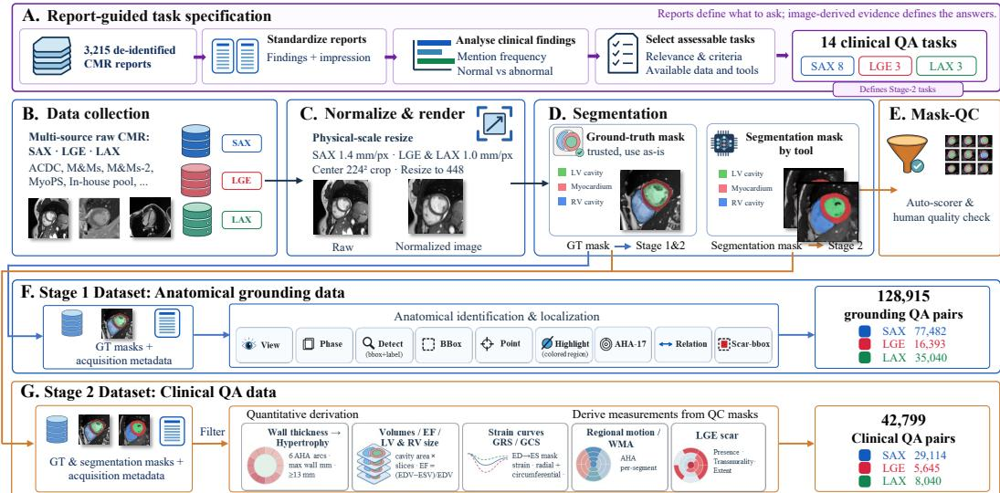
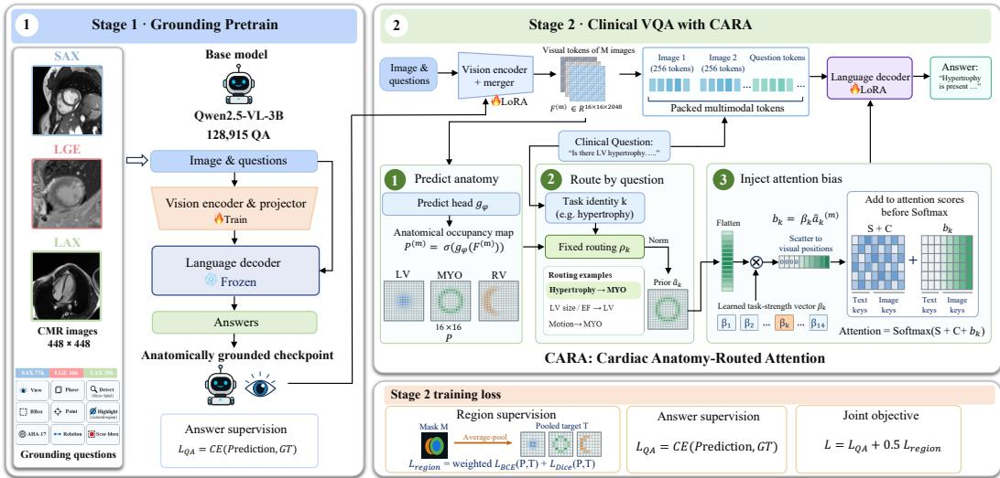
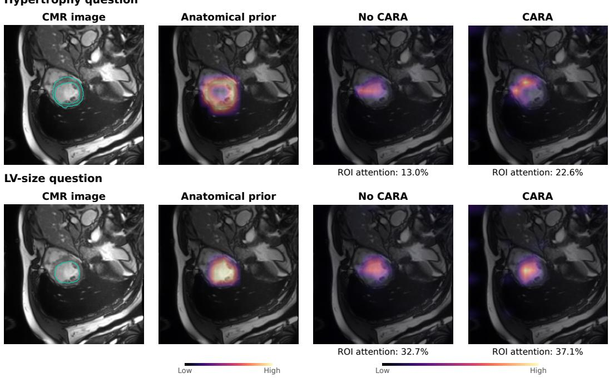
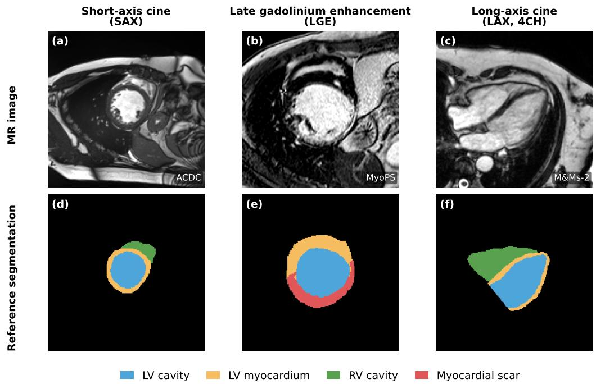
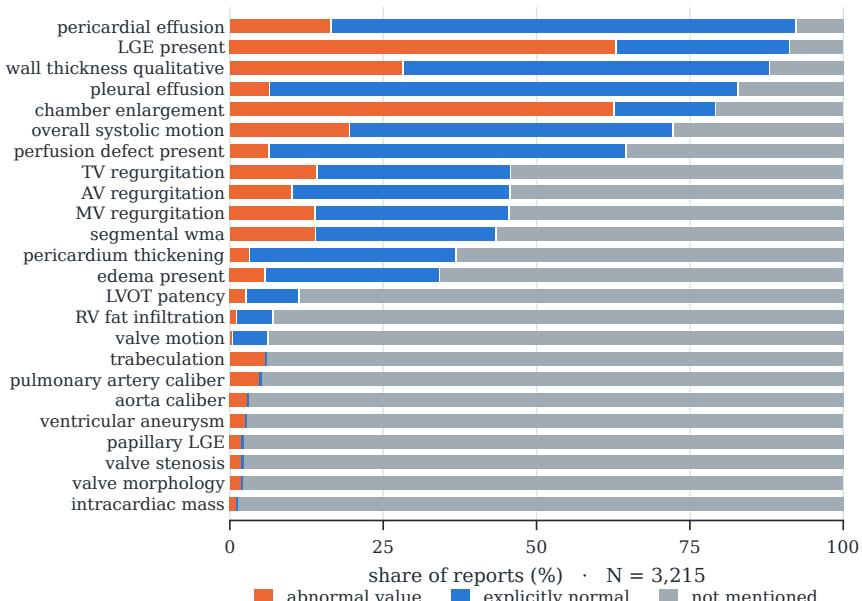
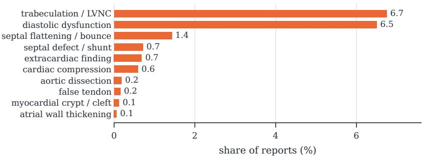
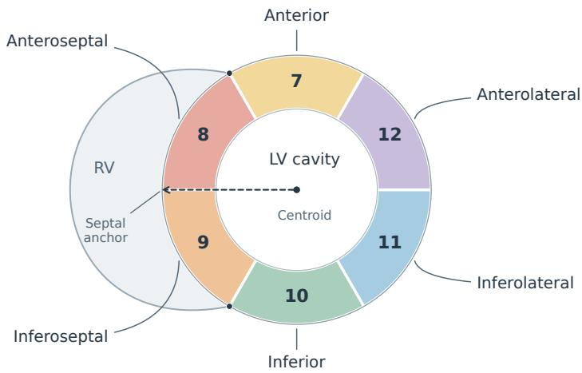
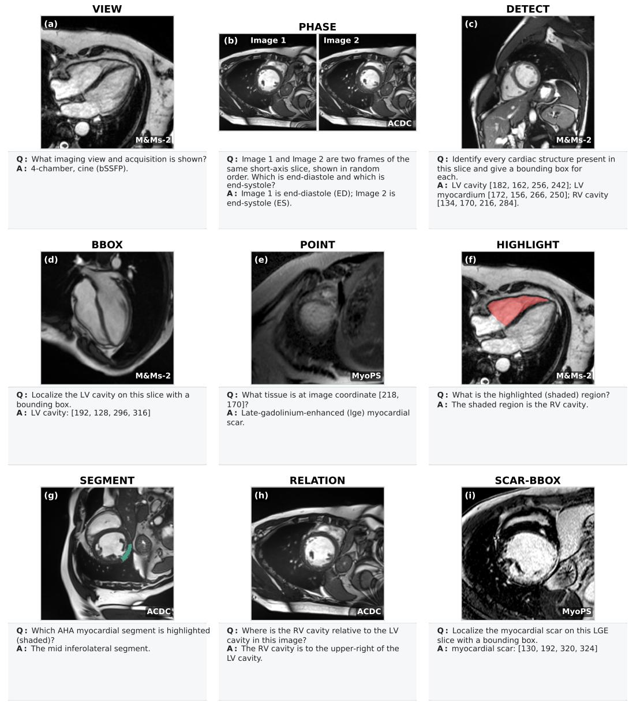
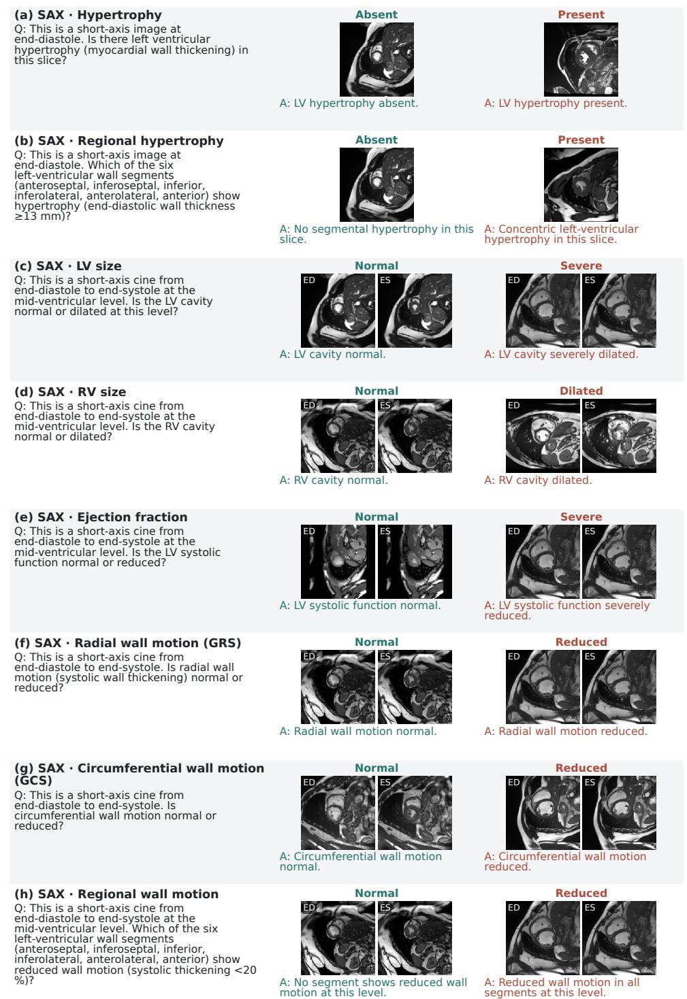
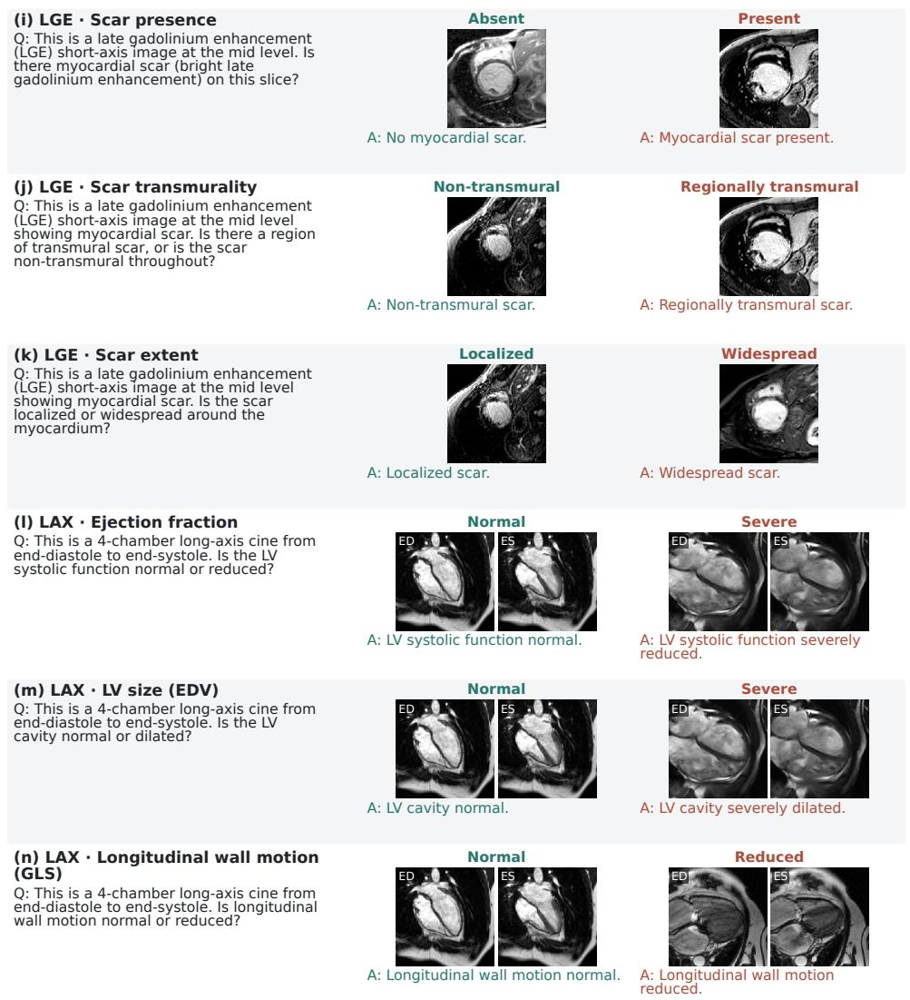

# LEARNING WHERE TO LOOK: ANATOMICALGROUNDING AND GUIDED ATTENTION FOR CARDIACMRI VISION–LANGUAGE MODELS

Bangwei Guo1 Xiao Chen2 Boris Mailhe2 Jia Yao3 Yiqing Wang4 Ankush Mukherjee2 Yikang Liu2 Zheyuan Zhang2 Hang Yu2 Terrence Chen2 Shanhui Sun2

1Rutgers University, NJ, USA 2United Imaging Intelligence, Boston, MA, USA 3University of Texas Southwestern Medical Center, TX, USA 4Duke University, NC, USA

## ABSTRACT

Cardiac magnetic resonance imaging (CMR) enables assessment of cardiac anatomy, ventricular function, and myocardial tissue characteristics. Clinicians interpret these images by identifying cardiac structures and focusing on the regions relevant to each clinical question, motivating anatomically guided vision– language models (VLMs). Yet CMR-specific supervision for anatomical localisation and clinical question answering remains limited. To address this gap, we investigate fine-grained CMR visual question answering through anatomical grounding and guided attention. We construct 128,915 anatomical-grounding and 42,799 clinical QA pairs across short-axis cine, late gadolinium enhancement, and long-axis cine. These datasets support anatomical recognition, localisation, and clinical assessment without requiring paired reports for individual training images. To help the model learn where to look, we introduce Cardiac Anatomy-Routed Attention (CARA), which selects predicted anatomical priors according to the question and guides decoder attention with learned task-specific strengths. Combining anatomical grounding pretraining with CARA yields our model, CARA-VL. Experiments demonstrate CARA-VL’s strengths in clinical assessment and regional localisation across CMR imaging settings, with promising generalization to an external clinical cohort. Together, our data and method provide a practical framework for studying and advancing cardiac visual understanding in VLMs. We will release the QA data derived from public datasets upon publication.

## 1 INTRODUCTION

Cardiac magnetic resonance imaging (CMR) enables comprehensive assessment of cardiac anatomy, ventricular function, and myocardial tissue characteristics (Schulz-Menger et al., 2020). Clinicians interpret CMR by first identifying the relevant cardiac structures and then assessing their morphology, motion, and tissue characteristics for the diagnosis. For example, hypertrophy is assessed from myocardial wall thickness, ventricular function from changes across cardiac phases, and myocardial injury from the presence, extent, and transmurality of scar on late gadolinium enhancement (LGE) (Kim et al., 2000; Schulz-Menger et al., 2020). However, reliable CMR interpretation requires specialist expertise and often time-consuming quantitative analysis. This motivates cardiac visual question answering (VQA), in which AI models answer clinically relevant questions about cardiac anatomy, function, and tissue characteristics from CMR images.

Recent medical vision–language models (VLMs) have shown strong capability in medical image understanding and VQA through large-scale multimodal pretraining and medical instruction tuning (Li et al., 2023; Moor et al., 2023; Chen et al., 2024; Sellergren et al., 2026). Yet their visual training is largely based on broad online biomedical image–text corpora and commonly used medical imaging datasets, with comparatively limited supervision on cardiac MRI. This specialization gap can lead to poor generalization on fine-grained CMR tasks (O’Sullivan et al., 2026). Motivated by this gap, cardiac-specific vision–language models have recently begun to emerge, using CMR–report pairs, cardiac-specific pretraining, or modality-specialized experts to improve domain adaptation (Nakashima et al., 2026; Shad et al., 2026; O’Sullivan et al., 2026; Qu et al., 2026). Despite these advances, accessible training data and explicit anatomical grounding remain important challenges. Many cardiac VLMs rely on institutional or non-public CMR cohorts, limiting access to their training data and reproducibility. Moreover, clinical answer supervision alone does not explicitly teach models to localise cardiac structures or guide attention towards the anatomy relevant to each question.

To address these limitations, we introduce an anatomically grounded vision–language model for fine-grained CMR VQA, connecting anatomical recognition and localisation with clinical assessment. We construct complementary anatomical-grounding and clinical VQA datasets from public and in-house CMR resources. Expert segmentation annotations provide 128,915 grounding QA pairs, while quality-controlled image-derived measurements yield 42,799 clinical QA pairs across 14 tasks informed by clinical report analysis. These datasets support learning about cardiac structure, function, and myocardial scar without requiring a paired report for each training image. Clinicians direct their attention to different cardiac structures depending on the clinical question, such as the myocardium for hypertrophy and the ventricular cavities for size and function (Schulz-Menger et al., 2020). Inspired by this practice, we introduce Cardiac Anatomy-Routed Attention (CARA) to help the model learn where to look. CARA predicts soft anatomical occupancy maps from visual features and selects the relevant map for each clinical question. The resulting prior guides decoder attention over visual tokens with a learned task-specific strength (Figure 2). We refer to the resulting model, trained with anatomical grounding and CARA, as CARA-VL. Our main contributions are summarised as follows:

• We systematically investigate cardiac visual understanding in vision–language models through fine-grained CMR VQA, examining how anatomical recognition and localisation support clinical assessment of cardiac structure, function, and myocardial scar.

• We construct 128,915 anatomical-grounding and 42,799 clinical QA pairs across SAX cine, LGE, and LAX cine. Report-guided task selection, segmentation annotations, and quantitative measurements provide complementary supervision without requiring paired reports for individual training images.

• We develop CARA-VL, combining anatomical grounding pretraining with CARA to learn where to look for clinical question answering. CARA routes predicted anatomical priors according to the question and guides decoder attention with learned task-specific strengths.

• Experiments across 14 clinical tasks show that CARA-VL outperforms the evaluated baselines on all internal tasks and demonstrates promising external generalization. Ablations support the complementary benefits of anatomical grounding pretraining and CARA.

## 2 CLINICALLY GROUNDED QA DATASET CONSTRUCTION

We construct complementary anatomical grounding and clinical QA datasets (Figure 1). Below, we describe report-guided task selection, image collection and standardisation, and the construction of anatomical grounding and clinical QA pairs.

## 2.1 REPORT-GUIDED CLINICAL QA TASK SPECIFICATION

We define clinical QA tasks through report standardisation, finding-level frequency analysis, and clinically informed selection. The corpus comprises 3,215 de-identified CMR reports from three sources. Preprocessing standardises the findings and impression sections and groups synonymous clinical expressions. We quantify the report-level frequency of each clinical finding, distinguishing normal from abnormal mentions to identify candidate tasks. The final selection considers clinical relevance, the availability of explicit measurement or grading criteria, and whether the available data and analysis tools support reliable reference answers. The resulting 14 clinical QA tasks SAX cine, LGE, and LAX cine. Eight SAX cine tasks assess hypertrophy, its segmental distribution, left ventricular (LV) size, right ventricular (RV) size, ejection fraction (EF), regional wall motion, global radial strain (GRS), and global circumferential strain (GCS). Three LGE tasks assess scar presence, transmurality, and extent, while three LAX cine tasks assess EF, end-diastolic volume (EDV), and global longitudinal strain (GLS). Each task has a predefined answer set and explicit assessment criteria, as summarised in Section 2.4 and more details are provided in Appendix C.

  
Figure 1: CMR VQA dataset construction pipeline. (A) Clinical report analysis guides the selection of 14 assessable clinical QA tasks. (B–E) Multi-source CMR images are standardised and paired with expert or quality-controlled automatic masks. (F) Expert masks and acquisition metadata generate nine types of anatomical-grounding QA for identifying and localising cardiac structures. (G) Image-derived measurements and task-specific decision rules generate clinical QA on cardiac structure, function, and myocardial scar.

## 2.2 IMAGE DATA COLLECTION AND STANDARDIZATION

We combine public datasets and in-house CMR cohorts to construct large-scale anatomical grounding and clinical QA datasets for pretraining, clinical adaptation, and evaluation. The collection covers SAX cine, LGE, and LAX cine. Public sources include ACDC (Bernard et al., 2018), M&Ms, M&Ms-2 (Campello et al., 2021; Martín-Isla et al., 2023), MyoPS-related cohorts (Zhuang, 2018; Qiu et al., 2023; Ding et al., 2023; 2025), EMIDEC (Lalande et al., 2020), CMR-MULTI (Qu et al., 2026), and the Kaggle Data Science Bowl Challenge (Data Science Bowl, 2015). The public datasets used here do not provide paired clinical reports. Our in-house data comprise an image-only collection (In-house A) used for training, and an image–report cohort (In-house B) reserved exclusively for external evaluation. To standardize the physical scale of images within each imaging modality, we resample SAX cine to 1.4 mm and LGE and LAX cine to 1.0 mm in-plane resolution using acquisition-specific pixel spacing. Images and available masks are center-cropped to 224 × 224 pixels. The images are then upsampled to 448 × 448 for model input, with grounding coordinates scaled accordingly. Available ground-truth segmentation masks are used directly for data generation. For images without reference masks, we obtain segmentations from a deployed internal CMR segmentation pipeline and manually review their quality before clinical QA construction. Details are provided in Appendix C.

## 2.3 STAGE-1: ANATOMICAL GROUNDING DATASET

Before clinical QA adaptation, we first pretrain the VLM to recognize and localize cardiac anatomy as a structural foundation for subsequent reasoning, consistent with recent evidence on anatomical grounding in medical VLMs (Gu et al., 2026; Zhang et al., 2026). Accordingly, from the multisource CMR pool described in Section 2.2, we select expert-annotated cases for anatomical grounding QA, covering 878 SAX patients, 440 LAX series, and 2,241 LGE slices. We restrict Stage-1 to ground-truth segmentation masks, allowing all grounding targets to be derived deterministically from the annotations. The resulting nine QA task types cover imaging context, anatomical identifi cation and localisation, and cardiac-specific spatial reasoning (Table 6). Specifically, view and phase establish imaging context; detection, bounding-box, point, highlighted-region, and scar boundingbox tasks provide structure- and region-level grounding; and segment and relation tasks supervise identification of American Heart Association (AHA) myocardial segments (e.g., anteroseptal and inferolateral segments) and LV–RV spatial relationships, respectively. Together, these tasks teach the model what structures are present, where they are located, and how they relate spatially. The final Stage-1 dataset contains 128,915 QA pairs over 45,773 images, including 77,482 SAX cine, 35,040 LAX cine, and 16,393 LGE pairs. Further details are provided in Appendix C.

## 2.4 STAGE-2: CLINICAL QA DATASET

Stage-2 extends anatomical grounding to clinical assessment through the 14 tasks defined in Sec tion 2.1. We construct reference answers from anatomical measurements, available reference volumes, and feature-tracking outputs, enabling clinical QA generation from images without paired reports. These quantities capture wall thickness, chamber size, ventricular function and deformation, and myocardial scar. Task-specific decision rules map them to binary findings, severity grades, or regional labels. All masks used for answer generation undergo manual quality control, with low quality or unreliable masks excluded before deriving clinical measurements and reference answers. Each accepted label is paired with a question template specifying the imaging context and a canonical answer. Depending on the task, the input contains a single image or an ordered end-diastolic (ED) and end-systolic (ES) pair. The model receives the images and question, without mask overlays or reference measurements. The resulting dataset contains 42,799 QA pairs: 29,114 from SAX cine, 5,645 from LGE, and 8,040 from LAX cine. Patient-level exclusions are shared across tasks, views, and both training stages, with the image–report cohort reserved for external evaluation. Details of measurement construction, grading, review, and sampling are provided in Appendix C.5; split definitions and evaluation references are given in Appendix C.6.

## 3 CARA: CARDIAC ANATOMY-ROUTED ATTENTION

We present Cardiac Anatomy-Routed Attention (CARA), which guides decoder attention towards question-relevant cardiac structures (Figure 2). Below, we detail its anatomical occupancy prediction, question-guided region routing, and attention injection.

## 3.1 PREDICTING ANATOMICAL OCCUPANCY

We build CARA on Qwen2.5-VL-3B-Instruct (Bai et al., 2025). For a QA instance with M input CMR images, $\mathcal { T } = \{ I ^ { ( m ) } \} _ { m = 1 } ^ { M }$ , each $I ^ { ( m ) } \in \mathbb { R } ^ { 4 4 8 \times 4 4 8 \times 3 }$ is processed by the shared vision encoder. Qwen2.5-VL uses $1 4 \times 1 \times$ 4 image patches and spatially merges each $2 \times 2$ group of neighboring patch tokens, yielding ${ \bf a \ 1 6 \times 1 6 }$ grid of post-merger visual representations for each image:

$$
F ^ { ( m ) } \in \mathbb { R } ^ { 1 6 \times 1 6 \times 2 0 4 8 } , \qquad m = 1 , \dots , M .\tag{1}
$$

which are the same visual features passed to the language model. A convolutional head $g _ { \phi } ,$ shared across images, views, and sequences, predicts question-independent soft occupancy maps for the LV cavity, myocardium, and RV cavity:

$$
P ^ { ( m ) } = \sigma \Big ( g _ { \phi } \Big ( F ^ { ( m ) } \Big ) \Big ) \in [ 0 , 1 ] ^ { 1 6 \times 1 6 \times 3 } ,\tag{2}
$$

where σ denotes the element-wise sigmoid function. We denote the occupancy map for structure $r \in \{ \mathrm { L V } , \mathrm { M Y O } , \mathrm { R V } \}$ by $P _ { r } ^ { ( m ) } \in [ 0 , 1 ] ^ { 1 6 \times 1 6 }$ . The predictor is supervised with soft occupancy targets, where each target measures the fraction of the corresponding visual-token cell occupied by the anatomical structure. Thus, ${ P } _ { r } ^ { ( m ) }$ provides an image-specific coarse anatomical prior that is spatially aligned with the VLM visual-token grid. Segmentation masks are used only to supervise $g _ { \phi }$ during training; at inference, all occupancy maps are predicted directly from the input CMR images. Architectural details are provided in Appendix D.1.

  
Figure 2: Two-stage training with CARA. Stage 1 learns anatomical grounding while keeping the language model frozen. Stage 2 jointly trains clinical answer generation and anatomical occupancy prediction. CARA selects the question-relevant occupancy map and injects the resulting anatomical prior into decoder attention with a learned task-specific strength.

## 3.2 ANATOMY-ROUTED ATTENTION INJECTION

Each clinical question is associated with one of 14 predefined clinical tasks, indexed by k. For each input image m, a fixed routing function $\rho _ { k }$ selects the anatomical evidence relevant to the task:

$$
a _ { k } ^ { ( m ) } = \rho _ { k } \left( P _ { \mathrm { L V } } ^ { ( m ) } , P _ { \mathrm { M Y O } } ^ { ( m ) } , P _ { \mathrm { R V } } ^ { ( m ) } \right) \in [ 0 , 1 ] ^ { 1 6 \times 1 6 } .\tag{3}
$$

For example, hypertrophy-related tasks are routed to the myocardium, whereas LV-size and EF tasks are routed to the LV cavity. Because occupancy confidence may vary across images, We peaknormalise each routed map independently to make its scale comparable across images:

$$
\widehat { a } _ { k } ^ { ( m ) } = \frac { a _ { k } ^ { ( m ) } } { \operatorname* { m a x } \Bigl ( \epsilon , \Bigl \| a _ { k } ^ { ( m ) } \Bigr \| _ { \infty } \Bigr ) } , \qquad \epsilon = 1 0 ^ { - 6 } .\tag{4}
$$

Each task has a learned scalar injection strength $\beta _ { k }$ . After flattening the $1 6 \times 1 6$ prior, let $\widehat { a } _ { k , j } ^ { ( m ) }$ denote the value associated with the j-th visual token of image m, and let $\pi _ { m } ( j )$ map this token to its position in the language-model sequence. We construct a sequence-aligned bias $b _ { k } \in \mathbb { R } ^ { L }$ as

$$
b _ { k , p } = \left\{ \begin{array} { l l } { \beta _ { k } \widehat { a } _ { k , j } ^ { ( m ) } , } & { p = \pi _ { m } ( j ) , } \\ { 0 , } & { p \notin \mathcal { T } _ { \mathrm { v i s u a l } } , } \end{array} \right.\tag{5}
$$

where $\mathcal { T } _ { \mathrm { v i s u a l } }$ denotes the visual-token positions. This directly aligns each image-specific anatomical prior with its corresponding visual tokens, including multi-image inputs. CARA then injects this bias into the pre-softmax decoder attention. Let $\bar { S _ { i , p } ^ { ( \ell , h ) } }$ denote the scaled query–key score from query position i to key position $p$ in decoder layer ℓ and head h, and let $C _ { i , p }$ denote the original causal and padding mask:

$$
\widetilde { S } _ { i , p } ^ { ( \ell , h ) } = S _ { i , p } ^ { ( \ell , h ) } + C _ { i , p } + b _ { k , p } .\tag{6}
$$

Because $b _ { k , p }$ depends only on the key position, the same anatomical bias is shared across decoder layers, heads, and query positions. Positive $\beta _ { k }$ promotes attention to the routed anatomy, zero recovers the original attention pattern, and negative $\beta _ { k }$ suppresses it. During autoregressive generation, the bias remains attached to the original visual tokens and is zero for newly generated positions, allowing CARA to remain fully mask-free at inference.

## 3.3 TWO-STAGE TRAINING WITH ANATOMICAL SUPERVISION

Training proceeds from anatomical grounding to clinical VQA. In Stage 1, we fully fine-tune the vision encoder and multimodal projector on 128,915 anatomical-grounding QA pairs while keeping the language model frozen. This checkpoint initialises Stage 2, where we apply LoRA to adapt the VLM on 42,799 clinical QA pairs across 14 tasks, jointly optimising CARA’s occupancy head $g _ { \phi }$ and attention strengths {βk}.

We supervise answer generation with next-token cross-entropy over answer tokens. For anatomical supervision, reference masks are average-pooled onto the visual-token grid to obtain soft occupancy targets $R _ { r } ^ { ( m ) } \in [ 0 , 1 ] ^ { 1 6 \times 1 6 }$ for image m and structure r. The predicted occupancy maps are supervised using positive-class-weighted binary cross-entropy and soft Dice:

$$
\begin{array} { r } { \mathcal { L } _ { \mathrm { r e g i o n } } = \mathcal { L } _ { \mathrm { W B C E } } + \mathcal { L } _ { \mathrm { D i c e } } , \qquad \mathcal { L } = \mathcal { L } _ { \mathrm { Q A } } + \lambda \mathcal { L } _ { \mathrm { r e g i o n } } , \quad \lambda = 0 . 5 . } \end{array}\tag{7}
$$

Only valid anatomical targets contribute to the region loss; images without valid masks contribute only to the QA loss.

Visual features are detached before entering $g _ { \phi }$ , so the region loss does not update the vision encoder. The QA loss also updates $g _ { \phi }$ and $\beta _ { k }$ through the differentiable attention bias. At inference, CARA predicts anatomical priors directly from visual features without requiring masks as model inputs. Detailed loss definitions and annotation-validity rules are provided in Appendix D.

## 4 EXPERIMENTS

## 4.1 IMPLEMENTATION DETAILS

Implementation and evaluation. We initialise Qwen2.5-VL-3B-Instruct and train the CARA-VL model on four NVIDIA B200 GPUs using AdamW, bfloat16 precision, and cosine decay with 5% warm-up. The base learning rate is $1 0 ^ { - \overline { { 4 } } }$ , with $1 0 ^ { - 2 }$ for Stage 2 CARA injection strengths. Each stage runs for three epochs, with effective batch sizes of 64 and 16 for Stage 1 and Stage 2, respectively. Stage 2 uses LoRA with rank 16, scaling factor 32, and dropout 0.05. All evaluations use the final Stage 2 checkpoint. Additional training settings are provided in Appendix D.

We evaluate all 14 clinical tasks using the ACDC test dataset for SAX cine, the M&Ms-2 test dataset for LAX cine, and a held-out 50-patient LGE set. The eight SAX tasks are additionally evaluated on external In-house B. Patients are held out across tasks, views, and both training stages; performance is scored per QA instance. For In-house B, we evaluate the same predictions separately against two reference standards. Rule-based labels are generated using the same measurement-based labelling framework as the training data. Report-based labels are extracted directly from clinical reports, with echocardiographic grading thresholds used for selected findings. Cohort-specific criteria and differences between the two standards are detailed in Appendix C.6. For classification, we report balanced accuracy (BA; mean sensitivity and specificity) and macro- $F _ { 1 }$ . Regional hypertrophy and wall motion use micro- $F _ { 1 }$ over question–segment pairs, with each anatomical segment labelled affected or unaffected. Scoring details are provided in Appendix D.4.

Baselines We compare our CARA-VL model with general medical VLMs and cardiac-specific systems. The general medical baselines comprise four open models: Lingshu-7B (Xu et al., 2026), HuatuoGPT-Vision-7B (Chen et al., 2024) (Huatuo-Vision), MedGemma-4B-it (Sellergren et al., 2026), and LLaVA-Med-7B (Li et al., 2023). All four are evaluated zero-shot, without adaptation to our CMR training data. The cardiac-specific baselines include CMR-CLIP (Nakashima et al., 2026), the contrastive CMR model of Shad et al. (2026), and BAAI Cardiac Agent (Qu et al., 2026). For BAAI Cardiac Agent, we evaluate its VLM component (BAAI-VLM) for direct image-based question answering without external tool calls.

## 4.2 MAIN RESULTS

Limited zero-shot generalization of general medical VLMs. General medical VLMs struggle with fine-grained CMR clinical QA (Tables 1 and 2). Their mean SAX BA ranges from 46.7% to 51.9%, close to the binary chance level. Performance on LGE and LAX is also generally limited.

Table 1: QA-level clinical VQA results on the ACDC test set (SAX), the 50-patient LGE test set, and the M&Ms-2 test set (LAX). Classification cells show binary BA / macro-F ; LV size, EF, and EDV are evaluated as normal versus abnormal. Regional tasks (†) report micro-F . All scores are percentages(%).
<table><tr><td colspan="9">(a) SAX cine</td></tr><tr><td>Model</td><td>Hyper.</td><td>LV size</td><td>RV size</td><td>EF</td><td>GRS</td><td>GCS</td><td>Avg.</td><td>Reg. hyper.† motion†</td><td>Reg.</td></tr><tr><td colspan="10">General medical VLMs</td></tr><tr><td>LLaVA-Med-7B</td><td>50.0/ 9.950.0/24.3 50.0/42.447.5/39.950.0/41.050.0/38.849.6/32.7</td><td></td><td></td><td></td><td></td><td></td><td></td><td>9.2</td><td>31.2</td></tr><tr><td>MedGemma-4B-it</td><td>t 56.6/55.7 60.7/46.036.7/35.550.0/27.850.0/23.4 51.1/39.4 50.9/38.0</td><td></td><td></td><td></td><td></td><td></td><td></td><td>9.2</td><td>31.9</td></tr><tr><td>Huatuo-Vision</td><td></td><td></td><td>50.0/47.1 50.0/24.350.0/20.950.0/27.852.1/35.559.5/59.551.9/35.9</td><td></td><td></td><td></td><td></td><td>0.9</td><td>24.1</td></tr><tr><td>Lingshu-7B</td><td></td><td>50.0/47.144.4/27.650.8/22.750.0/27.839.2/39.545.7/43.546.7/34.7</td><td></td><td></td><td></td><td></td><td></td><td>3.2</td><td>16.9</td></tr><tr><td colspan="10">CMR-specific models</td></tr><tr><td>CMR-CLIP</td><td>80.0/60.662.5/47.939.4/39.781.4/77.265.4/57.480.1/75.668.1/59.7</td><td></td><td></td><td></td><td></td><td></td><td></td><td>20.3</td><td>52.0</td></tr><tr><td>Shad et al. (2026)</td><td>42.9/43.650.0/41.951.1/44.750.0/27.847.7/39.841.1/37.147.1/39.2</td><td></td><td></td><td></td><td></td><td></td><td></td><td>14.6</td><td>21.9</td></tr><tr><td>BAAI-VLM</td><td>49.1/46.750.0/40.450.0/42.464.4/63.259.3/58.576.7/77.858.3/54.8</td><td></td><td></td><td></td><td></td><td></td><td></td><td>11.3</td><td>26.6</td></tr><tr><td colspan="10">CARA-VL (Ours) 86.7 / 84.3 89.9 / 88.4 86.6/ 88.8 92.1 / 90.4 92.6/92.6 96.4/ 95.7 90.7 / 90.0 61.8</td></tr><tr><td colspan="10">(b) Late gadolinium enhancement Model</td></tr><tr><td>General medical VLMs</td><td>Scar presence</td><td></td><td>Transmurality</td><td>Extent</td><td></td><td>EF</td><td>EDV</td><td></td><td>GLS</td></tr><tr><td colspan="10"></td></tr><tr><td>LLaVA-Med-7B</td><td>50.0/21.0</td><td></td><td>50.0/12.2</td><td>50.0/ 40.6</td><td></td><td>50.0/36.8</td><td>50.0/22.0</td><td></td><td>50.0/41.8</td></tr><tr><td>MedGemma-4B-it</td><td>56.7/ 57.0</td><td></td><td>53.9/20.2</td><td>50.0/ 40.6</td><td></td><td>48.9/36.3</td><td>48.3/30.9</td><td></td><td>49.0/47.1</td></tr><tr><td>Huatuo-Vision Lingshu-7B</td><td>57.5/48.3 50.0/21.0</td><td></td><td>50.0/12.2 50.0/12.2</td><td>48.3/26.0</td><td></td><td>50.0/29.5</td><td>50.0/22.0</td><td></td><td>47.0/38.0</td></tr><tr><td></td><td></td><td></td><td></td><td>50.0/ 40.6</td><td></td><td>50.0/29.5</td><td>50.0/22.0</td><td></td><td>52.8/51.4</td></tr><tr><td colspan="10">CMR-specific models</td></tr><tr><td>CMR-CLIP</td><td>63.1/63.1</td><td></td><td>56.7/ 53.8</td><td>51.1/26.5</td><td></td><td>70.0/64.8</td><td>54.8/31.9</td><td></td><td>68.5/67.6</td></tr><tr><td>Shad et al. (2026)</td><td>50.3/44.3</td><td></td><td>50.0/12.2</td><td>52.4/31.8</td><td></td><td>53.0/41.9</td><td>48.2/ 46.2</td><td></td><td>30.5/31.4</td></tr><tr><td>BAAI-VLM</td><td>50.1/ 49.6</td><td></td><td>43.0/39.5</td><td>33.0/27.4</td><td></td><td>69.3/68.9</td><td>57.5/58.1</td><td></td><td>55.9/53.2</td></tr><tr><td>CARA-VL (Ours)</td><td>82.9/82.0</td><td></td><td>68.5 / 71.1</td><td>82.5 / 82.3</td><td></td><td>78.1/ 74.9</td><td>84.9/81.0</td><td></td><td>77.1/79.6</td></tr></table>

These results indicate that broad medical pretraining alone does not reliably support the cardiac visual recognition and localisation required by our tasks.

Internal evaluation: clinical assessment and localisation. CARA-VL achieves the highest scores across all 14 internal tasks, leading in both BA and macro-F for classification and micro-F for regional localisation (Table 1). On SAX, it reaches 90.7% mean BA and 90.0% mean macro-F1, exceeding CMR-CLIP by 22.6 and 30.3 percentage points, respectively. Its advantage extends to structural, functional, and scar assessment in LAX and LGE. Regional hypertrophy shows a particularly pronounced gain: 61.8% micro- $F _ { 1 }$ versus 20.3% for the strongest baseline; regional wall motion reaches 55.8% versus 52.0%. These gains extend beyond global abnormality classification to identifying affected myocardial regions, supporting fine-grained clinical assessment across CMR imaging settings.

External evaluation: generalization across cohorts and clinical standards. On In-house B, CARA-VL leads under Rule-based labels on five of six classification tasks and both regional tasks (Table 2). Its mean BA / macro- $F _ { 1 }$ reaches 79.5% / 72.4%, compared with 67.5% / 49.1% for CMR-CLIP, with EF remaining the exception. Results are more mixed under Report-based labels: CMR-CLIP performs better on hypertrophy and EF, and achieves regional hypertrophy and wall-motion micro-F of 57.3% and 54.4%, compared with 30.9% and 34.5% for CARA-VL. CMR-CLIP’s report-supervised pretraining may contribute to its stronger agreement with these labels. These results support generalization to an unseen cohort, while highlighting a remaining gap in agreement with clinical reporting. The contrast between the two reference standards also shows that external performance depends on how clinical findings are defined and recorded. Differences in reference criteria and anatomical coverage are detailed in Appendix C.6 (Table 9).

Table 2: External VQA results on In-house B. Classification cells show BA / macro-F1; regional cells show micro-F1 (%). Avg. covers six classification tasks. Report-based GRS/GCS use wallmotion-score proxies; reference definitions, regional coverage, and report-field availability are detailed in Appendix C.6.
<table><tr><td>Model</td><td>Reference</td><td>Hyper.</td><td>LV size</td><td>RV size</td><td>EF</td><td>GRS</td><td>GCS</td><td>Avg.</td><td>Reg. hyper. motion</td><td>Reg.</td></tr><tr><td colspan="9">General medical VLMs</td><td></td><td></td></tr><tr><td></td><td>Rule-based</td><td>50.0/13.3</td><td>50.6/16.2</td><td>50.0/49.4</td><td>49.0/47.3</td><td>50.0/47.6</td><td>50.0/48.5</td><td>49.9/37.0</td><td>7.2</td><td>10.5</td></tr><tr><td>LLaVA-Med-7B</td><td>Report-based</td><td>50.0/23.0</td><td>50.4/41.2</td><td>50.0/40.4</td><td>49.6/49.4</td><td>50.0/42.8</td><td>50.0/43.0</td><td>50.0/40.0</td><td>32.2</td><td>28.9</td></tr><tr><td>MedGemma-4B-it</td><td>Rule-based</td><td>58.3/48.6</td><td>56.1/43.0</td><td>52.2/48.9</td><td>49.8/27.6</td><td>48.9/13.3</td><td>46.5/36.1</td><td>51.9/36.2</td><td>7.2</td><td>12.7</td></tr><tr><td></td><td>Report-based</td><td>52.9/50.7</td><td>55.9/55.7</td><td>51.3/48.8</td><td>50.1/21.8</td><td>48.0/23.5</td><td>47.4/44.0</td><td>50.9/40.7</td><td>32.2</td><td>39.0</td></tr><tr><td>Huatuo-Vision</td><td>Rule-based</td><td>49.5/48.9</td><td>50.0/11.1</td><td>50.0/2.3</td><td>50.0/24.1</td><td>47.3/19.3</td><td>55.8/46.7</td><td>50.4/25.4</td><td>3.3</td><td>9.2</td></tr><tr><td></td><td>Report-based</td><td>49.5/45.8</td><td>50.0/36.9</td><td>50.0/24.4</td><td>50.0/17.9</td><td>48.3/29.7</td><td>49.5/49.2</td><td>49.6/34.0</td><td>5.3</td><td>26.1</td></tr><tr><td>Lingshu-7B</td><td>Rule-based</td><td>50.0/45.8</td><td>53.5/51.3</td><td>50.8/4.0</td><td>50.0/24.1</td><td>49.2/42.5</td><td>49.5/49.3</td><td>50.5/36.2</td><td>1.9</td><td>8.8</td></tr><tr><td></td><td>Report-based</td><td>50.0/41.2</td><td>51.5/45.6</td><td>49.8/25.7</td><td>50.0/17.9</td><td>52.1/50.1</td><td>50.2/46.0</td><td>50.6/37.8</td><td>22.1</td><td>25.6</td></tr><tr><td colspan="9">CMR-specific models</td><td></td><td></td></tr><tr><td>CMR-CLIP</td><td>Rule-based</td><td>85.8/74.2</td><td>62.5/34.6</td><td>51.1/46.6</td><td>76.8/71.7</td><td>59.8/28.2</td><td>68.7/39.2</td><td>67.5/49.1</td><td>18.9</td><td>21.2</td></tr><tr><td></td><td>Report-based</td><td>78.8/78.3</td><td>63.4/62.9</td><td>50.9/49.9</td><td>75.9/64.0</td><td>60.9/43.3</td><td>69.4/59.1</td><td>66.5/59.6</td><td>57.3</td><td>54.4</td></tr><tr><td>Shad et al. (2026)</td><td>Rule-based</td><td>52.9/41.7</td><td>47.1/47.3</td><td>50.0/49.4</td><td>49.9/24.0</td><td>49.5/49.4</td><td>39.5/18.5</td><td>48.2/38.4</td><td>10.8</td><td>8.7</td></tr><tr><td></td><td>Report-based</td><td>47.3/43.6</td><td>45.1/36.0</td><td>50.0/40.4</td><td>49.9/17.8</td><td>49.2/46.3</td><td>46.0/30.6</td><td>47.9/35.8</td><td>29.3</td><td>18.2</td></tr><tr><td>BAAI-VLM</td><td>Rule-based</td><td>50.0/46.1</td><td>50.0/46.7</td><td>50.0/49.4</td><td>51.9/45.1</td><td>54.3/55.4</td><td>58.2/53.0</td><td>52.4/49.3</td><td>5.9</td><td>12.5</td></tr><tr><td></td><td>Report-based</td><td>49.9/41.4</td><td>50.0/29.4</td><td>50.0/40.4</td><td>52.7/49.7</td><td>52.7/49.5</td><td>57.5/58.1</td><td>52.1/44.7</td><td>28.9</td><td>34.4</td></tr><tr><td>CARA-VL (Ours)</td><td>Rule-based</td><td>87.1/90.7</td><td>82.5/66.6</td><td>62.5/59.1</td><td>73.5/66.3</td><td>87.3/86.0</td><td>84.1/65.8</td><td>79.5/72.4</td><td>55.1</td><td>36.7</td></tr><tr><td></td><td>Report-based</td><td>69.9/72.7</td><td>64.0/60.7</td><td>52.4/46.8</td><td>72.6/58.2</td><td>62.7/64.5</td><td>75.0/77.2</td><td>66.1/63.4</td><td>30.9</td><td>34.5</td></tr></table>

## 4.3 ABLATION

Table 3 evaluates the contributions of anatomical grounding pretraining and CARA. Removing Stage-1 reduces mean BA and macro-F by 2.3 and 2.1 percentage points, respectively, while removing CARA produces larger drops of 3.9 and 3.5 points. The full model outperforms the variant without either component by 4.5 points in BA and 4.0 points in

Table 3: Ablation on ACDC SAX clinical QA after Stage-2 training. BA and macro-F1 are averaged across the six global classification tasks (%).
<table><tr><td>Model</td><td>Stage-1</td><td>CARA</td><td>BA</td><td>Macro-F1</td></tr><tr><td>CARA-VL (Ours)</td><td>√</td><td>√</td><td>90.7</td><td>90.0</td></tr><tr><td>w/o Stage-1</td><td>X</td><td>√</td><td>88.4</td><td>87.9</td></tr><tr><td>w/o CARA</td><td>√</td><td>X</td><td>86.8</td><td>86.5</td></tr><tr><td>w/o Stage-1 and CARA</td><td>X</td><td>X</td><td>86.2</td><td>86.0</td></tr></table>

macro- $F _ { 1 }$ . Stage-1 also provides a larger gain when CARA is enabled, suggesting that anatomical grounding and guided attention offer complementary benefits. Figure 3 compares attention maps from models trained without and with CARA. For the same SAX image, the model trained with CARA shows more concentrated attention on the myocardium for hypertrophy and the LV cavity for LV size. The alignment between the routed priors and decoder attention provides a qualitative view of CARA’s anatomical guidance. These examples illustrate how anatomical routing guides attention towards different cardiac structures according to the clinical question.

## 5 DISCUSSION

Our study demonstrates the value of anatomical supervision for developing and evaluating cardiac VLMs. Our dataset covers 14 clinical QA tasks across three CMR imaging modalities, deriving reference answers from segmentation masks, quantitative measurements, and task-specific criteria. These tasks assess cardiac structure, function, tissue characteristics, and regional localisation. CARA connects anatomical grounding with anatomy-routed attention, using learned anatomical priors to guide image interpretation. Its leading performance across all 14 internal tasks, together with its performance on an external clinical cohort, demonstrates capabilities in global abnormality recognition and regional assessment. Together, the data and method provide a practical framework for studying cardiac visual understanding and highlight anatomical learning as a promising direction for specialised medical VLMs.

  
Figure 3: Attention maps from models trained without and with CARA for hypertrophy and LV-size questions on the same SAX image. Attention maps average all heads in the final eight decoder layers at the last prompt token. Attention maps share a colour scale within each row; anatomical priors are separately normalised to unit peak. ROI attention quantifies the fraction of visual attention allocated to the target anatomy.

Limitations. Our study has three main limitations. First, training answers are generated from annotation masks and image-derived measurements using predefined rules, inheriting errors and assumptions from these procedures. Although useful for evaluating visual recognition and localisation, these labels require independent clinical validation, as differences between measurement-based and report-based evaluation further highlight (Appendix C.6). Second, the underlying cohorts remain modest: generating multiple questions per examination increases QA volume without proportion ally increasing patient diversity. Access to CMR studies, usable annotations, and quality review constrains expansion, while external evaluation currently covers SAX cine only. Finally, current performance remains insufficient for clinical use, and answering predefined questions from selected images captures only part of comprehensive CMR interpretation. If larger multicentre CMR datasets with paired clinical reports become available, future work could incorporate report supervision and assess clinical utility through independent expert review.

## 6 CONCLUSION

We presented CARA-VL, which combines anatomical grounding and anatomy-routed attention for fine-grained CMR question answering. Our data pipeline connects clinical reporting needs with anatomical annotations and quantitative measurements, providing grounding and clinical QA supervision across SAX cine, LGE, and LAX cine without paired reports for individual training images.

CARA-VL leads the evaluated models across all 14 internal tasks, with ablations supporting the complementary benefits of anatomical learning and guided attention. External evaluation shows generalization to an unseen clinical cohort alongside remaining gaps in agreement with clinical reporting. Future work could extend anatomical guidance to full cine sequences, linking cardiac structure with motion over time, and explore more open-ended clinical questions. These directions provide opportunities to advance generative cardiac VQA and study how anatomical knowledge supports visual understanding in medical VLMs.

## REPRODUCIBILITY STATEMENT

We provide detailed descriptions of data construction, model implementation, training, and evaluation in Appendices C and D to facilitate reproducibility. We will release a subset of the QA data constructed from public CMR datasets, in accordance with their licences and redistribution conditions, to support further research on cardiac visual question answering.

## AI USE STATEMENT

Generative AI tools assisted with manuscript drafting, language editing and translation, literature search, code development and review, figure preparation, and interpretation and consistency checking of reported results. The authors take responsibility for the final manuscript and associated research artifacts, including the scientific claims, references, implementation, and reported results.

## REFERENCES

Leon Axel, Mikael Kanski, Amit Jhaveri, Meng Ye, Bangwei Guo, Xiaoxiao He, and Dimitris Metaxas. Analysis of cardiac dynamic global function. JRSM Cardiovascular Disease, 15: 20480040261439970, 2026.

Shuai Bai, Keqin Chen, Xuejing Liu, Jialin Wang, Wenbin Ge, Sibo Song, Kai Dang, Peng Wang, Shijie Wang, Jun Tang, Humen Zhong, Yuanzhi Zhu, Mingkun Yang, Zhaohai Li, Jianqiang Wan, Pengfei Wang, Wei Ding, Zheren Fu, Yiheng Xu, Jiabo Ye, Xi Zhang, Tianbao Xie, Zesen Cheng, Hang Zhang, Zhibo Yang, Haiyang Xu, and Junyang Lin. Qwen2.5-vl technical report, 2025. URL https://arxiv.org/abs/2502.13923.

Olivier Bernard, Alain Lalande, Clement Zotti, Frederick Cervenansky, Xin Yang, Pheng-Ann Heng, Irem Cetin, Karim Lekadir, Oscar Camara, Miguel Angel Gonzalez Ballester, et al. Deep learning techniques for automatic mri cardiac multi-structures segmentation and diagnosis: is the problem solved? IEEE transactions on medical imaging, 37(11):2514–2525, 2018.

Victor M Campello, Polyxeni Gkontra, Cristian Izquierdo, Carlos Martin-Isla, Alireza Sojoudi, Peter M Full, Klaus Maier-Hein, Yao Zhang, Zhiqiang He, Jun Ma, et al. Multi-centre, multi-vendor and multi-disease cardiac segmentation: the m&ms challenge. IEEE Transactions on Medical Imaging, 40(12):3543–3554, 2021.

Junying Chen, Chi Gui, Ruyi Ouyang, Anningzhe Gao, Shunian Chen, Guiming Hardy Chen, Xidong Wang, Zhenyang Cai, Ke Ji, Xiang Wan, et al. Towards injecting medical visual knowledge into multimodal llms at scale, 2024.

Data Science Bowl. Data Science Bowl Cardiac Challenge Data. https://www.kaggle.com/ c/second-annual-data-science-bowl/data, 2015. Accessed: 2026-09-17.

Wangbin Ding, Lei Li, Junyi Qiu, Sihan Wang, Liqin Huang, Yinyin Chen, Shan Yang, and Xiahai Zhuang. Aligning multi-sequence cmr towards fully automated myocardial pathology segmentation. IEEE Transactions on Medical Imaging, 42(12):3474–3486, 2023.

Wangbin Ding, Lei Li, Junyi Qiu, Bogen Lin, Mingjing Yang, Liqin Huang, Lian-Ming Wu, Sihan Wang, and Xiahai Zhuang. Cinemyops: Segmenting myocardial pathologies from cine cardiac mr. IEEE Transactions on Medical Imaging, 44(12):5027–5037, 2025.

Yunguan Fu, Wenjia Bai, Weixi Yi, Charlotte Manisty, Anish N Bhuva, Thomas A Treibel, James C Moon, Matthew J Clarkson, Rhodri Huw Davies, and Yipeng Hu. Development and validation of a

versatile foundation model for cine cardiac magnetic resonance image analysis. Communications Medicine, 2026.

Yunhe Gao, Mu Zhou, and Dimitris N Metaxas. Utnet: a hybrid transformer architecture for medical image segmentation. In International conference on medical image computing and computerassisted intervention, pp. 61–71. Springer, 2021.

Difei Gu, Yunhe Gao, Mu Zhou, and Dimitris Metaxas. Anatomy-vlm: a fine-grained visionlanguage model for medical interpretation. In 2026 IEEE/CVF Winter Conference on Applications ofComputer Vision (WACV), pp. 2838–2847. IEEE, 2026.

Bangwei Guo, Meng Ye, Yunhe Gao, Bingyu Xin, Leon Axel, and Dimitris Metaxas. Verse: Integrating multiple queries as prompts for versatile cardiac mri segmentation. In International Conference on Information Processing in Medical Imaging, pp. 373–387. Springer, 2025.

Bangwei Guo, Yunhe Gao, Meng Ye, Difei Gu, Yang Zhou, Leon Axel, and Dimitris Metaxas. Kprism: A knowledge-guided and prompt integrated universal medical image segmentation model. In International Conference on Learning Representations, volume 2026, pp. 146455–146480, 2026.

Nadine Kawel-Boehm, Scott J Hetzel, Bharath Ambale-Venkatesh, Gabriella Captur, Christopher J Francois, Michael Jerosch-Herold, Michael Salerno, Shawn D Teague, Emanuela Valsangiacomo-Buechel, Rob J Van der Geest, et al. Reference ranges (“normal values”) for cardiovascular magnetic resonance (cmr) in adults and children: 2020 update. Journal of cardiovascular magnetic resonance, 22(1):87, 2020.

Raymond J Kim, Edwin Wu, Allen Rafael, Enn-Ling Chen, Michele A Parker, Orlando Simonetti, Francis J Klocke, Robert O Bonow, and Robert M Judd. The use of contrast-enhanced magnetic resonance imaging to identify reversible myocardial dysfunction. New England Journal of Medicine, 343(20):1445–1453, 2000.

Christopher M Kramer, Jörg Barkhausen, Chiara Bucciarelli-Ducci, Scott D Flamm, Raymond J Kim, and Eike Nagel. Standardized cardiovascular magnetic resonance imaging (cmr) protocols: 2020 update. Journal ofcardiovascular magnetic resonance, 22(1):17, 2020.

Alain Lalande, Zhihao Chen, Thomas Decourselle, Abdul Qayyum, Thibaut Pommier, Luc Lorgis, Ezequiel de La Rosa, Alexandre Cochet, Yves Cottin, Dominique Ginhac, et al. Emidec: a database usable for the automatic evaluation of myocardial infarction from delayed-enhancement cardiac mri. Data, 5(4):89, 2020.

Chunyuan Li, Cliff Wong, Sheng Zhang, Naoto Usuyama, Haotian Liu, Jianwei Yang, Tristan Naumann, Hoifung Poon, and Jianfeng Gao. Llava-med: Training a large language-and-vision assistant for biomedicine in one day. Advances in neural information processing systems, 36:28541– 28564, 2023.

Xiang Li, Like Li, Yuchen Jiang, Hao Wang, Xinyu Qiao, Ting Feng, Hao Luo, and Yong Zhao. Vision-language models in medical image analysis: From simple fusion to general large models. Information Fusion, 118:102995, 2025.

Carolin Lim, Edyta Blaszczyk, Leili Riazy, Stephanie Wiesemann, Johannes Schüler, Florian von Knobelsdorff-Brenkenhoff, and Jeanette Schulz-Menger. Quantification of myocardial strain assessed by cardiovascular magnetic resonance feature tracking in healthy subjects—influence of segmentation and analysis software. European radiology, 31(6):3962–3972, 2021.

Yinbin Lu and Alan Wang. Integrating language into medical visual recognition and reasoning: A survey. Medical image analysis, 102:103514, 2025.

Carlos Martín-Isla, Víctor M Campello, Cristian Izquierdo, Kaisar Kushibar, Carla Sendra-Balcells, Polyxeni Gkontra, Alireza Sojoudi, Mitchell J Fulton, Tewodros Weldebirhan Arega, Kumaradevan Punithakumar, et al. Deep learning segmentation of the right ventricle in cardiac mri: the m&ms challenge. IEEE Journal ofBiomedical and Health Informatics, 27(7):3302–3313, 2023.

Michael Moor, Qian Huang, Shirley Wu, Michihiro Yasunaga, Yash Dalmia, Jure Leskovec, Cyril Zakka, Eduardo Pontes Reis, and Pranav Rajpurkar. Med-flamingo: a multimodal medical fewshot learner. In Machine learningfor health (ML4H), pp. 353–367. PMLR, 2023.

Makiya Nakashima, Jielin Qiu, Peide Huang, Jihye Lee, Po-hao Chen, Richard Grimm, Christopher Nguyen, Byung-Hak Kim, Ding Zhao, Deborah Kwon, et al. Contrastive language image pretraining for a cardiac magnetic resonance image embedding with zero-shot capabilities. Nature Communications, 17(1):4416, 2026.

American Heart Association Writing Group on Myocardial Segmentation, Registration for Cardiac Imaging:, Manuel D. Cerqueira, Neil J. Weissman, Vasken Dilsizian, Alice K. Jacobs, Sanjiv Kaul, Warren K. Laskey, Dudley J. Pennell, John A. Rumberger, Thomas Ryan, and Mario S. Verani. Standardized myocardial segmentation and nomenclature for tomographic imaging of the heart. Circulation, 105(4):539–542, 2002. doi: 10.1161/hc0402.102975. URL https://www.ahajournals.org/doi/abs/10.1161/hc0402.102975.

Jack W O’Sullivan, Mohammad Asadi, Lennart Elbe, Akshay Chaudhari, Tahoura Nedaee, Francois Haddad, Michael Salerno, Li Fe-Fei, Ehsan Adeli, Rima Arnaout, et al. Marcus: An agentic, multimodal vision-language model for cardiac diagnosis and management. arXiv preprint arXiv:2603.22179, 2026.

Daniele M Papetti, Kirsten Van Abeelen, Rhodri Davies, Roberto Menè, Francesca Heilbron, Francesco P Perelli, Jessica Artico, Andreas Seraphim, James C Moon, Gianfranco Parati, et al. An accurate and time-efficient deep learning-based system for automated segmentation and reporting of cardiac magnetic resonance-detected ischemic scar. Computer methods and programs in biomedicine, 229:107321, 2023.

Gianni Pedrizzetti, Piet Claus, Philip J Kilner, and Eike Nagel. Principles of cardiovascular magnetic resonance feature tracking and echocardiographic speckle tracking for informed clinical use. Journal ofcardiovascular magnetic resonance, 18(1):51, 2016.

Junyi Qiu, Lei Li, Sihan Wang, Ke Zhang, Yinyin Chen, Shan Yang, and Xiahai Zhuang. Myops-net: Myocardial pathology segmentation with flexible combination of multi-sequence cmr images. Medical image analysis, 84:102694, 2023.

Taiping Qu, Hongkai Zhang, Lantian Zhang, Can Zhao, Nan Zhang, Hui Wang, Zhen Zhou, Mingye Zou, Kairui Bo, Pengfei Zhao, et al. Baai cardiac agent: An intelligent multimodal agent for automated reasoning and diagnosis of cardiovascular diseases from cardiac magnetic resonance imaging. arXiv preprint arXiv:2604.04078, 2026.

Prabhakar Shantha Rajiah, Christopher J François, and Tim Leiner. Cardiac mri: state of the art. Radiology, 307(3):e223008, 2023.

Jeanette Schulz-Menger, David A Bluemke, Jens Bremerich, Scott D Flamm, Mark A Fogel, Matthias G Friedrich, Raymond J Kim, Florian von Knobelsdorff-Brenkenhoff, Christopher M Kramer, Dudley J Pennell, et al. Standardized image interpretation and post-processing in cardiovascular magnetic resonance-2020 update: Society for cardiovascular magnetic resonance (scmr): Board of trustees task force on standardized post-processing. Journal ofcardiovascular magnetic resonance, 22(1):19, 2020.

Andrew Sellergren, Chufan Gao, Fereshteh Mahvar, Timo Kohlberger, Fayaz Jamil, Madeleine Traverse, Alberto Tono, Bashir Sadjad, Lin Yang, Charles Lau, et al. Medgemma 1.5 technical report. arXiv preprint arXiv:2604.05081, 2026.

Rohan Shad, Cyril Zakka, Dhamanpreet Kaur, Mrudang Mathur, Robyn Fong, Joseph Cho, Ross Warren Filice, John Mongan, Kimberly Kallianos, Nishith Khandwala, et al. A generalizable deep learning system for cardiac mri. Nature Biomedical Engineering, pp. 1–16, 2026.

Weiwen Xu, Hou Pong Chan, Long Li, Mahani Aljunied, Ruifeng Yuan, Jianyu Wang, Chenghao Xiao, Guizhen Chen, Chaoqun Liu, Zhaodonghui Li, et al. Lingshu: Generalist foundation model for unified multimodal medical understanding and reasoning. IEEE Transactions on Pattern Analysis and Machine Intelligence, 2026.

Meng Ye, Bingyu Xin, Bangwei Guo, Leon Axel, and Dimitris Metaxas. Learning volumetric neural deformable models to recover 3d regional heart wall motion from multi-planar tagged mri. arXiv preprint arXiv:2411.15233, 2024.

Mengmeng Zhang, Xiaoping Wu, Hao Luo, Fan Wang, and Yisheng Lv. Medground: Bridging the evidence gap in medical vision-language models with verified grounding data. arXiv preprint arXiv:2601.06847, 2026.

Xiahai Zhuang. Multivariate mixture model for myocardial segmentation combining multi-source images. IEEE transactions on pattern analysis and machine intelligence, 41(12):2933–2946, 2018.

## A RELATED WORK

General medical VQA models. General medical VLMs such as LLaVA-Med (Li et al., 2023), Med-Flamingo (Moor et al., 2023), HuatuoGPT-Vision (Chen et al., 2024), and MedGemma (Sellergren et al., 2026) have demonstrated strong medical visual question answering capabilities through large-scale multimodal pretraining and medical instruction tuning. However, their visual training is largely built around broad biomedical figures and common medical imaging domains, includ ing radiography, pathology, dermatology, and ophthalmology (Lu & Wang, 2025; Li et al., 2025), rather than systematic supervision on cardiac MRI. This specialization gap is particularly consequential for CMR, where clinically meaningful answers depend on cardiac anatomy, cine dynamics, physical-scale measurements, and sequence-specific pathology (Schulz-Menger et al., 2020; Rajiah et al., 2023). Thus, strong general medical VQA capability does not necessarily translate to reliable CMR-specific clinical assessment.

Emerging CMR-specific foundation and vision–language models. Recent work has increasingly explored foundation and multimodal models tailored to cardiac MRI. CMR-CLIP (Nakashima et al., 2026) and Shad et al. (2026) both adopt CLIP-style image–text representation learning from cine CMR and associated clinical reports, targeting zero-shot disease recognition and downstream functional or diagnostic prediction. CineMA (Fu et al., 2026) scales self-supervised cine-CMR pretraining to support tasks including segmentation, landmark localization, diagnosis, and prognosis, while MARCUS (O’Sullivan et al., 2026) introduces modality-specific cardiac vision–language experts for ECG, echocardiography, and CMR within an agentic multimodal system. BAAI Cardiac Agent (Qu et al., 2026) combines CMR-specific VQA with expert-model orchestration for cardiac segmentation, functional quantification, disease diagnosis, and structured report generation. Together, these studies highlight growing interest in CMR-specific VLMs, but current approaches often emphasize contrastive representation learning, rely on heterogeneous or complex input settings, and lack a standardized fine-grained clinical QA formulation. Their dependence on large institutional or non-public cohorts also limits reproducibility and direct comparison.

## B CLINICAL BACKGROUND ON CARDIAC MRI

This appendix introduces cardiac anatomy, common cardiac MRI views and sequences, and the clinical concepts used to describe cardiac structure, function, and tissue characteristics. The left and right ventricular (LV and RV) cavities contain blood, while the myocardium forms the muscular walls responsible for contraction.

## B.1 IMAGING VIEWS AND SEQUENCES

Figure 4 contrasts the imaging geometry and reference anatomy used across the three task families.

Short-axis cine. Short-axis (SAX) cine imaging provides cross-sectional views of the ventricles perpendicular to the left ventricular long axis. Cine acquisitions resolve changes in ventricular cavity size and myocardial wall thickening throughout the cardiac cycle. A basal-to-apical stack enables quantification of ventricular volumes, ejection fraction, and myocardial mass, while regional assessment characterises wall thickness and systolic wall motion (Kramer et al., 2020; Schulz-Menger et al., 2020).

Long-axis cine. Long-axis (LAX) cine imaging comprises standard two-, three-, and fourchamber views aligned with the left ventricular long axis. These planes delineate the ventricular apex, atrioventricular junctions, and chamber geometry, providing complementary assessment of global and regional systolic function. Temporal changes in myocardial position and ventricular length also support assessment of longitudinal shortening and mitral annular excursion (Kramer et al., 2020; Schulz-Menger et al., 2020).

Late gadolinium enhancement. Late gadolinium enhancement (LGE) imaging characterises myocardial injury using delayed contrast-enhanced acquisitions, with normal myocardial signal suppressed to delineate hyperenhanced tissue. The location, distribution, and transmural extent of enhancement inform the assessment of myocardial scar and the differentiation of ischaemic and non-ischaemic injury patterns (Schulz-Menger et al., 2020).

  
Figure 4: Representative CMR views and spatially matched reference annotations. Top: enddiastolic SAX cine (ACDC), short-axis LGE with myocardial scar (MyoPS), and end-diastolic fourchamber LAX cine (M&Ms-2). Bottom: the corresponding segmentations. SAX shows ventricular cross-sections, LAX displays chamber geometry along the ventricular long axis, and LGE delineates hyperenhanced scar. Colours denote the LV cavity (blue), LV myocardium (orange), RV cavity (green), and myocardial scar (red). These are reference annotations, not model predictions.

## B.2 CARDIAC STRUCTURE, FUNCTION, AND TISSUE CHARACTERISTICS

The reference masks in Figure 4 illustrate the ventricular cavities, surrounding LV myocardium, and myocardial scar.

Wall thickness and chamber size. Myocardial hypertrophy is characterised by increased wall thickness, which may be diffuse or confined to specific myocardial regions. Ventricular dilation instead refers to enlargement of the ventricular cavity. Wall thickness and cavity size therefore describe distinct aspects of cardiac morphology: a thickened myocardial wall does not necessarily imply an enlarged chamber. Their assessment requires clearly defined imaging planes and cardiac phases (Schulz-Menger et al., 2020).

AHA 17-segment model. The American Heart Association (AHA) 17-segment model standardises the anatomical subdivision of the left ventricular myocardium (on Myocardial Segmentation et al., 2002). It comprises six basal segments, six mid-ventricular segments, four apical segments, and the apical cap. The basal and mid-ventricular levels each include anterior, anteroseptal, inferoseptal, inferior, inferolateral, and anterolateral segments, whereas the apical level contains anterior, septal, inferior, and lateral segments. The apical cap represents the terminal myocardium beyond the ventricular cavity. This nomenclature specifies both the base-to-apex level and circumferentia position, providing a consistent reference for reporting regional myocardial findings.

Ventricular volume and systolic function. In cine CMR, end-diastole and end-systole are conventionally identified as the phases of maximal and minimal ventricular cavity volume, respectively.

The corresponding volumes are termed end-diastolic volume (EDV) and end-systolic volume (ESV). Their difference defines stroke volume, and ejection fraction (EF) expresses stroke volume as a percentage of EDV (Schulz-Menger et al., 2020):

$$
\mathrm { E F } = \frac { \mathrm { E D V } - \mathrm { E S V } } { \mathrm { E D V } } \times 1 0 0 \% .
$$

EDV characterises ventricular cavity size and is commonly indexed to body surface area for comparison with normal reference ranges (Kawel-Boehm et al., 2020). EF provides a global measure of systolic emptying, whereas regional wall-motion assessment evaluates myocardial displacement and systolic thickening within individual segments. Beyond these end-diastolic and end-systolic measures, ventricular volume–time curves further characterise the timing and rates of ventricular emptying and filling (Axel et al., 2026).

Myocardial deformation. Myocardial strain quantifies tissue deformation relative to a reference configuration, conventionally end-diastole, and characterises regional and global myocardial mechanics (Pedrizzetti et al., 2016). Global radial strain (GRS) describes myocardial wall thickening, whereas global circumferential strain (GCS) and global longitudinal strain (GLS) describe shorten ing around the ventricular circumference and along the base-to-apex axis, respectively. “Global” refers to an aggregate measure over the analysed myocardium. Under the conventional sign convention, systolic radial strain is positive, while circumferential and longitudinal strain are negative; impaired shortening is therefore reflected by less negative values. CMR-based deformation assessment includes feature tracking of routine cine images and motion estimation from tagged MRI. Strain estimates depend on the segmentation procedure, slice coverage, and analysis software, making consistent measurement definitions important for interpretation (Lim et al., 2021; Ye et al., 2024).

Scar presence, transmurality, and extent. Myocardial scar represents replacement of injured myocardium by fibrotic tissue and can be assessed using LGE imaging. Scar presence indicates whether scar is identified within the myocardium. Transmurality describes the fraction of local myocardial wall thickness occupied by scar, ranging from partial-thickness to full-thickness involvement. Scar extent describes the amount or spatial spread of affected myocardium (Schulz-Menge et al., 2020). Circumferential extent describes the proportion of the myocardial circumference affected by scar. Transmurality and circumferential extent thus describe different dimensions of scar involvement: a lesion may span the full wall thickness while remaining confined to a small circum ferential region. Segmentation of scar and myocardial boundaries supports quantitative assessment of these properties, as explored in automated scar analysis (Papetti et al., 2023; Guo et al., 2025).

## C DATA CONSTRUCTION DETAILS

We build two training sets from one rendering pipeline (Fig. 1). The Stage-1 grounding set reads its answers directly from expert reference masks; the Stage-2 clinical set computes its answers from physical measurements on reference or automatically generated masks. Table 5 lists every source, its mask provenance, and its role in each stage.

## C.1 FROM FREE-TEXT REPORTS TO A CLOSED QUESTION SET

The 14 questions are not chosen a priori. They are the surviving intersection of what clinical reports actually state, what has a guideline-anchored threshold, and what can be measured from segmentation.

Report corpus and recurring findings. We analyse 3,215 de-identified CMR reports from three sources: 1,112 disease-labelled reports, 1,902 consecutive clinical reports, and 201 reports accompanied by structured post-processing results. A curated bilingual lexicon covering 20 clinical finding categories identifies whether each finding is mentioned in a report. Frequently discussed findings include myocardial enhancement, chamber dilation, reduced ejection fraction, wall thickening, and regional wall-motion abnormalities. These frequencies characterise recurring clinical concerns and inform candidate question selection. However, paired CMR images are unavailable for this report corpus. The reports therefore guide the scope of clinical questions rather than provide image– question–answer training pairs.

(a) Clause-level audit outcome per template field  

(b) Abnormal statements with no matching field  
  
Figure 5: Structured report audit over 3,215 CMR reports. (a) For each template field, the share of reports in which the field is not mentioned, explicitly normal, or carries an abnormal value, ordered by mention rate (explicitly normal + abnormal). A high mention rate with a low abnormality rate marks a finding that radiologists address routinely but rarely find abnormal. (b) Abnormal statements matching no template field.

Structured report audit. We organise report findings into a structured template, with each field assigned an imaging sequence or study-level scope and a clinical information type, such as a measurement, visual finding, or anatomical location. A clause-level audit distinguishes findings that are not mentioned, explicitly normal, or abnormal, retaining reported measurements or grades where available. We iteratively review abnormal statements not captured by the template and add or refine fields to improve coverage. The resulting template contains 173 fields, including 59 with predefined answer categories. We then aggregate mention and abnormality frequencies separately, distinguishing frequently discussed findings from frequently reported abnormalities. Together, these statistics inform candidate question selection; the template serves as a report-analysis framework rather than an image-level labelling scheme. Figure 5 plots the audit.

Selecting clinical QA tasks. Candidate tasks are selected according to three criteria: they address recurring clinical findings in the reports, admit explicit measurement or grading criteria, and are supported by the imaging data and segmentation annotations available in our cohorts. Reports guide question selection, while reference answers are derived separately from image-based measurements and acquisition metadata. Valvular disease, perfusion defects, oedema, atrial findings, and parametric mapping are excluded because the available data do not support the required measurements. We also exclude ischaemic versus non-ischaemic enhancement classification because the available LGE cohort lacks sufficient variation for this distinction, and atrial-plane images without assessable ventricular myocardium. The resulting 14 clinical QA tasks are summarised in Table 4, with grading criteria detailed below.

Table 4: Definitions and labelling criteria for the 14 clinical QA tasks. ED and ES denote enddiastole and end-systole, respectively. The table summarises answer categories, measurement rules, and exclusion intervals. Segmentation sources, quality control, measurement derivation, and training-set statistics are detailed in Appendix C.5.
<table><tr><td>Domain</td><td>Task and answer categories</td><td>Frames</td><td>Measurement and labelling rule</td></tr><tr><td>SAX</td><td>Hypertrophy: present / absent</td><td>ED</td><td>Present if any AHA segment has ED wall thickness ≥ 13 mm; source- labelled normal cases are assigned negative.</td></tr><tr><td></td><td>Regional hypertrophy: segment list ED</td><td></td><td>Segments with ED wall thickness &gt; 13 mm; six segments at basal and mid- ventricular levels, four at the apical level.</td></tr><tr><td></td><td>LV size: normal / mild / moderate / ED+ES severe dilation</td><td></td><td>Patient-level LV EDV: &lt; 200, [200, 240), [240, 300), and ≥ 300 mL, respectively.</td></tr><tr><td></td><td>EF: normal / mild / moderate / se- ED+ES vere reduction</td><td></td><td>Whole-stack area-ratio EF: ≥ 50%, [40, 50)%, [30, 40)%, and &lt; 30%, respectively.</td></tr><tr><td></td><td>RV size: dilated / normal</td><td>ED+ES</td><td>Dilated if RV EDV &gt; 200 mL and RV/LV EDV ratio &gt; 1.3; single-criterion positives require visual confirmation. Normal if both are below threshold; unconfirmed candidates are excluded.</td></tr><tr><td></td><td>GRS surrogate: normal / reduced</td><td>ED+ES</td><td>Mean systolic wall thickening: ≥ 45% normal, &lt; 35% reduced; exclude [35, 45)%.</td></tr><tr><td></td><td>GCS: normal / reduced</td><td>ED+ES</td><td>Feature-tracking peak circumferential strain: ≤ —16% normal, ≥ —12% reduced; exclude (−16, -12)%.</td></tr><tr><td></td><td>Regional motion: segment list</td><td>ED+ES</td><td>Segments with systolic wall thickening &lt; 20%. Inherits GRS sample filter- ing, with no additional segment-level exclusion interval.</td></tr><tr><td>LGE</td><td>Scar presence: present / absent</td><td>Single</td><td>Present if the reference scar mask is non-empty.</td></tr><tr><td></td><td>Transmurality: transmural / non- Single transmural</td><td></td><td>Transmural if any sliding 60° sector has mean transmural extent &gt; 50%. Automatically labelled positives are retained only at ≥ 60%; recorded review overrides are retained.</td></tr><tr><td></td><td>Extent: localised / widespread</td><td>Single</td><td>Widespread if the circumferential scar fraction is ≥ 0.5. Automatically ex- clude [0.40, 0.60); recorded review overrides are retained.</td></tr><tr><td>LAX</td><td>EF: normal / mild / moderate / se- ED+ES vere reduction</td><td></td><td>Patient-level SAX EF grade where available; otherwise derived from Kaggle ventricular volumes or M&amp;Ms-2 SAX reference masks.</td></tr><tr><td></td><td>EDV: normal / mild / moderate / se- ED+ES vere dilation</td><td></td><td>Patient-level SAX LV-size grade where available; otherwise derived from Kaggle EDV or M&amp;Ms-2 SAX reference masks.</td></tr><tr><td></td><td>GLS: normal / reduced</td><td>ED+ES</td><td>Feature-tracking GLS: ≤ -16% normal, ≥ -12% reduced; exclude (−16, −12)%.</td></tr></table>

Task-specific grading criteria. We derive categorical reference answers from image-based measurements using task-specific assessment criteria, informed by published clinical standards and the definitions of the measured quantities. For selected tasks, borderline measurements are excluded to reduce label ambiguity. Table 4 summarises the measurement rules, answer categories, and exclusion intervals used for clinical QA construction.

## C.2 DATA SOURCES

The corpus spans SAX cine, LGE, and LAX cine (two- and four-chamber views), with source contributions summarised in Table 5. Public datasets include ACDC (Bernard et al., 2018), M&Ms, M&Ms-2 (Campello et al., 2021; Martín-Isla et al., 2023), MyoPS-related cohorts (Zhuang, 2018; Qiu et al., 2023; Ding et al., 2023; 2025), EMIDEC (Lalande et al., 2020), the cine and LGE subsets of CMR-MULTI (Qu et al., 2026), and the Kaggle Data Science Bowl Challenge (Data Science Bowl, 2015). In-house A is an image-only training collection comprising an expert-annotated cine subset, a clinical image catalogue, and additional cine collections with automatically generated masks. In-house B is the image–report cohort used exclusively for external evaluation. Its final SAX set contains 612 examinations from 461 distinct patient identifiers and provides 14,336 SAX QA pairs. We use expert reference segmentation masks where available. For images without reference masks, we obtain masks from a deployed internal CMR segmentation pipeline and review their quality before clinical QA construction. Table 5 summarises the data sources and their contributions to each training stage and evaluation set. Segmentation and quality-control procedures are detailed in Appendix C.5, and data-split procedures in §C.6. In-house B is reserved exclusively for external evaluation.

Table 5: Actual source contributions to training and held-out evaluation.
<table><tr><td>Domain</td><td>Source</td><td>Mask source</td><td>Stage-1</td><td>Stage-2 train</td><td>Held out</td></tr><tr><td colspan="6">Public datasets</td></tr><tr><td>SAX</td><td>ACDC</td><td>Expert</td><td>100 (8,845)</td><td>89 (1,803)</td><td>50</td></tr><tr><td></td><td>M&amp;Ms</td><td>Expert</td><td>320 (26,846)</td><td>281 (4,815)</td><td></td></tr><tr><td></td><td>M&amp;Ms-2</td><td>Expert</td><td>200 (16,449)</td><td>200 (3,841)</td><td>160</td></tr><tr><td></td><td>CMR-MULTI cine</td><td>Expert</td><td>105 (10,093)</td><td>95 (1,459)</td><td></td></tr><tr><td></td><td>MyoPS-related bSSFP cine</td><td>Auto. + QC</td><td></td><td>64 (994)</td><td></td></tr><tr><td></td><td>Kaggle DSB</td><td>Auto. + QC</td><td>一</td><td>769 (6,924)</td><td>一</td></tr><tr><td>LGE</td><td>MyoPS-related cohorts</td><td>Expert</td><td>183 (10,900)</td><td>189 (3,618)</td><td>30</td></tr><tr><td></td><td>EMIDEC</td><td>Expert</td><td>67 (2,815)</td><td>86 (1,143)</td><td>14</td></tr><tr><td></td><td>CMR-MULTI LGE</td><td>Expert</td><td>31 (2,678)</td><td>41 (884)</td><td>6</td></tr><tr><td>LAX</td><td>M&amp;Ms-2 (4CH)</td><td>Expert</td><td>200 (16,800)</td><td>200 (554)</td><td>160</td></tr><tr><td></td><td>CMR-MULTI cine (4CH, 2CH)</td><td>Expert</td><td>240 series (18,240)</td><td>175 series (175)</td><td>一</td></tr><tr><td></td><td>Kaggle DSB</td><td>Auto. + QC</td><td></td><td>1,064 (4,930)</td><td></td></tr><tr><td></td><td>Public subtotal (QA)</td><td></td><td>113,666</td><td>31,140</td><td></td></tr><tr><td colspan="6">Internal datasets</td></tr><tr><td>SAX</td><td>In-house A</td><td>Expert / Auto. + QC 153 (15,249)</td><td></td><td>9,278 QA</td><td></td></tr><tr><td>LAX</td><td>In-house A</td><td>Auto. + QC</td><td>一</td><td>2,381 QA</td><td></td></tr><tr><td>SAX</td><td>In-house B (with reports)</td><td>Auto. + QC</td><td>一</td><td></td><td>612 exams; 461</td></tr><tr><td></td><td></td><td></td><td></td><td></td><td>patients</td></tr><tr><td></td><td>In-house subtotal (QA)</td><td></td><td>15,249</td><td>11,659</td><td></td></tr></table>

Notes. Counts are not additive across stages or views. In-house A clinical training entries report QA counts; CMR-MULTI LAX entries repor series rather than unique patients. Only expert masks are used for Stage-1.

## C.3 PHYSICAL-SCALE RENDERING

We standardise spatial resolution and intensity range before QA generation. Using acquisitionspecific pixel spacing, we resample SAX cine to 1.4 mm/pixel and LGE and LAX cine to 1.0 mm/pixel, with bilinear interpolation for images and nearest-neighbour interpolation for masks. Intensities are clipped to the 1st–99th percentiles for cine and the 2nd–98th percentiles of foreground pixels for LGE. Images and masks are cropped to 224 × 224 pixels, with segmentation-guided centring where needed to preserve cardiac coverage. Cases with unresolved spacing inconsistencies or truncated anatomy are excluded. The cropped images define the reference coordinate system and are subsequently upsampled bicubically to 448 × 448 for model input, with spatial coordinates scaled accordingly. All compared models receive the same preprocessed images.

## C.4 ANATOMICAL GROUNDING SUPERVISION

Data and reference annotations. Stage-1 uses expert segmentation masks exclusively. The SAX pool contains 8,218 slices from 878 training patients across ACDC, M&Ms, M&Ms-2, CMR-MULTI, and the expert-annotated subset of In-house A. The LAX pool contains 440 series: 200 four-chamber series from M&Ms-2 and 240 two- and four-chamber series from CMR-MULTI. The LGE pool contains 2,241 scar-positive slices from MyoPS-related cohorts, EMIDEC, and CMR-MULTI. Held-out patients are excluded before QA generation. Annotations are mapped to a shared label set comprising the LV cavity, LV myocardium, and RV cavity, with scar retained for LGE; other annotation classes are excluded.

AHA-based myocardial partitioning. We use the 16 myocardial segments of the AHA model, comprising six basal, six mid-ventricular, and four apical segments, excluding the apical cap (on Myocardial Segmentation et al., 2002). For volumetric SAX data, slices containing both LV cavity and myocardium are assigned to approximately basal, mid-ventricular, and apical thirds, with the largercavity end designated basal. Within each slice, the LV-cavity centroid defines the polar origin. We estimate the RV insertion locations from the myocardium adjacent to the RV and use their septalarc midpoint to define the septal anchor. Acquisition orientation, where available, determines the anterior–inferior ordering of the segments. Basal and mid-ventricular slices are divided into six 60◦ sectors, with the anchor separating the anteroseptal and inferoseptal segments (Figure 6). Apical slices use four 90◦ sectors, with the septal segment centred on the anchor. Images, masks, and segment-label maps undergo the same geometric transformations during augmentation, preserving anatomical segment identities.

  
Figure 6: Mid-ventricular AHA partitioning in a canonical anatomical orientation. The six 60◦ myocardial sectors carry AHA numbers 7–12; these are anatomical identifiers, not the generator’s local mask indices. The dashed ray runs from the LV-cavity centroid towards the septal anchor, separating the anteroseptal and inferoseptal sectors adjacent to the RV. Dots illustrate the two RV insertion locations. This is a geometric schematic, not a patient segmentation or a fixed scanner display orientation. Colours distinguish sectors only.

Grounding QA generation. We generate nine task types covering image context, anatomical recognition, localisation, and spatial relations (Table 6). Answers are derived from expert mask and the associated view, sequence, and phase information. Points and bounding boxes are represented by absolute pixel coordinates in the 448 × 448 reference image. Small annotated regions are filtered before localisation questions are generated, and scar bounding boxes are restricted to single connected components. For HIGHLIGHT and SEGMENT, the target region is highlighted at 50% opacity using one of eight colours. POINT questions include background probes. AHA segment questions use the labelled myocardial sectors described in §C.4. Task availability follows the annotations and imaging context of each source. Figure 7 shows one representative public-data example for each task.

Augmentation and consistency checks. For cine data, horizontal and vertical flips and rotations by 90◦, 180◦, and 270◦ are applied jointly to images, masks, and AHA segment maps. SAX slices receive one sampled transformation or the identity; LAX series retain the original images and receive three additional sampled transformations. The same transformation is applied to both images of a PHASE pair, and answers are regenerated after transformation. LGE images are not augmented. To reduce repetitive supervision, SAX VIEW and RELATION questions are retained with probabilities of 0.15 and 0.5, respectively. A consistency checker finds no mismatches in 14,311 sampled coordinate assertions across the three domains. This check assesses agreement between generated answers and transformed annotations, rather than annotation accuracy.

Dataset composition. The resulting dataset contains 128,915 QA pairs: 77,482 from SAX, 35,040 from LAX, and 16,393 from LGE. These pairs use 45,773 unique images, including 23,576 with highlight overlays; the 9,978 PHASE pairs each contain two images.

  
Figure 7: Examples of the nine Stage-1 grounding tasks from public ACDC, M&Ms-2, and MyoPS data. Each panel shows the frozen 448 × 448 input, generated question, and target answer; PHASE uses two input frames. Coordinate targets appear only in text, whereas the highlights in HIGHLIGHT and SEGMENT are part of the input.

## C.5 CLINICAL QA CONSTRUCTION

We construct clinical QA pairs from image-derived measurements and reference annotations, using the task-specific criteria in Table 4. The following sections describe reference eligibility, quality control, measurement derivation, and training-pool assembly.

## C.5.1 SEGMENTATION AND QUALITY CONTROL

Segmentation and label harmonisation. Cardiac segmentation provides an anatomical basis for quantitative assessment of cardiac structure and function (Gao et al., 2021; Guo et al., 2026). We retain expert reference masks where available and generate masks for the remaining images using a deployed internal CMR segmentation pipeline. Its native labels are mapped to a shared scheme comprising the LV cavity, myocardium, and RV cavity, with papillary muscle merged into the LV cavity. Expert scar annotations are retained for LGE. Missing annotations are treated as unavailable rather than as evidence that a structure is absent.

Table 6: Stage-1 grounding tasks. Answers are generated from the ground-truth mask.
<table><tr><td>Task</td><td>Question → answer</td><td>Domains</td><td>QA</td></tr><tr><td>VIEW</td><td>imaging view and sequence → “Short-axis, cine (bSSFP).&quot;</td><td>SAX, LAX, LGE</td><td>7,005</td></tr><tr><td>PHASE</td><td>two shuffled frames of one slice → which frame is ED and which is ES</td><td>SAX, LAX</td><td>9,978</td></tr><tr><td>DETECT</td><td>enumerate all structures → name and box for each</td><td>SAX, LAX</td><td>11,738</td></tr><tr><td>BBOX</td><td>named structure → [xmin, ymin, xmax, Ymax]</td><td>SAX, LAX</td><td>33,024</td></tr><tr><td>POINT</td><td>coordinate [x, y] → structure name, or background</td><td>SAX, LAX, LGE</td><td>35,796</td></tr><tr><td>HIGHLIGHT</td><td>region highlighted in a random colour → structure name</td><td>SAX, LAX, LGE</td><td>15,038</td></tr><tr><td>SEGMENT</td><td>highlighted myocardial sector → AHA level and segment</td><td>SAX, LGE</td><td>8,538</td></tr><tr><td>RELATION</td><td>position of RV cavity relative to LV cavity (centroids, 8-pixel margin)</td><td>SAX, LAX</td><td>6,076</td></tr><tr><td>SCAR-BBOX</td><td>single connected scar component (≥15 pixels) → box</td><td>LGE</td><td>1,722</td></tr><tr><td>Total</td><td></td><td></td><td>128,915</td></tr></table>

Mask screening and QA slice selection. For SAX cine, masks across the full stack undergo a rapid visual check for obvious, substantial segmentation failures, such as missing structures or gross anatomical misalignment. This screening does not assess fine-grained boundary accuracy. Stacklevel measurements, including EDV and EF, use the available masks that pass screening across the full anatomical coverage, including basal and apical levels. Middle-level slices are selected as image inputs for SAX QA, except for the global and regional hypertrophy tasks, which also retain eligible basal and apical slices. This input selection does not restrict the stack used to derive volume-based reference labels. QA pairs requiring both ED and ES use corresponding images whose masks pass screening at both phases.

From reviewed masks to clinical QA. Reviewed masks provide the anatomical regions for taskspecific measurements, supplemented by acquisition metadata, source-provided values, or tracking outputs where required. Measurements are computed in physical units and converted into reference answers using Table 4. For SAX LV-size, RV-size, and EF questions, the reference answer is derived from the stack-level measurement and paired with an eligible middle-level image or ED/ES image pair. Slice-specific questions, such as hypertrophy and regional wall motion, use measurements from the displayed slice. An image can support multiple questions when the required annotations and measurements are available. The following subsections describe reference construction for each imaging domain and clinical task.

## C.5.2 SHORT-AXIS CINE REFERENCE CONSTRUCTION

Hypertrophy and regional hypertrophy. We estimate end-diastolic wall thickness from the LVcavity and myocardial masks by sampling 36 radial directions from the LV-cavity centroid. Along each ray, the contiguous myocardial thickness is converted to millimetres, and valid measurements are averaged within anatomically anchored AHA segments, using the partition described in §C.4. A segment is labelled hypertrophic when its mean thickness is at least 13 mm. The global hypertrophy question receives a positive answer if any segment in the displayed slice is hypertrophic. The regional question names the affected segments or states that none is hypertrophic. When at least five of six segments, or three of four segments, are affected, the answer uses the predefined description “Concentric left-ventricular hypertrophy in this slice.” Both tasks use the same segment-level measurements and therefore have consistent presence labels.

SAX LV size. We compute LV-cavity areas from the ED segmentation masks by counting cavity pixels and multiplying by the corresponding pixel area. These areas are summed across the SAX stack, weighted by acquisition-specific slice separation, to estimate LV end-diastolic volume (EDV) in millilitres. Reference EDV values are used where available. The absolute EDV is then mapped to normal, mild, moderate, or severe LV dilation according to the thresholds in Table 4.

SAX ejection fraction. We compute LV-cavity areas from the ED and ES segmentation masks by counting cavity pixels and multiplying by the corresponding pixel area. Areas are summed across matched SAX slices to estimate LV ejection fraction (EF):

$$
\mathrm { E F } = 1 0 0 \left( 1 - \frac { \sum _ { z \in \mathcal { Z } } A _ { z } ^ { \mathrm { E S } } } { \sum _ { z \in \mathcal { Z } } A _ { z } ^ { \mathrm { E D } } } \right) ,\tag{8}
$$

where $A _ { z } ^ { \mathrm { E D } }$ and $A _ { z } ^ { \mathrm { E S } }$ are mask-derived LV-cavity areas, and $\mathcal { Z }$ contains the matched slices passing screening across the SAX stack. For uniformly spaced slices, the common slice separation cancels in the volume ratio. Study-level reference EF values are used where available. The resulting EF is classified as normal, mildly reduced, moderately reduced, or severely reduced according to Table 4.

SAX RV size. We compute study-level RV EDV and the RV-to-LV EDV ratio from ED cavity masks across the SAX stack, using the physical-volume calculation described for LV size. The pipeline automatically assigns a dilated label when both RV $\mathrm { E D V } \geq 2 0 0 \mathrm { m L }$ and the RV-to-LV EDV ratio $\geq 1 . 3$ are satisfied. Studies meeting only one criterion are flagged for visual review of ED images and cavity-mask overlays: confirmed cases are labelled dilated, while unconfirmed candidates are excluded. Studies below both thresholds form the normal sampling pool. Each accepted study-level answer, “RV cavity dilated” or “RV cavity normal”, is paired with eligible middle-level ED/ES image pairs to generate RV-size QA.

Radial motion and the GRS surrogate. We use mean systolic wall thickening derived from ED and ES myocardial masks as a surrogate for GRS. For each radial sampling direction j, the relative thickness change is computed as

$$
h _ { j } = 1 0 0 \frac { t _ { j } ^ { \mathrm { E S } } - t _ { j } ^ { \mathrm { E D } } } { \operatorname* { m a x } ( t _ { j } ^ { \mathrm { E D } } , 1 ) } ,\tag{9}
$$

where $t _ { i } ^ { \mathrm { E D } }$ and $t _ { j } ^ { \mathrm { E S } }$ denote mask-derived myocardial thicknesses in pixels. Only directions with positive ED thickness are included, and the denominator is bounded below by one pixel. Relative thickness changes are averaged within six myocardial sectors, followed by an average across valid sectors to obtain a slice-level reference. The resulting value is classified as normal or reduced using the thresholds and exclusion interval in Table 4.

Regional wall motion. We derive regional wall-motion labels from the ED and ES myocardial masks using the AHA 16-segment partition described in §C.4. Each middle-level SAX slice contains six AHA segments. For each segment, we average the mask-derived radial thickening values defined in Equation 9. A segment is labelled as having reduced motion when its mean systolic thickening is below 20%. The QA answer lists the affected AHA segments, states that none has reduced motion, or indicates that all six segments are affected.

Circumferential motion. We obtain GCS from the feature-tracking module of the deployed CMR analysis pipeline. A learned registration network estimates inter-frame displacement fields, which propagate myocardial contour points through the cine sequence. Mid-wall circumferential strain is computed from changes in the lengths of consecutive contour segments:

$$
\varepsilon _ { \mathrm { c c } } ( t ) = \frac { L ( t ) - L _ { 0 } } { L _ { 0 } } ,\tag{10}
$$

where $L _ { 0 }$ and $L ( t )$ denote segment lengths in the reference frame and at time t, respectively. The module reports the peak mid-wall circumferential strain as GCS, with more negative values indicating greater circumferential shortening. Cases without usable tracking results are excluded. GCS is classified as normal or reduced using the thresholds and exclusion interval in Table 4, with normalcontrol overrides described below.

## C.5.3 LGE REFERENCE CONSTRUCTION

Scar presence. We derive scar-presence labels from expert scar masks provided by the MyoPSrelated cohorts, EMIDEC, and CMR-MULTI. After harmonising annotation labels, an image is labelled scar-positive if its reference scar mask is non-empty, and scar-negative otherwise. The label is paired with a question asking whether myocardial scar is present in the displayed image. Presence QA includes both SAX and LAX LGE images; transmurality and extent QA require scar-positive SAX images with usable myocardial and scar annotations.

Regional scar transmurality. We derive transmurality labels from expert myocardial and scar masks. Along each radial direction, we compute the scar extent relative to the myocardial wall thickness and average these ratios within sliding $6 0 ^ { \circ }$ sectors. A slice is labelled as containing regionally transmural scar if any sector has a mean ratio of at least 50%; otherwise, it is labelled non-transmural.

Circumferential scar extent. We estimate scar extent from the myocardial and scar masks by sampling 180 radial directions from the LV-cavity centroid. Circumferential involvement is computed as

$$
c = \frac { N _ { \mathrm { s c a r } } } { N _ { \mathrm { m y o c a r d i u m } } } ,\tag{11}
$$

where $N _ { \mathrm { { m y o c a r d i u m } } }$ counts rays intersecting the myocardial wall and $N _ { \mathrm { s c a r } }$ counts those also intersecting scar within the wall. This measures circumferential coverage on the displayed slice rather than scar area or volume. The QA answer is “Localised scar.” when $c < 0 . 5$ and “Widespread scar.” when $c \geq 0 . 5$ . Automatically labelled examples with $c \in [ 0 . 4 0 , 0 . 6 0 )$ are excluded, while recorded manual-review decisions can retain cases within this interval.

## C.5.4 LONG-AXIS CINE REFERENCE CONSTRUCTION

LAX ejection fraction and ventricular volume. LAX EF and EDV questions use two- or fourchamber ED/ES image pairs, with the view specified in the question. Reference labels are obtained from the same patient’s SAX grades, available reference ventricular volumes, or measurements derived from SAX segmentation masks. We use the same four-grade categories as the SAX tasks (Table 4) and pair each patient-level label with the corresponding LAX images, maintaining consistent reference answers across views.

LAX longitudinal motion. Training GLS references are computed from the full cine sequence of each LAX view using the deployed feature-tracking module. Anatomical landmarks and myocardial segmentation define contour points, and a pretrained tracking network estimates dense displacement fields from the first frame to subsequent frames. Longitudinal strain at myocardial points is derived from local deformation and myocardial orientation, then temporally smoothed. We average strain across valid points at each frame and take the minimum of the resulting curve:

$$
\mathrm { G L S } = 1 0 0 \operatorname* { m i n } _ { t } \left( \frac { 1 } { | \mathscr { V } _ { t } | } \sum _ { i \in \mathscr { V } _ { t } } \varepsilon _ { \ell , i } ( t ) \right) ,\tag{12}
$$

where $\nu _ { t }$ contains the valid myocardial points at frame t. Automatic myocardial masks support tracking; for M&Ms-2, expert ED masks replace the automatic segmentation, while motion is still estimated from the complete image sequence. Training values are classified as normal at $\leq - 1 6 \%$ and reduced at $\ge - 1 2 \bar { \% }$ , excluding intermediate, missing, and sign-inconsistent positive values. Each accepted label is paired with the corresponding ED/ES images for QA input; these two frames do not limit the sequence used for GLS computation. Eligibility is independent of EF/EDV reference availability.

## C.5.5 QA ASSEMBLY AND DATASET SUMMARY

The measurements described above are converted into binary, four-grade, or regional answers using Table 4, subject to task-specific exclusions and recorded review corrections. For the ACDC cohort, patients clinically diagnosed as normal are assigned normal GRS and GCS labels before thresholding and exclusion, with corresponding normal-reference handling applied to hypertrophy labels. Each accepted answer is paired with a task-specific question specifying the imaging view and anatomical context. Hypertrophy tasks use one ED image, the remaining SAX tasks and all LAX tasks use ED/ES pairs, and LGE tasks use one image. The model receives images without overlays and the question; masks support label construction and the anatomical supervision described in Section 3.1. The training sources in Table 5 yield 42,799 clinical QA pairs across 14 tasks: 29,114 SAX, 5,645 LGE, and 8,040 LAX pairs. Table 7 summarises task-level training counts and answer distributions. Task counts vary with annotation availability, measurement validity, and quality filtering. The final RV-size training subset contains 1,221 QA pairs: 227 dilated and 994 normal. The

203 non-transmural examples are oversampled to 1,249 records for training, producing 43,845 rows without adding independent examples.

Table 7: Clinical training QA counts before oversampling. Four-grade counts follow the order normal, mild, moderate, and severe.
<table><tr><td>Domain</td><td>Task</td><td>QA pairs</td><td>Answer counts</td></tr><tr><td>SAX</td><td>Hypertrophy</td><td>4,733</td><td>Absent / present: 4,243 / 490</td></tr><tr><td></td><td>Regional hypertrophy</td><td>4,733</td><td>Unaffected / affected: 4,243 / 490</td></tr><tr><td></td><td>LV size</td><td>3,985</td><td>2,963 / 412 / 304 / 306</td></tr><tr><td></td><td>EF</td><td>3,971</td><td>2,291 / 732 / 418 / 530</td></tr><tr><td></td><td>RV size</td><td>1,221</td><td>Normal / dilated: 994 / 227</td></tr><tr><td></td><td>GRS surrogate</td><td>3,713</td><td>Normal / reduced: 2,939 / 774</td></tr><tr><td></td><td>GCS</td><td>3,062</td><td>Normal / reduced: 2,216 / 846</td></tr><tr><td></td><td>Regional motion</td><td>3,696</td><td>Unaffected / affected: 2,656 / 1,040</td></tr><tr><td>LGE</td><td>Scar presence</td><td>2,917</td><td>Absent / present: 786 / 2,131</td></tr><tr><td></td><td>Transmurality</td><td>1,452</td><td>Non-transmural / transmural: 203 / 1,249</td></tr><tr><td></td><td>Extent</td><td>1,276</td><td>Localised / widespread: 873 / 403</td></tr><tr><td>LAX</td><td>EF</td><td>2,725</td><td>1,752 / 493 / 189 / 291</td></tr><tr><td></td><td>EDV</td><td>2,747</td><td>2,011 / 304 / 242 / 190</td></tr><tr><td></td><td>GLS</td><td>2,568</td><td>Normal / reduced: 2,125 / 443</td></tr><tr><td>Total</td><td></td><td>42,799</td><td></td></tr></table>

Note. Regional counts group QA pairs by whether no segment or at least one segment is affected.

Table 8: Clinical test QA counts and label distributions. Four-grade order follows Table 7; external counts use the existing model-scoring labels.
<table><tr><td></td><td colspan="4">A. Internal: ACDC SAX, held-out LGE, and M&amp;Ms-2 LAX</td></tr><tr><td>Domain SAX</td><td>Task</td><td></td><td>QA pairs Answer counts 457</td></tr><tr><td></td><td>Hypertrophy</td><td></td><td>Absent / present: 407 / 50</td></tr><tr><td></td><td>Regional hypertrophy</td><td>457</td><td>Unaffected / affected: 406 / 51</td></tr><tr><td></td><td>LV size</td><td>171</td><td>116 / 21 / 22 / 12</td></tr><tr><td></td><td>EF</td><td>171</td><td>105 / 7 / 11 / 48</td></tr><tr><td></td><td>RV size</td><td>170</td><td>Normal / dilated: 125 / 45</td></tr><tr><td></td><td>GRS surrogate GCS</td><td>160 148</td><td>Normal / reduced: 111 / 49 Normal / reduced: 94 / 54</td></tr><tr><td></td><td>Regional motion</td><td>171</td><td>Unaffected / affected: 109 / 62</td></tr><tr><td>LGE</td><td>Scar presence</td><td>463</td><td>Absent / present: 123 / 340</td></tr><tr><td></td><td>Transmurality</td><td>209</td><td>Non-transmural / transmural: 29 / 180</td></tr><tr><td></td><td>Extent</td><td>202</td><td>Localised / widespread: 138 / 64</td></tr><tr><td>LAX</td><td>EF</td><td>160</td><td>93 / 32 / 13 / 22</td></tr><tr><td></td><td>EDV</td><td>160</td><td>115 / 19 / 19 / 7</td></tr><tr><td></td><td>GLS</td><td>121</td><td>Normal / reduced: 87 / 34</td></tr><tr><td>Total</td><td></td><td>3,220</td><td>SAX: 1,905; LGE: 874; LAX: 441</td></tr></table>

<table><tr><td colspan="7">B. External In-house B: same QA pool, two reference standards</td></tr><tr><td></td><td></td><td colspan="3">Rule-based</td><td colspan="2">Report-based</td></tr><tr><td>Task</td><td>QA pool</td><td>Labelled QA</td><td>Negative / positive</td><td>Labelled QA</td><td></td><td>Negative / positive</td></tr><tr><td>Hypertrophy</td><td>1,945</td><td>1,945</td><td>1,646 / 299</td><td></td><td>1,936</td><td>1,359 / 577</td></tr><tr><td>Regional hypertrophy</td><td>1,831</td><td>1,831</td><td></td><td>1,646 / 185</td><td>1,822</td><td>1,357 / 465</td></tr><tr><td>LV size</td><td>1,783</td><td>1,783</td><td></td><td>1,561 / 222</td><td>1,780</td><td>741 / 1,039</td></tr><tr><td>EF</td><td>1,795</td><td></td><td>1,795</td><td>1,226 / 569</td><td>1,795</td><td>1,404 / 391</td></tr><tr><td>RV size</td><td>1,795</td><td></td><td>1,795</td><td>1,753 / 42</td><td>1,778</td><td>1,203 / 575</td></tr><tr><td>GRS surrogate</td><td>1,708</td><td></td><td>1,708</td><td>1,551 / 157</td><td>1,708</td><td>1,280 / 428</td></tr><tr><td>GCS</td><td>1,684</td><td></td><td>1,684</td><td>1,587 / 97</td><td>1,684</td><td>1,272 / 412</td></tr><tr><td>Regional motion</td><td>1,795</td><td></td><td>1,795</td><td>1,458 /337</td><td>1,795</td><td>1,314/481</td></tr><tr><td>Total</td><td>14,336</td><td></td><td>14,336</td><td></td><td>14,298</td><td></td></tr></table>

Notes. Counts are per QA; external LV size/EF are binary, and regional positives mean at least one affected region. Report-based counts exclude 38 QA pairs without report answers. Paired-reference counts in Table 9 additionally require documented, comparable fields (Appendix C.6).

Clinical QA examples. Figures 8 and 9 show contrasting examples of all 14 tasks from public ACDC, MyoPS, and M&Ms-2 data, with unmarked input images and verbatim training QA. Each pair shares one question; four-grade tasks show normal and severe cases.

  
Figure 8: Clinical QA examples for the eight SAX tasks from ACDC, covering cardiac structure, ventricular function, and regional findings. Each row presents a task-specific question alongside two example inputs and their corresponding reference answers.

  
Figure 9: Clinical QA examples for the three LGE tasks from MyoPS and three LAX tasks from M&Ms-2, covering scar assessment and ventricular function. Each row presents a task-specific question alongside two example inputs and their corresponding reference answers.

## C.6 SPLITS AND EVALUATION SETS

Patient-level partitions. Held-out patients are excluded across tasks, views, and both training stages. Internal evaluation comprises 3,220 QA pairs: 1,905 from ACDC SAX, 874 from 50 heldout LGE patients, and 441 from M&Ms-2 LAX. Table 8 lists task-level test counts and answer distributions, including the existing external scoring populations under both reference standards. Patient identities are shared across views and reconstructions when assigning splits. In-house B is reserved exclusively for external evaluation.

External cohort and dual reference labels. After quality filtering, In-house B contains 612 examinations from 461 distinct patients, yielding 14,336 SAX QA pairs. Repeated examinations are retained, and evaluation is performed per QA instance. We maintain two reference-label sources where available. Rule-based labels are generated by applying task-specific criteria to segmentationderived measurements and other image-analysis outputs. Report-based labels are extracted from the findings, measurements, and grades documented in the corresponding clinical reports. QA instances without an archived task-level report answer are excluded from evaluation. All clinical reports in In-house B follow echocardiographic conventions for anatomical localisation and grading. For hypertrophy and LV dilation, the adopted thresholds are lower than the corresponding CMR thresholds, allowing the same numerical measurement to receive different normal/abnormal labels under the two standards. The references also differ in anatomical coverage: report-based regional hypertrophy covers septal and posterior regions, while regional motion covers five mid-ventricular segments. Report-based GRS and GCS labels use wall-motion-score proxies rather than direct strain measurements. We therefore evaluate the same model predictions separately against each reference source. Table 9 details the implemented criteria, reference coverage, and paired-label disagreement. Disagreement reflects differences in measurement sources and anatomical coverage as well as thresholds.

Table 9: Reference-standard differences and paired-label disagreement in In-house B . These are comparisons between reference labels, not model scores. Panel B uses only documented, comparable reference units; rates are percentages.
<table><tr><td colspan="4">A. Implemented criteria and reference scope</td></tr><tr><td>Task</td><td>Rule-based reference</td><td>Report-based reference</td><td>Difference</td></tr><tr><td>Hypertrophy</td><td>Any slice AHA wall thickness ≥ 13 mm; reviewed basal/apical positives retained.</td><td>Septal or posterior wall thickness ≥ 11 mm.</td><td>Cut-off gap: 2 mm; slice-wide vs. two report regions.</td></tr><tr><td>LV size</td><td>Product LV EDVi: normal &lt; 105; mild (105, 130]; moderate (130, 160]; severe &gt; 160.</td><td>Report LV EDVi above its recorded upper limit: 62 (female) or 75 (male); binary dilation.</td><td>Normal-limit gap: 43/30 mL/m². No matched report four-grade scale.</td></tr><tr><td>RV size</td><td>Product  $\mathrm { R V } \mathrm { E D V i } > 1 1 0 \mathrm { m L } / \mathrm { m ^ { 2 } } ;$  if BSA is absent, RV EDV &gt; 205 mL.</td><td>Explicit normal/enlarged RV description in the report conclusion. qualitative finding; not</td><td>Quantitative rule vs. numerically comparable.</td></tr><tr><td>EF</td><td>Product EF: normal  $\geq 5 0 \% ;$  mild [40, 50); moderate [30, 40); severe &lt; 30%.</td><td>Report EF value mapped using the same 50/40/30% bands.</td><td>Cut-off gap: 0 percentage points; different measurement sources.</td></tr><tr><td>GRS</td><td>Mean mask-derived systolic wall thickening: reduced &lt; 35%; normal ≥ 45%; [35, 45) excluded.</td><td>Any report-mapped middle-segment WMS ≥ 2 indicates abnormal motion.</td><td>Thickening vs. WMS proxy; not equivalent strain references.</td></tr><tr><td>GCS</td><td>Feature-tracking peak circumferential strain: normal ≤ −16%; reduced ≥ −12%;  $( - 1 6 , - 1 2 )$  excluded.</td><td>Same WMS proxy as above, not measured circumferential strain.</td><td colspan="2">Strain vs. motion score; not numerically comparable.</td></tr><tr><td>Regional hypertrophy</td><td>Six middle-slice AHA segments; thickness ≥ 13 mm.</td><td>Two regions: septum and posterior wall; thickness ≥ 11 mm.</td><td colspan="2">2 mm gap; map AS or IS to septum, IL to posterior.</td></tr><tr><td>Regional motion</td><td>Six middle-slice segments; systolic thickening &lt; 20%.</td><td> $\mathrm { W M S } \geq 2$  on five mapped segments; no anterolateral reference.</td><td colspan="2">Different quantities; compare only observed shared segments.</td></tr><tr><td colspan="5">B. Agreement between reference labels</td></tr><tr><td>Task</td><td>Compared labels (N)</td><td>Rule-based abnormal (%)</td><td colspan="2">Report-based abnormal (%)</td></tr><tr><td>Hypertrophy</td><td>1,936</td><td>15.4</td><td colspan="2">29.8</td></tr><tr><td>LV size</td><td>1,780</td><td>12.3</td><td colspan="2">58.4</td></tr><tr><td></td><td>1,778</td><td>2.4</td><td colspan="2">32.3</td></tr><tr><td>RV size</td><td></td><td>31.7</td><td colspan="2">21.8</td></tr><tr><td>EF</td><td>1,795</td><td></td><td colspan="2"></td></tr><tr><td>GRS vs. WMS proxy</td><td>1,553</td><td>10.0</td><td colspan="2">27.6</td></tr><tr><td>GCS vs. WMS proxy</td><td>1,528</td><td>6.3</td><td colspan="2">27.0</td></tr><tr><td>Regional hypertrophy</td><td>3,644</td><td>5.6</td><td colspan="2">19.2</td></tr><tr><td>Regional motion</td><td>8,766</td><td>7.2</td><td colspan="2">24.8</td></tr></table>

Notes. N counts paired QA labels for global tasks and paired region or segment labels for regional tasks. LV size and EF are evaluated as normal/abnormal. Disagreement is the proportion of compared labels that differ. Missing or indeterminate reference units are excluded. WMS denotes wall-motion score; its use for GRS/GCS provides a motion proxy rather than a direct strain reference. Report-field availability and comparison criteria are detailed in Appendix C.6. AS/IS/IL: anteroseptal/inferoseptal/inferolateral; BSA: body surface area. EDVi is expressed in mL/m2.

Report-derived reference availability. The availability of report-derived references depends on whether relevant findings are documented and can be unambiguously extracted. Model evaluation uses task-level report labels, whereas paired-reference analysis additionally requires documented, comparable entries from both sources and excludes missing or indeterminate entries. The resulting sample counts therefore differ between Tables 8 and 9. Regional comparisons count matched regions or segments rather than QA instances.

## D IMPLEMENTATION DETAILS

## D.1 MODEL ARCHITECTURE

Anatomical occupancy head. The shared occupancy head maps each image’s $1 6 \times 1 6 \times 2 0 4 8$ post-merger features to three occupancy maps. It comprises a 1 × 1 convolution from 2048 to 256 channels, a $3 \times 3$ convolution with 256 channels, and a $3 \times 3$ output convolution. The first two layers use GELU, with dropout $( p = 0 . 1 )$ after the second. All convolutions preserve the spatial grid. Independent sigmoid activations produce LV-cavity, myocardial, and RV-cavity occupancies.

Routing and attention injection. Table 10 specifies the anatomical prior for each task. Each prior is peak-normalised per image with $\epsilon = 1 0 ^ { - 6 }$ and scaled by an independent task-specific strength $\beta _ { k }$ initialised to 2.0 without a sign constraint. The resulting bias is added at visual-key positions across decoder layers, attention heads, and query positions, preserving the original causal and padding masks (Equation 6).

Table 10: Anatomical priors for the 14 clinical tasks. LV and RV denote ventricular cavities, and MYO denotes myocardium. Each task has an independent learned injection strength.
<table><tr><td>Domain</td><td>Clinical task</td><td>Anatomical prior</td></tr><tr><td>SAX</td><td>Hypertrophy</td><td>MYO</td></tr><tr><td>SAX</td><td>Regional hypertrophy</td><td>MYO</td></tr><tr><td>SAX</td><td>LV size</td><td>LV</td></tr><tr><td>SAX</td><td>EF</td><td>LV</td></tr><tr><td>SAX</td><td>RV size</td><td>RV</td></tr><tr><td>SAX</td><td>Radial motion (GRS)</td><td>MYO</td></tr><tr><td>SAX</td><td>Circumferential motion (GCS)</td><td>MYO</td></tr><tr><td>SAX</td><td>Regional wall motion</td><td>MYO</td></tr><tr><td>LGE</td><td>Scar presence</td><td>MYO</td></tr><tr><td>LGE</td><td>Scar transmurality</td><td>MYO</td></tr><tr><td>LGE</td><td>Scar extent</td><td>MYO</td></tr><tr><td>LAX</td><td>EF</td><td>LV</td></tr><tr><td>LAX</td><td>EDV</td><td>LV</td></tr><tr><td>LAX</td><td>Longitudinal motion (GLS)</td><td>MYO</td></tr></table>

## D.2 TRAINING LOSSES

During Stage 2, we optimise $\mathcal { L } _ { \mathrm { Q A } } + 0 . 5 \mathcal { L } _ { \mathrm { r e g i o n } }$ , where ${ \mathcal { L } } _ { \mathrm { Q A } }$ is next-token cross-entropy averaged over answer tokens, excluding prompt and padding tokens, and $\mathcal { L } _ { \mathrm { r e g i o n } } = \mathcal { L } _ { \mathrm { W B C E } } + \mathcal { L } _ { \mathrm { D i c e } }$

Occupancy targets. Reference masks are average-pooled onto the visual-token grid to obtain soft occupancy targets. Let $p _ { i r }$ and $R _ { i r }$ denote the predicted and target occupancies for cell i in the local batch and structure $r \in \{ \mathrm { L V } , \mathrm { M Y O } , \mathrm { R V } \}$ . The validity indicator $v _ { i r } \in \{ 0 , 1 \}$ specifies whether the

image–structure target contributes to supervision. LGE supervision uses LV and MYO targets only.   
Images without valid anatomical targets contribute only to the QA loss.

Weighted binary cross-entropy. We use positive-class weights $w _ { r } = ( 1 5 , 4 0 , 1 5 )$ for LV, MYO, and RV, respectively, and average over valid cell–structure pairs:

$$
\mathcal { L } _ { \mathrm { W B C E } } = \frac { \sum _ { i , r } v _ { i r } \left[ - w _ { r } R _ { i r } \log p _ { i r } - ( 1 - R _ { i r } ) \log ( 1 - p _ { i r } ) \right] } { \operatorname* { m a x } \Bigl ( 1 , \sum _ { i , r } v _ { i r } \Bigr ) } .\tag{13}
$$

The loss is evaluated from logits for numerical stability.

Soft Dice. Dice is computed across the local batch for each structure and averaged over valid structures, with a smoothing constant of one:

$$
D _ { r } = 1 - \frac { 2 \sum _ { i } v _ { i r } p _ { i r } R _ { i r } + 1 } { \sum _ { i } v _ { i r } p _ { i r } + \sum _ { i } v _ { i r } R _ { i r } + 1 } , \qquad \mathscr { L } _ { \mathrm { D i c e } } = \frac { 1 } { | \mathscr { R } _ { v } | } \sum _ { r \in \mathscr { R } _ { v } } D _ { r } ,\tag{14}
$$

where $\mathcal { R } _ { v } = \{ r : \textstyle \sum _ { i } v _ { i r } > 0 \}$ . If no valid annotation is available, $\mathcal { L } _ { \mathrm { r e g i o n } } = 0$

Features are detached before entering $g _ { \phi } ,$ so the region loss updates the occupancy head without affecting the visual encoder. The $\mathrm { Q A }$ loss also updates $g _ { \phi }$ and $\beta _ { k }$ through the differentiable attention bias.

## D.3 TRAINING PROTOCOL

Stage 2 combines all 14 tasks into a shuffled training pool. The 203 non-transmural examples are oversampled to 1,249 records, increasing the pool from 42,799 QA pairs to 43,845 training records. No other task is oversampled. Task frequencies follow the resulting pool composition, and all records have unit loss weight. Stage 2 uses AdamW with learning rates of $1 0 ^ { - 4 }$ for the LoRA parameters and occupancy head, and $\overline { { 1 0 } } ^ { - 2 }$ for the injection strengths. Both groups use 5% linear warm-up followed by cosine decay. Training uses four NVIDIA B200 GPUs with four QA instances per GPU, giving an effective batch size of 16.

## D.4 EVALUATION METRICS

Scores are computed over QA instances and reported as percentages.

Classification. For class $c ,$ true positives $( \mathrm { T P } _ { c } )$ , false positives $( \mathrm { F P } _ { c } )$ , and false negatives $( \mathrm { F N } _ { c } )$ define precision, recall, and $F _ { 1 }$ :

$$
P _ { c } = { \frac { \mathrm { T P } _ { c } } { \mathrm { T P } _ { c } + \mathrm { F P } _ { c } } } , \qquad R _ { c } = { \frac { \mathrm { T P } _ { c } } { \mathrm { T P } _ { c } + \mathrm { F N } _ { c } } } , \qquad F _ { 1 , c } = { \frac { 2 \mathrm { T P } _ { c } } { 2 \mathrm { T P } _ { c } + \mathrm { F P } _ { c } + \mathrm { F N } _ { c } } } .\tag{15}
$$

Balanced accuracy and macro- $F _ { 1 }$ average over the $C$ classes:

$$
\mathrm { B A } = \frac { 1 } { C } \sum _ { c = 1 } ^ { C } R _ { c } , \qquad \mathrm { M a c r o } { - F _ { 1 } } = \frac { 1 } { C } \sum _ { c = 1 } ^ { C } F _ { 1 , c } .\tag{16}
$$

Binary tasks use $C = 2 ;$ sensitivity and specificity are positive- and negative-class recall, respectively. PPV is positive-class precision, and ACC is the proportion of correct predictions. For maintable LV size, EF, and EDV, both predictions and references are folded into normal versus abnormal before scoring. Four-grade results use $C = 4$ . SAX averages give equal weight to the six global classification tasks, using unrounded task scores and excluding regional tasks. External averages are computed separately for each reference. GRS and GCS remain separate $\mathrm { Q A }$ tasks in this average although their Report-based labels share wall-motion-score proxies.

Regional localisation. Let $G _ { q }$ and $\widehat { G } _ { q }$ contain the reference and predicted affected regions for question q, within the scored anatomical coverage. Pooled counts and micro- $F _ { 1 }$ are

$$
\mathrm { T P } = \sum _ { q } | G _ { q } \cap \widehat { G } _ { q } | , \quad \mathrm { F P } = \sum _ { q } | \widehat { G } _ { q } \setminus G _ { q } | , \quad \mathrm { F N } = \sum _ { q } | G _ { q } \setminus \widehat { G } _ { q } | ,\tag{17}
$$

$$
\mathrm { M i c r o - } F _ { 1 } = \frac { 2 \mathrm { T P } } { \mathrm { 2 T P + F P + F N } } .\tag{18}
$$

Regional precision and recall use these pooled counts. Exact match is the proportion of questions with ${ \widehat { G } } _ { q } = G _ { q }$ . Mean Jaccard averages $| G _ { q } \cap \widehat { G } _ { q } | / | G _ { q } \cup \widehat { G } _ { q } |$ over questions, assigning one when both sets are empty. For both classification and regional metrics, an $\bar { \boldsymbol { F } } _ { 1 }$ with a zero denominator is set to zero.

ROI attention. For visual token $j ,$ let $a _ { j }$ be its attention weight and $o _ { j } ~ \in ~ [ 0 , 1 ]$ its reference occupancy for the target anatomy:

$$
{ \mathrm { R O I } } { \mathrm { a t t e n t i o n } } = 1 0 0 { \frac { \sum _ { j \in { \mathcal { Z } } _ { \mathrm { v i s u a l } } } a _ { j } o _ { j } } { \sum _ { j \in { \mathcal { Z } } _ { \mathrm { v i s u a l } } } a _ { j } } } ,\tag{19}
$$

where $\mathcal { T } _ { \mathrm { v i s u a l } }$ indexes visual tokens.

## E ADDITIONAL EXPERIMENTAL RESULTS

We provide additional results for CARA-VL using the same test sets and reference labels as the main evaluation. Table 11 reports four-grade classification results for LV size, EF, and EDV. Tables 12 and 13 provide detailed binary classification metrics, with external results reported separately against Rule-based and Report-based references. Table 14 further evaluates regional hypertrophy and wallmotion localisation.

Table 11: Four-grade QA classification by CARA-VL on the internal and external test sets. Grades are normal, mild, moderate, and severe. All scores are percentages.
<table><tr><td>Cohort</td><td>View</td><td>Reference</td><td>Task</td><td>N</td><td>ACC</td><td>BA</td><td>Macro-F1</td></tr><tr><td>ACDC-50</td><td>SAX</td><td>Internal</td><td>LV size</td><td>171</td><td>78.4</td><td>63.9</td><td>62.1</td></tr><tr><td>ACDC-50</td><td>SAX</td><td>Internal</td><td>EF</td><td>171</td><td>79.5</td><td>59.3</td><td>53.4</td></tr><tr><td>M&amp;Ms-2</td><td>LAX</td><td>Internal</td><td>EF</td><td>160</td><td>56.9</td><td>53.5</td><td>51.3</td></tr><tr><td>M&amp;Ms-2</td><td>LAX</td><td>Internal</td><td>EDV</td><td>160</td><td>75.0</td><td>71.5</td><td>62.6</td></tr><tr><td>In-house B</td><td>SAX</td><td>Rule-based</td><td>LV size</td><td>1,783</td><td>70.1</td><td>41.4</td><td>31.6</td></tr><tr><td>In-house B</td><td>SAX</td><td>Rule-based</td><td>EF</td><td>1,795</td><td>52.4</td><td>51.6</td><td>44.4</td></tr><tr><td>In-house B</td><td>SAX</td><td>Report-based</td><td>EF</td><td>1,795</td><td>47.6</td><td>51.5</td><td>35.5</td></tr></table>

BA is macro recall over four grades; macro- ${ \bf \nabla } \cdot { \cal F } _ { 1 }$ gives equal weight to all four classes. Report-based LV size is binary and therefore has no four-grade result. Internal SAX scores retain the archived reporting precision; the remaining scores are recomputed from the corresponding saved predictions.

Table 12: Additional binary classification metrics for CARA-VL on the internal test sets, using the same evaluations as Table 1. All scores are percentages.
<table><tr><td>Task</td><td> $N$ </td><td>ACC</td><td>Sens.</td><td>Spec.</td><td>PPV</td><td>BA</td><td>Macro  ${ \bf \nabla } \cdot F _ { 1 }$ </td></tr><tr><td colspan="8">ACDC-50 (SAX)</td></tr><tr><td>Hypertrophy</td><td>457</td><td>93.4</td><td>78.0</td><td>95.3</td><td>67.2</td><td>86.7</td><td>84.3</td></tr><tr><td>LV size</td><td>171</td><td>89.5</td><td>90.9</td><td>88.8</td><td>79.4</td><td>89.9</td><td>88.4</td></tr><tr><td>RV size</td><td>170</td><td>91.8</td><td>75.6</td><td>97.6</td><td>91.9</td><td>86.6</td><td>88.8</td></tr><tr><td>EF</td><td>171</td><td>90.6</td><td>98.5</td><td>85.7</td><td>81.2</td><td>92.1</td><td>90.4</td></tr><tr><td>GRS</td><td>160</td><td>93.8</td><td>89.8</td><td>95.5</td><td>89.8</td><td>92.6</td><td>92.6</td></tr><tr><td>GCS</td><td>148</td><td>95.9</td><td>98.1</td><td>94.7</td><td>91.4</td><td>96.4</td><td>95.7</td></tr><tr><td colspan="8">LGE test (LGE)</td></tr><tr><td>Scar presence</td><td>463</td><td>85.5</td><td>88.5</td><td>77.2</td><td>91.5</td><td>82.9</td><td>82.0</td></tr><tr><td>Scar transmurality</td><td>209</td><td>88.0</td><td>95.6</td><td>41.4</td><td>91.0</td><td>68.5</td><td>71.1</td></tr><tr><td>Scar extent</td><td>202</td><td>84.7</td><td>76.6</td><td>88.4</td><td>75.4</td><td>82.5</td><td>82.3</td></tr><tr><td colspan="8">M&amp;Ms-2 (LAX)</td></tr><tr><td>EF</td><td>160</td><td>75.0</td><td>97.0</td><td>59.1</td><td>63.1</td><td>78.1</td><td>74.9</td></tr><tr><td>EDV</td><td>160</td><td>83.1</td><td>88.9</td><td>80.9</td><td>64.5</td><td>84.9</td><td>81.0</td></tr><tr><td>GLS</td><td>121</td><td>85.1</td><td>58.8</td><td>95.4</td><td>83.3</td><td>77.1</td><td>79.6</td></tr></table>

ACC denotes accuracy; Sens. and Spec. denote sensitivity and specificity; PPV denotes positive predictive value (precision). LV size, EF, and EDV are folded to normal versus any abnormal grade. Classification $F _ { 1 }$ is macro-averaged over both classes. Positive labels are hypertrophy, cavity dilation, reduced function/motion, scar presence, transmural scar, and widespread scar, respectively.

Table 13: Additional binary classification metrics for CARA-VL on In-house B under the two reference standards. All scores are percentages.
<table><tr><td>Task</td><td>N</td><td>ACC</td><td>Sens.</td><td>Spec.</td><td>PPV</td><td>BA</td><td>Macro-F1</td></tr><tr><td>Rule-based</td><td></td><td></td><td></td><td></td><td></td><td></td><td></td></tr><tr><td>Hypertrophy</td><td>1,945</td><td>95.6</td><td>74.9</td><td>99.3</td><td>95.3</td><td>87.1</td><td>90.7</td></tr><tr><td>LV size</td><td>1,783</td><td>76.1</td><td>91.0</td><td>74.0</td><td>33.2</td><td>82.5</td><td>66.6</td></tr><tr><td>RV size</td><td>1,795</td><td>94.9</td><td>28.6</td><td>96.5</td><td>16.4</td><td>62.5</td><td>59.1</td></tr><tr><td>EF</td><td>1,795</td><td>66.5</td><td>92.6</td><td>54.4</td><td>48.5</td><td>73.5</td><td>66.3</td></tr><tr><td>GRS</td><td>1,708</td><td>95.1</td><td>77.7</td><td>96.9</td><td>71.8</td><td>87.3</td><td>86.0</td></tr><tr><td>GCS</td><td>1,684</td><td>85.6</td><td>82.5</td><td>85.8</td><td>26.2</td><td>84.1</td><td>65.8</td></tr><tr><td>Report-based</td><td></td><td></td><td></td><td></td><td></td><td></td><td></td></tr><tr><td>Hypertrophy</td><td>1,936</td><td>81.9</td><td>40.0</td><td>99.7</td><td>98.3</td><td>69.9</td><td>72.7</td></tr><tr><td>LV size</td><td>1,780</td><td>60.9</td><td>45.6</td><td>82.3</td><td>78.3</td><td>64.0</td><td>60.7</td></tr><tr><td>RV size</td><td>1,778</td><td>68.4</td><td>7.3</td><td>97.6</td><td>59.2</td><td>52.4</td><td>46.8</td></tr><tr><td>EF</td><td>1,795</td><td>59.5</td><td>95.9</td><td>49.4</td><td>34.5</td><td>72.6</td><td>58.2</td></tr><tr><td>GRS*</td><td>1,708</td><td>79.5</td><td>29.0</td><td>96.4</td><td>72.9</td><td>62.7</td><td>64.5</td></tr><tr><td>GCS*</td><td>1,684</td><td>84.7</td><td>55.8</td><td>94.1</td><td>75.4</td><td>75.0</td><td>77.2</td></tr></table>

ACC denotes accuracy; Sens. and Spec. denote sensitivity and specificity; PPV denotes positive predictive value (precision). LV size, EF, and EDV are folded to normal versus any abnormal grade. Classification $F _ { 1 }$ is macro-averaged over both classes. The two reference blocks score the same predictions using the task-specific coverage of Table 2. ∗Report GRS/GCS labels are wall-motion-score proxies, not measured strain. The paired-reference analysis additionally excludes missing or indeterminate reference fields (Appendix C.6).

Table 14: Additional regional-task metrics for CARA-VL. Precision, recall, and micro- $F _ { 1 }$ are pooled over question–region/segment pairs; exact match and mean Jaccard compare the affected-region sets per QA. All scores are percentages.
<table><tr><td>Cohort</td><td>Reference</td><td>Task</td><td> $N$ </td><td>Prec.</td><td> $\operatorname { R e c } .$ </td><td>Micro-  ${ \bf \nabla } \cdot { \cal F } _ { 1 }$ </td><td>Exact</td><td>Jaccard</td></tr><tr><td>ACDC-50</td><td>Internal</td><td>Hypertrophy</td><td>457</td><td>65.8</td><td>58.3</td><td>61.8</td><td>88.2</td><td>91.3</td></tr><tr><td>ACDC-50</td><td>Internal</td><td>Wall motion</td><td>171</td><td>51.1</td><td>61.5</td><td>55.8</td><td>57.9</td><td>71.1</td></tr><tr><td>In-house B</td><td>Rule-based</td><td>Hypertrophy</td><td>1,831</td><td>71.6</td><td>44.8</td><td>55.1</td><td>91.2</td><td>93.3</td></tr><tr><td>In-house B</td><td>Rule-based</td><td>Wall motion</td><td>1,795</td><td>33.9</td><td>40.1</td><td>36.7</td><td>76.7</td><td>80.2</td></tr><tr><td>In-house B</td><td>Report-based</td><td>Hypertrophy</td><td>1,822</td><td>94.9</td><td>18.5</td><td>30.9</td><td>74.8</td><td>78.0</td></tr><tr><td>In-house B</td><td>Report-based</td><td>Wall motion</td><td>1,795</td><td>69.4</td><td>22.9</td><td>34.5</td><td>69.4</td><td>74.6</td></tr></table>

N counts QA instances. Report-based hypertrophy covers septal and posterior regions; report-based wall motion covers the five mapped middle segments. Exact match requires equality of the predicted and reference affected-region sets withi the scored coverage. Jaccard is one when both sets are empty. These are regional localisation metrics, not pixel-level segmentation scores. No regional metric is included in classification averages.