# LESS DATA, BETTER TIMING: STUDENT– CURRICULUM COUPLING FOR VLM ON-POLICY DISTILLATION IN TEMPORAL VIDEO GROUNDING

Jiacheng Qiu, Yunsoo Kim, Ruichen Xu, Jian Luo, Petar M. Djuric, Sima Mofakham´

State University of New York at Stony Brook

## ABSTRACT

On-policy distillation (OPD) provides dense supervision directly on studentgenerated trajectories, making it an effective post-training strategy for visionlanguage models in temporal video grounding (TVG). However, existing pipelines typically construct the training curriculum from a fixed teacher and the initial student state, implicitly assuming that selected examples retain positive supervision value throughout optimization. We show that supervision trustworthiness and supervision necessity are distinct yet coupled: the former concerns target credibility, while the latter varies with the student’s current task competence; together, they shape supervision value. Building on this coupled view, we introduce Student–Curriculum Coupling (SCC), a closed-loop framework in which a compact Anchor–Frontier curriculum defines the candidate supervision space and the evolving student dynamically determines its active subset. Supervision can therefore be activated, suspended, or reactivated as competence changes, concentrating teacher computation and optimization on current task-level deficits. Across three TVG benchmarks, SCC achieves a 5.1% relative improvement in mean recall over Video-OPD on its original curriculum, while using 60.0% fewer training examples and reducing training time by 50.4%. Ablations support the complementary roles of capability-structured curriculum design and student-dependent supervision in achieving these gains. Together, these results establish SCC as a data- and compute-efficient framework for TVG post-training, delivering stronger temporal grounding by aligning trustworthy supervision with the student’s evolving learning needs.

## 1 INTRODUCTION

Temporal video grounding (TVG) localizes the segment in an untrimmed video that corresponds to a natural-language query (Gao et al., 2017). As vision-language models (VLMs) have become increasingly capable of jointly reasoning over video and language, recent work has cast TVG as generative temporal prediction, with target intervals produced directly as timestamps (Huang et al., 2024a; Wang et al., 2025). However, precise localization, particularly at event boundaries, remains challenging, motivating task-specific post-training (Wang et al., 2026). Among these approaches, on-policy distillation (OPD) trains the student on its own generated trajectories using dense tokenlevel teacher feedback (Lu & Thinking Machines Lab, 2025; Agarwal et al., 2024; Li et al., 2026c). Video-OPD applies this paradigm to TVG (Li et al., 2026a). Beyond the distillation objective itself, the effectiveness of OPD for TVG also depends on how teacher supervision is allocated across training examples, highlighting the importance of curriculum design and adaptive data selection (Bengio et al., 2009; Chen et al., 2023).

In OPD for TVG, curriculum construction can use teacher reliability and the performance gap between a fixed teacher and the initial student to select informative examples (Li et al., 2026a). Selected examples typically receive supervision whenever presented, carrying an implicit persistentvalue assumption that their supervision remains useful throughout optimization. As student competence evolves, however, initial suitability alone cannot determine whether supervision remains nec essary. We therefore distinguish supervision trustworthiness, which concerns whether the teacher provides a credible target for an example, from supervision necessity, which concerns whether the current student still exhibits a task-level deficit on that example. Together, these factors motivate a coupled view in which curriculum composition and supervision realization are jointly designed to align trustworthy supervision with the student’s changing learning needs.

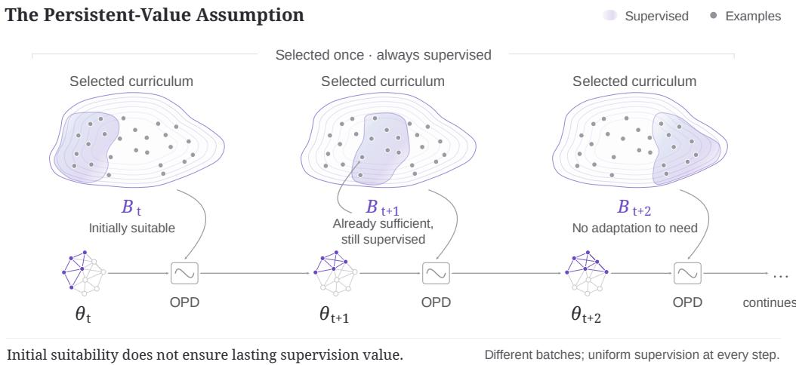  
Figure 1: The persistent-value assumption. All examples in each scheduled batch (shaded) receive OPD supervision as the student evolves, including those that already satisfy the task criterion.

Building on this coupled view, we introduce Student–Curriculum Coupling (SCC), a closed-loop OPD framework that jointly designs curriculum composition and supervision realization. SCC constructs a compact Anchor–Frontier (AF) curriculum around the initial student’s capability profile, preserving trustworthy supervision opportunities for capability acquisition and stabilization. These opportunities contribute to optimization only when the current student exhibits a task-level deficit, so that candidate-space composition and current student competence jointly determine active supervision. OPD updates in turn reshape the student’s supervision needs, which guide subsequent curriculum realization and close the feedback loop.

We evaluate SCC on Charades-TimeLens (Zhang et al., 2025), ActivityNet-TimeLens (Zhang et al., 2025), and QVHighlights-TimeLens (Zhang et al., 2025). Compared with Video-OPD on its Teacher-Validated Disagreement Focusing (TVDF) curriculum (Li et al., 2026a), SCC achieves a 5.1% relative improvement in mean recall across the three benchmarks and intersection-over-union (IoU) thresholds of 0.3, 0.5, and 0.7. These gains are obtained with 60.0% fewer training examples and 50.4% shorter training time.

Our contributions are threefold:

• We identify the implicit persistent-value assumption in TVG OPD and develop a coupled view that links supervision trustworthiness with the student’s evolving supervision necessity.

• We introduce SCC, a closed-loop OPD framework that couples a compact AF candidate space with student-dependent supervision realization.

• We demonstrate consistent gains in TVG accuracy and training efficiency over Video-OPD on TVDF. Ablations isolate the roles of candidate-space composition and student-dependent realization, while training-dynamics analysis tracks supervision as student competence evolves.

## 2 PROBLEM FORMULATION AND MOTIVATION

Our analysis focuses on OPD in VLM post-training for TVG. Section 2.1 identifies the persistentvalue assumption illustrated in Figure 1; Section 2.2 formalizes the non-stationary marginal value of supervision; and Section 2.3 distinguishes supervision trustworthiness from necessity.

## 2.1 THE ASSUMPTION OF PERSISTENT SUPERVISION VALUE

For a TVG example $x = ( v , q )$ , where v is an untrimmed video and q is a natural-language query, let $a ^ { \star } ( x )$ denote the ground-truth temporal interval and $a _ { M } ( \boldsymbol { x } )$ the interval predicted by model M under a fixed decoding protocol. A common curriculum-construction strategy evaluates each candidate using a fixed teacher and the initial student, and selects examples according to their TVG

performance:

$$
q _ { M } ( x ) = \mathrm { t I o U } ( a _ { M } ( x ) , a ^ { \star } ( x ) ) , \qquad { \mathcal { D } } _ { \mathrm { c a n d } } = \{ x \in { \mathcal { P } } : c ( q _ { T } ( x ) , q _ { S , 0 } ( x ) ) = 1 \} .\tag{1}
$$

Here, tIo $\boldsymbol { \mathrm { J } } ( \cdot , \cdot )$ denotes temporal intersection over union, which measures the overlap between two temporal intervals. Accordingly, $q _ { M } ( x ) \in [ 0 , 1 ]$ is the TVG score of model $M$ on example x. $q _ { T } ( x )$ and $q _ { S , 0 } ( x )$ denote the TVG scores of the fixed teacher and the student before optimization, respectively. $\mathcal { P }$ is the candidate data pool, $c : [ 0 , 1 ] ^ { 2 }  \{ 0 , 1 \}$ is the selection rule, and $\mathcal { D } _ { \mathrm { c a n d } } \subseteq \mathcal { P }$ is the resulting candidate curriculum.

This construction selects examples with a credible teacher signal and a targeted level of difficulty for the initial student. However, $q _ { S , 0 } ( x )$ reflects the initial student’s performance on $x ,$ not a fixed property of the example. Once x is included in $\mathcal { D } _ { \mathrm { c a n d } }$ , its curriculum membership remains unchanged even as optimization alters the student’s competence and the potential learning value of $x .$ Continuing to treat x as supervision-bearing whenever it is scheduled therefore introduces an implicit assumption of persistent supervision value.

## 2.2 THE NON-STATIONARY MARGINAL VALUE OF SUPERVISION

To formalize how supervision value changes with the student, let $\theta _ { t }$ denote the student parameters immediately before training step t, and let $J _ { \mathrm { T V G } } ( \theta )$ denote the expected TVG generalization performance of the student parameterized by θ. For an example x encountered at step $t ,$ let $\theta _ { t + 1 } ^ { + x }$ denote the student parameters after an update that includes the OPD loss associated with $x .$ Similarly, let $\theta _ { t + 1 } ^ { - x }$ denote the parameters after the corresponding update without the OPD loss associated with $x .$ All other examples and optimization conditions are held fixed. We define the marginal supervision value of x as:

$$
\Delta _ { t } ( x ) = \mathbb { E } \big [ J _ { \mathrm { T V G } } \big ( \theta _ { t + 1 } ^ { + x } \big ) - J _ { \mathrm { T V G } } \big ( \theta _ { t + 1 } ^ { - x } \big ) \ | \ \theta _ { t } , x \big ] .\tag{2}
$$

The expectation is taken over training stochasticity, with the same realization used for the updates with and without OPD supervision on x. This quantity characterizes the effect of supervising x and is not assumed to be directly observable during training.

Even when the video, query, annotation, and teacher remain fixed, $\Delta _ { t } ( x )$ can vary because the student-generated trajectory, the resulting OPD signal, and the model’s response to that signal all depend on $\theta _ { t }$ . Supervision may support capability acquisition before the student can localize the queried event, lose value once the student produces a satisfactory interval, and become useful again if later updates degrade that capability. The marginal supervision value is therefore non-stationary and reflects both the student’s training history and its current interaction with the example.

## 2.3 SUPERVISION TRUSTWORTHINESS AND NECESSITY

We characterize the state dependence of supervision value through supervision trustworthiness $\tau ( x )$ and supervision necessity $\bar { \mathcal { N } } _ { t } ( x )$ . The former indicates whether the teacher provides a credible target for example x, while the latter indicates whether the current student still exhibits a task-level deficit:

$$
\mathcal { T } ( x ) = \mathbf { 1 } \{ q _ { T } ( x ) \geq \tau _ { T } \} , \qquad \mathcal { N } _ { t } ( x ) = \mathbf { 1 } \{ q _ { S , t } ( x ) < \tau _ { S } \} .\tag{3}
$$

$\mathbf { 1 } \{ \cdot \}$ denotes the indicator function. $q _ { S , t } ( x )$ is the student’s TVG score on x at step $t ,$ and $\tau _ { T }$ and $\tau _ { S }$ are thresholds for supervision trustworthiness and student competence, respectively. $\tau ( x )$ captures the fixed teacher–example relationship, whereas $\mathcal { N } _ { t } ( x )$ captures the evolving student–example relationship. The necessity indicator is a task-level proxy and does not directly observe $\Delta _ { t } ( x )$

The two factors are distinct but coupled in supervision allocation. When both hold, a trustworthy target is available for an unresolved student outcome. Trustworthiness without necessity may render further supervision redundant (Figure 1), while necessity without trustworthiness provides no credible distillation target. Curriculum composition therefore determines the availability of trustworthy supervision, while current student competence determines its necessity during optimization.

## 3 STUDENT–CURRICULUM COUPLING

Building on the coupled view developed in Section 2, we introduce Student–Curriculum Coupling, a closed-loop OPD framework for TVG. Section 3.1 reviews the OPD objective, and Section 3.2 introduces the Anchor–Frontier candidate supervision space. Section 3.3 defines student-dependent realization, while Section 3.4 presents the coupled objective and efficient execution. Figure 2 illustrates the framework. Additional theoretical details are provided in Appendix A.

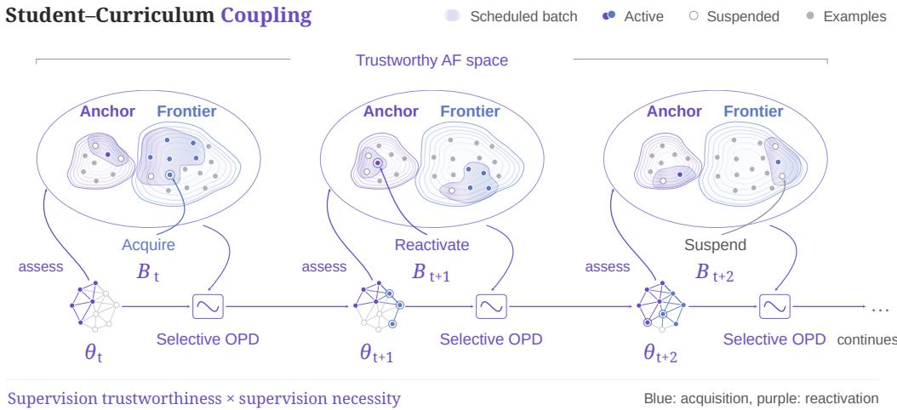  
Figure 2: Student–Curriculum Coupling. Shaded regions denote successive scheduled batches within the AF space. Current-student assessment determines active and suspended supervision, supporting capability acquisition and Anchor reactivation. Selective OPD updates the student, whose new state guides supervision in subsequent batches, closing the loop.

## 3.1 ON-POLICY DISTILLATION

On-policy distillation optimizes a student VLM $\pi _ { \theta }$ using token-level supervision from a teacher VLM $\pi _ { T }$ whose parameters remain fixed. The student generates trajectories from its current policy, and the teacher supplies target next-token distributions at the corresponding prefixes (Agarwal et al., 2024; Li et al., 2026a). Given a TVG input $\boldsymbol { x } = ( \boldsymbol { v } , \boldsymbol { q } )$ , the rollout policy $\pi _ { \theta _ { t } }$ at training step t generates an autoregressive trajectory of length $L _ { t } \mathbf { : }$

$$
y _ { t } = ( y _ { t , 1 } , \dots , y _ { t , L _ { t } } ) \sim \pi _ { \theta _ { t } } ( \cdot \mid x ) .
$$

At position $k ,$ let $h _ { t , k } = \left( x , y _ { t , < k } \right)$ denote the current prefix, and define the student and teacher next-token distributions as $p _ { \theta , k } ( \cdot ) = \pi _ { \theta } ( \cdot \mid h _ { t , k } )$ and $p _ { T , k } ( \cdot ) \ : = \ : \pi _ { T } ( \cdot \mid h _ { t , k } )$ , respectively. The frozen teacher scores the student-generated trajectory without a separate teacher rollout.

Using reverse Kullback–Leibler (KL) divergence for token-level alignment (Gu et al., 2024; Li et al., 2026c), we define the per-example objective under the fixed rollout distribution as:

$$
\mathcal { L } _ { \mathrm { O P D } , t } ( \theta ; x ) = \mathbb { E } _ { y _ { t } \sim \pi _ { \theta _ { t } } ( \cdot | x ) } \left[ \sum _ { k = 1 } ^ { L _ { t } } D _ { \mathrm { K L } } ( p _ { \theta , k } \| p _ { T , k } ) \right] .\tag{4}
$$

Here, $\theta _ { t }$ denotes the fixed rollout-policy parameters, while θ is the optimization variable initialized from $\theta _ { t }$ . The rollout distribution remains fixed during differentiation, and gradients propagate through the student next-token probabilities.

Following Video-OPD (Li et al., 2026a), we optimize an importance-weighted sampled-token surrogate $\ell _ { \mathrm { O P D } } ( x , y _ { t } ; \theta , \theta _ { t } , \pi _ { T } )$ , with teacher-derived signals held fixed during the update. At $\theta = \theta _ { t } .$ its gradient matches that of Equation 4 in expectation over student rollouts. Appendix A.2 provides the surrogate and derives this local gradient identity.

## 3.2 ANCHOR–FRONTIER CANDIDATE SPACE

To support capability acquisition and stabilization within a compact supervision space, we introduce the Anchor–Frontier (AF) design. It combines examples already supported by the initial student with examples that offer substantial learning headroom. Both groups contain only examples with trustworthy supervision, satisfying $\mathcal { T } ( x ) = \bar { 1 }$ as defined in Equation 3.

Anchors retain examples on which the initial student already performs well. They preserve access to corrective supervision if the student’s performance on these examples later declines. From the candidate pool ${ \mathcal { P } } _ { : }$ , we select $N _ { A }$ such examples:

$$
\mathcal A = \mathrm { S e l e c t } _ { N _ { A } } \left( \{ x \in \mathcal P : \mathcal T ( x ) = 1 , q _ { S , 0 } ( x ) \geq \tau _ { A } \} \right) .\tag{5a}
$$

Frontiers complement this coverage with examples on which the initial student has low competence, providing opportunities for capability acquisition. We select $N _ { F }$ such examples:

$$
{ \mathcal F } = \mathrm { S e l e c t } _ { N _ { F } } \left( \{ x \in { \mathcal P } : { \mathcal T } ( x ) = 1 , q _ { S , 0 } ( x ) < \tau _ { F } \} \right) .\tag{5b}
$$

Here, $N _ { A }$ and $N _ { F }$ are the selection budgets, while $\tau _ { A }$ and $\tau _ { F }$ define the high- and low-competence regions. The operator $\mathrm { S e l e c t } _ { N } ( \cdot )$ returns a subset of N examples. The thresholds satisfy $\tau _ { F } ~ <$ $\tau _ { A } .$ , leaving the intermediate competence range outside the candidate space. The candidate space, $\mathcal { D } _ { \mathrm { A F } } = \mathcal { A } \cup \mathcal { F }$ , remains fixed during training. Section 3.3 describes how its supervision is realized as the student evolves.

## 3.3 STUDENT-DEPENDENT REALIZATION

We organize the AF candidate space into a fixed training schedule $\boldsymbol { S } = ( \boldsymbol { B } _ { 0 } , \ldots , \boldsymbol { B } _ { K - 1 } )$ , where $B _ { t } \subseteq { \mathcal { D } } _ { \mathrm { A F } }$ contains the examples assigned to step t. Here, K counts scheduled training steps, including those that produce no optimizer update. Scheduled batch sizes may vary across steps. The schedule determines when each example is assessed, while the current student determines whether it receives OPD supervision.

At step t, the student generates one trajectory $y _ { t , i } \sim \pi _ { \theta _ { t } } ( \cdot \mid x _ { i } )$ for each $x _ { i } \in B _ { t }$ . We assess the current prediction using:

$$
q _ { S , t } ( x _ { i } ; y _ { t , i } ) = \mathrm { t I o U } \bigl ( a ( y _ { t , i } ) , a ^ { \star } ( x _ { i } ) \bigr ) ,\tag{6}
$$

where $a ( y _ { t , i } )$ is the temporal interval decoded from the trajectory. Applying the supervisionnecessity criterion from Section 2.3 yields the effective batch:

$$
\mathcal { B } _ { t } ^ { \mathrm { e f f } } = \left\{ ( x _ { i } , y _ { t , i } ) : x _ { i } \in \mathcal { B } _ { t } , \ q _ { S , t } ( x _ { i } ; y _ { t , i } ) < \tau _ { S } \right\} .\tag{7}
$$

Each retained trajectory is reused for teacher scoring and OPD optimization.

This rule supports capability acquisition, supervision suspension, and Anchor reactivation. A Frontier whose current score is below the criterion receives supervision for capability acquisition. For any candidate that meets the criterion, OPD supervision is suspended. For an Anchor with $q _ { S , 0 } ( x _ { i } ) \geq \tau _ { S }$ at curriculum construction, a current score $q _ { S , t } ( x _ { i } ; y _ { t , i } ) < \tau _ { S }$ reactivates its supervision to support capability stabilization. Reactivation is thus defined relative to the initial competence assessment.

## 3.4 CLOSED-LOOP OPD OPTIMIZATION

For each nonempty scheduled batch $B _ { t }$ , we aggregate the per-example OPD surrogate from Section 3.1 over the effective batch:

$$
\mathcal { L } _ { t } ^ { \mathrm { S C C } } ( \boldsymbol { \theta } ) = \frac { 1 } { n _ { t } } \sum _ { ( x _ { i } , y _ { t , i } ) \in { \cal B } _ { t } ^ { \mathrm { e f f } } } \ell _ { \mathrm { O P D } } ( x _ { i } , y _ { t , i } ; \boldsymbol { \theta } , \boldsymbol { \theta } _ { t } , \pi _ { T } ) .\tag{8}
$$

Here, θ is initialized from $\theta _ { t }$ for the current update. The normalization denominator $n _ { t }$ is preset for each step, independently of the number of assigned or retained examples. Appendix ${ \mathrm { A } } . 3$ derives the equivalent masked formulation and explains the effect of this normalization. The rollout policy and effective-batch membership remain fixed during optimization, with no gradients through sampling, temporal decoding, or competence assessment.

Under this objective, every scheduled example requires a student rollout for assessment, but teacher scoring, OPD loss evaluation, and backpropagation are restricted to $B _ { t } ^ { \mathrm { e f f } }$ . The compact $\mathrm { A F }$ space limits rollout workload, while student-dependent realization reduces the subsequent supervision cost. If $B _ { t } ^ { \mathrm { e f f } } = \varnothing$ , the optimizer and weight-decay updates are skipped, leaving the student parameters and optimizer state unchanged as the schedule advances.

Let G denote the sampling, assessment, and selection procedure in Section 3.3, so that $B _ { t } ^ { \mathrm { e f f } } ~ =$ $\mathcal { G } ( B _ { t } ; \theta _ { t } )$ . Let $\mathcal { U } _ { \mathrm { S C C } }$ denote the update induced by Equation 8, with optimizer state and learning rate settings left implicit. The update and subsequent realization satisfy:

$$
\begin{array} { r l } & { \theta _ { t + 1 } = \mathcal { U } _ { \mathrm { S C C } } \big ( \theta _ { t } , { \cal B } _ { t } , { \cal B } _ { t } ^ { \mathrm { e f f } } ; \pi _ { T } \big ) , } \\ & { { \cal B } _ { t + 1 } ^ { \mathrm { e f f } } = \mathcal { G } ( { \cal B } _ { t + 1 } ; \theta _ { t + 1 } ) . } \end{array}\tag{9}
$$

The second line applies whenever a subsequent scheduled batch exists.

Equation 9 closes the loop between student optimization and supervision realization, while the candidate space and schedule remain fixed.

Table 1: Evaluation on three TVG benchmarks. Published benchmark results are taken from Video-OPD (Li et al., 2026a). Bold values indicate the best performance among the non-proprietary methods shown in the table.
<table><tr><td rowspan="2">Models for Evaluation</td><td colspan="3">Charades-TimeLens</td><td colspan="3">ActivityNet-TimeLens</td><td colspan="3">QVHighlights-TimeLens</td></tr><tr><td>R@0.3</td><td>R@0.5</td><td>R@0.7</td><td>R@0.3</td><td>R@0.5</td><td>R@0.7</td><td>R@0.3</td><td>R@0.5</td><td>R@0.7</td></tr><tr><td colspan="10">Proprietary Models</td></tr><tr><td>GPT-4o (Hurst et al., 2024)</td><td>60.6</td><td>44.5</td><td>23.5</td><td>55.2</td><td>41.4</td><td>25.8</td><td>69.0</td><td>54.8</td><td>38.5</td></tr><tr><td>GPT-5 (Singh et al., 2025)</td><td>59.3</td><td>42.0</td><td>22.0</td><td>57.4</td><td>44.9</td><td>30.4</td><td>72.4</td><td>60.4</td><td>46.4</td></tr><tr><td>Gemini-2.0-Flash (Comanici et al., 2025)</td><td>66.4</td><td>53.5</td><td>27.1</td><td>62.9</td><td>54.0</td><td>37.7</td><td>76.2</td><td>66.4</td><td>48.3</td></tr><tr><td>Gemini-2.5-Flash (Comanici et al., 2025)</td><td>68.7</td><td>56.1</td><td>30.6</td><td>66.8</td><td>57.5</td><td>41.3</td><td>78.2</td><td>69.4</td><td>55.0</td></tr><tr><td>Gemini-2.5-Pro (Comanici et al., 2025)</td><td>74.1</td><td>61.1</td><td>34.0</td><td>72.3</td><td>64.2</td><td>47.1</td><td>84.1</td><td>75.9</td><td>61.1</td></tr><tr><td colspan="10">Open-Source Models</td></tr><tr><td>VideoChat-Flash-7B (Li et al., 2026b)</td><td>60.2</td><td>37.9</td><td>17.8</td><td>35.5</td><td>21.8</td><td>10.5</td><td>45.2</td><td>30.6</td><td>16.7</td></tr><tr><td>Qwen2.5-VL-7B (Bai et al., 2025b)</td><td>58.1</td><td>35.1</td><td>18.2</td><td>47.2</td><td>32.5</td><td>20.2</td><td>55.0</td><td>41.7</td><td>29.3</td></tr><tr><td>VideoChat-R1-7B (Li et al., 2025b)</td><td>51.9</td><td>30.8</td><td>11.7</td><td>35.0</td><td>23.9</td><td>11.3</td><td>29.3</td><td>19.1</td><td>9.4</td></tr><tr><td>Time-R1-7B (Wang et al., 2026)</td><td>57.9</td><td>32.0</td><td>16.9</td><td>44.8</td><td>31.0</td><td>19.0</td><td>65.8</td><td>51.5</td><td>36.1</td></tr><tr><td>TVG-R1-7B (Chen et al., 2025)</td><td>44.5</td><td>23.6</td><td>12.4</td><td>46.7</td><td>31.0</td><td>18.6</td><td>55.8</td><td>41.2</td><td>28.0</td></tr><tr><td>VideoChat-R1.5-7B (Yan et al., 2026)</td><td>46.4</td><td>24.0</td><td>10.4</td><td>40.6</td><td>25.3</td><td>16.4</td><td>62.2</td><td>44.5</td><td>28.3</td></tr><tr><td>MiMo-VL-7B (Xiaomi LLM-Core Team, 2025)</td><td>57.9</td><td>42.6</td><td>20.5</td><td>49.3</td><td>38.7</td><td>22.4</td><td>57.1</td><td>42.6</td><td>28.4</td></tr><tr><td>Qwen3-VL-8B-Instruct (Bai et al., 2025a)</td><td>61.7</td><td>41.5</td><td>23.1</td><td>41.2</td><td>30.7</td><td>20.0</td><td>46.6</td><td>38.2</td><td>29.5</td></tr><tr><td colspan="10">Post-Training Frameworks</td></tr><tr><td>OP-RKD [Qwen3-VL-8B] (Li et al., 2026a)</td><td>67.3</td><td>47.0</td><td>27.8</td><td>59.1</td><td>44.9</td><td>30.6</td><td>70.7</td><td>57.4</td><td>44.5</td></tr><tr><td>OP-FKD [Qwen3-VL-8B] (Li et al., 2026a)</td><td>66.9</td><td>47.3</td><td>27.6</td><td>58.6</td><td>44.2</td><td>30.5</td><td>71.2</td><td>58.9</td><td>46.5</td></tr><tr><td>GRPO [Qwen3-VL-8B] (Li et al., 2026a)</td><td>72.7</td><td>44.4</td><td>27.6</td><td>58.6</td><td>42.7</td><td>32.1</td><td>69.8</td><td>53.0</td><td>41.5</td></tr><tr><td>Video-OPD [Qwen3-VL-8B] (Li et al., 2026a)</td><td>73.1</td><td>45.8</td><td>32.4</td><td>60.5</td><td>45.6</td><td>35.8</td><td>73.8</td><td>60.3</td><td>50.4</td></tr><tr><td>SCC [Qwen3-VL-8B] (ours)</td><td>74.0</td><td>48.1</td><td>33.0</td><td>64.8</td><td>49.2</td><td>38.2</td><td>76.8</td><td>63.9</td><td>54.3</td></tr></table>

## 4 EXPERIMENTS

Section 4.1 describes the training setup, AF curriculum construction, and evaluation protocol. Section 4.2 reports the main accuracy and efficiency results, while Section 4.3 decomposes SCC by separately evaluating candidate-space composition and student-dependent realization. Additional results and implementation details are provided in Appendix B.

## 4.1 EXPERIMENTAL SETUP

Training Details. We use Qwen3-VL-8B-Instruct (Bai et al., 2025a) as the student. For direct comparison with Video-OPD (Li et al., 2026a), we use its released Qwen3-VL-32B teacher, trained with group relative policy optimization (GRPO). Following the same configuration, we set the maximum input video token length to 8,192, sample videos at 2 FPS, cap the number of frames at 768, and set the maximum video-frame token length to 768. We use a learning rate of $1 \times 1 0 ^ { - 6 }$ and a 79-step training schedule with variable scheduled global batch sizes capped at 32 (Appendix B.2). Each scheduled example uses a single on-policy rollout, and we follow Video-OPD for rollout sampling, video preprocessing, and the remaining optimization settings. We set $\tau _ { S } = 0 . 5$ for studentdependent realization throughout the main experiments; sensitivity to this criterion is examined in Appendix B.7.

AF curriculum construction. Following the AF design in Section 3.2, we construct the candidate supervision space from TimeLens-100K (Zhang et al., 2025), using public data from HiREST (Zala et al., 2023), QuerYD (Oncescu et al., 2021), CosMo-Cap (Wang et al., 2024a), InternVid-VTime (Wang et al., 2024b; Huang et al., 2024a), and DiDeMo (Hendricks et al., 2017). We first retain teacher-qualified examples with $q _ { T } ( x ) \geq 0 . 7$ , and then select 100 Anchor examples satisfying $q _ { S , 0 } ( x ) \geq 0 . 7$ and 900 Frontier examples satisfying $q _ { S , 0 } ( x ) < 0 . 3$ . The resulting 1,000- example curriculum is assigned to a 79-step training schedule. We exclude duplicate annotations and videos overlapping with the TVG evaluation sets. Source composition and training-schedule details are provided in Appendix B.2, with sensitivity to the Anchor–Frontier ratio examined in Appendix B.10.

Evaluation Benchmarks and Metrics. Our evaluation focuses on TVG performance and training efficiency. We evaluate on Charades-STA (Gao et al., 2017), ActivityNet (Caba Heilbron et al., 2015), and QVHighlights (Lei et al., 2021), using the corrected temporal annotations from Time-Lens (Zhang et al., 2025). Following prior work (Li et al., 2025a; Wang et al., 2025; 2024c), we report mean IoU (mIoU) and Recall at IoU thresholds of 0.3, 0.5, and 0.7. We assess training efficiency by curriculum size, the number of teacher-scored OPD routes, and training time.

## 4.2 MAIN RESULTS

Temporal Video Grounding. Table 1 compares SCC with representative proprietary models, open-source VLMs, and post-training frameworks across three TVG benchmarks. Our method achieves the best performance among the non-proprietary methods in Table 1 across all reported recall metrics and consistently outperforms Video-OPD. Comparison with TimeLens-8B reveals benchmark-dependent trade-offs under different training regimes (Appendix B.4).

Accuracy and Training Efficiency. Table 2 reports curriculum scale and supervision routing, while Figure 3 summarizes accuracy and training time. For comparison, we additionally apply Video-OPD to the same AF curriculum used by SCC. With the same 1,000 examples and 1,004 scheduled rollouts, SCC requires only 492 teacher-scored OPD routes, a 51.0% reduction from Video-OPD. With AF held fixed, replacing uniform OPD with student-dependent routing yields an approximately 2.1% relative improvement in mean recall and reduces training time by 15.3%. Compared with Video-OPD on TVDF, SCC uses 60.0% fewer curriculum examples and achieves higher endpoint mIoU in approximately half the training time.

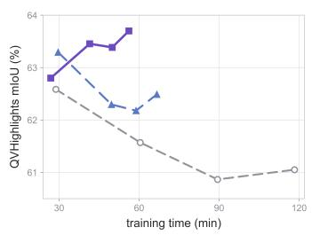

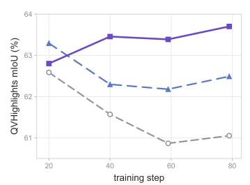

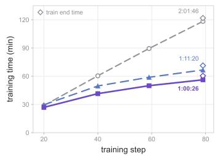  
Figure 3: Accuracy–efficiency comparison. QVHighlights mIoU versus training time (left), QVHighlights mIoU across training steps (middle), and cumulative training time (right). Diamonds mark training completion. All times are measured on eight NVIDIA A100 GPUs.

Table 2: Training data and supervision routing. All runs use 79 scheduled training steps. Presentations / Rollouts counts student rollouts; Teacher / OPD Routes counts rollouts receiving teacher scoring and OPD optimization; Suspended Routes counts rollouts not routed to teacher scoring or OPD after current-student assessment.
<table><tr><td>Method</td><td>Curriculum</td><td colspan="2">Data and Schedule</td><td colspan="3">Supervision Routing</td></tr><tr><td></td><td></td><td># Examples</td><td>Presentations / Rollouts</td><td>Teacher / OPD Routes</td><td>Suspended Routes</td><td>Route Rate</td></tr><tr><td>Video-OPD</td><td>TVDF</td><td>2,500</td><td>2,504</td><td>2,504</td><td>0</td><td>100.0%</td></tr><tr><td>Video-OPD</td><td>AF</td><td>1,000</td><td>1,004</td><td>1,004</td><td>0</td><td>100.0%</td></tr><tr><td>SCC</td><td>AF</td><td>1,000</td><td>1,004</td><td>492</td><td>512</td><td>49.0%</td></tr></table>

## 4.3 DECOMPOSING STUDENT–CURRICULUM COUPLING

SCC combines a capability-structured candidate space with student-dependent realization of its supervision. Table 3 decomposes their contributions by varying one component while holding the other fixed. All trained variants share the same student initialization and frozen teacher and are trained for 79 scheduled steps.

Candidate-Space Composition. Table 3 (a) compares candidate curricula under the same studentdependent realization. AF performs best across all metrics and benchmarks. Its advantage over the matched-size Random curriculum supports capability-structured selection, while the comparison with Frontier-only highlights the complementary role of Anchors. AF also outperforms the larger TVDF curriculum, indicating that student-dependent realization benefits from a well-structured candidate space. Sensitivity to the Anchor–Frontier ratio and candidate-space scale is examined in Appendices B.10 and B.11, respectively.

Student-Dependent Realization. Table 3 (b) fixes the AF candidate space and removes student dependence from curriculum realization, applying OPD supervision uniformly across scheduled examples. This change reduces every reported metric across all three benchmarks. The consistent decline shows that candidate-space composition alone is insufficient and that effective coupling requires supervision to respond to the student’s current competence. Further analyses on TVDF and static routing are provided in Appendices B.6 and B.12, respectively.

Table 3: Decomposition of Student–Curriculum Coupling. Base Model denotes Qwen3-VL-8B Instruct before post-training, with scores taken from Video-OPD (Li et al., 2026a). All other results are obtained using the same local evaluation pipeline. The upper block varies the candidate space with student-dependent realization fixed; the lower block fixes AF and compares student-dependent realization with uniform OPD supervision. TVDF uses the original 2,500-example curriculum from Video-OPD (Li et al., 2026a), while Random, Frontier-only, and AF each use 1,000 examples. ✓ denotes student-dependent realization, and × denotes uniform OPD supervision over all scheduled examples. ⋆ marks benchmarks re-annotated with TimeLens. Values are percentages rounded to one decimal place; bold marks the best result for each metric within each block.
<table><tr><td rowspan="2">Candidate Space</td><td rowspan="2">Student-Dep. Realization</td><td rowspan="2"></td><td colspan="3">Charades*</td><td colspan="3">ActivityNet*</td><td rowspan="2">R@0.7</td><td colspan="3">QVHighlights*</td><td rowspan="2">R@0.7</td></tr><tr><td>mIoU</td><td>R@0.3 R@0.5</td><td>R@0.7</td><td>mIoU</td><td>R@0.3</td><td>R@0.5</td><td>mIoU</td><td>R@0.3</td><td>R@0.5</td></tr><tr><td>Base Model</td><td>一</td><td>42.9</td><td>61.7</td><td>41.5</td><td>23.1</td><td>30.4</td><td>41.2</td><td>30.7</td><td>20.0</td><td>36.9</td><td>46.6</td><td>38.2</td><td>29.5</td></tr><tr><td colspan="2">(a) Candidate-Space Composition</td><td></td><td></td><td></td><td></td><td></td><td></td><td></td><td></td><td></td><td></td><td></td><td></td></tr><tr><td>TVDF</td><td>√</td><td>52.1</td><td>72.7</td><td>46.2</td><td>32.9</td><td>49.3</td><td>62.1</td><td>47.4</td><td>37.4</td><td>61.2</td><td>73.6</td><td>60.2</td><td>50.9</td></tr><tr><td>Random</td><td>√</td><td>51.6</td><td>73.0</td><td>45.9</td><td>31.7</td><td>48.8</td><td>62.3</td><td>46.4</td><td>36.4</td><td>60.9</td><td>73.8</td><td>59.8</td><td>50.0</td></tr><tr><td>Frontier-only</td><td>√</td><td>52.0</td><td>73.1</td><td>46.3</td><td>32.5</td><td>49.5</td><td>63.1</td><td>47.4</td><td>37.3</td><td>62.3</td><td>75.3</td><td>62.0</td><td>51.9</td></tr><tr><td>AF</td><td>√</td><td>52.8</td><td>74.0</td><td>48.1</td><td>33.0</td><td>50.6</td><td>64.8</td><td>49.2</td><td>38.2</td><td>63.7</td><td>76.8</td><td>63.9</td><td>54.3</td></tr><tr><td colspan="2">(b) Student-Dependent Realization</td><td></td><td></td><td></td><td></td><td></td><td></td><td></td><td></td><td></td><td></td><td></td><td></td></tr><tr><td>AF</td><td>×</td><td>52.3</td><td>73.3</td><td>47.1</td><td>32.8</td><td>49.6</td><td>63.4</td><td>47.8</td><td>37.2</td><td>62.5</td><td>75.3</td><td>62.6</td><td>52.1</td></tr><tr><td>AF</td><td>√</td><td>52.8</td><td>74.0</td><td>48.1</td><td>33.0</td><td>50.6</td><td>64.8</td><td>49.2</td><td>38.2</td><td>63.7</td><td>76.8</td><td>63.9</td><td>54.3</td></tr></table>

## 5 TRAINING DYNAMICS OF STUDENT–CURRICULUM COUPLING

Figure 4 traces the coupled evolution of student competence and the effective curriculum, highlighting the complementary roles of Anchors and Frontiers during training. Anchor competence remains high in the early stage, and most Anchor presentations are suspended, limiting additional optimization in already-supported capability regions. When an Anchor falls below the task criterion, its supervision is reactivated, allowing Anchors to support capability stabilization. Frontiers, meanwhile, account for most active OPD routes, and their competence rises with overall student progress. The AF curriculum therefore combines stabilization of existing capabilities with acquisition along the learning frontier.

As more Frontier examples reach the criterion, cumulative acquisition rises to 46.9% of the 900 unique Frontier examples. Over the same period, the update rate declines, suspension becomes more prevalent, and effective-batch OPD loss decreases through the main acquisition phase. Later in training, OPD supervision becomes increasingly sparse, with occasional empty effective batches and updates concentrated on the remaining deficits. This progression reflects the closed loop underlying SCC, in which the current student shapes the effective curriculum, the resulting OPD updates alter the student, and the updated state governs supervision in subsequent batches.

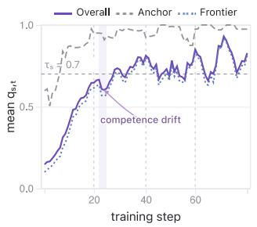

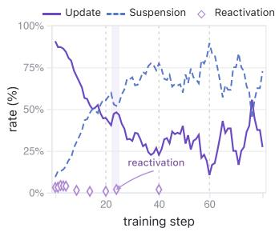

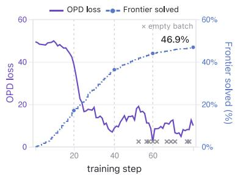  
Figure 4: Training dynamics of Student–Curriculum Coupling. Current student competence for Anchors, Frontiers, and the full AF curriculum (left); realized OPD updates, suspensions, and Anchor reactivations (middle); and effective-batch OPD loss with cumulative Frontier acquisition (right). The shaded interval marks a representative drop in Anchor competence and the resulting reactivation of supervision.

## 6 RELATED WORK

VLMs for Temporal Video Grounding. VLM-based TVG research has focused on both training strategies and temporal modeling. Training approaches range from boundary-aware instruction tuning and time-aware objectives (Huang et al., 2024a; Wang et al., 2024c) to reinforcementbased post-training for temporal localization and spatiotemporal perception (Wang et al., 2026; Li et al., 2025b; Chen et al., 2025). Complementary work makes temporal structure explicit through timestamp-aware visual encoding (Ren et al., 2024) and dedicated temporal representations (Huang et al., 2024b; Wang et al., 2025), with TRACE modeling events as sequences of timestamps, saliency scores, and captions (Guo et al., 2025). To handle longer videos, TimeSuite combines efficient token processing with grounded tuning (Zeng et al., 2025), while ReVisionLLM adopts recursive coarseto-fine localization (Hannan et al., 2025). Alongside these modeling advances, TimeLens examines annotation quality and training strategies, providing curated training data and re-annotated benchmarks for more reliable evaluation (Zhang et al., 2025).

On-Policy Distillation. OPD trains on student-generated sequences with teacher feedback at the same visited prefixes, reducing distribution mismatch between training and inference (Agarwal et al., 2024; Lu & Thinking Machines Lab, 2025). MiniLLM adopts reverse KL to avoid overestimating low-probability teacher outputs (Gu et al., 2024), while entropy-aware OPD supplements this objective with forward KL when teacher entropy is high to preserve generation diversity (Jin et al., 2026). Alongside objective design, OPD analyses examine how compatible reasoning patterns and teacher capabilities novel to the student affect knowledge transfer, linking successful distillation to progressive alignment on high-probability tokens (Li et al., 2026c). Video-OPD extends this paradigm to TVG, providing dense token-level supervision by scoring student-generated trajectories without sep arate teacher rollouts (Li et al., 2026a). Building on this formulation, our work identifies the implicit persistent-value assumption and develops a coupled view of OPD.

Curriculum Learning and Data Selection. Curriculum learning organizes training examples by difficulty or learning structure (Bengio et al., 2009), while classical self-paced learning adapts an easy-to-hard curriculum alongside model updates (Kumar et al., 2010). Online hard example mining and Selective-Backprop instead prioritize high-loss examples (Shrivastava et al., 2016; Jiang et al., 2019). For language models, DoReMi learns domain-mixture weights through proxy-model optimization (Xie et al., 2023), while RegMix predicts effective mixtures from smaller-scale ex periments (Liu et al., 2025). Skill-It adapts sampling to skill dependencies and current learning progress (Chen et al., 2023). In TVG, curriculum design encompasses temporal-task complexity and difficulty-aware data construction for reinforcement post-training (Wang et al., 2025; Chen et al., 2025; Wang et al., 2026). Video-OPD combines teacher validation with teacher–student disagreement for candidate selection (Li et al., 2026a). Compared with prior work on sample prioritization, SCC couples supervision trustworthiness with evolving student competence, jointly designing curriculum composition and supervision realization in OPD for VLM-based TVG.

## 7 CONCLUSION

This work shows how supervision aligned with evolving task competence can improve both accuracy and efficiency in VLM post-training. Distinguishing supervision trustworthiness from necessity leads to a coupled view of OPD, linking curriculum composition to the student’s changing learning needs. SCC realizes this view through a compact AF-defined space of trustworthy supervision opportunities, with current student competence guiding their selective activation. Across three TVG benchmarks, it achieves higher grounding accuracy than Video-OPD on TVDF with fewer training examples, fewer teacher-scored trajectories, and shorter training time. Together with ablations and training-dynamics analyses, these results highlight the value of jointly designing curriculum composition and supervision timing.

Despite these gains, SCC assesses supervision necessity using tIoU between a single sampled prediction and the ground-truth interval. This task-level proxy does not directly estimate the marginal effect of supervising an example on generalization, and routing decisions may be sensitive to sampling variability. Extending this annotation-dependent assessment to tasks without comparable ground truth also requires alternative signals. Beyond these assessment limitations, our evaluation focuses primarily on TVG post-training within one VLM family. Future work should develop more direct, less annotation-dependent estimates of supervision value and evaluate this coupled design across additional model families and tasks.

## AI USE STATEMENT

Generative AI tools assisted with manuscript refinement, discussions of derivations and proof arguments, feedback on methodology and experimental design, and interpretation of results. The authors remain responsible for all scientific claims, references, experimental results, and other content of the manuscript.

## ETHICS STATEMENT

This work studies temporal video grounding using existing video datasets and pretrained models described in Section 4.1. The method may inherit biases and limitations from these resources. Improved video localization can support retrieval and accessibility but may also facilitate privacyinvasive video analysis. Deployment should account for consent, privacy, dataset bias, and localization errors, particularly in applications involving people. Use or redistribution of the data and models remains subject to their original licenses and access conditions. The reported benchmark results do not establish suitability for safety-critical deployment.

## REPRODUCIBILITY STATEMENT

Sections 3 and 4.1 describe the method, model configurations, video preprocessing, training settings, and evaluation protocol. Appendix A provides supporting derivations, and Appendix B details the algorithm, curriculum construction, training schedule, and supplementary experiments.

## ACKNOWLEDGMENTS

We acknowledge the creators of TimeLens-100K and TimeLens-Bench (Zhang et al., 2025), which are released under the License Term of TimeLens. These resources are used solely for academic research, with no commercial or production use. We also thank the contributors to the underlying video datasets for making these resources available.

## REFERENCES

Rishabh Agarwal, Nino Vieillard, Yongchao Zhou, Piotr Stanczyk, Sabela Ramos Garea, Matthieu Geist, and Olivier Bachem. On-policy distillation of language models: Learning from selfgenerated mistakes. In International Conference on Learning Representations, volume 2024, pp. 21246–21263, 2024.

Shuai Bai, Yuxuan Cai, Ruizhe Chen, Keqin Chen, Xionghui Chen, Zesen Cheng, Lianghao Deng, Wei Ding, Chang Gao, Chunjiang Ge, et al. Qwen3-VL technical report. arXiv preprint arXiv:2511.21631, 2025a.

Shuai Bai, Keqin Chen, Xuejing Liu, Jialin Wang, Wenbin Ge, Sibo Song, Kai Dang, Peng Wang, Shijie Wang, Jun Tang, Humen Zhong, Yuanzhi Zhu, Mingkun Yang, Zhaohai Li, Jianqiang Wan, Pengfei Wang, Wei Ding, Zheren Fu, Yiheng Xu, Jiabo Ye, Xi Zhang, Tianbao Xie, Zesen Cheng, Hang Zhang, Zhibo Yang, Haiyang Xu, and Junyang Lin. Qwen2.5-VL technical report. arXiv preprint arXiv:2502.13923, 2025b.

Yoshua Bengio, Jer´ ome Louradour, Ronan Collobert, and Jason Weston. Curriculum learning. Inˆ Proceedings ofthe 26th Annual International Conference on Machine Learning, pp. 41–48, 2009. doi: 10.1145/1553374.1553380.

Fabian Caba Heilbron, Victor Escorcia, Bernard Ghanem, and Juan Carlos Niebles. ActivityNet: A large-scale video benchmark for human activity understanding. In Proceedings of the IEEE Conference on Computer Vision and Pattern Recognition, pp. 961–970, 2015.

Mayee F. Chen, Nicholas Roberts, Kush Bhatia, Jue Wang, Ce Zhang, Frederic Sala, and Christopher Re. Skill-It! A data-driven skills framework for understanding and training language models. In´ Advances in Neural Information Processing Systems, volume 36, 2023.

Ruizhe Chen, Tianze Luo, Zhiting Fan, Heqing Zou, Zhaopeng Feng, Guiyang Xie, Hansheng Zhang, Zhuochen Wang, Zuozhu Liu, and Huaijian Zhang. Datasets and recipes for video temporal grounding via reinforcement learning. In Proceedings of the 2025 Conference on Empirical Methods in Natural Language Processing: Industry Track, pp. 983–992. Association for Computational Linguistics, 2025. doi: 10.18653/v1/2025.emnlp-industry.66.

Gheorghe Comanici, Eric Bieber, Mike Schaekermann, Ice Pasupat, Noveen Sachdeva, Inderjit Dhillon, Marcel Blistein, Ori Ram, Dan Zhang, Evan Rosen, et al. Gemini 2.5: Pushing the frontier with advanced reasoning, multimodality, long context, and next generation agentic capabilities. arXiv preprint arXiv:2507.06261, 2025.

Chaoyou Fu, Yuhan Dai, Yongdong Luo, Lei Li, Shuhuai Ren, Renrui Zhang, Zihan Wang, Chenyu Zhou, Yunhang Shen, Mengdan Zhang, et al. Video-MME: The first-ever comprehensive evaluation benchmark of multi-modal LLMs in video analysis. In 2025 IEEE/CVF Conference on Computer Vision and Pattern Recognition (CVPR), pp. 24108–24118. IEEE, 2025.

Jiyang Gao, Chen Sun, Zhenheng Yang, and Ram Nevatia. TALL: Temporal activity localization via language query. In Proceedings of the IEEE International Conference on Computer Vision, pp. 5267–5275, 2017.

Yuxian Gu, Li Dong, Furu Wei, and Minlie Huang. MiniLLM: Knowledge distillation of large language models. In International Conference on Learning Representations, 2024.

Yongxin Guo, Jingyu Liu, Mingda Li, Qingbin Liu, Xi Chen, and Xiaoying Tang. TRACE: Temporal grounding video LLM via causal event modeling. In International Conference on Learning Representations, 2025.

Tanveer Hannan, Md Mohaiminul Islam, Jindong Gu, Thomas Seidl, and Gedas Bertasius. ReVisionLLM: Recursive vision-language model for temporal grounding in hour-long videos. In Proceedings of the IEEE/CVF Conference on Computer Vision and Pattern Recognition, pp. 19012– 19022, 2025. doi: 10.1109/CVPR52734.2025.01771.

Lisa Anne Hendricks, Oliver Wang, Eli Shechtman, Josef Sivic, Trevor Darrell, and Bryan Russell. Localizing moments in video with natural language. In Proceedings of the IEEE International Conference on Computer Vision, pp. 5803–5812, 2017.

Bin Huang, Xin Wang, Hong Chen, Zihan Song, and Wenwu Zhu. VTimeLLM: Empower LLM to grasp video moments. In Proceedings of the IEEE/CVF Conference on Computer Vision and Pattern Recognition, pp. 14271–14280, 2024a.

De-An Huang, Shijia Liao, Subhashree Radhakrishnan, Hongxu Yin, Pavlo Molchanov, Zhiding Yu, and Jan Kautz. LITA: Language instructed temporal-localization assistant. In Computer Vision – ECCV 2024, pp. 202–218. Springer, 2024b. doi: 10.1007/978-3-031-73039-9 12.

Aaron Hurst, Adam Lerer, Adam P. Goucher, Adam Perelman, Aditya Ramesh, Aidan Clark, AJ Ostrow, Akila Welihinda, Alan Hayes, Alec Radford, et al. GPT-4o system card. arXiv preprint arXiv:2410.21276, 2024.

Angela H. Jiang, Daniel L.-K. Wong, Giulio Zhou, David G. Andersen, Jeffrey Dean, Gregory R. Ganger, Gauri Joshi, Michael Kaminsky, Michael Kozuch, Zachary C. Lipton, et al. Accelerating deep learning by focusing on the biggest losers. arXiv preprint arXiv:1910.00762, 2019.

Woogyeol Jin, Taywon Min, Yongjin Yang, Swanand Ravindra Kadhe, Yi Zhou, Dennis Wei, Nathalie Baracaldo, and Kimin Lee. Entropy-aware on-policy distillation of language models. arXiv preprint arXiv:2603.07079, 2026.

M. Pawan Kumar, Benjamin Packer, and Daphne Koller. Self-paced learning for latent variable models. In Advances in Neural Information Processing Systems, volume 23, pp. 1189–1197, 2010.

Jie Lei, Tamara L. Berg, and Mohit Bansal. QVHighlights: Detecting moments and highlights in videos via natural language queries. arXiv preprint arXiv:2107.09609, 2021.

Jiaze Li, Yaya Shi, Zongyang Ma, Haoran Xu, Feng Cheng, Huihui Xiao, Ruiwen Kang, Fan Yang, Tingting Gao, and Di Zhang. iMOVE: Instance-motion-aware video understanding. In Findings ofthe Associationfor Computational Linguistics: ACL 2025, pp. 23959–23975, 2025a.

Jiaze Li, Hao Yin, Haoran Xu, Boshen Xu, Wenhui Tan, Zewen He, Jianzhong Ju, Zhenbo Luo, and Jian Luan. Video-OPD: Efficient post-training of multimodal large language models for temporal video grounding via on-policy distillation. arXiv preprint arXiv:2602.02994, 2026a.

Kunchang Li, Yali Wang, Yinan He, Yizhuo Li, Yi Wang, Yi Liu, Zun Wang, Jilan Xu, Guo Chen, Ping Luo, Limin Wang, and Yu Qiao. MVBench: A comprehensive multi-modal video understanding benchmark. In Proceedings ofthe IEEE/CVF Conference on Computer Vision and Pattern Recognition, pp. 22195–22206, 2024.

Xinhao Li, Ziang Yan, Desen Meng, Lu Dong, Xiangyu Zeng, Yinan He, Yali Wang, Yu Qiao, Yi Wang, and Limin Wang. VideoChat-R1: Enhancing spatio-temporal perception via reinforcement fine-tuning. arXiv preprint arXiv:2504.06958, 2025b.

Xinhao Li, Yi Wang, Jiashuo Yu, Xiangyu Zeng, Yuhan Zhu, Haian Huang, Jianfei Gao, Kunchang Li, Yinan He, Chenting Wang, et al. VideoChat-Flash: Hierarchical compression for long-context video modeling. In International Conference on Learning Representations, volume 2026, pp. 109089–109117, 2026b.

Yaxuan Li, Yuxin Zuo, Bingxiang He, Jinqian Zhang, Chaojun Xiao, Cheng Qian, Tianyu Yu, Huanang Gao, Wenkai Yang, Zhiyuan Liu, et al. Rethinking on-policy distillation of large language models: Phenomenology, mechanism, and recipe. arXiv preprint arXiv:2604.13016, 2026c.

Qian Liu, Xiaosen Zheng, Niklas Muennighoff, Guangtao Zeng, Longxu Dou, Tianyu Pang, Jing Jiang, and Min Lin. RegMix: Data mixture as regression for language model pre-training. In International Conference on Learning Representations, 2025.

Yuanxin Liu, Shicheng Li, Yi Liu, Yuxiang Wang, Shuhuai Ren, Lei Li, Sishuo Chen, Xu Sun, and Lu Hou. TempCompass: Do video LLMs really understand videos? In Findings of the Associationfor Computational Linguistics: ACL 2024, pp. 8731–8772, 2024.

Kevin Lu and Thinking Machines Lab. On-policy distillation. Thinking Machines Lab: Connectionism, October 2025. doi: 10.64434/tml.20251026. URL https://thinkingmachines. ai/blog/on-policy-distillation/.

Andreea-Maria Oncescu, Joao F. Henriques, Yang Liu, Andrew Zisserman, and Samuel Albanie.˜ QuerYD: A video dataset with high-quality text and audio narrations. In IEEE International Conference on Acoustics, Speech and Signal Processing, pp. 2265–2269, 2021.

Shuhuai Ren, Linli Yao, Shicheng Li, Xu Sun, and Lu Hou. TimeChat: A time-sensitive multimodal large language model for long video understanding. In Proceedings ofthe IEEE/CVF Conference on Computer Vision and Pattern Recognition, pp. 14313–14323, 2024. doi: 10.1109/CVPR52733. 2024.01357.

Abhinav Shrivastava, Abhinav Gupta, and Ross Girshick. Training region-based object detectors with online hard example mining. In Proceedings of the IEEE Conference on Computer Vision and Pattern Recognition, pp. 761–769, 2016.

Aaditya Singh, Adam Fry, Adam Perelman, Adam Tart, Adi Ganesh, Ahmed El-Kishky, Aidan McLaughlin, Aiden Low, AJ Ostrow, Akhila Ananthram, et al. OpenAI GPT-5 system card. arXiv preprint arXiv:2601.03267, 2025.

Alex Jinpeng Wang, Linjie Li, Kevin Qinghong Lin, Jianfeng Wang, Kevin Lin, Zhengyuan Yang, Lijuan Wang, and Mike Zheng Shou. COSMO: Contrastive streamlined multimodal model with interleaved pre-training. arXiv preprint arXiv:2401.00849, 2024a.

Haibo Wang, Zhiyang Xu, Yu Cheng, Shizhe Diao, Yufan Zhou, Yixin Cao, Qifan Wang, Weifeng Ge, and Lifu Huang. Grounded-VideoLLM: Sharpening fine-grained temporal grounding in video large language models. In Findings of the Association for Computational Linguistics: EMNLP 2025, pp. 959–975. Association for Computational Linguistics, 2025. doi: 10.18653/v1/2025. findings-emnlp.50.

Ye Wang, Ziheng Wang, Boshen Xu, Yang Du, Kejun Lin, Zihan Xiao, Zihao Yue, Jianzhong Ju, Liang Zhang, Dingyi Yang, et al. Time-R1: Post-training large vision language model for temporal video grounding. Advances in Neural Information Processing Systems, 38:83330–83364, 2026.

Yi Wang, Yinan He, Yizhuo Li, Kunchang Li, Jiashuo Yu, Xin Ma, Xinhao Li, Guo Chen, Xinyuan Chen, Yaohui Wang, et al. InternVid: A large-scale video-text dataset for multimodal understanding and generation. In International Conference on Learning Representations, volume 2024, pp. 42055–42079, 2024b.

Yueqian Wang, Xiaojun Meng, Jianxin Liang, Yuxuan Wang, Qun Liu, and Dongyan Zhao. Hawk-Eye: Training video-text LLMs for grounding text in videos. arXiv preprint arXiv:2403.10228, 2024c.

Xiaomi LLM-Core Team. MiMo-VL technical report. arXiv preprint arXiv:2506.03569, 2025.

Sang Michael Xie, Hieu Pham, Xuanyi Dong, Nan Du, Hanxiao Liu, Yifeng Lu, Percy Liang, Quoc V. Le, Tengyu Ma, and Adams Wei Yu. DoReMi: Optimizing data mixtures speeds up language model pretraining. In Advances in Neural Information Processing Systems, volume 36, pp. 69798–69818, 2023.

Ziang Yan, Yinan He, Xinhao Li, Zhengrong Yue, Xiangyu Zeng, Yali Wang, Yu Qiao, Limin Wang, and Yi Wang. VideoChat-R1.5: Visual test-time scaling to reinforce multimodal reasoning by iterative perception. Advances in Neural Information Processing Systems, 38:119152–119184, 2026.

Abhay Zala, Jaemin Cho, Satwik Kottur, Xilun Chen, Barlas Oguz, Yashar Mehdad, and Mo-˘ hit Bansal. Hierarchical video-moment retrieval and step-captioning. In Proceedings of the IEEE/CVF Conference on Computer Vision and Pattern Recognition, pp. 23056–23065, 2023.

Xiangyu Zeng, Kunchang Li, Chenting Wang, Xinhao Li, Tianxiang Jiang, Ziang Yan, Songze Li, Yansong Shi, Zhengrong Yue, Yi Wang, Yali Wang, Yu Qiao, and Limin Wang. TimeSuite: Improving MLLMs for long video understanding via grounded tuning. In International Conference on Learning Representations, 2025.

Jun Zhang, Teng Wang, Yuying Ge, Yixiao Ge, Xinhao Li, Ying Shan, and Limin Wang. TimeLens: Rethinking video temporal grounding with multimodal LLMs. arXiv preprint arXiv:2512.14698, 2025.

## APPENDIX

## A THEORETICAL ANALYSIS

This appendix develops the theoretical and optimization analysis underlying SCC. Section A.1 analyzes the state dependence of marginal supervision value and distinguishes task-criterion satisfaction from distributional alignment. Section A.2 derives the sampled-token OPD estimator, and Section A.3 formalizes student-dependent realization, objective normalization, and selective execution.

## A.1 SUPERVISION NECESSITY AND MARGINAL VALUE

Local marginal effects. Using the paired updates defining $\Delta _ { t } ( x )$ , let:

$$
d _ { t } ( x ) = \theta _ { t + 1 } ^ { + x } - \theta _ { t + 1 } ^ { - x } .\tag{10}
$$

The two updates share all other batch contributions, normalization, initial optimizer state, and training randomness. Thus, $d _ { t } ( x )$ captures the optimizer’s response to including the on-policy distillation (OPD) contribution of x. To expose the state dependence of supervision value, we relate this displacement to the local change in population temporal video grounding (TVG) performance.

Suppose $J _ { \mathrm { T V G } }$ has an $L _ { J ^ { - 1 } }$ Lipschitz gradient on a common convex neighborhood containing all paired updates, and the expectations below are finite. The following expansion is conditional on this regularity assumption, which need not hold for metrics based on discrete decoding. A first-order expansion gives:

$$
\begin{array} { r l } & { ~ \Delta _ { t } ( x ) = \mathbb { E } \big [ \big \langle \nabla J _ { \mathrm { T V G } } ( \theta _ { t + 1 } ^ { - x } ) , d _ { t } ( x ) \big \rangle \big | \theta _ { t } , x \big ] + R _ { t } ( x ) , } \\ & { ~ | R _ { t } ( x ) | \leq \displaystyle \frac { L _ { J } } { 2 } \mathbb { E } \big [ \| d _ { t } ( x ) \| _ { 2 } ^ { 2 } \big | \theta _ { t } , x \big ] . } \end{array}\tag{11}
$$

Here, $R _ { t } ( x )$ is the conditional expected first-order remainder. For each paired update, integrating the gradient along $\theta _ { t + 1 } ^ { - x } + s d _ { t } ( x )$ for $s \in [ 0 , 1 ]$ and applying Lipschitz continuity bounds the remainder by $L _ { J } \| d _ { t } ( x ) \| _ { 2 } ^ { 2 } / 2$ in absolute value. Taking conditional expectations yields the stated bound.

The leading term measures the alignment of the supervision-induced displacement with the local direction of increasing population performance. In OPD, this displacement reflects the student’s sampled prefixes, the corresponding distillation signals, and the optimizer state. Both the displacement and the performance gradient can vary as the student evolves, allowing supervision from a fixed teacher on a fixed example to have changing marginal effects.

Task-criterion satisfaction and distributional alignment. A realized prediction can satisfy the task-level criterion while distributional alignment remains incomplete. Consider a one-step model with two output symbols encoding a correct interval $y _ { c }$ and an incorrect interval $y _ { w }$ . Let the student and teacher distributions be $p _ { S } = \left( \alpha , 1 - \alpha \right)$ and $p _ { T } = ( \beta , 1 - \beta )$ , respectively, with $\alpha , \beta \in ( 1 / 2 , 1 )$ and $\alpha \neq \beta$ . For $\tau _ { S } \leq 1$ , a student rollout producing $y _ { c }$ has temporal intersection over union (tIoU) equal to one and satisfies the task-level competence criterion used for routing. Nevertheless,

$$
\begin{array} { c l } { \displaystyle { D _ { \mathrm { K L } } ( p _ { S } | | p _ { T } ) = \alpha \log \frac { \alpha } { \beta } + ( 1 - \alpha ) \log \frac { 1 - \alpha } { 1 - \beta } > 0 , } } \\ { \displaystyle { \frac { \partial } { \partial \alpha } D _ { \mathrm { K L } } ( p _ { S } | | p _ { T } ) = \log \frac { \alpha ( 1 - \beta ) } { \beta ( 1 - \alpha ) } \neq 0 . } } \end{array}\tag{12}
$$

Thus, satisfying the task criterion need not eliminate the distributional alignment signal. The criterion evaluates the realized task outcome, while the Kullback–Leibler (KL) divergence compares predictive distributions.

Implications for supervision allocation. These observations motivate separating the availability of trustworthy supervision from its realization during training. Initial suitability alone does not guarantee persistent marginal value, and a residual distillation discrepancy does not establish a deficit in the realized task outcome. In Student–Curriculum Coupling (SCC), the necessity indicator uses current task performance to guide supervision activation without directly estimating $\Delta _ { t } ( x )$ . Within this allocation principle, the Anchor–Frontier (AF) space retains trustworthy opportunities for capability acquisition and stabilization.

## A.2 SAMPLED-TOKEN OPD ESTIMATOR

Section 3.1 defines token-level reverse-KL alignment under a fixed rollout distribution. Here, we present the sampled-token surrogate used for optimization (Li et al., 2026a) and establish its local gradient identity with Equation 4. The derivation assumes bounded rollout lengths and smooth, positive token probabilities over a finite vocabulary.

Sampled-token supervision. At training step t, the rollout policy $\pi _ { \theta _ { t } }$ generates:

$$
y _ { t } = ( y _ { t , 1 } , \dots , y _ { t , L _ { t } } ) \sim \pi _ { \theta _ { t } } ( \cdot \mid x ) ,
$$

with prefix $h _ { t , k } = ( x , y _ { t , < k } )$ at position k. For a vocabulary token z, define:

$$
p _ { t , k } ( z ) = \pi _ { \theta _ { t } } ( z \mid h _ { t , k } ) , \qquad q _ { t , k } ( z ) = p _ { T , k } ( z ) = \pi _ { T } ( z \mid h _ { t , k } ) ,
$$

the rollout-policy and frozen-teacher probabilities at the same prefix. The sampled-token supervision signal is:

$$
r _ { t , k } = \log q _ { t , k } ( y _ { t , k } ) - \log p _ { t , k } ( y _ { t , k } ) .\tag{13}
$$

Since $y _ { t , k }$ is sampled from $_ { p _ { t , k } }$ conditional on $h _ { t , k }$

$$
\mathbb { E } _ { y _ { t , k } \sim p _ { t , k } } \left[ - r _ { t , k } \mid h _ { t , k } \right] = D _ { \mathrm { K L } } ( p _ { t , k } \parallel q _ { t , k } ) .\tag{14}
$$

$\mathrm { T h u s } , - r _ { t , k }$ is an unbiased single-token estimate of the reverse-KL value at that prefix (Li et al., 2026c).

Importance-weighted surrogate. During the update, $\theta _ { t }$ remains fixed, while θ denotes the opti mization variable initialized from $\theta _ { t }$ . The token-level likelihood ratio is:

$$
\rho _ { t , k } ( \theta ) = \frac { \pi _ { \theta } ( y _ { t , k } \mid h _ { t , k } ) } { \pi _ { \theta _ { t } } ( y _ { t , k } \mid h _ { t , k } ) } .\tag{15}
$$

Following Video-OPD (Li et al., 2026a), the per-example surrogate is:

$$
\ell _ { \mathrm { O P D } } ( x , y _ { t } ; \theta , \theta _ { t } , \pi _ { T } ) = - \sum _ { k = 1 } ^ { L _ { t } } \operatorname { s g } [ r _ { t , k } ] \rho _ { t , k } ( \theta ) ,\tag{16}
$$

where $\mathrm { s g } [ \cdot ]$ denotes stop-gradient. Holding the sampled trajectory, rollout probabilities, and supervision signals fixed gives:

$$
\nabla _ { \theta } \ell _ { \mathrm { O P D } } = - \sum _ { k = 1 } ^ { L _ { t } } \operatorname { s g } [ r _ { t , k } ] \rho _ { t , k } ( \theta ) \nabla _ { \theta } \log \pi _ { \theta } ( y _ { t , k } \mid h _ { t , k } ) .\tag{17}
$$

At the rollout point $\theta = \theta _ { t }$ , the likelihood ratio equals one, and its gradient satisfies:

$$
\nabla _ { \boldsymbol { \theta } } \rho _ { t , k } ( \boldsymbol { \theta } ) \vert _ { \boldsymbol { \theta = \theta } _ { t } } = \nabla _ { \boldsymbol { \theta } } \log \pi _ { \boldsymbol { \theta } } ( y _ { t , k } \mid h _ { t , k } ) \vert _ { \boldsymbol { \theta = \theta } _ { t } } .
$$

Relation to the fixed-rollout objective. For a fixed prefix $h _ { t , k }$ , write $p _ { \theta , k } ( z ) = \pi _ { \theta } ( z \mid h _ { t , k } )$ , so that $p _ { \theta _ { t } , k } = p _ { t , k }$ . Differentiating the token-level reverse KL yields:

$$
\begin{array} { l } { { \nabla _ { \theta } D _ { \mathrm { K L } } ( p _ { \theta , k } \parallel q _ { t , k } ) = \mathbb { E } _ { z \sim p _ { \theta , k } } \left[ \left( \log \frac { p _ { \theta , k } ( z ) } { q _ { t , k } ( z ) } + 1 \right) \nabla _ { \theta } \log p _ { \theta , k } ( z ) \right] } } \\ { { = \mathbb { E } _ { z \sim p _ { \theta , k } } \left[ \log \frac { p _ { \theta , k } ( z ) } { q _ { t , k } ( z ) } \nabla _ { \theta } \log p _ { \theta , k } ( z ) \right] . } } \end{array}\tag{18}
$$

The second equality follows from the score-function identity $\begin{array} { r } { \mathbb { E } _ { z \sim p _ { \theta , k } } [ \nabla _ { \theta } \log p _ { \theta , k } ( z ) ] = 0 . } \end{array}$ Combining Equations 13, 17, and 18 at $\theta = \theta _ { t }$ gives:

$$
\begin{array} { r l } & { \mathbb { E } _ { y _ { t , k } \sim p _ { t , k } } [ \nabla _ { \theta } ( - \mathrm { s g } \middle [ r _ { t , k } ] \rho _ { t , k } ( \theta ) ) | h _ { t , k } ] | _ { \theta = \theta _ { t } } } \\ & { \qquad = \nabla _ { \theta } D _ { \mathrm { K L } } ( p _ { \theta , k } \| q _ { t , k } ) \big | _ { \theta = \theta _ { t } } . } \end{array}\tag{19}
$$

Taking expectation over the fixed rollout policy and summing over generated positions establishes the connection to the objective in Section 3.1:

$$
\begin{array} { r l } & { \mathbb { E } _ { y _ { t } \sim \pi _ { \theta _ { t } } ( \cdot | x ) } \left[ \nabla _ { \theta } \ell _ { \mathrm { O P D } } ( x , y _ { t } ; \theta , \theta _ { t } , \pi _ { T } ) | _ { \theta = \theta _ { t } } \right] } \\ & { \quad \quad \quad = \nabla _ { \theta } \ell _ { \mathrm { O P D } , t } ( \theta ; x ) | _ { \theta = \theta _ { t } } . } \end{array}\tag{20}
$$

This identity establishes gradient matching at $\theta \ = \ \theta _ { t }$ with the rollout distribution fixed during differentiation. The full sequence-level reverse KL additionally differentiates prefix visitation probabilities, yielding long-horizon score-function terms (Gu et al., 2024). Section 3.4 aggregates the per-example surrogate above over the effective batch with fixed routing decisions.

## A.3 OBJECTIVE NORMALIZATION AND EFFICIENT EXECUTION

The gradient identity in Appendix A.2 applies to the base OPD surrogate before task-dependent routing. SCC optimizes the masked surrogate in Equation 8, with routing decisions held fixed during each update. Because retention depends on the sampled trajectory, it changes both the frequency of supervision and the trajectory gradients contributing to the expected update.

Anchor and Frontier membership is fixed by the initial student assessment. For presentation i at step t, the current trajectory $y _ { t , i }$ determines the supervision mask:

$$
m _ { t , i } = \mathbf { 1 } \{ q _ { S , t } ( x _ { i } ; y _ { t , i } ) < \tau _ { S } \} .\tag{21}
$$

The task score uses the ground-truth interval, and token-level signals are teacher-derived. Scores at or above $\tau _ { S }$ suspend supervision. Retained trajectories are reused for teacher scoring and OPD without additional sampling.

The same rule applies to both curriculum regions. Retained Frontiers receive acquisition-oriented supervision. An Anchor $x _ { i } \in { \mathcal { A } }$ is reactivated when $q _ { S , 0 } ( x _ { i } ) \geq \tau _ { S }$ and $m _ { t , i } = 1$ . Anchor selection uses $\tau _ { A } ;$ reactivation compares initial and current performance against $\tau _ { S }$ and can occur on the first scheduled presentation. Acquisition and reactivation both enter the effective batch and the supervised count. Routing statistics count supervised and suspended presentations, including repeated occurrences; curriculum size counts unique examples.

For a nonempty scheduled batch, let $n _ { t }$ denote the preset normalization denominator and $M _ { t } \ =$ $\textstyle \sum _ { i = 1 } ^ { | B _ { t } | } m _ { t , i }$ the number of supervised presentations. Let $\ell _ { t , i } ( \theta )$ abbreviate the per-example surrogate ℓOPD $( x _ { i } , y _ { t , i } ; \theta , \theta _ { t } , \pi _ { T } )$ defined in Equation 16. The coupled objective in Equation 8 has the equivalent masked form:

$$
\mathcal { L } _ { t } ^ { \mathrm { S C C } } ( \boldsymbol { \theta } ) = \frac { 1 } { n _ { t } } \sum _ { i = 1 } ^ { | \mathcal { B } _ { t } | } m _ { t , i } \ell _ { t , i } ( \boldsymbol { \theta } ) = \frac { 1 } { n _ { t } } \sum _ { i : m _ { t , i } = 1 } \ell _ { t , i } ( \boldsymbol { \theta } ) .\tag{22}
$$

With the sampled trajectories, teacher signals, and masks held fixed during the update, its gradient is:

$$
\nabla _ { \theta } \mathcal { L } _ { t } ^ { \mathrm { S C C } } ( \theta ) = \frac { 1 } { n _ { t } } \sum _ { i : m _ { t , i } = 1 } \nabla _ { \theta } \ell _ { t , i } ( \theta ) .\tag{23}
$$

Thus, evaluating only the retained terms is algebraically equivalent to masking the full scheduled batch, provided that the denominator remains $n _ { t }$ . Teacher scores and OPD losses for suspended trajectories need not be computed.

For $M _ { t } > 0$ , define the active-only mean as $\begin{array} { r } { \mathcal { L } _ { t } ^ { \mathrm { a c t i v e } } ( \theta ) = M _ { t } ^ { - 1 } \sum _ { i : m _ { t , i } = 1 } \ell _ { t , i } ( \theta ) } \end{array}$ . Then:

$$
\mathcal { L } _ { t } ^ { \mathrm { S C C } } ( \theta ) = \frac { M _ { t } } { n _ { t } } \mathcal { L } _ { t } ^ { \mathrm { a c t i v e } } ( \theta ) .\tag{24}
$$

Active-only normalization would increase each retained term’s weight by $n _ { t } / M _ { t }$ relative to the coupled objective. Normalization by $n _ { t }$ preserves the weight $1 / n _ { t }$ , so suspension removes supervision contributions without amplifying the remaining terms. The total retained weight is ${ M } _ { t } / { n } _ { t }$ . This scaling applies to the objective and its gradient, but does not imply proportional scaling of parameter updates under adaptive optimization.

When $M _ { t } = 0$ , the masked objective and its gradient are zero. The optimizer and weight-decay updates are explicitly skipped, preserving the student parameters and optimizer state while the training schedule advances. All scheduled presentations still require student generation and assessment; selective execution removes only the subsequent teacher scoring and OPD computation for suspended trajectories.

## B IMPLEMENTATION DETAILS AND ADDITIONAL EXPERIMENTS

Sections B.1 and B.2 describe the SCC algorithm, AF construction, and training schedule. The remaining subsections report supplementary accuracy–efficiency results and analyses of alternative objectives, student-dependent realization beyond AF, competence-criterion sensitivity, teacher choice, checkpoint-wise performance, the Anchor–Frontier ratio, and broader video understanding.

## B.1 ALGORITHM

Algorithm 1 summarizes SCC, from AF construction to student-dependent routing and selective OPD updates.

Algorithm 1 Student–Curriculum Coupling (SCC)   
Require: Candidate pool ${ \mathcal { P } } _ { : }$ , initial student $\pi _ { \theta _ { 0 } } .$ , frozen teacher $\pi _ { T }$ , curriculum parameters   
$\tau _ { T } , \tau _ { A } , \tau _ { F } , N _ { A } , N _ { F } .$ , competence criterion $\tau _ { S } .$ , and scheduled-step budget K   
Ensure: Trained student $\pi _ { \boldsymbol { \theta } _ { K } }$   
1: Evaluate $q _ { T } ( x )$ and $q _ { S , 0 } ( x )$ for each $x \in { \mathcal { P } }$   
2: Construct $\mathcal { A }$ and $\mathcal { F }$ using Equation $5 ;$ set $\mathcal { D } _ { \mathrm { A F } }  \mathcal { A } \cup \mathcal { F }$   
3: Construct and fix the schedule $\mathcal { S } = ( \boldsymbol { B } _ { 0 } , \ldots , \boldsymbol { B } _ { K - 1 } )$ over $\mathcal { D } _ { \mathrm { A F } }$ and the normalization denomi  
nators $\{ n _ { t } \} _ { t = 0 } ^ { K - 1 }$   
4: for $t = \mathrm { { 0 } } , \ldots , K - 1$ do   
5: Obtain the scheduled batch $B _ { t }$ from $s$   
6: Sample $y _ { t , i } \sim \pi _ { \theta _ { t } } ( { \cdot } \mid x _ { i } )$ for each $x _ { i } \in B _ { t }$   
7: Decode each trajectory and compute $q _ { S , t } ( x _ { i } ; y _ { t , i } )$ using Equation 6   
8: Form the effective batch   
$\mathcal { B } _ { t } ^ { \mathrm { e f f } }  \{ ( x _ { i } , y _ { t , i } ) : x _ { i } \in \mathcal { B } _ { t } , q _ { S , t } ( x _ { i } ; y _ { t , i } ) < \tau _ { S } \}$   
9: if $B _ { t } ^ { \mathrm { e f f } } \neq \emptyset$ then   
10: Score only the retained student trajectories with $\pi _ { T }$   
11: Form $\mathcal { L } _ { t } ^ { \mathrm { S C C } } ( \theta )$ using Equation 8, with denominator $n _ { t }$ and fixed trajectories and routing   
decisions   
12: $\theta _ { t + 1 } \gets \mathcal { U } _ { \mathrm { S C C } } ( \theta _ { t } , \mathcal { B } _ { t } , \mathcal { B } _ { t } ^ { \mathrm { e f f } } ; \pi _ { T } )$   
13: else   
14: Skip optimizer and weight-decay updates; retain the optimizer state   
15: $\bar { \theta } _ { t + 1 } \bar {  } \theta _ { t }$   
16: end if   
17: end for   
18: return $\pi _ { \theta _ { K } }$

## B.2 CURRICULUM CONSTRUCTION AND SCHEDULE DETAILS

Curriculum construction. We construct AF offline from TimeLens-100K (Zhang et al., 2025), using examples from HiREST (Zala et al., 2023), QuerYD (Oncescu et al., 2021), CosMo-Cap (Wang et al., 2024a), InternVid-VTime (Wang et al., 2024b; Huang et al., 2024a), and DiDeMo (Hendricks et al., 2017). Following the construction in Equation $5 ,$ we retain candidates with $q _ { T } ( x ) \geq 0 . 7$ and select 100 Anchors with $q _ { S , 0 } ( x ) \geq 0 . 7$ and 900 Frontiers with $q _ { S , 0 } ( x ) < 0 . 3 .$ Candidates in the intermediate competence range $0 . 3 \leq q _ { S , 0 } ( x ) < 0 . 7$ are excluded. We use 0.7 as a stringent task-level threshold for both teacher qualification and Anchor membership, so that qualified candidates have reliable teacher predictions and Anchors represent clearly supported initial capabilities. The Frontier threshold of 0.3 isolates examples with substantial learning headroom, while excluding the intermediate range creates a clear separation between stabilization and acquisition. Table 4 reports the resulting source composition.

Table 4: Source composition of AF. Unique counts refer to selected examples; presentations additionally include four Frontier repeats in the final scheduled step.
<table><tr><td>Source</td><td>Anchor</td><td>Frontier</td><td>Unique</td><td>Presentations</td></tr><tr><td>CosMo-Cap</td><td>49</td><td>437</td><td>486</td><td>489</td></tr><tr><td>InternVid-VTime</td><td>26</td><td>235</td><td>261</td><td>262</td></tr><tr><td>QuerYD</td><td>11</td><td>106</td><td>117</td><td>117</td></tr><tr><td>DiDeMo</td><td>10</td><td>89</td><td>99</td><td>99</td></tr><tr><td>HiREST</td><td>4</td><td>33</td><td>37</td><td>37</td></tr><tr><td>Total</td><td>100</td><td>900</td><td>1,000</td><td>1,004</td></tr></table>

Training schedule. Per-step AF allocations follow a piecewise-linear profile with target shares of 100%, 70%, 30%, 10%, and 5% at steps 1, 20, 40, 60, and 79, respectively. The interpolated allocations are normalized to 1,000 unique examples and deterministically rounded to integer counts, with a target Anchor–Frontier ratio of 1:9. Example ordering and assignment within these allocations are randomized before training and fixed throughout optimization. The final step includes four repeated

Frontier presentations, yielding 1,004 presentations. For loss normalization, SCC uses $n _ { t } = 3 2$ for steps 1–78 and $n _ { t } = 8$ for step 79, independently of the number of assigned or retained AF presentations. Student-dependent realization selects trajectories for OPD without changing their assigned steps; steps with an empty effective batch advance the schedule without an optimizer update. Table 5 summarizes presentation counts within each evaluation-checkpoint interval.

Table 5: Distribution of AF across the training schedule. Counts denote presentations grouped by evaluation-checkpoint intervals. † includes four Frontier repeats in the final step.
<table><tr><td>Training Steps Anchor Frontier</td><td></td><td></td><td>Total</td></tr><tr><td>1-20</td><td>53</td><td>481</td><td>534</td></tr><tr><td>21-40</td><td>31</td><td>276</td><td>307</td></tr><tr><td>41-59</td><td>12</td><td>104</td><td>116</td></tr><tr><td>60-79</td><td>4</td><td>43†</td><td>47</td></tr><tr><td>Total</td><td>100</td><td>904† 1,004</td><td></td></tr></table>

## B.3 DETAILED ACCURACY–EFFICIENCY ANALYSIS

Table 6 complements Figure 3 with training time and endpoint recall. We compare SCC with Video-OPD on its Teacher-Validated Disagreement Focusing (TVDF) curriculum (Li et al., 2026a) and on the same AF curriculum. Training time denotes wall-clock time on eight NVIDIA A100 GPUs, including initialization, optimization, and checkpoint saving. Mean recall at each threshold averages the corresponding metric across Charades-TimeLens (Zhang et al., 2025), ActivityNet-TimeLens (Zhang et al., 2025), and QVHighlights-TimeLens (Zhang et al., 2025).

SCC reduces training time by 50.4% relative to Video-OPD on TVDF and by 15.3% on the same AF curriculum, while improving mean recall at all three thresholds. The AF comparison shows that the efficiency gain persists when the candidate curriculum is held fixed.

AF construction uses teacher and initial-student predictions scored against ground-truth intervals. The resulting tIoU scores determine teacher qualification and the Anchor and Frontier candidate regions, from which examples are selected under the prescribed budgets. Once these scores are available, selection requires no further model inference, teacher scoring of student-generated prefixes, or token-level divergence estimation.

Table 6: Training time and endpoint recall. Video-OPD (TVDF) results are from Li et al. (2026a); other results are obtained locally. Training time on eight NVIDIA A100 GPUs is reported as hh:mm:ss. Recall (%) is averaged across three TimeLens benchmarks before rounding to two decimals. Bold marks the shortest time and highest recall at each threshold.
<table><tr><td>Method</td><td>Training Time</td><td>Mean R@0.3</td><td>Mean R@0.5</td><td>Mean R@0.7</td></tr><tr><td>Video-OPD (Li et al., 2026a) (TVDF)</td><td>2:01:46</td><td>69.13</td><td>50.57</td><td>39.53</td></tr><tr><td>Video-OPD (AF)</td><td>1:11:20</td><td>70.69</td><td>52.53</td><td>40.70</td></tr><tr><td>SCC (AF)</td><td>1:00:26</td><td>71.83</td><td>53.72</td><td>41.84</td></tr></table>

## B.4 COMPARISON WITH TIMELENS

Table 7 compares SCC with TimeLens-8B (Zhang et al., 2025) and single-round Video-OPD (Li et al., 2026a). TimeLens-8B undergoes TVG supervised fine-tuning followed by GRPO on 12,000 examples, while Video-OPD and SCC use OPD curricula of 2,500 and 1,000 examples, respectively. SCC outperforms single-round Video-OPD across all reported metrics. Compared with TimeLens-8B, SCC achieves higher scores on all ActivityNet-TimeLens metrics and higher mIoU, R@0.5, and R@0.7 on QVHighlights-TimeLens, including an R@0.7 of 54.3 versus 51.8. TimeLens-8B retains an advantage on Charades-TimeLens and QVHighlights-TimeLens R@0.3, indicating benchmarkdependent trade-offs across these training regimes.

Table 7: Comparison with TimeLens-8B. Baseline results are taken from Video-OPD (Li et al., 2026a); values are percentages; bold indicates the best result in each column.
<table><tr><td></td><td colspan="4">Charades-TimeLens</td><td colspan="4">ActivityNet-TimeLens</td><td colspan="4">QVHighlights-TimeLens</td></tr><tr><td>Method</td><td>mIoU</td><td>R@0.3</td><td>R@0.5</td><td>R@0.7</td><td>mIoU</td><td>R@0.3</td><td>R@0.5</td><td>R@0.7</td><td>mIoU</td><td>R@0.3</td><td></td><td>R@0.5 R@0.7</td></tr><tr><td>TimeLens-8B</td><td>53.3</td><td>74.6</td><td>49.5</td><td>33.4</td><td>49.3</td><td>63.8</td><td>48.0</td><td>36.4</td><td>63.0</td><td>77.8</td><td>63.4</td><td>51.8</td></tr><tr><td>Video-OPD (Round 1)</td><td>52.0</td><td>73.1</td><td>45.8</td><td>32.4</td><td>47.3</td><td>60.5</td><td>45.6</td><td>35.8</td><td>61.0</td><td>73.8</td><td>60.3</td><td>50.4</td></tr><tr><td>SCC</td><td>52.8</td><td>74.0</td><td>48.1</td><td>33.0</td><td>50.6</td><td>64.8</td><td>49.2</td><td>38.2</td><td>63.7</td><td>76.8</td><td>63.9</td><td>54.3</td></tr></table>

## B.5 ALTERNATIVE POST-TRAINING OBJECTIVES ON AF

Table 8 compares SCC with alternative post-training objectives (Li et al., 2026a) on the same AF curriculum. SCC achieves the strongest R@0.7 on all three benchmarks and the best result across all Charades-TimeLens metrics. GRPO performs best on R@0.3 and R@0.5 for QVHighlights-TimeLens and on R@0.5 for ActivityNet-TimeLens, indicating different trade-offs between coarse retrieval and precise temporal localization. This comparison focuses on endpoint quality under method-specific training schedules. OP-FKD, OP-RKD, and GRPO are trained for 32 steps. GRPO runs for one epoch with a global prompt batch size of 32, sampling eight rollouts per example at temperature 1.0.

Table 8: Alternative post-training objectives on AF. All methods use the AF curriculum and are trained and evaluated using our local pipeline. Off-policy forward- and reverse-KL distillation (OP-FKD and OP-RKD), together with GRPO, follow the objective definitions in Video-OPD (Li et al., 2026a). All values are percentages, and bold indicates the best result in each column.
<table><tr><td></td><td colspan="3">Charades-TimeLens</td><td colspan="3">ActivityNet-TimeLens</td><td colspan="3">QVHighlights-TimeLens</td></tr><tr><td>Method</td><td>R@0.3</td><td>R@0.5</td><td>R@0.7</td><td>R@0.3</td><td>R@0.5</td><td>R@0.7</td><td>R@0.3</td><td>R@0.5</td><td>R@0.7</td></tr><tr><td>OP-FKD (Li et al., 2026a)</td><td>72.20</td><td>47.43</td><td>31.28</td><td>62.22</td><td>46.71</td><td>35.76</td><td>75.47</td><td>62.36</td><td>50.49</td></tr><tr><td>OP-RKD (Li et al., 2026a)</td><td>69.61</td><td>47.01</td><td>29.91</td><td>61.47</td><td>46.67</td><td>35.73</td><td>74.95</td><td>62.04</td><td>51.14</td></tr><tr><td>GRPO (Li et al., 2026a)</td><td>67.98</td><td>47.81</td><td>27.27</td><td>63.76</td><td>49.78</td><td>36.31</td><td>77.16</td><td>65.61</td><td>51.53</td></tr><tr><td>SCC</td><td>73.95</td><td>48.14</td><td>33.01</td><td>64.78</td><td>49.18</td><td>38.24</td><td>76.77</td><td>63.85</td><td>54.25</td></tr></table>

## B.6 STUDENT-DEPENDENT REALIZATION ON TVDF

To assess student-dependent realization beyond the AF candidate space, we retain the original TVDF curriculum and enable only the current-student competence gate with $\tau _ { S } = 0 . 7 . \mathrm { O f } 2$ ,504 scheduled presentations, 955 receive teacher scoring and OPD updates, and 1,549 are suspended. Table 9 compares the variant at checkpoint 79 with the published Video-OPD results (Li et al., 2026a).

The variant achieves higher R@0.7 on all three benchmarks and improves all three recall metrics on ActivityNet-TimeLens. Small decreases occur at R@0.3 on Charades-TimeLens and at R@0.3 and R@0.5 on QVHighlights-TimeLens. These results support the applicability of student-dependent realization beyond AF, with the most consistent gains under the stricter localization criterion.

Table 9: Student-dependent realization on TVDF. Both methods use the TVDF curriculum. Video-OPD results are taken from Li et al. (2026a); the student-dependent variant is trained and evaluated locally at checkpoint 79. Values are recall percentages rounded to one decimal place; bold indicates the higher value in each column.
<table><tr><td></td><td colspan="3">Charades-TimeLens</td><td colspan="3">ActivityNet-TimeLens</td><td colspan="3">QVHighlights-TimeLens</td></tr><tr><td>Method</td><td>R@0.3</td><td>R@0.5</td><td>R@0.7</td><td>R@0.3</td><td>R@0.5</td><td>R@0.7</td><td>R@0.3</td><td>R@0.5</td><td>R@0.7</td></tr><tr><td>Video-OPD (Li et al., 2026a)</td><td>73.1</td><td>45.8</td><td>32.4</td><td>60.5</td><td>45.6</td><td>35.8</td><td>73.8</td><td>60.3</td><td>50.4</td></tr><tr><td>Video-OPD + Student-Dep. Realization</td><td>72.7</td><td>46.2</td><td>32.9</td><td>62.1</td><td>47.4</td><td>37.4</td><td>73.6</td><td>60.2</td><td>50.9</td></tr></table>

## B.7 SENSITIVITY TO THE STUDENT-COMPETENCE CRITERION

We vary the student-competence criterion over $\tau _ { S } \in \{ 0 . 5 , 0 . 6 , 0 . 7 , 0 . 8 , 0 . 9 \}$ while keeping the AF curriculum, student initialization, teacher, data order, and optimization protocol fixed. The main setting, $\tau _ { S } = 0 . 7$ , was fixed before benchmark evaluation and was not selected from this sweep. We set the main criterion to $\tau _ { S } = 0 . 7$ to apply the same stringent task-level standard when determining whether supervision remains necessary during training. All runs are evaluated at checkpoint 79, and a scheduled occurrence receives OPD supervision when $q _ { S , t } < \tau _ { S }$ . Table 10 reports the resulting supervision routing, while Table 11 reports complete TVG performance.

Table 10: Realized supervision routing under different student-competence criteria. All settings use the same 1,004 scheduled presentations. The shaded row denotes the main setting.
<table><tr><td>TS</td><td>OPD Routes</td><td>Suspended Routes</td><td>OPD Route Rate</td></tr><tr><td>0.5</td><td>397</td><td>607</td><td>39.54%</td></tr><tr><td>0.6</td><td>438</td><td>566</td><td>43.63%</td></tr><tr><td>0.7</td><td>492</td><td>512</td><td>49.00%</td></tr><tr><td>0.8</td><td>563</td><td>441</td><td>56.08%</td></tr><tr><td>0.9</td><td>646</td><td>358</td><td>64.34%</td></tr></table>

Table 11: TVG performance under different student-competence criteria. All benchmarks use the TimeLens annotations. All settings use $\mathrm { A F ; ~ \bar { ~ } F ^ { \bullet } } \longrightarrow \nonumber$ denotes uniform OPD supervision, while the remaining rows vary $\tau _ { S } .$ . Values are percentages. The shaded row denotes the setting used in the main experiments, and bold indicates the best result in each column.
<table><tr><td rowspan="2"> $\tau _ { S }$ </td><td colspan="4">Charades-TimeLens</td><td colspan="4">ActivityNet-TimeLens</td><td colspan="4">QVHighlights-TimeLens</td></tr><tr><td>mIoU</td><td>R@0.3</td><td>R@0.5</td><td>R@0.7</td><td>mIoU</td><td>R@0.3</td><td>R@0.5</td><td>R@0.7</td><td>mIoU</td><td>R@0.3</td><td>R@0.5</td><td>R@0.7</td></tr><tr><td></td><td>52.26</td><td>73.33</td><td>47.13</td><td>32.80</td><td>49.61</td><td>63.40</td><td>47.84</td><td>37.20</td><td>62.49</td><td>75.34</td><td>62.62</td><td>52.11</td></tr><tr><td>0.5</td><td>52.51</td><td>73.71</td><td>47.81</td><td>32.68</td><td>50.52</td><td>64.20</td><td>48.82</td><td>38.22</td><td>63.17</td><td>76.83</td><td>62.23</td><td>52.56</td></tr><tr><td>0.6</td><td>52.41</td><td>73.68</td><td>47.07</td><td>32.47</td><td>50.30</td><td>63.84</td><td>48.36</td><td>38.18</td><td>63.30</td><td>76.18</td><td>62.69</td><td>53.41</td></tr><tr><td>0.7</td><td>52.79</td><td>73.95</td><td>48.14</td><td>33.01</td><td>50.63</td><td>64.78</td><td>49.18</td><td>38.24</td><td>63.70</td><td>76.77</td><td>63.85</td><td>54.25</td></tr><tr><td>0.8</td><td>52.85</td><td>74.13</td><td>47.79</td><td>33.51</td><td>50.11</td><td>63.44</td><td>48.20</td><td>38.07</td><td>62.85</td><td>75.86</td><td>62.88</td><td>52.56</td></tr><tr><td>0.9</td><td>52.40</td><td>73.39</td><td>47.81</td><td>32.35</td><td>49.67</td><td>63.20</td><td>47.62</td><td>37.38</td><td>61.93</td><td>74.56</td><td>62.10</td><td>51.66</td></tr></table>

Increasing $\tau _ { S }$ monotonically increases the fraction of teacher-scored OPD routes, from 39.54% at $\tau _ { S } = 0 . 5$ to 64.34% at $\tau _ { S } = 0 . 9$ , whereas endpoint performance remains non-monotonic. The main setting, $\tau _ { S } = 0 . 7$ , achieves the best result on eight of the twelve reported metrics, including all four ActivityNet-TimeLens metrics and three of the four QVHighlights-TimeLens metrics. Charades-TimeLens slightly favors $\tau _ { S } = 0 . 8$ on mean intersection over union (mIoU), R@0.3, and R@0.7. Performance declines at $\tau _ { S } = 0 . 9$ despite its higher supervision coverage, indicating that routing more examples through OPD does not necessarily improve the final student.

## B.8 ROBUSTNESS TO TEACHER CHOICE

We assess robustness to teacher choice using Qwen3-VL-4B and Qwen3-VL-8B (Bai et al., 2025a) teachers trained with the same GRPO recipe on a separately constructed 2,500-example difficultyweighted curriculum. Construction follows the Time-R1 and TimeLens procedures (Wang et al., 2026; Zhang et al., 2025) adopted in Video-OPD (Li et al., 2026a), but the selected example set differs from that used to train its released 32B teacher. Each teacher supervises a Qwen3-VL-8B student on the original AF candidate set without teacher-specific re-filtering, with all other student-training settings held constant. We reuse the 32B-qualified AF set without assuming that every example re mains qualified under the 4B/8B teachers. Table 12 reports teacher and student performance across the three TVG benchmarks.

At the final scheduled step, students outperform their respective teachers in mIoU across all six teacher–benchmark pairings, supporting robustness to teacher choice. The 4B-supervised student leads on QVHighlights and ActivityNet, and the 8B-supervised student on Charades-STA, with no uniform benefit from greater teacher size. Differences in training procedures and, for the 4B teacher, model size preclude strictly matched before–after comparisons.

Table 12: Robustness to teacher choice. GRPO teachers and their Qwen3-VL-8B students are evaluated at final checkpoints using TimeLens annotations. Student runs share the same AF configuration and differ only in teacher choice. mIoU and recall are percentages; $\Delta$ mIoU denotes the student’s gain over its teacher in percentage points. Bold marks the higher value for each metric within each teacher–student pair.
<table><tr><td>Teacher</td><td>Model</td><td>Benchmark</td><td>mIoU</td><td>R@0.3</td><td>R@0.5</td><td>R@0.7</td><td>∆ mIoU</td></tr><tr><td>4B GRPO</td><td>Direct teacher</td><td>QVHighlights</td><td>61.61</td><td>76.51</td><td>61.65</td><td>50.49</td><td></td></tr><tr><td>4B GRPO</td><td>SCC student</td><td>QVHighlights</td><td>64.92</td><td>77.87</td><td>65.41</td><td>55.09</td><td>+3.31</td></tr><tr><td>4B GRPO</td><td>Direct teacher</td><td>Charades-STA</td><td>51.35</td><td>73.15</td><td>47.40</td><td>30.90</td><td></td></tr><tr><td>4B GRPO</td><td>SCC student</td><td>Charades-STA</td><td>52.39</td><td>72.58</td><td>47.90</td><td>33.66</td><td>+1.04</td></tr><tr><td>4B GRPO</td><td>Direct teacher</td><td>ActivityNet</td><td>49.83</td><td>64.82</td><td>48.49</td><td>37.02</td><td></td></tr><tr><td>4B GRPO</td><td>SCC student</td><td>ActivityNet</td><td>51.45</td><td>65.29</td><td>49.91</td><td>39.20</td><td>+1.62</td></tr><tr><td>8B GRPO</td><td>Direct teacher</td><td>QVHighlights</td><td>60.55</td><td>74.24</td><td>60.68</td><td>49.84</td><td></td></tr><tr><td>8B GRPO</td><td>SCC student</td><td>QVHighlights</td><td>62.98</td><td>75.86</td><td>63.01</td><td>53.54</td><td>+2.43</td></tr><tr><td>8B GRPO</td><td>Direct teacher</td><td>Charades-STA</td><td>52.20</td><td>73.65</td><td>48.32</td><td>31.64</td><td></td></tr><tr><td>8B GRPO</td><td>SCC student</td><td>Charades-STA</td><td>53.05</td><td>73.86</td><td>48.68</td><td>33.81</td><td>+0.85</td></tr><tr><td>8B GRPO</td><td>Direct teacher</td><td>ActivityNet</td><td>50.32</td><td>64.73</td><td>49.71</td><td>37.44</td><td></td></tr><tr><td>8B GRPO</td><td>SCC student</td><td>ActivityNet</td><td>51.11</td><td>65.11</td><td>49.73</td><td>38.84</td><td>+0.79</td></tr></table>

## B.9 CHECKPOINT-WISE TVG PERFORMANCE

Table 13 summarizes TVG performance across training checkpoints. The final checkpoint achieves the highest mIoU on Charades-TimeLens and QVHighlights-TimeLens, along with the highest

R@0.7 on QVHighlights-TimeLens. ActivityNet-TimeLens reaches its best scores at checkpoints 40 and 59, with modest declines at the final checkpoint.

Table 13: Checkpoint-wise TVG performance of SCC. All checkpoints are taken from the main training run. All values are percentages, and bold indicates the best checkpoint for each metric within each benchmark.
<table><tr><td></td><td colspan="4">Charades-TimeLens</td><td colspan="4">ActivityNet-TimeLens</td><td colspan="4">QVHighlights-TimeLens</td></tr><tr><td>Checkpoint</td><td>mIoU</td><td>R@0.3</td><td>R@0.5</td><td>R@0.7</td><td>mIoU</td><td>R@0.3</td><td>R@0.5</td><td>R@0.7</td><td>mIoU</td><td>R@0.3</td><td>R@0.5</td><td>R@0.7</td></tr><tr><td>20</td><td>48.24</td><td>68.66</td><td>45.97</td><td>28.84</td><td>49.39</td><td>63.93</td><td>49.07</td><td>37.31</td><td>62.80</td><td>77.35</td><td>64.50</td><td>51.59</td></tr><tr><td>40</td><td>52.75</td><td>74.04</td><td>47.78</td><td>32.92</td><td>50.93</td><td>64.67</td><td>49.47</td><td>38.64</td><td>63.46</td><td>76.77</td><td>63.27</td><td>53.28</td></tr><tr><td>59</td><td>52.73</td><td>73.60</td><td>47.81</td><td>33.24</td><td>50.86</td><td>65.16</td><td>49.31</td><td>38.64</td><td>63.39</td><td>76.31</td><td>63.40</td><td>53.28</td></tr><tr><td>79</td><td>52.79</td><td>73.95</td><td>48.14</td><td>33.01</td><td>50.63</td><td>64.78</td><td>49.18</td><td>38.24</td><td>63.70</td><td>76.77</td><td>63.85</td><td>54.25</td></tr></table>

## B.10 SENSITIVITY TO THE ANCHOR–FRONTIER RATIO

We examine how the Anchor/Frontier ratio affects realized supervision and endpoint performance within a fixed 1,000-example candidate space. The main 1:9 configuration is compared with 3:7 and 1:1 alternatives. The main 1:9 ratio was fixed before benchmark evaluation and was not selected from this comparison. Each configuration follows the same student-dependent realization rule and is evaluated at checkpoint 79. Table 14 reports the supervision routing and TVG performance.

The region-specific routing pattern remains stable across the tested ratios. Only 11.0–13.6% of Anchor presentations receive OPD supervision, compared with 53.2–53.9% of Frontier presentations. As the Anchor share increases, the overall OPD route rate decreases from 49.0% to 41.8% and 33.8%. The candidate-space ratio therefore directly shapes the realized supervision workload under the same routing rule.

The main 1:9 ratio achieves the best result on 11 of the 12 TVG metrics. Both alternative ratios use fewer teacher-scored OPD routes than the main configuration and yield lower endpoint performance overall. Together, these results show that the Anchor–Frontier ratio controls an accuracy–workload trade-off, with the Frontier-heavy main configuration providing the strongest endpoint performance among the tested ratios.

Table 14: Sensitivity to the Anchor–Frontier ratio. Each candidate space contains 1,000 unique examples. Ratios denote the numbers of unique Anchor and Frontier examples. Panel (a) reports routing over 1,004 scheduled presentations, including repeated occurrences in the training schedule. Panel (b) reports TVG performance at checkpoint 79. Values are percentages. The shaded rows denote the main 1:9 configuration, and bold values in panel (b) indicate the best result in each column.  
(a) Realized supervision routing.
<table><tr><td></td><td colspan="3">Anchor</td><td colspan="3">Frontier</td><td colspan="3">Overall</td></tr><tr><td>A/F ratio</td><td>OPD Routes</td><td>Suspended</td><td>Rate</td><td>OPD Routes</td><td>Suspended</td><td>Rate</td><td>OPD Routes</td><td>Suspended</td><td>Rate</td></tr><tr><td>1:9</td><td>11</td><td>89</td><td>11.00%</td><td>481</td><td>423</td><td>53.21%</td><td>492</td><td>512</td><td>49.00%</td></tr><tr><td>3:7</td><td>41</td><td>260</td><td>13.62%</td><td>379</td><td>324</td><td>53.91%</td><td>420</td><td>584</td><td>41.83%</td></tr><tr><td>1:1</td><td>68</td><td>433</td><td>13.57%</td><td>271</td><td>232</td><td>53.88%</td><td>339</td><td>665</td><td>33.76%</td></tr></table>

(b) Endpoint TVG performance.
<table><tr><td rowspan="2">A/F ratio</td><td colspan="4">Charades-TimeLens</td><td colspan="4">ActivityNet-TimeLens</td><td colspan="4">QVHighlights-TimeLens</td></tr><tr><td>mIoU</td><td>R@0.3</td><td>R@0.5</td><td>R@0.7</td><td>mIoU</td><td>R@0.3</td><td>R@0.5</td><td>R@0.7</td><td>mIoU</td><td>R@0.3</td><td>R@0.5</td><td>R@0.7</td></tr><tr><td>1:9</td><td>52.79</td><td>73.95</td><td>48.14</td><td>33.01</td><td>50.63</td><td>64.78</td><td>49.18</td><td>38.24</td><td>63.70</td><td>76.77</td><td>63.85</td><td>54.25</td></tr><tr><td>3:7</td><td>52.35</td><td>73.63</td><td>47.04</td><td>32.77</td><td>49.95</td><td>63.49</td><td>47.98</td><td>38.04</td><td>62.32</td><td>74.69</td><td>62.04</td><td>52.50</td></tr><tr><td>1:1</td><td>52.43</td><td>73.36</td><td>47.10</td><td>32.80</td><td>50.39</td><td>64.11</td><td>48.29</td><td>38.36</td><td>62.86</td><td>75.86</td><td>62.43</td><td>52.95</td></tr></table>

## B.11 SENSITIVITY TO CANDIDATE-SPACE SCALE

We examine sensitivity to candidate-space scale by comparing the main 1,000-example AF curriculum with 1,500-, 2,000-, and 2,500-example variants, all maintaining an Anchor–Frontier ratio of 1:9. All runs use 79 scheduled steps with global batch sizes capped at 32. Larger curricula preserve the original 1,000 examples at their scheduled positions and add teacher-qualified examples through a deterministic, source-matched allocation balanced across vacant positions. All unique examples are presented, with four final-step repeats yielding 1,004, 1,504, 2,004, and 2,504 presentations, respectively. Table 15 reports TVG performance at checkpoint 79.

Expanding the candidate space does not consistently improve endpoint performance. The main 1,000-example configuration achieves the best result on nine of the twelve metrics, including all four on QVHighlights-TimeLens. The 1,500-example variant yields small gains in Charades-TimeLens R@0.3 and ActivityNet-TimeLens mIoU and R@0.7. These results show that a compact AF curriculum can define an effective supervision space for OPD.

Table 15: Sensitivity to candidate-space scale. Candidate-space size counts unique examples. All configurations use an Anchor–Frontier ratio of 1:9 and are evaluated at checkpoint 79. Values are percentages rounded to two decimal places. The shaded row denotes the main configuration, and bold indicates the best result in each column.
<table><tr><td></td><td colspan="4">Charades-TimeLens</td><td colspan="4">ActivityNet-TimeLens</td><td colspan="4">QVHighlights-TimeLens</td></tr><tr><td>Candidate-Space</td><td>mIoU</td><td>R@0.3</td><td>R@0.5</td><td>R@0.7</td><td>mIoU</td><td>R@0.3</td><td>R@0.5</td><td>R@0.7</td><td>mIoU</td><td>R@0.3</td><td>R@0.5</td><td>R@0.7</td></tr><tr><td>1,000</td><td>52.79</td><td>73.95</td><td>48.14</td><td>33.01</td><td>50.63</td><td>64.78</td><td>49.18</td><td>38.24</td><td>63.70</td><td>76.77</td><td>63.85</td><td>54.25</td></tr><tr><td>1,500</td><td>52.69</td><td>74.19</td><td>47.58</td><td>32.65</td><td>50.81</td><td>64.40</td><td>49.07</td><td>38.56</td><td>62.40</td><td>75.41</td><td>61.71</td><td>51.79</td></tr><tr><td>2,000</td><td>52.63</td><td>74.07</td><td>47.61</td><td>32.83</td><td>50.07</td><td>63.82</td><td>48.13</td><td>37.91</td><td>62.70</td><td>75.67</td><td>62.43</td><td>53.08</td></tr><tr><td>2,500</td><td>52.00</td><td>73.51</td><td>47.04</td><td>31.91</td><td>50.38</td><td>64.11</td><td>48.82</td><td>38.31</td><td>62.76</td><td>76.38</td><td>62.82</td><td>52.43</td></tr></table>

## B.12 ADDITIONAL CONTROLS ON STUDENT-DEPENDENT REALIZATION

To better understand SCC’s gains, we evaluate a budget-matched static routing baseline and a variant using effective-batch normalization. Table 16 reports results at checkpoint 79.

Budget-matched static routing. We fix a routing mask before training to assign teacher scoring and OPD to 492 of the 1,004 scheduled presentations, matching SCC’s realized supervision budget. Constrained random sampling selects 49 distinct Anchors and 443 distinct Frontiers, preserving the 1:9 Anchor–Frontier ratio and within-region source proportions up to integer rounding. Selected examples retain their original positions, with per-step supervision counts matched using only aggregate counts from the reference SCC run. The mask remains fixed throughout the control run, and loss normalization uses the same per-step denominators as SCC. SCC achieves higher mIoU on all three benchmarks and outperforms this control on 11 of the 12 metrics.

Effective-batch normalization. This experiment retains student-dependent routing and averages the OPD loss over retained presentations using the active-only normalization defined in Appendix A.3. The main SCC configuration performs better on most metrics.

Table 16: Controls on student-dependent realization. All runs use AF and are evaluated at checkpoint 79. Static routing fixes 492 supervised presentations before training. SCC (effectivebatch) averages loss over supervised presentations per batch. Values are percentages; bold marks column maxima and shading denotes SCC.
<table><tr><td></td><td colspan="4">Charades-TimeLens</td><td colspan="4">ActivityNet-TimeLens</td><td colspan="4">QVHighlights-TimeLens</td></tr><tr><td>Configuration</td><td>mIoU</td><td>R@0.3</td><td>R@0.5</td><td>R@0.7</td><td>mIoU</td><td>R@0.3</td><td>R@0.5</td><td>R@0.7</td><td>mIoU</td><td>R@0.3</td><td>R@0.5</td><td>R@0.7</td></tr><tr><td>Video-OPD on AF</td><td>52.26</td><td>73.33</td><td>47.13</td><td>32.80</td><td>49.61</td><td>63.40</td><td>47.84</td><td>37.20</td><td>62.49</td><td>75.34</td><td>62.62</td><td>52.11</td></tr><tr><td>Static routing</td><td>52.21</td><td>72.79</td><td>47.19</td><td>33.04</td><td>49.65</td><td>63.36</td><td>47.29</td><td>37.44</td><td>62.12</td><td>74.95</td><td>61.39</td><td>51.53</td></tr><tr><td>SCC (effective-batch)</td><td>52.82</td><td>74.31</td><td>48.02</td><td>32.74</td><td>50.55</td><td>64.53</td><td>48.78</td><td>38.13</td><td>62.88</td><td>75.54</td><td>62.75</td><td>53.54</td></tr><tr><td>SCC</td><td>52.79</td><td>73.95</td><td>48.14</td><td>33.01</td><td>50.63</td><td>64.78</td><td>49.18</td><td>38.24</td><td>63.70</td><td>76.77</td><td>63.85</td><td>54.25</td></tr></table>

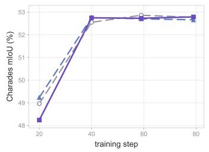

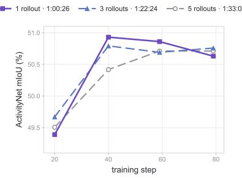

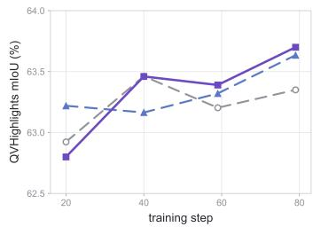  
Figure 5: Sensitivity to rollout count. Benchmark mIoU during training with one, three, or five student rollouts per scheduled example. Total training times are 1:00:26, 1:22:24, and 1:33:03, respectively (hours:minutes:seconds).

## B.13 SENSITIVITY TO ROLLOUT COUNT

We compare the default single-rollout assessment with three- and five-rollout variants using mean tIoU against the ground-truth interval. When this score falls below $\tau _ { S } = 0 . 7 ,$ only the first sampled trajectory receives teacher scoring and contributes to the OPD loss. Figure 5 reports benchmark mIoU across training checkpoints.

Additional rollouts provide modest gains at some checkpoints, including slightly higher endpoint mIoU on ActivityNet-TimeLens, but yield no consistent advantage across benchmarks. Training time increases with the rollout count. These results support single-rollout assessment as a practical choice, maintaining comparable overall TVG performance with shorter training time under the evaluated settings.

## B.14 GENERAL VIDEO UNDERSTANDING

We further evaluate broader video understanding on TempCompass (Liu et al., 2024), MVBench (Li et al., 2024), and Video-MME (Fu et al., 2025), using accuracy as the evaluation metric. All posttraining runs and evaluations use our local pipeline. The baselines follow the objective definitions in Video-OPD (Li et al., 2026a) and are trained on the same AF curriculum.

As shown in Table 17, SCC achieves the highest accuracy on all three benchmarks. Although the gains are modest, their consistency indicates that the improvements in temporal grounding do not compromise broader video-understanding capabilities.

Table 17: Evaluation on broader video-understanding benchmarks. Values are accuracy percentages, and bold indicates the best result in each column.
<table><tr><td>Method</td><td>TempCompass</td><td>MVBench</td><td>Video-MME</td></tr><tr><td>Qwen3-VL-8B-Instruct (Bai et al., 2025a)</td><td>73.16</td><td>68.17</td><td>67.96</td></tr><tr><td>OP-RKD (Li et al., 2026a)</td><td>73.16</td><td>68.73</td><td>67.52</td></tr><tr><td>OP-FKD (Li et al., 2026a)</td><td>73.29</td><td>68.15</td><td>67.33</td></tr><tr><td>GRPO (Li et al., 2026a)</td><td>73.04</td><td>68.95</td><td>67.63</td></tr><tr><td>SCC</td><td>73.35</td><td>69.08</td><td>68.56</td></tr></table>